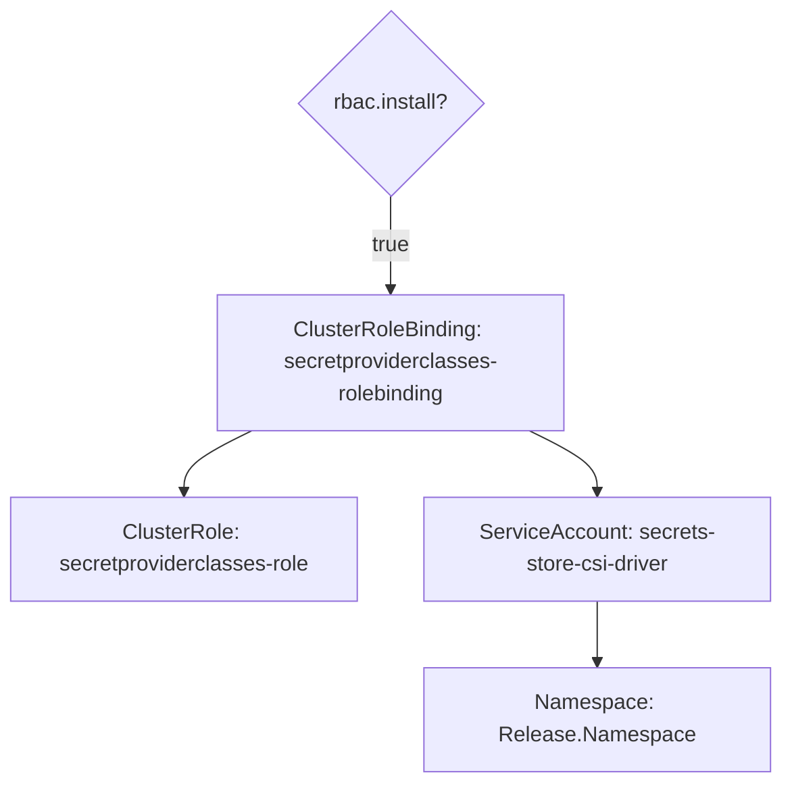
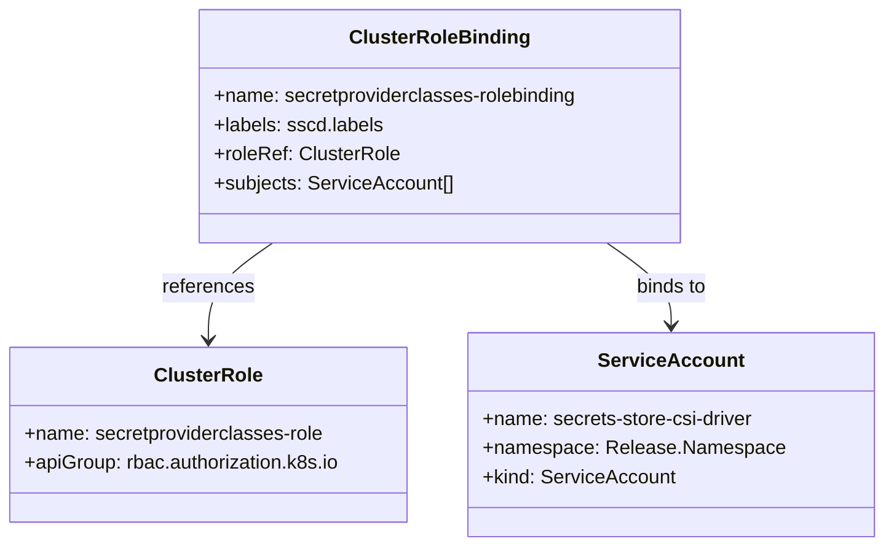
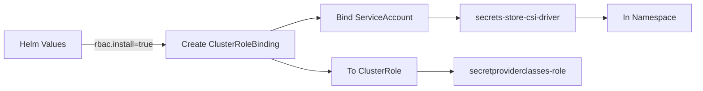

# Diagram: devops/k8s/secrets-store-csi-driver/helm/templates/role_binding.yaml

> Auto-generated by Obscura crawlers

## Diagram 1

### SVG

<svg id="container" width="586" xmlns="http://www.w3.org/2000/svg" class="flowchart" height="589.921875" viewBox="0 0 586 589.921875" role="graphics-document document" aria-roledescription="flowchart-v2"><g><marker id="container_flowchart-v2-pointEnd" class="marker flowchart-v2" viewBox="0 0 10 10" refX="5" refY="5" markerUnits="userSpaceOnUse" markerWidth="8" markerHeight="8" orient="auto"><path d="M 0 0 L 10 5 L 0 10 z" class="arrowMarkerPath" style="stroke-width: 1; stroke-dasharray: 1, 0;"></path></marker><marker id="container_flowchart-v2-pointStart" class="marker flowchart-v2" viewBox="0 0 10 10" refX="4.5" refY="5" markerUnits="userSpaceOnUse" markerWidth="8" markerHeight="8" orient="auto"><path d="M 0 5 L 10 10 L 10 0 z" class="arrowMarkerPath" style="stroke-width: 1; stroke-dasharray: 1, 0;"></path></marker><marker id="container_flowchart-v2-circleEnd" class="marker flowchart-v2" viewBox="0 0 10 10" refX="11" refY="5" markerUnits="userSpaceOnUse" markerWidth="11" markerHeight="11" orient="auto"><circle cx="5" cy="5" r="5" class="arrowMarkerPath" style="stroke-width: 1; stroke-dasharray: 1, 0;"></circle></marker><marker id="container_flowchart-v2-circleStart" class="marker flowchart-v2" viewBox="0 0 10 10" refX="-1" refY="5" markerUnits="userSpaceOnUse" markerWidth="11" markerHeight="11" orient="auto"><circle cx="5" cy="5" r="5" class="arrowMarkerPath" style="stroke-width: 1; stroke-dasharray: 1, 0;"></circle></marker><marker id="container_flowchart-v2-crossEnd" class="marker cross flowchart-v2" viewBox="0 0 11 11" refX="12" refY="5.2" markerUnits="userSpaceOnUse" markerWidth="11" markerHeight="11" orient="auto"><path d="M 1,1 l 9,9 M 10,1 l -9,9" class="arrowMarkerPath" style="stroke-width: 2; stroke-dasharray: 1, 0;"></path></marker><marker id="container_flowchart-v2-crossStart" class="marker cross flowchart-v2" viewBox="0 0 11 11" refX="-1" refY="5.2" markerUnits="userSpaceOnUse" markerWidth="11" markerHeight="11" orient="auto"><path d="M 1,1 l 9,9 M 10,1 l -9,9" class="arrowMarkerPath" style="stroke-width: 2; stroke-dasharray: 1, 0;"></path></marker><g class="root"><g class="clusters"></g><g class="edgePaths"><path d="M188.987,325.922L180.489,330.089C171.991,334.255,154.996,342.589,146.498,350.255C138,357.922,138,364.922,138,368.422L138,371.922" id="L_A_B_0" class="edge-thickness-normal edge-pattern-solid edge-thickness-normal edge-pattern-solid flowchart-link" style=";" data-edge="true" data-et="edge" data-id="L_A_B_0" data-points="W3sieCI6MTg4Ljk4Njg0MjEwNTI2MzE4LCJ5IjozMjUuOTIxODc1fSx7IngiOjEzOCwieSI6MzUwLjkyMTg3NX0seyJ4IjoxMzgsInkiOjM3NS45MjE4NzV9XQ==" marker-end="url(#container_flowchart-v2-pointEnd)"></path><path d="M397.013,325.922L405.511,330.089C414.009,334.255,431.004,342.589,439.502,350.255C448,357.922,448,364.922,448,368.422L448,371.922" id="L_A_C_0" class="edge-thickness-normal edge-pattern-solid edge-thickness-normal edge-pattern-solid flowchart-link" style=";" data-edge="true" data-et="edge" data-id="L_A_C_0" data-points="W3sieCI6Mzk3LjAxMzE1Nzg5NDczNjgsInkiOjMyNS45MjE4NzV9LHsieCI6NDQ4LCJ5IjozNTAuOTIxODc1fSx7IngiOjQ0OCwieSI6Mzc1LjkyMTg3NX1d" marker-end="url(#container_flowchart-v2-pointEnd)"></path><path d="M448,453.922L448,458.089C448,462.255,448,470.589,448,478.255C448,485.922,448,492.922,448,496.422L448,499.922" id="L_C_D_0" class="edge-thickness-normal edge-pattern-solid edge-thickness-normal edge-pattern-solid flowchart-link" style=";" data-edge="true" data-et="edge" data-id="L_C_D_0" data-points="W3sieCI6NDQ4LCJ5Ijo0NTMuOTIxODc1fSx7IngiOjQ0OCwieSI6NDc4LjkyMTg3NX0seyJ4Ijo0NDgsInkiOjUwMy45MjE4NzV9XQ==" marker-end="url(#container_flowchart-v2-pointEnd)"></path><path d="M293,149.922L293,156.089C293,162.255,293,174.589,293,186.255C293,197.922,293,208.922,293,214.422L293,219.922" id="L_E_A_0" class="edge-thickness-normal edge-pattern-solid edge-thickness-normal edge-pattern-solid flowchart-link" style=";" data-edge="true" data-et="edge" data-id="L_E_A_0" data-points="W3sieCI6MjkzLCJ5IjoxNDkuOTIxODc1fSx7IngiOjI5MywieSI6MTg2LjkyMTg3NX0seyJ4IjoyOTMsInkiOjIyMy45MjE4NzV9XQ==" marker-end="url(#container_flowchart-v2-pointEnd)"></path></g><g class="edgeLabels"><g class="edgeLabel"><g class="label" data-id="L_A_B_0" transform="translate(0, 0)"><foreignObject width="0" height="0">

</foreignObject></g></g><g class="edgeLabel"><g class="label" data-id="L_A_C_0" transform="translate(0, 0)"><foreignObject width="0" height="0">

</foreignObject></g></g><g class="edgeLabel"><g class="label" data-id="L_C_D_0" transform="translate(0, 0)"><foreignObject width="0" height="0">

</foreignObject></g></g><g class="edgeLabel" transform="translate(293, 186.921875)"><g class="label" data-id="L_E_A_0" transform="translate(-14.9921875, -12)"><foreignObject width="29.984375" height="24">

true

</foreignObject></g></g></g><g class="nodes"><g class="node default" id="flowchart-A-0" transform="translate(293, 274.921875)"><rect class="basic label-container" style="" x="-130" y="-51" width="260" height="102"></rect><g class="label" style="" transform="translate(-100, -36)"><rect></rect><foreignObject width="200" height="72">

ClusterRoleBinding: secretproviderclasses-rolebinding

</foreignObject></g></g><g class="node default" id="flowchart-B-1" transform="translate(138, 414.921875)"><rect class="basic label-container" style="" x="-130" y="-39" width="260" height="78"></rect><g class="label" style="" transform="translate(-100, -24)"><rect></rect><foreignObject width="200" height="48">

ClusterRole: secretproviderclasses-role

</foreignObject></g></g><g class="node default" id="flowchart-C-3" transform="translate(448, 414.921875)"><rect class="basic label-container" style="" x="-130" y="-39" width="260" height="78"></rect><g class="label" style="" transform="translate(-100, -24)"><rect></rect><foreignObject width="200" height="48">

ServiceAccount: secrets-store-csi-driver

</foreignObject></g></g><g class="node default" id="flowchart-D-5" transform="translate(448, 542.921875)"><rect class="basic label-container" style="" x="-130" y="-39" width="260" height="78"></rect><g class="label" style="" transform="translate(-100, -24)"><rect></rect><foreignObject width="200" height="48">

Namespace: Release.Namespace

</foreignObject></g></g><g class="node default" id="flowchart-E-6" transform="translate(293, 78.9609375)"><polygon points="70.9609375,0 141.921875,-70.9609375 70.9609375,-141.921875 0,-70.9609375" class="label-container" transform="translate(-70.4609375, 70.9609375)"></polygon><g class="label" style="" transform="translate(-43.9609375, -12)"><rect></rect><foreignObject width="87.921875" height="24">

rbac.install?

</foreignObject></g></g></g></g></g></svg>

## Diagram 2

### SVG

<svg id="container" width="715.4140625" xmlns="http://www.w3.org/2000/svg" class="classDiagram" height="450" viewBox="0 0 715.4140625 450" role="graphics-document document" aria-roledescription="class"><g><defs><marker id="container_class-aggregationStart" class="marker aggregation class" refX="18" refY="7" markerWidth="190" markerHeight="240" orient="auto"><path d="M 18,7 L9,13 L1,7 L9,1 Z"></path></marker></defs><defs><marker id="container_class-aggregationEnd" class="marker aggregation class" refX="1" refY="7" markerWidth="20" markerHeight="28" orient="auto"><path d="M 18,7 L9,13 L1,7 L9,1 Z"></path></marker></defs><defs><marker id="container_class-extensionStart" class="marker extension class" refX="18" refY="7" markerWidth="190" markerHeight="240" orient="auto"><path d="M 1,7 L18,13 V 1 Z"></path></marker></defs><defs><marker id="container_class-extensionEnd" class="marker extension class" refX="1" refY="7" markerWidth="20" markerHeight="28" orient="auto"><path d="M 1,1 V 13 L18,7 Z"></path></marker></defs><defs><marker id="container_class-compositionStart" class="marker composition class" refX="18" refY="7" markerWidth="190" markerHeight="240" orient="auto"><path d="M 18,7 L9,13 L1,7 L9,1 Z"></path></marker></defs><defs><marker id="container_class-compositionEnd" class="marker composition class" refX="1" refY="7" markerWidth="20" markerHeight="28" orient="auto"><path d="M 18,7 L9,13 L1,7 L9,1 Z"></path></marker></defs><defs><marker id="container_class-dependencyStart" class="marker dependency class" refX="6" refY="7" markerWidth="190" markerHeight="240" orient="auto"><path d="M 5,7 L9,13 L1,7 L9,1 Z"></path></marker></defs><defs><marker id="container_class-dependencyEnd" class="marker dependency class" refX="13" refY="7" markerWidth="20" markerHeight="28" orient="auto"><path d="M 18,7 L9,13 L14,7 L9,1 Z"></path></marker></defs><defs><marker id="container_class-lollipopStart" class="marker lollipop class" refX="13" refY="7" markerWidth="190" markerHeight="240" orient="auto"><circle stroke="black" fill="transparent" cx="7" cy="7" r="6"></circle></marker></defs><defs><marker id="container_class-lollipopEnd" class="marker lollipop class" refX="1" refY="7" markerWidth="190" markerHeight="240" orient="auto"><circle stroke="black" fill="transparent" cx="7" cy="7" r="6"></circle></marker></defs><g class="root"><g class="clusters"></g><g class="edgePaths"><path d="M224.226,200L215.54,206.167C206.853,212.333,189.479,224.667,180.792,238C172.105,251.333,172.105,265.667,172.105,272.833L172.105,280" id="id_ClusterRoleBinding_ClusterRole_1" class="edge-thickness-normal edge-pattern-solid relation" style=";;;" data-edge="true" data-et="edge" data-id="id_ClusterRoleBinding_ClusterRole_1" data-points="W3sieCI6MjI0LjIyNjM3MTU5MzA0NTEyLCJ5IjoyMDB9LHsieCI6MTcyLjEwNTQ2ODc1LCJ5IjoyMzd9LHsieCI6MTcyLjEwNTQ2ODc1LCJ5IjoyODZ9XQ==" marker-end="url(#container_class-dependencyEnd)"></path><path d="M494.692,200L503.378,206.167C512.065,212.333,529.439,224.667,538.126,236C546.813,247.333,546.813,257.667,546.813,262.833L546.813,268" id="id_ClusterRoleBinding_ServiceAccount_2" class="edge-thickness-normal edge-pattern-solid relation" style=";;;" data-edge="true" data-et="edge" data-id="id_ClusterRoleBinding_ServiceAccount_2" data-points="W3sieCI6NDk0LjY5MTU5NzE1Njk1NDksInkiOjIwMH0seyJ4Ijo1NDYuODEyNSwieSI6MjM3fSx7IngiOjU0Ni44MTI1LCJ5IjoyNzR9XQ==" marker-end="url(#container_class-dependencyEnd)"></path></g><g class="edgeLabels"><g class="edgeLabel" transform="translate(172.10546875, 237)"><g class="label" data-id="id_ClusterRoleBinding_ClusterRole_1" transform="translate(-37.828125, -12)"><foreignObject width="75.65625" height="24">

references

</foreignObject></g></g><g class="edgeLabel" transform="translate(546.8125, 237)"><g class="label" data-id="id_ClusterRoleBinding_ServiceAccount_2" transform="translate(-29.78125, -12)"><foreignObject width="59.5625" height="24">

binds to

</foreignObject></g></g></g><g class="nodes"><g class="node default" id="classId-ClusterRoleBinding-0" transform="translate(359.458984375, 104)"><g class="basic label-container"><path d="M-198.55078125 -96 L198.55078125 -96 L198.55078125 96 L-198.55078125 96" stroke="none" stroke-width="0" fill="#ECECFF" style=""></path><path d="M-198.55078125 -96 C-115.36218654737927 -96, -32.17359184475853 -96, 198.55078125 -96 M-198.55078125 -96 C-92.42512929516381 -96, 13.700522659672373 -96, 198.55078125 -96 M198.55078125 -96 C198.55078125 -49.65738742678148, 198.55078125 -3.314774853562966, 198.55078125 96 M198.55078125 -96 C198.55078125 -52.64161111378179, 198.55078125 -9.283222227563584, 198.55078125 96 M198.55078125 96 C65.80134261801439 96, -66.94809601397122 96, -198.55078125 96 M198.55078125 96 C112.80676124981494 96, 27.06274124962988 96, -198.55078125 96 M-198.55078125 96 C-198.55078125 24.987479588497905, -198.55078125 -46.02504082300419, -198.55078125 -96 M-198.55078125 96 C-198.55078125 21.42385301540763, -198.55078125 -53.15229396918474, -198.55078125 -96" stroke="#9370DB" stroke-width="1.3" fill="none" stroke-dasharray="0 0" style=""></path></g><g class="annotation-group text" transform="translate(0, -72)"></g><g class="label-group text" transform="translate(-70.0390625, -72)"><g class="label" style="font-weight: bolder" transform="translate(0,-12)"><foreignObject width="140.078125" height="24">

ClusterRoleBinding

</foreignObject></g></g><g class="members-group text" transform="translate(-186.55078125, -24)"><g class="label" style="" transform="translate(0,-12)"><foreignObject width="303.0625" height="24">

+name: secretproviderclasses-rolebinding

</foreignObject></g><g class="label" style="" transform="translate(0,12)"><foreignObject width="138.984375" height="24">

+labels: sscd.labels

</foreignObject></g><g class="label" style="" transform="translate(0,36)"><foreignObject width="150.875" height="24">

+roleRef: ClusterRole

</foreignObject></g><g class="label" style="" transform="translate(0,60)"><foreignObject width="196.4375" height="24">

+subjects: ServiceAccount[]

</foreignObject></g></g><g class="methods-group text" transform="translate(-186.55078125, 96)"></g><g class="divider" style=""><path d="M-198.55078125 -48 C-67.5976803876018 -48, 63.355420474796404 -48, 198.55078125 -48 M-198.55078125 -48 C-83.68000801741834 -48, 31.19076521516331 -48, 198.55078125 -48" stroke="#9370DB" stroke-width="1.3" fill="none" stroke-dasharray="0 0" style=""></path></g><g class="divider" style=""><path d="M-198.55078125 72 C-48.00636289181824 72, 102.53805546636352 72, 198.55078125 72 M-198.55078125 72 C-108.01215367890693 72, -17.473526107813854 72, 198.55078125 72" stroke="#9370DB" stroke-width="1.3" fill="none" stroke-dasharray="0 0" style=""></path></g></g><g class="node default" id="classId-ClusterRole-1" transform="translate(172.10546875, 358)"><g class="basic label-container"><path d="M-164.10546875 -72 L164.10546875 -72 L164.10546875 72 L-164.10546875 72" stroke="none" stroke-width="0" fill="#ECECFF" style=""></path><path d="M-164.10546875 -72 C-35.47179131277815 -72, 93.1618861244437 -72, 164.10546875 -72 M-164.10546875 -72 C-42.30847689241497 -72, 79.48851496517005 -72, 164.10546875 -72 M164.10546875 -72 C164.10546875 -36.59967952628756, 164.10546875 -1.1993590525751188, 164.10546875 72 M164.10546875 -72 C164.10546875 -24.931509214677902, 164.10546875 22.136981570644195, 164.10546875 72 M164.10546875 72 C84.94777034080147 72, 5.790071931602938 72, -164.10546875 72 M164.10546875 72 C86.43726314164329 72, 8.76905753328657 72, -164.10546875 72 M-164.10546875 72 C-164.10546875 39.656939243810726, -164.10546875 7.3138784876214515, -164.10546875 -72 M-164.10546875 72 C-164.10546875 38.340657956201106, -164.10546875 4.681315912402212, -164.10546875 -72" stroke="#9370DB" stroke-width="1.3" fill="none" stroke-dasharray="0 0" style=""></path></g><g class="annotation-group text" transform="translate(0, -48)"></g><g class="label-group text" transform="translate(-42.1484375, -48)"><g class="label" style="font-weight: bolder" transform="translate(0,-12)"><foreignObject width="84.296875" height="24">

ClusterRole

</foreignObject></g></g><g class="members-group text" transform="translate(-152.10546875, 0)"><g class="label" style="" transform="translate(0,-12)"><foreignObject width="247.890625" height="24">

+name: secretproviderclasses-role

</foreignObject></g><g class="label" style="" transform="translate(0,12)"><foreignObject width="262.0625" height="24">

+apiGroup: rbac.authorization.k8s.io

</foreignObject></g></g><g class="methods-group text" transform="translate(-152.10546875, 72)"></g><g class="divider" style=""><path d="M-164.10546875 -24 C-36.99758951281032 -24, 90.11028972437936 -24, 164.10546875 -24 M-164.10546875 -24 C-76.11667321914116 -24, 11.872122311717675 -24, 164.10546875 -24" stroke="#9370DB" stroke-width="1.3" fill="none" stroke-dasharray="0 0" style=""></path></g><g class="divider" style=""><path d="M-164.10546875 48 C-64.08191379112381 48, 35.94164116775238 48, 164.10546875 48 M-164.10546875 48 C-44.47025335247882 48, 75.16496204504236 48, 164.10546875 48" stroke="#9370DB" stroke-width="1.3" fill="none" stroke-dasharray="0 0" style=""></path></g></g><g class="node default" id="classId-ServiceAccount-2" transform="translate(546.8125, 358)"><g class="basic label-container"><path d="M-160.6015625 -84 L160.6015625 -84 L160.6015625 84 L-160.6015625 84" stroke="none" stroke-width="0" fill="#ECECFF" style=""></path><path d="M-160.6015625 -84 C-72.81866537817596 -84, 14.964231743648071 -84, 160.6015625 -84 M-160.6015625 -84 C-92.84297279612092 -84, -25.084383092241836 -84, 160.6015625 -84 M160.6015625 -84 C160.6015625 -36.119944836814376, 160.6015625 11.760110326371247, 160.6015625 84 M160.6015625 -84 C160.6015625 -35.28162264149079, 160.6015625 13.436754717018417, 160.6015625 84 M160.6015625 84 C48.480706516503886 84, -63.64014946699223 84, -160.6015625 84 M160.6015625 84 C51.9099197517598 84, -56.7817229964804 84, -160.6015625 84 M-160.6015625 84 C-160.6015625 50.33636537748032, -160.6015625 16.67273075496064, -160.6015625 -84 M-160.6015625 84 C-160.6015625 39.220054682253895, -160.6015625 -5.559890635492209, -160.6015625 -84" stroke="#9370DB" stroke-width="1.3" fill="none" stroke-dasharray="0 0" style=""></path></g><g class="annotation-group text" transform="translate(0, -60)"></g><g class="label-group text" transform="translate(-55.671875, -60)"><g class="label" style="font-weight: bolder" transform="translate(0,-12)"><foreignObject width="111.34375" height="24">

ServiceAccount

</foreignObject></g></g><g class="members-group text" transform="translate(-148.6015625, -12)"><g class="label" style="" transform="translate(0,-12)"><foreignObject width="226.625" height="24">

+name: secrets-store-csi-driver

</foreignObject></g><g class="label" style="" transform="translate(0,12)"><foreignObject width="241.53125" height="24">

+namespace: Release.Namespace

</foreignObject></g><g class="label" style="" transform="translate(0,36)"><foreignObject width="157.40625" height="24">

+kind: ServiceAccount

</foreignObject></g></g><g class="methods-group text" transform="translate(-148.6015625, 84)"></g><g class="divider" style=""><path d="M-160.6015625 -36 C-80.5348672307774 -36, -0.4681719615547877 -36, 160.6015625 -36 M-160.6015625 -36 C-85.64351513840909 -36, -10.685467776818172 -36, 160.6015625 -36" stroke="#9370DB" stroke-width="1.3" fill="none" stroke-dasharray="0 0" style=""></path></g><g class="divider" style=""><path d="M-160.6015625 60 C-84.12930580873747 60, -7.657049117474941 60, 160.6015625 60 M-160.6015625 60 C-88.66651838577837 60, -16.73147427155675 60, 160.6015625 60" stroke="#9370DB" stroke-width="1.3" fill="none" stroke-dasharray="0 0" style=""></path></g></g></g></g></g></svg>

## Diagram 3

### SVG

<svg id="container" width="1352.828125" xmlns="http://www.w3.org/2000/svg" class="flowchart" height="174" viewBox="0 0 1352.828125 174" role="graphics-document document" aria-roledescription="flowchart-v2"><g><marker id="container_flowchart-v2-pointEnd" class="marker flowchart-v2" viewBox="0 0 10 10" refX="5" refY="5" markerUnits="userSpaceOnUse" markerWidth="8" markerHeight="8" orient="auto"><path d="M 0 0 L 10 5 L 0 10 z" class="arrowMarkerPath" style="stroke-width: 1; stroke-dasharray: 1, 0;"></path></marker><marker id="container_flowchart-v2-pointStart" class="marker flowchart-v2" viewBox="0 0 10 10" refX="4.5" refY="5" markerUnits="userSpaceOnUse" markerWidth="8" markerHeight="8" orient="auto"><path d="M 0 5 L 10 10 L 10 0 z" class="arrowMarkerPath" style="stroke-width: 1; stroke-dasharray: 1, 0;"></path></marker><marker id="container_flowchart-v2-circleEnd" class="marker flowchart-v2" viewBox="0 0 10 10" refX="11" refY="5" markerUnits="userSpaceOnUse" markerWidth="11" markerHeight="11" orient="auto"><circle cx="5" cy="5" r="5" class="arrowMarkerPath" style="stroke-width: 1; stroke-dasharray: 1, 0;"></circle></marker><marker id="container_flowchart-v2-circleStart" class="marker flowchart-v2" viewBox="0 0 10 10" refX="-1" refY="5" markerUnits="userSpaceOnUse" markerWidth="11" markerHeight="11" orient="auto"><circle cx="5" cy="5" r="5" class="arrowMarkerPath" style="stroke-width: 1; stroke-dasharray: 1, 0;"></circle></marker><marker id="container_flowchart-v2-crossEnd" class="marker cross flowchart-v2" viewBox="0 0 11 11" refX="12" refY="5.2" markerUnits="userSpaceOnUse" markerWidth="11" markerHeight="11" orient="auto"><path d="M 1,1 l 9,9 M 10,1 l -9,9" class="arrowMarkerPath" style="stroke-width: 2; stroke-dasharray: 1, 0;"></path></marker><marker id="container_flowchart-v2-crossStart" class="marker cross flowchart-v2" viewBox="0 0 11 11" refX="-1" refY="5.2" markerUnits="userSpaceOnUse" markerWidth="11" markerHeight="11" orient="auto"><path d="M 1,1 l 9,9 M 10,1 l -9,9" class="arrowMarkerPath" style="stroke-width: 2; stroke-dasharray: 1, 0;"></path></marker><g class="root"><g class="clusters"></g><g class="edgePaths"><path d="M157.234,87L171.302,87C185.37,87,213.505,87,240.974,87C268.443,87,295.245,87,308.646,87L322.047,87" id="L_A_B_0" class="edge-thickness-normal edge-pattern-solid edge-thickness-normal edge-pattern-solid flowchart-link" style=";" data-edge="true" data-et="edge" data-id="L_A_B_0" data-points="W3sieCI6MTU3LjIzNDM3NSwieSI6ODd9LHsieCI6MjQxLjY0MDYyNSwieSI6ODd9LHsieCI6MzI2LjA0Njg3NSwieSI6ODd9XQ==" marker-end="url(#container_flowchart-v2-pointEnd)"></path><path d="M527.709,60L539.664,55.833C551.618,51.667,575.528,43.333,590.983,39.167C606.438,35,613.438,35,616.938,35L620.438,35" id="L_B_C_0" class="edge-thickness-normal edge-pattern-solid edge-thickness-normal edge-pattern-solid flowchart-link" style=";" data-edge="true" data-et="edge" data-id="L_B_C_0" data-points="W3sieCI6NTI3LjcwODk4NDM3NSwieSI6NjB9LHsieCI6NTk5LjQzNzUsInkiOjM1fSx7IngiOjYyNC40Mzc1LCJ5IjozNX1d" marker-end="url(#container_flowchart-v2-pointEnd)"></path><path d="M527.709,114L539.664,118.167C551.618,122.333,575.528,130.667,594.592,134.833C613.656,139,627.875,139,634.984,139L642.094,139" id="L_B_D_0" class="edge-thickness-normal edge-pattern-solid edge-thickness-normal edge-pattern-solid flowchart-link" style=";" data-edge="true" data-et="edge" data-id="L_B_D_0" data-points="W3sieCI6NTI3LjcwODk4NDM3NSwieSI6MTE0fSx7IngiOjU5OS40Mzc1LCJ5IjoxMzl9LHsieCI6NjQ2LjA5Mzc1LCJ5IjoxMzl9XQ==" marker-end="url(#container_flowchart-v2-pointEnd)"></path><path d="M831.547,35L835.714,35C839.88,35,848.214,35,857.651,35C867.089,35,877.63,35,882.901,35L888.172,35" id="L_C_E_0" class="edge-thickness-normal edge-pattern-solid edge-thickness-normal edge-pattern-solid flowchart-link" style=";" data-edge="true" data-et="edge" data-id="L_C_E_0" data-points="W3sieCI6ODMxLjU0Njg3NSwieSI6MzV9LHsieCI6ODU2LjU0Njg3NSwieSI6MzV9LHsieCI6ODkyLjE3MTg3NSwieSI6MzV9XQ==" marker-end="url(#container_flowchart-v2-pointEnd)"></path><path d="M809.891,139L817.667,139C825.443,139,840.995,139,852.271,139C863.547,139,870.547,139,874.047,139L877.547,139" id="L_D_F_0" class="edge-thickness-normal edge-pattern-solid edge-thickness-normal edge-pattern-solid flowchart-link" style=";" data-edge="true" data-et="edge" data-id="L_D_F_0" data-points="W3sieCI6ODA5Ljg5MDYyNSwieSI6MTM5fSx7IngiOjg1Ni41NDY4NzUsInkiOjEzOX0seyJ4Ijo4ODEuNTQ2ODc1LCJ5IjoxMzl9XQ==" marker-end="url(#container_flowchart-v2-pointEnd)"></path><path d="M1122.234,35L1128.172,35C1134.109,35,1145.984,35,1155.422,35C1164.859,35,1171.859,35,1175.359,35L1178.859,35" id="L_E_G_0" class="edge-thickness-normal edge-pattern-solid edge-thickness-normal edge-pattern-solid flowchart-link" style=";" data-edge="true" data-et="edge" data-id="L_E_G_0" data-points="W3sieCI6MTEyMi4yMzQzNzUsInkiOjM1fSx7IngiOjExNTcuODU5Mzc1LCJ5IjozNX0seyJ4IjoxMTgyLjg1OTM3NSwieSI6MzV9XQ==" marker-end="url(#container_flowchart-v2-pointEnd)"></path></g><g class="edgeLabels"><g class="edgeLabel" transform="translate(241.640625, 87)"><g class="label" data-id="L_A_B_0" transform="translate(-59.40625, -12)"><foreignObject width="118.8125" height="24">

rbac.install=true

</foreignObject></g></g><g class="edgeLabel"><g class="label" data-id="L_B_C_0" transform="translate(0, 0)"><foreignObject width="0" height="0">

</foreignObject></g></g><g class="edgeLabel"><g class="label" data-id="L_B_D_0" transform="translate(0, 0)"><foreignObject width="0" height="0">

</foreignObject></g></g><g class="edgeLabel"><g class="label" data-id="L_C_E_0" transform="translate(0, 0)"><foreignObject width="0" height="0">

</foreignObject></g></g><g class="edgeLabel"><g class="label" data-id="L_D_F_0" transform="translate(0, 0)"><foreignObject width="0" height="0">

</foreignObject></g></g><g class="edgeLabel"><g class="label" data-id="L_E_G_0" transform="translate(0, 0)"><foreignObject width="0" height="0">

</foreignObject></g></g></g><g class="nodes"><g class="node default" id="flowchart-A-0" transform="translate(82.6171875, 87)"><rect class="basic label-container" style="" x="-74.6171875" y="-27" width="149.234375" height="54"></rect><g class="label" style="" transform="translate(-44.6171875, -12)"><rect></rect><foreignObject width="89.234375" height="24">

Helm Values

</foreignObject></g></g><g class="node default" id="flowchart-B-1" transform="translate(450.2421875, 87)"><rect class="basic label-container" style="" x="-124.1953125" y="-27" width="248.390625" height="54"></rect><g class="label" style="" transform="translate(-94.1953125, -12)"><rect></rect><foreignObject width="188.390625" height="24">

Create ClusterRoleBinding

</foreignObject></g></g><g class="node default" id="flowchart-C-3" transform="translate(727.9921875, 35)"><rect class="basic label-container" style="" x="-103.5546875" y="-27" width="207.109375" height="54"></rect><g class="label" style="" transform="translate(-73.5546875, -12)"><rect></rect><foreignObject width="147.109375" height="24">

Bind ServiceAccount

</foreignObject></g></g><g class="node default" id="flowchart-D-5" transform="translate(727.9921875, 139)"><rect class="basic label-container" style="" x="-81.8984375" y="-27" width="163.796875" height="54"></rect><g class="label" style="" transform="translate(-51.8984375, -12)"><rect></rect><foreignObject width="103.796875" height="24">

To ClusterRole

</foreignObject></g></g><g class="node default" id="flowchart-E-7" transform="translate(1007.203125, 35)"><rect class="basic label-container" style="" x="-115.03125" y="-27" width="230.0625" height="54"></rect><g class="label" style="" transform="translate(-85.03125, -12)"><rect></rect><foreignObject width="170.0625" height="24">

secrets-store-csi-driver

</foreignObject></g></g><g class="node default" id="flowchart-F-9" transform="translate(1007.203125, 139)"><rect class="basic label-container" style="" x="-125.65625" y="-27" width="251.3125" height="54"></rect><g class="label" style="" transform="translate(-95.65625, -12)"><rect></rect><foreignObject width="191.3125" height="24">

secretproviderclasses-role

</foreignObject></g></g><g class="node default" id="flowchart-G-11" transform="translate(1263.84375, 35)"><rect class="basic label-container" style="" x="-80.984375" y="-27" width="161.96875" height="54"></rect><g class="label" style="" transform="translate(-50.984375, -12)"><rect></rect><foreignObject width="101.96875" height="24">

In Namespace

</foreignObject></g></g></g></g></g></svg>
