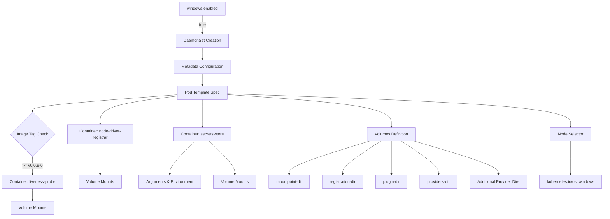
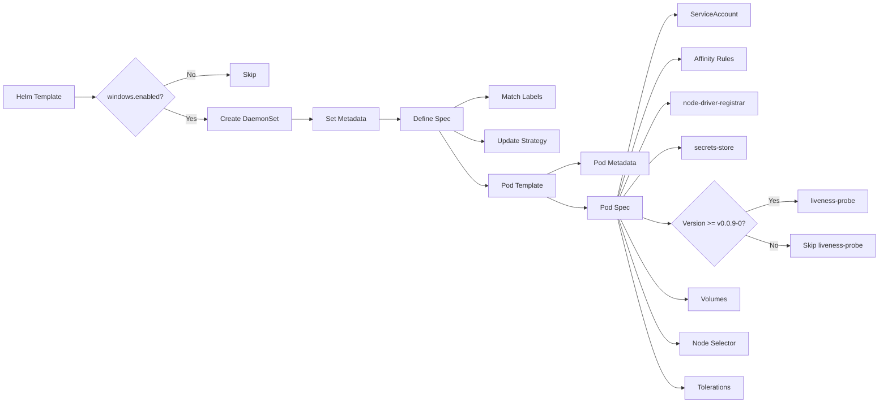
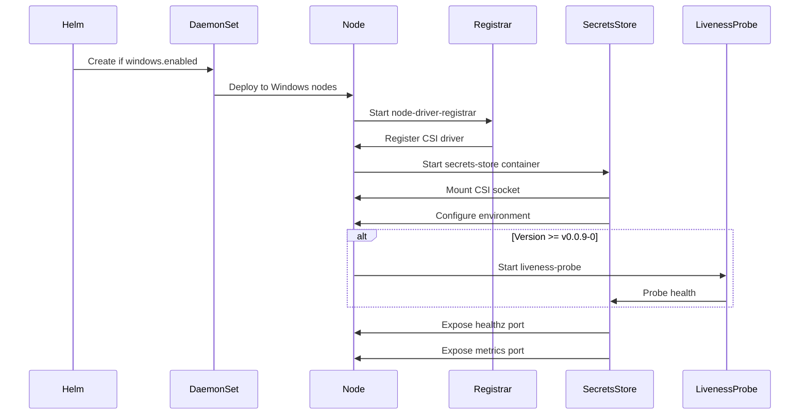
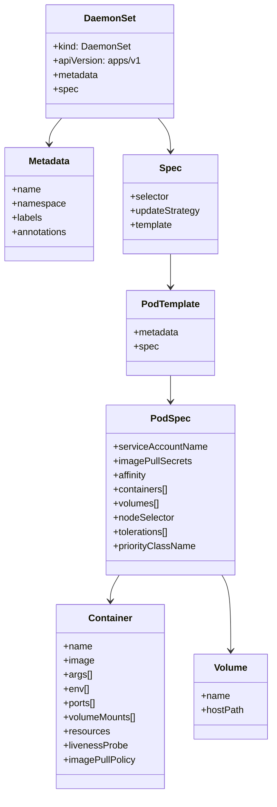
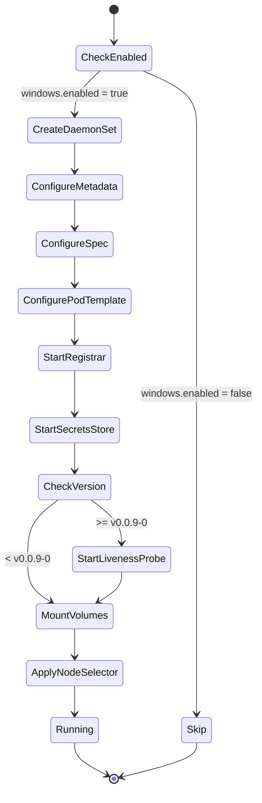

# Diagram: devops/k8s/secrets-store-csi-driver/helm/templates/secrets-store-csi-driver-windows.yaml

> Auto-generated by Obscura crawlers

## Diagram 1

### SVG

<svg id="container" width="2449.56640625" xmlns="http://www.w3.org/2000/svg" class="flowchart" height="861.3125" viewBox="0 0 2449.56640625 861.3125" role="graphics-document document" aria-roledescription="flowchart-v2"><g><marker id="container_flowchart-v2-pointEnd" class="marker flowchart-v2" viewBox="0 0 10 10" refX="5" refY="5" markerUnits="userSpaceOnUse" markerWidth="8" markerHeight="8" orient="auto"><path d="M 0 0 L 10 5 L 0 10 z" class="arrowMarkerPath" style="stroke-width: 1; stroke-dasharray: 1, 0;"></path></marker><marker id="container_flowchart-v2-pointStart" class="marker flowchart-v2" viewBox="0 0 10 10" refX="4.5" refY="5" markerUnits="userSpaceOnUse" markerWidth="8" markerHeight="8" orient="auto"><path d="M 0 5 L 10 10 L 10 0 z" class="arrowMarkerPath" style="stroke-width: 1; stroke-dasharray: 1, 0;"></path></marker><marker id="container_flowchart-v2-circleEnd" class="marker flowchart-v2" viewBox="0 0 10 10" refX="11" refY="5" markerUnits="userSpaceOnUse" markerWidth="11" markerHeight="11" orient="auto"><circle cx="5" cy="5" r="5" class="arrowMarkerPath" style="stroke-width: 1; stroke-dasharray: 1, 0;"></circle></marker><marker id="container_flowchart-v2-circleStart" class="marker flowchart-v2" viewBox="0 0 10 10" refX="-1" refY="5" markerUnits="userSpaceOnUse" markerWidth="11" markerHeight="11" orient="auto"><circle cx="5" cy="5" r="5" class="arrowMarkerPath" style="stroke-width: 1; stroke-dasharray: 1, 0;"></circle></marker><marker id="container_flowchart-v2-crossEnd" class="marker cross flowchart-v2" viewBox="0 0 11 11" refX="12" refY="5.2" markerUnits="userSpaceOnUse" markerWidth="11" markerHeight="11" orient="auto"><path d="M 1,1 l 9,9 M 10,1 l -9,9" class="arrowMarkerPath" style="stroke-width: 2; stroke-dasharray: 1, 0;"></path></marker><marker id="container_flowchart-v2-crossStart" class="marker cross flowchart-v2" viewBox="0 0 11 11" refX="-1" refY="5.2" markerUnits="userSpaceOnUse" markerWidth="11" markerHeight="11" orient="auto"><path d="M 1,1 l 9,9 M 10,1 l -9,9" class="arrowMarkerPath" style="stroke-width: 2; stroke-dasharray: 1, 0;"></path></marker><g class="root"><g class="clusters"></g><g class="edgePaths"><path d="M807.234,62L807.234,68.167C807.234,74.333,807.234,86.667,807.234,98.333C807.234,110,807.234,121,807.234,126.5L807.234,132" id="L_A_B_0" class="edge-thickness-normal edge-pattern-solid edge-thickness-normal edge-pattern-solid flowchart-link" style=";" data-edge="true" data-et="edge" data-id="L_A_B_0" data-points="W3sieCI6ODA3LjIzNDM3NSwieSI6NjJ9LHsieCI6ODA3LjIzNDM3NSwieSI6OTl9LHsieCI6ODA3LjIzNDM3NSwieSI6MTM2fV0=" marker-end="url(#container_flowchart-v2-pointEnd)"></path><path d="M807.234,190L807.234,194.167C807.234,198.333,807.234,206.667,807.234,214.333C807.234,222,807.234,229,807.234,232.5L807.234,236" id="L_B_C_0" class="edge-thickness-normal edge-pattern-solid edge-thickness-normal edge-pattern-solid flowchart-link" style=";" data-edge="true" data-et="edge" data-id="L_B_C_0" data-points="W3sieCI6ODA3LjIzNDM3NSwieSI6MTkwfSx7IngiOjgwNy4yMzQzNzUsInkiOjIxNX0seyJ4Ijo4MDcuMjM0Mzc1LCJ5IjoyNDB9XQ==" marker-end="url(#container_flowchart-v2-pointEnd)"></path><path d="M807.234,294L807.234,298.167C807.234,302.333,807.234,310.667,807.234,318.333C807.234,326,807.234,333,807.234,336.5L807.234,340" id="L_C_D_0" class="edge-thickness-normal edge-pattern-solid edge-thickness-normal edge-pattern-solid flowchart-link" style=";" data-edge="true" data-et="edge" data-id="L_C_D_0" data-points="W3sieCI6ODA3LjIzNDM3NSwieSI6Mjk0fSx7IngiOjgwNy4yMzQzNzUsInkiOjMxOX0seyJ4Ijo4MDcuMjM0Mzc1LCJ5IjozNDR9XQ==" marker-end="url(#container_flowchart-v2-pointEnd)"></path><path d="M708.383,383.557L656.63,390.131C604.878,396.704,501.372,409.852,449.62,427.869C397.867,445.885,397.867,468.771,397.867,480.214L397.867,491.656" id="L_D_E_0" class="edge-thickness-normal edge-pattern-solid edge-thickness-normal edge-pattern-solid flowchart-link" style=";" data-edge="true" data-et="edge" data-id="L_D_E_0" data-points="W3sieCI6NzA4LjM4MjgxMjUsInkiOjM4My41NTY2NTE4NDQ1MDA4M30seyJ4IjozOTcuODY3MTg3NSwieSI6NDIzfSx7IngiOjM5Ny44NjcxODc1LCJ5Ijo0OTUuNjU2MjV9XQ==" marker-end="url(#container_flowchart-v2-pointEnd)"></path><path d="M807.234,398L807.234,402.167C807.234,406.333,807.234,414.667,807.234,432.276C807.234,449.885,807.234,476.771,807.234,490.214L807.234,503.656" id="L_D_F_0" class="edge-thickness-normal edge-pattern-solid edge-thickness-normal edge-pattern-solid flowchart-link" style=";" data-edge="true" data-et="edge" data-id="L_D_F_0" data-points="W3sieCI6ODA3LjIzNDM3NSwieSI6Mzk4fSx7IngiOjgwNy4yMzQzNzUsInkiOjQyM30seyJ4Ijo4MDcuMjM0Mzc1LCJ5Ijo1MDcuNjU2MjV9XQ==" marker-end="url(#container_flowchart-v2-pointEnd)"></path><path d="M708.383,378.604L612.188,386.003C515.992,393.402,323.602,408.201,227.406,419.101C131.211,430,131.211,437,131.211,440.5L131.211,444" id="L_D_G_0" class="edge-thickness-normal edge-pattern-solid edge-thickness-normal edge-pattern-solid flowchart-link" style=";" data-edge="true" data-et="edge" data-id="L_D_G_0" data-points="W3sieCI6NzA4LjM4MjgxMjUsInkiOjM3OC42MDM3MDI3MTkyNTY2Nn0seyJ4IjoxMzEuMjEwOTM3NSwieSI6NDIzfSx7IngiOjEzMS4yMTA5Mzc1LCJ5Ijo0NDh9XQ==" marker-end="url(#container_flowchart-v2-pointEnd)"></path><path d="M131.211,621.313L131.211,627.479C131.211,633.646,131.211,645.979,131.211,657.646C131.211,669.313,131.211,680.313,131.211,685.813L131.211,691.313" id="L_G_H_0" class="edge-thickness-normal edge-pattern-solid edge-thickness-normal edge-pattern-solid flowchart-link" style=";" data-edge="true" data-et="edge" data-id="L_G_H_0" data-points="W3sieCI6MTMxLjIxMDkzNzUsInkiOjYyMS4zMTI1fSx7IngiOjEzMS4yMTA5Mzc1LCJ5Ijo2NTguMzEyNX0seyJ4IjoxMzEuMjEwOTM3NSwieSI6Njk1LjMxMjV9XQ==" marker-end="url(#container_flowchart-v2-pointEnd)"></path><path d="M397.867,573.656L397.867,587.766C397.867,601.875,397.867,630.094,397.867,649.703C397.867,669.313,397.867,680.313,397.867,685.813L397.867,691.313" id="L_E_I_0" class="edge-thickness-normal edge-pattern-solid edge-thickness-normal edge-pattern-solid flowchart-link" style=";" data-edge="true" data-et="edge" data-id="L_E_I_0" data-points="W3sieCI6Mzk3Ljg2NzE4NzUsInkiOjU3My42NTYyNX0seyJ4IjozOTcuODY3MTg3NSwieSI6NjU4LjMxMjV9LHsieCI6Mzk3Ljg2NzE4NzUsInkiOjY5NS4zMTI1fV0=" marker-end="url(#container_flowchart-v2-pointEnd)"></path><path d="M778.736,561.656L761.732,577.766C744.729,593.875,710.722,626.094,693.718,647.703C676.715,669.313,676.715,680.313,676.715,685.813L676.715,691.313" id="L_F_J_0" class="edge-thickness-normal edge-pattern-solid edge-thickness-normal edge-pattern-solid flowchart-link" style=";" data-edge="true" data-et="edge" data-id="L_F_J_0" data-points="W3sieCI6Nzc4LjczNTc5NjUzMTQ2MzMsInkiOjU2MS42NTYyNX0seyJ4Ijo2NzYuNzE0ODQzNzUsInkiOjY1OC4zMTI1fSx7IngiOjY3Ni43MTQ4NDM3NSwieSI6Njk1LjMxMjV9XQ==" marker-end="url(#container_flowchart-v2-pointEnd)"></path><path d="M835.733,561.656L852.736,577.766C869.74,593.875,903.747,626.094,920.75,647.703C937.754,669.313,937.754,680.313,937.754,685.813L937.754,691.313" id="L_F_K_0" class="edge-thickness-normal edge-pattern-solid edge-thickness-normal edge-pattern-solid flowchart-link" style=";" data-edge="true" data-et="edge" data-id="L_F_K_0" data-points="W3sieCI6ODM1LjczMjk1MzQ2ODUzNjcsInkiOjU2MS42NTYyNX0seyJ4Ijo5MzcuNzUzOTA2MjUsInkiOjY1OC4zMTI1fSx7IngiOjkzNy43NTM5MDYyNSwieSI6Njk1LjMxMjV9XQ==" marker-end="url(#container_flowchart-v2-pointEnd)"></path><path d="M131.211,749.313L131.211,753.479C131.211,757.646,131.211,765.979,131.211,773.646C131.211,781.313,131.211,788.313,131.211,791.813L131.211,795.313" id="L_H_L_0" class="edge-thickness-normal edge-pattern-solid edge-thickness-normal edge-pattern-solid flowchart-link" style=";" data-edge="true" data-et="edge" data-id="L_H_L_0" data-points="W3sieCI6MTMxLjIxMDkzNzUsInkiOjc0OS4zMTI1fSx7IngiOjEzMS4yMTA5Mzc1LCJ5Ijo3NzQuMzEyNX0seyJ4IjoxMzEuMjEwOTM3NSwieSI6Nzk5LjMxMjV9XQ==" marker-end="url(#container_flowchart-v2-pointEnd)"></path><path d="M906.086,377.628L1018.86,385.19C1131.634,392.752,1357.182,407.876,1469.956,428.881C1582.73,449.885,1582.73,476.771,1582.73,490.214L1582.73,503.656" id="L_D_M_0" class="edge-thickness-normal edge-pattern-solid edge-thickness-normal edge-pattern-solid flowchart-link" style=";" data-edge="true" data-et="edge" data-id="L_D_M_0" data-points="W3sieCI6OTA2LjA4NTkzNzUsInkiOjM3Ny42MjgzNzgwMDM5OTk0NH0seyJ4IjoxNTgyLjczMDQ2ODc1LCJ5Ijo0MjN9LHsieCI6MTU4Mi43MzA0Njg3NSwieSI6NTA3LjY1NjI1fV0=" marker-end="url(#container_flowchart-v2-pointEnd)"></path><path d="M1490.414,561.656L1435.334,577.766C1380.254,593.875,1270.094,626.094,1215.014,647.703C1159.934,669.313,1159.934,680.313,1159.934,685.813L1159.934,691.313" id="L_M_N_0" class="edge-thickness-normal edge-pattern-solid edge-thickness-normal edge-pattern-solid flowchart-link" style=";" data-edge="true" data-et="edge" data-id="L_M_N_0" data-points="W3sieCI6MTQ5MC40MTM5NDEwNzc1MjA4LCJ5Ijo1NjEuNjU2MjV9LHsieCI6MTE1OS45MzM1OTM3NSwieSI6NjU4LjMxMjV9LHsieCI6MTE1OS45MzM1OTM3NSwieSI6Njk1LjMxMjV9XQ==" marker-end="url(#container_flowchart-v2-pointEnd)"></path><path d="M1538.739,561.656L1512.491,577.766C1486.244,593.875,1433.749,626.094,1407.501,647.703C1381.254,669.313,1381.254,680.313,1381.254,685.813L1381.254,691.313" id="L_M_O_0" class="edge-thickness-normal edge-pattern-solid edge-thickness-normal edge-pattern-solid flowchart-link" style=";" data-edge="true" data-et="edge" data-id="L_M_O_0" data-points="W3sieCI6MTUzOC43Mzg2MTg4NjM3MjI0LCJ5Ijo1NjEuNjU2MjV9LHsieCI6MTM4MS4yNTM5MDYyNSwieSI6NjU4LjMxMjV9LHsieCI6MTM4MS4yNTM5MDYyNSwieSI6Njk1LjMxMjV9XQ==" marker-end="url(#container_flowchart-v2-pointEnd)"></path><path d="M1582.73,561.656L1582.73,577.766C1582.73,593.875,1582.73,626.094,1582.73,647.703C1582.73,669.313,1582.73,680.313,1582.73,685.813L1582.73,691.313" id="L_M_P_0" class="edge-thickness-normal edge-pattern-solid edge-thickness-normal edge-pattern-solid flowchart-link" style=";" data-edge="true" data-et="edge" data-id="L_M_P_0" data-points="W3sieCI6MTU4Mi43MzA0Njg3NSwieSI6NTYxLjY1NjI1fSx7IngiOjE1ODIuNzMwNDY4NzUsInkiOjY1OC4zMTI1fSx7IngiOjE1ODIuNzMwNDY4NzUsInkiOjY5NS4zMTI1fV0=" marker-end="url(#container_flowchart-v2-pointEnd)"></path><path d="M1625.039,561.656L1650.282,577.766C1675.524,593.875,1726.01,626.094,1751.253,647.703C1776.496,669.313,1776.496,680.313,1776.496,685.813L1776.496,691.313" id="L_M_Q_0" class="edge-thickness-normal edge-pattern-solid edge-thickness-normal edge-pattern-solid flowchart-link" style=";" data-edge="true" data-et="edge" data-id="L_M_Q_0" data-points="W3sieCI6MTYyNS4wMzg2NTY3NzEyMjgzLCJ5Ijo1NjEuNjU2MjV9LHsieCI6MTc3Ni40OTYwOTM3NSwieSI6NjU4LjMxMjV9LHsieCI6MTc3Ni40OTYwOTM3NSwieSI6Njk1LjMxMjV9XQ==" marker-end="url(#container_flowchart-v2-pointEnd)"></path><path d="M1678.28,561.656L1735.288,577.766C1792.297,593.875,1906.315,626.094,1963.323,647.703C2020.332,669.313,2020.332,680.313,2020.332,685.813L2020.332,691.313" id="L_M_R_0" class="edge-thickness-normal edge-pattern-solid edge-thickness-normal edge-pattern-solid flowchart-link" style=";" data-edge="true" data-et="edge" data-id="L_M_R_0" data-points="W3sieCI6MTY3OC4yNzk1NTg5Njk4NjM1LCJ5Ijo1NjEuNjU2MjV9LHsieCI6MjAyMC4zMzIwMzEyNSwieSI6NjU4LjMxMjV9LHsieCI6MjAyMC4zMzIwMzEyNSwieSI6Njk1LjMxMjV9XQ==" marker-end="url(#container_flowchart-v2-pointEnd)"></path><path d="M906.086,374.411L1140.753,382.509C1375.421,390.608,1844.755,406.804,2079.423,428.345C2314.09,449.885,2314.09,476.771,2314.09,490.214L2314.09,503.656" id="L_D_S_0" class="edge-thickness-normal edge-pattern-solid edge-thickness-normal edge-pattern-solid flowchart-link" style=";" data-edge="true" data-et="edge" data-id="L_D_S_0" data-points="W3sieCI6OTA2LjA4NTkzNzUsInkiOjM3NC40MTEyNjM2MjU4NzY1M30seyJ4IjoyMzE0LjA4OTg0Mzc1LCJ5Ijo0MjN9LHsieCI6MjMxNC4wODk4NDM3NSwieSI6NTA3LjY1NjI1fV0=" marker-end="url(#container_flowchart-v2-pointEnd)"></path><path d="M2314.09,561.656L2314.09,577.766C2314.09,593.875,2314.09,626.094,2314.09,647.703C2314.09,669.313,2314.09,680.313,2314.09,685.813L2314.09,691.313" id="L_S_T_0" class="edge-thickness-normal edge-pattern-solid edge-thickness-normal edge-pattern-solid flowchart-link" style=";" data-edge="true" data-et="edge" data-id="L_S_T_0" data-points="W3sieCI6MjMxNC4wODk4NDM3NSwieSI6NTYxLjY1NjI1fSx7IngiOjIzMTQuMDg5ODQzNzUsInkiOjY1OC4zMTI1fSx7IngiOjIzMTQuMDg5ODQzNzUsInkiOjY5NS4zMTI1fV0=" marker-end="url(#container_flowchart-v2-pointEnd)"></path></g><g class="edgeLabels"><g class="edgeLabel" transform="translate(807.234375, 99)"><g class="label" data-id="L_A_B_0" transform="translate(-14.9921875, -12)"><foreignObject width="29.984375" height="24">

true

</foreignObject></g></g><g class="edgeLabel"><g class="label" data-id="L_B_C_0" transform="translate(0, 0)"><foreignObject width="0" height="0">

</foreignObject></g></g><g class="edgeLabel"><g class="label" data-id="L_C_D_0" transform="translate(0, 0)"><foreignObject width="0" height="0">

</foreignObject></g></g><g class="edgeLabel"><g class="label" data-id="L_D_E_0" transform="translate(0, 0)"><foreignObject width="0" height="0">

</foreignObject></g></g><g class="edgeLabel"><g class="label" data-id="L_D_F_0" transform="translate(0, 0)"><foreignObject width="0" height="0">

</foreignObject></g></g><g class="edgeLabel"><g class="label" data-id="L_D_G_0" transform="translate(0, 0)"><foreignObject width="0" height="0">

</foreignObject></g></g><g class="edgeLabel" transform="translate(131.2109375, 658.3125)"><g class="label" data-id="L_G_H_0" transform="translate(-38.2265625, -12)"><foreignObject width="76.453125" height="24">
&gt;= v0.0.9-0
</foreignObject></g></g><g class="edgeLabel"><g class="label" data-id="L_E_I_0" transform="translate(0, 0)"><foreignObject width="0" height="0">

</foreignObject></g></g><g class="edgeLabel"><g class="label" data-id="L_F_J_0" transform="translate(0, 0)"><foreignObject width="0" height="0">

</foreignObject></g></g><g class="edgeLabel"><g class="label" data-id="L_F_K_0" transform="translate(0, 0)"><foreignObject width="0" height="0">

</foreignObject></g></g><g class="edgeLabel"><g class="label" data-id="L_H_L_0" transform="translate(0, 0)"><foreignObject width="0" height="0">

</foreignObject></g></g><g class="edgeLabel"><g class="label" data-id="L_D_M_0" transform="translate(0, 0)"><foreignObject width="0" height="0">

</foreignObject></g></g><g class="edgeLabel"><g class="label" data-id="L_M_N_0" transform="translate(0, 0)"><foreignObject width="0" height="0">

</foreignObject></g></g><g class="edgeLabel"><g class="label" data-id="L_M_O_0" transform="translate(0, 0)"><foreignObject width="0" height="0">

</foreignObject></g></g><g class="edgeLabel"><g class="label" data-id="L_M_P_0" transform="translate(0, 0)"><foreignObject width="0" height="0">

</foreignObject></g></g><g class="edgeLabel"><g class="label" data-id="L_M_Q_0" transform="translate(0, 0)"><foreignObject width="0" height="0">

</foreignObject></g></g><g class="edgeLabel"><g class="label" data-id="L_M_R_0" transform="translate(0, 0)"><foreignObject width="0" height="0">

</foreignObject></g></g><g class="edgeLabel"><g class="label" data-id="L_D_S_0" transform="translate(0, 0)"><foreignObject width="0" height="0">

</foreignObject></g></g><g class="edgeLabel"><g class="label" data-id="L_S_T_0" transform="translate(0, 0)"><foreignObject width="0" height="0">

</foreignObject></g></g></g><g class="nodes"><g class="node default" id="flowchart-A-0" transform="translate(807.234375, 35)"><rect class="basic label-container" style="" x="-93.0546875" y="-27" width="186.109375" height="54"></rect><g class="label" style="" transform="translate(-63.0546875, -12)"><rect></rect><foreignObject width="126.109375" height="24">

windows.enabled

</foreignObject></g></g><g class="node default" id="flowchart-B-1" transform="translate(807.234375, 163)"><rect class="basic label-container" style="" x="-104.078125" y="-27" width="208.15625" height="54"></rect><g class="label" style="" transform="translate(-74.078125, -12)"><rect></rect><foreignObject width="148.15625" height="24">

DaemonSet Creation

</foreignObject></g></g><g class="node default" id="flowchart-C-3" transform="translate(807.234375, 267)"><rect class="basic label-container" style="" x="-114.890625" y="-27" width="229.78125" height="54"></rect><g class="label" style="" transform="translate(-84.890625, -12)"><rect></rect><foreignObject width="169.78125" height="24">

Metadata Configuration

</foreignObject></g></g><g class="node default" id="flowchart-D-5" transform="translate(807.234375, 371)"><rect class="basic label-container" style="" x="-98.8515625" y="-27" width="197.703125" height="54"></rect><g class="label" style="" transform="translate(-68.8515625, -12)"><rect></rect><foreignObject width="137.703125" height="24">

Pod Template Spec

</foreignObject></g></g><g class="node default" id="flowchart-E-7" transform="translate(397.8671875, 534.65625)"><rect class="basic label-container" style="" x="-130" y="-39" width="260" height="78"></rect><g class="label" style="" transform="translate(-100, -24)"><rect></rect><foreignObject width="200" height="48">

Container: node-driver-registrar

</foreignObject></g></g><g class="node default" id="flowchart-F-9" transform="translate(807.234375, 534.65625)"><rect class="basic label-container" style="" x="-116.65625" y="-27" width="233.3125" height="54"></rect><g class="label" style="" transform="translate(-86.65625, -12)"><rect></rect><foreignObject width="173.3125" height="24">

Container: secrets-store

</foreignObject></g></g><g class="node default" id="flowchart-G-11" transform="translate(131.2109375, 534.65625)"><polygon points="86.65625,0 173.3125,-86.65625 86.65625,-173.3125 0,-86.65625" class="label-container" transform="translate(-86.15625, 86.65625)"></polygon><g class="label" style="" transform="translate(-59.65625, -12)"><rect></rect><foreignObject width="119.3125" height="24">

Image Tag Check

</foreignObject></g></g><g class="node default" id="flowchart-H-13" transform="translate(131.2109375, 722.3125)"><rect class="basic label-container" style="" x="-123.2109375" y="-27" width="246.421875" height="54"></rect><g class="label" style="" transform="translate(-93.2109375, -12)"><rect></rect><foreignObject width="186.421875" height="24">

Container: liveness-probe

</foreignObject></g></g><g class="node default" id="flowchart-I-15" transform="translate(397.8671875, 722.3125)"><rect class="basic label-container" style="" x="-86.125" y="-27" width="172.25" height="54"></rect><g class="label" style="" transform="translate(-56.125, -12)"><rect></rect><foreignObject width="112.25" height="24">

Volume Mounts

</foreignObject></g></g><g class="node default" id="flowchart-J-17" transform="translate(676.71484375, 722.3125)"><rect class="basic label-container" style="" x="-124.9140625" y="-27" width="249.828125" height="54"></rect><g class="label" style="" transform="translate(-94.9140625, -12)"><rect></rect><foreignObject width="189.828125" height="24">

Arguments &amp; Environment

</foreignObject></g></g><g class="node default" id="flowchart-K-19" transform="translate(937.75390625, 722.3125)"><rect class="basic label-container" style="" x="-86.125" y="-27" width="172.25" height="54"></rect><g class="label" style="" transform="translate(-56.125, -12)"><rect></rect><foreignObject width="112.25" height="24">

Volume Mounts

</foreignObject></g></g><g class="node default" id="flowchart-L-21" transform="translate(131.2109375, 826.3125)"><rect class="basic label-container" style="" x="-86.125" y="-27" width="172.25" height="54"></rect><g class="label" style="" transform="translate(-56.125, -12)"><rect></rect><foreignObject width="112.25" height="24">

Volume Mounts

</foreignObject></g></g><g class="node default" id="flowchart-M-23" transform="translate(1582.73046875, 534.65625)"><rect class="basic label-container" style="" x="-98.5546875" y="-27" width="197.109375" height="54"></rect><g class="label" style="" transform="translate(-68.5546875, -12)"><rect></rect><foreignObject width="137.109375" height="24">

Volumes Definition

</foreignObject></g></g><g class="node default" id="flowchart-N-25" transform="translate(1159.93359375, 722.3125)"><rect class="basic label-container" style="" x="-86.0546875" y="-27" width="172.109375" height="54"></rect><g class="label" style="" transform="translate(-56.0546875, -12)"><rect></rect><foreignObject width="112.109375" height="24">

mountpoint-dir

</foreignObject></g></g><g class="node default" id="flowchart-O-27" transform="translate(1381.25390625, 722.3125)"><rect class="basic label-container" style="" x="-85.265625" y="-27" width="170.53125" height="54"></rect><g class="label" style="" transform="translate(-55.265625, -12)"><rect></rect><foreignObject width="110.53125" height="24">

registration-dir

</foreignObject></g></g><g class="node default" id="flowchart-P-29" transform="translate(1582.73046875, 722.3125)"><rect class="basic label-container" style="" x="-66.2109375" y="-27" width="132.421875" height="54"></rect><g class="label" style="" transform="translate(-36.2109375, -12)"><rect></rect><foreignObject width="72.421875" height="24">

plugin-dir

</foreignObject></g></g><g class="node default" id="flowchart-Q-31" transform="translate(1776.49609375, 722.3125)"><rect class="basic label-container" style="" x="-77.5546875" y="-27" width="155.109375" height="54"></rect><g class="label" style="" transform="translate(-47.5546875, -12)"><rect></rect><foreignObject width="95.109375" height="24">

providers-dir

</foreignObject></g></g><g class="node default" id="flowchart-R-33" transform="translate(2020.33203125, 722.3125)"><rect class="basic label-container" style="" x="-116.28125" y="-27" width="232.5625" height="54"></rect><g class="label" style="" transform="translate(-86.28125, -12)"><rect></rect><foreignObject width="172.5625" height="24">

Additional Provider Dirs

</foreignObject></g></g><g class="node default" id="flowchart-S-35" transform="translate(2314.08984375, 534.65625)"><rect class="basic label-container" style="" x="-81.140625" y="-27" width="162.28125" height="54"></rect><g class="label" style="" transform="translate(-51.140625, -12)"><rect></rect><foreignObject width="102.28125" height="24">

Node Selector

</foreignObject></g></g><g class="node default" id="flowchart-T-37" transform="translate(2314.08984375, 722.3125)"><rect class="basic label-container" style="" x="-127.4765625" y="-27" width="254.953125" height="54"></rect><g class="label" style="" transform="translate(-97.4765625, -12)"><rect></rect><foreignObject width="194.953125" height="24">

kubernetes.io/os: windows

</foreignObject></g></g></g></g></g></svg>

## Diagram 2

### SVG

<svg id="container" width="2067.40625" xmlns="http://www.w3.org/2000/svg" class="flowchart" height="939.578125" viewBox="0 0 2067.40625 939.578125" role="graphics-document document" aria-roledescription="flowchart-v2"><g><marker id="container_flowchart-v2-pointEnd" class="marker flowchart-v2" viewBox="0 0 10 10" refX="5" refY="5" markerUnits="userSpaceOnUse" markerWidth="8" markerHeight="8" orient="auto"><path d="M 0 0 L 10 5 L 0 10 z" class="arrowMarkerPath" style="stroke-width: 1; stroke-dasharray: 1, 0;"></path></marker><marker id="container_flowchart-v2-pointStart" class="marker flowchart-v2" viewBox="0 0 10 10" refX="4.5" refY="5" markerUnits="userSpaceOnUse" markerWidth="8" markerHeight="8" orient="auto"><path d="M 0 5 L 10 10 L 10 0 z" class="arrowMarkerPath" style="stroke-width: 1; stroke-dasharray: 1, 0;"></path></marker><marker id="container_flowchart-v2-circleEnd" class="marker flowchart-v2" viewBox="0 0 10 10" refX="11" refY="5" markerUnits="userSpaceOnUse" markerWidth="11" markerHeight="11" orient="auto"><circle cx="5" cy="5" r="5" class="arrowMarkerPath" style="stroke-width: 1; stroke-dasharray: 1, 0;"></circle></marker><marker id="container_flowchart-v2-circleStart" class="marker flowchart-v2" viewBox="0 0 10 10" refX="-1" refY="5" markerUnits="userSpaceOnUse" markerWidth="11" markerHeight="11" orient="auto"><circle cx="5" cy="5" r="5" class="arrowMarkerPath" style="stroke-width: 1; stroke-dasharray: 1, 0;"></circle></marker><marker id="container_flowchart-v2-crossEnd" class="marker cross flowchart-v2" viewBox="0 0 11 11" refX="12" refY="5.2" markerUnits="userSpaceOnUse" markerWidth="11" markerHeight="11" orient="auto"><path d="M 1,1 l 9,9 M 10,1 l -9,9" class="arrowMarkerPath" style="stroke-width: 2; stroke-dasharray: 1, 0;"></path></marker><marker id="container_flowchart-v2-crossStart" class="marker cross flowchart-v2" viewBox="0 0 11 11" refX="-1" refY="5.2" markerUnits="userSpaceOnUse" markerWidth="11" markerHeight="11" orient="auto"><path d="M 1,1 l 9,9 M 10,1 l -9,9" class="arrowMarkerPath" style="stroke-width: 2; stroke-dasharray: 1, 0;"></path></marker><g class="root"><g class="clusters"></g><g class="edgePaths"><path d="M177.141,226.395L181.307,226.395C185.474,226.395,193.807,226.395,201.474,226.395C209.141,226.395,216.141,226.395,219.641,226.395L223.141,226.395" id="L_Start_Check_0" class="edge-thickness-normal edge-pattern-solid edge-thickness-normal edge-pattern-solid flowchart-link" style=";" data-edge="true" data-et="edge" data-id="L_Start_Check_0" data-points="W3sieCI6MTc3LjE0MDYyNSwieSI6MjI2LjM5NDUzMTI1fSx7IngiOjIwMi4xNDA2MjUsInkiOjIyNi4zOTQ1MzEyNX0seyJ4IjoyMjcuMTQwNjI1LCJ5IjoyMjYuMzk0NTMxMjV9XQ==" marker-end="url(#container_flowchart-v2-pointEnd)"></path><path d="M387.926,199.727L398.542,195.505C409.159,191.283,430.392,182.839,455.053,178.617C479.714,174.395,507.802,174.395,521.846,174.395L535.891,174.395" id="L_Check_End_0" class="edge-thickness-normal edge-pattern-solid edge-thickness-normal edge-pattern-solid flowchart-link" style=";" data-edge="true" data-et="edge" data-id="L_Check_End_0" data-points="W3sieCI6Mzg3LjkyNTc3MjM5OTg2MzIsInkiOjE5OS43MjY1NTM2NDk4NjMyfSx7IngiOjQ1MS42MjUsInkiOjE3NC4zOTQ1MzEyNX0seyJ4Ijo1MzkuODkwNjI1LCJ5IjoxNzQuMzk0NTMxMjV9XQ==" marker-end="url(#container_flowchart-v2-pointEnd)"></path><path d="M387.926,253.063L398.542,257.285C409.159,261.507,430.392,269.951,446.514,274.173C462.635,278.395,473.646,278.395,479.151,278.395L484.656,278.395" id="L_Check_DS_0" class="edge-thickness-normal edge-pattern-solid edge-thickness-normal edge-pattern-solid flowchart-link" style=";" data-edge="true" data-et="edge" data-id="L_Check_DS_0" data-points="W3sieCI6Mzg3LjkyNTc3MjM5OTg2MzIsInkiOjI1My4wNjI1MDg4NTAxMzY4fSx7IngiOjQ1MS42MjUsInkiOjI3OC4zOTQ1MzEyNX0seyJ4Ijo0ODguNjU2MjUsInkiOjI3OC4zOTQ1MzEyNX1d" marker-end="url(#container_flowchart-v2-pointEnd)"></path><path d="M682.063,278.395L686.229,278.395C690.396,278.395,698.729,278.395,706.396,278.395C714.063,278.395,721.063,278.395,724.563,278.395L728.063,278.395" id="L_DS_Meta_0" class="edge-thickness-normal edge-pattern-solid edge-thickness-normal edge-pattern-solid flowchart-link" style=";" data-edge="true" data-et="edge" data-id="L_DS_Meta_0" data-points="W3sieCI6NjgyLjA2MjUsInkiOjI3OC4zOTQ1MzEyNX0seyJ4Ijo3MDcuMDYyNSwieSI6Mjc4LjM5NDUzMTI1fSx7IngiOjczMi4wNjI1LCJ5IjoyNzguMzk0NTMxMjV9XQ==" marker-end="url(#container_flowchart-v2-pointEnd)"></path><path d="M887.703,278.395L891.87,278.395C896.036,278.395,904.37,278.395,912.036,278.395C919.703,278.395,926.703,278.395,930.203,278.395L933.703,278.395" id="L_Meta_Spec_0" class="edge-thickness-normal edge-pattern-solid edge-thickness-normal edge-pattern-solid flowchart-link" style=";" data-edge="true" data-et="edge" data-id="L_Meta_Spec_0" data-points="W3sieCI6ODg3LjcwMzEyNSwieSI6Mjc4LjM5NDUzMTI1fSx7IngiOjkxMi43MDMxMjUsInkiOjI3OC4zOTQ1MzEyNX0seyJ4Ijo5MzcuNzAzMTI1LCJ5IjoyNzguMzk0NTMxMjV9XQ==" marker-end="url(#container_flowchart-v2-pointEnd)"></path><path d="M1060.947,251.395L1068.766,247.228C1076.584,243.061,1092.222,234.728,1105.314,230.561C1118.406,226.395,1128.953,226.395,1134.227,226.395L1139.5,226.395" id="L_Spec_Selector_0" class="edge-thickness-normal edge-pattern-solid edge-thickness-normal edge-pattern-solid flowchart-link" style=";" data-edge="true" data-et="edge" data-id="L_Spec_Selector_0" data-points="W3sieCI6MTA2MC45NDY4MTQ5MDM4NDYyLCJ5IjoyNTEuMzk0NTMxMjV9LHsieCI6MTEwNy44NTkzNzUsInkiOjIyNi4zOTQ1MzEyNX0seyJ4IjoxMTQzLjUsInkiOjIyNi4zOTQ1MzEyNX1d" marker-end="url(#container_flowchart-v2-pointEnd)"></path><path d="M1060.947,305.395L1068.766,309.561C1076.584,313.728,1092.222,322.061,1103.541,326.228C1114.859,330.395,1121.859,330.395,1125.359,330.395L1128.859,330.395" id="L_Spec_Strategy_0" class="edge-thickness-normal edge-pattern-solid edge-thickness-normal edge-pattern-solid flowchart-link" style=";" data-edge="true" data-et="edge" data-id="L_Spec_Strategy_0" data-points="W3sieCI6MTA2MC45NDY4MTQ5MDM4NDYyLCJ5IjozMDUuMzk0NTMxMjV9LHsieCI6MTEwNy44NTkzNzUsInkiOjMzMC4zOTQ1MzEyNX0seyJ4IjoxMTMyLjg1OTM3NSwieSI6MzMwLjM5NDUzMTI1fV0=" marker-end="url(#container_flowchart-v2-pointEnd)"></path><path d="M1027.17,305.395L1040.618,326.895C1054.066,348.395,1080.963,391.395,1099.35,412.895C1117.737,434.395,1127.615,434.395,1132.553,434.395L1137.492,434.395" id="L_Spec_Template_0" class="edge-thickness-normal edge-pattern-solid edge-thickness-normal edge-pattern-solid flowchart-link" style=";" data-edge="true" data-et="edge" data-id="L_Spec_Template_0" data-points="W3sieCI6MTAyNy4xNjk3NzE2MzQ2MTU1LCJ5IjozMDUuMzk0NTMxMjV9LHsieCI6MTEwNy44NTkzNzUsInkiOjQzNC4zOTQ1MzEyNX0seyJ4IjoxMTQxLjQ5MjE4NzUsInkiOjQzNC4zOTQ1MzEyNX1d" marker-end="url(#container_flowchart-v2-pointEnd)"></path><path d="M1279.639,407.395L1288.699,403.228C1297.76,399.061,1315.88,390.728,1328.44,386.561C1341,382.395,1348,382.395,1351.5,382.395L1355,382.395" id="L_Template_PodMeta_0" class="edge-thickness-normal edge-pattern-solid edge-thickness-normal edge-pattern-solid flowchart-link" style=";" data-edge="true" data-et="edge" data-id="L_Template_PodMeta_0" data-points="W3sieCI6MTI3OS42MzkyNzI4MzY1Mzg2LCJ5Ijo0MDcuMzk0NTMxMjV9LHsieCI6MTMzNCwieSI6MzgyLjM5NDUzMTI1fSx7IngiOjEzNTksInkiOjM4Mi4zOTQ1MzEyNX1d" marker-end="url(#container_flowchart-v2-pointEnd)"></path><path d="M1279.639,461.395L1288.699,465.561C1297.76,469.728,1315.88,478.061,1331.239,482.228C1346.599,486.395,1359.198,486.395,1365.497,486.395L1371.797,486.395" id="L_Template_PodSpec_0" class="edge-thickness-normal edge-pattern-solid edge-thickness-normal edge-pattern-solid flowchart-link" style=";" data-edge="true" data-et="edge" data-id="L_Template_PodSpec_0" data-points="W3sieCI6MTI3OS42MzkyNzI4MzY1Mzg2LCJ5Ijo0NjEuMzk0NTMxMjV9LHsieCI6MTMzNCwieSI6NDg2LjM5NDUzMTI1fSx7IngiOjEzNzUuNzk2ODc1LCJ5Ijo0ODYuMzk0NTMxMjV9XQ==" marker-end="url(#container_flowchart-v2-pointEnd)"></path><path d="M1445.363,459.395L1461.829,388.662C1478.294,317.93,1511.225,176.465,1534.829,105.732C1558.432,35,1572.708,35,1579.846,35L1586.984,35" id="L_PodSpec_SA_0" class="edge-thickness-normal edge-pattern-solid edge-thickness-normal edge-pattern-solid flowchart-link" style=";" data-edge="true" data-et="edge" data-id="L_PodSpec_SA_0" data-points="W3sieCI6MTQ0NS4zNjMzMzQ4OTY0MTQ3LCJ5Ijo0NTkuMzk0NTMxMjV9LHsieCI6MTU0NC4xNTYyNSwieSI6MzV9LHsieCI6MTU5MC45ODQzNzUsInkiOjM1fV0=" marker-end="url(#container_flowchart-v2-pointEnd)"></path><path d="M1447.245,459.395L1463.397,405.995C1479.549,352.596,1511.852,245.798,1536.348,192.399C1560.844,139,1577.531,139,1585.875,139L1594.219,139" id="L_PodSpec_Affinity_0" class="edge-thickness-normal edge-pattern-solid edge-thickness-normal edge-pattern-solid flowchart-link" style=";" data-edge="true" data-et="edge" data-id="L_PodSpec_Affinity_0" data-points="W3sieCI6MTQ0Ny4yNDQ5NDcyMTQ0NzYsInkiOjQ1OS4zOTQ1MzEyNX0seyJ4IjoxNTQ0LjE1NjI1LCJ5IjoxMzl9LHsieCI6MTU5OC4yMTg3NSwieSI6MTM5fV0=" marker-end="url(#container_flowchart-v2-pointEnd)"></path><path d="M1450.735,459.395L1466.305,423.329C1481.875,387.263,1513.016,315.132,1532.086,279.066C1551.156,243,1558.156,243,1561.656,243L1565.156,243" id="L_PodSpec_C1_0" class="edge-thickness-normal edge-pattern-solid edge-thickness-normal edge-pattern-solid flowchart-link" style=";" data-edge="true" data-et="edge" data-id="L_PodSpec_C1_0" data-points="W3sieCI6MTQ1MC43MzQ1NDcwMjU3MTA1LCJ5Ijo0NTkuMzk0NTMxMjV9LHsieCI6MTU0NC4xNTYyNSwieSI6MjQzfSx7IngiOjE1NjkuMTU2MjUsInkiOjI0M31d" marker-end="url(#container_flowchart-v2-pointEnd)"></path><path d="M1459.431,459.395L1473.552,440.662C1487.673,421.93,1515.915,384.465,1538.434,365.732C1560.953,347,1577.75,347,1586.148,347L1594.547,347" id="L_PodSpec_C2_0" class="edge-thickness-normal edge-pattern-solid edge-thickness-normal edge-pattern-solid flowchart-link" style=";" data-edge="true" data-et="edge" data-id="L_PodSpec_C2_0" data-points="W3sieCI6MTQ1OS40MzEyMTQ1MzM0MTc1LCJ5Ijo0NTkuMzk0NTMxMjV9LHsieCI6MTU0NC4xNTYyNSwieSI6MzQ3fSx7IngiOjE1OTguNTQ2ODc1LCJ5IjozNDd9XQ==" marker-end="url(#container_flowchart-v2-pointEnd)"></path><path d="M1502.359,507.71L1509.326,510.057C1516.292,512.403,1530.224,517.096,1542.171,519.443C1554.117,521.789,1564.078,521.789,1569.059,521.789L1574.039,521.789" id="L_PodSpec_C3_0" class="edge-thickness-normal edge-pattern-solid edge-thickness-normal edge-pattern-solid flowchart-link" style=";" data-edge="true" data-et="edge" data-id="L_PodSpec_C3_0" data-points="W3sieCI6MTUwMi4zNTkzNzUsInkiOjUwNy43MTAxOTY5MDk4NTEzfSx7IngiOjE1NDQuMTU2MjUsInkiOjUyMS43ODkwNjI1fSx7IngiOjE1NzguMDM5MDYyNSwieSI6NTIxLjc4OTA2MjV9XQ==" marker-end="url(#container_flowchart-v2-pointEnd)"></path><path d="M1747.634,495.806L1759.617,491.47C1771.6,487.133,1795.565,478.461,1815.985,474.125C1836.404,469.789,1853.276,469.789,1861.712,469.789L1870.148,469.789" id="L_C3_C4_0" class="edge-thickness-normal edge-pattern-solid edge-thickness-normal edge-pattern-solid flowchart-link" style=";" data-edge="true" data-et="edge" data-id="L_C3_C4_0" data-points="W3sieCI6MTc0Ny42MzM3OTQyODY0MjcyLCJ5Ijo0OTUuODA1NjY5Mjg2NDI3MTN9LHsieCI6MTgxOS41MzEyNSwieSI6NDY5Ljc4OTA2MjV9LHsieCI6MTg3NC4xNDg0Mzc1LCJ5Ijo0NjkuNzg5MDYyNX1d" marker-end="url(#container_flowchart-v2-pointEnd)"></path><path d="M1747.634,547.772L1759.617,552.109C1771.6,556.445,1795.565,565.117,1813.054,569.453C1830.542,573.789,1841.552,573.789,1847.057,573.789L1852.563,573.789" id="L_C3_Skip1_0" class="edge-thickness-normal edge-pattern-solid edge-thickness-normal edge-pattern-solid flowchart-link" style=";" data-edge="true" data-et="edge" data-id="L_C3_Skip1_0" data-points="W3sieCI6MTc0Ny42MzM3OTQyODY0MjcyLCJ5Ijo1NDcuNzcyNDU1NzEzNTcyOX0seyJ4IjoxODE5LjUzMTI1LCJ5Ijo1NzMuNzg5MDYyNX0seyJ4IjoxODU2LjU2MjUsInkiOjU3My43ODkwNjI1fV0=" marker-end="url(#container_flowchart-v2-pointEnd)"></path><path d="M1452.576,513.395L1467.84,543.925C1483.103,574.456,1513.63,635.517,1540.026,666.048C1566.422,696.578,1588.688,696.578,1599.82,696.578L1610.953,696.578" id="L_PodSpec_Vols_0" class="edge-thickness-normal edge-pattern-solid edge-thickness-normal edge-pattern-solid flowchart-link" style=";" data-edge="true" data-et="edge" data-id="L_PodSpec_Vols_0" data-points="W3sieCI6MTQ1Mi41NzYzNjg3MjI5MzU3LCJ5Ijo1MTMuMzk0NTMxMjV9LHsieCI6MTU0NC4xNTYyNSwieSI6Njk2LjU3ODEyNX0seyJ4IjoxNjE0Ljk1MzEyNSwieSI6Njk2LjU3ODEyNX1d" marker-end="url(#container_flowchart-v2-pointEnd)"></path><path d="M1448.108,513.395L1464.116,561.258C1480.124,609.122,1512.14,704.85,1535.903,752.714C1559.667,800.578,1575.177,800.578,1582.932,800.578L1590.688,800.578" id="L_PodSpec_NS_0" class="edge-thickness-normal edge-pattern-solid edge-thickness-normal edge-pattern-solid flowchart-link" style=";" data-edge="true" data-et="edge" data-id="L_PodSpec_NS_0" data-points="W3sieCI6MTQ0OC4xMDgyMjUzMzQ0NDgyLCJ5Ijo1MTMuMzk0NTMxMjV9LHsieCI6MTU0NC4xNTYyNSwieSI6ODAwLjU3ODEyNX0seyJ4IjoxNTk0LjY4NzUsInkiOjgwMC41NzgxMjV9XQ==" marker-end="url(#container_flowchart-v2-pointEnd)"></path><path d="M1445.862,513.395L1462.245,578.592C1478.627,643.789,1511.392,774.184,1537.313,839.381C1563.234,904.578,1582.313,904.578,1591.852,904.578L1601.391,904.578" id="L_PodSpec_Tol_0" class="edge-thickness-normal edge-pattern-solid edge-thickness-normal edge-pattern-solid flowchart-link" style=";" data-edge="true" data-et="edge" data-id="L_PodSpec_Tol_0" data-points="W3sieCI6MTQ0NS44NjI0ODgxNzc4MDU3LCJ5Ijo1MTMuMzk0NTMxMjV9LHsieCI6MTU0NC4xNTYyNSwieSI6OTA0LjU3ODEyNX0seyJ4IjoxNjA1LjM5MDYyNSwieSI6OTA0LjU3ODEyNX1d" marker-end="url(#container_flowchart-v2-pointEnd)"></path></g><g class="edgeLabels"><g class="edgeLabel"><g class="label" data-id="L_Start_Check_0" transform="translate(0, 0)"><foreignObject width="0" height="0">

</foreignObject></g></g><g class="edgeLabel" transform="translate(451.625, 174.39453125)"><g class="label" data-id="L_Check_End_0" transform="translate(-10.140625, -12)"><foreignObject width="20.28125" height="24">

No

</foreignObject></g></g><g class="edgeLabel" transform="translate(451.625, 278.39453125)"><g class="label" data-id="L_Check_DS_0" transform="translate(-12.03125, -12)"><foreignObject width="24.0625" height="24">

Yes

</foreignObject></g></g><g class="edgeLabel"><g class="label" data-id="L_DS_Meta_0" transform="translate(0, 0)"><foreignObject width="0" height="0">

</foreignObject></g></g><g class="edgeLabel"><g class="label" data-id="L_Meta_Spec_0" transform="translate(0, 0)"><foreignObject width="0" height="0">

</foreignObject></g></g><g class="edgeLabel"><g class="label" data-id="L_Spec_Selector_0" transform="translate(0, 0)"><foreignObject width="0" height="0">

</foreignObject></g></g><g class="edgeLabel"><g class="label" data-id="L_Spec_Strategy_0" transform="translate(0, 0)"><foreignObject width="0" height="0">

</foreignObject></g></g><g class="edgeLabel"><g class="label" data-id="L_Spec_Template_0" transform="translate(0, 0)"><foreignObject width="0" height="0">

</foreignObject></g></g><g class="edgeLabel"><g class="label" data-id="L_Template_PodMeta_0" transform="translate(0, 0)"><foreignObject width="0" height="0">

</foreignObject></g></g><g class="edgeLabel"><g class="label" data-id="L_Template_PodSpec_0" transform="translate(0, 0)"><foreignObject width="0" height="0">

</foreignObject></g></g><g class="edgeLabel"><g class="label" data-id="L_PodSpec_SA_0" transform="translate(0, 0)"><foreignObject width="0" height="0">

</foreignObject></g></g><g class="edgeLabel"><g class="label" data-id="L_PodSpec_Affinity_0" transform="translate(0, 0)"><foreignObject width="0" height="0">

</foreignObject></g></g><g class="edgeLabel"><g class="label" data-id="L_PodSpec_C1_0" transform="translate(0, 0)"><foreignObject width="0" height="0">

</foreignObject></g></g><g class="edgeLabel"><g class="label" data-id="L_PodSpec_C2_0" transform="translate(0, 0)"><foreignObject width="0" height="0">

</foreignObject></g></g><g class="edgeLabel"><g class="label" data-id="L_PodSpec_C3_0" transform="translate(0, 0)"><foreignObject width="0" height="0">

</foreignObject></g></g><g class="edgeLabel" transform="translate(1819.53125, 469.7890625)"><g class="label" data-id="L_C3_C4_0" transform="translate(-12.03125, -12)"><foreignObject width="24.0625" height="24">

Yes

</foreignObject></g></g><g class="edgeLabel" transform="translate(1819.53125, 573.7890625)"><g class="label" data-id="L_C3_Skip1_0" transform="translate(-10.140625, -12)"><foreignObject width="20.28125" height="24">

No

</foreignObject></g></g><g class="edgeLabel"><g class="label" data-id="L_PodSpec_Vols_0" transform="translate(0, 0)"><foreignObject width="0" height="0">

</foreignObject></g></g><g class="edgeLabel"><g class="label" data-id="L_PodSpec_NS_0" transform="translate(0, 0)"><foreignObject width="0" height="0">

</foreignObject></g></g><g class="edgeLabel"><g class="label" data-id="L_PodSpec_Tol_0" transform="translate(0, 0)"><foreignObject width="0" height="0">

</foreignObject></g></g></g><g class="nodes"><g class="node default" id="flowchart-Start-0" transform="translate(92.5703125, 226.39453125)"><rect class="basic label-container" style="" x="-84.5703125" y="-27" width="169.140625" height="54"></rect><g class="label" style="" transform="translate(-54.5703125, -12)"><rect></rect><foreignObject width="109.140625" height="24">

Helm Template

</foreignObject></g></g><g class="node default" id="flowchart-Check-1" transform="translate(320.8671875, 226.39453125)"><polygon points="93.7265625,0 187.453125,-93.7265625 93.7265625,-187.453125 0,-93.7265625" class="label-container" transform="translate(-93.2265625, 93.7265625)"></polygon><g class="label" style="" transform="translate(-66.7265625, -12)"><rect></rect><foreignObject width="133.453125" height="24">

windows.enabled?

</foreignObject></g></g><g class="node default" id="flowchart-End-3" transform="translate(585.359375, 174.39453125)"><rect class="basic label-container" style="" x="-45.46875" y="-27" width="90.9375" height="54"></rect><g class="label" style="" transform="translate(-15.46875, -12)"><rect></rect><foreignObject width="30.9375" height="24">

Skip

</foreignObject></g></g><g class="node default" id="flowchart-DS-5" transform="translate(585.359375, 278.39453125)"><rect class="basic label-container" style="" x="-96.703125" y="-27" width="193.40625" height="54"></rect><g class="label" style="" transform="translate(-66.703125, -12)"><rect></rect><foreignObject width="133.40625" height="24">

Create DaemonSet

</foreignObject></g></g><g class="node default" id="flowchart-Meta-7" transform="translate(809.8828125, 278.39453125)"><rect class="basic label-container" style="" x="-77.8203125" y="-27" width="155.640625" height="54"></rect><g class="label" style="" transform="translate(-47.8203125, -12)"><rect></rect><foreignObject width="95.640625" height="24">

Set Metadata

</foreignObject></g></g><g class="node default" id="flowchart-Spec-9" transform="translate(1010.28125, 278.39453125)"><rect class="basic label-container" style="" x="-72.578125" y="-27" width="145.15625" height="54"></rect><g class="label" style="" transform="translate(-42.578125, -12)"><rect></rect><foreignObject width="85.15625" height="24">

Define Spec

</foreignObject></g></g><g class="node default" id="flowchart-Selector-11" transform="translate(1220.9296875, 226.39453125)"><rect class="basic label-container" style="" x="-77.4296875" y="-27" width="154.859375" height="54"></rect><g class="label" style="" transform="translate(-47.4296875, -12)"><rect></rect><foreignObject width="94.859375" height="24">

Match Labels

</foreignObject></g></g><g class="node default" id="flowchart-Strategy-13" transform="translate(1220.9296875, 330.39453125)"><rect class="basic label-container" style="" x="-88.0703125" y="-27" width="176.140625" height="54"></rect><g class="label" style="" transform="translate(-58.0703125, -12)"><rect></rect><foreignObject width="116.140625" height="24">

Update Strategy

</foreignObject></g></g><g class="node default" id="flowchart-Template-15" transform="translate(1220.9296875, 434.39453125)"><rect class="basic label-container" style="" x="-79.4375" y="-27" width="158.875" height="54"></rect><g class="label" style="" transform="translate(-49.4375, -12)"><rect></rect><foreignObject width="98.875" height="24">

Pod Template

</foreignObject></g></g><g class="node default" id="flowchart-PodMeta-17" transform="translate(1439.078125, 382.39453125)"><rect class="basic label-container" style="" x="-80.078125" y="-27" width="160.15625" height="54"></rect><g class="label" style="" transform="translate(-50.078125, -12)"><rect></rect><foreignObject width="100.15625" height="24">

Pod Metadata

</foreignObject></g></g><g class="node default" id="flowchart-PodSpec-19" transform="translate(1439.078125, 486.39453125)"><rect class="basic label-container" style="" x="-63.28125" y="-27" width="126.5625" height="54"></rect><g class="label" style="" transform="translate(-33.28125, -12)"><rect></rect><foreignObject width="66.5625" height="24">

Pod Spec

</foreignObject></g></g><g class="node default" id="flowchart-SA-21" transform="translate(1675.828125, 35)"><rect class="basic label-container" style="" x="-84.84375" y="-27" width="169.6875" height="54"></rect><g class="label" style="" transform="translate(-54.84375, -12)"><rect></rect><foreignObject width="109.6875" height="24">

ServiceAccount

</foreignObject></g></g><g class="node default" id="flowchart-Affinity-23" transform="translate(1675.828125, 139)"><rect class="basic label-container" style="" x="-77.609375" y="-27" width="155.21875" height="54"></rect><g class="label" style="" transform="translate(-47.609375, -12)"><rect></rect><foreignObject width="95.21875" height="24">

Affinity Rules

</foreignObject></g></g><g class="node default" id="flowchart-C1-25" transform="translate(1675.828125, 243)"><rect class="basic label-container" style="" x="-106.671875" y="-27" width="213.34375" height="54"></rect><g class="label" style="" transform="translate(-76.671875, -12)"><rect></rect><foreignObject width="153.34375" height="24">

node-driver-registrar

</foreignObject></g></g><g class="node default" id="flowchart-C2-27" transform="translate(1675.828125, 347)"><rect class="basic label-container" style="" x="-77.28125" y="-27" width="154.5625" height="54"></rect><g class="label" style="" transform="translate(-47.28125, -12)"><rect></rect><foreignObject width="94.5625" height="24">

secrets-store

</foreignObject></g></g><g class="node default" id="flowchart-C3-29" transform="translate(1675.828125, 521.7890625)"><polygon points="97.7890625,0 195.578125,-97.7890625 97.7890625,-195.578125 0,-97.7890625" class="label-container" transform="translate(-97.2890625, 97.7890625)"></polygon><g class="label" style="" transform="translate(-70.7890625, -12)"><rect></rect><foreignObject width="141.578125" height="24">

Version &gt;= v0.0.9-0?

</foreignObject></g></g><g class="node default" id="flowchart-C4-31" transform="translate(1957.984375, 469.7890625)"><rect class="basic label-container" style="" x="-83.8359375" y="-27" width="167.671875" height="54"></rect><g class="label" style="" transform="translate(-53.8359375, -12)"><rect></rect><foreignObject width="107.671875" height="24">

liveness-probe

</foreignObject></g></g><g class="node default" id="flowchart-Skip1-33" transform="translate(1957.984375, 573.7890625)"><rect class="basic label-container" style="" x="-101.421875" y="-27" width="202.84375" height="54"></rect><g class="label" style="" transform="translate(-71.421875, -12)"><rect></rect><foreignObject width="142.84375" height="24">

Skip liveness-probe

</foreignObject></g></g><g class="node default" id="flowchart-Vols-35" transform="translate(1675.828125, 696.578125)"><rect class="basic label-container" style="" x="-60.875" y="-27" width="121.75" height="54"></rect><g class="label" style="" transform="translate(-30.875, -12)"><rect></rect><foreignObject width="61.75" height="24">

Volumes

</foreignObject></g></g><g class="node default" id="flowchart-NS-37" transform="translate(1675.828125, 800.578125)"><rect class="basic label-container" style="" x="-81.140625" y="-27" width="162.28125" height="54"></rect><g class="label" style="" transform="translate(-51.140625, -12)"><rect></rect><foreignObject width="102.28125" height="24">

Node Selector

</foreignObject></g></g><g class="node default" id="flowchart-Tol-39" transform="translate(1675.828125, 904.578125)"><rect class="basic label-container" style="" x="-70.4375" y="-27" width="140.875" height="54"></rect><g class="label" style="" transform="translate(-40.4375, -12)"><rect></rect><foreignObject width="80.875" height="24">

Tolerations

</foreignObject></g></g></g></g></g></svg>

## Diagram 3

### SVG

<svg id="container" width="1430" xmlns="http://www.w3.org/2000/svg" height="754" viewBox="-50 -10 1430 754" role="graphics-document document" aria-roledescription="sequence"><g><rect x="1180" y="668" fill="#eaeaea" stroke="#666" width="150" height="65" name="LivenessProbe" rx="3" ry="3" class="actor actor-bottom"></rect><text x="1255" y="700.5" dominant-baseline="central" alignment-baseline="central" class="actor actor-box" style="text-anchor: middle; font-size: 16px; font-weight: 400;"><tspan x="1255" dy="0">LivenessProbe</tspan></text></g><g><rect x="980" y="668" fill="#eaeaea" stroke="#666" width="150" height="65" name="SecretsStore" rx="3" ry="3" class="actor actor-bottom"></rect><text x="1055" y="700.5" dominant-baseline="central" alignment-baseline="central" class="actor actor-box" style="text-anchor: middle; font-size: 16px; font-weight: 400;"><tspan x="1055" dy="0">SecretsStore</tspan></text></g><g><rect x="780" y="668" fill="#eaeaea" stroke="#666" width="150" height="65" name="Registrar" rx="3" ry="3" class="actor actor-bottom"></rect><text x="855" y="700.5" dominant-baseline="central" alignment-baseline="central" class="actor actor-box" style="text-anchor: middle; font-size: 16px; font-weight: 400;"><tspan x="855" dy="0">Registrar</tspan></text></g><g><rect x="517" y="668" fill="#eaeaea" stroke="#666" width="150" height="65" name="Node" rx="3" ry="3" class="actor actor-bottom"></rect><text x="592" y="700.5" dominant-baseline="central" alignment-baseline="central" class="actor actor-box" style="text-anchor: middle; font-size: 16px; font-weight: 400;"><tspan x="592" dy="0">Node</tspan></text></g><g><rect x="260" y="668" fill="#eaeaea" stroke="#666" width="150" height="65" name="DaemonSet" rx="3" ry="3" class="actor actor-bottom"></rect><text x="335" y="700.5" dominant-baseline="central" alignment-baseline="central" class="actor actor-box" style="text-anchor: middle; font-size: 16px; font-weight: 400;"><tspan x="335" dy="0">DaemonSet</tspan></text></g><g><rect x="0" y="668" fill="#eaeaea" stroke="#666" width="150" height="65" name="Helm" rx="3" ry="3" class="actor actor-bottom"></rect><text x="75" y="700.5" dominant-baseline="central" alignment-baseline="central" class="actor actor-box" style="text-anchor: middle; font-size: 16px; font-weight: 400;"><tspan x="75" dy="0">Helm</tspan></text></g><g><line id="actor5" x1="1255" y1="65" x2="1255" y2="668" class="actor-line 200" stroke-width="0.5px" stroke="#999" name="LivenessProbe"></line><g id="root-5"><rect x="1180" y="0" fill="#eaeaea" stroke="#666" width="150" height="65" name="LivenessProbe" rx="3" ry="3" class="actor actor-top"></rect><text x="1255" y="32.5" dominant-baseline="central" alignment-baseline="central" class="actor actor-box" style="text-anchor: middle; font-size: 16px; font-weight: 400;"><tspan x="1255" dy="0">LivenessProbe</tspan></text></g></g><g><line id="actor4" x1="1055" y1="65" x2="1055" y2="668" class="actor-line 200" stroke-width="0.5px" stroke="#999" name="SecretsStore"></line><g id="root-4"><rect x="980" y="0" fill="#eaeaea" stroke="#666" width="150" height="65" name="SecretsStore" rx="3" ry="3" class="actor actor-top"></rect><text x="1055" y="32.5" dominant-baseline="central" alignment-baseline="central" class="actor actor-box" style="text-anchor: middle; font-size: 16px; font-weight: 400;"><tspan x="1055" dy="0">SecretsStore</tspan></text></g></g><g><line id="actor3" x1="855" y1="65" x2="855" y2="668" class="actor-line 200" stroke-width="0.5px" stroke="#999" name="Registrar"></line><g id="root-3"><rect x="780" y="0" fill="#eaeaea" stroke="#666" width="150" height="65" name="Registrar" rx="3" ry="3" class="actor actor-top"></rect><text x="855" y="32.5" dominant-baseline="central" alignment-baseline="central" class="actor actor-box" style="text-anchor: middle; font-size: 16px; font-weight: 400;"><tspan x="855" dy="0">Registrar</tspan></text></g></g><g><line id="actor2" x1="592" y1="65" x2="592" y2="668" class="actor-line 200" stroke-width="0.5px" stroke="#999" name="Node"></line><g id="root-2"><rect x="517" y="0" fill="#eaeaea" stroke="#666" width="150" height="65" name="Node" rx="3" ry="3" class="actor actor-top"></rect><text x="592" y="32.5" dominant-baseline="central" alignment-baseline="central" class="actor actor-box" style="text-anchor: middle; font-size: 16px; font-weight: 400;"><tspan x="592" dy="0">Node</tspan></text></g></g><g><line id="actor1" x1="335" y1="65" x2="335" y2="668" class="actor-line 200" stroke-width="0.5px" stroke="#999" name="DaemonSet"></line><g id="root-1"><rect x="260" y="0" fill="#eaeaea" stroke="#666" width="150" height="65" name="DaemonSet" rx="3" ry="3" class="actor actor-top"></rect><text x="335" y="32.5" dominant-baseline="central" alignment-baseline="central" class="actor actor-box" style="text-anchor: middle; font-size: 16px; font-weight: 400;"><tspan x="335" dy="0">DaemonSet</tspan></text></g></g><g><line id="actor0" x1="75" y1="65" x2="75" y2="668" class="actor-line 200" stroke-width="0.5px" stroke="#999" name="Helm"></line><g id="root-0"><rect x="0" y="0" fill="#eaeaea" stroke="#666" width="150" height="65" name="Helm" rx="3" ry="3" class="actor actor-top"></rect><text x="75" y="32.5" dominant-baseline="central" alignment-baseline="central" class="actor actor-box" style="text-anchor: middle; font-size: 16px; font-weight: 400;"><tspan x="75" dy="0">Helm</tspan></text></g></g><g></g><defs><symbol id="computer" width="24" height="24"><path transform="scale(.5)" d="M2 2v13h20v-13h-20zm18 11h-16v-9h16v9zm-10.228 6l.466-1h3.524l.467 1h-4.457zm14.228 3h-24l2-6h2.104l-1.33 4h18.45l-1.297-4h2.073l2 6zm-5-10h-14v-7h14v7z"></path></symbol></defs><defs><symbol id="database" fill-rule="evenodd" clip-rule="evenodd"><path transform="scale(.5)" d="M12.258.001l.256.004.255.005.253.008.251.01.249.012.247.015.246.016.242.019.241.02.239.023.236.024.233.027.231.028.229.031.225.032.223.034.22.036.217.038.214.04.211.041.208.043.205.045.201.046.198.048.194.05.191.051.187.053.183.054.18.056.175.057.172.059.168.06.163.061.16.063.155.064.15.066.074.033.073.033.071.034.07.034.069.035.068.035.067.035.066.035.064.036.064.036.062.036.06.036.06.037.058.037.058.037.055.038.055.038.053.038.052.038.051.039.05.039.048.039.047.039.045.04.044.04.043.04.041.04.04.041.039.041.037.041.036.041.034.041.033.042.032.042.03.042.029.042.027.042.026.043.024.043.023.043.021.043.02.043.018.044.017.043.015.044.013.044.012.044.011.045.009.044.007.045.006.045.004.045.002.045.001.045v17l-.001.045-.002.045-.004.045-.006.045-.007.045-.009.044-.011.045-.012.044-.013.044-.015.044-.017.043-.018.044-.02.043-.021.043-.023.043-.024.043-.026.043-.027.042-.029.042-.03.042-.032.042-.033.042-.034.041-.036.041-.037.041-.039.041-.04.041-.041.04-.043.04-.044.04-.045.04-.047.039-.048.039-.05.039-.051.039-.052.038-.053.038-.055.038-.055.038-.058.037-.058.037-.06.037-.06.036-.062.036-.064.036-.064.036-.066.035-.067.035-.068.035-.069.035-.07.034-.071.034-.073.033-.074.033-.15.066-.155.064-.16.063-.163.061-.168.06-.172.059-.175.057-.18.056-.183.054-.187.053-.191.051-.194.05-.198.048-.201.046-.205.045-.208.043-.211.041-.214.04-.217.038-.22.036-.223.034-.225.032-.229.031-.231.028-.233.027-.236.024-.239.023-.241.02-.242.019-.246.016-.247.015-.249.012-.251.01-.253.008-.255.005-.256.004-.258.001-.258-.001-.256-.004-.255-.005-.253-.008-.251-.01-.249-.012-.247-.015-.245-.016-.243-.019-.241-.02-.238-.023-.236-.024-.234-.027-.231-.028-.228-.031-.226-.032-.223-.034-.22-.036-.217-.038-.214-.04-.211-.041-.208-.043-.204-.045-.201-.046-.198-.048-.195-.05-.19-.051-.187-.053-.184-.054-.179-.056-.176-.057-.172-.059-.167-.06-.164-.061-.159-.063-.155-.064-.151-.066-.074-.033-.072-.033-.072-.034-.07-.034-.069-.035-.068-.035-.067-.035-.066-.035-.064-.036-.063-.036-.062-.036-.061-.036-.06-.037-.058-.037-.057-.037-.056-.038-.055-.038-.053-.038-.052-.038-.051-.039-.049-.039-.049-.039-.046-.039-.046-.04-.044-.04-.043-.04-.041-.04-.04-.041-.039-.041-.037-.041-.036-.041-.034-.041-.033-.042-.032-.042-.03-.042-.029-.042-.027-.042-.026-.043-.024-.043-.023-.043-.021-.043-.02-.043-.018-.044-.017-.043-.015-.044-.013-.044-.012-.044-.011-.045-.009-.044-.007-.045-.006-.045-.004-.045-.002-.045-.001-.045v-17l.001-.045.002-.045.004-.045.006-.045.007-.045.009-.044.011-.045.012-.044.013-.044.015-.044.017-.043.018-.044.02-.043.021-.043.023-.043.024-.043.026-.043.027-.042.029-.042.03-.042.032-.042.033-.042.034-.041.036-.041.037-.041.039-.041.04-.041.041-.04.043-.04.044-.04.046-.04.046-.039.049-.039.049-.039.051-.039.052-.038.053-.038.055-.038.056-.038.057-.037.058-.037.06-.037.061-.036.062-.036.063-.036.064-.036.066-.035.067-.035.068-.035.069-.035.07-.034.072-.034.072-.033.074-.033.151-.066.155-.064.159-.063.164-.061.167-.06.172-.059.176-.057.179-.056.184-.054.187-.053.19-.051.195-.05.198-.048.201-.046.204-.045.208-.043.211-.041.214-.04.217-.038.22-.036.223-.034.226-.032.228-.031.231-.028.234-.027.236-.024.238-.023.241-.02.243-.019.245-.016.247-.015.249-.012.251-.01.253-.008.255-.005.256-.004.258-.001.258.001zm-9.258 20.499v.01l.001.021.003.021.004.022.005.021.006.022.007.022.009.023.01.022.011.023.012.023.013.023.015.023.016.024.017.023.018.024.019.024.021.024.022.025.023.024.024.025.052.049.056.05.061.051.066.051.07.051.075.051.079.052.084.052.088.052.092.052.097.052.102.051.105.052.11.052.114.051.119.051.123.051.127.05.131.05.135.05.139.048.144.049.147.047.152.047.155.047.16.045.163.045.167.043.171.043.176.041.178.041.183.039.187.039.19.037.194.035.197.035.202.033.204.031.209.03.212.029.216.027.219.025.222.024.226.021.23.02.233.018.236.016.24.015.243.012.246.01.249.008.253.005.256.004.259.001.26-.001.257-.004.254-.005.25-.008.247-.011.244-.012.241-.014.237-.016.233-.018.231-.021.226-.021.224-.024.22-.026.216-.027.212-.028.21-.031.205-.031.202-.034.198-.034.194-.036.191-.037.187-.039.183-.04.179-.04.175-.042.172-.043.168-.044.163-.045.16-.046.155-.046.152-.047.148-.048.143-.049.139-.049.136-.05.131-.05.126-.05.123-.051.118-.052.114-.051.11-.052.106-.052.101-.052.096-.052.092-.052.088-.053.083-.051.079-.052.074-.052.07-.051.065-.051.06-.051.056-.05.051-.05.023-.024.023-.025.021-.024.02-.024.019-.024.018-.024.017-.024.015-.023.014-.024.013-.023.012-.023.01-.023.01-.022.008-.022.006-.022.006-.022.004-.022.004-.021.001-.021.001-.021v-4.127l-.077.055-.08.053-.083.054-.085.053-.087.052-.09.052-.093.051-.095.05-.097.05-.1.049-.102.049-.105.048-.106.047-.109.047-.111.046-.114.045-.115.045-.118.044-.12.043-.122.042-.124.042-.126.041-.128.04-.13.04-.132.038-.134.038-.135.037-.138.037-.139.035-.142.035-.143.034-.144.033-.147.032-.148.031-.15.03-.151.03-.153.029-.154.027-.156.027-.158.026-.159.025-.161.024-.162.023-.163.022-.165.021-.166.02-.167.019-.169.018-.169.017-.171.016-.173.015-.173.014-.175.013-.175.012-.177.011-.178.01-.179.008-.179.008-.181.006-.182.005-.182.004-.184.003-.184.002h-.37l-.184-.002-.184-.003-.182-.004-.182-.005-.181-.006-.179-.008-.179-.008-.178-.01-.176-.011-.176-.012-.175-.013-.173-.014-.172-.015-.171-.016-.17-.017-.169-.018-.167-.019-.166-.02-.165-.021-.163-.022-.162-.023-.161-.024-.159-.025-.157-.026-.156-.027-.155-.027-.153-.029-.151-.03-.15-.03-.148-.031-.146-.032-.145-.033-.143-.034-.141-.035-.14-.035-.137-.037-.136-.037-.134-.038-.132-.038-.13-.04-.128-.04-.126-.041-.124-.042-.122-.042-.12-.044-.117-.043-.116-.045-.113-.045-.112-.046-.109-.047-.106-.047-.105-.048-.102-.049-.1-.049-.097-.05-.095-.05-.093-.052-.09-.051-.087-.052-.085-.053-.083-.054-.08-.054-.077-.054v4.127zm0-5.654v.011l.001.021.003.021.004.021.005.022.006.022.007.022.009.022.01.022.011.023.012.023.013.023.015.024.016.023.017.024.018.024.019.024.021.024.022.024.023.025.024.024.052.05.056.05.061.05.066.051.07.051.075.052.079.051.084.052.088.052.092.052.097.052.102.052.105.052.11.051.114.051.119.052.123.05.127.051.131.05.135.049.139.049.144.048.147.048.152.047.155.046.16.045.163.045.167.044.171.042.176.042.178.04.183.04.187.038.19.037.194.036.197.034.202.033.204.032.209.03.212.028.216.027.219.025.222.024.226.022.23.02.233.018.236.016.24.014.243.012.246.01.249.008.253.006.256.003.259.001.26-.001.257-.003.254-.006.25-.008.247-.01.244-.012.241-.015.237-.016.233-.018.231-.02.226-.022.224-.024.22-.025.216-.027.212-.029.21-.03.205-.032.202-.033.198-.035.194-.036.191-.037.187-.039.183-.039.179-.041.175-.042.172-.043.168-.044.163-.045.16-.045.155-.047.152-.047.148-.048.143-.048.139-.05.136-.049.131-.05.126-.051.123-.051.118-.051.114-.052.11-.052.106-.052.101-.052.096-.052.092-.052.088-.052.083-.052.079-.052.074-.051.07-.052.065-.051.06-.05.056-.051.051-.049.023-.025.023-.024.021-.025.02-.024.019-.024.018-.024.017-.024.015-.023.014-.023.013-.024.012-.022.01-.023.01-.023.008-.022.006-.022.006-.022.004-.021.004-.022.001-.021.001-.021v-4.139l-.077.054-.08.054-.083.054-.085.052-.087.053-.09.051-.093.051-.095.051-.097.05-.1.049-.102.049-.105.048-.106.047-.109.047-.111.046-.114.045-.115.044-.118.044-.12.044-.122.042-.124.042-.126.041-.128.04-.13.039-.132.039-.134.038-.135.037-.138.036-.139.036-.142.035-.143.033-.144.033-.147.033-.148.031-.15.03-.151.03-.153.028-.154.028-.156.027-.158.026-.159.025-.161.024-.162.023-.163.022-.165.021-.166.02-.167.019-.169.018-.169.017-.171.016-.173.015-.173.014-.175.013-.175.012-.177.011-.178.009-.179.009-.179.007-.181.007-.182.005-.182.004-.184.003-.184.002h-.37l-.184-.002-.184-.003-.182-.004-.182-.005-.181-.007-.179-.007-.179-.009-.178-.009-.176-.011-.176-.012-.175-.013-.173-.014-.172-.015-.171-.016-.17-.017-.169-.018-.167-.019-.166-.02-.165-.021-.163-.022-.162-.023-.161-.024-.159-.025-.157-.026-.156-.027-.155-.028-.153-.028-.151-.03-.15-.03-.148-.031-.146-.033-.145-.033-.143-.033-.141-.035-.14-.036-.137-.036-.136-.037-.134-.038-.132-.039-.13-.039-.128-.04-.126-.041-.124-.042-.122-.043-.12-.043-.117-.044-.116-.044-.113-.046-.112-.046-.109-.046-.106-.047-.105-.048-.102-.049-.1-.049-.097-.05-.095-.051-.093-.051-.09-.051-.087-.053-.085-.052-.083-.054-.08-.054-.077-.054v4.139zm0-5.666v.011l.001.02.003.022.004.021.005.022.006.021.007.022.009.023.01.022.011.023.012.023.013.023.015.023.016.024.017.024.018.023.019.024.021.025.022.024.023.024.024.025.052.05.056.05.061.05.066.051.07.051.075.052.079.051.084.052.088.052.092.052.097.052.102.052.105.051.11.052.114.051.119.051.123.051.127.05.131.05.135.05.139.049.144.048.147.048.152.047.155.046.16.045.163.045.167.043.171.043.176.042.178.04.183.04.187.038.19.037.194.036.197.034.202.033.204.032.209.03.212.028.216.027.219.025.222.024.226.021.23.02.233.018.236.017.24.014.243.012.246.01.249.008.253.006.256.003.259.001.26-.001.257-.003.254-.006.25-.008.247-.01.244-.013.241-.014.237-.016.233-.018.231-.02.226-.022.224-.024.22-.025.216-.027.212-.029.21-.03.205-.032.202-.033.198-.035.194-.036.191-.037.187-.039.183-.039.179-.041.175-.042.172-.043.168-.044.163-.045.16-.045.155-.047.152-.047.148-.048.143-.049.139-.049.136-.049.131-.051.126-.05.123-.051.118-.052.114-.051.11-.052.106-.052.101-.052.096-.052.092-.052.088-.052.083-.052.079-.052.074-.052.07-.051.065-.051.06-.051.056-.05.051-.049.023-.025.023-.025.021-.024.02-.024.019-.024.018-.024.017-.024.015-.023.014-.024.013-.023.012-.023.01-.022.01-.023.008-.022.006-.022.006-.022.004-.022.004-.021.001-.021.001-.021v-4.153l-.077.054-.08.054-.083.053-.085.053-.087.053-.09.051-.093.051-.095.051-.097.05-.1.049-.102.048-.105.048-.106.048-.109.046-.111.046-.114.046-.115.044-.118.044-.12.043-.122.043-.124.042-.126.041-.128.04-.13.039-.132.039-.134.038-.135.037-.138.036-.139.036-.142.034-.143.034-.144.033-.147.032-.148.032-.15.03-.151.03-.153.028-.154.028-.156.027-.158.026-.159.024-.161.024-.162.023-.163.023-.165.021-.166.02-.167.019-.169.018-.169.017-.171.016-.173.015-.173.014-.175.013-.175.012-.177.01-.178.01-.179.009-.179.007-.181.006-.182.006-.182.004-.184.003-.184.001-.185.001-.185-.001-.184-.001-.184-.003-.182-.004-.182-.006-.181-.006-.179-.007-.179-.009-.178-.01-.176-.01-.176-.012-.175-.013-.173-.014-.172-.015-.171-.016-.17-.017-.169-.018-.167-.019-.166-.02-.165-.021-.163-.023-.162-.023-.161-.024-.159-.024-.157-.026-.156-.027-.155-.028-.153-.028-.151-.03-.15-.03-.148-.032-.146-.032-.145-.033-.143-.034-.141-.034-.14-.036-.137-.036-.136-.037-.134-.038-.132-.039-.13-.039-.128-.041-.126-.041-.124-.041-.122-.043-.12-.043-.117-.044-.116-.044-.113-.046-.112-.046-.109-.046-.106-.048-.105-.048-.102-.048-.1-.05-.097-.049-.095-.051-.093-.051-.09-.052-.087-.052-.085-.053-.083-.053-.08-.054-.077-.054v4.153zm8.74-8.179l-.257.004-.254.005-.25.008-.247.011-.244.012-.241.014-.237.016-.233.018-.231.021-.226.022-.224.023-.22.026-.216.027-.212.028-.21.031-.205.032-.202.033-.198.034-.194.036-.191.038-.187.038-.183.04-.179.041-.175.042-.172.043-.168.043-.163.045-.16.046-.155.046-.152.048-.148.048-.143.048-.139.049-.136.05-.131.05-.126.051-.123.051-.118.051-.114.052-.11.052-.106.052-.101.052-.096.052-.092.052-.088.052-.083.052-.079.052-.074.051-.07.052-.065.051-.06.05-.056.05-.051.05-.023.025-.023.024-.021.024-.02.025-.019.024-.018.024-.017.023-.015.024-.014.023-.013.023-.012.023-.01.023-.01.022-.008.022-.006.023-.006.021-.004.022-.004.021-.001.021-.001.021.001.021.001.021.004.021.004.022.006.021.006.023.008.022.01.022.01.023.012.023.013.023.014.023.015.024.017.023.018.024.019.024.02.025.021.024.023.024.023.025.051.05.056.05.06.05.065.051.07.052.074.051.079.052.083.052.088.052.092.052.096.052.101.052.106.052.11.052.114.052.118.051.123.051.126.051.131.05.136.05.139.049.143.048.148.048.152.048.155.046.16.046.163.045.168.043.172.043.175.042.179.041.183.04.187.038.191.038.194.036.198.034.202.033.205.032.21.031.212.028.216.027.22.026.224.023.226.022.231.021.233.018.237.016.241.014.244.012.247.011.25.008.254.005.257.004.26.001.26-.001.257-.004.254-.005.25-.008.247-.011.244-.012.241-.014.237-.016.233-.018.231-.021.226-.022.224-.023.22-.026.216-.027.212-.028.21-.031.205-.032.202-.033.198-.034.194-.036.191-.038.187-.038.183-.04.179-.041.175-.042.172-.043.168-.043.163-.045.16-.046.155-.046.152-.048.148-.048.143-.048.139-.049.136-.05.131-.05.126-.051.123-.051.118-.051.114-.052.11-.052.106-.052.101-.052.096-.052.092-.052.088-.052.083-.052.079-.052.074-.051.07-.052.065-.051.06-.05.056-.05.051-.05.023-.025.023-.024.021-.024.02-.025.019-.024.018-.024.017-.023.015-.024.014-.023.013-.023.012-.023.01-.023.01-.022.008-.022.006-.023.006-.021.004-.022.004-.021.001-.021.001-.021-.001-.021-.001-.021-.004-.021-.004-.022-.006-.021-.006-.023-.008-.022-.01-.022-.01-.023-.012-.023-.013-.023-.014-.023-.015-.024-.017-.023-.018-.024-.019-.024-.02-.025-.021-.024-.023-.024-.023-.025-.051-.05-.056-.05-.06-.05-.065-.051-.07-.052-.074-.051-.079-.052-.083-.052-.088-.052-.092-.052-.096-.052-.101-.052-.106-.052-.11-.052-.114-.052-.118-.051-.123-.051-.126-.051-.131-.05-.136-.05-.139-.049-.143-.048-.148-.048-.152-.048-.155-.046-.16-.046-.163-.045-.168-.043-.172-.043-.175-.042-.179-.041-.183-.04-.187-.038-.191-.038-.194-.036-.198-.034-.202-.033-.205-.032-.21-.031-.212-.028-.216-.027-.22-.026-.224-.023-.226-.022-.231-.021-.233-.018-.237-.016-.241-.014-.244-.012-.247-.011-.25-.008-.254-.005-.257-.004-.26-.001-.26.001z"></path></symbol></defs><defs><symbol id="clock" width="24" height="24"><path transform="scale(.5)" d="M12 2c5.514 0 10 4.486 10 10s-4.486 10-10 10-10-4.486-10-10 4.486-10 10-10zm0-2c-6.627 0-12 5.373-12 12s5.373 12 12 12 12-5.373 12-12-5.373-12-12-12zm5.848 12.459c.202.038.202.333.001.372-1.907.361-6.045 1.111-6.547 1.111-.719 0-1.301-.582-1.301-1.301 0-.512.77-5.447 1.125-7.445.034-.192.312-.181.343.014l.985 6.238 5.394 1.011z"></path></symbol></defs><defs><marker id="arrowhead" refX="7.9" refY="5" markerUnits="userSpaceOnUse" markerWidth="12" markerHeight="12" orient="auto-start-reverse"><path d="M -1 0 L 10 5 L 0 10 z"></path></marker></defs><defs><marker id="crosshead" markerWidth="15" markerHeight="8" orient="auto" refX="4" refY="4.5"><path fill="none" stroke="#000000" stroke-width="1pt" d="M 1,2 L 6,7 M 6,2 L 1,7" style="stroke-dasharray: 0, 0;"></path></marker></defs><defs><marker id="filled-head" refX="15.5" refY="7" markerWidth="20" markerHeight="28" orient="auto"><path d="M 18,7 L9,13 L14,7 L9,1 Z"></path></marker></defs><defs><marker id="sequencenumber" refX="15" refY="15" markerWidth="60" markerHeight="40" orient="auto"><circle cx="15" cy="15" r="6"></circle></marker></defs><g><line x1="581" y1="411" x2="1266" y2="411" class="loopLine"></line><line x1="1266" y1="411" x2="1266" y2="552" class="loopLine"></line><line x1="581" y1="552" x2="1266" y2="552" class="loopLine"></line><line x1="581" y1="411" x2="581" y2="552" class="loopLine"></line><polygon points="581,411 631,411 631,424 622.6,431 581,431" class="labelBox"></polygon><text x="606" y="424" text-anchor="middle" dominant-baseline="middle" alignment-baseline="middle" class="labelText" style="font-size: 16px; font-weight: 400;">alt</text><text x="948.5" y="429" text-anchor="middle" class="loopText" style="font-size: 16px; font-weight: 400;"><tspan x="948.5">[Version &gt;= v0.0.9-0]</tspan></text></g><text x="204" y="80" text-anchor="middle" dominant-baseline="middle" alignment-baseline="middle" class="messageText" dy="1em" style="font-size: 16px; font-weight: 400;">Create if windows.enabled</text><line x1="76" y1="113" x2="331" y2="113" class="messageLine0" stroke-width="2" stroke="none" marker-end="url(#arrowhead)" style="fill: none;"></line><text x="462" y="128" text-anchor="middle" dominant-baseline="middle" alignment-baseline="middle" class="messageText" dy="1em" style="font-size: 16px; font-weight: 400;">Deploy to Windows nodes</text><line x1="336" y1="161" x2="588" y2="161" class="messageLine0" stroke-width="2" stroke="none" marker-end="url(#arrowhead)" style="fill: none;"></line><text x="722" y="176" text-anchor="middle" dominant-baseline="middle" alignment-baseline="middle" class="messageText" dy="1em" style="font-size: 16px; font-weight: 400;">Start node-driver-registrar</text><line x1="593" y1="209" x2="851" y2="209" class="messageLine0" stroke-width="2" stroke="none" marker-end="url(#arrowhead)" style="fill: none;"></line><text x="725" y="224" text-anchor="middle" dominant-baseline="middle" alignment-baseline="middle" class="messageText" dy="1em" style="font-size: 16px; font-weight: 400;">Register CSI driver</text><line x1="854" y1="257" x2="596" y2="257" class="messageLine0" stroke-width="2" stroke="none" marker-end="url(#arrowhead)" style="fill: none;"></line><text x="822" y="272" text-anchor="middle" dominant-baseline="middle" alignment-baseline="middle" class="messageText" dy="1em" style="font-size: 16px; font-weight: 400;">Start secrets-store container</text><line x1="593" y1="305" x2="1051" y2="305" class="messageLine0" stroke-width="2" stroke="none" marker-end="url(#arrowhead)" style="fill: none;"></line><text x="825" y="320" text-anchor="middle" dominant-baseline="middle" alignment-baseline="middle" class="messageText" dy="1em" style="font-size: 16px; font-weight: 400;">Mount CSI socket</text><line x1="1054" y1="353" x2="596" y2="353" class="messageLine0" stroke-width="2" stroke="none" marker-end="url(#arrowhead)" style="fill: none;"></line><text x="825" y="368" text-anchor="middle" dominant-baseline="middle" alignment-baseline="middle" class="messageText" dy="1em" style="font-size: 16px; font-weight: 400;">Configure environment</text><line x1="1054" y1="401" x2="596" y2="401" class="messageLine0" stroke-width="2" stroke="none" marker-end="url(#arrowhead)" style="fill: none;"></line><text x="922" y="461" text-anchor="middle" dominant-baseline="middle" alignment-baseline="middle" class="messageText" dy="1em" style="font-size: 16px; font-weight: 400;">Start liveness-probe</text><line x1="593" y1="494" x2="1251" y2="494" class="messageLine0" stroke-width="2" stroke="none" marker-end="url(#arrowhead)" style="fill: none;"></line><text x="1157" y="509" text-anchor="middle" dominant-baseline="middle" alignment-baseline="middle" class="messageText" dy="1em" style="font-size: 16px; font-weight: 400;">Probe health</text><line x1="1254" y1="542" x2="1059" y2="542" class="messageLine0" stroke-width="2" stroke="none" marker-end="url(#arrowhead)" style="fill: none;"></line><text x="825" y="567" text-anchor="middle" dominant-baseline="middle" alignment-baseline="middle" class="messageText" dy="1em" style="font-size: 16px; font-weight: 400;">Expose healthz port</text><line x1="1054" y1="600" x2="596" y2="600" class="messageLine0" stroke-width="2" stroke="none" marker-end="url(#arrowhead)" style="fill: none;"></line><text x="825" y="615" text-anchor="middle" dominant-baseline="middle" alignment-baseline="middle" class="messageText" dy="1em" style="font-size: 16px; font-weight: 400;">Expose metrics port</text><line x1="1054" y1="648" x2="596" y2="648" class="messageLine0" stroke-width="2" stroke="none" marker-end="url(#arrowhead)" style="fill: none;"></line></svg>

## Diagram 4

### SVG

<svg id="container" width="463.95703125" xmlns="http://www.w3.org/2000/svg" class="classDiagram" height="1344" viewBox="0 0 463.95703125 1344" role="graphics-document document" aria-roledescription="class"><g><defs><marker id="container_class-aggregationStart" class="marker aggregation class" refX="18" refY="7" markerWidth="190" markerHeight="240" orient="auto"><path d="M 18,7 L9,13 L1,7 L9,1 Z"></path></marker></defs><defs><marker id="container_class-aggregationEnd" class="marker aggregation class" refX="1" refY="7" markerWidth="20" markerHeight="28" orient="auto"><path d="M 18,7 L9,13 L1,7 L9,1 Z"></path></marker></defs><defs><marker id="container_class-extensionStart" class="marker extension class" refX="18" refY="7" markerWidth="190" markerHeight="240" orient="auto"><path d="M 1,7 L18,13 V 1 Z"></path></marker></defs><defs><marker id="container_class-extensionEnd" class="marker extension class" refX="1" refY="7" markerWidth="20" markerHeight="28" orient="auto"><path d="M 1,1 V 13 L18,7 Z"></path></marker></defs><defs><marker id="container_class-compositionStart" class="marker composition class" refX="18" refY="7" markerWidth="190" markerHeight="240" orient="auto"><path d="M 18,7 L9,13 L1,7 L9,1 Z"></path></marker></defs><defs><marker id="container_class-compositionEnd" class="marker composition class" refX="1" refY="7" markerWidth="20" markerHeight="28" orient="auto"><path d="M 18,7 L9,13 L1,7 L9,1 Z"></path></marker></defs><defs><marker id="container_class-dependencyStart" class="marker dependency class" refX="6" refY="7" markerWidth="190" markerHeight="240" orient="auto"><path d="M 5,7 L9,13 L1,7 L9,1 Z"></path></marker></defs><defs><marker id="container_class-dependencyEnd" class="marker dependency class" refX="13" refY="7" markerWidth="20" markerHeight="28" orient="auto"><path d="M 18,7 L9,13 L14,7 L9,1 Z"></path></marker></defs><defs><marker id="container_class-lollipopStart" class="marker lollipop class" refX="13" refY="7" markerWidth="190" markerHeight="240" orient="auto"><circle stroke="black" fill="transparent" cx="7" cy="7" r="6"></circle></marker></defs><defs><marker id="container_class-lollipopEnd" class="marker lollipop class" refX="1" refY="7" markerWidth="190" markerHeight="240" orient="auto"><circle stroke="black" fill="transparent" cx="7" cy="7" r="6"></circle></marker></defs><g class="root"><g class="clusters"></g><g class="edgePaths"><path d="M106.42,200L102.854,204.167C99.288,208.333,92.156,216.667,88.59,224C85.023,231.333,85.023,237.667,85.023,240.833L85.023,244" id="id_DaemonSet_Metadata_1" class="edge-thickness-normal edge-pattern-solid relation" style=";;;" data-edge="true" data-et="edge" data-id="id_DaemonSet_Metadata_1" data-points="W3sieCI6MTA2LjQyMDI0NDcwNTU3ODUxLCJ5IjoyMDB9LHsieCI6ODUuMDIzNDM3NSwieSI6MjI1fSx7IngiOjg1LjAyMzQzNzUsInkiOjI1MH1d" marker-end="url(#container_class-dependencyEnd)"></path><path d="M270.748,200L274.314,204.167C277.88,208.333,285.012,216.667,288.578,226C292.145,235.333,292.145,245.667,292.145,250.833L292.145,256" id="id_DaemonSet_Spec_2" class="edge-thickness-normal edge-pattern-solid relation" style=";;;" data-edge="true" data-et="edge" data-id="id_DaemonSet_Spec_2" data-points="W3sieCI6MjcwLjc0NzcyNDA0NDQyMTUsInkiOjIwMH0seyJ4IjoyOTIuMTQ0NTMxMjUsInkiOjIyNX0seyJ4IjoyOTIuMTQ0NTMxMjUsInkiOjI2Mn1d" marker-end="url(#container_class-dependencyEnd)"></path><path d="M292.145,430L292.145,436.167C292.145,442.333,292.145,454.667,292.145,464C292.145,473.333,292.145,479.667,292.145,482.833L292.145,486" id="id_Spec_PodTemplate_3" class="edge-thickness-normal edge-pattern-solid relation" style=";;;" data-edge="true" data-et="edge" data-id="id_Spec_PodTemplate_3" data-points="W3sieCI6MjkyLjE0NDUzMTI1LCJ5Ijo0MzB9LHsieCI6MjkyLjE0NDUzMTI1LCJ5Ijo0Njd9LHsieCI6MjkyLjE0NDUzMTI1LCJ5Ijo0OTJ9XQ==" marker-end="url(#container_class-dependencyEnd)"></path><path d="M292.145,636L292.145,640.167C292.145,644.333,292.145,652.667,292.145,660C292.145,667.333,292.145,673.667,292.145,676.833L292.145,680" id="id_PodTemplate_PodSpec_4" class="edge-thickness-normal edge-pattern-solid relation" style=";;;" data-edge="true" data-et="edge" data-id="id_PodTemplate_PodSpec_4" data-points="W3sieCI6MjkyLjE0NDUzMTI1LCJ5Ijo2MzZ9LHsieCI6MjkyLjE0NDUzMTI1LCJ5Ijo2NjF9LHsieCI6MjkyLjE0NDUzMTI1LCJ5Ijo2ODZ9XQ==" marker-end="url(#container_class-dependencyEnd)"></path><path d="M205.137,974L202.619,978.167C200.102,982.333,195.066,990.667,192.549,998C190.031,1005.333,190.031,1011.667,190.031,1014.833L190.031,1018" id="id_PodSpec_Container_5" class="edge-thickness-normal edge-pattern-solid relation" style=";;;" data-edge="true" data-et="edge" data-id="id_PodSpec_Container_5" data-points="W3sieCI6MjA1LjEzNjc2NDk3NzgxMDY2LCJ5Ijo5NzR9LHsieCI6MTkwLjAzMTI1LCJ5Ijo5OTl9LHsieCI6MTkwLjAzMTI1LCJ5IjoxMDI0fV0=" marker-end="url(#container_class-dependencyEnd)"></path><path d="M379.152,974L381.67,978.167C384.187,982.333,389.223,990.667,391.74,1012C394.258,1033.333,394.258,1067.667,394.258,1084.833L394.258,1102" id="id_PodSpec_Volume_6" class="edge-thickness-normal edge-pattern-solid relation" style=";;;" data-edge="true" data-et="edge" data-id="id_PodSpec_Volume_6" data-points="W3sieCI6Mzc5LjE1MjI5NzUyMjE4OTMsInkiOjk3NH0seyJ4IjozOTQuMjU3ODEyNSwieSI6OTk5fSx7IngiOjM5NC4yNTc4MTI1LCJ5IjoxMTA4fV0=" marker-end="url(#container_class-dependencyEnd)"></path></g><g class="edgeLabels"><g class="edgeLabel"><g class="label" data-id="id_DaemonSet_Metadata_1" transform="translate(0, 0)"><foreignObject width="0" height="0">

</foreignObject></g></g><g class="edgeLabel"><g class="label" data-id="id_DaemonSet_Spec_2" transform="translate(0, 0)"><foreignObject width="0" height="0">

</foreignObject></g></g><g class="edgeLabel"><g class="label" data-id="id_Spec_PodTemplate_3" transform="translate(0, 0)"><foreignObject width="0" height="0">

</foreignObject></g></g><g class="edgeLabel"><g class="label" data-id="id_PodTemplate_PodSpec_4" transform="translate(0, 0)"><foreignObject width="0" height="0">

</foreignObject></g></g><g class="edgeLabel"><g class="label" data-id="id_PodSpec_Container_5" transform="translate(0, 0)"><foreignObject width="0" height="0">

</foreignObject></g></g><g class="edgeLabel"><g class="label" data-id="id_PodSpec_Volume_6" transform="translate(0, 0)"><foreignObject width="0" height="0">

</foreignObject></g></g></g><g class="nodes"><g class="node default" id="classId-DaemonSet-0" transform="translate(188.583984375, 104)"><g class="basic label-container"><path d="M-108.2265625 -96 L108.2265625 -96 L108.2265625 96 L-108.2265625 96" stroke="none" stroke-width="0" fill="#ECECFF" style=""></path><path d="M-108.2265625 -96 C-48.23112328199401 -96, 11.764315936011982 -96, 108.2265625 -96 M-108.2265625 -96 C-51.17174173062975 -96, 5.8830790387405045 -96, 108.2265625 -96 M108.2265625 -96 C108.2265625 -38.01207007023774, 108.2265625 19.97585985952452, 108.2265625 96 M108.2265625 -96 C108.2265625 -29.892399402745156, 108.2265625 36.21520119450969, 108.2265625 96 M108.2265625 96 C38.7771631234024 96, -30.672236253195194 96, -108.2265625 96 M108.2265625 96 C24.834636940538516 96, -58.55728861892297 96, -108.2265625 96 M-108.2265625 96 C-108.2265625 55.733882590864994, -108.2265625 15.467765181729987, -108.2265625 -96 M-108.2265625 96 C-108.2265625 27.229383038368056, -108.2265625 -41.54123392326389, -108.2265625 -96" stroke="#9370DB" stroke-width="1.3" fill="none" stroke-dasharray="0 0" style=""></path></g><g class="annotation-group text" transform="translate(0, -72)"></g><g class="label-group text" transform="translate(-42.0625, -72)"><g class="label" style="font-weight: bolder" transform="translate(0,-12)"><foreignObject width="84.125" height="24">

DaemonSet

</foreignObject></g></g><g class="members-group text" transform="translate(-96.2265625, -24)"><g class="label" style="" transform="translate(0,-12)"><foreignObject width="130.9375" height="24">

+kind: DaemonSet

</foreignObject></g><g class="label" style="" transform="translate(0,12)"><foreignObject width="150.390625" height="24">

+apiVersion: apps/v1

</foreignObject></g><g class="label" style="" transform="translate(0,36)"><foreignObject width="77.4375" height="24">

+metadata

</foreignObject></g><g class="label" style="" transform="translate(0,60)"><foreignObject width="41.328125" height="24">

+spec

</foreignObject></g></g><g class="methods-group text" transform="translate(-96.2265625, 96)"></g><g class="divider" style=""><path d="M-108.2265625 -48 C-30.803996532932572 -48, 46.618569434134855 -48, 108.2265625 -48 M-108.2265625 -48 C-56.924868266174805 -48, -5.62317403234961 -48, 108.2265625 -48" stroke="#9370DB" stroke-width="1.3" fill="none" stroke-dasharray="0 0" style=""></path></g><g class="divider" style=""><path d="M-108.2265625 72 C-63.31752567399741 72, -18.408488847994818 72, 108.2265625 72 M-108.2265625 72 C-53.51997529879905 72, 1.186611902401907 72, 108.2265625 72" stroke="#9370DB" stroke-width="1.3" fill="none" stroke-dasharray="0 0" style=""></path></g></g><g class="node default" id="classId-Metadata-1" transform="translate(85.0234375, 346)"><g class="basic label-container"><path d="M-77.0234375 -96 L77.0234375 -96 L77.0234375 96 L-77.0234375 96" stroke="none" stroke-width="0" fill="#ECECFF" style=""></path><path d="M-77.0234375 -96 C-37.00070192266489 -96, 3.0220336546702242 -96, 77.0234375 -96 M-77.0234375 -96 C-24.04281986938421 -96, 28.93779776123158 -96, 77.0234375 -96 M77.0234375 -96 C77.0234375 -26.00688410997452, 77.0234375 43.98623178005096, 77.0234375 96 M77.0234375 -96 C77.0234375 -28.267033586676632, 77.0234375 39.465932826646736, 77.0234375 96 M77.0234375 96 C34.43885353850971 96, -8.145730422980577 96, -77.0234375 96 M77.0234375 96 C19.013691212733747 96, -38.99605507453251 96, -77.0234375 96 M-77.0234375 96 C-77.0234375 51.81089872155816, -77.0234375 7.621797443116321, -77.0234375 -96 M-77.0234375 96 C-77.0234375 39.02235260731353, -77.0234375 -17.955294785372942, -77.0234375 -96" stroke="#9370DB" stroke-width="1.3" fill="none" stroke-dasharray="0 0" style=""></path></g><g class="annotation-group text" transform="translate(0, -72)"></g><g class="label-group text" transform="translate(-34.640625, -72)"><g class="label" style="font-weight: bolder" transform="translate(0,-12)"><foreignObject width="69.28125" height="24">

Metadata

</foreignObject></g></g><g class="members-group text" transform="translate(-65.0234375, -24)"><g class="label" style="" transform="translate(0,-12)"><foreignObject width="48.5" height="24">

+name

</foreignObject></g><g class="label" style="" transform="translate(0,12)"><foreignObject width="90.078125" height="24">

+namespace

</foreignObject></g><g class="label" style="" transform="translate(0,36)"><foreignObject width="51.6875" height="24">

+labels

</foreignObject></g><g class="label" style="" transform="translate(0,60)"><foreignObject width="95.40625" height="24">

+annotations

</foreignObject></g></g><g class="methods-group text" transform="translate(-65.0234375, 96)"></g><g class="divider" style=""><path d="M-77.0234375 -48 C-44.787522490129334 -48, -12.551607480258667 -48, 77.0234375 -48 M-77.0234375 -48 C-39.08295235099834 -48, -1.1424672019966806 -48, 77.0234375 -48" stroke="#9370DB" stroke-width="1.3" fill="none" stroke-dasharray="0 0" style=""></path></g><g class="divider" style=""><path d="M-77.0234375 72 C-45.29311428924793 72, -13.562791078495863 72, 77.0234375 72 M-77.0234375 72 C-17.362518369865015 72, 42.29840076026997 72, 77.0234375 72" stroke="#9370DB" stroke-width="1.3" fill="none" stroke-dasharray="0 0" style=""></path></g></g><g class="node default" id="classId-Spec-2" transform="translate(292.14453125, 346)"><g class="basic label-container"><path d="M-80.09765625 -84 L80.09765625 -84 L80.09765625 84 L-80.09765625 84" stroke="none" stroke-width="0" fill="#ECECFF" style=""></path><path d="M-80.09765625 -84 C-24.220414160691554 -84, 31.65682792861689 -84, 80.09765625 -84 M-80.09765625 -84 C-31.828605407817435 -84, 16.44044543436513 -84, 80.09765625 -84 M80.09765625 -84 C80.09765625 -34.81076988253249, 80.09765625 14.37846023493502, 80.09765625 84 M80.09765625 -84 C80.09765625 -44.6637840283777, 80.09765625 -5.327568056755396, 80.09765625 84 M80.09765625 84 C33.874515936472754 84, -12.348624377054492 84, -80.09765625 84 M80.09765625 84 C40.481512101487645 84, 0.8653679529752907 84, -80.09765625 84 M-80.09765625 84 C-80.09765625 45.23293841122158, -80.09765625 6.465876822443164, -80.09765625 -84 M-80.09765625 84 C-80.09765625 40.7873071895463, -80.09765625 -2.425385620907406, -80.09765625 -84" stroke="#9370DB" stroke-width="1.3" fill="none" stroke-dasharray="0 0" style=""></path></g><g class="annotation-group text" transform="translate(0, -60)"></g><g class="label-group text" transform="translate(-17.6015625, -60)"><g class="label" style="font-weight: bolder" transform="translate(0,-12)"><foreignObject width="35.203125" height="24">

Spec

</foreignObject></g></g><g class="members-group text" transform="translate(-68.09765625, -12)"><g class="label" style="" transform="translate(0,-12)"><foreignObject width="66.21875" height="24">

+selector

</foreignObject></g><g class="label" style="" transform="translate(0,12)"><foreignObject width="118.59375" height="24">

+updateStrategy

</foreignObject></g><g class="label" style="" transform="translate(0,36)"><foreignObject width="72.953125" height="24">

+template

</foreignObject></g></g><g class="methods-group text" transform="translate(-68.09765625, 84)"></g><g class="divider" style=""><path d="M-80.09765625 -36 C-38.62011724883091 -36, 2.8574217523381833 -36, 80.09765625 -36 M-80.09765625 -36 C-36.237040811857696 -36, 7.623574626284608 -36, 80.09765625 -36" stroke="#9370DB" stroke-width="1.3" fill="none" stroke-dasharray="0 0" style=""></path></g><g class="divider" style=""><path d="M-80.09765625 60 C-31.380822904237945 60, 17.33601044152411 60, 80.09765625 60 M-80.09765625 60 C-47.8693764646066 60, -15.641096679213206 60, 80.09765625 60" stroke="#9370DB" stroke-width="1.3" fill="none" stroke-dasharray="0 0" style=""></path></g></g><g class="node default" id="classId-PodTemplate-3" transform="translate(292.14453125, 564)"><g class="basic label-container"><path d="M-74.69140625 -72 L74.69140625 -72 L74.69140625 72 L-74.69140625 72" stroke="none" stroke-width="0" fill="#ECECFF" style=""></path><path d="M-74.69140625 -72 C-26.457574215880378 -72, 21.776257818239245 -72, 74.69140625 -72 M-74.69140625 -72 C-41.635806500970965 -72, -8.58020675194193 -72, 74.69140625 -72 M74.69140625 -72 C74.69140625 -25.68175574900576, 74.69140625 20.63648850198848, 74.69140625 72 M74.69140625 -72 C74.69140625 -25.756220468584466, 74.69140625 20.487559062831068, 74.69140625 72 M74.69140625 72 C32.931705813697704 72, -8.827994622604592 72, -74.69140625 72 M74.69140625 72 C42.30846939899844 72, 9.92553254799688 72, -74.69140625 72 M-74.69140625 72 C-74.69140625 42.410323633469204, -74.69140625 12.820647266938408, -74.69140625 -72 M-74.69140625 72 C-74.69140625 38.77806226436347, -74.69140625 5.55612452872694, -74.69140625 -72" stroke="#9370DB" stroke-width="1.3" fill="none" stroke-dasharray="0 0" style=""></path></g><g class="annotation-group text" transform="translate(0, -48)"></g><g class="label-group text" transform="translate(-47.9453125, -48)"><g class="label" style="font-weight: bolder" transform="translate(0,-12)"><foreignObject width="95.890625" height="24">

PodTemplate

</foreignObject></g></g><g class="members-group text" transform="translate(-62.69140625, 0)"><g class="label" style="" transform="translate(0,-12)"><foreignObject width="77.4375" height="24">

+metadata

</foreignObject></g><g class="label" style="" transform="translate(0,12)"><foreignObject width="41.328125" height="24">

+spec

</foreignObject></g></g><g class="methods-group text" transform="translate(-62.69140625, 72)"></g><g class="divider" style=""><path d="M-74.69140625 -24 C-42.38799366239464 -24, -10.084581074789284 -24, 74.69140625 -24 M-74.69140625 -24 C-24.067392830386652 -24, 26.556620589226696 -24, 74.69140625 -24" stroke="#9370DB" stroke-width="1.3" fill="none" stroke-dasharray="0 0" style=""></path></g><g class="divider" style=""><path d="M-74.69140625 48 C-20.09561971800653 48, 34.50016681398694 48, 74.69140625 48 M-74.69140625 48 C-40.50399110710403 48, -6.316575964208056 48, 74.69140625 48" stroke="#9370DB" stroke-width="1.3" fill="none" stroke-dasharray="0 0" style=""></path></g></g><g class="node default" id="classId-PodSpec-4" transform="translate(292.14453125, 830)"><g class="basic label-container"><path d="M-107.05859375 -144 L107.05859375 -144 L107.05859375 144 L-107.05859375 144" stroke="none" stroke-width="0" fill="#ECECFF" style=""></path><path d="M-107.05859375 -144 C-32.18496493675448 -144, 42.688663876491034 -144, 107.05859375 -144 M-107.05859375 -144 C-59.49454691211221 -144, -11.930500074224426 -144, 107.05859375 -144 M107.05859375 -144 C107.05859375 -34.71628934887417, 107.05859375 74.56742130225166, 107.05859375 144 M107.05859375 -144 C107.05859375 -43.925652239851104, 107.05859375 56.14869552029779, 107.05859375 144 M107.05859375 144 C33.30931506013869 144, -40.43996362972263 144, -107.05859375 144 M107.05859375 144 C30.784970112119595 144, -45.48865352576081 144, -107.05859375 144 M-107.05859375 144 C-107.05859375 29.647716337041103, -107.05859375 -84.7045673259178, -107.05859375 -144 M-107.05859375 144 C-107.05859375 77.76844838678309, -107.05859375 11.536896773566184, -107.05859375 -144" stroke="#9370DB" stroke-width="1.3" fill="none" stroke-dasharray="0 0" style=""></path></g><g class="annotation-group text" transform="translate(0, -120)"></g><g class="label-group text" transform="translate(-31.6328125, -120)"><g class="label" style="font-weight: bolder" transform="translate(0,-12)"><foreignObject width="63.265625" height="24">

PodSpec

</foreignObject></g></g><g class="members-group text" transform="translate(-95.05859375, -72)"><g class="label" style="" transform="translate(0,-12)"><foreignObject width="158.484375" height="24">

+serviceAccountName

</foreignObject></g><g class="label" style="" transform="translate(0,12)"><foreignObject width="131.84375" height="24">

+imagePullSecrets

</foreignObject></g><g class="label" style="" transform="translate(0,36)"><foreignObject width="58.46875" height="24">

+affinity

</foreignObject></g><g class="label" style="" transform="translate(0,60)"><foreignObject width="94.734375" height="24">

+containers[]

</foreignObject></g><g class="label" style="" transform="translate(0,84)"><foreignObject width="79.1875" height="24">

+volumes[]

</foreignObject></g><g class="label" style="" transform="translate(0,108)"><foreignObject width="104.46875" height="24">

+nodeSelector

</foreignObject></g><g class="label" style="" transform="translate(0,132)"><foreignObject width="97.21875" height="24">

+tolerations[]

</foreignObject></g><g class="label" style="" transform="translate(0,156)"><foreignObject width="140.578125" height="24">

+priorityClassName

</foreignObject></g></g><g class="methods-group text" transform="translate(-95.05859375, 144)"></g><g class="divider" style=""><path d="M-107.05859375 -96 C-43.805888959057064 -96, 19.44681583188587 -96, 107.05859375 -96 M-107.05859375 -96 C-59.69455422755438 -96, -12.330514705108754 -96, 107.05859375 -96" stroke="#9370DB" stroke-width="1.3" fill="none" stroke-dasharray="0 0" style=""></path></g><g class="divider" style=""><path d="M-107.05859375 120 C-23.919002671728776 120, 59.22058840654245 120, 107.05859375 120 M-107.05859375 120 C-60.01987389806278 120, -12.981154046125553 120, 107.05859375 120" stroke="#9370DB" stroke-width="1.3" fill="none" stroke-dasharray="0 0" style=""></path></g></g><g class="node default" id="classId-Container-5" transform="translate(190.03125, 1180)"><g class="basic label-container"><path d="M-92.52734375 -156 L92.52734375 -156 L92.52734375 156 L-92.52734375 156" stroke="none" stroke-width="0" fill="#ECECFF" style=""></path><path d="M-92.52734375 -156 C-24.05710703035753 -156, 44.41312968928494 -156, 92.52734375 -156 M-92.52734375 -156 C-44.53884302436389 -156, 3.4496577012722156 -156, 92.52734375 -156 M92.52734375 -156 C92.52734375 -36.13403280590805, 92.52734375 83.7319343881839, 92.52734375 156 M92.52734375 -156 C92.52734375 -84.41180736675689, 92.52734375 -12.823614733513779, 92.52734375 156 M92.52734375 156 C48.48776409968144 156, 4.448184449362884 156, -92.52734375 156 M92.52734375 156 C54.97302598056237 156, 17.418708211124738 156, -92.52734375 156 M-92.52734375 156 C-92.52734375 72.75200968349849, -92.52734375 -10.495980633003029, -92.52734375 -156 M-92.52734375 156 C-92.52734375 35.222000706287886, -92.52734375 -85.55599858742423, -92.52734375 -156" stroke="#9370DB" stroke-width="1.3" fill="none" stroke-dasharray="0 0" style=""></path></g><g class="annotation-group text" transform="translate(0, -132)"></g><g class="label-group text" transform="translate(-35.6015625, -132)"><g class="label" style="font-weight: bolder" transform="translate(0,-12)"><foreignObject width="71.203125" height="24">

Container

</foreignObject></g></g><g class="members-group text" transform="translate(-80.52734375, -84)"><g class="label" style="" transform="translate(0,-12)"><foreignObject width="48.5" height="24">

+name

</foreignObject></g><g class="label" style="" transform="translate(0,12)"><foreignObject width="51.546875" height="24">

+image

</foreignObject></g><g class="label" style="" transform="translate(0,36)"><foreignObject width="48.375" height="24">

+args[]

</foreignObject></g><g class="label" style="" transform="translate(0,60)"><foreignObject width="44.15625" height="24">

+env[]

</foreignObject></g><g class="label" style="" transform="translate(0,84)"><foreignObject width="56.5625" height="24">

+ports[]

</foreignObject></g><g class="label" style="" transform="translate(0,108)"><foreignObject width="125.453125" height="24">

+volumeMounts[]

</foreignObject></g><g class="label" style="" transform="translate(0,132)"><foreignObject width="77.75" height="24">

+resources

</foreignObject></g><g class="label" style="" transform="translate(0,156)"><foreignObject width="108.84375" height="24">

+livenessProbe

</foreignObject></g><g class="label" style="" transform="translate(0,180)"><foreignObject width="121.96875" height="24">

+imagePullPolicy

</foreignObject></g></g><g class="methods-group text" transform="translate(-80.52734375, 156)"></g><g class="divider" style=""><path d="M-92.52734375 -108 C-22.0291435667133 -108, 48.4690566165734 -108, 92.52734375 -108 M-92.52734375 -108 C-53.44314980437146 -108, -14.358955858742917 -108, 92.52734375 -108" stroke="#9370DB" stroke-width="1.3" fill="none" stroke-dasharray="0 0" style=""></path></g><g class="divider" style=""><path d="M-92.52734375 132 C-24.115738210960217 132, 44.29586732807957 132, 92.52734375 132 M-92.52734375 132 C-34.41616284108945 132, 23.695018067821096 132, 92.52734375 132" stroke="#9370DB" stroke-width="1.3" fill="none" stroke-dasharray="0 0" style=""></path></g></g><g class="node default" id="classId-Volume-6" transform="translate(394.2578125, 1180)"><g class="basic label-container"><path d="M-61.69921875 -72 L61.69921875 -72 L61.69921875 72 L-61.69921875 72" stroke="none" stroke-width="0" fill="#ECECFF" style=""></path><path d="M-61.69921875 -72 C-14.14744255235071 -72, 33.40433364529858 -72, 61.69921875 -72 M-61.69921875 -72 C-29.918726162337755 -72, 1.8617664253244897 -72, 61.69921875 -72 M61.69921875 -72 C61.69921875 -16.00683789731928, 61.69921875 39.98632420536144, 61.69921875 72 M61.69921875 -72 C61.69921875 -35.21522483825184, 61.69921875 1.5695503234963155, 61.69921875 72 M61.69921875 72 C27.04489943548858 72, -7.609419879022838 72, -61.69921875 72 M61.69921875 72 C19.509897063073907 72, -22.679424623852185 72, -61.69921875 72 M-61.69921875 72 C-61.69921875 26.10536061490494, -61.69921875 -19.789278770190123, -61.69921875 -72 M-61.69921875 72 C-61.69921875 38.54908726040615, -61.69921875 5.098174520812293, -61.69921875 -72" stroke="#9370DB" stroke-width="1.3" fill="none" stroke-dasharray="0 0" style=""></path></g><g class="annotation-group text" transform="translate(0, -48)"></g><g class="label-group text" transform="translate(-27.1640625, -48)"><g class="label" style="font-weight: bolder" transform="translate(0,-12)"><foreignObject width="54.328125" height="24">

Volume

</foreignObject></g></g><g class="members-group text" transform="translate(-49.69921875, 0)"><g class="label" style="" transform="translate(0,-12)"><foreignObject width="48.5" height="24">

+name

</foreignObject></g><g class="label" style="" transform="translate(0,12)"><foreignObject width="72.234375" height="24">

+hostPath

</foreignObject></g></g><g class="methods-group text" transform="translate(-49.69921875, 72)"></g><g class="divider" style=""><path d="M-61.69921875 -24 C-19.037791909915654 -24, 23.62363493016869 -24, 61.69921875 -24 M-61.69921875 -24 C-36.40226725685213 -24, -11.105315763704247 -24, 61.69921875 -24" stroke="#9370DB" stroke-width="1.3" fill="none" stroke-dasharray="0 0" style=""></path></g><g class="divider" style=""><path d="M-61.69921875 48 C-30.856477187185654 48, -0.013735624371307154 48, 61.69921875 48 M-61.69921875 48 C-22.788413952168796 48, 16.12239084566241 48, 61.69921875 48" stroke="#9370DB" stroke-width="1.3" fill="none" stroke-dasharray="0 0" style=""></path></g></g></g></g></g></svg>

## Diagram 5

### SVG

<svg id="container" width="404.109375" xmlns="http://www.w3.org/2000/svg" class="statediagram" height="1246" viewBox="0 0 404.109375 1246" role="graphics-document document" aria-roledescription="stateDiagram"><g><defs><marker id="container_stateDiagram-barbEnd" refX="19" refY="7" markerWidth="20" markerHeight="14" markerUnits="userSpaceOnUse" orient="auto"><path d="M 19,7 L9,13 L14,7 L9,1 Z"></path></marker></defs><g class="root"><g class="clusters"></g><g class="edgePaths"><path d="M177.902,22L177.902,26.167C177.902,30.333,177.902,38.667,177.986,47.083C178.069,55.5,178.236,64,178.319,68.25L178.402,72.5" id="edge0" class="edge-thickness-normal edge-pattern-solid transition" style="fill:none;;;fill:none" data-edge="true" data-et="edge" data-id="edge0" data-points="W3sieCI6MTc3LjkwMjM0Mzc1LCJ5IjoyMn0seyJ4IjoxNzcuOTAyMzQzNzUsInkiOjQ3fSx7IngiOjE3OC40MDIzNDM3NSwieSI6NzIuNX1d" marker-end="url(#container_stateDiagram-barbEnd)"></path><path d="M223.911,112.5L237.859,118.583C251.808,124.667,279.705,136.833,293.653,152.417C307.602,168,307.602,187,307.602,204C307.602,221,307.602,236,307.602,251C307.602,266,307.602,281,307.602,296C307.602,311,307.602,326,307.602,341C307.602,356,307.602,371,307.602,386C307.602,401,307.602,416,307.602,431C307.602,446,307.602,461,307.602,476C307.602,491,307.602,506,307.602,521C307.602,536,307.602,551,307.602,568C307.602,585,307.602,604,307.602,623C307.602,642,307.602,661,307.602,678C307.602,695,307.602,710,307.602,725C307.602,740,307.602,755,307.602,772C307.602,789,307.602,808,307.602,827C307.602,846,307.602,865,307.602,882C307.602,899,307.602,914,307.602,929C307.602,944,307.602,959,307.602,974C307.602,989,307.602,1004,307.602,1019C307.602,1034,307.602,1049,307.602,1064C307.602,1079,307.602,1094,307.685,1105.75C307.768,1117.5,307.935,1126,308.018,1130.25L308.102,1134.5" id="edge1" class="edge-thickness-normal edge-pattern-solid transition" style="fill:none;;;fill:none" data-edge="true" data-et="edge" data-id="edge1" data-points="W3sieCI6MjIzLjkxMDg0MTU1NzAxNzUzLCJ5IjoxMTIuNX0seyJ4IjozMDcuNjAxNTYyNSwieSI6MTQ5fSx7IngiOjMwNy42MDE1NjI1LCJ5IjoyMDZ9LHsieCI6MzA3LjYwMTU2MjUsInkiOjI1MX0seyJ4IjozMDcuNjAxNTYyNSwieSI6Mjk2fSx7IngiOjMwNy42MDE1NjI1LCJ5IjozNDF9LHsieCI6MzA3LjYwMTU2MjUsInkiOjM4Nn0seyJ4IjozMDcuNjAxNTYyNSwieSI6NDMxfSx7IngiOjMwNy42MDE1NjI1LCJ5Ijo0NzZ9LHsieCI6MzA3LjYwMTU2MjUsInkiOjUyMX0seyJ4IjozMDcuNjAxNTYyNSwieSI6NTY2fSx7IngiOjMwNy42MDE1NjI1LCJ5Ijo2MjN9LHsieCI6MzA3LjYwMTU2MjUsInkiOjY4MH0seyJ4IjozMDcuNjAxNTYyNSwieSI6NzI1fSx7IngiOjMwNy42MDE1NjI1LCJ5Ijo3NzB9LHsieCI6MzA3LjYwMTU2MjUsInkiOjgyN30seyJ4IjozMDcuNjAxNTYyNSwieSI6ODg0fSx7IngiOjMwNy42MDE1NjI1LCJ5Ijo5Mjl9LHsieCI6MzA3LjYwMTU2MjUsInkiOjk3NH0seyJ4IjozMDcuNjAxNTYyNSwieSI6MTAxOX0seyJ4IjozMDcuNjAxNTYyNSwieSI6MTA2NH0seyJ4IjozMDcuNjAxNTYyNSwieSI6MTEwOX0seyJ4IjozMDguMTAxNTYyNSwieSI6MTEzNC41fV0=" marker-end="url(#container_stateDiagram-barbEnd)"></path><path d="M156.553,112.5L149.733,118.583C142.913,124.667,129.273,136.833,122.536,149.167C115.799,161.5,115.966,174,116.049,180.25L116.133,186.5" id="edge2" class="edge-thickness-normal edge-pattern-solid transition" style="fill:none;;;fill:none" data-edge="true" data-et="edge" data-id="edge2" data-points="W3sieCI6MTU2LjU1MzM4NTQxNjY2NjY2LCJ5IjoxMTIuNX0seyJ4IjoxMTUuNjMyODEyNSwieSI6MTQ5fSx7IngiOjExNi4xMzI4MTI1LCJ5IjoxODYuNX1d" marker-end="url(#container_stateDiagram-barbEnd)"></path><path d="M116.133,226.5L116.049,230.583C115.966,234.667,115.799,242.833,115.799,251.167C115.799,259.5,115.966,268,116.049,272.25L116.133,276.5" id="edge3" class="edge-thickness-normal edge-pattern-solid transition" style="fill:none;;;fill:none" data-edge="true" data-et="edge" data-id="edge3" data-points="W3sieCI6MTE2LjEzMjgxMjUsInkiOjIyNi41fSx7IngiOjExNS42MzI4MTI1LCJ5IjoyNTF9LHsieCI6MTE2LjEzMjgxMjUsInkiOjI3Ni41fV0=" marker-end="url(#container_stateDiagram-barbEnd)"></path><path d="M116.133,316.5L116.049,320.583C115.966,324.667,115.799,332.833,115.799,341.167C115.799,349.5,115.966,358,116.049,362.25L116.133,366.5" id="edge4" class="edge-thickness-normal edge-pattern-solid transition" style="fill:none;;;fill:none" data-edge="true" data-et="edge" data-id="edge4" data-points="W3sieCI6MTE2LjEzMjgxMjUsInkiOjMxNi41fSx7IngiOjExNS42MzI4MTI1LCJ5IjozNDF9LHsieCI6MTE2LjEzMjgxMjUsInkiOjM2Ni41fV0=" marker-end="url(#container_stateDiagram-barbEnd)"></path><path d="M116.133,406.5L116.049,410.583C115.966,414.667,115.799,422.833,115.799,431.167C115.799,439.5,115.966,448,116.049,452.25L116.133,456.5" id="edge5" class="edge-thickness-normal edge-pattern-solid transition" style="fill:none;;;fill:none" data-edge="true" data-et="edge" data-id="edge5" data-points="W3sieCI6MTE2LjEzMjgxMjUsInkiOjQwNi41fSx7IngiOjExNS42MzI4MTI1LCJ5Ijo0MzF9LHsieCI6MTE2LjEzMjgxMjUsInkiOjQ1Ni41fV0=" marker-end="url(#container_stateDiagram-barbEnd)"></path><path d="M116.133,496.5L116.049,500.583C115.966,504.667,115.799,512.833,115.799,521.167C115.799,529.5,115.966,538,116.049,542.25L116.133,546.5" id="edge6" class="edge-thickness-normal edge-pattern-solid transition" style="fill:none;;;fill:none" data-edge="true" data-et="edge" data-id="edge6" data-points="W3sieCI6MTE2LjEzMjgxMjUsInkiOjQ5Ni41fSx7IngiOjExNS42MzI4MTI1LCJ5Ijo1MjF9LHsieCI6MTE2LjEzMjgxMjUsInkiOjU0Ni41fV0=" marker-end="url(#container_stateDiagram-barbEnd)"></path><path d="M116.133,586.5L116.049,592.583C115.966,598.667,115.799,610.833,115.799,623.167C115.799,635.5,115.966,648,116.049,654.25L116.133,660.5" id="edge7" class="edge-thickness-normal edge-pattern-solid transition" style="fill:none;;;fill:none" data-edge="true" data-et="edge" data-id="edge7" data-points="W3sieCI6MTE2LjEzMjgxMjUsInkiOjU4Ni41fSx7IngiOjExNS42MzI4MTI1LCJ5Ijo2MjN9LHsieCI6MTE2LjEzMjgxMjUsInkiOjY2MC41fV0=" marker-end="url(#container_stateDiagram-barbEnd)"></path><path d="M116.133,700.5L116.049,704.583C115.966,708.667,115.799,716.833,115.799,725.167C115.799,733.5,115.966,742,116.049,746.25L116.133,750.5" id="edge8" class="edge-thickness-normal edge-pattern-solid transition" style="fill:none;;;fill:none" data-edge="true" data-et="edge" data-id="edge8" data-points="W3sieCI6MTE2LjEzMjgxMjUsInkiOjcwMC41fSx7IngiOjExNS42MzI4MTI1LCJ5Ijo3MjV9LHsieCI6MTE2LjEzMjgxMjUsInkiOjc1MC41fV0=" marker-end="url(#container_stateDiagram-barbEnd)"></path><path d="M141.889,790.5L149.748,796.583C157.606,802.667,173.323,814.833,181.264,827.167C189.206,839.5,189.372,852,189.456,858.25L189.539,864.5" id="edge9" class="edge-thickness-normal edge-pattern-solid transition" style="fill:none;;;fill:none" data-edge="true" data-et="edge" data-id="edge9" data-points="W3sieCI6MTQxLjg4OTM5MTQ0NzM2ODQsInkiOjc5MC41fSx7IngiOjE4OS4wMzkwNjI1LCJ5Ijo4Mjd9LHsieCI6MTg5LjUzOTA2MjUsInkiOjg2NC41fV0=" marker-end="url(#container_stateDiagram-barbEnd)"></path><path d="M90.376,790.5L82.351,796.583C74.326,802.667,58.276,814.833,50.252,830.417C42.227,846,42.227,865,42.227,882C42.227,899,42.227,914,49.107,925.75C55.987,937.5,69.747,946,76.628,950.25L83.508,954.5" id="edge10" class="edge-thickness-normal edge-pattern-solid transition" style="fill:none;;;fill:none" data-edge="true" data-et="edge" data-id="edge10" data-points="W3sieCI6OTAuMzc2MjMzNTUyNjMxNTgsInkiOjc5MC41fSx7IngiOjQyLjIyNjU2MjUsInkiOjgyN30seyJ4Ijo0Mi4yMjY1NjI1LCJ5Ijo4ODR9LHsieCI6NDIuMjI2NTYyNSwieSI6OTI5fSx7IngiOjgzLjUwNzgxMjUsInkiOjk1NC41fV0=" marker-end="url(#container_stateDiagram-barbEnd)"></path><path d="M189.539,904.5L189.456,908.583C189.372,912.667,189.206,920.833,182.409,929.167C175.612,937.5,162.185,946,155.471,950.25L148.758,954.5" id="edge11" class="edge-thickness-normal edge-pattern-solid transition" style="fill:none;;;fill:none" data-edge="true" data-et="edge" data-id="edge11" data-points="W3sieCI6MTg5LjUzOTA2MjUsInkiOjkwNC41fSx7IngiOjE4OS4wMzkwNjI1LCJ5Ijo5Mjl9LHsieCI6MTQ4Ljc1NzgxMjUsInkiOjk1NC41fV0=" marker-end="url(#container_stateDiagram-barbEnd)"></path><path d="M116.133,994.5L116.049,998.583C115.966,1002.667,115.799,1010.833,115.799,1019.167C115.799,1027.5,115.966,1036,116.049,1040.25L116.133,1044.5" id="edge12" class="edge-thickness-normal edge-pattern-solid transition" style="fill:none;;;fill:none" data-edge="true" data-et="edge" data-id="edge12" data-points="W3sieCI6MTE2LjEzMjgxMjUsInkiOjk5NC41fSx7IngiOjExNS42MzI4MTI1LCJ5IjoxMDE5fSx7IngiOjExNi4xMzI4MTI1LCJ5IjoxMDQ0LjV9XQ==" marker-end="url(#container_stateDiagram-barbEnd)"></path><path d="M116.133,1084.5L116.049,1088.583C115.966,1092.667,115.799,1100.833,115.799,1109.167C115.799,1117.5,115.966,1126,116.049,1130.25L116.133,1134.5" id="edge13" class="edge-thickness-normal edge-pattern-solid transition" style="fill:none;;;fill:none" data-edge="true" data-et="edge" data-id="edge13" data-points="W3sieCI6MTE2LjEzMjgxMjUsInkiOjEwODQuNX0seyJ4IjoxMTUuNjMyODEyNSwieSI6MTEwOX0seyJ4IjoxMTYuMTMyODEyNSwieSI6MTEzNC41fV0=" marker-end="url(#container_stateDiagram-barbEnd)"></path><path d="M116.133,1174.5L116.049,1178.583C115.966,1182.667,115.799,1190.833,125.057,1199.717C134.314,1208.6,152.995,1218.2,162.336,1223L171.676,1227.8" id="edge14" class="edge-thickness-normal edge-pattern-solid transition" style="fill:none;;;fill:none" data-edge="true" data-et="edge" data-id="edge14" data-points="W3sieCI6MTE2LjEzMjgxMjUsInkiOjExNzQuNX0seyJ4IjoxMTUuNjMyODEyNSwieSI6MTE5OX0seyJ4IjoxNzEuNjc2MzQwMDMyMjE2MDUsInkiOjEyMjcuODAwNDg3ODk1NjA5Nn1d" marker-end="url(#container_stateDiagram-barbEnd)"></path><path d="M308.102,1174.5L308.018,1178.583C307.935,1182.667,307.768,1190.833,287.201,1199.971C266.634,1209.108,225.666,1219.215,205.182,1224.269L184.699,1229.323" id="edge15" class="edge-thickness-normal edge-pattern-solid transition" style="fill:none;;;fill:none" data-edge="true" data-et="edge" data-id="edge15" data-points="W3sieCI6MzA4LjEwMTU2MjUsInkiOjExNzQuNX0seyJ4IjozMDcuNjAxNTYyNSwieSI6MTE5OX0seyJ4IjoxODQuNjk4NTQ2NDk5MDUzNiwieSI6MTIyOS4zMjMyMDg5NTk0MjR9XQ==" marker-end="url(#container_stateDiagram-barbEnd)"></path></g><g class="edgeLabels"><g class="edgeLabel"><g class="label" data-id="edge0" transform="translate(0, 0)"><foreignObject width="0" height="0">

</foreignObject></g></g><g class="edgeLabel" transform="translate(307.6015625, 623)"><g class="label" data-id="edge1" transform="translate(-88.5078125, -12)"><foreignObject width="177.015625" height="24">

windows.enabled = false

</foreignObject></g></g><g class="edgeLabel" transform="translate(115.6328125, 149)"><g class="label" data-id="edge2" transform="translate(-86.28125, -12)"><foreignObject width="172.5625" height="24">

windows.enabled = true

</foreignObject></g></g><g class="edgeLabel"><g class="label" data-id="edge3" transform="translate(0, 0)"><foreignObject width="0" height="0">

</foreignObject></g></g><g class="edgeLabel"><g class="label" data-id="edge4" transform="translate(0, 0)"><foreignObject width="0" height="0">

</foreignObject></g></g><g class="edgeLabel"><g class="label" data-id="edge5" transform="translate(0, 0)"><foreignObject width="0" height="0">

</foreignObject></g></g><g class="edgeLabel"><g class="label" data-id="edge6" transform="translate(0, 0)"><foreignObject width="0" height="0">

</foreignObject></g></g><g class="edgeLabel"><g class="label" data-id="edge7" transform="translate(0, 0)"><foreignObject width="0" height="0">

</foreignObject></g></g><g class="edgeLabel"><g class="label" data-id="edge8" transform="translate(0, 0)"><foreignObject width="0" height="0">

</foreignObject></g></g><g class="edgeLabel" transform="translate(189.0390625, 827)"><g class="label" data-id="edge9" transform="translate(-38.2265625, -12)"><foreignObject width="76.453125" height="24">
&gt;= v0.0.9-0
</foreignObject></g></g><g class="edgeLabel" transform="translate(42.2265625, 884)"><g class="label" data-id="edge10" transform="translate(-34.2265625, -12)"><foreignObject width="68.453125" height="24">

&lt; v0.0.9-0

</foreignObject></g></g><g class="edgeLabel"><g class="label" data-id="edge11" transform="translate(0, 0)"><foreignObject width="0" height="0">

</foreignObject></g></g><g class="edgeLabel"><g class="label" data-id="edge12" transform="translate(0, 0)"><foreignObject width="0" height="0">

</foreignObject></g></g><g class="edgeLabel"><g class="label" data-id="edge13" transform="translate(0, 0)"><foreignObject width="0" height="0">

</foreignObject></g></g><g class="edgeLabel"><g class="label" data-id="edge14" transform="translate(0, 0)"><foreignObject width="0" height="0">

</foreignObject></g></g><g class="edgeLabel"><g class="label" data-id="edge15" transform="translate(0, 0)"><foreignObject width="0" height="0">

</foreignObject></g></g></g><g class="nodes"><g class="node default" id="state-root_start-0" transform="translate(177.90234375, 15)"><circle class="state-start" r="7" width="14" height="14"></circle></g><g class="node  statediagram-state" id="state-CheckEnabled-2" transform="translate(177.90234375, 92)"><g class="basic label-container outer-path"><path d="M-53.8125 -20 C-12.695698509567876 -20, 28.421102980864248 -20, 53.8125 -20 C53.8125 -20, 53.8125 -20, 53.8125 -20 C53.909108364233894 -19.996004248498608, 54.005716728467796 -19.992008496997215, 54.22539672736166 -19.982922465033347 C54.325300506928066 -19.970469471897204, 54.42520428649447 -19.958016478761056, 54.63547295140367 -19.931806517013612 C54.72444029216458 -19.913152027346197, 54.81340763292549 -19.894497537678777, 55.039927435703994 -19.847001329696653 C55.16155626561878 -19.81079085814516, 55.28318509553356 -19.774580386593673, 55.43599734602342 -19.729086208503173 C55.542623851097815 -19.68748041711568, 55.64925035617221 -19.64587462572819, 55.820977123264846 -19.578866633275286 C55.9241929580816 -19.5284074863334, 56.027408792898356 -19.477948339391517, 56.192236965185366 -19.397368756032446 C56.31590232626481 -19.323680195372404, 56.43956768734426 -19.249991634712362, 56.547240790612136 -19.185832391312644 C56.626416328803984 -19.12930214359711, 56.70559186699584 -19.072771895881573, 56.88356356344834 -18.94570254698197 C56.95206370850004 -18.887685883569354, 57.020563853551735 -18.829669220156738, 57.198907858128706 -18.678619553365657 C57.28484196455382 -18.592685446940543, 57.370776070978934 -18.50675134051543, 57.49111955336566 -18.386407858128706 C57.545910250227124 -18.321716604586577, 57.60070094708858 -18.257025351044447, 57.75820254698197 -18.07106356344834 C57.82441095189513 -17.978332922708848, 57.8906193568083 -17.885602281969355, 57.998332391312644 -17.734740790612136 C58.05793161769099 -17.634720383318033, 58.117530844069336 -17.53469997602393, 58.20986875603245 -17.37973696518537 C58.27529005663999 -17.245915555862254, 58.34071135724753 -17.11209414653914, 58.39136663327529 -17.008477123264846 C58.44719068527941 -16.865412339113657, 58.503014737283536 -16.722347554962468, 58.541586208503176 -16.623497346023417 C58.585059297472334 -16.477473814223192, 58.62853238644149 -16.331450282422967, 58.65950132969665 -16.227427435703994 C58.677546523831595 -16.14136595858387, 58.695591717966536 -16.05530448146374, 58.74430651701361 -15.82297295140367 C58.764093961475865 -15.664228746847616, 58.78388140593812 -15.505484542291562, 58.79542246503335 -15.412896727361662 C58.80017217313469 -15.298059373212062, 58.804921881236034 -15.183222019062464, 58.8125 -15 C58.8125 -15, 58.8125 -15, 58.8125 -15 C58.8125 -6.377035464271785, 58.8125 2.2459290714564304, 58.8125 15 C58.8125 15, 58.8125 15, 58.8125 15 C58.80906829795283 15.082970905773296, 58.80563659590565 15.165941811546594, 58.79542246503335 15.412896727361662 C58.77680408070927 15.5622621805551, 58.7581856963852 15.711627633748538, 58.74430651701361 15.822972951403669 C58.71825745875182 15.947206606904063, 58.69220840049003 16.071440262404455, 58.65950132969665 16.227427435703994 C58.630442221765975 16.32503525864964, 58.60138311383529 16.422643081595282, 58.541586208503176 16.623497346023417 C58.49807006515619 16.735019663582328, 58.4545539218092 16.846541981141236, 58.39136663327529 17.008477123264846 C58.354762164653316 17.08335276060354, 58.31815769603135 17.158228397942235, 58.20986875603245 17.379736965185366 C58.144821356058344 17.488900587503732, 58.07977395608423 17.5980642098221, 57.998332391312644 17.734740790612133 C57.912945733647646 17.854332245598307, 57.82755907598264 17.973923700584486, 57.75820254698197 18.07106356344834 C57.69583434364017 18.144701561985812, 57.63346614029837 18.218339560523283, 57.49111955336566 18.386407858128706 C57.41984659172738 18.45768081976698, 57.348573630089106 18.528953781405257, 57.198907858128706 18.678619553365657 C57.07681199167892 18.782029477279576, 56.95471612522915 18.885439401193494, 56.88356356344834 18.94570254698197 C56.775009916394524 19.023208361258945, 56.666456269340706 19.10071417553592, 56.547240790612136 19.185832391312644 C56.46801433542947 19.23304111166609, 56.38878788024682 19.28024983201954, 56.192236965185366 19.397368756032446 C56.09923740979023 19.4428334682982, 56.00623785439509 19.48829818056395, 55.820977123264846 19.578866633275286 C55.717536981144356 19.619229101979993, 55.61409683902386 19.659591570684704, 55.43599734602342 19.729086208503173 C55.340115945789876 19.757631338123396, 55.24423454555634 19.786176467743623, 55.039927435703994 19.847001329696653 C54.92355743876224 19.871401552148857, 54.80718744182048 19.89580177460106, 54.63547295140367 19.931806517013612 C54.47540136647046 19.951759419267326, 54.315329781537244 19.971712321521043, 54.22539672736166 19.982922465033347 C54.0862132462256 19.988679136395383, 53.94702976508953 19.99443580775742, 53.8125 20 C53.8125 20, 53.8125 20, 53.8125 20 C21.275656008317057 20, -11.261187983365886 20, -53.8125 20 C-53.8125 20, -53.8125 20, -53.8125 20 C-53.93097786362303 19.995099719313046, -54.04945572724605 19.990199438626092, -54.22539672736166 19.982922465033347 C-54.30814959842824 19.972607330412206, -54.390902469494804 19.962292195791065, -54.63547295140367 19.931806517013612 C-54.716639517482626 19.914787677793402, -54.79780608356159 19.897768838573192, -55.039927435703994 19.847001329696653 C-55.11988444960726 19.823197095295033, -55.19984146351053 19.79939286089341, -55.43599734602342 19.729086208503173 C-55.561537342761255 19.680100349767425, -55.68707733949909 19.63111449103168, -55.820977123264846 19.578866633275286 C-55.908460893202175 19.536098424209936, -55.9959446631395 19.493330215144585, -56.192236965185366 19.397368756032446 C-56.32752809760694 19.316752739298316, -56.46281923002851 19.236136722564186, -56.547240790612136 19.185832391312644 C-56.627678571858034 19.128400919378716, -56.70811635310394 19.07096944744479, -56.88356356344834 18.94570254698197 C-56.94899883697675 18.890281697336402, -57.01443411050515 18.83486084769083, -57.198907858128706 18.67861955336566 C-57.30455712765654 18.572970283837826, -57.41020639718437 18.467321014309995, -57.49111955336566 18.386407858128706 C-57.59728929417463 18.261053482028295, -57.7034590349836 18.135699105927884, -57.75820254698197 18.07106356344834 C-57.810509305274245 17.9978033902451, -57.86281606356653 17.924543217041858, -57.998332391312644 17.734740790612133 C-58.06748120801169 17.618694102921285, -58.13663002471074 17.502647415230438, -58.20986875603244 17.37973696518537 C-58.26243856486685 17.27220370245999, -58.31500837370125 17.164670439734614, -58.39136663327528 17.00847712326485 C-58.447952374315804 16.86346029740994, -58.504538115356326 16.718443471555034, -58.541586208503176 16.623497346023417 C-58.58607363934706 16.4740666999253, -58.63056107019094 16.32463605382718, -58.65950132969665 16.227427435703994 C-58.678559289631856 16.136535857001398, -58.69761724956705 16.045644278298802, -58.74430651701361 15.82297295140367 C-58.755182703078056 15.73571906125647, -58.76605888914249 15.648465171109267, -58.79542246503335 15.412896727361664 C-58.80046782811434 15.290911094858975, -58.80551319119534 15.168925462356285, -58.8125 15 C-58.8125 15, -58.8125 15, -58.8125 15 C-58.8125 4.935179416823036, -58.8125 -5.129641166353927, -58.8125 -15 C-58.8125 -15, -58.8125 -15, -58.8125 -15 C-58.8063805791178 -15.147953955915987, -58.80026115823559 -15.295907911831977, -58.79542246503335 -15.41289672736166 C-58.77515951239881 -15.575455682564952, -58.75489655976427 -15.738014637768245, -58.74430651701361 -15.822972951403669 C-58.715541266008266 -15.960160724100337, -58.68677601500292 -16.097348496797007, -58.65950132969665 -16.227427435703994 C-58.62362389768719 -16.347937605516435, -58.58774646567772 -16.46844777532888, -58.541586208503176 -16.623497346023417 C-58.48489867079785 -16.768775054371723, -58.42821113309252 -16.91405276272003, -58.39136663327529 -17.008477123264846 C-58.32476181038989 -17.144719466102245, -58.25815698750448 -17.280961808939647, -58.20986875603245 -17.379736965185366 C-58.16377830829625 -17.457086716769002, -58.11768786056005 -17.53443646835264, -57.998332391312644 -17.734740790612133 C-57.940253219795174 -17.81608573156785, -57.88217404827771 -17.897430672523566, -57.75820254698197 -18.07106356344834 C-57.66146733553134 -18.185278611784508, -57.564732124080706 -18.29949366012067, -57.49111955336566 -18.386407858128706 C-57.43098767348329 -18.446539738011072, -57.370855793600924 -18.506671617893442, -57.198907858128706 -18.678619553365657 C-57.12174028523537 -18.7439771536969, -57.04457271234204 -18.80933475402814, -56.88356356344834 -18.945702546981966 C-56.76640234641435 -19.029354048100107, -56.649241129380364 -19.11300554921825, -56.547240790612136 -19.185832391312644 C-56.41909627916537 -19.262189946270414, -56.2909517677186 -19.338547501228188, -56.192236965185366 -19.397368756032446 C-56.0516785719069 -19.466083567407512, -55.91112017862844 -19.53479837878258, -55.820977123264846 -19.578866633275286 C-55.715380482875645 -19.620070570215614, -55.60978384248645 -19.661274507155944, -55.43599734602342 -19.729086208503173 C-55.286340997891706 -19.77364083375378, -55.13668464975999 -19.818195459004393, -55.039927435703994 -19.847001329696653 C-54.953576412159 -19.86510723533252, -54.867225388614 -19.883213140968383, -54.63547295140367 -19.931806517013612 C-54.535896729453036 -19.94421868013553, -54.4363205075024 -19.95663084325745, -54.22539672736166 -19.982922465033347 C-54.07479268871024 -19.989151494148263, -53.92418865005882 -19.995380523263176, -53.8125 -20 C-53.8125 -20, -53.8125 -20, -53.8125 -20" stroke="none" stroke-width="0" fill="#ECECFF" style=""></path><path d="M-53.8125 -20 C-17.899004325909047 -20, 18.014491348181906 -20, 53.8125 -20 M-53.8125 -20 C-14.560330487368624 -20, 24.69183902526275 -20, 53.8125 -20 M53.8125 -20 C53.8125 -20, 53.8125 -20, 53.8125 -20 M53.8125 -20 C53.8125 -20, 53.8125 -20, 53.8125 -20 M53.8125 -20 C53.898841117629686 -19.99642890495935, 53.985182235259366 -19.992857809918704, 54.22539672736166 -19.982922465033347 M53.8125 -20 C53.91929624698896 -19.995582874550944, 54.02609249397792 -19.99116574910189, 54.22539672736166 -19.982922465033347 M54.22539672736166 -19.982922465033347 C54.35028670436897 -19.967354945634227, 54.475176681376276 -19.95178742623511, 54.63547295140367 -19.931806517013612 M54.22539672736166 -19.982922465033347 C54.3114752980705 -19.972192782384116, 54.39755386877934 -19.961463099734882, 54.63547295140367 -19.931806517013612 M54.63547295140367 -19.931806517013612 C54.78068714981746 -19.901358301514488, 54.92590134823126 -19.87091008601536, 55.039927435703994 -19.847001329696653 M54.63547295140367 -19.931806517013612 C54.75505547690327 -19.906732698157647, 54.874638002402875 -19.881658879301682, 55.039927435703994 -19.847001329696653 M55.039927435703994 -19.847001329696653 C55.12842554975025 -19.820654299611125, 55.2169236637965 -19.794307269525596, 55.43599734602342 -19.729086208503173 M55.039927435703994 -19.847001329696653 C55.162624154960554 -19.81047293371345, 55.28532087421712 -19.773944537730245, 55.43599734602342 -19.729086208503173 M55.43599734602342 -19.729086208503173 C55.542260367733235 -19.68762224876466, 55.64852338944305 -19.646158289026147, 55.820977123264846 -19.578866633275286 M55.43599734602342 -19.729086208503173 C55.54776820452419 -19.68547308417973, 55.65953906302496 -19.641859959856287, 55.820977123264846 -19.578866633275286 M55.820977123264846 -19.578866633275286 C55.91703226020413 -19.531908138215424, 56.01308739714341 -19.48494964315556, 56.192236965185366 -19.397368756032446 M55.820977123264846 -19.578866633275286 C55.92674350995447 -19.527160597501233, 56.03250989664409 -19.47545456172718, 56.192236965185366 -19.397368756032446 M56.192236965185366 -19.397368756032446 C56.26910536807765 -19.351565129859953, 56.34597377096995 -19.305761503687464, 56.547240790612136 -19.185832391312644 M56.192236965185366 -19.397368756032446 C56.307917913957816 -19.32843787242508, 56.42359886273027 -19.259506988817712, 56.547240790612136 -19.185832391312644 M56.547240790612136 -19.185832391312644 C56.66002853271473 -19.105303491276803, 56.77281627481732 -19.02477459124096, 56.88356356344834 -18.94570254698197 M56.547240790612136 -19.185832391312644 C56.681570747415144 -19.08992264561201, 56.81590070421815 -18.99401289991138, 56.88356356344834 -18.94570254698197 M56.88356356344834 -18.94570254698197 C56.992273027780705 -18.853630327322048, 57.100982492113076 -18.761558107662122, 57.198907858128706 -18.678619553365657 M56.88356356344834 -18.94570254698197 C56.997596013346694 -18.849121988519272, 57.111628463245054 -18.752541430056574, 57.198907858128706 -18.678619553365657 M57.198907858128706 -18.678619553365657 C57.276344280275026 -18.601183131219337, 57.353780702421346 -18.52374670907302, 57.49111955336566 -18.386407858128706 M57.198907858128706 -18.678619553365657 C57.296994431647946 -18.580532979846417, 57.395081005167185 -18.482446406327178, 57.49111955336566 -18.386407858128706 M57.49111955336566 -18.386407858128706 C57.54661667258263 -18.32088253328751, 57.6021137917996 -18.255357208446313, 57.75820254698197 -18.07106356344834 M57.49111955336566 -18.386407858128706 C57.57478694953407 -18.287621950140963, 57.65845434570249 -18.188836042153223, 57.75820254698197 -18.07106356344834 M57.75820254698197 -18.07106356344834 C57.84656475057791 -17.947304597085207, 57.934926954173854 -17.823545630722073, 57.998332391312644 -17.734740790612136 M57.75820254698197 -18.07106356344834 C57.823816310724425 -17.979165769487775, 57.88943007446689 -17.887267975527212, 57.998332391312644 -17.734740790612136 M57.998332391312644 -17.734740790612136 C58.04557786414799 -17.655452656806585, 58.092823336983336 -17.576164523001033, 58.20986875603245 -17.37973696518537 M57.998332391312644 -17.734740790612136 C58.06813529713276 -17.61759639974171, 58.137938202952874 -17.50045200887129, 58.20986875603245 -17.37973696518537 M58.20986875603245 -17.37973696518537 C58.257449697805164 -17.282408593144236, 58.30503063957788 -17.185080221103103, 58.39136663327529 -17.008477123264846 M58.20986875603245 -17.37973696518537 C58.26478668484669 -17.267400546270135, 58.31970461366093 -17.155064127354905, 58.39136663327529 -17.008477123264846 M58.39136663327529 -17.008477123264846 C58.42703484959697 -16.917067318961454, 58.46270306591865 -16.82565751465806, 58.541586208503176 -16.623497346023417 M58.39136663327529 -17.008477123264846 C58.42750564739221 -16.91586076761779, 58.46364466150912 -16.823244411970737, 58.541586208503176 -16.623497346023417 M58.541586208503176 -16.623497346023417 C58.57926246252147 -16.496945039591793, 58.61693871653977 -16.370392733160173, 58.65950132969665 -16.227427435703994 M58.541586208503176 -16.623497346023417 C58.57309210300417 -16.517670911862627, 58.604597997505174 -16.411844477701834, 58.65950132969665 -16.227427435703994 M58.65950132969665 -16.227427435703994 C58.68069432023705 -16.126353429136895, 58.70188731077745 -16.025279422569792, 58.74430651701361 -15.82297295140367 M58.65950132969665 -16.227427435703994 C58.68925443112178 -16.085528388323084, 58.71900753254691 -15.943629340942172, 58.74430651701361 -15.82297295140367 M58.74430651701361 -15.82297295140367 C58.760701001503485 -15.691448670720725, 58.77709548599336 -15.559924390037779, 58.79542246503335 -15.412896727361662 M58.74430651701361 -15.82297295140367 C58.756896228476066 -15.721972352993427, 58.76948593993851 -15.620971754583184, 58.79542246503335 -15.412896727361662 M58.79542246503335 -15.412896727361662 C58.80017619262847 -15.297962190812434, 58.80492992022359 -15.183027654263205, 58.8125 -15 M58.79542246503335 -15.412896727361662 C58.80223790240213 -15.248114644314871, 58.80905333977092 -15.08333256126808, 58.8125 -15 M58.8125 -15 C58.8125 -15, 58.8125 -15, 58.8125 -15 M58.8125 -15 C58.8125 -15, 58.8125 -15, 58.8125 -15 M58.8125 -15 C58.8125 -8.95431150034836, 58.8125 -2.908623000696723, 58.8125 15 M58.8125 -15 C58.8125 -7.011804818531265, 58.8125 0.9763903629374706, 58.8125 15 M58.8125 15 C58.8125 15, 58.8125 15, 58.8125 15 M58.8125 15 C58.8125 15, 58.8125 15, 58.8125 15 M58.8125 15 C58.80598325233533 15.157560431821066, 58.799466504670654 15.31512086364213, 58.79542246503335 15.412896727361662 M58.8125 15 C58.808295251720544 15.101661440445467, 58.80409050344108 15.203322880890932, 58.79542246503335 15.412896727361662 M58.79542246503335 15.412896727361662 C58.78280512439415 15.514118980048373, 58.77018778375495 15.615341232735084, 58.74430651701361 15.822972951403669 M58.79542246503335 15.412896727361662 C58.776551723043276 15.564286712678387, 58.75768098105321 15.71567669799511, 58.74430651701361 15.822972951403669 M58.74430651701361 15.822972951403669 C58.7220671437238 15.92903738613543, 58.699827770433984 16.035101820867194, 58.65950132969665 16.227427435703994 M58.74430651701361 15.822972951403669 C58.710912362884876 15.98223697538729, 58.67751820875614 16.141500999370912, 58.65950132969665 16.227427435703994 M58.65950132969665 16.227427435703994 C58.62012003899481 16.359706859400195, 58.58073874829297 16.4919862830964, 58.541586208503176 16.623497346023417 M58.65950132969665 16.227427435703994 C58.61422677654812 16.37950197901781, 58.568952223399585 16.531576522331626, 58.541586208503176 16.623497346023417 M58.541586208503176 16.623497346023417 C58.49445090108731 16.744294786181523, 58.44731559367144 16.865092226339634, 58.39136663327529 17.008477123264846 M58.541586208503176 16.623497346023417 C58.487921286612796 16.761028753922126, 58.434256364722415 16.898560161820836, 58.39136663327529 17.008477123264846 M58.39136663327529 17.008477123264846 C58.341430469303155 17.110623179318196, 58.29149430533102 17.21276923537155, 58.20986875603245 17.379736965185366 M58.39136663327529 17.008477123264846 C58.34073558887823 17.11204457994629, 58.29010454448118 17.215612036627732, 58.20986875603245 17.379736965185366 M58.20986875603245 17.379736965185366 C58.1384887229657 17.499528117081883, 58.06710868989894 17.619319268978398, 57.998332391312644 17.734740790612133 M58.20986875603245 17.379736965185366 C58.13551319503259 17.50452169726521, 58.06115763403272 17.629306429345057, 57.998332391312644 17.734740790612133 M57.998332391312644 17.734740790612133 C57.908129085614206 17.861078380910627, 57.817925779915775 17.98741597120912, 57.75820254698197 18.07106356344834 M57.998332391312644 17.734740790612133 C57.92030117396922 17.844030310446183, 57.8422699566258 17.953319830280236, 57.75820254698197 18.07106356344834 M57.75820254698197 18.07106356344834 C57.675870286839086 18.168273079309532, 57.593538026696194 18.26548259517072, 57.49111955336566 18.386407858128706 M57.75820254698197 18.07106356344834 C57.67927496093423 18.164253188201478, 57.60034737488649 18.25744281295462, 57.49111955336566 18.386407858128706 M57.49111955336566 18.386407858128706 C57.40838520265427 18.469142208840086, 57.325650851942896 18.55187655955147, 57.198907858128706 18.678619553365657 M57.49111955336566 18.386407858128706 C57.4066002699162 18.470927141578166, 57.32208098646674 18.555446425027625, 57.198907858128706 18.678619553365657 M57.198907858128706 18.678619553365657 C57.110441579997484 18.75354666888975, 57.02197530186627 18.82847378441384, 56.88356356344834 18.94570254698197 M57.198907858128706 18.678619553365657 C57.13178318150692 18.73547125444319, 57.06465850488513 18.792322955520728, 56.88356356344834 18.94570254698197 M56.88356356344834 18.94570254698197 C56.75451563356461 19.03784099794933, 56.625467703680876 19.129979448916696, 56.547240790612136 19.185832391312644 M56.88356356344834 18.94570254698197 C56.802955218053526 19.00325579937751, 56.72234687265871 19.06080905177305, 56.547240790612136 19.185832391312644 M56.547240790612136 19.185832391312644 C56.42283676346836 19.259961101409957, 56.298432736324585 19.334089811507265, 56.192236965185366 19.397368756032446 M56.547240790612136 19.185832391312644 C56.46162244199875 19.236849853440596, 56.37600409338536 19.287867315568548, 56.192236965185366 19.397368756032446 M56.192236965185366 19.397368756032446 C56.07037135929249 19.45694522049478, 55.9485057533996 19.51652168495712, 55.820977123264846 19.578866633275286 M56.192236965185366 19.397368756032446 C56.08932640102181 19.4476786652457, 55.98641583685826 19.497988574458955, 55.820977123264846 19.578866633275286 M55.820977123264846 19.578866633275286 C55.667727127027376 19.638664967368122, 55.514477130789906 19.698463301460958, 55.43599734602342 19.729086208503173 M55.820977123264846 19.578866633275286 C55.72928456726819 19.614645179650047, 55.63759201127152 19.65042372602481, 55.43599734602342 19.729086208503173 M55.43599734602342 19.729086208503173 C55.310792531005156 19.76636129694647, 55.18558771598689 19.80363638538977, 55.039927435703994 19.847001329696653 M55.43599734602342 19.729086208503173 C55.30402051330517 19.76837741396777, 55.17204368058691 19.807668619432363, 55.039927435703994 19.847001329696653 M55.039927435703994 19.847001329696653 C54.88703055749756 19.879060433748634, 54.73413367929113 19.911119537800616, 54.63547295140367 19.931806517013612 M55.039927435703994 19.847001329696653 C54.92522435768793 19.871052036004958, 54.81052127967187 19.895102742313263, 54.63547295140367 19.931806517013612 M54.63547295140367 19.931806517013612 C54.49653860711707 19.949124664968423, 54.35760426283047 19.966442812923233, 54.22539672736166 19.982922465033347 M54.63547295140367 19.931806517013612 C54.51003391548216 19.947442476535013, 54.38459487956065 19.963078436056414, 54.22539672736166 19.982922465033347 M54.22539672736166 19.982922465033347 C54.06284718387889 19.989645563882732, 53.90029764039611 19.99636866273212, 53.8125 20 M54.22539672736166 19.982922465033347 C54.065370453562444 19.989541200676644, 53.90534417976323 19.99615993631994, 53.8125 20 M53.8125 20 C53.8125 20, 53.8125 20, 53.8125 20 M53.8125 20 C53.8125 20, 53.8125 20, 53.8125 20 M53.8125 20 C24.94484859612594 20, -3.92280280774812 20, -53.8125 20 M53.8125 20 C21.285826405890653 20, -11.240847188218694 20, -53.8125 20 M-53.8125 20 C-53.8125 20, -53.8125 20, -53.8125 20 M-53.8125 20 C-53.8125 20, -53.8125 20, -53.8125 20 M-53.8125 20 C-53.95002159330715 19.99431206482701, -54.087543186614305 19.98862412965402, -54.22539672736166 19.982922465033347 M-53.8125 20 C-53.89729469377165 19.99649286552324, -53.98208938754329 19.992985731046478, -54.22539672736166 19.982922465033347 M-54.22539672736166 19.982922465033347 C-54.362580135616085 19.96582257102734, -54.49976354387051 19.948722677021326, -54.63547295140367 19.931806517013612 M-54.22539672736166 19.982922465033347 C-54.331434799042704 19.96970483318253, -54.43747287072375 19.95648720133171, -54.63547295140367 19.931806517013612 M-54.63547295140367 19.931806517013612 C-54.7764138037453 19.902254327960446, -54.917354656086935 19.87270213890728, -55.039927435703994 19.847001329696653 M-54.63547295140367 19.931806517013612 C-54.7247517264636 19.913086726440678, -54.814030501523526 19.894366935867744, -55.039927435703994 19.847001329696653 M-55.039927435703994 19.847001329696653 C-55.146526358221095 19.815265455447683, -55.25312528073819 19.783529581198714, -55.43599734602342 19.729086208503173 M-55.039927435703994 19.847001329696653 C-55.15803930365934 19.81183790308565, -55.27615117161469 19.776674476474646, -55.43599734602342 19.729086208503173 M-55.43599734602342 19.729086208503173 C-55.52270152606102 19.695254132467753, -55.60940570609862 19.661422056432336, -55.820977123264846 19.578866633275286 M-55.43599734602342 19.729086208503173 C-55.57418738907082 19.675164286380273, -55.712377432118224 19.62124236425737, -55.820977123264846 19.578866633275286 M-55.820977123264846 19.578866633275286 C-55.9039760160801 19.538290947034756, -55.98697490889536 19.49771526079423, -56.192236965185366 19.397368756032446 M-55.820977123264846 19.578866633275286 C-55.931021506882004 19.52506921224076, -56.041065890499155 19.47127179120623, -56.192236965185366 19.397368756032446 M-56.192236965185366 19.397368756032446 C-56.3058661590022 19.32966045301019, -56.41949535281904 19.261952149987938, -56.547240790612136 19.185832391312644 M-56.192236965185366 19.397368756032446 C-56.29759210020907 19.334590721906512, -56.40294723523278 19.271812687780574, -56.547240790612136 19.185832391312644 M-56.547240790612136 19.185832391312644 C-56.61766927248886 19.13554742176721, -56.68809775436559 19.085262452221777, -56.88356356344834 18.94570254698197 M-56.547240790612136 19.185832391312644 C-56.65061649712271 19.112023555524868, -56.75399220363328 19.038214719737088, -56.88356356344834 18.94570254698197 M-56.88356356344834 18.94570254698197 C-56.999410291130395 18.847585373619637, -57.11525701881245 18.7494682002573, -57.198907858128706 18.67861955336566 M-56.88356356344834 18.94570254698197 C-56.97084572783414 18.871778324642392, -57.05812789221993 18.79785410230281, -57.198907858128706 18.67861955336566 M-57.198907858128706 18.67861955336566 C-57.27208303219345 18.605444379300916, -57.345258206258194 18.53226920523617, -57.49111955336566 18.386407858128706 M-57.198907858128706 18.67861955336566 C-57.30391592130531 18.57361149018905, -57.40892398448192 18.468603427012443, -57.49111955336566 18.386407858128706 M-57.49111955336566 18.386407858128706 C-57.569662455546855 18.29367242875854, -57.648205357728045 18.200936999388375, -57.75820254698197 18.07106356344834 M-57.49111955336566 18.386407858128706 C-57.584136689073645 18.27658273352657, -57.677153824781634 18.16675760892443, -57.75820254698197 18.07106356344834 M-57.75820254698197 18.07106356344834 C-57.81591027075446 17.990238867428868, -57.87361799452695 17.9094141714094, -57.998332391312644 17.734740790612133 M-57.75820254698197 18.07106356344834 C-57.84994696596661 17.942567509693895, -57.94169138495125 17.814071455939448, -57.998332391312644 17.734740790612133 M-57.998332391312644 17.734740790612133 C-58.04149096187058 17.66231136379319, -58.084649532428514 17.58988193697425, -58.20986875603244 17.37973696518537 M-57.998332391312644 17.734740790612133 C-58.041255330098 17.662706804930554, -58.08417826888335 17.59067281924898, -58.20986875603244 17.37973696518537 M-58.20986875603244 17.37973696518537 C-58.27887826710643 17.238575754037647, -58.34788777818041 17.09741454288993, -58.39136663327528 17.00847712326485 M-58.20986875603244 17.37973696518537 C-58.28167118335195 17.23286275254383, -58.35347361067147 17.085988539902296, -58.39136663327528 17.00847712326485 M-58.39136663327528 17.00847712326485 C-58.44963180991006 16.859156272851322, -58.50789698654483 16.709835422437795, -58.541586208503176 16.623497346023417 M-58.39136663327528 17.00847712326485 C-58.42148192634883 16.931298241608275, -58.451597219422375 16.854119359951703, -58.541586208503176 16.623497346023417 M-58.541586208503176 16.623497346023417 C-58.574258083807294 16.513754451382813, -58.60692995911141 16.404011556742212, -58.65950132969665 16.227427435703994 M-58.541586208503176 16.623497346023417 C-58.577960171677134 16.501319357429125, -58.61433413485109 16.379141368834834, -58.65950132969665 16.227427435703994 M-58.65950132969665 16.227427435703994 C-58.68270701588267 16.116754443447974, -58.70591270206869 16.006081451191957, -58.74430651701361 15.82297295140367 M-58.65950132969665 16.227427435703994 C-58.6924042827094 16.070506057262964, -58.72530723572214 15.91358467882193, -58.74430651701361 15.82297295140367 M-58.74430651701361 15.82297295140367 C-58.75585183229886 15.730350991311653, -58.76739714758411 15.637729031219635, -58.79542246503335 15.412896727361664 M-58.74430651701361 15.82297295140367 C-58.7546534006485 15.739965374786728, -58.76500028428338 15.656957798169783, -58.79542246503335 15.412896727361664 M-58.79542246503335 15.412896727361664 C-58.79948141934978 15.314760259947585, -58.80354037366622 15.216623792533506, -58.8125 15 M-58.79542246503335 15.412896727361664 C-58.80165104298987 15.262303596714538, -58.80787962094639 15.111710466067413, -58.8125 15 M-58.8125 15 C-58.8125 15, -58.8125 15, -58.8125 15 M-58.8125 15 C-58.8125 15, -58.8125 15, -58.8125 15 M-58.8125 15 C-58.8125 5.441645337091444, -58.8125 -4.116709325817112, -58.8125 -15 M-58.8125 15 C-58.8125 4.414340418282682, -58.8125 -6.171319163434635, -58.8125 -15 M-58.8125 -15 C-58.8125 -15, -58.8125 -15, -58.8125 -15 M-58.8125 -15 C-58.8125 -15, -58.8125 -15, -58.8125 -15 M-58.8125 -15 C-58.807019563982045 -15.132504726282107, -58.801539127964084 -15.265009452564215, -58.79542246503335 -15.41289672736166 M-58.8125 -15 C-58.80604994797361 -15.15594787996092, -58.799599895947225 -15.311895759921839, -58.79542246503335 -15.41289672736166 M-58.79542246503335 -15.41289672736166 C-58.783006328627835 -15.51250482486574, -58.77059019222232 -15.61211292236982, -58.74430651701361 -15.822972951403669 M-58.79542246503335 -15.41289672736166 C-58.781802422373076 -15.522163128197223, -58.76818237971281 -15.631429529032784, -58.74430651701361 -15.822972951403669 M-58.74430651701361 -15.822972951403669 C-58.71794451175233 -15.948699119582814, -58.69158250649104 -16.07442528776196, -58.65950132969665 -16.227427435703994 M-58.74430651701361 -15.822972951403669 C-58.71535854946529 -15.96103213925192, -58.686410581916974 -16.09909132710017, -58.65950132969665 -16.227427435703994 M-58.65950132969665 -16.227427435703994 C-58.61542107884082 -16.37549038833142, -58.57134082798499 -16.523553340958852, -58.541586208503176 -16.623497346023417 M-58.65950132969665 -16.227427435703994 C-58.62504686035025 -16.343157958185003, -58.59059239100385 -16.458888480666012, -58.541586208503176 -16.623497346023417 M-58.541586208503176 -16.623497346023417 C-58.49731234745706 -16.736961527620885, -58.45303848641095 -16.850425709218356, -58.39136663327529 -17.008477123264846 M-58.541586208503176 -16.623497346023417 C-58.50837705121742 -16.708605122122844, -58.47516789393166 -16.79371289822227, -58.39136663327529 -17.008477123264846 M-58.39136663327529 -17.008477123264846 C-58.34270515110772 -17.1080157760116, -58.29404366894016 -17.207554428758357, -58.20986875603245 -17.379736965185366 M-58.39136663327529 -17.008477123264846 C-58.345244372418506 -17.102821715801298, -58.29912211156172 -17.197166308337746, -58.20986875603245 -17.379736965185366 M-58.20986875603245 -17.379736965185366 C-58.138793497975506 -17.499016638620382, -58.06771823991857 -17.618296312055396, -57.998332391312644 -17.734740790612133 M-58.20986875603245 -17.379736965185366 C-58.154433585882686 -17.472769184456116, -58.09899841573292 -17.565801403726862, -57.998332391312644 -17.734740790612133 M-57.998332391312644 -17.734740790612133 C-57.91320096619837 -17.853974770169053, -57.8280695410841 -17.973208749725977, -57.75820254698197 -18.07106356344834 M-57.998332391312644 -17.734740790612133 C-57.93439006449919 -17.824297591498095, -57.870447737685744 -17.913854392384053, -57.75820254698197 -18.07106356344834 M-57.75820254698197 -18.07106356344834 C-57.69976312720233 -18.140062855999386, -57.64132370742269 -18.209062148550426, -57.49111955336566 -18.386407858128706 M-57.75820254698197 -18.07106356344834 C-57.702903165234396 -18.136355420100585, -57.64760378348682 -18.20164727675283, -57.49111955336566 -18.386407858128706 M-57.49111955336566 -18.386407858128706 C-57.37871921867467 -18.49880819281969, -57.266318883983686 -18.61120852751068, -57.198907858128706 -18.678619553365657 M-57.49111955336566 -18.386407858128706 C-57.42684041150811 -18.45068699998625, -57.36256126965057 -18.514966141843793, -57.198907858128706 -18.678619553365657 M-57.198907858128706 -18.678619553365657 C-57.12863699616353 -18.73813593750282, -57.058366134198344 -18.79765232163998, -56.88356356344834 -18.945702546981966 M-57.198907858128706 -18.678619553365657 C-57.12756967955945 -18.739039908554656, -57.056231500990194 -18.799460263743658, -56.88356356344834 -18.945702546981966 M-56.88356356344834 -18.945702546981966 C-56.75000694243137 -19.04106014154413, -56.6164503214144 -19.136417736106292, -56.547240790612136 -19.185832391312644 M-56.88356356344834 -18.945702546981966 C-56.78509594748145 -19.016007073476988, -56.68662833151456 -19.08631159997201, -56.547240790612136 -19.185832391312644 M-56.547240790612136 -19.185832391312644 C-56.461387326617434 -19.236989951798673, -56.37553386262273 -19.288147512284702, -56.192236965185366 -19.397368756032446 M-56.547240790612136 -19.185832391312644 C-56.43678076890256 -19.25165227765112, -56.32632074719298 -19.3174721639896, -56.192236965185366 -19.397368756032446 M-56.192236965185366 -19.397368756032446 C-56.044419178699385 -19.469632468496354, -55.896601392213405 -19.541896180960265, -55.820977123264846 -19.578866633275286 M-56.192236965185366 -19.397368756032446 C-56.05190859562872 -19.4659711156621, -55.91158022607207 -19.534573475291758, -55.820977123264846 -19.578866633275286 M-55.820977123264846 -19.578866633275286 C-55.71179132316725 -19.621471064679724, -55.60260552306965 -19.664075496084163, -55.43599734602342 -19.729086208503173 M-55.820977123264846 -19.578866633275286 C-55.741246119165325 -19.60997776761628, -55.6615151150658 -19.64108890195727, -55.43599734602342 -19.729086208503173 M-55.43599734602342 -19.729086208503173 C-55.32557577877801 -19.761960133395917, -55.21515421153259 -19.79483405828866, -55.039927435703994 -19.847001329696653 M-55.43599734602342 -19.729086208503173 C-55.29550946780607 -19.770911261996517, -55.15502158958872 -19.81273631548986, -55.039927435703994 -19.847001329696653 M-55.039927435703994 -19.847001329696653 C-54.94052520543002 -19.867843785610305, -54.84112297515605 -19.888686241523953, -54.63547295140367 -19.931806517013612 M-55.039927435703994 -19.847001329696653 C-54.89117997115525 -19.878190393197336, -54.74243250660651 -19.90937945669802, -54.63547295140367 -19.931806517013612 M-54.63547295140367 -19.931806517013612 C-54.53521847303226 -19.944303224710215, -54.43496399466084 -19.956799932406813, -54.22539672736166 -19.982922465033347 M-54.63547295140367 -19.931806517013612 C-54.47774627163301 -19.951467127143637, -54.320019591862355 -19.97112773727366, -54.22539672736166 -19.982922465033347 M-54.22539672736166 -19.982922465033347 C-54.10441700764422 -19.98792622325379, -53.98343728792678 -19.992929981474237, -53.8125 -20 M-54.22539672736166 -19.982922465033347 C-54.07353937339535 -19.98920333165313, -53.92168201942904 -19.995484198272912, -53.8125 -20 M-53.8125 -20 C-53.8125 -20, -53.8125 -20, -53.8125 -20 M-53.8125 -20 C-53.8125 -20, -53.8125 -20, -53.8125 -20" stroke="#9370DB" stroke-width="1.3" fill="none" stroke-dasharray="0 0" style=""></path></g><g class="label" style="" transform="translate(-50.8125, -12)"><rect></rect><foreignObject width="101.625" height="24">

CheckEnabled

</foreignObject></g></g><g class="node  statediagram-state" id="state-Skip-15" transform="translate(307.6015625, 1154)"><g class="basic label-container outer-path"><path d="M-18.46875 -20 C-9.320226444888876 -20, -0.17170288977775172 -20, 18.46875 -20 C18.46875 -20, 18.46875 -20, 18.46875 -20 C18.604056209313157 -19.994403693786783, 18.739362418626314 -19.98880738757357, 18.881646727361662 -19.982922465033347 C19.034874066931646 -19.963822697074452, 19.188101406501634 -19.94472292911556, 19.29172295140367 -19.931806517013612 C19.38639941250456 -19.911954950694458, 19.481075873605445 -19.892103384375304, 19.696177435703998 -19.847001329696653 C19.78479163623075 -19.820619739168485, 19.873405836757506 -19.794238148640314, 20.092247346023417 -19.729086208503173 C20.173159628817412 -19.69751413778526, 20.254071911611412 -19.665942067067345, 20.477227123264846 -19.578866633275286 C20.580148146894565 -19.528551610740603, 20.683069170524284 -19.47823658820592, 20.84848696518537 -19.397368756032446 C20.988914522888553 -19.313692094161826, 21.129342080591734 -19.23001543229121, 21.203490790612136 -19.185832391312644 C21.320961726668738 -19.10195975506274, 21.43843266272534 -19.018087118812833, 21.53981356344834 -18.94570254698197 C21.63491096923009 -18.865159152825818, 21.73000837501184 -18.784615758669663, 21.855157858128706 -18.678619553365657 C21.928419983969203 -18.60535742752516, 22.001682109809696 -18.532095301684667, 22.147369553365657 -18.386407858128706 C22.203160192296867 -18.320535975215773, 22.25895083122808 -18.254664092302836, 22.41445254698197 -18.07106356344834 C22.469672831913538 -17.993722742290704, 22.524893116845107 -17.916381921133066, 22.654582391312644 -17.734740790612136 C22.701621557206575 -17.65579888452734, 22.748660723100507 -17.576856978442546, 22.866118756032446 -17.37973696518537 C22.924973258549574 -17.259348156055747, 22.9838277610667 -17.138959346926125, 23.047616633275286 -17.008477123264846 C23.09398857983967 -16.889636009305324, 23.140360526404056 -16.770794895345805, 23.197836208503173 -16.623497346023417 C23.23987172411765 -16.482302538002678, 23.28190723973212 -16.341107729981942, 23.315751329696653 -16.227427435703994 C23.334059745073255 -16.14011059891871, 23.35236816044986 -16.05279376213343, 23.400556517013612 -15.82297295140367 C23.417329634626498 -15.688411097372335, 23.434102752239387 -15.553849243340997, 23.451672465033347 -15.412896727361662 C23.45680824593094 -15.288724993607165, 23.461944026828533 -15.164553259852669, 23.46875 -15 C23.46875 -15, 23.46875 -15, 23.46875 -15 C23.46875 -7.9141500130387925, 23.46875 -0.828300026077585, 23.46875 15 C23.46875 15, 23.46875 15, 23.46875 15 C23.462196037361025 15.158460206942447, 23.455642074722054 15.316920413884894, 23.451672465033347 15.412896727361662 C23.440071953895448 15.505961494595372, 23.428471442757548 15.599026261829083, 23.400556517013612 15.822972951403669 C23.36997645595785 15.968815950110267, 23.339396394902092 16.114658948816867, 23.315751329696653 16.227427435703994 C23.2897691031986 16.314700196099974, 23.263786876700554 16.401972956495957, 23.197836208503173 16.623497346023417 C23.14548713879144 16.75765651380062, 23.09313806907971 16.89181568157782, 23.047616633275286 17.008477123264846 C23.001097708543096 17.103633104727248, 22.95457878381091 17.198789086189652, 22.866118756032446 17.379736965185366 C22.81785111334075 17.460740521347358, 22.769583470649057 17.541744077509346, 22.654582391312644 17.734740790612133 C22.55939409317632 17.868060297231573, 22.464205795039994 18.001379803851012, 22.41445254698197 18.07106356344834 C22.31359494276342 18.190145911728216, 22.212737338544873 18.309228260008094, 22.147369553365657 18.386407858128706 C22.06205582970862 18.471721581785744, 21.976742106051585 18.557035305442778, 21.855157858128706 18.678619553365657 C21.736248103578987 18.779330978151417, 21.617338349029268 18.88004240293718, 21.53981356344834 18.94570254698197 C21.466172115986794 18.99828152986232, 21.392530668525243 19.050860512742673, 21.203490790612136 19.185832391312644 C21.068933089916786 19.266011377598023, 20.934375389221433 19.3461903638834, 20.84848696518537 19.397368756032446 C20.71420270955114 19.463016328413744, 20.579918453916918 19.528663900795042, 20.477227123264846 19.578866633275286 C20.364072660638172 19.623019641603978, 20.250918198011497 19.66717264993267, 20.092247346023417 19.729086208503173 C19.9614385838476 19.768029664300386, 19.83062982167178 19.8069731200976, 19.696177435703998 19.847001329696653 C19.601430971095272 19.866867574207856, 19.506684506486543 19.88673381871906, 19.29172295140367 19.931806517013612 C19.15301380999636 19.949096593458794, 19.01430466858905 19.966386669903976, 18.881646727361662 19.982922465033347 C18.786430884260337 19.986860621434666, 18.691215041159012 19.99079877783598, 18.46875 20 C18.46875 20, 18.46875 20, 18.46875 20 C6.774426785331473 20, -4.919896429337054 20, -18.46875 20 C-18.46875 20, -18.46875 20, -18.46875 20 C-18.594294589283074 19.99480743737773, -18.719839178566147 19.98961487475546, -18.881646727361662 19.982922465033347 C-19.000252167969474 19.96813831227948, -19.118857608577287 19.95335415952561, -19.29172295140367 19.931806517013612 C-19.410476496458525 19.906906517078262, -19.529230041513376 19.882006517142912, -19.696177435703994 19.847001329696653 C-19.77645665288181 19.82310117122411, -19.85673587005962 19.79920101275157, -20.092247346023417 19.729086208503173 C-20.215250479104448 19.681090237038042, -20.33825361218548 19.633094265572915, -20.477227123264846 19.578866633275286 C-20.609762953681514 19.514073813898953, -20.742298784098182 19.44928099452262, -20.84848696518537 19.397368756032446 C-20.974810497236664 19.32209626927382, -21.101134029287962 19.2468237825152, -21.203490790612133 19.185832391312644 C-21.30085616579496 19.11631484961101, -21.398221540977794 19.046797307909372, -21.53981356344834 18.94570254698197 C-21.646995762065703 18.854923855399427, -21.754177960683066 18.764145163816888, -21.855157858128706 18.67861955336566 C-21.927737000238164 18.606040411256203, -22.000316142347618 18.533461269146745, -22.147369553365657 18.386407858128706 C-22.244717339464046 18.27146954427263, -22.342065125562435 18.156531230416554, -22.414452546981966 18.07106356344834 C-22.490717107484578 17.964248400473217, -22.56698166798719 17.85743323749809, -22.654582391312644 17.734740790612133 C-22.7057134178689 17.648931856297168, -22.756844444425155 17.5631229219822, -22.866118756032446 17.37973696518537 C-22.922030633880905 17.265367391023766, -22.977942511729367 17.150997816862162, -23.047616633275286 17.00847712326485 C-23.079326580149743 16.927211494164602, -23.1110365270242 16.84594586506436, -23.197836208503173 16.623497346023417 C-23.225139470200986 16.53178730661009, -23.2524427318988 16.44007726719677, -23.315751329696653 16.227427435703994 C-23.342076840697356 16.10187531663447, -23.36840235169806 15.976323197564948, -23.400556517013612 15.82297295140367 C-23.418765244507533 15.676893958357622, -23.436973972001454 15.530814965311574, -23.451672465033347 15.412896727361664 C-23.45715217346183 15.280409592571143, -23.462631881890314 15.14792245778062, -23.46875 15 C-23.46875 15, -23.46875 15, -23.46875 15 C-23.46875 5.8460643989098, -23.46875 -3.307871202180401, -23.46875 -15 C-23.46875 -15, -23.46875 -15, -23.46875 -15 C-23.464368365857545 -15.105938146310251, -23.45998673171509 -15.211876292620504, -23.451672465033347 -15.41289672736166 C-23.433532972548573 -15.558420284536474, -23.4153934800638 -15.703943841711288, -23.400556517013612 -15.822972951403669 C-23.379537997621657 -15.923214866908873, -23.358519478229702 -16.023456782414076, -23.315751329696653 -16.227427435703994 C-23.280863414765793 -16.344613876238828, -23.245975499834934 -16.46180031677366, -23.197836208503173 -16.623497346023417 C-23.15144133121101 -16.742397226401753, -23.105046453918852 -16.861297106780086, -23.04761663327529 -17.008477123264846 C-22.995143703107942 -17.11581221750934, -22.942670772940595 -17.22314731175383, -22.866118756032446 -17.379736965185366 C-22.809097108158 -17.475431637609088, -22.752075460283553 -17.57112631003281, -22.654582391312644 -17.734740790612133 C-22.591488436442127 -17.823109372661577, -22.52839448157161 -17.911477954711017, -22.41445254698197 -18.07106356344834 C-22.309708046089565 -18.194735161959077, -22.204963545197163 -18.318406760469816, -22.14736955336566 -18.386407858128706 C-22.047192093577376 -18.486585317916987, -21.947014633789095 -18.58676277770527, -21.855157858128706 -18.678619553365657 C-21.73016157742145 -18.784486002847604, -21.60516529671419 -18.890352452329548, -21.53981356344834 -18.945702546981966 C-21.441433595211798 -19.01594449420034, -21.343053626975255 -19.086186441418715, -21.203490790612136 -19.185832391312644 C-21.06679321641229 -19.267286465441252, -20.930095642212443 -19.348740539569857, -20.848486965185366 -19.397368756032446 C-20.704116942814437 -19.46794695932607, -20.559746920443505 -19.538525162619695, -20.47722712326485 -19.578866633275286 C-20.35675076953402 -19.625876652378444, -20.236274415803194 -19.672886671481606, -20.09224734602342 -19.729086208503173 C-19.993082239264364 -19.758608939912452, -19.89391713250531 -19.788131671321736, -19.696177435703994 -19.847001329696653 C-19.584313050445513 -19.8704568247256, -19.47244866518703 -19.89391231975455, -19.291722951403674 -19.931806517013612 C-19.13080347838746 -19.951865108406654, -18.96988400537125 -19.971923699799696, -18.881646727361662 -19.982922465033347 C-18.74236714685826 -19.98868311109462, -18.60308756635486 -19.99444375715589, -18.46875 -20 C-18.46875 -20, -18.46875 -20, -18.46875 -20" stroke="none" stroke-width="0" fill="#ECECFF" style=""></path><path d="M-18.46875 -20 C-9.636741822636868 -20, -0.8047336452737355 -20, 18.46875 -20 M-18.46875 -20 C-9.154517920199911 -20, 0.15971415960017765 -20, 18.46875 -20 M18.46875 -20 C18.46875 -20, 18.46875 -20, 18.46875 -20 M18.46875 -20 C18.46875 -20, 18.46875 -20, 18.46875 -20 M18.46875 -20 C18.609794006783957 -19.99416637672795, 18.750838013567915 -19.988332753455904, 18.881646727361662 -19.982922465033347 M18.46875 -20 C18.581170760653787 -19.995350242944983, 18.693591521307578 -19.99070048588997, 18.881646727361662 -19.982922465033347 M18.881646727361662 -19.982922465033347 C18.9963837201573 -19.968620513796395, 19.11112071295294 -19.95431856255944, 19.29172295140367 -19.931806517013612 M18.881646727361662 -19.982922465033347 C19.031785105049934 -19.964207735771467, 19.181923482738206 -19.945493006509583, 19.29172295140367 -19.931806517013612 M19.29172295140367 -19.931806517013612 C19.389108505026584 -19.91138691372687, 19.4864940586495 -19.890967310440125, 19.696177435703998 -19.847001329696653 M19.29172295140367 -19.931806517013612 C19.425670664455808 -19.903720635073853, 19.559618377507945 -19.875634753134097, 19.696177435703998 -19.847001329696653 M19.696177435703998 -19.847001329696653 C19.845873014685925 -19.802435024915898, 19.99556859366785 -19.75786872013514, 20.092247346023417 -19.729086208503173 M19.696177435703998 -19.847001329696653 C19.776685797042298 -19.82303295205181, 19.857194158380597 -19.79906457440697, 20.092247346023417 -19.729086208503173 M20.092247346023417 -19.729086208503173 C20.204601325972803 -19.685245549484414, 20.316955305922185 -19.641404890465655, 20.477227123264846 -19.578866633275286 M20.092247346023417 -19.729086208503173 C20.17130601629947 -19.698237419634186, 20.250364686575526 -19.6673886307652, 20.477227123264846 -19.578866633275286 M20.477227123264846 -19.578866633275286 C20.573063107640266 -19.532015275375553, 20.668899092015682 -19.485163917475823, 20.84848696518537 -19.397368756032446 M20.477227123264846 -19.578866633275286 C20.577101537213423 -19.530041007458152, 20.676975951162 -19.48121538164102, 20.84848696518537 -19.397368756032446 M20.84848696518537 -19.397368756032446 C20.945875780275617 -19.33933761824458, 21.043264595365862 -19.281306480456717, 21.203490790612136 -19.185832391312644 M20.84848696518537 -19.397368756032446 C20.932967645215328 -19.347029197237237, 21.017448325245287 -19.296689638442032, 21.203490790612136 -19.185832391312644 M21.203490790612136 -19.185832391312644 C21.330007276454232 -19.095501356651123, 21.456523762296328 -19.0051703219896, 21.53981356344834 -18.94570254698197 M21.203490790612136 -19.185832391312644 C21.314471170834167 -19.106593922856465, 21.425451551056202 -19.02735545440029, 21.53981356344834 -18.94570254698197 M21.53981356344834 -18.94570254698197 C21.659407072175583 -18.844412011948425, 21.779000580902824 -18.74312147691488, 21.855157858128706 -18.678619553365657 M21.53981356344834 -18.94570254698197 C21.62451953107201 -18.873960251999186, 21.70922549869568 -18.802217957016406, 21.855157858128706 -18.678619553365657 M21.855157858128706 -18.678619553365657 C21.960114940083315 -18.573662471411048, 22.065072022037928 -18.468705389456435, 22.147369553365657 -18.386407858128706 M21.855157858128706 -18.678619553365657 C21.9143258750857 -18.61945153640866, 21.9734938920427 -18.560283519451662, 22.147369553365657 -18.386407858128706 M22.147369553365657 -18.386407858128706 C22.253180455121832 -18.26147716249734, 22.358991356878004 -18.136546466865973, 22.41445254698197 -18.07106356344834 M22.147369553365657 -18.386407858128706 C22.20994317863363 -18.312527318381314, 22.272516803901606 -18.23864677863392, 22.41445254698197 -18.07106356344834 M22.41445254698197 -18.07106356344834 C22.476008902642192 -17.984848523085308, 22.53756525830242 -17.898633482722275, 22.654582391312644 -17.734740790612136 M22.41445254698197 -18.07106356344834 C22.479454619407775 -17.980022496481915, 22.54445669183358 -17.888981429515486, 22.654582391312644 -17.734740790612136 M22.654582391312644 -17.734740790612136 C22.716611336157623 -17.630642789607336, 22.778640281002602 -17.526544788602536, 22.866118756032446 -17.37973696518537 M22.654582391312644 -17.734740790612136 C22.70834019165811 -17.644523561085443, 22.762097992003575 -17.554306331558752, 22.866118756032446 -17.37973696518537 M22.866118756032446 -17.37973696518537 C22.921682689186397 -17.266079123272334, 22.97724662234035 -17.152421281359295, 23.047616633275286 -17.008477123264846 M22.866118756032446 -17.37973696518537 C22.920479061843665 -17.268541182354134, 22.974839367654887 -17.1573453995229, 23.047616633275286 -17.008477123264846 M23.047616633275286 -17.008477123264846 C23.093903921223276 -16.88985297074482, 23.140191209171263 -16.77122881822479, 23.197836208503173 -16.623497346023417 M23.047616633275286 -17.008477123264846 C23.096112849071282 -16.88419197383694, 23.144609064867275 -16.759906824409036, 23.197836208503173 -16.623497346023417 M23.197836208503173 -16.623497346023417 C23.23169372835002 -16.50977194156596, 23.265551248196868 -16.3960465371085, 23.315751329696653 -16.227427435703994 M23.197836208503173 -16.623497346023417 C23.239385364971042 -16.48393618957873, 23.280934521438915 -16.344375033134046, 23.315751329696653 -16.227427435703994 M23.315751329696653 -16.227427435703994 C23.33503481773234 -16.1354602641696, 23.354318305768025 -16.043493092635206, 23.400556517013612 -15.82297295140367 M23.315751329696653 -16.227427435703994 C23.338532586086362 -16.11877864196481, 23.361313842476072 -16.010129848225628, 23.400556517013612 -15.82297295140367 M23.400556517013612 -15.82297295140367 C23.414645167500925 -15.709947157742283, 23.42873381798824 -15.596921364080895, 23.451672465033347 -15.412896727361662 M23.400556517013612 -15.82297295140367 C23.417217329879325 -15.689312058979182, 23.433878142745037 -15.555651166554693, 23.451672465033347 -15.412896727361662 M23.451672465033347 -15.412896727361662 C23.457031015033543 -15.283338933288585, 23.462389565033742 -15.153781139215509, 23.46875 -15 M23.451672465033347 -15.412896727361662 C23.455999425406343 -15.308280470921677, 23.460326385779343 -15.20366421448169, 23.46875 -15 M23.46875 -15 C23.46875 -15, 23.46875 -15, 23.46875 -15 M23.46875 -15 C23.46875 -15, 23.46875 -15, 23.46875 -15 M23.46875 -15 C23.46875 -8.953591618646833, 23.46875 -2.9071832372936655, 23.46875 15 M23.46875 -15 C23.46875 -7.746572203261656, 23.46875 -0.49314440652331193, 23.46875 15 M23.46875 15 C23.46875 15, 23.46875 15, 23.46875 15 M23.46875 15 C23.46875 15, 23.46875 15, 23.46875 15 M23.46875 15 C23.46290577925853 15.141300229971357, 23.45706155851706 15.282600459942714, 23.451672465033347 15.412896727361662 M23.46875 15 C23.464178024212064 15.110540183000744, 23.459606048424128 15.221080366001488, 23.451672465033347 15.412896727361662 M23.451672465033347 15.412896727361662 C23.43216341039583 15.569407557549013, 23.412654355758313 15.725918387736364, 23.400556517013612 15.822972951403669 M23.451672465033347 15.412896727361662 C23.440835731096477 15.499834113949175, 23.42999899715961 15.58677150053669, 23.400556517013612 15.822972951403669 M23.400556517013612 15.822972951403669 C23.379962295512065 15.92119129748011, 23.35936807401052 16.019409643556553, 23.315751329696653 16.227427435703994 M23.400556517013612 15.822972951403669 C23.378005619913647 15.930523111312963, 23.35545472281368 16.038073271222256, 23.315751329696653 16.227427435703994 M23.315751329696653 16.227427435703994 C23.272598443235154 16.372375426240218, 23.229445556773655 16.517323416776442, 23.197836208503173 16.623497346023417 M23.315751329696653 16.227427435703994 C23.272073700911957 16.37413800463378, 23.228396072127257 16.520848573563566, 23.197836208503173 16.623497346023417 M23.197836208503173 16.623497346023417 C23.14019055531173 16.771230493923163, 23.082544902120286 16.918963641822913, 23.047616633275286 17.008477123264846 M23.197836208503173 16.623497346023417 C23.167502909350162 16.701234929379037, 23.13716961019715 16.77897251273466, 23.047616633275286 17.008477123264846 M23.047616633275286 17.008477123264846 C22.995832296692548 17.114403676818657, 22.94404796010981 17.220330230372465, 22.866118756032446 17.379736965185366 M23.047616633275286 17.008477123264846 C22.99567905413867 17.114717139472834, 22.943741475002053 17.220957155680825, 22.866118756032446 17.379736965185366 M22.866118756032446 17.379736965185366 C22.784399179033034 17.516880110693588, 22.702679602033623 17.654023256201814, 22.654582391312644 17.734740790612133 M22.866118756032446 17.379736965185366 C22.796225680807257 17.497032679842505, 22.726332605582073 17.61432839449964, 22.654582391312644 17.734740790612133 M22.654582391312644 17.734740790612133 C22.58787014680762 17.82817710260657, 22.521157902302594 17.921613414601012, 22.41445254698197 18.07106356344834 M22.654582391312644 17.734740790612133 C22.565375240566706 17.85968317909083, 22.476168089820764 17.984625567569527, 22.41445254698197 18.07106356344834 M22.41445254698197 18.07106356344834 C22.309574719180965 18.1948925807426, 22.20469689137996 18.318721598036856, 22.147369553365657 18.386407858128706 M22.41445254698197 18.07106356344834 C22.33527401253172 18.164549482420433, 22.25609547808147 18.25803540139253, 22.147369553365657 18.386407858128706 M22.147369553365657 18.386407858128706 C22.04339078063742 18.490386630856943, 21.93941200790918 18.594365403585183, 21.855157858128706 18.678619553365657 M22.147369553365657 18.386407858128706 C22.056902684730296 18.476874726764066, 21.966435816094936 18.567341595399427, 21.855157858128706 18.678619553365657 M21.855157858128706 18.678619553365657 C21.73361359068493 18.7815622967525, 21.61206932324115 18.884505040139345, 21.53981356344834 18.94570254698197 M21.855157858128706 18.678619553365657 C21.75847764620018 18.760503515945363, 21.66179743427165 18.84238747852507, 21.53981356344834 18.94570254698197 M21.53981356344834 18.94570254698197 C21.437398732959352 19.018825330476773, 21.334983902470363 19.091948113971572, 21.203490790612136 19.185832391312644 M21.53981356344834 18.94570254698197 C21.467417094102277 18.997392632573135, 21.39502062475621 19.049082718164296, 21.203490790612136 19.185832391312644 M21.203490790612136 19.185832391312644 C21.12940822865345 19.22997601660184, 21.055325666694763 19.274119641891033, 20.84848696518537 19.397368756032446 M21.203490790612136 19.185832391312644 C21.117075510747682 19.2373247213933, 21.03066023088323 19.288817051473956, 20.84848696518537 19.397368756032446 M20.84848696518537 19.397368756032446 C20.757394487933283 19.441901154604075, 20.666302010681196 19.486433553175708, 20.477227123264846 19.578866633275286 M20.84848696518537 19.397368756032446 C20.71541871996072 19.46242185714828, 20.58235047473607 19.52747495826411, 20.477227123264846 19.578866633275286 M20.477227123264846 19.578866633275286 C20.366455026893576 19.62209003940646, 20.255682930522305 19.66531344553763, 20.092247346023417 19.729086208503173 M20.477227123264846 19.578866633275286 C20.345998186101628 19.630072323453405, 20.214769248938413 19.681278013631523, 20.092247346023417 19.729086208503173 M20.092247346023417 19.729086208503173 C20.00164287041387 19.756060329595975, 19.911038394804322 19.783034450688778, 19.696177435703998 19.847001329696653 M20.092247346023417 19.729086208503173 C20.0034231334275 19.75553032233327, 19.91459892083158 19.781974436163367, 19.696177435703998 19.847001329696653 M19.696177435703998 19.847001329696653 C19.58463259886692 19.870389822467533, 19.47308776202985 19.89377831523841, 19.29172295140367 19.931806517013612 M19.696177435703998 19.847001329696653 C19.605005273739607 19.866118121755115, 19.513833111775217 19.88523491381358, 19.29172295140367 19.931806517013612 M19.29172295140367 19.931806517013612 C19.137273057134102 19.951058676256885, 18.982823162864538 19.970310835500158, 18.881646727361662 19.982922465033347 M19.29172295140367 19.931806517013612 C19.1649135866213 19.947613287849386, 19.03810422183893 19.96342005868516, 18.881646727361662 19.982922465033347 M18.881646727361662 19.982922465033347 C18.78664904760997 19.98685159813178, 18.691651367858274 19.99078073123021, 18.46875 20 M18.881646727361662 19.982922465033347 C18.717631743152825 19.989706174959505, 18.553616758943992 19.996489884885662, 18.46875 20 M18.46875 20 C18.46875 20, 18.46875 20, 18.46875 20 M18.46875 20 C18.46875 20, 18.46875 20, 18.46875 20 M18.46875 20 C9.031572393741788 20, -0.40560521251642356 20, -18.46875 20 M18.46875 20 C8.91062236016727 20, -0.6475052796654595 20, -18.46875 20 M-18.46875 20 C-18.46875 20, -18.46875 20, -18.46875 20 M-18.46875 20 C-18.46875 20, -18.46875 20, -18.46875 20 M-18.46875 20 C-18.61304880749289 19.994031757174845, -18.757347614985783 19.98806351434969, -18.881646727361662 19.982922465033347 M-18.46875 20 C-18.604146044800938 19.994399978163525, -18.739542089601876 19.98879995632705, -18.881646727361662 19.982922465033347 M-18.881646727361662 19.982922465033347 C-19.004528504331354 19.967605267507864, -19.12741028130105 19.952288069982384, -19.29172295140367 19.931806517013612 M-18.881646727361662 19.982922465033347 C-19.01397442745102 19.966427834418905, -19.146302127540377 19.94993320380446, -19.29172295140367 19.931806517013612 M-19.29172295140367 19.931806517013612 C-19.43352652493677 19.902073434349212, -19.57533009846987 19.872340351684812, -19.696177435703994 19.847001329696653 M-19.29172295140367 19.931806517013612 C-19.42665382447072 19.903514488096967, -19.561584697537768 19.87522245918032, -19.696177435703994 19.847001329696653 M-19.696177435703994 19.847001329696653 C-19.803940223072455 19.81491895786878, -19.911703010440913 19.78283658604091, -20.092247346023417 19.729086208503173 M-19.696177435703994 19.847001329696653 C-19.8356382243279 19.805482054023667, -19.975099012951812 19.763962778350685, -20.092247346023417 19.729086208503173 M-20.092247346023417 19.729086208503173 C-20.20813376753207 19.68386718651077, -20.324020189040723 19.638648164518372, -20.477227123264846 19.578866633275286 M-20.092247346023417 19.729086208503173 C-20.18750450920457 19.69191674808886, -20.282761672385718 19.65474728767455, -20.477227123264846 19.578866633275286 M-20.477227123264846 19.578866633275286 C-20.559791662458927 19.538503289581175, -20.64235620165301 19.498139945887065, -20.84848696518537 19.397368756032446 M-20.477227123264846 19.578866633275286 C-20.62494850065016 19.50665005234876, -20.772669878035472 19.434433471422235, -20.84848696518537 19.397368756032446 M-20.84848696518537 19.397368756032446 C-20.95710431170049 19.33264686578324, -21.06572165821561 19.26792497553403, -21.203490790612133 19.185832391312644 M-20.84848696518537 19.397368756032446 C-20.945190610977583 19.339745890528263, -21.0418942567698 19.28212302502408, -21.203490790612133 19.185832391312644 M-21.203490790612133 19.185832391312644 C-21.297186261059057 19.118935111229067, -21.390881731505985 19.052037831145487, -21.53981356344834 18.94570254698197 M-21.203490790612133 19.185832391312644 C-21.307445576622822 19.111610100708695, -21.41140036263351 19.037387810104743, -21.53981356344834 18.94570254698197 M-21.53981356344834 18.94570254698197 C-21.60912858264348 18.88699572037528, -21.678443601838616 18.828288893768587, -21.855157858128706 18.67861955336566 M-21.53981356344834 18.94570254698197 C-21.66014337099732 18.8437883986571, -21.780473178546302 18.74187425033223, -21.855157858128706 18.67861955336566 M-21.855157858128706 18.67861955336566 C-21.92564813577384 18.608129275720525, -21.996138413418976 18.537638998075387, -22.147369553365657 18.386407858128706 M-21.855157858128706 18.67861955336566 C-21.934599574424443 18.599177837069924, -22.014041290720176 18.519736120774187, -22.147369553365657 18.386407858128706 M-22.147369553365657 18.386407858128706 C-22.203838373952404 18.319735247648154, -22.26030719453915 18.253062637167606, -22.414452546981966 18.07106356344834 M-22.147369553365657 18.386407858128706 C-22.210201907914144 18.312221837297056, -22.273034262462627 18.238035816465406, -22.414452546981966 18.07106356344834 M-22.414452546981966 18.07106356344834 C-22.471224451745456 17.991549563501895, -22.527996356508943 17.91203556355545, -22.654582391312644 17.734740790612133 M-22.414452546981966 18.07106356344834 C-22.49306043582247 17.960966364929224, -22.571668324662976 17.850869166410106, -22.654582391312644 17.734740790612133 M-22.654582391312644 17.734740790612133 C-22.737705919837204 17.59524151043741, -22.820829448361764 17.455742230262693, -22.866118756032446 17.37973696518537 M-22.654582391312644 17.734740790612133 C-22.737615383532493 17.595393449961165, -22.82064837575234 17.4560461093102, -22.866118756032446 17.37973696518537 M-22.866118756032446 17.37973696518537 C-22.93158045370452 17.245832922345983, -22.997042151376593 17.111928879506596, -23.047616633275286 17.00847712326485 M-22.866118756032446 17.37973696518537 C-22.920495467779464 17.268507623476076, -22.97487217952648 17.157278281766786, -23.047616633275286 17.00847712326485 M-23.047616633275286 17.00847712326485 C-23.093404112072637 16.891133871820358, -23.139191590869984 16.77379062037587, -23.197836208503173 16.623497346023417 M-23.047616633275286 17.00847712326485 C-23.079050760712356 16.927918358801936, -23.11048488814943 16.84735959433902, -23.197836208503173 16.623497346023417 M-23.197836208503173 16.623497346023417 C-23.23277411217594 16.506142996264355, -23.26771201584871 16.388788646505297, -23.315751329696653 16.227427435703994 M-23.197836208503173 16.623497346023417 C-23.234952732482856 16.498825139649814, -23.27206925646254 16.374152933276214, -23.315751329696653 16.227427435703994 M-23.315751329696653 16.227427435703994 C-23.33319022026411 16.144257552889282, -23.35062911083157 16.061087670074567, -23.400556517013612 15.82297295140367 M-23.315751329696653 16.227427435703994 C-23.337341676793944 16.124458348819452, -23.358932023891235 16.02148926193491, -23.400556517013612 15.82297295140367 M-23.400556517013612 15.82297295140367 C-23.412959904614908 15.723467130815063, -23.4253632922162 15.623961310226457, -23.451672465033347 15.412896727361664 M-23.400556517013612 15.82297295140367 C-23.417954296773598 15.683399763248472, -23.435352076533587 15.543826575093274, -23.451672465033347 15.412896727361664 M-23.451672465033347 15.412896727361664 C-23.4581199282729 15.257011438495613, -23.464567391512457 15.101126149629561, -23.46875 15 M-23.451672465033347 15.412896727361664 C-23.456697072065634 15.291412929848658, -23.461721679097923 15.169929132335652, -23.46875 15 M-23.46875 15 C-23.46875 15, -23.46875 15, -23.46875 15 M-23.46875 15 C-23.46875 15, -23.46875 15, -23.46875 15 M-23.46875 15 C-23.46875 5.084430817326439, -23.46875 -4.8311383653471225, -23.46875 -15 M-23.46875 15 C-23.46875 3.1982347241992297, -23.46875 -8.60353055160154, -23.46875 -15 M-23.46875 -15 C-23.46875 -15, -23.46875 -15, -23.46875 -15 M-23.46875 -15 C-23.46875 -15, -23.46875 -15, -23.46875 -15 M-23.46875 -15 C-23.46453556991041 -15.101895525032402, -23.46032113982082 -15.203791050064805, -23.451672465033347 -15.41289672736166 M-23.46875 -15 C-23.463974622426736 -15.115457984759932, -23.459199244853473 -15.230915969519863, -23.451672465033347 -15.41289672736166 M-23.451672465033347 -15.41289672736166 C-23.438227399766514 -15.520759377086796, -23.42478233449968 -15.62862202681193, -23.400556517013612 -15.822972951403669 M-23.451672465033347 -15.41289672736166 C-23.4399461069692 -15.506971097944682, -23.428219748905047 -15.601045468527703, -23.400556517013612 -15.822972951403669 M-23.400556517013612 -15.822972951403669 C-23.377000580838786 -15.935316362452253, -23.353444644663956 -16.047659773500836, -23.315751329696653 -16.227427435703994 M-23.400556517013612 -15.822972951403669 C-23.36799231973103 -15.978278729685305, -23.33542812244845 -16.13358450796694, -23.315751329696653 -16.227427435703994 M-23.315751329696653 -16.227427435703994 C-23.271972987458586 -16.374476295160388, -23.22819464522052 -16.521525154616786, -23.197836208503173 -16.623497346023417 M-23.315751329696653 -16.227427435703994 C-23.277483838691133 -16.35596567216848, -23.23921634768561 -16.48450390863297, -23.197836208503173 -16.623497346023417 M-23.197836208503173 -16.623497346023417 C-23.153923548237078 -16.736035849355453, -23.11001088797098 -16.84857435268749, -23.04761663327529 -17.008477123264846 M-23.197836208503173 -16.623497346023417 C-23.14707279806234 -16.753592817361827, -23.096309387621506 -16.88368828870024, -23.04761663327529 -17.008477123264846 M-23.04761663327529 -17.008477123264846 C-22.99395843111195 -17.118236730129265, -22.940300228948608 -17.227996336993684, -22.866118756032446 -17.379736965185366 M-23.04761663327529 -17.008477123264846 C-23.003131846661315 -17.099472208700888, -22.958647060047337 -17.190467294136926, -22.866118756032446 -17.379736965185366 M-22.866118756032446 -17.379736965185366 C-22.81254584323674 -17.469643913368586, -22.758972930441036 -17.559550861551806, -22.654582391312644 -17.734740790612133 M-22.866118756032446 -17.379736965185366 C-22.81678177524521 -17.46253510222282, -22.76744479445798 -17.54533323926027, -22.654582391312644 -17.734740790612133 M-22.654582391312644 -17.734740790612133 C-22.581915604107394 -17.83651695856031, -22.509248816902144 -17.93829312650849, -22.41445254698197 -18.07106356344834 M-22.654582391312644 -17.734740790612133 C-22.594353558342178 -17.81909651976266, -22.534124725371708 -17.903452248913187, -22.41445254698197 -18.07106356344834 M-22.41445254698197 -18.07106356344834 C-22.341128511336063 -18.15763708874398, -22.267804475690156 -18.24421061403962, -22.14736955336566 -18.386407858128706 M-22.41445254698197 -18.07106356344834 C-22.321594114032266 -18.180701308057852, -22.228735681082558 -18.290339052667367, -22.14736955336566 -18.386407858128706 M-22.14736955336566 -18.386407858128706 C-22.08773267320364 -18.446044738290727, -22.028095793041622 -18.505681618452744, -21.855157858128706 -18.678619553365657 M-22.14736955336566 -18.386407858128706 C-22.047476375798205 -18.48630103569616, -21.94758319823075 -18.586194213263614, -21.855157858128706 -18.678619553365657 M-21.855157858128706 -18.678619553365657 C-21.771114963569886 -18.74980025410959, -21.687072069011066 -18.82098095485352, -21.53981356344834 -18.945702546981966 M-21.855157858128706 -18.678619553365657 C-21.74511885058396 -18.77181783868554, -21.635079843039215 -18.865016124005425, -21.53981356344834 -18.945702546981966 M-21.53981356344834 -18.945702546981966 C-21.439006440581473 -19.017677449297707, -21.3381993177146 -19.08965235161345, -21.203490790612136 -19.185832391312644 M-21.53981356344834 -18.945702546981966 C-21.443818499985795 -19.014241704920586, -21.34782343652325 -19.082780862859202, -21.203490790612136 -19.185832391312644 M-21.203490790612136 -19.185832391312644 C-21.12469213062027 -19.23278620106225, -21.045893470628403 -19.279740010811857, -20.848486965185366 -19.397368756032446 M-21.203490790612136 -19.185832391312644 C-21.116167775583868 -19.237865614146923, -21.028844760555597 -19.2898988369812, -20.848486965185366 -19.397368756032446 M-20.848486965185366 -19.397368756032446 C-20.74897818475041 -19.446015634516638, -20.649469404315457 -19.494662513000833, -20.47722712326485 -19.578866633275286 M-20.848486965185366 -19.397368756032446 C-20.708763154634738 -19.46567556477329, -20.56903934408411 -19.533982373514128, -20.47722712326485 -19.578866633275286 M-20.47722712326485 -19.578866633275286 C-20.374703392403628 -19.618871517197, -20.272179661542406 -19.658876401118714, -20.09224734602342 -19.729086208503173 M-20.47722712326485 -19.578866633275286 C-20.38131115849023 -19.61629315886907, -20.285395193715615 -19.653719684462857, -20.09224734602342 -19.729086208503173 M-20.09224734602342 -19.729086208503173 C-19.99511820100008 -19.758002807841933, -19.897989055976737 -19.786919407180697, -19.696177435703994 -19.847001329696653 M-20.09224734602342 -19.729086208503173 C-19.941268987323433 -19.774034413352524, -19.79029062862345 -19.818982618201876, -19.696177435703994 -19.847001329696653 M-19.696177435703994 -19.847001329696653 C-19.541766618785044 -19.87937787331498, -19.38735580186609 -19.911754416933302, -19.291722951403674 -19.931806517013612 M-19.696177435703994 -19.847001329696653 C-19.597752424279967 -19.86763888436471, -19.499327412855944 -19.888276439032765, -19.291722951403674 -19.931806517013612 M-19.291722951403674 -19.931806517013612 C-19.17848287693947 -19.94592187757514, -19.065242802475268 -19.96003723813667, -18.881646727361662 -19.982922465033347 M-19.291722951403674 -19.931806517013612 C-19.187031097734337 -19.944856342964272, -19.082339244064997 -19.95790616891493, -18.881646727361662 -19.982922465033347 M-18.881646727361662 -19.982922465033347 C-18.723533719183152 -19.989462067425222, -18.565420711004638 -19.996001669817094, -18.46875 -20 M-18.881646727361662 -19.982922465033347 C-18.783648737939107 -19.98697569185769, -18.685650748516547 -19.99102891868203, -18.46875 -20 M-18.46875 -20 C-18.46875 -20, -18.46875 -20, -18.46875 -20 M-18.46875 -20 C-18.46875 -20, -18.46875 -20, -18.46875 -20" stroke="#9370DB" stroke-width="1.3" fill="none" stroke-dasharray="0 0" style=""></path></g><g class="label" style="" transform="translate(-15.46875, -12)"><rect></rect><foreignObject width="30.9375" height="24">

Skip

</foreignObject></g></g><g class="node  statediagram-state" id="state-CreateDaemonSet-3" transform="translate(115.6328125, 206)"><g class="basic label-container outer-path"><path d="M-67.578125 -20 C-28.679663034840893 -20, 10.218798930318215 -20, 67.578125 -20 C67.578125 -20, 67.578125 -20, 67.578125 -20 C67.6929773289175 -19.995249672537675, 67.80782965783499 -19.99049934507535, 67.99102172736166 -19.982922465033347 C68.08281025514822 -19.971481036976634, 68.17459878293477 -19.960039608919917, 68.40109795140367 -19.931806517013612 C68.53205269327539 -19.90434819513671, 68.6630074351471 -19.87688987325981, 68.805552435704 -19.847001329696653 C68.9134108540083 -19.81489048730564, 69.02126927231261 -19.782779644914626, 69.20162234602341 -19.729086208503173 C69.33126055571175 -19.67850122211187, 69.46089876540007 -19.62791623572057, 69.58660212326485 -19.578866633275286 C69.71964677843786 -19.513825064632975, 69.85269143361087 -19.44878349599066, 69.95786196518537 -19.397368756032446 C70.03275682516269 -19.352741106184578, 70.10765168514 -19.30811345633671, 70.31286579061214 -19.185832391312644 C70.3811375260129 -19.13708730915326, 70.44940926141368 -19.088342226993873, 70.64918856344833 -18.94570254698197 C70.71268361765695 -18.891924979275995, 70.77617867186557 -18.83814741157002, 70.9645328581287 -18.678619553365657 C71.07326384729018 -18.569888564204188, 71.18199483645165 -18.461157575042723, 71.25674455336566 -18.386407858128706 C71.35263343621699 -18.273192068081517, 71.4485223190683 -18.159976278034325, 71.52382754698196 -18.07106356344834 C71.59939470959641 -17.96522516698957, 71.67496187221086 -17.859386770530794, 71.76395739131264 -17.734740790612136 C71.82404844325733 -17.633894993519352, 71.88413949520199 -17.533049196426568, 71.97549375603245 -17.37973696518537 C72.01520585549316 -17.298504567362947, 72.05491795495386 -17.21727216954053, 72.15699163327528 -17.008477123264846 C72.19595833717615 -16.908614019772305, 72.23492504107702 -16.808750916279767, 72.30721120850318 -16.623497346023417 C72.33685692429577 -16.52391914200271, 72.36650264008837 -16.42434093798201, 72.42512632969665 -16.227427435703994 C72.4430628880857 -16.141884066213457, 72.46099944647477 -16.056340696722923, 72.50993151701361 -15.82297295140367 C72.52316907456242 -15.716775026383118, 72.53640663211124 -15.610577101362566, 72.56104746503335 -15.412896727361662 C72.56622925817776 -15.287612520046734, 72.57141105132216 -15.162328312731807, 72.578125 -15 C72.578125 -15, 72.578125 -15, 72.578125 -15 C72.578125 -7.719123330847559, 72.578125 -0.4382466616951177, 72.578125 15 C72.578125 15, 72.578125 15, 72.578125 15 C72.57401776084119 15.099303887269178, 72.56991052168239 15.198607774538356, 72.56104746503335 15.412896727361662 C72.5437198830458 15.551906755904795, 72.52639230105825 15.690916784447928, 72.50993151701361 15.822972951403669 C72.4830066900498 15.95138333936521, 72.456081863086 16.079793727326752, 72.42512632969665 16.227427435703994 C72.38685070326447 16.355992998584917, 72.3485750768323 16.48455856146584, 72.30721120850318 16.623497346023417 C72.2645259153729 16.732890376963944, 72.22184062224262 16.84228340790447, 72.15699163327528 17.008477123264846 C72.11804082690722 17.088152271175996, 72.07909002053917 17.16782741908715, 71.97549375603245 17.379736965185366 C71.91770488385002 17.476719206130237, 71.85991601166761 17.57370144707511, 71.76395739131264 17.734740790612133 C71.71384365699843 17.804929442625422, 71.66372992268423 17.87511809463871, 71.52382754698196 18.07106356344834 C71.41713675746692 18.197033140593508, 71.31044596795189 18.323002717738675, 71.25674455336566 18.386407858128706 C71.14349845699583 18.499653954498537, 71.030252360626 18.61290005086837, 70.9645328581287 18.678619553365657 C70.89118687038251 18.74074043618313, 70.81784088263632 18.80286131900061, 70.64918856344833 18.94570254698197 C70.52112308079161 19.037139544111714, 70.3930575981349 19.128576541241454, 70.31286579061214 19.185832391312644 C70.21934440681744 19.24155904025146, 70.12582302302276 19.297285689190275, 69.95786196518537 19.397368756032446 C69.82125296113158 19.464152828664062, 69.68464395707778 19.530936901295675, 69.58660212326485 19.578866633275286 C69.45325732291724 19.630897935829925, 69.31991252256962 19.68292923838456, 69.20162234602341 19.729086208503173 C69.12189553092858 19.752821909750196, 69.04216871583375 19.776557610997223, 68.805552435704 19.847001329696653 C68.71220475412457 19.866574280249154, 68.61885707254515 19.88614723080165, 68.40109795140367 19.931806517013612 C68.26484661375592 19.948790228539664, 68.12859527610817 19.965773940065713, 67.99102172736166 19.982922465033347 C67.90722574907105 19.98638829233226, 67.82342977078044 19.98985411963118, 67.578125 20 C67.578125 20, 67.578125 20, 67.578125 20 C36.94676344935245 20, 6.315401898704906 20, -67.578125 20 C-67.578125 20, -67.578125 20, -67.578125 20 C-67.71565457513941 19.994311734695987, -67.85318415027882 19.98862346939197, -67.99102172736166 19.982922465033347 C-68.12401923641835 19.966344342818196, -68.25701674547503 19.949766220603045, -68.40109795140367 19.931806517013612 C-68.51150321847449 19.908656966895713, -68.62190848554532 19.885507416777813, -68.805552435704 19.847001329696653 C-68.93664116387112 19.807974524412558, -69.06772989203824 19.768947719128462, -69.20162234602341 19.729086208503173 C-69.31800714905157 19.6836727174384, -69.43439195207974 19.63825922637363, -69.58660212326485 19.578866633275286 C-69.69469046728015 19.526025461733575, -69.80277881129545 19.473184290191863, -69.95786196518537 19.397368756032446 C-70.09884750171767 19.313359610947145, -70.23983303824997 19.22935046586185, -70.31286579061214 19.185832391312644 C-70.43423327169688 19.099177675386283, -70.55560075278163 19.012522959459925, -70.64918856344833 18.94570254698197 C-70.7223206355116 18.883762841506034, -70.79545270757485 18.8218231360301, -70.9645328581287 18.67861955336566 C-71.05910865646861 18.58404375502576, -71.15368445480851 18.48946795668586, -71.25674455336566 18.386407858128706 C-71.3238433181694 18.30718449622737, -71.39094208297313 18.227961134326037, -71.52382754698196 18.07106356344834 C-71.61032531250551 17.949915905080005, -71.69682307802906 17.828768246711665, -71.76395739131264 17.734740790612133 C-71.82215725090266 17.637068823803375, -71.88035711049268 17.53939685699462, -71.97549375603245 17.37973696518537 C-72.02130019391454 17.286038398869394, -72.06710663179662 17.19233983255342, -72.15699163327528 17.00847712326485 C-72.19154552593577 16.91992308575624, -72.22609941859626 16.831369048247627, -72.30721120850318 16.623497346023417 C-72.34578982335782 16.493914062971424, -72.38436843821245 16.364330779919435, -72.42512632969665 16.227427435703994 C-72.45300711444192 16.094457876024936, -72.4808878991872 15.961488316345877, -72.50993151701361 15.82297295140367 C-72.52315311861429 15.716903032518486, -72.53637472021497 15.610833113633303, -72.56104746503335 15.412896727361664 C-72.56532913913146 15.30937539209912, -72.56961081322957 15.205854056836577, -72.578125 15 C-72.578125 15, -72.578125 15, -72.578125 15 C-72.578125 6.987019661997488, -72.578125 -1.025960676005024, -72.578125 -15 C-72.578125 -15, -72.578125 -15, -72.578125 -15 C-72.57295184026826 -15.125075470641809, -72.56777868053652 -15.250150941283616, -72.56104746503335 -15.41289672736166 C-72.54361327716623 -15.552761998510025, -72.52617908929912 -15.692627269658391, -72.50993151701361 -15.822972951403669 C-72.48945819970619 -15.92061467893788, -72.46898488239877 -16.01825640647209, -72.42512632969665 -16.227427435703994 C-72.38746214254462 -16.35393921024632, -72.34979795539259 -16.480450984788643, -72.30721120850318 -16.623497346023417 C-72.2540906875913 -16.759633573785866, -72.20097016667943 -16.895769801548315, -72.15699163327528 -17.008477123264846 C-72.11231169543753 -17.09987139690954, -72.06763175759978 -17.191265670554234, -71.97549375603245 -17.379736965185366 C-71.91496773951832 -17.48131272701156, -71.8544417230042 -17.582888488837757, -71.76395739131264 -17.734740790612133 C-71.68917082458177 -17.839485894511807, -71.61438425785089 -17.944230998411477, -71.52382754698196 -18.07106356344834 C-71.41976116063705 -18.19393451362579, -71.31569477429213 -18.316805463803238, -71.25674455336566 -18.386407858128706 C-71.17297101066801 -18.470181400826355, -71.08919746797037 -18.553954943524, -70.9645328581287 -18.678619553365657 C-70.89297470619063 -18.73922621649443, -70.82141655425254 -18.799832879623203, -70.64918856344833 -18.945702546981966 C-70.55868569404203 -19.01032035373572, -70.46818282463572 -19.074938160489474, -70.31286579061214 -19.185832391312644 C-70.21564686097845 -19.243762299340926, -70.11842793134477 -19.301692207369204, -69.95786196518537 -19.397368756032446 C-69.87622799127679 -19.437277174079114, -69.79459401736821 -19.47718559212578, -69.58660212326485 -19.578866633275286 C-69.4443739932649 -19.634364221816544, -69.30214586326494 -19.689861810357797, -69.20162234602341 -19.729086208503173 C-69.07639438589503 -19.766368187544305, -68.95116642576663 -19.803650166585438, -68.805552435704 -19.847001329696653 C-68.71589146450232 -19.865801258373256, -68.62623049330064 -19.88460118704986, -68.40109795140367 -19.931806517013612 C-68.2502702574032 -19.950607169464202, -68.09944256340273 -19.969407821914793, -67.99102172736167 -19.982922465033347 C-67.8363683842821 -19.989318974618268, -67.68171504120252 -19.99571548420319, -67.578125 -20 C-67.578125 -20, -67.578125 -20, -67.578125 -20" stroke="none" stroke-width="0" fill="#ECECFF" style=""></path><path d="M-67.578125 -20 C-25.180569397994944 -20, 17.216986204010112 -20, 67.578125 -20 M-67.578125 -20 C-30.302322855038327 -20, 6.973479289923347 -20, 67.578125 -20 M67.578125 -20 C67.578125 -20, 67.578125 -20, 67.578125 -20 M67.578125 -20 C67.578125 -20, 67.578125 -20, 67.578125 -20 M67.578125 -20 C67.7340553726578 -19.993550672081025, 67.88998574531563 -19.98710134416205, 67.99102172736166 -19.982922465033347 M67.578125 -20 C67.73993104662614 -19.99330765240807, 67.9017370932523 -19.986615304816144, 67.99102172736166 -19.982922465033347 M67.99102172736166 -19.982922465033347 C68.0736840851025 -19.972618612886492, 68.15634644284334 -19.962314760739638, 68.40109795140367 -19.931806517013612 M67.99102172736166 -19.982922465033347 C68.15067911671011 -19.96302119220543, 68.31033650605858 -19.943119919377512, 68.40109795140367 -19.931806517013612 M68.40109795140367 -19.931806517013612 C68.4898705299536 -19.913192864687417, 68.57864310850354 -19.894579212361222, 68.805552435704 -19.847001329696653 M68.40109795140367 -19.931806517013612 C68.49481946881495 -19.912155181330085, 68.58854098622623 -19.89250384564656, 68.805552435704 -19.847001329696653 M68.805552435704 -19.847001329696653 C68.9310523291171 -19.809638392609006, 69.05655222253019 -19.772275455521363, 69.20162234602341 -19.729086208503173 M68.805552435704 -19.847001329696653 C68.93687320090773 -19.80790544399372, 69.06819396611144 -19.768809558290794, 69.20162234602341 -19.729086208503173 M69.20162234602341 -19.729086208503173 C69.34959585425635 -19.671346766418683, 69.49756936248929 -19.613607324334193, 69.58660212326485 -19.578866633275286 M69.20162234602341 -19.729086208503173 C69.35349382653958 -19.669825772913956, 69.50536530705573 -19.610565337324736, 69.58660212326485 -19.578866633275286 M69.58660212326485 -19.578866633275286 C69.66978470556026 -19.538201146719846, 69.75296728785565 -19.497535660164406, 69.95786196518537 -19.397368756032446 M69.58660212326485 -19.578866633275286 C69.6894024979519 -19.528610592414655, 69.79220287263897 -19.478354551554023, 69.95786196518537 -19.397368756032446 M69.95786196518537 -19.397368756032446 C70.03915989373724 -19.348925705469718, 70.1204578222891 -19.30048265490699, 70.31286579061214 -19.185832391312644 M69.95786196518537 -19.397368756032446 C70.05250190772982 -19.340975590750134, 70.14714185027428 -19.28458242546782, 70.31286579061214 -19.185832391312644 M70.31286579061214 -19.185832391312644 C70.40944357186497 -19.1168771808686, 70.5060213531178 -19.04792197042455, 70.64918856344833 -18.94570254698197 M70.31286579061214 -19.185832391312644 C70.4115193450601 -19.11539510729384, 70.51017289950805 -19.04495782327503, 70.64918856344833 -18.94570254698197 M70.64918856344833 -18.94570254698197 C70.7425538403589 -18.866626191145684, 70.83591911726944 -18.7875498353094, 70.9645328581287 -18.678619553365657 M70.64918856344833 -18.94570254698197 C70.7133422782731 -18.89136712219056, 70.77749599309787 -18.837031697399148, 70.9645328581287 -18.678619553365657 M70.9645328581287 -18.678619553365657 C71.03523695577884 -18.607915455715524, 71.10594105342898 -18.53721135806539, 71.25674455336566 -18.386407858128706 M70.9645328581287 -18.678619553365657 C71.04803994242327 -18.595112469071097, 71.13154702671783 -18.51160538477654, 71.25674455336566 -18.386407858128706 M71.25674455336566 -18.386407858128706 C71.31052653904945 -18.32290758762355, 71.36430852473323 -18.2594073171184, 71.52382754698196 -18.07106356344834 M71.25674455336566 -18.386407858128706 C71.35134228552619 -18.274716526821486, 71.44594001768671 -18.16302519551427, 71.52382754698196 -18.07106356344834 M71.52382754698196 -18.07106356344834 C71.59113190862948 -17.97679793979644, 71.65843627027701 -17.88253231614454, 71.76395739131264 -17.734740790612136 M71.52382754698196 -18.07106356344834 C71.61808546324929 -17.93904713771355, 71.71234337951661 -17.80703071197876, 71.76395739131264 -17.734740790612136 M71.76395739131264 -17.734740790612136 C71.82321637216634 -17.6352913889841, 71.88247535302004 -17.535841987356065, 71.97549375603245 -17.37973696518537 M71.76395739131264 -17.734740790612136 C71.83032669585181 -17.623358726192485, 71.89669600039099 -17.511976661772838, 71.97549375603245 -17.37973696518537 M71.97549375603245 -17.37973696518537 C72.04178464447052 -17.244136785523978, 72.10807553290859 -17.10853660586259, 72.15699163327528 -17.008477123264846 M71.97549375603245 -17.37973696518537 C72.02365653603442 -17.281218424023237, 72.07181931603641 -17.182699882861105, 72.15699163327528 -17.008477123264846 M72.15699163327528 -17.008477123264846 C72.21280231037909 -16.86544661604553, 72.2686129874829 -16.722416108826216, 72.30721120850318 -16.623497346023417 M72.15699163327528 -17.008477123264846 C72.19916799531889 -16.90038837091837, 72.2413443573625 -16.792299618571896, 72.30721120850318 -16.623497346023417 M72.30721120850318 -16.623497346023417 C72.34756503325258 -16.48795123804532, 72.38791885800198 -16.35240513006722, 72.42512632969665 -16.227427435703994 M72.30721120850318 -16.623497346023417 C72.34547271332112 -16.49497921680856, 72.38373421813907 -16.366461087593702, 72.42512632969665 -16.227427435703994 M72.42512632969665 -16.227427435703994 C72.44921591828428 -16.112538919594677, 72.47330550687192 -15.997650403485363, 72.50993151701361 -15.82297295140367 M72.42512632969665 -16.227427435703994 C72.4447272248488 -16.133946480217677, 72.46432812000094 -16.04046552473136, 72.50993151701361 -15.82297295140367 M72.50993151701361 -15.82297295140367 C72.52877836824317 -15.671774629026643, 72.54762521947272 -15.520576306649616, 72.56104746503335 -15.412896727361662 M72.50993151701361 -15.82297295140367 C72.5242808102635 -15.707856158669783, 72.53863010351338 -15.592739365935897, 72.56104746503335 -15.412896727361662 M72.56104746503335 -15.412896727361662 C72.56660292760502 -15.278578026255195, 72.57215839017668 -15.144259325148727, 72.578125 -15 M72.56104746503335 -15.412896727361662 C72.56625571452768 -15.286972864480262, 72.57146396402202 -15.16104900159886, 72.578125 -15 M72.578125 -15 C72.578125 -15, 72.578125 -15, 72.578125 -15 M72.578125 -15 C72.578125 -15, 72.578125 -15, 72.578125 -15 M72.578125 -15 C72.578125 -4.614405918472523, 72.578125 5.771188163054955, 72.578125 15 M72.578125 -15 C72.578125 -3.314168771078327, 72.578125 8.371662457843346, 72.578125 15 M72.578125 15 C72.578125 15, 72.578125 15, 72.578125 15 M72.578125 15 C72.578125 15, 72.578125 15, 72.578125 15 M72.578125 15 C72.57423020587709 15.094167439869793, 72.57033541175419 15.188334879739584, 72.56104746503335 15.412896727361662 M72.578125 15 C72.57231353481339 15.140508273671456, 72.56650206962678 15.281016547342912, 72.56104746503335 15.412896727361662 M72.56104746503335 15.412896727361662 C72.54417098976869 15.54828776518411, 72.52729451450404 15.683678803006558, 72.50993151701361 15.822972951403669 M72.56104746503335 15.412896727361662 C72.54282274157536 15.559104047569749, 72.52459801811737 15.705311367777833, 72.50993151701361 15.822972951403669 M72.50993151701361 15.822972951403669 C72.48225898933306 15.954949287597476, 72.45458646165253 16.086925623791284, 72.42512632969665 16.227427435703994 M72.50993151701361 15.822972951403669 C72.49199354980547 15.908523039860539, 72.47405558259732 15.99407312831741, 72.42512632969665 16.227427435703994 M72.42512632969665 16.227427435703994 C72.38322282916612 16.368178812874437, 72.34131932863558 16.508930190044875, 72.30721120850318 16.623497346023417 M72.42512632969665 16.227427435703994 C72.38841836437072 16.35072731775048, 72.35171039904478 16.47402719979696, 72.30721120850318 16.623497346023417 M72.30721120850318 16.623497346023417 C72.27122044860546 16.71573375866906, 72.23522968870773 16.807970171314707, 72.15699163327528 17.008477123264846 M72.30721120850318 16.623497346023417 C72.25613415550491 16.75439661434839, 72.20505710250666 16.885295882673365, 72.15699163327528 17.008477123264846 M72.15699163327528 17.008477123264846 C72.11045457897394 17.103670189353704, 72.06391752467259 17.198863255442557, 71.97549375603245 17.379736965185366 M72.15699163327528 17.008477123264846 C72.11714630823083 17.089982038374583, 72.07730098318638 17.17148695348432, 71.97549375603245 17.379736965185366 M71.97549375603245 17.379736965185366 C71.91059441854932 17.48865210658288, 71.8456950810662 17.59756724798039, 71.76395739131264 17.734740790612133 M71.97549375603245 17.379736965185366 C71.93317072056936 17.45076418319097, 71.89084768510628 17.521791401196577, 71.76395739131264 17.734740790612133 M71.76395739131264 17.734740790612133 C71.70149817341533 17.822220368217145, 71.63903895551802 17.909699945822155, 71.52382754698196 18.07106356344834 M71.76395739131264 17.734740790612133 C71.69432232516584 17.83227076902196, 71.62468725901903 17.92980074743179, 71.52382754698196 18.07106356344834 M71.52382754698196 18.07106356344834 C71.43696652451088 18.17362017888642, 71.35010550203981 18.2761767943245, 71.25674455336566 18.386407858128706 M71.52382754698196 18.07106356344834 C71.43980565459871 18.170268024326035, 71.35578376221547 18.269472485203732, 71.25674455336566 18.386407858128706 M71.25674455336566 18.386407858128706 C71.17673575405874 18.46641665743563, 71.0967269547518 18.546425456742558, 70.9645328581287 18.678619553365657 M71.25674455336566 18.386407858128706 C71.17351588662905 18.469636524865315, 71.09028721989243 18.552865191601928, 70.9645328581287 18.678619553365657 M70.9645328581287 18.678619553365657 C70.89312912852557 18.739095427448316, 70.82172539892244 18.799571301530978, 70.64918856344833 18.94570254698197 M70.9645328581287 18.678619553365657 C70.87505305768363 18.75440507850187, 70.78557325723857 18.830190603638076, 70.64918856344833 18.94570254698197 M70.64918856344833 18.94570254698197 C70.54280523847893 19.021658781074763, 70.43642191350952 19.097615015167555, 70.31286579061214 19.185832391312644 M70.64918856344833 18.94570254698197 C70.56531137754087 19.005589706644113, 70.48143419163338 19.06547686630626, 70.31286579061214 19.185832391312644 M70.31286579061214 19.185832391312644 C70.20273312544683 19.25145721549015, 70.09260046028152 19.317082039667653, 69.95786196518537 19.397368756032446 M70.31286579061214 19.185832391312644 C70.19318441129955 19.25714701411706, 70.07350303198697 19.328461636921478, 69.95786196518537 19.397368756032446 M69.95786196518537 19.397368756032446 C69.86301338348459 19.44373740217832, 69.7681648017838 19.4901060483242, 69.58660212326485 19.578866633275286 M69.95786196518537 19.397368756032446 C69.88221661278412 19.43434951541943, 69.80657126038287 19.47133027480642, 69.58660212326485 19.578866633275286 M69.58660212326485 19.578866633275286 C69.43833804790285 19.636719455005366, 69.29007397254085 19.694572276735446, 69.20162234602341 19.729086208503173 M69.58660212326485 19.578866633275286 C69.47103447782119 19.62396126846114, 69.35546683237753 19.669055903646996, 69.20162234602341 19.729086208503173 M69.20162234602341 19.729086208503173 C69.12067777693173 19.753184450822825, 69.03973320784004 19.777282693142478, 68.805552435704 19.847001329696653 M69.20162234602341 19.729086208503173 C69.05290081394921 19.773362526955303, 68.90417928187502 19.817638845407437, 68.805552435704 19.847001329696653 M68.805552435704 19.847001329696653 C68.6988986063639 19.86936428603995, 68.5922447770238 19.891727242383244, 68.40109795140367 19.931806517013612 M68.805552435704 19.847001329696653 C68.7054876748209 19.867982703670535, 68.6054229139378 19.888964077644413, 68.40109795140367 19.931806517013612 M68.40109795140367 19.931806517013612 C68.26535628903065 19.948726697582924, 68.12961462665763 19.965646878152235, 67.99102172736166 19.982922465033347 M68.40109795140367 19.931806517013612 C68.31688167561768 19.942304064842798, 68.23266539983169 19.95280161267198, 67.99102172736166 19.982922465033347 M67.99102172736166 19.982922465033347 C67.90507390052619 19.98647729344642, 67.81912607369073 19.990032121859496, 67.578125 20 M67.99102172736166 19.982922465033347 C67.88208966106366 19.987427928622466, 67.77315759476566 19.991933392211582, 67.578125 20 M67.578125 20 C67.578125 20, 67.578125 20, 67.578125 20 M67.578125 20 C67.578125 20, 67.578125 20, 67.578125 20 M67.578125 20 C16.53689785541325 20, -34.5043292891735 20, -67.578125 20 M67.578125 20 C21.879540638388974 20, -23.81904372322205 20, -67.578125 20 M-67.578125 20 C-67.578125 20, -67.578125 20, -67.578125 20 M-67.578125 20 C-67.578125 20, -67.578125 20, -67.578125 20 M-67.578125 20 C-67.71668072693052 19.99426929274396, -67.85523645386104 19.988538585487923, -67.99102172736166 19.982922465033347 M-67.578125 20 C-67.73207148306473 19.993632726361554, -67.88601796612947 19.987265452723104, -67.99102172736166 19.982922465033347 M-67.99102172736166 19.982922465033347 C-68.09540104799396 19.969911596285126, -68.19978036862626 19.956900727536908, -68.40109795140367 19.931806517013612 M-67.99102172736166 19.982922465033347 C-68.15407704547155 19.962597640827024, -68.31713236358145 19.9422728166207, -68.40109795140367 19.931806517013612 M-68.40109795140367 19.931806517013612 C-68.55814044124276 19.898878169611148, -68.71518293108186 19.865949822208684, -68.805552435704 19.847001329696653 M-68.40109795140367 19.931806517013612 C-68.4858117508772 19.914043901165474, -68.57052555035072 19.896281285317336, -68.805552435704 19.847001329696653 M-68.805552435704 19.847001329696653 C-68.91820826806995 19.81346223525782, -69.03086410043589 19.779923140818987, -69.20162234602341 19.729086208503173 M-68.805552435704 19.847001329696653 C-68.91694173030427 19.813839299887686, -69.02833102490455 19.78067727007872, -69.20162234602341 19.729086208503173 M-69.20162234602341 19.729086208503173 C-69.29654529763523 19.69204715784789, -69.39146824924705 19.65500810719261, -69.58660212326485 19.578866633275286 M-69.20162234602341 19.729086208503173 C-69.33712739180561 19.676211975564254, -69.4726324375878 19.62333774262534, -69.58660212326485 19.578866633275286 M-69.58660212326485 19.578866633275286 C-69.6707572800924 19.53772568400314, -69.75491243691994 19.49658473473099, -69.95786196518537 19.397368756032446 M-69.58660212326485 19.578866633275286 C-69.7038535612208 19.52154589806571, -69.82110499917674 19.464225162856135, -69.95786196518537 19.397368756032446 M-69.95786196518537 19.397368756032446 C-70.07305969893133 19.32872580608315, -70.18825743267728 19.260082856133852, -70.31286579061214 19.185832391312644 M-69.95786196518537 19.397368756032446 C-70.03347881851752 19.35231089152576, -70.10909567184967 19.30725302701908, -70.31286579061214 19.185832391312644 M-70.31286579061214 19.185832391312644 C-70.39543795746926 19.12687699734322, -70.47801012432637 19.067921603373797, -70.64918856344833 18.94570254698197 M-70.31286579061214 19.185832391312644 C-70.38139587655533 19.136902850411403, -70.44992596249854 19.087973309510158, -70.64918856344833 18.94570254698197 M-70.64918856344833 18.94570254698197 C-70.75495298557865 18.85612465083105, -70.86071740770896 18.766546754680128, -70.9645328581287 18.67861955336566 M-70.64918856344833 18.94570254698197 C-70.76512763406268 18.847507163145522, -70.88106670467704 18.749311779309075, -70.9645328581287 18.67861955336566 M-70.9645328581287 18.67861955336566 C-71.05105442639537 18.592097985098995, -71.13757599466204 18.505576416832326, -71.25674455336566 18.386407858128706 M-70.9645328581287 18.67861955336566 C-71.07970021084384 18.563452200650527, -71.19486756355897 18.44828484793539, -71.25674455336566 18.386407858128706 M-71.25674455336566 18.386407858128706 C-71.35577620375585 18.269481409460134, -71.45480785414603 18.152554960791562, -71.52382754698196 18.07106356344834 M-71.25674455336566 18.386407858128706 C-71.33125121635261 18.29843800737003, -71.40575787933956 18.210468156611356, -71.52382754698196 18.07106356344834 M-71.52382754698196 18.07106356344834 C-71.59893559198386 17.96586820121523, -71.67404363698577 17.86067283898212, -71.76395739131264 17.734740790612133 M-71.52382754698196 18.07106356344834 C-71.60246225457526 17.96092880292885, -71.68109696216855 17.85079404240936, -71.76395739131264 17.734740790612133 M-71.76395739131264 17.734740790612133 C-71.83890108240723 17.608969048881477, -71.91384477350182 17.48319730715082, -71.97549375603245 17.37973696518537 M-71.76395739131264 17.734740790612133 C-71.8075933944705 17.66151012850876, -71.85122939762834 17.588279466405385, -71.97549375603245 17.37973696518537 M-71.97549375603245 17.37973696518537 C-72.02785162788956 17.272637226476242, -72.08020949974669 17.165537487767118, -72.15699163327528 17.00847712326485 M-71.97549375603245 17.37973696518537 C-72.03747516536352 17.252951965934535, -72.09945657469457 17.1261669666837, -72.15699163327528 17.00847712326485 M-72.15699163327528 17.00847712326485 C-72.19238607757431 16.917768936524507, -72.22778052187336 16.827060749784163, -72.30721120850318 16.623497346023417 M-72.15699163327528 17.00847712326485 C-72.19628743035099 16.907770626246876, -72.23558322742669 16.807064129228902, -72.30721120850318 16.623497346023417 M-72.30721120850318 16.623497346023417 C-72.34968757943143 16.48082173110677, -72.3921639503597 16.338146116190117, -72.42512632969665 16.227427435703994 M-72.30721120850318 16.623497346023417 C-72.3338524619614 16.53401095308926, -72.36049371541964 16.444524560155106, -72.42512632969665 16.227427435703994 M-72.42512632969665 16.227427435703994 C-72.45078246620886 16.10506770995514, -72.47643860272106 15.982707984206286, -72.50993151701361 15.82297295140367 M-72.42512632969665 16.227427435703994 C-72.44668107231558 16.124628154363055, -72.46823581493452 16.021828873022116, -72.50993151701361 15.82297295140367 M-72.50993151701361 15.82297295140367 C-72.52508941438002 15.701369155382334, -72.54024731174641 15.579765359360998, -72.56104746503335 15.412896727361664 M-72.50993151701361 15.82297295140367 C-72.52526766866131 15.699939115533143, -72.54060382030903 15.576905279662615, -72.56104746503335 15.412896727361664 M-72.56104746503335 15.412896727361664 C-72.5673957990687 15.259408161680883, -72.57374413310406 15.1059195960001, -72.578125 15 M-72.56104746503335 15.412896727361664 C-72.56759056252479 15.254699215466767, -72.57413366001622 15.096501703571867, -72.578125 15 M-72.578125 15 C-72.578125 15, -72.578125 15, -72.578125 15 M-72.578125 15 C-72.578125 15, -72.578125 15, -72.578125 15 M-72.578125 15 C-72.578125 4.9621764369807355, -72.578125 -5.075647126038529, -72.578125 -15 M-72.578125 15 C-72.578125 7.842752908141779, -72.578125 0.6855058162835572, -72.578125 -15 M-72.578125 -15 C-72.578125 -15, -72.578125 -15, -72.578125 -15 M-72.578125 -15 C-72.578125 -15, -72.578125 -15, -72.578125 -15 M-72.578125 -15 C-72.5740663818272 -15.098128340210545, -72.57000776365437 -15.19625668042109, -72.56104746503335 -15.41289672736166 M-72.578125 -15 C-72.5724159832678 -15.13803129841532, -72.56670696653559 -15.27606259683064, -72.56104746503335 -15.41289672736166 M-72.56104746503335 -15.41289672736166 C-72.5450588296617 -15.54116509515683, -72.52907019429003 -15.669433462951996, -72.50993151701361 -15.822972951403669 M-72.56104746503335 -15.41289672736166 C-72.54911661511139 -15.508611627997462, -72.5371857651894 -15.604326528633264, -72.50993151701361 -15.822972951403669 M-72.50993151701361 -15.822972951403669 C-72.48870059171354 -15.924227877135555, -72.46746966641348 -16.02548280286744, -72.42512632969665 -16.227427435703994 M-72.50993151701361 -15.822972951403669 C-72.47683170987543 -15.980833170218794, -72.44373190273726 -16.138693389033918, -72.42512632969665 -16.227427435703994 M-72.42512632969665 -16.227427435703994 C-72.38564024705512 -16.360058849320875, -72.34615416441359 -16.492690262937753, -72.30721120850318 -16.623497346023417 M-72.42512632969665 -16.227427435703994 C-72.38820117941889 -16.351456829144126, -72.35127602914112 -16.47548622258426, -72.30721120850318 -16.623497346023417 M-72.30721120850318 -16.623497346023417 C-72.25109346780903 -16.767314789781665, -72.19497572711488 -16.911132233539913, -72.15699163327528 -17.008477123264846 M-72.30721120850318 -16.623497346023417 C-72.26440456818226 -16.733201363161015, -72.22159792786132 -16.84290538029861, -72.15699163327528 -17.008477123264846 M-72.15699163327528 -17.008477123264846 C-72.11111523826173 -17.102318789180465, -72.06523884324817 -17.196160455096088, -71.97549375603245 -17.379736965185366 M-72.15699163327528 -17.008477123264846 C-72.09370330361614 -17.13793547077616, -72.030414973957 -17.267393818287474, -71.97549375603245 -17.379736965185366 M-71.97549375603245 -17.379736965185366 C-71.91508503046097 -17.481115887411985, -71.8546763048895 -17.5824948096386, -71.76395739131264 -17.734740790612133 M-71.97549375603245 -17.379736965185366 C-71.9239343687358 -17.466264781578605, -71.87237498143917 -17.552792597971848, -71.76395739131264 -17.734740790612133 M-71.76395739131264 -17.734740790612133 C-71.71422741363416 -17.804391958015028, -71.6644974359557 -17.87404312541792, -71.52382754698196 -18.07106356344834 M-71.76395739131264 -17.734740790612133 C-71.67553433136408 -17.85858499160038, -71.5871112714155 -17.982429192588633, -71.52382754698196 -18.07106356344834 M-71.52382754698196 -18.07106356344834 C-71.46751907282349 -18.13754685325878, -71.41121059866501 -18.204030143069215, -71.25674455336566 -18.386407858128706 M-71.52382754698196 -18.07106356344834 C-71.46495657575426 -18.140572387831302, -71.40608560452654 -18.21008121221426, -71.25674455336566 -18.386407858128706 M-71.25674455336566 -18.386407858128706 C-71.16110162340776 -18.482050788086603, -71.06545869344987 -18.577693718044497, -70.9645328581287 -18.678619553365657 M-71.25674455336566 -18.386407858128706 C-71.14004130466847 -18.5031111068259, -71.02333805597127 -18.619814355523093, -70.9645328581287 -18.678619553365657 M-70.9645328581287 -18.678619553365657 C-70.87383894784357 -18.755433377082607, -70.78314503755843 -18.832247200799557, -70.64918856344833 -18.945702546981966 M-70.9645328581287 -18.678619553365657 C-70.8935296390827 -18.738756212309884, -70.8225264200367 -18.79889287125411, -70.64918856344833 -18.945702546981966 M-70.64918856344833 -18.945702546981966 C-70.54651122610584 -19.0190127567677, -70.44383388876335 -19.092322966553436, -70.31286579061214 -19.185832391312644 M-70.64918856344833 -18.945702546981966 C-70.56174461873951 -19.008136323480407, -70.47430067403069 -19.07057009997885, -70.31286579061214 -19.185832391312644 M-70.31286579061214 -19.185832391312644 C-70.23498385150354 -19.23223995398202, -70.15710191239495 -19.278647516651397, -69.95786196518537 -19.397368756032446 M-70.31286579061214 -19.185832391312644 C-70.2268034833009 -19.237114395404102, -70.14074117598965 -19.28839639949556, -69.95786196518537 -19.397368756032446 M-69.95786196518537 -19.397368756032446 C-69.81926364449797 -19.465125346306415, -69.68066532381056 -19.532881936580385, -69.58660212326485 -19.578866633275286 M-69.95786196518537 -19.397368756032446 C-69.85954296503895 -19.445433986375978, -69.76122396489254 -19.49349921671951, -69.58660212326485 -19.578866633275286 M-69.58660212326485 -19.578866633275286 C-69.48359283510291 -19.61906098224367, -69.38058354694098 -19.65925533121205, -69.20162234602341 -19.729086208503173 M-69.58660212326485 -19.578866633275286 C-69.44453788619226 -19.634300270597837, -69.30247364911968 -19.689733907920388, -69.20162234602341 -19.729086208503173 M-69.20162234602341 -19.729086208503173 C-69.09487349553764 -19.760866718242333, -68.98812464505187 -19.792647227981494, -68.805552435704 -19.847001329696653 M-69.20162234602341 -19.729086208503173 C-69.11435574344443 -19.75506660173967, -69.02708914086546 -19.781046994976172, -68.805552435704 -19.847001329696653 M-68.805552435704 -19.847001329696653 C-68.67887511815881 -19.873562770007577, -68.55219780061363 -19.900124210318502, -68.40109795140367 -19.931806517013612 M-68.805552435704 -19.847001329696653 C-68.69712070917818 -19.869737071877953, -68.58868898265236 -19.892472814059253, -68.40109795140367 -19.931806517013612 M-68.40109795140367 -19.931806517013612 C-68.27358942608828 -19.947700438118943, -68.14608090077287 -19.96359435922427, -67.99102172736167 -19.982922465033347 M-68.40109795140367 -19.931806517013612 C-68.31673961910491 -19.942321772168647, -68.23238128680613 -19.952837027323685, -67.99102172736167 -19.982922465033347 M-67.99102172736167 -19.982922465033347 C-67.82839935435405 -19.98964857613416, -67.66577698134643 -19.99637468723498, -67.578125 -20 M-67.99102172736167 -19.982922465033347 C-67.83655643432428 -19.98931119681099, -67.68209114128689 -19.995699928588632, -67.578125 -20 M-67.578125 -20 C-67.578125 -20, -67.578125 -20, -67.578125 -20 M-67.578125 -20 C-67.578125 -20, -67.578125 -20, -67.578125 -20" stroke="#9370DB" stroke-width="1.3" fill="none" stroke-dasharray="0 0" style=""></path></g><g class="label" style="" transform="translate(-64.578125, -12)"><rect></rect><foreignObject width="129.15625" height="24">

CreateDaemonSet

</foreignObject></g></g><g class="node  statediagram-state" id="state-ConfigureMetadata-4" transform="translate(115.6328125, 296)"><g class="basic label-container outer-path"><path d="M-71.3125 -20 C-41.127805327377175 -20, -10.943110654754356 -20, 71.3125 -20 C71.3125 -20, 71.3125 -20, 71.3125 -20 C71.46468910316815 -19.99370541213173, 71.61687820633631 -19.987410824263467, 71.72539672736166 -19.982922465033347 C71.83749297205836 -19.96894968270365, 71.94958921675506 -19.95497690037395, 72.13547295140367 -19.931806517013612 C72.24395243047333 -19.90906076217679, 72.352431909543 -19.886315007339967, 72.539927435704 -19.847001329696653 C72.65630586420603 -19.812353970370474, 72.77268429270806 -19.777706611044298, 72.93599734602341 -19.729086208503173 C73.06046379569345 -19.680519249133173, 73.1849302453635 -19.63195228976317, 73.32097712326485 -19.578866633275286 C73.45865630662352 -19.51155938186112, 73.59633548998221 -19.444252130446955, 73.69223696518537 -19.397368756032446 C73.76437091064055 -19.354386254150555, 73.83650485609573 -19.311403752268664, 74.04724079061214 -19.185832391312644 C74.13447791214044 -19.12354628372679, 74.22171503366874 -19.061260176140934, 74.38356356344833 -18.94570254698197 C74.50293938276212 -18.844596385476674, 74.62231520207591 -18.743490223971378, 74.6989078581287 -18.678619553365657 C74.8032475725153 -18.574279838979063, 74.9075872869019 -18.46994012459247, 74.99111955336566 -18.386407858128706 C75.06422412049444 -18.300093458821582, 75.13732868762322 -18.21377905951446, 75.25820254698196 -18.07106356344834 C75.32101181397294 -17.983093711583006, 75.38382108096393 -17.895123859717668, 75.49833239131264 -17.734740790612136 C75.55216302178023 -17.64440133637012, 75.60599365224782 -17.554061882128103, 75.70986875603245 -17.37973696518537 C75.7478793116822 -17.30198513085974, 75.78588986733195 -17.224233296534116, 75.89136663327528 -17.008477123264846 C75.9496961006536 -16.85899150979636, 76.00802556803193 -16.709505896327876, 76.04158620850318 -16.623497346023417 C76.08255373611753 -16.485889846459344, 76.1235212637319 -16.34828234689527, 76.15950132969665 -16.227427435703994 C76.18276801643921 -16.116463518453635, 76.20603470318177 -16.00549960120328, 76.24430651701361 -15.82297295140367 C76.25649608532625 -15.72518248991373, 76.26868565363888 -15.627392028423788, 76.29542246503335 -15.412896727361662 C76.30009098655718 -15.300022283680644, 76.30475950808099 -15.187147839999627, 76.3125 -15 C76.3125 -15, 76.3125 -15, 76.3125 -15 C76.3125 -4.726367411030026, 76.3125 5.547265177939948, 76.3125 15 C76.3125 15, 76.3125 15, 76.3125 15 C76.30614411074941 15.153671233943506, 76.29978822149884 15.30734246788701, 76.29542246503335 15.412896727361662 C76.28380488411895 15.506098436386836, 76.27218730320455 15.599300145412009, 76.24430651701361 15.822972951403669 C76.21582453702358 15.958809742679936, 76.18734255703356 16.094646533956205, 76.15950132969665 16.227427435703994 C76.12178499634486 16.354114366243742, 76.08406866299306 16.480801296783493, 76.04158620850318 16.623497346023417 C75.99377719203099 16.746021354520106, 75.94596817555882 16.868545363016796, 75.89136663327528 17.008477123264846 C75.82978366423849 17.134447099866858, 75.7682006952017 17.26041707646887, 75.70986875603245 17.379736965185366 C75.66579251659267 17.453706439097214, 75.62171627715288 17.527675913009062, 75.49833239131264 17.734740790612133 C75.41149109683072 17.856369591223142, 75.32464980234877 17.977998391834152, 75.25820254698196 18.07106356344834 C75.20337375870521 18.13579979143952, 75.14854497042846 18.200536019430697, 74.99111955336566 18.386407858128706 C74.9070123120912 18.47051509940317, 74.82290507081673 18.554622340677636, 74.6989078581287 18.678619553365657 C74.57559648333378 18.783058960333687, 74.45228510853887 18.887498367301713, 74.38356356344833 18.94570254698197 C74.27174497364251 19.025539485577934, 74.15992638383668 19.1053764241739, 74.04724079061214 19.185832391312644 C73.90673603912423 19.269555050694926, 73.76623128763632 19.353277710077204, 73.69223696518537 19.397368756032446 C73.56049923801703 19.4617714065054, 73.42876151084869 19.52617405697835, 73.32097712326485 19.578866633275286 C73.19895298183908 19.626480601011128, 73.07692884041333 19.67409456874697, 72.93599734602341 19.729086208503173 C72.79003345820499 19.772541540689605, 72.64406957038656 19.81599687287604, 72.539927435704 19.847001329696653 C72.38214938586545 19.880083907812235, 72.22437133602689 19.913166485927817, 72.13547295140367 19.931806517013612 C72.00069688046425 19.948606336736244, 71.86592080952482 19.96540615645888, 71.72539672736166 19.982922465033347 C71.61280107947813 19.98757945547769, 71.50020543159461 19.992236445922032, 71.3125 20 C71.3125 20, 71.3125 20, 71.3125 20 C22.854208096567433 20, -25.604083806865134 20, -71.3125 20 C-71.3125 20, -71.3125 20, -71.3125 20 C-71.47258802679596 19.993378710233866, -71.63267605359194 19.98675742046773, -71.72539672736166 19.982922465033347 C-71.84798887732914 19.96764136947604, -71.97058102729663 19.952360273918735, -72.13547295140367 19.931806517013612 C-72.25554758465816 19.906629514012202, -72.37562221791266 19.881452511010796, -72.539927435704 19.847001329696653 C-72.6430100892227 19.81631229408473, -72.7460927427414 19.78562325847281, -72.93599734602341 19.729086208503173 C-73.08904635623708 19.66936629940019, -73.24209536645076 19.609646390297204, -73.32097712326485 19.578866633275286 C-73.39794983948981 19.541236965255777, -73.47492255571476 19.50360729723627, -73.69223696518537 19.397368756032446 C-73.80556384862126 19.329840590897224, -73.91889073205716 19.262312425762, -74.04724079061214 19.185832391312644 C-74.16309887494882 19.10311130905704, -74.27895695928548 19.02039022680144, -74.38356356344833 18.94570254698197 C-74.45261638797288 18.88721778793354, -74.52166921249743 18.82873302888511, -74.6989078581287 18.67861955336566 C-74.77676560067007 18.600761810824288, -74.85462334321146 18.522904068282916, -74.99111955336566 18.386407858128706 C-75.04647537383947 18.32104936439832, -75.10183119431326 18.255690870667934, -75.25820254698196 18.07106356344834 C-75.3501578863328 17.94227209734063, -75.44211322568361 17.813480631232917, -75.49833239131264 17.734740790612133 C-75.55504192645228 17.63956991094135, -75.61175146159191 17.544399031270565, -75.70986875603245 17.37973696518537 C-75.75026928581013 17.297096360641532, -75.79066981558783 17.214455756097696, -75.89136663327528 17.00847712326485 C-75.93752112283667 16.890193303842, -75.98367561239805 16.771909484419155, -76.04158620850318 16.623497346023417 C-76.08368957335139 16.48207463644389, -76.12579293819961 16.340651926864364, -76.15950132969665 16.227427435703994 C-76.18296262297793 16.11553539731218, -76.2064239162592 16.003643358920364, -76.24430651701361 15.82297295140367 C-76.26206863725025 15.680476852244812, -76.27983075748689 15.537980753085952, -76.29542246503335 15.412896727361664 C-76.29969978337492 15.309480704583027, -76.30397710171647 15.206064681804389, -76.3125 15 C-76.3125 15, -76.3125 15, -76.3125 15 C-76.3125 5.442591662198822, -76.3125 -4.114816675602356, -76.3125 -15 C-76.3125 -15, -76.3125 -15, -76.3125 -15 C-76.30768950497213 -15.116307046530743, -76.30287900994426 -15.232614093061486, -76.29542246503335 -15.41289672736166 C-76.27526785986431 -15.574586468136623, -76.25511325469527 -15.736276208911587, -76.24430651701361 -15.822972951403669 C-76.2195955570494 -15.940824923495176, -76.19488459708518 -16.058676895586682, -76.15950132969665 -16.227427435703994 C-76.11337962126504 -16.382347523453483, -76.06725791283344 -16.537267611202967, -76.04158620850318 -16.623497346023417 C-76.00063128337479 -16.728455823831297, -75.9596763582464 -16.833414301639174, -75.89136663327528 -17.008477123264846 C-75.81925339741599 -17.15598710493629, -75.74714016155671 -17.30349708660773, -75.70986875603245 -17.379736965185366 C-75.6507750990636 -17.47890891753591, -75.59168144209474 -17.57808086988646, -75.49833239131264 -17.734740790612133 C-75.40539072622182 -17.864913691870978, -75.31244906113099 -17.995086593129827, -75.25820254698196 -18.07106356344834 C-75.15834216568807 -18.188968492845962, -75.05848178439417 -18.306873422243587, -74.99111955336566 -18.386407858128706 C-74.87963046273775 -18.497896948756612, -74.76814137210985 -18.609386039384518, -74.6989078581287 -18.678619553365657 C-74.62630652977336 -18.740109741850983, -74.553705201418 -18.801599930336305, -74.38356356344833 -18.945702546981966 C-74.31428117289856 -18.99516922304817, -74.24499878234879 -19.04463589911437, -74.04724079061214 -19.185832391312644 C-73.96077818985873 -19.237352918522763, -73.87431558910532 -19.28887344573288, -73.69223696518537 -19.397368756032446 C-73.60339945990269 -19.44079876598167, -73.51456195462002 -19.484228775930895, -73.32097712326485 -19.578866633275286 C-73.22759822000783 -19.615303194392933, -73.1342193167508 -19.65173975551058, -72.93599734602341 -19.729086208503173 C-72.77960512291475 -19.77564619062023, -72.62321289980609 -19.822206172737285, -72.539927435704 -19.847001329696653 C-72.39132151839215 -19.878160713862815, -72.24271560108028 -19.909320098028978, -72.13547295140367 -19.931806517013612 C-72.03699296681809 -19.94408203429048, -71.9385129822325 -19.95635755156735, -71.72539672736167 -19.982922465033347 C-71.5629780963957 -19.989640149300985, -71.40055946542972 -19.996357833568627, -71.3125 -20 C-71.3125 -20, -71.3125 -20, -71.3125 -20" stroke="none" stroke-width="0" fill="#ECECFF" style=""></path><path d="M-71.3125 -20 C-16.245900879562917 -20, 38.820698240874165 -20, 71.3125 -20 M-71.3125 -20 C-14.456629110143815 -20, 42.39924177971237 -20, 71.3125 -20 M71.3125 -20 C71.3125 -20, 71.3125 -20, 71.3125 -20 M71.3125 -20 C71.3125 -20, 71.3125 -20, 71.3125 -20 M71.3125 -20 C71.42935177471536 -19.99516697484776, 71.54620354943073 -19.99033394969552, 71.72539672736166 -19.982922465033347 M71.3125 -20 C71.4094332206563 -19.99599081233759, 71.50636644131258 -19.99198162467518, 71.72539672736166 -19.982922465033347 M71.72539672736166 -19.982922465033347 C71.85232103569504 -19.96710136649888, 71.97924534402844 -19.951280267964417, 72.13547295140367 -19.931806517013612 M71.72539672736166 -19.982922465033347 C71.85071584559748 -19.96730145323588, 71.97603496383331 -19.951680441438413, 72.13547295140367 -19.931806517013612 M72.13547295140367 -19.931806517013612 C72.23265490675159 -19.911429603795884, 72.32983686209951 -19.891052690578157, 72.539927435704 -19.847001329696653 M72.13547295140367 -19.931806517013612 C72.28008281526219 -19.901485017145422, 72.4246926791207 -19.871163517277232, 72.539927435704 -19.847001329696653 M72.539927435704 -19.847001329696653 C72.64909669147767 -19.814500234082566, 72.75826594725133 -19.781999138468482, 72.93599734602341 -19.729086208503173 M72.539927435704 -19.847001329696653 C72.64183981526263 -19.816660699737966, 72.74375219482125 -19.78632006977928, 72.93599734602341 -19.729086208503173 M72.93599734602341 -19.729086208503173 C73.04881254921838 -19.685065579615525, 73.16162775241334 -19.641044950727874, 73.32097712326485 -19.578866633275286 M72.93599734602341 -19.729086208503173 C73.06060513449786 -19.680464098560552, 73.18521292297231 -19.631841988617936, 73.32097712326485 -19.578866633275286 M73.32097712326485 -19.578866633275286 C73.40563730307777 -19.53747879330974, 73.49029748289067 -19.496090953344194, 73.69223696518537 -19.397368756032446 M73.32097712326485 -19.578866633275286 C73.44255153859682 -19.5194325232039, 73.56412595392878 -19.45999841313251, 73.69223696518537 -19.397368756032446 M73.69223696518537 -19.397368756032446 C73.79167571832475 -19.338116120300743, 73.89111447146412 -19.27886348456904, 74.04724079061214 -19.185832391312644 M73.69223696518537 -19.397368756032446 C73.78398424307365 -19.342699244755792, 73.87573152096193 -19.288029733479135, 74.04724079061214 -19.185832391312644 M74.04724079061214 -19.185832391312644 C74.126666705087 -19.129123378367034, 74.20609261956187 -19.072414365421423, 74.38356356344833 -18.94570254698197 M74.04724079061214 -19.185832391312644 C74.15552935283618 -19.10851584396627, 74.26381791506023 -19.0311992966199, 74.38356356344833 -18.94570254698197 M74.38356356344833 -18.94570254698197 C74.50578113460081 -18.842189544442938, 74.62799870575328 -18.73867654190391, 74.6989078581287 -18.678619553365657 M74.38356356344833 -18.94570254698197 C74.48611903306627 -18.858842494971043, 74.58867450268421 -18.77198244296012, 74.6989078581287 -18.678619553365657 M74.6989078581287 -18.678619553365657 C74.81012757940009 -18.56739983209427, 74.92134730067148 -18.45618011082289, 74.99111955336566 -18.386407858128706 M74.6989078581287 -18.678619553365657 C74.78667749809816 -18.5908499133962, 74.87444713806762 -18.503080273426747, 74.99111955336566 -18.386407858128706 M74.99111955336566 -18.386407858128706 C75.0476743427602 -18.31963374446859, 75.10422913215476 -18.25285963080847, 75.25820254698196 -18.07106356344834 M74.99111955336566 -18.386407858128706 C75.09051911094268 -18.269047022265475, 75.18991866851968 -18.15168618640224, 75.25820254698196 -18.07106356344834 M75.25820254698196 -18.07106356344834 C75.3255366177964 -17.976756329519194, 75.39287068861086 -17.882449095590047, 75.49833239131264 -17.734740790612136 M75.25820254698196 -18.07106356344834 C75.35193877150746 -17.93977781246022, 75.44567499603296 -17.808492061472105, 75.49833239131264 -17.734740790612136 M75.49833239131264 -17.734740790612136 C75.55875203705008 -17.633343541982406, 75.61917168278754 -17.53194629335268, 75.70986875603245 -17.37973696518537 M75.49833239131264 -17.734740790612136 C75.54114982848235 -17.662883859486602, 75.58396726565206 -17.59102692836107, 75.70986875603245 -17.37973696518537 M75.70986875603245 -17.37973696518537 C75.77959667813309 -17.237106220794388, 75.84932460023371 -17.094475476403407, 75.89136663327528 -17.008477123264846 M75.70986875603245 -17.37973696518537 C75.76140913114509 -17.27430944279491, 75.81294950625771 -17.16888192040445, 75.89136663327528 -17.008477123264846 M75.89136663327528 -17.008477123264846 C75.92583795670839 -16.920134692550583, 75.9603092801415 -16.83179226183632, 76.04158620850318 -16.623497346023417 M75.89136663327528 -17.008477123264846 C75.95057879281391 -16.856729363663064, 76.00979095235253 -16.704981604061285, 76.04158620850318 -16.623497346023417 M76.04158620850318 -16.623497346023417 C76.0736143845649 -16.5159165990245, 76.10564256062662 -16.408335852025584, 76.15950132969665 -16.227427435703994 M76.04158620850318 -16.623497346023417 C76.07490227733467 -16.511590643467148, 76.10821834616615 -16.39968394091088, 76.15950132969665 -16.227427435703994 M76.15950132969665 -16.227427435703994 C76.18709740795109 -16.095815703541994, 76.21469348620552 -15.964203971379998, 76.24430651701361 -15.82297295140367 M76.15950132969665 -16.227427435703994 C76.18331204025172 -16.11386894991964, 76.20712275080678 -16.000310464135293, 76.24430651701361 -15.82297295140367 M76.24430651701361 -15.82297295140367 C76.26011865162269 -15.69612055590415, 76.27593078623177 -15.56926816040463, 76.29542246503335 -15.412896727361662 M76.24430651701361 -15.82297295140367 C76.26412040024671 -15.664016642568303, 76.28393428347981 -15.505060333732935, 76.29542246503335 -15.412896727361662 M76.29542246503335 -15.412896727361662 C76.30092540501181 -15.279847905479153, 76.30642834499025 -15.146799083596646, 76.3125 -15 M76.29542246503335 -15.412896727361662 C76.30205673400766 -15.252494892244417, 76.30869100298197 -15.092093057127173, 76.3125 -15 M76.3125 -15 C76.3125 -15, 76.3125 -15, 76.3125 -15 M76.3125 -15 C76.3125 -15, 76.3125 -15, 76.3125 -15 M76.3125 -15 C76.3125 -8.851767653301287, 76.3125 -2.7035353066025767, 76.3125 15 M76.3125 -15 C76.3125 -6.252169055316029, 76.3125 2.495661889367941, 76.3125 15 M76.3125 15 C76.3125 15, 76.3125 15, 76.3125 15 M76.3125 15 C76.3125 15, 76.3125 15, 76.3125 15 M76.3125 15 C76.30661597069773 15.142262712232945, 76.30073194139545 15.28452542446589, 76.29542246503335 15.412896727361662 M76.3125 15 C76.30572422796294 15.163823063745022, 76.2989484559259 15.327646127490045, 76.29542246503335 15.412896727361662 M76.29542246503335 15.412896727361662 C76.27712548230332 15.559683745503191, 76.25882849957328 15.706470763644722, 76.24430651701361 15.822972951403669 M76.29542246503335 15.412896727361662 C76.27988630882756 15.537535094051883, 76.26435015262174 15.662173460742103, 76.24430651701361 15.822972951403669 M76.24430651701361 15.822972951403669 C76.22077279841092 15.935210401992006, 76.19723907980823 16.047447852580344, 76.15950132969665 16.227427435703994 M76.24430651701361 15.822972951403669 C76.21221767310139 15.976011665507395, 76.18012882918916 16.12905037961112, 76.15950132969665 16.227427435703994 M76.15950132969665 16.227427435703994 C76.1176770281692 16.367912788112474, 76.07585272664173 16.508398140520953, 76.04158620850318 16.623497346023417 M76.15950132969665 16.227427435703994 C76.12275566389431 16.35085395141845, 76.08600999809198 16.474280467132907, 76.04158620850318 16.623497346023417 M76.04158620850318 16.623497346023417 C75.98543884161106 16.76739071521999, 75.92929147471895 16.91128408441656, 75.89136663327528 17.008477123264846 M76.04158620850318 16.623497346023417 C75.98279342154582 16.77417034580994, 75.92400063458848 16.92484334559646, 75.89136663327528 17.008477123264846 M75.89136663327528 17.008477123264846 C75.83141141781333 17.131117476710596, 75.77145620235139 17.253757830156346, 75.70986875603245 17.379736965185366 M75.89136663327528 17.008477123264846 C75.83850691763476 17.116603399840557, 75.78564720199424 17.224729676416267, 75.70986875603245 17.379736965185366 M75.70986875603245 17.379736965185366 C75.64734760251173 17.484660998929396, 75.58482644899101 17.589585032673423, 75.49833239131264 17.734740790612133 M75.70986875603245 17.379736965185366 C75.64763657446464 17.484176041419314, 75.58540439289683 17.58861511765326, 75.49833239131264 17.734740790612133 M75.49833239131264 17.734740790612133 C75.43432534986354 17.824388229984812, 75.37031830841443 17.91403566935749, 75.25820254698196 18.07106356344834 M75.49833239131264 17.734740790612133 C75.43756211295805 17.81985486120679, 75.37679183460345 17.90496893180144, 75.25820254698196 18.07106356344834 M75.25820254698196 18.07106356344834 C75.19097822272133 18.150435173120314, 75.12375389846069 18.22980678279229, 74.99111955336566 18.386407858128706 M75.25820254698196 18.07106356344834 C75.15537730023988 18.192469102865807, 75.05255205349779 18.313874642283274, 74.99111955336566 18.386407858128706 M74.99111955336566 18.386407858128706 C74.92823461931687 18.4492927921775, 74.86534968526807 18.51217772622629, 74.6989078581287 18.678619553365657 M74.99111955336566 18.386407858128706 C74.90674275277414 18.470784658720227, 74.82236595218262 18.55516145931175, 74.6989078581287 18.678619553365657 M74.6989078581287 18.678619553365657 C74.57434773132688 18.78411659933307, 74.44978760452507 18.889613645300486, 74.38356356344833 18.94570254698197 M74.6989078581287 18.678619553365657 C74.61775945032556 18.747348748879496, 74.53661104252241 18.81607794439334, 74.38356356344833 18.94570254698197 M74.38356356344833 18.94570254698197 C74.31410705766993 18.99529353893197, 74.24465055189151 19.044884530881976, 74.04724079061214 19.185832391312644 M74.38356356344833 18.94570254698197 C74.27754675245014 19.021397095129117, 74.17152994145194 19.09709164327626, 74.04724079061214 19.185832391312644 M74.04724079061214 19.185832391312644 C73.90592702126087 19.270037120705304, 73.76461325190961 19.354241850097964, 73.69223696518537 19.397368756032446 M74.04724079061214 19.185832391312644 C73.94484293765012 19.246848267816677, 73.8424450846881 19.307864144320707, 73.69223696518537 19.397368756032446 M73.69223696518537 19.397368756032446 C73.54698020189284 19.468380460547486, 73.4017234386003 19.539392165062527, 73.32097712326485 19.578866633275286 M73.69223696518537 19.397368756032446 C73.60441183143789 19.440303847695684, 73.51658669769041 19.48323893935892, 73.32097712326485 19.578866633275286 M73.32097712326485 19.578866633275286 C73.18540140491571 19.6317684427354, 73.04982568656658 19.684670252195513, 72.93599734602341 19.729086208503173 M73.32097712326485 19.578866633275286 C73.18751578641469 19.630943408514323, 73.05405444956453 19.683020183753364, 72.93599734602341 19.729086208503173 M72.93599734602341 19.729086208503173 C72.79170106544846 19.772045072502817, 72.64740478487353 19.81500393650246, 72.539927435704 19.847001329696653 M72.93599734602341 19.729086208503173 C72.84353007381979 19.756614908170178, 72.75106280161616 19.784143607837184, 72.539927435704 19.847001329696653 M72.539927435704 19.847001329696653 C72.40318253543767 19.8756737201185, 72.26643763517133 19.904346110540345, 72.13547295140367 19.931806517013612 M72.539927435704 19.847001329696653 C72.42060117934946 19.87202141456352, 72.3012749229949 19.897041499430383, 72.13547295140367 19.931806517013612 M72.13547295140367 19.931806517013612 C72.00081422300276 19.94859171000407, 71.86615549460187 19.96537690299453, 71.72539672736166 19.982922465033347 M72.13547295140367 19.931806517013612 C71.97729110548887 19.951523863544335, 71.81910925957408 19.971241210075057, 71.72539672736166 19.982922465033347 M71.72539672736166 19.982922465033347 C71.6048069208852 19.987910096322853, 71.48421711440872 19.99289772761236, 71.3125 20 M71.72539672736166 19.982922465033347 C71.58913692677814 19.98855821207325, 71.45287712619462 19.994193959113154, 71.3125 20 M71.3125 20 C71.3125 20, 71.3125 20, 71.3125 20 M71.3125 20 C71.3125 20, 71.3125 20, 71.3125 20 M71.3125 20 C42.1365496778467 20, 12.960599355693397 20, -71.3125 20 M71.3125 20 C41.141015631591884 20, 10.969531263183775 20, -71.3125 20 M-71.3125 20 C-71.3125 20, -71.3125 20, -71.3125 20 M-71.3125 20 C-71.3125 20, -71.3125 20, -71.3125 20 M-71.3125 20 C-71.41494494553517 19.995762845710324, -71.51738989107034 19.991525691420648, -71.72539672736166 19.982922465033347 M-71.3125 20 C-71.415780794399 19.995728274745595, -71.51906158879798 19.991456549491186, -71.72539672736166 19.982922465033347 M-71.72539672736166 19.982922465033347 C-71.8883225773794 19.96261377900788, -72.05124842739716 19.942305092982412, -72.13547295140367 19.931806517013612 M-71.72539672736166 19.982922465033347 C-71.87806286319865 19.96389265104682, -72.03072899903566 19.94486283706029, -72.13547295140367 19.931806517013612 M-72.13547295140367 19.931806517013612 C-72.23413533585293 19.911119190456134, -72.3327977203022 19.890431863898655, -72.539927435704 19.847001329696653 M-72.13547295140367 19.931806517013612 C-72.25602767123884 19.90652885044193, -72.37658239107402 19.881251183870248, -72.539927435704 19.847001329696653 M-72.539927435704 19.847001329696653 C-72.65942439344673 19.811425543989728, -72.77892135118944 19.7758497582828, -72.93599734602341 19.729086208503173 M-72.539927435704 19.847001329696653 C-72.69029698756493 19.802234374496265, -72.84066653942587 19.757467419295875, -72.93599734602341 19.729086208503173 M-72.93599734602341 19.729086208503173 C-73.04826468734754 19.6852793559809, -73.16053202867165 19.641472503458626, -73.32097712326485 19.578866633275286 M-72.93599734602341 19.729086208503173 C-73.06867129552643 19.67731667276039, -73.20134524502944 19.62554713701761, -73.32097712326485 19.578866633275286 M-73.32097712326485 19.578866633275286 C-73.42792291207087 19.526584022939776, -73.5348687008769 19.474301412604262, -73.69223696518537 19.397368756032446 M-73.32097712326485 19.578866633275286 C-73.40943323287516 19.535623076308877, -73.49788934248546 19.492379519342464, -73.69223696518537 19.397368756032446 M-73.69223696518537 19.397368756032446 C-73.81530686623067 19.32403501253756, -73.93837676727598 19.250701269042676, -74.04724079061214 19.185832391312644 M-73.69223696518537 19.397368756032446 C-73.78079591106601 19.344599078262107, -73.86935485694664 19.29182940049177, -74.04724079061214 19.185832391312644 M-74.04724079061214 19.185832391312644 C-74.18148060785538 19.089987004020667, -74.3157204250986 18.994141616728694, -74.38356356344833 18.94570254698197 M-74.04724079061214 19.185832391312644 C-74.13569053125887 19.122680490317425, -74.22414027190561 19.05952858932221, -74.38356356344833 18.94570254698197 M-74.38356356344833 18.94570254698197 C-74.49322102528278 18.852827414394596, -74.60287848711724 18.759952281807223, -74.6989078581287 18.67861955336566 M-74.38356356344833 18.94570254698197 C-74.45434240638842 18.88575592490562, -74.5251212493285 18.82580930282927, -74.6989078581287 18.67861955336566 M-74.6989078581287 18.67861955336566 C-74.80786380518826 18.569663606306104, -74.91681975224782 18.460707659246548, -74.99111955336566 18.386407858128706 M-74.6989078581287 18.67861955336566 C-74.7631175822679 18.614409829226467, -74.82732730640708 18.550200105087278, -74.99111955336566 18.386407858128706 M-74.99111955336566 18.386407858128706 C-75.0626916804731 18.301902807335797, -75.13426380758054 18.217397756542887, -75.25820254698196 18.07106356344834 M-74.99111955336566 18.386407858128706 C-75.04841217435153 18.318762588354883, -75.10570479533737 18.25111731858106, -75.25820254698196 18.07106356344834 M-75.25820254698196 18.07106356344834 C-75.34100010440334 17.955098368977655, -75.42379766182472 17.83913317450697, -75.49833239131264 17.734740790612133 M-75.25820254698196 18.07106356344834 C-75.31624820895651 17.98976555552763, -75.37429387093107 17.90846754760692, -75.49833239131264 17.734740790612133 M-75.49833239131264 17.734740790612133 C-75.55862247873986 17.633560968881117, -75.61891256616708 17.532381147150097, -75.70986875603245 17.37973696518537 M-75.49833239131264 17.734740790612133 C-75.55232693112096 17.644126261003965, -75.60632147092926 17.553511731395798, -75.70986875603245 17.37973696518537 M-75.70986875603245 17.37973696518537 C-75.77327936582597 17.25002848966129, -75.83668997561948 17.120320014137206, -75.89136663327528 17.00847712326485 M-75.70986875603245 17.37973696518537 C-75.77865552828834 17.23903137357243, -75.84744230054423 17.098325781959495, -75.89136663327528 17.00847712326485 M-75.89136663327528 17.00847712326485 C-75.9447417790668 16.87168834786141, -75.99811692485832 16.734899572457973, -76.04158620850318 16.623497346023417 M-75.89136663327528 17.00847712326485 C-75.934344596688 16.8983340426722, -75.97732256010073 16.788190962079547, -76.04158620850318 16.623497346023417 M-76.04158620850318 16.623497346023417 C-76.06910634827737 16.53105882599292, -76.09662648805156 16.43862030596242, -76.15950132969665 16.227427435703994 M-76.04158620850318 16.623497346023417 C-76.07431037941429 16.51357879353536, -76.1070345503254 16.4036602410473, -76.15950132969665 16.227427435703994 M-76.15950132969665 16.227427435703994 C-76.19012871533232 16.081358735726443, -76.22075610096799 15.935290035748894, -76.24430651701361 15.82297295140367 M-76.15950132969665 16.227427435703994 C-76.17797412901788 16.13932661593777, -76.19644692833911 16.051225796171543, -76.24430651701361 15.82297295140367 M-76.24430651701361 15.82297295140367 C-76.25870282266746 15.707479003010068, -76.27309912832129 15.591985054616465, -76.29542246503335 15.412896727361664 M-76.24430651701361 15.82297295140367 C-76.25605739183385 15.728701895849548, -76.26780826665407 15.634430840295428, -76.29542246503335 15.412896727361664 M-76.29542246503335 15.412896727361664 C-76.30187360297379 15.256922592419937, -76.3083247409142 15.10094845747821, -76.3125 15 M-76.29542246503335 15.412896727361664 C-76.30099809059203 15.27809053017536, -76.3065737161507 15.143284332989056, -76.3125 15 M-76.3125 15 C-76.3125 15, -76.3125 15, -76.3125 15 M-76.3125 15 C-76.3125 15, -76.3125 15, -76.3125 15 M-76.3125 15 C-76.3125 3.045512319600247, -76.3125 -8.908975360799506, -76.3125 -15 M-76.3125 15 C-76.3125 8.904034615485264, -76.3125 2.8080692309705277, -76.3125 -15 M-76.3125 -15 C-76.3125 -15, -76.3125 -15, -76.3125 -15 M-76.3125 -15 C-76.3125 -15, -76.3125 -15, -76.3125 -15 M-76.3125 -15 C-76.30826936554928 -15.10228731036285, -76.30403873109856 -15.204574620725701, -76.29542246503335 -15.41289672736166 M-76.3125 -15 C-76.30785589458992 -15.112284116477662, -76.30321178917983 -15.224568232955326, -76.29542246503335 -15.41289672736166 M-76.29542246503335 -15.41289672736166 C-76.28498475482905 -15.496632957521646, -76.27454704462474 -15.580369187681633, -76.24430651701361 -15.822972951403669 M-76.29542246503335 -15.41289672736166 C-76.28406760356272 -15.503990777199105, -76.27271274209208 -15.59508482703655, -76.24430651701361 -15.822972951403669 M-76.24430651701361 -15.822972951403669 C-76.21433157111454 -15.965930023595796, -76.18435662521547 -16.10888709578792, -76.15950132969665 -16.227427435703994 M-76.24430651701361 -15.822972951403669 C-76.2145806274068 -15.964742219672083, -76.1848547378 -16.106511487940494, -76.15950132969665 -16.227427435703994 M-76.15950132969665 -16.227427435703994 C-76.12199370058946 -16.353413341043524, -76.08448607148226 -16.479399246383053, -76.04158620850318 -16.623497346023417 M-76.15950132969665 -16.227427435703994 C-76.12331806162786 -16.348964890731143, -76.08713479355906 -16.47050234575829, -76.04158620850318 -16.623497346023417 M-76.04158620850318 -16.623497346023417 C-76.00864166607205 -16.707926972370156, -75.97569712364091 -16.792356598716896, -75.89136663327528 -17.008477123264846 M-76.04158620850318 -16.623497346023417 C-75.9946791528924 -16.743709826938034, -75.94777209728164 -16.863922307852647, -75.89136663327528 -17.008477123264846 M-75.89136663327528 -17.008477123264846 C-75.8501277907792 -17.092832523882556, -75.8088889482831 -17.17718792450027, -75.70986875603245 -17.379736965185366 M-75.89136663327528 -17.008477123264846 C-75.8372031017888 -17.11927039778134, -75.78303957030234 -17.23006367229783, -75.70986875603245 -17.379736965185366 M-75.70986875603245 -17.379736965185366 C-75.6421288533496 -17.493419190075173, -75.57438895066674 -17.607101414964976, -75.49833239131264 -17.734740790612133 M-75.70986875603245 -17.379736965185366 C-75.64381848963437 -17.49058361452074, -75.57776822323629 -17.601430263856116, -75.49833239131264 -17.734740790612133 M-75.49833239131264 -17.734740790612133 C-75.40750449669531 -17.861953172120664, -75.31667660207796 -17.989165553629196, -75.25820254698196 -18.07106356344834 M-75.49833239131264 -17.734740790612133 C-75.42986450285936 -17.83063603494976, -75.36139661440609 -17.92653127928738, -75.25820254698196 -18.07106356344834 M-75.25820254698196 -18.07106356344834 C-75.16351541227702 -18.182860452140293, -75.06882827757208 -18.294657340832245, -74.99111955336566 -18.386407858128706 M-75.25820254698196 -18.07106356344834 C-75.16051091132518 -18.186407859710872, -75.06281927566837 -18.301752155973407, -74.99111955336566 -18.386407858128706 M-74.99111955336566 -18.386407858128706 C-74.87941180972048 -18.498115601773883, -74.7677040660753 -18.609823345419063, -74.6989078581287 -18.678619553365657 M-74.99111955336566 -18.386407858128706 C-74.88039169726807 -18.497135714226303, -74.76966384117046 -18.607863570323904, -74.6989078581287 -18.678619553365657 M-74.6989078581287 -18.678619553365657 C-74.59018968182986 -18.770699151684802, -74.481471505531 -18.862778750003947, -74.38356356344833 -18.945702546981966 M-74.6989078581287 -18.678619553365657 C-74.58420651697404 -18.775766633824, -74.46950517581938 -18.872913714282344, -74.38356356344833 -18.945702546981966 M-74.38356356344833 -18.945702546981966 C-74.31575519791828 -18.99411678941265, -74.24794683238821 -19.042531031843332, -74.04724079061214 -19.185832391312644 M-74.38356356344833 -18.945702546981966 C-74.30536684063149 -19.00153393395237, -74.22717011781465 -19.057365320922774, -74.04724079061214 -19.185832391312644 M-74.04724079061214 -19.185832391312644 C-73.96354328533883 -19.23570527924659, -73.87984578006552 -19.285578167180542, -73.69223696518537 -19.397368756032446 M-74.04724079061214 -19.185832391312644 C-73.95855232228425 -19.23867924770946, -73.86986385395636 -19.291526104106275, -73.69223696518537 -19.397368756032446 M-73.69223696518537 -19.397368756032446 C-73.58783706186334 -19.448406758794302, -73.4834371585413 -19.499444761556163, -73.32097712326485 -19.578866633275286 M-73.69223696518537 -19.397368756032446 C-73.6143598849231 -19.435440540689665, -73.53648280466084 -19.47351232534689, -73.32097712326485 -19.578866633275286 M-73.32097712326485 -19.578866633275286 C-73.18350622505007 -19.632507944213735, -73.04603532683527 -19.68614925515218, -72.93599734602341 -19.729086208503173 M-73.32097712326485 -19.578866633275286 C-73.21079822045795 -19.621858574559383, -73.10061931765104 -19.66485051584348, -72.93599734602341 -19.729086208503173 M-72.93599734602341 -19.729086208503173 C-72.79806142055041 -19.77015151274698, -72.6601254950774 -19.81121681699079, -72.539927435704 -19.847001329696653 M-72.93599734602341 -19.729086208503173 C-72.84211932467454 -19.757034906387922, -72.74824130332566 -19.78498360427267, -72.539927435704 -19.847001329696653 M-72.539927435704 -19.847001329696653 C-72.45190534217537 -19.86545762186174, -72.36388324864673 -19.88391391402683, -72.13547295140367 -19.931806517013612 M-72.539927435704 -19.847001329696653 C-72.38521557858691 -19.879440994806725, -72.23050372146982 -19.911880659916797, -72.13547295140367 -19.931806517013612 M-72.13547295140367 -19.931806517013612 C-72.04256719891433 -19.943387206984298, -71.94966144642498 -19.954967896954983, -71.72539672736167 -19.982922465033347 M-72.13547295140367 -19.931806517013612 C-72.02432141955668 -19.9456615410094, -71.91316988770971 -19.95951656500519, -71.72539672736167 -19.982922465033347 M-71.72539672736167 -19.982922465033347 C-71.57838296848422 -19.989002999078387, -71.43136920960677 -19.99508353312343, -71.3125 -20 M-71.72539672736167 -19.982922465033347 C-71.59927836124376 -19.98813875924105, -71.47315999512585 -19.993355053448752, -71.3125 -20 M-71.3125 -20 C-71.3125 -20, -71.3125 -20, -71.3125 -20 M-71.3125 -20 C-71.3125 -20, -71.3125 -20, -71.3125 -20" stroke="#9370DB" stroke-width="1.3" fill="none" stroke-dasharray="0 0" style=""></path></g><g class="label" style="" transform="translate(-68.3125, -12)"><rect></rect><foreignObject width="136.625" height="24">

ConfigureMetadata

</foreignObject></g></g><g class="node  statediagram-state" id="state-ConfigureSpec-5" transform="translate(115.6328125, 386)"><g class="basic label-container outer-path"><path d="M-54.5234375 -20 C-31.076801447049395 -20, -7.630165394098789 -20, 54.5234375 -20 C54.5234375 -20, 54.5234375 -20, 54.5234375 -20 C54.61340760821367 -19.996278808798532, 54.70337771642735 -19.99255761759707, 54.93633422736166 -19.982922465033347 C55.033241084357684 -19.970843037906022, 55.130147941353705 -19.958763610778696, 55.34641045140367 -19.931806517013612 C55.50171301859503 -19.89924299302586, 55.657015585786375 -19.866679469038107, 55.750864935703994 -19.847001329696653 C55.83312006797284 -19.822512915814254, 55.915375200241684 -19.798024501931856, 56.14693484602342 -19.729086208503173 C56.29808508056343 -19.67010720396716, 56.449235315103444 -19.611128199431143, 56.531914623264846 -19.578866633275286 C56.646412513652926 -19.52289202544612, 56.760910404041006 -19.46691741761695, 56.903174465185366 -19.397368756032446 C56.99854140897339 -19.340542392037342, 57.09390835276141 -19.28371602804224, 57.258178290612136 -19.185832391312644 C57.376324603507946 -19.101477545267976, 57.494470916403756 -19.017122699223307, 57.59450106344834 -18.94570254698197 C57.68226750771633 -18.87136816050476, 57.77003395198432 -18.797033774027547, 57.909845358128706 -18.678619553365657 C57.974149384395574 -18.61431552709879, 58.03845341066244 -18.55001150083192, 58.20205705336566 -18.386407858128706 C58.25799125496833 -18.320366471089873, 58.31392545657101 -18.254325084051036, 58.46914004698197 -18.07106356344834 C58.556323366189076 -17.94895572740435, 58.64350668539619 -17.826847891360362, 58.709269891312644 -17.734740790612136 C58.78935899035167 -17.600333940180075, 58.869448089390694 -17.46592708974801, 58.92080625603245 -17.37973696518537 C58.97187498257061 -17.275274215374406, 59.02294370910877 -17.170811465563443, 59.10230413327529 -17.008477123264846 C59.160806429245746 -16.858548588074605, 59.219308725216194 -16.708620052884363, 59.252523708503176 -16.623497346023417 C59.28133982414545 -16.526705719786932, 59.31015593978772 -16.429914093550448, 59.37043882969665 -16.227427435703994 C59.394898762308515 -16.110772667952872, 59.41935869492037 -15.99411790020175, 59.45524401701361 -15.82297295140367 C59.471483260287094 -15.692694088917955, 59.48772250356058 -15.56241522643224, 59.50635996503335 -15.412896727361662 C59.51317024508031 -15.248239336860133, 59.51998052512727 -15.083581946358603, 59.5234375 -15 C59.5234375 -15, 59.5234375 -15, 59.5234375 -15 C59.5234375 -5.484579109558096, 59.5234375 4.030841780883808, 59.5234375 15 C59.5234375 15, 59.5234375 15, 59.5234375 15 C59.51732194096607 15.147860585033268, 59.51120638193215 15.295721170066534, 59.50635996503335 15.412896727361662 C59.49101192963445 15.53602590028458, 59.47566389423556 15.659155073207499, 59.45524401701361 15.822972951403669 C59.42502189438572 15.967108863470466, 59.394799771757825 16.111244775537266, 59.37043882969665 16.227427435703994 C59.33772969307593 16.33729548890082, 59.30502055645521 16.44716354209765, 59.252523708503176 16.623497346023417 C59.197674105167444 16.764064832264385, 59.14282450183172 16.904632318505353, 59.10230413327529 17.008477123264846 C59.032206181429736 17.151864775597062, 58.96210822958419 17.295252427929277, 58.92080625603245 17.379736965185366 C58.8481095393706 17.501737797265026, 58.775412822708745 17.623738629344686, 58.709269891312644 17.734740790612133 C58.65729142029601 17.8075411688776, 58.60531294927938 17.88034154714306, 58.46914004698197 18.07106356344834 C58.401767183637894 18.150610552884725, 58.33439432029382 18.23015754232111, 58.20205705336566 18.386407858128706 C58.088759870658414 18.499705040835945, 57.97546268795118 18.613002223543184, 57.909845358128706 18.678619553365657 C57.83113918967589 18.745280277663067, 57.75243302122306 18.811941001960477, 57.59450106344834 18.94570254698197 C57.50088351125929 19.012544194498723, 57.407265959070244 19.07938584201548, 57.258178290612136 19.185832391312644 C57.1494173961738 19.250639817557982, 57.04065650173548 19.31544724380332, 56.903174465185366 19.397368756032446 C56.77306057277789 19.46097756206328, 56.64294668037041 19.524586368094116, 56.531914623264846 19.578866633275286 C56.44329957183899 19.61344433364016, 56.35468452041313 19.64802203400503, 56.14693484602342 19.729086208503173 C55.99201013479619 19.77520929340374, 55.837085423568965 19.82133237830431, 55.750864935703994 19.847001329696653 C55.613715799707215 19.875758479437955, 55.47656666371044 19.904515629179258, 55.34641045140367 19.931806517013612 C55.26237008237482 19.942282138088387, 55.17832971334597 19.95275775916316, 54.93633422736166 19.982922465033347 C54.77133067771587 19.989747062328423, 54.606327128070085 19.9965716596235, 54.5234375 20 C54.5234375 20, 54.5234375 20, 54.5234375 20 C32.063975790061946 20, 9.604514080123884 20, -54.5234375 20 C-54.5234375 20, -54.5234375 20, -54.5234375 20 C-54.6587707505627 19.994402575352428, -54.794104001125405 19.98880515070486, -54.93633422736166 19.982922465033347 C-55.030614944467544 19.971170385901946, -55.124895661573426 19.959418306770544, -55.34641045140367 19.931806517013612 C-55.48442291231783 19.902868347073063, -55.622435373231994 19.873930177132515, -55.750864935703994 19.847001329696653 C-55.88279255685286 19.80772477515104, -56.01472017800174 19.76844822060543, -56.14693484602342 19.729086208503173 C-56.256760488776706 19.68623210971974, -56.36658613152999 19.643378010936306, -56.531914623264846 19.578866633275286 C-56.64512603422449 19.523520946915703, -56.758337445184125 19.46817526055612, -56.903174465185366 19.397368756032446 C-57.024436294721134 19.325112389306163, -57.14569812425691 19.252856022579884, -57.258178290612136 19.185832391312644 C-57.36653910794281 19.10846425481172, -57.47489992527349 19.0310961183108, -57.59450106344834 18.94570254698197 C-57.685758947502606 18.86841106184821, -57.77701683155687 18.79111957671445, -57.909845358128706 18.67861955336566 C-58.02403358217581 18.564431329318555, -58.13822180622291 18.45024310527145, -58.20205705336566 18.386407858128706 C-58.26345154761133 18.31391951574861, -58.324846041857015 18.241431173368508, -58.46914004698197 18.07106356344834 C-58.536864697796375 17.976209288192578, -58.60458934861078 17.88135501293682, -58.709269891312644 17.734740790612133 C-58.773453133395435 17.627027412357453, -58.837636375478226 17.519314034102774, -58.92080625603244 17.37973696518537 C-58.986692220191024 17.244965071376562, -59.052578184349606 17.110193177567755, -59.10230413327528 17.00847712326485 C-59.151627001989006 16.882073443973972, -59.200949870702736 16.755669764683095, -59.252523708503176 16.623497346023417 C-59.276977166021055 16.541359630113213, -59.30143062353894 16.45922191420301, -59.37043882969665 16.227427435703994 C-59.39111127633364 16.128836016849636, -59.411783722970625 16.03024459799528, -59.45524401701361 15.82297295140367 C-59.47174316251546 15.690609030759894, -59.4882423080173 15.558245110116117, -59.50635996503335 15.412896727361664 C-59.5108328048776 15.30475343049164, -59.51530564472186 15.196610133621618, -59.5234375 15 C-59.5234375 15, -59.5234375 15, -59.5234375 15 C-59.5234375 5.683877089655061, -59.5234375 -3.632245820689878, -59.5234375 -15 C-59.5234375 -15, -59.5234375 -15, -59.5234375 -15 C-59.51854833702401 -15.118209062154923, -59.51365917404801 -15.236418124309845, -59.50635996503335 -15.41289672736166 C-59.49600880666944 -15.495938597869358, -59.485657648305526 -15.578980468377058, -59.45524401701361 -15.822972951403669 C-59.42849128900755 -15.950562561799519, -59.401738561001494 -16.078152172195367, -59.37043882969665 -16.227427435703994 C-59.32701940184531 -16.373270722986753, -59.28359997399397 -16.51911401026951, -59.252523708503176 -16.623497346023417 C-59.21291664302228 -16.725001555597238, -59.17330957754138 -16.826505765171063, -59.10230413327529 -17.008477123264846 C-59.044984941531126 -17.12572540401183, -58.98766574978696 -17.24297368475882, -58.92080625603245 -17.379736965185366 C-58.866488936552045 -17.470893188977012, -58.81217161707165 -17.562049412768662, -58.709269891312644 -17.734740790612133 C-58.62566669700841 -17.851834349743594, -58.54206350270419 -17.968927908875056, -58.46914004698197 -18.07106356344834 C-58.40308174930845 -18.149058448130393, -58.337023451634934 -18.227053332812442, -58.20205705336566 -18.386407858128706 C-58.11325655323385 -18.475208358260506, -58.02445605310206 -18.56400885839231, -57.909845358128706 -18.678619553365657 C-57.78894420902524 -18.78101760330322, -57.66804305992178 -18.883415653240778, -57.59450106344834 -18.945702546981966 C-57.47391869454995 -19.031796703581634, -57.35333632565156 -19.1178908601813, -57.258178290612136 -19.185832391312644 C-57.13806904794014 -19.25740196534058, -57.01795980526815 -19.32897153936852, -56.903174465185366 -19.397368756032446 C-56.8184569524311 -19.43878462436513, -56.73373943967683 -19.48020049269781, -56.531914623264846 -19.578866633275286 C-56.391030481076086 -19.633839796145264, -56.25014633888733 -19.68881295901524, -56.14693484602342 -19.729086208503173 C-55.98857625796521 -19.776231602829778, -55.83021766990699 -19.823376997156384, -55.750864935703994 -19.847001329696653 C-55.59765198212458 -19.879126707785026, -55.444439028545176 -19.911252085873404, -55.34641045140367 -19.931806517013612 C-55.19729025100123 -19.95039433060917, -55.048170050598785 -19.96898214420473, -54.93633422736166 -19.982922465033347 C-54.83109924188486 -19.987275016228605, -54.72586425640805 -19.99162756742386, -54.5234375 -20 C-54.5234375 -20, -54.5234375 -20, -54.5234375 -20" stroke="none" stroke-width="0" fill="#ECECFF" style=""></path><path d="M-54.5234375 -20 C-32.08364864065023 -20, -9.643859781300463 -20, 54.5234375 -20 M-54.5234375 -20 C-25.081057223377524 -20, 4.361323053244952 -20, 54.5234375 -20 M54.5234375 -20 C54.5234375 -20, 54.5234375 -20, 54.5234375 -20 M54.5234375 -20 C54.5234375 -20, 54.5234375 -20, 54.5234375 -20 M54.5234375 -20 C54.6576356742037 -19.994449522457906, 54.791833848407414 -19.988899044915815, 54.93633422736166 -19.982922465033347 M54.5234375 -20 C54.68013276077521 -19.993519036074478, 54.836828021550424 -19.987038072148955, 54.93633422736166 -19.982922465033347 M54.93633422736166 -19.982922465033347 C55.024588304690035 -19.97192160576679, 55.1128423820184 -19.960920746500236, 55.34641045140367 -19.931806517013612 M54.93633422736166 -19.982922465033347 C55.096213778998084 -19.962993499705114, 55.256093330634506 -19.94306453437688, 55.34641045140367 -19.931806517013612 M55.34641045140367 -19.931806517013612 C55.42879180565876 -19.914532963498406, 55.511173159913845 -19.897259409983196, 55.750864935703994 -19.847001329696653 M55.34641045140367 -19.931806517013612 C55.504702307045385 -19.898616205150294, 55.662994162687106 -19.86542589328698, 55.750864935703994 -19.847001329696653 M55.750864935703994 -19.847001329696653 C55.88067808355381 -19.808354281126682, 56.01049123140362 -19.769707232556716, 56.14693484602342 -19.729086208503173 M55.750864935703994 -19.847001329696653 C55.85181134316608 -19.816948282091147, 55.95275775062816 -19.786895234485645, 56.14693484602342 -19.729086208503173 M56.14693484602342 -19.729086208503173 C56.2999590464344 -19.669375980215236, 56.45298324684539 -19.609665751927295, 56.531914623264846 -19.578866633275286 M56.14693484602342 -19.729086208503173 C56.245967945080174 -19.69044337333815, 56.345001044136936 -19.65180053817313, 56.531914623264846 -19.578866633275286 M56.531914623264846 -19.578866633275286 C56.61047307873954 -19.54046174457422, 56.68903153421424 -19.502056855873153, 56.903174465185366 -19.397368756032446 M56.531914623264846 -19.578866633275286 C56.637432997146654 -19.52728184357491, 56.74295137102846 -19.475697053874537, 56.903174465185366 -19.397368756032446 M56.903174465185366 -19.397368756032446 C56.98665692224521 -19.347624009019967, 57.070139379305054 -19.29787926200749, 57.258178290612136 -19.185832391312644 M56.903174465185366 -19.397368756032446 C56.98431573702622 -19.34901905260792, 57.06545700886708 -19.300669349183394, 57.258178290612136 -19.185832391312644 M57.258178290612136 -19.185832391312644 C57.37043482152682 -19.105682768774972, 57.482691352441506 -19.0255331462373, 57.59450106344834 -18.94570254698197 M57.258178290612136 -19.185832391312644 C57.33456606966521 -19.13129256536481, 57.41095384871827 -19.07675273941698, 57.59450106344834 -18.94570254698197 M57.59450106344834 -18.94570254698197 C57.698667213044835 -18.857478318616224, 57.80283336264132 -18.769254090250477, 57.909845358128706 -18.678619553365657 M57.59450106344834 -18.94570254698197 C57.712402984849184 -18.845844713331388, 57.83030490625003 -18.745986879680807, 57.909845358128706 -18.678619553365657 M57.909845358128706 -18.678619553365657 C57.97961382476868 -18.608851086725682, 58.049382291408655 -18.539082620085708, 58.20205705336566 -18.386407858128706 M57.909845358128706 -18.678619553365657 C57.987121149002036 -18.601343762492327, 58.064396939875365 -18.524067971619, 58.20205705336566 -18.386407858128706 M58.20205705336566 -18.386407858128706 C58.276751254443674 -18.29821658156432, 58.35144545552169 -18.21002530499993, 58.46914004698197 -18.07106356344834 M58.20205705336566 -18.386407858128706 C58.25775482657255 -18.32064562156928, 58.31345259977945 -18.254883385009855, 58.46914004698197 -18.07106356344834 M58.46914004698197 -18.07106356344834 C58.552789286807474 -17.953905513551746, 58.63643852663298 -17.83674746365515, 58.709269891312644 -17.734740790612136 M58.46914004698197 -18.07106356344834 C58.546421032479046 -17.962824808693227, 58.62370201797612 -17.854586053938114, 58.709269891312644 -17.734740790612136 M58.709269891312644 -17.734740790612136 C58.78652391281512 -17.605091814185283, 58.86377793431759 -17.475442837758433, 58.92080625603245 -17.37973696518537 M58.709269891312644 -17.734740790612136 C58.787490463886236 -17.603469732193986, 58.86571103645982 -17.47219867377584, 58.92080625603245 -17.37973696518537 M58.92080625603245 -17.37973696518537 C58.97475861509764 -17.269375650760832, 59.02871097416284 -17.15901433633629, 59.10230413327529 -17.008477123264846 M58.92080625603245 -17.37973696518537 C58.98772363896703 -17.242855270548315, 59.05464102190161 -17.10597357591126, 59.10230413327529 -17.008477123264846 M59.10230413327529 -17.008477123264846 C59.15750410253088 -16.867011726125266, 59.212704071786476 -16.72554632898569, 59.252523708503176 -16.623497346023417 M59.10230413327529 -17.008477123264846 C59.15944207651566 -16.86204512445683, 59.21658001975602 -16.715613125648815, 59.252523708503176 -16.623497346023417 M59.252523708503176 -16.623497346023417 C59.28989707553496 -16.49796241904553, 59.327270442566736 -16.37242749206764, 59.37043882969665 -16.227427435703994 M59.252523708503176 -16.623497346023417 C59.28406124831511 -16.517564617136905, 59.31559878812705 -16.411631888250394, 59.37043882969665 -16.227427435703994 M59.37043882969665 -16.227427435703994 C59.40377012768919 -16.068463186379866, 59.43710142568173 -15.909498937055734, 59.45524401701361 -15.82297295140367 M59.37043882969665 -16.227427435703994 C59.390791244389455 -16.130362319179003, 59.41114365908226 -16.033297202654012, 59.45524401701361 -15.82297295140367 M59.45524401701361 -15.82297295140367 C59.47400754792973 -15.672443063846732, 59.49277107884585 -15.521913176289795, 59.50635996503335 -15.412896727361662 M59.45524401701361 -15.82297295140367 C59.46949485511703 -15.708646012252972, 59.48374569322044 -15.594319073102275, 59.50635996503335 -15.412896727361662 M59.50635996503335 -15.412896727361662 C59.510384043818654 -15.31560347254805, 59.51440812260396 -15.218310217734437, 59.5234375 -15 M59.50635996503335 -15.412896727361662 C59.51041181157289 -15.31493211014883, 59.514463658112426 -15.216967492935998, 59.5234375 -15 M59.5234375 -15 C59.5234375 -15, 59.5234375 -15, 59.5234375 -15 M59.5234375 -15 C59.5234375 -15, 59.5234375 -15, 59.5234375 -15 M59.5234375 -15 C59.5234375 -6.068213794899826, 59.5234375 2.863572410200348, 59.5234375 15 M59.5234375 -15 C59.5234375 -7.6325673959660065, 59.5234375 -0.26513479193201306, 59.5234375 15 M59.5234375 15 C59.5234375 15, 59.5234375 15, 59.5234375 15 M59.5234375 15 C59.5234375 15, 59.5234375 15, 59.5234375 15 M59.5234375 15 C59.51708512829943 15.153586187425356, 59.510732756598856 15.30717237485071, 59.50635996503335 15.412896727361662 M59.5234375 15 C59.51681538626367 15.160107948558494, 59.510193272527346 15.320215897116986, 59.50635996503335 15.412896727361662 M59.50635996503335 15.412896727361662 C59.494711633045874 15.506345135986843, 59.483063301058394 15.599793544612023, 59.45524401701361 15.822972951403669 M59.50635996503335 15.412896727361662 C59.488431268605346 15.556729179228766, 59.470502572177345 15.700561631095871, 59.45524401701361 15.822972951403669 M59.45524401701361 15.822972951403669 C59.42346190575976 15.97454879038046, 59.39167979450591 16.12612462935725, 59.37043882969665 16.227427435703994 M59.45524401701361 15.822972951403669 C59.438013498051674 15.905149064463025, 59.42078297908973 15.987325177522383, 59.37043882969665 16.227427435703994 M59.37043882969665 16.227427435703994 C59.3397458682312 16.330523275932258, 59.30905290676575 16.43361911616052, 59.252523708503176 16.623497346023417 M59.37043882969665 16.227427435703994 C59.32642355232828 16.375272146234146, 59.2824082749599 16.523116856764293, 59.252523708503176 16.623497346023417 M59.252523708503176 16.623497346023417 C59.19265592545105 16.776925324689856, 59.13278814239892 16.930353303356295, 59.10230413327529 17.008477123264846 M59.252523708503176 16.623497346023417 C59.20328110847227 16.749695314310376, 59.15403850844135 16.875893282597332, 59.10230413327529 17.008477123264846 M59.10230413327529 17.008477123264846 C59.0356857004732 17.14474730563179, 58.96906726767112 17.28101748799873, 58.92080625603245 17.379736965185366 M59.10230413327529 17.008477123264846 C59.035192257467706 17.14575665943251, 58.96808038166012 17.283036195600175, 58.92080625603245 17.379736965185366 M58.92080625603245 17.379736965185366 C58.86957376781623 17.465716174135945, 58.818341279600006 17.551695383086525, 58.709269891312644 17.734740790612133 M58.92080625603245 17.379736965185366 C58.8536463603953 17.492445812659557, 58.786486464758156 17.60515466013375, 58.709269891312644 17.734740790612133 M58.709269891312644 17.734740790612133 C58.64079795943487 17.83064169811813, 58.5723260275571 17.926542605624125, 58.46914004698197 18.07106356344834 M58.709269891312644 17.734740790612133 C58.639843670663694 17.831978262702602, 58.570417450014745 17.929215734793072, 58.46914004698197 18.07106356344834 M58.46914004698197 18.07106356344834 C58.390155404849416 18.16432055419352, 58.31117076271686 18.2575775449387, 58.20205705336566 18.386407858128706 M58.46914004698197 18.07106356344834 C58.41381249571587 18.13638867978827, 58.358484944449756 18.201713796128196, 58.20205705336566 18.386407858128706 M58.20205705336566 18.386407858128706 C58.1143710205625 18.47409389093186, 58.026684987759346 18.56177992373502, 57.909845358128706 18.678619553365657 M58.20205705336566 18.386407858128706 C58.14030736484135 18.448157546653015, 58.07855767631704 18.50990723517732, 57.909845358128706 18.678619553365657 M57.909845358128706 18.678619553365657 C57.80815596704003 18.764746074279923, 57.70646657595136 18.85087259519419, 57.59450106344834 18.94570254698197 M57.909845358128706 18.678619553365657 C57.78449139152358 18.784788947349814, 57.659137424918455 18.89095834133397, 57.59450106344834 18.94570254698197 M57.59450106344834 18.94570254698197 C57.46160389843582 19.040589299006896, 57.3287067334233 19.13547605103182, 57.258178290612136 19.185832391312644 M57.59450106344834 18.94570254698197 C57.46068547276737 19.041245042330292, 57.326869882086406 19.136787537678615, 57.258178290612136 19.185832391312644 M57.258178290612136 19.185832391312644 C57.13050728489338 19.26190779809847, 57.00283627917463 19.337983204884296, 56.903174465185366 19.397368756032446 M57.258178290612136 19.185832391312644 C57.1358485465238 19.258725096991075, 57.01351880243546 19.331617802669502, 56.903174465185366 19.397368756032446 M56.903174465185366 19.397368756032446 C56.81578195288199 19.440092351959034, 56.72838944057862 19.482815947885623, 56.531914623264846 19.578866633275286 M56.903174465185366 19.397368756032446 C56.768875595878605 19.46302347260292, 56.634576726571844 19.528678189173394, 56.531914623264846 19.578866633275286 M56.531914623264846 19.578866633275286 C56.414949619771505 19.624506519264102, 56.29798461627816 19.67014640525292, 56.14693484602342 19.729086208503173 M56.531914623264846 19.578866633275286 C56.39252719619336 19.633255776094224, 56.25313976912187 19.68764491891316, 56.14693484602342 19.729086208503173 M56.14693484602342 19.729086208503173 C56.032590025804566 19.76312813641201, 55.918245205585706 19.797170064320845, 55.750864935703994 19.847001329696653 M56.14693484602342 19.729086208503173 C56.01843380805969 19.767342625035198, 55.88993277009595 19.805599041567223, 55.750864935703994 19.847001329696653 M55.750864935703994 19.847001329696653 C55.660588811353534 19.865930242424703, 55.570312687003074 19.884859155152753, 55.34641045140367 19.931806517013612 M55.750864935703994 19.847001329696653 C55.637351620345406 19.87080256900942, 55.523838304986825 19.894603808322188, 55.34641045140367 19.931806517013612 M55.34641045140367 19.931806517013612 C55.20754279204391 19.949116352700962, 55.06867513268415 19.96642618838831, 54.93633422736166 19.982922465033347 M55.34641045140367 19.931806517013612 C55.20885828323084 19.948952376895516, 55.071306115058015 19.96609823677742, 54.93633422736166 19.982922465033347 M54.93633422736166 19.982922465033347 C54.791088292901534 19.988929881319635, 54.645842358441406 19.994937297605922, 54.5234375 20 M54.93633422736166 19.982922465033347 C54.836648827775264 19.987045483658317, 54.736963428188865 19.991168502283287, 54.5234375 20 M54.5234375 20 C54.5234375 20, 54.5234375 20, 54.5234375 20 M54.5234375 20 C54.5234375 20, 54.5234375 20, 54.5234375 20 M54.5234375 20 C22.471109679784163 20, -9.581218140431673 20, -54.5234375 20 M54.5234375 20 C27.30418693844041 20, 0.0849363768808189 20, -54.5234375 20 M-54.5234375 20 C-54.5234375 20, -54.5234375 20, -54.5234375 20 M-54.5234375 20 C-54.5234375 20, -54.5234375 20, -54.5234375 20 M-54.5234375 20 C-54.61956324415926 19.99602420981255, -54.71568898831852 19.992048419625096, -54.93633422736166 19.982922465033347 M-54.5234375 20 C-54.671110735052 19.993892189818617, -54.81878397010399 19.987784379637233, -54.93633422736166 19.982922465033347 M-54.93633422736166 19.982922465033347 C-55.09610142082177 19.963007505137185, -55.25586861428187 19.943092545241026, -55.34641045140367 19.931806517013612 M-54.93633422736166 19.982922465033347 C-55.03053775361948 19.971180007731125, -55.124741279877284 19.959437550428902, -55.34641045140367 19.931806517013612 M-55.34641045140367 19.931806517013612 C-55.4552942759547 19.908975979844985, -55.56417810050573 19.886145442676355, -55.750864935703994 19.847001329696653 M-55.34641045140367 19.931806517013612 C-55.451700253493286 19.909729567108553, -55.5569900555829 19.88765261720349, -55.750864935703994 19.847001329696653 M-55.750864935703994 19.847001329696653 C-55.841820576931354 19.819922662069754, -55.93277621815872 19.792843994442855, -56.14693484602342 19.729086208503173 M-55.750864935703994 19.847001329696653 C-55.90218803622162 19.801950490761378, -56.05351113673924 19.756899651826107, -56.14693484602342 19.729086208503173 M-56.14693484602342 19.729086208503173 C-56.25019793939926 19.68879282443301, -56.353461032775094 19.64849944036284, -56.531914623264846 19.578866633275286 M-56.14693484602342 19.729086208503173 C-56.29700070614888 19.670530328176717, -56.44706656627434 19.611974447850265, -56.531914623264846 19.578866633275286 M-56.531914623264846 19.578866633275286 C-56.677172839309556 19.507854218552982, -56.82243105535427 19.436841803830678, -56.903174465185366 19.397368756032446 M-56.531914623264846 19.578866633275286 C-56.659567836891185 19.516460779799306, -56.78722105051753 19.454054926323327, -56.903174465185366 19.397368756032446 M-56.903174465185366 19.397368756032446 C-57.01181159076503 19.332635080018946, -57.12044871634469 19.267901404005443, -57.258178290612136 19.185832391312644 M-56.903174465185366 19.397368756032446 C-57.02845603259503 19.322717145435348, -57.15373760000469 19.248065534838254, -57.258178290612136 19.185832391312644 M-57.258178290612136 19.185832391312644 C-57.3466589985678 19.122658380083827, -57.435139706523465 19.05948436885501, -57.59450106344834 18.94570254698197 M-57.258178290612136 19.185832391312644 C-57.36744484068576 19.107817574062942, -57.476711390759384 19.02980275681324, -57.59450106344834 18.94570254698197 M-57.59450106344834 18.94570254698197 C-57.710699436066115 18.847287545551374, -57.82689780868389 18.748872544120776, -57.909845358128706 18.67861955336566 M-57.59450106344834 18.94570254698197 C-57.66154080428736 18.888922782842915, -57.728580545126384 18.83214301870386, -57.909845358128706 18.67861955336566 M-57.909845358128706 18.67861955336566 C-57.99543783007988 18.593027081414487, -58.08103030203105 18.507434609463314, -58.20205705336566 18.386407858128706 M-57.909845358128706 18.67861955336566 C-57.99557984061851 18.592885070875855, -58.081314323108316 18.507150588386047, -58.20205705336566 18.386407858128706 M-58.20205705336566 18.386407858128706 C-58.283011771148196 18.290824803458975, -58.36396648893074 18.195241748789243, -58.46914004698197 18.07106356344834 M-58.20205705336566 18.386407858128706 C-58.28619985023306 18.287060645596327, -58.37034264710046 18.187713433063948, -58.46914004698197 18.07106356344834 M-58.46914004698197 18.07106356344834 C-58.53484876250766 17.979032781240896, -58.60055747803334 17.88700199903345, -58.709269891312644 17.734740790612133 M-58.46914004698197 18.07106356344834 C-58.53849059073218 17.973932083449338, -58.607841134482385 17.876800603450334, -58.709269891312644 17.734740790612133 M-58.709269891312644 17.734740790612133 C-58.75355950925915 17.660413221361683, -58.79784912720565 17.586085652111237, -58.92080625603244 17.37973696518537 M-58.709269891312644 17.734740790612133 C-58.75551091061819 17.65713834733082, -58.801751929923746 17.579535904049507, -58.92080625603244 17.37973696518537 M-58.92080625603244 17.37973696518537 C-58.97179389860418 17.27544007527873, -59.02278154117593 17.17114318537209, -59.10230413327528 17.00847712326485 M-58.92080625603244 17.37973696518537 C-58.978233141622894 17.26226839315478, -59.035660027213346 17.14479982112419, -59.10230413327528 17.00847712326485 M-59.10230413327528 17.00847712326485 C-59.149830453754284 16.88667760250763, -59.197356774233285 16.764878081750403, -59.252523708503176 16.623497346023417 M-59.10230413327528 17.00847712326485 C-59.13654956746067 16.920713597078425, -59.170795001646056 16.832950070892004, -59.252523708503176 16.623497346023417 M-59.252523708503176 16.623497346023417 C-59.27923714989118 16.5337684781074, -59.305950591279185 16.444039610191382, -59.37043882969665 16.227427435703994 M-59.252523708503176 16.623497346023417 C-59.29462998976344 16.48206484038849, -59.33673627102372 16.34063233475356, -59.37043882969665 16.227427435703994 M-59.37043882969665 16.227427435703994 C-59.39484723601189 16.111018408129702, -59.41925564232713 15.99460938055541, -59.45524401701361 15.82297295140367 M-59.37043882969665 16.227427435703994 C-59.394295220259174 16.113651091974344, -59.418151610821695 15.999874748244691, -59.45524401701361 15.82297295140367 M-59.45524401701361 15.82297295140367 C-59.470191462607765 15.70305749867729, -59.485138908201925 15.58314204595091, -59.50635996503335 15.412896727361664 M-59.45524401701361 15.82297295140367 C-59.46873496928973 15.714742174465238, -59.48222592156584 15.606511397526807, -59.50635996503335 15.412896727361664 M-59.50635996503335 15.412896727361664 C-59.50978222325313 15.330154152283036, -59.51320448147292 15.247411577204407, -59.5234375 15 M-59.50635996503335 15.412896727361664 C-59.512457467439845 15.265472711328895, -59.51855496984635 15.118048695296128, -59.5234375 15 M-59.5234375 15 C-59.5234375 15, -59.5234375 15, -59.5234375 15 M-59.5234375 15 C-59.5234375 15, -59.5234375 15, -59.5234375 15 M-59.5234375 15 C-59.5234375 5.613546897625103, -59.5234375 -3.7729062047497948, -59.5234375 -15 M-59.5234375 15 C-59.5234375 8.872439439335015, -59.5234375 2.744878878670029, -59.5234375 -15 M-59.5234375 -15 C-59.5234375 -15, -59.5234375 -15, -59.5234375 -15 M-59.5234375 -15 C-59.5234375 -15, -59.5234375 -15, -59.5234375 -15 M-59.5234375 -15 C-59.518061061296464 -15.129990303043503, -59.51268462259293 -15.259980606087007, -59.50635996503335 -15.41289672736166 M-59.5234375 -15 C-59.51723863848101 -15.149874653429528, -59.51103977696203 -15.299749306859056, -59.50635996503335 -15.41289672736166 M-59.50635996503335 -15.41289672736166 C-59.492236530377305 -15.526201576017069, -59.47811309572126 -15.639506424672478, -59.45524401701361 -15.822972951403669 M-59.50635996503335 -15.41289672736166 C-59.49446452093462 -15.508327585797973, -59.482569076835894 -15.603758444234286, -59.45524401701361 -15.822972951403669 M-59.45524401701361 -15.822972951403669 C-59.423888132411236 -15.972516022268369, -59.39253224780886 -16.122059093133068, -59.37043882969665 -16.227427435703994 M-59.45524401701361 -15.822972951403669 C-59.434190909232655 -15.923379826500137, -59.4131378014517 -16.023786701596606, -59.37043882969665 -16.227427435703994 M-59.37043882969665 -16.227427435703994 C-59.335318259417555 -16.345395351778, -59.300197689138464 -16.463363267852003, -59.252523708503176 -16.623497346023417 M-59.37043882969665 -16.227427435703994 C-59.33417817378357 -16.34922483191795, -59.29791751787049 -16.471022228131904, -59.252523708503176 -16.623497346023417 M-59.252523708503176 -16.623497346023417 C-59.20237892793298 -16.752007404878576, -59.15223414736279 -16.88051746373374, -59.10230413327529 -17.008477123264846 M-59.252523708503176 -16.623497346023417 C-59.21456654238304 -16.720773225917753, -59.1766093762629 -16.81804910581209, -59.10230413327529 -17.008477123264846 M-59.10230413327529 -17.008477123264846 C-59.04605152562604 -17.123543671374026, -58.98979891797679 -17.238610219483203, -58.92080625603245 -17.379736965185366 M-59.10230413327529 -17.008477123264846 C-59.03344253443483 -17.149335775102934, -58.964580935594384 -17.29019442694102, -58.92080625603245 -17.379736965185366 M-58.92080625603245 -17.379736965185366 C-58.851428236724196 -17.496168304485284, -58.782050217415936 -17.612599643785206, -58.709269891312644 -17.734740790612133 M-58.92080625603245 -17.379736965185366 C-58.8529104272953 -17.493680867758034, -58.78501459855814 -17.607624770330705, -58.709269891312644 -17.734740790612133 M-58.709269891312644 -17.734740790612133 C-58.64503506128283 -17.824707267742475, -58.58080023125302 -17.914673744872815, -58.46914004698197 -18.07106356344834 M-58.709269891312644 -17.734740790612133 C-58.63691326023854 -17.836082557870423, -58.56455662916444 -17.937424325128713, -58.46914004698197 -18.07106356344834 M-58.46914004698197 -18.07106356344834 C-58.381773547764524 -18.17421699415309, -58.29440704854708 -18.277370424857843, -58.20205705336566 -18.386407858128706 M-58.46914004698197 -18.07106356344834 C-58.3784680457425 -18.17811979301567, -58.28779604450303 -18.285176022583002, -58.20205705336566 -18.386407858128706 M-58.20205705336566 -18.386407858128706 C-58.14100398584582 -18.44746092564854, -58.07995091832599 -18.508513993168375, -57.909845358128706 -18.678619553365657 M-58.20205705336566 -18.386407858128706 C-58.10917021894174 -18.479294692552624, -58.01628338451782 -18.572181526976543, -57.909845358128706 -18.678619553365657 M-57.909845358128706 -18.678619553365657 C-57.844031635594845 -18.73436093296852, -57.77821791306099 -18.79010231257139, -57.59450106344834 -18.945702546981966 M-57.909845358128706 -18.678619553365657 C-57.80292193802008 -18.769179070731443, -57.69599851791144 -18.859738588097226, -57.59450106344834 -18.945702546981966 M-57.59450106344834 -18.945702546981966 C-57.466264157646215 -19.037261937885027, -57.338027251844096 -19.12882132878809, -57.258178290612136 -19.185832391312644 M-57.59450106344834 -18.945702546981966 C-57.48495038308064 -19.02392022936242, -57.37539970271294 -19.102137911742876, -57.258178290612136 -19.185832391312644 M-57.258178290612136 -19.185832391312644 C-57.14338024620029 -19.25423717811355, -57.028582201788446 -19.322641964914457, -56.903174465185366 -19.397368756032446 M-57.258178290612136 -19.185832391312644 C-57.16138414860002 -19.24350918085935, -57.064590006587906 -19.301185970406056, -56.903174465185366 -19.397368756032446 M-56.903174465185366 -19.397368756032446 C-56.76951503240716 -19.462710871132305, -56.63585559962896 -19.528052986232165, -56.531914623264846 -19.578866633275286 M-56.903174465185366 -19.397368756032446 C-56.77149669225502 -19.46174209666442, -56.639818919324675 -19.526115437296394, -56.531914623264846 -19.578866633275286 M-56.531914623264846 -19.578866633275286 C-56.386009167794406 -19.635799118667776, -56.240103712323965 -19.692731604060263, -56.14693484602342 -19.729086208503173 M-56.531914623264846 -19.578866633275286 C-56.45387134440116 -19.609319215185693, -56.375828065537476 -19.6397717970961, -56.14693484602342 -19.729086208503173 M-56.14693484602342 -19.729086208503173 C-56.034602837379985 -19.762528896442824, -55.92227082873655 -19.79597158438247, -55.750864935703994 -19.847001329696653 M-56.14693484602342 -19.729086208503173 C-55.9907791690595 -19.775575767781735, -55.83462349209558 -19.8220653270603, -55.750864935703994 -19.847001329696653 M-55.750864935703994 -19.847001329696653 C-55.61042026031282 -19.876449481383787, -55.469975584921656 -19.90589763307092, -55.34641045140367 -19.931806517013612 M-55.750864935703994 -19.847001329696653 C-55.669746325883466 -19.864010113546886, -55.58862771606293 -19.88101889739712, -55.34641045140367 -19.931806517013612 M-55.34641045140367 -19.931806517013612 C-55.18509163935829 -19.95191488596473, -55.02377282731291 -19.972023254915843, -54.93633422736166 -19.982922465033347 M-55.34641045140367 -19.931806517013612 C-55.23045028209128 -19.946260937044375, -55.114490112778896 -19.960715357075134, -54.93633422736166 -19.982922465033347 M-54.93633422736166 -19.982922465033347 C-54.851613581670755 -19.986426536858833, -54.76689293597985 -19.989930608684322, -54.5234375 -20 M-54.93633422736166 -19.982922465033347 C-54.8269327426285 -19.98744734391256, -54.71753125789534 -19.99197222279177, -54.5234375 -20 M-54.5234375 -20 C-54.5234375 -20, -54.5234375 -20, -54.5234375 -20 M-54.5234375 -20 C-54.5234375 -20, -54.5234375 -20, -54.5234375 -20" stroke="#9370DB" stroke-width="1.3" fill="none" stroke-dasharray="0 0" style=""></path></g><g class="label" style="" transform="translate(-51.5234375, -12)"><rect></rect><foreignObject width="103.046875" height="24">

ConfigureSpec

</foreignObject></g></g><g class="node  statediagram-state" id="state-ConfigurePodTemplate-6" transform="translate(115.6328125, 476)"><g class="basic label-container outer-path"><path d="M-84.5390625 -20 C-39.35522286574634 -20, 5.828616768507317 -20, 84.5390625 -20 C84.5390625 -20, 84.5390625 -20, 84.5390625 -20 C84.63365201123226 -19.99608774887641, 84.72824152246451 -19.992175497752818, 84.95195922736166 -19.982922465033347 C85.08834184788091 -19.96592238911443, 85.22472446840018 -19.94892231319551, 85.36203545140367 -19.931806517013612 C85.44316215372032 -19.91479603634538, 85.52428885603697 -19.897785555677146, 85.766489935704 -19.847001329696653 C85.87508264022081 -19.814671880828644, 85.98367534473762 -19.78234243196064, 86.16255984602341 -19.729086208503173 C86.30069881133419 -19.675184216974955, 86.43883777664496 -19.621282225446734, 86.54753962326485 -19.578866633275286 C86.638034808138 -19.534626233154953, 86.72852999301116 -19.49038583303462, 86.91879946518537 -19.397368756032446 C87.00283552140367 -19.347294135522546, 87.08687157762196 -19.29721951501265, 87.27380329061214 -19.185832391312644 C87.40255320286964 -19.093906720840607, 87.53130311512714 -19.001981050368567, 87.61012606344833 -18.94570254698197 C87.67585550132645 -18.89003255284112, 87.74158493920459 -18.83436255870027, 87.9254703581287 -18.678619553365657 C88.03987158728614 -18.56421832420822, 88.1542728164436 -18.44981709505078, 88.21768205336566 -18.386407858128706 C88.30641450770315 -18.281641647261264, 88.39514696204064 -18.176875436393825, 88.48476504698196 -18.07106356344834 C88.5712538506299 -17.949928456967772, 88.65774265427784 -17.8287933504872, 88.72489489131264 -17.734740790612136 C88.80826807238758 -17.594822539398912, 88.8916412534625 -17.454904288185688, 88.93643125603245 -17.37973696518537 C88.99252823043737 -17.26498876996584, 89.0486252048423 -17.15024057474631, 89.11792913327528 -17.008477123264846 C89.16880076639576 -16.87810430096841, 89.21967239951626 -16.747731478671973, 89.26814870850318 -16.623497346023417 C89.30404519058459 -16.50292318814725, 89.33994167266601 -16.382349030271083, 89.38606382969665 -16.227427435703994 C89.41136261396863 -16.10677200093785, 89.43666139824063 -15.986116566171706, 89.47086901701361 -15.82297295140367 C89.49052885326027 -15.665252480090041, 89.51018868950695 -15.507532008776412, 89.52198496503335 -15.412896727361662 C89.52720725704347 -15.286633347751126, 89.53242954905359 -15.160369968140587, 89.5390625 -15 C89.5390625 -15, 89.5390625 -15, 89.5390625 -15 C89.5390625 -4.30267001862247, 89.5390625 6.39465996275506, 89.5390625 15 C89.5390625 15, 89.5390625 15, 89.5390625 15 C89.53304991624572 15.145370872317464, 89.52703733249143 15.29074174463493, 89.52198496503335 15.412896727361662 C89.51065839366385 15.503763820675815, 89.49933182229434 15.594630913989967, 89.47086901701361 15.822972951403669 C89.44264850965695 15.957562722510183, 89.41442800230027 16.092152493616698, 89.38606382969665 16.227427435703994 C89.34461472619564 16.366652520157132, 89.30316562269464 16.505877604610266, 89.26814870850318 16.623497346023417 C89.21834763411468 16.75112656142616, 89.16854655972617 16.878755776828907, 89.11792913327528 17.008477123264846 C89.04820285402228 17.15110450715729, 88.97847657476927 17.293731891049728, 88.93643125603245 17.379736965185366 C88.89345837451971 17.45185476557793, 88.85048549300699 17.523972565970492, 88.72489489131264 17.734740790612133 C88.67048782052062 17.810942634500694, 88.61608074972858 17.88714447838926, 88.48476504698196 18.07106356344834 C88.40896242677712 18.16056354800281, 88.33315980657228 18.250063532557274, 88.21768205336566 18.386407858128706 C88.15549681968473 18.448593091809638, 88.0933115860038 18.51077832549057, 87.9254703581287 18.678619553365657 C87.82598327916753 18.762880811055528, 87.72649620020636 18.8471420687454, 87.61012606344833 18.94570254698197 C87.5153432937247 19.013376143827738, 87.42056052400105 19.081049740673507, 87.27380329061214 19.185832391312644 C87.17806724440308 19.242878692611974, 87.08233119819403 19.299924993911304, 86.91879946518537 19.397368756032446 C86.78716876859745 19.46171908244297, 86.65553807200952 19.52606940885349, 86.54753962326485 19.578866633275286 C86.4076779811397 19.633440815382365, 86.26781633901453 19.68801499748944, 86.16255984602341 19.729086208503173 C86.0187611273318 19.771896941912114, 85.8749624086402 19.81470767532106, 85.766489935704 19.847001329696653 C85.67233778076813 19.86674296057372, 85.57818562583226 19.886484591450788, 85.36203545140367 19.931806517013612 C85.27979288034597 19.942058042804984, 85.19755030928826 19.952309568596355, 84.95195922736166 19.982922465033347 C84.86731208814544 19.986423496608552, 84.78266494892924 19.989924528183757, 84.5390625 20 C84.5390625 20, 84.5390625 20, 84.5390625 20 C33.43652999479173 20, -17.666002510416547 20, -84.5390625 20 C-84.5390625 20, -84.5390625 20, -84.5390625 20 C-84.68084758610307 19.994135725460584, -84.82263267220613 19.988271450921168, -84.95195922736166 19.982922465033347 C-85.10402557210801 19.963967414928298, -85.25609191685439 19.945012364823246, -85.36203545140367 19.931806517013612 C-85.4800771031118 19.90705578541614, -85.59811875481994 19.88230505381867, -85.766489935704 19.847001329696653 C-85.85744270794719 19.81992351620335, -85.94839548019038 19.792845702710043, -86.16255984602341 19.729086208503173 C-86.24815528834657 19.695686763266433, -86.33375073066972 19.662287318029698, -86.54753962326485 19.578866633275286 C-86.67863179270337 19.51477957674591, -86.80972396214187 19.450692520216528, -86.91879946518537 19.397368756032446 C-87.02194885760312 19.33590505921488, -87.12509825002087 19.27444136239731, -87.27380329061214 19.185832391312644 C-87.36467213076045 19.12095328647144, -87.45554097090877 19.05607418163024, -87.61012606344833 18.94570254698197 C-87.73189407683527 18.84257030044788, -87.85366209022222 18.739438053913783, -87.9254703581287 18.67861955336566 C-88.04187580199307 18.5622141095013, -88.15828124585742 18.445808665636946, -88.21768205336566 18.386407858128706 C-88.29030203969958 18.30066560228494, -88.3629220260335 18.21492334644118, -88.48476504698196 18.07106356344834 C-88.56513477561937 17.958498754760065, -88.64550450425679 17.845933946071792, -88.72489489131264 17.734740790612133 C-88.78945295393646 17.62639838232714, -88.85401101656028 17.518055974042145, -88.93643125603245 17.37973696518537 C-88.97352889243298 17.303852537031652, -89.01062652883351 17.227968108877935, -89.11792913327528 17.00847712326485 C-89.17153757474597 16.87109046227653, -89.22514601621666 16.73370380128821, -89.26814870850318 16.623497346023417 C-89.30248675768095 16.50815787199555, -89.33682480685874 16.392818397967684, -89.38606382969665 16.227427435703994 C-89.41110418449468 16.108004507614957, -89.4361445392927 15.988581579525919, -89.47086901701361 15.82297295140367 C-89.48485010307184 15.710810090283568, -89.49883118913004 15.598647229163465, -89.52198496503335 15.412896727361664 C-89.52667967036835 15.299389217493685, -89.53137437570335 15.185881707625706, -89.5390625 15 C-89.5390625 15, -89.5390625 15, -89.5390625 15 C-89.5390625 7.042101576748018, -89.5390625 -0.9157968465039641, -89.5390625 -15 C-89.5390625 -15, -89.5390625 -15, -89.5390625 -15 C-89.53238821936222 -15.161369227948773, -89.52571393872442 -15.322738455897547, -89.52198496503335 -15.41289672736166 C-89.50590922829934 -15.541863863333209, -89.48983349156534 -15.670830999304755, -89.47086901701361 -15.822972951403669 C-89.4512371199633 -15.91660176172214, -89.43160522291298 -16.01023057204061, -89.38606382969665 -16.227427435703994 C-89.3500810030743 -16.348291619780735, -89.31409817645192 -16.46915580385748, -89.26814870850318 -16.623497346023417 C-89.21510727139218 -16.759430899374085, -89.1620658342812 -16.895364452724753, -89.11792913327528 -17.008477123264846 C-89.05487793413157 -17.137450412553928, -88.99182673498785 -17.266423701843014, -88.93643125603245 -17.379736965185366 C-88.86171498669312 -17.505127043965512, -88.78699871735377 -17.630517122745662, -88.72489489131264 -17.734740790612133 C-88.64332477990932 -17.84898683997011, -88.56175466850598 -17.963232889328086, -88.48476504698196 -18.07106356344834 C-88.41107486481168 -18.158069397128404, -88.33738468264141 -18.245075230808467, -88.21768205336566 -18.386407858128706 C-88.14545506254105 -18.458634848953327, -88.07322807171641 -18.53086183977795, -87.9254703581287 -18.678619553365657 C-87.84479311098904 -18.746949696153315, -87.76411586384938 -18.815279838940974, -87.61012606344833 -18.945702546981966 C-87.52605726826391 -19.00572651303833, -87.4419884730795 -19.065750479094692, -87.27380329061214 -19.185832391312644 C-87.18644015426116 -19.237889521266077, -87.09907701791018 -19.28994665121951, -86.91879946518537 -19.397368756032446 C-86.78349443423943 -19.463515355055733, -86.64818940329349 -19.529661954079025, -86.54753962326485 -19.578866633275286 C-86.46227832633815 -19.61213569457373, -86.37701702941146 -19.645404755872175, -86.16255984602341 -19.729086208503173 C-86.03163896759654 -19.76806304275451, -85.90071808916966 -19.80703987700585, -85.766489935704 -19.847001329696653 C-85.64177370215596 -19.873151573934404, -85.5170574686079 -19.89930181817216, -85.36203545140367 -19.931806517013612 C-85.26773391406161 -19.943561191384745, -85.17343237671956 -19.95531586575588, -84.95195922736167 -19.982922465033347 C-84.86059511234397 -19.986701312782714, -84.76923099732628 -19.990480160532083, -84.5390625 -20 C-84.5390625 -20, -84.5390625 -20, -84.5390625 -20" stroke="none" stroke-width="0" fill="#ECECFF" style=""></path><path d="M-84.5390625 -20 C-24.445004599137647 -20, 35.649053301724706 -20, 84.5390625 -20 M-84.5390625 -20 C-30.598950407426123 -20, 23.341161685147753 -20, 84.5390625 -20 M84.5390625 -20 C84.5390625 -20, 84.5390625 -20, 84.5390625 -20 M84.5390625 -20 C84.5390625 -20, 84.5390625 -20, 84.5390625 -20 M84.5390625 -20 C84.6298334060789 -19.996245687553827, 84.7206043121578 -19.992491375107658, 84.95195922736166 -19.982922465033347 M84.5390625 -20 C84.69435271710095 -19.993577149110706, 84.84964293420192 -19.987154298221416, 84.95195922736166 -19.982922465033347 M84.95195922736166 -19.982922465033347 C85.10963531341751 -19.963268161403295, 85.26731139947337 -19.943613857773247, 85.36203545140367 -19.931806517013612 M84.95195922736166 -19.982922465033347 C85.09410010294015 -19.96520462336983, 85.23624097851864 -19.94748678170631, 85.36203545140367 -19.931806517013612 M85.36203545140367 -19.931806517013612 C85.50570483554606 -19.901682215004737, 85.64937421968844 -19.87155791299586, 85.766489935704 -19.847001329696653 M85.36203545140367 -19.931806517013612 C85.48561170581334 -19.905895301265144, 85.60918796022303 -19.87998408551668, 85.766489935704 -19.847001329696653 M85.766489935704 -19.847001329696653 C85.9014291531789 -19.806828184078313, 86.03636837065379 -19.76665503845997, 86.16255984602341 -19.729086208503173 M85.766489935704 -19.847001329696653 C85.89645935734956 -19.80830775640192, 86.02642877899513 -19.769614183107187, 86.16255984602341 -19.729086208503173 M86.16255984602341 -19.729086208503173 C86.28281725552478 -19.682161621703457, 86.40307466502614 -19.635237034903742, 86.54753962326485 -19.578866633275286 M86.16255984602341 -19.729086208503173 C86.24689047341678 -19.69618029558352, 86.33122110081017 -19.663274382663868, 86.54753962326485 -19.578866633275286 M86.54753962326485 -19.578866633275286 C86.634952645202 -19.536133010799706, 86.72236566713917 -19.49339938832412, 86.91879946518537 -19.397368756032446 M86.54753962326485 -19.578866633275286 C86.6753093598704 -19.51640381518588, 86.80307909647594 -19.45394099709647, 86.91879946518537 -19.397368756032446 M86.91879946518537 -19.397368756032446 C86.99599702658385 -19.351368993962733, 87.07319458798234 -19.30536923189302, 87.27380329061214 -19.185832391312644 M86.91879946518537 -19.397368756032446 C87.02027450311193 -19.336902757935146, 87.1217495410385 -19.276436759837843, 87.27380329061214 -19.185832391312644 M87.27380329061214 -19.185832391312644 C87.37992798390037 -19.11006081669092, 87.4860526771886 -19.034289242069192, 87.61012606344833 -18.94570254698197 M87.27380329061214 -19.185832391312644 C87.34166814730646 -19.137377814965927, 87.40953300400078 -19.088923238619213, 87.61012606344833 -18.94570254698197 M87.61012606344833 -18.94570254698197 C87.71460719149681 -18.85721154547556, 87.8190883195453 -18.768720543969152, 87.9254703581287 -18.678619553365657 M87.61012606344833 -18.94570254698197 C87.71002365330202 -18.861093604301654, 87.8099212431557 -18.776484661621343, 87.9254703581287 -18.678619553365657 M87.9254703581287 -18.678619553365657 C88.00968228001746 -18.594407631476905, 88.09389420190621 -18.510195709588153, 88.21768205336566 -18.386407858128706 M87.9254703581287 -18.678619553365657 C88.00134834282397 -18.60274156867039, 88.07722632751924 -18.526863583975125, 88.21768205336566 -18.386407858128706 M88.21768205336566 -18.386407858128706 C88.30267631284573 -18.286055325589217, 88.3876705723258 -18.18570279304973, 88.48476504698196 -18.07106356344834 M88.21768205336566 -18.386407858128706 C88.30920287429488 -18.278349429047466, 88.4007236952241 -18.17029099996623, 88.48476504698196 -18.07106356344834 M88.48476504698196 -18.07106356344834 C88.56733791975748 -17.955413059404087, 88.64991079253299 -17.83976255535983, 88.72489489131264 -17.734740790612136 M88.48476504698196 -18.07106356344834 C88.5612325611721 -17.96396414614765, 88.63770007536225 -17.85686472884696, 88.72489489131264 -17.734740790612136 M88.72489489131264 -17.734740790612136 C88.78725334475834 -17.630089802824568, 88.84961179820404 -17.525438815037, 88.93643125603245 -17.37973696518537 M88.72489489131264 -17.734740790612136 C88.77953736210256 -17.643038892515868, 88.83417983289247 -17.5513369944196, 88.93643125603245 -17.37973696518537 M88.93643125603245 -17.37973696518537 C88.99601928558603 -17.257847702520213, 89.05560731513962 -17.135958439855056, 89.11792913327528 -17.008477123264846 M88.93643125603245 -17.37973696518537 C89.0061799280481 -17.237063776164824, 89.07592860006373 -17.09439058714428, 89.11792913327528 -17.008477123264846 M89.11792913327528 -17.008477123264846 C89.16972163256962 -16.87574432322291, 89.22151413186394 -16.74301152318098, 89.26814870850318 -16.623497346023417 M89.11792913327528 -17.008477123264846 C89.15248181657147 -16.919926185091303, 89.18703449986766 -16.83137524691776, 89.26814870850318 -16.623497346023417 M89.26814870850318 -16.623497346023417 C89.2973943124302 -16.525263094068517, 89.32663991635722 -16.42702884211362, 89.38606382969665 -16.227427435703994 M89.26814870850318 -16.623497346023417 C89.30745085114438 -16.491483775976544, 89.34675299378557 -16.359470205929668, 89.38606382969665 -16.227427435703994 M89.38606382969665 -16.227427435703994 C89.40397096607369 -16.142024386223074, 89.42187810245072 -16.056621336742154, 89.47086901701361 -15.82297295140367 M89.38606382969665 -16.227427435703994 C89.40641044068555 -16.130389998312157, 89.42675705167444 -16.03335256092032, 89.47086901701361 -15.82297295140367 M89.47086901701361 -15.82297295140367 C89.4898868416121 -15.67040300008765, 89.5089046662106 -15.517833048771628, 89.52198496503335 -15.412896727361662 M89.47086901701361 -15.82297295140367 C89.48800391526756 -15.685508722576174, 89.5051388135215 -15.548044493748675, 89.52198496503335 -15.412896727361662 M89.52198496503335 -15.412896727361662 C89.52707333641311 -15.289871250066335, 89.53216170779285 -15.16684577277101, 89.5390625 -15 M89.52198496503335 -15.412896727361662 C89.52778232331448 -15.272729527218594, 89.53357968159561 -15.132562327075524, 89.5390625 -15 M89.5390625 -15 C89.5390625 -15, 89.5390625 -15, 89.5390625 -15 M89.5390625 -15 C89.5390625 -15, 89.5390625 -15, 89.5390625 -15 M89.5390625 -15 C89.5390625 -3.597382580076477, 89.5390625 7.805234839847046, 89.5390625 15 M89.5390625 -15 C89.5390625 -6.0494443231666, 89.5390625 2.901111353666799, 89.5390625 15 M89.5390625 15 C89.5390625 15, 89.5390625 15, 89.5390625 15 M89.5390625 15 C89.5390625 15, 89.5390625 15, 89.5390625 15 M89.5390625 15 C89.53395122175695 15.123579314187321, 89.52883994351392 15.247158628374642, 89.52198496503335 15.412896727361662 M89.5390625 15 C89.53339159968665 15.13710972837402, 89.5277206993733 15.274219456748037, 89.52198496503335 15.412896727361662 M89.52198496503335 15.412896727361662 C89.51064816778822 15.503845857469184, 89.49931137054307 15.594794987576705, 89.47086901701361 15.822972951403669 M89.52198496503335 15.412896727361662 C89.50491930471946 15.549805496804815, 89.48785364440558 15.686714266247968, 89.47086901701361 15.822972951403669 M89.47086901701361 15.822972951403669 C89.44380820191459 15.952031896521193, 89.41674738681557 16.081090841638716, 89.38606382969665 16.227427435703994 M89.47086901701361 15.822972951403669 C89.44802844547874 15.931904632041693, 89.42518787394388 16.040836312679716, 89.38606382969665 16.227427435703994 M89.38606382969665 16.227427435703994 C89.34601898609101 16.361935694314997, 89.30597414248538 16.496443952925997, 89.26814870850318 16.623497346023417 M89.38606382969665 16.227427435703994 C89.3561253427171 16.327989040806628, 89.32618685573756 16.42855064590926, 89.26814870850318 16.623497346023417 M89.26814870850318 16.623497346023417 C89.21507030514681 16.75952563574176, 89.16199190179043 16.895553925460103, 89.11792913327528 17.008477123264846 M89.26814870850318 16.623497346023417 C89.22917876097694 16.723368762215344, 89.19020881345071 16.823240178407275, 89.11792913327528 17.008477123264846 M89.11792913327528 17.008477123264846 C89.06740204959783 17.11183192489537, 89.0168749659204 17.21518672652589, 88.93643125603245 17.379736965185366 M89.11792913327528 17.008477123264846 C89.07467253073263 17.096959918027874, 89.03141592818999 17.185442712790902, 88.93643125603245 17.379736965185366 M88.93643125603245 17.379736965185366 C88.88410057606869 17.46755917768734, 88.83176989610493 17.555381390189307, 88.72489489131264 17.734740790612133 M88.93643125603245 17.379736965185366 C88.8592004280757 17.509347017820247, 88.78196960011894 17.638957070455128, 88.72489489131264 17.734740790612133 M88.72489489131264 17.734740790612133 C88.67484988545996 17.804833182425778, 88.6248048796073 17.874925574239423, 88.48476504698196 18.07106356344834 M88.72489489131264 17.734740790612133 C88.66815857349853 17.814204947934797, 88.61142225568442 17.89366910525746, 88.48476504698196 18.07106356344834 M88.48476504698196 18.07106356344834 C88.38057007901472 18.194086329660397, 88.27637511104747 18.31710909587245, 88.21768205336566 18.386407858128706 M88.48476504698196 18.07106356344834 C88.42183535554425 18.145364509727944, 88.35890566410653 18.21966545600755, 88.21768205336566 18.386407858128706 M88.21768205336566 18.386407858128706 C88.13860809577017 18.465481815724203, 88.05953413817467 18.5445557733197, 87.9254703581287 18.678619553365657 M88.21768205336566 18.386407858128706 C88.15890467160986 18.445185239884513, 88.10012728985404 18.50396262164032, 87.9254703581287 18.678619553365657 M87.9254703581287 18.678619553365657 C87.83280186971913 18.75710575944531, 87.74013338130956 18.835591965524966, 87.61012606344833 18.94570254698197 M87.9254703581287 18.678619553365657 C87.85403935318088 18.739118528486877, 87.78260834823305 18.799617503608097, 87.61012606344833 18.94570254698197 M87.61012606344833 18.94570254698197 C87.47735364187713 19.040500233901692, 87.34458122030594 19.13529792082141, 87.27380329061214 19.185832391312644 M87.61012606344833 18.94570254698197 C87.51297882020852 19.015064345469796, 87.4158315769687 19.084426143957625, 87.27380329061214 19.185832391312644 M87.27380329061214 19.185832391312644 C87.17699374034999 19.24351836218351, 87.08018419008783 19.30120433305438, 86.91879946518537 19.397368756032446 M87.27380329061214 19.185832391312644 C87.1322465052514 19.270181926815916, 86.99068971989067 19.354531462319187, 86.91879946518537 19.397368756032446 M86.91879946518537 19.397368756032446 C86.78736898319579 19.46162120349004, 86.65593850120621 19.525873650947634, 86.54753962326485 19.578866633275286 M86.91879946518537 19.397368756032446 C86.78997575163812 19.460346832051698, 86.66115203809086 19.52332490807095, 86.54753962326485 19.578866633275286 M86.54753962326485 19.578866633275286 C86.4111693510155 19.632078478629335, 86.27479907876616 19.685290323983384, 86.16255984602341 19.729086208503173 M86.54753962326485 19.578866633275286 C86.42283084375242 19.62752815004321, 86.29812206423998 19.676189666811137, 86.16255984602341 19.729086208503173 M86.16255984602341 19.729086208503173 C86.0139190579306 19.773338488430532, 85.86527826983779 19.817590768357892, 85.766489935704 19.847001329696653 M86.16255984602341 19.729086208503173 C86.07892246886459 19.753986134518843, 85.99528509170577 19.778886060534518, 85.766489935704 19.847001329696653 M85.766489935704 19.847001329696653 C85.68418602061895 19.864258645925403, 85.60188210553389 19.881515962154154, 85.36203545140367 19.931806517013612 M85.766489935704 19.847001329696653 C85.66425414627066 19.86843792048731, 85.56201835683731 19.889874511277963, 85.36203545140367 19.931806517013612 M85.36203545140367 19.931806517013612 C85.25125826790098 19.945614878536947, 85.14048108439827 19.959423240060282, 84.95195922736166 19.982922465033347 M85.36203545140367 19.931806517013612 C85.25740185111358 19.94484908168812, 85.15276825082348 19.95789164636263, 84.95195922736166 19.982922465033347 M84.95195922736166 19.982922465033347 C84.86897703418816 19.986354633930848, 84.78599484101467 19.989786802828345, 84.5390625 20 M84.95195922736166 19.982922465033347 C84.85909362060436 19.986763414940437, 84.76622801384707 19.990604364847524, 84.5390625 20 M84.5390625 20 C84.5390625 20, 84.5390625 20, 84.5390625 20 M84.5390625 20 C84.5390625 20, 84.5390625 20, 84.5390625 20 M84.5390625 20 C27.760846339020993 20, -29.017369821958013 20, -84.5390625 20 M84.5390625 20 C42.431081149879 20, 0.32309979975799763 20, -84.5390625 20 M-84.5390625 20 C-84.5390625 20, -84.5390625 20, -84.5390625 20 M-84.5390625 20 C-84.5390625 20, -84.5390625 20, -84.5390625 20 M-84.5390625 20 C-84.66654140571144 19.99472743345846, -84.79402031142288 19.989454866916923, -84.95195922736166 19.982922465033347 M-84.5390625 20 C-84.62806482425 19.996318836639357, -84.71706714849999 19.992637673278715, -84.95195922736166 19.982922465033347 M-84.95195922736166 19.982922465033347 C-85.03928829398019 19.972036908231527, -85.12661736059874 19.961151351429706, -85.36203545140367 19.931806517013612 M-84.95195922736166 19.982922465033347 C-85.10106108765272 19.964336937530287, -85.25016294794378 19.945751410027228, -85.36203545140367 19.931806517013612 M-85.36203545140367 19.931806517013612 C-85.48894723909301 19.90519591348342, -85.61585902678235 19.878585309953227, -85.766489935704 19.847001329696653 M-85.36203545140367 19.931806517013612 C-85.51646927181538 19.899425150070073, -85.6709030922271 19.867043783126533, -85.766489935704 19.847001329696653 M-85.766489935704 19.847001329696653 C-85.88010877523051 19.813175535604323, -85.99372761475703 19.779349741511993, -86.16255984602341 19.729086208503173 M-85.766489935704 19.847001329696653 C-85.85800835342586 19.819755116248107, -85.94952677114772 19.792508902799565, -86.16255984602341 19.729086208503173 M-86.16255984602341 19.729086208503173 C-86.26545953977424 19.688934623406706, -86.36835923352507 19.64878303831024, -86.54753962326485 19.578866633275286 M-86.16255984602341 19.729086208503173 C-86.31295701138247 19.670401052473416, -86.4633541767415 19.611715896443663, -86.54753962326485 19.578866633275286 M-86.54753962326485 19.578866633275286 C-86.6667300346871 19.52059799169818, -86.78592044610936 19.462329350121074, -86.91879946518537 19.397368756032446 M-86.54753962326485 19.578866633275286 C-86.66400347296573 19.52193092650212, -86.78046732266662 19.464995219728948, -86.91879946518537 19.397368756032446 M-86.91879946518537 19.397368756032446 C-87.0441262381655 19.32269020876212, -87.16945301114562 19.24801166149179, -87.27380329061214 19.185832391312644 M-86.91879946518537 19.397368756032446 C-87.05372101823694 19.31697296080244, -87.18864257128851 19.23657716557243, -87.27380329061214 19.185832391312644 M-87.27380329061214 19.185832391312644 C-87.35292504137273 19.12934054708488, -87.43204679213332 19.07284870285712, -87.61012606344833 18.94570254698197 M-87.27380329061214 19.185832391312644 C-87.36175791236587 19.12303399841234, -87.4497125341196 19.060235605512037, -87.61012606344833 18.94570254698197 M-87.61012606344833 18.94570254698197 C-87.72881881175603 18.84517491710778, -87.84751156006372 18.74464728723359, -87.9254703581287 18.67861955336566 M-87.61012606344833 18.94570254698197 C-87.7254839039306 18.847999439956222, -87.84084174441286 18.750296332930475, -87.9254703581287 18.67861955336566 M-87.9254703581287 18.67861955336566 C-88.01651995030245 18.58756996119191, -88.1075695424762 18.496520369018164, -88.21768205336566 18.386407858128706 M-87.9254703581287 18.67861955336566 C-88.01636555279589 18.587724358698473, -88.10726074746309 18.496829164031286, -88.21768205336566 18.386407858128706 M-88.21768205336566 18.386407858128706 C-88.2765633452147 18.31688684821117, -88.33544463706374 18.247365838293632, -88.48476504698196 18.07106356344834 M-88.21768205336566 18.386407858128706 C-88.28947339978582 18.30164397558237, -88.36126474620596 18.21688009303603, -88.48476504698196 18.07106356344834 M-88.48476504698196 18.07106356344834 C-88.57092953651112 17.950382687153116, -88.65709402604028 17.829701810857888, -88.72489489131264 17.734740790612133 M-88.48476504698196 18.07106356344834 C-88.53955114614585 17.99433085729497, -88.59433724530976 17.917598151141597, -88.72489489131264 17.734740790612133 M-88.72489489131264 17.734740790612133 C-88.76866002631004 17.66129341732019, -88.81242516130744 17.587846044028247, -88.93643125603245 17.37973696518537 M-88.72489489131264 17.734740790612133 C-88.79217293819696 17.621833659761098, -88.85945098508127 17.50892652891006, -88.93643125603245 17.37973696518537 M-88.93643125603245 17.37973696518537 C-88.97611488135391 17.298562812145725, -89.01579850667538 17.21738865910608, -89.11792913327528 17.00847712326485 M-88.93643125603245 17.37973696518537 C-89.00132695218052 17.24699069696857, -89.0662226483286 17.11424442875177, -89.11792913327528 17.00847712326485 M-89.11792913327528 17.00847712326485 C-89.15032051972031 16.925465114215893, -89.18271190616534 16.842453105166936, -89.26814870850318 16.623497346023417 M-89.11792913327528 17.00847712326485 C-89.14865610627353 16.929730640309966, -89.1793830792718 16.850984157355082, -89.26814870850318 16.623497346023417 M-89.26814870850318 16.623497346023417 C-89.31302060444094 16.47277530443919, -89.35789250037871 16.322053262854958, -89.38606382969665 16.227427435703994 M-89.26814870850318 16.623497346023417 C-89.30399026125062 16.50310769252769, -89.33983181399806 16.38271803903196, -89.38606382969665 16.227427435703994 M-89.38606382969665 16.227427435703994 C-89.41939050683297 16.068485224253696, -89.4527171839693 15.909543012803393, -89.47086901701361 15.82297295140367 M-89.38606382969665 16.227427435703994 C-89.40922457381681 16.11696878198836, -89.43238531793699 16.006510128272723, -89.47086901701361 15.82297295140367 M-89.47086901701361 15.82297295140367 C-89.48250524149263 15.729621674917174, -89.49414146597165 15.636270398430678, -89.52198496503335 15.412896727361664 M-89.47086901701361 15.82297295140367 C-89.48869396518613 15.679972816934697, -89.50651891335866 15.536972682465723, -89.52198496503335 15.412896727361664 M-89.52198496503335 15.412896727361664 C-89.52778844635661 15.272581485709015, -89.53359192767986 15.132266244056368, -89.5390625 15 M-89.52198496503335 15.412896727361664 C-89.52637754743651 15.306693876512599, -89.53077012983968 15.200491025663533, -89.5390625 15 M-89.5390625 15 C-89.5390625 15, -89.5390625 15, -89.5390625 15 M-89.5390625 15 C-89.5390625 15, -89.5390625 15, -89.5390625 15 M-89.5390625 15 C-89.5390625 8.781264309410538, -89.5390625 2.5625286188210765, -89.5390625 -15 M-89.5390625 15 C-89.5390625 8.756531735319463, -89.5390625 2.5130634706389277, -89.5390625 -15 M-89.5390625 -15 C-89.5390625 -15, -89.5390625 -15, -89.5390625 -15 M-89.5390625 -15 C-89.5390625 -15, -89.5390625 -15, -89.5390625 -15 M-89.5390625 -15 C-89.53451713061419 -15.109896899506703, -89.52997176122838 -15.219793799013406, -89.52198496503335 -15.41289672736166 M-89.5390625 -15 C-89.53237393334295 -15.16171463204891, -89.52568536668592 -15.323429264097818, -89.52198496503335 -15.41289672736166 M-89.52198496503335 -15.41289672736166 C-89.5070133775081 -15.533005858036494, -89.49204178998285 -15.653114988711328, -89.47086901701361 -15.822972951403669 M-89.52198496503335 -15.41289672736166 C-89.509630134206 -15.512013002626707, -89.49727530337864 -15.611129277891752, -89.47086901701361 -15.822972951403669 M-89.47086901701361 -15.822972951403669 C-89.4480114354355 -15.931985756657859, -89.42515385385738 -16.04099856191205, -89.38606382969665 -16.227427435703994 M-89.47086901701361 -15.822972951403669 C-89.44359973341818 -15.953026128370366, -89.41633044982277 -16.083079305337066, -89.38606382969665 -16.227427435703994 M-89.38606382969665 -16.227427435703994 C-89.35356439811852 -16.33659110207943, -89.32106496654039 -16.445754768454865, -89.26814870850318 -16.623497346023417 M-89.38606382969665 -16.227427435703994 C-89.35736297474983 -16.323831908089044, -89.32866211980301 -16.420236380474094, -89.26814870850318 -16.623497346023417 M-89.26814870850318 -16.623497346023417 C-89.20834594602374 -16.776758691243103, -89.14854318354429 -16.930020036462786, -89.11792913327528 -17.008477123264846 M-89.26814870850318 -16.623497346023417 C-89.22699864220192 -16.728955927796758, -89.18584857590066 -16.834414509570102, -89.11792913327528 -17.008477123264846 M-89.11792913327528 -17.008477123264846 C-89.05534296400066 -17.1364991787527, -88.99275679472602 -17.264521234240554, -88.93643125603245 -17.379736965185366 M-89.11792913327528 -17.008477123264846 C-89.06614181700134 -17.11440977187445, -89.01435450072739 -17.220342420484048, -88.93643125603245 -17.379736965185366 M-88.93643125603245 -17.379736965185366 C-88.89189208095496 -17.45448334533994, -88.84735290587746 -17.529229725494513, -88.72489489131264 -17.734740790612133 M-88.93643125603245 -17.379736965185366 C-88.88600657241328 -17.464360503102608, -88.8355818887941 -17.54898404101985, -88.72489489131264 -17.734740790612133 M-88.72489489131264 -17.734740790612133 C-88.66942414334058 -17.812432407084305, -88.61395339536853 -17.890124023556478, -88.48476504698196 -18.07106356344834 M-88.72489489131264 -17.734740790612133 C-88.66869869495777 -17.81344846076285, -88.61250249860288 -17.892156130913566, -88.48476504698196 -18.07106356344834 M-88.48476504698196 -18.07106356344834 C-88.38606841225888 -18.187594459866208, -88.28737177753581 -18.304125356284075, -88.21768205336566 -18.386407858128706 M-88.48476504698196 -18.07106356344834 C-88.427152134186 -18.139087001047752, -88.36953922139006 -18.207110438647163, -88.21768205336566 -18.386407858128706 M-88.21768205336566 -18.386407858128706 C-88.11292408349823 -18.491165827996138, -88.00816611363079 -18.595923797863566, -87.9254703581287 -18.678619553365657 M-88.21768205336566 -18.386407858128706 C-88.11584380476796 -18.488246106726404, -88.01400555617026 -18.590084355324105, -87.9254703581287 -18.678619553365657 M-87.9254703581287 -18.678619553365657 C-87.86192550800291 -18.73243929606212, -87.79838065787712 -18.78625903875859, -87.61012606344833 -18.945702546981966 M-87.9254703581287 -18.678619553365657 C-87.8103490030879 -18.776122367439495, -87.69522764804708 -18.873625181513333, -87.61012606344833 -18.945702546981966 M-87.61012606344833 -18.945702546981966 C-87.52602749016127 -19.00574777419497, -87.44192891687419 -19.065793001407968, -87.27380329061214 -19.185832391312644 M-87.61012606344833 -18.945702546981966 C-87.52204608021515 -19.008590446258225, -87.43396609698195 -19.071478345534484, -87.27380329061214 -19.185832391312644 M-87.27380329061214 -19.185832391312644 C-87.17661282418857 -19.24374533894905, -87.079422357765 -19.301658286585457, -86.91879946518537 -19.397368756032446 M-87.27380329061214 -19.185832391312644 C-87.1502934086369 -19.25942830653583, -87.02678352666165 -19.33302422175902, -86.91879946518537 -19.397368756032446 M-86.91879946518537 -19.397368756032446 C-86.80496107197663 -19.453020955336413, -86.69112267876791 -19.508673154640384, -86.54753962326485 -19.578866633275286 M-86.91879946518537 -19.397368756032446 C-86.79233264629818 -19.45919461646201, -86.66586582741098 -19.521020476891575, -86.54753962326485 -19.578866633275286 M-86.54753962326485 -19.578866633275286 C-86.45391824476069 -19.61539780852797, -86.36029686625652 -19.65192898378065, -86.16255984602341 -19.729086208503173 M-86.54753962326485 -19.578866633275286 C-86.41088045801047 -19.632191205029706, -86.27422129275608 -19.685515776784122, -86.16255984602341 -19.729086208503173 M-86.16255984602341 -19.729086208503173 C-86.07000750528168 -19.75664023417127, -85.97745516453993 -19.78419425983937, -85.766489935704 -19.847001329696653 M-86.16255984602341 -19.729086208503173 C-86.07975455712021 -19.753738411112074, -85.996949268217 -19.778390613720973, -85.766489935704 -19.847001329696653 M-85.766489935704 -19.847001329696653 C-85.61808769994943 -19.87811800633134, -85.46968546419485 -19.909234682966026, -85.36203545140367 -19.931806517013612 M-85.766489935704 -19.847001329696653 C-85.68068536397651 -19.86499265643541, -85.594880792249 -19.882983983174164, -85.36203545140367 -19.931806517013612 M-85.36203545140367 -19.931806517013612 C-85.2591621271047 -19.94462966351465, -85.15628880280573 -19.95745281001569, -84.95195922736167 -19.982922465033347 M-85.36203545140367 -19.931806517013612 C-85.22174406821182 -19.949293819691558, -85.08145268501995 -19.966781122369504, -84.95195922736167 -19.982922465033347 M-84.95195922736167 -19.982922465033347 C-84.82397241528584 -19.98821603873751, -84.69598560320999 -19.993509612441667, -84.5390625 -20 M-84.95195922736167 -19.982922465033347 C-84.86316323221621 -19.9865950945591, -84.77436723707073 -19.990267724084855, -84.5390625 -20 M-84.5390625 -20 C-84.5390625 -20, -84.5390625 -20, -84.5390625 -20 M-84.5390625 -20 C-84.5390625 -20, -84.5390625 -20, -84.5390625 -20" stroke="#9370DB" stroke-width="1.3" fill="none" stroke-dasharray="0 0" style=""></path></g><g class="label" style="" transform="translate(-81.5390625, -12)"><rect></rect><foreignObject width="163.078125" height="24">

ConfigurePodTemplate

</foreignObject></g></g><g class="node  statediagram-state" id="state-StartRegistrar-7" transform="translate(115.6328125, 566)"><g class="basic label-container outer-path"><path d="M-52.890625 -20 C-16.049762389410702 -20, 20.791100221178596 -20, 52.890625 -20 C52.890625 -20, 52.890625 -20, 52.890625 -20 C53.006767519926306 -19.995196309842825, 53.12291003985261 -19.99039261968565, 53.30352172736166 -19.982922465033347 C53.40048847519906 -19.97083557252043, 53.49745522303646 -19.95874868000751, 53.71359795140367 -19.931806517013612 C53.840253772444136 -19.905249584045738, 53.9669095934846 -19.878692651077863, 54.118052435703994 -19.847001329696653 C54.22290274414017 -19.81578604041488, 54.327753052576355 -19.78457075113311, 54.51412234602342 -19.729086208503173 C54.66302624520304 -19.67098372674473, 54.81193014438267 -19.612881244986287, 54.899102123264846 -19.578866633275286 C55.01863835135767 -19.520428932229482, 55.1381745794505 -19.461991231183674, 55.270361965185366 -19.397368756032446 C55.38056023642028 -19.33170483912277, 55.490758507655194 -19.266040922213097, 55.625365790612136 -19.185832391312644 C55.7503975724443 -19.096561414939107, 55.875429354276456 -19.00729043856557, 55.96168856344834 -18.94570254698197 C56.08385877802641 -18.84222965341549, 56.20602899260447 -18.738756759849014, 56.277032858128706 -18.678619553365657 C56.34310793870138 -18.612544472792987, 56.409183019274046 -18.546469392220313, 56.56924455336566 -18.386407858128706 C56.655236049645936 -18.284877890324132, 56.741227545926215 -18.183347922519555, 56.83632754698197 -18.07106356344834 C56.928059592279816 -17.942584840120546, 57.01979163757766 -17.81410611679275, 57.076457391312644 -17.734740790612136 C57.148214478328285 -17.614316860543298, 57.219971565343926 -17.49389293047446, 57.28799375603245 -17.37973696518537 C57.33360830535897 -17.286430913183544, 57.379222854685494 -17.193124861181722, 57.46949163327529 -17.008477123264846 C57.51110223702091 -16.90183828517356, 57.55271284076652 -16.795199447082275, 57.619711208503176 -16.623497346023417 C57.6496956292026 -16.52278145227546, 57.67968004990202 -16.422065558527507, 57.73762632969665 -16.227427435703994 C57.761398554197456 -16.114052498328906, 57.78517077869825 -16.000677560953818, 57.82243151701361 -15.82297295140367 C57.83898553222534 -15.690168840089196, 57.85553954743706 -15.557364728774722, 57.87354746503335 -15.412896727361662 C57.87819582201676 -15.30050981731844, 57.88284417900016 -15.18812290727522, 57.890625 -15 C57.890625 -15, 57.890625 -15, 57.890625 -15 C57.890625 -6.737037861637189, 57.890625 1.5259242767256218, 57.890625 15 C57.890625 15, 57.890625 15, 57.890625 15 C57.88461440661392 15.145322749650884, 57.87860381322785 15.290645499301768, 57.87354746503335 15.412896727361662 C57.853770803605016 15.571554425337936, 57.83399414217669 15.73021212331421, 57.82243151701361 15.822972951403669 C57.80329149468789 15.914255903592833, 57.78415147236217 16.005538855781996, 57.73762632969665 16.227427435703994 C57.69241452263685 16.379291218620956, 57.64720271557705 16.531155001537922, 57.619711208503176 16.623497346023417 C57.56149787419861 16.772685335931236, 57.50328453989403 16.921873325839055, 57.46949163327529 17.008477123264846 C57.39699577539934 17.15676977078109, 57.32449991752338 17.305062418297332, 57.28799375603245 17.379736965185366 C57.2449501517802 17.451973453648915, 57.201906547527955 17.524209942112464, 57.076457391312644 17.734740790612133 C57.0000158654326 17.8418038090198, 56.923574339552566 17.948866827427473, 56.83632754698197 18.07106356344834 C56.78051684117181 18.136959139280478, 56.72470613536165 18.202854715112615, 56.56924455336566 18.386407858128706 C56.48773263754932 18.46791977394504, 56.406220721732986 18.549431689761374, 56.277032858128706 18.678619553365657 C56.15241272824936 18.784167419347394, 56.02779259837002 18.889715285329135, 55.96168856344834 18.94570254698197 C55.830524035719385 19.039352219764012, 55.69935950799044 19.133001892546055, 55.625365790612136 19.185832391312644 C55.5286535980245 19.243460349601477, 55.43194140543686 19.30108830789031, 55.270361965185366 19.397368756032446 C55.15166078448308 19.45539822728427, 55.03295960378079 19.5134276985361, 54.899102123264846 19.578866633275286 C54.75344556841171 19.635701997345524, 54.60778901355858 19.69253736141576, 54.51412234602342 19.729086208503173 C54.37436229442955 19.770694578622496, 54.23460224283569 19.812302948741817, 54.118052435703994 19.847001329696653 C54.025700381607386 19.866365519119146, 53.93334832751078 19.885729708541643, 53.71359795140367 19.931806517013612 C53.59936496301223 19.9460456441671, 53.48513197462079 19.960284771320584, 53.30352172736166 19.982922465033347 C53.17250217165393 19.98834147394197, 53.04148261594621 19.993760482850593, 52.890625 20 C52.890625 20, 52.890625 20, 52.890625 20 C17.972969159304576 20, -16.94468668139085 20, -52.890625 20 C-52.890625 20, -52.890625 20, -52.890625 20 C-53.029371130888386 19.994261417578013, -53.168117261776764 19.988522835156022, -53.30352172736166 19.982922465033347 C-53.404110368937594 19.97038410393674, -53.50469901051353 19.95784574284014, -53.71359795140367 19.931806517013612 C-53.8459974559027 19.904045260270134, -53.978396960401724 19.876284003526656, -54.118052435703994 19.847001329696653 C-54.26646225550563 19.802817812008833, -54.414872075307265 19.75863429432101, -54.51412234602342 19.729086208503173 C-54.63422301981822 19.682222780165937, -54.75432369361303 19.6353593518287, -54.899102123264846 19.578866633275286 C-55.00998702193309 19.52465830947041, -55.12087192060134 19.470449985665535, -55.270361965185366 19.397368756032446 C-55.3692492964197 19.33844469643673, -55.46813662765403 19.279520636841013, -55.625365790612136 19.185832391312644 C-55.74743067675395 19.098679737746274, -55.86949556289576 19.011527084179903, -55.96168856344834 18.94570254698197 C-56.078689308618024 18.846607970665215, -56.1956900537877 18.747513394348456, -56.277032858128706 18.67861955336566 C-56.38880589528225 18.566846516212113, -56.5005789324358 18.455073479058562, -56.56924455336566 18.386407858128706 C-56.63466497385072 18.309166113619916, -56.70008539433577 18.231924369111127, -56.83632754698197 18.07106356344834 C-56.90817781698177 17.970430999000886, -56.98002808698158 17.869798434553434, -57.076457391312644 17.734740790612133 C-57.15492988449274 17.603046954866166, -57.233402377672824 17.471353119120202, -57.28799375603244 17.37973696518537 C-57.35957624985558 17.233312633701342, -57.43115874367871 17.08688830221731, -57.46949163327528 17.00847712326485 C-57.501504788878016 16.92643443679048, -57.53351794448075 16.84439175031611, -57.619711208503176 16.623497346023417 C-57.6466983369846 16.532849179365662, -57.67368546546602 16.442201012707912, -57.73762632969665 16.227427435703994 C-57.76595292464354 16.092331709679495, -57.79427951959043 15.957235983654995, -57.82243151701361 15.82297295140367 C-57.83515046946836 15.720935520846773, -57.847869421923114 15.618898090289875, -57.87354746503335 15.412896727361664 C-57.87961875413293 15.266106490657158, -57.885690043232515 15.119316253952652, -57.890625 15 C-57.890625 15, -57.890625 15, -57.890625 15 C-57.890625 7.147738944033525, -57.890625 -0.7045221119329508, -57.890625 -15 C-57.890625 -15, -57.890625 -15, -57.890625 -15 C-57.88646460947081 -15.100588968923326, -57.88230421894163 -15.201177937846651, -57.87354746503335 -15.41289672736166 C-57.86181393768189 -15.507028613346073, -57.850080410330435 -15.601160499330486, -57.82243151701361 -15.822972951403669 C-57.79192190554885 -15.968479960604242, -57.76141229408408 -16.113986969804813, -57.73762632969665 -16.227427435703994 C-57.69516409723208 -16.370055560358256, -57.65270186476751 -16.512683685012522, -57.619711208503176 -16.623497346023417 C-57.57795538836074 -16.730508341844573, -57.53619956821831 -16.83751933766573, -57.46949163327529 -17.008477123264846 C-57.42187644751316 -17.10587554250594, -57.374261261751016 -17.203273961747037, -57.28799375603245 -17.379736965185366 C-57.22391742041897 -17.48727093123534, -57.15984108480549 -17.59480489728531, -57.076457391312644 -17.734740790612133 C-57.00661980308027 -17.83255441885137, -56.93678221484789 -17.930368047090607, -56.83632754698197 -18.07106356344834 C-56.77427792129578 -18.144325418058607, -56.712228295609584 -18.217587272668872, -56.56924455336566 -18.386407858128706 C-56.49173707557796 -18.463915335916404, -56.41422959779026 -18.541422813704102, -56.277032858128706 -18.678619553365657 C-56.18223975147354 -18.758905219308378, -56.08744664481838 -18.839190885251103, -55.96168856344834 -18.945702546981966 C-55.83098048253713 -19.039026323000122, -55.70027240162592 -19.132350099018275, -55.625365790612136 -19.185832391312644 C-55.49908137467855 -19.261081569924283, -55.37279695874497 -19.336330748535918, -55.270361965185366 -19.397368756032446 C-55.14636103092161 -19.45798911892593, -55.02236009665786 -19.518609481819418, -54.899102123264846 -19.578866633275286 C-54.807010724540476 -19.614800808565334, -54.714919325816105 -19.65073498385538, -54.51412234602342 -19.729086208503173 C-54.43014358211505 -19.754087769757717, -54.34616481820669 -19.779089331012266, -54.118052435703994 -19.847001329696653 C-54.028245508101826 -19.865831862212165, -53.938438580499664 -19.88466239472768, -53.71359795140367 -19.931806517013612 C-53.574994216624944 -19.949083454536243, -53.436390481846225 -19.966360392058874, -53.30352172736166 -19.982922465033347 C-53.20036396618089 -19.987189101596208, -53.09720620500012 -19.991455738159065, -52.890625 -20 C-52.890625 -20, -52.890625 -20, -52.890625 -20" stroke="none" stroke-width="0" fill="#ECECFF" style=""></path><path d="M-52.890625 -20 C-11.718806717716149 -20, 29.453011564567703 -20, 52.890625 -20 M-52.890625 -20 C-14.703848485889374 -20, 23.482928028221252 -20, 52.890625 -20 M52.890625 -20 C52.890625 -20, 52.890625 -20, 52.890625 -20 M52.890625 -20 C52.890625 -20, 52.890625 -20, 52.890625 -20 M52.890625 -20 C53.03491913352841 -19.994031950491447, 53.179213267056824 -19.98806390098289, 53.30352172736166 -19.982922465033347 M52.890625 -20 C53.05152777758491 -19.993345011891968, 53.21243055516981 -19.986690023783932, 53.30352172736166 -19.982922465033347 M53.30352172736166 -19.982922465033347 C53.40019937373615 -19.9708716089802, 53.49687702011064 -19.958820752927053, 53.71359795140367 -19.931806517013612 M53.30352172736166 -19.982922465033347 C53.40564590330433 -19.970192699777538, 53.507770079247 -19.95746293452173, 53.71359795140367 -19.931806517013612 M53.71359795140367 -19.931806517013612 C53.82341669109293 -19.908779948754958, 53.93323543078219 -19.885753380496304, 54.118052435703994 -19.847001329696653 M53.71359795140367 -19.931806517013612 C53.79717019445859 -19.914283260375647, 53.880742437513504 -19.89676000373768, 54.118052435703994 -19.847001329696653 M54.118052435703994 -19.847001329696653 C54.22368297880954 -19.815553754489592, 54.32931352191509 -19.78410617928253, 54.51412234602342 -19.729086208503173 M54.118052435703994 -19.847001329696653 C54.21935465243821 -19.816842353081263, 54.320656869172424 -19.786683376465874, 54.51412234602342 -19.729086208503173 M54.51412234602342 -19.729086208503173 C54.60990341543439 -19.69171231924362, 54.70568448484536 -19.654338429984065, 54.899102123264846 -19.578866633275286 M54.51412234602342 -19.729086208503173 C54.60383278636589 -19.6940810860567, 54.69354322670837 -19.65907596361022, 54.899102123264846 -19.578866633275286 M54.899102123264846 -19.578866633275286 C55.040990279611904 -19.50950174034834, 55.18287843595897 -19.440136847421396, 55.270361965185366 -19.397368756032446 M54.899102123264846 -19.578866633275286 C55.02139557553141 -19.51908100746599, 55.14368902779797 -19.459295381656688, 55.270361965185366 -19.397368756032446 M55.270361965185366 -19.397368756032446 C55.371026506112365 -19.3373857093194, 55.47169104703936 -19.277402662606352, 55.625365790612136 -19.185832391312644 M55.270361965185366 -19.397368756032446 C55.40852950355587 -19.315038773379317, 55.54669704192637 -19.232708790726193, 55.625365790612136 -19.185832391312644 M55.625365790612136 -19.185832391312644 C55.7224009894892 -19.116550590962202, 55.81943618836627 -19.047268790611756, 55.96168856344834 -18.94570254698197 M55.625365790612136 -19.185832391312644 C55.71056828671135 -19.124998978361294, 55.79577078281056 -19.06416556540994, 55.96168856344834 -18.94570254698197 M55.96168856344834 -18.94570254698197 C56.06525122980261 -18.857989442849792, 56.168813896156884 -18.77027633871762, 56.277032858128706 -18.678619553365657 M55.96168856344834 -18.94570254698197 C56.087412186961735 -18.839220069566977, 56.21313581047514 -18.732737592151988, 56.277032858128706 -18.678619553365657 M56.277032858128706 -18.678619553365657 C56.37624663243424 -18.579405779060128, 56.475460406739764 -18.480192004754596, 56.56924455336566 -18.386407858128706 M56.277032858128706 -18.678619553365657 C56.338705110293056 -18.616947301201307, 56.400377362457405 -18.555275049036954, 56.56924455336566 -18.386407858128706 M56.56924455336566 -18.386407858128706 C56.66922548665695 -18.26836059325672, 56.76920641994825 -18.150313328384737, 56.83632754698197 -18.07106356344834 M56.56924455336566 -18.386407858128706 C56.63489804185465 -18.308890930747665, 56.70055153034364 -18.23137400336663, 56.83632754698197 -18.07106356344834 M56.83632754698197 -18.07106356344834 C56.902585702077204 -17.97826324324344, 56.96884385717244 -17.885462923038535, 57.076457391312644 -17.734740790612136 M56.83632754698197 -18.07106356344834 C56.891811427319325 -17.99335355395417, 56.947295307656674 -17.915643544459996, 57.076457391312644 -17.734740790612136 M57.076457391312644 -17.734740790612136 C57.124942758692264 -17.653371845278375, 57.17342812607189 -17.572002899944618, 57.28799375603245 -17.37973696518537 M57.076457391312644 -17.734740790612136 C57.16050731429964 -17.59368681993086, 57.24455723728665 -17.452632849249586, 57.28799375603245 -17.37973696518537 M57.28799375603245 -17.37973696518537 C57.352182768031476 -17.248436242500286, 57.4163717800305 -17.1171355198152, 57.46949163327529 -17.008477123264846 M57.28799375603245 -17.37973696518537 C57.360553955989275 -17.231312703839052, 57.43311415594611 -17.082888442492735, 57.46949163327529 -17.008477123264846 M57.46949163327529 -17.008477123264846 C57.524810810673266 -16.86670622183908, 57.58012998807125 -16.724935320413316, 57.619711208503176 -16.623497346023417 M57.46949163327529 -17.008477123264846 C57.52046750061672 -16.877837171554024, 57.571443367958146 -16.7471972198432, 57.619711208503176 -16.623497346023417 M57.619711208503176 -16.623497346023417 C57.664590847242046 -16.472749296828724, 57.709470485980916 -16.32200124763403, 57.73762632969665 -16.227427435703994 M57.619711208503176 -16.623497346023417 C57.65796290908081 -16.495012148671247, 57.69621460965844 -16.36652695131908, 57.73762632969665 -16.227427435703994 M57.73762632969665 -16.227427435703994 C57.75749962337867 -16.132647352058065, 57.77737291706069 -16.03786726841214, 57.82243151701361 -15.82297295140367 M57.73762632969665 -16.227427435703994 C57.75742074764201 -16.133023527695503, 57.77721516558736 -16.038619619687015, 57.82243151701361 -15.82297295140367 M57.82243151701361 -15.82297295140367 C57.83426867847999 -15.728009663710505, 57.84610583994636 -15.63304637601734, 57.87354746503335 -15.412896727361662 M57.82243151701361 -15.82297295140367 C57.83266548638845 -15.74087122619311, 57.84289945576328 -15.658769500982551, 57.87354746503335 -15.412896727361662 M57.87354746503335 -15.412896727361662 C57.87839140013819 -15.295781174312113, 57.883235335243036 -15.178665621262562, 57.890625 -15 M57.87354746503335 -15.412896727361662 C57.87894280041388 -15.282449544791566, 57.88433813579442 -15.15200236222147, 57.890625 -15 M57.890625 -15 C57.890625 -15, 57.890625 -15, 57.890625 -15 M57.890625 -15 C57.890625 -15, 57.890625 -15, 57.890625 -15 M57.890625 -15 C57.890625 -8.096427101321996, 57.890625 -1.1928542026439928, 57.890625 15 M57.890625 -15 C57.890625 -6.888596774308274, 57.890625 1.2228064513834518, 57.890625 15 M57.890625 15 C57.890625 15, 57.890625 15, 57.890625 15 M57.890625 15 C57.890625 15, 57.890625 15, 57.890625 15 M57.890625 15 C57.88698521292573 15.08800193787886, 57.88334542585146 15.176003875757718, 57.87354746503335 15.412896727361662 M57.890625 15 C57.884385222717825 15.150863905376717, 57.87814544543564 15.301727810753432, 57.87354746503335 15.412896727361662 M57.87354746503335 15.412896727361662 C57.85900052282221 15.529599153207279, 57.84445358061107 15.646301579052896, 57.82243151701361 15.822972951403669 M57.87354746503335 15.412896727361662 C57.86175679518605 15.507487037376858, 57.849966125338746 15.602077347392056, 57.82243151701361 15.822972951403669 M57.82243151701361 15.822972951403669 C57.80291204890262 15.916065563523494, 57.783392580791634 16.00915817564332, 57.73762632969665 16.227427435703994 M57.82243151701361 15.822972951403669 C57.80081067732754 15.926087464112495, 57.779189837641475 16.029201976821323, 57.73762632969665 16.227427435703994 M57.73762632969665 16.227427435703994 C57.69745571778467 16.362358142609246, 57.657285105872695 16.497288849514494, 57.619711208503176 16.623497346023417 M57.73762632969665 16.227427435703994 C57.705415678016166 16.335621107501915, 57.67320502633569 16.44381477929984, 57.619711208503176 16.623497346023417 M57.619711208503176 16.623497346023417 C57.569498324379616 16.752181939327667, 57.519285440256056 16.880866532631913, 57.46949163327529 17.008477123264846 M57.619711208503176 16.623497346023417 C57.57639437689777 16.734508871365286, 57.53307754529236 16.84552039670715, 57.46949163327529 17.008477123264846 M57.46949163327529 17.008477123264846 C57.42463982186227 17.100222969927092, 57.37978801044926 17.19196881658934, 57.28799375603245 17.379736965185366 M57.46949163327529 17.008477123264846 C57.41741023659969 17.115011322950895, 57.36532883992409 17.221545522636944, 57.28799375603245 17.379736965185366 M57.28799375603245 17.379736965185366 C57.224382903243885 17.486489750260926, 57.16077205045532 17.593242535336486, 57.076457391312644 17.734740790612133 M57.28799375603245 17.379736965185366 C57.24172838441603 17.457380276917494, 57.19546301279961 17.53502358864962, 57.076457391312644 17.734740790612133 M57.076457391312644 17.734740790612133 C57.02454896412489 17.80744306639136, 56.972640536937135 17.880145342170586, 56.83632754698197 18.07106356344834 M57.076457391312644 17.734740790612133 C56.98606468607953 17.861343651463955, 56.89567198084642 17.987946512315776, 56.83632754698197 18.07106356344834 M56.83632754698197 18.07106356344834 C56.773809589830805 18.144878375974415, 56.71129163267964 18.21869318850049, 56.56924455336566 18.386407858128706 M56.83632754698197 18.07106356344834 C56.768179803475256 18.151525452163934, 56.70003205996854 18.231987340879527, 56.56924455336566 18.386407858128706 M56.56924455336566 18.386407858128706 C56.47793622877992 18.477716182714445, 56.38662790419418 18.56902450730019, 56.277032858128706 18.678619553365657 M56.56924455336566 18.386407858128706 C56.48389256947084 18.471759842023523, 56.39854058557602 18.55711182591834, 56.277032858128706 18.678619553365657 M56.277032858128706 18.678619553365657 C56.21124271962726 18.734340958311982, 56.14545258112581 18.79006236325831, 55.96168856344834 18.94570254698197 M56.277032858128706 18.678619553365657 C56.1794908978846 18.761233379538115, 56.08194893764048 18.843847205710574, 55.96168856344834 18.94570254698197 M55.96168856344834 18.94570254698197 C55.886835874346396 18.999146339771276, 55.81198318524445 19.052590132560578, 55.625365790612136 19.185832391312644 M55.96168856344834 18.94570254698197 C55.89193110128353 18.995508417661732, 55.82217363911872 19.04531428834149, 55.625365790612136 19.185832391312644 M55.625365790612136 19.185832391312644 C55.48969101969901 19.266677006968976, 55.354016248785875 19.34752162262531, 55.270361965185366 19.397368756032446 M55.625365790612136 19.185832391312644 C55.49803947274721 19.261702408718584, 55.37071315488228 19.337572426124524, 55.270361965185366 19.397368756032446 M55.270361965185366 19.397368756032446 C55.142890098374785 19.45968595445235, 55.0154182315642 19.52200315287225, 54.899102123264846 19.578866633275286 M55.270361965185366 19.397368756032446 C55.17159729824544 19.445651859595344, 55.0728326313055 19.493934963158242, 54.899102123264846 19.578866633275286 M54.899102123264846 19.578866633275286 C54.803347455214244 19.616230220692056, 54.70759278716364 19.653593808108827, 54.51412234602342 19.729086208503173 M54.899102123264846 19.578866633275286 C54.78488416974021 19.62343461704008, 54.67066621621557 19.668002600804872, 54.51412234602342 19.729086208503173 M54.51412234602342 19.729086208503173 C54.40718548770268 19.76092269059991, 54.30024862938193 19.792759172696645, 54.118052435703994 19.847001329696653 M54.51412234602342 19.729086208503173 C54.35766219453822 19.77566641377413, 54.20120204305302 19.82224661904508, 54.118052435703994 19.847001329696653 M54.118052435703994 19.847001329696653 C54.030003785716815 19.86546319016554, 53.941955135729636 19.883925050634428, 53.71359795140367 19.931806517013612 M54.118052435703994 19.847001329696653 C53.95669604858181 19.880834206239875, 53.79533966145962 19.914667082783094, 53.71359795140367 19.931806517013612 M53.71359795140367 19.931806517013612 C53.6144071409188 19.944170638646426, 53.51521633043392 19.95653476027924, 53.30352172736166 19.982922465033347 M53.71359795140367 19.931806517013612 C53.5831748621425 19.948063738135907, 53.452751772881335 19.964320959258206, 53.30352172736166 19.982922465033347 M53.30352172736166 19.982922465033347 C53.214602857206756 19.986600176707086, 53.12568398705185 19.99027788838082, 52.890625 20 M53.30352172736166 19.982922465033347 C53.16664496272336 19.98858372989531, 53.029768198085065 19.994244994757278, 52.890625 20 M52.890625 20 C52.890625 20, 52.890625 20, 52.890625 20 M52.890625 20 C52.890625 20, 52.890625 20, 52.890625 20 M52.890625 20 C25.075633599686523 20, -2.739357800626955 20, -52.890625 20 M52.890625 20 C13.246115475102563 20, -26.398394049794874 20, -52.890625 20 M-52.890625 20 C-52.890625 20, -52.890625 20, -52.890625 20 M-52.890625 20 C-52.890625 20, -52.890625 20, -52.890625 20 M-52.890625 20 C-53.035045777998384 19.99402671243742, -53.17946655599677 19.988053424874845, -53.30352172736166 19.982922465033347 M-52.890625 20 C-53.03288982091372 19.994115883482046, -53.17515464182743 19.988231766964088, -53.30352172736166 19.982922465033347 M-53.30352172736166 19.982922465033347 C-53.38723772574194 19.97248727671775, -53.470953724122225 19.962052088402157, -53.71359795140367 19.931806517013612 M-53.30352172736166 19.982922465033347 C-53.403897537031824 19.97041063340613, -53.50427334670198 19.957898801778914, -53.71359795140367 19.931806517013612 M-53.71359795140367 19.931806517013612 C-53.85545985786699 19.90206120321996, -53.99732176433031 19.872315889426307, -54.118052435703994 19.847001329696653 M-53.71359795140367 19.931806517013612 C-53.82282389711076 19.908904244582175, -53.932049842817854 19.88600197215074, -54.118052435703994 19.847001329696653 M-54.118052435703994 19.847001329696653 C-54.24204534625674 19.81008704084505, -54.366038256809475 19.77317275199345, -54.51412234602342 19.729086208503173 M-54.118052435703994 19.847001329696653 C-54.25464131602349 19.806337058170534, -54.39123019634298 19.765672786644416, -54.51412234602342 19.729086208503173 M-54.51412234602342 19.729086208503173 C-54.653081939681655 19.674864006800124, -54.79204153333989 19.620641805097073, -54.899102123264846 19.578866633275286 M-54.51412234602342 19.729086208503173 C-54.62552192823674 19.685617956636648, -54.73692151045006 19.642149704770123, -54.899102123264846 19.578866633275286 M-54.899102123264846 19.578866633275286 C-55.03823459405582 19.5108489129275, -55.17736706484679 19.442831192579714, -55.270361965185366 19.397368756032446 M-54.899102123264846 19.578866633275286 C-55.014677947763246 19.522365055570198, -55.130253772261646 19.465863477865113, -55.270361965185366 19.397368756032446 M-55.270361965185366 19.397368756032446 C-55.3945568413241 19.323364672883113, -55.518751717462834 19.24936058973378, -55.625365790612136 19.185832391312644 M-55.270361965185366 19.397368756032446 C-55.37650963155888 19.334118475725887, -55.48265729793239 19.270868195419332, -55.625365790612136 19.185832391312644 M-55.625365790612136 19.185832391312644 C-55.72479530588869 19.114841081911003, -55.824224821165245 19.04384977250936, -55.96168856344834 18.94570254698197 M-55.625365790612136 19.185832391312644 C-55.69747272843324 19.13434902725696, -55.769579666254344 19.08286566320128, -55.96168856344834 18.94570254698197 M-55.96168856344834 18.94570254698197 C-56.08145395133064 18.844266437729875, -56.20121933921293 18.74283032847778, -56.277032858128706 18.67861955336566 M-55.96168856344834 18.94570254698197 C-56.06283627931668 18.86003480157706, -56.16398399518502 18.774367056172153, -56.277032858128706 18.67861955336566 M-56.277032858128706 18.67861955336566 C-56.34995471287855 18.60569769861582, -56.422876567628386 18.532775843865977, -56.56924455336566 18.386407858128706 M-56.277032858128706 18.67861955336566 C-56.344627839630654 18.611024571863712, -56.4122228211326 18.54342959036176, -56.56924455336566 18.386407858128706 M-56.56924455336566 18.386407858128706 C-56.668952047138 18.268683442686687, -56.768659540910335 18.150959027244664, -56.83632754698197 18.07106356344834 M-56.56924455336566 18.386407858128706 C-56.6483413913702 18.29301839796778, -56.72743822937475 18.19962893780686, -56.83632754698197 18.07106356344834 M-56.83632754698197 18.07106356344834 C-56.91600427580213 17.95946936139483, -56.99568100462229 17.847875159341324, -57.076457391312644 17.734740790612133 M-56.83632754698197 18.07106356344834 C-56.91821312112034 17.956375681039287, -57.00009869525871 17.84168779863023, -57.076457391312644 17.734740790612133 M-57.076457391312644 17.734740790612133 C-57.12623405762281 17.651204766059063, -57.176010723932976 17.567668741505997, -57.28799375603244 17.37973696518537 M-57.076457391312644 17.734740790612133 C-57.125756246897424 17.652006635919914, -57.1750551024822 17.569272481227692, -57.28799375603244 17.37973696518537 M-57.28799375603244 17.37973696518537 C-57.332794509675054 17.288095558861798, -57.377595263317666 17.19645415253823, -57.46949163327528 17.00847712326485 M-57.28799375603244 17.37973696518537 C-57.34618466715166 17.2607055539561, -57.40437557827088 17.141674142726835, -57.46949163327528 17.00847712326485 M-57.46949163327528 17.00847712326485 C-57.51479538413664 16.892373560274827, -57.56009913499799 16.776269997284807, -57.619711208503176 16.623497346023417 M-57.46949163327528 17.00847712326485 C-57.52212337841441 16.873593520453753, -57.57475512355355 16.73870991764265, -57.619711208503176 16.623497346023417 M-57.619711208503176 16.623497346023417 C-57.66111111697462 16.484437504761733, -57.702511025446064 16.345377663500052, -57.73762632969665 16.227427435703994 M-57.619711208503176 16.623497346023417 C-57.65104117359038 16.518261848346764, -57.68237113867758 16.41302635067011, -57.73762632969665 16.227427435703994 M-57.73762632969665 16.227427435703994 C-57.75500259042383 16.144556248294066, -57.772378851151004 16.061685060884137, -57.82243151701361 15.82297295140367 M-57.73762632969665 16.227427435703994 C-57.756678581246724 16.136563081538455, -57.77573083279679 16.045698727372915, -57.82243151701361 15.82297295140367 M-57.82243151701361 15.82297295140367 C-57.83282624166882 15.739581571576034, -57.843220966324026 15.656190191748397, -57.87354746503335 15.412896727361664 M-57.82243151701361 15.82297295140367 C-57.841373656536796 15.671010181429317, -57.86031579605998 15.519047411454963, -57.87354746503335 15.412896727361664 M-57.87354746503335 15.412896727361664 C-57.87867720292641 15.288871099986023, -57.88380694081947 15.164845472610383, -57.890625 15 M-57.87354746503335 15.412896727361664 C-57.8772984696897 15.322205796267058, -57.88104947434605 15.231514865172452, -57.890625 15 M-57.890625 15 C-57.890625 15, -57.890625 15, -57.890625 15 M-57.890625 15 C-57.890625 15, -57.890625 15, -57.890625 15 M-57.890625 15 C-57.890625 8.42889863670887, -57.890625 1.8577972734177415, -57.890625 -15 M-57.890625 15 C-57.890625 6.537210530916996, -57.890625 -1.9255789381660087, -57.890625 -15 M-57.890625 -15 C-57.890625 -15, -57.890625 -15, -57.890625 -15 M-57.890625 -15 C-57.890625 -15, -57.890625 -15, -57.890625 -15 M-57.890625 -15 C-57.8845804368075 -15.14614406384691, -57.878535873615 -15.29228812769382, -57.87354746503335 -15.41289672736166 M-57.890625 -15 C-57.88702502442304 -15.087039384619102, -57.88342504884608 -15.174078769238204, -57.87354746503335 -15.41289672736166 M-57.87354746503335 -15.41289672736166 C-57.85591482280257 -15.554354092939425, -57.83828218057179 -15.69581145851719, -57.82243151701361 -15.822972951403669 M-57.87354746503335 -15.41289672736166 C-57.86196090934409 -15.505849537409665, -57.850374353654836 -15.598802347457667, -57.82243151701361 -15.822972951403669 M-57.82243151701361 -15.822972951403669 C-57.79368389765814 -15.960076634906205, -57.76493627830268 -16.097180318408743, -57.73762632969665 -16.227427435703994 M-57.82243151701361 -15.822972951403669 C-57.80479969959193 -15.907062944577198, -57.78716788217025 -15.991152937750728, -57.73762632969665 -16.227427435703994 M-57.73762632969665 -16.227427435703994 C-57.712375888020574 -16.312242174212056, -57.68712544634449 -16.39705691272012, -57.619711208503176 -16.623497346023417 M-57.73762632969665 -16.227427435703994 C-57.694980613269244 -16.370671872125307, -57.652334896841836 -16.513916308546623, -57.619711208503176 -16.623497346023417 M-57.619711208503176 -16.623497346023417 C-57.57479029980782 -16.738619768629018, -57.52986939111248 -16.85374219123462, -57.46949163327529 -17.008477123264846 M-57.619711208503176 -16.623497346023417 C-57.57581114327985 -16.736003571027187, -57.53191107805653 -16.848509796030953, -57.46949163327529 -17.008477123264846 M-57.46949163327529 -17.008477123264846 C-57.40378686873689 -17.142878367326315, -57.33808210419848 -17.277279611387787, -57.28799375603245 -17.379736965185366 M-57.46949163327529 -17.008477123264846 C-57.413326722244 -17.12336428507478, -57.357161811212706 -17.23825144688471, -57.28799375603245 -17.379736965185366 M-57.28799375603245 -17.379736965185366 C-57.21195224504509 -17.507351086414598, -57.13591073405773 -17.63496520764383, -57.076457391312644 -17.734740790612133 M-57.28799375603245 -17.379736965185366 C-57.22771033609822 -17.480905597419383, -57.16742691616399 -17.582074229653404, -57.076457391312644 -17.734740790612133 M-57.076457391312644 -17.734740790612133 C-57.02187028228129 -17.811194793744104, -56.96728317324994 -17.88764879687608, -56.83632754698197 -18.07106356344834 M-57.076457391312644 -17.734740790612133 C-56.99668766858761 -17.84646523873327, -56.91691794586258 -17.958189686854404, -56.83632754698197 -18.07106356344834 M-56.83632754698197 -18.07106356344834 C-56.749027664719094 -18.174138339663465, -56.66172778245621 -18.277213115878588, -56.56924455336566 -18.386407858128706 M-56.83632754698197 -18.07106356344834 C-56.77111650559868 -18.148058094518813, -56.70590546421539 -18.225052625589285, -56.56924455336566 -18.386407858128706 M-56.56924455336566 -18.386407858128706 C-56.47358393547909 -18.48206847601527, -56.377923317592526 -18.577729093901837, -56.277032858128706 -18.678619553365657 M-56.56924455336566 -18.386407858128706 C-56.495764434961366 -18.459887976532997, -56.422284316557075 -18.533368094937288, -56.277032858128706 -18.678619553365657 M-56.277032858128706 -18.678619553365657 C-56.191209578425536 -18.75130816340798, -56.105386298722365 -18.823996773450304, -55.96168856344834 -18.945702546981966 M-56.277032858128706 -18.678619553365657 C-56.20585076536866 -18.738907710617706, -56.13466867260861 -18.79919586786976, -55.96168856344834 -18.945702546981966 M-55.96168856344834 -18.945702546981966 C-55.86064064411217 -19.017849374672252, -55.759592724776006 -19.08999620236254, -55.625365790612136 -19.185832391312644 M-55.96168856344834 -18.945702546981966 C-55.89406686930394 -18.993983508605044, -55.82644517515954 -19.04226447022812, -55.625365790612136 -19.185832391312644 M-55.625365790612136 -19.185832391312644 C-55.5303258795049 -19.242463886127524, -55.43528596839766 -19.2990953809424, -55.270361965185366 -19.397368756032446 M-55.625365790612136 -19.185832391312644 C-55.503842911200685 -19.258244310001345, -55.382320031789234 -19.330656228690046, -55.270361965185366 -19.397368756032446 M-55.270361965185366 -19.397368756032446 C-55.17991149805316 -19.44158729498133, -55.08946103092096 -19.48580583393021, -54.899102123264846 -19.578866633275286 M-55.270361965185366 -19.397368756032446 C-55.146624173214335 -19.457860476497775, -55.0228863812433 -19.518352196963104, -54.899102123264846 -19.578866633275286 M-54.899102123264846 -19.578866633275286 C-54.77475588265311 -19.62738668692518, -54.65040964204138 -19.67590674057508, -54.51412234602342 -19.729086208503173 M-54.899102123264846 -19.578866633275286 C-54.78938843100376 -19.62167704884111, -54.67967473874266 -19.664487464406935, -54.51412234602342 -19.729086208503173 M-54.51412234602342 -19.729086208503173 C-54.371797186457385 -19.771458244353045, -54.22947202689135 -19.813830280202914, -54.118052435703994 -19.847001329696653 M-54.51412234602342 -19.729086208503173 C-54.41343961970788 -19.759060754830138, -54.31275689339235 -19.789035301157103, -54.118052435703994 -19.847001329696653 M-54.118052435703994 -19.847001329696653 C-54.03324005041853 -19.864784616815783, -53.94842766513306 -19.882567903934913, -53.71359795140367 -19.931806517013612 M-54.118052435703994 -19.847001329696653 C-54.0325403253207 -19.86493133374017, -53.947028214937404 -19.882861337783687, -53.71359795140367 -19.931806517013612 M-53.71359795140367 -19.931806517013612 C-53.60132072433922 -19.945801858771926, -53.489043497274764 -19.95979720053024, -53.30352172736166 -19.982922465033347 M-53.71359795140367 -19.931806517013612 C-53.58992764584209 -19.94722200452557, -53.4662573402805 -19.96263749203753, -53.30352172736166 -19.982922465033347 M-53.30352172736166 -19.982922465033347 C-53.140948359854434 -19.989646549251674, -52.978374992347206 -19.99637063347, -52.890625 -20 M-53.30352172736166 -19.982922465033347 C-53.183521300990755 -19.98788571938137, -53.06352087461984 -19.992848973729394, -52.890625 -20 M-52.890625 -20 C-52.890625 -20, -52.890625 -20, -52.890625 -20 M-52.890625 -20 C-52.890625 -20, -52.890625 -20, -52.890625 -20" stroke="#9370DB" stroke-width="1.3" fill="none" stroke-dasharray="0 0" style=""></path></g><g class="label" style="" transform="translate(-49.890625, -12)"><rect></rect><foreignObject width="99.78125" height="24">

StartRegistrar

</foreignObject></g></g><g class="node  statediagram-state" id="state-StartSecretsStore-8" transform="translate(115.6328125, 680)"><g class="basic label-container outer-path"><path d="M-65.90625 -20 C-33.32724464293748 -20, -0.7482392858749591 -20, 65.90625 -20 C65.90625 -20, 65.90625 -20, 65.90625 -20 C65.99156701752898 -19.996471262052832, 66.07688403505796 -19.99294252410567, 66.31914672736166 -19.982922465033347 C66.43795595689551 -19.968112910016337, 66.55676518642936 -19.95330335499933, 66.72922295140367 -19.931806517013612 C66.89039238907453 -19.89801283964818, 67.05156182674541 -19.86421916228275, 67.133677435704 -19.847001329696653 C67.24188599219457 -19.81478624665117, 67.35009454868514 -19.782571163605688, 67.52974734602341 -19.729086208503173 C67.65086359877469 -19.681826500027423, 67.77197985152597 -19.63456679155167, 67.91472712326485 -19.578866633275286 C68.01197206653906 -19.53132647734146, 68.10921700981328 -19.48378632140763, 68.28598696518537 -19.397368756032446 C68.40271234188027 -19.32781552846678, 68.51943771857518 -19.258262300901116, 68.64099079061214 -19.185832391312644 C68.71318358895448 -19.13428772402309, 68.78537638729682 -19.082743056733538, 68.97731356344833 -18.94570254698197 C69.0497213459732 -18.884376283453214, 69.12212912849805 -18.82305001992446, 69.2926578581287 -18.678619553365657 C69.39874635239327 -18.57253105910109, 69.50483484665784 -18.46644256483653, 69.58486955336566 -18.386407858128706 C69.63920078307146 -18.32225909643217, 69.69353201277724 -18.258110334735633, 69.85195254698196 -18.07106356344834 C69.92777402787883 -17.964868972072757, 70.00359550877569 -17.85867438069717, 70.09208239131264 -17.734740790612136 C70.15203506492776 -17.634127222320377, 70.21198773854287 -17.533513654028614, 70.30361875603245 -17.37973696518537 C70.3759917636401 -17.23169561190947, 70.44836477124777 -17.08365425863357, 70.48511663327528 -17.008477123264846 C70.53192164533571 -16.888526157557024, 70.57872665739613 -16.7685751918492, 70.63533620850318 -16.623497346023417 C70.6677852419081 -16.514502964127708, 70.70023427531302 -16.405508582232, 70.75325132969665 -16.227427435703994 C70.78318131394478 -16.084684795457832, 70.81311129819291 -15.941942155211674, 70.83805651701361 -15.82297295140367 C70.84979083339667 -15.728834735435905, 70.86152514977974 -15.634696519468141, 70.88917246503335 -15.412896727361662 C70.89400413231252 -15.296077782990311, 70.8988357995917 -15.17925883861896, 70.90625 -15 C70.90625 -15, 70.90625 -15, 70.90625 -15 C70.90625 -4.855372659583477, 70.90625 5.2892546808330465, 70.90625 15 C70.90625 15, 70.90625 15, 70.90625 15 C70.90102157637733 15.126411628333857, 70.89579315275465 15.252823256667714, 70.88917246503335 15.412896727361662 C70.87120711679601 15.557023217315896, 70.85324176855868 15.701149707270128, 70.83805651701361 15.822972951403669 C70.82109432631802 15.903869348280324, 70.80413213562241 15.984765745156981, 70.75325132969665 16.227427435703994 C70.70726776051889 16.381883521879082, 70.66128419134111 16.536339608054167, 70.63533620850318 16.623497346023417 C70.59006351094514 16.739521326217538, 70.54479081338711 16.855545306411663, 70.48511663327528 17.008477123264846 C70.42543552615258 17.13055677914078, 70.36575441902987 17.25263643501671, 70.30361875603245 17.379736965185366 C70.25234490668188 17.465785587075597, 70.2010710573313 17.55183420896583, 70.09208239131264 17.734740790612133 C70.01768187919798 17.838945191379498, 69.9432813670833 17.943149592146867, 69.85195254698196 18.07106356344834 C69.74988618725854 18.191573086656003, 69.64781982753512 18.312082609863662, 69.58486955336566 18.386407858128706 C69.52283324417267 18.448444167321696, 69.46079693497968 18.51048047651469, 69.2926578581287 18.678619553365657 C69.21355324313926 18.7456177446653, 69.13444862814983 18.812615935964942, 68.97731356344833 18.94570254698197 C68.89112713331913 19.007238475327867, 68.80494070318993 19.068774403673764, 68.64099079061214 19.185832391312644 C68.53853584289092 19.246882288908672, 68.43608089516972 19.307932186504697, 68.28598696518537 19.397368756032446 C68.1460510660295 19.465779248574478, 68.00611516687361 19.534189741116514, 67.91472712326485 19.578866633275286 C67.77269901712125 19.634286172265597, 67.63067091097766 19.689705711255908, 67.52974734602341 19.729086208503173 C67.37618264317622 19.774804401366307, 67.22261794032902 19.820522594229445, 67.133677435704 19.847001329696653 C67.01645256387523 19.871580800563052, 66.89922769204648 19.89616027142945, 66.72922295140367 19.931806517013612 C66.59853977665244 19.948096157758435, 66.46785660190123 19.964385798503255, 66.31914672736166 19.982922465033347 C66.22073676828711 19.986992731048534, 66.12232680921257 19.99106299706372, 65.90625 20 C65.90625 20, 65.90625 20, 65.90625 20 C28.448039388650855 20, -9.01017122269829 20, -65.90625 20 C-65.90625 20, -65.90625 20, -65.90625 20 C-66.03877362642967 19.99451878226616, -66.17129725285935 19.989037564532314, -66.31914672736166 19.982922465033347 C-66.44358463152496 19.967411296455467, -66.56802253568826 19.95190012787759, -66.72922295140367 19.931806517013612 C-66.86846589991038 19.90261034095661, -67.00770884841708 19.873414164899604, -67.133677435704 19.847001329696653 C-67.21725057159675 19.822120529134533, -67.30082370748951 19.797239728572418, -67.52974734602341 19.729086208503173 C-67.61557588223543 19.695595809748763, -67.70140441844744 19.662105410994354, -67.91472712326485 19.578866633275286 C-68.04126311592246 19.517006955849986, -68.16779910858007 19.455147278424686, -68.28598696518537 19.397368756032446 C-68.36063856854746 19.352886055665103, -68.43529017190953 19.308403355297763, -68.64099079061214 19.185832391312644 C-68.75706884161553 19.10295425587568, -68.87314689261893 19.020076120438713, -68.97731356344833 18.94570254698197 C-69.08093785127572 18.85793725212433, -69.18456213910311 18.77017195726669, -69.2926578581287 18.67861955336566 C-69.36343652074521 18.60784089074915, -69.43421518336173 18.53706222813264, -69.58486955336566 18.386407858128706 C-69.6758302284671 18.2790107919766, -69.76679090356853 18.171613725824493, -69.85195254698196 18.07106356344834 C-69.90408778254601 17.99804362277315, -69.95622301811005 17.925023682097958, -70.09208239131264 17.734740790612133 C-70.15798425976239 17.6241431851677, -70.22388612821213 17.51354557972327, -70.30361875603245 17.37973696518537 C-70.35863913343893 17.267190984325175, -70.4136595108454 17.154645003464985, -70.48511663327528 17.00847712326485 C-70.53294992836246 16.88589089401047, -70.58078322344961 16.763304664756088, -70.63533620850318 16.623497346023417 C-70.67082001002849 16.504309357700315, -70.70630381155381 16.38512136937721, -70.75325132969665 16.227427435703994 C-70.77543187796441 16.12164355036682, -70.79761242623218 16.015859665029645, -70.83805651701361 15.82297295140367 C-70.85589733437133 15.679845506852441, -70.87373815172906 15.536718062301212, -70.88917246503335 15.412896727361664 C-70.89481555941644 15.27645928439791, -70.90045865379955 15.140021841434157, -70.90625 15 C-70.90625 15, -70.90625 15, -70.90625 15 C-70.90625 3.257681833859765, -70.90625 -8.48463633228047, -70.90625 -15 C-70.90625 -15, -70.90625 -15, -70.90625 -15 C-70.90021865995027 -15.145824357731017, -70.89418731990054 -15.291648715462035, -70.88917246503335 -15.41289672736166 C-70.87637789650553 -15.515540785691755, -70.86358332797771 -15.61818484402185, -70.83805651701361 -15.822972951403669 C-70.8062086791569 -15.974862254923194, -70.7743608413002 -16.126751558442717, -70.75325132969665 -16.227427435703994 C-70.7227517314495 -16.32987378033102, -70.69225213320236 -16.432320124958046, -70.63533620850318 -16.623497346023417 C-70.59036265323324 -16.738754690236444, -70.5453890979633 -16.854012034449468, -70.48511663327528 -17.008477123264846 C-70.428899094102 -17.123471937659904, -70.3726815549287 -17.23846675205496, -70.30361875603245 -17.379736965185366 C-70.2312417760623 -17.50120120986156, -70.15886479609216 -17.622665454537753, -70.09208239131264 -17.734740790612133 C-70.02549451912822 -17.82800290833328, -69.95890664694379 -17.921265026054428, -69.85195254698196 -18.07106356344834 C-69.75351310644072 -18.18729079126954, -69.65507366589947 -18.303518019090735, -69.58486955336566 -18.386407858128706 C-69.49478238468086 -18.47649502681351, -69.40469521599606 -18.566582195498313, -69.2926578581287 -18.678619553365657 C-69.22477346509048 -18.736114701425496, -69.15688907205227 -18.79360984948534, -68.97731356344833 -18.945702546981966 C-68.84306176787571 -19.041556486636743, -68.70880997230309 -19.13741042629152, -68.64099079061214 -19.185832391312644 C-68.55579370049703 -19.236598837860058, -68.47059661038192 -19.28736528440747, -68.28598696518537 -19.397368756032446 C-68.18552527540436 -19.446481483509675, -68.08506358562336 -19.495594210986905, -67.91472712326485 -19.578866633275286 C-67.79521866151944 -19.625498979753775, -67.67571019977402 -19.672131326232268, -67.52974734602341 -19.729086208503173 C-67.42086603372358 -19.761501579630924, -67.31198472142376 -19.79391695075868, -67.133677435704 -19.847001329696653 C-67.01823942267809 -19.87120613567153, -66.90280140965218 -19.895410941646414, -66.72922295140367 -19.931806517013612 C-66.59847578826108 -19.9481041339031, -66.4677286251185 -19.96440175079259, -66.31914672736167 -19.982922465033347 C-66.20274779084347 -19.98773676065921, -66.08634885432528 -19.992551056285073, -65.90625 -20 C-65.90625 -20, -65.90625 -20, -65.90625 -20" stroke="none" stroke-width="0" fill="#ECECFF" style=""></path><path d="M-65.90625 -20 C-17.13827823377771 -20, 31.629693532444577 -20, 65.90625 -20 M-65.90625 -20 C-15.390583504534682 -20, 35.125082990930636 -20, 65.90625 -20 M65.90625 -20 C65.90625 -20, 65.90625 -20, 65.90625 -20 M65.90625 -20 C65.90625 -20, 65.90625 -20, 65.90625 -20 M65.90625 -20 C66.05968392606876 -19.99365392587572, 66.2131178521375 -19.98730785175144, 66.31914672736166 -19.982922465033347 M65.90625 -20 C66.04479803134713 -19.994269611035644, 66.18334606269424 -19.988539222071292, 66.31914672736166 -19.982922465033347 M66.31914672736166 -19.982922465033347 C66.44159410810006 -19.967659414941625, 66.56404148883848 -19.952396364849903, 66.72922295140367 -19.931806517013612 M66.31914672736166 -19.982922465033347 C66.43954272660258 -19.96791511937862, 66.55993872584351 -19.952907773723897, 66.72922295140367 -19.931806517013612 M66.72922295140367 -19.931806517013612 C66.86971808037872 -19.902347786322416, 67.01021320935378 -19.872889055631223, 67.133677435704 -19.847001329696653 M66.72922295140367 -19.931806517013612 C66.85233925750475 -19.905991742283803, 66.97545556360583 -19.880176967553993, 67.133677435704 -19.847001329696653 M67.133677435704 -19.847001329696653 C67.25528376809912 -19.810797555946962, 67.37689010049424 -19.774593782197268, 67.52974734602341 -19.729086208503173 M67.133677435704 -19.847001329696653 C67.21830466102567 -19.821806713114885, 67.30293188634734 -19.79661209653312, 67.52974734602341 -19.729086208503173 M67.52974734602341 -19.729086208503173 C67.62548958869026 -19.69172746948619, 67.72123183135712 -19.654368730469205, 67.91472712326485 -19.578866633275286 M67.52974734602341 -19.729086208503173 C67.68184103933685 -19.669739065211395, 67.83393473265028 -19.610391921919618, 67.91472712326485 -19.578866633275286 M67.91472712326485 -19.578866633275286 C67.99968729735514 -19.537332135044068, 68.08464747144544 -19.495797636812853, 68.28598696518537 -19.397368756032446 M67.91472712326485 -19.578866633275286 C68.00948377976036 -19.532542926623908, 68.10424043625586 -19.48621921997253, 68.28598696518537 -19.397368756032446 M68.28598696518537 -19.397368756032446 C68.36042319392749 -19.353014391082635, 68.4348594226696 -19.30866002613282, 68.64099079061214 -19.185832391312644 M68.28598696518537 -19.397368756032446 C68.38500385253262 -19.33836749774987, 68.48402073987987 -19.279366239467294, 68.64099079061214 -19.185832391312644 M68.64099079061214 -19.185832391312644 C68.76102116445344 -19.100132351608515, 68.88105153829474 -19.014432311904383, 68.97731356344833 -18.94570254698197 M68.64099079061214 -19.185832391312644 C68.74435862318605 -19.112029177407592, 68.84772645575994 -19.038225963502537, 68.97731356344833 -18.94570254698197 M68.97731356344833 -18.94570254698197 C69.04066546167553 -18.892046226207412, 69.10401735990274 -18.83838990543285, 69.2926578581287 -18.678619553365657 M68.97731356344833 -18.94570254698197 C69.05161880025051 -18.882769221656993, 69.1259240370527 -18.819835896332016, 69.2926578581287 -18.678619553365657 M69.2926578581287 -18.678619553365657 C69.35200687888124 -18.619270532613122, 69.41135589963378 -18.55992151186059, 69.58486955336566 -18.386407858128706 M69.2926578581287 -18.678619553365657 C69.39875422302991 -18.57252318846446, 69.50485058793112 -18.466426823563257, 69.58486955336566 -18.386407858128706 M69.58486955336566 -18.386407858128706 C69.63995465826677 -18.321368997671005, 69.6950397631679 -18.2563301372133, 69.85195254698196 -18.07106356344834 M69.58486955336566 -18.386407858128706 C69.67658942712004 -18.278114407820905, 69.7683093008744 -18.169820957513103, 69.85195254698196 -18.07106356344834 M69.85195254698196 -18.07106356344834 C69.94087505301931 -17.946519844689078, 70.02979755905666 -17.82197612592981, 70.09208239131264 -17.734740790612136 M69.85195254698196 -18.07106356344834 C69.93622304289597 -17.953035390261117, 70.02049353880999 -17.835007217073898, 70.09208239131264 -17.734740790612136 M70.09208239131264 -17.734740790612136 C70.15365266615485 -17.631412537190972, 70.21522294099705 -17.528084283769804, 70.30361875603245 -17.37973696518537 M70.09208239131264 -17.734740790612136 C70.15282883142171 -17.632795110263782, 70.21357527153079 -17.530849429915428, 70.30361875603245 -17.37973696518537 M70.30361875603245 -17.37973696518537 C70.35219060705151 -17.280381655883335, 70.40076245807057 -17.1810263465813, 70.48511663327528 -17.008477123264846 M70.30361875603245 -17.37973696518537 C70.34899492347624 -17.286918531118488, 70.39437109092005 -17.194100097051603, 70.48511663327528 -17.008477123264846 M70.48511663327528 -17.008477123264846 C70.54214268271964 -16.86233188367978, 70.599168732164 -16.716186644094716, 70.63533620850318 -16.623497346023417 M70.48511663327528 -17.008477123264846 C70.53103517271497 -16.890797992180076, 70.57695371215465 -16.773118861095302, 70.63533620850318 -16.623497346023417 M70.63533620850318 -16.623497346023417 C70.67668410270427 -16.484612217616082, 70.71803199690535 -16.345727089208744, 70.75325132969665 -16.227427435703994 M70.63533620850318 -16.623497346023417 C70.66053579686844 -16.538853420775347, 70.68573538523371 -16.454209495527277, 70.75325132969665 -16.227427435703994 M70.75325132969665 -16.227427435703994 C70.7766719297669 -16.11572947213468, 70.80009252983716 -16.00403150856537, 70.83805651701361 -15.82297295140367 M70.75325132969665 -16.227427435703994 C70.7832700399725 -16.084261641628185, 70.81328875024836 -15.941095847552376, 70.83805651701361 -15.82297295140367 M70.83805651701361 -15.82297295140367 C70.85166498653673 -15.713799395728353, 70.86527345605984 -15.604625840053037, 70.88917246503335 -15.412896727361662 M70.83805651701361 -15.82297295140367 C70.85689696368976 -15.671826009372198, 70.87573741036593 -15.520679067340728, 70.88917246503335 -15.412896727361662 M70.88917246503335 -15.412896727361662 C70.893043854396 -15.31929516242282, 70.89691524375863 -15.225693597483978, 70.90625 -15 M70.88917246503335 -15.412896727361662 C70.8944809765328 -15.284548752694116, 70.89978948803224 -15.15620077802657, 70.90625 -15 M70.90625 -15 C70.90625 -15, 70.90625 -15, 70.90625 -15 M70.90625 -15 C70.90625 -15, 70.90625 -15, 70.90625 -15 M70.90625 -15 C70.90625 -6.990141262649583, 70.90625 1.0197174747008333, 70.90625 15 M70.90625 -15 C70.90625 -8.119462830839481, 70.90625 -1.2389256616789641, 70.90625 15 M70.90625 15 C70.90625 15, 70.90625 15, 70.90625 15 M70.90625 15 C70.90625 15, 70.90625 15, 70.90625 15 M70.90625 15 C70.89982373843068 15.15537267974127, 70.89339747686135 15.31074535948254, 70.88917246503335 15.412896727361662 M70.90625 15 C70.90232953794113 15.094788033343978, 70.89840907588227 15.189576066687955, 70.88917246503335 15.412896727361662 M70.88917246503335 15.412896727361662 C70.87588141148039 15.51952382253815, 70.86259035792743 15.62615091771464, 70.83805651701361 15.822972951403669 M70.88917246503335 15.412896727361662 C70.87721455590508 15.508828709702376, 70.86525664677681 15.60476069204309, 70.83805651701361 15.822972951403669 M70.83805651701361 15.822972951403669 C70.81236273296037 15.945512226508843, 70.78666894890712 16.06805150161402, 70.75325132969665 16.227427435703994 M70.83805651701361 15.822972951403669 C70.80637470627708 15.974070435278675, 70.77469289554057 16.125167919153682, 70.75325132969665 16.227427435703994 M70.75325132969665 16.227427435703994 C70.71128134591149 16.36840212619023, 70.66931136212632 16.50937681667647, 70.63533620850318 16.623497346023417 M70.75325132969665 16.227427435703994 C70.72671171137813 16.316572442221688, 70.70017209305962 16.40571744873938, 70.63533620850318 16.623497346023417 M70.63533620850318 16.623497346023417 C70.6039488636868 16.703936216904793, 70.5725615188704 16.78437508778617, 70.48511663327528 17.008477123264846 M70.63533620850318 16.623497346023417 C70.58496704636791 16.752582445546928, 70.53459788423264 16.88166754507044, 70.48511663327528 17.008477123264846 M70.48511663327528 17.008477123264846 C70.42590279209574 17.129600971376927, 70.36668895091618 17.250724819489005, 70.30361875603245 17.379736965185366 M70.48511663327528 17.008477123264846 C70.44257307720049 17.09550135816501, 70.40002952112572 17.182525593065172, 70.30361875603245 17.379736965185366 M70.30361875603245 17.379736965185366 C70.23275874457477 17.498655408217985, 70.1618987331171 17.617573851250604, 70.09208239131264 17.734740790612133 M70.30361875603245 17.379736965185366 C70.23082977856065 17.50189263088199, 70.15804080108884 17.624048296578614, 70.09208239131264 17.734740790612133 M70.09208239131264 17.734740790612133 C70.03648281792215 17.812612838309175, 69.98088324453165 17.890484886006213, 69.85195254698196 18.07106356344834 M70.09208239131264 17.734740790612133 C70.02197633140632 17.832930436826402, 69.95187027149998 17.93112008304067, 69.85195254698196 18.07106356344834 M69.85195254698196 18.07106356344834 C69.75371536354126 18.187051986762167, 69.65547818010057 18.303040410075997, 69.58486955336566 18.386407858128706 M69.85195254698196 18.07106356344834 C69.78507422816975 18.15002664525933, 69.71819590935752 18.228989727070324, 69.58486955336566 18.386407858128706 M69.58486955336566 18.386407858128706 C69.50619884281794 18.465078568676425, 69.42752813227023 18.543749279224148, 69.2926578581287 18.678619553365657 M69.58486955336566 18.386407858128706 C69.50193960710394 18.469337804390438, 69.41900966084219 18.552267750652167, 69.2926578581287 18.678619553365657 M69.2926578581287 18.678619553365657 C69.17829647103144 18.775478707424586, 69.06393508393418 18.872337861483516, 68.97731356344833 18.94570254698197 M69.2926578581287 18.678619553365657 C69.22911931200919 18.73243395684117, 69.16558076588966 18.78624836031668, 68.97731356344833 18.94570254698197 M68.97731356344833 18.94570254698197 C68.88054367888724 19.01479491655181, 68.78377379432615 19.08388728612165, 68.64099079061214 19.185832391312644 M68.97731356344833 18.94570254698197 C68.87052234465497 19.0219500116674, 68.7637311258616 19.098197476352833, 68.64099079061214 19.185832391312644 M68.64099079061214 19.185832391312644 C68.50407137270201 19.26741865559991, 68.36715195479188 19.349004919887182, 68.28598696518537 19.397368756032446 M68.64099079061214 19.185832391312644 C68.56020124839665 19.233972509372204, 68.47941170618117 19.282112627431765, 68.28598696518537 19.397368756032446 M68.28598696518537 19.397368756032446 C68.15307586070307 19.462345035720418, 68.02016475622075 19.527321315408393, 67.91472712326485 19.578866633275286 M68.28598696518537 19.397368756032446 C68.19382709094347 19.442422973195676, 68.10166721670156 19.487477190358902, 67.91472712326485 19.578866633275286 M67.91472712326485 19.578866633275286 C67.77172399562349 19.634666626834615, 67.62872086798212 19.690466620393945, 67.52974734602341 19.729086208503173 M67.91472712326485 19.578866633275286 C67.78182732168968 19.630724296770094, 67.64892752011451 19.6825819602649, 67.52974734602341 19.729086208503173 M67.52974734602341 19.729086208503173 C67.40761335933612 19.765447071741836, 67.28547937264884 19.801807934980502, 67.133677435704 19.847001329696653 M67.52974734602341 19.729086208503173 C67.39827734841447 19.768226522618082, 67.26680735080551 19.807366836732992, 67.133677435704 19.847001329696653 M67.133677435704 19.847001329696653 C66.9820522680037 19.878793784096146, 66.8304271003034 19.910586238495643, 66.72922295140367 19.931806517013612 M67.133677435704 19.847001329696653 C67.00102358328473 19.874815917590745, 66.86836973086548 19.90263050548484, 66.72922295140367 19.931806517013612 M66.72922295140367 19.931806517013612 C66.6082389693275 19.946887154652316, 66.48725498725133 19.96196779229102, 66.31914672736166 19.982922465033347 M66.72922295140367 19.931806517013612 C66.60079818581931 19.94781464734936, 66.47237342023494 19.963822777685113, 66.31914672736166 19.982922465033347 M66.31914672736166 19.982922465033347 C66.1825511405966 19.98857210029245, 66.04595555383155 19.99422173555155, 65.90625 20 M66.31914672736166 19.982922465033347 C66.22732441409997 19.98672026400227, 66.13550210083828 19.99051806297119, 65.90625 20 M65.90625 20 C65.90625 20, 65.90625 20, 65.90625 20 M65.90625 20 C65.90625 20, 65.90625 20, 65.90625 20 M65.90625 20 C14.492278825901188 20, -36.921692348197624 20, -65.90625 20 M65.90625 20 C31.133175310220047 20, -3.639899379559907 20, -65.90625 20 M-65.90625 20 C-65.90625 20, -65.90625 20, -65.90625 20 M-65.90625 20 C-65.90625 20, -65.90625 20, -65.90625 20 M-65.90625 20 C-66.01772303587494 19.99538944113179, -66.12919607174987 19.990778882263577, -66.31914672736166 19.982922465033347 M-65.90625 20 C-65.99011944816031 19.996531133964798, -66.07398889632061 19.99306226792959, -66.31914672736166 19.982922465033347 M-66.31914672736166 19.982922465033347 C-66.44658863938926 19.967036847265682, -66.57403055141688 19.951151229498016, -66.72922295140367 19.931806517013612 M-66.31914672736166 19.982922465033347 C-66.46976002840138 19.964148536637445, -66.6203733294411 19.94537460824154, -66.72922295140367 19.931806517013612 M-66.72922295140367 19.931806517013612 C-66.88917048290124 19.89826904643024, -67.04911801439879 19.864731575846864, -67.133677435704 19.847001329696653 M-66.72922295140367 19.931806517013612 C-66.84186819545013 19.908187293114413, -66.95451343949658 19.884568069215216, -67.133677435704 19.847001329696653 M-67.133677435704 19.847001329696653 C-67.27526586963793 19.804848626570454, -67.41685430357187 19.76269592344425, -67.52974734602341 19.729086208503173 M-67.133677435704 19.847001329696653 C-67.26406487367876 19.808183307548738, -67.39445231165352 19.769365285400823, -67.52974734602341 19.729086208503173 M-67.52974734602341 19.729086208503173 C-67.67418738039007 19.672725532199774, -67.81862741475672 19.61636485589637, -67.91472712326485 19.578866633275286 M-67.52974734602341 19.729086208503173 C-67.62594275624373 19.691550642958113, -67.72213816646405 19.654015077413057, -67.91472712326485 19.578866633275286 M-67.91472712326485 19.578866633275286 C-68.00419684413026 19.535127551960752, -68.09366656499569 19.49138847064622, -68.28598696518537 19.397368756032446 M-67.91472712326485 19.578866633275286 C-68.01388217376496 19.530392682818967, -68.11303722426506 19.48191873236265, -68.28598696518537 19.397368756032446 M-68.28598696518537 19.397368756032446 C-68.3779563154265 19.342566918355725, -68.46992566566765 19.28776508067901, -68.64099079061214 19.185832391312644 M-68.28598696518537 19.397368756032446 C-68.39553843314923 19.332090250216535, -68.50508990111308 19.26681174440062, -68.64099079061214 19.185832391312644 M-68.64099079061214 19.185832391312644 C-68.76863308602005 19.094697544071003, -68.89627538142796 19.003562696829366, -68.97731356344833 18.94570254698197 M-68.64099079061214 19.185832391312644 C-68.74024541739385 19.114965949896263, -68.83950004417557 19.044099508479878, -68.97731356344833 18.94570254698197 M-68.97731356344833 18.94570254698197 C-69.06840369707776 18.868553139210643, -69.15949383070719 18.79140373143932, -69.2926578581287 18.67861955336566 M-68.97731356344833 18.94570254698197 C-69.09808890379097 18.843411051629456, -69.2188642441336 18.74111955627694, -69.2926578581287 18.67861955336566 M-69.2926578581287 18.67861955336566 C-69.3763013315454 18.59497607994896, -69.4599448049621 18.511332606532257, -69.58486955336566 18.386407858128706 M-69.2926578581287 18.67861955336566 C-69.39100667157358 18.580270739920785, -69.48935548501846 18.48192192647591, -69.58486955336566 18.386407858128706 M-69.58486955336566 18.386407858128706 C-69.66952782162662 18.28645202967201, -69.75418608988757 18.18649620121531, -69.85195254698196 18.07106356344834 M-69.58486955336566 18.386407858128706 C-69.6807147971716 18.273243592605034, -69.77656004097754 18.160079327081366, -69.85195254698196 18.07106356344834 M-69.85195254698196 18.07106356344834 C-69.90771467604634 17.992963842364286, -69.96347680511073 17.91486412128023, -70.09208239131264 17.734740790612133 M-69.85195254698196 18.07106356344834 C-69.92067110204506 17.97481723867959, -69.98938965710816 17.878570913910846, -70.09208239131264 17.734740790612133 M-70.09208239131264 17.734740790612133 C-70.13654614290925 17.660120987390453, -70.18100989450586 17.585501184168773, -70.30361875603245 17.37973696518537 M-70.09208239131264 17.734740790612133 C-70.15045206913604 17.636783832035853, -70.20882174695944 17.538826873459577, -70.30361875603245 17.37973696518537 M-70.30361875603245 17.37973696518537 C-70.3735252739986 17.23674089711236, -70.44343179196473 17.093744829039352, -70.48511663327528 17.00847712326485 M-70.30361875603245 17.37973696518537 C-70.34109203585824 17.303084146123737, -70.37856531568403 17.226431327062105, -70.48511663327528 17.00847712326485 M-70.48511663327528 17.00847712326485 C-70.53484323123297 16.88103877459635, -70.58456982919067 16.753600425927853, -70.63533620850318 16.623497346023417 M-70.48511663327528 17.00847712326485 C-70.52688788351807 16.901426583485538, -70.56865913376086 16.794376043706222, -70.63533620850318 16.623497346023417 M-70.63533620850318 16.623497346023417 C-70.67849982194716 16.47851332418817, -70.72166343539115 16.33352930235292, -70.75325132969665 16.227427435703994 M-70.63533620850318 16.623497346023417 C-70.66115626355177 16.53676930992395, -70.68697631860037 16.450041273824482, -70.75325132969665 16.227427435703994 M-70.75325132969665 16.227427435703994 C-70.78189406733193 16.09082395606152, -70.81053680496723 15.954220476419048, -70.83805651701361 15.82297295140367 M-70.75325132969665 16.227427435703994 C-70.77878227503784 16.105664774027723, -70.80431322037902 15.983902112351451, -70.83805651701361 15.82297295140367 M-70.83805651701361 15.82297295140367 C-70.85807656463156 15.662362694715478, -70.87809661224952 15.501752438027285, -70.88917246503335 15.412896727361664 M-70.83805651701361 15.82297295140367 C-70.85369793089615 15.697490158026705, -70.86933934477868 15.572007364649739, -70.88917246503335 15.412896727361664 M-70.88917246503335 15.412896727361664 C-70.893388617138 15.310959567843627, -70.89760476924266 15.20902240832559, -70.90625 15 M-70.88917246503335 15.412896727361664 C-70.89454401503129 15.283024622322012, -70.89991556502922 15.153152517282361, -70.90625 15 M-70.90625 15 C-70.90625 15, -70.90625 15, -70.90625 15 M-70.90625 15 C-70.90625 15, -70.90625 15, -70.90625 15 M-70.90625 15 C-70.90625 5.421361994744858, -70.90625 -4.157276010510284, -70.90625 -15 M-70.90625 15 C-70.90625 3.8517751744309674, -70.90625 -7.296449651138065, -70.90625 -15 M-70.90625 -15 C-70.90625 -15, -70.90625 -15, -70.90625 -15 M-70.90625 -15 C-70.90625 -15, -70.90625 -15, -70.90625 -15 M-70.90625 -15 C-70.90070849835853 -15.13398115693534, -70.89516699671705 -15.267962313870678, -70.88917246503335 -15.41289672736166 M-70.90625 -15 C-70.90048887494959 -15.13929116139322, -70.89472774989918 -15.278582322786443, -70.88917246503335 -15.41289672736166 M-70.88917246503335 -15.41289672736166 C-70.8728186510698 -15.544094729915859, -70.85646483710627 -15.675292732470055, -70.83805651701361 -15.822972951403669 M-70.88917246503335 -15.41289672736166 C-70.87339826694924 -15.539444778179952, -70.8576240688651 -15.665992828998244, -70.83805651701361 -15.822972951403669 M-70.83805651701361 -15.822972951403669 C-70.80580285609868 -15.97679771383703, -70.77354919518375 -16.130622476270393, -70.75325132969665 -16.227427435703994 M-70.83805651701361 -15.822972951403669 C-70.80648232057983 -15.973557199134822, -70.77490812414604 -16.124141446865977, -70.75325132969665 -16.227427435703994 M-70.75325132969665 -16.227427435703994 C-70.70825425322344 -16.378569951294836, -70.66325717675024 -16.529712466885677, -70.63533620850318 -16.623497346023417 M-70.75325132969665 -16.227427435703994 C-70.72814848589222 -16.31174640170048, -70.70304564208779 -16.39606536769696, -70.63533620850318 -16.623497346023417 M-70.63533620850318 -16.623497346023417 C-70.5818425111144 -16.760589943132054, -70.52834881372564 -16.89768254024069, -70.48511663327528 -17.008477123264846 M-70.63533620850318 -16.623497346023417 C-70.59320419711261 -16.731472437387264, -70.55107218572206 -16.83944752875111, -70.48511663327528 -17.008477123264846 M-70.48511663327528 -17.008477123264846 C-70.44228503350529 -17.096090560961063, -70.3994534337353 -17.18370399865728, -70.30361875603245 -17.379736965185366 M-70.48511663327528 -17.008477123264846 C-70.44484841019874 -17.090847090125735, -70.40458018712222 -17.173217056986623, -70.30361875603245 -17.379736965185366 M-70.30361875603245 -17.379736965185366 C-70.23177767554034 -17.50030185449541, -70.15993659504822 -17.620866743805454, -70.09208239131264 -17.734740790612133 M-70.30361875603245 -17.379736965185366 C-70.25669661948261 -17.458482470689606, -70.20977448293277 -17.53722797619385, -70.09208239131264 -17.734740790612133 M-70.09208239131264 -17.734740790612133 C-70.01493176477435 -17.84279696628548, -69.93778113823606 -17.950853141958824, -69.85195254698196 -18.07106356344834 M-70.09208239131264 -17.734740790612133 C-70.01761162119813 -17.839043593830848, -69.9431408510836 -17.94334639704956, -69.85195254698196 -18.07106356344834 M-69.85195254698196 -18.07106356344834 C-69.74908338449495 -18.192520954087858, -69.64621422200794 -18.313978344727378, -69.58486955336566 -18.386407858128706 M-69.85195254698196 -18.07106356344834 C-69.7882265171003 -18.146304744752015, -69.72450048721865 -18.22154592605569, -69.58486955336566 -18.386407858128706 M-69.58486955336566 -18.386407858128706 C-69.49951748638561 -18.47175992510876, -69.41416541940555 -18.557111992088814, -69.2926578581287 -18.678619553365657 M-69.58486955336566 -18.386407858128706 C-69.52102848741819 -18.45024892407618, -69.4571874214707 -18.514089990023656, -69.2926578581287 -18.678619553365657 M-69.2926578581287 -18.678619553365657 C-69.18063614329495 -18.773497106099427, -69.0686144284612 -18.8683746588332, -68.97731356344833 -18.945702546981966 M-69.2926578581287 -18.678619553365657 C-69.19880748823604 -18.75810676200007, -69.10495711834338 -18.837593970634483, -68.97731356344833 -18.945702546981966 M-68.97731356344833 -18.945702546981966 C-68.8638317732761 -19.026726987814865, -68.75034998310389 -19.107751428647763, -68.64099079061214 -19.185832391312644 M-68.97731356344833 -18.945702546981966 C-68.87377953434623 -19.01962442292739, -68.77024550524412 -19.09354629887281, -68.64099079061214 -19.185832391312644 M-68.64099079061214 -19.185832391312644 C-68.50645461036038 -19.265998554197036, -68.37191843010864 -19.346164717081425, -68.28598696518537 -19.397368756032446 M-68.64099079061214 -19.185832391312644 C-68.50699391315064 -19.265677199486007, -68.37299703568914 -19.345522007659373, -68.28598696518537 -19.397368756032446 M-68.28598696518537 -19.397368756032446 C-68.16509352141087 -19.456469959394877, -68.04420007763638 -19.515571162757308, -67.91472712326485 -19.578866633275286 M-68.28598696518537 -19.397368756032446 C-68.15067729193859 -19.463517624538326, -68.0153676186918 -19.529666493044203, -67.91472712326485 -19.578866633275286 M-67.91472712326485 -19.578866633275286 C-67.80497896733027 -19.621690496608235, -67.69523081139569 -19.664514359941187, -67.52974734602341 -19.729086208503173 M-67.91472712326485 -19.578866633275286 C-67.82047595505094 -19.615643553235287, -67.72622478683701 -19.65242047319529, -67.52974734602341 -19.729086208503173 M-67.52974734602341 -19.729086208503173 C-67.43075864371033 -19.758556422033454, -67.33176994139724 -19.788026635563735, -67.133677435704 -19.847001329696653 M-67.52974734602341 -19.729086208503173 C-67.39099268810548 -19.770395259956636, -67.25223803018754 -19.8117043114101, -67.133677435704 -19.847001329696653 M-67.133677435704 -19.847001329696653 C-66.97405023417615 -19.88047163414851, -66.8144230326483 -19.913941938600367, -66.72922295140367 -19.931806517013612 M-67.133677435704 -19.847001329696653 C-67.04330589112107 -19.86595024994348, -66.95293434653811 -19.88489917019031, -66.72922295140367 -19.931806517013612 M-66.72922295140367 -19.931806517013612 C-66.58785691318343 -19.94942777530115, -66.44649087496319 -19.967049033588683, -66.31914672736167 -19.982922465033347 M-66.72922295140367 -19.931806517013612 C-66.61283161357034 -19.94631468214446, -66.496440275737 -19.96082284727531, -66.31914672736167 -19.982922465033347 M-66.31914672736167 -19.982922465033347 C-66.1776336558091 -19.988775488967732, -66.03612058425652 -19.994628512902118, -65.90625 -20 M-66.31914672736167 -19.982922465033347 C-66.16180983545085 -19.989429967018943, -66.00447294354002 -19.995937469004538, -65.90625 -20 M-65.90625 -20 C-65.90625 -20, -65.90625 -20, -65.90625 -20 M-65.90625 -20 C-65.90625 -20, -65.90625 -20, -65.90625 -20" stroke="#9370DB" stroke-width="1.3" fill="none" stroke-dasharray="0 0" style=""></path></g><g class="label" style="" transform="translate(-62.90625, -12)"><rect></rect><foreignObject width="125.8125" height="24">

StartSecretsStore

</foreignObject></g></g><g class="node  statediagram-state" id="state-CheckVersion-10" transform="translate(115.6328125, 770)"><g class="basic label-container outer-path"><path d="M-51.296875 -20 C-24.92526142442881 -20, 1.4463521511423778 -20, 51.296875 -20 C51.296875 -20, 51.296875 -20, 51.296875 -20 C51.41829252034287 -19.994978134211745, 51.53971004068573 -19.98995626842349, 51.70977172736166 -19.982922465033347 C51.79345952836823 -19.97249079151672, 51.87714732937481 -19.96205911800009, 52.11984795140367 -19.931806517013612 C52.233037028975865 -19.908073263215353, 52.34622610654806 -19.88434000941709, 52.524302435703994 -19.847001329696653 C52.60833924187351 -19.82198248851228, 52.692376048043016 -19.796963647327903, 52.92037234602342 -19.729086208503173 C53.017234812762254 -19.69129035669689, 53.11409727950109 -19.653494504890606, 53.305352123264846 -19.578866633275286 C53.407342838515625 -19.52900641079408, 53.5093335537664 -19.47914618831287, 53.676611965185366 -19.397368756032446 C53.757450801458084 -19.34919926509033, 53.83828963773081 -19.301029774148216, 54.031615790612136 -19.185832391312644 C54.101482640680636 -19.13594841917082, 54.17134949074913 -19.086064447028992, 54.36793856344834 -18.94570254698197 C54.44947303395966 -18.876646373033562, 54.53100750447099 -18.80759019908515, 54.683282858128706 -18.678619553365657 C54.77898350866664 -18.582918902827718, 54.874684159204584 -18.487218252289782, 54.97549455336566 -18.386407858128706 C55.07709155911074 -18.266452500116113, 55.178688564855825 -18.146497142103517, 55.24257754698197 -18.07106356344834 C55.33719383538779 -17.93854520630364, 55.4318101237936 -17.806026849158936, 55.482707391312644 -17.734740790612136 C55.52562373977578 -17.66271786491828, 55.568540088238926 -17.590694939224424, 55.69424375603245 -17.37973696518537 C55.75625831719633 -17.252884152776627, 55.8182728783602 -17.126031340367888, 55.87574163327529 -17.008477123264846 C55.926839448910584 -16.877524644861428, 55.977937264545886 -16.74657216645801, 56.025961208503176 -16.623497346023417 C56.05542154300024 -16.524541826797964, 56.0848818774973 -16.425586307572512, 56.14387632969665 -16.227427435703994 C56.1624266462834 -16.138956919146334, 56.18097696287015 -16.050486402588675, 56.22868151701361 -15.82297295140367 C56.24146831754962 -15.720391211564662, 56.25425511808563 -15.617809471725652, 56.27979746503335 -15.412896727361662 C56.28509953388882 -15.284704521463961, 56.29040160274429 -15.15651231556626, 56.296875 -15 C56.296875 -15, 56.296875 -15, 56.296875 -15 C56.296875 -3.9980823249492445, 56.296875 7.003835350101511, 56.296875 15 C56.296875 15, 56.296875 15, 56.296875 15 C56.29279841590761 15.098562716097485, 56.28872183181522 15.197125432194968, 56.27979746503335 15.412896727361662 C56.26403079799603 15.539384360573417, 56.24826413095871 15.66587199378517, 56.22868151701361 15.822972951403669 C56.201833586924636 15.951016601352606, 56.174985656835666 16.07906025130154, 56.14387632969665 16.227427435703994 C56.113509535059194 16.329427700869406, 56.083142740421735 16.431427966034818, 56.025961208503176 16.623497346023417 C55.97358183754479 16.757734169240464, 55.9212024665864 16.891970992457516, 55.87574163327529 17.008477123264846 C55.80411096473153 17.154999997714974, 55.73248029618777 17.3015228721651, 55.69424375603245 17.379736965185366 C55.62383989358467 17.497889891406285, 55.5534360311369 17.616042817627203, 55.482707391312644 17.734740790612133 C55.403194099709246 17.846106084601008, 55.32368080810585 17.957471378589883, 55.24257754698197 18.07106356344834 C55.17949883432775 18.145540458745785, 55.116420121673535 18.22001735404323, 54.97549455336566 18.386407858128706 C54.9101412886607 18.45176112283367, 54.84478802395573 18.517114387538633, 54.683282858128706 18.678619553365657 C54.57472691893723 18.770561743864068, 54.466170979745755 18.862503934362483, 54.36793856344834 18.94570254698197 C54.277771961582516 19.010080263326532, 54.18760535971669 19.074457979671095, 54.031615790612136 19.185832391312644 C53.91849025432625 19.25324057958815, 53.80536471804037 19.320648767863663, 53.676611965185366 19.397368756032446 C53.52841826012149 19.469816243890836, 53.38022455505761 19.54226373174923, 53.305352123264846 19.578866633275286 C53.17580291702483 19.62941689041329, 53.04625371078481 19.67996714755129, 52.92037234602342 19.729086208503173 C52.826025736627535 19.757174411093818, 52.731679127231644 19.78526261368446, 52.524302435703994 19.847001329696653 C52.41287763424662 19.870364653695137, 52.30145283278924 19.89372797769362, 52.11984795140367 19.931806517013612 C51.999677503633954 19.946785747706773, 51.87950705586424 19.96176497839993, 51.70977172736166 19.982922465033347 C51.61113937047888 19.987001929489924, 51.51250701359611 19.9910813939465, 51.296875 20 C51.296875 20, 51.296875 20, 51.296875 20 C22.341598476653758 20, -6.613678046692485 20, -51.296875 20 C-51.296875 20, -51.296875 20, -51.296875 20 C-51.40372894181766 19.995580488275177, -51.51058288363532 19.991160976550354, -51.70977172736166 19.982922465033347 C-51.83650225444074 19.96712552130704, -51.963232781519814 19.951328577580735, -52.11984795140367 19.931806517013612 C-52.26517672762554 19.901334277074525, -52.410505503847396 19.870862037135435, -52.524302435703994 19.847001329696653 C-52.65852672414093 19.807041027674757, -52.79275101257787 19.76708072565286, -52.92037234602342 19.729086208503173 C-53.05517267940867 19.676486955194836, -53.189973012793914 19.623887701886495, -53.305352123264846 19.578866633275286 C-53.41463113044617 19.525443381980413, -53.52391013762748 19.472020130685543, -53.676611965185366 19.397368756032446 C-53.7524015263025 19.352207980023472, -53.82819108741963 19.307047204014495, -54.031615790612136 19.185832391312644 C-54.137673503858636 19.110108639521524, -54.24373121710514 19.034384887730404, -54.36793856344834 18.94570254698197 C-54.44791151661856 18.877968910758458, -54.52788446978878 18.81023527453495, -54.683282858128706 18.67861955336566 C-54.75265224626102 18.609250165233345, -54.82202163439334 18.53988077710103, -54.97549455336566 18.386407858128706 C-55.07649104760424 18.267161522712048, -55.17748754184283 18.14791518729539, -55.24257754698197 18.07106356344834 C-55.32165813638559 17.960304306597614, -55.4007387257892 17.849545049746883, -55.482707391312644 17.734740790612133 C-55.55294671873184 17.616863989797075, -55.623186046151034 17.498987188982017, -55.69424375603244 17.37973696518537 C-55.74870894050796 17.268326649617343, -55.80317412498347 17.156916334049313, -55.87574163327528 17.00847712326485 C-55.91295509694402 16.91310718940745, -55.950168560612745 16.817737255550057, -56.025961208503176 16.623497346023417 C-56.06445505509483 16.494198794547646, -56.10294890168649 16.364900243071876, -56.14387632969665 16.227427435703994 C-56.1659909211344 16.121958112913187, -56.18810551257215 16.01648879012238, -56.22868151701361 15.82297295140367 C-56.24594991161172 15.684437751991448, -56.26321830620982 15.545902552579223, -56.27979746503335 15.412896727361664 C-56.28595610768721 15.26399447643745, -56.29211475034108 15.115092225513235, -56.296875 15 C-56.296875 15, -56.296875 15, -56.296875 15 C-56.296875 6.392116885804098, -56.296875 -2.2157662283918036, -56.296875 -15 C-56.296875 -15, -56.296875 -15, -56.296875 -15 C-56.29201482070997 -15.117508301236764, -56.287154641419946 -15.235016602473529, -56.27979746503335 -15.41289672736166 C-56.26598698385542 -15.523690915732377, -56.2521765026775 -15.634485104103094, -56.22868151701361 -15.822972951403669 C-56.20443984314191 -15.938586795492132, -56.180198169270206 -16.054200639580593, -56.14387632969665 -16.227427435703994 C-56.10804540048985 -16.347781405355715, -56.072214471283054 -16.468135375007435, -56.025961208503176 -16.623497346023417 C-55.98908129095384 -16.718012474436527, -55.9522013734045 -16.812527602849638, -55.87574163327529 -17.008477123264846 C-55.83729248151487 -17.087126120274615, -55.798843329754455 -17.16577511728438, -55.69424375603245 -17.379736965185366 C-55.62902266910439 -17.489192071822103, -55.563801582176325 -17.598647178458837, -55.482707391312644 -17.734740790612133 C-55.410866727094024 -17.83535990132596, -55.3390260628754 -17.935979012039788, -55.24257754698197 -18.07106356344834 C-55.13602953863428 -18.196864559187766, -55.029481530286596 -18.32266555492719, -54.97549455336566 -18.386407858128706 C-54.871780223647974 -18.49012218784639, -54.76806589393029 -18.59383651756407, -54.683282858128706 -18.678619553365657 C-54.582061909169354 -18.764349324034725, -54.48084096021001 -18.850079094703794, -54.36793856344834 -18.945702546981966 C-54.25493070227162 -19.026388609015964, -54.1419228410949 -19.10707467104996, -54.031615790612136 -19.185832391312644 C-53.939697107563916 -19.240604037895544, -53.84777842451569 -19.295375684478444, -53.676611965185366 -19.397368756032446 C-53.58364249410162 -19.442818760974543, -53.49067302301788 -19.48826876591664, -53.305352123264846 -19.578866633275286 C-53.20438685699625 -19.61826340242591, -53.103421590727656 -19.657660171576534, -52.92037234602342 -19.729086208503173 C-52.78778160197241 -19.76856018329035, -52.655190857921404 -19.808034158077525, -52.524302435703994 -19.847001329696653 C-52.43757080873725 -19.865187039477924, -52.350839181770496 -19.8833727492592, -52.11984795140367 -19.931806517013612 C-51.98918974515566 -19.948093045437755, -51.858531538907656 -19.964379573861898, -51.70977172736166 -19.982922465033347 C-51.57356121339284 -19.988556173563786, -51.43735069942402 -19.99418988209423, -51.296875 -20 C-51.296875 -20, -51.296875 -20, -51.296875 -20" stroke="none" stroke-width="0" fill="#ECECFF" style=""></path><path d="M-51.296875 -20 C-12.715835070434515 -20, 25.86520485913097 -20, 51.296875 -20 M-51.296875 -20 C-12.209151342679938 -20, 26.878572314640124 -20, 51.296875 -20 M51.296875 -20 C51.296875 -20, 51.296875 -20, 51.296875 -20 M51.296875 -20 C51.296875 -20, 51.296875 -20, 51.296875 -20 M51.296875 -20 C51.43032544427338 -19.994480448796587, 51.56377588854675 -19.988960897593177, 51.70977172736166 -19.982922465033347 M51.296875 -20 C51.38222616877525 -19.99646984954684, 51.46757733755049 -19.992939699093682, 51.70977172736166 -19.982922465033347 M51.70977172736166 -19.982922465033347 C51.834970586248055 -19.967316443548153, 51.960169445134454 -19.95171042206296, 52.11984795140367 -19.931806517013612 M51.70977172736166 -19.982922465033347 C51.86861564115303 -19.963122591827876, 52.02745955494439 -19.9433227186224, 52.11984795140367 -19.931806517013612 M52.11984795140367 -19.931806517013612 C52.20651081488437 -19.91363522541916, 52.293173678365065 -19.895463933824708, 52.524302435703994 -19.847001329696653 M52.11984795140367 -19.931806517013612 C52.2352343165602 -19.90761254045813, 52.35062068171674 -19.88341856390264, 52.524302435703994 -19.847001329696653 M52.524302435703994 -19.847001329696653 C52.60676453328014 -19.822451299572634, 52.68922663085628 -19.797901269448612, 52.92037234602342 -19.729086208503173 M52.524302435703994 -19.847001329696653 C52.67012618711234 -19.803587717927115, 52.81594993852069 -19.760174106157578, 52.92037234602342 -19.729086208503173 M52.92037234602342 -19.729086208503173 C53.068135203489746 -19.671428962602878, 53.21589806095607 -19.61377171670258, 53.305352123264846 -19.578866633275286 M52.92037234602342 -19.729086208503173 C53.02031622381335 -19.690087986373662, 53.12026010160328 -19.651089764244148, 53.305352123264846 -19.578866633275286 M53.305352123264846 -19.578866633275286 C53.397192054828864 -19.533968826556492, 53.48903198639288 -19.489071019837702, 53.676611965185366 -19.397368756032446 M53.305352123264846 -19.578866633275286 C53.43197379885574 -19.51696506801631, 53.55859547444664 -19.455063502757337, 53.676611965185366 -19.397368756032446 M53.676611965185366 -19.397368756032446 C53.786722019014704 -19.33175740528669, 53.89683207284405 -19.266146054540936, 54.031615790612136 -19.185832391312644 M53.676611965185366 -19.397368756032446 C53.76873846947536 -19.342473274868485, 53.86086497376535 -19.28757779370453, 54.031615790612136 -19.185832391312644 M54.031615790612136 -19.185832391312644 C54.15296008699548 -19.099194228944917, 54.27430438337882 -19.012556066577194, 54.36793856344834 -18.94570254698197 M54.031615790612136 -19.185832391312644 C54.106831936884625 -19.132129095091422, 54.18204808315711 -19.078425798870196, 54.36793856344834 -18.94570254698197 M54.36793856344834 -18.94570254698197 C54.472602230713356 -18.85705694264549, 54.57726589797837 -18.76841133830901, 54.683282858128706 -18.678619553365657 M54.36793856344834 -18.94570254698197 C54.451079807595434 -18.875285505182312, 54.534221051742534 -18.804868463382654, 54.683282858128706 -18.678619553365657 M54.683282858128706 -18.678619553365657 C54.78434075869397 -18.57756165280039, 54.88539865925924 -18.476503752235125, 54.97549455336566 -18.386407858128706 M54.683282858128706 -18.678619553365657 C54.76227614680789 -18.59962626468647, 54.84126943548708 -18.520632976007285, 54.97549455336566 -18.386407858128706 M54.97549455336566 -18.386407858128706 C55.06146448909689 -18.284903346816286, 55.14743442482813 -18.183398835503866, 55.24257754698197 -18.07106356344834 M54.97549455336566 -18.386407858128706 C55.04669924243751 -18.302336640604633, 55.11790393150936 -18.218265423080556, 55.24257754698197 -18.07106356344834 M55.24257754698197 -18.07106356344834 C55.30272329453691 -17.986824202662643, 55.36286904209186 -17.902584841876948, 55.482707391312644 -17.734740790612136 M55.24257754698197 -18.07106356344834 C55.307817763198024 -17.979688955350888, 55.373057979414085 -17.888314347253434, 55.482707391312644 -17.734740790612136 M55.482707391312644 -17.734740790612136 C55.56316980758896 -17.59970743301894, 55.64363222386528 -17.46467407542574, 55.69424375603245 -17.37973696518537 M55.482707391312644 -17.734740790612136 C55.54445512252433 -17.63111472697713, 55.606202853736015 -17.527488663342126, 55.69424375603245 -17.37973696518537 M55.69424375603245 -17.37973696518537 C55.73894584874199 -17.28829737302608, 55.78364794145154 -17.19685778086679, 55.87574163327529 -17.008477123264846 M55.69424375603245 -17.37973696518537 C55.73095761072024 -17.304637575072693, 55.767671465408036 -17.229538184960013, 55.87574163327529 -17.008477123264846 M55.87574163327529 -17.008477123264846 C55.92308095888861 -16.887156829277007, 55.970420284501934 -16.765836535289164, 56.025961208503176 -16.623497346023417 M55.87574163327529 -17.008477123264846 C55.93252428579396 -16.86295565654087, 55.98930693831263 -16.717434189816895, 56.025961208503176 -16.623497346023417 M56.025961208503176 -16.623497346023417 C56.059171323704234 -16.51194653543826, 56.092381438905285 -16.400395724853098, 56.14387632969665 -16.227427435703994 M56.025961208503176 -16.623497346023417 C56.0591170498893 -16.512128837969044, 56.09227289127543 -16.40076032991467, 56.14387632969665 -16.227427435703994 M56.14387632969665 -16.227427435703994 C56.165317228843165 -16.125171098779386, 56.18675812798968 -16.02291476185478, 56.22868151701361 -15.82297295140367 M56.14387632969665 -16.227427435703994 C56.17446993236725 -16.081519854074816, 56.20506353503786 -15.935612272445638, 56.22868151701361 -15.82297295140367 M56.22868151701361 -15.82297295140367 C56.239679623286456 -15.734740959888251, 56.2506777295593 -15.646508968372832, 56.27979746503335 -15.412896727361662 M56.22868151701361 -15.82297295140367 C56.246897985123994 -15.676831859484537, 56.26511445323437 -15.530690767565403, 56.27979746503335 -15.412896727361662 M56.27979746503335 -15.412896727361662 C56.286026277659374 -15.262297922928918, 56.2922550902854 -15.111699118496174, 56.296875 -15 M56.27979746503335 -15.412896727361662 C56.28378660926289 -15.316448112232633, 56.28777575349243 -15.219999497103604, 56.296875 -15 M56.296875 -15 C56.296875 -15, 56.296875 -15, 56.296875 -15 M56.296875 -15 C56.296875 -15, 56.296875 -15, 56.296875 -15 M56.296875 -15 C56.296875 -7.089075693818462, 56.296875 0.8218486123630768, 56.296875 15 M56.296875 -15 C56.296875 -7.724393208853106, 56.296875 -0.44878641770621286, 56.296875 15 M56.296875 15 C56.296875 15, 56.296875 15, 56.296875 15 M56.296875 15 C56.296875 15, 56.296875 15, 56.296875 15 M56.296875 15 C56.290131612846785 15.163040069443927, 56.28338822569358 15.326080138887853, 56.27979746503335 15.412896727361662 M56.296875 15 C56.29098641367138 15.142372890971872, 56.28509782734275 15.284745781943744, 56.27979746503335 15.412896727361662 M56.27979746503335 15.412896727361662 C56.26471565702661 15.533890098681688, 56.24963384901989 15.654883470001712, 56.22868151701361 15.822972951403669 M56.27979746503335 15.412896727361662 C56.26759226667949 15.51081258040815, 56.25538706832564 15.608728433454639, 56.22868151701361 15.822972951403669 M56.22868151701361 15.822972951403669 C56.199266646597096 15.963258901137008, 56.16985177618058 16.10354485087035, 56.14387632969665 16.227427435703994 M56.22868151701361 15.822972951403669 C56.200976232079086 15.955105514105375, 56.17327094714456 16.087238076807083, 56.14387632969665 16.227427435703994 M56.14387632969665 16.227427435703994 C56.10427350067026 16.360450993515055, 56.06467067164387 16.49347455132612, 56.025961208503176 16.623497346023417 M56.14387632969665 16.227427435703994 C56.119679528675235 16.308703057639246, 56.09548272765382 16.3899786795745, 56.025961208503176 16.623497346023417 M56.025961208503176 16.623497346023417 C55.99093053737083 16.713273262036292, 55.95589986623848 16.803049178049168, 55.87574163327529 17.008477123264846 M56.025961208503176 16.623497346023417 C55.96896647230076 16.76956233664701, 55.91197173609834 16.915627327270602, 55.87574163327529 17.008477123264846 M55.87574163327529 17.008477123264846 C55.803340860178196 17.15657527175716, 55.73094008708111 17.30467342024947, 55.69424375603245 17.379736965185366 M55.87574163327529 17.008477123264846 C55.81734982411954 17.12791947799614, 55.758958014963795 17.24736183272743, 55.69424375603245 17.379736965185366 M55.69424375603245 17.379736965185366 C55.61736037751652 17.50876392242292, 55.54047699900059 17.63779087966047, 55.482707391312644 17.734740790612133 M55.69424375603245 17.379736965185366 C55.6102182489888 17.520749960626738, 55.52619274194515 17.66176295606811, 55.482707391312644 17.734740790612133 M55.482707391312644 17.734740790612133 C55.38695116004511 17.868855737073748, 55.291194928777564 18.00297068353536, 55.24257754698197 18.07106356344834 M55.482707391312644 17.734740790612133 C55.41379937717156 17.831252469329804, 55.34489136303047 17.92776414804748, 55.24257754698197 18.07106356344834 M55.24257754698197 18.07106356344834 C55.13903276172096 18.193318660389743, 55.035487976459954 18.315573757331148, 54.97549455336566 18.386407858128706 M55.24257754698197 18.07106356344834 C55.17488636075379 18.150986396003788, 55.1071951745256 18.23090922855923, 54.97549455336566 18.386407858128706 M54.97549455336566 18.386407858128706 C54.86715288279049 18.494749528703874, 54.75881121221532 18.603091199279042, 54.683282858128706 18.678619553365657 M54.97549455336566 18.386407858128706 C54.890698168734716 18.471204242759647, 54.805901784103774 18.556000627390585, 54.683282858128706 18.678619553365657 M54.683282858128706 18.678619553365657 C54.562454369937946 18.780956062649363, 54.441625881747186 18.883292571933072, 54.36793856344834 18.94570254698197 M54.683282858128706 18.678619553365657 C54.57883168967327 18.767085180391113, 54.47438052121784 18.855550807416574, 54.36793856344834 18.94570254698197 M54.36793856344834 18.94570254698197 C54.27499748623404 19.01206120065025, 54.18205640901975 19.078419854318533, 54.031615790612136 19.185832391312644 M54.36793856344834 18.94570254698197 C54.29579982847214 18.997208613770027, 54.22366109349594 19.048714680558085, 54.031615790612136 19.185832391312644 M54.031615790612136 19.185832391312644 C53.92994531408523 19.24641484553825, 53.82827483755832 19.306997299763854, 53.676611965185366 19.397368756032446 M54.031615790612136 19.185832391312644 C53.89353619212175 19.26810997317113, 53.755456593631365 19.35038755502961, 53.676611965185366 19.397368756032446 M53.676611965185366 19.397368756032446 C53.579821502173544 19.444686730104518, 53.48303103916173 19.49200470417659, 53.305352123264846 19.578866633275286 M53.676611965185366 19.397368756032446 C53.534476940599525 19.466854335487366, 53.392341916013685 19.536339914942285, 53.305352123264846 19.578866633275286 M53.305352123264846 19.578866633275286 C53.18843324856809 19.624488519751818, 53.07151437387133 19.670110406228353, 52.92037234602342 19.729086208503173 M53.305352123264846 19.578866633275286 C53.17683597122097 19.629013791415094, 53.048319819177095 19.679160949554902, 52.92037234602342 19.729086208503173 M52.92037234602342 19.729086208503173 C52.81710654843406 19.7598297684673, 52.713840750844696 19.790573328431424, 52.524302435703994 19.847001329696653 M52.92037234602342 19.729086208503173 C52.77246223361869 19.773120956853226, 52.62455212121396 19.817155705203284, 52.524302435703994 19.847001329696653 M52.524302435703994 19.847001329696653 C52.417246227109956 19.869448656097216, 52.31019001851592 19.89189598249778, 52.11984795140367 19.931806517013612 M52.524302435703994 19.847001329696653 C52.372478465874345 19.878835468519174, 52.220654496044695 19.910669607341696, 52.11984795140367 19.931806517013612 M52.11984795140367 19.931806517013612 C51.994372013130835 19.94744707640831, 51.86889607485801 19.963087635803003, 51.70977172736166 19.982922465033347 M52.11984795140367 19.931806517013612 C52.00120347726227 19.946595535292367, 51.882559003120875 19.961384553571126, 51.70977172736166 19.982922465033347 M51.70977172736166 19.982922465033347 C51.555351402191675 19.989309336926237, 51.40093107702169 19.995696208819126, 51.296875 20 M51.70977172736166 19.982922465033347 C51.58557506490389 19.988059276989734, 51.46137840244613 19.99319608894612, 51.296875 20 M51.296875 20 C51.296875 20, 51.296875 20, 51.296875 20 M51.296875 20 C51.296875 20, 51.296875 20, 51.296875 20 M51.296875 20 C23.92071132896602 20, -3.4554523420679573 20, -51.296875 20 M51.296875 20 C18.420054333697315 20, -14.456766332605369 20, -51.296875 20 M-51.296875 20 C-51.296875 20, -51.296875 20, -51.296875 20 M-51.296875 20 C-51.296875 20, -51.296875 20, -51.296875 20 M-51.296875 20 C-51.44912133442776 19.993703045029328, -51.60136766885551 19.987406090058652, -51.70977172736166 19.982922465033347 M-51.296875 20 C-51.42117564603989 19.994858887250846, -51.54547629207978 19.98971777450169, -51.70977172736166 19.982922465033347 M-51.70977172736166 19.982922465033347 C-51.862548342303555 19.963878879840752, -52.015324957245454 19.94483529464816, -52.11984795140367 19.931806517013612 M-51.70977172736166 19.982922465033347 C-51.83787716656254 19.966954138689786, -51.96598260576342 19.95098581234623, -52.11984795140367 19.931806517013612 M-52.11984795140367 19.931806517013612 C-52.26045858699281 19.90232356713231, -52.40106922258196 19.87284061725101, -52.524302435703994 19.847001329696653 M-52.11984795140367 19.931806517013612 C-52.262621324716854 19.90187008871898, -52.405394698030044 19.87193366042435, -52.524302435703994 19.847001329696653 M-52.524302435703994 19.847001329696653 C-52.67048410594385 19.803481160874195, -52.8166657761837 19.759960992051735, -52.92037234602342 19.729086208503173 M-52.524302435703994 19.847001329696653 C-52.6804882510005 19.800502797847724, -52.836674066297 19.754004265998798, -52.92037234602342 19.729086208503173 M-52.92037234602342 19.729086208503173 C-53.04016554433202 19.68234275747296, -53.15995874264061 19.635599306442742, -53.305352123264846 19.578866633275286 M-52.92037234602342 19.729086208503173 C-53.07337397474578 19.66938478771547, -53.226375603468135 19.60968336692776, -53.305352123264846 19.578866633275286 M-53.305352123264846 19.578866633275286 C-53.427981799614315 19.518916637527646, -53.550611475963784 19.458966641780005, -53.676611965185366 19.397368756032446 M-53.305352123264846 19.578866633275286 C-53.390565727248394 19.537208240718687, -53.47577933123194 19.49554984816209, -53.676611965185366 19.397368756032446 M-53.676611965185366 19.397368756032446 C-53.77810147262264 19.33689413597821, -53.879590980059916 19.276419515923973, -54.031615790612136 19.185832391312644 M-53.676611965185366 19.397368756032446 C-53.75397213288993 19.35127210163537, -53.83133230059449 19.305175447238295, -54.031615790612136 19.185832391312644 M-54.031615790612136 19.185832391312644 C-54.14758426090796 19.103032494997073, -54.26355273120378 19.020232598681506, -54.36793856344834 18.94570254698197 M-54.031615790612136 19.185832391312644 C-54.16333495786152 19.091786713524524, -54.29505412511091 18.9977410357364, -54.36793856344834 18.94570254698197 M-54.36793856344834 18.94570254698197 C-54.433405862291764 18.890254573278188, -54.49887316113519 18.834806599574407, -54.683282858128706 18.67861955336566 M-54.36793856344834 18.94570254698197 C-54.4670473247579 18.861761707998372, -54.56615608606745 18.777820869014775, -54.683282858128706 18.67861955336566 M-54.683282858128706 18.67861955336566 C-54.79329547745708 18.568606934037287, -54.90330809678545 18.458594314708915, -54.97549455336566 18.386407858128706 M-54.683282858128706 18.67861955336566 C-54.79668643256719 18.565215978927174, -54.91009000700568 18.451812404488685, -54.97549455336566 18.386407858128706 M-54.97549455336566 18.386407858128706 C-55.06321882450021 18.282832006919637, -55.150943095634766 18.179256155710572, -55.24257754698197 18.07106356344834 M-54.97549455336566 18.386407858128706 C-55.057382210151125 18.28972328445968, -55.139269866936594 18.19303871079065, -55.24257754698197 18.07106356344834 M-55.24257754698197 18.07106356344834 C-55.29194207274184 18.00192424330435, -55.34130659850172 17.932784923160362, -55.482707391312644 17.734740790612133 M-55.24257754698197 18.07106356344834 C-55.29750287119741 17.994135860477666, -55.352428195412855 17.917208157506987, -55.482707391312644 17.734740790612133 M-55.482707391312644 17.734740790612133 C-55.547756442450186 17.625574397283977, -55.612805493587736 17.51640800395582, -55.69424375603244 17.37973696518537 M-55.482707391312644 17.734740790612133 C-55.54986449210733 17.622036633488765, -55.61702159290203 17.509332476365397, -55.69424375603244 17.37973696518537 M-55.69424375603244 17.37973696518537 C-55.750326602326396 17.265017669478745, -55.80640944862035 17.150298373772124, -55.87574163327528 17.00847712326485 M-55.69424375603244 17.37973696518537 C-55.7613328215617 17.24250408818779, -55.82842188709096 17.10527121119021, -55.87574163327528 17.00847712326485 M-55.87574163327528 17.00847712326485 C-55.91463173005127 16.908810347007474, -55.953521826827256 16.809143570750095, -56.025961208503176 16.623497346023417 M-55.87574163327528 17.00847712326485 C-55.92406507858414 16.884634746648345, -55.97238852389301 16.76079237003184, -56.025961208503176 16.623497346023417 M-56.025961208503176 16.623497346023417 C-56.06566213084672 16.49014429856818, -56.10536305319025 16.35679125111294, -56.14387632969665 16.227427435703994 M-56.025961208503176 16.623497346023417 C-56.072038682781354 16.468725838176187, -56.11811615705953 16.31395433032896, -56.14387632969665 16.227427435703994 M-56.14387632969665 16.227427435703994 C-56.16651538334111 16.119456837955145, -56.18915443698556 16.0114862402063, -56.22868151701361 15.82297295140367 M-56.14387632969665 16.227427435703994 C-56.16687123269319 16.11775971457461, -56.18986613568973 16.008091993445227, -56.22868151701361 15.82297295140367 M-56.22868151701361 15.82297295140367 C-56.239470827391735 15.736416018953348, -56.250260137769864 15.649859086503023, -56.27979746503335 15.412896727361664 M-56.22868151701361 15.82297295140367 C-56.24619836550637 15.682444537761528, -56.263715213999134 15.541916124119384, -56.27979746503335 15.412896727361664 M-56.27979746503335 15.412896727361664 C-56.283224380504265 15.330041550332385, -56.286651295975176 15.247186373303107, -56.296875 15 M-56.27979746503335 15.412896727361664 C-56.28465873688725 15.295362010365853, -56.28952000874115 15.177827293370044, -56.296875 15 M-56.296875 15 C-56.296875 15, -56.296875 15, -56.296875 15 M-56.296875 15 C-56.296875 15, -56.296875 15, -56.296875 15 M-56.296875 15 C-56.296875 5.7094196358328535, -56.296875 -3.581160728334293, -56.296875 -15 M-56.296875 15 C-56.296875 4.349111760148709, -56.296875 -6.301776479702582, -56.296875 -15 M-56.296875 -15 C-56.296875 -15, -56.296875 -15, -56.296875 -15 M-56.296875 -15 C-56.296875 -15, -56.296875 -15, -56.296875 -15 M-56.296875 -15 C-56.29210773915277 -15.11526174041777, -56.28734047830554 -15.23052348083554, -56.27979746503335 -15.41289672736166 M-56.296875 -15 C-56.29111854381427 -15.139178278652667, -56.285362087628535 -15.278356557305333, -56.27979746503335 -15.41289672736166 M-56.27979746503335 -15.41289672736166 C-56.26785986129141 -15.508665810324038, -56.25592225754948 -15.604434893286415, -56.22868151701361 -15.822972951403669 M-56.27979746503335 -15.41289672736166 C-56.26196381706313 -15.555966655707653, -56.24413016909291 -15.699036584053644, -56.22868151701361 -15.822972951403669 M-56.22868151701361 -15.822972951403669 C-56.206858764955975 -15.927050428368588, -56.18503601289833 -16.03112790533351, -56.14387632969665 -16.227427435703994 M-56.22868151701361 -15.822972951403669 C-56.2064769226864 -15.928871517656995, -56.184272328359185 -16.034770083910324, -56.14387632969665 -16.227427435703994 M-56.14387632969665 -16.227427435703994 C-56.109604568035586 -16.34254425388812, -56.07533280637451 -16.45766107207225, -56.025961208503176 -16.623497346023417 M-56.14387632969665 -16.227427435703994 C-56.104163282298074 -16.360821210501175, -56.0644502348995 -16.49421498529836, -56.025961208503176 -16.623497346023417 M-56.025961208503176 -16.623497346023417 C-55.97018607122563 -16.76643677247396, -55.91441093394809 -16.9093761989245, -55.87574163327529 -17.008477123264846 M-56.025961208503176 -16.623497346023417 C-55.989384848678014 -16.717234522662554, -55.95280848885285 -16.810971699301692, -55.87574163327529 -17.008477123264846 M-55.87574163327529 -17.008477123264846 C-55.82959246065063 -17.10287676470236, -55.78344328802597 -17.19727640613987, -55.69424375603245 -17.379736965185366 M-55.87574163327529 -17.008477123264846 C-55.8212430905015 -17.119955674322647, -55.7667445477277 -17.231434225380443, -55.69424375603245 -17.379736965185366 M-55.69424375603245 -17.379736965185366 C-55.630246485529014 -17.487138242860173, -55.56624921502558 -17.594539520534983, -55.482707391312644 -17.734740790612133 M-55.69424375603245 -17.379736965185366 C-55.62960247237192 -17.488219036390387, -55.564961188711386 -17.596701107595408, -55.482707391312644 -17.734740790612133 M-55.482707391312644 -17.734740790612133 C-55.402921828513044 -17.84648742413806, -55.323136265713444 -17.958234057663994, -55.24257754698197 -18.07106356344834 M-55.482707391312644 -17.734740790612133 C-55.41474910332833 -17.8299222950844, -55.34679081534402 -17.92510379955667, -55.24257754698197 -18.07106356344834 M-55.24257754698197 -18.07106356344834 C-55.144243968734656 -18.187165799895276, -55.045910390487336 -18.30326803634221, -54.97549455336566 -18.386407858128706 M-55.24257754698197 -18.07106356344834 C-55.163238919738134 -18.16473850362464, -55.083900292494306 -18.25841344380094, -54.97549455336566 -18.386407858128706 M-54.97549455336566 -18.386407858128706 C-54.87297235756784 -18.488930053926524, -54.77045016177002 -18.591452249724338, -54.683282858128706 -18.678619553365657 M-54.97549455336566 -18.386407858128706 C-54.883172022416716 -18.478730389077647, -54.790849491467775 -18.571052920026588, -54.683282858128706 -18.678619553365657 M-54.683282858128706 -18.678619553365657 C-54.605236012126895 -18.744721860032104, -54.527189166125076 -18.81082416669855, -54.36793856344834 -18.945702546981966 M-54.683282858128706 -18.678619553365657 C-54.60286489974521 -18.746730089779028, -54.522446941361714 -18.8148406261924, -54.36793856344834 -18.945702546981966 M-54.36793856344834 -18.945702546981966 C-54.24861021613911 -19.030901349376347, -54.12928186882989 -19.116100151770723, -54.031615790612136 -19.185832391312644 M-54.36793856344834 -18.945702546981966 C-54.27214431222057 -19.014098327740772, -54.176350060992796 -19.08249410849958, -54.031615790612136 -19.185832391312644 M-54.031615790612136 -19.185832391312644 C-53.94949375223543 -19.23476650474284, -53.86737171385873 -19.28370061817304, -53.676611965185366 -19.397368756032446 M-54.031615790612136 -19.185832391312644 C-53.898583472688486 -19.26510244675497, -53.765551154764836 -19.344372502197295, -53.676611965185366 -19.397368756032446 M-53.676611965185366 -19.397368756032446 C-53.536699762095594 -19.465767664273642, -53.39678755900582 -19.534166572514838, -53.305352123264846 -19.578866633275286 M-53.676611965185366 -19.397368756032446 C-53.57482239982895 -19.44713064232236, -53.47303283447254 -19.496892528612275, -53.305352123264846 -19.578866633275286 M-53.305352123264846 -19.578866633275286 C-53.22205933918206 -19.611367578478486, -53.13876655509928 -19.643868523681686, -52.92037234602342 -19.729086208503173 M-53.305352123264846 -19.578866633275286 C-53.17711353150115 -19.628905487057686, -53.04887493973745 -19.678944340840086, -52.92037234602342 -19.729086208503173 M-52.92037234602342 -19.729086208503173 C-52.81530526165145 -19.760366034777213, -52.71023817727948 -19.791645861051254, -52.524302435703994 -19.847001329696653 M-52.92037234602342 -19.729086208503173 C-52.774790352024475 -19.772427845973514, -52.62920835802552 -19.81576948344385, -52.524302435703994 -19.847001329696653 M-52.524302435703994 -19.847001329696653 C-52.39940802022482 -19.87318893475653, -52.27451360474564 -19.89937653981641, -52.11984795140367 -19.931806517013612 M-52.524302435703994 -19.847001329696653 C-52.42143927642729 -19.868569466110237, -52.31857611715059 -19.89013760252382, -52.11984795140367 -19.931806517013612 M-52.11984795140367 -19.931806517013612 C-51.98063737481915 -19.94915909728845, -51.84142679823463 -19.96651167756329, -51.70977172736166 -19.982922465033347 M-52.11984795140367 -19.931806517013612 C-52.00418954161808 -19.946223322758584, -51.888531131832494 -19.960640128503556, -51.70977172736166 -19.982922465033347 M-51.70977172736166 -19.982922465033347 C-51.564247352641985 -19.988941397693957, -51.4187229779223 -19.994960330354566, -51.296875 -20 M-51.70977172736166 -19.982922465033347 C-51.58572896427692 -19.98805291166458, -51.46168620119218 -19.993183358295813, -51.296875 -20 M-51.296875 -20 C-51.296875 -20, -51.296875 -20, -51.296875 -20 M-51.296875 -20 C-51.296875 -20, -51.296875 -20, -51.296875 -20" stroke="#9370DB" stroke-width="1.3" fill="none" stroke-dasharray="0 0" style=""></path></g><g class="label" style="" transform="translate(-48.296875, -12)"><rect></rect><foreignObject width="96.59375" height="24">

CheckVersion

</foreignObject></g></g><g class="node  statediagram-state" id="state-StartLivenessProbe-11" transform="translate(189.0390625, 884)"><g class="basic label-container outer-path"><path d="M-72.5859375 -20 C-40.51099565632596 -20, -8.43605381265192 -20, 72.5859375 -20 C72.5859375 -20, 72.5859375 -20, 72.5859375 -20 C72.67081039856622 -19.996489630949007, 72.75568329713245 -19.992979261898018, 72.99883422736166 -19.982922465033347 C73.0835667509784 -19.972360566979166, 73.16829927459516 -19.961798668924988, 73.40891045140367 -19.931806517013612 C73.51792365086848 -19.908948852778224, 73.62693685033328 -19.886091188542835, 73.813364935704 -19.847001329696653 C73.90271612180675 -19.820400329056163, 73.99206730790948 -19.79379932841567, 74.20943484602341 -19.729086208503173 C74.31766007061624 -19.6868565948238, 74.42588529520906 -19.64462698114443, 74.59441462326485 -19.578866633275286 C74.68566798397929 -19.534255583571476, 74.77692134469372 -19.489644533867665, 74.96567446518537 -19.397368756032446 C75.05907096641617 -19.34171652094974, 75.15246746764697 -19.286064285867027, 75.32067829061214 -19.185832391312644 C75.39944327570592 -19.129595272874962, 75.4782082607997 -19.073358154437283, 75.65700106344833 -18.94570254698197 C75.73361267560468 -18.880815821375514, 75.810224287761 -18.81592909576906, 75.9723453581287 -18.678619553365657 C76.04135733168344 -18.609607579810923, 76.11036930523818 -18.540595606256193, 76.26455705336566 -18.386407858128706 C76.3325922450815 -18.306078859061493, 76.40062743679732 -18.225749859994284, 76.53164004698196 -18.07106356344834 C76.58746654513638 -17.99287368784432, 76.6432930432908 -17.914683812240295, 76.77176989131264 -17.734740790612136 C76.8147085655532 -17.662680397429405, 76.85764723979378 -17.590620004246674, 76.98330625603245 -17.37973696518537 C77.04742772299674 -17.248574408077204, 77.11154918996102 -17.117411850969035, 77.16480413327528 -17.008477123264846 C77.21454524967352 -16.88100156702206, 77.26428636607174 -16.75352601077927, 77.31502370850318 -16.623497346023417 C77.35768997034805 -16.480183898761325, 77.40035623219292 -16.336870451499234, 77.43293882969665 -16.227427435703994 C77.45789505847978 -16.108405722977444, 77.4828512872629 -15.989384010250895, 77.51774401701361 -15.82297295140367 C77.53342499696288 -15.6971727403934, 77.54910597691214 -15.571372529383131, 77.56885996503335 -15.412896727361662 C77.57560037601684 -15.249928615067324, 77.58234078700033 -15.086960502772987, 77.5859375 -15 C77.5859375 -15, 77.5859375 -15, 77.5859375 -15 C77.5859375 -7.41329212449894, 77.5859375 0.17341575100211948, 77.5859375 15 C77.5859375 15, 77.5859375 15, 77.5859375 15 C77.58022388645655 15.138142439064199, 77.57451027291312 15.276284878128397, 77.56885996503335 15.412896727361662 C77.55003600648055 15.563911393897346, 77.53121204792775 15.714926060433028, 77.51774401701361 15.822972951403669 C77.48509632256895 15.978676945911237, 77.45244862812427 16.134380940418804, 77.43293882969665 16.227427435703994 C77.39650912103839 16.349792670079346, 77.36007941238014 16.472157904454694, 77.31502370850318 16.623497346023417 C77.27062432916581 16.73728320343266, 77.22622494982843 16.851069060841905, 77.16480413327528 17.008477123264846 C77.11345903461668 17.11350520128408, 77.06211393595808 17.218533279303312, 76.98330625603245 17.379736965185366 C76.92569301567774 17.47642445789258, 76.86807977532301 17.573111950599795, 76.77176989131264 17.734740790612133 C76.6852137362254 17.855970228652716, 76.59865758113817 17.9771996666933, 76.53164004698196 18.07106356344834 C76.46185263193308 18.15346140869555, 76.39206521688419 18.235859253942756, 76.26455705336566 18.386407858128706 C76.14930488053753 18.50166003095684, 76.03405270770939 18.616912203784974, 75.9723453581287 18.678619553365657 C75.85305685553604 18.779651761380546, 75.73376835294337 18.880683969395438, 75.65700106344833 18.94570254698197 C75.58671601593694 18.995885106358948, 75.51643096842557 19.04606766573593, 75.32067829061214 19.185832391312644 C75.23251927088779 19.238363764819198, 75.14436025116345 19.29089513832575, 74.96567446518537 19.397368756032446 C74.82307194903773 19.467082878185813, 74.68046943289006 19.53679700033918, 74.59441462326485 19.578866633275286 C74.50480290355803 19.613833234810194, 74.4151911838512 19.648799836345102, 74.20943484602341 19.729086208503173 C74.06736428526506 19.771382447003937, 73.92529372450672 19.813678685504705, 73.813364935704 19.847001329696653 C73.66564513237556 19.87797491529891, 73.51792532904712 19.908948500901165, 73.40891045140367 19.931806517013612 C73.28878942460067 19.946779587389695, 73.16866839779766 19.96175265776578, 72.99883422736166 19.982922465033347 C72.9150005951444 19.98638984971019, 72.83116696292717 19.989857234387028, 72.5859375 20 C72.5859375 20, 72.5859375 20, 72.5859375 20 C16.7406142797755 20, -39.104708940449 20, -72.5859375 20 C-72.5859375 20, -72.5859375 20, -72.5859375 20 C-72.7333092461495 19.993904659491864, -72.88068099229899 19.987809318983725, -72.99883422736166 19.982922465033347 C-73.08517077920189 19.972160625069623, -73.17150733104211 19.9613987851059, -73.40891045140367 19.931806517013612 C-73.53665427296664 19.905021454326093, -73.66439809452962 19.878236391638577, -73.813364935704 19.847001329696653 C-73.93390426394124 19.81111521684801, -74.05444359217847 19.775229103999365, -74.20943484602341 19.729086208503173 C-74.30747372277723 19.690831320084605, -74.40551259953104 19.652576431666034, -74.59441462326485 19.578866633275286 C-74.72962875198706 19.512764473641294, -74.86484288070926 19.446662314007302, -74.96567446518537 19.397368756032446 C-75.09334066571006 19.32129621252079, -75.22100686623476 19.24522366900913, -75.32067829061214 19.185832391312644 C-75.38842225955494 19.137464127161522, -75.45616622849776 19.0890958630104, -75.65700106344833 18.94570254698197 C-75.75916103762141 18.85917746252606, -75.86132101179447 18.772652378070145, -75.9723453581287 18.67861955336566 C-76.03328664103178 18.617678270462594, -76.09422792393484 18.55673698755953, -76.26455705336566 18.386407858128706 C-76.32197704050981 18.318612207415956, -76.37939702765395 18.250816556703203, -76.53164004698196 18.07106356344834 C-76.62550005821508 17.939604438388955, -76.71936006944819 17.808145313329568, -76.77176989131264 17.734740790612133 C-76.84328535634805 17.614722354546206, -76.91480082138345 17.49470391848028, -76.98330625603245 17.37973696518537 C-77.05463197143997 17.233837882345753, -77.1259576868475 17.087938799506137, -77.16480413327528 17.00847712326485 C-77.20813149582366 16.897438609429145, -77.25145885837206 16.786400095593436, -77.31502370850318 16.623497346023417 C-77.35559346333748 16.487225941675362, -77.3961632181718 16.350954537327304, -77.43293882969665 16.227427435703994 C-77.45065662989556 16.142927371862363, -77.46837443009446 16.058427308020736, -77.51774401701361 15.82297295140367 C-77.53481197634432 15.686045738164228, -77.551879935675 15.549118524924788, -77.56885996503335 15.412896727361664 C-77.5737528022705 15.2945988297625, -77.57864563950764 15.176300932163333, -77.5859375 15 C-77.5859375 15, -77.5859375 15, -77.5859375 15 C-77.5859375 4.03148975707551, -77.5859375 -6.937020485848979, -77.5859375 -15 C-77.5859375 -15, -77.5859375 -15, -77.5859375 -15 C-77.58064839682982 -15.127878724529904, -77.57535929365962 -15.255757449059809, -77.56885996503335 -15.41289672736166 C-77.55846849667844 -15.496261983613719, -77.54807702832353 -15.57962723986578, -77.51774401701361 -15.822972951403669 C-77.49659229902234 -15.923850120158148, -77.47544058103105 -16.02472728891263, -77.43293882969665 -16.227427435703994 C-77.40003413187607 -16.337952367391942, -77.36712943405549 -16.44847729907989, -77.31502370850318 -16.623497346023417 C-77.26198688812394 -16.759419067704616, -77.2089500677447 -16.895340789385813, -77.16480413327528 -17.008477123264846 C-77.12180462513848 -17.09643402301509, -77.07880511700168 -17.184390922765335, -76.98330625603245 -17.379736965185366 C-76.90210584366162 -17.51600884002854, -76.82090543129078 -17.65228071487171, -76.77176989131264 -17.734740790612133 C-76.6951124339744 -17.842106239844114, -76.61845497663617 -17.94947168907609, -76.53164004698196 -18.07106356344834 C-76.43181254941334 -18.188929667104905, -76.33198505184471 -18.30679577076147, -76.26455705336566 -18.386407858128706 C-76.19974602483103 -18.451218886663348, -76.13493499629638 -18.516029915197986, -75.9723453581287 -18.678619553365657 C-75.8995418621287 -18.740280969111655, -75.8267383661287 -18.80194238485765, -75.65700106344833 -18.945702546981966 C-75.57878121964774 -19.001550442017475, -75.50056137584714 -19.057398337052987, -75.32067829061214 -19.185832391312644 C-75.2149084448435 -19.248857539404987, -75.10913859907487 -19.311882687497334, -74.96567446518537 -19.397368756032446 C-74.87842901847264 -19.440020455972707, -74.79118357175993 -19.48267215591297, -74.59441462326485 -19.578866633275286 C-74.51323087266714 -19.610544631058914, -74.4320471220694 -19.642222628842546, -74.20943484602341 -19.729086208503173 C-74.12598768764823 -19.753929503933332, -74.04254052927305 -19.778772799363487, -73.813364935704 -19.847001329696653 C-73.70617275645232 -19.86947716614603, -73.59898057720065 -19.891953002595407, -73.40891045140367 -19.931806517013612 C-73.27355422496886 -19.948678653043327, -73.13819799853407 -19.965550789073045, -72.99883422736167 -19.982922465033347 C-72.87155269013297 -19.988186868354056, -72.74427115290428 -19.993451271674765, -72.5859375 -20 C-72.5859375 -20, -72.5859375 -20, -72.5859375 -20" stroke="none" stroke-width="0" fill="#ECECFF" style=""></path><path d="M-72.5859375 -20 C-32.208493695446045 -20, 8.16895010910791 -20, 72.5859375 -20 M-72.5859375 -20 C-19.745173026922124 -20, 33.09559144615575 -20, 72.5859375 -20 M72.5859375 -20 C72.5859375 -20, 72.5859375 -20, 72.5859375 -20 M72.5859375 -20 C72.5859375 -20, 72.5859375 -20, 72.5859375 -20 M72.5859375 -20 C72.69599250650793 -19.995448091260243, 72.80604751301586 -19.990896182520487, 72.99883422736166 -19.982922465033347 M72.5859375 -20 C72.69739517167784 -19.99539007659968, 72.80885284335568 -19.99078015319936, 72.99883422736166 -19.982922465033347 M72.99883422736166 -19.982922465033347 C73.16041377515849 -19.962781595404707, 73.32199332295532 -19.942640725776066, 73.40891045140367 -19.931806517013612 M72.99883422736166 -19.982922465033347 C73.09378780598504 -19.971086513801257, 73.18874138460843 -19.959250562569167, 73.40891045140367 -19.931806517013612 M73.40891045140367 -19.931806517013612 C73.51284457228182 -19.91001382356643, 73.61677869315997 -19.88822113011925, 73.813364935704 -19.847001329696653 M73.40891045140367 -19.931806517013612 C73.5391100682854 -19.904506528196944, 73.66930968516711 -19.877206539380275, 73.813364935704 -19.847001329696653 M73.813364935704 -19.847001329696653 C73.95622252771986 -19.80447078183864, 74.09908011973572 -19.761940233980628, 74.20943484602341 -19.729086208503173 M73.813364935704 -19.847001329696653 C73.95674778364254 -19.8043144063752, 74.10013063158107 -19.76162748305375, 74.20943484602341 -19.729086208503173 M74.20943484602341 -19.729086208503173 C74.34495967687587 -19.67620425540588, 74.48048450772833 -19.62332230230859, 74.59441462326485 -19.578866633275286 M74.20943484602341 -19.729086208503173 C74.32910697946917 -19.682389997129032, 74.44877911291492 -19.63569378575489, 74.59441462326485 -19.578866633275286 M74.59441462326485 -19.578866633275286 C74.67609452461969 -19.538935762668277, 74.75777442597452 -19.49900489206127, 74.96567446518537 -19.397368756032446 M74.59441462326485 -19.578866633275286 C74.70043734368792 -19.527035283574886, 74.80646006411098 -19.475203933874486, 74.96567446518537 -19.397368756032446 M74.96567446518537 -19.397368756032446 C75.05821614389721 -19.3422258846106, 75.15075782260907 -19.287083013188752, 75.32067829061214 -19.185832391312644 M74.96567446518537 -19.397368756032446 C75.1076237732803 -19.312785327747427, 75.24957308137523 -19.228201899462405, 75.32067829061214 -19.185832391312644 M75.32067829061214 -19.185832391312644 C75.4018546671739 -19.127873572459198, 75.48303104373565 -19.06991475360575, 75.65700106344833 -18.94570254698197 M75.32067829061214 -19.185832391312644 C75.44220422828191 -19.09906453955913, 75.56373016595168 -19.01229668780562, 75.65700106344833 -18.94570254698197 M75.65700106344833 -18.94570254698197 C75.75634817541558 -18.86155983528889, 75.85569528738283 -18.777417123595807, 75.9723453581287 -18.678619553365657 M75.65700106344833 -18.94570254698197 C75.73026730369159 -18.88364920685411, 75.80353354393485 -18.821595866726245, 75.9723453581287 -18.678619553365657 M75.9723453581287 -18.678619553365657 C76.08746753429658 -18.563497377197788, 76.20258971046445 -18.448375201029915, 76.26455705336566 -18.386407858128706 M75.9723453581287 -18.678619553365657 C76.04418801987796 -18.6067768916164, 76.11603068162722 -18.53493422986714, 76.26455705336566 -18.386407858128706 M76.26455705336566 -18.386407858128706 C76.32241650417406 -18.318093333648054, 76.38027595498245 -18.249778809167406, 76.53164004698196 -18.07106356344834 M76.26455705336566 -18.386407858128706 C76.36738266240403 -18.26500189094883, 76.4702082714424 -18.143595923768956, 76.53164004698196 -18.07106356344834 M76.53164004698196 -18.07106356344834 C76.61721027659748 -17.951214999948295, 76.702780506213 -17.831366436448246, 76.77176989131264 -17.734740790612136 M76.53164004698196 -18.07106356344834 C76.58870018045312 -17.99114587407944, 76.64576031392427 -17.911228184710538, 76.77176989131264 -17.734740790612136 M76.77176989131264 -17.734740790612136 C76.83358825237794 -17.6309961947888, 76.89540661344324 -17.527251598965464, 76.98330625603245 -17.37973696518537 M76.77176989131264 -17.734740790612136 C76.83208305240728 -17.633522246270893, 76.89239621350191 -17.53230370192965, 76.98330625603245 -17.37973696518537 M76.98330625603245 -17.37973696518537 C77.0348769443361 -17.274247436171596, 77.08644763263975 -17.168757907157826, 77.16480413327528 -17.008477123264846 M76.98330625603245 -17.37973696518537 C77.03962082904292 -17.264543664903865, 77.09593540205339 -17.149350364622364, 77.16480413327528 -17.008477123264846 M77.16480413327528 -17.008477123264846 C77.2144988463829 -16.88112048846394, 77.26419355949051 -16.75376385366303, 77.31502370850318 -16.623497346023417 M77.16480413327528 -17.008477123264846 C77.20883138469968 -16.89564494796277, 77.25285863612407 -16.782812772660694, 77.31502370850318 -16.623497346023417 M77.31502370850318 -16.623497346023417 C77.35841661165466 -16.477743153636947, 77.40180951480615 -16.331988961250474, 77.43293882969665 -16.227427435703994 M77.31502370850318 -16.623497346023417 C77.3474398177802 -16.514613554323866, 77.37985592705724 -16.40572976262432, 77.43293882969665 -16.227427435703994 M77.43293882969665 -16.227427435703994 C77.46418537906642 -16.07840580847405, 77.49543192843619 -15.929384181244103, 77.51774401701361 -15.82297295140367 M77.43293882969665 -16.227427435703994 C77.4594098732115 -16.10118124024812, 77.48588091672634 -15.974935044792248, 77.51774401701361 -15.82297295140367 M77.51774401701361 -15.82297295140367 C77.53184800116254 -15.709824143882622, 77.54595198531148 -15.596675336361576, 77.56885996503335 -15.412896727361662 M77.51774401701361 -15.82297295140367 C77.53566226372749 -15.679224332067887, 77.55358051044135 -15.535475712732106, 77.56885996503335 -15.412896727361662 M77.56885996503335 -15.412896727361662 C77.57346570577226 -15.30154018311281, 77.57807144651119 -15.190183638863957, 77.5859375 -15 M77.56885996503335 -15.412896727361662 C77.5738390074634 -15.292514580361097, 77.57881804989346 -15.172132433360531, 77.5859375 -15 M77.5859375 -15 C77.5859375 -15, 77.5859375 -15, 77.5859375 -15 M77.5859375 -15 C77.5859375 -15, 77.5859375 -15, 77.5859375 -15 M77.5859375 -15 C77.5859375 -6.738043216638591, 77.5859375 1.5239135667228183, 77.5859375 15 M77.5859375 -15 C77.5859375 -7.206106249752014, 77.5859375 0.5877875004959723, 77.5859375 15 M77.5859375 15 C77.5859375 15, 77.5859375 15, 77.5859375 15 M77.5859375 15 C77.5859375 15, 77.5859375 15, 77.5859375 15 M77.5859375 15 C77.57949717788134 15.155712632481478, 77.57305685576267 15.311425264962958, 77.56885996503335 15.412896727361662 M77.5859375 15 C77.58086843683486 15.122558647706777, 77.57579937366971 15.245117295413554, 77.56885996503335 15.412896727361662 M77.56885996503335 15.412896727361662 C77.55165173062971 15.550949293342567, 77.53444349622609 15.68900185932347, 77.51774401701361 15.822972951403669 M77.56885996503335 15.412896727361662 C77.54841580038503 15.576909450737901, 77.52797163573672 15.740922174114141, 77.51774401701361 15.822972951403669 M77.51774401701361 15.822972951403669 C77.49444743702438 15.934079436084746, 77.47115085703514 16.04518592076582, 77.43293882969665 16.227427435703994 M77.51774401701361 15.822972951403669 C77.48817700474557 15.963984498898723, 77.45860999247753 16.104996046393776, 77.43293882969665 16.227427435703994 M77.43293882969665 16.227427435703994 C77.391589166973 16.366318504473885, 77.35023950424936 16.505209573243775, 77.31502370850318 16.623497346023417 M77.43293882969665 16.227427435703994 C77.40763115999414 16.312434399764367, 77.38232349029163 16.397441363824743, 77.31502370850318 16.623497346023417 M77.31502370850318 16.623497346023417 C77.25664196558067 16.77311693022992, 77.19826022265815 16.92273651443643, 77.16480413327528 17.008477123264846 M77.31502370850318 16.623497346023417 C77.25681802941615 16.77266571729002, 77.19861235032914 16.92183408855663, 77.16480413327528 17.008477123264846 M77.16480413327528 17.008477123264846 C77.11338175924824 17.113663270576716, 77.0619593852212 17.21884941788859, 76.98330625603245 17.379736965185366 M77.16480413327528 17.008477123264846 C77.09934698759962 17.14237185484675, 77.03388984192395 17.276266586428658, 76.98330625603245 17.379736965185366 M76.98330625603245 17.379736965185366 C76.93618063908555 17.458823954856896, 76.88905502213863 17.537910944528424, 76.77176989131264 17.734740790612133 M76.98330625603245 17.379736965185366 C76.92752249744343 17.47335419133944, 76.87173873885442 17.566971417493516, 76.77176989131264 17.734740790612133 M76.77176989131264 17.734740790612133 C76.67777049942204 17.866395130428515, 76.58377110753143 17.998049470244897, 76.53164004698196 18.07106356344834 M76.77176989131264 17.734740790612133 C76.68647609734103 17.85420218190321, 76.60118230336941 17.973663573194287, 76.53164004698196 18.07106356344834 M76.53164004698196 18.07106356344834 C76.4608961593446 18.154590713746803, 76.39015227170724 18.238117864045268, 76.26455705336566 18.386407858128706 M76.53164004698196 18.07106356344834 C76.46061131427922 18.154927029679993, 76.38958258157646 18.238790495911644, 76.26455705336566 18.386407858128706 M76.26455705336566 18.386407858128706 C76.18822577072683 18.462739140767535, 76.111894488088 18.539070423406365, 75.9723453581287 18.678619553365657 M76.26455705336566 18.386407858128706 C76.18088106039004 18.470083851104327, 76.09720506741442 18.553759844079945, 75.9723453581287 18.678619553365657 M75.9723453581287 18.678619553365657 C75.86472639892796 18.769768162292745, 75.75710743972719 18.860916771219834, 75.65700106344833 18.94570254698197 M75.9723453581287 18.678619553365657 C75.8645451675326 18.76992165745478, 75.75674497693649 18.8612237615439, 75.65700106344833 18.94570254698197 M75.65700106344833 18.94570254698197 C75.56658367757929 19.010259319663238, 75.47616629171024 19.074816092344506, 75.32067829061214 19.185832391312644 M75.65700106344833 18.94570254698197 C75.55265657426527 19.020203080302966, 75.44831208508221 19.094703613623963, 75.32067829061214 19.185832391312644 M75.32067829061214 19.185832391312644 C75.19282603986726 19.262015796692303, 75.06497378912238 19.338199202071962, 74.96567446518537 19.397368756032446 M75.32067829061214 19.185832391312644 C75.18541020556533 19.2664346747923, 75.05014212051852 19.34703695827196, 74.96567446518537 19.397368756032446 M74.96567446518537 19.397368756032446 C74.86224509174642 19.447932295645618, 74.75881571830745 19.49849583525879, 74.59441462326485 19.578866633275286 M74.96567446518537 19.397368756032446 C74.84644890709231 19.455654579769924, 74.72722334899926 19.5139404035074, 74.59441462326485 19.578866633275286 M74.59441462326485 19.578866633275286 C74.47931130862835 19.623780086017955, 74.36420799399185 19.668693538760625, 74.20943484602341 19.729086208503173 M74.59441462326485 19.578866633275286 C74.50252921275249 19.614720431715586, 74.41064380224013 19.650574230155886, 74.20943484602341 19.729086208503173 M74.20943484602341 19.729086208503173 C74.10830155061413 19.75919489506122, 74.00716825520485 19.789303581619272, 73.813364935704 19.847001329696653 M74.20943484602341 19.729086208503173 C74.08164563033087 19.767130706363297, 73.95385641463832 19.80517520422342, 73.813364935704 19.847001329696653 M73.813364935704 19.847001329696653 C73.66308674279679 19.87851135318223, 73.51280854988958 19.910021376667807, 73.40891045140367 19.931806517013612 M73.813364935704 19.847001329696653 C73.71260441952323 19.86812858821536, 73.61184390334246 19.889255846734066, 73.40891045140367 19.931806517013612 M73.40891045140367 19.931806517013612 C73.26260643797636 19.950043293268806, 73.11630242454906 19.968280069524, 72.99883422736166 19.982922465033347 M73.40891045140367 19.931806517013612 C73.29829871314092 19.945594255809294, 73.18768697487818 19.95938199460498, 72.99883422736166 19.982922465033347 M72.99883422736166 19.982922465033347 C72.89052725813674 19.987402074416277, 72.78222028891184 19.991881683799207, 72.5859375 20 M72.99883422736166 19.982922465033347 C72.86401821156495 19.988498496692753, 72.72920219576825 19.994074528352154, 72.5859375 20 M72.5859375 20 C72.5859375 20, 72.5859375 20, 72.5859375 20 M72.5859375 20 C72.5859375 20, 72.5859375 20, 72.5859375 20 M72.5859375 20 C27.220633367748754 20, -18.144670764502493 20, -72.5859375 20 M72.5859375 20 C23.023877490660148 20, -26.538182518679704 20, -72.5859375 20 M-72.5859375 20 C-72.5859375 20, -72.5859375 20, -72.5859375 20 M-72.5859375 20 C-72.5859375 20, -72.5859375 20, -72.5859375 20 M-72.5859375 20 C-72.72333023214851 19.994317394563957, -72.86072296429704 19.98863478912791, -72.99883422736166 19.982922465033347 M-72.5859375 20 C-72.70872085733886 19.994921642775722, -72.83150421467771 19.989843285551448, -72.99883422736166 19.982922465033347 M-72.99883422736166 19.982922465033347 C-73.12631469248308 19.96703204162755, -73.25379515760449 19.951141618221754, -73.40891045140367 19.931806517013612 M-72.99883422736166 19.982922465033347 C-73.11965052703829 19.967862728983945, -73.24046682671492 19.952802992934547, -73.40891045140367 19.931806517013612 M-73.40891045140367 19.931806517013612 C-73.50720913407422 19.91119545069967, -73.60550781674476 19.890584384385726, -73.813364935704 19.847001329696653 M-73.40891045140367 19.931806517013612 C-73.52155690898522 19.908187038662863, -73.63420336656675 19.884567560312117, -73.813364935704 19.847001329696653 M-73.813364935704 19.847001329696653 C-73.95079806514704 19.806085714316513, -74.08823119459008 19.765170098936377, -74.20943484602341 19.729086208503173 M-73.813364935704 19.847001329696653 C-73.96978974088424 19.800431647476614, -74.12621454606449 19.753861965256572, -74.20943484602341 19.729086208503173 M-74.20943484602341 19.729086208503173 C-74.29474804908794 19.695796893366893, -74.38006125215249 19.662507578230613, -74.59441462326485 19.578866633275286 M-74.20943484602341 19.729086208503173 C-74.33765832305222 19.679053252508627, -74.46588180008104 19.629020296514085, -74.59441462326485 19.578866633275286 M-74.59441462326485 19.578866633275286 C-74.67931808520635 19.537359859924216, -74.76422154714784 19.495853086573145, -74.96567446518537 19.397368756032446 M-74.59441462326485 19.578866633275286 C-74.68643036116508 19.533882880075826, -74.77844609906529 19.488899126876362, -74.96567446518537 19.397368756032446 M-74.96567446518537 19.397368756032446 C-75.04881342242427 19.347828690485915, -75.13195237966316 19.298288624939385, -75.32067829061214 19.185832391312644 M-74.96567446518537 19.397368756032446 C-75.04012789359359 19.353004142306187, -75.11458132200183 19.30863952857993, -75.32067829061214 19.185832391312644 M-75.32067829061214 19.185832391312644 C-75.40670106619379 19.12441331006781, -75.49272384177544 19.062994228822973, -75.65700106344833 18.94570254698197 M-75.32067829061214 19.185832391312644 C-75.41603048559921 19.11775223264321, -75.51138268058628 19.04967207397377, -75.65700106344833 18.94570254698197 M-75.65700106344833 18.94570254698197 C-75.7403206585789 18.8751344496047, -75.82364025370947 18.804566352227432, -75.9723453581287 18.67861955336566 M-75.65700106344833 18.94570254698197 C-75.73309707282034 18.881252514658, -75.80919308219234 18.81680248233403, -75.9723453581287 18.67861955336566 M-75.9723453581287 18.67861955336566 C-76.06725629696871 18.58370861452566, -76.16216723580871 18.488797675685657, -76.26455705336566 18.386407858128706 M-75.9723453581287 18.67861955336566 C-76.03209812140861 18.618866790085765, -76.0918508846885 18.559114026805865, -76.26455705336566 18.386407858128706 M-76.26455705336566 18.386407858128706 C-76.32173126618737 18.318902392610116, -76.37890547900908 18.251396927091523, -76.53164004698196 18.07106356344834 M-76.26455705336566 18.386407858128706 C-76.34346226715684 18.293244648248983, -76.42236748094801 18.20008143836926, -76.53164004698196 18.07106356344834 M-76.53164004698196 18.07106356344834 C-76.60222238613791 17.972206846640155, -76.67280472529384 17.873350129831966, -76.77176989131264 17.734740790612133 M-76.53164004698196 18.07106356344834 C-76.60978725142498 17.961611593573743, -76.687934455868 17.852159623699144, -76.77176989131264 17.734740790612133 M-76.77176989131264 17.734740790612133 C-76.82969676188056 17.63752695849468, -76.88762363244845 17.54031312637722, -76.98330625603245 17.37973696518537 M-76.77176989131264 17.734740790612133 C-76.83382155192838 17.630604667625192, -76.89587321254413 17.526468544638252, -76.98330625603245 17.37973696518537 M-76.98330625603245 17.37973696518537 C-77.02130549410539 17.302008281333137, -77.05930473217833 17.224279597480905, -77.16480413327528 17.00847712326485 M-76.98330625603245 17.37973696518537 C-77.0507210447977 17.24183781065915, -77.11813583356295 17.103938656132932, -77.16480413327528 17.00847712326485 M-77.16480413327528 17.00847712326485 C-77.22388583404451 16.857063700835226, -77.28296753481372 16.705650278405603, -77.31502370850318 16.623497346023417 M-77.16480413327528 17.00847712326485 C-77.20693576915852 16.900502994243805, -77.24906740504174 16.79252886522276, -77.31502370850318 16.623497346023417 M-77.31502370850318 16.623497346023417 C-77.34046255478086 16.53804976761405, -77.36590140105854 16.452602189204686, -77.43293882969665 16.227427435703994 M-77.31502370850318 16.623497346023417 C-77.34512576913052 16.52238630672303, -77.37522782975788 16.421275267422644, -77.43293882969665 16.227427435703994 M-77.43293882969665 16.227427435703994 C-77.45771782031909 16.109251010525863, -77.48249681094153 15.991074585347734, -77.51774401701361 15.82297295140367 M-77.43293882969665 16.227427435703994 C-77.45763445879706 16.10964857985467, -77.48233008789748 15.991869724005346, -77.51774401701361 15.82297295140367 M-77.51774401701361 15.82297295140367 C-77.53541285196246 15.681225230785238, -77.55308168691133 15.539477510166803, -77.56885996503335 15.412896727361664 M-77.51774401701361 15.82297295140367 C-77.53606085824246 15.676026619026086, -77.55437769947132 15.529080286648503, -77.56885996503335 15.412896727361664 M-77.56885996503335 15.412896727361664 C-77.57318224200115 15.308393705219434, -77.57750451896895 15.203890683077203, -77.5859375 15 M-77.56885996503335 15.412896727361664 C-77.57307853865798 15.310901020888597, -77.57729711228261 15.208905314415532, -77.5859375 15 M-77.5859375 15 C-77.5859375 15, -77.5859375 15, -77.5859375 15 M-77.5859375 15 C-77.5859375 15, -77.5859375 15, -77.5859375 15 M-77.5859375 15 C-77.5859375 5.5101648030469335, -77.5859375 -3.979670393906133, -77.5859375 -15 M-77.5859375 15 C-77.5859375 4.600450162939081, -77.5859375 -5.7990996741218375, -77.5859375 -15 M-77.5859375 -15 C-77.5859375 -15, -77.5859375 -15, -77.5859375 -15 M-77.5859375 -15 C-77.5859375 -15, -77.5859375 -15, -77.5859375 -15 M-77.5859375 -15 C-77.57928043644094 -15.16095295736441, -77.57262337288188 -15.321905914728822, -77.56885996503335 -15.41289672736166 M-77.5859375 -15 C-77.58114608915157 -15.115845633613159, -77.57635467830313 -15.231691267226319, -77.56885996503335 -15.41289672736166 M-77.56885996503335 -15.41289672736166 C-77.55008885390741 -15.563487426934069, -77.53131774278147 -15.714078126506475, -77.51774401701361 -15.822972951403669 M-77.56885996503335 -15.41289672736166 C-77.54963460529373 -15.567131623383302, -77.53040924555411 -15.721366519404945, -77.51774401701361 -15.822972951403669 M-77.51774401701361 -15.822972951403669 C-77.49533704751933 -15.92983668908604, -77.47293007802504 -16.036700426768412, -77.43293882969665 -16.227427435703994 M-77.51774401701361 -15.822972951403669 C-77.49317638643453 -15.940141354312864, -77.46860875585546 -16.05730975722206, -77.43293882969665 -16.227427435703994 M-77.43293882969665 -16.227427435703994 C-77.3881307153537 -16.377935238687765, -77.34332260101075 -16.528443041671537, -77.31502370850318 -16.623497346023417 M-77.43293882969665 -16.227427435703994 C-77.40141134259696 -16.333326398125326, -77.36988385549725 -16.439225360546654, -77.31502370850318 -16.623497346023417 M-77.31502370850318 -16.623497346023417 C-77.27517692066272 -16.725615911352428, -77.23533013282226 -16.827734476681442, -77.16480413327528 -17.008477123264846 M-77.31502370850318 -16.623497346023417 C-77.26526941997095 -16.75100665955251, -77.21551513143874 -16.8785159730816, -77.16480413327528 -17.008477123264846 M-77.16480413327528 -17.008477123264846 C-77.09401153214583 -17.153285703418653, -77.02321893101637 -17.298094283572457, -76.98330625603245 -17.379736965185366 M-77.16480413327528 -17.008477123264846 C-77.10226969294835 -17.136393365498925, -77.03973525262141 -17.264309607733004, -76.98330625603245 -17.379736965185366 M-76.98330625603245 -17.379736965185366 C-76.93645235618482 -17.45836795472753, -76.8895984563372 -17.5369989442697, -76.77176989131264 -17.734740790612133 M-76.98330625603245 -17.379736965185366 C-76.93272514271243 -17.464623026013427, -76.8821440293924 -17.549509086841486, -76.77176989131264 -17.734740790612133 M-76.77176989131264 -17.734740790612133 C-76.71986628437556 -17.807436315210243, -76.66796267743847 -17.88013183980835, -76.53164004698196 -18.07106356344834 M-76.77176989131264 -17.734740790612133 C-76.70250595477098 -17.83175096966828, -76.63324201822931 -17.928761148724426, -76.53164004698196 -18.07106356344834 M-76.53164004698196 -18.07106356344834 C-76.46783644331565 -18.146396335946484, -76.40403283964933 -18.221729108444624, -76.26455705336566 -18.386407858128706 M-76.53164004698196 -18.07106356344834 C-76.45962190305033 -18.15609522531048, -76.3876037591187 -18.24112688717262, -76.26455705336566 -18.386407858128706 M-76.26455705336566 -18.386407858128706 C-76.17576283512953 -18.47520207636483, -76.08696861689342 -18.563996294600955, -75.9723453581287 -18.678619553365657 M-76.26455705336566 -18.386407858128706 C-76.17194166930116 -18.4790232421932, -76.07932628523668 -18.571638626257695, -75.9723453581287 -18.678619553365657 M-75.9723453581287 -18.678619553365657 C-75.8752245511447 -18.7608766809221, -75.7781037441607 -18.84313380847854, -75.65700106344833 -18.945702546981966 M-75.9723453581287 -18.678619553365657 C-75.89345642531595 -18.745435071179877, -75.81456749250317 -18.812250588994097, -75.65700106344833 -18.945702546981966 M-75.65700106344833 -18.945702546981966 C-75.55987428657171 -19.015049732767338, -75.46274750969509 -19.084396918552713, -75.32067829061214 -19.185832391312644 M-75.65700106344833 -18.945702546981966 C-75.58518165922419 -18.99698061599534, -75.51336225500006 -19.04825868500872, -75.32067829061214 -19.185832391312644 M-75.32067829061214 -19.185832391312644 C-75.24438796946099 -19.23129155553494, -75.16809764830985 -19.27675071975724, -74.96567446518537 -19.397368756032446 M-75.32067829061214 -19.185832391312644 C-75.2149815454856 -19.248813980876935, -75.10928480035908 -19.31179557044123, -74.96567446518537 -19.397368756032446 M-74.96567446518537 -19.397368756032446 C-74.86957133313082 -19.444350714474435, -74.77346820107627 -19.491332672916425, -74.59441462326485 -19.578866633275286 M-74.96567446518537 -19.397368756032446 C-74.83816577123157 -19.459703958145624, -74.71065707727777 -19.5220391602588, -74.59441462326485 -19.578866633275286 M-74.59441462326485 -19.578866633275286 C-74.48537712937606 -19.621413195417468, -74.37633963548728 -19.663959757559653, -74.20943484602341 -19.729086208503173 M-74.59441462326485 -19.578866633275286 C-74.47700420926925 -19.6246803189814, -74.35959379527365 -19.670494004687516, -74.20943484602341 -19.729086208503173 M-74.20943484602341 -19.729086208503173 C-74.12955055586922 -19.752868792106636, -74.049666265715 -19.7766513757101, -73.813364935704 -19.847001329696653 M-74.20943484602341 -19.729086208503173 C-74.10116299824082 -19.761320134182682, -73.99289115045823 -19.793554059862196, -73.813364935704 -19.847001329696653 M-73.813364935704 -19.847001329696653 C-73.65179201841559 -19.880879607841337, -73.49021910112718 -19.91475788598602, -73.40891045140367 -19.931806517013612 M-73.813364935704 -19.847001329696653 C-73.70097802298397 -19.87056638721279, -73.58859111026395 -19.894131444728927, -73.40891045140367 -19.931806517013612 M-73.40891045140367 -19.931806517013612 C-73.3211692812395 -19.942743442468824, -73.23342811107534 -19.953680367924036, -72.99883422736167 -19.982922465033347 M-73.40891045140367 -19.931806517013612 C-73.31863021287053 -19.943059937010954, -73.22834997433739 -19.9543133570083, -72.99883422736167 -19.982922465033347 M-72.99883422736167 -19.982922465033347 C-72.90532621532297 -19.986789985019414, -72.81181820328428 -19.990657505005483, -72.5859375 -20 M-72.99883422736167 -19.982922465033347 C-72.88012854813806 -19.98783216824324, -72.76142286891445 -19.99274187145313, -72.5859375 -20 M-72.5859375 -20 C-72.5859375 -20, -72.5859375 -20, -72.5859375 -20 M-72.5859375 -20 C-72.5859375 -20, -72.5859375 -20, -72.5859375 -20" stroke="#9370DB" stroke-width="1.3" fill="none" stroke-dasharray="0 0" style=""></path></g><g class="label" style="" transform="translate(-69.5859375, -12)"><rect></rect><foreignObject width="139.171875" height="24">

StartLivenessProbe

</foreignObject></g></g><g class="node  statediagram-state" id="state-MountVolumes-12" transform="translate(115.6328125, 974)"><g class="basic label-container outer-path"><path d="M-57.0078125 -20 C-23.930625827664215 -20, 9.14656084467157 -20, 57.0078125 -20 C57.0078125 -20, 57.0078125 -20, 57.0078125 -20 C57.11736909817636 -19.99546870558132, 57.22692569635272 -19.990937411162644, 57.42070922736166 -19.982922465033347 C57.5415185533156 -19.967863598257573, 57.66232787926953 -19.952804731481802, 57.83078545140367 -19.931806517013612 C57.96047596857631 -19.904613275180516, 58.090166485748945 -19.87742003334742, 58.235239935703994 -19.847001329696653 C58.39077466199959 -19.800696635441668, 58.546309388295185 -19.754391941186682, 58.63130984602342 -19.729086208503173 C58.73213813429894 -19.689742888331306, 58.832966422574465 -19.650399568159436, 59.016289623264846 -19.578866633275286 C59.12535718797469 -19.52554674990605, 59.23442475268454 -19.47222686653681, 59.387549465185366 -19.397368756032446 C59.460124528210756 -19.354123405131663, 59.53269959123614 -19.31087805423088, 59.742553290612136 -19.185832391312644 C59.85512853741238 -19.105455210006536, 59.96770378421262 -19.025078028700428, 60.07887606344834 -18.94570254698197 C60.17421033941 -18.864958534017052, 60.269544615371665 -18.78421452105213, 60.394220358128706 -18.678619553365657 C60.507310120917595 -18.565529790576768, 60.62039988370648 -18.452440027787883, 60.68643205336566 -18.386407858128706 C60.78496616522508 -18.270068852093367, 60.883500277084494 -18.153729846058027, 60.95351504698197 -18.07106356344834 C61.023809338943366 -17.97261028183767, 61.09410363090476 -17.874157000227, 61.193644891312644 -17.734740790612136 C61.24268610640362 -17.652439012457194, 61.29172732149459 -17.570137234302248, 61.40518125603245 -17.37973696518537 C61.44750129212847 -17.293169947709686, 61.489821328224494 -17.206602930234002, 61.58667913327529 -17.008477123264846 C61.6429371737703 -16.86430012193229, 61.6991952142653 -16.72012312059973, 61.736898708503176 -16.623497346023417 C61.76282798537179 -16.53640244029755, 61.78875726224041 -16.449307534571684, 61.85481382969665 -16.227427435703994 C61.87849607260547 -16.11448164021907, 61.90217831551429 -16.001535844734143, 61.93961901701361 -15.82297295140367 C61.95735501439003 -15.680686422140203, 61.975091011766445 -15.538399892876736, 61.99073496503335 -15.412896727361662 C61.994866663644196 -15.313001465065646, 61.99899836225504 -15.21310620276963, 62.0078125 -15 C62.0078125 -15, 62.0078125 -15, 62.0078125 -15 C62.0078125 -3.5747126864102228, 62.0078125 7.8505746271795545, 62.0078125 15 C62.0078125 15, 62.0078125 15, 62.0078125 15 C62.00196090819135 15.141478445944731, 61.99610931638269 15.282956891889462, 61.99073496503335 15.412896727361662 C61.97169328697018 15.565658042412537, 61.95265160890701 15.718419357463409, 61.93961901701361 15.822972951403669 C61.918112465618485 15.925542398259363, 61.89660591422336 16.02811184511506, 61.85481382969665 16.227427435703994 C61.8185369614504 16.349279288185134, 61.782260093204144 16.471131140666273, 61.736898708503176 16.623497346023417 C61.68618893261741 16.75345536377742, 61.63547915673165 16.883413381531426, 61.58667913327529 17.008477123264846 C61.522053294907245 17.140671388569668, 61.4574274565392 17.27286565387449, 61.40518125603245 17.379736965185366 C61.33519613411147 17.49718715412954, 61.2652110121905 17.61463734307372, 61.193644891312644 17.734740790612133 C61.112087213398276 17.84896942578532, 61.03052953548391 17.96319806095851, 60.95351504698197 18.07106356344834 C60.898742355664886 18.135733557884393, 60.8439696643478 18.20040355232044, 60.68643205336566 18.386407858128706 C60.59189823069201 18.48094168080235, 60.49736440801837 18.575475503475992, 60.394220358128706 18.678619553365657 C60.29020555368801 18.766715598923085, 60.18619074924731 18.854811644480517, 60.07887606344834 18.94570254698197 C59.98339448003039 19.013875087215414, 59.887912896612434 19.08204762744886, 59.742553290612136 19.185832391312644 C59.628279660708785 19.25392469489284, 59.51400603080543 19.32201699847304, 59.387549465185366 19.397368756032446 C59.28318538168499 19.448389247550537, 59.1788212981846 19.49940973906863, 59.016289623264846 19.578866633275286 C58.90795164427032 19.621140243858733, 58.799613665275785 19.66341385444218, 58.63130984602342 19.729086208503173 C58.54699006938932 19.75418929364488, 58.46267029275521 19.77929237878659, 58.235239935703994 19.847001329696653 C58.098374284191564 19.875699038992295, 57.961508632679134 19.904396748287937, 57.83078545140367 19.931806517013612 C57.73560442038133 19.943670820157664, 57.64042338935899 19.95553512330172, 57.42070922736166 19.982922465033347 C57.330830129082045 19.9866398920361, 57.240951030802435 19.990357319038846, 57.0078125 20 C57.0078125 20, 57.0078125 20, 57.0078125 20 C18.11568076676182 20, -20.77645096647636 20, -57.0078125 20 C-57.0078125 20, -57.0078125 20, -57.0078125 20 C-57.12465140026543 19.995167507338948, -57.24149030053086 19.990335014677893, -57.42070922736166 19.982922465033347 C-57.56437635581777 19.965014376147035, -57.70804348427387 19.947106287260727, -57.83078545140367 19.931806517013612 C-57.923014858463546 19.91246804397041, -58.01524426552342 19.893129570927204, -58.235239935703994 19.847001329696653 C-58.35251760274878 19.81208625545705, -58.46979526979358 19.777171181217447, -58.63130984602342 19.729086208503173 C-58.718399974331895 19.695103534985137, -58.80549010264037 19.661120861467104, -59.016289623264846 19.578866633275286 C-59.14566025933015 19.515621183129255, -59.275030895395446 19.45237573298322, -59.387549465185366 19.397368756032446 C-59.52946195254335 19.312807268144354, -59.67137443990133 19.228245780256263, -59.742553290612136 19.185832391312644 C-59.85191417360144 19.10775022165571, -59.96127505659075 19.029668051998772, -60.07887606344834 18.94570254698197 C-60.173840716620255 18.865271588550968, -60.268805369792176 18.784840630119966, -60.394220358128706 18.67861955336566 C-60.45591957177546 18.616920339718902, -60.51761878542222 18.555221126072144, -60.68643205336566 18.386407858128706 C-60.76705161317011 18.291220523735944, -60.84767117297456 18.19603318934318, -60.95351504698197 18.07106356344834 C-61.00480526311364 17.999227146126483, -61.05609547924531 17.92739072880462, -61.193644891312644 17.734740790612133 C-61.26587941577146 17.61351561713083, -61.33811394023027 17.492290443649523, -61.40518125603244 17.37973696518537 C-61.44674711335874 17.29471264504081, -61.488312970685044 17.20968832489625, -61.58667913327528 17.00847712326485 C-61.639818004260896 16.872293868293795, -61.692956875246516 16.73611061332274, -61.736898708503176 16.623497346023417 C-61.771604106806464 16.506923968033764, -61.80630950510975 16.390350590044115, -61.85481382969665 16.227427435703994 C-61.88598236423404 16.07877787827067, -61.91715089877143 15.93012832083735, -61.93961901701361 15.82297295140367 C-61.956587518140154 15.686843638748888, -61.973556019266695 15.550714326094104, -61.99073496503335 15.412896727361664 C-61.99578784717457 15.290729300743655, -62.00084072931579 15.168561874125643, -62.0078125 15 C-62.0078125 15, -62.0078125 15, -62.0078125 15 C-62.0078125 4.904444742731776, -62.0078125 -5.191110514536447, -62.0078125 -15 C-62.0078125 -15, -62.0078125 -15, -62.0078125 -15 C-62.0017304458362 -15.147050511960458, -61.995648391672404 -15.294101023920916, -61.99073496503335 -15.41289672736166 C-61.97914526309184 -15.505874778127955, -61.96755556115033 -15.59885282889425, -61.93961901701361 -15.822972951403669 C-61.91132734445898 -15.957902124902317, -61.88303567190436 -16.092831298400966, -61.85481382969665 -16.227427435703994 C-61.81751709705243 -16.352704952311605, -61.78022036440821 -16.477982468919212, -61.736898708503176 -16.623497346023417 C-61.70169196654065 -16.71372449290204, -61.66648522457812 -16.80395163978066, -61.58667913327529 -17.008477123264846 C-61.541564706085424 -17.100760159084793, -61.49645027889555 -17.193043194904742, -61.40518125603245 -17.379736965185366 C-61.35925683146407 -17.45680809394326, -61.3133324068957 -17.53387922270115, -61.193644891312644 -17.734740790612133 C-61.102410798585815 -17.86252208797069, -61.01117670585899 -17.990303385329245, -60.95351504698197 -18.07106356344834 C-60.879498565910865 -18.158454657512607, -60.80548208483977 -18.245845751576873, -60.68643205336566 -18.386407858128706 C-60.56955971448585 -18.50328019700851, -60.45268737560605 -18.62015253588832, -60.394220358128706 -18.678619553365657 C-60.32436804308328 -18.737781446344478, -60.25451572803786 -18.7969433393233, -60.07887606344834 -18.945702546981966 C-59.99961845644086 -19.002291390705604, -59.92036084943338 -19.058880234429243, -59.742553290612136 -19.185832391312644 C-59.632596040080074 -19.251352691056386, -59.522638789548004 -19.316872990800128, -59.387549465185366 -19.397368756032446 C-59.301430832180806 -19.43946959031748, -59.21531219917624 -19.481570424602513, -59.016289623264846 -19.578866633275286 C-58.92544237770352 -19.614315338494645, -58.8345951321422 -19.649764043714004, -58.63130984602342 -19.729086208503173 C-58.52770771496606 -19.759929899279076, -58.4241055839087 -19.790773590054975, -58.235239935703994 -19.847001329696653 C-58.08995564834353 -19.877464241302462, -57.94467136098308 -19.907927152908275, -57.83078545140367 -19.931806517013612 C-57.69503596271309 -19.94872767313239, -57.559286474022514 -19.965648829251165, -57.42070922736166 -19.982922465033347 C-57.27516183094837 -19.988942349878247, -57.12961443453508 -19.994962234723147, -57.0078125 -20 C-57.0078125 -20, -57.0078125 -20, -57.0078125 -20" stroke="none" stroke-width="0" fill="#ECECFF" style=""></path><path d="M-57.0078125 -20 C-20.43558833888406 -20, 16.13663582223188 -20, 57.0078125 -20 M-57.0078125 -20 C-28.813809735820147 -20, -0.6198069716402941 -20, 57.0078125 -20 M57.0078125 -20 C57.0078125 -20, 57.0078125 -20, 57.0078125 -20 M57.0078125 -20 C57.0078125 -20, 57.0078125 -20, 57.0078125 -20 M57.0078125 -20 C57.14714402480511 -19.99423720550652, 57.28647554961021 -19.988474411013037, 57.42070922736166 -19.982922465033347 M57.0078125 -20 C57.11876780896196 -19.995410854475303, 57.22972311792392 -19.990821708950605, 57.42070922736166 -19.982922465033347 M57.42070922736166 -19.982922465033347 C57.55261103945143 -19.96648092130269, 57.68451285154119 -19.950039377572033, 57.83078545140367 -19.931806517013612 M57.42070922736166 -19.982922465033347 C57.583686766220346 -19.962607336000577, 57.74666430507903 -19.942292206967807, 57.83078545140367 -19.931806517013612 M57.83078545140367 -19.931806517013612 C57.96067072551745 -19.90457243894426, 58.090555999631235 -19.877338360874912, 58.235239935703994 -19.847001329696653 M57.83078545140367 -19.931806517013612 C57.982424019397286 -19.90001125286808, 58.13406258739089 -19.868215988722547, 58.235239935703994 -19.847001329696653 M58.235239935703994 -19.847001329696653 C58.32217815469151 -19.82111870049114, 58.40911637367902 -19.79523607128563, 58.63130984602342 -19.729086208503173 M58.235239935703994 -19.847001329696653 C58.323125067597736 -19.820836792304764, 58.41101019949147 -19.79467225491287, 58.63130984602342 -19.729086208503173 M58.63130984602342 -19.729086208503173 C58.72841636275628 -19.691195128093714, 58.82552287948914 -19.65330404768426, 59.016289623264846 -19.578866633275286 M58.63130984602342 -19.729086208503173 C58.765345620370724 -19.6767852870572, 58.89938139471802 -19.624484365611224, 59.016289623264846 -19.578866633275286 M59.016289623264846 -19.578866633275286 C59.162454405477824 -19.507411025359044, 59.30861918769081 -19.435955417442806, 59.387549465185366 -19.397368756032446 M59.016289623264846 -19.578866633275286 C59.1194288178146 -19.528444953476896, 59.22256801236436 -19.478023273678506, 59.387549465185366 -19.397368756032446 M59.387549465185366 -19.397368756032446 C59.48978645088692 -19.33644873560952, 59.59202343658847 -19.27552871518659, 59.742553290612136 -19.185832391312644 M59.387549465185366 -19.397368756032446 C59.46619553693599 -19.35050586913927, 59.54484160868661 -19.303642982246092, 59.742553290612136 -19.185832391312644 M59.742553290612136 -19.185832391312644 C59.842133170420205 -19.114733723699004, 59.94171305022828 -19.043635056085364, 60.07887606344834 -18.94570254698197 M59.742553290612136 -19.185832391312644 C59.85288760128808 -19.107055207646138, 59.96322191196402 -19.02827802397963, 60.07887606344834 -18.94570254698197 M60.07887606344834 -18.94570254698197 C60.14599288776128 -18.88885749647078, 60.21310971207422 -18.832012445959595, 60.394220358128706 -18.678619553365657 M60.07887606344834 -18.94570254698197 C60.17659687060678 -18.862937245199888, 60.27431767776522 -18.78017194341781, 60.394220358128706 -18.678619553365657 M60.394220358128706 -18.678619553365657 C60.50841609073783 -18.564423820756527, 60.622611823346965 -18.450228088147398, 60.68643205336566 -18.386407858128706 M60.394220358128706 -18.678619553365657 C60.46025240964687 -18.61258750184749, 60.52628446116504 -18.546555450329326, 60.68643205336566 -18.386407858128706 M60.68643205336566 -18.386407858128706 C60.78666730398022 -18.268060321360544, 60.886902554594776 -18.14971278459238, 60.95351504698197 -18.07106356344834 M60.68643205336566 -18.386407858128706 C60.78352530599978 -18.27177007136601, 60.8806185586339 -18.15713228460331, 60.95351504698197 -18.07106356344834 M60.95351504698197 -18.07106356344834 C61.04896897832283 -17.93737201437763, 61.144422909663696 -17.803680465306922, 61.193644891312644 -17.734740790612136 M60.95351504698197 -18.07106356344834 C61.03672968254046 -17.954514214700808, 61.11994431809895 -17.83796486595328, 61.193644891312644 -17.734740790612136 M61.193644891312644 -17.734740790612136 C61.23983031848806 -17.657231642962934, 61.286015745663484 -17.57972249531373, 61.40518125603245 -17.37973696518537 M61.193644891312644 -17.734740790612136 C61.26138072349318 -17.621065396906626, 61.32911655567372 -17.507390003201117, 61.40518125603245 -17.37973696518537 M61.40518125603245 -17.37973696518537 C61.45296136112755 -17.282001198056705, 61.50074146622265 -17.184265430928043, 61.58667913327529 -17.008477123264846 M61.40518125603245 -17.37973696518537 C61.45482206279103 -17.278195071968963, 61.504462869549606 -17.176653178752552, 61.58667913327529 -17.008477123264846 M61.58667913327529 -17.008477123264846 C61.64027936203571 -16.87111150964909, 61.693879590796136 -16.73374589603333, 61.736898708503176 -16.623497346023417 M61.58667913327529 -17.008477123264846 C61.64360634187515 -16.86258519105493, 61.700533550475 -16.716693258845016, 61.736898708503176 -16.623497346023417 M61.736898708503176 -16.623497346023417 C61.781347029174015 -16.474198068680856, 61.825795349844846 -16.324898791338295, 61.85481382969665 -16.227427435703994 M61.736898708503176 -16.623497346023417 C61.779495571232836 -16.480417006280195, 61.822092433962496 -16.337336666536977, 61.85481382969665 -16.227427435703994 M61.85481382969665 -16.227427435703994 C61.877534204979334 -16.119068997278276, 61.900254580262015 -16.010710558852562, 61.93961901701361 -15.82297295140367 M61.85481382969665 -16.227427435703994 C61.8746693438375 -16.132732146578096, 61.894524857978354 -16.0380368574522, 61.93961901701361 -15.82297295140367 M61.93961901701361 -15.82297295140367 C61.95455750735838 -15.703129341908134, 61.96949599770315 -15.583285732412598, 61.99073496503335 -15.412896727361662 M61.93961901701361 -15.82297295140367 C61.95704812006237 -15.683148473064502, 61.974477223111116 -15.543323994725336, 61.99073496503335 -15.412896727361662 M61.99073496503335 -15.412896727361662 C61.99471682590343 -15.31662420762871, 61.998698686773515 -15.220351687895759, 62.0078125 -15 M61.99073496503335 -15.412896727361662 C61.99598723259061 -15.285908605840945, 62.00123950014786 -15.158920484320227, 62.0078125 -15 M62.0078125 -15 C62.0078125 -15, 62.0078125 -15, 62.0078125 -15 M62.0078125 -15 C62.0078125 -15, 62.0078125 -15, 62.0078125 -15 M62.0078125 -15 C62.0078125 -3.465236937768241, 62.0078125 8.069526124463518, 62.0078125 15 M62.0078125 -15 C62.0078125 -4.34826083606392, 62.0078125 6.30347832787216, 62.0078125 15 M62.0078125 15 C62.0078125 15, 62.0078125 15, 62.0078125 15 M62.0078125 15 C62.0078125 15, 62.0078125 15, 62.0078125 15 M62.0078125 15 C62.00153275889918 15.15183014142672, 61.99525301779836 15.303660282853437, 61.99073496503335 15.412896727361662 M62.0078125 15 C62.00388321669796 15.09500131134013, 61.99995393339592 15.190002622680263, 61.99073496503335 15.412896727361662 M61.99073496503335 15.412896727361662 C61.972760528477494 15.557096128090002, 61.95478609192164 15.70129552881834, 61.93961901701361 15.822972951403669 M61.99073496503335 15.412896727361662 C61.97189686417209 15.564024850160552, 61.95305876331083 15.71515297295944, 61.93961901701361 15.822972951403669 M61.93961901701361 15.822972951403669 C61.915095307738326 15.93993188400996, 61.89057159846303 16.056890816616253, 61.85481382969665 16.227427435703994 M61.93961901701361 15.822972951403669 C61.91220545206014 15.953714237719675, 61.88479188710667 16.084455524035683, 61.85481382969665 16.227427435703994 M61.85481382969665 16.227427435703994 C61.80830969818988 16.383632059919645, 61.76180556668311 16.539836684135295, 61.736898708503176 16.623497346023417 M61.85481382969665 16.227427435703994 C61.81177497294877 16.371992407183903, 61.768736116200884 16.516557378663812, 61.736898708503176 16.623497346023417 M61.736898708503176 16.623497346023417 C61.70538144418424 16.70426917205445, 61.673864179865305 16.785040998085485, 61.58667913327529 17.008477123264846 M61.736898708503176 16.623497346023417 C61.685923989027195 16.754134356007214, 61.634949269551214 16.884771365991014, 61.58667913327529 17.008477123264846 M61.58667913327529 17.008477123264846 C61.54181665829361 17.100244782605426, 61.49695418331194 17.19201244194601, 61.40518125603245 17.379736965185366 M61.58667913327529 17.008477123264846 C61.51667384220284 17.151675234956155, 61.4466685511304 17.294873346647464, 61.40518125603245 17.379736965185366 M61.40518125603245 17.379736965185366 C61.35498535818676 17.463976551034143, 61.30478946034106 17.548216136882917, 61.193644891312644 17.734740790612133 M61.40518125603245 17.379736965185366 C61.33424151999244 17.498789203330457, 61.26330178395243 17.61784144147555, 61.193644891312644 17.734740790612133 M61.193644891312644 17.734740790612133 C61.1367527307889 17.81442321923037, 61.07986057026516 17.89410564784861, 60.95351504698197 18.07106356344834 M61.193644891312644 17.734740790612133 C61.12613716083249 17.829291250036487, 61.05862943035234 17.923841709460838, 60.95351504698197 18.07106356344834 M60.95351504698197 18.07106356344834 C60.876903214539766 18.161518983086044, 60.80029138209756 18.251974402723743, 60.68643205336566 18.386407858128706 M60.95351504698197 18.07106356344834 C60.87856999428963 18.15955101995409, 60.803624941597285 18.248038476459843, 60.68643205336566 18.386407858128706 M60.68643205336566 18.386407858128706 C60.594711492152996 18.478128419341363, 60.50299093094034 18.569848980554024, 60.394220358128706 18.678619553365657 M60.68643205336566 18.386407858128706 C60.569653635934294 18.503186275560065, 60.45287521850294 18.619964692991427, 60.394220358128706 18.678619553365657 M60.394220358128706 18.678619553365657 C60.2866085471421 18.76976210806419, 60.1789967361555 18.86090466276272, 60.07887606344834 18.94570254698197 M60.394220358128706 18.678619553365657 C60.32701632007663 18.735538470145954, 60.259812282024555 18.792457386926248, 60.07887606344834 18.94570254698197 M60.07887606344834 18.94570254698197 C59.95929626415699 19.031080882640822, 59.83971646486564 19.116459218299674, 59.742553290612136 19.185832391312644 M60.07887606344834 18.94570254698197 C59.9486533096008 19.038679806136976, 59.81843055575326 19.13165706529198, 59.742553290612136 19.185832391312644 M59.742553290612136 19.185832391312644 C59.63464636342229 19.2501309635277, 59.52673943623245 19.314429535742754, 59.387549465185366 19.397368756032446 M59.742553290612136 19.185832391312644 C59.62281091218252 19.257183361701355, 59.5030685337529 19.32853433209006, 59.387549465185366 19.397368756032446 M59.387549465185366 19.397368756032446 C59.30245684650878 19.438968002476507, 59.21736422783219 19.48056724892057, 59.016289623264846 19.578866633275286 M59.387549465185366 19.397368756032446 C59.27508070103892 19.45235138448779, 59.16261193689246 19.50733401294314, 59.016289623264846 19.578866633275286 M59.016289623264846 19.578866633275286 C58.901787702369276 19.623545421452054, 58.78728578147371 19.668224209628825, 58.63130984602342 19.729086208503173 M59.016289623264846 19.578866633275286 C58.892555762050414 19.627147735742863, 58.768821900835974 19.675428838210443, 58.63130984602342 19.729086208503173 M58.63130984602342 19.729086208503173 C58.53061761599773 19.75906358420724, 58.42992538597203 19.789040959911308, 58.235239935703994 19.847001329696653 M58.63130984602342 19.729086208503173 C58.474640837529236 19.77572859319974, 58.31797182903506 19.82237097789631, 58.235239935703994 19.847001329696653 M58.235239935703994 19.847001329696653 C58.097496201876226 19.8758831534925, 57.95975246804846 19.904764977288345, 57.83078545140367 19.931806517013612 M58.235239935703994 19.847001329696653 C58.111445071457155 19.872958383107726, 57.987650207210315 19.898915436518795, 57.83078545140367 19.931806517013612 M57.83078545140367 19.931806517013612 C57.74849168990809 19.94206442368641, 57.666197928412515 19.95232233035921, 57.42070922736166 19.982922465033347 M57.83078545140367 19.931806517013612 C57.70263050481383 19.94778101444677, 57.574475558223995 19.963755511879928, 57.42070922736166 19.982922465033347 M57.42070922736166 19.982922465033347 C57.32318239874077 19.986956204502786, 57.225655570119876 19.99098994397222, 57.0078125 20 M57.42070922736166 19.982922465033347 C57.32101819341687 19.987045716697104, 57.22132715947207 19.991168968360864, 57.0078125 20 M57.0078125 20 C57.0078125 20, 57.0078125 20, 57.0078125 20 M57.0078125 20 C57.0078125 20, 57.0078125 20, 57.0078125 20 M57.0078125 20 C20.73732122471924 20, -15.533170050561523 20, -57.0078125 20 M57.0078125 20 C29.00427008105689 20, 1.000727662113782 20, -57.0078125 20 M-57.0078125 20 C-57.0078125 20, -57.0078125 20, -57.0078125 20 M-57.0078125 20 C-57.0078125 20, -57.0078125 20, -57.0078125 20 M-57.0078125 20 C-57.13317699927017 19.994814885955762, -57.25854149854034 19.98962977191152, -57.42070922736166 19.982922465033347 M-57.0078125 20 C-57.15668625266473 19.993842536042866, -57.305560005329454 19.98768507208573, -57.42070922736166 19.982922465033347 M-57.42070922736166 19.982922465033347 C-57.512377094688475 19.971496077287256, -57.60404496201529 19.960069689541164, -57.83078545140367 19.931806517013612 M-57.42070922736166 19.982922465033347 C-57.58033528345644 19.96302509789143, -57.739961339551215 19.94312773074951, -57.83078545140367 19.931806517013612 M-57.83078545140367 19.931806517013612 C-57.920178458745575 19.91306277444992, -58.00957146608748 19.894319031886226, -58.235239935703994 19.847001329696653 M-57.83078545140367 19.931806517013612 C-57.915783814950444 19.913984234353826, -58.00078217849721 19.896161951694037, -58.235239935703994 19.847001329696653 M-58.235239935703994 19.847001329696653 C-58.3767114757935 19.80488342737575, -58.518183015883004 19.76276552505485, -58.63130984602342 19.729086208503173 M-58.235239935703994 19.847001329696653 C-58.3461692793985 19.813976233205224, -58.457098623093 19.780951136713792, -58.63130984602342 19.729086208503173 M-58.63130984602342 19.729086208503173 C-58.74729386334514 19.68382910450634, -58.86327788066686 19.63857200050951, -59.016289623264846 19.578866633275286 M-58.63130984602342 19.729086208503173 C-58.73846933615334 19.68727244570166, -58.845628826283246 19.645458682900145, -59.016289623264846 19.578866633275286 M-59.016289623264846 19.578866633275286 C-59.12812986653973 19.524191269951018, -59.239970109814614 19.46951590662675, -59.387549465185366 19.397368756032446 M-59.016289623264846 19.578866633275286 C-59.09802174964372 19.538910231409755, -59.1797538760226 19.498953829544224, -59.387549465185366 19.397368756032446 M-59.387549465185366 19.397368756032446 C-59.46309404895623 19.352353954837138, -59.5386386327271 19.30733915364183, -59.742553290612136 19.185832391312644 M-59.387549465185366 19.397368756032446 C-59.45965907005607 19.354400757990753, -59.53176867492678 19.31143275994906, -59.742553290612136 19.185832391312644 M-59.742553290612136 19.185832391312644 C-59.81257750362496 19.13583606418812, -59.88260171663777 19.085839737063594, -60.07887606344834 18.94570254698197 M-59.742553290612136 19.185832391312644 C-59.84459729845456 19.11297437009856, -59.94664130629699 19.040116348884474, -60.07887606344834 18.94570254698197 M-60.07887606344834 18.94570254698197 C-60.143071204624775 18.89133203586046, -60.20726634580121 18.83696152473895, -60.394220358128706 18.67861955336566 M-60.07887606344834 18.94570254698197 C-60.153239920093554 18.882719573182523, -60.227603776738775 18.819736599383077, -60.394220358128706 18.67861955336566 M-60.394220358128706 18.67861955336566 C-60.47482858444861 18.598011327045757, -60.55543681076851 18.51740310072585, -60.68643205336566 18.386407858128706 M-60.394220358128706 18.67861955336566 C-60.48086874134807 18.5919711701463, -60.56751712456742 18.50532278692694, -60.68643205336566 18.386407858128706 M-60.68643205336566 18.386407858128706 C-60.765840532810905 18.292650443614036, -60.84524901225616 18.19889302909937, -60.95351504698197 18.07106356344834 M-60.68643205336566 18.386407858128706 C-60.764279738200315 18.294493270328516, -60.84212742303497 18.202578682528326, -60.95351504698197 18.07106356344834 M-60.95351504698197 18.07106356344834 C-61.03805793241746 17.9526538849992, -61.12260081785295 17.83424420655006, -61.193644891312644 17.734740790612133 M-60.95351504698197 18.07106356344834 C-61.00500276381481 17.99895052918351, -61.056490480647646 17.926837494918683, -61.193644891312644 17.734740790612133 M-61.193644891312644 17.734740790612133 C-61.27053384751048 17.605704472816566, -61.34742280370832 17.476668155021, -61.40518125603244 17.37973696518537 M-61.193644891312644 17.734740790612133 C-61.27230815905952 17.602726793833373, -61.350971426806396 17.47071279705461, -61.40518125603244 17.37973696518537 M-61.40518125603244 17.37973696518537 C-61.47622524681281 17.234414159281513, -61.547269237593184 17.089091353377658, -61.58667913327528 17.00847712326485 M-61.40518125603244 17.37973696518537 C-61.47629698124888 17.2342674241472, -61.54741270646532 17.088797883109027, -61.58667913327528 17.00847712326485 M-61.58667913327528 17.00847712326485 C-61.62598538865049 16.907743823922296, -61.6652916440257 16.807010524579738, -61.736898708503176 16.623497346023417 M-61.58667913327528 17.00847712326485 C-61.634236469712384 16.886598115419325, -61.681793806149486 16.7647191075738, -61.736898708503176 16.623497346023417 M-61.736898708503176 16.623497346023417 C-61.77914156666501 16.481606086662875, -61.821384424826846 16.339714827302334, -61.85481382969665 16.227427435703994 M-61.736898708503176 16.623497346023417 C-61.776691401566836 16.48983604615306, -61.81648409463049 16.356174746282697, -61.85481382969665 16.227427435703994 M-61.85481382969665 16.227427435703994 C-61.880685266570566 16.104040895446264, -61.90655670344449 15.980654355188532, -61.93961901701361 15.82297295140367 M-61.85481382969665 16.227427435703994 C-61.87747033472356 16.119373608495785, -61.90012683975047 16.011319781287575, -61.93961901701361 15.82297295140367 M-61.93961901701361 15.82297295140367 C-61.95198949603796 15.723731138927894, -61.96435997506231 15.624489326452117, -61.99073496503335 15.412896727361664 M-61.93961901701361 15.82297295140367 C-61.95343813468304 15.712109477028072, -61.96725725235246 15.601246002652474, -61.99073496503335 15.412896727361664 M-61.99073496503335 15.412896727361664 C-61.997314501946036 15.253818191489257, -62.003894038858725 15.09473965561685, -62.0078125 15 M-61.99073496503335 15.412896727361664 C-61.99662421884892 15.270507698043307, -62.00251347266449 15.12811866872495, -62.0078125 15 M-62.0078125 15 C-62.0078125 15, -62.0078125 15, -62.0078125 15 M-62.0078125 15 C-62.0078125 15, -62.0078125 15, -62.0078125 15 M-62.0078125 15 C-62.0078125 3.2760021674481354, -62.0078125 -8.44799566510373, -62.0078125 -15 M-62.0078125 15 C-62.0078125 6.855725662612947, -62.0078125 -1.2885486747741055, -62.0078125 -15 M-62.0078125 -15 C-62.0078125 -15, -62.0078125 -15, -62.0078125 -15 M-62.0078125 -15 C-62.0078125 -15, -62.0078125 -15, -62.0078125 -15 M-62.0078125 -15 C-62.001507056725266 -15.152451562698358, -61.99520161345053 -15.304903125396716, -61.99073496503335 -15.41289672736166 M-62.0078125 -15 C-62.00305363511609 -15.115058744740374, -61.99829477023218 -15.230117489480746, -61.99073496503335 -15.41289672736166 M-61.99073496503335 -15.41289672736166 C-61.97471240173921 -15.541437280939899, -61.958689838445075 -15.669977834518136, -61.93961901701361 -15.822972951403669 M-61.99073496503335 -15.41289672736166 C-61.97668398578496 -15.525620304591357, -61.96263300653657 -15.63834388182105, -61.93961901701361 -15.822972951403669 M-61.93961901701361 -15.822972951403669 C-61.915357729935174 -15.938680335164248, -61.89109644285674 -16.054387718924826, -61.85481382969665 -16.227427435703994 M-61.93961901701361 -15.822972951403669 C-61.91541083937299 -15.938427044640843, -61.89120266173237 -16.05388113787802, -61.85481382969665 -16.227427435703994 M-61.85481382969665 -16.227427435703994 C-61.81538486784492 -16.359866983970083, -61.77595590599318 -16.492306532236167, -61.736898708503176 -16.623497346023417 M-61.85481382969665 -16.227427435703994 C-61.80908953026934 -16.38101265013869, -61.763365230842034 -16.53459786457338, -61.736898708503176 -16.623497346023417 M-61.736898708503176 -16.623497346023417 C-61.68928477317362 -16.745521404398986, -61.64167083784406 -16.86754546277455, -61.58667913327529 -17.008477123264846 M-61.736898708503176 -16.623497346023417 C-61.68974361319959 -16.744345498191556, -61.642588517896 -16.865193650359696, -61.58667913327529 -17.008477123264846 M-61.58667913327529 -17.008477123264846 C-61.51862387232623 -17.147686384583107, -61.450568611377165 -17.28689564590137, -61.40518125603245 -17.379736965185366 M-61.58667913327529 -17.008477123264846 C-61.52091727576533 -17.142995152866277, -61.45515541825536 -17.277513182467708, -61.40518125603245 -17.379736965185366 M-61.40518125603245 -17.379736965185366 C-61.32433012340367 -17.515422672989427, -61.24347899077488 -17.651108380793488, -61.193644891312644 -17.734740790612133 M-61.40518125603245 -17.379736965185366 C-61.33910121079725 -17.49063358985763, -61.273021165562064 -17.601530214529895, -61.193644891312644 -17.734740790612133 M-61.193644891312644 -17.734740790612133 C-61.098652278543966 -17.867786222821398, -61.00365966577529 -18.000831655030662, -60.95351504698197 -18.07106356344834 M-61.193644891312644 -17.734740790612133 C-61.11595909115043 -17.843546523582898, -61.03827329098822 -17.95235225655366, -60.95351504698197 -18.07106356344834 M-60.95351504698197 -18.07106356344834 C-60.88021318151627 -18.157610912461678, -60.80691131605056 -18.244158261475015, -60.68643205336566 -18.386407858128706 M-60.95351504698197 -18.07106356344834 C-60.85365560139671 -18.188967388056863, -60.75379615581144 -18.306871212665385, -60.68643205336566 -18.386407858128706 M-60.68643205336566 -18.386407858128706 C-60.58905515589128 -18.483784755603082, -60.491678258416904 -18.581161653077455, -60.394220358128706 -18.678619553365657 M-60.68643205336566 -18.386407858128706 C-60.62404249931139 -18.448797412182966, -60.56165294525714 -18.511186966237226, -60.394220358128706 -18.678619553365657 M-60.394220358128706 -18.678619553365657 C-60.32871253186444 -18.73410185204397, -60.26320470560017 -18.789584150722284, -60.07887606344834 -18.945702546981966 M-60.394220358128706 -18.678619553365657 C-60.310918933461856 -18.749172261145187, -60.22761750879501 -18.819724968924717, -60.07887606344834 -18.945702546981966 M-60.07887606344834 -18.945702546981966 C-59.98857654995428 -19.010175160405097, -59.89827703646022 -19.07464777382823, -59.742553290612136 -19.185832391312644 M-60.07887606344834 -18.945702546981966 C-59.954874330982975 -19.03423808224334, -59.83087259851761 -19.122773617504716, -59.742553290612136 -19.185832391312644 M-59.742553290612136 -19.185832391312644 C-59.652066020160795 -19.239751101122838, -59.56157874970945 -19.293669810933032, -59.387549465185366 -19.397368756032446 M-59.742553290612136 -19.185832391312644 C-59.63602896939849 -19.249307109188404, -59.52950464818484 -19.312781827064164, -59.387549465185366 -19.397368756032446 M-59.387549465185366 -19.397368756032446 C-59.25981883606469 -19.459812455637476, -59.13208820694401 -19.522256155242502, -59.016289623264846 -19.578866633275286 M-59.387549465185366 -19.397368756032446 C-59.29989492952714 -19.440220447371797, -59.212240393868925 -19.483072138711147, -59.016289623264846 -19.578866633275286 M-59.016289623264846 -19.578866633275286 C-58.91422707053521 -19.618691564931645, -58.81216451780558 -19.658516496588003, -58.63130984602342 -19.729086208503173 M-59.016289623264846 -19.578866633275286 C-58.91267999171177 -19.619295236961815, -58.809070360158685 -19.659723840648343, -58.63130984602342 -19.729086208503173 M-58.63130984602342 -19.729086208503173 C-58.484750505957344 -19.772718814504447, -58.338191165891274 -19.816351420505722, -58.235239935703994 -19.847001329696653 M-58.63130984602342 -19.729086208503173 C-58.53764344665709 -19.75697190379401, -58.44397704729076 -19.78485759908485, -58.235239935703994 -19.847001329696653 M-58.235239935703994 -19.847001329696653 C-58.11156621774407 -19.872932981402577, -57.98789249978415 -19.898864633108506, -57.83078545140367 -19.931806517013612 M-58.235239935703994 -19.847001329696653 C-58.08761272111554 -19.877955501481676, -57.93998550652709 -19.908909673266695, -57.83078545140367 -19.931806517013612 M-57.83078545140367 -19.931806517013612 C-57.67495079115137 -19.951231287156624, -57.51911613089907 -19.97065605729963, -57.42070922736166 -19.982922465033347 M-57.83078545140367 -19.931806517013612 C-57.68335073443988 -19.950184235317646, -57.535916017476076 -19.96856195362168, -57.42070922736166 -19.982922465033347 M-57.42070922736166 -19.982922465033347 C-57.29262005630825 -19.988220272336136, -57.16453088525485 -19.993518079638925, -57.0078125 -20 M-57.42070922736166 -19.982922465033347 C-57.280397842676244 -19.98872578683126, -57.140086457990826 -19.994529108629173, -57.0078125 -20 M-57.0078125 -20 C-57.0078125 -20, -57.0078125 -20, -57.0078125 -20 M-57.0078125 -20 C-57.0078125 -20, -57.0078125 -20, -57.0078125 -20" stroke="#9370DB" stroke-width="1.3" fill="none" stroke-dasharray="0 0" style=""></path></g><g class="label" style="" transform="translate(-54.0078125, -12)"><rect></rect><foreignObject width="108.015625" height="24">

MountVolumes

</foreignObject></g></g><g class="node  statediagram-state" id="state-ApplyNodeSelector-13" transform="translate(115.6328125, 1064)"><g class="basic label-container outer-path"><path d="M-72.3046875 -20 C-42.863266270056954 -20, -13.421845040113915 -20, 72.3046875 -20 C72.3046875 -20, 72.3046875 -20, 72.3046875 -20 C72.4362806589903 -19.99455726668412, 72.5678738179806 -19.98911453336824, 72.71758422736166 -19.982922465033347 C72.85974517136181 -19.965202121843678, 73.00190611536198 -19.94748177865401, 73.12766045140367 -19.931806517013612 C73.2836217897283 -19.899104863244823, 73.43958312805293 -19.866403209476033, 73.532114935704 -19.847001329696653 C73.63293098803157 -19.816987090496134, 73.73374704035916 -19.786972851295616, 73.92818484602341 -19.729086208503173 C74.06197413520314 -19.67688146586804, 74.19576342438287 -19.62467672323291, 74.31316462326485 -19.578866633275286 C74.431825395958 -19.52085691629541, 74.55048616865115 -19.46284719931554, 74.68442446518537 -19.397368756032446 C74.80580679431469 -19.3250405871335, 74.92718912344401 -19.252712418234555, 75.03942829061214 -19.185832391312644 C75.11125264454664 -19.134550788273998, 75.18307699848113 -19.083269185235352, 75.37575106344833 -18.94570254698197 C75.49712883796232 -18.842900815913584, 75.61850661247631 -18.740099084845202, 75.6910953581287 -18.678619553365657 C75.80550575796913 -18.564209153525237, 75.91991615780955 -18.44979875368482, 75.98330705336566 -18.386407858128706 C76.04613409197067 -18.31222811381966, 76.10896113057568 -18.238048369510615, 76.25039004698196 -18.07106356344834 C76.34543315799603 -17.937947404045797, 76.4404762690101 -17.804831244643253, 76.49051989131264 -17.734740790612136 C76.54692386599605 -17.640082707552004, 76.60332784067947 -17.545424624491876, 76.70205625603245 -17.37973696518537 C76.7579131334872 -17.265479896127342, 76.81377001094192 -17.15122282706931, 76.88355413327528 -17.008477123264846 C76.933446907098 -16.880612902352972, 76.98333968092072 -16.7527486814411, 77.03377370850318 -16.623497346023417 C77.07474689327083 -16.485870844416393, 77.11572007803849 -16.348244342809373, 77.15168882969665 -16.227427435703994 C77.17325182010411 -16.12458881885587, 77.19481481051157 -16.021750202007745, 77.23649401701361 -15.82297295140367 C77.25416380644529 -15.681217573474267, 77.27183359587696 -15.539462195544864, 77.28760996503335 -15.412896727361662 C77.29311880096051 -15.27970535458205, 77.29862763688769 -15.146513981802437, 77.3046875 -15 C77.3046875 -15, 77.3046875 -15, 77.3046875 -15 C77.3046875 -6.156203009208404, 77.3046875 2.6875939815831913, 77.3046875 15 C77.3046875 15, 77.3046875 15, 77.3046875 15 C77.30090163900982 15.091533679547142, 77.29711577801963 15.183067359094286, 77.28760996503335 15.412896727361662 C77.27376261173534 15.52398672125623, 77.25991525843732 15.635076715150797, 77.23649401701361 15.822972951403669 C77.20500016582689 15.97317401508097, 77.17350631464015 16.123375078758272, 77.15168882969665 16.227427435703994 C77.11081966840457 16.364704528615793, 77.0699505071125 16.501981621527587, 77.03377370850318 16.623497346023417 C76.99568343796186 16.721114343314337, 76.95759316742053 16.818731340605257, 76.88355413327528 17.008477123264846 C76.81732155215606 17.1439580333992, 76.75108897103682 17.279438943533552, 76.70205625603245 17.379736965185366 C76.64961505575725 17.46774465470165, 76.59717385548207 17.55575234421794, 76.49051989131264 17.734740790612133 C76.41418329225944 17.841656849855084, 76.33784669320623 17.948572909098036, 76.25039004698196 18.07106356344834 C76.1441172213983 18.196539651512236, 76.03784439581466 18.32201573957613, 75.98330705336566 18.386407858128706 C75.8675202537811 18.50219465771328, 75.75173345419651 18.617981457297848, 75.6910953581287 18.678619553365657 C75.61353687348476 18.744308239060903, 75.53597838884083 18.809996924756152, 75.37575106344833 18.94570254698197 C75.29111075763375 19.006134563785235, 75.20647045181916 19.066566580588496, 75.03942829061214 19.185832391312644 C74.94599936514585 19.241503947046038, 74.85257043967958 19.29717550277943, 74.68442446518537 19.397368756032446 C74.53874620432984 19.46858651815003, 74.39306794347432 19.53980428026761, 74.31316462326485 19.578866633275286 C74.19786061342596 19.62385839752894, 74.08255660358707 19.668850161782593, 73.92818484602341 19.729086208503173 C73.7818990385203 19.77263738033217, 73.63561323101717 19.81618855216117, 73.532114935704 19.847001329696653 C73.4354292729973 19.86727418129055, 73.33874361029059 19.887547032884445, 73.12766045140367 19.931806517013612 C72.99888267689849 19.947858649865456, 72.8701049023933 19.963910782717296, 72.71758422736166 19.982922465033347 C72.57501065393467 19.988819351649713, 72.43243708050768 19.99471623826608, 72.3046875 20 C72.3046875 20, 72.3046875 20, 72.3046875 20 C37.475184940717 20, 2.645682381434 20, -72.3046875 20 C-72.3046875 20, -72.3046875 20, -72.3046875 20 C-72.39754502155299 19.996159384499435, -72.49040254310596 19.99231876899887, -72.71758422736166 19.982922465033347 C-72.83780572797404 19.967936870609986, -72.95802722858643 19.952951276186624, -73.12766045140367 19.931806517013612 C-73.21151168255528 19.914224762723332, -73.29536291370691 19.896643008433053, -73.532114935704 19.847001329696653 C-73.64501015493975 19.813390966698837, -73.75790537417551 19.77978060370102, -73.92818484602341 19.729086208503173 C-74.0593166495232 19.67791841999814, -74.190448453023 19.626750631493106, -74.31316462326485 19.578866633275286 C-74.40165033602533 19.535608604210605, -74.49013604878581 19.492350575145924, -74.68442446518537 19.397368756032446 C-74.77466974018553 19.343594244212124, -74.86491501518567 19.289819732391805, -75.03942829061214 19.185832391312644 C-75.12770648181055 19.122802974269295, -75.21598467300896 19.05977355722595, -75.37575106344833 18.94570254698197 C-75.46995535481368 18.86591558215084, -75.56415964617904 18.78612861731971, -75.6910953581287 18.67861955336566 C-75.797761203905 18.57195370758937, -75.90442704968129 18.465287861813074, -75.98330705336566 18.386407858128706 C-76.07689739716808 18.275905948008344, -76.17048774097049 18.165404037887985, -76.25039004698196 18.07106356344834 C-76.30295909197484 17.997436034864226, -76.35552813696772 17.923808506280107, -76.49051989131264 17.734740790612133 C-76.5551673673329 17.62624832728662, -76.61981484335315 17.517755863961114, -76.70205625603245 17.37973696518537 C-76.7638737284086 17.253287304335675, -76.82569120078475 17.126837643485985, -76.88355413327528 17.00847712326485 C-76.92407763085747 16.904624299499595, -76.96460112843965 16.80077147573434, -77.03377370850318 16.623497346023417 C-77.0804049144873 16.46686588616245, -77.12703612047142 16.310234426301484, -77.15168882969665 16.227427435703994 C-77.17821892574865 16.100899605784306, -77.20474902180064 15.974371775864617, -77.23649401701361 15.82297295140367 C-77.2533663510725 15.687615136285483, -77.2702386851314 15.552257321167298, -77.28760996503335 15.412896727361664 C-77.29188350901036 15.309571960304416, -77.29615705298735 15.206247193247169, -77.3046875 15 C-77.3046875 15, -77.3046875 15, -77.3046875 15 C-77.3046875 7.6492341931283505, -77.3046875 0.298468386256701, -77.3046875 -15 C-77.3046875 -15, -77.3046875 -15, -77.3046875 -15 C-77.29958004290198 -15.123486927418645, -77.29447258580394 -15.246973854837288, -77.28760996503335 -15.41289672736166 C-77.26895825785687 -15.562529512180896, -77.25030655068039 -15.71216229700013, -77.23649401701361 -15.822972951403669 C-77.21687391842883 -15.916545492259816, -77.19725381984405 -16.010118033115965, -77.15168882969665 -16.227427435703994 C-77.11272129360664 -16.35831708215753, -77.07375375751663 -16.489206728611066, -77.03377370850318 -16.623497346023417 C-76.99854509885756 -16.71378053497078, -76.96331648921195 -16.80406372391814, -76.88355413327528 -17.008477123264846 C-76.81499728970718 -17.148712388229455, -76.74644044613908 -17.288947653194068, -76.70205625603245 -17.379736965185366 C-76.63690430988393 -17.4890760386225, -76.57175236373541 -17.598415112059634, -76.49051989131264 -17.734740790612133 C-76.42648338119547 -17.82442950342245, -76.3624468710783 -17.91411821623277, -76.25039004698196 -18.07106356344834 C-76.15026715644 -18.18927843692949, -76.05014426589803 -18.30749331041064, -75.98330705336566 -18.386407858128706 C-75.90769045007914 -18.46202446141522, -75.83207384679264 -18.53764106470173, -75.6910953581287 -18.678619553365657 C-75.5753473735651 -18.776653095572723, -75.45959938900147 -18.874686637779785, -75.37575106344833 -18.945702546981966 C-75.24957770610172 -19.03578859260659, -75.1234043487551 -19.12587463823121, -75.03942829061214 -19.185832391312644 C-74.92989563970785 -19.251099684594795, -74.82036298880358 -19.316366977876946, -74.68442446518537 -19.397368756032446 C-74.57000835620751 -19.453303383366347, -74.45559224722965 -19.50923801070025, -74.31316462326485 -19.578866633275286 C-74.20480408889962 -19.62114904499169, -74.09644355453439 -19.663431456708096, -73.92818484602341 -19.729086208503173 C-73.78198458760411 -19.772611911266424, -73.63578432918482 -19.81613761402967, -73.532114935704 -19.847001329696653 C-73.43120939093917 -19.86815899751162, -73.33030384617435 -19.88931666532659, -73.12766045140367 -19.931806517013612 C-72.99610023523952 -19.948205480856547, -72.86454001907536 -19.964604444699482, -72.71758422736167 -19.982922465033347 C-72.56744885471818 -19.98913210997879, -72.41731348207469 -19.99534175492423, -72.3046875 -20 C-72.3046875 -20, -72.3046875 -20, -72.3046875 -20" stroke="none" stroke-width="0" fill="#ECECFF" style=""></path><path d="M-72.3046875 -20 C-42.00158140362005 -20, -11.698475307240102 -20, 72.3046875 -20 M-72.3046875 -20 C-24.552244042109038 -20, 23.200199415781924 -20, 72.3046875 -20 M72.3046875 -20 C72.3046875 -20, 72.3046875 -20, 72.3046875 -20 M72.3046875 -20 C72.3046875 -20, 72.3046875 -20, 72.3046875 -20 M72.3046875 -20 C72.40230352839104 -19.995962571200778, 72.4999195567821 -19.99192514240156, 72.71758422736166 -19.982922465033347 M72.3046875 -20 C72.39119423596364 -19.996422054934392, 72.47770097192728 -19.99284410986878, 72.71758422736166 -19.982922465033347 M72.71758422736166 -19.982922465033347 C72.80526412209224 -19.971993177552967, 72.89294401682281 -19.961063890072587, 73.12766045140367 -19.931806517013612 M72.71758422736166 -19.982922465033347 C72.81370418349637 -19.97094112499609, 72.90982413963107 -19.958959784958836, 73.12766045140367 -19.931806517013612 M73.12766045140367 -19.931806517013612 C73.24720275107515 -19.906741132626845, 73.36674505074663 -19.881675748240074, 73.532114935704 -19.847001329696653 M73.12766045140367 -19.931806517013612 C73.22127981663316 -19.9121766003902, 73.31489918186263 -19.892546683766785, 73.532114935704 -19.847001329696653 M73.532114935704 -19.847001329696653 C73.62966026703087 -19.817960826326956, 73.72720559835774 -19.78892032295726, 73.92818484602341 -19.729086208503173 M73.532114935704 -19.847001329696653 C73.65635240958102 -19.810014231188802, 73.78058988345803 -19.773027132680948, 73.92818484602341 -19.729086208503173 M73.92818484602341 -19.729086208503173 C74.07697319187592 -19.67102881579289, 74.22576153772843 -19.612971423082605, 74.31316462326485 -19.578866633275286 M73.92818484602341 -19.729086208503173 C74.04116530714292 -19.685001095773266, 74.15414576826244 -19.640915983043357, 74.31316462326485 -19.578866633275286 M74.31316462326485 -19.578866633275286 C74.4137419293723 -19.529697384420153, 74.51431923547976 -19.480528135565024, 74.68442446518537 -19.397368756032446 M74.31316462326485 -19.578866633275286 C74.41493551947315 -19.52911387377575, 74.51670641568144 -19.479361114276216, 74.68442446518537 -19.397368756032446 M74.68442446518537 -19.397368756032446 C74.80822628176338 -19.32359888554404, 74.9320280983414 -19.249829015055635, 75.03942829061214 -19.185832391312644 M74.68442446518537 -19.397368756032446 C74.76821332827218 -19.34744143065762, 74.85200219135899 -19.297514105282797, 75.03942829061214 -19.185832391312644 M75.03942829061214 -19.185832391312644 C75.14143505064519 -19.11300096452329, 75.24344181067823 -19.040169537733934, 75.37575106344833 -18.94570254698197 M75.03942829061214 -19.185832391312644 C75.14957355461912 -19.10719018437342, 75.2597188186261 -19.028547977434197, 75.37575106344833 -18.94570254698197 M75.37575106344833 -18.94570254698197 C75.48156893921454 -18.856079377910834, 75.58738681498075 -18.7664562088397, 75.6910953581287 -18.678619553365657 M75.37575106344833 -18.94570254698197 C75.49459094409305 -18.845050302374954, 75.61343082473776 -18.744398057767935, 75.6910953581287 -18.678619553365657 M75.6910953581287 -18.678619553365657 C75.79638834352679 -18.573326567967573, 75.90168132892488 -18.46803358256949, 75.98330705336566 -18.386407858128706 M75.6910953581287 -18.678619553365657 C75.77740561918976 -18.5923092923046, 75.86371588025082 -18.50599903124354, 75.98330705336566 -18.386407858128706 M75.98330705336566 -18.386407858128706 C76.05271222837085 -18.304461322848294, 76.12211740337602 -18.222514787567885, 76.25039004698196 -18.07106356344834 M75.98330705336566 -18.386407858128706 C76.05898427836793 -18.29705592741016, 76.13466150337018 -18.207703996691613, 76.25039004698196 -18.07106356344834 M76.25039004698196 -18.07106356344834 C76.32458356357841 -17.96714907794264, 76.39877708017487 -17.86323459243694, 76.49051989131264 -17.734740790612136 M76.25039004698196 -18.07106356344834 C76.3292054449384 -17.96067573032922, 76.40802084289483 -17.850287897210098, 76.49051989131264 -17.734740790612136 M76.49051989131264 -17.734740790612136 C76.57508967025356 -17.5928143890722, 76.65965944919448 -17.450887987532262, 76.70205625603245 -17.37973696518537 M76.49051989131264 -17.734740790612136 C76.56485388430805 -17.60999225431405, 76.63918787730344 -17.48524371801597, 76.70205625603245 -17.37973696518537 M76.70205625603245 -17.37973696518537 C76.74028896843959 -17.301530701949172, 76.77852168084671 -17.223324438712975, 76.88355413327528 -17.008477123264846 M76.70205625603245 -17.37973696518537 C76.75845095349173 -17.264379767724172, 76.81484565095101 -17.149022570262975, 76.88355413327528 -17.008477123264846 M76.88355413327528 -17.008477123264846 C76.93226903829469 -16.88363152139002, 76.98098394331409 -16.758785919515187, 77.03377370850318 -16.623497346023417 M76.88355413327528 -17.008477123264846 C76.92069696649905 -16.9132881997247, 76.95783979972282 -16.818099276184554, 77.03377370850318 -16.623497346023417 M77.03377370850318 -16.623497346023417 C77.07812509268844 -16.474523672596252, 77.12247647687371 -16.325549999169088, 77.15168882969665 -16.227427435703994 M77.03377370850318 -16.623497346023417 C77.06104442699734 -16.53189661730427, 77.0883151454915 -16.44029588858512, 77.15168882969665 -16.227427435703994 M77.15168882969665 -16.227427435703994 C77.16924042798594 -16.143720025115915, 77.18679202627523 -16.060012614527835, 77.23649401701361 -15.82297295140367 M77.15168882969665 -16.227427435703994 C77.1755511298383 -16.11362290789917, 77.19941342997993 -15.999818380094345, 77.23649401701361 -15.82297295140367 M77.23649401701361 -15.82297295140367 C77.25602443304646 -15.666290750036097, 77.27555484907933 -15.509608548668522, 77.28760996503335 -15.412896727361662 M77.23649401701361 -15.82297295140367 C77.24924335530741 -15.720691751326182, 77.26199269360123 -15.618410551248694, 77.28760996503335 -15.412896727361662 M77.28760996503335 -15.412896727361662 C77.29268221009389 -15.29026114851723, 77.29775445515442 -15.167625569672799, 77.3046875 -15 M77.28760996503335 -15.412896727361662 C77.2942070180772 -15.253394690483765, 77.30080407112104 -15.093892653605865, 77.3046875 -15 M77.3046875 -15 C77.3046875 -15, 77.3046875 -15, 77.3046875 -15 M77.3046875 -15 C77.3046875 -15, 77.3046875 -15, 77.3046875 -15 M77.3046875 -15 C77.3046875 -8.274213850169934, 77.3046875 -1.548427700339868, 77.3046875 15 M77.3046875 -15 C77.3046875 -8.182033723549754, 77.3046875 -1.3640674470995062, 77.3046875 15 M77.3046875 15 C77.3046875 15, 77.3046875 15, 77.3046875 15 M77.3046875 15 C77.3046875 15, 77.3046875 15, 77.3046875 15 M77.3046875 15 C77.29904694842395 15.136375963557644, 77.2934063968479 15.272751927115285, 77.28760996503335 15.412896727361662 M77.3046875 15 C77.300870292054 15.092291579062097, 77.29705308410801 15.184583158124193, 77.28760996503335 15.412896727361662 M77.28760996503335 15.412896727361662 C77.27474660048841 15.516092699762082, 77.26188323594347 15.6192886721625, 77.23649401701361 15.822972951403669 M77.28760996503335 15.412896727361662 C77.27458623322114 15.51737924155517, 77.26156250140893 15.621861755748679, 77.23649401701361 15.822972951403669 M77.23649401701361 15.822972951403669 C77.21457419676231 15.927513367811933, 77.19265437651102 16.032053784220196, 77.15168882969665 16.227427435703994 M77.23649401701361 15.822972951403669 C77.20306498148693 15.982403332402262, 77.16963594596025 16.141833713400857, 77.15168882969665 16.227427435703994 M77.15168882969665 16.227427435703994 C77.10545429423651 16.38272650276182, 77.05921975877638 16.53802556981964, 77.03377370850318 16.623497346023417 M77.15168882969665 16.227427435703994 C77.11018117096657 16.366849203704533, 77.06867351223649 16.506270971705074, 77.03377370850318 16.623497346023417 M77.03377370850318 16.623497346023417 C76.98397686665544 16.751115714353826, 76.93418002480769 16.878734082684236, 76.88355413327528 17.008477123264846 M77.03377370850318 16.623497346023417 C76.97717068077883 16.768558473852142, 76.92056765305448 16.913619601680868, 76.88355413327528 17.008477123264846 M76.88355413327528 17.008477123264846 C76.83002023284594 17.117982466868384, 76.77648633241658 17.22748781047192, 76.70205625603245 17.379736965185366 M76.88355413327528 17.008477123264846 C76.84453957710528 17.08828267348016, 76.80552502093528 17.168088223695467, 76.70205625603245 17.379736965185366 M76.70205625603245 17.379736965185366 C76.61983986181455 17.51771387756546, 76.53762346759666 17.655690789945552, 76.49051989131264 17.734740790612133 M76.70205625603245 17.379736965185366 C76.64704696386148 17.472054468989384, 76.59203767169053 17.564371972793406, 76.49051989131264 17.734740790612133 M76.49051989131264 17.734740790612133 C76.40251569145413 17.857998341543162, 76.3145114915956 17.981255892474195, 76.25039004698196 18.07106356344834 M76.49051989131264 17.734740790612133 C76.3974145626786 17.865142916925535, 76.30430923404457 17.99554504323894, 76.25039004698196 18.07106356344834 M76.25039004698196 18.07106356344834 C76.18758294864733 18.145219764324647, 76.1247758503127 18.21937596520095, 75.98330705336566 18.386407858128706 M76.25039004698196 18.07106356344834 C76.15271309487652 18.18639052287456, 76.05503614277107 18.30171748230078, 75.98330705336566 18.386407858128706 M75.98330705336566 18.386407858128706 C75.87260503604327 18.497109875451095, 75.76190301872087 18.607811892773487, 75.6910953581287 18.678619553365657 M75.98330705336566 18.386407858128706 C75.87529013066687 18.4944247808275, 75.76727320796807 18.602441703526296, 75.6910953581287 18.678619553365657 M75.6910953581287 18.678619553365657 C75.58315123949464 18.770043558284733, 75.47520712086057 18.861467563203814, 75.37575106344833 18.94570254698197 M75.6910953581287 18.678619553365657 C75.61189284010717 18.745700664303723, 75.53269032208566 18.812781775241785, 75.37575106344833 18.94570254698197 M75.37575106344833 18.94570254698197 C75.25135544407502 19.034519312090172, 75.1269598247017 19.123336077198374, 75.03942829061214 19.185832391312644 M75.37575106344833 18.94570254698197 C75.29416671776022 19.00395265019294, 75.21258237207209 19.06220275340391, 75.03942829061214 19.185832391312644 M75.03942829061214 19.185832391312644 C74.94848124487187 19.240025067728947, 74.85753419913159 19.29421774414525, 74.68442446518537 19.397368756032446 M75.03942829061214 19.185832391312644 C74.91863496696241 19.257809589126126, 74.7978416433127 19.329786786939607, 74.68442446518537 19.397368756032446 M74.68442446518537 19.397368756032446 C74.55470818946152 19.46078317911127, 74.42499191373768 19.524197602190096, 74.31316462326485 19.578866633275286 M74.68442446518537 19.397368756032446 C74.59075233480982 19.443162270170767, 74.49708020443427 19.488955784309084, 74.31316462326485 19.578866633275286 M74.31316462326485 19.578866633275286 C74.17298310387163 19.63356563187968, 74.0328015844784 19.688264630484078, 73.92818484602341 19.729086208503173 M74.31316462326485 19.578866633275286 C74.17539251819194 19.632625475494486, 74.03762041311901 19.686384317713685, 73.92818484602341 19.729086208503173 M73.92818484602341 19.729086208503173 C73.76979542316062 19.776240782748843, 73.6114060002978 19.823395356994514, 73.532114935704 19.847001329696653 M73.92818484602341 19.729086208503173 C73.80473047456024 19.765840167321212, 73.68127610309708 19.80259412613925, 73.532114935704 19.847001329696653 M73.532114935704 19.847001329696653 C73.42888195638845 19.868647009218016, 73.3256489770729 19.89029268873938, 73.12766045140367 19.931806517013612 M73.532114935704 19.847001329696653 C73.41757251058597 19.871018350634564, 73.30303008546794 19.895035371572476, 73.12766045140367 19.931806517013612 M73.12766045140367 19.931806517013612 C72.97613544456769 19.950694089418505, 72.8246104377317 19.969581661823394, 72.71758422736166 19.982922465033347 M73.12766045140367 19.931806517013612 C73.03000960238711 19.943978682649586, 72.93235875337054 19.956150848285557, 72.71758422736166 19.982922465033347 M72.71758422736166 19.982922465033347 C72.56539359660118 19.9892171160833, 72.4132029658407 19.99551176713325, 72.3046875 20 M72.71758422736166 19.982922465033347 C72.63323472676362 19.986411186184245, 72.54888522616558 19.98989990733514, 72.3046875 20 M72.3046875 20 C72.3046875 20, 72.3046875 20, 72.3046875 20 M72.3046875 20 C72.3046875 20, 72.3046875 20, 72.3046875 20 M72.3046875 20 C33.66890544826019 20, -4.966876603479619 20, -72.3046875 20 M72.3046875 20 C32.323421198981634 20, -7.657845102036731 20, -72.3046875 20 M-72.3046875 20 C-72.3046875 20, -72.3046875 20, -72.3046875 20 M-72.3046875 20 C-72.3046875 20, -72.3046875 20, -72.3046875 20 M-72.3046875 20 C-72.4331103229849 19.994688392751247, -72.5615331459698 19.989376785502493, -72.71758422736166 19.982922465033347 M-72.3046875 20 C-72.39272399506257 19.99635878363004, -72.48076049012514 19.99271756726008, -72.71758422736166 19.982922465033347 M-72.71758422736166 19.982922465033347 C-72.81336119837492 19.970983878046894, -72.9091381693882 19.95904529106044, -73.12766045140367 19.931806517013612 M-72.71758422736166 19.982922465033347 C-72.80745536737138 19.97172003911377, -72.8973265073811 19.960517613194188, -73.12766045140367 19.931806517013612 M-73.12766045140367 19.931806517013612 C-73.21821656538393 19.91281889663384, -73.30877267936417 19.89383127625407, -73.532114935704 19.847001329696653 M-73.12766045140367 19.931806517013612 C-73.22725164670447 19.91092443930043, -73.32684284200526 19.890042361587252, -73.532114935704 19.847001329696653 M-73.532114935704 19.847001329696653 C-73.64154292963799 19.814423204394785, -73.75097092357198 19.781845079092914, -73.92818484602341 19.729086208503173 M-73.532114935704 19.847001329696653 C-73.63397604249113 19.816675964303407, -73.73583714927827 19.786350598910158, -73.92818484602341 19.729086208503173 M-73.92818484602341 19.729086208503173 C-74.06746298186218 19.674739711255576, -74.20674111770096 19.620393214007983, -74.31316462326485 19.578866633275286 M-73.92818484602341 19.729086208503173 C-74.07715360586268 19.670958418036808, -74.22612236570193 19.612830627570442, -74.31316462326485 19.578866633275286 M-74.31316462326485 19.578866633275286 C-74.42146665649231 19.525920995443347, -74.52976868971976 19.47297535761141, -74.68442446518537 19.397368756032446 M-74.31316462326485 19.578866633275286 C-74.41853124600556 19.527356030187278, -74.52389786874626 19.47584542709927, -74.68442446518537 19.397368756032446 M-74.68442446518537 19.397368756032446 C-74.79488479719555 19.331548684794942, -74.90534512920573 19.265728613557442, -75.03942829061214 19.185832391312644 M-74.68442446518537 19.397368756032446 C-74.77421720985586 19.343863893759554, -74.86400995452635 19.290359031486666, -75.03942829061214 19.185832391312644 M-75.03942829061214 19.185832391312644 C-75.12359459476562 19.12573880519052, -75.20776089891909 19.065645219068397, -75.37575106344833 18.94570254698197 M-75.03942829061214 19.185832391312644 C-75.15812167690244 19.101086942371985, -75.27681506319274 19.016341493431327, -75.37575106344833 18.94570254698197 M-75.37575106344833 18.94570254698197 C-75.49561777386457 18.844180621921122, -75.6154844842808 18.742658696860275, -75.6910953581287 18.67861955336566 M-75.37575106344833 18.94570254698197 C-75.49360390501722 18.84588628182863, -75.61145674658613 18.746070016675286, -75.6910953581287 18.67861955336566 M-75.6910953581287 18.67861955336566 C-75.7633546386661 18.60636027282827, -75.8356139192035 18.534100992290877, -75.98330705336566 18.386407858128706 M-75.6910953581287 18.67861955336566 C-75.798416070954 18.571298840540365, -75.9057367837793 18.463978127715066, -75.98330705336566 18.386407858128706 M-75.98330705336566 18.386407858128706 C-76.07721633157611 18.275529382864356, -76.17112560978654 18.164650907600006, -76.25039004698196 18.07106356344834 M-75.98330705336566 18.386407858128706 C-76.08264796912958 18.26911626052335, -76.18198888489351 18.151824662918, -76.25039004698196 18.07106356344834 M-76.25039004698196 18.07106356344834 C-76.29980906759305 18.00184791851633, -76.34922808820414 17.93263227358432, -76.49051989131264 17.734740790612133 M-76.25039004698196 18.07106356344834 C-76.345801731079 17.9374311853242, -76.44121341517604 17.803798807200057, -76.49051989131264 17.734740790612133 M-76.49051989131264 17.734740790612133 C-76.55686975322354 17.623391355132775, -76.62321961513443 17.512041919653416, -76.70205625603245 17.37973696518537 M-76.49051989131264 17.734740790612133 C-76.53561596164205 17.659059819636486, -76.58071203197146 17.58337884866084, -76.70205625603245 17.37973696518537 M-76.70205625603245 17.37973696518537 C-76.74418875100207 17.29355356921535, -76.78632124597168 17.20737017324533, -76.88355413327528 17.00847712326485 M-76.70205625603245 17.37973696518537 C-76.76200596058804 17.25710788447876, -76.82195566514362 17.13447880377215, -76.88355413327528 17.00847712326485 M-76.88355413327528 17.00847712326485 C-76.94152584751718 16.85990835250847, -76.9994975617591 16.71133958175209, -77.03377370850318 16.623497346023417 M-76.88355413327528 17.00847712326485 C-76.94312206510244 16.855817597429017, -77.00268999692959 16.70315807159318, -77.03377370850318 16.623497346023417 M-77.03377370850318 16.623497346023417 C-77.06328837151705 16.52435934052683, -77.0928030345309 16.42522133503024, -77.15168882969665 16.227427435703994 M-77.03377370850318 16.623497346023417 C-77.07440742572109 16.48701109581604, -77.11504114293902 16.350524845608664, -77.15168882969665 16.227427435703994 M-77.15168882969665 16.227427435703994 C-77.17403887318878 16.120835190575033, -77.1963889166809 16.014242945446075, -77.23649401701361 15.82297295140367 M-77.15168882969665 16.227427435703994 C-77.1709749781324 16.135447576139867, -77.19026112656816 16.04346771657574, -77.23649401701361 15.82297295140367 M-77.23649401701361 15.82297295140367 C-77.25215152971577 15.69736100570895, -77.26780904241792 15.571749060014229, -77.28760996503335 15.412896727361664 M-77.23649401701361 15.82297295140367 C-77.24826960720104 15.728503617526497, -77.26004519738846 15.634034283649322, -77.28760996503335 15.412896727361664 M-77.28760996503335 15.412896727361664 C-77.29348669280705 15.270810549813504, -77.29936342058075 15.128724372265342, -77.3046875 15 M-77.28760996503335 15.412896727361664 C-77.2932486558186 15.276565753577577, -77.29888734660386 15.140234779793488, -77.3046875 15 M-77.3046875 15 C-77.3046875 15, -77.3046875 15, -77.3046875 15 M-77.3046875 15 C-77.3046875 15, -77.3046875 15, -77.3046875 15 M-77.3046875 15 C-77.3046875 5.385289002298569, -77.3046875 -4.229421995402863, -77.3046875 -15 M-77.3046875 15 C-77.3046875 3.525767223107362, -77.3046875 -7.948465553785276, -77.3046875 -15 M-77.3046875 -15 C-77.3046875 -15, -77.3046875 -15, -77.3046875 -15 M-77.3046875 -15 C-77.3046875 -15, -77.3046875 -15, -77.3046875 -15 M-77.3046875 -15 C-77.29802082445019 -15.161185353874266, -77.29135414890038 -15.322370707748535, -77.28760996503335 -15.41289672736166 M-77.3046875 -15 C-77.30098510150043 -15.089515742573374, -77.29728270300086 -15.179031485146748, -77.28760996503335 -15.41289672736166 M-77.28760996503335 -15.41289672736166 C-77.27557303779817 -15.50946263019431, -77.26353611056298 -15.606028533026961, -77.23649401701361 -15.822972951403669 M-77.28760996503335 -15.41289672736166 C-77.2681263962294 -15.569203098181584, -77.24864282742546 -15.725509469001508, -77.23649401701361 -15.822972951403669 M-77.23649401701361 -15.822972951403669 C-77.21020902940768 -15.948331805541498, -77.18392404180175 -16.073690659679325, -77.15168882969665 -16.227427435703994 M-77.23649401701361 -15.822972951403669 C-77.21200599014149 -15.939761706825898, -77.18751796326937 -16.056550462248126, -77.15168882969665 -16.227427435703994 M-77.15168882969665 -16.227427435703994 C-77.12088218646566 -16.33090512625159, -77.09007554323468 -16.43438281679919, -77.03377370850318 -16.623497346023417 M-77.15168882969665 -16.227427435703994 C-77.12436173537247 -16.319217527498147, -77.0970346410483 -16.4110076192923, -77.03377370850318 -16.623497346023417 M-77.03377370850318 -16.623497346023417 C-76.98966933960489 -16.736527156473063, -76.94556497070661 -16.84955696692271, -76.88355413327528 -17.008477123264846 M-77.03377370850318 -16.623497346023417 C-76.97681404314665 -16.76947245777193, -76.9198543777901 -16.915447569520442, -76.88355413327528 -17.008477123264846 M-76.88355413327528 -17.008477123264846 C-76.84534321641617 -17.08663880299499, -76.80713229955704 -17.164800482725134, -76.70205625603245 -17.379736965185366 M-76.88355413327528 -17.008477123264846 C-76.82030369983866 -17.137857952813967, -76.75705326640205 -17.267238782363087, -76.70205625603245 -17.379736965185366 M-76.70205625603245 -17.379736965185366 C-76.63571582057533 -17.491070581034116, -76.5693753851182 -17.60240419688287, -76.49051989131264 -17.734740790612133 M-76.70205625603245 -17.379736965185366 C-76.64861289823217 -17.469426492032813, -76.5951695404319 -17.55911601888026, -76.49051989131264 -17.734740790612133 M-76.49051989131264 -17.734740790612133 C-76.39863483304653 -17.86343382193614, -76.3067497747804 -17.99212685326015, -76.25039004698196 -18.07106356344834 M-76.49051989131264 -17.734740790612133 C-76.42662022527844 -17.82423784135912, -76.36272055924425 -17.91373489210611, -76.25039004698196 -18.07106356344834 M-76.25039004698196 -18.07106356344834 C-76.14996777739458 -18.189631913100467, -76.04954550780721 -18.30820026275259, -75.98330705336566 -18.386407858128706 M-76.25039004698196 -18.07106356344834 C-76.15705608933017 -18.18126275901269, -76.06372213167836 -18.291461954577038, -75.98330705336566 -18.386407858128706 M-75.98330705336566 -18.386407858128706 C-75.88270874057497 -18.4870061709194, -75.78211042778427 -18.587604483710095, -75.6910953581287 -18.678619553365657 M-75.98330705336566 -18.386407858128706 C-75.89008521961343 -18.47962969188094, -75.79686338586119 -18.57285152563318, -75.6910953581287 -18.678619553365657 M-75.6910953581287 -18.678619553365657 C-75.60706715183242 -18.749787813785797, -75.52303894553614 -18.82095607420594, -75.37575106344833 -18.945702546981966 M-75.6910953581287 -18.678619553365657 C-75.56875645904935 -18.78223531541696, -75.44641755997 -18.885851077468264, -75.37575106344833 -18.945702546981966 M-75.37575106344833 -18.945702546981966 C-75.24901681852042 -19.03618905864238, -75.12228257359251 -19.126675570302794, -75.03942829061214 -19.185832391312644 M-75.37575106344833 -18.945702546981966 C-75.291835659696 -19.005616993660862, -75.20792025594368 -19.065531440339754, -75.03942829061214 -19.185832391312644 M-75.03942829061214 -19.185832391312644 C-74.92919908325236 -19.251514742151546, -74.81896987589258 -19.317197092990448, -74.68442446518537 -19.397368756032446 M-75.03942829061214 -19.185832391312644 C-74.9211077550803 -19.25633612723159, -74.80278721954846 -19.32683986315054, -74.68442446518537 -19.397368756032446 M-74.68442446518537 -19.397368756032446 C-74.6034927381103 -19.436933866521468, -74.52256101103524 -19.47649897701049, -74.31316462326485 -19.578866633275286 M-74.68442446518537 -19.397368756032446 C-74.54957131203787 -19.46329444546108, -74.41471815889037 -19.529220134889712, -74.31316462326485 -19.578866633275286 M-74.31316462326485 -19.578866633275286 C-74.19736051635377 -19.624053536012045, -74.08155640944268 -19.669240438748805, -73.92818484602341 -19.729086208503173 M-74.31316462326485 -19.578866633275286 C-74.23230841136132 -19.610416825063847, -74.1514521994578 -19.64196701685241, -73.92818484602341 -19.729086208503173 M-73.92818484602341 -19.729086208503173 C-73.79600995182099 -19.768436379426394, -73.66383505761857 -19.80778655034962, -73.532114935704 -19.847001329696653 M-73.92818484602341 -19.729086208503173 C-73.8110808699322 -19.763949572705464, -73.69397689384098 -19.79881293690775, -73.532114935704 -19.847001329696653 M-73.532114935704 -19.847001329696653 C-73.38777741589178 -19.8772657250234, -73.24343989607955 -19.90753012035015, -73.12766045140367 -19.931806517013612 M-73.532114935704 -19.847001329696653 C-73.3911052101882 -19.87656795993582, -73.2500954846724 -19.906134590174986, -73.12766045140367 -19.931806517013612 M-73.12766045140367 -19.931806517013612 C-72.97167841178198 -19.95124965797586, -72.81569637216028 -19.970692798938106, -72.71758422736167 -19.982922465033347 M-73.12766045140367 -19.931806517013612 C-73.01019290054957 -19.9464488319576, -72.89272534969548 -19.961091146901584, -72.71758422736167 -19.982922465033347 M-72.71758422736167 -19.982922465033347 C-72.63273232961836 -19.986431965483877, -72.54788043187506 -19.989941465934407, -72.3046875 -20 M-72.71758422736167 -19.982922465033347 C-72.57455725050161 -19.98883810455442, -72.43153027364156 -19.994753744075492, -72.3046875 -20 M-72.3046875 -20 C-72.3046875 -20, -72.3046875 -20, -72.3046875 -20 M-72.3046875 -20 C-72.3046875 -20, -72.3046875 -20, -72.3046875 -20" stroke="#9370DB" stroke-width="1.3" fill="none" stroke-dasharray="0 0" style=""></path></g><g class="label" style="" transform="translate(-69.3046875, -12)"><rect></rect><foreignObject width="138.609375" height="24">

ApplyNodeSelector

</foreignObject></g></g><g class="node  statediagram-state" id="state-Running-14" transform="translate(115.6328125, 1154)"><g class="basic label-container outer-path"><path d="M-32.9765625 -20 C-19.034430843786694 -20, -5.0922991875733885 -20, 32.9765625 -20 C32.9765625 -20, 32.9765625 -20, 32.9765625 -20 C33.08072347073417 -19.995691870383087, 33.18488444146835 -19.991383740766175, 33.38945922736166 -19.982922465033347 C33.549159557036866 -19.96301583969928, 33.70885988671207 -19.94310921436522, 33.79953545140367 -19.931806517013612 C33.90897462534945 -19.90885953532211, 34.01841379929523 -19.88591255363061, 34.203989935703994 -19.847001329696653 C34.33573194945719 -19.807780032866876, 34.467473963210395 -19.768558736037097, 34.60005984602342 -19.729086208503173 C34.74709429094227 -19.671713190060892, 34.89412873586112 -19.614340171618608, 34.985039623264846 -19.578866633275286 C35.092203549754274 -19.526477381924465, 35.19936747624371 -19.474088130573648, 35.356299465185366 -19.397368756032446 C35.478589163596155 -19.324499912398437, 35.60087886200694 -19.251631068764425, 35.711303290612136 -19.185832391312644 C35.782600216610945 -19.134927364582005, 35.85389714260975 -19.084022337851366, 36.04762606344834 -18.94570254698197 C36.151472235123975 -18.857749326091024, 36.2553184067996 -18.76979610520008, 36.362970358128706 -18.678619553365657 C36.4397088104159 -18.601881101078465, 36.51644726270309 -18.52514264879127, 36.65518205336566 -18.386407858128706 C36.751605361303504 -18.2725610735742, 36.84802866924136 -18.158714289019695, 36.92226504698197 -18.07106356344834 C37.0155195931037 -17.940452445040037, 37.108774139225424 -17.809841326631734, 37.162394891312644 -17.734740790612136 C37.24297541542649 -17.599509222492856, 37.32355593954035 -17.46427765437358, 37.37393125603245 -17.37973696518537 C37.43826803896223 -17.248133972230104, 37.50260482189201 -17.116530979274838, 37.55542913327529 -17.008477123264846 C37.58661462717251 -16.928555551954965, 37.61780012106973 -16.848633980645086, 37.705648708503176 -16.623497346023417 C37.732906895213695 -16.53193871082352, 37.760165081924214 -16.440380075623626, 37.82356382969665 -16.227427435703994 C37.85516647576217 -16.07670750545749, 37.88676912182768 -15.92598757521099, 37.90836901701361 -15.82297295140367 C37.92749618896291 -15.669525764108174, 37.94662336091221 -15.516078576812678, 37.95948496503335 -15.412896727361662 C37.964140219535395 -15.300343050693282, 37.968795474037435 -15.1877893740249, 37.9765625 -15 C37.9765625 -15, 37.9765625 -15, 37.9765625 -15 C37.9765625 -8.999978716653267, 37.9765625 -2.999957433306532, 37.9765625 15 C37.9765625 15, 37.9765625 15, 37.9765625 15 C37.9724910018205 15.098439750060951, 37.968419503641 15.196879500121902, 37.95948496503335 15.412896727361662 C37.944252667851245 15.535097393766439, 37.929020370669136 15.657298060171215, 37.90836901701361 15.822972951403669 C37.87656122087663 15.9746712872051, 37.84475342473966 16.126369623006532, 37.82356382969665 16.227427435703994 C37.779150501196575 16.376609176416878, 37.73473717269649 16.52579091712976, 37.705648708503176 16.623497346023417 C37.673578365787286 16.705686590508293, 37.6415080230714 16.787875834993166, 37.55542913327529 17.008477123264846 C37.50917076036977 17.10310013744713, 37.46291238746425 17.19772315162941, 37.37393125603245 17.379736965185366 C37.31108899112282 17.48519989337244, 37.248246726213196 17.590662821559512, 37.162394891312644 17.734740790612133 C37.111934232700804 17.80541534033659, 37.061473574088964 17.876089890061053, 36.92226504698197 18.07106356344834 C36.86609191969483 18.13738704950976, 36.80991879240769 18.203710535571172, 36.65518205336566 18.386407858128706 C36.55186109267317 18.489728818821188, 36.44854013198069 18.59304977951367, 36.362970358128706 18.678619553365657 C36.24329534286315 18.779979120915787, 36.12362032759759 18.881338688465917, 36.04762606344834 18.94570254698197 C35.9438096977127 19.019826007409126, 35.83999333197706 19.09394946783628, 35.711303290612136 19.185832391312644 C35.57826765466372 19.26510442386859, 35.4452320187153 19.34437645642453, 35.356299465185366 19.397368756032446 C35.242669216873324 19.452919199496858, 35.129038968561275 19.508469642961273, 34.985039623264846 19.578866633275286 C34.83270933591228 19.638306095847614, 34.68037904855971 19.697745558419943, 34.60005984602342 19.729086208503173 C34.481988441964916 19.764237588490143, 34.363917037906404 19.799388968477114, 34.203989935703994 19.847001329696653 C34.047318215552636 19.879851934870906, 33.890646495401285 19.91270254004516, 33.79953545140367 19.931806517013612 C33.63897646772724 19.95182017345731, 33.478417484050816 19.97183382990101, 33.38945922736166 19.982922465033347 C33.271612946467435 19.98779662326541, 33.153766665573215 19.99267078149747, 32.9765625 20 C32.9765625 20, 32.9765625 20, 32.9765625 20 C12.522455641971117 20, -7.931651216057766 20, -32.9765625 20 C-32.9765625 20, -32.9765625 20, -32.9765625 20 C-33.115717860687546 19.99424449170832, -33.25487322137509 19.988488983416634, -33.38945922736166 19.982922465033347 C-33.47460641595314 19.972308879043972, -33.55975360454462 19.961695293054596, -33.79953545140367 19.931806517013612 C-33.9175940646632 19.907052228952807, -34.035652677922734 19.882297940892002, -34.203989935703994 19.847001329696653 C-34.32846453649215 19.809943635448665, -34.45293913728031 19.772885941200673, -34.60005984602342 19.729086208503173 C-34.69210204902022 19.69317122944559, -34.78414425201703 19.657256250388006, -34.985039623264846 19.578866633275286 C-35.09140058171088 19.52686992908124, -35.19776154015692 19.474873224887197, -35.356299465185366 19.397368756032446 C-35.45933124692228 19.33597513996921, -35.56236302865919 19.274581523905976, -35.711303290612136 19.185832391312644 C-35.834574389090335 19.097818518691366, -35.957845487568534 19.009804646070087, -36.04762606344834 18.94570254698197 C-36.111943627246156 18.891228349189237, -36.17626119104396 18.83675415139651, -36.362970358128706 18.67861955336566 C-36.463361103499075 18.57822880799529, -36.563751848869444 18.477838062624922, -36.65518205336566 18.386407858128706 C-36.73516410135278 18.291973232516327, -36.8151461493399 18.197538606903947, -36.92226504698197 18.07106356344834 C-37.01512078474266 17.941011010903377, -37.107976522503364 17.810958458358414, -37.162394891312644 17.734740790612133 C-37.21785848649312 17.64166086798478, -37.2733220816736 17.54858094535743, -37.37393125603244 17.37973696518537 C-37.41211860755527 17.30162348912108, -37.450305959078094 17.223510013056796, -37.55542913327528 17.00847712326485 C-37.611029038930674 16.8659867769742, -37.666628944586066 16.723496430683547, -37.705648708503176 16.623497346023417 C-37.73692092154873 16.51845583403515, -37.768193134594284 16.41341432204689, -37.82356382969665 16.227427435703994 C-37.843209655589234 16.13373219569067, -37.862855481481816 16.040036955677344, -37.90836901701361 15.82297295140367 C-37.925550411043375 15.68513571155082, -37.94273180507313 15.547298471697971, -37.95948496503335 15.412896727361664 C-37.96326104138803 15.321599618489657, -37.96703711774271 15.230302509617651, -37.9765625 15 C-37.9765625 15, -37.9765625 15, -37.9765625 15 C-37.9765625 6.247970412091865, -37.9765625 -2.50405917581627, -37.9765625 -15 C-37.9765625 -15, -37.9765625 -15, -37.9765625 -15 C-37.97184503063091 -15.114057893468278, -37.96712756126181 -15.228115786936558, -37.95948496503335 -15.41289672736166 C-37.94106784524635 -15.56064754159021, -37.922650725459356 -15.708398355818762, -37.90836901701361 -15.822972951403669 C-37.88397854659181 -15.939296438779753, -37.85958807617001 -16.05561992615584, -37.82356382969665 -16.227427435703994 C-37.77865484098606 -16.3782740697159, -37.73374585227546 -16.529120703727806, -37.705648708503176 -16.623497346023417 C-37.657409343291874 -16.747124243817137, -37.60916997808058 -16.870751141610853, -37.55542913327529 -17.008477123264846 C-37.5152089310128 -17.090748861980583, -37.47498872875031 -17.173020600696315, -37.37393125603245 -17.379736965185366 C-37.325878544152864 -17.460379820904183, -37.27782583227328 -17.541022676623005, -37.162394891312644 -17.734740790612133 C-37.10329340558223 -17.817517571711527, -37.04419191985182 -17.900294352810924, -36.92226504698197 -18.07106356344834 C-36.86680442356425 -18.13654579778079, -36.811343800146524 -18.202028032113237, -36.65518205336566 -18.386407858128706 C-36.57791868956891 -18.463671221925456, -36.50065532577216 -18.540934585722205, -36.362970358128706 -18.678619553365657 C-36.278693408731655 -18.749998488445584, -36.194416459334604 -18.821377423525508, -36.04762606344834 -18.945702546981966 C-35.964818695429116 -19.004825871353386, -35.882011327409884 -19.063949195724806, -35.711303290612136 -19.185832391312644 C-35.58983313910709 -19.25821289098881, -35.468362987602056 -19.330593390664976, -35.356299465185366 -19.397368756032446 C-35.23487460666264 -19.45672975223495, -35.11344974813992 -19.516090748437453, -34.985039623264846 -19.578866633275286 C-34.845615349096335 -19.633270153876097, -34.70619107492782 -19.687673674476912, -34.60005984602342 -19.729086208503173 C-34.51627189350209 -19.754030962746526, -34.43248394098077 -19.778975716989883, -34.203989935703994 -19.847001329696653 C-34.08773068019579 -19.87137833211204, -33.97147142468758 -19.89575533452743, -33.79953545140367 -19.931806517013612 C-33.64095279286491 -19.951573824785807, -33.48237013432615 -19.971341132558006, -33.38945922736166 -19.982922465033347 C-33.267963838922036 -19.987947551469908, -33.146468450482416 -19.992972637906465, -32.9765625 -20 C-32.9765625 -20, -32.9765625 -20, -32.9765625 -20" stroke="none" stroke-width="0" fill="#ECECFF" style=""></path><path d="M-32.9765625 -20 C-11.776057842127202 -20, 9.424446815745597 -20, 32.9765625 -20 M-32.9765625 -20 C-17.212634670377554 -20, -1.4487068407551043 -20, 32.9765625 -20 M32.9765625 -20 C32.9765625 -20, 32.9765625 -20, 32.9765625 -20 M32.9765625 -20 C32.9765625 -20, 32.9765625 -20, 32.9765625 -20 M32.9765625 -20 C33.081467809964366 -19.9956610842848, 33.18637311992874 -19.9913221685696, 33.38945922736166 -19.982922465033347 M32.9765625 -20 C33.07583530229691 -19.995894046525155, 33.17510810459382 -19.991788093050307, 33.38945922736166 -19.982922465033347 M33.38945922736166 -19.982922465033347 C33.51057510083858 -19.967825387148682, 33.6316909743155 -19.95272830926402, 33.79953545140367 -19.931806517013612 M33.38945922736166 -19.982922465033347 C33.492069723839606 -19.970132079986033, 33.59468022031755 -19.95734169493872, 33.79953545140367 -19.931806517013612 M33.79953545140367 -19.931806517013612 C33.911371741357804 -19.908356912950495, 34.023208031311945 -19.88490730888738, 34.203989935703994 -19.847001329696653 M33.79953545140367 -19.931806517013612 C33.91473404833023 -19.907651911315746, 34.02993264525679 -19.88349730561788, 34.203989935703994 -19.847001329696653 M34.203989935703994 -19.847001329696653 C34.36173820655233 -19.800037634675885, 34.51948647740067 -19.75307393965512, 34.60005984602342 -19.729086208503173 M34.203989935703994 -19.847001329696653 C34.344286789907116 -19.805233146516358, 34.484583644110245 -19.76346496333606, 34.60005984602342 -19.729086208503173 M34.60005984602342 -19.729086208503173 C34.68076733834517 -19.697594047275498, 34.76147483066692 -19.666101886047826, 34.985039623264846 -19.578866633275286 M34.60005984602342 -19.729086208503173 C34.732849909924326 -19.67727136478174, 34.865639973825225 -19.6254565210603, 34.985039623264846 -19.578866633275286 M34.985039623264846 -19.578866633275286 C35.081829954830525 -19.531548723463313, 35.17862028639621 -19.484230813651344, 35.356299465185366 -19.397368756032446 M34.985039623264846 -19.578866633275286 C35.11604258896525 -19.514823185796175, 35.24704555466565 -19.450779738317067, 35.356299465185366 -19.397368756032446 M35.356299465185366 -19.397368756032446 C35.42872557890616 -19.354212159652498, 35.50115169262696 -19.31105556327255, 35.711303290612136 -19.185832391312644 M35.356299465185366 -19.397368756032446 C35.43270584595431 -19.35184043528878, 35.50911222672325 -19.30631211454511, 35.711303290612136 -19.185832391312644 M35.711303290612136 -19.185832391312644 C35.833737395545015 -19.098416120596372, 35.95617150047789 -19.010999849880097, 36.04762606344834 -18.94570254698197 M35.711303290612136 -19.185832391312644 C35.83230928847858 -19.099435769443396, 35.95331528634502 -19.01303914757415, 36.04762606344834 -18.94570254698197 M36.04762606344834 -18.94570254698197 C36.15533351039964 -18.854478992753148, 36.263040957350945 -18.763255438524325, 36.362970358128706 -18.678619553365657 M36.04762606344834 -18.94570254698197 C36.16293654680995 -18.848039549391416, 36.27824703017156 -18.750376551800862, 36.362970358128706 -18.678619553365657 M36.362970358128706 -18.678619553365657 C36.47766114214739 -18.56392876934697, 36.59235192616608 -18.44923798532828, 36.65518205336566 -18.386407858128706 M36.362970358128706 -18.678619553365657 C36.46343904207045 -18.578150869423915, 36.56390772601219 -18.47768218548217, 36.65518205336566 -18.386407858128706 M36.65518205336566 -18.386407858128706 C36.76070271375004 -18.26181984983746, 36.86622337413442 -18.137231841546217, 36.92226504698197 -18.07106356344834 M36.65518205336566 -18.386407858128706 C36.75210075667004 -18.271976161370198, 36.84901945997442 -18.15754446461169, 36.92226504698197 -18.07106356344834 M36.92226504698197 -18.07106356344834 C37.017840093255934 -17.937202382359395, 37.113415139529906 -17.80334120127045, 37.162394891312644 -17.734740790612136 M36.92226504698197 -18.07106356344834 C37.0038249309378 -17.956831838521843, 37.08538481489363 -17.842600113595346, 37.162394891312644 -17.734740790612136 M37.162394891312644 -17.734740790612136 C37.20909073551801 -17.65637505266256, 37.255786579723384 -17.578009314712983, 37.37393125603245 -17.37973696518537 M37.162394891312644 -17.734740790612136 C37.2195229075559 -17.638867609032882, 37.27665092379915 -17.542994427453625, 37.37393125603245 -17.37973696518537 M37.37393125603245 -17.37973696518537 C37.445823824662284 -17.23267836554642, 37.517716393292126 -17.08561976590747, 37.55542913327529 -17.008477123264846 M37.37393125603245 -17.37973696518537 C37.41136272285188 -17.303169675995314, 37.448794189671304 -17.22660238680526, 37.55542913327529 -17.008477123264846 M37.55542913327529 -17.008477123264846 C37.60124855422063 -16.89105201111079, 37.647067975165974 -16.773626898956735, 37.705648708503176 -16.623497346023417 M37.55542913327529 -17.008477123264846 C37.604595409293104 -16.88247475665974, 37.65376168531091 -16.75647239005463, 37.705648708503176 -16.623497346023417 M37.705648708503176 -16.623497346023417 C37.732527347979186 -16.53321358751119, 37.759405987455196 -16.442929828998963, 37.82356382969665 -16.227427435703994 M37.705648708503176 -16.623497346023417 C37.73907814990701 -16.511209831709458, 37.77250759131084 -16.3989223173955, 37.82356382969665 -16.227427435703994 M37.82356382969665 -16.227427435703994 C37.8486359001217 -16.10785324885379, 37.873707970546754 -15.988279062003583, 37.90836901701361 -15.82297295140367 M37.82356382969665 -16.227427435703994 C37.84908399051376 -16.1057162077815, 37.874604151330864 -15.984004979859009, 37.90836901701361 -15.82297295140367 M37.90836901701361 -15.82297295140367 C37.91875470209393 -15.739654091305814, 37.92914038717424 -15.65633523120796, 37.95948496503335 -15.412896727361662 M37.90836901701361 -15.82297295140367 C37.91900189246844 -15.737671013629981, 37.929634767923254 -15.652369075856294, 37.95948496503335 -15.412896727361662 M37.95948496503335 -15.412896727361662 C37.96341362410407 -15.317910508543203, 37.9673422831748 -15.222924289724746, 37.9765625 -15 M37.95948496503335 -15.412896727361662 C37.96373535426814 -15.310131790356099, 37.96798574350293 -15.207366853350534, 37.9765625 -15 M37.9765625 -15 C37.9765625 -15, 37.9765625 -15, 37.9765625 -15 M37.9765625 -15 C37.9765625 -15, 37.9765625 -15, 37.9765625 -15 M37.9765625 -15 C37.9765625 -3.6505359271753512, 37.9765625 7.6989281456492975, 37.9765625 15 M37.9765625 -15 C37.9765625 -8.56215802961339, 37.9765625 -2.1243160592267767, 37.9765625 15 M37.9765625 15 C37.9765625 15, 37.9765625 15, 37.9765625 15 M37.9765625 15 C37.9765625 15, 37.9765625 15, 37.9765625 15 M37.9765625 15 C37.971571932642746 15.120660794049787, 37.966581365285485 15.241321588099572, 37.95948496503335 15.412896727361662 M37.9765625 15 C37.971251977380746 15.12839659906135, 37.96594145476149 15.2567931981227, 37.95948496503335 15.412896727361662 M37.95948496503335 15.412896727361662 C37.93912909752939 15.57620108943471, 37.91877323002544 15.739505451507757, 37.90836901701361 15.822972951403669 M37.95948496503335 15.412896727361662 C37.948853858900925 15.498184470797215, 37.93822275276851 15.583472214232767, 37.90836901701361 15.822972951403669 M37.90836901701361 15.822972951403669 C37.88344483522578 15.941841825001335, 37.85852065343794 16.060710698599003, 37.82356382969665 16.227427435703994 M37.90836901701361 15.822972951403669 C37.87469110247443 15.98359029084007, 37.841013187935246 16.14420763027647, 37.82356382969665 16.227427435703994 M37.82356382969665 16.227427435703994 C37.79527800566045 16.322437843834333, 37.766992181624246 16.41744825196467, 37.705648708503176 16.623497346023417 M37.82356382969665 16.227427435703994 C37.78511955867263 16.356559465783448, 37.746675287648614 16.485691495862905, 37.705648708503176 16.623497346023417 M37.705648708503176 16.623497346023417 C37.66658017855131 16.72362140731972, 37.62751164859944 16.823745468616018, 37.55542913327529 17.008477123264846 M37.705648708503176 16.623497346023417 C37.64718870110438 16.773317504892717, 37.58872869370558 16.923137663762013, 37.55542913327529 17.008477123264846 M37.55542913327529 17.008477123264846 C37.50477441652262 17.112093002523654, 37.454119699769954 17.21570888178246, 37.37393125603245 17.379736965185366 M37.55542913327529 17.008477123264846 C37.50983533130939 17.101740735862187, 37.46424152934349 17.195004348459523, 37.37393125603245 17.379736965185366 M37.37393125603245 17.379736965185366 C37.30970714693932 17.487518927132605, 37.245483037846185 17.595300889079844, 37.162394891312644 17.734740790612133 M37.37393125603245 17.379736965185366 C37.29185749937657 17.51747450085011, 37.20978374272068 17.655212036514854, 37.162394891312644 17.734740790612133 M37.162394891312644 17.734740790612133 C37.086174749667315 17.8414937411068, 37.00995460802199 17.94824669160147, 36.92226504698197 18.07106356344834 M37.162394891312644 17.734740790612133 C37.107132616778 17.812140421868012, 37.05187034224336 17.88954005312389, 36.92226504698197 18.07106356344834 M36.92226504698197 18.07106356344834 C36.834788285722205 18.174347180300455, 36.74731152446244 18.27763079715257, 36.65518205336566 18.386407858128706 M36.92226504698197 18.07106356344834 C36.83491666663264 18.174195601245938, 36.7475682862833 18.277327639043538, 36.65518205336566 18.386407858128706 M36.65518205336566 18.386407858128706 C36.54073245104573 18.500857460448636, 36.4262828487258 18.61530706276856, 36.362970358128706 18.678619553365657 M36.65518205336566 18.386407858128706 C36.56475436575932 18.476835545735042, 36.474326678152984 18.56726323334138, 36.362970358128706 18.678619553365657 M36.362970358128706 18.678619553365657 C36.289776292710904 18.74061176453456, 36.21658222729311 18.802603975703462, 36.04762606344834 18.94570254698197 M36.362970358128706 18.678619553365657 C36.27684807652055 18.751561405103573, 36.190725794912396 18.82450325684149, 36.04762606344834 18.94570254698197 M36.04762606344834 18.94570254698197 C35.950323256801894 19.015175415607278, 35.85302045015545 19.084648284232586, 35.711303290612136 19.185832391312644 M36.04762606344834 18.94570254698197 C35.93716725517729 19.02456862022286, 35.826708446906245 19.103434693463747, 35.711303290612136 19.185832391312644 M35.711303290612136 19.185832391312644 C35.59941015748921 19.25250622669872, 35.487517024366284 19.3191800620848, 35.356299465185366 19.397368756032446 M35.711303290612136 19.185832391312644 C35.59639573144237 19.25430243474493, 35.481488172272606 19.32277247817721, 35.356299465185366 19.397368756032446 M35.356299465185366 19.397368756032446 C35.21991565925287 19.46404273601099, 35.08353185332038 19.530716715989538, 34.985039623264846 19.578866633275286 M35.356299465185366 19.397368756032446 C35.2768342125887 19.43621695083383, 35.19736895999204 19.47506514563522, 34.985039623264846 19.578866633275286 M34.985039623264846 19.578866633275286 C34.906866972367446 19.609369696309894, 34.828694321470046 19.639872759344506, 34.60005984602342 19.729086208503173 M34.985039623264846 19.578866633275286 C34.89424654262849 19.61429420327534, 34.80345346199213 19.64972177327539, 34.60005984602342 19.729086208503173 M34.60005984602342 19.729086208503173 C34.46930673194264 19.768013097144692, 34.33855361786185 19.80693998578621, 34.203989935703994 19.847001329696653 M34.60005984602342 19.729086208503173 C34.50281016082413 19.75803869420716, 34.405560475624846 19.78699117991114, 34.203989935703994 19.847001329696653 M34.203989935703994 19.847001329696653 C34.109963736527426 19.866716550428265, 34.01593753735086 19.886431771159874, 33.79953545140367 19.931806517013612 M34.203989935703994 19.847001329696653 C34.10235626563953 19.86831166933212, 34.000722595575056 19.889622008967585, 33.79953545140367 19.931806517013612 M33.79953545140367 19.931806517013612 C33.69168058972799 19.94525061150109, 33.583825728052304 19.958694705988574, 33.38945922736166 19.982922465033347 M33.79953545140367 19.931806517013612 C33.67929477119009 19.94679450217177, 33.5590540909765 19.96178248732993, 33.38945922736166 19.982922465033347 M33.38945922736166 19.982922465033347 C33.299781472734104 19.986631564401048, 33.210103718106545 19.990340663768748, 32.9765625 20 M33.38945922736166 19.982922465033347 C33.23159404878618 19.98945181711702, 33.073728870210694 19.99598116920069, 32.9765625 20 M32.9765625 20 C32.9765625 20, 32.9765625 20, 32.9765625 20 M32.9765625 20 C32.9765625 20, 32.9765625 20, 32.9765625 20 M32.9765625 20 C16.46553889569997 20, -0.04548470860005693 20, -32.9765625 20 M32.9765625 20 C8.626228222221325 20, -15.72410605555735 20, -32.9765625 20 M-32.9765625 20 C-32.9765625 20, -32.9765625 20, -32.9765625 20 M-32.9765625 20 C-32.9765625 20, -32.9765625 20, -32.9765625 20 M-32.9765625 20 C-33.11010631387887 19.994476587001138, -33.24365012775775 19.988953174002276, -33.38945922736166 19.982922465033347 M-32.9765625 20 C-33.100265462876855 19.994883607609324, -33.22396842575372 19.98976721521865, -33.38945922736166 19.982922465033347 M-33.38945922736166 19.982922465033347 C-33.48674880820432 19.970795331428288, -33.584038389046974 19.958668197823233, -33.79953545140367 19.931806517013612 M-33.38945922736166 19.982922465033347 C-33.54456811344142 19.9635881625466, -33.69967699952119 19.94425386005985, -33.79953545140367 19.931806517013612 M-33.79953545140367 19.931806517013612 C-33.89268418218746 19.912275282056182, -33.98583291297124 19.892744047098752, -34.203989935703994 19.847001329696653 M-33.79953545140367 19.931806517013612 C-33.957404448249086 19.89870486931603, -34.1152734450945 19.86560322161845, -34.203989935703994 19.847001329696653 M-34.203989935703994 19.847001329696653 C-34.30817781635226 19.815983253711973, -34.41236569700053 19.784965177727297, -34.60005984602342 19.729086208503173 M-34.203989935703994 19.847001329696653 C-34.31680649080164 19.813414386027436, -34.429623045899284 19.779827442358222, -34.60005984602342 19.729086208503173 M-34.60005984602342 19.729086208503173 C-34.73760811293499 19.67541470820556, -34.87515637984656 19.621743207907947, -34.985039623264846 19.578866633275286 M-34.60005984602342 19.729086208503173 C-34.6909426323355 19.693623635239838, -34.78182541864757 19.6581610619765, -34.985039623264846 19.578866633275286 M-34.985039623264846 19.578866633275286 C-35.06764134325851 19.538485112995843, -35.15024306325216 19.498103592716397, -35.356299465185366 19.397368756032446 M-34.985039623264846 19.578866633275286 C-35.08165381305466 19.531634833930443, -35.17826800284447 19.484403034585604, -35.356299465185366 19.397368756032446 M-35.356299465185366 19.397368756032446 C-35.437732356234584 19.34884528527698, -35.5191652472838 19.30032181452151, -35.711303290612136 19.185832391312644 M-35.356299465185366 19.397368756032446 C-35.473374018775964 19.327607464198547, -35.590448572366554 19.257846172364644, -35.711303290612136 19.185832391312644 M-35.711303290612136 19.185832391312644 C-35.78029897602248 19.136570418781446, -35.849294661432815 19.087308446250248, -36.04762606344834 18.94570254698197 M-35.711303290612136 19.185832391312644 C-35.78547513457339 19.13287471261032, -35.85964697853464 19.079917033907996, -36.04762606344834 18.94570254698197 M-36.04762606344834 18.94570254698197 C-36.164522812670135 18.846696050740086, -36.28141956189192 18.7476895544982, -36.362970358128706 18.67861955336566 M-36.04762606344834 18.94570254698197 C-36.15018970085974 18.858835577202857, -36.25275333827114 18.771968607423748, -36.362970358128706 18.67861955336566 M-36.362970358128706 18.67861955336566 C-36.44847084929018 18.593119062204185, -36.53397134045166 18.50761857104271, -36.65518205336566 18.386407858128706 M-36.362970358128706 18.67861955336566 C-36.44558592577178 18.596003985722586, -36.528201493414855 18.51338841807951, -36.65518205336566 18.386407858128706 M-36.65518205336566 18.386407858128706 C-36.74589119123768 18.279307781422172, -36.83660032910971 18.17220770471564, -36.92226504698197 18.07106356344834 M-36.65518205336566 18.386407858128706 C-36.74967050298792 18.2748455564706, -36.84415895261019 18.163283254812487, -36.92226504698197 18.07106356344834 M-36.92226504698197 18.07106356344834 C-36.98059512999028 17.989367199084292, -37.03892521299859 17.907670834720243, -37.162394891312644 17.734740790612133 M-36.92226504698197 18.07106356344834 C-36.98242777351069 17.986800422130248, -37.04259050003942 17.902537280812158, -37.162394891312644 17.734740790612133 M-37.162394891312644 17.734740790612133 C-37.230180302068774 17.620982193321183, -37.297965712824904 17.507223596030236, -37.37393125603244 17.37973696518537 M-37.162394891312644 17.734740790612133 C-37.23682980748717 17.609822883365876, -37.3112647236617 17.48490497611962, -37.37393125603244 17.37973696518537 M-37.37393125603244 17.37973696518537 C-37.431738209403385 17.26149095208359, -37.48954516277432 17.143244938981816, -37.55542913327528 17.00847712326485 M-37.37393125603244 17.37973696518537 C-37.43696288548681 17.250803706335688, -37.499994514941164 17.121870447486003, -37.55542913327528 17.00847712326485 M-37.55542913327528 17.00847712326485 C-37.611265516446245 16.865380737041466, -37.6671018996172 16.722284350818082, -37.705648708503176 16.623497346023417 M-37.55542913327528 17.00847712326485 C-37.58709587005609 16.92732223214401, -37.618762606836896 16.846167341023172, -37.705648708503176 16.623497346023417 M-37.705648708503176 16.623497346023417 C-37.73444715137222 16.52676508158578, -37.763245594241276 16.430032817148142, -37.82356382969665 16.227427435703994 M-37.705648708503176 16.623497346023417 C-37.740823011304144 16.505348945589947, -37.77599731410511 16.387200545156478, -37.82356382969665 16.227427435703994 M-37.82356382969665 16.227427435703994 C-37.842021357790806 16.139399447759374, -37.86047888588496 16.05137145981475, -37.90836901701361 15.82297295140367 M-37.82356382969665 16.227427435703994 C-37.84410204190393 16.129476210200544, -37.86464025411121 16.031524984697096, -37.90836901701361 15.82297295140367 M-37.90836901701361 15.82297295140367 C-37.926081423189856 15.680875681865606, -37.94379382936611 15.538778412327542, -37.95948496503335 15.412896727361664 M-37.90836901701361 15.82297295140367 C-37.91919650581949 15.736109733613814, -37.93002399462538 15.649246515823958, -37.95948496503335 15.412896727361664 M-37.95948496503335 15.412896727361664 C-37.963876729820754 15.306713644639053, -37.96826849460816 15.200530561916443, -37.9765625 15 M-37.95948496503335 15.412896727361664 C-37.96483352423289 15.283580488577634, -37.97018208343243 15.154264249793604, -37.9765625 15 M-37.9765625 15 C-37.9765625 15, -37.9765625 15, -37.9765625 15 M-37.9765625 15 C-37.9765625 15, -37.9765625 15, -37.9765625 15 M-37.9765625 15 C-37.9765625 5.7915769668798855, -37.9765625 -3.416846066240229, -37.9765625 -15 M-37.9765625 15 C-37.9765625 3.0708983344088825, -37.9765625 -8.858203331182235, -37.9765625 -15 M-37.9765625 -15 C-37.9765625 -15, -37.9765625 -15, -37.9765625 -15 M-37.9765625 -15 C-37.9765625 -15, -37.9765625 -15, -37.9765625 -15 M-37.9765625 -15 C-37.97088503911504 -15.137268348371252, -37.96520757823008 -15.274536696742503, -37.95948496503335 -15.41289672736166 M-37.9765625 -15 C-37.973049823475044 -15.084928688143057, -37.96953714695009 -15.169857376286114, -37.95948496503335 -15.41289672736166 M-37.95948496503335 -15.41289672736166 C-37.94587095306641 -15.52211474713329, -37.93225694109947 -15.631332766904919, -37.90836901701361 -15.822972951403669 M-37.95948496503335 -15.41289672736166 C-37.94645186666679 -15.517454384468254, -37.933418768300236 -15.622012041574845, -37.90836901701361 -15.822972951403669 M-37.90836901701361 -15.822972951403669 C-37.88766265832145 -15.921726104265337, -37.866956299629294 -16.020479257127008, -37.82356382969665 -16.227427435703994 M-37.90836901701361 -15.822972951403669 C-37.883760044539144 -15.940338522852983, -37.859151072064684 -16.057704094302295, -37.82356382969665 -16.227427435703994 M-37.82356382969665 -16.227427435703994 C-37.79494677320716 -16.32355043403263, -37.76632971671766 -16.419673432361265, -37.705648708503176 -16.623497346023417 M-37.82356382969665 -16.227427435703994 C-37.795255497902865 -16.322513446059375, -37.76694716610907 -16.417599456414756, -37.705648708503176 -16.623497346023417 M-37.705648708503176 -16.623497346023417 C-37.67181521429259 -16.71020516053248, -37.63798172008201 -16.796912975041547, -37.55542913327529 -17.008477123264846 M-37.705648708503176 -16.623497346023417 C-37.666817401305096 -16.72301345750511, -37.627986094107015 -16.822529568986802, -37.55542913327529 -17.008477123264846 M-37.55542913327529 -17.008477123264846 C-37.50548369071257 -17.1106421589786, -37.45553824814985 -17.212807194692353, -37.37393125603245 -17.379736965185366 M-37.55542913327529 -17.008477123264846 C-37.51019656170527 -17.10100182727709, -37.464963990135246 -17.193526531289333, -37.37393125603245 -17.379736965185366 M-37.37393125603245 -17.379736965185366 C-37.32529397709112 -17.461360851014124, -37.27665669814979 -17.54298473684288, -37.162394891312644 -17.734740790612133 M-37.37393125603245 -17.379736965185366 C-37.330621153636535 -17.45242069524067, -37.28731105124062 -17.52510442529597, -37.162394891312644 -17.734740790612133 M-37.162394891312644 -17.734740790612133 C-37.08191629130931 -17.84745808313585, -37.00143769130598 -17.960175375659574, -36.92226504698197 -18.07106356344834 M-37.162394891312644 -17.734740790612133 C-37.09453278197137 -17.82978758851345, -37.02667067263009 -17.92483438641477, -36.92226504698197 -18.07106356344834 M-36.92226504698197 -18.07106356344834 C-36.816086198601035 -18.196428692838648, -36.7099073502201 -18.32179382222896, -36.65518205336566 -18.386407858128706 M-36.92226504698197 -18.07106356344834 C-36.82404114993565 -18.18703629954596, -36.72581725288934 -18.30300903564358, -36.65518205336566 -18.386407858128706 M-36.65518205336566 -18.386407858128706 C-36.54385045650261 -18.497739454991752, -36.432518859639565 -18.609071051854798, -36.362970358128706 -18.678619553365657 M-36.65518205336566 -18.386407858128706 C-36.549344004703144 -18.49224590679122, -36.44350595604063 -18.598083955453735, -36.362970358128706 -18.678619553365657 M-36.362970358128706 -18.678619553365657 C-36.27648099832196 -18.75187230447872, -36.1899916385152 -18.825125055591784, -36.04762606344834 -18.945702546981966 M-36.362970358128706 -18.678619553365657 C-36.27942205155572 -18.749381359453523, -36.195873744982734 -18.820143165541385, -36.04762606344834 -18.945702546981966 M-36.04762606344834 -18.945702546981966 C-35.978165162766544 -18.995296676832673, -35.90870426208475 -19.04489080668338, -35.711303290612136 -19.185832391312644 M-36.04762606344834 -18.945702546981966 C-35.963161170173485 -19.00600932163911, -35.87869627689863 -19.066316096296248, -35.711303290612136 -19.185832391312644 M-35.711303290612136 -19.185832391312644 C-35.62215972371069 -19.23895042759808, -35.533016156809246 -19.29206846388352, -35.356299465185366 -19.397368756032446 M-35.711303290612136 -19.185832391312644 C-35.576517386563026 -19.266147357281657, -35.441731482513916 -19.34646232325067, -35.356299465185366 -19.397368756032446 M-35.356299465185366 -19.397368756032446 C-35.268284502688736 -19.440396649316327, -35.18026954019211 -19.483424542600208, -34.985039623264846 -19.578866633275286 M-35.356299465185366 -19.397368756032446 C-35.238544905079536 -19.454935452673578, -35.1207903449737 -19.51250214931471, -34.985039623264846 -19.578866633275286 M-34.985039623264846 -19.578866633275286 C-34.878633657634786 -19.620386369904562, -34.77222769200472 -19.661906106533838, -34.60005984602342 -19.729086208503173 M-34.985039623264846 -19.578866633275286 C-34.86238309842289 -19.626727357785843, -34.739726573580924 -19.674588082296403, -34.60005984602342 -19.729086208503173 M-34.60005984602342 -19.729086208503173 C-34.470816509067255 -19.76756361702013, -34.3415731721111 -19.80604102553709, -34.203989935703994 -19.847001329696653 M-34.60005984602342 -19.729086208503173 C-34.460623961156024 -19.77059807000661, -34.32118807628862 -19.81210993151005, -34.203989935703994 -19.847001329696653 M-34.203989935703994 -19.847001329696653 C-34.06793242243374 -19.875529590221998, -33.93187490916349 -19.904057850747343, -33.79953545140367 -19.931806517013612 M-34.203989935703994 -19.847001329696653 C-34.04624855240122 -19.880076219648164, -33.88850716909844 -19.913151109599674, -33.79953545140367 -19.931806517013612 M-33.79953545140367 -19.931806517013612 C-33.68729199539923 -19.945797649213684, -33.575048539394786 -19.95978878141376, -33.38945922736166 -19.982922465033347 M-33.79953545140367 -19.931806517013612 C-33.67455281756516 -19.947385586074695, -33.549570183726644 -19.96296465513578, -33.38945922736166 -19.982922465033347 M-33.38945922736166 -19.982922465033347 C-33.23266501826775 -19.989407521491604, -33.07587080917384 -19.99589257794986, -32.9765625 -20 M-33.38945922736166 -19.982922465033347 C-33.302715455514445 -19.98651021397562, -33.21597168366723 -19.990097962917893, -32.9765625 -20 M-32.9765625 -20 C-32.9765625 -20, -32.9765625 -20, -32.9765625 -20 M-32.9765625 -20 C-32.9765625 -20, -32.9765625 -20, -32.9765625 -20" stroke="#9370DB" stroke-width="1.3" fill="none" stroke-dasharray="0 0" style=""></path></g><g class="label" style="" transform="translate(-29.9765625, -12)"><rect></rect><foreignObject width="59.953125" height="24">

Running

</foreignObject></g></g><g class="node default" id="state-root_end-15" transform="translate(177.90234375, 1231)"><g><path d="M7 0 C7 0.40517908122283747, 6.964012880168563 0.816513743121899, 6.893654271085456 1.2155372436685123 C6.823295662002349 1.6145607442151257, 6.716427752933756 2.013397210557766, 6.5778483455013586 2.394141003279681 C6.439268938068961 2.7748847960015954, 6.26476736710249 3.149104622578984, 6.062177826491071 3.4999999999999996 C5.859588285879653 3.8508953774210153, 5.622755194947063 4.189128084166967, 5.362311101832846 4.499513267805774 C5.10186700871863 4.809898451444582, 4.809898451444583 5.10186700871863, 4.499513267805775 5.362311101832846 C4.189128084166968 5.622755194947063, 3.8508953774210166 5.859588285879652, 3.500000000000001 6.06217782649107 C3.149104622578985 6.264767367102489, 2.7748847960015963 6.439268938068961, 2.3941410032796817 6.5778483455013586 C2.013397210557767 6.716427752933756, 1.6145607442151264 6.823295662002349, 1.2155372436685128 6.893654271085456 C0.8165137431218992 6.964012880168563, 0.4051790812228379 7, 4.286263797015736e-16 7 C-0.405179081222837 7, -0.8165137431218985 6.964012880168563, -1.2155372436685121 6.893654271085456 C-1.6145607442151257 6.823295662002349, -2.0133972105577667 6.716427752933756, -2.394141003279681 6.5778483455013586 C-2.774884796001595 6.439268938068961, -3.149104622578983 6.26476736710249, -3.4999999999999982 6.062177826491071 C-3.8508953774210135 5.859588285879653, -4.189128084166966 5.6227551949470636, -4.499513267805773 5.362311101832848 C-4.809898451444581 5.101867008718632, -5.101867008718628 4.809898451444586, -5.3623111018328435 4.499513267805779 C-5.622755194947059 4.189128084166971, -5.859588285879649 3.8508953774210206, -6.062177826491068 3.5000000000000053 C-6.264767367102486 3.14910462257899, -6.439268938068958 2.774884796001602, -6.577848345501356 2.394141003279688 C-6.716427752933754 2.0133972105577738, -6.823295662002347 1.614560744215134, -6.893654271085454 1.215537243668521 C-6.9640128801685615 0.816513743121908, -6.999999999999999 0.4051790812228472, -7 1.0183126166254463e-14 C-7.000000000000001 -0.40517908122282686, -6.964012880168565 -0.8165137431218878, -6.893654271085459 -1.215537243668501 C-6.823295662002352 -1.6145607442151142, -6.716427752933759 -2.0133972105577542, -6.577848345501363 -2.394141003279669 C-6.439268938068967 -2.7748847960015834, -6.264767367102496 -3.149104622578972, -6.062177826491078 -3.4999999999999876 C-5.859588285879661 -3.8508953774210033, -5.6227551949470715 -4.1891280841669545, -5.362311101832856 -4.499513267805763 C-5.10186700871864 -4.809898451444571, -4.809898451444594 -5.10186700871862, -4.499513267805787 -5.362311101832836 C-4.189128084166979 -5.622755194947053, -3.850895377421028 -5.859588285879643, -3.5000000000000133 -6.062177826491062 C-3.1491046225789985 -6.264767367102482, -2.774884796001611 -6.439268938068954, -2.3941410032796973 -6.577848345501353 C-2.0133972105577835 -6.716427752933752, -1.6145607442151435 -6.823295662002345, -1.2155372436685306 -6.893654271085453 C-0.8165137431219176 -6.9640128801685615, -0.40517908122285695 -6.999999999999999, -1.9937625952807352e-14 -7 C0.4051790812228171 -7.000000000000001, 0.8165137431218781 -6.964012880168565, 1.2155372436684913 -6.89365427108546 C1.6145607442151044 -6.823295662002354, 2.013397210557745 -6.716427752933763, 2.3941410032796595 -6.5778483455013665 C2.774884796001574 -6.43926893806897, 3.149104622578963 -6.2647673671025, 3.499999999999979 -6.062177826491083 C3.8508953774209953 -5.859588285879665, 4.189128084166947 -5.622755194947077, 4.499513267805756 -5.362311101832862 C4.809898451444564 -5.1018670087186475, 5.101867008718613 -4.809898451444602, 5.362311101832829 -4.499513267805796 C5.622755194947046 -4.189128084166989, 5.859588285879637 -3.8508953774210393, 6.062177826491056 -3.500000000000025 C6.2647673671024755 -3.1491046225790105, 6.439268938068949 -2.774884796001623, 6.577848345501348 -2.3941410032797092 C6.716427752933747 -2.0133972105577955, 6.823295662002342 -1.6145607442151562, 6.893654271085451 -1.2155372436685434 C6.96401288016856 -0.8165137431219307, 6.982275711847575 -0.2025895406114567, 7 -3.2800750208310675e-14 C7.017724288152425 0.2025895406113911, 7.017724288152424 -0.2025895406114242, 7 0" stroke="none" stroke-width="0" fill="#ECECFF" style=""></path><path d="M7 0 C7 0.40517908122283747, 6.964012880168563 0.816513743121899, 6.893654271085456 1.2155372436685123 C6.823295662002349 1.6145607442151257, 6.716427752933756 2.013397210557766, 6.5778483455013586 2.394141003279681 C6.439268938068961 2.7748847960015954, 6.26476736710249 3.149104622578984, 6.062177826491071 3.4999999999999996 C5.859588285879653 3.8508953774210153, 5.622755194947063 4.189128084166967, 5.362311101832846 4.499513267805774 C5.10186700871863 4.809898451444582, 4.809898451444583 5.10186700871863, 4.499513267805775 5.362311101832846 C4.189128084166968 5.622755194947063, 3.8508953774210166 5.859588285879652, 3.500000000000001 6.06217782649107 C3.149104622578985 6.264767367102489, 2.7748847960015963 6.439268938068961, 2.3941410032796817 6.5778483455013586 C2.013397210557767 6.716427752933756, 1.6145607442151264 6.823295662002349, 1.2155372436685128 6.893654271085456 C0.8165137431218992 6.964012880168563, 0.4051790812228379 7, 4.286263797015736e-16 7 C-0.405179081222837 7, -0.8165137431218985 6.964012880168563, -1.2155372436685121 6.893654271085456 C-1.6145607442151257 6.823295662002349, -2.0133972105577667 6.716427752933756, -2.394141003279681 6.5778483455013586 C-2.774884796001595 6.439268938068961, -3.149104622578983 6.26476736710249, -3.4999999999999982 6.062177826491071 C-3.8508953774210135 5.859588285879653, -4.189128084166966 5.6227551949470636, -4.499513267805773 5.362311101832848 C-4.809898451444581 5.101867008718632, -5.101867008718628 4.809898451444586, -5.3623111018328435 4.499513267805779 C-5.622755194947059 4.189128084166971, -5.859588285879649 3.8508953774210206, -6.062177826491068 3.5000000000000053 C-6.264767367102486 3.14910462257899, -6.439268938068958 2.774884796001602, -6.577848345501356 2.394141003279688 C-6.716427752933754 2.0133972105577738, -6.823295662002347 1.614560744215134, -6.893654271085454 1.215537243668521 C-6.9640128801685615 0.816513743121908, -6.999999999999999 0.4051790812228472, -7 1.0183126166254463e-14 C-7.000000000000001 -0.40517908122282686, -6.964012880168565 -0.8165137431218878, -6.893654271085459 -1.215537243668501 C-6.823295662002352 -1.6145607442151142, -6.716427752933759 -2.0133972105577542, -6.577848345501363 -2.394141003279669 C-6.439268938068967 -2.7748847960015834, -6.264767367102496 -3.149104622578972, -6.062177826491078 -3.4999999999999876 C-5.859588285879661 -3.8508953774210033, -5.6227551949470715 -4.1891280841669545, -5.362311101832856 -4.499513267805763 C-5.10186700871864 -4.809898451444571, -4.809898451444594 -5.10186700871862, -4.499513267805787 -5.362311101832836 C-4.189128084166979 -5.622755194947053, -3.850895377421028 -5.859588285879643, -3.5000000000000133 -6.062177826491062 C-3.1491046225789985 -6.264767367102482, -2.774884796001611 -6.439268938068954, -2.3941410032796973 -6.577848345501353 C-2.0133972105577835 -6.716427752933752, -1.6145607442151435 -6.823295662002345, -1.2155372436685306 -6.893654271085453 C-0.8165137431219176 -6.9640128801685615, -0.40517908122285695 -6.999999999999999, -1.9937625952807352e-14 -7 C0.4051790812228171 -7.000000000000001, 0.8165137431218781 -6.964012880168565, 1.2155372436684913 -6.89365427108546 C1.6145607442151044 -6.823295662002354, 2.013397210557745 -6.716427752933763, 2.3941410032796595 -6.5778483455013665 C2.774884796001574 -6.43926893806897, 3.149104622578963 -6.2647673671025, 3.499999999999979 -6.062177826491083 C3.8508953774209953 -5.859588285879665, 4.189128084166947 -5.622755194947077, 4.499513267805756 -5.362311101832862 C4.809898451444564 -5.1018670087186475, 5.101867008718613 -4.809898451444602, 5.362311101832829 -4.499513267805796 C5.622755194947046 -4.189128084166989, 5.859588285879637 -3.8508953774210393, 6.062177826491056 -3.500000000000025 C6.2647673671024755 -3.1491046225790105, 6.439268938068949 -2.774884796001623, 6.577848345501348 -2.3941410032797092 C6.716427752933747 -2.0133972105577955, 6.823295662002342 -1.6145607442151562, 6.893654271085451 -1.2155372436685434 C6.96401288016856 -0.8165137431219307, 6.982275711847575 -0.2025895406114567, 7 -3.2800750208310675e-14 C7.017724288152425 0.2025895406113911, 7.017724288152424 -0.2025895406114242, 7 0" stroke="#333333" stroke-width="2" fill="none" stroke-dasharray="0 0" style=""></path><g><path d="M2.5 0 C2.5 0.14470681472244193, 2.487147457203058 0.29161205111496386, 2.46201938253052 0.4341204441673258 C2.436891307857982 0.5766288372196877, 2.3987241974763416 0.7190704323420595, 2.3492315519647713 0.8550503583141718 C2.299738906453201 0.991030284286284, 2.2374169168223177 1.124680222349637, 2.165063509461097 1.2499999999999998 C2.092710102099876 1.3753197776503625, 2.0081268553382365 1.496117172916774, 1.915111107797445 1.6069690242163481 C1.8220953602566536 1.7178208755159223, 1.7178208755159226 1.8220953602566536, 1.6069690242163484 1.915111107797445 C1.4961171729167742 2.0081268553382365, 1.375319777650363 2.0927101020998755, 1.2500000000000002 2.1650635094610964 C1.1246802223496375 2.2374169168223172, 0.9910302842862845 2.2997389064532, 0.8550503583141721 2.349231551964771 C0.7190704323420597 2.3987241974763416, 0.576628837219688 2.436891307857982, 0.43412044416732604 2.46201938253052 C0.291612051114964 2.487147457203058, 0.14470681472244212 2.5, 1.5308084989341916e-16 2.5 C-0.1447068147224418 2.5, -0.2916120511149638 2.487147457203058, -0.43412044416732576 2.46201938253052 C-0.5766288372196877 2.436891307857982, -0.7190704323420595 2.3987241974763416, -0.8550503583141718 2.3492315519647713 C-0.991030284286284 2.299738906453201, -1.124680222349637 2.2374169168223177, -1.2499999999999996 2.165063509461097 C-1.375319777650362 2.092710102099876, -1.4961171729167733 2.008126855338237, -1.6069690242163475 1.9151111077974459 C-1.7178208755159217 1.8220953602566548, -1.822095360256653 1.7178208755159234, -1.9151111077974443 1.6069690242163495 C-2.0081268553382357 1.4961171729167755, -2.0927101020998746 1.3753197776503645, -2.1650635094610955 1.250000000000002 C-2.2374169168223164 1.1246802223496395, -2.2997389064531992 0.9910302842862865, -2.34923155196477 0.8550503583141743 C-2.3987241974763407 0.7190704323420621, -2.436891307857981 0.5766288372196907, -2.4620193825305194 0.434120444167329 C-2.487147457203058 0.29161205111496724, -2.5 0.14470681472244545, -2.5 3.636830773662308e-15 C-2.5 -0.14470681472243818, -2.4871474572030587 -0.2916120511149599, -2.4620193825305208 -0.4341204441673218 C-2.436891307857983 -0.5766288372196837, -2.398724197476343 -0.7190704323420553, -2.3492315519647726 -0.8550503583141675 C-2.2997389064532023 -0.9910302842862798, -2.23741691682232 -1.1246802223496328, -2.165063509461099 -1.2499999999999956 C-2.092710102099878 -1.3753197776503583, -2.00812685533824 -1.4961171729167695, -1.9151111077974488 -1.606969024216344 C-1.8220953602566576 -1.7178208755159183, -1.7178208755159263 -1.82209536025665, -1.6069690242163523 -1.9151111077974416 C-1.4961171729167784 -2.0081268553382334, -1.3753197776503672 -2.0927101020998724, -1.2500000000000047 -2.1650635094610937 C-1.1246802223496422 -2.237416916822315, -0.9910302842862897 -2.299738906453198, -0.8550503583141776 -2.3492315519647686 C-0.7190704323420656 -2.3987241974763394, -0.5766288372196942 -2.4368913078579806, -0.43412044416733236 -2.462019382530519 C-0.29161205111497057 -2.4871474572030574, -0.1447068147224489 -2.4999999999999996, -7.120580697431198e-15 -2.5 C0.14470681472243463 -2.5000000000000004, 0.29161205111495647 -2.487147457203059, 0.4341204441673183 -2.4620193825305217 C0.5766288372196802 -2.436891307857984, 0.7190704323420518 -2.3987241974763442, 0.8550503583141642 -2.349231551964774 C0.9910302842862766 -2.2997389064532037, 1.1246802223496295 -2.2374169168223212, 1.2499999999999925 -2.165063509461101 C1.3753197776503554 -2.0927101020998804, 1.4961171729167668 -2.008126855338242, 1.6069690242163412 -1.915111107797451 C1.7178208755159157 -1.82209536025666, 1.8220953602566472 -1.7178208755159294, 1.915111107797439 -1.6069690242163557 C2.0081268553382308 -1.496117172916782, 2.09271010209987 -1.3753197776503712, 2.1650635094610915 -1.2500000000000089 C2.237416916822313 -1.1246802223496466, 2.299738906453196 -0.9910302842862939, 2.3492315519647673 -0.855050358314182 C2.3987241974763385 -0.71907043234207, 2.4368913078579792 -0.5766288372196986, 2.462019382530518 -0.4341204441673369 C2.487147457203057 -0.29161205111497523, 2.4936698970884197 -0.07235340736123454, 2.5 -1.1714553645825241e-14 C2.5063301029115803 0.07235340736121111, 2.50633010291158 -0.07235340736122292, 2.5 0" stroke="none" stroke-width="0" fill="#9370DB" style=""></path><path d="M2.5 0 C2.5 0.14470681472244193, 2.487147457203058 0.29161205111496386, 2.46201938253052 0.4341204441673258 C2.436891307857982 0.5766288372196877, 2.3987241974763416 0.7190704323420595, 2.3492315519647713 0.8550503583141718 C2.299738906453201 0.991030284286284, 2.2374169168223177 1.124680222349637, 2.165063509461097 1.2499999999999998 C2.092710102099876 1.3753197776503625, 2.0081268553382365 1.496117172916774, 1.915111107797445 1.6069690242163481 C1.8220953602566536 1.7178208755159223, 1.7178208755159226 1.8220953602566536, 1.6069690242163484 1.915111107797445 C1.4961171729167742 2.0081268553382365, 1.375319777650363 2.0927101020998755, 1.2500000000000002 2.1650635094610964 C1.1246802223496375 2.2374169168223172, 0.9910302842862845 2.2997389064532, 0.8550503583141721 2.349231551964771 C0.7190704323420597 2.3987241974763416, 0.576628837219688 2.436891307857982, 0.43412044416732604 2.46201938253052 C0.291612051114964 2.487147457203058, 0.14470681472244212 2.5, 1.5308084989341916e-16 2.5 C-0.1447068147224418 2.5, -0.2916120511149638 2.487147457203058, -0.43412044416732576 2.46201938253052 C-0.5766288372196877 2.436891307857982, -0.7190704323420595 2.3987241974763416, -0.8550503583141718 2.3492315519647713 C-0.991030284286284 2.299738906453201, -1.124680222349637 2.2374169168223177, -1.2499999999999996 2.165063509461097 C-1.375319777650362 2.092710102099876, -1.4961171729167733 2.008126855338237, -1.6069690242163475 1.9151111077974459 C-1.7178208755159217 1.8220953602566548, -1.822095360256653 1.7178208755159234, -1.9151111077974443 1.6069690242163495 C-2.0081268553382357 1.4961171729167755, -2.0927101020998746 1.3753197776503645, -2.1650635094610955 1.250000000000002 C-2.2374169168223164 1.1246802223496395, -2.2997389064531992 0.9910302842862865, -2.34923155196477 0.8550503583141743 C-2.3987241974763407 0.7190704323420621, -2.436891307857981 0.5766288372196907, -2.4620193825305194 0.434120444167329 C-2.487147457203058 0.29161205111496724, -2.5 0.14470681472244545, -2.5 3.636830773662308e-15 C-2.5 -0.14470681472243818, -2.4871474572030587 -0.2916120511149599, -2.4620193825305208 -0.4341204441673218 C-2.436891307857983 -0.5766288372196837, -2.398724197476343 -0.7190704323420553, -2.3492315519647726 -0.8550503583141675 C-2.2997389064532023 -0.9910302842862798, -2.23741691682232 -1.1246802223496328, -2.165063509461099 -1.2499999999999956 C-2.092710102099878 -1.3753197776503583, -2.00812685533824 -1.4961171729167695, -1.9151111077974488 -1.606969024216344 C-1.8220953602566576 -1.7178208755159183, -1.7178208755159263 -1.82209536025665, -1.6069690242163523 -1.9151111077974416 C-1.4961171729167784 -2.0081268553382334, -1.3753197776503672 -2.0927101020998724, -1.2500000000000047 -2.1650635094610937 C-1.1246802223496422 -2.237416916822315, -0.9910302842862897 -2.299738906453198, -0.8550503583141776 -2.3492315519647686 C-0.7190704323420656 -2.3987241974763394, -0.5766288372196942 -2.4368913078579806, -0.43412044416733236 -2.462019382530519 C-0.29161205111497057 -2.4871474572030574, -0.1447068147224489 -2.4999999999999996, -7.120580697431198e-15 -2.5 C0.14470681472243463 -2.5000000000000004, 0.29161205111495647 -2.487147457203059, 0.4341204441673183 -2.4620193825305217 C0.5766288372196802 -2.436891307857984, 0.7190704323420518 -2.3987241974763442, 0.8550503583141642 -2.349231551964774 C0.9910302842862766 -2.2997389064532037, 1.1246802223496295 -2.2374169168223212, 1.2499999999999925 -2.165063509461101 C1.3753197776503554 -2.0927101020998804, 1.4961171729167668 -2.008126855338242, 1.6069690242163412 -1.915111107797451 C1.7178208755159157 -1.82209536025666, 1.8220953602566472 -1.7178208755159294, 1.915111107797439 -1.6069690242163557 C2.0081268553382308 -1.496117172916782, 2.09271010209987 -1.3753197776503712, 2.1650635094610915 -1.2500000000000089 C2.237416916822313 -1.1246802223496466, 2.299738906453196 -0.9910302842862939, 2.3492315519647673 -0.855050358314182 C2.3987241974763385 -0.71907043234207, 2.4368913078579792 -0.5766288372196986, 2.462019382530518 -0.4341204441673369 C2.487147457203057 -0.29161205111497523, 2.4936698970884197 -0.07235340736123454, 2.5 -1.1714553645825241e-14 C2.5063301029115803 0.07235340736121111, 2.50633010291158 -0.07235340736122292, 2.5 0" stroke="#9370DB" stroke-width="2" fill="none" stroke-dasharray="0 0" style=""></path></g></g></g></g></g></g></svg>
