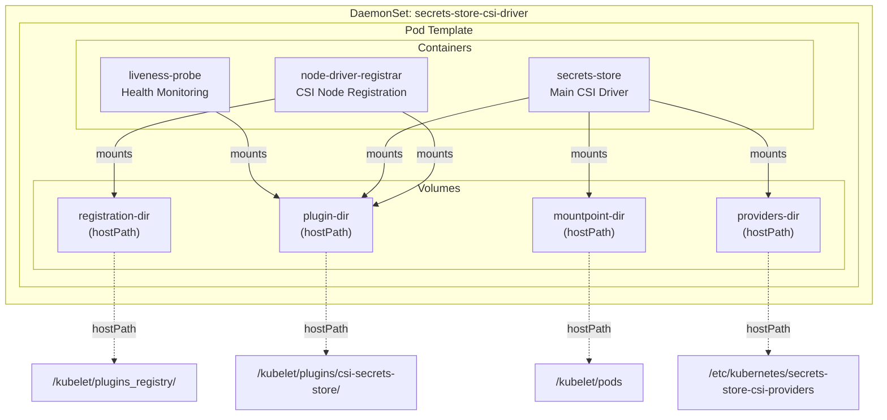
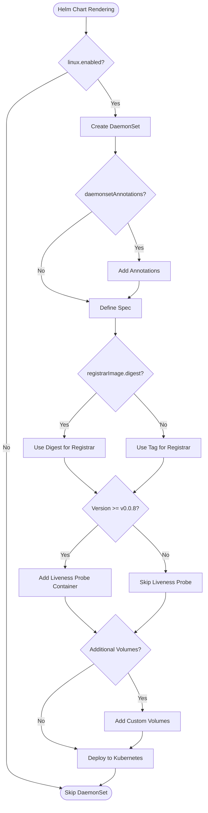
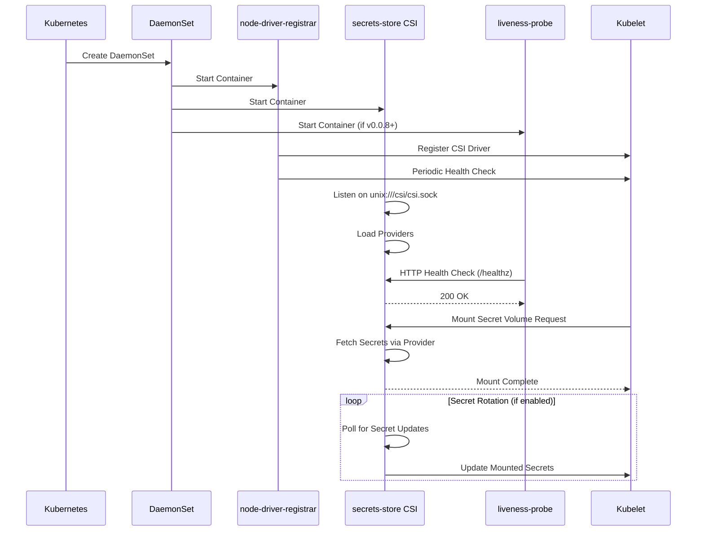
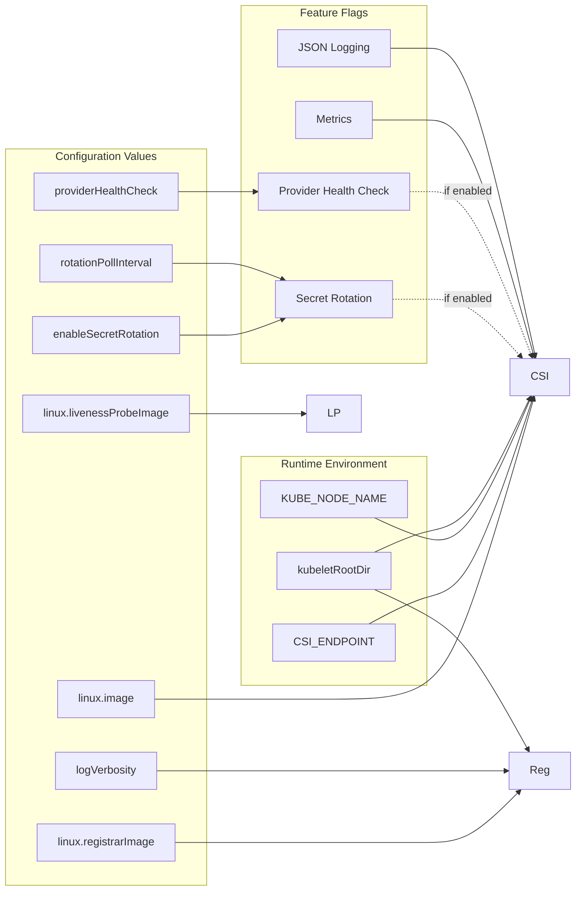

# Diagram: devops/k8s/secrets-store-csi-driver/helm/templates/secrets-store-csi-driver.yaml


> Auto-generated by Obscura crawlers

## Diagram 1

```mermaid
graph TB
      subgraph DaemonSet["DaemonSet: secrets-store-csi-driver"]
          subgraph Pod["Pod Template"]
              subgraph Containers["Containers"]...
  └ 247 lines...
```

> SVG rendering failed for this diagram.

## Diagram 2



### SVG

<svg id="container" width="1283.515625" xmlns="http://www.w3.org/2000/svg" class="flowchart" height="598" viewBox="0 0 1283.515625 598" role="graphics-document document" aria-roledescription="flowchart-v2"><style>#container{font-family:"trebuchet ms",verdana,arial,sans-serif;font-size:16px;fill:#333;}@keyframes edge-animation-frame{from{stroke-dashoffset:0;}}@keyframes dash{to{stroke-dashoffset:0;}}#container .edge-animation-slow{stroke-dasharray:9,5!important;stroke-dashoffset:900;animation:dash 50s linear infinite;stroke-linecap:round;}#container .edge-animation-fast{stroke-dasharray:9,5!important;stroke-dashoffset:900;animation:dash 20s linear infinite;stroke-linecap:round;}#container .error-icon{fill:#552222;}#container .error-text{fill:#552222;stroke:#552222;}#container .edge-thickness-normal{stroke-width:1px;}#container .edge-thickness-thick{stroke-width:3.5px;}#container .edge-pattern-solid{stroke-dasharray:0;}#container .edge-thickness-invisible{stroke-width:0;fill:none;}#container .edge-pattern-dashed{stroke-dasharray:3;}#container .edge-pattern-dotted{stroke-dasharray:2;}#container .marker{fill:#333333;stroke:#333333;}#container .marker.cross{stroke:#333333;}#container svg{font-family:"trebuchet ms",verdana,arial,sans-serif;font-size:16px;}#container p{margin:0;}#container .label{font-family:"trebuchet ms",verdana,arial,sans-serif;color:#333;}#container .cluster-label text{fill:#333;}#container .cluster-label span{color:#333;}#container .cluster-label span p{background-color:transparent;}#container .label text,#container span{fill:#333;color:#333;}#container .node rect,#container .node circle,#container .node ellipse,#container .node polygon,#container .node path{fill:#ECECFF;stroke:#9370DB;stroke-width:1px;}#container .rough-node .label text,#container .node .label text,#container .image-shape .label,#container .icon-shape .label{text-anchor:middle;}#container .node .katex path{fill:#000;stroke:#000;stroke-width:1px;}#container .rough-node .label,#container .node .label,#container .image-shape .label,#container .icon-shape .label{text-align:center;}#container .node.clickable{cursor:pointer;}#container .root .anchor path{fill:#333333!important;stroke-width:0;stroke:#333333;}#container .arrowheadPath{fill:#333333;}#container .edgePath .path{stroke:#333333;stroke-width:2.0px;}#container .flowchart-link{stroke:#333333;fill:none;}#container .edgeLabel{background-color:rgba(232,232,232, 0.8);text-align:center;}#container .edgeLabel p{background-color:rgba(232,232,232, 0.8);}#container .edgeLabel rect{opacity:0.5;background-color:rgba(232,232,232, 0.8);fill:rgba(232,232,232, 0.8);}#container .labelBkg{background-color:rgba(232, 232, 232, 0.5);}#container .cluster rect{fill:#ffffde;stroke:#aaaa33;stroke-width:1px;}#container .cluster text{fill:#333;}#container .cluster span{color:#333;}#container div.mermaidTooltip{position:absolute;text-align:center;max-width:200px;padding:2px;font-family:"trebuchet ms",verdana,arial,sans-serif;font-size:12px;background:hsl(80, 100%, 96.2745098039%);border:1px solid #aaaa33;border-radius:2px;pointer-events:none;z-index:100;}#container .flowchartTitleText{text-anchor:middle;font-size:18px;fill:#333;}#container rect.text{fill:none;stroke-width:0;}#container .icon-shape,#container .image-shape{background-color:rgba(232,232,232, 0.8);text-align:center;}#container .icon-shape p,#container .image-shape p{background-color:rgba(232,232,232, 0.8);padding:2px;}#container .icon-shape rect,#container .image-shape rect{opacity:0.5;background-color:rgba(232,232,232, 0.8);fill:rgba(232,232,232, 0.8);}#container .label-icon{display:inline-block;height:1em;overflow:visible;vertical-align:-0.125em;}#container .node .label-icon path{fill:currentColor;stroke:revert;stroke-width:revert;}#container :root{--mermaid-font-family:"trebuchet ms",verdana,arial,sans-serif;}</style><g><marker id="container_flowchart-v2-pointEnd" class="marker flowchart-v2" viewBox="0 0 10 10" refX="5" refY="5" markerUnits="userSpaceOnUse" markerWidth="8" markerHeight="8" orient="auto"><path d="M 0 0 L 10 5 L 0 10 z" class="arrowMarkerPath" style="stroke-width: 1; stroke-dasharray: 1, 0;"></path></marker><marker id="container_flowchart-v2-pointStart" class="marker flowchart-v2" viewBox="0 0 10 10" refX="4.5" refY="5" markerUnits="userSpaceOnUse" markerWidth="8" markerHeight="8" orient="auto"><path d="M 0 5 L 10 10 L 10 0 z" class="arrowMarkerPath" style="stroke-width: 1; stroke-dasharray: 1, 0;"></path></marker><marker id="container_flowchart-v2-circleEnd" class="marker flowchart-v2" viewBox="0 0 10 10" refX="11" refY="5" markerUnits="userSpaceOnUse" markerWidth="11" markerHeight="11" orient="auto"><circle cx="5" cy="5" r="5" class="arrowMarkerPath" style="stroke-width: 1; stroke-dasharray: 1, 0;"></circle></marker><marker id="container_flowchart-v2-circleStart" class="marker flowchart-v2" viewBox="0 0 10 10" refX="-1" refY="5" markerUnits="userSpaceOnUse" markerWidth="11" markerHeight="11" orient="auto"><circle cx="5" cy="5" r="5" class="arrowMarkerPath" style="stroke-width: 1; stroke-dasharray: 1, 0;"></circle></marker><marker id="container_flowchart-v2-crossEnd" class="marker cross flowchart-v2" viewBox="0 0 11 11" refX="12" refY="5.2" markerUnits="userSpaceOnUse" markerWidth="11" markerHeight="11" orient="auto"><path d="M 1,1 l 9,9 M 10,1 l -9,9" class="arrowMarkerPath" style="stroke-width: 2; stroke-dasharray: 1, 0;"></path></marker><marker id="container_flowchart-v2-crossStart" class="marker cross flowchart-v2" viewBox="0 0 11 11" refX="-1" refY="5.2" markerUnits="userSpaceOnUse" markerWidth="11" markerHeight="11" orient="auto"><path d="M 1,1 l 9,9 M 10,1 l -9,9" class="arrowMarkerPath" style="stroke-width: 2; stroke-dasharray: 1, 0;"></path></marker><g class="root"><g class="clusters"><g class="cluster" id="DaemonSet" data-look="classic"><rect style="" x="8" y="8" width="1267.515625" height="430"></rect><g class="cluster-label" transform="translate(541.7578125, 8)"><foreignObject width="200" height="48"><div xmlns="http://www.w3.org/1999/xhtml" style="display: table; white-space: break-spaces; line-height: 1.5; max-width: 200px; text-align: center; width: 200px;"><span class="nodeLabel"><p>DaemonSet: secrets-store-csi-driver</p></span></div></foreignObject></g></g><g class="cluster" id="Pod" data-look="classic"><rect style="" x="28" y="33" width="1227.515625" height="380"></rect><g class="cluster-label" transform="translate(592.3203125, 33)"><foreignObject width="98.875" height="24"><div xmlns="http://www.w3.org/1999/xhtml" style="display: table-cell; white-space: nowrap; line-height: 1.5; max-width: 200px; text-align: center;"><span class="nodeLabel"><p>Pod Template</p></span></div></foreignObject></g></g><g class="cluster" id="Volumes" data-look="classic"><rect style="" x="48" y="260" width="1187.515625" height="128"></rect><g class="cluster-label" transform="translate(610.8828125, 260)"><foreignObject width="61.75" height="24"><div xmlns="http://www.w3.org/1999/xhtml" style="display: table-cell; white-space: nowrap; line-height: 1.5; max-width: 200px; text-align: center;"><span class="nodeLabel"><p>Volumes</p></span></div></foreignObject></g></g><g class="cluster" id="Containers" data-look="classic"><rect style="" x="113.3671875" y="58" width="1075.87109375" height="128"></rect><g class="cluster-label" transform="translate(612.427734375, 58)"><foreignObject width="77.75" height="24"><div xmlns="http://www.w3.org/1999/xhtml" style="display: table-cell; white-space: nowrap; line-height: 1.5; max-width: 200px; text-align: center;"><span class="nodeLabel"><p>Containers</p></span></div></foreignObject></g></g></g><g class="edgePaths"><path d="M592.008,161L600.041,165.167C608.073,169.333,624.138,177.667,632.171,188C640.203,198.333,640.203,210.667,640.203,223C640.203,235.333,640.203,247.667,625.227,259.791C610.251,271.916,580.298,283.831,565.322,289.789L550.346,295.747" id="L_NDR_PD_0" class="edge-thickness-normal edge-pattern-solid edge-thickness-normal edge-pattern-solid flowchart-link" style=";" data-edge="true" data-et="edge" data-id="L_NDR_PD_0" data-points="W3sieCI6NTkyLjAwODIzOTc0NjA5MzgsInkiOjE2MX0seyJ4Ijo2NDAuMjAzMTI1LCJ5IjoxODZ9LHsieCI6NjQwLjIwMzEyNSwieSI6MjIzfSx7IngiOjY0MC4yMDMxMjUsInkiOjI2MH0seyJ4Ijo1NDYuNjI4OTA2MjUsInkiOjI5Ny4yMjUyMDMzNTA3MzQ1fV0=" marker-end="url(#container_flowchart-v2-pointEnd)"></path><path d="M408.395,141.909L368.373,149.258C328.352,156.606,248.309,171.303,208.287,184.818C168.266,198.333,168.266,210.667,168.266,223C168.266,235.333,168.266,247.667,168.266,257.333C168.266,267,168.266,274,168.266,277.5L168.266,281" id="L_NDR_RD_0" class="edge-thickness-normal edge-pattern-solid edge-thickness-normal edge-pattern-solid flowchart-link" style=";" data-edge="true" data-et="edge" data-id="L_NDR_RD_0" data-points="W3sieCI6NDA4LjM5NDUzMTI1LCJ5IjoxNDEuOTA5MTM0NzE3NzU1MDV9LHsieCI6MTY4LjI2NTYyNSwieSI6MTg2fSx7IngiOjE2OC4yNjU2MjUsInkiOjIyM30seyJ4IjoxNjguMjY1NjI1LCJ5IjoyNjB9LHsieCI6MTY4LjI2NTYyNSwieSI6Mjg1fV0=" marker-end="url(#container_flowchart-v2-pointEnd)"></path><path d="M774.836,140.423L739.897,148.019C704.958,155.615,635.081,170.808,600.142,184.57C565.203,198.333,565.203,210.667,565.203,223C565.203,235.333,565.203,247.667,560.147,257.602C555.09,267.537,544.977,275.073,539.921,278.841L534.864,282.61" id="L_SS_PD_0" class="edge-thickness-normal edge-pattern-solid edge-thickness-normal edge-pattern-solid flowchart-link" style=";" data-edge="true" data-et="edge" data-id="L_SS_PD_0" data-points="W3sieCI6Nzc0LjgzNTkzNzUsInkiOjE0MC40MjI1Njk2MDExMDQwN30seyJ4Ijo1NjUuMjAzMTI1LCJ5IjoxODZ9LHsieCI6NTY1LjIwMzEyNSwieSI6MjIzfSx7IngiOjU2NS4yMDMxMjUsInkiOjI2MH0seyJ4Ijo1MzEuNjU2Njc3MjQ2MDkzOCwieSI6Mjg1fV0=" marker-end="url(#container_flowchart-v2-pointEnd)"></path><path d="M859.57,161L859.57,165.167C859.57,169.333,859.57,177.667,859.57,188C859.57,198.333,859.57,210.667,859.57,223C859.57,235.333,859.57,247.667,859.57,257.333C859.57,267,859.57,274,859.57,277.5L859.57,281" id="L_SS_MD_0" class="edge-thickness-normal edge-pattern-solid edge-thickness-normal edge-pattern-solid flowchart-link" style=";" data-edge="true" data-et="edge" data-id="L_SS_MD_0" data-points="W3sieCI6ODU5LjU3MDMxMjUsInkiOjE2MX0seyJ4Ijo4NTkuNTcwMzEyNSwieSI6MTg2fSx7IngiOjg1OS41NzAzMTI1LCJ5IjoyMjN9LHsieCI6ODU5LjU3MDMxMjUsInkiOjI2MH0seyJ4Ijo4NTkuNTcwMzEyNSwieSI6Mjg1fV0=" marker-end="url(#container_flowchart-v2-pointEnd)"></path><path d="M944.305,142.589L974.081,149.824C1003.857,157.059,1063.409,171.53,1093.185,184.932C1122.961,198.333,1122.961,210.667,1122.961,223C1122.961,235.333,1122.961,247.667,1122.961,257.333C1122.961,267,1122.961,274,1122.961,277.5L1122.961,281" id="L_SS_PROV_0" class="edge-thickness-normal edge-pattern-solid edge-thickness-normal edge-pattern-solid flowchart-link" style=";" data-edge="true" data-et="edge" data-id="L_SS_PROV_0" data-points="W3sieCI6OTQ0LjMwNDY4NzUsInkiOjE0Mi41ODkxOTE0MzM4MjU3fSx7IngiOjExMjIuOTYwOTM3NSwieSI6MTg2fSx7IngiOjExMjIuOTYwOTM3NSwieSI6MjIzfSx7IngiOjExMjIuOTYwOTM3NSwieSI6MjYwfSx7IngiOjExMjIuOTYwOTM3NSwieSI6Mjg1fV0=" marker-end="url(#container_flowchart-v2-pointEnd)"></path><path d="M319.059,161L327.092,165.167C335.124,169.333,351.189,177.667,359.221,188C367.254,198.333,367.254,210.667,367.254,223C367.254,235.333,367.254,247.667,374.136,257.763C381.018,267.86,394.782,275.72,401.664,279.651L408.546,283.581" id="L_LP_PD_0" class="edge-thickness-normal edge-pattern-solid edge-thickness-normal edge-pattern-solid flowchart-link" style=";" data-edge="true" data-et="edge" data-id="L_LP_PD_0" data-points="W3sieCI6MzE5LjA1OTAyMDk5NjA5Mzc1LCJ5IjoxNjF9LHsieCI6MzY3LjI1MzkwNjI1LCJ5IjoxODZ9LHsieCI6MzY3LjI1MzkwNjI1LCJ5IjoyMjN9LHsieCI6MzY3LjI1MzkwNjI1LCJ5IjoyNjB9LHsieCI6NDEyLjAxOTUzMTI1LCJ5IjoyODUuNTY0MzA4MTIxMjk2Nn1d" marker-end="url(#container_flowchart-v2-pointEnd)"></path><path d="M479.324,363L479.324,367.167C479.324,371.333,479.324,379.667,479.324,388C479.324,396.333,479.324,404.667,479.324,413C479.324,421.333,479.324,429.667,479.324,440C479.324,450.333,479.324,462.667,479.324,474.333C479.324,486,479.324,497,479.324,502.5L479.324,508" id="L_PD_HOST1_0" class="edge-thickness-normal edge-pattern-dotted edge-thickness-normal edge-pattern-solid flowchart-link" style=";" data-edge="true" data-et="edge" data-id="L_PD_HOST1_0" data-points="W3sieCI6NDc5LjMyNDIxODc1LCJ5IjozNjN9LHsieCI6NDc5LjMyNDIxODc1LCJ5IjozODh9LHsieCI6NDc5LjMyNDIxODc1LCJ5Ijo0MTN9LHsieCI6NDc5LjMyNDIxODc1LCJ5Ijo0Mzh9LHsieCI6NDc5LjMyNDIxODc1LCJ5Ijo0NzV9LHsieCI6NDc5LjMyNDIxODc1LCJ5Ijo1MTJ9XQ==" marker-end="url(#container_flowchart-v2-pointEnd)"></path><path d="M859.57,363L859.57,367.167C859.57,371.333,859.57,379.667,859.57,388C859.57,396.333,859.57,404.667,859.57,413C859.57,421.333,859.57,429.667,859.57,440C859.57,450.333,859.57,462.667,859.57,476.333C859.57,490,859.57,505,859.57,512.5L859.57,520" id="L_MD_HOST2_0" class="edge-thickness-normal edge-pattern-dotted edge-thickness-normal edge-pattern-solid flowchart-link" style=";" data-edge="true" data-et="edge" data-id="L_MD_HOST2_0" data-points="W3sieCI6ODU5LjU3MDMxMjUsInkiOjM2M30seyJ4Ijo4NTkuNTcwMzEyNSwieSI6Mzg4fSx7IngiOjg1OS41NzAzMTI1LCJ5Ijo0MTN9LHsieCI6ODU5LjU3MDMxMjUsInkiOjQzOH0seyJ4Ijo4NTkuNTcwMzEyNSwieSI6NDc1fSx7IngiOjg1OS41NzAzMTI1LCJ5Ijo1MjR9XQ==" marker-end="url(#container_flowchart-v2-pointEnd)"></path><path d="M168.266,363L168.266,367.167C168.266,371.333,168.266,379.667,168.266,388C168.266,396.333,168.266,404.667,168.266,413C168.266,421.333,168.266,429.667,168.266,440C168.266,450.333,168.266,462.667,168.266,476.333C168.266,490,168.266,505,168.266,512.5L168.266,520" id="L_RD_HOST3_0" class="edge-thickness-normal edge-pattern-dotted edge-thickness-normal edge-pattern-solid flowchart-link" style=";" data-edge="true" data-et="edge" data-id="L_RD_HOST3_0" data-points="W3sieCI6MTY4LjI2NTYyNSwieSI6MzYzfSx7IngiOjE2OC4yNjU2MjUsInkiOjM4OH0seyJ4IjoxNjguMjY1NjI1LCJ5Ijo0MTN9LHsieCI6MTY4LjI2NTYyNSwieSI6NDM4fSx7IngiOjE2OC4yNjU2MjUsInkiOjQ3NX0seyJ4IjoxNjguMjY1NjI1LCJ5Ijo1MjR9XQ==" marker-end="url(#container_flowchart-v2-pointEnd)"></path><path d="M1122.961,363L1122.961,367.167C1122.961,371.333,1122.961,379.667,1122.961,388C1122.961,396.333,1122.961,404.667,1122.961,413C1122.961,421.333,1122.961,429.667,1122.961,440C1122.961,450.333,1122.961,462.667,1122.961,474.333C1122.961,486,1122.961,497,1122.961,502.5L1122.961,508" id="L_PROV_HOST4_0" class="edge-thickness-normal edge-pattern-dotted edge-thickness-normal edge-pattern-solid flowchart-link" style=";" data-edge="true" data-et="edge" data-id="L_PROV_HOST4_0" data-points="W3sieCI6MTEyMi45NjA5Mzc1LCJ5IjozNjN9LHsieCI6MTEyMi45NjA5Mzc1LCJ5IjozODh9LHsieCI6MTEyMi45NjA5Mzc1LCJ5Ijo0MTN9LHsieCI6MTEyMi45NjA5Mzc1LCJ5Ijo0Mzh9LHsieCI6MTEyMi45NjA5Mzc1LCJ5Ijo0NzV9LHsieCI6MTEyMi45NjA5Mzc1LCJ5Ijo1MTJ9XQ==" marker-end="url(#container_flowchart-v2-pointEnd)"></path></g><g class="edgeLabels"><g class="edgeLabel" transform="translate(640.203125, 223)"><g class="label" data-id="L_NDR_PD_0" transform="translate(-27.5, -12)"><foreignObject width="55" height="24"><div xmlns="http://www.w3.org/1999/xhtml" class="labelBkg" style="display: table-cell; white-space: nowrap; line-height: 1.5; max-width: 200px; text-align: center;"><span class="edgeLabel"><p>mounts</p></span></div></foreignObject></g></g><g class="edgeLabel" transform="translate(168.265625, 223)"><g class="label" data-id="L_NDR_RD_0" transform="translate(-27.5, -12)"><foreignObject width="55" height="24"><div xmlns="http://www.w3.org/1999/xhtml" class="labelBkg" style="display: table-cell; white-space: nowrap; line-height: 1.5; max-width: 200px; text-align: center;"><span class="edgeLabel"><p>mounts</p></span></div></foreignObject></g></g><g class="edgeLabel" transform="translate(565.203125, 223)"><g class="label" data-id="L_SS_PD_0" transform="translate(-27.5, -12)"><foreignObject width="55" height="24"><div xmlns="http://www.w3.org/1999/xhtml" class="labelBkg" style="display: table-cell; white-space: nowrap; line-height: 1.5; max-width: 200px; text-align: center;"><span class="edgeLabel"><p>mounts</p></span></div></foreignObject></g></g><g class="edgeLabel" transform="translate(859.5703125, 223)"><g class="label" data-id="L_SS_MD_0" transform="translate(-27.5, -12)"><foreignObject width="55" height="24"><div xmlns="http://www.w3.org/1999/xhtml" class="labelBkg" style="display: table-cell; white-space: nowrap; line-height: 1.5; max-width: 200px; text-align: center;"><span class="edgeLabel"><p>mounts</p></span></div></foreignObject></g></g><g class="edgeLabel" transform="translate(1122.9609375, 223)"><g class="label" data-id="L_SS_PROV_0" transform="translate(-27.5, -12)"><foreignObject width="55" height="24"><div xmlns="http://www.w3.org/1999/xhtml" class="labelBkg" style="display: table-cell; white-space: nowrap; line-height: 1.5; max-width: 200px; text-align: center;"><span class="edgeLabel"><p>mounts</p></span></div></foreignObject></g></g><g class="edgeLabel" transform="translate(367.25390625, 223)"><g class="label" data-id="L_LP_PD_0" transform="translate(-27.5, -12)"><foreignObject width="55" height="24"><div xmlns="http://www.w3.org/1999/xhtml" class="labelBkg" style="display: table-cell; white-space: nowrap; line-height: 1.5; max-width: 200px; text-align: center;"><span class="edgeLabel"><p>mounts</p></span></div></foreignObject></g></g><g class="edgeLabel" transform="translate(479.32421875, 475)"><g class="label" data-id="L_PD_HOST1_0" transform="translate(-32.125, -12)"><foreignObject width="64.25" height="24"><div xmlns="http://www.w3.org/1999/xhtml" class="labelBkg" style="display: table-cell; white-space: nowrap; line-height: 1.5; max-width: 200px; text-align: center;"><span class="edgeLabel"><p>hostPath</p></span></div></foreignObject></g></g><g class="edgeLabel" transform="translate(859.5703125, 475)"><g class="label" data-id="L_MD_HOST2_0" transform="translate(-32.125, -12)"><foreignObject width="64.25" height="24"><div xmlns="http://www.w3.org/1999/xhtml" class="labelBkg" style="display: table-cell; white-space: nowrap; line-height: 1.5; max-width: 200px; text-align: center;"><span class="edgeLabel"><p>hostPath</p></span></div></foreignObject></g></g><g class="edgeLabel" transform="translate(168.265625, 475)"><g class="label" data-id="L_RD_HOST3_0" transform="translate(-32.125, -12)"><foreignObject width="64.25" height="24"><div xmlns="http://www.w3.org/1999/xhtml" class="labelBkg" style="display: table-cell; white-space: nowrap; line-height: 1.5; max-width: 200px; text-align: center;"><span class="edgeLabel"><p>hostPath</p></span></div></foreignObject></g></g><g class="edgeLabel" transform="translate(1122.9609375, 475)"><g class="label" data-id="L_PROV_HOST4_0" transform="translate(-32.125, -12)"><foreignObject width="64.25" height="24"><div xmlns="http://www.w3.org/1999/xhtml" class="labelBkg" style="display: table-cell; white-space: nowrap; line-height: 1.5; max-width: 200px; text-align: center;"><span class="edgeLabel"><p>hostPath</p></span></div></foreignObject></g></g></g><g class="nodes"><g class="node default" id="flowchart-NDR-0" transform="translate(516.82421875, 122)"><rect class="basic label-container" style="" x="-108.4296875" y="-39" width="216.859375" height="78"></rect><g class="label" style="" transform="translate(-78.4296875, -24)"><rect></rect><foreignObject width="156.859375" height="48"><div xmlns="http://www.w3.org/1999/xhtml" style="display: table-cell; white-space: nowrap; line-height: 1.5; max-width: 200px; text-align: center;"><span class="nodeLabel"><p>node-driver-registrar<br/>CSI Node Registration</p></span></div></foreignObject></g></g><g class="node default" id="flowchart-SS-1" transform="translate(859.5703125, 122)"><rect class="basic label-container" style="" x="-84.734375" y="-39" width="169.46875" height="78"></rect><g class="label" style="" transform="translate(-54.734375, -24)"><rect></rect><foreignObject width="109.46875" height="48"><div xmlns="http://www.w3.org/1999/xhtml" style="display: table-cell; white-space: nowrap; line-height: 1.5; max-width: 200px; text-align: center;"><span class="nodeLabel"><p>secrets-store<br/>Main CSI Driver</p></span></div></foreignObject></g></g><g class="node default" id="flowchart-LP-2" transform="translate(243.875, 122)"><rect class="basic label-container" style="" x="-95.5078125" y="-39" width="191.015625" height="78"></rect><g class="label" style="" transform="translate(-65.5078125, -24)"><rect></rect><foreignObject width="131.015625" height="48"><div xmlns="http://www.w3.org/1999/xhtml" style="display: table-cell; white-space: nowrap; line-height: 1.5; max-width: 200px; text-align: center;"><span class="nodeLabel"><p>liveness-probe<br/>Health Monitoring</p></span></div></foreignObject></g></g><g class="node default" id="flowchart-PD-3" transform="translate(479.32421875, 324)"><rect class="basic label-container" style="" x="-67.3046875" y="-39" width="134.609375" height="78"></rect><g class="label" style="" transform="translate(-37.3046875, -24)"><rect></rect><foreignObject width="74.609375" height="48"><div xmlns="http://www.w3.org/1999/xhtml" style="display: table-cell; white-space: nowrap; line-height: 1.5; max-width: 200px; text-align: center;"><span class="nodeLabel"><p>plugin-dir<br/>(hostPath)</p></span></div></foreignObject></g></g><g class="node default" id="flowchart-MD-4" transform="translate(859.5703125, 324)"><rect class="basic label-container" style="" x="-86.0546875" y="-39" width="172.109375" height="78"></rect><g class="label" style="" transform="translate(-56.0546875, -24)"><rect></rect><foreignObject width="112.109375" height="48"><div xmlns="http://www.w3.org/1999/xhtml" style="display: table-cell; white-space: nowrap; line-height: 1.5; max-width: 200px; text-align: center;"><span class="nodeLabel"><p>mountpoint-dir<br/>(hostPath)</p></span></div></foreignObject></g></g><g class="node default" id="flowchart-RD-5" transform="translate(168.265625, 324)"><rect class="basic label-container" style="" x="-85.265625" y="-39" width="170.53125" height="78"></rect><g class="label" style="" transform="translate(-55.265625, -24)"><rect></rect><foreignObject width="110.53125" height="48"><div xmlns="http://www.w3.org/1999/xhtml" style="display: table-cell; white-space: nowrap; line-height: 1.5; max-width: 200px; text-align: center;"><span class="nodeLabel"><p>registration-dir<br/>(hostPath)</p></span></div></foreignObject></g></g><g class="node default" id="flowchart-PROV-6" transform="translate(1122.9609375, 324)"><rect class="basic label-container" style="" x="-77.5546875" y="-39" width="155.109375" height="78"></rect><g class="label" style="" transform="translate(-47.5546875, -24)"><rect></rect><foreignObject width="95.109375" height="48"><div xmlns="http://www.w3.org/1999/xhtml" style="display: table-cell; white-space: nowrap; line-height: 1.5; max-width: 200px; text-align: center;"><span class="nodeLabel"><p>providers-dir<br/>(hostPath)</p></span></div></foreignObject></g></g><g class="node default" id="flowchart-HOST1-20" transform="translate(479.32421875, 551)"><rect class="basic label-container" style="" x="-130" y="-39" width="260" height="78"></rect><g class="label" style="" transform="translate(-100, -24)"><rect></rect><foreignObject width="200" height="48"><div xmlns="http://www.w3.org/1999/xhtml" style="display: table; white-space: break-spaces; line-height: 1.5; max-width: 200px; text-align: center; width: 200px;"><span class="nodeLabel"><p>/kubelet/plugins/csi-secrets-store/</p></span></div></foreignObject></g></g><g class="node default" id="flowchart-HOST2-22" transform="translate(859.5703125, 551)"><rect class="basic label-container" style="" x="-83.390625" y="-27" width="166.78125" height="54"></rect><g class="label" style="" transform="translate(-53.390625, -12)"><rect></rect><foreignObject width="106.78125" height="24"><div xmlns="http://www.w3.org/1999/xhtml" style="display: table-cell; white-space: nowrap; line-height: 1.5; max-width: 200px; text-align: center;"><span class="nodeLabel"><p>/kubelet/pods</p></span></div></foreignObject></g></g><g class="node default" id="flowchart-HOST3-24" transform="translate(168.265625, 551)"><rect class="basic label-container" style="" x="-127.46875" y="-27" width="254.9375" height="54"></rect><g class="label" style="" transform="translate(-97.46875, -12)"><rect></rect><foreignObject width="194.9375" height="24"><div xmlns="http://www.w3.org/1999/xhtml" style="display: table-cell; white-space: nowrap; line-height: 1.5; max-width: 200px; text-align: center;"><span class="nodeLabel"><p>/kubelet/plugins_registry/</p></span></div></foreignObject></g></g><g class="node default" id="flowchart-HOST4-26" transform="translate(1122.9609375, 551)"><rect class="basic label-container" style="" x="-130" y="-39" width="260" height="78"></rect><g class="label" style="" transform="translate(-100, -24)"><rect></rect><foreignObject width="200" height="48"><div xmlns="http://www.w3.org/1999/xhtml" style="display: table; white-space: break-spaces; line-height: 1.5; max-width: 200px; text-align: center; width: 200px;"><span class="nodeLabel"><p>/etc/kubernetes/secrets-store-csi-providers</p></span></div></foreignObject></g></g></g></g></g></svg>

## Diagram 3



### SVG

<svg id="container" width="574.6875" xmlns="http://www.w3.org/2000/svg" class="flowchart" height="2252.484375" viewBox="0 0 574.6875 2252.484375" role="graphics-document document" aria-roledescription="flowchart-v2"><style>#container{font-family:"trebuchet ms",verdana,arial,sans-serif;font-size:16px;fill:#333;}@keyframes edge-animation-frame{from{stroke-dashoffset:0;}}@keyframes dash{to{stroke-dashoffset:0;}}#container .edge-animation-slow{stroke-dasharray:9,5!important;stroke-dashoffset:900;animation:dash 50s linear infinite;stroke-linecap:round;}#container .edge-animation-fast{stroke-dasharray:9,5!important;stroke-dashoffset:900;animation:dash 20s linear infinite;stroke-linecap:round;}#container .error-icon{fill:#552222;}#container .error-text{fill:#552222;stroke:#552222;}#container .edge-thickness-normal{stroke-width:1px;}#container .edge-thickness-thick{stroke-width:3.5px;}#container .edge-pattern-solid{stroke-dasharray:0;}#container .edge-thickness-invisible{stroke-width:0;fill:none;}#container .edge-pattern-dashed{stroke-dasharray:3;}#container .edge-pattern-dotted{stroke-dasharray:2;}#container .marker{fill:#333333;stroke:#333333;}#container .marker.cross{stroke:#333333;}#container svg{font-family:"trebuchet ms",verdana,arial,sans-serif;font-size:16px;}#container p{margin:0;}#container .label{font-family:"trebuchet ms",verdana,arial,sans-serif;color:#333;}#container .cluster-label text{fill:#333;}#container .cluster-label span{color:#333;}#container .cluster-label span p{background-color:transparent;}#container .label text,#container span{fill:#333;color:#333;}#container .node rect,#container .node circle,#container .node ellipse,#container .node polygon,#container .node path{fill:#ECECFF;stroke:#9370DB;stroke-width:1px;}#container .rough-node .label text,#container .node .label text,#container .image-shape .label,#container .icon-shape .label{text-anchor:middle;}#container .node .katex path{fill:#000;stroke:#000;stroke-width:1px;}#container .rough-node .label,#container .node .label,#container .image-shape .label,#container .icon-shape .label{text-align:center;}#container .node.clickable{cursor:pointer;}#container .root .anchor path{fill:#333333!important;stroke-width:0;stroke:#333333;}#container .arrowheadPath{fill:#333333;}#container .edgePath .path{stroke:#333333;stroke-width:2.0px;}#container .flowchart-link{stroke:#333333;fill:none;}#container .edgeLabel{background-color:rgba(232,232,232, 0.8);text-align:center;}#container .edgeLabel p{background-color:rgba(232,232,232, 0.8);}#container .edgeLabel rect{opacity:0.5;background-color:rgba(232,232,232, 0.8);fill:rgba(232,232,232, 0.8);}#container .labelBkg{background-color:rgba(232, 232, 232, 0.5);}#container .cluster rect{fill:#ffffde;stroke:#aaaa33;stroke-width:1px;}#container .cluster text{fill:#333;}#container .cluster span{color:#333;}#container div.mermaidTooltip{position:absolute;text-align:center;max-width:200px;padding:2px;font-family:"trebuchet ms",verdana,arial,sans-serif;font-size:12px;background:hsl(80, 100%, 96.2745098039%);border:1px solid #aaaa33;border-radius:2px;pointer-events:none;z-index:100;}#container .flowchartTitleText{text-anchor:middle;font-size:18px;fill:#333;}#container rect.text{fill:none;stroke-width:0;}#container .icon-shape,#container .image-shape{background-color:rgba(232,232,232, 0.8);text-align:center;}#container .icon-shape p,#container .image-shape p{background-color:rgba(232,232,232, 0.8);padding:2px;}#container .icon-shape rect,#container .image-shape rect{opacity:0.5;background-color:rgba(232,232,232, 0.8);fill:rgba(232,232,232, 0.8);}#container .label-icon{display:inline-block;height:1em;overflow:visible;vertical-align:-0.125em;}#container .node .label-icon path{fill:currentColor;stroke:revert;stroke-width:revert;}#container :root{--mermaid-font-family:"trebuchet ms",verdana,arial,sans-serif;}</style><g><marker id="container_flowchart-v2-pointEnd" class="marker flowchart-v2" viewBox="0 0 10 10" refX="5" refY="5" markerUnits="userSpaceOnUse" markerWidth="8" markerHeight="8" orient="auto"><path d="M 0 0 L 10 5 L 0 10 z" class="arrowMarkerPath" style="stroke-width: 1; stroke-dasharray: 1, 0;"></path></marker><marker id="container_flowchart-v2-pointStart" class="marker flowchart-v2" viewBox="0 0 10 10" refX="4.5" refY="5" markerUnits="userSpaceOnUse" markerWidth="8" markerHeight="8" orient="auto"><path d="M 0 5 L 10 10 L 10 0 z" class="arrowMarkerPath" style="stroke-width: 1; stroke-dasharray: 1, 0;"></path></marker><marker id="container_flowchart-v2-circleEnd" class="marker flowchart-v2" viewBox="0 0 10 10" refX="11" refY="5" markerUnits="userSpaceOnUse" markerWidth="11" markerHeight="11" orient="auto"><circle cx="5" cy="5" r="5" class="arrowMarkerPath" style="stroke-width: 1; stroke-dasharray: 1, 0;"></circle></marker><marker id="container_flowchart-v2-circleStart" class="marker flowchart-v2" viewBox="0 0 10 10" refX="-1" refY="5" markerUnits="userSpaceOnUse" markerWidth="11" markerHeight="11" orient="auto"><circle cx="5" cy="5" r="5" class="arrowMarkerPath" style="stroke-width: 1; stroke-dasharray: 1, 0;"></circle></marker><marker id="container_flowchart-v2-crossEnd" class="marker cross flowchart-v2" viewBox="0 0 11 11" refX="12" refY="5.2" markerUnits="userSpaceOnUse" markerWidth="11" markerHeight="11" orient="auto"><path d="M 1,1 l 9,9 M 10,1 l -9,9" class="arrowMarkerPath" style="stroke-width: 2; stroke-dasharray: 1, 0;"></path></marker><marker id="container_flowchart-v2-crossStart" class="marker cross flowchart-v2" viewBox="0 0 11 11" refX="-1" refY="5.2" markerUnits="userSpaceOnUse" markerWidth="11" markerHeight="11" orient="auto"><path d="M 1,1 l 9,9 M 10,1 l -9,9" class="arrowMarkerPath" style="stroke-width: 2; stroke-dasharray: 1, 0;"></path></marker><g class="root"><g class="clusters"></g><g class="edgePaths"><path d="M242.027,47.5L241.944,51.583C241.861,55.667,241.694,63.833,241.611,71.417C241.527,79,241.527,86,241.527,89.5L241.527,93" id="L_START_LINUX_ENABLED_0" class="edge-thickness-normal edge-pattern-solid edge-thickness-normal edge-pattern-solid flowchart-link" style=";" data-edge="true" data-et="edge" data-id="L_START_LINUX_ENABLED_0" data-points="W3sieCI6MjQyLjAyNzM0Mzc1LCJ5Ijo0Ny41MDAwMDAwMDAwMDAwMX0seyJ4IjoyNDEuNTI3MzQzNzUsInkiOjcyfSx7IngiOjI0MS41MjczNDM3NSwieSI6OTd9XQ==" marker-end="url(#container_flowchart-v2-pointEnd)"></path><path d="M189.041,204.451L160.558,219.366C132.074,234.28,75.107,264.109,46.624,289.69C18.141,315.271,18.141,336.604,18.141,355.938C18.141,375.271,18.141,392.604,18.141,424.635C18.141,456.667,18.141,503.396,18.141,552.125C18.141,600.854,18.141,651.583,18.141,687.615C18.141,723.646,18.141,744.979,18.141,764.313C18.141,783.646,18.141,800.979,18.141,818.313C18.141,835.646,18.141,852.979,18.141,870.313C18.141,887.646,18.141,904.979,18.141,935.583C18.141,966.188,18.141,1010.063,18.141,1055.938C18.141,1101.813,18.141,1149.688,18.141,1184.292C18.141,1218.896,18.141,1240.229,18.141,1259.563C18.141,1278.896,18.141,1296.229,18.141,1324.147C18.141,1352.065,18.141,1390.568,18.141,1431.07C18.141,1471.573,18.141,1514.076,18.141,1547.993C18.141,1581.911,18.141,1607.245,18.141,1630.578C18.141,1653.911,18.141,1675.245,18.141,1706.904C18.141,1738.563,18.141,1780.547,18.141,1824.531C18.141,1868.516,18.141,1914.5,18.141,1948.159C18.141,1981.818,18.141,2003.151,18.141,2022.484C18.141,2041.818,18.141,2059.151,18.141,2076.484C18.141,2093.818,18.141,2111.151,18.141,2128.484C18.141,2145.818,18.141,2163.151,43.736,2176.982C69.331,2190.812,120.522,2201.14,146.118,2206.304L171.713,2211.467" id="L_LINUX_ENABLED_END_0" class="edge-thickness-normal edge-pattern-solid edge-thickness-normal edge-pattern-solid flowchart-link" style=";" data-edge="true" data-et="edge" data-id="L_LINUX_ENABLED_END_0" data-points="W3sieCI6MTg5LjA0MTE2ODgzODA4NTc1LCJ5IjoyMDQuNDUxMzI1MDg4MDg1NzV9LHsieCI6MTguMTQwNjI1LCJ5IjoyOTMuOTM3NX0seyJ4IjoxOC4xNDA2MjUsInkiOjM1Ny45Mzc1fSx7IngiOjE4LjE0MDYyNSwieSI6NDA5LjkzNzV9LHsieCI6MTguMTQwNjI1LCJ5Ijo1NTAuMTI1fSx7IngiOjE4LjE0MDYyNSwieSI6NzAyLjMxMjV9LHsieCI6MTguMTQwNjI1LCJ5Ijo3NjYuMzEyNX0seyJ4IjoxOC4xNDA2MjUsInkiOjgxOC4zMTI1fSx7IngiOjE4LjE0MDYyNSwieSI6ODcwLjMxMjV9LHsieCI6MTguMTQwNjI1LCJ5Ijo5MjIuMzEyNX0seyJ4IjoxOC4xNDA2MjUsInkiOjEwNTMuOTM3NX0seyJ4IjoxOC4xNDA2MjUsInkiOjExOTcuNTYyNX0seyJ4IjoxOC4xNDA2MjUsInkiOjEyNjEuNTYyNX0seyJ4IjoxOC4xNDA2MjUsInkiOjEzMTMuNTYyNX0seyJ4IjoxOC4xNDA2MjUsInkiOjE0MjkuMDcwMzEyNX0seyJ4IjoxOC4xNDA2MjUsInkiOjE1NTYuNTc4MTI1fSx7IngiOjE4LjE0MDYyNSwieSI6MTYzMi41NzgxMjV9LHsieCI6MTguMTQwNjI1LCJ5IjoxNjk2LjU3ODEyNX0seyJ4IjoxOC4xNDA2MjUsInkiOjE4MjIuNTMxMjV9LHsieCI6MTguMTQwNjI1LCJ5IjoxOTYwLjQ4NDM3NX0seyJ4IjoxOC4xNDA2MjUsInkiOjIwMjQuNDg0Mzc1fSx7IngiOjE4LjE0MDYyNSwieSI6MjA3Ni40ODQzNzV9LHsieCI6MTguMTQwNjI1LCJ5IjoyMTI4LjQ4NDM3NX0seyJ4IjoxOC4xNDA2MjUsInkiOjIxODAuNDg0Mzc1fSx7IngiOjE3NS42MzQwMzIxMjkwMzAyLCJ5IjoyMjEyLjI1ODQyMTQ0NDM2NX1d" marker-end="url(#container_flowchart-v2-pointEnd)"></path><path d="M274.602,223.863L282.84,235.542C291.077,247.221,307.552,270.579,315.79,287.758C324.027,304.938,324.027,315.938,324.027,321.438L324.027,326.938" id="L_LINUX_ENABLED_CREATE_DS_0" class="edge-thickness-normal edge-pattern-solid edge-thickness-normal edge-pattern-solid flowchart-link" style=";" data-edge="true" data-et="edge" data-id="L_LINUX_ENABLED_CREATE_DS_0" data-points="W3sieCI6Mjc0LjYwMjMwODUwMDExNzUsInkiOjIyMy44NjI1MzUyNDk4ODI1fSx7IngiOjMyNC4wMjczNDM3NSwieSI6MjkzLjkzNzV9LHsieCI6MzI0LjAyNzM0Mzc1LCJ5IjozMzAuOTM3NX1d" marker-end="url(#container_flowchart-v2-pointEnd)"></path><path d="M324.027,384.938L324.027,389.104C324.027,393.271,324.027,401.604,324.027,409.271C324.027,416.938,324.027,423.938,324.027,427.438L324.027,430.938" id="L_CREATE_DS_ANNOT_0" class="edge-thickness-normal edge-pattern-solid edge-thickness-normal edge-pattern-solid flowchart-link" style=";" data-edge="true" data-et="edge" data-id="L_CREATE_DS_ANNOT_0" data-points="W3sieCI6MzI0LjAyNzM0Mzc1LCJ5IjozODQuOTM3NX0seyJ4IjozMjQuMDI3MzQzNzUsInkiOjQwOS45Mzc1fSx7IngiOjMyNC4wMjczNDM3NSwieSI6NDM0LjkzNzV9XQ==" marker-end="url(#container_flowchart-v2-pointEnd)"></path><path d="M359.506,629.834L364.882,641.914C370.259,653.994,381.012,678.153,386.389,695.733C391.766,713.313,391.766,724.313,391.766,729.813L391.766,735.313" id="L_ANNOT_ADD_ANNOT_0" class="edge-thickness-normal edge-pattern-solid edge-thickness-normal edge-pattern-solid flowchart-link" style=";" data-edge="true" data-et="edge" data-id="L_ANNOT_ADD_ANNOT_0" data-points="W3sieCI6MzU5LjUwNTY5MTE1OTQ1OTg0LCJ5Ijo2MjkuODM0MTUyNTkwNTQwMn0seyJ4IjozOTEuNzY1NjI1LCJ5Ijo3MDIuMzEyNX0seyJ4IjozOTEuNzY1NjI1LCJ5Ijo3MzkuMzEyNX1d" marker-end="url(#container_flowchart-v2-pointEnd)"></path><path d="M257.466,598.752L233.841,616.012C210.215,633.272,162.963,667.792,139.337,695.719C115.711,723.646,115.711,744.979,115.711,764.313C115.711,783.646,115.711,800.979,137.687,815.132C159.663,829.284,203.616,840.255,225.592,845.741L247.568,851.227" id="L_ANNOT_SPEC_0" class="edge-thickness-normal edge-pattern-solid edge-thickness-normal edge-pattern-solid flowchart-link" style=";" data-edge="true" data-et="edge" data-id="L_ANNOT_SPEC_0" data-points="W3sieCI6MjU3LjQ2NjQ5NDgxMzUwNzA0LCJ5Ijo1OTguNzUxNjUxMDYzNTA3fSx7IngiOjExNS43MTA5Mzc1LCJ5Ijo3MDIuMzEyNX0seyJ4IjoxMTUuNzEwOTM3NSwieSI6NzY2LjMxMjV9LHsieCI6MTE1LjcxMDkzNzUsInkiOjgxOC4zMTI1fSx7IngiOjI1MS40NDkyMTg3NSwieSI6ODUyLjE5NTUyNzk5NjAyNDd9XQ==" marker-end="url(#container_flowchart-v2-pointEnd)"></path><path d="M391.766,793.313L391.766,797.479C391.766,801.646,391.766,809.979,386.867,817.907C381.968,825.834,372.17,833.355,367.271,837.116L362.372,840.877" id="L_ADD_ANNOT_SPEC_0" class="edge-thickness-normal edge-pattern-solid edge-thickness-normal edge-pattern-solid flowchart-link" style=";" data-edge="true" data-et="edge" data-id="L_ADD_ANNOT_SPEC_0" data-points="W3sieCI6MzkxLjc2NTYyNSwieSI6NzkzLjMxMjV9LHsieCI6MzkxLjc2NTYyNSwieSI6ODE4LjMxMjV9LHsieCI6MzU5LjE5OTE0MzYyOTgwNzcsInkiOjg0My4zMTI1fV0=" marker-end="url(#container_flowchart-v2-pointEnd)"></path><path d="M324.027,897.313L324.027,901.479C324.027,905.646,324.027,913.979,324.027,921.646C324.027,929.313,324.027,936.313,324.027,939.813L324.027,943.313" id="L_SPEC_IMAGE_DIGEST_0" class="edge-thickness-normal edge-pattern-solid edge-thickness-normal edge-pattern-solid flowchart-link" style=";" data-edge="true" data-et="edge" data-id="L_SPEC_IMAGE_DIGEST_0" data-points="W3sieCI6MzI0LjAyNzM0Mzc1LCJ5Ijo4OTcuMzEyNX0seyJ4IjozMjQuMDI3MzQzNzUsInkiOjkyMi4zMTI1fSx7IngiOjMyNC4wMjczNDM3NSwieSI6OTQ3LjMxMjV9XQ==" marker-end="url(#container_flowchart-v2-pointEnd)"></path><path d="M270.76,1107.295L255.741,1122.34C240.721,1137.384,210.683,1167.473,195.664,1188.018C180.645,1208.563,180.645,1219.563,180.645,1225.063L180.645,1230.563" id="L_IMAGE_DIGEST_USE_DIGEST1_0" class="edge-thickness-normal edge-pattern-solid edge-thickness-normal edge-pattern-solid flowchart-link" style=";" data-edge="true" data-et="edge" data-id="L_IMAGE_DIGEST_USE_DIGEST1_0" data-points="W3sieCI6MjcwLjc1OTgzMDc1MjIwNDgzLCJ5IjoxMTA3LjI5NDk4NzAwMjIwNDh9LHsieCI6MTgwLjY0NDUzMTI1LCJ5IjoxMTk3LjU2MjV9LHsieCI6MTgwLjY0NDUzMTI1LCJ5IjoxMjM0LjU2MjV9XQ==" marker-end="url(#container_flowchart-v2-pointEnd)"></path><path d="M375.638,1108.952L389.492,1123.72C403.347,1138.489,431.056,1168.026,444.911,1188.294C458.766,1208.563,458.766,1219.563,458.766,1225.063L458.766,1230.563" id="L_IMAGE_DIGEST_USE_TAG1_0" class="edge-thickness-normal edge-pattern-solid edge-thickness-normal edge-pattern-solid flowchart-link" style=";" data-edge="true" data-et="edge" data-id="L_IMAGE_DIGEST_USE_TAG1_0" data-points="W3sieCI6Mzc1LjYzNzg0Nzc0MjM2NjEsInkiOjExMDguOTUxOTk2MDA3NjMzOX0seyJ4Ijo0NTguNzY1NjI1LCJ5IjoxMTk3LjU2MjV9LHsieCI6NDU4Ljc2NTYyNSwieSI6MTIzNC41NjI1fV0=" marker-end="url(#container_flowchart-v2-pointEnd)"></path><path d="M180.645,1288.563L180.645,1292.729C180.645,1296.896,180.645,1305.229,195.668,1321.499C210.692,1337.768,240.739,1361.974,255.762,1374.077L270.786,1386.18" id="L_USE_DIGEST1_CHECK_VER_0" class="edge-thickness-normal edge-pattern-solid edge-thickness-normal edge-pattern-solid flowchart-link" style=";" data-edge="true" data-et="edge" data-id="L_USE_DIGEST1_CHECK_VER_0" data-points="W3sieCI6MTgwLjY0NDUzMTI1LCJ5IjoxMjg4LjU2MjV9LHsieCI6MTgwLjY0NDUzMTI1LCJ5IjoxMzEzLjU2MjV9LHsieCI6MjczLjkwMDkwNjM0MjQxNjUzLCJ5IjoxMzg4LjY4ODkzNzQwNzU4MzR9XQ==" marker-end="url(#container_flowchart-v2-pointEnd)"></path><path d="M458.766,1288.563L458.766,1292.729C458.766,1296.896,458.766,1305.229,444.937,1321.251C431.109,1337.272,403.452,1360.981,389.624,1372.836L375.796,1384.691" id="L_USE_TAG1_CHECK_VER_0" class="edge-thickness-normal edge-pattern-solid edge-thickness-normal edge-pattern-solid flowchart-link" style=";" data-edge="true" data-et="edge" data-id="L_USE_TAG1_CHECK_VER_0" data-points="W3sieCI6NDU4Ljc2NTYyNSwieSI6MTI4OC41NjI1fSx7IngiOjQ1OC43NjU2MjUsInkiOjEzMTMuNTYyNX0seyJ4IjozNzIuNzU4ODQyMDY1MTM1MSwieSI6MTM4Ny4yOTM5OTgzMTUxMzV9XQ==" marker-end="url(#container_flowchart-v2-pointEnd)"></path><path d="M276.518,1472.068L260.955,1486.153C245.392,1500.238,214.266,1528.408,198.703,1547.993C183.141,1567.578,183.141,1578.578,183.141,1584.078L183.141,1589.578" id="L_CHECK_VER_ADD_LP_0" class="edge-thickness-normal edge-pattern-solid edge-thickness-normal edge-pattern-solid flowchart-link" style=";" data-edge="true" data-et="edge" data-id="L_CHECK_VER_ADD_LP_0" data-points="W3sieCI6Mjc2LjUxNzYyNDg4NTg0MTAzLCJ5IjoxNDcyLjA2ODQwNjEzNTg0MX0seyJ4IjoxODMuMTQwNjI1LCJ5IjoxNTU2LjU3ODEyNX0seyJ4IjoxODMuMTQwNjI1LCJ5IjoxNTkzLjU3ODEyNX1d" marker-end="url(#container_flowchart-v2-pointEnd)"></path><path d="M371.537,1472.068L387.1,1486.153C402.663,1500.238,433.788,1528.408,449.351,1549.993C464.914,1571.578,464.914,1586.578,464.914,1594.078L464.914,1601.578" id="L_CHECK_VER_SKIP_LP_0" class="edge-thickness-normal edge-pattern-solid edge-thickness-normal edge-pattern-solid flowchart-link" style=";" data-edge="true" data-et="edge" data-id="L_CHECK_VER_SKIP_LP_0" data-points="W3sieCI6MzcxLjUzNzA2MjYxNDE1ODk3LCJ5IjoxNDcyLjA2ODQwNjEzNTg0MX0seyJ4Ijo0NjQuOTE0MDYyNSwieSI6MTU1Ni41NzgxMjV9LHsieCI6NDY0LjkxNDA2MjUsInkiOjE2MDUuNTc4MTI1fV0=" marker-end="url(#container_flowchart-v2-pointEnd)"></path><path d="M183.141,1671.578L183.141,1675.745C183.141,1679.911,183.141,1688.245,197.241,1705.017C211.342,1721.79,239.543,1747.002,253.643,1759.608L267.744,1772.214" id="L_ADD_LP_VOL_CHECK_0" class="edge-thickness-normal edge-pattern-solid edge-thickness-normal edge-pattern-solid flowchart-link" style=";" data-edge="true" data-et="edge" data-id="L_ADD_LP_VOL_CHECK_0" data-points="W3sieCI6MTgzLjE0MDYyNSwieSI6MTY3MS41NzgxMjV9LHsieCI6MTgzLjE0MDYyNSwieSI6MTY5Ni41NzgxMjV9LHsieCI6MjcwLjcyNTg3ODk4NzczNjIsInkiOjE3NzQuODc5NTg5NzYyMjYzOH1d" marker-end="url(#container_flowchart-v2-pointEnd)"></path><path d="M464.914,1659.578L464.914,1665.745C464.914,1671.911,464.914,1684.245,450.814,1703.017C436.713,1721.79,408.512,1747.002,394.411,1759.608L380.311,1772.214" id="L_SKIP_LP_VOL_CHECK_0" class="edge-thickness-normal edge-pattern-solid edge-thickness-normal edge-pattern-solid flowchart-link" style=";" data-edge="true" data-et="edge" data-id="L_SKIP_LP_VOL_CHECK_0" data-points="W3sieCI6NDY0LjkxNDA2MjUsInkiOjE2NTkuNTc4MTI1fSx7IngiOjQ2NC45MTQwNjI1LCJ5IjoxNjk2LjU3ODEyNX0seyJ4IjozNzcuMzI4ODA4NTEyMjYzOCwieSI6MTc3NC44Nzk1ODk3NjIyNjM4fV0=" marker-end="url(#container_flowchart-v2-pointEnd)"></path><path d="M359.802,1887.71L366.459,1899.839C373.117,1911.968,386.431,1936.226,393.089,1953.855C399.746,1971.484,399.746,1982.484,399.746,1987.984L399.746,1993.484" id="L_VOL_CHECK_ADD_VOL_0" class="edge-thickness-normal edge-pattern-solid edge-thickness-normal edge-pattern-solid flowchart-link" style=";" data-edge="true" data-et="edge" data-id="L_VOL_CHECK_ADD_VOL_0" data-points="W3sieCI6MzU5LjgwMjAzMDY3ODcwMiwieSI6MTg4Ny43MDk2ODgwNzEyOTh9LHsieCI6Mzk5Ljc0NjA5Mzc1LCJ5IjoxOTYwLjQ4NDM3NX0seyJ4IjozOTkuNzQ2MDkzNzUsInkiOjE5OTcuNDg0Mzc1fV0=" marker-end="url(#container_flowchart-v2-pointEnd)"></path><path d="M263.294,1862.751L238.697,1879.04C214.099,1895.329,164.905,1927.907,140.308,1954.862C115.711,1981.818,115.711,2003.151,115.711,2022.484C115.711,2041.818,115.711,2059.151,131.756,2071.823C147.801,2084.495,179.892,2092.505,195.937,2096.51L211.982,2100.516" id="L_VOL_CHECK_DEPLOY_0" class="edge-thickness-normal edge-pattern-solid edge-thickness-normal edge-pattern-solid flowchart-link" style=";" data-edge="true" data-et="edge" data-id="L_VOL_CHECK_DEPLOY_0" data-points="W3sieCI6MjYzLjI5Mzc1MjQyMzY0MjA1LCJ5IjoxODYyLjc1MDc4MzY3MzY0Mn0seyJ4IjoxMTUuNzEwOTM3NSwieSI6MTk2MC40ODQzNzV9LHsieCI6MTE1LjcxMDkzNzUsInkiOjIwMjQuNDg0Mzc1fSx7IngiOjExNS43MTA5Mzc1LCJ5IjoyMDc2LjQ4NDM3NX0seyJ4IjoyMTUuODYzMDU1ODg5NDIzMSwieSI6MjEwMS40ODQzNzV9XQ==" marker-end="url(#container_flowchart-v2-pointEnd)"></path><path d="M399.746,2051.484L399.746,2055.651C399.746,2059.818,399.746,2068.151,394.228,2076.107C388.711,2084.063,377.675,2091.641,372.158,2095.431L366.64,2099.22" id="L_ADD_VOL_DEPLOY_0" class="edge-thickness-normal edge-pattern-solid edge-thickness-normal edge-pattern-solid flowchart-link" style=";" data-edge="true" data-et="edge" data-id="L_ADD_VOL_DEPLOY_0" data-points="W3sieCI6Mzk5Ljc0NjA5Mzc1LCJ5IjoyMDUxLjQ4NDM3NX0seyJ4IjozOTkuNzQ2MDkzNzUsInkiOjIwNzYuNDg0Mzc1fSx7IngiOjM2My4zNDI4NDg1NTc2OTIzLCJ5IjoyMTAxLjQ4NDM3NX1d" marker-end="url(#container_flowchart-v2-pointEnd)"></path><path d="M324.027,2155.484L324.027,2159.651C324.027,2163.818,324.027,2172.151,316.969,2180.244C309.91,2188.336,295.792,2196.188,288.733,2200.114L281.675,2204.04" id="L_DEPLOY_END_0" class="edge-thickness-normal edge-pattern-solid edge-thickness-normal edge-pattern-solid flowchart-link" style=";" data-edge="true" data-et="edge" data-id="L_DEPLOY_END_0" data-points="W3sieCI6MzI0LjAyNzM0Mzc1LCJ5IjoyMTU1LjQ4NDM3NX0seyJ4IjozMjQuMDI3MzQzNzUsInkiOjIxODAuNDg0Mzc1fSx7IngiOjI3OC4xNzkwMjkxNDMyNTg0NSwieSI6MjIwNS45ODQzNzV9XQ==" marker-end="url(#container_flowchart-v2-pointEnd)"></path></g><g class="edgeLabels"><g class="edgeLabel"><g class="label" data-id="L_START_LINUX_ENABLED_0" transform="translate(0, 0)"><foreignObject width="0" height="0"><div xmlns="http://www.w3.org/1999/xhtml" class="labelBkg" style="display: table-cell; white-space: nowrap; line-height: 1.5; max-width: 200px; text-align: center;"><span class="edgeLabel"></span></div></foreignObject></g></g><g class="edgeLabel" transform="translate(18.140625, 1261.5625)"><g class="label" data-id="L_LINUX_ENABLED_END_0" transform="translate(-10.140625, -12)"><foreignObject width="20.28125" height="24"><div xmlns="http://www.w3.org/1999/xhtml" class="labelBkg" style="display: table-cell; white-space: nowrap; line-height: 1.5; max-width: 200px; text-align: center;"><span class="edgeLabel"><p>No</p></span></div></foreignObject></g></g><g class="edgeLabel" transform="translate(324.02734375, 293.9375)"><g class="label" data-id="L_LINUX_ENABLED_CREATE_DS_0" transform="translate(-12.03125, -12)"><foreignObject width="24.0625" height="24"><div xmlns="http://www.w3.org/1999/xhtml" class="labelBkg" style="display: table-cell; white-space: nowrap; line-height: 1.5; max-width: 200px; text-align: center;"><span class="edgeLabel"><p>Yes</p></span></div></foreignObject></g></g><g class="edgeLabel"><g class="label" data-id="L_CREATE_DS_ANNOT_0" transform="translate(0, 0)"><foreignObject width="0" height="0"><div xmlns="http://www.w3.org/1999/xhtml" class="labelBkg" style="display: table-cell; white-space: nowrap; line-height: 1.5; max-width: 200px; text-align: center;"><span class="edgeLabel"></span></div></foreignObject></g></g><g class="edgeLabel" transform="translate(391.765625, 702.3125)"><g class="label" data-id="L_ANNOT_ADD_ANNOT_0" transform="translate(-12.03125, -12)"><foreignObject width="24.0625" height="24"><div xmlns="http://www.w3.org/1999/xhtml" class="labelBkg" style="display: table-cell; white-space: nowrap; line-height: 1.5; max-width: 200px; text-align: center;"><span class="edgeLabel"><p>Yes</p></span></div></foreignObject></g></g><g class="edgeLabel" transform="translate(115.7109375, 766.3125)"><g class="label" data-id="L_ANNOT_SPEC_0" transform="translate(-10.140625, -12)"><foreignObject width="20.28125" height="24"><div xmlns="http://www.w3.org/1999/xhtml" class="labelBkg" style="display: table-cell; white-space: nowrap; line-height: 1.5; max-width: 200px; text-align: center;"><span class="edgeLabel"><p>No</p></span></div></foreignObject></g></g><g class="edgeLabel"><g class="label" data-id="L_ADD_ANNOT_SPEC_0" transform="translate(0, 0)"><foreignObject width="0" height="0"><div xmlns="http://www.w3.org/1999/xhtml" class="labelBkg" style="display: table-cell; white-space: nowrap; line-height: 1.5; max-width: 200px; text-align: center;"><span class="edgeLabel"></span></div></foreignObject></g></g><g class="edgeLabel"><g class="label" data-id="L_SPEC_IMAGE_DIGEST_0" transform="translate(0, 0)"><foreignObject width="0" height="0"><div xmlns="http://www.w3.org/1999/xhtml" class="labelBkg" style="display: table-cell; white-space: nowrap; line-height: 1.5; max-width: 200px; text-align: center;"><span class="edgeLabel"></span></div></foreignObject></g></g><g class="edgeLabel" transform="translate(180.64453125, 1197.5625)"><g class="label" data-id="L_IMAGE_DIGEST_USE_DIGEST1_0" transform="translate(-12.03125, -12)"><foreignObject width="24.0625" height="24"><div xmlns="http://www.w3.org/1999/xhtml" class="labelBkg" style="display: table-cell; white-space: nowrap; line-height: 1.5; max-width: 200px; text-align: center;"><span class="edgeLabel"><p>Yes</p></span></div></foreignObject></g></g><g class="edgeLabel" transform="translate(458.765625, 1197.5625)"><g class="label" data-id="L_IMAGE_DIGEST_USE_TAG1_0" transform="translate(-10.140625, -12)"><foreignObject width="20.28125" height="24"><div xmlns="http://www.w3.org/1999/xhtml" class="labelBkg" style="display: table-cell; white-space: nowrap; line-height: 1.5; max-width: 200px; text-align: center;"><span class="edgeLabel"><p>No</p></span></div></foreignObject></g></g><g class="edgeLabel"><g class="label" data-id="L_USE_DIGEST1_CHECK_VER_0" transform="translate(0, 0)"><foreignObject width="0" height="0"><div xmlns="http://www.w3.org/1999/xhtml" class="labelBkg" style="display: table-cell; white-space: nowrap; line-height: 1.5; max-width: 200px; text-align: center;"><span class="edgeLabel"></span></div></foreignObject></g></g><g class="edgeLabel"><g class="label" data-id="L_USE_TAG1_CHECK_VER_0" transform="translate(0, 0)"><foreignObject width="0" height="0"><div xmlns="http://www.w3.org/1999/xhtml" class="labelBkg" style="display: table-cell; white-space: nowrap; line-height: 1.5; max-width: 200px; text-align: center;"><span class="edgeLabel"></span></div></foreignObject></g></g><g class="edgeLabel" transform="translate(183.140625, 1556.578125)"><g class="label" data-id="L_CHECK_VER_ADD_LP_0" transform="translate(-12.03125, -12)"><foreignObject width="24.0625" height="24"><div xmlns="http://www.w3.org/1999/xhtml" class="labelBkg" style="display: table-cell; white-space: nowrap; line-height: 1.5; max-width: 200px; text-align: center;"><span class="edgeLabel"><p>Yes</p></span></div></foreignObject></g></g><g class="edgeLabel" transform="translate(464.9140625, 1556.578125)"><g class="label" data-id="L_CHECK_VER_SKIP_LP_0" transform="translate(-10.140625, -12)"><foreignObject width="20.28125" height="24"><div xmlns="http://www.w3.org/1999/xhtml" class="labelBkg" style="display: table-cell; white-space: nowrap; line-height: 1.5; max-width: 200px; text-align: center;"><span class="edgeLabel"><p>No</p></span></div></foreignObject></g></g><g class="edgeLabel"><g class="label" data-id="L_ADD_LP_VOL_CHECK_0" transform="translate(0, 0)"><foreignObject width="0" height="0"><div xmlns="http://www.w3.org/1999/xhtml" class="labelBkg" style="display: table-cell; white-space: nowrap; line-height: 1.5; max-width: 200px; text-align: center;"><span class="edgeLabel"></span></div></foreignObject></g></g><g class="edgeLabel"><g class="label" data-id="L_SKIP_LP_VOL_CHECK_0" transform="translate(0, 0)"><foreignObject width="0" height="0"><div xmlns="http://www.w3.org/1999/xhtml" class="labelBkg" style="display: table-cell; white-space: nowrap; line-height: 1.5; max-width: 200px; text-align: center;"><span class="edgeLabel"></span></div></foreignObject></g></g><g class="edgeLabel" transform="translate(399.74609375, 1960.484375)"><g class="label" data-id="L_VOL_CHECK_ADD_VOL_0" transform="translate(-12.03125, -12)"><foreignObject width="24.0625" height="24"><div xmlns="http://www.w3.org/1999/xhtml" class="labelBkg" style="display: table-cell; white-space: nowrap; line-height: 1.5; max-width: 200px; text-align: center;"><span class="edgeLabel"><p>Yes</p></span></div></foreignObject></g></g><g class="edgeLabel" transform="translate(115.7109375, 2024.484375)"><g class="label" data-id="L_VOL_CHECK_DEPLOY_0" transform="translate(-10.140625, -12)"><foreignObject width="20.28125" height="24"><div xmlns="http://www.w3.org/1999/xhtml" class="labelBkg" style="display: table-cell; white-space: nowrap; line-height: 1.5; max-width: 200px; text-align: center;"><span class="edgeLabel"><p>No</p></span></div></foreignObject></g></g><g class="edgeLabel"><g class="label" data-id="L_ADD_VOL_DEPLOY_0" transform="translate(0, 0)"><foreignObject width="0" height="0"><div xmlns="http://www.w3.org/1999/xhtml" class="labelBkg" style="display: table-cell; white-space: nowrap; line-height: 1.5; max-width: 200px; text-align: center;"><span class="edgeLabel"></span></div></foreignObject></g></g><g class="edgeLabel"><g class="label" data-id="L_DEPLOY_END_0" transform="translate(0, 0)"><foreignObject width="0" height="0"><div xmlns="http://www.w3.org/1999/xhtml" class="labelBkg" style="display: table-cell; white-space: nowrap; line-height: 1.5; max-width: 200px; text-align: center;"><span class="edgeLabel"></span></div></foreignObject></g></g></g><g class="nodes"><g class="node default" id="flowchart-START-0" transform="translate(241.52734375, 27.5)"><g class="basic label-container outer-path"><path d="M-72.640625 -19.5 C-24.271938306137358 -19.5, 24.096748387725285 -19.5, 72.640625 -19.5 C72.640625 -19.5, 72.640625 -19.5, 72.640625 -19.5 C73.08670224928467 -19.485695170852136, 73.53277949856933 -19.471390341704268, 73.8899942896239 -19.45993515863156 C74.31984455423193 -19.4184680205754, 74.74969481883997 -19.37700088251924, 75.13422965284786 -19.3399052695533 C75.49951247282543 -19.280849176029903, 75.86479529280298 -19.22179308250651, 76.36821825967675 -19.140403561325776 C76.671100078655 -19.07127276263257, 76.97398189763327 -19.002141963939366, 77.58688938623538 -18.862249829261074 C77.84545124965449 -18.785510025417203, 78.10401311307358 -18.708770221573335, 78.7852352514606 -18.50658706670804 C79.13303161329826 -18.378594790557457, 79.48082797513591 -18.25060251440688, 79.9583315951478 -18.074876768247425 C80.27742947796403 -17.933621601227053, 80.59652736078027 -17.79236643420668, 81.10135791279238 -17.568892924097174 C81.49299771592327 -17.364574689661055, 81.88463751905417 -17.16025645522494, 82.20961726407678 -16.990714730406097 C82.57045087647745 -16.771975274075132, 82.93128448887813 -16.553235817744167, 83.2785555736057 -16.342718045390892 C83.56890386690783 -16.140183644958366, 83.85925216020996 -15.937649244525842, 84.30378034457871 -15.627565626425154 C84.62993586280764 -15.367465280000436, 84.95609138103656 -15.107364933575719, 85.28107870850187 -14.848196188198123 C85.53987123206234 -14.613167665575459, 85.79866375562281 -14.378139142952792, 86.20643473676799 -14.007812326905688 C86.4896706046282 -13.715348039242794, 86.77290647248842 -13.422883751579903, 87.07604594296865 -13.10986736009568 C87.23871155979934 -12.918791070630547, 87.40137717663002 -12.727714781165412, 87.88633890812658 -12.158051136245305 C88.05837736308571 -11.92753527962573, 88.23041581804486 -11.697019423006152, 88.63398396464063 -11.156274872382312 C88.82356823466831 -10.865022523115146, 89.013152504696 -10.573770173847981, 89.31590887860425 -10.108655082055241 C89.46033392481279 -9.852213787890213, 89.60475897102133 -9.595772493725182, 89.9293114742735 -9.019496659696287 C90.11589831830689 -8.632045085742066, 90.30248516234026 -8.244593511787844, 90.47167114880834 -7.893275190886684 C90.60715993069583 -7.5586152801272, 90.74264871258332 -7.223955369367717, 90.94075922997033 -6.734618561215508 C91.07324856811425 -6.335581784035324, 91.2057379062582 -5.936545006855139, 91.33464813421489 -5.548287939305138 C91.44729731585458 -5.118707787248811, 91.55994649749428 -4.689127635192484, 91.65171928754556 -4.339158212148133 C91.74565937196392 -3.856795732903709, 91.83959945638229 -3.3744332536592845, 91.89066977658177 -3.1121979531509023 C91.94482421255712 -2.69218684172909, 91.99897864853247 -2.272175730307278, 92.05051770250937 -1.872449005199798 C92.07005296501535 -1.5681715230890734, 92.08958822752133 -1.2638940409783486, 92.13060621591342 -0.6250057626472757 C92.13060621591342 -0.23993393576570432, 92.13060621591342 0.14513789111586706, 92.13060621591342 0.625005762647271 C92.10625440574846 1.004304862393852, 92.0819025955835 1.383603962140433, 92.05051770250937 1.8724490051997846 C92.00738110191197 2.2070079611478324, 91.9642445013146 2.5415669170958806, 91.89066977658177 3.1121979531508885 C91.84148472209237 3.3647528126890354, 91.79229966760296 3.6173076722271826, 91.65171928754556 4.339158212148129 C91.54906749036093 4.7306140043834795, 91.44641569317629 5.122069796618831, 91.33464813421489 5.548287939305125 C91.23246317275772 5.856052762251486, 91.13027821130056 6.163817585197847, 90.94075922997033 6.734618561215495 C90.8052639676258 7.069294478829143, 90.66976870528129 7.403970396442791, 90.47167114880834 7.893275190886679 C90.30508099350955 8.239203212822925, 90.13849083821076 8.58513123475917, 89.9293114742735 9.019496659696284 C89.74768298242876 9.341996438845774, 89.56605449058401 9.664496217995262, 89.31590887860425 10.108655082055236 C89.12751021859985 10.39808601594576, 88.93911155859547 10.687516949836283, 88.63398396464065 11.156274872382301 C88.43353601961032 11.424856857539483, 88.23308807458 11.693438842696667, 87.88633890812659 12.158051136245302 C87.59711851824797 12.497785863303129, 87.30789812836933 12.837520590360954, 87.07604594296866 13.10986736009567 C86.78271786494395 13.412752683339274, 86.48938978691922 13.715638006582877, 86.20643473676799 14.007812326905684 C85.85205711139963 14.329648709947064, 85.49767948603129 14.651485092988443, 85.2810787085019 14.848196188198111 C84.97653934726208 15.09105822465411, 84.67199998602226 15.333920261110109, 84.30378034457871 15.627565626425152 C84.08784095718805 15.778195595203464, 83.87190156979737 15.928825563981775, 83.2785555736057 16.34271804539089 C83.01149938631464 16.50460907552309, 82.74444319902358 16.666500105655288, 82.20961726407678 16.990714730406093 C81.7906357292976 17.20929712872991, 81.37165419451841 17.42787952705373, 81.10135791279238 17.56889292409717 C80.7346445051071 17.731226071512705, 80.36793109742183 17.89355921892824, 79.9583315951478 18.07487676824742 C79.71786639343321 18.163370185314346, 79.47740119171863 18.25186360238127, 78.78523525146062 18.506587066708033 C78.40781296255712 18.618604020924572, 78.0303906736536 18.730620975141115, 77.58688938623541 18.86224982926107 C77.26979496252144 18.93462456223929, 76.95270053880749 19.006999295217504, 76.36821825967677 19.140403561325773 C75.89196533613544 19.217400440607353, 75.41571241259412 19.29439731988893, 75.13422965284788 19.3399052695533 C74.7262813485869 19.379259551835737, 74.31833304432591 19.41861383411818, 73.8899942896239 19.45993515863156 C73.54545775722032 19.470983774626063, 73.20092122481674 19.48203239062057, 72.640625 19.5 C72.640625 19.5, 72.640625 19.5, 72.640625 19.5 C40.76140702105384 19.5, 8.882189042107676 19.5, -72.640625 19.5 C-72.98960518637094 19.48880888467181, -73.33858537274186 19.47761776934362, -73.8899942896239 19.45993515863156 C-74.23226392546682 19.426916818501255, -74.57453356130974 19.39389847837095, -75.13422965284786 19.3399052695533 C-75.43247401761617 19.29168743357715, -75.73071838238448 19.243469597601003, -76.36821825967675 19.140403561325773 C-76.61643534712853 19.083749630882775, -76.86465243458031 19.02709570043978, -77.58688938623538 18.862249829261074 C-77.85987745908128 18.78122840218405, -78.13286553192717 18.700206975107026, -78.78523525146059 18.506587066708043 C-79.16550698677189 18.366643552920102, -79.54577872208317 18.226700039132158, -79.9583315951478 18.074876768247425 C-80.38244005001894 17.887136536006288, -80.80654850489009 17.699396303765152, -81.10135791279238 17.568892924097174 C-81.49454081190885 17.363769657473778, -81.88772371102533 17.15864639085038, -82.20961726407678 16.990714730406097 C-82.62861005032278 16.736718841108853, -83.04760283656877 16.482722951811613, -83.27855557360569 16.3427180453909 C-83.64270474040757 16.088703350393274, -84.00685390720943 15.834688655395652, -84.30378034457871 15.627565626425156 C-84.68823320934884 15.320974697491378, -85.07268607411895 15.014383768557598, -85.28107870850187 14.848196188198125 C-85.52710103948219 14.624765216595964, -85.77312337046253 14.401334244993803, -86.20643473676797 14.007812326905697 C-86.49885245361877 13.705867026316207, -86.79127017046957 13.403921725726718, -87.07604594296865 13.109867360095677 C-87.30024029641754 12.8465159155145, -87.52443464986645 12.583164470933323, -87.88633890812658 12.158051136245307 C-88.13047472401641 11.8309313841833, -88.37461053990626 11.503811632121293, -88.63398396464063 11.156274872382316 C-88.81760485656804 10.874183873268406, -89.00122574849546 10.592092874154496, -89.31590887860425 10.108655082055249 C-89.5426986938221 9.705966800176927, -89.76948850903995 9.303278518298605, -89.9293114742735 9.019496659696289 C-90.07199201171167 8.723217470831502, -90.21467254914982 8.426938281966715, -90.47167114880834 7.893275190886686 C-90.65843085952537 7.431975094662279, -90.84519057024238 6.970674998437872, -90.94075922997033 6.73461856121551 C-91.02606430257806 6.477693274038568, -91.1113693751858 6.220767986861627, -91.33464813421489 5.5482879393051325 C-91.44857377967463 5.113840077480068, -91.56249942513436 4.679392215655004, -91.65171928754556 4.339158212148136 C-91.72268663277062 3.974755893371169, -91.79365397799569 3.610353574594203, -91.89066977658177 3.112197953150904 C-91.94008303389788 2.728958487158538, -91.98949629121398 2.345719021166172, -92.05051770250937 1.872449005199809 C-92.06919296102751 1.5815667793822947, -92.08786821954567 1.2906845535647806, -92.13060621591342 0.6250057626472781 C-92.13060621591342 0.1288529359574006, -92.13060621591342 -0.36729989073247693, -92.13060621591342 -0.6250057626472687 C-92.11396800798285 -0.8841592812856641, -92.09732980005226 -1.1433127999240595, -92.05051770250937 -1.8724490051997822 C-91.99617555818296 -2.293915945525262, -91.94183341385654 -2.715382885850741, -91.89066977658177 -3.112197953150895 C-91.80364867360808 -3.5590329250042236, -91.71662757063437 -4.005867896857552, -91.65171928754556 -4.339158212148126 C-91.55447629630805 -4.709987883115755, -91.45723330507055 -5.080817554083384, -91.33464813421489 -5.548287939305123 C-91.23039466691756 -5.862282772270412, -91.12614119962024 -6.176277605235701, -90.94075922997033 -6.734618561215485 C-90.8414906355475 -6.979813908667585, -90.74222204112466 -7.225009256119685, -90.47167114880834 -7.893275190886676 C-90.31655153295733 -8.215384392229375, -90.16143191710633 -8.537493593572075, -89.9293114742735 -9.019496659696282 C-89.8018948241301 -9.245737824360813, -89.67447817398669 -9.471978989025345, -89.31590887860425 -10.108655082055243 C-89.1678194103608 -10.336160272867378, -89.01972994211737 -10.563665463679513, -88.63398396464063 -11.156274872382308 C-88.48002669894765 -11.362563582615465, -88.32606943325467 -11.56885229284862, -87.88633890812659 -12.158051136245302 C-87.63233803784667 -12.456415011535057, -87.37833716756674 -12.754778886824813, -87.07604594296866 -13.10986736009567 C-86.88811663019185 -13.303919804821255, -86.70018731741503 -13.497972249546843, -86.20643473676799 -14.007812326905677 C-85.90654835604052 -14.280161203323532, -85.60666197531306 -14.552510079741385, -85.2810787085019 -14.848196188198107 C-84.95246355584726 -15.11025802762371, -84.62384840319261 -15.37231986704931, -84.30378034457871 -15.627565626425149 C-84.01725306081582 -15.827434656011945, -83.73072577705291 -16.027303685598742, -83.27855557360571 -16.342718045390885 C-83.00315706905691 -16.509666237269624, -82.72775856450811 -16.67661442914836, -82.20961726407678 -16.99071473040609 C-81.80354286143147 -17.202563486163086, -81.39746845878615 -17.41441224192008, -81.1013579127924 -17.56889292409717 C-80.64628028978619 -17.770342288403967, -80.19120266677997 -17.971791652710767, -79.95833159514781 -18.07487676824742 C-79.53102028195197 -18.23213128152597, -79.10370896875612 -18.389385794804515, -78.78523525146062 -18.506587066708033 C-78.32571512396213 -18.642970228479218, -77.86619499646362 -18.7793533902504, -77.58688938623541 -18.862249829261067 C-77.10341891491552 -18.972598809400164, -76.61994844359563 -19.082947789539258, -76.36821825967677 -19.140403561325773 C-76.08190402697521 -19.186692626068925, -75.79558979427365 -19.232981690812075, -75.13422965284788 -19.3399052695533 C-74.8812321423297 -19.364311635118966, -74.62823463181151 -19.38871800068463, -73.8899942896239 -19.45993515863156 C-73.48668798690734 -19.472868406771582, -73.08338168419078 -19.485801654911608, -72.640625 -19.5 C-72.640625 -19.5, -72.640625 -19.5, -72.640625 -19.5" stroke="none" stroke-width="0" fill="#ECECFF" style=""></path><path d="M-72.640625 -19.5 C-34.606002314378905 -19.5, 3.4286203712421894 -19.5, 72.640625 -19.5 M-72.640625 -19.5 C-41.36424440696223 -19.5, -10.087863813924464 -19.5, 72.640625 -19.5 M72.640625 -19.5 C72.640625 -19.5, 72.640625 -19.5, 72.640625 -19.5 M72.640625 -19.5 C72.640625 -19.5, 72.640625 -19.5, 72.640625 -19.5 M72.640625 -19.5 C72.97098144484346 -19.489406111813683, 73.3013378896869 -19.478812223627365, 73.8899942896239 -19.45993515863156 M72.640625 -19.5 C72.9577011423136 -19.489831985267273, 73.27477728462719 -19.47966397053455, 73.8899942896239 -19.45993515863156 M73.8899942896239 -19.45993515863156 C74.26070383958456 -19.424173254190315, 74.63141338954523 -19.388411349749074, 75.13422965284786 -19.3399052695533 M73.8899942896239 -19.45993515863156 C74.15825398245181 -19.43405646869393, 74.42651367527974 -19.408177778756308, 75.13422965284786 -19.3399052695533 M75.13422965284786 -19.3399052695533 C75.61749373504753 -19.26177488051219, 76.10075781724719 -19.183644491471078, 76.36821825967675 -19.140403561325776 M75.13422965284786 -19.3399052695533 C75.41109115176265 -19.29514444950175, 75.68795265067745 -19.250383629450194, 76.36821825967675 -19.140403561325776 M76.36821825967675 -19.140403561325776 C76.67091817277749 -19.07131428146207, 76.97361808587821 -19.00222500159836, 77.58688938623538 -18.862249829261074 M76.36821825967675 -19.140403561325776 C76.78043566768578 -19.046317627917695, 77.1926530756948 -18.95223169450961, 77.58688938623538 -18.862249829261074 M77.58688938623538 -18.862249829261074 C77.9604016720325 -18.751393343442487, 78.33391395782962 -18.640536857623903, 78.7852352514606 -18.50658706670804 M77.58688938623538 -18.862249829261074 C78.04291276703431 -18.72690448355553, 78.49893614783322 -18.591559137849984, 78.7852352514606 -18.50658706670804 M78.7852352514606 -18.50658706670804 C79.06548766407754 -18.403451588240106, 79.34574007669447 -18.30031610977217, 79.9583315951478 -18.074876768247425 M78.7852352514606 -18.50658706670804 C79.2042988264575 -18.352367797327958, 79.62336240145441 -18.198148527947875, 79.9583315951478 -18.074876768247425 M79.9583315951478 -18.074876768247425 C80.41326699624511 -17.87349036136083, 80.86820239734243 -17.672103954474235, 81.10135791279238 -17.568892924097174 M79.9583315951478 -18.074876768247425 C80.33423097071557 -17.90847726534237, 80.71013034628332 -17.74207776243731, 81.10135791279238 -17.568892924097174 M81.10135791279238 -17.568892924097174 C81.50702304848556 -17.357257682646956, 81.91268818417876 -17.145622441196743, 82.20961726407678 -16.990714730406097 M81.10135791279238 -17.568892924097174 C81.35090163768761 -17.438706122659717, 81.60044536258283 -17.308519321222263, 82.20961726407678 -16.990714730406097 M82.20961726407678 -16.990714730406097 C82.52259970661812 -16.800982934448548, 82.83558214915945 -16.611251138491003, 83.2785555736057 -16.342718045390892 M82.20961726407678 -16.990714730406097 C82.5855741114199 -16.762807480179028, 82.96153095876302 -16.53490022995196, 83.2785555736057 -16.342718045390892 M83.2785555736057 -16.342718045390892 C83.50396500312272 -16.185482185176756, 83.72937443263973 -16.02824632496262, 84.30378034457871 -15.627565626425154 M83.2785555736057 -16.342718045390892 C83.66656307447285 -16.072060809359968, 84.05457057534 -15.801403573329045, 84.30378034457871 -15.627565626425154 M84.30378034457871 -15.627565626425154 C84.64913372228605 -15.3521554979429, 84.99448709999338 -15.076745369460642, 85.28107870850187 -14.848196188198123 M84.30378034457871 -15.627565626425154 C84.57246323209128 -15.413298173585797, 84.84114611960385 -15.19903072074644, 85.28107870850187 -14.848196188198123 M85.28107870850187 -14.848196188198123 C85.61088301144031 -14.548676646413105, 85.94068731437876 -14.249157104628086, 86.20643473676799 -14.007812326905688 M85.28107870850187 -14.848196188198123 C85.56025876392346 -14.59465224856373, 85.83943881934503 -14.341108308929336, 86.20643473676799 -14.007812326905688 M86.20643473676799 -14.007812326905688 C86.48900381307095 -13.716036556270263, 86.77157288937391 -13.42426078563484, 87.07604594296865 -13.10986736009568 M86.20643473676799 -14.007812326905688 C86.53288264062078 -13.670728064306324, 86.85933054447358 -13.333643801706963, 87.07604594296865 -13.10986736009568 M87.07604594296865 -13.10986736009568 C87.37076734445421 -12.763670831787925, 87.66548874593975 -12.41747430348017, 87.88633890812658 -12.158051136245305 M87.07604594296865 -13.10986736009568 C87.27939862918723 -12.870997723767692, 87.48275131540582 -12.632128087439702, 87.88633890812658 -12.158051136245305 M87.88633890812658 -12.158051136245305 C88.1735137828063 -11.773262966343767, 88.46068865748602 -11.38847479644223, 88.63398396464063 -11.156274872382312 M87.88633890812658 -12.158051136245305 C88.1056839092308 -11.864148817506331, 88.32502891033502 -11.570246498767355, 88.63398396464063 -11.156274872382312 M88.63398396464063 -11.156274872382312 C88.82787661114139 -10.858403699891426, 89.02176925764216 -10.56053252740054, 89.31590887860425 -10.108655082055241 M88.63398396464063 -11.156274872382312 C88.88313445369025 -10.773512814928043, 89.13228494273986 -10.390750757473775, 89.31590887860425 -10.108655082055241 M89.31590887860425 -10.108655082055241 C89.55370989453833 -9.686415298300275, 89.79151091047241 -9.264175514545311, 89.9293114742735 -9.019496659696287 M89.31590887860425 -10.108655082055241 C89.54191564309325 -9.707357186038486, 89.76792240758225 -9.306059290021732, 89.9293114742735 -9.019496659696287 M89.9293114742735 -9.019496659696287 C90.04042515344818 -8.788766727438206, 90.15153883262285 -8.558036795180124, 90.47167114880834 -7.893275190886684 M89.9293114742735 -9.019496659696287 C90.06940592040121 -8.728587544771157, 90.20950036652891 -8.437678429846027, 90.47167114880834 -7.893275190886684 M90.47167114880834 -7.893275190886684 C90.59687213768697 -7.5840263277600055, 90.72207312656562 -7.274777464633328, 90.94075922997033 -6.734618561215508 M90.47167114880834 -7.893275190886684 C90.60249474336118 -7.57013838303903, 90.73331833791403 -7.247001575191376, 90.94075922997033 -6.734618561215508 M90.94075922997033 -6.734618561215508 C91.02834866809603 -6.470813129062651, 91.11593810622175 -6.207007696909794, 91.33464813421489 -5.548287939305138 M90.94075922997033 -6.734618561215508 C91.07620241410457 -6.3266852705439325, 91.21164559823883 -5.918751979872357, 91.33464813421489 -5.548287939305138 M91.33464813421489 -5.548287939305138 C91.43438432144775 -5.167950631449221, 91.53412050868063 -4.7876133235933045, 91.65171928754556 -4.339158212148133 M91.33464813421489 -5.548287939305138 C91.44970019032962 -5.10954458546308, 91.56475224644437 -4.670801231621024, 91.65171928754556 -4.339158212148133 M91.65171928754556 -4.339158212148133 C91.74085651128446 -3.8814574074077375, 91.82999373502338 -3.4237566026673423, 91.89066977658177 -3.1121979531509023 M91.65171928754556 -4.339158212148133 C91.71961362762589 -3.9905351253094854, 91.78750796770622 -3.641912038470837, 91.89066977658177 -3.1121979531509023 M91.89066977658177 -3.1121979531509023 C91.94783343561345 -2.6688479019425158, 92.00499709464512 -2.225497850734129, 92.05051770250937 -1.872449005199798 M91.89066977658177 -3.1121979531509023 C91.94868218667112 -2.6622651563440134, 92.00669459676048 -2.2123323595371245, 92.05051770250937 -1.872449005199798 M92.05051770250937 -1.872449005199798 C92.07472725220369 -1.4953657271139023, 92.09893680189802 -1.1182824490280066, 92.13060621591342 -0.6250057626472757 M92.05051770250937 -1.872449005199798 C92.07020255325357 -1.565841565533277, 92.08988740399778 -1.2592341258667556, 92.13060621591342 -0.6250057626472757 M92.13060621591342 -0.6250057626472757 C92.13060621591342 -0.2326743085744884, 92.13060621591342 0.1596571454982989, 92.13060621591342 0.625005762647271 M92.13060621591342 -0.6250057626472757 C92.13060621591342 -0.21298750462286997, 92.13060621591342 0.19903075340153575, 92.13060621591342 0.625005762647271 M92.13060621591342 0.625005762647271 C92.10829075166635 0.9725871310139691, 92.08597528741927 1.3201684993806673, 92.05051770250937 1.8724490051997846 M92.13060621591342 0.625005762647271 C92.102120535813 1.0686932234383848, 92.07363485571258 1.5123806842294987, 92.05051770250937 1.8724490051997846 M92.05051770250937 1.8724490051997846 C91.98819488565077 2.3558124657228388, 91.92587206879217 2.8391759262458924, 91.89066977658177 3.1121979531508885 M92.05051770250937 1.8724490051997846 C92.01765944306278 2.1272911768702505, 91.9848011836162 2.382133348540717, 91.89066977658177 3.1121979531508885 M91.89066977658177 3.1121979531508885 C91.79879379781828 3.5839616861064405, 91.7069178190548 4.055725419061993, 91.65171928754556 4.339158212148129 M91.89066977658177 3.1121979531508885 C91.84156145543439 3.36435880319537, 91.792453134287 3.6165196532398514, 91.65171928754556 4.339158212148129 M91.65171928754556 4.339158212148129 C91.53881977561012 4.769692982115938, 91.4259202636747 5.200227752083747, 91.33464813421489 5.548287939305125 M91.65171928754556 4.339158212148129 C91.52687570998914 4.815240880919565, 91.40203213243271 5.291323549691001, 91.33464813421489 5.548287939305125 M91.33464813421489 5.548287939305125 C91.23274328682427 5.85520910331316, 91.13083843943366 6.162130267321194, 90.94075922997033 6.734618561215495 M91.33464813421489 5.548287939305125 C91.22657638889143 5.8737828173251385, 91.11850464356796 6.1992776953451525, 90.94075922997033 6.734618561215495 M90.94075922997033 6.734618561215495 C90.837521785633 6.989617044688887, 90.73428434129568 7.244615528162279, 90.47167114880834 7.893275190886679 M90.94075922997033 6.734618561215495 C90.80946547229402 7.058916681068094, 90.6781717146177 7.383214800920694, 90.47167114880834 7.893275190886679 M90.47167114880834 7.893275190886679 C90.28840172358963 8.273838073690845, 90.10513229837092 8.654400956495012, 89.9293114742735 9.019496659696284 M90.47167114880834 7.893275190886679 C90.27432947860581 8.303059391497566, 90.07698780840327 8.712843592108452, 89.9293114742735 9.019496659696284 M89.9293114742735 9.019496659696284 C89.71756158335644 9.39548003302107, 89.50581169243938 9.771463406345855, 89.31590887860425 10.108655082055236 M89.9293114742735 9.019496659696284 C89.76423436738155 9.312607778852618, 89.5991572604896 9.605718898008952, 89.31590887860425 10.108655082055236 M89.31590887860425 10.108655082055236 C89.14565361453923 10.370212887598912, 88.9753983504742 10.63177069314259, 88.63398396464065 11.156274872382301 M89.31590887860425 10.108655082055236 C89.06541116015461 10.493486845649702, 88.81491344170497 10.878318609244166, 88.63398396464065 11.156274872382301 M88.63398396464065 11.156274872382301 C88.33516554139581 11.556664336611997, 88.03634711815099 11.95705380084169, 87.88633890812659 12.158051136245302 M88.63398396464065 11.156274872382301 C88.45921250523914 11.390452705972828, 88.28444104583762 11.624630539563356, 87.88633890812659 12.158051136245302 M87.88633890812659 12.158051136245302 C87.69208732522509 12.386230098749603, 87.49783574232357 12.614409061253903, 87.07604594296866 13.10986736009567 M87.88633890812659 12.158051136245302 C87.5684621261292 12.531447292080719, 87.25058534413184 12.904843447916134, 87.07604594296866 13.10986736009567 M87.07604594296866 13.10986736009567 C86.8522603963138 13.340944310151892, 86.62847484965893 13.572021260208112, 86.20643473676799 14.007812326905684 M87.07604594296866 13.10986736009567 C86.73294888624149 13.464143239958709, 86.3898518295143 13.818419119821748, 86.20643473676799 14.007812326905684 M86.20643473676799 14.007812326905684 C85.85739089750328 14.324804706531987, 85.50834705823856 14.641797086158288, 85.2810787085019 14.848196188198111 M86.20643473676799 14.007812326905684 C85.84371319010137 14.337226438502086, 85.48099164343476 14.666640550098487, 85.2810787085019 14.848196188198111 M85.2810787085019 14.848196188198111 C84.9981817125333 15.073799014277835, 84.71528471656471 15.299401840357557, 84.30378034457871 15.627565626425152 M85.2810787085019 14.848196188198111 C85.00680053888215 15.06692572962123, 84.7325223692624 15.28565527104435, 84.30378034457871 15.627565626425152 M84.30378034457871 15.627565626425152 C83.94416214269806 15.878419716436035, 83.58454394081743 16.129273806446918, 83.2785555736057 16.34271804539089 M84.30378034457871 15.627565626425152 C83.98951077428322 15.846786474152855, 83.67524120398772 16.06600732188056, 83.2785555736057 16.34271804539089 M83.2785555736057 16.34271804539089 C82.90601714599205 16.568553029489088, 82.53347871837842 16.794388013587284, 82.20961726407678 16.990714730406093 M83.2785555736057 16.34271804539089 C82.88207236661002 16.583068495465625, 82.48558915961434 16.823418945540357, 82.20961726407678 16.990714730406093 M82.20961726407678 16.990714730406093 C81.82586297306085 17.190919098222754, 81.4421086820449 17.39112346603941, 81.10135791279238 17.56889292409717 M82.20961726407678 16.990714730406093 C81.85445923794387 17.176000445150063, 81.49930121181094 17.361286159894036, 81.10135791279238 17.56889292409717 M81.10135791279238 17.56889292409717 C80.74159198837835 17.728150626758293, 80.38182606396433 17.88740832941942, 79.9583315951478 18.07487676824742 M81.10135791279238 17.56889292409717 C80.72138209082439 17.73709694890012, 80.3414062688564 17.90530097370307, 79.9583315951478 18.07487676824742 M79.9583315951478 18.07487676824742 C79.68335110754809 18.176072129575875, 79.40837061994839 18.27726749090433, 78.78523525146062 18.506587066708033 M79.9583315951478 18.07487676824742 C79.56792301790856 18.218550733568787, 79.17751444066933 18.362224698890156, 78.78523525146062 18.506587066708033 M78.78523525146062 18.506587066708033 C78.41543886318355 18.616340693647814, 78.04564247490649 18.726094320587595, 77.58688938623541 18.86224982926107 M78.78523525146062 18.506587066708033 C78.37307429009428 18.62891427656453, 77.96091332872794 18.751241486421026, 77.58688938623541 18.86224982926107 M77.58688938623541 18.86224982926107 C77.29966634215452 18.927806614767007, 77.01244329807363 18.993363400272944, 76.36821825967677 19.140403561325773 M77.58688938623541 18.86224982926107 C77.30675126414174 18.92618952755686, 77.02661314204806 18.990129225852655, 76.36821825967677 19.140403561325773 M76.36821825967677 19.140403561325773 C75.97712409575507 19.203632632768095, 75.58602993183338 19.266861704210417, 75.13422965284788 19.3399052695533 M76.36821825967677 19.140403561325773 C76.10152351861787 19.18352069881157, 75.83482877755898 19.226637836297364, 75.13422965284788 19.3399052695533 M75.13422965284788 19.3399052695533 C74.74204489226615 19.377738861735438, 74.34986013168441 19.415572453917573, 73.8899942896239 19.45993515863156 M75.13422965284788 19.3399052695533 C74.80366898143687 19.371794059966945, 74.47310831002586 19.403682850380594, 73.8899942896239 19.45993515863156 M73.8899942896239 19.45993515863156 C73.51578734912252 19.471935246863815, 73.14158040862112 19.48393533509607, 72.640625 19.5 M73.8899942896239 19.45993515863156 C73.56185659131438 19.470457895935063, 73.23371889300488 19.480980633238563, 72.640625 19.5 M72.640625 19.5 C72.640625 19.5, 72.640625 19.5, 72.640625 19.5 M72.640625 19.5 C72.640625 19.5, 72.640625 19.5, 72.640625 19.5 M72.640625 19.5 C15.75428850606913 19.5, -41.13204798786174 19.5, -72.640625 19.5 M72.640625 19.5 C26.79261544766625 19.5, -19.0553941046675 19.5, -72.640625 19.5 M-72.640625 19.5 C-73.03784944107528 19.487261785325188, -73.43507388215056 19.474523570650373, -73.8899942896239 19.45993515863156 M-72.640625 19.5 C-73.00656474171703 19.488265024741633, -73.37250448343406 19.476530049483266, -73.8899942896239 19.45993515863156 M-73.8899942896239 19.45993515863156 C-74.21447453830596 19.428632939285794, -74.53895478698803 19.397330719940026, -75.13422965284786 19.3399052695533 M-73.8899942896239 19.45993515863156 C-74.33778066024216 19.416737745999917, -74.78556703086042 19.373540333368275, -75.13422965284786 19.3399052695533 M-75.13422965284786 19.3399052695533 C-75.54624639594633 19.273293597766703, -75.95826313904479 19.206681925980106, -76.36821825967675 19.140403561325773 M-75.13422965284786 19.3399052695533 C-75.62290972974358 19.260899264491396, -76.1115898066393 19.181893259429494, -76.36821825967675 19.140403561325773 M-76.36821825967675 19.140403561325773 C-76.72704231285981 19.058504312732516, -77.08586636604286 18.97660506413926, -77.58688938623538 18.862249829261074 M-76.36821825967675 19.140403561325773 C-76.62999803736146 19.080654035341933, -76.89177781504617 19.020904509358097, -77.58688938623538 18.862249829261074 M-77.58688938623538 18.862249829261074 C-77.83269052950324 18.789297340175704, -78.07849167277111 18.716344851090334, -78.78523525146059 18.506587066708043 M-77.58688938623538 18.862249829261074 C-77.87815964362142 18.775802345777684, -78.16942990100743 18.68935486229429, -78.78523525146059 18.506587066708043 M-78.78523525146059 18.506587066708043 C-79.03353213697156 18.415211517608757, -79.28182902248254 18.32383596850947, -79.9583315951478 18.074876768247425 M-78.78523525146059 18.506587066708043 C-79.07890567303292 18.398513636909808, -79.37257609460525 18.290440207111573, -79.9583315951478 18.074876768247425 M-79.9583315951478 18.074876768247425 C-80.30161047274206 17.922917392142548, -80.6448893503363 17.770958016037675, -81.10135791279238 17.568892924097174 M-79.9583315951478 18.074876768247425 C-80.19671729218591 17.969350491629104, -80.43510298922402 17.863824215010784, -81.10135791279238 17.568892924097174 M-81.10135791279238 17.568892924097174 C-81.41840240658591 17.40349101476178, -81.73544690037944 17.238089105426386, -82.20961726407678 16.990714730406097 M-81.10135791279238 17.568892924097174 C-81.32758120088064 17.450872379604462, -81.5538044889689 17.33285183511175, -82.20961726407678 16.990714730406097 M-82.20961726407678 16.990714730406097 C-82.5382620347112 16.791488339116466, -82.86690680534562 16.592261947826835, -83.27855557360569 16.3427180453909 M-82.20961726407678 16.990714730406097 C-82.45317573130198 16.843068156265755, -82.69673419852718 16.695421582125412, -83.27855557360569 16.3427180453909 M-83.27855557360569 16.3427180453909 C-83.4894700554529 16.19559323319505, -83.7003845373001 16.048468420999203, -84.30378034457871 15.627565626425156 M-83.27855557360569 16.3427180453909 C-83.62732293591934 16.099433031336673, -83.976090298233 15.856148017282445, -84.30378034457871 15.627565626425156 M-84.30378034457871 15.627565626425156 C-84.63463042390953 15.363721492449194, -84.96548050324034 15.099877358473233, -85.28107870850187 14.848196188198125 M-84.30378034457871 15.627565626425156 C-84.60523715428246 15.38716184278903, -84.9066939639862 15.146758059152903, -85.28107870850187 14.848196188198125 M-85.28107870850187 14.848196188198125 C-85.5725818533342 14.583460744811973, -85.86408499816652 14.31872530142582, -86.20643473676797 14.007812326905697 M-85.28107870850187 14.848196188198125 C-85.60423494691902 14.5547142427132, -85.92739118533616 14.261232297228274, -86.20643473676797 14.007812326905697 M-86.20643473676797 14.007812326905697 C-86.396856626592 13.811186091734484, -86.58727851641602 13.614559856563273, -87.07604594296865 13.109867360095677 M-86.20643473676797 14.007812326905697 C-86.53576727103882 13.667749446567129, -86.86509980530967 13.32768656622856, -87.07604594296865 13.109867360095677 M-87.07604594296865 13.109867360095677 C-87.30355535024303 12.842621864659174, -87.53106475751743 12.57537636922267, -87.88633890812658 12.158051136245307 M-87.07604594296865 13.109867360095677 C-87.25623573450252 12.898206177870392, -87.4364255260364 12.686544995645107, -87.88633890812658 12.158051136245307 M-87.88633890812658 12.158051136245307 C-88.15503573498978 11.79802186703312, -88.42373256185299 11.437992597820932, -88.63398396464063 11.156274872382316 M-87.88633890812658 12.158051136245307 C-88.05137064405157 11.936923644806244, -88.21640237997657 11.715796153367181, -88.63398396464063 11.156274872382316 M-88.63398396464063 11.156274872382316 C-88.82979703651239 10.855453410815164, -89.02561010838414 10.554631949248012, -89.31590887860425 10.108655082055249 M-88.63398396464063 11.156274872382316 C-88.84836423359214 10.826929210110151, -89.06274450254364 10.497583547837985, -89.31590887860425 10.108655082055249 M-89.31590887860425 10.108655082055249 C-89.47471407990253 9.826680366379785, -89.6335192812008 9.544705650704321, -89.9293114742735 9.019496659696289 M-89.31590887860425 10.108655082055249 C-89.48560870826387 9.807335850523465, -89.6553085379235 9.50601661899168, -89.9293114742735 9.019496659696289 M-89.9293114742735 9.019496659696289 C-90.07553740156432 8.715855392943274, -90.22176332885513 8.412214126190259, -90.47167114880834 7.893275190886686 M-89.9293114742735 9.019496659696289 C-90.08589141749366 8.694355057325557, -90.24247136071381 8.369213454954826, -90.47167114880834 7.893275190886686 M-90.47167114880834 7.893275190886686 C-90.62342451206621 7.518441449688086, -90.77517787532406 7.143607708489486, -90.94075922997033 6.73461856121551 M-90.47167114880834 7.893275190886686 C-90.60793084025863 7.556711118602546, -90.74419053170892 7.220147046318407, -90.94075922997033 6.73461856121551 M-90.94075922997033 6.73461856121551 C-91.05764622618094 6.382573552042886, -91.17453322239155 6.030528542870262, -91.33464813421489 5.5482879393051325 M-90.94075922997033 6.73461856121551 C-91.06755213292766 6.352738539213673, -91.194345035885 5.970858517211838, -91.33464813421489 5.5482879393051325 M-91.33464813421489 5.5482879393051325 C-91.45532880613044 5.088080233957046, -91.576009478046 4.62787252860896, -91.65171928754556 4.339158212148136 M-91.33464813421489 5.5482879393051325 C-91.40604167646154 5.276033420561724, -91.47743521870818 5.0037789018183165, -91.65171928754556 4.339158212148136 M-91.65171928754556 4.339158212148136 C-91.71626458730374 4.007731739543791, -91.78080988706193 3.676305266939446, -91.89066977658177 3.112197953150904 M-91.65171928754556 4.339158212148136 C-91.70197963621524 4.081081944257807, -91.75223998488491 3.8230056763674787, -91.89066977658177 3.112197953150904 M-91.89066977658177 3.112197953150904 C-91.93512590378913 2.7674050093859583, -91.97958203099648 2.422612065621012, -92.05051770250937 1.872449005199809 M-91.89066977658177 3.112197953150904 C-91.95302664437416 2.6285704003095014, -92.01538351216655 2.1449428474680987, -92.05051770250937 1.872449005199809 M-92.05051770250937 1.872449005199809 C-92.06763261640181 1.6058704064152511, -92.08474753029424 1.3392918076306932, -92.13060621591342 0.6250057626472781 M-92.05051770250937 1.872449005199809 C-92.07300729644253 1.5221554264172754, -92.0954968903757 1.1718618476347418, -92.13060621591342 0.6250057626472781 M-92.13060621591342 0.6250057626472781 C-92.13060621591342 0.2664130247173073, -92.13060621591342 -0.0921797132126635, -92.13060621591342 -0.6250057626472687 M-92.13060621591342 0.6250057626472781 C-92.13060621591342 0.19133127949850082, -92.13060621591342 -0.2423432036502765, -92.13060621591342 -0.6250057626472687 M-92.13060621591342 -0.6250057626472687 C-92.10683648398948 -0.9952385239448229, -92.08306675206555 -1.3654712852423772, -92.05051770250937 -1.8724490051997822 M-92.13060621591342 -0.6250057626472687 C-92.10738968888845 -0.9866219111044352, -92.08417316186349 -1.3482380595616017, -92.05051770250937 -1.8724490051997822 M-92.05051770250937 -1.8724490051997822 C-92.01341283305055 -2.1602270455371126, -91.97630796359174 -2.448005085874443, -91.89066977658177 -3.112197953150895 M-92.05051770250937 -1.8724490051997822 C-92.01589970557718 -2.140939353309122, -91.98128170864499 -2.409429701418462, -91.89066977658177 -3.112197953150895 M-91.89066977658177 -3.112197953150895 C-91.83054172692825 -3.4209427800539474, -91.77041367727473 -3.7296876069569995, -91.65171928754556 -4.339158212148126 M-91.89066977658177 -3.112197953150895 C-91.84155424044734 -3.3643958506289673, -91.79243870431291 -3.6165937481070394, -91.65171928754556 -4.339158212148126 M-91.65171928754556 -4.339158212148126 C-91.53985218005337 -4.765755976526936, -91.42798507256117 -5.192353740905746, -91.33464813421489 -5.548287939305123 M-91.65171928754556 -4.339158212148126 C-91.53057645379337 -4.801128340881509, -91.40943362004117 -5.263098469614891, -91.33464813421489 -5.548287939305123 M-91.33464813421489 -5.548287939305123 C-91.22303129807578 -5.8844600660283595, -91.11141446193666 -6.220632192751595, -90.94075922997033 -6.734618561215485 M-91.33464813421489 -5.548287939305123 C-91.24901546897375 -5.806199883299072, -91.16338280373262 -6.064111827293021, -90.94075922997033 -6.734618561215485 M-90.94075922997033 -6.734618561215485 C-90.76339602645763 -7.172709102976107, -90.58603282294493 -7.61079964473673, -90.47167114880834 -7.893275190886676 M-90.94075922997033 -6.734618561215485 C-90.79827062325671 -7.086568174627903, -90.65578201654311 -7.43851778804032, -90.47167114880834 -7.893275190886676 M-90.47167114880834 -7.893275190886676 C-90.32172522395814 -8.204641112166943, -90.17177929910794 -8.516007033447211, -89.9293114742735 -9.019496659696282 M-90.47167114880834 -7.893275190886676 C-90.35024194705107 -8.145425526504335, -90.22881274529381 -8.397575862121993, -89.9293114742735 -9.019496659696282 M-89.9293114742735 -9.019496659696282 C-89.71949015937102 -9.392055651017701, -89.50966884446852 -9.76461464233912, -89.31590887860425 -10.108655082055243 M-89.9293114742735 -9.019496659696282 C-89.68617942886377 -9.45120222611054, -89.44304738345403 -9.8829077925248, -89.31590887860425 -10.108655082055243 M-89.31590887860425 -10.108655082055243 C-89.11959531925626 -10.410245426785584, -88.92328175990828 -10.711835771515926, -88.63398396464063 -11.156274872382308 M-89.31590887860425 -10.108655082055243 C-89.13187579726593 -10.391379314792655, -88.94784271592762 -10.674103547530065, -88.63398396464063 -11.156274872382308 M-88.63398396464063 -11.156274872382308 C-88.47118449015952 -11.37441133684978, -88.3083850156784 -11.59254780131725, -87.88633890812659 -12.158051136245302 M-88.63398396464063 -11.156274872382308 C-88.33655581602835 -11.554801495261007, -88.03912766741608 -11.953328118139705, -87.88633890812659 -12.158051136245302 M-87.88633890812659 -12.158051136245302 C-87.68092173629752 -12.399345834843931, -87.47550456446844 -12.64064053344256, -87.07604594296866 -13.10986736009567 M-87.88633890812659 -12.158051136245302 C-87.63412172799995 -12.45431978758616, -87.38190454787332 -12.750588438927018, -87.07604594296866 -13.10986736009567 M-87.07604594296866 -13.10986736009567 C-86.90168244451823 -13.289911987755195, -86.7273189460678 -13.46995661541472, -86.20643473676799 -14.007812326905677 M-87.07604594296866 -13.10986736009567 C-86.77014586417503 -13.425734306313622, -86.46424578538142 -13.741601252531575, -86.20643473676799 -14.007812326905677 M-86.20643473676799 -14.007812326905677 C-85.87243089433214 -14.311145779348513, -85.5384270518963 -14.614479231791346, -85.2810787085019 -14.848196188198107 M-86.20643473676799 -14.007812326905677 C-85.88463506762498 -14.300062272068685, -85.56283539848198 -14.592312217231692, -85.2810787085019 -14.848196188198107 M-85.2810787085019 -14.848196188198107 C-84.90452969807838 -15.148484003620862, -84.52798068765486 -15.448771819043614, -84.30378034457871 -15.627565626425149 M-85.2810787085019 -14.848196188198107 C-85.05874671422791 -15.025500037128761, -84.83641471995394 -15.202803886059415, -84.30378034457871 -15.627565626425149 M-84.30378034457871 -15.627565626425149 C-83.94757615715955 -15.876038247738013, -83.59137196974038 -16.124510869050876, -83.27855557360571 -16.342718045390885 M-84.30378034457871 -15.627565626425149 C-84.04355609230873 -15.809086799882362, -83.78333184003877 -15.990607973339575, -83.27855557360571 -16.342718045390885 M-83.27855557360571 -16.342718045390885 C-83.03983650086003 -16.487430950158306, -82.80111742811434 -16.63214385492573, -82.20961726407678 -16.99071473040609 M-83.27855557360571 -16.342718045390885 C-82.87112450348339 -16.589705154429772, -82.46369343336106 -16.836692263468656, -82.20961726407678 -16.99071473040609 M-82.20961726407678 -16.99071473040609 C-81.80662322593659 -17.20095646197383, -81.4036291877964 -17.411198193541573, -81.1013579127924 -17.56889292409717 M-82.20961726407678 -16.99071473040609 C-81.92225606600331 -17.14063088337739, -81.63489486792984 -17.29054703634869, -81.1013579127924 -17.56889292409717 M-81.1013579127924 -17.56889292409717 C-80.75563103195164 -17.721935958621835, -80.4099041511109 -17.8749789931465, -79.95833159514781 -18.07487676824742 M-81.1013579127924 -17.56889292409717 C-80.69540473226225 -17.748596354944628, -80.28945155173209 -17.928299785792085, -79.95833159514781 -18.07487676824742 M-79.95833159514781 -18.07487676824742 C-79.56618508278454 -18.21919030975973, -79.17403857042126 -18.363503851272036, -78.78523525146062 -18.506587066708033 M-79.95833159514781 -18.07487676824742 C-79.56731192395877 -18.218775621791206, -79.17629225276973 -18.362674475334988, -78.78523525146062 -18.506587066708033 M-78.78523525146062 -18.506587066708033 C-78.3349420548312 -18.64023172383042, -77.88464885820179 -18.77387638095281, -77.58688938623541 -18.862249829261067 M-78.78523525146062 -18.506587066708033 C-78.45866680081645 -18.603510868666447, -78.13209835017227 -18.70043467062486, -77.58688938623541 -18.862249829261067 M-77.58688938623541 -18.862249829261067 C-77.24435321277251 -18.940431475596547, -76.9018170393096 -19.018613121932027, -76.36821825967677 -19.140403561325773 M-77.58688938623541 -18.862249829261067 C-77.16144642167286 -18.95935440964767, -76.7360034571103 -19.056458990034272, -76.36821825967677 -19.140403561325773 M-76.36821825967677 -19.140403561325773 C-76.01043990034867 -19.198246391849324, -75.65266154102058 -19.256089222372875, -75.13422965284788 -19.3399052695533 M-76.36821825967677 -19.140403561325773 C-75.88166578173794 -19.219065592688104, -75.39511330379909 -19.297727624050435, -75.13422965284788 -19.3399052695533 M-75.13422965284788 -19.3399052695533 C-74.7351049444285 -19.378408350156825, -74.33598023600912 -19.41691143076035, -73.8899942896239 -19.45993515863156 M-75.13422965284788 -19.3399052695533 C-74.68234648797704 -19.38349789499937, -74.23046332310622 -19.42709052044544, -73.8899942896239 -19.45993515863156 M-73.8899942896239 -19.45993515863156 C-73.6289525653916 -19.468306258640798, -73.36791084115929 -19.476677358650033, -72.640625 -19.5 M-73.8899942896239 -19.45993515863156 C-73.55166343052522 -19.470784770761785, -73.21333257142656 -19.481634382892015, -72.640625 -19.5 M-72.640625 -19.5 C-72.640625 -19.5, -72.640625 -19.5, -72.640625 -19.5 M-72.640625 -19.5 C-72.640625 -19.5, -72.640625 -19.5, -72.640625 -19.5" stroke="#9370DB" stroke-width="1.3" fill="none" stroke-dasharray="0 0" style=""></path></g><g class="label" style="" transform="translate(-79.765625, -12)"><rect></rect><foreignObject width="159.53125" height="24"><div xmlns="http://www.w3.org/1999/xhtml" style="display: table-cell; white-space: nowrap; line-height: 1.5; max-width: 200px; text-align: center;"><span class="nodeLabel"><p>Helm Chart Rendering</p></span></div></foreignObject></g></g><g class="node default" id="flowchart-LINUX_ENABLED-2" transform="translate(241.52734375, 176.96875)"><polygon points="79.96875,0 159.9375,-79.96875 79.96875,-159.9375 0,-79.96875" class="label-container" transform="translate(-79.46875, 79.96875)"></polygon><g class="label" style="" transform="translate(-52.96875, -12)"><rect></rect><foreignObject width="105.9375" height="24"><div xmlns="http://www.w3.org/1999/xhtml" style="display: table-cell; white-space: nowrap; line-height: 1.5; max-width: 200px; text-align: center;"><span class="nodeLabel"><p>linux.enabled?</p></span></div></foreignObject></g></g><g class="node default" id="flowchart-END-4" transform="translate(241.52734375, 2224.984375)"><g class="basic label-container outer-path"><path d="M-52.0703125 -19.5 C-14.368900483060877 -19.5, 23.332511533878247 -19.5, 52.0703125 -19.5 C52.0703125 -19.5, 52.0703125 -19.5, 52.0703125 -19.5 C52.44454761349697 -19.48799900831461, 52.81878272699394 -19.475998016629223, 53.3196817896239 -19.45993515863156 C53.67333955367897 -19.425818219468855, 54.02699731773405 -19.39170128030615, 54.563917152847864 -19.3399052695533 C54.84714321923591 -19.29411547559063, 55.13036928562395 -19.24832568162796, 55.79790575967676 -19.140403561325776 C56.16445142723192 -19.05674190464033, 56.530997094787075 -18.973080247954883, 57.01657688623539 -18.862249829261074 C57.39571612449402 -18.749723293488387, 57.774855362752646 -18.6371967577157, 58.214922751460605 -18.50658706670804 C58.53710183759921 -18.388022184818208, 58.85928092373782 -18.269457302928373, 59.3880190951478 -18.074876768247425 C59.646312788393764 -17.960537812257613, 59.90460648163973 -17.8461988562678, 60.53104541279238 -17.568892924097174 C60.80301695248578 -17.427005546045216, 61.074988492179166 -17.285118167993257, 61.63930476407678 -16.990714730406097 C61.996012278536476 -16.774476538894596, 62.35271979299617 -16.558238347383096, 62.7082430736057 -16.342718045390892 C63.00794544031626 -16.133658648279958, 63.30764780702682 -15.924599251169024, 63.73346784457871 -15.627565626425154 C64.08717144349292 -15.345496418739138, 64.44087504240713 -15.063427211053124, 64.71076620850187 -14.848196188198123 C64.9386878284829 -14.641203803406963, 65.16660944846392 -14.434211418615803, 65.63612223676799 -14.007812326905688 C65.86977524623151 -13.766546411365763, 66.10342825569504 -13.525280495825838, 66.50573344296865 -13.10986736009568 C66.81773093540545 -12.743377352319172, 67.12972842784224 -12.376887344542663, 67.31602640812658 -12.158051136245305 C67.59694866318443 -11.781640907011697, 67.8778709182423 -11.405230677778087, 68.06367146464063 -11.156274872382312 C68.29949682889217 -10.79398378491489, 68.53532219314371 -10.431692697447469, 68.74559637860425 -10.108655082055241 C68.8870078058636 -9.857564773496492, 69.02841923312296 -9.60647446493774, 69.3589989742735 -9.019496659696287 C69.50252506908821 -8.721461652847088, 69.64605116390291 -8.42342664599789, 69.90135864880834 -7.893275190886684 C70.00247843890001 -7.643507354342107, 70.10359822899169 -7.39373951779753, 70.37044672997033 -6.734618561215508 C70.5147476602532 -6.300007150434453, 70.65904859053609 -5.865395739653399, 70.76433563421489 -5.548287939305138 C70.88219721189995 -5.0988306620611, 71.00005878958501 -4.6493733848170615, 71.08140678754556 -4.339158212148133 C71.16825085154841 -3.8932322979929608, 71.25509491555124 -3.4473063838377884, 71.32035727658177 -3.1121979531509023 C71.366945129636 -2.7508717646745344, 71.41353298269021 -2.3895455761981665, 71.48020520250937 -1.872449005199798 C71.50642042723354 -1.4641257195723383, 71.5326356519577 -1.0558024339448786, 71.56029371591342 -0.6250057626472757 C71.56029371591342 -0.35074184559922217, 71.56029371591342 -0.07647792855116864, 71.56029371591342 0.625005762647271 C71.53208072275721 1.0644459041732615, 71.50386772960101 1.5038860456992518, 71.48020520250937 1.8724490051997846 C71.44425040137705 2.151307342703507, 71.40829560024473 2.4301656802072293, 71.32035727658177 3.1121979531508885 C71.23507288072743 3.550115300999514, 71.14978848487308 3.98803264884814, 71.08140678754556 4.339158212148129 C71.00312136668123 4.637694451019886, 70.92483594581688 4.936230689891644, 70.76433563421489 5.548287939305125 C70.63150823127924 5.948342913774663, 70.49868082834358 6.3483978882442, 70.37044672997033 6.734618561215495 C70.21216961848904 7.12556608665405, 70.05389250700775 7.516513612092606, 69.90135864880834 7.893275190886679 C69.73524331833106 8.238217228921444, 69.56912798785378 8.583159266956208, 69.3589989742735 9.019496659696284 C69.17536847952324 9.3455511977293, 68.99173798477297 9.671605735762316, 68.74559637860425 10.108655082055236 C68.47459949061123 10.524979074866119, 68.20360260261819 10.941303067677001, 68.06367146464065 11.156274872382301 C67.84613269681192 11.447757003083344, 67.62859392898321 11.739239133784388, 67.31602640812659 12.158051136245302 C67.1363093315434 12.36915704059126, 66.95659225496023 12.580262944937218, 66.50573344296866 13.10986736009567 C66.23993613470242 13.384324903245409, 65.97413882643619 13.658782446395147, 65.63612223676799 14.007812326905684 C65.338286978453 14.278298428218259, 65.040451720138 14.548784529530833, 64.7107662085019 14.848196188198111 C64.40294863122315 15.093672514708151, 64.09513105394443 15.339148841218194, 63.73346784457871 15.627565626425152 C63.42226997908766 15.844643785853236, 63.111072113596606 16.06172194528132, 62.70824307360571 16.34271804539089 C62.35790099419543 16.555097472767983, 62.00755891478516 16.767476900145077, 61.63930476407678 16.990714730406093 C61.223184876391464 17.207804209274016, 60.807064988706145 17.42489368814194, 60.53104541279239 17.56889292409717 C60.20702980829137 17.712325020628363, 59.88301420379035 17.855757117159555, 59.388019095147804 18.07487676824742 C58.93893992825496 18.2401420529063, 58.48986076136211 18.40540733756518, 58.21492275146062 18.506587066708033 C57.77104674760263 18.638327134700397, 57.327170743744645 18.770067202692758, 57.01657688623541 18.86224982926107 C56.75825040131373 18.92121116370659, 56.49992391639205 18.980172498152108, 55.797905759676766 19.140403561325773 C55.315252348375715 19.218435221831818, 54.83259893707467 19.296466882337867, 54.56391715284788 19.3399052695533 C54.150451633508354 19.379791790938942, 53.73698611416882 19.41967831232459, 53.3196817896239 19.45993515863156 C52.945228241472925 19.471943155091143, 52.57077469332195 19.48395115155073, 52.07031250000001 19.5 C52.07031250000001 19.5, 52.0703125 19.5, 52.0703125 19.5 C18.203229906993492 19.5, -15.663852686013016 19.5, -52.07031249999999 19.5 C-52.40052158731172 19.48941083728291, -52.730730674623445 19.478821674565822, -53.31968178962389 19.45993515863156 C-53.667008354297096 19.426428982658845, -54.0143349189703 19.39292280668613, -54.56391715284787 19.3399052695533 C-54.88414580658312 19.288133184227682, -55.20437446031838 19.236361098902066, -55.79790575967676 19.140403561325773 C-56.06757937137969 19.078852319239356, -56.33725298308263 19.017301077152936, -57.016576886235384 18.862249829261074 C-57.37889714899596 18.754715077131603, -57.741217411756544 18.647180325002136, -58.21492275146059 18.506587066708043 C-58.57514135840567 18.37402328952795, -58.935359965350756 18.241459512347863, -59.3880190951478 18.074876768247425 C-59.69370356200788 17.939559322575995, -59.99938802886797 17.804241876904566, -60.53104541279238 17.568892924097174 C-60.858600223302226 17.39800778926306, -61.18615503381207 17.22712265442894, -61.63930476407678 16.990714730406097 C-61.91161838673962 16.82563661205541, -62.183932009402454 16.660558493704723, -62.708243073605686 16.3427180453909 C-62.96281775104545 16.16513777076909, -63.21739242848522 15.987557496147279, -63.73346784457871 15.627565626425156 C-64.12289557327136 15.317007375899841, -64.51232330196403 15.006449125374527, -64.71076620850187 14.848196188198125 C-65.05243085431788 14.537905396819182, -65.39409550013389 14.22761460544024, -65.63612223676797 14.007812326905697 C-65.85583541978856 13.780940426649131, -66.07554860280916 13.554068526392564, -66.50573344296865 13.109867360095677 C-66.73695509593085 12.838261249641494, -66.96817674889307 12.566655139187313, -67.31602640812658 12.158051136245307 C-67.5322523603298 11.868328058882472, -67.74847831253302 11.578604981519636, -68.06367146464063 11.156274872382316 C-68.30477274903271 10.78587855479612, -68.54587403342477 10.415482237209924, -68.74559637860425 10.108655082055249 C-68.9800145877918 9.692421814225078, -69.21443279697935 9.276188546394906, -69.3589989742735 9.019496659696289 C-69.57401600211739 8.573009200751054, -69.78903302996129 8.12652174180582, -69.90135864880834 7.893275190886686 C-70.0520175130689 7.521144883372119, -70.20267637732945 7.149014575857553, -70.37044672997033 6.73461856121551 C-70.5066102800638 6.324515643049491, -70.64277383015727 5.914412724883471, -70.76433563421489 5.5482879393051325 C-70.87052011590984 5.143360489956787, -70.9767045976048 4.738433040608442, -71.08140678754556 4.339158212148136 C-71.1725577393936 3.8711173391689755, -71.26370869124163 3.4030764661898147, -71.32035727658177 3.112197953150904 C-71.36177094451362 2.7910017227252593, -71.40318461244546 2.469805492299614, -71.48020520250937 1.872449005199809 C-71.50082181490198 1.551328625754734, -71.52143842729461 1.2302082463096589, -71.56029371591342 0.6250057626472781 C-71.56029371591342 0.12685397909124713, -71.56029371591342 -0.3712978044647839, -71.56029371591342 -0.6250057626472687 C-71.53830670482822 -0.9674712078951706, -71.51631969374301 -1.3099366531430725, -71.48020520250937 -1.8724490051997822 C-71.43033170339983 -2.259258015657039, -71.38045820429028 -2.6460670261142964, -71.32035727658177 -3.112197953150895 C-71.26040743297021 -3.4200277296923662, -71.20045758935863 -3.727857506233837, -71.08140678754556 -4.339158212148126 C-70.97932892006247 -4.728425361688785, -70.87725105257937 -5.1176925112294445, -70.76433563421489 -5.548287939305123 C-70.62826212478096 -5.9581196693506095, -70.49218861534705 -6.367951399396096, -70.37044672997033 -6.734618561215485 C-70.21155390515727 -7.127086910487524, -70.05266108034421 -7.519555259759563, -69.90135864880834 -7.893275190886676 C-69.70682833025288 -8.297221559649147, -69.5122980116974 -8.701167928411616, -69.3589989742735 -9.019496659696282 C-69.12940192825978 -9.427169464115623, -68.89980488224604 -9.834842268534965, -68.74559637860425 -10.108655082055243 C-68.49929037284139 -10.487047249330349, -68.25298436707853 -10.865439416605456, -68.06367146464063 -11.156274872382308 C-67.90873132939068 -11.363880538280549, -67.75379119414073 -11.571486204178788, -67.31602640812659 -12.158051136245302 C-67.08623046641598 -12.427982525138082, -66.85643452470538 -12.697913914030863, -66.50573344296866 -13.10986736009567 C-66.29068087258239 -13.33192679516389, -66.07562830219611 -13.55398623023211, -65.63612223676799 -14.007812326905677 C-65.26651200244191 -14.343482562369715, -64.89690176811584 -14.679152797833753, -64.7107662085019 -14.848196188198107 C-64.41492595312594 -15.084120919220599, -64.11908569775 -15.32004565024309, -63.73346784457872 -15.627565626425149 C-63.41223200883306 -15.85164583936612, -63.0909961730874 -16.07572605230709, -62.708243073605715 -16.342718045390885 C-62.343787403570815 -16.56365321434529, -61.97933173353592 -16.784588383299695, -61.63930476407679 -16.99071473040609 C-61.24260227575771 -17.197674164462082, -60.84589978743864 -17.40463359851807, -60.53104541279239 -17.56889292409717 C-60.2093201403785 -17.711311158553677, -59.887594867964616 -17.853729393010184, -59.388019095147804 -18.07487676824742 C-59.111966854279466 -18.176466544685912, -58.83591461341113 -18.2780563211244, -58.21492275146062 -18.506587066708033 C-57.76620046674794 -18.639765485419417, -57.317478182035266 -18.772943904130802, -57.01657688623541 -18.862249829261067 C-56.53386111714564 -18.97242655354103, -56.051145348055876 -19.082603277820994, -55.797905759676766 -19.140403561325773 C-55.467990002948056 -19.193741782338765, -55.138074246219354 -19.24708000335176, -54.56391715284788 -19.3399052695533 C-54.24339427934284 -19.370825725675175, -53.922871405837796 -19.401746181797055, -53.3196817896239 -19.45993515863156 C-53.05650798884648 -19.468374630185764, -52.79333418806906 -19.47681410173997, -52.07031250000001 -19.5 C-52.07031250000001 -19.5, -52.07031250000001 -19.5, -52.0703125 -19.5" stroke="none" stroke-width="0" fill="#ECECFF" style=""></path><path d="M-52.0703125 -19.5 C-24.79991034103744 -19.5, 2.4704918179251223 -19.5, 52.0703125 -19.5 M-52.0703125 -19.5 C-24.24455641356454 -19.5, 3.5811996728709232 -19.5, 52.0703125 -19.5 M52.0703125 -19.5 C52.0703125 -19.5, 52.0703125 -19.5, 52.0703125 -19.5 M52.0703125 -19.5 C52.0703125 -19.5, 52.0703125 -19.5, 52.0703125 -19.5 M52.0703125 -19.5 C52.368270989290046 -19.490445051189486, 52.66622947858009 -19.480890102378968, 53.3196817896239 -19.45993515863156 M52.0703125 -19.5 C52.47002727620472 -19.48718192512473, 52.869742052409435 -19.474363850249457, 53.3196817896239 -19.45993515863156 M53.3196817896239 -19.45993515863156 C53.75303213838507 -19.418130371666614, 54.18638248714625 -19.376325584701668, 54.563917152847864 -19.3399052695533 M53.3196817896239 -19.45993515863156 C53.618543042585685 -19.43110437299158, 53.91740429554747 -19.402273587351598, 54.563917152847864 -19.3399052695533 M54.563917152847864 -19.3399052695533 C54.85384743127174 -19.29303159058062, 55.14377770969561 -19.246157911607938, 55.79790575967676 -19.140403561325776 M54.563917152847864 -19.3399052695533 C55.019254622139286 -19.266289838713075, 55.4745920914307 -19.192674407872854, 55.79790575967676 -19.140403561325776 M55.79790575967676 -19.140403561325776 C56.108342144427965 -19.069548482293044, 56.41877852917917 -18.99869340326031, 57.01657688623539 -18.862249829261074 M55.79790575967676 -19.140403561325776 C56.210868215303094 -19.04614757566093, 56.62383067092943 -18.95189158999609, 57.01657688623539 -18.862249829261074 M57.01657688623539 -18.862249829261074 C57.41111115162375 -18.74515413024643, 57.80564541701211 -18.628058431231786, 58.214922751460605 -18.50658706670804 M57.01657688623539 -18.862249829261074 C57.431297289169244 -18.739162990582123, 57.846017692103096 -18.616076151903176, 58.214922751460605 -18.50658706670804 M58.214922751460605 -18.50658706670804 C58.47545684779413 -18.410708110906516, 58.73599094412766 -18.31482915510499, 59.3880190951478 -18.074876768247425 M58.214922751460605 -18.50658706670804 C58.46246337195203 -18.41548983012678, 58.71000399244346 -18.324392593545525, 59.3880190951478 -18.074876768247425 M59.3880190951478 -18.074876768247425 C59.79472064505047 -17.894842056478343, 60.20142219495313 -17.71480734470926, 60.53104541279238 -17.568892924097174 M59.3880190951478 -18.074876768247425 C59.82661569714549 -17.88072306304898, 60.26521229914319 -17.686569357850534, 60.53104541279238 -17.568892924097174 M60.53104541279238 -17.568892924097174 C60.81653492985414 -17.419953225910817, 61.102024446915905 -17.27101352772446, 61.63930476407678 -16.990714730406097 M60.53104541279238 -17.568892924097174 C60.91241155341879 -17.369934452809048, 61.293777694045204 -17.170975981520918, 61.63930476407678 -16.990714730406097 M61.63930476407678 -16.990714730406097 C61.96160579077848 -16.795333953968463, 62.283906817480165 -16.599953177530825, 62.7082430736057 -16.342718045390892 M61.63930476407678 -16.990714730406097 C61.87858398177349 -16.84566226247759, 62.11786319947019 -16.70060979454908, 62.7082430736057 -16.342718045390892 M62.7082430736057 -16.342718045390892 C63.04293686251472 -16.109250146908565, 63.37763065142374 -15.875782248426235, 63.73346784457871 -15.627565626425154 M62.7082430736057 -16.342718045390892 C62.92988192387792 -16.188112378032184, 63.151520774150136 -16.033506710673475, 63.73346784457871 -15.627565626425154 M63.73346784457871 -15.627565626425154 C64.04750969102403 -15.377125610889511, 64.36155153746937 -15.126685595353866, 64.71076620850187 -14.848196188198123 M63.73346784457871 -15.627565626425154 C63.970786168022585 -15.43831057878448, 64.20810449146646 -15.249055531143807, 64.71076620850187 -14.848196188198123 M64.71076620850187 -14.848196188198123 C64.90018525559435 -14.676170821382074, 65.08960430268685 -14.504145454566025, 65.63612223676799 -14.007812326905688 M64.71076620850187 -14.848196188198123 C64.93667983316905 -14.643027411622347, 65.16259345783624 -14.437858635046569, 65.63612223676799 -14.007812326905688 M65.63612223676799 -14.007812326905688 C65.92015940113072 -13.71452063481629, 66.20419656549343 -13.421228942726893, 66.50573344296865 -13.10986736009568 M65.63612223676799 -14.007812326905688 C65.82256710610541 -13.815292691906347, 66.00901197544283 -13.622773056907006, 66.50573344296865 -13.10986736009568 M66.50573344296865 -13.10986736009568 C66.76273472457643 -12.807979030931971, 67.01973600618423 -12.50609070176826, 67.31602640812658 -12.158051136245305 M66.50573344296865 -13.10986736009568 C66.76777076903427 -12.802063406552758, 67.0298080950999 -12.494259453009834, 67.31602640812658 -12.158051136245305 M67.31602640812658 -12.158051136245305 C67.46805540579932 -11.954346129490439, 67.62008440347206 -11.750641122735571, 68.06367146464063 -11.156274872382312 M67.31602640812658 -12.158051136245305 C67.53131533208331 -11.869583591367729, 67.74660425604006 -11.581116046490152, 68.06367146464063 -11.156274872382312 M68.06367146464063 -11.156274872382312 C68.32957392248609 -10.747777292324137, 68.59547638033156 -10.339279712265963, 68.74559637860425 -10.108655082055241 M68.06367146464063 -11.156274872382312 C68.24897228928909 -10.871603045483795, 68.43427311393752 -10.586931218585276, 68.74559637860425 -10.108655082055241 M68.74559637860425 -10.108655082055241 C68.94698276223525 -9.751073165335747, 69.14836914586627 -9.393491248616252, 69.3589989742735 -9.019496659696287 M68.74559637860425 -10.108655082055241 C68.98389660020376 -9.685528908091246, 69.22219682180328 -9.262402734127251, 69.3589989742735 -9.019496659696287 M69.3589989742735 -9.019496659696287 C69.54068976740987 -8.642211840188411, 69.72238056054624 -8.264927020680535, 69.90135864880834 -7.893275190886684 M69.3589989742735 -9.019496659696287 C69.51509217956873 -8.6953657790412, 69.67118538486395 -8.371234898386112, 69.90135864880834 -7.893275190886684 M69.90135864880834 -7.893275190886684 C70.02995921136166 -7.5756293150572755, 70.15855977391496 -7.257983439227866, 70.37044672997033 -6.734618561215508 M69.90135864880834 -7.893275190886684 C70.04131472689235 -7.547580972152477, 70.18127080497636 -7.201886753418269, 70.37044672997033 -6.734618561215508 M70.37044672997033 -6.734618561215508 C70.45486273578602 -6.48037100156265, 70.5392787416017 -6.226123441909792, 70.76433563421489 -5.548287939305138 M70.37044672997033 -6.734618561215508 C70.52518466525615 -6.268572554276495, 70.67992260054199 -5.802526547337481, 70.76433563421489 -5.548287939305138 M70.76433563421489 -5.548287939305138 C70.86003711870069 -5.183336701675022, 70.95573860318649 -4.818385464044906, 71.08140678754556 -4.339158212148133 M70.76433563421489 -5.548287939305138 C70.8819170442856 -5.099899062600027, 70.99949845435631 -4.6515101858949155, 71.08140678754556 -4.339158212148133 M71.08140678754556 -4.339158212148133 C71.16885134360474 -3.8901488981977033, 71.25629589966393 -3.441139584247274, 71.32035727658177 -3.1121979531509023 M71.08140678754556 -4.339158212148133 C71.15230528688029 -3.975109402467454, 71.22320378621501 -3.611060592786774, 71.32035727658177 -3.1121979531509023 M71.32035727658177 -3.1121979531509023 C71.37035614878423 -2.7244165737427863, 71.42035502098668 -2.336635194334671, 71.48020520250937 -1.872449005199798 M71.32035727658177 -3.1121979531509023 C71.35801733143212 -2.8201140045505673, 71.39567738628247 -2.5280300559502322, 71.48020520250937 -1.872449005199798 M71.48020520250937 -1.872449005199798 C71.49990557396141 -1.56559981798051, 71.51960594541346 -1.258750630761222, 71.56029371591342 -0.6250057626472757 M71.48020520250937 -1.872449005199798 C71.49941790564814 -1.5731956455985312, 71.51863060878692 -1.2739422859972644, 71.56029371591342 -0.6250057626472757 M71.56029371591342 -0.6250057626472757 C71.56029371591342 -0.1854140585664178, 71.56029371591342 0.2541776455144401, 71.56029371591342 0.625005762647271 M71.56029371591342 -0.6250057626472757 C71.56029371591342 -0.19536992511704865, 71.56029371591342 0.2342659124131784, 71.56029371591342 0.625005762647271 M71.56029371591342 0.625005762647271 C71.54308242023815 0.8930855854972626, 71.5258711245629 1.161165408347254, 71.48020520250937 1.8724490051997846 M71.56029371591342 0.625005762647271 C71.52994452420235 1.0977189209736788, 71.4995953324913 1.5704320793000868, 71.48020520250937 1.8724490051997846 M71.48020520250937 1.8724490051997846 C71.44446759108382 2.149622862226735, 71.40872997965828 2.426796719253685, 71.32035727658177 3.1121979531508885 M71.48020520250937 1.8724490051997846 C71.44213759267336 2.1676938697880312, 71.40406998283736 2.4629387343762774, 71.32035727658177 3.1121979531508885 M71.32035727658177 3.1121979531508885 C71.26978073988332 3.3718977797426937, 71.21920420318484 3.631597606334499, 71.08140678754556 4.339158212148129 M71.32035727658177 3.1121979531508885 C71.2559392123586 3.4429710981741857, 71.19152114813544 3.773744243197483, 71.08140678754556 4.339158212148129 M71.08140678754556 4.339158212148129 C71.0020113815032 4.641927305574306, 70.92261597546084 4.944696399000484, 70.76433563421489 5.548287939305125 M71.08140678754556 4.339158212148129 C71.01590308684116 4.5889522124174835, 70.95039938613675 4.838746212686838, 70.76433563421489 5.548287939305125 M70.76433563421489 5.548287939305125 C70.66070900453659 5.860394837234941, 70.55708237485827 6.172501735164757, 70.37044672997033 6.734618561215495 M70.76433563421489 5.548287939305125 C70.63876559701629 5.926484884478876, 70.51319555981767 6.304681829652628, 70.37044672997033 6.734618561215495 M70.37044672997033 6.734618561215495 C70.26517103596956 6.994651560764465, 70.15989534196879 7.254684560313437, 69.90135864880834 7.893275190886679 M70.37044672997033 6.734618561215495 C70.24016215470455 7.056423981002867, 70.10987757943877 7.378229400790239, 69.90135864880834 7.893275190886679 M69.90135864880834 7.893275190886679 C69.73231681888534 8.244294167637538, 69.56327498896233 8.595313144388397, 69.3589989742735 9.019496659696284 M69.90135864880834 7.893275190886679 C69.75991004432058 8.186996244620806, 69.61846143983283 8.480717298354934, 69.3589989742735 9.019496659696284 M69.3589989742735 9.019496659696284 C69.19174256140647 9.316477357290037, 69.02448614853944 9.613458054883788, 68.74559637860425 10.108655082055236 M69.3589989742735 9.019496659696284 C69.22354492505592 9.260009040291928, 69.08809087583833 9.500521420887575, 68.74559637860425 10.108655082055236 M68.74559637860425 10.108655082055236 C68.56766397149978 10.382007040909057, 68.3897315643953 10.655358999762878, 68.06367146464065 11.156274872382301 M68.74559637860425 10.108655082055236 C68.4867215370628 10.50635635629124, 68.22784669552136 10.904057630527245, 68.06367146464065 11.156274872382301 M68.06367146464065 11.156274872382301 C67.84224151326748 11.452970834538794, 67.6208115618943 11.749666796695287, 67.31602640812659 12.158051136245302 M68.06367146464065 11.156274872382301 C67.8177431135169 11.485796458354427, 67.57181476239316 11.815318044326554, 67.31602640812659 12.158051136245302 M67.31602640812659 12.158051136245302 C67.00401651553987 12.524555709943488, 66.69200662295316 12.891060283641675, 66.50573344296866 13.10986736009567 M67.31602640812659 12.158051136245302 C67.13346887587397 12.372493601447076, 66.95091134362137 12.586936066648848, 66.50573344296866 13.10986736009567 M66.50573344296866 13.10986736009567 C66.21718493034187 13.407817389656303, 65.92863641771507 13.705767419216935, 65.63612223676799 14.007812326905684 M66.50573344296866 13.10986736009567 C66.20666438726056 13.418680714140402, 65.90759533155246 13.727494068185134, 65.63612223676799 14.007812326905684 M65.63612223676799 14.007812326905684 C65.28184608545432 14.32955655389546, 64.92756993414065 14.651300780885233, 64.7107662085019 14.848196188198111 M65.63612223676799 14.007812326905684 C65.33126043853194 14.284679745862494, 65.02639864029591 14.561547164819304, 64.7107662085019 14.848196188198111 M64.7107662085019 14.848196188198111 C64.51281161715062 15.006059707007843, 64.31485702579934 15.163923225817577, 63.73346784457871 15.627565626425152 M64.7107662085019 14.848196188198111 C64.47572956058707 15.035631660322311, 64.24069291267223 15.22306713244651, 63.73346784457871 15.627565626425152 M63.73346784457871 15.627565626425152 C63.32789346418957 15.910476757152662, 62.92231908380043 16.19338788788017, 62.70824307360571 16.34271804539089 M63.73346784457871 15.627565626425152 C63.344529350927566 15.898872282720165, 62.95559085727643 16.170178939015177, 62.70824307360571 16.34271804539089 M62.70824307360571 16.34271804539089 C62.44639045127119 16.501454643866886, 62.184537828936676 16.660191242342883, 61.63930476407678 16.990714730406093 M62.70824307360571 16.34271804539089 C62.36683976752897 16.549678735843127, 62.025436461452244 16.756639426295365, 61.63930476407678 16.990714730406093 M61.63930476407678 16.990714730406093 C61.290761811578925 17.17254936547181, 60.942218859081066 17.35438400053753, 60.53104541279239 17.56889292409717 M61.63930476407678 16.990714730406093 C61.31812743395214 17.158272737808222, 60.996950103827494 17.32583074521035, 60.53104541279239 17.56889292409717 M60.53104541279239 17.56889292409717 C60.18812419309824 17.720693975659216, 59.845202973404085 17.87249502722126, 59.388019095147804 18.07487676824742 M60.53104541279239 17.56889292409717 C60.12326827225969 17.749403767931902, 59.715491131727 17.92991461176663, 59.388019095147804 18.07487676824742 M59.388019095147804 18.07487676824742 C59.05272391292032 18.19826849474182, 58.71742873069284 18.321660221236225, 58.21492275146062 18.506587066708033 M59.388019095147804 18.07487676824742 C59.103709736168454 18.179505240478726, 58.8194003771891 18.284133712710034, 58.21492275146062 18.506587066708033 M58.21492275146062 18.506587066708033 C57.86936529651884 18.609146705466657, 57.52380784157707 18.711706344225284, 57.01657688623541 18.86224982926107 M58.21492275146062 18.506587066708033 C57.943482345084384 18.587149154500732, 57.67204193870815 18.667711242293432, 57.01657688623541 18.86224982926107 M57.01657688623541 18.86224982926107 C56.56376402425472 18.96560141012809, 56.11095116227404 19.068952990995108, 55.797905759676766 19.140403561325773 M57.01657688623541 18.86224982926107 C56.56579753658617 18.965137274208345, 56.11501818693692 19.06802471915562, 55.797905759676766 19.140403561325773 M55.797905759676766 19.140403561325773 C55.389134864827234 19.20649046953941, 54.9803639699777 19.27257737775305, 54.56391715284788 19.3399052695533 M55.797905759676766 19.140403561325773 C55.369184595105295 19.209715874431403, 54.94046343053383 19.27902818753703, 54.56391715284788 19.3399052695533 M54.56391715284788 19.3399052695533 C54.31178422073947 19.364228230279583, 54.05965128863106 19.388551191005863, 53.3196817896239 19.45993515863156 M54.56391715284788 19.3399052695533 C54.09169869621752 19.385459616138643, 53.61948023958717 19.43101396272399, 53.3196817896239 19.45993515863156 M53.3196817896239 19.45993515863156 C52.92158774199926 19.472701259895825, 52.52349369437462 19.48546736116009, 52.07031250000001 19.5 M53.3196817896239 19.45993515863156 C52.8260085064981 19.475766299944652, 52.3323352233723 19.491597441257742, 52.07031250000001 19.5 M52.07031250000001 19.5 C52.07031250000001 19.5, 52.0703125 19.5, 52.0703125 19.5 M52.07031250000001 19.5 C52.07031250000001 19.5, 52.07031250000001 19.5, 52.0703125 19.5 M52.0703125 19.5 C22.545820934860004 19.5, -6.978670630279993 19.5, -52.07031249999999 19.5 M52.0703125 19.5 C18.701042540329794 19.5, -14.668227419340411 19.5, -52.07031249999999 19.5 M-52.07031249999999 19.5 C-52.56260822190086 19.48421303439413, -53.05490394380172 19.468426068788265, -53.31968178962389 19.45993515863156 M-52.07031249999999 19.5 C-52.482422365032605 19.486784438751595, -52.89453223006522 19.47356887750319, -53.31968178962389 19.45993515863156 M-53.31968178962389 19.45993515863156 C-53.724731292784554 19.42086052020495, -54.129780795945216 19.381785881778338, -54.56391715284787 19.3399052695533 M-53.31968178962389 19.45993515863156 C-53.729915637685124 19.420360392687478, -54.140149485746356 19.380785626743396, -54.56391715284787 19.3399052695533 M-54.56391715284787 19.3399052695533 C-54.91170994644122 19.28367682785852, -55.25950274003458 19.227448386163744, -55.79790575967676 19.140403561325773 M-54.56391715284787 19.3399052695533 C-54.94778723112604 19.277844132254202, -55.331657309404214 19.215782994955102, -55.79790575967676 19.140403561325773 M-55.79790575967676 19.140403561325773 C-56.0557085767349 19.081561750652853, -56.31351139379305 19.022719939979936, -57.016576886235384 18.862249829261074 M-55.79790575967676 19.140403561325773 C-56.09798088248229 19.071913372718587, -56.39805600528782 19.0034231841114, -57.016576886235384 18.862249829261074 M-57.016576886235384 18.862249829261074 C-57.46929934339084 18.727884180366008, -57.92202180054628 18.59351853147094, -58.21492275146059 18.506587066708043 M-57.016576886235384 18.862249829261074 C-57.395192605352044 18.749878671221715, -57.773808324468696 18.63750751318236, -58.21492275146059 18.506587066708043 M-58.21492275146059 18.506587066708043 C-58.620970567930016 18.357157716782424, -59.02701838439944 18.20772836685681, -59.3880190951478 18.074876768247425 M-58.21492275146059 18.506587066708043 C-58.61374375195337 18.359817251865785, -59.012564752446146 18.21304743702353, -59.3880190951478 18.074876768247425 M-59.3880190951478 18.074876768247425 C-59.81604368536253 17.88540297905771, -60.24406827557726 17.695929189867993, -60.53104541279238 17.568892924097174 M-59.3880190951478 18.074876768247425 C-59.70649553669872 17.933896694840808, -60.02497197824964 17.79291662143419, -60.53104541279238 17.568892924097174 M-60.53104541279238 17.568892924097174 C-60.84208524930232 17.406623640620463, -61.153125085812256 17.244354357143752, -61.63930476407678 16.990714730406097 M-60.53104541279238 17.568892924097174 C-60.8038240547651 17.426584481303063, -61.07660269673782 17.284276038508956, -61.63930476407678 16.990714730406097 M-61.63930476407678 16.990714730406097 C-61.99841058901259 16.773022668989935, -62.35751641394841 16.555330607573772, -62.708243073605686 16.3427180453909 M-61.63930476407678 16.990714730406097 C-62.00909943658742 16.766543026775437, -62.37889410909805 16.542371323144778, -62.708243073605686 16.3427180453909 M-62.708243073605686 16.3427180453909 C-62.988322532659836 16.147346739199094, -63.268401991713986 15.951975433007291, -63.73346784457871 15.627565626425156 M-62.708243073605686 16.3427180453909 C-62.98286083421796 16.151156583599036, -63.25747859483023 15.95959512180717, -63.73346784457871 15.627565626425156 M-63.73346784457871 15.627565626425156 C-64.11681867534661 15.321853540281792, -64.50016950611452 15.016141454138427, -64.71076620850187 14.848196188198125 M-63.73346784457871 15.627565626425156 C-64.03965455936103 15.38338986935693, -64.34584127414334 15.139214112288705, -64.71076620850187 14.848196188198125 M-64.71076620850187 14.848196188198125 C-65.05971553332732 14.53128964408485, -65.40866485815276 14.214383099971576, -65.63612223676797 14.007812326905697 M-64.71076620850187 14.848196188198125 C-65.03564762743748 14.553147479412104, -65.3605290463731 14.258098770626082, -65.63612223676797 14.007812326905697 M-65.63612223676797 14.007812326905697 C-65.9053546050101 13.729807802307173, -66.17458697325225 13.451803277708649, -66.50573344296865 13.109867360095677 M-65.63612223676797 14.007812326905697 C-65.93221379264192 13.702073485897023, -66.22830534851585 13.396334644888348, -66.50573344296865 13.109867360095677 M-66.50573344296865 13.109867360095677 C-66.67917114631994 12.906137564854344, -66.85260884967126 12.702407769613012, -67.31602640812658 12.158051136245307 M-66.50573344296865 13.109867360095677 C-66.82711697899732 12.732351971435136, -67.148500515026 12.354836582774595, -67.31602640812658 12.158051136245307 M-67.31602640812658 12.158051136245307 C-67.53525763255979 11.864301267880208, -67.75448885699302 11.570551399515107, -68.06367146464063 11.156274872382316 M-67.31602640812658 12.158051136245307 C-67.47774215280167 11.941366770988111, -67.63945789747675 11.724682405730915, -68.06367146464063 11.156274872382316 M-68.06367146464063 11.156274872382316 C-68.21032261698237 10.930979321037112, -68.35697376932409 10.70568376969191, -68.74559637860425 10.108655082055249 M-68.06367146464063 11.156274872382316 C-68.31021467845305 10.777518289843806, -68.55675789226547 10.3987617073053, -68.74559637860425 10.108655082055249 M-68.74559637860425 10.108655082055249 C-68.91819356377 9.80219130243328, -69.09079074893575 9.495727522811311, -69.3589989742735 9.019496659696289 M-68.74559637860425 10.108655082055249 C-68.88670755250045 9.858097903746717, -69.02781872639667 9.607540725438184, -69.3589989742735 9.019496659696289 M-69.3589989742735 9.019496659696289 C-69.54144297908189 8.64064778003533, -69.72388698389027 8.261798900374371, -69.90135864880834 7.893275190886686 M-69.3589989742735 9.019496659696289 C-69.53697052126006 8.649934934397614, -69.71494206824663 8.280373209098938, -69.90135864880834 7.893275190886686 M-69.90135864880834 7.893275190886686 C-70.03137787296191 7.572125193476672, -70.16139709711548 7.250975196066657, -70.37044672997033 6.73461856121551 M-69.90135864880834 7.893275190886686 C-70.0400379451127 7.550734647833108, -70.17871724141708 7.2081941047795315, -70.37044672997033 6.73461856121551 M-70.37044672997033 6.73461856121551 C-70.48945289346096 6.376190957838912, -70.60845905695159 6.017763354462315, -70.76433563421489 5.5482879393051325 M-70.37044672997033 6.73461856121551 C-70.4772639326443 6.412902165771484, -70.5840811353183 6.091185770327459, -70.76433563421489 5.5482879393051325 M-70.76433563421489 5.5482879393051325 C-70.8715542459338 5.139416903980678, -70.9787728576527 4.730545868656224, -71.08140678754556 4.339158212148136 M-70.76433563421489 5.5482879393051325 C-70.85302233991203 5.210087093420534, -70.94170904560917 4.871886247535936, -71.08140678754556 4.339158212148136 M-71.08140678754556 4.339158212148136 C-71.17380853299814 3.8646947783649668, -71.26621027845071 3.3902313445817973, -71.32035727658177 3.112197953150904 M-71.08140678754556 4.339158212148136 C-71.1713541733383 3.877297396489142, -71.26130155913104 3.4154365808301477, -71.32035727658177 3.112197953150904 M-71.32035727658177 3.112197953150904 C-71.38426382118125 2.6165514130120173, -71.44817036578073 2.1209048728731306, -71.48020520250937 1.872449005199809 M-71.32035727658177 3.112197953150904 C-71.35241832011404 2.863538830683839, -71.38447936364629 2.6148797082167743, -71.48020520250937 1.872449005199809 M-71.48020520250937 1.872449005199809 C-71.50860136878059 1.4301557945527725, -71.5369975350518 0.987862583905736, -71.56029371591342 0.6250057626472781 M-71.48020520250937 1.872449005199809 C-71.50920696639321 1.4207231229065935, -71.53820873027703 0.9689972406133781, -71.56029371591342 0.6250057626472781 M-71.56029371591342 0.6250057626472781 C-71.56029371591342 0.30591406086546297, -71.56029371591342 -0.013177640916352207, -71.56029371591342 -0.6250057626472687 M-71.56029371591342 0.6250057626472781 C-71.56029371591342 0.3526985172377979, -71.56029371591342 0.08039127182831762, -71.56029371591342 -0.6250057626472687 M-71.56029371591342 -0.6250057626472687 C-71.5305524827878 -1.088249475270001, -71.50081124966219 -1.5514931878927332, -71.48020520250937 -1.8724490051997822 M-71.56029371591342 -0.6250057626472687 C-71.53239141982317 -1.0596065465808802, -71.50448912373292 -1.4942073305144918, -71.48020520250937 -1.8724490051997822 M-71.48020520250937 -1.8724490051997822 C-71.44450784990674 -2.149310622746187, -71.4088104973041 -2.4261722402925914, -71.32035727658177 -3.112197953150895 M-71.48020520250937 -1.8724490051997822 C-71.43160734659504 -2.249364378939149, -71.38300949068072 -2.6262797526785158, -71.32035727658177 -3.112197953150895 M-71.32035727658177 -3.112197953150895 C-71.23235877247762 -3.56405167323531, -71.14436026837346 -4.015905393319724, -71.08140678754556 -4.339158212148126 M-71.32035727658177 -3.112197953150895 C-71.26491940094063 -3.3968597277690393, -71.20948152529948 -3.6815215023871835, -71.08140678754556 -4.339158212148126 M-71.08140678754556 -4.339158212148126 C-71.00767804792653 -4.620317850553386, -70.93394930830749 -4.901477488958646, -70.76433563421489 -5.548287939305123 M-71.08140678754556 -4.339158212148126 C-70.96683551136165 -4.776068143742595, -70.85226423517773 -5.212978075337064, -70.76433563421489 -5.548287939305123 M-70.76433563421489 -5.548287939305123 C-70.63110730375362 -5.949550443602659, -70.49787897329237 -6.350812947900194, -70.37044672997033 -6.734618561215485 M-70.76433563421489 -5.548287939305123 C-70.654081904254 -5.880354607401025, -70.54382817429311 -6.2124212754969275, -70.37044672997033 -6.734618561215485 M-70.37044672997033 -6.734618561215485 C-70.24494219535833 -7.0446171881722295, -70.11943766074633 -7.354615815128974, -69.90135864880834 -7.893275190886676 M-70.37044672997033 -6.734618561215485 C-70.19014787765327 -7.179960212279789, -70.00984902533621 -7.625301863344093, -69.90135864880834 -7.893275190886676 M-69.90135864880834 -7.893275190886676 C-69.74706935324086 -8.21366021439463, -69.59278005767338 -8.53404523790258, -69.3589989742735 -9.019496659696282 M-69.90135864880834 -7.893275190886676 C-69.77405092947907 -8.15763239402274, -69.6467432101498 -8.421989597158802, -69.3589989742735 -9.019496659696282 M-69.3589989742735 -9.019496659696282 C-69.1770603876121 -9.34254704359326, -68.99512180095068 -9.665597427490239, -68.74559637860425 -10.108655082055243 M-69.3589989742735 -9.019496659696282 C-69.19570748806619 -9.309437228513353, -69.03241600185886 -9.599377797330424, -68.74559637860425 -10.108655082055243 M-68.74559637860425 -10.108655082055243 C-68.47398958863765 -10.525916048079141, -68.20238279867104 -10.943177014103041, -68.06367146464063 -11.156274872382308 M-68.74559637860425 -10.108655082055243 C-68.5266928268228 -10.444949721425727, -68.30778927504133 -10.781244360796212, -68.06367146464063 -11.156274872382308 M-68.06367146464063 -11.156274872382308 C-67.78458675980441 -11.530222951723188, -67.5055020549682 -11.904171031064067, -67.31602640812659 -12.158051136245302 M-68.06367146464063 -11.156274872382308 C-67.88789926846373 -11.391793602082872, -67.71212707228682 -11.627312331783434, -67.31602640812659 -12.158051136245302 M-67.31602640812659 -12.158051136245302 C-66.99518841892136 -12.534925694564524, -66.67435042971613 -12.911800252883747, -66.50573344296866 -13.10986736009567 M-67.31602640812659 -12.158051136245302 C-67.11402432111376 -12.395334281894934, -66.91202223410095 -12.632617427544565, -66.50573344296866 -13.10986736009567 M-66.50573344296866 -13.10986736009567 C-66.16806318160609 -13.45853962819656, -65.83039292024353 -13.80721189629745, -65.63612223676799 -14.007812326905677 M-66.50573344296866 -13.10986736009567 C-66.19089410273537 -13.434964827677097, -65.87605476250208 -13.760062295258527, -65.63612223676799 -14.007812326905677 M-65.63612223676799 -14.007812326905677 C-65.32758701281385 -14.288015853906144, -65.01905178885971 -14.568219380906612, -64.7107662085019 -14.848196188198107 M-65.63612223676799 -14.007812326905677 C-65.28327187825454 -14.328261686598701, -64.93042151974109 -14.648711046291725, -64.7107662085019 -14.848196188198107 M-64.7107662085019 -14.848196188198107 C-64.47575461357653 -15.035611681229904, -64.24074301865114 -15.2230271742617, -63.73346784457872 -15.627565626425149 M-64.7107662085019 -14.848196188198107 C-64.34371523112249 -15.140909575021462, -63.976664253743074 -15.433622961844817, -63.73346784457872 -15.627565626425149 M-63.73346784457872 -15.627565626425149 C-63.38412139050591 -15.871254589822081, -63.03477493643311 -16.114943553219014, -62.708243073605715 -16.342718045390885 M-63.73346784457872 -15.627565626425149 C-63.32830121902461 -15.910192325031163, -62.92313459347049 -16.192819023637178, -62.708243073605715 -16.342718045390885 M-62.708243073605715 -16.342718045390885 C-62.4865279082298 -16.4771230815847, -62.264812742853884 -16.611528117778516, -61.63930476407679 -16.99071473040609 M-62.708243073605715 -16.342718045390885 C-62.30045513406392 -16.589921490769054, -61.89266719452212 -16.837124936147223, -61.63930476407679 -16.99071473040609 M-61.63930476407679 -16.99071473040609 C-61.26427817835275 -17.18636585996233, -60.88925159262871 -17.38201698951857, -60.53104541279239 -17.56889292409717 M-61.63930476407679 -16.99071473040609 C-61.21085884858916 -17.214234690083277, -60.78241293310154 -17.437754649760468, -60.53104541279239 -17.56889292409717 M-60.53104541279239 -17.56889292409717 C-60.08181113080438 -17.767755614671763, -59.63257684881637 -17.966618305246353, -59.388019095147804 -18.07487676824742 M-60.53104541279239 -17.56889292409717 C-60.28086514719204 -17.679640306344545, -60.03068488159169 -17.790387688591924, -59.388019095147804 -18.07487676824742 M-59.388019095147804 -18.07487676824742 C-58.970646410174105 -18.228473774468547, -58.55327372520041 -18.382070780689673, -58.21492275146062 -18.506587066708033 M-59.388019095147804 -18.07487676824742 C-59.127153028615176 -18.170877892150912, -58.86628696208255 -18.266879016054407, -58.21492275146062 -18.506587066708033 M-58.21492275146062 -18.506587066708033 C-57.90704815333007 -18.597962631366435, -57.59917355519952 -18.68933819602484, -57.01657688623541 -18.862249829261067 M-58.21492275146062 -18.506587066708033 C-57.95136502746861 -18.58480961574614, -57.687807303476596 -18.66303216478424, -57.01657688623541 -18.862249829261067 M-57.01657688623541 -18.862249829261067 C-56.73848370094637 -18.925722784075663, -56.460390515657316 -18.98919573889026, -55.797905759676766 -19.140403561325773 M-57.01657688623541 -18.862249829261067 C-56.63788937262832 -18.94868278307492, -56.259201859021225 -19.03511573688877, -55.797905759676766 -19.140403561325773 M-55.797905759676766 -19.140403561325773 C-55.505192851498165 -19.187727114297584, -55.21247994331957 -19.235050667269395, -54.56391715284788 -19.3399052695533 M-55.797905759676766 -19.140403561325773 C-55.37533541894409 -19.208721456933496, -54.952765078211414 -19.27703935254122, -54.56391715284788 -19.3399052695533 M-54.56391715284788 -19.3399052695533 C-54.209018468525706 -19.374141918801744, -53.85411978420354 -19.40837856805019, -53.3196817896239 -19.45993515863156 M-54.56391715284788 -19.3399052695533 C-54.19946515344311 -19.37506351561822, -53.835013154038336 -19.41022176168314, -53.3196817896239 -19.45993515863156 M-53.3196817896239 -19.45993515863156 C-52.935285678978694 -19.472261993718313, -52.55088956833349 -19.484588828805062, -52.07031250000001 -19.5 M-53.3196817896239 -19.45993515863156 C-52.878844792111785 -19.47407194310461, -52.43800779459967 -19.488208727577664, -52.07031250000001 -19.5 M-52.07031250000001 -19.5 C-52.07031250000001 -19.5, -52.0703125 -19.5, -52.0703125 -19.5 M-52.07031250000001 -19.5 C-52.07031250000001 -19.5, -52.0703125 -19.5, -52.0703125 -19.5" stroke="#9370DB" stroke-width="1.3" fill="none" stroke-dasharray="0 0" style=""></path></g><g class="label" style="" transform="translate(-59.1953125, -12)"><rect></rect><foreignObject width="118.390625" height="24"><div xmlns="http://www.w3.org/1999/xhtml" style="display: table-cell; white-space: nowrap; line-height: 1.5; max-width: 200px; text-align: center;"><span class="nodeLabel"><p>Skip DaemonSet</p></span></div></foreignObject></g></g><g class="node default" id="flowchart-CREATE_DS-6" transform="translate(324.02734375, 357.9375)"><rect class="basic label-container" style="" x="-96.703125" y="-27" width="193.40625" height="54"></rect><g class="label" style="" transform="translate(-66.703125, -12)"><rect></rect><foreignObject width="133.40625" height="24"><div xmlns="http://www.w3.org/1999/xhtml" style="display: table-cell; white-space: nowrap; line-height: 1.5; max-width: 200px; text-align: center;"><span class="nodeLabel"><p>Create DaemonSet</p></span></div></foreignObject></g></g><g class="node default" id="flowchart-ANNOT-8" transform="translate(324.02734375, 550.125)"><polygon points="115.1875,0 230.375,-115.1875 115.1875,-230.375 0,-115.1875" class="label-container" transform="translate(-114.6875, 115.1875)"></polygon><g class="label" style="" transform="translate(-88.1875, -12)"><rect></rect><foreignObject width="176.375" height="24"><div xmlns="http://www.w3.org/1999/xhtml" style="display: table-cell; white-space: nowrap; line-height: 1.5; max-width: 200px; text-align: center;"><span class="nodeLabel"><p>daemonsetAnnotations?</p></span></div></foreignObject></g></g><g class="node default" id="flowchart-ADD_ANNOT-10" transform="translate(391.765625, 766.3125)"><rect class="basic label-container" style="" x="-90.3359375" y="-27" width="180.671875" height="54"></rect><g class="label" style="" transform="translate(-60.3359375, -12)"><rect></rect><foreignObject width="120.671875" height="24"><div xmlns="http://www.w3.org/1999/xhtml" style="display: table-cell; white-space: nowrap; line-height: 1.5; max-width: 200px; text-align: center;"><span class="nodeLabel"><p>Add Annotations</p></span></div></foreignObject></g></g><g class="node default" id="flowchart-SPEC-12" transform="translate(324.02734375, 870.3125)"><rect class="basic label-container" style="" x="-72.578125" y="-27" width="145.15625" height="54"></rect><g class="label" style="" transform="translate(-42.578125, -12)"><rect></rect><foreignObject width="85.15625" height="24"><div xmlns="http://www.w3.org/1999/xhtml" style="display: table-cell; white-space: nowrap; line-height: 1.5; max-width: 200px; text-align: center;"><span class="nodeLabel"><p>Define Spec</p></span></div></foreignObject></g></g><g class="node default" id="flowchart-IMAGE_DIGEST-16" transform="translate(324.02734375, 1053.9375)"><polygon points="106.625,0 213.25,-106.625 106.625,-213.25 0,-106.625" class="label-container" transform="translate(-106.125, 106.625)"></polygon><g class="label" style="" transform="translate(-79.625, -12)"><rect></rect><foreignObject width="159.25" height="24"><div xmlns="http://www.w3.org/1999/xhtml" style="display: table-cell; white-space: nowrap; line-height: 1.5; max-width: 200px; text-align: center;"><span class="nodeLabel"><p>registrarImage.digest?</p></span></div></foreignObject></g></g><g class="node default" id="flowchart-USE_DIGEST1-18" transform="translate(180.64453125, 1261.5625)"><rect class="basic label-container" style="" x="-114.8671875" y="-27" width="229.734375" height="54"></rect><g class="label" style="" transform="translate(-84.8671875, -12)"><rect></rect><foreignObject width="169.734375" height="24"><div xmlns="http://www.w3.org/1999/xhtml" style="display: table-cell; white-space: nowrap; line-height: 1.5; max-width: 200px; text-align: center;"><span class="nodeLabel"><p>Use Digest for Registrar</p></span></div></foreignObject></g></g><g class="node default" id="flowchart-USE_TAG1-20" transform="translate(458.765625, 1261.5625)"><rect class="basic label-container" style="" x="-104.609375" y="-27" width="209.21875" height="54"></rect><g class="label" style="" transform="translate(-74.609375, -12)"><rect></rect><foreignObject width="149.21875" height="24"><div xmlns="http://www.w3.org/1999/xhtml" style="display: table-cell; white-space: nowrap; line-height: 1.5; max-width: 200px; text-align: center;"><span class="nodeLabel"><p>Use Tag for Registrar</p></span></div></foreignObject></g></g><g class="node default" id="flowchart-CHECK_VER-22" transform="translate(324.02734375, 1429.0703125)"><polygon points="90.5078125,0 181.015625,-90.5078125 90.5078125,-181.015625 0,-90.5078125" class="label-container" transform="translate(-90.0078125, 90.5078125)"></polygon><g class="label" style="" transform="translate(-63.5078125, -12)"><rect></rect><foreignObject width="127.015625" height="24"><div xmlns="http://www.w3.org/1999/xhtml" style="display: table-cell; white-space: nowrap; line-height: 1.5; max-width: 200px; text-align: center;"><span class="nodeLabel"><p>Version &gt;= v0.0.8?</p></span></div></foreignObject></g></g><g class="node default" id="flowchart-ADD_LP-26" transform="translate(183.140625, 1632.578125)"><rect class="basic label-container" style="" x="-130" y="-39" width="260" height="78"></rect><g class="label" style="" transform="translate(-100, -24)"><rect></rect><foreignObject width="200" height="48"><div xmlns="http://www.w3.org/1999/xhtml" style="display: table; white-space: break-spaces; line-height: 1.5; max-width: 200px; text-align: center; width: 200px;"><span class="nodeLabel"><p>Add Liveness Probe Container</p></span></div></foreignObject></g></g><g class="node default" id="flowchart-SKIP_LP-28" transform="translate(464.9140625, 1632.578125)"><rect class="basic label-container" style="" x="-101.7734375" y="-27" width="203.546875" height="54"></rect><g class="label" style="" transform="translate(-71.7734375, -12)"><rect></rect><foreignObject width="143.546875" height="24"><div xmlns="http://www.w3.org/1999/xhtml" style="display: table-cell; white-space: nowrap; line-height: 1.5; max-width: 200px; text-align: center;"><span class="nodeLabel"><p>Skip Liveness Probe</p></span></div></foreignObject></g></g><g class="node default" id="flowchart-VOL_CHECK-30" transform="translate(324.02734375, 1822.53125)"><polygon points="100.953125,0 201.90625,-100.953125 100.953125,-201.90625 0,-100.953125" class="label-container" transform="translate(-100.453125, 100.953125)"></polygon><g class="label" style="" transform="translate(-73.953125, -12)"><rect></rect><foreignObject width="147.90625" height="24"><div xmlns="http://www.w3.org/1999/xhtml" style="display: table-cell; white-space: nowrap; line-height: 1.5; max-width: 200px; text-align: center;"><span class="nodeLabel"><p>Additional Volumes?</p></span></div></foreignObject></g></g><g class="node default" id="flowchart-ADD_VOL-34" transform="translate(399.74609375, 2024.484375)"><rect class="basic label-container" style="" x="-106.296875" y="-27" width="212.59375" height="54"></rect><g class="label" style="" transform="translate(-76.296875, -12)"><rect></rect><foreignObject width="152.59375" height="24"><div xmlns="http://www.w3.org/1999/xhtml" style="display: table-cell; white-space: nowrap; line-height: 1.5; max-width: 200px; text-align: center;"><span class="nodeLabel"><p>Add Custom Volumes</p></span></div></foreignObject></g></g><g class="node default" id="flowchart-DEPLOY-36" transform="translate(324.02734375, 2128.484375)"><rect class="basic label-container" style="" x="-108.234375" y="-27" width="216.46875" height="54"></rect><g class="label" style="" transform="translate(-78.234375, -12)"><rect></rect><foreignObject width="156.46875" height="24"><div xmlns="http://www.w3.org/1999/xhtml" style="display: table-cell; white-space: nowrap; line-height: 1.5; max-width: 200px; text-align: center;"><span class="nodeLabel"><p>Deploy to Kubernetes</p></span></div></foreignObject></g></g></g></g></g></svg>

## Diagram 4



### SVG

<svg id="container" width="1360" xmlns="http://www.w3.org/2000/svg" height="1066" viewBox="-50 -10 1360 1066" role="graphics-document document" aria-roledescription="sequence"><g><rect x="1110" y="980" fill="#eaeaea" stroke="#666" width="150" height="65" name="Kubelet" rx="3" ry="3" class="actor actor-bottom"></rect><text x="1185" y="1012.5" dominant-baseline="central" alignment-baseline="central" class="actor actor-box" style="text-anchor: middle; font-size: 16px; font-weight: 400;"><tspan x="1185" dy="0">Kubelet</tspan></text></g><g><rect x="910" y="980" fill="#eaeaea" stroke="#666" width="150" height="65" name="LP" rx="3" ry="3" class="actor actor-bottom"></rect><text x="985" y="1012.5" dominant-baseline="central" alignment-baseline="central" class="actor actor-box" style="text-anchor: middle; font-size: 16px; font-weight: 400;"><tspan x="985" dy="0">liveness-probe</tspan></text></g><g><rect x="628" y="980" fill="#eaeaea" stroke="#666" width="150" height="65" name="CSI" rx="3" ry="3" class="actor actor-bottom"></rect><text x="703" y="1012.5" dominant-baseline="central" alignment-baseline="central" class="actor actor-box" style="text-anchor: middle; font-size: 16px; font-weight: 400;"><tspan x="703" dy="0">secrets-store CSI</tspan></text></g><g><rect x="404" y="980" fill="#eaeaea" stroke="#666" width="174" height="65" name="Reg" rx="3" ry="3" class="actor actor-bottom"></rect><text x="491" y="1012.5" dominant-baseline="central" alignment-baseline="central" class="actor actor-box" style="text-anchor: middle; font-size: 16px; font-weight: 400;"><tspan x="491" dy="0">node-driver-registrar</tspan></text></g><g><rect x="204" y="980" fill="#eaeaea" stroke="#666" width="150" height="65" name="DS" rx="3" ry="3" class="actor actor-bottom"></rect><text x="279" y="1012.5" dominant-baseline="central" alignment-baseline="central" class="actor actor-box" style="text-anchor: middle; font-size: 16px; font-weight: 400;"><tspan x="279" dy="0">DaemonSet</tspan></text></g><g><rect x="0" y="980" fill="#eaeaea" stroke="#666" width="150" height="65" name="K8s" rx="3" ry="3" class="actor actor-bottom"></rect><text x="75" y="1012.5" dominant-baseline="central" alignment-baseline="central" class="actor actor-box" style="text-anchor: middle; font-size: 16px; font-weight: 400;"><tspan x="75" dy="0">Kubernetes</tspan></text></g><g><line id="actor5" x1="1185" y1="65" x2="1185" y2="980" class="actor-line 200" stroke-width="0.5px" stroke="#999" name="Kubelet"></line><g id="root-5"><rect x="1110" y="0" fill="#eaeaea" stroke="#666" width="150" height="65" name="Kubelet" rx="3" ry="3" class="actor actor-top"></rect><text x="1185" y="32.5" dominant-baseline="central" alignment-baseline="central" class="actor actor-box" style="text-anchor: middle; font-size: 16px; font-weight: 400;"><tspan x="1185" dy="0">Kubelet</tspan></text></g></g><g><line id="actor4" x1="985" y1="65" x2="985" y2="980" class="actor-line 200" stroke-width="0.5px" stroke="#999" name="LP"></line><g id="root-4"><rect x="910" y="0" fill="#eaeaea" stroke="#666" width="150" height="65" name="LP" rx="3" ry="3" class="actor actor-top"></rect><text x="985" y="32.5" dominant-baseline="central" alignment-baseline="central" class="actor actor-box" style="text-anchor: middle; font-size: 16px; font-weight: 400;"><tspan x="985" dy="0">liveness-probe</tspan></text></g></g><g><line id="actor3" x1="703" y1="65" x2="703" y2="980" class="actor-line 200" stroke-width="0.5px" stroke="#999" name="CSI"></line><g id="root-3"><rect x="628" y="0" fill="#eaeaea" stroke="#666" width="150" height="65" name="CSI" rx="3" ry="3" class="actor actor-top"></rect><text x="703" y="32.5" dominant-baseline="central" alignment-baseline="central" class="actor actor-box" style="text-anchor: middle; font-size: 16px; font-weight: 400;"><tspan x="703" dy="0">secrets-store CSI</tspan></text></g></g><g><line id="actor2" x1="491" y1="65" x2="491" y2="980" class="actor-line 200" stroke-width="0.5px" stroke="#999" name="Reg"></line><g id="root-2"><rect x="404" y="0" fill="#eaeaea" stroke="#666" width="174" height="65" name="Reg" rx="3" ry="3" class="actor actor-top"></rect><text x="491" y="32.5" dominant-baseline="central" alignment-baseline="central" class="actor actor-box" style="text-anchor: middle; font-size: 16px; font-weight: 400;"><tspan x="491" dy="0">node-driver-registrar</tspan></text></g></g><g><line id="actor1" x1="279" y1="65" x2="279" y2="980" class="actor-line 200" stroke-width="0.5px" stroke="#999" name="DS"></line><g id="root-1"><rect x="204" y="0" fill="#eaeaea" stroke="#666" width="150" height="65" name="DS" rx="3" ry="3" class="actor actor-top"></rect><text x="279" y="32.5" dominant-baseline="central" alignment-baseline="central" class="actor actor-box" style="text-anchor: middle; font-size: 16px; font-weight: 400;"><tspan x="279" dy="0">DaemonSet</tspan></text></g></g><g><line id="actor0" x1="75" y1="65" x2="75" y2="980" class="actor-line 200" stroke-width="0.5px" stroke="#999" name="K8s"></line><g id="root-0"><rect x="0" y="0" fill="#eaeaea" stroke="#666" width="150" height="65" name="K8s" rx="3" ry="3" class="actor actor-top"></rect><text x="75" y="32.5" dominant-baseline="central" alignment-baseline="central" class="actor actor-box" style="text-anchor: middle; font-size: 16px; font-weight: 400;"><tspan x="75" dy="0">Kubernetes</tspan></text></g></g><style>#container{font-family:"trebuchet ms",verdana,arial,sans-serif;font-size:16px;fill:#333;}@keyframes edge-animation-frame{from{stroke-dashoffset:0;}}@keyframes dash{to{stroke-dashoffset:0;}}#container .edge-animation-slow{stroke-dasharray:9,5!important;stroke-dashoffset:900;animation:dash 50s linear infinite;stroke-linecap:round;}#container .edge-animation-fast{stroke-dasharray:9,5!important;stroke-dashoffset:900;animation:dash 20s linear infinite;stroke-linecap:round;}#container .error-icon{fill:#552222;}#container .error-text{fill:#552222;stroke:#552222;}#container .edge-thickness-normal{stroke-width:1px;}#container .edge-thickness-thick{stroke-width:3.5px;}#container .edge-pattern-solid{stroke-dasharray:0;}#container .edge-thickness-invisible{stroke-width:0;fill:none;}#container .edge-pattern-dashed{stroke-dasharray:3;}#container .edge-pattern-dotted{stroke-dasharray:2;}#container .marker{fill:#333333;stroke:#333333;}#container .marker.cross{stroke:#333333;}#container svg{font-family:"trebuchet ms",verdana,arial,sans-serif;font-size:16px;}#container p{margin:0;}#container .actor{stroke:hsl(259.6261682243, 59.7765363128%, 87.9019607843%);fill:#ECECFF;}#container text.actor&gt;tspan{fill:black;stroke:none;}#container .actor-line{stroke:hsl(259.6261682243, 59.7765363128%, 87.9019607843%);}#container .innerArc{stroke-width:1.5;stroke-dasharray:none;}#container .messageLine0{stroke-width:1.5;stroke-dasharray:none;stroke:#333;}#container .messageLine1{stroke-width:1.5;stroke-dasharray:2,2;stroke:#333;}#container #arrowhead path{fill:#333;stroke:#333;}#container .sequenceNumber{fill:white;}#container #sequencenumber{fill:#333;}#container #crosshead path{fill:#333;stroke:#333;}#container .messageText{fill:#333;stroke:none;}#container .labelBox{stroke:hsl(259.6261682243, 59.7765363128%, 87.9019607843%);fill:#ECECFF;}#container .labelText,#container .labelText&gt;tspan{fill:black;stroke:none;}#container .loopText,#container .loopText&gt;tspan{fill:black;stroke:none;}#container .loopLine{stroke-width:2px;stroke-dasharray:2,2;stroke:hsl(259.6261682243, 59.7765363128%, 87.9019607843%);fill:hsl(259.6261682243, 59.7765363128%, 87.9019607843%);}#container .note{stroke:#aaaa33;fill:#fff5ad;}#container .noteText,#container .noteText&gt;tspan{fill:black;stroke:none;}#container .activation0{fill:#f4f4f4;stroke:#666;}#container .activation1{fill:#f4f4f4;stroke:#666;}#container .activation2{fill:#f4f4f4;stroke:#666;}#container .actorPopupMenu{position:absolute;}#container .actorPopupMenuPanel{position:absolute;fill:#ECECFF;box-shadow:0px 8px 16px 0px rgba(0,0,0,0.2);filter:drop-shadow(3px 5px 2px rgb(0 0 0 / 0.4));}#container .actor-man line{stroke:hsl(259.6261682243, 59.7765363128%, 87.9019607843%);fill:#ECECFF;}#container .actor-man circle,#container line{stroke:hsl(259.6261682243, 59.7765363128%, 87.9019607843%);fill:#ECECFF;stroke-width:2px;}#container :root{--mermaid-font-family:"trebuchet ms",verdana,arial,sans-serif;}</style><g></g><defs><symbol id="computer" width="24" height="24"><path transform="scale(.5)" d="M2 2v13h20v-13h-20zm18 11h-16v-9h16v9zm-10.228 6l.466-1h3.524l.467 1h-4.457zm14.228 3h-24l2-6h2.104l-1.33 4h18.45l-1.297-4h2.073l2 6zm-5-10h-14v-7h14v7z"></path></symbol></defs><defs><symbol id="database" fill-rule="evenodd" clip-rule="evenodd"><path transform="scale(.5)" d="M12.258.001l.256.004.255.005.253.008.251.01.249.012.247.015.246.016.242.019.241.02.239.023.236.024.233.027.231.028.229.031.225.032.223.034.22.036.217.038.214.04.211.041.208.043.205.045.201.046.198.048.194.05.191.051.187.053.183.054.18.056.175.057.172.059.168.06.163.061.16.063.155.064.15.066.074.033.073.033.071.034.07.034.069.035.068.035.067.035.066.035.064.036.064.036.062.036.06.036.06.037.058.037.058.037.055.038.055.038.053.038.052.038.051.039.05.039.048.039.047.039.045.04.044.04.043.04.041.04.04.041.039.041.037.041.036.041.034.041.033.042.032.042.03.042.029.042.027.042.026.043.024.043.023.043.021.043.02.043.018.044.017.043.015.044.013.044.012.044.011.045.009.044.007.045.006.045.004.045.002.045.001.045v17l-.001.045-.002.045-.004.045-.006.045-.007.045-.009.044-.011.045-.012.044-.013.044-.015.044-.017.043-.018.044-.02.043-.021.043-.023.043-.024.043-.026.043-.027.042-.029.042-.03.042-.032.042-.033.042-.034.041-.036.041-.037.041-.039.041-.04.041-.041.04-.043.04-.044.04-.045.04-.047.039-.048.039-.05.039-.051.039-.052.038-.053.038-.055.038-.055.038-.058.037-.058.037-.06.037-.06.036-.062.036-.064.036-.064.036-.066.035-.067.035-.068.035-.069.035-.07.034-.071.034-.073.033-.074.033-.15.066-.155.064-.16.063-.163.061-.168.06-.172.059-.175.057-.18.056-.183.054-.187.053-.191.051-.194.05-.198.048-.201.046-.205.045-.208.043-.211.041-.214.04-.217.038-.22.036-.223.034-.225.032-.229.031-.231.028-.233.027-.236.024-.239.023-.241.02-.242.019-.246.016-.247.015-.249.012-.251.01-.253.008-.255.005-.256.004-.258.001-.258-.001-.256-.004-.255-.005-.253-.008-.251-.01-.249-.012-.247-.015-.245-.016-.243-.019-.241-.02-.238-.023-.236-.024-.234-.027-.231-.028-.228-.031-.226-.032-.223-.034-.22-.036-.217-.038-.214-.04-.211-.041-.208-.043-.204-.045-.201-.046-.198-.048-.195-.05-.19-.051-.187-.053-.184-.054-.179-.056-.176-.057-.172-.059-.167-.06-.164-.061-.159-.063-.155-.064-.151-.066-.074-.033-.072-.033-.072-.034-.07-.034-.069-.035-.068-.035-.067-.035-.066-.035-.064-.036-.063-.036-.062-.036-.061-.036-.06-.037-.058-.037-.057-.037-.056-.038-.055-.038-.053-.038-.052-.038-.051-.039-.049-.039-.049-.039-.046-.039-.046-.04-.044-.04-.043-.04-.041-.04-.04-.041-.039-.041-.037-.041-.036-.041-.034-.041-.033-.042-.032-.042-.03-.042-.029-.042-.027-.042-.026-.043-.024-.043-.023-.043-.021-.043-.02-.043-.018-.044-.017-.043-.015-.044-.013-.044-.012-.044-.011-.045-.009-.044-.007-.045-.006-.045-.004-.045-.002-.045-.001-.045v-17l.001-.045.002-.045.004-.045.006-.045.007-.045.009-.044.011-.045.012-.044.013-.044.015-.044.017-.043.018-.044.02-.043.021-.043.023-.043.024-.043.026-.043.027-.042.029-.042.03-.042.032-.042.033-.042.034-.041.036-.041.037-.041.039-.041.04-.041.041-.04.043-.04.044-.04.046-.04.046-.039.049-.039.049-.039.051-.039.052-.038.053-.038.055-.038.056-.038.057-.037.058-.037.06-.037.061-.036.062-.036.063-.036.064-.036.066-.035.067-.035.068-.035.069-.035.07-.034.072-.034.072-.033.074-.033.151-.066.155-.064.159-.063.164-.061.167-.06.172-.059.176-.057.179-.056.184-.054.187-.053.19-.051.195-.05.198-.048.201-.046.204-.045.208-.043.211-.041.214-.04.217-.038.22-.036.223-.034.226-.032.228-.031.231-.028.234-.027.236-.024.238-.023.241-.02.243-.019.245-.016.247-.015.249-.012.251-.01.253-.008.255-.005.256-.004.258-.001.258.001zm-9.258 20.499v.01l.001.021.003.021.004.022.005.021.006.022.007.022.009.023.01.022.011.023.012.023.013.023.015.023.016.024.017.023.018.024.019.024.021.024.022.025.023.024.024.025.052.049.056.05.061.051.066.051.07.051.075.051.079.052.084.052.088.052.092.052.097.052.102.051.105.052.11.052.114.051.119.051.123.051.127.05.131.05.135.05.139.048.144.049.147.047.152.047.155.047.16.045.163.045.167.043.171.043.176.041.178.041.183.039.187.039.19.037.194.035.197.035.202.033.204.031.209.03.212.029.216.027.219.025.222.024.226.021.23.02.233.018.236.016.24.015.243.012.246.01.249.008.253.005.256.004.259.001.26-.001.257-.004.254-.005.25-.008.247-.011.244-.012.241-.014.237-.016.233-.018.231-.021.226-.021.224-.024.22-.026.216-.027.212-.028.21-.031.205-.031.202-.034.198-.034.194-.036.191-.037.187-.039.183-.04.179-.04.175-.042.172-.043.168-.044.163-.045.16-.046.155-.046.152-.047.148-.048.143-.049.139-.049.136-.05.131-.05.126-.05.123-.051.118-.052.114-.051.11-.052.106-.052.101-.052.096-.052.092-.052.088-.053.083-.051.079-.052.074-.052.07-.051.065-.051.06-.051.056-.05.051-.05.023-.024.023-.025.021-.024.02-.024.019-.024.018-.024.017-.024.015-.023.014-.024.013-.023.012-.023.01-.023.01-.022.008-.022.006-.022.006-.022.004-.022.004-.021.001-.021.001-.021v-4.127l-.077.055-.08.053-.083.054-.085.053-.087.052-.09.052-.093.051-.095.05-.097.05-.1.049-.102.049-.105.048-.106.047-.109.047-.111.046-.114.045-.115.045-.118.044-.12.043-.122.042-.124.042-.126.041-.128.04-.13.04-.132.038-.134.038-.135.037-.138.037-.139.035-.142.035-.143.034-.144.033-.147.032-.148.031-.15.03-.151.03-.153.029-.154.027-.156.027-.158.026-.159.025-.161.024-.162.023-.163.022-.165.021-.166.02-.167.019-.169.018-.169.017-.171.016-.173.015-.173.014-.175.013-.175.012-.177.011-.178.01-.179.008-.179.008-.181.006-.182.005-.182.004-.184.003-.184.002h-.37l-.184-.002-.184-.003-.182-.004-.182-.005-.181-.006-.179-.008-.179-.008-.178-.01-.176-.011-.176-.012-.175-.013-.173-.014-.172-.015-.171-.016-.17-.017-.169-.018-.167-.019-.166-.02-.165-.021-.163-.022-.162-.023-.161-.024-.159-.025-.157-.026-.156-.027-.155-.027-.153-.029-.151-.03-.15-.03-.148-.031-.146-.032-.145-.033-.143-.034-.141-.035-.14-.035-.137-.037-.136-.037-.134-.038-.132-.038-.13-.04-.128-.04-.126-.041-.124-.042-.122-.042-.12-.044-.117-.043-.116-.045-.113-.045-.112-.046-.109-.047-.106-.047-.105-.048-.102-.049-.1-.049-.097-.05-.095-.05-.093-.052-.09-.051-.087-.052-.085-.053-.083-.054-.08-.054-.077-.054v4.127zm0-5.654v.011l.001.021.003.021.004.021.005.022.006.022.007.022.009.022.01.022.011.023.012.023.013.023.015.024.016.023.017.024.018.024.019.024.021.024.022.024.023.025.024.024.052.05.056.05.061.05.066.051.07.051.075.052.079.051.084.052.088.052.092.052.097.052.102.052.105.052.11.051.114.051.119.052.123.05.127.051.131.05.135.049.139.049.144.048.147.048.152.047.155.046.16.045.163.045.167.044.171.042.176.042.178.04.183.04.187.038.19.037.194.036.197.034.202.033.204.032.209.03.212.028.216.027.219.025.222.024.226.022.23.02.233.018.236.016.24.014.243.012.246.01.249.008.253.006.256.003.259.001.26-.001.257-.003.254-.006.25-.008.247-.01.244-.012.241-.015.237-.016.233-.018.231-.02.226-.022.224-.024.22-.025.216-.027.212-.029.21-.03.205-.032.202-.033.198-.035.194-.036.191-.037.187-.039.183-.039.179-.041.175-.042.172-.043.168-.044.163-.045.16-.045.155-.047.152-.047.148-.048.143-.048.139-.05.136-.049.131-.05.126-.051.123-.051.118-.051.114-.052.11-.052.106-.052.101-.052.096-.052.092-.052.088-.052.083-.052.079-.052.074-.051.07-.052.065-.051.06-.05.056-.051.051-.049.023-.025.023-.024.021-.025.02-.024.019-.024.018-.024.017-.024.015-.023.014-.023.013-.024.012-.022.01-.023.01-.023.008-.022.006-.022.006-.022.004-.021.004-.022.001-.021.001-.021v-4.139l-.077.054-.08.054-.083.054-.085.052-.087.053-.09.051-.093.051-.095.051-.097.05-.1.049-.102.049-.105.048-.106.047-.109.047-.111.046-.114.045-.115.044-.118.044-.12.044-.122.042-.124.042-.126.041-.128.04-.13.039-.132.039-.134.038-.135.037-.138.036-.139.036-.142.035-.143.033-.144.033-.147.033-.148.031-.15.03-.151.03-.153.028-.154.028-.156.027-.158.026-.159.025-.161.024-.162.023-.163.022-.165.021-.166.02-.167.019-.169.018-.169.017-.171.016-.173.015-.173.014-.175.013-.175.012-.177.011-.178.009-.179.009-.179.007-.181.007-.182.005-.182.004-.184.003-.184.002h-.37l-.184-.002-.184-.003-.182-.004-.182-.005-.181-.007-.179-.007-.179-.009-.178-.009-.176-.011-.176-.012-.175-.013-.173-.014-.172-.015-.171-.016-.17-.017-.169-.018-.167-.019-.166-.02-.165-.021-.163-.022-.162-.023-.161-.024-.159-.025-.157-.026-.156-.027-.155-.028-.153-.028-.151-.03-.15-.03-.148-.031-.146-.033-.145-.033-.143-.033-.141-.035-.14-.036-.137-.036-.136-.037-.134-.038-.132-.039-.13-.039-.128-.04-.126-.041-.124-.042-.122-.043-.12-.043-.117-.044-.116-.044-.113-.046-.112-.046-.109-.046-.106-.047-.105-.048-.102-.049-.1-.049-.097-.05-.095-.051-.093-.051-.09-.051-.087-.053-.085-.052-.083-.054-.08-.054-.077-.054v4.139zm0-5.666v.011l.001.02.003.022.004.021.005.022.006.021.007.022.009.023.01.022.011.023.012.023.013.023.015.023.016.024.017.024.018.023.019.024.021.025.022.024.023.024.024.025.052.05.056.05.061.05.066.051.07.051.075.052.079.051.084.052.088.052.092.052.097.052.102.052.105.051.11.052.114.051.119.051.123.051.127.05.131.05.135.05.139.049.144.048.147.048.152.047.155.046.16.045.163.045.167.043.171.043.176.042.178.04.183.04.187.038.19.037.194.036.197.034.202.033.204.032.209.03.212.028.216.027.219.025.222.024.226.021.23.02.233.018.236.017.24.014.243.012.246.01.249.008.253.006.256.003.259.001.26-.001.257-.003.254-.006.25-.008.247-.01.244-.013.241-.014.237-.016.233-.018.231-.02.226-.022.224-.024.22-.025.216-.027.212-.029.21-.03.205-.032.202-.033.198-.035.194-.036.191-.037.187-.039.183-.039.179-.041.175-.042.172-.043.168-.044.163-.045.16-.045.155-.047.152-.047.148-.048.143-.049.139-.049.136-.049.131-.051.126-.05.123-.051.118-.052.114-.051.11-.052.106-.052.101-.052.096-.052.092-.052.088-.052.083-.052.079-.052.074-.052.07-.051.065-.051.06-.051.056-.05.051-.049.023-.025.023-.025.021-.024.02-.024.019-.024.018-.024.017-.024.015-.023.014-.024.013-.023.012-.023.01-.022.01-.023.008-.022.006-.022.006-.022.004-.022.004-.021.001-.021.001-.021v-4.153l-.077.054-.08.054-.083.053-.085.053-.087.053-.09.051-.093.051-.095.051-.097.05-.1.049-.102.048-.105.048-.106.048-.109.046-.111.046-.114.046-.115.044-.118.044-.12.043-.122.043-.124.042-.126.041-.128.04-.13.039-.132.039-.134.038-.135.037-.138.036-.139.036-.142.034-.143.034-.144.033-.147.032-.148.032-.15.03-.151.03-.153.028-.154.028-.156.027-.158.026-.159.024-.161.024-.162.023-.163.023-.165.021-.166.02-.167.019-.169.018-.169.017-.171.016-.173.015-.173.014-.175.013-.175.012-.177.01-.178.01-.179.009-.179.007-.181.006-.182.006-.182.004-.184.003-.184.001-.185.001-.185-.001-.184-.001-.184-.003-.182-.004-.182-.006-.181-.006-.179-.007-.179-.009-.178-.01-.176-.01-.176-.012-.175-.013-.173-.014-.172-.015-.171-.016-.17-.017-.169-.018-.167-.019-.166-.02-.165-.021-.163-.023-.162-.023-.161-.024-.159-.024-.157-.026-.156-.027-.155-.028-.153-.028-.151-.03-.15-.03-.148-.032-.146-.032-.145-.033-.143-.034-.141-.034-.14-.036-.137-.036-.136-.037-.134-.038-.132-.039-.13-.039-.128-.041-.126-.041-.124-.041-.122-.043-.12-.043-.117-.044-.116-.044-.113-.046-.112-.046-.109-.046-.106-.048-.105-.048-.102-.048-.1-.05-.097-.049-.095-.051-.093-.051-.09-.052-.087-.052-.085-.053-.083-.053-.08-.054-.077-.054v4.153zm8.74-8.179l-.257.004-.254.005-.25.008-.247.011-.244.012-.241.014-.237.016-.233.018-.231.021-.226.022-.224.023-.22.026-.216.027-.212.028-.21.031-.205.032-.202.033-.198.034-.194.036-.191.038-.187.038-.183.04-.179.041-.175.042-.172.043-.168.043-.163.045-.16.046-.155.046-.152.048-.148.048-.143.048-.139.049-.136.05-.131.05-.126.051-.123.051-.118.051-.114.052-.11.052-.106.052-.101.052-.096.052-.092.052-.088.052-.083.052-.079.052-.074.051-.07.052-.065.051-.06.05-.056.05-.051.05-.023.025-.023.024-.021.024-.02.025-.019.024-.018.024-.017.023-.015.024-.014.023-.013.023-.012.023-.01.023-.01.022-.008.022-.006.023-.006.021-.004.022-.004.021-.001.021-.001.021.001.021.001.021.004.021.004.022.006.021.006.023.008.022.01.022.01.023.012.023.013.023.014.023.015.024.017.023.018.024.019.024.02.025.021.024.023.024.023.025.051.05.056.05.06.05.065.051.07.052.074.051.079.052.083.052.088.052.092.052.096.052.101.052.106.052.11.052.114.052.118.051.123.051.126.051.131.05.136.05.139.049.143.048.148.048.152.048.155.046.16.046.163.045.168.043.172.043.175.042.179.041.183.04.187.038.191.038.194.036.198.034.202.033.205.032.21.031.212.028.216.027.22.026.224.023.226.022.231.021.233.018.237.016.241.014.244.012.247.011.25.008.254.005.257.004.26.001.26-.001.257-.004.254-.005.25-.008.247-.011.244-.012.241-.014.237-.016.233-.018.231-.021.226-.022.224-.023.22-.026.216-.027.212-.028.21-.031.205-.032.202-.033.198-.034.194-.036.191-.038.187-.038.183-.04.179-.041.175-.042.172-.043.168-.043.163-.045.16-.046.155-.046.152-.048.148-.048.143-.048.139-.049.136-.05.131-.05.126-.051.123-.051.118-.051.114-.052.11-.052.106-.052.101-.052.096-.052.092-.052.088-.052.083-.052.079-.052.074-.051.07-.052.065-.051.06-.05.056-.05.051-.05.023-.025.023-.024.021-.024.02-.025.019-.024.018-.024.017-.023.015-.024.014-.023.013-.023.012-.023.01-.023.01-.022.008-.022.006-.023.006-.021.004-.022.004-.021.001-.021.001-.021-.001-.021-.001-.021-.004-.021-.004-.022-.006-.021-.006-.023-.008-.022-.01-.022-.01-.023-.012-.023-.013-.023-.014-.023-.015-.024-.017-.023-.018-.024-.019-.024-.02-.025-.021-.024-.023-.024-.023-.025-.051-.05-.056-.05-.06-.05-.065-.051-.07-.052-.074-.051-.079-.052-.083-.052-.088-.052-.092-.052-.096-.052-.101-.052-.106-.052-.11-.052-.114-.052-.118-.051-.123-.051-.126-.051-.131-.05-.136-.05-.139-.049-.143-.048-.148-.048-.152-.048-.155-.046-.16-.046-.163-.045-.168-.043-.172-.043-.175-.042-.179-.041-.183-.04-.187-.038-.191-.038-.194-.036-.198-.034-.202-.033-.205-.032-.21-.031-.212-.028-.216-.027-.22-.026-.224-.023-.226-.022-.231-.021-.233-.018-.237-.016-.241-.014-.244-.012-.247-.011-.25-.008-.254-.005-.257-.004-.26-.001-.26.001z"></path></symbol></defs><defs><symbol id="clock" width="24" height="24"><path transform="scale(.5)" d="M12 2c5.514 0 10 4.486 10 10s-4.486 10-10 10-10-4.486-10-10 4.486-10 10-10zm0-2c-6.627 0-12 5.373-12 12s5.373 12 12 12 12-5.373 12-12-5.373-12-12-12zm5.848 12.459c.202.038.202.333.001.372-1.907.361-6.045 1.111-6.547 1.111-.719 0-1.301-.582-1.301-1.301 0-.512.77-5.447 1.125-7.445.034-.192.312-.181.343.014l.985 6.238 5.394 1.011z"></path></symbol></defs><defs><marker id="arrowhead" refX="7.9" refY="5" markerUnits="userSpaceOnUse" markerWidth="12" markerHeight="12" orient="auto-start-reverse"><path d="M -1 0 L 10 5 L 0 10 z"></path></marker></defs><defs><marker id="crosshead" markerWidth="15" markerHeight="8" orient="auto" refX="4" refY="4.5"><path fill="none" stroke="#000000" stroke-width="1pt" d="M 1,2 L 6,7 M 6,2 L 1,7" style="stroke-dasharray: 0, 0;"></path></marker></defs><defs><marker id="filled-head" refX="15.5" refY="7" markerWidth="20" markerHeight="28" orient="auto"><path d="M 18,7 L9,13 L14,7 L9,1 Z"></path></marker></defs><defs><marker id="sequencenumber" refX="15" refY="15" markerWidth="60" markerHeight="40" orient="auto"><circle cx="15" cy="15" r="6"></circle></marker></defs><g><line x1="611" y1="789" x2="1196" y2="789" class="loopLine"></line><line x1="1196" y1="789" x2="1196" y2="960" class="loopLine"></line><line x1="611" y1="960" x2="1196" y2="960" class="loopLine"></line><line x1="611" y1="789" x2="611" y2="960" class="loopLine"></line><polygon points="611,789 661,789 661,802 652.6,809 611,809" class="labelBox"></polygon><text x="636" y="802" text-anchor="middle" dominant-baseline="middle" alignment-baseline="middle" class="labelText" style="font-size: 16px; font-weight: 400;">loop</text><text x="928.5" y="807" text-anchor="middle" class="loopText" style="font-size: 16px; font-weight: 400;"><tspan x="928.5">[Secret Rotation (if enabled)]</tspan></text></g><text x="176" y="80" text-anchor="middle" dominant-baseline="middle" alignment-baseline="middle" class="messageText" dy="1em" style="font-size: 16px; font-weight: 400;">Create DaemonSet</text><line x1="76" y1="113" x2="275" y2="113" class="messageLine0" stroke-width="2" stroke="none" marker-end="url(#arrowhead)" style="fill: none;"></line><text x="384" y="128" text-anchor="middle" dominant-baseline="middle" alignment-baseline="middle" class="messageText" dy="1em" style="font-size: 16px; font-weight: 400;">Start Container</text><line x1="280" y1="161" x2="487" y2="161" class="messageLine0" stroke-width="2" stroke="none" marker-end="url(#arrowhead)" style="fill: none;"></line><text x="490" y="176" text-anchor="middle" dominant-baseline="middle" alignment-baseline="middle" class="messageText" dy="1em" style="font-size: 16px; font-weight: 400;">Start Container</text><line x1="280" y1="209" x2="699" y2="209" class="messageLine0" stroke-width="2" stroke="none" marker-end="url(#arrowhead)" style="fill: none;"></line><text x="631" y="224" text-anchor="middle" dominant-baseline="middle" alignment-baseline="middle" class="messageText" dy="1em" style="font-size: 16px; font-weight: 400;">Start Container (if v0.0.8+)</text><line x1="280" y1="257" x2="981" y2="257" class="messageLine0" stroke-width="2" stroke="none" marker-end="url(#arrowhead)" style="fill: none;"></line><text x="837" y="272" text-anchor="middle" dominant-baseline="middle" alignment-baseline="middle" class="messageText" dy="1em" style="font-size: 16px; font-weight: 400;">Register CSI Driver</text><line x1="492" y1="305" x2="1181" y2="305" class="messageLine0" stroke-width="2" stroke="none" marker-end="url(#arrowhead)" style="fill: none;"></line><text x="837" y="320" text-anchor="middle" dominant-baseline="middle" alignment-baseline="middle" class="messageText" dy="1em" style="font-size: 16px; font-weight: 400;">Periodic Health Check</text><line x1="492" y1="353" x2="1181" y2="353" class="messageLine0" stroke-width="2" stroke="none" marker-end="url(#arrowhead)" style="fill: none;"></line><text x="704" y="368" text-anchor="middle" dominant-baseline="middle" alignment-baseline="middle" class="messageText" dy="1em" style="font-size: 16px; font-weight: 400;">Listen on unix:///csi/csi.sock</text><path d="M 704,401 C 764,391 764,431 704,421" class="messageLine0" stroke-width="2" stroke="none" marker-end="url(#arrowhead)" style="fill: none;"></path><text x="704" y="446" text-anchor="middle" dominant-baseline="middle" alignment-baseline="middle" class="messageText" dy="1em" style="font-size: 16px; font-weight: 400;">Load Providers</text><path d="M 704,479 C 764,469 764,509 704,499" class="messageLine0" stroke-width="2" stroke="none" marker-end="url(#arrowhead)" style="fill: none;"></path><text x="846" y="524" text-anchor="middle" dominant-baseline="middle" alignment-baseline="middle" class="messageText" dy="1em" style="font-size: 16px; font-weight: 400;">HTTP Health Check (/healthz)</text><line x1="984" y1="557" x2="707" y2="557" class="messageLine0" stroke-width="2" stroke="none" marker-end="url(#arrowhead)" style="fill: none;"></line><text x="843" y="572" text-anchor="middle" dominant-baseline="middle" alignment-baseline="middle" class="messageText" dy="1em" style="font-size: 16px; font-weight: 400;">200 OK</text><line x1="704" y1="605" x2="981" y2="605" class="messageLine1" stroke-width="2" stroke="none" marker-end="url(#arrowhead)" style="stroke-dasharray: 3, 3; fill: none;"></line><text x="946" y="620" text-anchor="middle" dominant-baseline="middle" alignment-baseline="middle" class="messageText" dy="1em" style="font-size: 16px; font-weight: 400;">Mount Secret Volume Request</text><line x1="1184" y1="653" x2="707" y2="653" class="messageLine0" stroke-width="2" stroke="none" marker-end="url(#arrowhead)" style="fill: none;"></line><text x="704" y="668" text-anchor="middle" dominant-baseline="middle" alignment-baseline="middle" class="messageText" dy="1em" style="font-size: 16px; font-weight: 400;">Fetch Secrets via Provider</text><path d="M 704,701 C 764,691 764,731 704,721" class="messageLine0" stroke-width="2" stroke="none" marker-end="url(#arrowhead)" style="fill: none;"></path><text x="943" y="746" text-anchor="middle" dominant-baseline="middle" alignment-baseline="middle" class="messageText" dy="1em" style="font-size: 16px; font-weight: 400;">Mount Complete</text><line x1="704" y1="779" x2="1181" y2="779" class="messageLine1" stroke-width="2" stroke="none" marker-end="url(#arrowhead)" style="stroke-dasharray: 3, 3; fill: none;"></line><text x="704" y="839" text-anchor="middle" dominant-baseline="middle" alignment-baseline="middle" class="messageText" dy="1em" style="font-size: 16px; font-weight: 400;">Poll for Secret Updates</text><path d="M 704,872 C 764,862 764,902 704,892" class="messageLine0" stroke-width="2" stroke="none" marker-end="url(#arrowhead)" style="fill: none;"></path><text x="943" y="917" text-anchor="middle" dominant-baseline="middle" alignment-baseline="middle" class="messageText" dy="1em" style="font-size: 16px; font-weight: 400;">Update Mounted Secrets</text><line x1="704" y1="950" x2="1181" y2="950" class="messageLine0" stroke-width="2" stroke="none" marker-end="url(#arrowhead)" style="fill: none;"></line></svg>

## Diagram 5



### SVG

<svg id="container" width="839.8125" xmlns="http://www.w3.org/2000/svg" class="flowchart" height="1292" viewBox="0 0 839.8125 1292" role="graphics-document document" aria-roledescription="flowchart-v2"><style>#container{font-family:"trebuchet ms",verdana,arial,sans-serif;font-size:16px;fill:#333;}@keyframes edge-animation-frame{from{stroke-dashoffset:0;}}@keyframes dash{to{stroke-dashoffset:0;}}#container .edge-animation-slow{stroke-dasharray:9,5!important;stroke-dashoffset:900;animation:dash 50s linear infinite;stroke-linecap:round;}#container .edge-animation-fast{stroke-dasharray:9,5!important;stroke-dashoffset:900;animation:dash 20s linear infinite;stroke-linecap:round;}#container .error-icon{fill:#552222;}#container .error-text{fill:#552222;stroke:#552222;}#container .edge-thickness-normal{stroke-width:1px;}#container .edge-thickness-thick{stroke-width:3.5px;}#container .edge-pattern-solid{stroke-dasharray:0;}#container .edge-thickness-invisible{stroke-width:0;fill:none;}#container .edge-pattern-dashed{stroke-dasharray:3;}#container .edge-pattern-dotted{stroke-dasharray:2;}#container .marker{fill:#333333;stroke:#333333;}#container .marker.cross{stroke:#333333;}#container svg{font-family:"trebuchet ms",verdana,arial,sans-serif;font-size:16px;}#container p{margin:0;}#container .label{font-family:"trebuchet ms",verdana,arial,sans-serif;color:#333;}#container .cluster-label text{fill:#333;}#container .cluster-label span{color:#333;}#container .cluster-label span p{background-color:transparent;}#container .label text,#container span{fill:#333;color:#333;}#container .node rect,#container .node circle,#container .node ellipse,#container .node polygon,#container .node path{fill:#ECECFF;stroke:#9370DB;stroke-width:1px;}#container .rough-node .label text,#container .node .label text,#container .image-shape .label,#container .icon-shape .label{text-anchor:middle;}#container .node .katex path{fill:#000;stroke:#000;stroke-width:1px;}#container .rough-node .label,#container .node .label,#container .image-shape .label,#container .icon-shape .label{text-align:center;}#container .node.clickable{cursor:pointer;}#container .root .anchor path{fill:#333333!important;stroke-width:0;stroke:#333333;}#container .arrowheadPath{fill:#333333;}#container .edgePath .path{stroke:#333333;stroke-width:2.0px;}#container .flowchart-link{stroke:#333333;fill:none;}#container .edgeLabel{background-color:rgba(232,232,232, 0.8);text-align:center;}#container .edgeLabel p{background-color:rgba(232,232,232, 0.8);}#container .edgeLabel rect{opacity:0.5;background-color:rgba(232,232,232, 0.8);fill:rgba(232,232,232, 0.8);}#container .labelBkg{background-color:rgba(232, 232, 232, 0.5);}#container .cluster rect{fill:#ffffde;stroke:#aaaa33;stroke-width:1px;}#container .cluster text{fill:#333;}#container .cluster span{color:#333;}#container div.mermaidTooltip{position:absolute;text-align:center;max-width:200px;padding:2px;font-family:"trebuchet ms",verdana,arial,sans-serif;font-size:12px;background:hsl(80, 100%, 96.2745098039%);border:1px solid #aaaa33;border-radius:2px;pointer-events:none;z-index:100;}#container .flowchartTitleText{text-anchor:middle;font-size:18px;fill:#333;}#container rect.text{fill:none;stroke-width:0;}#container .icon-shape,#container .image-shape{background-color:rgba(232,232,232, 0.8);text-align:center;}#container .icon-shape p,#container .image-shape p{background-color:rgba(232,232,232, 0.8);padding:2px;}#container .icon-shape rect,#container .image-shape rect{opacity:0.5;background-color:rgba(232,232,232, 0.8);fill:rgba(232,232,232, 0.8);}#container .label-icon{display:inline-block;height:1em;overflow:visible;vertical-align:-0.125em;}#container .node .label-icon path{fill:currentColor;stroke:revert;stroke-width:revert;}#container :root{--mermaid-font-family:"trebuchet ms",verdana,arial,sans-serif;}</style><g><marker id="container_flowchart-v2-pointEnd" class="marker flowchart-v2" viewBox="0 0 10 10" refX="5" refY="5" markerUnits="userSpaceOnUse" markerWidth="8" markerHeight="8" orient="auto"><path d="M 0 0 L 10 5 L 0 10 z" class="arrowMarkerPath" style="stroke-width: 1; stroke-dasharray: 1, 0;"></path></marker><marker id="container_flowchart-v2-pointStart" class="marker flowchart-v2" viewBox="0 0 10 10" refX="4.5" refY="5" markerUnits="userSpaceOnUse" markerWidth="8" markerHeight="8" orient="auto"><path d="M 0 5 L 10 10 L 10 0 z" class="arrowMarkerPath" style="stroke-width: 1; stroke-dasharray: 1, 0;"></path></marker><marker id="container_flowchart-v2-circleEnd" class="marker flowchart-v2" viewBox="0 0 10 10" refX="11" refY="5" markerUnits="userSpaceOnUse" markerWidth="11" markerHeight="11" orient="auto"><circle cx="5" cy="5" r="5" class="arrowMarkerPath" style="stroke-width: 1; stroke-dasharray: 1, 0;"></circle></marker><marker id="container_flowchart-v2-circleStart" class="marker flowchart-v2" viewBox="0 0 10 10" refX="-1" refY="5" markerUnits="userSpaceOnUse" markerWidth="11" markerHeight="11" orient="auto"><circle cx="5" cy="5" r="5" class="arrowMarkerPath" style="stroke-width: 1; stroke-dasharray: 1, 0;"></circle></marker><marker id="container_flowchart-v2-crossEnd" class="marker cross flowchart-v2" viewBox="0 0 11 11" refX="12" refY="5.2" markerUnits="userSpaceOnUse" markerWidth="11" markerHeight="11" orient="auto"><path d="M 1,1 l 9,9 M 10,1 l -9,9" class="arrowMarkerPath" style="stroke-width: 2; stroke-dasharray: 1, 0;"></path></marker><marker id="container_flowchart-v2-crossStart" class="marker cross flowchart-v2" viewBox="0 0 11 11" refX="-1" refY="5.2" markerUnits="userSpaceOnUse" markerWidth="11" markerHeight="11" orient="auto"><path d="M 1,1 l 9,9 M 10,1 l -9,9" class="arrowMarkerPath" style="stroke-width: 2; stroke-dasharray: 1, 0;"></path></marker><g class="root"><g class="clusters"><g class="cluster" id="Features" data-look="classic"><rect style="" x="352.171875" y="8" width="269.84375" height="519"></rect><g class="cluster-label" transform="translate(439.671875, 8)"><foreignObject width="94.84375" height="24"><div xmlns="http://www.w3.org/1999/xhtml" style="display: table-cell; white-space: nowrap; line-height: 1.5; max-width: 200px; text-align: center;"><span class="nodeLabel"><p>Feature Flags</p></span></div></foreignObject></g></g><g class="cluster" id="Runtime" data-look="classic"><rect style="" x="352.171875" y="662" width="269.84375" height="332"></rect><g class="cluster-label" transform="translate(408.3984375, 662)"><foreignObject width="157.390625" height="24"><div xmlns="http://www.w3.org/1999/xhtml" style="display: table-cell; white-space: nowrap; line-height: 1.5; max-width: 200px; text-align: center;"><span class="nodeLabel"><p>Runtime Environment</p></span></div></foreignObject></g></g><g class="cluster" id="Configuration" data-look="classic"><rect style="" x="8" y="216" width="294.171875" height="1068"></rect><g class="cluster-label" transform="translate(80.7890625, 216)"><foreignObject width="148.59375" height="24"><div xmlns="http://www.w3.org/1999/xhtml" style="display: table-cell; white-space: nowrap; line-height: 1.5; max-width: 200px; text-align: center;"><span class="nodeLabel"><p>Configuration Values</p></span></div></foreignObject></g></g></g><g class="edgePaths"><path d="M226.641,1014L239.229,1014C251.818,1014,276.995,1014,293.75,1014C310.505,1014,318.839,1014,327.172,1014C335.505,1014,343.839,1014,370.492,1014C397.146,1014,442.12,1014,487.094,1014C532.068,1014,577.042,1014,609.805,996.833C642.568,979.667,663.12,945.333,689.397,872.641C715.675,799.948,747.678,688.896,763.68,633.37L779.682,577.844" id="L_IMG_CSI_0" class="edge-thickness-normal edge-pattern-solid edge-thickness-normal edge-pattern-solid flowchart-link" style=";" data-edge="true" data-et="edge" data-id="L_IMG_CSI_0" data-points="W3sieCI6MjI2LjY0MDYyNSwieSI6MTAxNH0seyJ4IjozMDIuMTcxODc1LCJ5IjoxMDE0fSx7IngiOjMyNy4xNzE4NzUsInkiOjEwMTR9LHsieCI6MzUyLjE3MTg3NSwieSI6MTAxNH0seyJ4Ijo0ODcuMDkzNzUsInkiOjEwMTR9LHsieCI6NjIyLjAxNTYyNSwieSI6MTAxNH0seyJ4Ijo2ODMuNjcxODc1LCJ5Ijo5MTF9LHsieCI6NzgwLjc4OTM4NDQ0MzY4MTMsInkiOjU3NH1d" marker-end="url(#container_flowchart-v2-pointEnd)"></path><path d="M257.242,1222L264.73,1222C272.219,1222,287.195,1222,298.85,1222C310.505,1222,318.839,1222,327.172,1222C335.505,1222,343.839,1222,370.492,1222C397.146,1222,442.12,1222,487.094,1222C532.068,1222,577.042,1222,609.805,1222C642.568,1222,663.12,1222,685.867,1209.636C708.613,1197.272,733.555,1172.544,746.026,1160.18L758.496,1147.816" id="L_REG_IMG_Reg_0" class="edge-thickness-normal edge-pattern-solid edge-thickness-normal edge-pattern-solid flowchart-link" style=";" data-edge="true" data-et="edge" data-id="L_REG_IMG_Reg_0" data-points="W3sieCI6MjU3LjI0MjE4NzUsInkiOjEyMjJ9LHsieCI6MzAyLjE3MTg3NSwieSI6MTIyMn0seyJ4IjozMjcuMTcxODc1LCJ5IjoxMjIyfSx7IngiOjM1Mi4xNzE4NzUsInkiOjEyMjJ9LHsieCI6NDg3LjA5Mzc1LCJ5IjoxMjIyfSx7IngiOjYyMi4wMTU2MjUsInkiOjEyMjJ9LHsieCI6NjgzLjY3MTg3NSwieSI6MTIyMn0seyJ4Ijo3NjEuMzM3MDY0MzAyODg0NiwieSI6MTE0NX1d" marker-end="url(#container_flowchart-v2-pointEnd)"></path><path d="M277.172,600L281.339,600C285.505,600,293.839,600,302.172,600C310.505,600,318.839,600,327.172,600C335.505,600,343.839,600,363.387,600C382.935,600,413.698,600,429.079,600L444.461,600" id="L_LP_IMG_LP_0" class="edge-thickness-normal edge-pattern-solid edge-thickness-normal edge-pattern-solid flowchart-link" style=";" data-edge="true" data-et="edge" data-id="L_LP_IMG_LP_0" data-points="W3sieCI6Mjc3LjE3MTg3NSwieSI6NjAwfSx7IngiOjMwMi4xNzE4NzUsInkiOjYwMH0seyJ4IjozMjcuMTcxODc1LCJ5Ijo2MDB9LHsieCI6MzUyLjE3MTg3NSwieSI6NjAwfSx7IngiOjQ0OC40NjA5Mzc1LCJ5Ijo2MDB9XQ==" marker-end="url(#container_flowchart-v2-pointEnd)"></path><path d="M230.125,1118L242.133,1118C254.141,1118,278.156,1118,294.331,1118C310.505,1118,318.839,1118,327.172,1118C335.505,1118,343.839,1118,370.492,1118C397.146,1118,442.12,1118,487.094,1118C532.068,1118,577.042,1118,609.805,1118C642.568,1118,663.12,1118,683.005,1118C702.891,1118,722.109,1118,731.719,1118L741.328,1118" id="L_VERB_Reg_0" class="edge-thickness-normal edge-pattern-solid edge-thickness-normal edge-pattern-solid flowchart-link" style=";" data-edge="true" data-et="edge" data-id="L_VERB_Reg_0" data-points="W3sieCI6MjMwLjEyNSwieSI6MTExOH0seyJ4IjozMDIuMTcxODc1LCJ5IjoxMTE4fSx7IngiOjMyNy4xNzE4NzUsInkiOjExMTh9LHsieCI6MzUyLjE3MTg3NSwieSI6MTExOH0seyJ4Ijo0ODcuMDkzNzUsInkiOjExMTh9LHsieCI6NjIyLjAxNTYyNSwieSI6MTExOH0seyJ4Ijo2ODMuNjcxODc1LCJ5IjoxMTE4fSx7IngiOjc0NS4zMjgxMjUsInkiOjExMTh9XQ==" marker-end="url(#container_flowchart-v2-pointEnd)"></path><path d="M263.625,486L270.049,486C276.474,486,289.323,486,299.914,486C310.505,486,318.839,486,327.172,486C335.505,486,343.839,486,358.194,482.073C372.55,478.146,392.928,470.292,403.117,466.365L413.306,462.438" id="L_ROT_F1_0" class="edge-thickness-normal edge-pattern-solid edge-thickness-normal edge-pattern-solid flowchart-link" style=";" data-edge="true" data-et="edge" data-id="L_ROT_F1_0" data-points="W3sieCI6MjYzLjYyNSwieSI6NDg2fSx7IngiOjMwMi4xNzE4NzUsInkiOjQ4Nn0seyJ4IjozMjcuMTcxODc1LCJ5Ijo0ODZ9LHsieCI6MzUyLjE3MTg3NSwieSI6NDg2fSx7IngiOjQxNy4wMzgxNjEwNTc2OTIzLCJ5Ijo0NjF9XQ==" marker-end="url(#container_flowchart-v2-pointEnd)"></path><path d="M255.758,382L263.493,382C271.229,382,286.701,382,298.603,382C310.505,382,318.839,382,327.172,382C335.505,382,343.839,382,358.194,385.927C372.55,389.854,392.928,397.708,403.117,401.635L413.306,405.562" id="L_POLL_F1_0" class="edge-thickness-normal edge-pattern-solid edge-thickness-normal edge-pattern-solid flowchart-link" style=";" data-edge="true" data-et="edge" data-id="L_POLL_F1_0" data-points="W3sieCI6MjU1Ljc1NzgxMjUsInkiOjM4Mn0seyJ4IjozMDIuMTcxODc1LCJ5IjozODJ9LHsieCI6MzI3LjE3MTg3NSwieSI6MzgyfSx7IngiOjM1Mi4xNzE4NzUsInkiOjM4Mn0seyJ4Ijo0MTcuMDM4MTYxMDU3NjkyMywieSI6NDA3fV0=" marker-end="url(#container_flowchart-v2-pointEnd)"></path><path d="M261.031,278L267.888,278C274.745,278,288.458,278,299.482,278C310.505,278,318.839,278,327.172,278C335.505,278,343.839,278,351.505,278C359.172,278,366.172,278,369.672,278L373.172,278" id="L_HEALTH_F2_0" class="edge-thickness-normal edge-pattern-solid edge-thickness-normal edge-pattern-solid flowchart-link" style=";" data-edge="true" data-et="edge" data-id="L_HEALTH_F2_0" data-points="W3sieCI6MjYxLjAzMTI1LCJ5IjoyNzh9LHsieCI6MzAyLjE3MTg3NSwieSI6Mjc4fSx7IngiOjMyNy4xNzE4NzUsInkiOjI3OH0seyJ4IjozNTIuMTcxODc1LCJ5IjoyNzh9LHsieCI6Mzc3LjE3MTg3NSwieSI6Mjc4fV0=" marker-end="url(#container_flowchart-v2-pointEnd)"></path><path d="M537.689,905L551.744,897.5C565.798,890,593.907,875,618.237,867.5C642.568,860,663.12,860,689.159,812.965C715.198,765.931,746.724,671.862,762.487,624.827L778.25,577.793" id="L_CSI_EP_CSI_0" class="edge-thickness-normal edge-pattern-solid edge-thickness-normal edge-pattern-solid flowchart-link" style=";" data-edge="true" data-et="edge" data-id="L_CSI_EP_CSI_0" data-points="W3sieCI6NTM3LjY4OTQ1MzEyNSwieSI6OTA1fSx7IngiOjYyMi4wMTU2MjUsInkiOjg2MH0seyJ4Ijo2ODMuNjcxODc1LCJ5Ijo4NjB9LHsieCI6Nzc5LjUyMTU2NTQ5NTIwNzcsInkiOjU3NH1d" marker-end="url(#container_flowchart-v2-pointEnd)"></path><path d="M545.85,751L558.544,756.833C571.239,762.667,596.627,774.333,619.597,780.167C642.568,786,663.12,786,688.636,751.277C714.152,716.554,744.632,647.108,759.872,612.386L775.112,577.663" id="L_NODE_CSI_0" class="edge-thickness-normal edge-pattern-solid edge-thickness-normal edge-pattern-solid flowchart-link" style=";" data-edge="true" data-et="edge" data-id="L_NODE_CSI_0" data-points="W3sieCI6NTQ1Ljg1MDA1MDQwMzIyNTksInkiOjc1MX0seyJ4Ijo2MjIuMDE1NjI1LCJ5Ijo3ODZ9LHsieCI6NjgzLjY3MTg3NSwieSI6Nzg2fSx7IngiOjc3Ni43MTk4NjE0MDE2NzM2LCJ5Ijo1NzR9XQ==" marker-end="url(#container_flowchart-v2-pointEnd)"></path><path d="M545.85,801L558.544,795.167C571.239,789.333,596.627,777.667,619.597,771.833C642.568,766,663.12,766,688.435,734.601C713.751,703.203,743.83,640.405,758.87,609.006L773.91,577.608" id="L_KUBELET_CSI_0" class="edge-thickness-normal edge-pattern-solid edge-thickness-normal edge-pattern-solid flowchart-link" style=";" data-edge="true" data-et="edge" data-id="L_KUBELET_CSI_0" data-points="W3sieCI6NTQ1Ljg1MDA1MDQwMzIyNTksInkiOjgwMX0seyJ4Ijo2MjIuMDE1NjI1LCJ5Ijo3NjZ9LHsieCI6NjgzLjY3MTg3NSwieSI6NzY2fSx7IngiOjc3NS42Mzc2Mjg0MjQ2NTc2LCJ5Ijo1NzR9XQ==" marker-end="url(#container_flowchart-v2-pointEnd)"></path><path d="M545.85,855L558.544,860.833C571.239,866.667,596.627,878.333,619.597,891C642.568,903.667,663.12,917.333,688.028,950.252C712.937,983.17,742.202,1035.341,756.835,1061.426L771.468,1087.511" id="L_KUBELET_Reg_0" class="edge-thickness-normal edge-pattern-solid edge-thickness-normal edge-pattern-solid flowchart-link" style=";" data-edge="true" data-et="edge" data-id="L_KUBELET_Reg_0" data-points="W3sieCI6NTQ1Ljg1MDA1MDQwMzIyNTksInkiOjg1NX0seyJ4Ijo2MjIuMDE1NjI1LCJ5Ijo4OTB9LHsieCI6NjgzLjY3MTg3NSwieSI6OTMxfSx7IngiOjc3My40MjQ1NDg3OTY3OTE0LCJ5IjoxMDkxfV0=" marker-end="url(#container_flowchart-v2-pointEnd)"></path><path d="M572.938,434L581.117,434C589.297,434,605.656,434,624.112,434C642.568,434,663.12,434,686.248,447.845C709.376,461.689,735.08,489.379,747.933,503.224L760.785,517.068" id="L_F1_CSI_0" class="edge-thickness-normal edge-pattern-dotted edge-thickness-normal edge-pattern-solid flowchart-link" style=";" data-edge="true" data-et="edge" data-id="L_F1_CSI_0" data-points="W3sieCI6NTcyLjkzNzUsInkiOjQzNH0seyJ4Ijo2MjIuMDE1NjI1LCJ5Ijo0MzR9LHsieCI6NjgzLjY3MTg3NSwieSI6NDM0fSx7IngiOjc2My41MDYwODQwNzA3OTY0LCJ5Ijo1MjB9XQ==" marker-end="url(#container_flowchart-v2-pointEnd)"></path><path d="M597.016,278L601.182,278C605.349,278,613.682,278,628.125,278C642.568,278,663.12,278,688.882,317.712C714.644,357.424,745.616,436.849,761.102,476.561L776.588,516.273" id="L_F2_CSI_0" class="edge-thickness-normal edge-pattern-dotted edge-thickness-normal edge-pattern-solid flowchart-link" style=";" data-edge="true" data-et="edge" data-id="L_F2_CSI_0" data-points="W3sieCI6NTk3LjAxNTYyNSwieSI6Mjc4fSx7IngiOjYyMi4wMTU2MjUsInkiOjI3OH0seyJ4Ijo2ODMuNjcxODc1LCJ5IjoyNzh9LHsieCI6Nzc4LjA0MTQ3MzA0ODMyNzEsInkiOjUyMH1d" marker-end="url(#container_flowchart-v2-pointEnd)"></path><path d="M543.477,174L556.566,174C569.656,174,595.836,174,619.202,174C642.568,174,663.12,174,689.433,231.025C715.746,288.05,747.82,402.1,763.857,459.124L779.894,516.149" id="L_F3_CSI_0" class="edge-thickness-normal edge-pattern-solid edge-thickness-normal edge-pattern-solid flowchart-link" style=";" data-edge="true" data-et="edge" data-id="L_F3_CSI_0" data-points="W3sieCI6NTQzLjQ3NjU2MjUsInkiOjE3NH0seyJ4Ijo2MjIuMDE1NjI1LCJ5IjoxNzR9LHsieCI6NjgzLjY3MTg3NSwieSI6MTc0fSx7IngiOjc4MC45NzcxMjgwMTYwODU4LCJ5Ijo1MjB9XQ==" marker-end="url(#container_flowchart-v2-pointEnd)"></path><path d="M564.898,70L574.418,70C583.938,70,602.977,70,622.772,70C642.568,70,663.12,70,689.746,144.349C716.372,218.698,749.073,367.396,765.423,441.744L781.774,516.093" id="L_F4_CSI_0" class="edge-thickness-normal edge-pattern-solid edge-thickness-normal edge-pattern-solid flowchart-link" style=";" data-edge="true" data-et="edge" data-id="L_F4_CSI_0" data-points="W3sieCI6NTY0Ljg5ODQzNzUsInkiOjcwfSx7IngiOjYyMi4wMTU2MjUsInkiOjcwfSx7IngiOjY4My42NzE4NzUsInkiOjcwfSx7IngiOjc4Mi42MzI2NjUwOTQzMzk2LCJ5Ijo1MjB9XQ==" marker-end="url(#container_flowchart-v2-pointEnd)"></path></g><g class="edgeLabels"><g class="edgeLabel"><g class="label" data-id="L_IMG_CSI_0" transform="translate(0, 0)"><foreignObject width="0" height="0"><div xmlns="http://www.w3.org/1999/xhtml" class="labelBkg" style="display: table-cell; white-space: nowrap; line-height: 1.5; max-width: 200px; text-align: center;"><span class="edgeLabel"></span></div></foreignObject></g></g><g class="edgeLabel"><g class="label" data-id="L_REG_IMG_Reg_0" transform="translate(0, 0)"><foreignObject width="0" height="0"><div xmlns="http://www.w3.org/1999/xhtml" class="labelBkg" style="display: table-cell; white-space: nowrap; line-height: 1.5; max-width: 200px; text-align: center;"><span class="edgeLabel"></span></div></foreignObject></g></g><g class="edgeLabel"><g class="label" data-id="L_LP_IMG_LP_0" transform="translate(0, 0)"><foreignObject width="0" height="0"><div xmlns="http://www.w3.org/1999/xhtml" class="labelBkg" style="display: table-cell; white-space: nowrap; line-height: 1.5; max-width: 200px; text-align: center;"><span class="edgeLabel"></span></div></foreignObject></g></g><g class="edgeLabel"><g class="label" data-id="L_VERB_Reg_0" transform="translate(0, 0)"><foreignObject width="0" height="0"><div xmlns="http://www.w3.org/1999/xhtml" class="labelBkg" style="display: table-cell; white-space: nowrap; line-height: 1.5; max-width: 200px; text-align: center;"><span class="edgeLabel"></span></div></foreignObject></g></g><g class="edgeLabel"><g class="label" data-id="L_ROT_F1_0" transform="translate(0, 0)"><foreignObject width="0" height="0"><div xmlns="http://www.w3.org/1999/xhtml" class="labelBkg" style="display: table-cell; white-space: nowrap; line-height: 1.5; max-width: 200px; text-align: center;"><span class="edgeLabel"></span></div></foreignObject></g></g><g class="edgeLabel"><g class="label" data-id="L_POLL_F1_0" transform="translate(0, 0)"><foreignObject width="0" height="0"><div xmlns="http://www.w3.org/1999/xhtml" class="labelBkg" style="display: table-cell; white-space: nowrap; line-height: 1.5; max-width: 200px; text-align: center;"><span class="edgeLabel"></span></div></foreignObject></g></g><g class="edgeLabel"><g class="label" data-id="L_HEALTH_F2_0" transform="translate(0, 0)"><foreignObject width="0" height="0"><div xmlns="http://www.w3.org/1999/xhtml" class="labelBkg" style="display: table-cell; white-space: nowrap; line-height: 1.5; max-width: 200px; text-align: center;"><span class="edgeLabel"></span></div></foreignObject></g></g><g class="edgeLabel"><g class="label" data-id="L_CSI_EP_CSI_0" transform="translate(0, 0)"><foreignObject width="0" height="0"><div xmlns="http://www.w3.org/1999/xhtml" class="labelBkg" style="display: table-cell; white-space: nowrap; line-height: 1.5; max-width: 200px; text-align: center;"><span class="edgeLabel"></span></div></foreignObject></g></g><g class="edgeLabel"><g class="label" data-id="L_NODE_CSI_0" transform="translate(0, 0)"><foreignObject width="0" height="0"><div xmlns="http://www.w3.org/1999/xhtml" class="labelBkg" style="display: table-cell; white-space: nowrap; line-height: 1.5; max-width: 200px; text-align: center;"><span class="edgeLabel"></span></div></foreignObject></g></g><g class="edgeLabel"><g class="label" data-id="L_KUBELET_CSI_0" transform="translate(0, 0)"><foreignObject width="0" height="0"><div xmlns="http://www.w3.org/1999/xhtml" class="labelBkg" style="display: table-cell; white-space: nowrap; line-height: 1.5; max-width: 200px; text-align: center;"><span class="edgeLabel"></span></div></foreignObject></g></g><g class="edgeLabel"><g class="label" data-id="L_KUBELET_Reg_0" transform="translate(0, 0)"><foreignObject width="0" height="0"><div xmlns="http://www.w3.org/1999/xhtml" class="labelBkg" style="display: table-cell; white-space: nowrap; line-height: 1.5; max-width: 200px; text-align: center;"><span class="edgeLabel"></span></div></foreignObject></g></g><g class="edgeLabel" transform="translate(683.671875, 434)"><g class="label" data-id="L_F1_CSI_0" transform="translate(-36.65625, -12)"><foreignObject width="73.3125" height="24"><div xmlns="http://www.w3.org/1999/xhtml" class="labelBkg" style="display: table-cell; white-space: nowrap; line-height: 1.5; max-width: 200px; text-align: center;"><span class="edgeLabel"><p>if enabled</p></span></div></foreignObject></g></g><g class="edgeLabel" transform="translate(683.671875, 278)"><g class="label" data-id="L_F2_CSI_0" transform="translate(-36.65625, -12)"><foreignObject width="73.3125" height="24"><div xmlns="http://www.w3.org/1999/xhtml" class="labelBkg" style="display: table-cell; white-space: nowrap; line-height: 1.5; max-width: 200px; text-align: center;"><span class="edgeLabel"><p>if enabled</p></span></div></foreignObject></g></g><g class="edgeLabel"><g class="label" data-id="L_F3_CSI_0" transform="translate(0, 0)"><foreignObject width="0" height="0"><div xmlns="http://www.w3.org/1999/xhtml" class="labelBkg" style="display: table-cell; white-space: nowrap; line-height: 1.5; max-width: 200px; text-align: center;"><span class="edgeLabel"></span></div></foreignObject></g></g><g class="edgeLabel"><g class="label" data-id="L_F4_CSI_0" transform="translate(0, 0)"><foreignObject width="0" height="0"><div xmlns="http://www.w3.org/1999/xhtml" class="labelBkg" style="display: table-cell; white-space: nowrap; line-height: 1.5; max-width: 200px; text-align: center;"><span class="edgeLabel"></span></div></foreignObject></g></g></g><g class="nodes"><g class="node default" id="flowchart-IMG-0" transform="translate(155.0859375, 1014)"><rect class="basic label-container" style="" x="-71.5546875" y="-27" width="143.109375" height="54"></rect><g class="label" style="" transform="translate(-41.5546875, -12)"><rect></rect><foreignObject width="83.109375" height="24"><div xmlns="http://www.w3.org/1999/xhtml" style="display: table-cell; white-space: nowrap; line-height: 1.5; max-width: 200px; text-align: center;"><span class="nodeLabel"><p>linux.image</p></span></div></foreignObject></g></g><g class="node default" id="flowchart-REG_IMG-1" transform="translate(155.0859375, 1222)"><rect class="basic label-container" style="" x="-102.15625" y="-27" width="204.3125" height="54"></rect><g class="label" style="" transform="translate(-72.15625, -12)"><rect></rect><foreignObject width="144.3125" height="24"><div xmlns="http://www.w3.org/1999/xhtml" style="display: table-cell; white-space: nowrap; line-height: 1.5; max-width: 200px; text-align: center;"><span class="nodeLabel"><p>linux.registrarImage</p></span></div></foreignObject></g></g><g class="node default" id="flowchart-LP_IMG-2" transform="translate(155.0859375, 600)"><rect class="basic label-container" style="" x="-122.0859375" y="-27" width="244.171875" height="54"></rect><g class="label" style="" transform="translate(-92.0859375, -12)"><rect></rect><foreignObject width="184.171875" height="24"><div xmlns="http://www.w3.org/1999/xhtml" style="display: table-cell; white-space: nowrap; line-height: 1.5; max-width: 200px; text-align: center;"><span class="nodeLabel"><p>linux.livenessProbeImage</p></span></div></foreignObject></g></g><g class="node default" id="flowchart-VERB-3" transform="translate(155.0859375, 1118)"><rect class="basic label-container" style="" x="-75.0390625" y="-27" width="150.078125" height="54"></rect><g class="label" style="" transform="translate(-45.0390625, -12)"><rect></rect><foreignObject width="90.078125" height="24"><div xmlns="http://www.w3.org/1999/xhtml" style="display: table-cell; white-space: nowrap; line-height: 1.5; max-width: 200px; text-align: center;"><span class="nodeLabel"><p>logVerbosity</p></span></div></foreignObject></g></g><g class="node default" id="flowchart-ROT-4" transform="translate(155.0859375, 486)"><rect class="basic label-container" style="" x="-108.5390625" y="-27" width="217.078125" height="54"></rect><g class="label" style="" transform="translate(-78.5390625, -12)"><rect></rect><foreignObject width="157.078125" height="24"><div xmlns="http://www.w3.org/1999/xhtml" style="display: table-cell; white-space: nowrap; line-height: 1.5; max-width: 200px; text-align: center;"><span class="nodeLabel"><p>enableSecretRotation</p></span></div></foreignObject></g></g><g class="node default" id="flowchart-POLL-5" transform="translate(155.0859375, 382)"><rect class="basic label-container" style="" x="-100.671875" y="-27" width="201.34375" height="54"></rect><g class="label" style="" transform="translate(-70.671875, -12)"><rect></rect><foreignObject width="141.34375" height="24"><div xmlns="http://www.w3.org/1999/xhtml" style="display: table-cell; white-space: nowrap; line-height: 1.5; max-width: 200px; text-align: center;"><span class="nodeLabel"><p>rotationPollInterval</p></span></div></foreignObject></g></g><g class="node default" id="flowchart-HEALTH-6" transform="translate(155.0859375, 278)"><rect class="basic label-container" style="" x="-105.9453125" y="-27" width="211.890625" height="54"></rect><g class="label" style="" transform="translate(-75.9453125, -12)"><rect></rect><foreignObject width="151.890625" height="24"><div xmlns="http://www.w3.org/1999/xhtml" style="display: table-cell; white-space: nowrap; line-height: 1.5; max-width: 200px; text-align: center;"><span class="nodeLabel"><p>providerHealthCheck</p></span></div></foreignObject></g></g><g class="node default" id="flowchart-CSI_EP-7" transform="translate(487.09375, 932)"><rect class="basic label-container" style="" x="-82.3203125" y="-27" width="164.640625" height="54"></rect><g class="label" style="" transform="translate(-52.3203125, -12)"><rect></rect><foreignObject width="104.640625" height="24"><div xmlns="http://www.w3.org/1999/xhtml" style="display: table-cell; white-space: nowrap; line-height: 1.5; max-width: 200px; text-align: center;"><span class="nodeLabel"><p>CSI_ENDPOINT</p></span></div></foreignObject></g></g><g class="node default" id="flowchart-NODE-8" transform="translate(487.09375, 724)"><rect class="basic label-container" style="" x="-98.40625" y="-27" width="196.8125" height="54"></rect><g class="label" style="" transform="translate(-68.40625, -12)"><rect></rect><foreignObject width="136.8125" height="24"><div xmlns="http://www.w3.org/1999/xhtml" style="display: table-cell; white-space: nowrap; line-height: 1.5; max-width: 200px; text-align: center;"><span class="nodeLabel"><p>KUBE_NODE_NAME</p></span></div></foreignObject></g></g><g class="node default" id="flowchart-KUBELET-9" transform="translate(487.09375, 828)"><rect class="basic label-container" style="" x="-84.8125" y="-27" width="169.625" height="54"></rect><g class="label" style="" transform="translate(-54.8125, -12)"><rect></rect><foreignObject width="109.625" height="24"><div xmlns="http://www.w3.org/1999/xhtml" style="display: table-cell; white-space: nowrap; line-height: 1.5; max-width: 200px; text-align: center;"><span class="nodeLabel"><p>kubeletRootDir</p></span></div></foreignObject></g></g><g class="node default" id="flowchart-F1-10" transform="translate(487.09375, 434)"><rect class="basic label-container" style="" x="-85.84375" y="-27" width="171.6875" height="54"></rect><g class="label" style="" transform="translate(-55.84375, -12)"><rect></rect><foreignObject width="111.6875" height="24"><div xmlns="http://www.w3.org/1999/xhtml" style="display: table-cell; white-space: nowrap; line-height: 1.5; max-width: 200px; text-align: center;"><span class="nodeLabel"><p>Secret Rotation</p></span></div></foreignObject></g></g><g class="node default" id="flowchart-F2-11" transform="translate(487.09375, 278)"><rect class="basic label-container" style="" x="-109.921875" y="-27" width="219.84375" height="54"></rect><g class="label" style="" transform="translate(-79.921875, -12)"><rect></rect><foreignObject width="159.84375" height="24"><div xmlns="http://www.w3.org/1999/xhtml" style="display: table-cell; white-space: nowrap; line-height: 1.5; max-width: 200px; text-align: center;"><span class="nodeLabel"><p>Provider Health Check</p></span></div></foreignObject></g></g><g class="node default" id="flowchart-F3-12" transform="translate(487.09375, 174)"><rect class="basic label-container" style="" x="-56.3828125" y="-27" width="112.765625" height="54"></rect><g class="label" style="" transform="translate(-26.3828125, -12)"><rect></rect><foreignObject width="52.765625" height="24"><div xmlns="http://www.w3.org/1999/xhtml" style="display: table-cell; white-space: nowrap; line-height: 1.5; max-width: 200px; text-align: center;"><span class="nodeLabel"><p>Metrics</p></span></div></foreignObject></g></g><g class="node default" id="flowchart-F4-13" transform="translate(487.09375, 70)"><rect class="basic label-container" style="" x="-77.8046875" y="-27" width="155.609375" height="54"></rect><g class="label" style="" transform="translate(-47.8046875, -12)"><rect></rect><foreignObject width="95.609375" height="24"><div xmlns="http://www.w3.org/1999/xhtml" style="display: table-cell; white-space: nowrap; line-height: 1.5; max-width: 200px; text-align: center;"><span class="nodeLabel"><p>JSON Logging</p></span></div></foreignObject></g></g><g class="node default" id="flowchart-CSI-15" transform="translate(788.5703125, 547)"><rect class="basic label-container" style="" x="-41.125" y="-27" width="82.25" height="54"></rect><g class="label" style="" transform="translate(-11.125, -12)"><rect></rect><foreignObject width="22.25" height="24"><div xmlns="http://www.w3.org/1999/xhtml" style="display: table-cell; white-space: nowrap; line-height: 1.5; max-width: 200px; text-align: center;"><span class="nodeLabel"><p>CSI</p></span></div></foreignObject></g></g><g class="node default" id="flowchart-Reg-17" transform="translate(788.5703125, 1118)"><rect class="basic label-container" style="" x="-43.2421875" y="-27" width="86.484375" height="54"></rect><g class="label" style="" transform="translate(-13.2421875, -12)"><rect></rect><foreignObject width="26.484375" height="24"><div xmlns="http://www.w3.org/1999/xhtml" style="display: table-cell; white-space: nowrap; line-height: 1.5; max-width: 200px; text-align: center;"><span class="nodeLabel"><p>Reg</p></span></div></foreignObject></g></g><g class="node default" id="flowchart-LP-19" transform="translate(487.09375, 600)"><rect class="basic label-container" style="" x="-38.6328125" y="-27" width="77.265625" height="54"></rect><g class="label" style="" transform="translate(-8.6328125, -12)"><rect></rect><foreignObject width="17.265625" height="24"><div xmlns="http://www.w3.org/1999/xhtml" style="display: table-cell; white-space: nowrap; line-height: 1.5; max-width: 200px; text-align: center;"><span class="nodeLabel"><p>LP</p></span></div></foreignObject></g></g></g></g></g></svg>
