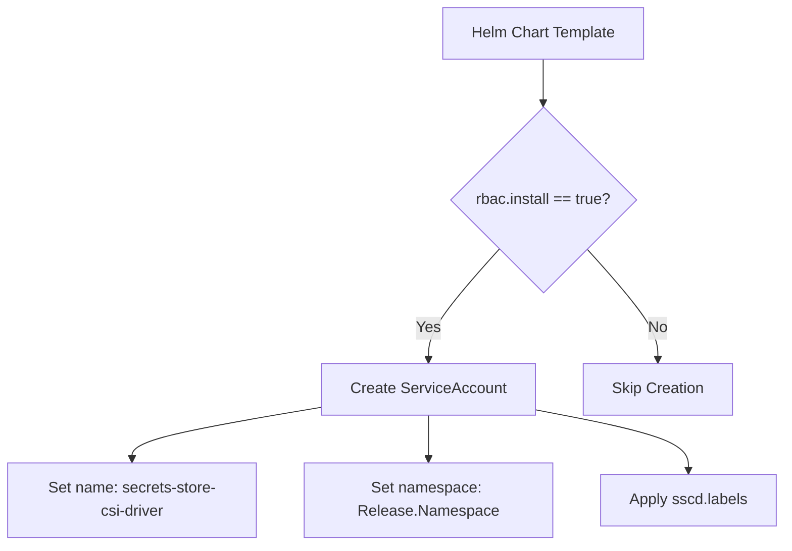
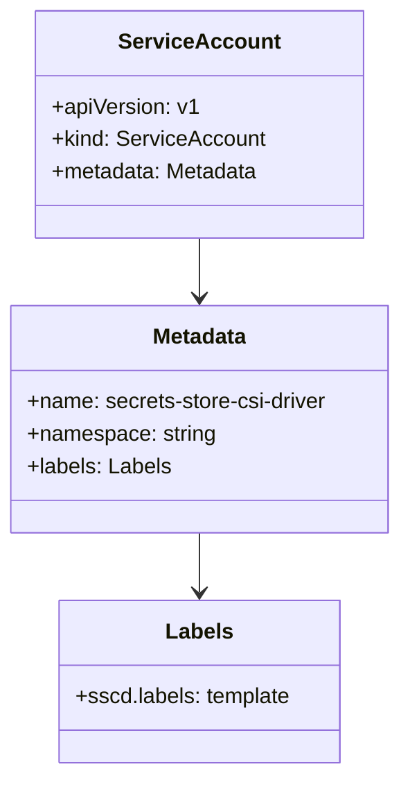
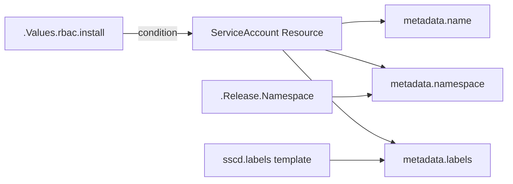
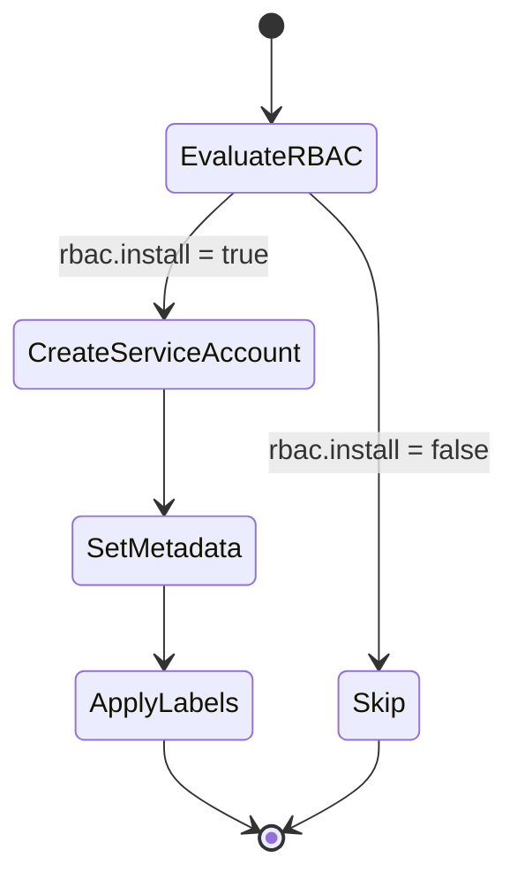

# Diagram: devops/k8s/secrets-store-csi-driver/helm/templates/serviceaccount.yaml

> Auto-generated by Obscura crawlers

## Diagram 1

### SVG

<svg id="container" width="820.046875" xmlns="http://www.w3.org/2000/svg" class="flowchart" height="571.984375" viewBox="0 0 820.046875 571.984375" role="graphics-document document" aria-roledescription="flowchart-v2"><g><marker id="container_flowchart-v2-pointEnd" class="marker flowchart-v2" viewBox="0 0 10 10" refX="5" refY="5" markerUnits="userSpaceOnUse" markerWidth="8" markerHeight="8" orient="auto"><path d="M 0 0 L 10 5 L 0 10 z" class="arrowMarkerPath" style="stroke-width: 1; stroke-dasharray: 1, 0;"></path></marker><marker id="container_flowchart-v2-pointStart" class="marker flowchart-v2" viewBox="0 0 10 10" refX="4.5" refY="5" markerUnits="userSpaceOnUse" markerWidth="8" markerHeight="8" orient="auto"><path d="M 0 5 L 10 10 L 10 0 z" class="arrowMarkerPath" style="stroke-width: 1; stroke-dasharray: 1, 0;"></path></marker><marker id="container_flowchart-v2-circleEnd" class="marker flowchart-v2" viewBox="0 0 10 10" refX="11" refY="5" markerUnits="userSpaceOnUse" markerWidth="11" markerHeight="11" orient="auto"><circle cx="5" cy="5" r="5" class="arrowMarkerPath" style="stroke-width: 1; stroke-dasharray: 1, 0;"></circle></marker><marker id="container_flowchart-v2-circleStart" class="marker flowchart-v2" viewBox="0 0 10 10" refX="-1" refY="5" markerUnits="userSpaceOnUse" markerWidth="11" markerHeight="11" orient="auto"><circle cx="5" cy="5" r="5" class="arrowMarkerPath" style="stroke-width: 1; stroke-dasharray: 1, 0;"></circle></marker><marker id="container_flowchart-v2-crossEnd" class="marker cross flowchart-v2" viewBox="0 0 11 11" refX="12" refY="5.2" markerUnits="userSpaceOnUse" markerWidth="11" markerHeight="11" orient="auto"><path d="M 1,1 l 9,9 M 10,1 l -9,9" class="arrowMarkerPath" style="stroke-width: 2; stroke-dasharray: 1, 0;"></path></marker><marker id="container_flowchart-v2-crossStart" class="marker cross flowchart-v2" viewBox="0 0 11 11" refX="-1" refY="5.2" markerUnits="userSpaceOnUse" markerWidth="11" markerHeight="11" orient="auto"><path d="M 1,1 l 9,9 M 10,1 l -9,9" class="arrowMarkerPath" style="stroke-width: 2; stroke-dasharray: 1, 0;"></path></marker><g class="root"><g class="clusters"></g><g class="edgePaths"><path d="M566.93,62L566.93,66.167C566.93,70.333,566.93,78.667,566.93,86.333C566.93,94,566.93,101,566.93,104.5L566.93,108" id="L_A_B_0" class="edge-thickness-normal edge-pattern-solid edge-thickness-normal edge-pattern-solid flowchart-link" style=";" data-edge="true" data-et="edge" data-id="L_A_B_0" data-points="W3sieCI6NTY2LjkyOTY4NzUsInkiOjYyfSx7IngiOjU2Ni45Mjk2ODc1LCJ5Ijo4N30seyJ4Ijo1NjYuOTI5Njg3NSwieSI6MTEyfV0=" marker-end="url(#container_flowchart-v2-pointEnd)"></path><path d="M521.033,262.088L508.861,275.904C496.689,289.72,472.344,317.352,460.172,336.668C448,355.984,448,366.984,448,372.484L448,377.984" id="L_B_C_0" class="edge-thickness-normal edge-pattern-solid edge-thickness-normal edge-pattern-solid flowchart-link" style=";" data-edge="true" data-et="edge" data-id="L_B_C_0" data-points="W3sieCI6NTIxLjAzMjk3MTI4ODMwNTQsInkiOjI2Mi4wODc2NTg3ODgzMDUzNn0seyJ4Ijo0NDgsInkiOjM0NC45ODQzNzV9LHsieCI6NDQ4LCJ5IjozODEuOTg0Mzc1fV0=" marker-end="url(#container_flowchart-v2-pointEnd)"></path><path d="M612.826,262.088L624.999,275.904C637.171,289.72,661.515,317.352,673.687,336.668C685.859,355.984,685.859,366.984,685.859,372.484L685.859,377.984" id="L_B_D_0" class="edge-thickness-normal edge-pattern-solid edge-thickness-normal edge-pattern-solid flowchart-link" style=";" data-edge="true" data-et="edge" data-id="L_B_D_0" data-points="W3sieCI6NjEyLjgyNjQwMzcxMTY5NDYsInkiOjI2Mi4wODc2NTg3ODgzMDUzNn0seyJ4Ijo2ODUuODU5Mzc1LCJ5IjozNDQuOTg0Mzc1fSx7IngiOjY4NS44NTkzNzUsInkiOjM4MS45ODQzNzV9XQ==" marker-end="url(#container_flowchart-v2-pointEnd)"></path><path d="M338.07,427.424L304.725,433.018C271.38,438.611,204.69,449.798,171.345,458.891C138,467.984,138,474.984,138,478.484L138,481.984" id="L_C_E_0" class="edge-thickness-normal edge-pattern-solid edge-thickness-normal edge-pattern-solid flowchart-link" style=";" data-edge="true" data-et="edge" data-id="L_C_E_0" data-points="W3sieCI6MzM4LjA3MDMxMjUsInkiOjQyNy40MjQxOTM1NDgzODcxfSx7IngiOjEzOCwieSI6NDYwLjk4NDM3NX0seyJ4IjoxMzgsInkiOjQ4NS45ODQzNzV9XQ==" marker-end="url(#container_flowchart-v2-pointEnd)"></path><path d="M448,435.984L448,440.151C448,444.318,448,452.651,448,460.318C448,467.984,448,474.984,448,478.484L448,481.984" id="L_C_F_0" class="edge-thickness-normal edge-pattern-solid edge-thickness-normal edge-pattern-solid flowchart-link" style=";" data-edge="true" data-et="edge" data-id="L_C_F_0" data-points="W3sieCI6NDQ4LCJ5Ijo0MzUuOTg0Mzc1fSx7IngiOjQ0OCwieSI6NDYwLjk4NDM3NX0seyJ4Ijo0NDgsInkiOjQ4NS45ODQzNzV9XQ==" marker-end="url(#container_flowchart-v2-pointEnd)"></path><path d="M557.93,429.999L584.945,435.163C611.961,440.327,665.992,450.656,693.008,461.32C720.023,471.984,720.023,482.984,720.023,488.484L720.023,493.984" id="L_C_G_0" class="edge-thickness-normal edge-pattern-solid edge-thickness-normal edge-pattern-solid flowchart-link" style=";" data-edge="true" data-et="edge" data-id="L_C_G_0" data-points="W3sieCI6NTU3LjkyOTY4NzUsInkiOjQyOS45OTg1MzM5MzYyMTN9LHsieCI6NzIwLjAyMzQzNzUsInkiOjQ2MC45ODQzNzV9LHsieCI6NzIwLjAyMzQzNzUsInkiOjQ5Ny45ODQzNzV9XQ==" marker-end="url(#container_flowchart-v2-pointEnd)"></path></g><g class="edgeLabels"><g class="edgeLabel"><g class="label" data-id="L_A_B_0" transform="translate(0, 0)"><foreignObject width="0" height="0">

</foreignObject></g></g><g class="edgeLabel" transform="translate(448, 344.984375)"><g class="label" data-id="L_B_C_0" transform="translate(-12.03125, -12)"><foreignObject width="24.0625" height="24">

Yes

</foreignObject></g></g><g class="edgeLabel" transform="translate(685.859375, 344.984375)"><g class="label" data-id="L_B_D_0" transform="translate(-10.140625, -12)"><foreignObject width="20.28125" height="24">

No

</foreignObject></g></g><g class="edgeLabel"><g class="label" data-id="L_C_E_0" transform="translate(0, 0)"><foreignObject width="0" height="0">

</foreignObject></g></g><g class="edgeLabel"><g class="label" data-id="L_C_F_0" transform="translate(0, 0)"><foreignObject width="0" height="0">

</foreignObject></g></g><g class="edgeLabel"><g class="label" data-id="L_C_G_0" transform="translate(0, 0)"><foreignObject width="0" height="0">

</foreignObject></g></g></g><g class="nodes"><g class="node default" id="flowchart-A-0" transform="translate(566.9296875, 35)"><rect class="basic label-container" style="" x="-106.109375" y="-27" width="212.21875" height="54"></rect><g class="label" style="" transform="translate(-76.109375, -12)"><rect></rect><foreignObject width="152.21875" height="24">

Helm Chart Template

</foreignObject></g></g><g class="node default" id="flowchart-B-1" transform="translate(566.9296875, 209.9921875)"><polygon points="97.9921875,0 195.984375,-97.9921875 97.9921875,-195.984375 0,-97.9921875" class="label-container" transform="translate(-97.4921875, 97.9921875)"></polygon><g class="label" style="" transform="translate(-70.9921875, -12)"><rect></rect><foreignObject width="141.984375" height="24">

rbac.install == true?

</foreignObject></g></g><g class="node default" id="flowchart-C-3" transform="translate(448, 408.984375)"><rect class="basic label-container" style="" x="-109.9296875" y="-27" width="219.859375" height="54"></rect><g class="label" style="" transform="translate(-79.9296875, -12)"><rect></rect><foreignObject width="159.859375" height="24">

Create ServiceAccount

</foreignObject></g></g><g class="node default" id="flowchart-D-5" transform="translate(685.859375, 408.984375)"><rect class="basic label-container" style="" x="-77.9296875" y="-27" width="155.859375" height="54"></rect><g class="label" style="" transform="translate(-47.9296875, -12)"><rect></rect><foreignObject width="95.859375" height="24">

Skip Creation

</foreignObject></g></g><g class="node default" id="flowchart-E-7" transform="translate(138, 524.984375)"><rect class="basic label-container" style="" x="-130" y="-39" width="260" height="78"></rect><g class="label" style="" transform="translate(-100, -24)"><rect></rect><foreignObject width="200" height="48">

Set name: secrets-store-csi-driver

</foreignObject></g></g><g class="node default" id="flowchart-F-9" transform="translate(448, 524.984375)"><rect class="basic label-container" style="" x="-130" y="-39" width="260" height="78"></rect><g class="label" style="" transform="translate(-100, -24)"><rect></rect><foreignObject width="200" height="48">

Set namespace: Release.Namespace

</foreignObject></g></g><g class="node default" id="flowchart-G-11" transform="translate(720.0234375, 524.984375)"><rect class="basic label-container" style="" x="-92.0234375" y="-27" width="184.046875" height="54"></rect><g class="label" style="" transform="translate(-62.0234375, -12)"><rect></rect><foreignObject width="124.046875" height="24">

Apply sscd.labels

</foreignObject></g></g></g></g></g></svg>

## Diagram 2

### SVG

<svg id="container" width="301.265625" xmlns="http://www.w3.org/2000/svg" class="classDiagram" height="572" viewBox="0 0 301.265625 572" role="graphics-document document" aria-roledescription="class"><g><defs><marker id="container_class-aggregationStart" class="marker aggregation class" refX="18" refY="7" markerWidth="190" markerHeight="240" orient="auto"><path d="M 18,7 L9,13 L1,7 L9,1 Z"></path></marker></defs><defs><marker id="container_class-aggregationEnd" class="marker aggregation class" refX="1" refY="7" markerWidth="20" markerHeight="28" orient="auto"><path d="M 18,7 L9,13 L1,7 L9,1 Z"></path></marker></defs><defs><marker id="container_class-extensionStart" class="marker extension class" refX="18" refY="7" markerWidth="190" markerHeight="240" orient="auto"><path d="M 1,7 L18,13 V 1 Z"></path></marker></defs><defs><marker id="container_class-extensionEnd" class="marker extension class" refX="1" refY="7" markerWidth="20" markerHeight="28" orient="auto"><path d="M 1,1 V 13 L18,7 Z"></path></marker></defs><defs><marker id="container_class-compositionStart" class="marker composition class" refX="18" refY="7" markerWidth="190" markerHeight="240" orient="auto"><path d="M 18,7 L9,13 L1,7 L9,1 Z"></path></marker></defs><defs><marker id="container_class-compositionEnd" class="marker composition class" refX="1" refY="7" markerWidth="20" markerHeight="28" orient="auto"><path d="M 18,7 L9,13 L1,7 L9,1 Z"></path></marker></defs><defs><marker id="container_class-dependencyStart" class="marker dependency class" refX="6" refY="7" markerWidth="190" markerHeight="240" orient="auto"><path d="M 5,7 L9,13 L1,7 L9,1 Z"></path></marker></defs><defs><marker id="container_class-dependencyEnd" class="marker dependency class" refX="13" refY="7" markerWidth="20" markerHeight="28" orient="auto"><path d="M 18,7 L9,13 L14,7 L9,1 Z"></path></marker></defs><defs><marker id="container_class-lollipopStart" class="marker lollipop class" refX="13" refY="7" markerWidth="190" markerHeight="240" orient="auto"><circle stroke="black" fill="transparent" cx="7" cy="7" r="6"></circle></marker></defs><defs><marker id="container_class-lollipopEnd" class="marker lollipop class" refX="1" refY="7" markerWidth="190" markerHeight="240" orient="auto"><circle stroke="black" fill="transparent" cx="7" cy="7" r="6"></circle></marker></defs><g class="root"><g class="clusters"></g><g class="edgePaths"><path d="M150.633,176L150.633,180.167C150.633,184.333,150.633,192.667,150.633,200C150.633,207.333,150.633,213.667,150.633,216.833L150.633,220" id="id_ServiceAccount_Metadata_1" class="edge-thickness-normal edge-pattern-solid relation" style=";;;" data-edge="true" data-et="edge" data-id="id_ServiceAccount_Metadata_1" data-points="W3sieCI6MTUwLjYzMjgxMjUsInkiOjE3Nn0seyJ4IjoxNTAuNjMyODEyNSwieSI6MjAxfSx7IngiOjE1MC42MzI4MTI1LCJ5IjoyMjZ9XQ==" marker-end="url(#container_class-dependencyEnd)"></path><path d="M150.633,394L150.633,398.167C150.633,402.333,150.633,410.667,150.633,418C150.633,425.333,150.633,431.667,150.633,434.833L150.633,438" id="id_Metadata_Labels_2" class="edge-thickness-normal edge-pattern-solid relation" style=";;;" data-edge="true" data-et="edge" data-id="id_Metadata_Labels_2" data-points="W3sieCI6MTUwLjYzMjgxMjUsInkiOjM5NH0seyJ4IjoxNTAuNjMyODEyNSwieSI6NDE5fSx7IngiOjE1MC42MzI4MTI1LCJ5Ijo0NDR9XQ==" marker-end="url(#container_class-dependencyEnd)"></path></g><g class="edgeLabels"><g class="edgeLabel"><g class="label" data-id="id_ServiceAccount_Metadata_1" transform="translate(0, 0)"><foreignObject width="0" height="0">

</foreignObject></g></g><g class="edgeLabel"><g class="label" data-id="id_Metadata_Labels_2" transform="translate(0, 0)"><foreignObject width="0" height="0">

</foreignObject></g></g></g><g class="nodes"><g class="node default" id="classId-ServiceAccount-0" transform="translate(150.6328125, 92)"><g class="basic label-container"><path d="M-118.5390625 -84 L118.5390625 -84 L118.5390625 84 L-118.5390625 84" stroke="none" stroke-width="0" fill="#ECECFF" style=""></path><path d="M-118.5390625 -84 C-44.213053079460465 -84, 30.11295634107907 -84, 118.5390625 -84 M-118.5390625 -84 C-69.7306813660598 -84, -20.922300232119582 -84, 118.5390625 -84 M118.5390625 -84 C118.5390625 -36.5692844695179, 118.5390625 10.861431060964193, 118.5390625 84 M118.5390625 -84 C118.5390625 -42.26096455471089, 118.5390625 -0.5219291094217766, 118.5390625 84 M118.5390625 84 C40.39273122104139 84, -37.753600057917225 84, -118.5390625 84 M118.5390625 84 C56.464825487656206 84, -5.609411524687587 84, -118.5390625 84 M-118.5390625 84 C-118.5390625 40.63852879280695, -118.5390625 -2.7229424143860967, -118.5390625 -84 M-118.5390625 84 C-118.5390625 50.11481013982149, -118.5390625 16.229620279642987, -118.5390625 -84" stroke="#9370DB" stroke-width="1.3" fill="none" stroke-dasharray="0 0" style=""></path></g><g class="annotation-group text" transform="translate(0, -60)"></g><g class="label-group text" transform="translate(-55.671875, -60)"><g class="label" style="font-weight: bolder" transform="translate(0,-12)"><foreignObject width="111.34375" height="24">

ServiceAccount

</foreignObject></g></g><g class="members-group text" transform="translate(-106.5390625, -12)"><g class="label" style="" transform="translate(0,-12)"><foreignObject width="107.203125" height="24">

+apiVersion: v1

</foreignObject></g><g class="label" style="" transform="translate(0,12)"><foreignObject width="157.40625" height="24">

+kind: ServiceAccount

</foreignObject></g><g class="label" style="" transform="translate(0,36)"><foreignObject width="153.6875" height="24">

+metadata: Metadata

</foreignObject></g></g><g class="methods-group text" transform="translate(-106.5390625, 84)"></g><g class="divider" style=""><path d="M-118.5390625 -36 C-43.91743736197894 -36, 30.70418777604212 -36, 118.5390625 -36 M-118.5390625 -36 C-26.11339681788141 -36, 66.31226886423718 -36, 118.5390625 -36" stroke="#9370DB" stroke-width="1.3" fill="none" stroke-dasharray="0 0" style=""></path></g><g class="divider" style=""><path d="M-118.5390625 60 C-47.42608138352682 60, 23.686899732946358 60, 118.5390625 60 M-118.5390625 60 C-59.327691685220906 60, -0.11632087044181105 60, 118.5390625 60" stroke="#9370DB" stroke-width="1.3" fill="none" stroke-dasharray="0 0" style=""></path></g></g><g class="node default" id="classId-Metadata-1" transform="translate(150.6328125, 310)"><g class="basic label-container"><path d="M-142.6328125 -84 L142.6328125 -84 L142.6328125 84 L-142.6328125 84" stroke="none" stroke-width="0" fill="#ECECFF" style=""></path><path d="M-142.6328125 -84 C-64.95177050562258 -84, 12.729271488754847 -84, 142.6328125 -84 M-142.6328125 -84 C-42.01244217941829 -84, 58.60792814116343 -84, 142.6328125 -84 M142.6328125 -84 C142.6328125 -49.68220954803463, 142.6328125 -15.364419096069255, 142.6328125 84 M142.6328125 -84 C142.6328125 -35.312105284986984, 142.6328125 13.375789430026032, 142.6328125 84 M142.6328125 84 C60.57065463015033 84, -21.49150323969934 84, -142.6328125 84 M142.6328125 84 C43.005329206297105 84, -56.62215408740579 84, -142.6328125 84 M-142.6328125 84 C-142.6328125 46.6456402562547, -142.6328125 9.291280512509402, -142.6328125 -84 M-142.6328125 84 C-142.6328125 31.265591517196697, -142.6328125 -21.468816965606607, -142.6328125 -84" stroke="#9370DB" stroke-width="1.3" fill="none" stroke-dasharray="0 0" style=""></path></g><g class="annotation-group text" transform="translate(0, -60)"></g><g class="label-group text" transform="translate(-34.640625, -60)"><g class="label" style="font-weight: bolder" transform="translate(0,-12)"><foreignObject width="69.28125" height="24">

Metadata

</foreignObject></g></g><g class="members-group text" transform="translate(-130.6328125, -12)"><g class="label" style="" transform="translate(0,-12)"><foreignObject width="226.625" height="24">

+name: secrets-store-csi-driver

</foreignObject></g><g class="label" style="" transform="translate(0,12)"><foreignObject width="139.78125" height="24">

+namespace: string

</foreignObject></g><g class="label" style="" transform="translate(0,36)"><foreignObject width="106.65625" height="24">

+labels: Labels

</foreignObject></g></g><g class="methods-group text" transform="translate(-130.6328125, 84)"></g><g class="divider" style=""><path d="M-142.6328125 -36 C-70.47075176570276 -36, 1.691308968594484 -36, 142.6328125 -36 M-142.6328125 -36 C-34.38261171888195 -36, 73.8675890622361 -36, 142.6328125 -36" stroke="#9370DB" stroke-width="1.3" fill="none" stroke-dasharray="0 0" style=""></path></g><g class="divider" style=""><path d="M-142.6328125 60 C-48.404404833258525 60, 45.82400283348295 60, 142.6328125 60 M-142.6328125 60 C-74.32213108853654 60, -6.011449677073074 60, 142.6328125 60" stroke="#9370DB" stroke-width="1.3" fill="none" stroke-dasharray="0 0" style=""></path></g></g><g class="node default" id="classId-Labels-2" transform="translate(150.6328125, 504)"><g class="basic label-container"><path d="M-104.0859375 -60 L104.0859375 -60 L104.0859375 60 L-104.0859375 60" stroke="none" stroke-width="0" fill="#ECECFF" style=""></path><path d="M-104.0859375 -60 C-26.138733948673703 -60, 51.80846960265259 -60, 104.0859375 -60 M-104.0859375 -60 C-41.8067317129089 -60, 20.4724740741822 -60, 104.0859375 -60 M104.0859375 -60 C104.0859375 -16.521547740706758, 104.0859375 26.956904518586484, 104.0859375 60 M104.0859375 -60 C104.0859375 -24.244242466881495, 104.0859375 11.51151506623701, 104.0859375 60 M104.0859375 60 C26.90772810614618 60, -50.27048128770764 60, -104.0859375 60 M104.0859375 60 C61.798455964045175 60, 19.51097442809035 60, -104.0859375 60 M-104.0859375 60 C-104.0859375 29.684883710027318, -104.0859375 -0.6302325799453641, -104.0859375 -60 M-104.0859375 60 C-104.0859375 22.799149276786665, -104.0859375 -14.40170144642667, -104.0859375 -60" stroke="#9370DB" stroke-width="1.3" fill="none" stroke-dasharray="0 0" style=""></path></g><g class="annotation-group text" transform="translate(0, -36)"></g><g class="label-group text" transform="translate(-23.84375, -36)"><g class="label" style="font-weight: bolder" transform="translate(0,-12)"><foreignObject width="47.6875" height="24">

Labels

</foreignObject></g></g><g class="members-group text" transform="translate(-92.0859375, 12)"><g class="label" style="" transform="translate(0,-12)"><foreignObject width="160.328125" height="24">

+sscd.labels: template

</foreignObject></g></g><g class="methods-group text" transform="translate(-92.0859375, 60)"></g><g class="divider" style=""><path d="M-104.0859375 -12 C-44.72435826292298 -12, 14.637220974154033 -12, 104.0859375 -12 M-104.0859375 -12 C-25.92355252873051 -12, 52.23883244253898 -12, 104.0859375 -12" stroke="#9370DB" stroke-width="1.3" fill="none" stroke-dasharray="0 0" style=""></path></g><g class="divider" style=""><path d="M-104.0859375 36 C-56.64517527332863 36, -9.204413046657265 36, 104.0859375 36 M-104.0859375 36 C-34.56154042254319 36, 34.96285665491362 36, 104.0859375 36" stroke="#9370DB" stroke-width="1.3" fill="none" stroke-dasharray="0 0" style=""></path></g></g></g></g></g></svg>

## Diagram 3

### SVG

<svg id="container" width="835.171875" xmlns="http://www.w3.org/2000/svg" class="flowchart" height="298" viewBox="0 0 835.171875 298" role="graphics-document document" aria-roledescription="flowchart-v2"><g><marker id="container_flowchart-v2-pointEnd" class="marker flowchart-v2" viewBox="0 0 10 10" refX="5" refY="5" markerUnits="userSpaceOnUse" markerWidth="8" markerHeight="8" orient="auto"><path d="M 0 0 L 10 5 L 0 10 z" class="arrowMarkerPath" style="stroke-width: 1; stroke-dasharray: 1, 0;"></path></marker><marker id="container_flowchart-v2-pointStart" class="marker flowchart-v2" viewBox="0 0 10 10" refX="4.5" refY="5" markerUnits="userSpaceOnUse" markerWidth="8" markerHeight="8" orient="auto"><path d="M 0 5 L 10 10 L 10 0 z" class="arrowMarkerPath" style="stroke-width: 1; stroke-dasharray: 1, 0;"></path></marker><marker id="container_flowchart-v2-circleEnd" class="marker flowchart-v2" viewBox="0 0 10 10" refX="11" refY="5" markerUnits="userSpaceOnUse" markerWidth="11" markerHeight="11" orient="auto"><circle cx="5" cy="5" r="5" class="arrowMarkerPath" style="stroke-width: 1; stroke-dasharray: 1, 0;"></circle></marker><marker id="container_flowchart-v2-circleStart" class="marker flowchart-v2" viewBox="0 0 10 10" refX="-1" refY="5" markerUnits="userSpaceOnUse" markerWidth="11" markerHeight="11" orient="auto"><circle cx="5" cy="5" r="5" class="arrowMarkerPath" style="stroke-width: 1; stroke-dasharray: 1, 0;"></circle></marker><marker id="container_flowchart-v2-crossEnd" class="marker cross flowchart-v2" viewBox="0 0 11 11" refX="12" refY="5.2" markerUnits="userSpaceOnUse" markerWidth="11" markerHeight="11" orient="auto"><path d="M 1,1 l 9,9 M 10,1 l -9,9" class="arrowMarkerPath" style="stroke-width: 2; stroke-dasharray: 1, 0;"></path></marker><marker id="container_flowchart-v2-crossStart" class="marker cross flowchart-v2" viewBox="0 0 11 11" refX="-1" refY="5.2" markerUnits="userSpaceOnUse" markerWidth="11" markerHeight="11" orient="auto"><path d="M 1,1 l 9,9 M 10,1 l -9,9" class="arrowMarkerPath" style="stroke-width: 2; stroke-dasharray: 1, 0;"></path></marker><g class="root"><g class="clusters"></g><g class="edgePaths"><path d="M202.703,55L212.632,55C222.56,55,242.417,55,261.607,55C280.797,55,299.32,55,308.582,55L317.844,55" id="L_A_B_0" class="edge-thickness-normal edge-pattern-solid edge-thickness-normal edge-pattern-solid flowchart-link" style=";" data-edge="true" data-et="edge" data-id="L_A_B_0" data-points="W3sieCI6MjAyLjcwMzEyNSwieSI6NTV9LHsieCI6MjYyLjI3MzQzNzUsInkiOjU1fSx7IngiOjMyMS44NDM3NSwieSI6NTV9XQ==" marker-end="url(#container_flowchart-v2-pointEnd)"></path><path d="M561.797,38.449L565.964,37.874C570.13,37.299,578.464,36.15,589.595,35.575C600.727,35,614.656,35,621.621,35L628.586,35" id="L_B_C_0" class="edge-thickness-normal edge-pattern-solid edge-thickness-normal edge-pattern-solid flowchart-link" style=";" data-edge="true" data-et="edge" data-id="L_B_C_0" data-points="W3sieCI6NTYxLjc5Njg3NSwieSI6MzguNDQ4ODMzMzI0MzUxOTk1fSx7IngiOjU4Ni43OTY4NzUsInkiOjM1fSx7IngiOjYzMi41ODU5Mzc1LCJ5IjozNX1d" marker-end="url(#container_flowchart-v2-pointEnd)"></path><path d="M535.02,82L543.649,84.5C552.279,87,569.538,92,585.43,96.799C601.322,101.598,615.847,106.195,623.109,108.494L630.372,110.793" id="L_B_D_0" class="edge-thickness-normal edge-pattern-solid edge-thickness-normal edge-pattern-solid flowchart-link" style=";" data-edge="true" data-et="edge" data-id="L_B_D_0" data-points="W3sieCI6NTM1LjAxOTUzMTI1LCJ5Ijo4Mn0seyJ4Ijo1ODYuNzk2ODc1LCJ5Ijo5N30seyJ4Ijo2MzQuMTg1MjY3ODU3MTQyOSwieSI6MTEyfV0=" marker-end="url(#container_flowchart-v2-pointEnd)"></path><path d="M466.912,82L486.893,103.5C506.874,125,546.835,168,576.827,193.423C606.819,218.847,626.842,226.694,636.853,230.617L646.865,234.54" id="L_B_E_0" class="edge-thickness-normal edge-pattern-solid edge-thickness-normal edge-pattern-solid flowchart-link" style=";" data-edge="true" data-et="edge" data-id="L_B_E_0" data-points="W3sieCI6NDY2LjkxMjQwOTg1NTc2OTIsInkiOjgyfSx7IngiOjU4Ni43OTY4NzUsInkiOjIxMX0seyJ4Ijo2NTAuNTg4OTQyMzA3NjkyMywieSI6MjM2fV0=" marker-end="url(#container_flowchart-v2-pointEnd)"></path><path d="M545.43,159L552.324,159C559.219,159,573.008,159,583.41,158.471C593.812,157.943,600.827,156.885,604.334,156.357L607.842,155.828" id="L_F_D_0" class="edge-thickness-normal edge-pattern-solid edge-thickness-normal edge-pattern-solid flowchart-link" style=";" data-edge="true" data-et="edge" data-id="L_F_D_0" data-points="W3sieCI6NTQ1LjQyOTY4NzUsInkiOjE1OX0seyJ4Ijo1ODYuNzk2ODc1LCJ5IjoxNTl9LHsieCI6NjExLjc5Njg3NSwieSI6MTU1LjIzMTc0NzUyNzA4NDN9XQ==" marker-end="url(#container_flowchart-v2-pointEnd)"></path><path d="M546.07,263L552.858,263C559.646,263,573.221,263,586.708,263C600.195,263,613.594,263,620.293,263L626.992,263" id="L_G_E_0" class="edge-thickness-normal edge-pattern-solid edge-thickness-normal edge-pattern-solid flowchart-link" style=";" data-edge="true" data-et="edge" data-id="L_G_E_0" data-points="W3sieCI6NTQ2LjA3MDMxMjUsInkiOjI2M30seyJ4Ijo1ODYuNzk2ODc1LCJ5IjoyNjN9LHsieCI6NjMwLjk5MjE4NzUsInkiOjI2M31d" marker-end="url(#container_flowchart-v2-pointEnd)"></path></g><g class="edgeLabels"><g class="edgeLabel" transform="translate(262.2734375, 55)"><g class="label" data-id="L_A_B_0" transform="translate(-34.5703125, -12)"><foreignObject width="69.140625" height="24">

condition

</foreignObject></g></g><g class="edgeLabel"><g class="label" data-id="L_B_C_0" transform="translate(0, 0)"><foreignObject width="0" height="0">

</foreignObject></g></g><g class="edgeLabel"><g class="label" data-id="L_B_D_0" transform="translate(0, 0)"><foreignObject width="0" height="0">

</foreignObject></g></g><g class="edgeLabel"><g class="label" data-id="L_B_E_0" transform="translate(0, 0)"><foreignObject width="0" height="0">

</foreignObject></g></g><g class="edgeLabel"><g class="label" data-id="L_F_D_0" transform="translate(0, 0)"><foreignObject width="0" height="0">

</foreignObject></g></g><g class="edgeLabel"><g class="label" data-id="L_G_E_0" transform="translate(0, 0)"><foreignObject width="0" height="0">

</foreignObject></g></g></g><g class="nodes"><g class="node default" id="flowchart-A-0" transform="translate(105.3515625, 55)"><rect class="basic label-container" style="" x="-97.3515625" y="-27" width="194.703125" height="54"></rect><g class="label" style="" transform="translate(-67.3515625, -12)"><rect></rect><foreignObject width="134.703125" height="24">

.Values.rbac.install

</foreignObject></g></g><g class="node default" id="flowchart-B-1" transform="translate(441.8203125, 55)"><rect class="basic label-container" style="" x="-119.9765625" y="-27" width="239.953125" height="54"></rect><g class="label" style="" transform="translate(-89.9765625, -12)"><rect></rect><foreignObject width="179.953125" height="24">

ServiceAccount Resource

</foreignObject></g></g><g class="node default" id="flowchart-C-3" transform="translate(719.484375, 35)"><rect class="basic label-container" style="" x="-86.8984375" y="-27" width="173.796875" height="54"></rect><g class="label" style="" transform="translate(-56.8984375, -12)"><rect></rect><foreignObject width="113.796875" height="24">

metadata.name

</foreignObject></g></g><g class="node default" id="flowchart-D-5" transform="translate(719.484375, 139)"><rect class="basic label-container" style="" x="-107.6875" y="-27" width="215.375" height="54"></rect><g class="label" style="" transform="translate(-77.6875, -12)"><rect></rect><foreignObject width="155.375" height="24">

metadata.namespace

</foreignObject></g></g><g class="node default" id="flowchart-E-7" transform="translate(719.484375, 263)"><rect class="basic label-container" style="" x="-88.4921875" y="-27" width="176.984375" height="54"></rect><g class="label" style="" transform="translate(-58.4921875, -12)"><rect></rect><foreignObject width="116.984375" height="24">

metadata.labels

</foreignObject></g></g><g class="node default" id="flowchart-F-8" transform="translate(441.8203125, 159)"><rect class="basic label-container" style="" x="-103.609375" y="-27" width="207.21875" height="54"></rect><g class="label" style="" transform="translate(-73.609375, -12)"><rect></rect><foreignObject width="147.21875" height="24">

.Release.Namespace

</foreignObject></g></g><g class="node default" id="flowchart-G-10" transform="translate(441.8203125, 263)"><rect class="basic label-container" style="" x="-104.25" y="-27" width="208.5" height="54"></rect><g class="label" style="" transform="translate(-74.25, -12)"><rect></rect><foreignObject width="148.5" height="24">

sscd.labels template

</foreignObject></g></g></g></g></g></svg>

## Diagram 4

### SVG

<svg id="container" width="292.890625" xmlns="http://www.w3.org/2000/svg" class="statediagram" height="502" viewBox="0 0 292.890625 502" role="graphics-document document" aria-roledescription="stateDiagram"><g><defs><marker id="container_stateDiagram-barbEnd" refX="19" refY="7" markerWidth="20" markerHeight="14" markerUnits="userSpaceOnUse" orient="auto"><path d="M 19,7 L9,13 L14,7 L9,1 Z"></path></marker></defs><g class="root"><g class="clusters"></g><g class="edgePaths"><path d="M156.418,22L156.418,26.167C156.418,30.333,156.418,38.667,156.501,47.083C156.585,55.5,156.751,64,156.835,68.25L156.918,72.5" id="edge0" class="edge-thickness-normal edge-pattern-solid transition" style="fill:none;;;fill:none" data-edge="true" data-et="edge" data-id="edge0" data-points="W3sieCI6MTU2LjQxNzk2ODc1LCJ5IjoyMn0seyJ4IjoxNTYuNDE3OTY4NzUsInkiOjQ3fSx7IngiOjE1Ni45MTc5Njg3NSwieSI6NzIuNX1d" marker-end="url(#container_stateDiagram-barbEnd)"></path><path d="M134.951,112.5L128.095,118.583C121.238,124.667,107.525,136.833,100.752,149.167C93.979,161.5,94.146,174,94.229,180.25L94.313,186.5" id="edge1" class="edge-thickness-normal edge-pattern-solid transition" style="fill:none;;;fill:none" data-edge="true" data-et="edge" data-id="edge1" data-points="W3sieCI6MTM0Ljk1MTEzNzYwOTY0OTEyLCJ5IjoxMTIuNX0seyJ4Ijo5My44MTI1LCJ5IjoxNDl9LHsieCI6OTQuMzEyNSwieSI6MTg2LjV9XQ==" marker-end="url(#container_stateDiagram-barbEnd)"></path><path d="M178.885,112.5L185.575,118.583C192.264,124.667,205.644,136.833,212.334,152.417C219.023,168,219.023,187,219.023,206C219.023,225,219.023,244,219.023,263C219.023,282,219.023,301,219.023,318C219.023,335,219.023,350,219.107,361.75C219.19,373.5,219.357,382,219.44,386.25L219.523,390.5" id="edge2" class="edge-thickness-normal edge-pattern-solid transition" style="fill:none;;;fill:none" data-edge="true" data-et="edge" data-id="edge2" data-points="W3sieCI6MTc4Ljg4NDc5OTg5MDM1MDg4LCJ5IjoxMTIuNX0seyJ4IjoyMTkuMDIzNDM3NSwieSI6MTQ5fSx7IngiOjIxOS4wMjM0Mzc1LCJ5IjoyMDZ9LHsieCI6MjE5LjAyMzQzNzUsInkiOjI2M30seyJ4IjoyMTkuMDIzNDM3NSwieSI6MzIwfSx7IngiOjIxOS4wMjM0Mzc1LCJ5IjozNjV9LHsieCI6MjE5LjUyMzQzNzUsInkiOjM5MC41fV0=" marker-end="url(#container_stateDiagram-barbEnd)"></path><path d="M94.313,226.5L94.229,232.583C94.146,238.667,93.979,250.833,93.979,263.167C93.979,275.5,94.146,288,94.229,294.25L94.313,300.5" id="edge3" class="edge-thickness-normal edge-pattern-solid transition" style="fill:none;;;fill:none" data-edge="true" data-et="edge" data-id="edge3" data-points="W3sieCI6OTQuMzEyNSwieSI6MjI2LjV9LHsieCI6OTMuODEyNSwieSI6MjYzfSx7IngiOjk0LjMxMjUsInkiOjMwMC41fV0=" marker-end="url(#container_stateDiagram-barbEnd)"></path><path d="M94.313,340.5L94.229,344.583C94.146,348.667,93.979,356.833,93.979,365.167C93.979,373.5,94.146,382,94.229,386.25L94.313,390.5" id="edge4" class="edge-thickness-normal edge-pattern-solid transition" style="fill:none;;;fill:none" data-edge="true" data-et="edge" data-id="edge4" data-points="W3sieCI6OTQuMzEyNSwieSI6MzQwLjV9LHsieCI6OTMuODEyNSwieSI6MzY1fSx7IngiOjk0LjMxMjUsInkiOjM5MC41fV0=" marker-end="url(#container_stateDiagram-barbEnd)"></path><path d="M94.313,430.5L94.229,434.583C94.146,438.667,93.979,446.833,103.291,455.719C112.603,464.605,131.394,474.209,140.79,479.012L150.185,483.814" id="edge5" class="edge-thickness-normal edge-pattern-solid transition" style="fill:none;;;fill:none" data-edge="true" data-et="edge" data-id="edge5" data-points="W3sieCI6OTQuMzEyNSwieSI6NDMwLjV9LHsieCI6OTMuODEyNSwieSI6NDU1fSx7IngiOjE1MC4xODQ5OTI1MTkyMDE4NCwieSI6NDgzLjgxNDA5MjM4ODkyNX1d" marker-end="url(#container_stateDiagram-barbEnd)"></path><path d="M219.523,430.5L219.44,434.583C219.357,438.667,219.19,446.833,209.711,455.719C200.233,464.605,181.442,474.209,172.046,479.012L162.651,483.814" id="edge6" class="edge-thickness-normal edge-pattern-solid transition" style="fill:none;;;fill:none" data-edge="true" data-et="edge" data-id="edge6" data-points="W3sieCI6MjE5LjUyMzQzNzUsInkiOjQzMC41fSx7IngiOjIxOS4wMjM0Mzc1LCJ5Ijo0NTV9LHsieCI6MTYyLjY1MDk0NDk4MDc5ODE2LCJ5Ijo0ODMuODE0MDkyMzg4OTI1fV0=" marker-end="url(#container_stateDiagram-barbEnd)"></path></g><g class="edgeLabels"><g class="edgeLabel"><g class="label" data-id="edge0" transform="translate(0, 0)"><foreignObject width="0" height="0">

</foreignObject></g></g><g class="edgeLabel" transform="translate(93.8125, 149)"><g class="label" data-id="edge1" transform="translate(-63.640625, -12)"><foreignObject width="127.28125" height="24">

rbac.install = true

</foreignObject></g></g><g class="edgeLabel" transform="translate(219.0234375, 263)"><g class="label" data-id="edge2" transform="translate(-65.8671875, -12)"><foreignObject width="131.734375" height="24">

rbac.install = false

</foreignObject></g></g><g class="edgeLabel"><g class="label" data-id="edge3" transform="translate(0, 0)"><foreignObject width="0" height="0">

</foreignObject></g></g><g class="edgeLabel"><g class="label" data-id="edge4" transform="translate(0, 0)"><foreignObject width="0" height="0">

</foreignObject></g></g><g class="edgeLabel"><g class="label" data-id="edge5" transform="translate(0, 0)"><foreignObject width="0" height="0">

</foreignObject></g></g><g class="edgeLabel"><g class="label" data-id="edge6" transform="translate(0, 0)"><foreignObject width="0" height="0">

</foreignObject></g></g></g><g class="nodes"><g class="node default" id="state-root_start-0" transform="translate(156.41796875, 15)"><circle class="state-start" r="7" width="14" height="14"></circle></g><g class="node  statediagram-state" id="state-EvaluateRBAC-2" transform="translate(156.41796875, 92)"><g class="basic label-container outer-path"><path d="M-52.328125 -20 C-19.58724876753348 -20, 13.153627464933038 -20, 52.328125 -20 C52.328125 -20, 52.328125 -20, 52.328125 -20 C52.45569008973804 -19.994723868860753, 52.58325517947608 -19.98944773772151, 52.74102172736166 -19.982922465033347 C52.901001707066776 -19.962980981359408, 53.06098168677189 -19.94303949768547, 53.15109795140367 -19.931806517013612 C53.266456976638 -19.90761827303698, 53.38181600187233 -19.88343002906035, 53.555552435703994 -19.847001329696653 C53.68818028732828 -19.807516307506262, 53.820808138952565 -19.76803128531587, 53.95162234602342 -19.729086208503173 C54.09315449158921 -19.67386019393085, 54.234686637155 -19.618634179358526, 54.336602123264846 -19.578866633275286 C54.415713635294495 -19.540191371699525, 54.494825147324136 -19.501516110123763, 54.707861965185366 -19.397368756032446 C54.8249087010828 -19.327624039945803, 54.94195543698023 -19.25787932385916, 55.062865790612136 -19.185832391312644 C55.18018132998725 -19.10207070616076, 55.29749686936236 -19.01830902100888, 55.39918856344834 -18.94570254698197 C55.50300124115288 -18.857777694037484, 55.60681391885742 -18.769852841092998, 55.714532858128706 -18.678619553365657 C55.783603408301346 -18.60954900319302, 55.85267395847398 -18.54047845302038, 56.00674455336566 -18.386407858128706 C56.07513161193063 -18.30566341065776, 56.143518670495595 -18.224918963186816, 56.27382754698197 -18.07106356344834 C56.32403001913799 -18.000750626354627, 56.374232491294016 -17.930437689260916, 56.513957391312644 -17.734740790612136 C56.572288431507474 -17.636848674343067, 56.6306194717023 -17.538956558074, 56.72549375603245 -17.37973696518537 C56.79496260318762 -17.237636167065723, 56.864431450342785 -17.095535368946077, 56.90699163327529 -17.008477123264846 C56.95660373451334 -16.881332204540847, 57.006215835751384 -16.75418728581685, 57.057211208503176 -16.623497346023417 C57.1019223856519 -16.473315149335384, 57.14663356280063 -16.323132952647352, 57.17512632969665 -16.227427435703994 C57.20067778005192 -16.105566981131346, 57.22622923040718 -15.983706526558699, 57.25993151701361 -15.82297295140367 C57.280132407919496 -15.660911884634999, 57.300333298825386 -15.498850817866328, 57.31104746503335 -15.412896727361662 C57.31731036227012 -15.261473833020315, 57.323573259506894 -15.110050938678965, 57.328125 -15 C57.328125 -15, 57.328125 -15, 57.328125 -15 C57.328125 -8.46185825675742, 57.328125 -1.9237165135148402, 57.328125 15 C57.328125 15, 57.328125 15, 57.328125 15 C57.32370678582957 15.106822569844876, 57.319288571659136 15.213645139689753, 57.31104746503335 15.412896727361662 C57.29067792986514 15.576310737878387, 57.27030839469693 15.739724748395114, 57.25993151701361 15.822972951403669 C57.24287737624092 15.904307878306472, 57.22582323546823 15.985642805209277, 57.17512632969665 16.227427435703994 C57.12933297460886 16.381244604013467, 57.08353961952106 16.53506177232294, 57.057211208503176 16.623497346023417 C57.01049758113839 16.743214112827964, 56.9637839537736 16.862930879632515, 56.90699163327529 17.008477123264846 C56.83967183753719 17.14618196644827, 56.77235204179908 17.283886809631696, 56.72549375603245 17.379736965185366 C56.679036358812425 17.45770253746096, 56.63257896159241 17.535668109736555, 56.513957391312644 17.734740790612133 C56.446883628056604 17.828683441121527, 56.379809864800556 17.92262609163092, 56.27382754698197 18.07106356344834 C56.19780694259083 18.16082092144522, 56.1217863381997 18.250578279442106, 56.00674455336566 18.386407858128706 C55.89869936604185 18.49445304545251, 55.79065417871805 18.60249823277631, 55.714532858128706 18.678619553365657 C55.64865048627512 18.73441907597644, 55.58276811442154 18.79021859858722, 55.39918856344834 18.94570254698197 C55.27634049194075 19.03341438415158, 55.15349242043316 19.12112622132119, 55.062865790612136 19.185832391312644 C54.94687901332835 19.254945509157732, 54.830892236044555 19.324058627002824, 54.707861965185366 19.397368756032446 C54.597847099071394 19.451151746838963, 54.48783223295743 19.50493473764548, 54.336602123264846 19.578866633275286 C54.21622922167218 19.62583628522887, 54.09585632007951 19.672805937182456, 53.95162234602342 19.729086208503173 C53.8649576174779 19.75488741607636, 53.77829288893238 19.78068862364955, 53.555552435703994 19.847001329696653 C53.463643301848045 19.866272648510876, 53.3717341679921 19.885543967325095, 53.15109795140367 19.931806517013612 C53.01935262467347 19.948228554864542, 52.887607297943276 19.96465059271547, 52.74102172736166 19.982922465033347 C52.63963280161406 19.98711594202153, 52.538243875866456 19.991309419009706, 52.328125 20 C52.328125 20, 52.328125 20, 52.328125 20 C26.211430689448626 20, 0.0947363788972524 20, -52.328125 20 C-52.328125 20, -52.328125 20, -52.328125 20 C-52.41440356694855 19.99643149207466, -52.50068213389711 19.992862984149323, -52.74102172736166 19.982922465033347 C-52.8663434812438 19.96730112470291, -52.991665235125936 19.95167978437247, -53.15109795140367 19.931806517013612 C-53.30324333107379 19.89990498563449, -53.455388710743904 19.868003454255366, -53.555552435703994 19.847001329696653 C-53.690173831623824 19.806922803654825, -53.82479522754365 19.766844277612993, -53.95162234602342 19.729086208503173 C-54.04797698605417 19.691488511293283, -54.14433162608491 19.65389081408339, -54.336602123264846 19.578866633275286 C-54.43713363914612 19.52971976989769, -54.53766515502739 19.480572906520095, -54.707861965185366 19.397368756032446 C-54.795390680475585 19.34521296244676, -54.88291939576581 19.293057168861072, -55.062865790612136 19.185832391312644 C-55.18366814201054 19.099581170226863, -55.30447049340894 19.013329949141085, -55.39918856344834 18.94570254698197 C-55.48810732355719 18.870392198771633, -55.577026083666034 18.795081850561296, -55.714532858128706 18.67861955336566 C-55.80319805891096 18.589954352583405, -55.89186325969322 18.50128915180115, -56.00674455336566 18.386407858128706 C-56.10909288201482 18.265565414839518, -56.21144121066399 18.144722971550333, -56.27382754698197 18.07106356344834 C-56.363851512196085 17.94497715512657, -56.45387547741019 17.818890746804797, -56.513957391312644 17.734740790612133 C-56.58593214807212 17.61395156357961, -56.65790690483159 17.49316233654709, -56.72549375603244 17.37973696518537 C-56.79585854124198 17.235803496483086, -56.86622332645151 17.091870027780804, -56.90699163327528 17.00847712326485 C-56.95968807743909 16.873427711063936, -57.0123845216029 16.738378298863022, -57.057211208503176 16.623497346023417 C-57.09564873711374 16.49438796331153, -57.13408626572431 16.36527858059965, -57.17512632969665 16.227427435703994 C-57.20117022049846 16.103218424950313, -57.22721411130027 15.979009414196632, -57.25993151701361 15.82297295140367 C-57.27169869639837 15.728571092949192, -57.28346587578312 15.634169234494713, -57.31104746503335 15.412896727361664 C-57.31654139773057 15.280065681460936, -57.32203533042778 15.147234635560208, -57.328125 15 C-57.328125 15, -57.328125 15, -57.328125 15 C-57.328125 4.744257897404532, -57.328125 -5.511484205190936, -57.328125 -15 C-57.328125 -15, -57.328125 -15, -57.328125 -15 C-57.32355281408233 -15.11054526346917, -57.318980628164674 -15.22109052693834, -57.31104746503335 -15.41289672736166 C-57.29937837534844 -15.506511664017966, -57.28770928566353 -15.600126600674272, -57.25993151701361 -15.822972951403669 C-57.23131747965339 -15.959439553157923, -57.20270344229317 -16.095906154912175, -57.17512632969665 -16.227427435703994 C-57.13593961038855 -16.359053305609248, -57.096752891080435 -16.490679175514497, -57.057211208503176 -16.623497346023417 C-57.01070737807146 -16.742676449368087, -56.964203547639734 -16.861855552712758, -56.90699163327529 -17.008477123264846 C-56.84977847893155 -17.12550850104241, -56.7925653245878 -17.242539878819972, -56.72549375603245 -17.379736965185366 C-56.65129742868406 -17.50425446871807, -56.57710110133568 -17.62877197225077, -56.513957391312644 -17.734740790612133 C-56.41884501289586 -17.867953965048418, -56.32373263447907 -18.001167139484703, -56.27382754698197 -18.07106356344834 C-56.20374686547804 -18.153807667744722, -56.1336661839741 -18.2365517720411, -56.00674455336566 -18.386407858128706 C-55.939358819552275 -18.453793591942087, -55.871973085738894 -18.52117932575547, -55.714532858128706 -18.678619553365657 C-55.61117972814553 -18.76615518924422, -55.50782659816235 -18.85369082512278, -55.39918856344834 -18.945702546981966 C-55.26848012398536 -19.039026579001163, -55.137771684522384 -19.132350611020357, -55.062865790612136 -19.185832391312644 C-54.93115263046248 -19.26431639933797, -54.79943947031281 -19.3428004073633, -54.707861965185366 -19.397368756032446 C-54.57125225530807 -19.464153173720145, -54.43464254543077 -19.53093759140785, -54.336602123264846 -19.578866633275286 C-54.258134152642704 -19.609484930424074, -54.17966618202057 -19.64010322757286, -53.95162234602342 -19.729086208503173 C-53.80890290392709 -19.77157562734815, -53.66618346183076 -19.814065046193125, -53.555552435703994 -19.847001329696653 C-53.414782097694584 -19.876517765654118, -53.27401175968517 -19.906034201611583, -53.15109795140367 -19.931806517013612 C-53.04336110283442 -19.945235901182716, -52.93562425426517 -19.95866528535182, -52.74102172736166 -19.982922465033347 C-52.58461339959145 -19.989391561321998, -52.42820507182123 -19.99586065761065, -52.328125 -20 C-52.328125 -20, -52.328125 -20, -52.328125 -20" stroke="none" stroke-width="0" fill="#ECECFF" style=""></path><path d="M-52.328125 -20 C-23.307391627282556 -20, 5.713341745434889 -20, 52.328125 -20 M-52.328125 -20 C-16.301420879560467 -20, 19.725283240879065 -20, 52.328125 -20 M52.328125 -20 C52.328125 -20, 52.328125 -20, 52.328125 -20 M52.328125 -20 C52.328125 -20, 52.328125 -20, 52.328125 -20 M52.328125 -20 C52.43287789510995 -19.99566738820981, 52.537630790219886 -19.99133477641962, 52.74102172736166 -19.982922465033347 M52.328125 -20 C52.44717008463135 -19.995076258878605, 52.56621516926271 -19.99015251775721, 52.74102172736166 -19.982922465033347 M52.74102172736166 -19.982922465033347 C52.861225985049884 -19.967939019938242, 52.98143024273811 -19.952955574843134, 53.15109795140367 -19.931806517013612 M52.74102172736166 -19.982922465033347 C52.830335665572036 -19.971789494245623, 52.91964960378241 -19.960656523457903, 53.15109795140367 -19.931806517013612 M53.15109795140367 -19.931806517013612 C53.31137565735986 -19.898199816126464, 53.47165336331605 -19.864593115239312, 53.555552435703994 -19.847001329696653 M53.15109795140367 -19.931806517013612 C53.28697085657412 -19.90331696473627, 53.422843761744566 -19.874827412458927, 53.555552435703994 -19.847001329696653 M53.555552435703994 -19.847001329696653 C53.664745617937044 -19.814493110866984, 53.773938800170086 -19.781984892037315, 53.95162234602342 -19.729086208503173 M53.555552435703994 -19.847001329696653 C53.678848329999695 -19.81029455157556, 53.802144224295404 -19.773587773454466, 53.95162234602342 -19.729086208503173 M53.95162234602342 -19.729086208503173 C54.08714447411468 -19.67620531002657, 54.22266660220593 -19.623324411549973, 54.336602123264846 -19.578866633275286 M53.95162234602342 -19.729086208503173 C54.06046842124839 -19.686614338155387, 54.169314496473355 -19.644142467807605, 54.336602123264846 -19.578866633275286 M54.336602123264846 -19.578866633275286 C54.43946124827091 -19.528581871133806, 54.54232037327697 -19.478297108992326, 54.707861965185366 -19.397368756032446 M54.336602123264846 -19.578866633275286 C54.43220951874678 -19.532127025676132, 54.52781691422872 -19.485387418076982, 54.707861965185366 -19.397368756032446 M54.707861965185366 -19.397368756032446 C54.83825384497173 -19.319672060212813, 54.9686457247581 -19.24197536439318, 55.062865790612136 -19.185832391312644 M54.707861965185366 -19.397368756032446 C54.81373302632165 -19.334283296671902, 54.91960408745794 -19.27119783731136, 55.062865790612136 -19.185832391312644 M55.062865790612136 -19.185832391312644 C55.131893259136326 -19.136547726074326, 55.200920727660524 -19.087263060836012, 55.39918856344834 -18.94570254698197 M55.062865790612136 -19.185832391312644 C55.18720890619745 -19.09705311318855, 55.31155202178275 -19.00827383506446, 55.39918856344834 -18.94570254698197 M55.39918856344834 -18.94570254698197 C55.497500901711724 -18.862436243910217, 55.59581323997511 -18.77916994083846, 55.714532858128706 -18.678619553365657 M55.39918856344834 -18.94570254698197 C55.47987550772164 -18.877364191141066, 55.56056245199494 -18.809025835300165, 55.714532858128706 -18.678619553365657 M55.714532858128706 -18.678619553365657 C55.79900590955317 -18.59414650194119, 55.88347896097764 -18.50967345051672, 56.00674455336566 -18.386407858128706 M55.714532858128706 -18.678619553365657 C55.78954217417217 -18.60361023732219, 55.86455149021564 -18.528600921278723, 56.00674455336566 -18.386407858128706 M56.00674455336566 -18.386407858128706 C56.10549672036871 -18.269811394871773, 56.20424888737177 -18.153214931614837, 56.27382754698197 -18.07106356344834 M56.00674455336566 -18.386407858128706 C56.10542941072208 -18.269890867221374, 56.20411426807851 -18.153373876314042, 56.27382754698197 -18.07106356344834 M56.27382754698197 -18.07106356344834 C56.324207506794835 -18.00050203942425, 56.3745874666077 -17.929940515400165, 56.513957391312644 -17.734740790612136 M56.27382754698197 -18.07106356344834 C56.36570078085473 -17.94238709321765, 56.45757401472749 -17.813710622986957, 56.513957391312644 -17.734740790612136 M56.513957391312644 -17.734740790612136 C56.581439772330945 -17.62149074283839, 56.64892215334924 -17.50824069506464, 56.72549375603245 -17.37973696518537 M56.513957391312644 -17.734740790612136 C56.56309955837744 -17.65226959318529, 56.61224172544224 -17.569798395758447, 56.72549375603245 -17.37973696518537 M56.72549375603245 -17.37973696518537 C56.769958419946796 -17.288783041389326, 56.814423083861136 -17.197829117593283, 56.90699163327529 -17.008477123264846 M56.72549375603245 -17.37973696518537 C56.786639852398764 -17.254660625914237, 56.847785948765086 -17.1295842866431, 56.90699163327529 -17.008477123264846 M56.90699163327529 -17.008477123264846 C56.951235122520664 -16.89509077792184, 56.995478611766046 -16.781704432578838, 57.057211208503176 -16.623497346023417 M56.90699163327529 -17.008477123264846 C56.943085813363155 -16.915975667386956, 56.97917999345102 -16.823474211509065, 57.057211208503176 -16.623497346023417 M57.057211208503176 -16.623497346023417 C57.09374306711895 -16.50078899598906, 57.13027492573473 -16.3780806459547, 57.17512632969665 -16.227427435703994 M57.057211208503176 -16.623497346023417 C57.09880855083984 -16.483774336098538, 57.140405893176506 -16.344051326173656, 57.17512632969665 -16.227427435703994 M57.17512632969665 -16.227427435703994 C57.201718762476595 -16.100602308296356, 57.22831119525654 -15.973777180888717, 57.25993151701361 -15.82297295140367 M57.17512632969665 -16.227427435703994 C57.19957664168226 -16.11081855082337, 57.22402695366788 -15.994209665942744, 57.25993151701361 -15.82297295140367 M57.25993151701361 -15.82297295140367 C57.27402679381968 -15.7098939982905, 57.28812207062575 -15.59681504517733, 57.31104746503335 -15.412896727361662 M57.25993151701361 -15.82297295140367 C57.273426561991734 -15.714709340881004, 57.286921606969855 -15.606445730358338, 57.31104746503335 -15.412896727361662 M57.31104746503335 -15.412896727361662 C57.31682276169795 -15.273262927927805, 57.32259805836256 -15.133629128493947, 57.328125 -15 M57.31104746503335 -15.412896727361662 C57.31485385287174 -15.32086675438178, 57.318660240710145 -15.228836781401899, 57.328125 -15 M57.328125 -15 C57.328125 -15, 57.328125 -15, 57.328125 -15 M57.328125 -15 C57.328125 -15, 57.328125 -15, 57.328125 -15 M57.328125 -15 C57.328125 -8.805844026879456, 57.328125 -2.6116880537589093, 57.328125 15 M57.328125 -15 C57.328125 -5.794758015954461, 57.328125 3.4104839680910786, 57.328125 15 M57.328125 15 C57.328125 15, 57.328125 15, 57.328125 15 M57.328125 15 C57.328125 15, 57.328125 15, 57.328125 15 M57.328125 15 C57.321770826634086 15.153629747677074, 57.31541665326818 15.307259495354147, 57.31104746503335 15.412896727361662 M57.328125 15 C57.32131272253168 15.164705683697424, 57.31450044506336 15.329411367394847, 57.31104746503335 15.412896727361662 M57.31104746503335 15.412896727361662 C57.29219927201764 15.56410581417955, 57.27335107900194 15.71531490099744, 57.25993151701361 15.822972951403669 M57.31104746503335 15.412896727361662 C57.29388708249065 15.550565403163372, 57.27672669994795 15.68823407896508, 57.25993151701361 15.822972951403669 M57.25993151701361 15.822972951403669 C57.24179913074998 15.909450266853502, 57.22366674448635 15.995927582303338, 57.17512632969665 16.227427435703994 M57.25993151701361 15.822972951403669 C57.23828095098291 15.926229235550872, 57.21663038495221 16.029485519698078, 57.17512632969665 16.227427435703994 M57.17512632969665 16.227427435703994 C57.14308144930967 16.335064291542384, 57.111036568922685 16.442701147380774, 57.057211208503176 16.623497346023417 M57.17512632969665 16.227427435703994 C57.14778552733339 16.31926357198977, 57.12044472497013 16.411099708275543, 57.057211208503176 16.623497346023417 M57.057211208503176 16.623497346023417 C57.02328329066931 16.710447147539846, 56.98935537283545 16.797396949056278, 56.90699163327529 17.008477123264846 M57.057211208503176 16.623497346023417 C57.015379611732534 16.730702540699173, 56.97354801496189 16.83790773537493, 56.90699163327529 17.008477123264846 M56.90699163327529 17.008477123264846 C56.85563386239556 17.113531122726716, 56.804276091515824 17.218585122188586, 56.72549375603245 17.379736965185366 M56.90699163327529 17.008477123264846 C56.86186881883828 17.100777315473035, 56.816746004401274 17.193077507681227, 56.72549375603245 17.379736965185366 M56.72549375603245 17.379736965185366 C56.65641848988072 17.495660219131405, 56.58734322372899 17.61158347307744, 56.513957391312644 17.734740790612133 M56.72549375603245 17.379736965185366 C56.66275159507838 17.485031897258807, 56.600009434124324 17.59032682933225, 56.513957391312644 17.734740790612133 M56.513957391312644 17.734740790612133 C56.45664667191464 17.815009447408624, 56.399335952516644 17.895278104205115, 56.27382754698197 18.07106356344834 M56.513957391312644 17.734740790612133 C56.428875924235754 17.853904799584164, 56.34379445715886 17.973068808556196, 56.27382754698197 18.07106356344834 M56.27382754698197 18.07106356344834 C56.17264009311667 18.190535364470218, 56.07145263925137 18.31000716549209, 56.00674455336566 18.386407858128706 M56.27382754698197 18.07106356344834 C56.20587803558093 18.151291399959035, 56.13792852417989 18.23151923646973, 56.00674455336566 18.386407858128706 M56.00674455336566 18.386407858128706 C55.90743552758978 18.48571688390458, 55.80812650181391 18.585025909680457, 55.714532858128706 18.678619553365657 M56.00674455336566 18.386407858128706 C55.92355181480224 18.469600596692125, 55.84035907623882 18.552793335255544, 55.714532858128706 18.678619553365657 M55.714532858128706 18.678619553365657 C55.61005395945997 18.767108666683736, 55.50557506079124 18.85559778000182, 55.39918856344834 18.94570254698197 M55.714532858128706 18.678619553365657 C55.64130646932163 18.7406391410488, 55.56808008051454 18.802658728731938, 55.39918856344834 18.94570254698197 M55.39918856344834 18.94570254698197 C55.325584235508565 18.99825502703318, 55.25197990756878 19.050807507084393, 55.062865790612136 19.185832391312644 M55.39918856344834 18.94570254698197 C55.27822133657813 19.032071486891976, 55.15725410970792 19.118440426801985, 55.062865790612136 19.185832391312644 M55.062865790612136 19.185832391312644 C54.96073912291656 19.246686676472244, 54.858612455220985 19.307540961631844, 54.707861965185366 19.397368756032446 M55.062865790612136 19.185832391312644 C54.938862331260296 19.259722414814316, 54.814858871908456 19.333612438315992, 54.707861965185366 19.397368756032446 M54.707861965185366 19.397368756032446 C54.63174484226148 19.43458014997436, 54.5556277193376 19.47179154391627, 54.336602123264846 19.578866633275286 M54.707861965185366 19.397368756032446 C54.60966100616573 19.445376279585425, 54.511460047146095 19.493383803138403, 54.336602123264846 19.578866633275286 M54.336602123264846 19.578866633275286 C54.24967109886308 19.612787224256273, 54.16274007446132 19.64670781523726, 53.95162234602342 19.729086208503173 M54.336602123264846 19.578866633275286 C54.24242598112125 19.615614277971805, 54.14824983897765 19.65236192266832, 53.95162234602342 19.729086208503173 M53.95162234602342 19.729086208503173 C53.85254850394299 19.758581769240408, 53.753474661862555 19.788077329977643, 53.555552435703994 19.847001329696653 M53.95162234602342 19.729086208503173 C53.80214786907396 19.773586688356875, 53.65267339212451 19.818087168210575, 53.555552435703994 19.847001329696653 M53.555552435703994 19.847001329696653 C53.46874760332855 19.865202389037982, 53.38194277095311 19.88340344837931, 53.15109795140367 19.931806517013612 M53.555552435703994 19.847001329696653 C53.40776378834763 19.877989350373586, 53.259975140991266 19.90897737105052, 53.15109795140367 19.931806517013612 M53.15109795140367 19.931806517013612 C53.01463415865069 19.948816711040912, 52.87817036589771 19.965826905068212, 52.74102172736166 19.982922465033347 M53.15109795140367 19.931806517013612 C53.01934707904994 19.94822924612579, 52.887596206696216 19.964651975237974, 52.74102172736166 19.982922465033347 M52.74102172736166 19.982922465033347 C52.58938713292984 19.98919411825063, 52.437752538498025 19.995465771467913, 52.328125 20 M52.74102172736166 19.982922465033347 C52.59840491573759 19.988821139994773, 52.455788104113516 19.9947198149562, 52.328125 20 M52.328125 20 C52.328125 20, 52.328125 20, 52.328125 20 M52.328125 20 C52.328125 20, 52.328125 20, 52.328125 20 M52.328125 20 C20.819133335121982 20, -10.689858329756035 20, -52.328125 20 M52.328125 20 C26.09942039344991 20, -0.12928421310017768 20, -52.328125 20 M-52.328125 20 C-52.328125 20, -52.328125 20, -52.328125 20 M-52.328125 20 C-52.328125 20, -52.328125 20, -52.328125 20 M-52.328125 20 C-52.49314510545442 19.993174717951614, -52.65816521090883 19.98634943590323, -52.74102172736166 19.982922465033347 M-52.328125 20 C-52.49192832302249 19.993225044445264, -52.655731646044984 19.986450088890532, -52.74102172736166 19.982922465033347 M-52.74102172736166 19.982922465033347 C-52.87405728337712 19.96633960026973, -53.00709283939258 19.949756735506117, -53.15109795140367 19.931806517013612 M-52.74102172736166 19.982922465033347 C-52.90488804170391 19.962496550252084, -53.06875435604616 19.942070635470824, -53.15109795140367 19.931806517013612 M-53.15109795140367 19.931806517013612 C-53.248756135006985 19.91132974923135, -53.34641431861029 19.890852981449086, -53.555552435703994 19.847001329696653 M-53.15109795140367 19.931806517013612 C-53.287484740129635 19.90320921468558, -53.42387152885561 19.87461191235755, -53.555552435703994 19.847001329696653 M-53.555552435703994 19.847001329696653 C-53.686262593440034 19.808087229713056, -53.816972751176074 19.76917312972946, -53.95162234602342 19.729086208503173 M-53.555552435703994 19.847001329696653 C-53.643245485481955 19.82089397762829, -53.73093853525992 19.79478662555993, -53.95162234602342 19.729086208503173 M-53.95162234602342 19.729086208503173 C-54.10153198937149 19.67059128415241, -54.25144163271955 19.61209635980165, -54.336602123264846 19.578866633275286 M-53.95162234602342 19.729086208503173 C-54.09737344154494 19.672213954549658, -54.243124537066464 19.615341700596144, -54.336602123264846 19.578866633275286 M-54.336602123264846 19.578866633275286 C-54.41894720966353 19.53861057351556, -54.50129229606221 19.498354513755835, -54.707861965185366 19.397368756032446 M-54.336602123264846 19.578866633275286 C-54.480885309453335 19.508330881604493, -54.625168495641816 19.4377951299337, -54.707861965185366 19.397368756032446 M-54.707861965185366 19.397368756032446 C-54.836672641801606 19.320614252793668, -54.965483318417846 19.243859749554893, -55.062865790612136 19.185832391312644 M-54.707861965185366 19.397368756032446 C-54.83505273110186 19.321579510055845, -54.96224349701836 19.245790264079247, -55.062865790612136 19.185832391312644 M-55.062865790612136 19.185832391312644 C-55.13141329946483 19.136890410693123, -55.19996080831753 19.0879484300736, -55.39918856344834 18.94570254698197 M-55.062865790612136 19.185832391312644 C-55.180609798748605 19.10176478534518, -55.298353806885075 19.017697179377713, -55.39918856344834 18.94570254698197 M-55.39918856344834 18.94570254698197 C-55.48860036449364 18.869974614399553, -55.578012165538944 18.794246681817132, -55.714532858128706 18.67861955336566 M-55.39918856344834 18.94570254698197 C-55.490289295223924 18.868544163038727, -55.58139002699951 18.79138577909548, -55.714532858128706 18.67861955336566 M-55.714532858128706 18.67861955336566 C-55.78465948960036 18.608492921894012, -55.854786121072 18.53836629042236, -56.00674455336566 18.386407858128706 M-55.714532858128706 18.67861955336566 C-55.802982116176985 18.59017029531738, -55.89143137422526 18.5017210372691, -56.00674455336566 18.386407858128706 M-56.00674455336566 18.386407858128706 C-56.063469761534115 18.319432531402448, -56.120194969702574 18.25245720467619, -56.27382754698197 18.07106356344834 M-56.00674455336566 18.386407858128706 C-56.087237998814075 18.291369426674738, -56.1677314442625 18.196330995220766, -56.27382754698197 18.07106356344834 M-56.27382754698197 18.07106356344834 C-56.34984130297521 17.96459967404467, -56.42585505896845 17.858135784641, -56.513957391312644 17.734740790612133 M-56.27382754698197 18.07106356344834 C-56.32775332251475 17.995535815512294, -56.38167909804754 17.920008067576248, -56.513957391312644 17.734740790612133 M-56.513957391312644 17.734740790612133 C-56.593502804177476 17.601246363308476, -56.67304821704231 17.46775193600482, -56.72549375603244 17.37973696518537 M-56.513957391312644 17.734740790612133 C-56.55857658102178 17.659860128579542, -56.60319577073092 17.584979466546947, -56.72549375603244 17.37973696518537 M-56.72549375603244 17.37973696518537 C-56.76193688140076 17.305191360747102, -56.798380006769065 17.23064575630884, -56.90699163327528 17.00847712326485 M-56.72549375603244 17.37973696518537 C-56.77146285418809 17.285705671961704, -56.81743195234373 17.191674378738043, -56.90699163327528 17.00847712326485 M-56.90699163327528 17.00847712326485 C-56.96276082745392 16.86555292767147, -57.01853002163256 16.72262873207809, -57.057211208503176 16.623497346023417 M-56.90699163327528 17.00847712326485 C-56.950766116072046 16.89629273843756, -56.99454059886882 16.784108353610268, -57.057211208503176 16.623497346023417 M-57.057211208503176 16.623497346023417 C-57.09913523562792 16.482677021238437, -57.14105926275266 16.34185669645346, -57.17512632969665 16.227427435703994 M-57.057211208503176 16.623497346023417 C-57.08670632257805 16.524425004255395, -57.11620143665293 16.42535266248737, -57.17512632969665 16.227427435703994 M-57.17512632969665 16.227427435703994 C-57.19295462300204 16.14240040607389, -57.21078291630743 16.057373376443785, -57.25993151701361 15.82297295140367 M-57.17512632969665 16.227427435703994 C-57.195989546948496 16.127926190067907, -57.21685276420034 16.028424944431816, -57.25993151701361 15.82297295140367 M-57.25993151701361 15.82297295140367 C-57.27551088679883 15.697987905014482, -57.291090256584035 15.573002858625294, -57.31104746503335 15.412896727361664 M-57.25993151701361 15.82297295140367 C-57.28008109786466 15.661323518075413, -57.30023067871571 15.499674084747156, -57.31104746503335 15.412896727361664 M-57.31104746503335 15.412896727361664 C-57.31786987899487 15.247945965854251, -57.32469229295639 15.082995204346838, -57.328125 15 M-57.31104746503335 15.412896727361664 C-57.31771527752841 15.251683884685663, -57.324383090023474 15.090471042009662, -57.328125 15 M-57.328125 15 C-57.328125 15, -57.328125 15, -57.328125 15 M-57.328125 15 C-57.328125 15, -57.328125 15, -57.328125 15 M-57.328125 15 C-57.328125 4.843113293133229, -57.328125 -5.313773413733543, -57.328125 -15 M-57.328125 15 C-57.328125 8.668810157123474, -57.328125 2.337620314246946, -57.328125 -15 M-57.328125 -15 C-57.328125 -15, -57.328125 -15, -57.328125 -15 M-57.328125 -15 C-57.328125 -15, -57.328125 -15, -57.328125 -15 M-57.328125 -15 C-57.32283715357863 -15.127848339144732, -57.31754930715727 -15.255696678289462, -57.31104746503335 -15.41289672736166 M-57.328125 -15 C-57.32236114507954 -15.139357163565652, -57.31659729015907 -15.278714327131304, -57.31104746503335 -15.41289672736166 M-57.31104746503335 -15.41289672736166 C-57.29892696127688 -15.510133120434528, -57.28680645752041 -15.607369513507393, -57.25993151701361 -15.822972951403669 M-57.31104746503335 -15.41289672736166 C-57.29946323718083 -15.505830862406315, -57.287879009328314 -15.59876499745097, -57.25993151701361 -15.822972951403669 M-57.25993151701361 -15.822972951403669 C-57.23716965663392 -15.931529241329416, -57.214407796254214 -16.040085531255162, -57.17512632969665 -16.227427435703994 M-57.25993151701361 -15.822972951403669 C-57.227004580982396 -15.980008710104642, -57.19407764495117 -16.137044468805616, -57.17512632969665 -16.227427435703994 M-57.17512632969665 -16.227427435703994 C-57.13679663962023 -16.35617459516482, -57.09846694954381 -16.484921754625645, -57.057211208503176 -16.623497346023417 M-57.17512632969665 -16.227427435703994 C-57.128947076821035 -16.382540811833703, -57.08276782394542 -16.537654187963412, -57.057211208503176 -16.623497346023417 M-57.057211208503176 -16.623497346023417 C-57.0119021959798 -16.739614393497533, -56.966593183456425 -16.85573144097165, -56.90699163327529 -17.008477123264846 M-57.057211208503176 -16.623497346023417 C-57.02564192872782 -16.704402476244635, -56.99407264895247 -16.785307606465853, -56.90699163327529 -17.008477123264846 M-56.90699163327529 -17.008477123264846 C-56.86818842044094 -17.087850363777275, -56.82938520760658 -17.167223604289703, -56.72549375603245 -17.379736965185366 M-56.90699163327529 -17.008477123264846 C-56.84195499893674 -17.141511685158182, -56.776918364598195 -17.274546247051518, -56.72549375603245 -17.379736965185366 M-56.72549375603245 -17.379736965185366 C-56.670238160421256 -17.47246781949588, -56.61498256481006 -17.565198673806393, -56.513957391312644 -17.734740790612133 M-56.72549375603245 -17.379736965185366 C-56.6621264918743 -17.486080955793177, -56.59875922771614 -17.59242494640099, -56.513957391312644 -17.734740790612133 M-56.513957391312644 -17.734740790612133 C-56.429854736278365 -17.852533888020986, -56.345752081244086 -17.97032698542984, -56.27382754698197 -18.07106356344834 M-56.513957391312644 -17.734740790612133 C-56.43027374663024 -17.851947027508988, -56.34659010194784 -17.96915326440584, -56.27382754698197 -18.07106356344834 M-56.27382754698197 -18.07106356344834 C-56.20034799799758 -18.157820702995757, -56.1268684490132 -18.244577842543176, -56.00674455336566 -18.386407858128706 M-56.27382754698197 -18.07106356344834 C-56.18675829579004 -18.173866034072546, -56.099689044598115 -18.27666850469675, -56.00674455336566 -18.386407858128706 M-56.00674455336566 -18.386407858128706 C-55.91646709371648 -18.476685317777886, -55.8261896340673 -18.566962777427065, -55.714532858128706 -18.678619553365657 M-56.00674455336566 -18.386407858128706 C-55.94581460985705 -18.44733780163731, -55.88488466634845 -18.50826774514592, -55.714532858128706 -18.678619553365657 M-55.714532858128706 -18.678619553365657 C-55.63418509510652 -18.74667063734069, -55.55383733208432 -18.81472172131572, -55.39918856344834 -18.945702546981966 M-55.714532858128706 -18.678619553365657 C-55.601285250615334 -18.77453538423621, -55.48803764310196 -18.870451215106765, -55.39918856344834 -18.945702546981966 M-55.39918856344834 -18.945702546981966 C-55.27968682952072 -19.031025145042435, -55.1601850955931 -19.116347743102903, -55.062865790612136 -19.185832391312644 M-55.39918856344834 -18.945702546981966 C-55.27806870721956 -19.032180462159406, -55.15694885099079 -19.118658377336843, -55.062865790612136 -19.185832391312644 M-55.062865790612136 -19.185832391312644 C-54.93967229558884 -19.2592397808331, -54.81647880056555 -19.332647170353553, -54.707861965185366 -19.397368756032446 M-55.062865790612136 -19.185832391312644 C-54.97877551464991 -19.235939319777287, -54.894685238687686 -19.28604624824193, -54.707861965185366 -19.397368756032446 M-54.707861965185366 -19.397368756032446 C-54.56368435099788 -19.467852896696836, -54.4195067368104 -19.53833703736123, -54.336602123264846 -19.578866633275286 M-54.707861965185366 -19.397368756032446 C-54.620399458343115 -19.440126570204022, -54.532936951500865 -19.482884384375595, -54.336602123264846 -19.578866633275286 M-54.336602123264846 -19.578866633275286 C-54.250697262639314 -19.61238681390827, -54.16479240201378 -19.645906994541253, -53.95162234602342 -19.729086208503173 M-54.336602123264846 -19.578866633275286 C-54.25929863031568 -19.609030549826084, -54.18199513736651 -19.639194466376885, -53.95162234602342 -19.729086208503173 M-53.95162234602342 -19.729086208503173 C-53.83288182622569 -19.764436792876612, -53.71414130642795 -19.79978737725005, -53.555552435703994 -19.847001329696653 M-53.95162234602342 -19.729086208503173 C-53.83449439996611 -19.763956708873554, -53.7173664539088 -19.79882720924394, -53.555552435703994 -19.847001329696653 M-53.555552435703994 -19.847001329696653 C-53.41915844494085 -19.875600142133077, -53.28276445417771 -19.9041989545695, -53.15109795140367 -19.931806517013612 M-53.555552435703994 -19.847001329696653 C-53.40101731633004 -19.879403936798976, -53.24648219695609 -19.911806543901303, -53.15109795140367 -19.931806517013612 M-53.15109795140367 -19.931806517013612 C-53.01483183653789 -19.94879207051797, -52.8785657216721 -19.96577762402233, -52.74102172736166 -19.982922465033347 M-53.15109795140367 -19.931806517013612 C-53.045185502838876 -19.94500848995932, -52.93927305427408 -19.95821046290503, -52.74102172736166 -19.982922465033347 M-52.74102172736166 -19.982922465033347 C-52.63786869565221 -19.987188905983825, -52.534715663942755 -19.991455346934305, -52.328125 -20 M-52.74102172736166 -19.982922465033347 C-52.60853269036233 -19.988402252137767, -52.476043653363 -19.99388203924219, -52.328125 -20 M-52.328125 -20 C-52.328125 -20, -52.328125 -20, -52.328125 -20 M-52.328125 -20 C-52.328125 -20, -52.328125 -20, -52.328125 -20" stroke="#9370DB" stroke-width="1.3" fill="none" stroke-dasharray="0 0" style=""></path></g><g class="label" style="" transform="translate(-49.328125, -12)"><rect></rect><foreignObject width="98.65625" height="24">

EvaluateRBAC

</foreignObject></g></g><g class="node  statediagram-state" id="state-CreateServiceAccount-3" transform="translate(93.8125, 206)"><g class="basic label-container outer-path"><path d="M-80.8125 -20 C-37.575591921125465 -20, 5.66131615774907 -20, 80.8125 -20 C80.8125 -20, 80.8125 -20, 80.8125 -20 C80.95437509850977 -19.994132002519905, 81.09625019701953 -19.98826400503981, 81.22539672736166 -19.982922465033347 C81.3576249596189 -19.966440233071246, 81.48985319187615 -19.949958001109145, 81.63547295140367 -19.931806517013612 C81.76642515326884 -19.904348727720077, 81.897377355134 -19.876890938426545, 82.039927435704 -19.847001329696653 C82.14338519259665 -19.81620062097186, 82.2468429494893 -19.78539991224707, 82.43599734602341 -19.729086208503173 C82.58254792859003 -19.671901993736615, 82.72909851115664 -19.614717778970057, 82.82097712326485 -19.578866633275286 C82.90686811104285 -19.53687708796019, 82.99275909882084 -19.494887542645095, 83.19223696518537 -19.397368756032446 C83.31630807908527 -19.323438419170387, 83.44037919298516 -19.249508082308324, 83.54724079061214 -19.185832391312644 C83.62681637481832 -19.129016516232845, 83.7063919590245 -19.072200641153046, 83.88356356344833 -18.94570254698197 C84.00147579785732 -18.84583597865905, 84.11938803226631 -18.745969410336127, 84.1989078581287 -18.678619553365657 C84.30966116350669 -18.56786624798767, 84.42041446888469 -18.457112942609683, 84.49111955336566 -18.386407858128706 C84.55153529038658 -18.3150751322202, 84.61195102740749 -18.2437424063117, 84.75820254698196 -18.07106356344834 C84.81347642005517 -17.993647687428467, 84.86875029312837 -17.916231811408593, 84.99833239131264 -17.734740790612136 C85.04327550639739 -17.65931651165747, 85.08821862148214 -17.583892232702805, 85.20986875603245 -17.37973696518537 C85.24646116422596 -17.30488599784739, 85.28305357241948 -17.23003503050941, 85.39136663327528 -17.008477123264846 C85.42525819409667 -16.92162049678598, 85.45914975491806 -16.83476387030711, 85.54158620850318 -16.623497346023417 C85.58499096533525 -16.477703337825716, 85.62839572216731 -16.33190932962801, 85.65950132969665 -16.227427435703994 C85.67703958434554 -16.143783663855082, 85.69457783899443 -16.06013989200617, 85.74430651701361 -15.82297295140367 C85.76278717819551 -15.674712378160567, 85.7812678393774 -15.526451804917464, 85.79542246503335 -15.412896727361662 C85.79899897383973 -15.326424716944674, 85.8025754826461 -15.239952706527687, 85.8125 -15 C85.8125 -15, 85.8125 -15, 85.8125 -15 C85.8125 -6.358266510999213, 85.8125 2.2834669780015737, 85.8125 15 C85.8125 15, 85.8125 15, 85.8125 15 C85.80591221891162 15.159277861663286, 85.79932443782324 15.31855572332657, 85.79542246503335 15.412896727361662 C85.77572084940662 15.570952372551183, 85.75601923377991 15.729008017740702, 85.74430651701361 15.822972951403669 C85.72036751743872 15.937143275579057, 85.69642851786381 16.051313599754447, 85.65950132969665 16.227427435703994 C85.61586489704585 16.37399962925927, 85.57222846439504 16.52057182281455, 85.54158620850318 16.623497346023417 C85.49075404498439 16.753769016399787, 85.43992188146558 16.884040686776157, 85.39136663327528 17.008477123264846 C85.32111133442402 17.152186634041662, 85.25085603557275 17.295896144818478, 85.20986875603245 17.379736965185366 C85.13198182097021 17.510448107614636, 85.05409488590797 17.641159250043902, 84.99833239131264 17.734740790612133 C84.91313767671073 17.854063412611776, 84.82794296210884 17.97338603461142, 84.75820254698196 18.07106356344834 C84.68207374734031 18.16094866733612, 84.60594494769866 18.2508337712239, 84.49111955336566 18.386407858128706 C84.39586243403298 18.48166497746139, 84.30060531470029 18.57692209679407, 84.1989078581287 18.678619553365657 C84.12642452968113 18.74000980102711, 84.05394120123354 18.801400048688564, 83.88356356344833 18.94570254698197 C83.78650475421833 19.015001204800402, 83.68944594498832 19.08429986261883, 83.54724079061214 19.185832391312644 C83.46155971922282 19.236887228102656, 83.3758786478335 19.287942064892672, 83.19223696518537 19.397368756032446 C83.045757539419 19.468978183809014, 82.89927811365263 19.540587611585583, 82.82097712326485 19.578866633275286 C82.67348622937367 19.636417758659256, 82.52599533548249 19.693968884043226, 82.43599734602341 19.729086208503173 C82.34633208164308 19.755780714298186, 82.25666681726275 19.7824752200932, 82.039927435704 19.847001329696653 C81.90850466398567 19.874557787112543, 81.77708189226733 19.90211424452843, 81.63547295140367 19.931806517013612 C81.48228213170285 19.950901732775563, 81.32909131200203 19.96999694853751, 81.22539672736166 19.982922465033347 C81.11972389417889 19.98729312574368, 81.01405106099614 19.99166378645401, 80.8125 20 C80.8125 20, 80.8125 20, 80.8125 20 C38.09309919965325 20, -4.626301600693495 20, -80.8125 20 C-80.8125 20, -80.8125 20, -80.8125 20 C-80.93067149295443 19.99511239089763, -81.04884298590886 19.990224781795263, -81.22539672736166 19.982922465033347 C-81.31253117363774 19.972061167631914, -81.39966561991382 19.961199870230484, -81.63547295140367 19.931806517013612 C-81.77065206652553 19.9034624372117, -81.90583118164737 19.87511835740979, -82.039927435704 19.847001329696653 C-82.19386306467 19.801172707343387, -82.347798693636 19.75534408499012, -82.43599734602341 19.729086208503173 C-82.53703580429679 19.689660879743663, -82.63807426257016 19.650235550984153, -82.82097712326485 19.578866633275286 C-82.96939867331525 19.506307758790268, -83.11782022336565 19.433748884305245, -83.19223696518537 19.397368756032446 C-83.32602076376466 19.317650915313834, -83.45980456234395 19.237933074595222, -83.54724079061214 19.185832391312644 C-83.63144295209689 19.125713203548077, -83.71564511358164 19.065594015783507, -83.88356356344833 18.94570254698197 C-84.00438437876112 18.843372536294417, -84.1252051940739 18.741042525606865, -84.1989078581287 18.67861955336566 C-84.3001734823262 18.577353929168158, -84.40143910652371 18.47608830497066, -84.49111955336566 18.386407858128706 C-84.55838649503953 18.306985930172026, -84.62565343671338 18.227564002215342, -84.75820254698196 18.07106356344834 C-84.8330340250735 17.96625555727431, -84.90786550316506 17.861447551100273, -84.99833239131264 17.734740790612133 C-85.04419338323528 17.657776115569295, -85.09005437515792 17.58081144052646, -85.20986875603245 17.37973696518537 C-85.27865339212818 17.239035743157885, -85.3474380282239 17.098334521130404, -85.39136663327528 17.00847712326485 C-85.44996885245828 16.85829250682788, -85.50857107164128 16.708107890390906, -85.54158620850318 16.623497346023417 C-85.58369420274033 16.482059086600536, -85.6258021969775 16.340620827177656, -85.65950132969665 16.227427435703994 C-85.68507820115225 16.1054457423445, -85.71065507260786 15.983464048985002, -85.74430651701361 15.82297295140367 C-85.76442478866409 15.6615746952373, -85.78454306031456 15.50017643907093, -85.79542246503335 15.412896727361664 C-85.80183557494743 15.25784202532751, -85.8082486848615 15.102787323293358, -85.8125 15 C-85.8125 15, -85.8125 15, -85.8125 15 C-85.8125 7.692890527481742, -85.8125 0.38578105496348414, -85.8125 -15 C-85.8125 -15, -85.8125 -15, -85.8125 -15 C-85.80859389412716 -15.094440932767831, -85.80468778825431 -15.188881865535665, -85.79542246503335 -15.41289672736166 C-85.78452944632869 -15.500285656881283, -85.77363642762404 -15.587674586400905, -85.74430651701361 -15.822972951403669 C-85.71764417053234 -15.950131512542324, -85.69098182405108 -16.077290073680977, -85.65950132969665 -16.227427435703994 C-85.62717525128603 -16.33600881905402, -85.59484917287541 -16.44459020240404, -85.54158620850318 -16.623497346023417 C-85.50699993346839 -16.712134372444932, -85.4724136584336 -16.80077139886645, -85.39136663327528 -17.008477123264846 C-85.32326394045586 -17.147783408024697, -85.25516124763645 -17.28708969278455, -85.20986875603245 -17.379736965185366 C-85.13827855736437 -17.499880820469503, -85.0666883586963 -17.620024675753644, -84.99833239131264 -17.734740790612133 C-84.91003179053246 -17.858413476863493, -84.82173118975227 -17.982086163114854, -84.75820254698196 -18.07106356344834 C-84.6939015088254 -18.146983655739298, -84.62960047066885 -18.22290374803025, -84.49111955336566 -18.386407858128706 C-84.40711521192624 -18.470412199568127, -84.32311087048681 -18.55441654100755, -84.1989078581287 -18.678619553365657 C-84.12162054726684 -18.74407856658314, -84.04433323640498 -18.809537579800626, -83.88356356344833 -18.945702546981966 C-83.77692194715473 -19.021843197535613, -83.67028033086113 -19.097983848089264, -83.54724079061214 -19.185832391312644 C-83.46580098867493 -19.234359980063523, -83.3843611867377 -19.2828875688144, -83.19223696518537 -19.397368756032446 C-83.09655603285564 -19.44414431360589, -83.00087510052592 -19.490919871179337, -82.82097712326485 -19.578866633275286 C-82.70225450245681 -19.625192343668488, -82.58353188164877 -19.671518054061686, -82.43599734602341 -19.729086208503173 C-82.30847573143407 -19.767051038063094, -82.18095411684473 -19.80501586762302, -82.039927435704 -19.847001329696653 C-81.95744579710654 -19.86429591062723, -81.87496415850907 -19.88159049155781, -81.63547295140367 -19.931806517013612 C-81.47504670875944 -19.951803627304905, -81.3146204661152 -19.971800737596194, -81.22539672736167 -19.982922465033347 C-81.06721730073342 -19.989464814512623, -80.90903787410517 -19.996007163991898, -80.8125 -20 C-80.8125 -20, -80.8125 -20, -80.8125 -20" stroke="none" stroke-width="0" fill="#ECECFF" style=""></path><path d="M-80.8125 -20 C-41.63007187583885 -20, -2.4476437516777025 -20, 80.8125 -20 M-80.8125 -20 C-29.01181353731028 -20, 22.788872925379437 -20, 80.8125 -20 M80.8125 -20 C80.8125 -20, 80.8125 -20, 80.8125 -20 M80.8125 -20 C80.8125 -20, 80.8125 -20, 80.8125 -20 M80.8125 -20 C80.9519721381567 -19.994231389695276, 81.09144427631341 -19.988462779390552, 81.22539672736166 -19.982922465033347 M80.8125 -20 C80.97682722834749 -19.99320337556074, 81.14115445669499 -19.986406751121475, 81.22539672736166 -19.982922465033347 M81.22539672736166 -19.982922465033347 C81.3797765236467 -19.963679043494732, 81.53415631993174 -19.94443562195612, 81.63547295140367 -19.931806517013612 M81.22539672736166 -19.982922465033347 C81.37276580706623 -19.964552928405144, 81.52013488677082 -19.946183391776938, 81.63547295140367 -19.931806517013612 M81.63547295140367 -19.931806517013612 C81.77605512463181 -19.90232953506183, 81.91663729785995 -19.87285255311005, 82.039927435704 -19.847001329696653 M81.63547295140367 -19.931806517013612 C81.72847279456414 -19.912306500507885, 81.82147263772461 -19.89280648400216, 82.039927435704 -19.847001329696653 M82.039927435704 -19.847001329696653 C82.15762431621677 -19.811961450200215, 82.27532119672952 -19.776921570703777, 82.43599734602341 -19.729086208503173 M82.039927435704 -19.847001329696653 C82.12844617742682 -19.82064815848573, 82.21696491914965 -19.794294987274814, 82.43599734602341 -19.729086208503173 M82.43599734602341 -19.729086208503173 C82.54141351839094 -19.68795269040342, 82.64682969075845 -19.64681917230367, 82.82097712326485 -19.578866633275286 M82.43599734602341 -19.729086208503173 C82.58250861592501 -19.671917333586105, 82.7290198858266 -19.614748458669037, 82.82097712326485 -19.578866633275286 M82.82097712326485 -19.578866633275286 C82.96207388487602 -19.509888629659834, 83.10317064648719 -19.44091062604438, 83.19223696518537 -19.397368756032446 M82.82097712326485 -19.578866633275286 C82.91098084728242 -19.534866493727105, 83.0009845713 -19.49086635417892, 83.19223696518537 -19.397368756032446 M83.19223696518537 -19.397368756032446 C83.27630503874633 -19.347275057327355, 83.3603731123073 -19.297181358622264, 83.54724079061214 -19.185832391312644 M83.19223696518537 -19.397368756032446 C83.30382875781643 -19.33087448060495, 83.41542055044751 -19.264380205177456, 83.54724079061214 -19.185832391312644 M83.54724079061214 -19.185832391312644 C83.62897110257506 -19.127478070184605, 83.710701414538 -19.06912374905657, 83.88356356344833 -18.94570254698197 M83.54724079061214 -19.185832391312644 C83.66085370556898 -19.104714329182997, 83.77446662052583 -19.023596267053353, 83.88356356344833 -18.94570254698197 M83.88356356344833 -18.94570254698197 C84.00655382533368 -18.841535108775147, 84.12954408721902 -18.73736767056832, 84.1989078581287 -18.678619553365657 M83.88356356344833 -18.94570254698197 C83.9831521504324 -18.861355316382205, 84.08274073741649 -18.77700808578244, 84.1989078581287 -18.678619553365657 M84.1989078581287 -18.678619553365657 C84.2803841722686 -18.597143239225773, 84.36186048640847 -18.51566692508589, 84.49111955336566 -18.386407858128706 M84.1989078581287 -18.678619553365657 C84.31406817569064 -18.563459235803734, 84.42922849325255 -18.44829891824181, 84.49111955336566 -18.386407858128706 M84.49111955336566 -18.386407858128706 C84.55035637339856 -18.316467076877704, 84.60959319343145 -18.2465262956267, 84.75820254698196 -18.07106356344834 M84.49111955336566 -18.386407858128706 C84.58239936032541 -18.278633993703494, 84.67367916728517 -18.170860129278278, 84.75820254698196 -18.07106356344834 M84.75820254698196 -18.07106356344834 C84.81760064279725 -17.987871354077335, 84.87699873861253 -17.904679144706325, 84.99833239131264 -17.734740790612136 M84.75820254698196 -18.07106356344834 C84.8456309885451 -17.94861241218382, 84.93305943010823 -17.826161260919296, 84.99833239131264 -17.734740790612136 M84.99833239131264 -17.734740790612136 C85.04749220276973 -17.652239982074363, 85.09665201422682 -17.56973917353659, 85.20986875603245 -17.37973696518537 M84.99833239131264 -17.734740790612136 C85.04920942779658 -17.64935810663674, 85.10008646428052 -17.56397542266134, 85.20986875603245 -17.37973696518537 M85.20986875603245 -17.37973696518537 C85.25674785496145 -17.283844235627605, 85.30362695389044 -17.18795150606984, 85.39136663327528 -17.008477123264846 M85.20986875603245 -17.37973696518537 C85.28174294470563 -17.232715962348696, 85.3536171333788 -17.085694959512022, 85.39136663327528 -17.008477123264846 M85.39136663327528 -17.008477123264846 C85.42582902811 -16.920157574587208, 85.4602914229447 -16.83183802590957, 85.54158620850318 -16.623497346023417 M85.39136663327528 -17.008477123264846 C85.4342814733208 -16.898495813998004, 85.4771963133663 -16.788514504731157, 85.54158620850318 -16.623497346023417 M85.54158620850318 -16.623497346023417 C85.56707269890734 -16.53788973381421, 85.5925591893115 -16.452282121605002, 85.65950132969665 -16.227427435703994 M85.54158620850318 -16.623497346023417 C85.57910028523257 -16.49748978350268, 85.61661436196196 -16.37148222098194, 85.65950132969665 -16.227427435703994 M85.65950132969665 -16.227427435703994 C85.67832602933468 -16.13764832637011, 85.69715072897273 -16.047869217036222, 85.74430651701361 -15.82297295140367 M85.65950132969665 -16.227427435703994 C85.68025051472044 -16.12847003470113, 85.70099969974423 -16.02951263369827, 85.74430651701361 -15.82297295140367 M85.74430651701361 -15.82297295140367 C85.76135635956948 -15.686191079469731, 85.77840620212534 -15.54940920753579, 85.79542246503335 -15.412896727361662 M85.74430651701361 -15.82297295140367 C85.75647223796821 -15.725373804658233, 85.76863795892281 -15.627774657912793, 85.79542246503335 -15.412896727361662 M85.79542246503335 -15.412896727361662 C85.80117401061024 -15.273837176284582, 85.80692555618711 -15.134777625207501, 85.8125 -15 M85.79542246503335 -15.412896727361662 C85.80161548237687 -15.263163373067288, 85.80780849972041 -15.113430018772913, 85.8125 -15 M85.8125 -15 C85.8125 -15, 85.8125 -15, 85.8125 -15 M85.8125 -15 C85.8125 -15, 85.8125 -15, 85.8125 -15 M85.8125 -15 C85.8125 -5.528033951069954, 85.8125 3.943932097860092, 85.8125 15 M85.8125 -15 C85.8125 -3.932132826734451, 85.8125 7.135734346531098, 85.8125 15 M85.8125 15 C85.8125 15, 85.8125 15, 85.8125 15 M85.8125 15 C85.8125 15, 85.8125 15, 85.8125 15 M85.8125 15 C85.8083152561518 15.101177777890229, 85.8041305123036 15.202355555780455, 85.79542246503335 15.412896727361662 M85.8125 15 C85.806953887519 15.134092636756936, 85.80140777503799 15.268185273513872, 85.79542246503335 15.412896727361662 M85.79542246503335 15.412896727361662 C85.77654102173861 15.564372563587643, 85.75765957844385 15.715848399813622, 85.74430651701361 15.822972951403669 M85.79542246503335 15.412896727361662 C85.78517200017353 15.495130787126532, 85.7749215353137 15.5773648468914, 85.74430651701361 15.822972951403669 M85.74430651701361 15.822972951403669 C85.71588821012222 15.958506071747923, 85.68746990323083 16.094039192092175, 85.65950132969665 16.227427435703994 M85.74430651701361 15.822972951403669 C85.72098488547532 15.934198912400705, 85.69766325393702 16.04542487339774, 85.65950132969665 16.227427435703994 M85.65950132969665 16.227427435703994 C85.61468356042745 16.377967669013387, 85.56986579115824 16.528507902322776, 85.54158620850318 16.623497346023417 M85.65950132969665 16.227427435703994 C85.61455219532628 16.378408916610027, 85.56960306095593 16.52939039751606, 85.54158620850318 16.623497346023417 M85.54158620850318 16.623497346023417 C85.49452228383566 16.744111847875907, 85.44745835916815 16.864726349728397, 85.39136663327528 17.008477123264846 M85.54158620850318 16.623497346023417 C85.51055641388616 16.70301989427576, 85.47952661926914 16.7825424425281, 85.39136663327528 17.008477123264846 M85.39136663327528 17.008477123264846 C85.3417942483852 17.109879057312206, 85.29222186349513 17.211280991359562, 85.20986875603245 17.379736965185366 M85.39136663327528 17.008477123264846 C85.340732820152 17.112050243466328, 85.2900990070287 17.215623363667806, 85.20986875603245 17.379736965185366 M85.20986875603245 17.379736965185366 C85.13699056554562 17.502042349639133, 85.06411237505877 17.624347734092897, 84.99833239131264 17.734740790612133 M85.20986875603245 17.379736965185366 C85.16678597286037 17.452039204360076, 85.12370318968829 17.524341443534787, 84.99833239131264 17.734740790612133 M84.99833239131264 17.734740790612133 C84.90975519391812 17.85880087452558, 84.82117799652359 17.98286095843903, 84.75820254698196 18.07106356344834 M84.99833239131264 17.734740790612133 C84.93281257859114 17.826506997980587, 84.86729276586965 17.918273205349042, 84.75820254698196 18.07106356344834 M84.75820254698196 18.07106356344834 C84.68462477347325 18.1579366764725, 84.61104699996453 18.244809789496657, 84.49111955336566 18.386407858128706 M84.75820254698196 18.07106356344834 C84.67425107010504 18.170184884894812, 84.59029959322812 18.269306206341284, 84.49111955336566 18.386407858128706 M84.49111955336566 18.386407858128706 C84.41284204773486 18.464685363759514, 84.33456454210405 18.54296286939032, 84.1989078581287 18.678619553365657 M84.49111955336566 18.386407858128706 C84.38381216859506 18.493715242899306, 84.27650478382446 18.601022627669902, 84.1989078581287 18.678619553365657 M84.1989078581287 18.678619553365657 C84.13234419504194 18.734996100216783, 84.06578053195516 18.791372647067906, 83.88356356344833 18.94570254698197 M84.1989078581287 18.678619553365657 C84.07770872268583 18.78126998485865, 83.95650958724295 18.883920416351643, 83.88356356344833 18.94570254698197 M83.88356356344833 18.94570254698197 C83.75803921353729 19.03532521020415, 83.63251486362624 19.12494787342633, 83.54724079061214 19.185832391312644 M83.88356356344833 18.94570254698197 C83.76416566981948 19.03095100449416, 83.64476777619062 19.11619946200635, 83.54724079061214 19.185832391312644 M83.54724079061214 19.185832391312644 C83.46683569380464 19.233743429632177, 83.38643059699713 19.28165446795171, 83.19223696518537 19.397368756032446 M83.54724079061214 19.185832391312644 C83.47316311926234 19.229973102431483, 83.39908544791254 19.27411381355032, 83.19223696518537 19.397368756032446 M83.19223696518537 19.397368756032446 C83.07472391693126 19.454817384723675, 82.95721086867715 19.51226601341491, 82.82097712326485 19.578866633275286 M83.19223696518537 19.397368756032446 C83.09770181299844 19.443584175825766, 83.0031666608115 19.489799595619086, 82.82097712326485 19.578866633275286 M82.82097712326485 19.578866633275286 C82.69424321714057 19.628318356899257, 82.56750931101628 19.677770080523228, 82.43599734602341 19.729086208503173 M82.82097712326485 19.578866633275286 C82.69870619086376 19.626576899148525, 82.57643525846268 19.674287165021763, 82.43599734602341 19.729086208503173 M82.43599734602341 19.729086208503173 C82.2917517850416 19.772029972625713, 82.14750622405978 19.81497373674825, 82.039927435704 19.847001329696653 M82.43599734602341 19.729086208503173 C82.34038657881372 19.757550767181314, 82.24477581160403 19.786015325859456, 82.039927435704 19.847001329696653 M82.039927435704 19.847001329696653 C81.94736475326809 19.866409683237638, 81.85480207083218 19.885818036778623, 81.63547295140367 19.931806517013612 M82.039927435704 19.847001329696653 C81.90600877605769 19.875081119777825, 81.77209011641136 19.903160909858997, 81.63547295140367 19.931806517013612 M81.63547295140367 19.931806517013612 C81.53563144478991 19.944251747834304, 81.43578993817616 19.956696978654996, 81.22539672736166 19.982922465033347 M81.63547295140367 19.931806517013612 C81.53584716609068 19.944224858202208, 81.43622138077768 19.9566431993908, 81.22539672736166 19.982922465033347 M81.22539672736166 19.982922465033347 C81.10103685582587 19.988066027367132, 80.97667698429007 19.993209589700918, 80.8125 20 M81.22539672736166 19.982922465033347 C81.12298098279011 19.987158411562234, 81.02056523821858 19.99139435809112, 80.8125 20 M80.8125 20 C80.8125 20, 80.8125 20, 80.8125 20 M80.8125 20 C80.8125 20, 80.8125 20, 80.8125 20 M80.8125 20 C28.02827979534596 20, -24.75594040930808 20, -80.8125 20 M80.8125 20 C42.8676784705188 20, 4.922856941037594 20, -80.8125 20 M-80.8125 20 C-80.8125 20, -80.8125 20, -80.8125 20 M-80.8125 20 C-80.8125 20, -80.8125 20, -80.8125 20 M-80.8125 20 C-80.93477398783668 19.994942710454172, -81.05704797567337 19.989885420908344, -81.22539672736166 19.982922465033347 M-80.8125 20 C-80.9324402471678 19.995039234682228, -81.05238049433562 19.990078469364455, -81.22539672736166 19.982922465033347 M-81.22539672736166 19.982922465033347 C-81.3234891641141 19.970695255543504, -81.42158160086652 19.958468046053657, -81.63547295140367 19.931806517013612 M-81.22539672736166 19.982922465033347 C-81.37305329612042 19.96451709293191, -81.52070986487917 19.946111720830476, -81.63547295140367 19.931806517013612 M-81.63547295140367 19.931806517013612 C-81.77489683911544 19.902572401994934, -81.91432072682723 19.873338286976256, -82.039927435704 19.847001329696653 M-81.63547295140367 19.931806517013612 C-81.7165844992213 19.914799213909674, -81.79769604703894 19.897791910805736, -82.039927435704 19.847001329696653 M-82.039927435704 19.847001329696653 C-82.16982853163742 19.808328097847753, -82.29972962757084 19.769654865998856, -82.43599734602341 19.729086208503173 M-82.039927435704 19.847001329696653 C-82.12186250660307 19.822608202212496, -82.20379757750213 19.79821507472834, -82.43599734602341 19.729086208503173 M-82.43599734602341 19.729086208503173 C-82.57275899046947 19.675721649244082, -82.7095206349155 19.62235708998499, -82.82097712326485 19.578866633275286 M-82.43599734602341 19.729086208503173 C-82.5784991252119 19.673481841717205, -82.7210009044004 19.617877474931234, -82.82097712326485 19.578866633275286 M-82.82097712326485 19.578866633275286 C-82.91441423439973 19.533188013042736, -83.00785134553462 19.487509392810185, -83.19223696518537 19.397368756032446 M-82.82097712326485 19.578866633275286 C-82.95253585342282 19.51455148910856, -83.0840945835808 19.450236344941832, -83.19223696518537 19.397368756032446 M-83.19223696518537 19.397368756032446 C-83.27055096959634 19.350703738325006, -83.34886497400733 19.30403872061757, -83.54724079061214 19.185832391312644 M-83.19223696518537 19.397368756032446 C-83.27023598422514 19.350891428866895, -83.34823500326489 19.304414101701344, -83.54724079061214 19.185832391312644 M-83.54724079061214 19.185832391312644 C-83.67734403698383 19.092940458855352, -83.80744728335551 19.00004852639806, -83.88356356344833 18.94570254698197 M-83.54724079061214 19.185832391312644 C-83.64049460280563 19.119250449160983, -83.73374841499913 19.05266850700932, -83.88356356344833 18.94570254698197 M-83.88356356344833 18.94570254698197 C-83.95603667716048 18.884320950760117, -84.02850979087263 18.822939354538264, -84.1989078581287 18.67861955336566 M-83.88356356344833 18.94570254698197 C-83.99681680978964 18.849781940267775, -84.11007005613095 18.75386133355358, -84.1989078581287 18.67861955336566 M-84.1989078581287 18.67861955336566 C-84.2843670654307 18.59316034606367, -84.36982627273268 18.507701138761682, -84.49111955336566 18.386407858128706 M-84.1989078581287 18.67861955336566 C-84.28566929583319 18.591858115661175, -84.37243073353767 18.505096677956693, -84.49111955336566 18.386407858128706 M-84.49111955336566 18.386407858128706 C-84.55905069014042 18.306201716498265, -84.62698182691517 18.225995574867827, -84.75820254698196 18.07106356344834 M-84.49111955336566 18.386407858128706 C-84.59669552076653 18.261754548966483, -84.70227148816741 18.137101239804256, -84.75820254698196 18.07106356344834 M-84.75820254698196 18.07106356344834 C-84.8230624781858 17.980221577650017, -84.88792240938965 17.889379591851696, -84.99833239131264 17.734740790612133 M-84.75820254698196 18.07106356344834 C-84.83358605160399 17.96548239601263, -84.908969556226 17.85990122857692, -84.99833239131264 17.734740790612133 M-84.99833239131264 17.734740790612133 C-85.05783046742363 17.634890135369425, -85.11732854353461 17.535039480126716, -85.20986875603245 17.37973696518537 M-84.99833239131264 17.734740790612133 C-85.06997802635496 17.61450390108799, -85.14162366139729 17.49426701156385, -85.20986875603245 17.37973696518537 M-85.20986875603245 17.37973696518537 C-85.27727019170035 17.241865124856346, -85.34467162736824 17.103993284527323, -85.39136663327528 17.00847712326485 M-85.20986875603245 17.37973696518537 C-85.27652137357384 17.243396856816503, -85.34317399111524 17.107056748447633, -85.39136663327528 17.00847712326485 M-85.39136663327528 17.00847712326485 C-85.45009594657573 16.857966792519676, -85.50882525987619 16.707456461774502, -85.54158620850318 16.623497346023417 M-85.39136663327528 17.00847712326485 C-85.43829677690309 16.888205472833594, -85.48522692053089 16.767933822402334, -85.54158620850318 16.623497346023417 M-85.54158620850318 16.623497346023417 C-85.56853293841088 16.53298487578276, -85.59547966831859 16.4424724055421, -85.65950132969665 16.227427435703994 M-85.54158620850318 16.623497346023417 C-85.57793411406034 16.50140688342107, -85.61428201961749 16.379316420818718, -85.65950132969665 16.227427435703994 M-85.65950132969665 16.227427435703994 C-85.6859310055518 16.101378531663933, -85.71236068140693 15.975329627623871, -85.74430651701361 15.82297295140367 M-85.65950132969665 16.227427435703994 C-85.68966259627148 16.08358175946284, -85.7198238628463 15.93973608322169, -85.74430651701361 15.82297295140367 M-85.74430651701361 15.82297295140367 C-85.7591128901937 15.704189248065012, -85.77391926337381 15.585405544726353, -85.79542246503335 15.412896727361664 M-85.74430651701361 15.82297295140367 C-85.75707224467665 15.72056026808247, -85.7698379723397 15.61814758476127, -85.79542246503335 15.412896727361664 M-85.79542246503335 15.412896727361664 C-85.80010758380196 15.299620999299291, -85.80479270257057 15.18634527123692, -85.8125 15 M-85.79542246503335 15.412896727361664 C-85.80084331483934 15.281832662859347, -85.80626416464531 15.15076859835703, -85.8125 15 M-85.8125 15 C-85.8125 15, -85.8125 15, -85.8125 15 M-85.8125 15 C-85.8125 15, -85.8125 15, -85.8125 15 M-85.8125 15 C-85.8125 6.004510120426611, -85.8125 -2.9909797591467786, -85.8125 -15 M-85.8125 15 C-85.8125 7.7713887679859734, -85.8125 0.5427775359719469, -85.8125 -15 M-85.8125 -15 C-85.8125 -15, -85.8125 -15, -85.8125 -15 M-85.8125 -15 C-85.8125 -15, -85.8125 -15, -85.8125 -15 M-85.8125 -15 C-85.80798522910123 -15.109157096298063, -85.80347045820247 -15.218314192596125, -85.79542246503335 -15.41289672736166 M-85.8125 -15 C-85.80841268479593 -15.098822170456978, -85.80432536959185 -15.197644340913959, -85.79542246503335 -15.41289672736166 M-85.79542246503335 -15.41289672736166 C-85.77661010376205 -15.563818355039736, -85.75779774249077 -15.714739982717811, -85.74430651701361 -15.822972951403669 M-85.79542246503335 -15.41289672736166 C-85.77993899314156 -15.537112435656777, -85.76445552124976 -15.661328143951893, -85.74430651701361 -15.822972951403669 M-85.74430651701361 -15.822972951403669 C-85.71368059056124 -15.969034692216953, -85.68305466410888 -16.11509643303024, -85.65950132969665 -16.227427435703994 M-85.74430651701361 -15.822972951403669 C-85.72268634724388 -15.926084269134957, -85.70106617747416 -16.029195586866248, -85.65950132969665 -16.227427435703994 M-85.65950132969665 -16.227427435703994 C-85.62887378328945 -16.33030355062485, -85.59824623688223 -16.43317966554571, -85.54158620850318 -16.623497346023417 M-85.65950132969665 -16.227427435703994 C-85.62439809052921 -16.345337137600136, -85.58929485136177 -16.463246839496282, -85.54158620850318 -16.623497346023417 M-85.54158620850318 -16.623497346023417 C-85.49958385326399 -16.73114015714886, -85.45758149802478 -16.838782968274305, -85.39136663327528 -17.008477123264846 M-85.54158620850318 -16.623497346023417 C-85.51085790107908 -16.70224724881865, -85.48012959365496 -16.78099715161389, -85.39136663327528 -17.008477123264846 M-85.39136663327528 -17.008477123264846 C-85.32697081438837 -17.14020087620058, -85.26257499550147 -17.27192462913631, -85.20986875603245 -17.379736965185366 M-85.39136663327528 -17.008477123264846 C-85.3190448704827 -17.156413653596086, -85.2467231076901 -17.304350183927326, -85.20986875603245 -17.379736965185366 M-85.20986875603245 -17.379736965185366 C-85.15903117501054 -17.465053434351912, -85.10819359398863 -17.55036990351846, -84.99833239131264 -17.734740790612133 M-85.20986875603245 -17.379736965185366 C-85.13990961645551 -17.497143550130115, -85.06995047687856 -17.614550135074868, -84.99833239131264 -17.734740790612133 M-84.99833239131264 -17.734740790612133 C-84.92544147163665 -17.836830875617366, -84.85255055196065 -17.9389209606226, -84.75820254698196 -18.07106356344834 M-84.99833239131264 -17.734740790612133 C-84.93727249306114 -17.82026049911101, -84.87621259480964 -17.90578020760989, -84.75820254698196 -18.07106356344834 M-84.75820254698196 -18.07106356344834 C-84.6655311132242 -18.18048051852913, -84.57285967946646 -18.289897473609916, -84.49111955336566 -18.386407858128706 M-84.75820254698196 -18.07106356344834 C-84.66362700420385 -18.182728695801263, -84.56905146142573 -18.294393828154185, -84.49111955336566 -18.386407858128706 M-84.49111955336566 -18.386407858128706 C-84.39488697263393 -18.48264043886044, -84.29865439190219 -18.578873019592173, -84.1989078581287 -18.678619553365657 M-84.49111955336566 -18.386407858128706 C-84.42441512075055 -18.453112290743814, -84.35771068813544 -18.51981672335892, -84.1989078581287 -18.678619553365657 M-84.1989078581287 -18.678619553365657 C-84.11668263762496 -18.74826076271483, -84.0344574171212 -18.817901972064, -83.88356356344833 -18.945702546981966 M-84.1989078581287 -18.678619553365657 C-84.12478704337818 -18.741396681180568, -84.05066622862763 -18.80417380899548, -83.88356356344833 -18.945702546981966 M-83.88356356344833 -18.945702546981966 C-83.79988304086379 -19.005449291730425, -83.71620251827923 -19.06519603647888, -83.54724079061214 -19.185832391312644 M-83.88356356344833 -18.945702546981966 C-83.76792386266193 -19.028267706379633, -83.65228416187551 -19.1108328657773, -83.54724079061214 -19.185832391312644 M-83.54724079061214 -19.185832391312644 C-83.47594404278261 -19.22831603169052, -83.4046472949531 -19.2707996720684, -83.19223696518537 -19.397368756032446 M-83.54724079061214 -19.185832391312644 C-83.46366247114427 -19.235634259921714, -83.38008415167641 -19.285436128530787, -83.19223696518537 -19.397368756032446 M-83.19223696518537 -19.397368756032446 C-83.06378470543865 -19.46016523935387, -82.93533244569191 -19.522961722675298, -82.82097712326485 -19.578866633275286 M-83.19223696518537 -19.397368756032446 C-83.11351370453586 -19.43585421307409, -83.03479044388635 -19.47433967011574, -82.82097712326485 -19.578866633275286 M-82.82097712326485 -19.578866633275286 C-82.67361661666527 -19.636366881380194, -82.5262561100657 -19.6938671294851, -82.43599734602341 -19.729086208503173 M-82.82097712326485 -19.578866633275286 C-82.73964161498553 -19.610603847090033, -82.6583061067062 -19.642341060904776, -82.43599734602341 -19.729086208503173 M-82.43599734602341 -19.729086208503173 C-82.33350171379846 -19.75960048030398, -82.2310060815735 -19.790114752104788, -82.039927435704 -19.847001329696653 M-82.43599734602341 -19.729086208503173 C-82.28610670636765 -19.77371058536261, -82.13621606671188 -19.81833496222205, -82.039927435704 -19.847001329696653 M-82.039927435704 -19.847001329696653 C-81.9280804010865 -19.87045318667876, -81.81623336646902 -19.893905043660865, -81.63547295140367 -19.931806517013612 M-82.039927435704 -19.847001329696653 C-81.9119432158678 -19.873836798601392, -81.7839589960316 -19.90067226750613, -81.63547295140367 -19.931806517013612 M-81.63547295140367 -19.931806517013612 C-81.51576065149686 -19.946728639635218, -81.39604835159005 -19.96165076225682, -81.22539672736167 -19.982922465033347 M-81.63547295140367 -19.931806517013612 C-81.53462245719462 -19.944377518006895, -81.43377196298557 -19.956948519000182, -81.22539672736167 -19.982922465033347 M-81.22539672736167 -19.982922465033347 C-81.13065159070155 -19.986841152872245, -81.03590645404144 -19.990759840711146, -80.8125 -20 M-81.22539672736167 -19.982922465033347 C-81.09374054277106 -19.988367805107337, -80.96208435818046 -19.993813145181328, -80.8125 -20 M-80.8125 -20 C-80.8125 -20, -80.8125 -20, -80.8125 -20 M-80.8125 -20 C-80.8125 -20, -80.8125 -20, -80.8125 -20" stroke="#9370DB" stroke-width="1.3" fill="none" stroke-dasharray="0 0" style=""></path></g><g class="label" style="" transform="translate(-77.8125, -12)"><rect></rect><foreignObject width="155.625" height="24">

CreateServiceAccount

</foreignObject></g></g><g class="node  statediagram-state" id="state-Skip-6" transform="translate(219.0234375, 410)"><g class="basic label-container outer-path"><path d="M-18.46875 -20 C-10.933580169968803 -20, -3.3984103399376053 -20, 18.46875 -20 C18.46875 -20, 18.46875 -20, 18.46875 -20 C18.57674786981938 -19.99553317506305, 18.684745739638753 -19.991066350126097, 18.881646727361662 -19.982922465033347 C19.02279387914821 -19.96532849091132, 19.163941030934758 -19.947734516789286, 19.29172295140367 -19.931806517013612 C19.393809753007826 -19.910401165685624, 19.495896554611978 -19.88899581435763, 19.696177435703998 -19.847001329696653 C19.82515899142772 -19.8086018568293, 19.954140547151447 -19.77020238396194, 20.092247346023417 -19.729086208503173 C20.236297471167862 -19.672877675250394, 20.38034759631231 -19.616669141997615, 20.477227123264846 -19.578866633275286 C20.554482846268503 -19.54109861167217, 20.631738569272155 -19.50333059006905, 20.84848696518537 -19.397368756032446 C20.976710629578328 -19.32096403615617, 21.104934293971287 -19.244559316279894, 21.203490790612136 -19.185832391312644 C21.278500145332043 -19.132276741422093, 21.35350950005195 -19.07872109153154, 21.53981356344834 -18.94570254698197 C21.640709214034747 -18.860248289980756, 21.741604864621152 -18.77479403297954, 21.855157858128706 -18.678619553365657 C21.91570766701958 -18.618069744474784, 21.97625747591045 -18.55751993558391, 22.147369553365657 -18.386407858128706 C22.23326138220716 -18.284995567446725, 22.31915321104867 -18.183583276764743, 22.41445254698197 -18.07106356344834 C22.472056115511986 -17.990384745922448, 22.529659684042002 -17.909705928396555, 22.654582391312644 -17.734740790612136 C22.726785807762386 -17.613567823106084, 22.79898922421213 -17.492394855600033, 22.866118756032446 -17.37973696518537 C22.911394288637073 -17.287124382972237, 22.9566698212417 -17.194511800759106, 23.047616633275286 -17.008477123264846 C23.084310979374326 -16.914437573720136, 23.121005325473366 -16.820398024175425, 23.197836208503173 -16.623497346023417 C23.2321341776386 -16.508292498484682, 23.266432146774022 -16.393087650945947, 23.315751329696653 -16.227427435703994 C23.333147455633718 -16.144461506763793, 23.350543581570783 -16.061495577823592, 23.400556517013612 -15.82297295140367 C23.41563306194513 -15.702021802953313, 23.430709606876643 -15.581070654502957, 23.451672465033347 -15.412896727361662 C23.455309645088953 -15.324957821382739, 23.458946825144558 -15.237018915403816, 23.46875 -15 C23.46875 -15, 23.46875 -15, 23.46875 -15 C23.46875 -8.1789662215321, 23.46875 -1.3579324430642004, 23.46875 15 C23.46875 15, 23.46875 15, 23.46875 15 C23.465254837757765 15.08450523182851, 23.46175967551553 15.169010463657022, 23.451672465033347 15.412896727361662 C23.434458629942885 15.550994224691731, 23.41724479485242 15.6890917220218, 23.400556517013612 15.822972951403669 C23.380619652343913 15.918056218992131, 23.360682787674214 16.013139486580595, 23.315751329696653 16.227427435703994 C23.272242847633365 16.373569850811762, 23.22873436557008 16.519712265919527, 23.197836208503173 16.623497346023417 C23.154568790170927 16.734382235999245, 23.11130137183868 16.845267125975074, 23.047616633275286 17.008477123264846 C22.98653805419992 17.133415353709882, 22.92545947512455 17.25835358415492, 22.866118756032446 17.379736965185366 C22.82058887095675 17.456145971242186, 22.775058985881053 17.532554977299007, 22.654582391312644 17.734740790612133 C22.585820595975854 17.831047677152313, 22.51705880063906 17.927354563692496, 22.41445254698197 18.07106356344834 C22.32519914494345 18.176444856104112, 22.23594574290493 18.28182614875988, 22.147369553365657 18.386407858128706 C22.07165256926805 18.462124842226313, 21.99593558517044 18.537841826323923, 21.855157858128706 18.678619553365657 C21.739440422842126 18.776627221654913, 21.623722987555542 18.874634889944165, 21.53981356344834 18.94570254698197 C21.41699108606355 19.03339611029914, 21.29416860867876 19.121089673616307, 21.203490790612136 19.185832391312644 C21.086923972953052 19.255291138200555, 20.97035715529397 19.32474988508847, 20.84848696518537 19.397368756032446 C20.703976569690887 19.468015583564593, 20.5594661741964 19.538662411096745, 20.477227123264846 19.578866633275286 C20.323265084982012 19.63894280703639, 20.169303046699177 19.699018980797494, 20.092247346023417 19.729086208503173 C19.9439520040541 19.773235644663668, 19.795656662084784 19.817385080824163, 19.696177435703998 19.847001329696653 C19.53640857410684 19.880501337141503, 19.376639712509682 19.914001344586353, 19.29172295140367 19.931806517013612 C19.145130791579657 19.9500792106797, 18.998538631755643 19.968351904345784, 18.881646727361662 19.982922465033347 C18.71654659992919 19.989751056815226, 18.55144647249671 19.996579648597105, 18.46875 20 C18.46875 20, 18.46875 20, 18.46875 20 C4.039962353199879 20, -10.388825293600242 20, -18.46875 20 C-18.46875 20, -18.46875 20, -18.46875 20 C-18.60007864247429 19.99456820716815, -18.73140728494858 19.989136414336297, -18.881646727361662 19.982922465033347 C-18.98442972461401 19.97011057778693, -19.08721272186636 19.957298690540508, -19.29172295140367 19.931806517013612 C-19.39704998203783 19.909721761103633, -19.50237701267199 19.887637005193653, -19.696177435703994 19.847001329696653 C-19.83569840105038 19.80546413863717, -19.975219366396768 19.763926947577684, -20.092247346023417 19.729086208503173 C-20.20187669973401 19.686308701941872, -20.311506053444607 19.64353119538057, -20.477227123264846 19.578866633275286 C-20.60414117552634 19.516822133771676, -20.73105522778783 19.45477763426807, -20.84848696518537 19.397368756032446 C-20.972368610049795 19.323551318210114, -21.09625025491422 19.249733880387783, -21.203490790612133 19.185832391312644 C-21.32090764091664 19.1019983715475, -21.438324491221145 19.018164351782353, -21.53981356344834 18.94570254698197 C-21.66247074929707 18.841817209788104, -21.785127935145802 18.737931872594242, -21.855157858128706 18.67861955336566 C-21.94177229280431 18.592005118690057, -22.028386727479912 18.50539068401445, -22.147369553365657 18.386407858128706 C-22.231731413011605 18.28680199866244, -22.316093272657554 18.187196139196175, -22.414452546981966 18.07106356344834 C-22.472353063626706 17.989968844210562, -22.530253580271445 17.908874124972783, -22.654582391312644 17.734740790612133 C-22.73645927237602 17.597333654822446, -22.818336153439397 17.45992651903276, -22.866118756032446 17.37973696518537 C-22.907469105690172 17.29515347302284, -22.9488194553479 17.210569980860306, -23.047616633275286 17.00847712326485 C-23.0880380749261 16.904885846436244, -23.128459516576914 16.801294569607638, -23.197836208503173 16.623497346023417 C-23.23059443708983 16.51346439581975, -23.263352665676493 16.403431445616082, -23.315751329696653 16.227427435703994 C-23.3488088356276 16.069768960596974, -23.381866341558553 15.91211048548995, -23.400556517013612 15.82297295140367 C-23.415227791083808 15.705273076791768, -23.429899065154004 15.587573202179865, -23.451672465033347 15.412896727361664 C-23.458291270816396 15.252868757739574, -23.46491007659945 15.092840788117481, -23.46875 15 C-23.46875 15, -23.46875 15, -23.46875 15 C-23.46875 8.914164590414535, -23.46875 2.828329180829069, -23.46875 -15 C-23.46875 -15, -23.46875 -15, -23.46875 -15 C-23.46202989654903 -15.162477121426193, -23.455309793098063 -15.324954242852384, -23.451672465033347 -15.41289672736166 C-23.441442074448908 -15.494969741829129, -23.43121168386447 -15.577042756296597, -23.400556517013612 -15.822972951403669 C-23.37368151332461 -15.95114572127185, -23.34680650963561 -16.07931849114003, -23.315751329696653 -16.227427435703994 C-23.276063269181794 -16.360737281038237, -23.23637520866694 -16.494047126372482, -23.197836208503173 -16.623497346023417 C-23.152910226265366 -16.73863277100399, -23.10798424402756 -16.85376819598456, -23.04761663327529 -17.008477123264846 C-22.990028252738952 -17.12627603848727, -22.932439872202615 -17.244074953709692, -22.866118756032446 -17.379736965185366 C-22.79272875887027 -17.502901272065383, -22.71933876170809 -17.626065578945397, -22.654582391312644 -17.734740790612133 C-22.605365631842165 -17.803673151190896, -22.556148872371686 -17.872605511769656, -22.41445254698197 -18.07106356344834 C-22.326965484922585 -18.174359342431586, -22.2394784228632 -18.277655121414835, -22.14736955336566 -18.386407858128706 C-22.076176893907604 -18.457600517586762, -22.004984234449548 -18.528793177044815, -21.855157858128706 -18.678619553365657 C-21.77836422488012 -18.743660442973297, -21.701570591631537 -18.808701332580938, -21.53981356344834 -18.945702546981966 C-21.427537259670526 -19.025866287072564, -21.31526095589271 -19.10603002716316, -21.203490790612136 -19.185832391312644 C-21.09104211591005 -19.252837257627657, -20.978593441207966 -19.319842123942667, -20.848486965185366 -19.397368756032446 C-20.763848005470855 -19.43874622212401, -20.679209045756345 -19.480123688215578, -20.47722712326485 -19.578866633275286 C-20.39535815938561 -19.610812002111047, -20.313489195506367 -19.64275737094681, -20.09224734602342 -19.729086208503173 C-19.993340651426983 -19.758532007278394, -19.89443395683055 -19.78797780605361, -19.696177435703994 -19.847001329696653 C-19.61171636825563 -19.864710953211745, -19.52725530080727 -19.882420576726833, -19.291722951403674 -19.931806517013612 C-19.179304283125667 -19.945819489400808, -19.066885614847656 -19.959832461788004, -18.881646727361662 -19.982922465033347 C-18.775010628723006 -19.98733296669764, -18.668374530084346 -19.991743468361932, -18.46875 -20 C-18.46875 -20, -18.46875 -20, -18.46875 -20" stroke="none" stroke-width="0" fill="#ECECFF" style=""></path><path d="M-18.46875 -20 C-7.575468489372755 -20, 3.3178130212544907 -20, 18.46875 -20 M-18.46875 -20 C-5.870512268594716 -20, 6.727725462810568 -20, 18.46875 -20 M18.46875 -20 C18.46875 -20, 18.46875 -20, 18.46875 -20 M18.46875 -20 C18.46875 -20, 18.46875 -20, 18.46875 -20 M18.46875 -20 C18.56056576816978 -19.99620247173808, 18.652381536339558 -19.992404943476163, 18.881646727361662 -19.982922465033347 M18.46875 -20 C18.560602242540824 -19.996200963146936, 18.65245448508165 -19.992401926293873, 18.881646727361662 -19.982922465033347 M18.881646727361662 -19.982922465033347 C19.037568780968645 -19.963486801320038, 19.19349083457563 -19.944051137606724, 19.29172295140367 -19.931806517013612 M18.881646727361662 -19.982922465033347 C18.974278907093193 -19.97137587587136, 19.066911086824728 -19.959829286709375, 19.29172295140367 -19.931806517013612 M19.29172295140367 -19.931806517013612 C19.415123454357357 -19.905932152470225, 19.538523957311046 -19.880057787926837, 19.696177435703998 -19.847001329696653 M19.29172295140367 -19.931806517013612 C19.38305750930656 -19.912655674107604, 19.474392067209447 -19.893504831201597, 19.696177435703998 -19.847001329696653 M19.696177435703998 -19.847001329696653 C19.83727924505868 -19.80499350098465, 19.97838105441336 -19.762985672272645, 20.092247346023417 -19.729086208503173 M19.696177435703998 -19.847001329696653 C19.83073912456598 -19.806940579216104, 19.965300813427962 -19.766879828735554, 20.092247346023417 -19.729086208503173 M20.092247346023417 -19.729086208503173 C20.16940039111522 -19.698980996888483, 20.246553436207023 -19.668875785273798, 20.477227123264846 -19.578866633275286 M20.092247346023417 -19.729086208503173 C20.199555742796036 -19.687214342149375, 20.306864139568656 -19.645342475795573, 20.477227123264846 -19.578866633275286 M20.477227123264846 -19.578866633275286 C20.561382741045314 -19.537725458656986, 20.64553835882578 -19.496584284038686, 20.84848696518537 -19.397368756032446 M20.477227123264846 -19.578866633275286 C20.553983554902626 -19.54134270034754, 20.630739986540405 -19.50381876741979, 20.84848696518537 -19.397368756032446 M20.84848696518537 -19.397368756032446 C20.937927628674483 -19.344073688606425, 21.027368292163597 -19.290778621180408, 21.203490790612136 -19.185832391312644 M20.84848696518537 -19.397368756032446 C20.98800328706598 -19.314235072855304, 21.12751960894659 -19.231101389678166, 21.203490790612136 -19.185832391312644 M21.203490790612136 -19.185832391312644 C21.306815110975222 -19.112060244528983, 21.410139431338308 -19.03828809774532, 21.53981356344834 -18.94570254698197 M21.203490790612136 -19.185832391312644 C21.320652671379555 -19.102180416297944, 21.437814552146975 -19.01852844128324, 21.53981356344834 -18.94570254698197 M21.53981356344834 -18.94570254698197 C21.637092808656533 -18.863311229094727, 21.73437205386472 -18.78091991120748, 21.855157858128706 -18.678619553365657 M21.53981356344834 -18.94570254698197 C21.623821394198888 -18.874551543768764, 21.707829224949435 -18.80340054055556, 21.855157858128706 -18.678619553365657 M21.855157858128706 -18.678619553365657 C21.917730309525986 -18.616047101968377, 21.980302760923266 -18.553474650571097, 22.147369553365657 -18.386407858128706 M21.855157858128706 -18.678619553365657 C21.92245120505727 -18.61132620643709, 21.98974455198584 -18.544032859508523, 22.147369553365657 -18.386407858128706 M22.147369553365657 -18.386407858128706 C22.2442928936866 -18.271970686455095, 22.34121623400754 -18.15753351478148, 22.41445254698197 -18.07106356344834 M22.147369553365657 -18.386407858128706 C22.22451755139201 -18.295319388982026, 22.301665549418363 -18.204230919835346, 22.41445254698197 -18.07106356344834 M22.41445254698197 -18.07106356344834 C22.471820983929543 -17.99071406819394, 22.529189420877117 -17.910364572939542, 22.654582391312644 -17.734740790612136 M22.41445254698197 -18.07106356344834 C22.49724017062521 -17.955112282099602, 22.580027794268453 -17.83916100075086, 22.654582391312644 -17.734740790612136 M22.654582391312644 -17.734740790612136 C22.726402906802438 -17.614210413829063, 22.79822342229223 -17.49368003704599, 22.866118756032446 -17.37973696518537 M22.654582391312644 -17.734740790612136 C22.718561352618583 -17.627370239735342, 22.78254031392452 -17.519999688858547, 22.866118756032446 -17.37973696518537 M22.866118756032446 -17.37973696518537 C22.931898900176968 -17.245181529675072, 22.99767904432149 -17.11062609416478, 23.047616633275286 -17.008477123264846 M22.866118756032446 -17.37973696518537 C22.9029854030613 -17.30432503334355, 22.939852050090156 -17.228913101501725, 23.047616633275286 -17.008477123264846 M23.047616633275286 -17.008477123264846 C23.091791739566506 -16.895266028413783, 23.135966845857727 -16.78205493356272, 23.197836208503173 -16.623497346023417 M23.047616633275286 -17.008477123264846 C23.105653657266316 -16.859740977966027, 23.163690681257346 -16.711004832667207, 23.197836208503173 -16.623497346023417 M23.197836208503173 -16.623497346023417 C23.237782778154067 -16.489319183807588, 23.27772934780496 -16.35514102159176, 23.315751329696653 -16.227427435703994 M23.197836208503173 -16.623497346023417 C23.244409890952745 -16.46705910430902, 23.290983573402322 -16.31062086259462, 23.315751329696653 -16.227427435703994 M23.315751329696653 -16.227427435703994 C23.34426794785868 -16.091425447410472, 23.3727845660207 -15.955423459116952, 23.400556517013612 -15.82297295140367 M23.315751329696653 -16.227427435703994 C23.34616842189764 -16.082361671105343, 23.376585514098633 -15.937295906506689, 23.400556517013612 -15.82297295140367 M23.400556517013612 -15.82297295140367 C23.41457405005506 -15.710517695408013, 23.4285915830965 -15.598062439412354, 23.451672465033347 -15.412896727361662 M23.400556517013612 -15.82297295140367 C23.417918677563197 -15.683685517340326, 23.435280838112778 -15.54439808327698, 23.451672465033347 -15.412896727361662 M23.451672465033347 -15.412896727361662 C23.456381798861262 -15.299035533143847, 23.461091132689177 -15.185174338926032, 23.46875 -15 M23.451672465033347 -15.412896727361662 C23.457323091605666 -15.27627717285283, 23.462973718177984 -15.139657618343996, 23.46875 -15 M23.46875 -15 C23.46875 -15, 23.46875 -15, 23.46875 -15 M23.46875 -15 C23.46875 -15, 23.46875 -15, 23.46875 -15 M23.46875 -15 C23.46875 -3.7684095309015166, 23.46875 7.463180938196967, 23.46875 15 M23.46875 -15 C23.46875 -5.337089777406138, 23.46875 4.325820445187723, 23.46875 15 M23.46875 15 C23.46875 15, 23.46875 15, 23.46875 15 M23.46875 15 C23.46875 15, 23.46875 15, 23.46875 15 M23.46875 15 C23.464532142015027 15.101978403901489, 23.460314284030055 15.203956807802978, 23.451672465033347 15.412896727361662 M23.46875 15 C23.46211473332228 15.160425957361678, 23.455479466644558 15.320851914723356, 23.451672465033347 15.412896727361662 M23.451672465033347 15.412896727361662 C23.439224053609536 15.51276375027255, 23.42677564218572 15.612630773183437, 23.400556517013612 15.822972951403669 M23.451672465033347 15.412896727361662 C23.433145232935846 15.561530914436906, 23.41461800083834 15.71016510151215, 23.400556517013612 15.822972951403669 M23.400556517013612 15.822972951403669 C23.369013967283763 15.973406269082957, 23.337471417553914 16.123839586762248, 23.315751329696653 16.227427435703994 M23.400556517013612 15.822972951403669 C23.37877114460487 15.926872156648466, 23.35698577219613 16.03077136189326, 23.315751329696653 16.227427435703994 M23.315751329696653 16.227427435703994 C23.291724377078616 16.308132546909025, 23.267697424460582 16.388837658114056, 23.197836208503173 16.623497346023417 M23.315751329696653 16.227427435703994 C23.27483248240134 16.364871420958746, 23.233913635106024 16.502315406213498, 23.197836208503173 16.623497346023417 M23.197836208503173 16.623497346023417 C23.140202705825036 16.771199354826287, 23.082569203146896 16.918901363629157, 23.047616633275286 17.008477123264846 M23.197836208503173 16.623497346023417 C23.1485656890094 16.74976686576149, 23.099295169515624 16.87603638549956, 23.047616633275286 17.008477123264846 M23.047616633275286 17.008477123264846 C22.987721452032094 17.13099467475332, 22.927826270788902 17.253512226241796, 22.866118756032446 17.379736965185366 M23.047616633275286 17.008477123264846 C22.98153567466555 17.143647884598774, 22.915454716055816 17.278818645932702, 22.866118756032446 17.379736965185366 M22.866118756032446 17.379736965185366 C22.781994988191215 17.520914863522172, 22.697871220349988 17.662092761858975, 22.654582391312644 17.734740790612133 M22.866118756032446 17.379736965185366 C22.811274735192715 17.47177710790825, 22.75643071435298 17.563817250631132, 22.654582391312644 17.734740790612133 M22.654582391312644 17.734740790612133 C22.584418214118692 17.833011835152288, 22.514254036924743 17.931282879692446, 22.41445254698197 18.07106356344834 M22.654582391312644 17.734740790612133 C22.592861016822763 17.821186954226487, 22.53113964233288 17.90763311784084, 22.41445254698197 18.07106356344834 M22.41445254698197 18.07106356344834 C22.35734110466912 18.13849491596716, 22.300229662356276 18.20592626848598, 22.147369553365657 18.386407858128706 M22.41445254698197 18.07106356344834 C22.32575292031655 18.175791014756605, 22.237053293651133 18.280518466064873, 22.147369553365657 18.386407858128706 M22.147369553365657 18.386407858128706 C22.035424246518676 18.498353164975686, 21.923478939671696 18.610298471822666, 21.855157858128706 18.678619553365657 M22.147369553365657 18.386407858128706 C22.08407927774111 18.44969813375325, 22.02078900211656 18.5129884093778, 21.855157858128706 18.678619553365657 M21.855157858128706 18.678619553365657 C21.740720394871225 18.775543140645535, 21.626282931613748 18.872466727925417, 21.53981356344834 18.94570254698197 M21.855157858128706 18.678619553365657 C21.77196666473606 18.749078900018315, 21.688775471343412 18.819538246670973, 21.53981356344834 18.94570254698197 M21.53981356344834 18.94570254698197 C21.46658480480748 18.997986875707824, 21.393356046166616 19.050271204433677, 21.203490790612136 19.185832391312644 M21.53981356344834 18.94570254698197 C21.44448689926561 19.013764477007477, 21.349160235082877 19.08182640703298, 21.203490790612136 19.185832391312644 M21.203490790612136 19.185832391312644 C21.127090966330787 19.231356805237706, 21.05069114204944 19.276881219162764, 20.84848696518537 19.397368756032446 M21.203490790612136 19.185832391312644 C21.090305345202985 19.253276277677138, 20.977119899793834 19.32072016404163, 20.84848696518537 19.397368756032446 M20.84848696518537 19.397368756032446 C20.70881950327124 19.465648017603474, 20.56915204135711 19.533927279174502, 20.477227123264846 19.578866633275286 M20.84848696518537 19.397368756032446 C20.76667003864236 19.437366614172106, 20.684853112099347 19.477364472311766, 20.477227123264846 19.578866633275286 M20.477227123264846 19.578866633275286 C20.330069471791955 19.636287727064136, 20.182911820319063 19.69370882085299, 20.092247346023417 19.729086208503173 M20.477227123264846 19.578866633275286 C20.37819429586487 19.617509362439502, 20.279161468464892 19.65615209160372, 20.092247346023417 19.729086208503173 M20.092247346023417 19.729086208503173 C19.94758156868885 19.77215507645428, 19.802915791354287 19.81522394440539, 19.696177435703998 19.847001329696653 M20.092247346023417 19.729086208503173 C19.96617173980848 19.766620542718027, 19.84009613359354 19.804154876932877, 19.696177435703998 19.847001329696653 M19.696177435703998 19.847001329696653 C19.60090865454821 19.86697709247093, 19.505639873392425 19.8869528552452, 19.29172295140367 19.931806517013612 M19.696177435703998 19.847001329696653 C19.56653075238084 19.87418538053803, 19.436884069057683 19.901369431379408, 19.29172295140367 19.931806517013612 M19.29172295140367 19.931806517013612 C19.185622808336838 19.9450318860546, 19.07952266527001 19.95825725509559, 18.881646727361662 19.982922465033347 M19.29172295140367 19.931806517013612 C19.18972169901715 19.94452095986413, 19.087720446630627 19.957235402714645, 18.881646727361662 19.982922465033347 M18.881646727361662 19.982922465033347 C18.772730692214015 19.98742726556918, 18.663814657066368 19.991932066105015, 18.46875 20 M18.881646727361662 19.982922465033347 C18.74983953117137 19.9883740509933, 18.61803233498108 19.993825636953257, 18.46875 20 M18.46875 20 C18.46875 20, 18.46875 20, 18.46875 20 M18.46875 20 C18.46875 20, 18.46875 20, 18.46875 20 M18.46875 20 C10.361381976056588 20, 2.2540139521131763 20, -18.46875 20 M18.46875 20 C9.492705508418503 20, 0.5166610168370056 20, -18.46875 20 M-18.46875 20 C-18.46875 20, -18.46875 20, -18.46875 20 M-18.46875 20 C-18.46875 20, -18.46875 20, -18.46875 20 M-18.46875 20 C-18.609932850057408 19.994160634127685, -18.75111570011482 19.988321268255365, -18.881646727361662 19.982922465033347 M-18.46875 20 C-18.599808463195835 19.994579381865766, -18.730866926391666 19.98915876373153, -18.881646727361662 19.982922465033347 M-18.881646727361662 19.982922465033347 C-18.993718740557277 19.968952703157107, -19.105790753752892 19.954982941280868, -19.29172295140367 19.931806517013612 M-18.881646727361662 19.982922465033347 C-18.969083078277432 19.972023535257822, -19.056519429193198 19.9611246054823, -19.29172295140367 19.931806517013612 M-19.29172295140367 19.931806517013612 C-19.43499045357773 19.901766480792176, -19.578257955751788 19.87172644457074, -19.696177435703994 19.847001329696653 M-19.29172295140367 19.931806517013612 C-19.395758081350515 19.90999264419193, -19.49979321129736 19.88817877137025, -19.696177435703994 19.847001329696653 M-19.696177435703994 19.847001329696653 C-19.8123059860831 19.81242836231084, -19.92843453646221 19.777855394925027, -20.092247346023417 19.729086208503173 M-19.696177435703994 19.847001329696653 C-19.800814939361025 19.815849395142596, -19.90545244301806 19.784697460588536, -20.092247346023417 19.729086208503173 M-20.092247346023417 19.729086208503173 C-20.235442451527568 19.673211304949326, -20.37863755703172 19.61733640139548, -20.477227123264846 19.578866633275286 M-20.092247346023417 19.729086208503173 C-20.219095500303794 19.679589905110358, -20.345943654584172 19.630093601717544, -20.477227123264846 19.578866633275286 M-20.477227123264846 19.578866633275286 C-20.569115085600906 19.533945345742833, -20.66100304793697 19.48902405821038, -20.84848696518537 19.397368756032446 M-20.477227123264846 19.578866633275286 C-20.558149663157344 19.539306014126147, -20.639072203049846 19.499745394977005, -20.84848696518537 19.397368756032446 M-20.84848696518537 19.397368756032446 C-20.920200141220533 19.354636978303702, -20.991913317255698 19.311905200574962, -21.203490790612133 19.185832391312644 M-20.84848696518537 19.397368756032446 C-20.989312541647703 19.313454926460043, -21.130138118110036 19.22954109688764, -21.203490790612133 19.185832391312644 M-21.203490790612133 19.185832391312644 C-21.280079225767352 19.13114929966155, -21.356667660922568 19.076466208010455, -21.53981356344834 18.94570254698197 M-21.203490790612133 19.185832391312644 C-21.286154746225392 19.12681146143099, -21.368818701838652 19.067790531549335, -21.53981356344834 18.94570254698197 M-21.53981356344834 18.94570254698197 C-21.665826000003168 18.838975457398625, -21.791838436557992 18.73224836781528, -21.855157858128706 18.67861955336566 M-21.53981356344834 18.94570254698197 C-21.636165195233616 18.864096877587787, -21.73251682701889 18.7824912081936, -21.855157858128706 18.67861955336566 M-21.855157858128706 18.67861955336566 C-21.94492239998919 18.588855011505178, -22.03468694184967 18.499090469644695, -22.147369553365657 18.386407858128706 M-21.855157858128706 18.67861955336566 C-21.946692480308297 18.58708493118607, -22.038227102487888 18.49555030900648, -22.147369553365657 18.386407858128706 M-22.147369553365657 18.386407858128706 C-22.222971903874885 18.297144331557035, -22.298574254384118 18.207880804985365, -22.414452546981966 18.07106356344834 M-22.147369553365657 18.386407858128706 C-22.22215138862826 18.2981131120781, -22.29693322389086 18.209818366027488, -22.414452546981966 18.07106356344834 M-22.414452546981966 18.07106356344834 C-22.497553313822234 17.954673697763646, -22.5806540806625 17.838283832078954, -22.654582391312644 17.734740790612133 M-22.414452546981966 18.07106356344834 C-22.47135617467111 17.991365074065662, -22.528259802360257 17.911666584682983, -22.654582391312644 17.734740790612133 M-22.654582391312644 17.734740790612133 C-22.73595204511147 17.598184892005772, -22.817321698910302 17.46162899339941, -22.866118756032446 17.37973696518537 M-22.654582391312644 17.734740790612133 C-22.706097640677566 17.648287047225814, -22.757612890042484 17.561833303839496, -22.866118756032446 17.37973696518537 M-22.866118756032446 17.37973696518537 C-22.9360235888523 17.236744344134188, -23.005928421672156 17.093751723083006, -23.047616633275286 17.00847712326485 M-22.866118756032446 17.37973696518537 C-22.914902015304186 17.279949213390555, -22.96368527457593 17.180161461595738, -23.047616633275286 17.00847712326485 M-23.047616633275286 17.00847712326485 C-23.092732472212653 16.89285513726323, -23.137848311150023 16.777233151261605, -23.197836208503173 16.623497346023417 M-23.047616633275286 17.00847712326485 C-23.097282716529076 16.88119386049106, -23.146948799782866 16.75391059771727, -23.197836208503173 16.623497346023417 M-23.197836208503173 16.623497346023417 C-23.228934569631175 16.519039792332418, -23.260032930759177 16.41458223864142, -23.315751329696653 16.227427435703994 M-23.197836208503173 16.623497346023417 C-23.22770322429105 16.523175808421772, -23.25757024007893 16.422854270820128, -23.315751329696653 16.227427435703994 M-23.315751329696653 16.227427435703994 C-23.33902578834421 16.11642645253909, -23.362300246991765 16.005425469374188, -23.400556517013612 15.82297295140367 M-23.315751329696653 16.227427435703994 C-23.346540913407384 16.080585177635488, -23.377330497118113 15.933742919566981, -23.400556517013612 15.82297295140367 M-23.400556517013612 15.82297295140367 C-23.4158851689229 15.699999281969063, -23.43121382083219 15.577025612534458, -23.451672465033347 15.412896727361664 M-23.400556517013612 15.82297295140367 C-23.418149544421052 15.681833394607718, -23.43574257182849 15.540693837811766, -23.451672465033347 15.412896727361664 M-23.451672465033347 15.412896727361664 C-23.456061308311593 15.30678428021809, -23.460450151589843 15.200671833074516, -23.46875 15 M-23.451672465033347 15.412896727361664 C-23.456864538872637 15.287363955761455, -23.46205661271193 15.161831184161244, -23.46875 15 M-23.46875 15 C-23.46875 15, -23.46875 15, -23.46875 15 M-23.46875 15 C-23.46875 15, -23.46875 15, -23.46875 15 M-23.46875 15 C-23.46875 3.3833277923125937, -23.46875 -8.233344415374813, -23.46875 -15 M-23.46875 15 C-23.46875 3.868763428902616, -23.46875 -7.262473142194768, -23.46875 -15 M-23.46875 -15 C-23.46875 -15, -23.46875 -15, -23.46875 -15 M-23.46875 -15 C-23.46875 -15, -23.46875 -15, -23.46875 -15 M-23.46875 -15 C-23.463429773239323 -15.12863122356916, -23.458109546478646 -15.257262447138318, -23.451672465033347 -15.41289672736166 M-23.46875 -15 C-23.46338061809602 -15.129819685360731, -23.458011236192043 -15.259639370721464, -23.451672465033347 -15.41289672736166 M-23.451672465033347 -15.41289672736166 C-23.434273434822536 -15.55247994722265, -23.41687440461173 -15.692063167083639, -23.400556517013612 -15.822972951403669 M-23.451672465033347 -15.41289672736166 C-23.435124980269382 -15.545648448346668, -23.418577495505414 -15.678400169331676, -23.400556517013612 -15.822972951403669 M-23.400556517013612 -15.822972951403669 C-23.372847181180695 -15.955124833725675, -23.34513784534778 -16.087276716047683, -23.315751329696653 -16.227427435703994 M-23.400556517013612 -15.822972951403669 C-23.378901641947007 -15.926249786285455, -23.357246766880397 -16.029526621167243, -23.315751329696653 -16.227427435703994 M-23.315751329696653 -16.227427435703994 C-23.275548012652436 -16.362467997211947, -23.235344695608223 -16.497508558719897, -23.197836208503173 -16.623497346023417 M-23.315751329696653 -16.227427435703994 C-23.28978346190769 -16.314651966046338, -23.263815594118725 -16.40187649638868, -23.197836208503173 -16.623497346023417 M-23.197836208503173 -16.623497346023417 C-23.140519868676904 -16.770386536098265, -23.083203528850632 -16.917275726173113, -23.04761663327529 -17.008477123264846 M-23.197836208503173 -16.623497346023417 C-23.165206654541336 -16.7071197261071, -23.1325771005795 -16.790742106190777, -23.04761663327529 -17.008477123264846 M-23.04761663327529 -17.008477123264846 C-22.99197448052913 -17.12229496591111, -22.93633232778297 -17.236112808557372, -22.866118756032446 -17.379736965185366 M-23.04761663327529 -17.008477123264846 C-22.98142046193292 -17.14388355601022, -22.915224290590555 -17.279289988755593, -22.866118756032446 -17.379736965185366 M-22.866118756032446 -17.379736965185366 C-22.81726893790824 -17.46171753778557, -22.768419119784035 -17.543698110385773, -22.654582391312644 -17.734740790612133 M-22.866118756032446 -17.379736965185366 C-22.809551404662884 -17.47466922970194, -22.75298405329332 -17.569601494218514, -22.654582391312644 -17.734740790612133 M-22.654582391312644 -17.734740790612133 C-22.559867912822583 -17.86739667152649, -22.46515343433252 -18.000052552440845, -22.41445254698197 -18.07106356344834 M-22.654582391312644 -17.734740790612133 C-22.56185701656318 -17.864610758399525, -22.469131641813718 -17.994480726186918, -22.41445254698197 -18.07106356344834 M-22.41445254698197 -18.07106356344834 C-22.34725820101002 -18.15039977782174, -22.280063855038073 -18.22973599219514, -22.14736955336566 -18.386407858128706 M-22.41445254698197 -18.07106356344834 C-22.33756835904592 -18.16184055260998, -22.26068417110987 -18.252617541771624, -22.14736955336566 -18.386407858128706 M-22.14736955336566 -18.386407858128706 C-22.061008063521108 -18.47276934797326, -21.97464657367655 -18.55913083781781, -21.855157858128706 -18.678619553365657 M-22.14736955336566 -18.386407858128706 C-22.0401014942424 -18.493675917251966, -21.932833435119136 -18.600943976375227, -21.855157858128706 -18.678619553365657 M-21.855157858128706 -18.678619553365657 C-21.757354331627745 -18.76145491485709, -21.65955080512678 -18.844290276348524, -21.53981356344834 -18.945702546981966 M-21.855157858128706 -18.678619553365657 C-21.73437284444251 -18.78091924162225, -21.613587830756313 -18.88321892987884, -21.53981356344834 -18.945702546981966 M-21.53981356344834 -18.945702546981966 C-21.40668259779367 -19.04075622945686, -21.273551632138997 -19.13580991193176, -21.203490790612136 -19.185832391312644 M-21.53981356344834 -18.945702546981966 C-21.456175454777703 -19.00541900877795, -21.37253734610707 -19.06513547057393, -21.203490790612136 -19.185832391312644 M-21.203490790612136 -19.185832391312644 C-21.07589542624508 -19.261862725636107, -20.948300061878022 -19.33789305995957, -20.848486965185366 -19.397368756032446 M-21.203490790612136 -19.185832391312644 C-21.095351784863805 -19.250269252332142, -20.987212779115477 -19.314706113351644, -20.848486965185366 -19.397368756032446 M-20.848486965185366 -19.397368756032446 C-20.750647704089353 -19.4451994562452, -20.652808442993344 -19.49303015645795, -20.47722712326485 -19.578866633275286 M-20.848486965185366 -19.397368756032446 C-20.70480627129255 -19.46760996716755, -20.561125577399736 -19.537851178302652, -20.47722712326485 -19.578866633275286 M-20.47722712326485 -19.578866633275286 C-20.331335810856938 -19.63579360002765, -20.185444498449023 -19.692720566780014, -20.09224734602342 -19.729086208503173 M-20.47722712326485 -19.578866633275286 C-20.35763268643353 -19.6255325273364, -20.238038249602205 -19.67219842139751, -20.09224734602342 -19.729086208503173 M-20.09224734602342 -19.729086208503173 C-19.981036526689735 -19.76219510392313, -19.86982570735605 -19.795303999343087, -19.696177435703994 -19.847001329696653 M-20.09224734602342 -19.729086208503173 C-19.983815940780545 -19.761367636496736, -19.875384535537666 -19.793649064490296, -19.696177435703994 -19.847001329696653 M-19.696177435703994 -19.847001329696653 C-19.60669194775079 -19.86576446340538, -19.51720645979759 -19.884527597114104, -19.291722951403674 -19.931806517013612 M-19.696177435703994 -19.847001329696653 C-19.56580949771242 -19.874336611738656, -19.43544155972084 -19.901671893780655, -19.291722951403674 -19.931806517013612 M-19.291722951403674 -19.931806517013612 C-19.135866580972362 -19.951233993327612, -18.98001021054105 -19.970661469641616, -18.881646727361662 -19.982922465033347 M-19.291722951403674 -19.931806517013612 C-19.129465031589156 -19.95203194562607, -18.967207111774638 -19.972257374238534, -18.881646727361662 -19.982922465033347 M-18.881646727361662 -19.982922465033347 C-18.798246387209733 -19.986371928617803, -18.714846047057804 -19.98982139220226, -18.46875 -20 M-18.881646727361662 -19.982922465033347 C-18.798786117336707 -19.986349605214624, -18.715925507311752 -19.989776745395904, -18.46875 -20 M-18.46875 -20 C-18.46875 -20, -18.46875 -20, -18.46875 -20 M-18.46875 -20 C-18.46875 -20, -18.46875 -20, -18.46875 -20" stroke="#9370DB" stroke-width="1.3" fill="none" stroke-dasharray="0 0" style=""></path></g><g class="label" style="" transform="translate(-15.46875, -12)"><rect></rect><foreignObject width="30.9375" height="24">

Skip

</foreignObject></g></g><g class="node  statediagram-state" id="state-SetMetadata-4" transform="translate(93.8125, 320)"><g class="basic label-container outer-path"><path d="M-48.703125 -20 C-13.732417212771963 -20, 21.238290574456073 -20, 48.703125 -20 C48.703125 -20, 48.703125 -20, 48.703125 -20 C48.86770613142522 -19.993192874051765, 49.032287262850446 -19.986385748103526, 49.11602172736166 -19.982922465033347 C49.20360585542005 -19.972005114856206, 49.29118998347843 -19.961087764679064, 49.52609795140367 -19.931806517013612 C49.65106241573692 -19.90560422425358, 49.77602688007016 -19.87940193149355, 49.930552435703994 -19.847001329696653 C50.087559313512656 -19.800258356947, 50.24456619132132 -19.75351538419735, 50.32662234602342 -19.729086208503173 C50.42270212170505 -19.691595763695123, 50.51878189738668 -19.654105318887073, 50.711602123264846 -19.578866633275286 C50.825080996215384 -19.523390192715787, 50.93855986916593 -19.467913752156285, 51.082861965185366 -19.397368756032446 C51.17699544819049 -19.34127737513147, 51.27112893119561 -19.285185994230492, 51.437865790612136 -19.185832391312644 C51.514871399503114 -19.13085144333924, 51.59187700839409 -19.07587049536583, 51.77418856344834 -18.94570254698197 C51.8956269719393 -18.842849461554685, 52.01706538043027 -18.739996376127397, 52.089532858128706 -18.678619553365657 C52.18733847573675 -18.58081393575761, 52.2851440933448 -18.48300831814956, 52.38174455336566 -18.386407858128706 C52.460901511661035 -18.29294741407453, 52.54005846995641 -18.199486970020356, 52.64882754698197 -18.07106356344834 C52.71107370992448 -17.983882387873972, 52.773319872866985 -17.8967012122996, 52.888957391312644 -17.734740790612136 C52.93151795363639 -17.66331495110101, 52.97407851596013 -17.59188911158989, 53.10049375603245 -17.37973696518537 C53.13947259273245 -17.300004480313785, 53.17845142943246 -17.220271995442197, 53.28199163327529 -17.008477123264846 C53.338589433630325 -16.863429392035535, 53.39518723398536 -16.71838166080622, 53.432211208503176 -16.623497346023417 C53.45899887797667 -16.533519150363308, 53.48578654745016 -16.4435409547032, 53.55012632969665 -16.227427435703994 C53.57390573484463 -16.11401825225219, 53.597685139992606 -16.000609068800387, 53.63493151701361 -15.82297295140367 C53.651543815912525 -15.689701260883668, 53.66815611481143 -15.556429570363663, 53.68604746503335 -15.412896727361662 C53.68966125442437 -15.325523355511315, 53.6932750438154 -15.238149983660968, 53.703125 -15 C53.703125 -15, 53.703125 -15, 53.703125 -15 C53.703125 -7.207477087118937, 53.703125 0.5850458257621263, 53.703125 15 C53.703125 15, 53.703125 15, 53.703125 15 C53.69770072886337 15.131146784650769, 53.692276457726734 15.262293569301537, 53.68604746503335 15.412896727361662 C53.667203596642985 15.564071119997012, 53.64835972825263 15.71524551263236, 53.63493151701361 15.822972951403669 C53.60184207253045 15.980783748450804, 53.56875262804729 16.138594545497938, 53.55012632969665 16.227427435703994 C53.51333691986696 16.351000885016262, 53.476547510037264 16.474574334328526, 53.432211208503176 16.623497346023417 C53.398605050670625 16.709622547327506, 53.364998892838074 16.79574774863159, 53.28199163327529 17.008477123264846 C53.243799268645645 17.08660085380303, 53.205606904016 17.16472458434121, 53.10049375603245 17.379736965185366 C53.056523372686456 17.453528789650083, 53.01255298934047 17.527320614114796, 52.888957391312644 17.734740790612133 C52.80992363387571 17.845434455212395, 52.73088987643878 17.956128119812657, 52.64882754698197 18.07106356344834 C52.545734707366236 18.192785049174695, 52.4426418677505 18.314506534901046, 52.38174455336566 18.386407858128706 C52.31375339308091 18.45439901841345, 52.24576223279617 18.5223901786982, 52.089532858128706 18.678619553365657 C52.00883521717114 18.746966968836, 51.92813757621357 18.815314384306344, 51.77418856344834 18.94570254698197 C51.692249783854095 19.004205711137892, 51.61031100425985 19.06270887529382, 51.437865790612136 19.185832391312644 C51.31860910404913 19.256893952166926, 51.199352417486125 19.32795551302121, 51.082861965185366 19.397368756032446 C50.95249007061588 19.461103691634648, 50.8221181760464 19.524838627236853, 50.711602123264846 19.578866633275286 C50.57028976183822 19.634006887810386, 50.42897740041158 19.689147142345483, 50.32662234602342 19.729086208503173 C50.2344668129958 19.75652209939637, 50.142311279968176 19.783957990289565, 49.930552435703994 19.847001329696653 C49.83511968107277 19.867011474093186, 49.739686926441536 19.88702161848972, 49.52609795140367 19.931806517013612 C49.38692295205678 19.949154662590406, 49.247747952709894 19.9665028081672, 49.11602172736166 19.982922465033347 C48.95671445564303 19.98951146253062, 48.7974071839244 19.996100460027886, 48.703125 20 C48.703125 20, 48.703125 20, 48.703125 20 C18.260988607752495 20, -12.18114778449501 20, -48.703125 20 C-48.703125 20, -48.703125 20, -48.703125 20 C-48.8048620827582 19.995792123131345, -48.9065991655164 19.99158424626269, -49.11602172736166 19.982922465033347 C-49.26513740140919 19.96433521564734, -49.41425307545671 19.945747966261333, -49.52609795140367 19.931806517013612 C-49.659857565016544 19.90376007537876, -49.79361717862941 19.875713633743906, -49.930552435703994 19.847001329696653 C-50.04574175214636 19.812707984368952, -50.160931068588724 19.77841463904125, -50.32662234602342 19.729086208503173 C-50.426688106326225 19.690040427669555, -50.526753866629036 19.65099464683594, -50.711602123264846 19.578866633275286 C-50.806749812053766 19.53235176258413, -50.90189750084268 19.48583689189298, -51.082861965185366 19.397368756032446 C-51.15856033572029 19.352262317816123, -51.23425870625521 19.307155879599804, -51.437865790612136 19.185832391312644 C-51.5342034678558 19.11704861183612, -51.63054114509946 19.048264832359596, -51.77418856344834 18.94570254698197 C-51.87183826173535 18.86299747134184, -51.96948796002236 18.780292395701704, -52.089532858128706 18.67861955336566 C-52.18809762617877 18.5800547853156, -52.28666239422882 18.481490017265543, -52.38174455336566 18.386407858128706 C-52.43903021140766 18.31877080948716, -52.49631586944967 18.251133760845615, -52.64882754698197 18.07106356344834 C-52.707742418104445 17.988548152369688, -52.76665728922692 17.906032741291035, -52.888957391312644 17.734740790612133 C-52.965722189840555 17.605912836271422, -53.04248698836846 17.47708488193071, -53.10049375603244 17.37973696518537 C-53.1637033389705 17.250439696666653, -53.22691292190856 17.121142428147937, -53.28199163327528 17.00847712326485 C-53.33387737587115 16.87550536112094, -53.38576311846701 16.74253359897703, -53.432211208503176 16.623497346023417 C-53.474074010781486 16.48288267187248, -53.51593681305979 16.342267997721546, -53.55012632969665 16.227427435703994 C-53.56909122765051 16.136979689942073, -53.588056125604375 16.046531944180153, -53.63493151701361 15.82297295140367 C-53.646877400463254 15.727137444724155, -53.658823283912895 15.63130193804464, -53.68604746503335 15.412896727361664 C-53.69121843319998 15.287874243878925, -53.696389401366616 15.162851760396185, -53.703125 15 C-53.703125 15, -53.703125 15, -53.703125 15 C-53.703125 5.949098210802875, -53.703125 -3.10180357839425, -53.703125 -15 C-53.703125 -15, -53.703125 -15, -53.703125 -15 C-53.69862665203524 -15.108760026362829, -53.69412830407047 -15.217520052725655, -53.68604746503335 -15.41289672736166 C-53.67098463585248 -15.533737841596638, -53.6559218066716 -15.654578955831616, -53.63493151701361 -15.822972951403669 C-53.61087448059439 -15.937706219103038, -53.58681744417516 -16.05243948680241, -53.55012632969665 -16.227427435703994 C-53.52223856516923 -16.32110078551348, -53.49435080064181 -16.414774135322965, -53.432211208503176 -16.623497346023417 C-53.37546861028611 -16.76891616236986, -53.31872601206905 -16.914334978716305, -53.28199163327529 -17.008477123264846 C-53.23164192475799 -17.111469098206058, -53.181292216240685 -17.214461073147266, -53.10049375603245 -17.379736965185366 C-53.043798701503775 -17.474883543255377, -52.9871036469751 -17.570030121325388, -52.888957391312644 -17.734740790612133 C-52.838257655062776 -17.805750189402804, -52.787557918812915 -17.87675958819348, -52.64882754698197 -18.07106356344834 C-52.545629457501605 -18.192909317455047, -52.44243136802123 -18.31475507146175, -52.38174455336566 -18.386407858128706 C-52.323131359626636 -18.445021051867723, -52.26451816588762 -18.50363424560674, -52.089532858128706 -18.678619553365657 C-51.991330667705924 -18.761792565975195, -51.893128477283135 -18.844965578584734, -51.77418856344834 -18.945702546981966 C-51.664585531010715 -19.023957608021902, -51.55498249857308 -19.10221266906184, -51.437865790612136 -19.185832391312644 C-51.34983750401516 -19.238285864783954, -51.26180921741819 -19.29073933825526, -51.082861965185366 -19.397368756032446 C-50.94317390680908 -19.465658086600275, -50.803485848432786 -19.533947417168104, -50.711602123264846 -19.578866633275286 C-50.60786551300334 -19.61934478420759, -50.50412890274183 -19.6598229351399, -50.32662234602342 -19.729086208503173 C-50.24716603922641 -19.75274137594066, -50.16770973242939 -19.776396543378144, -49.930552435703994 -19.847001329696653 C-49.82156512671278 -19.869853565270603, -49.71257781772157 -19.892705800844553, -49.52609795140367 -19.931806517013612 C-49.36279462994028 -19.95216225480571, -49.199491308476894 -19.97251799259781, -49.11602172736166 -19.982922465033347 C-48.98563952045822 -19.988315113000432, -48.85525731355477 -19.993707760967517, -48.703125 -20 C-48.703125 -20, -48.703125 -20, -48.703125 -20" stroke="none" stroke-width="0" fill="#ECECFF" style=""></path><path d="M-48.703125 -20 C-18.32325224469102 -20, 12.056620510617961 -20, 48.703125 -20 M-48.703125 -20 C-21.803599545182845 -20, 5.09592590963431 -20, 48.703125 -20 M48.703125 -20 C48.703125 -20, 48.703125 -20, 48.703125 -20 M48.703125 -20 C48.703125 -20, 48.703125 -20, 48.703125 -20 M48.703125 -20 C48.80097107392372 -19.995953056447167, 48.89881714784744 -19.991906112894334, 49.11602172736166 -19.982922465033347 M48.703125 -20 C48.825267178292535 -19.994948162137245, 48.94740935658508 -19.989896324274486, 49.11602172736166 -19.982922465033347 M49.11602172736166 -19.982922465033347 C49.20624389843634 -19.971676283137153, 49.29646606951101 -19.96043010124096, 49.52609795140367 -19.931806517013612 M49.11602172736166 -19.982922465033347 C49.22735563643556 -19.969044707739933, 49.33868954550947 -19.955166950446515, 49.52609795140367 -19.931806517013612 M49.52609795140367 -19.931806517013612 C49.658056177364095 -19.904137786649684, 49.79001440332452 -19.876469056285757, 49.930552435703994 -19.847001329696653 M49.52609795140367 -19.931806517013612 C49.64109696566829 -19.907693759399248, 49.75609597993291 -19.883581001784883, 49.930552435703994 -19.847001329696653 M49.930552435703994 -19.847001329696653 C50.077706163250184 -19.803191766875564, 50.22485989079638 -19.759382204054475, 50.32662234602342 -19.729086208503173 M49.930552435703994 -19.847001329696653 C50.0209866470025 -19.82007789848548, 50.111420858301 -19.79315446727431, 50.32662234602342 -19.729086208503173 M50.32662234602342 -19.729086208503173 C50.48022952135532 -19.669148502695204, 50.633836696687226 -19.609210796887236, 50.711602123264846 -19.578866633275286 M50.32662234602342 -19.729086208503173 C50.45999466102842 -19.677044169695908, 50.593366976033415 -19.625002130888642, 50.711602123264846 -19.578866633275286 M50.711602123264846 -19.578866633275286 C50.813423102304256 -19.52908938977154, 50.915244081343666 -19.47931214626779, 51.082861965185366 -19.397368756032446 M50.711602123264846 -19.578866633275286 C50.85988101369576 -19.50637750082854, 51.00815990412668 -19.43388836838179, 51.082861965185366 -19.397368756032446 M51.082861965185366 -19.397368756032446 C51.18835820103297 -19.33450664406507, 51.293854436880565 -19.271644532097696, 51.437865790612136 -19.185832391312644 M51.082861965185366 -19.397368756032446 C51.20298087579117 -19.325793421166384, 51.32309978639697 -19.25421808630032, 51.437865790612136 -19.185832391312644 M51.437865790612136 -19.185832391312644 C51.569110550854894 -19.092125433616804, 51.70035531109765 -18.99841847592096, 51.77418856344834 -18.94570254698197 M51.437865790612136 -19.185832391312644 C51.51970465354233 -19.12740056628367, 51.60154351647251 -19.06896874125469, 51.77418856344834 -18.94570254698197 M51.77418856344834 -18.94570254698197 C51.848229178715975 -18.882993344664175, 51.9222697939836 -18.820284142346384, 52.089532858128706 -18.678619553365657 M51.77418856344834 -18.94570254698197 C51.8783106147068 -18.857515668003337, 51.98243266596525 -18.769328789024705, 52.089532858128706 -18.678619553365657 M52.089532858128706 -18.678619553365657 C52.20089696961748 -18.56725544187688, 52.31226108110626 -18.455891330388106, 52.38174455336566 -18.386407858128706 M52.089532858128706 -18.678619553365657 C52.19456309420705 -18.57358931728732, 52.29959333028538 -18.46855908120898, 52.38174455336566 -18.386407858128706 M52.38174455336566 -18.386407858128706 C52.43928367538979 -18.318471545128958, 52.49682279741393 -18.250535232129206, 52.64882754698197 -18.07106356344834 M52.38174455336566 -18.386407858128706 C52.488172379729065 -18.260748760989987, 52.594600206092466 -18.135089663851268, 52.64882754698197 -18.07106356344834 M52.64882754698197 -18.07106356344834 C52.700750986038784 -17.998340262238298, 52.752674425095606 -17.925616961028254, 52.888957391312644 -17.734740790612136 M52.64882754698197 -18.07106356344834 C52.697721298578195 -18.00258360354564, 52.74661505017441 -17.934103643642942, 52.888957391312644 -17.734740790612136 M52.888957391312644 -17.734740790612136 C52.97350888053033 -17.592845083188177, 53.05806036974802 -17.45094937576422, 53.10049375603245 -17.37973696518537 M52.888957391312644 -17.734740790612136 C52.95748742704425 -17.61973255137357, 53.02601746277585 -17.504724312135004, 53.10049375603245 -17.37973696518537 M53.10049375603245 -17.37973696518537 C53.15793929522626 -17.26223023659924, 53.21538483442007 -17.14472350801311, 53.28199163327529 -17.008477123264846 M53.10049375603245 -17.37973696518537 C53.151905400442 -17.274572765656877, 53.20331704485155 -17.169408566128386, 53.28199163327529 -17.008477123264846 M53.28199163327529 -17.008477123264846 C53.31631108815493 -16.920523898296874, 53.35063054303457 -16.832570673328902, 53.432211208503176 -16.623497346023417 M53.28199163327529 -17.008477123264846 C53.329830700687474 -16.885876100809277, 53.37766976809966 -16.763275078353708, 53.432211208503176 -16.623497346023417 M53.432211208503176 -16.623497346023417 C53.47739417628916 -16.471730432519625, 53.52257714407514 -16.319963519015833, 53.55012632969665 -16.227427435703994 M53.432211208503176 -16.623497346023417 C53.46398139073526 -16.516783185022415, 53.49575157296734 -16.41006902402141, 53.55012632969665 -16.227427435703994 M53.55012632969665 -16.227427435703994 C53.56828284795473 -16.140835029495236, 53.58643936621281 -16.054242623286473, 53.63493151701361 -15.82297295140367 M53.55012632969665 -16.227427435703994 C53.56761978937198 -16.143997300880184, 53.5851132490473 -16.060567166056376, 53.63493151701361 -15.82297295140367 M53.63493151701361 -15.82297295140367 C53.64675886997183 -15.728088352185278, 53.65858622293006 -15.633203752966885, 53.68604746503335 -15.412896727361662 M53.63493151701361 -15.82297295140367 C53.64638003277613 -15.73112756270099, 53.657828548538646 -15.63928217399831, 53.68604746503335 -15.412896727361662 M53.68604746503335 -15.412896727361662 C53.691406127918704 -15.28333620397706, 53.69676479080406 -15.153775680592457, 53.703125 -15 M53.68604746503335 -15.412896727361662 C53.691313606691445 -15.285573161009804, 53.69657974834955 -15.158249594657947, 53.703125 -15 M53.703125 -15 C53.703125 -15, 53.703125 -15, 53.703125 -15 M53.703125 -15 C53.703125 -15, 53.703125 -15, 53.703125 -15 M53.703125 -15 C53.703125 -8.819029598392316, 53.703125 -2.638059196784633, 53.703125 15 M53.703125 -15 C53.703125 -6.42083958451501, 53.703125 2.1583208309699806, 53.703125 15 M53.703125 15 C53.703125 15, 53.703125 15, 53.703125 15 M53.703125 15 C53.703125 15, 53.703125 15, 53.703125 15 M53.703125 15 C53.6977887966429 15.129017502056728, 53.69245259328579 15.258035004113456, 53.68604746503335 15.412896727361662 M53.703125 15 C53.69708125754437 15.14612422025889, 53.691037515088745 15.292248440517781, 53.68604746503335 15.412896727361662 M53.68604746503335 15.412896727361662 C53.66807041575941 15.557117088545754, 53.65009336648547 15.701337449729843, 53.63493151701361 15.822972951403669 M53.68604746503335 15.412896727361662 C53.66717494275028 15.564300995027835, 53.6483024204672 15.715705262694007, 53.63493151701361 15.822972951403669 M53.63493151701361 15.822972951403669 C53.60254744058229 15.977419693955145, 53.57016336415097 16.13186643650662, 53.55012632969665 16.227427435703994 M53.63493151701361 15.822972951403669 C53.614117585461564 15.922239142759198, 53.59330365390951 16.021505334114725, 53.55012632969665 16.227427435703994 M53.55012632969665 16.227427435703994 C53.52236250521836 16.32068447822696, 53.494598680740076 16.413941520749923, 53.432211208503176 16.623497346023417 M53.55012632969665 16.227427435703994 C53.52587445793563 16.30888803699283, 53.501622586174605 16.390348638281665, 53.432211208503176 16.623497346023417 M53.432211208503176 16.623497346023417 C53.38864018503137 16.735160309288435, 53.34506916155956 16.846823272553454, 53.28199163327529 17.008477123264846 M53.432211208503176 16.623497346023417 C53.40210048606438 16.70066451414702, 53.37198976362558 16.777831682270627, 53.28199163327529 17.008477123264846 M53.28199163327529 17.008477123264846 C53.23608135349916 17.10238810157016, 53.19017107372303 17.196299079875473, 53.10049375603245 17.379736965185366 M53.28199163327529 17.008477123264846 C53.239296564092236 17.095811283181643, 53.19660149490919 17.183145443098443, 53.10049375603245 17.379736965185366 M53.10049375603245 17.379736965185366 C53.0383969395964 17.48394886941668, 52.97630012316036 17.58816077364799, 52.888957391312644 17.734740790612133 M53.10049375603245 17.379736965185366 C53.05057824759897 17.463505996885797, 53.00066273916549 17.547275028586228, 52.888957391312644 17.734740790612133 M52.888957391312644 17.734740790612133 C52.82769667249926 17.820541765808223, 52.76643595368587 17.906342741004313, 52.64882754698197 18.07106356344834 M52.888957391312644 17.734740790612133 C52.805562447315324 17.85154267704102, 52.72216750331801 17.968344563469905, 52.64882754698197 18.07106356344834 M52.64882754698197 18.07106356344834 C52.57535491911902 18.157812531243117, 52.501882291256074 18.244561499037896, 52.38174455336566 18.386407858128706 M52.64882754698197 18.07106356344834 C52.55929093037038 18.17677924691866, 52.46975431375879 18.282494930388978, 52.38174455336566 18.386407858128706 M52.38174455336566 18.386407858128706 C52.31474203745584 18.453410374038526, 52.247739521546016 18.520412889948346, 52.089532858128706 18.678619553365657 M52.38174455336566 18.386407858128706 C52.2949465553861 18.473205856108265, 52.20814855740654 18.560003854087824, 52.089532858128706 18.678619553365657 M52.089532858128706 18.678619553365657 C52.02576151027407 18.73263112985296, 51.96199016241943 18.786642706340263, 51.77418856344834 18.94570254698197 M52.089532858128706 18.678619553365657 C52.00479466572119 18.75038914134813, 51.92005647331368 18.822158729330603, 51.77418856344834 18.94570254698197 M51.77418856344834 18.94570254698197 C51.66726182457293 19.02204677114619, 51.56033508569752 19.09839099531041, 51.437865790612136 19.185832391312644 M51.77418856344834 18.94570254698197 C51.6590606090262 19.02790232649842, 51.543932654604056 19.110102106014875, 51.437865790612136 19.185832391312644 M51.437865790612136 19.185832391312644 C51.338553822569914 19.245009479524484, 51.23924185452769 19.304186567736323, 51.082861965185366 19.397368756032446 M51.437865790612136 19.185832391312644 C51.36193185036613 19.231079198608818, 51.28599791012013 19.276326005904995, 51.082861965185366 19.397368756032446 M51.082861965185366 19.397368756032446 C50.993190355953196 19.441206534555423, 50.90351874672103 19.485044313078404, 50.711602123264846 19.578866633275286 M51.082861965185366 19.397368756032446 C50.9839288171906 19.445734224964166, 50.88499566919583 19.494099693895883, 50.711602123264846 19.578866633275286 M50.711602123264846 19.578866633275286 C50.57796615434301 19.631011550160142, 50.44433018542117 19.683156467045002, 50.32662234602342 19.729086208503173 M50.711602123264846 19.578866633275286 C50.56715982337149 19.63522819358995, 50.42271752347814 19.691589753904616, 50.32662234602342 19.729086208503173 M50.32662234602342 19.729086208503173 C50.19294320997289 19.768884211627736, 50.05926407392236 19.8086822147523, 49.930552435703994 19.847001329696653 M50.32662234602342 19.729086208503173 C50.21541604661176 19.76219375828404, 50.104209747200095 19.79530130806491, 49.930552435703994 19.847001329696653 M49.930552435703994 19.847001329696653 C49.84362391444536 19.865228323869502, 49.75669539318673 19.88345531804235, 49.52609795140367 19.931806517013612 M49.930552435703994 19.847001329696653 C49.78195924292208 19.878158045809457, 49.63336605014017 19.909314761922257, 49.52609795140367 19.931806517013612 M49.52609795140367 19.931806517013612 C49.390891065043135 19.948660037822485, 49.2556841786826 19.965513558631354, 49.11602172736166 19.982922465033347 M49.52609795140367 19.931806517013612 C49.43548719921313 19.943101135495386, 49.34487644702259 19.95439575397716, 49.11602172736166 19.982922465033347 M49.11602172736166 19.982922465033347 C49.0187625175996 19.986945135704907, 48.92150330783753 19.990967806376467, 48.703125 20 M49.11602172736166 19.982922465033347 C49.009764685694066 19.987317288785345, 48.90350764402647 19.991712112537343, 48.703125 20 M48.703125 20 C48.703125 20, 48.703125 20, 48.703125 20 M48.703125 20 C48.703125 20, 48.703125 20, 48.703125 20 M48.703125 20 C26.586770552105595 20, 4.470416104211189 20, -48.703125 20 M48.703125 20 C27.9300898182369 20, 7.157054636473802 20, -48.703125 20 M-48.703125 20 C-48.703125 20, -48.703125 20, -48.703125 20 M-48.703125 20 C-48.703125 20, -48.703125 20, -48.703125 20 M-48.703125 20 C-48.79892489372401 19.996037687086243, -48.89472478744803 19.992075374172483, -49.11602172736166 19.982922465033347 M-48.703125 20 C-48.85112057442946 19.99387885776335, -48.99911614885892 19.987757715526694, -49.11602172736166 19.982922465033347 M-49.11602172736166 19.982922465033347 C-49.215965961142516 19.97046442928463, -49.31591019492336 19.958006393535914, -49.52609795140367 19.931806517013612 M-49.11602172736166 19.982922465033347 C-49.25685825978558 19.96536720957449, -49.3976947922095 19.947811954115636, -49.52609795140367 19.931806517013612 M-49.52609795140367 19.931806517013612 C-49.63504202603788 19.908963346731028, -49.74398610067209 19.886120176448443, -49.930552435703994 19.847001329696653 M-49.52609795140367 19.931806517013612 C-49.65669628161139 19.90442292680393, -49.78729461181911 19.87703933659425, -49.930552435703994 19.847001329696653 M-49.930552435703994 19.847001329696653 C-50.03134476431582 19.81699415335233, -50.132137092927636 19.786986977008002, -50.32662234602342 19.729086208503173 M-49.930552435703994 19.847001329696653 C-50.087608286805164 19.800243776966116, -50.24466413790634 19.753486224235576, -50.32662234602342 19.729086208503173 M-50.32662234602342 19.729086208503173 C-50.41788327659653 19.693476082891312, -50.50914420716963 19.657865957279448, -50.711602123264846 19.578866633275286 M-50.32662234602342 19.729086208503173 C-50.4468341955468 19.682179399262033, -50.56704604507017 19.635272590020893, -50.711602123264846 19.578866633275286 M-50.711602123264846 19.578866633275286 C-50.815838204987124 19.52790871801346, -50.92007428670941 19.47695080275163, -51.082861965185366 19.397368756032446 M-50.711602123264846 19.578866633275286 C-50.83740905918779 19.517363369969665, -50.963215995110744 19.455860106664044, -51.082861965185366 19.397368756032446 M-51.082861965185366 19.397368756032446 C-51.160234749588824 19.35126458371464, -51.237607533992275 19.305160411396834, -51.437865790612136 19.185832391312644 M-51.082861965185366 19.397368756032446 C-51.21338546119784 19.319593633964942, -51.3439089572103 19.241818511897442, -51.437865790612136 19.185832391312644 M-51.437865790612136 19.185832391312644 C-51.550832517581995 19.105175698537845, -51.66379924455186 19.024519005763043, -51.77418856344834 18.94570254698197 M-51.437865790612136 19.185832391312644 C-51.509808590916975 19.134466219191058, -51.58175139122181 19.083100047069472, -51.77418856344834 18.94570254698197 M-51.77418856344834 18.94570254698197 C-51.86298869012655 18.870492676162, -51.951788816804765 18.795282805342037, -52.089532858128706 18.67861955336566 M-51.77418856344834 18.94570254698197 C-51.885268405905016 18.851622719459396, -51.99634824836169 18.757542891936822, -52.089532858128706 18.67861955336566 M-52.089532858128706 18.67861955336566 C-52.17651374383926 18.591638667655108, -52.263494629549804 18.50465778194456, -52.38174455336566 18.386407858128706 M-52.089532858128706 18.67861955336566 C-52.19964591535351 18.56850649614086, -52.3097589725783 18.45839343891606, -52.38174455336566 18.386407858128706 M-52.38174455336566 18.386407858128706 C-52.486741046791224 18.262438732596276, -52.59173754021679 18.13846960706385, -52.64882754698197 18.07106356344834 M-52.38174455336566 18.386407858128706 C-52.44022514207562 18.317359957513485, -52.498705730785574 18.248312056898264, -52.64882754698197 18.07106356344834 M-52.64882754698197 18.07106356344834 C-52.73846652502974 17.945516363202312, -52.828105503077516 17.81996916295628, -52.888957391312644 17.734740790612133 M-52.64882754698197 18.07106356344834 C-52.70149589018029 17.99729695907427, -52.75416423337861 17.9235303547002, -52.888957391312644 17.734740790612133 M-52.888957391312644 17.734740790612133 C-52.934934837423725 17.65758068022446, -52.980912283534806 17.580420569836786, -53.10049375603244 17.37973696518537 M-52.888957391312644 17.734740790612133 C-52.9608983328654 17.61400831281873, -53.03283927441815 17.493275835025326, -53.10049375603244 17.37973696518537 M-53.10049375603244 17.37973696518537 C-53.148099023081635 17.282358834995897, -53.19570429013082 17.184980704806424, -53.28199163327528 17.00847712326485 M-53.10049375603244 17.37973696518537 C-53.16364747371093 17.250553970881587, -53.22680119138943 17.121370976577808, -53.28199163327528 17.00847712326485 M-53.28199163327528 17.00847712326485 C-53.31664001286915 16.919680936498985, -53.351288392463026 16.83088474973312, -53.432211208503176 16.623497346023417 M-53.28199163327528 17.00847712326485 C-53.32546024608306 16.89707661603837, -53.36892885889085 16.785676108811888, -53.432211208503176 16.623497346023417 M-53.432211208503176 16.623497346023417 C-53.46239427525411 16.522114211950278, -53.49257734200505 16.42073107787714, -53.55012632969665 16.227427435703994 M-53.432211208503176 16.623497346023417 C-53.46621326741298 16.509286443411643, -53.500215326322795 16.39507554079987, -53.55012632969665 16.227427435703994 M-53.55012632969665 16.227427435703994 C-53.5781472207784 16.093789678266536, -53.60616811186014 15.960151920829075, -53.63493151701361 15.82297295140367 M-53.55012632969665 16.227427435703994 C-53.570027808148104 16.132512932728925, -53.58992928659956 16.03759842975386, -53.63493151701361 15.82297295140367 M-53.63493151701361 15.82297295140367 C-53.65367816644129 15.672578495102616, -53.672424815868965 15.52218403880156, -53.68604746503335 15.412896727361664 M-53.63493151701361 15.82297295140367 C-53.6530036752063 15.677989581652128, -53.67107583339898 15.533006211900586, -53.68604746503335 15.412896727361664 M-53.68604746503335 15.412896727361664 C-53.69192789772182 15.270720973233141, -53.69780833041029 15.12854521910462, -53.703125 15 M-53.68604746503335 15.412896727361664 C-53.69125563980878 15.286974671016713, -53.69646381458421 15.161052614671764, -53.703125 15 M-53.703125 15 C-53.703125 15, -53.703125 15, -53.703125 15 M-53.703125 15 C-53.703125 15, -53.703125 15, -53.703125 15 M-53.703125 15 C-53.703125 3.366795150032333, -53.703125 -8.266409699935334, -53.703125 -15 M-53.703125 15 C-53.703125 6.066345476334169, -53.703125 -2.8673090473316627, -53.703125 -15 M-53.703125 -15 C-53.703125 -15, -53.703125 -15, -53.703125 -15 M-53.703125 -15 C-53.703125 -15, -53.703125 -15, -53.703125 -15 M-53.703125 -15 C-53.69912734756795 -15.096654324499667, -53.695129695135904 -15.193308648999336, -53.68604746503335 -15.41289672736166 M-53.703125 -15 C-53.69959154580555 -15.085431045875039, -53.69605809161111 -15.170862091750076, -53.68604746503335 -15.41289672736166 M-53.68604746503335 -15.41289672736166 C-53.67469005607894 -15.50401121431447, -53.663332647124534 -15.595125701267282, -53.63493151701361 -15.822972951403669 M-53.68604746503335 -15.41289672736166 C-53.67231142452121 -15.52309371763034, -53.658575384009076 -15.633290707899018, -53.63493151701361 -15.822972951403669 M-53.63493151701361 -15.822972951403669 C-53.60856958848887 -15.948698753609474, -53.58220765996412 -16.074424555815277, -53.55012632969665 -16.227427435703994 M-53.63493151701361 -15.822972951403669 C-53.611714491084506 -15.933700025374357, -53.588497465155406 -16.044427099345047, -53.55012632969665 -16.227427435703994 M-53.55012632969665 -16.227427435703994 C-53.51261115763336 -16.353438677386443, -53.475095985570064 -16.479449919068895, -53.432211208503176 -16.623497346023417 M-53.55012632969665 -16.227427435703994 C-53.50826086412612 -16.36805105569582, -53.46639539855559 -16.508674675687644, -53.432211208503176 -16.623497346023417 M-53.432211208503176 -16.623497346023417 C-53.384793794747516 -16.745017762768878, -53.337376380991856 -16.866538179514336, -53.28199163327529 -17.008477123264846 M-53.432211208503176 -16.623497346023417 C-53.38608581485374 -16.74170659901454, -53.3399604212043 -16.859915852005667, -53.28199163327529 -17.008477123264846 M-53.28199163327529 -17.008477123264846 C-53.23257680262689 -17.109556774959668, -53.18316197197848 -17.21063642665449, -53.10049375603245 -17.379736965185366 M-53.28199163327529 -17.008477123264846 C-53.21177556114195 -17.152106394507648, -53.14155948900861 -17.29573566575045, -53.10049375603245 -17.379736965185366 M-53.10049375603245 -17.379736965185366 C-53.02696308817681 -17.503137347949416, -52.95343242032116 -17.626537730713462, -52.888957391312644 -17.734740790612133 M-53.10049375603245 -17.379736965185366 C-53.03877335087161 -17.483317169789956, -52.97705294571077 -17.586897374394546, -52.888957391312644 -17.734740790612133 M-52.888957391312644 -17.734740790612133 C-52.7976189845944 -17.862668188806, -52.70628057787616 -17.990595586999866, -52.64882754698197 -18.07106356344834 M-52.888957391312644 -17.734740790612133 C-52.797766154073415 -17.862462065125722, -52.70657491683418 -17.99018333963931, -52.64882754698197 -18.07106356344834 M-52.64882754698197 -18.07106356344834 C-52.59077348004742 -18.139607870754944, -52.53271941311286 -18.20815217806155, -52.38174455336566 -18.386407858128706 M-52.64882754698197 -18.07106356344834 C-52.59147575605738 -18.13877869503681, -52.53412396513279 -18.206493826625273, -52.38174455336566 -18.386407858128706 M-52.38174455336566 -18.386407858128706 C-52.26704582007958 -18.50110659141478, -52.15234708679351 -18.615805324700855, -52.089532858128706 -18.678619553365657 M-52.38174455336566 -18.386407858128706 C-52.280863250713914 -18.487289160780453, -52.179981948062164 -18.588170463432196, -52.089532858128706 -18.678619553365657 M-52.089532858128706 -18.678619553365657 C-51.99438885523237 -18.759202413264706, -51.89924485233604 -18.839785273163752, -51.77418856344834 -18.945702546981966 M-52.089532858128706 -18.678619553365657 C-51.98693117324418 -18.765518747710725, -51.88432948835965 -18.85241794205579, -51.77418856344834 -18.945702546981966 M-51.77418856344834 -18.945702546981966 C-51.665100784383455 -19.023589724184763, -51.556013005318576 -19.101476901387564, -51.437865790612136 -19.185832391312644 M-51.77418856344834 -18.945702546981966 C-51.6860012251905 -19.00866709627255, -51.59781388693266 -19.071631645563137, -51.437865790612136 -19.185832391312644 M-51.437865790612136 -19.185832391312644 C-51.305532510488625 -19.264685910637745, -51.173199230365114 -19.343539429962846, -51.082861965185366 -19.397368756032446 M-51.437865790612136 -19.185832391312644 C-51.32618549589183 -19.252379402538708, -51.21450520117151 -19.31892641376477, -51.082861965185366 -19.397368756032446 M-51.082861965185366 -19.397368756032446 C-50.95822903184864 -19.458298084446067, -50.833596098511904 -19.519227412859692, -50.711602123264846 -19.578866633275286 M-51.082861965185366 -19.397368756032446 C-50.95726000391412 -19.458771813336845, -50.83165804264288 -19.520174870641245, -50.711602123264846 -19.578866633275286 M-50.711602123264846 -19.578866633275286 C-50.57562794298534 -19.631923923063102, -50.43965376270584 -19.684981212850918, -50.32662234602342 -19.729086208503173 M-50.711602123264846 -19.578866633275286 C-50.58936770436995 -19.626562651534197, -50.46713328547506 -19.674258669793108, -50.32662234602342 -19.729086208503173 M-50.32662234602342 -19.729086208503173 C-50.18764465672097 -19.77046165927668, -50.04866696741852 -19.811837110050185, -49.930552435703994 -19.847001329696653 M-50.32662234602342 -19.729086208503173 C-50.24250271573374 -19.754129707496467, -50.15838308544406 -19.77917320648976, -49.930552435703994 -19.847001329696653 M-49.930552435703994 -19.847001329696653 C-49.84525784498353 -19.864885724663086, -49.759963254263056 -19.882770119629523, -49.52609795140367 -19.931806517013612 M-49.930552435703994 -19.847001329696653 C-49.81787515875621 -19.870627270188947, -49.705197881808424 -19.894253210681246, -49.52609795140367 -19.931806517013612 M-49.52609795140367 -19.931806517013612 C-49.435541702926166 -19.943094341614643, -49.344985454448654 -19.95438216621567, -49.11602172736166 -19.982922465033347 M-49.52609795140367 -19.931806517013612 C-49.426508331038605 -19.944220350246148, -49.326918710673546 -19.956634183478684, -49.11602172736166 -19.982922465033347 M-49.11602172736166 -19.982922465033347 C-49.007486246707415 -19.987411525718908, -48.89895076605316 -19.991900586404466, -48.703125 -20 M-49.11602172736166 -19.982922465033347 C-49.01847631360504 -19.986956973189685, -48.92093089984843 -19.990991481346022, -48.703125 -20 M-48.703125 -20 C-48.703125 -20, -48.703125 -20, -48.703125 -20 M-48.703125 -20 C-48.703125 -20, -48.703125 -20, -48.703125 -20" stroke="#9370DB" stroke-width="1.3" fill="none" stroke-dasharray="0 0" style=""></path></g><g class="label" style="" transform="translate(-45.703125, -12)"><rect></rect><foreignObject width="91.40625" height="24">

SetMetadata

</foreignObject></g></g><g class="node  statediagram-state" id="state-ApplyLabels-5" transform="translate(93.8125, 410)"><g class="basic label-container outer-path"><path d="M-46.7421875 -20 C-26.909673803186887 -20, -7.077160106373775 -20, 46.7421875 -20 C46.7421875 -20, 46.7421875 -20, 46.7421875 -20 C46.88429848064311 -19.994122246362704, 47.02640946128622 -19.988244492725407, 47.15508422736166 -19.982922465033347 C47.26870583259491 -19.968759546711052, 47.38232743782816 -19.95459662838876, 47.56516045140367 -19.931806517013612 C47.65180047136817 -19.91364001520082, 47.73844049133267 -19.895473513388026, 47.969614935703994 -19.847001329696653 C48.0912296953763 -19.81079504703784, 48.212844455048604 -19.77458876437903, 48.36568484602342 -19.729086208503173 C48.47935355765247 -19.684732539591078, 48.59302226928153 -19.640378870678983, 48.750664623264846 -19.578866633275286 C48.88913678102201 -19.511171720299643, 49.027608938779174 -19.443476807324, 49.121924465185366 -19.397368756032446 C49.256610755306504 -19.317113147080708, 49.39129704542764 -19.23685753812897, 49.476928290612136 -19.185832391312644 C49.5906447286459 -19.104640415126763, 49.70436116667967 -19.023448438940882, 49.81325106344834 -18.94570254698197 C49.90104057362443 -18.871348624677125, 49.988830083800515 -18.796994702372285, 50.128595358128706 -18.678619553365657 C50.213411951242556 -18.593802960251807, 50.298228544356405 -18.508986367137958, 50.42080705336566 -18.386407858128706 C50.485752324950646 -18.309727120866132, 50.55069759653564 -18.23304638360356, 50.68789004698197 -18.07106356344834 C50.7645412303394 -17.963706901473227, 50.84119241369682 -17.85635023949811, 50.928019891312644 -17.734740790612136 C51.01076406220591 -17.595878154687654, 51.09350823309917 -17.457015518763168, 51.13955625603245 -17.37973696518537 C51.202769038792646 -17.25043315132585, 51.265981821552835 -17.121129337466336, 51.32105413327529 -17.008477123264846 C51.3634139347338 -16.899918255988407, 51.4057737361923 -16.791359388711967, 51.471273708503176 -16.623497346023417 C51.517027024873755 -16.469814665394384, 51.562780341244334 -16.316131984765352, 51.58918882969665 -16.227427435703994 C51.614695547139085 -16.105780322175235, 51.64020226458152 -15.984133208646478, 51.67399401701361 -15.82297295140367 C51.688249432101074 -15.708609293529966, 51.70250484718854 -15.594245635656263, 51.72510996503335 -15.412896727361662 C51.72922113767881 -15.31349773715331, 51.733332310324286 -15.214098746944961, 51.7421875 -15 C51.7421875 -15, 51.7421875 -15, 51.7421875 -15 C51.7421875 -7.525691842591842, 51.7421875 -0.051383685183683525, 51.7421875 15 C51.7421875 15, 51.7421875 15, 51.7421875 15 C51.736852088598184 15.128998354343253, 51.73151667719637 15.257996708686507, 51.72510996503335 15.412896727361662 C51.70562315917643 15.569229067345981, 51.686136353319526 15.725561407330298, 51.67399401701361 15.822972951403669 C51.649389673728436 15.940316445236903, 51.62478533044326 16.057659939070138, 51.58918882969665 16.227427435703994 C51.54980612987083 16.35971159256422, 51.51042343004501 16.491995749424444, 51.471273708503176 16.623497346023417 C51.41881636004114 16.75793400845543, 51.3663590115791 16.89237067088744, 51.32105413327529 17.008477123264846 C51.270588132205674 17.111706978423967, 51.22012213113606 17.214936833583085, 51.13955625603245 17.379736965185366 C51.06586498767098 17.50340687037412, 50.99217371930951 17.627076775562877, 50.928019891312644 17.734740790612133 C50.837153172473684 17.862007548826337, 50.746286453634724 17.989274307040546, 50.68789004698197 18.07106356344834 C50.61845765059722 18.153042238950874, 50.54902525421247 18.235020914453408, 50.42080705336566 18.386407858128706 C50.32288656758258 18.484328343911784, 50.2249660817995 18.58224882969486, 50.128595358128706 18.678619553365657 C50.040029190620885 18.753631270876163, 49.95146302311306 18.82864298838667, 49.81325106344834 18.94570254698197 C49.69580962376985 19.029554123222695, 49.578368184091346 19.113405699463424, 49.476928290612136 19.185832391312644 C49.35915989770792 19.256007121638163, 49.2413915048037 19.326181851963682, 49.121924465185366 19.397368756032446 C48.98707645216569 19.463291932605703, 48.85222843914602 19.52921510917896, 48.750664623264846 19.578866633275286 C48.60545973070422 19.635525758172097, 48.46025483814359 19.692184883068908, 48.36568484602342 19.729086208503173 C48.2178241528566 19.773106244108643, 48.06996345968979 19.817126279714117, 47.969614935703994 19.847001329696653 C47.84097001920035 19.87397533212449, 47.712325102696695 19.900949334552326, 47.56516045140367 19.931806517013612 C47.46291984416731 19.944550795415047, 47.36067923693095 19.95729507381648, 47.15508422736166 19.982922465033347 C47.01012403071598 19.98891806311621, 46.865163834070295 19.99491366119907, 46.7421875 20 C46.7421875 20, 46.7421875 20, 46.7421875 20 C9.878241904075473 20, -26.985703691849054 20, -46.7421875 20 C-46.7421875 20, -46.7421875 20, -46.7421875 20 C-46.83175135921125 19.996295611381562, -46.9213152184225 19.992591222763124, -47.15508422736166 19.982922465033347 C-47.256039988010485 19.97033834259203, -47.35699574865931 19.95775422015071, -47.56516045140367 19.931806517013612 C-47.71045332061592 19.901341805982707, -47.85574618982817 19.8708770949518, -47.969614935703994 19.847001329696653 C-48.09975653374295 19.808256497268708, -48.22989813178191 19.769511664840767, -48.36568484602342 19.729086208503173 C-48.49866596661394 19.677196814230108, -48.63164708720447 19.625307419957043, -48.750664623264846 19.578866633275286 C-48.86729135444095 19.521851298600964, -48.98391808561705 19.464835963926646, -49.121924465185366 19.397368756032446 C-49.22604902283636 19.335323986861102, -49.33017358048735 19.27327921768976, -49.476928290612136 19.185832391312644 C-49.58305295223834 19.110060839297176, -49.68917761386454 19.034289287281705, -49.81325106344834 18.94570254698197 C-49.911805224686574 18.862231430298117, -50.010359385924815 18.77876031361426, -50.128595358128706 18.67861955336566 C-50.22120006145507 18.586014850039298, -50.31380476478143 18.493410146712932, -50.42080705336566 18.386407858128706 C-50.5255966904652 18.262682967398906, -50.63038632756474 18.138958076669102, -50.68789004698197 18.07106356344834 C-50.75953380954535 17.970720230661453, -50.83117757210874 17.87037689787456, -50.928019891312644 17.734740790612133 C-51.00005249890199 17.613854477360256, -51.07208510649132 17.49296816410838, -51.13955625603244 17.37973696518537 C-51.18202808950705 17.292859441208822, -51.22449992298166 17.20598191723228, -51.32105413327528 17.00847712326485 C-51.35939876296854 16.910208259334706, -51.39774339266179 16.81193939540456, -51.471273708503176 16.623497346023417 C-51.50160457901125 16.521617747881535, -51.531935449519324 16.419738149739654, -51.58918882969665 16.227427435703994 C-51.612347406479714 16.116979118492985, -51.635505983262775 16.006530801281976, -51.67399401701361 15.82297295140367 C-51.69344479361478 15.666929655088165, -51.71289557021595 15.510886358772657, -51.72510996503335 15.412896727361664 C-51.73048764310695 15.28287645911281, -51.73586532118055 15.152856190863956, -51.7421875 15 C-51.7421875 15, -51.7421875 15, -51.7421875 15 C-51.7421875 6.6391839549554525, -51.7421875 -1.721632090089095, -51.7421875 -15 C-51.7421875 -15, -51.7421875 -15, -51.7421875 -15 C-51.735765445126354 -15.155270971216968, -51.729343390252716 -15.310541942433938, -51.72510996503335 -15.41289672736166 C-51.709226953671 -15.540317729577495, -51.69334394230866 -15.667738731793332, -51.67399401701361 -15.822972951403669 C-51.6541863381105 -15.917440103819752, -51.634378659207385 -16.011907256235837, -51.58918882969665 -16.227427435703994 C-51.56430663166207 -16.311005265624022, -51.53942443362749 -16.394583095544046, -51.471273708503176 -16.623497346023417 C-51.425997859865866 -16.739529401741635, -51.38072201122855 -16.855561457459856, -51.32105413327529 -17.008477123264846 C-51.26885848601688 -17.115245026253415, -51.21666283875848 -17.222012929241984, -51.13955625603245 -17.379736965185366 C-51.0799614898865 -17.479749887243702, -51.02036672374055 -17.579762809302036, -50.928019891312644 -17.734740790612133 C-50.83242171264413 -17.8686343706355, -50.7368235339756 -18.00252795065887, -50.68789004698197 -18.07106356344834 C-50.624706489555194 -18.14566424873483, -50.56152293212842 -18.220264934021312, -50.42080705336566 -18.386407858128706 C-50.317316513224576 -18.489898398269784, -50.2138259730835 -18.59338893841086, -50.128595358128706 -18.678619553365657 C-50.01609398418289 -18.773903356644396, -49.90359261023707 -18.86918715992314, -49.81325106344834 -18.945702546981966 C-49.73919943642799 -18.998574392438268, -49.665147809407635 -19.051446237894574, -49.476928290612136 -19.185832391312644 C-49.341524585321835 -19.266515486916663, -49.20612088003154 -19.347198582520683, -49.121924465185366 -19.397368756032446 C-49.02894784301158 -19.44282225692944, -48.93597122083779 -19.488275757826433, -48.750664623264846 -19.578866633275286 C-48.66695960095634 -19.61152843433332, -48.58325457864783 -19.64419023539135, -48.36568484602342 -19.729086208503173 C-48.23294403680375 -19.768604859626745, -48.100203227584075 -19.808123510750317, -47.969614935703994 -19.847001329696653 C-47.876140521052335 -19.866600853379992, -47.782666106400676 -19.886200377063332, -47.56516045140367 -19.931806517013612 C-47.42324852316615 -19.94949582042084, -47.28133659492863 -19.967185123828067, -47.15508422736166 -19.982922465033347 C-47.05804651275195 -19.98693597459764, -46.96100879814224 -19.990949484161934, -46.7421875 -20 C-46.7421875 -20, -46.7421875 -20, -46.7421875 -20" stroke="none" stroke-width="0" fill="#ECECFF" style=""></path><path d="M-46.7421875 -20 C-16.901404035966674 -20, 12.939379428066651 -20, 46.7421875 -20 M-46.7421875 -20 C-9.87251237344799 -20, 26.99716275310402 -20, 46.7421875 -20 M46.7421875 -20 C46.7421875 -20, 46.7421875 -20, 46.7421875 -20 M46.7421875 -20 C46.7421875 -20, 46.7421875 -20, 46.7421875 -20 M46.7421875 -20 C46.89952750703146 -19.993492369172063, 47.05686751406292 -19.986984738344127, 47.15508422736166 -19.982922465033347 M46.7421875 -20 C46.883531287941494 -19.99415397768756, 47.02487507588299 -19.98830795537512, 47.15508422736166 -19.982922465033347 M47.15508422736166 -19.982922465033347 C47.284059368292766 -19.96684573048217, 47.41303450922387 -19.950768995930993, 47.56516045140367 -19.931806517013612 M47.15508422736166 -19.982922465033347 C47.317609493408355 -19.962663711747798, 47.48013475945504 -19.94240495846225, 47.56516045140367 -19.931806517013612 M47.56516045140367 -19.931806517013612 C47.70545565514036 -19.902389706236637, 47.845750858877054 -19.872972895459664, 47.969614935703994 -19.847001329696653 M47.56516045140367 -19.931806517013612 C47.694052709612215 -19.904780652484032, 47.82294496782076 -19.87775478795445, 47.969614935703994 -19.847001329696653 M47.969614935703994 -19.847001329696653 C48.115785695470706 -19.803484409062783, 48.26195645523742 -19.75996748842891, 48.36568484602342 -19.729086208503173 M47.969614935703994 -19.847001329696653 C48.09175465685561 -19.81063875923399, 48.21389437800723 -19.774276188771324, 48.36568484602342 -19.729086208503173 M48.36568484602342 -19.729086208503173 C48.45921155517302 -19.692591973347273, 48.55273826432261 -19.656097738191374, 48.750664623264846 -19.578866633275286 M48.36568484602342 -19.729086208503173 C48.516157514647425 -19.670371591008006, 48.66663018327142 -19.611656973512844, 48.750664623264846 -19.578866633275286 M48.750664623264846 -19.578866633275286 C48.836320776684964 -19.536991891482266, 48.92197693010509 -19.495117149689246, 49.121924465185366 -19.397368756032446 M48.750664623264846 -19.578866633275286 C48.89565283063579 -19.50798621775029, 49.040641038006726 -19.437105802225297, 49.121924465185366 -19.397368756032446 M49.121924465185366 -19.397368756032446 C49.25966764510379 -19.315291636131384, 49.397410825022206 -19.233214516230323, 49.476928290612136 -19.185832391312644 M49.121924465185366 -19.397368756032446 C49.220896492899406 -19.33839422828924, 49.31986852061344 -19.279419700546036, 49.476928290612136 -19.185832391312644 M49.476928290612136 -19.185832391312644 C49.601632405667026 -19.096795364521395, 49.726336520721915 -19.00775833773014, 49.81325106344834 -18.94570254698197 M49.476928290612136 -19.185832391312644 C49.5713432536885 -19.118421403365495, 49.665758216764864 -19.051010415418343, 49.81325106344834 -18.94570254698197 M49.81325106344834 -18.94570254698197 C49.89091329880503 -18.879925988915414, 49.96857553416173 -18.814149430848857, 50.128595358128706 -18.678619553365657 M49.81325106344834 -18.94570254698197 C49.921940423722354 -18.85364735459091, 50.03062978399636 -18.761592162199847, 50.128595358128706 -18.678619553365657 M50.128595358128706 -18.678619553365657 C50.24038370222844 -18.566831209265924, 50.35217204632817 -18.455042865166188, 50.42080705336566 -18.386407858128706 M50.128595358128706 -18.678619553365657 C50.24197949438493 -18.565235417109434, 50.35536363064115 -18.451851280853212, 50.42080705336566 -18.386407858128706 M50.42080705336566 -18.386407858128706 C50.52529239354266 -18.26304225009644, 50.629777733719656 -18.139676642064174, 50.68789004698197 -18.07106356344834 M50.42080705336566 -18.386407858128706 C50.48363161901097 -18.31223103363766, 50.54645618465628 -18.238054209146608, 50.68789004698197 -18.07106356344834 M50.68789004698197 -18.07106356344834 C50.77494931936184 -17.949129465795824, 50.862008591741706 -17.827195368143308, 50.928019891312644 -17.734740790612136 M50.68789004698197 -18.07106356344834 C50.78348608181633 -17.937172986051547, 50.87908211665068 -17.80328240865475, 50.928019891312644 -17.734740790612136 M50.928019891312644 -17.734740790612136 C50.986938986673714 -17.635861790438476, 51.04585808203479 -17.536982790264812, 51.13955625603245 -17.37973696518537 M50.928019891312644 -17.734740790612136 C50.99955003197765 -17.614697725661927, 51.07108017264265 -17.494654660711717, 51.13955625603245 -17.37973696518537 M51.13955625603245 -17.37973696518537 C51.19533242458094 -17.265644988833827, 51.25110859312943 -17.151553012482285, 51.32105413327529 -17.008477123264846 M51.13955625603245 -17.37973696518537 C51.19818783648159 -17.25980415043419, 51.256819416930725 -17.13987133568301, 51.32105413327529 -17.008477123264846 M51.32105413327529 -17.008477123264846 C51.35293141526701 -16.926782651012367, 51.38480869725873 -16.845088178759887, 51.471273708503176 -16.623497346023417 M51.32105413327529 -17.008477123264846 C51.36177551020244 -16.90411717820044, 51.4024968871296 -16.799757233136035, 51.471273708503176 -16.623497346023417 M51.471273708503176 -16.623497346023417 C51.51586405156798 -16.473721023868674, 51.560454394632785 -16.323944701713934, 51.58918882969665 -16.227427435703994 M51.471273708503176 -16.623497346023417 C51.517174761534015 -16.469318426700067, 51.563075814564854 -16.31513950737672, 51.58918882969665 -16.227427435703994 M51.58918882969665 -16.227427435703994 C51.618293790528554 -16.0886195125536, 51.647398751360456 -15.949811589403206, 51.67399401701361 -15.82297295140367 M51.58918882969665 -16.227427435703994 C51.61854143781072 -16.08743842850713, 51.647894045924794 -15.947449421310266, 51.67399401701361 -15.82297295140367 M51.67399401701361 -15.82297295140367 C51.68981429612933 -15.696055216833672, 51.70563457524504 -15.569137482263676, 51.72510996503335 -15.412896727361662 M51.67399401701361 -15.82297295140367 C51.68715830443127 -15.717362833904657, 51.70032259184893 -15.611752716405643, 51.72510996503335 -15.412896727361662 M51.72510996503335 -15.412896727361662 C51.72999810321417 -15.294712442469582, 51.734886241394996 -15.1765281575775, 51.7421875 -15 M51.72510996503335 -15.412896727361662 C51.73125867659731 -15.264234588053636, 51.737407388161266 -15.115572448745612, 51.7421875 -15 M51.7421875 -15 C51.7421875 -15, 51.7421875 -15, 51.7421875 -15 M51.7421875 -15 C51.7421875 -15, 51.7421875 -15, 51.7421875 -15 M51.7421875 -15 C51.7421875 -8.749096710795369, 51.7421875 -2.498193421590738, 51.7421875 15 M51.7421875 -15 C51.7421875 -4.344734159451805, 51.7421875 6.310531681096389, 51.7421875 15 M51.7421875 15 C51.7421875 15, 51.7421875 15, 51.7421875 15 M51.7421875 15 C51.7421875 15, 51.7421875 15, 51.7421875 15 M51.7421875 15 C51.73611243869223 15.146881440289746, 51.730037377384456 15.293762880579493, 51.72510996503335 15.412896727361662 M51.7421875 15 C51.738275253658045 15.09458939562288, 51.7343630073161 15.189178791245759, 51.72510996503335 15.412896727361662 M51.72510996503335 15.412896727361662 C51.7082985841404 15.547765547457661, 51.69148720324746 15.68263436755366, 51.67399401701361 15.822972951403669 M51.72510996503335 15.412896727361662 C51.70577288649066 15.568027884270446, 51.686435807947966 15.723159041179228, 51.67399401701361 15.822972951403669 M51.67399401701361 15.822972951403669 C51.65457733659724 15.915575346529295, 51.63516065618087 16.008177741654922, 51.58918882969665 16.227427435703994 M51.67399401701361 15.822972951403669 C51.64201746699887 15.975476111352808, 51.61004091698413 16.127979271301946, 51.58918882969665 16.227427435703994 M51.58918882969665 16.227427435703994 C51.55618137005211 16.338297538274098, 51.523173910407564 16.449167640844202, 51.471273708503176 16.623497346023417 M51.58918882969665 16.227427435703994 C51.56393407221263 16.312256670755392, 51.538679314728604 16.397085905806794, 51.471273708503176 16.623497346023417 M51.471273708503176 16.623497346023417 C51.43518406109393 16.715987185641573, 51.39909441368467 16.80847702525973, 51.32105413327529 17.008477123264846 M51.471273708503176 16.623497346023417 C51.42468093495321 16.742904391044778, 51.37808816140325 16.86231143606614, 51.32105413327529 17.008477123264846 M51.32105413327529 17.008477123264846 C51.257466159681556 17.138548402241128, 51.193878186087815 17.26861968121741, 51.13955625603245 17.379736965185366 M51.32105413327529 17.008477123264846 C51.2586912777831 17.136042383109533, 51.19632842229091 17.26360764295422, 51.13955625603245 17.379736965185366 M51.13955625603245 17.379736965185366 C51.06193474203573 17.510002673593238, 50.98431322803902 17.64026838200111, 50.928019891312644 17.734740790612133 M51.13955625603245 17.379736965185366 C51.05778072884271 17.51697400722824, 50.97600520165297 17.654211049271108, 50.928019891312644 17.734740790612133 M50.928019891312644 17.734740790612133 C50.87934312938202 17.80291683757883, 50.83066636745141 17.87109288454553, 50.68789004698197 18.07106356344834 M50.928019891312644 17.734740790612133 C50.870293227692514 17.815592013538716, 50.812566564072384 17.8964432364653, 50.68789004698197 18.07106356344834 M50.68789004698197 18.07106356344834 C50.627533060756555 18.142326922423678, 50.56717607453113 18.21359028139901, 50.42080705336566 18.386407858128706 M50.68789004698197 18.07106356344834 C50.613724642469265 18.15863049108785, 50.53955923795655 18.246197418727363, 50.42080705336566 18.386407858128706 M50.42080705336566 18.386407858128706 C50.30412403046252 18.50309088103185, 50.18744100755937 18.619773903934988, 50.128595358128706 18.678619553365657 M50.42080705336566 18.386407858128706 C50.33037610212299 18.476838809371372, 50.239945150880324 18.56726976061404, 50.128595358128706 18.678619553365657 M50.128595358128706 18.678619553365657 C50.016058014610515 18.773933821318185, 49.90352067109232 18.869248089270712, 49.81325106344834 18.94570254698197 M50.128595358128706 18.678619553365657 C50.020345192815455 18.770302766599716, 49.9120950275022 18.86198597983378, 49.81325106344834 18.94570254698197 M49.81325106344834 18.94570254698197 C49.71388383091855 19.016649387357152, 49.614516598388754 19.087596227732337, 49.476928290612136 19.185832391312644 M49.81325106344834 18.94570254698197 C49.742324395408296 18.99634321461123, 49.67139772736825 19.04698388224049, 49.476928290612136 19.185832391312644 M49.476928290612136 19.185832391312644 C49.34153232097307 19.266510877469038, 49.20613635133401 19.347189363625432, 49.121924465185366 19.397368756032446 M49.476928290612136 19.185832391312644 C49.35753654693458 19.256974428739277, 49.23814480325702 19.328116466165906, 49.121924465185366 19.397368756032446 M49.121924465185366 19.397368756032446 C49.03956855321777 19.43763010809033, 48.95721264125017 19.477891460148218, 48.750664623264846 19.578866633275286 M49.121924465185366 19.397368756032446 C48.98492819184492 19.464342153081926, 48.84793191850447 19.53131555013141, 48.750664623264846 19.578866633275286 M48.750664623264846 19.578866633275286 C48.597148005112636 19.63876900356209, 48.44363138696042 19.698671373848892, 48.36568484602342 19.729086208503173 M48.750664623264846 19.578866633275286 C48.62149651536743 19.629268185378557, 48.492328407470026 19.679669737481827, 48.36568484602342 19.729086208503173 M48.36568484602342 19.729086208503173 C48.24802367557433 19.76411545665303, 48.130362505125234 19.799144704802888, 47.969614935703994 19.847001329696653 M48.36568484602342 19.729086208503173 C48.26718922810313 19.758409624449442, 48.16869361018283 19.78773304039571, 47.969614935703994 19.847001329696653 M47.969614935703994 19.847001329696653 C47.84497766147913 19.87313501790535, 47.720340387254254 19.899268706114054, 47.56516045140367 19.931806517013612 M47.969614935703994 19.847001329696653 C47.88173480681699 19.865427855006647, 47.79385467792999 19.88385438031664, 47.56516045140367 19.931806517013612 M47.56516045140367 19.931806517013612 C47.405135737687104 19.951753576776266, 47.24511102397054 19.97170063653892, 47.15508422736166 19.982922465033347 M47.56516045140367 19.931806517013612 C47.430554631536154 19.948585114962263, 47.29594881166864 19.965363712910914, 47.15508422736166 19.982922465033347 M47.15508422736166 19.982922465033347 C47.00723217756545 19.989037671047257, 46.859380127769235 19.99515287706117, 46.7421875 20 M47.15508422736166 19.982922465033347 C47.006221882781816 19.989079457148602, 46.85735953820196 19.995236449263857, 46.7421875 20 M46.7421875 20 C46.7421875 20, 46.7421875 20, 46.7421875 20 M46.7421875 20 C46.7421875 20, 46.7421875 20, 46.7421875 20 M46.7421875 20 C19.683659487154536 20, -7.374868525690928 20, -46.7421875 20 M46.7421875 20 C17.018158197604123 20, -12.705871104791754 20, -46.7421875 20 M-46.7421875 20 C-46.7421875 20, -46.7421875 20, -46.7421875 20 M-46.7421875 20 C-46.7421875 20, -46.7421875 20, -46.7421875 20 M-46.7421875 20 C-46.89220240800217 19.993795337508978, -47.04221731600434 19.98759067501796, -47.15508422736166 19.982922465033347 M-46.7421875 20 C-46.88826899378329 19.993958024724474, -47.03435048756659 19.987916049448945, -47.15508422736166 19.982922465033347 M-47.15508422736166 19.982922465033347 C-47.2753558474267 19.967930623226728, -47.395627467491735 19.95293878142011, -47.56516045140367 19.931806517013612 M-47.15508422736166 19.982922465033347 C-47.31719772518194 19.962715038603694, -47.47931122300222 19.94250761217404, -47.56516045140367 19.931806517013612 M-47.56516045140367 19.931806517013612 C-47.64883086221985 19.914262676760664, -47.732501273036036 19.896718836507716, -47.969614935703994 19.847001329696653 M-47.56516045140367 19.931806517013612 C-47.70259621888499 19.902989266970096, -47.84003198636631 19.87417201692658, -47.969614935703994 19.847001329696653 M-47.969614935703994 19.847001329696653 C-48.06974841974536 19.817190299879364, -48.16988190378673 19.787379270062075, -48.36568484602342 19.729086208503173 M-47.969614935703994 19.847001329696653 C-48.06574267456464 19.818382861889624, -48.16187041342529 19.7897643940826, -48.36568484602342 19.729086208503173 M-48.36568484602342 19.729086208503173 C-48.45242972773067 19.695238250626975, -48.539174609437914 19.661390292750777, -48.750664623264846 19.578866633275286 M-48.36568484602342 19.729086208503173 C-48.488639158700735 19.681109286818685, -48.61159347137804 19.633132365134202, -48.750664623264846 19.578866633275286 M-48.750664623264846 19.578866633275286 C-48.831860734222396 19.539172273381862, -48.91305684517994 19.499477913488438, -49.121924465185366 19.397368756032446 M-48.750664623264846 19.578866633275286 C-48.82697584116576 19.541560352081003, -48.90328705906668 19.50425407088672, -49.121924465185366 19.397368756032446 M-49.121924465185366 19.397368756032446 C-49.225879486085354 19.335425008837273, -49.32983450698535 19.2734812616421, -49.476928290612136 19.185832391312644 M-49.121924465185366 19.397368756032446 C-49.21493639152588 19.341945677844468, -49.3079483178664 19.28652259965649, -49.476928290612136 19.185832391312644 M-49.476928290612136 19.185832391312644 C-49.55290648166801 19.13158500557389, -49.62888467272389 19.07733761983513, -49.81325106344834 18.94570254698197 M-49.476928290612136 19.185832391312644 C-49.549419048751254 19.134074984817197, -49.62190980689038 19.08231757832175, -49.81325106344834 18.94570254698197 M-49.81325106344834 18.94570254698197 C-49.88712384659344 18.883135491221026, -49.96099662973854 18.820568435460086, -50.128595358128706 18.67861955336566 M-49.81325106344834 18.94570254698197 C-49.88567574065269 18.884361974389595, -49.95810041785703 18.82302140179722, -50.128595358128706 18.67861955336566 M-50.128595358128706 18.67861955336566 C-50.20693175861245 18.60028315288192, -50.285268159096184 18.52194675239818, -50.42080705336566 18.386407858128706 M-50.128595358128706 18.67861955336566 C-50.21118402473582 18.59603088675854, -50.293772691342944 18.513442220151422, -50.42080705336566 18.386407858128706 M-50.42080705336566 18.386407858128706 C-50.52395361187484 18.264622946624716, -50.62710017038401 18.14283803512072, -50.68789004698197 18.07106356344834 M-50.42080705336566 18.386407858128706 C-50.47520635380005 18.32217872547479, -50.52960565423444 18.257949592820868, -50.68789004698197 18.07106356344834 M-50.68789004698197 18.07106356344834 C-50.74740007747778 17.987714579802823, -50.80691010797359 17.9043655961573, -50.928019891312644 17.734740790612133 M-50.68789004698197 18.07106356344834 C-50.743386422914334 17.99333605278444, -50.7988827988467 17.915608542120538, -50.928019891312644 17.734740790612133 M-50.928019891312644 17.734740790612133 C-50.994440747377155 17.62327221157015, -51.06086160344167 17.511803632528167, -51.13955625603244 17.37973696518537 M-50.928019891312644 17.734740790612133 C-50.97654421830847 17.653306462606185, -51.0250685453043 17.571872134600238, -51.13955625603244 17.37973696518537 M-51.13955625603244 17.37973696518537 C-51.184000023834436 17.28882578507033, -51.22844379163643 17.19791460495529, -51.32105413327528 17.00847712326485 M-51.13955625603244 17.37973696518537 C-51.204329875083864 17.247240409661053, -51.26910349413529 17.11474385413674, -51.32105413327528 17.00847712326485 M-51.32105413327528 17.00847712326485 C-51.378236476830516 16.861931336201874, -51.435418820385756 16.715385549138897, -51.471273708503176 16.623497346023417 M-51.32105413327528 17.00847712326485 C-51.38010266712154 16.857148700374026, -51.4391512009678 16.705820277483205, -51.471273708503176 16.623497346023417 M-51.471273708503176 16.623497346023417 C-51.512516144904716 16.48496644412061, -51.55375858130625 16.346435542217804, -51.58918882969665 16.227427435703994 M-51.471273708503176 16.623497346023417 C-51.5050338196849 16.510099131504525, -51.538793930866625 16.39670091698563, -51.58918882969665 16.227427435703994 M-51.58918882969665 16.227427435703994 C-51.612028711816976 16.118499043034685, -51.6348685939373 16.00957065036538, -51.67399401701361 15.82297295140367 M-51.58918882969665 16.227427435703994 C-51.615388080814974 16.10247747762525, -51.64158733193329 15.977527519546504, -51.67399401701361 15.82297295140367 M-51.67399401701361 15.82297295140367 C-51.69376235644637 15.664382016397706, -51.71353069587913 15.505791081391742, -51.72510996503335 15.412896727361664 M-51.67399401701361 15.82297295140367 C-51.688449681621165 15.707002797509741, -51.70290534622872 15.59103264361581, -51.72510996503335 15.412896727361664 M-51.72510996503335 15.412896727361664 C-51.73017656363861 15.290397667219148, -51.73524316224386 15.167898607076632, -51.7421875 15 M-51.72510996503335 15.412896727361664 C-51.730449631106254 15.283795504555684, -51.73578929717916 15.154694281749705, -51.7421875 15 M-51.7421875 15 C-51.7421875 15, -51.7421875 15, -51.7421875 15 M-51.7421875 15 C-51.7421875 15, -51.7421875 15, -51.7421875 15 M-51.7421875 15 C-51.7421875 4.7457018795227786, -51.7421875 -5.508596240954443, -51.7421875 -15 M-51.7421875 15 C-51.7421875 8.844657606739805, -51.7421875 2.6893152134796097, -51.7421875 -15 M-51.7421875 -15 C-51.7421875 -15, -51.7421875 -15, -51.7421875 -15 M-51.7421875 -15 C-51.7421875 -15, -51.7421875 -15, -51.7421875 -15 M-51.7421875 -15 C-51.736005940834936 -15.149456321081011, -51.729824381669864 -15.298912642162021, -51.72510996503335 -15.41289672736166 M-51.7421875 -15 C-51.73562287154618 -15.158718082569916, -51.72905824309236 -15.317436165139831, -51.72510996503335 -15.41289672736166 M-51.72510996503335 -15.41289672736166 C-51.714667151270774 -15.496673900671162, -51.70422433750821 -15.580451073980663, -51.67399401701361 -15.822972951403669 M-51.72510996503335 -15.41289672736166 C-51.71459311255371 -15.497267874151179, -51.70407626007406 -15.581639020940699, -51.67399401701361 -15.822972951403669 M-51.67399401701361 -15.822972951403669 C-51.649128044668764 -15.941564211437967, -51.62426207232391 -16.060155471472267, -51.58918882969665 -16.227427435703994 M-51.67399401701361 -15.822972951403669 C-51.65520544572307 -15.912579756747476, -51.63641687443253 -16.002186562091286, -51.58918882969665 -16.227427435703994 M-51.58918882969665 -16.227427435703994 C-51.549740910321 -16.359930661170456, -51.51029299094534 -16.492433886636917, -51.471273708503176 -16.623497346023417 M-51.58918882969665 -16.227427435703994 C-51.551777240128544 -16.35309074991824, -51.51436565056044 -16.47875406413249, -51.471273708503176 -16.623497346023417 M-51.471273708503176 -16.623497346023417 C-51.438005905882754 -16.7087554172348, -51.404738103262325 -16.794013488446186, -51.32105413327529 -17.008477123264846 M-51.471273708503176 -16.623497346023417 C-51.4402663230805 -16.702962464432602, -51.409258937657825 -16.782427582841784, -51.32105413327529 -17.008477123264846 M-51.32105413327529 -17.008477123264846 C-51.272568512040465 -17.107656046723964, -51.22408289080563 -17.20683497018308, -51.13955625603245 -17.379736965185366 M-51.32105413327529 -17.008477123264846 C-51.28458650154358 -17.08307285627067, -51.24811886981187 -17.157668589276497, -51.13955625603245 -17.379736965185366 M-51.13955625603245 -17.379736965185366 C-51.08479949885369 -17.471630660589327, -51.03004274167494 -17.563524355993284, -50.928019891312644 -17.734740790612133 M-51.13955625603245 -17.379736965185366 C-51.05950812209568 -17.514075067305384, -50.979459988158915 -17.648413169425407, -50.928019891312644 -17.734740790612133 M-50.928019891312644 -17.734740790612133 C-50.833599038615084 -17.8669854230164, -50.73917818591752 -17.99923005542066, -50.68789004698197 -18.07106356344834 M-50.928019891312644 -17.734740790612133 C-50.84217638786805 -17.854972097923955, -50.75633288442345 -17.975203405235774, -50.68789004698197 -18.07106356344834 M-50.68789004698197 -18.07106356344834 C-50.58970740017447 -18.186987595481025, -50.491524753366974 -18.302911627513705, -50.42080705336566 -18.386407858128706 M-50.68789004698197 -18.07106356344834 C-50.61761665486055 -18.154035200740832, -50.54734326273913 -18.237006838033327, -50.42080705336566 -18.386407858128706 M-50.42080705336566 -18.386407858128706 C-50.34433708046077 -18.462877831033598, -50.26786710755587 -18.53934780393849, -50.128595358128706 -18.678619553365657 M-50.42080705336566 -18.386407858128706 C-50.3249187008433 -18.48229621065106, -50.22903034832095 -18.57818456317342, -50.128595358128706 -18.678619553365657 M-50.128595358128706 -18.678619553365657 C-50.01640391310009 -18.77364086024154, -49.904212468071485 -18.86866216711742, -49.81325106344834 -18.945702546981966 M-50.128595358128706 -18.678619553365657 C-50.04391812983262 -18.750337507379616, -49.95924090153653 -18.822055461393575, -49.81325106344834 -18.945702546981966 M-49.81325106344834 -18.945702546981966 C-49.741935853445206 -18.996620628240777, -49.67062064344208 -19.047538709499584, -49.476928290612136 -19.185832391312644 M-49.81325106344834 -18.945702546981966 C-49.721756397146805 -19.011028483108138, -49.63026173084527 -19.07635441923431, -49.476928290612136 -19.185832391312644 M-49.476928290612136 -19.185832391312644 C-49.3969178378366 -19.23350827283132, -49.31690738506106 -19.281184154349994, -49.121924465185366 -19.397368756032446 M-49.476928290612136 -19.185832391312644 C-49.394815287107065 -19.234761121127896, -49.312702283601986 -19.28368985094315, -49.121924465185366 -19.397368756032446 M-49.121924465185366 -19.397368756032446 C-48.980317543732305 -19.46659616159743, -48.838710622279244 -19.535823567162414, -48.750664623264846 -19.578866633275286 M-49.121924465185366 -19.397368756032446 C-49.03589028944333 -19.43942830167773, -48.94985611370129 -19.481487847323017, -48.750664623264846 -19.578866633275286 M-48.750664623264846 -19.578866633275286 C-48.65801664884014 -19.61501798507753, -48.56536867441544 -19.651169336879768, -48.36568484602342 -19.729086208503173 M-48.750664623264846 -19.578866633275286 C-48.61165169922081 -19.63310964455945, -48.47263877517676 -19.68735265584362, -48.36568484602342 -19.729086208503173 M-48.36568484602342 -19.729086208503173 C-48.2353927356203 -19.76787585040338, -48.10510062521718 -19.80666549230359, -47.969614935703994 -19.847001329696653 M-48.36568484602342 -19.729086208503173 C-48.2359547762985 -19.76770852364374, -48.10622470657357 -19.80633083878431, -47.969614935703994 -19.847001329696653 M-47.969614935703994 -19.847001329696653 C-47.87693848602941 -19.86643353771907, -47.78426203635482 -19.88586574574149, -47.56516045140367 -19.931806517013612 M-47.969614935703994 -19.847001329696653 C-47.836566055903994 -19.87489874612231, -47.70351717610399 -19.90279616254797, -47.56516045140367 -19.931806517013612 M-47.56516045140367 -19.931806517013612 C-47.41341338164934 -19.950721769532407, -47.26166631189502 -19.969637022051206, -47.15508422736166 -19.982922465033347 M-47.56516045140367 -19.931806517013612 C-47.415743914917215 -19.95043126886352, -47.26632737843076 -19.96905602071343, -47.15508422736166 -19.982922465033347 M-47.15508422736166 -19.982922465033347 C-47.001551459238904 -19.98927262729522, -46.848018691116145 -19.995622789557096, -46.7421875 -20 M-47.15508422736166 -19.982922465033347 C-47.011031520639406 -19.988880529055336, -46.86697881391715 -19.994838593077326, -46.7421875 -20 M-46.7421875 -20 C-46.7421875 -20, -46.7421875 -20, -46.7421875 -20 M-46.7421875 -20 C-46.7421875 -20, -46.7421875 -20, -46.7421875 -20" stroke="#9370DB" stroke-width="1.3" fill="none" stroke-dasharray="0 0" style=""></path></g><g class="label" style="" transform="translate(-43.7421875, -12)"><rect></rect><foreignObject width="87.484375" height="24">

ApplyLabels

</foreignObject></g></g><g class="node default" id="state-root_end-6" transform="translate(156.41796875, 487)"><g><path d="M7 0 C7 0.40517908122283747, 6.964012880168563 0.816513743121899, 6.893654271085456 1.2155372436685123 C6.823295662002349 1.6145607442151257, 6.716427752933756 2.013397210557766, 6.5778483455013586 2.394141003279681 C6.439268938068961 2.7748847960015954, 6.26476736710249 3.149104622578984, 6.062177826491071 3.4999999999999996 C5.859588285879653 3.8508953774210153, 5.622755194947063 4.189128084166967, 5.362311101832846 4.499513267805774 C5.10186700871863 4.809898451444582, 4.809898451444583 5.10186700871863, 4.499513267805775 5.362311101832846 C4.189128084166968 5.622755194947063, 3.8508953774210166 5.859588285879652, 3.500000000000001 6.06217782649107 C3.149104622578985 6.264767367102489, 2.7748847960015963 6.439268938068961, 2.3941410032796817 6.5778483455013586 C2.013397210557767 6.716427752933756, 1.6145607442151264 6.823295662002349, 1.2155372436685128 6.893654271085456 C0.8165137431218992 6.964012880168563, 0.4051790812228379 7, 4.286263797015736e-16 7 C-0.405179081222837 7, -0.8165137431218985 6.964012880168563, -1.2155372436685121 6.893654271085456 C-1.6145607442151257 6.823295662002349, -2.0133972105577667 6.716427752933756, -2.394141003279681 6.5778483455013586 C-2.774884796001595 6.439268938068961, -3.149104622578983 6.26476736710249, -3.4999999999999982 6.062177826491071 C-3.8508953774210135 5.859588285879653, -4.189128084166966 5.6227551949470636, -4.499513267805773 5.362311101832848 C-4.809898451444581 5.101867008718632, -5.101867008718628 4.809898451444586, -5.3623111018328435 4.499513267805779 C-5.622755194947059 4.189128084166971, -5.859588285879649 3.8508953774210206, -6.062177826491068 3.5000000000000053 C-6.264767367102486 3.14910462257899, -6.439268938068958 2.774884796001602, -6.577848345501356 2.394141003279688 C-6.716427752933754 2.0133972105577738, -6.823295662002347 1.614560744215134, -6.893654271085454 1.215537243668521 C-6.9640128801685615 0.816513743121908, -6.999999999999999 0.4051790812228472, -7 1.0183126166254463e-14 C-7.000000000000001 -0.40517908122282686, -6.964012880168565 -0.8165137431218878, -6.893654271085459 -1.215537243668501 C-6.823295662002352 -1.6145607442151142, -6.716427752933759 -2.0133972105577542, -6.577848345501363 -2.394141003279669 C-6.439268938068967 -2.7748847960015834, -6.264767367102496 -3.149104622578972, -6.062177826491078 -3.4999999999999876 C-5.859588285879661 -3.8508953774210033, -5.6227551949470715 -4.1891280841669545, -5.362311101832856 -4.499513267805763 C-5.10186700871864 -4.809898451444571, -4.809898451444594 -5.10186700871862, -4.499513267805787 -5.362311101832836 C-4.189128084166979 -5.622755194947053, -3.850895377421028 -5.859588285879643, -3.5000000000000133 -6.062177826491062 C-3.1491046225789985 -6.264767367102482, -2.774884796001611 -6.439268938068954, -2.3941410032796973 -6.577848345501353 C-2.0133972105577835 -6.716427752933752, -1.6145607442151435 -6.823295662002345, -1.2155372436685306 -6.893654271085453 C-0.8165137431219176 -6.9640128801685615, -0.40517908122285695 -6.999999999999999, -1.9937625952807352e-14 -7 C0.4051790812228171 -7.000000000000001, 0.8165137431218781 -6.964012880168565, 1.2155372436684913 -6.89365427108546 C1.6145607442151044 -6.823295662002354, 2.013397210557745 -6.716427752933763, 2.3941410032796595 -6.5778483455013665 C2.774884796001574 -6.43926893806897, 3.149104622578963 -6.2647673671025, 3.499999999999979 -6.062177826491083 C3.8508953774209953 -5.859588285879665, 4.189128084166947 -5.622755194947077, 4.499513267805756 -5.362311101832862 C4.809898451444564 -5.1018670087186475, 5.101867008718613 -4.809898451444602, 5.362311101832829 -4.499513267805796 C5.622755194947046 -4.189128084166989, 5.859588285879637 -3.8508953774210393, 6.062177826491056 -3.500000000000025 C6.2647673671024755 -3.1491046225790105, 6.439268938068949 -2.774884796001623, 6.577848345501348 -2.3941410032797092 C6.716427752933747 -2.0133972105577955, 6.823295662002342 -1.6145607442151562, 6.893654271085451 -1.2155372436685434 C6.96401288016856 -0.8165137431219307, 6.982275711847575 -0.2025895406114567, 7 -3.2800750208310675e-14 C7.017724288152425 0.2025895406113911, 7.017724288152424 -0.2025895406114242, 7 0" stroke="none" stroke-width="0" fill="#ECECFF" style=""></path><path d="M7 0 C7 0.40517908122283747, 6.964012880168563 0.816513743121899, 6.893654271085456 1.2155372436685123 C6.823295662002349 1.6145607442151257, 6.716427752933756 2.013397210557766, 6.5778483455013586 2.394141003279681 C6.439268938068961 2.7748847960015954, 6.26476736710249 3.149104622578984, 6.062177826491071 3.4999999999999996 C5.859588285879653 3.8508953774210153, 5.622755194947063 4.189128084166967, 5.362311101832846 4.499513267805774 C5.10186700871863 4.809898451444582, 4.809898451444583 5.10186700871863, 4.499513267805775 5.362311101832846 C4.189128084166968 5.622755194947063, 3.8508953774210166 5.859588285879652, 3.500000000000001 6.06217782649107 C3.149104622578985 6.264767367102489, 2.7748847960015963 6.439268938068961, 2.3941410032796817 6.5778483455013586 C2.013397210557767 6.716427752933756, 1.6145607442151264 6.823295662002349, 1.2155372436685128 6.893654271085456 C0.8165137431218992 6.964012880168563, 0.4051790812228379 7, 4.286263797015736e-16 7 C-0.405179081222837 7, -0.8165137431218985 6.964012880168563, -1.2155372436685121 6.893654271085456 C-1.6145607442151257 6.823295662002349, -2.0133972105577667 6.716427752933756, -2.394141003279681 6.5778483455013586 C-2.774884796001595 6.439268938068961, -3.149104622578983 6.26476736710249, -3.4999999999999982 6.062177826491071 C-3.8508953774210135 5.859588285879653, -4.189128084166966 5.6227551949470636, -4.499513267805773 5.362311101832848 C-4.809898451444581 5.101867008718632, -5.101867008718628 4.809898451444586, -5.3623111018328435 4.499513267805779 C-5.622755194947059 4.189128084166971, -5.859588285879649 3.8508953774210206, -6.062177826491068 3.5000000000000053 C-6.264767367102486 3.14910462257899, -6.439268938068958 2.774884796001602, -6.577848345501356 2.394141003279688 C-6.716427752933754 2.0133972105577738, -6.823295662002347 1.614560744215134, -6.893654271085454 1.215537243668521 C-6.9640128801685615 0.816513743121908, -6.999999999999999 0.4051790812228472, -7 1.0183126166254463e-14 C-7.000000000000001 -0.40517908122282686, -6.964012880168565 -0.8165137431218878, -6.893654271085459 -1.215537243668501 C-6.823295662002352 -1.6145607442151142, -6.716427752933759 -2.0133972105577542, -6.577848345501363 -2.394141003279669 C-6.439268938068967 -2.7748847960015834, -6.264767367102496 -3.149104622578972, -6.062177826491078 -3.4999999999999876 C-5.859588285879661 -3.8508953774210033, -5.6227551949470715 -4.1891280841669545, -5.362311101832856 -4.499513267805763 C-5.10186700871864 -4.809898451444571, -4.809898451444594 -5.10186700871862, -4.499513267805787 -5.362311101832836 C-4.189128084166979 -5.622755194947053, -3.850895377421028 -5.859588285879643, -3.5000000000000133 -6.062177826491062 C-3.1491046225789985 -6.264767367102482, -2.774884796001611 -6.439268938068954, -2.3941410032796973 -6.577848345501353 C-2.0133972105577835 -6.716427752933752, -1.6145607442151435 -6.823295662002345, -1.2155372436685306 -6.893654271085453 C-0.8165137431219176 -6.9640128801685615, -0.40517908122285695 -6.999999999999999, -1.9937625952807352e-14 -7 C0.4051790812228171 -7.000000000000001, 0.8165137431218781 -6.964012880168565, 1.2155372436684913 -6.89365427108546 C1.6145607442151044 -6.823295662002354, 2.013397210557745 -6.716427752933763, 2.3941410032796595 -6.5778483455013665 C2.774884796001574 -6.43926893806897, 3.149104622578963 -6.2647673671025, 3.499999999999979 -6.062177826491083 C3.8508953774209953 -5.859588285879665, 4.189128084166947 -5.622755194947077, 4.499513267805756 -5.362311101832862 C4.809898451444564 -5.1018670087186475, 5.101867008718613 -4.809898451444602, 5.362311101832829 -4.499513267805796 C5.622755194947046 -4.189128084166989, 5.859588285879637 -3.8508953774210393, 6.062177826491056 -3.500000000000025 C6.2647673671024755 -3.1491046225790105, 6.439268938068949 -2.774884796001623, 6.577848345501348 -2.3941410032797092 C6.716427752933747 -2.0133972105577955, 6.823295662002342 -1.6145607442151562, 6.893654271085451 -1.2155372436685434 C6.96401288016856 -0.8165137431219307, 6.982275711847575 -0.2025895406114567, 7 -3.2800750208310675e-14 C7.017724288152425 0.2025895406113911, 7.017724288152424 -0.2025895406114242, 7 0" stroke="#333333" stroke-width="2" fill="none" stroke-dasharray="0 0" style=""></path><g><path d="M2.5 0 C2.5 0.14470681472244193, 2.487147457203058 0.29161205111496386, 2.46201938253052 0.4341204441673258 C2.436891307857982 0.5766288372196877, 2.3987241974763416 0.7190704323420595, 2.3492315519647713 0.8550503583141718 C2.299738906453201 0.991030284286284, 2.2374169168223177 1.124680222349637, 2.165063509461097 1.2499999999999998 C2.092710102099876 1.3753197776503625, 2.0081268553382365 1.496117172916774, 1.915111107797445 1.6069690242163481 C1.8220953602566536 1.7178208755159223, 1.7178208755159226 1.8220953602566536, 1.6069690242163484 1.915111107797445 C1.4961171729167742 2.0081268553382365, 1.375319777650363 2.0927101020998755, 1.2500000000000002 2.1650635094610964 C1.1246802223496375 2.2374169168223172, 0.9910302842862845 2.2997389064532, 0.8550503583141721 2.349231551964771 C0.7190704323420597 2.3987241974763416, 0.576628837219688 2.436891307857982, 0.43412044416732604 2.46201938253052 C0.291612051114964 2.487147457203058, 0.14470681472244212 2.5, 1.5308084989341916e-16 2.5 C-0.1447068147224418 2.5, -0.2916120511149638 2.487147457203058, -0.43412044416732576 2.46201938253052 C-0.5766288372196877 2.436891307857982, -0.7190704323420595 2.3987241974763416, -0.8550503583141718 2.3492315519647713 C-0.991030284286284 2.299738906453201, -1.124680222349637 2.2374169168223177, -1.2499999999999996 2.165063509461097 C-1.375319777650362 2.092710102099876, -1.4961171729167733 2.008126855338237, -1.6069690242163475 1.9151111077974459 C-1.7178208755159217 1.8220953602566548, -1.822095360256653 1.7178208755159234, -1.9151111077974443 1.6069690242163495 C-2.0081268553382357 1.4961171729167755, -2.0927101020998746 1.3753197776503645, -2.1650635094610955 1.250000000000002 C-2.2374169168223164 1.1246802223496395, -2.2997389064531992 0.9910302842862865, -2.34923155196477 0.8550503583141743 C-2.3987241974763407 0.7190704323420621, -2.436891307857981 0.5766288372196907, -2.4620193825305194 0.434120444167329 C-2.487147457203058 0.29161205111496724, -2.5 0.14470681472244545, -2.5 3.636830773662308e-15 C-2.5 -0.14470681472243818, -2.4871474572030587 -0.2916120511149599, -2.4620193825305208 -0.4341204441673218 C-2.436891307857983 -0.5766288372196837, -2.398724197476343 -0.7190704323420553, -2.3492315519647726 -0.8550503583141675 C-2.2997389064532023 -0.9910302842862798, -2.23741691682232 -1.1246802223496328, -2.165063509461099 -1.2499999999999956 C-2.092710102099878 -1.3753197776503583, -2.00812685533824 -1.4961171729167695, -1.9151111077974488 -1.606969024216344 C-1.8220953602566576 -1.7178208755159183, -1.7178208755159263 -1.82209536025665, -1.6069690242163523 -1.9151111077974416 C-1.4961171729167784 -2.0081268553382334, -1.3753197776503672 -2.0927101020998724, -1.2500000000000047 -2.1650635094610937 C-1.1246802223496422 -2.237416916822315, -0.9910302842862897 -2.299738906453198, -0.8550503583141776 -2.3492315519647686 C-0.7190704323420656 -2.3987241974763394, -0.5766288372196942 -2.4368913078579806, -0.43412044416733236 -2.462019382530519 C-0.29161205111497057 -2.4871474572030574, -0.1447068147224489 -2.4999999999999996, -7.120580697431198e-15 -2.5 C0.14470681472243463 -2.5000000000000004, 0.29161205111495647 -2.487147457203059, 0.4341204441673183 -2.4620193825305217 C0.5766288372196802 -2.436891307857984, 0.7190704323420518 -2.3987241974763442, 0.8550503583141642 -2.349231551964774 C0.9910302842862766 -2.2997389064532037, 1.1246802223496295 -2.2374169168223212, 1.2499999999999925 -2.165063509461101 C1.3753197776503554 -2.0927101020998804, 1.4961171729167668 -2.008126855338242, 1.6069690242163412 -1.915111107797451 C1.7178208755159157 -1.82209536025666, 1.8220953602566472 -1.7178208755159294, 1.915111107797439 -1.6069690242163557 C2.0081268553382308 -1.496117172916782, 2.09271010209987 -1.3753197776503712, 2.1650635094610915 -1.2500000000000089 C2.237416916822313 -1.1246802223496466, 2.299738906453196 -0.9910302842862939, 2.3492315519647673 -0.855050358314182 C2.3987241974763385 -0.71907043234207, 2.4368913078579792 -0.5766288372196986, 2.462019382530518 -0.4341204441673369 C2.487147457203057 -0.29161205111497523, 2.4936698970884197 -0.07235340736123454, 2.5 -1.1714553645825241e-14 C2.5063301029115803 0.07235340736121111, 2.50633010291158 -0.07235340736122292, 2.5 0" stroke="none" stroke-width="0" fill="#9370DB" style=""></path><path d="M2.5 0 C2.5 0.14470681472244193, 2.487147457203058 0.29161205111496386, 2.46201938253052 0.4341204441673258 C2.436891307857982 0.5766288372196877, 2.3987241974763416 0.7190704323420595, 2.3492315519647713 0.8550503583141718 C2.299738906453201 0.991030284286284, 2.2374169168223177 1.124680222349637, 2.165063509461097 1.2499999999999998 C2.092710102099876 1.3753197776503625, 2.0081268553382365 1.496117172916774, 1.915111107797445 1.6069690242163481 C1.8220953602566536 1.7178208755159223, 1.7178208755159226 1.8220953602566536, 1.6069690242163484 1.915111107797445 C1.4961171729167742 2.0081268553382365, 1.375319777650363 2.0927101020998755, 1.2500000000000002 2.1650635094610964 C1.1246802223496375 2.2374169168223172, 0.9910302842862845 2.2997389064532, 0.8550503583141721 2.349231551964771 C0.7190704323420597 2.3987241974763416, 0.576628837219688 2.436891307857982, 0.43412044416732604 2.46201938253052 C0.291612051114964 2.487147457203058, 0.14470681472244212 2.5, 1.5308084989341916e-16 2.5 C-0.1447068147224418 2.5, -0.2916120511149638 2.487147457203058, -0.43412044416732576 2.46201938253052 C-0.5766288372196877 2.436891307857982, -0.7190704323420595 2.3987241974763416, -0.8550503583141718 2.3492315519647713 C-0.991030284286284 2.299738906453201, -1.124680222349637 2.2374169168223177, -1.2499999999999996 2.165063509461097 C-1.375319777650362 2.092710102099876, -1.4961171729167733 2.008126855338237, -1.6069690242163475 1.9151111077974459 C-1.7178208755159217 1.8220953602566548, -1.822095360256653 1.7178208755159234, -1.9151111077974443 1.6069690242163495 C-2.0081268553382357 1.4961171729167755, -2.0927101020998746 1.3753197776503645, -2.1650635094610955 1.250000000000002 C-2.2374169168223164 1.1246802223496395, -2.2997389064531992 0.9910302842862865, -2.34923155196477 0.8550503583141743 C-2.3987241974763407 0.7190704323420621, -2.436891307857981 0.5766288372196907, -2.4620193825305194 0.434120444167329 C-2.487147457203058 0.29161205111496724, -2.5 0.14470681472244545, -2.5 3.636830773662308e-15 C-2.5 -0.14470681472243818, -2.4871474572030587 -0.2916120511149599, -2.4620193825305208 -0.4341204441673218 C-2.436891307857983 -0.5766288372196837, -2.398724197476343 -0.7190704323420553, -2.3492315519647726 -0.8550503583141675 C-2.2997389064532023 -0.9910302842862798, -2.23741691682232 -1.1246802223496328, -2.165063509461099 -1.2499999999999956 C-2.092710102099878 -1.3753197776503583, -2.00812685533824 -1.4961171729167695, -1.9151111077974488 -1.606969024216344 C-1.8220953602566576 -1.7178208755159183, -1.7178208755159263 -1.82209536025665, -1.6069690242163523 -1.9151111077974416 C-1.4961171729167784 -2.0081268553382334, -1.3753197776503672 -2.0927101020998724, -1.2500000000000047 -2.1650635094610937 C-1.1246802223496422 -2.237416916822315, -0.9910302842862897 -2.299738906453198, -0.8550503583141776 -2.3492315519647686 C-0.7190704323420656 -2.3987241974763394, -0.5766288372196942 -2.4368913078579806, -0.43412044416733236 -2.462019382530519 C-0.29161205111497057 -2.4871474572030574, -0.1447068147224489 -2.4999999999999996, -7.120580697431198e-15 -2.5 C0.14470681472243463 -2.5000000000000004, 0.29161205111495647 -2.487147457203059, 0.4341204441673183 -2.4620193825305217 C0.5766288372196802 -2.436891307857984, 0.7190704323420518 -2.3987241974763442, 0.8550503583141642 -2.349231551964774 C0.9910302842862766 -2.2997389064532037, 1.1246802223496295 -2.2374169168223212, 1.2499999999999925 -2.165063509461101 C1.3753197776503554 -2.0927101020998804, 1.4961171729167668 -2.008126855338242, 1.6069690242163412 -1.915111107797451 C1.7178208755159157 -1.82209536025666, 1.8220953602566472 -1.7178208755159294, 1.915111107797439 -1.6069690242163557 C2.0081268553382308 -1.496117172916782, 2.09271010209987 -1.3753197776503712, 2.1650635094610915 -1.2500000000000089 C2.237416916822313 -1.1246802223496466, 2.299738906453196 -0.9910302842862939, 2.3492315519647673 -0.855050358314182 C2.3987241974763385 -0.71907043234207, 2.4368913078579792 -0.5766288372196986, 2.462019382530518 -0.4341204441673369 C2.487147457203057 -0.29161205111497523, 2.4936698970884197 -0.07235340736123454, 2.5 -1.1714553645825241e-14 C2.5063301029115803 0.07235340736121111, 2.50633010291158 -0.07235340736122292, 2.5 0" stroke="#9370DB" stroke-width="2" fill="none" stroke-dasharray="0 0" style=""></path></g></g></g></g></g></g></svg>
