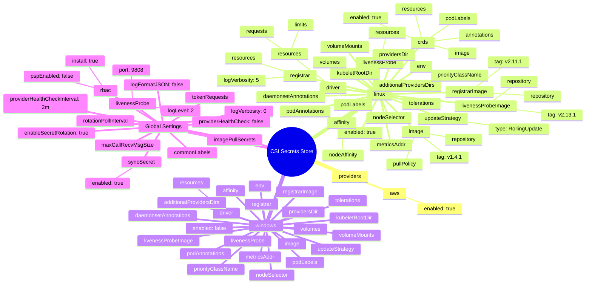
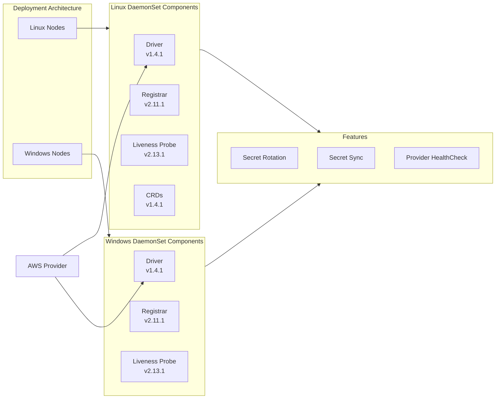

# Diagram: devops/k8s/secrets-store-csi-driver/helm/values.yaml

> Auto-generated by Obscura crawlers

## Diagram 1

### SVG

<svg id="container" width="100%" xmlns="http://www.w3.org/2000/svg" class="mindmapDiagram" style="max-width: 1645.4698486328125px;" viewBox="5 5 1645.4698486328125 898.1233520507812" role="graphics-document document" aria-roledescription="mindmap"><g><marker id="container_mindmap-pointEnd" class="marker mindmap" viewBox="0 0 10 10" refX="5" refY="5" markerUnits="userSpaceOnUse" markerWidth="8" markerHeight="8" orient="auto"><path d="M 0 0 L 10 5 L 0 10 z" class="arrowMarkerPath" style="stroke-width: 1; stroke-dasharray: 1, 0;"></path></marker><marker id="container_mindmap-pointStart" class="marker mindmap" viewBox="0 0 10 10" refX="4.5" refY="5" markerUnits="userSpaceOnUse" markerWidth="8" markerHeight="8" orient="auto"><path d="M 0 5 L 10 10 L 10 0 z" class="arrowMarkerPath" style="stroke-width: 1; stroke-dasharray: 1, 0;"></path></marker><g class="subgraphs"></g><g class="edgePaths"><path d="M809.888,479.333L797.675,483.94C785.461,488.547,761.034,497.76,736.606,506.974C712.179,516.188,687.751,525.401,675.538,530.008L663.324,534.615" id="edge_0_1" class="edge-thickness-normal edge-pattern-solid edge section-edge-0 edge-depth-1" style="undefined;;;undefined" data-edge="true" data-et="edge" data-id="edge_0_1" data-points="W3sieCI6ODA5Ljg4ODMxNDMwNzA0NDcsInkiOjQ3OS4zMzMwNTUzMTA0Njc0NH0seyJ4Ijo3MzYuNjA2MTA3Mzc5MjA2MywieSI6NTA2Ljk3NDA5MzMzNDE4MTM2fSx7IngiOjY2My4zMjM5MDA0NTEzNjc5LCJ5Ijo1MzQuNjE1MTMxMzU3ODk1Mn1d"></path><path d="M634.532,542.598L624.7,544.39C614.867,546.182,595.202,549.766,575.537,553.35C555.872,556.934,536.207,560.518,526.374,562.31L516.542,564.102" id="edge_1_2" class="edge-thickness-normal edge-pattern-solid edge section-edge-0 edge-depth-3" style="undefined;;;undefined" data-edge="true" data-et="edge" data-id="edge_1_2" data-points="W3sieCI6NjM0LjUzMjE0NjA4NDEwNDUsInkiOjU0Mi41OTgzMDAxMzU0NDZ9LHsieCI6NTc1LjUzNzA1NjMwOTc5OSwieSI6NTUzLjM1MDA1OTU0MDE0Mzd9LHsieCI6NTE2LjU0MTk2NjUzNTQ5MzcsInkiOjU2NC4xMDE4MTg5NDQ4NDEzfV0="></path><path d="M488.499,573.755L481.234,577.562C473.969,581.37,459.439,588.986,444.909,596.601C430.379,604.217,415.849,611.833,408.584,615.64L401.319,619.448" id="edge_2_3" class="edge-thickness-normal edge-pattern-solid edge section-edge-0 edge-depth-5" style="undefined;;;undefined" data-edge="true" data-et="edge" data-id="edge_2_3" data-points="W3sieCI6NDg4LjQ5OTI5NzQyMTE4ODc3LCJ5Ijo1NzMuNzU0NjU5NzM4OTIyOX0seyJ4Ijo0NDQuOTA5MjQ4NzM1NTE0NCwieSI6NTk2LjYwMTM4MDEyNjA3MTh9LHsieCI6NDAxLjMxOTIwMDA0OTg0LCJ5Ijo2MTkuNDQ4MTAwNTEzMjIwOH1d"></path><path d="M836.966,466.631L859.462,453.855C881.957,441.079,926.947,415.526,971.938,389.973C1016.928,364.42,1061.919,338.867,1084.414,326.091L1106.91,313.314" id="edge_0_4" class="edge-thickness-normal edge-pattern-solid edge section-edge-1 edge-depth-1" style="undefined;;;undefined" data-edge="true" data-et="edge" data-id="edge_0_4" data-points="W3sieCI6ODM2Ljk2NjIzMTI3MzY0ODksInkiOjQ2Ni42MzEzNjIzNzM0NjQ3fSx7IngiOjk3MS45Mzc4OTUyNzk2ODg3LCJ5IjozODkuOTcyODk5Mzc0NDk3NTZ9LHsieCI6MTEwNi45MDk1NTkyODU3Mjg2LCJ5IjozMTMuMzE0NDM2Mzc1NTMwNH1d"></path><path d="M1105.517,309.983L1100.698,311.344C1095.878,312.705,1086.239,315.427,1076.6,318.149C1066.961,320.871,1057.322,323.593,1052.503,324.954L1047.683,326.315" id="edge_4_5" class="edge-thickness-normal edge-pattern-solid edge section-edge-1 edge-depth-3" style="undefined;;;undefined" data-edge="true" data-et="edge" data-id="edge_4_5" data-points="W3sieCI6MTEwNS41MTcyMjI4Nzc3MTk0LCJ5IjozMDkuOTgzMDUxMzI0NDkzNTR9LHsieCI6MTA3Ni42MDAxMTg1NTYyNjgyLCJ5IjozMTguMTQ5MjQyNTkzMzgwOX0seyJ4IjoxMDQ3LjY4MzAxNDIzNDgxNywieSI6MzI2LjMxNTQzMzg2MjI2ODI2fV0="></path><path d="M1114.267,292.026L1110.634,283.157C1107.001,274.288,1099.735,256.55,1092.468,238.812C1085.202,221.074,1077.936,203.336,1074.303,194.467L1070.67,185.598" id="edge_4_6" class="edge-thickness-normal edge-pattern-solid edge section-edge-1 edge-depth-3" style="undefined;;;undefined" data-edge="true" data-et="edge" data-id="edge_4_6" data-points="W3sieCI6MTExNC4yNjY2OTY2MTA2NDI4LCJ5IjoyOTIuMDI1OTI2ODc2MjQwOX0seyJ4IjoxMDkyLjQ2ODQxOTg3NzYxNTQsInkiOjIzOC44MTE5NTYwMTUyNDA5Mn0seyJ4IjoxMDcwLjY3MDE0MzE0NDU4NzksInkiOjE4NS41OTc5ODUxNTQyNDA5N31d"></path><path d="M1078.762,165.786L1086.265,162.555C1093.769,159.324,1108.777,152.863,1123.785,146.402C1138.793,139.941,1153.8,133.479,1161.304,130.249L1168.808,127.018" id="edge_6_7" class="edge-thickness-normal edge-pattern-solid edge section-edge-1 edge-depth-5" style="undefined;;;undefined" data-edge="true" data-et="edge" data-id="edge_6_7" data-points="W3sieCI6MTA3OC43NjE1NjA2NzQ4MjUyLCJ5IjoxNjUuNzg1ODE2Mzk1NTIzOH0seyJ4IjoxMTIzLjc4NDgwMzY4MjAxMDUsInkiOjE0Ni40MDE4MzY1Njg2OTM3N30seyJ4IjoxMTY4LjgwODA0NjY4OTE5NTksInkiOjEyNy4wMTc4NTY3NDE4NjM3NH1d"></path><path d="M1050.104,169.825L1037.926,168.275C1025.748,166.726,1001.391,163.628,977.035,160.529C952.679,157.431,928.322,154.333,916.144,152.784L903.966,151.234" id="edge_6_8" class="edge-thickness-normal edge-pattern-solid edge section-edge-1 edge-depth-5" style="undefined;;;undefined" data-edge="true" data-et="edge" data-id="edge_6_8" data-points="W3sieCI6MTA1MC4xMDQxMDE3OTcyMzUsInkiOjE2OS44MjQ1MzQzNTQyNzM5Nn0seyJ4Ijo5NzcuMDM0OTY3ODY3ODU3OSwieSI6MTYwLjUyOTQyODA4NjQ5MDY0fSx7IngiOjkwMy45NjU4MzM5Mzg0ODA2LCJ5IjoxNTEuMjM0MzIxODE4NzA3MzF9XQ=="></path><path d="M1070.207,157.656L1072.305,152.009C1074.402,146.362,1078.597,135.068,1082.792,123.775C1086.987,112.481,1091.182,101.187,1093.279,95.54L1095.376,89.893" id="edge_6_9" class="edge-thickness-normal edge-pattern-solid edge section-edge-1 edge-depth-5" style="undefined;;;undefined" data-edge="true" data-et="edge" data-id="edge_6_9" data-points="W3sieCI6MTA3MC4yMDcwNDkxNDMwNDYzLCJ5IjoxNTcuNjU2MDcwODQxNzE1NDZ9LHsieCI6MTA4Mi43OTE3NjU1NDE2NzU3LCJ5IjoxMjMuNzc0NjEwMDE3MzM2MTN9LHsieCI6MTA5NS4zNzY0ODE5NDAzMDUsInkiOjg5Ljg5MzE0OTE5Mjk1Njc4fV0="></path><path d="M1123.938,320.367L1126.502,329.668C1129.065,338.969,1134.192,357.571,1139.319,376.173C1144.445,394.775,1149.572,413.377,1152.135,422.678L1154.699,431.979" id="edge_4_10" class="edge-thickness-normal edge-pattern-solid edge section-edge-1 edge-depth-3" style="undefined;;;undefined" data-edge="true" data-et="edge" data-id="edge_4_10" data-points="W3sieCI6MTEyMy45MzgxNDUwNjgzODE4LCJ5IjozMjAuMzY3MzIzOTYwMjIzMX0seyJ4IjoxMTM5LjMxODUxOTQ0NDgyMjIsInkiOjM3Ni4xNzI5OTIxNzE4NjgwM30seyJ4IjoxMTU0LjY5ODg5MzgyMTI2MjYsInkiOjQzMS45Nzg2NjAzODM1MTN9XQ=="></path><path d="M1144.171,450.229L1132.136,453.372C1120.102,456.515,1096.032,462.8,1071.963,469.086C1047.893,475.371,1023.823,481.657,1011.789,484.799L999.754,487.942" id="edge_10_11" class="edge-thickness-normal edge-pattern-solid edge section-edge-1 edge-depth-5" style="undefined;;;undefined" data-edge="true" data-et="edge" data-id="edge_10_11" data-points="W3sieCI6MTE0NC4xNzEwNzM1MzM0MTYsInkiOjQ1MC4yMjk0NTAzNzg2NDF9LHsieCI6MTA3MS45NjI1MDY2MzUyNywieSI6NDY5LjA4NTcyMjAxMDM2Nn0seyJ4Ijo5OTkuNzUzOTM5NzM3MTI0LCJ5Ijo0ODcuOTQxOTkzNjQyMDkxfV0="></path><path d="M1173.239,450.068L1178.95,451.491C1184.662,452.915,1196.085,455.762,1207.508,458.61C1218.93,461.457,1230.353,464.304,1236.065,465.728L1241.776,467.152" id="edge_10_12" class="edge-thickness-normal edge-pattern-solid edge section-edge-1 edge-depth-5" style="undefined;;;undefined" data-edge="true" data-et="edge" data-id="edge_10_12" data-points="W3sieCI6MTE3My4yMzkwMjU1MjM1MTA3LCJ5Ijo0NTAuMDY3NTE0MTA4NzAxOH0seyJ4IjoxMjA3LjUwNzU4NDEyMzM1NDUsInkiOjQ1OC42MDk1OTIxNzQwMTg2fSx7IngiOjEyNDEuNzc2MTQyNzIzMTk4MywieSI6NDY3LjE1MTY3MDIzOTMzNTR9XQ=="></path><path d="M1152.519,460.114L1150.626,464.313C1148.732,468.512,1144.946,476.91,1141.159,485.308C1137.373,493.706,1133.586,502.104,1131.693,506.303L1129.799,510.502" id="edge_10_13" class="edge-thickness-normal edge-pattern-solid edge section-edge-1 edge-depth-5" style="undefined;;;undefined" data-edge="true" data-et="edge" data-id="edge_10_13" data-points="W3sieCI6MTE1Mi41MTg4MDUzNzI5MzMsInkiOjQ2MC4xMTM3NjY2MzczMjkxNX0seyJ4IjoxMTQxLjE1OTE1MTM5MzgxOTIsInkiOjQ4NS4zMDc2NTE1MDUwMX0seyJ4IjoxMTI5Ljc5OTQ5NzQxNDcwNTUsInkiOjUxMC41MDE1MzYzNzI2OTA5fV0="></path><path d="M1173.22,450.144L1188.783,454.111C1204.346,458.077,1235.472,466.011,1266.598,473.944C1297.724,481.877,1328.85,489.81,1344.413,493.777L1359.976,497.744" id="edge_10_14" class="edge-thickness-normal edge-pattern-solid edge section-edge-1 edge-depth-5" style="undefined;;;undefined" data-edge="true" data-et="edge" data-id="edge_10_14" data-points="W3sieCI6MTE3My4yMTk2OTc1MDMzNzM1LCJ5Ijo0NTAuMTQ0MTkxMjU0OTk5NX0seyJ4IjoxMjY2LjU5NzY0MTM2MTU5NDIsInkiOjQ3My45NDM5Mjg2NTIwNDc5fSx7IngiOjEzNTkuOTc1NTg1MjE5ODE1LCJ5Ijo0OTcuNzQzNjY2MDQ5MDk2MjV9XQ=="></path><path d="M1169.073,457.259L1175.045,463.478C1181.016,469.697,1192.959,482.135,1204.902,494.574C1216.845,507.012,1228.788,519.45,1234.76,525.669L1240.731,531.888" id="edge_10_15" class="edge-thickness-normal edge-pattern-solid edge section-edge-1 edge-depth-5" style="undefined;;;undefined" data-edge="true" data-et="edge" data-id="edge_10_15" data-points="W3sieCI6MTE2OS4wNzM0NDAxNTg4MDcsInkiOjQ1Ny4yNTkyNzU2NDUwODEzfSx7IngiOjEyMDQuOTAyMzEwOTA0NzAyNywieSI6NDk0LjU3MzU4OTI4MjU5MjI1fSx7IngiOjEyNDAuNzMxMTgxNjUwNTk4NSwieSI6NTMxLjg4NzkwMjkyMDEwMzJ9XQ=="></path><path d="M1134.941,306.497L1152.859,307.203C1170.778,307.91,1206.615,309.322,1242.452,310.735C1278.288,312.147,1314.125,313.56,1332.044,314.266L1349.962,314.972" id="edge_4_16" class="edge-thickness-normal edge-pattern-solid edge section-edge-1 edge-depth-3" style="undefined;;;undefined" data-edge="true" data-et="edge" data-id="edge_4_16" data-points="W3sieCI6MTEzNC45NDEwMTQ0NzIxNzI0LCJ5IjozMDYuNDk3MjM4MzI1NTMxN30seyJ4IjoxMjQyLjQ1MTUwNTU3NjY3MjQsInkiOjMxMC43MzQ2NjY1MjAyOTQ5fSx7IngiOjEzNDkuOTYxOTk2NjgxMTcyNCwieSI6MzE0Ljk3MjA5NDcxNTA1ODF9XQ=="></path><path d="M1379.867,313.981L1394.918,312.386C1409.969,310.79,1440.07,307.598,1470.172,304.407C1500.274,301.215,1530.376,298.023,1545.427,296.428L1560.477,294.832" id="edge_16_17" class="edge-thickness-normal edge-pattern-solid edge section-edge-1 edge-depth-5" style="undefined;;;undefined" data-edge="true" data-et="edge" data-id="edge_16_17" data-points="W3sieCI6MTM3OS44NjY3NTExNTk2MzI3LCJ5IjozMTMuOTgxMzEyOTQ2NTEzNn0seyJ4IjoxNDcwLjE3MjA4NDYzODA5ODYsInkiOjMwNC40MDY1NDQ3NTgwODc2fSx7IngiOjE1NjAuNDc3NDE4MTE2NTY0NCwieSI6Mjk0LjgzMTc3NjU2OTY2MTZ9XQ=="></path><path d="M1107.629,297.355L1101.888,293.372C1096.147,289.389,1084.666,281.422,1073.185,273.455C1061.703,265.488,1050.222,257.522,1044.481,253.538L1038.74,249.555" id="edge_4_18" class="edge-thickness-normal edge-pattern-solid edge section-edge-1 edge-depth-3" style="undefined;;;undefined" data-edge="true" data-et="edge" data-id="edge_4_18" data-points="W3sieCI6MTEwNy42Mjg4MjYzNTM4ODM2LCJ5IjoyOTcuMzU1MjY4MDMwMjU3OTV9LHsieCI6MTA3My4xODQ1NjAyMDk0MDA4LCJ5IjoyNzMuNDU1MTg4MTgxMDE4ODV9LHsieCI6MTAzOC43NDAyOTQwNjQ5MTgsInkiOjI0OS41NTUxMDgzMzE3Nzk3Nn1d"></path><path d="M1024.679,226.105L1023.813,218.673C1022.947,211.241,1021.214,196.376,1019.481,181.512C1017.748,166.648,1016.015,151.784,1015.148,144.352L1014.282,136.919" id="edge_18_19" class="edge-thickness-normal edge-pattern-solid edge section-edge-1 edge-depth-5" style="undefined;;;undefined" data-edge="true" data-et="edge" data-id="edge_18_19" data-points="W3sieCI6MTAyNC42Nzk0OTIyOTU0NTYsInkiOjIyNi4xMDQ3OTk2NzE0OTg2OH0seyJ4IjoxMDE5LjQ4MDc1NzE4MzAxMTUsInkiOjE4MS41MTIxMTY5MTc5MTAxfSx7IngiOjEwMTQuMjgyMDIyMDcwNTY3LCJ5IjoxMzYuOTE5NDM0MTY0MzIxNTN9XQ=="></path><path d="M998.137,117.847L987.622,114.801C977.107,111.755,956.077,105.663,935.046,99.571C914.016,93.479,892.986,87.387,882.471,84.341L871.956,81.295" id="edge_19_20" class="edge-thickness-normal edge-pattern-solid edge section-edge-1 edge-depth-7" style="undefined;;;undefined" data-edge="true" data-et="edge" data-id="edge_19_20" data-points="W3sieCI6OTk4LjEzNzM2Mjk0MDYyNDYsInkiOjExNy44NDY3NzQ4NjkyMDk3OH0seyJ4Ijo5MzUuMDQ2NDk0MDAzMzgyNSwieSI6OTkuNTcwODI4MDEyOTg3MDV9LHsieCI6ODcxLjk1NTYyNTA2NjE0MDMsInkiOjgxLjI5NDg4MTE1Njc2NDMyfV0="></path><path d="M1006.404,108.335L1004.061,103.114C1001.719,97.893,997.033,87.452,992.348,77.01C987.663,66.569,982.977,56.127,980.635,50.906L978.292,45.685" id="edge_19_21" class="edge-thickness-normal edge-pattern-solid edge section-edge-1 edge-depth-7" style="undefined;;;undefined" data-edge="true" data-et="edge" data-id="edge_19_21" data-points="W3sieCI6MTAwNi40MDQxMjE0Mjg5NTcxLCJ5IjoxMDguMzM0OTg0MjgwMzA3ODV9LHsieCI6OTkyLjM0Nzk4MjI0Nzg1NTIsInkiOjc3LjAxMDE3MTU2MzI3MjQyfSx7IngiOjk3OC4yOTE4NDMwNjY3NTMyLCJ5Ijo0NS42ODUzNTg4NDYyMzY5OTR9XQ=="></path><path d="M1105.355,302.456L1085.718,297.815C1066.081,293.173,1026.806,283.89,987.532,274.607C948.258,265.324,908.983,256.041,889.346,251.399L869.709,246.758" id="edge_4_22" class="edge-thickness-normal edge-pattern-solid edge section-edge-1 edge-depth-3" style="undefined;;;undefined" data-edge="true" data-et="edge" data-id="edge_4_22" data-points="W3sieCI6MTEwNS4zNTQ4ODgyMDYxNzk2LCJ5IjozMDIuNDU2MDgwNzY5NTA5NzV9LHsieCI6OTg3LjUzMTg1OTU0MjU5NjMsInkiOjI3NC42MDY4MDQ2MjI0NjU0Nn0seyJ4Ijo4NjkuNzA4ODMwODc5MDEzLCJ5IjoyNDYuNzU3NTI4NDc1NDIxMTd9XQ=="></path><path d="M840.246,241.3L827.243,239.544C814.24,237.788,788.234,234.275,762.227,230.763C736.221,227.251,710.215,223.739,697.212,221.983L684.209,220.227" id="edge_22_23" class="edge-thickness-normal edge-pattern-solid edge section-edge-1 edge-depth-5" style="undefined;;;undefined" data-edge="true" data-et="edge" data-id="edge_22_23" data-points="W3sieCI6ODQwLjI0NjAwODk4Njg2OTcsInkiOjI0MS4yOTk2MjYxMjg5MjM5fSx7IngiOjc2Mi4yMjc0Nzk3NzU2Mjc5LCJ5IjoyMzAuNzYzMzc0MDc3Mjc2MX0seyJ4Ijo2ODQuMjA4OTUwNTY0Mzg2MSwieSI6MjIwLjIyNzEyMjAyNTYyODN9XQ=="></path><path d="M842.93,234.554L836.944,230.253C830.958,225.952,818.986,217.35,807.014,208.748C795.042,200.145,783.07,191.543,777.084,187.242L771.098,182.941" id="edge_22_24" class="edge-thickness-normal edge-pattern-solid edge section-edge-1 edge-depth-5" style="undefined;;;undefined" data-edge="true" data-et="edge" data-id="edge_22_24" data-points="W3sieCI6ODQyLjkyOTU5MjYxMTMxMTQsInkiOjIzNC41NTQzMTM4NTYxNTUxMn0seyJ4Ijo4MDcuMDEzODU1NjI5NDAxMiwieSI6MjA4Ljc0NzYxNzY2NzAzMjQyfSx7IngiOjc3MS4wOTgxMTg2NDc0OTEsInkiOjE4Mi45NDA5MjE0Nzc5MDk3fV0="></path><path d="M1130.703,295.445L1140.144,286.258C1149.585,277.071,1168.467,258.696,1187.35,240.322C1206.232,221.947,1225.114,203.573,1234.555,194.386L1243.996,185.198" id="edge_4_25" class="edge-thickness-normal edge-pattern-solid edge section-edge-1 edge-depth-3" style="undefined;;;undefined" data-edge="true" data-et="edge" data-id="edge_4_25" data-points="W3sieCI6MTEzMC43MDI4MDUxMjI1OTQ4LCJ5IjoyOTUuNDQ1NDA1MDg1NTMxM30seyJ4IjoxMTg3LjM0OTU5ODU4Mjg3MjIsInkiOjI0MC4zMjE4NDkxMzEzMzQxNX0seyJ4IjoxMjQzLjk5NjM5MjA0MzE0OTYsInkiOjE4NS4xOTgyOTMxNzcxMzY5N31d"></path><path d="M1269.739,175.199L1282.899,175.605C1296.059,176.01,1322.378,176.821,1348.698,177.632C1375.017,178.443,1401.337,179.255,1414.496,179.66L1427.656,180.066" id="edge_25_26" class="edge-thickness-normal edge-pattern-solid edge section-edge-1 edge-depth-5" style="undefined;;;undefined" data-edge="true" data-et="edge" data-id="edge_25_26" data-points="W3sieCI6MTI2OS43Mzk0MjgxMDUzNjk2LCJ5IjoxNzUuMTk5MjMzMDAwNzkxODh9LHsieCI6MTM0OC42OTc3MTM3MjYwODIyLCJ5IjoxNzcuNjMyNDEwMDEzNDg2Nzh9LHsieCI6MTQyNy42NTU5OTkzNDY3OTQ3LCJ5IjoxODAuMDY1NTg3MDI2MTgxNjd9XQ=="></path><path d="M1263.532,162.579L1267.634,156.902C1271.737,151.224,1279.942,139.869,1288.146,128.514C1296.351,117.16,1304.556,105.805,1308.659,100.127L1312.761,94.45" id="edge_25_27" class="edge-thickness-normal edge-pattern-solid edge section-edge-1 edge-depth-5" style="undefined;;;undefined" data-edge="true" data-et="edge" data-id="edge_25_27" data-points="W3sieCI6MTI2My41MzE4MTY5NTMzMDgyLCJ5IjoxNjIuNTc5MTI4ODU0NDQ3Mjh9LHsieCI6MTI4OC4xNDY0OTU4MDAxOTExLCJ5IjoxMjguNTE0NDY1MTU1NjQ1NH0seyJ4IjoxMzEyLjc2MTE3NDY0NzA3NCwieSI6OTQuNDQ5ODAxNDU2ODQzNTZ9XQ=="></path><path d="M1134.766,303.545L1155.72,300.204C1176.675,296.863,1218.585,290.181,1260.495,283.5C1302.405,276.818,1344.315,270.136,1365.27,266.795L1386.225,263.454" id="edge_4_28" class="edge-thickness-normal edge-pattern-solid edge section-edge-1 edge-depth-3" style="undefined;;;undefined" data-edge="true" data-et="edge" data-id="edge_4_28" data-points="W3sieCI6MTEzNC43NjU1NzI4NDk5MzMsInkiOjMwMy41NDQ4MzkxNDQzMDI2N30seyJ4IjoxMjYwLjQ5NTA1MTE1MTg4NiwieSI6MjgzLjQ5OTU5NzIwMTQ0ODN9LHsieCI6MTM4Ni4yMjQ1Mjk0NTM4Mzg4LCJ5IjoyNjMuNDU0MzU1MjU4NTkzOX1d"></path><path d="M1415.51,257.149L1428.293,253.666C1441.075,250.183,1466.641,243.217,1492.207,236.251C1517.772,229.285,1543.338,222.319,1556.121,218.835L1568.904,215.352" id="edge_28_29" class="edge-thickness-normal edge-pattern-solid edge section-edge-1 edge-depth-5" style="undefined;;;undefined" data-edge="true" data-et="edge" data-id="edge_28_29" data-points="W3sieCI6MTQxNS41MDk4MTI1Mzk3OTMzLCJ5IjoyNTcuMTQ5MjY2OTg3NjgyMX0seyJ4IjoxNDkyLjIwNjc0NzUzMDYyMjYsInkiOjIzNi4yNTA4MTk4MTQwMDU3OH0seyJ4IjoxNTY4LjkwMzY4MjUyMTQ1MTksInkiOjIxNS4zNTIzNzI2NDAzMjk0Nn1d"></path><path d="M1412.722,270.498L1418.459,275.116C1424.196,279.734,1435.67,288.97,1447.143,298.206C1458.617,307.442,1470.091,316.677,1475.828,321.295L1481.564,325.913" id="edge_28_30" class="edge-thickness-normal edge-pattern-solid edge section-edge-1 edge-depth-5" style="undefined;;;undefined" data-edge="true" data-et="edge" data-id="edge_28_30" data-points="W3sieCI6MTQxMi43MjIxOTM4MzUxNDA2LCJ5IjoyNzAuNDk4Mzg2Mjg2NDc5NDR9LHsieCI6MTQ0Ny4xNDMyNzQzNTQ1MzM4LCJ5IjoyOTguMjA1NzYyNTMzNDUyMn0seyJ4IjoxNDgxLjU2NDM1NDg3MzkyNywieSI6MzI1LjkxMzEzODc4MDQyNDl9XQ=="></path><path d="M1133.519,299.507L1146.952,293.17C1160.384,286.833,1187.25,274.159,1214.115,261.485C1240.98,248.811,1267.846,236.137,1281.278,229.8L1294.711,223.463" id="edge_4_31" class="edge-thickness-normal edge-pattern-solid edge section-edge-1 edge-depth-3" style="undefined;;;undefined" data-edge="true" data-et="edge" data-id="edge_4_31" data-points="W3sieCI6MTEzMy41MTg4MzA0MDM1NzIsInkiOjI5OS41MDY1NzkyNDcyMn0seyJ4IjoxMjE0LjExNDk2MTc3Mjk5NzUsInkiOjI2MS40ODQ5ODc2MTQzNTM2fSx7IngiOjEyOTQuNzExMDkzMTQyNDIzLCJ5IjoyMjMuNDYzMzk1OTgxNDg3MTd9XQ=="></path><path d="M1318.131,205.754L1322.532,200.703C1326.933,195.652,1335.734,185.55,1344.536,175.448C1353.338,165.346,1362.14,155.244,1366.54,150.193L1370.941,145.141" id="edge_31_32" class="edge-thickness-normal edge-pattern-solid edge section-edge-1 edge-depth-5" style="undefined;;;undefined" data-edge="true" data-et="edge" data-id="edge_31_32" data-points="W3sieCI6MTMxOC4xMzA5NzMzODk4MjMzLCJ5IjoyMDUuNzUzOTk5NzA3NzQyM30seyJ4IjoxMzQ0LjUzNjEzMzE1ODg4MjYsInkiOjE3NS40NDc3MzU3OTY5NDk2NH0seyJ4IjoxMzcwLjk0MTI5MjkyNzk0MiwieSI6MTQ1LjE0MTQ3MTg4NjE1NjkyfV0="></path><path d="M1134.379,310.015L1151.071,314.77C1167.763,319.524,1201.147,329.033,1234.531,338.541C1267.915,348.05,1301.299,357.559,1317.991,362.313L1334.683,367.067" id="edge_4_33" class="edge-thickness-normal edge-pattern-solid edge section-edge-1 edge-depth-3" style="undefined;;;undefined" data-edge="true" data-et="edge" data-id="edge_4_33" data-points="W3sieCI6MTEzNC4zNzg4OTEyODUyOTYsInkiOjMxMC4wMTU0NTM3MDYxOTAxfSx7IngiOjEyMzQuNTMwOTM5MjQxNDM1MSwieSI6MzM4LjU0MTM2MDk2NDMzNjI2fSx7IngiOjEzMzQuNjgyOTg3MTk3NTc0MiwieSI6MzY3LjA2NzI2ODIyMjQ4MjR9XQ=="></path><path d="M1363.023,376.781L1372.413,380.564C1381.804,384.347,1400.585,391.912,1419.366,399.478C1438.147,407.044,1456.928,414.609,1466.318,418.392L1475.709,422.175" id="edge_33_34" class="edge-thickness-normal edge-pattern-solid edge section-edge-1 edge-depth-5" style="undefined;;;undefined" data-edge="true" data-et="edge" data-id="edge_33_34" data-points="W3sieCI6MTM2My4wMjI3NDQ3ODM3NzMsInkiOjM3Ni43ODEwNTY1Mjc0NTk4fSx7IngiOjE0MTkuMzY1ODY2NDA5MjQ5NSwieSI6Mzk5LjQ3NzkwODg2Njc2NDl9LHsieCI6MTQ3NS43MDg5ODgwMzQ3MjYsInkiOjQyMi4xNzQ3NjEyMDYwN31d"></path><path d="M1104.989,306.956L1086.238,308.272C1067.487,309.588,1029.985,312.219,992.483,314.85C954.981,317.482,917.479,320.113,898.728,321.429L879.977,322.744" id="edge_4_35" class="edge-thickness-normal edge-pattern-solid edge section-edge-1 edge-depth-3" style="undefined;;;undefined" data-edge="true" data-et="edge" data-id="edge_4_35" data-points="W3sieCI6MTEwNC45ODk0Mzg5NTYxODgsInkiOjMwNi45NTYzNjk5NzI2MDg4fSx7IngiOjk5Mi40ODMyMTEyMTY5NzMxLCJ5IjozMTQuODUwMjk3ODY2NjgyMDd9LHsieCI6ODc5Ljk3Njk4MzQ3Nzc1ODIsInkiOjMyMi43NDQyMjU3NjA3NTUzNH1d"></path><path d="M1109.487,316.652L1100.916,325.453C1092.345,334.253,1075.203,351.854,1058.061,369.456C1040.919,387.057,1023.777,404.658,1015.206,413.458L1006.635,422.259" id="edge_4_36" class="edge-thickness-normal edge-pattern-solid edge section-edge-1 edge-depth-3" style="undefined;;;undefined" data-edge="true" data-et="edge" data-id="edge_4_36" data-points="W3sieCI6MTEwOS40ODcxMTI4OTY2NjcsInkiOjMxNi42NTIyOTg0Mzk2NzI3fSx7IngiOjEwNTguMDYxMTI4Njg4NDM0OCwieSI6MzY5LjQ1NTUwMjk1NjA4MDA3fSx7IngiOjEwMDYuNjM1MTQ0NDgwMjAyNywieSI6NDIyLjI1ODcwNzQ3MjQ4NzZ9XQ=="></path><path d="M1131.813,296.724L1135.042,294.223C1138.272,291.723,1144.73,286.723,1151.188,281.722C1157.647,276.722,1164.105,271.722,1167.335,269.222L1170.564,266.721" id="edge_4_37" class="edge-thickness-normal edge-pattern-solid edge section-edge-1 edge-depth-3" style="undefined;;;undefined" data-edge="true" data-et="edge" data-id="edge_4_37" data-points="W3sieCI6MTEzMS44MTMyNDE2NzY4ODQyLCJ5IjoyOTYuNzIzNTQ0MzM4Mjc3MDd9LHsieCI6MTE1MS4xODg0OTEzMzk1ODksInkiOjI4MS43MjI0NTM3ODQ0OTM0fSx7IngiOjExNzAuNTYzNzQxMDAyMjk0LCJ5IjoyNjYuNzIxMzYzMjMwNzA5N31d"></path><path d="M1107.04,298.273L1094.148,290.652C1081.256,283.031,1055.472,267.788,1029.687,252.545C1003.903,237.303,978.119,222.06,965.227,214.439L952.335,206.817" id="edge_4_38" class="edge-thickness-normal edge-pattern-solid edge section-edge-1 edge-depth-3" style="undefined;;;undefined" data-edge="true" data-et="edge" data-id="edge_4_38" data-points="W3sieCI6MTEwNy4wNDAxNzI0OTU4OTkyLCJ5IjoyOTguMjczMTQ1OTgzNTUxMX0seyJ4IjoxMDI5LjY4NzQwMzc0ODc3NDIsInkiOjI1Mi41NDUyOTMyODI2MzMyOH0seyJ4Ijo5NTIuMzM0NjM1MDAxNjQ5MywieSI6MjA2LjgxNzQ0MDU4MTcxNTQ2fV0="></path><path d="M1134.594,309.168L1142.196,310.861C1149.798,312.555,1165.002,315.941,1180.206,319.328C1195.411,322.715,1210.615,326.102,1218.217,327.795L1225.819,329.488" id="edge_4_39" class="edge-thickness-normal edge-pattern-solid edge section-edge-1 edge-depth-3" style="undefined;;;undefined" data-edge="true" data-et="edge" data-id="edge_4_39" data-points="W3sieCI6MTEzNC41OTM4MTk4NzIyMzA2LCJ5IjozMDkuMTY3ODA0NjY0MTA0NTV9LHsieCI6MTE4MC4yMDY0OTAzNTg1OTM4LCJ5IjozMTkuMzI4MDIzNDQ4NzgxMDR9LHsieCI6MTIyNS44MTkxNjA4NDQ5NTcsInkiOjMyOS40ODgyNDIyMzM0NTc1fV0="></path><path d="M1123.412,291.311L1124.688,285.927C1125.965,280.544,1128.517,269.776,1131.069,259.009C1133.621,248.242,1136.173,237.475,1137.45,232.091L1138.726,226.707" id="edge_4_40" class="edge-thickness-normal edge-pattern-solid edge section-edge-1 edge-depth-3" style="undefined;;;undefined" data-edge="true" data-et="edge" data-id="edge_4_40" data-points="W3sieCI6MTEyMy40MTIzMTk5MTI0MjUzLCJ5IjoyOTEuMzEwOTE0NDkwNjgwNH0seyJ4IjoxMTMxLjA2ODk3MTk0NDI4NDgsInkiOjI1OS4wMDkxOTkyMzY0MzExfSx7IngiOjExMzguNzI1NjIzOTc2MTQ0MywieSI6MjI2LjcwNzQ4Mzk4MjE4MTc3fV0="></path><path d="M1134.856,304.207L1145.122,303.037C1155.387,301.866,1175.919,299.525,1196.45,297.184C1216.982,294.843,1237.513,292.502,1247.779,291.332L1258.044,290.161" id="edge_4_41" class="edge-thickness-normal edge-pattern-solid edge section-edge-1 edge-depth-3" style="undefined;;;undefined" data-edge="true" data-et="edge" data-id="edge_4_41" data-points="W3sieCI6MTEzNC44NTYwODY0MjA3OTgyLCJ5IjozMDQuMjA3MTc5Njc5MTAzM30seyJ4IjoxMTk2LjQ1MDIyNDAyNDMwMiwieSI6Mjk3LjE4NDE0ODQzNTI1ODd9LHsieCI6MTI1OC4wNDQzNjE2Mjc4MDYsInkiOjI5MC4xNjExMTcxOTE0MTQwNn1d"></path><path d="M1126.866,319.218L1128.483,322.332C1130.099,325.445,1133.333,331.672,1136.567,337.899C1139.801,344.125,1143.034,350.352,1144.651,353.466L1146.268,356.579" id="edge_4_42" class="edge-thickness-normal edge-pattern-solid edge section-edge-1 edge-depth-3" style="undefined;;;undefined" data-edge="true" data-et="edge" data-id="edge_4_42" data-points="W3sieCI6MTEyNi44NjU4MDkzMjI1OTQ1LCJ5IjozMTkuMjE4NDQ0NzUxODk4OH0seyJ4IjoxMTM2LjU2NjgzODg1NjEwNjksInkiOjMzNy44OTg3MjM3MTc4MDEzfSx7IngiOjExNDYuMjY3ODY4Mzg5NjE5MywieSI6MzU2LjU3OTAwMjY4MzcwMzgzfV0="></path><path d="M1105.164,303.4L1094.225,301.546C1083.286,299.693,1061.408,295.985,1039.53,292.277C1017.652,288.57,995.775,284.862,984.836,283.009L973.897,281.155" id="edge_4_43" class="edge-thickness-normal edge-pattern-solid edge section-edge-1 edge-depth-3" style="undefined;;;undefined" data-edge="true" data-et="edge" data-id="edge_4_43" data-points="W3sieCI6MTEwNS4xNjM1MTQ3NzEwOTY1LCJ5IjozMDMuNDAwMjA5MTk0NjA5OTR9LHsieCI6MTAzOS41MzAxNjYwODk3MjYsInkiOjI5Mi4yNzc0OTY5ODAzNjUxM30seyJ4Ijo5NzMuODk2ODE3NDA4MzU1NCwieSI6MjgxLjE1NDc4NDc2NjEyMDN9XQ=="></path><path d="M1116.558,320.517L1115.36,325.677C1114.161,330.836,1111.764,341.155,1109.367,351.474C1106.97,361.793,1104.572,372.112,1103.374,377.271L1102.175,382.43" id="edge_4_44" class="edge-thickness-normal edge-pattern-solid edge section-edge-1 edge-depth-3" style="undefined;;;undefined" data-edge="true" data-et="edge" data-id="edge_4_44" data-points="W3sieCI6MTExNi41NTgzNDM2Nzg0MDIzLCJ5IjozMjAuNTE3Mzk0OTgxMDMyNDV9LHsieCI6MTEwOS4zNjY3NDI1NzkxNTM3LCJ5IjozNTEuNDczODczNzAwMTI1fSx7IngiOjExMDIuMTc1MTQxNDc5OTA1LCJ5IjozODIuNDMwMzUyNDE5MjE3NTd9XQ=="></path><path d="M1106.158,311.799L1092.841,317.487C1079.523,323.175,1052.888,334.552,1026.252,345.929C999.617,357.306,972.982,368.683,959.664,374.371L946.346,380.06" id="edge_4_45" class="edge-thickness-normal edge-pattern-solid edge section-edge-1 edge-depth-3" style="undefined;;;undefined" data-edge="true" data-et="edge" data-id="edge_4_45" data-points="W3sieCI6MTEwNi4xNTgzMDc0MjgwNzkzLCJ5IjozMTEuNzk4NTE5MjA0ODk3Nn0seyJ4IjoxMDI2LjI1MjM4NTgyNzM3NywieSI6MzQ1LjkyOTA1NTEzMTg4MjE0fSx7IngiOjk0Ni4zNDY0NjQyMjY2NzUyLCJ5IjozODAuMDU5NTkxMDU4ODY2NjZ9XQ=="></path><path d="M1105.92,311.205L1096.823,314.64C1087.725,318.075,1069.531,324.945,1051.337,331.815C1033.143,338.685,1014.948,345.554,1005.851,348.989L996.754,352.424" id="edge_4_46" class="edge-thickness-normal edge-pattern-solid edge section-edge-1 edge-depth-3" style="undefined;;;undefined" data-edge="true" data-et="edge" data-id="edge_4_46" data-points="W3sieCI6MTEwNS45MTk2NzUxMzE3MTk3LCJ5IjozMTEuMjA1MTIzMzgyMzU0N30seyJ4IjoxMDUxLjMzNjkxNjE1NTYzODIsInkiOjMzMS44MTQ3Mzk1NzE5NDAxNX0seyJ4Ijo5OTYuNzU0MTU3MTc5NTU2NSwieSI6MzUyLjQyNDM1NTc2MTUyNTZ9XQ=="></path><path d="M1132.088,314.724L1142.07,321.977C1152.052,329.23,1172.016,343.736,1191.98,358.242C1211.944,372.748,1231.908,387.254,1241.89,394.506L1251.872,401.759" id="edge_4_47" class="edge-thickness-normal edge-pattern-solid edge section-edge-1 edge-depth-3" style="undefined;;;undefined" data-edge="true" data-et="edge" data-id="edge_4_47" data-points="W3sieCI6MTEzMi4wODc1Njg2NjMwNDczLCJ5IjozMTQuNzIzNzI5OTA1ODYwODZ9LHsieCI6MTE5MS45Nzk5NTA0NTk0MTQ2LCJ5IjozNTguMjQxNjAyNDU2NTc2NX0seyJ4IjoxMjUxLjg3MjMzMjI1NTc4MTksInkiOjQwMS43NTk0NzUwMDcyOTIxN31d"></path><path d="M827.912,488.499L832.167,503.92C836.421,519.341,844.931,550.184,853.44,581.026C861.949,611.869,870.458,642.711,874.712,658.132L878.967,673.553" id="edge_0_48" class="edge-thickness-normal edge-pattern-solid edge section-edge-2 edge-depth-1" style="undefined;;;undefined" data-edge="true" data-et="edge" data-id="edge_0_48" data-points="W3sieCI6ODI3LjkxMjQzMTcwOTI2NzksInkiOjQ4OC40OTkxMDM1NzIzMDg4NX0seyJ4Ijo4NTMuNDM5NjA3NDIxODgxNSwieSI6NTgxLjAyNjE3NjMwNzg0NTd9LHsieCI6ODc4Ljk2Njc4MzEzNDQ5NTEsInkiOjY3My41NTMyNDkwNDMzODI2fV0="></path><path d="M896.746,682.111L913.113,675.106C929.48,668.1,962.213,654.09,994.946,640.079C1027.68,626.069,1060.413,612.059,1076.78,605.053L1093.147,598.048" id="edge_48_49" class="edge-thickness-normal edge-pattern-solid edge section-edge-2 edge-depth-3" style="undefined;;;undefined" data-edge="true" data-et="edge" data-id="edge_48_49" data-points="W3sieCI6ODk2Ljc0NjAyNTk5MTMyMzEsInkiOjY4Mi4xMTA3Mjc2MzkxNjQ3fSx7IngiOjk5NC45NDY0NzY0ODEyMTY1LCJ5Ijo2NDAuMDc5NDE1MzA0MDUyMX0seyJ4IjoxMDkzLjE0NjkyNjk3MTExLCJ5Ijo1OTguMDQ4MTAyOTY4OTM5NX1d"></path><path d="M879.924,673.323L879.117,669.416C878.311,665.509,876.698,657.695,875.085,649.881C873.472,642.067,871.859,634.253,871.053,630.346L870.247,626.439" id="edge_48_50" class="edge-thickness-normal edge-pattern-solid edge section-edge-2 edge-depth-3" style="undefined;;;undefined" data-edge="true" data-et="edge" data-id="edge_48_50" data-points="W3sieCI6ODc5LjkyMzgzMzg4NTY0ODMsInkiOjY3My4zMjI3MTkzNjAzOTk3fSx7IngiOjg3NS4wODUxNzE1MDk1Nzg1LCJ5Ijo2NDkuODgwODI2NzIzMDI1fSx7IngiOjg3MC4yNDY1MDkxMzM1MDg3LCJ5Ijo2MjYuNDM4OTM0MDg1NjUwNH1d"></path><path d="M896.563,681.7L901.397,679.458C906.23,677.216,915.897,672.731,925.565,668.246C935.232,663.761,944.899,659.276,949.733,657.034L954.566,654.791" id="edge_48_51" class="edge-thickness-normal edge-pattern-solid edge section-edge-2 edge-depth-3" style="undefined;;;undefined" data-edge="true" data-et="edge" data-id="edge_48_51" data-points="W3sieCI6ODk2LjU2MzA5MzkwNjQ2NTcsInkiOjY4MS43MDA0Mjc1NDc3NzM5fSx7IngiOjkyNS41NjQ2ODIwMjMxMjIxLCJ5Ijo2NjguMjQ1OTE2MzA0MTg2Nn0seyJ4Ijo5NTQuNTY2MjcwMTM5Nzc4NiwieSI6NjU0Ljc5MTQwNTA2MDU5OTN9XQ=="></path><path d="M873.194,699.402L866.625,707.064C860.057,714.727,846.92,730.052,833.784,745.377C820.647,760.702,807.51,776.027,800.942,783.69L794.374,791.352" id="edge_48_52" class="edge-thickness-normal edge-pattern-solid edge section-edge-2 edge-depth-3" style="undefined;;;undefined" data-edge="true" data-et="edge" data-id="edge_48_52" data-points="W3sieCI6ODczLjE5MzgzNDEwMzg0OTMsInkiOjY5OS40MDE1NzAwOTY1MDU4fSx7IngiOjgzMy43ODM3ODk5MDk3OTksInkiOjc0NS4zNzY5MTk1NzMyNzQ2fSx7IngiOjc5NC4zNzM3NDU3MTU3NDg3LCJ5Ijo3OTEuMzUyMjY5MDUwMDQzM31d"></path><path d="M773.662,812.993L768.956,817.4C764.251,821.806,754.839,830.619,745.427,839.432C736.016,848.245,726.604,857.058,721.898,861.464L717.192,865.871" id="edge_52_53" class="edge-thickness-normal edge-pattern-solid edge section-edge-2 edge-depth-5" style="undefined;;;undefined" data-edge="true" data-et="edge" data-id="edge_52_53" data-points="W3sieCI6NzczLjY2MjMyODc4MDkwNTMsInkiOjgxMi45OTMzODgxMjgwODA3fSx7IngiOjc0NS40MjczMzgzMjYxNjc0LCJ5Ijo4MzkuNDMyMDY4OTg1MjAzNn0seyJ4Ijo3MTcuMTkyMzQ3ODcxNDI5NCwieSI6ODY1Ljg3MDc0OTg0MjMyNjV9XQ=="></path><path d="M884.623,702.92L885.072,706.943C885.522,710.965,886.422,719.01,887.321,727.055C888.22,735.1,889.12,743.145,889.569,747.167L890.019,751.189" id="edge_48_54" class="edge-thickness-normal edge-pattern-solid edge section-edge-2 edge-depth-3" style="undefined;;;undefined" data-edge="true" data-et="edge" data-id="edge_48_54" data-points="W3sieCI6ODg0LjYyMjY4MTE3Njc1NzcsInkiOjcwMi45MjAxNjYyNjk2Mjk0fSx7IngiOjg4Ny4zMjA5MTEyNTk4MTIxLCJ5Ijo3MjcuMDU0Nzc0NzA1NDk2OH0seyJ4Ijo4OTAuMDE5MTQxMzQyODY2NCwieSI6NzUxLjE4OTM4MzE0MTM2NDN9XQ=="></path><path d="M871.774,678.015L863.787,670.872C855.8,663.73,839.825,649.446,823.85,635.161C807.875,620.877,791.9,606.592,783.913,599.45L775.926,592.308" id="edge_48_55" class="edge-thickness-normal edge-pattern-solid edge section-edge-2 edge-depth-3" style="undefined;;;undefined" data-edge="true" data-et="edge" data-id="edge_48_55" data-points="W3sieCI6ODcxLjc3NDM5OTU2NzcyMzQsInkiOjY3OC4wMTQ1MzQyNzgyMTU5fSx7IngiOjgyMy44NDk5Njc2Mzg1Nzc2LCJ5Ijo2MzUuMTYxMTUwMjY2NjU4M30seyJ4Ijo3NzUuOTI1NTM1NzA5NDMxOCwieSI6NTkyLjMwNzc2NjI1NTEwMDd9XQ=="></path><path d="M888.325,674.007L891.275,666.311C894.225,658.614,900.126,643.222,906.026,627.829C911.927,612.437,917.827,597.044,920.777,589.348L923.727,581.652" id="edge_48_56" class="edge-thickness-normal edge-pattern-solid edge section-edge-2 edge-depth-3" style="undefined;;;undefined" data-edge="true" data-et="edge" data-id="edge_48_56" data-points="W3sieCI6ODg4LjMyNTA1OTk2OTU3NjUsInkiOjY3NC4wMDY4MjYxMjczNDIzfSx7IngiOjkwNi4wMjYyMDU2NzM2MzUyLCJ5Ijo2MjcuODI5MzY3NjA2MDU2OH0seyJ4Ijo5MjMuNzI3MzUxMzc3NjkzOSwieSI6NTgxLjY1MTkwOTA4NDc3MTR9XQ=="></path><path d="M868.922,682.717L861.569,679.943C854.215,677.168,839.509,671.619,824.802,666.069C810.095,660.52,795.389,654.971,788.036,652.196L780.682,649.422" id="edge_48_57" class="edge-thickness-normal edge-pattern-solid edge section-edge-2 edge-depth-3" style="undefined;;;undefined" data-edge="true" data-et="edge" data-id="edge_48_57" data-points="W3sieCI6ODY4LjkyMTk0MjQ2MTE3MjYsInkiOjY4Mi43MTc0NjY4OTYyNzMyfSx7IngiOjgyNC44MDIwOTM4NzQwOTY1LCJ5Ijo2NjYuMDY5NDk1MTU4NjI5OX0seyJ4Ijo3ODAuNjgyMjQ1Mjg3MDIwNCwieSI6NjQ5LjQyMTUyMzQyMDk4Njd9XQ=="></path><path d="M868.56,683.801L849.469,678.216C830.378,672.631,792.197,661.461,754.016,650.291C715.834,639.121,677.653,627.95,658.562,622.365L639.471,616.78" id="edge_48_58" class="edge-thickness-normal edge-pattern-solid edge section-edge-2 edge-depth-3" style="undefined;;;undefined" data-edge="true" data-et="edge" data-id="edge_48_58" data-points="W3sieCI6ODY4LjU1OTUyMDkzNzk2OTIsInkiOjY4My44MDEyNDcwNTM4MjkyfSx7IngiOjc1NC4wMTU1MDUzNzA5NDQsInkiOjY1MC4yOTA3NTcwNzc1NjE0fSx7IngiOjYzOS40NzE0ODk4MDM5MTg5LCJ5Ijo2MTYuNzgwMjY3MTAxMjkzNX1d"></path><path d="M867.957,688.195L849.962,688.413C831.966,688.632,795.975,689.069,759.984,689.505C723.993,689.942,688.002,690.379,670.006,690.597L652.011,690.816" id="edge_48_59" class="edge-thickness-normal edge-pattern-solid edge section-edge-2 edge-depth-3" style="undefined;;;undefined" data-edge="true" data-et="edge" data-id="edge_48_59" data-points="W3sieCI6ODY3Ljk1NzE4MDc3NzYzOTYsInkiOjY4OC4xOTUwNzA0NTQ0MzI0fSx7IngiOjc1OS45ODM5MTMwMTYwNTk0LCJ5Ijo2ODkuNTA1NDY1MjczMDA0Nn0seyJ4Ijo2NTIuMDEwNjQ1MjU0NDc5MiwieSI6NjkwLjgxNTg2MDA5MTU3Njd9XQ=="></path><path d="M897.797,685.835L917.644,682.922C937.49,680.009,977.183,674.184,1016.876,668.359C1056.569,662.533,1096.262,656.708,1116.109,653.795L1135.956,650.882" id="edge_48_60" class="edge-thickness-normal edge-pattern-solid edge section-edge-2 edge-depth-3" style="undefined;;;undefined" data-edge="true" data-et="edge" data-id="edge_48_60" data-points="W3sieCI6ODk3Ljc5NzA5NTExMzIwODUsInkiOjY4NS44MzQ5MzA2MDE5MTc5fSx7IngiOjEwMTYuODc2MzI0Mjc2NTc5OSwieSI6NjY4LjM1ODUzNDA3MjQ1MX0seyJ4IjoxMTM1Ljk1NTU1MzQzOTk1MTUsInkiOjY1MC44ODIxMzc1NDI5ODQxfV0="></path><path d="M868.09,690.014L844.797,693.149C821.504,696.284,774.918,702.554,728.332,708.824C681.746,715.093,635.16,721.363,611.867,724.498L588.574,727.633" id="edge_48_61" class="edge-thickness-normal edge-pattern-solid edge section-edge-2 edge-depth-3" style="undefined;;;undefined" data-edge="true" data-et="edge" data-id="edge_48_61" data-points="W3sieCI6ODY4LjA5MDExMjcyNDg0NzgsInkiOjY5MC4wMTM4MjE2NDUzMTUxfSx7IngiOjcyOC4zMzIyNjk4MzM2NTA1LCJ5Ijo3MDguODIzNTY3NDA3MjE4NH0seyJ4Ijo1ODguNTc0NDI2OTQyNDUzMSwieSI6NzI3LjYzMzMxMzE2OTEyMn1d"></path><path d="M894.12,698.031L903.232,706.207C912.344,714.383,930.567,730.734,948.79,747.086C967.014,763.438,985.237,779.79,994.349,787.965L1003.46,796.141" id="edge_48_62" class="edge-thickness-normal edge-pattern-solid edge section-edge-2 edge-depth-3" style="undefined;;;undefined" data-edge="true" data-et="edge" data-id="edge_48_62" data-points="W3sieCI6ODk0LjEyMDQ2ODQyMzYzMjgsInkiOjY5OC4wMzA4NDEwMjAxODQ5fSx7IngiOjk0OC43OTAzMzk4NTI0Nzc3LCJ5Ijo3NDcuMDg2MDc5MzU4MzI2M30seyJ4IjoxMDAzLjQ2MDIxMTI4MTMyMjYsInkiOjc5Ni4xNDEzMTc2OTY0Njc3fV0="></path><path d="M896.841,693.689L909.787,698.982C922.734,704.275,948.627,714.861,974.52,725.447C1000.413,736.033,1026.306,746.619,1039.253,751.912L1052.199,757.205" id="edge_48_63" class="edge-thickness-normal edge-pattern-solid edge section-edge-2 edge-depth-3" style="undefined;;;undefined" data-edge="true" data-et="edge" data-id="edge_48_63" data-points="W3sieCI6ODk2Ljg0MDU0ODYzMTM1NjIsInkiOjY5My42ODk0MzE1MTUwNTk4fSx7IngiOjk3NC41MTk4MTMwNTM0NjExLCJ5Ijo3MjUuNDQ3MDYyNzczMDk1fSx7IngiOjEwNTIuMTk5MDc3NDc1NTY2MSwieSI6NzU3LjIwNDY5NDAzMTEzfV0="></path><path d="M868.575,692.277L860.783,694.587C852.992,696.896,837.409,701.516,821.825,706.136C806.242,710.756,790.659,715.376,782.868,717.686L775.076,719.996" id="edge_48_64" class="edge-thickness-normal edge-pattern-solid edge section-edge-2 edge-depth-3" style="undefined;;;undefined" data-edge="true" data-et="edge" data-id="edge_48_64" data-points="W3sieCI6ODY4LjU3NDc2ODM3MDMyMzMsInkiOjY5Mi4yNzY2MDQyNTk4MTJ9LHsieCI6ODIxLjgyNTQ1MzM0OTMyMTgsInkiOjcwNi4xMzYxNzM0NDAwMzYxfSx7IngiOjc3NS4wNzYxMzgzMjgzMjAzLCJ5Ijo3MTkuOTk1NzQyNjIwMjYwM31d"></path><path d="M896.781,693.834L902.188,696.111C907.596,698.388,918.411,702.942,929.226,707.495C940.041,712.049,950.856,716.603,956.264,718.88L961.671,721.157" id="edge_48_65" class="edge-thickness-normal edge-pattern-solid edge section-edge-2 edge-depth-3" style="undefined;;;undefined" data-edge="true" data-et="edge" data-id="edge_48_65" data-points="W3sieCI6ODk2Ljc4MDU3MTIyMjk1ODEsInkiOjY5My44MzM5NzkxNDY0OTc3fSx7IngiOjkyOS4yMjU4Nzg0NDk3NDMzLCJ5Ijo3MDcuNDk1Mzk0OTYwOTg1NH0seyJ4Ijo5NjEuNjcxMTg1Njc2NTI4NSwieSI6NzIxLjE1NjgxMDc3NTQ3MzJ9XQ=="></path><path d="M897.956,687.937L909.619,687.878C921.282,687.819,944.608,687.701,967.934,687.582C991.261,687.464,1014.587,687.346,1026.25,687.287L1037.913,687.228" id="edge_48_66" class="edge-thickness-normal edge-pattern-solid edge section-edge-2 edge-depth-3" style="undefined;;;undefined" data-edge="true" data-et="edge" data-id="edge_48_66" data-points="W3sieCI6ODk3Ljk1NTg4MzY0MDEzMiwieSI6Njg3LjkzNzAyODk0OTAyMTV9LHsieCI6OTY3LjkzNDM3Njk5MzkxODIsInkiOjY4Ny41ODI0MTczODI4NzkzfSx7IngiOjEwMzcuOTEyODcwMzQ3NzA0NSwieSI6Njg3LjIyNzgwNTgxNjczN31d"></path><path d="M868.89,693.222L849.899,700.254C830.908,707.286,792.927,721.351,754.946,735.415C716.965,749.479,678.984,763.544,659.994,770.576L641.003,777.608" id="edge_48_67" class="edge-thickness-normal edge-pattern-solid edge section-edge-2 edge-depth-3" style="undefined;;;undefined" data-edge="true" data-et="edge" data-id="edge_48_67" data-points="W3sieCI6ODY4Ljg4OTUxNzU0MjgxNDEsInkiOjY5My4yMjE4NzExMzAxNzk1fSx7IngiOjc1NC45NDYzMDU1MTQ2Nzg3LCJ5Ijo3MzUuNDE0OTIwNDY4NzYzNn0seyJ4Ijo2NDEuMDAzMDkzNDg2NTQzMSwieSI6Nzc3LjYwNzk2OTgwNzM0Nzh9XQ=="></path><path d="M897.849,689.802L920.145,692.481C942.44,695.159,987.031,700.516,1031.622,705.873C1076.213,711.23,1120.804,716.587,1143.1,719.265L1165.395,721.944" id="edge_48_68" class="edge-thickness-normal edge-pattern-solid edge section-edge-2 edge-depth-3" style="undefined;;;undefined" data-edge="true" data-et="edge" data-id="edge_48_68" data-points="W3sieCI6ODk3Ljg0ODk5Mjk5NDgzOTEsInkiOjY4OS44MDIxODE4MjM0MTh9LHsieCI6MTAzMS42MjIwNTE4Mjk2MjYzLCJ5Ijo3MDUuODcyODQ0MzAyOTQ1M30seyJ4IjoxMTY1LjM5NTExMDY2NDQxMzgsInkiOjcyMS45NDM1MDY3ODI0NzI2fV0="></path><path d="M882.589,703.009L882.336,713.354C882.082,723.7,881.576,744.391,881.069,765.082C880.563,785.774,880.056,806.465,879.803,816.811L879.55,827.156" id="edge_48_69" class="edge-thickness-normal edge-pattern-solid edge section-edge-2 edge-depth-3" style="undefined;;;undefined" data-edge="true" data-et="edge" data-id="edge_48_69" data-points="W3sieCI6ODgyLjU4ODk4MzgwODEyMDEsInkiOjcwMy4wMDg1NDY5NTE4NTU4fSx7IngiOjg4MS4wNjk0MDM2NjA3MjIsInkiOjc2NS4wODI0OTM4NDk1MDAyfSx7IngiOjg3OS41NDk4MjM1MTMzMjM4LCJ5Ijo4MjcuMTU2NDQwNzQ3MTQ0Nn1d"></path><path d="M869.261,694.133L860.177,698.192C851.092,702.252,832.923,710.371,814.754,718.49C796.584,726.609,778.415,734.728,769.331,738.787L760.246,742.847" id="edge_48_70" class="edge-thickness-normal edge-pattern-solid edge section-edge-2 edge-depth-3" style="undefined;;;undefined" data-edge="true" data-et="edge" data-id="edge_48_70" data-points="W3sieCI6ODY5LjI2MTIwMDE5MzUxMDUsInkiOjY5NC4xMzI3MTAyOTQzMjc0fSx7IngiOjgxNC43NTM2NjE2NDMxODM4LCJ5Ijo3MTguNDg5ODYzMjc4NDA3M30seyJ4Ijo3NjAuMjQ2MTIzMDkyODU3MSwieSI6NzQyLjg0NzAxNjI2MjQ4Njl9XQ=="></path><path d="M896.026,680.653L903.365,676.52C910.704,672.388,925.381,664.122,940.059,655.857C954.736,647.592,969.414,639.327,976.752,635.194L984.091,631.061" id="edge_48_71" class="edge-thickness-normal edge-pattern-solid edge section-edge-2 edge-depth-3" style="undefined;;;undefined" data-edge="true" data-et="edge" data-id="edge_48_71" data-points="W3sieCI6ODk2LjAyNjIyMjk4OTY1OTcsInkiOjY4MC42NTI5MjY1MDE2MDgxfSx7IngiOjk0MC4wNTg3Mjk0NzAzMjcxLCJ5Ijo2NTUuODU3MTY2MzU2NTAxNX0seyJ4Ijo5ODQuMDkxMjM1OTUwOTk0NSwieSI6NjMxLjA2MTQwNjIxMTM5NDh9XQ=="></path><path d="M809.6,469.583L783.428,461.439C757.255,453.295,704.909,437.007,652.564,420.719C600.218,404.431,547.873,388.144,521.7,380L495.527,371.856" id="edge_0_72" class="edge-thickness-normal edge-pattern-solid edge section-edge-3 edge-depth-1" style="undefined;;;undefined" data-edge="true" data-et="edge" data-id="edge_0_72" data-points="W3sieCI6ODA5LjYwMDQ4Mzg2Njg4OSwieSI6NDY5LjU4MjY4MTk3NDg1MDg2fSx7IngiOjY1Mi41NjM5NTk2NzEzNDc0LCJ5Ijo0MjAuNzE5MjY0MzE4ODkzOX0seyJ4Ijo0OTUuNTI3NDM1NDc1ODA1OSwieSI6MzcxLjg1NTg0NjY2MjkzNjg3fV0="></path><path d="M496.193,366.813L515.153,366.071C534.113,365.33,572.034,363.847,609.954,362.364C647.874,360.881,685.794,359.398,704.754,358.656L723.714,357.915" id="edge_72_73" class="edge-thickness-normal edge-pattern-solid edge section-edge-3 edge-depth-3" style="undefined;;;undefined" data-edge="true" data-et="edge" data-id="edge_72_73" data-points="W3sieCI6NDk2LjE5MzMyMTcyNTgyMjg0LCJ5IjozNjYuODEzMDA4NDY4NTYyMDN9LHsieCI6NjA5Ljk1Mzc2Mzc1MzQwMzcsInkiOjM2Mi4zNjM3OTc4NTE2MzMzfSx7IngiOjcyMy43MTQyMDU3ODA5ODQ1LCJ5IjozNTcuOTE0NTg3MjM0NzA0Nn1d"></path><path d="M495.663,363.405L508.02,359.99C520.377,356.576,545.091,349.748,569.805,342.92C594.519,336.092,619.233,329.264,631.59,325.85L643.947,322.436" id="edge_72_74" class="edge-thickness-normal edge-pattern-solid edge section-edge-3 edge-depth-3" style="undefined;;;undefined" data-edge="true" data-et="edge" data-id="edge_72_74" data-points="W3sieCI6NDk1LjY2MzA5NTEwMjA3NjksInkiOjM2My40MDQ1NzU5NTM2NzV9LHsieCI6NTY5LjgwNTE4NDcxMDQ3OTQsInkiOjM0Mi45MjAxMDQ2MjQ2ODEyNH0seyJ4Ijo2NDMuOTQ3Mjc0MzE4ODgxOCwieSI6MzIyLjQzNTYzMzI5NTY4NzQ3fV0="></path><path d="M468.633,375.581L458.244,382.342C447.855,389.102,427.078,402.624,406.301,416.145C385.524,429.667,364.747,443.188,354.358,449.949L343.97,456.71" id="edge_72_75" class="edge-thickness-normal edge-pattern-solid edge section-edge-3 edge-depth-3" style="undefined;;;undefined" data-edge="true" data-et="edge" data-id="edge_72_75" data-points="W3sieCI6NDY4LjYzMjYyNTA2OTk2MDEsInkiOjM3NS41ODA5NTc1NDAwNzA4N30seyJ4Ijo0MDYuMzAxMTA2MjU3NjMzMzYsInkiOjQxNi4xNDUyMzQ1OTgyMTA4fSx7IngiOjM0My45Njk1ODc0NDUzMDY2LCJ5Ijo0NTYuNzA5NTExNjU2MzUwN31d"></path><path d="M316.608,462.389L302.184,459.948C287.76,457.507,258.913,452.626,230.065,447.745C201.218,442.863,172.37,437.982,157.947,435.541L143.523,433.101" id="edge_75_76" class="edge-thickness-normal edge-pattern-solid edge section-edge-3 edge-depth-5" style="undefined;;;undefined" data-edge="true" data-et="edge" data-id="edge_75_76" data-points="W3sieCI6MzE2LjYwNzY3NDA5OTc1NTIsInkiOjQ2Mi4zODg2NDE1MTUzNTAyfSx7IngiOjIzMC4wNjUyNTgzNDEzNjc5NSwieSI6NDQ3Ljc0NDU4MTQyODM0MTZ9LHsieCI6MTQzLjUyMjg0MjU4Mjk4MDc2LCJ5Ijo0MzMuMTAwNTIxMzQxMzMzfV0="></path><path d="M322.378,476.877L318.998,481.369C315.617,485.862,308.856,494.847,302.095,503.832C295.334,512.817,288.573,521.802,285.193,526.295L281.812,530.787" id="edge_75_77" class="edge-thickness-normal edge-pattern-solid edge section-edge-3 edge-depth-5" style="undefined;;;undefined" data-edge="true" data-et="edge" data-id="edge_75_77" data-points="W3sieCI6MzIyLjM3ODM5NTkwOTA2NjQsInkiOjQ3Ni44NzY5NTMxMjYwMzYzfSx7IngiOjMwMi4wOTUxODEzMjE0Njg1NCwieSI6NTAzLjgzMTk5NzcyNDc3MDJ9LHsieCI6MjgxLjgxMTk2NjczMzg3MDcsInkiOjUzMC43ODcwNDIzMjM1MDR9XQ=="></path><path d="M495.977,370.004L508.5,372.213C521.022,374.421,546.068,378.838,571.113,383.254C596.159,387.671,621.204,392.087,633.727,394.296L646.25,396.504" id="edge_72_78" class="edge-thickness-normal edge-pattern-solid edge section-edge-3 edge-depth-3" style="undefined;;;undefined" data-edge="true" data-et="edge" data-id="edge_72_78" data-points="W3sieCI6NDk1Ljk3Njg1MDUzMjM5MTksInkiOjM3MC4wMDQyMDE4NTA2MTAxfSx7IngiOjU3MS4xMTMxOTk0MDAzMTM5LCJ5IjozODMuMjU0MTUwMDc2ODUzOX0seyJ4Ijo2NDYuMjQ5NTQ4MjY4MjM1OSwieSI6Mzk2LjUwNDA5ODMwMzA5NzV9XQ=="></path><path d="M477.661,352.824L475.886,345.523C474.111,338.223,470.56,323.621,467.01,309.02C463.46,294.418,459.91,279.817,458.135,272.516L456.36,265.216" id="edge_72_79" class="edge-thickness-normal edge-pattern-solid edge section-edge-3 edge-depth-3" style="undefined;;;undefined" data-edge="true" data-et="edge" data-id="edge_72_79" data-points="W3sieCI6NDc3LjY2MDg5NjI5MTUxMzUsInkiOjM1Mi44MjM4NjM2MzgyMDMyfSx7IngiOjQ2Ny4wMTAyNzY5MDkxNjA4LCJ5IjozMDkuMDE5ODAzOTExMTE2M30seyJ4Ijo0NTYuMzU5NjU3NTI2ODA4MDYsInkiOjI2NS4yMTU3NDQxODQwMjk0fV0="></path><path d="M461.063,238.111L464.168,233.393C467.274,228.674,473.484,219.238,479.695,209.802C485.906,200.365,492.117,190.929,495.223,186.211L498.328,181.492" id="edge_79_80" class="edge-thickness-normal edge-pattern-solid edge section-edge-3 edge-depth-5" style="undefined;;;undefined" data-edge="true" data-et="edge" data-id="edge_79_80" data-points="W3sieCI6NDYxLjA2MjYwMTk0NzQ5MjQsInkiOjIzOC4xMTA4MzQ2NzQyMDg2fSx7IngiOjQ3OS42OTU0MjQzNTE0MDM3NCwieSI6MjA5LjgwMTY0NzUwMDkxOTg0fSx7IngiOjQ5OC4zMjgyNDY3NTUzMTUxLCJ5IjoxODEuNDkyNDYwMzI3NjMxMDh9XQ=="></path><path d="M439.288,244.16L430.93,240.157C422.573,236.153,405.858,228.147,389.143,220.14C372.428,212.133,355.713,204.126,347.356,200.123L338.998,196.119" id="edge_79_81" class="edge-thickness-normal edge-pattern-solid edge section-edge-3 edge-depth-5" style="undefined;;;undefined" data-edge="true" data-et="edge" data-id="edge_79_81" data-points="W3sieCI6NDM5LjI4Nzc2MzM5Mzg4MDM3LCJ5IjoyNDQuMTYwMTk1MjQ0MjI5NTZ9LHsieCI6Mzg5LjE0MzA2MDA2NjUyMDY2LCJ5IjoyMjAuMTM5ODQzMDE0NDY2Mzh9LHsieCI6MzM4Ljk5ODM1NjczOTE2MDg0LCJ5IjoxOTYuMTE5NDkwNzg0NzAzMn1d"></path><path d="M466.344,369.438L451.582,371.464C436.819,373.489,407.294,377.541,377.769,381.592C348.244,385.643,318.719,389.694,303.956,391.72L289.194,393.745" id="edge_72_82" class="edge-thickness-normal edge-pattern-solid edge section-edge-3 edge-depth-3" style="undefined;;;undefined" data-edge="true" data-et="edge" data-id="edge_72_82" data-points="W3sieCI6NDY2LjM0NDAyMTM1ODg3MDA3LCJ5IjozNjkuNDM4MjkxNTU3MDAxM30seyJ4IjozNzcuNzY4OTg4MjY5NjY3MiwieSI6MzgxLjU5MTg1Nzk0MzY5MjA1fSx7IngiOjI4OS4xOTM5NTUxODA0NjQzNCwieSI6MzkzLjc0NTQyNDMzMDM4MjY2fV0="></path><path d="M263.043,405.66L256.689,411.218C250.335,416.775,237.627,427.89,224.918,439.006C212.21,450.121,199.502,461.236,193.148,466.794L186.794,472.352" id="edge_82_83" class="edge-thickness-normal edge-pattern-solid edge section-edge-3 edge-depth-5" style="undefined;;;undefined" data-edge="true" data-et="edge" data-id="edge_82_83" data-points="W3sieCI6MjYzLjA0MjY2NjcwMDg4NzQsInkiOjQwNS42NTk5MjE5NzY3MjQxNX0seyJ4IjoyMjQuOTE4NDc2NDg3MDIyOTMsInkiOjQzOS4wMDU3ODYzNzIzMTk0NX0seyJ4IjoxODYuNzk0Mjg2MjczMTU4NDMsInkiOjQ3Mi4zNTE2NTA3Njc5MTQ3NX1d"></path><path d="M466.211,366.968L439.657,366.204C413.103,365.44,359.995,363.912,306.888,362.384C253.78,360.857,200.672,359.329,174.118,358.565L147.564,357.801" id="edge_72_84" class="edge-thickness-normal edge-pattern-solid edge section-edge-3 edge-depth-3" style="undefined;;;undefined" data-edge="true" data-et="edge" data-id="edge_72_84" data-points="W3sieCI6NDY2LjIxMDk4NDA0MTc3ODY2LCJ5IjozNjYuOTY3ODY3NzA0NjI2Mn0seyJ4IjozMDYuODg3NTQ2NjEzNTk3MDcsInkiOjM2Mi4zODQzODQxNzgxNjU5M30seyJ4IjoxNDcuNTY0MTA5MTg1NDE1NDgsInkiOjM1Ny44MDA5MDA2NTE3MDU2Nn1d"></path><path d="M492.969,358.093L501.201,351.581C509.433,345.069,525.897,332.044,542.362,319.02C558.826,305.995,575.29,292.971,583.522,286.459L591.754,279.946" id="edge_72_85" class="edge-thickness-normal edge-pattern-solid edge section-edge-3 edge-depth-3" style="undefined;;;undefined" data-edge="true" data-et="edge" data-id="edge_72_85" data-points="W3sieCI6NDkyLjk2ODg2NTQ0NTU2NTYsInkiOjM1OC4wOTI5NjQzNzY5MzU2fSx7IngiOjU0Mi4zNjE1ODE3NjQwMTY4LCJ5IjozMTkuMDE5NzE0MzMxMDE2NTN9LHsieCI6NTkxLjc1NDI5ODA4MjQ2OCwieSI6Mjc5Ljk0NjQ2NDI4NTA5NzV9XQ=="></path><path d="M471.836,379.113L469.645,381.852C467.454,384.591,463.073,390.069,458.692,395.546C454.311,401.024,449.93,406.501,447.739,409.24L445.549,411.979" id="edge_72_86" class="edge-thickness-normal edge-pattern-solid edge section-edge-3 edge-depth-3" style="undefined;;;undefined" data-edge="true" data-et="edge" data-id="edge_72_86" data-points="W3sieCI6NDcxLjgzNTU5OTM0NjA0NzU2LCJ5IjozNzkuMTEzMjQzMDQwNTQ4NDd9LHsieCI6NDU4LjY5MjE0NzExMjEyOTY1LCJ5IjozOTUuNTQ2MTM2NjU1OTU0MjN9LHsieCI6NDQ1LjU0ODY5NDg3ODIxMTczLCJ5Ijo0MTEuOTc5MDMwMjcxMzU5OX1d"></path><path d="M491.928,377.888L499.422,385.22C506.917,392.551,521.907,407.214,536.896,421.876C551.886,436.539,566.875,451.202,574.37,458.533L581.865,465.864" id="edge_72_87" class="edge-thickness-normal edge-pattern-solid edge section-edge-3 edge-depth-3" style="undefined;;;undefined" data-edge="true" data-et="edge" data-id="edge_72_87" data-points="W3sieCI6NDkxLjkyNzYzOTExMjU0MDcsInkiOjM3Ny44ODgyNzIxMjY3NjgxfSx7IngiOjUzNi44OTYwOTEwODAyODYzLCJ5Ijo0MjEuODc2MjI5NDY4Nzg1N30seyJ4Ijo1ODEuODY0NTQzMDQ4MDMxOSwieSI6NDY1Ljg2NDE4NjgxMDgwMzM1fV0="></path><path d="M477.262,352.927L476.551,350.319C475.84,347.71,474.419,342.494,472.998,337.278C471.577,332.061,470.156,326.845,469.445,324.236L468.734,321.628" id="edge_72_88" class="edge-thickness-normal edge-pattern-solid edge section-edge-3 edge-depth-3" style="undefined;;;undefined" data-edge="true" data-et="edge" data-id="edge_72_88" data-points="W3sieCI6NDc3LjI2MTcyMjg5MjQ1MjIsInkiOjM1Mi45MjY3NDg3NTQxNzI3Nn0seyJ4Ijo0NzIuOTk4MDQ5ODI5MTczMzQsInkiOjMzNy4yNzc1MDY2MjExMDY3fSx7IngiOjQ2OC43MzQzNzY3NjU4OTQ0NywieSI6MzIxLjYyODI2NDQ4ODA0MDZ9XQ=="></path><path d="M466.612,363.929L453.539,360.821C440.466,357.713,414.321,351.496,388.175,345.28C362.03,339.063,335.884,332.847,322.811,329.739L309.738,326.63" id="edge_72_89" class="edge-thickness-normal edge-pattern-solid edge section-edge-3 edge-depth-3" style="undefined;;;undefined" data-edge="true" data-et="edge" data-id="edge_72_89" data-points="W3sieCI6NDY2LjYxMTYwNDA5MDE5NjYsInkiOjM2My45Mjk0NjExMzUwNjAyNX0seyJ4IjozODguMTc1MDQzNTY4MDc5OSwieSI6MzQ1LjI3OTk1MDU5NTE4ODJ9LHsieCI6MzA5LjczODQ4MzA0NTk2MzEsInkiOjMyNi42MzA0NDAwNTUzMTYxN31d"></path><path d="M468.349,359.67L457.084,352.897C445.819,346.124,423.288,332.579,400.757,319.033C378.226,305.487,355.695,291.941,344.43,285.168L333.165,278.395" id="edge_72_90" class="edge-thickness-normal edge-pattern-solid edge section-edge-3 edge-depth-3" style="undefined;;;undefined" data-edge="true" data-et="edge" data-id="edge_72_90" data-points="W3sieCI6NDY4LjM0OTI3NzczMjY1MjUsInkiOjM1OS42NzAzMDU5OTYzOTA2NX0seyJ4Ijo0MDAuNzU2OTQ2OTY2MDYwNSwieSI6MzE5LjAzMjg0NDMwNjc0NDd9LHsieCI6MzMzLjE2NDYxNjE5OTQ2ODUsInkiOjI3OC4zOTUzODI2MTcwOTg4fV0="></path></g><g class="edgeLabels"><g class="edgeLabel"><g class="label" data-id="edge_0_1" transform="translate(0, 0)"><foreignObject width="0" height="0">

</foreignObject></g></g><g class="edgeLabel"><g class="label" data-id="edge_1_2" transform="translate(0, 0)"><foreignObject width="0" height="0">

</foreignObject></g></g><g class="edgeLabel"><g class="label" data-id="edge_2_3" transform="translate(0, 0)"><foreignObject width="0" height="0">

</foreignObject></g></g><g class="edgeLabel"><g class="label" data-id="edge_0_4" transform="translate(0, 0)"><foreignObject width="0" height="0">

</foreignObject></g></g><g class="edgeLabel"><g class="label" data-id="edge_4_5" transform="translate(0, 0)"><foreignObject width="0" height="0">

</foreignObject></g></g><g class="edgeLabel"><g class="label" data-id="edge_4_6" transform="translate(0, 0)"><foreignObject width="0" height="0">

</foreignObject></g></g><g class="edgeLabel"><g class="label" data-id="edge_6_7" transform="translate(0, 0)"><foreignObject width="0" height="0">

</foreignObject></g></g><g class="edgeLabel"><g class="label" data-id="edge_6_8" transform="translate(0, 0)"><foreignObject width="0" height="0">

</foreignObject></g></g><g class="edgeLabel"><g class="label" data-id="edge_6_9" transform="translate(0, 0)"><foreignObject width="0" height="0">

</foreignObject></g></g><g class="edgeLabel"><g class="label" data-id="edge_4_10" transform="translate(0, 0)"><foreignObject width="0" height="0">

</foreignObject></g></g><g class="edgeLabel"><g class="label" data-id="edge_10_11" transform="translate(0, 0)"><foreignObject width="0" height="0">

</foreignObject></g></g><g class="edgeLabel"><g class="label" data-id="edge_10_12" transform="translate(0, 0)"><foreignObject width="0" height="0">

</foreignObject></g></g><g class="edgeLabel"><g class="label" data-id="edge_10_13" transform="translate(0, 0)"><foreignObject width="0" height="0">

</foreignObject></g></g><g class="edgeLabel"><g class="label" data-id="edge_10_14" transform="translate(0, 0)"><foreignObject width="0" height="0">

</foreignObject></g></g><g class="edgeLabel"><g class="label" data-id="edge_10_15" transform="translate(0, 0)"><foreignObject width="0" height="0">

</foreignObject></g></g><g class="edgeLabel"><g class="label" data-id="edge_4_16" transform="translate(0, 0)"><foreignObject width="0" height="0">

</foreignObject></g></g><g class="edgeLabel"><g class="label" data-id="edge_16_17" transform="translate(0, 0)"><foreignObject width="0" height="0">

</foreignObject></g></g><g class="edgeLabel"><g class="label" data-id="edge_4_18" transform="translate(0, 0)"><foreignObject width="0" height="0">

</foreignObject></g></g><g class="edgeLabel"><g class="label" data-id="edge_18_19" transform="translate(0, 0)"><foreignObject width="0" height="0">

</foreignObject></g></g><g class="edgeLabel"><g class="label" data-id="edge_19_20" transform="translate(0, 0)"><foreignObject width="0" height="0">

</foreignObject></g></g><g class="edgeLabel"><g class="label" data-id="edge_19_21" transform="translate(0, 0)"><foreignObject width="0" height="0">

</foreignObject></g></g><g class="edgeLabel"><g class="label" data-id="edge_4_22" transform="translate(0, 0)"><foreignObject width="0" height="0">

</foreignObject></g></g><g class="edgeLabel"><g class="label" data-id="edge_22_23" transform="translate(0, 0)"><foreignObject width="0" height="0">

</foreignObject></g></g><g class="edgeLabel"><g class="label" data-id="edge_22_24" transform="translate(0, 0)"><foreignObject width="0" height="0">

</foreignObject></g></g><g class="edgeLabel"><g class="label" data-id="edge_4_25" transform="translate(0, 0)"><foreignObject width="0" height="0">

</foreignObject></g></g><g class="edgeLabel"><g class="label" data-id="edge_25_26" transform="translate(0, 0)"><foreignObject width="0" height="0">

</foreignObject></g></g><g class="edgeLabel"><g class="label" data-id="edge_25_27" transform="translate(0, 0)"><foreignObject width="0" height="0">

</foreignObject></g></g><g class="edgeLabel"><g class="label" data-id="edge_4_28" transform="translate(0, 0)"><foreignObject width="0" height="0">

</foreignObject></g></g><g class="edgeLabel"><g class="label" data-id="edge_28_29" transform="translate(0, 0)"><foreignObject width="0" height="0">

</foreignObject></g></g><g class="edgeLabel"><g class="label" data-id="edge_28_30" transform="translate(0, 0)"><foreignObject width="0" height="0">

</foreignObject></g></g><g class="edgeLabel"><g class="label" data-id="edge_4_31" transform="translate(0, 0)"><foreignObject width="0" height="0">

</foreignObject></g></g><g class="edgeLabel"><g class="label" data-id="edge_31_32" transform="translate(0, 0)"><foreignObject width="0" height="0">

</foreignObject></g></g><g class="edgeLabel"><g class="label" data-id="edge_4_33" transform="translate(0, 0)"><foreignObject width="0" height="0">

</foreignObject></g></g><g class="edgeLabel"><g class="label" data-id="edge_33_34" transform="translate(0, 0)"><foreignObject width="0" height="0">

</foreignObject></g></g><g class="edgeLabel"><g class="label" data-id="edge_4_35" transform="translate(0, 0)"><foreignObject width="0" height="0">

</foreignObject></g></g><g class="edgeLabel"><g class="label" data-id="edge_4_36" transform="translate(0, 0)"><foreignObject width="0" height="0">

</foreignObject></g></g><g class="edgeLabel"><g class="label" data-id="edge_4_37" transform="translate(0, 0)"><foreignObject width="0" height="0">

</foreignObject></g></g><g class="edgeLabel"><g class="label" data-id="edge_4_38" transform="translate(0, 0)"><foreignObject width="0" height="0">

</foreignObject></g></g><g class="edgeLabel"><g class="label" data-id="edge_4_39" transform="translate(0, 0)"><foreignObject width="0" height="0">

</foreignObject></g></g><g class="edgeLabel"><g class="label" data-id="edge_4_40" transform="translate(0, 0)"><foreignObject width="0" height="0">

</foreignObject></g></g><g class="edgeLabel"><g class="label" data-id="edge_4_41" transform="translate(0, 0)"><foreignObject width="0" height="0">

</foreignObject></g></g><g class="edgeLabel"><g class="label" data-id="edge_4_42" transform="translate(0, 0)"><foreignObject width="0" height="0">

</foreignObject></g></g><g class="edgeLabel"><g class="label" data-id="edge_4_43" transform="translate(0, 0)"><foreignObject width="0" height="0">

</foreignObject></g></g><g class="edgeLabel"><g class="label" data-id="edge_4_44" transform="translate(0, 0)"><foreignObject width="0" height="0">

</foreignObject></g></g><g class="edgeLabel"><g class="label" data-id="edge_4_45" transform="translate(0, 0)"><foreignObject width="0" height="0">

</foreignObject></g></g><g class="edgeLabel"><g class="label" data-id="edge_4_46" transform="translate(0, 0)"><foreignObject width="0" height="0">

</foreignObject></g></g><g class="edgeLabel"><g class="label" data-id="edge_4_47" transform="translate(0, 0)"><foreignObject width="0" height="0">

</foreignObject></g></g><g class="edgeLabel"><g class="label" data-id="edge_0_48" transform="translate(0, 0)"><foreignObject width="0" height="0">

</foreignObject></g></g><g class="edgeLabel"><g class="label" data-id="edge_48_49" transform="translate(0, 0)"><foreignObject width="0" height="0">

</foreignObject></g></g><g class="edgeLabel"><g class="label" data-id="edge_48_50" transform="translate(0, 0)"><foreignObject width="0" height="0">

</foreignObject></g></g><g class="edgeLabel"><g class="label" data-id="edge_48_51" transform="translate(0, 0)"><foreignObject width="0" height="0">

</foreignObject></g></g><g class="edgeLabel"><g class="label" data-id="edge_48_52" transform="translate(0, 0)"><foreignObject width="0" height="0">

</foreignObject></g></g><g class="edgeLabel"><g class="label" data-id="edge_52_53" transform="translate(0, 0)"><foreignObject width="0" height="0">

</foreignObject></g></g><g class="edgeLabel"><g class="label" data-id="edge_48_54" transform="translate(0, 0)"><foreignObject width="0" height="0">

</foreignObject></g></g><g class="edgeLabel"><g class="label" data-id="edge_48_55" transform="translate(0, 0)"><foreignObject width="0" height="0">

</foreignObject></g></g><g class="edgeLabel"><g class="label" data-id="edge_48_56" transform="translate(0, 0)"><foreignObject width="0" height="0">

</foreignObject></g></g><g class="edgeLabel"><g class="label" data-id="edge_48_57" transform="translate(0, 0)"><foreignObject width="0" height="0">

</foreignObject></g></g><g class="edgeLabel"><g class="label" data-id="edge_48_58" transform="translate(0, 0)"><foreignObject width="0" height="0">

</foreignObject></g></g><g class="edgeLabel"><g class="label" data-id="edge_48_59" transform="translate(0, 0)"><foreignObject width="0" height="0">

</foreignObject></g></g><g class="edgeLabel"><g class="label" data-id="edge_48_60" transform="translate(0, 0)"><foreignObject width="0" height="0">

</foreignObject></g></g><g class="edgeLabel"><g class="label" data-id="edge_48_61" transform="translate(0, 0)"><foreignObject width="0" height="0">

</foreignObject></g></g><g class="edgeLabel"><g class="label" data-id="edge_48_62" transform="translate(0, 0)"><foreignObject width="0" height="0">

</foreignObject></g></g><g class="edgeLabel"><g class="label" data-id="edge_48_63" transform="translate(0, 0)"><foreignObject width="0" height="0">

</foreignObject></g></g><g class="edgeLabel"><g class="label" data-id="edge_48_64" transform="translate(0, 0)"><foreignObject width="0" height="0">

</foreignObject></g></g><g class="edgeLabel"><g class="label" data-id="edge_48_65" transform="translate(0, 0)"><foreignObject width="0" height="0">

</foreignObject></g></g><g class="edgeLabel"><g class="label" data-id="edge_48_66" transform="translate(0, 0)"><foreignObject width="0" height="0">

</foreignObject></g></g><g class="edgeLabel"><g class="label" data-id="edge_48_67" transform="translate(0, 0)"><foreignObject width="0" height="0">

</foreignObject></g></g><g class="edgeLabel"><g class="label" data-id="edge_48_68" transform="translate(0, 0)"><foreignObject width="0" height="0">

</foreignObject></g></g><g class="edgeLabel"><g class="label" data-id="edge_48_69" transform="translate(0, 0)"><foreignObject width="0" height="0">

</foreignObject></g></g><g class="edgeLabel"><g class="label" data-id="edge_48_70" transform="translate(0, 0)"><foreignObject width="0" height="0">

</foreignObject></g></g><g class="edgeLabel"><g class="label" data-id="edge_48_71" transform="translate(0, 0)"><foreignObject width="0" height="0">

</foreignObject></g></g><g class="edgeLabel"><g class="label" data-id="edge_0_72" transform="translate(0, 0)"><foreignObject width="0" height="0">

</foreignObject></g></g><g class="edgeLabel"><g class="label" data-id="edge_72_73" transform="translate(0, 0)"><foreignObject width="0" height="0">

</foreignObject></g></g><g class="edgeLabel"><g class="label" data-id="edge_72_74" transform="translate(0, 0)"><foreignObject width="0" height="0">

</foreignObject></g></g><g class="edgeLabel"><g class="label" data-id="edge_72_75" transform="translate(0, 0)"><foreignObject width="0" height="0">

</foreignObject></g></g><g class="edgeLabel"><g class="label" data-id="edge_75_76" transform="translate(0, 0)"><foreignObject width="0" height="0">

</foreignObject></g></g><g class="edgeLabel"><g class="label" data-id="edge_75_77" transform="translate(0, 0)"><foreignObject width="0" height="0">

</foreignObject></g></g><g class="edgeLabel"><g class="label" data-id="edge_72_78" transform="translate(0, 0)"><foreignObject width="0" height="0">

</foreignObject></g></g><g class="edgeLabel"><g class="label" data-id="edge_72_79" transform="translate(0, 0)"><foreignObject width="0" height="0">

</foreignObject></g></g><g class="edgeLabel"><g class="label" data-id="edge_79_80" transform="translate(0, 0)"><foreignObject width="0" height="0">

</foreignObject></g></g><g class="edgeLabel"><g class="label" data-id="edge_79_81" transform="translate(0, 0)"><foreignObject width="0" height="0">

</foreignObject></g></g><g class="edgeLabel"><g class="label" data-id="edge_72_82" transform="translate(0, 0)"><foreignObject width="0" height="0">

</foreignObject></g></g><g class="edgeLabel"><g class="label" data-id="edge_82_83" transform="translate(0, 0)"><foreignObject width="0" height="0">

</foreignObject></g></g><g class="edgeLabel"><g class="label" data-id="edge_72_84" transform="translate(0, 0)"><foreignObject width="0" height="0">

</foreignObject></g></g><g class="edgeLabel"><g class="label" data-id="edge_72_85" transform="translate(0, 0)"><foreignObject width="0" height="0">

</foreignObject></g></g><g class="edgeLabel"><g class="label" data-id="edge_72_86" transform="translate(0, 0)"><foreignObject width="0" height="0">

</foreignObject></g></g><g class="edgeLabel"><g class="label" data-id="edge_72_87" transform="translate(0, 0)"><foreignObject width="0" height="0">

</foreignObject></g></g><g class="edgeLabel"><g class="label" data-id="edge_72_88" transform="translate(0, 0)"><foreignObject width="0" height="0">

</foreignObject></g></g><g class="edgeLabel"><g class="label" data-id="edge_72_89" transform="translate(0, 0)"><foreignObject width="0" height="0">

</foreignObject></g></g><g class="edgeLabel"><g class="label" data-id="edge_72_90" transform="translate(0, 0)"><foreignObject width="0" height="0">

</foreignObject></g></g></g><g class="nodes"><g class="node mindmap-node section-root section--1" id="node_0" transform="translate(823.9231386155008, 474.0393130962328)"><circle class="basic label-container" style="" r="70.75" cx="0" cy="0"></circle><g class="label" style="" transform="translate(-60.75, -12)"><rect></rect><foreignObject width="121.5" height="24">

CSI Secrets Store

</foreignObject></g></g><g class="node mindmap-node section-0" id="node_1" transform="translate(649.2890761429118, 539.9088735721298)"><path id="node-1" class="node-bkg node-0" style="" d="M-54.28125 12
    v-24
    q0,-5 5,-5
    h98.5625
    q5,0 5,5
    v24
    q0,5 -5,5
    h-98.5625
    q-5,0 -5,-5
    Z"></path><line class="node-line-" x1="-54.28125" y1="17" x2="54.28125" y2="17"></line><g class="label" style="" transform="translate(-34.28125, -12)"><rect></rect><foreignObject width="68.5625" height="24">

providers

</foreignObject></g></g><g class="node mindmap-node section-0" id="node_2" transform="translate(501.7850364766864, 566.7912455081575)"><path id="node-2" class="node-bkg node-0" style="" d="M-33.7890625 12
    v-24
    q0,-5 5,-5
    h57.578125
    q5,0 5,5
    v24
    q0,5 -5,5
    h-57.578125
    q-5,0 -5,-5
    Z"></path><line class="node-line-" x1="-33.7890625" y1="17" x2="33.7890625" y2="17"></line><g class="label" style="" transform="translate(-13.7890625, -12)"><rect></rect><foreignObject width="27.578125" height="24">

aws

</foreignObject></g></g><g class="node mindmap-node section-0" id="node_3" transform="translate(388.03346099434236, 626.4115147439861)"><path id="node-3" class="node-bkg node-0" style="" d="M-68.6328125 12
    v-24
    q0,-5 5,-5
    h127.265625
    q5,0 5,5
    v24
    q0,5 -5,5
    h-127.265625
    q-5,0 -5,-5
    Z"></path><line class="node-line-" x1="-68.6328125" y1="17" x2="68.6328125" y2="17"></line><g class="label" style="" transform="translate(-48.6328125, -12)"><rect></rect><foreignObject width="97.265625" height="24">

enabled: true

</foreignObject></g></g><g class="node mindmap-node section-1" id="node_4" transform="translate(1119.9526519438768, 305.90648565276234)"><path id="node-4" class="node-bkg node-0" style="" d="M-37.828125 12
    v-24
    q0,-5 5,-5
    h65.65625
    q5,0 5,5
    v24
    q0,5 -5,5
    h-65.65625
    q-5,0 -5,-5
    Z"></path><line class="node-line-" x1="-37.828125" y1="17" x2="37.828125" y2="17"></line><g class="label" style="" transform="translate(-17.828125, -12)"><rect></rect><foreignObject width="35.65625" height="24">

linux

</foreignObject></g></g><g class="node mindmap-node section-1" id="node_5" transform="translate(1033.2475851686595, 330.39199953399947)"><path id="node-5" class="node-bkg node-0" style="" d="M-68.6328125 12
    v-24
    q0,-5 5,-5
    h127.265625
    q5,0 5,5
    v24
    q0,5 -5,5
    h-127.265625
    q-5,0 -5,-5
    Z"></path><line class="node-line-" x1="-68.6328125" y1="17" x2="68.6328125" y2="17"></line><g class="label" style="" transform="translate(-48.6328125, -12)"><rect></rect><foreignObject width="97.265625" height="24">

enabled: true

</foreignObject></g></g><g class="node mindmap-node section-1" id="node_6" transform="translate(1064.9841878113539, 171.7174263777195)"><path id="node-6" class="node-bkg node-0" style="" d="M-41.78125 12
    v-24
    q0,-5 5,-5
    h73.5625
    q5,0 5,5
    v24
    q0,5 -5,5
    h-73.5625
    q-5,0 -5,-5
    Z"></path><line class="node-line-" x1="-41.78125" y1="17" x2="41.78125" y2="17"></line><g class="label" style="" transform="translate(-21.78125, -12)"><rect></rect><foreignObject width="43.5625" height="24">

image

</foreignObject></g></g><g class="node mindmap-node section-1" id="node_7" transform="translate(1182.5854195526672, 121.08624675966803)"><path id="node-7" class="node-bkg node-0" style="" d="M-57.09375 12
    v-24
    q0,-5 5,-5
    h104.1875
    q5,0 5,5
    v24
    q0,5 -5,5
    h-104.1875
    q-5,0 -5,-5
    Z"></path><line class="node-line-" x1="-57.09375" y1="17" x2="57.09375" y2="17"></line><g class="label" style="" transform="translate(-37.09375, -12)"><rect></rect><foreignObject width="74.1875" height="24">

repository

</foreignObject></g></g><g class="node mindmap-node section-1" id="node_8" transform="translate(889.0857479243617, 149.34142979526177)"><path id="node-8" class="node-bkg node-0" style="" d="M-53.203125 12
    v-24
    q0,-5 5,-5
    h96.40625
    q5,0 5,5
    v24
    q0,5 -5,5
    h-96.40625
    q-5,0 -5,-5
    Z"></path><line class="node-line-" x1="-53.203125" y1="17" x2="53.203125" y2="17"></line><g class="label" style="" transform="translate(-33.203125, -12)"><rect></rect><foreignObject width="66.40625" height="24">

tag: v1.4.1

</foreignObject></g></g><g class="node mindmap-node section-1" id="node_9" transform="translate(1100.5993432719974, 75.83179365695275)"><path id="node-9" class="node-bkg node-0" style="" d="M-55.5390625 12
    v-24
    q0,-5 5,-5
    h101.078125
    q5,0 5,5
    v24
    q0,5 -5,5
    h-101.078125
    q-5,0 -5,-5
    Z"></path><line class="node-line-" x1="-55.5390625" y1="17" x2="55.5390625" y2="17"></line><g class="label" style="" transform="translate(-35.5390625, -12)"><rect></rect><foreignObject width="71.078125" height="24">

pullPolicy

</foreignObject></g></g><g class="node mindmap-node section-1" id="node_10" transform="translate(1158.6843869457675, 446.4394986909737)"><path id="node-10" class="node-bkg node-0" style="" d="M-35.1953125 12
    v-24
    q0,-5 5,-5
    h60.390625
    q5,0 5,5
    v24
    q0,5 -5,5
    h-60.390625
    q-5,0 -5,-5
    Z"></path><line class="node-line-" x1="-35.1953125" y1="17" x2="35.1953125" y2="17"></line><g class="label" style="" transform="translate(-15.1953125, -12)"><rect></rect><foreignObject width="30.390625" height="24">

crds

</foreignObject></g></g><g class="node mindmap-node section-1" id="node_11" transform="translate(985.2406263247723, 491.7319453297583)"><path id="node-11" class="node-bkg node-0" style="" d="M-68.6328125 12
    v-24
    q0,-5 5,-5
    h127.265625
    q5,0 5,5
    v24
    q0,5 -5,5
    h-127.265625
    q-5,0 -5,-5
    Z"></path><line class="node-line-" x1="-68.6328125" y1="17" x2="68.6328125" y2="17"></line><g class="label" style="" transform="translate(-48.6328125, -12)"><rect></rect><foreignObject width="97.265625" height="24">

enabled: true

</foreignObject></g></g><g class="node mindmap-node section-1" id="node_12" transform="translate(1256.3307813009415, 470.77968565706345)"><path id="node-12" class="node-bkg node-0" style="" d="M-41.78125 12
    v-24
    q0,-5 5,-5
    h73.5625
    q5,0 5,5
    v24
    q0,5 -5,5
    h-73.5625
    q-5,0 -5,-5
    Z"></path><line class="node-line-" x1="-41.78125" y1="17" x2="41.78125" y2="17"></line><g class="label" style="" transform="translate(-21.78125, -12)"><rect></rect><foreignObject width="43.5625" height="24">

image

</foreignObject></g></g><g class="node mindmap-node section-1" id="node_13" transform="translate(1123.633915841871, 524.1758043190464)"><path id="node-13" class="node-bkg node-0" style="" d="M-54.8828125 12
    v-24
    q0,-5 5,-5
    h99.765625
    q5,0 5,5
    v24
    q0,5 -5,5
    h-99.765625
    q-5,0 -5,-5
    Z"></path><line class="node-line-" x1="-54.8828125" y1="17" x2="54.8828125" y2="17"></line><g class="label" style="" transform="translate(-34.8828125, -12)"><rect></rect><foreignObject width="69.765625" height="24">

resources

</foreignObject></g></g><g class="node mindmap-node section-1" id="node_14" transform="translate(1374.510895777421, 501.448358613122)"><path id="node-14" class="node-bkg node-0" style="" d="M-63.828125 12
    v-24
    q0,-5 5,-5
    h117.65625
    q5,0 5,5
    v24
    q0,5 -5,5
    h-117.65625
    q-5,0 -5,-5
    Z"></path><line class="node-line-" x1="-63.828125" y1="17" x2="63.828125" y2="17"></line><g class="label" style="" transform="translate(-43.828125, -12)"><rect></rect><foreignObject width="87.65625" height="24">

annotations

</foreignObject></g></g><g class="node mindmap-node section-1" id="node_15" transform="translate(1251.120234863638, 542.7076798742107)"><path id="node-15" class="node-bkg node-0" style="" d="M-57.65625 12
    v-24
    q0,-5 5,-5
    h105.3125
    q5,0 5,5
    v24
    q0,5 -5,5
    h-105.3125
    q-5,0 -5,-5
    Z"></path><line class="node-line-" x1="-57.65625" y1="17" x2="57.65625" y2="17"></line><g class="label" style="" transform="translate(-37.65625, -12)"><rect></rect><foreignObject width="75.3125" height="24">

podLabels

</foreignObject></g></g><g class="node mindmap-node section-1" id="node_16" transform="translate(1364.950359209468, 315.5628473878275)"><path id="node-16" class="node-bkg node-0" style="" d="M-45.3671875 12
    v-24
    q0,-5 5,-5
    h80.734375
    q5,0 5,5
    v24
    q0,5 -5,5
    h-80.734375
    q-5,0 -5,-5
    Z"></path><line class="node-line-" x1="-45.3671875" y1="17" x2="45.3671875" y2="17"></line><g class="label" style="" transform="translate(-25.3671875, -12)"><rect></rect><foreignObject width="50.734375" height="24">

affinity

</foreignObject></g></g><g class="node mindmap-node section-1" id="node_17" transform="translate(1575.3938100667292, 293.2502421283477)"><path id="node-17" class="node-bkg node-0" style="" d="M-64.1015625 12
    v-24
    q0,-5 5,-5
    h118.203125
    q5,0 5,5
    v24
    q0,5 -5,5
    h-118.203125
    q-5,0 -5,-5
    Z"></path><line class="node-line-" x1="-64.1015625" y1="17" x2="64.1015625" y2="17"></line><g class="label" style="" transform="translate(-44.1015625, -12)"><rect></rect><foreignObject width="88.203125" height="24">

nodeAffinity

</foreignObject></g></g><g class="node mindmap-node section-1" id="node_18" transform="translate(1026.4164684749248, 241.00389070927537)"><path id="node-18" class="node-bkg node-0" style="" d="M-41.484375 12
    v-24
    q0,-5 5,-5
    h72.96875
    q5,0 5,5
    v24
    q0,5 -5,5
    h-72.96875
    q-5,0 -5,-5
    Z"></path><line class="node-line-" x1="-41.484375" y1="17" x2="41.484375" y2="17"></line><g class="label" style="" transform="translate(-21.484375, -12)"><rect></rect><foreignObject width="42.96875" height="24">

driver

</foreignObject></g></g><g class="node mindmap-node section-1" id="node_19" transform="translate(1012.5450458910981, 122.02034312654484)"><path id="node-19" class="node-bkg node-0" style="" d="M-54.8828125 12
    v-24
    q0,-5 5,-5
    h99.765625
    q5,0 5,5
    v24
    q0,5 -5,5
    h-99.765625
    q-5,0 -5,-5
    Z"></path><line class="node-line-" x1="-54.8828125" y1="17" x2="54.8828125" y2="17"></line><g class="label" style="" transform="translate(-34.8828125, -12)"><rect></rect><foreignObject width="69.765625" height="24">

resources

</foreignObject></g></g><g class="node mindmap-node section-1" id="node_20" transform="translate(857.5479421156668, 77.12131289942926)"><path id="node-20" class="node-bkg node-0" style="" d="M-40.34375 12
    v-24
    q0,-5 5,-5
    h70.6875
    q5,0 5,5
    v24
    q0,5 -5,5
    h-70.6875
    q-5,0 -5,-5
    Z"></path><line class="node-line-" x1="-40.34375" y1="17" x2="40.34375" y2="17"></line><g class="label" style="" transform="translate(-20.34375, -12)"><rect></rect><foreignObject width="40.6875" height="24">

limits

</foreignObject></g></g><g class="node mindmap-node section-1" id="node_21" transform="translate(972.1509186046122, 32)"><path id="node-21" class="node-bkg node-0" style="" d="M-51.375 12
    v-24
    q0,-5 5,-5
    h92.75
    q5,0 5,5
    v24
    q0,5 -5,5
    h-92.75
    q-5,0 -5,-5
    Z"></path><line class="node-line-" x1="-51.375" y1="17" x2="51.375" y2="17"></line><g class="label" style="" transform="translate(-31.375, -12)"><rect></rect><foreignObject width="62.75" height="24">

requests

</foreignObject></g></g><g class="node mindmap-node section-1" id="node_22" transform="translate(855.1110671413159, 243.30712359216858)"><path id="node-22" class="node-bkg node-0" style="" d="M-72.3828125 12
    v-24
    q0,-5 5,-5
    h134.765625
    q5,0 5,5
    v24
    q0,5 -5,5
    h-134.765625
    q-5,0 -5,-5
    Z"></path><line class="node-line-" x1="-72.3828125" y1="17" x2="72.3828125" y2="17"></line><g class="label" style="" transform="translate(-52.3828125, -12)"><rect></rect><foreignObject width="104.765625" height="24">

registrarImage

</foreignObject></g></g><g class="node mindmap-node section-1" id="node_23" transform="translate(669.3438924099399, 218.21962456238361)"><path id="node-23" class="node-bkg node-0" style="" d="M-57.09375 12
    v-24
    q0,-5 5,-5
    h104.1875
    q5,0 5,5
    v24
    q0,5 -5,5
    h-104.1875
    q-5,0 -5,-5
    Z"></path><line class="node-line-" x1="-57.09375" y1="17" x2="57.09375" y2="17"></line><g class="label" style="" transform="translate(-37.09375, -12)"><rect></rect><foreignObject width="74.1875" height="24">

repository

</foreignObject></g></g><g class="node mindmap-node section-1" id="node_24" transform="translate(758.9166441174865, 174.18811174189625)"><path id="node-24" class="node-bkg node-0" style="" d="M-55.640625 12
    v-24
    q0,-5 5,-5
    h101.28125
    q5,0 5,5
    v24
    q0,5 -5,5
    h-101.28125
    q-5,0 -5,-5
    Z"></path><line class="node-line-" x1="-55.640625" y1="17" x2="55.640625" y2="17"></line><g class="label" style="" transform="translate(-35.640625, -12)"><rect></rect><foreignObject width="71.28125" height="24">

tag: v2.11.1

</foreignObject></g></g><g class="node mindmap-node section-1" id="node_25" transform="translate(1254.7465452218676, 174.73721260990595)"><path id="node-25" class="node-bkg node-0" style="" d="M-50.5 12
    v-24
    q0,-5 5,-5
    h91
    q5,0 5,5
    v24
    q0,5 -5,5
    h-91
    q-5,0 -5,-5
    Z"></path><line class="node-line-" x1="-50.5" y1="17" x2="50.5" y2="17"></line><g class="label" style="" transform="translate(-30.5, -12)"><rect></rect><foreignObject width="61" height="24">

registrar

</foreignObject></g></g><g class="node mindmap-node section-1" id="node_26" transform="translate(1442.6488822302967, 180.5276074170676)"><path id="node-26" class="node-bkg node-0" style="" d="M-54.8828125 12
    v-24
    q0,-5 5,-5
    h99.765625
    q5,0 5,5
    v24
    q0,5 -5,5
    h-99.765625
    q-5,0 -5,-5
    Z"></path><line class="node-line-" x1="-54.8828125" y1="17" x2="54.8828125" y2="17"></line><g class="label" style="" transform="translate(-34.8828125, -12)"><rect></rect><foreignObject width="69.765625" height="24">

resources

</foreignObject></g></g><g class="node mindmap-node section-1" id="node_27" transform="translate(1321.5464463785147, 82.29171770138487)"><path id="node-27" class="node-bkg node-0" style="" d="M-73.1171875 12
    v-24
    q0,-5 5,-5
    h136.234375
    q5,0 5,5
    v24
    q0,5 -5,5
    h-136.234375
    q-5,0 -5,-5
    Z"></path><line class="node-line-" x1="-73.1171875" y1="17" x2="73.1171875" y2="17"></line><g class="label" style="" transform="translate(-53.1171875, -12)"><rect></rect><foreignObject width="106.234375" height="24">

logVerbosity: 5

</foreignObject></g></g><g class="node mindmap-node section-1" id="node_28" transform="translate(1401.037450359895, 261.09270875013425)"><path id="node-28" class="node-bkg node-0" style="" d="M-92.3046875 12
    v-24
    q0,-5 5,-5
    h174.609375
    q5,0 5,5
    v24
    q0,5 -5,5
    h-174.609375
    q-5,0 -5,-5
    Z"></path><line class="node-line-" x1="-92.3046875" y1="17" x2="92.3046875" y2="17"></line><g class="label" style="" transform="translate(-72.3046875, -12)"><rect></rect><foreignObject width="144.609375" height="24">

livenessProbeImage

</foreignObject></g></g><g class="node mindmap-node section-1" id="node_29" transform="translate(1583.37604470135, 211.4089308778773)"><path id="node-29" class="node-bkg node-0" style="" d="M-57.09375 12
    v-24
    q0,-5 5,-5
    h104.1875
    q5,0 5,5
    v24
    q0,5 -5,5
    h-104.1875
    q-5,0 -5,-5
    Z"></path><line class="node-line-" x1="-57.09375" y1="17" x2="57.09375" y2="17"></line><g class="label" style="" transform="translate(-37.09375, -12)"><rect></rect><foreignObject width="74.1875" height="24">

repository

</foreignObject></g></g><g class="node mindmap-node section-1" id="node_30" transform="translate(1493.2490983491725, 335.3188163167701)"><path id="node-30" class="node-bkg node-0" style="" d="M-56.28125 12
    v-24
    q0,-5 5,-5
    h102.5625
    q5,0 5,5
    v24
    q0,5 -5,5
    h-102.5625
    q-5,0 -5,-5
    Z"></path><line class="node-line-" x1="-56.28125" y1="17" x2="56.28125" y2="17"></line><g class="label" style="" transform="translate(-36.28125, -12)"><rect></rect><foreignObject width="72.5625" height="24">

tag: v2.13.1

</foreignObject></g></g><g class="node mindmap-node section-1" id="node_31" transform="translate(1308.2772716021182, 217.0634895759448)"><path id="node-31" class="node-bkg node-0" style="" d="M-70.4296875 12
    v-24
    q0,-5 5,-5
    h130.859375
    q5,0 5,5
    v24
    q0,5 -5,5
    h-130.859375
    q-5,0 -5,-5
    Z"></path><line class="node-line-" x1="-70.4296875" y1="17" x2="70.4296875" y2="17"></line><g class="label" style="" transform="translate(-50.4296875, -12)"><rect></rect><foreignObject width="100.859375" height="24">

livenessProbe

</foreignObject></g></g><g class="node mindmap-node section-1" id="node_32" transform="translate(1380.7949947156471, 133.83198201795443)"><path id="node-32" class="node-bkg node-0" style="" d="M-54.8828125 12
    v-24
    q0,-5 5,-5
    h99.765625
    q5,0 5,5
    v24
    q0,5 -5,5
    h-99.765625
    q-5,0 -5,-5
    Z"></path><line class="node-line-" x1="-54.8828125" y1="17" x2="54.8828125" y2="17"></line><g class="label" style="" transform="translate(-34.8828125, -12)"><rect></rect><foreignObject width="69.765625" height="24">

resources

</foreignObject></g></g><g class="node mindmap-node section-1" id="node_33" transform="translate(1349.1092265389934, 371.1762362759102)"><path id="node-33" class="node-bkg node-0" style="" d="M-75.3046875 12
    v-24
    q0,-5 5,-5
    h140.609375
    q5,0 5,5
    v24
    q0,5 -5,5
    h-140.609375
    q-5,0 -5,-5
    Z"></path><line class="node-line-" x1="-75.3046875" y1="17" x2="75.3046875" y2="17"></line><g class="label" style="" transform="translate(-55.3046875, -12)"><rect></rect><foreignObject width="110.609375" height="24">

updateStrategy

</foreignObject></g></g><g class="node mindmap-node section-1" id="node_34" transform="translate(1489.6225062795056, 427.7795814576196)"><path id="node-34" class="node-bkg node-0" style="" d="M-91.4375 12
    v-24
    q0,-5 5,-5
    h172.875
    q5,0 5,5
    v24
    q0,5 -5,5
    h-172.875
    q-5,0 -5,-5
    Z"></path><line class="node-line-" x1="-91.4375" y1="17" x2="91.4375" y2="17"></line><g class="label" style="" transform="translate(-71.4375, -12)"><rect></rect><foreignObject width="142.875" height="24">

type: RollingUpdate

</foreignObject></g></g><g class="node mindmap-node section-1" id="node_35" transform="translate(865.0137704900693, 323.7941100806018)"><path id="node-35" class="node-bkg node-0" style="" d="M-74.8125 12
    v-24
    q0,-5 5,-5
    h139.625
    q5,0 5,5
    v24
    q0,5 -5,5
    h-139.625
    q-5,0 -5,-5
    Z"></path><line class="node-line-" x1="-74.8125" y1="17" x2="74.8125" y2="17"></line><g class="label" style="" transform="translate(-54.8125, -12)"><rect></rect><foreignObject width="109.625" height="24">

kubeletRootDir

</foreignObject></g></g><g class="node mindmap-node section-1" id="node_36" transform="translate(996.1696054329929, 433.0045202593979)"><path id="node-36" class="node-bkg node-0" style="" d="M-64.78125 12
    v-24
    q0,-5 5,-5
    h119.5625
    q5,0 5,5
    v24
    q0,5 -5,5
    h-119.5625
    q-5,0 -5,-5
    Z"></path><line class="node-line-" x1="-64.78125" y1="17" x2="64.78125" y2="17"></line><g class="label" style="" transform="translate(-44.78125, -12)"><rect></rect><foreignObject width="89.5625" height="24">

providersDir

</foreignObject></g></g><g class="node mindmap-node section-1" id="node_37" transform="translate(1182.4243307353013, 257.5384219162244)"><path id="node-37" class="node-bkg node-0" style="" d="M-105.4296875 12
    v-24
    q0,-5 5,-5
    h200.859375
    q5,0 5,5
    v24
    q0,5 -5,5
    h-200.859375
    q-5,0 -5,-5
    Z"></path><line class="node-line-" x1="-105.4296875" y1="17" x2="105.4296875" y2="17"></line><g class="label" style="" transform="translate(-85.4296875, -12)"><rect></rect><foreignObject width="170.859375" height="24">

additionalProvidersDirs

</foreignObject></g></g><g class="node mindmap-node section-1" id="node_38" transform="translate(939.4221555536716, 199.18410091250422)"><path id="node-38" class="node-bkg node-0" style="" d="M-68.2421875 12
    v-24
    q0,-5 5,-5
    h126.484375
    q5,0 5,5
    v24
    q0,5 -5,5
    h-126.484375
    q-5,0 -5,-5
    Z"></path><line class="node-line-" x1="-68.2421875" y1="17" x2="68.2421875" y2="17"></line><g class="label" style="" transform="translate(-48.2421875, -12)"><rect></rect><foreignObject width="96.484375" height="24">

nodeSelector

</foreignObject></g></g><g class="node mindmap-node section-1" id="node_39" transform="translate(1240.4603287733107, 332.74956124479974)"><path id="node-39" class="node-bkg node-0" style="" d="M-59.5078125 12
    v-24
    q0,-5 5,-5
    h109.015625
    q5,0 5,5
    v24
    q0,5 -5,5
    h-109.015625
    q-5,0 -5,-5
    Z"></path><line class="node-line-" x1="-59.5078125" y1="17" x2="59.5078125" y2="17"></line><g class="label" style="" transform="translate(-39.5078125, -12)"><rect></rect><foreignObject width="79.015625" height="24">

tolerations

</foreignObject></g></g><g class="node mindmap-node section-1" id="node_40" transform="translate(1142.1852919446928, 212.1119128200998)"><path id="node-40" class="node-bkg node-0" style="" d="M-64.25 12
    v-24
    q0,-5 5,-5
    h118.5
    q5,0 5,5
    v24
    q0,5 -5,5
    h-118.5
    q-5,0 -5,-5
    Z"></path><line class="node-line-" x1="-64.25" y1="17" x2="64.25" y2="17"></line><g class="label" style="" transform="translate(-44.25, -12)"><rect></rect><foreignObject width="88.5" height="24">

metricsAddr

</foreignObject></g></g><g class="node mindmap-node section-1" id="node_41" transform="translate(1272.9477961047273, 288.46181121775504)"><path id="node-41" class="node-bkg node-0" style="" d="M-32.9296875 12
    v-24
    q0,-5 5,-5
    h55.859375
    q5,0 5,5
    v24
    q0,5 -5,5
    h-55.859375
    q-5,0 -5,-5
    Z"></path><line class="node-line-" x1="-32.9296875" y1="17" x2="32.9296875" y2="17"></line><g class="label" style="" transform="translate(-12.9296875, -12)"><rect></rect><foreignObject width="25.859375" height="24">

env

</foreignObject></g></g><g class="node mindmap-node section-1" id="node_42" transform="translate(1153.181025768337, 369.8909617828403)"><path id="node-42" class="node-bkg node-0" style="" d="M-86.296875 12
    v-24
    q0,-5 5,-5
    h162.59375
    q5,0 5,5
    v24
    q0,5 -5,5
    h-162.59375
    q-5,0 -5,-5
    Z"></path><line class="node-line-" x1="-86.296875" y1="17" x2="86.296875" y2="17"></line><g class="label" style="" transform="translate(-66.296875, -12)"><rect></rect><foreignObject width="132.59375" height="24">

priorityClassName

</foreignObject></g></g><g class="node mindmap-node section-1" id="node_43" transform="translate(959.1076802355752, 278.6485083079679)"><path id="node-43" class="node-bkg node-0" style="" d="M-104.7578125 12
    v-24
    q0,-5 5,-5
    h199.515625
    q5,0 5,5
    v24
    q0,5 -5,5
    h-199.515625
    q-5,0 -5,-5
    Z"></path><line class="node-line-" x1="-104.7578125" y1="17" x2="104.7578125" y2="17"></line><g class="label" style="" transform="translate(-84.7578125, -12)"><rect></rect><foreignObject width="169.515625" height="24">

daemonsetAnnotations

</foreignObject></g></g><g class="node mindmap-node section-1" id="node_44" transform="translate(1098.7808332144305, 397.0412617474877)"><path id="node-44" class="node-bkg node-0" style="" d="M-78.265625 12
    v-24
    q0,-5 5,-5
    h146.53125
    q5,0 5,5
    v24
    q0,5 -5,5
    h-146.53125
    q-5,0 -5,-5
    Z"></path><line class="node-line-" x1="-78.265625" y1="17" x2="78.265625" y2="17"></line><g class="label" style="" transform="translate(-58.265625, -12)"><rect></rect><foreignObject width="116.53125" height="24">

podAnnotations

</foreignObject></g></g><g class="node mindmap-node section-1" id="node_45" transform="translate(932.5521197108777, 385.95162461100193)"><path id="node-45" class="node-bkg node-0" style="" d="M-57.65625 12
    v-24
    q0,-5 5,-5
    h105.3125
    q5,0 5,5
    v24
    q0,5 -5,5
    h-105.3125
    q-5,0 -5,-5
    Z"></path><line class="node-line-" x1="-57.65625" y1="17" x2="57.65625" y2="17"></line><g class="label" style="" transform="translate(-37.65625, -12)"><rect></rect><foreignObject width="75.3125" height="24">

podLabels

</foreignObject></g></g><g class="node mindmap-node section-1" id="node_46" transform="translate(982.7211803673994, 357.72299349111796)"><path id="node-46" class="node-bkg node-0" style="" d="M-50.53125 12
    v-24
    q0,-5 5,-5
    h91.0625
    q5,0 5,5
    v24
    q0,5 -5,5
    h-91.0625
    q-5,0 -5,-5
    Z"></path><line class="node-line-" x1="-50.53125" y1="17" x2="50.53125" y2="17"></line><g class="label" style="" transform="translate(-30.53125, -12)"><rect></rect><foreignObject width="61.0625" height="24">

volumes

</foreignObject></g></g><g class="node mindmap-node section-1" id="node_47" transform="translate(1264.0072489749523, 410.5767192603907)"><path id="node-47" class="node-bkg node-0" style="" d="M-73.65625 12
    v-24
    q0,-5 5,-5
    h137.3125
    q5,0 5,5
    v24
    q0,5 -5,5
    h-137.3125
    q-5,0 -5,-5
    Z"></path><line class="node-line-" x1="-73.65625" y1="17" x2="73.65625" y2="17"></line><g class="label" style="" transform="translate(-53.65625, -12)"><rect></rect><foreignObject width="107.3125" height="24">

volumeMounts

</foreignObject></g></g><g class="node mindmap-node section-2" id="node_48" transform="translate(882.9560762282623, 688.0130395194587)"><path id="node-48" class="node-bkg node-0" style="" d="M-51.609375 12
    v-24
    q0,-5 5,-5
    h93.21875
    q5,0 5,5
    v24
    q0,5 -5,5
    h-93.21875
    q-5,0 -5,-5
    Z"></path><line class="node-line-" x1="-51.609375" y1="17" x2="51.609375" y2="17"></line><g class="label" style="" transform="translate(-31.609375, -12)"><rect></rect><foreignObject width="63.21875" height="24">

windows

</foreignObject></g></g><g class="node mindmap-node section-2" id="node_49" transform="translate(1106.9368767341707, 592.1457910886454)"><path id="node-49" class="node-bkg node-0" style="" d="M-70.859375 12
    v-24
    q0,-5 5,-5
    h131.71875
    q5,0 5,5
    v24
    q0,5 -5,5
    h-131.71875
    q-5,0 -5,-5
    Z"></path><line class="node-line-" x1="-70.859375" y1="17" x2="70.859375" y2="17"></line><g class="label" style="" transform="translate(-50.859375, -12)"><rect></rect><foreignObject width="101.71875" height="24">

enabled: false

</foreignObject></g></g><g class="node mindmap-node section-2" id="node_50" transform="translate(867.2142667908946, 611.7486139265914)"><path id="node-50" class="node-bkg node-0" style="" d="M-41.78125 12
    v-24
    q0,-5 5,-5
    h73.5625
    q5,0 5,5
    v24
    q0,5 -5,5
    h-73.5625
    q-5,0 -5,-5
    Z"></path><line class="node-line-" x1="-41.78125" y1="17" x2="41.78125" y2="17"></line><g class="label" style="" transform="translate(-21.78125, -12)"><rect></rect><foreignObject width="43.5625" height="24">

image

</foreignObject></g></g><g class="node mindmap-node section-2" id="node_51" transform="translate(968.173287817982, 648.4787930889145)"><path id="node-51" class="node-bkg node-0" style="" d="M-45.3671875 12
    v-24
    q0,-5 5,-5
    h80.734375
    q5,0 5,5
    v24
    q0,5 -5,5
    h-80.734375
    q-5,0 -5,-5
    Z"></path><line class="node-line-" x1="-45.3671875" y1="17" x2="45.3671875" y2="17"></line><g class="label" style="" transform="translate(-25.3671875, -12)"><rect></rect><foreignObject width="50.734375" height="24">

affinity

</foreignObject></g></g><g class="node mindmap-node section-2" id="node_52" transform="translate(784.6115035913357, 802.7407996270904)"><path id="node-52" class="node-bkg node-0" style="" d="M-41.484375 12
    v-24
    q0,-5 5,-5
    h72.96875
    q5,0 5,5
    v24
    q0,5 -5,5
    h-72.96875
    q-5,0 -5,-5
    Z"></path><line class="node-line-" x1="-41.484375" y1="17" x2="41.484375" y2="17"></line><g class="label" style="" transform="translate(-21.484375, -12)"><rect></rect><foreignObject width="42.96875" height="24">

driver

</foreignObject></g></g><g class="node mindmap-node section-2" id="node_53" transform="translate(706.2431730609991, 876.1233383433168)"><path id="node-53" class="node-bkg node-0" style="" d="M-54.8828125 12
    v-24
    q0,-5 5,-5
    h99.765625
    q5,0 5,5
    v24
    q0,5 -5,5
    h-99.765625
    q-5,0 -5,-5
    Z"></path><line class="node-line-" x1="-54.8828125" y1="17" x2="54.8828125" y2="17"></line><g class="label" style="" transform="translate(-34.8828125, -12)"><rect></rect><foreignObject width="69.765625" height="24">

resources

</foreignObject></g></g><g class="node mindmap-node section-2" id="node_54" transform="translate(891.6857462913619, 766.0965098915349)"><path id="node-54" class="node-bkg node-0" style="" d="M-72.3828125 12
    v-24
    q0,-5 5,-5
    h134.765625
    q5,0 5,5
    v24
    q0,5 -5,5
    h-134.765625
    q-5,0 -5,-5
    Z"></path><line class="node-line-" x1="-72.3828125" y1="17" x2="72.3828125" y2="17"></line><g class="label" style="" transform="translate(-52.3828125, -12)"><rect></rect><foreignObject width="104.765625" height="24">

registrarImage

</foreignObject></g></g><g class="node mindmap-node section-2" id="node_55" transform="translate(764.7438590488929, 582.3092610138578)"><path id="node-55" class="node-bkg node-0" style="" d="M-50.5 12
    v-24
    q0,-5 5,-5
    h91
    q5,0 5,5
    v24
    q0,5 -5,5
    h-91
    q-5,0 -5,-5
    Z"></path><line class="node-line-" x1="-50.5" y1="17" x2="50.5" y2="17"></line><g class="label" style="" transform="translate(-30.5, -12)"><rect></rect><foreignObject width="61" height="24">

registrar

</foreignObject></g></g><g class="node mindmap-node section-2" id="node_56" transform="translate(929.0963351190081, 567.645695692655)"><path id="node-56" class="node-bkg node-0" style="" d="M-92.3046875 12
    v-24
    q0,-5 5,-5
    h174.609375
    q5,0 5,5
    v24
    q0,5 -5,5
    h-174.609375
    q-5,0 -5,-5
    Z"></path><line class="node-line-" x1="-92.3046875" y1="17" x2="92.3046875" y2="17"></line><g class="label" style="" transform="translate(-72.3046875, -12)"><rect></rect><foreignObject width="144.609375" height="24">

livenessProbeImage

</foreignObject></g></g><g class="node mindmap-node section-2" id="node_57" transform="translate(766.6481115199307, 644.1259507978011)"><path id="node-57" class="node-bkg node-0" style="" d="M-70.4296875 12
    v-24
    q0,-5 5,-5
    h130.859375
    q5,0 5,5
    v24
    q0,5 -5,5
    h-130.859375
    q-5,0 -5,-5
    Z"></path><line class="node-line-" x1="-70.4296875" y1="17" x2="70.4296875" y2="17"></line><g class="label" style="" transform="translate(-50.4296875, -12)"><rect></rect><foreignObject width="100.859375" height="24">

livenessProbe

</foreignObject></g></g><g class="node mindmap-node section-2" id="node_58" transform="translate(625.0749345136257, 612.568474635664)"><path id="node-58" class="node-bkg node-0" style="" d="M-75.3046875 12
    v-24
    q0,-5 5,-5
    h140.609375
    q5,0 5,5
    v24
    q0,5 -5,5
    h-140.609375
    q-5,0 -5,-5
    Z"></path><line class="node-line-" x1="-75.3046875" y1="17" x2="75.3046875" y2="17"></line><g class="label" style="" transform="translate(-55.3046875, -12)"><rect></rect><foreignObject width="110.609375" height="24">

updateStrategy

</foreignObject></g></g><g class="node mindmap-node section-2" id="node_59" transform="translate(637.0117498038564, 690.9978910265504)"><path id="node-59" class="node-bkg node-0" style="" d="M-74.8125 12
    v-24
    q0,-5 5,-5
    h139.625
    q5,0 5,5
    v24
    q0,5 -5,5
    h-139.625
    q-5,0 -5,-5
    Z"></path><line class="node-line-" x1="-74.8125" y1="17" x2="74.8125" y2="17"></line><g class="label" style="" transform="translate(-54.8125, -12)"><rect></rect><foreignObject width="109.625" height="24">

kubeletRootDir

</foreignObject></g></g><g class="node mindmap-node section-2" id="node_60" transform="translate(1150.7965723248976, 648.7040286254432)"><path id="node-60" class="node-bkg node-0" style="" d="M-64.78125 12
    v-24
    q0,-5 5,-5
    h119.5625
    q5,0 5,5
    v24
    q0,5 -5,5
    h-119.5625
    q-5,0 -5,-5
    Z"></path><line class="node-line-" x1="-64.78125" y1="17" x2="64.78125" y2="17"></line><g class="label" style="" transform="translate(-44.78125, -12)"><rect></rect><foreignObject width="89.5625" height="24">

providersDir

</foreignObject></g></g><g class="node mindmap-node section-2" id="node_61" transform="translate(573.7084634390386, 729.6340952949784)"><path id="node-61" class="node-bkg node-0" style="" d="M-105.4296875 12
    v-24
    q0,-5 5,-5
    h200.859375
    q5,0 5,5
    v24
    q0,5 -5,5
    h-200.859375
    q-5,0 -5,-5
    Z"></path><line class="node-line-" x1="-105.4296875" y1="17" x2="105.4296875" y2="17"></line><g class="label" style="" transform="translate(-85.4296875, -12)"><rect></rect><foreignObject width="170.859375" height="24">

additionalProvidersDirs

</foreignObject></g></g><g class="node mindmap-node section-2" id="node_62" transform="translate(1014.6246034766931, 806.1591191971938)"><path id="node-62" class="node-bkg node-0" style="" d="M-68.2421875 12
    v-24
    q0,-5 5,-5
    h126.484375
    q5,0 5,5
    v24
    q0,5 -5,5
    h-126.484375
    q-5,0 -5,-5
    Z"></path><line class="node-line-" x1="-68.2421875" y1="17" x2="68.2421875" y2="17"></line><g class="label" style="" transform="translate(-48.2421875, -12)"><rect></rect><foreignObject width="96.484375" height="24">

nodeSelector

</foreignObject></g></g><g class="node mindmap-node section-2" id="node_63" transform="translate(1066.08354987866, 762.881086026731)"><path id="node-63" class="node-bkg node-0" style="" d="M-59.5078125 12
    v-24
    q0,-5 5,-5
    h109.015625
    q5,0 5,5
    v24
    q0,5 -5,5
    h-109.015625
    q-5,0 -5,-5
    Z"></path><line class="node-line-" x1="-59.5078125" y1="17" x2="59.5078125" y2="17"></line><g class="label" style="" transform="translate(-39.5078125, -12)"><rect></rect><foreignObject width="79.015625" height="24">

tolerations

</foreignObject></g></g><g class="node mindmap-node section-2" id="node_64" transform="translate(760.6948304703814, 724.2593073606135)"><path id="node-64" class="node-bkg node-0" style="" d="M-64.25 12
    v-24
    q0,-5 5,-5
    h118.5
    q5,0 5,5
    v24
    q0,5 -5,5
    h-118.5
    q-5,0 -5,-5
    Z"></path><line class="node-line-" x1="-64.25" y1="17" x2="64.25" y2="17"></line><g class="label" style="" transform="translate(-44.25, -12)"><rect></rect><foreignObject width="88.5" height="24">

metricsAddr

</foreignObject></g></g><g class="node mindmap-node section-2" id="node_65" transform="translate(975.4956806712242, 726.9777504025121)"><path id="node-65" class="node-bkg node-0" style="" d="M-32.9296875 12
    v-24
    q0,-5 5,-5
    h55.859375
    q5,0 5,5
    v24
    q0,5 -5,5
    h-55.859375
    q-5,0 -5,-5
    Z"></path><line class="node-line-" x1="-32.9296875" y1="17" x2="32.9296875" y2="17"></line><g class="label" style="" transform="translate(-12.9296875, -12)"><rect></rect><foreignObject width="25.859375" height="24">

env

</foreignObject></g></g><g class="node mindmap-node section-2" id="node_66" transform="translate(1052.9126777595743, 687.1517952462998)"><path id="node-66" class="node-bkg node-0" style="" d="M-86.296875 12
    v-24
    q0,-5 5,-5
    h162.59375
    q5,0 5,5
    v24
    q0,5 -5,5
    h-162.59375
    q-5,0 -5,-5
    Z"></path><line class="node-line-" x1="-86.296875" y1="17" x2="86.296875" y2="17"></line><g class="label" style="" transform="translate(-66.296875, -12)"><rect></rect><foreignObject width="132.59375" height="24">

priorityClassName

</foreignObject></g></g><g class="node mindmap-node section-2" id="node_67" transform="translate(626.9365348010949, 782.8168014180685)"><path id="node-67" class="node-bkg node-0" style="" d="M-104.7578125 12
    v-24
    q0,-5 5,-5
    h199.515625
    q5,0 5,5
    v24
    q0,5 -5,5
    h-199.515625
    q-5,0 -5,-5
    Z"></path><line class="node-line-" x1="-104.7578125" y1="17" x2="104.7578125" y2="17"></line><g class="label" style="" transform="translate(-84.7578125, -12)"><rect></rect><foreignObject width="169.515625" height="24">

daemonsetAnnotations

</foreignObject></g></g><g class="node mindmap-node section-2" id="node_68" transform="translate(1180.2880274309905, 723.7326490864318)"><path id="node-68" class="node-bkg node-0" style="" d="M-78.265625 12
    v-24
    q0,-5 5,-5
    h146.53125
    q5,0 5,5
    v24
    q0,5 -5,5
    h-146.53125
    q-5,0 -5,-5
    Z"></path><line class="node-line-" x1="-78.265625" y1="17" x2="78.265625" y2="17"></line><g class="label" style="" transform="translate(-58.265625, -12)"><rect></rect><foreignObject width="116.53125" height="24">

podAnnotations

</foreignObject></g></g><g class="node mindmap-node section-2" id="node_69" transform="translate(879.1827310931816, 842.1519481795417)"><path id="node-69" class="node-bkg node-0" style="" d="M-57.65625 12
    v-24
    q0,-5 5,-5
    h105.3125
    q5,0 5,5
    v24
    q0,5 -5,5
    h-105.3125
    q-5,0 -5,-5
    Z"></path><line class="node-line-" x1="-57.65625" y1="17" x2="57.65625" y2="17"></line><g class="label" style="" transform="translate(-37.65625, -12)"><rect></rect><foreignObject width="75.3125" height="24">

podLabels

</foreignObject></g></g><g class="node mindmap-node section-2" id="node_70" transform="translate(746.5512470581053, 748.9666870373555)"><path id="node-70" class="node-bkg node-0" style="" d="M-50.53125 12
    v-24
    q0,-5 5,-5
    h91.0625
    q5,0 5,5
    v24
    q0,5 -5,5
    h-91.0625
    q-5,0 -5,-5
    Z"></path><line class="node-line-" x1="-50.53125" y1="17" x2="50.53125" y2="17"></line><g class="label" style="" transform="translate(-30.53125, -12)"><rect></rect><foreignObject width="61.0625" height="24">

volumes

</foreignObject></g></g><g class="node mindmap-node section-2" id="node_71" transform="translate(997.1613827123919, 623.7012931935442)"><path id="node-71" class="node-bkg node-0" style="" d="M-73.65625 12
    v-24
    q0,-5 5,-5
    h137.3125
    q5,0 5,5
    v24
    q0,5 -5,5
    h-137.3125
    q-5,0 -5,-5
    Z"></path><line class="node-line-" x1="-73.65625" y1="17" x2="73.65625" y2="17"></line><g class="label" style="" transform="translate(-53.65625, -12)"><rect></rect><foreignObject width="107.3125" height="24">

volumeMounts

</foreignObject></g></g><g class="node mindmap-node section-3" id="node_72" transform="translate(481.20478072719413, 367.39921554155495)"><path id="node-72" class="node-bkg node-0" style="" d="M-74.71875 12
    v-24
    q0,-5 5,-5
    h139.4375
    q5,0 5,5
    v24
    q0,5 -5,5
    h-139.4375
    q-5,0 -5,-5
    Z"></path><line class="node-line-" x1="-74.71875" y1="17" x2="74.71875" y2="17"></line><g class="label" style="" transform="translate(-54.71875, -12)"><rect></rect><foreignObject width="109.4375" height="24">

Global Settings

</foreignObject></g></g><g class="node mindmap-node section-3" id="node_73" transform="translate(738.7027467796132, 357.32838016171166)"><path id="node-73" class="node-bkg node-0" style="" d="M-73.5703125 12
    v-24
    q0,-5 5,-5
    h137.140625
    q5,0 5,5
    v24
    q0,5 -5,5
    h-137.140625
    q-5,0 -5,-5
    Z"></path><line class="node-line-" x1="-73.5703125" y1="17" x2="73.5703125" y2="17"></line><g class="label" style="" transform="translate(-53.5703125, -12)"><rect></rect><foreignObject width="107.140625" height="24">

logVerbosity: 0

</foreignObject></g></g><g class="node mindmap-node section-3" id="node_74" transform="translate(658.4055886937646, 318.44099370780754)"><path id="node-74" class="node-bkg node-0" style="" d="M-95.703125 12
    v-24
    q0,-5 5,-5
    h181.40625
    q5,0 5,5
    v24
    q0,5 -5,5
    h-181.40625
    q-5,0 -5,-5
    Z"></path><line class="node-line-" x1="-95.703125" y1="17" x2="95.703125" y2="17"></line><g class="label" style="" transform="translate(-75.703125, -12)"><rect></rect><foreignObject width="151.40625" height="24">

logFormatJSON: false

</foreignObject></g></g><g class="node mindmap-node section-3" id="node_75" transform="translate(331.3974317880726, 464.8912536548666)"><path id="node-75" class="node-bkg node-0" style="" d="M-70.4296875 12
    v-24
    q0,-5 5,-5
    h130.859375
    q5,0 5,5
    v24
    q0,5 -5,5
    h-130.859375
    q-5,0 -5,-5
    Z"></path><line class="node-line-" x1="-70.4296875" y1="17" x2="70.4296875" y2="17"></line><g class="label" style="" transform="translate(-50.4296875, -12)"><rect></rect><foreignObject width="100.859375" height="24">

livenessProbe

</foreignObject></g></g><g class="node mindmap-node section-3" id="node_76" transform="translate(128.7330848946633, 430.59790920181655)"><path id="node-76" class="node-bkg node-0" style="" d="M-56.953125 12
    v-24
    q0,-5 5,-5
    h103.90625
    q5,0 5,5
    v24
    q0,5 -5,5
    h-103.90625
    q-5,0 -5,-5
    Z"></path><line class="node-line-" x1="-56.953125" y1="17" x2="56.953125" y2="17"></line><g class="label" style="" transform="translate(-36.953125, -12)"><rect></rect><foreignObject width="73.90625" height="24">

port: 9808

</foreignObject></g></g><g class="node mindmap-node section-3" id="node_77" transform="translate(272.7929308548645, 542.7727417946737)"><path id="node-77" class="node-bkg node-0" style="" d="M-57.9375 12
    v-24
    q0,-5 5,-5
    h105.875
    q5,0 5,5
    v24
    q0,5 -5,5
    h-105.875
    q-5,0 -5,-5
    Z"></path><line class="node-line-" x1="-57.9375" y1="17" x2="57.9375" y2="17"></line><g class="label" style="" transform="translate(-37.9375, -12)"><rect></rect><foreignObject width="75.875" height="24">

logLevel: 2

</foreignObject></g></g><g class="node mindmap-node section-3" id="node_78" transform="translate(661.0216180734336, 399.1090846121527)"><path id="node-78" class="node-bkg node-0" style="" d="M-93.828125 12
    v-24
    q0,-5 5,-5
    h177.65625
    q5,0 5,5
    v24
    q0,5 -5,5
    h-177.65625
    q-5,0 -5,-5
    Z"></path><line class="node-line-" x1="-93.828125" y1="17" x2="93.828125" y2="17"></line><g class="label" style="" transform="translate(-73.828125, -12)"><rect></rect><foreignObject width="147.65625" height="24">

maxCallRecvMsgSize

</foreignObject></g></g><g class="node mindmap-node section-3" id="node_79" transform="translate(452.8157730911274, 250.64039228067764)"><path id="node-79" class="node-bkg node-0" style="" d="M-35.9375 12
    v-24
    q0,-5 5,-5
    h61.875
    q5,0 5,5
    v24
    q0,5 -5,5
    h-61.875
    q-5,0 -5,-5
    Z"></path><line class="node-line-" x1="-35.9375" y1="17" x2="35.9375" y2="17"></line><g class="label" style="" transform="translate(-15.9375, -12)"><rect></rect><foreignObject width="31.875" height="24">

rbac

</foreignObject></g></g><g class="node mindmap-node section-3" id="node_80" transform="translate(506.57507561168006, 168.96290272116204)"><path id="node-80" class="node-bkg node-0" style="" d="M-61.5859375 12
    v-24
    q0,-5 5,-5
    h113.171875
    q5,0 5,5
    v24
    q0,5 -5,5
    h-113.171875
    q-5,0 -5,-5
    Z"></path><line class="node-line-" x1="-61.5859375" y1="17" x2="61.5859375" y2="17"></line><g class="label" style="" transform="translate(-41.5859375, -12)"><rect></rect><foreignObject width="83.171875" height="24">

install: true

</foreignObject></g></g><g class="node mindmap-node section-3" id="node_81" transform="translate(325.4703470419138, 189.6392937482551)"><path id="node-81" class="node-bkg node-0" style="" d="M-83.9375 12
    v-24
    q0,-5 5,-5
    h157.875
    q5,0 5,5
    v24
    q0,5 -5,5
    h-157.875
    q-5,0 -5,-5
    Z"></path><line class="node-line-" x1="-83.9375" y1="17" x2="83.9375" y2="17"></line><g class="label" style="" transform="translate(-63.9375, -12)"><rect></rect><foreignObject width="127.875" height="24">

pspEnabled: false

</foreignObject></g></g><g class="node mindmap-node section-3" id="node_82" transform="translate(274.3331958121403, 395.78450034582903)"><path id="node-82" class="node-bkg node-0" style="" d="M-58.6953125 12
    v-24
    q0,-5 5,-5
    h107.390625
    q5,0 5,5
    v24
    q0,5 -5,5
    h-107.390625
    q-5,0 -5,-5
    Z"></path><line class="node-line-" x1="-58.6953125" y1="17" x2="58.6953125" y2="17"></line><g class="label" style="" transform="translate(-38.6953125, -12)"><rect></rect><foreignObject width="77.390625" height="24">

syncSecret

</foreignObject></g></g><g class="node mindmap-node section-3" id="node_83" transform="translate(175.50375716190558, 482.22707239880987)"><path id="node-83" class="node-bkg node-0" style="" d="M-68.6328125 12
    v-24
    q0,-5 5,-5
    h127.265625
    q5,0 5,5
    v24
    q0,5 -5,5
    h-127.265625
    q-5,0 -5,-5
    Z"></path><line class="node-line-" x1="-68.6328125" y1="17" x2="68.6328125" y2="17"></line><g class="label" style="" transform="translate(-48.6328125, -12)"><rect></rect><foreignObject width="97.265625" height="24">

enabled: true

</foreignObject></g></g><g class="node mindmap-node section-3" id="node_84" transform="translate(132.5703125, 357.3695528147769)"><path id="node-84" class="node-bkg node-0" style="" d="M-117.5703125 12
    v-24
    q0,-5 5,-5
    h225.140625
    q5,0 5,5
    v24
    q0,5 -5,5
    h-225.140625
    q-5,0 -5,-5
    Z"></path><line class="node-line-" x1="-117.5703125" y1="17" x2="117.5703125" y2="17"></line><g class="label" style="" transform="translate(-97.5703125, -12)"><rect></rect><foreignObject width="195.140625" height="24">

enableSecretRotation: true

</foreignObject></g></g><g class="node mindmap-node section-3" id="node_85" transform="translate(603.5183828008395, 270.6402131204781)"><path id="node-85" class="node-bkg node-0" style="" d="M-90.671875 12
    v-24
    q0,-5 5,-5
    h171.34375
    q5,0 5,5
    v24
    q0,5 -5,5
    h-171.34375
    q-5,0 -5,-5
    Z"></path><line class="node-line-" x1="-90.671875" y1="17" x2="90.671875" y2="17"></line><g class="label" style="" transform="translate(-70.671875, -12)"><rect></rect><foreignObject width="141.34375" height="24">

rotationPollInterval

</foreignObject></g></g><g class="node mindmap-node section-3" id="node_86" transform="translate(436.17951349706516, 423.6930577703534)"><path id="node-86" class="node-bkg node-0" style="" d="M-117.234375 12
    v-24
    q0,-5 5,-5
    h224.46875
    q5,0 5,5
    v24
    q0,5 -5,5
    h-224.46875
    q-5,0 -5,-5
    Z"></path><line class="node-line-" x1="-117.234375" y1="17" x2="117.234375" y2="17"></line><g class="label" style="" transform="translate(-97.234375, -12)"><rect></rect><foreignObject width="194.46875" height="24">

providerHealthCheck: false

</foreignObject></g></g><g class="node mindmap-node section-3" id="node_87" transform="translate(592.5874014333784, 476.35324339601647)"><path id="node-87" class="node-bkg node-0" style="" d="M-127.7578125 24
    v-48
    q0,-5 5,-5
    h245.515625
    q5,0 5,5
    v48
    q0,5 -5,5
    h-245.515625
    q-5,0 -5,-5
    Z"></path><line class="node-line-" x1="-127.7578125" y1="29" x2="127.7578125" y2="29"></line><g class="label" style="" transform="translate(-107.7578125, -24)"><rect></rect><foreignObject width="215.515625" height="48">

providerHealthCheckInterval: 2m

</foreignObject></g></g><g class="node mindmap-node section-3" id="node_88" transform="translate(464.79131893115255, 307.1557977006584)"><path id="node-88" class="node-bkg node-0" style="" d="M-81.9296875 12
    v-24
    q0,-5 5,-5
    h153.859375
    q5,0 5,5
    v24
    q0,5 -5,5
    h-153.859375
    q-5,0 -5,-5
    Z"></path><line class="node-line-" x1="-81.9296875" y1="17" x2="81.9296875" y2="17"></line><g class="label" style="" transform="translate(-61.9296875, -12)"><rect></rect><foreignObject width="123.859375" height="24">

imagePullSecrets

</foreignObject></g></g><g class="node mindmap-node section-3" id="node_89" transform="translate(295.14530640896555, 323.16068564882147)"><path id="node-89" class="node-bkg node-0" style="" d="M-73.7578125 12
    v-24
    q0,-5 5,-5
    h137.515625
    q5,0 5,5
    v24
    q0,5 -5,5
    h-137.515625
    q-5,0 -5,-5
    Z"></path><line class="node-line-" x1="-73.7578125" y1="17" x2="73.7578125" y2="17"></line><g class="label" style="" transform="translate(-53.7578125, -12)"><rect></rect><foreignObject width="107.515625" height="24">

tokenRequests

</foreignObject></g></g><g class="node mindmap-node section-3" id="node_90" transform="translate(320.3091132049269, 270.6664730719345)"><path id="node-90" class="node-bkg node-0" style="" d="M-74.859375 12
    v-24
    q0,-5 5,-5
    h139.71875
    q5,0 5,5
    v24
    q0,5 -5,5
    h-139.71875
    q-5,0 -5,-5
    Z"></path><line class="node-line-" x1="-74.859375" y1="17" x2="74.859375" y2="17"></line><g class="label" style="" transform="translate(-54.859375, -12)"><rect></rect><foreignObject width="109.71875" height="24">

commonLabels

</foreignObject></g></g></g></g></svg>

## Diagram 2

```mermaid
graph TD
    Root[CSI Secrets Store Driver]
    Root --> Providers[Providers Config]
    Root --> Linux[Linux DaemonSet]
    Root --> Windows[Windows DaemonSet]
    Root --> Global[Global Settings]
    
    Providers --> AWS[AWS Provider<br/>enabled: true]
    
    Linux --> LinuxEnabled[enabled: true]
    Linux --> LinuxDriver[Driver Container]
    Linux --> LinuxRegistrar[Node Registrar]
    Linux --> LinuxLiveness[Liveness Probe]
    Linux --> LinuxCRDs[CRDs]
    
    LinuxDriver --> LinuxDriverImage[registry.k8s.io/csi-secrets-store/driver:v1.4.1]
    LinuxDriver --> LinuxDriverRes[CPU: 50m-200m<br/>Memory: 100Mi-200Mi]
    
    LinuxRegistrar --> LinuxRegImage[csi-node-driver-registrar:v2.11.1]
    LinuxRegistrar --> LinuxRegRes[CPU: 10m-100m<br/>Memory: 20Mi-100Mi]
    
    LinuxLiveness --> LinuxLiveImage[livenessprobe:v2.13.1]
    LinuxLiveness --> LinuxLiveRes[CPU: 10m-100m<br/>Memory: 20Mi-100Mi]
    
    LinuxCRDs --> LinuxCRDImage[driver-crds:v1.4.1]
    
    Windows --> WindowsEnabled[enabled: false]
    Windows --> WindowsDriver[Driver Container]
    Windows --> WindowsRegistrar[Node Registrar]
    Windows --> WindowsLiveness[Liveness Probe]
    
    WindowsDriver --> WindowsDriverImage[registry.k8s.io/csi-secrets-store/driver:v1.4.1]
    WindowsDriver --> WindowsDriverRes[CPU: 100m-400m<br/>Memory: 100Mi-400Mi]
    
    WindowsRegistrar --> WindowsRegImage[csi-node-driver-registrar:v2.11.1]
    WindowsRegistrar --> WindowsRegRes[CPU: 100m-200m<br/>Memory: 100Mi-200Mi]
    
    WindowsLiveness --> WindowsLiveImage[livenessprobe:v2.13.1]
    WindowsLiveness --> WindowsLiveRes[CPU: 100m-200m<br/>Memory: 100Mi-200Mi]
    
    Global --> RBAC[RBAC<br/>install: true]
    Global --> SecretSync[Secret Sync<br/>enabled: true]
    Global --> Rotation[Secret Rotation<br/>enabled: true]
    Global --> HealthCheck[Provider HealthCheck<br/>enabled: false<br/>interval: 2m]
    Global --> Logging[Logging<br/>verbosity: 0<br/>JSON: false]
    Global --> LivenessConfig[Liveness Probe Config<br/>port: 9808<br/>logLevel: 2]
```

### SVG

<svg id="container" width="5029.90234375" xmlns="http://www.w3.org/2000/svg" class="flowchart" height="454" viewBox="0 0 5029.90234375 454" role="graphics-document document" aria-roledescription="flowchart-v2"><g><marker id="container_flowchart-v2-pointEnd" class="marker flowchart-v2" viewBox="0 0 10 10" refX="5" refY="5" markerUnits="userSpaceOnUse" markerWidth="8" markerHeight="8" orient="auto"><path d="M 0 0 L 10 5 L 0 10 z" class="arrowMarkerPath" style="stroke-width: 1; stroke-dasharray: 1, 0;"></path></marker><marker id="container_flowchart-v2-pointStart" class="marker flowchart-v2" viewBox="0 0 10 10" refX="4.5" refY="5" markerUnits="userSpaceOnUse" markerWidth="8" markerHeight="8" orient="auto"><path d="M 0 5 L 10 10 L 10 0 z" class="arrowMarkerPath" style="stroke-width: 1; stroke-dasharray: 1, 0;"></path></marker><marker id="container_flowchart-v2-circleEnd" class="marker flowchart-v2" viewBox="0 0 10 10" refX="11" refY="5" markerUnits="userSpaceOnUse" markerWidth="11" markerHeight="11" orient="auto"><circle cx="5" cy="5" r="5" class="arrowMarkerPath" style="stroke-width: 1; stroke-dasharray: 1, 0;"></circle></marker><marker id="container_flowchart-v2-circleStart" class="marker flowchart-v2" viewBox="0 0 10 10" refX="-1" refY="5" markerUnits="userSpaceOnUse" markerWidth="11" markerHeight="11" orient="auto"><circle cx="5" cy="5" r="5" class="arrowMarkerPath" style="stroke-width: 1; stroke-dasharray: 1, 0;"></circle></marker><marker id="container_flowchart-v2-crossEnd" class="marker cross flowchart-v2" viewBox="0 0 11 11" refX="12" refY="5.2" markerUnits="userSpaceOnUse" markerWidth="11" markerHeight="11" orient="auto"><path d="M 1,1 l 9,9 M 10,1 l -9,9" class="arrowMarkerPath" style="stroke-width: 2; stroke-dasharray: 1, 0;"></path></marker><marker id="container_flowchart-v2-crossStart" class="marker cross flowchart-v2" viewBox="0 0 11 11" refX="-1" refY="5.2" markerUnits="userSpaceOnUse" markerWidth="11" markerHeight="11" orient="auto"><path d="M 1,1 l 9,9 M 10,1 l -9,9" class="arrowMarkerPath" style="stroke-width: 2; stroke-dasharray: 1, 0;"></path></marker><g class="root"><g class="clusters"></g><g class="edgePaths"><path d="M1927.648,38.066L1622.47,46.221C1317.292,54.377,706.935,70.689,401.757,82.344C96.578,94,96.578,101,96.578,104.5L96.578,108" id="L_Root_Providers_0" class="edge-thickness-normal edge-pattern-solid edge-thickness-normal edge-pattern-solid flowchart-link" style=";" data-edge="true" data-et="edge" data-id="L_Root_Providers_0" data-points="W3sieCI6MTkyNy42NDg0Mzc1LCJ5IjozOC4wNjU3ODcwOTYzMzM4M30seyJ4Ijo5Ni41NzgxMjUsInkiOjg3fSx7IngiOjk2LjU3ODEyNSwieSI6MTEyfV0=" marker-end="url(#container_flowchart-v2-pointEnd)"></path><path d="M1927.648,41.302L1789.008,48.918C1650.368,56.535,1373.089,71.767,1234.449,82.884C1095.809,94,1095.809,101,1095.809,104.5L1095.809,108" id="L_Root_Linux_0" class="edge-thickness-normal edge-pattern-solid edge-thickness-normal edge-pattern-solid flowchart-link" style=";" data-edge="true" data-et="edge" data-id="L_Root_Linux_0" data-points="W3sieCI6MTkyNy42NDg0Mzc1LCJ5Ijo0MS4zMDIxNzE5MzAzODkyOH0seyJ4IjoxMDk1LjgwODU5Mzc1LCJ5Ijo4N30seyJ4IjoxMDk1LjgwODU5Mzc1LCJ5IjoxMTJ9XQ==" marker-end="url(#container_flowchart-v2-pointEnd)"></path><path d="M2157.086,43.283L2258.005,50.569C2358.924,57.855,2560.763,72.428,2661.682,83.214C2762.602,94,2762.602,101,2762.602,104.5L2762.602,108" id="L_Root_Windows_0" class="edge-thickness-normal edge-pattern-solid edge-thickness-normal edge-pattern-solid flowchart-link" style=";" data-edge="true" data-et="edge" data-id="L_Root_Windows_0" data-points="W3sieCI6MjE1Ny4wODU5Mzc1LCJ5Ijo0My4yODI1NDY5MTM5ODE5OTZ9LHsieCI6Mjc2Mi42MDE1NjI1LCJ5Ijo4N30seyJ4IjoyNzYyLjYwMTU2MjUsInkiOjExMn1d" marker-end="url(#container_flowchart-v2-pointEnd)"></path><path d="M2157.086,37.607L2519.336,45.839C2881.586,54.071,3606.086,70.536,3968.336,82.268C4330.586,94,4330.586,101,4330.586,104.5L4330.586,108" id="L_Root_Global_0" class="edge-thickness-normal edge-pattern-solid edge-thickness-normal edge-pattern-solid flowchart-link" style=";" data-edge="true" data-et="edge" data-id="L_Root_Global_0" data-points="W3sieCI6MjE1Ny4wODU5Mzc1LCJ5IjozNy42MDY5OTUwNjk4NTUxfSx7IngiOjQzMzAuNTg1OTM3NSwieSI6ODd9LHsieCI6NDMzMC41ODU5Mzc1LCJ5IjoxMTJ9XQ==" marker-end="url(#container_flowchart-v2-pointEnd)"></path><path d="M96.578,166L96.578,170.167C96.578,174.333,96.578,182.667,96.578,192.333C96.578,202,96.578,213,96.578,218.5L96.578,224" id="L_Providers_AWS_0" class="edge-thickness-normal edge-pattern-solid edge-thickness-normal edge-pattern-solid flowchart-link" style=";" data-edge="true" data-et="edge" data-id="L_Providers_AWS_0" data-points="W3sieCI6OTYuNTc4MTI1LCJ5IjoxNjZ9LHsieCI6OTYuNTc4MTI1LCJ5IjoxOTF9LHsieCI6OTYuNTc4MTI1LCJ5IjoyMjh9XQ==" marker-end="url(#container_flowchart-v2-pointEnd)"></path><path d="M1002.613,145.119L886.152,152.766C769.69,160.413,536.767,175.706,420.305,190.853C303.844,206,303.844,221,303.844,228.5L303.844,236" id="L_Linux_LinuxEnabled_0" class="edge-thickness-normal edge-pattern-solid edge-thickness-normal edge-pattern-solid flowchart-link" style=";" data-edge="true" data-et="edge" data-id="L_Linux_LinuxEnabled_0" data-points="W3sieCI6MTAwMi42MTMyODEyNSwieSI6MTQ1LjExOTE1NTc3ODQ5Nzl9LHsieCI6MzAzLjg0Mzc1LCJ5IjoxOTF9LHsieCI6MzAzLjg0Mzc1LCJ5IjoyNDB9XQ==" marker-end="url(#container_flowchart-v2-pointEnd)"></path><path d="M1002.613,147.441L922.462,154.701C842.31,161.961,682.007,176.48,601.855,191.24C521.703,206,521.703,221,521.703,228.5L521.703,236" id="L_Linux_LinuxDriver_0" class="edge-thickness-normal edge-pattern-solid edge-thickness-normal edge-pattern-solid flowchart-link" style=";" data-edge="true" data-et="edge" data-id="L_Linux_LinuxDriver_0" data-points="W3sieCI6MTAwMi42MTMyODEyNSwieSI6MTQ3LjQ0MTIyOTkwMjQ5Nzc4fSx7IngiOjUyMS43MDMxMjUsInkiOjE5MX0seyJ4Ijo1MjEuNzAzMTI1LCJ5IjoyNDB9XQ==" marker-end="url(#container_flowchart-v2-pointEnd)"></path><path d="M1095.809,166L1095.809,170.167C1095.809,174.333,1095.809,182.667,1095.809,194.333C1095.809,206,1095.809,221,1095.809,228.5L1095.809,236" id="L_Linux_LinuxRegistrar_0" class="edge-thickness-normal edge-pattern-solid edge-thickness-normal edge-pattern-solid flowchart-link" style=";" data-edge="true" data-et="edge" data-id="L_Linux_LinuxRegistrar_0" data-points="W3sieCI6MTA5NS44MDg1OTM3NSwieSI6MTY2fSx7IngiOjEwOTUuODA4NTkzNzUsInkiOjE5MX0seyJ4IjoxMDk1LjgwODU5Mzc1LCJ5IjoyNDB9XQ==" marker-end="url(#container_flowchart-v2-pointEnd)"></path><path d="M1189.004,148.183L1261.425,155.319C1333.846,162.455,1478.689,176.728,1551.11,191.364C1623.531,206,1623.531,221,1623.531,228.5L1623.531,236" id="L_Linux_LinuxLiveness_0" class="edge-thickness-normal edge-pattern-solid edge-thickness-normal edge-pattern-solid flowchart-link" style=";" data-edge="true" data-et="edge" data-id="L_Linux_LinuxLiveness_0" data-points="W3sieCI6MTE4OS4wMDM5MDYyNSwieSI6MTQ4LjE4MzE0OTg4NDg5NzUyfSx7IngiOjE2MjMuNTMxMjUsInkiOjE5MX0seyJ4IjoxNjIzLjUzMTI1LCJ5IjoyNDB9XQ==" marker-end="url(#container_flowchart-v2-pointEnd)"></path><path d="M1189.004,144.388L1323.386,152.156C1457.768,159.925,1726.533,175.463,1860.915,190.731C1995.297,206,1995.297,221,1995.297,228.5L1995.297,236" id="L_Linux_LinuxCRDs_0" class="edge-thickness-normal edge-pattern-solid edge-thickness-normal edge-pattern-solid flowchart-link" style=";" data-edge="true" data-et="edge" data-id="L_Linux_LinuxCRDs_0" data-points="W3sieCI6MTE4OS4wMDM5MDYyNSwieSI6MTQ0LjM4NzY4MTM2Mzk2OTk2fSx7IngiOjE5OTUuMjk2ODc1LCJ5IjoxOTF9LHsieCI6MTk5NS4yOTY4NzUsInkiOjI0MH1d" marker-end="url(#container_flowchart-v2-pointEnd)"></path><path d="M470.512,294L455.028,302.167C439.544,310.333,408.577,326.667,393.093,338.333C377.609,350,377.609,357,377.609,360.5L377.609,364" id="L_LinuxDriver_LinuxDriverImage_0" class="edge-thickness-normal edge-pattern-solid edge-thickness-normal edge-pattern-solid flowchart-link" style=";" data-edge="true" data-et="edge" data-id="L_LinuxDriver_LinuxDriverImage_0" data-points="W3sieCI6NDcwLjUxMTkyNDM0MjEwNTI2LCJ5IjoyOTR9LHsieCI6Mzc3LjYwOTM3NSwieSI6MzQzfSx7IngiOjM3Ny42MDkzNzUsInkiOjM2OH1d" marker-end="url(#container_flowchart-v2-pointEnd)"></path><path d="M572.894,294L588.378,302.167C603.862,310.333,634.829,326.667,650.313,338.333C665.797,350,665.797,357,665.797,360.5L665.797,364" id="L_LinuxDriver_LinuxDriverRes_0" class="edge-thickness-normal edge-pattern-solid edge-thickness-normal edge-pattern-solid flowchart-link" style=";" data-edge="true" data-et="edge" data-id="L_LinuxDriver_LinuxDriverRes_0" data-points="W3sieCI6NTcyLjg5NDMyNTY1Nzg5NDgsInkiOjI5NH0seyJ4Ijo2NjUuNzk2ODc1LCJ5IjozNDN9LHsieCI6NjY1Ljc5Njg3NSwieSI6MzY4fV0=" marker-end="url(#container_flowchart-v2-pointEnd)"></path><path d="M1045.424,294L1030.184,302.167C1014.944,310.333,984.464,326.667,969.224,338.333C953.984,350,953.984,357,953.984,360.5L953.984,364" id="L_LinuxRegistrar_LinuxRegImage_0" class="edge-thickness-normal edge-pattern-solid edge-thickness-normal edge-pattern-solid flowchart-link" style=";" data-edge="true" data-et="edge" data-id="L_LinuxRegistrar_LinuxRegImage_0" data-points="W3sieCI6MTA0NS40MjM2NzM5MzA5MjEsInkiOjI5NH0seyJ4Ijo5NTMuOTg0Mzc1LCJ5IjozNDN9LHsieCI6OTUzLjk4NDM3NSwieSI6MzY4fV0=" marker-end="url(#container_flowchart-v2-pointEnd)"></path><path d="M1146.194,294L1161.433,302.167C1176.673,310.333,1207.153,326.667,1222.393,338.333C1237.633,350,1237.633,357,1237.633,360.5L1237.633,364" id="L_LinuxRegistrar_LinuxRegRes_0" class="edge-thickness-normal edge-pattern-solid edge-thickness-normal edge-pattern-solid flowchart-link" style=";" data-edge="true" data-et="edge" data-id="L_LinuxRegistrar_LinuxRegRes_0" data-points="W3sieCI6MTE0Ni4xOTM1MTM1NjkwNzksInkiOjI5NH0seyJ4IjoxMjM3LjYzMjgxMjUsInkiOjM0M30seyJ4IjoxMjM3LjYzMjgxMjUsInkiOjM2OH1d" marker-end="url(#container_flowchart-v2-pointEnd)"></path><path d="M1577.833,294L1564.01,302.167C1550.188,310.333,1522.543,326.667,1508.721,340.333C1494.898,354,1494.898,365,1494.898,370.5L1494.898,376" id="L_LinuxLiveness_LinuxLiveImage_0" class="edge-thickness-normal edge-pattern-solid edge-thickness-normal edge-pattern-solid flowchart-link" style=";" data-edge="true" data-et="edge" data-id="L_LinuxLiveness_LinuxLiveImage_0" data-points="W3sieCI6MTU3Ny44MzI3NTA4MjIzNjgzLCJ5IjoyOTR9LHsieCI6MTQ5NC44OTg0Mzc1LCJ5IjozNDN9LHsieCI6MTQ5NC44OTg0Mzc1LCJ5IjozODB9XQ==" marker-end="url(#container_flowchart-v2-pointEnd)"></path><path d="M1669.23,294L1683.052,302.167C1696.875,310.333,1724.519,326.667,1738.342,338.333C1752.164,350,1752.164,357,1752.164,360.5L1752.164,364" id="L_LinuxLiveness_LinuxLiveRes_0" class="edge-thickness-normal edge-pattern-solid edge-thickness-normal edge-pattern-solid flowchart-link" style=";" data-edge="true" data-et="edge" data-id="L_LinuxLiveness_LinuxLiveRes_0" data-points="W3sieCI6MTY2OS4yMjk3NDkxNzc2MzE3LCJ5IjoyOTR9LHsieCI6MTc1Mi4xNjQwNjI1LCJ5IjozNDN9LHsieCI6MTc1Mi4xNjQwNjI1LCJ5IjozNjh9XQ==" marker-end="url(#container_flowchart-v2-pointEnd)"></path><path d="M1995.297,294L1995.297,302.167C1995.297,310.333,1995.297,326.667,1995.297,340.333C1995.297,354,1995.297,365,1995.297,370.5L1995.297,376" id="L_LinuxCRDs_LinuxCRDImage_0" class="edge-thickness-normal edge-pattern-solid edge-thickness-normal edge-pattern-solid flowchart-link" style=";" data-edge="true" data-et="edge" data-id="L_LinuxCRDs_LinuxCRDImage_0" data-points="W3sieCI6MTk5NS4yOTY4NzUsInkiOjI5NH0seyJ4IjoxOTk1LjI5Njg3NSwieSI6MzQzfSx7IngiOjE5OTUuMjk2ODc1LCJ5IjozODB9XQ==" marker-end="url(#container_flowchart-v2-pointEnd)"></path><path d="M2656.391,148.389L2576.053,155.491C2495.716,162.593,2335.042,176.796,2254.704,191.398C2174.367,206,2174.367,221,2174.367,228.5L2174.367,236" id="L_Windows_WindowsEnabled_0" class="edge-thickness-normal edge-pattern-solid edge-thickness-normal edge-pattern-solid flowchart-link" style=";" data-edge="true" data-et="edge" data-id="L_Windows_WindowsEnabled_0" data-points="W3sieCI6MjY1Ni4zOTA2MjUsInkiOjE0OC4zODkwNjE1NDU0MDg2NX0seyJ4IjoyMTc0LjM2NzE4NzUsInkiOjE5MX0seyJ4IjoyMTc0LjM2NzE4NzUsInkiOjI0MH1d" marker-end="url(#container_flowchart-v2-pointEnd)"></path><path d="M2656.391,158.141L2626.003,163.618C2595.615,169.094,2534.839,180.047,2504.451,193.024C2474.063,206,2474.063,221,2474.063,228.5L2474.063,236" id="L_Windows_WindowsDriver_0" class="edge-thickness-normal edge-pattern-solid edge-thickness-normal edge-pattern-solid flowchart-link" style=";" data-edge="true" data-et="edge" data-id="L_Windows_WindowsDriver_0" data-points="W3sieCI6MjY1Ni4zOTA2MjUsInkiOjE1OC4xNDExNDc0ODMyODA1Mn0seyJ4IjoyNDc0LjA2MjUsInkiOjE5MX0seyJ4IjoyNDc0LjA2MjUsInkiOjI0MH1d" marker-end="url(#container_flowchart-v2-pointEnd)"></path><path d="M2868.813,158.118L2899.259,163.598C2929.706,169.079,2990.599,180.039,3021.046,193.02C3051.492,206,3051.492,221,3051.492,228.5L3051.492,236" id="L_Windows_WindowsRegistrar_0" class="edge-thickness-normal edge-pattern-solid edge-thickness-normal edge-pattern-solid flowchart-link" style=";" data-edge="true" data-et="edge" data-id="L_Windows_WindowsRegistrar_0" data-points="W3sieCI6Mjg2OC44MTI1LCJ5IjoxNTguMTE3ODUzODU5MDUxMzR9LHsieCI6MzA1MS40OTIxODc1LCJ5IjoxOTF9LHsieCI6MzA1MS40OTIxODc1LCJ5IjoyNDB9XQ==" marker-end="url(#container_flowchart-v2-pointEnd)"></path><path d="M2868.813,145.689L2988.726,153.241C3108.639,160.793,3348.466,175.896,3468.38,190.948C3588.293,206,3588.293,221,3588.293,228.5L3588.293,236" id="L_Windows_WindowsLiveness_0" class="edge-thickness-normal edge-pattern-solid edge-thickness-normal edge-pattern-solid flowchart-link" style=";" data-edge="true" data-et="edge" data-id="L_Windows_WindowsLiveness_0" data-points="W3sieCI6Mjg2OC44MTI1LCJ5IjoxNDUuNjg4OTAxODE5OTcwOTd9LHsieCI6MzU4OC4yOTI5Njg3NSwieSI6MTkxfSx7IngiOjM1ODguMjkyOTY4NzUsInkiOjI0MH1d" marker-end="url(#container_flowchart-v2-pointEnd)"></path><path d="M2422.746,294L2407.225,302.167C2391.703,310.333,2360.66,326.667,2345.139,338.333C2329.617,350,2329.617,357,2329.617,360.5L2329.617,364" id="L_WindowsDriver_WindowsDriverImage_0" class="edge-thickness-normal edge-pattern-solid edge-thickness-normal edge-pattern-solid flowchart-link" style=";" data-edge="true" data-et="edge" data-id="L_WindowsDriver_WindowsDriverImage_0" data-points="W3sieCI6MjQyMi43NDY0MDIxMzgxNTgsInkiOjI5NH0seyJ4IjoyMzI5LjYxNzE4NzUsInkiOjM0M30seyJ4IjoyMzI5LjYxNzE4NzUsInkiOjM2OH1d" marker-end="url(#container_flowchart-v2-pointEnd)"></path><path d="M2525.379,294L2540.9,302.167C2556.422,310.333,2587.465,326.667,2602.986,338.333C2618.508,350,2618.508,357,2618.508,360.5L2618.508,364" id="L_WindowsDriver_WindowsDriverRes_0" class="edge-thickness-normal edge-pattern-solid edge-thickness-normal edge-pattern-solid flowchart-link" style=";" data-edge="true" data-et="edge" data-id="L_WindowsDriver_WindowsDriverRes_0" data-points="W3sieCI6MjUyNS4zNzg1OTc4NjE4NDIsInkiOjI5NH0seyJ4IjoyNjE4LjUwNzgxMjUsInkiOjM0M30seyJ4IjoyNjE4LjUwNzgxMjUsInkiOjM2OH1d" marker-end="url(#container_flowchart-v2-pointEnd)"></path><path d="M3000.301,294L2984.817,302.167C2969.333,310.333,2938.366,326.667,2922.882,338.333C2907.398,350,2907.398,357,2907.398,360.5L2907.398,364" id="L_WindowsRegistrar_WindowsRegImage_0" class="edge-thickness-normal edge-pattern-solid edge-thickness-normal edge-pattern-solid flowchart-link" style=";" data-edge="true" data-et="edge" data-id="L_WindowsRegistrar_WindowsRegImage_0" data-points="W3sieCI6MzAwMC4zMDA5ODY4NDIxMDU0LCJ5IjoyOTR9LHsieCI6MjkwNy4zOTg0Mzc1LCJ5IjozNDN9LHsieCI6MjkwNy4zOTg0Mzc1LCJ5IjozNjh9XQ==" marker-end="url(#container_flowchart-v2-pointEnd)"></path><path d="M3102.683,294L3118.167,302.167C3133.651,310.333,3164.618,326.667,3180.102,338.333C3195.586,350,3195.586,357,3195.586,360.5L3195.586,364" id="L_WindowsRegistrar_WindowsRegRes_0" class="edge-thickness-normal edge-pattern-solid edge-thickness-normal edge-pattern-solid flowchart-link" style=";" data-edge="true" data-et="edge" data-id="L_WindowsRegistrar_WindowsRegRes_0" data-points="W3sieCI6MzEwMi42ODMzODgxNTc4OTQ2LCJ5IjoyOTR9LHsieCI6MzE5NS41ODU5Mzc1LCJ5IjozNDN9LHsieCI6MzE5NS41ODU5Mzc1LCJ5IjozNjh9XQ==" marker-end="url(#container_flowchart-v2-pointEnd)"></path><path d="M3541.788,294L3527.722,302.167C3513.656,310.333,3485.523,326.667,3471.457,340.333C3457.391,354,3457.391,365,3457.391,370.5L3457.391,376" id="L_WindowsLiveness_WindowsLiveImage_0" class="edge-thickness-normal edge-pattern-solid edge-thickness-normal edge-pattern-solid flowchart-link" style=";" data-edge="true" data-et="edge" data-id="L_WindowsLiveness_WindowsLiveImage_0" data-points="W3sieCI6MzU0MS43ODgxODg3MzM1NTI1LCJ5IjoyOTR9LHsieCI6MzQ1Ny4zOTA2MjUsInkiOjM0M30seyJ4IjozNDU3LjM5MDYyNSwieSI6MzgwfV0=" marker-end="url(#container_flowchart-v2-pointEnd)"></path><path d="M3634.798,294L3648.864,302.167C3662.93,310.333,3691.063,326.667,3705.129,338.333C3719.195,350,3719.195,357,3719.195,360.5L3719.195,364" id="L_WindowsLiveness_WindowsLiveRes_0" class="edge-thickness-normal edge-pattern-solid edge-thickness-normal edge-pattern-solid flowchart-link" style=";" data-edge="true" data-et="edge" data-id="L_WindowsLiveness_WindowsLiveRes_0" data-points="W3sieCI6MzYzNC43OTc3NDg3NjY0NDc1LCJ5IjoyOTR9LHsieCI6MzcxOS4xOTUzMTI1LCJ5IjozNDN9LHsieCI6MzcxOS4xOTUzMTI1LCJ5IjozNjh9XQ==" marker-end="url(#container_flowchart-v2-pointEnd)"></path><path d="M4245.867,147.211L4170.567,154.509C4095.267,161.807,3944.667,176.404,3869.367,189.202C3794.066,202,3794.066,213,3794.066,218.5L3794.066,224" id="L_Global_RBAC_0" class="edge-thickness-normal edge-pattern-solid edge-thickness-normal edge-pattern-solid flowchart-link" style=";" data-edge="true" data-et="edge" data-id="L_Global_RBAC_0" data-points="W3sieCI6NDI0NS44NjcxODc1LCJ5IjoxNDcuMjExMDI0NDcwNTA5NDR9LHsieCI6Mzc5NC4wNjY0MDYyNSwieSI6MTkxfSx7IngiOjM3OTQuMDY2NDA2MjUsInkiOjIyOH1d" marker-end="url(#container_flowchart-v2-pointEnd)"></path><path d="M4245.867,152.1L4203.937,158.583C4162.007,165.066,4078.146,178.033,4036.215,190.017C3994.285,202,3994.285,213,3994.285,218.5L3994.285,224" id="L_Global_SecretSync_0" class="edge-thickness-normal edge-pattern-solid edge-thickness-normal edge-pattern-solid flowchart-link" style=";" data-edge="true" data-et="edge" data-id="L_Global_SecretSync_0" data-points="W3sieCI6NDI0NS44NjcxODc1LCJ5IjoxNTIuMDk5NTA4NjcwODU1OTN9LHsieCI6Mzk5NC4yODUxNTYyNSwieSI6MTkxfSx7IngiOjM5OTQuMjg1MTU2MjUsInkiOjIyOH1d" marker-end="url(#container_flowchart-v2-pointEnd)"></path><path d="M4267.331,166L4257.569,170.167C4247.808,174.333,4228.285,182.667,4218.523,192.333C4208.762,202,4208.762,213,4208.762,218.5L4208.762,224" id="L_Global_Rotation_0" class="edge-thickness-normal edge-pattern-solid edge-thickness-normal edge-pattern-solid flowchart-link" style=";" data-edge="true" data-et="edge" data-id="L_Global_Rotation_0" data-points="W3sieCI6NDI2Ny4zMzEwNTQ2ODc1LCJ5IjoxNjZ9LHsieCI6NDIwOC43NjE3MTg3NSwieSI6MTkxfSx7IngiOjQyMDguNzYxNzE4NzUsInkiOjIyOH1d" marker-end="url(#container_flowchart-v2-pointEnd)"></path><path d="M4393.841,166L4403.602,170.167C4413.364,174.333,4432.887,182.667,4442.649,190.333C4452.41,198,4452.41,205,4452.41,208.5L4452.41,212" id="L_Global_HealthCheck_0" class="edge-thickness-normal edge-pattern-solid edge-thickness-normal edge-pattern-solid flowchart-link" style=";" data-edge="true" data-et="edge" data-id="L_Global_HealthCheck_0" data-points="W3sieCI6NDM5My44NDA4MjAzMTI1LCJ5IjoxNjZ9LHsieCI6NDQ1Mi40MTAxNTYyNSwieSI6MTkxfSx7IngiOjQ0NTIuNDEwMTU2MjUsInkiOjIxNn1d" marker-end="url(#container_flowchart-v2-pointEnd)"></path><path d="M4415.305,151.525L4459.805,158.104C4504.306,164.683,4593.307,177.842,4637.808,187.921C4682.309,198,4682.309,205,4682.309,208.5L4682.309,212" id="L_Global_Logging_0" class="edge-thickness-normal edge-pattern-solid edge-thickness-normal edge-pattern-solid flowchart-link" style=";" data-edge="true" data-et="edge" data-id="L_Global_Logging_0" data-points="W3sieCI6NDQxNS4zMDQ2ODc1LCJ5IjoxNTEuNTI1MTM4NTQ3OTk0OH0seyJ4Ijo0NjgyLjMwODU5Mzc1LCJ5IjoxOTF9LHsieCI6NDY4Mi4zMDg1OTM3NSwieSI6MjE2fV0=" marker-end="url(#container_flowchart-v2-pointEnd)"></path><path d="M4415.305,146.562L4498.279,153.968C4581.254,161.375,4747.203,176.187,4830.178,187.094C4913.152,198,4913.152,205,4913.152,208.5L4913.152,212" id="L_Global_LivenessConfig_0" class="edge-thickness-normal edge-pattern-solid edge-thickness-normal edge-pattern-solid flowchart-link" style=";" data-edge="true" data-et="edge" data-id="L_Global_LivenessConfig_0" data-points="W3sieCI6NDQxNS4zMDQ2ODc1LCJ5IjoxNDYuNTYyMDEzNDUwNzE5OH0seyJ4Ijo0OTEzLjE1MjM0Mzc1LCJ5IjoxOTF9LHsieCI6NDkxMy4xNTIzNDM3NSwieSI6MjE2fV0=" marker-end="url(#container_flowchart-v2-pointEnd)"></path></g><g class="edgeLabels"><g class="edgeLabel"><g class="label" data-id="L_Root_Providers_0" transform="translate(0, 0)"><foreignObject width="0" height="0">

</foreignObject></g></g><g class="edgeLabel"><g class="label" data-id="L_Root_Linux_0" transform="translate(0, 0)"><foreignObject width="0" height="0">

</foreignObject></g></g><g class="edgeLabel"><g class="label" data-id="L_Root_Windows_0" transform="translate(0, 0)"><foreignObject width="0" height="0">

</foreignObject></g></g><g class="edgeLabel"><g class="label" data-id="L_Root_Global_0" transform="translate(0, 0)"><foreignObject width="0" height="0">

</foreignObject></g></g><g class="edgeLabel"><g class="label" data-id="L_Providers_AWS_0" transform="translate(0, 0)"><foreignObject width="0" height="0">

</foreignObject></g></g><g class="edgeLabel"><g class="label" data-id="L_Linux_LinuxEnabled_0" transform="translate(0, 0)"><foreignObject width="0" height="0">

</foreignObject></g></g><g class="edgeLabel"><g class="label" data-id="L_Linux_LinuxDriver_0" transform="translate(0, 0)"><foreignObject width="0" height="0">

</foreignObject></g></g><g class="edgeLabel"><g class="label" data-id="L_Linux_LinuxRegistrar_0" transform="translate(0, 0)"><foreignObject width="0" height="0">

</foreignObject></g></g><g class="edgeLabel"><g class="label" data-id="L_Linux_LinuxLiveness_0" transform="translate(0, 0)"><foreignObject width="0" height="0">

</foreignObject></g></g><g class="edgeLabel"><g class="label" data-id="L_Linux_LinuxCRDs_0" transform="translate(0, 0)"><foreignObject width="0" height="0">

</foreignObject></g></g><g class="edgeLabel"><g class="label" data-id="L_LinuxDriver_LinuxDriverImage_0" transform="translate(0, 0)"><foreignObject width="0" height="0">

</foreignObject></g></g><g class="edgeLabel"><g class="label" data-id="L_LinuxDriver_LinuxDriverRes_0" transform="translate(0, 0)"><foreignObject width="0" height="0">

</foreignObject></g></g><g class="edgeLabel"><g class="label" data-id="L_LinuxRegistrar_LinuxRegImage_0" transform="translate(0, 0)"><foreignObject width="0" height="0">

</foreignObject></g></g><g class="edgeLabel"><g class="label" data-id="L_LinuxRegistrar_LinuxRegRes_0" transform="translate(0, 0)"><foreignObject width="0" height="0">

</foreignObject></g></g><g class="edgeLabel"><g class="label" data-id="L_LinuxLiveness_LinuxLiveImage_0" transform="translate(0, 0)"><foreignObject width="0" height="0">

</foreignObject></g></g><g class="edgeLabel"><g class="label" data-id="L_LinuxLiveness_LinuxLiveRes_0" transform="translate(0, 0)"><foreignObject width="0" height="0">

</foreignObject></g></g><g class="edgeLabel"><g class="label" data-id="L_LinuxCRDs_LinuxCRDImage_0" transform="translate(0, 0)"><foreignObject width="0" height="0">

</foreignObject></g></g><g class="edgeLabel"><g class="label" data-id="L_Windows_WindowsEnabled_0" transform="translate(0, 0)"><foreignObject width="0" height="0">

</foreignObject></g></g><g class="edgeLabel"><g class="label" data-id="L_Windows_WindowsDriver_0" transform="translate(0, 0)"><foreignObject width="0" height="0">

</foreignObject></g></g><g class="edgeLabel"><g class="label" data-id="L_Windows_WindowsRegistrar_0" transform="translate(0, 0)"><foreignObject width="0" height="0">

</foreignObject></g></g><g class="edgeLabel"><g class="label" data-id="L_Windows_WindowsLiveness_0" transform="translate(0, 0)"><foreignObject width="0" height="0">

</foreignObject></g></g><g class="edgeLabel"><g class="label" data-id="L_WindowsDriver_WindowsDriverImage_0" transform="translate(0, 0)"><foreignObject width="0" height="0">

</foreignObject></g></g><g class="edgeLabel"><g class="label" data-id="L_WindowsDriver_WindowsDriverRes_0" transform="translate(0, 0)"><foreignObject width="0" height="0">

</foreignObject></g></g><g class="edgeLabel"><g class="label" data-id="L_WindowsRegistrar_WindowsRegImage_0" transform="translate(0, 0)"><foreignObject width="0" height="0">

</foreignObject></g></g><g class="edgeLabel"><g class="label" data-id="L_WindowsRegistrar_WindowsRegRes_0" transform="translate(0, 0)"><foreignObject width="0" height="0">

</foreignObject></g></g><g class="edgeLabel"><g class="label" data-id="L_WindowsLiveness_WindowsLiveImage_0" transform="translate(0, 0)"><foreignObject width="0" height="0">

</foreignObject></g></g><g class="edgeLabel"><g class="label" data-id="L_WindowsLiveness_WindowsLiveRes_0" transform="translate(0, 0)"><foreignObject width="0" height="0">

</foreignObject></g></g><g class="edgeLabel"><g class="label" data-id="L_Global_RBAC_0" transform="translate(0, 0)"><foreignObject width="0" height="0">

</foreignObject></g></g><g class="edgeLabel"><g class="label" data-id="L_Global_SecretSync_0" transform="translate(0, 0)"><foreignObject width="0" height="0">

</foreignObject></g></g><g class="edgeLabel"><g class="label" data-id="L_Global_Rotation_0" transform="translate(0, 0)"><foreignObject width="0" height="0">

</foreignObject></g></g><g class="edgeLabel"><g class="label" data-id="L_Global_HealthCheck_0" transform="translate(0, 0)"><foreignObject width="0" height="0">

</foreignObject></g></g><g class="edgeLabel"><g class="label" data-id="L_Global_Logging_0" transform="translate(0, 0)"><foreignObject width="0" height="0">

</foreignObject></g></g><g class="edgeLabel"><g class="label" data-id="L_Global_LivenessConfig_0" transform="translate(0, 0)"><foreignObject width="0" height="0">

</foreignObject></g></g></g><g class="nodes"><g class="node default" id="flowchart-Root-0" transform="translate(2042.3671875, 35)"><rect class="basic label-container" style="" x="-114.71875" y="-27" width="229.4375" height="54"></rect><g class="label" style="" transform="translate(-84.71875, -12)"><rect></rect><foreignObject width="169.4375" height="24">

CSI Secrets Store Driver

</foreignObject></g></g><g class="node default" id="flowchart-Providers-2" transform="translate(96.578125, 139)"><rect class="basic label-container" style="" x="-88.578125" y="-27" width="177.15625" height="54"></rect><g class="label" style="" transform="translate(-58.578125, -12)"><rect></rect><foreignObject width="117.15625" height="24">

Providers Config

</foreignObject></g></g><g class="node default" id="flowchart-Linux-4" transform="translate(1095.80859375, 139)"><rect class="basic label-container" style="" x="-93.1953125" y="-27" width="186.390625" height="54"></rect><g class="label" style="" transform="translate(-63.1953125, -12)"><rect></rect><foreignObject width="126.390625" height="24">

Linux DaemonSet

</foreignObject></g></g><g class="node default" id="flowchart-Windows-6" transform="translate(2762.6015625, 139)"><rect class="basic label-container" style="" x="-106.2109375" y="-27" width="212.421875" height="54"></rect><g class="label" style="" transform="translate(-76.2109375, -12)"><rect></rect><foreignObject width="152.421875" height="24">

Windows DaemonSet

</foreignObject></g></g><g class="node default" id="flowchart-Global-8" transform="translate(4330.5859375, 139)"><rect class="basic label-container" style="" x="-84.71875" y="-27" width="169.4375" height="54"></rect><g class="label" style="" transform="translate(-54.71875, -12)"><rect></rect><foreignObject width="109.4375" height="24">

Global Settings

</foreignObject></g></g><g class="node default" id="flowchart-AWS-10" transform="translate(96.578125, 267)"><rect class="basic label-container" style="" x="-78.6328125" y="-39" width="157.265625" height="78"></rect><g class="label" style="" transform="translate(-48.6328125, -24)"><rect></rect><foreignObject width="97.265625" height="48">

AWS Provider enabled: true

</foreignObject></g></g><g class="node default" id="flowchart-LinuxEnabled-12" transform="translate(303.84375, 267)"><rect class="basic label-container" style="" x="-78.6328125" y="-27" width="157.265625" height="54"></rect><g class="label" style="" transform="translate(-48.6328125, -12)"><rect></rect><foreignObject width="97.265625" height="24">

enabled: true

</foreignObject></g></g><g class="node default" id="flowchart-LinuxDriver-14" transform="translate(521.703125, 267)"><rect class="basic label-container" style="" x="-89.2265625" y="-27" width="178.453125" height="54"></rect><g class="label" style="" transform="translate(-59.2265625, -12)"><rect></rect><foreignObject width="118.453125" height="24">

Driver Container

</foreignObject></g></g><g class="node default" id="flowchart-LinuxRegistrar-16" transform="translate(1095.80859375, 267)"><rect class="basic label-container" style="" x="-83.7734375" y="-27" width="167.546875" height="54"></rect><g class="label" style="" transform="translate(-53.7734375, -12)"><rect></rect><foreignObject width="107.546875" height="24">

Node Registrar

</foreignObject></g></g><g class="node default" id="flowchart-LinuxLiveness-18" transform="translate(1623.53125, 267)"><rect class="basic label-container" style="" x="-84.1875" y="-27" width="168.375" height="54"></rect><g class="label" style="" transform="translate(-54.1875, -12)"><rect></rect><foreignObject width="108.375" height="24">

Liveness Probe

</foreignObject></g></g><g class="node default" id="flowchart-LinuxCRDs-20" transform="translate(1995.296875, 267)"><rect class="basic label-container" style="" x="-48.2109375" y="-27" width="96.421875" height="54"></rect><g class="label" style="" transform="translate(-18.2109375, -12)"><rect></rect><foreignObject width="36.421875" height="24">

CRDs

</foreignObject></g></g><g class="node default" id="flowchart-LinuxDriverImage-22" transform="translate(377.609375, 407)"><rect class="basic label-container" style="" x="-130" y="-39" width="260" height="78"></rect><g class="label" style="" transform="translate(-100, -24)"><rect></rect><foreignObject width="200" height="48">

registry.k8s.io/csi-secrets-store/driver:v1.4.1

</foreignObject></g></g><g class="node default" id="flowchart-LinuxDriverRes-24" transform="translate(665.796875, 407)"><rect class="basic label-container" style="" x="-108.1875" y="-39" width="216.375" height="78"></rect><g class="label" style="" transform="translate(-78.1875, -24)"><rect></rect><foreignObject width="156.375" height="48">

CPU: 50m-200m Memory: 100Mi-200Mi

</foreignObject></g></g><g class="node default" id="flowchart-LinuxRegImage-26" transform="translate(953.984375, 407)"><rect class="basic label-container" style="" x="-130" y="-39" width="260" height="78"></rect><g class="label" style="" transform="translate(-100, -24)"><rect></rect><foreignObject width="200" height="48">

csi-node-driver-registrar:v2.11.1

</foreignObject></g></g><g class="node default" id="flowchart-LinuxRegRes-28" transform="translate(1237.6328125, 407)"><rect class="basic label-container" style="" x="-103.6484375" y="-39" width="207.296875" height="78"></rect><g class="label" style="" transform="translate(-73.6484375, -24)"><rect></rect><foreignObject width="147.296875" height="48">

CPU: 10m-100m Memory: 20Mi-100Mi

</foreignObject></g></g><g class="node default" id="flowchart-LinuxLiveImage-30" transform="translate(1494.8984375, 407)"><rect class="basic label-container" style="" x="-103.6171875" y="-27" width="207.234375" height="54"></rect><g class="label" style="" transform="translate(-73.6171875, -12)"><rect></rect><foreignObject width="147.234375" height="24">

livenessprobe:v2.13.1

</foreignObject></g></g><g class="node default" id="flowchart-LinuxLiveRes-32" transform="translate(1752.1640625, 407)"><rect class="basic label-container" style="" x="-103.6484375" y="-39" width="207.296875" height="78"></rect><g class="label" style="" transform="translate(-73.6484375, -24)"><rect></rect><foreignObject width="147.296875" height="48">

CPU: 10m-100m Memory: 20Mi-100Mi

</foreignObject></g></g><g class="node default" id="flowchart-LinuxCRDImage-34" transform="translate(1995.296875, 407)"><rect class="basic label-container" style="" x="-89.484375" y="-27" width="178.96875" height="54"></rect><g class="label" style="" transform="translate(-59.484375, -12)"><rect></rect><foreignObject width="118.96875" height="24">

driver-crds:v1.4.1

</foreignObject></g></g><g class="node default" id="flowchart-WindowsEnabled-36" transform="translate(2174.3671875, 267)"><rect class="basic label-container" style="" x="-80.859375" y="-27" width="161.71875" height="54"></rect><g class="label" style="" transform="translate(-50.859375, -12)"><rect></rect><foreignObject width="101.71875" height="24">

enabled: false

</foreignObject></g></g><g class="node default" id="flowchart-WindowsDriver-38" transform="translate(2474.0625, 267)"><rect class="basic label-container" style="" x="-89.2265625" y="-27" width="178.453125" height="54"></rect><g class="label" style="" transform="translate(-59.2265625, -12)"><rect></rect><foreignObject width="118.453125" height="24">

Driver Container

</foreignObject></g></g><g class="node default" id="flowchart-WindowsRegistrar-40" transform="translate(3051.4921875, 267)"><rect class="basic label-container" style="" x="-83.7734375" y="-27" width="167.546875" height="54"></rect><g class="label" style="" transform="translate(-53.7734375, -12)"><rect></rect><foreignObject width="107.546875" height="24">

Node Registrar

</foreignObject></g></g><g class="node default" id="flowchart-WindowsLiveness-42" transform="translate(3588.29296875, 267)"><rect class="basic label-container" style="" x="-84.1875" y="-27" width="168.375" height="54"></rect><g class="label" style="" transform="translate(-54.1875, -12)"><rect></rect><foreignObject width="108.375" height="24">

Liveness Probe

</foreignObject></g></g><g class="node default" id="flowchart-WindowsDriverImage-44" transform="translate(2329.6171875, 407)"><rect class="basic label-container" style="" x="-130" y="-39" width="260" height="78"></rect><g class="label" style="" transform="translate(-100, -24)"><rect></rect><foreignObject width="200" height="48">

registry.k8s.io/csi-secrets-store/driver:v1.4.1

</foreignObject></g></g><g class="node default" id="flowchart-WindowsDriverRes-46" transform="translate(2618.5078125, 407)"><rect class="basic label-container" style="" x="-108.890625" y="-39" width="217.78125" height="78"></rect><g class="label" style="" transform="translate(-78.890625, -24)"><rect></rect><foreignObject width="157.78125" height="48">

CPU: 100m-400m Memory: 100Mi-400Mi

</foreignObject></g></g><g class="node default" id="flowchart-WindowsRegImage-48" transform="translate(2907.3984375, 407)"><rect class="basic label-container" style="" x="-130" y="-39" width="260" height="78"></rect><g class="label" style="" transform="translate(-100, -24)"><rect></rect><foreignObject width="200" height="48">

csi-node-driver-registrar:v2.11.1

</foreignObject></g></g><g class="node default" id="flowchart-WindowsRegRes-50" transform="translate(3195.5859375, 407)"><rect class="basic label-container" style="" x="-108.1875" y="-39" width="216.375" height="78"></rect><g class="label" style="" transform="translate(-78.1875, -24)"><rect></rect><foreignObject width="156.375" height="48">

CPU: 100m-200m Memory: 100Mi-200Mi

</foreignObject></g></g><g class="node default" id="flowchart-WindowsLiveImage-52" transform="translate(3457.390625, 407)"><rect class="basic label-container" style="" x="-103.6171875" y="-27" width="207.234375" height="54"></rect><g class="label" style="" transform="translate(-73.6171875, -12)"><rect></rect><foreignObject width="147.234375" height="24">

livenessprobe:v2.13.1

</foreignObject></g></g><g class="node default" id="flowchart-WindowsLiveRes-54" transform="translate(3719.1953125, 407)"><rect class="basic label-container" style="" x="-108.1875" y="-39" width="216.375" height="78"></rect><g class="label" style="" transform="translate(-78.1875, -24)"><rect></rect><foreignObject width="156.375" height="48">

CPU: 100m-200m Memory: 100Mi-200Mi

</foreignObject></g></g><g class="node default" id="flowchart-RBAC-56" transform="translate(3794.06640625, 267)"><rect class="basic label-container" style="" x="-71.5859375" y="-39" width="143.171875" height="78"></rect><g class="label" style="" transform="translate(-41.5859375, -24)"><rect></rect><foreignObject width="83.171875" height="48">

RBAC install: true

</foreignObject></g></g><g class="node default" id="flowchart-SecretSync-58" transform="translate(3994.28515625, 267)"><rect class="basic label-container" style="" x="-78.6328125" y="-39" width="157.265625" height="78"></rect><g class="label" style="" transform="translate(-48.6328125, -24)"><rect></rect><foreignObject width="97.265625" height="48">

Secret Sync enabled: true

</foreignObject></g></g><g class="node default" id="flowchart-Rotation-60" transform="translate(4208.76171875, 267)"><rect class="basic label-container" style="" x="-85.84375" y="-39" width="171.6875" height="78"></rect><g class="label" style="" transform="translate(-55.84375, -24)"><rect></rect><foreignObject width="111.6875" height="48">

Secret Rotation enabled: true

</foreignObject></g></g><g class="node default" id="flowchart-HealthCheck-62" transform="translate(4452.41015625, 267)"><rect class="basic label-container" style="" x="-107.8046875" y="-51" width="215.609375" height="102"></rect><g class="label" style="" transform="translate(-77.8046875, -36)"><rect></rect><foreignObject width="155.609375" height="72">

Provider HealthCheck enabled: false interval: 2m

</foreignObject></g></g><g class="node default" id="flowchart-Logging-64" transform="translate(4682.30859375, 267)"><rect class="basic label-container" style="" x="-72.09375" y="-51" width="144.1875" height="102"></rect><g class="label" style="" transform="translate(-42.09375, -36)"><rect></rect><foreignObject width="84.1875" height="72">

Logging verbosity: 0 JSON: false

</foreignObject></g></g><g class="node default" id="flowchart-LivenessConfig-66" transform="translate(4913.15234375, 267)"><rect class="basic label-container" style="" x="-108.75" y="-51" width="217.5" height="102"></rect><g class="label" style="" transform="translate(-78.75, -36)"><rect></rect><foreignObject width="157.5" height="72">

Liveness Probe Config port: 9808 logLevel: 2

</foreignObject></g></g></g></g></g></svg>

## Diagram 3

### SVG

<svg id="container" width="1259.890625" xmlns="http://www.w3.org/2000/svg" class="flowchart" height="1017" viewBox="0 0 1259.890625 1017" role="graphics-document document" aria-roledescription="flowchart-v2"><g><marker id="container_flowchart-v2-pointEnd" class="marker flowchart-v2" viewBox="0 0 10 10" refX="5" refY="5" markerUnits="userSpaceOnUse" markerWidth="8" markerHeight="8" orient="auto"><path d="M 0 0 L 10 5 L 0 10 z" class="arrowMarkerPath" style="stroke-width: 1; stroke-dasharray: 1, 0;"></path></marker><marker id="container_flowchart-v2-pointStart" class="marker flowchart-v2" viewBox="0 0 10 10" refX="4.5" refY="5" markerUnits="userSpaceOnUse" markerWidth="8" markerHeight="8" orient="auto"><path d="M 0 5 L 10 10 L 10 0 z" class="arrowMarkerPath" style="stroke-width: 1; stroke-dasharray: 1, 0;"></path></marker><marker id="container_flowchart-v2-circleEnd" class="marker flowchart-v2" viewBox="0 0 10 10" refX="11" refY="5" markerUnits="userSpaceOnUse" markerWidth="11" markerHeight="11" orient="auto"><circle cx="5" cy="5" r="5" class="arrowMarkerPath" style="stroke-width: 1; stroke-dasharray: 1, 0;"></circle></marker><marker id="container_flowchart-v2-circleStart" class="marker flowchart-v2" viewBox="0 0 10 10" refX="-1" refY="5" markerUnits="userSpaceOnUse" markerWidth="11" markerHeight="11" orient="auto"><circle cx="5" cy="5" r="5" class="arrowMarkerPath" style="stroke-width: 1; stroke-dasharray: 1, 0;"></circle></marker><marker id="container_flowchart-v2-crossEnd" class="marker cross flowchart-v2" viewBox="0 0 11 11" refX="12" refY="5.2" markerUnits="userSpaceOnUse" markerWidth="11" markerHeight="11" orient="auto"><path d="M 1,1 l 9,9 M 10,1 l -9,9" class="arrowMarkerPath" style="stroke-width: 2; stroke-dasharray: 1, 0;"></path></marker><marker id="container_flowchart-v2-crossStart" class="marker cross flowchart-v2" viewBox="0 0 11 11" refX="-1" refY="5.2" markerUnits="userSpaceOnUse" markerWidth="11" markerHeight="11" orient="auto"><path d="M 1,1 l 9,9 M 10,1 l -9,9" class="arrowMarkerPath" style="stroke-width: 2; stroke-dasharray: 1, 0;"></path></marker><g class="root"><g class="clusters"><g class="cluster" id="WindowsComponents" data-look="classic"><rect style="" x="283.234375" y="605" width="218.375" height="404"></rect><g class="cluster-label" transform="translate(292.421875, 605)"><foreignObject width="200" height="48">

Windows DaemonSet Components

</foreignObject></g></g><g class="cluster" id="LinuxComponents" data-look="classic"><rect style="" x="283.234375" y="8" width="218.375" height="577"></rect><g class="cluster-label" transform="translate(292.421875, 8)"><foreignObject width="200" height="48">

Linux DaemonSet Components

</foreignObject></g></g><g class="cluster" id="Deployment" data-look="classic"><rect style="" x="8" y="10" width="225.234375" height="445"></rect><g class="cluster-label" transform="translate(30.65625, 10)"><foreignObject width="179.921875" height="24">

Deployment Architecture

</foreignObject></g></g></g><g class="edgePaths"><path d="M159.6,652L171.872,643.5C184.145,635,208.69,618,225.129,609.5C241.568,601,249.901,601,258.234,558.5C266.568,516,274.901,431,293.727,359.097C312.554,287.193,341.873,228.386,356.533,198.983L371.193,169.58" id="L_AWS_LD_0" class="edge-thickness-normal edge-pattern-solid edge-thickness-normal edge-pattern-solid flowchart-link" style=";" data-edge="true" data-et="edge" data-id="L_AWS_LD_0" data-points="W3sieCI6MTU5LjYwMDA2MDA5NjE1Mzg0LCJ5Ijo2NTJ9LHsieCI6MjMzLjIzNDM3NSwieSI6NjAxfSx7IngiOjI1OC4yMzQzNzUsInkiOjYwMX0seyJ4IjoyODMuMjM0Mzc1LCJ5IjozNDZ9LHsieCI6MzcyLjk3NzUyNTY4NDkzMTUsInkiOjE2Nn1d" marker-end="url(#container_flowchart-v2-pointEnd)"></path><path d="M140.234,706L155.734,727.333C171.234,748.667,202.234,791.333,221.901,812.667C241.568,834,249.901,834,258.234,834C266.568,834,274.901,834,292.303,815.212C309.705,796.423,336.175,758.847,349.41,740.058L362.645,721.27" id="L_AWS_WD_0" class="edge-thickness-normal edge-pattern-solid edge-thickness-normal edge-pattern-solid flowchart-link" style=";" data-edge="true" data-et="edge" data-id="L_AWS_WD_0" data-points="W3sieCI6MTQwLjIzNDM3NSwieSI6NzA2fSx7IngiOjIzMy4yMzQzNzUsInkiOjgzNH0seyJ4IjoyNTguMjM0Mzc1LCJ5Ijo4MzR9LHsieCI6MjgzLjIzNDM3NSwieSI6ODM0fSx7IngiOjM2NC45NDg4OTExMjkwMzIyMywieSI6NzE4fV0=" marker-end="url(#container_flowchart-v2-pointEnd)"></path><path d="M195.219,72L201.555,72C207.891,72,220.563,72,231.065,72C241.568,72,249.901,72,257.568,72C265.234,72,272.234,72,275.734,72L279.234,72" id="L_LinuxNodes_LinuxComponents_0" class="edge-thickness-normal edge-pattern-solid edge-thickness-normal edge-pattern-solid flowchart-link" style=";" data-edge="true" data-et="edge" data-id="L_LinuxNodes_LinuxComponents_0" data-points="W3sieCI6MTk1LjIxODc1LCJ5Ijo3Mn0seyJ4IjoyMzMuMjM0Mzc1LCJ5Ijo3Mn0seyJ4IjoyNTguMjM0Mzc1LCJ5Ijo3Mn0seyJ4IjoyODMuMjM0Mzc1LCJ5Ijo3Mn0seyJ4IjozNDAuNTcwMzEyNSwieSI6MTAwLjg4MTI5NjUwODI5OTk0fV0=" marker-end="url(#container_flowchart-v2-pointEnd)"></path><path d="M208.234,393L212.401,393C216.568,393,224.901,393,233.234,393C241.568,393,249.901,393,258.173,437.17C266.444,481.339,274.654,569.678,278.759,613.848L282.864,658.017" id="L_WindowsNodes_WindowsComponents_0" class="edge-thickness-normal edge-pattern-solid edge-thickness-normal edge-pattern-solid flowchart-link" style=";" data-edge="true" data-et="edge" data-id="L_WindowsNodes_WindowsComponents_0" data-points="W3sieCI6MjA4LjIzNDM3NSwieSI6MzkzfSx7IngiOjIzMy4yMzQzNzUsInkiOjM5M30seyJ4IjoyNTguMjM0Mzc1LCJ5IjozOTN9LHsieCI6MjgzLjIzNDM3NSwieSI6NjYyfSx7IngiOjM0MC41NzAzMTI1LCJ5Ijo2NzAuOTI2OTQ2MTkzNDc0Nn1d" marker-end="url(#container_flowchart-v2-pointEnd)"></path><path d="M501.609,127L505.776,127C509.943,127,518.276,127,569.818,161.855C621.359,196.71,716.109,266.42,763.484,301.275L810.859,336.13" id="L_LinuxComponents_Features_0" class="edge-thickness-normal edge-pattern-solid edge-thickness-normal edge-pattern-solid flowchart-link" style=";" data-edge="true" data-et="edge" data-id="L_LinuxComponents_Features_0" data-points="W3sieCI6NDQ0LjI3MzQzNzUsInkiOjEyN30seyJ4Ijo1MDEuNjA5Mzc1LCJ5IjoxMjd9LHsieCI6NTI2LjYwOTM3NSwieSI6MTI3fSx7IngiOjgxNC4wODEyNjY5ODM2OTU2LCJ5IjozMzguNX1d" marker-end="url(#container_flowchart-v2-pointEnd)"></path><path d="M501.609,679L505.776,679C509.943,679,518.276,679,569.818,644.145C621.359,609.29,716.109,539.58,763.484,504.725L810.859,469.87" id="L_WindowsComponents_Features_0" class="edge-thickness-normal edge-pattern-solid edge-thickness-normal edge-pattern-solid flowchart-link" style=";" data-edge="true" data-et="edge" data-id="L_WindowsComponents_Features_0" data-points="W3sieCI6NDQ0LjI3MzQzNzUsInkiOjY3OX0seyJ4Ijo1MDEuNjA5Mzc1LCJ5Ijo2Nzl9LHsieCI6NTI2LjYwOTM3NSwieSI6Njc5fSx7IngiOjgxNC4wODEyNjY5ODM2OTU2LCJ5Ijo0NjcuNX1d" marker-end="url(#container_flowchart-v2-pointEnd)"></path></g><g class="edgeLabels"><g class="edgeLabel"><g class="label" data-id="L_AWS_LD_0" transform="translate(0, 0)"><foreignObject width="0" height="0">

</foreignObject></g></g><g class="edgeLabel"><g class="label" data-id="L_AWS_WD_0" transform="translate(0, 0)"><foreignObject width="0" height="0">

</foreignObject></g></g><g class="edgeLabel"><g class="label" data-id="L_LinuxNodes_LinuxComponents_0" transform="translate(0, 0)"><foreignObject width="0" height="0">

</foreignObject></g></g><g class="edgeLabel"><g class="label" data-id="L_WindowsNodes_WindowsComponents_0" transform="translate(0, 0)"><foreignObject width="0" height="0">

</foreignObject></g></g><g class="edgeLabel"><g class="label" data-id="L_LinuxComponents_Features_0" transform="translate(0, 0)"><foreignObject width="0" height="0">

</foreignObject></g></g><g class="edgeLabel"><g class="label" data-id="L_WindowsComponents_Features_0" transform="translate(0, 0)"><foreignObject width="0" height="0">

</foreignObject></g></g></g><g class="nodes"><g class="root" transform="translate(543.609375, 330.5)"><g class="clusters"><g class="cluster" id="Features" data-look="classic"><rect style="" x="8" y="8" width="700.28125" height="129"></rect><g class="cluster-label" transform="translate(327.3671875, 8)"><foreignObject width="61.546875" height="24">

Features

</foreignObject></g></g></g><g class="edgePaths"></g><g class="edgeLabels"></g><g class="nodes"><g class="node default" id="flowchart-SR-9" transform="translate(128.84375, 72.5)"><rect class="basic label-container" style="" x="-85.84375" y="-27" width="171.6875" height="54"></rect><g class="label" style="" transform="translate(-55.84375, -12)"><rect></rect><foreignObject width="111.6875" height="24">

Secret Rotation

</foreignObject></g></g><g class="node default" id="flowchart-SS-10" transform="translate(336.1796875, 72.5)"><rect class="basic label-container" style="" x="-71.4921875" y="-27" width="142.984375" height="54"></rect><g class="label" style="" transform="translate(-41.4921875, -12)"><rect></rect><foreignObject width="82.984375" height="24">

Secret Sync

</foreignObject></g></g><g class="node default" id="flowchart-PH-11" transform="translate(565.4765625, 72.5)"><rect class="basic label-container" style="" x="-107.8046875" y="-27" width="215.609375" height="54"></rect><g class="label" style="" transform="translate(-77.8046875, -12)"><rect></rect><foreignObject width="155.609375" height="24">

Provider HealthCheck

</foreignObject></g></g></g></g><g class="node default" id="flowchart-LinuxNodes-0" transform="translate(120.6171875, 72)"><rect class="basic label-container" style="" x="-74.6015625" y="-27" width="149.203125" height="54"></rect><g class="label" style="" transform="translate(-44.6015625, -12)"><rect></rect><foreignObject width="89.203125" height="24">

Linux Nodes

</foreignObject></g></g><g class="node default" id="flowchart-WindowsNodes-1" transform="translate(120.6171875, 393)"><rect class="basic label-container" style="" x="-87.6171875" y="-27" width="175.234375" height="54"></rect><g class="label" style="" transform="translate(-57.6171875, -12)"><rect></rect><foreignObject width="115.234375" height="24">

Windows Nodes

</foreignObject></g></g><g class="node default" id="flowchart-LD-2" transform="translate(392.421875, 127)"><rect class="basic label-container" style="" x="-51.8515625" y="-39" width="103.703125" height="78"></rect><g class="label" style="" transform="translate(-21.8515625, -24)"><rect></rect><foreignObject width="43.703125" height="48">

Driver v1.4.1

</foreignObject></g></g><g class="node default" id="flowchart-LR-3" transform="translate(392.421875, 255)"><rect class="basic label-container" style="" x="-62.375" y="-39" width="124.75" height="78"></rect><g class="label" style="" transform="translate(-32.375, -24)"><rect></rect><foreignObject width="64.75" height="48">

Registrar v2.11.1

</foreignObject></g></g><g class="node default" id="flowchart-LL-4" transform="translate(392.421875, 383)"><rect class="basic label-container" style="" x="-84.1875" y="-39" width="168.375" height="78"></rect><g class="label" style="" transform="translate(-54.1875, -24)"><rect></rect><foreignObject width="108.375" height="48">

Liveness Probe v2.13.1

</foreignObject></g></g><g class="node default" id="flowchart-LCRDS-5" transform="translate(392.421875, 511)"><rect class="basic label-container" style="" x="-48.2109375" y="-39" width="96.421875" height="78"></rect><g class="label" style="" transform="translate(-18.2109375, -24)"><rect></rect><foreignObject width="36.421875" height="48">

CRDs v1.4.1

</foreignObject></g></g><g class="node default" id="flowchart-WD-6" transform="translate(392.421875, 679)"><rect class="basic label-container" style="" x="-51.8515625" y="-39" width="103.703125" height="78"></rect><g class="label" style="" transform="translate(-21.8515625, -24)"><rect></rect><foreignObject width="43.703125" height="48">

Driver v1.4.1

</foreignObject></g></g><g class="node default" id="flowchart-WR-7" transform="translate(392.421875, 807)"><rect class="basic label-container" style="" x="-62.375" y="-39" width="124.75" height="78"></rect><g class="label" style="" transform="translate(-32.375, -24)"><rect></rect><foreignObject width="64.75" height="48">

Registrar v2.11.1

</foreignObject></g></g><g class="node default" id="flowchart-WL-8" transform="translate(392.421875, 935)"><rect class="basic label-container" style="" x="-84.1875" y="-39" width="168.375" height="78"></rect><g class="label" style="" transform="translate(-54.1875, -24)"><rect></rect><foreignObject width="108.375" height="48">

Liveness Probe v2.13.1

</foreignObject></g></g><g class="node default" id="flowchart-AWS-20" transform="translate(120.6171875, 679)"><rect class="basic label-container" style="" x="-77.9921875" y="-27" width="155.984375" height="54"></rect><g class="label" style="" transform="translate(-47.9921875, -12)"><rect></rect><foreignObject width="95.984375" height="24">

AWS Provider

</foreignObject></g></g></g></g></g></svg>
