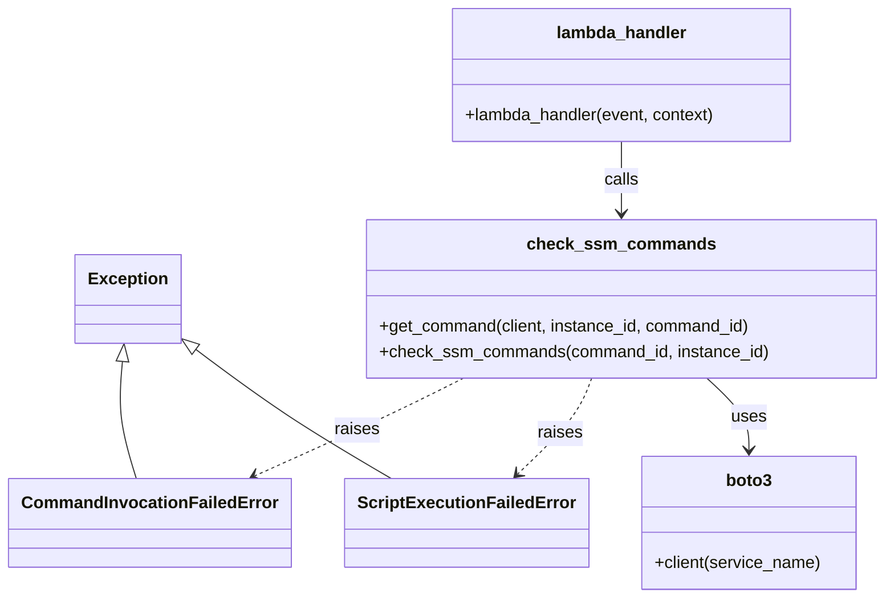
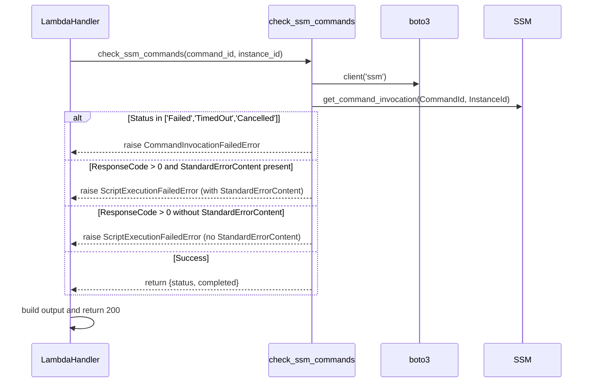

# Diagram: devops/terraform/modules/aws/aws-ec2-ebs-autoscaling-service/lambdas/check_os_layer.py


> Auto-generated by Obscura crawlers

## Diagram 1



### SVG

<svg id="container" width="807.90234375" xmlns="http://www.w3.org/2000/svg" class="classDiagram" height="566" viewBox="0 0 807.90234375 566" role="graphics-document document" aria-roledescription="class"><style>#container{font-family:"trebuchet ms",verdana,arial,sans-serif;font-size:16px;fill:#333;}@keyframes edge-animation-frame{from{stroke-dashoffset:0;}}@keyframes dash{to{stroke-dashoffset:0;}}#container .edge-animation-slow{stroke-dasharray:9,5!important;stroke-dashoffset:900;animation:dash 50s linear infinite;stroke-linecap:round;}#container .edge-animation-fast{stroke-dasharray:9,5!important;stroke-dashoffset:900;animation:dash 20s linear infinite;stroke-linecap:round;}#container .error-icon{fill:#552222;}#container .error-text{fill:#552222;stroke:#552222;}#container .edge-thickness-normal{stroke-width:1px;}#container .edge-thickness-thick{stroke-width:3.5px;}#container .edge-pattern-solid{stroke-dasharray:0;}#container .edge-thickness-invisible{stroke-width:0;fill:none;}#container .edge-pattern-dashed{stroke-dasharray:3;}#container .edge-pattern-dotted{stroke-dasharray:2;}#container .marker{fill:#333333;stroke:#333333;}#container .marker.cross{stroke:#333333;}#container svg{font-family:"trebuchet ms",verdana,arial,sans-serif;font-size:16px;}#container p{margin:0;}#container g.classGroup text{fill:#9370DB;stroke:none;font-family:"trebuchet ms",verdana,arial,sans-serif;font-size:10px;}#container g.classGroup text .title{font-weight:bolder;}#container .nodeLabel,#container .edgeLabel{color:#131300;}#container .edgeLabel .label rect{fill:#ECECFF;}#container .label text{fill:#131300;}#container .labelBkg{background:#ECECFF;}#container .edgeLabel .label span{background:#ECECFF;}#container .classTitle{font-weight:bolder;}#container .node rect,#container .node circle,#container .node ellipse,#container .node polygon,#container .node path{fill:#ECECFF;stroke:#9370DB;stroke-width:1px;}#container .divider{stroke:#9370DB;stroke-width:1;}#container g.clickable{cursor:pointer;}#container g.classGroup rect{fill:#ECECFF;stroke:#9370DB;}#container g.classGroup line{stroke:#9370DB;stroke-width:1;}#container .classLabel .box{stroke:none;stroke-width:0;fill:#ECECFF;opacity:0.5;}#container .classLabel .label{fill:#9370DB;font-size:10px;}#container .relation{stroke:#333333;stroke-width:1;fill:none;}#container .dashed-line{stroke-dasharray:3;}#container .dotted-line{stroke-dasharray:1 2;}#container #compositionStart,#container .composition{fill:#333333!important;stroke:#333333!important;stroke-width:1;}#container #compositionEnd,#container .composition{fill:#333333!important;stroke:#333333!important;stroke-width:1;}#container #dependencyStart,#container .dependency{fill:#333333!important;stroke:#333333!important;stroke-width:1;}#container #dependencyStart,#container .dependency{fill:#333333!important;stroke:#333333!important;stroke-width:1;}#container #extensionStart,#container .extension{fill:transparent!important;stroke:#333333!important;stroke-width:1;}#container #extensionEnd,#container .extension{fill:transparent!important;stroke:#333333!important;stroke-width:1;}#container #aggregationStart,#container .aggregation{fill:transparent!important;stroke:#333333!important;stroke-width:1;}#container #aggregationEnd,#container .aggregation{fill:transparent!important;stroke:#333333!important;stroke-width:1;}#container #lollipopStart,#container .lollipop{fill:#ECECFF!important;stroke:#333333!important;stroke-width:1;}#container #lollipopEnd,#container .lollipop{fill:#ECECFF!important;stroke:#333333!important;stroke-width:1;}#container .edgeTerminals{font-size:11px;line-height:initial;}#container .classTitleText{text-anchor:middle;font-size:18px;fill:#333;}#container .label-icon{display:inline-block;height:1em;overflow:visible;vertical-align:-0.125em;}#container .node .label-icon path{fill:currentColor;stroke:revert;stroke-width:revert;}#container :root{--mermaid-font-family:"trebuchet ms",verdana,arial,sans-serif;}</style><g><defs><marker id="container_class-aggregationStart" class="marker aggregation class" refX="18" refY="7" markerWidth="190" markerHeight="240" orient="auto"><path d="M 18,7 L9,13 L1,7 L9,1 Z"></path></marker></defs><defs><marker id="container_class-aggregationEnd" class="marker aggregation class" refX="1" refY="7" markerWidth="20" markerHeight="28" orient="auto"><path d="M 18,7 L9,13 L1,7 L9,1 Z"></path></marker></defs><defs><marker id="container_class-extensionStart" class="marker extension class" refX="18" refY="7" markerWidth="190" markerHeight="240" orient="auto"><path d="M 1,7 L18,13 V 1 Z"></path></marker></defs><defs><marker id="container_class-extensionEnd" class="marker extension class" refX="1" refY="7" markerWidth="20" markerHeight="28" orient="auto"><path d="M 1,1 V 13 L18,7 Z"></path></marker></defs><defs><marker id="container_class-compositionStart" class="marker composition class" refX="18" refY="7" markerWidth="190" markerHeight="240" orient="auto"><path d="M 18,7 L9,13 L1,7 L9,1 Z"></path></marker></defs><defs><marker id="container_class-compositionEnd" class="marker composition class" refX="1" refY="7" markerWidth="20" markerHeight="28" orient="auto"><path d="M 18,7 L9,13 L1,7 L9,1 Z"></path></marker></defs><defs><marker id="container_class-dependencyStart" class="marker dependency class" refX="6" refY="7" markerWidth="190" markerHeight="240" orient="auto"><path d="M 5,7 L9,13 L1,7 L9,1 Z"></path></marker></defs><defs><marker id="container_class-dependencyEnd" class="marker dependency class" refX="13" refY="7" markerWidth="20" markerHeight="28" orient="auto"><path d="M 18,7 L9,13 L14,7 L9,1 Z"></path></marker></defs><defs><marker id="container_class-lollipopStart" class="marker lollipop class" refX="13" refY="7" markerWidth="190" markerHeight="240" orient="auto"><circle stroke="black" fill="transparent" cx="7" cy="7" r="6"></circle></marker></defs><defs><marker id="container_class-lollipopEnd" class="marker lollipop class" refX="1" refY="7" markerWidth="190" markerHeight="240" orient="auto"><circle stroke="black" fill="transparent" cx="7" cy="7" r="6"></circle></marker></defs><g class="root"><g class="clusters"></g><g class="edgePaths"><path d="M175.43,329.684L189.756,340.57C204.082,351.456,232.734,373.228,262.864,393.781C292.994,414.333,324.602,433.667,340.406,443.333L356.21,453" id="id_Exception_ScriptExecutionFailedError_1" class="edge-thickness-normal edge-pattern-solid relation" style=";;;" data-edge="true" data-et="edge" data-id="id_Exception_ScriptExecutionFailedError_1" data-points="W3sieCI6MTYxLjY5NTMxMjUsInkiOjMxOS4yNDc5NTI3MjA0MzAzNn0seyJ4IjoyNjEuMzg2NzE4NzUsInkiOjM5NX0seyJ4IjozNTYuMjA5OTIxODc1LCJ5Ijo0NTN9XQ==" marker-start="url(#container_class-extensionStart)"></path><path d="M108.708,342.182L107.922,350.985C107.136,359.788,105.564,377.394,107.739,395.864C109.913,414.333,115.834,433.667,118.794,443.333L121.755,453" id="id_Exception_CommandInvocationFailedError_2" class="edge-thickness-normal edge-pattern-solid relation" style=";;;" data-edge="true" data-et="edge" data-id="id_Exception_CommandInvocationFailedError_2" data-points="W3sieCI6MTEwLjI0MjE4NzUsInkiOjMyNX0seyJ4IjoxMDMuOTkyMTg3NSwieSI6Mzk1fSx7IngiOjEyMS43NTQ2ODc1LCJ5Ijo0NTN9XQ==" marker-start="url(#container_class-extensionStart)"></path><path d="M561.566,134L561.566,140.167C561.566,146.333,561.566,158.667,561.566,170C561.566,181.333,561.566,191.667,561.566,196.833L561.566,202" id="id_lambda_handler_check_ssm_commands_3" class="edge-thickness-normal edge-pattern-solid relation" style=";;;" data-edge="true" data-et="edge" data-id="id_lambda_handler_check_ssm_commands_3" data-points="W3sieCI6NTYxLjU2NjQwNjI1LCJ5IjoxMzR9LHsieCI6NTYxLjU2NjQwNjI1LCJ5IjoxNzF9LHsieCI6NTYxLjU2NjQwNjI1LCJ5IjoyMDh9XQ==" marker-end="url(#container_class-dependencyEnd)"></path><path d="M644.702,358L651.537,364.167C658.373,370.333,672.044,382.667,678.879,394C685.715,405.333,685.715,415.667,685.715,420.833L685.715,426" id="id_check_ssm_commands_boto3_4" class="edge-thickness-normal edge-pattern-solid relation" style=";;;" data-edge="true" data-et="edge" data-id="id_check_ssm_commands_boto3_4" data-points="W3sieCI6NjQ0LjcwMTUyMDY0NzMyMTQsInkiOjM1OH0seyJ4Ijo2ODUuNzE0ODQzNzUsInkiOjM5NX0seyJ4Ijo2ODUuNzE0ODQzNzUsInkiOjQzMn1d" marker-end="url(#container_class-dependencyEnd)"></path><path d="M538.033,358L536.098,364.167C534.164,370.333,530.294,382.667,519.255,397.798C508.216,412.93,490.008,430.86,480.904,439.825L471.801,448.79" id="id_check_ssm_commands_ScriptExecutionFailedError_5" class="edge-thickness-normal edge-pattern-dashed relation" style=";;;" data-edge="true" data-et="edge" data-id="id_check_ssm_commands_ScriptExecutionFailedError_5" data-points="W3sieCI6NTM4LjAzMzQyOTgyNzAwOSwieSI6MzU4fSx7IngiOjUyNi40MjM4MjgxMjUsInkiOjM5NX0seyJ4Ijo0NjcuNTI1NTA3ODEyNSwieSI6NDUzfV0=" marker-end="url(#container_class-dependencyEnd)"></path><path d="M421.44,358L409.918,364.167C398.397,370.333,375.354,382.667,343.697,398.083C312.041,413.498,271.771,431.997,251.636,441.246L231.501,450.495" id="id_check_ssm_commands_CommandInvocationFailedError_6" class="edge-thickness-normal edge-pattern-dashed relation" style=";;;" data-edge="true" data-et="edge" data-id="id_check_ssm_commands_CommandInvocationFailedError_6" data-points="W3sieCI6NDIxLjQzOTcxNDcwNDI0MTA2LCJ5IjozNTh9LHsieCI6MzUyLjMxMDU0Njg3NSwieSI6Mzk1fSx7IngiOjIyNi4wNDgzOTg0Mzc1LCJ5Ijo0NTN9XQ==" marker-end="url(#container_class-dependencyEnd)"></path></g><g class="edgeLabels"><g class="edgeLabel"><g class="label" data-id="id_Exception_ScriptExecutionFailedError_1" transform="translate(0, 0)"><foreignObject width="0" height="0"><div xmlns="http://www.w3.org/1999/xhtml" class="labelBkg" style="display: table-cell; white-space: nowrap; line-height: 1.5; max-width: 200px; text-align: center;"><span class="edgeLabel"></span></div></foreignObject></g></g><g class="edgeLabel"><g class="label" data-id="id_Exception_CommandInvocationFailedError_2" transform="translate(0, 0)"><foreignObject width="0" height="0"><div xmlns="http://www.w3.org/1999/xhtml" class="labelBkg" style="display: table-cell; white-space: nowrap; line-height: 1.5; max-width: 200px; text-align: center;"><span class="edgeLabel"></span></div></foreignObject></g></g><g class="edgeLabel" transform="translate(561.56640625, 171)"><g class="label" data-id="id_lambda_handler_check_ssm_commands_3" transform="translate(-16.4453125, -12)"><foreignObject width="32.890625" height="24"><div xmlns="http://www.w3.org/1999/xhtml" class="labelBkg" style="display: table-cell; white-space: nowrap; line-height: 1.5; max-width: 200px; text-align: center;"><span class="edgeLabel"><p>calls</p></span></div></foreignObject></g></g><g class="edgeLabel" transform="translate(685.71484375, 395)"><g class="label" data-id="id_check_ssm_commands_boto3_4" transform="translate(-16.4921875, -12)"><foreignObject width="32.984375" height="24"><div xmlns="http://www.w3.org/1999/xhtml" class="labelBkg" style="display: table-cell; white-space: nowrap; line-height: 1.5; max-width: 200px; text-align: center;"><span class="edgeLabel"><p>uses</p></span></div></foreignObject></g></g><g class="edgeLabel" transform="translate(510.78994, 410.39544)"><g class="label" data-id="id_check_ssm_commands_ScriptExecutionFailedError_5" transform="translate(-21.25, -12)"><foreignObject width="42.5" height="24"><div xmlns="http://www.w3.org/1999/xhtml" class="labelBkg" style="display: table-cell; white-space: nowrap; line-height: 1.5; max-width: 200px; text-align: center;"><span class="edgeLabel"><p>raises</p></span></div></foreignObject></g></g><g class="edgeLabel" transform="translate(324.80464, 407.63516)"><g class="label" data-id="id_check_ssm_commands_CommandInvocationFailedError_6" transform="translate(-21.25, -12)"><foreignObject width="42.5" height="24"><div xmlns="http://www.w3.org/1999/xhtml" class="labelBkg" style="display: table-cell; white-space: nowrap; line-height: 1.5; max-width: 200px; text-align: center;"><span class="edgeLabel"><p>raises</p></span></div></foreignObject></g></g></g><g class="nodes"><g class="node default" id="classId-Exception-0" transform="translate(113.9921875, 283)"><g class="basic label-container"><path d="M-47.703125 -42 L47.703125 -42 L47.703125 42 L-47.703125 42" stroke="none" stroke-width="0" fill="#ECECFF" style=""></path><path d="M-47.703125 -42 C-21.27612622868715 -42, 5.150872542625699 -42, 47.703125 -42 M-47.703125 -42 C-25.901955236004195 -42, -4.10078547200839 -42, 47.703125 -42 M47.703125 -42 C47.703125 -13.700087441783918, 47.703125 14.599825116432164, 47.703125 42 M47.703125 -42 C47.703125 -14.17518080076205, 47.703125 13.6496383984759, 47.703125 42 M47.703125 42 C19.617444416137275 42, -8.46823616772545 42, -47.703125 42 M47.703125 42 C12.511787382154196 42, -22.679550235691607 42, -47.703125 42 M-47.703125 42 C-47.703125 24.870904907441616, -47.703125 7.741809814883233, -47.703125 -42 M-47.703125 42 C-47.703125 20.605959138707405, -47.703125 -0.7880817225851899, -47.703125 -42" stroke="#9370DB" stroke-width="1.3" fill="none" stroke-dasharray="0 0" style=""></path></g><g class="annotation-group text" transform="translate(0, -18)"></g><g class="label-group text" transform="translate(-35.703125, -18)"><g class="label" style="font-weight: bolder" transform="translate(0,-12)"><foreignObject width="71.40625" height="24"><div xmlns="http://www.w3.org/1999/xhtml" style="display: table-cell; white-space: nowrap; line-height: 1.5; max-width: 121px; text-align: center;"><span class="nodeLabel markdown-node-label" style=""><p>Exception</p></span></div></foreignObject></g></g><g class="members-group text" transform="translate(-35.703125, 30)"></g><g class="methods-group text" transform="translate(-35.703125, 60)"></g><g class="divider" style=""><path d="M-47.703125 6 C-16.845477161731925 6, 14.012170676536151 6, 47.703125 6 M-47.703125 6 C-25.302922990249144 6, -2.9027209804982874 6, 47.703125 6" stroke="#9370DB" stroke-width="1.3" fill="none" stroke-dasharray="0 0" style=""></path></g><g class="divider" style=""><path d="M-47.703125 24 C-9.809428576928077 24, 28.084267846143845 24, 47.703125 24 M-47.703125 24 C-23.546625180648405 24, 0.6098746387031895 24, 47.703125 24" stroke="#9370DB" stroke-width="1.3" fill="none" stroke-dasharray="0 0" style=""></path></g></g><g class="node default" id="classId-ScriptExecutionFailedError-1" transform="translate(424.875, 495)"><g class="basic label-container"><path d="M-109.109375 -42 L109.109375 -42 L109.109375 42 L-109.109375 42" stroke="none" stroke-width="0" fill="#ECECFF" style=""></path><path d="M-109.109375 -42 C-24.547177694323096 -42, 60.01501961135381 -42, 109.109375 -42 M-109.109375 -42 C-55.6726913803719 -42, -2.236007760743803 -42, 109.109375 -42 M109.109375 -42 C109.109375 -23.267899676251446, 109.109375 -4.535799352502892, 109.109375 42 M109.109375 -42 C109.109375 -22.346469427923896, 109.109375 -2.6929388558477925, 109.109375 42 M109.109375 42 C42.862210342982266 42, -23.38495431403547 42, -109.109375 42 M109.109375 42 C49.955684282241755 42, -9.19800643551649 42, -109.109375 42 M-109.109375 42 C-109.109375 16.21096272453785, -109.109375 -9.578074550924299, -109.109375 -42 M-109.109375 42 C-109.109375 20.88476084802821, -109.109375 -0.2304783039435776, -109.109375 -42" stroke="#9370DB" stroke-width="1.3" fill="none" stroke-dasharray="0 0" style=""></path></g><g class="annotation-group text" transform="translate(0, -18)"></g><g class="label-group text" transform="translate(-97.109375, -18)"><g class="label" style="font-weight: bolder" transform="translate(0,-12)"><foreignObject width="194.21875" height="24"><div xmlns="http://www.w3.org/1999/xhtml" style="display: table-cell; white-space: nowrap; line-height: 1.5; max-width: 243px; text-align: center;"><span class="nodeLabel markdown-node-label" style=""><p>ScriptExecutionFailedError</p></span></div></foreignObject></g></g><g class="members-group text" transform="translate(-97.109375, 30)"></g><g class="methods-group text" transform="translate(-97.109375, 60)"></g><g class="divider" style=""><path d="M-109.109375 6 C-48.37032525545684 6, 12.368724489086318 6, 109.109375 6 M-109.109375 6 C-54.395943872835474 6, 0.3174872543290519 6, 109.109375 6" stroke="#9370DB" stroke-width="1.3" fill="none" stroke-dasharray="0 0" style=""></path></g><g class="divider" style=""><path d="M-109.109375 24 C-48.67290405422907 24, 11.763566891541856 24, 109.109375 24 M-109.109375 24 C-24.671067200604682 24, 59.767240598790636 24, 109.109375 24" stroke="#9370DB" stroke-width="1.3" fill="none" stroke-dasharray="0 0" style=""></path></g></g><g class="node default" id="classId-CommandInvocationFailedError-2" transform="translate(134.6171875, 495)"><g class="basic label-container"><path d="M-126.6171875 -42 L126.6171875 -42 L126.6171875 42 L-126.6171875 42" stroke="none" stroke-width="0" fill="#ECECFF" style=""></path><path d="M-126.6171875 -42 C-39.374009005442005 -42, 47.86916948911599 -42, 126.6171875 -42 M-126.6171875 -42 C-32.00985685698845 -42, 62.5974737860231 -42, 126.6171875 -42 M126.6171875 -42 C126.6171875 -11.716881576995199, 126.6171875 18.566236846009602, 126.6171875 42 M126.6171875 -42 C126.6171875 -13.638015728359502, 126.6171875 14.723968543280996, 126.6171875 42 M126.6171875 42 C57.78228989557657 42, -11.052607708846864 42, -126.6171875 42 M126.6171875 42 C58.013182190644756 42, -10.590823118710489 42, -126.6171875 42 M-126.6171875 42 C-126.6171875 11.810037790748645, -126.6171875 -18.37992441850271, -126.6171875 -42 M-126.6171875 42 C-126.6171875 20.641499400930215, -126.6171875 -0.7170011981395703, -126.6171875 -42" stroke="#9370DB" stroke-width="1.3" fill="none" stroke-dasharray="0 0" style=""></path></g><g class="annotation-group text" transform="translate(0, -18)"></g><g class="label-group text" transform="translate(-114.6171875, -18)"><g class="label" style="font-weight: bolder" transform="translate(0,-12)"><foreignObject width="229.234375" height="24"><div xmlns="http://www.w3.org/1999/xhtml" style="display: table-cell; white-space: nowrap; line-height: 1.5; max-width: 279px; text-align: center;"><span class="nodeLabel markdown-node-label" style=""><p>CommandInvocationFailedError</p></span></div></foreignObject></g></g><g class="members-group text" transform="translate(-114.6171875, 30)"></g><g class="methods-group text" transform="translate(-114.6171875, 60)"></g><g class="divider" style=""><path d="M-126.6171875 6 C-34.89189512438519 6, 56.83339725122963 6, 126.6171875 6 M-126.6171875 6 C-28.521921881131064 6, 69.57334373773787 6, 126.6171875 6" stroke="#9370DB" stroke-width="1.3" fill="none" stroke-dasharray="0 0" style=""></path></g><g class="divider" style=""><path d="M-126.6171875 24 C-61.93589347625448 24, 2.7454005474910446 24, 126.6171875 24 M-126.6171875 24 C-66.92405021718602 24, -7.230912934372029 24, 126.6171875 24" stroke="#9370DB" stroke-width="1.3" fill="none" stroke-dasharray="0 0" style=""></path></g></g><g class="node default" id="classId-check_ssm_commands-3" transform="translate(561.56640625, 283)"><g class="basic label-container"><path d="M-238.3359375 -75 L238.3359375 -75 L238.3359375 75 L-238.3359375 75" stroke="none" stroke-width="0" fill="#ECECFF" style=""></path><path d="M-238.3359375 -75 C-138.3768746988577 -75, -38.41781189771541 -75, 238.3359375 -75 M-238.3359375 -75 C-98.56039326925602 -75, 41.21515096148795 -75, 238.3359375 -75 M238.3359375 -75 C238.3359375 -25.43980685137312, 238.3359375 24.12038629725376, 238.3359375 75 M238.3359375 -75 C238.3359375 -26.78646395062809, 238.3359375 21.42707209874382, 238.3359375 75 M238.3359375 75 C120.39107575226586 75, 2.4462140045317255 75, -238.3359375 75 M238.3359375 75 C116.64367270368925 75, -5.048592092621504 75, -238.3359375 75 M-238.3359375 75 C-238.3359375 24.394294973491668, -238.3359375 -26.211410053016664, -238.3359375 -75 M-238.3359375 75 C-238.3359375 42.87870088180375, -238.3359375 10.757401763607504, -238.3359375 -75" stroke="#9370DB" stroke-width="1.3" fill="none" stroke-dasharray="0 0" style=""></path></g><g class="annotation-group text" transform="translate(0, -51)"></g><g class="label-group text" transform="translate(-83.234375, -51)"><g class="label" style="font-weight: bolder" transform="translate(0,-12)"><foreignObject width="166.46875" height="24"><div xmlns="http://www.w3.org/1999/xhtml" style="display: table-cell; white-space: nowrap; line-height: 1.5; max-width: 216px; text-align: center;"><span class="nodeLabel markdown-node-label" style=""><p>check_ssm_commands</p></span></div></foreignObject></g></g><g class="members-group text" transform="translate(-226.3359375, -3)"></g><g class="methods-group text" transform="translate(-226.3359375, 27)"><g class="label" style="" transform="translate(0,-12)"><foreignObject width="354.984375" height="24"><div xmlns="http://www.w3.org/1999/xhtml" style="display: table-cell; white-space: nowrap; line-height: 1.5; max-width: 412px; text-align: center;"><span class="nodeLabel markdown-node-label" style=""><p>+get_command(client, instance_id, command_id)</p></span></div></foreignObject></g><g class="label" style="" transform="translate(0,12)"><foreignObject width="369.4375" height="24"><div xmlns="http://www.w3.org/1999/xhtml" style="display: table-cell; white-space: nowrap; line-height: 1.5; max-width: 427px; text-align: center;"><span class="nodeLabel markdown-node-label" style=""><p>+check_ssm_commands(command_id, instance_id)</p></span></div></foreignObject></g></g><g class="divider" style=""><path d="M-238.3359375 -27 C-124.28424669565005 -27, -10.232555891300109 -27, 238.3359375 -27 M-238.3359375 -27 C-55.53803338056312 -27, 127.25987073887376 -27, 238.3359375 -27" stroke="#9370DB" stroke-width="1.3" fill="none" stroke-dasharray="0 0" style=""></path></g><g class="divider" style=""><path d="M-238.3359375 -3 C-81.1555706211769 -3, 76.02479625764619 -3, 238.3359375 -3 M-238.3359375 -3 C-60.78232028727231 -3, 116.77129692545537 -3, 238.3359375 -3" stroke="#9370DB" stroke-width="1.3" fill="none" stroke-dasharray="0 0" style=""></path></g></g><g class="node default" id="classId-lambda_handler-4" transform="translate(561.56640625, 71)"><g class="basic label-container"><path d="M-162.08203125 -63 L162.08203125 -63 L162.08203125 63 L-162.08203125 63" stroke="none" stroke-width="0" fill="#ECECFF" style=""></path><path d="M-162.08203125 -63 C-38.96413642725018 -63, 84.15375839549964 -63, 162.08203125 -63 M-162.08203125 -63 C-74.92323079907705 -63, 12.235569651845907 -63, 162.08203125 -63 M162.08203125 -63 C162.08203125 -36.93178074736344, 162.08203125 -10.86356149472688, 162.08203125 63 M162.08203125 -63 C162.08203125 -29.347818422301067, 162.08203125 4.304363155397866, 162.08203125 63 M162.08203125 63 C34.54676412602481 63, -92.98850299795038 63, -162.08203125 63 M162.08203125 63 C80.35947391826237 63, -1.363083413475266 63, -162.08203125 63 M-162.08203125 63 C-162.08203125 30.542512342782075, -162.08203125 -1.91497531443585, -162.08203125 -63 M-162.08203125 63 C-162.08203125 12.891566466318771, -162.08203125 -37.21686706736246, -162.08203125 -63" stroke="#9370DB" stroke-width="1.3" fill="none" stroke-dasharray="0 0" style=""></path></g><g class="annotation-group text" transform="translate(0, -39)"></g><g class="label-group text" transform="translate(-59.9765625, -39)"><g class="label" style="font-weight: bolder" transform="translate(0,-12)"><foreignObject width="119.953125" height="24"><div xmlns="http://www.w3.org/1999/xhtml" style="display: table-cell; white-space: nowrap; line-height: 1.5; max-width: 170px; text-align: center;"><span class="nodeLabel markdown-node-label" style=""><p>lambda_handler</p></span></div></foreignObject></g></g><g class="members-group text" transform="translate(-150.08203125, 9)"></g><g class="methods-group text" transform="translate(-150.08203125, 39)"><g class="label" style="" transform="translate(0,-12)"><foreignObject width="240.1875" height="24"><div xmlns="http://www.w3.org/1999/xhtml" style="display: table-cell; white-space: nowrap; line-height: 1.5; max-width: 298px; text-align: center;"><span class="nodeLabel markdown-node-label" style=""><p>+lambda_handler(event, context)</p></span></div></foreignObject></g></g><g class="divider" style=""><path d="M-162.08203125 -15 C-83.13024451277698 -15, -4.178457775553966 -15, 162.08203125 -15 M-162.08203125 -15 C-36.81693919762968 -15, 88.44815285474064 -15, 162.08203125 -15" stroke="#9370DB" stroke-width="1.3" fill="none" stroke-dasharray="0 0" style=""></path></g><g class="divider" style=""><path d="M-162.08203125 9 C-51.637740318077135 9, 58.80655061384573 9, 162.08203125 9 M-162.08203125 9 C-62.008770990321935 9, 38.06448926935613 9, 162.08203125 9" stroke="#9370DB" stroke-width="1.3" fill="none" stroke-dasharray="0 0" style=""></path></g></g><g class="node default" id="classId-boto3-5" transform="translate(685.71484375, 495)"><g class="basic label-container"><path d="M-101.73046875 -63 L101.73046875 -63 L101.73046875 63 L-101.73046875 63" stroke="none" stroke-width="0" fill="#ECECFF" style=""></path><path d="M-101.73046875 -63 C-58.13839450185864 -63, -14.546320253717283 -63, 101.73046875 -63 M-101.73046875 -63 C-52.52205878053836 -63, -3.3136488110767175 -63, 101.73046875 -63 M101.73046875 -63 C101.73046875 -25.463911702829094, 101.73046875 12.072176594341812, 101.73046875 63 M101.73046875 -63 C101.73046875 -27.53361181335633, 101.73046875 7.932776373287339, 101.73046875 63 M101.73046875 63 C57.28599448192865 63, 12.841520213857294 63, -101.73046875 63 M101.73046875 63 C27.316313330818332 63, -47.097842088363336 63, -101.73046875 63 M-101.73046875 63 C-101.73046875 19.84431690017751, -101.73046875 -23.31136619964498, -101.73046875 -63 M-101.73046875 63 C-101.73046875 15.532466498264192, -101.73046875 -31.935067003471616, -101.73046875 -63" stroke="#9370DB" stroke-width="1.3" fill="none" stroke-dasharray="0 0" style=""></path></g><g class="annotation-group text" transform="translate(0, -39)"></g><g class="label-group text" transform="translate(-21.0703125, -39)"><g class="label" style="font-weight: bolder" transform="translate(0,-12)"><foreignObject width="42.140625" height="24"><div xmlns="http://www.w3.org/1999/xhtml" style="display: table-cell; white-space: nowrap; line-height: 1.5; max-width: 91px; text-align: center;"><span class="nodeLabel markdown-node-label" style=""><p>boto3</p></span></div></foreignObject></g></g><g class="members-group text" transform="translate(-89.73046875, 9)"></g><g class="methods-group text" transform="translate(-89.73046875, 39)"><g class="label" style="" transform="translate(0,-12)"><foreignObject width="158.390625" height="24"><div xmlns="http://www.w3.org/1999/xhtml" style="display: table-cell; white-space: nowrap; line-height: 1.5; max-width: 216px; text-align: center;"><span class="nodeLabel markdown-node-label" style=""><p>+client(service_name)</p></span></div></foreignObject></g></g><g class="divider" style=""><path d="M-101.73046875 -15 C-60.40678525793498 -15, -19.083101765869955 -15, 101.73046875 -15 M-101.73046875 -15 C-49.53804897269645 -15, 2.6543708046070975 -15, 101.73046875 -15" stroke="#9370DB" stroke-width="1.3" fill="none" stroke-dasharray="0 0" style=""></path></g><g class="divider" style=""><path d="M-101.73046875 9 C-44.10900231699789 9, 13.512464116004224 9, 101.73046875 9 M-101.73046875 9 C-34.96604552053087 9, 31.79837770893826 9, 101.73046875 9" stroke="#9370DB" stroke-width="1.3" fill="none" stroke-dasharray="0 0" style=""></path></g></g></g></g></g></svg>

## Diagram 2

```mermaid
flowchart TD
    A[lambda_handler] --> B[log Received event]
    B --> C[parse command_id and instance_id from event]
    C --> D[call check_ssm_commands(command_id, instance_id)]
    D --> E[create ssm_client = boto3.client ssm]
    E --> F[call get_command(client, instance_id, command_id)]
    F --> G[client.get_command_invocation(CommandId, InstanceId)]
    G --> H{Status in ['Failed','TimedOut','Cancelled']}
    H -- Yes --> I[raise CommandInvocationFailedError]
    H -- No --> J{ResponseCode > 0}
    J -- Yes --> K{StandardErrorContent present?}
    K -- Yes --> L[raise ScriptExecutionFailedError (with StandardErrorContent)]
    K -- No --> M[raise ScriptExecutionFailedError (no StandardErrorContent)]
    J -- No --> N[return results {status, completed}]
    N --> O[lambda_handler builds output and returns 200]
    I --> P[exception propagated (lambda error)]
    L --> P
    M --> P
```

> SVG rendering failed for this diagram.

## Diagram 3



### SVG

<svg id="container" width="1203" xmlns="http://www.w3.org/2000/svg" height="775" viewBox="-75 -10 1203 775" role="graphics-document document" aria-roledescription="sequence"><g><rect x="928" y="689" fill="#eaeaea" stroke="#666" width="150" height="65" name="SSM" rx="3" ry="3" class="actor actor-bottom"></rect><text x="1003" y="721.5" dominant-baseline="central" alignment-baseline="central" class="actor actor-box" style="text-anchor: middle; font-size: 16px; font-weight: 400;"><tspan x="1003" dy="0">SSM</tspan></text></g><g><rect x="728" y="689" fill="#eaeaea" stroke="#666" width="150" height="65" name="Boto3" rx="3" ry="3" class="actor actor-bottom"></rect><text x="803" y="721.5" dominant-baseline="central" alignment-baseline="central" class="actor actor-box" style="text-anchor: middle; font-size: 16px; font-weight: 400;"><tspan x="803" dy="0">boto3</tspan></text></g><g><rect x="492" y="689" fill="#eaeaea" stroke="#666" width="186" height="65" name="Checker" rx="3" ry="3" class="actor actor-bottom"></rect><text x="585" y="721.5" dominant-baseline="central" alignment-baseline="central" class="actor actor-box" style="text-anchor: middle; font-size: 16px; font-weight: 400;"><tspan x="585" dy="0">check_ssm_commands</tspan></text></g><g><rect x="0" y="689" fill="#eaeaea" stroke="#666" width="150" height="65" name="Lambda" rx="3" ry="3" class="actor actor-bottom"></rect><text x="75" y="721.5" dominant-baseline="central" alignment-baseline="central" class="actor actor-box" style="text-anchor: middle; font-size: 16px; font-weight: 400;"><tspan x="75" dy="0">LambdaHandler</tspan></text></g><g><line id="actor3" x1="1003" y1="65" x2="1003" y2="689" class="actor-line 200" stroke-width="0.5px" stroke="#999" name="SSM"></line><g id="root-3"><rect x="928" y="0" fill="#eaeaea" stroke="#666" width="150" height="65" name="SSM" rx="3" ry="3" class="actor actor-top"></rect><text x="1003" y="32.5" dominant-baseline="central" alignment-baseline="central" class="actor actor-box" style="text-anchor: middle; font-size: 16px; font-weight: 400;"><tspan x="1003" dy="0">SSM</tspan></text></g></g><g><line id="actor2" x1="803" y1="65" x2="803" y2="689" class="actor-line 200" stroke-width="0.5px" stroke="#999" name="Boto3"></line><g id="root-2"><rect x="728" y="0" fill="#eaeaea" stroke="#666" width="150" height="65" name="Boto3" rx="3" ry="3" class="actor actor-top"></rect><text x="803" y="32.5" dominant-baseline="central" alignment-baseline="central" class="actor actor-box" style="text-anchor: middle; font-size: 16px; font-weight: 400;"><tspan x="803" dy="0">boto3</tspan></text></g></g><g><line id="actor1" x1="585" y1="65" x2="585" y2="689" class="actor-line 200" stroke-width="0.5px" stroke="#999" name="Checker"></line><g id="root-1"><rect x="492" y="0" fill="#eaeaea" stroke="#666" width="186" height="65" name="Checker" rx="3" ry="3" class="actor actor-top"></rect><text x="585" y="32.5" dominant-baseline="central" alignment-baseline="central" class="actor actor-box" style="text-anchor: middle; font-size: 16px; font-weight: 400;"><tspan x="585" dy="0">check_ssm_commands</tspan></text></g></g><g><line id="actor0" x1="75" y1="65" x2="75" y2="689" class="actor-line 200" stroke-width="0.5px" stroke="#999" name="Lambda"></line><g id="root-0"><rect x="0" y="0" fill="#eaeaea" stroke="#666" width="150" height="65" name="Lambda" rx="3" ry="3" class="actor actor-top"></rect><text x="75" y="32.5" dominant-baseline="central" alignment-baseline="central" class="actor actor-box" style="text-anchor: middle; font-size: 16px; font-weight: 400;"><tspan x="75" dy="0">LambdaHandler</tspan></text></g></g><style>#container{font-family:"trebuchet ms",verdana,arial,sans-serif;font-size:16px;fill:#333;}@keyframes edge-animation-frame{from{stroke-dashoffset:0;}}@keyframes dash{to{stroke-dashoffset:0;}}#container .edge-animation-slow{stroke-dasharray:9,5!important;stroke-dashoffset:900;animation:dash 50s linear infinite;stroke-linecap:round;}#container .edge-animation-fast{stroke-dasharray:9,5!important;stroke-dashoffset:900;animation:dash 20s linear infinite;stroke-linecap:round;}#container .error-icon{fill:#552222;}#container .error-text{fill:#552222;stroke:#552222;}#container .edge-thickness-normal{stroke-width:1px;}#container .edge-thickness-thick{stroke-width:3.5px;}#container .edge-pattern-solid{stroke-dasharray:0;}#container .edge-thickness-invisible{stroke-width:0;fill:none;}#container .edge-pattern-dashed{stroke-dasharray:3;}#container .edge-pattern-dotted{stroke-dasharray:2;}#container .marker{fill:#333333;stroke:#333333;}#container .marker.cross{stroke:#333333;}#container svg{font-family:"trebuchet ms",verdana,arial,sans-serif;font-size:16px;}#container p{margin:0;}#container .actor{stroke:hsl(259.6261682243, 59.7765363128%, 87.9019607843%);fill:#ECECFF;}#container text.actor&gt;tspan{fill:black;stroke:none;}#container .actor-line{stroke:hsl(259.6261682243, 59.7765363128%, 87.9019607843%);}#container .innerArc{stroke-width:1.5;stroke-dasharray:none;}#container .messageLine0{stroke-width:1.5;stroke-dasharray:none;stroke:#333;}#container .messageLine1{stroke-width:1.5;stroke-dasharray:2,2;stroke:#333;}#container #arrowhead path{fill:#333;stroke:#333;}#container .sequenceNumber{fill:white;}#container #sequencenumber{fill:#333;}#container #crosshead path{fill:#333;stroke:#333;}#container .messageText{fill:#333;stroke:none;}#container .labelBox{stroke:hsl(259.6261682243, 59.7765363128%, 87.9019607843%);fill:#ECECFF;}#container .labelText,#container .labelText&gt;tspan{fill:black;stroke:none;}#container .loopText,#container .loopText&gt;tspan{fill:black;stroke:none;}#container .loopLine{stroke-width:2px;stroke-dasharray:2,2;stroke:hsl(259.6261682243, 59.7765363128%, 87.9019607843%);fill:hsl(259.6261682243, 59.7765363128%, 87.9019607843%);}#container .note{stroke:#aaaa33;fill:#fff5ad;}#container .noteText,#container .noteText&gt;tspan{fill:black;stroke:none;}#container .activation0{fill:#f4f4f4;stroke:#666;}#container .activation1{fill:#f4f4f4;stroke:#666;}#container .activation2{fill:#f4f4f4;stroke:#666;}#container .actorPopupMenu{position:absolute;}#container .actorPopupMenuPanel{position:absolute;fill:#ECECFF;box-shadow:0px 8px 16px 0px rgba(0,0,0,0.2);filter:drop-shadow(3px 5px 2px rgb(0 0 0 / 0.4));}#container .actor-man line{stroke:hsl(259.6261682243, 59.7765363128%, 87.9019607843%);fill:#ECECFF;}#container .actor-man circle,#container line{stroke:hsl(259.6261682243, 59.7765363128%, 87.9019607843%);fill:#ECECFF;stroke-width:2px;}#container :root{--mermaid-font-family:"trebuchet ms",verdana,arial,sans-serif;}</style><g></g><defs><symbol id="computer" width="24" height="24"><path transform="scale(.5)" d="M2 2v13h20v-13h-20zm18 11h-16v-9h16v9zm-10.228 6l.466-1h3.524l.467 1h-4.457zm14.228 3h-24l2-6h2.104l-1.33 4h18.45l-1.297-4h2.073l2 6zm-5-10h-14v-7h14v7z"></path></symbol></defs><defs><symbol id="database" fill-rule="evenodd" clip-rule="evenodd"><path transform="scale(.5)" d="M12.258.001l.256.004.255.005.253.008.251.01.249.012.247.015.246.016.242.019.241.02.239.023.236.024.233.027.231.028.229.031.225.032.223.034.22.036.217.038.214.04.211.041.208.043.205.045.201.046.198.048.194.05.191.051.187.053.183.054.18.056.175.057.172.059.168.06.163.061.16.063.155.064.15.066.074.033.073.033.071.034.07.034.069.035.068.035.067.035.066.035.064.036.064.036.062.036.06.036.06.037.058.037.058.037.055.038.055.038.053.038.052.038.051.039.05.039.048.039.047.039.045.04.044.04.043.04.041.04.04.041.039.041.037.041.036.041.034.041.033.042.032.042.03.042.029.042.027.042.026.043.024.043.023.043.021.043.02.043.018.044.017.043.015.044.013.044.012.044.011.045.009.044.007.045.006.045.004.045.002.045.001.045v17l-.001.045-.002.045-.004.045-.006.045-.007.045-.009.044-.011.045-.012.044-.013.044-.015.044-.017.043-.018.044-.02.043-.021.043-.023.043-.024.043-.026.043-.027.042-.029.042-.03.042-.032.042-.033.042-.034.041-.036.041-.037.041-.039.041-.04.041-.041.04-.043.04-.044.04-.045.04-.047.039-.048.039-.05.039-.051.039-.052.038-.053.038-.055.038-.055.038-.058.037-.058.037-.06.037-.06.036-.062.036-.064.036-.064.036-.066.035-.067.035-.068.035-.069.035-.07.034-.071.034-.073.033-.074.033-.15.066-.155.064-.16.063-.163.061-.168.06-.172.059-.175.057-.18.056-.183.054-.187.053-.191.051-.194.05-.198.048-.201.046-.205.045-.208.043-.211.041-.214.04-.217.038-.22.036-.223.034-.225.032-.229.031-.231.028-.233.027-.236.024-.239.023-.241.02-.242.019-.246.016-.247.015-.249.012-.251.01-.253.008-.255.005-.256.004-.258.001-.258-.001-.256-.004-.255-.005-.253-.008-.251-.01-.249-.012-.247-.015-.245-.016-.243-.019-.241-.02-.238-.023-.236-.024-.234-.027-.231-.028-.228-.031-.226-.032-.223-.034-.22-.036-.217-.038-.214-.04-.211-.041-.208-.043-.204-.045-.201-.046-.198-.048-.195-.05-.19-.051-.187-.053-.184-.054-.179-.056-.176-.057-.172-.059-.167-.06-.164-.061-.159-.063-.155-.064-.151-.066-.074-.033-.072-.033-.072-.034-.07-.034-.069-.035-.068-.035-.067-.035-.066-.035-.064-.036-.063-.036-.062-.036-.061-.036-.06-.037-.058-.037-.057-.037-.056-.038-.055-.038-.053-.038-.052-.038-.051-.039-.049-.039-.049-.039-.046-.039-.046-.04-.044-.04-.043-.04-.041-.04-.04-.041-.039-.041-.037-.041-.036-.041-.034-.041-.033-.042-.032-.042-.03-.042-.029-.042-.027-.042-.026-.043-.024-.043-.023-.043-.021-.043-.02-.043-.018-.044-.017-.043-.015-.044-.013-.044-.012-.044-.011-.045-.009-.044-.007-.045-.006-.045-.004-.045-.002-.045-.001-.045v-17l.001-.045.002-.045.004-.045.006-.045.007-.045.009-.044.011-.045.012-.044.013-.044.015-.044.017-.043.018-.044.02-.043.021-.043.023-.043.024-.043.026-.043.027-.042.029-.042.03-.042.032-.042.033-.042.034-.041.036-.041.037-.041.039-.041.04-.041.041-.04.043-.04.044-.04.046-.04.046-.039.049-.039.049-.039.051-.039.052-.038.053-.038.055-.038.056-.038.057-.037.058-.037.06-.037.061-.036.062-.036.063-.036.064-.036.066-.035.067-.035.068-.035.069-.035.07-.034.072-.034.072-.033.074-.033.151-.066.155-.064.159-.063.164-.061.167-.06.172-.059.176-.057.179-.056.184-.054.187-.053.19-.051.195-.05.198-.048.201-.046.204-.045.208-.043.211-.041.214-.04.217-.038.22-.036.223-.034.226-.032.228-.031.231-.028.234-.027.236-.024.238-.023.241-.02.243-.019.245-.016.247-.015.249-.012.251-.01.253-.008.255-.005.256-.004.258-.001.258.001zm-9.258 20.499v.01l.001.021.003.021.004.022.005.021.006.022.007.022.009.023.01.022.011.023.012.023.013.023.015.023.016.024.017.023.018.024.019.024.021.024.022.025.023.024.024.025.052.049.056.05.061.051.066.051.07.051.075.051.079.052.084.052.088.052.092.052.097.052.102.051.105.052.11.052.114.051.119.051.123.051.127.05.131.05.135.05.139.048.144.049.147.047.152.047.155.047.16.045.163.045.167.043.171.043.176.041.178.041.183.039.187.039.19.037.194.035.197.035.202.033.204.031.209.03.212.029.216.027.219.025.222.024.226.021.23.02.233.018.236.016.24.015.243.012.246.01.249.008.253.005.256.004.259.001.26-.001.257-.004.254-.005.25-.008.247-.011.244-.012.241-.014.237-.016.233-.018.231-.021.226-.021.224-.024.22-.026.216-.027.212-.028.21-.031.205-.031.202-.034.198-.034.194-.036.191-.037.187-.039.183-.04.179-.04.175-.042.172-.043.168-.044.163-.045.16-.046.155-.046.152-.047.148-.048.143-.049.139-.049.136-.05.131-.05.126-.05.123-.051.118-.052.114-.051.11-.052.106-.052.101-.052.096-.052.092-.052.088-.053.083-.051.079-.052.074-.052.07-.051.065-.051.06-.051.056-.05.051-.05.023-.024.023-.025.021-.024.02-.024.019-.024.018-.024.017-.024.015-.023.014-.024.013-.023.012-.023.01-.023.01-.022.008-.022.006-.022.006-.022.004-.022.004-.021.001-.021.001-.021v-4.127l-.077.055-.08.053-.083.054-.085.053-.087.052-.09.052-.093.051-.095.05-.097.05-.1.049-.102.049-.105.048-.106.047-.109.047-.111.046-.114.045-.115.045-.118.044-.12.043-.122.042-.124.042-.126.041-.128.04-.13.04-.132.038-.134.038-.135.037-.138.037-.139.035-.142.035-.143.034-.144.033-.147.032-.148.031-.15.03-.151.03-.153.029-.154.027-.156.027-.158.026-.159.025-.161.024-.162.023-.163.022-.165.021-.166.02-.167.019-.169.018-.169.017-.171.016-.173.015-.173.014-.175.013-.175.012-.177.011-.178.01-.179.008-.179.008-.181.006-.182.005-.182.004-.184.003-.184.002h-.37l-.184-.002-.184-.003-.182-.004-.182-.005-.181-.006-.179-.008-.179-.008-.178-.01-.176-.011-.176-.012-.175-.013-.173-.014-.172-.015-.171-.016-.17-.017-.169-.018-.167-.019-.166-.02-.165-.021-.163-.022-.162-.023-.161-.024-.159-.025-.157-.026-.156-.027-.155-.027-.153-.029-.151-.03-.15-.03-.148-.031-.146-.032-.145-.033-.143-.034-.141-.035-.14-.035-.137-.037-.136-.037-.134-.038-.132-.038-.13-.04-.128-.04-.126-.041-.124-.042-.122-.042-.12-.044-.117-.043-.116-.045-.113-.045-.112-.046-.109-.047-.106-.047-.105-.048-.102-.049-.1-.049-.097-.05-.095-.05-.093-.052-.09-.051-.087-.052-.085-.053-.083-.054-.08-.054-.077-.054v4.127zm0-5.654v.011l.001.021.003.021.004.021.005.022.006.022.007.022.009.022.01.022.011.023.012.023.013.023.015.024.016.023.017.024.018.024.019.024.021.024.022.024.023.025.024.024.052.05.056.05.061.05.066.051.07.051.075.052.079.051.084.052.088.052.092.052.097.052.102.052.105.052.11.051.114.051.119.052.123.05.127.051.131.05.135.049.139.049.144.048.147.048.152.047.155.046.16.045.163.045.167.044.171.042.176.042.178.04.183.04.187.038.19.037.194.036.197.034.202.033.204.032.209.03.212.028.216.027.219.025.222.024.226.022.23.02.233.018.236.016.24.014.243.012.246.01.249.008.253.006.256.003.259.001.26-.001.257-.003.254-.006.25-.008.247-.01.244-.012.241-.015.237-.016.233-.018.231-.02.226-.022.224-.024.22-.025.216-.027.212-.029.21-.03.205-.032.202-.033.198-.035.194-.036.191-.037.187-.039.183-.039.179-.041.175-.042.172-.043.168-.044.163-.045.16-.045.155-.047.152-.047.148-.048.143-.048.139-.05.136-.049.131-.05.126-.051.123-.051.118-.051.114-.052.11-.052.106-.052.101-.052.096-.052.092-.052.088-.052.083-.052.079-.052.074-.051.07-.052.065-.051.06-.05.056-.051.051-.049.023-.025.023-.024.021-.025.02-.024.019-.024.018-.024.017-.024.015-.023.014-.023.013-.024.012-.022.01-.023.01-.023.008-.022.006-.022.006-.022.004-.021.004-.022.001-.021.001-.021v-4.139l-.077.054-.08.054-.083.054-.085.052-.087.053-.09.051-.093.051-.095.051-.097.05-.1.049-.102.049-.105.048-.106.047-.109.047-.111.046-.114.045-.115.044-.118.044-.12.044-.122.042-.124.042-.126.041-.128.04-.13.039-.132.039-.134.038-.135.037-.138.036-.139.036-.142.035-.143.033-.144.033-.147.033-.148.031-.15.03-.151.03-.153.028-.154.028-.156.027-.158.026-.159.025-.161.024-.162.023-.163.022-.165.021-.166.02-.167.019-.169.018-.169.017-.171.016-.173.015-.173.014-.175.013-.175.012-.177.011-.178.009-.179.009-.179.007-.181.007-.182.005-.182.004-.184.003-.184.002h-.37l-.184-.002-.184-.003-.182-.004-.182-.005-.181-.007-.179-.007-.179-.009-.178-.009-.176-.011-.176-.012-.175-.013-.173-.014-.172-.015-.171-.016-.17-.017-.169-.018-.167-.019-.166-.02-.165-.021-.163-.022-.162-.023-.161-.024-.159-.025-.157-.026-.156-.027-.155-.028-.153-.028-.151-.03-.15-.03-.148-.031-.146-.033-.145-.033-.143-.033-.141-.035-.14-.036-.137-.036-.136-.037-.134-.038-.132-.039-.13-.039-.128-.04-.126-.041-.124-.042-.122-.043-.12-.043-.117-.044-.116-.044-.113-.046-.112-.046-.109-.046-.106-.047-.105-.048-.102-.049-.1-.049-.097-.05-.095-.051-.093-.051-.09-.051-.087-.053-.085-.052-.083-.054-.08-.054-.077-.054v4.139zm0-5.666v.011l.001.02.003.022.004.021.005.022.006.021.007.022.009.023.01.022.011.023.012.023.013.023.015.023.016.024.017.024.018.023.019.024.021.025.022.024.023.024.024.025.052.05.056.05.061.05.066.051.07.051.075.052.079.051.084.052.088.052.092.052.097.052.102.052.105.051.11.052.114.051.119.051.123.051.127.05.131.05.135.05.139.049.144.048.147.048.152.047.155.046.16.045.163.045.167.043.171.043.176.042.178.04.183.04.187.038.19.037.194.036.197.034.202.033.204.032.209.03.212.028.216.027.219.025.222.024.226.021.23.02.233.018.236.017.24.014.243.012.246.01.249.008.253.006.256.003.259.001.26-.001.257-.003.254-.006.25-.008.247-.01.244-.013.241-.014.237-.016.233-.018.231-.02.226-.022.224-.024.22-.025.216-.027.212-.029.21-.03.205-.032.202-.033.198-.035.194-.036.191-.037.187-.039.183-.039.179-.041.175-.042.172-.043.168-.044.163-.045.16-.045.155-.047.152-.047.148-.048.143-.049.139-.049.136-.049.131-.051.126-.05.123-.051.118-.052.114-.051.11-.052.106-.052.101-.052.096-.052.092-.052.088-.052.083-.052.079-.052.074-.052.07-.051.065-.051.06-.051.056-.05.051-.049.023-.025.023-.025.021-.024.02-.024.019-.024.018-.024.017-.024.015-.023.014-.024.013-.023.012-.023.01-.022.01-.023.008-.022.006-.022.006-.022.004-.022.004-.021.001-.021.001-.021v-4.153l-.077.054-.08.054-.083.053-.085.053-.087.053-.09.051-.093.051-.095.051-.097.05-.1.049-.102.048-.105.048-.106.048-.109.046-.111.046-.114.046-.115.044-.118.044-.12.043-.122.043-.124.042-.126.041-.128.04-.13.039-.132.039-.134.038-.135.037-.138.036-.139.036-.142.034-.143.034-.144.033-.147.032-.148.032-.15.03-.151.03-.153.028-.154.028-.156.027-.158.026-.159.024-.161.024-.162.023-.163.023-.165.021-.166.02-.167.019-.169.018-.169.017-.171.016-.173.015-.173.014-.175.013-.175.012-.177.01-.178.01-.179.009-.179.007-.181.006-.182.006-.182.004-.184.003-.184.001-.185.001-.185-.001-.184-.001-.184-.003-.182-.004-.182-.006-.181-.006-.179-.007-.179-.009-.178-.01-.176-.01-.176-.012-.175-.013-.173-.014-.172-.015-.171-.016-.17-.017-.169-.018-.167-.019-.166-.02-.165-.021-.163-.023-.162-.023-.161-.024-.159-.024-.157-.026-.156-.027-.155-.028-.153-.028-.151-.03-.15-.03-.148-.032-.146-.032-.145-.033-.143-.034-.141-.034-.14-.036-.137-.036-.136-.037-.134-.038-.132-.039-.13-.039-.128-.041-.126-.041-.124-.041-.122-.043-.12-.043-.117-.044-.116-.044-.113-.046-.112-.046-.109-.046-.106-.048-.105-.048-.102-.048-.1-.05-.097-.049-.095-.051-.093-.051-.09-.052-.087-.052-.085-.053-.083-.053-.08-.054-.077-.054v4.153zm8.74-8.179l-.257.004-.254.005-.25.008-.247.011-.244.012-.241.014-.237.016-.233.018-.231.021-.226.022-.224.023-.22.026-.216.027-.212.028-.21.031-.205.032-.202.033-.198.034-.194.036-.191.038-.187.038-.183.04-.179.041-.175.042-.172.043-.168.043-.163.045-.16.046-.155.046-.152.048-.148.048-.143.048-.139.049-.136.05-.131.05-.126.051-.123.051-.118.051-.114.052-.11.052-.106.052-.101.052-.096.052-.092.052-.088.052-.083.052-.079.052-.074.051-.07.052-.065.051-.06.05-.056.05-.051.05-.023.025-.023.024-.021.024-.02.025-.019.024-.018.024-.017.023-.015.024-.014.023-.013.023-.012.023-.01.023-.01.022-.008.022-.006.023-.006.021-.004.022-.004.021-.001.021-.001.021.001.021.001.021.004.021.004.022.006.021.006.023.008.022.01.022.01.023.012.023.013.023.014.023.015.024.017.023.018.024.019.024.02.025.021.024.023.024.023.025.051.05.056.05.06.05.065.051.07.052.074.051.079.052.083.052.088.052.092.052.096.052.101.052.106.052.11.052.114.052.118.051.123.051.126.051.131.05.136.05.139.049.143.048.148.048.152.048.155.046.16.046.163.045.168.043.172.043.175.042.179.041.183.04.187.038.191.038.194.036.198.034.202.033.205.032.21.031.212.028.216.027.22.026.224.023.226.022.231.021.233.018.237.016.241.014.244.012.247.011.25.008.254.005.257.004.26.001.26-.001.257-.004.254-.005.25-.008.247-.011.244-.012.241-.014.237-.016.233-.018.231-.021.226-.022.224-.023.22-.026.216-.027.212-.028.21-.031.205-.032.202-.033.198-.034.194-.036.191-.038.187-.038.183-.04.179-.041.175-.042.172-.043.168-.043.163-.045.16-.046.155-.046.152-.048.148-.048.143-.048.139-.049.136-.05.131-.05.126-.051.123-.051.118-.051.114-.052.11-.052.106-.052.101-.052.096-.052.092-.052.088-.052.083-.052.079-.052.074-.051.07-.052.065-.051.06-.05.056-.05.051-.05.023-.025.023-.024.021-.024.02-.025.019-.024.018-.024.017-.023.015-.024.014-.023.013-.023.012-.023.01-.023.01-.022.008-.022.006-.023.006-.021.004-.022.004-.021.001-.021.001-.021-.001-.021-.001-.021-.004-.021-.004-.022-.006-.021-.006-.023-.008-.022-.01-.022-.01-.023-.012-.023-.013-.023-.014-.023-.015-.024-.017-.023-.018-.024-.019-.024-.02-.025-.021-.024-.023-.024-.023-.025-.051-.05-.056-.05-.06-.05-.065-.051-.07-.052-.074-.051-.079-.052-.083-.052-.088-.052-.092-.052-.096-.052-.101-.052-.106-.052-.11-.052-.114-.052-.118-.051-.123-.051-.126-.051-.131-.05-.136-.05-.139-.049-.143-.048-.148-.048-.152-.048-.155-.046-.16-.046-.163-.045-.168-.043-.172-.043-.175-.042-.179-.041-.183-.04-.187-.038-.191-.038-.194-.036-.198-.034-.202-.033-.205-.032-.21-.031-.212-.028-.216-.027-.22-.026-.224-.023-.226-.022-.231-.021-.233-.018-.237-.016-.241-.014-.244-.012-.247-.011-.25-.008-.254-.005-.257-.004-.26-.001-.26.001z"></path></symbol></defs><defs><symbol id="clock" width="24" height="24"><path transform="scale(.5)" d="M12 2c5.514 0 10 4.486 10 10s-4.486 10-10 10-10-4.486-10-10 4.486-10 10-10zm0-2c-6.627 0-12 5.373-12 12s5.373 12 12 12 12-5.373 12-12-5.373-12-12-12zm5.848 12.459c.202.038.202.333.001.372-1.907.361-6.045 1.111-6.547 1.111-.719 0-1.301-.582-1.301-1.301 0-.512.77-5.447 1.125-7.445.034-.192.312-.181.343.014l.985 6.238 5.394 1.011z"></path></symbol></defs><defs><marker id="arrowhead" refX="7.9" refY="5" markerUnits="userSpaceOnUse" markerWidth="12" markerHeight="12" orient="auto-start-reverse"><path d="M -1 0 L 10 5 L 0 10 z"></path></marker></defs><defs><marker id="crosshead" markerWidth="15" markerHeight="8" orient="auto" refX="4" refY="4.5"><path fill="none" stroke="#000000" stroke-width="1pt" d="M 1,2 L 6,7 M 6,2 L 1,7" style="stroke-dasharray: 0, 0;"></path></marker></defs><defs><marker id="filled-head" refX="15.5" refY="7" markerWidth="20" markerHeight="28" orient="auto"><path d="M 18,7 L9,13 L14,7 L9,1 Z"></path></marker></defs><defs><marker id="sequencenumber" refX="15" refY="15" markerWidth="60" markerHeight="40" orient="auto"><circle cx="15" cy="15" r="6"></circle></marker></defs><g><line x1="64" y1="219" x2="596" y2="219" class="loopLine"></line><line x1="596" y1="219" x2="596" y2="591" class="loopLine"></line><line x1="64" y1="591" x2="596" y2="591" class="loopLine"></line><line x1="64" y1="219" x2="64" y2="591" class="loopLine"></line><line x1="64" y1="317" x2="596" y2="317" class="loopLine" style="stroke-dasharray: 3, 3;"></line><line x1="64" y1="410" x2="596" y2="410" class="loopLine" style="stroke-dasharray: 3, 3;"></line><line x1="64" y1="503" x2="596" y2="503" class="loopLine" style="stroke-dasharray: 3, 3;"></line><polygon points="64,219 114,219 114,232 105.6,239 64,239" class="labelBox"></polygon><text x="89" y="232" text-anchor="middle" dominant-baseline="middle" alignment-baseline="middle" class="labelText" style="font-size: 16px; font-weight: 400;">alt</text><text x="355" y="237" text-anchor="middle" class="loopText" style="font-size: 16px; font-weight: 400;"><tspan x="355">[Status in ['Failed','TimedOut','Cancelled']]</tspan></text><text x="330" y="335" text-anchor="middle" class="loopText" style="font-size: 16px; font-weight: 400;">[ResponseCode &gt; 0 and StandardErrorContent present]</text><text x="330" y="428" text-anchor="middle" class="loopText" style="font-size: 16px; font-weight: 400;">[ResponseCode &gt; 0 without StandardErrorContent]</text><text x="330" y="521" text-anchor="middle" class="loopText" style="font-size: 16px; font-weight: 400;">[Success]</text></g><text x="329" y="80" text-anchor="middle" dominant-baseline="middle" alignment-baseline="middle" class="messageText" dy="1em" style="font-size: 16px; font-weight: 400;">check_ssm_commands(command_id, instance_id)</text><line x1="76" y1="113" x2="581" y2="113" class="messageLine0" stroke-width="2" stroke="none" marker-end="url(#arrowhead)" style="fill: none;"></line><text x="693" y="128" text-anchor="middle" dominant-baseline="middle" alignment-baseline="middle" class="messageText" dy="1em" style="font-size: 16px; font-weight: 400;">client('ssm')</text><line x1="586" y1="161" x2="799" y2="161" class="messageLine0" stroke-width="2" stroke="none" marker-end="url(#arrowhead)" style="fill: none;"></line><text x="793" y="176" text-anchor="middle" dominant-baseline="middle" alignment-baseline="middle" class="messageText" dy="1em" style="font-size: 16px; font-weight: 400;">get_command_invocation(CommandId, InstanceId)</text><line x1="586" y1="209" x2="999" y2="209" class="messageLine0" stroke-width="2" stroke="none" marker-end="url(#arrowhead)" style="fill: none;"></line><text x="332" y="269" text-anchor="middle" dominant-baseline="middle" alignment-baseline="middle" class="messageText" dy="1em" style="font-size: 16px; font-weight: 400;">raise CommandInvocationFailedError</text><line x1="584" y1="302" x2="79" y2="302" class="messageLine1" stroke-width="2" stroke="none" marker-end="url(#arrowhead)" style="stroke-dasharray: 3, 3; fill: none;"></line><text x="332" y="362" text-anchor="middle" dominant-baseline="middle" alignment-baseline="middle" class="messageText" dy="1em" style="font-size: 16px; font-weight: 400;">raise ScriptExecutionFailedError (with StandardErrorContent)</text><line x1="584" y1="395" x2="79" y2="395" class="messageLine1" stroke-width="2" stroke="none" marker-end="url(#arrowhead)" style="stroke-dasharray: 3, 3; fill: none;"></line><text x="332" y="455" text-anchor="middle" dominant-baseline="middle" alignment-baseline="middle" class="messageText" dy="1em" style="font-size: 16px; font-weight: 400;">raise ScriptExecutionFailedError (no StandardErrorContent)</text><line x1="584" y1="488" x2="79" y2="488" class="messageLine1" stroke-width="2" stroke="none" marker-end="url(#arrowhead)" style="stroke-dasharray: 3, 3; fill: none;"></line><text x="332" y="548" text-anchor="middle" dominant-baseline="middle" alignment-baseline="middle" class="messageText" dy="1em" style="font-size: 16px; font-weight: 400;">return {status, completed}</text><line x1="584" y1="581" x2="79" y2="581" class="messageLine1" stroke-width="2" stroke="none" marker-end="url(#arrowhead)" style="stroke-dasharray: 3, 3; fill: none;"></line><text x="76" y="606" text-anchor="middle" dominant-baseline="middle" alignment-baseline="middle" class="messageText" dy="1em" style="font-size: 16px; font-weight: 400;">build output and return 200</text><path d="M 76,639 C 136,629 136,669 76,659" class="messageLine0" stroke-width="2" stroke="none" marker-end="url(#arrowhead)" style="fill: none;"></path></svg>
