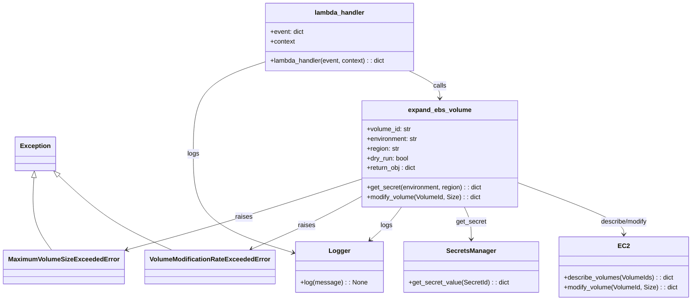

# Diagram: devops/terraform/modules/aws/aws-ec2-ebs-autoscaling-service/lambdas/expand_volume.py


> Auto-generated by Obscura crawlers

## Diagram 1

```mermaid
sequenceDiagram
participant Event
participant Lambda as lambda_handler
participant Expander as expand_ebs_volume
participant SecretsMgr as get_secret/SecretsManager
participant EC2 as ec2_client
participant Logger as log
Event->>Lambda: invoke(event)
Lambda->>Logger: log "Received event"
Lambda->>Expander: expand_ebs_volume(volume_id, environment, region, dry_run)
Expander->>EC2: describe_volumes(VolumeIds=[volume_id])
EC2-->>Expander: response (Volumes[0])
Expander->>SecretsMgr: get_secret(environment, region)
SecretsMgr-->>Expander: scaling_secret {max_size, interval}
alt scaling_secret missing
Expander-->>Lambda: raise Exception("Failed to fetch secret")
else scaling_secret present
Expander->>Expander: current_size = volume['Size']; new_size = current_size + interval
alt new_size > max_size
Expander-->>Lambda: raise MaximumVolumeSizeExceededError
else new_size <= max_size
alt dry_run == true
Expander->>Logger: log "Volume skipped resizing"
Expander-->>Lambda: return return_obj (new_size = current_size)
else dry_run == false
Expander->>EC2: modify_volume(VolumeId, Size=new_size)
alt modify success
EC2-->>Expander: success
Expander->>Logger: log "Volume resized"
Expander-->>Lambda: return return_obj
else ClientError
alt Error Code == VolumeModificationRateExceeded
Expander-->>Lambda: raise VolumeModificationRateExceededError
else other ClientError
Expander-->>Lambda: raise ClientError
end
end
end
end
end
```

> SVG rendering failed for this diagram.

## Diagram 2



### SVG

<svg id="container" width="1669.1484375" xmlns="http://www.w3.org/2000/svg" class="classDiagram" height="746" viewBox="0 0 1669.1484375 746" role="graphics-document document" aria-roledescription="class"><style>#container{font-family:"trebuchet ms",verdana,arial,sans-serif;font-size:16px;fill:#333;}@keyframes edge-animation-frame{from{stroke-dashoffset:0;}}@keyframes dash{to{stroke-dashoffset:0;}}#container .edge-animation-slow{stroke-dasharray:9,5!important;stroke-dashoffset:900;animation:dash 50s linear infinite;stroke-linecap:round;}#container .edge-animation-fast{stroke-dasharray:9,5!important;stroke-dashoffset:900;animation:dash 20s linear infinite;stroke-linecap:round;}#container .error-icon{fill:#552222;}#container .error-text{fill:#552222;stroke:#552222;}#container .edge-thickness-normal{stroke-width:1px;}#container .edge-thickness-thick{stroke-width:3.5px;}#container .edge-pattern-solid{stroke-dasharray:0;}#container .edge-thickness-invisible{stroke-width:0;fill:none;}#container .edge-pattern-dashed{stroke-dasharray:3;}#container .edge-pattern-dotted{stroke-dasharray:2;}#container .marker{fill:#333333;stroke:#333333;}#container .marker.cross{stroke:#333333;}#container svg{font-family:"trebuchet ms",verdana,arial,sans-serif;font-size:16px;}#container p{margin:0;}#container g.classGroup text{fill:#9370DB;stroke:none;font-family:"trebuchet ms",verdana,arial,sans-serif;font-size:10px;}#container g.classGroup text .title{font-weight:bolder;}#container .nodeLabel,#container .edgeLabel{color:#131300;}#container .edgeLabel .label rect{fill:#ECECFF;}#container .label text{fill:#131300;}#container .labelBkg{background:#ECECFF;}#container .edgeLabel .label span{background:#ECECFF;}#container .classTitle{font-weight:bolder;}#container .node rect,#container .node circle,#container .node ellipse,#container .node polygon,#container .node path{fill:#ECECFF;stroke:#9370DB;stroke-width:1px;}#container .divider{stroke:#9370DB;stroke-width:1;}#container g.clickable{cursor:pointer;}#container g.classGroup rect{fill:#ECECFF;stroke:#9370DB;}#container g.classGroup line{stroke:#9370DB;stroke-width:1;}#container .classLabel .box{stroke:none;stroke-width:0;fill:#ECECFF;opacity:0.5;}#container .classLabel .label{fill:#9370DB;font-size:10px;}#container .relation{stroke:#333333;stroke-width:1;fill:none;}#container .dashed-line{stroke-dasharray:3;}#container .dotted-line{stroke-dasharray:1 2;}#container #compositionStart,#container .composition{fill:#333333!important;stroke:#333333!important;stroke-width:1;}#container #compositionEnd,#container .composition{fill:#333333!important;stroke:#333333!important;stroke-width:1;}#container #dependencyStart,#container .dependency{fill:#333333!important;stroke:#333333!important;stroke-width:1;}#container #dependencyStart,#container .dependency{fill:#333333!important;stroke:#333333!important;stroke-width:1;}#container #extensionStart,#container .extension{fill:transparent!important;stroke:#333333!important;stroke-width:1;}#container #extensionEnd,#container .extension{fill:transparent!important;stroke:#333333!important;stroke-width:1;}#container #aggregationStart,#container .aggregation{fill:transparent!important;stroke:#333333!important;stroke-width:1;}#container #aggregationEnd,#container .aggregation{fill:transparent!important;stroke:#333333!important;stroke-width:1;}#container #lollipopStart,#container .lollipop{fill:#ECECFF!important;stroke:#333333!important;stroke-width:1;}#container #lollipopEnd,#container .lollipop{fill:#ECECFF!important;stroke:#333333!important;stroke-width:1;}#container .edgeTerminals{font-size:11px;line-height:initial;}#container .classTitleText{text-anchor:middle;font-size:18px;fill:#333;}#container .label-icon{display:inline-block;height:1em;overflow:visible;vertical-align:-0.125em;}#container .node .label-icon path{fill:currentColor;stroke:revert;stroke-width:revert;}#container :root{--mermaid-font-family:"trebuchet ms",verdana,arial,sans-serif;}</style><g><defs><marker id="container_class-aggregationStart" class="marker aggregation class" refX="18" refY="7" markerWidth="190" markerHeight="240" orient="auto"><path d="M 18,7 L9,13 L1,7 L9,1 Z"></path></marker></defs><defs><marker id="container_class-aggregationEnd" class="marker aggregation class" refX="1" refY="7" markerWidth="20" markerHeight="28" orient="auto"><path d="M 18,7 L9,13 L1,7 L9,1 Z"></path></marker></defs><defs><marker id="container_class-extensionStart" class="marker extension class" refX="18" refY="7" markerWidth="190" markerHeight="240" orient="auto"><path d="M 1,7 L18,13 V 1 Z"></path></marker></defs><defs><marker id="container_class-extensionEnd" class="marker extension class" refX="1" refY="7" markerWidth="20" markerHeight="28" orient="auto"><path d="M 1,1 V 13 L18,7 Z"></path></marker></defs><defs><marker id="container_class-compositionStart" class="marker composition class" refX="18" refY="7" markerWidth="190" markerHeight="240" orient="auto"><path d="M 18,7 L9,13 L1,7 L9,1 Z"></path></marker></defs><defs><marker id="container_class-compositionEnd" class="marker composition class" refX="1" refY="7" markerWidth="20" markerHeight="28" orient="auto"><path d="M 18,7 L9,13 L1,7 L9,1 Z"></path></marker></defs><defs><marker id="container_class-dependencyStart" class="marker dependency class" refX="6" refY="7" markerWidth="190" markerHeight="240" orient="auto"><path d="M 5,7 L9,13 L1,7 L9,1 Z"></path></marker></defs><defs><marker id="container_class-dependencyEnd" class="marker dependency class" refX="13" refY="7" markerWidth="20" markerHeight="28" orient="auto"><path d="M 18,7 L9,13 L14,7 L9,1 Z"></path></marker></defs><defs><marker id="container_class-lollipopStart" class="marker lollipop class" refX="13" refY="7" markerWidth="190" markerHeight="240" orient="auto"><circle stroke="black" fill="transparent" cx="7" cy="7" r="6"></circle></marker></defs><defs><marker id="container_class-lollipopEnd" class="marker lollipop class" refX="1" refY="7" markerWidth="190" markerHeight="240" orient="auto"><circle stroke="black" fill="transparent" cx="7" cy="7" r="6"></circle></marker></defs><g class="root"><g class="clusters"></g><g class="edgePaths"><path d="M136.026,436.049L155.654,455.208C175.281,474.366,214.537,512.683,259.428,543.508C304.319,574.333,354.846,597.667,380.109,609.333L405.373,621" id="id_Exception_VolumeModificationRateExceededError_1" class="edge-thickness-normal edge-pattern-solid relation" style=";;;" data-edge="true" data-et="edge" data-id="id_Exception_VolumeModificationRateExceededError_1" data-points="W3sieCI6MTIzLjY4MTM3NDgxNTA4ODc2LCJ5Ijo0MjR9LHsieCI6MjUzLjc5Mjk2ODc1LCJ5Ijo1NTF9LHsieCI6NDA1LjM3MjU1ODU5Mzc1LCJ5Ijo2MjF9XQ==" marker-start="url(#container_class-extensionStart)"></path><path d="M77.148,441.22L76.066,459.517C74.983,477.813,72.818,514.407,80.004,544.37C87.191,574.333,103.73,597.667,112,609.333L120.269,621" id="id_Exception_MaximumVolumeSizeExceededError_2" class="edge-thickness-normal edge-pattern-solid relation" style=";;;" data-edge="true" data-et="edge" data-id="id_Exception_MaximumVolumeSizeExceededError_2" data-points="W3sieCI6NzguMTY3MTM2NjQ5NDA4MjgsInkiOjQyNH0seyJ4Ijo3MC42NTIzNDM3NSwieSI6NTUxfSx7IngiOjEyMC4yNjkwNDI5Njg3NSwieSI6NjIxfV0=" marker-start="url(#container_class-extensionStart)"></path><path d="M976.305,176L988.816,182.167C1001.328,188.333,1026.352,200.667,1038.863,212C1051.375,223.333,1051.375,233.667,1051.375,238.833L1051.375,244" id="id_lambda_handler_expand_ebs_volume_3" class="edge-thickness-normal edge-pattern-solid relation" style=";;;" data-edge="true" data-et="edge" data-id="id_lambda_handler_expand_ebs_volume_3" data-points="W3sieCI6OTc2LjMwNDc1MjA2NjExNTcsInkiOjE3Nn0seyJ4IjoxMDUxLjM3NSwieSI6MjEzfSx7IngiOjEwNTEuMzc1LCJ5IjoyNTB9XQ==" marker-end="url(#container_class-dependencyEnd)"></path><path d="M1244.484,454.55L1287.271,470.625C1330.059,486.7,1415.633,518.85,1458.42,540.092C1501.207,561.333,1501.207,571.667,1501.207,576.833L1501.207,582" id="id_expand_ebs_volume_EC2_4" class="edge-thickness-normal edge-pattern-solid relation" style=";;;" data-edge="true" data-et="edge" data-id="id_expand_ebs_volume_EC2_4" data-points="W3sieCI6MTI0NC40ODQzNzUsInkiOjQ1NC41NTAzNzkwNDc3MzQ4NX0seyJ4IjoxNTAxLjIwNzAzMTI1LCJ5Ijo1NTF9LHsieCI6MTUwMS4yMDcwMzEyNSwieSI6NTg4fV0=" marker-end="url(#container_class-dependencyEnd)"></path><path d="M1109.839,514L1112.57,520.167C1115.301,526.333,1120.764,538.667,1123.495,552C1126.227,565.333,1126.227,579.667,1126.227,586.833L1126.227,594" id="id_expand_ebs_volume_SecretsManager_5" class="edge-thickness-normal edge-pattern-solid relation" style=";;;" data-edge="true" data-et="edge" data-id="id_expand_ebs_volume_SecretsManager_5" data-points="W3sieCI6MTEwOS44Mzg5NDIzMDc2OTI0LCJ5Ijo1MTR9LHsieCI6MTEyNi4yMjY1NjI1LCJ5Ijo1NTF9LHsieCI6MTEyNi4yMjY1NjI1LCJ5Ijo2MDB9XQ==" marker-end="url(#container_class-dependencyEnd)"></path><path d="M619.84,156.584L592.755,165.987C565.671,175.389,511.501,194.195,484.417,231.764C457.332,269.333,457.332,325.667,457.332,382C457.332,438.333,457.332,494.667,496.918,535.554C536.505,576.441,615.677,601.882,655.264,614.603L694.85,627.324" id="id_lambda_handler_Logger_6" class="edge-thickness-normal edge-pattern-solid relation" style=";;;" data-edge="true" data-et="edge" data-id="id_lambda_handler_Logger_6" data-points="W3sieCI6NjE5LjgzOTg0Mzc1LCJ5IjoxNTYuNTgzODcwMzUzMTQ0MjJ9LHsieCI6NDU3LjMzMjAzMTI1LCJ5IjoyMTN9LHsieCI6NDU3LjMzMjAzMTI1LCJ5IjozODJ9LHsieCI6NDU3LjMzMjAzMTI1LCJ5Ijo1NTF9LHsieCI6NzAwLjU2MjUsInkiOjYyOS4xNTkxMjIyMzg3ODQyfV0=" marker-end="url(#container_class-dependencyEnd)"></path><path d="M956.503,514L952.071,520.167C947.639,526.333,938.774,538.667,926.04,552.33C913.306,565.993,896.702,580.986,888.4,588.482L880.098,595.979" id="id_expand_ebs_volume_Logger_7" class="edge-thickness-normal edge-pattern-solid relation" style=";;;" data-edge="true" data-et="edge" data-id="id_expand_ebs_volume_Logger_7" data-points="W3sieCI6OTU2LjUwMzA1MTAzNTUwMywieSI6NTE0fSx7IngiOjkyOS45MTAxNTYyNSwieSI6NTUxfSx7IngiOjg3NS42NDQ3NzUzOTA2MjUsInkiOjYwMH1d" marker-end="url(#container_class-dependencyEnd)"></path><path d="M858.266,489.256L839.738,499.546C821.21,509.837,784.154,530.419,740.416,551.968C696.679,573.518,646.259,596.036,621.05,607.294L595.84,618.553" id="id_expand_ebs_volume_VolumeModificationRateExceededError_8" class="edge-thickness-normal edge-pattern-solid relation" style=";;;" data-edge="true" data-et="edge" data-id="id_expand_ebs_volume_VolumeModificationRateExceededError_8" data-points="W3sieCI6ODU4LjI2NTYyNSwieSI6NDg5LjI1NTcxNjAyNzk4NjR9LHsieCI6NzQ3LjA5NzY1NjI1LCJ5Ijo1NTF9LHsieCI6NTkwLjM2MTgxNjQwNjI1LCJ5Ijo2MjF9XQ==" marker-end="url(#container_class-dependencyEnd)"></path><path d="M858.266,446.159L805.673,463.632C753.079,481.106,647.893,516.053,554.49,545.167C461.087,574.28,379.468,597.56,338.658,609.201L297.848,620.841" id="id_expand_ebs_volume_MaximumVolumeSizeExceededError_9" class="edge-thickness-normal edge-pattern-solid relation" style=";;;" data-edge="true" data-et="edge" data-id="id_expand_ebs_volume_MaximumVolumeSizeExceededError_9" data-points="W3sieCI6ODU4LjI2NTYyNSwieSI6NDQ2LjE1ODcxNzIzNzg4Mzl9LHsieCI6NTQyLjcwNzAzMTI1LCJ5Ijo1NTF9LHsieCI6MjkyLjA3ODEyNSwieSI6NjIyLjQ4NjQ0NTg4ODAwNTd9XQ==" marker-end="url(#container_class-dependencyEnd)"></path></g><g class="edgeLabels"><g class="edgeLabel"><g class="label" data-id="id_Exception_VolumeModificationRateExceededError_1" transform="translate(0, 0)"><foreignObject width="0" height="0"><div xmlns="http://www.w3.org/1999/xhtml" class="labelBkg" style="display: table-cell; white-space: nowrap; line-height: 1.5; max-width: 200px; text-align: center;"><span class="edgeLabel"></span></div></foreignObject></g></g><g class="edgeLabel"><g class="label" data-id="id_Exception_MaximumVolumeSizeExceededError_2" transform="translate(0, 0)"><foreignObject width="0" height="0"><div xmlns="http://www.w3.org/1999/xhtml" class="labelBkg" style="display: table-cell; white-space: nowrap; line-height: 1.5; max-width: 200px; text-align: center;"><span class="edgeLabel"></span></div></foreignObject></g></g><g class="edgeLabel" transform="translate(1051.375, 213)"><g class="label" data-id="id_lambda_handler_expand_ebs_volume_3" transform="translate(-16.4453125, -12)"><foreignObject width="32.890625" height="24"><div xmlns="http://www.w3.org/1999/xhtml" class="labelBkg" style="display: table-cell; white-space: nowrap; line-height: 1.5; max-width: 200px; text-align: center;"><span class="edgeLabel"><p>calls</p></span></div></foreignObject></g></g><g class="edgeLabel" transform="translate(1501.20703125, 551)"><g class="label" data-id="id_expand_ebs_volume_EC2_4" transform="translate(-60.265625, -12)"><foreignObject width="120.53125" height="24"><div xmlns="http://www.w3.org/1999/xhtml" class="labelBkg" style="display: table-cell; white-space: nowrap; line-height: 1.5; max-width: 200px; text-align: center;"><span class="edgeLabel"><p>describe/modify</p></span></div></foreignObject></g></g><g class="edgeLabel" transform="translate(1126.2265625, 551)"><g class="label" data-id="id_expand_ebs_volume_SecretsManager_5" transform="translate(-37.4609375, -12)"><foreignObject width="74.921875" height="24"><div xmlns="http://www.w3.org/1999/xhtml" class="labelBkg" style="display: table-cell; white-space: nowrap; line-height: 1.5; max-width: 200px; text-align: center;"><span class="edgeLabel"><p>get_secret</p></span></div></foreignObject></g></g><g class="edgeLabel" transform="translate(457.33203125, 382)"><g class="label" data-id="id_lambda_handler_Logger_6" transform="translate(-14.8203125, -12)"><foreignObject width="29.640625" height="24"><div xmlns="http://www.w3.org/1999/xhtml" class="labelBkg" style="display: table-cell; white-space: nowrap; line-height: 1.5; max-width: 200px; text-align: center;"><span class="edgeLabel"><p>logs</p></span></div></foreignObject></g></g><g class="edgeLabel" transform="translate(919.68662, 560.23154)"><g class="label" data-id="id_expand_ebs_volume_Logger_7" transform="translate(-14.8203125, -12)"><foreignObject width="29.640625" height="24"><div xmlns="http://www.w3.org/1999/xhtml" class="labelBkg" style="display: table-cell; white-space: nowrap; line-height: 1.5; max-width: 200px; text-align: center;"><span class="edgeLabel"><p>logs</p></span></div></foreignObject></g></g><g class="edgeLabel" transform="translate(726.7849, 560.07191)"><g class="label" data-id="id_expand_ebs_volume_VolumeModificationRateExceededError_8" transform="translate(-21.25, -12)"><foreignObject width="42.5" height="24"><div xmlns="http://www.w3.org/1999/xhtml" class="labelBkg" style="display: table-cell; white-space: nowrap; line-height: 1.5; max-width: 200px; text-align: center;"><span class="edgeLabel"><p>raises</p></span></div></foreignObject></g></g><g class="edgeLabel" transform="translate(576.82075, 539.66605)"><g class="label" data-id="id_expand_ebs_volume_MaximumVolumeSizeExceededError_9" transform="translate(-21.25, -12)"><foreignObject width="42.5" height="24"><div xmlns="http://www.w3.org/1999/xhtml" class="labelBkg" style="display: table-cell; white-space: nowrap; line-height: 1.5; max-width: 200px; text-align: center;"><span class="edgeLabel"><p>raises</p></span></div></foreignObject></g></g></g><g class="nodes"><g class="node default" id="classId-Exception-0" transform="translate(80.65234375, 382)"><g class="basic label-container"><path d="M-47.703125 -42 L47.703125 -42 L47.703125 42 L-47.703125 42" stroke="none" stroke-width="0" fill="#ECECFF" style=""></path><path d="M-47.703125 -42 C-21.20341965534983 -42, 5.2962856893003405 -42, 47.703125 -42 M-47.703125 -42 C-23.234567283114202 -42, 1.233990433771595 -42, 47.703125 -42 M47.703125 -42 C47.703125 -9.382857731325274, 47.703125 23.234284537349453, 47.703125 42 M47.703125 -42 C47.703125 -12.579424453645252, 47.703125 16.841151092709495, 47.703125 42 M47.703125 42 C28.483213468915626 42, 9.263301937831251 42, -47.703125 42 M47.703125 42 C18.367329916789615 42, -10.96846516642077 42, -47.703125 42 M-47.703125 42 C-47.703125 14.390700245340362, -47.703125 -13.218599509319276, -47.703125 -42 M-47.703125 42 C-47.703125 9.886853678633173, -47.703125 -22.226292642733654, -47.703125 -42" stroke="#9370DB" stroke-width="1.3" fill="none" stroke-dasharray="0 0" style=""></path></g><g class="annotation-group text" transform="translate(0, -18)"></g><g class="label-group text" transform="translate(-35.703125, -18)"><g class="label" style="font-weight: bolder" transform="translate(0,-12)"><foreignObject width="71.40625" height="24"><div xmlns="http://www.w3.org/1999/xhtml" style="display: table-cell; white-space: nowrap; line-height: 1.5; max-width: 121px; text-align: center;"><span class="nodeLabel markdown-node-label" style=""><p>Exception</p></span></div></foreignObject></g></g><g class="members-group text" transform="translate(-35.703125, 30)"></g><g class="methods-group text" transform="translate(-35.703125, 60)"></g><g class="divider" style=""><path d="M-47.703125 6 C-11.365938997179853 6, 24.971247005640294 6, 47.703125 6 M-47.703125 6 C-13.153972946022868 6, 21.395179107954263 6, 47.703125 6" stroke="#9370DB" stroke-width="1.3" fill="none" stroke-dasharray="0 0" style=""></path></g><g class="divider" style=""><path d="M-47.703125 24 C-21.671833198346008 24, 4.359458603307985 24, 47.703125 24 M-47.703125 24 C-20.614075477037357 24, 6.474974045925286 24, 47.703125 24" stroke="#9370DB" stroke-width="1.3" fill="none" stroke-dasharray="0 0" style=""></path></g></g><g class="node default" id="classId-VolumeModificationRateExceededError-1" transform="translate(496.3203125, 663)"><g class="basic label-container"><path d="M-154.2421875 -42 L154.2421875 -42 L154.2421875 42 L-154.2421875 42" stroke="none" stroke-width="0" fill="#ECECFF" style=""></path><path d="M-154.2421875 -42 C-75.5219367631956 -42, 3.198313973608805 -42, 154.2421875 -42 M-154.2421875 -42 C-53.53916621855896 -42, 47.16385506288208 -42, 154.2421875 -42 M154.2421875 -42 C154.2421875 -11.5102982278379, 154.2421875 18.9794035443242, 154.2421875 42 M154.2421875 -42 C154.2421875 -24.49032326651574, 154.2421875 -6.980646533031482, 154.2421875 42 M154.2421875 42 C55.51772762889739 42, -43.20673224220522 42, -154.2421875 42 M154.2421875 42 C82.36918236709676 42, 10.49617723419351 42, -154.2421875 42 M-154.2421875 42 C-154.2421875 14.850556996501275, -154.2421875 -12.29888600699745, -154.2421875 -42 M-154.2421875 42 C-154.2421875 23.4139083445438, -154.2421875 4.827816689087598, -154.2421875 -42" stroke="#9370DB" stroke-width="1.3" fill="none" stroke-dasharray="0 0" style=""></path></g><g class="annotation-group text" transform="translate(0, -18)"></g><g class="label-group text" transform="translate(-142.2421875, -18)"><g class="label" style="font-weight: bolder" transform="translate(0,-12)"><foreignObject width="284.484375" height="24"><div xmlns="http://www.w3.org/1999/xhtml" style="display: table-cell; white-space: nowrap; line-height: 1.5; max-width: 332px; text-align: center;"><span class="nodeLabel markdown-node-label" style=""><p>VolumeModificationRateExceededError</p></span></div></foreignObject></g></g><g class="members-group text" transform="translate(-142.2421875, 30)"></g><g class="methods-group text" transform="translate(-142.2421875, 60)"></g><g class="divider" style=""><path d="M-154.2421875 6 C-72.55701415321892 6, 9.128159193562169 6, 154.2421875 6 M-154.2421875 6 C-91.96406652416013 6, -29.685945548320262 6, 154.2421875 6" stroke="#9370DB" stroke-width="1.3" fill="none" stroke-dasharray="0 0" style=""></path></g><g class="divider" style=""><path d="M-154.2421875 24 C-55.61630430502272 24, 43.009578889954554 24, 154.2421875 24 M-154.2421875 24 C-92.23739934156269 24, -30.232611183125385 24, 154.2421875 24" stroke="#9370DB" stroke-width="1.3" fill="none" stroke-dasharray="0 0" style=""></path></g></g><g class="node default" id="classId-MaximumVolumeSizeExceededError-2" transform="translate(150.0390625, 663)"><g class="basic label-container"><path d="M-142.0390625 -42 L142.0390625 -42 L142.0390625 42 L-142.0390625 42" stroke="none" stroke-width="0" fill="#ECECFF" style=""></path><path d="M-142.0390625 -42 C-38.110857013102944 -42, 65.81734847379411 -42, 142.0390625 -42 M-142.0390625 -42 C-53.41966653137182 -42, 35.199729437256366 -42, 142.0390625 -42 M142.0390625 -42 C142.0390625 -17.382999832126703, 142.0390625 7.234000335746593, 142.0390625 42 M142.0390625 -42 C142.0390625 -8.728000068918071, 142.0390625 24.543999862163858, 142.0390625 42 M142.0390625 42 C47.935140883107536 42, -46.16878073378493 42, -142.0390625 42 M142.0390625 42 C51.92062605182372 42, -38.197810396352565 42, -142.0390625 42 M-142.0390625 42 C-142.0390625 12.072023328614193, -142.0390625 -17.855953342771613, -142.0390625 -42 M-142.0390625 42 C-142.0390625 12.05870867914697, -142.0390625 -17.88258264170606, -142.0390625 -42" stroke="#9370DB" stroke-width="1.3" fill="none" stroke-dasharray="0 0" style=""></path></g><g class="annotation-group text" transform="translate(0, -18)"></g><g class="label-group text" transform="translate(-130.0390625, -18)"><g class="label" style="font-weight: bolder" transform="translate(0,-12)"><foreignObject width="260.078125" height="24"><div xmlns="http://www.w3.org/1999/xhtml" style="display: table-cell; white-space: nowrap; line-height: 1.5; max-width: 309px; text-align: center;"><span class="nodeLabel markdown-node-label" style=""><p>MaximumVolumeSizeExceededError</p></span></div></foreignObject></g></g><g class="members-group text" transform="translate(-130.0390625, 30)"></g><g class="methods-group text" transform="translate(-130.0390625, 60)"></g><g class="divider" style=""><path d="M-142.0390625 6 C-47.763211049496874 6, 46.51264040100625 6, 142.0390625 6 M-142.0390625 6 C-82.77123980459453 6, -23.503417109189073 6, 142.0390625 6" stroke="#9370DB" stroke-width="1.3" fill="none" stroke-dasharray="0 0" style=""></path></g><g class="divider" style=""><path d="M-142.0390625 24 C-54.4374858196219 24, 33.164090860756204 24, 142.0390625 24 M-142.0390625 24 C-60.40312741445514 24, 21.232807671089716 24, 142.0390625 24" stroke="#9370DB" stroke-width="1.3" fill="none" stroke-dasharray="0 0" style=""></path></g></g><g class="node default" id="classId-expand_ebs_volume-3" transform="translate(1051.375, 382)"><g class="basic label-container"><path d="M-193.109375 -132 L193.109375 -132 L193.109375 132 L-193.109375 132" stroke="none" stroke-width="0" fill="#ECECFF" style=""></path><path d="M-193.109375 -132 C-98.96146703271914 -132, -4.813559065438284 -132, 193.109375 -132 M-193.109375 -132 C-44.86271527502376 -132, 103.38394444995248 -132, 193.109375 -132 M193.109375 -132 C193.109375 -57.72851543284908, 193.109375 16.542969134301842, 193.109375 132 M193.109375 -132 C193.109375 -50.17824459024311, 193.109375 31.64351081951378, 193.109375 132 M193.109375 132 C43.81796667158318 132, -105.47344165683364 132, -193.109375 132 M193.109375 132 C53.616209909143436 132, -85.87695518171313 132, -193.109375 132 M-193.109375 132 C-193.109375 53.34581481054039, -193.109375 -25.30837037891922, -193.109375 -132 M-193.109375 132 C-193.109375 61.66998017147819, -193.109375 -8.660039657043626, -193.109375 -132" stroke="#9370DB" stroke-width="1.3" fill="none" stroke-dasharray="0 0" style=""></path></g><g class="annotation-group text" transform="translate(0, -108)"></g><g class="label-group text" transform="translate(-74.5625, -108)"><g class="label" style="font-weight: bolder" transform="translate(0,-12)"><foreignObject width="149.125" height="24"><div xmlns="http://www.w3.org/1999/xhtml" style="display: table-cell; white-space: nowrap; line-height: 1.5; max-width: 198px; text-align: center;"><span class="nodeLabel markdown-node-label" style=""><p>expand_ebs_volume</p></span></div></foreignObject></g></g><g class="members-group text" transform="translate(-181.109375, -60)"><g class="label" style="" transform="translate(0,-12)"><foreignObject width="111" height="24"><div xmlns="http://www.w3.org/1999/xhtml" style="display: table-cell; white-space: nowrap; line-height: 1.5; max-width: 169px; text-align: center;"><span class="nodeLabel markdown-node-label" style=""><p>+volume_id: str</p></span></div></foreignObject></g><g class="label" style="" transform="translate(0,12)"><foreignObject width="127.921875" height="24"><div xmlns="http://www.w3.org/1999/xhtml" style="display: table-cell; white-space: nowrap; line-height: 1.5; max-width: 186px; text-align: center;"><span class="nodeLabel markdown-node-label" style=""><p>+environment: str</p></span></div></foreignObject></g><g class="label" style="" transform="translate(0,36)"><foreignObject width="81.46875" height="24"><div xmlns="http://www.w3.org/1999/xhtml" style="display: table-cell; white-space: nowrap; line-height: 1.5; max-width: 140px; text-align: center;"><span class="nodeLabel markdown-node-label" style=""><p>+region: str</p></span></div></foreignObject></g><g class="label" style="" transform="translate(0,60)"><foreignObject width="105.265625" height="24"><div xmlns="http://www.w3.org/1999/xhtml" style="display: table-cell; white-space: nowrap; line-height: 1.5; max-width: 163px; text-align: center;"><span class="nodeLabel markdown-node-label" style=""><p>+dry_run: bool</p></span></div></foreignObject></g><g class="label" style="" transform="translate(0,84)"><foreignObject width="124.203125" height="24"><div xmlns="http://www.w3.org/1999/xhtml" style="display: table-cell; white-space: nowrap; line-height: 1.5; max-width: 182px; text-align: center;"><span class="nodeLabel markdown-node-label" style=""><p>+return_obj : dict</p></span></div></foreignObject></g></g><g class="methods-group text" transform="translate(-181.109375, 84)"><g class="label" style="" transform="translate(0,-12)"><foreignObject width="287.65625" height="24"><div xmlns="http://www.w3.org/1999/xhtml" style="display: table-cell; white-space: nowrap; line-height: 1.5; max-width: 345px; text-align: center;"><span class="nodeLabel markdown-node-label" style=""><p>+get_secret(environment, region) : : dict</p></span></div></foreignObject></g><g class="label" style="" transform="translate(0,12)"><foreignObject width="283.046875" height="24"><div xmlns="http://www.w3.org/1999/xhtml" style="display: table-cell; white-space: nowrap; line-height: 1.5; max-width: 341px; text-align: center;"><span class="nodeLabel markdown-node-label" style=""><p>+modify_volume(VolumeId, Size) : : dict</p></span></div></foreignObject></g></g><g class="divider" style=""><path d="M-193.109375 -84 C-68.2404283613251 -84, 56.6285182773498 -84, 193.109375 -84 M-193.109375 -84 C-97.14763176010966 -84, -1.1858885202193221 -84, 193.109375 -84" stroke="#9370DB" stroke-width="1.3" fill="none" stroke-dasharray="0 0" style=""></path></g><g class="divider" style=""><path d="M-193.109375 60 C-84.22860003397543 60, 24.65217493204915 60, 193.109375 60 M-193.109375 60 C-77.04566731504815 60, 39.0180403699037 60, 193.109375 60" stroke="#9370DB" stroke-width="1.3" fill="none" stroke-dasharray="0 0" style=""></path></g></g><g class="node default" id="classId-lambda_handler-4" transform="translate(805.875, 92)"><g class="basic label-container"><path d="M-186.03515625 -84 L186.03515625 -84 L186.03515625 84 L-186.03515625 84" stroke="none" stroke-width="0" fill="#ECECFF" style=""></path><path d="M-186.03515625 -84 C-110.09610452713882 -84, -34.15705280427764 -84, 186.03515625 -84 M-186.03515625 -84 C-62.779218279636524 -84, 60.47671969072695 -84, 186.03515625 -84 M186.03515625 -84 C186.03515625 -32.16833734092673, 186.03515625 19.663325318146534, 186.03515625 84 M186.03515625 -84 C186.03515625 -37.63134863507641, 186.03515625 8.737302729847187, 186.03515625 84 M186.03515625 84 C87.69521075188804 84, -10.644734746223918 84, -186.03515625 84 M186.03515625 84 C96.23106003381632 84, 6.42696381763264 84, -186.03515625 84 M-186.03515625 84 C-186.03515625 43.19599918572418, -186.03515625 2.3919983714483664, -186.03515625 -84 M-186.03515625 84 C-186.03515625 45.15882239645086, -186.03515625 6.317644792901717, -186.03515625 -84" stroke="#9370DB" stroke-width="1.3" fill="none" stroke-dasharray="0 0" style=""></path></g><g class="annotation-group text" transform="translate(0, -60)"></g><g class="label-group text" transform="translate(-59.9765625, -60)"><g class="label" style="font-weight: bolder" transform="translate(0,-12)"><foreignObject width="119.953125" height="24"><div xmlns="http://www.w3.org/1999/xhtml" style="display: table-cell; white-space: nowrap; line-height: 1.5; max-width: 170px; text-align: center;"><span class="nodeLabel markdown-node-label" style=""><p>lambda_handler</p></span></div></foreignObject></g></g><g class="members-group text" transform="translate(-174.03515625, -12)"><g class="label" style="" transform="translate(0,-12)"><foreignObject width="83.96875" height="24"><div xmlns="http://www.w3.org/1999/xhtml" style="display: table-cell; white-space: nowrap; line-height: 1.5; max-width: 142px; text-align: center;"><span class="nodeLabel markdown-node-label" style=""><p>+event: dict</p></span></div></foreignObject></g><g class="label" style="" transform="translate(0,12)"><foreignObject width="61.6875" height="24"><div xmlns="http://www.w3.org/1999/xhtml" style="display: table-cell; white-space: nowrap; line-height: 1.5; max-width: 119px; text-align: center;"><span class="nodeLabel markdown-node-label" style=""><p>+context</p></span></div></foreignObject></g></g><g class="methods-group text" transform="translate(-174.03515625, 60)"><g class="label" style="" transform="translate(0,-12)"><foreignObject width="288.09375" height="24"><div xmlns="http://www.w3.org/1999/xhtml" style="display: table-cell; white-space: nowrap; line-height: 1.5; max-width: 346px; text-align: center;"><span class="nodeLabel markdown-node-label" style=""><p>+lambda_handler(event, context) : : dict</p></span></div></foreignObject></g></g><g class="divider" style=""><path d="M-186.03515625 -36 C-107.30540397918386 -36, -28.57565170836773 -36, 186.03515625 -36 M-186.03515625 -36 C-67.09051234989425 -36, 51.85413155021149 -36, 186.03515625 -36" stroke="#9370DB" stroke-width="1.3" fill="none" stroke-dasharray="0 0" style=""></path></g><g class="divider" style=""><path d="M-186.03515625 36 C-76.05728090839602 36, 33.92059443320795 36, 186.03515625 36 M-186.03515625 36 C-81.34236396051917 36, 23.35042832896167 36, 186.03515625 36" stroke="#9370DB" stroke-width="1.3" fill="none" stroke-dasharray="0 0" style=""></path></g></g><g class="node default" id="classId-SecretsManager-5" transform="translate(1126.2265625, 663)"><g class="basic label-container"><path d="M-165.0390625 -63 L165.0390625 -63 L165.0390625 63 L-165.0390625 63" stroke="none" stroke-width="0" fill="#ECECFF" style=""></path><path d="M-165.0390625 -63 C-76.20975507110582 -63, 12.619552357788365 -63, 165.0390625 -63 M-165.0390625 -63 C-77.8337038401685 -63, 9.371654819663007 -63, 165.0390625 -63 M165.0390625 -63 C165.0390625 -15.092096591642758, 165.0390625 32.815806816714485, 165.0390625 63 M165.0390625 -63 C165.0390625 -22.857723853302303, 165.0390625 17.284552293395393, 165.0390625 63 M165.0390625 63 C97.72053170776879 63, 30.40200091553757 63, -165.0390625 63 M165.0390625 63 C55.90139806431988 63, -53.236266371360244 63, -165.0390625 63 M-165.0390625 63 C-165.0390625 18.621861306496804, -165.0390625 -25.756277387006392, -165.0390625 -63 M-165.0390625 63 C-165.0390625 31.445050190897316, -165.0390625 -0.1098996182053682, -165.0390625 -63" stroke="#9370DB" stroke-width="1.3" fill="none" stroke-dasharray="0 0" style=""></path></g><g class="annotation-group text" transform="translate(0, -39)"></g><g class="label-group text" transform="translate(-58.609375, -39)"><g class="label" style="font-weight: bolder" transform="translate(0,-12)"><foreignObject width="117.21875" height="24"><div xmlns="http://www.w3.org/1999/xhtml" style="display: table-cell; white-space: nowrap; line-height: 1.5; max-width: 166px; text-align: center;"><span class="nodeLabel markdown-node-label" style=""><p>SecretsManager</p></span></div></foreignObject></g></g><g class="members-group text" transform="translate(-153.0390625, 9)"></g><g class="methods-group text" transform="translate(-153.0390625, 39)"><g class="label" style="" transform="translate(0,-12)"><foreignObject width="247.46875" height="24"><div xmlns="http://www.w3.org/1999/xhtml" style="display: table-cell; white-space: nowrap; line-height: 1.5; max-width: 305px; text-align: center;"><span class="nodeLabel markdown-node-label" style=""><p>+get_secret_value(SecretId) : : dict</p></span></div></foreignObject></g></g><g class="divider" style=""><path d="M-165.0390625 -15 C-58.52952144354323 -15, 47.98001961291354 -15, 165.0390625 -15 M-165.0390625 -15 C-83.66726572875653 -15, -2.295468957513066 -15, 165.0390625 -15" stroke="#9370DB" stroke-width="1.3" fill="none" stroke-dasharray="0 0" style=""></path></g><g class="divider" style=""><path d="M-165.0390625 9 C-97.47627931605255 9, -29.91349613210511 9, 165.0390625 9 M-165.0390625 9 C-62.86978296936395 9, 39.29949656127209 9, 165.0390625 9" stroke="#9370DB" stroke-width="1.3" fill="none" stroke-dasharray="0 0" style=""></path></g></g><g class="node default" id="classId-EC2-6" transform="translate(1501.20703125, 663)"><g class="basic label-container"><path d="M-159.94140625 -75 L159.94140625 -75 L159.94140625 75 L-159.94140625 75" stroke="none" stroke-width="0" fill="#ECECFF" style=""></path><path d="M-159.94140625 -75 C-78.37186083962324 -75, 3.1976845707535233 -75, 159.94140625 -75 M-159.94140625 -75 C-49.81809510170022 -75, 60.305216046599554 -75, 159.94140625 -75 M159.94140625 -75 C159.94140625 -30.744917702728053, 159.94140625 13.510164594543895, 159.94140625 75 M159.94140625 -75 C159.94140625 -22.852497499636797, 159.94140625 29.295005000726405, 159.94140625 75 M159.94140625 75 C39.81765886075911 75, -80.30608852848178 75, -159.94140625 75 M159.94140625 75 C37.831162735804085 75, -84.27908077839183 75, -159.94140625 75 M-159.94140625 75 C-159.94140625 22.4912757487826, -159.94140625 -30.017448502434803, -159.94140625 -75 M-159.94140625 75 C-159.94140625 22.503792853861164, -159.94140625 -29.992414292277672, -159.94140625 -75" stroke="#9370DB" stroke-width="1.3" fill="none" stroke-dasharray="0 0" style=""></path></g><g class="annotation-group text" transform="translate(0, -51)"></g><g class="label-group text" transform="translate(-12.8359375, -51)"><g class="label" style="font-weight: bolder" transform="translate(0,-12)"><foreignObject width="25.671875" height="24"><div xmlns="http://www.w3.org/1999/xhtml" style="display: table-cell; white-space: nowrap; line-height: 1.5; max-width: 75px; text-align: center;"><span class="nodeLabel markdown-node-label" style=""><p>EC2</p></span></div></foreignObject></g></g><g class="members-group text" transform="translate(-147.94140625, -3)"></g><g class="methods-group text" transform="translate(-147.94140625, 27)"><g class="label" style="" transform="translate(0,-12)"><foreignObject width="273.1875" height="24"><div xmlns="http://www.w3.org/1999/xhtml" style="display: table-cell; white-space: nowrap; line-height: 1.5; max-width: 331px; text-align: center;"><span class="nodeLabel markdown-node-label" style=""><p>+describe_volumes(VolumeIds) : : dict</p></span></div></foreignObject></g><g class="label" style="" transform="translate(0,12)"><foreignObject width="283.046875" height="24"><div xmlns="http://www.w3.org/1999/xhtml" style="display: table-cell; white-space: nowrap; line-height: 1.5; max-width: 341px; text-align: center;"><span class="nodeLabel markdown-node-label" style=""><p>+modify_volume(VolumeId, Size) : : dict</p></span></div></foreignObject></g></g><g class="divider" style=""><path d="M-159.94140625 -27 C-73.87462280832708 -27, 12.19216063334585 -27, 159.94140625 -27 M-159.94140625 -27 C-35.47179949801898 -27, 88.99780725396204 -27, 159.94140625 -27" stroke="#9370DB" stroke-width="1.3" fill="none" stroke-dasharray="0 0" style=""></path></g><g class="divider" style=""><path d="M-159.94140625 -3 C-85.19855308081198 -3, -10.455699911623952 -3, 159.94140625 -3 M-159.94140625 -3 C-77.46421492571132 -3, 5.012976398577365 -3, 159.94140625 -3" stroke="#9370DB" stroke-width="1.3" fill="none" stroke-dasharray="0 0" style=""></path></g></g><g class="node default" id="classId-Logger-7" transform="translate(805.875, 663)"><g class="basic label-container"><path d="M-105.3125 -63 L105.3125 -63 L105.3125 63 L-105.3125 63" stroke="none" stroke-width="0" fill="#ECECFF" style=""></path><path d="M-105.3125 -63 C-57.90207607328666 -63, -10.491652146573315 -63, 105.3125 -63 M-105.3125 -63 C-54.74287572448256 -63, -4.173251448965118 -63, 105.3125 -63 M105.3125 -63 C105.3125 -19.50598281419792, 105.3125 23.988034371604158, 105.3125 63 M105.3125 -63 C105.3125 -37.45931993690537, 105.3125 -11.91863987381074, 105.3125 63 M105.3125 63 C28.300997669601458 63, -48.710504660797085 63, -105.3125 63 M105.3125 63 C39.76142554272606 63, -25.789648914547882 63, -105.3125 63 M-105.3125 63 C-105.3125 31.67533690934441, -105.3125 0.35067381868881853, -105.3125 -63 M-105.3125 63 C-105.3125 17.741671230811683, -105.3125 -27.516657538376634, -105.3125 -63" stroke="#9370DB" stroke-width="1.3" fill="none" stroke-dasharray="0 0" style=""></path></g><g class="annotation-group text" transform="translate(0, -39)"></g><g class="label-group text" transform="translate(-24.84375, -39)"><g class="label" style="font-weight: bolder" transform="translate(0,-12)"><foreignObject width="49.6875" height="24"><div xmlns="http://www.w3.org/1999/xhtml" style="display: table-cell; white-space: nowrap; line-height: 1.5; max-width: 99px; text-align: center;"><span class="nodeLabel markdown-node-label" style=""><p>Logger</p></span></div></foreignObject></g></g><g class="members-group text" transform="translate(-93.3125, 9)"></g><g class="methods-group text" transform="translate(-93.3125, 39)"><g class="label" style="" transform="translate(0,-12)"><foreignObject width="161.78125" height="24"><div xmlns="http://www.w3.org/1999/xhtml" style="display: table-cell; white-space: nowrap; line-height: 1.5; max-width: 219px; text-align: center;"><span class="nodeLabel markdown-node-label" style=""><p>+log(message) : : None</p></span></div></foreignObject></g></g><g class="divider" style=""><path d="M-105.3125 -15 C-53.586382577216845 -15, -1.8602651544336908 -15, 105.3125 -15 M-105.3125 -15 C-54.848156304309605 -15, -4.383812608619209 -15, 105.3125 -15" stroke="#9370DB" stroke-width="1.3" fill="none" stroke-dasharray="0 0" style=""></path></g><g class="divider" style=""><path d="M-105.3125 9 C-29.001501089790636 9, 47.30949782041873 9, 105.3125 9 M-105.3125 9 C-28.64385647542703 9, 48.02478704914594 9, 105.3125 9" stroke="#9370DB" stroke-width="1.3" fill="none" stroke-dasharray="0 0" style=""></path></g></g></g></g></g></svg>
