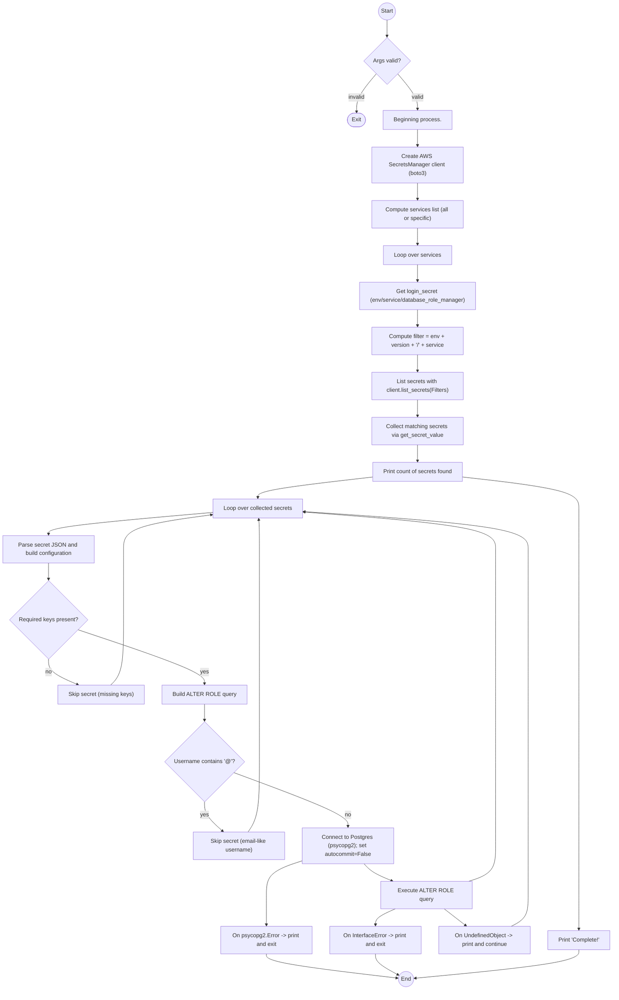

# Diagram: devops/terraform/modules/controller/controller-environment-replica/tf_db_password_sync_from_secrets.py


> Auto-generated by Obscura crawlers

## Diagram 1



### SVG

<svg id="container" width="1733.4375" xmlns="http://www.w3.org/2000/svg" class="flowchart" height="2809.484375" viewBox="0 0 1733.4375 2809.484375" role="graphics-document document" aria-roledescription="flowchart-v2"><style>#container{font-family:"trebuchet ms",verdana,arial,sans-serif;font-size:16px;fill:#333;}@keyframes edge-animation-frame{from{stroke-dashoffset:0;}}@keyframes dash{to{stroke-dashoffset:0;}}#container .edge-animation-slow{stroke-dasharray:9,5!important;stroke-dashoffset:900;animation:dash 50s linear infinite;stroke-linecap:round;}#container .edge-animation-fast{stroke-dasharray:9,5!important;stroke-dashoffset:900;animation:dash 20s linear infinite;stroke-linecap:round;}#container .error-icon{fill:#552222;}#container .error-text{fill:#552222;stroke:#552222;}#container .edge-thickness-normal{stroke-width:1px;}#container .edge-thickness-thick{stroke-width:3.5px;}#container .edge-pattern-solid{stroke-dasharray:0;}#container .edge-thickness-invisible{stroke-width:0;fill:none;}#container .edge-pattern-dashed{stroke-dasharray:3;}#container .edge-pattern-dotted{stroke-dasharray:2;}#container .marker{fill:#333333;stroke:#333333;}#container .marker.cross{stroke:#333333;}#container svg{font-family:"trebuchet ms",verdana,arial,sans-serif;font-size:16px;}#container p{margin:0;}#container .label{font-family:"trebuchet ms",verdana,arial,sans-serif;color:#333;}#container .cluster-label text{fill:#333;}#container .cluster-label span{color:#333;}#container .cluster-label span p{background-color:transparent;}#container .label text,#container span{fill:#333;color:#333;}#container .node rect,#container .node circle,#container .node ellipse,#container .node polygon,#container .node path{fill:#ECECFF;stroke:#9370DB;stroke-width:1px;}#container .rough-node .label text,#container .node .label text,#container .image-shape .label,#container .icon-shape .label{text-anchor:middle;}#container .node .katex path{fill:#000;stroke:#000;stroke-width:1px;}#container .rough-node .label,#container .node .label,#container .image-shape .label,#container .icon-shape .label{text-align:center;}#container .node.clickable{cursor:pointer;}#container .root .anchor path{fill:#333333!important;stroke-width:0;stroke:#333333;}#container .arrowheadPath{fill:#333333;}#container .edgePath .path{stroke:#333333;stroke-width:2.0px;}#container .flowchart-link{stroke:#333333;fill:none;}#container .edgeLabel{background-color:rgba(232,232,232, 0.8);text-align:center;}#container .edgeLabel p{background-color:rgba(232,232,232, 0.8);}#container .edgeLabel rect{opacity:0.5;background-color:rgba(232,232,232, 0.8);fill:rgba(232,232,232, 0.8);}#container .labelBkg{background-color:rgba(232, 232, 232, 0.5);}#container .cluster rect{fill:#ffffde;stroke:#aaaa33;stroke-width:1px;}#container .cluster text{fill:#333;}#container .cluster span{color:#333;}#container div.mermaidTooltip{position:absolute;text-align:center;max-width:200px;padding:2px;font-family:"trebuchet ms",verdana,arial,sans-serif;font-size:12px;background:hsl(80, 100%, 96.2745098039%);border:1px solid #aaaa33;border-radius:2px;pointer-events:none;z-index:100;}#container .flowchartTitleText{text-anchor:middle;font-size:18px;fill:#333;}#container rect.text{fill:none;stroke-width:0;}#container .icon-shape,#container .image-shape{background-color:rgba(232,232,232, 0.8);text-align:center;}#container .icon-shape p,#container .image-shape p{background-color:rgba(232,232,232, 0.8);padding:2px;}#container .icon-shape rect,#container .image-shape rect{opacity:0.5;background-color:rgba(232,232,232, 0.8);fill:rgba(232,232,232, 0.8);}#container .label-icon{display:inline-block;height:1em;overflow:visible;vertical-align:-0.125em;}#container .node .label-icon path{fill:currentColor;stroke:revert;stroke-width:revert;}#container :root{--mermaid-font-family:"trebuchet ms",verdana,arial,sans-serif;}</style><g><marker id="container_flowchart-v2-pointEnd" class="marker flowchart-v2" viewBox="0 0 10 10" refX="5" refY="5" markerUnits="userSpaceOnUse" markerWidth="8" markerHeight="8" orient="auto"><path d="M 0 0 L 10 5 L 0 10 z" class="arrowMarkerPath" style="stroke-width: 1; stroke-dasharray: 1, 0;"></path></marker><marker id="container_flowchart-v2-pointStart" class="marker flowchart-v2" viewBox="0 0 10 10" refX="4.5" refY="5" markerUnits="userSpaceOnUse" markerWidth="8" markerHeight="8" orient="auto"><path d="M 0 5 L 10 10 L 10 0 z" class="arrowMarkerPath" style="stroke-width: 1; stroke-dasharray: 1, 0;"></path></marker><marker id="container_flowchart-v2-circleEnd" class="marker flowchart-v2" viewBox="0 0 10 10" refX="11" refY="5" markerUnits="userSpaceOnUse" markerWidth="11" markerHeight="11" orient="auto"><circle cx="5" cy="5" r="5" class="arrowMarkerPath" style="stroke-width: 1; stroke-dasharray: 1, 0;"></circle></marker><marker id="container_flowchart-v2-circleStart" class="marker flowchart-v2" viewBox="0 0 10 10" refX="-1" refY="5" markerUnits="userSpaceOnUse" markerWidth="11" markerHeight="11" orient="auto"><circle cx="5" cy="5" r="5" class="arrowMarkerPath" style="stroke-width: 1; stroke-dasharray: 1, 0;"></circle></marker><marker id="container_flowchart-v2-crossEnd" class="marker cross flowchart-v2" viewBox="0 0 11 11" refX="12" refY="5.2" markerUnits="userSpaceOnUse" markerWidth="11" markerHeight="11" orient="auto"><path d="M 1,1 l 9,9 M 10,1 l -9,9" class="arrowMarkerPath" style="stroke-width: 2; stroke-dasharray: 1, 0;"></path></marker><marker id="container_flowchart-v2-crossStart" class="marker cross flowchart-v2" viewBox="0 0 11 11" refX="-1" refY="5.2" markerUnits="userSpaceOnUse" markerWidth="11" markerHeight="11" orient="auto"><path d="M 1,1 l 9,9 M 10,1 l -9,9" class="arrowMarkerPath" style="stroke-width: 2; stroke-dasharray: 1, 0;"></path></marker><g class="root"><g class="clusters"></g><g class="edgePaths"><path d="M1089.954,58.047L1089.954,62.214C1089.954,66.38,1089.954,74.714,1089.954,82.38C1089.954,90.047,1089.954,97.047,1089.954,100.547L1089.954,104.047" id="L_Start_CheckArgs_0" class="edge-thickness-normal edge-pattern-solid edge-thickness-normal edge-pattern-solid flowchart-link" style=";" data-edge="true" data-et="edge" data-id="L_Start_CheckArgs_0" data-points="W3sieCI6MTA4OS45NTQyMjg0MDExODQsInkiOjU4LjA0Njg3NX0seyJ4IjoxMDg5Ljk1NDIyODQwMTE4NCwieSI6ODMuMDQ2ODc1fSx7IngiOjEwODkuOTU0MjI4NDAxMTg0LCJ5IjoxMDguMDQ2ODc1fV0=" marker-end="url(#container_flowchart-v2-pointEnd)"></path><path d="M1059.883,209.273L1050.435,220.451C1040.987,231.63,1022.09,253.987,1012.718,271.999C1003.345,290.01,1003.497,303.677,1003.573,310.511L1003.649,317.344" id="L_CheckArgs_InvalidArgs_0" class="edge-thickness-normal edge-pattern-solid edge-thickness-normal edge-pattern-solid flowchart-link" style=";" data-edge="true" data-et="edge" data-id="L_CheckArgs_InvalidArgs_0" data-points="W3sieCI6MTA1OS44ODMzMzgxODQ4OTM1LCJ5IjoyMDkuMjcyODU5NzgzNzA5Nn0seyJ4IjoxMDAzLjE5MzYxMzA1MjM2ODIsInkiOjI3Ni4zNDM3NX0seyJ4IjoxMDAzLjY5MzYxMzA1MjM2ODIsInkiOjMyMS4zNDM3NX1d" marker-end="url(#container_flowchart-v2-pointEnd)"></path><path d="M1120.025,209.273L1129.473,220.451C1138.922,231.63,1157.818,253.987,1167.267,270.665C1176.715,287.344,1176.715,298.344,1176.715,303.844L1176.715,309.344" id="L_CheckArgs_Begin_0" class="edge-thickness-normal edge-pattern-solid edge-thickness-normal edge-pattern-solid flowchart-link" style=";" data-edge="true" data-et="edge" data-id="L_CheckArgs_Begin_0" data-points="W3sieCI6MTEyMC4wMjUxMTg2MTc0NzQ0LCJ5IjoyMDkuMjcyODU5NzgzNzA5Nn0seyJ4IjoxMTc2LjcxNDg0Mzc1LCJ5IjoyNzYuMzQzNzV9LHsieCI6MTE3Ni43MTQ4NDM3NSwieSI6MzEzLjM0Mzc1fV0=" marker-end="url(#container_flowchart-v2-pointEnd)"></path><path d="M1176.715,367.344L1176.715,371.51C1176.715,375.677,1176.715,384.01,1176.715,391.677C1176.715,399.344,1176.715,406.344,1176.715,409.844L1176.715,413.344" id="L_Begin_Client_0" class="edge-thickness-normal edge-pattern-solid edge-thickness-normal edge-pattern-solid flowchart-link" style=";" data-edge="true" data-et="edge" data-id="L_Begin_Client_0" data-points="W3sieCI6MTE3Ni43MTQ4NDM3NSwieSI6MzY3LjM0Mzc1fSx7IngiOjExNzYuNzE0ODQzNzUsInkiOjM5Mi4zNDM3NX0seyJ4IjoxMTc2LjcxNDg0Mzc1LCJ5Ijo0MTcuMzQzNzV9XQ==" marker-end="url(#container_flowchart-v2-pointEnd)"></path><path d="M1176.715,519.344L1176.715,523.51C1176.715,527.677,1176.715,536.01,1176.715,543.677C1176.715,551.344,1176.715,558.344,1176.715,561.844L1176.715,565.344" id="L_Client_Services_0" class="edge-thickness-normal edge-pattern-solid edge-thickness-normal edge-pattern-solid flowchart-link" style=";" data-edge="true" data-et="edge" data-id="L_Client_Services_0" data-points="W3sieCI6MTE3Ni43MTQ4NDM3NSwieSI6NTE5LjM0Mzc1fSx7IngiOjExNzYuNzE0ODQzNzUsInkiOjU0NC4zNDM3NX0seyJ4IjoxMTc2LjcxNDg0Mzc1LCJ5Ijo1NjkuMzQzNzV9XQ==" marker-end="url(#container_flowchart-v2-pointEnd)"></path><path d="M1176.715,647.344L1176.715,651.51C1176.715,655.677,1176.715,664.01,1176.715,671.677C1176.715,679.344,1176.715,686.344,1176.715,689.844L1176.715,693.344" id="L_Services_ServiceLoop_0" class="edge-thickness-normal edge-pattern-solid edge-thickness-normal edge-pattern-solid flowchart-link" style=";" data-edge="true" data-et="edge" data-id="L_Services_ServiceLoop_0" data-points="W3sieCI6MTE3Ni43MTQ4NDM3NSwieSI6NjQ3LjM0Mzc1fSx7IngiOjExNzYuNzE0ODQzNzUsInkiOjY3Mi4zNDM3NX0seyJ4IjoxMTc2LjcxNDg0Mzc1LCJ5Ijo2OTcuMzQzNzV9XQ==" marker-end="url(#container_flowchart-v2-pointEnd)"></path><path d="M1176.715,751.344L1176.715,755.51C1176.715,759.677,1176.715,768.01,1176.715,775.677C1176.715,783.344,1176.715,790.344,1176.715,793.844L1176.715,797.344" id="L_ServiceLoop_GetLogin_0" class="edge-thickness-normal edge-pattern-solid edge-thickness-normal edge-pattern-solid flowchart-link" style=";" data-edge="true" data-et="edge" data-id="L_ServiceLoop_GetLogin_0" data-points="W3sieCI6MTE3Ni43MTQ4NDM3NSwieSI6NzUxLjM0Mzc1fSx7IngiOjExNzYuNzE0ODQzNzUsInkiOjc3Ni4zNDM3NX0seyJ4IjoxMTc2LjcxNDg0Mzc1LCJ5Ijo4MDEuMzQzNzV9XQ==" marker-end="url(#container_flowchart-v2-pointEnd)"></path><path d="M1176.715,879.344L1176.715,883.51C1176.715,887.677,1176.715,896.01,1176.715,903.677C1176.715,911.344,1176.715,918.344,1176.715,921.844L1176.715,925.344" id="L_GetLogin_ComputeFilter_0" class="edge-thickness-normal edge-pattern-solid edge-thickness-normal edge-pattern-solid flowchart-link" style=";" data-edge="true" data-et="edge" data-id="L_GetLogin_ComputeFilter_0" data-points="W3sieCI6MTE3Ni43MTQ4NDM3NSwieSI6ODc5LjM0Mzc1fSx7IngiOjExNzYuNzE0ODQzNzUsInkiOjkwNC4zNDM3NX0seyJ4IjoxMTc2LjcxNDg0Mzc1LCJ5Ijo5MjkuMzQzNzV9XQ==" marker-end="url(#container_flowchart-v2-pointEnd)"></path><path d="M1176.715,1007.344L1176.715,1011.51C1176.715,1015.677,1176.715,1024.01,1176.715,1031.677C1176.715,1039.344,1176.715,1046.344,1176.715,1049.844L1176.715,1053.344" id="L_ComputeFilter_ListSecrets_0" class="edge-thickness-normal edge-pattern-solid edge-thickness-normal edge-pattern-solid flowchart-link" style=";" data-edge="true" data-et="edge" data-id="L_ComputeFilter_ListSecrets_0" data-points="W3sieCI6MTE3Ni43MTQ4NDM3NSwieSI6MTAwNy4zNDM3NX0seyJ4IjoxMTc2LjcxNDg0Mzc1LCJ5IjoxMDMyLjM0Mzc1fSx7IngiOjExNzYuNzE0ODQzNzUsInkiOjEwNTcuMzQzNzV9XQ==" marker-end="url(#container_flowchart-v2-pointEnd)"></path><path d="M1176.715,1135.344L1176.715,1139.51C1176.715,1143.677,1176.715,1152.01,1176.715,1159.677C1176.715,1167.344,1176.715,1174.344,1176.715,1177.844L1176.715,1181.344" id="L_ListSecrets_CollectSecrets_0" class="edge-thickness-normal edge-pattern-solid edge-thickness-normal edge-pattern-solid flowchart-link" style=";" data-edge="true" data-et="edge" data-id="L_ListSecrets_CollectSecrets_0" data-points="W3sieCI6MTE3Ni43MTQ4NDM3NSwieSI6MTEzNS4zNDM3NX0seyJ4IjoxMTc2LjcxNDg0Mzc1LCJ5IjoxMTYwLjM0Mzc1fSx7IngiOjExNzYuNzE0ODQzNzUsInkiOjExODUuMzQzNzV9XQ==" marker-end="url(#container_flowchart-v2-pointEnd)"></path><path d="M1176.715,1263.344L1176.715,1267.51C1176.715,1271.677,1176.715,1280.01,1176.715,1287.677C1176.715,1295.344,1176.715,1302.344,1176.715,1305.844L1176.715,1309.344" id="L_CollectSecrets_SecretsCount_0" class="edge-thickness-normal edge-pattern-solid edge-thickness-normal edge-pattern-solid flowchart-link" style=";" data-edge="true" data-et="edge" data-id="L_CollectSecrets_SecretsCount_0" data-points="W3sieCI6MTE3Ni43MTQ4NDM3NSwieSI6MTI2My4zNDM3NX0seyJ4IjoxMTc2LjcxNDg0Mzc1LCJ5IjoxMjg4LjM0Mzc1fSx7IngiOjExNzYuNzE0ODQzNzUsInkiOjEzMTMuMzQzNzV9XQ==" marker-end="url(#container_flowchart-v2-pointEnd)"></path><path d="M1046.715,1370.746L993.027,1378.345C939.34,1385.945,831.965,1401.144,778.277,1412.244C724.59,1423.344,724.59,1430.344,724.59,1433.844L724.59,1437.344" id="L_SecretsCount_SecretLoop_0" class="edge-thickness-normal edge-pattern-solid edge-thickness-normal edge-pattern-solid flowchart-link" style=";" data-edge="true" data-et="edge" data-id="L_SecretsCount_SecretLoop_0" data-points="W3sieCI6MTA0Ni43MTQ4NDM3NSwieSI6MTM3MC43NDU3NDA1OTk5NDQ2fSx7IngiOjcyNC41ODk4NDM3NSwieSI6MTQxNi4zNDM3NX0seyJ4Ijo3MjQuNTg5ODQzNzUsInkiOjE0NDEuMzQzNzV9XQ==" marker-end="url(#container_flowchart-v2-pointEnd)"></path><path d="M595.52,1479.786L519.266,1486.545C443.013,1493.305,290.507,1506.824,214.253,1517.084C138,1527.344,138,1534.344,138,1537.844L138,1541.344" id="L_SecretLoop_ParseSecret_0" class="edge-thickness-normal edge-pattern-solid edge-thickness-normal edge-pattern-solid flowchart-link" style=";" data-edge="true" data-et="edge" data-id="L_SecretLoop_ParseSecret_0" data-points="W3sieCI6NTk1LjUxOTUzMTI1LCJ5IjoxNDc5Ljc4NTU3MTQzODc5ODF9LHsieCI6MTM4LCJ5IjoxNTIwLjM0Mzc1fSx7IngiOjEzOCwieSI6MTU0NS4zNDM3NX1d" marker-end="url(#container_flowchart-v2-pointEnd)"></path><path d="M138,1623.344L138,1627.51C138,1631.677,138,1640.01,138,1647.677C138,1655.344,138,1662.344,138,1665.844L138,1669.344" id="L_ParseSecret_KeysCheck_0" class="edge-thickness-normal edge-pattern-solid edge-thickness-normal edge-pattern-solid flowchart-link" style=";" data-edge="true" data-et="edge" data-id="L_ParseSecret_KeysCheck_0" data-points="W3sieCI6MTM4LCJ5IjoxNjIzLjM0Mzc1fSx7IngiOjEzOCwieSI6MTY0OC4zNDM3NX0seyJ4IjoxMzgsInkiOjE2NzMuMzQzNzV9XQ==" marker-end="url(#container_flowchart-v2-pointEnd)"></path><path d="M138,1895.438L138,1901.604C138,1907.771,138,1920.104,152.287,1932.183C166.573,1944.261,195.146,1956.085,209.433,1961.996L223.719,1967.908" id="L_KeysCheck_SkipMissing_0" class="edge-thickness-normal edge-pattern-solid edge-thickness-normal edge-pattern-solid flowchart-link" style=";" data-edge="true" data-et="edge" data-id="L_KeysCheck_SkipMissing_0" data-points="W3sieCI6MTM4LCJ5IjoxODk1LjQzNzV9LHsieCI6MTM4LCJ5IjoxOTMyLjQzNzV9LHsieCI6MjI3LjQxNTE2MTEzMjgxMjUsInkiOjE5NjkuNDM3NX1d" marker-end="url(#container_flowchart-v2-pointEnd)"></path><path d="M316.299,1969.438L321.697,1963.271C327.095,1957.104,337.891,1944.771,343.289,1913.93C348.688,1883.089,348.688,1833.74,348.688,1786.391C348.688,1739.042,348.688,1693.693,348.688,1660.352C348.688,1627.01,348.688,1605.677,348.688,1584.344C348.688,1563.01,348.688,1541.677,389.166,1525.411C429.644,1509.145,510.601,1497.946,551.079,1492.346L591.557,1486.747" id="L_SkipMissing_SecretLoop_0" class="edge-thickness-normal edge-pattern-solid edge-thickness-normal edge-pattern-solid flowchart-link" style=";" data-edge="true" data-et="edge" data-id="L_SkipMissing_SecretLoop_0" data-points="W3sieCI6MzE2LjI5ODk1MDE5NTMxMjUsInkiOjE5NjkuNDM3NX0seyJ4IjozNDguNjg3NSwieSI6MTkzMi40Mzc1fSx7IngiOjM0OC42ODc1LCJ5IjoxNzg0LjM5MDYyNX0seyJ4IjozNDguNjg3NSwieSI6MTY0OC4zNDM3NX0seyJ4IjozNDguNjg3NSwieSI6MTU4NC4zNDM3NX0seyJ4IjozNDguNjg3NSwieSI6MTUyMC4zNDM3NX0seyJ4Ijo1OTUuNTE5NTMxMjUsInkiOjE0ODYuMTk4NTM2OTE4OTc2M31d" marker-end="url(#container_flowchart-v2-pointEnd)"></path><path d="M221.234,1812.204L281.203,1832.243C341.171,1852.282,461.109,1892.36,521.078,1917.899C581.047,1943.438,581.047,1954.438,581.047,1959.938L581.047,1965.438" id="L_KeysCheck_BuildQuery_0" class="edge-thickness-normal edge-pattern-solid edge-thickness-normal edge-pattern-solid flowchart-link" style=";" data-edge="true" data-et="edge" data-id="L_KeysCheck_BuildQuery_0" data-points="W3sieCI6MjIxLjIzMzc4NjQyOTQyMTEsInkiOjE4MTIuMjAzNzEzNTcwNTc4OX0seyJ4Ijo1ODEuMDQ2ODc1LCJ5IjoxOTMyLjQzNzV9LHsieCI6NTgxLjA0Njg3NSwieSI6MTk2OS40Mzc1fV0=" marker-end="url(#container_flowchart-v2-pointEnd)"></path><path d="M581.047,2023.438L581.047,2027.604C581.047,2031.771,581.047,2040.104,581.047,2047.771C581.047,2055.438,581.047,2062.438,581.047,2065.938L581.047,2069.438" id="L_BuildQuery_UsernameCheck_0" class="edge-thickness-normal edge-pattern-solid edge-thickness-normal edge-pattern-solid flowchart-link" style=";" data-edge="true" data-et="edge" data-id="L_BuildQuery_UsernameCheck_0" data-points="W3sieCI6NTgxLjA0Njg3NSwieSI6MjAyMy40Mzc1fSx7IngiOjU4MS4wNDY4NzUsInkiOjIwNDguNDM3NX0seyJ4Ijo1ODEuMDQ2ODc1LCJ5IjoyMDczLjQzNzV9XQ==" marker-end="url(#container_flowchart-v2-pointEnd)"></path><path d="M581.047,2301.125L581.047,2307.292C581.047,2313.458,581.047,2325.792,588.921,2339.659C596.796,2353.526,612.545,2368.927,620.419,2376.628L628.294,2384.328" id="L_UsernameCheck_SkipEmail_0" class="edge-thickness-normal edge-pattern-solid edge-thickness-normal edge-pattern-solid flowchart-link" style=";" data-edge="true" data-et="edge" data-id="L_UsernameCheck_SkipEmail_0" data-points="W3sieCI6NTgxLjA0Njg3NSwieSI6MjMwMS4xMjV9LHsieCI6NTgxLjA0Njg3NSwieSI6MjMzOC4xMjV9LHsieCI6NjMxLjE1MzM3MTc1NjcyNzEsInkiOjIzODcuMTI1fV0=" marker-end="url(#container_flowchart-v2-pointEnd)"></path><path d="M697.977,2387.125L703.619,2378.958C709.261,2370.792,720.544,2354.458,726.186,2321.151C731.828,2287.844,731.828,2237.563,731.828,2189.281C731.828,2141,731.828,2094.719,731.828,2062.911C731.828,2031.104,731.828,2013.771,731.828,1994.438C731.828,1975.104,731.828,1953.771,731.828,1918.43C731.828,1883.089,731.828,1833.74,731.828,1786.391C731.828,1739.042,731.828,1693.693,731.828,1660.352C731.828,1627.01,731.828,1605.677,731.828,1584.344C731.828,1563.01,731.828,1541.677,731.34,1527.504C730.852,1513.331,729.876,1506.318,729.388,1502.812L728.9,1499.306" id="L_SkipEmail_SecretLoop_0" class="edge-thickness-normal edge-pattern-solid edge-thickness-normal edge-pattern-solid flowchart-link" style=";" data-edge="true" data-et="edge" data-id="L_SkipEmail_SecretLoop_0" data-points="W3sieCI6Njk3Ljk3Njg4MDI3OTQ1NDMsInkiOjIzODcuMTI1fSx7IngiOjczMS44MjgxMjUsInkiOjIzMzguMTI1fSx7IngiOjczMS44MjgxMjUsInkiOjIxODcuMjgxMjV9LHsieCI6NzMxLjgyODEyNSwieSI6MjA0OC40Mzc1fSx7IngiOjczMS44MjgxMjUsInkiOjE5OTYuNDM3NX0seyJ4Ijo3MzEuODI4MTI1LCJ5IjoxOTMyLjQzNzV9LHsieCI6NzMxLjgyODEyNSwieSI6MTc4NC4zOTA2MjV9LHsieCI6NzMxLjgyODEyNSwieSI6MTY0OC4zNDM3NX0seyJ4Ijo3MzEuODI4MTI1LCJ5IjoxNTg0LjM0Mzc1fSx7IngiOjczMS44MjgxMjUsInkiOjE1MjAuMzQzNzV9LHsieCI6NzI4LjM0ODE4MjA5MTM0NjIsInkiOjE0OTUuMzQzNzV9XQ==" marker-end="url(#container_flowchart-v2-pointEnd)"></path><path d="M663.715,2218.457L716.601,2238.402C769.488,2258.346,875.261,2298.236,928.148,2323.68C981.034,2349.125,981.034,2360.125,981.034,2365.625L981.034,2371.125" id="L_UsernameCheck_ConnectDB_0" class="edge-thickness-normal edge-pattern-solid edge-thickness-normal edge-pattern-solid flowchart-link" style=";" data-edge="true" data-et="edge" data-id="L_UsernameCheck_ConnectDB_0" data-points="W3sieCI6NjYzLjcxNDc4MjY1NzM2NDMsInkiOjIyMTguNDU3MDkyMzQyNjM1NH0seyJ4Ijo5ODEuMDM0MDUyODQ4ODE1OSwieSI6MjMzOC4xMjV9LHsieCI6OTgxLjAzNDA1Mjg0ODgxNTksInkiOjIzNzUuMTI1fV0=" marker-end="url(#container_flowchart-v2-pointEnd)"></path><path d="M851.034,2468.29L833.648,2473.93C816.262,2479.569,781.491,2490.847,764.105,2505.153C746.719,2519.458,746.719,2536.792,746.719,2554.125C746.719,2571.458,746.719,2588.792,746.719,2600.958C746.719,2613.125,746.719,2620.125,746.719,2623.625L746.719,2627.125" id="L_ConnectDB_ConnError_0" class="edge-thickness-normal edge-pattern-solid edge-thickness-normal edge-pattern-solid flowchart-link" style=";" data-edge="true" data-et="edge" data-id="L_ConnectDB_ConnError_0" data-points="W3sieCI6ODUxLjAzNDA1Mjg0ODgxNTksInkiOjI0NjguMjkwNDA2NTI2NDk5fSx7IngiOjc0Ni43MTg3NSwieSI6MjUwMi4xMjV9LHsieCI6NzQ2LjcxODc1LCJ5IjoyNTU0LjEyNX0seyJ4Ijo3NDYuNzE4NzUsInkiOjI2MDYuMTI1fSx7IngiOjc0Ni43MTg3NSwieSI6MjYzMS4xMjV9XQ==" marker-end="url(#container_flowchart-v2-pointEnd)"></path><path d="M1026.826,2477.125L1030.567,2481.292C1034.309,2485.458,1041.791,2493.792,1057.524,2501.916C1073.256,2510.04,1097.239,2517.956,1109.231,2521.914L1121.222,2525.871" id="L_ConnectDB_ExecuteQuery_0" class="edge-thickness-normal edge-pattern-solid edge-thickness-normal edge-pattern-solid flowchart-link" style=";" data-edge="true" data-et="edge" data-id="L_ConnectDB_ExecuteQuery_0" data-points="W3sieCI6MTAyNi44MjYyNzE0OTYzMjEsInkiOjI0NzcuMTI1fSx7IngiOjEwNDkuMjczNDM3NSwieSI6MjUwMi4xMjV9LHsieCI6MTEyNS4wMjA4ODM0MTM0NjE0LCJ5IjoyNTI3LjEyNX1d" marker-end="url(#container_flowchart-v2-pointEnd)"></path><path d="M1128.887,2581.125L1116.859,2585.292C1104.831,2589.458,1080.775,2597.792,1068.747,2605.458C1056.719,2613.125,1056.719,2620.125,1056.719,2623.625L1056.719,2627.125" id="L_ExecuteQuery_InterfaceErr_0" class="edge-thickness-normal edge-pattern-solid edge-thickness-normal edge-pattern-solid flowchart-link" style=";" data-edge="true" data-et="edge" data-id="L_ExecuteQuery_InterfaceErr_0" data-points="W3sieCI6MTEyOC44ODY3MTg3NSwieSI6MjU4MS4xMjV9LHsieCI6MTA1Ni43MTg3NSwieSI6MjYwNi4xMjV9LHsieCI6MTA1Ni43MTg3NSwieSI6MjYzMS4xMjV9XQ==" marker-end="url(#container_flowchart-v2-pointEnd)"></path><path d="M1248.338,2581.125L1254.744,2585.292C1261.15,2589.458,1273.962,2597.792,1285.052,2605.708C1296.142,2613.625,1305.511,2621.125,1310.195,2624.875L1314.879,2628.625" id="L_ExecuteQuery_UndefinedObj_0" class="edge-thickness-normal edge-pattern-solid edge-thickness-normal edge-pattern-solid flowchart-link" style=";" data-edge="true" data-et="edge" data-id="L_ExecuteQuery_UndefinedObj_0" data-points="W3sieCI6MTI0OC4zMzgxOTExMDU3NjkzLCJ5IjoyNTgxLjEyNX0seyJ4IjoxMjg2Ljc3MzQzNzUsInkiOjI2MDYuMTI1fSx7IngiOjEzMTguMDAyMDc1MTk1MzEyNSwieSI6MjYzMS4xMjV9XQ==" marker-end="url(#container_flowchart-v2-pointEnd)"></path><path d="M1442.695,2631.125L1450.813,2626.958C1458.93,2622.792,1475.164,2614.458,1483.281,2601.625C1491.398,2588.792,1491.398,2571.458,1491.398,2554.125C1491.398,2536.792,1491.398,2519.458,1491.398,2498.125C1491.398,2476.792,1491.398,2451.458,1491.398,2424.125C1491.398,2396.792,1491.398,2367.458,1491.398,2327.651C1491.398,2287.844,1491.398,2237.563,1491.398,2189.281C1491.398,2141,1491.398,2094.719,1491.398,2062.911C1491.398,2031.104,1491.398,2013.771,1491.398,1994.438C1491.398,1975.104,1491.398,1953.771,1491.398,1918.43C1491.398,1883.089,1491.398,1833.74,1491.398,1786.391C1491.398,1739.042,1491.398,1693.693,1491.398,1660.352C1491.398,1627.01,1491.398,1605.677,1491.398,1584.344C1491.398,1563.01,1491.398,1541.677,1385.774,1523.848C1280.149,1506.018,1068.9,1491.693,963.276,1484.53L857.651,1477.367" id="L_UndefinedObj_SecretLoop_0" class="edge-thickness-normal edge-pattern-solid edge-thickness-normal edge-pattern-solid flowchart-link" style=";" data-edge="true" data-et="edge" data-id="L_UndefinedObj_SecretLoop_0" data-points="W3sieCI6MTQ0Mi42OTU0MzQ1NzAzMTI1LCJ5IjoyNjMxLjEyNX0seyJ4IjoxNDkxLjM5ODQzNzUsInkiOjI2MDYuMTI1fSx7IngiOjE0OTEuMzk4NDM3NSwieSI6MjU1NC4xMjV9LHsieCI6MTQ5MS4zOTg0Mzc1LCJ5IjoyNTAyLjEyNX0seyJ4IjoxNDkxLjM5ODQzNzUsInkiOjI0MjYuMTI1fSx7IngiOjE0OTEuMzk4NDM3NSwieSI6MjMzOC4xMjV9LHsieCI6MTQ5MS4zOTg0Mzc1LCJ5IjoyMTg3LjI4MTI1fSx7IngiOjE0OTEuMzk4NDM3NSwieSI6MjA0OC40Mzc1fSx7IngiOjE0OTEuMzk4NDM3NSwieSI6MTk5Ni40Mzc1fSx7IngiOjE0OTEuMzk4NDM3NSwieSI6MTkzMi40Mzc1fSx7IngiOjE0OTEuMzk4NDM3NSwieSI6MTc4NC4zOTA2MjV9LHsieCI6MTQ5MS4zOTg0Mzc1LCJ5IjoxNjQ4LjM0Mzc1fSx7IngiOjE0OTEuMzk4NDM3NSwieSI6MTU4NC4zNDM3NX0seyJ4IjoxNDkxLjM5ODQzNzUsInkiOjE1MjAuMzQzNzV9LHsieCI6ODUzLjY2MDE1NjI1LCJ5IjoxNDc3LjA5NjQ2MzkxNjc1MTJ9XQ==" marker-end="url(#container_flowchart-v2-pointEnd)"></path><path d="M1307.883,2527.125L1323.478,2522.958C1339.073,2518.792,1370.263,2510.458,1385.858,2493.625C1401.453,2476.792,1401.453,2451.458,1401.453,2424.125C1401.453,2396.792,1401.453,2367.458,1401.453,2327.651C1401.453,2287.844,1401.453,2237.563,1401.453,2189.281C1401.453,2141,1401.453,2094.719,1401.453,2062.911C1401.453,2031.104,1401.453,2013.771,1401.453,1994.438C1401.453,1975.104,1401.453,1953.771,1401.453,1918.43C1401.453,1883.089,1401.453,1833.74,1401.453,1786.391C1401.453,1739.042,1401.453,1693.693,1401.453,1660.352C1401.453,1627.01,1401.453,1605.677,1401.453,1584.344C1401.453,1563.01,1401.453,1541.677,1310.819,1524.047C1220.185,1506.418,1038.917,1492.492,948.283,1485.529L857.648,1478.566" id="L_ExecuteQuery_SecretLoop_0" class="edge-thickness-normal edge-pattern-solid edge-thickness-normal edge-pattern-solid flowchart-link" style=";" data-edge="true" data-et="edge" data-id="L_ExecuteQuery_SecretLoop_0" data-points="W3sieCI6MTMwNy44ODM0MTM0NjE1Mzg2LCJ5IjoyNTI3LjEyNX0seyJ4IjoxNDAxLjQ1MzEyNSwieSI6MjUwMi4xMjV9LHsieCI6MTQwMS40NTMxMjUsInkiOjI0MjYuMTI1fSx7IngiOjE0MDEuNDUzMTI1LCJ5IjoyMzM4LjEyNX0seyJ4IjoxNDAxLjQ1MzEyNSwieSI6MjE4Ny4yODEyNX0seyJ4IjoxNDAxLjQ1MzEyNSwieSI6MjA0OC40Mzc1fSx7IngiOjE0MDEuNDUzMTI1LCJ5IjoxOTk2LjQzNzV9LHsieCI6MTQwMS40NTMxMjUsInkiOjE5MzIuNDM3NX0seyJ4IjoxNDAxLjQ1MzEyNSwieSI6MTc4NC4zOTA2MjV9LHsieCI6MTQwMS40NTMxMjUsInkiOjE2NDguMzQzNzV9LHsieCI6MTQwMS40NTMxMjUsInkiOjE1ODQuMzQzNzV9LHsieCI6MTQwMS40NTMxMjUsInkiOjE1MjAuMzQzNzV9LHsieCI6ODUzLjY2MDE1NjI1LCJ5IjoxNDc4LjI1OTU3MjY0MjM1ODh9XQ==" marker-end="url(#container_flowchart-v2-pointEnd)"></path><path d="M746.719,2709.125L746.719,2713.292C746.719,2717.458,746.719,2725.792,808.677,2737.17C870.635,2748.548,994.552,2762.971,1056.51,2770.182L1118.469,2777.394" id="L_ConnError_End_0" class="edge-thickness-normal edge-pattern-solid edge-thickness-normal edge-pattern-solid flowchart-link" style=";" data-edge="true" data-et="edge" data-id="L_ConnError_End_0" data-points="W3sieCI6NzQ2LjcxODc1LCJ5IjoyNzA5LjEyNX0seyJ4Ijo3NDYuNzE4NzUsInkiOjI3MzQuMTI1fSx7IngiOjExMjIuNDQxNjk3NjkxNDc3NCwieSI6Mjc3Ny44NTYwNzUyMTE5ODJ9XQ==" marker-end="url(#container_flowchart-v2-pointEnd)"></path><path d="M1056.719,2709.125L1056.719,2713.292C1056.719,2717.458,1056.719,2725.792,1067.474,2735.683C1078.23,2745.575,1099.741,2757.024,1110.497,2762.749L1121.252,2768.474" id="L_InterfaceErr_End_0" class="edge-thickness-normal edge-pattern-solid edge-thickness-normal edge-pattern-solid flowchart-link" style=";" data-edge="true" data-et="edge" data-id="L_InterfaceErr_End_0" data-points="W3sieCI6MTA1Ni43MTg3NSwieSI6MjcwOS4xMjV9LHsieCI6MTA1Ni43MTg3NSwieSI6MjczNC4xMjV9LHsieCI6MTEyNC43ODMxMjI5NzE5NjE2LCJ5IjoyNzcwLjM1MzMyMTU4NDUzfV0=" marker-end="url(#container_flowchart-v2-pointEnd)"></path><path d="M1306.715,1370.456L1361.609,1378.104C1416.503,1385.752,1526.29,1401.048,1581.184,1417.362C1636.078,1433.677,1636.078,1451.01,1636.078,1468.344C1636.078,1485.677,1636.078,1503.01,1636.078,1522.344C1636.078,1541.677,1636.078,1563.01,1636.078,1584.344C1636.078,1605.677,1636.078,1627.01,1636.078,1660.352C1636.078,1693.693,1636.078,1739.042,1636.078,1786.391C1636.078,1833.74,1636.078,1883.089,1636.078,1918.43C1636.078,1953.771,1636.078,1975.104,1636.078,1994.438C1636.078,2013.771,1636.078,2031.104,1636.078,2062.911C1636.078,2094.719,1636.078,2141,1636.078,2189.281C1636.078,2237.563,1636.078,2287.844,1636.078,2327.651C1636.078,2367.458,1636.078,2396.792,1636.078,2424.125C1636.078,2451.458,1636.078,2476.792,1636.078,2498.125C1636.078,2519.458,1636.078,2536.792,1636.078,2554.125C1636.078,2571.458,1636.078,2588.792,1636.078,2602.958C1636.078,2617.125,1636.078,2628.125,1636.078,2633.625L1636.078,2639.125" id="L_SecretsCount_Complete_0" class="edge-thickness-normal edge-pattern-solid edge-thickness-normal edge-pattern-solid flowchart-link" style=";" data-edge="true" data-et="edge" data-id="L_SecretsCount_Complete_0" data-points="W3sieCI6MTMwNi43MTQ4NDM3NSwieSI6MTM3MC40NTU3NzY2NjczNDd9LHsieCI6MTYzNi4wNzgxMjUsInkiOjE0MTYuMzQzNzV9LHsieCI6MTYzNi4wNzgxMjUsInkiOjE0NjguMzQzNzV9LHsieCI6MTYzNi4wNzgxMjUsInkiOjE1MjAuMzQzNzV9LHsieCI6MTYzNi4wNzgxMjUsInkiOjE1ODQuMzQzNzV9LHsieCI6MTYzNi4wNzgxMjUsInkiOjE2NDguMzQzNzV9LHsieCI6MTYzNi4wNzgxMjUsInkiOjE3ODQuMzkwNjI1fSx7IngiOjE2MzYuMDc4MTI1LCJ5IjoxOTMyLjQzNzV9LHsieCI6MTYzNi4wNzgxMjUsInkiOjE5OTYuNDM3NX0seyJ4IjoxNjM2LjA3ODEyNSwieSI6MjA0OC40Mzc1fSx7IngiOjE2MzYuMDc4MTI1LCJ5IjoyMTg3LjI4MTI1fSx7IngiOjE2MzYuMDc4MTI1LCJ5IjoyMzM4LjEyNX0seyJ4IjoxNjM2LjA3ODEyNSwieSI6MjQyNi4xMjV9LHsieCI6MTYzNi4wNzgxMjUsInkiOjI1MDIuMTI1fSx7IngiOjE2MzYuMDc4MTI1LCJ5IjoyNTU0LjEyNX0seyJ4IjoxNjM2LjA3ODEyNSwieSI6MjYwNi4xMjV9LHsieCI6MTYzNi4wNzgxMjUsInkiOjI2NDMuMTI1fV0=" marker-end="url(#container_flowchart-v2-pointEnd)"></path><path d="M1636.078,2697.125L1636.078,2703.292C1636.078,2709.458,1636.078,2721.792,1558.157,2735.263C1480.235,2748.735,1324.392,2763.345,1246.471,2770.65L1168.549,2777.954" id="L_Complete_End_0" class="edge-thickness-normal edge-pattern-solid edge-thickness-normal edge-pattern-solid flowchart-link" style=";" data-edge="true" data-et="edge" data-id="L_Complete_End_0" data-points="W3sieCI6MTYzNi4wNzgxMjUsInkiOjI2OTcuMTI1fSx7IngiOjE2MzYuMDc4MTI1LCJ5IjoyNzM0LjEyNX0seyJ4IjoxMTY0LjU2NjU5Mjg3NDQ0NywieSI6Mjc3OC4zMjc4MjE4MjkzMTh9XQ==" marker-end="url(#container_flowchart-v2-pointEnd)"></path></g><g class="edgeLabels"><g class="edgeLabel"><g class="label" data-id="L_Start_CheckArgs_0" transform="translate(0, 0)"><foreignObject width="0" height="0"><div xmlns="http://www.w3.org/1999/xhtml" class="labelBkg" style="display: table-cell; white-space: nowrap; line-height: 1.5; max-width: 200px; text-align: center;"><span class="edgeLabel"></span></div></foreignObject></g></g><g class="edgeLabel" transform="translate(1003.1936130523682, 276.34375)"><g class="label" data-id="L_CheckArgs_InvalidArgs_0" transform="translate(-24.359375, -12)"><foreignObject width="48.71875" height="24"><div xmlns="http://www.w3.org/1999/xhtml" class="labelBkg" style="display: table-cell; white-space: nowrap; line-height: 1.5; max-width: 200px; text-align: center;"><span class="edgeLabel"><p>invalid</p></span></div></foreignObject></g></g><g class="edgeLabel" transform="translate(1176.71484375, 276.34375)"><g class="label" data-id="L_CheckArgs_Begin_0" transform="translate(-17.46875, -12)"><foreignObject width="34.9375" height="24"><div xmlns="http://www.w3.org/1999/xhtml" class="labelBkg" style="display: table-cell; white-space: nowrap; line-height: 1.5; max-width: 200px; text-align: center;"><span class="edgeLabel"><p>valid</p></span></div></foreignObject></g></g><g class="edgeLabel"><g class="label" data-id="L_Begin_Client_0" transform="translate(0, 0)"><foreignObject width="0" height="0"><div xmlns="http://www.w3.org/1999/xhtml" class="labelBkg" style="display: table-cell; white-space: nowrap; line-height: 1.5; max-width: 200px; text-align: center;"><span class="edgeLabel"></span></div></foreignObject></g></g><g class="edgeLabel"><g class="label" data-id="L_Client_Services_0" transform="translate(0, 0)"><foreignObject width="0" height="0"><div xmlns="http://www.w3.org/1999/xhtml" class="labelBkg" style="display: table-cell; white-space: nowrap; line-height: 1.5; max-width: 200px; text-align: center;"><span class="edgeLabel"></span></div></foreignObject></g></g><g class="edgeLabel"><g class="label" data-id="L_Services_ServiceLoop_0" transform="translate(0, 0)"><foreignObject width="0" height="0"><div xmlns="http://www.w3.org/1999/xhtml" class="labelBkg" style="display: table-cell; white-space: nowrap; line-height: 1.5; max-width: 200px; text-align: center;"><span class="edgeLabel"></span></div></foreignObject></g></g><g class="edgeLabel"><g class="label" data-id="L_ServiceLoop_GetLogin_0" transform="translate(0, 0)"><foreignObject width="0" height="0"><div xmlns="http://www.w3.org/1999/xhtml" class="labelBkg" style="display: table-cell; white-space: nowrap; line-height: 1.5; max-width: 200px; text-align: center;"><span class="edgeLabel"></span></div></foreignObject></g></g><g class="edgeLabel"><g class="label" data-id="L_GetLogin_ComputeFilter_0" transform="translate(0, 0)"><foreignObject width="0" height="0"><div xmlns="http://www.w3.org/1999/xhtml" class="labelBkg" style="display: table-cell; white-space: nowrap; line-height: 1.5; max-width: 200px; text-align: center;"><span class="edgeLabel"></span></div></foreignObject></g></g><g class="edgeLabel"><g class="label" data-id="L_ComputeFilter_ListSecrets_0" transform="translate(0, 0)"><foreignObject width="0" height="0"><div xmlns="http://www.w3.org/1999/xhtml" class="labelBkg" style="display: table-cell; white-space: nowrap; line-height: 1.5; max-width: 200px; text-align: center;"><span class="edgeLabel"></span></div></foreignObject></g></g><g class="edgeLabel"><g class="label" data-id="L_ListSecrets_CollectSecrets_0" transform="translate(0, 0)"><foreignObject width="0" height="0"><div xmlns="http://www.w3.org/1999/xhtml" class="labelBkg" style="display: table-cell; white-space: nowrap; line-height: 1.5; max-width: 200px; text-align: center;"><span class="edgeLabel"></span></div></foreignObject></g></g><g class="edgeLabel"><g class="label" data-id="L_CollectSecrets_SecretsCount_0" transform="translate(0, 0)"><foreignObject width="0" height="0"><div xmlns="http://www.w3.org/1999/xhtml" class="labelBkg" style="display: table-cell; white-space: nowrap; line-height: 1.5; max-width: 200px; text-align: center;"><span class="edgeLabel"></span></div></foreignObject></g></g><g class="edgeLabel"><g class="label" data-id="L_SecretsCount_SecretLoop_0" transform="translate(0, 0)"><foreignObject width="0" height="0"><div xmlns="http://www.w3.org/1999/xhtml" class="labelBkg" style="display: table-cell; white-space: nowrap; line-height: 1.5; max-width: 200px; text-align: center;"><span class="edgeLabel"></span></div></foreignObject></g></g><g class="edgeLabel"><g class="label" data-id="L_SecretLoop_ParseSecret_0" transform="translate(0, 0)"><foreignObject width="0" height="0"><div xmlns="http://www.w3.org/1999/xhtml" class="labelBkg" style="display: table-cell; white-space: nowrap; line-height: 1.5; max-width: 200px; text-align: center;"><span class="edgeLabel"></span></div></foreignObject></g></g><g class="edgeLabel"><g class="label" data-id="L_ParseSecret_KeysCheck_0" transform="translate(0, 0)"><foreignObject width="0" height="0"><div xmlns="http://www.w3.org/1999/xhtml" class="labelBkg" style="display: table-cell; white-space: nowrap; line-height: 1.5; max-width: 200px; text-align: center;"><span class="edgeLabel"></span></div></foreignObject></g></g><g class="edgeLabel" transform="translate(138, 1932.4375)"><g class="label" data-id="L_KeysCheck_SkipMissing_0" transform="translate(-9.3671875, -12)"><foreignObject width="18.734375" height="24"><div xmlns="http://www.w3.org/1999/xhtml" class="labelBkg" style="display: table-cell; white-space: nowrap; line-height: 1.5; max-width: 200px; text-align: center;"><span class="edgeLabel"><p>no</p></span></div></foreignObject></g></g><g class="edgeLabel"><g class="label" data-id="L_SkipMissing_SecretLoop_0" transform="translate(0, 0)"><foreignObject width="0" height="0"><div xmlns="http://www.w3.org/1999/xhtml" class="labelBkg" style="display: table-cell; white-space: nowrap; line-height: 1.5; max-width: 200px; text-align: center;"><span class="edgeLabel"></span></div></foreignObject></g></g><g class="edgeLabel" transform="translate(581.046875, 1932.4375)"><g class="label" data-id="L_KeysCheck_BuildQuery_0" transform="translate(-12.0078125, -12)"><foreignObject width="24.015625" height="24"><div xmlns="http://www.w3.org/1999/xhtml" class="labelBkg" style="display: table-cell; white-space: nowrap; line-height: 1.5; max-width: 200px; text-align: center;"><span class="edgeLabel"><p>yes</p></span></div></foreignObject></g></g><g class="edgeLabel"><g class="label" data-id="L_BuildQuery_UsernameCheck_0" transform="translate(0, 0)"><foreignObject width="0" height="0"><div xmlns="http://www.w3.org/1999/xhtml" class="labelBkg" style="display: table-cell; white-space: nowrap; line-height: 1.5; max-width: 200px; text-align: center;"><span class="edgeLabel"></span></div></foreignObject></g></g><g class="edgeLabel" transform="translate(581.046875, 2338.125)"><g class="label" data-id="L_UsernameCheck_SkipEmail_0" transform="translate(-12.0078125, -12)"><foreignObject width="24.015625" height="24"><div xmlns="http://www.w3.org/1999/xhtml" class="labelBkg" style="display: table-cell; white-space: nowrap; line-height: 1.5; max-width: 200px; text-align: center;"><span class="edgeLabel"><p>yes</p></span></div></foreignObject></g></g><g class="edgeLabel"><g class="label" data-id="L_SkipEmail_SecretLoop_0" transform="translate(0, 0)"><foreignObject width="0" height="0"><div xmlns="http://www.w3.org/1999/xhtml" class="labelBkg" style="display: table-cell; white-space: nowrap; line-height: 1.5; max-width: 200px; text-align: center;"><span class="edgeLabel"></span></div></foreignObject></g></g><g class="edgeLabel" transform="translate(981.0340528488159, 2338.125)"><g class="label" data-id="L_UsernameCheck_ConnectDB_0" transform="translate(-9.3671875, -12)"><foreignObject width="18.734375" height="24"><div xmlns="http://www.w3.org/1999/xhtml" class="labelBkg" style="display: table-cell; white-space: nowrap; line-height: 1.5; max-width: 200px; text-align: center;"><span class="edgeLabel"><p>no</p></span></div></foreignObject></g></g><g class="edgeLabel"><g class="label" data-id="L_ConnectDB_ConnError_0" transform="translate(0, 0)"><foreignObject width="0" height="0"><div xmlns="http://www.w3.org/1999/xhtml" class="labelBkg" style="display: table-cell; white-space: nowrap; line-height: 1.5; max-width: 200px; text-align: center;"><span class="edgeLabel"></span></div></foreignObject></g></g><g class="edgeLabel"><g class="label" data-id="L_ConnectDB_ExecuteQuery_0" transform="translate(0, 0)"><foreignObject width="0" height="0"><div xmlns="http://www.w3.org/1999/xhtml" class="labelBkg" style="display: table-cell; white-space: nowrap; line-height: 1.5; max-width: 200px; text-align: center;"><span class="edgeLabel"></span></div></foreignObject></g></g><g class="edgeLabel"><g class="label" data-id="L_ExecuteQuery_InterfaceErr_0" transform="translate(0, 0)"><foreignObject width="0" height="0"><div xmlns="http://www.w3.org/1999/xhtml" class="labelBkg" style="display: table-cell; white-space: nowrap; line-height: 1.5; max-width: 200px; text-align: center;"><span class="edgeLabel"></span></div></foreignObject></g></g><g class="edgeLabel"><g class="label" data-id="L_ExecuteQuery_UndefinedObj_0" transform="translate(0, 0)"><foreignObject width="0" height="0"><div xmlns="http://www.w3.org/1999/xhtml" class="labelBkg" style="display: table-cell; white-space: nowrap; line-height: 1.5; max-width: 200px; text-align: center;"><span class="edgeLabel"></span></div></foreignObject></g></g><g class="edgeLabel"><g class="label" data-id="L_UndefinedObj_SecretLoop_0" transform="translate(0, 0)"><foreignObject width="0" height="0"><div xmlns="http://www.w3.org/1999/xhtml" class="labelBkg" style="display: table-cell; white-space: nowrap; line-height: 1.5; max-width: 200px; text-align: center;"><span class="edgeLabel"></span></div></foreignObject></g></g><g class="edgeLabel"><g class="label" data-id="L_ExecuteQuery_SecretLoop_0" transform="translate(0, 0)"><foreignObject width="0" height="0"><div xmlns="http://www.w3.org/1999/xhtml" class="labelBkg" style="display: table-cell; white-space: nowrap; line-height: 1.5; max-width: 200px; text-align: center;"><span class="edgeLabel"></span></div></foreignObject></g></g><g class="edgeLabel"><g class="label" data-id="L_ConnError_End_0" transform="translate(0, 0)"><foreignObject width="0" height="0"><div xmlns="http://www.w3.org/1999/xhtml" class="labelBkg" style="display: table-cell; white-space: nowrap; line-height: 1.5; max-width: 200px; text-align: center;"><span class="edgeLabel"></span></div></foreignObject></g></g><g class="edgeLabel"><g class="label" data-id="L_InterfaceErr_End_0" transform="translate(0, 0)"><foreignObject width="0" height="0"><div xmlns="http://www.w3.org/1999/xhtml" class="labelBkg" style="display: table-cell; white-space: nowrap; line-height: 1.5; max-width: 200px; text-align: center;"><span class="edgeLabel"></span></div></foreignObject></g></g><g class="edgeLabel"><g class="label" data-id="L_SecretsCount_Complete_0" transform="translate(0, 0)"><foreignObject width="0" height="0"><div xmlns="http://www.w3.org/1999/xhtml" class="labelBkg" style="display: table-cell; white-space: nowrap; line-height: 1.5; max-width: 200px; text-align: center;"><span class="edgeLabel"></span></div></foreignObject></g></g><g class="edgeLabel"><g class="label" data-id="L_Complete_End_0" transform="translate(0, 0)"><foreignObject width="0" height="0"><div xmlns="http://www.w3.org/1999/xhtml" class="labelBkg" style="display: table-cell; white-space: nowrap; line-height: 1.5; max-width: 200px; text-align: center;"><span class="edgeLabel"></span></div></foreignObject></g></g></g><g class="nodes"><g class="node default" id="flowchart-Start-0" transform="translate(1089.954228401184, 33.0234375)"><circle class="basic label-container" style="" r="25.0234375" cx="0" cy="0"></circle><g class="label" style="" transform="translate(-17.5234375, -12)"><rect></rect><foreignObject width="35.046875" height="24"><div xmlns="http://www.w3.org/1999/xhtml" style="display: table-cell; white-space: nowrap; line-height: 1.5; max-width: 200px; text-align: center;"><span class="nodeLabel"><p>Start</p></span></div></foreignObject></g></g><g class="node default" id="flowchart-CheckArgs-1" transform="translate(1089.954228401184, 173.6953125)"><polygon points="65.6484375,0 131.296875,-65.6484375 65.6484375,-131.296875 0,-65.6484375" class="label-container" transform="translate(-65.1484375, 65.6484375)"></polygon><g class="label" style="" transform="translate(-38.6484375, -12)"><rect></rect><foreignObject width="77.296875" height="24"><div xmlns="http://www.w3.org/1999/xhtml" style="display: table-cell; white-space: nowrap; line-height: 1.5; max-width: 200px; text-align: center;"><span class="nodeLabel"><p>Args valid?</p></span></div></foreignObject></g></g><g class="node default" id="flowchart-InvalidArgs-2" transform="translate(1003.1936130523682, 340.34375)"><g class="basic label-container outer-path"><path d="M-6.1796875 -19.5 C-2.7516081715962546 -19.5, 0.6764711568074908 -19.5, 6.1796875 -19.5 C6.1796875 -19.5, 6.179687499999999 -19.5, 6.179687499999999 -19.5 C6.630612794054547 -19.48553970349251, 7.081538088109094 -19.47107940698502, 7.4290567896239 -19.45993515863156 C7.690888666186137 -19.434676552398503, 7.952720542748374 -19.409417946165448, 8.673292152847864 -19.3399052695533 C9.034179109237218 -19.281559865164414, 9.395066065626573 -19.22321446077553, 9.907280759676757 -19.140403561325776 C10.253695969091309 -19.061336550347406, 10.600111178505859 -18.98226953936904, 11.12595188623539 -18.862249829261074 C11.50574149856625 -18.74953026587763, 11.88553111089711 -18.636810702494188, 12.324297751460602 -18.50658706670804 C12.575876926089562 -18.414003604872185, 12.82745610071852 -18.32142014303633, 13.497394095147794 -18.074876768247425 C13.826396556518208 -17.929237138110004, 14.155399017888625 -17.78359750797258, 14.640420412792382 -17.568892924097174 C15.016443647009222 -17.372721843660624, 15.392466881226062 -17.17655076322408, 15.748679764076783 -16.990714730406097 C16.124194449875773 -16.763075521105506, 16.49970913567476 -16.53543631180492, 16.817618073605697 -16.342718045390892 C17.062856946295717 -16.171650024022032, 17.308095818985738 -16.000582002653168, 17.842842844578712 -15.627565626425154 C18.213231904275535 -15.33219020778376, 18.583620963972358 -15.036814789142369, 18.82014120850187 -14.848196188198123 C19.102245855309995 -14.59199621204692, 19.38435050211812 -14.335796235895716, 19.745497236767985 -14.007812326905688 C20.005753921691653 -13.739075932250786, 20.26601060661532 -13.470339537595885, 20.615108442968648 -13.10986736009568 C20.81890118770878 -12.870480805988244, 21.022693932448913 -12.631094251880805, 21.425401408126582 -12.158051136245305 C21.578329458596492 -11.95314148064763, 21.731257509066406 -11.748231825049954, 22.173046464640635 -11.156274872382312 C22.44270373306267 -10.7420088949707, 22.71236100148471 -10.327742917559089, 22.854971378604247 -10.108655082055241 C23.00546443234502 -9.841439426064342, 23.15595748608579 -9.574223770073441, 23.4683739742735 -9.019496659696287 C23.684959899083715 -8.569751352631473, 23.901545823893926 -8.120006045566658, 24.01073364880834 -7.893275190886684 C24.160324261784694 -7.523783484697338, 24.30991487476105 -7.154291778507992, 24.479821729970325 -6.734618561215508 C24.565993566032628 -6.475082720613411, 24.65216540209493 -6.215546880011314, 24.87371063421488 -5.548287939305138 C24.985703439705116 -5.121210833981933, 25.097696245195355 -4.694133728658728, 25.19078178754556 -4.339158212148133 C25.27306233905938 -3.9166649701253933, 25.355342890573198 -3.4941717281026534, 25.429732276581777 -3.1121979531509023 C25.49189230244963 -2.630097067405314, 25.554052328317486 -2.1479961816597255, 25.589580202509367 -1.872449005199798 C25.608936361255903 -1.57096120871236, 25.62829252000244 -1.2694734122249216, 25.669668715913414 -0.6250057626472757 C25.669668715913414 -0.2925886693016025, 25.669668715913414 0.03982842404407072, 25.669668715913414 0.625005762647271 C25.6408828856196 1.073368304977436, 25.612097055325787 1.5217308473076012, 25.589580202509367 1.8724490051997846 C25.537898818871504 2.273279611051522, 25.486217435233637 2.6741102169032596, 25.429732276581777 3.1121979531508885 C25.369529005915712 3.421329024055367, 25.30932573524965 3.7304600949598457, 25.19078178754556 4.339158212148129 C25.084450132765433 4.744646896255448, 24.97811847798531 5.150135580362768, 24.873710634214884 5.548287939305125 C24.77082353874965 5.858167478013941, 24.667936443284415 6.168047016722757, 24.47982172997033 6.734618561215495 C24.356530884136117 7.0391493340923486, 24.2332400383019 7.3436801069692015, 24.010733648808344 7.893275190886679 C23.831642922984532 8.265160914987495, 23.65255219716072 8.637046639088311, 23.468373974273504 9.019496659696284 C23.343159822628976 9.241827065248891, 23.217945670984452 9.4641574708015, 22.85497137860425 10.108655082055236 C22.677123941509596 10.381876504156336, 22.499276504414944 10.655097926257437, 22.17304646464064 11.156274872382301 C21.89861458813218 11.523988585645366, 21.62418271162372 11.89170229890843, 21.425401408126582 12.158051136245302 C21.17934539687283 12.44708252804763, 20.933289385619076 12.736113919849961, 20.61510844296866 13.10986736009567 C20.418749090882294 13.312624512527467, 20.222389738795925 13.515381664959264, 19.74549723676799 14.007812326905684 C19.382337597869803 14.337624302275511, 19.019177958971618 14.667436277645338, 18.820141208501887 14.848196188198111 C18.432729857692053 15.157146431019939, 18.04531850688222 15.466096673841767, 17.842842844578715 15.627565626425152 C17.466473961363732 15.890104266609562, 17.090105078148753 16.15264290679397, 16.817618073605708 16.34271804539089 C16.520565404713018 16.522793118948886, 16.223512735820332 16.702868192506884, 15.748679764076787 16.990714730406093 C15.374014178904014 17.186177526205967, 14.999348593731241 17.381640322005843, 14.640420412792386 17.56889292409717 C14.224985812543691 17.752793498197704, 13.809551212294997 17.936694072298238, 13.497394095147804 18.07487676824742 C13.118758197722233 18.2142182785719, 12.740122300296662 18.353559788896376, 12.324297751460616 18.506587066708033 C12.081159721999573 18.578749157594512, 11.838021692538529 18.650911248480988, 11.125951886235413 18.86224982926107 C10.709333448390062 18.95734026900989, 10.292715010544711 19.05243070875871, 9.907280759676766 19.140403561325773 C9.443654287002719 19.21535909395072, 8.980027814328672 19.290314626575665, 8.673292152847878 19.3399052695533 C8.309234849124744 19.375025439800503, 7.94517754540161 19.410145610047707, 7.429056789623901 19.45993515863156 C7.027371281790359 19.47281643103437, 6.625685773956818 19.485697703437182, 6.1796875000000036 19.5 C6.179687500000003 19.5, 6.179687500000002 19.5, 6.1796875 19.5 C2.2191230896946124 19.5, -1.7414413206107753 19.5, -6.1796874999999964 19.5 C-6.640232136619635 19.485231229899362, -7.100776773239273 19.470462459798725, -7.4290567896238935 19.45993515863156 C-7.692641926459274 19.434507417488557, -7.956227063294653 19.409079676345556, -8.673292152847871 19.3399052695533 C-9.094051034548018 19.27188023659388, -9.514809916248167 19.20385520363446, -9.907280759676759 19.140403561325773 C-10.30352851255731 19.049962597489028, -10.699776265437862 18.95952163365228, -11.125951886235388 18.862249829261074 C-11.397870214331213 18.781545896810666, -11.669788542427039 18.700841964360254, -12.324297751460593 18.506587066708043 C-12.671304906724185 18.37888522587206, -13.018312061987777 18.25118338503608, -13.497394095147797 18.074876768247425 C-13.801526365359644 17.94024643398789, -14.105658635571489 17.80561609972836, -14.64042041279238 17.568892924097174 C-14.981676891621891 17.390859637677025, -15.322933370451402 17.212826351256876, -15.74867976407678 16.990714730406097 C-16.172818903974747 16.733599091281697, -16.596958043872714 16.476483452157296, -16.817618073605686 16.3427180453909 C-17.08946728055854 16.153087806783088, -17.361316487511395 15.963457568175278, -17.842842844578712 15.627565626425156 C-18.047049492379696 15.46471625897099, -18.25125614018068 15.301866891516822, -18.82014120850187 14.848196188198125 C-19.1300273273008 14.566765814242338, -19.439913446099734 14.285335440286552, -19.745497236767974 14.007812326905697 C-19.988823277571367 13.756558212336715, -20.23214931837476 13.505304097767734, -20.615108442968655 13.109867360095677 C-20.816053132174734 12.873826294077487, -21.016997821380812 12.637785228059297, -21.42540140812658 12.158051136245307 C-21.60973449231352 11.911061596524242, -21.794067576500463 11.664072056803176, -22.173046464640635 11.156274872382316 C-22.332984753492713 10.910566711261477, -22.492923042344792 10.66485855014064, -22.854971378604244 10.108655082055249 C-23.05454213839569 9.75429698931475, -23.254112898187135 9.399938896574252, -23.4683739742735 9.019496659696289 C-23.62076604435356 8.7030512655071, -23.773158114433613 8.386605871317911, -24.01073364880834 7.893275190886686 C-24.1062013206974 7.657468195578833, -24.201668992586463 7.42166120027098, -24.479821729970325 6.73461856121551 C-24.559003281260786 6.496136344595568, -24.638184832551246 6.257654127975627, -24.87371063421488 5.5482879393051325 C-24.97237859027339 5.17202425989138, -25.071046546331896 4.795760580477628, -25.190781787545557 4.339158212148136 C-25.249698676227197 4.036632440856742, -25.30861556490884 3.7341066695653478, -25.429732276581777 3.112197953150904 C-25.488480062578706 2.656561726021224, -25.547227848575638 2.2009254988915434, -25.589580202509364 1.872449005199809 C-25.620291537758828 1.3940951689457886, -25.65100287300829 0.9157413326917683, -25.669668715913414 0.6250057626472781 C-25.669668715913414 0.36679667042922737, -25.669668715913414 0.1085875782111766, -25.669668715913414 -0.6250057626472687 C-25.64308572992695 -1.0390572267865288, -25.616502743940487 -1.4531086909257889, -25.589580202509367 -1.8724490051997822 C-25.545705903192438 -2.2127294067415195, -25.501831603875512 -2.5530098082832566, -25.429732276581777 -3.112197953150895 C-25.343274354140178 -3.5561411120001334, -25.256816431698578 -4.000084270849372, -25.19078178754556 -4.339158212148126 C-25.076710370990185 -4.774161962338443, -24.96263895443481 -5.20916571252876, -24.873710634214884 -5.548287939305123 C-24.762635612071783 -5.882828208598719, -24.651560589928682 -6.217368477892315, -24.479821729970332 -6.734618561215485 C-24.349385392403786 -7.056798836819885, -24.21894905483724 -7.378979112424285, -24.010733648808344 -7.893275190886676 C-23.893235147099123 -8.137263343751062, -23.775736645389905 -8.381251496615448, -23.468373974273504 -9.019496659696282 C-23.309829239031014 -9.301008891514646, -23.15128450378852 -9.582521123333013, -22.854971378604247 -10.108655082055243 C-22.702162202873502 -10.343411010986797, -22.549353027142754 -10.578166939918352, -22.17304646464064 -11.156274872382308 C-22.013004088993856 -11.370717075588637, -21.85296171334707 -11.585159278794967, -21.425401408126586 -12.158051136245302 C-21.149720338348015 -12.481881807504466, -20.874039268569444 -12.805712478763631, -20.615108442968662 -13.10986736009567 C-20.304966167276383 -13.430114722902331, -19.994823891584105 -13.750362085708995, -19.745497236767996 -14.007812326905677 C-19.51391747789955 -14.218126936645342, -19.282337719031105 -14.428441546385008, -18.820141208501887 -14.848196188198107 C-18.52320267832646 -15.084996764146867, -18.22626414815103 -15.321797340095628, -17.84284284457872 -15.627565626425149 C-17.614396643426886 -15.786919807072007, -17.385950442275053 -15.946273987718866, -16.81761807360571 -16.342718045390885 C-16.584055061796928 -16.48430531571798, -16.350492049988144 -16.625892586045072, -15.748679764076789 -16.99071473040609 C-15.421321685685273 -17.16149723022009, -15.093963607293757 -17.332279730034085, -14.64042041279239 -17.56889292409717 C-14.318796384085951 -17.71126634096768, -13.997172355379513 -17.853639757838188, -13.497394095147806 -18.07487676824742 C-13.05587575045988 -18.237359600443416, -12.614357405771953 -18.39984243263941, -12.324297751460618 -18.506587066708033 C-12.060430079133344 -18.584901606785092, -11.79656240680607 -18.66321614686215, -11.125951886235413 -18.862249829261067 C-10.67615047991329 -18.964914065025607, -10.226349073591164 -19.067578300790142, -9.907280759676768 -19.140403561325773 C-9.607889394147904 -19.188806835489764, -9.308498028619042 -19.237210109653756, -8.67329215284788 -19.3399052695533 C-8.355692807044118 -19.37054369647389, -8.038093461240354 -19.40118212339448, -7.429056789623903 -19.45993515863156 C-7.002556777347431 -19.47361218389335, -6.576056765070959 -19.487289209155147, -6.179687500000006 -19.5 C-6.179687500000004 -19.5, -6.179687500000002 -19.5, -6.1796875 -19.5" stroke="none" stroke-width="0" fill="#ECECFF" style=""></path><path d="M-6.1796875 -19.5 C-2.4117334762888407 -19.5, 1.3562205474223186 -19.5, 6.1796875 -19.5 M-6.1796875 -19.5 C-2.681505579973443 -19.5, 0.8166763400531138 -19.5, 6.1796875 -19.5 M6.1796875 -19.5 C6.1796875 -19.5, 6.179687499999999 -19.5, 6.179687499999999 -19.5 M6.1796875 -19.5 C6.1796875 -19.5, 6.1796875 -19.5, 6.179687499999999 -19.5 M6.179687499999999 -19.5 C6.567080497728478 -19.487577060577575, 6.9544734954569565 -19.47515412115515, 7.4290567896239 -19.45993515863156 M6.179687499999999 -19.5 C6.514395902029588 -19.489266553017295, 6.8491043040591775 -19.478533106034586, 7.4290567896239 -19.45993515863156 M7.4290567896239 -19.45993515863156 C7.882675686681924 -19.41617508918891, 8.336294583739948 -19.372415019746267, 8.673292152847864 -19.3399052695533 M7.4290567896239 -19.45993515863156 C7.794227144271406 -19.42470761370032, 8.159397498918912 -19.389480068769082, 8.673292152847864 -19.3399052695533 M8.673292152847864 -19.3399052695533 C8.938750966396729 -19.296987947242563, 9.204209779945593 -19.25407062493183, 9.907280759676757 -19.140403561325776 M8.673292152847864 -19.3399052695533 C9.12268968020909 -19.267250162459412, 9.572087207570316 -19.194595055365525, 9.907280759676757 -19.140403561325776 M9.907280759676757 -19.140403561325776 C10.297503745419831 -19.05133771127288, 10.687726731162906 -18.962271861219982, 11.12595188623539 -18.862249829261074 M9.907280759676757 -19.140403561325776 C10.343436534298876 -19.040853851950697, 10.779592308920995 -18.941304142575614, 11.12595188623539 -18.862249829261074 M11.12595188623539 -18.862249829261074 C11.482416657464487 -18.756452956282047, 11.838881428693584 -18.650656083303016, 12.324297751460602 -18.50658706670804 M11.12595188623539 -18.862249829261074 C11.489596150323417 -18.75432212048744, 11.853240414411443 -18.64639441171381, 12.324297751460602 -18.50658706670804 M12.324297751460602 -18.50658706670804 C12.772226604317357 -18.341745108247828, 13.220155457174112 -18.176903149787616, 13.497394095147794 -18.074876768247425 M12.324297751460602 -18.50658706670804 C12.671298862125477 -18.37888745034026, 13.01829997279035 -18.251187833972484, 13.497394095147794 -18.074876768247425 M13.497394095147794 -18.074876768247425 C13.78127567784678 -17.949210812634533, 14.065157260545767 -17.823544857021645, 14.640420412792382 -17.568892924097174 M13.497394095147794 -18.074876768247425 C13.750607092734048 -17.962786885512685, 14.003820090320303 -17.85069700277795, 14.640420412792382 -17.568892924097174 M14.640420412792382 -17.568892924097174 C14.879030104635813 -17.444410400699258, 15.117639796479244 -17.319927877301343, 15.748679764076783 -16.990714730406097 M14.640420412792382 -17.568892924097174 C14.870540271020424 -17.44883954145841, 15.100660129248464 -17.328786158819643, 15.748679764076783 -16.990714730406097 M15.748679764076783 -16.990714730406097 C15.975091786330799 -16.853462431970982, 16.201503808584814 -16.716210133535867, 16.817618073605697 -16.342718045390892 M15.748679764076783 -16.990714730406097 C16.00016235499467 -16.838264505915927, 16.25164494591256 -16.685814281425756, 16.817618073605697 -16.342718045390892 M16.817618073605697 -16.342718045390892 C17.07226190079115 -16.165089534899934, 17.326905727976605 -15.987461024408976, 17.842842844578712 -15.627565626425154 M16.817618073605697 -16.342718045390892 C17.176342722943666 -16.092487258952513, 17.535067372281638 -15.842256472514133, 17.842842844578712 -15.627565626425154 M17.842842844578712 -15.627565626425154 C18.117415882959996 -15.408600935011494, 18.391988921341277 -15.189636243597834, 18.82014120850187 -14.848196188198123 M17.842842844578712 -15.627565626425154 C18.138424543318823 -15.39184708743926, 18.434006242058935 -15.156128548453365, 18.82014120850187 -14.848196188198123 M18.82014120850187 -14.848196188198123 C19.171612299904297 -14.528999442401926, 19.523083391306724 -14.209802696605728, 19.745497236767985 -14.007812326905688 M18.82014120850187 -14.848196188198123 C19.11937354935767 -14.57644129348677, 19.418605890213477 -14.304686398775416, 19.745497236767985 -14.007812326905688 M19.745497236767985 -14.007812326905688 C20.075547060227844 -13.66700878658893, 20.4055968836877 -13.326205246272174, 20.615108442968648 -13.10986736009568 M19.745497236767985 -14.007812326905688 C19.93155340491797 -13.815694057795337, 20.117609573067956 -13.623575788684986, 20.615108442968648 -13.10986736009568 M20.615108442968648 -13.10986736009568 C20.931528451936483 -12.738182412753499, 21.24794846090432 -12.366497465411317, 21.425401408126582 -12.158051136245305 M20.615108442968648 -13.10986736009568 C20.853451629352012 -12.829895891258278, 21.091794815735376 -12.549924422420878, 21.425401408126582 -12.158051136245305 M21.425401408126582 -12.158051136245305 C21.579632007324648 -11.951396184016533, 21.733862606522713 -11.744741231787762, 22.173046464640635 -11.156274872382312 M21.425401408126582 -12.158051136245305 C21.63506780112866 -11.877117270623867, 21.84473419413074 -11.596183405002426, 22.173046464640635 -11.156274872382312 M22.173046464640635 -11.156274872382312 C22.39918275029667 -10.808868811519485, 22.62531903595271 -10.461462750656658, 22.854971378604247 -10.108655082055241 M22.173046464640635 -11.156274872382312 C22.321308276084277 -10.92850491613404, 22.469570087527917 -10.700734959885766, 22.854971378604247 -10.108655082055241 M22.854971378604247 -10.108655082055241 C23.026223299183147 -9.804579955930034, 23.19747521976205 -9.500504829804827, 23.4683739742735 -9.019496659696287 M22.854971378604247 -10.108655082055241 C23.07918321867237 -9.710544256103553, 23.303395058740495 -9.312433430151867, 23.4683739742735 -9.019496659696287 M23.4683739742735 -9.019496659696287 C23.6837190129825 -8.572328079171351, 23.8990640516915 -8.125159498646415, 24.01073364880834 -7.893275190886684 M23.4683739742735 -9.019496659696287 C23.582392553927313 -8.78273463943836, 23.696411133581126 -8.54597261918043, 24.01073364880834 -7.893275190886684 M24.01073364880834 -7.893275190886684 C24.125626376808572 -7.609487931426329, 24.240519104808804 -7.325700671965973, 24.479821729970325 -6.734618561215508 M24.01073364880834 -7.893275190886684 C24.152706589578344 -7.5425992823247, 24.294679530348347 -7.191923373762715, 24.479821729970325 -6.734618561215508 M24.479821729970325 -6.734618561215508 C24.580966090542333 -6.429987862338001, 24.682110451114337 -6.125357163460493, 24.87371063421488 -5.548287939305138 M24.479821729970325 -6.734618561215508 C24.620924879920427 -6.309638355299663, 24.76202802987053 -5.884658149383818, 24.87371063421488 -5.548287939305138 M24.87371063421488 -5.548287939305138 C24.96795470459809 -5.188894453295484, 25.062198774981297 -4.829500967285831, 25.19078178754556 -4.339158212148133 M24.87371063421488 -5.548287939305138 C24.94285222961382 -5.284621069891979, 25.01199382501276 -5.02095420047882, 25.19078178754556 -4.339158212148133 M25.19078178754556 -4.339158212148133 C25.254305277134794 -4.012978518801695, 25.317828766724027 -3.6867988254552584, 25.429732276581777 -3.1121979531509023 M25.19078178754556 -4.339158212148133 C25.273980522851613 -3.911950290410495, 25.357179258157664 -3.484742368672857, 25.429732276581777 -3.1121979531509023 M25.429732276581777 -3.1121979531509023 C25.493161539330583 -2.6202531167958356, 25.556590802079388 -2.128308280440769, 25.589580202509367 -1.872449005199798 M25.429732276581777 -3.1121979531509023 C25.463300123045176 -2.8518523647018372, 25.49686796950857 -2.591506776252772, 25.589580202509367 -1.872449005199798 M25.589580202509367 -1.872449005199798 C25.61995521188242 -1.3993337159481976, 25.650330221255476 -0.9262184266965974, 25.669668715913414 -0.6250057626472757 M25.589580202509367 -1.872449005199798 C25.61796638976767 -1.4303112257337638, 25.646352577025972 -0.9881734462677294, 25.669668715913414 -0.6250057626472757 M25.669668715913414 -0.6250057626472757 C25.669668715913414 -0.3149165744822015, 25.669668715913414 -0.0048273863171273135, 25.669668715913414 0.625005762647271 M25.669668715913414 -0.6250057626472757 C25.669668715913414 -0.19642254516194463, 25.669668715913414 0.23216067232338644, 25.669668715913414 0.625005762647271 M25.669668715913414 0.625005762647271 C25.639123711635214 1.1007688597638987, 25.60857870735702 1.5765319568805265, 25.589580202509367 1.8724490051997846 M25.669668715913414 0.625005762647271 C25.641292228531576 1.0669924587077653, 25.612915741149738 1.5089791547682596, 25.589580202509367 1.8724490051997846 M25.589580202509367 1.8724490051997846 C25.535164906688887 2.29448329406787, 25.480749610868408 2.716517582935955, 25.429732276581777 3.1121979531508885 M25.589580202509367 1.8724490051997846 C25.532527867951735 2.3149356457710217, 25.475475533394103 2.7574222863422584, 25.429732276581777 3.1121979531508885 M25.429732276581777 3.1121979531508885 C25.34937690355735 3.5248058105172246, 25.26902153053292 3.9374136678835607, 25.19078178754556 4.339158212148129 M25.429732276581777 3.1121979531508885 C25.355100247596127 3.4954176485072948, 25.280468218610476 3.8786373438637014, 25.19078178754556 4.339158212148129 M25.19078178754556 4.339158212148129 C25.10510986637829 4.665862378004452, 25.019437945211013 4.992566543860776, 24.873710634214884 5.548287939305125 M25.19078178754556 4.339158212148129 C25.120144981028787 4.6085269695821935, 25.04950817451201 4.877895727016259, 24.873710634214884 5.548287939305125 M24.873710634214884 5.548287939305125 C24.78205102122694 5.824352089648734, 24.690391408239 6.100416239992343, 24.47982172997033 6.734618561215495 M24.873710634214884 5.548287939305125 C24.77842179099671 5.83528275286289, 24.68313294777853 6.122277566420655, 24.47982172997033 6.734618561215495 M24.47982172997033 6.734618561215495 C24.32650876186863 7.11330455653128, 24.173195793766936 7.491990551847064, 24.010733648808344 7.893275190886679 M24.47982172997033 6.734618561215495 C24.331116695281732 7.101922871912587, 24.18241166059314 7.4692271826096786, 24.010733648808344 7.893275190886679 M24.010733648808344 7.893275190886679 C23.89616901389369 8.131171106577453, 23.78160437897904 8.369067022268226, 23.468373974273504 9.019496659696284 M24.010733648808344 7.893275190886679 C23.86157984876624 8.202996248054177, 23.71242604872414 8.512717305221676, 23.468373974273504 9.019496659696284 M23.468373974273504 9.019496659696284 C23.343842101069693 9.240615610789217, 23.219310227865883 9.461734561882151, 22.85497137860425 10.108655082055236 M23.468373974273504 9.019496659696284 C23.30310124237626 9.312955130858697, 23.137828510479018 9.60641360202111, 22.85497137860425 10.108655082055236 M22.85497137860425 10.108655082055236 C22.614008273394347 10.478839119311324, 22.37304516818444 10.849023156567412, 22.17304646464064 11.156274872382301 M22.85497137860425 10.108655082055236 C22.718112468469776 10.318907119784893, 22.581253558335302 10.529159157514549, 22.17304646464064 11.156274872382301 M22.17304646464064 11.156274872382301 C21.96991171242792 11.428456934390722, 21.766776960215196 11.70063899639914, 21.425401408126582 12.158051136245302 M22.17304646464064 11.156274872382301 C22.009957664077675 11.374799007441295, 21.846868863514707 11.59332314250029, 21.425401408126582 12.158051136245302 M21.425401408126582 12.158051136245302 C21.2126925298968 12.407911088092055, 20.999983651667012 12.657771039938808, 20.61510844296866 13.10986736009567 M21.425401408126582 12.158051136245302 C21.145374583459667 12.486986578476774, 20.86534775879275 12.815922020708246, 20.61510844296866 13.10986736009567 M20.61510844296866 13.10986736009567 C20.4253614419697 13.305796717145599, 20.23561444097074 13.501726074195528, 19.74549723676799 14.007812326905684 M20.61510844296866 13.10986736009567 C20.295340269038974 13.440054253133395, 19.975572095109293 13.770241146171122, 19.74549723676799 14.007812326905684 M19.74549723676799 14.007812326905684 C19.465631311705906 14.261979155200464, 19.185765386643823 14.516145983495244, 18.820141208501887 14.848196188198111 M19.74549723676799 14.007812326905684 C19.530967135206293 14.202642888988574, 19.316437033644593 14.397473451071464, 18.820141208501887 14.848196188198111 M18.820141208501887 14.848196188198111 C18.543451903690258 15.068848545773756, 18.266762598878632 15.289500903349403, 17.842842844578715 15.627565626425152 M18.820141208501887 14.848196188198111 C18.48673387051396 15.114079667901605, 18.15332653252603 15.3799631476051, 17.842842844578715 15.627565626425152 M17.842842844578715 15.627565626425152 C17.623084268917715 15.780859695610852, 17.403325693256715 15.934153764796552, 16.817618073605708 16.34271804539089 M17.842842844578715 15.627565626425152 C17.511521892579086 15.858680779887244, 17.180200940579457 16.089795933349336, 16.817618073605708 16.34271804539089 M16.817618073605708 16.34271804539089 C16.512571011620064 16.527639367022104, 16.207523949634425 16.712560688653316, 15.748679764076787 16.990714730406093 M16.817618073605708 16.34271804539089 C16.5462706769383 16.507210431864973, 16.274923280270894 16.671702818339057, 15.748679764076787 16.990714730406093 M15.748679764076787 16.990714730406093 C15.460747388426324 17.140928866353452, 15.17281501277586 17.29114300230081, 14.640420412792386 17.56889292409717 M15.748679764076787 16.990714730406093 C15.38296044115308 17.181510266920984, 15.017241118229373 17.372305803435875, 14.640420412792386 17.56889292409717 M14.640420412792386 17.56889292409717 C14.209239168430644 17.759764070438948, 13.778057924068902 17.95063521678073, 13.497394095147804 18.07487676824742 M14.640420412792386 17.56889292409717 C14.315670691400964 17.71264999239894, 13.990920970009544 17.85640706070071, 13.497394095147804 18.07487676824742 M13.497394095147804 18.07487676824742 C13.203153633670789 18.18315997799997, 12.908913172193774 18.291443187752524, 12.324297751460616 18.506587066708033 M13.497394095147804 18.07487676824742 C13.161684476579637 18.198421011146202, 12.825974858011469 18.321965254044983, 12.324297751460616 18.506587066708033 M12.324297751460616 18.506587066708033 C12.062871343820524 18.584177052240396, 11.80144493618043 18.661767037772762, 11.125951886235413 18.86224982926107 M12.324297751460616 18.506587066708033 C11.901781185239974 18.631987765727608, 11.479264619019332 18.75738846474718, 11.125951886235413 18.86224982926107 M11.125951886235413 18.86224982926107 C10.861019886273608 18.922718829409483, 10.596087886311802 18.9831878295579, 9.907280759676766 19.140403561325773 M11.125951886235413 18.86224982926107 C10.671512872910997 18.965972568560666, 10.21707385958658 19.06969530786026, 9.907280759676766 19.140403561325773 M9.907280759676766 19.140403561325773 C9.645206851521966 19.18277363838273, 9.383132943367166 19.225143715439685, 8.673292152847878 19.3399052695533 M9.907280759676766 19.140403561325773 C9.578133097148978 19.19361760282502, 9.248985434621192 19.246831644324267, 8.673292152847878 19.3399052695533 M8.673292152847878 19.3399052695533 C8.417630838204259 19.36456860909925, 8.161969523560638 19.389231948645207, 7.429056789623901 19.45993515863156 M8.673292152847878 19.3399052695533 C8.24473888478735 19.381247287912387, 7.816185616726823 19.422589306271473, 7.429056789623901 19.45993515863156 M7.429056789623901 19.45993515863156 C6.959681713903825 19.47498710372674, 6.490306638183748 19.490039048821924, 6.1796875000000036 19.5 M7.429056789623901 19.45993515863156 C7.108827675063058 19.470204283047366, 6.788598560502216 19.480473407463172, 6.1796875000000036 19.5 M6.1796875000000036 19.5 C6.179687500000003 19.5, 6.179687500000002 19.5, 6.1796875 19.5 M6.1796875000000036 19.5 C6.179687500000003 19.5, 6.179687500000002 19.5, 6.1796875 19.5 M6.1796875 19.5 C2.4188706171674648 19.5, -1.3419462656650705 19.5, -6.1796874999999964 19.5 M6.1796875 19.5 C3.5183057311300194 19.5, 0.8569239622600389 19.5, -6.1796874999999964 19.5 M-6.1796874999999964 19.5 C-6.567045721199926 19.487578175793157, -6.954403942399855 19.475156351586314, -7.4290567896238935 19.45993515863156 M-6.1796874999999964 19.5 C-6.606561395248779 19.486310985039005, -7.033435290497562 19.472621970078006, -7.4290567896238935 19.45993515863156 M-7.4290567896238935 19.45993515863156 C-7.76513309435637 19.42751428170491, -8.101209399088846 19.395093404778258, -8.673292152847871 19.3399052695533 M-7.4290567896238935 19.45993515863156 C-7.839863829432726 19.42030509756895, -8.250670869241558 19.380675036506343, -8.673292152847871 19.3399052695533 M-8.673292152847871 19.3399052695533 C-9.01596133709494 19.284505173283446, -9.358630521342008 19.229105077013593, -9.907280759676759 19.140403561325773 M-8.673292152847871 19.3399052695533 C-9.010581074450409 19.285375012423252, -9.347869996052946 19.23084475529321, -9.907280759676759 19.140403561325773 M-9.907280759676759 19.140403561325773 C-10.211485812864819 19.07097074305909, -10.515690866052877 19.00153792479241, -11.125951886235388 18.862249829261074 M-9.907280759676759 19.140403561325773 C-10.31953334253581 19.04630959948771, -10.73178592539486 18.952215637649648, -11.125951886235388 18.862249829261074 M-11.125951886235388 18.862249829261074 C-11.441530446607008 18.768587769048445, -11.757109006978625 18.674925708835815, -12.324297751460593 18.506587066708043 M-11.125951886235388 18.862249829261074 C-11.503434932905861 18.750214842458224, -11.880917979576335 18.638179855655373, -12.324297751460593 18.506587066708043 M-12.324297751460593 18.506587066708043 C-12.573455671314445 18.414894649011263, -12.822613591168295 18.323202231314482, -13.497394095147797 18.074876768247425 M-12.324297751460593 18.506587066708043 C-12.619234450254948 18.398047635186764, -12.914171149049302 18.289508203665484, -13.497394095147797 18.074876768247425 M-13.497394095147797 18.074876768247425 C-13.819017334986679 17.932503700585183, -14.14064057482556 17.790130632922942, -14.64042041279238 17.568892924097174 M-13.497394095147797 18.074876768247425 C-13.936945225285076 17.880300521756656, -14.376496355422352 17.68572427526589, -14.64042041279238 17.568892924097174 M-14.64042041279238 17.568892924097174 C-15.050028778640218 17.355200502001036, -15.459637144488056 17.141508079904902, -15.74867976407678 16.990714730406097 M-14.64042041279238 17.568892924097174 C-15.060437627425857 17.349770212256754, -15.480454842059334 17.130647500416337, -15.74867976407678 16.990714730406097 M-15.74867976407678 16.990714730406097 C-16.050453826751713 16.807777520191312, -16.35222788942665 16.624840309976527, -16.817618073605686 16.3427180453909 M-15.74867976407678 16.990714730406097 C-16.122130324490396 16.764326806044267, -16.495580884904015 16.53793888168244, -16.817618073605686 16.3427180453909 M-16.817618073605686 16.3427180453909 C-17.03700939824556 16.1896801546195, -17.256400722885434 16.036642263848098, -17.842842844578712 15.627565626425156 M-16.817618073605686 16.3427180453909 C-17.051192916161046 16.17978634651625, -17.284767758716406 16.0168546476416, -17.842842844578712 15.627565626425156 M-17.842842844578712 15.627565626425156 C-18.03874500733243 15.471338864804556, -18.234647170086145 15.315112103183958, -18.82014120850187 14.848196188198125 M-17.842842844578712 15.627565626425156 C-18.190698946485757 15.35015964199392, -18.5385550483928 15.072753657562686, -18.82014120850187 14.848196188198125 M-18.82014120850187 14.848196188198125 C-19.027644736913214 14.659746973937448, -19.235148265324558 14.471297759676771, -19.745497236767974 14.007812326905697 M-18.82014120850187 14.848196188198125 C-19.02432173408705 14.662764837182333, -19.228502259672233 14.47733348616654, -19.745497236767974 14.007812326905697 M-19.745497236767974 14.007812326905697 C-20.0239572310246 13.720279520845027, -20.30241722528123 13.43274671478436, -20.615108442968655 13.109867360095677 M-19.745497236767974 14.007812326905697 C-20.03567282604092 13.70818220712244, -20.32584841531386 13.408552087339187, -20.615108442968655 13.109867360095677 M-20.615108442968655 13.109867360095677 C-20.85354615534574 12.829784855647366, -21.091983867722828 12.549702351199057, -21.42540140812658 12.158051136245307 M-20.615108442968655 13.109867360095677 C-20.922308488590016 12.749012706331039, -21.229508534211377 12.3881580525664, -21.42540140812658 12.158051136245307 M-21.42540140812658 12.158051136245307 C-21.596733878203004 11.928481235052022, -21.76806634827943 11.698911333858739, -22.173046464640635 11.156274872382316 M-21.42540140812658 12.158051136245307 C-21.652628802993412 11.85358712796528, -21.879856197860246 11.549123119685254, -22.173046464640635 11.156274872382316 M-22.173046464640635 11.156274872382316 C-22.40731797962074 10.796370914662774, -22.641589494600844 10.43646695694323, -22.854971378604244 10.108655082055249 M-22.173046464640635 11.156274872382316 C-22.409618462860735 10.792836754639893, -22.646190461080838 10.429398636897469, -22.854971378604244 10.108655082055249 M-22.854971378604244 10.108655082055249 C-23.085387549912657 9.699527837729761, -23.315803721221073 9.290400593404275, -23.4683739742735 9.019496659696289 M-22.854971378604244 10.108655082055249 C-23.076207483184323 9.715827975788477, -23.297443587764402 9.323000869521703, -23.4683739742735 9.019496659696289 M-23.4683739742735 9.019496659696289 C-23.65362137553596 8.634826467315369, -23.83886877679842 8.25015627493445, -24.01073364880834 7.893275190886686 M-23.4683739742735 9.019496659696289 C-23.649943380946098 8.642463901777694, -23.8315127876187 8.265431143859097, -24.01073364880834 7.893275190886686 M-24.01073364880834 7.893275190886686 C-24.194581630911856 7.439167120632076, -24.378429613015374 6.985059050377467, -24.479821729970325 6.73461856121551 M-24.01073364880834 7.893275190886686 C-24.14518602914079 7.561175212005609, -24.279638409473236 7.229075233124531, -24.479821729970325 6.73461856121551 M-24.479821729970325 6.73461856121551 C-24.572914865486272 6.454236869418344, -24.66600800100222 6.173855177621179, -24.87371063421488 5.5482879393051325 M-24.479821729970325 6.73461856121551 C-24.575358269995817 6.44687772433924, -24.670894810021306 6.159136887462969, -24.87371063421488 5.5482879393051325 M-24.87371063421488 5.5482879393051325 C-24.95639085490179 5.232992423991621, -25.0390710755887 4.91769690867811, -25.190781787545557 4.339158212148136 M-24.87371063421488 5.5482879393051325 C-24.94123910030185 5.290772631093187, -25.008767566388816 5.0332573228812425, -25.190781787545557 4.339158212148136 M-25.190781787545557 4.339158212148136 C-25.286050159326148 3.8499752580323077, -25.381318531106743 3.3607923039164795, -25.429732276581777 3.112197953150904 M-25.190781787545557 4.339158212148136 C-25.242396118318112 4.074129532323745, -25.294010449090667 3.809100852499355, -25.429732276581777 3.112197953150904 M-25.429732276581777 3.112197953150904 C-25.469885655163075 2.8007762780558, -25.510039033744373 2.489354602960696, -25.589580202509364 1.872449005199809 M-25.429732276581777 3.112197953150904 C-25.477548924606783 2.7413414735341184, -25.52536557263179 2.3704849939173327, -25.589580202509364 1.872449005199809 M-25.589580202509364 1.872449005199809 C-25.616577666808105 1.4519417067859832, -25.643575131106843 1.0314344083721576, -25.669668715913414 0.6250057626472781 M-25.589580202509364 1.872449005199809 C-25.610568421857394 1.5455405474684785, -25.631556641205428 1.218632089737148, -25.669668715913414 0.6250057626472781 M-25.669668715913414 0.6250057626472781 C-25.669668715913414 0.2326435094264187, -25.669668715913414 -0.15971874379444073, -25.669668715913414 -0.6250057626472687 M-25.669668715913414 0.6250057626472781 C-25.669668715913414 0.2794725438305946, -25.669668715913414 -0.06606067498608892, -25.669668715913414 -0.6250057626472687 M-25.669668715913414 -0.6250057626472687 C-25.643844608448134 -1.0272370812633906, -25.61802050098285 -1.4294683998795126, -25.589580202509367 -1.8724490051997822 M-25.669668715913414 -0.6250057626472687 C-25.64784380622426 -0.9649463478058673, -25.626018896535108 -1.304886932964466, -25.589580202509367 -1.8724490051997822 M-25.589580202509367 -1.8724490051997822 C-25.528147045678132 -2.348912438233871, -25.4667138888469 -2.8253758712679597, -25.429732276581777 -3.112197953150895 M-25.589580202509367 -1.8724490051997822 C-25.545396212119524 -2.215131309547626, -25.50121222172968 -2.5578136138954704, -25.429732276581777 -3.112197953150895 M-25.429732276581777 -3.112197953150895 C-25.34271368958048 -3.5590200060176747, -25.255695102579185 -4.005842058884454, -25.19078178754556 -4.339158212148126 M-25.429732276581777 -3.112197953150895 C-25.351573123482492 -3.5135286853728753, -25.273413970383203 -3.9148594175948555, -25.19078178754556 -4.339158212148126 M-25.19078178754556 -4.339158212148126 C-25.07992485697749 -4.761903734101799, -24.969067926409426 -5.184649256055472, -24.873710634214884 -5.548287939305123 M-25.19078178754556 -4.339158212148126 C-25.09806621487337 -4.692722873930577, -25.005350642201176 -5.046287535713026, -24.873710634214884 -5.548287939305123 M-24.873710634214884 -5.548287939305123 C-24.7209354883962 -6.008422337097137, -24.56816034257752 -6.468556734889152, -24.479821729970332 -6.734618561215485 M-24.873710634214884 -5.548287939305123 C-24.791550744000716 -5.795740438229408, -24.709390853786545 -6.043192937153693, -24.479821729970332 -6.734618561215485 M-24.479821729970332 -6.734618561215485 C-24.295177123523665 -7.190694308999361, -24.110532517077 -7.646770056783237, -24.010733648808344 -7.893275190886676 M-24.479821729970332 -6.734618561215485 C-24.306926781304742 -7.161672427115929, -24.13403183263915 -7.5887262930163715, -24.010733648808344 -7.893275190886676 M-24.010733648808344 -7.893275190886676 C-23.831134601842926 -8.26621645471437, -23.651535554877505 -8.639157718542062, -23.468373974273504 -9.019496659696282 M-24.010733648808344 -7.893275190886676 C-23.86887573304099 -8.187846188250738, -23.72701781727364 -8.482417185614802, -23.468373974273504 -9.019496659696282 M-23.468373974273504 -9.019496659696282 C-23.2894386534107 -9.337214441054208, -23.11050333254789 -9.654932222412134, -22.854971378604247 -10.108655082055243 M-23.468373974273504 -9.019496659696282 C-23.326795234394424 -9.270884048753585, -23.18521649451535 -9.522271437810886, -22.854971378604247 -10.108655082055243 M-22.854971378604247 -10.108655082055243 C-22.6325295769027 -10.45038542345612, -22.41008777520116 -10.792115764856998, -22.17304646464064 -11.156274872382308 M-22.854971378604247 -10.108655082055243 C-22.600117040118224 -10.50017978394188, -22.3452627016322 -10.891704485828516, -22.17304646464064 -11.156274872382308 M-22.17304646464064 -11.156274872382308 C-21.978081732146006 -11.417509852272596, -21.783116999651373 -11.678744832162886, -21.425401408126586 -12.158051136245302 M-22.17304646464064 -11.156274872382308 C-21.932349039400542 -11.4787874942175, -21.691651614160445 -11.80130011605269, -21.425401408126586 -12.158051136245302 M-21.425401408126586 -12.158051136245302 C-21.232076176535426 -12.385141953789587, -21.038750944944265 -12.61223277133387, -20.615108442968662 -13.10986736009567 M-21.425401408126586 -12.158051136245302 C-21.20121393367312 -12.421394500367018, -20.977026459219655 -12.684737864488735, -20.615108442968662 -13.10986736009567 M-20.615108442968662 -13.10986736009567 C-20.33430585118932 -13.399819090429375, -20.053503259409982 -13.68977082076308, -19.745497236767996 -14.007812326905677 M-20.615108442968662 -13.10986736009567 C-20.347831791740703 -13.385852446309704, -20.08055514051274 -13.66183753252374, -19.745497236767996 -14.007812326905677 M-19.745497236767996 -14.007812326905677 C-19.53354230100505 -14.200304191545294, -19.321587365242102 -14.392796056184913, -18.820141208501887 -14.848196188198107 M-19.745497236767996 -14.007812326905677 C-19.439738565549963 -14.285494262174769, -19.13397989433193 -14.563176197443859, -18.820141208501887 -14.848196188198107 M-18.820141208501887 -14.848196188198107 C-18.575498491768936 -15.043292244576532, -18.330855775035985 -15.23838830095496, -17.84284284457872 -15.627565626425149 M-18.820141208501887 -14.848196188198107 C-18.621528784226005 -15.006584311259546, -18.422916359950122 -15.164972434320985, -17.84284284457872 -15.627565626425149 M-17.84284284457872 -15.627565626425149 C-17.56266960860635 -15.823002347335567, -17.28249637263398 -16.018439068245986, -16.81761807360571 -16.342718045390885 M-17.84284284457872 -15.627565626425149 C-17.598508606544236 -15.798002613819314, -17.35417436850975 -15.968439601213477, -16.81761807360571 -16.342718045390885 M-16.81761807360571 -16.342718045390885 C-16.599173152552485 -16.4751406402582, -16.38072823149926 -16.60756323512551, -15.748679764076789 -16.99071473040609 M-16.81761807360571 -16.342718045390885 C-16.445539553771315 -16.568274230690584, -16.073461033936923 -16.793830415990282, -15.748679764076789 -16.99071473040609 M-15.748679764076789 -16.99071473040609 C-15.419487116764584 -17.162454323650913, -15.09029446945238 -17.33419391689574, -14.64042041279239 -17.56889292409717 M-15.748679764076789 -16.99071473040609 C-15.40145028737792 -17.171864125988797, -15.054220810679048 -17.353013521571505, -14.64042041279239 -17.56889292409717 M-14.64042041279239 -17.56889292409717 C-14.342198219520085 -17.70090704261177, -14.04397602624778 -17.83292116112637, -13.497394095147806 -18.07487676824742 M-14.64042041279239 -17.56889292409717 C-14.274320530548245 -17.7309544819995, -13.908220648304102 -17.893016039901834, -13.497394095147806 -18.07487676824742 M-13.497394095147806 -18.07487676824742 C-13.216156183868767 -18.17837491933286, -12.93491827258973 -18.2818730704183, -12.324297751460618 -18.506587066708033 M-13.497394095147806 -18.07487676824742 C-13.232554855877348 -18.17234005644604, -12.967715616606888 -18.26980334464466, -12.324297751460618 -18.506587066708033 M-12.324297751460618 -18.506587066708033 C-11.937555939714327 -18.621370006385135, -11.550814127968037 -18.73615294606224, -11.125951886235413 -18.862249829261067 M-12.324297751460618 -18.506587066708033 C-11.967673801043311 -18.612431183234573, -11.611049850626006 -18.718275299761114, -11.125951886235413 -18.862249829261067 M-11.125951886235413 -18.862249829261067 C-10.83962989981363 -18.927600954236265, -10.553307913391848 -18.992952079211463, -9.907280759676768 -19.140403561325773 M-11.125951886235413 -18.862249829261067 C-10.65851593071288 -18.96893903580441, -10.191079975190348 -19.075628242347754, -9.907280759676768 -19.140403561325773 M-9.907280759676768 -19.140403561325773 C-9.559519916357349 -19.19662683754804, -9.21175907303793 -19.252850113770304, -8.67329215284788 -19.3399052695533 M-9.907280759676768 -19.140403561325773 C-9.564683139912127 -19.1957920876051, -9.222085520147484 -19.251180613884426, -8.67329215284788 -19.3399052695533 M-8.67329215284788 -19.3399052695533 C-8.179393765590056 -19.387551052972345, -7.685495378332234 -19.43519683639139, -7.429056789623903 -19.45993515863156 M-8.67329215284788 -19.3399052695533 C-8.353830129251708 -19.370723386760325, -8.034368105655536 -19.401541503967355, -7.429056789623903 -19.45993515863156 M-7.429056789623903 -19.45993515863156 C-7.036849767657411 -19.472512474441366, -6.644642745690917 -19.485089790251177, -6.179687500000006 -19.5 M-7.429056789623903 -19.45993515863156 C-7.04274829262765 -19.472323320226355, -6.656439795631396 -19.48471148182115, -6.179687500000006 -19.5 M-6.179687500000006 -19.5 C-6.179687500000004 -19.5, -6.1796875000000036 -19.5, -6.1796875 -19.5 M-6.179687500000006 -19.5 C-6.179687500000004 -19.5, -6.179687500000003 -19.5, -6.1796875 -19.5" stroke="#9370DB" stroke-width="1.3" fill="none" stroke-dasharray="0 0" style=""></path></g><g class="label" style="" transform="translate(-13.3046875, -12)"><rect></rect><foreignObject width="26.609375" height="24"><div xmlns="http://www.w3.org/1999/xhtml" style="display: table-cell; white-space: nowrap; line-height: 1.5; max-width: 200px; text-align: center;"><span class="nodeLabel"><p>Exit</p></span></div></foreignObject></g></g><g class="node default" id="flowchart-Begin-3" transform="translate(1176.71484375, 340.34375)"><rect class="basic label-container" style="" x="-97.8515625" y="-27" width="195.703125" height="54"></rect><g class="label" style="" transform="translate(-67.8515625, -12)"><rect></rect><foreignObject width="135.703125" height="24"><div xmlns="http://www.w3.org/1999/xhtml" style="display: table-cell; white-space: nowrap; line-height: 1.5; max-width: 200px; text-align: center;"><span class="nodeLabel"><p>Beginning process.</p></span></div></foreignObject></g></g><g class="node default" id="flowchart-Client-4" transform="translate(1176.71484375, 468.34375)"><rect class="basic label-container" style="" x="-130" y="-51" width="260" height="102"></rect><g class="label" style="" transform="translate(-100, -36)"><rect></rect><foreignObject width="200" height="72"><div xmlns="http://www.w3.org/1999/xhtml" style="display: table; white-space: break-spaces; line-height: 1.5; max-width: 200px; text-align: center; width: 200px;"><span class="nodeLabel"><p>Create AWS SecretsManager client (boto3)</p></span></div></foreignObject></g></g><g class="node default" id="flowchart-Services-5" transform="translate(1176.71484375, 608.34375)"><rect class="basic label-container" style="" x="-130" y="-39" width="260" height="78"></rect><g class="label" style="" transform="translate(-100, -24)"><rect></rect><foreignObject width="200" height="48"><div xmlns="http://www.w3.org/1999/xhtml" style="display: table; white-space: break-spaces; line-height: 1.5; max-width: 200px; text-align: center; width: 200px;"><span class="nodeLabel"><p>Compute services list (all or specific)</p></span></div></foreignObject></g></g><g class="node default" id="flowchart-ServiceLoop-6" transform="translate(1176.71484375, 724.34375)"><rect class="basic label-container" style="" x="-97.25" y="-27" width="194.5" height="54"></rect><g class="label" style="" transform="translate(-67.25, -12)"><rect></rect><foreignObject width="134.5" height="24"><div xmlns="http://www.w3.org/1999/xhtml" style="display: table-cell; white-space: nowrap; line-height: 1.5; max-width: 200px; text-align: center;"><span class="nodeLabel"><p>Loop over services</p></span></div></foreignObject></g></g><g class="node default" id="flowchart-GetLogin-7" transform="translate(1176.71484375, 840.34375)"><rect class="basic label-container" style="" x="-168.3828125" y="-39" width="336.765625" height="78"></rect><g class="label" style="" transform="translate(-138.3828125, -24)"><rect></rect><foreignObject width="276.765625" height="48"><div xmlns="http://www.w3.org/1999/xhtml" style="display: table; white-space: break-spaces; line-height: 1.5; max-width: 200px; text-align: center; width: 200px;"><span class="nodeLabel"><p>Get login_secret (env/service/database_role_manager)</p></span></div></foreignObject></g></g><g class="node default" id="flowchart-ComputeFilter-8" transform="translate(1176.71484375, 968.34375)"><rect class="basic label-container" style="" x="-130" y="-39" width="260" height="78"></rect><g class="label" style="" transform="translate(-100, -24)"><rect></rect><foreignObject width="200" height="48"><div xmlns="http://www.w3.org/1999/xhtml" style="display: table; white-space: break-spaces; line-height: 1.5; max-width: 200px; text-align: center; width: 200px;"><span class="nodeLabel"><p>Compute filter = env + version + '/' + service</p></span></div></foreignObject></g></g><g class="node default" id="flowchart-ListSecrets-9" transform="translate(1176.71484375, 1096.34375)"><rect class="basic label-container" style="" x="-130" y="-39" width="260" height="78"></rect><g class="label" style="" transform="translate(-100, -24)"><rect></rect><foreignObject width="200" height="48"><div xmlns="http://www.w3.org/1999/xhtml" style="display: table; white-space: break-spaces; line-height: 1.5; max-width: 200px; text-align: center; width: 200px;"><span class="nodeLabel"><p>List secrets with client.list_secrets(Filters)</p></span></div></foreignObject></g></g><g class="node default" id="flowchart-CollectSecrets-10" transform="translate(1176.71484375, 1224.34375)"><rect class="basic label-container" style="" x="-130" y="-39" width="260" height="78"></rect><g class="label" style="" transform="translate(-100, -24)"><rect></rect><foreignObject width="200" height="48"><div xmlns="http://www.w3.org/1999/xhtml" style="display: table; white-space: break-spaces; line-height: 1.5; max-width: 200px; text-align: center; width: 200px;"><span class="nodeLabel"><p>Collect matching secrets via get_secret_value</p></span></div></foreignObject></g></g><g class="node default" id="flowchart-SecretsCount-11" transform="translate(1176.71484375, 1352.34375)"><rect class="basic label-container" style="" x="-130" y="-39" width="260" height="78"></rect><g class="label" style="" transform="translate(-100, -24)"><rect></rect><foreignObject width="200" height="48"><div xmlns="http://www.w3.org/1999/xhtml" style="display: table; white-space: break-spaces; line-height: 1.5; max-width: 200px; text-align: center; width: 200px;"><span class="nodeLabel"><p>Print count of secrets found</p></span></div></foreignObject></g></g><g class="node default" id="flowchart-SecretLoop-12" transform="translate(724.58984375, 1468.34375)"><rect class="basic label-container" style="" x="-129.0703125" y="-27" width="258.140625" height="54"></rect><g class="label" style="" transform="translate(-99.0703125, -12)"><rect></rect><foreignObject width="198.140625" height="24"><div xmlns="http://www.w3.org/1999/xhtml" style="display: table-cell; white-space: nowrap; line-height: 1.5; max-width: 200px; text-align: center;"><span class="nodeLabel"><p>Loop over collected secrets</p></span></div></foreignObject></g></g><g class="node default" id="flowchart-ParseSecret-13" transform="translate(138, 1584.34375)"><rect class="basic label-container" style="" x="-130" y="-39" width="260" height="78"></rect><g class="label" style="" transform="translate(-100, -24)"><rect></rect><foreignObject width="200" height="48"><div xmlns="http://www.w3.org/1999/xhtml" style="display: table; white-space: break-spaces; line-height: 1.5; max-width: 200px; text-align: center; width: 200px;"><span class="nodeLabel"><p>Parse secret JSON and build configuration</p></span></div></foreignObject></g></g><g class="node default" id="flowchart-KeysCheck-14" transform="translate(138, 1784.390625)"><polygon points="111.046875,0 222.09375,-111.046875 111.046875,-222.09375 0,-111.046875" class="label-container" transform="translate(-110.546875, 111.046875)"></polygon><g class="label" style="" transform="translate(-84.046875, -12)"><rect></rect><foreignObject width="168.09375" height="24"><div xmlns="http://www.w3.org/1999/xhtml" style="display: table-cell; white-space: nowrap; line-height: 1.5; max-width: 200px; text-align: center;"><span class="nodeLabel"><p>Required keys present?</p></span></div></foreignObject></g></g><g class="node default" id="flowchart-SkipMissing-15" transform="translate(292.6640625, 1996.4375)"><rect class="basic label-container" style="" x="-122.6015625" y="-27" width="245.203125" height="54"></rect><g class="label" style="" transform="translate(-92.6015625, -12)"><rect></rect><foreignObject width="185.203125" height="24"><div xmlns="http://www.w3.org/1999/xhtml" style="display: table-cell; white-space: nowrap; line-height: 1.5; max-width: 200px; text-align: center;"><span class="nodeLabel"><p>Skip secret (missing keys)</p></span></div></foreignObject></g></g><g class="node default" id="flowchart-BuildQuery-16" transform="translate(581.046875, 1996.4375)"><rect class="basic label-container" style="" x="-115.78125" y="-27" width="231.5625" height="54"></rect><g class="label" style="" transform="translate(-85.78125, -12)"><rect></rect><foreignObject width="171.5625" height="24"><div xmlns="http://www.w3.org/1999/xhtml" style="display: table-cell; white-space: nowrap; line-height: 1.5; max-width: 200px; text-align: center;"><span class="nodeLabel"><p>Build ALTER ROLE query</p></span></div></foreignObject></g></g><g class="node default" id="flowchart-UsernameCheck-17" transform="translate(581.046875, 2187.28125)"><polygon points="113.84375,0 227.6875,-113.84375 113.84375,-227.6875 0,-113.84375" class="label-container" transform="translate(-113.34375, 113.84375)"></polygon><g class="label" style="" transform="translate(-86.84375, -12)"><rect></rect><foreignObject width="173.6875" height="24"><div xmlns="http://www.w3.org/1999/xhtml" style="display: table-cell; white-space: nowrap; line-height: 1.5; max-width: 200px; text-align: center;"><span class="nodeLabel"><p>Username contains '@'?</p></span></div></foreignObject></g></g><g class="node default" id="flowchart-SkipEmail-18" transform="translate(671.0340528488159, 2426.125)"><rect class="basic label-container" style="" x="-130" y="-39" width="260" height="78"></rect><g class="label" style="" transform="translate(-100, -24)"><rect></rect><foreignObject width="200" height="48"><div xmlns="http://www.w3.org/1999/xhtml" style="display: table; white-space: break-spaces; line-height: 1.5; max-width: 200px; text-align: center; width: 200px;"><span class="nodeLabel"><p>Skip secret (email-like username)</p></span></div></foreignObject></g></g><g class="node default" id="flowchart-ConnectDB-19" transform="translate(981.0340528488159, 2426.125)"><rect class="basic label-container" style="" x="-130" y="-51" width="260" height="102"></rect><g class="label" style="" transform="translate(-100, -36)"><rect></rect><foreignObject width="200" height="72"><div xmlns="http://www.w3.org/1999/xhtml" style="display: table; white-space: break-spaces; line-height: 1.5; max-width: 200px; text-align: center; width: 200px;"><span class="nodeLabel"><p>Connect to Postgres (psycopg2); set autocommit=False</p></span></div></foreignObject></g></g><g class="node default" id="flowchart-ConnError-20" transform="translate(746.71875, 2670.125)"><rect class="basic label-container" style="" x="-130" y="-39" width="260" height="78"></rect><g class="label" style="" transform="translate(-100, -24)"><rect></rect><foreignObject width="200" height="48"><div xmlns="http://www.w3.org/1999/xhtml" style="display: table; white-space: break-spaces; line-height: 1.5; max-width: 200px; text-align: center; width: 200px;"><span class="nodeLabel"><p>On psycopg2.Error -&gt; print and exit</p></span></div></foreignObject></g></g><g class="node default" id="flowchart-ExecuteQuery-21" transform="translate(1206.828125, 2554.125)"><rect class="basic label-container" style="" x="-124.890625" y="-27" width="249.78125" height="54"></rect><g class="label" style="" transform="translate(-94.890625, -12)"><rect></rect><foreignObject width="189.78125" height="24"><div xmlns="http://www.w3.org/1999/xhtml" style="display: table-cell; white-space: nowrap; line-height: 1.5; max-width: 200px; text-align: center;"><span class="nodeLabel"><p>Execute ALTER ROLE query</p></span></div></foreignObject></g></g><g class="node default" id="flowchart-InterfaceErr-22" transform="translate(1056.71875, 2670.125)"><rect class="basic label-container" style="" x="-130" y="-39" width="260" height="78"></rect><g class="label" style="" transform="translate(-100, -24)"><rect></rect><foreignObject width="200" height="48"><div xmlns="http://www.w3.org/1999/xhtml" style="display: table; white-space: break-spaces; line-height: 1.5; max-width: 200px; text-align: center; width: 200px;"><span class="nodeLabel"><p>On InterfaceError -&gt; print and exit</p></span></div></foreignObject></g></g><g class="node default" id="flowchart-UndefinedObj-23" transform="translate(1366.71875, 2670.125)"><rect class="basic label-container" style="" x="-130" y="-39" width="260" height="78"></rect><g class="label" style="" transform="translate(-100, -24)"><rect></rect><foreignObject width="200" height="48"><div xmlns="http://www.w3.org/1999/xhtml" style="display: table; white-space: break-spaces; line-height: 1.5; max-width: 200px; text-align: center; width: 200px;"><span class="nodeLabel"><p>On UndefinedObject -&gt; print and continue</p></span></div></foreignObject></g></g><g class="node default" id="flowchart-Complete-24" transform="translate(1636.078125, 2670.125)"><rect class="basic label-container" style="" x="-89.359375" y="-27" width="178.71875" height="54"></rect><g class="label" style="" transform="translate(-59.359375, -12)"><rect></rect><foreignObject width="118.71875" height="24"><div xmlns="http://www.w3.org/1999/xhtml" style="display: table-cell; white-space: nowrap; line-height: 1.5; max-width: 200px; text-align: center;"><span class="nodeLabel"><p>Print 'Complete!'</p></span></div></foreignObject></g></g><g class="node default" id="flowchart-End-25" transform="translate(1143.479365348816, 2780.3046875)"><circle class="basic label-container" style="" r="21.1796875" cx="0" cy="0"></circle><g class="label" style="" transform="translate(-13.6796875, -12)"><rect></rect><foreignObject width="27.359375" height="24"><div xmlns="http://www.w3.org/1999/xhtml" style="display: table-cell; white-space: nowrap; line-height: 1.5; max-width: 200px; text-align: center;"><span class="nodeLabel"><p>End</p></span></div></foreignObject></g></g></g></g></g></svg>

## Diagram 2

```mermaid
sequenceDiagram
    participant Invoker
    participant Script
    participant SecretsManager
    participant Postgres

    Invoker->>Script: run db_password_sync_from_secrets.py env service version
    Script->>Script: validate args (env in [dev,qa], service in [entity,shipments,logging,parts,all], version in [2])
    Script->>SecretsManager: get_secret_value(env/service/database_role_manager)
    SecretsManager-->>Script: login_secret (JSON)
    Script->>SecretsManager: list_secrets(filter = env+version+'/'+service)
    SecretsManager-->>Script: SecretList
    alt secrets found
        loop for each secret
            Script->>SecretsManager: get_secret_value(secretName)
            SecretsManager-->>Script: secretString
            Script->>Script: ss = json.loads(secretString); build configuration from login_secret and ss
            alt missing keys
                Script-->>Script: skip secret (continue)
            else keys present
                Script->>Script: build ALTER ROLE query
                alt username contains "@"
                    Script-->>Script: skip secret (email-like username)
                else username ok
                    Script->>Postgres: connect(host or readReplicaHost, port, dbname, user=login_secret.username, password=login_secret.password)
                    alt connection success
                        Postgres-->>Script: connection established
                        Script->>Postgres: execute ALTER ROLE query
                        Postgres-->>Script: success or execution error
                    else connection error
                        Postgres-->>Script: psycopg2.Error
                        Script-->>Invoker: exit script
                    end
                end
            end
        end
    end
    Script-->>Invoker: print "Complete!"
```

> SVG rendering failed for this diagram.
