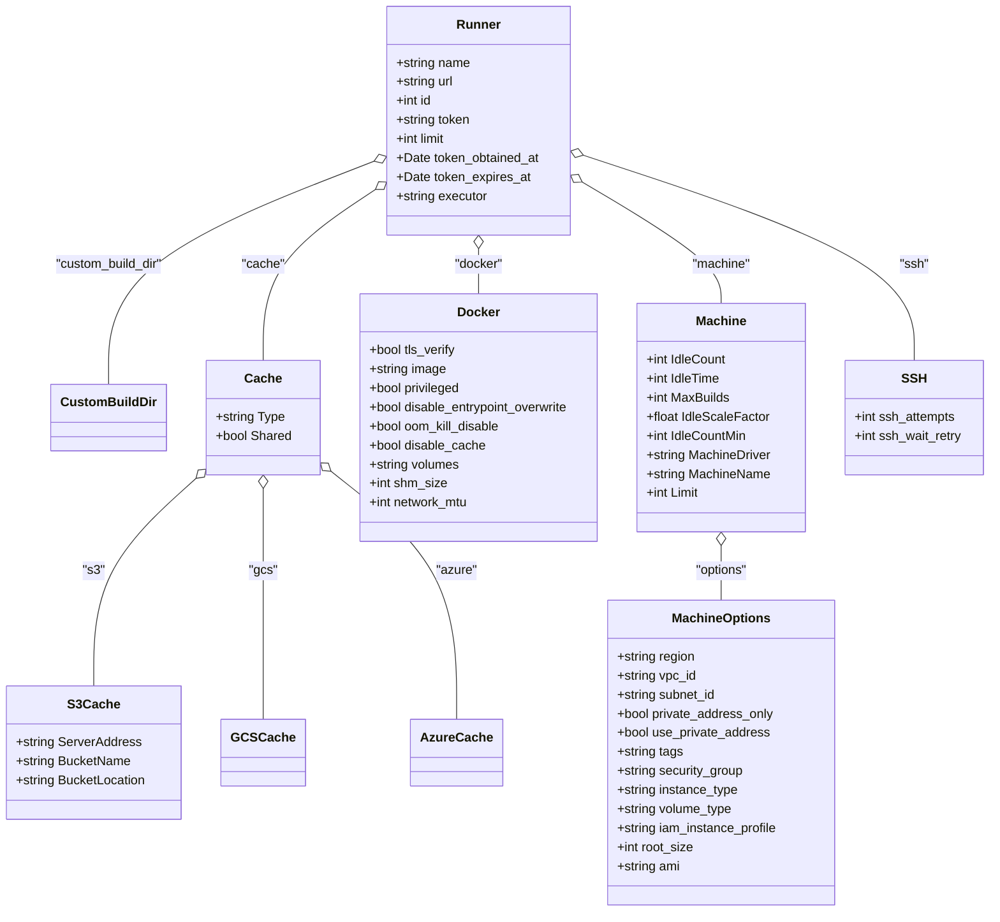

# Diagram: devops/terraform/modules/controller/controller-fv-gitlab-runners/templates/config.toml

> Auto-generated by Obscura crawlers

## Mermaid

### SVG

<svg id="container" width="1250.81640625" xmlns="http://www.w3.org/2000/svg" class="classDiagram" height="1148" viewBox="0 0 1250.81640625 1148" role="graphics-document document" aria-roledescription="class"><g><defs><marker id="container_class-aggregationStart" class="marker aggregation class" refX="18" refY="7" markerWidth="190" markerHeight="240" orient="auto"><path d="M 18,7 L9,13 L1,7 L9,1 Z"></path></marker></defs><defs><marker id="container_class-aggregationEnd" class="marker aggregation class" refX="1" refY="7" markerWidth="20" markerHeight="28" orient="auto"><path d="M 18,7 L9,13 L1,7 L9,1 Z"></path></marker></defs><defs><marker id="container_class-extensionStart" class="marker extension class" refX="18" refY="7" markerWidth="190" markerHeight="240" orient="auto"><path d="M 1,7 L18,13 V 1 Z"></path></marker></defs><defs><marker id="container_class-extensionEnd" class="marker extension class" refX="1" refY="7" markerWidth="20" markerHeight="28" orient="auto"><path d="M 1,1 V 13 L18,7 Z"></path></marker></defs><defs><marker id="container_class-compositionStart" class="marker composition class" refX="18" refY="7" markerWidth="190" markerHeight="240" orient="auto"><path d="M 18,7 L9,13 L1,7 L9,1 Z"></path></marker></defs><defs><marker id="container_class-compositionEnd" class="marker composition class" refX="1" refY="7" markerWidth="20" markerHeight="28" orient="auto"><path d="M 18,7 L9,13 L1,7 L9,1 Z"></path></marker></defs><defs><marker id="container_class-dependencyStart" class="marker dependency class" refX="6" refY="7" markerWidth="190" markerHeight="240" orient="auto"><path d="M 5,7 L9,13 L1,7 L9,1 Z"></path></marker></defs><defs><marker id="container_class-dependencyEnd" class="marker dependency class" refX="13" refY="7" markerWidth="20" markerHeight="28" orient="auto"><path d="M 18,7 L9,13 L14,7 L9,1 Z"></path></marker></defs><defs><marker id="container_class-lollipopStart" class="marker lollipop class" refX="13" refY="7" markerWidth="190" markerHeight="240" orient="auto"><circle stroke="black" fill="transparent" cx="7" cy="7" r="6"></circle></marker></defs><defs><marker id="container_class-lollipopEnd" class="marker lollipop class" refX="1" refY="7" markerWidth="190" markerHeight="240" orient="auto"><circle stroke="black" fill="transparent" cx="7" cy="7" r="6"></circle></marker></defs><g class="root"><g class="clusters"></g><g class="edgePaths"><path d="M468.294,203.569L412.919,225.141C357.543,246.713,246.793,289.856,191.418,336.595C136.043,383.333,136.043,433.667,136.043,458.833L136.043,484" id="id_Runner_CustomBuildDir_1" class="edge-thickness-normal edge-pattern-solid relation" style=";;;" data-edge="true" data-et="edge" data-id="id_Runner_CustomBuildDir_1" data-points="W3sieCI6NDg0LjM2NzE4NzUsInkiOjE5Ny4zMDc0NDQ2MTcyNjAwN30seyJ4IjoxMzYuMDQyOTY4NzUsInkiOjMzM30seyJ4IjoxMzYuMDQyOTY4NzUsInkiOjQ4NH1d" marker-start="url(#container_class-aggregationStart)"></path><path d="M469.959,238.055L445.923,253.879C421.887,269.703,373.815,301.352,349.778,337.342C325.742,373.333,325.742,413.667,325.742,433.833L325.742,454" id="id_Runner_Cache_2" class="edge-thickness-normal edge-pattern-solid relation" style=";;;" data-edge="true" data-et="edge" data-id="id_Runner_Cache_2" data-points="W3sieCI6NDg0LjM2NzE4NzUsInkiOjIyOC41NjkyMDgwMzYxNDU2fSx7IngiOjMyNS43NDIxODc1LCJ5IjozMzN9LHsieCI6MzI1Ljc0MjE4NzUsInkiOjQ1NH1d" marker-start="url(#container_class-aggregationStart)"></path><path d="M242.268,603.496L221.533,622.747C200.797,641.998,159.326,680.499,138.591,723.916C117.855,767.333,117.855,815.667,117.855,839.833L117.855,864" id="id_Cache_S3Cache_3" class="edge-thickness-normal edge-pattern-solid relation" style=";;;" data-edge="true" data-et="edge" data-id="id_Cache_S3Cache_3" data-points="W3sieCI6MjU0LjkxMDE1NjI1LCJ5Ijo1OTEuNzU5NzY2MjQ4ODk2MX0seyJ4IjoxMTcuODU1NDY4NzUsInkiOjcxOX0seyJ4IjoxMTcuODU1NDY4NzUsInkiOjg2NH1d" marker-start="url(#container_class-aggregationStart)"></path><path d="M325.742,615.25L325.742,632.542C325.742,649.833,325.742,684.417,325.742,732.875C325.742,781.333,325.742,843.667,325.742,874.833L325.742,906" id="id_Cache_GCSCache_4" class="edge-thickness-normal edge-pattern-solid relation" style=";;;" data-edge="true" data-et="edge" data-id="id_Cache_GCSCache_4" data-points="W3sieCI6MzI1Ljc0MjE4NzUsInkiOjU5OH0seyJ4IjozMjUuNzQyMTg3NSwieSI6NzE5fSx7IngiOjMyNS43NDIxODc1LCJ5Ijo5MDZ9XQ==" marker-start="url(#container_class-aggregationStart)"></path><path d="M410.116,592.58L436.817,613.65C463.518,634.72,516.92,676.86,543.621,729.097C570.322,781.333,570.322,843.667,570.322,874.833L570.322,906" id="id_Cache_AzureCache_5" class="edge-thickness-normal edge-pattern-solid relation" style=";;;" data-edge="true" data-et="edge" data-id="id_Cache_AzureCache_5" data-points="W3sieCI6Mzk2LjU3NDIxODc1LCJ5Ijo1ODEuODk0MDk0NjI5NjY2Nn0seyJ4Ijo1NzAuMzIyMjY1NjI1LCJ5Ijo3MTl9LHsieCI6NTcwLjMyMjI2NTYyNSwieSI6OTA2fV0=" marker-start="url(#container_class-aggregationStart)"></path><path d="M600.672,313.25L600.672,316.542C600.672,319.833,600.672,326.417,600.672,335.875C600.672,345.333,600.672,357.667,600.672,363.833L600.672,370" id="id_Runner_Docker_6" class="edge-thickness-normal edge-pattern-solid relation" style=";;;" data-edge="true" data-et="edge" data-id="id_Runner_Docker_6" data-points="W3sieCI6NjAwLjY3MTg3NSwieSI6Mjk2fSx7IngiOjYwMC42NzE4NzUsInkiOjMzM30seyJ4Ijo2MDAuNjcxODc1LCJ5IjozNzB9XQ==" marker-start="url(#container_class-aggregationStart)"></path><path d="M731.879,228.49L761.757,245.909C791.636,263.327,851.392,298.163,881.27,323.748C911.148,349.333,911.148,365.667,911.148,373.833L911.148,382" id="id_Runner_Machine_7" class="edge-thickness-normal edge-pattern-solid relation" style=";;;" data-edge="true" data-et="edge" data-id="id_Runner_Machine_7" data-points="W3sieCI6NzE2Ljk3NjU2MjUsInkiOjIxOS44MDI2OTc0NjYwOTI5NX0seyJ4Ijo5MTEuMTQ4NDM3NSwieSI6MzMzfSx7IngiOjkxMS4xNDg0Mzc1LCJ5IjozODJ9XQ==" marker-start="url(#container_class-aggregationStart)"></path><path d="M911.148,687.25L911.148,692.542C911.148,697.833,911.148,708.417,911.148,719.875C911.148,731.333,911.148,743.667,911.148,749.833L911.148,756" id="id_Machine_MachineOptions_8" class="edge-thickness-normal edge-pattern-solid relation" style=";;;" data-edge="true" data-et="edge" data-id="id_Machine_MachineOptions_8" data-points="W3sieCI6OTExLjE0ODQzNzUsInkiOjY3MH0seyJ4Ijo5MTEuMTQ4NDM3NSwieSI6NzE5fSx7IngiOjkxMS4xNDg0Mzc1LCJ5Ijo3NTZ9XQ==" marker-start="url(#container_class-aggregationStart)"></path><path d="M733.375,195.317L803.675,218.264C873.974,241.211,1014.573,287.106,1084.872,330.219C1155.172,373.333,1155.172,413.667,1155.172,433.833L1155.172,454" id="id_Runner_SSH_9" class="edge-thickness-normal edge-pattern-solid relation" style=";;;" data-edge="true" data-et="edge" data-id="id_Runner_SSH_9" data-points="W3sieCI6NzE2Ljk3NjU2MjUsInkiOjE4OS45NjQxOTkxNjU5MTUyM30seyJ4IjoxMTU1LjE3MTg3NSwieSI6MzMzfSx7IngiOjExNTUuMTcxODc1LCJ5Ijo0NTR9XQ==" marker-start="url(#container_class-aggregationStart)"></path></g><g class="edgeLabels"><g class="edgeLabel" transform="translate(136.04296875, 333)"><g class="label" data-id="id_Runner_CustomBuildDir_1" transform="translate(-69.8125, -12)"><foreignObject width="139.625" height="24">

"custom_build_dir"

</foreignObject></g></g><g class="edgeLabel" transform="translate(325.7421875, 333)"><g class="label" data-id="id_Runner_Cache_2" transform="translate(-27.1953125, -12)"><foreignObject width="54.390625" height="24">

"cache"

</foreignObject></g></g><g class="edgeLabel" transform="translate(117.85546875, 719)"><g class="label" data-id="id_Cache_S3Cache_3" transform="translate(-14.0390625, -12)"><foreignObject width="28.078125" height="24">

"s3"

</foreignObject></g></g><g class="edgeLabel" transform="translate(325.7421875, 719)"><g class="label" data-id="id_Cache_GCSCache_4" transform="translate(-17.859375, -12)"><foreignObject width="35.71875" height="24">

"gcs"

</foreignObject></g></g><g class="edgeLabel" transform="translate(570.322265625, 719)"><g class="label" data-id="id_Cache_AzureCache_5" transform="translate(-25.8203125, -12)"><foreignObject width="51.640625" height="24">

"azure"

</foreignObject></g></g><g class="edgeLabel" transform="translate(600.671875, 333)"><g class="label" data-id="id_Runner_Docker_6" transform="translate(-31.09375, -12)"><foreignObject width="62.1875" height="24">

"docker"

</foreignObject></g></g><g class="edgeLabel" transform="translate(911.1484375, 333)"><g class="label" data-id="id_Runner_Machine_7" transform="translate(-37.328125, -12)"><foreignObject width="74.65625" height="24">

"machine"

</foreignObject></g></g><g class="edgeLabel" transform="translate(911.1484375, 719)"><g class="label" data-id="id_Machine_MachineOptions_8" transform="translate(-33.8515625, -12)"><foreignObject width="67.703125" height="24">

"options"

</foreignObject></g></g><g class="edgeLabel" transform="translate(1155.171875, 333)"><g class="label" data-id="id_Runner_SSH_9" transform="translate(-18.3046875, -12)"><foreignObject width="36.609375" height="24">

"ssh"

</foreignObject></g></g></g><g class="nodes"><g class="node default" id="classId-Runner-0" transform="translate(600.671875, 152)"><g class="basic label-container"><path d="M-116.3046875 -144 L116.3046875 -144 L116.3046875 144 L-116.3046875 144" stroke="none" stroke-width="0" fill="#ECECFF" style=""></path><path d="M-116.3046875 -144 C-47.83634669390025 -144, 20.631994112199493 -144, 116.3046875 -144 M-116.3046875 -144 C-56.87439125362948 -144, 2.555904992741034 -144, 116.3046875 -144 M116.3046875 -144 C116.3046875 -54.75989263258586, 116.3046875 34.48021473482828, 116.3046875 144 M116.3046875 -144 C116.3046875 -35.48454349410454, 116.3046875 73.03091301179091, 116.3046875 144 M116.3046875 144 C61.46730102920709 144, 6.629914558414185 144, -116.3046875 144 M116.3046875 144 C39.82703721023927 144, -36.65061307952146 144, -116.3046875 144 M-116.3046875 144 C-116.3046875 84.03954647166165, -116.3046875 24.079092943323303, -116.3046875 -144 M-116.3046875 144 C-116.3046875 72.17222000346905, -116.3046875 0.3444400069381004, -116.3046875 -144" stroke="#9370DB" stroke-width="1.3" fill="none" stroke-dasharray="0 0" style=""></path></g><g class="annotation-group text" transform="translate(0, -120)"></g><g class="label-group text" transform="translate(-26.375, -120)"><g class="label" style="font-weight: bolder" transform="translate(0,-12)"><foreignObject width="52.75" height="24">

Runner

</foreignObject></g></g><g class="members-group text" transform="translate(-104.3046875, -72)"><g class="label" style="" transform="translate(0,-12)"><foreignObject width="94.375" height="24">

+string name

</foreignObject></g><g class="label" style="" transform="translate(0,12)"><foreignObject width="74.046875" height="24">

+string url

</foreignObject></g><g class="label" style="" transform="translate(0,36)"><foreignObject width="45.96875" height="24">

+int id

</foreignObject></g><g class="label" style="" transform="translate(0,60)"><foreignObject width="94.890625" height="24">

+string token

</foreignObject></g><g class="label" style="" transform="translate(0,84)"><foreignObject width="65.09375" height="24">

+int limit

</foreignObject></g><g class="label" style="" transform="translate(0,108)"><foreignObject width="182.234375" height="24">

+Date token_obtained_at

</foreignObject></g><g class="label" style="" transform="translate(0,132)"><foreignObject width="168.765625" height="24">

+Date token_expires_at

</foreignObject></g><g class="label" style="" transform="translate(0,156)"><foreignObject width="116.625" height="24">

+string executor

</foreignObject></g></g><g class="methods-group text" transform="translate(-104.3046875, 144)"></g><g class="divider" style=""><path d="M-116.3046875 -96 C-53.35566150354225 -96, 9.593364492915498 -96, 116.3046875 -96 M-116.3046875 -96 C-53.62332069868815 -96, 9.058046102623706 -96, 116.3046875 -96" stroke="#9370DB" stroke-width="1.3" fill="none" stroke-dasharray="0 0" style=""></path></g><g class="divider" style=""><path d="M-116.3046875 120 C-28.742073366760366 120, 58.82054076647927 120, 116.3046875 120 M-116.3046875 120 C-50.92467044832661 120, 14.455346603346783 120, 116.3046875 120" stroke="#9370DB" stroke-width="1.3" fill="none" stroke-dasharray="0 0" style=""></path></g></g><g class="node default" id="classId-CustomBuildDir-1" transform="translate(136.04296875, 526)"><g class="basic label-container"><path d="M-68.8671875 -42 L68.8671875 -42 L68.8671875 42 L-68.8671875 42" stroke="none" stroke-width="0" fill="#ECECFF" style=""></path><path d="M-68.8671875 -42 C-38.98132213432185 -42, -9.0954567686437 -42, 68.8671875 -42 M-68.8671875 -42 C-25.925398889043628 -42, 17.016389721912745 -42, 68.8671875 -42 M68.8671875 -42 C68.8671875 -14.279716801313377, 68.8671875 13.440566397373246, 68.8671875 42 M68.8671875 -42 C68.8671875 -23.500164488087208, 68.8671875 -5.000328976174416, 68.8671875 42 M68.8671875 42 C28.648432744365472 42, -11.570322011269056 42, -68.8671875 42 M68.8671875 42 C40.79585522636293 42, 12.72452295272587 42, -68.8671875 42 M-68.8671875 42 C-68.8671875 20.325056366363746, -68.8671875 -1.349887267272507, -68.8671875 -42 M-68.8671875 42 C-68.8671875 24.981936872637824, -68.8671875 7.963873745275649, -68.8671875 -42" stroke="#9370DB" stroke-width="1.3" fill="none" stroke-dasharray="0 0" style=""></path></g><g class="annotation-group text" transform="translate(0, -18)"></g><g class="label-group text" transform="translate(-56.8671875, -18)"><g class="label" style="font-weight: bolder" transform="translate(0,-12)"><foreignObject width="113.734375" height="24">

CustomBuildDir

</foreignObject></g></g><g class="members-group text" transform="translate(-56.8671875, 30)"></g><g class="methods-group text" transform="translate(-56.8671875, 60)"></g><g class="divider" style=""><path d="M-68.8671875 6 C-32.00820335430492 6, 4.850780791390164 6, 68.8671875 6 M-68.8671875 6 C-37.713706695814054 6, -6.560225891628107 6, 68.8671875 6" stroke="#9370DB" stroke-width="1.3" fill="none" stroke-dasharray="0 0" style=""></path></g><g class="divider" style=""><path d="M-68.8671875 24 C-15.16082827099337 24, 38.54553095801326 24, 68.8671875 24 M-68.8671875 24 C-23.22889715805492 24, 22.40939318389016 24, 68.8671875 24" stroke="#9370DB" stroke-width="1.3" fill="none" stroke-dasharray="0 0" style=""></path></g></g><g class="node default" id="classId-Cache-2" transform="translate(325.7421875, 526)"><g class="basic label-container"><path d="M-70.83203125 -72 L70.83203125 -72 L70.83203125 72 L-70.83203125 72" stroke="none" stroke-width="0" fill="#ECECFF" style=""></path><path d="M-70.83203125 -72 C-20.783021553443078 -72, 29.265988143113844 -72, 70.83203125 -72 M-70.83203125 -72 C-22.56366246654597 -72, 25.70470631690806 -72, 70.83203125 -72 M70.83203125 -72 C70.83203125 -30.218612051678377, 70.83203125 11.562775896643245, 70.83203125 72 M70.83203125 -72 C70.83203125 -30.331802383659046, 70.83203125 11.336395232681909, 70.83203125 72 M70.83203125 72 C31.05098376303632 72, -8.730063723927358 72, -70.83203125 72 M70.83203125 72 C40.63075432745258 72, 10.42947740490515 72, -70.83203125 72 M-70.83203125 72 C-70.83203125 24.87688060344827, -70.83203125 -22.24623879310346, -70.83203125 -72 M-70.83203125 72 C-70.83203125 38.90842616516057, -70.83203125 5.81685233032114, -70.83203125 -72" stroke="#9370DB" stroke-width="1.3" fill="none" stroke-dasharray="0 0" style=""></path></g><g class="annotation-group text" transform="translate(0, -48)"></g><g class="label-group text" transform="translate(-21.7734375, -48)"><g class="label" style="font-weight: bolder" transform="translate(0,-12)"><foreignObject width="43.546875" height="24">

Cache

</foreignObject></g></g><g class="members-group text" transform="translate(-58.83203125, 0)"><g class="label" style="" transform="translate(0,-12)"><foreignObject width="87.59375" height="24">

+string Type

</foreignObject></g><g class="label" style="" transform="translate(0,12)"><foreignObject width="95.890625" height="24">

+bool Shared

</foreignObject></g></g><g class="methods-group text" transform="translate(-58.83203125, 72)"></g><g class="divider" style=""><path d="M-70.83203125 -24 C-29.306854290809575 -24, 12.21832266838085 -24, 70.83203125 -24 M-70.83203125 -24 C-36.74819900673381 -24, -2.6643667634676262 -24, 70.83203125 -24" stroke="#9370DB" stroke-width="1.3" fill="none" stroke-dasharray="0 0" style=""></path></g><g class="divider" style=""><path d="M-70.83203125 48 C-42.05207572280089 48, -13.27212019560178 48, 70.83203125 48 M-70.83203125 48 C-39.09881088484599 48, -7.365590519691985 48, 70.83203125 48" stroke="#9370DB" stroke-width="1.3" fill="none" stroke-dasharray="0 0" style=""></path></g></g><g class="node default" id="classId-S3Cache-3" transform="translate(117.85546875, 948)"><g class="basic label-container"><path d="M-109.85546875 -84 L109.85546875 -84 L109.85546875 84 L-109.85546875 84" stroke="none" stroke-width="0" fill="#ECECFF" style=""></path><path d="M-109.85546875 -84 C-26.917160823361556 -84, 56.02114710327689 -84, 109.85546875 -84 M-109.85546875 -84 C-62.21208812248481 -84, -14.568707494969615 -84, 109.85546875 -84 M109.85546875 -84 C109.85546875 -32.35329873525013, 109.85546875 19.293402529499744, 109.85546875 84 M109.85546875 -84 C109.85546875 -42.96566248188297, 109.85546875 -1.9313249637659453, 109.85546875 84 M109.85546875 84 C44.516311900084844 84, -20.822844949830312 84, -109.85546875 84 M109.85546875 84 C40.140818731705224 84, -29.573831286589552 84, -109.85546875 84 M-109.85546875 84 C-109.85546875 26.741534097703358, -109.85546875 -30.516931804593284, -109.85546875 -84 M-109.85546875 84 C-109.85546875 47.24224551001699, -109.85546875 10.484491020033985, -109.85546875 -84" stroke="#9370DB" stroke-width="1.3" fill="none" stroke-dasharray="0 0" style=""></path></g><g class="annotation-group text" transform="translate(0, -60)"></g><g class="label-group text" transform="translate(-30.5078125, -60)"><g class="label" style="font-weight: bolder" transform="translate(0,-12)"><foreignObject width="61.015625" height="24">

S3Cache

</foreignObject></g></g><g class="members-group text" transform="translate(-97.85546875, -12)"><g class="label" style="" transform="translate(0,-12)"><foreignObject width="157.6875" height="24">

+string ServerAddress

</foreignObject></g><g class="label" style="" transform="translate(0,12)"><foreignObject width="145.15625" height="24">

+string BucketName

</foreignObject></g><g class="label" style="" transform="translate(0,36)"><foreignObject width="165.203125" height="24">

+string BucketLocation

</foreignObject></g></g><g class="methods-group text" transform="translate(-97.85546875, 84)"></g><g class="divider" style=""><path d="M-109.85546875 -36 C-41.14798713511594 -36, 27.55949447976812 -36, 109.85546875 -36 M-109.85546875 -36 C-29.488672746298434 -36, 50.87812325740313 -36, 109.85546875 -36" stroke="#9370DB" stroke-width="1.3" fill="none" stroke-dasharray="0 0" style=""></path></g><g class="divider" style=""><path d="M-109.85546875 60 C-36.75060256613874 60, 36.35426361772252 60, 109.85546875 60 M-109.85546875 60 C-28.55904568358656 60, 52.73737738282688 60, 109.85546875 60" stroke="#9370DB" stroke-width="1.3" fill="none" stroke-dasharray="0 0" style=""></path></g></g><g class="node default" id="classId-GCSCache-4" transform="translate(325.7421875, 948)"><g class="basic label-container"><path d="M-48.03125 -42 L48.03125 -42 L48.03125 42 L-48.03125 42" stroke="none" stroke-width="0" fill="#ECECFF" style=""></path><path d="M-48.03125 -42 C-11.942134398265324 -42, 24.146981203469352 -42, 48.03125 -42 M-48.03125 -42 C-23.472575937481313 -42, 1.086098125037374 -42, 48.03125 -42 M48.03125 -42 C48.03125 -17.749808053586783, 48.03125 6.500383892826434, 48.03125 42 M48.03125 -42 C48.03125 -21.445779004722063, 48.03125 -0.8915580094441253, 48.03125 42 M48.03125 42 C25.100636036377043 42, 2.1700220727540867 42, -48.03125 42 M48.03125 42 C14.76604771533465 42, -18.4991545693307 42, -48.03125 42 M-48.03125 42 C-48.03125 21.306364545034246, -48.03125 0.6127290900684912, -48.03125 -42 M-48.03125 42 C-48.03125 21.230471302462288, -48.03125 0.4609426049245755, -48.03125 -42" stroke="#9370DB" stroke-width="1.3" fill="none" stroke-dasharray="0 0" style=""></path></g><g class="annotation-group text" transform="translate(0, -18)"></g><g class="label-group text" transform="translate(-36.03125, -18)"><g class="label" style="font-weight: bolder" transform="translate(0,-12)"><foreignObject width="72.0625" height="24">

GCSCache

</foreignObject></g></g><g class="members-group text" transform="translate(-36.03125, 30)"></g><g class="methods-group text" transform="translate(-36.03125, 60)"></g><g class="divider" style=""><path d="M-48.03125 6 C-24.200378173184777 6, -0.3695063463695547 6, 48.03125 6 M-48.03125 6 C-10.026564999964798 6, 27.978120000070405 6, 48.03125 6" stroke="#9370DB" stroke-width="1.3" fill="none" stroke-dasharray="0 0" style=""></path></g><g class="divider" style=""><path d="M-48.03125 24 C-15.635535049357173 24, 16.760179901285653 24, 48.03125 24 M-48.03125 24 C-25.505452138199264 24, -2.979654276398527 24, 48.03125 24" stroke="#9370DB" stroke-width="1.3" fill="none" stroke-dasharray="0 0" style=""></path></g></g><g class="node default" id="classId-AzureCache-5" transform="translate(570.322265625, 948)"><g class="basic label-container"><path d="M-54.046875 -42 L54.046875 -42 L54.046875 42 L-54.046875 42" stroke="none" stroke-width="0" fill="#ECECFF" style=""></path><path d="M-54.046875 -42 C-29.242944384843835 -42, -4.439013769687669 -42, 54.046875 -42 M-54.046875 -42 C-12.188142082735602 -42, 29.670590834528795 -42, 54.046875 -42 M54.046875 -42 C54.046875 -13.000095587907879, 54.046875 15.999808824184242, 54.046875 42 M54.046875 -42 C54.046875 -23.681634441724608, 54.046875 -5.363268883449216, 54.046875 42 M54.046875 42 C30.39926865280275 42, 6.7516623056055 42, -54.046875 42 M54.046875 42 C12.47956750794549 42, -29.08773998410902 42, -54.046875 42 M-54.046875 42 C-54.046875 18.666332073828332, -54.046875 -4.667335852343335, -54.046875 -42 M-54.046875 42 C-54.046875 18.232781281405344, -54.046875 -5.534437437189311, -54.046875 -42" stroke="#9370DB" stroke-width="1.3" fill="none" stroke-dasharray="0 0" style=""></path></g><g class="annotation-group text" transform="translate(0, -18)"></g><g class="label-group text" transform="translate(-42.046875, -18)"><g class="label" style="font-weight: bolder" transform="translate(0,-12)"><foreignObject width="84.09375" height="24">

AzureCache

</foreignObject></g></g><g class="members-group text" transform="translate(-42.046875, 30)"></g><g class="methods-group text" transform="translate(-42.046875, 60)"></g><g class="divider" style=""><path d="M-54.046875 6 C-30.154451585720096 6, -6.262028171440193 6, 54.046875 6 M-54.046875 6 C-29.625574462416623 6, -5.204273924833245 6, 54.046875 6" stroke="#9370DB" stroke-width="1.3" fill="none" stroke-dasharray="0 0" style=""></path></g><g class="divider" style=""><path d="M-54.046875 24 C-28.906905748943753 24, -3.7669364978875066 24, 54.046875 24 M-54.046875 24 C-18.69387602012432 24, 16.659122959751357 24, 54.046875 24" stroke="#9370DB" stroke-width="1.3" fill="none" stroke-dasharray="0 0" style=""></path></g></g><g class="node default" id="classId-Docker-6" transform="translate(600.671875, 526)"><g class="basic label-container"><path d="M-154.09765625 -156 L154.09765625 -156 L154.09765625 156 L-154.09765625 156" stroke="none" stroke-width="0" fill="#ECECFF" style=""></path><path d="M-154.09765625 -156 C-41.54605618437469 -156, 71.00554388125062 -156, 154.09765625 -156 M-154.09765625 -156 C-72.40147379300464 -156, 9.294708663990718 -156, 154.09765625 -156 M154.09765625 -156 C154.09765625 -79.89947663039489, 154.09765625 -3.798953260789773, 154.09765625 156 M154.09765625 -156 C154.09765625 -53.785885948386564, 154.09765625 48.42822810322687, 154.09765625 156 M154.09765625 156 C53.044972058030865 156, -48.00771213393827 156, -154.09765625 156 M154.09765625 156 C43.85734777048083 156, -66.38296070903834 156, -154.09765625 156 M-154.09765625 156 C-154.09765625 76.90823318717086, -154.09765625 -2.1835336256582707, -154.09765625 -156 M-154.09765625 156 C-154.09765625 80.6017054399105, -154.09765625 5.203410879821007, -154.09765625 -156" stroke="#9370DB" stroke-width="1.3" fill="none" stroke-dasharray="0 0" style=""></path></g><g class="annotation-group text" transform="translate(0, -132)"></g><g class="label-group text" transform="translate(-25.6484375, -132)"><g class="label" style="font-weight: bolder" transform="translate(0,-12)"><foreignObject width="51.296875" height="24">

Docker

</foreignObject></g></g><g class="members-group text" transform="translate(-142.09765625, -84)"><g class="label" style="" transform="translate(0,-12)"><foreignObject width="110.859375" height="24">

+bool tls_verify

</foreignObject></g><g class="label" style="" transform="translate(0,12)"><foreignObject width="97.421875" height="24">

+string image

</foreignObject></g><g class="label" style="" transform="translate(0,36)"><foreignObject width="117.375" height="24">

+bool privileged

</foreignObject></g><g class="label" style="" transform="translate(0,60)"><foreignObject width="258.546875" height="24">

+bool disable_entrypoint_overwrite

</foreignObject></g><g class="label" style="" transform="translate(0,84)"><foreignObject width="168.84375" height="24">

+bool oom_kill_disable

</foreignObject></g><g class="label" style="" transform="translate(0,108)"><foreignObject width="147.65625" height="24">

+bool disable_cache

</foreignObject></g><g class="label" style="" transform="translate(0,132)"><foreignObject width="114.921875" height="24">

+string volumes

</foreignObject></g><g class="label" style="" transform="translate(0,156)"><foreignObject width="98.359375" height="24">

+int shm_size

</foreignObject></g><g class="label" style="" transform="translate(0,180)"><foreignObject width="128.078125" height="24">

+int network_mtu

</foreignObject></g></g><g class="methods-group text" transform="translate(-142.09765625, 156)"></g><g class="divider" style=""><path d="M-154.09765625 -108 C-43.49333042319677 -108, 67.11099540360647 -108, 154.09765625 -108 M-154.09765625 -108 C-91.75842859092724 -108, -29.419200931854476 -108, 154.09765625 -108" stroke="#9370DB" stroke-width="1.3" fill="none" stroke-dasharray="0 0" style=""></path></g><g class="divider" style=""><path d="M-154.09765625 132 C-85.00160325156688 132, -15.905550253133754 132, 154.09765625 132 M-154.09765625 132 C-40.7961555457843 132, 72.5053451584314 132, 154.09765625 132" stroke="#9370DB" stroke-width="1.3" fill="none" stroke-dasharray="0 0" style=""></path></g></g><g class="node default" id="classId-Machine-7" transform="translate(911.1484375, 526)"><g class="basic label-container"><path d="M-106.37890625 -144 L106.37890625 -144 L106.37890625 144 L-106.37890625 144" stroke="none" stroke-width="0" fill="#ECECFF" style=""></path><path d="M-106.37890625 -144 C-41.71610058409601 -144, 22.946705081807977 -144, 106.37890625 -144 M-106.37890625 -144 C-56.8048594587975 -144, -7.2308126675950035 -144, 106.37890625 -144 M106.37890625 -144 C106.37890625 -62.65034945456003, 106.37890625 18.699301090879942, 106.37890625 144 M106.37890625 -144 C106.37890625 -57.01876402403816, 106.37890625 29.962471951923675, 106.37890625 144 M106.37890625 144 C21.487945635180836 144, -63.40301497963833 144, -106.37890625 144 M106.37890625 144 C57.650306917751614 144, 8.921707585503228 144, -106.37890625 144 M-106.37890625 144 C-106.37890625 40.75525333726907, -106.37890625 -62.489493325461865, -106.37890625 -144 M-106.37890625 144 C-106.37890625 47.76818789680449, -106.37890625 -48.46362420639102, -106.37890625 -144" stroke="#9370DB" stroke-width="1.3" fill="none" stroke-dasharray="0 0" style=""></path></g><g class="annotation-group text" transform="translate(0, -120)"></g><g class="label-group text" transform="translate(-30.4140625, -120)"><g class="label" style="font-weight: bolder" transform="translate(0,-12)"><foreignObject width="60.828125" height="24">

Machine

</foreignObject></g></g><g class="members-group text" transform="translate(-94.37890625, -72)"><g class="label" style="" transform="translate(0,-12)"><foreignObject width="101.953125" height="24">

+int IdleCount

</foreignObject></g><g class="label" style="" transform="translate(0,12)"><foreignObject width="94.734375" height="24">

+int IdleTime

</foreignObject></g><g class="label" style="" transform="translate(0,36)"><foreignObject width="106.015625" height="24">

+int MaxBuilds

</foreignObject></g><g class="label" style="" transform="translate(0,60)"><foreignObject width="155.046875" height="24">

+float IdleScaleFactor

</foreignObject></g><g class="label" style="" transform="translate(0,84)"><foreignObject width="128.296875" height="24">

+int IdleCountMin

</foreignObject></g><g class="label" style="" transform="translate(0,108)"><foreignObject width="158.34375" height="24">

+string MachineDriver

</foreignObject></g><g class="label" style="" transform="translate(0,132)"><foreignObject width="156.71875" height="24">

+string MachineName

</foreignObject></g><g class="label" style="" transform="translate(0,156)"><foreignObject width="68.375" height="24">

+int Limit

</foreignObject></g></g><g class="methods-group text" transform="translate(-94.37890625, 144)"></g><g class="divider" style=""><path d="M-106.37890625 -96 C-46.96267726954402 -96, 12.453551710911967 -96, 106.37890625 -96 M-106.37890625 -96 C-29.814946150097327 -96, 46.749013949805345 -96, 106.37890625 -96" stroke="#9370DB" stroke-width="1.3" fill="none" stroke-dasharray="0 0" style=""></path></g><g class="divider" style=""><path d="M-106.37890625 120 C-54.27361174497979 120, -2.1683172399595776 120, 106.37890625 120 M-106.37890625 120 C-31.840980606074325 120, 42.69694503785135 120, 106.37890625 120" stroke="#9370DB" stroke-width="1.3" fill="none" stroke-dasharray="0 0" style=""></path></g></g><g class="node default" id="classId-MachineOptions-8" transform="translate(911.1484375, 948)"><g class="basic label-container"><path d="M-144.27734375 -192 L144.27734375 -192 L144.27734375 192 L-144.27734375 192" stroke="none" stroke-width="0" fill="#ECECFF" style=""></path><path d="M-144.27734375 -192 C-75.03827946814059 -192, -5.799215186281174 -192, 144.27734375 -192 M-144.27734375 -192 C-67.30191439808124 -192, 9.673514953837525 -192, 144.27734375 -192 M144.27734375 -192 C144.27734375 -105.0736862822769, 144.27734375 -18.14737256455379, 144.27734375 192 M144.27734375 -192 C144.27734375 -98.21235172132907, 144.27734375 -4.424703442658142, 144.27734375 192 M144.27734375 192 C82.69173603175412 192, 21.106128313508222 192, -144.27734375 192 M144.27734375 192 C76.56878137415919 192, 8.860218998318373 192, -144.27734375 192 M-144.27734375 192 C-144.27734375 61.073441333450944, -144.27734375 -69.85311733309811, -144.27734375 -192 M-144.27734375 192 C-144.27734375 70.27554020280549, -144.27734375 -51.448919594389025, -144.27734375 -192" stroke="#9370DB" stroke-width="1.3" fill="none" stroke-dasharray="0 0" style=""></path></g><g class="annotation-group text" transform="translate(0, -168)"></g><g class="label-group text" transform="translate(-59.2109375, -168)"><g class="label" style="font-weight: bolder" transform="translate(0,-12)"><foreignObject width="118.421875" height="24">

MachineOptions

</foreignObject></g></g><g class="members-group text" transform="translate(-132.27734375, -120)"><g class="label" style="" transform="translate(0,-12)"><foreignObject width="99.828125" height="24">

+string region

</foreignObject></g><g class="label" style="" transform="translate(0,12)"><foreignObject width="101.28125" height="24">

+string vpc_id

</foreignObject></g><g class="label" style="" transform="translate(0,36)"><foreignObject width="126.421875" height="24">

+string subnet_id

</foreignObject></g><g class="label" style="" transform="translate(0,60)"><foreignObject width="199.40625" height="24">

+bool private_address_only

</foreignObject></g><g class="label" style="" transform="translate(0,84)"><foreignObject width="194.109375" height="24">

+bool use_private_address

</foreignObject></g><g class="label" style="" transform="translate(0,108)"><foreignObject width="83.75" height="24">

+string tags

</foreignObject></g><g class="label" style="" transform="translate(0,132)"><foreignObject width="161.265625" height="24">

+string security_group

</foreignObject></g><g class="label" style="" transform="translate(0,156)"><foreignObject width="154.484375" height="24">

+string instance_type

</foreignObject></g><g class="label" style="" transform="translate(0,180)"><foreignObject width="146.921875" height="24">

+string volume_type

</foreignObject></g><g class="label" style="" transform="translate(0,204)"><foreignObject width="205.34375" height="24">

+string iam_instance_profile

</foreignObject></g><g class="label" style="" transform="translate(0,228)"><foreignObject width="97.953125" height="24">

+int root_size

</foreignObject></g><g class="label" style="" transform="translate(0,252)"><foreignObject width="80.796875" height="24">

+string ami

</foreignObject></g></g><g class="methods-group text" transform="translate(-132.27734375, 192)"></g><g class="divider" style=""><path d="M-144.27734375 -144 C-31.42294771938336 -144, 81.43144831123328 -144, 144.27734375 -144 M-144.27734375 -144 C-81.40951161463482 -144, -18.54167947926966 -144, 144.27734375 -144" stroke="#9370DB" stroke-width="1.3" fill="none" stroke-dasharray="0 0" style=""></path></g><g class="divider" style=""><path d="M-144.27734375 168 C-47.14806273331827 168, 49.98121828336346 168, 144.27734375 168 M-144.27734375 168 C-55.98730150258231 168, 32.302740744835376 168, 144.27734375 168" stroke="#9370DB" stroke-width="1.3" fill="none" stroke-dasharray="0 0" style=""></path></g></g><g class="node default" id="classId-SSH-9" transform="translate(1155.171875, 526)"><g class="basic label-container"><path d="M-87.64453125 -72 L87.64453125 -72 L87.64453125 72 L-87.64453125 72" stroke="none" stroke-width="0" fill="#ECECFF" style=""></path><path d="M-87.64453125 -72 C-22.29241585336861 -72, 43.05969954326278 -72, 87.64453125 -72 M-87.64453125 -72 C-47.952283274804735 -72, -8.26003529960947 -72, 87.64453125 -72 M87.64453125 -72 C87.64453125 -14.44550797733578, 87.64453125 43.10898404532844, 87.64453125 72 M87.64453125 -72 C87.64453125 -15.905020811010331, 87.64453125 40.18995837797934, 87.64453125 72 M87.64453125 72 C45.62917603970356 72, 3.6138208294071177 72, -87.64453125 72 M87.64453125 72 C30.521338545129765 72, -26.60185415974047 72, -87.64453125 72 M-87.64453125 72 C-87.64453125 34.631513308751344, -87.64453125 -2.736973382497311, -87.64453125 -72 M-87.64453125 72 C-87.64453125 37.17968439600773, -87.64453125 2.3593687920154593, -87.64453125 -72" stroke="#9370DB" stroke-width="1.3" fill="none" stroke-dasharray="0 0" style=""></path></g><g class="annotation-group text" transform="translate(0, -48)"></g><g class="label-group text" transform="translate(-14.3984375, -48)"><g class="label" style="font-weight: bolder" transform="translate(0,-12)"><foreignObject width="28.796875" height="24">

SSH

</foreignObject></g></g><g class="members-group text" transform="translate(-75.64453125, 0)"><g class="label" style="" transform="translate(0,-12)"><foreignObject width="129.25" height="24">

+int ssh_attempts

</foreignObject></g><g class="label" style="" transform="translate(0,12)"><foreignObject width="136.890625" height="24">

+int ssh_wait_retry

</foreignObject></g></g><g class="methods-group text" transform="translate(-75.64453125, 72)"></g><g class="divider" style=""><path d="M-87.64453125 -24 C-29.97867106346458 -24, 27.687189123070837 -24, 87.64453125 -24 M-87.64453125 -24 C-36.84041518676261 -24, 13.963700876474775 -24, 87.64453125 -24" stroke="#9370DB" stroke-width="1.3" fill="none" stroke-dasharray="0 0" style=""></path></g><g class="divider" style=""><path d="M-87.64453125 48 C-20.593770668915013 48, 46.45698991216997 48, 87.64453125 48 M-87.64453125 48 C-27.3968846064731 48, 32.8507620370538 48, 87.64453125 48" stroke="#9370DB" stroke-width="1.3" fill="none" stroke-dasharray="0 0" style=""></path></g></g></g></g></g></svg>
