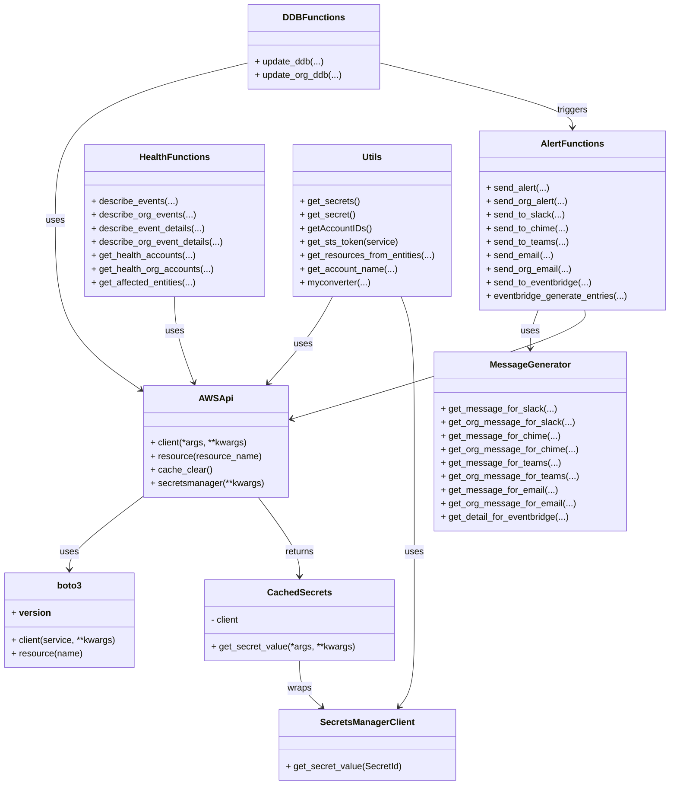
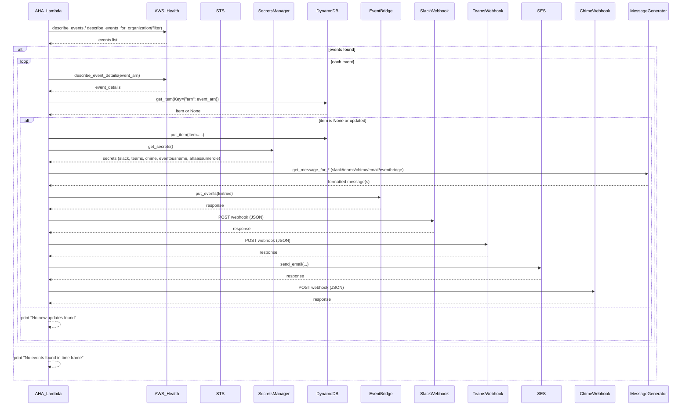

# Diagram: devops/terraform/modules/devops/aws-health-aware/scripts/handler.py


> Auto-generated by Obscura crawlers

## Diagram 1



### SVG

<svg id="container" width="1181.015625" xmlns="http://www.w3.org/2000/svg" class="classDiagram" height="1392" viewBox="0 0 1181.015625 1392" role="graphics-document document" aria-roledescription="class"><style>#container{font-family:"trebuchet ms",verdana,arial,sans-serif;font-size:16px;fill:#333;}@keyframes edge-animation-frame{from{stroke-dashoffset:0;}}@keyframes dash{to{stroke-dashoffset:0;}}#container .edge-animation-slow{stroke-dasharray:9,5!important;stroke-dashoffset:900;animation:dash 50s linear infinite;stroke-linecap:round;}#container .edge-animation-fast{stroke-dasharray:9,5!important;stroke-dashoffset:900;animation:dash 20s linear infinite;stroke-linecap:round;}#container .error-icon{fill:#552222;}#container .error-text{fill:#552222;stroke:#552222;}#container .edge-thickness-normal{stroke-width:1px;}#container .edge-thickness-thick{stroke-width:3.5px;}#container .edge-pattern-solid{stroke-dasharray:0;}#container .edge-thickness-invisible{stroke-width:0;fill:none;}#container .edge-pattern-dashed{stroke-dasharray:3;}#container .edge-pattern-dotted{stroke-dasharray:2;}#container .marker{fill:#333333;stroke:#333333;}#container .marker.cross{stroke:#333333;}#container svg{font-family:"trebuchet ms",verdana,arial,sans-serif;font-size:16px;}#container p{margin:0;}#container g.classGroup text{fill:#9370DB;stroke:none;font-family:"trebuchet ms",verdana,arial,sans-serif;font-size:10px;}#container g.classGroup text .title{font-weight:bolder;}#container .nodeLabel,#container .edgeLabel{color:#131300;}#container .edgeLabel .label rect{fill:#ECECFF;}#container .label text{fill:#131300;}#container .labelBkg{background:#ECECFF;}#container .edgeLabel .label span{background:#ECECFF;}#container .classTitle{font-weight:bolder;}#container .node rect,#container .node circle,#container .node ellipse,#container .node polygon,#container .node path{fill:#ECECFF;stroke:#9370DB;stroke-width:1px;}#container .divider{stroke:#9370DB;stroke-width:1;}#container g.clickable{cursor:pointer;}#container g.classGroup rect{fill:#ECECFF;stroke:#9370DB;}#container g.classGroup line{stroke:#9370DB;stroke-width:1;}#container .classLabel .box{stroke:none;stroke-width:0;fill:#ECECFF;opacity:0.5;}#container .classLabel .label{fill:#9370DB;font-size:10px;}#container .relation{stroke:#333333;stroke-width:1;fill:none;}#container .dashed-line{stroke-dasharray:3;}#container .dotted-line{stroke-dasharray:1 2;}#container #compositionStart,#container .composition{fill:#333333!important;stroke:#333333!important;stroke-width:1;}#container #compositionEnd,#container .composition{fill:#333333!important;stroke:#333333!important;stroke-width:1;}#container #dependencyStart,#container .dependency{fill:#333333!important;stroke:#333333!important;stroke-width:1;}#container #dependencyStart,#container .dependency{fill:#333333!important;stroke:#333333!important;stroke-width:1;}#container #extensionStart,#container .extension{fill:transparent!important;stroke:#333333!important;stroke-width:1;}#container #extensionEnd,#container .extension{fill:transparent!important;stroke:#333333!important;stroke-width:1;}#container #aggregationStart,#container .aggregation{fill:transparent!important;stroke:#333333!important;stroke-width:1;}#container #aggregationEnd,#container .aggregation{fill:transparent!important;stroke:#333333!important;stroke-width:1;}#container #lollipopStart,#container .lollipop{fill:#ECECFF!important;stroke:#333333!important;stroke-width:1;}#container #lollipopEnd,#container .lollipop{fill:#ECECFF!important;stroke:#333333!important;stroke-width:1;}#container .edgeTerminals{font-size:11px;line-height:initial;}#container .classTitleText{text-anchor:middle;font-size:18px;fill:#333;}#container .label-icon{display:inline-block;height:1em;overflow:visible;vertical-align:-0.125em;}#container .node .label-icon path{fill:currentColor;stroke:revert;stroke-width:revert;}#container :root{--mermaid-font-family:"trebuchet ms",verdana,arial,sans-serif;}</style><g><defs><marker id="container_class-aggregationStart" class="marker aggregation class" refX="18" refY="7" markerWidth="190" markerHeight="240" orient="auto"><path d="M 18,7 L9,13 L1,7 L9,1 Z"></path></marker></defs><defs><marker id="container_class-aggregationEnd" class="marker aggregation class" refX="1" refY="7" markerWidth="20" markerHeight="28" orient="auto"><path d="M 18,7 L9,13 L1,7 L9,1 Z"></path></marker></defs><defs><marker id="container_class-extensionStart" class="marker extension class" refX="18" refY="7" markerWidth="190" markerHeight="240" orient="auto"><path d="M 1,7 L18,13 V 1 Z"></path></marker></defs><defs><marker id="container_class-extensionEnd" class="marker extension class" refX="1" refY="7" markerWidth="20" markerHeight="28" orient="auto"><path d="M 1,1 V 13 L18,7 Z"></path></marker></defs><defs><marker id="container_class-compositionStart" class="marker composition class" refX="18" refY="7" markerWidth="190" markerHeight="240" orient="auto"><path d="M 18,7 L9,13 L1,7 L9,1 Z"></path></marker></defs><defs><marker id="container_class-compositionEnd" class="marker composition class" refX="1" refY="7" markerWidth="20" markerHeight="28" orient="auto"><path d="M 18,7 L9,13 L1,7 L9,1 Z"></path></marker></defs><defs><marker id="container_class-dependencyStart" class="marker dependency class" refX="6" refY="7" markerWidth="190" markerHeight="240" orient="auto"><path d="M 5,7 L9,13 L1,7 L9,1 Z"></path></marker></defs><defs><marker id="container_class-dependencyEnd" class="marker dependency class" refX="13" refY="7" markerWidth="20" markerHeight="28" orient="auto"><path d="M 18,7 L9,13 L14,7 L9,1 Z"></path></marker></defs><defs><marker id="container_class-lollipopStart" class="marker lollipop class" refX="13" refY="7" markerWidth="190" markerHeight="240" orient="auto"><circle stroke="black" fill="transparent" cx="7" cy="7" r="6"></circle></marker></defs><defs><marker id="container_class-lollipopEnd" class="marker lollipop class" refX="1" refY="7" markerWidth="190" markerHeight="240" orient="auto"><circle stroke="black" fill="transparent" cx="7" cy="7" r="6"></circle></marker></defs><g class="root"><g class="clusters"></g><g class="edgePaths"><path d="M531.492,1172L531.492,1180.167C531.492,1188.333,531.492,1204.667,537.815,1218.343C544.139,1232.019,556.785,1243.039,563.109,1248.549L569.432,1254.058" id="id_CachedSecrets_SecretsManagerClient_1" class="edge-thickness-normal edge-pattern-solid relation" style=";;;" data-edge="true" data-et="edge" data-id="id_CachedSecrets_SecretsManagerClient_1" data-points="W3sieCI6NTMxLjQ5MjE4NzUsInkiOjExNzJ9LHsieCI6NTMxLjQ5MjE4NzUsInkiOjEyMjF9LHsieCI6NTczLjk1NTQ2ODc1LCJ5IjoxMjU4fV0=" marker-end="url(#container_class-dependencyEnd)"></path><path d="M254.018,879.471L232.265,896.059C210.513,912.647,167.008,945.824,145.256,967.579C123.504,989.333,123.504,999.667,123.504,1004.833L123.504,1010" id="id_AWSApi_boto3_2" class="edge-thickness-normal edge-pattern-solid relation" style=";;;" data-edge="true" data-et="edge" data-id="id_AWSApi_boto3_2" data-points="W3sieCI6MjU0LjAxNzU3ODEyNSwieSI6ODc5LjQ3MTA4ODg4NzcwNjl9LHsieCI6MTIzLjUwMzkwNjI1LCJ5Ijo5Nzl9LHsieCI6MTIzLjUwMzkwNjI1LCJ5IjoxMDE2fV0=" marker-end="url(#container_class-dependencyEnd)"></path><path d="M456.777,882L469.23,898.167C481.682,914.333,506.587,946.667,519.04,970C531.492,993.333,531.492,1007.667,531.492,1014.833L531.492,1022" id="id_AWSApi_CachedSecrets_3" class="edge-thickness-normal edge-pattern-solid relation" style=";;;" data-edge="true" data-et="edge" data-id="id_AWSApi_CachedSecrets_3" data-points="W3sieCI6NDU2Ljc3NzA5NDYyNjkxMzI1LCJ5Ijo4ODJ9LHsieCI6NTMxLjQ5MjE4NzUsInkiOjk3OX0seyJ4Ijo1MzEuNDkyMTg3NSwieSI6MTAyOH1d" marker-end="url(#container_class-dependencyEnd)"></path><path d="M946.586,550L944.164,556.167C941.741,562.333,936.896,574.667,934.473,586C932.051,597.333,932.051,607.667,932.051,612.833L932.051,618" id="id_AlertFunctions_MessageGenerator_4" class="edge-thickness-normal edge-pattern-solid relation" style=";;;" data-edge="true" data-et="edge" data-id="id_AlertFunctions_MessageGenerator_4" data-points="W3sieCI6OTQ2LjU4NjQ5NTUzNTcxNDMsInkiOjU1MH0seyJ4Ijo5MzIuMDUwNzgxMjUsInkiOjU4N30seyJ4Ijo5MzIuMDUwNzgxMjUsInkiOjYyNH1d" marker-end="url(#container_class-dependencyEnd)"></path><path d="M1030.542,550L1031.375,556.167C1032.209,562.333,1033.876,574.667,947.581,606.904C861.287,639.142,687.03,691.284,599.902,717.356L512.774,743.427" id="id_AlertFunctions_AWSApi_5" class="edge-thickness-normal edge-pattern-solid relation" style=";;;" data-edge="true" data-et="edge" data-id="id_AlertFunctions_AWSApi_5" data-points="W3sieCI6MTAzMC41NDE4OTI1MzgyNjUzLCJ5Ijo1NTB9LHsieCI6MTAzNS41NDI5Njg3NSwieSI6NTg3fSx7IngiOjUwNy4wMjUzOTA2MjUsInkiOjc0NS4xNDY2Mzc2MDQzMjQ3fV0=" marker-end="url(#container_class-dependencyEnd)"></path><path d="M306.551,526L306.551,536.167C306.551,546.333,306.551,566.667,312.299,592.064C318.047,617.462,329.544,647.924,335.292,663.155L341.04,678.386" id="id_HealthFunctions_AWSApi_6" class="edge-thickness-normal edge-pattern-solid relation" style=";;;" data-edge="true" data-et="edge" data-id="id_HealthFunctions_AWSApi_6" data-points="W3sieCI6MzA2LjU1MDc4MTI1LCJ5Ijo1MjZ9LHsieCI6MzA2LjU1MDc4MTI1LCJ5Ijo1ODd9LHsieCI6MzQzLjE1ODczMTI2NTk0Mzg2LCJ5Ijo2ODR9XQ==" marker-end="url(#container_class-dependencyEnd)"></path><path d="M438.928,110.983L381.897,124.986C324.866,138.989,210.804,166.994,153.773,213.664C96.742,260.333,96.742,325.667,96.742,391C96.742,456.333,96.742,521.667,122.132,571.869C147.522,622.072,198.301,657.145,223.691,674.681L249.081,692.217" id="id_DDBFunctions_AWSApi_7" class="edge-thickness-normal edge-pattern-solid relation" style=";;;" data-edge="true" data-et="edge" data-id="id_DDBFunctions_AWSApi_7" data-points="W3sieCI6NDM4LjkyNzczNDM3NSwieSI6MTEwLjk4Mjg1NTk5MjkwOTQ2fSx7IngiOjk2Ljc0MjE4NzUsInkiOjE5NX0seyJ4Ijo5Ni43NDIxODc1LCJ5IjozOTF9LHsieCI6OTYuNzQyMTg3NSwieSI6NTg3fSx7IngiOjI1NC4wMTc1NzgxMjUsInkiOjY5NS42MjY1ODcyODc5MzE0fV0=" marker-end="url(#container_class-dependencyEnd)"></path><path d="M666.865,110.983L723.896,124.986C780.927,138.989,894.989,166.994,952.02,186.164C1009.051,205.333,1009.051,215.667,1009.051,220.833L1009.051,226" id="id_DDBFunctions_AlertFunctions_8" class="edge-thickness-normal edge-pattern-solid relation" style=";;;" data-edge="true" data-et="edge" data-id="id_DDBFunctions_AlertFunctions_8" data-points="W3sieCI6NjY2Ljg2NTIzNDM3NSwieSI6MTEwLjk4Mjg1NTk5MjkwOTQ2fSx7IngiOjEwMDkuMDUwNzgxMjUsInkiOjE5NX0seyJ4IjoxMDA5LjA1MDc4MTI1LCJ5IjoyMzJ9XQ==" marker-end="url(#container_class-dependencyEnd)"></path><path d="M585.932,526L580.733,536.167C575.533,546.333,565.134,566.667,546.229,592.253C527.324,617.838,499.913,648.677,486.208,664.096L472.503,679.515" id="id_Utils_AWSApi_9" class="edge-thickness-normal edge-pattern-solid relation" style=";;;" data-edge="true" data-et="edge" data-id="id_Utils_AWSApi_9" data-points="W3sieCI6NTg1LjkzMjE5ODY2MDcxNDMsInkiOjUyNn0seyJ4Ijo1NTQuNzM0Mzc1LCJ5Ijo1ODd9LHsieCI6NDY4LjUxNjc3MDk2NjE5OSwieSI6Njg0fV0=" marker-end="url(#container_class-dependencyEnd)"></path><path d="M708.012,526L712.006,536.167C716,546.333,723.988,566.667,727.983,609.5C731.977,652.333,731.977,717.667,731.977,783C731.977,848.333,731.977,913.667,731.977,966.5C731.977,1019.333,731.977,1059.667,731.977,1100C731.977,1140.333,731.977,1180.667,727.341,1206.241C722.706,1231.815,713.436,1242.63,708.801,1248.037L704.165,1253.445" id="id_Utils_SecretsManagerClient_10" class="edge-thickness-normal edge-pattern-solid relation" style=";;;" data-edge="true" data-et="edge" data-id="id_Utils_SecretsManagerClient_10" data-points="W3sieCI6NzA4LjAxMjI3Njc4NTcxNDMsInkiOjUyNn0seyJ4Ijo3MzEuOTc2NTYyNSwieSI6NTg3fSx7IngiOjczMS45NzY1NjI1LCJ5Ijo3ODN9LHsieCI6NzMxLjk3NjU2MjUsInkiOjk3OX0seyJ4Ijo3MzEuOTc2NTYyNSwieSI6MTEwMH0seyJ4Ijo3MzEuOTc2NTYyNSwieSI6MTIyMX0seyJ4Ijo3MDAuMjYwNjI1LCJ5IjoxMjU4fV0=" marker-end="url(#container_class-dependencyEnd)"></path></g><g class="edgeLabels"><g class="edgeLabel" transform="translate(531.4921875, 1221)"><g class="label" data-id="id_CachedSecrets_SecretsManagerClient_1" transform="translate(-21.390625, -12)"><foreignObject width="42.78125" height="24"><div xmlns="http://www.w3.org/1999/xhtml" class="labelBkg" style="display: table-cell; white-space: nowrap; line-height: 1.5; max-width: 200px; text-align: center;"><span class="edgeLabel"><p>wraps</p></span></div></foreignObject></g></g><g class="edgeLabel" transform="translate(123.50390625, 979)"><g class="label" data-id="id_AWSApi_boto3_2" transform="translate(-16.4921875, -12)"><foreignObject width="32.984375" height="24"><div xmlns="http://www.w3.org/1999/xhtml" class="labelBkg" style="display: table-cell; white-space: nowrap; line-height: 1.5; max-width: 200px; text-align: center;"><span class="edgeLabel"><p>uses</p></span></div></foreignObject></g></g><g class="edgeLabel" transform="translate(531.4921875, 979)"><g class="label" data-id="id_AWSApi_CachedSecrets_3" transform="translate(-26.265625, -12)"><foreignObject width="52.53125" height="24"><div xmlns="http://www.w3.org/1999/xhtml" class="labelBkg" style="display: table-cell; white-space: nowrap; line-height: 1.5; max-width: 200px; text-align: center;"><span class="edgeLabel"><p>returns</p></span></div></foreignObject></g></g><g class="edgeLabel" transform="translate(932.05078125, 587)"><g class="label" data-id="id_AlertFunctions_MessageGenerator_4" transform="translate(-16.4921875, -12)"><foreignObject width="32.984375" height="24"><div xmlns="http://www.w3.org/1999/xhtml" class="labelBkg" style="display: table-cell; white-space: nowrap; line-height: 1.5; max-width: 200px; text-align: center;"><span class="edgeLabel"><p>uses</p></span></div></foreignObject></g></g><g class="edgeLabel" transform="translate(789.1689, 660.72173)"><g class="label" data-id="id_AlertFunctions_AWSApi_5" transform="translate(-16.4921875, -12)"><foreignObject width="32.984375" height="24"><div xmlns="http://www.w3.org/1999/xhtml" class="labelBkg" style="display: table-cell; white-space: nowrap; line-height: 1.5; max-width: 200px; text-align: center;"><span class="edgeLabel"><p>uses</p></span></div></foreignObject></g></g><g class="edgeLabel" transform="translate(306.55078125, 587)"><g class="label" data-id="id_HealthFunctions_AWSApi_6" transform="translate(-16.4921875, -12)"><foreignObject width="32.984375" height="24"><div xmlns="http://www.w3.org/1999/xhtml" class="labelBkg" style="display: table-cell; white-space: nowrap; line-height: 1.5; max-width: 200px; text-align: center;"><span class="edgeLabel"><p>uses</p></span></div></foreignObject></g></g><g class="edgeLabel" transform="translate(96.7421875, 391)"><g class="label" data-id="id_DDBFunctions_AWSApi_7" transform="translate(-16.4921875, -12)"><foreignObject width="32.984375" height="24"><div xmlns="http://www.w3.org/1999/xhtml" class="labelBkg" style="display: table-cell; white-space: nowrap; line-height: 1.5; max-width: 200px; text-align: center;"><span class="edgeLabel"><p>uses</p></span></div></foreignObject></g></g><g class="edgeLabel" transform="translate(1009.05078125, 195)"><g class="label" data-id="id_DDBFunctions_AlertFunctions_8" transform="translate(-27.4921875, -12)"><foreignObject width="54.984375" height="24"><div xmlns="http://www.w3.org/1999/xhtml" class="labelBkg" style="display: table-cell; white-space: nowrap; line-height: 1.5; max-width: 200px; text-align: center;"><span class="edgeLabel"><p>triggers</p></span></div></foreignObject></g></g><g class="edgeLabel" transform="translate(534.38433, 609.89502)"><g class="label" data-id="id_Utils_AWSApi_9" transform="translate(-16.4921875, -12)"><foreignObject width="32.984375" height="24"><div xmlns="http://www.w3.org/1999/xhtml" class="labelBkg" style="display: table-cell; white-space: nowrap; line-height: 1.5; max-width: 200px; text-align: center;"><span class="edgeLabel"><p>uses</p></span></div></foreignObject></g></g><g class="edgeLabel" transform="translate(731.9765625, 979)"><g class="label" data-id="id_Utils_SecretsManagerClient_10" transform="translate(-16.4921875, -12)"><foreignObject width="32.984375" height="24"><div xmlns="http://www.w3.org/1999/xhtml" class="labelBkg" style="display: table-cell; white-space: nowrap; line-height: 1.5; max-width: 200px; text-align: center;"><span class="edgeLabel"><p>uses</p></span></div></foreignObject></g></g></g><g class="nodes"><g class="node default" id="classId-CachedSecrets-0" transform="translate(531.4921875, 1100)"><g class="basic label-container"><path d="M-165.484375 -72 L165.484375 -72 L165.484375 72 L-165.484375 72" stroke="none" stroke-width="0" fill="#ECECFF" style=""></path><path d="M-165.484375 -72 C-47.99716618071278 -72, 69.49004263857444 -72, 165.484375 -72 M-165.484375 -72 C-37.72751196913228 -72, 90.02935106173544 -72, 165.484375 -72 M165.484375 -72 C165.484375 -41.77546101345757, 165.484375 -11.550922026915153, 165.484375 72 M165.484375 -72 C165.484375 -41.28074160631772, 165.484375 -10.56148321263543, 165.484375 72 M165.484375 72 C90.47123412813555 72, 15.458093256271098 72, -165.484375 72 M165.484375 72 C52.23082118606757 72, -61.022732627864855 72, -165.484375 72 M-165.484375 72 C-165.484375 22.01995979271014, -165.484375 -27.96008041457972, -165.484375 -72 M-165.484375 72 C-165.484375 17.666038240657294, -165.484375 -36.66792351868541, -165.484375 -72" stroke="#9370DB" stroke-width="1.3" fill="none" stroke-dasharray="0 0" style=""></path></g><g class="annotation-group text" transform="translate(0, -48)"></g><g class="label-group text" transform="translate(-53.734375, -48)"><g class="label" style="font-weight: bolder" transform="translate(0,-12)"><foreignObject width="107.46875" height="24"><div xmlns="http://www.w3.org/1999/xhtml" style="display: table-cell; white-space: nowrap; line-height: 1.5; max-width: 156px; text-align: center;"><span class="nodeLabel markdown-node-label" style=""><p>CachedSecrets</p></span></div></foreignObject></g></g><g class="members-group text" transform="translate(-153.484375, 0)"><g class="label" style="" transform="translate(0,-12)"><foreignObject width="51.421875" height="24"><div xmlns="http://www.w3.org/1999/xhtml" style="display: table-cell; white-space: nowrap; line-height: 1.5; max-width: 109px; text-align: center;"><span class="nodeLabel markdown-node-label" style=""><p>- client</p></span></div></foreignObject></g></g><g class="methods-group text" transform="translate(-153.484375, 48)"><g class="label" style="" transform="translate(0,-12)"><foreignObject width="253.234375" height="24"><div xmlns="http://www.w3.org/1999/xhtml" style="display: table-cell; white-space: nowrap; line-height: 1.5; max-width: 311px; text-align: center;"><span class="nodeLabel markdown-node-label" style=""><p>+ get_secret_value(*args, **kwargs)</p></span></div></foreignObject></g></g><g class="divider" style=""><path d="M-165.484375 -24 C-80.83419972716483 -24, 3.815975545670341 -24, 165.484375 -24 M-165.484375 -24 C-58.410071341240354 -24, 48.66423231751929 -24, 165.484375 -24" stroke="#9370DB" stroke-width="1.3" fill="none" stroke-dasharray="0 0" style=""></path></g><g class="divider" style=""><path d="M-165.484375 24 C-87.37538352023626 24, -9.26639204047251 24, 165.484375 24 M-165.484375 24 C-79.02923639909035 24, 7.425902201819298 24, 165.484375 24" stroke="#9370DB" stroke-width="1.3" fill="none" stroke-dasharray="0 0" style=""></path></g></g><g class="node default" id="classId-AWSApi-1" transform="translate(380.521484375, 783)"><g class="basic label-container"><path d="M-126.50390625 -99 L126.50390625 -99 L126.50390625 99 L-126.50390625 99" stroke="none" stroke-width="0" fill="#ECECFF" style=""></path><path d="M-126.50390625 -99 C-66.79220091901317 -99, -7.080495588026338 -99, 126.50390625 -99 M-126.50390625 -99 C-46.11173807613558 -99, 34.28043009772884 -99, 126.50390625 -99 M126.50390625 -99 C126.50390625 -20.223830735289198, 126.50390625 58.552338529421604, 126.50390625 99 M126.50390625 -99 C126.50390625 -38.139917556046285, 126.50390625 22.72016488790743, 126.50390625 99 M126.50390625 99 C59.85563207663121 99, -6.7926420967375805 99, -126.50390625 99 M126.50390625 99 C70.76425921935032 99, 15.02461218870063 99, -126.50390625 99 M-126.50390625 99 C-126.50390625 36.46304019889568, -126.50390625 -26.073919602208633, -126.50390625 -99 M-126.50390625 99 C-126.50390625 26.65148954653283, -126.50390625 -45.69702090693434, -126.50390625 -99" stroke="#9370DB" stroke-width="1.3" fill="none" stroke-dasharray="0 0" style=""></path></g><g class="annotation-group text" transform="translate(0, -75)"></g><g class="label-group text" transform="translate(-27.7109375, -75)"><g class="label" style="font-weight: bolder" transform="translate(0,-12)"><foreignObject width="55.421875" height="24"><div xmlns="http://www.w3.org/1999/xhtml" style="display: table-cell; white-space: nowrap; line-height: 1.5; max-width: 104px; text-align: center;"><span class="nodeLabel markdown-node-label" style=""><p>AWSApi</p></span></div></foreignObject></g></g><g class="members-group text" transform="translate(-114.50390625, -27)"></g><g class="methods-group text" transform="translate(-114.50390625, 3)"><g class="label" style="" transform="translate(0,-12)"><foreignObject width="172.328125" height="24"><div xmlns="http://www.w3.org/1999/xhtml" style="display: table-cell; white-space: nowrap; line-height: 1.5; max-width: 230px; text-align: center;"><span class="nodeLabel markdown-node-label" style=""><p>+ client(*args, **kwargs)</p></span></div></foreignObject></g><g class="label" style="" transform="translate(0,12)"><foreignObject width="195.6875" height="24"><div xmlns="http://www.w3.org/1999/xhtml" style="display: table-cell; white-space: nowrap; line-height: 1.5; max-width: 253px; text-align: center;"><span class="nodeLabel markdown-node-label" style=""><p>+ resource(resource_name)</p></span></div></foreignObject></g><g class="label" style="" transform="translate(0,36)"><foreignObject width="107.90625" height="24"><div xmlns="http://www.w3.org/1999/xhtml" style="display: table-cell; white-space: nowrap; line-height: 1.5; max-width: 165px; text-align: center;"><span class="nodeLabel markdown-node-label" style=""><p>+ cache_clear()</p></span></div></foreignObject></g><g class="label" style="" transform="translate(0,60)"><foreignObject width="201.296875" height="24"><div xmlns="http://www.w3.org/1999/xhtml" style="display: table-cell; white-space: nowrap; line-height: 1.5; max-width: 259px; text-align: center;"><span class="nodeLabel markdown-node-label" style=""><p>+ secretsmanager(**kwargs)</p></span></div></foreignObject></g></g><g class="divider" style=""><path d="M-126.50390625 -51 C-54.10060745784038 -51, 18.302691334319235 -51, 126.50390625 -51 M-126.50390625 -51 C-73.74051822669686 -51, -20.977130203393727 -51, 126.50390625 -51" stroke="#9370DB" stroke-width="1.3" fill="none" stroke-dasharray="0 0" style=""></path></g><g class="divider" style=""><path d="M-126.50390625 -27 C-34.77455644016415 -27, 56.954793369671705 -27, 126.50390625 -27 M-126.50390625 -27 C-52.621843039265215 -27, 21.26022017146957 -27, 126.50390625 -27" stroke="#9370DB" stroke-width="1.3" fill="none" stroke-dasharray="0 0" style=""></path></g></g><g class="node default" id="classId-SecretsManagerClient-2" transform="translate(646.2578125, 1321)"><g class="basic label-container"><path d="M-153.83984375 -63 L153.83984375 -63 L153.83984375 63 L-153.83984375 63" stroke="none" stroke-width="0" fill="#ECECFF" style=""></path><path d="M-153.83984375 -63 C-70.99474394568699 -63, 11.850355858626017 -63, 153.83984375 -63 M-153.83984375 -63 C-47.38763247890225 -63, 59.064578792195505 -63, 153.83984375 -63 M153.83984375 -63 C153.83984375 -34.99404516027695, 153.83984375 -6.988090320553894, 153.83984375 63 M153.83984375 -63 C153.83984375 -27.134900241184788, 153.83984375 8.730199517630425, 153.83984375 63 M153.83984375 63 C75.17605924148218 63, -3.4877252670356427 63, -153.83984375 63 M153.83984375 63 C56.15391132581854 63, -41.53202109836292 63, -153.83984375 63 M-153.83984375 63 C-153.83984375 31.030497970949657, -153.83984375 -0.9390040581006858, -153.83984375 -63 M-153.83984375 63 C-153.83984375 26.712526121773642, -153.83984375 -9.574947756452715, -153.83984375 -63" stroke="#9370DB" stroke-width="1.3" fill="none" stroke-dasharray="0 0" style=""></path></g><g class="annotation-group text" transform="translate(0, -39)"></g><g class="label-group text" transform="translate(-79.8828125, -39)"><g class="label" style="font-weight: bolder" transform="translate(0,-12)"><foreignObject width="159.765625" height="24"><div xmlns="http://www.w3.org/1999/xhtml" style="display: table-cell; white-space: nowrap; line-height: 1.5; max-width: 207px; text-align: center;"><span class="nodeLabel markdown-node-label" style=""><p>SecretsManagerClient</p></span></div></foreignObject></g></g><g class="members-group text" transform="translate(-141.83984375, 9)"></g><g class="methods-group text" transform="translate(-141.83984375, 39)"><g class="label" style="" transform="translate(0,-12)"><foreignObject width="203.796875" height="24"><div xmlns="http://www.w3.org/1999/xhtml" style="display: table-cell; white-space: nowrap; line-height: 1.5; max-width: 261px; text-align: center;"><span class="nodeLabel markdown-node-label" style=""><p>+ get_secret_value(SecretId)</p></span></div></foreignObject></g></g><g class="divider" style=""><path d="M-153.83984375 -15 C-48.42983133732807 -15, 56.980181075343864 -15, 153.83984375 -15 M-153.83984375 -15 C-48.942627407617536 -15, 55.95458893476493 -15, 153.83984375 -15" stroke="#9370DB" stroke-width="1.3" fill="none" stroke-dasharray="0 0" style=""></path></g><g class="divider" style=""><path d="M-153.83984375 9 C-80.65594115326513 9, -7.472038556530265 9, 153.83984375 9 M-153.83984375 9 C-31.875634085908956 9, 90.08857557818209 9, 153.83984375 9" stroke="#9370DB" stroke-width="1.3" fill="none" stroke-dasharray="0 0" style=""></path></g></g><g class="node default" id="classId-boto3-3" transform="translate(123.50390625, 1100)"><g class="basic label-container"><path d="M-115.50390625 -84 L115.50390625 -84 L115.50390625 84 L-115.50390625 84" stroke="none" stroke-width="0" fill="#ECECFF" style=""></path><path d="M-115.50390625 -84 C-37.87217814028935 -84, 39.7595499694213 -84, 115.50390625 -84 M-115.50390625 -84 C-41.20931280373439 -84, 33.08528064253122 -84, 115.50390625 -84 M115.50390625 -84 C115.50390625 -25.95325006495353, 115.50390625 32.09349987009294, 115.50390625 84 M115.50390625 -84 C115.50390625 -49.49679001859325, 115.50390625 -14.993580037186504, 115.50390625 84 M115.50390625 84 C31.361619141897165 84, -52.78066796620567 84, -115.50390625 84 M115.50390625 84 C62.22343668691935 84, 8.942967123838699 84, -115.50390625 84 M-115.50390625 84 C-115.50390625 21.155715985771863, -115.50390625 -41.688568028456274, -115.50390625 -84 M-115.50390625 84 C-115.50390625 29.066439546233262, -115.50390625 -25.867120907533476, -115.50390625 -84" stroke="#9370DB" stroke-width="1.3" fill="none" stroke-dasharray="0 0" style=""></path></g><g class="annotation-group text" transform="translate(0, -60)"></g><g class="label-group text" transform="translate(-21.0703125, -60)"><g class="label" style="font-weight: bolder" transform="translate(0,-12)"><foreignObject width="42.140625" height="24"><div xmlns="http://www.w3.org/1999/xhtml" style="display: table-cell; white-space: nowrap; line-height: 1.5; max-width: 91px; text-align: center;"><span class="nodeLabel markdown-node-label" style=""><p>boto3</p></span></div></foreignObject></g></g><g class="members-group text" transform="translate(-103.50390625, -12)"><g class="label" style="" transform="translate(0,-12)"><foreignObject width="66.1875" height="24"><div xmlns="http://www.w3.org/1999/xhtml" style="display: table-cell; white-space: nowrap; line-height: 1.5; max-width: 156px; text-align: center;"><span class="nodeLabel markdown-node-label" style=""><p>+ <strong>version</strong></p></span></div></foreignObject></g></g><g class="methods-group text" transform="translate(-103.50390625, 36)"><g class="label" style="" transform="translate(0,-12)"><foreignObject width="185.9375" height="24"><div xmlns="http://www.w3.org/1999/xhtml" style="display: table-cell; white-space: nowrap; line-height: 1.5; max-width: 243px; text-align: center;"><span class="nodeLabel markdown-node-label" style=""><p>+ client(service, **kwargs)</p></span></div></foreignObject></g><g class="label" style="" transform="translate(0,12)"><foreignObject width="125.40625" height="24"><div xmlns="http://www.w3.org/1999/xhtml" style="display: table-cell; white-space: nowrap; line-height: 1.5; max-width: 183px; text-align: center;"><span class="nodeLabel markdown-node-label" style=""><p>+ resource(name)</p></span></div></foreignObject></g></g><g class="divider" style=""><path d="M-115.50390625 -36 C-65.93745770304739 -36, -16.371009156094786 -36, 115.50390625 -36 M-115.50390625 -36 C-47.922588866669855 -36, 19.65872851666029 -36, 115.50390625 -36" stroke="#9370DB" stroke-width="1.3" fill="none" stroke-dasharray="0 0" style=""></path></g><g class="divider" style=""><path d="M-115.50390625 12 C-36.68821633682512 12, 42.12747357634976 12, 115.50390625 12 M-115.50390625 12 C-54.998338191074346 12, 5.507229867851308 12, 115.50390625 12" stroke="#9370DB" stroke-width="1.3" fill="none" stroke-dasharray="0 0" style=""></path></g></g><g class="node default" id="classId-MessageGenerator-4" transform="translate(932.05078125, 783)"><g class="basic label-container"><path d="M-165.07421875 -159 L165.07421875 -159 L165.07421875 159 L-165.07421875 159" stroke="none" stroke-width="0" fill="#ECECFF" style=""></path><path d="M-165.07421875 -159 C-64.04664536444751 -159, 36.98092802110497 -159, 165.07421875 -159 M-165.07421875 -159 C-81.52896843668772 -159, 2.0162818766245607 -159, 165.07421875 -159 M165.07421875 -159 C165.07421875 -39.25778402677864, 165.07421875 80.48443194644273, 165.07421875 159 M165.07421875 -159 C165.07421875 -87.06641470780704, 165.07421875 -15.132829415614083, 165.07421875 159 M165.07421875 159 C85.79571452796704 159, 6.517210305934071 159, -165.07421875 159 M165.07421875 159 C43.59157879524713 159, -77.89106115950574 159, -165.07421875 159 M-165.07421875 159 C-165.07421875 43.54571101768671, -165.07421875 -71.90857796462657, -165.07421875 -159 M-165.07421875 159 C-165.07421875 86.4386619771269, -165.07421875 13.877323954253797, -165.07421875 -159" stroke="#9370DB" stroke-width="1.3" fill="none" stroke-dasharray="0 0" style=""></path></g><g class="annotation-group text" transform="translate(0, -135)"></g><g class="label-group text" transform="translate(-67.9921875, -135)"><g class="label" style="font-weight: bolder" transform="translate(0,-12)"><foreignObject width="135.984375" height="24"><div xmlns="http://www.w3.org/1999/xhtml" style="display: table-cell; white-space: nowrap; line-height: 1.5; max-width: 184px; text-align: center;"><span class="nodeLabel markdown-node-label" style=""><p>MessageGenerator</p></span></div></foreignObject></g></g><g class="members-group text" transform="translate(-153.07421875, -87)"></g><g class="methods-group text" transform="translate(-153.07421875, -57)"><g class="label" style="" transform="translate(0,-12)"><foreignObject width="199.453125" height="24"><div xmlns="http://www.w3.org/1999/xhtml" style="display: table-cell; white-space: nowrap; line-height: 1.5; max-width: 257px; text-align: center;"><span class="nodeLabel markdown-node-label" style=""><p>+ get_message_for_slack(...)</p></span></div></foreignObject></g><g class="label" style="" transform="translate(0,12)"><foreignObject width="231.109375" height="24"><div xmlns="http://www.w3.org/1999/xhtml" style="display: table-cell; white-space: nowrap; line-height: 1.5; max-width: 288px; text-align: center;"><span class="nodeLabel markdown-node-label" style=""><p>+ get_org_message_for_slack(...)</p></span></div></foreignObject></g><g class="label" style="" transform="translate(0,36)"><foreignObject width="206.46875" height="24"><div xmlns="http://www.w3.org/1999/xhtml" style="display: table-cell; white-space: nowrap; line-height: 1.5; max-width: 264px; text-align: center;"><span class="nodeLabel markdown-node-label" style=""><p>+ get_message_for_chime(...)</p></span></div></foreignObject></g><g class="label" style="" transform="translate(0,60)"><foreignObject width="238.140625" height="24"><div xmlns="http://www.w3.org/1999/xhtml" style="display: table-cell; white-space: nowrap; line-height: 1.5; max-width: 296px; text-align: center;"><span class="nodeLabel markdown-node-label" style=""><p>+ get_org_message_for_chime(...)</p></span></div></foreignObject></g><g class="label" style="" transform="translate(0,84)"><foreignObject width="206.484375" height="24"><div xmlns="http://www.w3.org/1999/xhtml" style="display: table-cell; white-space: nowrap; line-height: 1.5; max-width: 264px; text-align: center;"><span class="nodeLabel markdown-node-label" style=""><p>+ get_message_for_teams(...)</p></span></div></foreignObject></g><g class="label" style="" transform="translate(0,108)"><foreignObject width="238.15625" height="24"><div xmlns="http://www.w3.org/1999/xhtml" style="display: table-cell; white-space: nowrap; line-height: 1.5; max-width: 296px; text-align: center;"><span class="nodeLabel markdown-node-label" style=""><p>+ get_org_message_for_teams(...)</p></span></div></foreignObject></g><g class="label" style="" transform="translate(0,132)"><foreignObject width="202.84375" height="24"><div xmlns="http://www.w3.org/1999/xhtml" style="display: table-cell; white-space: nowrap; line-height: 1.5; max-width: 260px; text-align: center;"><span class="nodeLabel markdown-node-label" style=""><p>+ get_message_for_email(...)</p></span></div></foreignObject></g><g class="label" style="" transform="translate(0,156)"><foreignObject width="234.5" height="24"><div xmlns="http://www.w3.org/1999/xhtml" style="display: table-cell; white-space: nowrap; line-height: 1.5; max-width: 292px; text-align: center;"><span class="nodeLabel markdown-node-label" style=""><p>+ get_org_message_for_email(...)</p></span></div></foreignObject></g><g class="label" style="" transform="translate(0,180)"><foreignObject width="228.859375" height="24"><div xmlns="http://www.w3.org/1999/xhtml" style="display: table-cell; white-space: nowrap; line-height: 1.5; max-width: 286px; text-align: center;"><span class="nodeLabel markdown-node-label" style=""><p>+ get_detail_for_eventbridge(...)</p></span></div></foreignObject></g></g><g class="divider" style=""><path d="M-165.07421875 -111 C-66.37088818146603 -111, 32.33244238706794 -111, 165.07421875 -111 M-165.07421875 -111 C-61.590952404992336 -111, 41.89231394001533 -111, 165.07421875 -111" stroke="#9370DB" stroke-width="1.3" fill="none" stroke-dasharray="0 0" style=""></path></g><g class="divider" style=""><path d="M-165.07421875 -87 C-50.54823468703297 -87, 63.97774937593405 -87, 165.07421875 -87 M-165.07421875 -87 C-60.84027206670065 -87, 43.3936746165987 -87, 165.07421875 -87" stroke="#9370DB" stroke-width="1.3" fill="none" stroke-dasharray="0 0" style=""></path></g></g><g class="node default" id="classId-AlertFunctions-5" transform="translate(1009.05078125, 391)"><g class="basic label-container"><path d="M-163.96484375 -159 L163.96484375 -159 L163.96484375 159 L-163.96484375 159" stroke="none" stroke-width="0" fill="#ECECFF" style=""></path><path d="M-163.96484375 -159 C-82.20226556382916 -159, -0.43968737765831634 -159, 163.96484375 -159 M-163.96484375 -159 C-33.786284012460925 -159, 96.39227572507815 -159, 163.96484375 -159 M163.96484375 -159 C163.96484375 -56.0183035631876, 163.96484375 46.9633928736248, 163.96484375 159 M163.96484375 -159 C163.96484375 -61.627079540508575, 163.96484375 35.74584091898285, 163.96484375 159 M163.96484375 159 C93.68642017980169 159, 23.407996609603373 159, -163.96484375 159 M163.96484375 159 C88.39371679905352 159, 12.822589848107043 159, -163.96484375 159 M-163.96484375 159 C-163.96484375 35.46257165847324, -163.96484375 -88.07485668305353, -163.96484375 -159 M-163.96484375 159 C-163.96484375 77.42196351110438, -163.96484375 -4.15607297779124, -163.96484375 -159" stroke="#9370DB" stroke-width="1.3" fill="none" stroke-dasharray="0 0" style=""></path></g><g class="annotation-group text" transform="translate(0, -135)"></g><g class="label-group text" transform="translate(-52.8984375, -135)"><g class="label" style="font-weight: bolder" transform="translate(0,-12)"><foreignObject width="105.796875" height="24"><div xmlns="http://www.w3.org/1999/xhtml" style="display: table-cell; white-space: nowrap; line-height: 1.5; max-width: 155px; text-align: center;"><span class="nodeLabel markdown-node-label" style=""><p>AlertFunctions</p></span></div></foreignObject></g></g><g class="members-group text" transform="translate(-151.96484375, -87)"></g><g class="methods-group text" transform="translate(-151.96484375, -57)"><g class="label" style="" transform="translate(0,-12)"><foreignObject width="111.078125" height="24"><div xmlns="http://www.w3.org/1999/xhtml" style="display: table-cell; white-space: nowrap; line-height: 1.5; max-width: 168px; text-align: center;"><span class="nodeLabel markdown-node-label" style=""><p>+ send_alert(...)</p></span></div></foreignObject></g><g class="label" style="" transform="translate(0,12)"><foreignObject width="142.75" height="24"><div xmlns="http://www.w3.org/1999/xhtml" style="display: table-cell; white-space: nowrap; line-height: 1.5; max-width: 200px; text-align: center;"><span class="nodeLabel markdown-node-label" style=""><p>+ send_org_alert(...)</p></span></div></foreignObject></g><g class="label" style="" transform="translate(0,36)"><foreignObject width="136.765625" height="24"><div xmlns="http://www.w3.org/1999/xhtml" style="display: table-cell; white-space: nowrap; line-height: 1.5; max-width: 194px; text-align: center;"><span class="nodeLabel markdown-node-label" style=""><p>+ send_to_slack(...)</p></span></div></foreignObject></g><g class="label" style="" transform="translate(0,60)"><foreignObject width="143.78125" height="24"><div xmlns="http://www.w3.org/1999/xhtml" style="display: table-cell; white-space: nowrap; line-height: 1.5; max-width: 201px; text-align: center;"><span class="nodeLabel markdown-node-label" style=""><p>+ send_to_chime(...)</p></span></div></foreignObject></g><g class="label" style="" transform="translate(0,84)"><foreignObject width="143.796875" height="24"><div xmlns="http://www.w3.org/1999/xhtml" style="display: table-cell; white-space: nowrap; line-height: 1.5; max-width: 201px; text-align: center;"><span class="nodeLabel markdown-node-label" style=""><p>+ send_to_teams(...)</p></span></div></foreignObject></g><g class="label" style="" transform="translate(0,108)"><foreignObject width="117.59375" height="24"><div xmlns="http://www.w3.org/1999/xhtml" style="display: table-cell; white-space: nowrap; line-height: 1.5; max-width: 175px; text-align: center;"><span class="nodeLabel markdown-node-label" style=""><p>+ send_email(...)</p></span></div></foreignObject></g><g class="label" style="" transform="translate(0,132)"><foreignObject width="149.25" height="24"><div xmlns="http://www.w3.org/1999/xhtml" style="display: table-cell; white-space: nowrap; line-height: 1.5; max-width: 207px; text-align: center;"><span class="nodeLabel markdown-node-label" style=""><p>+ send_org_email(...)</p></span></div></foreignObject></g><g class="label" style="" transform="translate(0,156)"><foreignObject width="186.703125" height="24"><div xmlns="http://www.w3.org/1999/xhtml" style="display: table-cell; white-space: nowrap; line-height: 1.5; max-width: 244px; text-align: center;"><span class="nodeLabel markdown-node-label" style=""><p>+ send_to_eventbridge(...)</p></span></div></foreignObject></g><g class="label" style="" transform="translate(0,180)"><foreignObject width="251.03125" height="24"><div xmlns="http://www.w3.org/1999/xhtml" style="display: table-cell; white-space: nowrap; line-height: 1.5; max-width: 308px; text-align: center;"><span class="nodeLabel markdown-node-label" style=""><p>+ eventbridge_generate_entries(...)</p></span></div></foreignObject></g></g><g class="divider" style=""><path d="M-163.96484375 -111 C-67.16942650779039 -111, 29.62599073441922 -111, 163.96484375 -111 M-163.96484375 -111 C-86.94519800311626 -111, -9.925552256232521 -111, 163.96484375 -111" stroke="#9370DB" stroke-width="1.3" fill="none" stroke-dasharray="0 0" style=""></path></g><g class="divider" style=""><path d="M-163.96484375 -87 C-72.63096442588817 -87, 18.702914898223668 -87, 163.96484375 -87 M-163.96484375 -87 C-57.82046202166789 -87, 48.32391970666421 -87, 163.96484375 -87" stroke="#9370DB" stroke-width="1.3" fill="none" stroke-dasharray="0 0" style=""></path></g></g><g class="node default" id="classId-HealthFunctions-6" transform="translate(306.55078125, 391)"><g class="basic label-container"><path d="M-158.31640625 -135 L158.31640625 -135 L158.31640625 135 L-158.31640625 135" stroke="none" stroke-width="0" fill="#ECECFF" style=""></path><path d="M-158.31640625 -135 C-93.9364803692997 -135, -29.556554488599403 -135, 158.31640625 -135 M-158.31640625 -135 C-59.5589447358108 -135, 39.198516778378405 -135, 158.31640625 -135 M158.31640625 -135 C158.31640625 -75.354566680494, 158.31640625 -15.709133360988005, 158.31640625 135 M158.31640625 -135 C158.31640625 -41.2805932882864, 158.31640625 52.438813423427206, 158.31640625 135 M158.31640625 135 C70.60265681727367 135, -17.111092615452662 135, -158.31640625 135 M158.31640625 135 C53.04419975362356 135, -52.22800674275288 135, -158.31640625 135 M-158.31640625 135 C-158.31640625 69.43903567711052, -158.31640625 3.878071354221049, -158.31640625 -135 M-158.31640625 135 C-158.31640625 66.87662153244837, -158.31640625 -1.2467569351032637, -158.31640625 -135" stroke="#9370DB" stroke-width="1.3" fill="none" stroke-dasharray="0 0" style=""></path></g><g class="annotation-group text" transform="translate(0, -111)"></g><g class="label-group text" transform="translate(-59.1796875, -111)"><g class="label" style="font-weight: bolder" transform="translate(0,-12)"><foreignObject width="118.359375" height="24"><div xmlns="http://www.w3.org/1999/xhtml" style="display: table-cell; white-space: nowrap; line-height: 1.5; max-width: 168px; text-align: center;"><span class="nodeLabel markdown-node-label" style=""><p>HealthFunctions</p></span></div></foreignObject></g></g><g class="members-group text" transform="translate(-146.31640625, -63)"></g><g class="methods-group text" transform="translate(-146.31640625, -33)"><g class="label" style="" transform="translate(0,-12)"><foreignObject width="151.921875" height="24"><div xmlns="http://www.w3.org/1999/xhtml" style="display: table-cell; white-space: nowrap; line-height: 1.5; max-width: 209px; text-align: center;"><span class="nodeLabel markdown-node-label" style=""><p>+ describe_events(...)</p></span></div></foreignObject></g><g class="label" style="" transform="translate(0,12)"><foreignObject width="183.59375" height="24"><div xmlns="http://www.w3.org/1999/xhtml" style="display: table-cell; white-space: nowrap; line-height: 1.5; max-width: 241px; text-align: center;"><span class="nodeLabel markdown-node-label" style=""><p>+ describe_org_events(...)</p></span></div></foreignObject></g><g class="label" style="" transform="translate(0,36)"><foreignObject width="201.78125" height="24"><div xmlns="http://www.w3.org/1999/xhtml" style="display: table-cell; white-space: nowrap; line-height: 1.5; max-width: 259px; text-align: center;"><span class="nodeLabel markdown-node-label" style=""><p>+ describe_event_details(...)</p></span></div></foreignObject></g><g class="label" style="" transform="translate(0,60)"><foreignObject width="233.453125" height="24"><div xmlns="http://www.w3.org/1999/xhtml" style="display: table-cell; white-space: nowrap; line-height: 1.5; max-width: 291px; text-align: center;"><span class="nodeLabel markdown-node-label" style=""><p>+ describe_org_event_details(...)</p></span></div></foreignObject></g><g class="label" style="" transform="translate(0,84)"><foreignObject width="183.953125" height="24"><div xmlns="http://www.w3.org/1999/xhtml" style="display: table-cell; white-space: nowrap; line-height: 1.5; max-width: 241px; text-align: center;"><span class="nodeLabel markdown-node-label" style=""><p>+ get_health_accounts(...)</p></span></div></foreignObject></g><g class="label" style="" transform="translate(0,108)"><foreignObject width="215.625" height="24"><div xmlns="http://www.w3.org/1999/xhtml" style="display: table-cell; white-space: nowrap; line-height: 1.5; max-width: 273px; text-align: center;"><span class="nodeLabel markdown-node-label" style=""><p>+ get_health_org_accounts(...)</p></span></div></foreignObject></g><g class="label" style="" transform="translate(0,132)"><foreignObject width="187" height="24"><div xmlns="http://www.w3.org/1999/xhtml" style="display: table-cell; white-space: nowrap; line-height: 1.5; max-width: 244px; text-align: center;"><span class="nodeLabel markdown-node-label" style=""><p>+ get_affected_entities(...)</p></span></div></foreignObject></g></g><g class="divider" style=""><path d="M-158.31640625 -87 C-92.85262399910373 -87, -27.388841748207454 -87, 158.31640625 -87 M-158.31640625 -87 C-36.46306245866461 -87, 85.39028133267078 -87, 158.31640625 -87" stroke="#9370DB" stroke-width="1.3" fill="none" stroke-dasharray="0 0" style=""></path></g><g class="divider" style=""><path d="M-158.31640625 -63 C-77.32093918232954 -63, 3.674527885340922 -63, 158.31640625 -63 M-158.31640625 -63 C-85.97560040408953 -63, -13.634794558179067 -63, 158.31640625 -63" stroke="#9370DB" stroke-width="1.3" fill="none" stroke-dasharray="0 0" style=""></path></g></g><g class="node default" id="classId-DDBFunctions-7" transform="translate(552.896484375, 83)"><g class="basic label-container"><path d="M-113.96875 -75 L113.96875 -75 L113.96875 75 L-113.96875 75" stroke="none" stroke-width="0" fill="#ECECFF" style=""></path><path d="M-113.96875 -75 C-43.12731673454073 -75, 27.714116530918545 -75, 113.96875 -75 M-113.96875 -75 C-26.212366736205325 -75, 61.54401652758935 -75, 113.96875 -75 M113.96875 -75 C113.96875 -35.360268608680684, 113.96875 4.279462782638632, 113.96875 75 M113.96875 -75 C113.96875 -20.731769980469856, 113.96875 33.53646003906029, 113.96875 75 M113.96875 75 C24.143980882024934 75, -65.68078823595013 75, -113.96875 75 M113.96875 75 C48.24980093917456 75, -17.469148121650875 75, -113.96875 75 M-113.96875 75 C-113.96875 34.25229203195334, -113.96875 -6.495415936093323, -113.96875 -75 M-113.96875 75 C-113.96875 35.924866085419865, -113.96875 -3.1502678291602706, -113.96875 -75" stroke="#9370DB" stroke-width="1.3" fill="none" stroke-dasharray="0 0" style=""></path></g><g class="annotation-group text" transform="translate(0, -51)"></g><g class="label-group text" transform="translate(-50.484375, -51)"><g class="label" style="font-weight: bolder" transform="translate(0,-12)"><foreignObject width="100.96875" height="24"><div xmlns="http://www.w3.org/1999/xhtml" style="display: table-cell; white-space: nowrap; line-height: 1.5; max-width: 150px; text-align: center;"><span class="nodeLabel markdown-node-label" style=""><p>DDBFunctions</p></span></div></foreignObject></g></g><g class="members-group text" transform="translate(-101.96875, -3)"></g><g class="methods-group text" transform="translate(-101.96875, 27)"><g class="label" style="" transform="translate(0,-12)"><foreignObject width="121.78125" height="24"><div xmlns="http://www.w3.org/1999/xhtml" style="display: table-cell; white-space: nowrap; line-height: 1.5; max-width: 179px; text-align: center;"><span class="nodeLabel markdown-node-label" style=""><p>+ update_ddb(...)</p></span></div></foreignObject></g><g class="label" style="" transform="translate(0,12)"><foreignObject width="153.453125" height="24"><div xmlns="http://www.w3.org/1999/xhtml" style="display: table-cell; white-space: nowrap; line-height: 1.5; max-width: 211px; text-align: center;"><span class="nodeLabel markdown-node-label" style=""><p>+ update_org_ddb(...)</p></span></div></foreignObject></g></g><g class="divider" style=""><path d="M-113.96875 -27 C-32.16696975537626 -27, 49.634810489247485 -27, 113.96875 -27 M-113.96875 -27 C-44.8399894729784 -27, 24.288771054043195 -27, 113.96875 -27" stroke="#9370DB" stroke-width="1.3" fill="none" stroke-dasharray="0 0" style=""></path></g><g class="divider" style=""><path d="M-113.96875 -3 C-39.7881748896143 -3, 34.39240022077141 -3, 113.96875 -3 M-113.96875 -3 C-67.90870639428024 -3, -21.848662788560503 -3, 113.96875 -3" stroke="#9370DB" stroke-width="1.3" fill="none" stroke-dasharray="0 0" style=""></path></g></g><g class="node default" id="classId-Utils-8" transform="translate(654.9765625, 391)"><g class="basic label-container"><path d="M-140.109375 -135 L140.109375 -135 L140.109375 135 L-140.109375 135" stroke="none" stroke-width="0" fill="#ECECFF" style=""></path><path d="M-140.109375 -135 C-80.25098602139425 -135, -20.392597042788495 -135, 140.109375 -135 M-140.109375 -135 C-35.404113801839515 -135, 69.30114739632097 -135, 140.109375 -135 M140.109375 -135 C140.109375 -51.78523669911188, 140.109375 31.429526601776246, 140.109375 135 M140.109375 -135 C140.109375 -73.77353410752846, 140.109375 -12.54706821505691, 140.109375 135 M140.109375 135 C83.27539132612955 135, 26.4414076522591 135, -140.109375 135 M140.109375 135 C77.18261652375267 135, 14.255858047505342 135, -140.109375 135 M-140.109375 135 C-140.109375 33.8645928856197, -140.109375 -67.2708142287606, -140.109375 -135 M-140.109375 135 C-140.109375 61.53046931943665, -140.109375 -11.939061361126704, -140.109375 -135" stroke="#9370DB" stroke-width="1.3" fill="none" stroke-dasharray="0 0" style=""></path></g><g class="annotation-group text" transform="translate(0, -111)"></g><g class="label-group text" transform="translate(-16.796875, -111)"><g class="label" style="font-weight: bolder" transform="translate(0,-12)"><foreignObject width="33.59375" height="24"><div xmlns="http://www.w3.org/1999/xhtml" style="display: table-cell; white-space: nowrap; line-height: 1.5; max-width: 83px; text-align: center;"><span class="nodeLabel markdown-node-label" style=""><p>Utils</p></span></div></foreignObject></g></g><g class="members-group text" transform="translate(-128.109375, -63)"></g><g class="methods-group text" transform="translate(-128.109375, -33)"><g class="label" style="" transform="translate(0,-12)"><foreignObject width="104.984375" height="24"><div xmlns="http://www.w3.org/1999/xhtml" style="display: table-cell; white-space: nowrap; line-height: 1.5; max-width: 162px; text-align: center;"><span class="nodeLabel markdown-node-label" style=""><p>+ get_secrets()</p></span></div></foreignObject></g><g class="label" style="" transform="translate(0,12)"><foreignObject width="97.515625" height="24"><div xmlns="http://www.w3.org/1999/xhtml" style="display: table-cell; white-space: nowrap; line-height: 1.5; max-width: 155px; text-align: center;"><span class="nodeLabel markdown-node-label" style=""><p>+ get_secret()</p></span></div></foreignObject></g><g class="label" style="" transform="translate(0,36)"><foreignObject width="125.28125" height="24"><div xmlns="http://www.w3.org/1999/xhtml" style="display: table-cell; white-space: nowrap; line-height: 1.5; max-width: 183px; text-align: center;"><span class="nodeLabel markdown-node-label" style=""><p>+ getAccountIDs()</p></span></div></foreignObject></g><g class="label" style="" transform="translate(0,60)"><foreignObject width="173.703125" height="24"><div xmlns="http://www.w3.org/1999/xhtml" style="display: table-cell; white-space: nowrap; line-height: 1.5; max-width: 231px; text-align: center;"><span class="nodeLabel markdown-node-label" style=""><p>+ get_sts_token(service)</p></span></div></foreignObject></g><g class="label" style="" transform="translate(0,84)"><foreignObject width="239.421875" height="24"><div xmlns="http://www.w3.org/1999/xhtml" style="display: table-cell; white-space: nowrap; line-height: 1.5; max-width: 297px; text-align: center;"><span class="nodeLabel markdown-node-label" style=""><p>+ get_resources_from_entities(...)</p></span></div></foreignObject></g><g class="label" style="" transform="translate(0,108)"><foreignObject width="170.6875" height="24"><div xmlns="http://www.w3.org/1999/xhtml" style="display: table-cell; white-space: nowrap; line-height: 1.5; max-width: 228px; text-align: center;"><span class="nodeLabel markdown-node-label" style=""><p>+ get_account_name(...)</p></span></div></foreignObject></g><g class="label" style="" transform="translate(0,132)"><foreignObject width="124.59375" height="24"><div xmlns="http://www.w3.org/1999/xhtml" style="display: table-cell; white-space: nowrap; line-height: 1.5; max-width: 182px; text-align: center;"><span class="nodeLabel markdown-node-label" style=""><p>+ myconverter(...)</p></span></div></foreignObject></g></g><g class="divider" style=""><path d="M-140.109375 -87 C-50.752642018279914 -87, 38.60409096344017 -87, 140.109375 -87 M-140.109375 -87 C-52.52542488832711 -87, 35.05852522334578 -87, 140.109375 -87" stroke="#9370DB" stroke-width="1.3" fill="none" stroke-dasharray="0 0" style=""></path></g><g class="divider" style=""><path d="M-140.109375 -63 C-52.88397615010497 -63, 34.34142269979006 -63, 140.109375 -63 M-140.109375 -63 C-76.95233959037537 -63, -13.795304180750762 -63, 140.109375 -63" stroke="#9370DB" stroke-width="1.3" fill="none" stroke-dasharray="0 0" style=""></path></g></g></g></g></g></svg>

## Diagram 2

```mermaid
flowchart TD
    A[main(event, context)] --> B[aws_api.cache_clear()]
    B --> C[get_sts_token("health")]
    C --> D{ORG_STATUS == "No"}
    D -- Yes --> E[describe_events(health_client)]
    D -- No --> F[describe_org_events(health_client)]
    E --> G{events found?}
    F --> G
    G -- No --> H[print "No events found in time frame"]
    G -- Yes --> I[for each event: get affected accounts & entities]
    I --> J[get_event_details(event_arn)]
    J --> K[update_ddb / update_org_ddb]
    K --> L{ddb item exists?}
    L -- No --> M[put_item (new event)]
    L -- Yes --> N{lastUpdatedTime or details changed?}
    N -- Yes --> O[put_item (update)]
    N -- No --> P[print "No new updates found"]
    M --> Q[send_alert / send_org_alert]
    O --> Q
    Q --> R{eventbus configured?}
    R -- Yes --> S[send_to_eventbridge]
    R -- No --> T[skip eventbridge]
    Q --> U{slack_url != "None"}
    U -- Yes --> V{slack webhook type matches services/triggers/workflows?}
    V -- Yes --> W[send_to_slack]
    V -- No --> X[print "Unsupported format in Slack Webhook"]
    U -- No --> Y[skip slack]
    Q --> Z{teams_url contains office.com/webhook?}
    Z -- Yes --> AA[send_to_teams]
    Z -- No --> AB[skip teams]
    Q --> AC{valid FROM_EMAIL and RECIPIENT?}
    AC -- Yes --> AD[send_email via SES]
    AC -- No --> AE[skip email]
    Q --> AF{chime_url contains hooks.chime.aws/incomingwebhooks?}
    AF -- Yes --> AG[send_to_chime]
    AF -- No --> AH[skip chime]
    AG --> AI[done]
```

> SVG rendering failed for this diagram.

## Diagram 3



### SVG

<svg id="container" width="2617.5" xmlns="http://www.w3.org/2000/svg" height="1610" viewBox="-120.5 -10 2617.5 1610" role="graphics-document document" aria-roledescription="sequence"><g><rect x="2293" y="1524" fill="#eaeaea" stroke="#666" width="154" height="65" name="MsgGen" rx="3" ry="3" class="actor actor-bottom"></rect><text x="2370" y="1556.5" dominant-baseline="central" alignment-baseline="central" class="actor actor-box" style="text-anchor: middle; font-size: 16px; font-weight: 400;"><tspan x="2370" dy="0">MessageGenerator</tspan></text></g><g><rect x="2093" y="1524" fill="#eaeaea" stroke="#666" width="150" height="65" name="Chime" rx="3" ry="3" class="actor actor-bottom"></rect><text x="2168" y="1556.5" dominant-baseline="central" alignment-baseline="central" class="actor actor-box" style="text-anchor: middle; font-size: 16px; font-weight: 400;"><tspan x="2168" dy="0">ChimeWebhook</tspan></text></g><g><rect x="1893" y="1524" fill="#eaeaea" stroke="#666" width="150" height="65" name="SES" rx="3" ry="3" class="actor actor-bottom"></rect><text x="1968" y="1556.5" dominant-baseline="central" alignment-baseline="central" class="actor actor-box" style="text-anchor: middle; font-size: 16px; font-weight: 400;"><tspan x="1968" dy="0">SES</tspan></text></g><g><rect x="1693" y="1524" fill="#eaeaea" stroke="#666" width="150" height="65" name="Teams" rx="3" ry="3" class="actor actor-bottom"></rect><text x="1768" y="1556.5" dominant-baseline="central" alignment-baseline="central" class="actor actor-box" style="text-anchor: middle; font-size: 16px; font-weight: 400;"><tspan x="1768" dy="0">TeamsWebhook</tspan></text></g><g><rect x="1493" y="1524" fill="#eaeaea" stroke="#666" width="150" height="65" name="Slack" rx="3" ry="3" class="actor actor-bottom"></rect><text x="1568" y="1556.5" dominant-baseline="central" alignment-baseline="central" class="actor actor-box" style="text-anchor: middle; font-size: 16px; font-weight: 400;"><tspan x="1568" dy="0">SlackWebhook</tspan></text></g><g><rect x="1293" y="1524" fill="#eaeaea" stroke="#666" width="150" height="65" name="EB" rx="3" ry="3" class="actor actor-bottom"></rect><text x="1368" y="1556.5" dominant-baseline="central" alignment-baseline="central" class="actor actor-box" style="text-anchor: middle; font-size: 16px; font-weight: 400;"><tspan x="1368" dy="0">EventBridge</tspan></text></g><g><rect x="1093" y="1524" fill="#eaeaea" stroke="#666" width="150" height="65" name="Dynamo" rx="3" ry="3" class="actor actor-bottom"></rect><text x="1168" y="1556.5" dominant-baseline="central" alignment-baseline="central" class="actor actor-box" style="text-anchor: middle; font-size: 16px; font-weight: 400;"><tspan x="1168" dy="0">DynamoDB</tspan></text></g><g><rect x="893" y="1524" fill="#eaeaea" stroke="#666" width="150" height="65" name="Secrets" rx="3" ry="3" class="actor actor-bottom"></rect><text x="968" y="1556.5" dominant-baseline="central" alignment-baseline="central" class="actor actor-box" style="text-anchor: middle; font-size: 16px; font-weight: 400;"><tspan x="968" dy="0">SecretsManager</tspan></text></g><g><rect x="693" y="1524" fill="#eaeaea" stroke="#666" width="150" height="65" name="STS" rx="3" ry="3" class="actor actor-bottom"></rect><text x="768" y="1556.5" dominant-baseline="central" alignment-baseline="central" class="actor actor-box" style="text-anchor: middle; font-size: 16px; font-weight: 400;"><tspan x="768" dy="0">STS</tspan></text></g><g><rect x="493" y="1524" fill="#eaeaea" stroke="#666" width="150" height="65" name="Health" rx="3" ry="3" class="actor actor-bottom"></rect><text x="568" y="1556.5" dominant-baseline="central" alignment-baseline="central" class="actor actor-box" style="text-anchor: middle; font-size: 16px; font-weight: 400;"><tspan x="568" dy="0">AWS_Health</tspan></text></g><g><rect x="0" y="1524" fill="#eaeaea" stroke="#666" width="150" height="65" name="Lambda" rx="3" ry="3" class="actor actor-bottom"></rect><text x="75" y="1556.5" dominant-baseline="central" alignment-baseline="central" class="actor actor-box" style="text-anchor: middle; font-size: 16px; font-weight: 400;"><tspan x="75" dy="0">AHA_Lambda</tspan></text></g><g><line id="actor10" x1="2370" y1="65" x2="2370" y2="1524" class="actor-line 200" stroke-width="0.5px" stroke="#999" name="MsgGen"></line><g id="root-10"><rect x="2293" y="0" fill="#eaeaea" stroke="#666" width="154" height="65" name="MsgGen" rx="3" ry="3" class="actor actor-top"></rect><text x="2370" y="32.5" dominant-baseline="central" alignment-baseline="central" class="actor actor-box" style="text-anchor: middle; font-size: 16px; font-weight: 400;"><tspan x="2370" dy="0">MessageGenerator</tspan></text></g></g><g><line id="actor9" x1="2168" y1="65" x2="2168" y2="1524" class="actor-line 200" stroke-width="0.5px" stroke="#999" name="Chime"></line><g id="root-9"><rect x="2093" y="0" fill="#eaeaea" stroke="#666" width="150" height="65" name="Chime" rx="3" ry="3" class="actor actor-top"></rect><text x="2168" y="32.5" dominant-baseline="central" alignment-baseline="central" class="actor actor-box" style="text-anchor: middle; font-size: 16px; font-weight: 400;"><tspan x="2168" dy="0">ChimeWebhook</tspan></text></g></g><g><line id="actor8" x1="1968" y1="65" x2="1968" y2="1524" class="actor-line 200" stroke-width="0.5px" stroke="#999" name="SES"></line><g id="root-8"><rect x="1893" y="0" fill="#eaeaea" stroke="#666" width="150" height="65" name="SES" rx="3" ry="3" class="actor actor-top"></rect><text x="1968" y="32.5" dominant-baseline="central" alignment-baseline="central" class="actor actor-box" style="text-anchor: middle; font-size: 16px; font-weight: 400;"><tspan x="1968" dy="0">SES</tspan></text></g></g><g><line id="actor7" x1="1768" y1="65" x2="1768" y2="1524" class="actor-line 200" stroke-width="0.5px" stroke="#999" name="Teams"></line><g id="root-7"><rect x="1693" y="0" fill="#eaeaea" stroke="#666" width="150" height="65" name="Teams" rx="3" ry="3" class="actor actor-top"></rect><text x="1768" y="32.5" dominant-baseline="central" alignment-baseline="central" class="actor actor-box" style="text-anchor: middle; font-size: 16px; font-weight: 400;"><tspan x="1768" dy="0">TeamsWebhook</tspan></text></g></g><g><line id="actor6" x1="1568" y1="65" x2="1568" y2="1524" class="actor-line 200" stroke-width="0.5px" stroke="#999" name="Slack"></line><g id="root-6"><rect x="1493" y="0" fill="#eaeaea" stroke="#666" width="150" height="65" name="Slack" rx="3" ry="3" class="actor actor-top"></rect><text x="1568" y="32.5" dominant-baseline="central" alignment-baseline="central" class="actor actor-box" style="text-anchor: middle; font-size: 16px; font-weight: 400;"><tspan x="1568" dy="0">SlackWebhook</tspan></text></g></g><g><line id="actor5" x1="1368" y1="65" x2="1368" y2="1524" class="actor-line 200" stroke-width="0.5px" stroke="#999" name="EB"></line><g id="root-5"><rect x="1293" y="0" fill="#eaeaea" stroke="#666" width="150" height="65" name="EB" rx="3" ry="3" class="actor actor-top"></rect><text x="1368" y="32.5" dominant-baseline="central" alignment-baseline="central" class="actor actor-box" style="text-anchor: middle; font-size: 16px; font-weight: 400;"><tspan x="1368" dy="0">EventBridge</tspan></text></g></g><g><line id="actor4" x1="1168" y1="65" x2="1168" y2="1524" class="actor-line 200" stroke-width="0.5px" stroke="#999" name="Dynamo"></line><g id="root-4"><rect x="1093" y="0" fill="#eaeaea" stroke="#666" width="150" height="65" name="Dynamo" rx="3" ry="3" class="actor actor-top"></rect><text x="1168" y="32.5" dominant-baseline="central" alignment-baseline="central" class="actor actor-box" style="text-anchor: middle; font-size: 16px; font-weight: 400;"><tspan x="1168" dy="0">DynamoDB</tspan></text></g></g><g><line id="actor3" x1="968" y1="65" x2="968" y2="1524" class="actor-line 200" stroke-width="0.5px" stroke="#999" name="Secrets"></line><g id="root-3"><rect x="893" y="0" fill="#eaeaea" stroke="#666" width="150" height="65" name="Secrets" rx="3" ry="3" class="actor actor-top"></rect><text x="968" y="32.5" dominant-baseline="central" alignment-baseline="central" class="actor actor-box" style="text-anchor: middle; font-size: 16px; font-weight: 400;"><tspan x="968" dy="0">SecretsManager</tspan></text></g></g><g><line id="actor2" x1="768" y1="65" x2="768" y2="1524" class="actor-line 200" stroke-width="0.5px" stroke="#999" name="STS"></line><g id="root-2"><rect x="693" y="0" fill="#eaeaea" stroke="#666" width="150" height="65" name="STS" rx="3" ry="3" class="actor actor-top"></rect><text x="768" y="32.5" dominant-baseline="central" alignment-baseline="central" class="actor actor-box" style="text-anchor: middle; font-size: 16px; font-weight: 400;"><tspan x="768" dy="0">STS</tspan></text></g></g><g><line id="actor1" x1="568" y1="65" x2="568" y2="1524" class="actor-line 200" stroke-width="0.5px" stroke="#999" name="Health"></line><g id="root-1"><rect x="493" y="0" fill="#eaeaea" stroke="#666" width="150" height="65" name="Health" rx="3" ry="3" class="actor actor-top"></rect><text x="568" y="32.5" dominant-baseline="central" alignment-baseline="central" class="actor actor-box" style="text-anchor: middle; font-size: 16px; font-weight: 400;"><tspan x="568" dy="0">AWS_Health</tspan></text></g></g><g><line id="actor0" x1="75" y1="65" x2="75" y2="1524" class="actor-line 200" stroke-width="0.5px" stroke="#999" name="Lambda"></line><g id="root-0"><rect x="0" y="0" fill="#eaeaea" stroke="#666" width="150" height="65" name="Lambda" rx="3" ry="3" class="actor actor-top"></rect><text x="75" y="32.5" dominant-baseline="central" alignment-baseline="central" class="actor actor-box" style="text-anchor: middle; font-size: 16px; font-weight: 400;"><tspan x="75" dy="0">AHA_Lambda</tspan></text></g></g><style>#container{font-family:"trebuchet ms",verdana,arial,sans-serif;font-size:16px;fill:#333;}@keyframes edge-animation-frame{from{stroke-dashoffset:0;}}@keyframes dash{to{stroke-dashoffset:0;}}#container .edge-animation-slow{stroke-dasharray:9,5!important;stroke-dashoffset:900;animation:dash 50s linear infinite;stroke-linecap:round;}#container .edge-animation-fast{stroke-dasharray:9,5!important;stroke-dashoffset:900;animation:dash 20s linear infinite;stroke-linecap:round;}#container .error-icon{fill:#552222;}#container .error-text{fill:#552222;stroke:#552222;}#container .edge-thickness-normal{stroke-width:1px;}#container .edge-thickness-thick{stroke-width:3.5px;}#container .edge-pattern-solid{stroke-dasharray:0;}#container .edge-thickness-invisible{stroke-width:0;fill:none;}#container .edge-pattern-dashed{stroke-dasharray:3;}#container .edge-pattern-dotted{stroke-dasharray:2;}#container .marker{fill:#333333;stroke:#333333;}#container .marker.cross{stroke:#333333;}#container svg{font-family:"trebuchet ms",verdana,arial,sans-serif;font-size:16px;}#container p{margin:0;}#container .actor{stroke:hsl(259.6261682243, 59.7765363128%, 87.9019607843%);fill:#ECECFF;}#container text.actor&gt;tspan{fill:black;stroke:none;}#container .actor-line{stroke:hsl(259.6261682243, 59.7765363128%, 87.9019607843%);}#container .innerArc{stroke-width:1.5;stroke-dasharray:none;}#container .messageLine0{stroke-width:1.5;stroke-dasharray:none;stroke:#333;}#container .messageLine1{stroke-width:1.5;stroke-dasharray:2,2;stroke:#333;}#container #arrowhead path{fill:#333;stroke:#333;}#container .sequenceNumber{fill:white;}#container #sequencenumber{fill:#333;}#container #crosshead path{fill:#333;stroke:#333;}#container .messageText{fill:#333;stroke:none;}#container .labelBox{stroke:hsl(259.6261682243, 59.7765363128%, 87.9019607843%);fill:#ECECFF;}#container .labelText,#container .labelText&gt;tspan{fill:black;stroke:none;}#container .loopText,#container .loopText&gt;tspan{fill:black;stroke:none;}#container .loopLine{stroke-width:2px;stroke-dasharray:2,2;stroke:hsl(259.6261682243, 59.7765363128%, 87.9019607843%);fill:hsl(259.6261682243, 59.7765363128%, 87.9019607843%);}#container .note{stroke:#aaaa33;fill:#fff5ad;}#container .noteText,#container .noteText&gt;tspan{fill:black;stroke:none;}#container .activation0{fill:#f4f4f4;stroke:#666;}#container .activation1{fill:#f4f4f4;stroke:#666;}#container .activation2{fill:#f4f4f4;stroke:#666;}#container .actorPopupMenu{position:absolute;}#container .actorPopupMenuPanel{position:absolute;fill:#ECECFF;box-shadow:0px 8px 16px 0px rgba(0,0,0,0.2);filter:drop-shadow(3px 5px 2px rgb(0 0 0 / 0.4));}#container .actor-man line{stroke:hsl(259.6261682243, 59.7765363128%, 87.9019607843%);fill:#ECECFF;}#container .actor-man circle,#container line{stroke:hsl(259.6261682243, 59.7765363128%, 87.9019607843%);fill:#ECECFF;stroke-width:2px;}#container :root{--mermaid-font-family:"trebuchet ms",verdana,arial,sans-serif;}</style><g></g><defs><symbol id="computer" width="24" height="24"><path transform="scale(.5)" d="M2 2v13h20v-13h-20zm18 11h-16v-9h16v9zm-10.228 6l.466-1h3.524l.467 1h-4.457zm14.228 3h-24l2-6h2.104l-1.33 4h18.45l-1.297-4h2.073l2 6zm-5-10h-14v-7h14v7z"></path></symbol></defs><defs><symbol id="database" fill-rule="evenodd" clip-rule="evenodd"><path transform="scale(.5)" d="M12.258.001l.256.004.255.005.253.008.251.01.249.012.247.015.246.016.242.019.241.02.239.023.236.024.233.027.231.028.229.031.225.032.223.034.22.036.217.038.214.04.211.041.208.043.205.045.201.046.198.048.194.05.191.051.187.053.183.054.18.056.175.057.172.059.168.06.163.061.16.063.155.064.15.066.074.033.073.033.071.034.07.034.069.035.068.035.067.035.066.035.064.036.064.036.062.036.06.036.06.037.058.037.058.037.055.038.055.038.053.038.052.038.051.039.05.039.048.039.047.039.045.04.044.04.043.04.041.04.04.041.039.041.037.041.036.041.034.041.033.042.032.042.03.042.029.042.027.042.026.043.024.043.023.043.021.043.02.043.018.044.017.043.015.044.013.044.012.044.011.045.009.044.007.045.006.045.004.045.002.045.001.045v17l-.001.045-.002.045-.004.045-.006.045-.007.045-.009.044-.011.045-.012.044-.013.044-.015.044-.017.043-.018.044-.02.043-.021.043-.023.043-.024.043-.026.043-.027.042-.029.042-.03.042-.032.042-.033.042-.034.041-.036.041-.037.041-.039.041-.04.041-.041.04-.043.04-.044.04-.045.04-.047.039-.048.039-.05.039-.051.039-.052.038-.053.038-.055.038-.055.038-.058.037-.058.037-.06.037-.06.036-.062.036-.064.036-.064.036-.066.035-.067.035-.068.035-.069.035-.07.034-.071.034-.073.033-.074.033-.15.066-.155.064-.16.063-.163.061-.168.06-.172.059-.175.057-.18.056-.183.054-.187.053-.191.051-.194.05-.198.048-.201.046-.205.045-.208.043-.211.041-.214.04-.217.038-.22.036-.223.034-.225.032-.229.031-.231.028-.233.027-.236.024-.239.023-.241.02-.242.019-.246.016-.247.015-.249.012-.251.01-.253.008-.255.005-.256.004-.258.001-.258-.001-.256-.004-.255-.005-.253-.008-.251-.01-.249-.012-.247-.015-.245-.016-.243-.019-.241-.02-.238-.023-.236-.024-.234-.027-.231-.028-.228-.031-.226-.032-.223-.034-.22-.036-.217-.038-.214-.04-.211-.041-.208-.043-.204-.045-.201-.046-.198-.048-.195-.05-.19-.051-.187-.053-.184-.054-.179-.056-.176-.057-.172-.059-.167-.06-.164-.061-.159-.063-.155-.064-.151-.066-.074-.033-.072-.033-.072-.034-.07-.034-.069-.035-.068-.035-.067-.035-.066-.035-.064-.036-.063-.036-.062-.036-.061-.036-.06-.037-.058-.037-.057-.037-.056-.038-.055-.038-.053-.038-.052-.038-.051-.039-.049-.039-.049-.039-.046-.039-.046-.04-.044-.04-.043-.04-.041-.04-.04-.041-.039-.041-.037-.041-.036-.041-.034-.041-.033-.042-.032-.042-.03-.042-.029-.042-.027-.042-.026-.043-.024-.043-.023-.043-.021-.043-.02-.043-.018-.044-.017-.043-.015-.044-.013-.044-.012-.044-.011-.045-.009-.044-.007-.045-.006-.045-.004-.045-.002-.045-.001-.045v-17l.001-.045.002-.045.004-.045.006-.045.007-.045.009-.044.011-.045.012-.044.013-.044.015-.044.017-.043.018-.044.02-.043.021-.043.023-.043.024-.043.026-.043.027-.042.029-.042.03-.042.032-.042.033-.042.034-.041.036-.041.037-.041.039-.041.04-.041.041-.04.043-.04.044-.04.046-.04.046-.039.049-.039.049-.039.051-.039.052-.038.053-.038.055-.038.056-.038.057-.037.058-.037.06-.037.061-.036.062-.036.063-.036.064-.036.066-.035.067-.035.068-.035.069-.035.07-.034.072-.034.072-.033.074-.033.151-.066.155-.064.159-.063.164-.061.167-.06.172-.059.176-.057.179-.056.184-.054.187-.053.19-.051.195-.05.198-.048.201-.046.204-.045.208-.043.211-.041.214-.04.217-.038.22-.036.223-.034.226-.032.228-.031.231-.028.234-.027.236-.024.238-.023.241-.02.243-.019.245-.016.247-.015.249-.012.251-.01.253-.008.255-.005.256-.004.258-.001.258.001zm-9.258 20.499v.01l.001.021.003.021.004.022.005.021.006.022.007.022.009.023.01.022.011.023.012.023.013.023.015.023.016.024.017.023.018.024.019.024.021.024.022.025.023.024.024.025.052.049.056.05.061.051.066.051.07.051.075.051.079.052.084.052.088.052.092.052.097.052.102.051.105.052.11.052.114.051.119.051.123.051.127.05.131.05.135.05.139.048.144.049.147.047.152.047.155.047.16.045.163.045.167.043.171.043.176.041.178.041.183.039.187.039.19.037.194.035.197.035.202.033.204.031.209.03.212.029.216.027.219.025.222.024.226.021.23.02.233.018.236.016.24.015.243.012.246.01.249.008.253.005.256.004.259.001.26-.001.257-.004.254-.005.25-.008.247-.011.244-.012.241-.014.237-.016.233-.018.231-.021.226-.021.224-.024.22-.026.216-.027.212-.028.21-.031.205-.031.202-.034.198-.034.194-.036.191-.037.187-.039.183-.04.179-.04.175-.042.172-.043.168-.044.163-.045.16-.046.155-.046.152-.047.148-.048.143-.049.139-.049.136-.05.131-.05.126-.05.123-.051.118-.052.114-.051.11-.052.106-.052.101-.052.096-.052.092-.052.088-.053.083-.051.079-.052.074-.052.07-.051.065-.051.06-.051.056-.05.051-.05.023-.024.023-.025.021-.024.02-.024.019-.024.018-.024.017-.024.015-.023.014-.024.013-.023.012-.023.01-.023.01-.022.008-.022.006-.022.006-.022.004-.022.004-.021.001-.021.001-.021v-4.127l-.077.055-.08.053-.083.054-.085.053-.087.052-.09.052-.093.051-.095.05-.097.05-.1.049-.102.049-.105.048-.106.047-.109.047-.111.046-.114.045-.115.045-.118.044-.12.043-.122.042-.124.042-.126.041-.128.04-.13.04-.132.038-.134.038-.135.037-.138.037-.139.035-.142.035-.143.034-.144.033-.147.032-.148.031-.15.03-.151.03-.153.029-.154.027-.156.027-.158.026-.159.025-.161.024-.162.023-.163.022-.165.021-.166.02-.167.019-.169.018-.169.017-.171.016-.173.015-.173.014-.175.013-.175.012-.177.011-.178.01-.179.008-.179.008-.181.006-.182.005-.182.004-.184.003-.184.002h-.37l-.184-.002-.184-.003-.182-.004-.182-.005-.181-.006-.179-.008-.179-.008-.178-.01-.176-.011-.176-.012-.175-.013-.173-.014-.172-.015-.171-.016-.17-.017-.169-.018-.167-.019-.166-.02-.165-.021-.163-.022-.162-.023-.161-.024-.159-.025-.157-.026-.156-.027-.155-.027-.153-.029-.151-.03-.15-.03-.148-.031-.146-.032-.145-.033-.143-.034-.141-.035-.14-.035-.137-.037-.136-.037-.134-.038-.132-.038-.13-.04-.128-.04-.126-.041-.124-.042-.122-.042-.12-.044-.117-.043-.116-.045-.113-.045-.112-.046-.109-.047-.106-.047-.105-.048-.102-.049-.1-.049-.097-.05-.095-.05-.093-.052-.09-.051-.087-.052-.085-.053-.083-.054-.08-.054-.077-.054v4.127zm0-5.654v.011l.001.021.003.021.004.021.005.022.006.022.007.022.009.022.01.022.011.023.012.023.013.023.015.024.016.023.017.024.018.024.019.024.021.024.022.024.023.025.024.024.052.05.056.05.061.05.066.051.07.051.075.052.079.051.084.052.088.052.092.052.097.052.102.052.105.052.11.051.114.051.119.052.123.05.127.051.131.05.135.049.139.049.144.048.147.048.152.047.155.046.16.045.163.045.167.044.171.042.176.042.178.04.183.04.187.038.19.037.194.036.197.034.202.033.204.032.209.03.212.028.216.027.219.025.222.024.226.022.23.02.233.018.236.016.24.014.243.012.246.01.249.008.253.006.256.003.259.001.26-.001.257-.003.254-.006.25-.008.247-.01.244-.012.241-.015.237-.016.233-.018.231-.02.226-.022.224-.024.22-.025.216-.027.212-.029.21-.03.205-.032.202-.033.198-.035.194-.036.191-.037.187-.039.183-.039.179-.041.175-.042.172-.043.168-.044.163-.045.16-.045.155-.047.152-.047.148-.048.143-.048.139-.05.136-.049.131-.05.126-.051.123-.051.118-.051.114-.052.11-.052.106-.052.101-.052.096-.052.092-.052.088-.052.083-.052.079-.052.074-.051.07-.052.065-.051.06-.05.056-.051.051-.049.023-.025.023-.024.021-.025.02-.024.019-.024.018-.024.017-.024.015-.023.014-.023.013-.024.012-.022.01-.023.01-.023.008-.022.006-.022.006-.022.004-.021.004-.022.001-.021.001-.021v-4.139l-.077.054-.08.054-.083.054-.085.052-.087.053-.09.051-.093.051-.095.051-.097.05-.1.049-.102.049-.105.048-.106.047-.109.047-.111.046-.114.045-.115.044-.118.044-.12.044-.122.042-.124.042-.126.041-.128.04-.13.039-.132.039-.134.038-.135.037-.138.036-.139.036-.142.035-.143.033-.144.033-.147.033-.148.031-.15.03-.151.03-.153.028-.154.028-.156.027-.158.026-.159.025-.161.024-.162.023-.163.022-.165.021-.166.02-.167.019-.169.018-.169.017-.171.016-.173.015-.173.014-.175.013-.175.012-.177.011-.178.009-.179.009-.179.007-.181.007-.182.005-.182.004-.184.003-.184.002h-.37l-.184-.002-.184-.003-.182-.004-.182-.005-.181-.007-.179-.007-.179-.009-.178-.009-.176-.011-.176-.012-.175-.013-.173-.014-.172-.015-.171-.016-.17-.017-.169-.018-.167-.019-.166-.02-.165-.021-.163-.022-.162-.023-.161-.024-.159-.025-.157-.026-.156-.027-.155-.028-.153-.028-.151-.03-.15-.03-.148-.031-.146-.033-.145-.033-.143-.033-.141-.035-.14-.036-.137-.036-.136-.037-.134-.038-.132-.039-.13-.039-.128-.04-.126-.041-.124-.042-.122-.043-.12-.043-.117-.044-.116-.044-.113-.046-.112-.046-.109-.046-.106-.047-.105-.048-.102-.049-.1-.049-.097-.05-.095-.051-.093-.051-.09-.051-.087-.053-.085-.052-.083-.054-.08-.054-.077-.054v4.139zm0-5.666v.011l.001.02.003.022.004.021.005.022.006.021.007.022.009.023.01.022.011.023.012.023.013.023.015.023.016.024.017.024.018.023.019.024.021.025.022.024.023.024.024.025.052.05.056.05.061.05.066.051.07.051.075.052.079.051.084.052.088.052.092.052.097.052.102.052.105.051.11.052.114.051.119.051.123.051.127.05.131.05.135.05.139.049.144.048.147.048.152.047.155.046.16.045.163.045.167.043.171.043.176.042.178.04.183.04.187.038.19.037.194.036.197.034.202.033.204.032.209.03.212.028.216.027.219.025.222.024.226.021.23.02.233.018.236.017.24.014.243.012.246.01.249.008.253.006.256.003.259.001.26-.001.257-.003.254-.006.25-.008.247-.01.244-.013.241-.014.237-.016.233-.018.231-.02.226-.022.224-.024.22-.025.216-.027.212-.029.21-.03.205-.032.202-.033.198-.035.194-.036.191-.037.187-.039.183-.039.179-.041.175-.042.172-.043.168-.044.163-.045.16-.045.155-.047.152-.047.148-.048.143-.049.139-.049.136-.049.131-.051.126-.05.123-.051.118-.052.114-.051.11-.052.106-.052.101-.052.096-.052.092-.052.088-.052.083-.052.079-.052.074-.052.07-.051.065-.051.06-.051.056-.05.051-.049.023-.025.023-.025.021-.024.02-.024.019-.024.018-.024.017-.024.015-.023.014-.024.013-.023.012-.023.01-.022.01-.023.008-.022.006-.022.006-.022.004-.022.004-.021.001-.021.001-.021v-4.153l-.077.054-.08.054-.083.053-.085.053-.087.053-.09.051-.093.051-.095.051-.097.05-.1.049-.102.048-.105.048-.106.048-.109.046-.111.046-.114.046-.115.044-.118.044-.12.043-.122.043-.124.042-.126.041-.128.04-.13.039-.132.039-.134.038-.135.037-.138.036-.139.036-.142.034-.143.034-.144.033-.147.032-.148.032-.15.03-.151.03-.153.028-.154.028-.156.027-.158.026-.159.024-.161.024-.162.023-.163.023-.165.021-.166.02-.167.019-.169.018-.169.017-.171.016-.173.015-.173.014-.175.013-.175.012-.177.01-.178.01-.179.009-.179.007-.181.006-.182.006-.182.004-.184.003-.184.001-.185.001-.185-.001-.184-.001-.184-.003-.182-.004-.182-.006-.181-.006-.179-.007-.179-.009-.178-.01-.176-.01-.176-.012-.175-.013-.173-.014-.172-.015-.171-.016-.17-.017-.169-.018-.167-.019-.166-.02-.165-.021-.163-.023-.162-.023-.161-.024-.159-.024-.157-.026-.156-.027-.155-.028-.153-.028-.151-.03-.15-.03-.148-.032-.146-.032-.145-.033-.143-.034-.141-.034-.14-.036-.137-.036-.136-.037-.134-.038-.132-.039-.13-.039-.128-.041-.126-.041-.124-.041-.122-.043-.12-.043-.117-.044-.116-.044-.113-.046-.112-.046-.109-.046-.106-.048-.105-.048-.102-.048-.1-.05-.097-.049-.095-.051-.093-.051-.09-.052-.087-.052-.085-.053-.083-.053-.08-.054-.077-.054v4.153zm8.74-8.179l-.257.004-.254.005-.25.008-.247.011-.244.012-.241.014-.237.016-.233.018-.231.021-.226.022-.224.023-.22.026-.216.027-.212.028-.21.031-.205.032-.202.033-.198.034-.194.036-.191.038-.187.038-.183.04-.179.041-.175.042-.172.043-.168.043-.163.045-.16.046-.155.046-.152.048-.148.048-.143.048-.139.049-.136.05-.131.05-.126.051-.123.051-.118.051-.114.052-.11.052-.106.052-.101.052-.096.052-.092.052-.088.052-.083.052-.079.052-.074.051-.07.052-.065.051-.06.05-.056.05-.051.05-.023.025-.023.024-.021.024-.02.025-.019.024-.018.024-.017.023-.015.024-.014.023-.013.023-.012.023-.01.023-.01.022-.008.022-.006.023-.006.021-.004.022-.004.021-.001.021-.001.021.001.021.001.021.004.021.004.022.006.021.006.023.008.022.01.022.01.023.012.023.013.023.014.023.015.024.017.023.018.024.019.024.02.025.021.024.023.024.023.025.051.05.056.05.06.05.065.051.07.052.074.051.079.052.083.052.088.052.092.052.096.052.101.052.106.052.11.052.114.052.118.051.123.051.126.051.131.05.136.05.139.049.143.048.148.048.152.048.155.046.16.046.163.045.168.043.172.043.175.042.179.041.183.04.187.038.191.038.194.036.198.034.202.033.205.032.21.031.212.028.216.027.22.026.224.023.226.022.231.021.233.018.237.016.241.014.244.012.247.011.25.008.254.005.257.004.26.001.26-.001.257-.004.254-.005.25-.008.247-.011.244-.012.241-.014.237-.016.233-.018.231-.021.226-.022.224-.023.22-.026.216-.027.212-.028.21-.031.205-.032.202-.033.198-.034.194-.036.191-.038.187-.038.183-.04.179-.041.175-.042.172-.043.168-.043.163-.045.16-.046.155-.046.152-.048.148-.048.143-.048.139-.049.136-.05.131-.05.126-.051.123-.051.118-.051.114-.052.11-.052.106-.052.101-.052.096-.052.092-.052.088-.052.083-.052.079-.052.074-.051.07-.052.065-.051.06-.05.056-.05.051-.05.023-.025.023-.024.021-.024.02-.025.019-.024.018-.024.017-.023.015-.024.014-.023.013-.023.012-.023.01-.023.01-.022.008-.022.006-.023.006-.021.004-.022.004-.021.001-.021.001-.021-.001-.021-.001-.021-.004-.021-.004-.022-.006-.021-.006-.023-.008-.022-.01-.022-.01-.023-.012-.023-.013-.023-.014-.023-.015-.024-.017-.023-.018-.024-.019-.024-.02-.025-.021-.024-.023-.024-.023-.025-.051-.05-.056-.05-.06-.05-.065-.051-.07-.052-.074-.051-.079-.052-.083-.052-.088-.052-.092-.052-.096-.052-.101-.052-.106-.052-.11-.052-.114-.052-.118-.051-.123-.051-.126-.051-.131-.05-.136-.05-.139-.049-.143-.048-.148-.048-.152-.048-.155-.046-.16-.046-.163-.045-.168-.043-.172-.043-.175-.042-.179-.041-.183-.04-.187-.038-.191-.038-.194-.036-.198-.034-.202-.033-.205-.032-.21-.031-.212-.028-.216-.027-.22-.026-.224-.023-.226-.022-.231-.021-.233-.018-.237-.016-.241-.014-.244-.012-.247-.011-.25-.008-.254-.005-.257-.004-.26-.001-.26.001z"></path></symbol></defs><defs><symbol id="clock" width="24" height="24"><path transform="scale(.5)" d="M12 2c5.514 0 10 4.486 10 10s-4.486 10-10 10-10-4.486-10-10 4.486-10 10-10zm0-2c-6.627 0-12 5.373-12 12s5.373 12 12 12 12-5.373 12-12-5.373-12-12-12zm5.848 12.459c.202.038.202.333.001.372-1.907.361-6.045 1.111-6.547 1.111-.719 0-1.301-.582-1.301-1.301 0-.512.77-5.447 1.125-7.445.034-.192.312-.181.343.014l.985 6.238 5.394 1.011z"></path></symbol></defs><defs><marker id="arrowhead" refX="7.9" refY="5" markerUnits="userSpaceOnUse" markerWidth="12" markerHeight="12" orient="auto-start-reverse"><path d="M -1 0 L 10 5 L 0 10 z"></path></marker></defs><defs><marker id="crosshead" markerWidth="15" markerHeight="8" orient="auto" refX="4" refY="4.5"><path fill="none" stroke="#000000" stroke-width="1pt" d="M 1,2 L 6,7 M 6,2 L 1,7" style="stroke-dasharray: 0, 0;"></path></marker></defs><defs><marker id="filled-head" refX="15.5" refY="7" markerWidth="20" markerHeight="28" orient="auto"><path d="M 18,7 L9,13 L14,7 L9,1 Z"></path></marker></defs><defs><marker id="sequencenumber" refX="15" refY="15" markerWidth="60" markerHeight="40" orient="auto"><circle cx="15" cy="15" r="6"></circle></marker></defs><g><line x1="-42.5" y1="453" x2="2381" y2="453" class="loopLine"></line><line x1="2381" y1="453" x2="2381" y2="1351" class="loopLine"></line><line x1="-42.5" y1="1351" x2="2381" y2="1351" class="loopLine"></line><line x1="-42.5" y1="453" x2="-42.5" y2="1351" class="loopLine"></line><line x1="-42.5" y1="1223" x2="2381" y2="1223" class="loopLine" style="stroke-dasharray: 3, 3;"></line><polygon points="-42.5,453 7.5,453 7.5,466 -0.9000000000000004,473 -42.5,473" class="labelBox"></polygon><text x="-17" y="466" text-anchor="middle" dominant-baseline="middle" alignment-baseline="middle" class="labelText" style="font-size: 16px; font-weight: 400;">alt</text><text x="1194.25" y="471" text-anchor="middle" class="loopText" style="font-size: 16px; font-weight: 400;"><tspan x="1194.25">[item is None or updated]</tspan></text></g><g><line x1="-52.5" y1="216" x2="2391" y2="216" class="loopLine"></line><line x1="2391" y1="216" x2="2391" y2="1361" class="loopLine"></line><line x1="-52.5" y1="1361" x2="2391" y2="1361" class="loopLine"></line><line x1="-52.5" y1="216" x2="-52.5" y2="1361" class="loopLine"></line><polygon points="-52.5,216 -2.5,216 -2.5,229 -10.9,236 -52.5,236" class="labelBox"></polygon><text x="-27" y="229" text-anchor="middle" dominant-baseline="middle" alignment-baseline="middle" class="labelText" style="font-size: 16px; font-weight: 400;">loop</text><text x="1194.25" y="234" text-anchor="middle" class="loopText" style="font-size: 16px; font-weight: 400;"><tspan x="1194.25">[each event]</tspan></text></g><g><line x1="-70.5" y1="171" x2="2401" y2="171" class="loopLine"></line><line x1="2401" y1="171" x2="2401" y2="1504" class="loopLine"></line><line x1="-70.5" y1="1504" x2="2401" y2="1504" class="loopLine"></line><line x1="-70.5" y1="171" x2="-70.5" y2="1504" class="loopLine"></line><line x1="-70.5" y1="1376" x2="2401" y2="1376" class="loopLine" style="stroke-dasharray: 3, 3;"></line><polygon points="-70.5,171 -20.5,171 -20.5,184 -28.9,191 -70.5,191" class="labelBox"></polygon><text x="-45" y="184" text-anchor="middle" dominant-baseline="middle" alignment-baseline="middle" class="labelText" style="font-size: 16px; font-weight: 400;">alt</text><text x="1190.25" y="189" text-anchor="middle" class="loopText" style="font-size: 16px; font-weight: 400;"><tspan x="1190.25">[events found]</tspan></text></g><text x="320" y="80" text-anchor="middle" dominant-baseline="middle" alignment-baseline="middle" class="messageText" dy="1em" style="font-size: 16px; font-weight: 400;">describe_events / describe_events_for_organization(filter)</text><line x1="76" y1="113" x2="564" y2="113" class="messageLine0" stroke-width="2" stroke="none" marker-end="url(#arrowhead)" style="fill: none;"></line><text x="323" y="128" text-anchor="middle" dominant-baseline="middle" alignment-baseline="middle" class="messageText" dy="1em" style="font-size: 16px; font-weight: 400;">events list</text><line x1="567" y1="161" x2="79" y2="161" class="messageLine1" stroke-width="2" stroke="none" marker-end="url(#arrowhead)" style="stroke-dasharray: 3, 3; fill: none;"></line><text x="320" y="266" text-anchor="middle" dominant-baseline="middle" alignment-baseline="middle" class="messageText" dy="1em" style="font-size: 16px; font-weight: 400;">describe_event_details(event_arn)</text><line x1="76" y1="299" x2="564" y2="299" class="messageLine0" stroke-width="2" stroke="none" marker-end="url(#arrowhead)" style="fill: none;"></line><text x="323" y="314" text-anchor="middle" dominant-baseline="middle" alignment-baseline="middle" class="messageText" dy="1em" style="font-size: 16px; font-weight: 400;">event_details</text><line x1="567" y1="347" x2="79" y2="347" class="messageLine1" stroke-width="2" stroke="none" marker-end="url(#arrowhead)" style="stroke-dasharray: 3, 3; fill: none;"></line><text x="620" y="362" text-anchor="middle" dominant-baseline="middle" alignment-baseline="middle" class="messageText" dy="1em" style="font-size: 16px; font-weight: 400;">get_item(Key={"arn": event_arn})</text><line x1="76" y1="395" x2="1164" y2="395" class="messageLine0" stroke-width="2" stroke="none" marker-end="url(#arrowhead)" style="fill: none;"></line><text x="623" y="410" text-anchor="middle" dominant-baseline="middle" alignment-baseline="middle" class="messageText" dy="1em" style="font-size: 16px; font-weight: 400;">item or None</text><line x1="1167" y1="443" x2="79" y2="443" class="messageLine1" stroke-width="2" stroke="none" marker-end="url(#arrowhead)" style="stroke-dasharray: 3, 3; fill: none;"></line><text x="620" y="503" text-anchor="middle" dominant-baseline="middle" alignment-baseline="middle" class="messageText" dy="1em" style="font-size: 16px; font-weight: 400;">put_item(Item=...)</text><line x1="76" y1="536" x2="1164" y2="536" class="messageLine0" stroke-width="2" stroke="none" marker-end="url(#arrowhead)" style="fill: none;"></line><text x="520" y="551" text-anchor="middle" dominant-baseline="middle" alignment-baseline="middle" class="messageText" dy="1em" style="font-size: 16px; font-weight: 400;">get_secrets()</text><line x1="76" y1="584" x2="964" y2="584" class="messageLine0" stroke-width="2" stroke="none" marker-end="url(#arrowhead)" style="fill: none;"></line><text x="523" y="599" text-anchor="middle" dominant-baseline="middle" alignment-baseline="middle" class="messageText" dy="1em" style="font-size: 16px; font-weight: 400;">secrets (slack, teams, chime, eventbusname, ahaassumerole)</text><line x1="967" y1="632" x2="79" y2="632" class="messageLine1" stroke-width="2" stroke="none" marker-end="url(#arrowhead)" style="stroke-dasharray: 3, 3; fill: none;"></line><text x="1221" y="647" text-anchor="middle" dominant-baseline="middle" alignment-baseline="middle" class="messageText" dy="1em" style="font-size: 16px; font-weight: 400;">get_message_for_* (slack/teams/chime/email/eventbridge)</text><line x1="76" y1="680" x2="2366" y2="680" class="messageLine0" stroke-width="2" stroke="none" marker-end="url(#arrowhead)" style="fill: none;"></line><text x="1224" y="695" text-anchor="middle" dominant-baseline="middle" alignment-baseline="middle" class="messageText" dy="1em" style="font-size: 16px; font-weight: 400;">formatted message(s)</text><line x1="2369" y1="728" x2="79" y2="728" class="messageLine1" stroke-width="2" stroke="none" marker-end="url(#arrowhead)" style="stroke-dasharray: 3, 3; fill: none;"></line><text x="720" y="743" text-anchor="middle" dominant-baseline="middle" alignment-baseline="middle" class="messageText" dy="1em" style="font-size: 16px; font-weight: 400;">put_events(Entries)</text><line x1="76" y1="776" x2="1364" y2="776" class="messageLine0" stroke-width="2" stroke="none" marker-end="url(#arrowhead)" style="fill: none;"></line><text x="723" y="791" text-anchor="middle" dominant-baseline="middle" alignment-baseline="middle" class="messageText" dy="1em" style="font-size: 16px; font-weight: 400;">response</text><line x1="1367" y1="824" x2="79" y2="824" class="messageLine1" stroke-width="2" stroke="none" marker-end="url(#arrowhead)" style="stroke-dasharray: 3, 3; fill: none;"></line><text x="820" y="839" text-anchor="middle" dominant-baseline="middle" alignment-baseline="middle" class="messageText" dy="1em" style="font-size: 16px; font-weight: 400;">POST webhook (JSON)</text><line x1="76" y1="872" x2="1564" y2="872" class="messageLine0" stroke-width="2" stroke="none" marker-end="url(#arrowhead)" style="fill: none;"></line><text x="823" y="887" text-anchor="middle" dominant-baseline="middle" alignment-baseline="middle" class="messageText" dy="1em" style="font-size: 16px; font-weight: 400;">response</text><line x1="1567" y1="920" x2="79" y2="920" class="messageLine1" stroke-width="2" stroke="none" marker-end="url(#arrowhead)" style="stroke-dasharray: 3, 3; fill: none;"></line><text x="920" y="935" text-anchor="middle" dominant-baseline="middle" alignment-baseline="middle" class="messageText" dy="1em" style="font-size: 16px; font-weight: 400;">POST webhook (JSON)</text><line x1="76" y1="968" x2="1764" y2="968" class="messageLine0" stroke-width="2" stroke="none" marker-end="url(#arrowhead)" style="fill: none;"></line><text x="923" y="983" text-anchor="middle" dominant-baseline="middle" alignment-baseline="middle" class="messageText" dy="1em" style="font-size: 16px; font-weight: 400;">response</text><line x1="1767" y1="1016" x2="79" y2="1016" class="messageLine1" stroke-width="2" stroke="none" marker-end="url(#arrowhead)" style="stroke-dasharray: 3, 3; fill: none;"></line><text x="1020" y="1031" text-anchor="middle" dominant-baseline="middle" alignment-baseline="middle" class="messageText" dy="1em" style="font-size: 16px; font-weight: 400;">send_email(...)</text><line x1="76" y1="1064" x2="1964" y2="1064" class="messageLine0" stroke-width="2" stroke="none" marker-end="url(#arrowhead)" style="fill: none;"></line><text x="1023" y="1079" text-anchor="middle" dominant-baseline="middle" alignment-baseline="middle" class="messageText" dy="1em" style="font-size: 16px; font-weight: 400;">response</text><line x1="1967" y1="1112" x2="79" y2="1112" class="messageLine1" stroke-width="2" stroke="none" marker-end="url(#arrowhead)" style="stroke-dasharray: 3, 3; fill: none;"></line><text x="1120" y="1127" text-anchor="middle" dominant-baseline="middle" alignment-baseline="middle" class="messageText" dy="1em" style="font-size: 16px; font-weight: 400;">POST webhook (JSON)</text><line x1="76" y1="1160" x2="2164" y2="1160" class="messageLine0" stroke-width="2" stroke="none" marker-end="url(#arrowhead)" style="fill: none;"></line><text x="1123" y="1175" text-anchor="middle" dominant-baseline="middle" alignment-baseline="middle" class="messageText" dy="1em" style="font-size: 16px; font-weight: 400;">response</text><line x1="2167" y1="1208" x2="79" y2="1208" class="messageLine1" stroke-width="2" stroke="none" marker-end="url(#arrowhead)" style="stroke-dasharray: 3, 3; fill: none;"></line><text x="76" y="1248" text-anchor="middle" dominant-baseline="middle" alignment-baseline="middle" class="messageText" dy="1em" style="font-size: 16px; font-weight: 400;">print "No new updates found"</text><path d="M 76,1281 C 136,1271 136,1311 76,1301" class="messageLine1" stroke-width="2" stroke="none" marker-end="url(#arrowhead)" style="stroke-dasharray: 3, 3; fill: none;"></path><text x="76" y="1401" text-anchor="middle" dominant-baseline="middle" alignment-baseline="middle" class="messageText" dy="1em" style="font-size: 16px; font-weight: 400;">print "No events found in time frame"</text><path d="M 76,1434 C 136,1424 136,1464 76,1454" class="messageLine1" stroke-width="2" stroke="none" marker-end="url(#arrowhead)" style="stroke-dasharray: 3, 3; fill: none;"></path></svg>
