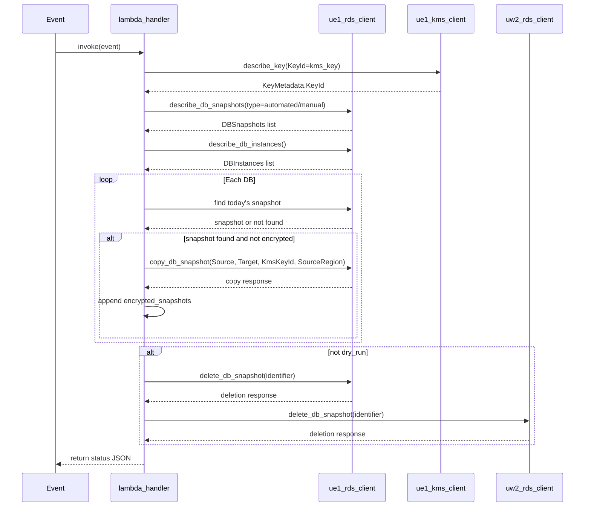
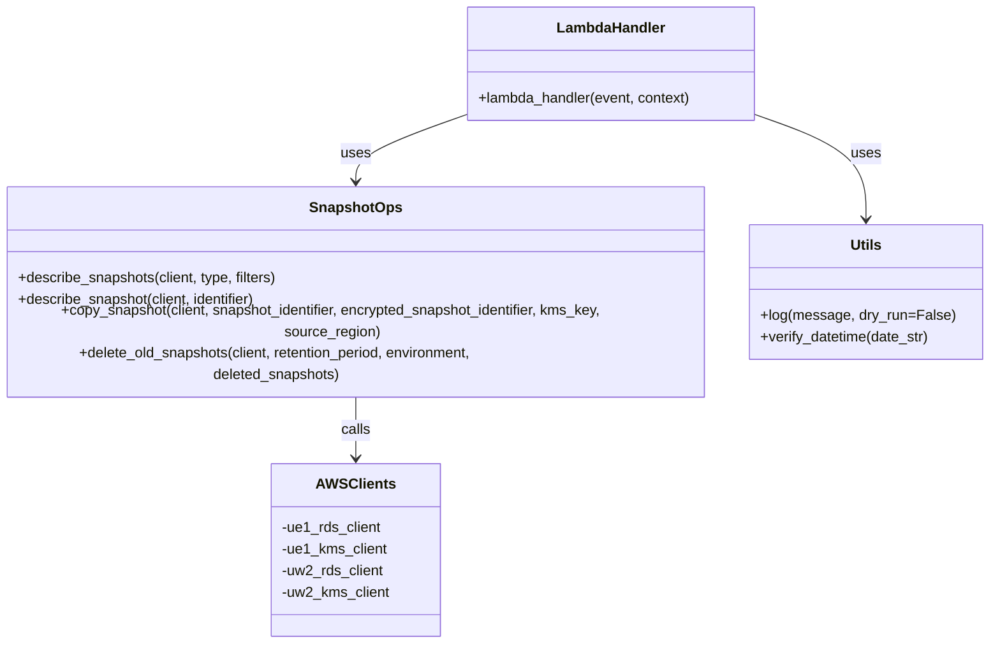

# Diagram: devops/terraform/modules/devops/aws-rds-encrypt-snapshot/lambdas/rds_encrypt_snapshot.py


> Auto-generated by Obscura crawlers

## Diagram 1

```mermaid
flowchart TD
    Evt[Event] --> LH[lambda_handler]
    LH --> Parse[Parse event & set variables]
    LH --> Init[Initialize AWS clients (ue1_rds, ue1_kms, uw2_rds, uw2_kms)]
    Init --> UE1R[ue1_rds_client]
    Init --> UE1K[ue1_kms_client]
    Init --> UW2R[uw2_rds_client]
    Init --> UW2K[uw2_kms_client]
    UE1K --> GetKey[describe_key -> ue1_kms_key]
    LH --> Fetch[Fetch ue1 snapshots & instances]
    Fetch --> Auto[ue1_snapshots (automated)]
    Fetch --> Manual[ue1_manual_snapshots (manual)]
    LH --> Step1[Step 1: Iterate DB instances]
    Step1 --> DescribeDB[ue1_rds_client.describe_db_instances()]
    DescribeDB --> DBLoop{For each DB}
    DBLoop --> Filters{Pass filters?}
    Filters -->|no| Skip[skip DB]
    Filters -->|yes| Encrypted{StorageEncrypted?}
    Encrypted -->|true| Skip
    Encrypted -->|false| Replica{ReadReplica eligible?}
    Replica -->|no| Skip
    Replica -->|yes| BuildID[Build snapshot_identifier]
    BuildID --> Exists{Exists in manual snapshots?}
    Exists -->|yes| Skip
    Exists -->|no| Today[Find today's automated snapshot]
    Today -->|not found| Skip
    Today -->|found| Copy[copy_snapshot -> copy_db_snapshot]
    Copy --> Append[append to encrypted_snapshots]
    LH --> Step4[Step 4: Delete old snapshots (if not dry_run)]
    Step4 --> DeleteUE1[delete_old_snapshots(ue1_rds_client)]
    Step4 --> DeleteUW2[delete_old_snapshots(uw2_rds_client)]
    DeleteUE1 --> Deleted[deleted_snapshots updated]
    DeleteUW2 --> Deleted
    LH --> Return[Return 200 JSON with results]
```

> SVG rendering failed for this diagram.

## Diagram 2



### SVG

<svg id="container" width="1357" xmlns="http://www.w3.org/2000/svg" height="1212" viewBox="-50 -10 1357 1212" role="graphics-document document" aria-roledescription="sequence"><g><rect x="1107" y="1126" fill="#eaeaea" stroke="#666" width="150" height="65" name="UW2R" rx="3" ry="3" class="actor actor-bottom"></rect><text x="1182" y="1158.5" dominant-baseline="central" alignment-baseline="central" class="actor actor-box" style="text-anchor: middle; font-size: 16px; font-weight: 400;"><tspan x="1182" dy="0">uw2_rds_client</tspan></text></g><g><rect x="907" y="1126" fill="#eaeaea" stroke="#666" width="150" height="65" name="UE1K" rx="3" ry="3" class="actor actor-bottom"></rect><text x="982" y="1158.5" dominant-baseline="central" alignment-baseline="central" class="actor actor-box" style="text-anchor: middle; font-size: 16px; font-weight: 400;"><tspan x="982" dy="0">ue1_kms_client</tspan></text></g><g><rect x="707" y="1126" fill="#eaeaea" stroke="#666" width="150" height="65" name="UE1R" rx="3" ry="3" class="actor actor-bottom"></rect><text x="782" y="1158.5" dominant-baseline="central" alignment-baseline="central" class="actor actor-box" style="text-anchor: middle; font-size: 16px; font-weight: 400;"><tspan x="782" dy="0">ue1_rds_client</tspan></text></g><g><rect x="204" y="1126" fill="#eaeaea" stroke="#666" width="150" height="65" name="Lambda" rx="3" ry="3" class="actor actor-bottom"></rect><text x="279" y="1158.5" dominant-baseline="central" alignment-baseline="central" class="actor actor-box" style="text-anchor: middle; font-size: 16px; font-weight: 400;"><tspan x="279" dy="0">lambda_handler</tspan></text></g><g><rect x="0" y="1126" fill="#eaeaea" stroke="#666" width="150" height="65" name="Event" rx="3" ry="3" class="actor actor-bottom"></rect><text x="75" y="1158.5" dominant-baseline="central" alignment-baseline="central" class="actor actor-box" style="text-anchor: middle; font-size: 16px; font-weight: 400;"><tspan x="75" dy="0">Event</tspan></text></g><g><line id="actor4" x1="1182" y1="65" x2="1182" y2="1126" class="actor-line 200" stroke-width="0.5px" stroke="#999" name="UW2R"></line><g id="root-4"><rect x="1107" y="0" fill="#eaeaea" stroke="#666" width="150" height="65" name="UW2R" rx="3" ry="3" class="actor actor-top"></rect><text x="1182" y="32.5" dominant-baseline="central" alignment-baseline="central" class="actor actor-box" style="text-anchor: middle; font-size: 16px; font-weight: 400;"><tspan x="1182" dy="0">uw2_rds_client</tspan></text></g></g><g><line id="actor3" x1="982" y1="65" x2="982" y2="1126" class="actor-line 200" stroke-width="0.5px" stroke="#999" name="UE1K"></line><g id="root-3"><rect x="907" y="0" fill="#eaeaea" stroke="#666" width="150" height="65" name="UE1K" rx="3" ry="3" class="actor actor-top"></rect><text x="982" y="32.5" dominant-baseline="central" alignment-baseline="central" class="actor actor-box" style="text-anchor: middle; font-size: 16px; font-weight: 400;"><tspan x="982" dy="0">ue1_kms_client</tspan></text></g></g><g><line id="actor2" x1="782" y1="65" x2="782" y2="1126" class="actor-line 200" stroke-width="0.5px" stroke="#999" name="UE1R"></line><g id="root-2"><rect x="707" y="0" fill="#eaeaea" stroke="#666" width="150" height="65" name="UE1R" rx="3" ry="3" class="actor actor-top"></rect><text x="782" y="32.5" dominant-baseline="central" alignment-baseline="central" class="actor actor-box" style="text-anchor: middle; font-size: 16px; font-weight: 400;"><tspan x="782" dy="0">ue1_rds_client</tspan></text></g></g><g><line id="actor1" x1="279" y1="65" x2="279" y2="1126" class="actor-line 200" stroke-width="0.5px" stroke="#999" name="Lambda"></line><g id="root-1"><rect x="204" y="0" fill="#eaeaea" stroke="#666" width="150" height="65" name="Lambda" rx="3" ry="3" class="actor actor-top"></rect><text x="279" y="32.5" dominant-baseline="central" alignment-baseline="central" class="actor actor-box" style="text-anchor: middle; font-size: 16px; font-weight: 400;"><tspan x="279" dy="0">lambda_handler</tspan></text></g></g><g><line id="actor0" x1="75" y1="65" x2="75" y2="1126" class="actor-line 200" stroke-width="0.5px" stroke="#999" name="Event"></line><g id="root-0"><rect x="0" y="0" fill="#eaeaea" stroke="#666" width="150" height="65" name="Event" rx="3" ry="3" class="actor actor-top"></rect><text x="75" y="32.5" dominant-baseline="central" alignment-baseline="central" class="actor actor-box" style="text-anchor: middle; font-size: 16px; font-weight: 400;"><tspan x="75" dy="0">Event</tspan></text></g></g><style>#container{font-family:"trebuchet ms",verdana,arial,sans-serif;font-size:16px;fill:#333;}@keyframes edge-animation-frame{from{stroke-dashoffset:0;}}@keyframes dash{to{stroke-dashoffset:0;}}#container .edge-animation-slow{stroke-dasharray:9,5!important;stroke-dashoffset:900;animation:dash 50s linear infinite;stroke-linecap:round;}#container .edge-animation-fast{stroke-dasharray:9,5!important;stroke-dashoffset:900;animation:dash 20s linear infinite;stroke-linecap:round;}#container .error-icon{fill:#552222;}#container .error-text{fill:#552222;stroke:#552222;}#container .edge-thickness-normal{stroke-width:1px;}#container .edge-thickness-thick{stroke-width:3.5px;}#container .edge-pattern-solid{stroke-dasharray:0;}#container .edge-thickness-invisible{stroke-width:0;fill:none;}#container .edge-pattern-dashed{stroke-dasharray:3;}#container .edge-pattern-dotted{stroke-dasharray:2;}#container .marker{fill:#333333;stroke:#333333;}#container .marker.cross{stroke:#333333;}#container svg{font-family:"trebuchet ms",verdana,arial,sans-serif;font-size:16px;}#container p{margin:0;}#container .actor{stroke:hsl(259.6261682243, 59.7765363128%, 87.9019607843%);fill:#ECECFF;}#container text.actor&gt;tspan{fill:black;stroke:none;}#container .actor-line{stroke:hsl(259.6261682243, 59.7765363128%, 87.9019607843%);}#container .innerArc{stroke-width:1.5;stroke-dasharray:none;}#container .messageLine0{stroke-width:1.5;stroke-dasharray:none;stroke:#333;}#container .messageLine1{stroke-width:1.5;stroke-dasharray:2,2;stroke:#333;}#container #arrowhead path{fill:#333;stroke:#333;}#container .sequenceNumber{fill:white;}#container #sequencenumber{fill:#333;}#container #crosshead path{fill:#333;stroke:#333;}#container .messageText{fill:#333;stroke:none;}#container .labelBox{stroke:hsl(259.6261682243, 59.7765363128%, 87.9019607843%);fill:#ECECFF;}#container .labelText,#container .labelText&gt;tspan{fill:black;stroke:none;}#container .loopText,#container .loopText&gt;tspan{fill:black;stroke:none;}#container .loopLine{stroke-width:2px;stroke-dasharray:2,2;stroke:hsl(259.6261682243, 59.7765363128%, 87.9019607843%);fill:hsl(259.6261682243, 59.7765363128%, 87.9019607843%);}#container .note{stroke:#aaaa33;fill:#fff5ad;}#container .noteText,#container .noteText&gt;tspan{fill:black;stroke:none;}#container .activation0{fill:#f4f4f4;stroke:#666;}#container .activation1{fill:#f4f4f4;stroke:#666;}#container .activation2{fill:#f4f4f4;stroke:#666;}#container .actorPopupMenu{position:absolute;}#container .actorPopupMenuPanel{position:absolute;fill:#ECECFF;box-shadow:0px 8px 16px 0px rgba(0,0,0,0.2);filter:drop-shadow(3px 5px 2px rgb(0 0 0 / 0.4));}#container .actor-man line{stroke:hsl(259.6261682243, 59.7765363128%, 87.9019607843%);fill:#ECECFF;}#container .actor-man circle,#container line{stroke:hsl(259.6261682243, 59.7765363128%, 87.9019607843%);fill:#ECECFF;stroke-width:2px;}#container :root{--mermaid-font-family:"trebuchet ms",verdana,arial,sans-serif;}</style><g></g><defs><symbol id="computer" width="24" height="24"><path transform="scale(.5)" d="M2 2v13h20v-13h-20zm18 11h-16v-9h16v9zm-10.228 6l.466-1h3.524l.467 1h-4.457zm14.228 3h-24l2-6h2.104l-1.33 4h18.45l-1.297-4h2.073l2 6zm-5-10h-14v-7h14v7z"></path></symbol></defs><defs><symbol id="database" fill-rule="evenodd" clip-rule="evenodd"><path transform="scale(.5)" d="M12.258.001l.256.004.255.005.253.008.251.01.249.012.247.015.246.016.242.019.241.02.239.023.236.024.233.027.231.028.229.031.225.032.223.034.22.036.217.038.214.04.211.041.208.043.205.045.201.046.198.048.194.05.191.051.187.053.183.054.18.056.175.057.172.059.168.06.163.061.16.063.155.064.15.066.074.033.073.033.071.034.07.034.069.035.068.035.067.035.066.035.064.036.064.036.062.036.06.036.06.037.058.037.058.037.055.038.055.038.053.038.052.038.051.039.05.039.048.039.047.039.045.04.044.04.043.04.041.04.04.041.039.041.037.041.036.041.034.041.033.042.032.042.03.042.029.042.027.042.026.043.024.043.023.043.021.043.02.043.018.044.017.043.015.044.013.044.012.044.011.045.009.044.007.045.006.045.004.045.002.045.001.045v17l-.001.045-.002.045-.004.045-.006.045-.007.045-.009.044-.011.045-.012.044-.013.044-.015.044-.017.043-.018.044-.02.043-.021.043-.023.043-.024.043-.026.043-.027.042-.029.042-.03.042-.032.042-.033.042-.034.041-.036.041-.037.041-.039.041-.04.041-.041.04-.043.04-.044.04-.045.04-.047.039-.048.039-.05.039-.051.039-.052.038-.053.038-.055.038-.055.038-.058.037-.058.037-.06.037-.06.036-.062.036-.064.036-.064.036-.066.035-.067.035-.068.035-.069.035-.07.034-.071.034-.073.033-.074.033-.15.066-.155.064-.16.063-.163.061-.168.06-.172.059-.175.057-.18.056-.183.054-.187.053-.191.051-.194.05-.198.048-.201.046-.205.045-.208.043-.211.041-.214.04-.217.038-.22.036-.223.034-.225.032-.229.031-.231.028-.233.027-.236.024-.239.023-.241.02-.242.019-.246.016-.247.015-.249.012-.251.01-.253.008-.255.005-.256.004-.258.001-.258-.001-.256-.004-.255-.005-.253-.008-.251-.01-.249-.012-.247-.015-.245-.016-.243-.019-.241-.02-.238-.023-.236-.024-.234-.027-.231-.028-.228-.031-.226-.032-.223-.034-.22-.036-.217-.038-.214-.04-.211-.041-.208-.043-.204-.045-.201-.046-.198-.048-.195-.05-.19-.051-.187-.053-.184-.054-.179-.056-.176-.057-.172-.059-.167-.06-.164-.061-.159-.063-.155-.064-.151-.066-.074-.033-.072-.033-.072-.034-.07-.034-.069-.035-.068-.035-.067-.035-.066-.035-.064-.036-.063-.036-.062-.036-.061-.036-.06-.037-.058-.037-.057-.037-.056-.038-.055-.038-.053-.038-.052-.038-.051-.039-.049-.039-.049-.039-.046-.039-.046-.04-.044-.04-.043-.04-.041-.04-.04-.041-.039-.041-.037-.041-.036-.041-.034-.041-.033-.042-.032-.042-.03-.042-.029-.042-.027-.042-.026-.043-.024-.043-.023-.043-.021-.043-.02-.043-.018-.044-.017-.043-.015-.044-.013-.044-.012-.044-.011-.045-.009-.044-.007-.045-.006-.045-.004-.045-.002-.045-.001-.045v-17l.001-.045.002-.045.004-.045.006-.045.007-.045.009-.044.011-.045.012-.044.013-.044.015-.044.017-.043.018-.044.02-.043.021-.043.023-.043.024-.043.026-.043.027-.042.029-.042.03-.042.032-.042.033-.042.034-.041.036-.041.037-.041.039-.041.04-.041.041-.04.043-.04.044-.04.046-.04.046-.039.049-.039.049-.039.051-.039.052-.038.053-.038.055-.038.056-.038.057-.037.058-.037.06-.037.061-.036.062-.036.063-.036.064-.036.066-.035.067-.035.068-.035.069-.035.07-.034.072-.034.072-.033.074-.033.151-.066.155-.064.159-.063.164-.061.167-.06.172-.059.176-.057.179-.056.184-.054.187-.053.19-.051.195-.05.198-.048.201-.046.204-.045.208-.043.211-.041.214-.04.217-.038.22-.036.223-.034.226-.032.228-.031.231-.028.234-.027.236-.024.238-.023.241-.02.243-.019.245-.016.247-.015.249-.012.251-.01.253-.008.255-.005.256-.004.258-.001.258.001zm-9.258 20.499v.01l.001.021.003.021.004.022.005.021.006.022.007.022.009.023.01.022.011.023.012.023.013.023.015.023.016.024.017.023.018.024.019.024.021.024.022.025.023.024.024.025.052.049.056.05.061.051.066.051.07.051.075.051.079.052.084.052.088.052.092.052.097.052.102.051.105.052.11.052.114.051.119.051.123.051.127.05.131.05.135.05.139.048.144.049.147.047.152.047.155.047.16.045.163.045.167.043.171.043.176.041.178.041.183.039.187.039.19.037.194.035.197.035.202.033.204.031.209.03.212.029.216.027.219.025.222.024.226.021.23.02.233.018.236.016.24.015.243.012.246.01.249.008.253.005.256.004.259.001.26-.001.257-.004.254-.005.25-.008.247-.011.244-.012.241-.014.237-.016.233-.018.231-.021.226-.021.224-.024.22-.026.216-.027.212-.028.21-.031.205-.031.202-.034.198-.034.194-.036.191-.037.187-.039.183-.04.179-.04.175-.042.172-.043.168-.044.163-.045.16-.046.155-.046.152-.047.148-.048.143-.049.139-.049.136-.05.131-.05.126-.05.123-.051.118-.052.114-.051.11-.052.106-.052.101-.052.096-.052.092-.052.088-.053.083-.051.079-.052.074-.052.07-.051.065-.051.06-.051.056-.05.051-.05.023-.024.023-.025.021-.024.02-.024.019-.024.018-.024.017-.024.015-.023.014-.024.013-.023.012-.023.01-.023.01-.022.008-.022.006-.022.006-.022.004-.022.004-.021.001-.021.001-.021v-4.127l-.077.055-.08.053-.083.054-.085.053-.087.052-.09.052-.093.051-.095.05-.097.05-.1.049-.102.049-.105.048-.106.047-.109.047-.111.046-.114.045-.115.045-.118.044-.12.043-.122.042-.124.042-.126.041-.128.04-.13.04-.132.038-.134.038-.135.037-.138.037-.139.035-.142.035-.143.034-.144.033-.147.032-.148.031-.15.03-.151.03-.153.029-.154.027-.156.027-.158.026-.159.025-.161.024-.162.023-.163.022-.165.021-.166.02-.167.019-.169.018-.169.017-.171.016-.173.015-.173.014-.175.013-.175.012-.177.011-.178.01-.179.008-.179.008-.181.006-.182.005-.182.004-.184.003-.184.002h-.37l-.184-.002-.184-.003-.182-.004-.182-.005-.181-.006-.179-.008-.179-.008-.178-.01-.176-.011-.176-.012-.175-.013-.173-.014-.172-.015-.171-.016-.17-.017-.169-.018-.167-.019-.166-.02-.165-.021-.163-.022-.162-.023-.161-.024-.159-.025-.157-.026-.156-.027-.155-.027-.153-.029-.151-.03-.15-.03-.148-.031-.146-.032-.145-.033-.143-.034-.141-.035-.14-.035-.137-.037-.136-.037-.134-.038-.132-.038-.13-.04-.128-.04-.126-.041-.124-.042-.122-.042-.12-.044-.117-.043-.116-.045-.113-.045-.112-.046-.109-.047-.106-.047-.105-.048-.102-.049-.1-.049-.097-.05-.095-.05-.093-.052-.09-.051-.087-.052-.085-.053-.083-.054-.08-.054-.077-.054v4.127zm0-5.654v.011l.001.021.003.021.004.021.005.022.006.022.007.022.009.022.01.022.011.023.012.023.013.023.015.024.016.023.017.024.018.024.019.024.021.024.022.024.023.025.024.024.052.05.056.05.061.05.066.051.07.051.075.052.079.051.084.052.088.052.092.052.097.052.102.052.105.052.11.051.114.051.119.052.123.05.127.051.131.05.135.049.139.049.144.048.147.048.152.047.155.046.16.045.163.045.167.044.171.042.176.042.178.04.183.04.187.038.19.037.194.036.197.034.202.033.204.032.209.03.212.028.216.027.219.025.222.024.226.022.23.02.233.018.236.016.24.014.243.012.246.01.249.008.253.006.256.003.259.001.26-.001.257-.003.254-.006.25-.008.247-.01.244-.012.241-.015.237-.016.233-.018.231-.02.226-.022.224-.024.22-.025.216-.027.212-.029.21-.03.205-.032.202-.033.198-.035.194-.036.191-.037.187-.039.183-.039.179-.041.175-.042.172-.043.168-.044.163-.045.16-.045.155-.047.152-.047.148-.048.143-.048.139-.05.136-.049.131-.05.126-.051.123-.051.118-.051.114-.052.11-.052.106-.052.101-.052.096-.052.092-.052.088-.052.083-.052.079-.052.074-.051.07-.052.065-.051.06-.05.056-.051.051-.049.023-.025.023-.024.021-.025.02-.024.019-.024.018-.024.017-.024.015-.023.014-.023.013-.024.012-.022.01-.023.01-.023.008-.022.006-.022.006-.022.004-.021.004-.022.001-.021.001-.021v-4.139l-.077.054-.08.054-.083.054-.085.052-.087.053-.09.051-.093.051-.095.051-.097.05-.1.049-.102.049-.105.048-.106.047-.109.047-.111.046-.114.045-.115.044-.118.044-.12.044-.122.042-.124.042-.126.041-.128.04-.13.039-.132.039-.134.038-.135.037-.138.036-.139.036-.142.035-.143.033-.144.033-.147.033-.148.031-.15.03-.151.03-.153.028-.154.028-.156.027-.158.026-.159.025-.161.024-.162.023-.163.022-.165.021-.166.02-.167.019-.169.018-.169.017-.171.016-.173.015-.173.014-.175.013-.175.012-.177.011-.178.009-.179.009-.179.007-.181.007-.182.005-.182.004-.184.003-.184.002h-.37l-.184-.002-.184-.003-.182-.004-.182-.005-.181-.007-.179-.007-.179-.009-.178-.009-.176-.011-.176-.012-.175-.013-.173-.014-.172-.015-.171-.016-.17-.017-.169-.018-.167-.019-.166-.02-.165-.021-.163-.022-.162-.023-.161-.024-.159-.025-.157-.026-.156-.027-.155-.028-.153-.028-.151-.03-.15-.03-.148-.031-.146-.033-.145-.033-.143-.033-.141-.035-.14-.036-.137-.036-.136-.037-.134-.038-.132-.039-.13-.039-.128-.04-.126-.041-.124-.042-.122-.043-.12-.043-.117-.044-.116-.044-.113-.046-.112-.046-.109-.046-.106-.047-.105-.048-.102-.049-.1-.049-.097-.05-.095-.051-.093-.051-.09-.051-.087-.053-.085-.052-.083-.054-.08-.054-.077-.054v4.139zm0-5.666v.011l.001.02.003.022.004.021.005.022.006.021.007.022.009.023.01.022.011.023.012.023.013.023.015.023.016.024.017.024.018.023.019.024.021.025.022.024.023.024.024.025.052.05.056.05.061.05.066.051.07.051.075.052.079.051.084.052.088.052.092.052.097.052.102.052.105.051.11.052.114.051.119.051.123.051.127.05.131.05.135.05.139.049.144.048.147.048.152.047.155.046.16.045.163.045.167.043.171.043.176.042.178.04.183.04.187.038.19.037.194.036.197.034.202.033.204.032.209.03.212.028.216.027.219.025.222.024.226.021.23.02.233.018.236.017.24.014.243.012.246.01.249.008.253.006.256.003.259.001.26-.001.257-.003.254-.006.25-.008.247-.01.244-.013.241-.014.237-.016.233-.018.231-.02.226-.022.224-.024.22-.025.216-.027.212-.029.21-.03.205-.032.202-.033.198-.035.194-.036.191-.037.187-.039.183-.039.179-.041.175-.042.172-.043.168-.044.163-.045.16-.045.155-.047.152-.047.148-.048.143-.049.139-.049.136-.049.131-.051.126-.05.123-.051.118-.052.114-.051.11-.052.106-.052.101-.052.096-.052.092-.052.088-.052.083-.052.079-.052.074-.052.07-.051.065-.051.06-.051.056-.05.051-.049.023-.025.023-.025.021-.024.02-.024.019-.024.018-.024.017-.024.015-.023.014-.024.013-.023.012-.023.01-.022.01-.023.008-.022.006-.022.006-.022.004-.022.004-.021.001-.021.001-.021v-4.153l-.077.054-.08.054-.083.053-.085.053-.087.053-.09.051-.093.051-.095.051-.097.05-.1.049-.102.048-.105.048-.106.048-.109.046-.111.046-.114.046-.115.044-.118.044-.12.043-.122.043-.124.042-.126.041-.128.04-.13.039-.132.039-.134.038-.135.037-.138.036-.139.036-.142.034-.143.034-.144.033-.147.032-.148.032-.15.03-.151.03-.153.028-.154.028-.156.027-.158.026-.159.024-.161.024-.162.023-.163.023-.165.021-.166.02-.167.019-.169.018-.169.017-.171.016-.173.015-.173.014-.175.013-.175.012-.177.01-.178.01-.179.009-.179.007-.181.006-.182.006-.182.004-.184.003-.184.001-.185.001-.185-.001-.184-.001-.184-.003-.182-.004-.182-.006-.181-.006-.179-.007-.179-.009-.178-.01-.176-.01-.176-.012-.175-.013-.173-.014-.172-.015-.171-.016-.17-.017-.169-.018-.167-.019-.166-.02-.165-.021-.163-.023-.162-.023-.161-.024-.159-.024-.157-.026-.156-.027-.155-.028-.153-.028-.151-.03-.15-.03-.148-.032-.146-.032-.145-.033-.143-.034-.141-.034-.14-.036-.137-.036-.136-.037-.134-.038-.132-.039-.13-.039-.128-.041-.126-.041-.124-.041-.122-.043-.12-.043-.117-.044-.116-.044-.113-.046-.112-.046-.109-.046-.106-.048-.105-.048-.102-.048-.1-.05-.097-.049-.095-.051-.093-.051-.09-.052-.087-.052-.085-.053-.083-.053-.08-.054-.077-.054v4.153zm8.74-8.179l-.257.004-.254.005-.25.008-.247.011-.244.012-.241.014-.237.016-.233.018-.231.021-.226.022-.224.023-.22.026-.216.027-.212.028-.21.031-.205.032-.202.033-.198.034-.194.036-.191.038-.187.038-.183.04-.179.041-.175.042-.172.043-.168.043-.163.045-.16.046-.155.046-.152.048-.148.048-.143.048-.139.049-.136.05-.131.05-.126.051-.123.051-.118.051-.114.052-.11.052-.106.052-.101.052-.096.052-.092.052-.088.052-.083.052-.079.052-.074.051-.07.052-.065.051-.06.05-.056.05-.051.05-.023.025-.023.024-.021.024-.02.025-.019.024-.018.024-.017.023-.015.024-.014.023-.013.023-.012.023-.01.023-.01.022-.008.022-.006.023-.006.021-.004.022-.004.021-.001.021-.001.021.001.021.001.021.004.021.004.022.006.021.006.023.008.022.01.022.01.023.012.023.013.023.014.023.015.024.017.023.018.024.019.024.02.025.021.024.023.024.023.025.051.05.056.05.06.05.065.051.07.052.074.051.079.052.083.052.088.052.092.052.096.052.101.052.106.052.11.052.114.052.118.051.123.051.126.051.131.05.136.05.139.049.143.048.148.048.152.048.155.046.16.046.163.045.168.043.172.043.175.042.179.041.183.04.187.038.191.038.194.036.198.034.202.033.205.032.21.031.212.028.216.027.22.026.224.023.226.022.231.021.233.018.237.016.241.014.244.012.247.011.25.008.254.005.257.004.26.001.26-.001.257-.004.254-.005.25-.008.247-.011.244-.012.241-.014.237-.016.233-.018.231-.021.226-.022.224-.023.22-.026.216-.027.212-.028.21-.031.205-.032.202-.033.198-.034.194-.036.191-.038.187-.038.183-.04.179-.041.175-.042.172-.043.168-.043.163-.045.16-.046.155-.046.152-.048.148-.048.143-.048.139-.049.136-.05.131-.05.126-.051.123-.051.118-.051.114-.052.11-.052.106-.052.101-.052.096-.052.092-.052.088-.052.083-.052.079-.052.074-.051.07-.052.065-.051.06-.05.056-.05.051-.05.023-.025.023-.024.021-.024.02-.025.019-.024.018-.024.017-.023.015-.024.014-.023.013-.023.012-.023.01-.023.01-.022.008-.022.006-.023.006-.021.004-.022.004-.021.001-.021.001-.021-.001-.021-.001-.021-.004-.021-.004-.022-.006-.021-.006-.023-.008-.022-.01-.022-.01-.023-.012-.023-.013-.023-.014-.023-.015-.024-.017-.023-.018-.024-.019-.024-.02-.025-.021-.024-.023-.024-.023-.025-.051-.05-.056-.05-.06-.05-.065-.051-.07-.052-.074-.051-.079-.052-.083-.052-.088-.052-.092-.052-.096-.052-.101-.052-.106-.052-.11-.052-.114-.052-.118-.051-.123-.051-.126-.051-.131-.05-.136-.05-.139-.049-.143-.048-.148-.048-.152-.048-.155-.046-.16-.046-.163-.045-.168-.043-.172-.043-.175-.042-.179-.041-.183-.04-.187-.038-.191-.038-.194-.036-.198-.034-.202-.033-.205-.032-.21-.031-.212-.028-.216-.027-.22-.026-.224-.023-.226-.022-.231-.021-.233-.018-.237-.016-.241-.014-.244-.012-.247-.011-.25-.008-.254-.005-.257-.004-.26-.001-.26.001z"></path></symbol></defs><defs><symbol id="clock" width="24" height="24"><path transform="scale(.5)" d="M12 2c5.514 0 10 4.486 10 10s-4.486 10-10 10-10-4.486-10-10 4.486-10 10-10zm0-2c-6.627 0-12 5.373-12 12s5.373 12 12 12 12-5.373 12-12-5.373-12-12-12zm5.848 12.459c.202.038.202.333.001.372-1.907.361-6.045 1.111-6.547 1.111-.719 0-1.301-.582-1.301-1.301 0-.512.77-5.447 1.125-7.445.034-.192.312-.181.343.014l.985 6.238 5.394 1.011z"></path></symbol></defs><defs><marker id="arrowhead" refX="7.9" refY="5" markerUnits="userSpaceOnUse" markerWidth="12" markerHeight="12" orient="auto-start-reverse"><path d="M -1 0 L 10 5 L 0 10 z"></path></marker></defs><defs><marker id="crosshead" markerWidth="15" markerHeight="8" orient="auto" refX="4" refY="4.5"><path fill="none" stroke="#000000" stroke-width="1pt" d="M 1,2 L 6,7 M 6,2 L 1,7" style="stroke-dasharray: 0, 0;"></path></marker></defs><defs><marker id="filled-head" refX="15.5" refY="7" markerWidth="20" markerHeight="28" orient="auto"><path d="M 18,7 L9,13 L14,7 L9,1 Z"></path></marker></defs><defs><marker id="sequencenumber" refX="15" refY="15" markerWidth="60" markerHeight="40" orient="auto"><circle cx="15" cy="15" r="6"></circle></marker></defs><g><line x1="162" y1="552" x2="793" y2="552" class="loopLine"></line><line x1="793" y1="552" x2="793" y2="801" class="loopLine"></line><line x1="162" y1="801" x2="793" y2="801" class="loopLine"></line><line x1="162" y1="552" x2="162" y2="801" class="loopLine"></line><polygon points="162,552 212,552 212,565 203.6,572 162,572" class="labelBox"></polygon><text x="187" y="565" text-anchor="middle" dominant-baseline="middle" alignment-baseline="middle" class="labelText" style="font-size: 16px; font-weight: 400;">alt</text><text x="502.5" y="570" text-anchor="middle" class="loopText" style="font-size: 16px; font-weight: 400;"><tspan x="502.5">[snapshot found and not encrypted]</tspan></text></g><g><line x1="152" y1="411" x2="803" y2="411" class="loopLine"></line><line x1="803" y1="411" x2="803" y2="811" class="loopLine"></line><line x1="152" y1="811" x2="803" y2="811" class="loopLine"></line><line x1="152" y1="411" x2="152" y2="811" class="loopLine"></line><polygon points="152,411 202,411 202,424 193.6,431 152,431" class="labelBox"></polygon><text x="177" y="424" text-anchor="middle" dominant-baseline="middle" alignment-baseline="middle" class="labelText" style="font-size: 16px; font-weight: 400;">loop</text><text x="502.5" y="429" text-anchor="middle" class="loopText" style="font-size: 16px; font-weight: 400;"><tspan x="502.5">[Each DB]</tspan></text></g><g><line x1="268" y1="821" x2="1193" y2="821" class="loopLine"></line><line x1="1193" y1="821" x2="1193" y2="1058" class="loopLine"></line><line x1="268" y1="1058" x2="1193" y2="1058" class="loopLine"></line><line x1="268" y1="821" x2="268" y2="1058" class="loopLine"></line><polygon points="268,821 318,821 318,834 309.6,841 268,841" class="labelBox"></polygon><text x="293" y="834" text-anchor="middle" dominant-baseline="middle" alignment-baseline="middle" class="labelText" style="font-size: 16px; font-weight: 400;">alt</text><text x="755.5" y="839" text-anchor="middle" class="loopText" style="font-size: 16px; font-weight: 400;"><tspan x="755.5">[not dry_run]</tspan></text></g><text x="176" y="80" text-anchor="middle" dominant-baseline="middle" alignment-baseline="middle" class="messageText" dy="1em" style="font-size: 16px; font-weight: 400;">invoke(event)</text><line x1="76" y1="113" x2="275" y2="113" class="messageLine0" stroke-width="2" stroke="none" marker-end="url(#arrowhead)" style="fill: none;"></line><text x="629" y="128" text-anchor="middle" dominant-baseline="middle" alignment-baseline="middle" class="messageText" dy="1em" style="font-size: 16px; font-weight: 400;">describe_key(KeyId=kms_key)</text><line x1="280" y1="161" x2="978" y2="161" class="messageLine0" stroke-width="2" stroke="none" marker-end="url(#arrowhead)" style="fill: none;"></line><text x="632" y="176" text-anchor="middle" dominant-baseline="middle" alignment-baseline="middle" class="messageText" dy="1em" style="font-size: 16px; font-weight: 400;">KeyMetadata.KeyId</text><line x1="981" y1="209" x2="283" y2="209" class="messageLine1" stroke-width="2" stroke="none" marker-end="url(#arrowhead)" style="stroke-dasharray: 3, 3; fill: none;"></line><text x="529" y="224" text-anchor="middle" dominant-baseline="middle" alignment-baseline="middle" class="messageText" dy="1em" style="font-size: 16px; font-weight: 400;">describe_db_snapshots(type=automated/manual)</text><line x1="280" y1="257" x2="778" y2="257" class="messageLine0" stroke-width="2" stroke="none" marker-end="url(#arrowhead)" style="fill: none;"></line><text x="532" y="272" text-anchor="middle" dominant-baseline="middle" alignment-baseline="middle" class="messageText" dy="1em" style="font-size: 16px; font-weight: 400;">DBSnapshots list</text><line x1="781" y1="305" x2="283" y2="305" class="messageLine1" stroke-width="2" stroke="none" marker-end="url(#arrowhead)" style="stroke-dasharray: 3, 3; fill: none;"></line><text x="529" y="320" text-anchor="middle" dominant-baseline="middle" alignment-baseline="middle" class="messageText" dy="1em" style="font-size: 16px; font-weight: 400;">describe_db_instances()</text><line x1="280" y1="353" x2="778" y2="353" class="messageLine0" stroke-width="2" stroke="none" marker-end="url(#arrowhead)" style="fill: none;"></line><text x="532" y="368" text-anchor="middle" dominant-baseline="middle" alignment-baseline="middle" class="messageText" dy="1em" style="font-size: 16px; font-weight: 400;">DBInstances list</text><line x1="781" y1="401" x2="283" y2="401" class="messageLine1" stroke-width="2" stroke="none" marker-end="url(#arrowhead)" style="stroke-dasharray: 3, 3; fill: none;"></line><text x="529" y="461" text-anchor="middle" dominant-baseline="middle" alignment-baseline="middle" class="messageText" dy="1em" style="font-size: 16px; font-weight: 400;">find today's snapshot</text><line x1="280" y1="494" x2="778" y2="494" class="messageLine0" stroke-width="2" stroke="none" marker-end="url(#arrowhead)" style="fill: none;"></line><text x="532" y="509" text-anchor="middle" dominant-baseline="middle" alignment-baseline="middle" class="messageText" dy="1em" style="font-size: 16px; font-weight: 400;">snapshot or not found</text><line x1="781" y1="542" x2="283" y2="542" class="messageLine1" stroke-width="2" stroke="none" marker-end="url(#arrowhead)" style="stroke-dasharray: 3, 3; fill: none;"></line><text x="529" y="602" text-anchor="middle" dominant-baseline="middle" alignment-baseline="middle" class="messageText" dy="1em" style="font-size: 16px; font-weight: 400;">copy_db_snapshot(Source, Target, KmsKeyId, SourceRegion)</text><line x1="280" y1="635" x2="778" y2="635" class="messageLine0" stroke-width="2" stroke="none" marker-end="url(#arrowhead)" style="fill: none;"></line><text x="532" y="650" text-anchor="middle" dominant-baseline="middle" alignment-baseline="middle" class="messageText" dy="1em" style="font-size: 16px; font-weight: 400;">copy response</text><line x1="781" y1="683" x2="283" y2="683" class="messageLine1" stroke-width="2" stroke="none" marker-end="url(#arrowhead)" style="stroke-dasharray: 3, 3; fill: none;"></line><text x="280" y="698" text-anchor="middle" dominant-baseline="middle" alignment-baseline="middle" class="messageText" dy="1em" style="font-size: 16px; font-weight: 400;">append encrypted_snapshots</text><path d="M 280,731 C 340,721 340,761 280,751" class="messageLine0" stroke-width="2" stroke="none" marker-end="url(#arrowhead)" style="fill: none;"></path><text x="529" y="871" text-anchor="middle" dominant-baseline="middle" alignment-baseline="middle" class="messageText" dy="1em" style="font-size: 16px; font-weight: 400;">delete_db_snapshot(identifier)</text><line x1="280" y1="904" x2="778" y2="904" class="messageLine0" stroke-width="2" stroke="none" marker-end="url(#arrowhead)" style="fill: none;"></line><text x="532" y="919" text-anchor="middle" dominant-baseline="middle" alignment-baseline="middle" class="messageText" dy="1em" style="font-size: 16px; font-weight: 400;">deletion response</text><line x1="781" y1="952" x2="283" y2="952" class="messageLine1" stroke-width="2" stroke="none" marker-end="url(#arrowhead)" style="stroke-dasharray: 3, 3; fill: none;"></line><text x="729" y="967" text-anchor="middle" dominant-baseline="middle" alignment-baseline="middle" class="messageText" dy="1em" style="font-size: 16px; font-weight: 400;">delete_db_snapshot(identifier)</text><line x1="280" y1="1000" x2="1178" y2="1000" class="messageLine0" stroke-width="2" stroke="none" marker-end="url(#arrowhead)" style="fill: none;"></line><text x="732" y="1015" text-anchor="middle" dominant-baseline="middle" alignment-baseline="middle" class="messageText" dy="1em" style="font-size: 16px; font-weight: 400;">deletion response</text><line x1="1181" y1="1048" x2="283" y2="1048" class="messageLine1" stroke-width="2" stroke="none" marker-end="url(#arrowhead)" style="stroke-dasharray: 3, 3; fill: none;"></line><text x="179" y="1073" text-anchor="middle" dominant-baseline="middle" alignment-baseline="middle" class="messageText" dy="1em" style="font-size: 16px; font-weight: 400;">return status JSON</text><line x1="278" y1="1106" x2="79" y2="1106" class="messageLine1" stroke-width="2" stroke="none" marker-end="url(#arrowhead)" style="stroke-dasharray: 3, 3; fill: none;"></line></svg>

## Diagram 3



### SVG

<svg id="container" width="1117.296875" xmlns="http://www.w3.org/2000/svg" class="classDiagram" height="680" viewBox="0 0 1117.296875 680" role="graphics-document document" aria-roledescription="class"><style>#container{font-family:"trebuchet ms",verdana,arial,sans-serif;font-size:16px;fill:#333;}@keyframes edge-animation-frame{from{stroke-dashoffset:0;}}@keyframes dash{to{stroke-dashoffset:0;}}#container .edge-animation-slow{stroke-dasharray:9,5!important;stroke-dashoffset:900;animation:dash 50s linear infinite;stroke-linecap:round;}#container .edge-animation-fast{stroke-dasharray:9,5!important;stroke-dashoffset:900;animation:dash 20s linear infinite;stroke-linecap:round;}#container .error-icon{fill:#552222;}#container .error-text{fill:#552222;stroke:#552222;}#container .edge-thickness-normal{stroke-width:1px;}#container .edge-thickness-thick{stroke-width:3.5px;}#container .edge-pattern-solid{stroke-dasharray:0;}#container .edge-thickness-invisible{stroke-width:0;fill:none;}#container .edge-pattern-dashed{stroke-dasharray:3;}#container .edge-pattern-dotted{stroke-dasharray:2;}#container .marker{fill:#333333;stroke:#333333;}#container .marker.cross{stroke:#333333;}#container svg{font-family:"trebuchet ms",verdana,arial,sans-serif;font-size:16px;}#container p{margin:0;}#container g.classGroup text{fill:#9370DB;stroke:none;font-family:"trebuchet ms",verdana,arial,sans-serif;font-size:10px;}#container g.classGroup text .title{font-weight:bolder;}#container .nodeLabel,#container .edgeLabel{color:#131300;}#container .edgeLabel .label rect{fill:#ECECFF;}#container .label text{fill:#131300;}#container .labelBkg{background:#ECECFF;}#container .edgeLabel .label span{background:#ECECFF;}#container .classTitle{font-weight:bolder;}#container .node rect,#container .node circle,#container .node ellipse,#container .node polygon,#container .node path{fill:#ECECFF;stroke:#9370DB;stroke-width:1px;}#container .divider{stroke:#9370DB;stroke-width:1;}#container g.clickable{cursor:pointer;}#container g.classGroup rect{fill:#ECECFF;stroke:#9370DB;}#container g.classGroup line{stroke:#9370DB;stroke-width:1;}#container .classLabel .box{stroke:none;stroke-width:0;fill:#ECECFF;opacity:0.5;}#container .classLabel .label{fill:#9370DB;font-size:10px;}#container .relation{stroke:#333333;stroke-width:1;fill:none;}#container .dashed-line{stroke-dasharray:3;}#container .dotted-line{stroke-dasharray:1 2;}#container #compositionStart,#container .composition{fill:#333333!important;stroke:#333333!important;stroke-width:1;}#container #compositionEnd,#container .composition{fill:#333333!important;stroke:#333333!important;stroke-width:1;}#container #dependencyStart,#container .dependency{fill:#333333!important;stroke:#333333!important;stroke-width:1;}#container #dependencyStart,#container .dependency{fill:#333333!important;stroke:#333333!important;stroke-width:1;}#container #extensionStart,#container .extension{fill:transparent!important;stroke:#333333!important;stroke-width:1;}#container #extensionEnd,#container .extension{fill:transparent!important;stroke:#333333!important;stroke-width:1;}#container #aggregationStart,#container .aggregation{fill:transparent!important;stroke:#333333!important;stroke-width:1;}#container #aggregationEnd,#container .aggregation{fill:transparent!important;stroke:#333333!important;stroke-width:1;}#container #lollipopStart,#container .lollipop{fill:#ECECFF!important;stroke:#333333!important;stroke-width:1;}#container #lollipopEnd,#container .lollipop{fill:#ECECFF!important;stroke:#333333!important;stroke-width:1;}#container .edgeTerminals{font-size:11px;line-height:initial;}#container .classTitleText{text-anchor:middle;font-size:18px;fill:#333;}#container .label-icon{display:inline-block;height:1em;overflow:visible;vertical-align:-0.125em;}#container .node .label-icon path{fill:currentColor;stroke:revert;stroke-width:revert;}#container :root{--mermaid-font-family:"trebuchet ms",verdana,arial,sans-serif;}</style><g><defs><marker id="container_class-aggregationStart" class="marker aggregation class" refX="18" refY="7" markerWidth="190" markerHeight="240" orient="auto"><path d="M 18,7 L9,13 L1,7 L9,1 Z"></path></marker></defs><defs><marker id="container_class-aggregationEnd" class="marker aggregation class" refX="1" refY="7" markerWidth="20" markerHeight="28" orient="auto"><path d="M 18,7 L9,13 L1,7 L9,1 Z"></path></marker></defs><defs><marker id="container_class-extensionStart" class="marker extension class" refX="18" refY="7" markerWidth="190" markerHeight="240" orient="auto"><path d="M 1,7 L18,13 V 1 Z"></path></marker></defs><defs><marker id="container_class-extensionEnd" class="marker extension class" refX="1" refY="7" markerWidth="20" markerHeight="28" orient="auto"><path d="M 1,1 V 13 L18,7 Z"></path></marker></defs><defs><marker id="container_class-compositionStart" class="marker composition class" refX="18" refY="7" markerWidth="190" markerHeight="240" orient="auto"><path d="M 18,7 L9,13 L1,7 L9,1 Z"></path></marker></defs><defs><marker id="container_class-compositionEnd" class="marker composition class" refX="1" refY="7" markerWidth="20" markerHeight="28" orient="auto"><path d="M 18,7 L9,13 L1,7 L9,1 Z"></path></marker></defs><defs><marker id="container_class-dependencyStart" class="marker dependency class" refX="6" refY="7" markerWidth="190" markerHeight="240" orient="auto"><path d="M 5,7 L9,13 L1,7 L9,1 Z"></path></marker></defs><defs><marker id="container_class-dependencyEnd" class="marker dependency class" refX="13" refY="7" markerWidth="20" markerHeight="28" orient="auto"><path d="M 18,7 L9,13 L14,7 L9,1 Z"></path></marker></defs><defs><marker id="container_class-lollipopStart" class="marker lollipop class" refX="13" refY="7" markerWidth="190" markerHeight="240" orient="auto"><circle stroke="black" fill="transparent" cx="7" cy="7" r="6"></circle></marker></defs><defs><marker id="container_class-lollipopEnd" class="marker lollipop class" refX="1" refY="7" markerWidth="190" markerHeight="240" orient="auto"><circle stroke="black" fill="transparent" cx="7" cy="7" r="6"></circle></marker></defs><g class="root"><g class="clusters"></g><g class="edgePaths"><path d="M534.082,127.007L512.979,134.34C491.875,141.672,449.668,156.336,428.564,168.835C407.461,181.333,407.461,191.667,407.461,196.833L407.461,202" id="id_LambdaHandler_SnapshotOps_1" class="edge-thickness-normal edge-pattern-solid relation" style=";;;" data-edge="true" data-et="edge" data-id="id_LambdaHandler_SnapshotOps_1" data-points="W3sieCI6NTM0LjA4MjAzMTI1LCJ5IjoxMjcuMDA3NDkxNTUxNjQ2OTJ9LHsieCI6NDA3LjQ2MDkzNzUsInkiOjE3MX0seyJ4Ijo0MDcuNDYwOTM3NSwieSI6MjA4fV0=" marker-end="url(#container_class-dependencyEnd)"></path><path d="M856.488,127.007L877.592,134.34C898.695,141.672,940.902,156.336,962.006,172.835C983.109,189.333,983.109,207.667,983.109,216.833L983.109,226" id="id_LambdaHandler_Utils_2" class="edge-thickness-normal edge-pattern-solid relation" style=";;;" data-edge="true" data-et="edge" data-id="id_LambdaHandler_Utils_2" data-points="W3sieCI6ODU2LjQ4ODI4MTI1LCJ5IjoxMjcuMDA3NDkxNTUxNjQ2OTJ9LHsieCI6OTgzLjEwOTM3NSwieSI6MTcxfSx7IngiOjk4My4xMDkzNzUsInkiOjIzMn1d" marker-end="url(#container_class-dependencyEnd)"></path><path d="M407.461,406L407.461,412.167C407.461,418.333,407.461,430.667,407.461,442C407.461,453.333,407.461,463.667,407.461,468.833L407.461,474" id="id_SnapshotOps_AWSClients_3" class="edge-thickness-normal edge-pattern-solid relation" style=";;;" data-edge="true" data-et="edge" data-id="id_SnapshotOps_AWSClients_3" data-points="W3sieCI6NDA3LjQ2MDkzNzUsInkiOjQwNn0seyJ4Ijo0MDcuNDYwOTM3NSwieSI6NDQzfSx7IngiOjQwNy40NjA5Mzc1LCJ5Ijo0ODB9XQ==" marker-end="url(#container_class-dependencyEnd)"></path></g><g class="edgeLabels"><g class="edgeLabel" transform="translate(407.4609375, 171)"><g class="label" data-id="id_LambdaHandler_SnapshotOps_1" transform="translate(-16.4921875, -12)"><foreignObject width="32.984375" height="24"><div xmlns="http://www.w3.org/1999/xhtml" class="labelBkg" style="display: table-cell; white-space: nowrap; line-height: 1.5; max-width: 200px; text-align: center;"><span class="edgeLabel"><p>uses</p></span></div></foreignObject></g></g><g class="edgeLabel" transform="translate(983.109375, 171)"><g class="label" data-id="id_LambdaHandler_Utils_2" transform="translate(-16.4921875, -12)"><foreignObject width="32.984375" height="24"><div xmlns="http://www.w3.org/1999/xhtml" class="labelBkg" style="display: table-cell; white-space: nowrap; line-height: 1.5; max-width: 200px; text-align: center;"><span class="edgeLabel"><p>uses</p></span></div></foreignObject></g></g><g class="edgeLabel" transform="translate(407.4609375, 443)"><g class="label" data-id="id_SnapshotOps_AWSClients_3" transform="translate(-16.4453125, -12)"><foreignObject width="32.890625" height="24"><div xmlns="http://www.w3.org/1999/xhtml" class="labelBkg" style="display: table-cell; white-space: nowrap; line-height: 1.5; max-width: 200px; text-align: center;"><span class="edgeLabel"><p>calls</p></span></div></foreignObject></g></g></g><g class="nodes"><g class="node default" id="classId-LambdaHandler-0" transform="translate(695.28515625, 71)"><g class="basic label-container"><path d="M-161.203125 -63 L161.203125 -63 L161.203125 63 L-161.203125 63" stroke="none" stroke-width="0" fill="#ECECFF" style=""></path><path d="M-161.203125 -63 C-48.009899473720694 -63, 65.18332605255861 -63, 161.203125 -63 M-161.203125 -63 C-40.704932361930375 -63, 79.79326027613925 -63, 161.203125 -63 M161.203125 -63 C161.203125 -35.56726794576902, 161.203125 -8.134535891538043, 161.203125 63 M161.203125 -63 C161.203125 -28.18374771754776, 161.203125 6.63250456490448, 161.203125 63 M161.203125 63 C69.70638419390828 63, -21.790356612183444 63, -161.203125 63 M161.203125 63 C66.6427303867153 63, -27.9176642265694 63, -161.203125 63 M-161.203125 63 C-161.203125 27.496826888497665, -161.203125 -8.00634622300467, -161.203125 -63 M-161.203125 63 C-161.203125 15.472336377900703, -161.203125 -32.055327244198594, -161.203125 -63" stroke="#9370DB" stroke-width="1.3" fill="none" stroke-dasharray="0 0" style=""></path></g><g class="annotation-group text" transform="translate(0, -39)"></g><g class="label-group text" transform="translate(-58.21875, -39)"><g class="label" style="font-weight: bolder" transform="translate(0,-12)"><foreignObject width="116.4375" height="24"><div xmlns="http://www.w3.org/1999/xhtml" style="display: table-cell; white-space: nowrap; line-height: 1.5; max-width: 167px; text-align: center;"><span class="nodeLabel markdown-node-label" style=""><p>LambdaHandler</p></span></div></foreignObject></g></g><g class="members-group text" transform="translate(-149.203125, 9)"></g><g class="methods-group text" transform="translate(-149.203125, 39)"><g class="label" style="" transform="translate(0,-12)"><foreignObject width="240.1875" height="24"><div xmlns="http://www.w3.org/1999/xhtml" style="display: table-cell; white-space: nowrap; line-height: 1.5; max-width: 298px; text-align: center;"><span class="nodeLabel markdown-node-label" style=""><p>+lambda_handler(event, context)</p></span></div></foreignObject></g></g><g class="divider" style=""><path d="M-161.203125 -15 C-40.074968708024414 -15, 81.05318758395117 -15, 161.203125 -15 M-161.203125 -15 C-94.62758064759204 -15, -28.05203629518408 -15, 161.203125 -15" stroke="#9370DB" stroke-width="1.3" fill="none" stroke-dasharray="0 0" style=""></path></g><g class="divider" style=""><path d="M-161.203125 9 C-72.91541379294452 9, 15.37229741411096 9, 161.203125 9 M-161.203125 9 C-54.65542637468694 9, 51.89227225062612 9, 161.203125 9" stroke="#9370DB" stroke-width="1.3" fill="none" stroke-dasharray="0 0" style=""></path></g></g><g class="node default" id="classId-SnapshotOps-1" transform="translate(407.4609375, 307)"><g class="basic label-container"><path d="M-399.4609375 -99 L399.4609375 -99 L399.4609375 99 L-399.4609375 99" stroke="none" stroke-width="0" fill="#ECECFF" style=""></path><path d="M-399.4609375 -99 C-107.57448519732043 -99, 184.31196710535914 -99, 399.4609375 -99 M-399.4609375 -99 C-191.16044638057016 -99, 17.14004473885967 -99, 399.4609375 -99 M399.4609375 -99 C399.4609375 -32.3831505023969, 399.4609375 34.2336989952062, 399.4609375 99 M399.4609375 -99 C399.4609375 -22.8344962883924, 399.4609375 53.3310074232152, 399.4609375 99 M399.4609375 99 C220.94687421908787 99, 42.43281093817575 99, -399.4609375 99 M399.4609375 99 C88.44066200638702 99, -222.57961348722597 99, -399.4609375 99 M-399.4609375 99 C-399.4609375 50.92377189026142, -399.4609375 2.847543780522841, -399.4609375 -99 M-399.4609375 99 C-399.4609375 41.19312231496804, -399.4609375 -16.613755370063913, -399.4609375 -99" stroke="#9370DB" stroke-width="1.3" fill="none" stroke-dasharray="0 0" style=""></path></g><g class="annotation-group text" transform="translate(0, -75)"></g><g class="label-group text" transform="translate(-48.765625, -75)"><g class="label" style="font-weight: bolder" transform="translate(0,-12)"><foreignObject width="97.53125" height="24"><div xmlns="http://www.w3.org/1999/xhtml" style="display: table-cell; white-space: nowrap; line-height: 1.5; max-width: 146px; text-align: center;"><span class="nodeLabel markdown-node-label" style=""><p>SnapshotOps</p></span></div></foreignObject></g></g><g class="members-group text" transform="translate(-387.4609375, -27)"></g><g class="methods-group text" transform="translate(-387.4609375, 3)"><g class="label" style="" transform="translate(0,-12)"><foreignObject width="293.296875" height="24"><div xmlns="http://www.w3.org/1999/xhtml" style="display: table-cell; white-space: nowrap; line-height: 1.5; max-width: 351px; text-align: center;"><span class="nodeLabel markdown-node-label" style=""><p>+describe_snapshots(client, type, filters)</p></span></div></foreignObject></g><g class="label" style="" transform="translate(0,12)"><foreignObject width="271.125" height="24"><div xmlns="http://www.w3.org/1999/xhtml" style="display: table-cell; white-space: nowrap; line-height: 1.5; max-width: 328px; text-align: center;"><span class="nodeLabel markdown-node-label" style=""><p>+describe_snapshot(client, identifier)</p></span></div></foreignObject></g><g class="label" style="" transform="translate(0,36)"><foreignObject width="726.15625" height="24"><div xmlns="http://www.w3.org/1999/xhtml" style="display: table-cell; white-space: nowrap; line-height: 1.5; max-width: 784px; text-align: center;"><span class="nodeLabel markdown-node-label" style=""><p>+copy_snapshot(client, snapshot_identifier, encrypted_snapshot_identifier, kms_key, source_region)</p></span></div></foreignObject></g><g class="label" style="" transform="translate(0,60)"><foreignObject width="597.15625" height="24"><div xmlns="http://www.w3.org/1999/xhtml" style="display: table-cell; white-space: nowrap; line-height: 1.5; max-width: 655px; text-align: center;"><span class="nodeLabel markdown-node-label" style=""><p>+delete_old_snapshots(client, retention_period, environment, deleted_snapshots)</p></span></div></foreignObject></g></g><g class="divider" style=""><path d="M-399.4609375 -51 C-194.16173920466883 -51, 11.137459090662333 -51, 399.4609375 -51 M-399.4609375 -51 C-110.89498897253094 -51, 177.67095955493812 -51, 399.4609375 -51" stroke="#9370DB" stroke-width="1.3" fill="none" stroke-dasharray="0 0" style=""></path></g><g class="divider" style=""><path d="M-399.4609375 -27 C-125.47019431402327 -27, 148.52054887195345 -27, 399.4609375 -27 M-399.4609375 -27 C-156.1367843082957 -27, 87.18736888340862 -27, 399.4609375 -27" stroke="#9370DB" stroke-width="1.3" fill="none" stroke-dasharray="0 0" style=""></path></g></g><g class="node default" id="classId-Utils-2" transform="translate(983.109375, 307)"><g class="basic label-container"><path d="M-126.1875 -75 L126.1875 -75 L126.1875 75 L-126.1875 75" stroke="none" stroke-width="0" fill="#ECECFF" style=""></path><path d="M-126.1875 -75 C-27.612942386520842 -75, 70.96161522695832 -75, 126.1875 -75 M-126.1875 -75 C-54.02655023946427 -75, 18.134399521071458 -75, 126.1875 -75 M126.1875 -75 C126.1875 -40.887956755839944, 126.1875 -6.775913511679889, 126.1875 75 M126.1875 -75 C126.1875 -16.033003666976306, 126.1875 42.93399266604739, 126.1875 75 M126.1875 75 C68.44882021116554 75, 10.71014042233108 75, -126.1875 75 M126.1875 75 C53.12173293247437 75, -19.944034135051254 75, -126.1875 75 M-126.1875 75 C-126.1875 18.784890408053116, -126.1875 -37.43021918389377, -126.1875 -75 M-126.1875 75 C-126.1875 17.991039167385104, -126.1875 -39.01792166522979, -126.1875 -75" stroke="#9370DB" stroke-width="1.3" fill="none" stroke-dasharray="0 0" style=""></path></g><g class="annotation-group text" transform="translate(0, -51)"></g><g class="label-group text" transform="translate(-16.796875, -51)"><g class="label" style="font-weight: bolder" transform="translate(0,-12)"><foreignObject width="33.59375" height="24"><div xmlns="http://www.w3.org/1999/xhtml" style="display: table-cell; white-space: nowrap; line-height: 1.5; max-width: 83px; text-align: center;"><span class="nodeLabel markdown-node-label" style=""><p>Utils</p></span></div></foreignObject></g></g><g class="members-group text" transform="translate(-114.1875, -3)"></g><g class="methods-group text" transform="translate(-114.1875, 27)"><g class="label" style="" transform="translate(0,-12)"><foreignObject width="211.578125" height="24"><div xmlns="http://www.w3.org/1999/xhtml" style="display: table-cell; white-space: nowrap; line-height: 1.5; max-width: 269px; text-align: center;"><span class="nodeLabel markdown-node-label" style=""><p>+log(message, dry_run=False)</p></span></div></foreignObject></g><g class="label" style="" transform="translate(0,12)"><foreignObject width="191.375" height="24"><div xmlns="http://www.w3.org/1999/xhtml" style="display: table-cell; white-space: nowrap; line-height: 1.5; max-width: 249px; text-align: center;"><span class="nodeLabel markdown-node-label" style=""><p>+verify_datetime(date_str)</p></span></div></foreignObject></g></g><g class="divider" style=""><path d="M-126.1875 -27 C-59.13135602196094 -27, 7.92478795607812 -27, 126.1875 -27 M-126.1875 -27 C-55.59675809609851 -27, 14.993983807802977 -27, 126.1875 -27" stroke="#9370DB" stroke-width="1.3" fill="none" stroke-dasharray="0 0" style=""></path></g><g class="divider" style=""><path d="M-126.1875 -3 C-41.11032635330352 -3, 43.96684729339296 -3, 126.1875 -3 M-126.1875 -3 C-37.50252572873683 -3, 51.182448542526345 -3, 126.1875 -3" stroke="#9370DB" stroke-width="1.3" fill="none" stroke-dasharray="0 0" style=""></path></g></g><g class="node default" id="classId-AWSClients-3" transform="translate(407.4609375, 576)"><g class="basic label-container"><path d="M-93.19140625 -96 L93.19140625 -96 L93.19140625 96 L-93.19140625 96" stroke="none" stroke-width="0" fill="#ECECFF" style=""></path><path d="M-93.19140625 -96 C-55.33359376034265 -96, -17.475781270685303 -96, 93.19140625 -96 M-93.19140625 -96 C-29.773311890664807 -96, 33.644782468670385 -96, 93.19140625 -96 M93.19140625 -96 C93.19140625 -34.49246184605762, 93.19140625 27.015076307884755, 93.19140625 96 M93.19140625 -96 C93.19140625 -23.532993469108987, 93.19140625 48.934013061782025, 93.19140625 96 M93.19140625 96 C53.472691849564555 96, 13.75397744912911 96, -93.19140625 96 M93.19140625 96 C26.26988876646446 96, -40.65162871707108 96, -93.19140625 96 M-93.19140625 96 C-93.19140625 52.935207552145386, -93.19140625 9.870415104290771, -93.19140625 -96 M-93.19140625 96 C-93.19140625 37.842746585810914, -93.19140625 -20.31450682837817, -93.19140625 -96" stroke="#9370DB" stroke-width="1.3" fill="none" stroke-dasharray="0 0" style=""></path></g><g class="annotation-group text" transform="translate(0, -72)"></g><g class="label-group text" transform="translate(-41.1328125, -72)"><g class="label" style="font-weight: bolder" transform="translate(0,-12)"><foreignObject width="82.265625" height="24"><div xmlns="http://www.w3.org/1999/xhtml" style="display: table-cell; white-space: nowrap; line-height: 1.5; max-width: 130px; text-align: center;"><span class="nodeLabel markdown-node-label" style=""><p>AWSClients</p></span></div></foreignObject></g></g><g class="members-group text" transform="translate(-81.19140625, -24)"><g class="label" style="" transform="translate(0,-12)"><foreignObject width="110.078125" height="24"><div xmlns="http://www.w3.org/1999/xhtml" style="display: table-cell; white-space: nowrap; line-height: 1.5; max-width: 168px; text-align: center;"><span class="nodeLabel markdown-node-label" style=""><p>-ue1_rds_client</p></span></div></foreignObject></g><g class="label" style="" transform="translate(0,12)"><foreignObject width="116.71875" height="24"><div xmlns="http://www.w3.org/1999/xhtml" style="display: table-cell; white-space: nowrap; line-height: 1.5; max-width: 174px; text-align: center;"><span class="nodeLabel markdown-node-label" style=""><p>-ue1_kms_client</p></span></div></foreignObject></g><g class="label" style="" transform="translate(0,36)"><foreignObject width="114.609375" height="24"><div xmlns="http://www.w3.org/1999/xhtml" style="display: table-cell; white-space: nowrap; line-height: 1.5; max-width: 172px; text-align: center;"><span class="nodeLabel markdown-node-label" style=""><p>-uw2_rds_client</p></span></div></foreignObject></g><g class="label" style="" transform="translate(0,60)"><foreignObject width="121.25" height="24"><div xmlns="http://www.w3.org/1999/xhtml" style="display: table-cell; white-space: nowrap; line-height: 1.5; max-width: 179px; text-align: center;"><span class="nodeLabel markdown-node-label" style=""><p>-uw2_kms_client</p></span></div></foreignObject></g></g><g class="methods-group text" transform="translate(-81.19140625, 96)"></g><g class="divider" style=""><path d="M-93.19140625 -48 C-29.206754429941142 -48, 34.777897390117715 -48, 93.19140625 -48 M-93.19140625 -48 C-48.012011966518024 -48, -2.832617683036048 -48, 93.19140625 -48" stroke="#9370DB" stroke-width="1.3" fill="none" stroke-dasharray="0 0" style=""></path></g><g class="divider" style=""><path d="M-93.19140625 72 C-46.32793051492835 72, 0.5355452201433053 72, 93.19140625 72 M-93.19140625 72 C-24.155245969407588 72, 44.880914311184824 72, 93.19140625 72" stroke="#9370DB" stroke-width="1.3" fill="none" stroke-dasharray="0 0" style=""></path></g></g></g></g></g></svg>
