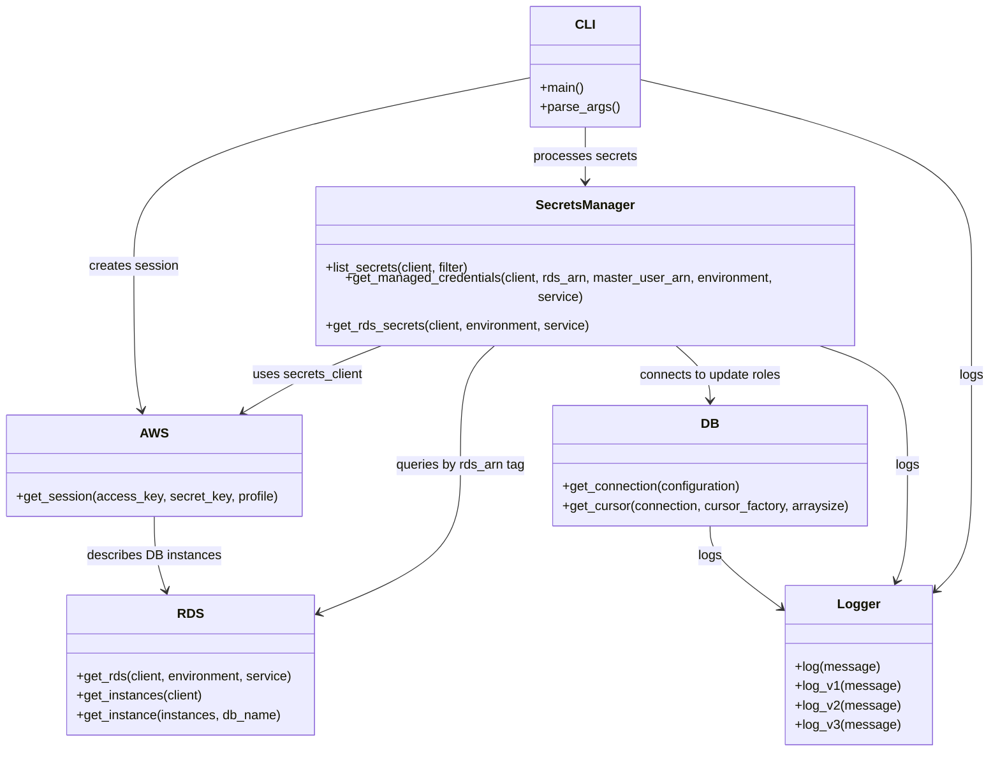

# Diagram: devops/terraform/modules/devops/aws-rds-secret-sync/scripts/role_sync.py


> Auto-generated by Obscura crawlers

## Diagram 1

```mermaid
flowchart TD
    main[main()] --> parse[parse args]
    parse --> getSession[get_session(access_key, secret_key, profile)]
    getSession --> pProfile{profile?}
    pProfile -->|yes| sProfile[Session(profile_name=profile)]
    pProfile -->|no| pKeys{access_key & secret_key?}
    pKeys -->|yes| sKeys[Session(aws_access_key_id, aws_secret_access_key)]
    pKeys -->|no| sDefault[Session() - system permissions]
    sProfile --> process[process_rds_secrets(session, env, service)]
    sKeys --> process
    sDefault --> process
    process --> init[Init: secrets_client, rds_client]
    init --> rds[get_rds(client, environment, service)]
    rds --> instances[get_instances(client)]
    instances --> instanceFilter[get_instance(instances, db_name)]
    instanceFilter --> instanceFound{instance found?}
    instanceFound -->|yes| instanceReturn[return instance]
    instanceFound -->|no| noInstance[raise Exception - No RDS instance found]
    instanceReturn --> masterExtract[extract MasterUserSecret -> master_user_arn]
    masterExtract --> managedCreds[get_managed_credentials(client, rds_arn, master_user_arn, environment, service)]
    managedCreds --> adminCheck{admin secret exists?}
    adminCheck -->|yes| adminUse[get_secret_value(admin_secret) -> configuration{username,password}]
    adminCheck -->|no| findSecrets[list_secrets by rds_arn tag]
    findSecrets --> foundAny{any secrets?}
    foundAny -->|no| noManaged[raise Exception - No RDS managed secret found]
    foundAny -->|yes| filterSecrets[filter secrets by tag -> secret_id]
    filterSecrets --> getManaged[get_secret_value(secret_id) -> configuration{username,password}]
    process --> getRdsSecrets[get_rds_secrets(client, environment, service)]
    getRdsSecrets --> listFilter[list_secrets(filter: secret_prefix)]
    listFilter --> checkName{secret_name matches prefix and not fv_dbadmin?}
    checkName -->|yes| appendSecret[get_secret_value(secret_name) -> append secret]
    checkName -->|no| skipSecret[skip secret]
    appendSecret --> forEach[for each secret]
    forEach --> parseSecret[parse SecretString -> host, port, dbname, username, password]
    parseSecret --> cfgPrep[configuration = {username: managed.username, password: managed.password, host, port, dbname}]
    cfgPrep --> buildQuery[query = ALTER ROLE secret_username PASSWORD 'secret_password']
    buildQuery --> userCheck{secret_username contains @?}
    userCheck -->|no| processUser[get_connection(configuration) -> get_cursor(connection)]
    processUser --> dryCheck{global_dry_run?}
    dryCheck -->|true| skippedExec[append to processed_secrets (skip execute)]
    dryCheck -->|false| execQuery[cursor.execute(query); append to processed_secrets]
    userCheck -->|yes| addUnprocessed[append to unprocessed_secrets; log skipped]
    execQuery --> afterLoop[log processed/unprocessed counts; Done]
```

> SVG rendering failed for this diagram.

## Diagram 2



### SVG

<svg id="container" width="1233.66015625" xmlns="http://www.w3.org/2000/svg" class="classDiagram" height="910" viewBox="0 0 1233.66015625 910" role="graphics-document document" aria-roledescription="class"><style>#container{font-family:"trebuchet ms",verdana,arial,sans-serif;font-size:16px;fill:#333;}@keyframes edge-animation-frame{from{stroke-dashoffset:0;}}@keyframes dash{to{stroke-dashoffset:0;}}#container .edge-animation-slow{stroke-dasharray:9,5!important;stroke-dashoffset:900;animation:dash 50s linear infinite;stroke-linecap:round;}#container .edge-animation-fast{stroke-dasharray:9,5!important;stroke-dashoffset:900;animation:dash 20s linear infinite;stroke-linecap:round;}#container .error-icon{fill:#552222;}#container .error-text{fill:#552222;stroke:#552222;}#container .edge-thickness-normal{stroke-width:1px;}#container .edge-thickness-thick{stroke-width:3.5px;}#container .edge-pattern-solid{stroke-dasharray:0;}#container .edge-thickness-invisible{stroke-width:0;fill:none;}#container .edge-pattern-dashed{stroke-dasharray:3;}#container .edge-pattern-dotted{stroke-dasharray:2;}#container .marker{fill:#333333;stroke:#333333;}#container .marker.cross{stroke:#333333;}#container svg{font-family:"trebuchet ms",verdana,arial,sans-serif;font-size:16px;}#container p{margin:0;}#container g.classGroup text{fill:#9370DB;stroke:none;font-family:"trebuchet ms",verdana,arial,sans-serif;font-size:10px;}#container g.classGroup text .title{font-weight:bolder;}#container .nodeLabel,#container .edgeLabel{color:#131300;}#container .edgeLabel .label rect{fill:#ECECFF;}#container .label text{fill:#131300;}#container .labelBkg{background:#ECECFF;}#container .edgeLabel .label span{background:#ECECFF;}#container .classTitle{font-weight:bolder;}#container .node rect,#container .node circle,#container .node ellipse,#container .node polygon,#container .node path{fill:#ECECFF;stroke:#9370DB;stroke-width:1px;}#container .divider{stroke:#9370DB;stroke-width:1;}#container g.clickable{cursor:pointer;}#container g.classGroup rect{fill:#ECECFF;stroke:#9370DB;}#container g.classGroup line{stroke:#9370DB;stroke-width:1;}#container .classLabel .box{stroke:none;stroke-width:0;fill:#ECECFF;opacity:0.5;}#container .classLabel .label{fill:#9370DB;font-size:10px;}#container .relation{stroke:#333333;stroke-width:1;fill:none;}#container .dashed-line{stroke-dasharray:3;}#container .dotted-line{stroke-dasharray:1 2;}#container #compositionStart,#container .composition{fill:#333333!important;stroke:#333333!important;stroke-width:1;}#container #compositionEnd,#container .composition{fill:#333333!important;stroke:#333333!important;stroke-width:1;}#container #dependencyStart,#container .dependency{fill:#333333!important;stroke:#333333!important;stroke-width:1;}#container #dependencyStart,#container .dependency{fill:#333333!important;stroke:#333333!important;stroke-width:1;}#container #extensionStart,#container .extension{fill:transparent!important;stroke:#333333!important;stroke-width:1;}#container #extensionEnd,#container .extension{fill:transparent!important;stroke:#333333!important;stroke-width:1;}#container #aggregationStart,#container .aggregation{fill:transparent!important;stroke:#333333!important;stroke-width:1;}#container #aggregationEnd,#container .aggregation{fill:transparent!important;stroke:#333333!important;stroke-width:1;}#container #lollipopStart,#container .lollipop{fill:#ECECFF!important;stroke:#333333!important;stroke-width:1;}#container #lollipopEnd,#container .lollipop{fill:#ECECFF!important;stroke:#333333!important;stroke-width:1;}#container .edgeTerminals{font-size:11px;line-height:initial;}#container .classTitleText{text-anchor:middle;font-size:18px;fill:#333;}#container .label-icon{display:inline-block;height:1em;overflow:visible;vertical-align:-0.125em;}#container .node .label-icon path{fill:currentColor;stroke:revert;stroke-width:revert;}#container :root{--mermaid-font-family:"trebuchet ms",verdana,arial,sans-serif;}</style><g><defs><marker id="container_class-aggregationStart" class="marker aggregation class" refX="18" refY="7" markerWidth="190" markerHeight="240" orient="auto"><path d="M 18,7 L9,13 L1,7 L9,1 Z"></path></marker></defs><defs><marker id="container_class-aggregationEnd" class="marker aggregation class" refX="1" refY="7" markerWidth="20" markerHeight="28" orient="auto"><path d="M 18,7 L9,13 L1,7 L9,1 Z"></path></marker></defs><defs><marker id="container_class-extensionStart" class="marker extension class" refX="18" refY="7" markerWidth="190" markerHeight="240" orient="auto"><path d="M 1,7 L18,13 V 1 Z"></path></marker></defs><defs><marker id="container_class-extensionEnd" class="marker extension class" refX="1" refY="7" markerWidth="20" markerHeight="28" orient="auto"><path d="M 1,1 V 13 L18,7 Z"></path></marker></defs><defs><marker id="container_class-compositionStart" class="marker composition class" refX="18" refY="7" markerWidth="190" markerHeight="240" orient="auto"><path d="M 18,7 L9,13 L1,7 L9,1 Z"></path></marker></defs><defs><marker id="container_class-compositionEnd" class="marker composition class" refX="1" refY="7" markerWidth="20" markerHeight="28" orient="auto"><path d="M 18,7 L9,13 L1,7 L9,1 Z"></path></marker></defs><defs><marker id="container_class-dependencyStart" class="marker dependency class" refX="6" refY="7" markerWidth="190" markerHeight="240" orient="auto"><path d="M 5,7 L9,13 L1,7 L9,1 Z"></path></marker></defs><defs><marker id="container_class-dependencyEnd" class="marker dependency class" refX="13" refY="7" markerWidth="20" markerHeight="28" orient="auto"><path d="M 18,7 L9,13 L14,7 L9,1 Z"></path></marker></defs><defs><marker id="container_class-lollipopStart" class="marker lollipop class" refX="13" refY="7" markerWidth="190" markerHeight="240" orient="auto"><circle stroke="black" fill="transparent" cx="7" cy="7" r="6"></circle></marker></defs><defs><marker id="container_class-lollipopEnd" class="marker lollipop class" refX="1" refY="7" markerWidth="190" markerHeight="240" orient="auto"><circle stroke="black" fill="transparent" cx="7" cy="7" r="6"></circle></marker></defs><g class="root"><g class="clusters"></g><g class="edgePaths"><path d="M661.766,96.082L578.853,112.569C495.94,129.055,330.115,162.027,247.202,199.18C164.289,236.333,164.289,277.667,164.289,319C164.289,360.333,164.289,401.667,165.868,429.523C167.446,457.38,170.603,471.76,172.182,478.95L173.76,486.14" id="id_CLI_AWS_1" class="edge-thickness-normal edge-pattern-solid relation" style=";;;" data-edge="true" data-et="edge" data-id="id_CLI_AWS_1" data-points="W3sieCI6NjYxLjc2NTYyNSwieSI6OTYuMDgyMjEzOTE1Njg0Nzl9LHsieCI6MTY0LjI4OTA2MjUsInkiOjE5NX0seyJ4IjoxNjQuMjg5MDYyNSwieSI6MzE5fSx7IngiOjE2NC4yODkwNjI1LCJ5Ijo0NDN9LHsieCI6MTc1LjA0NzExOTE0MDYyNSwieSI6NDkyfV0=" marker-end="url(#container_class-dependencyEnd)"></path><path d="M727.559,158L727.559,164.167C727.559,170.333,727.559,182.667,727.559,194C727.559,205.333,727.559,215.667,727.559,220.833L727.559,226" id="id_CLI_SecretsManager_2" class="edge-thickness-normal edge-pattern-solid relation" style=";;;" data-edge="true" data-et="edge" data-id="id_CLI_SecretsManager_2" data-points="W3sieCI6NzI3LjU1ODU5Mzc1LCJ5IjoxNTh9LHsieCI6NzI3LjU1ODU5Mzc1LCJ5IjoxOTV9LHsieCI6NzI3LjU1ODU5Mzc1LCJ5IjoyMzJ9XQ==" marker-end="url(#container_class-dependencyEnd)"></path><path d="M188.879,618L188.879,626.167C188.879,634.333,188.879,650.667,191.273,666.051C193.667,681.435,198.455,695.87,200.849,703.088L203.243,710.305" id="id_AWS_RDS_3" class="edge-thickness-normal edge-pattern-solid relation" style=";;;" data-edge="true" data-et="edge" data-id="id_AWS_RDS_3" data-points="W3sieCI6MTg4Ljg3ODkwNjI1LCJ5Ijo2MTh9LHsieCI6MTg4Ljg3ODkwNjI1LCJ5Ijo2Njd9LHsieCI6MjA1LjEzMTU0ODcxMzIzNTMsInkiOjcxNn1d" marker-end="url(#container_class-dependencyEnd)"></path><path d="M482.962,406L465.624,412.167C448.287,418.333,413.612,430.667,383.278,444.492C352.944,458.318,326.95,473.636,313.953,481.295L300.956,488.954" id="id_SecretsManager_AWS_4" class="edge-thickness-normal edge-pattern-solid relation" style=";;;" data-edge="true" data-et="edge" data-id="id_SecretsManager_AWS_4" data-points="W3sieCI6NDgyLjk2MTUzNjAzODMwNjQ2LCJ5Ijo0MDZ9LHsieCI6Mzc4LjkzNzUsInkiOjQ0M30seyJ4IjoyOTUuNzg2ODY1MjM0Mzc1LCJ5Ijo0OTJ9XQ==" marker-end="url(#container_class-dependencyEnd)"></path><path d="M618.128,406L610.371,412.167C602.614,418.333,587.101,430.667,579.344,455.5C571.588,480.333,571.588,517.667,571.588,555C571.588,592.333,571.588,629.667,542.156,660.19C512.724,690.713,453.859,714.426,424.427,726.283L394.995,738.139" id="id_SecretsManager_RDS_5" class="edge-thickness-normal edge-pattern-solid relation" style=";;;" data-edge="true" data-et="edge" data-id="id_SecretsManager_RDS_5" data-points="W3sieCI6NjE4LjEyNzUzNTkxMjI5ODQsInkiOjQwNn0seyJ4Ijo1NzEuNTg3ODkwNjI1LCJ5Ijo0NDN9LHsieCI6NTcxLjU4Nzg5MDYyNSwieSI6NTU1fSx7IngiOjU3MS41ODc4OTA2MjUsInkiOjY2N30seyJ4IjozODkuNDI5Njg3NSwieSI6NzQwLjM4MTM1MTU2ODY5MjF9XQ==" marker-end="url(#container_class-dependencyEnd)"></path><path d="M836.99,406L844.746,412.167C852.503,418.333,868.016,430.667,875.773,442C883.529,453.333,883.529,463.667,883.529,468.833L883.529,474" id="id_SecretsManager_DB_6" class="edge-thickness-normal edge-pattern-solid relation" style=";;;" data-edge="true" data-et="edge" data-id="id_SecretsManager_DB_6" data-points="W3sieCI6ODM2Ljk4OTY1MTU4NzcwMTYsInkiOjQwNn0seyJ4Ijo4ODMuNTI5Mjk2ODc1LCJ5Ijo0NDN9LHsieCI6ODgzLjUyOTI5Njg3NSwieSI6NDgwfV0=" marker-end="url(#container_class-dependencyEnd)"></path><path d="M793.352,98.247L862.933,114.373C932.514,130.498,1071.677,162.749,1141.258,199.541C1210.84,236.333,1210.84,277.667,1210.84,319C1210.84,360.333,1210.84,401.667,1210.84,441C1210.84,480.333,1210.84,517.667,1210.84,555C1210.84,592.333,1210.84,629.667,1202.78,656.142C1194.721,682.618,1178.602,698.236,1170.542,706.045L1162.483,713.854" id="id_CLI_Logger_7" class="edge-thickness-normal edge-pattern-solid relation" style=";;;" data-edge="true" data-et="edge" data-id="id_CLI_Logger_7" data-points="W3sieCI6NzkzLjM1MTU2MjUsInkiOjk4LjI0NzQ2MjAxMDk5MjU2fSx7IngiOjEyMTAuODM5ODQzNzUsInkiOjE5NX0seyJ4IjoxMjEwLjgzOTg0Mzc1LCJ5IjozMTl9LHsieCI6MTIxMC44Mzk4NDM3NSwieSI6NDQzfSx7IngiOjEyMTAuODM5ODQzNzUsInkiOjU1NX0seyJ4IjoxMjEwLjgzOTg0Mzc1LCJ5Ijo2Njd9LHsieCI6MTE1OC4xNzM4MjgxMjUsInkiOjcxOC4wMjk1NjkzMzEzODUyfV0=" marker-end="url(#container_class-dependencyEnd)"></path><path d="M1009.518,406L1029.504,412.167C1049.489,418.333,1089.46,430.667,1109.446,455.5C1129.432,480.333,1129.432,517.667,1129.432,555C1129.432,592.333,1129.432,629.667,1127.156,653.582C1124.881,677.498,1120.33,687.997,1118.055,693.246L1115.779,698.495" id="id_SecretsManager_Logger_8" class="edge-thickness-normal edge-pattern-solid relation" style=";;;" data-edge="true" data-et="edge" data-id="id_SecretsManager_Logger_8" data-points="W3sieCI6MTAwOS41MTc5MDg4OTYxNjkzLCJ5Ijo0MDZ9LHsieCI6MTEyOS40MzE2NDA2MjUsInkiOjQ0M30seyJ4IjoxMTI5LjQzMTY0MDYyNSwieSI6NTU1fSx7IngiOjExMjkuNDMxNjQwNjI1LCJ5Ijo2Njd9LHsieCI6MTExMy4zOTI5MjI3OTQxMTc2LCJ5Ijo3MDR9XQ==" marker-end="url(#container_class-dependencyEnd)"></path><path d="M883.529,630L883.529,636.167C883.529,642.333,883.529,654.667,899.263,672.279C914.997,689.892,946.464,712.783,962.198,724.229L977.931,735.675" id="id_DB_Logger_9" class="edge-thickness-normal edge-pattern-solid relation" style=";;;" data-edge="true" data-et="edge" data-id="id_DB_Logger_9" data-points="W3sieCI6ODgzLjUyOTI5Njg3NSwieSI6NjMwfSx7IngiOjg4My41MjkyOTY4NzUsInkiOjY2N30seyJ4Ijo5ODIuNzgzMjAzMTI1LCJ5Ijo3MzkuMjA0MjY2NzAwMDk4Mn1d" marker-end="url(#container_class-dependencyEnd)"></path></g><g class="edgeLabels"><g class="edgeLabel" transform="translate(164.2890625, 319)"><g class="label" data-id="id_CLI_AWS_1" transform="translate(-55.3984375, -12)"><foreignObject width="110.796875" height="24"><div xmlns="http://www.w3.org/1999/xhtml" class="labelBkg" style="display: table-cell; white-space: nowrap; line-height: 1.5; max-width: 200px; text-align: center;"><span class="edgeLabel"><p>creates session</p></span></div></foreignObject></g></g><g class="edgeLabel" transform="translate(727.55859375, 195)"><g class="label" data-id="id_CLI_SecretsManager_2" transform="translate(-63.65625, -12)"><foreignObject width="127.3125" height="24"><div xmlns="http://www.w3.org/1999/xhtml" class="labelBkg" style="display: table-cell; white-space: nowrap; line-height: 1.5; max-width: 200px; text-align: center;"><span class="edgeLabel"><p>processes secrets</p></span></div></foreignObject></g></g><g class="edgeLabel" transform="translate(188.87890625, 667)"><g class="label" data-id="id_AWS_RDS_3" transform="translate(-83.46875, -12)"><foreignObject width="166.9375" height="24"><div xmlns="http://www.w3.org/1999/xhtml" class="labelBkg" style="display: table-cell; white-space: nowrap; line-height: 1.5; max-width: 200px; text-align: center;"><span class="edgeLabel"><p>describes DB instances</p></span></div></foreignObject></g></g><g class="edgeLabel" transform="translate(385.48277, 440.67193)"><g class="label" data-id="id_SecretsManager_AWS_4" transform="translate(-68.5625, -12)"><foreignObject width="137.125" height="24"><div xmlns="http://www.w3.org/1999/xhtml" class="labelBkg" style="display: table-cell; white-space: nowrap; line-height: 1.5; max-width: 200px; text-align: center;"><span class="edgeLabel"><p>uses secrets_client</p></span></div></foreignObject></g></g><g class="edgeLabel" transform="translate(571.587890625, 555)"><g class="label" data-id="id_SecretsManager_RDS_5" transform="translate(-80.859375, -12)"><foreignObject width="161.71875" height="24"><div xmlns="http://www.w3.org/1999/xhtml" class="labelBkg" style="display: table-cell; white-space: nowrap; line-height: 1.5; max-width: 200px; text-align: center;"><span class="edgeLabel"><p>queries by rds_arn tag</p></span></div></foreignObject></g></g><g class="edgeLabel" transform="translate(883.529296875, 443)"><g class="label" data-id="id_SecretsManager_DB_6" transform="translate(-89.9140625, -12)"><foreignObject width="179.828125" height="24"><div xmlns="http://www.w3.org/1999/xhtml" class="labelBkg" style="display: table-cell; white-space: nowrap; line-height: 1.5; max-width: 200px; text-align: center;"><span class="edgeLabel"><p>connects to update roles</p></span></div></foreignObject></g></g><g class="edgeLabel" transform="translate(1210.83984375, 443)"><g class="label" data-id="id_CLI_Logger_7" transform="translate(-14.8203125, -12)"><foreignObject width="29.640625" height="24"><div xmlns="http://www.w3.org/1999/xhtml" class="labelBkg" style="display: table-cell; white-space: nowrap; line-height: 1.5; max-width: 200px; text-align: center;"><span class="edgeLabel"><p>logs</p></span></div></foreignObject></g></g><g class="edgeLabel" transform="translate(1129.431640625, 555)"><g class="label" data-id="id_SecretsManager_Logger_8" transform="translate(-14.8203125, -12)"><foreignObject width="29.640625" height="24"><div xmlns="http://www.w3.org/1999/xhtml" class="labelBkg" style="display: table-cell; white-space: nowrap; line-height: 1.5; max-width: 200px; text-align: center;"><span class="edgeLabel"><p>logs</p></span></div></foreignObject></g></g><g class="edgeLabel" transform="translate(883.529296875, 667)"><g class="label" data-id="id_DB_Logger_9" transform="translate(-14.8203125, -12)"><foreignObject width="29.640625" height="24"><div xmlns="http://www.w3.org/1999/xhtml" class="labelBkg" style="display: table-cell; white-space: nowrap; line-height: 1.5; max-width: 200px; text-align: center;"><span class="edgeLabel"><p>logs</p></span></div></foreignObject></g></g></g><g class="nodes"><g class="node default" id="classId-CLI-0" transform="translate(727.55859375, 83)"><g class="basic label-container"><path d="M-65.79296875 -75 L65.79296875 -75 L65.79296875 75 L-65.79296875 75" stroke="none" stroke-width="0" fill="#ECECFF" style=""></path><path d="M-65.79296875 -75 C-29.94185924229042 -75, 5.9092502654191605 -75, 65.79296875 -75 M-65.79296875 -75 C-33.26718554399582 -75, -0.7414023379916443 -75, 65.79296875 -75 M65.79296875 -75 C65.79296875 -37.089752866899836, 65.79296875 0.8204942662003276, 65.79296875 75 M65.79296875 -75 C65.79296875 -19.433851601855586, 65.79296875 36.13229679628883, 65.79296875 75 M65.79296875 75 C25.033379450653896 75, -15.726209848692207 75, -65.79296875 75 M65.79296875 75 C20.268982176396577 75, -25.255004397206847 75, -65.79296875 75 M-65.79296875 75 C-65.79296875 41.938263768977066, -65.79296875 8.876527537954132, -65.79296875 -75 M-65.79296875 75 C-65.79296875 35.04652438680591, -65.79296875 -4.906951226388173, -65.79296875 -75" stroke="#9370DB" stroke-width="1.3" fill="none" stroke-dasharray="0 0" style=""></path></g><g class="annotation-group text" transform="translate(0, -51)"></g><g class="label-group text" transform="translate(-11.0546875, -51)"><g class="label" style="font-weight: bolder" transform="translate(0,-12)"><foreignObject width="22.109375" height="24"><div xmlns="http://www.w3.org/1999/xhtml" style="display: table-cell; white-space: nowrap; line-height: 1.5; max-width: 72px; text-align: center;"><span class="nodeLabel markdown-node-label" style=""><p>CLI</p></span></div></foreignObject></g></g><g class="members-group text" transform="translate(-53.79296875, -3)"></g><g class="methods-group text" transform="translate(-53.79296875, 27)"><g class="label" style="" transform="translate(0,-12)"><foreignObject width="54.65625" height="24"><div xmlns="http://www.w3.org/1999/xhtml" style="display: table-cell; white-space: nowrap; line-height: 1.5; max-width: 112px; text-align: center;"><span class="nodeLabel markdown-node-label" style=""><p>+main()</p></span></div></foreignObject></g><g class="label" style="" transform="translate(0,12)"><foreignObject width="96.53125" height="24"><div xmlns="http://www.w3.org/1999/xhtml" style="display: table-cell; white-space: nowrap; line-height: 1.5; max-width: 154px; text-align: center;"><span class="nodeLabel markdown-node-label" style=""><p>+parse_args()</p></span></div></foreignObject></g></g><g class="divider" style=""><path d="M-65.79296875 -27 C-35.04492103946831 -27, -4.296873328936627 -27, 65.79296875 -27 M-65.79296875 -27 C-29.075955244253265 -27, 7.64105826149347 -27, 65.79296875 -27" stroke="#9370DB" stroke-width="1.3" fill="none" stroke-dasharray="0 0" style=""></path></g><g class="divider" style=""><path d="M-65.79296875 -3 C-32.887748716281685 -3, 0.01747131743663033 -3, 65.79296875 -3 M-65.79296875 -3 C-18.134739739596746 -3, 29.523489270806508 -3, 65.79296875 -3" stroke="#9370DB" stroke-width="1.3" fill="none" stroke-dasharray="0 0" style=""></path></g></g><g class="node default" id="classId-AWS-1" transform="translate(188.87890625, 555)"><g class="basic label-container"><path d="M-180.87890625 -63 L180.87890625 -63 L180.87890625 63 L-180.87890625 63" stroke="none" stroke-width="0" fill="#ECECFF" style=""></path><path d="M-180.87890625 -63 C-78.27071840816447 -63, 24.33746943367106 -63, 180.87890625 -63 M-180.87890625 -63 C-54.403689464671956 -63, 72.07152732065609 -63, 180.87890625 -63 M180.87890625 -63 C180.87890625 -16.800494605429556, 180.87890625 29.39901078914089, 180.87890625 63 M180.87890625 -63 C180.87890625 -36.510925257826216, 180.87890625 -10.021850515652432, 180.87890625 63 M180.87890625 63 C61.59516144870797 63, -57.68858335258406 63, -180.87890625 63 M180.87890625 63 C60.940919221147 63, -58.997067807706 63, -180.87890625 63 M-180.87890625 63 C-180.87890625 31.3346122093219, -180.87890625 -0.33077558135619967, -180.87890625 -63 M-180.87890625 63 C-180.87890625 23.251412467259442, -180.87890625 -16.497175065481116, -180.87890625 -63" stroke="#9370DB" stroke-width="1.3" fill="none" stroke-dasharray="0 0" style=""></path></g><g class="annotation-group text" transform="translate(0, -39)"></g><g class="label-group text" transform="translate(-15.9921875, -39)"><g class="label" style="font-weight: bolder" transform="translate(0,-12)"><foreignObject width="31.984375" height="24"><div xmlns="http://www.w3.org/1999/xhtml" style="display: table-cell; white-space: nowrap; line-height: 1.5; max-width: 81px; text-align: center;"><span class="nodeLabel markdown-node-label" style=""><p>AWS</p></span></div></foreignObject></g></g><g class="members-group text" transform="translate(-168.87890625, 9)"></g><g class="methods-group text" transform="translate(-168.87890625, 39)"><g class="label" style="" transform="translate(0,-12)"><foreignObject width="321.765625" height="24"><div xmlns="http://www.w3.org/1999/xhtml" style="display: table-cell; white-space: nowrap; line-height: 1.5; max-width: 379px; text-align: center;"><span class="nodeLabel markdown-node-label" style=""><p>+get_session(access_key, secret_key, profile)</p></span></div></foreignObject></g></g><g class="divider" style=""><path d="M-180.87890625 -15 C-67.62385477085039 -15, 45.63119670829923 -15, 180.87890625 -15 M-180.87890625 -15 C-101.94111172320774 -15, -23.00331719641548 -15, 180.87890625 -15" stroke="#9370DB" stroke-width="1.3" fill="none" stroke-dasharray="0 0" style=""></path></g><g class="divider" style=""><path d="M-180.87890625 9 C-105.59652634053535 9, -30.314146431070697 9, 180.87890625 9 M-180.87890625 9 C-64.1043092179551 9, 52.67028781408979 9, 180.87890625 9" stroke="#9370DB" stroke-width="1.3" fill="none" stroke-dasharray="0 0" style=""></path></g></g><g class="node default" id="classId-RDS-2" transform="translate(233.98828125, 803)"><g class="basic label-container"><path d="M-155.44140625 -87 L155.44140625 -87 L155.44140625 87 L-155.44140625 87" stroke="none" stroke-width="0" fill="#ECECFF" style=""></path><path d="M-155.44140625 -87 C-74.82460874469986 -87, 5.792188760600283 -87, 155.44140625 -87 M-155.44140625 -87 C-50.98882130956949 -87, 53.463763630861024 -87, 155.44140625 -87 M155.44140625 -87 C155.44140625 -25.379494117834284, 155.44140625 36.24101176433143, 155.44140625 87 M155.44140625 -87 C155.44140625 -41.33452937954921, 155.44140625 4.330941240901581, 155.44140625 87 M155.44140625 87 C88.53292645110203 87, 21.624446652204057 87, -155.44140625 87 M155.44140625 87 C56.84664357526799 87, -41.74811909946402 87, -155.44140625 87 M-155.44140625 87 C-155.44140625 40.89109703887452, -155.44140625 -5.21780592225096, -155.44140625 -87 M-155.44140625 87 C-155.44140625 21.649111510297928, -155.44140625 -43.701776979404144, -155.44140625 -87" stroke="#9370DB" stroke-width="1.3" fill="none" stroke-dasharray="0 0" style=""></path></g><g class="annotation-group text" transform="translate(0, -63)"></g><g class="label-group text" transform="translate(-14.7265625, -63)"><g class="label" style="font-weight: bolder" transform="translate(0,-12)"><foreignObject width="29.453125" height="24"><div xmlns="http://www.w3.org/1999/xhtml" style="display: table-cell; white-space: nowrap; line-height: 1.5; max-width: 79px; text-align: center;"><span class="nodeLabel markdown-node-label" style=""><p>RDS</p></span></div></foreignObject></g></g><g class="members-group text" transform="translate(-143.44140625, -15)"></g><g class="methods-group text" transform="translate(-143.44140625, 15)"><g class="label" style="" transform="translate(0,-12)"><foreignObject width="272.15625" height="24"><div xmlns="http://www.w3.org/1999/xhtml" style="display: table-cell; white-space: nowrap; line-height: 1.5; max-width: 330px; text-align: center;"><span class="nodeLabel markdown-node-label" style=""><p>+get_rds(client, environment, service)</p></span></div></foreignObject></g><g class="label" style="" transform="translate(0,12)"><foreignObject width="158.578125" height="24"><div xmlns="http://www.w3.org/1999/xhtml" style="display: table-cell; white-space: nowrap; line-height: 1.5; max-width: 216px; text-align: center;"><span class="nodeLabel markdown-node-label" style=""><p>+get_instances(client)</p></span></div></foreignObject></g><g class="label" style="" transform="translate(0,36)"><foreignObject width="254.6875" height="24"><div xmlns="http://www.w3.org/1999/xhtml" style="display: table-cell; white-space: nowrap; line-height: 1.5; max-width: 312px; text-align: center;"><span class="nodeLabel markdown-node-label" style=""><p>+get_instance(instances, db_name)</p></span></div></foreignObject></g></g><g class="divider" style=""><path d="M-155.44140625 -39 C-59.87950306996595 -39, 35.6824001100681 -39, 155.44140625 -39 M-155.44140625 -39 C-89.01538976580218 -39, -22.589373281604367 -39, 155.44140625 -39" stroke="#9370DB" stroke-width="1.3" fill="none" stroke-dasharray="0 0" style=""></path></g><g class="divider" style=""><path d="M-155.44140625 -15 C-39.99019867440717 -15, 75.46100890118566 -15, 155.44140625 -15 M-155.44140625 -15 C-74.5635811964396 -15, 6.3142438571208 -15, 155.44140625 -15" stroke="#9370DB" stroke-width="1.3" fill="none" stroke-dasharray="0 0" style=""></path></g></g><g class="node default" id="classId-SecretsManager-3" transform="translate(727.55859375, 319)"><g class="basic label-container"><path d="M-338.8984375 -87 L338.8984375 -87 L338.8984375 87 L-338.8984375 87" stroke="none" stroke-width="0" fill="#ECECFF" style=""></path><path d="M-338.8984375 -87 C-70.78127618642765 -87, 197.3358851271447 -87, 338.8984375 -87 M-338.8984375 -87 C-77.49501740206023 -87, 183.90840269587954 -87, 338.8984375 -87 M338.8984375 -87 C338.8984375 -24.1065851656544, 338.8984375 38.7868296686912, 338.8984375 87 M338.8984375 -87 C338.8984375 -38.89739055547386, 338.8984375 9.205218889052276, 338.8984375 87 M338.8984375 87 C132.6195216053939 87, -73.65939428921217 87, -338.8984375 87 M338.8984375 87 C176.53425372436502 87, 14.170069948730031 87, -338.8984375 87 M-338.8984375 87 C-338.8984375 20.58408317329497, -338.8984375 -45.83183365341006, -338.8984375 -87 M-338.8984375 87 C-338.8984375 27.212093985747103, -338.8984375 -32.575812028505794, -338.8984375 -87" stroke="#9370DB" stroke-width="1.3" fill="none" stroke-dasharray="0 0" style=""></path></g><g class="annotation-group text" transform="translate(0, -63)"></g><g class="label-group text" transform="translate(-58.609375, -63)"><g class="label" style="font-weight: bolder" transform="translate(0,-12)"><foreignObject width="117.21875" height="24"><div xmlns="http://www.w3.org/1999/xhtml" style="display: table-cell; white-space: nowrap; line-height: 1.5; max-width: 166px; text-align: center;"><span class="nodeLabel markdown-node-label" style=""><p>SecretsManager</p></span></div></foreignObject></g></g><g class="members-group text" transform="translate(-326.8984375, -15)"></g><g class="methods-group text" transform="translate(-326.8984375, 15)"><g class="label" style="" transform="translate(0,-12)"><foreignObject width="183.8125" height="24"><div xmlns="http://www.w3.org/1999/xhtml" style="display: table-cell; white-space: nowrap; line-height: 1.5; max-width: 241px; text-align: center;"><span class="nodeLabel markdown-node-label" style=""><p>+list_secrets(client, filter)</p></span></div></foreignObject></g><g class="label" style="" transform="translate(0,12)"><foreignObject width="595.1875" height="24"><div xmlns="http://www.w3.org/1999/xhtml" style="display: table-cell; white-space: nowrap; line-height: 1.5; max-width: 653px; text-align: center;"><span class="nodeLabel markdown-node-label" style=""><p>+get_managed_credentials(client, rds_arn, master_user_arn, environment, service)</p></span></div></foreignObject></g><g class="label" style="" transform="translate(0,36)"><foreignObject width="331.65625" height="24"><div xmlns="http://www.w3.org/1999/xhtml" style="display: table-cell; white-space: nowrap; line-height: 1.5; max-width: 389px; text-align: center;"><span class="nodeLabel markdown-node-label" style=""><p>+get_rds_secrets(client, environment, service)</p></span></div></foreignObject></g></g><g class="divider" style=""><path d="M-338.8984375 -39 C-155.73221132756387 -39, 27.43401484487225 -39, 338.8984375 -39 M-338.8984375 -39 C-190.98552163737432 -39, -43.07260577474864 -39, 338.8984375 -39" stroke="#9370DB" stroke-width="1.3" fill="none" stroke-dasharray="0 0" style=""></path></g><g class="divider" style=""><path d="M-338.8984375 -15 C-151.02315662131534 -15, 36.852124257369326 -15, 338.8984375 -15 M-338.8984375 -15 C-91.26987562758933 -15, 156.35868624482134 -15, 338.8984375 -15" stroke="#9370DB" stroke-width="1.3" fill="none" stroke-dasharray="0 0" style=""></path></g></g><g class="node default" id="classId-DB-4" transform="translate(883.529296875, 555)"><g class="basic label-container"><path d="M-196.08203125 -75 L196.08203125 -75 L196.08203125 75 L-196.08203125 75" stroke="none" stroke-width="0" fill="#ECECFF" style=""></path><path d="M-196.08203125 -75 C-93.29473569554818 -75, 9.492559858903633 -75, 196.08203125 -75 M-196.08203125 -75 C-49.39510728276662 -75, 97.29181668446677 -75, 196.08203125 -75 M196.08203125 -75 C196.08203125 -35.88685837063632, 196.08203125 3.2262832587273635, 196.08203125 75 M196.08203125 -75 C196.08203125 -20.408362469885397, 196.08203125 34.18327506022921, 196.08203125 75 M196.08203125 75 C111.59291646558192 75, 27.103801681163844 75, -196.08203125 75 M196.08203125 75 C87.48724268323319 75, -21.107545883533618 75, -196.08203125 75 M-196.08203125 75 C-196.08203125 32.133601787431445, -196.08203125 -10.73279642513711, -196.08203125 -75 M-196.08203125 75 C-196.08203125 34.31827218715698, -196.08203125 -6.3634556256860435, -196.08203125 -75" stroke="#9370DB" stroke-width="1.3" fill="none" stroke-dasharray="0 0" style=""></path></g><g class="annotation-group text" transform="translate(0, -51)"></g><g class="label-group text" transform="translate(-10.1484375, -51)"><g class="label" style="font-weight: bolder" transform="translate(0,-12)"><foreignObject width="20.296875" height="24"><div xmlns="http://www.w3.org/1999/xhtml" style="display: table-cell; white-space: nowrap; line-height: 1.5; max-width: 70px; text-align: center;"><span class="nodeLabel markdown-node-label" style=""><p>DB</p></span></div></foreignObject></g></g><g class="members-group text" transform="translate(-184.08203125, -3)"></g><g class="methods-group text" transform="translate(-184.08203125, 27)"><g class="label" style="" transform="translate(0,-12)"><foreignObject width="225.765625" height="24"><div xmlns="http://www.w3.org/1999/xhtml" style="display: table-cell; white-space: nowrap; line-height: 1.5; max-width: 283px; text-align: center;"><span class="nodeLabel markdown-node-label" style=""><p>+get_connection(configuration)</p></span></div></foreignObject></g><g class="label" style="" transform="translate(0,12)"><foreignObject width="358.015625" height="24"><div xmlns="http://www.w3.org/1999/xhtml" style="display: table-cell; white-space: nowrap; line-height: 1.5; max-width: 415px; text-align: center;"><span class="nodeLabel markdown-node-label" style=""><p>+get_cursor(connection, cursor_factory, arraysize)</p></span></div></foreignObject></g></g><g class="divider" style=""><path d="M-196.08203125 -27 C-48.567183289755576 -27, 98.94766467048885 -27, 196.08203125 -27 M-196.08203125 -27 C-79.61353538735797 -27, 36.85496047528406 -27, 196.08203125 -27" stroke="#9370DB" stroke-width="1.3" fill="none" stroke-dasharray="0 0" style=""></path></g><g class="divider" style=""><path d="M-196.08203125 -3 C-51.19655938121613 -3, 93.68891248756773 -3, 196.08203125 -3 M-196.08203125 -3 C-112.39137789605573 -3, -28.70072454211146 -3, 196.08203125 -3" stroke="#9370DB" stroke-width="1.3" fill="none" stroke-dasharray="0 0" style=""></path></g></g><g class="node default" id="classId-Logger-5" transform="translate(1070.478515625, 803)"><g class="basic label-container"><path d="M-87.6953125 -99 L87.6953125 -99 L87.6953125 99 L-87.6953125 99" stroke="none" stroke-width="0" fill="#ECECFF" style=""></path><path d="M-87.6953125 -99 C-49.02609531976779 -99, -10.356878139535581 -99, 87.6953125 -99 M-87.6953125 -99 C-42.829011327211234 -99, 2.037289845577533 -99, 87.6953125 -99 M87.6953125 -99 C87.6953125 -23.935041791758366, 87.6953125 51.12991641648327, 87.6953125 99 M87.6953125 -99 C87.6953125 -40.054996934676396, 87.6953125 18.89000613064721, 87.6953125 99 M87.6953125 99 C46.22806588933075 99, 4.760819278661501 99, -87.6953125 99 M87.6953125 99 C20.88601416927581 99, -45.92328416144838 99, -87.6953125 99 M-87.6953125 99 C-87.6953125 28.994205944296212, -87.6953125 -41.011588111407576, -87.6953125 -99 M-87.6953125 99 C-87.6953125 26.107795580109098, -87.6953125 -46.784408839781804, -87.6953125 -99" stroke="#9370DB" stroke-width="1.3" fill="none" stroke-dasharray="0 0" style=""></path></g><g class="annotation-group text" transform="translate(0, -75)"></g><g class="label-group text" transform="translate(-24.84375, -75)"><g class="label" style="font-weight: bolder" transform="translate(0,-12)"><foreignObject width="49.6875" height="24"><div xmlns="http://www.w3.org/1999/xhtml" style="display: table-cell; white-space: nowrap; line-height: 1.5; max-width: 99px; text-align: center;"><span class="nodeLabel markdown-node-label" style=""><p>Logger</p></span></div></foreignObject></g></g><g class="members-group text" transform="translate(-75.6953125, -27)"></g><g class="methods-group text" transform="translate(-75.6953125, 3)"><g class="label" style="" transform="translate(0,-12)"><foreignObject width="103.015625" height="24"><div xmlns="http://www.w3.org/1999/xhtml" style="display: table-cell; white-space: nowrap; line-height: 1.5; max-width: 160px; text-align: center;"><span class="nodeLabel markdown-node-label" style=""><p>+log(message)</p></span></div></foreignObject></g><g class="label" style="" transform="translate(0,12)"><foreignObject width="125.71875" height="24"><div xmlns="http://www.w3.org/1999/xhtml" style="display: table-cell; white-space: nowrap; line-height: 1.5; max-width: 183px; text-align: center;"><span class="nodeLabel markdown-node-label" style=""><p>+log_v1(message)</p></span></div></foreignObject></g><g class="label" style="" transform="translate(0,36)"><foreignObject width="126.546875" height="24"><div xmlns="http://www.w3.org/1999/xhtml" style="display: table-cell; white-space: nowrap; line-height: 1.5; max-width: 184px; text-align: center;"><span class="nodeLabel markdown-node-label" style=""><p>+log_v2(message)</p></span></div></foreignObject></g><g class="label" style="" transform="translate(0,60)"><foreignObject width="126.546875" height="24"><div xmlns="http://www.w3.org/1999/xhtml" style="display: table-cell; white-space: nowrap; line-height: 1.5; max-width: 184px; text-align: center;"><span class="nodeLabel markdown-node-label" style=""><p>+log_v3(message)</p></span></div></foreignObject></g></g><g class="divider" style=""><path d="M-87.6953125 -51 C-21.645867120256398 -51, 44.403578259487205 -51, 87.6953125 -51 M-87.6953125 -51 C-44.96899576807699 -51, -2.242679036153973 -51, 87.6953125 -51" stroke="#9370DB" stroke-width="1.3" fill="none" stroke-dasharray="0 0" style=""></path></g><g class="divider" style=""><path d="M-87.6953125 -27 C-27.90767877483725 -27, 31.879954950325498 -27, 87.6953125 -27 M-87.6953125 -27 C-40.69485872533554 -27, 6.305595049328915 -27, 87.6953125 -27" stroke="#9370DB" stroke-width="1.3" fill="none" stroke-dasharray="0 0" style=""></path></g></g></g></g></g></svg>
