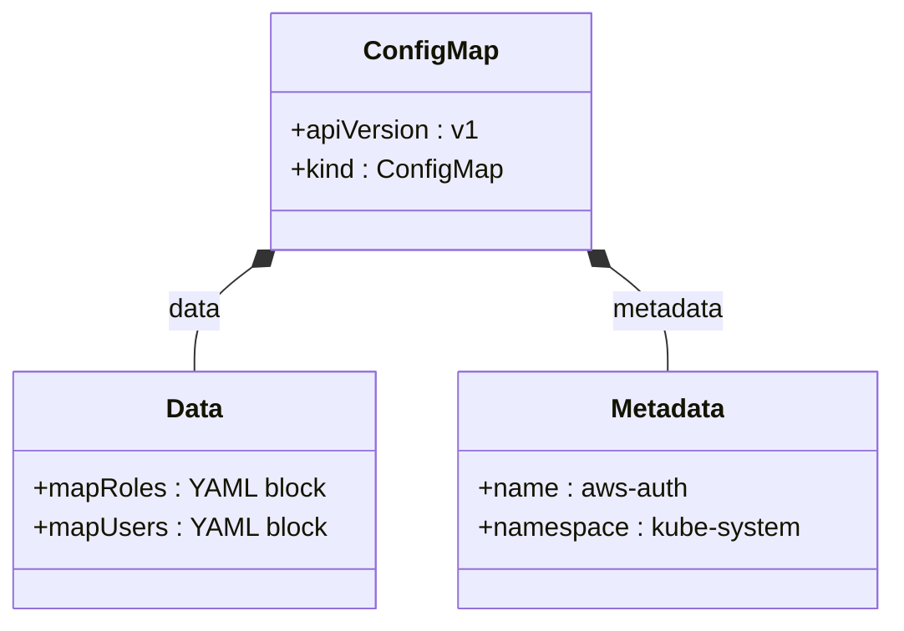

# Diagram: devops/terraform/modules/eks/eks-rbac/aws-auth.yaml

> Auto-generated by Obscura crawlers

## Mermaid

### SVG

<svg id="container" width="533.875" xmlns="http://www.w3.org/2000/svg" class="classDiagram" height="378" viewBox="0 0 533.875 378" role="graphics-document document" aria-roledescription="class"><g><defs><marker id="container_class-aggregationStart" class="marker aggregation class" refX="18" refY="7" markerWidth="190" markerHeight="240" orient="auto"><path d="M 18,7 L9,13 L1,7 L9,1 Z"></path></marker></defs><defs><marker id="container_class-aggregationEnd" class="marker aggregation class" refX="1" refY="7" markerWidth="20" markerHeight="28" orient="auto"><path d="M 18,7 L9,13 L1,7 L9,1 Z"></path></marker></defs><defs><marker id="container_class-extensionStart" class="marker extension class" refX="18" refY="7" markerWidth="190" markerHeight="240" orient="auto"><path d="M 1,7 L18,13 V 1 Z"></path></marker></defs><defs><marker id="container_class-extensionEnd" class="marker extension class" refX="1" refY="7" markerWidth="20" markerHeight="28" orient="auto"><path d="M 1,1 V 13 L18,7 Z"></path></marker></defs><defs><marker id="container_class-compositionStart" class="marker composition class" refX="18" refY="7" markerWidth="190" markerHeight="240" orient="auto"><path d="M 18,7 L9,13 L1,7 L9,1 Z"></path></marker></defs><defs><marker id="container_class-compositionEnd" class="marker composition class" refX="1" refY="7" markerWidth="20" markerHeight="28" orient="auto"><path d="M 18,7 L9,13 L1,7 L9,1 Z"></path></marker></defs><defs><marker id="container_class-dependencyStart" class="marker dependency class" refX="6" refY="7" markerWidth="190" markerHeight="240" orient="auto"><path d="M 5,7 L9,13 L1,7 L9,1 Z"></path></marker></defs><defs><marker id="container_class-dependencyEnd" class="marker dependency class" refX="13" refY="7" markerWidth="20" markerHeight="28" orient="auto"><path d="M 18,7 L9,13 L14,7 L9,1 Z"></path></marker></defs><defs><marker id="container_class-lollipopStart" class="marker lollipop class" refX="13" refY="7" markerWidth="190" markerHeight="240" orient="auto"><circle stroke="black" fill="transparent" cx="7" cy="7" r="6"></circle></marker></defs><defs><marker id="container_class-lollipopEnd" class="marker lollipop class" refX="1" refY="7" markerWidth="190" markerHeight="240" orient="auto"><circle stroke="black" fill="transparent" cx="7" cy="7" r="6"></circle></marker></defs><g class="root"><g class="clusters"></g><g class="edgePaths"><path d="M149.696,162.505L143.945,166.921C138.193,171.337,126.69,180.168,120.939,190.751C115.188,201.333,115.188,213.667,115.188,219.833L115.188,226" id="id_ConfigMap_Data_1" class="edge-thickness-normal edge-pattern-solid relation" style=";;;" data-edge="true" data-et="edge" data-id="id_ConfigMap_Data_1" data-points="W3sieCI6MTYzLjM3ODcyNzA2NDIyMDIsInkiOjE1Mn0seyJ4IjoxMTUuMTg3NSwieSI6MTg5fSx7IngiOjExNS4xODc1LCJ5IjoyMjZ9XQ==" marker-start="url(#container_class-compositionStart)"></path><path d="M364.616,162.505L370.368,166.921C376.119,171.337,387.622,180.168,393.374,190.751C399.125,201.333,399.125,213.667,399.125,219.833L399.125,226" id="id_ConfigMap_Metadata_2" class="edge-thickness-normal edge-pattern-solid relation" style=";;;" data-edge="true" data-et="edge" data-id="id_ConfigMap_Metadata_2" data-points="W3sieCI6MzUwLjkzMzc3MjkzNTc3OTgsInkiOjE1Mn0seyJ4IjozOTkuMTI1LCJ5IjoxODl9LHsieCI6Mzk5LjEyNSwieSI6MjI2fV0=" marker-start="url(#container_class-compositionStart)"></path></g><g class="edgeLabels"><g class="edgeLabel" transform="translate(115.1875, 189)"><g class="label" data-id="id_ConfigMap_Data_1" transform="translate(-16.3203125, -12)"><foreignObject width="32.640625" height="24">

data

</foreignObject></g></g><g class="edgeLabel" transform="translate(399.125, 189)"><g class="label" data-id="id_ConfigMap_Metadata_2" transform="translate(-34.7265625, -12)"><foreignObject width="69.453125" height="24">

metadata

</foreignObject></g></g></g><g class="nodes"><g class="node default" id="classId-ConfigMap-0" transform="translate(257.15625, 80)"><g class="basic label-container"><path d="M-94.94140625 -72 L94.94140625 -72 L94.94140625 72 L-94.94140625 72" stroke="none" stroke-width="0" fill="#ECECFF" style=""></path><path d="M-94.94140625 -72 C-31.006403952278077 -72, 32.928598345443845 -72, 94.94140625 -72 M-94.94140625 -72 C-24.9431999280812 -72, 45.0550063938376 -72, 94.94140625 -72 M94.94140625 -72 C94.94140625 -32.57034663914209, 94.94140625 6.859306721715825, 94.94140625 72 M94.94140625 -72 C94.94140625 -28.03692470177314, 94.94140625 15.926150596453724, 94.94140625 72 M94.94140625 72 C46.81198863601685 72, -1.3174289779663013 72, -94.94140625 72 M94.94140625 72 C39.65513507715461 72, -15.631136095690778 72, -94.94140625 72 M-94.94140625 72 C-94.94140625 36.80135022511565, -94.94140625 1.6027004502312963, -94.94140625 -72 M-94.94140625 72 C-94.94140625 39.98835012047212, -94.94140625 7.97670024094424, -94.94140625 -72" stroke="#9370DB" stroke-width="1.3" fill="none" stroke-dasharray="0 0" style=""></path></g><g class="annotation-group text" transform="translate(0, -48)"></g><g class="label-group text" transform="translate(-38.3828125, -48)"><g class="label" style="font-weight: bolder" transform="translate(0,-12)"><foreignObject width="76.765625" height="24">

ConfigMap

</foreignObject></g></g><g class="members-group text" transform="translate(-82.94140625, 0)"><g class="label" style="" transform="translate(0,-12)"><foreignObject width="111.453125" height="24">

+apiVersion : v1

</foreignObject></g><g class="label" style="" transform="translate(0,12)"><foreignObject width="127.5" height="24">

+kind : ConfigMap

</foreignObject></g></g><g class="methods-group text" transform="translate(-82.94140625, 72)"></g><g class="divider" style=""><path d="M-94.94140625 -24 C-55.141772977026186 -24, -15.342139704052371 -24, 94.94140625 -24 M-94.94140625 -24 C-54.39781588295104 -24, -13.854225515902087 -24, 94.94140625 -24" stroke="#9370DB" stroke-width="1.3" fill="none" stroke-dasharray="0 0" style=""></path></g><g class="divider" style=""><path d="M-94.94140625 48 C-25.54294152245643 48, 43.85552320508714 48, 94.94140625 48 M-94.94140625 48 C-28.400132283144117 48, 38.141141683711766 48, 94.94140625 48" stroke="#9370DB" stroke-width="1.3" fill="none" stroke-dasharray="0 0" style=""></path></g></g><g class="node default" id="classId-Data-1" transform="translate(115.1875, 298)"><g class="basic label-container"><path d="M-107.1875 -72 L107.1875 -72 L107.1875 72 L-107.1875 72" stroke="none" stroke-width="0" fill="#ECECFF" style=""></path><path d="M-107.1875 -72 C-40.80761564031337 -72, 25.572268719373255 -72, 107.1875 -72 M-107.1875 -72 C-56.69947768236697 -72, -6.211455364733936 -72, 107.1875 -72 M107.1875 -72 C107.1875 -18.071313757713348, 107.1875 35.857372484573304, 107.1875 72 M107.1875 -72 C107.1875 -19.239445704903908, 107.1875 33.521108590192185, 107.1875 72 M107.1875 72 C22.991110907651603 72, -61.205278184696795 72, -107.1875 72 M107.1875 72 C48.9441639091689 72, -9.2991721816622 72, -107.1875 72 M-107.1875 72 C-107.1875 21.323466966888667, -107.1875 -29.353066066222667, -107.1875 -72 M-107.1875 72 C-107.1875 42.622503232752564, -107.1875 13.245006465505128, -107.1875 -72" stroke="#9370DB" stroke-width="1.3" fill="none" stroke-dasharray="0 0" style=""></path></g><g class="annotation-group text" transform="translate(0, -48)"></g><g class="label-group text" transform="translate(-16.890625, -48)"><g class="label" style="font-weight: bolder" transform="translate(0,-12)"><foreignObject width="33.78125" height="24">

Data

</foreignObject></g></g><g class="members-group text" transform="translate(-95.1875, 0)"><g class="label" style="" transform="translate(0,-12)"><foreignObject width="172.953125" height="24">

+mapRoles : YAML block

</foreignObject></g><g class="label" style="" transform="translate(0,12)"><foreignObject width="173.484375" height="24">

+mapUsers : YAML block

</foreignObject></g></g><g class="methods-group text" transform="translate(-95.1875, 72)"></g><g class="divider" style=""><path d="M-107.1875 -24 C-36.3471896140279 -24, 34.493120771944206 -24, 107.1875 -24 M-107.1875 -24 C-52.202466060287925 -24, 2.7825678794241497 -24, 107.1875 -24" stroke="#9370DB" stroke-width="1.3" fill="none" stroke-dasharray="0 0" style=""></path></g><g class="divider" style=""><path d="M-107.1875 48 C-29.74439807543348 48, 47.69870384913304 48, 107.1875 48 M-107.1875 48 C-34.301884941652204 48, 38.58373011669559 48, 107.1875 48" stroke="#9370DB" stroke-width="1.3" fill="none" stroke-dasharray="0 0" style=""></path></g></g><g class="node default" id="classId-Metadata-2" transform="translate(399.125, 298)"><g class="basic label-container"><path d="M-126.75 -72 L126.75 -72 L126.75 72 L-126.75 72" stroke="none" stroke-width="0" fill="#ECECFF" style=""></path><path d="M-126.75 -72 C-56.71545152327913 -72, 13.319096953441743 -72, 126.75 -72 M-126.75 -72 C-69.20092780977092 -72, -11.651855619541848 -72, 126.75 -72 M126.75 -72 C126.75 -28.536332343932187, 126.75 14.927335312135625, 126.75 72 M126.75 -72 C126.75 -39.30846484699099, 126.75 -6.616929693981973, 126.75 72 M126.75 72 C51.234924462882134 72, -24.280151074235732 72, -126.75 72 M126.75 72 C59.85680893876257 72, -7.036382122474862 72, -126.75 72 M-126.75 72 C-126.75 17.740532967948056, -126.75 -36.51893406410389, -126.75 -72 M-126.75 72 C-126.75 14.722227843854341, -126.75 -42.55554431229132, -126.75 -72" stroke="#9370DB" stroke-width="1.3" fill="none" stroke-dasharray="0 0" style=""></path></g><g class="annotation-group text" transform="translate(0, -48)"></g><g class="label-group text" transform="translate(-34.640625, -48)"><g class="label" style="font-weight: bolder" transform="translate(0,-12)"><foreignObject width="69.28125" height="24">

Metadata

</foreignObject></g></g><g class="members-group text" transform="translate(-114.75, 0)"><g class="label" style="" transform="translate(0,-12)"><foreignObject width="127.609375" height="24">

+name : aws-auth

</foreignObject></g><g class="label" style="" transform="translate(0,12)"><foreignObject width="194.859375" height="24">

+namespace : kube-system

</foreignObject></g></g><g class="methods-group text" transform="translate(-114.75, 72)"></g><g class="divider" style=""><path d="M-126.75 -24 C-37.039993823242554 -24, 52.67001235351489 -24, 126.75 -24 M-126.75 -24 C-54.365764839119564 -24, 18.018470321760873 -24, 126.75 -24" stroke="#9370DB" stroke-width="1.3" fill="none" stroke-dasharray="0 0" style=""></path></g><g class="divider" style=""><path d="M-126.75 48 C-37.675660572233895 48, 51.39867885553221 48, 126.75 48 M-126.75 48 C-57.73714217923887 48, 11.275715641522254 48, 126.75 48" stroke="#9370DB" stroke-width="1.3" fill="none" stroke-dasharray="0 0" style=""></path></g></g></g></g></g></svg>
