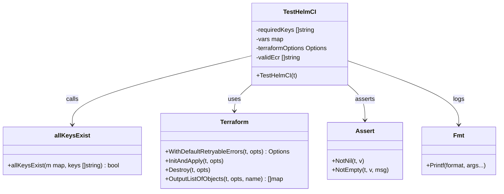

# Diagram: devops/terraform/modules/process/get-ecr-repositories/test/get_ecr_repositories_test.go


> Auto-generated by Obscura crawlers

## Diagram 1



### SVG

<svg id="container" width="1310.1015625" xmlns="http://www.w3.org/2000/svg" class="classDiagram" height="504" viewBox="0 0 1310.1015625 504" role="graphics-document document" aria-roledescription="class"><style>#container{font-family:"trebuchet ms",verdana,arial,sans-serif;font-size:16px;fill:#333;}@keyframes edge-animation-frame{from{stroke-dashoffset:0;}}@keyframes dash{to{stroke-dashoffset:0;}}#container .edge-animation-slow{stroke-dasharray:9,5!important;stroke-dashoffset:900;animation:dash 50s linear infinite;stroke-linecap:round;}#container .edge-animation-fast{stroke-dasharray:9,5!important;stroke-dashoffset:900;animation:dash 20s linear infinite;stroke-linecap:round;}#container .error-icon{fill:#552222;}#container .error-text{fill:#552222;stroke:#552222;}#container .edge-thickness-normal{stroke-width:1px;}#container .edge-thickness-thick{stroke-width:3.5px;}#container .edge-pattern-solid{stroke-dasharray:0;}#container .edge-thickness-invisible{stroke-width:0;fill:none;}#container .edge-pattern-dashed{stroke-dasharray:3;}#container .edge-pattern-dotted{stroke-dasharray:2;}#container .marker{fill:#333333;stroke:#333333;}#container .marker.cross{stroke:#333333;}#container svg{font-family:"trebuchet ms",verdana,arial,sans-serif;font-size:16px;}#container p{margin:0;}#container g.classGroup text{fill:#9370DB;stroke:none;font-family:"trebuchet ms",verdana,arial,sans-serif;font-size:10px;}#container g.classGroup text .title{font-weight:bolder;}#container .nodeLabel,#container .edgeLabel{color:#131300;}#container .edgeLabel .label rect{fill:#ECECFF;}#container .label text{fill:#131300;}#container .labelBkg{background:#ECECFF;}#container .edgeLabel .label span{background:#ECECFF;}#container .classTitle{font-weight:bolder;}#container .node rect,#container .node circle,#container .node ellipse,#container .node polygon,#container .node path{fill:#ECECFF;stroke:#9370DB;stroke-width:1px;}#container .divider{stroke:#9370DB;stroke-width:1;}#container g.clickable{cursor:pointer;}#container g.classGroup rect{fill:#ECECFF;stroke:#9370DB;}#container g.classGroup line{stroke:#9370DB;stroke-width:1;}#container .classLabel .box{stroke:none;stroke-width:0;fill:#ECECFF;opacity:0.5;}#container .classLabel .label{fill:#9370DB;font-size:10px;}#container .relation{stroke:#333333;stroke-width:1;fill:none;}#container .dashed-line{stroke-dasharray:3;}#container .dotted-line{stroke-dasharray:1 2;}#container #compositionStart,#container .composition{fill:#333333!important;stroke:#333333!important;stroke-width:1;}#container #compositionEnd,#container .composition{fill:#333333!important;stroke:#333333!important;stroke-width:1;}#container #dependencyStart,#container .dependency{fill:#333333!important;stroke:#333333!important;stroke-width:1;}#container #dependencyStart,#container .dependency{fill:#333333!important;stroke:#333333!important;stroke-width:1;}#container #extensionStart,#container .extension{fill:transparent!important;stroke:#333333!important;stroke-width:1;}#container #extensionEnd,#container .extension{fill:transparent!important;stroke:#333333!important;stroke-width:1;}#container #aggregationStart,#container .aggregation{fill:transparent!important;stroke:#333333!important;stroke-width:1;}#container #aggregationEnd,#container .aggregation{fill:transparent!important;stroke:#333333!important;stroke-width:1;}#container #lollipopStart,#container .lollipop{fill:#ECECFF!important;stroke:#333333!important;stroke-width:1;}#container #lollipopEnd,#container .lollipop{fill:#ECECFF!important;stroke:#333333!important;stroke-width:1;}#container .edgeTerminals{font-size:11px;line-height:initial;}#container .classTitleText{text-anchor:middle;font-size:18px;fill:#333;}#container .label-icon{display:inline-block;height:1em;overflow:visible;vertical-align:-0.125em;}#container .node .label-icon path{fill:currentColor;stroke:revert;stroke-width:revert;}#container :root{--mermaid-font-family:"trebuchet ms",verdana,arial,sans-serif;}</style><g><defs><marker id="container_class-aggregationStart" class="marker aggregation class" refX="18" refY="7" markerWidth="190" markerHeight="240" orient="auto"><path d="M 18,7 L9,13 L1,7 L9,1 Z"></path></marker></defs><defs><marker id="container_class-aggregationEnd" class="marker aggregation class" refX="1" refY="7" markerWidth="20" markerHeight="28" orient="auto"><path d="M 18,7 L9,13 L1,7 L9,1 Z"></path></marker></defs><defs><marker id="container_class-extensionStart" class="marker extension class" refX="18" refY="7" markerWidth="190" markerHeight="240" orient="auto"><path d="M 1,7 L18,13 V 1 Z"></path></marker></defs><defs><marker id="container_class-extensionEnd" class="marker extension class" refX="1" refY="7" markerWidth="20" markerHeight="28" orient="auto"><path d="M 1,1 V 13 L18,7 Z"></path></marker></defs><defs><marker id="container_class-compositionStart" class="marker composition class" refX="18" refY="7" markerWidth="190" markerHeight="240" orient="auto"><path d="M 18,7 L9,13 L1,7 L9,1 Z"></path></marker></defs><defs><marker id="container_class-compositionEnd" class="marker composition class" refX="1" refY="7" markerWidth="20" markerHeight="28" orient="auto"><path d="M 18,7 L9,13 L1,7 L9,1 Z"></path></marker></defs><defs><marker id="container_class-dependencyStart" class="marker dependency class" refX="6" refY="7" markerWidth="190" markerHeight="240" orient="auto"><path d="M 5,7 L9,13 L1,7 L9,1 Z"></path></marker></defs><defs><marker id="container_class-dependencyEnd" class="marker dependency class" refX="13" refY="7" markerWidth="20" markerHeight="28" orient="auto"><path d="M 18,7 L9,13 L14,7 L9,1 Z"></path></marker></defs><defs><marker id="container_class-lollipopStart" class="marker lollipop class" refX="13" refY="7" markerWidth="190" markerHeight="240" orient="auto"><circle stroke="black" fill="transparent" cx="7" cy="7" r="6"></circle></marker></defs><defs><marker id="container_class-lollipopEnd" class="marker lollipop class" refX="1" refY="7" markerWidth="190" markerHeight="240" orient="auto"><circle stroke="black" fill="transparent" cx="7" cy="7" r="6"></circle></marker></defs><g class="root"><g class="clusters"></g><g class="edgePaths"><path d="M658.209,147.364L580.015,166.304C501.822,185.243,345.434,223.121,267.241,253.227C189.047,283.333,189.047,305.667,189.047,316.833L189.047,328" id="id_TestHelmCI_allKeysExist_1" class="edge-thickness-normal edge-pattern-solid relation" style=";;;" data-edge="true" data-et="edge" data-id="id_TestHelmCI_allKeysExist_1" data-points="W3sieCI6NjU4LjIwODk4NDM3NSwieSI6MTQ3LjM2NDI5MDM1MTczMjl9LHsieCI6MTg5LjA0Njg3NSwieSI6MjYxfSx7IngiOjE4OS4wNDY4NzUsInkiOjMzNH1d" marker-end="url(#container_class-dependencyEnd)"></path><path d="M659.758,224L652.453,230.167C645.147,236.333,630.537,248.667,623.231,260C615.926,271.333,615.926,281.667,615.926,286.833L615.926,292" id="id_TestHelmCI_Terraform_2" class="edge-thickness-normal edge-pattern-solid relation" style=";;;" data-edge="true" data-et="edge" data-id="id_TestHelmCI_Terraform_2" data-points="W3sieCI6NjU5Ljc1ODEyMjMwNjAzNDUsInkiOjIyNH0seyJ4Ijo2MTUuOTI1NzgxMjUsInkiOjI2MX0seyJ4Ijo2MTUuOTI1NzgxMjUsInkiOjI5OH1d" marker-end="url(#container_class-dependencyEnd)"></path><path d="M915.644,224L922.95,230.167C930.255,236.333,944.866,248.667,952.171,264C959.477,279.333,959.477,297.667,959.477,306.833L959.477,316" id="id_TestHelmCI_Assert_3" class="edge-thickness-normal edge-pattern-solid relation" style=";;;" data-edge="true" data-et="edge" data-id="id_TestHelmCI_Assert_3" data-points="W3sieCI6OTE1LjY0NDIyMTQ0Mzk2NTUsInkiOjIyNH0seyJ4Ijo5NTkuNDc2NTYyNSwieSI6MjYxfSx7IngiOjk1OS40NzY1NjI1LCJ5IjozMjJ9XQ==" marker-end="url(#container_class-dependencyEnd)"></path><path d="M917.193,161.033L965.103,177.694C1013.012,194.355,1108.83,227.678,1156.739,255.505C1204.648,283.333,1204.648,305.667,1204.648,316.833L1204.648,328" id="id_TestHelmCI_Fmt_4" class="edge-thickness-normal edge-pattern-solid relation" style=";;;" data-edge="true" data-et="edge" data-id="id_TestHelmCI_Fmt_4" data-points="W3sieCI6OTE3LjE5MzM1OTM3NSwieSI6MTYxLjAzMjk1NDM2OTc5MTU4fSx7IngiOjEyMDQuNjQ4NDM3NSwieSI6MjYxfSx7IngiOjEyMDQuNjQ4NDM3NSwieSI6MzM0fV0=" marker-end="url(#container_class-dependencyEnd)"></path></g><g class="edgeLabels"><g class="edgeLabel" transform="translate(189.046875, 261)"><g class="label" data-id="id_TestHelmCI_allKeysExist_1" transform="translate(-16.4453125, -12)"><foreignObject width="32.890625" height="24"><div xmlns="http://www.w3.org/1999/xhtml" class="labelBkg" style="display: table-cell; white-space: nowrap; line-height: 1.5; max-width: 200px; text-align: center;"><span class="edgeLabel"><p>calls</p></span></div></foreignObject></g></g><g class="edgeLabel" transform="translate(615.92578125, 261)"><g class="label" data-id="id_TestHelmCI_Terraform_2" transform="translate(-16.4921875, -12)"><foreignObject width="32.984375" height="24"><div xmlns="http://www.w3.org/1999/xhtml" class="labelBkg" style="display: table-cell; white-space: nowrap; line-height: 1.5; max-width: 200px; text-align: center;"><span class="edgeLabel"><p>uses</p></span></div></foreignObject></g></g><g class="edgeLabel" transform="translate(959.4765625, 261)"><g class="label" data-id="id_TestHelmCI_Assert_3" transform="translate(-25.7421875, -12)"><foreignObject width="51.484375" height="24"><div xmlns="http://www.w3.org/1999/xhtml" class="labelBkg" style="display: table-cell; white-space: nowrap; line-height: 1.5; max-width: 200px; text-align: center;"><span class="edgeLabel"><p>asserts</p></span></div></foreignObject></g></g><g class="edgeLabel" transform="translate(1204.6484375, 261)"><g class="label" data-id="id_TestHelmCI_Fmt_4" transform="translate(-14.8203125, -12)"><foreignObject width="29.640625" height="24"><div xmlns="http://www.w3.org/1999/xhtml" class="labelBkg" style="display: table-cell; white-space: nowrap; line-height: 1.5; max-width: 200px; text-align: center;"><span class="edgeLabel"><p>logs</p></span></div></foreignObject></g></g></g><g class="nodes"><g class="node default" id="classId-TestHelmCI-0" transform="translate(787.701171875, 116)"><g class="basic label-container"><path d="M-129.4921875 -108 L129.4921875 -108 L129.4921875 108 L-129.4921875 108" stroke="none" stroke-width="0" fill="#ECECFF" style=""></path><path d="M-129.4921875 -108 C-58.943418843314035 -108, 11.60534981337193 -108, 129.4921875 -108 M-129.4921875 -108 C-36.545597343900184 -108, 56.40099281219963 -108, 129.4921875 -108 M129.4921875 -108 C129.4921875 -58.174754949311634, 129.4921875 -8.349509898623268, 129.4921875 108 M129.4921875 -108 C129.4921875 -61.81333913751358, 129.4921875 -15.62667827502716, 129.4921875 108 M129.4921875 108 C33.42658652056774 108, -62.63901445886452 108, -129.4921875 108 M129.4921875 108 C44.80392702206271 108, -39.88433345587458 108, -129.4921875 108 M-129.4921875 108 C-129.4921875 43.60031249242503, -129.4921875 -20.799375015149934, -129.4921875 -108 M-129.4921875 108 C-129.4921875 27.792676754756798, -129.4921875 -52.414646490486405, -129.4921875 -108" stroke="#9370DB" stroke-width="1.3" fill="none" stroke-dasharray="0 0" style=""></path></g><g class="annotation-group text" transform="translate(0, -84)"></g><g class="label-group text" transform="translate(-41.078125, -84)"><g class="label" style="font-weight: bolder" transform="translate(0,-12)"><foreignObject width="82.15625" height="24"><div xmlns="http://www.w3.org/1999/xhtml" style="display: table-cell; white-space: nowrap; line-height: 1.5; max-width: 131px; text-align: center;"><span class="nodeLabel markdown-node-label" style=""><p>TestHelmCI</p></span></div></foreignObject></g></g><g class="members-group text" transform="translate(-117.4921875, -36)"><g class="label" style="" transform="translate(0,-12)"><foreignObject width="157.515625" height="24"><div xmlns="http://www.w3.org/1999/xhtml" style="display: table-cell; white-space: nowrap; line-height: 1.5; max-width: 216px; text-align: center;"><span class="nodeLabel markdown-node-label" style=""><p>-requiredKeys []string</p></span></div></foreignObject></g><g class="label" style="" transform="translate(0,12)"><foreignObject width="72.1875" height="24"><div xmlns="http://www.w3.org/1999/xhtml" style="display: table-cell; white-space: nowrap; line-height: 1.5; max-width: 130px; text-align: center;"><span class="nodeLabel markdown-node-label" style=""><p>-vars map</p></span></div></foreignObject></g><g class="label" style="" transform="translate(0,36)"><foreignObject width="193.90625" height="24"><div xmlns="http://www.w3.org/1999/xhtml" style="display: table-cell; white-space: nowrap; line-height: 1.5; max-width: 251px; text-align: center;"><span class="nodeLabel markdown-node-label" style=""><p>-terraformOptions Options</p></span></div></foreignObject></g><g class="label" style="" transform="translate(0,60)"><foreignObject width="119.46875" height="24"><div xmlns="http://www.w3.org/1999/xhtml" style="display: table-cell; white-space: nowrap; line-height: 1.5; max-width: 177px; text-align: center;"><span class="nodeLabel markdown-node-label" style=""><p>-validEcr []string</p></span></div></foreignObject></g></g><g class="methods-group text" transform="translate(-117.4921875, 84)"><g class="label" style="" transform="translate(0,-12)"><foreignObject width="104.375" height="24"><div xmlns="http://www.w3.org/1999/xhtml" style="display: table-cell; white-space: nowrap; line-height: 1.5; max-width: 162px; text-align: center;"><span class="nodeLabel markdown-node-label" style=""><p>+TestHelmCI(t)</p></span></div></foreignObject></g></g><g class="divider" style=""><path d="M-129.4921875 -60 C-60.72622748716287 -60, 8.039732525674253 -60, 129.4921875 -60 M-129.4921875 -60 C-30.364367107720582 -60, 68.76345328455884 -60, 129.4921875 -60" stroke="#9370DB" stroke-width="1.3" fill="none" stroke-dasharray="0 0" style=""></path></g><g class="divider" style=""><path d="M-129.4921875 60 C-48.216432233063074 60, 33.05932303387385 60, 129.4921875 60 M-129.4921875 60 C-40.954659025663716 60, 47.58286944867257 60, 129.4921875 60" stroke="#9370DB" stroke-width="1.3" fill="none" stroke-dasharray="0 0" style=""></path></g></g><g class="node default" id="classId-allKeysExist-1" transform="translate(189.046875, 397)"><g class="basic label-container"><path d="M-181.046875 -63 L181.046875 -63 L181.046875 63 L-181.046875 63" stroke="none" stroke-width="0" fill="#ECECFF" style=""></path><path d="M-181.046875 -63 C-41.90273001179423 -63, 97.24141497641153 -63, 181.046875 -63 M-181.046875 -63 C-94.66115434807885 -63, -8.275433696157705 -63, 181.046875 -63 M181.046875 -63 C181.046875 -35.27372739784566, 181.046875 -7.547454795691323, 181.046875 63 M181.046875 -63 C181.046875 -28.05837855076716, 181.046875 6.8832428984656815, 181.046875 63 M181.046875 63 C68.99905428026429 63, -43.04876643947142 63, -181.046875 63 M181.046875 63 C58.935871428198155 63, -63.17513214360369 63, -181.046875 63 M-181.046875 63 C-181.046875 26.21177793484808, -181.046875 -10.576444130303841, -181.046875 -63 M-181.046875 63 C-181.046875 12.660415711269032, -181.046875 -37.67916857746194, -181.046875 -63" stroke="#9370DB" stroke-width="1.3" fill="none" stroke-dasharray="0 0" style=""></path></g><g class="annotation-group text" transform="translate(0, -39)"></g><g class="label-group text" transform="translate(-43.78125, -39)"><g class="label" style="font-weight: bolder" transform="translate(0,-12)"><foreignObject width="87.5625" height="24"><div xmlns="http://www.w3.org/1999/xhtml" style="display: table-cell; white-space: nowrap; line-height: 1.5; max-width: 135px; text-align: center;"><span class="nodeLabel markdown-node-label" style=""><p>allKeysExist</p></span></div></foreignObject></g></g><g class="members-group text" transform="translate(-169.046875, 9)"></g><g class="methods-group text" transform="translate(-169.046875, 39)"><g class="label" style="" transform="translate(0,-12)"><foreignObject width="294.3125" height="24"><div xmlns="http://www.w3.org/1999/xhtml" style="display: table-cell; white-space: nowrap; line-height: 1.5; max-width: 352px; text-align: center;"><span class="nodeLabel markdown-node-label" style=""><p>+allKeysExist(m map, keys []string) : bool</p></span></div></foreignObject></g></g><g class="divider" style=""><path d="M-181.046875 -15 C-45.88135562970899 -15, 89.28416374058202 -15, 181.046875 -15 M-181.046875 -15 C-106.0594407004977 -15, -31.072006400995406 -15, 181.046875 -15" stroke="#9370DB" stroke-width="1.3" fill="none" stroke-dasharray="0 0" style=""></path></g><g class="divider" style=""><path d="M-181.046875 9 C-42.233008484156585 9, 96.58085803168683 9, 181.046875 9 M-181.046875 9 C-92.57834698105611 9, -4.109818962112229 9, 181.046875 9" stroke="#9370DB" stroke-width="1.3" fill="none" stroke-dasharray="0 0" style=""></path></g></g><g class="node default" id="classId-Terraform-2" transform="translate(615.92578125, 397)"><g class="basic label-container"><path d="M-195.83203125 -99 L195.83203125 -99 L195.83203125 99 L-195.83203125 99" stroke="none" stroke-width="0" fill="#ECECFF" style=""></path><path d="M-195.83203125 -99 C-66.14637276275616 -99, 63.539285724487684 -99, 195.83203125 -99 M-195.83203125 -99 C-99.23186158072778 -99, -2.6316919114555617 -99, 195.83203125 -99 M195.83203125 -99 C195.83203125 -39.700207177602344, 195.83203125 19.59958564479531, 195.83203125 99 M195.83203125 -99 C195.83203125 -24.403195698229737, 195.83203125 50.193608603540525, 195.83203125 99 M195.83203125 99 C94.41702990620236 99, -6.997971437595282 99, -195.83203125 99 M195.83203125 99 C94.89747712971335 99, -6.037076990573297 99, -195.83203125 99 M-195.83203125 99 C-195.83203125 57.47955889813974, -195.83203125 15.959117796279486, -195.83203125 -99 M-195.83203125 99 C-195.83203125 43.86881943290167, -195.83203125 -11.262361134196667, -195.83203125 -99" stroke="#9370DB" stroke-width="1.3" fill="none" stroke-dasharray="0 0" style=""></path></g><g class="annotation-group text" transform="translate(0, -75)"></g><g class="label-group text" transform="translate(-36.2265625, -75)"><g class="label" style="font-weight: bolder" transform="translate(0,-12)"><foreignObject width="72.453125" height="24"><div xmlns="http://www.w3.org/1999/xhtml" style="display: table-cell; white-space: nowrap; line-height: 1.5; max-width: 121px; text-align: center;"><span class="nodeLabel markdown-node-label" style=""><p>Terraform</p></span></div></foreignObject></g></g><g class="members-group text" transform="translate(-183.83203125, -27)"></g><g class="methods-group text" transform="translate(-183.83203125, 3)"><g class="label" style="" transform="translate(0,-12)"><foreignObject width="331.4375" height="24"><div xmlns="http://www.w3.org/1999/xhtml" style="display: table-cell; white-space: nowrap; line-height: 1.5; max-width: 389px; text-align: center;"><span class="nodeLabel markdown-node-label" style=""><p>+WithDefaultRetryableErrors(t, opts) : Options</p></span></div></foreignObject></g><g class="label" style="" transform="translate(0,12)"><foreignObject width="157.453125" height="24"><div xmlns="http://www.w3.org/1999/xhtml" style="display: table-cell; white-space: nowrap; line-height: 1.5; max-width: 215px; text-align: center;"><span class="nodeLabel markdown-node-label" style=""><p>+InitAndApply(t, opts)</p></span></div></foreignObject></g><g class="label" style="" transform="translate(0,36)"><foreignObject width="119.5" height="24"><div xmlns="http://www.w3.org/1999/xhtml" style="display: table-cell; white-space: nowrap; line-height: 1.5; max-width: 177px; text-align: center;"><span class="nodeLabel markdown-node-label" style=""><p>+Destroy(t, opts)</p></span></div></foreignObject></g><g class="label" style="" transform="translate(0,60)"><foreignObject width="315.09375" height="24"><div xmlns="http://www.w3.org/1999/xhtml" style="display: table-cell; white-space: nowrap; line-height: 1.5; max-width: 372px; text-align: center;"><span class="nodeLabel markdown-node-label" style=""><p>+OutputListOfObjects(t, opts, name) : []map</p></span></div></foreignObject></g></g><g class="divider" style=""><path d="M-195.83203125 -51 C-81.16034998548923 -51, 33.51133127902153 -51, 195.83203125 -51 M-195.83203125 -51 C-96.94238688702647 -51, 1.9472574759470547 -51, 195.83203125 -51" stroke="#9370DB" stroke-width="1.3" fill="none" stroke-dasharray="0 0" style=""></path></g><g class="divider" style=""><path d="M-195.83203125 -27 C-108.66736254124508 -27, -21.502693832490166 -27, 195.83203125 -27 M-195.83203125 -27 C-85.40374712738257 -27, 25.024536995234854 -27, 195.83203125 -27" stroke="#9370DB" stroke-width="1.3" fill="none" stroke-dasharray="0 0" style=""></path></g></g><g class="node default" id="classId-Assert-3" transform="translate(959.4765625, 397)"><g class="basic label-container"><path d="M-97.71875 -75 L97.71875 -75 L97.71875 75 L-97.71875 75" stroke="none" stroke-width="0" fill="#ECECFF" style=""></path><path d="M-97.71875 -75 C-48.21383031488692 -75, 1.2910893702261603 -75, 97.71875 -75 M-97.71875 -75 C-47.002049695327855 -75, 3.7146506093442895 -75, 97.71875 -75 M97.71875 -75 C97.71875 -32.11482828328646, 97.71875 10.770343433427087, 97.71875 75 M97.71875 -75 C97.71875 -36.39388662037841, 97.71875 2.2122267592431797, 97.71875 75 M97.71875 75 C39.57501641911661 75, -18.568717161766784 75, -97.71875 75 M97.71875 75 C53.34103588358023 75, 8.963321767160465 75, -97.71875 75 M-97.71875 75 C-97.71875 27.931258585714666, -97.71875 -19.13748282857067, -97.71875 -75 M-97.71875 75 C-97.71875 39.64398600173775, -97.71875 4.2879720034755024, -97.71875 -75" stroke="#9370DB" stroke-width="1.3" fill="none" stroke-dasharray="0 0" style=""></path></g><g class="annotation-group text" transform="translate(0, -51)"></g><g class="label-group text" transform="translate(-23.109375, -51)"><g class="label" style="font-weight: bolder" transform="translate(0,-12)"><foreignObject width="46.21875" height="24"><div xmlns="http://www.w3.org/1999/xhtml" style="display: table-cell; white-space: nowrap; line-height: 1.5; max-width: 95px; text-align: center;"><span class="nodeLabel markdown-node-label" style=""><p>Assert</p></span></div></foreignObject></g></g><g class="members-group text" transform="translate(-85.71875, -3)"></g><g class="methods-group text" transform="translate(-85.71875, 27)"><g class="label" style="" transform="translate(0,-12)"><foreignObject width="86.328125" height="24"><div xmlns="http://www.w3.org/1999/xhtml" style="display: table-cell; white-space: nowrap; line-height: 1.5; max-width: 144px; text-align: center;"><span class="nodeLabel markdown-node-label" style=""><p>+NotNil(t, v)</p></span></div></foreignObject></g><g class="label" style="" transform="translate(0,12)"><foreignObject width="148.328125" height="24"><div xmlns="http://www.w3.org/1999/xhtml" style="display: table-cell; white-space: nowrap; line-height: 1.5; max-width: 206px; text-align: center;"><span class="nodeLabel markdown-node-label" style=""><p>+NotEmpty(t, v, msg)</p></span></div></foreignObject></g></g><g class="divider" style=""><path d="M-97.71875 -27 C-47.149077854874875 -27, 3.42059429025025 -27, 97.71875 -27 M-97.71875 -27 C-37.713712181322364 -27, 22.29132563735527 -27, 97.71875 -27" stroke="#9370DB" stroke-width="1.3" fill="none" stroke-dasharray="0 0" style=""></path></g><g class="divider" style=""><path d="M-97.71875 -3 C-45.292736453970946 -3, 7.133277092058108 -3, 97.71875 -3 M-97.71875 -3 C-26.12015829683419 -3, 45.47843340633162 -3, 97.71875 -3" stroke="#9370DB" stroke-width="1.3" fill="none" stroke-dasharray="0 0" style=""></path></g></g><g class="node default" id="classId-Fmt-4" transform="translate(1204.6484375, 397)"><g class="basic label-container"><path d="M-97.453125 -63 L97.453125 -63 L97.453125 63 L-97.453125 63" stroke="none" stroke-width="0" fill="#ECECFF" style=""></path><path d="M-97.453125 -63 C-50.65898447421123 -63, -3.864843948422461 -63, 97.453125 -63 M-97.453125 -63 C-52.89330081663004 -63, -8.333476633260076 -63, 97.453125 -63 M97.453125 -63 C97.453125 -32.50517836563817, 97.453125 -2.010356731276353, 97.453125 63 M97.453125 -63 C97.453125 -20.51201457066867, 97.453125 21.975970858662663, 97.453125 63 M97.453125 63 C44.765366638015095 63, -7.92239172396981 63, -97.453125 63 M97.453125 63 C57.669301784586175 63, 17.88547856917235 63, -97.453125 63 M-97.453125 63 C-97.453125 28.38335475545712, -97.453125 -6.2332904890857606, -97.453125 -63 M-97.453125 63 C-97.453125 23.25998085319739, -97.453125 -16.48003829360522, -97.453125 -63" stroke="#9370DB" stroke-width="1.3" fill="none" stroke-dasharray="0 0" style=""></path></g><g class="annotation-group text" transform="translate(0, -39)"></g><g class="label-group text" transform="translate(-13.46875, -39)"><g class="label" style="font-weight: bolder" transform="translate(0,-12)"><foreignObject width="26.9375" height="24"><div xmlns="http://www.w3.org/1999/xhtml" style="display: table-cell; white-space: nowrap; line-height: 1.5; max-width: 77px; text-align: center;"><span class="nodeLabel markdown-node-label" style=""><p>Fmt</p></span></div></foreignObject></g></g><g class="members-group text" transform="translate(-85.453125, 9)"></g><g class="methods-group text" transform="translate(-85.453125, 39)"><g class="label" style="" transform="translate(0,-12)"><foreignObject width="157.4375" height="24"><div xmlns="http://www.w3.org/1999/xhtml" style="display: table-cell; white-space: nowrap; line-height: 1.5; max-width: 215px; text-align: center;"><span class="nodeLabel markdown-node-label" style=""><p>+Printf(format, args...)</p></span></div></foreignObject></g></g><g class="divider" style=""><path d="M-97.453125 -15 C-34.792740644531925 -15, 27.86764371093615 -15, 97.453125 -15 M-97.453125 -15 C-44.662534776871894 -15, 8.128055446256212 -15, 97.453125 -15" stroke="#9370DB" stroke-width="1.3" fill="none" stroke-dasharray="0 0" style=""></path></g><g class="divider" style=""><path d="M-97.453125 9 C-47.53756233889623 9, 2.3780003222075408 9, 97.453125 9 M-97.453125 9 C-47.488769779204894 9, 2.475585441590212 9, 97.453125 9" stroke="#9370DB" stroke-width="1.3" fill="none" stroke-dasharray="0 0" style=""></path></g></g></g></g></g></svg>

## Diagram 2

```mermaid
flowchart TD
    Start([Start TestHelmCI])
    SetKeys[Set requiredKeys: ci, helm]
    SetVars[Set vars.tags: ci=true, helm=true]
    TerraformOptions[Create terraformOptions via terraform.WithDefaultRetryableErrors]
    DeferDestroy[Defer terraform.Destroy]
    InitApply[terraform.InitAndApply]
    Output[output := terraform.OutputListOfObjects]
    AssertNotNil[assert.NotNil(output)]
    AssertNotEmptyOutput[assert.NotEmpty(output)]
    ItemsLeft{More ecr in output?}
    Print[Print ecr]
    TagsAssertion{tags type assertion success?}
    NameAssign[name := ecr.name]
    AllKeysCheck{allKeysExist(tags, requiredKeys)?}
    Append[append name to validEcr]
    FinalAssert[assert.NotEmpty(validEcr)]
    End([End TestHelmCI])

    Start --> SetKeys --> SetVars --> TerraformOptions --> DeferDestroy --> InitApply --> Output --> AssertNotNil --> AssertNotEmptyOutput --> ItemsLeft
    ItemsLeft -->|Yes| Print
    ItemsLeft -->|No| FinalAssert
    Print --> TagsAssertion
    TagsAssertion -->|No| ItemsLeft
    TagsAssertion -->|Yes| NameAssign --> AllKeysCheck
    AllKeysCheck -->|Yes| Append --> ItemsLeft
    AllKeysCheck -->|No| ItemsLeft
    FinalAssert --> End
```

> SVG rendering failed for this diagram.
