# Diagram: devops/terraform/modules/process/process-environment-name/test/process_environment_name_test.go

> Auto-generated by Obscura crawlers

## Mermaid

```mermaid
flowchart LR
  subgraph Dev
    T_LegacyDev1["TestLegacyDev1\nenv=dev\nsvc=0"]
    T_Dev1["TestDev1\nenv=dev1\nsvc=0"]
    T_LegacyDev1_SV1["TestLegacyDev1WithServiceVersion\nenv=dev\nsvc=1"]
    T_Dev1_SV1["TestDev1WithServiceVersion\nenv=dev1\nsvc=1"]
    T_Dev1_InvalidSV["TestDev1WithInvalidServiceVersion\nenv=dev1\nsvc=2"]
    T_Dev2["TestDev2\nenv=dev\nsvc=2"]
    T_Dev2_SV2["TestDev2WithServiceVersion\nenv=dev2\nsvc=2"]
    T_Dev2_InvalidSV["TestDev2WithInvalidServiceVersion\nenv=dev2\nsvc=4"]
  end

  subgraph ProdA
    T_ProdA["TestProdA\nenv=prod-a\nsvc=0"]
    T_ProdA_SV2["TestProdAWithServiceVersion\nenv=prod-a\nsvc=2"]
    T_ProdA_InvalidName["TestProdAWithInvalidName\nenv=prod-a1\nsvc=0"]
  end

  subgraph ProdB
    T_ProdB["TestProdB\nenv=prod-b\nsvc=0"]
  end

  subgraph TestSuite
    T_Test["TestTest\nenv=test\nsvc=0"]
    T_Test_SV1["TestTestWithDefaultServiceVersion\nenv=test\nsvc=1"]
    T_Test_SV3["TestTestWithServiceVersion\nenv=test\nsvc=3"]
  end

  subgraph Ephemeral
    T_Ephemeral["TestEphemeralTest\nenv=ephemeral-test\nsvc=0"]
    T_Ephemeral_SV3["TestEphemeralTestWithServiceVersion\nenv=ephemeral-test\nsvc=3"]
  end

  subgraph Staging
    T_Staging["TestStaging\nenv=staging1\nsvc=0"]
    T_Staging_DoFormat["TestStagingWithDoFormat\nenv=staging1\nsvc=0\ndo_format=true"]
  end

  O_LegacyDev1["environment: dev\ninclusive_environment: dev1\nletter_identifier: d\ninclusive_letter_identifier: d1"]
  O_Dev1["environment: dev\ninclusive_environment: dev1\nletter_identifier: d\ninclusive_letter_identifier: d1"]
  O_Dev2["environment: dev2\ninclusive_environment: dev2\nletter_identifier: d2\ninclusive_letter_identifier: d2"]
  O_ProdA["environment: prod-a\ninclusive_environment: prod-a\nletter_identifier: a\ninclusive_letter_identifier: a"]
  O_ProdB["environment: prod-b\ninclusive_environment: prod-b\nletter_identifier: b\ninclusive_letter_identifier: b"]
  O_Test["environment: test\ninclusive_environment: test\nletter_identifier: t\ninclusive_letter_identifier: t"]
  O_Ephemeral_default["environment: ephemeral-test\ninclusive_environment: ephemeral-test1\nletter_identifier: t\ninclusive_letter_identifier: t1"]
  O_Ephemeral_sv3["environment: ephemeral-test3\ninclusive_environment: ephemeral-test3\nletter_identifier: t3\ninclusive_letter_identifier: t3"]
  O_Staging_default["environment: staging\ninclusive_environment: staging1\nletter_identifier: s\ninclusive_letter_identifier: s1"]
  O_Staging_doformat["environment: staging1\ninclusive_environment: staging1\nletter_identifier: s1\ninclusive_letter_identifier: s1"]

  T_LegacyDev1 --> O_LegacyDev1
  T_Dev1 --> O_Dev1
  T_LegacyDev1_SV1 --> O_LegacyDev1
  T_Dev1_SV1 --> O_Dev1
  T_Dev1_InvalidSV --> O_Dev1
  T_Dev2 --> O_Dev2
  T_Dev2_SV2 --> O_Dev2
  T_Dev2_InvalidSV --> O_Dev2

  T_ProdA --> O_ProdA
  T_ProdA_SV2 --> O_ProdA
  T_ProdA_InvalidName --> O_ProdA
  T_ProdB --> O_ProdB

  T_Test --> O_Test
  T_Test_SV1 --> O_Test
  T_Test_SV3 --> O_Test

  T_Ephemeral --> O_Ephemeral_default
  T_Ephemeral_SV3 --> O_Ephemeral_sv3

  T_Staging --> O_Staging_default
  T_Staging_DoFormat --> O_Staging_doformat
```

### SVG

<svg id="container" width="969.46875" xmlns="http://www.w3.org/2000/svg" class="flowchart" height="2574" viewBox="0 0 969.46875 2574" role="graphics-document document" aria-roledescription="flowchart-v2"><g><marker id="container_flowchart-v2-pointEnd" class="marker flowchart-v2" viewBox="0 0 10 10" refX="5" refY="5" markerUnits="userSpaceOnUse" markerWidth="8" markerHeight="8" orient="auto"><path d="M 0 0 L 10 5 L 0 10 z" class="arrowMarkerPath" style="stroke-width: 1; stroke-dasharray: 1, 0;"></path></marker><marker id="container_flowchart-v2-pointStart" class="marker flowchart-v2" viewBox="0 0 10 10" refX="4.5" refY="5" markerUnits="userSpaceOnUse" markerWidth="8" markerHeight="8" orient="auto"><path d="M 0 5 L 10 10 L 10 0 z" class="arrowMarkerPath" style="stroke-width: 1; stroke-dasharray: 1, 0;"></path></marker><marker id="container_flowchart-v2-circleEnd" class="marker flowchart-v2" viewBox="0 0 10 10" refX="11" refY="5" markerUnits="userSpaceOnUse" markerWidth="11" markerHeight="11" orient="auto"><circle cx="5" cy="5" r="5" class="arrowMarkerPath" style="stroke-width: 1; stroke-dasharray: 1, 0;"></circle></marker><marker id="container_flowchart-v2-circleStart" class="marker flowchart-v2" viewBox="0 0 10 10" refX="-1" refY="5" markerUnits="userSpaceOnUse" markerWidth="11" markerHeight="11" orient="auto"><circle cx="5" cy="5" r="5" class="arrowMarkerPath" style="stroke-width: 1; stroke-dasharray: 1, 0;"></circle></marker><marker id="container_flowchart-v2-crossEnd" class="marker cross flowchart-v2" viewBox="0 0 11 11" refX="12" refY="5.2" markerUnits="userSpaceOnUse" markerWidth="11" markerHeight="11" orient="auto"><path d="M 1,1 l 9,9 M 10,1 l -9,9" class="arrowMarkerPath" style="stroke-width: 2; stroke-dasharray: 1, 0;"></path></marker><marker id="container_flowchart-v2-crossStart" class="marker cross flowchart-v2" viewBox="0 0 11 11" refX="-1" refY="5.2" markerUnits="userSpaceOnUse" markerWidth="11" markerHeight="11" orient="auto"><path d="M 1,1 l 9,9 M 10,1 l -9,9" class="arrowMarkerPath" style="stroke-width: 2; stroke-dasharray: 1, 0;"></path></marker><g class="root"><g class="clusters"><g class="cluster" id="Staging" data-look="classic"><rect style="" x="8" y="2265" width="594.390625" height="300"></rect><g class="cluster-label" transform="translate(278.4609375, 2265)"><foreignObject width="53.46875" height="24">

Staging

</foreignObject></g></g><g class="cluster" id="Ephemeral" data-look="classic"><rect style="" x="8" y="1829" width="594.390625" height="372"></rect><g class="cluster-label" transform="translate(266.5546875, 1829)"><foreignObject width="77.28125" height="24">

Ephemeral

</foreignObject></g></g><g class="cluster" id="TestSuite" data-look="classic"><rect style="" x="8" y="1477" width="594.390625" height="332"></rect><g class="cluster-label" transform="translate(272.109375, 1477)"><foreignObject width="66.171875" height="24">

TestSuite

</foreignObject></g></g><g class="cluster" id="ProdB" data-look="classic"><rect style="" x="8" y="1309" width="594.390625" height="148"></rect><g class="cluster-label" transform="translate(283.5390625, 1309)"><foreignObject width="43.3125" height="24">

ProdB

</foreignObject></g></g><g class="cluster" id="ProdA" data-look="classic"><rect style="" x="8" y="885" width="594.390625" height="404"></rect><g class="cluster-label" transform="translate(283.8125, 885)"><foreignObject width="42.765625" height="24">

ProdA

</foreignObject></g></g><g class="cluster" id="Dev" data-look="classic"><rect style="" x="8" y="13" width="594.390625" height="852"></rect><g class="cluster-label" transform="translate(291.7734375, 13)"><foreignObject width="26.84375" height="24">

Dev

</foreignObject></g></g></g><g class="edgePaths"><path d="M458.164,75L482.202,75C506.24,75,554.315,75,582.52,75C610.724,75,619.057,75,629.104,75.262C639.15,75.524,650.909,76.048,656.788,76.31L662.668,76.572" id="L_T_LegacyDev1_O_LegacyDev1_0" class="edge-thickness-normal edge-pattern-solid edge-thickness-normal edge-pattern-solid flowchart-link" style=";" data-edge="true" data-et="edge" data-id="L_T_LegacyDev1_O_LegacyDev1_0" data-points="W3sieCI6NDU4LjE2NDA2MjUsInkiOjc1fSx7IngiOjYwMi4zOTA2MjUsInkiOjc1fSx7IngiOjYyNy4zOTA2MjUsInkiOjc1fSx7IngiOjY2Ni42NjQwNjI1LCJ5Ijo3Ni43NDk5NjczNjQzNDQ0Nn1d" marker-end="url(#container_flowchart-v2-pointEnd)"></path><path d="M437.531,283L465.008,283C492.484,283,547.438,283,579.081,283C610.724,283,619.057,283,630.991,287.499C642.925,291.998,658.459,300.997,666.226,305.496L673.993,309.995" id="L_T_Dev1_O_Dev1_0" class="edge-thickness-normal edge-pattern-solid edge-thickness-normal edge-pattern-solid flowchart-link" style=";" data-edge="true" data-et="edge" data-id="L_T_Dev1_O_Dev1_0" data-points="W3sieCI6NDM3LjUzMTI1LCJ5IjoyODN9LHsieCI6NjAyLjM5MDYyNSwieSI6MjgzfSx7IngiOjYyNy4zOTA2MjUsInkiOjI4M30seyJ4Ijo2NzcuNDU0NDAyMDQzMjY5MywieSI6MzEyfV0=" marker-end="url(#container_flowchart-v2-pointEnd)"></path><path d="M526.117,179L538.829,179C551.542,179,576.966,179,593.845,179C610.724,179,619.057,179,629.182,175.814C639.306,172.629,651.222,166.257,657.18,163.072L663.137,159.886" id="L_T_LegacyDev1_SV1_O_LegacyDev1_0" class="edge-thickness-normal edge-pattern-solid edge-thickness-normal edge-pattern-solid flowchart-link" style=";" data-edge="true" data-et="edge" data-id="L_T_LegacyDev1_SV1_O_LegacyDev1_0" data-points="W3sieCI6NTI2LjExNzE4NzUsInkiOjE3OX0seyJ4Ijo2MDIuMzkwNjI1LCJ5IjoxNzl9LHsieCI6NjI3LjM5MDYyNSwieSI6MTc5fSx7IngiOjY2Ni42NjQ3OTQ5MjE4NzUsInkiOjE1OH1d" marker-end="url(#container_flowchart-v2-pointEnd)"></path><path d="M505.477,387L521.629,387C537.781,387,570.086,387,590.405,387C610.724,387,619.057,387,629.103,387C639.148,387,650.906,387,656.785,387L662.664,387" id="L_T_Dev1_SV1_O_Dev1_0" class="edge-thickness-normal edge-pattern-solid edge-thickness-normal edge-pattern-solid flowchart-link" style=";" data-edge="true" data-et="edge" data-id="L_T_Dev1_SV1_O_Dev1_0" data-points="W3sieCI6NTA1LjQ3NjU2MjUsInkiOjM4N30seyJ4Ijo2MDIuMzkwNjI1LCJ5IjozODd9LHsieCI6NjI3LjM5MDYyNSwieSI6Mzg3fSx7IngiOjY2Ni42NjQwNjI1LCJ5IjozODd9XQ==" marker-end="url(#container_flowchart-v2-pointEnd)"></path><path d="M530.594,491L542.56,491C554.526,491,578.458,491,594.591,491C610.724,491,619.057,491,630.991,486.501C642.925,482.002,658.459,473.003,666.226,468.504L673.993,464.005" id="L_T_Dev1_InvalidSV_O_Dev1_0" class="edge-thickness-normal edge-pattern-solid edge-thickness-normal edge-pattern-solid flowchart-link" style=";" data-edge="true" data-et="edge" data-id="L_T_Dev1_InvalidSV_O_Dev1_0" data-points="W3sieCI6NTMwLjU5Mzc1LCJ5Ijo0OTF9LHsieCI6NjAyLjM5MDYyNSwieSI6NDkxfSx7IngiOjYyNy4zOTA2MjUsInkiOjQ5MX0seyJ4Ijo2NzcuNDU0NDAyMDQzMjY5MywieSI6NDYyfV0=" marker-end="url(#container_flowchart-v2-pointEnd)"></path><path d="M433.656,595L461.779,595C489.901,595,546.146,595,578.435,595C610.724,595,619.057,595,630.991,599.499C642.925,603.998,658.459,612.997,666.226,617.496L673.993,621.995" id="L_T_Dev2_O_Dev2_0" class="edge-thickness-normal edge-pattern-solid edge-thickness-normal edge-pattern-solid flowchart-link" style=";" data-edge="true" data-et="edge" data-id="L_T_Dev2_O_Dev2_0" data-points="W3sieCI6NDMzLjY1NjI1LCJ5Ijo1OTV9LHsieCI6NjAyLjM5MDYyNSwieSI6NTk1fSx7IngiOjYyNy4zOTA2MjUsInkiOjU5NX0seyJ4Ijo2NzcuNDU0NDAyMDQzMjY5MywieSI6NjI0fV0=" marker-end="url(#container_flowchart-v2-pointEnd)"></path><path d="M506.766,699L522.703,699C538.641,699,570.516,699,590.62,699C610.724,699,619.057,699,628.469,699C637.88,699,648.37,699,653.615,699L658.859,699" id="L_T_Dev2_SV2_O_Dev2_0" class="edge-thickness-normal edge-pattern-solid edge-thickness-normal edge-pattern-solid flowchart-link" style=";" data-edge="true" data-et="edge" data-id="L_T_Dev2_SV2_O_Dev2_0" data-points="W3sieCI6NTA2Ljc2NTYyNSwieSI6Njk5fSx7IngiOjYwMi4zOTA2MjUsInkiOjY5OX0seyJ4Ijo2MjcuMzkwNjI1LCJ5Ijo2OTl9LHsieCI6NjYyLjg1OTM3NSwieSI6Njk5fV0=" marker-end="url(#container_flowchart-v2-pointEnd)"></path><path d="M531.523,803L543.335,803C555.146,803,578.768,803,594.746,803C610.724,803,619.057,803,630.991,798.501C642.925,794.002,658.459,785.003,666.226,780.504L673.993,776.005" id="L_T_Dev2_InvalidSV_O_Dev2_0" class="edge-thickness-normal edge-pattern-solid edge-thickness-normal edge-pattern-solid flowchart-link" style=";" data-edge="true" data-et="edge" data-id="L_T_Dev2_InvalidSV_O_Dev2_0" data-points="W3sieCI6NTMxLjUyMzQzNzUsInkiOjgwM30seyJ4Ijo2MDIuMzkwNjI1LCJ5Ijo4MDN9LHsieCI6NjI3LjM5MDYyNSwieSI6ODAzfSx7IngiOjY3Ny40NTQ0MDIwNDMyNjkzLCJ5Ijo3NzR9XQ==" marker-end="url(#container_flowchart-v2-pointEnd)"></path><path d="M435.195,959L463.061,959C490.927,959,546.659,959,578.691,959C610.724,959,619.057,959,635.071,967.446C651.085,975.893,674.78,992.785,686.627,1001.232L698.474,1009.678" id="L_T_ProdA_O_ProdA_0" class="edge-thickness-normal edge-pattern-solid edge-thickness-normal edge-pattern-solid flowchart-link" style=";" data-edge="true" data-et="edge" data-id="L_T_ProdA_O_ProdA_0" data-points="W3sieCI6NDM1LjE5NTMxMjUsInkiOjk1OX0seyJ4Ijo2MDIuMzkwNjI1LCJ5Ijo5NTl9LHsieCI6NjI3LjM5MDYyNSwieSI6OTU5fSx7IngiOjcwMS43MzEwMTgwNjY0MDYyLCJ5IjoxMDEyfV0=" marker-end="url(#container_flowchart-v2-pointEnd)"></path><path d="M486.305,1087L505.652,1087C525,1087,563.695,1087,587.21,1087C610.724,1087,619.057,1087,629.228,1087C639.398,1087,651.406,1087,657.41,1087L663.414,1087" id="L_T_ProdA_SV2_O_ProdA_0" class="edge-thickness-normal edge-pattern-solid edge-thickness-normal edge-pattern-solid flowchart-link" style=";" data-edge="true" data-et="edge" data-id="L_T_ProdA_SV2_O_ProdA_0" data-points="W3sieCI6NDg2LjMwNDY4NzUsInkiOjEwODd9LHsieCI6NjAyLjM5MDYyNSwieSI6MTA4N30seyJ4Ijo2MjcuMzkwNjI1LCJ5IjoxMDg3fSx7IngiOjY2Ny40MTQwNjI1LCJ5IjoxMDg3fV0=" marker-end="url(#container_flowchart-v2-pointEnd)"></path><path d="M478.719,1215L499.331,1215C519.943,1215,561.167,1215,585.945,1215C610.724,1215,619.057,1215,635.071,1206.554C651.085,1198.107,674.78,1181.215,686.627,1172.768L698.474,1164.322" id="L_T_ProdA_InvalidName_O_ProdA_0" class="edge-thickness-normal edge-pattern-solid edge-thickness-normal edge-pattern-solid flowchart-link" style=";" data-edge="true" data-et="edge" data-id="L_T_ProdA_InvalidName_O_ProdA_0" data-points="W3sieCI6NDc4LjcxODc1LCJ5IjoxMjE1fSx7IngiOjYwMi4zOTA2MjUsInkiOjEyMTV9LHsieCI6NjI3LjM5MDYyNSwieSI6MTIxNX0seyJ4Ijo3MDEuNzMxMDE4MDY2NDA2MiwieSI6MTE2Mn1d" marker-end="url(#container_flowchart-v2-pointEnd)"></path><path d="M435.195,1383L463.061,1383C490.927,1383,546.659,1383,578.691,1383C610.724,1383,619.057,1383,629.176,1383C639.294,1383,651.198,1383,657.15,1383L663.102,1383" id="L_T_ProdB_O_ProdB_0" class="edge-thickness-normal edge-pattern-solid edge-thickness-normal edge-pattern-solid flowchart-link" style=";" data-edge="true" data-et="edge" data-id="L_T_ProdB_O_ProdB_0" data-points="W3sieCI6NDM1LjE5NTMxMjUsInkiOjEzODN9LHsieCI6NjAyLjM5MDYyNSwieSI6MTM4M30seyJ4Ijo2MjcuMzkwNjI1LCJ5IjoxMzgzfSx7IngiOjY2Ny4xMDE1NjI1LCJ5IjoxMzgzfV0=" marker-end="url(#container_flowchart-v2-pointEnd)"></path><path d="M431.93,1539L460.34,1539C488.75,1539,545.57,1539,578.147,1539C610.724,1539,619.057,1539,630.991,1543.499C642.925,1547.998,658.459,1556.997,666.226,1561.496L673.993,1565.995" id="L_T_Test_O_Test_0" class="edge-thickness-normal edge-pattern-solid edge-thickness-normal edge-pattern-solid flowchart-link" style=";" data-edge="true" data-et="edge" data-id="L_T_Test_O_Test_0" data-points="W3sieCI6NDMxLjkyOTY4NzUsInkiOjE1Mzl9LHsieCI6NjAyLjM5MDYyNSwieSI6MTUzOX0seyJ4Ijo2MjcuMzkwNjI1LCJ5IjoxNTM5fSx7IngiOjY3Ny40NTQ0MDIwNDMyNjkzLCJ5IjoxNTY4fV0=" marker-end="url(#container_flowchart-v2-pointEnd)"></path><path d="M526.453,1643L539.109,1643C551.766,1643,577.078,1643,593.901,1643C610.724,1643,619.057,1643,629.413,1643C639.768,1643,652.146,1643,658.335,1643L664.523,1643" id="L_T_Test_SV1_O_Test_0" class="edge-thickness-normal edge-pattern-solid edge-thickness-normal edge-pattern-solid flowchart-link" style=";" data-edge="true" data-et="edge" data-id="L_T_Test_SV1_O_Test_0" data-points="W3sieCI6NTI2LjQ1MzEyNSwieSI6MTY0M30seyJ4Ijo2MDIuMzkwNjI1LCJ5IjoxNjQzfSx7IngiOjYyNy4zOTA2MjUsInkiOjE2NDN9LHsieCI6NjY4LjUyMzQzNzUsInkiOjE2NDN9XQ==" marker-end="url(#container_flowchart-v2-pointEnd)"></path><path d="M500.609,1747L517.573,1747C534.536,1747,568.464,1747,589.594,1747C610.724,1747,619.057,1747,630.991,1742.501C642.925,1738.002,658.459,1729.003,666.226,1724.504L673.993,1720.005" id="L_T_Test_SV3_O_Test_0" class="edge-thickness-normal edge-pattern-solid edge-thickness-normal edge-pattern-solid flowchart-link" style=";" data-edge="true" data-et="edge" data-id="L_T_Test_SV3_O_Test_0" data-points="W3sieCI6NTAwLjYwOTM3NSwieSI6MTc0N30seyJ4Ijo2MDIuMzkwNjI1LCJ5IjoxNzQ3fSx7IngiOjYyNy4zOTA2MjUsInkiOjE3NDd9LHsieCI6Njc3LjQ1NDQwMjA0MzI2OTMsInkiOjE3MTh9XQ==" marker-end="url(#container_flowchart-v2-pointEnd)"></path><path d="M470.563,1903L492.534,1903C514.505,1903,558.448,1903,584.586,1903C610.724,1903,619.057,1903,629.414,1903C639.771,1903,652.151,1903,658.341,1903L664.531,1903" id="L_T_Ephemeral_O_Ephemeral_default_0" class="edge-thickness-normal edge-pattern-solid edge-thickness-normal edge-pattern-solid flowchart-link" style=";" data-edge="true" data-et="edge" data-id="L_T_Ephemeral_O_Ephemeral_default_0" data-points="W3sieCI6NDcwLjU2MjUsInkiOjE5MDN9LHsieCI6NjAyLjM5MDYyNSwieSI6MTkwM30seyJ4Ijo2MjcuMzkwNjI1LCJ5IjoxOTAzfSx7IngiOjY2OC41MzEyNSwieSI6MTkwM31d" marker-end="url(#container_flowchart-v2-pointEnd)"></path><path d="M539.992,2127L550.392,2127C560.792,2127,581.591,2127,596.158,2127C610.724,2127,619.057,2127,628.721,2127C638.385,2127,649.38,2127,654.878,2127L660.375,2127" id="L_T_Ephemeral_SV3_O_Ephemeral_sv3_0" class="edge-thickness-normal edge-pattern-solid edge-thickness-normal edge-pattern-solid flowchart-link" style=";" data-edge="true" data-et="edge" data-id="L_T_Ephemeral_SV3_O_Ephemeral_sv3_0" data-points="W3sieCI6NTM5Ljk5MjE4NzUsInkiOjIxMjd9LHsieCI6NjAyLjM5MDYyNSwieSI6MjEyN30seyJ4Ijo2MjcuMzkwNjI1LCJ5IjoyMTI3fSx7IngiOjY2NC4zNzUsInkiOjIxMjd9XQ==" marker-end="url(#container_flowchart-v2-pointEnd)"></path><path d="M460.273,2327L483.96,2327C507.646,2327,555.018,2327,582.871,2327C610.724,2327,619.057,2327,627.328,2327C635.599,2327,643.807,2327,647.911,2327L652.016,2327" id="L_T_Staging_O_Staging_default_0" class="edge-thickness-normal edge-pattern-solid edge-thickness-normal edge-pattern-solid flowchart-link" style=";" data-edge="true" data-et="edge" data-id="L_T_Staging_O_Staging_default_0" data-points="W3sieCI6NDYwLjI3MzQzNzUsInkiOjIzMjd9LHsieCI6NjAyLjM5MDYyNSwieSI6MjMyN30seyJ4Ijo2MjcuMzkwNjI1LCJ5IjoyMzI3fSx7IngiOjY1Ni4wMTU2MjUsInkiOjIzMjd9XQ==" marker-end="url(#container_flowchart-v2-pointEnd)"></path><path d="M577.391,2503L581.557,2503C585.724,2503,594.057,2503,602.391,2503C610.724,2503,619.057,2503,626.724,2503C634.391,2503,641.391,2503,644.891,2503L648.391,2503" id="L_T_Staging_DoFormat_O_Staging_doformat_0" class="edge-thickness-normal edge-pattern-solid edge-thickness-normal edge-pattern-solid flowchart-link" style=";" data-edge="true" data-et="edge" data-id="L_T_Staging_DoFormat_O_Staging_doformat_0" data-points="W3sieCI6NTc3LjM5MDYyNSwieSI6MjUwM30seyJ4Ijo2MDIuMzkwNjI1LCJ5IjoyNTAzfSx7IngiOjYyNy4zOTA2MjUsInkiOjI1MDN9LHsieCI6NjUyLjM5MDYyNSwieSI6MjUwM31d" marker-end="url(#container_flowchart-v2-pointEnd)"></path></g><g class="edgeLabels"><g class="edgeLabel"><g class="label" data-id="L_T_LegacyDev1_O_LegacyDev1_0" transform="translate(0, 0)"><foreignObject width="0" height="0">

</foreignObject></g></g><g class="edgeLabel"><g class="label" data-id="L_T_Dev1_O_Dev1_0" transform="translate(0, 0)"><foreignObject width="0" height="0">

</foreignObject></g></g><g class="edgeLabel"><g class="label" data-id="L_T_LegacyDev1_SV1_O_LegacyDev1_0" transform="translate(0, 0)"><foreignObject width="0" height="0">

</foreignObject></g></g><g class="edgeLabel"><g class="label" data-id="L_T_Dev1_SV1_O_Dev1_0" transform="translate(0, 0)"><foreignObject width="0" height="0">

</foreignObject></g></g><g class="edgeLabel"><g class="label" data-id="L_T_Dev1_InvalidSV_O_Dev1_0" transform="translate(0, 0)"><foreignObject width="0" height="0">

</foreignObject></g></g><g class="edgeLabel"><g class="label" data-id="L_T_Dev2_O_Dev2_0" transform="translate(0, 0)"><foreignObject width="0" height="0">

</foreignObject></g></g><g class="edgeLabel"><g class="label" data-id="L_T_Dev2_SV2_O_Dev2_0" transform="translate(0, 0)"><foreignObject width="0" height="0">

</foreignObject></g></g><g class="edgeLabel"><g class="label" data-id="L_T_Dev2_InvalidSV_O_Dev2_0" transform="translate(0, 0)"><foreignObject width="0" height="0">

</foreignObject></g></g><g class="edgeLabel"><g class="label" data-id="L_T_ProdA_O_ProdA_0" transform="translate(0, 0)"><foreignObject width="0" height="0">

</foreignObject></g></g><g class="edgeLabel"><g class="label" data-id="L_T_ProdA_SV2_O_ProdA_0" transform="translate(0, 0)"><foreignObject width="0" height="0">

</foreignObject></g></g><g class="edgeLabel"><g class="label" data-id="L_T_ProdA_InvalidName_O_ProdA_0" transform="translate(0, 0)"><foreignObject width="0" height="0">

</foreignObject></g></g><g class="edgeLabel"><g class="label" data-id="L_T_ProdB_O_ProdB_0" transform="translate(0, 0)"><foreignObject width="0" height="0">

</foreignObject></g></g><g class="edgeLabel"><g class="label" data-id="L_T_Test_O_Test_0" transform="translate(0, 0)"><foreignObject width="0" height="0">

</foreignObject></g></g><g class="edgeLabel"><g class="label" data-id="L_T_Test_SV1_O_Test_0" transform="translate(0, 0)"><foreignObject width="0" height="0">

</foreignObject></g></g><g class="edgeLabel"><g class="label" data-id="L_T_Test_SV3_O_Test_0" transform="translate(0, 0)"><foreignObject width="0" height="0">

</foreignObject></g></g><g class="edgeLabel"><g class="label" data-id="L_T_Ephemeral_O_Ephemeral_default_0" transform="translate(0, 0)"><foreignObject width="0" height="0">

</foreignObject></g></g><g class="edgeLabel"><g class="label" data-id="L_T_Ephemeral_SV3_O_Ephemeral_sv3_0" transform="translate(0, 0)"><foreignObject width="0" height="0">

</foreignObject></g></g><g class="edgeLabel"><g class="label" data-id="L_T_Staging_O_Staging_default_0" transform="translate(0, 0)"><foreignObject width="0" height="0">

</foreignObject></g></g><g class="edgeLabel"><g class="label" data-id="L_T_Staging_DoFormat_O_Staging_doformat_0" transform="translate(0, 0)"><foreignObject width="0" height="0">

</foreignObject></g></g></g><g class="nodes"><g class="node default" id="flowchart-T_LegacyDev1-0" transform="translate(305.1953125, 75)"><rect class="basic label-container" style="" x="-152.96875" y="-27" width="305.9375" height="54"></rect><g class="label" style="" transform="translate(-122.96875, -12)"><rect></rect><foreignObject width="245.9375" height="24">

TestLegacyDev1\nenv=dev\nsvc=0

</foreignObject></g></g><g class="node default" id="flowchart-T_Dev1-1" transform="translate(305.1953125, 283)"><rect class="basic label-container" style="" x="-132.3359375" y="-27" width="264.671875" height="54"></rect><g class="label" style="" transform="translate(-102.3359375, -12)"><rect></rect><foreignObject width="204.671875" height="24">

TestDev1\nenv=dev1\nsvc=0

</foreignObject></g></g><g class="node default" id="flowchart-T_LegacyDev1_SV1-2" transform="translate(305.1953125, 179)"><rect class="basic label-container" style="" x="-220.921875" y="-27" width="441.84375" height="54"></rect><g class="label" style="" transform="translate(-190.921875, -12)"><rect></rect><foreignObject width="381.84375" height="24">

TestLegacyDev1WithServiceVersion\nenv=dev\nsvc=1

</foreignObject></g></g><g class="node default" id="flowchart-T_Dev1_SV1-3" transform="translate(305.1953125, 387)"><rect class="basic label-container" style="" x="-200.28125" y="-27" width="400.5625" height="54"></rect><g class="label" style="" transform="translate(-170.28125, -12)"><rect></rect><foreignObject width="340.5625" height="24">

TestDev1WithServiceVersion\nenv=dev1\nsvc=1

</foreignObject></g></g><g class="node default" id="flowchart-T_Dev1_InvalidSV-4" transform="translate(305.1953125, 491)"><rect class="basic label-container" style="" x="-225.3984375" y="-27" width="450.796875" height="54"></rect><g class="label" style="" transform="translate(-195.3984375, -12)"><rect></rect><foreignObject width="390.796875" height="24">

TestDev1WithInvalidServiceVersion\nenv=dev1\nsvc=2

</foreignObject></g></g><g class="node default" id="flowchart-T_Dev2-5" transform="translate(305.1953125, 595)"><rect class="basic label-container" style="" x="-128.4609375" y="-27" width="256.921875" height="54"></rect><g class="label" style="" transform="translate(-98.4609375, -12)"><rect></rect><foreignObject width="196.921875" height="24">

TestDev2\nenv=dev\nsvc=2

</foreignObject></g></g><g class="node default" id="flowchart-T_Dev2_SV2-6" transform="translate(305.1953125, 699)"><rect class="basic label-container" style="" x="-201.5703125" y="-27" width="403.140625" height="54"></rect><g class="label" style="" transform="translate(-171.5703125, -12)"><rect></rect><foreignObject width="343.140625" height="24">

TestDev2WithServiceVersion\nenv=dev2\nsvc=2

</foreignObject></g></g><g class="node default" id="flowchart-T_Dev2_InvalidSV-7" transform="translate(305.1953125, 803)"><rect class="basic label-container" style="" x="-226.328125" y="-27" width="452.65625" height="54"></rect><g class="label" style="" transform="translate(-196.328125, -12)"><rect></rect><foreignObject width="392.65625" height="24">

TestDev2WithInvalidServiceVersion\nenv=dev2\nsvc=4

</foreignObject></g></g><g class="node default" id="flowchart-T_ProdA-8" transform="translate(305.1953125, 959)"><rect class="basic label-container" style="" x="-130" y="-39" width="260" height="78"></rect><g class="label" style="" transform="translate(-100, -24)"><rect></rect><foreignObject width="200" height="48">

TestProdA\nenv=prod-a\nsvc=0

</foreignObject></g></g><g class="node default" id="flowchart-T_ProdA_SV2-9" transform="translate(305.1953125, 1087)"><rect class="basic label-container" style="" x="-181.109375" y="-39" width="362.21875" height="78"></rect><g class="label" style="" transform="translate(-151.109375, -24)"><rect></rect><foreignObject width="302.21875" height="48">

TestProdAWithServiceVersion\nenv=prod-a\nsvc=2

</foreignObject></g></g><g class="node default" id="flowchart-T_ProdA_InvalidName-10" transform="translate(305.1953125, 1215)"><rect class="basic label-container" style="" x="-173.5234375" y="-39" width="347.046875" height="78"></rect><g class="label" style="" transform="translate(-143.5234375, -24)"><rect></rect><foreignObject width="287.046875" height="48">

TestProdAWithInvalidName\nenv=prod-a1\nsvc=0

</foreignObject></g></g><g class="node default" id="flowchart-T_ProdB-11" transform="translate(305.1953125, 1383)"><rect class="basic label-container" style="" x="-130" y="-39" width="260" height="78"></rect><g class="label" style="" transform="translate(-100, -24)"><rect></rect><foreignObject width="200" height="48">

TestProdB\nenv=prod-b\nsvc=0

</foreignObject></g></g><g class="node default" id="flowchart-T_Test-12" transform="translate(305.1953125, 1539)"><rect class="basic label-container" style="" x="-126.734375" y="-27" width="253.46875" height="54"></rect><g class="label" style="" transform="translate(-96.734375, -12)"><rect></rect><foreignObject width="193.46875" height="24">

TestTest\nenv=test\nsvc=0

</foreignObject></g></g><g class="node default" id="flowchart-T_Test_SV1-13" transform="translate(305.1953125, 1643)"><rect class="basic label-container" style="" x="-221.2578125" y="-27" width="442.515625" height="54"></rect><g class="label" style="" transform="translate(-191.2578125, -12)"><rect></rect><foreignObject width="382.515625" height="24">

TestTestWithDefaultServiceVersion\nenv=test\nsvc=1

</foreignObject></g></g><g class="node default" id="flowchart-T_Test_SV3-14" transform="translate(305.1953125, 1747)"><rect class="basic label-container" style="" x="-195.4140625" y="-27" width="390.828125" height="54"></rect><g class="label" style="" transform="translate(-165.4140625, -12)"><rect></rect><foreignObject width="330.828125" height="24">

TestTestWithServiceVersion\nenv=test\nsvc=3

</foreignObject></g></g><g class="node default" id="flowchart-T_Ephemeral-15" transform="translate(305.1953125, 1903)"><rect class="basic label-container" style="" x="-165.3671875" y="-39" width="330.734375" height="78"></rect><g class="label" style="" transform="translate(-135.3671875, -24)"><rect></rect><foreignObject width="270.734375" height="48">

TestEphemeralTest\nenv=ephemeral-test\nsvc=0

</foreignObject></g></g><g class="node default" id="flowchart-T_Ephemeral_SV3-16" transform="translate(305.1953125, 2127)"><rect class="basic label-container" style="" x="-234.796875" y="-39" width="469.59375" height="78"></rect><g class="label" style="" transform="translate(-204.796875, -24)"><rect></rect><foreignObject width="409.59375" height="48">

TestEphemeralTestWithServiceVersion\nenv=ephemeral-test\nsvc=3

</foreignObject></g></g><g class="node default" id="flowchart-T_Staging-17" transform="translate(305.1953125, 2327)"><rect class="basic label-container" style="" x="-155.078125" y="-27" width="310.15625" height="54"></rect><g class="label" style="" transform="translate(-125.078125, -12)"><rect></rect><foreignObject width="250.15625" height="24">

TestStaging\nenv=staging1\nsvc=0

</foreignObject></g></g><g class="node default" id="flowchart-T_Staging_DoFormat-18" transform="translate(305.1953125, 2503)"><rect class="basic label-container" style="" x="-272.1953125" y="-27" width="544.390625" height="54"></rect><g class="label" style="" transform="translate(-242.1953125, -12)"><rect></rect><foreignObject width="484.390625" height="24">

TestStagingWithDoFormat\nenv=staging1\nsvc=0\ndo_format=true

</foreignObject></g></g><g class="node default" id="flowchart-O_LegacyDev1-19" transform="translate(806.9296875, 83)"><rect class="basic label-container" style="" x="-140.265625" y="-75" width="280.53125" height="150"></rect><g class="label" style="" transform="translate(-110.265625, -60)"><rect></rect><foreignObject width="220.53125" height="120">

environment: dev\ninclusive_environment: dev1\nletter_identifier: d\ninclusive_letter_identifier: d1

</foreignObject></g></g><g class="node default" id="flowchart-O_Dev1-20" transform="translate(806.9296875, 387)"><rect class="basic label-container" style="" x="-140.265625" y="-75" width="280.53125" height="150"></rect><g class="label" style="" transform="translate(-110.265625, -60)"><rect></rect><foreignObject width="220.53125" height="120">

environment: dev\ninclusive_environment: dev1\nletter_identifier: d\ninclusive_letter_identifier: d1

</foreignObject></g></g><g class="node default" id="flowchart-O_Dev2-21" transform="translate(806.9296875, 699)"><rect class="basic label-container" style="" x="-144.0703125" y="-75" width="288.140625" height="150"></rect><g class="label" style="" transform="translate(-114.0703125, -60)"><rect></rect><foreignObject width="228.140625" height="120">

environment: dev2\ninclusive_environment: dev2\nletter_identifier: d2\ninclusive_letter_identifier: d2

</foreignObject></g></g><g class="node default" id="flowchart-O_ProdA-22" transform="translate(806.9296875, 1087)"><rect class="basic label-container" style="" x="-139.515625" y="-75" width="279.03125" height="150"></rect><g class="label" style="" transform="translate(-109.515625, -60)"><rect></rect><foreignObject width="219.03125" height="120">

environment: prod-a\ninclusive_environment: prod-a\nletter_identifier: a\ninclusive_letter_identifier: a

</foreignObject></g></g><g class="node default" id="flowchart-O_ProdB-23" transform="translate(806.9296875, 1383)"><rect class="basic label-container" style="" x="-139.828125" y="-75" width="279.65625" height="150"></rect><g class="label" style="" transform="translate(-109.828125, -60)"><rect></rect><foreignObject width="219.65625" height="120">

environment: prod-b\ninclusive_environment: prod-b\nletter_identifier: b\ninclusive_letter_identifier: b

</foreignObject></g></g><g class="node default" id="flowchart-O_Test-24" transform="translate(806.9296875, 1643)"><rect class="basic label-container" style="" x="-138.40625" y="-75" width="276.8125" height="150"></rect><g class="label" style="" transform="translate(-108.40625, -60)"><rect></rect><foreignObject width="216.8125" height="120">

environment: test\ninclusive_environment: test\nletter_identifier: t\ninclusive_letter_identifier: t

</foreignObject></g></g><g class="node default" id="flowchart-O_Ephemeral_default-25" transform="translate(806.9296875, 1903)"><rect class="basic label-container" style="" x="-138.3984375" y="-87" width="276.796875" height="174"></rect><g class="label" style="" transform="translate(-108.3984375, -72)"><rect></rect><foreignObject width="216.796875" height="144">

environment: ephemeral-test\ninclusive_environment: ephemeral-test1\nletter_identifier: t\ninclusive_letter_identifier: t1

</foreignObject></g></g><g class="node default" id="flowchart-O_Ephemeral_sv3-26" transform="translate(806.9296875, 2127)"><rect class="basic label-container" style="" x="-142.5546875" y="-87" width="285.109375" height="174"></rect><g class="label" style="" transform="translate(-112.5546875, -72)"><rect></rect><foreignObject width="225.109375" height="144">

environment: ephemeral-test3\ninclusive_environment: ephemeral-test3\nletter_identifier: t3\ninclusive_letter_identifier: t3

</foreignObject></g></g><g class="node default" id="flowchart-O_Staging_default-27" transform="translate(806.9296875, 2327)"><rect class="basic label-container" style="" x="-150.9140625" y="-63" width="301.828125" height="126"></rect><g class="label" style="" transform="translate(-120.9140625, -48)"><rect></rect><foreignObject width="241.828125" height="96">

environment: staging\ninclusive_environment: staging1\nletter_identifier: s\ninclusive_letter_identifier: s1

</foreignObject></g></g><g class="node default" id="flowchart-O_Staging_doformat-28" transform="translate(806.9296875, 2503)"><rect class="basic label-container" style="" x="-154.5390625" y="-63" width="309.078125" height="126"></rect><g class="label" style="" transform="translate(-124.5390625, -48)"><rect></rect><foreignObject width="249.078125" height="96">

environment: staging1\ninclusive_environment: staging1\nletter_identifier: s1\ninclusive_letter_identifier: s1

</foreignObject></g></g></g></g></g></svg>
