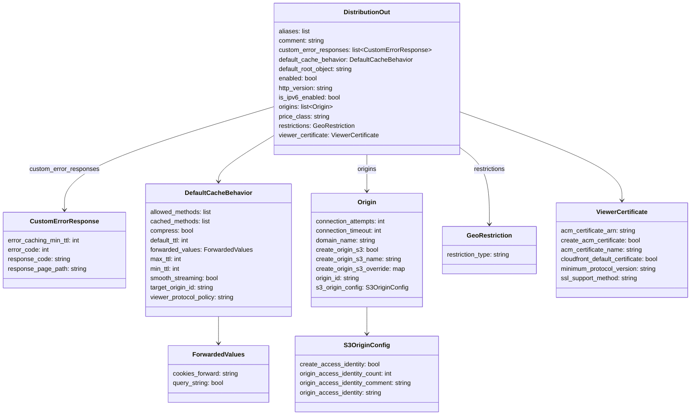
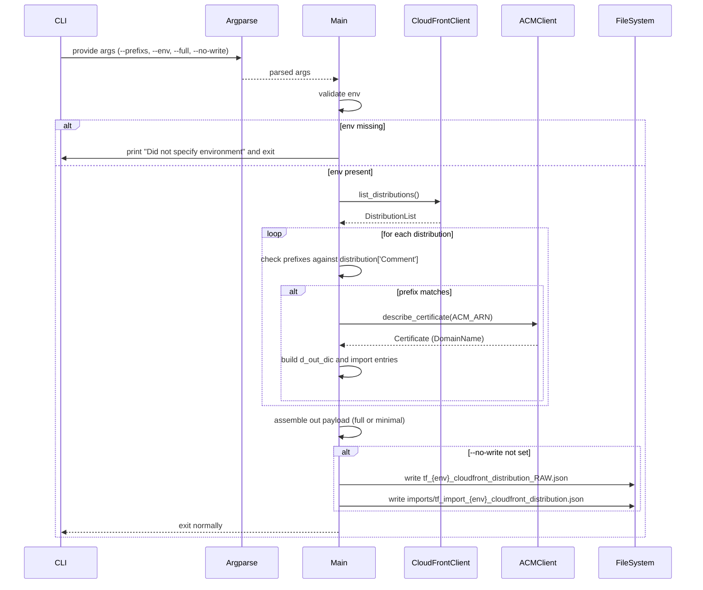

# Diagram: devops/terraform/scripts/config_scripts/gen_cloudfront.py


> Auto-generated by Obscura crawlers

## Diagram 1

```mermaid
flowchart TD
    Start([Start]) --> ParseArgs[Parse args (--prefixs, --env, --full, --no-write)]
    ParseArgs --> CheckEnv{env specified?}
    CheckEnv -- No --> PrintError[/print "Did not specify environment" and exit/]
    CheckEnv -- Yes --> ListDist[client.list_distributions()]
    ListDist --> DistLoop{for each distribution in DistributionList.Items}
    DistLoop --> FilterPrefix{prefix in distribution.Comment?}
    FilterPrefix -- No --> DistLoop
    FilterPrefix -- Yes --> FetchACM[fetch_acm_name(ACM_ARN) ]
    FetchACM --> BuildDic[build d_out_dic from distribution fields]
    BuildDic --> AppendOut[append to distribution_out_lis]
    AppendOut --> AppendImport[append to distribution_import_lis]
    AppendImport --> DistLoop
    DistLoop --> AfterLoop{after loop}
    AfterLoop --> BuildOutFinal[assemble out (full or minimal)]
    BuildOutFinal --> CheckNoWrite{--no-write set?}
    CheckNoWrite -- True --> End([End])
    CheckNoWrite -- False --> WriteFiles[write RAW and import json files to config_path/{env}]
    WriteFiles --> End
```

> SVG rendering failed for this diagram.

## Diagram 2



### SVG

<svg id="container" width="1748.84375" xmlns="http://www.w3.org/2000/svg" class="classDiagram" height="1052" viewBox="0 0 1748.84375 1052" role="graphics-document document" aria-roledescription="class"><style>#container{font-family:"trebuchet ms",verdana,arial,sans-serif;font-size:16px;fill:#333;}@keyframes edge-animation-frame{from{stroke-dashoffset:0;}}@keyframes dash{to{stroke-dashoffset:0;}}#container .edge-animation-slow{stroke-dasharray:9,5!important;stroke-dashoffset:900;animation:dash 50s linear infinite;stroke-linecap:round;}#container .edge-animation-fast{stroke-dasharray:9,5!important;stroke-dashoffset:900;animation:dash 20s linear infinite;stroke-linecap:round;}#container .error-icon{fill:#552222;}#container .error-text{fill:#552222;stroke:#552222;}#container .edge-thickness-normal{stroke-width:1px;}#container .edge-thickness-thick{stroke-width:3.5px;}#container .edge-pattern-solid{stroke-dasharray:0;}#container .edge-thickness-invisible{stroke-width:0;fill:none;}#container .edge-pattern-dashed{stroke-dasharray:3;}#container .edge-pattern-dotted{stroke-dasharray:2;}#container .marker{fill:#333333;stroke:#333333;}#container .marker.cross{stroke:#333333;}#container svg{font-family:"trebuchet ms",verdana,arial,sans-serif;font-size:16px;}#container p{margin:0;}#container g.classGroup text{fill:#9370DB;stroke:none;font-family:"trebuchet ms",verdana,arial,sans-serif;font-size:10px;}#container g.classGroup text .title{font-weight:bolder;}#container .nodeLabel,#container .edgeLabel{color:#131300;}#container .edgeLabel .label rect{fill:#ECECFF;}#container .label text{fill:#131300;}#container .labelBkg{background:#ECECFF;}#container .edgeLabel .label span{background:#ECECFF;}#container .classTitle{font-weight:bolder;}#container .node rect,#container .node circle,#container .node ellipse,#container .node polygon,#container .node path{fill:#ECECFF;stroke:#9370DB;stroke-width:1px;}#container .divider{stroke:#9370DB;stroke-width:1;}#container g.clickable{cursor:pointer;}#container g.classGroup rect{fill:#ECECFF;stroke:#9370DB;}#container g.classGroup line{stroke:#9370DB;stroke-width:1;}#container .classLabel .box{stroke:none;stroke-width:0;fill:#ECECFF;opacity:0.5;}#container .classLabel .label{fill:#9370DB;font-size:10px;}#container .relation{stroke:#333333;stroke-width:1;fill:none;}#container .dashed-line{stroke-dasharray:3;}#container .dotted-line{stroke-dasharray:1 2;}#container #compositionStart,#container .composition{fill:#333333!important;stroke:#333333!important;stroke-width:1;}#container #compositionEnd,#container .composition{fill:#333333!important;stroke:#333333!important;stroke-width:1;}#container #dependencyStart,#container .dependency{fill:#333333!important;stroke:#333333!important;stroke-width:1;}#container #dependencyStart,#container .dependency{fill:#333333!important;stroke:#333333!important;stroke-width:1;}#container #extensionStart,#container .extension{fill:transparent!important;stroke:#333333!important;stroke-width:1;}#container #extensionEnd,#container .extension{fill:transparent!important;stroke:#333333!important;stroke-width:1;}#container #aggregationStart,#container .aggregation{fill:transparent!important;stroke:#333333!important;stroke-width:1;}#container #aggregationEnd,#container .aggregation{fill:transparent!important;stroke:#333333!important;stroke-width:1;}#container #lollipopStart,#container .lollipop{fill:#ECECFF!important;stroke:#333333!important;stroke-width:1;}#container #lollipopEnd,#container .lollipop{fill:#ECECFF!important;stroke:#333333!important;stroke-width:1;}#container .edgeTerminals{font-size:11px;line-height:initial;}#container .classTitleText{text-anchor:middle;font-size:18px;fill:#333;}#container .label-icon{display:inline-block;height:1em;overflow:visible;vertical-align:-0.125em;}#container .node .label-icon path{fill:currentColor;stroke:revert;stroke-width:revert;}#container :root{--mermaid-font-family:"trebuchet ms",verdana,arial,sans-serif;}</style><g><defs><marker id="container_class-aggregationStart" class="marker aggregation class" refX="18" refY="7" markerWidth="190" markerHeight="240" orient="auto"><path d="M 18,7 L9,13 L1,7 L9,1 Z"></path></marker></defs><defs><marker id="container_class-aggregationEnd" class="marker aggregation class" refX="1" refY="7" markerWidth="20" markerHeight="28" orient="auto"><path d="M 18,7 L9,13 L1,7 L9,1 Z"></path></marker></defs><defs><marker id="container_class-extensionStart" class="marker extension class" refX="18" refY="7" markerWidth="190" markerHeight="240" orient="auto"><path d="M 1,7 L18,13 V 1 Z"></path></marker></defs><defs><marker id="container_class-extensionEnd" class="marker extension class" refX="1" refY="7" markerWidth="20" markerHeight="28" orient="auto"><path d="M 1,1 V 13 L18,7 Z"></path></marker></defs><defs><marker id="container_class-compositionStart" class="marker composition class" refX="18" refY="7" markerWidth="190" markerHeight="240" orient="auto"><path d="M 18,7 L9,13 L1,7 L9,1 Z"></path></marker></defs><defs><marker id="container_class-compositionEnd" class="marker composition class" refX="1" refY="7" markerWidth="20" markerHeight="28" orient="auto"><path d="M 18,7 L9,13 L1,7 L9,1 Z"></path></marker></defs><defs><marker id="container_class-dependencyStart" class="marker dependency class" refX="6" refY="7" markerWidth="190" markerHeight="240" orient="auto"><path d="M 5,7 L9,13 L1,7 L9,1 Z"></path></marker></defs><defs><marker id="container_class-dependencyEnd" class="marker dependency class" refX="13" refY="7" markerWidth="20" markerHeight="28" orient="auto"><path d="M 18,7 L9,13 L14,7 L9,1 Z"></path></marker></defs><defs><marker id="container_class-lollipopStart" class="marker lollipop class" refX="13" refY="7" markerWidth="190" markerHeight="240" orient="auto"><circle stroke="black" fill="transparent" cx="7" cy="7" r="6"></circle></marker></defs><defs><marker id="container_class-lollipopEnd" class="marker lollipop class" refX="1" refY="7" markerWidth="190" markerHeight="240" orient="auto"><circle stroke="black" fill="transparent" cx="7" cy="7" r="6"></circle></marker></defs><g class="root"><g class="clusters"></g><g class="edgePaths"><path d="M683.402,343.666L660.371,357.888C637.34,372.111,591.277,400.555,568.246,419.944C545.215,439.333,545.215,449.667,545.215,454.833L545.215,460" id="id_DistributionOut_DefaultCacheBehavior_1" class="edge-thickness-normal edge-pattern-solid relation" style=";;;" data-edge="true" data-et="edge" data-id="id_DistributionOut_DefaultCacheBehavior_1" data-points="W3sieCI6NjgzLjQwMjM0Mzc1LCJ5IjozNDMuNjY1OTM2MzM0NzE2OH0seyJ4Ijo1NDUuMjE0ODQzNzUsInkiOjQyOX0seyJ4Ijo1NDUuMjE0ODQzNzUsInkiOjQ2Nn1d" marker-end="url(#container_class-dependencyEnd)"></path><path d="M683.402,270.504L596.236,296.92C509.069,323.336,334.736,376.168,247.569,419.751C160.402,463.333,160.402,497.667,160.402,514.833L160.402,532" id="id_DistributionOut_CustomErrorResponse_2" class="edge-thickness-normal edge-pattern-solid relation" style=";;;" data-edge="true" data-et="edge" data-id="id_DistributionOut_CustomErrorResponse_2" data-points="W3sieCI6NjgzLjQwMjM0Mzc1LCJ5IjoyNzAuNTA0MzM3MTI3NjczODZ9LHsieCI6MTYwLjQwMjM0Mzc1LCJ5Ijo0Mjl9LHsieCI6MTYwLjQwMjM0Mzc1LCJ5Ijo1Mzh9XQ==" marker-end="url(#container_class-dependencyEnd)"></path><path d="M916.051,392L916.051,398.167C916.051,404.333,916.051,416.667,916.051,432C916.051,447.333,916.051,465.667,916.051,474.833L916.051,484" id="id_DistributionOut_Origin_3" class="edge-thickness-normal edge-pattern-solid relation" style=";;;" data-edge="true" data-et="edge" data-id="id_DistributionOut_Origin_3" data-points="W3sieCI6OTE2LjA1MDc4MTI1LCJ5IjozOTJ9LHsieCI6OTE2LjA1MDc4MTI1LCJ5Ijo0Mjl9LHsieCI6OTE2LjA1MDc4MTI1LCJ5Ijo0OTB9XQ==" marker-end="url(#container_class-dependencyEnd)"></path><path d="M1148.699,281.581L1218.766,306.151C1288.833,330.721,1428.967,379.86,1499.035,417.597C1569.102,455.333,1569.102,481.667,1569.102,494.833L1569.102,508" id="id_DistributionOut_ViewerCertificate_4" class="edge-thickness-normal edge-pattern-solid relation" style=";;;" data-edge="true" data-et="edge" data-id="id_DistributionOut_ViewerCertificate_4" data-points="W3sieCI6MTE0OC42OTkyMTg3NSwieSI6MjgxLjU4MDkzMzI0MDAyMTN9LHsieCI6MTU2OS4xMDE1NjI1LCJ5Ijo0Mjl9LHsieCI6MTU2OS4xMDE1NjI1LCJ5Ijo1MTR9XQ==" marker-end="url(#container_class-dependencyEnd)"></path><path d="M1148.699,371.933L1161.569,381.444C1174.439,390.956,1200.178,409.978,1213.048,442.656C1225.918,475.333,1225.918,521.667,1225.918,544.833L1225.918,568" id="id_DistributionOut_GeoRestriction_5" class="edge-thickness-normal edge-pattern-solid relation" style=";;;" data-edge="true" data-et="edge" data-id="id_DistributionOut_GeoRestriction_5" data-points="W3sieCI6MTE0OC42OTkyMTg3NSwieSI6MzcxLjkzMzMxMzE2MzQwMTY0fSx7IngiOjEyMjUuOTE3OTY4NzUsInkiOjQyOX0seyJ4IjoxMjI1LjkxNzk2ODc1LCJ5Ijo1NzR9XQ==" marker-end="url(#container_class-dependencyEnd)"></path><path d="M545.215,802L545.215,806.167C545.215,810.333,545.215,818.667,545.215,830C545.215,841.333,545.215,855.667,545.215,862.833L545.215,870" id="id_DefaultCacheBehavior_ForwardedValues_6" class="edge-thickness-normal edge-pattern-solid relation" style=";;;" data-edge="true" data-et="edge" data-id="id_DefaultCacheBehavior_ForwardedValues_6" data-points="W3sieCI6NTQ1LjIxNDg0Mzc1LCJ5Ijo4MDJ9LHsieCI6NTQ1LjIxNDg0Mzc1LCJ5Ijo4Mjd9LHsieCI6NTQ1LjIxNDg0Mzc1LCJ5Ijo4NzZ9XQ==" marker-end="url(#container_class-dependencyEnd)"></path><path d="M916.051,778L916.051,786.167C916.051,794.333,916.051,810.667,916.051,822C916.051,833.333,916.051,839.667,916.051,842.833L916.051,846" id="id_Origin_S3OriginConfig_7" class="edge-thickness-normal edge-pattern-solid relation" style=";;;" data-edge="true" data-et="edge" data-id="id_Origin_S3OriginConfig_7" data-points="W3sieCI6OTE2LjA1MDc4MTI1LCJ5Ijo3Nzh9LHsieCI6OTE2LjA1MDc4MTI1LCJ5Ijo4Mjd9LHsieCI6OTE2LjA1MDc4MTI1LCJ5Ijo4NTJ9XQ==" marker-end="url(#container_class-dependencyEnd)"></path></g><g class="edgeLabels"><g class="edgeLabel"><g class="label" data-id="id_DistributionOut_DefaultCacheBehavior_1" transform="translate(0, 0)"><foreignObject width="0" height="0"><div xmlns="http://www.w3.org/1999/xhtml" class="labelBkg" style="display: table-cell; white-space: nowrap; line-height: 1.5; max-width: 200px; text-align: center;"><span class="edgeLabel"></span></div></foreignObject></g></g><g class="edgeLabel" transform="translate(160.40234375, 429)"><g class="label" data-id="id_DistributionOut_CustomErrorResponse_2" transform="translate(-88.8984375, -12)"><foreignObject width="177.796875" height="24"><div xmlns="http://www.w3.org/1999/xhtml" class="labelBkg" style="display: table-cell; white-space: nowrap; line-height: 1.5; max-width: 200px; text-align: center;"><span class="edgeLabel"><p>custom_error_responses</p></span></div></foreignObject></g></g><g class="edgeLabel" transform="translate(916.05078125, 429)"><g class="label" data-id="id_DistributionOut_Origin_3" transform="translate(-24.859375, -12)"><foreignObject width="49.71875" height="24"><div xmlns="http://www.w3.org/1999/xhtml" class="labelBkg" style="display: table-cell; white-space: nowrap; line-height: 1.5; max-width: 200px; text-align: center;"><span class="edgeLabel"><p>origins</p></span></div></foreignObject></g></g><g class="edgeLabel"><g class="label" data-id="id_DistributionOut_ViewerCertificate_4" transform="translate(0, 0)"><foreignObject width="0" height="0"><div xmlns="http://www.w3.org/1999/xhtml" class="labelBkg" style="display: table-cell; white-space: nowrap; line-height: 1.5; max-width: 200px; text-align: center;"><span class="edgeLabel"></span></div></foreignObject></g></g><g class="edgeLabel" transform="translate(1225.91796875, 429)"><g class="label" data-id="id_DistributionOut_GeoRestriction_5" transform="translate(-41.2421875, -12)"><foreignObject width="82.484375" height="24"><div xmlns="http://www.w3.org/1999/xhtml" class="labelBkg" style="display: table-cell; white-space: nowrap; line-height: 1.5; max-width: 200px; text-align: center;"><span class="edgeLabel"><p>restrictions</p></span></div></foreignObject></g></g><g class="edgeLabel"><g class="label" data-id="id_DefaultCacheBehavior_ForwardedValues_6" transform="translate(0, 0)"><foreignObject width="0" height="0"><div xmlns="http://www.w3.org/1999/xhtml" class="labelBkg" style="display: table-cell; white-space: nowrap; line-height: 1.5; max-width: 200px; text-align: center;"><span class="edgeLabel"></span></div></foreignObject></g></g><g class="edgeLabel"><g class="label" data-id="id_Origin_S3OriginConfig_7" transform="translate(0, 0)"><foreignObject width="0" height="0"><div xmlns="http://www.w3.org/1999/xhtml" class="labelBkg" style="display: table-cell; white-space: nowrap; line-height: 1.5; max-width: 200px; text-align: center;"><span class="edgeLabel"></span></div></foreignObject></g></g></g><g class="nodes"><g class="node default" id="classId-DistributionOut-0" transform="translate(916.05078125, 200)"><g class="basic label-container"><path d="M-232.6484375 -192 L232.6484375 -192 L232.6484375 192 L-232.6484375 192" stroke="none" stroke-width="0" fill="#ECECFF" style=""></path><path d="M-232.6484375 -192 C-129.00140031965634 -192, -25.354363139312653 -192, 232.6484375 -192 M-232.6484375 -192 C-86.58177126402623 -192, 59.48489497194754 -192, 232.6484375 -192 M232.6484375 -192 C232.6484375 -83.238032739201, 232.6484375 25.523934521597994, 232.6484375 192 M232.6484375 -192 C232.6484375 -101.92676454495616, 232.6484375 -11.853529089912314, 232.6484375 192 M232.6484375 192 C81.42019825670579 192, -69.80804098658842 192, -232.6484375 192 M232.6484375 192 C90.77389207846139 192, -51.10065334307723 192, -232.6484375 192 M-232.6484375 192 C-232.6484375 70.36950775301923, -232.6484375 -51.26098449396153, -232.6484375 -192 M-232.6484375 192 C-232.6484375 98.99807543836894, -232.6484375 5.996150876737886, -232.6484375 -192" stroke="#9370DB" stroke-width="1.3" fill="none" stroke-dasharray="0 0" style=""></path></g><g class="annotation-group text" transform="translate(0, -168)"></g><g class="label-group text" transform="translate(-57.0625, -168)"><g class="label" style="font-weight: bolder" transform="translate(0,-12)"><foreignObject width="114.125" height="24"><div xmlns="http://www.w3.org/1999/xhtml" style="display: table-cell; white-space: nowrap; line-height: 1.5; max-width: 163px; text-align: center;"><span class="nodeLabel markdown-node-label" style=""><p>DistributionOut</p></span></div></foreignObject></g></g><g class="members-group text" transform="translate(-220.6484375, -120)"><g class="label" style="" transform="translate(0,-12)"><foreignObject width="80.484375" height="24"><div xmlns="http://www.w3.org/1999/xhtml" style="display: table-cell; white-space: nowrap; line-height: 1.5; max-width: 131px; text-align: center;"><span class="nodeLabel markdown-node-label" style=""><p>aliases: list</p></span></div></foreignObject></g><g class="label" style="" transform="translate(0,12)"><foreignObject width="117.75" height="24"><div xmlns="http://www.w3.org/1999/xhtml" style="display: table-cell; white-space: nowrap; line-height: 1.5; max-width: 168px; text-align: center;"><span class="nodeLabel markdown-node-label" style=""><p>comment: string</p></span></div></foreignObject></g><g class="label" style="" transform="translate(0,36)"><foreignObject width="384.234375" height="24"><div xmlns="http://www.w3.org/1999/xhtml" style="display: table-cell; white-space: nowrap; line-height: 1.5; max-width: 474px; text-align: center;"><span class="nodeLabel markdown-node-label" style=""><p>custom_error_responses: list&lt;CustomErrorResponse&gt;</p></span></div></foreignObject></g><g class="label" style="" transform="translate(0,60)"><foreignObject width="341.875" height="24"><div xmlns="http://www.w3.org/1999/xhtml" style="display: table-cell; white-space: nowrap; line-height: 1.5; max-width: 393px; text-align: center;"><span class="nodeLabel markdown-node-label" style=""><p>default_cache_behavior: DefaultCacheBehavior</p></span></div></foreignObject></g><g class="label" style="" transform="translate(0,84)"><foreignObject width="193.515625" height="24"><div xmlns="http://www.w3.org/1999/xhtml" style="display: table-cell; white-space: nowrap; line-height: 1.5; max-width: 244px; text-align: center;"><span class="nodeLabel markdown-node-label" style=""><p>default_root_object: string</p></span></div></foreignObject></g><g class="label" style="" transform="translate(0,108)"><foreignObject width="100.171875" height="24"><div xmlns="http://www.w3.org/1999/xhtml" style="display: table-cell; white-space: nowrap; line-height: 1.5; max-width: 150px; text-align: center;"><span class="nodeLabel markdown-node-label" style=""><p>enabled: bool</p></span></div></foreignObject></g><g class="label" style="" transform="translate(0,132)"><foreignObject width="140.84375" height="24"><div xmlns="http://www.w3.org/1999/xhtml" style="display: table-cell; white-space: nowrap; line-height: 1.5; max-width: 192px; text-align: center;"><span class="nodeLabel markdown-node-label" style=""><p>http_version: string</p></span></div></foreignObject></g><g class="label" style="" transform="translate(0,156)"><foreignObject width="158.1875" height="24"><div xmlns="http://www.w3.org/1999/xhtml" style="display: table-cell; white-space: nowrap; line-height: 1.5; max-width: 208px; text-align: center;"><span class="nodeLabel markdown-node-label" style=""><p>is_ipv6_enabled: bool</p></span></div></foreignObject></g><g class="label" style="" transform="translate(0,180)"><foreignObject width="140.21875" height="24"><div xmlns="http://www.w3.org/1999/xhtml" style="display: table-cell; white-space: nowrap; line-height: 1.5; max-width: 230px; text-align: center;"><span class="nodeLabel markdown-node-label" style=""><p>origins: list&lt;Origin&gt;</p></span></div></foreignObject></g><g class="label" style="" transform="translate(0,204)"><foreignObject width="129.21875" height="24"><div xmlns="http://www.w3.org/1999/xhtml" style="display: table-cell; white-space: nowrap; line-height: 1.5; max-width: 180px; text-align: center;"><span class="nodeLabel markdown-node-label" style=""><p>price_class: string</p></span></div></foreignObject></g><g class="label" style="" transform="translate(0,228)"><foreignObject width="197.484375" height="24"><div xmlns="http://www.w3.org/1999/xhtml" style="display: table-cell; white-space: nowrap; line-height: 1.5; max-width: 247px; text-align: center;"><span class="nodeLabel markdown-node-label" style=""><p>restrictions: GeoRestriction</p></span></div></foreignObject></g><g class="label" style="" transform="translate(0,252)"><foreignObject width="256.40625" height="24"><div xmlns="http://www.w3.org/1999/xhtml" style="display: table-cell; white-space: nowrap; line-height: 1.5; max-width: 306px; text-align: center;"><span class="nodeLabel markdown-node-label" style=""><p>viewer_certificate: ViewerCertificate</p></span></div></foreignObject></g></g><g class="methods-group text" transform="translate(-220.6484375, 192)"></g><g class="divider" style=""><path d="M-232.6484375 -144 C-126.78902878618905 -144, -20.9296200723781 -144, 232.6484375 -144 M-232.6484375 -144 C-87.04119972109214 -144, 58.56603805781572 -144, 232.6484375 -144" stroke="#9370DB" stroke-width="1.3" fill="none" stroke-dasharray="0 0" style=""></path></g><g class="divider" style=""><path d="M-232.6484375 168 C-124.74591114830545 168, -16.843384796610906 168, 232.6484375 168 M-232.6484375 168 C-116.84734294634096 168, -1.0462483926819175 168, 232.6484375 168" stroke="#9370DB" stroke-width="1.3" fill="none" stroke-dasharray="0 0" style=""></path></g></g><g class="node default" id="classId-CustomErrorResponse-1" transform="translate(160.40234375, 634)"><g class="basic label-container"><path d="M-152.40234375 -96 L152.40234375 -96 L152.40234375 96 L-152.40234375 96" stroke="none" stroke-width="0" fill="#ECECFF" style=""></path><path d="M-152.40234375 -96 C-54.09653519106682 -96, 44.20927336786636 -96, 152.40234375 -96 M-152.40234375 -96 C-52.58385002767534 -96, 47.23464369464932 -96, 152.40234375 -96 M152.40234375 -96 C152.40234375 -33.996918278577255, 152.40234375 28.00616344284549, 152.40234375 96 M152.40234375 -96 C152.40234375 -37.70638649596195, 152.40234375 20.5872270080761, 152.40234375 96 M152.40234375 96 C76.6790663509355 96, 0.9557889518709999 96, -152.40234375 96 M152.40234375 96 C52.83777559991462 96, -46.72679255017076 96, -152.40234375 96 M-152.40234375 96 C-152.40234375 57.55587072822471, -152.40234375 19.111741456449423, -152.40234375 -96 M-152.40234375 96 C-152.40234375 27.96725274072122, -152.40234375 -40.06549451855756, -152.40234375 -96" stroke="#9370DB" stroke-width="1.3" fill="none" stroke-dasharray="0 0" style=""></path></g><g class="annotation-group text" transform="translate(0, -72)"></g><g class="label-group text" transform="translate(-80.9140625, -72)"><g class="label" style="font-weight: bolder" transform="translate(0,-12)"><foreignObject width="161.828125" height="24"><div xmlns="http://www.w3.org/1999/xhtml" style="display: table-cell; white-space: nowrap; line-height: 1.5; max-width: 210px; text-align: center;"><span class="nodeLabel markdown-node-label" style=""><p>CustomErrorResponse</p></span></div></foreignObject></g></g><g class="members-group text" transform="translate(-140.40234375, -24)"><g class="label" style="" transform="translate(0,-12)"><foreignObject width="186.234375" height="24"><div xmlns="http://www.w3.org/1999/xhtml" style="display: table-cell; white-space: nowrap; line-height: 1.5; max-width: 236px; text-align: center;"><span class="nodeLabel markdown-node-label" style=""><p>error_caching_min_ttl: int</p></span></div></foreignObject></g><g class="label" style="" transform="translate(0,12)"><foreignObject width="105.546875" height="24"><div xmlns="http://www.w3.org/1999/xhtml" style="display: table-cell; white-space: nowrap; line-height: 1.5; max-width: 156px; text-align: center;"><span class="nodeLabel markdown-node-label" style=""><p>error_code: int</p></span></div></foreignObject></g><g class="label" style="" transform="translate(0,36)"><foreignObject width="158.671875" height="24"><div xmlns="http://www.w3.org/1999/xhtml" style="display: table-cell; white-space: nowrap; line-height: 1.5; max-width: 209px; text-align: center;"><span class="nodeLabel markdown-node-label" style=""><p>response_code: string</p></span></div></foreignObject></g><g class="label" style="" transform="translate(0,60)"><foreignObject width="199.890625" height="24"><div xmlns="http://www.w3.org/1999/xhtml" style="display: table-cell; white-space: nowrap; line-height: 1.5; max-width: 251px; text-align: center;"><span class="nodeLabel markdown-node-label" style=""><p>response_page_path: string</p></span></div></foreignObject></g></g><g class="methods-group text" transform="translate(-140.40234375, 96)"></g><g class="divider" style=""><path d="M-152.40234375 -48 C-68.45826905896291 -48, 15.485805632074175 -48, 152.40234375 -48 M-152.40234375 -48 C-71.07875519475127 -48, 10.244833360497466 -48, 152.40234375 -48" stroke="#9370DB" stroke-width="1.3" fill="none" stroke-dasharray="0 0" style=""></path></g><g class="divider" style=""><path d="M-152.40234375 72 C-80.38708624290196 72, -8.371828735803916 72, 152.40234375 72 M-152.40234375 72 C-59.95963626958063 72, 32.483071210838744 72, 152.40234375 72" stroke="#9370DB" stroke-width="1.3" fill="none" stroke-dasharray="0 0" style=""></path></g></g><g class="node default" id="classId-DefaultCacheBehavior-2" transform="translate(545.21484375, 634)"><g class="basic label-container"><path d="M-182.41015625 -168 L182.41015625 -168 L182.41015625 168 L-182.41015625 168" stroke="none" stroke-width="0" fill="#ECECFF" style=""></path><path d="M-182.41015625 -168 C-61.37746122098315 -168, 59.6552338080337 -168, 182.41015625 -168 M-182.41015625 -168 C-94.94951458502256 -168, -7.488872920045111 -168, 182.41015625 -168 M182.41015625 -168 C182.41015625 -82.39338785564976, 182.41015625 3.2132242887004736, 182.41015625 168 M182.41015625 -168 C182.41015625 -51.44859925943565, 182.41015625 65.1028014811287, 182.41015625 168 M182.41015625 168 C109.23050543192254 168, 36.050854613845075 168, -182.41015625 168 M182.41015625 168 C75.2488734336412 168, -31.912409382717613 168, -182.41015625 168 M-182.41015625 168 C-182.41015625 62.3646879045137, -182.41015625 -43.2706241909726, -182.41015625 -168 M-182.41015625 168 C-182.41015625 56.755741517787754, -182.41015625 -54.48851696442449, -182.41015625 -168" stroke="#9370DB" stroke-width="1.3" fill="none" stroke-dasharray="0 0" style=""></path></g><g class="annotation-group text" transform="translate(0, -144)"></g><g class="label-group text" transform="translate(-80.9453125, -144)"><g class="label" style="font-weight: bolder" transform="translate(0,-12)"><foreignObject width="161.890625" height="24"><div xmlns="http://www.w3.org/1999/xhtml" style="display: table-cell; white-space: nowrap; line-height: 1.5; max-width: 211px; text-align: center;"><span class="nodeLabel markdown-node-label" style=""><p>DefaultCacheBehavior</p></span></div></foreignObject></g></g><g class="members-group text" transform="translate(-170.41015625, -96)"><g class="label" style="" transform="translate(0,-12)"><foreignObject width="159.765625" height="24"><div xmlns="http://www.w3.org/1999/xhtml" style="display: table-cell; white-space: nowrap; line-height: 1.5; max-width: 210px; text-align: center;"><span class="nodeLabel markdown-node-label" style=""><p>allowed_methods: list</p></span></div></foreignObject></g><g class="label" style="" transform="translate(0,12)"><foreignObject width="154.328125" height="24"><div xmlns="http://www.w3.org/1999/xhtml" style="display: table-cell; white-space: nowrap; line-height: 1.5; max-width: 205px; text-align: center;"><span class="nodeLabel markdown-node-label" style=""><p>cached_methods: list</p></span></div></foreignObject></g><g class="label" style="" transform="translate(0,36)"><foreignObject width="110.0625" height="24"><div xmlns="http://www.w3.org/1999/xhtml" style="display: table-cell; white-space: nowrap; line-height: 1.5; max-width: 160px; text-align: center;"><span class="nodeLabel markdown-node-label" style=""><p>compress: bool</p></span></div></foreignObject></g><g class="label" style="" transform="translate(0,60)"><foreignObject width="103.765625" height="24"><div xmlns="http://www.w3.org/1999/xhtml" style="display: table-cell; white-space: nowrap; line-height: 1.5; max-width: 154px; text-align: center;"><span class="nodeLabel markdown-node-label" style=""><p>default_ttl: int</p></span></div></foreignObject></g><g class="label" style="" transform="translate(0,84)"><foreignObject width="259.875" height="24"><div xmlns="http://www.w3.org/1999/xhtml" style="display: table-cell; white-space: nowrap; line-height: 1.5; max-width: 310px; text-align: center;"><span class="nodeLabel markdown-node-label" style=""><p>forwarded_values: ForwardedValues</p></span></div></foreignObject></g><g class="label" style="" transform="translate(0,108)"><foreignObject width="82.171875" height="24"><div xmlns="http://www.w3.org/1999/xhtml" style="display: table-cell; white-space: nowrap; line-height: 1.5; max-width: 132px; text-align: center;"><span class="nodeLabel markdown-node-label" style=""><p>max_ttl: int</p></span></div></foreignObject></g><g class="label" style="" transform="translate(0,132)"><foreignObject width="79.59375" height="24"><div xmlns="http://www.w3.org/1999/xhtml" style="display: table-cell; white-space: nowrap; line-height: 1.5; max-width: 130px; text-align: center;"><span class="nodeLabel markdown-node-label" style=""><p>min_ttl: int</p></span></div></foreignObject></g><g class="label" style="" transform="translate(0,156)"><foreignObject width="176.4375" height="24"><div xmlns="http://www.w3.org/1999/xhtml" style="display: table-cell; white-space: nowrap; line-height: 1.5; max-width: 227px; text-align: center;"><span class="nodeLabel markdown-node-label" style=""><p>smooth_streaming: bool</p></span></div></foreignObject></g><g class="label" style="" transform="translate(0,180)"><foreignObject width="165.21875" height="24"><div xmlns="http://www.w3.org/1999/xhtml" style="display: table-cell; white-space: nowrap; line-height: 1.5; max-width: 216px; text-align: center;"><span class="nodeLabel markdown-node-label" style=""><p>target_origin_id: string</p></span></div></foreignObject></g><g class="label" style="" transform="translate(0,204)"><foreignObject width="216.96875" height="24"><div xmlns="http://www.w3.org/1999/xhtml" style="display: table-cell; white-space: nowrap; line-height: 1.5; max-width: 268px; text-align: center;"><span class="nodeLabel markdown-node-label" style=""><p>viewer_protocol_policy: string</p></span></div></foreignObject></g></g><g class="methods-group text" transform="translate(-170.41015625, 168)"></g><g class="divider" style=""><path d="M-182.41015625 -120 C-62.34374753862549 -120, 57.722661172749014 -120, 182.41015625 -120 M-182.41015625 -120 C-72.27923954763223 -120, 37.85167715473554 -120, 182.41015625 -120" stroke="#9370DB" stroke-width="1.3" fill="none" stroke-dasharray="0 0" style=""></path></g><g class="divider" style=""><path d="M-182.41015625 144 C-106.91421328355273 144, -31.418270317105453 144, 182.41015625 144 M-182.41015625 144 C-82.79337178215079 144, 16.82341268569843 144, 182.41015625 144" stroke="#9370DB" stroke-width="1.3" fill="none" stroke-dasharray="0 0" style=""></path></g></g><g class="node default" id="classId-ForwardedValues-3" transform="translate(545.21484375, 948)"><g class="basic label-container"><path d="M-127.40234375 -72 L127.40234375 -72 L127.40234375 72 L-127.40234375 72" stroke="none" stroke-width="0" fill="#ECECFF" style=""></path><path d="M-127.40234375 -72 C-29.140023600892945 -72, 69.12229654821411 -72, 127.40234375 -72 M-127.40234375 -72 C-74.05848425121818 -72, -20.714624752436336 -72, 127.40234375 -72 M127.40234375 -72 C127.40234375 -32.186232044656414, 127.40234375 7.627535910687172, 127.40234375 72 M127.40234375 -72 C127.40234375 -41.91372254531831, 127.40234375 -11.827445090636616, 127.40234375 72 M127.40234375 72 C25.870847646720804 72, -75.66064845655839 72, -127.40234375 72 M127.40234375 72 C60.35448548415118 72, -6.693372781697633 72, -127.40234375 72 M-127.40234375 72 C-127.40234375 26.133878628341854, -127.40234375 -19.73224274331629, -127.40234375 -72 M-127.40234375 72 C-127.40234375 30.288142999559668, -127.40234375 -11.423714000880665, -127.40234375 -72" stroke="#9370DB" stroke-width="1.3" fill="none" stroke-dasharray="0 0" style=""></path></g><g class="annotation-group text" transform="translate(0, -48)"></g><g class="label-group text" transform="translate(-62.5234375, -48)"><g class="label" style="font-weight: bolder" transform="translate(0,-12)"><foreignObject width="125.046875" height="24"><div xmlns="http://www.w3.org/1999/xhtml" style="display: table-cell; white-space: nowrap; line-height: 1.5; max-width: 173px; text-align: center;"><span class="nodeLabel markdown-node-label" style=""><p>ForwardedValues</p></span></div></foreignObject></g></g><g class="members-group text" transform="translate(-115.40234375, 0)"><g class="label" style="" transform="translate(0,-12)"><foreignObject width="168.28125" height="24"><div xmlns="http://www.w3.org/1999/xhtml" style="display: table-cell; white-space: nowrap; line-height: 1.5; max-width: 219px; text-align: center;"><span class="nodeLabel markdown-node-label" style=""><p>cookies_forward: string</p></span></div></foreignObject></g><g class="label" style="" transform="translate(0,12)"><foreignObject width="132.09375" height="24"><div xmlns="http://www.w3.org/1999/xhtml" style="display: table-cell; white-space: nowrap; line-height: 1.5; max-width: 182px; text-align: center;"><span class="nodeLabel markdown-node-label" style=""><p>query_string: bool</p></span></div></foreignObject></g></g><g class="methods-group text" transform="translate(-115.40234375, 72)"></g><g class="divider" style=""><path d="M-127.40234375 -24 C-65.20795945324925 -24, -3.01357515649849 -24, 127.40234375 -24 M-127.40234375 -24 C-48.745559100876335 -24, 29.91122554824733 -24, 127.40234375 -24" stroke="#9370DB" stroke-width="1.3" fill="none" stroke-dasharray="0 0" style=""></path></g><g class="divider" style=""><path d="M-127.40234375 48 C-72.6104473041857 48, -17.81855085837138 48, 127.40234375 48 M-127.40234375 48 C-34.30972311098478 48, 58.782897528030446 48, 127.40234375 48" stroke="#9370DB" stroke-width="1.3" fill="none" stroke-dasharray="0 0" style=""></path></g></g><g class="node default" id="classId-Origin-4" transform="translate(916.05078125, 634)"><g class="basic label-container"><path d="M-138.42578125 -144 L138.42578125 -144 L138.42578125 144 L-138.42578125 144" stroke="none" stroke-width="0" fill="#ECECFF" style=""></path><path d="M-138.42578125 -144 C-80.58121348385532 -144, -22.736645717710644 -144, 138.42578125 -144 M-138.42578125 -144 C-66.13601030853447 -144, 6.153760632931068 -144, 138.42578125 -144 M138.42578125 -144 C138.42578125 -63.24162738201993, 138.42578125 17.516745235960144, 138.42578125 144 M138.42578125 -144 C138.42578125 -67.66899460069548, 138.42578125 8.662010798609032, 138.42578125 144 M138.42578125 144 C64.7922432767331 144, -8.841294696533794 144, -138.42578125 144 M138.42578125 144 C54.69100920304035 144, -29.043762843919296 144, -138.42578125 144 M-138.42578125 144 C-138.42578125 61.44607360123092, -138.42578125 -21.107852797538158, -138.42578125 -144 M-138.42578125 144 C-138.42578125 30.380717224869542, -138.42578125 -83.23856555026092, -138.42578125 -144" stroke="#9370DB" stroke-width="1.3" fill="none" stroke-dasharray="0 0" style=""></path></g><g class="annotation-group text" transform="translate(0, -120)"></g><g class="label-group text" transform="translate(-22.2734375, -120)"><g class="label" style="font-weight: bolder" transform="translate(0,-12)"><foreignObject width="44.546875" height="24"><div xmlns="http://www.w3.org/1999/xhtml" style="display: table-cell; white-space: nowrap; line-height: 1.5; max-width: 94px; text-align: center;"><span class="nodeLabel markdown-node-label" style=""><p>Origin</p></span></div></foreignObject></g></g><g class="members-group text" transform="translate(-126.42578125, -72)"><g class="label" style="" transform="translate(0,-12)"><foreignObject width="181.75" height="24"><div xmlns="http://www.w3.org/1999/xhtml" style="display: table-cell; white-space: nowrap; line-height: 1.5; max-width: 232px; text-align: center;"><span class="nodeLabel markdown-node-label" style=""><p>connection_attempts: int</p></span></div></foreignObject></g><g class="label" style="" transform="translate(0,12)"><foreignObject width="173.765625" height="24"><div xmlns="http://www.w3.org/1999/xhtml" style="display: table-cell; white-space: nowrap; line-height: 1.5; max-width: 224px; text-align: center;"><span class="nodeLabel markdown-node-label" style=""><p>connection_timeout: int</p></span></div></foreignObject></g><g class="label" style="" transform="translate(0,36)"><foreignObject width="153.765625" height="24"><div xmlns="http://www.w3.org/1999/xhtml" style="display: table-cell; white-space: nowrap; line-height: 1.5; max-width: 204px; text-align: center;"><span class="nodeLabel markdown-node-label" style=""><p>domain_name: string</p></span></div></foreignObject></g><g class="label" style="" transform="translate(0,60)"><foreignObject width="159.53125" height="24"><div xmlns="http://www.w3.org/1999/xhtml" style="display: table-cell; white-space: nowrap; line-height: 1.5; max-width: 210px; text-align: center;"><span class="nodeLabel markdown-node-label" style=""><p>create_origin_s3: bool</p></span></div></foreignObject></g><g class="label" style="" transform="translate(0,84)"><foreignObject width="216.796875" height="24"><div xmlns="http://www.w3.org/1999/xhtml" style="display: table-cell; white-space: nowrap; line-height: 1.5; max-width: 267px; text-align: center;"><span class="nodeLabel markdown-node-label" style=""><p>create_origin_s3_name: string</p></span></div></foreignObject></g><g class="label" style="" transform="translate(0,108)"><foreignObject width="227.203125" height="24"><div xmlns="http://www.w3.org/1999/xhtml" style="display: table-cell; white-space: nowrap; line-height: 1.5; max-width: 277px; text-align: center;"><span class="nodeLabel markdown-node-label" style=""><p>create_origin_s3_override: map</p></span></div></foreignObject></g><g class="label" style="" transform="translate(0,132)"><foreignObject width="114.359375" height="24"><div xmlns="http://www.w3.org/1999/xhtml" style="display: table-cell; white-space: nowrap; line-height: 1.5; max-width: 165px; text-align: center;"><span class="nodeLabel markdown-node-label" style=""><p>origin_id: string</p></span></div></foreignObject></g><g class="label" style="" transform="translate(0,156)"><foreignObject width="230.578125" height="24"><div xmlns="http://www.w3.org/1999/xhtml" style="display: table-cell; white-space: nowrap; line-height: 1.5; max-width: 281px; text-align: center;"><span class="nodeLabel markdown-node-label" style=""><p>s3_origin_config: S3OriginConfig</p></span></div></foreignObject></g></g><g class="methods-group text" transform="translate(-126.42578125, 144)"></g><g class="divider" style=""><path d="M-138.42578125 -96 C-60.15101605845496 -96, 18.123749133090087 -96, 138.42578125 -96 M-138.42578125 -96 C-75.53517076398364 -96, -12.644560277967287 -96, 138.42578125 -96" stroke="#9370DB" stroke-width="1.3" fill="none" stroke-dasharray="0 0" style=""></path></g><g class="divider" style=""><path d="M-138.42578125 120 C-74.8599913599841 120, -11.2942014699682 120, 138.42578125 120 M-138.42578125 120 C-52.81734276218998 120, 32.79109572562004 120, 138.42578125 120" stroke="#9370DB" stroke-width="1.3" fill="none" stroke-dasharray="0 0" style=""></path></g></g><g class="node default" id="classId-S3OriginConfig-5" transform="translate(916.05078125, 948)"><g class="basic label-container"><path d="M-182.171875 -96 L182.171875 -96 L182.171875 96 L-182.171875 96" stroke="none" stroke-width="0" fill="#ECECFF" style=""></path><path d="M-182.171875 -96 C-45.40339679316952 -96, 91.36508141366096 -96, 182.171875 -96 M-182.171875 -96 C-84.51696697057727 -96, 13.137941058845456 -96, 182.171875 -96 M182.171875 -96 C182.171875 -21.903166394422072, 182.171875 52.193667211155855, 182.171875 96 M182.171875 -96 C182.171875 -40.370200566819335, 182.171875 15.25959886636133, 182.171875 96 M182.171875 96 C93.03894409876975 96, 3.906013197539494 96, -182.171875 96 M182.171875 96 C81.21323401271552 96, -19.745406974568965 96, -182.171875 96 M-182.171875 96 C-182.171875 32.868411118727764, -182.171875 -30.263177762544473, -182.171875 -96 M-182.171875 96 C-182.171875 36.054641889173816, -182.171875 -23.89071622165237, -182.171875 -96" stroke="#9370DB" stroke-width="1.3" fill="none" stroke-dasharray="0 0" style=""></path></g><g class="annotation-group text" transform="translate(0, -72)"></g><g class="label-group text" transform="translate(-53.9375, -72)"><g class="label" style="font-weight: bolder" transform="translate(0,-12)"><foreignObject width="107.875" height="24"><div xmlns="http://www.w3.org/1999/xhtml" style="display: table-cell; white-space: nowrap; line-height: 1.5; max-width: 156px; text-align: center;"><span class="nodeLabel markdown-node-label" style=""><p>S3OriginConfig</p></span></div></foreignObject></g></g><g class="members-group text" transform="translate(-170.171875, -24)"><g class="label" style="" transform="translate(0,-12)"><foreignObject width="204.46875" height="24"><div xmlns="http://www.w3.org/1999/xhtml" style="display: table-cell; white-space: nowrap; line-height: 1.5; max-width: 255px; text-align: center;"><span class="nodeLabel markdown-node-label" style=""><p>create_access_identity: bool</p></span></div></foreignObject></g><g class="label" style="" transform="translate(0,12)"><foreignObject width="237.609375" height="24"><div xmlns="http://www.w3.org/1999/xhtml" style="display: table-cell; white-space: nowrap; line-height: 1.5; max-width: 288px; text-align: center;"><span class="nodeLabel markdown-node-label" style=""><p>origin_access_identity_count: int</p></span></div></foreignObject></g><g class="label" style="" transform="translate(0,36)"><foreignObject width="286.40625" height="24"><div xmlns="http://www.w3.org/1999/xhtml" style="display: table-cell; white-space: nowrap; line-height: 1.5; max-width: 337px; text-align: center;"><span class="nodeLabel markdown-node-label" style=""><p>origin_access_identity_comment: string</p></span></div></foreignObject></g><g class="label" style="" transform="translate(0,60)"><foreignObject width="210.921875" height="24"><div xmlns="http://www.w3.org/1999/xhtml" style="display: table-cell; white-space: nowrap; line-height: 1.5; max-width: 262px; text-align: center;"><span class="nodeLabel markdown-node-label" style=""><p>origin_access_identity: string</p></span></div></foreignObject></g></g><g class="methods-group text" transform="translate(-170.171875, 96)"></g><g class="divider" style=""><path d="M-182.171875 -48 C-68.9088072076376 -48, 44.35426058472481 -48, 182.171875 -48 M-182.171875 -48 C-73.8220841183477 -48, 34.52770676330459 -48, 182.171875 -48" stroke="#9370DB" stroke-width="1.3" fill="none" stroke-dasharray="0 0" style=""></path></g><g class="divider" style=""><path d="M-182.171875 72 C-47.793378138615225 72, 86.58511872276955 72, 182.171875 72 M-182.171875 72 C-72.40723874612 72, 37.35739750776 72, 182.171875 72" stroke="#9370DB" stroke-width="1.3" fill="none" stroke-dasharray="0 0" style=""></path></g></g><g class="node default" id="classId-GeoRestriction-6" transform="translate(1225.91796875, 634)"><g class="basic label-container"><path d="M-121.44140625 -60 L121.44140625 -60 L121.44140625 60 L-121.44140625 60" stroke="none" stroke-width="0" fill="#ECECFF" style=""></path><path d="M-121.44140625 -60 C-68.82604940487367 -60, -16.210692559747343 -60, 121.44140625 -60 M-121.44140625 -60 C-24.64776547437036 -60, 72.14587530125928 -60, 121.44140625 -60 M121.44140625 -60 C121.44140625 -14.270970251053129, 121.44140625 31.458059497893743, 121.44140625 60 M121.44140625 -60 C121.44140625 -18.218513063130054, 121.44140625 23.562973873739892, 121.44140625 60 M121.44140625 60 C59.52225272219224 60, -2.396900805615516 60, -121.44140625 60 M121.44140625 60 C32.876656574154794 60, -55.68809310169041 60, -121.44140625 60 M-121.44140625 60 C-121.44140625 24.453489738941748, -121.44140625 -11.093020522116504, -121.44140625 -60 M-121.44140625 60 C-121.44140625 16.632287119667538, -121.44140625 -26.735425760664924, -121.44140625 -60" stroke="#9370DB" stroke-width="1.3" fill="none" stroke-dasharray="0 0" style=""></path></g><g class="annotation-group text" transform="translate(0, -36)"></g><g class="label-group text" transform="translate(-54.3671875, -36)"><g class="label" style="font-weight: bolder" transform="translate(0,-12)"><foreignObject width="108.734375" height="24"><div xmlns="http://www.w3.org/1999/xhtml" style="display: table-cell; white-space: nowrap; line-height: 1.5; max-width: 157px; text-align: center;"><span class="nodeLabel markdown-node-label" style=""><p>GeoRestriction</p></span></div></foreignObject></g></g><g class="members-group text" transform="translate(-109.44140625, 12)"><g class="label" style="" transform="translate(0,-12)"><foreignObject width="164.515625" height="24"><div xmlns="http://www.w3.org/1999/xhtml" style="display: table-cell; white-space: nowrap; line-height: 1.5; max-width: 215px; text-align: center;"><span class="nodeLabel markdown-node-label" style=""><p>restriction_type: string</p></span></div></foreignObject></g></g><g class="methods-group text" transform="translate(-109.44140625, 60)"></g><g class="divider" style=""><path d="M-121.44140625 -12 C-37.61324971172806 -12, 46.21490682654388 -12, 121.44140625 -12 M-121.44140625 -12 C-46.2381532219821 -12, 28.965099806035795 -12, 121.44140625 -12" stroke="#9370DB" stroke-width="1.3" fill="none" stroke-dasharray="0 0" style=""></path></g><g class="divider" style=""><path d="M-121.44140625 36 C-30.83837027140366 36, 59.76466570719268 36, 121.44140625 36 M-121.44140625 36 C-65.45331354872638 36, -9.46522084745277 36, 121.44140625 36" stroke="#9370DB" stroke-width="1.3" fill="none" stroke-dasharray="0 0" style=""></path></g></g><g class="node default" id="classId-ViewerCertificate-7" transform="translate(1569.1015625, 634)"><g class="basic label-container"><path d="M-171.7421875 -120 L171.7421875 -120 L171.7421875 120 L-171.7421875 120" stroke="none" stroke-width="0" fill="#ECECFF" style=""></path><path d="M-171.7421875 -120 C-48.855076499466634 -120, 74.03203450106673 -120, 171.7421875 -120 M-171.7421875 -120 C-68.67138477147344 -120, 34.39941795705312 -120, 171.7421875 -120 M171.7421875 -120 C171.7421875 -49.74398732310232, 171.7421875 20.512025353795366, 171.7421875 120 M171.7421875 -120 C171.7421875 -29.805734475181936, 171.7421875 60.38853104963613, 171.7421875 120 M171.7421875 120 C37.547515087765674 120, -96.64715732446865 120, -171.7421875 120 M171.7421875 120 C80.01647553978587 120, -11.709236420428255 120, -171.7421875 120 M-171.7421875 120 C-171.7421875 53.79488631709421, -171.7421875 -12.41022736581158, -171.7421875 -120 M-171.7421875 120 C-171.7421875 44.22702113053761, -171.7421875 -31.545957738924784, -171.7421875 -120" stroke="#9370DB" stroke-width="1.3" fill="none" stroke-dasharray="0 0" style=""></path></g><g class="annotation-group text" transform="translate(0, -96)"></g><g class="label-group text" transform="translate(-62.546875, -96)"><g class="label" style="font-weight: bolder" transform="translate(0,-12)"><foreignObject width="125.09375" height="24"><div xmlns="http://www.w3.org/1999/xhtml" style="display: table-cell; white-space: nowrap; line-height: 1.5; max-width: 172px; text-align: center;"><span class="nodeLabel markdown-node-label" style=""><p>ViewerCertificate</p></span></div></foreignObject></g></g><g class="members-group text" transform="translate(-159.7421875, -48)"><g class="label" style="" transform="translate(0,-12)"><foreignObject width="191.875" height="24"><div xmlns="http://www.w3.org/1999/xhtml" style="display: table-cell; white-space: nowrap; line-height: 1.5; max-width: 243px; text-align: center;"><span class="nodeLabel markdown-node-label" style=""><p>acm_certificate_arn: string</p></span></div></foreignObject></g><g class="label" style="" transform="translate(0,12)"><foreignObject width="203.734375" height="24"><div xmlns="http://www.w3.org/1999/xhtml" style="display: table-cell; white-space: nowrap; line-height: 1.5; max-width: 254px; text-align: center;"><span class="nodeLabel markdown-node-label" style=""><p>create_acm_certificate: bool</p></span></div></foreignObject></g><g class="label" style="" transform="translate(0,36)"><foreignObject width="208.453125" height="24"><div xmlns="http://www.w3.org/1999/xhtml" style="display: table-cell; white-space: nowrap; line-height: 1.5; max-width: 259px; text-align: center;"><span class="nodeLabel markdown-node-label" style=""><p>acm_certificate_name: string</p></span></div></foreignObject></g><g class="label" style="" transform="translate(0,60)"><foreignObject width="256.9375" height="24"><div xmlns="http://www.w3.org/1999/xhtml" style="display: table-cell; white-space: nowrap; line-height: 1.5; max-width: 307px; text-align: center;"><span class="nodeLabel markdown-node-label" style=""><p>cloudfront_default_certificate: bool</p></span></div></foreignObject></g><g class="label" style="" transform="translate(0,84)"><foreignObject width="248.6875" height="24"><div xmlns="http://www.w3.org/1999/xhtml" style="display: table-cell; white-space: nowrap; line-height: 1.5; max-width: 299px; text-align: center;"><span class="nodeLabel markdown-node-label" style=""><p>minimum_protocol_version: string</p></span></div></foreignObject></g><g class="label" style="" transform="translate(0,108)"><foreignObject width="199.421875" height="24"><div xmlns="http://www.w3.org/1999/xhtml" style="display: table-cell; white-space: nowrap; line-height: 1.5; max-width: 250px; text-align: center;"><span class="nodeLabel markdown-node-label" style=""><p>ssl_support_method: string</p></span></div></foreignObject></g></g><g class="methods-group text" transform="translate(-159.7421875, 120)"></g><g class="divider" style=""><path d="M-171.7421875 -72 C-91.12105171482227 -72, -10.499915929644544 -72, 171.7421875 -72 M-171.7421875 -72 C-98.35278108422115 -72, -24.9633746684423 -72, 171.7421875 -72" stroke="#9370DB" stroke-width="1.3" fill="none" stroke-dasharray="0 0" style=""></path></g><g class="divider" style=""><path d="M-171.7421875 96 C-45.8879184458864 96, 79.9663506082272 96, 171.7421875 96 M-171.7421875 96 C-94.6959560430894 96, -17.64972458617879 96, 171.7421875 96" stroke="#9370DB" stroke-width="1.3" fill="none" stroke-dasharray="0 0" style=""></path></g></g></g></g></g></svg>

## Diagram 3



### SVG

<svg id="container" width="1487" xmlns="http://www.w3.org/2000/svg" height="1258" viewBox="-50 -10 1487 1258" role="graphics-document document" aria-roledescription="sequence"><g><rect x="1237" y="1172" fill="#eaeaea" stroke="#666" width="150" height="65" name="FS" rx="3" ry="3" class="actor actor-bottom"></rect><text x="1312" y="1204.5" dominant-baseline="central" alignment-baseline="central" class="actor actor-box" style="text-anchor: middle; font-size: 16px; font-weight: 400;"><tspan x="1312" dy="0">FileSystem</tspan></text></g><g><rect x="1037" y="1172" fill="#eaeaea" stroke="#666" width="150" height="65" name="ACM" rx="3" ry="3" class="actor actor-bottom"></rect><text x="1112" y="1204.5" dominant-baseline="central" alignment-baseline="central" class="actor actor-box" style="text-anchor: middle; font-size: 16px; font-weight: 400;"><tspan x="1112" dy="0">ACMClient</tspan></text></g><g><rect x="837" y="1172" fill="#eaeaea" stroke="#666" width="150" height="65" name="CF" rx="3" ry="3" class="actor actor-bottom"></rect><text x="912" y="1204.5" dominant-baseline="central" alignment-baseline="central" class="actor actor-box" style="text-anchor: middle; font-size: 16px; font-weight: 400;"><tspan x="912" dy="0">CloudFrontClient</tspan></text></g><g><rect x="609" y="1172" fill="#eaeaea" stroke="#666" width="150" height="65" name="Main" rx="3" ry="3" class="actor actor-bottom"></rect><text x="684" y="1204.5" dominant-baseline="central" alignment-baseline="central" class="actor actor-box" style="text-anchor: middle; font-size: 16px; font-weight: 400;"><tspan x="684" dy="0">Main</tspan></text></g><g><rect x="409" y="1172" fill="#eaeaea" stroke="#666" width="150" height="65" name="Argparse" rx="3" ry="3" class="actor actor-bottom"></rect><text x="484" y="1204.5" dominant-baseline="central" alignment-baseline="central" class="actor actor-box" style="text-anchor: middle; font-size: 16px; font-weight: 400;"><tspan x="484" dy="0">Argparse</tspan></text></g><g><rect x="0" y="1172" fill="#eaeaea" stroke="#666" width="150" height="65" name="CLI" rx="3" ry="3" class="actor actor-bottom"></rect><text x="75" y="1204.5" dominant-baseline="central" alignment-baseline="central" class="actor actor-box" style="text-anchor: middle; font-size: 16px; font-weight: 400;"><tspan x="75" dy="0">CLI</tspan></text></g><g><line id="actor5" x1="1312" y1="65" x2="1312" y2="1172" class="actor-line 200" stroke-width="0.5px" stroke="#999" name="FS"></line><g id="root-5"><rect x="1237" y="0" fill="#eaeaea" stroke="#666" width="150" height="65" name="FS" rx="3" ry="3" class="actor actor-top"></rect><text x="1312" y="32.5" dominant-baseline="central" alignment-baseline="central" class="actor actor-box" style="text-anchor: middle; font-size: 16px; font-weight: 400;"><tspan x="1312" dy="0">FileSystem</tspan></text></g></g><g><line id="actor4" x1="1112" y1="65" x2="1112" y2="1172" class="actor-line 200" stroke-width="0.5px" stroke="#999" name="ACM"></line><g id="root-4"><rect x="1037" y="0" fill="#eaeaea" stroke="#666" width="150" height="65" name="ACM" rx="3" ry="3" class="actor actor-top"></rect><text x="1112" y="32.5" dominant-baseline="central" alignment-baseline="central" class="actor actor-box" style="text-anchor: middle; font-size: 16px; font-weight: 400;"><tspan x="1112" dy="0">ACMClient</tspan></text></g></g><g><line id="actor3" x1="912" y1="65" x2="912" y2="1172" class="actor-line 200" stroke-width="0.5px" stroke="#999" name="CF"></line><g id="root-3"><rect x="837" y="0" fill="#eaeaea" stroke="#666" width="150" height="65" name="CF" rx="3" ry="3" class="actor actor-top"></rect><text x="912" y="32.5" dominant-baseline="central" alignment-baseline="central" class="actor actor-box" style="text-anchor: middle; font-size: 16px; font-weight: 400;"><tspan x="912" dy="0">CloudFrontClient</tspan></text></g></g><g><line id="actor2" x1="684" y1="65" x2="684" y2="1172" class="actor-line 200" stroke-width="0.5px" stroke="#999" name="Main"></line><g id="root-2"><rect x="609" y="0" fill="#eaeaea" stroke="#666" width="150" height="65" name="Main" rx="3" ry="3" class="actor actor-top"></rect><text x="684" y="32.5" dominant-baseline="central" alignment-baseline="central" class="actor actor-box" style="text-anchor: middle; font-size: 16px; font-weight: 400;"><tspan x="684" dy="0">Main</tspan></text></g></g><g><line id="actor1" x1="484" y1="65" x2="484" y2="1172" class="actor-line 200" stroke-width="0.5px" stroke="#999" name="Argparse"></line><g id="root-1"><rect x="409" y="0" fill="#eaeaea" stroke="#666" width="150" height="65" name="Argparse" rx="3" ry="3" class="actor actor-top"></rect><text x="484" y="32.5" dominant-baseline="central" alignment-baseline="central" class="actor actor-box" style="text-anchor: middle; font-size: 16px; font-weight: 400;"><tspan x="484" dy="0">Argparse</tspan></text></g></g><g><line id="actor0" x1="75" y1="65" x2="75" y2="1172" class="actor-line 200" stroke-width="0.5px" stroke="#999" name="CLI"></line><g id="root-0"><rect x="0" y="0" fill="#eaeaea" stroke="#666" width="150" height="65" name="CLI" rx="3" ry="3" class="actor actor-top"></rect><text x="75" y="32.5" dominant-baseline="central" alignment-baseline="central" class="actor actor-box" style="text-anchor: middle; font-size: 16px; font-weight: 400;"><tspan x="75" dy="0">CLI</tspan></text></g></g><style>#container{font-family:"trebuchet ms",verdana,arial,sans-serif;font-size:16px;fill:#333;}@keyframes edge-animation-frame{from{stroke-dashoffset:0;}}@keyframes dash{to{stroke-dashoffset:0;}}#container .edge-animation-slow{stroke-dasharray:9,5!important;stroke-dashoffset:900;animation:dash 50s linear infinite;stroke-linecap:round;}#container .edge-animation-fast{stroke-dasharray:9,5!important;stroke-dashoffset:900;animation:dash 20s linear infinite;stroke-linecap:round;}#container .error-icon{fill:#552222;}#container .error-text{fill:#552222;stroke:#552222;}#container .edge-thickness-normal{stroke-width:1px;}#container .edge-thickness-thick{stroke-width:3.5px;}#container .edge-pattern-solid{stroke-dasharray:0;}#container .edge-thickness-invisible{stroke-width:0;fill:none;}#container .edge-pattern-dashed{stroke-dasharray:3;}#container .edge-pattern-dotted{stroke-dasharray:2;}#container .marker{fill:#333333;stroke:#333333;}#container .marker.cross{stroke:#333333;}#container svg{font-family:"trebuchet ms",verdana,arial,sans-serif;font-size:16px;}#container p{margin:0;}#container .actor{stroke:hsl(259.6261682243, 59.7765363128%, 87.9019607843%);fill:#ECECFF;}#container text.actor&gt;tspan{fill:black;stroke:none;}#container .actor-line{stroke:hsl(259.6261682243, 59.7765363128%, 87.9019607843%);}#container .innerArc{stroke-width:1.5;stroke-dasharray:none;}#container .messageLine0{stroke-width:1.5;stroke-dasharray:none;stroke:#333;}#container .messageLine1{stroke-width:1.5;stroke-dasharray:2,2;stroke:#333;}#container #arrowhead path{fill:#333;stroke:#333;}#container .sequenceNumber{fill:white;}#container #sequencenumber{fill:#333;}#container #crosshead path{fill:#333;stroke:#333;}#container .messageText{fill:#333;stroke:none;}#container .labelBox{stroke:hsl(259.6261682243, 59.7765363128%, 87.9019607843%);fill:#ECECFF;}#container .labelText,#container .labelText&gt;tspan{fill:black;stroke:none;}#container .loopText,#container .loopText&gt;tspan{fill:black;stroke:none;}#container .loopLine{stroke-width:2px;stroke-dasharray:2,2;stroke:hsl(259.6261682243, 59.7765363128%, 87.9019607843%);fill:hsl(259.6261682243, 59.7765363128%, 87.9019607843%);}#container .note{stroke:#aaaa33;fill:#fff5ad;}#container .noteText,#container .noteText&gt;tspan{fill:black;stroke:none;}#container .activation0{fill:#f4f4f4;stroke:#666;}#container .activation1{fill:#f4f4f4;stroke:#666;}#container .activation2{fill:#f4f4f4;stroke:#666;}#container .actorPopupMenu{position:absolute;}#container .actorPopupMenuPanel{position:absolute;fill:#ECECFF;box-shadow:0px 8px 16px 0px rgba(0,0,0,0.2);filter:drop-shadow(3px 5px 2px rgb(0 0 0 / 0.4));}#container .actor-man line{stroke:hsl(259.6261682243, 59.7765363128%, 87.9019607843%);fill:#ECECFF;}#container .actor-man circle,#container line{stroke:hsl(259.6261682243, 59.7765363128%, 87.9019607843%);fill:#ECECFF;stroke-width:2px;}#container :root{--mermaid-font-family:"trebuchet ms",verdana,arial,sans-serif;}</style><g></g><defs><symbol id="computer" width="24" height="24"><path transform="scale(.5)" d="M2 2v13h20v-13h-20zm18 11h-16v-9h16v9zm-10.228 6l.466-1h3.524l.467 1h-4.457zm14.228 3h-24l2-6h2.104l-1.33 4h18.45l-1.297-4h2.073l2 6zm-5-10h-14v-7h14v7z"></path></symbol></defs><defs><symbol id="database" fill-rule="evenodd" clip-rule="evenodd"><path transform="scale(.5)" d="M12.258.001l.256.004.255.005.253.008.251.01.249.012.247.015.246.016.242.019.241.02.239.023.236.024.233.027.231.028.229.031.225.032.223.034.22.036.217.038.214.04.211.041.208.043.205.045.201.046.198.048.194.05.191.051.187.053.183.054.18.056.175.057.172.059.168.06.163.061.16.063.155.064.15.066.074.033.073.033.071.034.07.034.069.035.068.035.067.035.066.035.064.036.064.036.062.036.06.036.06.037.058.037.058.037.055.038.055.038.053.038.052.038.051.039.05.039.048.039.047.039.045.04.044.04.043.04.041.04.04.041.039.041.037.041.036.041.034.041.033.042.032.042.03.042.029.042.027.042.026.043.024.043.023.043.021.043.02.043.018.044.017.043.015.044.013.044.012.044.011.045.009.044.007.045.006.045.004.045.002.045.001.045v17l-.001.045-.002.045-.004.045-.006.045-.007.045-.009.044-.011.045-.012.044-.013.044-.015.044-.017.043-.018.044-.02.043-.021.043-.023.043-.024.043-.026.043-.027.042-.029.042-.03.042-.032.042-.033.042-.034.041-.036.041-.037.041-.039.041-.04.041-.041.04-.043.04-.044.04-.045.04-.047.039-.048.039-.05.039-.051.039-.052.038-.053.038-.055.038-.055.038-.058.037-.058.037-.06.037-.06.036-.062.036-.064.036-.064.036-.066.035-.067.035-.068.035-.069.035-.07.034-.071.034-.073.033-.074.033-.15.066-.155.064-.16.063-.163.061-.168.06-.172.059-.175.057-.18.056-.183.054-.187.053-.191.051-.194.05-.198.048-.201.046-.205.045-.208.043-.211.041-.214.04-.217.038-.22.036-.223.034-.225.032-.229.031-.231.028-.233.027-.236.024-.239.023-.241.02-.242.019-.246.016-.247.015-.249.012-.251.01-.253.008-.255.005-.256.004-.258.001-.258-.001-.256-.004-.255-.005-.253-.008-.251-.01-.249-.012-.247-.015-.245-.016-.243-.019-.241-.02-.238-.023-.236-.024-.234-.027-.231-.028-.228-.031-.226-.032-.223-.034-.22-.036-.217-.038-.214-.04-.211-.041-.208-.043-.204-.045-.201-.046-.198-.048-.195-.05-.19-.051-.187-.053-.184-.054-.179-.056-.176-.057-.172-.059-.167-.06-.164-.061-.159-.063-.155-.064-.151-.066-.074-.033-.072-.033-.072-.034-.07-.034-.069-.035-.068-.035-.067-.035-.066-.035-.064-.036-.063-.036-.062-.036-.061-.036-.06-.037-.058-.037-.057-.037-.056-.038-.055-.038-.053-.038-.052-.038-.051-.039-.049-.039-.049-.039-.046-.039-.046-.04-.044-.04-.043-.04-.041-.04-.04-.041-.039-.041-.037-.041-.036-.041-.034-.041-.033-.042-.032-.042-.03-.042-.029-.042-.027-.042-.026-.043-.024-.043-.023-.043-.021-.043-.02-.043-.018-.044-.017-.043-.015-.044-.013-.044-.012-.044-.011-.045-.009-.044-.007-.045-.006-.045-.004-.045-.002-.045-.001-.045v-17l.001-.045.002-.045.004-.045.006-.045.007-.045.009-.044.011-.045.012-.044.013-.044.015-.044.017-.043.018-.044.02-.043.021-.043.023-.043.024-.043.026-.043.027-.042.029-.042.03-.042.032-.042.033-.042.034-.041.036-.041.037-.041.039-.041.04-.041.041-.04.043-.04.044-.04.046-.04.046-.039.049-.039.049-.039.051-.039.052-.038.053-.038.055-.038.056-.038.057-.037.058-.037.06-.037.061-.036.062-.036.063-.036.064-.036.066-.035.067-.035.068-.035.069-.035.07-.034.072-.034.072-.033.074-.033.151-.066.155-.064.159-.063.164-.061.167-.06.172-.059.176-.057.179-.056.184-.054.187-.053.19-.051.195-.05.198-.048.201-.046.204-.045.208-.043.211-.041.214-.04.217-.038.22-.036.223-.034.226-.032.228-.031.231-.028.234-.027.236-.024.238-.023.241-.02.243-.019.245-.016.247-.015.249-.012.251-.01.253-.008.255-.005.256-.004.258-.001.258.001zm-9.258 20.499v.01l.001.021.003.021.004.022.005.021.006.022.007.022.009.023.01.022.011.023.012.023.013.023.015.023.016.024.017.023.018.024.019.024.021.024.022.025.023.024.024.025.052.049.056.05.061.051.066.051.07.051.075.051.079.052.084.052.088.052.092.052.097.052.102.051.105.052.11.052.114.051.119.051.123.051.127.05.131.05.135.05.139.048.144.049.147.047.152.047.155.047.16.045.163.045.167.043.171.043.176.041.178.041.183.039.187.039.19.037.194.035.197.035.202.033.204.031.209.03.212.029.216.027.219.025.222.024.226.021.23.02.233.018.236.016.24.015.243.012.246.01.249.008.253.005.256.004.259.001.26-.001.257-.004.254-.005.25-.008.247-.011.244-.012.241-.014.237-.016.233-.018.231-.021.226-.021.224-.024.22-.026.216-.027.212-.028.21-.031.205-.031.202-.034.198-.034.194-.036.191-.037.187-.039.183-.04.179-.04.175-.042.172-.043.168-.044.163-.045.16-.046.155-.046.152-.047.148-.048.143-.049.139-.049.136-.05.131-.05.126-.05.123-.051.118-.052.114-.051.11-.052.106-.052.101-.052.096-.052.092-.052.088-.053.083-.051.079-.052.074-.052.07-.051.065-.051.06-.051.056-.05.051-.05.023-.024.023-.025.021-.024.02-.024.019-.024.018-.024.017-.024.015-.023.014-.024.013-.023.012-.023.01-.023.01-.022.008-.022.006-.022.006-.022.004-.022.004-.021.001-.021.001-.021v-4.127l-.077.055-.08.053-.083.054-.085.053-.087.052-.09.052-.093.051-.095.05-.097.05-.1.049-.102.049-.105.048-.106.047-.109.047-.111.046-.114.045-.115.045-.118.044-.12.043-.122.042-.124.042-.126.041-.128.04-.13.04-.132.038-.134.038-.135.037-.138.037-.139.035-.142.035-.143.034-.144.033-.147.032-.148.031-.15.03-.151.03-.153.029-.154.027-.156.027-.158.026-.159.025-.161.024-.162.023-.163.022-.165.021-.166.02-.167.019-.169.018-.169.017-.171.016-.173.015-.173.014-.175.013-.175.012-.177.011-.178.01-.179.008-.179.008-.181.006-.182.005-.182.004-.184.003-.184.002h-.37l-.184-.002-.184-.003-.182-.004-.182-.005-.181-.006-.179-.008-.179-.008-.178-.01-.176-.011-.176-.012-.175-.013-.173-.014-.172-.015-.171-.016-.17-.017-.169-.018-.167-.019-.166-.02-.165-.021-.163-.022-.162-.023-.161-.024-.159-.025-.157-.026-.156-.027-.155-.027-.153-.029-.151-.03-.15-.03-.148-.031-.146-.032-.145-.033-.143-.034-.141-.035-.14-.035-.137-.037-.136-.037-.134-.038-.132-.038-.13-.04-.128-.04-.126-.041-.124-.042-.122-.042-.12-.044-.117-.043-.116-.045-.113-.045-.112-.046-.109-.047-.106-.047-.105-.048-.102-.049-.1-.049-.097-.05-.095-.05-.093-.052-.09-.051-.087-.052-.085-.053-.083-.054-.08-.054-.077-.054v4.127zm0-5.654v.011l.001.021.003.021.004.021.005.022.006.022.007.022.009.022.01.022.011.023.012.023.013.023.015.024.016.023.017.024.018.024.019.024.021.024.022.024.023.025.024.024.052.05.056.05.061.05.066.051.07.051.075.052.079.051.084.052.088.052.092.052.097.052.102.052.105.052.11.051.114.051.119.052.123.05.127.051.131.05.135.049.139.049.144.048.147.048.152.047.155.046.16.045.163.045.167.044.171.042.176.042.178.04.183.04.187.038.19.037.194.036.197.034.202.033.204.032.209.03.212.028.216.027.219.025.222.024.226.022.23.02.233.018.236.016.24.014.243.012.246.01.249.008.253.006.256.003.259.001.26-.001.257-.003.254-.006.25-.008.247-.01.244-.012.241-.015.237-.016.233-.018.231-.02.226-.022.224-.024.22-.025.216-.027.212-.029.21-.03.205-.032.202-.033.198-.035.194-.036.191-.037.187-.039.183-.039.179-.041.175-.042.172-.043.168-.044.163-.045.16-.045.155-.047.152-.047.148-.048.143-.048.139-.05.136-.049.131-.05.126-.051.123-.051.118-.051.114-.052.11-.052.106-.052.101-.052.096-.052.092-.052.088-.052.083-.052.079-.052.074-.051.07-.052.065-.051.06-.05.056-.051.051-.049.023-.025.023-.024.021-.025.02-.024.019-.024.018-.024.017-.024.015-.023.014-.023.013-.024.012-.022.01-.023.01-.023.008-.022.006-.022.006-.022.004-.021.004-.022.001-.021.001-.021v-4.139l-.077.054-.08.054-.083.054-.085.052-.087.053-.09.051-.093.051-.095.051-.097.05-.1.049-.102.049-.105.048-.106.047-.109.047-.111.046-.114.045-.115.044-.118.044-.12.044-.122.042-.124.042-.126.041-.128.04-.13.039-.132.039-.134.038-.135.037-.138.036-.139.036-.142.035-.143.033-.144.033-.147.033-.148.031-.15.03-.151.03-.153.028-.154.028-.156.027-.158.026-.159.025-.161.024-.162.023-.163.022-.165.021-.166.02-.167.019-.169.018-.169.017-.171.016-.173.015-.173.014-.175.013-.175.012-.177.011-.178.009-.179.009-.179.007-.181.007-.182.005-.182.004-.184.003-.184.002h-.37l-.184-.002-.184-.003-.182-.004-.182-.005-.181-.007-.179-.007-.179-.009-.178-.009-.176-.011-.176-.012-.175-.013-.173-.014-.172-.015-.171-.016-.17-.017-.169-.018-.167-.019-.166-.02-.165-.021-.163-.022-.162-.023-.161-.024-.159-.025-.157-.026-.156-.027-.155-.028-.153-.028-.151-.03-.15-.03-.148-.031-.146-.033-.145-.033-.143-.033-.141-.035-.14-.036-.137-.036-.136-.037-.134-.038-.132-.039-.13-.039-.128-.04-.126-.041-.124-.042-.122-.043-.12-.043-.117-.044-.116-.044-.113-.046-.112-.046-.109-.046-.106-.047-.105-.048-.102-.049-.1-.049-.097-.05-.095-.051-.093-.051-.09-.051-.087-.053-.085-.052-.083-.054-.08-.054-.077-.054v4.139zm0-5.666v.011l.001.02.003.022.004.021.005.022.006.021.007.022.009.023.01.022.011.023.012.023.013.023.015.023.016.024.017.024.018.023.019.024.021.025.022.024.023.024.024.025.052.05.056.05.061.05.066.051.07.051.075.052.079.051.084.052.088.052.092.052.097.052.102.052.105.051.11.052.114.051.119.051.123.051.127.05.131.05.135.05.139.049.144.048.147.048.152.047.155.046.16.045.163.045.167.043.171.043.176.042.178.04.183.04.187.038.19.037.194.036.197.034.202.033.204.032.209.03.212.028.216.027.219.025.222.024.226.021.23.02.233.018.236.017.24.014.243.012.246.01.249.008.253.006.256.003.259.001.26-.001.257-.003.254-.006.25-.008.247-.01.244-.013.241-.014.237-.016.233-.018.231-.02.226-.022.224-.024.22-.025.216-.027.212-.029.21-.03.205-.032.202-.033.198-.035.194-.036.191-.037.187-.039.183-.039.179-.041.175-.042.172-.043.168-.044.163-.045.16-.045.155-.047.152-.047.148-.048.143-.049.139-.049.136-.049.131-.051.126-.05.123-.051.118-.052.114-.051.11-.052.106-.052.101-.052.096-.052.092-.052.088-.052.083-.052.079-.052.074-.052.07-.051.065-.051.06-.051.056-.05.051-.049.023-.025.023-.025.021-.024.02-.024.019-.024.018-.024.017-.024.015-.023.014-.024.013-.023.012-.023.01-.022.01-.023.008-.022.006-.022.006-.022.004-.022.004-.021.001-.021.001-.021v-4.153l-.077.054-.08.054-.083.053-.085.053-.087.053-.09.051-.093.051-.095.051-.097.05-.1.049-.102.048-.105.048-.106.048-.109.046-.111.046-.114.046-.115.044-.118.044-.12.043-.122.043-.124.042-.126.041-.128.04-.13.039-.132.039-.134.038-.135.037-.138.036-.139.036-.142.034-.143.034-.144.033-.147.032-.148.032-.15.03-.151.03-.153.028-.154.028-.156.027-.158.026-.159.024-.161.024-.162.023-.163.023-.165.021-.166.02-.167.019-.169.018-.169.017-.171.016-.173.015-.173.014-.175.013-.175.012-.177.01-.178.01-.179.009-.179.007-.181.006-.182.006-.182.004-.184.003-.184.001-.185.001-.185-.001-.184-.001-.184-.003-.182-.004-.182-.006-.181-.006-.179-.007-.179-.009-.178-.01-.176-.01-.176-.012-.175-.013-.173-.014-.172-.015-.171-.016-.17-.017-.169-.018-.167-.019-.166-.02-.165-.021-.163-.023-.162-.023-.161-.024-.159-.024-.157-.026-.156-.027-.155-.028-.153-.028-.151-.03-.15-.03-.148-.032-.146-.032-.145-.033-.143-.034-.141-.034-.14-.036-.137-.036-.136-.037-.134-.038-.132-.039-.13-.039-.128-.041-.126-.041-.124-.041-.122-.043-.12-.043-.117-.044-.116-.044-.113-.046-.112-.046-.109-.046-.106-.048-.105-.048-.102-.048-.1-.05-.097-.049-.095-.051-.093-.051-.09-.052-.087-.052-.085-.053-.083-.053-.08-.054-.077-.054v4.153zm8.74-8.179l-.257.004-.254.005-.25.008-.247.011-.244.012-.241.014-.237.016-.233.018-.231.021-.226.022-.224.023-.22.026-.216.027-.212.028-.21.031-.205.032-.202.033-.198.034-.194.036-.191.038-.187.038-.183.04-.179.041-.175.042-.172.043-.168.043-.163.045-.16.046-.155.046-.152.048-.148.048-.143.048-.139.049-.136.05-.131.05-.126.051-.123.051-.118.051-.114.052-.11.052-.106.052-.101.052-.096.052-.092.052-.088.052-.083.052-.079.052-.074.051-.07.052-.065.051-.06.05-.056.05-.051.05-.023.025-.023.024-.021.024-.02.025-.019.024-.018.024-.017.023-.015.024-.014.023-.013.023-.012.023-.01.023-.01.022-.008.022-.006.023-.006.021-.004.022-.004.021-.001.021-.001.021.001.021.001.021.004.021.004.022.006.021.006.023.008.022.01.022.01.023.012.023.013.023.014.023.015.024.017.023.018.024.019.024.02.025.021.024.023.024.023.025.051.05.056.05.06.05.065.051.07.052.074.051.079.052.083.052.088.052.092.052.096.052.101.052.106.052.11.052.114.052.118.051.123.051.126.051.131.05.136.05.139.049.143.048.148.048.152.048.155.046.16.046.163.045.168.043.172.043.175.042.179.041.183.04.187.038.191.038.194.036.198.034.202.033.205.032.21.031.212.028.216.027.22.026.224.023.226.022.231.021.233.018.237.016.241.014.244.012.247.011.25.008.254.005.257.004.26.001.26-.001.257-.004.254-.005.25-.008.247-.011.244-.012.241-.014.237-.016.233-.018.231-.021.226-.022.224-.023.22-.026.216-.027.212-.028.21-.031.205-.032.202-.033.198-.034.194-.036.191-.038.187-.038.183-.04.179-.041.175-.042.172-.043.168-.043.163-.045.16-.046.155-.046.152-.048.148-.048.143-.048.139-.049.136-.05.131-.05.126-.051.123-.051.118-.051.114-.052.11-.052.106-.052.101-.052.096-.052.092-.052.088-.052.083-.052.079-.052.074-.051.07-.052.065-.051.06-.05.056-.05.051-.05.023-.025.023-.024.021-.024.02-.025.019-.024.018-.024.017-.023.015-.024.014-.023.013-.023.012-.023.01-.023.01-.022.008-.022.006-.023.006-.021.004-.022.004-.021.001-.021.001-.021-.001-.021-.001-.021-.004-.021-.004-.022-.006-.021-.006-.023-.008-.022-.01-.022-.01-.023-.012-.023-.013-.023-.014-.023-.015-.024-.017-.023-.018-.024-.019-.024-.02-.025-.021-.024-.023-.024-.023-.025-.051-.05-.056-.05-.06-.05-.065-.051-.07-.052-.074-.051-.079-.052-.083-.052-.088-.052-.092-.052-.096-.052-.101-.052-.106-.052-.11-.052-.114-.052-.118-.051-.123-.051-.126-.051-.131-.05-.136-.05-.139-.049-.143-.048-.148-.048-.152-.048-.155-.046-.16-.046-.163-.045-.168-.043-.172-.043-.175-.042-.179-.041-.183-.04-.187-.038-.191-.038-.194-.036-.198-.034-.202-.033-.205-.032-.21-.031-.212-.028-.216-.027-.22-.026-.224-.023-.226-.022-.231-.021-.233-.018-.237-.016-.241-.014-.244-.012-.247-.011-.25-.008-.254-.005-.257-.004-.26-.001-.26.001z"></path></symbol></defs><defs><symbol id="clock" width="24" height="24"><path transform="scale(.5)" d="M12 2c5.514 0 10 4.486 10 10s-4.486 10-10 10-10-4.486-10-10 4.486-10 10-10zm0-2c-6.627 0-12 5.373-12 12s5.373 12 12 12 12-5.373 12-12-5.373-12-12-12zm5.848 12.459c.202.038.202.333.001.372-1.907.361-6.045 1.111-6.547 1.111-.719 0-1.301-.582-1.301-1.301 0-.512.77-5.447 1.125-7.445.034-.192.312-.181.343.014l.985 6.238 5.394 1.011z"></path></symbol></defs><defs><marker id="arrowhead" refX="7.9" refY="5" markerUnits="userSpaceOnUse" markerWidth="12" markerHeight="12" orient="auto-start-reverse"><path d="M -1 0 L 10 5 L 0 10 z"></path></marker></defs><defs><marker id="crosshead" markerWidth="15" markerHeight="8" orient="auto" refX="4" refY="4.5"><path fill="none" stroke="#000000" stroke-width="1pt" d="M 1,2 L 6,7 M 6,2 L 1,7" style="stroke-dasharray: 0, 0;"></path></marker></defs><defs><marker id="filled-head" refX="15.5" refY="7" markerWidth="20" markerHeight="28" orient="auto"><path d="M 18,7 L9,13 L14,7 L9,1 Z"></path></marker></defs><defs><marker id="sequencenumber" refX="15" refY="15" markerWidth="60" markerHeight="40" orient="auto"><circle cx="15" cy="15" r="6"></circle></marker></defs><g><line x1="548" y1="606" x2="1123" y2="606" class="loopLine"></line><line x1="1123" y1="606" x2="1123" y2="855" class="loopLine"></line><line x1="548" y1="855" x2="1123" y2="855" class="loopLine"></line><line x1="548" y1="606" x2="548" y2="855" class="loopLine"></line><polygon points="548,606 598,606 598,619 589.6,626 548,626" class="labelBox"></polygon><text x="573" y="619" text-anchor="middle" dominant-baseline="middle" alignment-baseline="middle" class="labelText" style="font-size: 16px; font-weight: 400;">alt</text><text x="860.5" y="624" text-anchor="middle" class="loopText" style="font-size: 16px; font-weight: 400;"><tspan x="860.5">[prefix matches]</tspan></text></g><g><line x1="507" y1="483" x2="1133" y2="483" class="loopLine"></line><line x1="1133" y1="483" x2="1133" y2="865" class="loopLine"></line><line x1="507" y1="865" x2="1133" y2="865" class="loopLine"></line><line x1="507" y1="483" x2="507" y2="865" class="loopLine"></line><polygon points="507,483 557,483 557,496 548.6,503 507,503" class="labelBox"></polygon><text x="532" y="496" text-anchor="middle" dominant-baseline="middle" alignment-baseline="middle" class="labelText" style="font-size: 16px; font-weight: 400;">loop</text><text x="845" y="501" text-anchor="middle" class="loopText" style="font-size: 16px; font-weight: 400;"><tspan x="845">[for each distribution]</tspan></text></g><g><line x1="673" y1="953" x2="1323" y2="953" class="loopLine"></line><line x1="1323" y1="953" x2="1323" y2="1094" class="loopLine"></line><line x1="673" y1="1094" x2="1323" y2="1094" class="loopLine"></line><line x1="673" y1="953" x2="673" y2="1094" class="loopLine"></line><polygon points="673,953 723,953 723,966 714.6,973 673,973" class="labelBox"></polygon><text x="698" y="966" text-anchor="middle" dominant-baseline="middle" alignment-baseline="middle" class="labelText" style="font-size: 16px; font-weight: 400;">alt</text><text x="1023" y="971" text-anchor="middle" class="loopText" style="font-size: 16px; font-weight: 400;"><tspan x="1023">[--no-write not set]</tspan></text></g><g><line x1="64" y1="249" x2="1333" y2="249" class="loopLine"></line><line x1="1333" y1="249" x2="1333" y2="1152" class="loopLine"></line><line x1="64" y1="1152" x2="1333" y2="1152" class="loopLine"></line><line x1="64" y1="249" x2="64" y2="1152" class="loopLine"></line><line x1="64" y1="347" x2="1333" y2="347" class="loopLine" style="stroke-dasharray: 3, 3;"></line><polygon points="64,249 114,249 114,262 105.6,269 64,269" class="labelBox"></polygon><text x="89" y="262" text-anchor="middle" dominant-baseline="middle" alignment-baseline="middle" class="labelText" style="font-size: 16px; font-weight: 400;">alt</text><text x="723.5" y="267" text-anchor="middle" class="loopText" style="font-size: 16px; font-weight: 400;"><tspan x="723.5">[env missing]</tspan></text><text x="698.5" y="365" text-anchor="middle" class="loopText" style="font-size: 16px; font-weight: 400;">[env present]</text></g><text x="278" y="80" text-anchor="middle" dominant-baseline="middle" alignment-baseline="middle" class="messageText" dy="1em" style="font-size: 16px; font-weight: 400;">provide args (--prefixs, --env, --full, --no-write)</text><line x1="76" y1="113" x2="480" y2="113" class="messageLine0" stroke-width="2" stroke="none" marker-end="url(#arrowhead)" style="fill: none;"></line><text x="583" y="128" text-anchor="middle" dominant-baseline="middle" alignment-baseline="middle" class="messageText" dy="1em" style="font-size: 16px; font-weight: 400;">parsed args</text><line x1="485" y1="161" x2="680" y2="161" class="messageLine1" stroke-width="2" stroke="none" marker-end="url(#arrowhead)" style="stroke-dasharray: 3, 3; fill: none;"></line><text x="685" y="176" text-anchor="middle" dominant-baseline="middle" alignment-baseline="middle" class="messageText" dy="1em" style="font-size: 16px; font-weight: 400;">validate env</text><path d="M 685,209 C 745,199 745,239 685,229" class="messageLine0" stroke-width="2" stroke="none" marker-end="url(#arrowhead)" style="fill: none;"></path><text x="381" y="299" text-anchor="middle" dominant-baseline="middle" alignment-baseline="middle" class="messageText" dy="1em" style="font-size: 16px; font-weight: 400;">print "Did not specify environment" and exit</text><line x1="683" y1="332" x2="79" y2="332" class="messageLine0" stroke-width="2" stroke="none" marker-end="url(#arrowhead)" style="fill: none;"></line><text x="797" y="392" text-anchor="middle" dominant-baseline="middle" alignment-baseline="middle" class="messageText" dy="1em" style="font-size: 16px; font-weight: 400;">list_distributions()</text><line x1="685" y1="425" x2="908" y2="425" class="messageLine0" stroke-width="2" stroke="none" marker-end="url(#arrowhead)" style="fill: none;"></line><text x="800" y="440" text-anchor="middle" dominant-baseline="middle" alignment-baseline="middle" class="messageText" dy="1em" style="font-size: 16px; font-weight: 400;">DistributionList</text><line x1="911" y1="473" x2="688" y2="473" class="messageLine1" stroke-width="2" stroke="none" marker-end="url(#arrowhead)" style="stroke-dasharray: 3, 3; fill: none;"></line><text x="685" y="533" text-anchor="middle" dominant-baseline="middle" alignment-baseline="middle" class="messageText" dy="1em" style="font-size: 16px; font-weight: 400;">check prefixes against distribution['Comment']</text><path d="M 685,566 C 745,556 745,596 685,586" class="messageLine0" stroke-width="2" stroke="none" marker-end="url(#arrowhead)" style="fill: none;"></path><text x="897" y="656" text-anchor="middle" dominant-baseline="middle" alignment-baseline="middle" class="messageText" dy="1em" style="font-size: 16px; font-weight: 400;">describe_certificate(ACM_ARN)</text><line x1="685" y1="689" x2="1108" y2="689" class="messageLine0" stroke-width="2" stroke="none" marker-end="url(#arrowhead)" style="fill: none;"></line><text x="900" y="704" text-anchor="middle" dominant-baseline="middle" alignment-baseline="middle" class="messageText" dy="1em" style="font-size: 16px; font-weight: 400;">Certificate (DomainName)</text><line x1="1111" y1="737" x2="688" y2="737" class="messageLine1" stroke-width="2" stroke="none" marker-end="url(#arrowhead)" style="stroke-dasharray: 3, 3; fill: none;"></line><text x="685" y="752" text-anchor="middle" dominant-baseline="middle" alignment-baseline="middle" class="messageText" dy="1em" style="font-size: 16px; font-weight: 400;">build d_out_dic and import entries</text><path d="M 685,785 C 745,775 745,815 685,805" class="messageLine0" stroke-width="2" stroke="none" marker-end="url(#arrowhead)" style="fill: none;"></path><text x="685" y="880" text-anchor="middle" dominant-baseline="middle" alignment-baseline="middle" class="messageText" dy="1em" style="font-size: 16px; font-weight: 400;">assemble out payload (full or minimal)</text><path d="M 685,913 C 745,903 745,943 685,933" class="messageLine0" stroke-width="2" stroke="none" marker-end="url(#arrowhead)" style="fill: none;"></path><text x="997" y="1003" text-anchor="middle" dominant-baseline="middle" alignment-baseline="middle" class="messageText" dy="1em" style="font-size: 16px; font-weight: 400;">write tf_{env}_cloudfront_distribution_RAW.json</text><line x1="685" y1="1036" x2="1308" y2="1036" class="messageLine0" stroke-width="2" stroke="none" marker-end="url(#arrowhead)" style="fill: none;"></line><text x="997" y="1051" text-anchor="middle" dominant-baseline="middle" alignment-baseline="middle" class="messageText" dy="1em" style="font-size: 16px; font-weight: 400;">write imports/tf_import_{env}_cloudfront_distribution.json</text><line x1="685" y1="1084" x2="1308" y2="1084" class="messageLine0" stroke-width="2" stroke="none" marker-end="url(#arrowhead)" style="fill: none;"></line><text x="381" y="1109" text-anchor="middle" dominant-baseline="middle" alignment-baseline="middle" class="messageText" dy="1em" style="font-size: 16px; font-weight: 400;">exit normally</text><line x1="683" y1="1142" x2="79" y2="1142" class="messageLine1" stroke-width="2" stroke="none" marker-end="url(#arrowhead)" style="stroke-dasharray: 3, 3; fill: none;"></line></svg>
