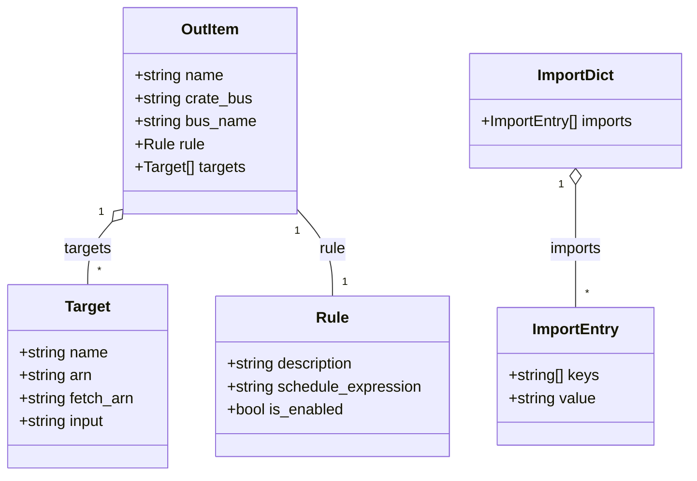

# Diagram: devops/terraform/scripts/config_scripts/gen_eventbridge.py


> Auto-generated by Obscura crawlers

## Diagram 1

```mermaid
flowchart TD
    Start --> ParseArgs[Parse CLI args]
    ParseArgs --> CheckEnv{env provided?}
    CheckEnv -- No --> PrintError[Print error and exit]
    CheckEnv -- Yes --> MakeDir[Create eventbridge_constants directory (ignore if exists)]
    MakeDir --> SetPrefixes[Normalize prefixs (default [""] if empty)]
    SetPrefixes --> InitLists[Initialize out_lis, target_import_lis, import_rule_lis]
    InitLists --> ForPrefix[For each prefix: client.list_rules(NamePrefix=prefix)]
    ForPrefix --> ForRule[For each rule in response['Rules']]
    ForRule --> BuildRule[Build rule_name, rule_dic, out_dic]
    BuildRule --> ListTargets[Call client.list_targets_by_rule(Rule=rule['Name'])]
    ListTargets --> ForTarget[For each target in responsee['Targets']]
    ForTarget --> BuildTarget[Create target_name, constant_name, target_dic]
    BuildTarget --> CheckNoWrite{no_write?}
    CheckNoWrite -- False --> WriteFile[Write target Input JSON to file]
    CheckNoWrite -- True --> SkipWrite[Skip file write]
    WriteFile --> AppendTarget[Append target_dic to out_dic['targets'] and add target_import entry]
    SkipWrite --> AppendTarget
    AppendTarget --> AfterTargets[After all targets: append out_dic to out_lis and add import_rule entry]
    AfterTargets --> ContinueRules[Continue next rule or prefix]
    ContinueRules --> EndLoops[After all prefixes: build import_target_dic and import_rule_dic]
    EndLoops --> PrintFound[Print "Found N eventbridge rules."]
    PrintFound --> CheckFull{is_full?}
    CheckFull -- True --> Transform[Wrap out_lis into required_keys/resources schema]
    CheckFull -- False --> NoTransform
    Transform --> MaybeWrite{no_write?}
    NoTransform --> MaybeWrite
    MaybeWrite -- False --> WriteOutputs[Write tf_RAW and tf_import JSON files]
    MaybeWrite -- True --> End[End]
    WriteOutputs --> End
```

> SVG rendering failed for this diagram.

## Diagram 2



### SVG

<svg id="container" width="728.310546875" xmlns="http://www.w3.org/2000/svg" class="classDiagram" height="498" viewBox="0 0 728.310546875 498" role="graphics-document document" aria-roledescription="class"><style>#container{font-family:"trebuchet ms",verdana,arial,sans-serif;font-size:16px;fill:#333;}@keyframes edge-animation-frame{from{stroke-dashoffset:0;}}@keyframes dash{to{stroke-dashoffset:0;}}#container .edge-animation-slow{stroke-dasharray:9,5!important;stroke-dashoffset:900;animation:dash 50s linear infinite;stroke-linecap:round;}#container .edge-animation-fast{stroke-dasharray:9,5!important;stroke-dashoffset:900;animation:dash 20s linear infinite;stroke-linecap:round;}#container .error-icon{fill:#552222;}#container .error-text{fill:#552222;stroke:#552222;}#container .edge-thickness-normal{stroke-width:1px;}#container .edge-thickness-thick{stroke-width:3.5px;}#container .edge-pattern-solid{stroke-dasharray:0;}#container .edge-thickness-invisible{stroke-width:0;fill:none;}#container .edge-pattern-dashed{stroke-dasharray:3;}#container .edge-pattern-dotted{stroke-dasharray:2;}#container .marker{fill:#333333;stroke:#333333;}#container .marker.cross{stroke:#333333;}#container svg{font-family:"trebuchet ms",verdana,arial,sans-serif;font-size:16px;}#container p{margin:0;}#container g.classGroup text{fill:#9370DB;stroke:none;font-family:"trebuchet ms",verdana,arial,sans-serif;font-size:10px;}#container g.classGroup text .title{font-weight:bolder;}#container .nodeLabel,#container .edgeLabel{color:#131300;}#container .edgeLabel .label rect{fill:#ECECFF;}#container .label text{fill:#131300;}#container .labelBkg{background:#ECECFF;}#container .edgeLabel .label span{background:#ECECFF;}#container .classTitle{font-weight:bolder;}#container .node rect,#container .node circle,#container .node ellipse,#container .node polygon,#container .node path{fill:#ECECFF;stroke:#9370DB;stroke-width:1px;}#container .divider{stroke:#9370DB;stroke-width:1;}#container g.clickable{cursor:pointer;}#container g.classGroup rect{fill:#ECECFF;stroke:#9370DB;}#container g.classGroup line{stroke:#9370DB;stroke-width:1;}#container .classLabel .box{stroke:none;stroke-width:0;fill:#ECECFF;opacity:0.5;}#container .classLabel .label{fill:#9370DB;font-size:10px;}#container .relation{stroke:#333333;stroke-width:1;fill:none;}#container .dashed-line{stroke-dasharray:3;}#container .dotted-line{stroke-dasharray:1 2;}#container #compositionStart,#container .composition{fill:#333333!important;stroke:#333333!important;stroke-width:1;}#container #compositionEnd,#container .composition{fill:#333333!important;stroke:#333333!important;stroke-width:1;}#container #dependencyStart,#container .dependency{fill:#333333!important;stroke:#333333!important;stroke-width:1;}#container #dependencyStart,#container .dependency{fill:#333333!important;stroke:#333333!important;stroke-width:1;}#container #extensionStart,#container .extension{fill:transparent!important;stroke:#333333!important;stroke-width:1;}#container #extensionEnd,#container .extension{fill:transparent!important;stroke:#333333!important;stroke-width:1;}#container #aggregationStart,#container .aggregation{fill:transparent!important;stroke:#333333!important;stroke-width:1;}#container #aggregationEnd,#container .aggregation{fill:transparent!important;stroke:#333333!important;stroke-width:1;}#container #lollipopStart,#container .lollipop{fill:#ECECFF!important;stroke:#333333!important;stroke-width:1;}#container #lollipopEnd,#container .lollipop{fill:#ECECFF!important;stroke:#333333!important;stroke-width:1;}#container .edgeTerminals{font-size:11px;line-height:initial;}#container .classTitleText{text-anchor:middle;font-size:18px;fill:#333;}#container .label-icon{display:inline-block;height:1em;overflow:visible;vertical-align:-0.125em;}#container .node .label-icon path{fill:currentColor;stroke:revert;stroke-width:revert;}#container :root{--mermaid-font-family:"trebuchet ms",verdana,arial,sans-serif;}</style><g><defs><marker id="container_class-aggregationStart" class="marker aggregation class" refX="18" refY="7" markerWidth="190" markerHeight="240" orient="auto"><path d="M 18,7 L9,13 L1,7 L9,1 Z"></path></marker></defs><defs><marker id="container_class-aggregationEnd" class="marker aggregation class" refX="1" refY="7" markerWidth="20" markerHeight="28" orient="auto"><path d="M 18,7 L9,13 L1,7 L9,1 Z"></path></marker></defs><defs><marker id="container_class-extensionStart" class="marker extension class" refX="18" refY="7" markerWidth="190" markerHeight="240" orient="auto"><path d="M 1,7 L18,13 V 1 Z"></path></marker></defs><defs><marker id="container_class-extensionEnd" class="marker extension class" refX="1" refY="7" markerWidth="20" markerHeight="28" orient="auto"><path d="M 1,1 V 13 L18,7 Z"></path></marker></defs><defs><marker id="container_class-compositionStart" class="marker composition class" refX="18" refY="7" markerWidth="190" markerHeight="240" orient="auto"><path d="M 18,7 L9,13 L1,7 L9,1 Z"></path></marker></defs><defs><marker id="container_class-compositionEnd" class="marker composition class" refX="1" refY="7" markerWidth="20" markerHeight="28" orient="auto"><path d="M 18,7 L9,13 L1,7 L9,1 Z"></path></marker></defs><defs><marker id="container_class-dependencyStart" class="marker dependency class" refX="6" refY="7" markerWidth="190" markerHeight="240" orient="auto"><path d="M 5,7 L9,13 L1,7 L9,1 Z"></path></marker></defs><defs><marker id="container_class-dependencyEnd" class="marker dependency class" refX="13" refY="7" markerWidth="20" markerHeight="28" orient="auto"><path d="M 18,7 L9,13 L14,7 L9,1 Z"></path></marker></defs><defs><marker id="container_class-lollipopStart" class="marker lollipop class" refX="13" refY="7" markerWidth="190" markerHeight="240" orient="auto"><circle stroke="black" fill="transparent" cx="7" cy="7" r="6"></circle></marker></defs><defs><marker id="container_class-lollipopEnd" class="marker lollipop class" refX="1" refY="7" markerWidth="190" markerHeight="240" orient="auto"><circle stroke="black" fill="transparent" cx="7" cy="7" r="6"></circle></marker></defs><g class="root"><g class="clusters"></g><g class="edgePaths"><path d="M119.075,231.508L114.708,236.423C110.342,241.339,101.608,251.169,97.242,262.251C92.875,273.333,92.875,285.667,92.875,291.833L92.875,298" id="id_OutItem_Target_1" class="edge-thickness-normal edge-pattern-solid relation" style=";;;" data-edge="true" data-et="edge" data-id="id_OutItem_Target_1" data-points="W3sieCI6MTMwLjUzMTI1LCJ5IjoyMTguNjExNTk2MzEyNDY5NjZ9LHsieCI6OTIuODc1LCJ5IjoyNjF9LHsieCI6OTIuODc1LCJ5IjoyOTh9XQ==" marker-start="url(#container_class-aggregationStart)"></path><path d="M312.844,218.612L319.12,225.676C325.396,232.741,337.948,246.871,344.224,262.102C350.5,277.333,350.5,293.667,350.5,301.833L350.5,310" id="id_OutItem_Rule_2" class="edge-thickness-normal edge-pattern-solid relation" style=";;;" data-edge="true" data-et="edge" data-id="id_OutItem_Rule_2" data-points="W3sieCI6MzEyLjg0Mzc1LCJ5IjoyMTguNjExNTk2MzEyNDY5NjZ9LHsieCI6MzUwLjUsInkiOjI2MX0seyJ4IjozNTAuNSwieSI6MzEwfV0="></path><path d="M605.764,193.25L605.764,204.542C605.764,215.833,605.764,238.417,605.764,259.875C605.764,281.333,605.764,301.667,605.764,311.833L605.764,322" id="id_ImportDict_ImportEntry_3" class="edge-thickness-normal edge-pattern-solid relation" style=";;;" data-edge="true" data-et="edge" data-id="id_ImportDict_ImportEntry_3" data-points="W3sieCI6NjA1Ljc2MzY3MTg3NSwieSI6MTc2fSx7IngiOjYwNS43NjM2NzE4NzUsInkiOjI2MX0seyJ4Ijo2MDUuNzYzNjcxODc1LCJ5IjozMjJ9XQ==" marker-start="url(#container_class-aggregationStart)"></path></g><g class="edgeLabels"><g class="edgeLabel" transform="translate(92.875, 261)"><g class="label" data-id="id_OutItem_Target_1" transform="translate(-25.171875, -12)"><foreignObject width="50.34375" height="24"><div xmlns="http://www.w3.org/1999/xhtml" class="labelBkg" style="display: table-cell; white-space: nowrap; line-height: 1.5; max-width: 200px; text-align: center;"><span class="edgeLabel"><p>targets</p></span></div></foreignObject></g></g><g class="edgeLabel" transform="translate(350.5, 261)"><g class="label" data-id="id_OutItem_Rule_2" transform="translate(-14.4140625, -12)"><foreignObject width="28.828125" height="24"><div xmlns="http://www.w3.org/1999/xhtml" class="labelBkg" style="display: table-cell; white-space: nowrap; line-height: 1.5; max-width: 200px; text-align: center;"><span class="edgeLabel"><p>rule</p></span></div></foreignObject></g></g><g class="edgeLabel" transform="translate(605.763671875, 261)"><g class="label" data-id="id_ImportDict_ImportEntry_3" transform="translate(-28.25, -12)"><foreignObject width="56.5" height="24"><div xmlns="http://www.w3.org/1999/xhtml" class="labelBkg" style="display: table-cell; white-space: nowrap; line-height: 1.5; max-width: 200px; text-align: center;"><span class="edgeLabel"><p>imports</p></span></div></foreignObject></g></g><g class="edgeTerminals" transform="translate(107.69466086067567, 221.73252770684851)"><g class="inner" transform="translate(0, 0)"><foreignObject style="width: 9px; height: 12px;"><div xmlns="http://www.w3.org/1999/xhtml" style="display: inline-block; padding-right: 1px; white-space: nowrap;"><span class="edgeLabel">1</span></div></foreignObject></g></g><g class="edgeTerminals" transform="translate(313.2521908606757, 241.6568386056211)"><g class="inner" transform="translate(0, 0)"><foreignObject style="width: 9px; height: 12px;"><div xmlns="http://www.w3.org/1999/xhtml" style="display: inline-block; padding-right: 1px; white-space: nowrap;"><span class="edgeLabel">1</span></div></foreignObject></g></g><g class="edgeTerminals" transform="translate(590.7636709375, 193.4999991964286)"><g class="inner" transform="translate(0, 0)"><foreignObject style="width: 9px; height: 12px;"><div xmlns="http://www.w3.org/1999/xhtml" style="display: inline-block; padding-right: 1px; white-space: nowrap;"><span class="edgeLabel">1</span></div></foreignObject></g></g><g class="edgeTerminals" transform="translate(102.875, 275.5)"><g class="inner" transform="translate(0, 0)"></g><foreignObject style="width: 9px; height: 12px;"><div xmlns="http://www.w3.org/1999/xhtml" style="display: inline-block; padding-right: 1px; white-space: nowrap;"><span class="edgeLabel">*</span></div></foreignObject></g><g class="edgeTerminals" transform="translate(360.5, 287.5)"><g class="inner" transform="translate(0, 0)"></g><foreignObject style="width: 9px; height: 12px;"><div xmlns="http://www.w3.org/1999/xhtml" style="display: inline-block; padding-right: 1px; white-space: nowrap;"><span class="edgeLabel">1</span></div></foreignObject></g><g class="edgeTerminals" transform="translate(615.7636709375, 299.4999991964286)"><g class="inner" transform="translate(0, 0)"></g><foreignObject style="width: 9px; height: 12px;"><div xmlns="http://www.w3.org/1999/xhtml" style="display: inline-block; padding-right: 1px; white-space: nowrap;"><span class="edgeLabel">*</span></div></foreignObject></g></g><g class="nodes"><g class="node default" id="classId-OutItem-0" transform="translate(221.6875, 116)"><g class="basic label-container"><path d="M-91.15625 -108 L91.15625 -108 L91.15625 108 L-91.15625 108" stroke="none" stroke-width="0" fill="#ECECFF" style=""></path><path d="M-91.15625 -108 C-53.57364119476237 -108, -15.991032389524733 -108, 91.15625 -108 M-91.15625 -108 C-39.69596009772221 -108, 11.764329804555587 -108, 91.15625 -108 M91.15625 -108 C91.15625 -31.9880304641579, 91.15625 44.0239390716842, 91.15625 108 M91.15625 -108 C91.15625 -60.568800731416346, 91.15625 -13.137601462832691, 91.15625 108 M91.15625 108 C42.9949147300547 108, -5.166420539890595 108, -91.15625 108 M91.15625 108 C18.32835603239829 108, -54.49953793520342 108, -91.15625 108 M-91.15625 108 C-91.15625 56.64413157250475, -91.15625 5.288263145009495, -91.15625 -108 M-91.15625 108 C-91.15625 44.91477728031956, -91.15625 -18.170445439360876, -91.15625 -108" stroke="#9370DB" stroke-width="1.3" fill="none" stroke-dasharray="0 0" style=""></path></g><g class="annotation-group text" transform="translate(0, -84)"></g><g class="label-group text" transform="translate(-29.65625, -84)"><g class="label" style="font-weight: bolder" transform="translate(0,-12)"><foreignObject width="59.3125" height="24"><div xmlns="http://www.w3.org/1999/xhtml" style="display: table-cell; white-space: nowrap; line-height: 1.5; max-width: 109px; text-align: center;"><span class="nodeLabel markdown-node-label" style=""><p>OutItem</p></span></div></foreignObject></g></g><g class="members-group text" transform="translate(-79.15625, -36)"><g class="label" style="" transform="translate(0,-12)"><foreignObject width="94.375" height="24"><div xmlns="http://www.w3.org/1999/xhtml" style="display: table-cell; white-space: nowrap; line-height: 1.5; max-width: 152px; text-align: center;"><span class="nodeLabel markdown-node-label" style=""><p>+string name</p></span></div></foreignObject></g><g class="label" style="" transform="translate(0,12)"><foreignObject width="124.375" height="24"><div xmlns="http://www.w3.org/1999/xhtml" style="display: table-cell; white-space: nowrap; line-height: 1.5; max-width: 182px; text-align: center;"><span class="nodeLabel markdown-node-label" style=""><p>+string crate_bus</p></span></div></foreignObject></g><g class="label" style="" transform="translate(0,36)"><foreignObject width="128.65625" height="24"><div xmlns="http://www.w3.org/1999/xhtml" style="display: table-cell; white-space: nowrap; line-height: 1.5; max-width: 186px; text-align: center;"><span class="nodeLabel markdown-node-label" style=""><p>+string bus_name</p></span></div></foreignObject></g><g class="label" style="" transform="translate(0,60)"><foreignObject width="73.375" height="24"><div xmlns="http://www.w3.org/1999/xhtml" style="display: table-cell; white-space: nowrap; line-height: 1.5; max-width: 131px; text-align: center;"><span class="nodeLabel markdown-node-label" style=""><p>+Rule rule</p></span></div></foreignObject></g><g class="label" style="" transform="translate(0,84)"><foreignObject width="116.75" height="24"><div xmlns="http://www.w3.org/1999/xhtml" style="display: table-cell; white-space: nowrap; line-height: 1.5; max-width: 174px; text-align: center;"><span class="nodeLabel markdown-node-label" style=""><p>+Target[] targets</p></span></div></foreignObject></g></g><g class="methods-group text" transform="translate(-79.15625, 108)"></g><g class="divider" style=""><path d="M-91.15625 -60 C-28.563790154549345 -60, 34.02866969090131 -60, 91.15625 -60 M-91.15625 -60 C-35.621974211275706 -60, 19.912301577448588 -60, 91.15625 -60" stroke="#9370DB" stroke-width="1.3" fill="none" stroke-dasharray="0 0" style=""></path></g><g class="divider" style=""><path d="M-91.15625 84 C-31.147990490275753 84, 28.860269019448495 84, 91.15625 84 M-91.15625 84 C-37.537532587868945 84, 16.08118482426211 84, 91.15625 84" stroke="#9370DB" stroke-width="1.3" fill="none" stroke-dasharray="0 0" style=""></path></g></g><g class="node default" id="classId-Rule-1" transform="translate(350.5, 394)"><g class="basic label-container"><path d="M-122.75 -84 L122.75 -84 L122.75 84 L-122.75 84" stroke="none" stroke-width="0" fill="#ECECFF" style=""></path><path d="M-122.75 -84 C-48.126227314404375 -84, 26.49754537119125 -84, 122.75 -84 M-122.75 -84 C-29.311565728849047 -84, 64.1268685423019 -84, 122.75 -84 M122.75 -84 C122.75 -36.656935166147704, 122.75 10.686129667704591, 122.75 84 M122.75 -84 C122.75 -35.51962602076834, 122.75 12.960747958463315, 122.75 84 M122.75 84 C42.50961860444684 84, -37.730762791106315 84, -122.75 84 M122.75 84 C28.872036089978423 84, -65.00592782004315 84, -122.75 84 M-122.75 84 C-122.75 25.868994856592217, -122.75 -32.26201028681557, -122.75 -84 M-122.75 84 C-122.75 41.45873507574047, -122.75 -1.0825298485190586, -122.75 -84" stroke="#9370DB" stroke-width="1.3" fill="none" stroke-dasharray="0 0" style=""></path></g><g class="annotation-group text" transform="translate(0, -60)"></g><g class="label-group text" transform="translate(-16.265625, -60)"><g class="label" style="font-weight: bolder" transform="translate(0,-12)"><foreignObject width="32.53125" height="24"><div xmlns="http://www.w3.org/1999/xhtml" style="display: table-cell; white-space: nowrap; line-height: 1.5; max-width: 82px; text-align: center;"><span class="nodeLabel markdown-node-label" style=""><p>Rule</p></span></div></foreignObject></g></g><g class="members-group text" transform="translate(-110.75, -12)"><g class="label" style="" transform="translate(0,-12)"><foreignObject width="136.46875" height="24"><div xmlns="http://www.w3.org/1999/xhtml" style="display: table-cell; white-space: nowrap; line-height: 1.5; max-width: 194px; text-align: center;"><span class="nodeLabel markdown-node-label" style=""><p>+string description</p></span></div></foreignObject></g><g class="label" style="" transform="translate(0,12)"><foreignObject width="205.234375" height="24"><div xmlns="http://www.w3.org/1999/xhtml" style="display: table-cell; white-space: nowrap; line-height: 1.5; max-width: 263px; text-align: center;"><span class="nodeLabel markdown-node-label" style=""><p>+string schedule_expression</p></span></div></foreignObject></g><g class="label" style="" transform="translate(0,36)"><foreignObject width="123.96875" height="24"><div xmlns="http://www.w3.org/1999/xhtml" style="display: table-cell; white-space: nowrap; line-height: 1.5; max-width: 181px; text-align: center;"><span class="nodeLabel markdown-node-label" style=""><p>+bool is_enabled</p></span></div></foreignObject></g></g><g class="methods-group text" transform="translate(-110.75, 84)"></g><g class="divider" style=""><path d="M-122.75 -36 C-43.97457663309339 -36, 34.800846733813216 -36, 122.75 -36 M-122.75 -36 C-70.71201610663587 -36, -18.67403221327173 -36, 122.75 -36" stroke="#9370DB" stroke-width="1.3" fill="none" stroke-dasharray="0 0" style=""></path></g><g class="divider" style=""><path d="M-122.75 60 C-69.20085541982725 60, -15.651710839654498 60, 122.75 60 M-122.75 60 C-43.646244929334244 60, 35.45751014133151 60, 122.75 60" stroke="#9370DB" stroke-width="1.3" fill="none" stroke-dasharray="0 0" style=""></path></g></g><g class="node default" id="classId-Target-2" transform="translate(92.875, 394)"><g class="basic label-container"><path d="M-84.875 -96 L84.875 -96 L84.875 96 L-84.875 96" stroke="none" stroke-width="0" fill="#ECECFF" style=""></path><path d="M-84.875 -96 C-25.175000911099893 -96, 34.524998177800214 -96, 84.875 -96 M-84.875 -96 C-23.62750816823071 -96, 37.61998366353858 -96, 84.875 -96 M84.875 -96 C84.875 -55.75423548015501, 84.875 -15.50847096031002, 84.875 96 M84.875 -96 C84.875 -56.901224341829746, 84.875 -17.80244868365949, 84.875 96 M84.875 96 C47.59970727435052 96, 10.324414548701043 96, -84.875 96 M84.875 96 C32.69300616219842 96, -19.488987675603155 96, -84.875 96 M-84.875 96 C-84.875 37.70162205215647, -84.875 -20.596755895687053, -84.875 -96 M-84.875 96 C-84.875 24.271512036386284, -84.875 -47.45697592722743, -84.875 -96" stroke="#9370DB" stroke-width="1.3" fill="none" stroke-dasharray="0 0" style=""></path></g><g class="annotation-group text" transform="translate(0, -72)"></g><g class="label-group text" transform="translate(-23.15625, -72)"><g class="label" style="font-weight: bolder" transform="translate(0,-12)"><foreignObject width="46.3125" height="24"><div xmlns="http://www.w3.org/1999/xhtml" style="display: table-cell; white-space: nowrap; line-height: 1.5; max-width: 95px; text-align: center;"><span class="nodeLabel markdown-node-label" style=""><p>Target</p></span></div></foreignObject></g></g><g class="members-group text" transform="translate(-72.875, -24)"><g class="label" style="" transform="translate(0,-12)"><foreignObject width="94.375" height="24"><div xmlns="http://www.w3.org/1999/xhtml" style="display: table-cell; white-space: nowrap; line-height: 1.5; max-width: 152px; text-align: center;"><span class="nodeLabel markdown-node-label" style=""><p>+string name</p></span></div></foreignObject></g><g class="label" style="" transform="translate(0,12)"><foreignObject width="78.125" height="24"><div xmlns="http://www.w3.org/1999/xhtml" style="display: table-cell; white-space: nowrap; line-height: 1.5; max-width: 135px; text-align: center;"><span class="nodeLabel markdown-node-label" style=""><p>+string arn</p></span></div></foreignObject></g><g class="label" style="" transform="translate(0,36)"><foreignObject width="122.59375" height="24"><div xmlns="http://www.w3.org/1999/xhtml" style="display: table-cell; white-space: nowrap; line-height: 1.5; max-width: 180px; text-align: center;"><span class="nodeLabel markdown-node-label" style=""><p>+string fetch_arn</p></span></div></foreignObject></g><g class="label" style="" transform="translate(0,60)"><foreignObject width="92.34375" height="24"><div xmlns="http://www.w3.org/1999/xhtml" style="display: table-cell; white-space: nowrap; line-height: 1.5; max-width: 150px; text-align: center;"><span class="nodeLabel markdown-node-label" style=""><p>+string input</p></span></div></foreignObject></g></g><g class="methods-group text" transform="translate(-72.875, 96)"></g><g class="divider" style=""><path d="M-84.875 -48 C-26.292116094722346 -48, 32.29076781055531 -48, 84.875 -48 M-84.875 -48 C-40.0051213259888 -48, 4.864757348022394 -48, 84.875 -48" stroke="#9370DB" stroke-width="1.3" fill="none" stroke-dasharray="0 0" style=""></path></g><g class="divider" style=""><path d="M-84.875 72 C-23.09521699414168 72, 38.68456601171664 72, 84.875 72 M-84.875 72 C-37.12011697308134 72, 10.634766053837325 72, 84.875 72" stroke="#9370DB" stroke-width="1.3" fill="none" stroke-dasharray="0 0" style=""></path></g></g><g class="node default" id="classId-ImportEntry-3" transform="translate(605.763671875, 394)"><g class="basic label-container"><path d="M-82.07421875 -72 L82.07421875 -72 L82.07421875 72 L-82.07421875 72" stroke="none" stroke-width="0" fill="#ECECFF" style=""></path><path d="M-82.07421875 -72 C-35.439399449511306 -72, 11.195419850977387 -72, 82.07421875 -72 M-82.07421875 -72 C-40.58714348478612 -72, 0.8999317804277638 -72, 82.07421875 -72 M82.07421875 -72 C82.07421875 -31.124923896462214, 82.07421875 9.750152207075573, 82.07421875 72 M82.07421875 -72 C82.07421875 -14.606590296259142, 82.07421875 42.786819407481715, 82.07421875 72 M82.07421875 72 C46.70571565011584 72, 11.337212550231683 72, -82.07421875 72 M82.07421875 72 C41.67587770998787 72, 1.2775366699757456 72, -82.07421875 72 M-82.07421875 72 C-82.07421875 34.01324618723505, -82.07421875 -3.973507625529905, -82.07421875 -72 M-82.07421875 72 C-82.07421875 27.406503165433605, -82.07421875 -17.18699366913279, -82.07421875 -72" stroke="#9370DB" stroke-width="1.3" fill="none" stroke-dasharray="0 0" style=""></path></g><g class="annotation-group text" transform="translate(0, -48)"></g><g class="label-group text" transform="translate(-44.0390625, -48)"><g class="label" style="font-weight: bolder" transform="translate(0,-12)"><foreignObject width="88.078125" height="24"><div xmlns="http://www.w3.org/1999/xhtml" style="display: table-cell; white-space: nowrap; line-height: 1.5; max-width: 137px; text-align: center;"><span class="nodeLabel markdown-node-label" style=""><p>ImportEntry</p></span></div></foreignObject></g></g><g class="members-group text" transform="translate(-70.07421875, 0)"><g class="label" style="" transform="translate(0,-12)"><foreignObject width="96.109375" height="24"><div xmlns="http://www.w3.org/1999/xhtml" style="display: table-cell; white-space: nowrap; line-height: 1.5; max-width: 153px; text-align: center;"><span class="nodeLabel markdown-node-label" style=""><p>+string[] keys</p></span></div></foreignObject></g><g class="label" style="" transform="translate(0,12)"><foreignObject width="92.75" height="24"><div xmlns="http://www.w3.org/1999/xhtml" style="display: table-cell; white-space: nowrap; line-height: 1.5; max-width: 150px; text-align: center;"><span class="nodeLabel markdown-node-label" style=""><p>+string value</p></span></div></foreignObject></g></g><g class="methods-group text" transform="translate(-70.07421875, 72)"></g><g class="divider" style=""><path d="M-82.07421875 -24 C-40.06645931958383 -24, 1.9413001108323442 -24, 82.07421875 -24 M-82.07421875 -24 C-18.655915471024073 -24, 44.76238780795185 -24, 82.07421875 -24" stroke="#9370DB" stroke-width="1.3" fill="none" stroke-dasharray="0 0" style=""></path></g><g class="divider" style=""><path d="M-82.07421875 48 C-45.77857154917564 48, -9.482924348351276 48, 82.07421875 48 M-82.07421875 48 C-45.12170085500401 48, -8.169182960008015 48, 82.07421875 48" stroke="#9370DB" stroke-width="1.3" fill="none" stroke-dasharray="0 0" style=""></path></g></g><g class="node default" id="classId-ImportDict-4" transform="translate(605.763671875, 116)"><g class="basic label-container"><path d="M-114.546875 -60 L114.546875 -60 L114.546875 60 L-114.546875 60" stroke="none" stroke-width="0" fill="#ECECFF" style=""></path><path d="M-114.546875 -60 C-41.202487359909796 -60, 32.14190028018041 -60, 114.546875 -60 M-114.546875 -60 C-61.21527611859757 -60, -7.883677237195144 -60, 114.546875 -60 M114.546875 -60 C114.546875 -31.10921586347619, 114.546875 -2.2184317269523817, 114.546875 60 M114.546875 -60 C114.546875 -29.580255283788308, 114.546875 0.8394894324233846, 114.546875 60 M114.546875 60 C41.886645519088134 60, -30.773583961823732 60, -114.546875 60 M114.546875 60 C61.950984669836146 60, 9.355094339672291 60, -114.546875 60 M-114.546875 60 C-114.546875 33.10118141468739, -114.546875 6.202362829374778, -114.546875 -60 M-114.546875 60 C-114.546875 13.093369780892417, -114.546875 -33.81326043821517, -114.546875 -60" stroke="#9370DB" stroke-width="1.3" fill="none" stroke-dasharray="0 0" style=""></path></g><g class="annotation-group text" transform="translate(0, -36)"></g><g class="label-group text" transform="translate(-39.234375, -36)"><g class="label" style="font-weight: bolder" transform="translate(0,-12)"><foreignObject width="78.46875" height="24"><div xmlns="http://www.w3.org/1999/xhtml" style="display: table-cell; white-space: nowrap; line-height: 1.5; max-width: 128px; text-align: center;"><span class="nodeLabel markdown-node-label" style=""><p>ImportDict</p></span></div></foreignObject></g></g><g class="members-group text" transform="translate(-102.546875, 12)"><g class="label" style="" transform="translate(0,-12)"><foreignObject width="165.859375" height="24"><div xmlns="http://www.w3.org/1999/xhtml" style="display: table-cell; white-space: nowrap; line-height: 1.5; max-width: 223px; text-align: center;"><span class="nodeLabel markdown-node-label" style=""><p>+ImportEntry[] imports</p></span></div></foreignObject></g></g><g class="methods-group text" transform="translate(-102.546875, 60)"></g><g class="divider" style=""><path d="M-114.546875 -12 C-30.812961957169776 -12, 52.92095108566045 -12, 114.546875 -12 M-114.546875 -12 C-27.265368966174563 -12, 60.016137067650874 -12, 114.546875 -12" stroke="#9370DB" stroke-width="1.3" fill="none" stroke-dasharray="0 0" style=""></path></g><g class="divider" style=""><path d="M-114.546875 36 C-41.37426463879325 36, 31.7983457224135 36, 114.546875 36 M-114.546875 36 C-62.457239943804524 36, -10.367604887609048 36, 114.546875 36" stroke="#9370DB" stroke-width="1.3" fill="none" stroke-dasharray="0 0" style=""></path></g></g></g></g></g></svg>
