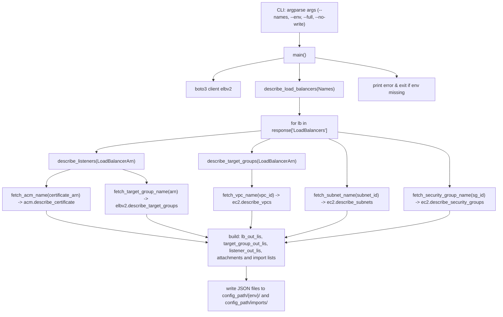
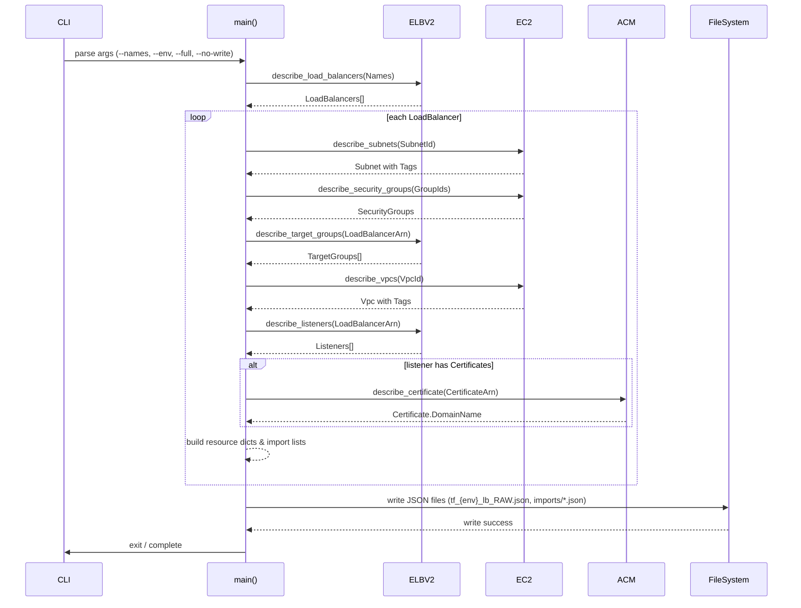
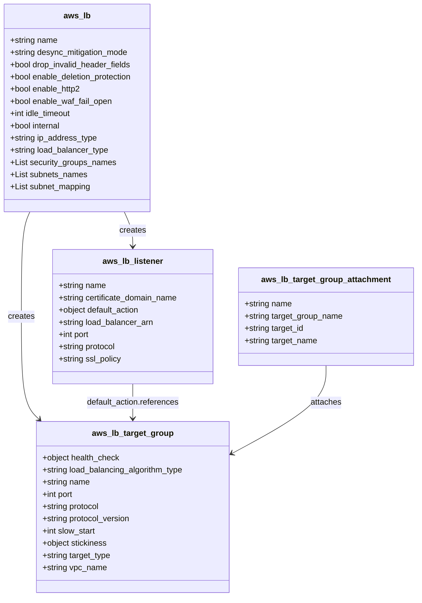

# Diagram: devops/terraform/scripts/config_scripts/gen_loadbalancer.py

> Auto-generated by Obscura crawlers

## Diagram 1

### SVG

<svg id="container" width="1704.23046875" xmlns="http://www.w3.org/2000/svg" class="flowchart" height="1086" viewBox="0 0 1704.23046875 1086" role="graphics-document document" aria-roledescription="flowchart-v2"><g><marker id="container_flowchart-v2-pointEnd" class="marker flowchart-v2" viewBox="0 0 10 10" refX="5" refY="5" markerUnits="userSpaceOnUse" markerWidth="8" markerHeight="8" orient="auto"><path d="M 0 0 L 10 5 L 0 10 z" class="arrowMarkerPath" style="stroke-width: 1; stroke-dasharray: 1, 0;"></path></marker><marker id="container_flowchart-v2-pointStart" class="marker flowchart-v2" viewBox="0 0 10 10" refX="4.5" refY="5" markerUnits="userSpaceOnUse" markerWidth="8" markerHeight="8" orient="auto"><path d="M 0 5 L 10 10 L 10 0 z" class="arrowMarkerPath" style="stroke-width: 1; stroke-dasharray: 1, 0;"></path></marker><marker id="container_flowchart-v2-circleEnd" class="marker flowchart-v2" viewBox="0 0 10 10" refX="11" refY="5" markerUnits="userSpaceOnUse" markerWidth="11" markerHeight="11" orient="auto"><circle cx="5" cy="5" r="5" class="arrowMarkerPath" style="stroke-width: 1; stroke-dasharray: 1, 0;"></circle></marker><marker id="container_flowchart-v2-circleStart" class="marker flowchart-v2" viewBox="0 0 10 10" refX="-1" refY="5" markerUnits="userSpaceOnUse" markerWidth="11" markerHeight="11" orient="auto"><circle cx="5" cy="5" r="5" class="arrowMarkerPath" style="stroke-width: 1; stroke-dasharray: 1, 0;"></circle></marker><marker id="container_flowchart-v2-crossEnd" class="marker cross flowchart-v2" viewBox="0 0 11 11" refX="12" refY="5.2" markerUnits="userSpaceOnUse" markerWidth="11" markerHeight="11" orient="auto"><path d="M 1,1 l 9,9 M 10,1 l -9,9" class="arrowMarkerPath" style="stroke-width: 2; stroke-dasharray: 1, 0;"></path></marker><marker id="container_flowchart-v2-crossStart" class="marker cross flowchart-v2" viewBox="0 0 11 11" refX="-1" refY="5.2" markerUnits="userSpaceOnUse" markerWidth="11" markerHeight="11" orient="auto"><path d="M 1,1 l 9,9 M 10,1 l -9,9" class="arrowMarkerPath" style="stroke-width: 2; stroke-dasharray: 1, 0;"></path></marker><g class="root"><g class="clusters"></g><g class="edgePaths"><path d="M1024.41,110L1024.41,114.167C1024.41,118.333,1024.41,126.667,1024.41,134.333C1024.41,142,1024.41,149,1024.41,152.5L1024.41,156" id="L_CLI_Main_0" class="edge-thickness-normal edge-pattern-solid edge-thickness-normal edge-pattern-solid flowchart-link" style=";" data-edge="true" data-et="edge" data-id="L_CLI_Main_0" data-points="W3sieCI6MTAyNC40MTAxNTYyNSwieSI6MTEwfSx7IngiOjEwMjQuNDEwMTU2MjUsInkiOjEzNX0seyJ4IjoxMDI0LjQxMDE1NjI1LCJ5IjoxNjB9XQ==" marker-end="url(#container_flowchart-v2-pointEnd)"></path><path d="M971.066,196.41L930.827,203.508C890.587,210.607,810.108,224.803,769.868,237.402C729.629,250,729.629,261,729.629,266.5L729.629,272" id="L_Main_ELB_0" class="edge-thickness-normal edge-pattern-solid edge-thickness-normal edge-pattern-solid flowchart-link" style=";" data-edge="true" data-et="edge" data-id="L_Main_ELB_0" data-points="W3sieCI6OTcxLjA2NjQwNjI1LCJ5IjoxOTYuNDA5OTQzODE0MjY5MDd9LHsieCI6NzI5LjYyODkwNjI1LCJ5IjoyMzl9LHsieCI6NzI5LjYyODkwNjI1LCJ5IjoyNzZ9XQ==" marker-end="url(#container_flowchart-v2-pointEnd)"></path><path d="M1024.41,214L1024.41,218.167C1024.41,222.333,1024.41,230.667,1024.41,240.333C1024.41,250,1024.41,261,1024.41,266.5L1024.41,272" id="L_Main_DescribeLBs_0" class="edge-thickness-normal edge-pattern-solid edge-thickness-normal edge-pattern-solid flowchart-link" style=";" data-edge="true" data-et="edge" data-id="L_Main_DescribeLBs_0" data-points="W3sieCI6MTAyNC40MTAxNTYyNSwieSI6MjE0fSx7IngiOjEwMjQuNDEwMTU2MjUsInkiOjIzOX0seyJ4IjoxMDI0LjQxMDE1NjI1LCJ5IjoyNzZ9XQ==" marker-end="url(#container_flowchart-v2-pointEnd)"></path><path d="M1024.41,330L1024.41,336.167C1024.41,342.333,1024.41,354.667,1024.41,364.333C1024.41,374,1024.41,381,1024.41,384.5L1024.41,388" id="L_DescribeLBs_ForEachLB_0" class="edge-thickness-normal edge-pattern-solid edge-thickness-normal edge-pattern-solid flowchart-link" style=";" data-edge="true" data-et="edge" data-id="L_DescribeLBs_ForEachLB_0" data-points="W3sieCI6MTAyNC40MTAxNTYyNSwieSI6MzMwfSx7IngiOjEwMjQuNDEwMTU2MjUsInkiOjM2N30seyJ4IjoxMDI0LjQxMDE1NjI1LCJ5IjozOTJ9XQ==" marker-end="url(#container_flowchart-v2-pointEnd)"></path><path d="M1123.581,470L1134.176,474.167C1144.772,478.333,1165.962,486.667,1176.557,499.5C1187.152,512.333,1187.152,529.667,1187.152,547C1187.152,564.333,1187.152,581.667,1187.152,595.833C1187.152,610,1187.152,621,1187.152,626.5L1187.152,632" id="L_ForEachLB_FetchSubnet_0" class="edge-thickness-normal edge-pattern-solid edge-thickness-normal edge-pattern-solid flowchart-link" style=";" data-edge="true" data-et="edge" data-id="L_ForEachLB_FetchSubnet_0" data-points="W3sieCI6MTEyMy41ODExNzY3NTc4MTI1LCJ5Ijo0NzB9LHsieCI6MTE4Ny4xNTIzNDM3NSwieSI6NDk1fSx7IngiOjExODcuMTUyMzQzNzUsInkiOjU0N30seyJ4IjoxMTg3LjE1MjM0Mzc1LCJ5Ijo1OTl9LHsieCI6MTE4Ny4xNTIzNDM3NSwieSI6NjM2fV0=" marker-end="url(#container_flowchart-v2-pointEnd)"></path><path d="M1154.41,447.155L1218.581,455.129C1282.751,463.103,1411.092,479.052,1475.263,495.692C1539.434,512.333,1539.434,529.667,1539.434,547C1539.434,564.333,1539.434,581.667,1539.434,595.833C1539.434,610,1539.434,621,1539.434,626.5L1539.434,632" id="L_ForEachLB_FetchSG_0" class="edge-thickness-normal edge-pattern-solid edge-thickness-normal edge-pattern-solid flowchart-link" style=";" data-edge="true" data-et="edge" data-id="L_ForEachLB_FetchSG_0" data-points="W3sieCI6MTE1NC40MTAxNTYyNSwieSI6NDQ3LjE1NDYwNDYxNDQ3NDQ3fSx7IngiOjE1MzkuNDMzNTkzNzUsInkiOjQ5NX0seyJ4IjoxNTM5LjQzMzU5Mzc1LCJ5Ijo1NDd9LHsieCI6MTUzOS40MzM1OTM3NSwieSI6NTk5fSx7IngiOjE1MzkuNDMzNTkzNzUsInkiOjYzNn1d" marker-end="url(#container_flowchart-v2-pointEnd)"></path><path d="M925.239,470L914.644,474.167C904.049,478.333,882.858,486.667,872.263,494.333C861.668,502,861.668,509,861.668,512.5L861.668,516" id="L_ForEachLB_DescribeTGs_0" class="edge-thickness-normal edge-pattern-solid edge-thickness-normal edge-pattern-solid flowchart-link" style=";" data-edge="true" data-et="edge" data-id="L_ForEachLB_DescribeTGs_0" data-points="W3sieCI6OTI1LjIzOTEzNTc0MjE4NzUsInkiOjQ3MH0seyJ4Ijo4NjEuNjY3OTY4NzUsInkiOjQ5NX0seyJ4Ijo4NjEuNjY3OTY4NzUsInkiOjUyMH1d" marker-end="url(#container_flowchart-v2-pointEnd)"></path><path d="M861.668,574L861.668,578.167C861.668,582.333,861.668,590.667,861.668,600.333C861.668,610,861.668,621,861.668,626.5L861.668,632" id="L_DescribeTGs_FetchVPC_0" class="edge-thickness-normal edge-pattern-solid edge-thickness-normal edge-pattern-solid flowchart-link" style=";" data-edge="true" data-et="edge" data-id="L_DescribeTGs_FetchVPC_0" data-points="W3sieCI6ODYxLjY2Nzk2ODc1LCJ5Ijo1NzR9LHsieCI6ODYxLjY2Nzk2ODc1LCJ5Ijo1OTl9LHsieCI6ODYxLjY2Nzk2ODc1LCJ5Ijo2MzZ9XQ==" marker-end="url(#container_flowchart-v2-pointEnd)"></path><path d="M894.41,442.997L800.494,451.664C706.578,460.331,518.746,477.666,424.83,489.833C330.914,502,330.914,509,330.914,512.5L330.914,516" id="L_ForEachLB_DescribeListeners_0" class="edge-thickness-normal edge-pattern-solid edge-thickness-normal edge-pattern-solid flowchart-link" style=";" data-edge="true" data-et="edge" data-id="L_ForEachLB_DescribeListeners_0" data-points="W3sieCI6ODk0LjQxMDE1NjI1LCJ5Ijo0NDIuOTk3MTgzNjUzOTI3NH0seyJ4IjozMzAuOTE0MDYyNSwieSI6NDk1fSx7IngiOjMzMC45MTQwNjI1LCJ5Ijo1MjB9XQ==" marker-end="url(#container_flowchart-v2-pointEnd)"></path><path d="M241.675,574L227.904,578.167C214.133,582.333,186.59,590.667,172.818,600.333C159.047,610,159.047,621,159.047,626.5L159.047,632" id="L_DescribeListeners_FetchACM_0" class="edge-thickness-normal edge-pattern-solid edge-thickness-normal edge-pattern-solid flowchart-link" style=";" data-edge="true" data-et="edge" data-id="L_DescribeListeners_FetchACM_0" data-points="W3sieCI6MjQxLjY3NTMzMDUyODg0NjE2LCJ5Ijo1NzR9LHsieCI6MTU5LjA0Njg3NSwieSI6NTk5fSx7IngiOjE1OS4wNDY4NzUsInkiOjYzNn1d" marker-end="url(#container_flowchart-v2-pointEnd)"></path><path d="M420.153,574L433.924,578.167C447.696,582.333,475.238,590.667,489.01,598.333C502.781,606,502.781,613,502.781,616.5L502.781,620" id="L_DescribeListeners_FetchTGName_0" class="edge-thickness-normal edge-pattern-solid edge-thickness-normal edge-pattern-solid flowchart-link" style=";" data-edge="true" data-et="edge" data-id="L_DescribeListeners_FetchTGName_0" data-points="W3sieCI6NDIwLjE1Mjc5NDQ3MTE1MzgsInkiOjU3NH0seyJ4Ijo1MDIuNzgxMjUsInkiOjU5OX0seyJ4Ijo1MDIuNzgxMjUsInkiOjYyNH1d" marker-end="url(#container_flowchart-v2-pointEnd)"></path><path d="M159.047,714L159.047,720.167C159.047,726.333,159.047,738.667,250.869,758.24C342.691,777.814,526.335,804.627,618.157,818.034L709.979,831.441" id="L_FetchACM_BuildResources_0" class="edge-thickness-normal edge-pattern-solid edge-thickness-normal edge-pattern-solid flowchart-link" style=";" data-edge="true" data-et="edge" data-id="L_FetchACM_BuildResources_0" data-points="W3sieCI6MTU5LjA0Njg3NSwieSI6NzE0fSx7IngiOjE1OS4wNDY4NzUsInkiOjc1MX0seyJ4Ijo3MTMuOTM3NSwieSI6ODMyLjAxODg2NzA2MzYyNzl9XQ==" marker-end="url(#container_flowchart-v2-pointEnd)"></path><path d="M502.781,726L502.781,730.167C502.781,734.333,502.781,742.667,537.334,756.962C571.887,771.256,640.993,791.513,675.546,801.641L710.099,811.769" id="L_FetchTGName_BuildResources_0" class="edge-thickness-normal edge-pattern-solid edge-thickness-normal edge-pattern-solid flowchart-link" style=";" data-edge="true" data-et="edge" data-id="L_FetchTGName_BuildResources_0" data-points="W3sieCI6NTAyLjc4MTI1LCJ5Ijo3MjZ9LHsieCI6NTAyLjc4MTI1LCJ5Ijo3NTF9LHsieCI6NzEzLjkzNzUsInkiOjgxMi44OTQyOTMzMDQwMjEzfV0=" marker-end="url(#container_flowchart-v2-pointEnd)"></path><path d="M861.668,714L861.668,720.167C861.668,726.333,861.668,738.667,861.046,748.344C860.423,758.02,859.178,765.041,858.556,768.551L857.934,772.061" id="L_FetchVPC_BuildResources_0" class="edge-thickness-normal edge-pattern-solid edge-thickness-normal edge-pattern-solid flowchart-link" style=";" data-edge="true" data-et="edge" data-id="L_FetchVPC_BuildResources_0" data-points="W3sieCI6ODYxLjY2Nzk2ODc1LCJ5Ijo3MTR9LHsieCI6ODYxLjY2Nzk2ODc1LCJ5Ijo3NTF9LHsieCI6ODU3LjIzNTM1MTU2MjUsInkiOjc3Nn1d" marker-end="url(#container_flowchart-v2-pointEnd)"></path><path d="M1187.152,714L1187.152,720.167C1187.152,726.333,1187.152,738.667,1152.257,755.001C1117.361,771.335,1047.569,791.669,1012.674,801.837L977.778,812.004" id="L_FetchSubnet_BuildResources_0" class="edge-thickness-normal edge-pattern-solid edge-thickness-normal edge-pattern-solid flowchart-link" style=";" data-edge="true" data-et="edge" data-id="L_FetchSubnet_BuildResources_0" data-points="W3sieCI6MTE4Ny4xNTIzNDM3NSwieSI6NzE0fSx7IngiOjExODcuMTUyMzQzNzUsInkiOjc1MX0seyJ4Ijo5NzMuOTM3NSwieSI6ODEzLjEyMjg1MDM0NjU2MjJ9XQ==" marker-end="url(#container_flowchart-v2-pointEnd)"></path><path d="M1539.434,714L1539.434,720.167C1539.434,726.333,1539.434,738.667,1445.844,758.29C1352.255,777.913,1165.076,804.826,1071.486,818.283L977.897,831.739" id="L_FetchSG_BuildResources_0" class="edge-thickness-normal edge-pattern-solid edge-thickness-normal edge-pattern-solid flowchart-link" style=";" data-edge="true" data-et="edge" data-id="L_FetchSG_BuildResources_0" data-points="W3sieCI6MTUzOS40MzM1OTM3NSwieSI6NzE0fSx7IngiOjE1MzkuNDMzNTkzNzUsInkiOjc1MX0seyJ4Ijo5NzMuOTM3NSwieSI6ODMyLjMwODMwNjIzMzc0NzN9XQ==" marker-end="url(#container_flowchart-v2-pointEnd)"></path><path d="M843.938,926L843.938,930.167C843.938,934.333,843.938,942.667,843.938,950.333C843.938,958,843.938,965,843.938,968.5L843.938,972" id="L_BuildResources_WriteFiles_0" class="edge-thickness-normal edge-pattern-solid edge-thickness-normal edge-pattern-solid flowchart-link" style=";" data-edge="true" data-et="edge" data-id="L_BuildResources_WriteFiles_0" data-points="W3sieCI6ODQzLjkzNzUsInkiOjkyNn0seyJ4Ijo4NDMuOTM3NSwieSI6OTUxfSx7IngiOjg0My45Mzc1LCJ5Ijo5NzZ9XQ==" marker-end="url(#container_flowchart-v2-pointEnd)"></path><path d="M1077.754,195.4L1123.904,202.666C1170.053,209.933,1262.353,224.467,1308.503,235.233C1354.652,246,1354.652,253,1354.652,256.5L1354.652,260" id="L_Main_Error_0" class="edge-thickness-normal edge-pattern-solid edge-thickness-normal edge-pattern-solid flowchart-link" style=";" data-edge="true" data-et="edge" data-id="L_Main_Error_0" data-points="W3sieCI6MTA3Ny43NTM5MDYyNSwieSI6MTk1LjM5OTUxNzM5OTYzNTY3fSx7IngiOjEzNTQuNjUyMzQzNzUsInkiOjIzOX0seyJ4IjoxMzU0LjY1MjM0Mzc1LCJ5IjoyNjR9XQ==" marker-end="url(#container_flowchart-v2-pointEnd)"></path></g><g class="edgeLabels"><g class="edgeLabel"><g class="label" data-id="L_CLI_Main_0" transform="translate(0, 0)"><foreignObject width="0" height="0">

</foreignObject></g></g><g class="edgeLabel"><g class="label" data-id="L_Main_ELB_0" transform="translate(0, 0)"><foreignObject width="0" height="0">

</foreignObject></g></g><g class="edgeLabel"><g class="label" data-id="L_Main_DescribeLBs_0" transform="translate(0, 0)"><foreignObject width="0" height="0">

</foreignObject></g></g><g class="edgeLabel"><g class="label" data-id="L_DescribeLBs_ForEachLB_0" transform="translate(0, 0)"><foreignObject width="0" height="0">

</foreignObject></g></g><g class="edgeLabel"><g class="label" data-id="L_ForEachLB_FetchSubnet_0" transform="translate(0, 0)"><foreignObject width="0" height="0">

</foreignObject></g></g><g class="edgeLabel"><g class="label" data-id="L_ForEachLB_FetchSG_0" transform="translate(0, 0)"><foreignObject width="0" height="0">

</foreignObject></g></g><g class="edgeLabel"><g class="label" data-id="L_ForEachLB_DescribeTGs_0" transform="translate(0, 0)"><foreignObject width="0" height="0">

</foreignObject></g></g><g class="edgeLabel"><g class="label" data-id="L_DescribeTGs_FetchVPC_0" transform="translate(0, 0)"><foreignObject width="0" height="0">

</foreignObject></g></g><g class="edgeLabel"><g class="label" data-id="L_ForEachLB_DescribeListeners_0" transform="translate(0, 0)"><foreignObject width="0" height="0">

</foreignObject></g></g><g class="edgeLabel"><g class="label" data-id="L_DescribeListeners_FetchACM_0" transform="translate(0, 0)"><foreignObject width="0" height="0">

</foreignObject></g></g><g class="edgeLabel"><g class="label" data-id="L_DescribeListeners_FetchTGName_0" transform="translate(0, 0)"><foreignObject width="0" height="0">

</foreignObject></g></g><g class="edgeLabel"><g class="label" data-id="L_FetchACM_BuildResources_0" transform="translate(0, 0)"><foreignObject width="0" height="0">

</foreignObject></g></g><g class="edgeLabel"><g class="label" data-id="L_FetchTGName_BuildResources_0" transform="translate(0, 0)"><foreignObject width="0" height="0">

</foreignObject></g></g><g class="edgeLabel"><g class="label" data-id="L_FetchVPC_BuildResources_0" transform="translate(0, 0)"><foreignObject width="0" height="0">

</foreignObject></g></g><g class="edgeLabel"><g class="label" data-id="L_FetchSubnet_BuildResources_0" transform="translate(0, 0)"><foreignObject width="0" height="0">

</foreignObject></g></g><g class="edgeLabel"><g class="label" data-id="L_FetchSG_BuildResources_0" transform="translate(0, 0)"><foreignObject width="0" height="0">

</foreignObject></g></g><g class="edgeLabel"><g class="label" data-id="L_BuildResources_WriteFiles_0" transform="translate(0, 0)"><foreignObject width="0" height="0">

</foreignObject></g></g><g class="edgeLabel"><g class="label" data-id="L_Main_Error_0" transform="translate(0, 0)"><foreignObject width="0" height="0">

</foreignObject></g></g></g><g class="nodes"><g class="node default" id="flowchart-CLI-0" transform="translate(1024.41015625, 59)"><rect class="basic label-container" style="" x="-130" y="-51" width="260" height="102"></rect><g class="label" style="" transform="translate(-100, -36)"><rect></rect><foreignObject width="200" height="72">

CLI: argparse args (--names, --env, --full, --no-write)

</foreignObject></g></g><g class="node default" id="flowchart-Main-1" transform="translate(1024.41015625, 187)"><rect class="basic label-container" style="" x="-53.34375" y="-27" width="106.6875" height="54"></rect><g class="label" style="" transform="translate(-23.34375, -12)"><rect></rect><foreignObject width="46.6875" height="24">

main()

</foreignObject></g></g><g class="node default" id="flowchart-ELB-2" transform="translate(729.62890625, 303)"><rect class="basic label-container" style="" x="-94.5390625" y="-27" width="189.078125" height="54"></rect><g class="label" style="" transform="translate(-64.5390625, -12)"><rect></rect><foreignObject width="129.078125" height="24">

boto3 client elbv2

</foreignObject></g></g><g class="node default" id="flowchart-DescribeLBs-3" transform="translate(1024.41015625, 303)"><rect class="basic label-container" style="" x="-150.2421875" y="-27" width="300.484375" height="54"></rect><g class="label" style="" transform="translate(-120.2421875, -12)"><rect></rect><foreignObject width="240.484375" height="24">

describe_load_balancers(Names)

</foreignObject></g></g><g class="node default" id="flowchart-ForEachLB-4" transform="translate(1024.41015625, 431)"><rect class="basic label-container" style="" x="-130" y="-39" width="260" height="78"></rect><g class="label" style="" transform="translate(-100, -24)"><rect></rect><foreignObject width="200" height="48">

for lb in response['LoadBalancers']

</foreignObject></g></g><g class="node default" id="flowchart-FetchSubnet-5" transform="translate(1187.15234375, 675)"><rect class="basic label-container" style="" x="-145.484375" y="-39" width="290.96875" height="78"></rect><g class="label" style="" transform="translate(-115.484375, -24)"><rect></rect><foreignObject width="230.96875" height="48">

fetch_subnet_name(subnet_id) -&gt; ec2.describe_subnets

</foreignObject></g></g><g class="node default" id="flowchart-FetchSG-6" transform="translate(1539.43359375, 675)"><rect class="basic label-container" style="" x="-156.796875" y="-39" width="313.59375" height="78"></rect><g class="label" style="" transform="translate(-126.796875, -24)"><rect></rect><foreignObject width="253.59375" height="48">

fetch_security_group_name(sg_id) -&gt; ec2.describe_security_groups

</foreignObject></g></g><g class="node default" id="flowchart-DescribeTGs-7" transform="translate(861.66796875, 547)"><rect class="basic label-container" style="" x="-182.140625" y="-27" width="364.28125" height="54"></rect><g class="label" style="" transform="translate(-152.140625, -12)"><rect></rect><foreignObject width="304.28125" height="24">

describe_target_groups(LoadBalancerArn)

</foreignObject></g></g><g class="node default" id="flowchart-FetchVPC-8" transform="translate(861.66796875, 675)"><rect class="basic label-container" style="" x="-130" y="-39" width="260" height="78"></rect><g class="label" style="" transform="translate(-100, -24)"><rect></rect><foreignObject width="200" height="48">

fetch_vpc_name(vpc_id) -&gt; ec2.describe_vpcs

</foreignObject></g></g><g class="node default" id="flowchart-DescribeListeners-9" transform="translate(330.9140625, 547)"><rect class="basic label-container" style="" x="-162.9453125" y="-27" width="325.890625" height="54"></rect><g class="label" style="" transform="translate(-132.9453125, -12)"><rect></rect><foreignObject width="265.890625" height="24">

describe_listeners(LoadBalancerArn)

</foreignObject></g></g><g class="node default" id="flowchart-FetchACM-10" transform="translate(159.046875, 675)"><rect class="basic label-container" style="" x="-151.046875" y="-39" width="302.09375" height="78"></rect><g class="label" style="" transform="translate(-121.046875, -24)"><rect></rect><foreignObject width="242.09375" height="48">

fetch_acm_name(certificate_arn) -&gt; acm.describe_certificate

</foreignObject></g></g><g class="node default" id="flowchart-FetchTGName-11" transform="translate(502.78125, 675)"><rect class="basic label-container" style="" x="-142.6875" y="-51" width="285.375" height="102"></rect><g class="label" style="" transform="translate(-112.6875, -36)"><rect></rect><foreignObject width="225.375" height="72">

fetch_target_group_name(arn) -&gt; elbv2.describe_target_groups

</foreignObject></g></g><g class="node default" id="flowchart-BuildResources-12" transform="translate(843.9375, 851)"><rect class="basic label-container" style="" x="-130" y="-75" width="260" height="150"></rect><g class="label" style="" transform="translate(-100, -60)"><rect></rect><foreignObject width="200" height="120">

build: lb_out_lis, target_group_out_lis, listener_out_lis, attachments and import lists

</foreignObject></g></g><g class="node default" id="flowchart-WriteFiles-13" transform="translate(843.9375, 1027)"><rect class="basic label-container" style="" x="-130" y="-51" width="260" height="102"></rect><g class="label" style="" transform="translate(-100, -36)"><rect></rect><foreignObject width="200" height="72">

write JSON files to config_path/{env}/ and config_path/imports/

</foreignObject></g></g><g class="node default" id="flowchart-Error-14" transform="translate(1354.65234375, 303)"><rect class="basic label-container" style="" x="-130" y="-39" width="260" height="78"></rect><g class="label" style="" transform="translate(-100, -24)"><rect></rect><foreignObject width="200" height="48">

print error &amp; exit if env missing

</foreignObject></g></g></g></g></g></svg>

## Diagram 2

### SVG

<svg id="container" width="1618" xmlns="http://www.w3.org/2000/svg" height="1253" viewBox="-50 -10 1618 1253" role="graphics-document document" aria-roledescription="sequence"><g><rect x="1368" y="1167" fill="#eaeaea" stroke="#666" width="150" height="65" name="FS" rx="3" ry="3" class="actor actor-bottom"></rect><text x="1443" y="1199.5" dominant-baseline="central" alignment-baseline="central" class="actor actor-box" style="text-anchor: middle; font-size: 16px; font-weight: 400;"><tspan x="1443" dy="0">FileSystem</tspan></text></g><g><rect x="1168" y="1167" fill="#eaeaea" stroke="#666" width="150" height="65" name="ACM" rx="3" ry="3" class="actor actor-bottom"></rect><text x="1243" y="1199.5" dominant-baseline="central" alignment-baseline="central" class="actor actor-box" style="text-anchor: middle; font-size: 16px; font-weight: 400;"><tspan x="1243" dy="0">ACM</tspan></text></g><g><rect x="968" y="1167" fill="#eaeaea" stroke="#666" width="150" height="65" name="EC2" rx="3" ry="3" class="actor actor-bottom"></rect><text x="1043" y="1199.5" dominant-baseline="central" alignment-baseline="central" class="actor actor-box" style="text-anchor: middle; font-size: 16px; font-weight: 400;"><tspan x="1043" dy="0">EC2</tspan></text></g><g><rect x="768" y="1167" fill="#eaeaea" stroke="#666" width="150" height="65" name="ELB" rx="3" ry="3" class="actor actor-bottom"></rect><text x="843" y="1199.5" dominant-baseline="central" alignment-baseline="central" class="actor actor-box" style="text-anchor: middle; font-size: 16px; font-weight: 400;"><tspan x="843" dy="0">ELBV2</tspan></text></g><g><rect x="394" y="1167" fill="#eaeaea" stroke="#666" width="150" height="65" name="Main" rx="3" ry="3" class="actor actor-bottom"></rect><text x="469" y="1199.5" dominant-baseline="central" alignment-baseline="central" class="actor actor-box" style="text-anchor: middle; font-size: 16px; font-weight: 400;"><tspan x="469" dy="0">main()</tspan></text></g><g><rect x="0" y="1167" fill="#eaeaea" stroke="#666" width="150" height="65" name="CLI" rx="3" ry="3" class="actor actor-bottom"></rect><text x="75" y="1199.5" dominant-baseline="central" alignment-baseline="central" class="actor actor-box" style="text-anchor: middle; font-size: 16px; font-weight: 400;"><tspan x="75" dy="0">CLI</tspan></text></g><g><line id="actor5" x1="1443" y1="65" x2="1443" y2="1167" class="actor-line 200" stroke-width="0.5px" stroke="#999" name="FS"></line><g id="root-5"><rect x="1368" y="0" fill="#eaeaea" stroke="#666" width="150" height="65" name="FS" rx="3" ry="3" class="actor actor-top"></rect><text x="1443" y="32.5" dominant-baseline="central" alignment-baseline="central" class="actor actor-box" style="text-anchor: middle; font-size: 16px; font-weight: 400;"><tspan x="1443" dy="0">FileSystem</tspan></text></g></g><g><line id="actor4" x1="1243" y1="65" x2="1243" y2="1167" class="actor-line 200" stroke-width="0.5px" stroke="#999" name="ACM"></line><g id="root-4"><rect x="1168" y="0" fill="#eaeaea" stroke="#666" width="150" height="65" name="ACM" rx="3" ry="3" class="actor actor-top"></rect><text x="1243" y="32.5" dominant-baseline="central" alignment-baseline="central" class="actor actor-box" style="text-anchor: middle; font-size: 16px; font-weight: 400;"><tspan x="1243" dy="0">ACM</tspan></text></g></g><g><line id="actor3" x1="1043" y1="65" x2="1043" y2="1167" class="actor-line 200" stroke-width="0.5px" stroke="#999" name="EC2"></line><g id="root-3"><rect x="968" y="0" fill="#eaeaea" stroke="#666" width="150" height="65" name="EC2" rx="3" ry="3" class="actor actor-top"></rect><text x="1043" y="32.5" dominant-baseline="central" alignment-baseline="central" class="actor actor-box" style="text-anchor: middle; font-size: 16px; font-weight: 400;"><tspan x="1043" dy="0">EC2</tspan></text></g></g><g><line id="actor2" x1="843" y1="65" x2="843" y2="1167" class="actor-line 200" stroke-width="0.5px" stroke="#999" name="ELB"></line><g id="root-2"><rect x="768" y="0" fill="#eaeaea" stroke="#666" width="150" height="65" name="ELB" rx="3" ry="3" class="actor actor-top"></rect><text x="843" y="32.5" dominant-baseline="central" alignment-baseline="central" class="actor actor-box" style="text-anchor: middle; font-size: 16px; font-weight: 400;"><tspan x="843" dy="0">ELBV2</tspan></text></g></g><g><line id="actor1" x1="469" y1="65" x2="469" y2="1167" class="actor-line 200" stroke-width="0.5px" stroke="#999" name="Main"></line><g id="root-1"><rect x="394" y="0" fill="#eaeaea" stroke="#666" width="150" height="65" name="Main" rx="3" ry="3" class="actor actor-top"></rect><text x="469" y="32.5" dominant-baseline="central" alignment-baseline="central" class="actor actor-box" style="text-anchor: middle; font-size: 16px; font-weight: 400;"><tspan x="469" dy="0">main()</tspan></text></g></g><g><line id="actor0" x1="75" y1="65" x2="75" y2="1167" class="actor-line 200" stroke-width="0.5px" stroke="#999" name="CLI"></line><g id="root-0"><rect x="0" y="0" fill="#eaeaea" stroke="#666" width="150" height="65" name="CLI" rx="3" ry="3" class="actor actor-top"></rect><text x="75" y="32.5" dominant-baseline="central" alignment-baseline="central" class="actor actor-box" style="text-anchor: middle; font-size: 16px; font-weight: 400;"><tspan x="75" dy="0">CLI</tspan></text></g></g><g></g><defs><symbol id="computer" width="24" height="24"><path transform="scale(.5)" d="M2 2v13h20v-13h-20zm18 11h-16v-9h16v9zm-10.228 6l.466-1h3.524l.467 1h-4.457zm14.228 3h-24l2-6h2.104l-1.33 4h18.45l-1.297-4h2.073l2 6zm-5-10h-14v-7h14v7z"></path></symbol></defs><defs><symbol id="database" fill-rule="evenodd" clip-rule="evenodd"><path transform="scale(.5)" d="M12.258.001l.256.004.255.005.253.008.251.01.249.012.247.015.246.016.242.019.241.02.239.023.236.024.233.027.231.028.229.031.225.032.223.034.22.036.217.038.214.04.211.041.208.043.205.045.201.046.198.048.194.05.191.051.187.053.183.054.18.056.175.057.172.059.168.06.163.061.16.063.155.064.15.066.074.033.073.033.071.034.07.034.069.035.068.035.067.035.066.035.064.036.064.036.062.036.06.036.06.037.058.037.058.037.055.038.055.038.053.038.052.038.051.039.05.039.048.039.047.039.045.04.044.04.043.04.041.04.04.041.039.041.037.041.036.041.034.041.033.042.032.042.03.042.029.042.027.042.026.043.024.043.023.043.021.043.02.043.018.044.017.043.015.044.013.044.012.044.011.045.009.044.007.045.006.045.004.045.002.045.001.045v17l-.001.045-.002.045-.004.045-.006.045-.007.045-.009.044-.011.045-.012.044-.013.044-.015.044-.017.043-.018.044-.02.043-.021.043-.023.043-.024.043-.026.043-.027.042-.029.042-.03.042-.032.042-.033.042-.034.041-.036.041-.037.041-.039.041-.04.041-.041.04-.043.04-.044.04-.045.04-.047.039-.048.039-.05.039-.051.039-.052.038-.053.038-.055.038-.055.038-.058.037-.058.037-.06.037-.06.036-.062.036-.064.036-.064.036-.066.035-.067.035-.068.035-.069.035-.07.034-.071.034-.073.033-.074.033-.15.066-.155.064-.16.063-.163.061-.168.06-.172.059-.175.057-.18.056-.183.054-.187.053-.191.051-.194.05-.198.048-.201.046-.205.045-.208.043-.211.041-.214.04-.217.038-.22.036-.223.034-.225.032-.229.031-.231.028-.233.027-.236.024-.239.023-.241.02-.242.019-.246.016-.247.015-.249.012-.251.01-.253.008-.255.005-.256.004-.258.001-.258-.001-.256-.004-.255-.005-.253-.008-.251-.01-.249-.012-.247-.015-.245-.016-.243-.019-.241-.02-.238-.023-.236-.024-.234-.027-.231-.028-.228-.031-.226-.032-.223-.034-.22-.036-.217-.038-.214-.04-.211-.041-.208-.043-.204-.045-.201-.046-.198-.048-.195-.05-.19-.051-.187-.053-.184-.054-.179-.056-.176-.057-.172-.059-.167-.06-.164-.061-.159-.063-.155-.064-.151-.066-.074-.033-.072-.033-.072-.034-.07-.034-.069-.035-.068-.035-.067-.035-.066-.035-.064-.036-.063-.036-.062-.036-.061-.036-.06-.037-.058-.037-.057-.037-.056-.038-.055-.038-.053-.038-.052-.038-.051-.039-.049-.039-.049-.039-.046-.039-.046-.04-.044-.04-.043-.04-.041-.04-.04-.041-.039-.041-.037-.041-.036-.041-.034-.041-.033-.042-.032-.042-.03-.042-.029-.042-.027-.042-.026-.043-.024-.043-.023-.043-.021-.043-.02-.043-.018-.044-.017-.043-.015-.044-.013-.044-.012-.044-.011-.045-.009-.044-.007-.045-.006-.045-.004-.045-.002-.045-.001-.045v-17l.001-.045.002-.045.004-.045.006-.045.007-.045.009-.044.011-.045.012-.044.013-.044.015-.044.017-.043.018-.044.02-.043.021-.043.023-.043.024-.043.026-.043.027-.042.029-.042.03-.042.032-.042.033-.042.034-.041.036-.041.037-.041.039-.041.04-.041.041-.04.043-.04.044-.04.046-.04.046-.039.049-.039.049-.039.051-.039.052-.038.053-.038.055-.038.056-.038.057-.037.058-.037.06-.037.061-.036.062-.036.063-.036.064-.036.066-.035.067-.035.068-.035.069-.035.07-.034.072-.034.072-.033.074-.033.151-.066.155-.064.159-.063.164-.061.167-.06.172-.059.176-.057.179-.056.184-.054.187-.053.19-.051.195-.05.198-.048.201-.046.204-.045.208-.043.211-.041.214-.04.217-.038.22-.036.223-.034.226-.032.228-.031.231-.028.234-.027.236-.024.238-.023.241-.02.243-.019.245-.016.247-.015.249-.012.251-.01.253-.008.255-.005.256-.004.258-.001.258.001zm-9.258 20.499v.01l.001.021.003.021.004.022.005.021.006.022.007.022.009.023.01.022.011.023.012.023.013.023.015.023.016.024.017.023.018.024.019.024.021.024.022.025.023.024.024.025.052.049.056.05.061.051.066.051.07.051.075.051.079.052.084.052.088.052.092.052.097.052.102.051.105.052.11.052.114.051.119.051.123.051.127.05.131.05.135.05.139.048.144.049.147.047.152.047.155.047.16.045.163.045.167.043.171.043.176.041.178.041.183.039.187.039.19.037.194.035.197.035.202.033.204.031.209.03.212.029.216.027.219.025.222.024.226.021.23.02.233.018.236.016.24.015.243.012.246.01.249.008.253.005.256.004.259.001.26-.001.257-.004.254-.005.25-.008.247-.011.244-.012.241-.014.237-.016.233-.018.231-.021.226-.021.224-.024.22-.026.216-.027.212-.028.21-.031.205-.031.202-.034.198-.034.194-.036.191-.037.187-.039.183-.04.179-.04.175-.042.172-.043.168-.044.163-.045.16-.046.155-.046.152-.047.148-.048.143-.049.139-.049.136-.05.131-.05.126-.05.123-.051.118-.052.114-.051.11-.052.106-.052.101-.052.096-.052.092-.052.088-.053.083-.051.079-.052.074-.052.07-.051.065-.051.06-.051.056-.05.051-.05.023-.024.023-.025.021-.024.02-.024.019-.024.018-.024.017-.024.015-.023.014-.024.013-.023.012-.023.01-.023.01-.022.008-.022.006-.022.006-.022.004-.022.004-.021.001-.021.001-.021v-4.127l-.077.055-.08.053-.083.054-.085.053-.087.052-.09.052-.093.051-.095.05-.097.05-.1.049-.102.049-.105.048-.106.047-.109.047-.111.046-.114.045-.115.045-.118.044-.12.043-.122.042-.124.042-.126.041-.128.04-.13.04-.132.038-.134.038-.135.037-.138.037-.139.035-.142.035-.143.034-.144.033-.147.032-.148.031-.15.03-.151.03-.153.029-.154.027-.156.027-.158.026-.159.025-.161.024-.162.023-.163.022-.165.021-.166.02-.167.019-.169.018-.169.017-.171.016-.173.015-.173.014-.175.013-.175.012-.177.011-.178.01-.179.008-.179.008-.181.006-.182.005-.182.004-.184.003-.184.002h-.37l-.184-.002-.184-.003-.182-.004-.182-.005-.181-.006-.179-.008-.179-.008-.178-.01-.176-.011-.176-.012-.175-.013-.173-.014-.172-.015-.171-.016-.17-.017-.169-.018-.167-.019-.166-.02-.165-.021-.163-.022-.162-.023-.161-.024-.159-.025-.157-.026-.156-.027-.155-.027-.153-.029-.151-.03-.15-.03-.148-.031-.146-.032-.145-.033-.143-.034-.141-.035-.14-.035-.137-.037-.136-.037-.134-.038-.132-.038-.13-.04-.128-.04-.126-.041-.124-.042-.122-.042-.12-.044-.117-.043-.116-.045-.113-.045-.112-.046-.109-.047-.106-.047-.105-.048-.102-.049-.1-.049-.097-.05-.095-.05-.093-.052-.09-.051-.087-.052-.085-.053-.083-.054-.08-.054-.077-.054v4.127zm0-5.654v.011l.001.021.003.021.004.021.005.022.006.022.007.022.009.022.01.022.011.023.012.023.013.023.015.024.016.023.017.024.018.024.019.024.021.024.022.024.023.025.024.024.052.05.056.05.061.05.066.051.07.051.075.052.079.051.084.052.088.052.092.052.097.052.102.052.105.052.11.051.114.051.119.052.123.05.127.051.131.05.135.049.139.049.144.048.147.048.152.047.155.046.16.045.163.045.167.044.171.042.176.042.178.04.183.04.187.038.19.037.194.036.197.034.202.033.204.032.209.03.212.028.216.027.219.025.222.024.226.022.23.02.233.018.236.016.24.014.243.012.246.01.249.008.253.006.256.003.259.001.26-.001.257-.003.254-.006.25-.008.247-.01.244-.012.241-.015.237-.016.233-.018.231-.02.226-.022.224-.024.22-.025.216-.027.212-.029.21-.03.205-.032.202-.033.198-.035.194-.036.191-.037.187-.039.183-.039.179-.041.175-.042.172-.043.168-.044.163-.045.16-.045.155-.047.152-.047.148-.048.143-.048.139-.05.136-.049.131-.05.126-.051.123-.051.118-.051.114-.052.11-.052.106-.052.101-.052.096-.052.092-.052.088-.052.083-.052.079-.052.074-.051.07-.052.065-.051.06-.05.056-.051.051-.049.023-.025.023-.024.021-.025.02-.024.019-.024.018-.024.017-.024.015-.023.014-.023.013-.024.012-.022.01-.023.01-.023.008-.022.006-.022.006-.022.004-.021.004-.022.001-.021.001-.021v-4.139l-.077.054-.08.054-.083.054-.085.052-.087.053-.09.051-.093.051-.095.051-.097.05-.1.049-.102.049-.105.048-.106.047-.109.047-.111.046-.114.045-.115.044-.118.044-.12.044-.122.042-.124.042-.126.041-.128.04-.13.039-.132.039-.134.038-.135.037-.138.036-.139.036-.142.035-.143.033-.144.033-.147.033-.148.031-.15.03-.151.03-.153.028-.154.028-.156.027-.158.026-.159.025-.161.024-.162.023-.163.022-.165.021-.166.02-.167.019-.169.018-.169.017-.171.016-.173.015-.173.014-.175.013-.175.012-.177.011-.178.009-.179.009-.179.007-.181.007-.182.005-.182.004-.184.003-.184.002h-.37l-.184-.002-.184-.003-.182-.004-.182-.005-.181-.007-.179-.007-.179-.009-.178-.009-.176-.011-.176-.012-.175-.013-.173-.014-.172-.015-.171-.016-.17-.017-.169-.018-.167-.019-.166-.02-.165-.021-.163-.022-.162-.023-.161-.024-.159-.025-.157-.026-.156-.027-.155-.028-.153-.028-.151-.03-.15-.03-.148-.031-.146-.033-.145-.033-.143-.033-.141-.035-.14-.036-.137-.036-.136-.037-.134-.038-.132-.039-.13-.039-.128-.04-.126-.041-.124-.042-.122-.043-.12-.043-.117-.044-.116-.044-.113-.046-.112-.046-.109-.046-.106-.047-.105-.048-.102-.049-.1-.049-.097-.05-.095-.051-.093-.051-.09-.051-.087-.053-.085-.052-.083-.054-.08-.054-.077-.054v4.139zm0-5.666v.011l.001.02.003.022.004.021.005.022.006.021.007.022.009.023.01.022.011.023.012.023.013.023.015.023.016.024.017.024.018.023.019.024.021.025.022.024.023.024.024.025.052.05.056.05.061.05.066.051.07.051.075.052.079.051.084.052.088.052.092.052.097.052.102.052.105.051.11.052.114.051.119.051.123.051.127.05.131.05.135.05.139.049.144.048.147.048.152.047.155.046.16.045.163.045.167.043.171.043.176.042.178.04.183.04.187.038.19.037.194.036.197.034.202.033.204.032.209.03.212.028.216.027.219.025.222.024.226.021.23.02.233.018.236.017.24.014.243.012.246.01.249.008.253.006.256.003.259.001.26-.001.257-.003.254-.006.25-.008.247-.01.244-.013.241-.014.237-.016.233-.018.231-.02.226-.022.224-.024.22-.025.216-.027.212-.029.21-.03.205-.032.202-.033.198-.035.194-.036.191-.037.187-.039.183-.039.179-.041.175-.042.172-.043.168-.044.163-.045.16-.045.155-.047.152-.047.148-.048.143-.049.139-.049.136-.049.131-.051.126-.05.123-.051.118-.052.114-.051.11-.052.106-.052.101-.052.096-.052.092-.052.088-.052.083-.052.079-.052.074-.052.07-.051.065-.051.06-.051.056-.05.051-.049.023-.025.023-.025.021-.024.02-.024.019-.024.018-.024.017-.024.015-.023.014-.024.013-.023.012-.023.01-.022.01-.023.008-.022.006-.022.006-.022.004-.022.004-.021.001-.021.001-.021v-4.153l-.077.054-.08.054-.083.053-.085.053-.087.053-.09.051-.093.051-.095.051-.097.05-.1.049-.102.048-.105.048-.106.048-.109.046-.111.046-.114.046-.115.044-.118.044-.12.043-.122.043-.124.042-.126.041-.128.04-.13.039-.132.039-.134.038-.135.037-.138.036-.139.036-.142.034-.143.034-.144.033-.147.032-.148.032-.15.03-.151.03-.153.028-.154.028-.156.027-.158.026-.159.024-.161.024-.162.023-.163.023-.165.021-.166.02-.167.019-.169.018-.169.017-.171.016-.173.015-.173.014-.175.013-.175.012-.177.01-.178.01-.179.009-.179.007-.181.006-.182.006-.182.004-.184.003-.184.001-.185.001-.185-.001-.184-.001-.184-.003-.182-.004-.182-.006-.181-.006-.179-.007-.179-.009-.178-.01-.176-.01-.176-.012-.175-.013-.173-.014-.172-.015-.171-.016-.17-.017-.169-.018-.167-.019-.166-.02-.165-.021-.163-.023-.162-.023-.161-.024-.159-.024-.157-.026-.156-.027-.155-.028-.153-.028-.151-.03-.15-.03-.148-.032-.146-.032-.145-.033-.143-.034-.141-.034-.14-.036-.137-.036-.136-.037-.134-.038-.132-.039-.13-.039-.128-.041-.126-.041-.124-.041-.122-.043-.12-.043-.117-.044-.116-.044-.113-.046-.112-.046-.109-.046-.106-.048-.105-.048-.102-.048-.1-.05-.097-.049-.095-.051-.093-.051-.09-.052-.087-.052-.085-.053-.083-.053-.08-.054-.077-.054v4.153zm8.74-8.179l-.257.004-.254.005-.25.008-.247.011-.244.012-.241.014-.237.016-.233.018-.231.021-.226.022-.224.023-.22.026-.216.027-.212.028-.21.031-.205.032-.202.033-.198.034-.194.036-.191.038-.187.038-.183.04-.179.041-.175.042-.172.043-.168.043-.163.045-.16.046-.155.046-.152.048-.148.048-.143.048-.139.049-.136.05-.131.05-.126.051-.123.051-.118.051-.114.052-.11.052-.106.052-.101.052-.096.052-.092.052-.088.052-.083.052-.079.052-.074.051-.07.052-.065.051-.06.05-.056.05-.051.05-.023.025-.023.024-.021.024-.02.025-.019.024-.018.024-.017.023-.015.024-.014.023-.013.023-.012.023-.01.023-.01.022-.008.022-.006.023-.006.021-.004.022-.004.021-.001.021-.001.021.001.021.001.021.004.021.004.022.006.021.006.023.008.022.01.022.01.023.012.023.013.023.014.023.015.024.017.023.018.024.019.024.02.025.021.024.023.024.023.025.051.05.056.05.06.05.065.051.07.052.074.051.079.052.083.052.088.052.092.052.096.052.101.052.106.052.11.052.114.052.118.051.123.051.126.051.131.05.136.05.139.049.143.048.148.048.152.048.155.046.16.046.163.045.168.043.172.043.175.042.179.041.183.04.187.038.191.038.194.036.198.034.202.033.205.032.21.031.212.028.216.027.22.026.224.023.226.022.231.021.233.018.237.016.241.014.244.012.247.011.25.008.254.005.257.004.26.001.26-.001.257-.004.254-.005.25-.008.247-.011.244-.012.241-.014.237-.016.233-.018.231-.021.226-.022.224-.023.22-.026.216-.027.212-.028.21-.031.205-.032.202-.033.198-.034.194-.036.191-.038.187-.038.183-.04.179-.041.175-.042.172-.043.168-.043.163-.045.16-.046.155-.046.152-.048.148-.048.143-.048.139-.049.136-.05.131-.05.126-.051.123-.051.118-.051.114-.052.11-.052.106-.052.101-.052.096-.052.092-.052.088-.052.083-.052.079-.052.074-.051.07-.052.065-.051.06-.05.056-.05.051-.05.023-.025.023-.024.021-.024.02-.025.019-.024.018-.024.017-.023.015-.024.014-.023.013-.023.012-.023.01-.023.01-.022.008-.022.006-.023.006-.021.004-.022.004-.021.001-.021.001-.021-.001-.021-.001-.021-.004-.021-.004-.022-.006-.021-.006-.023-.008-.022-.01-.022-.01-.023-.012-.023-.013-.023-.014-.023-.015-.024-.017-.023-.018-.024-.019-.024-.02-.025-.021-.024-.023-.024-.023-.025-.051-.05-.056-.05-.06-.05-.065-.051-.07-.052-.074-.051-.079-.052-.083-.052-.088-.052-.092-.052-.096-.052-.101-.052-.106-.052-.11-.052-.114-.052-.118-.051-.123-.051-.126-.051-.131-.05-.136-.05-.139-.049-.143-.048-.148-.048-.152-.048-.155-.046-.16-.046-.163-.045-.168-.043-.172-.043-.175-.042-.179-.041-.183-.04-.187-.038-.191-.038-.194-.036-.198-.034-.202-.033-.205-.032-.21-.031-.212-.028-.216-.027-.22-.026-.224-.023-.226-.022-.231-.021-.233-.018-.237-.016-.241-.014-.244-.012-.247-.011-.25-.008-.254-.005-.257-.004-.26-.001-.26.001z"></path></symbol></defs><defs><symbol id="clock" width="24" height="24"><path transform="scale(.5)" d="M12 2c5.514 0 10 4.486 10 10s-4.486 10-10 10-10-4.486-10-10 4.486-10 10-10zm0-2c-6.627 0-12 5.373-12 12s5.373 12 12 12 12-5.373 12-12-5.373-12-12-12zm5.848 12.459c.202.038.202.333.001.372-1.907.361-6.045 1.111-6.547 1.111-.719 0-1.301-.582-1.301-1.301 0-.512.77-5.447 1.125-7.445.034-.192.312-.181.343.014l.985 6.238 5.394 1.011z"></path></symbol></defs><defs><marker id="arrowhead" refX="7.9" refY="5" markerUnits="userSpaceOnUse" markerWidth="12" markerHeight="12" orient="auto-start-reverse"><path d="M -1 0 L 10 5 L 0 10 z"></path></marker></defs><defs><marker id="crosshead" markerWidth="15" markerHeight="8" orient="auto" refX="4" refY="4.5"><path fill="none" stroke="#000000" stroke-width="1pt" d="M 1,2 L 6,7 M 6,2 L 1,7" style="stroke-dasharray: 0, 0;"></path></marker></defs><defs><marker id="filled-head" refX="15.5" refY="7" markerWidth="20" markerHeight="28" orient="auto"><path d="M 18,7 L9,13 L14,7 L9,1 Z"></path></marker></defs><defs><marker id="sequencenumber" refX="15" refY="15" markerWidth="60" markerHeight="40" orient="auto"><circle cx="15" cy="15" r="6"></circle></marker></defs><g><line x1="458" y1="744" x2="1254" y2="744" class="loopLine"></line><line x1="1254" y1="744" x2="1254" y2="885" class="loopLine"></line><line x1="458" y1="885" x2="1254" y2="885" class="loopLine"></line><line x1="458" y1="744" x2="458" y2="885" class="loopLine"></line><polygon points="458,744 508,744 508,757 499.6,764 458,764" class="labelBox"></polygon><text x="483" y="757" text-anchor="middle" dominant-baseline="middle" alignment-baseline="middle" class="labelText" style="font-size: 16px; font-weight: 400;">alt</text><text x="881" y="762" text-anchor="middle" class="loopText" style="font-size: 16px; font-weight: 400;"><tspan x="881">[listener has Certificates]</tspan></text></g><g><line x1="336.5" y1="219" x2="1264" y2="219" class="loopLine"></line><line x1="1264" y1="219" x2="1264" y2="1003" class="loopLine"></line><line x1="336.5" y1="1003" x2="1264" y2="1003" class="loopLine"></line><line x1="336.5" y1="219" x2="336.5" y2="1003" class="loopLine"></line><polygon points="336.5,219 386.5,219 386.5,232 378.1,239 336.5,239" class="labelBox"></polygon><text x="362" y="232" text-anchor="middle" dominant-baseline="middle" alignment-baseline="middle" class="labelText" style="font-size: 16px; font-weight: 400;">loop</text><text x="825.25" y="237" text-anchor="middle" class="loopText" style="font-size: 16px; font-weight: 400;"><tspan x="825.25">[each LoadBalancer]</tspan></text></g><text x="271" y="80" text-anchor="middle" dominant-baseline="middle" alignment-baseline="middle" class="messageText" dy="1em" style="font-size: 16px; font-weight: 400;">parse args (--names, --env, --full, --no-write)</text><line x1="76" y1="113" x2="465" y2="113" class="messageLine0" stroke-width="2" stroke="none" marker-end="url(#arrowhead)" style="fill: none;"></line><text x="655" y="128" text-anchor="middle" dominant-baseline="middle" alignment-baseline="middle" class="messageText" dy="1em" style="font-size: 16px; font-weight: 400;">describe_load_balancers(Names)</text><line x1="470" y1="161" x2="839" y2="161" class="messageLine0" stroke-width="2" stroke="none" marker-end="url(#arrowhead)" style="fill: none;"></line><text x="658" y="176" text-anchor="middle" dominant-baseline="middle" alignment-baseline="middle" class="messageText" dy="1em" style="font-size: 16px; font-weight: 400;">LoadBalancers[]</text><line x1="842" y1="209" x2="473" y2="209" class="messageLine1" stroke-width="2" stroke="none" marker-end="url(#arrowhead)" style="stroke-dasharray: 3, 3; fill: none;"></line><text x="755" y="269" text-anchor="middle" dominant-baseline="middle" alignment-baseline="middle" class="messageText" dy="1em" style="font-size: 16px; font-weight: 400;">describe_subnets(SubnetId)</text><line x1="470" y1="302" x2="1039" y2="302" class="messageLine0" stroke-width="2" stroke="none" marker-end="url(#arrowhead)" style="fill: none;"></line><text x="758" y="317" text-anchor="middle" dominant-baseline="middle" alignment-baseline="middle" class="messageText" dy="1em" style="font-size: 16px; font-weight: 400;">Subnet with Tags</text><line x1="1042" y1="350" x2="473" y2="350" class="messageLine1" stroke-width="2" stroke="none" marker-end="url(#arrowhead)" style="stroke-dasharray: 3, 3; fill: none;"></line><text x="755" y="365" text-anchor="middle" dominant-baseline="middle" alignment-baseline="middle" class="messageText" dy="1em" style="font-size: 16px; font-weight: 400;">describe_security_groups(GroupIds)</text><line x1="470" y1="398" x2="1039" y2="398" class="messageLine0" stroke-width="2" stroke="none" marker-end="url(#arrowhead)" style="fill: none;"></line><text x="758" y="413" text-anchor="middle" dominant-baseline="middle" alignment-baseline="middle" class="messageText" dy="1em" style="font-size: 16px; font-weight: 400;">SecurityGroups</text><line x1="1042" y1="446" x2="473" y2="446" class="messageLine1" stroke-width="2" stroke="none" marker-end="url(#arrowhead)" style="stroke-dasharray: 3, 3; fill: none;"></line><text x="655" y="461" text-anchor="middle" dominant-baseline="middle" alignment-baseline="middle" class="messageText" dy="1em" style="font-size: 16px; font-weight: 400;">describe_target_groups(LoadBalancerArn)</text><line x1="470" y1="494" x2="839" y2="494" class="messageLine0" stroke-width="2" stroke="none" marker-end="url(#arrowhead)" style="fill: none;"></line><text x="658" y="509" text-anchor="middle" dominant-baseline="middle" alignment-baseline="middle" class="messageText" dy="1em" style="font-size: 16px; font-weight: 400;">TargetGroups[]</text><line x1="842" y1="542" x2="473" y2="542" class="messageLine1" stroke-width="2" stroke="none" marker-end="url(#arrowhead)" style="stroke-dasharray: 3, 3; fill: none;"></line><text x="755" y="557" text-anchor="middle" dominant-baseline="middle" alignment-baseline="middle" class="messageText" dy="1em" style="font-size: 16px; font-weight: 400;">describe_vpcs(VpcId)</text><line x1="470" y1="590" x2="1039" y2="590" class="messageLine0" stroke-width="2" stroke="none" marker-end="url(#arrowhead)" style="fill: none;"></line><text x="758" y="605" text-anchor="middle" dominant-baseline="middle" alignment-baseline="middle" class="messageText" dy="1em" style="font-size: 16px; font-weight: 400;">Vpc with Tags</text><line x1="1042" y1="638" x2="473" y2="638" class="messageLine1" stroke-width="2" stroke="none" marker-end="url(#arrowhead)" style="stroke-dasharray: 3, 3; fill: none;"></line><text x="655" y="653" text-anchor="middle" dominant-baseline="middle" alignment-baseline="middle" class="messageText" dy="1em" style="font-size: 16px; font-weight: 400;">describe_listeners(LoadBalancerArn)</text><line x1="470" y1="686" x2="839" y2="686" class="messageLine0" stroke-width="2" stroke="none" marker-end="url(#arrowhead)" style="fill: none;"></line><text x="658" y="701" text-anchor="middle" dominant-baseline="middle" alignment-baseline="middle" class="messageText" dy="1em" style="font-size: 16px; font-weight: 400;">Listeners[]</text><line x1="842" y1="734" x2="473" y2="734" class="messageLine1" stroke-width="2" stroke="none" marker-end="url(#arrowhead)" style="stroke-dasharray: 3, 3; fill: none;"></line><text x="855" y="794" text-anchor="middle" dominant-baseline="middle" alignment-baseline="middle" class="messageText" dy="1em" style="font-size: 16px; font-weight: 400;">describe_certificate(CertificateArn)</text><line x1="470" y1="827" x2="1239" y2="827" class="messageLine0" stroke-width="2" stroke="none" marker-end="url(#arrowhead)" style="fill: none;"></line><text x="858" y="842" text-anchor="middle" dominant-baseline="middle" alignment-baseline="middle" class="messageText" dy="1em" style="font-size: 16px; font-weight: 400;">Certificate.DomainName</text><line x1="1242" y1="875" x2="473" y2="875" class="messageLine1" stroke-width="2" stroke="none" marker-end="url(#arrowhead)" style="stroke-dasharray: 3, 3; fill: none;"></line><text x="470" y="900" text-anchor="middle" dominant-baseline="middle" alignment-baseline="middle" class="messageText" dy="1em" style="font-size: 16px; font-weight: 400;">build resource dicts &amp; import lists</text><path d="M 470,933 C 530,923 530,963 470,953" class="messageLine1" stroke-width="2" stroke="none" marker-end="url(#arrowhead)" style="stroke-dasharray: 3, 3; fill: none;"></path><text x="955" y="1018" text-anchor="middle" dominant-baseline="middle" alignment-baseline="middle" class="messageText" dy="1em" style="font-size: 16px; font-weight: 400;">write JSON files (tf_{env}_lb_RAW.json, imports/*.json)</text><line x1="470" y1="1051" x2="1439" y2="1051" class="messageLine0" stroke-width="2" stroke="none" marker-end="url(#arrowhead)" style="fill: none;"></line><text x="958" y="1066" text-anchor="middle" dominant-baseline="middle" alignment-baseline="middle" class="messageText" dy="1em" style="font-size: 16px; font-weight: 400;">write success</text><line x1="1442" y1="1099" x2="473" y2="1099" class="messageLine1" stroke-width="2" stroke="none" marker-end="url(#arrowhead)" style="stroke-dasharray: 3, 3; fill: none;"></line><text x="274" y="1114" text-anchor="middle" dominant-baseline="middle" alignment-baseline="middle" class="messageText" dy="1em" style="font-size: 16px; font-weight: 400;">exit / complete</text><line x1="468" y1="1147" x2="79" y2="1147" class="messageLine0" stroke-width="2" stroke="none" marker-end="url(#arrowhead)" style="fill: none;"></line></svg>

## Diagram 3

### SVG

<svg id="container" width="826.837890625" xmlns="http://www.w3.org/2000/svg" class="classDiagram" height="1172" viewBox="0 0 826.837890625 1172" role="graphics-document document" aria-roledescription="class"><g><defs><marker id="container_class-aggregationStart" class="marker aggregation class" refX="18" refY="7" markerWidth="190" markerHeight="240" orient="auto"><path d="M 18,7 L9,13 L1,7 L9,1 Z"></path></marker></defs><defs><marker id="container_class-aggregationEnd" class="marker aggregation class" refX="1" refY="7" markerWidth="20" markerHeight="28" orient="auto"><path d="M 18,7 L9,13 L1,7 L9,1 Z"></path></marker></defs><defs><marker id="container_class-extensionStart" class="marker extension class" refX="18" refY="7" markerWidth="190" markerHeight="240" orient="auto"><path d="M 1,7 L18,13 V 1 Z"></path></marker></defs><defs><marker id="container_class-extensionEnd" class="marker extension class" refX="1" refY="7" markerWidth="20" markerHeight="28" orient="auto"><path d="M 1,1 V 13 L18,7 Z"></path></marker></defs><defs><marker id="container_class-compositionStart" class="marker composition class" refX="18" refY="7" markerWidth="190" markerHeight="240" orient="auto"><path d="M 18,7 L9,13 L1,7 L9,1 Z"></path></marker></defs><defs><marker id="container_class-compositionEnd" class="marker composition class" refX="1" refY="7" markerWidth="20" markerHeight="28" orient="auto"><path d="M 18,7 L9,13 L1,7 L9,1 Z"></path></marker></defs><defs><marker id="container_class-dependencyStart" class="marker dependency class" refX="6" refY="7" markerWidth="190" markerHeight="240" orient="auto"><path d="M 5,7 L9,13 L1,7 L9,1 Z"></path></marker></defs><defs><marker id="container_class-dependencyEnd" class="marker dependency class" refX="13" refY="7" markerWidth="20" markerHeight="28" orient="auto"><path d="M 18,7 L9,13 L14,7 L9,1 Z"></path></marker></defs><defs><marker id="container_class-lollipopStart" class="marker lollipop class" refX="13" refY="7" markerWidth="190" markerHeight="240" orient="auto"><circle stroke="black" fill="transparent" cx="7" cy="7" r="6"></circle></marker></defs><defs><marker id="container_class-lollipopEnd" class="marker lollipop class" refX="1" refY="7" markerWidth="190" markerHeight="240" orient="auto"><circle stroke="black" fill="transparent" cx="7" cy="7" r="6"></circle></marker></defs><g class="root"><g class="clusters"></g><g class="edgePaths"><path d="M62.646,416L59.823,422.167C56.999,428.333,51.352,440.667,48.529,475C45.705,509.333,45.705,565.667,45.705,622C45.705,678.333,45.705,734.667,51.611,768.319C57.517,801.972,69.329,812.944,75.235,818.43L81.141,823.917" id="id_aws_lb_aws_lb_target_group_1" class="edge-thickness-normal edge-pattern-solid relation" style=";;;" data-edge="true" data-et="edge" data-id="id_aws_lb_aws_lb_target_group_1" data-points="W3sieCI6NjIuNjQ2MTE5NjgzNjA5OTUsInkiOjQxNn0seyJ4Ijo0NS43MDUwNzgxMjUsInkiOjQ1M30seyJ4Ijo0NS43MDUwNzgxMjUsInkiOjYyMn0seyJ4Ijo0NS43MDUwNzgxMjUsInkiOjc5MX0seyJ4Ijo4NS41MzcxODU1OTQ1MTIyMSwieSI6ODI4fV0=" marker-end="url(#container_class-dependencyEnd)"></path><path d="M249.455,416L252.279,422.167C255.102,428.333,260.749,440.667,263.573,452C266.396,463.333,266.396,473.667,266.396,478.833L266.396,484" id="id_aws_lb_aws_lb_listener_2" class="edge-thickness-normal edge-pattern-solid relation" style=";;;" data-edge="true" data-et="edge" data-id="id_aws_lb_aws_lb_listener_2" data-points="W3sieCI6MjQ5LjQ1NTQ0MjgxNjM5MDA1LCJ5Ijo0MTZ9LHsieCI6MjY2LjM5NjQ4NDM3NSwieSI6NDUzfSx7IngiOjI2Ni4zOTY0ODQzNzUsInkiOjQ5MH1d" marker-end="url(#container_class-dependencyEnd)"></path><path d="M266.396,754L266.396,760.167C266.396,766.333,266.396,778.667,266.396,790C266.396,801.333,266.396,811.667,266.396,816.833L266.396,822" id="id_aws_lb_listener_aws_lb_target_group_3" class="edge-thickness-normal edge-pattern-solid relation" style=";;;" data-edge="true" data-et="edge" data-id="id_aws_lb_listener_aws_lb_target_group_3" data-points="W3sieCI6MjY2LjM5NjQ4NDM3NSwieSI6NzU0fSx7IngiOjI2Ni4zOTY0ODQzNzUsInkiOjc5MX0seyJ4IjoyNjYuMzk2NDg0Mzc1LCJ5Ijo4Mjh9XQ==" marker-end="url(#container_class-dependencyEnd)"></path><path d="M647.377,718L647.377,730.167C647.377,742.333,647.377,766.667,616.741,795.318C586.106,823.969,524.834,856.938,494.199,873.423L463.563,889.908" id="id_aws_lb_target_group_attachment_aws_lb_target_group_4" class="edge-thickness-normal edge-pattern-solid relation" style=";;;" data-edge="true" data-et="edge" data-id="id_aws_lb_target_group_attachment_aws_lb_target_group_4" data-points="W3sieCI6NjQ3LjM3Njk1MzEyNSwieSI6NzE4fSx7IngiOjY0Ny4zNzY5NTMxMjUsInkiOjc5MX0seyJ4Ijo0NTguMjc5Mjk2ODc1LCJ5Ijo4OTIuNzUwNjc0MTQ0NjMwOX1d" marker-end="url(#container_class-dependencyEnd)"></path></g><g class="edgeLabels"><g class="edgeLabel" transform="translate(45.705078125, 622)"><g class="label" data-id="id_aws_lb_aws_lb_target_group_1" transform="translate(-26.171875, -12)"><foreignObject width="52.34375" height="24">

creates

</foreignObject></g></g><g class="edgeLabel" transform="translate(266.396484375, 453)"><g class="label" data-id="id_aws_lb_aws_lb_listener_2" transform="translate(-26.171875, -12)"><foreignObject width="52.34375" height="24">

creates

</foreignObject></g></g><g class="edgeLabel" transform="translate(266.396484375, 791)"><g class="label" data-id="id_aws_lb_listener_aws_lb_target_group_3" transform="translate(-92.3125, -12)"><foreignObject width="184.625" height="24">

default_action.references

</foreignObject></g></g><g class="edgeLabel" transform="translate(647.376953125, 791)"><g class="label" data-id="id_aws_lb_target_group_attachment_aws_lb_target_group_4" transform="translate(-31.0390625, -12)"><foreignObject width="62.078125" height="24">

attaches

</foreignObject></g></g></g><g class="nodes"><g class="node default" id="classId-aws_lb-0" transform="translate(156.05078125, 212)"><g class="basic label-container"><path d="M-148.05078125 -204 L148.05078125 -204 L148.05078125 204 L-148.05078125 204" stroke="none" stroke-width="0" fill="#ECECFF" style=""></path><path d="M-148.05078125 -204 C-86.20885420727512 -204, -24.366927164550233 -204, 148.05078125 -204 M-148.05078125 -204 C-30.38066524941523 -204, 87.28945075116954 -204, 148.05078125 -204 M148.05078125 -204 C148.05078125 -53.28255107985788, 148.05078125 97.43489784028424, 148.05078125 204 M148.05078125 -204 C148.05078125 -51.4998359354218, 148.05078125 101.0003281291564, 148.05078125 204 M148.05078125 204 C67.7167077108368 204, -12.617365828326399 204, -148.05078125 204 M148.05078125 204 C44.13882190742949 204, -59.773137435141024 204, -148.05078125 204 M-148.05078125 204 C-148.05078125 44.10243474795121, -148.05078125 -115.79513050409759, -148.05078125 -204 M-148.05078125 204 C-148.05078125 82.69202215326064, -148.05078125 -38.615955693478725, -148.05078125 -204" stroke="#9370DB" stroke-width="1.3" fill="none" stroke-dasharray="0 0" style=""></path></g><g class="annotation-group text" transform="translate(0, -180)"></g><g class="label-group text" transform="translate(-25.2734375, -180)"><g class="label" style="font-weight: bolder" transform="translate(0,-12)"><foreignObject width="50.546875" height="24">

aws_lb

</foreignObject></g></g><g class="members-group text" transform="translate(-136.05078125, -132)"><g class="label" style="" transform="translate(0,-12)"><foreignObject width="94.375" height="24">

+string name

</foreignObject></g><g class="label" style="" transform="translate(0,12)"><foreignObject width="236.46875" height="24">

+string desync_mitigation_mode

</foreignObject></g><g class="label" style="" transform="translate(0,36)"><foreignObject width="241.640625" height="24">

+bool drop_invalid_header_fields

</foreignObject></g><g class="label" style="" transform="translate(0,60)"><foreignObject width="246.828125" height="24">

+bool enable_deletion_protection

</foreignObject></g><g class="label" style="" transform="translate(0,84)"><foreignObject width="140.78125" height="24">

+bool enable_http2

</foreignObject></g><g class="label" style="" transform="translate(0,108)"><foreignObject width="203.140625" height="24">

+bool enable_waf_fail_open

</foreignObject></g><g class="label" style="" transform="translate(0,132)"><foreignObject width="124.140625" height="24">

+int idle_timeout

</foreignObject></g><g class="label" style="" transform="translate(0,156)"><foreignObject width="102.046875" height="24">

+bool internal

</foreignObject></g><g class="label" style="" transform="translate(0,180)"><foreignObject width="172.078125" height="24">

+string ip_address_type

</foreignObject></g><g class="label" style="" transform="translate(0,204)"><foreignObject width="195.5625" height="24">

+string load_balancer_type

</foreignObject></g><g class="label" style="" transform="translate(0,228)"><foreignObject width="208.828125" height="24">

+List security_groups_names

</foreignObject></g><g class="label" style="" transform="translate(0,252)"><foreignObject width="151.578125" height="24">

+List subnets_names

</foreignObject></g><g class="label" style="" transform="translate(0,276)"><foreignObject width="160.078125" height="24">

+List subnet_mapping

</foreignObject></g></g><g class="methods-group text" transform="translate(-136.05078125, 204)"></g><g class="divider" style=""><path d="M-148.05078125 -156 C-48.23482490960845 -156, 51.5811314307831 -156, 148.05078125 -156 M-148.05078125 -156 C-84.33840065104403 -156, -20.626020052088037 -156, 148.05078125 -156" stroke="#9370DB" stroke-width="1.3" fill="none" stroke-dasharray="0 0" style=""></path></g><g class="divider" style=""><path d="M-148.05078125 180 C-57.18335858146483 180, 33.68406408707034 180, 148.05078125 180 M-148.05078125 180 C-72.20012714493275 180, 3.650526960134499 180, 148.05078125 180" stroke="#9370DB" stroke-width="1.3" fill="none" stroke-dasharray="0 0" style=""></path></g></g><g class="node default" id="classId-aws_lb_target_group-1" transform="translate(266.396484375, 996)"><g class="basic label-container"><path d="M-191.8828125 -168 L191.8828125 -168 L191.8828125 168 L-191.8828125 168" stroke="none" stroke-width="0" fill="#ECECFF" style=""></path><path d="M-191.8828125 -168 C-61.919223623799326 -168, 68.04436525240135 -168, 191.8828125 -168 M-191.8828125 -168 C-71.05372962365892 -168, 49.77535325268215 -168, 191.8828125 -168 M191.8828125 -168 C191.8828125 -71.86841966977411, 191.8828125 24.263160660451774, 191.8828125 168 M191.8828125 -168 C191.8828125 -87.36035752939397, 191.8828125 -6.720715058787931, 191.8828125 168 M191.8828125 168 C64.63687023153355 168, -62.6090720369329 168, -191.8828125 168 M191.8828125 168 C95.02341939868728 168, -1.835973702625438 168, -191.8828125 168 M-191.8828125 168 C-191.8828125 65.78607311665114, -191.8828125 -36.42785376669772, -191.8828125 -168 M-191.8828125 168 C-191.8828125 99.22919313491185, -191.8828125 30.458386269823706, -191.8828125 -168" stroke="#9370DB" stroke-width="1.3" fill="none" stroke-dasharray="0 0" style=""></path></g><g class="annotation-group text" transform="translate(0, -144)"></g><g class="label-group text" transform="translate(-77.03125, -144)"><g class="label" style="font-weight: bolder" transform="translate(0,-12)"><foreignObject width="154.0625" height="24">

aws_lb_target_group

</foreignObject></g></g><g class="members-group text" transform="translate(-179.8828125, -96)"><g class="label" style="" transform="translate(0,-12)"><foreignObject width="153.609375" height="24">

+object health_check

</foreignObject></g><g class="label" style="" transform="translate(0,12)"><foreignObject width="282.734375" height="24">

+string load_balancing_algorithm_type

</foreignObject></g><g class="label" style="" transform="translate(0,36)"><foreignObject width="94.375" height="24">

+string name

</foreignObject></g><g class="label" style="" transform="translate(0,60)"><foreignObject width="62.703125" height="24">

+int port

</foreignObject></g><g class="label" style="" transform="translate(0,84)"><foreignObject width="114.640625" height="24">

+string protocol

</foreignObject></g><g class="label" style="" transform="translate(0,108)"><foreignObject width="175.65625" height="24">

+string protocol_version

</foreignObject></g><g class="label" style="" transform="translate(0,132)"><foreignObject width="106.578125" height="24">

+int slow_start

</foreignObject></g><g class="label" style="" transform="translate(0,156)"><foreignObject width="128.703125" height="24">

+object stickiness

</foreignObject></g><g class="label" style="" transform="translate(0,180)"><foreignObject width="136.515625" height="24">

+string target_type

</foreignObject></g><g class="label" style="" transform="translate(0,204)"><foreignObject width="127.71875" height="24">

+string vpc_name

</foreignObject></g></g><g class="methods-group text" transform="translate(-179.8828125, 168)"></g><g class="divider" style=""><path d="M-191.8828125 -120 C-68.7319941037872 -120, 54.4188242924256 -120, 191.8828125 -120 M-191.8828125 -120 C-71.49029379969477 -120, 48.90222490061046 -120, 191.8828125 -120" stroke="#9370DB" stroke-width="1.3" fill="none" stroke-dasharray="0 0" style=""></path></g><g class="divider" style=""><path d="M-191.8828125 144 C-65.67883997413793 144, 60.52513255172414 144, 191.8828125 144 M-191.8828125 144 C-104.19583198251522 144, -16.508851465030432 144, 191.8828125 144" stroke="#9370DB" stroke-width="1.3" fill="none" stroke-dasharray="0 0" style=""></path></g></g><g class="node default" id="classId-aws_lb_listener-2" transform="translate(266.396484375, 622)"><g class="basic label-container"><path d="M-159.51953125 -132 L159.51953125 -132 L159.51953125 132 L-159.51953125 132" stroke="none" stroke-width="0" fill="#ECECFF" style=""></path><path d="M-159.51953125 -132 C-52.47233427056713 -132, 54.57486270886574 -132, 159.51953125 -132 M-159.51953125 -132 C-85.20417969434905 -132, -10.888828138698102 -132, 159.51953125 -132 M159.51953125 -132 C159.51953125 -32.21136783833467, 159.51953125 67.57726432333067, 159.51953125 132 M159.51953125 -132 C159.51953125 -73.83242121921631, 159.51953125 -15.664842438432629, 159.51953125 132 M159.51953125 132 C84.11963759412139 132, 8.719743938242772 132, -159.51953125 132 M159.51953125 132 C94.4124519294105 132, 29.30537260882099 132, -159.51953125 132 M-159.51953125 132 C-159.51953125 47.268537364734, -159.51953125 -37.462925270532, -159.51953125 -132 M-159.51953125 132 C-159.51953125 69.76600108405856, -159.51953125 7.532002168117103, -159.51953125 -132" stroke="#9370DB" stroke-width="1.3" fill="none" stroke-dasharray="0 0" style=""></path></g><g class="annotation-group text" transform="translate(0, -108)"></g><g class="label-group text" transform="translate(-57.2890625, -108)"><g class="label" style="font-weight: bolder" transform="translate(0,-12)"><foreignObject width="114.578125" height="24">

aws_lb_listener

</foreignObject></g></g><g class="members-group text" transform="translate(-147.51953125, -60)"><g class="label" style="" transform="translate(0,-12)"><foreignObject width="94.375" height="24">

+string name

</foreignObject></g><g class="label" style="" transform="translate(0,12)"><foreignObject width="237.75" height="24">

+string certificate_domain_name

</foreignObject></g><g class="label" style="" transform="translate(0,36)"><foreignObject width="162.84375" height="24">

+object default_action

</foreignObject></g><g class="label" style="" transform="translate(0,60)"><foreignObject width="188.03125" height="24">

+string load_balancer_arn

</foreignObject></g><g class="label" style="" transform="translate(0,84)"><foreignObject width="62.703125" height="24">

+int port

</foreignObject></g><g class="label" style="" transform="translate(0,108)"><foreignObject width="114.640625" height="24">

+string protocol

</foreignObject></g><g class="label" style="" transform="translate(0,132)"><foreignObject width="125.21875" height="24">

+string ssl_policy

</foreignObject></g></g><g class="methods-group text" transform="translate(-147.51953125, 132)"></g><g class="divider" style=""><path d="M-159.51953125 -84 C-56.28930980281879 -84, 46.940911644362416 -84, 159.51953125 -84 M-159.51953125 -84 C-80.00137153526727 -84, -0.48321182053453526 -84, 159.51953125 -84" stroke="#9370DB" stroke-width="1.3" fill="none" stroke-dasharray="0 0" style=""></path></g><g class="divider" style=""><path d="M-159.51953125 108 C-78.98715542935079 108, 1.5452203912984146 108, 159.51953125 108 M-159.51953125 108 C-35.52981337695604 108, 88.45990449608792 108, 159.51953125 108" stroke="#9370DB" stroke-width="1.3" fill="none" stroke-dasharray="0 0" style=""></path></g></g><g class="node default" id="classId-aws_lb_target_group_attachment-3" transform="translate(647.376953125, 622)"><g class="basic label-container"><path d="M-171.4609375 -96 L171.4609375 -96 L171.4609375 96 L-171.4609375 96" stroke="none" stroke-width="0" fill="#ECECFF" style=""></path><path d="M-171.4609375 -96 C-45.75456065670804 -96, 79.95181618658393 -96, 171.4609375 -96 M-171.4609375 -96 C-65.5378750153618 -96, 40.38518746927639 -96, 171.4609375 -96 M171.4609375 -96 C171.4609375 -20.54968570281096, 171.4609375 54.90062859437808, 171.4609375 96 M171.4609375 -96 C171.4609375 -28.86128988386494, 171.4609375 38.27742023227012, 171.4609375 96 M171.4609375 96 C100.09804046716933 96, 28.735143434338653 96, -171.4609375 96 M171.4609375 96 C63.33478616198968 96, -44.79136517602063 96, -171.4609375 96 M-171.4609375 96 C-171.4609375 34.768625959370866, -171.4609375 -26.46274808125827, -171.4609375 -96 M-171.4609375 96 C-171.4609375 41.40858300510682, -171.4609375 -13.18283398978636, -171.4609375 -96" stroke="#9370DB" stroke-width="1.3" fill="none" stroke-dasharray="0 0" style=""></path></g><g class="annotation-group text" transform="translate(0, -72)"></g><g class="label-group text" transform="translate(-123.046875, -72)"><g class="label" style="font-weight: bolder" transform="translate(0,-12)"><foreignObject width="246.09375" height="24">

aws_lb_target_group_attachment

</foreignObject></g></g><g class="members-group text" transform="translate(-159.4609375, -24)"><g class="label" style="" transform="translate(0,-12)"><foreignObject width="94.375" height="24">

+string name

</foreignObject></g><g class="label" style="" transform="translate(0,12)"><foreignObject width="195.875" height="24">

+string target_group_name

</foreignObject></g><g class="label" style="" transform="translate(0,36)"><foreignObject width="119.125" height="24">

+string target_id

</foreignObject></g><g class="label" style="" transform="translate(0,60)"><foreignObject width="145.5625" height="24">

+string target_name

</foreignObject></g></g><g class="methods-group text" transform="translate(-159.4609375, 96)"></g><g class="divider" style=""><path d="M-171.4609375 -48 C-87.17576465870147 -48, -2.8905918174029352 -48, 171.4609375 -48 M-171.4609375 -48 C-44.248613324912185 -48, 82.96371085017563 -48, 171.4609375 -48" stroke="#9370DB" stroke-width="1.3" fill="none" stroke-dasharray="0 0" style=""></path></g><g class="divider" style=""><path d="M-171.4609375 72 C-101.89170862641203 72, -32.32247975282405 72, 171.4609375 72 M-171.4609375 72 C-52.62701963027092 72, 66.20689823945816 72, 171.4609375 72" stroke="#9370DB" stroke-width="1.3" fill="none" stroke-dasharray="0 0" style=""></path></g></g></g></g></g></svg>
