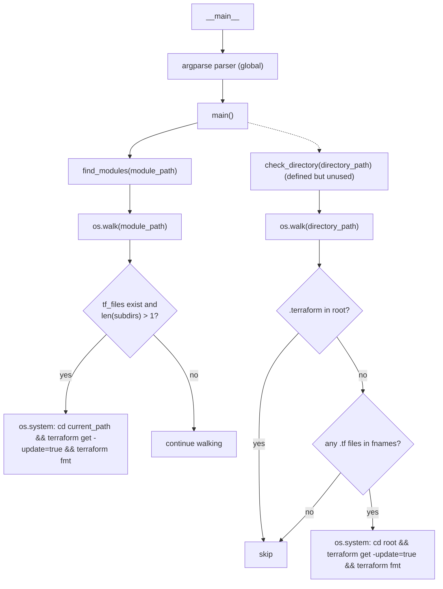
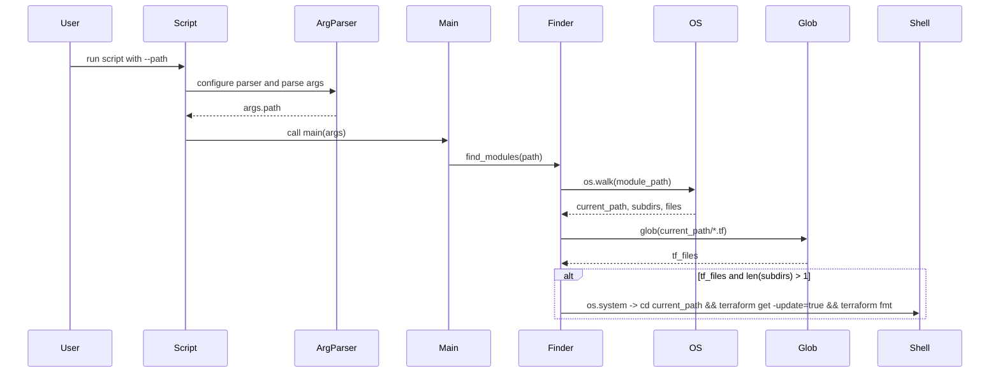
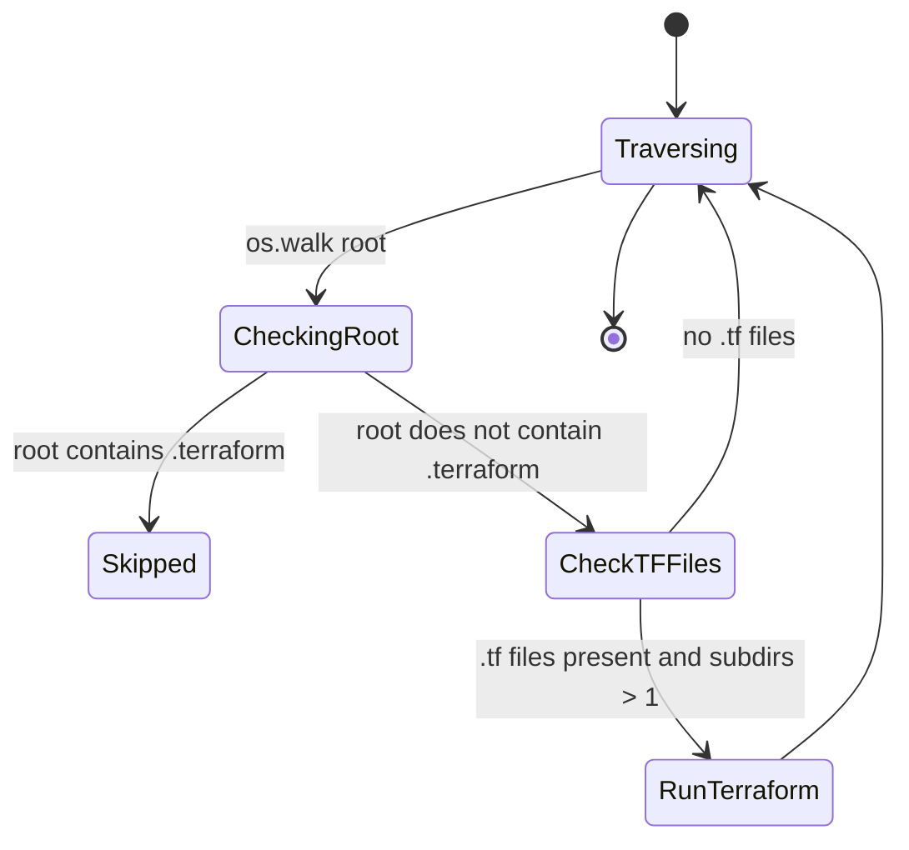

# Diagram: devops/terraform/scripts/tf_fmt.py

> Auto-generated by Obscura crawlers

## Diagram 1

### SVG

<svg id="container" width="925.44140625" xmlns="http://www.w3.org/2000/svg" class="flowchart" height="1327.40625" viewBox="0 0 925.44140625 1327.40625" role="graphics-document document" aria-roledescription="flowchart-v2"><g><marker id="container_flowchart-v2-pointEnd" class="marker flowchart-v2" viewBox="0 0 10 10" refX="5" refY="5" markerUnits="userSpaceOnUse" markerWidth="8" markerHeight="8" orient="auto"><path d="M 0 0 L 10 5 L 0 10 z" class="arrowMarkerPath" style="stroke-width: 1; stroke-dasharray: 1, 0;"></path></marker><marker id="container_flowchart-v2-pointStart" class="marker flowchart-v2" viewBox="0 0 10 10" refX="4.5" refY="5" markerUnits="userSpaceOnUse" markerWidth="8" markerHeight="8" orient="auto"><path d="M 0 5 L 10 10 L 10 0 z" class="arrowMarkerPath" style="stroke-width: 1; stroke-dasharray: 1, 0;"></path></marker><marker id="container_flowchart-v2-circleEnd" class="marker flowchart-v2" viewBox="0 0 10 10" refX="11" refY="5" markerUnits="userSpaceOnUse" markerWidth="11" markerHeight="11" orient="auto"><circle cx="5" cy="5" r="5" class="arrowMarkerPath" style="stroke-width: 1; stroke-dasharray: 1, 0;"></circle></marker><marker id="container_flowchart-v2-circleStart" class="marker flowchart-v2" viewBox="0 0 10 10" refX="-1" refY="5" markerUnits="userSpaceOnUse" markerWidth="11" markerHeight="11" orient="auto"><circle cx="5" cy="5" r="5" class="arrowMarkerPath" style="stroke-width: 1; stroke-dasharray: 1, 0;"></circle></marker><marker id="container_flowchart-v2-crossEnd" class="marker cross flowchart-v2" viewBox="0 0 11 11" refX="12" refY="5.2" markerUnits="userSpaceOnUse" markerWidth="11" markerHeight="11" orient="auto"><path d="M 1,1 l 9,9 M 10,1 l -9,9" class="arrowMarkerPath" style="stroke-width: 2; stroke-dasharray: 1, 0;"></path></marker><marker id="container_flowchart-v2-crossStart" class="marker cross flowchart-v2" viewBox="0 0 11 11" refX="-1" refY="5.2" markerUnits="userSpaceOnUse" markerWidth="11" markerHeight="11" orient="auto"><path d="M 1,1 l 9,9 M 10,1 l -9,9" class="arrowMarkerPath" style="stroke-width: 2; stroke-dasharray: 1, 0;"></path></marker><g class="root"><g class="clusters"></g><g class="edgePaths"><path d="M470.063,62L470.063,66.167C470.063,70.333,470.063,78.667,470.063,86.333C470.063,94,470.063,101,470.063,104.5L470.063,108" id="L_ENTRY_PARSER_0" class="edge-thickness-normal edge-pattern-solid edge-thickness-normal edge-pattern-solid flowchart-link" style=";" data-edge="true" data-et="edge" data-id="L_ENTRY_PARSER_0" data-points="W3sieCI6NDcwLjA2MjUsInkiOjYyfSx7IngiOjQ3MC4wNjI1LCJ5Ijo4N30seyJ4Ijo0NzAuMDYyNSwieSI6MTEyfV0=" marker-end="url(#container_flowchart-v2-pointEnd)"></path><path d="M470.063,166L470.063,170.167C470.063,174.333,470.063,182.667,470.063,190.333C470.063,198,470.063,205,470.063,208.5L470.063,212" id="L_PARSER_MAIN_0" class="edge-thickness-normal edge-pattern-solid edge-thickness-normal edge-pattern-solid flowchart-link" style=";" data-edge="true" data-et="edge" data-id="L_PARSER_MAIN_0" data-points="W3sieCI6NDcwLjA2MjUsInkiOjE2Nn0seyJ4Ijo0NzAuMDYyNSwieSI6MTkxfSx7IngiOjQ3MC4wNjI1LCJ5IjoyMTZ9XQ==" marker-end="url(#container_flowchart-v2-pointEnd)"></path><path d="M416.719,257.128L392.887,263.44C369.055,269.752,321.391,282.376,297.559,294.188C273.727,306,273.727,317,273.727,322.5L273.727,328" id="L_MAIN_FIND_0" class="edge-thickness-normal edge-pattern-solid edge-thickness-normal edge-pattern-solid flowchart-link" style=";" data-edge="true" data-et="edge" data-id="L_MAIN_FIND_0" data-points="W3sieCI6NDE2LjcxODc1LCJ5IjoyNTcuMTI4MjA4MTg5MDg5MTV9LHsieCI6MjczLjcyNjU2MjUsInkiOjI5NX0seyJ4IjoyNzMuNzI2NTYyNSwieSI6MzMyfV0=" marker-end="url(#container_flowchart-v2-pointEnd)"></path><path d="M273.727,386L273.727,392.167C273.727,398.333,273.727,410.667,273.727,420.333C273.727,430,273.727,437,273.727,440.5L273.727,444" id="L_FIND_WALK1_0" class="edge-thickness-normal edge-pattern-solid edge-thickness-normal edge-pattern-solid flowchart-link" style=";" data-edge="true" data-et="edge" data-id="L_FIND_WALK1_0" data-points="W3sieCI6MjczLjcyNjU2MjUsInkiOjM4Nn0seyJ4IjoyNzMuNzI2NTYyNSwieSI6NDIzfSx7IngiOjI3My43MjY1NjI1LCJ5Ijo0NDh9XQ==" marker-end="url(#container_flowchart-v2-pointEnd)"></path><path d="M273.727,502L273.727,506.167C273.727,510.333,273.727,518.667,273.727,526.333C273.727,534,273.727,541,273.727,544.5L273.727,548" id="L_WALK1_DECIDE1_0" class="edge-thickness-normal edge-pattern-solid edge-thickness-normal edge-pattern-solid flowchart-link" style=";" data-edge="true" data-et="edge" data-id="L_WALK1_DECIDE1_0" data-points="W3sieCI6MjczLjcyNjU2MjUsInkiOjUwMn0seyJ4IjoyNzMuNzI2NTYyNSwieSI6NTI3fSx7IngiOjI3My43MjY1NjI1LCJ5Ijo1NTJ9XQ==" marker-end="url(#container_flowchart-v2-pointEnd)"></path><path d="M213.206,769.479L200.671,785.733C188.137,801.986,163.069,834.493,150.534,863.697C138,892.901,138,918.802,138,931.753L138,944.703" id="L_DECIDE1_CMD1_0" class="edge-thickness-normal edge-pattern-solid edge-thickness-normal edge-pattern-solid flowchart-link" style=";" data-edge="true" data-et="edge" data-id="L_DECIDE1_CMD1_0" data-points="W3sieCI6MjEzLjIwNTU5ODExMzE0MjUsInkiOjc2OS40NzkwMzU2MTMxNDI1fSx7IngiOjEzOCwieSI6ODY3fSx7IngiOjEzOCwieSI6OTQ4LjcwMzEyNX1d" marker-end="url(#container_flowchart-v2-pointEnd)"></path><path d="M334.248,769.479L346.782,785.733C359.316,801.986,384.385,834.493,396.919,869.697C409.453,904.901,409.453,942.802,409.453,961.753L409.453,980.703" id="L_DECIDE1_CONT1_0" class="edge-thickness-normal edge-pattern-solid edge-thickness-normal edge-pattern-solid flowchart-link" style=";" data-edge="true" data-et="edge" data-id="L_DECIDE1_CONT1_0" data-points="W3sieCI6MzM0LjI0NzUyNjg4Njg1NzUsInkiOjc2OS40NzkwMzU2MTMxNDI1fSx7IngiOjQwOS40NTMxMjUsInkiOjg2N30seyJ4Ijo0MDkuNDUzMTI1LCJ5Ijo5ODQuNzAzMTI1fV0=" marker-end="url(#container_flowchart-v2-pointEnd)"></path><path d="M523.406,256.534L548.675,262.945C573.944,269.356,624.482,282.178,649.751,292.089C675.02,302,675.02,309,675.02,312.5L675.02,316" id="L_MAIN_CHECK_0" class="edge-thickness-normal edge-pattern-dotted edge-thickness-normal edge-pattern-solid flowchart-link" style=";" data-edge="true" data-et="edge" data-id="L_MAIN_CHECK_0" data-points="W3sieCI6NTIzLjQwNjI1LCJ5IjoyNTYuNTMzOTM0MzIzMTI0MTN9LHsieCI6Njc1LjAxOTUzMTI1LCJ5IjoyOTV9LHsieCI6Njc1LjAxOTUzMTI1LCJ5IjozMjB9XQ==" marker-end="url(#container_flowchart-v2-pointEnd)"></path><path d="M675.02,398L675.02,402.167C675.02,406.333,675.02,414.667,675.02,422.333C675.02,430,675.02,437,675.02,440.5L675.02,444" id="L_CHECK_WALK2_0" class="edge-thickness-normal edge-pattern-solid edge-thickness-normal edge-pattern-solid flowchart-link" style=";" data-edge="true" data-et="edge" data-id="L_CHECK_WALK2_0" data-points="W3sieCI6Njc1LjAxOTUzMTI1LCJ5IjozOTh9LHsieCI6Njc1LjAxOTUzMTI1LCJ5Ijo0MjN9LHsieCI6Njc1LjAxOTUzMTI1LCJ5Ijo0NDh9XQ==" marker-end="url(#container_flowchart-v2-pointEnd)"></path><path d="M675.02,502L675.02,506.167C675.02,510.333,675.02,518.667,675.02,534.005C675.02,549.344,675.02,571.688,675.02,582.859L675.02,594.031" id="L_WALK2_DECIDE2_0" class="edge-thickness-normal edge-pattern-solid edge-thickness-normal edge-pattern-solid flowchart-link" style=";" data-edge="true" data-et="edge" data-id="L_WALK2_DECIDE2_0" data-points="W3sieCI6Njc1LjAxOTUzMTI1LCJ5Ijo1MDJ9LHsieCI6Njc1LjAxOTUzMTI1LCJ5Ijo1Mjd9LHsieCI6Njc1LjAxOTUzMTI1LCJ5Ijo1OTguMDMxMjV9XQ==" marker-end="url(#container_flowchart-v2-pointEnd)"></path><path d="M636.034,744.983L621.347,765.319C606.66,785.655,577.287,826.328,562.601,870.781C547.914,915.234,547.914,963.469,547.914,1011.703C547.914,1059.938,547.914,1108.172,549.604,1143.796C551.293,1179.42,554.673,1202.435,556.362,1213.942L558.052,1225.449" id="L_DECIDE2_SKIP_0" class="edge-thickness-normal edge-pattern-solid edge-thickness-normal edge-pattern-solid flowchart-link" style=";" data-edge="true" data-et="edge" data-id="L_DECIDE2_SKIP_0" data-points="W3sieCI6NjM2LjAzMzY0MDk3MDM0MjgsInkiOjc0NC45ODI4NTk3MjAzNDI4fSx7IngiOjU0Ny45MTQwNjI1LCJ5Ijo4Njd9LHsieCI6NTQ3LjkxNDA2MjUsInkiOjEwMTEuNzAzMTI1fSx7IngiOjU0Ny45MTQwNjI1LCJ5IjoxMTU2LjQwNjI1fSx7IngiOjU1OC42MzMwODU5Mzc1LCJ5IjoxMjI5LjQwNjI1fV0=" marker-end="url(#container_flowchart-v2-pointEnd)"></path><path d="M706.874,752.115L716.854,771.262C726.834,790.41,746.794,828.705,756.774,853.352C766.754,878,766.754,889,766.754,894.5L766.754,900" id="L_DECIDE2_TF_CHECK_0" class="edge-thickness-normal edge-pattern-solid edge-thickness-normal edge-pattern-solid flowchart-link" style=";" data-edge="true" data-et="edge" data-id="L_DECIDE2_TF_CHECK_0" data-points="W3sieCI6NzA2Ljg3MzYwMzY4OTQ1MTQsInkiOjc1Mi4xMTQ2Nzc1NjA1NDg2fSx7IngiOjc2Ni43NTM5MDYyNSwieSI6ODY3fSx7IngiOjc2Ni43NTM5MDYyNSwieSI6OTA0fV0=" marker-end="url(#container_flowchart-v2-pointEnd)"></path><path d="M780.226,1105.934L781.428,1114.346C782.631,1122.758,785.036,1139.582,786.239,1153.494C787.441,1167.406,787.441,1178.406,787.441,1183.906L787.441,1189.406" id="L_TF_CHECK_CMD2_0" class="edge-thickness-normal edge-pattern-solid edge-thickness-normal edge-pattern-solid flowchart-link" style=";" data-edge="true" data-et="edge" data-id="L_TF_CHECK_CMD2_0" data-points="W3sieCI6NzgwLjIyNTcwMDA2MTk5OCwieSI6MTEwNS45MzQ0NTYxODgwMDE4fSx7IngiOjc4Ny40NDE0MDYyNSwieSI6MTE1Ni40MDYyNX0seyJ4Ijo3ODcuNDQxNDA2MjUsInkiOjExOTMuNDA2MjV9XQ==" marker-end="url(#container_flowchart-v2-pointEnd)"></path><path d="M719.663,1072.316L708.775,1086.331C697.886,1100.346,676.109,1128.376,654.51,1154.067C632.911,1179.757,611.491,1203.108,600.78,1214.783L590.07,1226.459" id="L_TF_CHECK_SKIP_0" class="edge-thickness-normal edge-pattern-solid edge-thickness-normal edge-pattern-solid flowchart-link" style=";" data-edge="true" data-et="edge" data-id="L_TF_CHECK_SKIP_0" data-points="W3sieCI6NzE5LjY2MzI0MTE4MTAyODIsInkiOjEwNzIuMzE1NTg0OTMxMDI4M30seyJ4Ijo2NTQuMzMyMDMxMjUsInkiOjExNTYuNDA2MjV9LHsieCI6NTg3LjM2NTkzNzUsInkiOjEyMjkuNDA2MjV9XQ==" marker-end="url(#container_flowchart-v2-pointEnd)"></path></g><g class="edgeLabels"><g class="edgeLabel"><g class="label" data-id="L_ENTRY_PARSER_0" transform="translate(0, 0)"><foreignObject width="0" height="0">

</foreignObject></g></g><g class="edgeLabel"><g class="label" data-id="L_PARSER_MAIN_0" transform="translate(0, 0)"><foreignObject width="0" height="0">

</foreignObject></g></g><g class="edgeLabel"><g class="label" data-id="L_MAIN_FIND_0" transform="translate(0, 0)"><foreignObject width="0" height="0">

</foreignObject></g></g><g class="edgeLabel"><g class="label" data-id="L_FIND_WALK1_0" transform="translate(0, 0)"><foreignObject width="0" height="0">

</foreignObject></g></g><g class="edgeLabel"><g class="label" data-id="L_WALK1_DECIDE1_0" transform="translate(0, 0)"><foreignObject width="0" height="0">

</foreignObject></g></g><g class="edgeLabel" transform="translate(138, 867)"><g class="label" data-id="L_DECIDE1_CMD1_0" transform="translate(-12.0078125, -12)"><foreignObject width="24.015625" height="24">

yes

</foreignObject></g></g><g class="edgeLabel" transform="translate(409.453125, 867)"><g class="label" data-id="L_DECIDE1_CONT1_0" transform="translate(-9.3671875, -12)"><foreignObject width="18.734375" height="24">

no

</foreignObject></g></g><g class="edgeLabel"><g class="label" data-id="L_MAIN_CHECK_0" transform="translate(0, 0)"><foreignObject width="0" height="0">

</foreignObject></g></g><g class="edgeLabel"><g class="label" data-id="L_CHECK_WALK2_0" transform="translate(0, 0)"><foreignObject width="0" height="0">

</foreignObject></g></g><g class="edgeLabel"><g class="label" data-id="L_WALK2_DECIDE2_0" transform="translate(0, 0)"><foreignObject width="0" height="0">

</foreignObject></g></g><g class="edgeLabel" transform="translate(547.9140625, 1011.703125)"><g class="label" data-id="L_DECIDE2_SKIP_0" transform="translate(-12.0078125, -12)"><foreignObject width="24.015625" height="24">

yes

</foreignObject></g></g><g class="edgeLabel" transform="translate(766.75390625, 867)"><g class="label" data-id="L_DECIDE2_TF_CHECK_0" transform="translate(-9.3671875, -12)"><foreignObject width="18.734375" height="24">

no

</foreignObject></g></g><g class="edgeLabel" transform="translate(787.44140625, 1156.40625)"><g class="label" data-id="L_TF_CHECK_CMD2_0" transform="translate(-12.0078125, -12)"><foreignObject width="24.015625" height="24">

yes

</foreignObject></g></g><g class="edgeLabel" transform="translate(656.60933, 1153.47505)"><g class="label" data-id="L_TF_CHECK_SKIP_0" transform="translate(-9.3671875, -12)"><foreignObject width="18.734375" height="24">

no

</foreignObject></g></g></g><g class="nodes"><g class="node default" id="flowchart-ENTRY-0" transform="translate(470.0625, 35)"><rect class="basic label-container" style="" x="-48.0234375" y="-27" width="96.046875" height="54"></rect><g class="label" style="" transform="translate(-18.0234375, -12)"><rect></rect><foreignObject width="36.046875" height="24">

<strong>main</strong>

</foreignObject></g></g><g class="node default" id="flowchart-PARSER-1" transform="translate(470.0625, 139)"><rect class="basic label-container" style="" x="-116.59375" y="-27" width="233.1875" height="54"></rect><g class="label" style="" transform="translate(-86.59375, -12)"><rect></rect><foreignObject width="173.1875" height="24">

argparse parser (global)

</foreignObject></g></g><g class="node default" id="flowchart-MAIN-3" transform="translate(470.0625, 243)"><rect class="basic label-container" style="" x="-53.34375" y="-27" width="106.6875" height="54"></rect><g class="label" style="" transform="translate(-23.34375, -12)"><rect></rect><foreignObject width="46.6875" height="24">

main()

</foreignObject></g></g><g class="node default" id="flowchart-FIND-5" transform="translate(273.7265625, 359)"><rect class="basic label-container" style="" x="-133.0234375" y="-27" width="266.046875" height="54"></rect><g class="label" style="" transform="translate(-103.0234375, -12)"><rect></rect><foreignObject width="206.046875" height="24">

find_modules(module_path)

</foreignObject></g></g><g class="node default" id="flowchart-WALK1-7" transform="translate(273.7265625, 475)"><rect class="basic label-container" style="" x="-109.9375" y="-27" width="219.875" height="54"></rect><g class="label" style="" transform="translate(-79.9375, -12)"><rect></rect><foreignObject width="159.875" height="24">

os.walk(module_path)

</foreignObject></g></g><g class="node default" id="flowchart-DECIDE1-9" transform="translate(273.7265625, 691)"><polygon points="139,0 278,-139 139,-278 0,-139" class="label-container" transform="translate(-138.5, 139)"></polygon><g class="label" style="" transform="translate(-100, -24)"><rect></rect><foreignObject width="200" height="48">

tf_files exist and\nlen(subdirs) &gt; 1?

</foreignObject></g></g><g class="node default" id="flowchart-CMD1-11" transform="translate(138, 1011.703125)"><rect class="basic label-container" style="" x="-130" y="-63" width="260" height="126"></rect><g class="label" style="" transform="translate(-100, -48)"><rect></rect><foreignObject width="200" height="96">

os.system: cd current_path &amp;&amp; terraform get -update=true &amp;&amp; terraform fmt

</foreignObject></g></g><g class="node default" id="flowchart-CONT1-13" transform="translate(409.453125, 1011.703125)"><rect class="basic label-container" style="" x="-91.453125" y="-27" width="182.90625" height="54"></rect><g class="label" style="" transform="translate(-61.453125, -12)"><rect></rect><foreignObject width="122.90625" height="24">

continue walking

</foreignObject></g></g><g class="node default" id="flowchart-CHECK-15" transform="translate(675.01953125, 359)"><rect class="basic label-container" style="" x="-147.6953125" y="-39" width="295.390625" height="78"></rect><g class="label" style="" transform="translate(-117.6953125, -24)"><rect></rect><foreignObject width="235.390625" height="48">

check_directory(directory_path) (defined but unused)

</foreignObject></g></g><g class="node default" id="flowchart-WALK2-17" transform="translate(675.01953125, 475)"><rect class="basic label-container" style="" x="-114.765625" y="-27" width="229.53125" height="54"></rect><g class="label" style="" transform="translate(-84.765625, -12)"><rect></rect><foreignObject width="169.53125" height="24">

os.walk(directory_path)

</foreignObject></g></g><g class="node default" id="flowchart-DECIDE2-19" transform="translate(675.01953125, 691)"><polygon points="92.96875,0 185.9375,-92.96875 92.96875,-185.9375 0,-92.96875" class="label-container" transform="translate(-92.46875, 92.96875)"></polygon><g class="label" style="" transform="translate(-65.96875, -12)"><rect></rect><foreignObject width="131.9375" height="24">

.terraform in root?

</foreignObject></g></g><g class="node default" id="flowchart-SKIP-21" transform="translate(562.59765625, 1256.40625)"><rect class="basic label-container" style="" x="-44.84375" y="-27" width="89.6875" height="54"></rect><g class="label" style="" transform="translate(-14.84375, -12)"><rect></rect><foreignObject width="29.6875" height="24">

skip

</foreignObject></g></g><g class="node default" id="flowchart-TF_CHECK-23" transform="translate(766.75390625, 1011.703125)"><polygon points="107.703125,0 215.40625,-107.703125 107.703125,-215.40625 0,-107.703125" class="label-container" transform="translate(-107.203125, 107.703125)"></polygon><g class="label" style="" transform="translate(-80.703125, -12)"><rect></rect><foreignObject width="161.40625" height="24">

any .tf files in fnames?

</foreignObject></g></g><g class="node default" id="flowchart-CMD2-25" transform="translate(787.44140625, 1256.40625)"><rect class="basic label-container" style="" x="-130" y="-63" width="260" height="126"></rect><g class="label" style="" transform="translate(-100, -48)"><rect></rect><foreignObject width="200" height="96">

os.system: cd root &amp;&amp; terraform get -update=true &amp;&amp; terraform fmt

</foreignObject></g></g></g></g></g></svg>

## Diagram 2

### SVG

<svg id="container" width="1852" xmlns="http://www.w3.org/2000/svg" height="706" viewBox="-50 -10 1852 706" role="graphics-document document" aria-roledescription="sequence"><g><rect x="1602" y="620" fill="#eaeaea" stroke="#666" width="150" height="65" name="Shell" rx="3" ry="3" class="actor actor-bottom"></rect><text x="1677" y="652.5" dominant-baseline="central" alignment-baseline="central" class="actor actor-box" style="text-anchor: middle; font-size: 16px; font-weight: 400;"><tspan x="1677" dy="0">Shell</tspan></text></g><g><rect x="1402" y="620" fill="#eaeaea" stroke="#666" width="150" height="65" name="Glob" rx="3" ry="3" class="actor actor-bottom"></rect><text x="1477" y="652.5" dominant-baseline="central" alignment-baseline="central" class="actor actor-box" style="text-anchor: middle; font-size: 16px; font-weight: 400;"><tspan x="1477" dy="0">Glob</tspan></text></g><g><rect x="1202" y="620" fill="#eaeaea" stroke="#666" width="150" height="65" name="OS" rx="3" ry="3" class="actor actor-bottom"></rect><text x="1277" y="652.5" dominant-baseline="central" alignment-baseline="central" class="actor actor-box" style="text-anchor: middle; font-size: 16px; font-weight: 400;"><tspan x="1277" dy="0">OS</tspan></text></g><g><rect x="938" y="620" fill="#eaeaea" stroke="#666" width="150" height="65" name="Finder" rx="3" ry="3" class="actor actor-bottom"></rect><text x="1013" y="652.5" dominant-baseline="central" alignment-baseline="central" class="actor actor-box" style="text-anchor: middle; font-size: 16px; font-weight: 400;"><tspan x="1013" dy="0">Finder</tspan></text></g><g><rect x="725" y="620" fill="#eaeaea" stroke="#666" width="150" height="65" name="Main" rx="3" ry="3" class="actor actor-bottom"></rect><text x="800" y="652.5" dominant-baseline="central" alignment-baseline="central" class="actor actor-box" style="text-anchor: middle; font-size: 16px; font-weight: 400;"><tspan x="800" dy="0">Main</tspan></text></g><g><rect x="525" y="620" fill="#eaeaea" stroke="#666" width="150" height="65" name="ArgParser" rx="3" ry="3" class="actor actor-bottom"></rect><text x="600" y="652.5" dominant-baseline="central" alignment-baseline="central" class="actor actor-box" style="text-anchor: middle; font-size: 16px; font-weight: 400;"><tspan x="600" dy="0">ArgParser</tspan></text></g><g><rect x="226" y="620" fill="#eaeaea" stroke="#666" width="150" height="65" name="Script" rx="3" ry="3" class="actor actor-bottom"></rect><text x="301" y="652.5" dominant-baseline="central" alignment-baseline="central" class="actor actor-box" style="text-anchor: middle; font-size: 16px; font-weight: 400;"><tspan x="301" dy="0">Script</tspan></text></g><g><rect x="0" y="620" fill="#eaeaea" stroke="#666" width="150" height="65" name="User" rx="3" ry="3" class="actor actor-bottom"></rect><text x="75" y="652.5" dominant-baseline="central" alignment-baseline="central" class="actor actor-box" style="text-anchor: middle; font-size: 16px; font-weight: 400;"><tspan x="75" dy="0">User</tspan></text></g><g><line id="actor7" x1="1677" y1="65" x2="1677" y2="620" class="actor-line 200" stroke-width="0.5px" stroke="#999" name="Shell"></line><g id="root-7"><rect x="1602" y="0" fill="#eaeaea" stroke="#666" width="150" height="65" name="Shell" rx="3" ry="3" class="actor actor-top"></rect><text x="1677" y="32.5" dominant-baseline="central" alignment-baseline="central" class="actor actor-box" style="text-anchor: middle; font-size: 16px; font-weight: 400;"><tspan x="1677" dy="0">Shell</tspan></text></g></g><g><line id="actor6" x1="1477" y1="65" x2="1477" y2="620" class="actor-line 200" stroke-width="0.5px" stroke="#999" name="Glob"></line><g id="root-6"><rect x="1402" y="0" fill="#eaeaea" stroke="#666" width="150" height="65" name="Glob" rx="3" ry="3" class="actor actor-top"></rect><text x="1477" y="32.5" dominant-baseline="central" alignment-baseline="central" class="actor actor-box" style="text-anchor: middle; font-size: 16px; font-weight: 400;"><tspan x="1477" dy="0">Glob</tspan></text></g></g><g><line id="actor5" x1="1277" y1="65" x2="1277" y2="620" class="actor-line 200" stroke-width="0.5px" stroke="#999" name="OS"></line><g id="root-5"><rect x="1202" y="0" fill="#eaeaea" stroke="#666" width="150" height="65" name="OS" rx="3" ry="3" class="actor actor-top"></rect><text x="1277" y="32.5" dominant-baseline="central" alignment-baseline="central" class="actor actor-box" style="text-anchor: middle; font-size: 16px; font-weight: 400;"><tspan x="1277" dy="0">OS</tspan></text></g></g><g><line id="actor4" x1="1013" y1="65" x2="1013" y2="620" class="actor-line 200" stroke-width="0.5px" stroke="#999" name="Finder"></line><g id="root-4"><rect x="938" y="0" fill="#eaeaea" stroke="#666" width="150" height="65" name="Finder" rx="3" ry="3" class="actor actor-top"></rect><text x="1013" y="32.5" dominant-baseline="central" alignment-baseline="central" class="actor actor-box" style="text-anchor: middle; font-size: 16px; font-weight: 400;"><tspan x="1013" dy="0">Finder</tspan></text></g></g><g><line id="actor3" x1="800" y1="65" x2="800" y2="620" class="actor-line 200" stroke-width="0.5px" stroke="#999" name="Main"></line><g id="root-3"><rect x="725" y="0" fill="#eaeaea" stroke="#666" width="150" height="65" name="Main" rx="3" ry="3" class="actor actor-top"></rect><text x="800" y="32.5" dominant-baseline="central" alignment-baseline="central" class="actor actor-box" style="text-anchor: middle; font-size: 16px; font-weight: 400;"><tspan x="800" dy="0">Main</tspan></text></g></g><g><line id="actor2" x1="600" y1="65" x2="600" y2="620" class="actor-line 200" stroke-width="0.5px" stroke="#999" name="ArgParser"></line><g id="root-2"><rect x="525" y="0" fill="#eaeaea" stroke="#666" width="150" height="65" name="ArgParser" rx="3" ry="3" class="actor actor-top"></rect><text x="600" y="32.5" dominant-baseline="central" alignment-baseline="central" class="actor actor-box" style="text-anchor: middle; font-size: 16px; font-weight: 400;"><tspan x="600" dy="0">ArgParser</tspan></text></g></g><g><line id="actor1" x1="301" y1="65" x2="301" y2="620" class="actor-line 200" stroke-width="0.5px" stroke="#999" name="Script"></line><g id="root-1"><rect x="226" y="0" fill="#eaeaea" stroke="#666" width="150" height="65" name="Script" rx="3" ry="3" class="actor actor-top"></rect><text x="301" y="32.5" dominant-baseline="central" alignment-baseline="central" class="actor actor-box" style="text-anchor: middle; font-size: 16px; font-weight: 400;"><tspan x="301" dy="0">Script</tspan></text></g></g><g><line id="actor0" x1="75" y1="65" x2="75" y2="620" class="actor-line 200" stroke-width="0.5px" stroke="#999" name="User"></line><g id="root-0"><rect x="0" y="0" fill="#eaeaea" stroke="#666" width="150" height="65" name="User" rx="3" ry="3" class="actor actor-top"></rect><text x="75" y="32.5" dominant-baseline="central" alignment-baseline="central" class="actor actor-box" style="text-anchor: middle; font-size: 16px; font-weight: 400;"><tspan x="75" dy="0">User</tspan></text></g></g><g></g><defs><symbol id="computer" width="24" height="24"><path transform="scale(.5)" d="M2 2v13h20v-13h-20zm18 11h-16v-9h16v9zm-10.228 6l.466-1h3.524l.467 1h-4.457zm14.228 3h-24l2-6h2.104l-1.33 4h18.45l-1.297-4h2.073l2 6zm-5-10h-14v-7h14v7z"></path></symbol></defs><defs><symbol id="database" fill-rule="evenodd" clip-rule="evenodd"><path transform="scale(.5)" d="M12.258.001l.256.004.255.005.253.008.251.01.249.012.247.015.246.016.242.019.241.02.239.023.236.024.233.027.231.028.229.031.225.032.223.034.22.036.217.038.214.04.211.041.208.043.205.045.201.046.198.048.194.05.191.051.187.053.183.054.18.056.175.057.172.059.168.06.163.061.16.063.155.064.15.066.074.033.073.033.071.034.07.034.069.035.068.035.067.035.066.035.064.036.064.036.062.036.06.036.06.037.058.037.058.037.055.038.055.038.053.038.052.038.051.039.05.039.048.039.047.039.045.04.044.04.043.04.041.04.04.041.039.041.037.041.036.041.034.041.033.042.032.042.03.042.029.042.027.042.026.043.024.043.023.043.021.043.02.043.018.044.017.043.015.044.013.044.012.044.011.045.009.044.007.045.006.045.004.045.002.045.001.045v17l-.001.045-.002.045-.004.045-.006.045-.007.045-.009.044-.011.045-.012.044-.013.044-.015.044-.017.043-.018.044-.02.043-.021.043-.023.043-.024.043-.026.043-.027.042-.029.042-.03.042-.032.042-.033.042-.034.041-.036.041-.037.041-.039.041-.04.041-.041.04-.043.04-.044.04-.045.04-.047.039-.048.039-.05.039-.051.039-.052.038-.053.038-.055.038-.055.038-.058.037-.058.037-.06.037-.06.036-.062.036-.064.036-.064.036-.066.035-.067.035-.068.035-.069.035-.07.034-.071.034-.073.033-.074.033-.15.066-.155.064-.16.063-.163.061-.168.06-.172.059-.175.057-.18.056-.183.054-.187.053-.191.051-.194.05-.198.048-.201.046-.205.045-.208.043-.211.041-.214.04-.217.038-.22.036-.223.034-.225.032-.229.031-.231.028-.233.027-.236.024-.239.023-.241.02-.242.019-.246.016-.247.015-.249.012-.251.01-.253.008-.255.005-.256.004-.258.001-.258-.001-.256-.004-.255-.005-.253-.008-.251-.01-.249-.012-.247-.015-.245-.016-.243-.019-.241-.02-.238-.023-.236-.024-.234-.027-.231-.028-.228-.031-.226-.032-.223-.034-.22-.036-.217-.038-.214-.04-.211-.041-.208-.043-.204-.045-.201-.046-.198-.048-.195-.05-.19-.051-.187-.053-.184-.054-.179-.056-.176-.057-.172-.059-.167-.06-.164-.061-.159-.063-.155-.064-.151-.066-.074-.033-.072-.033-.072-.034-.07-.034-.069-.035-.068-.035-.067-.035-.066-.035-.064-.036-.063-.036-.062-.036-.061-.036-.06-.037-.058-.037-.057-.037-.056-.038-.055-.038-.053-.038-.052-.038-.051-.039-.049-.039-.049-.039-.046-.039-.046-.04-.044-.04-.043-.04-.041-.04-.04-.041-.039-.041-.037-.041-.036-.041-.034-.041-.033-.042-.032-.042-.03-.042-.029-.042-.027-.042-.026-.043-.024-.043-.023-.043-.021-.043-.02-.043-.018-.044-.017-.043-.015-.044-.013-.044-.012-.044-.011-.045-.009-.044-.007-.045-.006-.045-.004-.045-.002-.045-.001-.045v-17l.001-.045.002-.045.004-.045.006-.045.007-.045.009-.044.011-.045.012-.044.013-.044.015-.044.017-.043.018-.044.02-.043.021-.043.023-.043.024-.043.026-.043.027-.042.029-.042.03-.042.032-.042.033-.042.034-.041.036-.041.037-.041.039-.041.04-.041.041-.04.043-.04.044-.04.046-.04.046-.039.049-.039.049-.039.051-.039.052-.038.053-.038.055-.038.056-.038.057-.037.058-.037.06-.037.061-.036.062-.036.063-.036.064-.036.066-.035.067-.035.068-.035.069-.035.07-.034.072-.034.072-.033.074-.033.151-.066.155-.064.159-.063.164-.061.167-.06.172-.059.176-.057.179-.056.184-.054.187-.053.19-.051.195-.05.198-.048.201-.046.204-.045.208-.043.211-.041.214-.04.217-.038.22-.036.223-.034.226-.032.228-.031.231-.028.234-.027.236-.024.238-.023.241-.02.243-.019.245-.016.247-.015.249-.012.251-.01.253-.008.255-.005.256-.004.258-.001.258.001zm-9.258 20.499v.01l.001.021.003.021.004.022.005.021.006.022.007.022.009.023.01.022.011.023.012.023.013.023.015.023.016.024.017.023.018.024.019.024.021.024.022.025.023.024.024.025.052.049.056.05.061.051.066.051.07.051.075.051.079.052.084.052.088.052.092.052.097.052.102.051.105.052.11.052.114.051.119.051.123.051.127.05.131.05.135.05.139.048.144.049.147.047.152.047.155.047.16.045.163.045.167.043.171.043.176.041.178.041.183.039.187.039.19.037.194.035.197.035.202.033.204.031.209.03.212.029.216.027.219.025.222.024.226.021.23.02.233.018.236.016.24.015.243.012.246.01.249.008.253.005.256.004.259.001.26-.001.257-.004.254-.005.25-.008.247-.011.244-.012.241-.014.237-.016.233-.018.231-.021.226-.021.224-.024.22-.026.216-.027.212-.028.21-.031.205-.031.202-.034.198-.034.194-.036.191-.037.187-.039.183-.04.179-.04.175-.042.172-.043.168-.044.163-.045.16-.046.155-.046.152-.047.148-.048.143-.049.139-.049.136-.05.131-.05.126-.05.123-.051.118-.052.114-.051.11-.052.106-.052.101-.052.096-.052.092-.052.088-.053.083-.051.079-.052.074-.052.07-.051.065-.051.06-.051.056-.05.051-.05.023-.024.023-.025.021-.024.02-.024.019-.024.018-.024.017-.024.015-.023.014-.024.013-.023.012-.023.01-.023.01-.022.008-.022.006-.022.006-.022.004-.022.004-.021.001-.021.001-.021v-4.127l-.077.055-.08.053-.083.054-.085.053-.087.052-.09.052-.093.051-.095.05-.097.05-.1.049-.102.049-.105.048-.106.047-.109.047-.111.046-.114.045-.115.045-.118.044-.12.043-.122.042-.124.042-.126.041-.128.04-.13.04-.132.038-.134.038-.135.037-.138.037-.139.035-.142.035-.143.034-.144.033-.147.032-.148.031-.15.03-.151.03-.153.029-.154.027-.156.027-.158.026-.159.025-.161.024-.162.023-.163.022-.165.021-.166.02-.167.019-.169.018-.169.017-.171.016-.173.015-.173.014-.175.013-.175.012-.177.011-.178.01-.179.008-.179.008-.181.006-.182.005-.182.004-.184.003-.184.002h-.37l-.184-.002-.184-.003-.182-.004-.182-.005-.181-.006-.179-.008-.179-.008-.178-.01-.176-.011-.176-.012-.175-.013-.173-.014-.172-.015-.171-.016-.17-.017-.169-.018-.167-.019-.166-.02-.165-.021-.163-.022-.162-.023-.161-.024-.159-.025-.157-.026-.156-.027-.155-.027-.153-.029-.151-.03-.15-.03-.148-.031-.146-.032-.145-.033-.143-.034-.141-.035-.14-.035-.137-.037-.136-.037-.134-.038-.132-.038-.13-.04-.128-.04-.126-.041-.124-.042-.122-.042-.12-.044-.117-.043-.116-.045-.113-.045-.112-.046-.109-.047-.106-.047-.105-.048-.102-.049-.1-.049-.097-.05-.095-.05-.093-.052-.09-.051-.087-.052-.085-.053-.083-.054-.08-.054-.077-.054v4.127zm0-5.654v.011l.001.021.003.021.004.021.005.022.006.022.007.022.009.022.01.022.011.023.012.023.013.023.015.024.016.023.017.024.018.024.019.024.021.024.022.024.023.025.024.024.052.05.056.05.061.05.066.051.07.051.075.052.079.051.084.052.088.052.092.052.097.052.102.052.105.052.11.051.114.051.119.052.123.05.127.051.131.05.135.049.139.049.144.048.147.048.152.047.155.046.16.045.163.045.167.044.171.042.176.042.178.04.183.04.187.038.19.037.194.036.197.034.202.033.204.032.209.03.212.028.216.027.219.025.222.024.226.022.23.02.233.018.236.016.24.014.243.012.246.01.249.008.253.006.256.003.259.001.26-.001.257-.003.254-.006.25-.008.247-.01.244-.012.241-.015.237-.016.233-.018.231-.02.226-.022.224-.024.22-.025.216-.027.212-.029.21-.03.205-.032.202-.033.198-.035.194-.036.191-.037.187-.039.183-.039.179-.041.175-.042.172-.043.168-.044.163-.045.16-.045.155-.047.152-.047.148-.048.143-.048.139-.05.136-.049.131-.05.126-.051.123-.051.118-.051.114-.052.11-.052.106-.052.101-.052.096-.052.092-.052.088-.052.083-.052.079-.052.074-.051.07-.052.065-.051.06-.05.056-.051.051-.049.023-.025.023-.024.021-.025.02-.024.019-.024.018-.024.017-.024.015-.023.014-.023.013-.024.012-.022.01-.023.01-.023.008-.022.006-.022.006-.022.004-.021.004-.022.001-.021.001-.021v-4.139l-.077.054-.08.054-.083.054-.085.052-.087.053-.09.051-.093.051-.095.051-.097.05-.1.049-.102.049-.105.048-.106.047-.109.047-.111.046-.114.045-.115.044-.118.044-.12.044-.122.042-.124.042-.126.041-.128.04-.13.039-.132.039-.134.038-.135.037-.138.036-.139.036-.142.035-.143.033-.144.033-.147.033-.148.031-.15.03-.151.03-.153.028-.154.028-.156.027-.158.026-.159.025-.161.024-.162.023-.163.022-.165.021-.166.02-.167.019-.169.018-.169.017-.171.016-.173.015-.173.014-.175.013-.175.012-.177.011-.178.009-.179.009-.179.007-.181.007-.182.005-.182.004-.184.003-.184.002h-.37l-.184-.002-.184-.003-.182-.004-.182-.005-.181-.007-.179-.007-.179-.009-.178-.009-.176-.011-.176-.012-.175-.013-.173-.014-.172-.015-.171-.016-.17-.017-.169-.018-.167-.019-.166-.02-.165-.021-.163-.022-.162-.023-.161-.024-.159-.025-.157-.026-.156-.027-.155-.028-.153-.028-.151-.03-.15-.03-.148-.031-.146-.033-.145-.033-.143-.033-.141-.035-.14-.036-.137-.036-.136-.037-.134-.038-.132-.039-.13-.039-.128-.04-.126-.041-.124-.042-.122-.043-.12-.043-.117-.044-.116-.044-.113-.046-.112-.046-.109-.046-.106-.047-.105-.048-.102-.049-.1-.049-.097-.05-.095-.051-.093-.051-.09-.051-.087-.053-.085-.052-.083-.054-.08-.054-.077-.054v4.139zm0-5.666v.011l.001.02.003.022.004.021.005.022.006.021.007.022.009.023.01.022.011.023.012.023.013.023.015.023.016.024.017.024.018.023.019.024.021.025.022.024.023.024.024.025.052.05.056.05.061.05.066.051.07.051.075.052.079.051.084.052.088.052.092.052.097.052.102.052.105.051.11.052.114.051.119.051.123.051.127.05.131.05.135.05.139.049.144.048.147.048.152.047.155.046.16.045.163.045.167.043.171.043.176.042.178.04.183.04.187.038.19.037.194.036.197.034.202.033.204.032.209.03.212.028.216.027.219.025.222.024.226.021.23.02.233.018.236.017.24.014.243.012.246.01.249.008.253.006.256.003.259.001.26-.001.257-.003.254-.006.25-.008.247-.01.244-.013.241-.014.237-.016.233-.018.231-.02.226-.022.224-.024.22-.025.216-.027.212-.029.21-.03.205-.032.202-.033.198-.035.194-.036.191-.037.187-.039.183-.039.179-.041.175-.042.172-.043.168-.044.163-.045.16-.045.155-.047.152-.047.148-.048.143-.049.139-.049.136-.049.131-.051.126-.05.123-.051.118-.052.114-.051.11-.052.106-.052.101-.052.096-.052.092-.052.088-.052.083-.052.079-.052.074-.052.07-.051.065-.051.06-.051.056-.05.051-.049.023-.025.023-.025.021-.024.02-.024.019-.024.018-.024.017-.024.015-.023.014-.024.013-.023.012-.023.01-.022.01-.023.008-.022.006-.022.006-.022.004-.022.004-.021.001-.021.001-.021v-4.153l-.077.054-.08.054-.083.053-.085.053-.087.053-.09.051-.093.051-.095.051-.097.05-.1.049-.102.048-.105.048-.106.048-.109.046-.111.046-.114.046-.115.044-.118.044-.12.043-.122.043-.124.042-.126.041-.128.04-.13.039-.132.039-.134.038-.135.037-.138.036-.139.036-.142.034-.143.034-.144.033-.147.032-.148.032-.15.03-.151.03-.153.028-.154.028-.156.027-.158.026-.159.024-.161.024-.162.023-.163.023-.165.021-.166.02-.167.019-.169.018-.169.017-.171.016-.173.015-.173.014-.175.013-.175.012-.177.01-.178.01-.179.009-.179.007-.181.006-.182.006-.182.004-.184.003-.184.001-.185.001-.185-.001-.184-.001-.184-.003-.182-.004-.182-.006-.181-.006-.179-.007-.179-.009-.178-.01-.176-.01-.176-.012-.175-.013-.173-.014-.172-.015-.171-.016-.17-.017-.169-.018-.167-.019-.166-.02-.165-.021-.163-.023-.162-.023-.161-.024-.159-.024-.157-.026-.156-.027-.155-.028-.153-.028-.151-.03-.15-.03-.148-.032-.146-.032-.145-.033-.143-.034-.141-.034-.14-.036-.137-.036-.136-.037-.134-.038-.132-.039-.13-.039-.128-.041-.126-.041-.124-.041-.122-.043-.12-.043-.117-.044-.116-.044-.113-.046-.112-.046-.109-.046-.106-.048-.105-.048-.102-.048-.1-.05-.097-.049-.095-.051-.093-.051-.09-.052-.087-.052-.085-.053-.083-.053-.08-.054-.077-.054v4.153zm8.74-8.179l-.257.004-.254.005-.25.008-.247.011-.244.012-.241.014-.237.016-.233.018-.231.021-.226.022-.224.023-.22.026-.216.027-.212.028-.21.031-.205.032-.202.033-.198.034-.194.036-.191.038-.187.038-.183.04-.179.041-.175.042-.172.043-.168.043-.163.045-.16.046-.155.046-.152.048-.148.048-.143.048-.139.049-.136.05-.131.05-.126.051-.123.051-.118.051-.114.052-.11.052-.106.052-.101.052-.096.052-.092.052-.088.052-.083.052-.079.052-.074.051-.07.052-.065.051-.06.05-.056.05-.051.05-.023.025-.023.024-.021.024-.02.025-.019.024-.018.024-.017.023-.015.024-.014.023-.013.023-.012.023-.01.023-.01.022-.008.022-.006.023-.006.021-.004.022-.004.021-.001.021-.001.021.001.021.001.021.004.021.004.022.006.021.006.023.008.022.01.022.01.023.012.023.013.023.014.023.015.024.017.023.018.024.019.024.02.025.021.024.023.024.023.025.051.05.056.05.06.05.065.051.07.052.074.051.079.052.083.052.088.052.092.052.096.052.101.052.106.052.11.052.114.052.118.051.123.051.126.051.131.05.136.05.139.049.143.048.148.048.152.048.155.046.16.046.163.045.168.043.172.043.175.042.179.041.183.04.187.038.191.038.194.036.198.034.202.033.205.032.21.031.212.028.216.027.22.026.224.023.226.022.231.021.233.018.237.016.241.014.244.012.247.011.25.008.254.005.257.004.26.001.26-.001.257-.004.254-.005.25-.008.247-.011.244-.012.241-.014.237-.016.233-.018.231-.021.226-.022.224-.023.22-.026.216-.027.212-.028.21-.031.205-.032.202-.033.198-.034.194-.036.191-.038.187-.038.183-.04.179-.041.175-.042.172-.043.168-.043.163-.045.16-.046.155-.046.152-.048.148-.048.143-.048.139-.049.136-.05.131-.05.126-.051.123-.051.118-.051.114-.052.11-.052.106-.052.101-.052.096-.052.092-.052.088-.052.083-.052.079-.052.074-.051.07-.052.065-.051.06-.05.056-.05.051-.05.023-.025.023-.024.021-.024.02-.025.019-.024.018-.024.017-.023.015-.024.014-.023.013-.023.012-.023.01-.023.01-.022.008-.022.006-.023.006-.021.004-.022.004-.021.001-.021.001-.021-.001-.021-.001-.021-.004-.021-.004-.022-.006-.021-.006-.023-.008-.022-.01-.022-.01-.023-.012-.023-.013-.023-.014-.023-.015-.024-.017-.023-.018-.024-.019-.024-.02-.025-.021-.024-.023-.024-.023-.025-.051-.05-.056-.05-.06-.05-.065-.051-.07-.052-.074-.051-.079-.052-.083-.052-.088-.052-.092-.052-.096-.052-.101-.052-.106-.052-.11-.052-.114-.052-.118-.051-.123-.051-.126-.051-.131-.05-.136-.05-.139-.049-.143-.048-.148-.048-.152-.048-.155-.046-.16-.046-.163-.045-.168-.043-.172-.043-.175-.042-.179-.041-.183-.04-.187-.038-.191-.038-.194-.036-.198-.034-.202-.033-.205-.032-.21-.031-.212-.028-.216-.027-.22-.026-.224-.023-.226-.022-.231-.021-.233-.018-.237-.016-.241-.014-.244-.012-.247-.011-.25-.008-.254-.005-.257-.004-.26-.001-.26.001z"></path></symbol></defs><defs><symbol id="clock" width="24" height="24"><path transform="scale(.5)" d="M12 2c5.514 0 10 4.486 10 10s-4.486 10-10 10-10-4.486-10-10 4.486-10 10-10zm0-2c-6.627 0-12 5.373-12 12s5.373 12 12 12 12-5.373 12-12-5.373-12-12-12zm5.848 12.459c.202.038.202.333.001.372-1.907.361-6.045 1.111-6.547 1.111-.719 0-1.301-.582-1.301-1.301 0-.512.77-5.447 1.125-7.445.034-.192.312-.181.343.014l.985 6.238 5.394 1.011z"></path></symbol></defs><defs><marker id="arrowhead" refX="7.9" refY="5" markerUnits="userSpaceOnUse" markerWidth="12" markerHeight="12" orient="auto-start-reverse"><path d="M -1 0 L 10 5 L 0 10 z"></path></marker></defs><defs><marker id="crosshead" markerWidth="15" markerHeight="8" orient="auto" refX="4" refY="4.5"><path fill="none" stroke="#000000" stroke-width="1pt" d="M 1,2 L 6,7 M 6,2 L 1,7" style="stroke-dasharray: 0, 0;"></path></marker></defs><defs><marker id="filled-head" refX="15.5" refY="7" markerWidth="20" markerHeight="28" orient="auto"><path d="M 18,7 L9,13 L14,7 L9,1 Z"></path></marker></defs><defs><marker id="sequencenumber" refX="15" refY="15" markerWidth="60" markerHeight="40" orient="auto"><circle cx="15" cy="15" r="6"></circle></marker></defs><g><line x1="1002" y1="507" x2="1688" y2="507" class="loopLine"></line><line x1="1688" y1="507" x2="1688" y2="600" class="loopLine"></line><line x1="1002" y1="600" x2="1688" y2="600" class="loopLine"></line><line x1="1002" y1="507" x2="1002" y2="600" class="loopLine"></line><polygon points="1002,507 1052,507 1052,520 1043.6,527 1002,527" class="labelBox"></polygon><text x="1027" y="520" text-anchor="middle" dominant-baseline="middle" alignment-baseline="middle" class="labelText" style="font-size: 16px; font-weight: 400;">alt</text><text x="1370" y="525" text-anchor="middle" class="loopText" style="font-size: 16px; font-weight: 400;"><tspan x="1370">[tf_files and len(subdirs) &gt; 1]</tspan></text></g><text x="187" y="80" text-anchor="middle" dominant-baseline="middle" alignment-baseline="middle" class="messageText" dy="1em" style="font-size: 16px; font-weight: 400;">run script with --path</text><line x1="76" y1="113" x2="297" y2="113" class="messageLine0" stroke-width="2" stroke="none" marker-end="url(#arrowhead)" style="fill: none;"></line><text x="449" y="128" text-anchor="middle" dominant-baseline="middle" alignment-baseline="middle" class="messageText" dy="1em" style="font-size: 16px; font-weight: 400;">configure parser and parse args</text><line x1="302" y1="161" x2="596" y2="161" class="messageLine0" stroke-width="2" stroke="none" marker-end="url(#arrowhead)" style="fill: none;"></line><text x="452" y="176" text-anchor="middle" dominant-baseline="middle" alignment-baseline="middle" class="messageText" dy="1em" style="font-size: 16px; font-weight: 400;">args.path</text><line x1="599" y1="209" x2="305" y2="209" class="messageLine1" stroke-width="2" stroke="none" marker-end="url(#arrowhead)" style="stroke-dasharray: 3, 3; fill: none;"></line><text x="549" y="224" text-anchor="middle" dominant-baseline="middle" alignment-baseline="middle" class="messageText" dy="1em" style="font-size: 16px; font-weight: 400;">call main(args)</text><line x1="302" y1="257" x2="796" y2="257" class="messageLine0" stroke-width="2" stroke="none" marker-end="url(#arrowhead)" style="fill: none;"></line><text x="905" y="272" text-anchor="middle" dominant-baseline="middle" alignment-baseline="middle" class="messageText" dy="1em" style="font-size: 16px; font-weight: 400;">find_modules(path)</text><line x1="801" y1="305" x2="1009" y2="305" class="messageLine0" stroke-width="2" stroke="none" marker-end="url(#arrowhead)" style="fill: none;"></line><text x="1144" y="320" text-anchor="middle" dominant-baseline="middle" alignment-baseline="middle" class="messageText" dy="1em" style="font-size: 16px; font-weight: 400;">os.walk(module_path)</text><line x1="1014" y1="353" x2="1273" y2="353" class="messageLine0" stroke-width="2" stroke="none" marker-end="url(#arrowhead)" style="fill: none;"></line><text x="1147" y="368" text-anchor="middle" dominant-baseline="middle" alignment-baseline="middle" class="messageText" dy="1em" style="font-size: 16px; font-weight: 400;">current_path, subdirs, files</text><line x1="1276" y1="401" x2="1017" y2="401" class="messageLine1" stroke-width="2" stroke="none" marker-end="url(#arrowhead)" style="stroke-dasharray: 3, 3; fill: none;"></line><text x="1244" y="416" text-anchor="middle" dominant-baseline="middle" alignment-baseline="middle" class="messageText" dy="1em" style="font-size: 16px; font-weight: 400;">glob(current_path/*.tf)</text><line x1="1014" y1="449" x2="1473" y2="449" class="messageLine0" stroke-width="2" stroke="none" marker-end="url(#arrowhead)" style="fill: none;"></line><text x="1247" y="464" text-anchor="middle" dominant-baseline="middle" alignment-baseline="middle" class="messageText" dy="1em" style="font-size: 16px; font-weight: 400;">tf_files</text><line x1="1476" y1="497" x2="1017" y2="497" class="messageLine1" stroke-width="2" stroke="none" marker-end="url(#arrowhead)" style="stroke-dasharray: 3, 3; fill: none;"></line><text x="1344" y="557" text-anchor="middle" dominant-baseline="middle" alignment-baseline="middle" class="messageText" dy="1em" style="font-size: 16px; font-weight: 400;">os.system -&gt; cd current_path &amp;&amp; terraform get -update=true &amp;&amp; terraform fmt</text><line x1="1014" y1="590" x2="1673" y2="590" class="messageLine0" stroke-width="2" stroke="none" marker-end="url(#arrowhead)" style="fill: none;"></line></svg>

## Diagram 3

### SVG

<svg id="container" width="553.0419921875" xmlns="http://www.w3.org/2000/svg" class="statediagram" height="510" viewBox="0 0 553.0419921875 510" role="graphics-document document" aria-roledescription="stateDiagram"><g><defs><marker id="container_stateDiagram-barbEnd" refX="19" refY="7" markerWidth="20" markerHeight="14" markerUnits="userSpaceOnUse" orient="auto"><path d="M 19,7 L9,13 L14,7 L9,1 Z"></path></marker></defs><g class="root"><g class="clusters"></g><g class="edgePaths"><path d="M418.187,22L418.187,26.167C418.187,30.333,418.187,38.667,418.27,47.083C418.354,55.5,418.52,64,418.604,68.25L418.687,72.5" id="edge0" class="edge-thickness-normal edge-pattern-solid transition" style="fill:none;;;fill:none" data-edge="true" data-et="edge" data-id="edge0" data-points="W3sieCI6NDE4LjE4NjkxNzA2NjU3NDEsInkiOjIyfSx7IngiOjQxOC4xODY5MTcwNjY1NzQxLCJ5Ijo0N30seyJ4Ijo0MTguNjg2OTE3MDY2NTc0MSwieSI6NzIuNX1d" marker-end="url(#container_stateDiagram-barbEnd)"></path><path d="M373.671,104.139L344.347,111.616C315.023,119.093,256.375,134.046,227.134,147.773C197.893,161.5,198.06,174,198.143,180.25L198.227,186.5" id="edge1" class="edge-thickness-normal edge-pattern-solid transition" style="fill:none;;;fill:none" data-edge="true" data-et="edge" data-id="edge1" data-points="W3sieCI6MzczLjY3MTI5MjA2NjU3NDEsInkiOjEwNC4xMzg3ODQ4MDU3NTEzNn0seyJ4IjoxOTcuNzI2NTYyNSwieSI6MTQ5fSx7IngiOjE5OC4yMjY1NjI1LCJ5IjoxODYuNX1d" marker-end="url(#container_stateDiagram-barbEnd)"></path><path d="M168.301,226.5L155.998,234.583C143.696,242.667,119.09,258.833,106.871,275.167C94.651,291.5,94.818,308,94.901,316.25L94.984,324.5" id="edge2" class="edge-thickness-normal edge-pattern-solid transition" style="fill:none;;;fill:none" data-edge="true" data-et="edge" data-id="edge2" data-points="W3sieCI6MTY4LjMwMTI5MDc2MDg2OTU2LCJ5IjoyMjYuNX0seyJ4Ijo5NC40ODQzNzUsInkiOjI3NX0seyJ4Ijo5NC45ODQzNzUsInkiOjMyNC41fV0=" marker-end="url(#container_stateDiagram-barbEnd)"></path><path d="M228.152,226.5L240.288,234.583C252.424,242.667,276.696,258.833,300.296,275.167C323.895,291.5,346.821,308,358.284,316.25L369.747,324.5" id="edge3" class="edge-thickness-normal edge-pattern-solid transition" style="fill:none;;;fill:none" data-edge="true" data-et="edge" data-id="edge3" data-points="W3sieCI6MjI4LjE1MTgzNDIzOTEzMDQ0LCJ5IjoyMjYuNX0seyJ4IjozMDAuOTY4NzUsInkiOjI3NX0seyJ4IjozNjkuNzQ3MjQ3MjQ2NzI4NCwieSI6MzI0LjV9XQ==" marker-end="url(#container_stateDiagram-barbEnd)"></path><path d="M397.616,364.5L397.533,372.583C397.449,380.667,397.283,396.833,404.384,413.167C411.486,429.5,425.855,446,433.04,454.25L440.225,462.5" id="edge4" class="edge-thickness-normal edge-pattern-solid transition" style="fill:none;;;fill:none" data-edge="true" data-et="edge" data-id="edge4" data-points="W3sieCI6Mzk3LjYxNjAyMTYzMzE0ODIsInkiOjM2NC41fSx7IngiOjM5Ny4xMTYwMjE2MzMxNDgyLCJ5Ijo0MTN9LHsieCI6NDQwLjIyNDcxNzI4NTMyMjEzLCJ5Ijo0NjIuNX1d" marker-end="url(#container_stateDiagram-barbEnd)"></path><path d="M415.007,324.5L422.025,316.25C429.044,308,443.08,291.5,450.098,271.75C457.116,252,457.116,229,457.116,208C457.116,187,457.116,168,452.988,152.417C448.859,136.833,440.603,124.667,436.475,118.583L432.346,112.5" id="edge5" class="edge-thickness-normal edge-pattern-solid transition" style="fill:none;;;fill:none" data-edge="true" data-et="edge" data-id="edge5" data-points="W3sieCI6NDE1LjAwNzMyNTk4MDk3NDI2LCJ5IjozMjQuNX0seyJ4Ijo0NTcuMTE2MDIxNjMzMTQ4MiwieSI6Mjc1fSx7IngiOjQ1Ny4xMTYwMjE2MzMxNDgyLCJ5IjoyMDZ9LHsieCI6NDU3LjExNjAyMTYzMzE0ODIsInkiOjE0OX0seyJ4Ijo0MzIuMzQ2MjUyMDAyMjE0MTYsInkiOjExMi41fV0=" marker-end="url(#container_stateDiagram-barbEnd)"></path><path d="M483.102,462.5L493.425,454.25C503.748,446,524.395,429.5,534.718,409.75C545.042,390,545.042,367,545.042,344C545.042,321,545.042,298,545.042,275C545.042,252,545.042,229,545.042,208C545.042,187,545.042,168,531.104,152.283C517.166,136.566,489.291,124.133,475.353,117.916L461.415,111.699" id="edge6" class="edge-thickness-normal edge-pattern-solid transition" style="fill:none;;;fill:none" data-edge="true" data-et="edge" data-id="edge6" data-points="W3sieCI6NDgzLjEwMTc1NTMyODgwMDQsInkiOjQ2Mi41fSx7IngiOjU0NS4wNDE4MDI4ODMxNDgyLCJ5Ijo0MTN9LHsieCI6NTQ1LjA0MTgwMjg4MzE0ODIsInkiOjM0NH0seyJ4Ijo1NDUuMDQxODAyODgzMTQ4MiwieSI6Mjc1fSx7IngiOjU0NS4wNDE4MDI4ODMxNDgyLCJ5IjoyMDZ9LHsieCI6NTQ1LjA0MTgwMjg4MzE0ODIsInkiOjE0OX0seyJ4Ijo0NjEuNDE1MDAxNDQyOTUyNjQsInkiOjExMS42OTkxMDkyMzIzODA2NH1d" marker-end="url(#container_stateDiagram-barbEnd)"></path><path d="M405.028,112.5L400.733,118.583C396.438,124.667,387.848,136.833,383.553,151.25C379.258,165.667,379.258,182.333,379.258,190.667L379.258,199" id="edge7" class="edge-thickness-normal edge-pattern-solid transition" style="fill:none;;;fill:none" data-edge="true" data-et="edge" data-id="edge7" data-points="W3sieCI6NDA1LjAyNzU4MjEzMDkzNDA0LCJ5IjoxMTIuNX0seyJ4IjozNzkuMjU3ODEyNSwieSI6MTQ5fSx7IngiOjM3OS4yNTc4MTI1LCJ5IjoxOTl9XQ==" marker-end="url(#container_stateDiagram-barbEnd)"></path></g><g class="edgeLabels"><g class="edgeLabel"><g class="label" data-id="edge0" transform="translate(0, 0)"><foreignObject width="0" height="0">

</foreignObject></g></g><g class="edgeLabel" transform="translate(197.7265625, 149)"><g class="label" data-id="edge1" transform="translate(-43.7265625, -12)"><foreignObject width="87.453125" height="24">

os.walk root

</foreignObject></g></g><g class="edgeLabel" transform="translate(94.484375, 275)"><g class="label" data-id="edge2" transform="translate(-86.484375, -12)"><foreignObject width="172.96875" height="24">

root contains .terraform

</foreignObject></g></g><g class="edgeLabel" transform="translate(300.96875, 275)"><g class="label" data-id="edge3" transform="translate(-100, -24)"><foreignObject width="200" height="48">

root does not contain .terraform

</foreignObject></g></g><g class="edgeLabel" transform="translate(397.1160216331482, 413)"><g class="label" data-id="edge4" transform="translate(-100, -24)"><foreignObject width="200" height="48">

.tf files present and subdirs &gt; 1

</foreignObject></g></g><g class="edgeLabel" transform="translate(457.1160216331482, 206)"><g class="label" data-id="edge5" transform="translate(-35.8515625, -12)"><foreignObject width="71.703125" height="24">

no .tf files

</foreignObject></g></g><g class="edgeLabel"><g class="label" data-id="edge6" transform="translate(0, 0)"><foreignObject width="0" height="0">

</foreignObject></g></g><g class="edgeLabel"><g class="label" data-id="edge7" transform="translate(0, 0)"><foreignObject width="0" height="0">

</foreignObject></g></g></g><g class="nodes"><g class="node default" id="state-root_start-0" transform="translate(418.1869170665741, 15)"><circle class="state-start" r="7" width="14" height="14"></circle></g><g class="node  statediagram-state" id="state-Traversing-7" transform="translate(418.1869170665741, 92)"><g class="basic label-container outer-path"><path d="M-40.015625 -20 C-17.98614283930743 -20, 4.04333932138514 -20, 40.015625 -20 C40.015625 -20, 40.015625 -20, 40.015625 -20 C40.101469974430046 -19.99644942559388, 40.1873149488601 -19.99289885118776, 40.42852172736166 -19.982922465033347 C40.5429493360382 -19.968659078486624, 40.65737694471474 -19.954395691939897, 40.83859795140367 -19.931806517013612 C40.94256939028636 -19.910005998803722, 41.046540829169054 -19.888205480593836, 41.243052435703994 -19.847001329696653 C41.3266773687309 -19.82210510845957, 41.4103023017578 -19.797208887222485, 41.63912234602342 -19.729086208503173 C41.75439246333216 -19.68410766915582, 41.8696625806409 -19.63912912980847, 42.024102123264846 -19.578866633275286 C42.11083108899542 -19.53646742550173, 42.19756005472599 -19.49406821772817, 42.395361965185366 -19.397368756032446 C42.48942915955858 -19.341316874582493, 42.5834963539318 -19.28526499313254, 42.750365790612136 -19.185832391312644 C42.82344047789452 -19.133658067422367, 42.89651516517691 -19.081483743532093, 43.08668856344834 -18.94570254698197 C43.15042451222549 -18.89172095198393, 43.21416046100265 -18.837739356985892, 43.402032858128706 -18.678619553365657 C43.49559279380129 -18.585059617693066, 43.58915272947389 -18.49149968202048, 43.69424455336566 -18.386407858128706 C43.77712825706411 -18.288547254091764, 43.86001196076258 -18.190686650054825, 43.96132754698197 -18.07106356344834 C44.018664472692834 -17.99075820242697, 44.07600139840369 -17.910452841405597, 44.201457391312644 -17.734740790612136 C44.27708060372183 -17.607828664974157, 44.35270381613101 -17.480916539336175, 44.41299375603245 -17.37973696518537 C44.47174814501236 -17.259552941569297, 44.53050253399228 -17.139368917953227, 44.59449163327529 -17.008477123264846 C44.62786082304894 -16.922959219048305, 44.6612300128226 -16.83744131483176, 44.744711208503176 -16.623497346023417 C44.79147479392834 -16.466421231458195, 44.8382383793535 -16.309345116892974, 44.86262632969665 -16.227427435703994 C44.882785334572546 -16.131284732892492, 44.902944339448446 -16.035142030080994, 44.94743151701361 -15.82297295140367 C44.96231854814185 -15.703542171993934, 44.97720557927009 -15.5841113925842, 44.99854746503335 -15.412896727361662 C45.00305348850181 -15.303951124429005, 45.007559511970285 -15.195005521496348, 45.015625 -15 C45.015625 -15, 45.015625 -15, 45.015625 -15 C45.015625 -3.3888056628476484, 45.015625 8.222388674304703, 45.015625 15 C45.015625 15, 45.015625 15, 45.015625 15 C45.00973739607449 15.142349138654435, 45.00384979214898 15.284698277308872, 44.99854746503335 15.412896727361662 C44.982342995042345 15.542896622187968, 44.96613852505134 15.672896517014275, 44.94743151701361 15.822972951403669 C44.920012498733264 15.95374024582815, 44.89259348045291 16.08450754025263, 44.86262632969665 16.227427435703994 C44.83343693029441 16.32547289998805, 44.80424753089216 16.423518364272102, 44.744711208503176 16.623497346023417 C44.70931663361512 16.714205867434757, 44.67392205872705 16.804914388846097, 44.59449163327529 17.008477123264846 C44.53761575347766 17.124818594931238, 44.48073987368003 17.24116006659763, 44.41299375603245 17.379736965185366 C44.36198085672187 17.465347656403182, 44.310967957411286 17.550958347621, 44.201457391312644 17.734740790612133 C44.129079029578264 17.83611299355384, 44.05670066784388 17.937485196495548, 43.96132754698197 18.07106356344834 C43.89161302213583 18.153375347395784, 43.821898497289695 18.235687131343226, 43.69424455336566 18.386407858128706 C43.596341937674566 18.4843104738198, 43.49843932198347 18.58221308951089, 43.402032858128706 18.678619553365657 C43.281445922967 18.780751477669693, 43.1608589878053 18.882883401973725, 43.08668856344834 18.94570254698197 C42.95915223876639 19.036761732579546, 42.83161591408444 19.12782091817712, 42.750365790612136 19.185832391312644 C42.63474531582858 19.25472724024417, 42.51912484104503 19.323622089175693, 42.395361965185366 19.397368756032446 C42.27021359716178 19.45855006511017, 42.1450652291382 19.519731374187895, 42.024102123264846 19.578866633275286 C41.94269840666815 19.61063046205806, 41.86129469007145 19.642394290840834, 41.63912234602342 19.729086208503173 C41.488574899979355 19.773906125096527, 41.3380274539353 19.818726041689885, 41.243052435703994 19.847001329696653 C41.13835271237235 19.86895455309714, 41.03365298904071 19.890907776497627, 40.83859795140367 19.931806517013612 C40.7431764326538 19.94370079692164, 40.647754913903924 19.955595076829667, 40.42852172736166 19.982922465033347 C40.27357184427785 19.98933123960357, 40.118621961194044 19.995740014173787, 40.015625 20 C40.015625 20, 40.015625 20, 40.015625 20 C16.603618057533367 20, -6.808388884933265 20, -40.015625 20 C-40.015625 20, -40.015625 20, -40.015625 20 C-40.119927371638504 19.995686021998424, -40.22422974327701 19.991372043996847, -40.42852172736166 19.982922465033347 C-40.57204720226863 19.965032033243524, -40.715572677175594 19.947141601453698, -40.83859795140367 19.931806517013612 C-40.98188231348924 19.901762945640485, -41.12516667557481 19.87171937426736, -41.243052435703994 19.847001329696653 C-41.33709493045405 19.81900366595884, -41.431137425204106 19.79100600222102, -41.63912234602342 19.729086208503173 C-41.765883737964366 19.67962375988026, -41.892645129905304 19.63016131125735, -42.024102123264846 19.578866633275286 C-42.13536394173726 19.524474044606233, -42.24662576020967 19.470081455937176, -42.395361965185366 19.397368756032446 C-42.49738959528456 19.336573484471035, -42.59941722538375 19.27577821290962, -42.750365790612136 19.185832391312644 C-42.852185646213236 19.113134411722747, -42.95400550181433 19.040436432132854, -43.08668856344834 18.94570254698197 C-43.19724260051827 18.85206805390533, -43.307796637588204 18.758433560828692, -43.402032858128706 18.67861955336566 C-43.475929369710684 18.604723041783682, -43.549825881292655 18.530826530201708, -43.69424455336566 18.386407858128706 C-43.799687239188245 18.2619119142286, -43.90512992501084 18.137415970328497, -43.96132754698197 18.07106356344834 C-44.04096767782466 17.959520620051567, -44.12060780866735 17.847977676654796, -44.201457391312644 17.734740790612133 C-44.27554833620274 17.610400141663625, -44.349639281092834 17.48605949271512, -44.41299375603244 17.37973696518537 C-44.454074382330276 17.29570520097402, -44.49515500862812 17.211673436762666, -44.59449163327528 17.00847712326485 C-44.632106895016435 16.912077469198334, -44.669722156757594 16.81567781513182, -44.744711208503176 16.623497346023417 C-44.78283606621143 16.495438206359097, -44.82096092391969 16.36737906669478, -44.86262632969665 16.227427435703994 C-44.88860882988696 16.103511210202043, -44.914591330077265 15.97959498470009, -44.94743151701361 15.82297295140367 C-44.960808380395726 15.715657449338742, -44.97418524377784 15.608341947273814, -44.99854746503335 15.412896727361664 C-45.00409357864754 15.278804063206818, -45.00963969226173 15.144711399051971, -45.015625 15 C-45.015625 15, -45.015625 15, -45.015625 15 C-45.015625 7.560002910881186, -45.015625 0.12000582176237273, -45.015625 -15 C-45.015625 -15, -45.015625 -15, -45.015625 -15 C-45.010507524328425 -15.12372915419429, -45.00539004865684 -15.247458308388582, -44.99854746503335 -15.41289672736166 C-44.9838406487111 -15.53088173866924, -44.969133832388856 -15.64886674997682, -44.94743151701361 -15.822972951403669 C-44.92447107547313 -15.932476318312768, -44.901510633932645 -16.041979685221865, -44.86262632969665 -16.227427435703994 C-44.82280744983907 -16.361176695464632, -44.782988569981484 -16.49492595522527, -44.744711208503176 -16.623497346023417 C-44.70292508282471 -16.730586008277132, -44.66113895714626 -16.837674670530852, -44.59449163327529 -17.008477123264846 C-44.52863921121274 -17.143180405619567, -44.462786789150194 -17.27788368797429, -44.41299375603245 -17.379736965185366 C-44.347879565917 -17.48901267582344, -44.282765375801546 -17.59828838646151, -44.201457391312644 -17.734740790612133 C-44.131178046050046 -17.833173138068627, -44.06089870078744 -17.93160548552512, -43.96132754698197 -18.07106356344834 C-43.88206199666829 -18.16465222185625, -43.802796446354606 -18.258240880264157, -43.69424455336566 -18.386407858128706 C-43.58540153004656 -18.495250881447806, -43.47655850672746 -18.604093904766902, -43.402032858128706 -18.678619553365657 C-43.299317711092534 -18.7656148452512, -43.19660256405637 -18.852610137136743, -43.08668856344834 -18.945702546981966 C-42.99339774271731 -19.012310912721546, -42.90010692198628 -19.078919278461125, -42.750365790612136 -19.185832391312644 C-42.668659646636414 -19.234518685470512, -42.5869535026607 -19.283204979628383, -42.395361965185366 -19.397368756032446 C-42.30722820249862 -19.440454727190332, -42.219094439811876 -19.483540698348218, -42.024102123264846 -19.578866633275286 C-41.92523711591404 -19.617443878853116, -41.82637210856323 -19.656021124430946, -41.63912234602342 -19.729086208503173 C-41.53371210755675 -19.760468196177538, -41.42830186909008 -19.791850183851903, -41.243052435703994 -19.847001329696653 C-41.127651339686736 -19.871198394988824, -41.012250243669484 -19.89539546028099, -40.83859795140367 -19.931806517013612 C-40.7239352524531 -19.946099207532434, -40.609272553502535 -19.960391898051256, -40.42852172736166 -19.982922465033347 C-40.343895076886696 -19.986422649187947, -40.25926842641174 -19.989922833342543, -40.015625 -20 C-40.015625 -20, -40.015625 -20, -40.015625 -20" stroke="none" stroke-width="0" fill="#ECECFF" style=""></path><path d="M-40.015625 -20 C-19.7928270307937 -20, 0.4299709384126018 -20, 40.015625 -20 M-40.015625 -20 C-20.174706308622564 -20, -0.33378761724512884 -20, 40.015625 -20 M40.015625 -20 C40.015625 -20, 40.015625 -20, 40.015625 -20 M40.015625 -20 C40.015625 -20, 40.015625 -20, 40.015625 -20 M40.015625 -20 C40.148755422824934 -19.994493684981602, 40.281885845649875 -19.98898736996321, 40.42852172736166 -19.982922465033347 M40.015625 -20 C40.14117445075527 -19.994807236305753, 40.26672390151054 -19.989614472611507, 40.42852172736166 -19.982922465033347 M40.42852172736166 -19.982922465033347 C40.562208729654564 -19.96625839757593, 40.69589573194746 -19.94959433011852, 40.83859795140367 -19.931806517013612 M40.42852172736166 -19.982922465033347 C40.54504393975298 -19.968397986405858, 40.6615661521443 -19.953873507778372, 40.83859795140367 -19.931806517013612 M40.83859795140367 -19.931806517013612 C40.92066443098292 -19.914598985775083, 41.002730910562164 -19.897391454536553, 41.243052435703994 -19.847001329696653 M40.83859795140367 -19.931806517013612 C40.9453745707887 -19.90941781430536, 41.05215119017373 -19.88702911159711, 41.243052435703994 -19.847001329696653 M41.243052435703994 -19.847001329696653 C41.32943909875038 -19.821282905809316, 41.41582576179676 -19.79556448192198, 41.63912234602342 -19.729086208503173 M41.243052435703994 -19.847001329696653 C41.37867329807191 -19.806625249601147, 41.51429416043983 -19.766249169505638, 41.63912234602342 -19.729086208503173 M41.63912234602342 -19.729086208503173 C41.74982358106941 -19.685890452546925, 41.8605248161154 -19.64269469659068, 42.024102123264846 -19.578866633275286 M41.63912234602342 -19.729086208503173 C41.76238863651603 -19.680987552697403, 41.88565492700864 -19.632888896891636, 42.024102123264846 -19.578866633275286 M42.024102123264846 -19.578866633275286 C42.154691129997374 -19.51502555800413, 42.28528013672991 -19.451184482732973, 42.395361965185366 -19.397368756032446 M42.024102123264846 -19.578866633275286 C42.148486353606735 -19.518058888347216, 42.27287058394863 -19.45725114341915, 42.395361965185366 -19.397368756032446 M42.395361965185366 -19.397368756032446 C42.46799004034898 -19.354091816753726, 42.54061811551259 -19.310814877475007, 42.750365790612136 -19.185832391312644 M42.395361965185366 -19.397368756032446 C42.473886040745626 -19.35057856309007, 42.55241011630588 -19.303788370147693, 42.750365790612136 -19.185832391312644 M42.750365790612136 -19.185832391312644 C42.87809646643351 -19.094634441668667, 43.005827142254894 -19.00343649202469, 43.08668856344834 -18.94570254698197 M42.750365790612136 -19.185832391312644 C42.8812128011862 -19.09240942142179, 43.01205981176027 -18.99898645153094, 43.08668856344834 -18.94570254698197 M43.08668856344834 -18.94570254698197 C43.195375275092 -18.853649597866387, 43.304061986735654 -18.761596648750803, 43.402032858128706 -18.678619553365657 M43.08668856344834 -18.94570254698197 C43.17654936341898 -18.869594331708118, 43.266410163389615 -18.793486116434266, 43.402032858128706 -18.678619553365657 M43.402032858128706 -18.678619553365657 C43.47218186591614 -18.608470545578225, 43.54233087370357 -18.53832153779079, 43.69424455336566 -18.386407858128706 M43.402032858128706 -18.678619553365657 C43.496478137018364 -18.584174274475995, 43.59092341590803 -18.489728995586336, 43.69424455336566 -18.386407858128706 M43.69424455336566 -18.386407858128706 C43.774287532932874 -18.29190129073565, 43.85433051250009 -18.197394723342597, 43.96132754698197 -18.07106356344834 M43.69424455336566 -18.386407858128706 C43.769764488313406 -18.297241639426602, 43.845284423261155 -18.208075420724498, 43.96132754698197 -18.07106356344834 M43.96132754698197 -18.07106356344834 C44.04190158681528 -17.958212599125737, 44.12247562664859 -17.845361634803133, 44.201457391312644 -17.734740790612136 M43.96132754698197 -18.07106356344834 C44.038917382935836 -17.96239223671406, 44.1165072188897 -17.853720909979778, 44.201457391312644 -17.734740790612136 M44.201457391312644 -17.734740790612136 C44.258012790149394 -17.639828585033793, 44.31456818898614 -17.544916379455447, 44.41299375603245 -17.37973696518537 M44.201457391312644 -17.734740790612136 C44.254464379850745 -17.645783585876654, 44.30747136838885 -17.55682638114117, 44.41299375603245 -17.37973696518537 M44.41299375603245 -17.37973696518537 C44.4746539669445 -17.253608987802107, 44.53631417785656 -17.12748101041884, 44.59449163327529 -17.008477123264846 M44.41299375603245 -17.37973696518537 C44.47451326869311 -17.253896790675423, 44.53603278135377 -17.12805661616548, 44.59449163327529 -17.008477123264846 M44.59449163327529 -17.008477123264846 C44.62698656363485 -16.925199753905215, 44.65948149399441 -16.841922384545583, 44.744711208503176 -16.623497346023417 M44.59449163327529 -17.008477123264846 C44.64910478460884 -16.868515611571407, 44.703717935942386 -16.728554099877968, 44.744711208503176 -16.623497346023417 M44.744711208503176 -16.623497346023417 C44.785725711253335 -16.48573205975962, 44.826740214003486 -16.34796677349582, 44.86262632969665 -16.227427435703994 M44.744711208503176 -16.623497346023417 C44.771515046876026 -16.53346483998772, 44.79831888524888 -16.443432333952018, 44.86262632969665 -16.227427435703994 M44.86262632969665 -16.227427435703994 C44.89437129945546 -16.076028732639532, 44.92611626921426 -15.924630029575068, 44.94743151701361 -15.82297295140367 M44.86262632969665 -16.227427435703994 C44.891877080978574 -16.087924206014634, 44.921127832260495 -15.948420976325277, 44.94743151701361 -15.82297295140367 M44.94743151701361 -15.82297295140367 C44.96222457590696 -15.704296061547824, 44.97701763480031 -15.585619171691976, 44.99854746503335 -15.412896727361662 M44.94743151701361 -15.82297295140367 C44.96153271350999 -15.709846507745103, 44.975633910006366 -15.596720064086538, 44.99854746503335 -15.412896727361662 M44.99854746503335 -15.412896727361662 C45.00205641888724 -15.328058045106602, 45.00556537274113 -15.24321936285154, 45.015625 -15 M44.99854746503335 -15.412896727361662 C45.00457536349159 -15.267155579641207, 45.01060326194983 -15.121414431920751, 45.015625 -15 M45.015625 -15 C45.015625 -15, 45.015625 -15, 45.015625 -15 M45.015625 -15 C45.015625 -15, 45.015625 -15, 45.015625 -15 M45.015625 -15 C45.015625 -5.094188642463195, 45.015625 4.811622715073611, 45.015625 15 M45.015625 -15 C45.015625 -3.702523316632792, 45.015625 7.594953366734416, 45.015625 15 M45.015625 15 C45.015625 15, 45.015625 15, 45.015625 15 M45.015625 15 C45.015625 15, 45.015625 15, 45.015625 15 M45.015625 15 C45.009630963264236 15.144922446753341, 45.00363692652847 15.289844893506682, 44.99854746503335 15.412896727361662 M45.015625 15 C45.00927071806578 15.153632372616784, 45.00291643613156 15.307264745233566, 44.99854746503335 15.412896727361662 M44.99854746503335 15.412896727361662 C44.981005835057495 15.553623949739741, 44.96346420508164 15.69435117211782, 44.94743151701361 15.822972951403669 M44.99854746503335 15.412896727361662 C44.97998697766687 15.561797703876616, 44.96142649030038 15.71069868039157, 44.94743151701361 15.822972951403669 M44.94743151701361 15.822972951403669 C44.91981271038043 15.954693080174392, 44.89219390374724 16.086413208945114, 44.86262632969665 16.227427435703994 M44.94743151701361 15.822972951403669 C44.925958203623246 15.925383878945876, 44.90448489023288 16.027794806488085, 44.86262632969665 16.227427435703994 M44.86262632969665 16.227427435703994 C44.82982281272349 16.337612506916383, 44.79701929575033 16.447797578128775, 44.744711208503176 16.623497346023417 M44.86262632969665 16.227427435703994 C44.83497476217539 16.320307413755057, 44.807323194654124 16.41318739180612, 44.744711208503176 16.623497346023417 M44.744711208503176 16.623497346023417 C44.69726181364129 16.74509972331984, 44.649812418779405 16.866702100616262, 44.59449163327529 17.008477123264846 M44.744711208503176 16.623497346023417 C44.7099345757285 16.712622217522313, 44.67515794295381 16.801747089021212, 44.59449163327529 17.008477123264846 M44.59449163327529 17.008477123264846 C44.554146551015506 17.091004308097954, 44.51380146875573 17.173531492931062, 44.41299375603245 17.379736965185366 M44.59449163327529 17.008477123264846 C44.53318601407811 17.13387977170206, 44.471880394880934 17.25928242013927, 44.41299375603245 17.379736965185366 M44.41299375603245 17.379736965185366 C44.35332970114349 17.47986616875805, 44.29366564625452 17.579995372330735, 44.201457391312644 17.734740790612133 M44.41299375603245 17.379736965185366 C44.35574788588559 17.475807931134582, 44.298502015738734 17.571878897083803, 44.201457391312644 17.734740790612133 M44.201457391312644 17.734740790612133 C44.107704757507186 17.86604952422681, 44.01395212370172 17.997358257841487, 43.96132754698197 18.07106356344834 M44.201457391312644 17.734740790612133 C44.11474907334655 17.856183346024622, 44.02804075538045 17.977625901437115, 43.96132754698197 18.07106356344834 M43.96132754698197 18.07106356344834 C43.85890518031555 18.191993423259312, 43.756482813649136 18.31292328307028, 43.69424455336566 18.386407858128706 M43.96132754698197 18.07106356344834 C43.87445624610598 18.17363231457616, 43.787584945229995 18.276201065703976, 43.69424455336566 18.386407858128706 M43.69424455336566 18.386407858128706 C43.6177508693872 18.46290154210716, 43.541257185408746 18.539395226085613, 43.402032858128706 18.678619553365657 M43.69424455336566 18.386407858128706 C43.61530980264799 18.465342608846367, 43.536375051930335 18.544277359564028, 43.402032858128706 18.678619553365657 M43.402032858128706 18.678619553365657 C43.297781499402134 18.766915950183247, 43.19353014067556 18.85521234700084, 43.08668856344834 18.94570254698197 M43.402032858128706 18.678619553365657 C43.33099011133244 18.73878969060662, 43.259947364536174 18.798959827847586, 43.08668856344834 18.94570254698197 M43.08668856344834 18.94570254698197 C42.96175530396816 19.034903179748248, 42.83682204448799 19.124103812514527, 42.750365790612136 19.185832391312644 M43.08668856344834 18.94570254698197 C43.000710178292394 19.007089934072035, 42.91473179313645 19.068477321162103, 42.750365790612136 19.185832391312644 M42.750365790612136 19.185832391312644 C42.629399150412304 19.257912863373694, 42.50843251021247 19.329993335434747, 42.395361965185366 19.397368756032446 M42.750365790612136 19.185832391312644 C42.66744090894941 19.235244895503733, 42.58451602728669 19.28465739969482, 42.395361965185366 19.397368756032446 M42.395361965185366 19.397368756032446 C42.26558844737782 19.460811163060804, 42.13581492957028 19.52425357008916, 42.024102123264846 19.578866633275286 M42.395361965185366 19.397368756032446 C42.3131712699711 19.437549338541274, 42.230980574756835 19.477729921050106, 42.024102123264846 19.578866633275286 M42.024102123264846 19.578866633275286 C41.930701926894024 19.61531150299172, 41.83730173052321 19.651756372708157, 41.63912234602342 19.729086208503173 M42.024102123264846 19.578866633275286 C41.87510867108765 19.637004058721814, 41.72611521891046 19.695141484168342, 41.63912234602342 19.729086208503173 M41.63912234602342 19.729086208503173 C41.537466801750305 19.759350375284452, 41.43581125747719 19.78961454206573, 41.243052435703994 19.847001329696653 M41.63912234602342 19.729086208503173 C41.540715170147415 19.758383294112047, 41.44230799427142 19.787680379720918, 41.243052435703994 19.847001329696653 M41.243052435703994 19.847001329696653 C41.15617103180487 19.86521844439813, 41.069289627905746 19.883435559099606, 40.83859795140367 19.931806517013612 M41.243052435703994 19.847001329696653 C41.11937800823468 19.872933130171052, 40.99570358076537 19.898864930645452, 40.83859795140367 19.931806517013612 M40.83859795140367 19.931806517013612 C40.68469550467955 19.95099043699151, 40.530793057955435 19.970174356969405, 40.42852172736166 19.982922465033347 M40.83859795140367 19.931806517013612 C40.70126276905713 19.948925329640474, 40.563927586710584 19.96604414226734, 40.42852172736166 19.982922465033347 M40.42852172736166 19.982922465033347 C40.28917755565838 19.988685782606407, 40.14983338395509 19.994449100179466, 40.015625 20 M40.42852172736166 19.982922465033347 C40.296440512855135 19.988385384474697, 40.1643592983486 19.993848303916046, 40.015625 20 M40.015625 20 C40.015625 20, 40.015625 20, 40.015625 20 M40.015625 20 C40.015625 20, 40.015625 20, 40.015625 20 M40.015625 20 C13.86824171444071 20, -12.27914157111858 20, -40.015625 20 M40.015625 20 C11.0086028976332 20, -17.9984192047336 20, -40.015625 20 M-40.015625 20 C-40.015625 20, -40.015625 20, -40.015625 20 M-40.015625 20 C-40.015625 20, -40.015625 20, -40.015625 20 M-40.015625 20 C-40.153122037138 19.994313080477678, -40.290619074275995 19.98862616095536, -40.42852172736166 19.982922465033347 M-40.015625 20 C-40.17202830960166 19.993531111264335, -40.328431619203315 19.98706222252867, -40.42852172736166 19.982922465033347 M-40.42852172736166 19.982922465033347 C-40.569808339825784 19.965311107155987, -40.711094952289905 19.947699749278627, -40.83859795140367 19.931806517013612 M-40.42852172736166 19.982922465033347 C-40.541101062171634 19.96888946558383, -40.65368039698161 19.954856466134306, -40.83859795140367 19.931806517013612 M-40.83859795140367 19.931806517013612 C-40.99218940398204 19.89960177603089, -41.14578085656041 19.867397035048167, -41.243052435703994 19.847001329696653 M-40.83859795140367 19.931806517013612 C-40.966478508779026 19.9049927838412, -41.09435906615438 19.878179050668788, -41.243052435703994 19.847001329696653 M-41.243052435703994 19.847001329696653 C-41.34519637237009 19.81659176220023, -41.44734030903618 19.7861821947038, -41.63912234602342 19.729086208503173 M-41.243052435703994 19.847001329696653 C-41.362868725168006 19.81133047481725, -41.48268501463202 19.775659619937848, -41.63912234602342 19.729086208503173 M-41.63912234602342 19.729086208503173 C-41.78149369030813 19.673532737574593, -41.92386503459284 19.617979266646014, -42.024102123264846 19.578866633275286 M-41.63912234602342 19.729086208503173 C-41.75230239853245 19.6849232149714, -41.86548245104149 19.640760221439628, -42.024102123264846 19.578866633275286 M-42.024102123264846 19.578866633275286 C-42.139745005684865 19.52233227294991, -42.25538788810489 19.46579791262453, -42.395361965185366 19.397368756032446 M-42.024102123264846 19.578866633275286 C-42.16818691071235 19.50842787283885, -42.31227169815986 19.437989112402416, -42.395361965185366 19.397368756032446 M-42.395361965185366 19.397368756032446 C-42.4858070528096 19.343475181731396, -42.57625214043383 19.28958160743035, -42.750365790612136 19.185832391312644 M-42.395361965185366 19.397368756032446 C-42.536950141657584 19.313000515486777, -42.6785383181298 19.228632274941106, -42.750365790612136 19.185832391312644 M-42.750365790612136 19.185832391312644 C-42.871188354264724 19.099566738954753, -42.99201091791732 19.013301086596865, -43.08668856344834 18.94570254698197 M-42.750365790612136 19.185832391312644 C-42.84336093929968 19.119435131354503, -42.93635608798722 19.053037871396366, -43.08668856344834 18.94570254698197 M-43.08668856344834 18.94570254698197 C-43.16160839341086 18.88224868780276, -43.236528223373384 18.818794828623552, -43.402032858128706 18.67861955336566 M-43.08668856344834 18.94570254698197 C-43.171032890231174 18.874266546167224, -43.255377217014015 18.802830545352478, -43.402032858128706 18.67861955336566 M-43.402032858128706 18.67861955336566 C-43.488300466030424 18.592351945463943, -43.57456807393214 18.50608433756222, -43.69424455336566 18.386407858128706 M-43.402032858128706 18.67861955336566 C-43.478246043666495 18.602406367827868, -43.55445922920429 18.526193182290076, -43.69424455336566 18.386407858128706 M-43.69424455336566 18.386407858128706 C-43.75180740165163 18.31844353158453, -43.809370249937615 18.25047920504036, -43.96132754698197 18.07106356344834 M-43.69424455336566 18.386407858128706 C-43.78471736672082 18.279586809251978, -43.875190180075975 18.17276576037525, -43.96132754698197 18.07106356344834 M-43.96132754698197 18.07106356344834 C-44.05685425531697 17.937270083855267, -44.15238096365197 17.803476604262197, -44.201457391312644 17.734740790612133 M-43.96132754698197 18.07106356344834 C-44.05071915498553 17.945862826506026, -44.14011076298908 17.82066208956371, -44.201457391312644 17.734740790612133 M-44.201457391312644 17.734740790612133 C-44.27018694231596 17.61939772154521, -44.33891649331928 17.504054652478285, -44.41299375603244 17.37973696518537 M-44.201457391312644 17.734740790612133 C-44.246261521620255 17.65954975820884, -44.291065651927866 17.584358725805544, -44.41299375603244 17.37973696518537 M-44.41299375603244 17.37973696518537 C-44.44998152598339 17.304077272446325, -44.486969295934344 17.22841757970728, -44.59449163327528 17.00847712326485 M-44.41299375603244 17.37973696518537 C-44.48507812286279 17.23228603605649, -44.55716248969314 17.084835106927613, -44.59449163327528 17.00847712326485 M-44.59449163327528 17.00847712326485 C-44.642282990469035 16.88599837162011, -44.69007434766278 16.76351961997537, -44.744711208503176 16.623497346023417 M-44.59449163327528 17.00847712326485 C-44.645952267210866 16.876594821246833, -44.69741290114644 16.744712519228816, -44.744711208503176 16.623497346023417 M-44.744711208503176 16.623497346023417 C-44.78014369131472 16.504481734221304, -44.81557617412626 16.385466122419192, -44.86262632969665 16.227427435703994 M-44.744711208503176 16.623497346023417 C-44.78926735159101 16.473835899566353, -44.83382349467883 16.32417445310929, -44.86262632969665 16.227427435703994 M-44.86262632969665 16.227427435703994 C-44.87997827236392 16.14467222643986, -44.89733021503119 16.061917017175723, -44.94743151701361 15.82297295140367 M-44.86262632969665 16.227427435703994 C-44.885949315385666 16.116195016466037, -44.90927230107468 16.00496259722808, -44.94743151701361 15.82297295140367 M-44.94743151701361 15.82297295140367 C-44.962066138768655 15.705567118936784, -44.9767007605237 15.588161286469898, -44.99854746503335 15.412896727361664 M-44.94743151701361 15.82297295140367 C-44.96624255105611 15.672061971380463, -44.98505358509861 15.521150991357258, -44.99854746503335 15.412896727361664 M-44.99854746503335 15.412896727361664 C-45.00457623105302 15.267134603939668, -45.0106049970727 15.121372480517671, -45.015625 15 M-44.99854746503335 15.412896727361664 C-45.00216767445163 15.325368133563453, -45.00578788386991 15.237839539765242, -45.015625 15 M-45.015625 15 C-45.015625 15, -45.015625 15, -45.015625 15 M-45.015625 15 C-45.015625 15, -45.015625 15, -45.015625 15 M-45.015625 15 C-45.015625 6.0963793801599415, -45.015625 -2.807241239680117, -45.015625 -15 M-45.015625 15 C-45.015625 6.5610549413133405, -45.015625 -1.877890117373319, -45.015625 -15 M-45.015625 -15 C-45.015625 -15, -45.015625 -15, -45.015625 -15 M-45.015625 -15 C-45.015625 -15, -45.015625 -15, -45.015625 -15 M-45.015625 -15 C-45.01018460578864 -15.131536604657189, -45.00474421157728 -15.263073209314378, -44.99854746503335 -15.41289672736166 M-45.015625 -15 C-45.01021802341819 -15.130728640867039, -45.00481104683638 -15.261457281734078, -44.99854746503335 -15.41289672736166 M-44.99854746503335 -15.41289672736166 C-44.987976318856084 -15.497703443780091, -44.977405172678814 -15.582510160198522, -44.94743151701361 -15.822972951403669 M-44.99854746503335 -15.41289672736166 C-44.98678439625417 -15.507265608600994, -44.975021327475 -15.601634489840325, -44.94743151701361 -15.822972951403669 M-44.94743151701361 -15.822972951403669 C-44.9182882910185 -15.961963369485622, -44.88914506502338 -16.100953787567573, -44.86262632969665 -16.227427435703994 M-44.94743151701361 -15.822972951403669 C-44.92148114573278 -15.94673594711011, -44.89553077445194 -16.07049894281655, -44.86262632969665 -16.227427435703994 M-44.86262632969665 -16.227427435703994 C-44.83623362818458 -16.316078957367807, -44.8098409266725 -16.404730479031624, -44.744711208503176 -16.623497346023417 M-44.86262632969665 -16.227427435703994 C-44.83145684879834 -16.332123876492474, -44.80028736790002 -16.43682031728095, -44.744711208503176 -16.623497346023417 M-44.744711208503176 -16.623497346023417 C-44.70567692612964 -16.72353363829854, -44.66664264375611 -16.82356993057366, -44.59449163327529 -17.008477123264846 M-44.744711208503176 -16.623497346023417 C-44.69544742443335 -16.749749604349287, -44.64618364036351 -16.876001862675157, -44.59449163327529 -17.008477123264846 M-44.59449163327529 -17.008477123264846 C-44.538580477526935 -17.12284522034707, -44.48266932177859 -17.23721331742929, -44.41299375603245 -17.379736965185366 M-44.59449163327529 -17.008477123264846 C-44.53911616763798 -17.121749448710702, -44.48374070200067 -17.235021774156557, -44.41299375603245 -17.379736965185366 M-44.41299375603245 -17.379736965185366 C-44.33492971500573 -17.51074532977302, -44.256865673979 -17.64175369436067, -44.201457391312644 -17.734740790612133 M-44.41299375603245 -17.379736965185366 C-44.32931338858546 -17.520170741648087, -44.245633021138474 -17.66060451811081, -44.201457391312644 -17.734740790612133 M-44.201457391312644 -17.734740790612133 C-44.15098712578154 -17.805428795664206, -44.10051686025044 -17.876116800716282, -43.96132754698197 -18.07106356344834 M-44.201457391312644 -17.734740790612133 C-44.151358438964536 -17.80490873919374, -44.101259486616435 -17.875076687775344, -43.96132754698197 -18.07106356344834 M-43.96132754698197 -18.07106356344834 C-43.870107744234616 -18.17876658103384, -43.77888794148726 -18.28646959861934, -43.69424455336566 -18.386407858128706 M-43.96132754698197 -18.07106356344834 C-43.901668956640684 -18.141502327961458, -43.8420103662994 -18.21194109247457, -43.69424455336566 -18.386407858128706 M-43.69424455336566 -18.386407858128706 C-43.630029605403784 -18.450622806090575, -43.56581465744192 -18.514837754052444, -43.402032858128706 -18.678619553365657 M-43.69424455336566 -18.386407858128706 C-43.60609535955222 -18.474557051942146, -43.51794616573878 -18.56270624575558, -43.402032858128706 -18.678619553365657 M-43.402032858128706 -18.678619553365657 C-43.28611456662374 -18.77679733819419, -43.170196275118776 -18.874975123022722, -43.08668856344834 -18.945702546981966 M-43.402032858128706 -18.678619553365657 C-43.333401699805634 -18.736747179358893, -43.26477054148256 -18.794874805352126, -43.08668856344834 -18.945702546981966 M-43.08668856344834 -18.945702546981966 C-42.976890283501874 -19.024097012063763, -42.867092003555406 -19.102491477145563, -42.750365790612136 -19.185832391312644 M-43.08668856344834 -18.945702546981966 C-43.01442151109263 -18.997300230618055, -42.94215445873691 -19.048897914254148, -42.750365790612136 -19.185832391312644 M-42.750365790612136 -19.185832391312644 C-42.67209736223119 -19.232470251600862, -42.59382893385025 -19.279108111889084, -42.395361965185366 -19.397368756032446 M-42.750365790612136 -19.185832391312644 C-42.645954307974804 -19.248048130665744, -42.54154282533747 -19.310263870018847, -42.395361965185366 -19.397368756032446 M-42.395361965185366 -19.397368756032446 C-42.2752968494372 -19.456065014497895, -42.15523173368902 -19.514761272963344, -42.024102123264846 -19.578866633275286 M-42.395361965185366 -19.397368756032446 C-42.32004745342615 -19.434187777284965, -42.24473294166693 -19.471006798537484, -42.024102123264846 -19.578866633275286 M-42.024102123264846 -19.578866633275286 C-41.90131865805846 -19.62677689006975, -41.77853519285207 -19.674687146864212, -41.63912234602342 -19.729086208503173 M-42.024102123264846 -19.578866633275286 C-41.896298913974775 -19.6287356002893, -41.768495704684696 -19.678604567303317, -41.63912234602342 -19.729086208503173 M-41.63912234602342 -19.729086208503173 C-41.50473178336015 -19.769096012507017, -41.37034122069687 -19.809105816510858, -41.243052435703994 -19.847001329696653 M-41.63912234602342 -19.729086208503173 C-41.54159504914809 -19.758121342784015, -41.44406775227277 -19.787156477064862, -41.243052435703994 -19.847001329696653 M-41.243052435703994 -19.847001329696653 C-41.09810313840459 -19.877394001273043, -40.95315384110518 -19.907786672849433, -40.83859795140367 -19.931806517013612 M-41.243052435703994 -19.847001329696653 C-41.127382145146925 -19.871254839148204, -41.01171185458985 -19.89550834859975, -40.83859795140367 -19.931806517013612 M-40.83859795140367 -19.931806517013612 C-40.69855988497981 -19.949262243789356, -40.558521818555946 -19.966717970565103, -40.42852172736166 -19.982922465033347 M-40.83859795140367 -19.931806517013612 C-40.6996156980169 -19.949130636831534, -40.56063344463012 -19.96645475664945, -40.42852172736166 -19.982922465033347 M-40.42852172736166 -19.982922465033347 C-40.30055239825241 -19.988215315636662, -40.17258306914316 -19.993508166239973, -40.015625 -20 M-40.42852172736166 -19.982922465033347 C-40.328269929508345 -19.987068910063922, -40.228018131655034 -19.9912153550945, -40.015625 -20 M-40.015625 -20 C-40.015625 -20, -40.015625 -20, -40.015625 -20 M-40.015625 -20 C-40.015625 -20, -40.015625 -20, -40.015625 -20" stroke="#9370DB" stroke-width="1.3" fill="none" stroke-dasharray="0 0" style=""></path></g><g class="label" style="" transform="translate(-37.015625, -12)"><rect></rect><foreignObject width="74.03125" height="24">

Traversing

</foreignObject></g></g><g class="node  statediagram-state" id="state-CheckingRoot-3" transform="translate(197.7265625, 206)"><g class="basic label-container outer-path"><path d="M-52.4296875 -20 C-16.86539297053185 -20, 18.6989015589363 -20, 52.4296875 -20 C52.4296875 -20, 52.4296875 -20, 52.4296875 -20 C52.53390098979169 -19.9956896981788, 52.63811447958338 -19.9913793963576, 52.84258422736166 -19.982922465033347 C52.99433956988361 -19.964006181315142, 53.146094912405545 -19.945089897596937, 53.25266045140367 -19.931806517013612 C53.4126410580142 -19.89826211130834, 53.572621664624734 -19.864717705603066, 53.657114935703994 -19.847001329696653 C53.76568722905444 -19.814677957496155, 53.87425952240489 -19.782354585295657, 54.05318484602342 -19.729086208503173 C54.13312634930083 -19.69789293712809, 54.213067852578234 -19.666699665753004, 54.438164623264846 -19.578866633275286 C54.58614287914736 -19.50652447210364, 54.73412113502987 -19.434182310931995, 54.809424465185366 -19.397368756032446 C54.94069470592439 -19.31914867068986, 55.07196494666342 -19.24092858534727, 55.164428290612136 -19.185832391312644 C55.29852398037763 -19.09008990906187, 55.43261967014312 -18.994347426811093, 55.50075106344834 -18.94570254698197 C55.59546158626192 -18.865486825985155, 55.690172109075505 -18.78527110498834, 55.816095358128706 -18.678619553365657 C55.891083604630495 -18.603631306863868, 55.966071851132284 -18.52864306036208, 56.10830705336566 -18.386407858128706 C56.17225732920344 -18.31090191012495, 56.23620760504122 -18.235395962121196, 56.37539004698197 -18.07106356344834 C56.440561932889366 -17.97978465790273, 56.50573381879677 -17.888505752357123, 56.615519891312644 -17.734740790612136 C56.682838062206436 -17.621766322984858, 56.750156233100235 -17.50879185535758, 56.82705625603245 -17.37973696518537 C56.89382403591833 -17.243161288475658, 56.960591815804214 -17.10658561176595, 57.00855413327529 -17.008477123264846 C57.06214925126882 -16.871124607422118, 57.115744369262345 -16.733772091579386, 57.158773708503176 -16.623497346023417 C57.198210958709176 -16.491029957666118, 57.237648208915175 -16.358562569308816, 57.27668882969665 -16.227427435703994 C57.308182166303524 -16.077228826170572, 57.339675502910396 -15.927030216637146, 57.36149401701361 -15.82297295140367 C57.37175451494346 -15.740658401622854, 57.38201501287332 -15.658343851842035, 57.41260996503335 -15.412896727361662 C57.418326325927566 -15.274687863479889, 57.42404268682179 -15.136478999598115, 57.4296875 -15 C57.4296875 -15, 57.4296875 -15, 57.4296875 -15 C57.4296875 -5.37272819090138, 57.4296875 4.254543618197239, 57.4296875 15 C57.4296875 15, 57.4296875 15, 57.4296875 15 C57.4258293926386 15.093280435756393, 57.42197128527719 15.186560871512787, 57.41260996503335 15.412896727361662 C57.40139134782238 15.502897761541234, 57.39017273061142 15.592898795720807, 57.36149401701361 15.822972951403669 C57.342927175632276 15.911522278320522, 57.32436033425094 16.000071605237377, 57.27668882969665 16.227427435703994 C57.2450704905914 16.333631564632608, 57.21345215148615 16.43983569356122, 57.158773708503176 16.623497346023417 C57.10064380101925 16.772471531313702, 57.04251389353532 16.921445716603984, 57.00855413327529 17.008477123264846 C56.96580359844018 17.095924739986355, 56.923053063605074 17.183372356707867, 56.82705625603245 17.379736965185366 C56.75331383914337 17.503492708678998, 56.679571422254284 17.627248452172633, 56.615519891312644 17.734740790612133 C56.54738553564894 17.830168893212612, 56.47925117998524 17.92559699581309, 56.37539004698197 18.07106356344834 C56.3191599378114 18.137454327892396, 56.26292982864083 18.203845092336447, 56.10830705336566 18.386407858128706 C56.03698729813564 18.457727613358724, 55.96566754290562 18.52904736858874, 55.816095358128706 18.678619553365657 C55.70148602532431 18.77568870672641, 55.586876692519915 18.87275786008716, 55.50075106344834 18.94570254698197 C55.39050949017141 19.02441351741825, 55.28026791689447 19.10312448785453, 55.164428290612136 19.185832391312644 C55.063017577933785 19.246260059881664, 54.96160686525543 19.306687728450683, 54.809424465185366 19.397368756032446 C54.69426925753343 19.453664706691065, 54.5791140498815 19.509960657349687, 54.438164623264846 19.578866633275286 C54.2945265519991 19.63491438260567, 54.15088848073336 19.690962131936047, 54.05318484602342 19.729086208503173 C53.9283780651573 19.766242797045148, 53.80357128429118 19.803399385587127, 53.657114935703994 19.847001329696653 C53.57099837527167 19.865058073587598, 53.484881814839355 19.883114817478543, 53.25266045140367 19.931806517013612 C53.13822528199107 19.946070846005103, 53.023790112578475 19.960335174996597, 52.84258422736166 19.982922465033347 C52.71018525583402 19.988398527002303, 52.577786284306384 19.993874588971263, 52.4296875 20 C52.4296875 20, 52.4296875 20, 52.4296875 20 C29.87729189786332 20, 7.324896295726639 20, -52.4296875 20 C-52.4296875 20, -52.4296875 20, -52.4296875 20 C-52.58010915812648 19.993778514199395, -52.730530816252966 19.98755702839879, -52.84258422736166 19.982922465033347 C-52.93149547401276 19.97183968969614, -53.02040672066386 19.960756914358935, -53.25266045140367 19.931806517013612 C-53.345023366394074 19.912440050301168, -53.43738628138447 19.893073583588723, -53.657114935703994 19.847001329696653 C-53.80523294995389 19.802904686285572, -53.953350964203786 19.758808042874495, -54.05318484602342 19.729086208503173 C-54.20301570177117 19.67062202716945, -54.35284655751893 19.612157845835732, -54.438164623264846 19.578866633275286 C-54.51467644636203 19.541462282176383, -54.59118826945922 19.50405793107748, -54.809424465185366 19.397368756032446 C-54.90140006304469 19.342563195583338, -54.993375660904015 19.287757635134227, -55.164428290612136 19.185832391312644 C-55.26815169694171 19.111775302625706, -55.371875103271286 19.037718213938767, -55.50075106344834 18.94570254698197 C-55.57268995393816 18.884773414749116, -55.64462884442798 18.823844282516262, -55.816095358128706 18.67861955336566 C-55.900717893189736 18.59399701830463, -55.98534042825076 18.509374483243604, -56.10830705336566 18.386407858128706 C-56.16193370167305 18.32309099411729, -56.215560349980436 18.259774130105875, -56.37539004698197 18.07106356344834 C-56.457233899818085 17.956434115358846, -56.53907775265421 17.84180466726935, -56.615519891312644 17.734740790612133 C-56.675782138537144 17.633607690769704, -56.73604438576165 17.532474590927272, -56.82705625603244 17.37973696518537 C-56.864576319757326 17.302988448128556, -56.9020963834822 17.226239931071746, -57.00855413327528 17.00847712326485 C-57.06798498748766 16.856168897248107, -57.127415841700035 16.703860671231364, -57.158773708503176 16.623497346023417 C-57.196519299807235 16.496712139754393, -57.234264891111295 16.36992693348537, -57.27668882969665 16.227427435703994 C-57.30350101003241 16.099554284146215, -57.33031319036817 15.971681132588436, -57.36149401701361 15.82297295140367 C-57.378731794623654 15.684683375898349, -57.395969572233696 15.546393800393027, -57.41260996503335 15.412896727361664 C-57.41928640842141 15.25147520893242, -57.425962851809466 15.090053690503177, -57.4296875 15 C-57.4296875 15, -57.4296875 15, -57.4296875 15 C-57.4296875 8.954987921347193, -57.4296875 2.9099758426943865, -57.4296875 -15 C-57.4296875 -15, -57.4296875 -15, -57.4296875 -15 C-57.42611207792449 -15.086445735687029, -57.42253665584899 -15.172891471374058, -57.41260996503335 -15.41289672736166 C-57.40168239122171 -15.50056287423397, -57.39075481741008 -15.588229021106276, -57.36149401701361 -15.822972951403669 C-57.33812861618867 -15.934407657700607, -57.314763215363726 -16.045842363997544, -57.27668882969665 -16.227427435703994 C-57.24808696915022 -16.32349939175961, -57.2194851086038 -16.419571347815225, -57.158773708503176 -16.623497346023417 C-57.1200238410901 -16.72280474522348, -57.08127397367703 -16.822112144423542, -57.00855413327529 -17.008477123264846 C-56.966202819733134 -17.09510811977921, -56.92385150619097 -17.181739116293567, -56.82705625603245 -17.379736965185366 C-56.75513422042392 -17.50043771471052, -56.683212184815396 -17.621138464235678, -56.615519891312644 -17.734740790612133 C-56.53327602311245 -17.849930495077913, -56.451032154912255 -17.965120199543694, -56.37539004698197 -18.07106356344834 C-56.28973523281738 -18.172196011430085, -56.204080418652794 -18.27332845941183, -56.10830705336566 -18.386407858128706 C-56.0164654330863 -18.47824947840806, -55.92462381280695 -18.570091098687417, -55.816095358128706 -18.678619553365657 C-55.7393481727195 -18.743621103660054, -55.66260098731029 -18.80862265395445, -55.50075106344834 -18.945702546981966 C-55.410209351712176 -19.010348086626188, -55.31966763997602 -19.07499362627041, -55.164428290612136 -19.185832391312644 C-55.073785160026816 -19.23984397360416, -54.983142029441495 -19.293855555895675, -54.809424465185366 -19.397368756032446 C-54.66649110920214 -19.467244615926024, -54.523557753218924 -19.537120475819602, -54.438164623264846 -19.578866633275286 C-54.30311088175506 -19.631564766740656, -54.168057140245274 -19.684262900206026, -54.05318484602342 -19.729086208503173 C-53.94006000493398 -19.762764932888714, -53.826935163844546 -19.796443657274256, -53.657114935703994 -19.847001329696653 C-53.55132906068711 -19.869182295156374, -53.445543185670225 -19.891363260616096, -53.25266045140367 -19.931806517013612 C-53.152366815529156 -19.944308105687885, -53.05207317965464 -19.956809694362157, -52.84258422736166 -19.982922465033347 C-52.74314579539163 -19.987035269002146, -52.6437073634216 -19.991148072970947, -52.4296875 -20 C-52.4296875 -20, -52.4296875 -20, -52.4296875 -20" stroke="none" stroke-width="0" fill="#ECECFF" style=""></path><path d="M-52.4296875 -20 C-24.186237416214595 -20, 4.057212667570809 -20, 52.4296875 -20 M-52.4296875 -20 C-31.30217815612419 -20, -10.174668812248377 -20, 52.4296875 -20 M52.4296875 -20 C52.4296875 -20, 52.4296875 -20, 52.4296875 -20 M52.4296875 -20 C52.4296875 -20, 52.4296875 -20, 52.4296875 -20 M52.4296875 -20 C52.55021099086156 -19.995015111544614, 52.67073448172312 -19.99003022308923, 52.84258422736166 -19.982922465033347 M52.4296875 -20 C52.540317132780466 -19.99542432454181, 52.65094676556094 -19.990848649083617, 52.84258422736166 -19.982922465033347 M52.84258422736166 -19.982922465033347 C52.95069253089487 -19.96944677905127, 53.05880083442807 -19.9559710930692, 53.25266045140367 -19.931806517013612 M52.84258422736166 -19.982922465033347 C52.97311401557362 -19.966651943900704, 53.10364380378557 -19.950381422768064, 53.25266045140367 -19.931806517013612 M53.25266045140367 -19.931806517013612 C53.36820843178514 -19.907578653309002, 53.48375641216661 -19.88335078960439, 53.657114935703994 -19.847001329696653 M53.25266045140367 -19.931806517013612 C53.360066146742156 -19.909285910948764, 53.46747184208064 -19.88676530488392, 53.657114935703994 -19.847001329696653 M53.657114935703994 -19.847001329696653 C53.74905582449113 -19.819629341162535, 53.84099671327827 -19.792257352628422, 54.05318484602342 -19.729086208503173 M53.657114935703994 -19.847001329696653 C53.75128890860983 -19.81896452321593, 53.845462881515665 -19.790927716735204, 54.05318484602342 -19.729086208503173 M54.05318484602342 -19.729086208503173 C54.20220034407548 -19.67094018072958, 54.35121584212753 -19.612794152955985, 54.438164623264846 -19.578866633275286 M54.05318484602342 -19.729086208503173 C54.15839268714456 -19.688033981508013, 54.2636005282657 -19.646981754512854, 54.438164623264846 -19.578866633275286 M54.438164623264846 -19.578866633275286 C54.52706510425821 -19.535405836377095, 54.61596558525157 -19.4919450394789, 54.809424465185366 -19.397368756032446 M54.438164623264846 -19.578866633275286 C54.55289965213063 -19.522776095508494, 54.667634680996414 -19.466685557741705, 54.809424465185366 -19.397368756032446 M54.809424465185366 -19.397368756032446 C54.898737836933435 -19.34414953802052, 54.988051208681505 -19.290930320008595, 55.164428290612136 -19.185832391312644 M54.809424465185366 -19.397368756032446 C54.90924913836493 -19.33788616187065, 55.00907381154448 -19.27840356770885, 55.164428290612136 -19.185832391312644 M55.164428290612136 -19.185832391312644 C55.295381678708765 -19.09233346933054, 55.426335066805386 -18.998834547348437, 55.50075106344834 -18.94570254698197 M55.164428290612136 -19.185832391312644 C55.25603717993552 -19.120424901516397, 55.34764606925889 -19.05501741172015, 55.50075106344834 -18.94570254698197 M55.50075106344834 -18.94570254698197 C55.57937354578777 -18.879112701207074, 55.657996028127194 -18.812522855432174, 55.816095358128706 -18.678619553365657 M55.50075106344834 -18.94570254698197 C55.59875495328829 -18.862697486398808, 55.69675884312825 -18.779692425815643, 55.816095358128706 -18.678619553365657 M55.816095358128706 -18.678619553365657 C55.91885310251057 -18.5758618089838, 56.02161084689242 -18.47310406460194, 56.10830705336566 -18.386407858128706 M55.816095358128706 -18.678619553365657 C55.891554003851034 -18.60316090764333, 55.96701264957336 -18.527702261921, 56.10830705336566 -18.386407858128706 M56.10830705336566 -18.386407858128706 C56.20504727046157 -18.272186899638324, 56.30178748755748 -18.157965941147943, 56.37539004698197 -18.07106356344834 M56.10830705336566 -18.386407858128706 C56.19103043289578 -18.288736548479626, 56.273753812425895 -18.19106523883055, 56.37539004698197 -18.07106356344834 M56.37539004698197 -18.07106356344834 C56.43778324170401 -17.98367645705381, 56.50017643642605 -17.896289350659284, 56.615519891312644 -17.734740790612136 M56.37539004698197 -18.07106356344834 C56.461499709316335 -17.950459477417272, 56.54760937165071 -17.829855391386204, 56.615519891312644 -17.734740790612136 M56.615519891312644 -17.734740790612136 C56.658628080556404 -17.662395914547794, 56.701736269800165 -17.590051038483455, 56.82705625603245 -17.37973696518537 M56.615519891312644 -17.734740790612136 C56.66928820034256 -17.644505925237425, 56.72305650937247 -17.554271059862714, 56.82705625603245 -17.37973696518537 M56.82705625603245 -17.37973696518537 C56.88632392687588 -17.258503006735864, 56.94559159771932 -17.137269048286363, 57.00855413327529 -17.008477123264846 M56.82705625603245 -17.37973696518537 C56.86699066286748 -17.298049830360494, 56.90692506970252 -17.21636269553562, 57.00855413327529 -17.008477123264846 M57.00855413327529 -17.008477123264846 C57.04823616503877 -16.906780791574267, 57.087918196802256 -16.80508445988369, 57.158773708503176 -16.623497346023417 M57.00855413327529 -17.008477123264846 C57.052339501983546 -16.896264840237375, 57.0961248706918 -16.784052557209904, 57.158773708503176 -16.623497346023417 M57.158773708503176 -16.623497346023417 C57.20012573125252 -16.48459835006694, 57.24147775400187 -16.34569935411046, 57.27668882969665 -16.227427435703994 M57.158773708503176 -16.623497346023417 C57.18374018317473 -16.53963643586984, 57.20870665784628 -16.455775525716266, 57.27668882969665 -16.227427435703994 M57.27668882969665 -16.227427435703994 C57.302768893779806 -16.103045906660885, 57.32884895786296 -15.978664377617775, 57.36149401701361 -15.82297295140367 M57.27668882969665 -16.227427435703994 C57.299219232162066 -16.119975019188832, 57.32174963462748 -16.012522602673673, 57.36149401701361 -15.82297295140367 M57.36149401701361 -15.82297295140367 C57.375920875008894 -15.70723389772886, 57.39034773300418 -15.591494844054052, 57.41260996503335 -15.412896727361662 M57.36149401701361 -15.82297295140367 C57.3742073840494 -15.720980329709905, 57.386920751085185 -15.618987708016139, 57.41260996503335 -15.412896727361662 M57.41260996503335 -15.412896727361662 C57.419097702891555 -15.256037687994064, 57.42558544074977 -15.099178648626467, 57.4296875 -15 M57.41260996503335 -15.412896727361662 C57.418763956573684 -15.26410692999456, 57.42491794811403 -15.115317132627455, 57.4296875 -15 M57.4296875 -15 C57.4296875 -15, 57.4296875 -15, 57.4296875 -15 M57.4296875 -15 C57.4296875 -15, 57.4296875 -15, 57.4296875 -15 M57.4296875 -15 C57.4296875 -4.211195621044196, 57.4296875 6.577608757911609, 57.4296875 15 M57.4296875 -15 C57.4296875 -6.098746231320261, 57.4296875 2.802507537359478, 57.4296875 15 M57.4296875 15 C57.4296875 15, 57.4296875 15, 57.4296875 15 M57.4296875 15 C57.4296875 15, 57.4296875 15, 57.4296875 15 M57.4296875 15 C57.42537952587088 15.104157211385916, 57.42107155174176 15.208314422771831, 57.41260996503335 15.412896727361662 M57.4296875 15 C57.42506367840449 15.111793699056477, 57.42043985680899 15.223587398112956, 57.41260996503335 15.412896727361662 M57.41260996503335 15.412896727361662 C57.40186075604848 15.499131947537022, 57.39111154706361 15.585367167712379, 57.36149401701361 15.822972951403669 M57.41260996503335 15.412896727361662 C57.40075550839701 15.507998765058828, 57.38890105176067 15.603100802755991, 57.36149401701361 15.822972951403669 M57.36149401701361 15.822972951403669 C57.33823421656499 15.933904026412256, 57.31497441611637 16.044835101420844, 57.27668882969665 16.227427435703994 M57.36149401701361 15.822972951403669 C57.333662201353675 15.955708966805771, 57.30583038569374 16.08844498220787, 57.27668882969665 16.227427435703994 M57.27668882969665 16.227427435703994 C57.24174295070675 16.344808574081096, 57.20679707171685 16.4621897124582, 57.158773708503176 16.623497346023417 M57.27668882969665 16.227427435703994 C57.252269654811705 16.309449998280048, 57.22785047992676 16.3914725608561, 57.158773708503176 16.623497346023417 M57.158773708503176 16.623497346023417 C57.12289339869215 16.71545069935602, 57.08701308888112 16.80740405268862, 57.00855413327529 17.008477123264846 M57.158773708503176 16.623497346023417 C57.10107393823451 16.77136918410588, 57.04337416796584 16.91924102218834, 57.00855413327529 17.008477123264846 M57.00855413327529 17.008477123264846 C56.95270949176658 17.122709163295205, 56.896864850257884 17.236941203325568, 56.82705625603245 17.379736965185366 M57.00855413327529 17.008477123264846 C56.94932411181964 17.129634068660685, 56.890094090364 17.250791014056524, 56.82705625603245 17.379736965185366 M56.82705625603245 17.379736965185366 C56.77172439639555 17.47259580704499, 56.71639253675865 17.565454648904616, 56.615519891312644 17.734740790612133 M56.82705625603245 17.379736965185366 C56.77648938416604 17.46459912577046, 56.72592251229964 17.54946128635555, 56.615519891312644 17.734740790612133 M56.615519891312644 17.734740790612133 C56.552522545826314 17.8229740628001, 56.48952520033999 17.911207334988067, 56.37539004698197 18.07106356344834 M56.615519891312644 17.734740790612133 C56.547767873335225 17.829633395964578, 56.4800158553578 17.924526001317027, 56.37539004698197 18.07106356344834 M56.37539004698197 18.07106356344834 C56.284569804119954 18.178294821568674, 56.19374956125794 18.285526079689006, 56.10830705336566 18.386407858128706 M56.37539004698197 18.07106356344834 C56.30768276967505 18.151005394704555, 56.23997549236812 18.230947225960772, 56.10830705336566 18.386407858128706 M56.10830705336566 18.386407858128706 C56.02403136690139 18.470683544592973, 55.93975568043712 18.554959231057243, 55.816095358128706 18.678619553365657 M56.10830705336566 18.386407858128706 C56.015657616041814 18.479057295452545, 55.92300817871798 18.571706732776384, 55.816095358128706 18.678619553365657 M55.816095358128706 18.678619553365657 C55.74970303949099 18.734850978871112, 55.68331072085328 18.791082404376567, 55.50075106344834 18.94570254698197 M55.816095358128706 18.678619553365657 C55.73166846907626 18.750125480855782, 55.647241580023824 18.821631408345905, 55.50075106344834 18.94570254698197 M55.50075106344834 18.94570254698197 C55.41998199204502 19.00337055554189, 55.339212920641685 19.061038564101807, 55.164428290612136 19.185832391312644 M55.50075106344834 18.94570254698197 C55.387100479567565 19.02684750420636, 55.27344989568678 19.107992461430747, 55.164428290612136 19.185832391312644 M55.164428290612136 19.185832391312644 C55.03386326779731 19.26363225798339, 54.90329824498247 19.341432124654133, 54.809424465185366 19.397368756032446 M55.164428290612136 19.185832391312644 C55.08863430389104 19.230995804409186, 55.01284031716994 19.27615921750573, 54.809424465185366 19.397368756032446 M54.809424465185366 19.397368756032446 C54.69458380212945 19.45351093520805, 54.579743139073535 19.50965311438366, 54.438164623264846 19.578866633275286 M54.809424465185366 19.397368756032446 C54.72379738689459 19.43922928386085, 54.638170308603804 19.481089811689255, 54.438164623264846 19.578866633275286 M54.438164623264846 19.578866633275286 C54.291733907547176 19.63600407585225, 54.1453031918295 19.693141518429215, 54.05318484602342 19.729086208503173 M54.438164623264846 19.578866633275286 C54.35334167047014 19.611964652162666, 54.268518717675434 19.645062671050045, 54.05318484602342 19.729086208503173 M54.05318484602342 19.729086208503173 C53.94762271906885 19.760513415339588, 53.84206059211428 19.791940622176007, 53.657114935703994 19.847001329696653 M54.05318484602342 19.729086208503173 C53.95168403602522 19.759304308894897, 53.85018322602701 19.789522409286626, 53.657114935703994 19.847001329696653 M53.657114935703994 19.847001329696653 C53.5504120948581 19.869374562672032, 53.44370925401221 19.891747795647408, 53.25266045140367 19.931806517013612 M53.657114935703994 19.847001329696653 C53.50545763656338 19.878800521350698, 53.353800337422754 19.910599713004746, 53.25266045140367 19.931806517013612 M53.25266045140367 19.931806517013612 C53.128855654050845 19.947238768909866, 53.00505085669803 19.96267102080612, 52.84258422736166 19.982922465033347 M53.25266045140367 19.931806517013612 C53.152836962558325 19.944249501921814, 53.05301347371299 19.956692486830015, 52.84258422736166 19.982922465033347 M52.84258422736166 19.982922465033347 C52.74225185287167 19.987072242738268, 52.641919478381666 19.99122202044319, 52.4296875 20 M52.84258422736166 19.982922465033347 C52.703372514535076 19.98868030406674, 52.564160801708496 19.994438143100137, 52.4296875 20 M52.4296875 20 C52.4296875 20, 52.4296875 20, 52.4296875 20 M52.4296875 20 C52.4296875 20, 52.4296875 20, 52.4296875 20 M52.4296875 20 C20.712864568704912 20, -11.003958362590176 20, -52.4296875 20 M52.4296875 20 C23.65267506467822 20, -5.124337370643559 20, -52.4296875 20 M-52.4296875 20 C-52.4296875 20, -52.4296875 20, -52.4296875 20 M-52.4296875 20 C-52.4296875 20, -52.4296875 20, -52.4296875 20 M-52.4296875 20 C-52.535316845086825 19.995631137970623, -52.64094619017365 19.991262275941242, -52.84258422736166 19.982922465033347 M-52.4296875 20 C-52.559127358195994 19.99464632786376, -52.688567216391995 19.98929265572752, -52.84258422736166 19.982922465033347 M-52.84258422736166 19.982922465033347 C-52.93032485492338 19.971985607213462, -53.01806548248509 19.961048749393573, -53.25266045140367 19.931806517013612 M-52.84258422736166 19.982922465033347 C-52.93976380035631 19.970809043892242, -53.03694337335096 19.95869562275114, -53.25266045140367 19.931806517013612 M-53.25266045140367 19.931806517013612 C-53.375343642505406 19.906082556949173, -53.49802683360715 19.880358596884733, -53.657114935703994 19.847001329696653 M-53.25266045140367 19.931806517013612 C-53.35417401105462 19.91052136188348, -53.455687570705564 19.88923620675335, -53.657114935703994 19.847001329696653 M-53.657114935703994 19.847001329696653 C-53.75061086655746 19.819166385080962, -53.84410679741092 19.791331440465267, -54.05318484602342 19.729086208503173 M-53.657114935703994 19.847001329696653 C-53.809242398931666 19.80171102160715, -53.961369862159344 19.75642071351765, -54.05318484602342 19.729086208503173 M-54.05318484602342 19.729086208503173 C-54.13338231438319 19.69779305924302, -54.21357978274297 19.666499909982864, -54.438164623264846 19.578866633275286 M-54.05318484602342 19.729086208503173 C-54.204199374190246 19.670160156758296, -54.355213902357065 19.611234105013416, -54.438164623264846 19.578866633275286 M-54.438164623264846 19.578866633275286 C-54.524070080070835 19.536870014483423, -54.60997553687682 19.494873395691563, -54.809424465185366 19.397368756032446 M-54.438164623264846 19.578866633275286 C-54.53406082456196 19.531985837116338, -54.62995702585908 19.485105040957393, -54.809424465185366 19.397368756032446 M-54.809424465185366 19.397368756032446 C-54.91424208856772 19.334911009324458, -55.01905971195008 19.272453262616466, -55.164428290612136 19.185832391312644 M-54.809424465185366 19.397368756032446 C-54.90888457029538 19.33810339728785, -55.00834467540539 19.278838038543256, -55.164428290612136 19.185832391312644 M-55.164428290612136 19.185832391312644 C-55.255113393801444 19.121084472138687, -55.34579849699075 19.05633655296473, -55.50075106344834 18.94570254698197 M-55.164428290612136 19.185832391312644 C-55.253708323984974 19.122087672705383, -55.34298835735781 19.058342954098126, -55.50075106344834 18.94570254698197 M-55.50075106344834 18.94570254698197 C-55.58138431419719 18.877409667236535, -55.66201756494603 18.809116787491096, -55.816095358128706 18.67861955336566 M-55.50075106344834 18.94570254698197 C-55.58571500798277 18.87374175670128, -55.67067895251721 18.801780966420587, -55.816095358128706 18.67861955336566 M-55.816095358128706 18.67861955336566 C-55.92696178705455 18.567753124439815, -56.0378282159804 18.456886695513965, -56.10830705336566 18.386407858128706 M-55.816095358128706 18.67861955336566 C-55.93159811385433 18.56311679764004, -56.04710086957995 18.447614041914417, -56.10830705336566 18.386407858128706 M-56.10830705336566 18.386407858128706 C-56.16732103236437 18.316730184789584, -56.22633501136309 18.247052511450462, -56.37539004698197 18.07106356344834 M-56.10830705336566 18.386407858128706 C-56.20938631338221 18.267063801342655, -56.31046557339877 18.1477197445566, -56.37539004698197 18.07106356344834 M-56.37539004698197 18.07106356344834 C-56.44037590644561 17.980045204148286, -56.50536176590925 17.88902684484823, -56.615519891312644 17.734740790612133 M-56.37539004698197 18.07106356344834 C-56.43084678609156 17.993391567608843, -56.48630352520115 17.915719571769344, -56.615519891312644 17.734740790612133 M-56.615519891312644 17.734740790612133 C-56.665041356144485 17.65163304940022, -56.71456282097633 17.56852530818831, -56.82705625603244 17.37973696518537 M-56.615519891312644 17.734740790612133 C-56.66962262519504 17.64394468791964, -56.723725359077434 17.55314858522714, -56.82705625603244 17.37973696518537 M-56.82705625603244 17.37973696518537 C-56.877678802314165 17.276186891676677, -56.928301348595895 17.172636818167984, -57.00855413327528 17.00847712326485 M-56.82705625603244 17.37973696518537 C-56.875493497408776 17.28065700430857, -56.9239307387851 17.181577043431773, -57.00855413327528 17.00847712326485 M-57.00855413327528 17.00847712326485 C-57.06726959752086 16.858002284605508, -57.12598506176645 16.70752744594617, -57.158773708503176 16.623497346023417 M-57.00855413327528 17.00847712326485 C-57.05259919056927 16.89559931542988, -57.09664424786325 16.782721507594914, -57.158773708503176 16.623497346023417 M-57.158773708503176 16.623497346023417 C-57.194853988938426 16.50230582035944, -57.230934269373684 16.38111429469546, -57.27668882969665 16.227427435703994 M-57.158773708503176 16.623497346023417 C-57.19946184791271 16.486828294896767, -57.24014998732223 16.35015924377012, -57.27668882969665 16.227427435703994 M-57.27668882969665 16.227427435703994 C-57.29490358788891 16.140557270512662, -57.313118346081176 16.053687105321334, -57.36149401701361 15.82297295140367 M-57.27668882969665 16.227427435703994 C-57.3078768326435 16.07868502916841, -57.33906483559036 15.92994262263282, -57.36149401701361 15.82297295140367 M-57.36149401701361 15.82297295140367 C-57.37826649919329 15.68841619511701, -57.39503898137296 15.553859438830349, -57.41260996503335 15.412896727361664 M-57.36149401701361 15.82297295140367 C-57.377341503361876 15.695836947592412, -57.39318898971014 15.56870094378115, -57.41260996503335 15.412896727361664 M-57.41260996503335 15.412896727361664 C-57.41746132396594 15.295601682705875, -57.422312682898536 15.178306638050085, -57.4296875 15 M-57.41260996503335 15.412896727361664 C-57.41794414658994 15.28392810793442, -57.42327832814653 15.154959488507174, -57.4296875 15 M-57.4296875 15 C-57.4296875 15, -57.4296875 15, -57.4296875 15 M-57.4296875 15 C-57.4296875 15, -57.4296875 15, -57.4296875 15 M-57.4296875 15 C-57.4296875 7.709913738583733, -57.4296875 0.41982747716746616, -57.4296875 -15 M-57.4296875 15 C-57.4296875 4.735499958145509, -57.4296875 -5.529000083708983, -57.4296875 -15 M-57.4296875 -15 C-57.4296875 -15, -57.4296875 -15, -57.4296875 -15 M-57.4296875 -15 C-57.4296875 -15, -57.4296875 -15, -57.4296875 -15 M-57.4296875 -15 C-57.424721919736015 -15.120056661834148, -57.41975633947202 -15.240113323668297, -57.41260996503335 -15.41289672736166 M-57.4296875 -15 C-57.42407632209379 -15.135665773698728, -57.41846514418758 -15.271331547397454, -57.41260996503335 -15.41289672736166 M-57.41260996503335 -15.41289672736166 C-57.39472966700861 -15.556340904429435, -57.376849368983876 -15.699785081497208, -57.36149401701361 -15.822972951403669 M-57.41260996503335 -15.41289672736166 C-57.39878284322244 -15.523824414732262, -57.384955721411536 -15.634752102102865, -57.36149401701361 -15.822972951403669 M-57.36149401701361 -15.822972951403669 C-57.33750285679488 -15.937392041096496, -57.313511696576136 -16.051811130789325, -57.27668882969665 -16.227427435703994 M-57.36149401701361 -15.822972951403669 C-57.33185298531282 -15.964337513760755, -57.30221195361203 -16.105702076117844, -57.27668882969665 -16.227427435703994 M-57.27668882969665 -16.227427435703994 C-57.23182482093823 -16.378122984719827, -57.1869608121798 -16.528818533735663, -57.158773708503176 -16.623497346023417 M-57.27668882969665 -16.227427435703994 C-57.24899899369126 -16.320435955327362, -57.221309157685866 -16.41344447495073, -57.158773708503176 -16.623497346023417 M-57.158773708503176 -16.623497346023417 C-57.11992326625439 -16.72306249643726, -57.0810728240056 -16.822627646851107, -57.00855413327529 -17.008477123264846 M-57.158773708503176 -16.623497346023417 C-57.11584665537073 -16.733509954749596, -57.072919602238294 -16.843522563475776, -57.00855413327529 -17.008477123264846 M-57.00855413327529 -17.008477123264846 C-56.93906136258705 -17.150626857753572, -56.8695685918988 -17.292776592242294, -56.82705625603245 -17.379736965185366 M-57.00855413327529 -17.008477123264846 C-56.9631590229187 -17.101334305679174, -56.917763912562116 -17.1941914880935, -56.82705625603245 -17.379736965185366 M-56.82705625603245 -17.379736965185366 C-56.756957482316515 -17.497377886451286, -56.68685870860058 -17.615018807717203, -56.615519891312644 -17.734740790612133 M-56.82705625603245 -17.379736965185366 C-56.78182520039835 -17.45564447073158, -56.73659414476426 -17.531551976277797, -56.615519891312644 -17.734740790612133 M-56.615519891312644 -17.734740790612133 C-56.551877376667285 -17.823877678429877, -56.488234862021926 -17.91301456624762, -56.37539004698197 -18.07106356344834 M-56.615519891312644 -17.734740790612133 C-56.5489579776212 -17.827966551201744, -56.48239606392975 -17.921192311791355, -56.37539004698197 -18.07106356344834 M-56.37539004698197 -18.07106356344834 C-56.31114661391662 -18.146915641536626, -56.24690318085127 -18.222767719624912, -56.10830705336566 -18.386407858128706 M-56.37539004698197 -18.07106356344834 C-56.298678315647955 -18.161636933484722, -56.22196658431394 -18.252210303521103, -56.10830705336566 -18.386407858128706 M-56.10830705336566 -18.386407858128706 C-56.01105919299665 -18.483655718497715, -55.91381133262764 -18.580903578866728, -55.816095358128706 -18.678619553365657 M-56.10830705336566 -18.386407858128706 C-56.01912227531196 -18.47559263618241, -55.92993749725825 -18.564777414236108, -55.816095358128706 -18.678619553365657 M-55.816095358128706 -18.678619553365657 C-55.735174826586096 -18.74715574753188, -55.65425429504348 -18.815691941698102, -55.50075106344834 -18.945702546981966 M-55.816095358128706 -18.678619553365657 C-55.74851736389091 -18.73585519487904, -55.68093936965312 -18.793090836392423, -55.50075106344834 -18.945702546981966 M-55.50075106344834 -18.945702546981966 C-55.420698837483386 -19.002858737736407, -55.34064661151844 -19.060014928490848, -55.164428290612136 -19.185832391312644 M-55.50075106344834 -18.945702546981966 C-55.39097510466924 -19.024081075056586, -55.28119914589014 -19.102459603131205, -55.164428290612136 -19.185832391312644 M-55.164428290612136 -19.185832391312644 C-55.04697899840261 -19.255816978895748, -54.92952970619309 -19.32580156647885, -54.809424465185366 -19.397368756032446 M-55.164428290612136 -19.185832391312644 C-55.045370420144856 -19.25677548348821, -54.92631254967758 -19.32771857566377, -54.809424465185366 -19.397368756032446 M-54.809424465185366 -19.397368756032446 C-54.665707994793756 -19.467627457232062, -54.52199152440215 -19.53788615843168, -54.438164623264846 -19.578866633275286 M-54.809424465185366 -19.397368756032446 C-54.66596484965859 -19.467501888540102, -54.52250523413181 -19.537635021047763, -54.438164623264846 -19.578866633275286 M-54.438164623264846 -19.578866633275286 C-54.292002240385756 -19.63589937205373, -54.145839857506665 -19.69293211083217, -54.05318484602342 -19.729086208503173 M-54.438164623264846 -19.578866633275286 C-54.33595225139003 -19.6187500245435, -54.23373987951523 -19.65863341581171, -54.05318484602342 -19.729086208503173 M-54.05318484602342 -19.729086208503173 C-53.971632008249614 -19.753365540255526, -53.890079170475815 -19.77764487200788, -53.657114935703994 -19.847001329696653 M-54.05318484602342 -19.729086208503173 C-53.949642548890395 -19.759912085948006, -53.84610025175736 -19.790737963392836, -53.657114935703994 -19.847001329696653 M-53.657114935703994 -19.847001329696653 C-53.50351161413694 -19.879208559344598, -53.349908292569886 -19.911415788992542, -53.25266045140367 -19.931806517013612 M-53.657114935703994 -19.847001329696653 C-53.50599994378725 -19.878686811483483, -53.35488495187052 -19.910372293270314, -53.25266045140367 -19.931806517013612 M-53.25266045140367 -19.931806517013612 C-53.10794655636639 -19.949845085218193, -52.96323266132911 -19.967883653422774, -52.84258422736166 -19.982922465033347 M-53.25266045140367 -19.931806517013612 C-53.11324122991815 -19.949185104848237, -52.973822008432634 -19.966563692682865, -52.84258422736166 -19.982922465033347 M-52.84258422736166 -19.982922465033347 C-52.750873021560295 -19.98671566856372, -52.65916181575892 -19.99050887209409, -52.4296875 -20 M-52.84258422736166 -19.982922465033347 C-52.73719425228809 -19.987281426645744, -52.63180427721451 -19.99164038825814, -52.4296875 -20 M-52.4296875 -20 C-52.4296875 -20, -52.4296875 -20, -52.4296875 -20 M-52.4296875 -20 C-52.4296875 -20, -52.4296875 -20, -52.4296875 -20" stroke="#9370DB" stroke-width="1.3" fill="none" stroke-dasharray="0 0" style=""></path></g><g class="label" style="" transform="translate(-49.4296875, -12)"><rect></rect><foreignObject width="98.859375" height="24">

CheckingRoot

</foreignObject></g></g><g class="node  statediagram-state" id="state-Skipped-2" transform="translate(94.484375, 344)"><g class="basic label-container outer-path"><path d="M-32.3671875 -20 C-10.649114770220617 -20, 11.068957959558766 -20, 32.3671875 -20 C32.3671875 -20, 32.3671875 -20, 32.3671875 -20 C32.50137533518438 -19.99444995008291, 32.63556317036875 -19.98889990016582, 32.78008422736166 -19.982922465033347 C32.902319064250364 -19.967685908504862, 33.024553901139065 -19.952449351976377, 33.19016045140367 -19.931806517013612 C33.27956156721445 -19.913061074282783, 33.36896268302523 -19.894315631551954, 33.594614935703994 -19.847001329696653 C33.73676194681318 -19.804682330940313, 33.87890895792237 -19.762363332183977, 33.99068484602342 -19.729086208503173 C34.13958141936235 -19.67098658529664, 34.28847799270129 -19.6128869620901, 34.375664623264846 -19.578866633275286 C34.48791826743922 -19.523989170566075, 34.600171911613586 -19.46911170785686, 34.746924465185366 -19.397368756032446 C34.88481222897825 -19.31520548284229, 35.02269999277114 -19.233042209652137, 35.101928290612136 -19.185832391312644 C35.18879316247524 -19.123812064879235, 35.27565803433834 -19.061791738445823, 35.43825106344834 -18.94570254698197 C35.526754189469656 -18.870744222886923, 35.61525731549097 -18.795785898791873, 35.753595358128706 -18.678619553365657 C35.85925205029764 -18.57296286119672, 35.96490874246658 -18.467306169027783, 36.04580705336566 -18.386407858128706 C36.13213405775888 -18.28448175664372, 36.2184610621521 -18.182555655158737, 36.31289004698197 -18.07106356344834 C36.3810122405271 -17.975652494954783, 36.44913443407222 -17.880241426461225, 36.553019891312644 -17.734740790612136 C36.62356053879552 -17.616358309483306, 36.6941011862784 -17.497975828354477, 36.76455625603245 -17.37973696518537 C36.83123835588952 -17.243336549775876, 36.89792045574659 -17.10693613436638, 36.94605413327529 -17.008477123264846 C36.98175435901331 -16.916985285857887, 37.017454584751334 -16.825493448450924, 37.096273708503176 -16.623497346023417 C37.121328921425075 -16.539338369341134, 37.146384134346974 -16.455179392658852, 37.21418882969665 -16.227427435703994 C37.24739625416439 -16.069053966309447, 37.28060367863213 -15.910680496914903, 37.29899401701361 -15.82297295140367 C37.31274279626222 -15.71267376498771, 37.326491575510836 -15.602374578571746, 37.35010996503335 -15.412896727361662 C37.354507976515784 -15.306562613477924, 37.35890598799822 -15.200228499594187, 37.3671875 -15 C37.3671875 -15, 37.3671875 -15, 37.3671875 -15 C37.3671875 -5.819655332356508, 37.3671875 3.3606893352869847, 37.3671875 15 C37.3671875 15, 37.3671875 15, 37.3671875 15 C37.36190924215256 15.127616508801514, 37.35663098430511 15.255233017603029, 37.35010996503335 15.412896727361662 C37.3321445419118 15.557023818072272, 37.314179118790264 15.70115090878288, 37.29899401701361 15.822972951403669 C37.27361406600728 15.944015488076166, 37.24823411500096 16.065058024748662, 37.21418882969665 16.227427435703994 C37.187217396268466 16.318022883607227, 37.160245962840285 16.40861833151046, 37.096273708503176 16.623497346023417 C37.05269019530431 16.735192317715658, 37.00910668210544 16.846887289407903, 36.94605413327529 17.008477123264846 C36.894211899978664 17.11452210643983, 36.84236966668204 17.22056708961481, 36.76455625603245 17.379736965185366 C36.702446604029554 17.483970410277227, 36.64033695202666 17.588203855369088, 36.553019891312644 17.734740790612133 C36.460316319405194 17.864580221619295, 36.36761274749775 17.994419652626462, 36.31289004698197 18.07106356344834 C36.23535939855921 18.162603827064338, 36.157828750136446 18.254144090680338, 36.04580705336566 18.386407858128706 C35.98510293044832 18.447111981046042, 35.924398807530984 18.50781610396338, 35.753595358128706 18.678619553365657 C35.66471947406012 18.75389358742229, 35.57584358999153 18.829167621478923, 35.43825106344834 18.94570254698197 C35.36245914316784 18.99981693794337, 35.28666722288733 19.053931328904767, 35.101928290612136 19.185832391312644 C35.01682175683731 19.23654487799356, 34.93171522306249 19.287257364674478, 34.746924465185366 19.397368756032446 C34.65419791125329 19.442700006015357, 34.561471357321224 19.488031255998266, 34.375664623264846 19.578866633275286 C34.26559698544191 19.621815158827914, 34.15552934761898 19.66476368438054, 33.99068484602342 19.729086208503173 C33.83450044840557 19.77558431829088, 33.67831605078772 19.822082428078584, 33.594614935703994 19.847001329696653 C33.50898332919028 19.864956389443883, 33.42335172267657 19.882911449191113, 33.19016045140367 19.931806517013612 C33.07861470820697 19.945710679402897, 32.96706896501028 19.959614841792185, 32.78008422736166 19.982922465033347 C32.629910817663685 19.989133683203, 32.47973740796571 19.99534490137265, 32.3671875 20 C32.3671875 20, 32.3671875 20, 32.3671875 20 C11.866189425910196 20, -8.634808648179607 20, -32.3671875 20 C-32.3671875 20, -32.3671875 20, -32.3671875 20 C-32.457867147408145 19.99624946204037, -32.548546794816296 19.992498924080742, -32.78008422736166 19.982922465033347 C-32.86766976146435 19.972004939592967, -32.95525529556704 19.961087414152587, -33.19016045140367 19.931806517013612 C-33.35182228590211 19.89790959489057, -33.51348412040055 19.864012672767526, -33.594614935703994 19.847001329696653 C-33.709325822260745 19.812850419117147, -33.8240367088175 19.778699508537645, -33.99068484602342 19.729086208503173 C-34.07882372332105 19.694694311859703, -34.166962600618675 19.660302415216236, -34.375664623264846 19.578866633275286 C-34.47160411809678 19.531964672196843, -34.5675436129287 19.4850627111184, -34.746924465185366 19.397368756032446 C-34.85212391069775 19.334683492718803, -34.95732335621013 19.271998229405156, -35.101928290612136 19.185832391312644 C-35.20741885942069 19.110513572867095, -35.312909428229254 19.03519475442155, -35.43825106344834 18.94570254698197 C-35.54929655876193 18.85165181000567, -35.66034205407552 18.757601073029374, -35.753595358128706 18.67861955336566 C-35.815189875362925 18.617025036131444, -35.87678439259714 18.555430518897225, -36.04580705336566 18.386407858128706 C-36.141018439412846 18.273991987046614, -36.236229825460036 18.16157611596452, -36.31289004698197 18.07106356344834 C-36.365076257219016 17.997972228301478, -36.41726246745606 17.924880893154615, -36.553019891312644 17.734740790612133 C-36.61746262197736 17.626591934328133, -36.681905352642076 17.518443078044136, -36.76455625603244 17.37973696518537 C-36.818225965470205 17.269953819814887, -36.87189567490797 17.160170674444405, -36.94605413327528 17.00847712326485 C-37.00462019039255 16.858385182259763, -37.06318624750982 16.708293241254673, -37.096273708503176 16.623497346023417 C-37.13580271609697 16.490721750033476, -37.17533172369077 16.357946154043532, -37.21418882969665 16.227427435703994 C-37.2376102371249 16.115725621667846, -37.26103164455315 16.004023807631697, -37.29899401701361 15.82297295140367 C-37.319246523633986 15.660497799048803, -37.339499030254366 15.498022646693936, -37.35010996503335 15.412896727361664 C-37.35662471022876 15.255384710783577, -37.36313945542417 15.097872694205492, -37.3671875 15 C-37.3671875 15, -37.3671875 15, -37.3671875 15 C-37.3671875 3.2857086766263404, -37.3671875 -8.42858264674732, -37.3671875 -15 C-37.3671875 -15, -37.3671875 -15, -37.3671875 -15 C-37.36178669231079 -15.130579490795299, -37.35638588462158 -15.261158981590597, -37.35010996503335 -15.41289672736166 C-37.33372194489406 -15.544369147977784, -37.31733392475478 -15.67584156859391, -37.29899401701361 -15.822972951403669 C-37.277919872792026 -15.923480153885935, -37.25684572857044 -16.0239873563682, -37.21418882969665 -16.227427435703994 C-37.17195236863923 -16.369297207569588, -37.12971590758181 -16.51116697943518, -37.096273708503176 -16.623497346023417 C-37.049045871345804 -16.744531919585867, -37.00181803418843 -16.865566493148318, -36.94605413327529 -17.008477123264846 C-36.876949800941055 -17.149832294400557, -36.80784546860683 -17.29118746553627, -36.76455625603245 -17.379736965185366 C-36.684399723002784 -17.514256984455674, -36.60424318997311 -17.64877700372598, -36.553019891312644 -17.734740790612133 C-36.49095342849319 -17.821670280504396, -36.42888696567374 -17.908599770396656, -36.31289004698197 -18.07106356344834 C-36.207494589235836 -18.19550374526394, -36.1020991314897 -18.31994392707954, -36.04580705336566 -18.386407858128706 C-35.975004708034724 -18.45721020345964, -35.90420236270379 -18.528012548790574, -35.753595358128706 -18.678619553365657 C-35.685229546792414 -18.73652244192501, -35.616863735456114 -18.794425330484366, -35.43825106344834 -18.945702546981966 C-35.35544903580851 -19.004822058395785, -35.272647008168676 -19.063941569809604, -35.101928290612136 -19.185832391312644 C-34.97689510632389 -19.26033599769458, -34.85186192203564 -19.33483960407651, -34.746924465185366 -19.397368756032446 C-34.658350211350616 -19.440670070190784, -34.56977595751587 -19.483971384349122, -34.375664623264846 -19.578866633275286 C-34.23615740552536 -19.633302518557926, -34.09665018778587 -19.687738403840562, -33.99068484602342 -19.729086208503173 C-33.888195506360496 -19.759598606927096, -33.785706166697565 -19.79011100535102, -33.594614935703994 -19.847001329696653 C-33.4442688631261 -19.878525586052458, -33.293922790548194 -19.91004984240826, -33.19016045140367 -19.931806517013612 C-33.027482658443084 -19.95208428275915, -32.864804865482505 -19.97236204850469, -32.78008422736166 -19.982922465033347 C-32.69472927663321 -19.98645277190925, -32.60937432590476 -19.98998307878515, -32.3671875 -20 C-32.3671875 -20, -32.3671875 -20, -32.3671875 -20" stroke="none" stroke-width="0" fill="#ECECFF" style=""></path><path d="M-32.3671875 -20 C-7.966672202569104 -20, 16.433843094861793 -20, 32.3671875 -20 M-32.3671875 -20 C-13.032794386736445 -20, 6.301598726527111 -20, 32.3671875 -20 M32.3671875 -20 C32.3671875 -20, 32.3671875 -20, 32.3671875 -20 M32.3671875 -20 C32.3671875 -20, 32.3671875 -20, 32.3671875 -20 M32.3671875 -20 C32.45852582455119 -19.996222218952216, 32.54986414910238 -19.992444437904435, 32.78008422736166 -19.982922465033347 M32.3671875 -20 C32.531712259117256 -19.993195205627668, 32.69623701823451 -19.986390411255336, 32.78008422736166 -19.982922465033347 M32.78008422736166 -19.982922465033347 C32.88408399638246 -19.969958907344164, 32.988083765403246 -19.956995349654978, 33.19016045140367 -19.931806517013612 M32.78008422736166 -19.982922465033347 C32.93610751749861 -19.963474182199736, 33.09213080763556 -19.944025899366125, 33.19016045140367 -19.931806517013612 M33.19016045140367 -19.931806517013612 C33.302660041280134 -19.908217833582253, 33.4151596311566 -19.88462915015089, 33.594614935703994 -19.847001329696653 M33.19016045140367 -19.931806517013612 C33.292316683065934 -19.91038660773334, 33.3944729147282 -19.888966698453064, 33.594614935703994 -19.847001329696653 M33.594614935703994 -19.847001329696653 C33.68206881639635 -19.820965181350108, 33.76952269708871 -19.794929033003562, 33.99068484602342 -19.729086208503173 M33.594614935703994 -19.847001329696653 C33.70985424565556 -19.812693100656396, 33.82509355560714 -19.77838487161614, 33.99068484602342 -19.729086208503173 M33.99068484602342 -19.729086208503173 C34.07384572743255 -19.696636731882947, 34.15700660884168 -19.664187255262718, 34.375664623264846 -19.578866633275286 M33.99068484602342 -19.729086208503173 C34.09143227445947 -19.689774439938574, 34.192179702895515 -19.65046267137398, 34.375664623264846 -19.578866633275286 M34.375664623264846 -19.578866633275286 C34.50479785512341 -19.515737242973888, 34.63393108698196 -19.45260785267249, 34.746924465185366 -19.397368756032446 M34.375664623264846 -19.578866633275286 C34.5133950315895 -19.511534339501196, 34.65112543991416 -19.444202045727103, 34.746924465185366 -19.397368756032446 M34.746924465185366 -19.397368756032446 C34.84678256119921 -19.33786624618423, 34.94664065721306 -19.278363736336015, 35.101928290612136 -19.185832391312644 M34.746924465185366 -19.397368756032446 C34.81878671923906 -19.35454814708601, 34.89064897329275 -19.31172753813957, 35.101928290612136 -19.185832391312644 M35.101928290612136 -19.185832391312644 C35.1794479368646 -19.13048442771745, 35.25696758311706 -19.075136464122256, 35.43825106344834 -18.94570254698197 M35.101928290612136 -19.185832391312644 C35.19754550098754 -19.11756301529284, 35.29316271136293 -19.049293639273035, 35.43825106344834 -18.94570254698197 M35.43825106344834 -18.94570254698197 C35.54799221604073 -18.85275653193835, 35.657733368633124 -18.759810516894735, 35.753595358128706 -18.678619553365657 M35.43825106344834 -18.94570254698197 C35.5363110862054 -18.862649944243156, 35.63437110896247 -18.77959734150434, 35.753595358128706 -18.678619553365657 M35.753595358128706 -18.678619553365657 C35.82037872512645 -18.611836186367913, 35.88716209212419 -18.545052819370166, 36.04580705336566 -18.386407858128706 M35.753595358128706 -18.678619553365657 C35.81532914700923 -18.616885764485133, 35.877062935889754 -18.555151975604605, 36.04580705336566 -18.386407858128706 M36.04580705336566 -18.386407858128706 C36.12009472574794 -18.298696569088378, 36.19438239813022 -18.21098528004805, 36.31289004698197 -18.07106356344834 M36.04580705336566 -18.386407858128706 C36.099644425760005 -18.322842192657962, 36.15348179815435 -18.259276527187215, 36.31289004698197 -18.07106356344834 M36.31289004698197 -18.07106356344834 C36.36446544692247 -17.998827721350178, 36.41604084686298 -17.926591879252015, 36.553019891312644 -17.734740790612136 M36.31289004698197 -18.07106356344834 C36.374432055121694 -17.98486861803807, 36.43597406326141 -17.8986736726278, 36.553019891312644 -17.734740790612136 M36.553019891312644 -17.734740790612136 C36.61006954686108 -17.638999115246772, 36.66711920240951 -17.54325743988141, 36.76455625603245 -17.37973696518537 M36.553019891312644 -17.734740790612136 C36.61098091699064 -17.637469638824108, 36.66894194266864 -17.54019848703608, 36.76455625603245 -17.37973696518537 M36.76455625603245 -17.37973696518537 C36.81548182699959 -17.275567044775364, 36.866407397966725 -17.17139712436536, 36.94605413327529 -17.008477123264846 M36.76455625603245 -17.37973696518537 C36.83345071474727 -17.23881109739992, 36.90234517346209 -17.097885229614477, 36.94605413327529 -17.008477123264846 M36.94605413327529 -17.008477123264846 C37.00037367459199 -16.869268069556387, 37.0546932159087 -16.730059015847925, 37.096273708503176 -16.623497346023417 M36.94605413327529 -17.008477123264846 C36.99023294251277 -16.89525653857584, 37.03441175175024 -16.782035953886833, 37.096273708503176 -16.623497346023417 M37.096273708503176 -16.623497346023417 C37.134219496486075 -16.49603969096383, 37.17216528446898 -16.368582035904247, 37.21418882969665 -16.227427435703994 M37.096273708503176 -16.623497346023417 C37.14305465514329 -16.466362916165135, 37.1898356017834 -16.309228486306854, 37.21418882969665 -16.227427435703994 M37.21418882969665 -16.227427435703994 C37.244387112283555 -16.08340522200624, 37.274585394870456 -15.93938300830848, 37.29899401701361 -15.82297295140367 M37.21418882969665 -16.227427435703994 C37.23723536621371 -16.11751346302357, 37.26028190273077 -16.007599490343146, 37.29899401701361 -15.82297295140367 M37.29899401701361 -15.82297295140367 C37.31170506295349 -15.720998950635117, 37.32441610889337 -15.619024949866565, 37.35010996503335 -15.412896727361662 M37.29899401701361 -15.82297295140367 C37.31474357059428 -15.69662261040607, 37.33049312417496 -15.57027226940847, 37.35010996503335 -15.412896727361662 M37.35010996503335 -15.412896727361662 C37.35472693120346 -15.301268777209494, 37.35934389737358 -15.189640827057326, 37.3671875 -15 M37.35010996503335 -15.412896727361662 C37.354766717270756 -15.300306838790732, 37.35942346950817 -15.187716950219802, 37.3671875 -15 M37.3671875 -15 C37.3671875 -15, 37.3671875 -15, 37.3671875 -15 M37.3671875 -15 C37.3671875 -15, 37.3671875 -15, 37.3671875 -15 M37.3671875 -15 C37.3671875 -7.283027780382138, 37.3671875 0.4339444392357237, 37.3671875 15 M37.3671875 -15 C37.3671875 -7.633348718651661, 37.3671875 -0.2666974373033213, 37.3671875 15 M37.3671875 15 C37.3671875 15, 37.3671875 15, 37.3671875 15 M37.3671875 15 C37.3671875 15, 37.3671875 15, 37.3671875 15 M37.3671875 15 C37.36269852232394 15.10853347366964, 37.35820954464788 15.21706694733928, 37.35010996503335 15.412896727361662 M37.3671875 15 C37.36081201556734 15.154145001765889, 37.354436531134674 15.308290003531775, 37.35010996503335 15.412896727361662 M37.35010996503335 15.412896727361662 C37.339127456671115 15.501003585087473, 37.32814494830888 15.589110442813285, 37.29899401701361 15.822972951403669 M37.35010996503335 15.412896727361662 C37.33082418167405 15.567616370135733, 37.31153839831476 15.722336012909803, 37.29899401701361 15.822972951403669 M37.29899401701361 15.822972951403669 C37.281183027864394 15.907917453728764, 37.263372038715175 15.992861956053858, 37.21418882969665 16.227427435703994 M37.29899401701361 15.822972951403669 C37.2779652301843 15.923263834562992, 37.256936443354995 16.023554717722316, 37.21418882969665 16.227427435703994 M37.21418882969665 16.227427435703994 C37.17840396678749 16.34762667138954, 37.14261910387833 16.46782590707509, 37.096273708503176 16.623497346023417 M37.21418882969665 16.227427435703994 C37.179129218776794 16.345190592899737, 37.144069607856935 16.46295375009548, 37.096273708503176 16.623497346023417 M37.096273708503176 16.623497346023417 C37.0485855238469 16.74571168911531, 37.00089733919063 16.867926032207208, 36.94605413327529 17.008477123264846 M37.096273708503176 16.623497346023417 C37.057339503649324 16.72327716159652, 37.01840529879547 16.82305697716962, 36.94605413327529 17.008477123264846 M36.94605413327529 17.008477123264846 C36.90116127533472 17.1003069319412, 36.85626841739416 17.192136740617556, 36.76455625603245 17.379736965185366 M36.94605413327529 17.008477123264846 C36.87988872901182 17.143820620944425, 36.81372332474834 17.279164118624003, 36.76455625603245 17.379736965185366 M36.76455625603245 17.379736965185366 C36.722119241446315 17.450955464840135, 36.67968222686018 17.522173964494904, 36.553019891312644 17.734740790612133 M36.76455625603245 17.379736965185366 C36.69607984921463 17.49465520349397, 36.627603442396804 17.609573441802574, 36.553019891312644 17.734740790612133 M36.553019891312644 17.734740790612133 C36.48967638434658 17.823458892118328, 36.426332877380524 17.91217699362452, 36.31289004698197 18.07106356344834 M36.553019891312644 17.734740790612133 C36.473970061034656 17.845456966626948, 36.39492023075667 17.95617314264176, 36.31289004698197 18.07106356344834 M36.31289004698197 18.07106356344834 C36.23952328280172 18.157687538229148, 36.16615651862147 18.244311513009954, 36.04580705336566 18.386407858128706 M36.31289004698197 18.07106356344834 C36.20909003565678 18.193620005234294, 36.105290024331595 18.316176447020247, 36.04580705336566 18.386407858128706 M36.04580705336566 18.386407858128706 C35.966414737899406 18.46580017359496, 35.88702242243315 18.54519248906121, 35.753595358128706 18.678619553365657 M36.04580705336566 18.386407858128706 C35.97352837695756 18.458686534536803, 35.901249700549464 18.530965210944895, 35.753595358128706 18.678619553365657 M35.753595358128706 18.678619553365657 C35.67117201467763 18.74842856429161, 35.58874867122655 18.81823757521757, 35.43825106344834 18.94570254698197 M35.753595358128706 18.678619553365657 C35.6806788231487 18.740376708244035, 35.60776228816869 18.802133863122418, 35.43825106344834 18.94570254698197 M35.43825106344834 18.94570254698197 C35.324691146253286 19.026782769437, 35.21113122905824 19.10786299189203, 35.101928290612136 19.185832391312644 M35.43825106344834 18.94570254698197 C35.35331958900686 19.006342454189024, 35.26838811456538 19.066982361396082, 35.101928290612136 19.185832391312644 M35.101928290612136 19.185832391312644 C34.98262599146418 19.256921131368145, 34.86332369231623 19.32800987142365, 34.746924465185366 19.397368756032446 M35.101928290612136 19.185832391312644 C34.983591251811205 19.25634596104548, 34.86525421301028 19.326859530778318, 34.746924465185366 19.397368756032446 M34.746924465185366 19.397368756032446 C34.61219976420897 19.463231649021093, 34.47747506323257 19.529094542009737, 34.375664623264846 19.578866633275286 M34.746924465185366 19.397368756032446 C34.60850300641718 19.465038883782654, 34.47008154764899 19.532709011532862, 34.375664623264846 19.578866633275286 M34.375664623264846 19.578866633275286 C34.297877449847334 19.609219282530493, 34.22009027642982 19.6395719317857, 33.99068484602342 19.729086208503173 M34.375664623264846 19.578866633275286 C34.29153217988869 19.611695214551453, 34.207399736512535 19.644523795827617, 33.99068484602342 19.729086208503173 M33.99068484602342 19.729086208503173 C33.85647278987978 19.76904286881357, 33.72226073373614 19.80899952912397, 33.594614935703994 19.847001329696653 M33.99068484602342 19.729086208503173 C33.84653886514128 19.77200032634556, 33.70239288425913 19.814914444187945, 33.594614935703994 19.847001329696653 M33.594614935703994 19.847001329696653 C33.470844727997374 19.872953213174906, 33.347074520290754 19.89890509665316, 33.19016045140367 19.931806517013612 M33.594614935703994 19.847001329696653 C33.4606487349053 19.87509108810922, 33.3266825341066 19.90318084652178, 33.19016045140367 19.931806517013612 M33.19016045140367 19.931806517013612 C33.033671071149115 19.951312897919795, 32.87718169089456 19.970819278825978, 32.78008422736166 19.982922465033347 M33.19016045140367 19.931806517013612 C33.10466158541093 19.94246393954534, 33.01916271941819 19.953121362077066, 32.78008422736166 19.982922465033347 M32.78008422736166 19.982922465033347 C32.651850620785524 19.988226246233545, 32.523617014209385 19.993530027433742, 32.3671875 20 M32.78008422736166 19.982922465033347 C32.637286834167796 19.98882860890375, 32.49448944097392 19.994734752774146, 32.3671875 20 M32.3671875 20 C32.3671875 20, 32.3671875 20, 32.3671875 20 M32.3671875 20 C32.3671875 20, 32.3671875 20, 32.3671875 20 M32.3671875 20 C16.65048311034416 20, 0.933778720688327 20, -32.3671875 20 M32.3671875 20 C8.41087526562422 20, -15.54543696875156 20, -32.3671875 20 M-32.3671875 20 C-32.3671875 20, -32.3671875 20, -32.3671875 20 M-32.3671875 20 C-32.3671875 20, -32.3671875 20, -32.3671875 20 M-32.3671875 20 C-32.51398441535286 19.993928434669478, -32.66078133070572 19.987856869338955, -32.78008422736166 19.982922465033347 M-32.3671875 20 C-32.50520332291597 19.994291623339183, -32.643219145831935 19.988583246678367, -32.78008422736166 19.982922465033347 M-32.78008422736166 19.982922465033347 C-32.92400341709667 19.964982956741387, -33.06792260683169 19.947043448449428, -33.19016045140367 19.931806517013612 M-32.78008422736166 19.982922465033347 C-32.86630643304244 19.972174878303534, -32.952528638723216 19.961427291573724, -33.19016045140367 19.931806517013612 M-33.19016045140367 19.931806517013612 C-33.30260564676807 19.908229238912057, -33.41505084213248 19.884651960810498, -33.594614935703994 19.847001329696653 M-33.19016045140367 19.931806517013612 C-33.309191003662285 19.90684843477552, -33.428221555920906 19.881890352537425, -33.594614935703994 19.847001329696653 M-33.594614935703994 19.847001329696653 C-33.73762233133408 19.804426183370374, -33.88062972696416 19.761851037044096, -33.99068484602342 19.729086208503173 M-33.594614935703994 19.847001329696653 C-33.70119054488873 19.815272396127444, -33.80776615407347 19.783543462558235, -33.99068484602342 19.729086208503173 M-33.99068484602342 19.729086208503173 C-34.11637254613435 19.680042715732398, -34.24206024624528 19.630999222961627, -34.375664623264846 19.578866633275286 M-33.99068484602342 19.729086208503173 C-34.129472249620726 19.674931195570394, -34.268259653218024 19.620776182637613, -34.375664623264846 19.578866633275286 M-34.375664623264846 19.578866633275286 C-34.50015638403508 19.51800631992403, -34.624648144805306 19.457146006572774, -34.746924465185366 19.397368756032446 M-34.375664623264846 19.578866633275286 C-34.47379618630831 19.530893035347816, -34.57192774935178 19.482919437420346, -34.746924465185366 19.397368756032446 M-34.746924465185366 19.397368756032446 C-34.84096009479502 19.341335683099075, -34.93499572440467 19.2853026101657, -35.101928290612136 19.185832391312644 M-34.746924465185366 19.397368756032446 C-34.82049028457821 19.353533042478404, -34.89405610397107 19.30969732892436, -35.101928290612136 19.185832391312644 M-35.101928290612136 19.185832391312644 C-35.18893911021725 19.12370786019433, -35.27594992982236 19.06158332907602, -35.43825106344834 18.94570254698197 M-35.101928290612136 19.185832391312644 C-35.183946415595265 19.127272575637946, -35.26596454057839 19.068712759963244, -35.43825106344834 18.94570254698197 M-35.43825106344834 18.94570254698197 C-35.52734208054042 18.87024630454894, -35.6164330976325 18.794790062115908, -35.753595358128706 18.67861955336566 M-35.43825106344834 18.94570254698197 C-35.50551145518998 18.88873590106129, -35.57277184693162 18.831769255140607, -35.753595358128706 18.67861955336566 M-35.753595358128706 18.67861955336566 C-35.81825845924888 18.613956452245482, -35.88292156036906 18.549293351125304, -36.04580705336566 18.386407858128706 M-35.753595358128706 18.67861955336566 C-35.85545456231 18.57676034918437, -35.95731376649129 18.474901145003074, -36.04580705336566 18.386407858128706 M-36.04580705336566 18.386407858128706 C-36.15190125046845 18.261142676313643, -36.25799544757123 18.135877494498583, -36.31289004698197 18.07106356344834 M-36.04580705336566 18.386407858128706 C-36.10549281909792 18.315937007692096, -36.16517858483018 18.24546615725549, -36.31289004698197 18.07106356344834 M-36.31289004698197 18.07106356344834 C-36.383144241391165 17.972666441953784, -36.45339843580036 17.87426932045923, -36.553019891312644 17.734740790612133 M-36.31289004698197 18.07106356344834 C-36.39849832968747 17.95116170327968, -36.484106612392964 17.831259843111017, -36.553019891312644 17.734740790612133 M-36.553019891312644 17.734740790612133 C-36.633651027437864 17.599424284578408, -36.714282163563084 17.46410777854468, -36.76455625603244 17.37973696518537 M-36.553019891312644 17.734740790612133 C-36.60796275140357 17.6425347742234, -36.6629056114945 17.550328757834663, -36.76455625603244 17.37973696518537 M-36.76455625603244 17.37973696518537 C-36.820217415016636 17.265880244657804, -36.87587857400083 17.152023524130236, -36.94605413327528 17.00847712326485 M-36.76455625603244 17.37973696518537 C-36.80886450506434 17.289102993145313, -36.853172754096235 17.198469021105257, -36.94605413327528 17.00847712326485 M-36.94605413327528 17.00847712326485 C-36.97678493571178 16.929720826300866, -37.00751573814827 16.850964529336878, -37.096273708503176 16.623497346023417 M-36.94605413327528 17.00847712326485 C-37.00436427366597 16.859041040620706, -37.06267441405666 16.709604957976563, -37.096273708503176 16.623497346023417 M-37.096273708503176 16.623497346023417 C-37.132742170542706 16.501001941334966, -37.16921063258223 16.378506536646515, -37.21418882969665 16.227427435703994 M-37.096273708503176 16.623497346023417 C-37.13102183575312 16.50678044403195, -37.16576996300305 16.390063542040487, -37.21418882969665 16.227427435703994 M-37.21418882969665 16.227427435703994 C-37.238427780896345 16.111826576633767, -37.26266673209604 15.996225717563542, -37.29899401701361 15.82297295140367 M-37.21418882969665 16.227427435703994 C-37.2472376518799 16.069810375288828, -37.28028647406314 15.912193314873658, -37.29899401701361 15.82297295140367 M-37.29899401701361 15.82297295140367 C-37.318568941416686 15.66593368291509, -37.33814386581976 15.50889441442651, -37.35010996503335 15.412896727361664 M-37.29899401701361 15.82297295140367 C-37.31859396988014 15.665732892786252, -37.338193922746676 15.508492834168836, -37.35010996503335 15.412896727361664 M-37.35010996503335 15.412896727361664 C-37.35481343802131 15.299177235189262, -37.35951691100927 15.185457743016858, -37.3671875 15 M-37.35010996503335 15.412896727361664 C-37.35465101632417 15.303104229766243, -37.35919206761499 15.19331173217082, -37.3671875 15 M-37.3671875 15 C-37.3671875 15, -37.3671875 15, -37.3671875 15 M-37.3671875 15 C-37.3671875 15, -37.3671875 15, -37.3671875 15 M-37.3671875 15 C-37.3671875 5.5400884321709825, -37.3671875 -3.919823135658035, -37.3671875 -15 M-37.3671875 15 C-37.3671875 7.835899392205909, -37.3671875 0.6717987844118181, -37.3671875 -15 M-37.3671875 -15 C-37.3671875 -15, -37.3671875 -15, -37.3671875 -15 M-37.3671875 -15 C-37.3671875 -15, -37.3671875 -15, -37.3671875 -15 M-37.3671875 -15 C-37.36062635295078 -15.158633909967143, -37.35406520590156 -15.317267819934287, -37.35010996503335 -15.41289672736166 M-37.3671875 -15 C-37.362185891075605 -15.120927754530081, -37.35718428215121 -15.241855509060162, -37.35010996503335 -15.41289672736166 M-37.35010996503335 -15.41289672736166 C-37.33294432876106 -15.550607551058038, -37.31577869248877 -15.688318374754413, -37.29899401701361 -15.822972951403669 M-37.35010996503335 -15.41289672736166 C-37.33189070399217 -15.559060225487844, -37.313671442951 -15.705223723614026, -37.29899401701361 -15.822972951403669 M-37.29899401701361 -15.822972951403669 C-37.27378227369068 -15.943213268848865, -37.248570530367736 -16.063453586294063, -37.21418882969665 -16.227427435703994 M-37.29899401701361 -15.822972951403669 C-37.26573776126632 -15.981579307849259, -37.23248150551904 -16.14018566429485, -37.21418882969665 -16.227427435703994 M-37.21418882969665 -16.227427435703994 C-37.181693111676154 -16.336578628459208, -37.14919739365566 -16.44572982121442, -37.096273708503176 -16.623497346023417 M-37.21418882969665 -16.227427435703994 C-37.17686651573333 -16.352790878447795, -37.13954420177001 -16.478154321191592, -37.096273708503176 -16.623497346023417 M-37.096273708503176 -16.623497346023417 C-37.038607262673395 -16.771283780888346, -36.980940816843614 -16.91907021575328, -36.94605413327529 -17.008477123264846 M-37.096273708503176 -16.623497346023417 C-37.04479706322968 -16.755420681583793, -36.99332041795619 -16.88734401714417, -36.94605413327529 -17.008477123264846 M-36.94605413327529 -17.008477123264846 C-36.886693855583715 -17.129900512049964, -36.82733357789215 -17.251323900835086, -36.76455625603245 -17.379736965185366 M-36.94605413327529 -17.008477123264846 C-36.878167779414085 -17.14734087961253, -36.81028142555288 -17.28620463596021, -36.76455625603245 -17.379736965185366 M-36.76455625603245 -17.379736965185366 C-36.712371051182565 -17.46731503894553, -36.66018584633268 -17.55489311270569, -36.553019891312644 -17.734740790612133 M-36.76455625603245 -17.379736965185366 C-36.70040219805364 -17.48740136619413, -36.63624814007482 -17.595065767202897, -36.553019891312644 -17.734740790612133 M-36.553019891312644 -17.734740790612133 C-36.50035285208315 -17.808505568664238, -36.44768581285365 -17.88227034671634, -36.31289004698197 -18.07106356344834 M-36.553019891312644 -17.734740790612133 C-36.49632801904446 -17.814142698074562, -36.43963614677627 -17.89354460553699, -36.31289004698197 -18.07106356344834 M-36.31289004698197 -18.07106356344834 C-36.21463915812589 -18.18706816871553, -36.11638826926981 -18.30307277398272, -36.04580705336566 -18.386407858128706 M-36.31289004698197 -18.07106356344834 C-36.244258496479745 -18.15209668200412, -36.17562694597753 -18.2331298005599, -36.04580705336566 -18.386407858128706 M-36.04580705336566 -18.386407858128706 C-35.97843180597927 -18.45378310551509, -35.91105655859289 -18.521158352901473, -35.753595358128706 -18.678619553365657 M-36.04580705336566 -18.386407858128706 C-35.95018519254494 -18.48202971894942, -35.85456333172423 -18.577651579770134, -35.753595358128706 -18.678619553365657 M-35.753595358128706 -18.678619553365657 C-35.631774846879864 -18.78179626332069, -35.50995433563102 -18.884972973275723, -35.43825106344834 -18.945702546981966 M-35.753595358128706 -18.678619553365657 C-35.687219611307654 -18.734836943258355, -35.62084386448661 -18.791054333151052, -35.43825106344834 -18.945702546981966 M-35.43825106344834 -18.945702546981966 C-35.363128681493585 -18.99933889676709, -35.288006299538836 -19.052975246552208, -35.101928290612136 -19.185832391312644 M-35.43825106344834 -18.945702546981966 C-35.34297313267541 -19.013729682021662, -35.247695201902474 -19.081756817061358, -35.101928290612136 -19.185832391312644 M-35.101928290612136 -19.185832391312644 C-34.98864496523103 -19.25333460148089, -34.87536163984993 -19.320836811649137, -34.746924465185366 -19.397368756032446 M-35.101928290612136 -19.185832391312644 C-34.98305286076062 -19.25666677247759, -34.8641774309091 -19.327501153642537, -34.746924465185366 -19.397368756032446 M-34.746924465185366 -19.397368756032446 C-34.64188856880996 -19.44871767685248, -34.53685267243456 -19.50006659767251, -34.375664623264846 -19.578866633275286 M-34.746924465185366 -19.397368756032446 C-34.61593102243653 -19.46140754802422, -34.48493757968768 -19.52544634001599, -34.375664623264846 -19.578866633275286 M-34.375664623264846 -19.578866633275286 C-34.22207184222968 -19.63879872241124, -34.06847906119451 -19.698730811547193, -33.99068484602342 -19.729086208503173 M-34.375664623264846 -19.578866633275286 C-34.292577063614594 -19.61128749965642, -34.20948950396434 -19.64370836603755, -33.99068484602342 -19.729086208503173 M-33.99068484602342 -19.729086208503173 C-33.83823634637422 -19.7744720932764, -33.685787846725006 -19.81985797804963, -33.594614935703994 -19.847001329696653 M-33.99068484602342 -19.729086208503173 C-33.84732521958622 -19.771766218484142, -33.70396559314902 -19.81444622846511, -33.594614935703994 -19.847001329696653 M-33.594614935703994 -19.847001329696653 C-33.508128772998205 -19.86513557103478, -33.42164261029241 -19.883269812372905, -33.19016045140367 -19.931806517013612 M-33.594614935703994 -19.847001329696653 C-33.513585289986 -19.8639914597362, -33.43255564426799 -19.880981589775754, -33.19016045140367 -19.931806517013612 M-33.19016045140367 -19.931806517013612 C-33.06920353272872 -19.946883781202875, -32.94824661405377 -19.961961045392133, -32.78008422736166 -19.982922465033347 M-33.19016045140367 -19.931806517013612 C-33.09050739366246 -19.94422825770684, -32.990854335921256 -19.956649998400064, -32.78008422736166 -19.982922465033347 M-32.78008422736166 -19.982922465033347 C-32.69679673718965 -19.986367261108107, -32.613509247017646 -19.98981205718287, -32.3671875 -20 M-32.78008422736166 -19.982922465033347 C-32.63214973468923 -19.989041080909843, -32.484215242016795 -19.995159696786335, -32.3671875 -20 M-32.3671875 -20 C-32.3671875 -20, -32.3671875 -20, -32.3671875 -20 M-32.3671875 -20 C-32.3671875 -20, -32.3671875 -20, -32.3671875 -20" stroke="#9370DB" stroke-width="1.3" fill="none" stroke-dasharray="0 0" style=""></path></g><g class="label" style="" transform="translate(-29.3671875, -12)"><rect></rect><foreignObject width="58.734375" height="24">

Skipped

</foreignObject></g></g><g class="node  statediagram-state" id="state-CheckTFFiles-5" transform="translate(397.1160216331482, 344)"><g class="basic label-container outer-path"><path d="M-48.7421875 -20 C-12.166497846978835 -20, 24.40919180604233 -20, 48.7421875 -20 C48.7421875 -20, 48.7421875 -20, 48.7421875 -20 C48.88583284492898 -19.99405878458641, 49.029478189857954 -19.98811756917282, 49.15508422736166 -19.982922465033347 C49.28000365974416 -19.96735127402554, 49.40492309212666 -19.95178008301773, 49.56516045140367 -19.931806517013612 C49.65298697726711 -19.913391231075735, 49.74081350313055 -19.89497594513786, 49.969614935703994 -19.847001329696653 C50.11211985810584 -19.804575776131806, 50.25462478050768 -19.76215022256696, 50.36568484602342 -19.729086208503173 C50.517216757554365 -19.669958273143145, 50.66874866908532 -19.610830337783117, 50.750664623264846 -19.578866633275286 C50.84830470474488 -19.531133306043415, 50.94594478622492 -19.483399978811544, 51.121924465185366 -19.397368756032446 C51.20601138437623 -19.34726382776938, 51.2900983035671 -19.297158899506307, 51.476928290612136 -19.185832391312644 C51.57933238488092 -19.11271727333173, 51.681736479149706 -19.039602155350817, 51.81325106344834 -18.94570254698197 C51.906153191368254 -18.8670184583311, 51.99905531928817 -18.788334369680232, 52.128595358128706 -18.678619553365657 C52.21739402174301 -18.58982088975135, 52.30619268535732 -18.501022226137046, 52.42080705336566 -18.386407858128706 C52.48930530010481 -18.30553213102857, 52.557803546843964 -18.224656403928435, 52.68789004698197 -18.07106356344834 C52.743414177931655 -17.993297179464, 52.79893830888134 -17.915530795479665, 52.928019891312644 -17.734740790612136 C52.97060102455526 -17.66328042864479, 53.01318215779787 -17.59182006667744, 53.13955625603245 -17.37973696518537 C53.17906383927031 -17.298922911983386, 53.21857142250817 -17.2181088587814, 53.32105413327529 -17.008477123264846 C53.373573185408816 -16.873882327875343, 53.42609223754234 -16.739287532485836, 53.471273708503176 -16.623497346023417 C53.50964804376907 -16.494600226014605, 53.54802237903496 -16.365703106005792, 53.58918882969665 -16.227427435703994 C53.61022970621383 -16.127078894179345, 53.631270582731005 -16.026730352654695, 53.67399401701361 -15.82297295140367 C53.68821512269194 -15.708884539778795, 53.70243622837027 -15.594796128153918, 53.72510996503335 -15.412896727361662 C53.73054914354309 -15.281389515659775, 53.73598832205282 -15.149882303957888, 53.7421875 -15 C53.7421875 -15, 53.7421875 -15, 53.7421875 -15 C53.7421875 -6.371202894449473, 53.7421875 2.257594211101054, 53.7421875 15 C53.7421875 15, 53.7421875 15, 53.7421875 15 C53.73752670211668 15.11268770327057, 53.73286590423337 15.22537540654114, 53.72510996503335 15.412896727361662 C53.71352846240415 15.505808999380587, 53.70194695977495 15.598721271399514, 53.67399401701361 15.822972951403669 C53.64268541053379 15.972290542562698, 53.61137680405397 16.12160813372173, 53.58918882969665 16.227427435703994 C53.554733531158874 16.34316074338974, 53.520278232621095 16.458894051075482, 53.471273708503176 16.623497346023417 C53.420857797148585 16.75270225352812, 53.370441885793994 16.88190716103282, 53.32105413327529 17.008477123264846 C53.270712679078805 17.11145221372295, 53.22037122488233 17.214427304181054, 53.13955625603245 17.379736965185366 C53.07898104078745 17.48139529313531, 53.018405825542445 17.58305362108526, 52.928019891312644 17.734740790612133 C52.85512343422283 17.836838631247964, 52.78222697713303 17.938936471883792, 52.68789004698197 18.07106356344834 C52.61156251897251 18.161183305476605, 52.53523499096305 18.25130304750487, 52.42080705336566 18.386407858128706 C52.31347156867266 18.493743342821702, 52.206136083979665 18.601078827514698, 52.128595358128706 18.678619553365657 C52.007576894846764 18.781116963344004, 51.88655843156483 18.883614373322352, 51.81325106344834 18.94570254698197 C51.73152266381801 19.004055502730775, 51.64979426418768 19.062408458479577, 51.476928290612136 19.185832391312644 C51.34001091493496 19.26741743869321, 51.20309353925778 19.34900248607378, 51.121924465185366 19.397368756032446 C50.98890151176665 19.462399715333557, 50.85587855834793 19.52743067463467, 50.750664623264846 19.578866633275286 C50.61437697216554 19.632046239756555, 50.47808932106622 19.68522584623782, 50.36568484602342 19.729086208503173 C50.24107574127517 19.766183946315042, 50.116466636526916 19.803281684126915, 49.969614935703994 19.847001329696653 C49.88409876281506 19.86493218555803, 49.79858258992612 19.8828630414194, 49.56516045140367 19.931806517013612 C49.40233239880583 19.952103012603402, 49.239504346207994 19.972399508193188, 49.15508422736166 19.982922465033347 C49.01394964501955 19.988759834538193, 48.87281506267745 19.99459720404304, 48.7421875 20 C48.7421875 20, 48.7421875 20, 48.7421875 20 C21.001444645529684 20, -6.739298208940632 20, -48.7421875 20 C-48.7421875 20, -48.7421875 20, -48.7421875 20 C-48.90346105693159 19.99332967634475, -49.06473461386319 19.9866593526895, -49.15508422736166 19.982922465033347 C-49.27854570072992 19.96753300842714, -49.40200717409818 19.95214355182093, -49.56516045140367 19.931806517013612 C-49.65789662398151 19.912361786415243, -49.75063279655935 19.892917055816877, -49.969614935703994 19.847001329696653 C-50.1081212214002 19.805766221857343, -50.2466275070964 19.764531114018038, -50.36568484602342 19.729086208503173 C-50.46567194895902 19.69007111986948, -50.56565905189463 19.65105603123579, -50.750664623264846 19.578866633275286 C-50.883052728938715 19.51414603212513, -51.01544083461258 19.449425430974976, -51.121924465185366 19.397368756032446 C-51.24180527984249 19.325935295557112, -51.36168609449961 19.254501835081776, -51.476928290612136 19.185832391312644 C-51.59169795080683 19.10388842895759, -51.706467611001536 19.021944466602537, -51.81325106344834 18.94570254698197 C-51.922187902315464 18.853437750914487, -52.03112474118258 18.761172954847005, -52.128595358128706 18.67861955336566 C-52.20338345186325 18.60383145963111, -52.27817154559781 18.52904336589656, -52.42080705336566 18.386407858128706 C-52.49796573178946 18.295306778660578, -52.57512441021328 18.20420569919245, -52.68789004698197 18.07106356344834 C-52.76121550564051 17.968364868730635, -52.834540964299045 17.86566617401293, -52.928019891312644 17.734740790612133 C-52.99736190676307 17.618369873581813, -53.0667039222135 17.501998956551493, -53.13955625603244 17.37973696518537 C-53.21102773955711 17.233539708896295, -53.282499223081786 17.08734245260722, -53.32105413327528 17.00847712326485 C-53.36573848727347 16.893960938391466, -53.410422841271654 16.779444753518078, -53.471273708503176 16.623497346023417 C-53.50282955841107 16.517503114608715, -53.53438540831897 16.411508883194013, -53.58918882969665 16.227427435703994 C-53.62174162537589 16.072176034162112, -53.65429442105513 15.916924632620226, -53.67399401701361 15.82297295140367 C-53.69404878075342 15.662084185625535, -53.71410354449323 15.501195419847397, -53.72510996503335 15.412896727361664 C-53.731926241310745 15.24809436137469, -53.738742517588136 15.083291995387716, -53.7421875 15 C-53.7421875 15, -53.7421875 15, -53.7421875 15 C-53.7421875 5.438855687407161, -53.7421875 -4.1222886251856785, -53.7421875 -15 C-53.7421875 -15, -53.7421875 -15, -53.7421875 -15 C-53.73844647026311 -15.09044975977732, -53.73470544052623 -15.180899519554638, -53.72510996503335 -15.41289672736166 C-53.71322688700913 -15.508228379320585, -53.70134380898491 -15.60356003127951, -53.67399401701361 -15.822972951403669 C-53.646688676591396 -15.953198091262577, -53.61938333616918 -16.083423231121486, -53.58918882969665 -16.227427435703994 C-53.563576431901296 -16.313457963385243, -53.53796403410593 -16.399488491066496, -53.471273708503176 -16.623497346023417 C-53.41912254299683 -16.75714932878969, -53.36697137749048 -16.89080131155597, -53.32105413327529 -17.008477123264846 C-53.25411202729349 -17.1454093897033, -53.187169921311686 -17.282341656141757, -53.13955625603245 -17.379736965185366 C-53.08649098776174 -17.46879197593187, -53.033425719491035 -17.557846986678378, -52.928019891312644 -17.734740790612133 C-52.86911334661466 -17.81724453980769, -52.81020680191668 -17.89974828900325, -52.68789004698197 -18.07106356344834 C-52.63135075768846 -18.13781937617375, -52.57481146839494 -18.20457518889916, -52.42080705336566 -18.386407858128706 C-52.30623101967148 -18.50098389182288, -52.19165498597731 -18.615559925517058, -52.128595358128706 -18.678619553365657 C-52.02621653616168 -18.765329992448063, -51.92383771419464 -18.85204043153047, -51.81325106344834 -18.945702546981966 C-51.71287085987575 -19.01737263478035, -51.612490656303166 -19.08904272257874, -51.476928290612136 -19.185832391312644 C-51.387902861145 -19.238880032966808, -51.298877431677866 -19.291927674620975, -51.121924465185366 -19.397368756032446 C-50.99472201671818 -19.459554243849976, -50.86751956825099 -19.521739731667505, -50.750664623264846 -19.578866633275286 C-50.61064794862491 -19.63350130925735, -50.47063127398498 -19.688135985239413, -50.36568484602342 -19.729086208503173 C-50.27964597464732 -19.75470109032411, -50.19360710327123 -19.780315972145054, -49.969614935703994 -19.847001329696653 C-49.86498329615349 -19.868940277429452, -49.76035165660298 -19.89087922516225, -49.56516045140367 -19.931806517013612 C-49.41645071580168 -19.950343166225153, -49.2677409801997 -19.968879815436694, -49.15508422736166 -19.982922465033347 C-48.99508780868237 -19.98953996585975, -48.835091390003086 -19.996157466686153, -48.7421875 -20 C-48.7421875 -20, -48.7421875 -20, -48.7421875 -20" stroke="none" stroke-width="0" fill="#ECECFF" style=""></path><path d="M-48.7421875 -20 C-19.851990073553587 -20, 9.038207352892826 -20, 48.7421875 -20 M-48.7421875 -20 C-13.58725365724974 -20, 21.56768018550052 -20, 48.7421875 -20 M48.7421875 -20 C48.7421875 -20, 48.7421875 -20, 48.7421875 -20 M48.7421875 -20 C48.7421875 -20, 48.7421875 -20, 48.7421875 -20 M48.7421875 -20 C48.84094868660383 -19.995915207106744, 48.93970987320766 -19.991830414213492, 49.15508422736166 -19.982922465033347 M48.7421875 -20 C48.83740275262362 -19.996061868021023, 48.932618005247235 -19.992123736042043, 49.15508422736166 -19.982922465033347 M49.15508422736166 -19.982922465033347 C49.30475310015447 -19.964266259495652, 49.45442197294728 -19.945610053957957, 49.56516045140367 -19.931806517013612 M49.15508422736166 -19.982922465033347 C49.25714255275148 -19.97020090804039, 49.3592008781413 -19.957479351047432, 49.56516045140367 -19.931806517013612 M49.56516045140367 -19.931806517013612 C49.67362120534824 -19.909064688422642, 49.7820819592928 -19.88632285983167, 49.969614935703994 -19.847001329696653 M49.56516045140367 -19.931806517013612 C49.68007449082802 -19.907711576749595, 49.79498853025236 -19.883616636485577, 49.969614935703994 -19.847001329696653 M49.969614935703994 -19.847001329696653 C50.11035375524102 -19.80510156773556, 50.25109257477805 -19.763201805774465, 50.36568484602342 -19.729086208503173 M49.969614935703994 -19.847001329696653 C50.089290226265405 -19.811372452009294, 50.208965516826815 -19.775743574321936, 50.36568484602342 -19.729086208503173 M50.36568484602342 -19.729086208503173 C50.4609117995538 -19.69192853593117, 50.556138753084184 -19.65477086335917, 50.750664623264846 -19.578866633275286 M50.36568484602342 -19.729086208503173 C50.45092610870816 -19.695824964590198, 50.53616737139289 -19.662563720677223, 50.750664623264846 -19.578866633275286 M50.750664623264846 -19.578866633275286 C50.83797707170721 -19.53618217818532, 50.92528952014957 -19.493497723095356, 51.121924465185366 -19.397368756032446 M50.750664623264846 -19.578866633275286 C50.84411832655502 -19.533179901632277, 50.93757202984519 -19.487493169989268, 51.121924465185366 -19.397368756032446 M51.121924465185366 -19.397368756032446 C51.19894091325107 -19.351476914084362, 51.27595736131678 -19.305585072136275, 51.476928290612136 -19.185832391312644 M51.121924465185366 -19.397368756032446 C51.24496479309475 -19.324052634301662, 51.36800512100413 -19.250736512570878, 51.476928290612136 -19.185832391312644 M51.476928290612136 -19.185832391312644 C51.596712744135935 -19.100307935340368, 51.716497197659734 -19.014783479368088, 51.81325106344834 -18.94570254698197 M51.476928290612136 -19.185832391312644 C51.57680834457676 -19.11451940347062, 51.67668839854139 -19.043206415628593, 51.81325106344834 -18.94570254698197 M51.81325106344834 -18.94570254698197 C51.89789070927589 -18.874016423695164, 51.98253035510345 -18.802330300408357, 52.128595358128706 -18.678619553365657 M51.81325106344834 -18.94570254698197 C51.8802925604723 -18.888921295430148, 51.947334057496256 -18.832140043878326, 52.128595358128706 -18.678619553365657 M52.128595358128706 -18.678619553365657 C52.18933417902742 -18.617880732466947, 52.250072999926125 -18.557141911568234, 52.42080705336566 -18.386407858128706 M52.128595358128706 -18.678619553365657 C52.229186631574684 -18.578028279919682, 52.329777905020656 -18.477437006473703, 52.42080705336566 -18.386407858128706 M52.42080705336566 -18.386407858128706 C52.512401468134094 -18.2782625369657, 52.60399588290253 -18.17011721580269, 52.68789004698197 -18.07106356344834 M52.42080705336566 -18.386407858128706 C52.49181433539753 -18.302569718656304, 52.5628216174294 -18.218731579183906, 52.68789004698197 -18.07106356344834 M52.68789004698197 -18.07106356344834 C52.770747764046895 -17.955014110154316, 52.85360548111182 -17.838964656860295, 52.928019891312644 -17.734740790612136 M52.68789004698197 -18.07106356344834 C52.76766944143032 -17.959325569235872, 52.847448835878666 -17.847587575023404, 52.928019891312644 -17.734740790612136 M52.928019891312644 -17.734740790612136 C52.9808085138023 -17.64615005139025, 53.03359713629196 -17.557559312168365, 53.13955625603245 -17.37973696518537 M52.928019891312644 -17.734740790612136 C52.98074188331887 -17.646261871769408, 53.0334638753251 -17.55778295292668, 53.13955625603245 -17.37973696518537 M53.13955625603245 -17.37973696518537 C53.2107682193267 -17.234070566012555, 53.281980182620956 -17.088404166839737, 53.32105413327529 -17.008477123264846 M53.13955625603245 -17.37973696518537 C53.177949576394404 -17.301202173126548, 53.21634289675636 -17.22266738106773, 53.32105413327529 -17.008477123264846 M53.32105413327529 -17.008477123264846 C53.35967717685126 -16.90949474570384, 53.39830022042722 -16.810512368142835, 53.471273708503176 -16.623497346023417 M53.32105413327529 -17.008477123264846 C53.36619879376825 -16.892781273946586, 53.41134345426121 -16.77708542462833, 53.471273708503176 -16.623497346023417 M53.471273708503176 -16.623497346023417 C53.50380323893507 -16.514232579380348, 53.53633276936697 -16.40496781273728, 53.58918882969665 -16.227427435703994 M53.471273708503176 -16.623497346023417 C53.51298827797449 -16.483380577094287, 53.5547028474458 -16.343263808165155, 53.58918882969665 -16.227427435703994 M53.58918882969665 -16.227427435703994 C53.622930954891544 -16.066503861608332, 53.656673080086435 -15.905580287512674, 53.67399401701361 -15.82297295140367 M53.58918882969665 -16.227427435703994 C53.61405466958409 -16.108836807388062, 53.63892050947153 -15.990246179072127, 53.67399401701361 -15.82297295140367 M53.67399401701361 -15.82297295140367 C53.691952468943484 -15.678901786877919, 53.709910920873355 -15.534830622352167, 53.72510996503335 -15.412896727361662 M53.67399401701361 -15.82297295140367 C53.68475860942143 -15.736614318159827, 53.69552320182924 -15.650255684915983, 53.72510996503335 -15.412896727361662 M53.72510996503335 -15.412896727361662 C53.731749500370604 -15.25236756332775, 53.73838903570787 -15.091838399293838, 53.7421875 -15 M53.72510996503335 -15.412896727361662 C53.72992202433529 -15.296551860170807, 53.734734083637235 -15.18020699297995, 53.7421875 -15 M53.7421875 -15 C53.7421875 -15, 53.7421875 -15, 53.7421875 -15 M53.7421875 -15 C53.7421875 -15, 53.7421875 -15, 53.7421875 -15 M53.7421875 -15 C53.7421875 -6.993804526693221, 53.7421875 1.0123909466135572, 53.7421875 15 M53.7421875 -15 C53.7421875 -6.9374678617453345, 53.7421875 1.125064276509331, 53.7421875 15 M53.7421875 15 C53.7421875 15, 53.7421875 15, 53.7421875 15 M53.7421875 15 C53.7421875 15, 53.7421875 15, 53.7421875 15 M53.7421875 15 C53.73673430460293 15.131846108791983, 53.73128110920587 15.263692217583966, 53.72510996503335 15.412896727361662 M53.7421875 15 C53.73768865866267 15.10877195501165, 53.73318981732534 15.217543910023299, 53.72510996503335 15.412896727361662 M53.72510996503335 15.412896727361662 C53.71015844333222 15.532844880539106, 53.69520692163109 15.652793033716549, 53.67399401701361 15.822972951403669 M53.72510996503335 15.412896727361662 C53.711188849447566 15.524578477090072, 53.69726773386178 15.63626022681848, 53.67399401701361 15.822972951403669 M53.67399401701361 15.822972951403669 C53.642700361220136 15.97221923946995, 53.61140670542666 16.12146552753623, 53.58918882969665 16.227427435703994 M53.67399401701361 15.822972951403669 C53.656965674764585 15.904184839505271, 53.63993733251556 15.985396727606874, 53.58918882969665 16.227427435703994 M53.58918882969665 16.227427435703994 C53.56397037861469 16.31213471970057, 53.538751927532736 16.39684200369714, 53.471273708503176 16.623497346023417 M53.58918882969665 16.227427435703994 C53.547469822334946 16.36755911124418, 53.50575081497324 16.507690786784362, 53.471273708503176 16.623497346023417 M53.471273708503176 16.623497346023417 C53.432898870588595 16.72184362698993, 53.39452403267401 16.820189907956443, 53.32105413327529 17.008477123264846 M53.471273708503176 16.623497346023417 C53.41513486199142 16.76736887935654, 53.35899601547967 16.91124041268966, 53.32105413327529 17.008477123264846 M53.32105413327529 17.008477123264846 C53.28041143533648 17.091613090699866, 53.23976873739767 17.17474905813489, 53.13955625603245 17.379736965185366 M53.32105413327529 17.008477123264846 C53.260337922970024 17.132674116543104, 53.19962171266475 17.25687110982136, 53.13955625603245 17.379736965185366 M53.13955625603245 17.379736965185366 C53.0958647802919 17.453060722294374, 53.05217330455134 17.526384479403387, 52.928019891312644 17.734740790612133 M53.13955625603245 17.379736965185366 C53.06552936649942 17.50397011537437, 52.99150247696639 17.628203265563368, 52.928019891312644 17.734740790612133 M52.928019891312644 17.734740790612133 C52.870491988535825 17.815313631656867, 52.812964085759 17.8958864727016, 52.68789004698197 18.07106356344834 M52.928019891312644 17.734740790612133 C52.870750800696506 17.814951142671934, 52.81348171008036 17.895161494731738, 52.68789004698197 18.07106356344834 M52.68789004698197 18.07106356344834 C52.59743772453287 18.177860418758005, 52.506985402083764 18.284657274067666, 52.42080705336566 18.386407858128706 M52.68789004698197 18.07106356344834 C52.62224273193679 18.148573201858046, 52.55659541689161 18.226082840267754, 52.42080705336566 18.386407858128706 M52.42080705336566 18.386407858128706 C52.34626217185117 18.46095273964319, 52.27171729033669 18.535497621157674, 52.128595358128706 18.678619553365657 M52.42080705336566 18.386407858128706 C52.31245244736125 18.494762464133114, 52.20409784135684 18.60311707013752, 52.128595358128706 18.678619553365657 M52.128595358128706 18.678619553365657 C52.043075091524024 18.75105152440479, 51.95755482491934 18.823483495443924, 51.81325106344834 18.94570254698197 M52.128595358128706 18.678619553365657 C52.04765251680682 18.747174642951066, 51.966709675484935 18.81572973253647, 51.81325106344834 18.94570254698197 M51.81325106344834 18.94570254698197 C51.70840206767699 19.02056329108348, 51.603553071905644 19.09542403518499, 51.476928290612136 19.185832391312644 M51.81325106344834 18.94570254698197 C51.716077874950656 19.015082870027857, 51.61890468645297 19.084463193073745, 51.476928290612136 19.185832391312644 M51.476928290612136 19.185832391312644 C51.39482940623272 19.234752707955135, 51.312730521853304 19.283673024597626, 51.121924465185366 19.397368756032446 M51.476928290612136 19.185832391312644 C51.40281350851965 19.22999521563432, 51.328698726427156 19.274158039955996, 51.121924465185366 19.397368756032446 M51.121924465185366 19.397368756032446 C51.04028871888878 19.43727804054681, 50.9586529725922 19.47718732506118, 50.750664623264846 19.578866633275286 M51.121924465185366 19.397368756032446 C50.98477479614228 19.464417143671437, 50.84762512709921 19.531465531310424, 50.750664623264846 19.578866633275286 M50.750664623264846 19.578866633275286 C50.66138865259094 19.613702225131018, 50.57211268191702 19.648537816986746, 50.36568484602342 19.729086208503173 M50.750664623264846 19.578866633275286 C50.66023785338453 19.614151268374787, 50.56981108350422 19.649435903474288, 50.36568484602342 19.729086208503173 M50.36568484602342 19.729086208503173 C50.275826320823306 19.7558382505371, 50.1859677956232 19.782590292571026, 49.969614935703994 19.847001329696653 M50.36568484602342 19.729086208503173 C50.22301377933217 19.771561225366064, 50.08034271264092 19.81403624222896, 49.969614935703994 19.847001329696653 M49.969614935703994 19.847001329696653 C49.85919730901754 19.87015347135343, 49.748779682331076 19.893305613010202, 49.56516045140367 19.931806517013612 M49.969614935703994 19.847001329696653 C49.87736171928911 19.866344795036618, 49.78510850287423 19.88568826037658, 49.56516045140367 19.931806517013612 M49.56516045140367 19.931806517013612 C49.451479317383104 19.945976855591507, 49.33779818336254 19.9601471941694, 49.15508422736166 19.982922465033347 M49.56516045140367 19.931806517013612 C49.45089752253652 19.946049376243504, 49.33663459366937 19.960292235473396, 49.15508422736166 19.982922465033347 M49.15508422736166 19.982922465033347 C49.063633547188466 19.98670489314403, 48.97218286701528 19.990487321254715, 48.7421875 20 M49.15508422736166 19.982922465033347 C49.026122929270926 19.98825634377722, 48.89716163118018 19.993590222521096, 48.7421875 20 M48.7421875 20 C48.7421875 20, 48.7421875 20, 48.7421875 20 M48.7421875 20 C48.7421875 20, 48.7421875 20, 48.7421875 20 M48.7421875 20 C20.35401778509787 20, -8.03415192980426 20, -48.7421875 20 M48.7421875 20 C16.257171238238193 20, -16.227845023523614 20, -48.7421875 20 M-48.7421875 20 C-48.7421875 20, -48.7421875 20, -48.7421875 20 M-48.7421875 20 C-48.7421875 20, -48.7421875 20, -48.7421875 20 M-48.7421875 20 C-48.84023320009607 19.995944799847603, -48.93827890019214 19.99188959969521, -49.15508422736166 19.982922465033347 M-48.7421875 20 C-48.88060332998826 19.994275078924293, -49.01901915997652 19.98855015784859, -49.15508422736166 19.982922465033347 M-49.15508422736166 19.982922465033347 C-49.314878904076394 19.96300407935307, -49.47467358079113 19.943085693672792, -49.56516045140367 19.931806517013612 M-49.15508422736166 19.982922465033347 C-49.293025417903145 19.965728113563763, -49.43096660844462 19.948533762094176, -49.56516045140367 19.931806517013612 M-49.56516045140367 19.931806517013612 C-49.712378536677384 19.900938130624773, -49.859596621951106 19.87006974423593, -49.969614935703994 19.847001329696653 M-49.56516045140367 19.931806517013612 C-49.70186790206791 19.903141978947577, -49.83857535273215 19.874477440881545, -49.969614935703994 19.847001329696653 M-49.969614935703994 19.847001329696653 C-50.06402297655979 19.818894838167992, -50.158431017415595 19.79078834663933, -50.36568484602342 19.729086208503173 M-49.969614935703994 19.847001329696653 C-50.105739738273364 19.806475220102868, -50.24186454084274 19.76594911050908, -50.36568484602342 19.729086208503173 M-50.36568484602342 19.729086208503173 C-50.443185791155535 19.698845245871503, -50.52068673628765 19.668604283239837, -50.750664623264846 19.578866633275286 M-50.36568484602342 19.729086208503173 C-50.46683910234673 19.689615695204363, -50.567993358670044 19.65014518190555, -50.750664623264846 19.578866633275286 M-50.750664623264846 19.578866633275286 C-50.88159925481233 19.51485659232793, -51.01253388635981 19.45084655138057, -51.121924465185366 19.397368756032446 M-50.750664623264846 19.578866633275286 C-50.84989215328682 19.530357249739822, -50.949119683308794 19.481847866204358, -51.121924465185366 19.397368756032446 M-51.121924465185366 19.397368756032446 C-51.24413576932757 19.324546625243208, -51.36634707346977 19.25172449445397, -51.476928290612136 19.185832391312644 M-51.121924465185366 19.397368756032446 C-51.193339938664316 19.35481437052316, -51.26475541214327 19.31225998501388, -51.476928290612136 19.185832391312644 M-51.476928290612136 19.185832391312644 C-51.59173086114532 19.103864931427548, -51.706533431678515 19.021897471542452, -51.81325106344834 18.94570254698197 M-51.476928290612136 19.185832391312644 C-51.564620721656645 19.123221198980595, -51.652313152701154 19.06061000664854, -51.81325106344834 18.94570254698197 M-51.81325106344834 18.94570254698197 C-51.89397609538251 18.877331932537828, -51.974701127316685 18.80896131809369, -52.128595358128706 18.67861955336566 M-51.81325106344834 18.94570254698197 C-51.92287720641897 18.85285394011917, -52.032503349389586 18.760005333256373, -52.128595358128706 18.67861955336566 M-52.128595358128706 18.67861955336566 C-52.216823610932046 18.59039130056232, -52.30505186373538 18.502163047758984, -52.42080705336566 18.386407858128706 M-52.128595358128706 18.67861955336566 C-52.23862586320808 18.568589048286288, -52.34865636828745 18.458558543206916, -52.42080705336566 18.386407858128706 M-52.42080705336566 18.386407858128706 C-52.48236281603002 18.31372910648647, -52.543918578694374 18.241050354844237, -52.68789004698197 18.07106356344834 M-52.42080705336566 18.386407858128706 C-52.475678992017514 18.321620682585916, -52.53055093066937 18.256833507043122, -52.68789004698197 18.07106356344834 M-52.68789004698197 18.07106356344834 C-52.76956138474099 17.956675737757955, -52.85123272250001 17.842287912067572, -52.928019891312644 17.734740790612133 M-52.68789004698197 18.07106356344834 C-52.77157709004676 17.9538525668208, -52.855264133111554 17.83664157019326, -52.928019891312644 17.734740790612133 M-52.928019891312644 17.734740790612133 C-52.99699287327246 17.61898919168842, -53.06596585523228 17.50323759276471, -53.13955625603244 17.37973696518537 M-52.928019891312644 17.734740790612133 C-52.9952132150705 17.62197584351297, -53.06240653882835 17.509210896413812, -53.13955625603244 17.37973696518537 M-53.13955625603244 17.37973696518537 C-53.19688971390611 17.262459502604056, -53.25422317177978 17.145182040022743, -53.32105413327528 17.00847712326485 M-53.13955625603244 17.37973696518537 C-53.200572040449224 17.254927183267522, -53.261587824866005 17.130117401349676, -53.32105413327528 17.00847712326485 M-53.32105413327528 17.00847712326485 C-53.364019647066705 16.898365948317167, -53.40698516085813 16.788254773369484, -53.471273708503176 16.623497346023417 M-53.32105413327528 17.00847712326485 C-53.37142279248025 16.879393312641227, -53.42179145168522 16.7503095020176, -53.471273708503176 16.623497346023417 M-53.471273708503176 16.623497346023417 C-53.50025571191404 16.52614851259445, -53.52923771532492 16.42879967916548, -53.58918882969665 16.227427435703994 M-53.471273708503176 16.623497346023417 C-53.51787123952199 16.46697899837703, -53.56446877054079 16.310460650730647, -53.58918882969665 16.227427435703994 M-53.58918882969665 16.227427435703994 C-53.619783983894564 16.081512454501766, -53.650379138092475 15.93559747329954, -53.67399401701361 15.82297295140367 M-53.58918882969665 16.227427435703994 C-53.62234676479727 16.069289991924045, -53.65550469989789 15.911152548144097, -53.67399401701361 15.82297295140367 M-53.67399401701361 15.82297295140367 C-53.68901425481482 15.702473525288044, -53.70403449261604 15.581974099172417, -53.72510996503335 15.412896727361664 M-53.67399401701361 15.82297295140367 C-53.69366137527194 15.665192134967675, -53.713328733530254 15.50741131853168, -53.72510996503335 15.412896727361664 M-53.72510996503335 15.412896727361664 C-53.72993914588486 15.29613789926845, -53.73476832673637 15.179379071175237, -53.7421875 15 M-53.72510996503335 15.412896727361664 C-53.72880062411665 15.323664817704918, -53.732491283199955 15.23443290804817, -53.7421875 15 M-53.7421875 15 C-53.7421875 15, -53.7421875 15, -53.7421875 15 M-53.7421875 15 C-53.7421875 15, -53.7421875 15, -53.7421875 15 M-53.7421875 15 C-53.7421875 5.0798792019812335, -53.7421875 -4.840241596037533, -53.7421875 -15 M-53.7421875 15 C-53.7421875 4.616695615984451, -53.7421875 -5.766608768031098, -53.7421875 -15 M-53.7421875 -15 C-53.7421875 -15, -53.7421875 -15, -53.7421875 -15 M-53.7421875 -15 C-53.7421875 -15, -53.7421875 -15, -53.7421875 -15 M-53.7421875 -15 C-53.738700414838824 -15.084309946013413, -53.73521332967765 -15.168619892026825, -53.72510996503335 -15.41289672736166 M-53.7421875 -15 C-53.738137111046534 -15.097929376030855, -53.73408672209306 -15.19585875206171, -53.72510996503335 -15.41289672736166 M-53.72510996503335 -15.41289672736166 C-53.707071228026756 -15.557611976608209, -53.689032491020164 -15.702327225854757, -53.67399401701361 -15.822972951403669 M-53.72510996503335 -15.41289672736166 C-53.70487670782726 -15.575217451843558, -53.684643450621174 -15.737538176325454, -53.67399401701361 -15.822972951403669 M-53.67399401701361 -15.822972951403669 C-53.6415170868826 -15.977862533555085, -53.60904015675159 -16.132752115706502, -53.58918882969665 -16.227427435703994 M-53.67399401701361 -15.822972951403669 C-53.64179213777222 -15.976550755711813, -53.60959025853082 -16.13012856001996, -53.58918882969665 -16.227427435703994 M-53.58918882969665 -16.227427435703994 C-53.562796502689444 -16.31607769942815, -53.53640417568223 -16.4047279631523, -53.471273708503176 -16.623497346023417 M-53.58918882969665 -16.227427435703994 C-53.549549160752385 -16.360574736617917, -53.50990949180811 -16.493722037531835, -53.471273708503176 -16.623497346023417 M-53.471273708503176 -16.623497346023417 C-53.422105416032124 -16.749504880355286, -53.37293712356107 -16.875512414687154, -53.32105413327529 -17.008477123264846 M-53.471273708503176 -16.623497346023417 C-53.41862858669876 -16.758415230289607, -53.36598346489434 -16.893333114555798, -53.32105413327529 -17.008477123264846 M-53.32105413327529 -17.008477123264846 C-53.28417520891341 -17.083914168792774, -53.24729628455153 -17.159351214320697, -53.13955625603245 -17.379736965185366 M-53.32105413327529 -17.008477123264846 C-53.27713643597242 -17.098312208974196, -53.23321873866956 -17.188147294683546, -53.13955625603245 -17.379736965185366 M-53.13955625603245 -17.379736965185366 C-53.075526711569566 -17.487192405552626, -53.01149716710668 -17.59464784591989, -52.928019891312644 -17.734740790612133 M-53.13955625603245 -17.379736965185366 C-53.06490813512032 -17.505012676148006, -52.99026001420819 -17.63028838711065, -52.928019891312644 -17.734740790612133 M-52.928019891312644 -17.734740790612133 C-52.8799533797893 -17.80206212870384, -52.831886868265954 -17.86938346679555, -52.68789004698197 -18.07106356344834 M-52.928019891312644 -17.734740790612133 C-52.8486758822499 -17.84586898965088, -52.769331873187156 -17.95699718868963, -52.68789004698197 -18.07106356344834 M-52.68789004698197 -18.07106356344834 C-52.59194286765145 -18.184348184018454, -52.495995688320924 -18.297632804588567, -52.42080705336566 -18.386407858128706 M-52.68789004698197 -18.07106356344834 C-52.59789918032402 -18.17731557893493, -52.50790831366608 -18.283567594421516, -52.42080705336566 -18.386407858128706 M-52.42080705336566 -18.386407858128706 C-52.33276858322204 -18.47444632827232, -52.244730113078425 -18.562484798415937, -52.128595358128706 -18.678619553365657 M-52.42080705336566 -18.386407858128706 C-52.35746844621027 -18.449746465284097, -52.294129839054875 -18.513085072439488, -52.128595358128706 -18.678619553365657 M-52.128595358128706 -18.678619553365657 C-52.05466378681474 -18.741236400165775, -51.98073221550077 -18.803853246965893, -51.81325106344834 -18.945702546981966 M-52.128595358128706 -18.678619553365657 C-52.05038647362286 -18.74485909964439, -51.97217758911701 -18.81109864592312, -51.81325106344834 -18.945702546981966 M-51.81325106344834 -18.945702546981966 C-51.712849144548684 -19.01738813922587, -51.612447225649035 -19.089073731469774, -51.476928290612136 -19.185832391312644 M-51.81325106344834 -18.945702546981966 C-51.723339997098655 -19.009897814474808, -51.63342893074898 -19.07409308196765, -51.476928290612136 -19.185832391312644 M-51.476928290612136 -19.185832391312644 C-51.34262560978486 -19.26585941874023, -51.20832292895758 -19.345886446167817, -51.121924465185366 -19.397368756032446 M-51.476928290612136 -19.185832391312644 C-51.352864650936844 -19.259758274503533, -51.22880101126155 -19.333684157694424, -51.121924465185366 -19.397368756032446 M-51.121924465185366 -19.397368756032446 C-50.999953499497565 -19.45699672775995, -50.87798253380977 -19.516624699487455, -50.750664623264846 -19.578866633275286 M-51.121924465185366 -19.397368756032446 C-51.010724391984766 -19.451731159277443, -50.89952431878417 -19.50609356252244, -50.750664623264846 -19.578866633275286 M-50.750664623264846 -19.578866633275286 C-50.60237871751656 -19.63672797324853, -50.45409281176827 -19.694589313221776, -50.36568484602342 -19.729086208503173 M-50.750664623264846 -19.578866633275286 C-50.65847651474396 -19.614838544845032, -50.56628840622308 -19.65081045641478, -50.36568484602342 -19.729086208503173 M-50.36568484602342 -19.729086208503173 C-50.21711671732466 -19.773316856791688, -50.0685485886259 -19.817547505080206, -49.969614935703994 -19.847001329696653 M-50.36568484602342 -19.729086208503173 C-50.211628647749166 -19.774950725894723, -50.05757244947491 -19.820815243286276, -49.969614935703994 -19.847001329696653 M-49.969614935703994 -19.847001329696653 C-49.81720986046359 -19.878957313510693, -49.6648047852232 -19.910913297324736, -49.56516045140367 -19.931806517013612 M-49.969614935703994 -19.847001329696653 C-49.83735549438047 -19.87473321828056, -49.70509605305694 -19.902465106864465, -49.56516045140367 -19.931806517013612 M-49.56516045140367 -19.931806517013612 C-49.45299508270873 -19.945787915640707, -49.34082971401379 -19.9597693142678, -49.15508422736166 -19.982922465033347 M-49.56516045140367 -19.931806517013612 C-49.45468855728336 -19.94557682425512, -49.34421666316305 -19.959347131496624, -49.15508422736166 -19.982922465033347 M-49.15508422736166 -19.982922465033347 C-48.99210190355691 -19.989663463809258, -48.82911957975216 -19.996404462585165, -48.7421875 -20 M-49.15508422736166 -19.982922465033347 C-49.00823460205174 -19.98899621046382, -48.861384976741824 -19.99506995589429, -48.7421875 -20 M-48.7421875 -20 C-48.7421875 -20, -48.7421875 -20, -48.7421875 -20 M-48.7421875 -20 C-48.7421875 -20, -48.7421875 -20, -48.7421875 -20" stroke="#9370DB" stroke-width="1.3" fill="none" stroke-dasharray="0 0" style=""></path></g><g class="label" style="" transform="translate(-45.7421875, -12)"><rect></rect><foreignObject width="91.484375" height="24">

CheckTFFiles

</foreignObject></g></g><g class="node  statediagram-state" id="state-RunTerraform-6" transform="translate(457.1160216331482, 482)"><g class="basic label-container outer-path"><path d="M-52.7109375 -20 C-15.836576542997967 -20, 21.037784414004065 -20, 52.7109375 -20 C52.7109375 -20, 52.7109375 -20, 52.7109375 -20 C52.87439462293787 -19.99323936338668, 53.03785174587575 -19.986478726773367, 53.12383422736166 -19.982922465033347 C53.28587032548835 -19.96272468646544, 53.447906423615024 -19.94252690789753, 53.53391045140367 -19.931806517013612 C53.659127449969624 -19.90555127339325, 53.78434444853558 -19.87929602977289, 53.938364935703994 -19.847001329696653 C54.08798041464501 -19.802458871731286, 54.23759589358602 -19.757916413765916, 54.33443484602342 -19.729086208503173 C54.47248710784227 -19.675218048782483, 54.61053936966112 -19.621349889061793, 54.719414623264846 -19.578866633275286 C54.859353252121814 -19.510454806263706, 54.99929188097879 -19.442042979252122, 55.090674465185366 -19.397368756032446 C55.20535290010182 -19.329035241020822, 55.32003133501828 -19.2607017260092, 55.445678290612136 -19.185832391312644 C55.527413296278404 -19.12747471894484, 55.60914830194467 -19.069117046577034, 55.78200106344834 -18.94570254698197 C55.88946262279995 -18.854687248926886, 55.996924182151545 -18.763671950871803, 56.097345358128706 -18.678619553365657 C56.20306201269443 -18.572902898799935, 56.30877866726015 -18.46718624423421, 56.38955705336566 -18.386407858128706 C56.48058868164555 -18.278927017717105, 56.57162030992544 -18.171446177305505, 56.65664004698197 -18.07106356344834 C56.734805078626685 -17.96158662502423, 56.81297011027141 -17.852109686600112, 56.896769891312644 -17.734740790612136 C56.94599024385359 -17.652138381026273, 56.995210596394536 -17.56953597144041, 57.10830625603245 -17.37973696518537 C57.14562119834079 -17.303408030692477, 57.18293614064913 -17.227079096199585, 57.28980413327529 -17.008477123264846 C57.34536581652371 -16.866084732608133, 57.40092749977212 -16.723692341951416, 57.440023708503176 -16.623497346023417 C57.486321065491026 -16.46798726517367, 57.53261842247888 -16.31247718432392, 57.55793882969665 -16.227427435703994 C57.59124655790605 -16.06857559583013, 57.62455428611545 -15.90972375595626, 57.64274401701361 -15.82297295140367 C57.65814708662581 -15.699402268086041, 57.673550156238015 -15.575831584768412, 57.69385996503335 -15.412896727361662 C57.697889208081385 -15.315478612187082, 57.70191845112942 -15.218060497012502, 57.7109375 -15 C57.7109375 -15, 57.7109375 -15, 57.7109375 -15 C57.7109375 -6.762963319268195, 57.7109375 1.47407336146361, 57.7109375 15 C57.7109375 15, 57.7109375 15, 57.7109375 15 C57.7075050530271 15.082988916416802, 57.704072606054204 15.165977832833605, 57.69385996503335 15.412896727361662 C57.67441313636235 15.568908351520845, 57.654966307691346 15.724919975680027, 57.64274401701361 15.822972951403669 C57.62569506032369 15.904283154282043, 57.608646103633774 15.985593357160418, 57.55793882969665 16.227427435703994 C57.516134218945645 16.367846647960263, 57.47432960819464 16.50826586021653, 57.440023708503176 16.623497346023417 C57.40968969964037 16.70123674820937, 57.37935569077756 16.778976150395327, 57.28980413327529 17.008477123264846 C57.24148766098403 17.107310047029628, 57.193171188692766 17.206142970794406, 57.10830625603245 17.379736965185366 C57.046555129562435 17.483368726799043, 56.98480400309242 17.58700048841272, 56.896769891312644 17.734740790612133 C56.81391272960044 17.850789466086276, 56.731055567888234 17.966838141560423, 56.65664004698197 18.07106356344834 C56.571270209612756 18.17185953996359, 56.48590037224354 18.27265551647884, 56.38955705336566 18.386407858128706 C56.30301863756129 18.472946273933072, 56.216480221756925 18.55948468973744, 56.097345358128706 18.678619553365657 C56.01941638598732 18.744622025964887, 55.941487413845934 18.810624498564113, 55.78200106344834 18.94570254698197 C55.66301864050959 19.030654364123066, 55.54403621757085 19.115606181264162, 55.445678290612136 19.185832391312644 C55.338024998921476 19.249979829574716, 55.23037170723081 19.31412726783679, 55.090674465185366 19.397368756032446 C54.9948309573382 19.444223791933396, 54.898987449491045 19.491078827834347, 54.719414623264846 19.578866633275286 C54.63435506984108 19.61205697401461, 54.5492955164173 19.645247314753938, 54.33443484602342 19.729086208503173 C54.21555062419547 19.764479574824612, 54.096666402367525 19.799872941146052, 53.938364935703994 19.847001329696653 C53.79427234622582 19.877214368532957, 53.65017975674764 19.90742740736926, 53.53391045140367 19.931806517013612 C53.39309898831205 19.949358647583455, 53.25228752522043 19.966910778153302, 53.12383422736166 19.982922465033347 C53.02353856974765 19.987070724117043, 52.92324291213364 19.991218983200742, 52.7109375 20 C52.7109375 20, 52.7109375 20, 52.7109375 20 C11.115671673439977 20, -30.479594153120047 20, -52.7109375 20 C-52.7109375 20, -52.7109375 20, -52.7109375 20 C-52.84871837247081 19.994301340961478, -52.986499244941626 19.988602681922952, -53.12383422736166 19.982922465033347 C-53.23326801745559 19.969281557323782, -53.34270180754953 19.955640649614217, -53.53391045140367 19.931806517013612 C-53.61607173715867 19.91457910701046, -53.69823302291367 19.89735169700731, -53.938364935703994 19.847001329696653 C-54.0889629743724 19.802166351026436, -54.239561013040806 19.757331372356223, -54.33443484602342 19.729086208503173 C-54.47774040727861 19.673168204981526, -54.62104596853381 19.61725020145988, -54.719414623264846 19.578866633275286 C-54.85166299157007 19.514214345562017, -54.9839113598753 19.449562057848752, -55.090674465185366 19.397368756032446 C-55.179565937634635 19.34440093543529, -55.26845741008391 19.29143311483813, -55.445678290612136 19.185832391312644 C-55.549546477482394 19.11167193130653, -55.65341466435265 19.037511471300416, -55.78200106344834 18.94570254698197 C-55.857825828177816 18.8814822471515, -55.93365059290729 18.817261947321033, -56.097345358128706 18.67861955336566 C-56.2102517405793 18.565713170915064, -56.3231581230299 18.452806788464468, -56.38955705336566 18.386407858128706 C-56.466700312737146 18.29532498390125, -56.54384357210864 18.204242109673793, -56.65664004698197 18.07106356344834 C-56.72468660566402 17.975758428171638, -56.79273316434607 17.880453292894934, -56.896769891312644 17.734740790612133 C-56.95959788825397 17.629301807165408, -57.02242588519529 17.523862823718687, -57.10830625603244 17.37973696518537 C-57.17808260914274 17.23700715358069, -57.24785896225304 17.09427734197601, -57.28980413327528 17.00847712326485 C-57.33534558726343 16.89176437936971, -57.38088704125159 16.77505163547457, -57.440023708503176 16.623497346023417 C-57.4779999597967 16.4959373665072, -57.51597621109022 16.368377386990982, -57.55793882969665 16.227427435703994 C-57.58279775941815 16.108869763480637, -57.60765668913964 15.990312091257282, -57.64274401701361 15.82297295140367 C-57.6625123331597 15.66438220321435, -57.68228064930579 15.50579145502503, -57.69385996503335 15.412896727361664 C-57.69732750060941 15.329059446737574, -57.700795036185475 15.245222166113486, -57.7109375 15 C-57.7109375 15, -57.7109375 15, -57.7109375 15 C-57.7109375 4.512653163636122, -57.7109375 -5.974693672727756, -57.7109375 -15 C-57.7109375 -15, -57.7109375 -15, -57.7109375 -15 C-57.707083504258776 -15.093181025945825, -57.703229508517545 -15.18636205189165, -57.69385996503335 -15.41289672736166 C-57.67809424969905 -15.539376725563244, -57.66232853436476 -15.665856723764826, -57.64274401701361 -15.822972951403669 C-57.61965248112726 -15.933101535917151, -57.5965609452409 -16.043230120430632, -57.55793882969665 -16.227427435703994 C-57.5259575312148 -16.334850723687737, -57.493976232732955 -16.44227401167148, -57.440023708503176 -16.623497346023417 C-57.38825895183777 -16.75615904780079, -57.336494195172364 -16.88882074957816, -57.28980413327529 -17.008477123264846 C-57.22677462883507 -17.137406035328627, -57.16374512439485 -17.26633494739241, -57.10830625603245 -17.379736965185366 C-57.03481751412858 -17.503066987123823, -56.961328772224704 -17.626397009062277, -56.896769891312644 -17.734740790612133 C-56.81917420825351 -17.84342030672689, -56.74157852519436 -17.952099822841646, -56.65664004698197 -18.07106356344834 C-56.55285910728069 -18.193597487410496, -56.44907816757941 -18.31613141137265, -56.38955705336566 -18.386407858128706 C-56.29125784417099 -18.484707067323374, -56.19295863497632 -18.583006276518038, -56.097345358128706 -18.678619553365657 C-56.00684858984901 -18.755266406321226, -55.91635182156931 -18.831913259276792, -55.78200106344834 -18.945702546981966 C-55.672999933612324 -19.023527857824472, -55.56399880377631 -19.10135316866698, -55.445678290612136 -19.185832391312644 C-55.34059660753147 -19.24844748344806, -55.2355149244508 -19.31106257558348, -55.090674465185366 -19.397368756032446 C-54.94303804862122 -19.469543802144408, -54.79540163205707 -19.541718848256366, -54.719414623264846 -19.578866633275286 C-54.628449696283994 -19.61436125792704, -54.537484769303134 -19.64985588257879, -54.33443484602342 -19.729086208503173 C-54.22702834981854 -19.761062507855858, -54.11962185361366 -19.793038807208546, -53.938364935703994 -19.847001329696653 C-53.85492096826606 -19.864497689766157, -53.77147700082812 -19.88199404983566, -53.53391045140367 -19.931806517013612 C-53.396327456199764 -19.948956219480934, -53.25874446099585 -19.96610592194825, -53.12383422736166 -19.982922465033347 C-52.97924682870284 -19.988902644077417, -52.83465943004402 -19.994882823121486, -52.7109375 -20 C-52.7109375 -20, -52.7109375 -20, -52.7109375 -20" stroke="none" stroke-width="0" fill="#ECECFF" style=""></path><path d="M-52.7109375 -20 C-20.43552890013475 -20, 11.839879699730503 -20, 52.7109375 -20 M-52.7109375 -20 C-23.911563946447874 -20, 4.887809607104252 -20, 52.7109375 -20 M52.7109375 -20 C52.7109375 -20, 52.7109375 -20, 52.7109375 -20 M52.7109375 -20 C52.7109375 -20, 52.7109375 -20, 52.7109375 -20 M52.7109375 -20 C52.87077156508451 -19.993389214167948, 53.03060563016901 -19.986778428335896, 53.12383422736166 -19.982922465033347 M52.7109375 -20 C52.83407208502352 -19.99490711589123, 52.95720667004704 -19.98981423178246, 53.12383422736166 -19.982922465033347 M53.12383422736166 -19.982922465033347 C53.27399531500157 -19.964204904978946, 53.42415640264148 -19.945487344924544, 53.53391045140367 -19.931806517013612 M53.12383422736166 -19.982922465033347 C53.25243744627911 -19.966892090512825, 53.38104066519656 -19.950861715992303, 53.53391045140367 -19.931806517013612 M53.53391045140367 -19.931806517013612 C53.67616360103659 -19.901979168154032, 53.81841675066951 -19.87215181929445, 53.938364935703994 -19.847001329696653 M53.53391045140367 -19.931806517013612 C53.62739324302226 -19.912205236865013, 53.72087603464086 -19.892603956716417, 53.938364935703994 -19.847001329696653 M53.938364935703994 -19.847001329696653 C54.08976889522081 -19.801926417994324, 54.24117285473763 -19.75685150629199, 54.33443484602342 -19.729086208503173 M53.938364935703994 -19.847001329696653 C54.045225963172 -19.815187423422916, 54.15208699064001 -19.783373517149176, 54.33443484602342 -19.729086208503173 M54.33443484602342 -19.729086208503173 C54.46626432282008 -19.677646187032927, 54.59809379961674 -19.626206165562685, 54.719414623264846 -19.578866633275286 M54.33443484602342 -19.729086208503173 C54.44699215922838 -19.685166208601885, 54.55954947243333 -19.6412462087006, 54.719414623264846 -19.578866633275286 M54.719414623264846 -19.578866633275286 C54.806182030925406 -19.536448632387305, 54.892949438585966 -19.494030631499324, 55.090674465185366 -19.397368756032446 M54.719414623264846 -19.578866633275286 C54.853226037334224 -19.513450219049545, 54.98703745140361 -19.448033804823808, 55.090674465185366 -19.397368756032446 M55.090674465185366 -19.397368756032446 C55.18794788612629 -19.339406378232813, 55.28522130706721 -19.28144400043318, 55.445678290612136 -19.185832391312644 M55.090674465185366 -19.397368756032446 C55.18449177499658 -19.34146577346205, 55.2783090848078 -19.285562790891657, 55.445678290612136 -19.185832391312644 M55.445678290612136 -19.185832391312644 C55.555079755226686 -19.1077212469322, 55.664481219841235 -19.02961010255176, 55.78200106344834 -18.94570254698197 M55.445678290612136 -19.185832391312644 C55.521890838859264 -19.131417677755497, 55.59810338710639 -19.077002964198353, 55.78200106344834 -18.94570254698197 M55.78200106344834 -18.94570254698197 C55.854535606473554 -18.88426892278591, 55.92707014949877 -18.822835298589847, 56.097345358128706 -18.678619553365657 M55.78200106344834 -18.94570254698197 C55.90530060445025 -18.841273162725358, 56.02860014545215 -18.736843778468746, 56.097345358128706 -18.678619553365657 M56.097345358128706 -18.678619553365657 C56.199207395709934 -18.57675751578443, 56.30106943329116 -18.474895478203198, 56.38955705336566 -18.386407858128706 M56.097345358128706 -18.678619553365657 C56.21059582818923 -18.565369083305136, 56.32384629824975 -18.45211861324461, 56.38955705336566 -18.386407858128706 M56.38955705336566 -18.386407858128706 C56.44563596297548 -18.32019561466869, 56.5017148725853 -18.253983371208673, 56.65664004698197 -18.07106356344834 M56.38955705336566 -18.386407858128706 C56.485477980145845 -18.273154233886203, 56.58139890692603 -18.1599006096437, 56.65664004698197 -18.07106356344834 M56.65664004698197 -18.07106356344834 C56.71849741515848 -17.98442692882484, 56.78035478333499 -17.89779029420134, 56.896769891312644 -17.734740790612136 M56.65664004698197 -18.07106356344834 C56.713270809450655 -17.99174724558545, 56.76990157191935 -17.91243092772256, 56.896769891312644 -17.734740790612136 M56.896769891312644 -17.734740790612136 C56.94978025624343 -17.645777919558622, 57.00279062117421 -17.556815048505104, 57.10830625603245 -17.37973696518537 M56.896769891312644 -17.734740790612136 C56.95558476926238 -17.63603668982161, 57.01439964721212 -17.537332589031077, 57.10830625603245 -17.37973696518537 M57.10830625603245 -17.37973696518537 C57.16869431070558 -17.256211224981595, 57.229082365378716 -17.132685484777824, 57.28980413327529 -17.008477123264846 M57.10830625603245 -17.37973696518537 C57.17137586695807 -17.250726013994427, 57.234445477883696 -17.121715062803485, 57.28980413327529 -17.008477123264846 M57.28980413327529 -17.008477123264846 C57.341212157121916 -16.8767296493496, 57.392620180968535 -16.74498217543435, 57.440023708503176 -16.623497346023417 M57.28980413327529 -17.008477123264846 C57.32271855920896 -16.92412467888633, 57.355632985142634 -16.839772234507816, 57.440023708503176 -16.623497346023417 M57.440023708503176 -16.623497346023417 C57.472973546104754 -16.51282079248384, 57.505923383706325 -16.40214423894426, 57.55793882969665 -16.227427435703994 M57.440023708503176 -16.623497346023417 C57.47830164924718 -16.494924009506104, 57.51657958999118 -16.36635067298879, 57.55793882969665 -16.227427435703994 M57.55793882969665 -16.227427435703994 C57.59092867090188 -16.0700916684715, 57.6239185121071 -15.912755901239002, 57.64274401701361 -15.82297295140367 M57.55793882969665 -16.227427435703994 C57.57659809895471 -16.13843730003007, 57.59525736821277 -16.04944716435615, 57.64274401701361 -15.82297295140367 M57.64274401701361 -15.82297295140367 C57.66317341266156 -15.6590787119085, 57.6836028083095 -15.495184472413328, 57.69385996503335 -15.412896727361662 M57.64274401701361 -15.82297295140367 C57.656198251048274 -15.71503674550209, 57.66965248508294 -15.60710053960051, 57.69385996503335 -15.412896727361662 M57.69385996503335 -15.412896727361662 C57.70059057389089 -15.250165608622373, 57.707321182748444 -15.087434489883085, 57.7109375 -15 M57.69385996503335 -15.412896727361662 C57.69971196365706 -15.271408445535647, 57.70556396228077 -15.129920163709631, 57.7109375 -15 M57.7109375 -15 C57.7109375 -15, 57.7109375 -15, 57.7109375 -15 M57.7109375 -15 C57.7109375 -15, 57.7109375 -15, 57.7109375 -15 M57.7109375 -15 C57.7109375 -3.1019734537912864, 57.7109375 8.796053092417427, 57.7109375 15 M57.7109375 -15 C57.7109375 -7.575773797193065, 57.7109375 -0.1515475943861304, 57.7109375 15 M57.7109375 15 C57.7109375 15, 57.7109375 15, 57.7109375 15 M57.7109375 15 C57.7109375 15, 57.7109375 15, 57.7109375 15 M57.7109375 15 C57.706642744881435 15.103837605177622, 57.70234798976288 15.207675210355243, 57.69385996503335 15.412896727361662 M57.7109375 15 C57.70749177802745 15.083309876316576, 57.7040460560549 15.166619752633155, 57.69385996503335 15.412896727361662 M57.69385996503335 15.412896727361662 C57.6781609219038 15.538841849716649, 57.66246187877426 15.664786972071637, 57.64274401701361 15.822972951403669 M57.69385996503335 15.412896727361662 C57.67608923272155 15.555461916646017, 57.658318500409756 15.698027105930374, 57.64274401701361 15.822972951403669 M57.64274401701361 15.822972951403669 C57.61640919094035 15.948569496091318, 57.59007436486709 16.074166040778966, 57.55793882969665 16.227427435703994 M57.64274401701361 15.822972951403669 C57.609434124981824 15.981835111019734, 57.57612423295003 16.1406972706358, 57.55793882969665 16.227427435703994 M57.55793882969665 16.227427435703994 C57.53394833604324 16.308010083405605, 57.509957842389824 16.388592731107213, 57.440023708503176 16.623497346023417 M57.55793882969665 16.227427435703994 C57.51386705321318 16.375461923416417, 57.46979527672972 16.52349641112884, 57.440023708503176 16.623497346023417 M57.440023708503176 16.623497346023417 C57.40474126195146 16.71391850713646, 57.36945881539974 16.8043396682495, 57.28980413327529 17.008477123264846 M57.440023708503176 16.623497346023417 C57.40538514800341 16.712268368607752, 57.370746587503646 16.801039391192084, 57.28980413327529 17.008477123264846 M57.28980413327529 17.008477123264846 C57.222517351675485 17.146114434948988, 57.15523057007569 17.283751746633133, 57.10830625603245 17.379736965185366 M57.28980413327529 17.008477123264846 C57.219248849745 17.152800262510528, 57.1486935662147 17.297123401756206, 57.10830625603245 17.379736965185366 M57.10830625603245 17.379736965185366 C57.03707779754129 17.499273742122536, 56.965849339050145 17.618810519059704, 56.896769891312644 17.734740790612133 M57.10830625603245 17.379736965185366 C57.06138376430946 17.45848306674705, 57.01446127258648 17.537229168308734, 56.896769891312644 17.734740790612133 M56.896769891312644 17.734740790612133 C56.84130299717144 17.812427009458354, 56.78583610303024 17.890113228304575, 56.65664004698197 18.07106356344834 M56.896769891312644 17.734740790612133 C56.833193478016625 17.823785097729797, 56.769617064720606 17.912829404847464, 56.65664004698197 18.07106356344834 M56.65664004698197 18.07106356344834 C56.598170075886465 18.14009892786986, 56.53970010479096 18.209134292291385, 56.38955705336566 18.386407858128706 M56.65664004698197 18.07106356344834 C56.56739184186662 18.176438720108514, 56.47814363675128 18.281813876768688, 56.38955705336566 18.386407858128706 M56.38955705336566 18.386407858128706 C56.29409108034125 18.48187383115311, 56.19862510731685 18.577339804177512, 56.097345358128706 18.678619553365657 M56.38955705336566 18.386407858128706 C56.31419083889236 18.461774072602008, 56.23882462441905 18.537140287075307, 56.097345358128706 18.678619553365657 M56.097345358128706 18.678619553365657 C56.0326352608347 18.73342621007084, 55.967925163540706 18.788232866776024, 55.78200106344834 18.94570254698197 M56.097345358128706 18.678619553365657 C55.991733630768664 18.768068123643108, 55.88612190340862 18.857516693920555, 55.78200106344834 18.94570254698197 M55.78200106344834 18.94570254698197 C55.67449116444245 19.02246313947644, 55.56698126543657 19.099223731970913, 55.445678290612136 19.185832391312644 M55.78200106344834 18.94570254698197 C55.70990700322088 18.997176716612515, 55.63781294299342 19.048650886243063, 55.445678290612136 19.185832391312644 M55.445678290612136 19.185832391312644 C55.30662992491027 19.268687233131438, 55.16758155920841 19.351542074950235, 55.090674465185366 19.397368756032446 M55.445678290612136 19.185832391312644 C55.361079882139634 19.23624210103293, 55.276481473667125 19.286651810753213, 55.090674465185366 19.397368756032446 M55.090674465185366 19.397368756032446 C54.96210050518493 19.460224734982578, 54.83352654518449 19.523080713932707, 54.719414623264846 19.578866633275286 M55.090674465185366 19.397368756032446 C54.94456044587509 19.468799547477733, 54.798446426564816 19.540230338923017, 54.719414623264846 19.578866633275286 M54.719414623264846 19.578866633275286 C54.6167718663548 19.61891796130537, 54.51412910944476 19.65896928933546, 54.33443484602342 19.729086208503173 M54.719414623264846 19.578866633275286 C54.57582964233693 19.634893666691564, 54.43224466140901 19.69092070010784, 54.33443484602342 19.729086208503173 M54.33443484602342 19.729086208503173 C54.200775142363135 19.7688784263545, 54.06711543870286 19.80867064420583, 53.938364935703994 19.847001329696653 M54.33443484602342 19.729086208503173 C54.224899905341985 19.761696173231257, 54.11536496466055 19.794306137959342, 53.938364935703994 19.847001329696653 M53.938364935703994 19.847001329696653 C53.81425740114864 19.87302394317718, 53.69014986659328 19.899046556657705, 53.53391045140367 19.931806517013612 M53.938364935703994 19.847001329696653 C53.8400491520356 19.867615981712778, 53.7417333683672 19.888230633728902, 53.53391045140367 19.931806517013612 M53.53391045140367 19.931806517013612 C53.380169976737655 19.95097024719552, 53.226429502071646 19.970133977377433, 53.12383422736166 19.982922465033347 M53.53391045140367 19.931806517013612 C53.40830092935697 19.947463727608355, 53.28269140731026 19.9631209382031, 53.12383422736166 19.982922465033347 M53.12383422736166 19.982922465033347 C52.97269873321321 19.989173475310213, 52.821563239064744 19.995424485587083, 52.7109375 20 M53.12383422736166 19.982922465033347 C53.03833901456265 19.9864585731914, 52.95284380176364 19.98999468134945, 52.7109375 20 M52.7109375 20 C52.7109375 20, 52.7109375 20, 52.7109375 20 M52.7109375 20 C52.7109375 20, 52.7109375 20, 52.7109375 20 M52.7109375 20 C22.299086672833422 20, -8.112764154333156 20, -52.7109375 20 M52.7109375 20 C11.771830370321197 20, -29.167276759357605 20, -52.7109375 20 M-52.7109375 20 C-52.7109375 20, -52.7109375 20, -52.7109375 20 M-52.7109375 20 C-52.7109375 20, -52.7109375 20, -52.7109375 20 M-52.7109375 20 C-52.851417382775345 19.994189709069538, -52.99189726555068 19.988379418139075, -53.12383422736166 19.982922465033347 M-52.7109375 20 C-52.82717332409806 19.995192450753738, -52.94340914819613 19.990384901507472, -53.12383422736166 19.982922465033347 M-53.12383422736166 19.982922465033347 C-53.26474565710259 19.965357873633664, -53.405657086843505 19.947793282233977, -53.53391045140367 19.931806517013612 M-53.12383422736166 19.982922465033347 C-53.27251238476476 19.964389752040194, -53.421190542167864 19.94585703904704, -53.53391045140367 19.931806517013612 M-53.53391045140367 19.931806517013612 C-53.69429620486034 19.89817716094801, -53.854681958317016 19.86454780488241, -53.938364935703994 19.847001329696653 M-53.53391045140367 19.931806517013612 C-53.668055254688355 19.90367930959784, -53.80220005797303 19.87555210218207, -53.938364935703994 19.847001329696653 M-53.938364935703994 19.847001329696653 C-54.06970516943321 19.80789964796256, -54.20104540316243 19.76879796622847, -54.33443484602342 19.729086208503173 M-53.938364935703994 19.847001329696653 C-54.02171255824095 19.822187667369445, -54.105060180777905 19.797374005042236, -54.33443484602342 19.729086208503173 M-54.33443484602342 19.729086208503173 C-54.45734504490002 19.681126500077138, -54.58025524377662 19.633166791651107, -54.719414623264846 19.578866633275286 M-54.33443484602342 19.729086208503173 C-54.44395018809962 19.686353189419663, -54.55346553017582 19.643620170336153, -54.719414623264846 19.578866633275286 M-54.719414623264846 19.578866633275286 C-54.82174076370606 19.528842431410464, -54.92406690414728 19.478818229545645, -55.090674465185366 19.397368756032446 M-54.719414623264846 19.578866633275286 C-54.807714312264864 19.535699545685627, -54.89601400126488 19.49253245809597, -55.090674465185366 19.397368756032446 M-55.090674465185366 19.397368756032446 C-55.21137026803783 19.325449668001053, -55.3320660708903 19.25353057996966, -55.445678290612136 19.185832391312644 M-55.090674465185366 19.397368756032446 C-55.16604245375212 19.352459182738443, -55.24141044231888 19.30754960944444, -55.445678290612136 19.185832391312644 M-55.445678290612136 19.185832391312644 C-55.519951497846584 19.132802340624302, -55.594224705081025 19.079772289935963, -55.78200106344834 18.94570254698197 M-55.445678290612136 19.185832391312644 C-55.57340831428663 19.09463490729259, -55.701138337961126 19.00343742327254, -55.78200106344834 18.94570254698197 M-55.78200106344834 18.94570254698197 C-55.896514276222945 18.848714803133728, -56.011027488997556 18.75172705928549, -56.097345358128706 18.67861955336566 M-55.78200106344834 18.94570254698197 C-55.87750336063194 18.864816227301176, -55.97300565781554 18.783929907620383, -56.097345358128706 18.67861955336566 M-56.097345358128706 18.67861955336566 C-56.19128570968585 18.584679201808513, -56.285226061243 18.490738850251365, -56.38955705336566 18.386407858128706 M-56.097345358128706 18.67861955336566 C-56.19677423998082 18.579190671513548, -56.296203121832924 18.479761789661435, -56.38955705336566 18.386407858128706 M-56.38955705336566 18.386407858128706 C-56.44634314953522 18.319360641075395, -56.50312924570478 18.252313424022084, -56.65664004698197 18.07106356344834 M-56.38955705336566 18.386407858128706 C-56.46558431012705 18.29664264569311, -56.541611566888434 18.206877433257514, -56.65664004698197 18.07106356344834 M-56.65664004698197 18.07106356344834 C-56.74670905501265 17.94491406873676, -56.836778063043326 17.818764574025185, -56.896769891312644 17.734740790612133 M-56.65664004698197 18.07106356344834 C-56.712370886290465 17.99300766639412, -56.76810172559895 17.9149517693399, -56.896769891312644 17.734740790612133 M-56.896769891312644 17.734740790612133 C-56.96083760173596 17.627221299498917, -57.024905312159284 17.5197018083857, -57.10830625603244 17.37973696518537 M-56.896769891312644 17.734740790612133 C-56.9564163414926 17.634641131553238, -57.016062791672546 17.534541472494343, -57.10830625603244 17.37973696518537 M-57.10830625603244 17.37973696518537 C-57.16484379204427 17.26408758679488, -57.221381328056104 17.14843820840439, -57.28980413327528 17.00847712326485 M-57.10830625603244 17.37973696518537 C-57.14636762690585 17.30188118665836, -57.184428997779264 17.22402540813135, -57.28980413327528 17.00847712326485 M-57.28980413327528 17.00847712326485 C-57.32803212382346 16.910507179845037, -57.36626011437164 16.81253723642522, -57.440023708503176 16.623497346023417 M-57.28980413327528 17.00847712326485 C-57.331044626965344 16.90278679595537, -57.372285120655405 16.797096468645893, -57.440023708503176 16.623497346023417 M-57.440023708503176 16.623497346023417 C-57.467400430309596 16.53154055845487, -57.49477715211601 16.43958377088633, -57.55793882969665 16.227427435703994 M-57.440023708503176 16.623497346023417 C-57.4841989120598 16.47511545289619, -57.52837411561642 16.326733559768964, -57.55793882969665 16.227427435703994 M-57.55793882969665 16.227427435703994 C-57.57789019959703 16.132274989498274, -57.59784156949741 16.037122543292554, -57.64274401701361 15.82297295140367 M-57.55793882969665 16.227427435703994 C-57.591025174325985 16.069631422537686, -57.62411151895531 15.911835409371381, -57.64274401701361 15.82297295140367 M-57.64274401701361 15.82297295140367 C-57.65707002271813 15.708042982333268, -57.67139602842265 15.593113013262867, -57.69385996503335 15.412896727361664 M-57.64274401701361 15.82297295140367 C-57.65699322475267 15.70865909180421, -57.67124243249172 15.594345232204748, -57.69385996503335 15.412896727361664 M-57.69385996503335 15.412896727361664 C-57.69909812251698 15.286249755968022, -57.704336280000604 15.15960278457438, -57.7109375 15 M-57.69385996503335 15.412896727361664 C-57.69867835727088 15.296398743905188, -57.70349674950842 15.17990076044871, -57.7109375 15 M-57.7109375 15 C-57.7109375 15, -57.7109375 15, -57.7109375 15 M-57.7109375 15 C-57.7109375 15, -57.7109375 15, -57.7109375 15 M-57.7109375 15 C-57.7109375 6.4557313235138984, -57.7109375 -2.088537352972203, -57.7109375 -15 M-57.7109375 15 C-57.7109375 6.483610396542282, -57.7109375 -2.0327792069154356, -57.7109375 -15 M-57.7109375 -15 C-57.7109375 -15, -57.7109375 -15, -57.7109375 -15 M-57.7109375 -15 C-57.7109375 -15, -57.7109375 -15, -57.7109375 -15 M-57.7109375 -15 C-57.707291055102175 -15.088162909211299, -57.70364461020434 -15.176325818422598, -57.69385996503335 -15.41289672736166 M-57.7109375 -15 C-57.706373803419126 -15.11034001022949, -57.70181010683825 -15.22068002045898, -57.69385996503335 -15.41289672736166 M-57.69385996503335 -15.41289672736166 C-57.681403367901446 -15.512829419880473, -57.66894677076954 -15.612762112399285, -57.64274401701361 -15.822972951403669 M-57.69385996503335 -15.41289672736166 C-57.68007573162874 -15.523480343725211, -57.66629149822414 -15.63406396008876, -57.64274401701361 -15.822972951403669 M-57.64274401701361 -15.822972951403669 C-57.61318933277443 -15.963925703833075, -57.58363464853525 -16.10487845626248, -57.55793882969665 -16.227427435703994 M-57.64274401701361 -15.822972951403669 C-57.61587367717718 -15.951123478339014, -57.58900333734075 -16.07927400527436, -57.55793882969665 -16.227427435703994 M-57.55793882969665 -16.227427435703994 C-57.51650162529049 -16.36661255180211, -57.47506442088432 -16.50579766790023, -57.440023708503176 -16.623497346023417 M-57.55793882969665 -16.227427435703994 C-57.53425228553415 -16.306989135062512, -57.51056574137165 -16.386550834421033, -57.440023708503176 -16.623497346023417 M-57.440023708503176 -16.623497346023417 C-57.38624946063905 -16.76130893238059, -57.33247521277493 -16.89912051873776, -57.28980413327529 -17.008477123264846 M-57.440023708503176 -16.623497346023417 C-57.382496791843465 -16.770926198271507, -57.32496987518375 -16.918355050519594, -57.28980413327529 -17.008477123264846 M-57.28980413327529 -17.008477123264846 C-57.23364934048523 -17.12334358788153, -57.17749454769517 -17.238210052498207, -57.10830625603245 -17.379736965185366 M-57.28980413327529 -17.008477123264846 C-57.24241219938055 -17.105418873512026, -57.19502026548581 -17.2023606237592, -57.10830625603245 -17.379736965185366 M-57.10830625603245 -17.379736965185366 C-57.040396959769815 -17.493703469182012, -56.97248766350718 -17.607669973178655, -56.896769891312644 -17.734740790612133 M-57.10830625603245 -17.379736965185366 C-57.05791283545316 -17.464308036952076, -57.00751941487387 -17.54887910871879, -56.896769891312644 -17.734740790612133 M-56.896769891312644 -17.734740790612133 C-56.84589449189009 -17.80599622098413, -56.795019092467534 -17.87725165135613, -56.65664004698197 -18.07106356344834 M-56.896769891312644 -17.734740790612133 C-56.81141987639023 -17.854280924244122, -56.72606986146782 -17.973821057876112, -56.65664004698197 -18.07106356344834 M-56.65664004698197 -18.07106356344834 C-56.56577302418685 -18.178350054531318, -56.47490600139174 -18.28563654561429, -56.38955705336566 -18.386407858128706 M-56.65664004698197 -18.07106356344834 C-56.602133841196846 -18.135418919011354, -56.54762763541173 -18.19977427457437, -56.38955705336566 -18.386407858128706 M-56.38955705336566 -18.386407858128706 C-56.28510881972158 -18.490856091772784, -56.1806605860775 -18.595304325416862, -56.097345358128706 -18.678619553365657 M-56.38955705336566 -18.386407858128706 C-56.32090369374068 -18.45506121775368, -56.25225033411571 -18.52371457737865, -56.097345358128706 -18.678619553365657 M-56.097345358128706 -18.678619553365657 C-55.996797677242625 -18.7637790950642, -55.89624999635655 -18.848938636762746, -55.78200106344834 -18.945702546981966 M-56.097345358128706 -18.678619553365657 C-56.03307559152059 -18.733053269003715, -55.96880582491249 -18.787486984641777, -55.78200106344834 -18.945702546981966 M-55.78200106344834 -18.945702546981966 C-55.71469955190451 -18.993754902622214, -55.64739804036068 -19.041807258262462, -55.445678290612136 -19.185832391312644 M-55.78200106344834 -18.945702546981966 C-55.65037811392756 -19.0396795266323, -55.51875516440677 -19.133656506282627, -55.445678290612136 -19.185832391312644 M-55.445678290612136 -19.185832391312644 C-55.36582649643578 -19.23341373282668, -55.285974702259416 -19.28099507434072, -55.090674465185366 -19.397368756032446 M-55.445678290612136 -19.185832391312644 C-55.32405519323042 -19.258304026949702, -55.20243209584871 -19.330775662586756, -55.090674465185366 -19.397368756032446 M-55.090674465185366 -19.397368756032446 C-54.993544712137314 -19.44485259889611, -54.89641495908927 -19.492336441759768, -54.719414623264846 -19.578866633275286 M-55.090674465185366 -19.397368756032446 C-55.01370171638795 -19.434998439975665, -54.936728967590525 -19.47262812391888, -54.719414623264846 -19.578866633275286 M-54.719414623264846 -19.578866633275286 C-54.61956734990547 -19.617827160239024, -54.51972007654609 -19.656787687202762, -54.33443484602342 -19.729086208503173 M-54.719414623264846 -19.578866633275286 C-54.57579507388227 -19.63490715534443, -54.432175524499684 -19.690947677413572, -54.33443484602342 -19.729086208503173 M-54.33443484602342 -19.729086208503173 C-54.179932375139956 -19.77508358700694, -54.0254299042565 -19.821080965510706, -53.938364935703994 -19.847001329696653 M-54.33443484602342 -19.729086208503173 C-54.24965968248505 -19.7543248682003, -54.164884518946685 -19.779563527897427, -53.938364935703994 -19.847001329696653 M-53.938364935703994 -19.847001329696653 C-53.83553753387489 -19.86856196856191, -53.73271013204579 -19.89012260742717, -53.53391045140367 -19.931806517013612 M-53.938364935703994 -19.847001329696653 C-53.811655774857336 -19.873569446845767, -53.68494661401068 -19.900137563994882, -53.53391045140367 -19.931806517013612 M-53.53391045140367 -19.931806517013612 C-53.45121713166996 -19.942114228568855, -53.36852381193624 -19.952421940124097, -53.12383422736166 -19.982922465033347 M-53.53391045140367 -19.931806517013612 C-53.42899830685192 -19.944883802194127, -53.32408616230017 -19.957961087374642, -53.12383422736166 -19.982922465033347 M-53.12383422736166 -19.982922465033347 C-52.97957394033427 -19.988889114640266, -52.83531365330687 -19.99485576424718, -52.7109375 -20 M-53.12383422736166 -19.982922465033347 C-53.024591235253084 -19.987027185549685, -52.9253482431445 -19.99113190606602, -52.7109375 -20 M-52.7109375 -20 C-52.7109375 -20, -52.7109375 -20, -52.7109375 -20 M-52.7109375 -20 C-52.7109375 -20, -52.7109375 -20, -52.7109375 -20" stroke="#9370DB" stroke-width="1.3" fill="none" stroke-dasharray="0 0" style=""></path></g><g class="label" style="" transform="translate(-49.7109375, -12)"><rect></rect><foreignObject width="99.421875" height="24">

RunTerraform

</foreignObject></g></g><g class="node default" id="state-root_end-7" transform="translate(379.2578125, 206)"><g><path d="M7 0 C7 0.40517908122283747, 6.964012880168563 0.816513743121899, 6.893654271085456 1.2155372436685123 C6.823295662002349 1.6145607442151257, 6.716427752933756 2.013397210557766, 6.5778483455013586 2.394141003279681 C6.439268938068961 2.7748847960015954, 6.26476736710249 3.149104622578984, 6.062177826491071 3.4999999999999996 C5.859588285879653 3.8508953774210153, 5.622755194947063 4.189128084166967, 5.362311101832846 4.499513267805774 C5.10186700871863 4.809898451444582, 4.809898451444583 5.10186700871863, 4.499513267805775 5.362311101832846 C4.189128084166968 5.622755194947063, 3.8508953774210166 5.859588285879652, 3.500000000000001 6.06217782649107 C3.149104622578985 6.264767367102489, 2.7748847960015963 6.439268938068961, 2.3941410032796817 6.5778483455013586 C2.013397210557767 6.716427752933756, 1.6145607442151264 6.823295662002349, 1.2155372436685128 6.893654271085456 C0.8165137431218992 6.964012880168563, 0.4051790812228379 7, 4.286263797015736e-16 7 C-0.405179081222837 7, -0.8165137431218985 6.964012880168563, -1.2155372436685121 6.893654271085456 C-1.6145607442151257 6.823295662002349, -2.0133972105577667 6.716427752933756, -2.394141003279681 6.5778483455013586 C-2.774884796001595 6.439268938068961, -3.149104622578983 6.26476736710249, -3.4999999999999982 6.062177826491071 C-3.8508953774210135 5.859588285879653, -4.189128084166966 5.6227551949470636, -4.499513267805773 5.362311101832848 C-4.809898451444581 5.101867008718632, -5.101867008718628 4.809898451444586, -5.3623111018328435 4.499513267805779 C-5.622755194947059 4.189128084166971, -5.859588285879649 3.8508953774210206, -6.062177826491068 3.5000000000000053 C-6.264767367102486 3.14910462257899, -6.439268938068958 2.774884796001602, -6.577848345501356 2.394141003279688 C-6.716427752933754 2.0133972105577738, -6.823295662002347 1.614560744215134, -6.893654271085454 1.215537243668521 C-6.9640128801685615 0.816513743121908, -6.999999999999999 0.4051790812228472, -7 1.0183126166254463e-14 C-7.000000000000001 -0.40517908122282686, -6.964012880168565 -0.8165137431218878, -6.893654271085459 -1.215537243668501 C-6.823295662002352 -1.6145607442151142, -6.716427752933759 -2.0133972105577542, -6.577848345501363 -2.394141003279669 C-6.439268938068967 -2.7748847960015834, -6.264767367102496 -3.149104622578972, -6.062177826491078 -3.4999999999999876 C-5.859588285879661 -3.8508953774210033, -5.6227551949470715 -4.1891280841669545, -5.362311101832856 -4.499513267805763 C-5.10186700871864 -4.809898451444571, -4.809898451444594 -5.10186700871862, -4.499513267805787 -5.362311101832836 C-4.189128084166979 -5.622755194947053, -3.850895377421028 -5.859588285879643, -3.5000000000000133 -6.062177826491062 C-3.1491046225789985 -6.264767367102482, -2.774884796001611 -6.439268938068954, -2.3941410032796973 -6.577848345501353 C-2.0133972105577835 -6.716427752933752, -1.6145607442151435 -6.823295662002345, -1.2155372436685306 -6.893654271085453 C-0.8165137431219176 -6.9640128801685615, -0.40517908122285695 -6.999999999999999, -1.9937625952807352e-14 -7 C0.4051790812228171 -7.000000000000001, 0.8165137431218781 -6.964012880168565, 1.2155372436684913 -6.89365427108546 C1.6145607442151044 -6.823295662002354, 2.013397210557745 -6.716427752933763, 2.3941410032796595 -6.5778483455013665 C2.774884796001574 -6.43926893806897, 3.149104622578963 -6.2647673671025, 3.499999999999979 -6.062177826491083 C3.8508953774209953 -5.859588285879665, 4.189128084166947 -5.622755194947077, 4.499513267805756 -5.362311101832862 C4.809898451444564 -5.1018670087186475, 5.101867008718613 -4.809898451444602, 5.362311101832829 -4.499513267805796 C5.622755194947046 -4.189128084166989, 5.859588285879637 -3.8508953774210393, 6.062177826491056 -3.500000000000025 C6.2647673671024755 -3.1491046225790105, 6.439268938068949 -2.774884796001623, 6.577848345501348 -2.3941410032797092 C6.716427752933747 -2.0133972105577955, 6.823295662002342 -1.6145607442151562, 6.893654271085451 -1.2155372436685434 C6.96401288016856 -0.8165137431219307, 6.982275711847575 -0.2025895406114567, 7 -3.2800750208310675e-14 C7.017724288152425 0.2025895406113911, 7.017724288152424 -0.2025895406114242, 7 0" stroke="none" stroke-width="0" fill="#ECECFF" style=""></path><path d="M7 0 C7 0.40517908122283747, 6.964012880168563 0.816513743121899, 6.893654271085456 1.2155372436685123 C6.823295662002349 1.6145607442151257, 6.716427752933756 2.013397210557766, 6.5778483455013586 2.394141003279681 C6.439268938068961 2.7748847960015954, 6.26476736710249 3.149104622578984, 6.062177826491071 3.4999999999999996 C5.859588285879653 3.8508953774210153, 5.622755194947063 4.189128084166967, 5.362311101832846 4.499513267805774 C5.10186700871863 4.809898451444582, 4.809898451444583 5.10186700871863, 4.499513267805775 5.362311101832846 C4.189128084166968 5.622755194947063, 3.8508953774210166 5.859588285879652, 3.500000000000001 6.06217782649107 C3.149104622578985 6.264767367102489, 2.7748847960015963 6.439268938068961, 2.3941410032796817 6.5778483455013586 C2.013397210557767 6.716427752933756, 1.6145607442151264 6.823295662002349, 1.2155372436685128 6.893654271085456 C0.8165137431218992 6.964012880168563, 0.4051790812228379 7, 4.286263797015736e-16 7 C-0.405179081222837 7, -0.8165137431218985 6.964012880168563, -1.2155372436685121 6.893654271085456 C-1.6145607442151257 6.823295662002349, -2.0133972105577667 6.716427752933756, -2.394141003279681 6.5778483455013586 C-2.774884796001595 6.439268938068961, -3.149104622578983 6.26476736710249, -3.4999999999999982 6.062177826491071 C-3.8508953774210135 5.859588285879653, -4.189128084166966 5.6227551949470636, -4.499513267805773 5.362311101832848 C-4.809898451444581 5.101867008718632, -5.101867008718628 4.809898451444586, -5.3623111018328435 4.499513267805779 C-5.622755194947059 4.189128084166971, -5.859588285879649 3.8508953774210206, -6.062177826491068 3.5000000000000053 C-6.264767367102486 3.14910462257899, -6.439268938068958 2.774884796001602, -6.577848345501356 2.394141003279688 C-6.716427752933754 2.0133972105577738, -6.823295662002347 1.614560744215134, -6.893654271085454 1.215537243668521 C-6.9640128801685615 0.816513743121908, -6.999999999999999 0.4051790812228472, -7 1.0183126166254463e-14 C-7.000000000000001 -0.40517908122282686, -6.964012880168565 -0.8165137431218878, -6.893654271085459 -1.215537243668501 C-6.823295662002352 -1.6145607442151142, -6.716427752933759 -2.0133972105577542, -6.577848345501363 -2.394141003279669 C-6.439268938068967 -2.7748847960015834, -6.264767367102496 -3.149104622578972, -6.062177826491078 -3.4999999999999876 C-5.859588285879661 -3.8508953774210033, -5.6227551949470715 -4.1891280841669545, -5.362311101832856 -4.499513267805763 C-5.10186700871864 -4.809898451444571, -4.809898451444594 -5.10186700871862, -4.499513267805787 -5.362311101832836 C-4.189128084166979 -5.622755194947053, -3.850895377421028 -5.859588285879643, -3.5000000000000133 -6.062177826491062 C-3.1491046225789985 -6.264767367102482, -2.774884796001611 -6.439268938068954, -2.3941410032796973 -6.577848345501353 C-2.0133972105577835 -6.716427752933752, -1.6145607442151435 -6.823295662002345, -1.2155372436685306 -6.893654271085453 C-0.8165137431219176 -6.9640128801685615, -0.40517908122285695 -6.999999999999999, -1.9937625952807352e-14 -7 C0.4051790812228171 -7.000000000000001, 0.8165137431218781 -6.964012880168565, 1.2155372436684913 -6.89365427108546 C1.6145607442151044 -6.823295662002354, 2.013397210557745 -6.716427752933763, 2.3941410032796595 -6.5778483455013665 C2.774884796001574 -6.43926893806897, 3.149104622578963 -6.2647673671025, 3.499999999999979 -6.062177826491083 C3.8508953774209953 -5.859588285879665, 4.189128084166947 -5.622755194947077, 4.499513267805756 -5.362311101832862 C4.809898451444564 -5.1018670087186475, 5.101867008718613 -4.809898451444602, 5.362311101832829 -4.499513267805796 C5.622755194947046 -4.189128084166989, 5.859588285879637 -3.8508953774210393, 6.062177826491056 -3.500000000000025 C6.2647673671024755 -3.1491046225790105, 6.439268938068949 -2.774884796001623, 6.577848345501348 -2.3941410032797092 C6.716427752933747 -2.0133972105577955, 6.823295662002342 -1.6145607442151562, 6.893654271085451 -1.2155372436685434 C6.96401288016856 -0.8165137431219307, 6.982275711847575 -0.2025895406114567, 7 -3.2800750208310675e-14 C7.017724288152425 0.2025895406113911, 7.017724288152424 -0.2025895406114242, 7 0" stroke="#333333" stroke-width="2" fill="none" stroke-dasharray="0 0" style=""></path><g><path d="M2.5 0 C2.5 0.14470681472244193, 2.487147457203058 0.29161205111496386, 2.46201938253052 0.4341204441673258 C2.436891307857982 0.5766288372196877, 2.3987241974763416 0.7190704323420595, 2.3492315519647713 0.8550503583141718 C2.299738906453201 0.991030284286284, 2.2374169168223177 1.124680222349637, 2.165063509461097 1.2499999999999998 C2.092710102099876 1.3753197776503625, 2.0081268553382365 1.496117172916774, 1.915111107797445 1.6069690242163481 C1.8220953602566536 1.7178208755159223, 1.7178208755159226 1.8220953602566536, 1.6069690242163484 1.915111107797445 C1.4961171729167742 2.0081268553382365, 1.375319777650363 2.0927101020998755, 1.2500000000000002 2.1650635094610964 C1.1246802223496375 2.2374169168223172, 0.9910302842862845 2.2997389064532, 0.8550503583141721 2.349231551964771 C0.7190704323420597 2.3987241974763416, 0.576628837219688 2.436891307857982, 0.43412044416732604 2.46201938253052 C0.291612051114964 2.487147457203058, 0.14470681472244212 2.5, 1.5308084989341916e-16 2.5 C-0.1447068147224418 2.5, -0.2916120511149638 2.487147457203058, -0.43412044416732576 2.46201938253052 C-0.5766288372196877 2.436891307857982, -0.7190704323420595 2.3987241974763416, -0.8550503583141718 2.3492315519647713 C-0.991030284286284 2.299738906453201, -1.124680222349637 2.2374169168223177, -1.2499999999999996 2.165063509461097 C-1.375319777650362 2.092710102099876, -1.4961171729167733 2.008126855338237, -1.6069690242163475 1.9151111077974459 C-1.7178208755159217 1.8220953602566548, -1.822095360256653 1.7178208755159234, -1.9151111077974443 1.6069690242163495 C-2.0081268553382357 1.4961171729167755, -2.0927101020998746 1.3753197776503645, -2.1650635094610955 1.250000000000002 C-2.2374169168223164 1.1246802223496395, -2.2997389064531992 0.9910302842862865, -2.34923155196477 0.8550503583141743 C-2.3987241974763407 0.7190704323420621, -2.436891307857981 0.5766288372196907, -2.4620193825305194 0.434120444167329 C-2.487147457203058 0.29161205111496724, -2.5 0.14470681472244545, -2.5 3.636830773662308e-15 C-2.5 -0.14470681472243818, -2.4871474572030587 -0.2916120511149599, -2.4620193825305208 -0.4341204441673218 C-2.436891307857983 -0.5766288372196837, -2.398724197476343 -0.7190704323420553, -2.3492315519647726 -0.8550503583141675 C-2.2997389064532023 -0.9910302842862798, -2.23741691682232 -1.1246802223496328, -2.165063509461099 -1.2499999999999956 C-2.092710102099878 -1.3753197776503583, -2.00812685533824 -1.4961171729167695, -1.9151111077974488 -1.606969024216344 C-1.8220953602566576 -1.7178208755159183, -1.7178208755159263 -1.82209536025665, -1.6069690242163523 -1.9151111077974416 C-1.4961171729167784 -2.0081268553382334, -1.3753197776503672 -2.0927101020998724, -1.2500000000000047 -2.1650635094610937 C-1.1246802223496422 -2.237416916822315, -0.9910302842862897 -2.299738906453198, -0.8550503583141776 -2.3492315519647686 C-0.7190704323420656 -2.3987241974763394, -0.5766288372196942 -2.4368913078579806, -0.43412044416733236 -2.462019382530519 C-0.29161205111497057 -2.4871474572030574, -0.1447068147224489 -2.4999999999999996, -7.120580697431198e-15 -2.5 C0.14470681472243463 -2.5000000000000004, 0.29161205111495647 -2.487147457203059, 0.4341204441673183 -2.4620193825305217 C0.5766288372196802 -2.436891307857984, 0.7190704323420518 -2.3987241974763442, 0.8550503583141642 -2.349231551964774 C0.9910302842862766 -2.2997389064532037, 1.1246802223496295 -2.2374169168223212, 1.2499999999999925 -2.165063509461101 C1.3753197776503554 -2.0927101020998804, 1.4961171729167668 -2.008126855338242, 1.6069690242163412 -1.915111107797451 C1.7178208755159157 -1.82209536025666, 1.8220953602566472 -1.7178208755159294, 1.915111107797439 -1.6069690242163557 C2.0081268553382308 -1.496117172916782, 2.09271010209987 -1.3753197776503712, 2.1650635094610915 -1.2500000000000089 C2.237416916822313 -1.1246802223496466, 2.299738906453196 -0.9910302842862939, 2.3492315519647673 -0.855050358314182 C2.3987241974763385 -0.71907043234207, 2.4368913078579792 -0.5766288372196986, 2.462019382530518 -0.4341204441673369 C2.487147457203057 -0.29161205111497523, 2.4936698970884197 -0.07235340736123454, 2.5 -1.1714553645825241e-14 C2.5063301029115803 0.07235340736121111, 2.50633010291158 -0.07235340736122292, 2.5 0" stroke="none" stroke-width="0" fill="#9370DB" style=""></path><path d="M2.5 0 C2.5 0.14470681472244193, 2.487147457203058 0.29161205111496386, 2.46201938253052 0.4341204441673258 C2.436891307857982 0.5766288372196877, 2.3987241974763416 0.7190704323420595, 2.3492315519647713 0.8550503583141718 C2.299738906453201 0.991030284286284, 2.2374169168223177 1.124680222349637, 2.165063509461097 1.2499999999999998 C2.092710102099876 1.3753197776503625, 2.0081268553382365 1.496117172916774, 1.915111107797445 1.6069690242163481 C1.8220953602566536 1.7178208755159223, 1.7178208755159226 1.8220953602566536, 1.6069690242163484 1.915111107797445 C1.4961171729167742 2.0081268553382365, 1.375319777650363 2.0927101020998755, 1.2500000000000002 2.1650635094610964 C1.1246802223496375 2.2374169168223172, 0.9910302842862845 2.2997389064532, 0.8550503583141721 2.349231551964771 C0.7190704323420597 2.3987241974763416, 0.576628837219688 2.436891307857982, 0.43412044416732604 2.46201938253052 C0.291612051114964 2.487147457203058, 0.14470681472244212 2.5, 1.5308084989341916e-16 2.5 C-0.1447068147224418 2.5, -0.2916120511149638 2.487147457203058, -0.43412044416732576 2.46201938253052 C-0.5766288372196877 2.436891307857982, -0.7190704323420595 2.3987241974763416, -0.8550503583141718 2.3492315519647713 C-0.991030284286284 2.299738906453201, -1.124680222349637 2.2374169168223177, -1.2499999999999996 2.165063509461097 C-1.375319777650362 2.092710102099876, -1.4961171729167733 2.008126855338237, -1.6069690242163475 1.9151111077974459 C-1.7178208755159217 1.8220953602566548, -1.822095360256653 1.7178208755159234, -1.9151111077974443 1.6069690242163495 C-2.0081268553382357 1.4961171729167755, -2.0927101020998746 1.3753197776503645, -2.1650635094610955 1.250000000000002 C-2.2374169168223164 1.1246802223496395, -2.2997389064531992 0.9910302842862865, -2.34923155196477 0.8550503583141743 C-2.3987241974763407 0.7190704323420621, -2.436891307857981 0.5766288372196907, -2.4620193825305194 0.434120444167329 C-2.487147457203058 0.29161205111496724, -2.5 0.14470681472244545, -2.5 3.636830773662308e-15 C-2.5 -0.14470681472243818, -2.4871474572030587 -0.2916120511149599, -2.4620193825305208 -0.4341204441673218 C-2.436891307857983 -0.5766288372196837, -2.398724197476343 -0.7190704323420553, -2.3492315519647726 -0.8550503583141675 C-2.2997389064532023 -0.9910302842862798, -2.23741691682232 -1.1246802223496328, -2.165063509461099 -1.2499999999999956 C-2.092710102099878 -1.3753197776503583, -2.00812685533824 -1.4961171729167695, -1.9151111077974488 -1.606969024216344 C-1.8220953602566576 -1.7178208755159183, -1.7178208755159263 -1.82209536025665, -1.6069690242163523 -1.9151111077974416 C-1.4961171729167784 -2.0081268553382334, -1.3753197776503672 -2.0927101020998724, -1.2500000000000047 -2.1650635094610937 C-1.1246802223496422 -2.237416916822315, -0.9910302842862897 -2.299738906453198, -0.8550503583141776 -2.3492315519647686 C-0.7190704323420656 -2.3987241974763394, -0.5766288372196942 -2.4368913078579806, -0.43412044416733236 -2.462019382530519 C-0.29161205111497057 -2.4871474572030574, -0.1447068147224489 -2.4999999999999996, -7.120580697431198e-15 -2.5 C0.14470681472243463 -2.5000000000000004, 0.29161205111495647 -2.487147457203059, 0.4341204441673183 -2.4620193825305217 C0.5766288372196802 -2.436891307857984, 0.7190704323420518 -2.3987241974763442, 0.8550503583141642 -2.349231551964774 C0.9910302842862766 -2.2997389064532037, 1.1246802223496295 -2.2374169168223212, 1.2499999999999925 -2.165063509461101 C1.3753197776503554 -2.0927101020998804, 1.4961171729167668 -2.008126855338242, 1.6069690242163412 -1.915111107797451 C1.7178208755159157 -1.82209536025666, 1.8220953602566472 -1.7178208755159294, 1.915111107797439 -1.6069690242163557 C2.0081268553382308 -1.496117172916782, 2.09271010209987 -1.3753197776503712, 2.1650635094610915 -1.2500000000000089 C2.237416916822313 -1.1246802223496466, 2.299738906453196 -0.9910302842862939, 2.3492315519647673 -0.855050358314182 C2.3987241974763385 -0.71907043234207, 2.4368913078579792 -0.5766288372196986, 2.462019382530518 -0.4341204441673369 C2.487147457203057 -0.29161205111497523, 2.4936698970884197 -0.07235340736123454, 2.5 -1.1714553645825241e-14 C2.5063301029115803 0.07235340736121111, 2.50633010291158 -0.07235340736122292, 2.5 0" stroke="#9370DB" stroke-width="2" fill="none" stroke-dasharray="0 0" style=""></path></g></g></g></g></g></g></svg>
