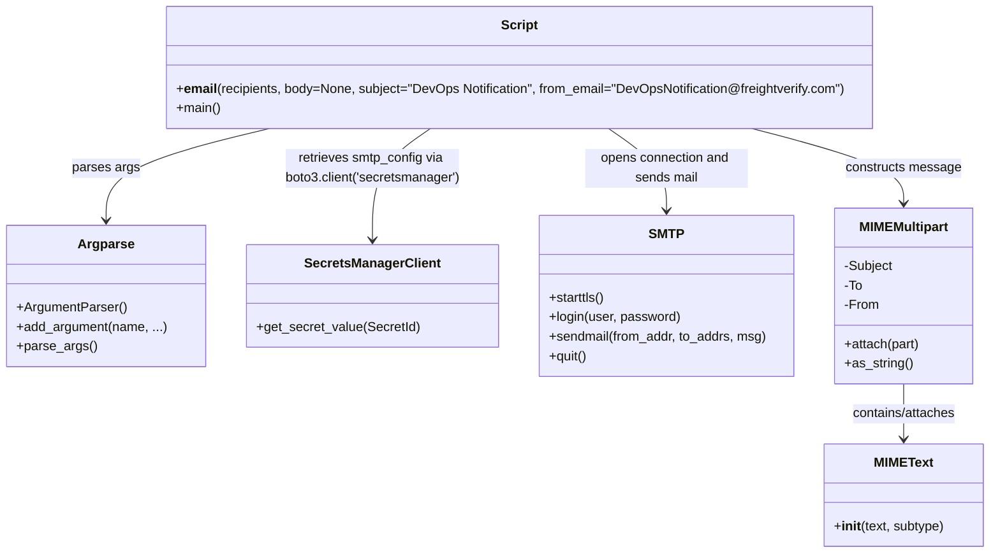
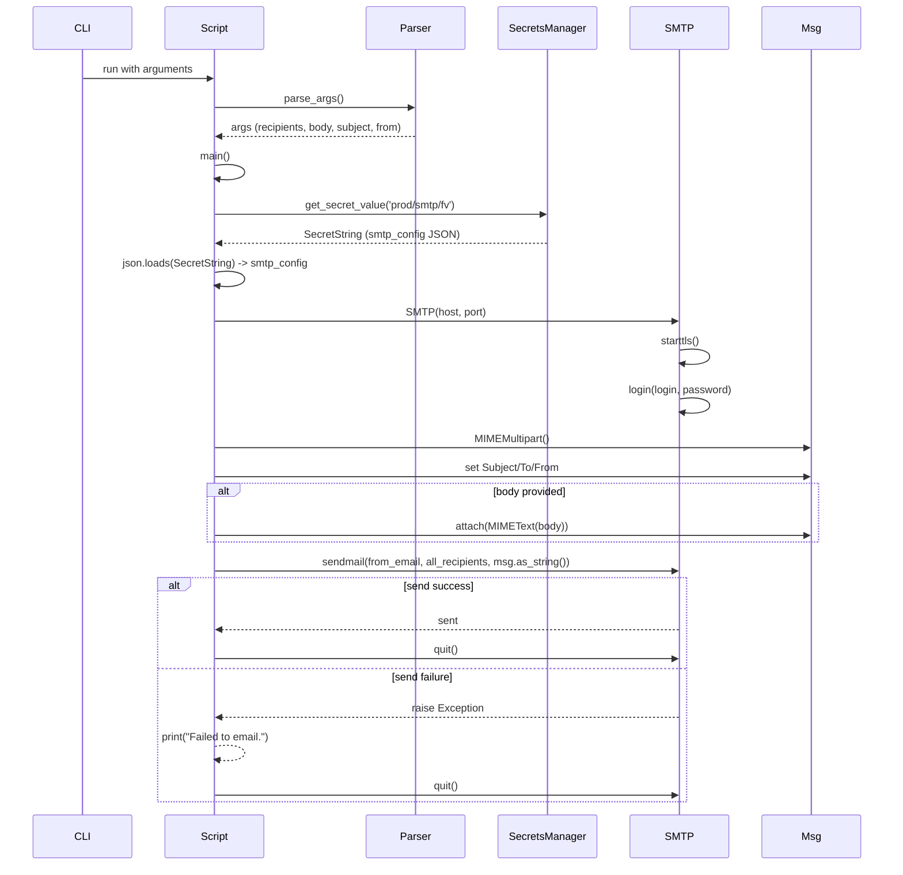

# Diagram: devops/util/email_utility/email_utility.py


> Auto-generated by Obscura crawlers

## Diagram 1

```mermaid
flowchart TD
    CLI[CLI Args: --recipients --body --subject --from] --> MAIN[main()]
    MAIN --> EMAIL[__email__()]
    EMAIL --> SECRETS[SecretsManager.get_secret_value('prod/smtp/fv')]
    SECRETS --> PARSE[json.loads(SecretString) -> smtp_config]
    EMAIL --> SMTP[smtplib.SMTP(host, port)]
    SMTP --> STARTTLS[starttls()]
    STARTTLS --> LOGIN[login(login, password)]
    LOGIN --> BUILD[MIMEMultipart msg (set Subject/To/From)]
    BUILD --> ATTACH{body is not None?}
    ATTACH -->|yes| ATTACH_TEXT[attach(MIMEText(body))]
    ATTACH -->|no| SKIP_ATTACH[skip attach]
    ATTACH_TEXT --> SEND[sendmail(from_email, all_recipients, msg.as_string())]
    SKIP_ATTACH --> SEND
    SEND --> QUIT[quit()]
    SEND -->|exception| FAIL[print("Failed to email.")]
```

> SVG rendering failed for this diagram.

## Diagram 2



### SVG

<svg id="container" width="1206.10546875" xmlns="http://www.w3.org/2000/svg" class="classDiagram" height="680" viewBox="0 0 1206.10546875 680" role="graphics-document document" aria-roledescription="class"><style>#container{font-family:"trebuchet ms",verdana,arial,sans-serif;font-size:16px;fill:#333;}@keyframes edge-animation-frame{from{stroke-dashoffset:0;}}@keyframes dash{to{stroke-dashoffset:0;}}#container .edge-animation-slow{stroke-dasharray:9,5!important;stroke-dashoffset:900;animation:dash 50s linear infinite;stroke-linecap:round;}#container .edge-animation-fast{stroke-dasharray:9,5!important;stroke-dashoffset:900;animation:dash 20s linear infinite;stroke-linecap:round;}#container .error-icon{fill:#552222;}#container .error-text{fill:#552222;stroke:#552222;}#container .edge-thickness-normal{stroke-width:1px;}#container .edge-thickness-thick{stroke-width:3.5px;}#container .edge-pattern-solid{stroke-dasharray:0;}#container .edge-thickness-invisible{stroke-width:0;fill:none;}#container .edge-pattern-dashed{stroke-dasharray:3;}#container .edge-pattern-dotted{stroke-dasharray:2;}#container .marker{fill:#333333;stroke:#333333;}#container .marker.cross{stroke:#333333;}#container svg{font-family:"trebuchet ms",verdana,arial,sans-serif;font-size:16px;}#container p{margin:0;}#container g.classGroup text{fill:#9370DB;stroke:none;font-family:"trebuchet ms",verdana,arial,sans-serif;font-size:10px;}#container g.classGroup text .title{font-weight:bolder;}#container .nodeLabel,#container .edgeLabel{color:#131300;}#container .edgeLabel .label rect{fill:#ECECFF;}#container .label text{fill:#131300;}#container .labelBkg{background:#ECECFF;}#container .edgeLabel .label span{background:#ECECFF;}#container .classTitle{font-weight:bolder;}#container .node rect,#container .node circle,#container .node ellipse,#container .node polygon,#container .node path{fill:#ECECFF;stroke:#9370DB;stroke-width:1px;}#container .divider{stroke:#9370DB;stroke-width:1;}#container g.clickable{cursor:pointer;}#container g.classGroup rect{fill:#ECECFF;stroke:#9370DB;}#container g.classGroup line{stroke:#9370DB;stroke-width:1;}#container .classLabel .box{stroke:none;stroke-width:0;fill:#ECECFF;opacity:0.5;}#container .classLabel .label{fill:#9370DB;font-size:10px;}#container .relation{stroke:#333333;stroke-width:1;fill:none;}#container .dashed-line{stroke-dasharray:3;}#container .dotted-line{stroke-dasharray:1 2;}#container #compositionStart,#container .composition{fill:#333333!important;stroke:#333333!important;stroke-width:1;}#container #compositionEnd,#container .composition{fill:#333333!important;stroke:#333333!important;stroke-width:1;}#container #dependencyStart,#container .dependency{fill:#333333!important;stroke:#333333!important;stroke-width:1;}#container #dependencyStart,#container .dependency{fill:#333333!important;stroke:#333333!important;stroke-width:1;}#container #extensionStart,#container .extension{fill:transparent!important;stroke:#333333!important;stroke-width:1;}#container #extensionEnd,#container .extension{fill:transparent!important;stroke:#333333!important;stroke-width:1;}#container #aggregationStart,#container .aggregation{fill:transparent!important;stroke:#333333!important;stroke-width:1;}#container #aggregationEnd,#container .aggregation{fill:transparent!important;stroke:#333333!important;stroke-width:1;}#container #lollipopStart,#container .lollipop{fill:#ECECFF!important;stroke:#333333!important;stroke-width:1;}#container #lollipopEnd,#container .lollipop{fill:#ECECFF!important;stroke:#333333!important;stroke-width:1;}#container .edgeTerminals{font-size:11px;line-height:initial;}#container .classTitleText{text-anchor:middle;font-size:18px;fill:#333;}#container .label-icon{display:inline-block;height:1em;overflow:visible;vertical-align:-0.125em;}#container .node .label-icon path{fill:currentColor;stroke:revert;stroke-width:revert;}#container :root{--mermaid-font-family:"trebuchet ms",verdana,arial,sans-serif;}</style><g><defs><marker id="container_class-aggregationStart" class="marker aggregation class" refX="18" refY="7" markerWidth="190" markerHeight="240" orient="auto"><path d="M 18,7 L9,13 L1,7 L9,1 Z"></path></marker></defs><defs><marker id="container_class-aggregationEnd" class="marker aggregation class" refX="1" refY="7" markerWidth="20" markerHeight="28" orient="auto"><path d="M 18,7 L9,13 L1,7 L9,1 Z"></path></marker></defs><defs><marker id="container_class-extensionStart" class="marker extension class" refX="18" refY="7" markerWidth="190" markerHeight="240" orient="auto"><path d="M 1,7 L18,13 V 1 Z"></path></marker></defs><defs><marker id="container_class-extensionEnd" class="marker extension class" refX="1" refY="7" markerWidth="20" markerHeight="28" orient="auto"><path d="M 1,1 V 13 L18,7 Z"></path></marker></defs><defs><marker id="container_class-compositionStart" class="marker composition class" refX="18" refY="7" markerWidth="190" markerHeight="240" orient="auto"><path d="M 18,7 L9,13 L1,7 L9,1 Z"></path></marker></defs><defs><marker id="container_class-compositionEnd" class="marker composition class" refX="1" refY="7" markerWidth="20" markerHeight="28" orient="auto"><path d="M 18,7 L9,13 L1,7 L9,1 Z"></path></marker></defs><defs><marker id="container_class-dependencyStart" class="marker dependency class" refX="6" refY="7" markerWidth="190" markerHeight="240" orient="auto"><path d="M 5,7 L9,13 L1,7 L9,1 Z"></path></marker></defs><defs><marker id="container_class-dependencyEnd" class="marker dependency class" refX="13" refY="7" markerWidth="20" markerHeight="28" orient="auto"><path d="M 18,7 L9,13 L14,7 L9,1 Z"></path></marker></defs><defs><marker id="container_class-lollipopStart" class="marker lollipop class" refX="13" refY="7" markerWidth="190" markerHeight="240" orient="auto"><circle stroke="black" fill="transparent" cx="7" cy="7" r="6"></circle></marker></defs><defs><marker id="container_class-lollipopEnd" class="marker lollipop class" refX="1" refY="7" markerWidth="190" markerHeight="240" orient="auto"><circle stroke="black" fill="transparent" cx="7" cy="7" r="6"></circle></marker></defs><g class="root"><g class="clusters"></g><g class="edgePaths"><path d="M326.159,158L293.16,166.167C260.161,174.333,194.162,190.667,161.163,209.5C128.164,228.333,128.164,249.667,128.164,260.333L128.164,271" id="id_Script_Argparse_1" class="edge-thickness-normal edge-pattern-solid relation" style=";;;" data-edge="true" data-et="edge" data-id="id_Script_Argparse_1" data-points="W3sieCI6MzI2LjE1OTE2MzkzNjQ5MTk1LCJ5IjoxNTh9LHsieCI6MTI4LjE2NDA2MjUsInkiOjIwN30seyJ4IjoxMjguMTY0MDYyNSwieSI6Mjc3fV0=" marker-end="url(#container_class-dependencyEnd)"></path><path d="M520.849,158L509.049,166.167C497.249,174.333,473.65,190.667,461.85,213.5C450.051,236.333,450.051,265.667,450.051,280.333L450.051,295" id="id_Script_SecretsManagerClient_2" class="edge-thickness-normal edge-pattern-solid relation" style=";;;" data-edge="true" data-et="edge" data-id="id_Script_SecretsManagerClient_2" data-points="W3sieCI6NTIwLjg0ODcxMTU2NzU0MDQsInkiOjE1OH0seyJ4Ijo0NTAuMDUwNzgxMjUsInkiOjIwN30seyJ4Ijo0NTAuMDUwNzgxMjUsInkiOjMwMX1d" marker-end="url(#container_class-dependencyEnd)"></path><path d="M737.577,158L749.377,166.167C761.176,174.333,784.776,190.667,796.575,207.5C808.375,224.333,808.375,241.667,808.375,250.333L808.375,259" id="id_Script_SMTP_3" class="edge-thickness-normal edge-pattern-solid relation" style=";;;" data-edge="true" data-et="edge" data-id="id_Script_SMTP_3" data-points="W3sieCI6NzM3LjU3NzA2OTY4MjQ1OTYsInkiOjE1OH0seyJ4Ijo4MDguMzc1LCJ5IjoyMDd9LHsieCI6ODA4LjM3NSwieSI6MjY1fV0=" marker-end="url(#container_class-dependencyEnd)"></path><path d="M914.275,158L945.315,166.167C976.355,174.333,1038.435,190.667,1069.476,206C1100.516,221.333,1100.516,235.667,1100.516,242.833L1100.516,250" id="id_Script_MIMEMultipart_4" class="edge-thickness-normal edge-pattern-solid relation" style=";;;" data-edge="true" data-et="edge" data-id="id_Script_MIMEMultipart_4" data-points="W3sieCI6OTE0LjI3NTAyODM1MTgxNDUsInkiOjE1OH0seyJ4IjoxMTAwLjUxNTYyNSwieSI6MjA3fSx7IngiOjExMDAuNTE1NjI1LCJ5IjoyNTZ9XQ==" marker-end="url(#container_class-dependencyEnd)"></path><path d="M1100.516,472L1100.516,478.167C1100.516,484.333,1100.516,496.667,1100.516,508C1100.516,519.333,1100.516,529.667,1100.516,534.833L1100.516,540" id="id_MIMEMultipart_MIMEText_5" class="edge-thickness-normal edge-pattern-solid relation" style=";;;" data-edge="true" data-et="edge" data-id="id_MIMEMultipart_MIMEText_5" data-points="W3sieCI6MTEwMC41MTU2MjUsInkiOjQ3Mn0seyJ4IjoxMTAwLjUxNTYyNSwieSI6NTA5fSx7IngiOjExMDAuNTE1NjI1LCJ5Ijo1NDZ9XQ==" marker-end="url(#container_class-dependencyEnd)"></path></g><g class="edgeLabels"><g class="edgeLabel" transform="translate(128.1640625, 207)"><g class="label" data-id="id_Script_Argparse_1" transform="translate(-41.109375, -12)"><foreignObject width="82.21875" height="24"><div xmlns="http://www.w3.org/1999/xhtml" class="labelBkg" style="display: table-cell; white-space: nowrap; line-height: 1.5; max-width: 200px; text-align: center;"><span class="edgeLabel"><p>parses args</p></span></div></foreignObject></g></g><g class="edgeLabel" transform="translate(450.05078125, 207)"><g class="label" data-id="id_Script_SecretsManagerClient_2" transform="translate(-108.9375, -24)"><foreignObject width="217.875" height="48"><div xmlns="http://www.w3.org/1999/xhtml" class="labelBkg" style="display: table; white-space: break-spaces; line-height: 1.5; max-width: 200px; text-align: center; width: 200px;"><span class="edgeLabel"><p>retrieves smtp_config via boto3.client('secretsmanager')</p></span></div></foreignObject></g></g><g class="edgeLabel" transform="translate(808.375, 207)"><g class="label" data-id="id_Script_SMTP_3" transform="translate(-100, -24)"><foreignObject width="200" height="48"><div xmlns="http://www.w3.org/1999/xhtml" class="labelBkg" style="display: table; white-space: break-spaces; line-height: 1.5; max-width: 200px; text-align: center; width: 200px;"><span class="edgeLabel"><p>opens connection and sends mail</p></span></div></foreignObject></g></g><g class="edgeLabel" transform="translate(1100.515625, 207)"><g class="label" data-id="id_Script_MIMEMultipart_4" transform="translate(-71.15625, -12)"><foreignObject width="142.3125" height="24"><div xmlns="http://www.w3.org/1999/xhtml" class="labelBkg" style="display: table-cell; white-space: nowrap; line-height: 1.5; max-width: 200px; text-align: center;"><span class="edgeLabel"><p>constructs message</p></span></div></foreignObject></g></g><g class="edgeLabel" transform="translate(1100.515625, 509)"><g class="label" data-id="id_MIMEMultipart_MIMEText_5" transform="translate(-65.6875, -12)"><foreignObject width="131.375" height="24"><div xmlns="http://www.w3.org/1999/xhtml" class="labelBkg" style="display: table-cell; white-space: nowrap; line-height: 1.5; max-width: 200px; text-align: center;"><span class="edgeLabel"><p>contains/attaches</p></span></div></foreignObject></g></g></g><g class="nodes"><g class="node default" id="classId-Script-0" transform="translate(629.212890625, 83)"><g class="basic label-container"><path d="M-439.96484375 -75 L439.96484375 -75 L439.96484375 75 L-439.96484375 75" stroke="none" stroke-width="0" fill="#ECECFF" style=""></path><path d="M-439.96484375 -75 C-164.32233295676008 -75, 111.32017783647984 -75, 439.96484375 -75 M-439.96484375 -75 C-97.55661927202192 -75, 244.85160520595616 -75, 439.96484375 -75 M439.96484375 -75 C439.96484375 -19.098661894601292, 439.96484375 36.802676210797415, 439.96484375 75 M439.96484375 -75 C439.96484375 -36.36963406699023, 439.96484375 2.2607318660195403, 439.96484375 75 M439.96484375 75 C202.0539306233935 75, -35.856982503212976 75, -439.96484375 75 M439.96484375 75 C168.2042385840931 75, -103.55636658181379 75, -439.96484375 75 M-439.96484375 75 C-439.96484375 40.11129060664597, -439.96484375 5.222581213291946, -439.96484375 -75 M-439.96484375 75 C-439.96484375 17.548957615391956, -439.96484375 -39.90208476921609, -439.96484375 -75" stroke="#9370DB" stroke-width="1.3" fill="none" stroke-dasharray="0 0" style=""></path></g><g class="annotation-group text" transform="translate(0, -51)"></g><g class="label-group text" transform="translate(-21.7421875, -51)"><g class="label" style="font-weight: bolder" transform="translate(0,-12)"><foreignObject width="43.484375" height="24"><div xmlns="http://www.w3.org/1999/xhtml" style="display: table-cell; white-space: nowrap; line-height: 1.5; max-width: 93px; text-align: center;"><span class="nodeLabel markdown-node-label" style=""><p>Script</p></span></div></foreignObject></g></g><g class="members-group text" transform="translate(-427.96484375, -3)"></g><g class="methods-group text" transform="translate(-427.96484375, 27)"><g class="label" style="" transform="translate(0,-12)"><foreignObject width="834.1875" height="24"><div xmlns="http://www.w3.org/1999/xhtml" style="display: table-cell; white-space: nowrap; line-height: 1.5; max-width: 923px; text-align: center;"><span class="nodeLabel markdown-node-label" style=""><p>+<strong>email</strong>(recipients, body=None, subject="DevOps Notification", from_email="DevOpsNotification@freightverify.com")</p></span></div></foreignObject></g><g class="label" style="" transform="translate(0,12)"><foreignObject width="54.65625" height="24"><div xmlns="http://www.w3.org/1999/xhtml" style="display: table-cell; white-space: nowrap; line-height: 1.5; max-width: 112px; text-align: center;"><span class="nodeLabel markdown-node-label" style=""><p>+main()</p></span></div></foreignObject></g></g><g class="divider" style=""><path d="M-439.96484375 -27 C-235.49028263411438 -27, -31.01572151822876 -27, 439.96484375 -27 M-439.96484375 -27 C-173.07280697746478 -27, 93.81922979507044 -27, 439.96484375 -27" stroke="#9370DB" stroke-width="1.3" fill="none" stroke-dasharray="0 0" style=""></path></g><g class="divider" style=""><path d="M-439.96484375 -3 C-112.24946376184289 -3, 215.46591622631422 -3, 439.96484375 -3 M-439.96484375 -3 C-182.16273878809017 -3, 75.63936617381967 -3, 439.96484375 -3" stroke="#9370DB" stroke-width="1.3" fill="none" stroke-dasharray="0 0" style=""></path></g></g><g class="node default" id="classId-Argparse-1" transform="translate(128.1640625, 364)"><g class="basic label-container"><path d="M-120.1640625 -87 L120.1640625 -87 L120.1640625 87 L-120.1640625 87" stroke="none" stroke-width="0" fill="#ECECFF" style=""></path><path d="M-120.1640625 -87 C-36.094675834581494 -87, 47.97471083083701 -87, 120.1640625 -87 M-120.1640625 -87 C-42.81984632055034 -87, 34.52436985889932 -87, 120.1640625 -87 M120.1640625 -87 C120.1640625 -33.32738778621264, 120.1640625 20.34522442757472, 120.1640625 87 M120.1640625 -87 C120.1640625 -19.50598802673356, 120.1640625 47.98802394653288, 120.1640625 87 M120.1640625 87 C65.96631881956677 87, 11.768575139133517 87, -120.1640625 87 M120.1640625 87 C35.241279627724666 87, -49.68150324455067 87, -120.1640625 87 M-120.1640625 87 C-120.1640625 18.214270872827356, -120.1640625 -50.57145825434529, -120.1640625 -87 M-120.1640625 87 C-120.1640625 37.484689243577776, -120.1640625 -12.030621512844448, -120.1640625 -87" stroke="#9370DB" stroke-width="1.3" fill="none" stroke-dasharray="0 0" style=""></path></g><g class="annotation-group text" transform="translate(0, -63)"></g><g class="label-group text" transform="translate(-32.71875, -63)"><g class="label" style="font-weight: bolder" transform="translate(0,-12)"><foreignObject width="65.4375" height="24"><div xmlns="http://www.w3.org/1999/xhtml" style="display: table-cell; white-space: nowrap; line-height: 1.5; max-width: 114px; text-align: center;"><span class="nodeLabel markdown-node-label" style=""><p>Argparse</p></span></div></foreignObject></g></g><g class="members-group text" transform="translate(-108.1640625, -15)"></g><g class="methods-group text" transform="translate(-108.1640625, 15)"><g class="label" style="" transform="translate(0,-12)"><foreignObject width="133.78125" height="24"><div xmlns="http://www.w3.org/1999/xhtml" style="display: table-cell; white-space: nowrap; line-height: 1.5; max-width: 191px; text-align: center;"><span class="nodeLabel markdown-node-label" style=""><p>+ArgumentParser()</p></span></div></foreignObject></g><g class="label" style="" transform="translate(0,12)"><foreignObject width="183.609375" height="24"><div xmlns="http://www.w3.org/1999/xhtml" style="display: table-cell; white-space: nowrap; line-height: 1.5; max-width: 241px; text-align: center;"><span class="nodeLabel markdown-node-label" style=""><p>+add_argument(name, ...)</p></span></div></foreignObject></g><g class="label" style="" transform="translate(0,36)"><foreignObject width="96.53125" height="24"><div xmlns="http://www.w3.org/1999/xhtml" style="display: table-cell; white-space: nowrap; line-height: 1.5; max-width: 154px; text-align: center;"><span class="nodeLabel markdown-node-label" style=""><p>+parse_args()</p></span></div></foreignObject></g></g><g class="divider" style=""><path d="M-120.1640625 -39 C-50.20836313183561 -39, 19.747336236328778 -39, 120.1640625 -39 M-120.1640625 -39 C-54.55029224258318 -39, 11.063478014833635 -39, 120.1640625 -39" stroke="#9370DB" stroke-width="1.3" fill="none" stroke-dasharray="0 0" style=""></path></g><g class="divider" style=""><path d="M-120.1640625 -15 C-29.08780765041591 -15, 61.98844719916818 -15, 120.1640625 -15 M-120.1640625 -15 C-34.0727045250392 -15, 52.0186534499216 -15, 120.1640625 -15" stroke="#9370DB" stroke-width="1.3" fill="none" stroke-dasharray="0 0" style=""></path></g></g><g class="node default" id="classId-SecretsManagerClient-2" transform="translate(450.05078125, 364)"><g class="basic label-container"><path d="M-151.72265625 -63 L151.72265625 -63 L151.72265625 63 L-151.72265625 63" stroke="none" stroke-width="0" fill="#ECECFF" style=""></path><path d="M-151.72265625 -63 C-82.8862743073126 -63, -14.049892364625208 -63, 151.72265625 -63 M-151.72265625 -63 C-40.96455425749687 -63, 69.79354773500626 -63, 151.72265625 -63 M151.72265625 -63 C151.72265625 -24.856350944310122, 151.72265625 13.287298111379755, 151.72265625 63 M151.72265625 -63 C151.72265625 -27.74821106994191, 151.72265625 7.503577860116181, 151.72265625 63 M151.72265625 63 C86.82504042710154 63, 21.927424604203082 63, -151.72265625 63 M151.72265625 63 C59.034699430373905 63, -33.65325738925219 63, -151.72265625 63 M-151.72265625 63 C-151.72265625 26.227118032048125, -151.72265625 -10.54576393590375, -151.72265625 -63 M-151.72265625 63 C-151.72265625 30.9929499198046, -151.72265625 -1.0141001603907966, -151.72265625 -63" stroke="#9370DB" stroke-width="1.3" fill="none" stroke-dasharray="0 0" style=""></path></g><g class="annotation-group text" transform="translate(0, -39)"></g><g class="label-group text" transform="translate(-79.8828125, -39)"><g class="label" style="font-weight: bolder" transform="translate(0,-12)"><foreignObject width="159.765625" height="24"><div xmlns="http://www.w3.org/1999/xhtml" style="display: table-cell; white-space: nowrap; line-height: 1.5; max-width: 207px; text-align: center;"><span class="nodeLabel markdown-node-label" style=""><p>SecretsManagerClient</p></span></div></foreignObject></g></g><g class="members-group text" transform="translate(-139.72265625, 9)"></g><g class="methods-group text" transform="translate(-139.72265625, 39)"><g class="label" style="" transform="translate(0,-12)"><foreignObject width="199.5625" height="24"><div xmlns="http://www.w3.org/1999/xhtml" style="display: table-cell; white-space: nowrap; line-height: 1.5; max-width: 257px; text-align: center;"><span class="nodeLabel markdown-node-label" style=""><p>+get_secret_value(SecretId)</p></span></div></foreignObject></g></g><g class="divider" style=""><path d="M-151.72265625 -15 C-78.29146425277527 -15, -4.860272255550541 -15, 151.72265625 -15 M-151.72265625 -15 C-64.23018115503551 -15, 23.26229393992898 -15, 151.72265625 -15" stroke="#9370DB" stroke-width="1.3" fill="none" stroke-dasharray="0 0" style=""></path></g><g class="divider" style=""><path d="M-151.72265625 9 C-30.83483696339168 9, 90.05298232321664 9, 151.72265625 9 M-151.72265625 9 C-60.442425659586064 9, 30.837804930827872 9, 151.72265625 9" stroke="#9370DB" stroke-width="1.3" fill="none" stroke-dasharray="0 0" style=""></path></g></g><g class="node default" id="classId-SMTP-3" transform="translate(808.375, 364)"><g class="basic label-container"><path d="M-156.6015625 -99 L156.6015625 -99 L156.6015625 99 L-156.6015625 99" stroke="none" stroke-width="0" fill="#ECECFF" style=""></path><path d="M-156.6015625 -99 C-40.02511214049184 -99, 76.55133821901632 -99, 156.6015625 -99 M-156.6015625 -99 C-37.55229404703914 -99, 81.49697440592172 -99, 156.6015625 -99 M156.6015625 -99 C156.6015625 -30.7766637005373, 156.6015625 37.4466725989254, 156.6015625 99 M156.6015625 -99 C156.6015625 -35.46742746555841, 156.6015625 28.065145068883183, 156.6015625 99 M156.6015625 99 C78.74009809442826 99, 0.8786336888565245 99, -156.6015625 99 M156.6015625 99 C64.32153946709728 99, -27.958483565805437 99, -156.6015625 99 M-156.6015625 99 C-156.6015625 30.82781509346823, -156.6015625 -37.34436981306354, -156.6015625 -99 M-156.6015625 99 C-156.6015625 46.037496159269665, -156.6015625 -6.92500768146067, -156.6015625 -99" stroke="#9370DB" stroke-width="1.3" fill="none" stroke-dasharray="0 0" style=""></path></g><g class="annotation-group text" transform="translate(0, -75)"></g><g class="label-group text" transform="translate(-19.765625, -75)"><g class="label" style="font-weight: bolder" transform="translate(0,-12)"><foreignObject width="39.53125" height="24"><div xmlns="http://www.w3.org/1999/xhtml" style="display: table-cell; white-space: nowrap; line-height: 1.5; max-width: 88px; text-align: center;"><span class="nodeLabel markdown-node-label" style=""><p>SMTP</p></span></div></foreignObject></g></g><g class="members-group text" transform="translate(-144.6015625, -27)"></g><g class="methods-group text" transform="translate(-144.6015625, 3)"><g class="label" style="" transform="translate(0,-12)"><foreignObject width="69.921875" height="24"><div xmlns="http://www.w3.org/1999/xhtml" style="display: table-cell; white-space: nowrap; line-height: 1.5; max-width: 127px; text-align: center;"><span class="nodeLabel markdown-node-label" style=""><p>+starttls()</p></span></div></foreignObject></g><g class="label" style="" transform="translate(0,12)"><foreignObject width="161.640625" height="24"><div xmlns="http://www.w3.org/1999/xhtml" style="display: table-cell; white-space: nowrap; line-height: 1.5; max-width: 219px; text-align: center;"><span class="nodeLabel markdown-node-label" style=""><p>+login(user, password)</p></span></div></foreignObject></g><g class="label" style="" transform="translate(0,36)"><foreignObject width="269.4375" height="24"><div xmlns="http://www.w3.org/1999/xhtml" style="display: table-cell; white-space: nowrap; line-height: 1.5; max-width: 327px; text-align: center;"><span class="nodeLabel markdown-node-label" style=""><p>+sendmail(from_addr, to_addrs, msg)</p></span></div></foreignObject></g><g class="label" style="" transform="translate(0,60)"><foreignObject width="47.53125" height="24"><div xmlns="http://www.w3.org/1999/xhtml" style="display: table-cell; white-space: nowrap; line-height: 1.5; max-width: 105px; text-align: center;"><span class="nodeLabel markdown-node-label" style=""><p>+quit()</p></span></div></foreignObject></g></g><g class="divider" style=""><path d="M-156.6015625 -51 C-87.7562765702173 -51, -18.91099064043459 -51, 156.6015625 -51 M-156.6015625 -51 C-71.4342583641224 -51, 13.7330457717552 -51, 156.6015625 -51" stroke="#9370DB" stroke-width="1.3" fill="none" stroke-dasharray="0 0" style=""></path></g><g class="divider" style=""><path d="M-156.6015625 -27 C-32.83754783365637 -27, 90.92646683268725 -27, 156.6015625 -27 M-156.6015625 -27 C-88.03635525415486 -27, -19.47114800830971 -27, 156.6015625 -27" stroke="#9370DB" stroke-width="1.3" fill="none" stroke-dasharray="0 0" style=""></path></g></g><g class="node default" id="classId-MIMEMultipart-4" transform="translate(1100.515625, 364)"><g class="basic label-container"><path d="M-85.5390625 -108 L85.5390625 -108 L85.5390625 108 L-85.5390625 108" stroke="none" stroke-width="0" fill="#ECECFF" style=""></path><path d="M-85.5390625 -108 C-31.63725946353 -108, 22.26454357294 -108, 85.5390625 -108 M-85.5390625 -108 C-37.12911754607298 -108, 11.280827407854034 -108, 85.5390625 -108 M85.5390625 -108 C85.5390625 -59.41882191158415, 85.5390625 -10.837643823168307, 85.5390625 108 M85.5390625 -108 C85.5390625 -58.06235081678645, 85.5390625 -8.124701633572897, 85.5390625 108 M85.5390625 108 C33.35667212850503 108, -18.825718242989936 108, -85.5390625 108 M85.5390625 108 C29.39818710465191 108, -26.74268829069618 108, -85.5390625 108 M-85.5390625 108 C-85.5390625 53.51760305450738, -85.5390625 -0.9647938909852343, -85.5390625 -108 M-85.5390625 108 C-85.5390625 25.40338246879938, -85.5390625 -57.19323506240124, -85.5390625 -108" stroke="#9370DB" stroke-width="1.3" fill="none" stroke-dasharray="0 0" style=""></path></g><g class="annotation-group text" transform="translate(0, -84)"></g><g class="label-group text" transform="translate(-53.09375, -84)"><g class="label" style="font-weight: bolder" transform="translate(0,-12)"><foreignObject width="106.1875" height="24"><div xmlns="http://www.w3.org/1999/xhtml" style="display: table-cell; white-space: nowrap; line-height: 1.5; max-width: 155px; text-align: center;"><span class="nodeLabel markdown-node-label" style=""><p>MIMEMultipart</p></span></div></foreignObject></g></g><g class="members-group text" transform="translate(-73.5390625, -36)"><g class="label" style="" transform="translate(0,-12)"><foreignObject width="59.96875" height="24"><div xmlns="http://www.w3.org/1999/xhtml" style="display: table-cell; white-space: nowrap; line-height: 1.5; max-width: 118px; text-align: center;"><span class="nodeLabel markdown-node-label" style=""><p>-Subject</p></span></div></foreignObject></g><g class="label" style="" transform="translate(0,12)"><foreignObject width="22.390625" height="24"><div xmlns="http://www.w3.org/1999/xhtml" style="display: table-cell; white-space: nowrap; line-height: 1.5; max-width: 80px; text-align: center;"><span class="nodeLabel markdown-node-label" style=""><p>-To</p></span></div></foreignObject></g><g class="label" style="" transform="translate(0,36)"><foreignObject width="42.5" height="24"><div xmlns="http://www.w3.org/1999/xhtml" style="display: table-cell; white-space: nowrap; line-height: 1.5; max-width: 100px; text-align: center;"><span class="nodeLabel markdown-node-label" style=""><p>-From</p></span></div></foreignObject></g></g><g class="methods-group text" transform="translate(-73.5390625, 60)"><g class="label" style="" transform="translate(0,-12)"><foreignObject width="93.984375" height="24"><div xmlns="http://www.w3.org/1999/xhtml" style="display: table-cell; white-space: nowrap; line-height: 1.5; max-width: 151px; text-align: center;"><span class="nodeLabel markdown-node-label" style=""><p>+attach(part)</p></span></div></foreignObject></g><g class="label" style="" transform="translate(0,12)"><foreignObject width="83.765625" height="24"><div xmlns="http://www.w3.org/1999/xhtml" style="display: table-cell; white-space: nowrap; line-height: 1.5; max-width: 141px; text-align: center;"><span class="nodeLabel markdown-node-label" style=""><p>+as_string()</p></span></div></foreignObject></g></g><g class="divider" style=""><path d="M-85.5390625 -60 C-22.498796798759848 -60, 40.541468902480304 -60, 85.5390625 -60 M-85.5390625 -60 C-44.75056058577143 -60, -3.962058671542863 -60, 85.5390625 -60" stroke="#9370DB" stroke-width="1.3" fill="none" stroke-dasharray="0 0" style=""></path></g><g class="divider" style=""><path d="M-85.5390625 36 C-18.108658795814378 36, 49.321744908371244 36, 85.5390625 36 M-85.5390625 36 C-20.92106173499785 36, 43.6969390300043 36, 85.5390625 36" stroke="#9370DB" stroke-width="1.3" fill="none" stroke-dasharray="0 0" style=""></path></g></g><g class="node default" id="classId-MIMEText-5" transform="translate(1100.515625, 609)"><g class="basic label-container"><path d="M-97.58984375 -63 L97.58984375 -63 L97.58984375 63 L-97.58984375 63" stroke="none" stroke-width="0" fill="#ECECFF" style=""></path><path d="M-97.58984375 -63 C-37.87398199336355 -63, 21.8418797632729 -63, 97.58984375 -63 M-97.58984375 -63 C-50.822372337073766 -63, -4.054900924147532 -63, 97.58984375 -63 M97.58984375 -63 C97.58984375 -15.10623838026926, 97.58984375 32.78752323946148, 97.58984375 63 M97.58984375 -63 C97.58984375 -35.39581234190511, 97.58984375 -7.791624683810234, 97.58984375 63 M97.58984375 63 C33.17681567405904 63, -31.236212401881915 63, -97.58984375 63 M97.58984375 63 C28.8488488479789 63, -39.8921460540422 63, -97.58984375 63 M-97.58984375 63 C-97.58984375 25.044851765714448, -97.58984375 -12.910296468571104, -97.58984375 -63 M-97.58984375 63 C-97.58984375 33.999225196562634, -97.58984375 4.998450393125275, -97.58984375 -63" stroke="#9370DB" stroke-width="1.3" fill="none" stroke-dasharray="0 0" style=""></path></g><g class="annotation-group text" transform="translate(0, -39)"></g><g class="label-group text" transform="translate(-34.5078125, -39)"><g class="label" style="font-weight: bolder" transform="translate(0,-12)"><foreignObject width="69.015625" height="24"><div xmlns="http://www.w3.org/1999/xhtml" style="display: table-cell; white-space: nowrap; line-height: 1.5; max-width: 118px; text-align: center;"><span class="nodeLabel markdown-node-label" style=""><p>MIMEText</p></span></div></foreignObject></g></g><g class="members-group text" transform="translate(-85.58984375, 9)"></g><g class="methods-group text" transform="translate(-85.58984375, 39)"><g class="label" style="" transform="translate(0,-12)"><foreignObject width="136.671875" height="24"><div xmlns="http://www.w3.org/1999/xhtml" style="display: table-cell; white-space: nowrap; line-height: 1.5; max-width: 225px; text-align: center;"><span class="nodeLabel markdown-node-label" style=""><p>+<strong>init</strong>(text, subtype)</p></span></div></foreignObject></g></g><g class="divider" style=""><path d="M-97.58984375 -15 C-32.360530000027765 -15, 32.86878374994447 -15, 97.58984375 -15 M-97.58984375 -15 C-31.676601189165538 -15, 34.236641371668924 -15, 97.58984375 -15" stroke="#9370DB" stroke-width="1.3" fill="none" stroke-dasharray="0 0" style=""></path></g><g class="divider" style=""><path d="M-97.58984375 9 C-34.329277506943384 9, 28.93128873611323 9, 97.58984375 9 M-97.58984375 9 C-48.765168427394485 9, 0.05950689521102959 9, 97.58984375 9" stroke="#9370DB" stroke-width="1.3" fill="none" stroke-dasharray="0 0" style=""></path></g></g></g></g></g></svg>

## Diagram 3



### SVG

<svg id="container" width="1396" xmlns="http://www.w3.org/2000/svg" height="1388" viewBox="-50 -10 1396 1388" role="graphics-document document" aria-roledescription="sequence"><g><rect x="1146" y="1302" fill="#eaeaea" stroke="#666" width="150" height="65" name="Msg" rx="3" ry="3" class="actor actor-bottom"></rect><text x="1221" y="1334.5" dominant-baseline="central" alignment-baseline="central" class="actor actor-box" style="text-anchor: middle; font-size: 16px; font-weight: 400;"><tspan x="1221" dy="0">Msg</tspan></text></g><g><rect x="946" y="1302" fill="#eaeaea" stroke="#666" width="150" height="65" name="SMTP" rx="3" ry="3" class="actor actor-bottom"></rect><text x="1021" y="1334.5" dominant-baseline="central" alignment-baseline="central" class="actor actor-box" style="text-anchor: middle; font-size: 16px; font-weight: 400;"><tspan x="1021" dy="0">SMTP</tspan></text></g><g><rect x="746" y="1302" fill="#eaeaea" stroke="#666" width="150" height="65" name="SecretsManager" rx="3" ry="3" class="actor actor-bottom"></rect><text x="821" y="1334.5" dominant-baseline="central" alignment-baseline="central" class="actor actor-box" style="text-anchor: middle; font-size: 16px; font-weight: 400;"><tspan x="821" dy="0">SecretsManager</tspan></text></g><g><rect x="546" y="1302" fill="#eaeaea" stroke="#666" width="150" height="65" name="Parser" rx="3" ry="3" class="actor actor-bottom"></rect><text x="621" y="1334.5" dominant-baseline="central" alignment-baseline="central" class="actor actor-box" style="text-anchor: middle; font-size: 16px; font-weight: 400;"><tspan x="621" dy="0">Parser</tspan></text></g><g><rect x="212" y="1302" fill="#eaeaea" stroke="#666" width="150" height="65" name="Script" rx="3" ry="3" class="actor actor-bottom"></rect><text x="287" y="1334.5" dominant-baseline="central" alignment-baseline="central" class="actor actor-box" style="text-anchor: middle; font-size: 16px; font-weight: 400;"><tspan x="287" dy="0">Script</tspan></text></g><g><rect x="0" y="1302" fill="#eaeaea" stroke="#666" width="150" height="65" name="CLI" rx="3" ry="3" class="actor actor-bottom"></rect><text x="75" y="1334.5" dominant-baseline="central" alignment-baseline="central" class="actor actor-box" style="text-anchor: middle; font-size: 16px; font-weight: 400;"><tspan x="75" dy="0">CLI</tspan></text></g><g><line id="actor5" x1="1221" y1="65" x2="1221" y2="1302" class="actor-line 200" stroke-width="0.5px" stroke="#999" name="Msg"></line><g id="root-5"><rect x="1146" y="0" fill="#eaeaea" stroke="#666" width="150" height="65" name="Msg" rx="3" ry="3" class="actor actor-top"></rect><text x="1221" y="32.5" dominant-baseline="central" alignment-baseline="central" class="actor actor-box" style="text-anchor: middle; font-size: 16px; font-weight: 400;"><tspan x="1221" dy="0">Msg</tspan></text></g></g><g><line id="actor4" x1="1021" y1="65" x2="1021" y2="1302" class="actor-line 200" stroke-width="0.5px" stroke="#999" name="SMTP"></line><g id="root-4"><rect x="946" y="0" fill="#eaeaea" stroke="#666" width="150" height="65" name="SMTP" rx="3" ry="3" class="actor actor-top"></rect><text x="1021" y="32.5" dominant-baseline="central" alignment-baseline="central" class="actor actor-box" style="text-anchor: middle; font-size: 16px; font-weight: 400;"><tspan x="1021" dy="0">SMTP</tspan></text></g></g><g><line id="actor3" x1="821" y1="65" x2="821" y2="1302" class="actor-line 200" stroke-width="0.5px" stroke="#999" name="SecretsManager"></line><g id="root-3"><rect x="746" y="0" fill="#eaeaea" stroke="#666" width="150" height="65" name="SecretsManager" rx="3" ry="3" class="actor actor-top"></rect><text x="821" y="32.5" dominant-baseline="central" alignment-baseline="central" class="actor actor-box" style="text-anchor: middle; font-size: 16px; font-weight: 400;"><tspan x="821" dy="0">SecretsManager</tspan></text></g></g><g><line id="actor2" x1="621" y1="65" x2="621" y2="1302" class="actor-line 200" stroke-width="0.5px" stroke="#999" name="Parser"></line><g id="root-2"><rect x="546" y="0" fill="#eaeaea" stroke="#666" width="150" height="65" name="Parser" rx="3" ry="3" class="actor actor-top"></rect><text x="621" y="32.5" dominant-baseline="central" alignment-baseline="central" class="actor actor-box" style="text-anchor: middle; font-size: 16px; font-weight: 400;"><tspan x="621" dy="0">Parser</tspan></text></g></g><g><line id="actor1" x1="287" y1="65" x2="287" y2="1302" class="actor-line 200" stroke-width="0.5px" stroke="#999" name="Script"></line><g id="root-1"><rect x="212" y="0" fill="#eaeaea" stroke="#666" width="150" height="65" name="Script" rx="3" ry="3" class="actor actor-top"></rect><text x="287" y="32.5" dominant-baseline="central" alignment-baseline="central" class="actor actor-box" style="text-anchor: middle; font-size: 16px; font-weight: 400;"><tspan x="287" dy="0">Script</tspan></text></g></g><g><line id="actor0" x1="75" y1="65" x2="75" y2="1302" class="actor-line 200" stroke-width="0.5px" stroke="#999" name="CLI"></line><g id="root-0"><rect x="0" y="0" fill="#eaeaea" stroke="#666" width="150" height="65" name="CLI" rx="3" ry="3" class="actor actor-top"></rect><text x="75" y="32.5" dominant-baseline="central" alignment-baseline="central" class="actor actor-box" style="text-anchor: middle; font-size: 16px; font-weight: 400;"><tspan x="75" dy="0">CLI</tspan></text></g></g><style>#container{font-family:"trebuchet ms",verdana,arial,sans-serif;font-size:16px;fill:#333;}@keyframes edge-animation-frame{from{stroke-dashoffset:0;}}@keyframes dash{to{stroke-dashoffset:0;}}#container .edge-animation-slow{stroke-dasharray:9,5!important;stroke-dashoffset:900;animation:dash 50s linear infinite;stroke-linecap:round;}#container .edge-animation-fast{stroke-dasharray:9,5!important;stroke-dashoffset:900;animation:dash 20s linear infinite;stroke-linecap:round;}#container .error-icon{fill:#552222;}#container .error-text{fill:#552222;stroke:#552222;}#container .edge-thickness-normal{stroke-width:1px;}#container .edge-thickness-thick{stroke-width:3.5px;}#container .edge-pattern-solid{stroke-dasharray:0;}#container .edge-thickness-invisible{stroke-width:0;fill:none;}#container .edge-pattern-dashed{stroke-dasharray:3;}#container .edge-pattern-dotted{stroke-dasharray:2;}#container .marker{fill:#333333;stroke:#333333;}#container .marker.cross{stroke:#333333;}#container svg{font-family:"trebuchet ms",verdana,arial,sans-serif;font-size:16px;}#container p{margin:0;}#container .actor{stroke:hsl(259.6261682243, 59.7765363128%, 87.9019607843%);fill:#ECECFF;}#container text.actor&gt;tspan{fill:black;stroke:none;}#container .actor-line{stroke:hsl(259.6261682243, 59.7765363128%, 87.9019607843%);}#container .innerArc{stroke-width:1.5;stroke-dasharray:none;}#container .messageLine0{stroke-width:1.5;stroke-dasharray:none;stroke:#333;}#container .messageLine1{stroke-width:1.5;stroke-dasharray:2,2;stroke:#333;}#container #arrowhead path{fill:#333;stroke:#333;}#container .sequenceNumber{fill:white;}#container #sequencenumber{fill:#333;}#container #crosshead path{fill:#333;stroke:#333;}#container .messageText{fill:#333;stroke:none;}#container .labelBox{stroke:hsl(259.6261682243, 59.7765363128%, 87.9019607843%);fill:#ECECFF;}#container .labelText,#container .labelText&gt;tspan{fill:black;stroke:none;}#container .loopText,#container .loopText&gt;tspan{fill:black;stroke:none;}#container .loopLine{stroke-width:2px;stroke-dasharray:2,2;stroke:hsl(259.6261682243, 59.7765363128%, 87.9019607843%);fill:hsl(259.6261682243, 59.7765363128%, 87.9019607843%);}#container .note{stroke:#aaaa33;fill:#fff5ad;}#container .noteText,#container .noteText&gt;tspan{fill:black;stroke:none;}#container .activation0{fill:#f4f4f4;stroke:#666;}#container .activation1{fill:#f4f4f4;stroke:#666;}#container .activation2{fill:#f4f4f4;stroke:#666;}#container .actorPopupMenu{position:absolute;}#container .actorPopupMenuPanel{position:absolute;fill:#ECECFF;box-shadow:0px 8px 16px 0px rgba(0,0,0,0.2);filter:drop-shadow(3px 5px 2px rgb(0 0 0 / 0.4));}#container .actor-man line{stroke:hsl(259.6261682243, 59.7765363128%, 87.9019607843%);fill:#ECECFF;}#container .actor-man circle,#container line{stroke:hsl(259.6261682243, 59.7765363128%, 87.9019607843%);fill:#ECECFF;stroke-width:2px;}#container :root{--mermaid-font-family:"trebuchet ms",verdana,arial,sans-serif;}</style><g></g><defs><symbol id="computer" width="24" height="24"><path transform="scale(.5)" d="M2 2v13h20v-13h-20zm18 11h-16v-9h16v9zm-10.228 6l.466-1h3.524l.467 1h-4.457zm14.228 3h-24l2-6h2.104l-1.33 4h18.45l-1.297-4h2.073l2 6zm-5-10h-14v-7h14v7z"></path></symbol></defs><defs><symbol id="database" fill-rule="evenodd" clip-rule="evenodd"><path transform="scale(.5)" d="M12.258.001l.256.004.255.005.253.008.251.01.249.012.247.015.246.016.242.019.241.02.239.023.236.024.233.027.231.028.229.031.225.032.223.034.22.036.217.038.214.04.211.041.208.043.205.045.201.046.198.048.194.05.191.051.187.053.183.054.18.056.175.057.172.059.168.06.163.061.16.063.155.064.15.066.074.033.073.033.071.034.07.034.069.035.068.035.067.035.066.035.064.036.064.036.062.036.06.036.06.037.058.037.058.037.055.038.055.038.053.038.052.038.051.039.05.039.048.039.047.039.045.04.044.04.043.04.041.04.04.041.039.041.037.041.036.041.034.041.033.042.032.042.03.042.029.042.027.042.026.043.024.043.023.043.021.043.02.043.018.044.017.043.015.044.013.044.012.044.011.045.009.044.007.045.006.045.004.045.002.045.001.045v17l-.001.045-.002.045-.004.045-.006.045-.007.045-.009.044-.011.045-.012.044-.013.044-.015.044-.017.043-.018.044-.02.043-.021.043-.023.043-.024.043-.026.043-.027.042-.029.042-.03.042-.032.042-.033.042-.034.041-.036.041-.037.041-.039.041-.04.041-.041.04-.043.04-.044.04-.045.04-.047.039-.048.039-.05.039-.051.039-.052.038-.053.038-.055.038-.055.038-.058.037-.058.037-.06.037-.06.036-.062.036-.064.036-.064.036-.066.035-.067.035-.068.035-.069.035-.07.034-.071.034-.073.033-.074.033-.15.066-.155.064-.16.063-.163.061-.168.06-.172.059-.175.057-.18.056-.183.054-.187.053-.191.051-.194.05-.198.048-.201.046-.205.045-.208.043-.211.041-.214.04-.217.038-.22.036-.223.034-.225.032-.229.031-.231.028-.233.027-.236.024-.239.023-.241.02-.242.019-.246.016-.247.015-.249.012-.251.01-.253.008-.255.005-.256.004-.258.001-.258-.001-.256-.004-.255-.005-.253-.008-.251-.01-.249-.012-.247-.015-.245-.016-.243-.019-.241-.02-.238-.023-.236-.024-.234-.027-.231-.028-.228-.031-.226-.032-.223-.034-.22-.036-.217-.038-.214-.04-.211-.041-.208-.043-.204-.045-.201-.046-.198-.048-.195-.05-.19-.051-.187-.053-.184-.054-.179-.056-.176-.057-.172-.059-.167-.06-.164-.061-.159-.063-.155-.064-.151-.066-.074-.033-.072-.033-.072-.034-.07-.034-.069-.035-.068-.035-.067-.035-.066-.035-.064-.036-.063-.036-.062-.036-.061-.036-.06-.037-.058-.037-.057-.037-.056-.038-.055-.038-.053-.038-.052-.038-.051-.039-.049-.039-.049-.039-.046-.039-.046-.04-.044-.04-.043-.04-.041-.04-.04-.041-.039-.041-.037-.041-.036-.041-.034-.041-.033-.042-.032-.042-.03-.042-.029-.042-.027-.042-.026-.043-.024-.043-.023-.043-.021-.043-.02-.043-.018-.044-.017-.043-.015-.044-.013-.044-.012-.044-.011-.045-.009-.044-.007-.045-.006-.045-.004-.045-.002-.045-.001-.045v-17l.001-.045.002-.045.004-.045.006-.045.007-.045.009-.044.011-.045.012-.044.013-.044.015-.044.017-.043.018-.044.02-.043.021-.043.023-.043.024-.043.026-.043.027-.042.029-.042.03-.042.032-.042.033-.042.034-.041.036-.041.037-.041.039-.041.04-.041.041-.04.043-.04.044-.04.046-.04.046-.039.049-.039.049-.039.051-.039.052-.038.053-.038.055-.038.056-.038.057-.037.058-.037.06-.037.061-.036.062-.036.063-.036.064-.036.066-.035.067-.035.068-.035.069-.035.07-.034.072-.034.072-.033.074-.033.151-.066.155-.064.159-.063.164-.061.167-.06.172-.059.176-.057.179-.056.184-.054.187-.053.19-.051.195-.05.198-.048.201-.046.204-.045.208-.043.211-.041.214-.04.217-.038.22-.036.223-.034.226-.032.228-.031.231-.028.234-.027.236-.024.238-.023.241-.02.243-.019.245-.016.247-.015.249-.012.251-.01.253-.008.255-.005.256-.004.258-.001.258.001zm-9.258 20.499v.01l.001.021.003.021.004.022.005.021.006.022.007.022.009.023.01.022.011.023.012.023.013.023.015.023.016.024.017.023.018.024.019.024.021.024.022.025.023.024.024.025.052.049.056.05.061.051.066.051.07.051.075.051.079.052.084.052.088.052.092.052.097.052.102.051.105.052.11.052.114.051.119.051.123.051.127.05.131.05.135.05.139.048.144.049.147.047.152.047.155.047.16.045.163.045.167.043.171.043.176.041.178.041.183.039.187.039.19.037.194.035.197.035.202.033.204.031.209.03.212.029.216.027.219.025.222.024.226.021.23.02.233.018.236.016.24.015.243.012.246.01.249.008.253.005.256.004.259.001.26-.001.257-.004.254-.005.25-.008.247-.011.244-.012.241-.014.237-.016.233-.018.231-.021.226-.021.224-.024.22-.026.216-.027.212-.028.21-.031.205-.031.202-.034.198-.034.194-.036.191-.037.187-.039.183-.04.179-.04.175-.042.172-.043.168-.044.163-.045.16-.046.155-.046.152-.047.148-.048.143-.049.139-.049.136-.05.131-.05.126-.05.123-.051.118-.052.114-.051.11-.052.106-.052.101-.052.096-.052.092-.052.088-.053.083-.051.079-.052.074-.052.07-.051.065-.051.06-.051.056-.05.051-.05.023-.024.023-.025.021-.024.02-.024.019-.024.018-.024.017-.024.015-.023.014-.024.013-.023.012-.023.01-.023.01-.022.008-.022.006-.022.006-.022.004-.022.004-.021.001-.021.001-.021v-4.127l-.077.055-.08.053-.083.054-.085.053-.087.052-.09.052-.093.051-.095.05-.097.05-.1.049-.102.049-.105.048-.106.047-.109.047-.111.046-.114.045-.115.045-.118.044-.12.043-.122.042-.124.042-.126.041-.128.04-.13.04-.132.038-.134.038-.135.037-.138.037-.139.035-.142.035-.143.034-.144.033-.147.032-.148.031-.15.03-.151.03-.153.029-.154.027-.156.027-.158.026-.159.025-.161.024-.162.023-.163.022-.165.021-.166.02-.167.019-.169.018-.169.017-.171.016-.173.015-.173.014-.175.013-.175.012-.177.011-.178.01-.179.008-.179.008-.181.006-.182.005-.182.004-.184.003-.184.002h-.37l-.184-.002-.184-.003-.182-.004-.182-.005-.181-.006-.179-.008-.179-.008-.178-.01-.176-.011-.176-.012-.175-.013-.173-.014-.172-.015-.171-.016-.17-.017-.169-.018-.167-.019-.166-.02-.165-.021-.163-.022-.162-.023-.161-.024-.159-.025-.157-.026-.156-.027-.155-.027-.153-.029-.151-.03-.15-.03-.148-.031-.146-.032-.145-.033-.143-.034-.141-.035-.14-.035-.137-.037-.136-.037-.134-.038-.132-.038-.13-.04-.128-.04-.126-.041-.124-.042-.122-.042-.12-.044-.117-.043-.116-.045-.113-.045-.112-.046-.109-.047-.106-.047-.105-.048-.102-.049-.1-.049-.097-.05-.095-.05-.093-.052-.09-.051-.087-.052-.085-.053-.083-.054-.08-.054-.077-.054v4.127zm0-5.654v.011l.001.021.003.021.004.021.005.022.006.022.007.022.009.022.01.022.011.023.012.023.013.023.015.024.016.023.017.024.018.024.019.024.021.024.022.024.023.025.024.024.052.05.056.05.061.05.066.051.07.051.075.052.079.051.084.052.088.052.092.052.097.052.102.052.105.052.11.051.114.051.119.052.123.05.127.051.131.05.135.049.139.049.144.048.147.048.152.047.155.046.16.045.163.045.167.044.171.042.176.042.178.04.183.04.187.038.19.037.194.036.197.034.202.033.204.032.209.03.212.028.216.027.219.025.222.024.226.022.23.02.233.018.236.016.24.014.243.012.246.01.249.008.253.006.256.003.259.001.26-.001.257-.003.254-.006.25-.008.247-.01.244-.012.241-.015.237-.016.233-.018.231-.02.226-.022.224-.024.22-.025.216-.027.212-.029.21-.03.205-.032.202-.033.198-.035.194-.036.191-.037.187-.039.183-.039.179-.041.175-.042.172-.043.168-.044.163-.045.16-.045.155-.047.152-.047.148-.048.143-.048.139-.05.136-.049.131-.05.126-.051.123-.051.118-.051.114-.052.11-.052.106-.052.101-.052.096-.052.092-.052.088-.052.083-.052.079-.052.074-.051.07-.052.065-.051.06-.05.056-.051.051-.049.023-.025.023-.024.021-.025.02-.024.019-.024.018-.024.017-.024.015-.023.014-.023.013-.024.012-.022.01-.023.01-.023.008-.022.006-.022.006-.022.004-.021.004-.022.001-.021.001-.021v-4.139l-.077.054-.08.054-.083.054-.085.052-.087.053-.09.051-.093.051-.095.051-.097.05-.1.049-.102.049-.105.048-.106.047-.109.047-.111.046-.114.045-.115.044-.118.044-.12.044-.122.042-.124.042-.126.041-.128.04-.13.039-.132.039-.134.038-.135.037-.138.036-.139.036-.142.035-.143.033-.144.033-.147.033-.148.031-.15.03-.151.03-.153.028-.154.028-.156.027-.158.026-.159.025-.161.024-.162.023-.163.022-.165.021-.166.02-.167.019-.169.018-.169.017-.171.016-.173.015-.173.014-.175.013-.175.012-.177.011-.178.009-.179.009-.179.007-.181.007-.182.005-.182.004-.184.003-.184.002h-.37l-.184-.002-.184-.003-.182-.004-.182-.005-.181-.007-.179-.007-.179-.009-.178-.009-.176-.011-.176-.012-.175-.013-.173-.014-.172-.015-.171-.016-.17-.017-.169-.018-.167-.019-.166-.02-.165-.021-.163-.022-.162-.023-.161-.024-.159-.025-.157-.026-.156-.027-.155-.028-.153-.028-.151-.03-.15-.03-.148-.031-.146-.033-.145-.033-.143-.033-.141-.035-.14-.036-.137-.036-.136-.037-.134-.038-.132-.039-.13-.039-.128-.04-.126-.041-.124-.042-.122-.043-.12-.043-.117-.044-.116-.044-.113-.046-.112-.046-.109-.046-.106-.047-.105-.048-.102-.049-.1-.049-.097-.05-.095-.051-.093-.051-.09-.051-.087-.053-.085-.052-.083-.054-.08-.054-.077-.054v4.139zm0-5.666v.011l.001.02.003.022.004.021.005.022.006.021.007.022.009.023.01.022.011.023.012.023.013.023.015.023.016.024.017.024.018.023.019.024.021.025.022.024.023.024.024.025.052.05.056.05.061.05.066.051.07.051.075.052.079.051.084.052.088.052.092.052.097.052.102.052.105.051.11.052.114.051.119.051.123.051.127.05.131.05.135.05.139.049.144.048.147.048.152.047.155.046.16.045.163.045.167.043.171.043.176.042.178.04.183.04.187.038.19.037.194.036.197.034.202.033.204.032.209.03.212.028.216.027.219.025.222.024.226.021.23.02.233.018.236.017.24.014.243.012.246.01.249.008.253.006.256.003.259.001.26-.001.257-.003.254-.006.25-.008.247-.01.244-.013.241-.014.237-.016.233-.018.231-.02.226-.022.224-.024.22-.025.216-.027.212-.029.21-.03.205-.032.202-.033.198-.035.194-.036.191-.037.187-.039.183-.039.179-.041.175-.042.172-.043.168-.044.163-.045.16-.045.155-.047.152-.047.148-.048.143-.049.139-.049.136-.049.131-.051.126-.05.123-.051.118-.052.114-.051.11-.052.106-.052.101-.052.096-.052.092-.052.088-.052.083-.052.079-.052.074-.052.07-.051.065-.051.06-.051.056-.05.051-.049.023-.025.023-.025.021-.024.02-.024.019-.024.018-.024.017-.024.015-.023.014-.024.013-.023.012-.023.01-.022.01-.023.008-.022.006-.022.006-.022.004-.022.004-.021.001-.021.001-.021v-4.153l-.077.054-.08.054-.083.053-.085.053-.087.053-.09.051-.093.051-.095.051-.097.05-.1.049-.102.048-.105.048-.106.048-.109.046-.111.046-.114.046-.115.044-.118.044-.12.043-.122.043-.124.042-.126.041-.128.04-.13.039-.132.039-.134.038-.135.037-.138.036-.139.036-.142.034-.143.034-.144.033-.147.032-.148.032-.15.03-.151.03-.153.028-.154.028-.156.027-.158.026-.159.024-.161.024-.162.023-.163.023-.165.021-.166.02-.167.019-.169.018-.169.017-.171.016-.173.015-.173.014-.175.013-.175.012-.177.01-.178.01-.179.009-.179.007-.181.006-.182.006-.182.004-.184.003-.184.001-.185.001-.185-.001-.184-.001-.184-.003-.182-.004-.182-.006-.181-.006-.179-.007-.179-.009-.178-.01-.176-.01-.176-.012-.175-.013-.173-.014-.172-.015-.171-.016-.17-.017-.169-.018-.167-.019-.166-.02-.165-.021-.163-.023-.162-.023-.161-.024-.159-.024-.157-.026-.156-.027-.155-.028-.153-.028-.151-.03-.15-.03-.148-.032-.146-.032-.145-.033-.143-.034-.141-.034-.14-.036-.137-.036-.136-.037-.134-.038-.132-.039-.13-.039-.128-.041-.126-.041-.124-.041-.122-.043-.12-.043-.117-.044-.116-.044-.113-.046-.112-.046-.109-.046-.106-.048-.105-.048-.102-.048-.1-.05-.097-.049-.095-.051-.093-.051-.09-.052-.087-.052-.085-.053-.083-.053-.08-.054-.077-.054v4.153zm8.74-8.179l-.257.004-.254.005-.25.008-.247.011-.244.012-.241.014-.237.016-.233.018-.231.021-.226.022-.224.023-.22.026-.216.027-.212.028-.21.031-.205.032-.202.033-.198.034-.194.036-.191.038-.187.038-.183.04-.179.041-.175.042-.172.043-.168.043-.163.045-.16.046-.155.046-.152.048-.148.048-.143.048-.139.049-.136.05-.131.05-.126.051-.123.051-.118.051-.114.052-.11.052-.106.052-.101.052-.096.052-.092.052-.088.052-.083.052-.079.052-.074.051-.07.052-.065.051-.06.05-.056.05-.051.05-.023.025-.023.024-.021.024-.02.025-.019.024-.018.024-.017.023-.015.024-.014.023-.013.023-.012.023-.01.023-.01.022-.008.022-.006.023-.006.021-.004.022-.004.021-.001.021-.001.021.001.021.001.021.004.021.004.022.006.021.006.023.008.022.01.022.01.023.012.023.013.023.014.023.015.024.017.023.018.024.019.024.02.025.021.024.023.024.023.025.051.05.056.05.06.05.065.051.07.052.074.051.079.052.083.052.088.052.092.052.096.052.101.052.106.052.11.052.114.052.118.051.123.051.126.051.131.05.136.05.139.049.143.048.148.048.152.048.155.046.16.046.163.045.168.043.172.043.175.042.179.041.183.04.187.038.191.038.194.036.198.034.202.033.205.032.21.031.212.028.216.027.22.026.224.023.226.022.231.021.233.018.237.016.241.014.244.012.247.011.25.008.254.005.257.004.26.001.26-.001.257-.004.254-.005.25-.008.247-.011.244-.012.241-.014.237-.016.233-.018.231-.021.226-.022.224-.023.22-.026.216-.027.212-.028.21-.031.205-.032.202-.033.198-.034.194-.036.191-.038.187-.038.183-.04.179-.041.175-.042.172-.043.168-.043.163-.045.16-.046.155-.046.152-.048.148-.048.143-.048.139-.049.136-.05.131-.05.126-.051.123-.051.118-.051.114-.052.11-.052.106-.052.101-.052.096-.052.092-.052.088-.052.083-.052.079-.052.074-.051.07-.052.065-.051.06-.05.056-.05.051-.05.023-.025.023-.024.021-.024.02-.025.019-.024.018-.024.017-.023.015-.024.014-.023.013-.023.012-.023.01-.023.01-.022.008-.022.006-.023.006-.021.004-.022.004-.021.001-.021.001-.021-.001-.021-.001-.021-.004-.021-.004-.022-.006-.021-.006-.023-.008-.022-.01-.022-.01-.023-.012-.023-.013-.023-.014-.023-.015-.024-.017-.023-.018-.024-.019-.024-.02-.025-.021-.024-.023-.024-.023-.025-.051-.05-.056-.05-.06-.05-.065-.051-.07-.052-.074-.051-.079-.052-.083-.052-.088-.052-.092-.052-.096-.052-.101-.052-.106-.052-.11-.052-.114-.052-.118-.051-.123-.051-.126-.051-.131-.05-.136-.05-.139-.049-.143-.048-.148-.048-.152-.048-.155-.046-.16-.046-.163-.045-.168-.043-.172-.043-.175-.042-.179-.041-.183-.04-.187-.038-.191-.038-.194-.036-.198-.034-.202-.033-.205-.032-.21-.031-.212-.028-.216-.027-.22-.026-.224-.023-.226-.022-.231-.021-.233-.018-.237-.016-.241-.014-.244-.012-.247-.011-.25-.008-.254-.005-.257-.004-.26-.001-.26.001z"></path></symbol></defs><defs><symbol id="clock" width="24" height="24"><path transform="scale(.5)" d="M12 2c5.514 0 10 4.486 10 10s-4.486 10-10 10-10-4.486-10-10 4.486-10 10-10zm0-2c-6.627 0-12 5.373-12 12s5.373 12 12 12 12-5.373 12-12-5.373-12-12-12zm5.848 12.459c.202.038.202.333.001.372-1.907.361-6.045 1.111-6.547 1.111-.719 0-1.301-.582-1.301-1.301 0-.512.77-5.447 1.125-7.445.034-.192.312-.181.343.014l.985 6.238 5.394 1.011z"></path></symbol></defs><defs><marker id="arrowhead" refX="7.9" refY="5" markerUnits="userSpaceOnUse" markerWidth="12" markerHeight="12" orient="auto-start-reverse"><path d="M -1 0 L 10 5 L 0 10 z"></path></marker></defs><defs><marker id="crosshead" markerWidth="15" markerHeight="8" orient="auto" refX="4" refY="4.5"><path fill="none" stroke="#000000" stroke-width="1pt" d="M 1,2 L 6,7 M 6,2 L 1,7" style="stroke-dasharray: 0, 0;"></path></marker></defs><defs><marker id="filled-head" refX="15.5" refY="7" markerWidth="20" markerHeight="28" orient="auto"><path d="M 18,7 L9,13 L14,7 L9,1 Z"></path></marker></defs><defs><marker id="sequencenumber" refX="15" refY="15" markerWidth="60" markerHeight="40" orient="auto"><circle cx="15" cy="15" r="6"></circle></marker></defs><g><line x1="276" y1="771" x2="1232" y2="771" class="loopLine"></line><line x1="1232" y1="771" x2="1232" y2="864" class="loopLine"></line><line x1="276" y1="864" x2="1232" y2="864" class="loopLine"></line><line x1="276" y1="771" x2="276" y2="864" class="loopLine"></line><polygon points="276,771 326,771 326,784 317.6,791 276,791" class="labelBox"></polygon><text x="301" y="784" text-anchor="middle" dominant-baseline="middle" alignment-baseline="middle" class="labelText" style="font-size: 16px; font-weight: 400;">alt</text><text x="779" y="789" text-anchor="middle" class="loopText" style="font-size: 16px; font-weight: 400;"><tspan x="779">[body provided]</tspan></text></g><g><line x1="194" y1="922" x2="1032" y2="922" class="loopLine"></line><line x1="1032" y1="922" x2="1032" y2="1282" class="loopLine"></line><line x1="194" y1="1282" x2="1032" y2="1282" class="loopLine"></line><line x1="194" y1="922" x2="194" y2="1282" class="loopLine"></line><line x1="194" y1="1068" x2="1032" y2="1068" class="loopLine" style="stroke-dasharray: 3, 3;"></line><polygon points="194,922 244,922 244,935 235.6,942 194,942" class="labelBox"></polygon><text x="219" y="935" text-anchor="middle" dominant-baseline="middle" alignment-baseline="middle" class="labelText" style="font-size: 16px; font-weight: 400;">alt</text><text x="638" y="940" text-anchor="middle" class="loopText" style="font-size: 16px; font-weight: 400;"><tspan x="638">[send success]</tspan></text><text x="613" y="1086" text-anchor="middle" class="loopText" style="font-size: 16px; font-weight: 400;">[send failure]</text></g><text x="180" y="80" text-anchor="middle" dominant-baseline="middle" alignment-baseline="middle" class="messageText" dy="1em" style="font-size: 16px; font-weight: 400;">run with arguments</text><line x1="76" y1="113" x2="283" y2="113" class="messageLine0" stroke-width="2" stroke="none" marker-end="url(#arrowhead)" style="fill: none;"></line><text x="453" y="128" text-anchor="middle" dominant-baseline="middle" alignment-baseline="middle" class="messageText" dy="1em" style="font-size: 16px; font-weight: 400;">parse_args()</text><line x1="288" y1="161" x2="617" y2="161" class="messageLine0" stroke-width="2" stroke="none" marker-end="url(#arrowhead)" style="fill: none;"></line><text x="456" y="176" text-anchor="middle" dominant-baseline="middle" alignment-baseline="middle" class="messageText" dy="1em" style="font-size: 16px; font-weight: 400;">args (recipients, body, subject, from)</text><line x1="620" y1="209" x2="291" y2="209" class="messageLine1" stroke-width="2" stroke="none" marker-end="url(#arrowhead)" style="stroke-dasharray: 3, 3; fill: none;"></line><text x="288" y="224" text-anchor="middle" dominant-baseline="middle" alignment-baseline="middle" class="messageText" dy="1em" style="font-size: 16px; font-weight: 400;">main()</text><path d="M 288,257 C 348,247 348,287 288,277" class="messageLine0" stroke-width="2" stroke="none" marker-end="url(#arrowhead)" style="fill: none;"></path><text x="553" y="302" text-anchor="middle" dominant-baseline="middle" alignment-baseline="middle" class="messageText" dy="1em" style="font-size: 16px; font-weight: 400;">get_secret_value('prod/smtp/fv')</text><line x1="288" y1="335" x2="817" y2="335" class="messageLine0" stroke-width="2" stroke="none" marker-end="url(#arrowhead)" style="fill: none;"></line><text x="556" y="350" text-anchor="middle" dominant-baseline="middle" alignment-baseline="middle" class="messageText" dy="1em" style="font-size: 16px; font-weight: 400;">SecretString (smtp_config JSON)</text><line x1="820" y1="383" x2="291" y2="383" class="messageLine1" stroke-width="2" stroke="none" marker-end="url(#arrowhead)" style="stroke-dasharray: 3, 3; fill: none;"></line><text x="288" y="398" text-anchor="middle" dominant-baseline="middle" alignment-baseline="middle" class="messageText" dy="1em" style="font-size: 16px; font-weight: 400;">json.loads(SecretString) -&gt; smtp_config</text><path d="M 288,431 C 348,421 348,461 288,451" class="messageLine0" stroke-width="2" stroke="none" marker-end="url(#arrowhead)" style="fill: none;"></path><text x="653" y="476" text-anchor="middle" dominant-baseline="middle" alignment-baseline="middle" class="messageText" dy="1em" style="font-size: 16px; font-weight: 400;">SMTP(host, port)</text><line x1="288" y1="509" x2="1017" y2="509" class="messageLine0" stroke-width="2" stroke="none" marker-end="url(#arrowhead)" style="fill: none;"></line><text x="1022" y="524" text-anchor="middle" dominant-baseline="middle" alignment-baseline="middle" class="messageText" dy="1em" style="font-size: 16px; font-weight: 400;">starttls()</text><path d="M 1022,557 C 1082,547 1082,587 1022,577" class="messageLine0" stroke-width="2" stroke="none" marker-end="url(#arrowhead)" style="fill: none;"></path><text x="1022" y="602" text-anchor="middle" dominant-baseline="middle" alignment-baseline="middle" class="messageText" dy="1em" style="font-size: 16px; font-weight: 400;">login(login, password)</text><path d="M 1022,635 C 1082,625 1082,665 1022,655" class="messageLine0" stroke-width="2" stroke="none" marker-end="url(#arrowhead)" style="fill: none;"></path><text x="753" y="680" text-anchor="middle" dominant-baseline="middle" alignment-baseline="middle" class="messageText" dy="1em" style="font-size: 16px; font-weight: 400;">MIMEMultipart()</text><line x1="288" y1="713" x2="1217" y2="713" class="messageLine0" stroke-width="2" stroke="none" marker-end="url(#arrowhead)" style="fill: none;"></line><text x="753" y="728" text-anchor="middle" dominant-baseline="middle" alignment-baseline="middle" class="messageText" dy="1em" style="font-size: 16px; font-weight: 400;">set Subject/To/From</text><line x1="288" y1="761" x2="1217" y2="761" class="messageLine0" stroke-width="2" stroke="none" marker-end="url(#arrowhead)" style="fill: none;"></line><text x="753" y="821" text-anchor="middle" dominant-baseline="middle" alignment-baseline="middle" class="messageText" dy="1em" style="font-size: 16px; font-weight: 400;">attach(MIMEText(body))</text><line x1="288" y1="854" x2="1217" y2="854" class="messageLine0" stroke-width="2" stroke="none" marker-end="url(#arrowhead)" style="fill: none;"></line><text x="653" y="879" text-anchor="middle" dominant-baseline="middle" alignment-baseline="middle" class="messageText" dy="1em" style="font-size: 16px; font-weight: 400;">sendmail(from_email, all_recipients, msg.as_string())</text><line x1="288" y1="912" x2="1017" y2="912" class="messageLine0" stroke-width="2" stroke="none" marker-end="url(#arrowhead)" style="fill: none;"></line><text x="656" y="972" text-anchor="middle" dominant-baseline="middle" alignment-baseline="middle" class="messageText" dy="1em" style="font-size: 16px; font-weight: 400;">sent</text><line x1="1020" y1="1005" x2="291" y2="1005" class="messageLine1" stroke-width="2" stroke="none" marker-end="url(#arrowhead)" style="stroke-dasharray: 3, 3; fill: none;"></line><text x="653" y="1020" text-anchor="middle" dominant-baseline="middle" alignment-baseline="middle" class="messageText" dy="1em" style="font-size: 16px; font-weight: 400;">quit()</text><line x1="288" y1="1053" x2="1017" y2="1053" class="messageLine0" stroke-width="2" stroke="none" marker-end="url(#arrowhead)" style="fill: none;"></line><text x="656" y="1113" text-anchor="middle" dominant-baseline="middle" alignment-baseline="middle" class="messageText" dy="1em" style="font-size: 16px; font-weight: 400;">raise Exception</text><line x1="1020" y1="1146" x2="291" y2="1146" class="messageLine1" stroke-width="2" stroke="none" marker-end="url(#arrowhead)" style="stroke-dasharray: 3, 3; fill: none;"></line><text x="288" y="1161" text-anchor="middle" dominant-baseline="middle" alignment-baseline="middle" class="messageText" dy="1em" style="font-size: 16px; font-weight: 400;">print("Failed to email.")</text><path d="M 288,1194 C 348,1184 348,1224 288,1214" class="messageLine1" stroke-width="2" stroke="none" marker-end="url(#arrowhead)" style="stroke-dasharray: 3, 3; fill: none;"></path><text x="653" y="1239" text-anchor="middle" dominant-baseline="middle" alignment-baseline="middle" class="messageText" dy="1em" style="font-size: 16px; font-weight: 400;">quit()</text><line x1="288" y1="1272" x2="1017" y2="1272" class="messageLine0" stroke-width="2" stroke="none" marker-end="url(#arrowhead)" style="fill: none;"></line></svg>
