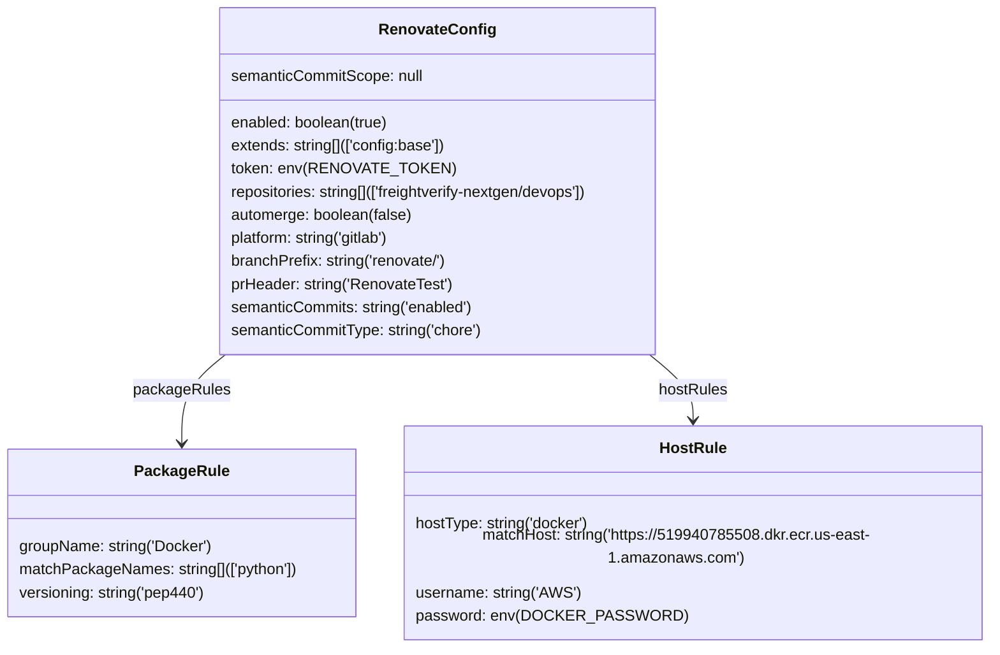

# Diagram: renovate.js


> Auto-generated by Obscura crawlers

## Diagram 1



### SVG

<svg id="container" width="1025.9140625" xmlns="http://www.w3.org/2000/svg" class="classDiagram" height="648" viewBox="0 0 1025.9140625 648" role="graphics-document document" aria-roledescription="class"><style>#container{font-family:"trebuchet ms",verdana,arial,sans-serif;font-size:16px;fill:#333;}@keyframes edge-animation-frame{from{stroke-dashoffset:0;}}@keyframes dash{to{stroke-dashoffset:0;}}#container .edge-animation-slow{stroke-dasharray:9,5!important;stroke-dashoffset:900;animation:dash 50s linear infinite;stroke-linecap:round;}#container .edge-animation-fast{stroke-dasharray:9,5!important;stroke-dashoffset:900;animation:dash 20s linear infinite;stroke-linecap:round;}#container .error-icon{fill:#552222;}#container .error-text{fill:#552222;stroke:#552222;}#container .edge-thickness-normal{stroke-width:1px;}#container .edge-thickness-thick{stroke-width:3.5px;}#container .edge-pattern-solid{stroke-dasharray:0;}#container .edge-thickness-invisible{stroke-width:0;fill:none;}#container .edge-pattern-dashed{stroke-dasharray:3;}#container .edge-pattern-dotted{stroke-dasharray:2;}#container .marker{fill:#333333;stroke:#333333;}#container .marker.cross{stroke:#333333;}#container svg{font-family:"trebuchet ms",verdana,arial,sans-serif;font-size:16px;}#container p{margin:0;}#container g.classGroup text{fill:#9370DB;stroke:none;font-family:"trebuchet ms",verdana,arial,sans-serif;font-size:10px;}#container g.classGroup text .title{font-weight:bolder;}#container .nodeLabel,#container .edgeLabel{color:#131300;}#container .edgeLabel .label rect{fill:#ECECFF;}#container .label text{fill:#131300;}#container .labelBkg{background:#ECECFF;}#container .edgeLabel .label span{background:#ECECFF;}#container .classTitle{font-weight:bolder;}#container .node rect,#container .node circle,#container .node ellipse,#container .node polygon,#container .node path{fill:#ECECFF;stroke:#9370DB;stroke-width:1px;}#container .divider{stroke:#9370DB;stroke-width:1;}#container g.clickable{cursor:pointer;}#container g.classGroup rect{fill:#ECECFF;stroke:#9370DB;}#container g.classGroup line{stroke:#9370DB;stroke-width:1;}#container .classLabel .box{stroke:none;stroke-width:0;fill:#ECECFF;opacity:0.5;}#container .classLabel .label{fill:#9370DB;font-size:10px;}#container .relation{stroke:#333333;stroke-width:1;fill:none;}#container .dashed-line{stroke-dasharray:3;}#container .dotted-line{stroke-dasharray:1 2;}#container #compositionStart,#container .composition{fill:#333333!important;stroke:#333333!important;stroke-width:1;}#container #compositionEnd,#container .composition{fill:#333333!important;stroke:#333333!important;stroke-width:1;}#container #dependencyStart,#container .dependency{fill:#333333!important;stroke:#333333!important;stroke-width:1;}#container #dependencyStart,#container .dependency{fill:#333333!important;stroke:#333333!important;stroke-width:1;}#container #extensionStart,#container .extension{fill:transparent!important;stroke:#333333!important;stroke-width:1;}#container #extensionEnd,#container .extension{fill:transparent!important;stroke:#333333!important;stroke-width:1;}#container #aggregationStart,#container .aggregation{fill:transparent!important;stroke:#333333!important;stroke-width:1;}#container #aggregationEnd,#container .aggregation{fill:transparent!important;stroke:#333333!important;stroke-width:1;}#container #lollipopStart,#container .lollipop{fill:#ECECFF!important;stroke:#333333!important;stroke-width:1;}#container #lollipopEnd,#container .lollipop{fill:#ECECFF!important;stroke:#333333!important;stroke-width:1;}#container .edgeTerminals{font-size:11px;line-height:initial;}#container .classTitleText{text-anchor:middle;font-size:18px;fill:#333;}#container .label-icon{display:inline-block;height:1em;overflow:visible;vertical-align:-0.125em;}#container .node .label-icon path{fill:currentColor;stroke:revert;stroke-width:revert;}#container :root{--mermaid-font-family:"trebuchet ms",verdana,arial,sans-serif;}</style><g><defs><marker id="container_class-aggregationStart" class="marker aggregation class" refX="18" refY="7" markerWidth="190" markerHeight="240" orient="auto"><path d="M 18,7 L9,13 L1,7 L9,1 Z"></path></marker></defs><defs><marker id="container_class-aggregationEnd" class="marker aggregation class" refX="1" refY="7" markerWidth="20" markerHeight="28" orient="auto"><path d="M 18,7 L9,13 L1,7 L9,1 Z"></path></marker></defs><defs><marker id="container_class-extensionStart" class="marker extension class" refX="18" refY="7" markerWidth="190" markerHeight="240" orient="auto"><path d="M 1,7 L18,13 V 1 Z"></path></marker></defs><defs><marker id="container_class-extensionEnd" class="marker extension class" refX="1" refY="7" markerWidth="20" markerHeight="28" orient="auto"><path d="M 1,1 V 13 L18,7 Z"></path></marker></defs><defs><marker id="container_class-compositionStart" class="marker composition class" refX="18" refY="7" markerWidth="190" markerHeight="240" orient="auto"><path d="M 18,7 L9,13 L1,7 L9,1 Z"></path></marker></defs><defs><marker id="container_class-compositionEnd" class="marker composition class" refX="1" refY="7" markerWidth="20" markerHeight="28" orient="auto"><path d="M 18,7 L9,13 L1,7 L9,1 Z"></path></marker></defs><defs><marker id="container_class-dependencyStart" class="marker dependency class" refX="6" refY="7" markerWidth="190" markerHeight="240" orient="auto"><path d="M 5,7 L9,13 L1,7 L9,1 Z"></path></marker></defs><defs><marker id="container_class-dependencyEnd" class="marker dependency class" refX="13" refY="7" markerWidth="20" markerHeight="28" orient="auto"><path d="M 18,7 L9,13 L14,7 L9,1 Z"></path></marker></defs><defs><marker id="container_class-lollipopStart" class="marker lollipop class" refX="13" refY="7" markerWidth="190" markerHeight="240" orient="auto"><circle stroke="black" fill="transparent" cx="7" cy="7" r="6"></circle></marker></defs><defs><marker id="container_class-lollipopEnd" class="marker lollipop class" refX="1" refY="7" markerWidth="190" markerHeight="240" orient="auto"><circle stroke="black" fill="transparent" cx="7" cy="7" r="6"></circle></marker></defs><g class="root"><g class="clusters"></g><g class="edgePaths"><path d="M234.044,368L226.514,374.167C218.984,380.333,203.924,392.667,196.393,406C188.863,419.333,188.863,433.667,188.863,440.833L188.863,448" id="id_RenovateConfig_PackageRule_1" class="edge-thickness-normal edge-pattern-solid relation" style=";;;" data-edge="true" data-et="edge" data-id="id_RenovateConfig_PackageRule_1" data-points="W3sieCI6MjM0LjA0Mzk0OTgxMjc4ODAxLCJ5IjozNjh9LHsieCI6MTg4Ljg2MzI4MTI1LCJ5Ijo0MDV9LHsieCI6MTg4Ljg2MzI4MTI1LCJ5Ijo0NTR9XQ==" marker-end="url(#container_class-dependencyEnd)"></path><path d="M673.64,368L681.17,374.167C688.7,380.333,703.76,392.667,711.29,404C718.82,415.333,718.82,425.667,718.82,430.833L718.82,436" id="id_RenovateConfig_HostRule_2" class="edge-thickness-normal edge-pattern-solid relation" style=";;;" data-edge="true" data-et="edge" data-id="id_RenovateConfig_HostRule_2" data-points="W3sieCI6NjczLjYzOTY0MzkzNzIxMiwieSI6MzY4fSx7IngiOjcxOC44MjAzMTI1LCJ5Ijo0MDV9LHsieCI6NzE4LjgyMDMxMjUsInkiOjQ0Mn1d" marker-end="url(#container_class-dependencyEnd)"></path></g><g class="edgeLabels"><g class="edgeLabel" transform="translate(188.86328125, 405)"><g class="label" data-id="id_RenovateConfig_PackageRule_1" transform="translate(-49.390625, -12)"><foreignObject width="98.78125" height="24"><div xmlns="http://www.w3.org/1999/xhtml" class="labelBkg" style="display: table-cell; white-space: nowrap; line-height: 1.5; max-width: 200px; text-align: center;"><span class="edgeLabel"><p>packageRules</p></span></div></foreignObject></g></g><g class="edgeLabel" transform="translate(718.8203125, 405)"><g class="label" data-id="id_RenovateConfig_HostRule_2" transform="translate(-35.8828125, -12)"><foreignObject width="71.765625" height="24"><div xmlns="http://www.w3.org/1999/xhtml" class="labelBkg" style="display: table-cell; white-space: nowrap; line-height: 1.5; max-width: 200px; text-align: center;"><span class="edgeLabel"><p>hostRules</p></span></div></foreignObject></g></g></g><g class="nodes"><g class="node default" id="classId-RenovateConfig-0" transform="translate(453.841796875, 188)"><g class="basic label-container"><path d="M-233.7734375 -180 L233.7734375 -180 L233.7734375 180 L-233.7734375 180" stroke="none" stroke-width="0" fill="#ECECFF" style=""></path><path d="M-233.7734375 -180 C-140.00909039529137 -180, -46.244743290582704 -180, 233.7734375 -180 M-233.7734375 -180 C-132.41092747259412 -180, -31.04841744518825 -180, 233.7734375 -180 M233.7734375 -180 C233.7734375 -59.57651848231933, 233.7734375 60.84696303536134, 233.7734375 180 M233.7734375 -180 C233.7734375 -59.387554977029666, 233.7734375 61.22489004594067, 233.7734375 180 M233.7734375 180 C132.1834308771436 180, 30.593424254287186 180, -233.7734375 180 M233.7734375 180 C97.4066249110578 180, -38.96018767788439 180, -233.7734375 180 M-233.7734375 180 C-233.7734375 90.82539174287605, -233.7734375 1.6507834857521004, -233.7734375 -180 M-233.7734375 180 C-233.7734375 75.76297775377056, -233.7734375 -28.474044492458887, -233.7734375 -180" stroke="#9370DB" stroke-width="1.3" fill="none" stroke-dasharray="0 0" style=""></path></g><g class="annotation-group text" transform="translate(0, -156)"></g><g class="label-group text" transform="translate(-57.0625, -156)"><g class="label" style="font-weight: bolder" transform="translate(0,-12)"><foreignObject width="114.125" height="24"><div xmlns="http://www.w3.org/1999/xhtml" style="display: table-cell; white-space: nowrap; line-height: 1.5; max-width: 163px; text-align: center;"><span class="nodeLabel markdown-node-label" style=""><p>RenovateConfig</p></span></div></foreignObject></g></g><g class="members-group text" transform="translate(-221.7734375, -108)"><g class="label" style="" transform="translate(0,-12)"><foreignObject width="201.390625" height="24"><div xmlns="http://www.w3.org/1999/xhtml" style="display: table-cell; white-space: nowrap; line-height: 1.5; max-width: 252px; text-align: center;"><span class="nodeLabel markdown-node-label" style=""><p>semanticCommitScope: null</p></span></div></foreignObject></g></g><g class="methods-group text" transform="translate(-221.7734375, -60)"><g class="label" style="" transform="translate(0,-12)"><foreignObject width="167.078125" height="24"><div xmlns="http://www.w3.org/1999/xhtml" style="display: table-cell; white-space: nowrap; line-height: 1.5; max-width: 217px; text-align: center;"><span class="nodeLabel markdown-node-label" style=""><p>enabled: boolean(true)</p></span></div></foreignObject></g><g class="label" style="" transform="translate(0,12)"><foreignObject width="226.203125" height="24"><div xmlns="http://www.w3.org/1999/xhtml" style="display: table-cell; white-space: nowrap; line-height: 1.5; max-width: 276px; text-align: center;"><span class="nodeLabel markdown-node-label" style=""><p>extends: string[](['config:base'])</p></span></div></foreignObject></g><g class="label" style="" transform="translate(0,36)"><foreignObject width="214.578125" height="24"><div xmlns="http://www.w3.org/1999/xhtml" style="display: table-cell; white-space: nowrap; line-height: 1.5; max-width: 265px; text-align: center;"><span class="nodeLabel markdown-node-label" style=""><p>token: env(RENOVATE_TOKEN)</p></span></div></foreignObject></g><g class="label" style="" transform="translate(0,60)"><foreignObject width="386.484375" height="24"><div xmlns="http://www.w3.org/1999/xhtml" style="display: table-cell; white-space: nowrap; line-height: 1.5; max-width: 436px; text-align: center;"><span class="nodeLabel markdown-node-label" style=""><p>repositories: string[](['freightverify-nextgen/devops'])</p></span></div></foreignObject></g><g class="label" style="" transform="translate(0,84)"><foreignObject width="190.375" height="24"><div xmlns="http://www.w3.org/1999/xhtml" style="display: table-cell; white-space: nowrap; line-height: 1.5; max-width: 240px; text-align: center;"><span class="nodeLabel markdown-node-label" style=""><p>automerge: boolean(false)</p></span></div></foreignObject></g><g class="label" style="" transform="translate(0,108)"><foreignObject width="171.21875" height="24"><div xmlns="http://www.w3.org/1999/xhtml" style="display: table-cell; white-space: nowrap; line-height: 1.5; max-width: 221px; text-align: center;"><span class="nodeLabel markdown-node-label" style=""><p>platform: string('gitlab')</p></span></div></foreignObject></g><g class="label" style="" transform="translate(0,132)"><foreignObject width="229.703125" height="24"><div xmlns="http://www.w3.org/1999/xhtml" style="display: table-cell; white-space: nowrap; line-height: 1.5; max-width: 280px; text-align: center;"><span class="nodeLabel markdown-node-label" style=""><p>branchPrefix: string('renovate/')</p></span></div></foreignObject></g><g class="label" style="" transform="translate(0,156)"><foreignObject width="232.0625" height="24"><div xmlns="http://www.w3.org/1999/xhtml" style="display: table-cell; white-space: nowrap; line-height: 1.5; max-width: 282px; text-align: center;"><span class="nodeLabel markdown-node-label" style=""><p>prHeader: string('RenovateTest')</p></span></div></foreignObject></g><g class="label" style="" transform="translate(0,180)"><foreignObject width="255.21875" height="24"><div xmlns="http://www.w3.org/1999/xhtml" style="display: table-cell; white-space: nowrap; line-height: 1.5; max-width: 305px; text-align: center;"><span class="nodeLabel markdown-node-label" style=""><p>semanticCommits: string('enabled')</p></span></div></foreignObject></g><g class="label" style="" transform="translate(0,204)"><foreignObject width="262.90625" height="24"><div xmlns="http://www.w3.org/1999/xhtml" style="display: table-cell; white-space: nowrap; line-height: 1.5; max-width: 313px; text-align: center;"><span class="nodeLabel markdown-node-label" style=""><p>semanticCommitType: string('chore')</p></span></div></foreignObject></g></g><g class="divider" style=""><path d="M-233.7734375 -132 C-121.22678948015765 -132, -8.680141460315298 -132, 233.7734375 -132 M-233.7734375 -132 C-103.19679814852068 -132, 27.37984120295863 -132, 233.7734375 -132" stroke="#9370DB" stroke-width="1.3" fill="none" stroke-dasharray="0 0" style=""></path></g><g class="divider" style=""><path d="M-233.7734375 -84 C-81.25257935044189 -84, 71.26827879911622 -84, 233.7734375 -84 M-233.7734375 -84 C-48.75910531128875 -84, 136.2552268774225 -84, 233.7734375 -84" stroke="#9370DB" stroke-width="1.3" fill="none" stroke-dasharray="0 0" style=""></path></g></g><g class="node default" id="classId-PackageRule-1" transform="translate(188.86328125, 541)"><g class="basic label-container"><path d="M-180.86328125 -87 L180.86328125 -87 L180.86328125 87 L-180.86328125 87" stroke="none" stroke-width="0" fill="#ECECFF" style=""></path><path d="M-180.86328125 -87 C-42.0833631584197 -87, 96.6965549331606 -87, 180.86328125 -87 M-180.86328125 -87 C-38.69296939491349 -87, 103.47734246017302 -87, 180.86328125 -87 M180.86328125 -87 C180.86328125 -32.92866790646693, 180.86328125 21.142664187066146, 180.86328125 87 M180.86328125 -87 C180.86328125 -27.179546366839837, 180.86328125 32.640907266320326, 180.86328125 87 M180.86328125 87 C44.99728956509722 87, -90.86870211980556 87, -180.86328125 87 M180.86328125 87 C60.0104607108849 87, -60.8423598282302 87, -180.86328125 87 M-180.86328125 87 C-180.86328125 19.67406479751051, -180.86328125 -47.65187040497898, -180.86328125 -87 M-180.86328125 87 C-180.86328125 21.10948112465026, -180.86328125 -44.78103775069948, -180.86328125 -87" stroke="#9370DB" stroke-width="1.3" fill="none" stroke-dasharray="0 0" style=""></path></g><g class="annotation-group text" transform="translate(0, -63)"></g><g class="label-group text" transform="translate(-46.1171875, -63)"><g class="label" style="font-weight: bolder" transform="translate(0,-12)"><foreignObject width="92.234375" height="24"><div xmlns="http://www.w3.org/1999/xhtml" style="display: table-cell; white-space: nowrap; line-height: 1.5; max-width: 140px; text-align: center;"><span class="nodeLabel markdown-node-label" style=""><p>PackageRule</p></span></div></foreignObject></g></g><g class="members-group text" transform="translate(-168.86328125, -15)"></g><g class="methods-group text" transform="translate(-168.86328125, 15)"><g class="label" style="" transform="translate(0,-12)"><foreignObject width="201.640625" height="24"><div xmlns="http://www.w3.org/1999/xhtml" style="display: table-cell; white-space: nowrap; line-height: 1.5; max-width: 252px; text-align: center;"><span class="nodeLabel markdown-node-label" style=""><p>groupName: string('Docker')</p></span></div></foreignObject></g><g class="label" style="" transform="translate(0,12)"><foreignObject width="291.609375" height="24"><div xmlns="http://www.w3.org/1999/xhtml" style="display: table-cell; white-space: nowrap; line-height: 1.5; max-width: 342px; text-align: center;"><span class="nodeLabel markdown-node-label" style=""><p>matchPackageNames: string[](['python'])</p></span></div></foreignObject></g><g class="label" style="" transform="translate(0,36)"><foreignObject width="196" height="24"><div xmlns="http://www.w3.org/1999/xhtml" style="display: table-cell; white-space: nowrap; line-height: 1.5; max-width: 246px; text-align: center;"><span class="nodeLabel markdown-node-label" style=""><p>versioning: string('pep440')</p></span></div></foreignObject></g></g><g class="divider" style=""><path d="M-180.86328125 -39 C-43.55832892728134 -39, 93.74662339543733 -39, 180.86328125 -39 M-180.86328125 -39 C-63.38042502479735 -39, 54.102431200405306 -39, 180.86328125 -39" stroke="#9370DB" stroke-width="1.3" fill="none" stroke-dasharray="0 0" style=""></path></g><g class="divider" style=""><path d="M-180.86328125 -15 C-96.43459753652546 -15, -12.005913823050918 -15, 180.86328125 -15 M-180.86328125 -15 C-81.84887272068305 -15, 17.165535808633905 -15, 180.86328125 -15" stroke="#9370DB" stroke-width="1.3" fill="none" stroke-dasharray="0 0" style=""></path></g></g><g class="node default" id="classId-HostRule-2" transform="translate(718.8203125, 541)"><g class="basic label-container"><path d="M-299.09375 -99 L299.09375 -99 L299.09375 99 L-299.09375 99" stroke="none" stroke-width="0" fill="#ECECFF" style=""></path><path d="M-299.09375 -99 C-160.60739342370158 -99, -22.12103684740316 -99, 299.09375 -99 M-299.09375 -99 C-156.14730089532566 -99, -13.200851790651313 -99, 299.09375 -99 M299.09375 -99 C299.09375 -42.07942011689629, 299.09375 14.841159766207426, 299.09375 99 M299.09375 -99 C299.09375 -31.167331816088108, 299.09375 36.665336367823784, 299.09375 99 M299.09375 99 C81.93412221616026 99, -135.22550556767948 99, -299.09375 99 M299.09375 99 C101.83443237592041 99, -95.42488524815917 99, -299.09375 99 M-299.09375 99 C-299.09375 28.25442267436378, -299.09375 -42.49115465127244, -299.09375 -99 M-299.09375 99 C-299.09375 28.937268232377107, -299.09375 -41.125463535245785, -299.09375 -99" stroke="#9370DB" stroke-width="1.3" fill="none" stroke-dasharray="0 0" style=""></path></g><g class="annotation-group text" transform="translate(0, -75)"></g><g class="label-group text" transform="translate(-33.21875, -75)"><g class="label" style="font-weight: bolder" transform="translate(0,-12)"><foreignObject width="66.4375" height="24"><div xmlns="http://www.w3.org/1999/xhtml" style="display: table-cell; white-space: nowrap; line-height: 1.5; max-width: 116px; text-align: center;"><span class="nodeLabel markdown-node-label" style=""><p>HostRule</p></span></div></foreignObject></g></g><g class="members-group text" transform="translate(-287.09375, -27)"></g><g class="methods-group text" transform="translate(-287.09375, 3)"><g class="label" style="" transform="translate(0,-12)"><foreignObject width="182.203125" height="24"><div xmlns="http://www.w3.org/1999/xhtml" style="display: table-cell; white-space: nowrap; line-height: 1.5; max-width: 232px; text-align: center;"><span class="nodeLabel markdown-node-label" style=""><p>hostType: string('docker')</p></span></div></foreignObject></g><g class="label" style="" transform="translate(0,12)"><foreignObject width="540.96875" height="24"><div xmlns="http://www.w3.org/1999/xhtml" style="display: table-cell; white-space: nowrap; line-height: 1.5; max-width: 591px; text-align: center;"><span class="nodeLabel markdown-node-label" style=""><p>matchHost: string('https://519940785508.dkr.ecr.us-east-1.amazonaws.com')</p></span></div></foreignObject></g><g class="label" style="" transform="translate(0,36)"><foreignObject width="169.59375" height="24"><div xmlns="http://www.w3.org/1999/xhtml" style="display: table-cell; white-space: nowrap; line-height: 1.5; max-width: 220px; text-align: center;"><span class="nodeLabel markdown-node-label" style=""><p>username: string('AWS')</p></span></div></foreignObject></g><g class="label" style="" transform="translate(0,60)"><foreignObject width="258.140625" height="24"><div xmlns="http://www.w3.org/1999/xhtml" style="display: table-cell; white-space: nowrap; line-height: 1.5; max-width: 308px; text-align: center;"><span class="nodeLabel markdown-node-label" style=""><p>password: env(DOCKER_PASSWORD)</p></span></div></foreignObject></g></g><g class="divider" style=""><path d="M-299.09375 -51 C-79.61467579889569 -51, 139.86439840220862 -51, 299.09375 -51 M-299.09375 -51 C-139.4585707289983 -51, 20.176608542003407 -51, 299.09375 -51" stroke="#9370DB" stroke-width="1.3" fill="none" stroke-dasharray="0 0" style=""></path></g><g class="divider" style=""><path d="M-299.09375 -27 C-69.403902216414 -27, 160.285945567172 -27, 299.09375 -27 M-299.09375 -27 C-111.77831464173266 -27, 75.53712071653467 -27, 299.09375 -27" stroke="#9370DB" stroke-width="1.3" fill="none" stroke-dasharray="0 0" style=""></path></g></g></g></g></g></svg>

## Diagram 2

```mermaid
flowchart TD
    Config[module.exports] --> Enabled[enabled: true]
    Config --> Extends[extends: ['config:base']]
    Config --> Token[token: process.env.RENOVATE_TOKEN]
    Config --> Repos[repositories: ['freightverify-nextgen/devops']]
    Config --> Automerge[automerge: false]
    Config --> Platform[platform: gitlab]
    Config --> BranchPrefix[branchPrefix: 'renovate/']
    Config --> PRHeader[prHeader: 'RenovateTest']
    Config --> PackageRules[packageRules]
    PackageRules --> PRule1[groupName: Docker]
    PRule1 --> PMatch[matchPackageNames: ['python']]
    PRule1 --> PVersion[versioning: pep440]
    Config --> HostRules[hostRules]
    HostRules --> HRule1[hostType: docker]
    HRule1 --> HMatch[matchHost: https://519940785508.dkr.ecr.us-east-1.amazonaws.com]
    HRule1 --> HUser[username: AWS]
    HRule1 --> HPass[password: process.env.DOCKER_PASSWORD]
    Config --> Semantic[semanticCommits: enabled]
    Semantic --> Scope[semanticCommitScope: null]
    Semantic --> Type[semanticCommitType: chore]
```

> SVG rendering failed for this diagram.
