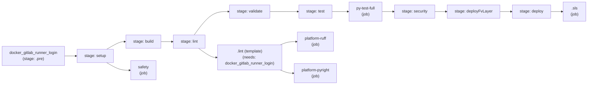
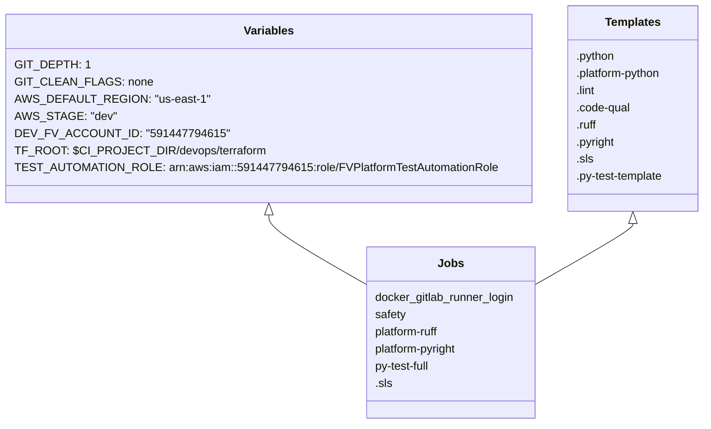

# Diagram: .gitlab-ci.yml

> Auto-generated by Obscura crawlers

## Diagram 1

### SVG

<svg id="container" width="2629.328125" xmlns="http://www.w3.org/2000/svg" class="flowchart" height="284" viewBox="0 0 2629.328125 284" role="graphics-document document" aria-roledescription="flowchart-v2"><g><marker id="container_flowchart-v2-pointEnd" class="marker flowchart-v2" viewBox="0 0 10 10" refX="5" refY="5" markerUnits="userSpaceOnUse" markerWidth="8" markerHeight="8" orient="auto"><path d="M 0 0 L 10 5 L 0 10 z" class="arrowMarkerPath" style="stroke-width: 1; stroke-dasharray: 1, 0;"></path></marker><marker id="container_flowchart-v2-pointStart" class="marker flowchart-v2" viewBox="0 0 10 10" refX="4.5" refY="5" markerUnits="userSpaceOnUse" markerWidth="8" markerHeight="8" orient="auto"><path d="M 0 5 L 10 10 L 10 0 z" class="arrowMarkerPath" style="stroke-width: 1; stroke-dasharray: 1, 0;"></path></marker><marker id="container_flowchart-v2-circleEnd" class="marker flowchart-v2" viewBox="0 0 10 10" refX="11" refY="5" markerUnits="userSpaceOnUse" markerWidth="11" markerHeight="11" orient="auto"><circle cx="5" cy="5" r="5" class="arrowMarkerPath" style="stroke-width: 1; stroke-dasharray: 1, 0;"></circle></marker><marker id="container_flowchart-v2-circleStart" class="marker flowchart-v2" viewBox="0 0 10 10" refX="-1" refY="5" markerUnits="userSpaceOnUse" markerWidth="11" markerHeight="11" orient="auto"><circle cx="5" cy="5" r="5" class="arrowMarkerPath" style="stroke-width: 1; stroke-dasharray: 1, 0;"></circle></marker><marker id="container_flowchart-v2-crossEnd" class="marker cross flowchart-v2" viewBox="0 0 11 11" refX="12" refY="5.2" markerUnits="userSpaceOnUse" markerWidth="11" markerHeight="11" orient="auto"><path d="M 1,1 l 9,9 M 10,1 l -9,9" class="arrowMarkerPath" style="stroke-width: 2; stroke-dasharray: 1, 0;"></path></marker><marker id="container_flowchart-v2-crossStart" class="marker cross flowchart-v2" viewBox="0 0 11 11" refX="-1" refY="5.2" markerUnits="userSpaceOnUse" markerWidth="11" markerHeight="11" orient="auto"><path d="M 1,1 l 9,9 M 10,1 l -9,9" class="arrowMarkerPath" style="stroke-width: 2; stroke-dasharray: 1, 0;"></path></marker><g class="root"><g class="clusters"></g><g class="edgePaths"><path d="M335,191L339.167,191C343.333,191,351.667,191,359.333,191C367,191,374,191,377.5,191L381,191" id="L_DockerLogin_stage_setup_0" class="edge-thickness-normal edge-pattern-solid edge-thickness-normal edge-pattern-solid flowchart-link" style=";" data-edge="true" data-et="edge" data-id="L_DockerLogin_stage_setup_0" data-points="W3sieCI6MzM1LCJ5IjoxOTF9LHsieCI6MzYwLCJ5IjoxOTF9LHsieCI6Mzg1LCJ5IjoxOTF9XQ==" marker-end="url(#container_flowchart-v2-pointEnd)"></path><path d="M509.905,218L517.812,222.167C525.718,226.333,541.531,234.667,552.937,238.833C564.344,243,571.344,243,574.844,243L578.344,243" id="L_stage_setup_Safety_0" class="edge-thickness-normal edge-pattern-solid edge-thickness-normal edge-pattern-solid flowchart-link" style=";" data-edge="true" data-et="edge" data-id="L_stage_setup_Safety_0" data-points="W3sieCI6NTA5LjkwNTM0ODU1NzY5MjMsInkiOjIxOH0seyJ4Ijo1NTcuMzQzNzUsInkiOjI0M30seyJ4Ijo1ODIuMzQzNzUsInkiOjI0M31d" marker-end="url(#container_flowchart-v2-pointEnd)"></path><path d="M509.905,164L517.812,159.833C525.718,155.667,541.531,147.333,553.862,143.167C566.193,139,575.042,139,579.466,139L583.891,139" id="L_stage_setup_stage_build_0" class="edge-thickness-normal edge-pattern-solid edge-thickness-normal edge-pattern-solid flowchart-link" style=";" data-edge="true" data-et="edge" data-id="L_stage_setup_stage_build_0" data-points="W3sieCI6NTA5LjkwNTM0ODU1NzY5MjMsInkiOjE2NH0seyJ4Ijo1NTcuMzQzNzUsInkiOjEzOX0seyJ4Ijo1ODcuODkwNjI1LCJ5IjoxMzl9XQ==" marker-end="url(#container_flowchart-v2-pointEnd)"></path><path d="M731.953,139L737.044,139C742.135,139,752.318,139,760.909,139C769.5,139,776.5,139,780,139L783.5,139" id="L_stage_build_stage_lint_0" class="edge-thickness-normal edge-pattern-solid edge-thickness-normal edge-pattern-solid flowchart-link" style=";" data-edge="true" data-et="edge" data-id="L_stage_build_stage_lint_0" data-points="W3sieCI6NzMxLjk1MzEyNSwieSI6MTM5fSx7IngiOjc2Mi41LCJ5IjoxMzl9LHsieCI6Nzg3LjUsInkiOjEzOX1d" marker-end="url(#container_flowchart-v2-pointEnd)"></path><path d="M895.061,166L903.118,171.167C911.176,176.333,927.291,186.667,938.849,191.833C950.406,197,957.406,197,960.906,197L964.406,197" id="L_stage_lint_LintTemplate_0" class="edge-thickness-normal edge-pattern-solid edge-thickness-normal edge-pattern-solid flowchart-link" style=";" data-edge="true" data-et="edge" data-id="L_stage_lint_LintTemplate_0" data-points="W3sieCI6ODk1LjA2MDYxNDIyNDEzNzksInkiOjE2Nn0seyJ4Ijo5NDMuNDA2MjUsInkiOjE5N30seyJ4Ijo5NjguNDA2MjUsInkiOjE5N31d" marker-end="url(#container_flowchart-v2-pointEnd)"></path><path d="M1217.555,158L1224.082,155.833C1230.609,153.667,1243.664,149.333,1255.732,147.167C1267.799,145,1278.88,145,1284.421,145L1289.961,145" id="L_LintTemplate_Ruff_0" class="edge-thickness-normal edge-pattern-solid edge-thickness-normal edge-pattern-solid flowchart-link" style=";" data-edge="true" data-et="edge" data-id="L_LintTemplate_Ruff_0" data-points="W3sieCI6MTIxNy41NTQ2ODc1LCJ5IjoxNTh9LHsieCI6MTI1Ni43MTg3NSwieSI6MTQ1fSx7IngiOjEyOTMuOTYwOTM3NSwieSI6MTQ1fV0=" marker-end="url(#container_flowchart-v2-pointEnd)"></path><path d="M1217.555,236L1224.082,238.167C1230.609,240.333,1243.664,244.667,1253.691,246.833C1263.719,249,1270.719,249,1274.219,249L1277.719,249" id="L_LintTemplate_Pyright_0" class="edge-thickness-normal edge-pattern-solid edge-thickness-normal edge-pattern-solid flowchart-link" style=";" data-edge="true" data-et="edge" data-id="L_LintTemplate_Pyright_0" data-points="W3sieCI6MTIxNy41NTQ2ODc1LCJ5IjoyMzZ9LHsieCI6MTI1Ni43MTg3NSwieSI6MjQ5fSx7IngiOjEyODEuNzE4NzUsInkiOjI0OX1d" marker-end="url(#container_flowchart-v2-pointEnd)"></path><path d="M876.436,112L887.598,99.167C898.76,86.333,921.083,60.667,943.984,47.833C966.885,35,990.365,35,1002.104,35L1013.844,35" id="L_stage_lint_stage_validate_0" class="edge-thickness-normal edge-pattern-solid edge-thickness-normal edge-pattern-solid flowchart-link" style=";" data-edge="true" data-et="edge" data-id="L_stage_lint_stage_validate_0" data-points="W3sieCI6ODc2LjQzNjE0NzgzNjUzODUsInkiOjExMn0seyJ4Ijo5NDMuNDA2MjUsInkiOjM1fSx7IngiOjEwMTcuODQzNzUsInkiOjM1fV0=" marker-end="url(#container_flowchart-v2-pointEnd)"></path><path d="M1182.281,35L1194.688,35C1207.094,35,1231.906,35,1255.997,35C1280.089,35,1303.458,35,1315.143,35L1326.828,35" id="L_stage_validate_stage_test_0" class="edge-thickness-normal edge-pattern-solid edge-thickness-normal edge-pattern-solid flowchart-link" style=";" data-edge="true" data-et="edge" data-id="L_stage_validate_stage_test_0" data-points="W3sieCI6MTE4Mi4yODEyNSwieSI6MzV9LHsieCI6MTI1Ni43MTg3NSwieSI6MzV9LHsieCI6MTMzMC44MjgxMjUsInkiOjM1fV0=" marker-end="url(#container_flowchart-v2-pointEnd)"></path><path d="M1464.891,35L1477.242,35C1489.594,35,1514.297,35,1530.148,35C1546,35,1553,35,1556.5,35L1560,35" id="L_stage_test_PyTestFull_0" class="edge-thickness-normal edge-pattern-solid edge-thickness-normal edge-pattern-solid flowchart-link" style=";" data-edge="true" data-et="edge" data-id="L_stage_test_PyTestFull_0" data-points="W3sieCI6MTQ2NC44OTA2MjUsInkiOjM1fSx7IngiOjE1MzksInkiOjM1fSx7IngiOjE1NjQsInkiOjM1fV0=" marker-end="url(#container_flowchart-v2-pointEnd)"></path><path d="M1756.297,35L1760.464,35C1764.63,35,1772.964,35,1780.63,35C1788.297,35,1795.297,35,1798.797,35L1802.297,35" id="L_PyTestFull_stage_security_0" class="edge-thickness-normal edge-pattern-solid edge-thickness-normal edge-pattern-solid flowchart-link" style=";" data-edge="true" data-et="edge" data-id="L_PyTestFull_stage_security_0" data-points="W3sieCI6MTc1Ni4yOTY4NzUsInkiOjM1fSx7IngiOjE3ODEuMjk2ODc1LCJ5IjozNX0seyJ4IjoxODA2LjI5Njg3NSwieSI6MzV9XQ==" marker-end="url(#container_flowchart-v2-pointEnd)"></path><path d="M1970.094,35L1974.26,35C1978.427,35,1986.76,35,1994.427,35C2002.094,35,2009.094,35,2012.594,35L2016.094,35" id="L_stage_security_stage_deployFv_0" class="edge-thickness-normal edge-pattern-solid edge-thickness-normal edge-pattern-solid flowchart-link" style=";" data-edge="true" data-et="edge" data-id="L_stage_security_stage_deployFv_0" data-points="W3sieCI6MTk3MC4wOTM3NSwieSI6MzV9LHsieCI6MTk5NS4wOTM3NSwieSI6MzV9LHsieCI6MjAyMC4wOTM3NSwieSI6MzV9XQ==" marker-end="url(#container_flowchart-v2-pointEnd)"></path><path d="M2230.344,35L2234.51,35C2238.677,35,2247.01,35,2254.677,35C2262.344,35,2269.344,35,2272.844,35L2276.344,35" id="L_stage_deployFv_stage_deploy_0" class="edge-thickness-normal edge-pattern-solid edge-thickness-normal edge-pattern-solid flowchart-link" style=";" data-edge="true" data-et="edge" data-id="L_stage_deployFv_stage_deploy_0" data-points="W3sieCI6MjIzMC4zNDM3NSwieSI6MzV9LHsieCI6MjI1NS4zNDM3NSwieSI6MzV9LHsieCI6MjI4MC4zNDM3NSwieSI6MzV9XQ==" marker-end="url(#container_flowchart-v2-pointEnd)"></path><path d="M2436.453,35L2440.62,35C2444.786,35,2453.12,35,2460.786,35C2468.453,35,2475.453,35,2478.953,35L2482.453,35" id="L_stage_deploy_SLS_0" class="edge-thickness-normal edge-pattern-solid edge-thickness-normal edge-pattern-solid flowchart-link" style=";" data-edge="true" data-et="edge" data-id="L_stage_deploy_SLS_0" data-points="W3sieCI6MjQzNi40NTMxMjUsInkiOjM1fSx7IngiOjI0NjEuNDUzMTI1LCJ5IjozNX0seyJ4IjoyNDg2LjQ1MzEyNSwieSI6MzV9XQ==" marker-end="url(#container_flowchart-v2-pointEnd)"></path></g><g class="edgeLabels"><g class="edgeLabel"><g class="label" data-id="L_DockerLogin_stage_setup_0" transform="translate(0, 0)"><foreignObject width="0" height="0">

</foreignObject></g></g><g class="edgeLabel"><g class="label" data-id="L_stage_setup_Safety_0" transform="translate(0, 0)"><foreignObject width="0" height="0">

</foreignObject></g></g><g class="edgeLabel"><g class="label" data-id="L_stage_setup_stage_build_0" transform="translate(0, 0)"><foreignObject width="0" height="0">

</foreignObject></g></g><g class="edgeLabel"><g class="label" data-id="L_stage_build_stage_lint_0" transform="translate(0, 0)"><foreignObject width="0" height="0">

</foreignObject></g></g><g class="edgeLabel"><g class="label" data-id="L_stage_lint_LintTemplate_0" transform="translate(0, 0)"><foreignObject width="0" height="0">

</foreignObject></g></g><g class="edgeLabel"><g class="label" data-id="L_LintTemplate_Ruff_0" transform="translate(0, 0)"><foreignObject width="0" height="0">

</foreignObject></g></g><g class="edgeLabel"><g class="label" data-id="L_LintTemplate_Pyright_0" transform="translate(0, 0)"><foreignObject width="0" height="0">

</foreignObject></g></g><g class="edgeLabel"><g class="label" data-id="L_stage_lint_stage_validate_0" transform="translate(0, 0)"><foreignObject width="0" height="0">

</foreignObject></g></g><g class="edgeLabel"><g class="label" data-id="L_stage_validate_stage_test_0" transform="translate(0, 0)"><foreignObject width="0" height="0">

</foreignObject></g></g><g class="edgeLabel"><g class="label" data-id="L_stage_test_PyTestFull_0" transform="translate(0, 0)"><foreignObject width="0" height="0">

</foreignObject></g></g><g class="edgeLabel"><g class="label" data-id="L_PyTestFull_stage_security_0" transform="translate(0, 0)"><foreignObject width="0" height="0">

</foreignObject></g></g><g class="edgeLabel"><g class="label" data-id="L_stage_security_stage_deployFv_0" transform="translate(0, 0)"><foreignObject width="0" height="0">

</foreignObject></g></g><g class="edgeLabel"><g class="label" data-id="L_stage_deployFv_stage_deploy_0" transform="translate(0, 0)"><foreignObject width="0" height="0">

</foreignObject></g></g><g class="edgeLabel"><g class="label" data-id="L_stage_deploy_SLS_0" transform="translate(0, 0)"><foreignObject width="0" height="0">

</foreignObject></g></g></g><g class="nodes"><g class="node default" id="flowchart-DockerLogin-0" transform="translate(171.5, 191)"><rect class="basic label-container" style="" x="-163.5" y="-39" width="327" height="78"></rect><g class="label" style="" transform="translate(-133.5, -24)"><rect></rect><foreignObject width="267" height="48">

docker_gitlab_runner_login\n(stage: .pre)

</foreignObject></g></g><g class="node default" id="flowchart-stage_setup-1" transform="translate(458.671875, 191)"><rect class="basic label-container" style="" x="-73.671875" y="-27" width="147.34375" height="54"></rect><g class="label" style="" transform="translate(-43.671875, -12)"><rect></rect><foreignObject width="87.34375" height="24">

stage: setup

</foreignObject></g></g><g class="node default" id="flowchart-stage_build-2" transform="translate(659.921875, 139)"><rect class="basic label-container" style="" x="-72.03125" y="-27" width="144.0625" height="54"></rect><g class="label" style="" transform="translate(-42.03125, -12)"><rect></rect><foreignObject width="84.0625" height="24">

stage: build

</foreignObject></g></g><g class="node default" id="flowchart-stage_lint-3" transform="translate(852.953125, 139)"><rect class="basic label-container" style="" x="-65.453125" y="-27" width="130.90625" height="54"></rect><g class="label" style="" transform="translate(-35.453125, -12)"><rect></rect><foreignObject width="70.90625" height="24">

stage: lint

</foreignObject></g></g><g class="node default" id="flowchart-stage_validate-4" transform="translate(1100.0625, 35)"><rect class="basic label-container" style="" x="-82.21875" y="-27" width="164.4375" height="54"></rect><g class="label" style="" transform="translate(-52.21875, -12)"><rect></rect><foreignObject width="104.4375" height="24">

stage: validate

</foreignObject></g></g><g class="node default" id="flowchart-stage_test-5" transform="translate(1397.859375, 35)"><rect class="basic label-container" style="" x="-67.03125" y="-27" width="134.0625" height="54"></rect><g class="label" style="" transform="translate(-37.03125, -12)"><rect></rect><foreignObject width="74.0625" height="24">

stage: test

</foreignObject></g></g><g class="node default" id="flowchart-stage_security-6" transform="translate(1888.1953125, 35)"><rect class="basic label-container" style="" x="-81.8984375" y="-27" width="163.796875" height="54"></rect><g class="label" style="" transform="translate(-51.8984375, -12)"><rect></rect><foreignObject width="103.796875" height="24">

stage: security

</foreignObject></g></g><g class="node default" id="flowchart-stage_deployFv-7" transform="translate(2125.21875, 35)"><rect class="basic label-container" style="" x="-105.125" y="-27" width="210.25" height="54"></rect><g class="label" style="" transform="translate(-75.125, -12)"><rect></rect><foreignObject width="150.25" height="24">

stage: deployFvLayer

</foreignObject></g></g><g class="node default" id="flowchart-stage_deploy-8" transform="translate(2358.3984375, 35)"><rect class="basic label-container" style="" x="-78.0546875" y="-27" width="156.109375" height="54"></rect><g class="label" style="" transform="translate(-48.0546875, -12)"><rect></rect><foreignObject width="96.109375" height="24">

stage: deploy

</foreignObject></g></g><g class="node default" id="flowchart-Safety-9" transform="translate(659.921875, 243)"><rect class="basic label-container" style="" x="-77.578125" y="-27" width="155.15625" height="54"></rect><g class="label" style="" transform="translate(-47.578125, -12)"><rect></rect><foreignObject width="95.15625" height="24">

safety\n(job)

</foreignObject></g></g><g class="node default" id="flowchart-LintTemplate-10" transform="translate(1100.0625, 197)"><rect class="basic label-container" style="" x="-131.65625" y="-39" width="263.3125" height="78"></rect><g class="label" style="" transform="translate(-101.65625, -24)"><rect></rect><foreignObject width="203.3125" height="48">

.lint (template)\n(needs: docker_gitlab_runner_login)

</foreignObject></g></g><g class="node default" id="flowchart-Ruff-11" transform="translate(1397.859375, 145)"><rect class="basic label-container" style="" x="-103.8984375" y="-27" width="207.796875" height="54"></rect><g class="label" style="" transform="translate(-73.8984375, -12)"><rect></rect><foreignObject width="147.796875" height="24">

platform-ruff\n(job)

</foreignObject></g></g><g class="node default" id="flowchart-Pyright-12" transform="translate(1397.859375, 249)"><rect class="basic label-container" style="" x="-116.140625" y="-27" width="232.28125" height="54"></rect><g class="label" style="" transform="translate(-86.140625, -12)"><rect></rect><foreignObject width="172.28125" height="24">

platform-pyright\n(job)

</foreignObject></g></g><g class="node default" id="flowchart-PyTestFull-13" transform="translate(1660.1484375, 35)"><rect class="basic label-container" style="" x="-96.1484375" y="-27" width="192.296875" height="54"></rect><g class="label" style="" transform="translate(-66.1484375, -12)"><rect></rect><foreignObject width="132.296875" height="24">

py-test-full\n(job)

</foreignObject></g></g><g class="node default" id="flowchart-SLS-14" transform="translate(2553.890625, 35)"><rect class="basic label-container" style="" x="-67.4375" y="-27" width="134.875" height="54"></rect><g class="label" style="" transform="translate(-37.4375, -12)"><rect></rect><foreignObject width="74.875" height="24">

.sls\n(job)

</foreignObject></g></g></g></g></g></svg>

## Diagram 2

### SVG

<svg id="container" width="952.8984375" xmlns="http://www.w3.org/2000/svg" class="classDiagram" height="594" viewBox="0 0 952.8984375 594" role="graphics-document document" aria-roledescription="class"><g><defs><marker id="container_class-aggregationStart" class="marker aggregation class" refX="18" refY="7" markerWidth="190" markerHeight="240" orient="auto"><path d="M 18,7 L9,13 L1,7 L9,1 Z"></path></marker></defs><defs><marker id="container_class-aggregationEnd" class="marker aggregation class" refX="1" refY="7" markerWidth="20" markerHeight="28" orient="auto"><path d="M 18,7 L9,13 L1,7 L9,1 Z"></path></marker></defs><defs><marker id="container_class-extensionStart" class="marker extension class" refX="18" refY="7" markerWidth="190" markerHeight="240" orient="auto"><path d="M 1,7 L18,13 V 1 Z"></path></marker></defs><defs><marker id="container_class-extensionEnd" class="marker extension class" refX="1" refY="7" markerWidth="20" markerHeight="28" orient="auto"><path d="M 1,1 V 13 L18,7 Z"></path></marker></defs><defs><marker id="container_class-compositionStart" class="marker composition class" refX="18" refY="7" markerWidth="190" markerHeight="240" orient="auto"><path d="M 18,7 L9,13 L1,7 L9,1 Z"></path></marker></defs><defs><marker id="container_class-compositionEnd" class="marker composition class" refX="1" refY="7" markerWidth="20" markerHeight="28" orient="auto"><path d="M 18,7 L9,13 L1,7 L9,1 Z"></path></marker></defs><defs><marker id="container_class-dependencyStart" class="marker dependency class" refX="6" refY="7" markerWidth="190" markerHeight="240" orient="auto"><path d="M 5,7 L9,13 L1,7 L9,1 Z"></path></marker></defs><defs><marker id="container_class-dependencyEnd" class="marker dependency class" refX="13" refY="7" markerWidth="20" markerHeight="28" orient="auto"><path d="M 18,7 L9,13 L14,7 L9,1 Z"></path></marker></defs><defs><marker id="container_class-lollipopStart" class="marker lollipop class" refX="13" refY="7" markerWidth="190" markerHeight="240" orient="auto"><circle stroke="black" fill="transparent" cx="7" cy="7" r="6"></circle></marker></defs><defs><marker id="container_class-lollipopEnd" class="marker lollipop class" refX="1" refY="7" markerWidth="190" markerHeight="240" orient="auto"><circle stroke="black" fill="transparent" cx="7" cy="7" r="6"></circle></marker></defs><g class="root"><g class="clusters"></g><g class="edgePaths"><path d="M357.738,301.25L357.738,304.542C357.738,307.833,357.738,314.417,379.026,330.219C400.314,346.022,442.891,371.044,464.179,383.555L485.467,396.066" id="id_Variables_Jobs_1" class="edge-thickness-normal edge-pattern-solid relation" style=";;;" data-edge="true" data-et="edge" data-id="id_Variables_Jobs_1" data-points="W3sieCI6MzU3LjczODI4MTI1LCJ5IjoyODR9LHsieCI6MzU3LjczODI4MTI1LCJ5IjozMjF9LHsieCI6NDg1LjQ2Njc5Njg3NSwieSI6Mzk2LjA2NjAyMTIzMTI4ODA2fV0=" marker-start="url(#container_class-extensionStart)"></path><path d="M851.188,313.25L851.188,314.542C851.188,315.833,851.188,318.417,829.899,332.219C808.611,346.022,766.035,371.044,744.747,383.555L723.459,396.066" id="id_Templates_Jobs_2" class="edge-thickness-normal edge-pattern-solid relation" style=";;;" data-edge="true" data-et="edge" data-id="id_Templates_Jobs_2" data-points="W3sieCI6ODUxLjE4NzUsInkiOjI5Nn0seyJ4Ijo4NTEuMTg3NSwieSI6MzIxfSx7IngiOjcyMy40NTg5ODQzNzUsInkiOjM5Ni4wNjYwMjEyMzEyODgwNn1d" marker-start="url(#container_class-extensionStart)"></path></g><g class="edgeLabels"><g class="edgeLabel"><g class="label" data-id="id_Variables_Jobs_1" transform="translate(0, 0)"><foreignObject width="0" height="0">

</foreignObject></g></g><g class="edgeLabel"><g class="label" data-id="id_Templates_Jobs_2" transform="translate(0, 0)"><foreignObject width="0" height="0">

</foreignObject></g></g></g><g class="nodes"><g class="node default" id="classId-Variables-0" transform="translate(357.73828125, 152)"><g class="basic label-container"><path d="M-349.73828125 -132 L349.73828125 -132 L349.73828125 132 L-349.73828125 132" stroke="none" stroke-width="0" fill="#ECECFF" style=""></path><path d="M-349.73828125 -132 C-123.03060238088011 -132, 103.67707648823978 -132, 349.73828125 -132 M-349.73828125 -132 C-177.13513624373377 -132, -4.531991237467537 -132, 349.73828125 -132 M349.73828125 -132 C349.73828125 -75.33923659390423, 349.73828125 -18.678473187808464, 349.73828125 132 M349.73828125 -132 C349.73828125 -71.81977349991142, 349.73828125 -11.63954699982284, 349.73828125 132 M349.73828125 132 C205.58672491414214 132, 61.43516857828428 132, -349.73828125 132 M349.73828125 132 C204.09692861815122 132, 58.45557598630245 132, -349.73828125 132 M-349.73828125 132 C-349.73828125 71.98764899263094, -349.73828125 11.975297985261875, -349.73828125 -132 M-349.73828125 132 C-349.73828125 42.339009216790956, -349.73828125 -47.32198156641809, -349.73828125 -132" stroke="#9370DB" stroke-width="1.3" fill="none" stroke-dasharray="0 0" style=""></path></g><g class="annotation-group text" transform="translate(0, -108)"></g><g class="label-group text" transform="translate(-33.8671875, -108)"><g class="label" style="font-weight: bolder" transform="translate(0,-12)"><foreignObject width="67.734375" height="24">

Variables

</foreignObject></g></g><g class="members-group text" transform="translate(-337.73828125, -60)"><g class="label" style="" transform="translate(0,-12)"><foreignObject width="92.53125" height="24">

GIT_DEPTH: 1

</foreignObject></g><g class="label" style="" transform="translate(0,12)"><foreignObject width="172.421875" height="24">

GIT_CLEAN_FLAGS: none

</foreignObject></g><g class="label" style="" transform="translate(0,36)"><foreignObject width="247.5" height="24">

AWS_DEFAULT_REGION: "us-east-1"

</foreignObject></g><g class="label" style="" transform="translate(0,60)"><foreignObject width="128.765625" height="24">

AWS_STAGE: "dev"

</foreignObject></g><g class="label" style="" transform="translate(0,84)"><foreignObject width="262.40625" height="24">

DEV_FV_ACCOUNT_ID: "591447794615"

</foreignObject></g><g class="label" style="" transform="translate(0,108)"><foreignObject width="329.390625" height="24">

TF_ROOT: $CI_PROJECT_DIR/devops/terraform

</foreignObject></g><g class="label" style="" transform="translate(0,132)"><foreignObject width="641.609375" height="24">

TEST_AUTOMATION_ROLE: arn:aws:iam::591447794615:role/FVPlatformTestAutomationRole

</foreignObject></g></g><g class="methods-group text" transform="translate(-337.73828125, 132)"></g><g class="divider" style=""><path d="M-349.73828125 -84 C-74.11532889851418 -84, 201.50762345297164 -84, 349.73828125 -84 M-349.73828125 -84 C-80.59711836072222 -84, 188.54404452855556 -84, 349.73828125 -84" stroke="#9370DB" stroke-width="1.3" fill="none" stroke-dasharray="0 0" style=""></path></g><g class="divider" style=""><path d="M-349.73828125 108 C-115.86642856683923 108, 118.00542411632154 108, 349.73828125 108 M-349.73828125 108 C-154.23350903464183 108, 41.271263180716346 108, 349.73828125 108" stroke="#9370DB" stroke-width="1.3" fill="none" stroke-dasharray="0 0" style=""></path></g></g><g class="node default" id="classId-Templates-1" transform="translate(851.1875, 152)"><g class="basic label-container"><path d="M-93.7109375 -144 L93.7109375 -144 L93.7109375 144 L-93.7109375 144" stroke="none" stroke-width="0" fill="#ECECFF" style=""></path><path d="M-93.7109375 -144 C-31.273475214186348 -144, 31.163987071627304 -144, 93.7109375 -144 M-93.7109375 -144 C-42.89083923367121 -144, 7.929259032657583 -144, 93.7109375 -144 M93.7109375 -144 C93.7109375 -81.51835019188327, 93.7109375 -19.036700383766544, 93.7109375 144 M93.7109375 -144 C93.7109375 -74.17772927935337, 93.7109375 -4.355458558706744, 93.7109375 144 M93.7109375 144 C26.856786219832173 144, -39.99736506033565 144, -93.7109375 144 M93.7109375 144 C42.18711132738185 144, -9.336714845236301 144, -93.7109375 144 M-93.7109375 144 C-93.7109375 80.43919735308387, -93.7109375 16.878394706167754, -93.7109375 -144 M-93.7109375 144 C-93.7109375 34.06212910837425, -93.7109375 -75.8757417832515, -93.7109375 -144" stroke="#9370DB" stroke-width="1.3" fill="none" stroke-dasharray="0 0" style=""></path></g><g class="annotation-group text" transform="translate(0, -120)"></g><g class="label-group text" transform="translate(-37.78125, -120)"><g class="label" style="font-weight: bolder" transform="translate(0,-12)"><foreignObject width="75.5625" height="24">

Templates

</foreignObject></g></g><g class="members-group text" transform="translate(-81.7109375, -72)"><g class="label" style="" transform="translate(0,-12)"><foreignObject width="55.03125" height="24">

.python

</foreignObject></g><g class="label" style="" transform="translate(0,12)"><foreignObject width="124.5" height="24">

.platform-python

</foreignObject></g><g class="label" style="" transform="translate(0,36)"><foreignObject width="28.203125" height="24">

.lint

</foreignObject></g><g class="label" style="" transform="translate(0,60)"><foreignObject width="77.203125" height="24">

.code-qual

</foreignObject></g><g class="label" style="" transform="translate(0,84)"><foreignObject width="30.0625" height="24">

.ruff

</foreignObject></g><g class="label" style="" transform="translate(0,108)"><foreignObject width="55.3125" height="24">

.pyright

</foreignObject></g><g class="label" style="" transform="translate(0,132)"><foreignObject width="23.546875" height="24">

.sls

</foreignObject></g><g class="label" style="" transform="translate(0,156)"><foreignObject width="125.640625" height="24">

.py-test-template

</foreignObject></g></g><g class="methods-group text" transform="translate(-81.7109375, 144)"></g><g class="divider" style=""><path d="M-93.7109375 -96 C-38.67904415486449 -96, 16.352849190271016 -96, 93.7109375 -96 M-93.7109375 -96 C-33.22300308876729 -96, 27.264931322465415 -96, 93.7109375 -96" stroke="#9370DB" stroke-width="1.3" fill="none" stroke-dasharray="0 0" style=""></path></g><g class="divider" style=""><path d="M-93.7109375 120 C-23.551238303093214 120, 46.60846089381357 120, 93.7109375 120 M-93.7109375 120 C-24.105925130744865 120, 45.49908723851027 120, 93.7109375 120" stroke="#9370DB" stroke-width="1.3" fill="none" stroke-dasharray="0 0" style=""></path></g></g><g class="node default" id="classId-Jobs-2" transform="translate(604.462890625, 466)"><g class="basic label-container"><path d="M-118.99609375 -120 L118.99609375 -120 L118.99609375 120 L-118.99609375 120" stroke="none" stroke-width="0" fill="#ECECFF" style=""></path><path d="M-118.99609375 -120 C-28.36222138382665 -120, 62.2716509823467 -120, 118.99609375 -120 M-118.99609375 -120 C-37.63380947880037 -120, 43.728474792399254 -120, 118.99609375 -120 M118.99609375 -120 C118.99609375 -48.68405560919015, 118.99609375 22.631888781619693, 118.99609375 120 M118.99609375 -120 C118.99609375 -31.98260936368962, 118.99609375 56.03478127262076, 118.99609375 120 M118.99609375 120 C46.102910021043684 120, -26.790273707912633 120, -118.99609375 120 M118.99609375 120 C45.057067848419905 120, -28.88195805316019 120, -118.99609375 120 M-118.99609375 120 C-118.99609375 36.068963725238206, -118.99609375 -47.86207254952359, -118.99609375 -120 M-118.99609375 120 C-118.99609375 65.7887712407312, -118.99609375 11.577542481462402, -118.99609375 -120" stroke="#9370DB" stroke-width="1.3" fill="none" stroke-dasharray="0 0" style=""></path></g><g class="annotation-group text" transform="translate(0, -96)"></g><g class="label-group text" transform="translate(-15.8515625, -96)"><g class="label" style="font-weight: bolder" transform="translate(0,-12)"><foreignObject width="31.703125" height="24">

Jobs

</foreignObject></g></g><g class="members-group text" transform="translate(-106.99609375, -48)"><g class="label" style="" transform="translate(0,-12)"><foreignObject width="198.140625" height="24">

docker_gitlab_runner_login

</foreignObject></g><g class="label" style="" transform="translate(0,12)"><foreignObject width="43.515625" height="24">

safety

</foreignObject></g><g class="label" style="" transform="translate(0,36)"><foreignObject width="95.6875" height="24">

platform-ruff

</foreignObject></g><g class="label" style="" transform="translate(0,60)"><foreignObject width="120.953125" height="24">

platform-pyright

</foreignObject></g><g class="label" style="" transform="translate(0,84)"><foreignObject width="80.640625" height="24">

py-test-full

</foreignObject></g><g class="label" style="" transform="translate(0,108)"><foreignObject width="23.546875" height="24">

.sls

</foreignObject></g></g><g class="methods-group text" transform="translate(-106.99609375, 120)"></g><g class="divider" style=""><path d="M-118.99609375 -72 C-67.6605506421992 -72, -16.325007534398395 -72, 118.99609375 -72 M-118.99609375 -72 C-43.597467120882186 -72, 31.801159508235628 -72, 118.99609375 -72" stroke="#9370DB" stroke-width="1.3" fill="none" stroke-dasharray="0 0" style=""></path></g><g class="divider" style=""><path d="M-118.99609375 96 C-65.774137279039 96, -12.552180808077978 96, 118.99609375 96 M-118.99609375 96 C-63.139421537044576 96, -7.282749324089153 96, 118.99609375 96" stroke="#9370DB" stroke-width="1.3" fill="none" stroke-dasharray="0 0" style=""></path></g></g></g></g></g></svg>
