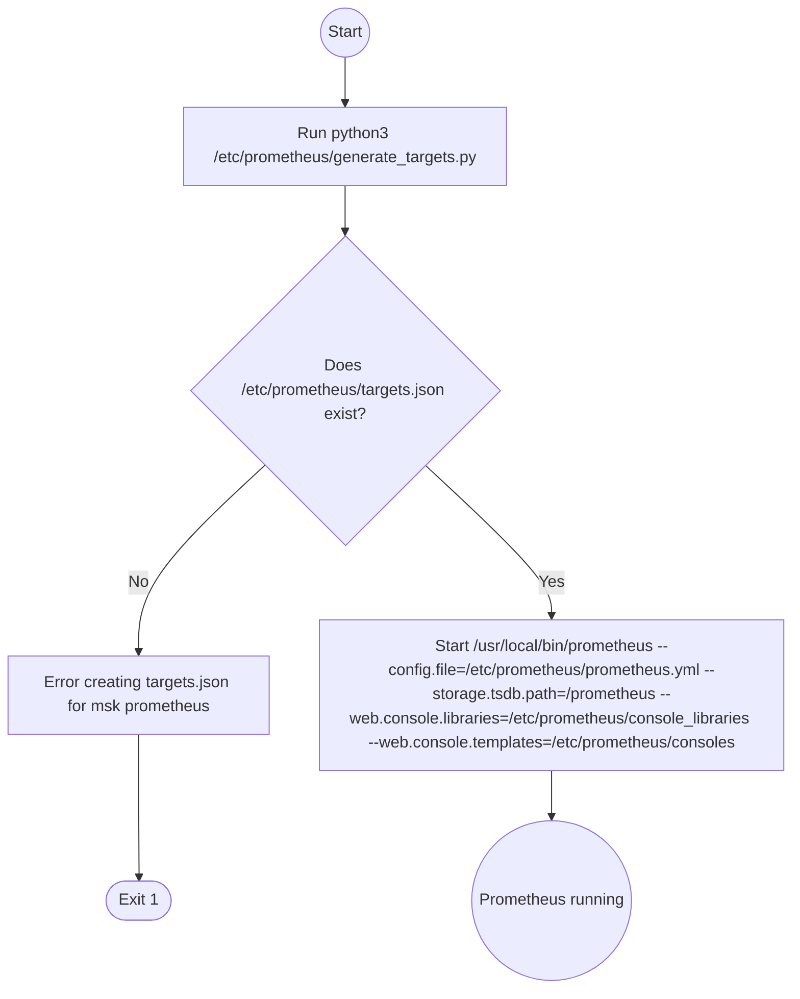

# Diagram: build-deploy/docker/prometheus/init.sh

> Auto-generated by Obscura crawlers

## Mermaid

### SVG

<svg id="container" width="807.578125" xmlns="http://www.w3.org/2000/svg" class="flowchart" height="1004.65625" viewBox="0 0 807.578125 1004.65625" role="graphics-document document" aria-roledescription="flowchart-v2"><g><marker id="container_flowchart-v2-pointEnd" class="marker flowchart-v2" viewBox="0 0 10 10" refX="5" refY="5" markerUnits="userSpaceOnUse" markerWidth="8" markerHeight="8" orient="auto"><path d="M 0 0 L 10 5 L 0 10 z" class="arrowMarkerPath" style="stroke-width: 1; stroke-dasharray: 1, 0;"></path></marker><marker id="container_flowchart-v2-pointStart" class="marker flowchart-v2" viewBox="0 0 10 10" refX="4.5" refY="5" markerUnits="userSpaceOnUse" markerWidth="8" markerHeight="8" orient="auto"><path d="M 0 5 L 10 10 L 10 0 z" class="arrowMarkerPath" style="stroke-width: 1; stroke-dasharray: 1, 0;"></path></marker><marker id="container_flowchart-v2-circleEnd" class="marker flowchart-v2" viewBox="0 0 10 10" refX="11" refY="5" markerUnits="userSpaceOnUse" markerWidth="11" markerHeight="11" orient="auto"><circle cx="5" cy="5" r="5" class="arrowMarkerPath" style="stroke-width: 1; stroke-dasharray: 1, 0;"></circle></marker><marker id="container_flowchart-v2-circleStart" class="marker flowchart-v2" viewBox="0 0 10 10" refX="-1" refY="5" markerUnits="userSpaceOnUse" markerWidth="11" markerHeight="11" orient="auto"><circle cx="5" cy="5" r="5" class="arrowMarkerPath" style="stroke-width: 1; stroke-dasharray: 1, 0;"></circle></marker><marker id="container_flowchart-v2-crossEnd" class="marker cross flowchart-v2" viewBox="0 0 11 11" refX="12" refY="5.2" markerUnits="userSpaceOnUse" markerWidth="11" markerHeight="11" orient="auto"><path d="M 1,1 l 9,9 M 10,1 l -9,9" class="arrowMarkerPath" style="stroke-width: 2; stroke-dasharray: 1, 0;"></path></marker><marker id="container_flowchart-v2-crossStart" class="marker cross flowchart-v2" viewBox="0 0 11 11" refX="-1" refY="5.2" markerUnits="userSpaceOnUse" markerWidth="11" markerHeight="11" orient="auto"><path d="M 1,1 l 9,9 M 10,1 l -9,9" class="arrowMarkerPath" style="stroke-width: 2; stroke-dasharray: 1, 0;"></path></marker><g class="root"><g class="clusters"></g><g class="edgePaths"><path d="M348.395,58.047L348.395,62.214C348.395,66.38,348.395,74.714,348.395,82.38C348.395,90.047,348.395,97.047,348.395,100.547L348.395,104.047" id="L_start_run_python_0" class="edge-thickness-normal edge-pattern-solid edge-thickness-normal edge-pattern-solid flowchart-link" style=";" data-edge="true" data-et="edge" data-id="L_start_run_python_0" data-points="W3sieCI6MzQ4LjM5NDUzMTI1LCJ5Ijo1OC4wNDY4NzV9LHsieCI6MzQ4LjM5NDUzMTI1LCJ5Ijo4My4wNDY4NzV9LHsieCI6MzQ4LjM5NDUzMTI1LCJ5IjoxMDguMDQ2ODc1fV0=" marker-end="url(#container_flowchart-v2-pointEnd)"></path><path d="M348.395,186.047L348.395,190.214C348.395,194.38,348.395,202.714,348.395,210.38C348.395,218.047,348.395,225.047,348.395,228.547L348.395,232.047" id="L_run_python_check_0" class="edge-thickness-normal edge-pattern-solid edge-thickness-normal edge-pattern-solid flowchart-link" style=";" data-edge="true" data-et="edge" data-id="L_run_python_check_0" data-points="W3sieCI6MzQ4LjM5NDUzMTI1LCJ5IjoxODYuMDQ2ODc1fSx7IngiOjM0OC4zOTQ1MzEyNSwieSI6MjExLjA0Njg3NX0seyJ4IjozNDguMzk0NTMxMjUsInkiOjIzNi4wNDY4NzV9XQ==" marker-end="url(#container_flowchart-v2-pointEnd)"></path><path d="M265.169,476.634L243.974,496.672C222.779,516.709,180.39,556.784,159.195,588.322C138,619.859,138,642.859,138,654.359L138,665.859" id="L_check_error_0" class="edge-thickness-normal edge-pattern-solid edge-thickness-normal edge-pattern-solid flowchart-link" style=";" data-edge="true" data-et="edge" data-id="L_check_error_0" data-points="W3sieCI6MjY1LjE2OTIwODYxMjc4NTIsInkiOjQ3Ni42MzQwNTIzNjI3ODUyfSx7IngiOjEzOCwieSI6NTk2Ljg1OTM3NX0seyJ4IjoxMzgsInkiOjY2OS44NTkzNzV9XQ==" marker-end="url(#container_flowchart-v2-pointEnd)"></path><path d="M138,747.859L138,758.026C138,768.193,138,788.526,138.08,812.592C138.159,836.659,138.318,864.458,138.398,878.358L138.477,892.258" id="L_error_exit_0" class="edge-thickness-normal edge-pattern-solid edge-thickness-normal edge-pattern-solid flowchart-link" style=";" data-edge="true" data-et="edge" data-id="L_error_exit_0" data-points="W3sieCI6MTM4LCJ5Ijo3NDcuODU5Mzc1fSx7IngiOjEzOCwieSI6ODA4Ljg1OTM3NX0seyJ4IjoxMzguNSwieSI6ODk2LjI1NzgxMjUwMDAwMDZ9XQ==" marker-end="url(#container_flowchart-v2-pointEnd)"></path><path d="M431.62,476.634L452.815,496.672C474.01,516.709,516.399,556.784,537.594,582.322C558.789,607.859,558.789,618.859,558.789,624.359L558.789,629.859" id="L_check_start_prometheus_0" class="edge-thickness-normal edge-pattern-solid edge-thickness-normal edge-pattern-solid flowchart-link" style=";" data-edge="true" data-et="edge" data-id="L_check_start_prometheus_0" data-points="W3sieCI6NDMxLjYxOTg1Mzg4NzIxNDgsInkiOjQ3Ni42MzQwNTIzNjI3ODUyfSx7IngiOjU1OC43ODkwNjI1LCJ5Ijo1OTYuODU5Mzc1fSx7IngiOjU1OC43ODkwNjI1LCJ5Ijo2MzMuODU5Mzc1fV0=" marker-end="url(#container_flowchart-v2-pointEnd)"></path><path d="M558.789,783.859L558.789,788.026C558.789,792.193,558.789,800.526,558.789,808.193C558.789,815.859,558.789,822.859,558.789,826.359L558.789,829.859" id="L_start_prometheus_done_0" class="edge-thickness-normal edge-pattern-solid edge-thickness-normal edge-pattern-solid flowchart-link" style=";" data-edge="true" data-et="edge" data-id="L_start_prometheus_done_0" data-points="W3sieCI6NTU4Ljc4OTA2MjUsInkiOjc4My44NTkzNzV9LHsieCI6NTU4Ljc4OTA2MjUsInkiOjgwOC44NTkzNzV9LHsieCI6NTU4Ljc4OTA2MjUsInkiOjgzMy44NTkzNzV9XQ==" marker-end="url(#container_flowchart-v2-pointEnd)"></path></g><g class="edgeLabels"><g class="edgeLabel"><g class="label" data-id="L_start_run_python_0" transform="translate(0, 0)"><foreignObject width="0" height="0">

</foreignObject></g></g><g class="edgeLabel"><g class="label" data-id="L_run_python_check_0" transform="translate(0, 0)"><foreignObject width="0" height="0">

</foreignObject></g></g><g class="edgeLabel" transform="translate(138, 596.859375)"><g class="label" data-id="L_check_error_0" transform="translate(-10.140625, -12)"><foreignObject width="20.28125" height="24">

No

</foreignObject></g></g><g class="edgeLabel"><g class="label" data-id="L_error_exit_0" transform="translate(0, 0)"><foreignObject width="0" height="0">

</foreignObject></g></g><g class="edgeLabel" transform="translate(558.7890625, 596.859375)"><g class="label" data-id="L_check_start_prometheus_0" transform="translate(-12.03125, -12)"><foreignObject width="24.0625" height="24">

Yes

</foreignObject></g></g><g class="edgeLabel"><g class="label" data-id="L_start_prometheus_done_0" transform="translate(0, 0)"><foreignObject width="0" height="0">

</foreignObject></g></g></g><g class="nodes"><g class="node default" id="flowchart-start-0" transform="translate(348.39453125, 33.0234375)"><circle class="basic label-container" style="" r="25.0234375" cx="0" cy="0"></circle><g class="label" style="" transform="translate(-17.5234375, -12)"><rect></rect><foreignObject width="35.046875" height="24">

Start

</foreignObject></g></g><g class="node default" id="flowchart-run_python-1" transform="translate(348.39453125, 147.046875)"><rect class="basic label-container" style="" x="-167.6796875" y="-39" width="335.359375" height="78"></rect><g class="label" style="" transform="translate(-137.6796875, -24)"><rect></rect><foreignObject width="275.359375" height="48">

Run python3 /etc/prometheus/generate_targets.py

</foreignObject></g></g><g class="node default" id="flowchart-check-3" transform="translate(348.39453125, 397.953125)"><polygon points="161.90625,0 323.8125,-161.90625 161.90625,-323.8125 0,-161.90625" class="label-container" transform="translate(-161.40625, 161.90625)"></polygon><g class="label" style="" transform="translate(-110.90625, -36)"><rect></rect><foreignObject width="221.8125" height="72">

Does /etc/prometheus/targets.json exist?

</foreignObject></g></g><g class="node default" id="flowchart-error-5" transform="translate(138, 708.859375)"><rect class="basic label-container" style="" x="-130" y="-39" width="260" height="78"></rect><g class="label" style="" transform="translate(-100, -24)"><rect></rect><foreignObject width="200" height="48">

Error creating targets.json for msk prometheus

</foreignObject></g></g><g class="node default" id="flowchart-exit-7" transform="translate(138, 915.2578125)"><g class="basic label-container outer-path"><path d="M-11.765625 -19.5 C-6.225665862227172 -19.5, -0.6857067244543433 -19.5, 11.765625 -19.5 C11.765625 -19.5, 11.765624999999998 -19.5, 11.765624999999998 -19.5 C12.04565817977581 -19.491019880976108, 12.325691359551623 -19.482039761952215, 13.0149942896239 -19.45993515863156 C13.388386670677203 -19.423914444701385, 13.761779051730509 -19.387893730771214, 14.259229652847864 -19.3399052695533 C14.624542955463545 -19.280844247833368, 14.989856258079225 -19.22178322611344, 15.493218259676757 -19.140403561325776 C15.748828563791276 -19.082062177424756, 16.004438867905794 -19.023720793523733, 16.71188938623539 -18.862249829261074 C16.98729396460784 -18.780511196028264, 17.262698542980292 -18.69877256279545, 17.910235251460602 -18.50658706670804 C18.325817794809854 -18.353648849152595, 18.741400338159103 -18.200710631597154, 19.083331595147794 -18.074876768247425 C19.407309588033655 -17.931461321262553, 19.731287580919517 -17.78804587427768, 20.22635791279238 -17.568892924097174 C20.52678513926662 -17.412160232478385, 20.827212365740863 -17.255427540859596, 21.334617264076783 -16.990714730406097 C21.64739269651566 -16.801108425189184, 21.96016812895454 -16.611502119972272, 22.403555573605697 -16.342718045390892 C22.774799747923275 -16.08375418028824, 23.146043922240853 -15.824790315185584, 23.428780344578712 -15.627565626425154 C23.77457096335086 -15.351806809829183, 24.120361582123014 -15.076047993233212, 24.40607870850187 -14.848196188198123 C24.703544699433834 -14.578045445752542, 25.0010106903658 -14.30789470330696, 25.331434736767985 -14.007812326905688 C25.66833034817709 -13.65993994848169, 26.0052259595862 -13.31206757005769, 26.201045942968648 -13.10986736009568 C26.389239664101318 -12.888804306727154, 26.57743338523399 -12.667741253358628, 27.011338908126582 -12.158051136245305 C27.208262412348667 -11.894191580688009, 27.40518591657075 -11.630332025130713, 27.758983964640635 -11.156274872382312 C27.96162138544701 -10.844969378257307, 28.164258806253386 -10.533663884132302, 28.440908878604247 -10.108655082055241 C28.677484691551406 -9.688590770268812, 28.914060504498565 -9.268526458482384, 29.0543114742735 -9.019496659696287 C29.233965937360882 -8.646440323105626, 29.413620400448263 -8.273383986514965, 29.59667114880834 -7.893275190886684 C29.70902418913095 -7.615761009091581, 29.821377229453557 -7.338246827296478, 30.065759229970325 -6.734618561215508 C30.18988128303344 -6.360782713552903, 30.314003336096558 -5.986946865890298, 30.45964813421488 -5.548287939305138 C30.534965095376375 -5.261071723818911, 30.610282056537866 -4.973855508332683, 30.77671928754556 -4.339158212148133 C30.859773631045154 -3.9126917118194346, 30.94282797454475 -3.486225211490736, 31.015669776581777 -3.1121979531509023 C31.048308349936008 -2.8590596234307952, 31.08094692329024 -2.605921293710688, 31.175517702509367 -1.872449005199798 C31.204122858679128 -1.4269006081892757, 31.23272801484889 -0.9813522111787532, 31.255606215913414 -0.6250057626472757 C31.255606215913414 -0.3446853330681213, 31.255606215913414 -0.06436490348896695, 31.255606215913414 0.625005762647271 C31.230787603551054 1.0115756834143326, 31.205968991188698 1.3981456041813942, 31.175517702509367 1.8724490051997846 C31.121372047084474 2.2923920164062124, 31.06722639165958 2.7123350276126397, 31.015669776581777 3.1121979531508885 C30.929990134961287 3.552144804473445, 30.844310493340796 3.9920916557960013, 30.77671928754556 4.339158212148129 C30.65576990439 4.800390629914531, 30.53482052123444 5.261623047680934, 30.459648134214884 5.548287939305125 C30.37928659586458 5.790324088943899, 30.29892505751428 6.032360238582673, 30.06575922997033 6.734618561215495 C29.955140662774593 7.007848560853467, 29.84452209557886 7.281078560491439, 29.596671148808344 7.893275190886679 C29.4037142186977 8.293954384878344, 29.210757288587057 8.69463357887001, 29.054311474273504 9.019496659696284 C28.864502313755505 9.356522044457666, 28.674693153237506 9.693547429219048, 28.44090887860425 10.108655082055236 C28.24901554555167 10.403454772198883, 28.05712221249909 10.698254462342529, 27.75898396464064 11.156274872382301 C27.552043643445092 11.433556050133243, 27.34510332224954 11.710837227884184, 27.011338908126582 12.158051136245302 C26.842789964852916 12.356038315721117, 26.674241021579245 12.554025495196933, 26.20104594296866 13.10986736009567 C25.99011974539129 13.327665976457183, 25.77919354781392 13.545464592818696, 25.33143473676799 14.007812326905684 C25.13003587364729 14.19071744566999, 24.928637010526593 14.373622564434294, 24.406078708501887 14.848196188198111 C24.119863339499787 15.076445328466445, 23.833647970497683 15.304694468734779, 23.428780344578715 15.627565626425152 C23.206776660103895 15.78242578633018, 22.98477297562907 15.937285946235207, 22.403555573605708 16.34271804539089 C22.169365526097277 16.484685428443978, 21.93517547858885 16.62665281149707, 21.334617264076787 16.990714730406093 C21.050537923626926 17.138918740357283, 20.766458583177066 17.287122750308473, 20.226357912792388 17.56889292409717 C19.78799723070823 17.76294219454821, 19.34963654862407 17.95699146499925, 19.083331595147804 18.07487676824742 C18.823550086112782 18.170478764966255, 18.563768577077763 18.266080761685085, 17.910235251460616 18.506587066708033 C17.563030275871203 18.609635680946866, 17.21582530028179 18.712684295185696, 16.711889386235413 18.86224982926107 C16.33861040288551 18.947448321337674, 15.965331419535605 19.032646813414278, 15.493218259676766 19.140403561325773 C15.046318841213001 19.212654793546243, 14.599419422749238 19.284906025766713, 14.259229652847878 19.3399052695533 C13.790522112398266 19.38512092227718, 13.321814571948652 19.430336575001068, 13.0149942896239 19.45993515863156 C12.68764398699559 19.47043264568814, 12.360293684367281 19.480930132744717, 11.765625000000004 19.5 C11.765625000000002 19.5, 11.765625000000002 19.5, 11.765625 19.5 C5.461609416707553 19.5, -0.8424061665848939 19.5, -11.765624999999996 19.5 C-12.265217421364238 19.483979043444506, -12.764809842728479 19.46795808688901, -13.014994289623893 19.45993515863156 C-13.375488457283618 19.425158719835093, -13.735982624943343 19.39038228103863, -14.259229652847871 19.3399052695533 C-14.567267442754964 19.29010410854986, -14.87530523266206 19.240302947546418, -15.493218259676759 19.140403561325773 C-15.863388569532201 19.055914603688286, -16.233558879387644 18.971425646050804, -16.711889386235388 18.862249829261074 C-16.974486365672774 18.78431242416373, -17.237083345110165 18.70637501906639, -17.91023525146059 18.506587066708043 C-18.259023238070927 18.378229863474633, -18.607811224681267 18.249872660241227, -19.083331595147797 18.074876768247425 C-19.40680199162715 17.9316860191344, -19.73027238810651 17.788495270021375, -20.22635791279238 17.568892924097174 C-20.44829855830052 17.453106631495345, -20.670239203808663 17.337320338893516, -21.33461726407678 16.990714730406097 C-21.581457758487762 16.8410785720984, -21.828298252898747 16.691442413790703, -22.403555573605686 16.3427180453909 C-22.766990560622784 16.089201531294794, -23.13042554763988 15.835685017198688, -23.428780344578712 15.627565626425156 C-23.762349578393806 15.361553039107726, -24.0959188122089 15.095540451790294, -24.40607870850187 14.848196188198125 C-24.741465730584352 14.543606568597145, -25.076852752666838 14.239016948996165, -25.331434736767974 14.007812326905697 C-25.563707999701382 13.767971112937412, -25.795981262634793 13.528129898969128, -26.201045942968655 13.109867360095677 C-26.486410046072436 12.774662446912517, -26.771774149176213 12.439457533729357, -27.01133890812658 12.158051136245307 C-27.196231866504952 11.910311416113311, -27.381124824883326 11.662571695981313, -27.758983964640635 11.156274872382316 C-27.983392455777555 10.811523167878644, -28.207800946914475 10.466771463374974, -28.440908878604244 10.108655082055249 C-28.580564182057095 9.860682949141772, -28.720219485509944 9.612710816228297, -29.0543114742735 9.019496659696289 C-29.222332895721213 8.67059658297762, -29.39035431716892 8.321696506258949, -29.59667114880834 7.893275190886686 C-29.71218656053975 7.607949890571552, -29.82770197227116 7.322624590256418, -30.065759229970325 6.73461856121551 C-30.1937627111004 6.349092470636794, -30.32176619223048 5.9635663800580785, -30.45964813421488 5.5482879393051325 C-30.55122655854598 5.199059716990474, -30.64280498287708 4.849831494675816, -30.776719287545557 4.339158212148136 C-30.836141713252776 4.034036615075698, -30.895564138959994 3.72891501800326, -31.015669776581777 3.112197953150904 C-31.079116318994053 2.6201190991382073, -31.14256286140633 2.1280402451255105, -31.175517702509364 1.872449005199809 C-31.19888187810911 1.5085331110107023, -31.22224605370885 1.1446172168215956, -31.255606215913414 0.6250057626472781 C-31.255606215913414 0.18054614247988887, -31.255606215913414 -0.2639134776875004, -31.255606215913414 -0.6250057626472687 C-31.233304912010404 -0.9723665722251575, -31.211003608107394 -1.3197273818030464, -31.175517702509367 -1.8724490051997822 C-31.122998203693676 -2.279779866866182, -31.070478704877985 -2.687110728532582, -31.015669776581777 -3.112197953150895 C-30.96391332888154 -3.377956373362522, -30.9121568811813 -3.6437147935741487, -30.77671928754556 -4.339158212148126 C-30.667632467959958 -4.755153533754712, -30.558545648374352 -5.1711488553613, -30.459648134214884 -5.548287939305123 C-30.372116767845757 -5.811918468579643, -30.284585401476626 -6.075548997854163, -30.065759229970332 -6.734618561215485 C-29.91778603668981 -7.100115209485441, -29.76981284340929 -7.465611857755397, -29.596671148808344 -7.893275190886676 C-29.387036248886083 -8.328586546043555, -29.17740134896382 -8.763897901200433, -29.054311474273504 -9.019496659696282 C-28.89654156519339 -9.299633109203684, -28.738771656113283 -9.579769558711089, -28.440908878604247 -10.108655082055243 C-28.24769212194904 -10.405487906241522, -28.054475365293836 -10.7023207304278, -27.75898396464064 -11.156274872382308 C-27.562483564840164 -11.419567506560258, -27.365983165039687 -11.682860140738205, -27.011338908126586 -12.158051136245302 C-26.7586501685559 -12.454873708141633, -26.505961428985213 -12.751696280037965, -26.201045942968662 -13.10986736009567 C-26.02590930441049 -13.290710318392419, -25.850772665852322 -13.471553276689168, -25.331434736767996 -14.007812326905677 C-25.05598737001043 -14.257966337456939, -24.78054000325287 -14.5081203480082, -24.406078708501887 -14.848196188198107 C-24.182137024554216 -15.02678372180789, -23.958195340606547 -15.20537125541767, -23.42878034457872 -15.627565626425149 C-23.085358909934065 -15.86712155275896, -22.741937475289408 -16.10667747909277, -22.40355557360571 -16.342718045390885 C-22.181585696235636 -16.477277489492415, -21.959615818865558 -16.611836933593946, -21.33461726407679 -16.99071473040609 C-21.087848403970156 -17.11945388666072, -20.841079543863522 -17.248193042915354, -20.226357912792388 -17.56889292409717 C-19.77580522507182 -17.76833923378045, -19.325252537351254 -17.967785543463727, -19.083331595147804 -18.07487676824742 C-18.778325000986303 -18.1871220143489, -18.4733184068248 -18.299367260450385, -17.91023525146062 -18.506587066708033 C-17.608334064477354 -18.596189754292997, -17.30643287749409 -18.68579244187796, -16.711889386235413 -18.862249829261067 C-16.317592715208896 -18.95224547139663, -15.923296044182383 -19.042241113532192, -15.493218259676768 -19.140403561325773 C-15.074267555260223 -19.208136262204604, -14.655316850843676 -19.275868963083433, -14.25922965284788 -19.3399052695533 C-13.804470273392456 -19.38377535996119, -13.349710893937033 -19.427645450369084, -13.014994289623903 -19.45993515863156 C-12.547328960646665 -19.47493227547652, -12.079663631669426 -19.48992939232148, -11.765625000000005 -19.5 C-11.765625000000004 -19.5, -11.765625000000002 -19.5, -11.765625 -19.5" stroke="none" stroke-width="0" fill="#ECECFF" style=""></path><path d="M-11.765625 -19.5 C-6.389345588511484 -19.5, -1.0130661770229672 -19.5, 11.765625 -19.5 M-11.765625 -19.5 C-5.719105759475236 -19.5, 0.3274134810495273 -19.5, 11.765625 -19.5 M11.765625 -19.5 C11.765625 -19.5, 11.765624999999998 -19.5, 11.765624999999998 -19.5 M11.765625 -19.5 C11.765625 -19.5, 11.765624999999998 -19.5, 11.765624999999998 -19.5 M11.765624999999998 -19.5 C12.240170231480318 -19.484782258072684, 12.714715462960637 -19.469564516145372, 13.0149942896239 -19.45993515863156 M11.765624999999998 -19.5 C12.134071577115185 -19.488184635409674, 12.502518154230371 -19.476369270819344, 13.0149942896239 -19.45993515863156 M13.0149942896239 -19.45993515863156 C13.28010028032344 -19.434360702545376, 13.54520627102298 -19.40878624645919, 14.259229652847864 -19.3399052695533 M13.0149942896239 -19.45993515863156 C13.42539885859464 -19.42034392344666, 13.83580342756538 -19.380752688261758, 14.259229652847864 -19.3399052695533 M14.259229652847864 -19.3399052695533 C14.639076807602601 -19.278494527331233, 15.018923962357338 -19.217083785109168, 15.493218259676757 -19.140403561325776 M14.259229652847864 -19.3399052695533 C14.69117612398245 -19.27007151389517, 15.123122595117035 -19.200237758237048, 15.493218259676757 -19.140403561325776 M15.493218259676757 -19.140403561325776 C15.793254458920712 -19.07192225676752, 16.09329065816467 -19.003440952209264, 16.71188938623539 -18.862249829261074 M15.493218259676757 -19.140403561325776 C15.858003610008234 -19.057143685559492, 16.222788960339713 -18.973883809793207, 16.71188938623539 -18.862249829261074 M16.71188938623539 -18.862249829261074 C17.00325832225394 -18.775773058477522, 17.29462725827249 -18.689296287693974, 17.910235251460602 -18.50658706670804 M16.71188938623539 -18.862249829261074 C17.145816279976604 -18.73346260492743, 17.579743173717812 -18.604675380593783, 17.910235251460602 -18.50658706670804 M17.910235251460602 -18.50658706670804 C18.191225564679502 -18.4031800339975, 18.472215877898407 -18.299773001286965, 19.083331595147794 -18.074876768247425 M17.910235251460602 -18.50658706670804 C18.357624989327157 -18.341943507547747, 18.80501472719371 -18.17729994838745, 19.083331595147794 -18.074876768247425 M19.083331595147794 -18.074876768247425 C19.441232693615444 -17.916444568714667, 19.799133792083094 -17.758012369181913, 20.22635791279238 -17.568892924097174 M19.083331595147794 -18.074876768247425 C19.42707953828269 -17.922709750742044, 19.770827481417587 -17.77054273323666, 20.22635791279238 -17.568892924097174 M20.22635791279238 -17.568892924097174 C20.503770372714527 -17.42416702144695, 20.781182832636677 -17.27944111879673, 21.334617264076783 -16.990714730406097 M20.22635791279238 -17.568892924097174 C20.568850801447873 -17.39021460346277, 20.91134369010336 -17.211536282828366, 21.334617264076783 -16.990714730406097 M21.334617264076783 -16.990714730406097 C21.702486649256404 -16.767710147269742, 22.070356034436024 -16.544705564133388, 22.403555573605697 -16.342718045390892 M21.334617264076783 -16.990714730406097 C21.745973516566142 -16.741348152749378, 22.157329769055504 -16.49198157509266, 22.403555573605697 -16.342718045390892 M22.403555573605697 -16.342718045390892 C22.63812487958453 -16.179092651881653, 22.872694185563365 -16.015467258372418, 23.428780344578712 -15.627565626425154 M22.403555573605697 -16.342718045390892 C22.628201274476044 -16.186014929219393, 22.852846975346388 -16.029311813047897, 23.428780344578712 -15.627565626425154 M23.428780344578712 -15.627565626425154 C23.68273770477985 -15.425041389753924, 23.936695064980988 -15.222517153082693, 24.40607870850187 -14.848196188198123 M23.428780344578712 -15.627565626425154 C23.739795005059857 -15.379539711139145, 24.050809665541003 -15.131513795853134, 24.40607870850187 -14.848196188198123 M24.40607870850187 -14.848196188198123 C24.661432187738416 -14.616290914638318, 24.916785666974963 -14.384385641078515, 25.331434736767985 -14.007812326905688 M24.40607870850187 -14.848196188198123 C24.65796568493755 -14.619439100763426, 24.909852661373236 -14.39068201332873, 25.331434736767985 -14.007812326905688 M25.331434736767985 -14.007812326905688 C25.669015882426894 -13.65923207808536, 26.006597028085803 -13.31065182926503, 26.201045942968648 -13.10986736009568 M25.331434736767985 -14.007812326905688 C25.57418183937785 -13.757156013553232, 25.81692894198772 -13.506499700200774, 26.201045942968648 -13.10986736009568 M26.201045942968648 -13.10986736009568 C26.400763391460746 -12.87526788085211, 26.600480839952844 -12.640668401608538, 27.011338908126582 -12.158051136245305 M26.201045942968648 -13.10986736009568 C26.381435149300067 -12.897971933902179, 26.561824355631483 -12.686076507708679, 27.011338908126582 -12.158051136245305 M27.011338908126582 -12.158051136245305 C27.22707534292323 -11.868983967611326, 27.44281177771988 -11.579916798977347, 27.758983964640635 -11.156274872382312 M27.011338908126582 -12.158051136245305 C27.235134806135605 -11.858185021138949, 27.458930704144624 -11.558318906032593, 27.758983964640635 -11.156274872382312 M27.758983964640635 -11.156274872382312 C27.994428054674213 -10.794569524500147, 28.229872144707787 -10.432864176617983, 28.440908878604247 -10.108655082055241 M27.758983964640635 -11.156274872382312 C27.903737085189153 -10.933895207564376, 28.04849020573767 -10.71151554274644, 28.440908878604247 -10.108655082055241 M28.440908878604247 -10.108655082055241 C28.621315086756322 -9.788325591371734, 28.801721294908393 -9.467996100688225, 29.0543114742735 -9.019496659696287 M28.440908878604247 -10.108655082055241 C28.65268618960598 -9.732623021593536, 28.864463500607712 -9.35659096113183, 29.0543114742735 -9.019496659696287 M29.0543114742735 -9.019496659696287 C29.24581230469294 -8.621841087868953, 29.437313135112376 -8.22418551604162, 29.59667114880834 -7.893275190886684 M29.0543114742735 -9.019496659696287 C29.22537610250086 -8.664277298985485, 29.39644073072822 -8.309057938274682, 29.59667114880834 -7.893275190886684 M29.59667114880834 -7.893275190886684 C29.762309456058606 -7.484145369579714, 29.92794776330887 -7.075015548272744, 30.065759229970325 -6.734618561215508 M29.59667114880834 -7.893275190886684 C29.704431083198806 -7.62710606954564, 29.812191017589267 -7.360936948204596, 30.065759229970325 -6.734618561215508 M30.065759229970325 -6.734618561215508 C30.166909787495545 -6.429969198102272, 30.268060345020764 -6.125319834989036, 30.45964813421488 -5.548287939305138 M30.065759229970325 -6.734618561215508 C30.171472692032474 -6.4162264566371485, 30.277186154094625 -6.09783435205879, 30.45964813421488 -5.548287939305138 M30.45964813421488 -5.548287939305138 C30.541489573537717 -5.23619106086299, 30.623331012860554 -4.924094182420841, 30.77671928754556 -4.339158212148133 M30.45964813421488 -5.548287939305138 C30.547158070538874 -5.214574625055434, 30.634668006862867 -4.880861310805731, 30.77671928754556 -4.339158212148133 M30.77671928754556 -4.339158212148133 C30.85222672901022 -3.9514434587305196, 30.927734170474878 -3.563728705312906, 31.015669776581777 -3.1121979531509023 M30.77671928754556 -4.339158212148133 C30.84743173647965 -3.976064731952964, 30.918144185413738 -3.6129712517577954, 31.015669776581777 -3.1121979531509023 M31.015669776581777 -3.1121979531509023 C31.074830608899788 -2.653358220320138, 31.133991441217802 -2.1945184874893737, 31.175517702509367 -1.872449005199798 M31.015669776581777 -3.1121979531509023 C31.05503817258973 -2.8068644478823397, 31.09440656859768 -2.501530942613777, 31.175517702509367 -1.872449005199798 M31.175517702509367 -1.872449005199798 C31.198124126697742 -1.5203357008886584, 31.22073055088612 -1.168222396577519, 31.255606215913414 -0.6250057626472757 M31.175517702509367 -1.872449005199798 C31.200249089419113 -1.487237691264262, 31.224980476328863 -1.102026377328726, 31.255606215913414 -0.6250057626472757 M31.255606215913414 -0.6250057626472757 C31.255606215913414 -0.1640836684177227, 31.255606215913414 0.2968384258118303, 31.255606215913414 0.625005762647271 M31.255606215913414 -0.6250057626472757 C31.255606215913414 -0.2077727740876501, 31.255606215913414 0.2094602144719755, 31.255606215913414 0.625005762647271 M31.255606215913414 0.625005762647271 C31.23619917794203 0.9272860441306652, 31.216792139970647 1.2295663256140594, 31.175517702509367 1.8724490051997846 M31.255606215913414 0.625005762647271 C31.23308364362502 0.975813005932171, 31.210561071336624 1.3266202492170711, 31.175517702509367 1.8724490051997846 M31.175517702509367 1.8724490051997846 C31.12077686461841 2.2970081340809294, 31.066036026727453 2.7215672629620737, 31.015669776581777 3.1121979531508885 M31.175517702509367 1.8724490051997846 C31.12677780193164 2.2504660492986215, 31.078037901353916 2.6284830933974583, 31.015669776581777 3.1121979531508885 M31.015669776581777 3.1121979531508885 C30.93039808182728 3.550050083536168, 30.84512638707278 3.9879022139214473, 30.77671928754556 4.339158212148129 M31.015669776581777 3.1121979531508885 C30.93503674820629 3.526231512062444, 30.8544037198308 3.9402650709739997, 30.77671928754556 4.339158212148129 M30.77671928754556 4.339158212148129 C30.66345964898546 4.771066301015659, 30.550200010425357 5.202974389883188, 30.459648134214884 5.548287939305125 M30.77671928754556 4.339158212148129 C30.69935116806908 4.634196383267041, 30.6219830485926 4.929234554385955, 30.459648134214884 5.548287939305125 M30.459648134214884 5.548287939305125 C30.319523091491032 5.9703222420957305, 30.179398048767176 6.3923565448863355, 30.06575922997033 6.734618561215495 M30.459648134214884 5.548287939305125 C30.36560316084162 5.831536415073763, 30.271558187468354 6.114784890842401, 30.06575922997033 6.734618561215495 M30.06575922997033 6.734618561215495 C29.965354818531825 6.982619398655837, 29.86495040709332 7.230620236096179, 29.596671148808344 7.893275190886679 M30.06575922997033 6.734618561215495 C29.908806302306424 7.122295327023762, 29.751853374642522 7.5099720928320295, 29.596671148808344 7.893275190886679 M29.596671148808344 7.893275190886679 C29.416981341272482 8.266404920980865, 29.237291533736617 8.639534651075051, 29.054311474273504 9.019496659696284 M29.596671148808344 7.893275190886679 C29.391498692286973 8.319320186840615, 29.186326235765602 8.74536518279455, 29.054311474273504 9.019496659696284 M29.054311474273504 9.019496659696284 C28.862456415729216 9.360154743572984, 28.670601357184925 9.700812827449685, 28.44090887860425 10.108655082055236 M29.054311474273504 9.019496659696284 C28.8508313824191 9.380796167377369, 28.64735129056469 9.742095675058453, 28.44090887860425 10.108655082055236 M28.44090887860425 10.108655082055236 C28.300397947285735 10.324517605028579, 28.15988701596722 10.54038012800192, 27.75898396464064 11.156274872382301 M28.44090887860425 10.108655082055236 C28.248683385740183 10.403965058866728, 28.056457892876114 10.69927503567822, 27.75898396464064 11.156274872382301 M27.75898396464064 11.156274872382301 C27.466130008644217 11.548672493873271, 27.17327605264779 11.941070115364242, 27.011338908126582 12.158051136245302 M27.75898396464064 11.156274872382301 C27.46539115827063 11.549662486063223, 27.17179835190062 11.943050099744145, 27.011338908126582 12.158051136245302 M27.011338908126582 12.158051136245302 C26.820964131356412 12.381676181671217, 26.63058935458624 12.605301227097133, 26.20104594296866 13.10986736009567 M27.011338908126582 12.158051136245302 C26.691417091364823 12.533849506280736, 26.371495274603063 12.909647876316171, 26.20104594296866 13.10986736009567 M26.20104594296866 13.10986736009567 C25.92881902154308 13.390964006713485, 25.656592100117507 13.6720606533313, 25.33143473676799 14.007812326905684 M26.20104594296866 13.10986736009567 C25.85863413575223 13.463435663578828, 25.5162223285358 13.817003967061984, 25.33143473676799 14.007812326905684 M25.33143473676799 14.007812326905684 C25.059578788290683 14.254704706398538, 24.787722839813377 14.50159708589139, 24.406078708501887 14.848196188198111 M25.33143473676799 14.007812326905684 C25.098795517246888 14.2190891107783, 24.866156297725787 14.430365894650917, 24.406078708501887 14.848196188198111 M24.406078708501887 14.848196188198111 C24.199000094394627 15.013335872355299, 23.99192148028737 15.178475556512486, 23.428780344578715 15.627565626425152 M24.406078708501887 14.848196188198111 C24.094584434029752 15.096604582878872, 23.783090159557617 15.345012977559632, 23.428780344578715 15.627565626425152 M23.428780344578715 15.627565626425152 C23.10494098813285 15.853461942701992, 22.78110163168698 16.079358258978832, 22.403555573605708 16.34271804539089 M23.428780344578715 15.627565626425152 C23.019402362889068 15.913129984764646, 22.610024381199423 16.19869434310414, 22.403555573605708 16.34271804539089 M22.403555573605708 16.34271804539089 C22.075161451772892 16.541792491904012, 21.74676732994008 16.740866938417135, 21.334617264076787 16.990714730406093 M22.403555573605708 16.34271804539089 C22.17821918116405 16.47931829071265, 21.95288278872239 16.615918536034414, 21.334617264076787 16.990714730406093 M21.334617264076787 16.990714730406093 C20.986593488762523 17.172278511067677, 20.638569713448256 17.353842291729265, 20.226357912792388 17.56889292409717 M21.334617264076787 16.990714730406093 C20.943170578359446 17.19493221561126, 20.551723892642105 17.39914970081643, 20.226357912792388 17.56889292409717 M20.226357912792388 17.56889292409717 C19.77133999675597 17.770315857899586, 19.31632208071955 17.971738791702, 19.083331595147804 18.07487676824742 M20.226357912792388 17.56889292409717 C19.794258303701998 17.760170603261997, 19.36215869461161 17.951448282426824, 19.083331595147804 18.07487676824742 M19.083331595147804 18.07487676824742 C18.703481551665387 18.214665095544262, 18.323631508182967 18.3544534228411, 17.910235251460616 18.506587066708033 M19.083331595147804 18.07487676824742 C18.7321471952414 18.204115873725982, 18.380962795334995 18.333354979204547, 17.910235251460616 18.506587066708033 M17.910235251460616 18.506587066708033 C17.584320139811773 18.60331696108208, 17.25840502816293 18.700046855456126, 16.711889386235413 18.86224982926107 M17.910235251460616 18.506587066708033 C17.6541663607548 18.582586969336482, 17.39809747004898 18.658586871964935, 16.711889386235413 18.86224982926107 M16.711889386235413 18.86224982926107 C16.356981191223557 18.943255308780113, 16.002072996211698 19.024260788299156, 15.493218259676766 19.140403561325773 M16.711889386235413 18.86224982926107 C16.263755633927886 18.964533433879236, 15.815621881620357 19.066817038497398, 15.493218259676766 19.140403561325773 M15.493218259676766 19.140403561325773 C15.028337993600712 19.21556179754464, 14.563457727524659 19.290720033763513, 14.259229652847878 19.3399052695533 M15.493218259676766 19.140403561325773 C15.18650349525862 19.189990825828378, 14.879788730840472 19.23957809033098, 14.259229652847878 19.3399052695533 M14.259229652847878 19.3399052695533 C13.911915996059436 19.373410200317895, 13.564602339270994 19.406915131082492, 13.0149942896239 19.45993515863156 M14.259229652847878 19.3399052695533 C13.903258716752223 19.37424535764076, 13.54728778065657 19.40858544572822, 13.0149942896239 19.45993515863156 M13.0149942896239 19.45993515863156 C12.65762140880619 19.47139541133527, 12.300248527988481 19.48285566403898, 11.765625000000004 19.5 M13.0149942896239 19.45993515863156 C12.566631914540176 19.474313267316074, 12.118269539456453 19.488691376000588, 11.765625000000004 19.5 M11.765625000000004 19.5 C11.765625000000002 19.5, 11.765625000000002 19.5, 11.765625 19.5 M11.765625000000004 19.5 C11.765625000000002 19.5, 11.765625000000002 19.5, 11.765625 19.5 M11.765625 19.5 C6.605877493846885 19.5, 1.4461299876937694 19.5, -11.765624999999996 19.5 M11.765625 19.5 C3.7838106024616787 19.5, -4.198003795076643 19.5, -11.765624999999996 19.5 M-11.765624999999996 19.5 C-12.130107041187923 19.488311770360358, -12.49458908237585 19.476623540720716, -13.014994289623893 19.45993515863156 M-11.765624999999996 19.5 C-12.084094199454352 19.489787312636192, -12.402563398908706 19.47957462527238, -13.014994289623893 19.45993515863156 M-13.014994289623893 19.45993515863156 C-13.291020734869372 19.433307219429096, -13.567047180114853 19.406679280226633, -14.259229652847871 19.3399052695533 M-13.014994289623893 19.45993515863156 C-13.376351684734898 19.425075445321053, -13.737709079845901 19.390215732010546, -14.259229652847871 19.3399052695533 M-14.259229652847871 19.3399052695533 C-14.730014726845674 19.26379238978211, -15.200799800843477 19.18767951001092, -15.493218259676759 19.140403561325773 M-14.259229652847871 19.3399052695533 C-14.704013669037078 19.26799603916739, -15.148797685226283 19.19608680878148, -15.493218259676759 19.140403561325773 M-15.493218259676759 19.140403561325773 C-15.933703947182957 19.039865577590223, -16.374189634689156 18.939327593854678, -16.711889386235388 18.862249829261074 M-15.493218259676759 19.140403561325773 C-15.758160831397845 19.07993214824229, -16.02310340311893 19.01946073515881, -16.711889386235388 18.862249829261074 M-16.711889386235388 18.862249829261074 C-17.110836760294458 18.743844342757843, -17.509784134353527 18.62543885625461, -17.91023525146059 18.506587066708043 M-16.711889386235388 18.862249829261074 C-17.168223762620546 18.72681218169798, -17.624558139005707 18.59137453413489, -17.91023525146059 18.506587066708043 M-17.91023525146059 18.506587066708043 C-18.152101567551256 18.417578026598964, -18.393967883641917 18.32856898648988, -19.083331595147797 18.074876768247425 M-17.91023525146059 18.506587066708043 C-18.150928482895566 18.418009732596133, -18.39162171433054 18.32943239848422, -19.083331595147797 18.074876768247425 M-19.083331595147797 18.074876768247425 C-19.423470392100015 17.924307412695594, -19.763609189052236 17.773738057143767, -20.22635791279238 17.568892924097174 M-19.083331595147797 18.074876768247425 C-19.49776551849691 17.89141916412631, -19.91219944184602 17.7079615600052, -20.22635791279238 17.568892924097174 M-20.22635791279238 17.568892924097174 C-20.50924304492921 17.421311931857964, -20.79212817706604 17.273730939618755, -21.33461726407678 16.990714730406097 M-20.22635791279238 17.568892924097174 C-20.552180246552492 17.398911621273687, -20.878002580312607 17.228930318450203, -21.33461726407678 16.990714730406097 M-21.33461726407678 16.990714730406097 C-21.6276485309737 16.813077454370315, -21.920679797870623 16.635440178334534, -22.403555573605686 16.3427180453909 M-21.33461726407678 16.990714730406097 C-21.737261928661994 16.746629168531847, -22.139906593247208 16.502543606657596, -22.403555573605686 16.3427180453909 M-22.403555573605686 16.3427180453909 C-22.698342063153525 16.13708775138379, -22.993128552701368 15.931457457376673, -23.428780344578712 15.627565626425156 M-22.403555573605686 16.3427180453909 C-22.64240513098604 16.176106933793058, -22.881254688366393 16.00949582219522, -23.428780344578712 15.627565626425156 M-23.428780344578712 15.627565626425156 C-23.64089940170556 15.458406323091666, -23.853018458832413 15.289247019758177, -24.40607870850187 14.848196188198125 M-23.428780344578712 15.627565626425156 C-23.73506304783501 15.383313321103293, -24.041345751091306 15.13906101578143, -24.40607870850187 14.848196188198125 M-24.40607870850187 14.848196188198125 C-24.75431013938005 14.531941616373327, -25.10254157025823 14.215687044548531, -25.331434736767974 14.007812326905697 M-24.40607870850187 14.848196188198125 C-24.71443815290151 14.568152299538186, -25.02279759730115 14.288108410878245, -25.331434736767974 14.007812326905697 M-25.331434736767974 14.007812326905697 C-25.59616662069827 13.734454921855784, -25.860898504628565 13.461097516805872, -26.201045942968655 13.109867360095677 M-25.331434736767974 14.007812326905697 C-25.634119717849096 13.695265233040328, -25.93680469893022 13.38271813917496, -26.201045942968655 13.109867360095677 M-26.201045942968655 13.109867360095677 C-26.388436855367548 12.889747331546955, -26.575827767766445 12.669627302998233, -27.01133890812658 12.158051136245307 M-26.201045942968655 13.109867360095677 C-26.378378924899152 12.90156194898759, -26.55571190682965 12.693256537879504, -27.01133890812658 12.158051136245307 M-27.01133890812658 12.158051136245307 C-27.23321624377353 11.860755719919501, -27.45509357942048 11.563460303593695, -27.758983964640635 11.156274872382316 M-27.01133890812658 12.158051136245307 C-27.305527754605457 11.763864883118877, -27.599716601084335 11.369678629992446, -27.758983964640635 11.156274872382316 M-27.758983964640635 11.156274872382316 C-27.966266221008894 10.83783366352127, -28.173548477377153 10.519392454660222, -28.440908878604244 10.108655082055249 M-27.758983964640635 11.156274872382316 C-27.913535980553913 10.918841472912275, -28.06808799646719 10.681408073442235, -28.440908878604244 10.108655082055249 M-28.440908878604244 10.108655082055249 C-28.656433965573953 9.725968465858928, -28.871959052543666 9.343281849662608, -29.0543114742735 9.019496659696289 M-28.440908878604244 10.108655082055249 C-28.65246618997695 9.733013653212256, -28.864023501349656 9.357372224369264, -29.0543114742735 9.019496659696289 M-29.0543114742735 9.019496659696289 C-29.229304385960383 8.656120134329981, -29.40429729764727 8.292743608963676, -29.59667114880834 7.893275190886686 M-29.0543114742735 9.019496659696289 C-29.184826116037193 8.748480213508008, -29.315340757800886 8.477463767319726, -29.59667114880834 7.893275190886686 M-29.59667114880834 7.893275190886686 C-29.761552030180198 7.486016226143221, -29.926432911552055 7.078757261399756, -30.065759229970325 6.73461856121551 M-29.59667114880834 7.893275190886686 C-29.72971788730637 7.564647174512855, -29.8627646258044 7.236019158139024, -30.065759229970325 6.73461856121551 M-30.065759229970325 6.73461856121551 C-30.21735626112858 6.278032457073626, -30.368953292286832 5.8214463529317415, -30.45964813421488 5.5482879393051325 M-30.065759229970325 6.73461856121551 C-30.15712382769929 6.4594429498276345, -30.248488425428256 6.184267338439758, -30.45964813421488 5.5482879393051325 M-30.45964813421488 5.5482879393051325 C-30.531552226838755 5.274086470699429, -30.603456319462627 4.999885002093726, -30.776719287545557 4.339158212148136 M-30.45964813421488 5.5482879393051325 C-30.542553935650567 5.232132186829225, -30.625459737086253 4.9159764343533165, -30.776719287545557 4.339158212148136 M-30.776719287545557 4.339158212148136 C-30.82894220196187 4.071004583937243, -30.881165116378185 3.8028509557263495, -31.015669776581777 3.112197953150904 M-30.776719287545557 4.339158212148136 C-30.852180262424593 3.9516820548269833, -30.92764123730363 3.564205897505831, -31.015669776581777 3.112197953150904 M-31.015669776581777 3.112197953150904 C-31.074598175983184 2.6551609241222587, -31.13352657538459 2.1981238950936133, -31.175517702509364 1.872449005199809 M-31.015669776581777 3.112197953150904 C-31.047677813315993 2.863949940942115, -31.079685850050204 2.6157019287333263, -31.175517702509364 1.872449005199809 M-31.175517702509364 1.872449005199809 C-31.201562726267202 1.466776737006674, -31.227607750025044 1.061104468813539, -31.255606215913414 0.6250057626472781 M-31.175517702509364 1.872449005199809 C-31.191687165239433 1.6205965714235904, -31.2078566279695 1.3687441376473717, -31.255606215913414 0.6250057626472781 M-31.255606215913414 0.6250057626472781 C-31.255606215913414 0.29971519269855695, -31.255606215913414 -0.025575377250164233, -31.255606215913414 -0.6250057626472687 M-31.255606215913414 0.6250057626472781 C-31.255606215913414 0.2203959135938207, -31.255606215913414 -0.1842139354596367, -31.255606215913414 -0.6250057626472687 M-31.255606215913414 -0.6250057626472687 C-31.233618656340266 -0.9674797510377211, -31.211631096767114 -1.3099537394281735, -31.175517702509367 -1.8724490051997822 M-31.255606215913414 -0.6250057626472687 C-31.23175246364331 -0.996547208656432, -31.207898711373204 -1.3680886546655953, -31.175517702509367 -1.8724490051997822 M-31.175517702509367 -1.8724490051997822 C-31.120941092997434 -2.2957344112037994, -31.066364483485497 -2.7190198172078164, -31.015669776581777 -3.112197953150895 M-31.175517702509367 -1.8724490051997822 C-31.13928079742763 -2.153495285227451, -31.103043892345895 -2.43454156525512, -31.015669776581777 -3.112197953150895 M-31.015669776581777 -3.112197953150895 C-30.963207041467076 -3.381583009961895, -30.910744306352374 -3.6509680667728945, -30.77671928754556 -4.339158212148126 M-31.015669776581777 -3.112197953150895 C-30.96083432285068 -3.3937664185828265, -30.905998869119585 -3.675334884014758, -30.77671928754556 -4.339158212148126 M-30.77671928754556 -4.339158212148126 C-30.66252799553589 -4.77461909940003, -30.548336703526214 -5.210079986651934, -30.459648134214884 -5.548287939305123 M-30.77671928754556 -4.339158212148126 C-30.67079061855842 -4.743110136771637, -30.56486194957128 -5.1470620613951485, -30.459648134214884 -5.548287939305123 M-30.459648134214884 -5.548287939305123 C-30.38071944842705 -5.786008565319797, -30.301790762639214 -6.023729191334471, -30.065759229970332 -6.734618561215485 M-30.459648134214884 -5.548287939305123 C-30.37007360800129 -5.818072140497853, -30.2804990817877 -6.087856341690584, -30.065759229970332 -6.734618561215485 M-30.065759229970332 -6.734618561215485 C-29.89938997645102 -7.145553833938886, -29.733020722931705 -7.556489106662288, -29.596671148808344 -7.893275190886676 M-30.065759229970332 -6.734618561215485 C-29.966926918575417 -6.978736281153675, -29.868094607180502 -7.222854001091865, -29.596671148808344 -7.893275190886676 M-29.596671148808344 -7.893275190886676 C-29.473993779667918 -8.148017372781977, -29.351316410527488 -8.402759554677278, -29.054311474273504 -9.019496659696282 M-29.596671148808344 -7.893275190886676 C-29.41480895686443 -8.270915923685758, -29.23294676492052 -8.648556656484839, -29.054311474273504 -9.019496659696282 M-29.054311474273504 -9.019496659696282 C-28.839091036931325 -9.401642339629802, -28.623870599589146 -9.783788019563321, -28.440908878604247 -10.108655082055243 M-29.054311474273504 -9.019496659696282 C-28.851879962125974 -9.378934307927599, -28.649448449978443 -9.738371956158916, -28.440908878604247 -10.108655082055243 M-28.440908878604247 -10.108655082055243 C-28.27411135820383 -10.3649008647959, -28.107313837803414 -10.621146647536557, -27.75898396464064 -11.156274872382308 M-28.440908878604247 -10.108655082055243 C-28.264677711408186 -10.379393479562866, -28.08844654421213 -10.65013187707049, -27.75898396464064 -11.156274872382308 M-27.75898396464064 -11.156274872382308 C-27.588823477672694 -11.384274422980091, -27.418662990704746 -11.612273973577874, -27.011338908126586 -12.158051136245302 M-27.75898396464064 -11.156274872382308 C-27.55483284518017 -11.429818773909751, -27.350681725719696 -11.703362675437194, -27.011338908126586 -12.158051136245302 M-27.011338908126586 -12.158051136245302 C-26.82903853204381 -12.372191531177387, -26.646738155961035 -12.586331926109473, -26.201045942968662 -13.10986736009567 M-27.011338908126586 -12.158051136245302 C-26.75117775419294 -12.46365123124479, -26.491016600259293 -12.769251326244275, -26.201045942968662 -13.10986736009567 M-26.201045942968662 -13.10986736009567 C-25.92846118737074 -13.391333499875163, -25.655876431772818 -13.672799639654654, -25.331434736767996 -14.007812326905677 M-26.201045942968662 -13.10986736009567 C-26.00629409137166 -13.310964636293953, -25.81154223977466 -13.512061912492236, -25.331434736767996 -14.007812326905677 M-25.331434736767996 -14.007812326905677 C-25.13866362294593 -14.182881952034702, -24.945892509123865 -14.357951577163726, -24.406078708501887 -14.848196188198107 M-25.331434736767996 -14.007812326905677 C-25.087496053125495 -14.229350985125908, -24.843557369482998 -14.45088964334614, -24.406078708501887 -14.848196188198107 M-24.406078708501887 -14.848196188198107 C-24.200354200346293 -15.012256008893115, -23.994629692190703 -15.176315829588122, -23.42878034457872 -15.627565626425149 M-24.406078708501887 -14.848196188198107 C-24.191751386183785 -15.019116524257218, -23.97742406386568 -15.190036860316328, -23.42878034457872 -15.627565626425149 M-23.42878034457872 -15.627565626425149 C-23.101428893020287 -15.855911828216366, -22.774077441461856 -16.084258030007582, -22.40355557360571 -16.342718045390885 M-23.42878034457872 -15.627565626425149 C-23.06252186148335 -15.883051689158284, -22.69626337838798 -16.13853775189142, -22.40355557360571 -16.342718045390885 M-22.40355557360571 -16.342718045390885 C-22.082120480613927 -16.537573887724783, -21.760685387622143 -16.73242973005868, -21.33461726407679 -16.99071473040609 M-22.40355557360571 -16.342718045390885 C-22.020834512554394 -16.574725801718795, -21.638113451503077 -16.80673355804671, -21.33461726407679 -16.99071473040609 M-21.33461726407679 -16.99071473040609 C-21.11247090277507 -17.106608344805665, -20.890324541473348 -17.222501959205236, -20.226357912792388 -17.56889292409717 M-21.33461726407679 -16.99071473040609 C-20.952370172088006 -17.190132793455692, -20.570123080099222 -17.38955085650529, -20.226357912792388 -17.56889292409717 M-20.226357912792388 -17.56889292409717 C-19.777526863258647 -17.767577115625723, -19.328695813724902 -17.96626130715428, -19.083331595147804 -18.07487676824742 M-20.226357912792388 -17.56889292409717 C-19.96718332944857 -17.683621824002625, -19.708008746104753 -17.798350723908076, -19.083331595147804 -18.07487676824742 M-19.083331595147804 -18.07487676824742 C-18.73936665113775 -18.201459047220208, -18.395401707127693 -18.328041326192995, -17.91023525146062 -18.506587066708033 M-19.083331595147804 -18.07487676824742 C-18.802029945880474 -18.17839837550174, -18.520728296613143 -18.281919982756058, -17.91023525146062 -18.506587066708033 M-17.91023525146062 -18.506587066708033 C-17.60125072281617 -18.59829205291682, -17.292266194171724 -18.6899970391256, -16.711889386235413 -18.862249829261067 M-17.91023525146062 -18.506587066708033 C-17.43668372813121 -18.64713467310953, -16.963132204801802 -18.787682279511028, -16.711889386235413 -18.862249829261067 M-16.711889386235413 -18.862249829261067 C-16.385922702308502 -18.936649597735983, -16.059956018381587 -19.011049366210898, -15.493218259676768 -19.140403561325773 M-16.711889386235413 -18.862249829261067 C-16.263575281697694 -18.964574598098867, -15.815261177159977 -19.066899366936664, -15.493218259676768 -19.140403561325773 M-15.493218259676768 -19.140403561325773 C-15.233021792272854 -19.182470108321898, -14.972825324868941 -19.22453665531802, -14.25922965284788 -19.3399052695533 M-15.493218259676768 -19.140403561325773 C-15.021899160311627 -19.216602778176924, -14.550580060946485 -19.292801995028075, -14.25922965284788 -19.3399052695533 M-14.25922965284788 -19.3399052695533 C-14.010306390993232 -19.363918597250393, -13.761383129138586 -19.38793192494749, -13.014994289623903 -19.45993515863156 M-14.25922965284788 -19.3399052695533 C-13.985989543178533 -19.36626441431379, -13.712749433509188 -19.39262355907428, -13.014994289623903 -19.45993515863156 M-13.014994289623903 -19.45993515863156 C-12.760492831708799 -19.46809652502986, -12.505991373793695 -19.476257891428162, -11.765625000000005 -19.5 M-13.014994289623903 -19.45993515863156 C-12.526212621927767 -19.475609435358773, -12.037430954231631 -19.491283712085988, -11.765625000000005 -19.5 M-11.765625000000005 -19.5 C-11.765625000000004 -19.5, -11.765625000000004 -19.5, -11.765625 -19.5 M-11.765625000000005 -19.5 C-11.765625000000004 -19.5, -11.765625000000004 -19.5, -11.765625 -19.5" stroke="#9370DB" stroke-width="1.3" fill="none" stroke-dasharray="0 0" style=""></path></g><g class="label" style="" transform="translate(-18.890625, -12)"><rect></rect><foreignObject width="37.78125" height="24">

Exit 1

</foreignObject></g></g><g class="node default" id="flowchart-start_prometheus-9" transform="translate(558.7890625, 708.859375)"><rect class="basic label-container" style="" x="-240.7890625" y="-75" width="481.578125" height="150"></rect><g class="label" style="" transform="translate(-210.7890625, -60)"><rect></rect><foreignObject width="421.578125" height="120">

Start /usr/local/bin/prometheus --config.file=/etc/prometheus/prometheus.yml --storage.tsdb.path=/prometheus --web.console.libraries=/etc/prometheus/console_libraries --web.console.templates=/etc/prometheus/consoles

</foreignObject></g></g><g class="node default" id="flowchart-done-11" transform="translate(558.7890625, 915.2578125)"><circle class="basic label-container" style="" r="81.3984375" cx="0" cy="0"></circle><g class="label" style="" transform="translate(-73.8984375, -12)"><rect></rect><foreignObject width="147.796875" height="24">

Prometheus running

</foreignObject></g></g></g></g></g></svg>
