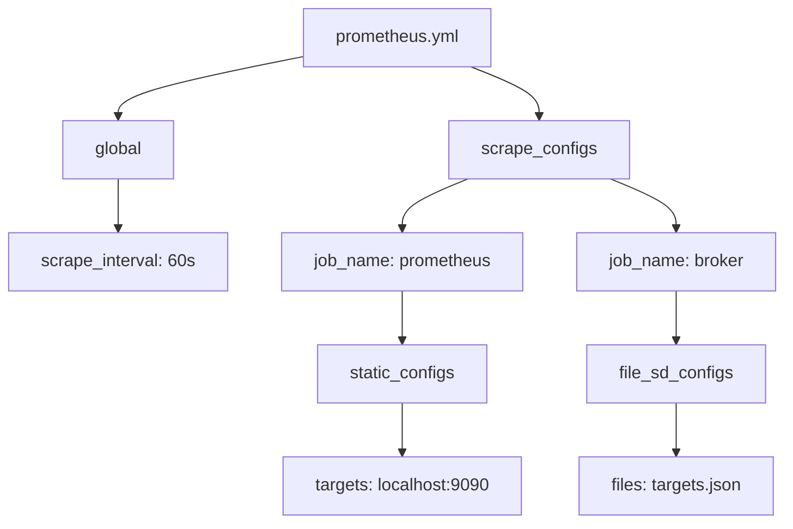
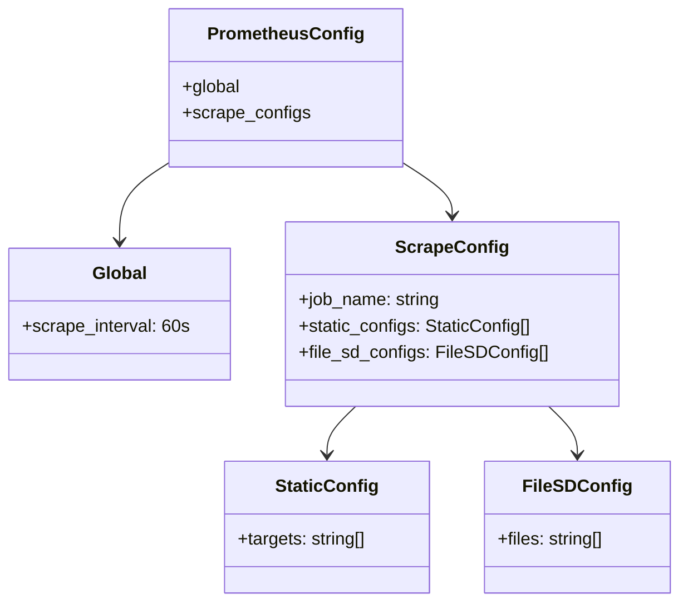

# Diagram: build-deploy/docker/prometheus/prometheus.yml

> Auto-generated by Obscura crawlers

## Diagram 1

### SVG

<svg id="container" width="735" xmlns="http://www.w3.org/2000/svg" class="flowchart" height="486" viewBox="0 0 735 486" role="graphics-document document" aria-roledescription="flowchart-v2"><g><marker id="container_flowchart-v2-pointEnd" class="marker flowchart-v2" viewBox="0 0 10 10" refX="5" refY="5" markerUnits="userSpaceOnUse" markerWidth="8" markerHeight="8" orient="auto"><path d="M 0 0 L 10 5 L 0 10 z" class="arrowMarkerPath" style="stroke-width: 1; stroke-dasharray: 1, 0;"></path></marker><marker id="container_flowchart-v2-pointStart" class="marker flowchart-v2" viewBox="0 0 10 10" refX="4.5" refY="5" markerUnits="userSpaceOnUse" markerWidth="8" markerHeight="8" orient="auto"><path d="M 0 5 L 10 10 L 10 0 z" class="arrowMarkerPath" style="stroke-width: 1; stroke-dasharray: 1, 0;"></path></marker><marker id="container_flowchart-v2-circleEnd" class="marker flowchart-v2" viewBox="0 0 10 10" refX="11" refY="5" markerUnits="userSpaceOnUse" markerWidth="11" markerHeight="11" orient="auto"><circle cx="5" cy="5" r="5" class="arrowMarkerPath" style="stroke-width: 1; stroke-dasharray: 1, 0;"></circle></marker><marker id="container_flowchart-v2-circleStart" class="marker flowchart-v2" viewBox="0 0 10 10" refX="-1" refY="5" markerUnits="userSpaceOnUse" markerWidth="11" markerHeight="11" orient="auto"><circle cx="5" cy="5" r="5" class="arrowMarkerPath" style="stroke-width: 1; stroke-dasharray: 1, 0;"></circle></marker><marker id="container_flowchart-v2-crossEnd" class="marker cross flowchart-v2" viewBox="0 0 11 11" refX="12" refY="5.2" markerUnits="userSpaceOnUse" markerWidth="11" markerHeight="11" orient="auto"><path d="M 1,1 l 9,9 M 10,1 l -9,9" class="arrowMarkerPath" style="stroke-width: 2; stroke-dasharray: 1, 0;"></path></marker><marker id="container_flowchart-v2-crossStart" class="marker cross flowchart-v2" viewBox="0 0 11 11" refX="-1" refY="5.2" markerUnits="userSpaceOnUse" markerWidth="11" markerHeight="11" orient="auto"><path d="M 1,1 l 9,9 M 10,1 l -9,9" class="arrowMarkerPath" style="stroke-width: 2; stroke-dasharray: 1, 0;"></path></marker><g class="root"><g class="clusters"></g><g class="edgePaths"><path d="M283.094,52.6L254.246,58.333C225.398,64.067,167.703,75.533,138.855,84.767C110.008,94,110.008,101,110.008,104.5L110.008,108" id="L_cfg_global_0" class="edge-thickness-normal edge-pattern-solid edge-thickness-normal edge-pattern-solid flowchart-link" style=";" data-edge="true" data-et="edge" data-id="L_cfg_global_0" data-points="W3sieCI6MjgzLjA5Mzc1LCJ5Ijo1Mi41OTk4ODA1NjEzNjE2fSx7IngiOjExMC4wMDc4MTI1LCJ5Ijo4N30seyJ4IjoxMTAuMDA3ODEyNSwieSI6MTEyfV0=" marker-end="url(#container_flowchart-v2-pointEnd)"></path><path d="M110.008,166L110.008,170.167C110.008,174.333,110.008,182.667,110.008,190.333C110.008,198,110.008,205,110.008,208.5L110.008,212" id="L_global_interval_0" class="edge-thickness-normal edge-pattern-solid edge-thickness-normal edge-pattern-solid flowchart-link" style=";" data-edge="true" data-et="edge" data-id="L_global_interval_0" data-points="W3sieCI6MTEwLjAwNzgxMjUsInkiOjE2Nn0seyJ4IjoxMTAuMDA3ODEyNSwieSI6MTkxfSx7IngiOjExMC4wMDc4MTI1LCJ5IjoyMTZ9XQ==" marker-end="url(#container_flowchart-v2-pointEnd)"></path><path d="M440.651,62L451.3,66.167C461.949,70.333,483.246,78.667,493.894,86.333C504.543,94,504.543,101,504.543,104.5L504.543,108" id="L_cfg_scrapes_0" class="edge-thickness-normal edge-pattern-solid edge-thickness-normal edge-pattern-solid flowchart-link" style=";" data-edge="true" data-et="edge" data-id="L_cfg_scrapes_0" data-points="W3sieCI6NDQwLjY1MTM2NzE4NzUsInkiOjYyfSx7IngiOjUwNC41NDI5Njg3NSwieSI6ODd9LHsieCI6NTA0LjU0Mjk2ODc1LCJ5IjoxMTJ9XQ==" marker-end="url(#container_flowchart-v2-pointEnd)"></path><path d="M437.694,166L427.378,170.167C417.062,174.333,396.429,182.667,386.113,190.333C375.797,198,375.797,205,375.797,208.5L375.797,212" id="L_scrapes_job_prom_0" class="edge-thickness-normal edge-pattern-solid edge-thickness-normal edge-pattern-solid flowchart-link" style=";" data-edge="true" data-et="edge" data-id="L_scrapes_job_prom_0" data-points="W3sieCI6NDM3LjY5NDAzNTQ1NjczMDgsInkiOjE2Nn0seyJ4IjozNzUuNzk2ODc1LCJ5IjoxOTF9LHsieCI6Mzc1Ljc5Njg3NSwieSI6MjE2fV0=" marker-end="url(#container_flowchart-v2-pointEnd)"></path><path d="M375.797,270L375.797,274.167C375.797,278.333,375.797,286.667,375.797,294.333C375.797,302,375.797,309,375.797,312.5L375.797,316" id="L_job_prom_static_0" class="edge-thickness-normal edge-pattern-solid edge-thickness-normal edge-pattern-solid flowchart-link" style=";" data-edge="true" data-et="edge" data-id="L_job_prom_static_0" data-points="W3sieCI6Mzc1Ljc5Njg3NSwieSI6MjcwfSx7IngiOjM3NS43OTY4NzUsInkiOjI5NX0seyJ4IjozNzUuNzk2ODc1LCJ5IjozMjB9XQ==" marker-end="url(#container_flowchart-v2-pointEnd)"></path><path d="M375.797,374L375.797,378.167C375.797,382.333,375.797,390.667,375.797,398.333C375.797,406,375.797,413,375.797,416.5L375.797,420" id="L_static_targets_0" class="edge-thickness-normal edge-pattern-solid edge-thickness-normal edge-pattern-solid flowchart-link" style=";" data-edge="true" data-et="edge" data-id="L_static_targets_0" data-points="W3sieCI6Mzc1Ljc5Njg3NSwieSI6Mzc0fSx7IngiOjM3NS43OTY4NzUsInkiOjM5OX0seyJ4IjozNzUuNzk2ODc1LCJ5Ijo0MjR9XQ==" marker-end="url(#container_flowchart-v2-pointEnd)"></path><path d="M571.392,166L581.708,170.167C592.024,174.333,612.657,182.667,622.973,190.333C633.289,198,633.289,205,633.289,208.5L633.289,212" id="L_scrapes_job_broker_0" class="edge-thickness-normal edge-pattern-solid edge-thickness-normal edge-pattern-solid flowchart-link" style=";" data-edge="true" data-et="edge" data-id="L_scrapes_job_broker_0" data-points="W3sieCI6NTcxLjM5MTkwMjA0MzI2OTMsInkiOjE2Nn0seyJ4Ijo2MzMuMjg5MDYyNSwieSI6MTkxfSx7IngiOjYzMy4yODkwNjI1LCJ5IjoyMTZ9XQ==" marker-end="url(#container_flowchart-v2-pointEnd)"></path><path d="M633.289,270L633.289,274.167C633.289,278.333,633.289,286.667,633.289,294.333C633.289,302,633.289,309,633.289,312.5L633.289,316" id="L_job_broker_file_sd_0" class="edge-thickness-normal edge-pattern-solid edge-thickness-normal edge-pattern-solid flowchart-link" style=";" data-edge="true" data-et="edge" data-id="L_job_broker_file_sd_0" data-points="W3sieCI6NjMzLjI4OTA2MjUsInkiOjI3MH0seyJ4Ijo2MzMuMjg5MDYyNSwieSI6Mjk1fSx7IngiOjYzMy4yODkwNjI1LCJ5IjozMjB9XQ==" marker-end="url(#container_flowchart-v2-pointEnd)"></path><path d="M633.289,374L633.289,378.167C633.289,382.333,633.289,390.667,633.289,398.333C633.289,406,633.289,413,633.289,416.5L633.289,420" id="L_file_sd_files_0" class="edge-thickness-normal edge-pattern-solid edge-thickness-normal edge-pattern-solid flowchart-link" style=";" data-edge="true" data-et="edge" data-id="L_file_sd_files_0" data-points="W3sieCI6NjMzLjI4OTA2MjUsInkiOjM3NH0seyJ4Ijo2MzMuMjg5MDYyNSwieSI6Mzk5fSx7IngiOjYzMy4yODkwNjI1LCJ5Ijo0MjR9XQ==" marker-end="url(#container_flowchart-v2-pointEnd)"></path></g><g class="edgeLabels"><g class="edgeLabel"><g class="label" data-id="L_cfg_global_0" transform="translate(0, 0)"><foreignObject width="0" height="0">

</foreignObject></g></g><g class="edgeLabel"><g class="label" data-id="L_global_interval_0" transform="translate(0, 0)"><foreignObject width="0" height="0">

</foreignObject></g></g><g class="edgeLabel"><g class="label" data-id="L_cfg_scrapes_0" transform="translate(0, 0)"><foreignObject width="0" height="0">

</foreignObject></g></g><g class="edgeLabel"><g class="label" data-id="L_scrapes_job_prom_0" transform="translate(0, 0)"><foreignObject width="0" height="0">

</foreignObject></g></g><g class="edgeLabel"><g class="label" data-id="L_job_prom_static_0" transform="translate(0, 0)"><foreignObject width="0" height="0">

</foreignObject></g></g><g class="edgeLabel"><g class="label" data-id="L_static_targets_0" transform="translate(0, 0)"><foreignObject width="0" height="0">

</foreignObject></g></g><g class="edgeLabel"><g class="label" data-id="L_scrapes_job_broker_0" transform="translate(0, 0)"><foreignObject width="0" height="0">

</foreignObject></g></g><g class="edgeLabel"><g class="label" data-id="L_job_broker_file_sd_0" transform="translate(0, 0)"><foreignObject width="0" height="0">

</foreignObject></g></g><g class="edgeLabel"><g class="label" data-id="L_file_sd_files_0" transform="translate(0, 0)"><foreignObject width="0" height="0">

</foreignObject></g></g></g><g class="nodes"><g class="node default" id="flowchart-cfg-0" transform="translate(371.6484375, 35)"><rect class="basic label-container" style="" x="-88.5546875" y="-27" width="177.109375" height="54"></rect><g class="label" style="" transform="translate(-58.5546875, -12)"><rect></rect><foreignObject width="117.109375" height="24">

prometheus.yml

</foreignObject></g></g><g class="node default" id="flowchart-global-2" transform="translate(110.0078125, 139)"><rect class="basic label-container" style="" x="-52.4296875" y="-27" width="104.859375" height="54"></rect><g class="label" style="" transform="translate(-22.4296875, -12)"><rect></rect><foreignObject width="44.859375" height="24">

global

</foreignObject></g></g><g class="node default" id="flowchart-interval-4" transform="translate(110.0078125, 243)"><rect class="basic label-container" style="" x="-102.0078125" y="-27" width="204.015625" height="54"></rect><g class="label" style="" transform="translate(-72.0078125, -12)"><rect></rect><foreignObject width="144.015625" height="24">

scrape_interval: 60s

</foreignObject></g></g><g class="node default" id="flowchart-scrapes-6" transform="translate(504.54296875, 139)"><rect class="basic label-container" style="" x="-83.140625" y="-27" width="166.28125" height="54"></rect><g class="label" style="" transform="translate(-53.140625, -12)"><rect></rect><foreignObject width="106.28125" height="24">

scrape_configs

</foreignObject></g></g><g class="node default" id="flowchart-job_prom-8" transform="translate(375.796875, 243)"><rect class="basic label-container" style="" x="-113.78125" y="-27" width="227.5625" height="54"></rect><g class="label" style="" transform="translate(-83.78125, -12)"><rect></rect><foreignObject width="167.5625" height="24">

job_name: prometheus

</foreignObject></g></g><g class="node default" id="flowchart-static-10" transform="translate(375.796875, 347)"><rect class="basic label-container" style="" x="-79.359375" y="-27" width="158.71875" height="54"></rect><g class="label" style="" transform="translate(-49.359375, -12)"><rect></rect><foreignObject width="98.71875" height="24">

static_configs

</foreignObject></g></g><g class="node default" id="flowchart-targets-12" transform="translate(375.796875, 451)"><rect class="basic label-container" style="" x="-111.734375" y="-27" width="223.46875" height="54"></rect><g class="label" style="" transform="translate(-81.734375, -12)"><rect></rect><foreignObject width="163.46875" height="24">

targets: localhost:9090

</foreignObject></g></g><g class="node default" id="flowchart-job_broker-14" transform="translate(633.2890625, 243)"><rect class="basic label-container" style="" x="-93.7109375" y="-27" width="187.421875" height="54"></rect><g class="label" style="" transform="translate(-63.7109375, -12)"><rect></rect><foreignObject width="127.421875" height="24">

job_name: broker

</foreignObject></g></g><g class="node default" id="flowchart-file_sd-16" transform="translate(633.2890625, 347)"><rect class="basic label-container" style="" x="-83.25" y="-27" width="166.5" height="54"></rect><g class="label" style="" transform="translate(-53.25, -12)"><rect></rect><foreignObject width="106.5" height="24">

file_sd_configs

</foreignObject></g></g><g class="node default" id="flowchart-files-18" transform="translate(633.2890625, 451)"><rect class="basic label-container" style="" x="-91.46875" y="-27" width="182.9375" height="54"></rect><g class="label" style="" transform="translate(-61.46875, -12)"><rect></rect><foreignObject width="122.9375" height="24">

files: targets.json

</foreignObject></g></g></g></g></g></svg>

## Diagram 2

### SVG

<svg id="container" width="609.23828125" xmlns="http://www.w3.org/2000/svg" class="classDiagram" height="548" viewBox="0 0 609.23828125 548" role="graphics-document document" aria-roledescription="class"><g><defs><marker id="container_class-aggregationStart" class="marker aggregation class" refX="18" refY="7" markerWidth="190" markerHeight="240" orient="auto"><path d="M 18,7 L9,13 L1,7 L9,1 Z"></path></marker></defs><defs><marker id="container_class-aggregationEnd" class="marker aggregation class" refX="1" refY="7" markerWidth="20" markerHeight="28" orient="auto"><path d="M 18,7 L9,13 L1,7 L9,1 Z"></path></marker></defs><defs><marker id="container_class-extensionStart" class="marker extension class" refX="18" refY="7" markerWidth="190" markerHeight="240" orient="auto"><path d="M 1,7 L18,13 V 1 Z"></path></marker></defs><defs><marker id="container_class-extensionEnd" class="marker extension class" refX="1" refY="7" markerWidth="20" markerHeight="28" orient="auto"><path d="M 1,1 V 13 L18,7 Z"></path></marker></defs><defs><marker id="container_class-compositionStart" class="marker composition class" refX="18" refY="7" markerWidth="190" markerHeight="240" orient="auto"><path d="M 18,7 L9,13 L1,7 L9,1 Z"></path></marker></defs><defs><marker id="container_class-compositionEnd" class="marker composition class" refX="1" refY="7" markerWidth="20" markerHeight="28" orient="auto"><path d="M 18,7 L9,13 L1,7 L9,1 Z"></path></marker></defs><defs><marker id="container_class-dependencyStart" class="marker dependency class" refX="6" refY="7" markerWidth="190" markerHeight="240" orient="auto"><path d="M 5,7 L9,13 L1,7 L9,1 Z"></path></marker></defs><defs><marker id="container_class-dependencyEnd" class="marker dependency class" refX="13" refY="7" markerWidth="20" markerHeight="28" orient="auto"><path d="M 18,7 L9,13 L14,7 L9,1 Z"></path></marker></defs><defs><marker id="container_class-lollipopStart" class="marker lollipop class" refX="13" refY="7" markerWidth="190" markerHeight="240" orient="auto"><circle stroke="black" fill="transparent" cx="7" cy="7" r="6"></circle></marker></defs><defs><marker id="container_class-lollipopEnd" class="marker lollipop class" refX="1" refY="7" markerWidth="190" markerHeight="240" orient="auto"><circle stroke="black" fill="transparent" cx="7" cy="7" r="6"></circle></marker></defs><g class="root"><g class="clusters"></g><g class="edgePaths"><path d="M153.422,147.129L145.813,152.108C138.203,157.086,122.984,167.043,115.375,179.188C107.766,191.333,107.766,205.667,107.766,212.833L107.766,220" id="id_PrometheusConfig_Global_1" class="edge-thickness-normal edge-pattern-solid relation" style=";;;" data-edge="true" data-et="edge" data-id="id_PrometheusConfig_Global_1" data-points="W3sieCI6MTUzLjQyMTg3NSwieSI6MTQ3LjEyOTQ2OTEwODE1NDR9LHsieCI6MTA3Ljc2NTYyNSwieSI6MTc3fSx7IngiOjEwNy43NjU2MjUsInkiOjIyNn1d" marker-end="url(#container_class-dependencyEnd)"></path><path d="M358.633,147.129L366.242,152.108C373.852,157.086,389.07,167.043,396.68,175.188C404.289,183.333,404.289,189.667,404.289,192.833L404.289,196" id="id_PrometheusConfig_ScrapeConfig_2" class="edge-thickness-normal edge-pattern-solid relation" style=";;;" data-edge="true" data-et="edge" data-id="id_PrometheusConfig_ScrapeConfig_2" data-points="W3sieCI6MzU4LjYzMjgxMjUsInkiOjE0Ny4xMjk0NjkxMDgxNTQ0fSx7IngiOjQwNC4yODkwNjI1LCJ5IjoxNzd9LHsieCI6NDA0LjI4OTA2MjUsInkiOjIwMn1d" marker-end="url(#container_class-dependencyEnd)"></path><path d="M316.921,370L312.587,374.167C308.253,378.333,299.585,386.667,295.252,394C290.918,401.333,290.918,407.667,290.918,410.833L290.918,414" id="id_ScrapeConfig_StaticConfig_3" class="edge-thickness-normal edge-pattern-solid relation" style=";;;" data-edge="true" data-et="edge" data-id="id_ScrapeConfig_StaticConfig_3" data-points="W3sieCI6MzE2LjkyMDUxMzE4ODA3MzQsInkiOjM3MH0seyJ4IjoyOTAuOTE3OTY4NzUsInkiOjM5NX0seyJ4IjoyOTAuOTE3OTY4NzUsInkiOjQyMH1d" marker-end="url(#container_class-dependencyEnd)"></path><path d="M491.658,370L495.991,374.167C500.325,378.333,508.993,386.667,513.326,394C517.66,401.333,517.66,407.667,517.66,410.833L517.66,414" id="id_ScrapeConfig_FileSDConfig_4" class="edge-thickness-normal edge-pattern-solid relation" style=";;;" data-edge="true" data-et="edge" data-id="id_ScrapeConfig_FileSDConfig_4" data-points="W3sieCI6NDkxLjY1NzYxMTgxMTkyNjYsInkiOjM3MH0seyJ4Ijo1MTcuNjYwMTU2MjUsInkiOjM5NX0seyJ4Ijo1MTcuNjYwMTU2MjUsInkiOjQyMH1d" marker-end="url(#container_class-dependencyEnd)"></path></g><g class="edgeLabels"><g class="edgeLabel"><g class="label" data-id="id_PrometheusConfig_Global_1" transform="translate(0, 0)"><foreignObject width="0" height="0">

</foreignObject></g></g><g class="edgeLabel"><g class="label" data-id="id_PrometheusConfig_ScrapeConfig_2" transform="translate(0, 0)"><foreignObject width="0" height="0">

</foreignObject></g></g><g class="edgeLabel"><g class="label" data-id="id_ScrapeConfig_StaticConfig_3" transform="translate(0, 0)"><foreignObject width="0" height="0">

</foreignObject></g></g><g class="edgeLabel"><g class="label" data-id="id_ScrapeConfig_FileSDConfig_4" transform="translate(0, 0)"><foreignObject width="0" height="0">

</foreignObject></g></g></g><g class="nodes"><g class="node default" id="classId-PrometheusConfig-0" transform="translate(256.02734375, 80)"><g class="basic label-container"><path d="M-102.60546875 -72 L102.60546875 -72 L102.60546875 72 L-102.60546875 72" stroke="none" stroke-width="0" fill="#ECECFF" style=""></path><path d="M-102.60546875 -72 C-44.69956374491693 -72, 13.206341260166141 -72, 102.60546875 -72 M-102.60546875 -72 C-56.38662117282149 -72, -10.167773595642984 -72, 102.60546875 -72 M102.60546875 -72 C102.60546875 -37.859341512928886, 102.60546875 -3.7186830258577714, 102.60546875 72 M102.60546875 -72 C102.60546875 -31.419213480146247, 102.60546875 9.161573039707505, 102.60546875 72 M102.60546875 72 C38.77247068155965 72, -25.060527386880693 72, -102.60546875 72 M102.60546875 72 C44.95495700541514 72, -12.695554739169722 72, -102.60546875 72 M-102.60546875 72 C-102.60546875 21.745388445032916, -102.60546875 -28.50922310993417, -102.60546875 -72 M-102.60546875 72 C-102.60546875 36.35532573958154, -102.60546875 0.7106514791630758, -102.60546875 -72" stroke="#9370DB" stroke-width="1.3" fill="none" stroke-dasharray="0 0" style=""></path></g><g class="annotation-group text" transform="translate(0, -48)"></g><g class="label-group text" transform="translate(-66.9453125, -48)"><g class="label" style="font-weight: bolder" transform="translate(0,-12)"><foreignObject width="133.890625" height="24">

PrometheusConfig

</foreignObject></g></g><g class="members-group text" transform="translate(-90.60546875, 0)"><g class="label" style="" transform="translate(0,-12)"><foreignObject width="52.84375" height="24">

+global

</foreignObject></g><g class="label" style="" transform="translate(0,12)"><foreignObject width="114.265625" height="24">

+scrape_configs

</foreignObject></g></g><g class="methods-group text" transform="translate(-90.60546875, 72)"></g><g class="divider" style=""><path d="M-102.60546875 -24 C-39.486397665700785 -24, 23.63267341859843 -24, 102.60546875 -24 M-102.60546875 -24 C-27.52056575173941 -24, 47.56433724652118 -24, 102.60546875 -24" stroke="#9370DB" stroke-width="1.3" fill="none" stroke-dasharray="0 0" style=""></path></g><g class="divider" style=""><path d="M-102.60546875 48 C-57.71093922124196 48, -12.816409692483916 48, 102.60546875 48 M-102.60546875 48 C-49.28257947031579 48, 4.0403098093684235 48, 102.60546875 48" stroke="#9370DB" stroke-width="1.3" fill="none" stroke-dasharray="0 0" style=""></path></g></g><g class="node default" id="classId-Global-1" transform="translate(107.765625, 286)"><g class="basic label-container"><path d="M-99.765625 -60 L99.765625 -60 L99.765625 60 L-99.765625 60" stroke="none" stroke-width="0" fill="#ECECFF" style=""></path><path d="M-99.765625 -60 C-43.56247502148977 -60, 12.640674957020465 -60, 99.765625 -60 M-99.765625 -60 C-42.28942315101389 -60, 15.186778697972215 -60, 99.765625 -60 M99.765625 -60 C99.765625 -20.954032071096414, 99.765625 18.091935857807172, 99.765625 60 M99.765625 -60 C99.765625 -13.437414897687795, 99.765625 33.12517020462441, 99.765625 60 M99.765625 60 C50.94220831189086 60, 2.1187916237817177 60, -99.765625 60 M99.765625 60 C45.15636826709635 60, -9.452888465807305 60, -99.765625 60 M-99.765625 60 C-99.765625 22.861812279409676, -99.765625 -14.276375441180647, -99.765625 -60 M-99.765625 60 C-99.765625 32.965337629218006, -99.765625 5.930675258436011, -99.765625 -60" stroke="#9370DB" stroke-width="1.3" fill="none" stroke-dasharray="0 0" style=""></path></g><g class="annotation-group text" transform="translate(0, -36)"></g><g class="label-group text" transform="translate(-23.546875, -36)"><g class="label" style="font-weight: bolder" transform="translate(0,-12)"><foreignObject width="47.09375" height="24">

Global

</foreignObject></g></g><g class="members-group text" transform="translate(-87.765625, 12)"><g class="label" style="" transform="translate(0,-12)"><foreignObject width="151.984375" height="24">

+scrape_interval: 60s

</foreignObject></g></g><g class="methods-group text" transform="translate(-87.765625, 60)"></g><g class="divider" style=""><path d="M-99.765625 -12 C-56.99556520251272 -12, -14.225505405025444 -12, 99.765625 -12 M-99.765625 -12 C-39.78270990072422 -12, 20.200205198551558 -12, 99.765625 -12" stroke="#9370DB" stroke-width="1.3" fill="none" stroke-dasharray="0 0" style=""></path></g><g class="divider" style=""><path d="M-99.765625 36 C-56.18810891639252 36, -12.610592832785045 36, 99.765625 36 M-99.765625 36 C-30.75816562968376 36, 38.24929374063248 36, 99.765625 36" stroke="#9370DB" stroke-width="1.3" fill="none" stroke-dasharray="0 0" style=""></path></g></g><g class="node default" id="classId-ScrapeConfig-2" transform="translate(404.2890625, 286)"><g class="basic label-container"><path d="M-146.7578125 -84 L146.7578125 -84 L146.7578125 84 L-146.7578125 84" stroke="none" stroke-width="0" fill="#ECECFF" style=""></path><path d="M-146.7578125 -84 C-71.39764220716776 -84, 3.9625280856644736 -84, 146.7578125 -84 M-146.7578125 -84 C-59.530246182354844 -84, 27.697320135290312 -84, 146.7578125 -84 M146.7578125 -84 C146.7578125 -41.20669681019294, 146.7578125 1.5866063796141248, 146.7578125 84 M146.7578125 -84 C146.7578125 -22.098559242343953, 146.7578125 39.802881515312095, 146.7578125 84 M146.7578125 84 C83.2623380067341 84, 19.76686351346818 84, -146.7578125 84 M146.7578125 84 C35.00013618238113 84, -76.75754013523775 84, -146.7578125 84 M-146.7578125 84 C-146.7578125 25.798248594187854, -146.7578125 -32.40350281162429, -146.7578125 -84 M-146.7578125 84 C-146.7578125 19.96278413994601, -146.7578125 -44.07443172010798, -146.7578125 -84" stroke="#9370DB" stroke-width="1.3" fill="none" stroke-dasharray="0 0" style=""></path></g><g class="annotation-group text" transform="translate(0, -60)"></g><g class="label-group text" transform="translate(-47.84375, -60)"><g class="label" style="font-weight: bolder" transform="translate(0,-12)"><foreignObject width="95.6875" height="24">

ScrapeConfig

</foreignObject></g></g><g class="members-group text" transform="translate(-134.7578125, -12)"><g class="label" style="" transform="translate(0,-12)"><foreignObject width="129.390625" height="24">

+job_name: string

</foreignObject></g><g class="label" style="" transform="translate(0,12)"><foreignObject width="210.984375" height="24">

+static_configs: StaticConfig[]

</foreignObject></g><g class="label" style="" transform="translate(0,36)"><foreignObject width="221.671875" height="24">

+file_sd_configs: FileSDConfig[]

</foreignObject></g></g><g class="methods-group text" transform="translate(-134.7578125, 84)"></g><g class="divider" style=""><path d="M-146.7578125 -36 C-67.9742603549507 -36, 10.809291790098598 -36, 146.7578125 -36 M-146.7578125 -36 C-62.416978341760824 -36, 21.92385581647835 -36, 146.7578125 -36" stroke="#9370DB" stroke-width="1.3" fill="none" stroke-dasharray="0 0" style=""></path></g><g class="divider" style=""><path d="M-146.7578125 60 C-68.14130382907369 60, 10.475204841852616 60, 146.7578125 60 M-146.7578125 60 C-79.92622947821425 60, -13.094646456428507 60, 146.7578125 60" stroke="#9370DB" stroke-width="1.3" fill="none" stroke-dasharray="0 0" style=""></path></g></g><g class="node default" id="classId-StaticConfig-3" transform="translate(290.91796875, 480)"><g class="basic label-container"><path d="M-93.1640625 -60 L93.1640625 -60 L93.1640625 60 L-93.1640625 60" stroke="none" stroke-width="0" fill="#ECECFF" style=""></path><path d="M-93.1640625 -60 C-32.6793065537939 -60, 27.8054493924122 -60, 93.1640625 -60 M-93.1640625 -60 C-26.43669341776527 -60, 40.29067566446946 -60, 93.1640625 -60 M93.1640625 -60 C93.1640625 -19.78008538797058, 93.1640625 20.43982922405884, 93.1640625 60 M93.1640625 -60 C93.1640625 -13.449930758393549, 93.1640625 33.1001384832129, 93.1640625 60 M93.1640625 60 C30.818543262211954 60, -31.526975975576093 60, -93.1640625 60 M93.1640625 60 C47.437119580446556 60, 1.7101766608931115 60, -93.1640625 60 M-93.1640625 60 C-93.1640625 33.741956612253965, -93.1640625 7.48391322450793, -93.1640625 -60 M-93.1640625 60 C-93.1640625 28.047943566636505, -93.1640625 -3.90411286672699, -93.1640625 -60" stroke="#9370DB" stroke-width="1.3" fill="none" stroke-dasharray="0 0" style=""></path></g><g class="annotation-group text" transform="translate(0, -36)"></g><g class="label-group text" transform="translate(-44.0625, -36)"><g class="label" style="font-weight: bolder" transform="translate(0,-12)"><foreignObject width="88.125" height="24">

StaticConfig

</foreignObject></g></g><g class="members-group text" transform="translate(-81.1640625, 12)"><g class="label" style="" transform="translate(0,-12)"><foreignObject width="118.265625" height="24">

+targets: string[]

</foreignObject></g></g><g class="methods-group text" transform="translate(-81.1640625, 60)"></g><g class="divider" style=""><path d="M-93.1640625 -12 C-52.21320248611826 -12, -11.262342472236526 -12, 93.1640625 -12 M-93.1640625 -12 C-20.61646246433034 -12, 51.93113757133932 -12, 93.1640625 -12" stroke="#9370DB" stroke-width="1.3" fill="none" stroke-dasharray="0 0" style=""></path></g><g class="divider" style=""><path d="M-93.1640625 36 C-50.51017248226923 36, -7.856282464538467 36, 93.1640625 36 M-93.1640625 36 C-19.92396682773743 36, 53.31612884452514 36, 93.1640625 36" stroke="#9370DB" stroke-width="1.3" fill="none" stroke-dasharray="0 0" style=""></path></g></g><g class="node default" id="classId-FileSDConfig-4" transform="translate(517.66015625, 480)"><g class="basic label-container"><path d="M-83.578125 -60 L83.578125 -60 L83.578125 60 L-83.578125 60" stroke="none" stroke-width="0" fill="#ECECFF" style=""></path><path d="M-83.578125 -60 C-30.12250347933415 -60, 23.3331180413317 -60, 83.578125 -60 M-83.578125 -60 C-20.230991728592706 -60, 43.11614154281459 -60, 83.578125 -60 M83.578125 -60 C83.578125 -14.027192319387197, 83.578125 31.945615361225606, 83.578125 60 M83.578125 -60 C83.578125 -13.7683089495645, 83.578125 32.463382100871, 83.578125 60 M83.578125 60 C21.29454145302941 60, -40.98904209394118 60, -83.578125 60 M83.578125 60 C45.66418086323624 60, 7.75023672647248 60, -83.578125 60 M-83.578125 60 C-83.578125 35.812318040370144, -83.578125 11.624636080740288, -83.578125 -60 M-83.578125 60 C-83.578125 28.33085883964571, -83.578125 -3.338282320708579, -83.578125 -60" stroke="#9370DB" stroke-width="1.3" fill="none" stroke-dasharray="0 0" style=""></path></g><g class="annotation-group text" transform="translate(0, -36)"></g><g class="label-group text" transform="translate(-45.390625, -36)"><g class="label" style="font-weight: bolder" transform="translate(0,-12)"><foreignObject width="90.78125" height="24">

FileSDConfig

</foreignObject></g></g><g class="members-group text" transform="translate(-71.578125, 12)"><g class="label" style="" transform="translate(0,-12)"><foreignObject width="97.765625" height="24">

+files: string[]

</foreignObject></g></g><g class="methods-group text" transform="translate(-71.578125, 60)"></g><g class="divider" style=""><path d="M-83.578125 -12 C-49.256421814082856 -12, -14.934718628165712 -12, 83.578125 -12 M-83.578125 -12 C-25.620347951924998 -12, 32.337429096150004 -12, 83.578125 -12" stroke="#9370DB" stroke-width="1.3" fill="none" stroke-dasharray="0 0" style=""></path></g><g class="divider" style=""><path d="M-83.578125 36 C-26.978356993110765 36, 29.62141101377847 36, 83.578125 36 M-83.578125 36 C-46.728016567687064 36, -9.877908135374128 36, 83.578125 36" stroke="#9370DB" stroke-width="1.3" fill="none" stroke-dasharray="0 0" style=""></path></g></g></g></g></g></svg>
