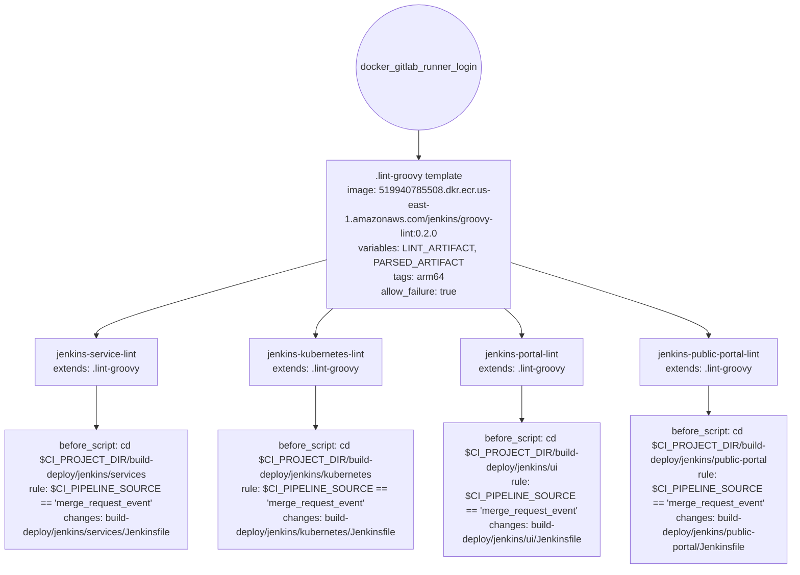
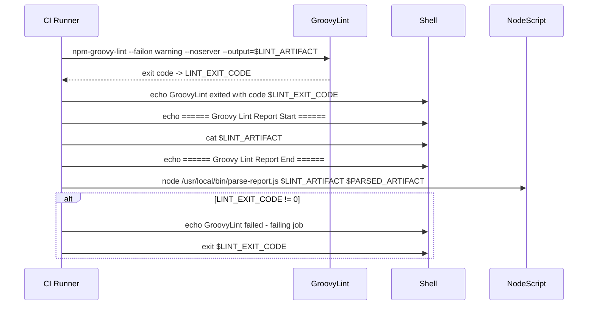

# Diagram: build-deploy/jenkins/.gitlab-ci.yml

> Auto-generated by Obscura crawlers

## Diagram 1

### SVG

<svg id="container" width="1363.828125" xmlns="http://www.w3.org/2000/svg" class="flowchart" height="973.140625" viewBox="0 0 1363.828125 973.140625" role="graphics-document document" aria-roledescription="flowchart-v2"><g><marker id="container_flowchart-v2-pointEnd" class="marker flowchart-v2" viewBox="0 0 10 10" refX="5" refY="5" markerUnits="userSpaceOnUse" markerWidth="8" markerHeight="8" orient="auto"><path d="M 0 0 L 10 5 L 0 10 z" class="arrowMarkerPath" style="stroke-width: 1; stroke-dasharray: 1, 0;"></path></marker><marker id="container_flowchart-v2-pointStart" class="marker flowchart-v2" viewBox="0 0 10 10" refX="4.5" refY="5" markerUnits="userSpaceOnUse" markerWidth="8" markerHeight="8" orient="auto"><path d="M 0 5 L 10 10 L 10 0 z" class="arrowMarkerPath" style="stroke-width: 1; stroke-dasharray: 1, 0;"></path></marker><marker id="container_flowchart-v2-circleEnd" class="marker flowchart-v2" viewBox="0 0 10 10" refX="11" refY="5" markerUnits="userSpaceOnUse" markerWidth="11" markerHeight="11" orient="auto"><circle cx="5" cy="5" r="5" class="arrowMarkerPath" style="stroke-width: 1; stroke-dasharray: 1, 0;"></circle></marker><marker id="container_flowchart-v2-circleStart" class="marker flowchart-v2" viewBox="0 0 10 10" refX="-1" refY="5" markerUnits="userSpaceOnUse" markerWidth="11" markerHeight="11" orient="auto"><circle cx="5" cy="5" r="5" class="arrowMarkerPath" style="stroke-width: 1; stroke-dasharray: 1, 0;"></circle></marker><marker id="container_flowchart-v2-crossEnd" class="marker cross flowchart-v2" viewBox="0 0 11 11" refX="12" refY="5.2" markerUnits="userSpaceOnUse" markerWidth="11" markerHeight="11" orient="auto"><path d="M 1,1 l 9,9 M 10,1 l -9,9" class="arrowMarkerPath" style="stroke-width: 2; stroke-dasharray: 1, 0;"></path></marker><marker id="container_flowchart-v2-crossStart" class="marker cross flowchart-v2" viewBox="0 0 11 11" refX="-1" refY="5.2" markerUnits="userSpaceOnUse" markerWidth="11" markerHeight="11" orient="auto"><path d="M 1,1 l 9,9 M 10,1 l -9,9" class="arrowMarkerPath" style="stroke-width: 2; stroke-dasharray: 1, 0;"></path></marker><g class="root"><g class="clusters"></g><g class="edgePaths"><path d="M728.727,221.141L728.727,225.307C728.727,229.474,728.727,237.807,728.727,245.474C728.727,253.141,728.727,260.141,728.727,263.641L728.727,267.141" id="L_DOCKER_LINT_0" class="edge-thickness-normal edge-pattern-solid edge-thickness-normal edge-pattern-solid flowchart-link" style=";" data-edge="true" data-et="edge" data-id="L_DOCKER_LINT_0" data-points="W3sieCI6NzI4LjcyNjU2MjUsInkiOjIyMS4xNDA2MjV9LHsieCI6NzI4LjcyNjU2MjUsInkiOjI0Ni4xNDA2MjV9LHsieCI6NzI4LjcyNjU2MjUsInkiOjI3MS4xNDA2MjV9XQ==" marker-end="url(#container_flowchart-v2-pointEnd)"></path><path d="M572.68,435.309L505.19,453.114C437.701,470.92,302.721,506.53,235.232,527.835C167.742,549.141,167.742,556.141,167.742,559.641L167.742,563.141" id="L_LINT_JSRV_0" class="edge-thickness-normal edge-pattern-solid edge-thickness-normal edge-pattern-solid flowchart-link" style=";" data-edge="true" data-et="edge" data-id="L_LINT_JSRV_0" data-points="W3sieCI6NTcyLjY3OTY4NzUsInkiOjQzNS4zMDkyMTgxNTM3NzU0fSx7IngiOjE2Ny43NDIxODc1LCJ5Ijo1NDIuMTQwNjI1fSx7IngiOjE2Ny43NDIxODc1LCJ5Ijo1NjcuMTQwNjI1fV0=" marker-end="url(#container_flowchart-v2-pointEnd)"></path><path d="M579.476,517.141L574.42,521.307C569.364,525.474,559.252,533.807,554.197,541.474C549.141,549.141,549.141,556.141,549.141,559.641L549.141,563.141" id="L_LINT_JKUBE_0" class="edge-thickness-normal edge-pattern-solid edge-thickness-normal edge-pattern-solid flowchart-link" style=";" data-edge="true" data-et="edge" data-id="L_LINT_JKUBE_0" data-points="W3sieCI6NTc5LjQ3NjA4NzQxNTU0MDUsInkiOjUxNy4xNDA2MjV9LHsieCI6NTQ5LjE0MDYyNSwieSI6NTQyLjE0MDYyNX0seyJ4Ijo1NDkuMTQwNjI1LCJ5Ijo1NjcuMTQwNjI1fV0=" marker-end="url(#container_flowchart-v2-pointEnd)"></path><path d="M877.977,517.141L883.033,521.307C888.089,525.474,898.201,533.807,903.257,541.474C908.313,549.141,908.313,556.141,908.313,559.641L908.313,563.141" id="L_LINT_JPORT_0" class="edge-thickness-normal edge-pattern-solid edge-thickness-normal edge-pattern-solid flowchart-link" style=";" data-edge="true" data-et="edge" data-id="L_LINT_JPORT_0" data-points="W3sieCI6ODc3Ljk3NzAzNzU4NDQ1OTUsInkiOjUxNy4xNDA2MjV9LHsieCI6OTA4LjMxMjUsInkiOjU0Mi4xNDA2MjV9LHsieCI6OTA4LjMxMjUsInkiOjU2Ny4xNDA2MjV9XQ==" marker-end="url(#container_flowchart-v2-pointEnd)"></path><path d="M884.773,440.6L941.616,457.523C998.458,474.447,1112.143,508.294,1168.986,528.717C1225.828,549.141,1225.828,556.141,1225.828,559.641L1225.828,563.141" id="L_LINT_JPUB_0" class="edge-thickness-normal edge-pattern-solid edge-thickness-normal edge-pattern-solid flowchart-link" style=";" data-edge="true" data-et="edge" data-id="L_LINT_JPUB_0" data-points="W3sieCI6ODg0Ljc3MzQzNzUsInkiOjQ0MC41OTk4MTgxMzUyMDU2fSx7IngiOjEyMjUuODI4MTI1LCJ5Ijo1NDIuMTQwNjI1fSx7IngiOjEyMjUuODI4MTI1LCJ5Ijo1NjcuMTQwNjI1fV0=" marker-end="url(#container_flowchart-v2-pointEnd)"></path><path d="M167.742,645.141L167.742,649.307C167.742,653.474,167.742,661.807,167.742,675.474C167.742,689.141,167.742,708.141,167.742,717.641L167.742,727.141" id="L_JSRV_SVC_DIR_0" class="edge-thickness-normal edge-pattern-solid edge-thickness-normal edge-pattern-solid flowchart-link" style=";" data-edge="true" data-et="edge" data-id="L_JSRV_SVC_DIR_0" data-points="W3sieCI6MTY3Ljc0MjE4NzUsInkiOjY0NS4xNDA2MjV9LHsieCI6MTY3Ljc0MjE4NzUsInkiOjY3MC4xNDA2MjV9LHsieCI6MTY3Ljc0MjE4NzUsInkiOjczMS4xNDA2MjV9XQ==" marker-end="url(#container_flowchart-v2-pointEnd)"></path><path d="M549.141,645.141L549.141,649.307C549.141,653.474,549.141,661.807,549.141,675.474C549.141,689.141,549.141,708.141,549.141,717.641L549.141,727.141" id="L_JKUBE_KUBE_DIR_0" class="edge-thickness-normal edge-pattern-solid edge-thickness-normal edge-pattern-solid flowchart-link" style=";" data-edge="true" data-et="edge" data-id="L_JKUBE_KUBE_DIR_0" data-points="W3sieCI6NTQ5LjE0MDYyNSwieSI6NjQ1LjE0MDYyNX0seyJ4Ijo1NDkuMTQwNjI1LCJ5Ijo2NzAuMTQwNjI1fSx7IngiOjU0OS4xNDA2MjUsInkiOjczMS4xNDA2MjV9XQ==" marker-end="url(#container_flowchart-v2-pointEnd)"></path><path d="M908.313,645.141L908.313,649.307C908.313,653.474,908.313,661.807,908.313,675.474C908.313,689.141,908.313,708.141,908.313,717.641L908.313,727.141" id="L_JPORT_UI_DIR_0" class="edge-thickness-normal edge-pattern-solid edge-thickness-normal edge-pattern-solid flowchart-link" style=";" data-edge="true" data-et="edge" data-id="L_JPORT_UI_DIR_0" data-points="W3sieCI6OTA4LjMxMjUsInkiOjY0NS4xNDA2MjV9LHsieCI6OTA4LjMxMjUsInkiOjY3MC4xNDA2MjV9LHsieCI6OTA4LjMxMjUsInkiOjczMS4xNDA2MjV9XQ==" marker-end="url(#container_flowchart-v2-pointEnd)"></path><path d="M1225.828,645.141L1225.828,649.307C1225.828,653.474,1225.828,661.807,1225.828,669.474C1225.828,677.141,1225.828,684.141,1225.828,687.641L1225.828,691.141" id="L_JPUB_PUB_DIR_0" class="edge-thickness-normal edge-pattern-solid edge-thickness-normal edge-pattern-solid flowchart-link" style=";" data-edge="true" data-et="edge" data-id="L_JPUB_PUB_DIR_0" data-points="W3sieCI6MTIyNS44MjgxMjUsInkiOjY0NS4xNDA2MjV9LHsieCI6MTIyNS44MjgxMjUsInkiOjY3MC4xNDA2MjV9LHsieCI6MTIyNS44MjgxMjUsInkiOjY5NS4xNDA2MjV9XQ==" marker-end="url(#container_flowchart-v2-pointEnd)"></path></g><g class="edgeLabels"><g class="edgeLabel"><g class="label" data-id="L_DOCKER_LINT_0" transform="translate(0, 0)"><foreignObject width="0" height="0">

</foreignObject></g></g><g class="edgeLabel"><g class="label" data-id="L_LINT_JSRV_0" transform="translate(0, 0)"><foreignObject width="0" height="0">

</foreignObject></g></g><g class="edgeLabel"><g class="label" data-id="L_LINT_JKUBE_0" transform="translate(0, 0)"><foreignObject width="0" height="0">

</foreignObject></g></g><g class="edgeLabel"><g class="label" data-id="L_LINT_JPORT_0" transform="translate(0, 0)"><foreignObject width="0" height="0">

</foreignObject></g></g><g class="edgeLabel"><g class="label" data-id="L_LINT_JPUB_0" transform="translate(0, 0)"><foreignObject width="0" height="0">

</foreignObject></g></g><g class="edgeLabel"><g class="label" data-id="L_JSRV_SVC_DIR_0" transform="translate(0, 0)"><foreignObject width="0" height="0">

</foreignObject></g></g><g class="edgeLabel"><g class="label" data-id="L_JKUBE_KUBE_DIR_0" transform="translate(0, 0)"><foreignObject width="0" height="0">

</foreignObject></g></g><g class="edgeLabel"><g class="label" data-id="L_JPORT_UI_DIR_0" transform="translate(0, 0)"><foreignObject width="0" height="0">

</foreignObject></g></g><g class="edgeLabel"><g class="label" data-id="L_JPUB_PUB_DIR_0" transform="translate(0, 0)"><foreignObject width="0" height="0">

</foreignObject></g></g></g><g class="nodes"><g class="node default" id="flowchart-DOCKER-0" transform="translate(728.7265625, 114.5703125)"><circle class="basic label-container" style="" r="106.5703125" cx="0" cy="0"></circle><g class="label" style="" transform="translate(-99.0703125, -12)"><rect></rect><foreignObject width="198.140625" height="24">

docker_gitlab_runner_login

</foreignObject></g></g><g class="node default" id="flowchart-LINT-1" transform="translate(728.7265625, 394.140625)"><rect class="basic label-container" style="" x="-156.046875" y="-123" width="312.09375" height="246"></rect><g class="label" style="" transform="translate(-126.046875, -108)"><rect></rect><foreignObject width="252.09375" height="216">

.lint-groovy template image: 519940785508.dkr.ecr.us-east-1.amazonaws.com/jenkins/groovy-lint:0.2.0 variables: LINT_ARTIFACT, PARSED_ARTIFACT tags: arm64 allow_failure: true

</foreignObject></g></g><g class="node default" id="flowchart-JSRV-5" transform="translate(167.7421875, 606.140625)"><rect class="basic label-container" style="" x="-103.7421875" y="-39" width="207.484375" height="78"></rect><g class="label" style="" transform="translate(-73.7421875, -24)"><rect></rect><foreignObject width="147.484375" height="48">

jenkins-service-lint extends: .lint-groovy

</foreignObject></g></g><g class="node default" id="flowchart-JKUBE-7" transform="translate(549.140625, 606.140625)"><rect class="basic label-container" style="" x="-115.34375" y="-39" width="230.6875" height="78"></rect><g class="label" style="" transform="translate(-85.34375, -24)"><rect></rect><foreignObject width="170.6875" height="48">

jenkins-kubernetes-lint extends: .lint-groovy

</foreignObject></g></g><g class="node default" id="flowchart-JPORT-9" transform="translate(908.3125, 606.140625)"><rect class="basic label-container" style="" x="-103.7421875" y="-39" width="207.484375" height="78"></rect><g class="label" style="" transform="translate(-73.7421875, -24)"><rect></rect><foreignObject width="147.484375" height="48">

jenkins-portal-lint extends: .lint-groovy

</foreignObject></g></g><g class="node default" id="flowchart-JPUB-11" transform="translate(1225.828125, 606.140625)"><rect class="basic label-container" style="" x="-121.953125" y="-39" width="243.90625" height="78"></rect><g class="label" style="" transform="translate(-91.953125, -24)"><rect></rect><foreignObject width="183.90625" height="48">

jenkins-public-portal-lint extends: .lint-groovy

</foreignObject></g></g><g class="node default" id="flowchart-SVC_DIR-13" transform="translate(167.7421875, 830.140625)"><rect class="basic label-container" style="" x="-159.7421875" y="-99" width="319.484375" height="198"></rect><g class="label" style="" transform="translate(-129.7421875, -84)"><rect></rect><foreignObject width="259.484375" height="168">

before_script: cd $CI_PROJECT_DIR/build-deploy/jenkins/services rule: $CI_PIPELINE_SOURCE == 'merge_request_event' changes: build-deploy/jenkins/services/Jenkinsfile

</foreignObject></g></g><g class="node default" id="flowchart-KUBE_DIR-15" transform="translate(549.140625, 830.140625)"><rect class="basic label-container" style="" x="-171.65625" y="-99" width="343.3125" height="198"></rect><g class="label" style="" transform="translate(-141.65625, -84)"><rect></rect><foreignObject width="283.3125" height="168">

before_script: cd $CI_PROJECT_DIR/build-deploy/jenkins/kubernetes rule: $CI_PIPELINE_SOURCE == 'merge_request_event' changes: build-deploy/jenkins/kubernetes/Jenkinsfile

</foreignObject></g></g><g class="node default" id="flowchart-UI_DIR-17" transform="translate(908.3125, 830.140625)"><rect class="basic label-container" style="" x="-137.515625" y="-99" width="275.03125" height="198"></rect><g class="label" style="" transform="translate(-107.515625, -84)"><rect></rect><foreignObject width="215.03125" height="168">

before_script: cd $CI_PROJECT_DIR/build-deploy/jenkins/ui rule: $CI_PIPELINE_SOURCE == 'merge_request_event' changes: build-deploy/jenkins/ui/Jenkinsfile

</foreignObject></g></g><g class="node default" id="flowchart-PUB_DIR-19" transform="translate(1225.828125, 830.140625)"><rect class="basic label-container" style="" x="-130" y="-135" width="260" height="270"></rect><g class="label" style="" transform="translate(-100, -120)"><rect></rect><foreignObject width="200" height="240">

before_script: cd $CI_PROJECT_DIR/build-deploy/jenkins/public-portal rule: $CI_PIPELINE_SOURCE == 'merge_request_event' changes: build-deploy/jenkins/public-portal/Jenkinsfile

</foreignObject></g></g></g></g></g></svg>

## Diagram 2

### SVG

<svg id="container" width="1227" xmlns="http://www.w3.org/2000/svg" height="658" viewBox="-50 -10 1227 658" role="graphics-document document" aria-roledescription="sequence"><g><rect x="977" y="572" fill="#eaeaea" stroke="#666" width="150" height="65" name="Node" rx="3" ry="3" class="actor actor-bottom"></rect><text x="1052" y="604.5" dominant-baseline="central" alignment-baseline="central" class="actor actor-box" style="text-anchor: middle; font-size: 16px; font-weight: 400;"><tspan x="1052" dy="0">NodeScript</tspan></text></g><g><rect x="777" y="572" fill="#eaeaea" stroke="#666" width="150" height="65" name="Shell" rx="3" ry="3" class="actor actor-bottom"></rect><text x="852" y="604.5" dominant-baseline="central" alignment-baseline="central" class="actor actor-box" style="text-anchor: middle; font-size: 16px; font-weight: 400;"><tspan x="852" dy="0">Shell</tspan></text></g><g><rect x="577" y="572" fill="#eaeaea" stroke="#666" width="150" height="65" name="Groovy" rx="3" ry="3" class="actor actor-bottom"></rect><text x="652" y="604.5" dominant-baseline="central" alignment-baseline="central" class="actor actor-box" style="text-anchor: middle; font-size: 16px; font-weight: 400;"><tspan x="652" dy="0">GroovyLint</tspan></text></g><g><rect x="0" y="572" fill="#eaeaea" stroke="#666" width="150" height="65" name="Runner" rx="3" ry="3" class="actor actor-bottom"></rect><text x="75" y="604.5" dominant-baseline="central" alignment-baseline="central" class="actor actor-box" style="text-anchor: middle; font-size: 16px; font-weight: 400;"><tspan x="75" dy="0">CI Runner</tspan></text></g><g><line id="actor3" x1="1052" y1="65" x2="1052" y2="572" class="actor-line 200" stroke-width="0.5px" stroke="#999" name="Node"></line><g id="root-3"><rect x="977" y="0" fill="#eaeaea" stroke="#666" width="150" height="65" name="Node" rx="3" ry="3" class="actor actor-top"></rect><text x="1052" y="32.5" dominant-baseline="central" alignment-baseline="central" class="actor actor-box" style="text-anchor: middle; font-size: 16px; font-weight: 400;"><tspan x="1052" dy="0">NodeScript</tspan></text></g></g><g><line id="actor2" x1="852" y1="65" x2="852" y2="572" class="actor-line 200" stroke-width="0.5px" stroke="#999" name="Shell"></line><g id="root-2"><rect x="777" y="0" fill="#eaeaea" stroke="#666" width="150" height="65" name="Shell" rx="3" ry="3" class="actor actor-top"></rect><text x="852" y="32.5" dominant-baseline="central" alignment-baseline="central" class="actor actor-box" style="text-anchor: middle; font-size: 16px; font-weight: 400;"><tspan x="852" dy="0">Shell</tspan></text></g></g><g><line id="actor1" x1="652" y1="65" x2="652" y2="572" class="actor-line 200" stroke-width="0.5px" stroke="#999" name="Groovy"></line><g id="root-1"><rect x="577" y="0" fill="#eaeaea" stroke="#666" width="150" height="65" name="Groovy" rx="3" ry="3" class="actor actor-top"></rect><text x="652" y="32.5" dominant-baseline="central" alignment-baseline="central" class="actor actor-box" style="text-anchor: middle; font-size: 16px; font-weight: 400;"><tspan x="652" dy="0">GroovyLint</tspan></text></g></g><g><line id="actor0" x1="75" y1="65" x2="75" y2="572" class="actor-line 200" stroke-width="0.5px" stroke="#999" name="Runner"></line><g id="root-0"><rect x="0" y="0" fill="#eaeaea" stroke="#666" width="150" height="65" name="Runner" rx="3" ry="3" class="actor actor-top"></rect><text x="75" y="32.5" dominant-baseline="central" alignment-baseline="central" class="actor actor-box" style="text-anchor: middle; font-size: 16px; font-weight: 400;"><tspan x="75" dy="0">CI Runner</tspan></text></g></g><g></g><defs><symbol id="computer" width="24" height="24"><path transform="scale(.5)" d="M2 2v13h20v-13h-20zm18 11h-16v-9h16v9zm-10.228 6l.466-1h3.524l.467 1h-4.457zm14.228 3h-24l2-6h2.104l-1.33 4h18.45l-1.297-4h2.073l2 6zm-5-10h-14v-7h14v7z"></path></symbol></defs><defs><symbol id="database" fill-rule="evenodd" clip-rule="evenodd"><path transform="scale(.5)" d="M12.258.001l.256.004.255.005.253.008.251.01.249.012.247.015.246.016.242.019.241.02.239.023.236.024.233.027.231.028.229.031.225.032.223.034.22.036.217.038.214.04.211.041.208.043.205.045.201.046.198.048.194.05.191.051.187.053.183.054.18.056.175.057.172.059.168.06.163.061.16.063.155.064.15.066.074.033.073.033.071.034.07.034.069.035.068.035.067.035.066.035.064.036.064.036.062.036.06.036.06.037.058.037.058.037.055.038.055.038.053.038.052.038.051.039.05.039.048.039.047.039.045.04.044.04.043.04.041.04.04.041.039.041.037.041.036.041.034.041.033.042.032.042.03.042.029.042.027.042.026.043.024.043.023.043.021.043.02.043.018.044.017.043.015.044.013.044.012.044.011.045.009.044.007.045.006.045.004.045.002.045.001.045v17l-.001.045-.002.045-.004.045-.006.045-.007.045-.009.044-.011.045-.012.044-.013.044-.015.044-.017.043-.018.044-.02.043-.021.043-.023.043-.024.043-.026.043-.027.042-.029.042-.03.042-.032.042-.033.042-.034.041-.036.041-.037.041-.039.041-.04.041-.041.04-.043.04-.044.04-.045.04-.047.039-.048.039-.05.039-.051.039-.052.038-.053.038-.055.038-.055.038-.058.037-.058.037-.06.037-.06.036-.062.036-.064.036-.064.036-.066.035-.067.035-.068.035-.069.035-.07.034-.071.034-.073.033-.074.033-.15.066-.155.064-.16.063-.163.061-.168.06-.172.059-.175.057-.18.056-.183.054-.187.053-.191.051-.194.05-.198.048-.201.046-.205.045-.208.043-.211.041-.214.04-.217.038-.22.036-.223.034-.225.032-.229.031-.231.028-.233.027-.236.024-.239.023-.241.02-.242.019-.246.016-.247.015-.249.012-.251.01-.253.008-.255.005-.256.004-.258.001-.258-.001-.256-.004-.255-.005-.253-.008-.251-.01-.249-.012-.247-.015-.245-.016-.243-.019-.241-.02-.238-.023-.236-.024-.234-.027-.231-.028-.228-.031-.226-.032-.223-.034-.22-.036-.217-.038-.214-.04-.211-.041-.208-.043-.204-.045-.201-.046-.198-.048-.195-.05-.19-.051-.187-.053-.184-.054-.179-.056-.176-.057-.172-.059-.167-.06-.164-.061-.159-.063-.155-.064-.151-.066-.074-.033-.072-.033-.072-.034-.07-.034-.069-.035-.068-.035-.067-.035-.066-.035-.064-.036-.063-.036-.062-.036-.061-.036-.06-.037-.058-.037-.057-.037-.056-.038-.055-.038-.053-.038-.052-.038-.051-.039-.049-.039-.049-.039-.046-.039-.046-.04-.044-.04-.043-.04-.041-.04-.04-.041-.039-.041-.037-.041-.036-.041-.034-.041-.033-.042-.032-.042-.03-.042-.029-.042-.027-.042-.026-.043-.024-.043-.023-.043-.021-.043-.02-.043-.018-.044-.017-.043-.015-.044-.013-.044-.012-.044-.011-.045-.009-.044-.007-.045-.006-.045-.004-.045-.002-.045-.001-.045v-17l.001-.045.002-.045.004-.045.006-.045.007-.045.009-.044.011-.045.012-.044.013-.044.015-.044.017-.043.018-.044.02-.043.021-.043.023-.043.024-.043.026-.043.027-.042.029-.042.03-.042.032-.042.033-.042.034-.041.036-.041.037-.041.039-.041.04-.041.041-.04.043-.04.044-.04.046-.04.046-.039.049-.039.049-.039.051-.039.052-.038.053-.038.055-.038.056-.038.057-.037.058-.037.06-.037.061-.036.062-.036.063-.036.064-.036.066-.035.067-.035.068-.035.069-.035.07-.034.072-.034.072-.033.074-.033.151-.066.155-.064.159-.063.164-.061.167-.06.172-.059.176-.057.179-.056.184-.054.187-.053.19-.051.195-.05.198-.048.201-.046.204-.045.208-.043.211-.041.214-.04.217-.038.22-.036.223-.034.226-.032.228-.031.231-.028.234-.027.236-.024.238-.023.241-.02.243-.019.245-.016.247-.015.249-.012.251-.01.253-.008.255-.005.256-.004.258-.001.258.001zm-9.258 20.499v.01l.001.021.003.021.004.022.005.021.006.022.007.022.009.023.01.022.011.023.012.023.013.023.015.023.016.024.017.023.018.024.019.024.021.024.022.025.023.024.024.025.052.049.056.05.061.051.066.051.07.051.075.051.079.052.084.052.088.052.092.052.097.052.102.051.105.052.11.052.114.051.119.051.123.051.127.05.131.05.135.05.139.048.144.049.147.047.152.047.155.047.16.045.163.045.167.043.171.043.176.041.178.041.183.039.187.039.19.037.194.035.197.035.202.033.204.031.209.03.212.029.216.027.219.025.222.024.226.021.23.02.233.018.236.016.24.015.243.012.246.01.249.008.253.005.256.004.259.001.26-.001.257-.004.254-.005.25-.008.247-.011.244-.012.241-.014.237-.016.233-.018.231-.021.226-.021.224-.024.22-.026.216-.027.212-.028.21-.031.205-.031.202-.034.198-.034.194-.036.191-.037.187-.039.183-.04.179-.04.175-.042.172-.043.168-.044.163-.045.16-.046.155-.046.152-.047.148-.048.143-.049.139-.049.136-.05.131-.05.126-.05.123-.051.118-.052.114-.051.11-.052.106-.052.101-.052.096-.052.092-.052.088-.053.083-.051.079-.052.074-.052.07-.051.065-.051.06-.051.056-.05.051-.05.023-.024.023-.025.021-.024.02-.024.019-.024.018-.024.017-.024.015-.023.014-.024.013-.023.012-.023.01-.023.01-.022.008-.022.006-.022.006-.022.004-.022.004-.021.001-.021.001-.021v-4.127l-.077.055-.08.053-.083.054-.085.053-.087.052-.09.052-.093.051-.095.05-.097.05-.1.049-.102.049-.105.048-.106.047-.109.047-.111.046-.114.045-.115.045-.118.044-.12.043-.122.042-.124.042-.126.041-.128.04-.13.04-.132.038-.134.038-.135.037-.138.037-.139.035-.142.035-.143.034-.144.033-.147.032-.148.031-.15.03-.151.03-.153.029-.154.027-.156.027-.158.026-.159.025-.161.024-.162.023-.163.022-.165.021-.166.02-.167.019-.169.018-.169.017-.171.016-.173.015-.173.014-.175.013-.175.012-.177.011-.178.01-.179.008-.179.008-.181.006-.182.005-.182.004-.184.003-.184.002h-.37l-.184-.002-.184-.003-.182-.004-.182-.005-.181-.006-.179-.008-.179-.008-.178-.01-.176-.011-.176-.012-.175-.013-.173-.014-.172-.015-.171-.016-.17-.017-.169-.018-.167-.019-.166-.02-.165-.021-.163-.022-.162-.023-.161-.024-.159-.025-.157-.026-.156-.027-.155-.027-.153-.029-.151-.03-.15-.03-.148-.031-.146-.032-.145-.033-.143-.034-.141-.035-.14-.035-.137-.037-.136-.037-.134-.038-.132-.038-.13-.04-.128-.04-.126-.041-.124-.042-.122-.042-.12-.044-.117-.043-.116-.045-.113-.045-.112-.046-.109-.047-.106-.047-.105-.048-.102-.049-.1-.049-.097-.05-.095-.05-.093-.052-.09-.051-.087-.052-.085-.053-.083-.054-.08-.054-.077-.054v4.127zm0-5.654v.011l.001.021.003.021.004.021.005.022.006.022.007.022.009.022.01.022.011.023.012.023.013.023.015.024.016.023.017.024.018.024.019.024.021.024.022.024.023.025.024.024.052.05.056.05.061.05.066.051.07.051.075.052.079.051.084.052.088.052.092.052.097.052.102.052.105.052.11.051.114.051.119.052.123.05.127.051.131.05.135.049.139.049.144.048.147.048.152.047.155.046.16.045.163.045.167.044.171.042.176.042.178.04.183.04.187.038.19.037.194.036.197.034.202.033.204.032.209.03.212.028.216.027.219.025.222.024.226.022.23.02.233.018.236.016.24.014.243.012.246.01.249.008.253.006.256.003.259.001.26-.001.257-.003.254-.006.25-.008.247-.01.244-.012.241-.015.237-.016.233-.018.231-.02.226-.022.224-.024.22-.025.216-.027.212-.029.21-.03.205-.032.202-.033.198-.035.194-.036.191-.037.187-.039.183-.039.179-.041.175-.042.172-.043.168-.044.163-.045.16-.045.155-.047.152-.047.148-.048.143-.048.139-.05.136-.049.131-.05.126-.051.123-.051.118-.051.114-.052.11-.052.106-.052.101-.052.096-.052.092-.052.088-.052.083-.052.079-.052.074-.051.07-.052.065-.051.06-.05.056-.051.051-.049.023-.025.023-.024.021-.025.02-.024.019-.024.018-.024.017-.024.015-.023.014-.023.013-.024.012-.022.01-.023.01-.023.008-.022.006-.022.006-.022.004-.021.004-.022.001-.021.001-.021v-4.139l-.077.054-.08.054-.083.054-.085.052-.087.053-.09.051-.093.051-.095.051-.097.05-.1.049-.102.049-.105.048-.106.047-.109.047-.111.046-.114.045-.115.044-.118.044-.12.044-.122.042-.124.042-.126.041-.128.04-.13.039-.132.039-.134.038-.135.037-.138.036-.139.036-.142.035-.143.033-.144.033-.147.033-.148.031-.15.03-.151.03-.153.028-.154.028-.156.027-.158.026-.159.025-.161.024-.162.023-.163.022-.165.021-.166.02-.167.019-.169.018-.169.017-.171.016-.173.015-.173.014-.175.013-.175.012-.177.011-.178.009-.179.009-.179.007-.181.007-.182.005-.182.004-.184.003-.184.002h-.37l-.184-.002-.184-.003-.182-.004-.182-.005-.181-.007-.179-.007-.179-.009-.178-.009-.176-.011-.176-.012-.175-.013-.173-.014-.172-.015-.171-.016-.17-.017-.169-.018-.167-.019-.166-.02-.165-.021-.163-.022-.162-.023-.161-.024-.159-.025-.157-.026-.156-.027-.155-.028-.153-.028-.151-.03-.15-.03-.148-.031-.146-.033-.145-.033-.143-.033-.141-.035-.14-.036-.137-.036-.136-.037-.134-.038-.132-.039-.13-.039-.128-.04-.126-.041-.124-.042-.122-.043-.12-.043-.117-.044-.116-.044-.113-.046-.112-.046-.109-.046-.106-.047-.105-.048-.102-.049-.1-.049-.097-.05-.095-.051-.093-.051-.09-.051-.087-.053-.085-.052-.083-.054-.08-.054-.077-.054v4.139zm0-5.666v.011l.001.02.003.022.004.021.005.022.006.021.007.022.009.023.01.022.011.023.012.023.013.023.015.023.016.024.017.024.018.023.019.024.021.025.022.024.023.024.024.025.052.05.056.05.061.05.066.051.07.051.075.052.079.051.084.052.088.052.092.052.097.052.102.052.105.051.11.052.114.051.119.051.123.051.127.05.131.05.135.05.139.049.144.048.147.048.152.047.155.046.16.045.163.045.167.043.171.043.176.042.178.04.183.04.187.038.19.037.194.036.197.034.202.033.204.032.209.03.212.028.216.027.219.025.222.024.226.021.23.02.233.018.236.017.24.014.243.012.246.01.249.008.253.006.256.003.259.001.26-.001.257-.003.254-.006.25-.008.247-.01.244-.013.241-.014.237-.016.233-.018.231-.02.226-.022.224-.024.22-.025.216-.027.212-.029.21-.03.205-.032.202-.033.198-.035.194-.036.191-.037.187-.039.183-.039.179-.041.175-.042.172-.043.168-.044.163-.045.16-.045.155-.047.152-.047.148-.048.143-.049.139-.049.136-.049.131-.051.126-.05.123-.051.118-.052.114-.051.11-.052.106-.052.101-.052.096-.052.092-.052.088-.052.083-.052.079-.052.074-.052.07-.051.065-.051.06-.051.056-.05.051-.049.023-.025.023-.025.021-.024.02-.024.019-.024.018-.024.017-.024.015-.023.014-.024.013-.023.012-.023.01-.022.01-.023.008-.022.006-.022.006-.022.004-.022.004-.021.001-.021.001-.021v-4.153l-.077.054-.08.054-.083.053-.085.053-.087.053-.09.051-.093.051-.095.051-.097.05-.1.049-.102.048-.105.048-.106.048-.109.046-.111.046-.114.046-.115.044-.118.044-.12.043-.122.043-.124.042-.126.041-.128.04-.13.039-.132.039-.134.038-.135.037-.138.036-.139.036-.142.034-.143.034-.144.033-.147.032-.148.032-.15.03-.151.03-.153.028-.154.028-.156.027-.158.026-.159.024-.161.024-.162.023-.163.023-.165.021-.166.02-.167.019-.169.018-.169.017-.171.016-.173.015-.173.014-.175.013-.175.012-.177.01-.178.01-.179.009-.179.007-.181.006-.182.006-.182.004-.184.003-.184.001-.185.001-.185-.001-.184-.001-.184-.003-.182-.004-.182-.006-.181-.006-.179-.007-.179-.009-.178-.01-.176-.01-.176-.012-.175-.013-.173-.014-.172-.015-.171-.016-.17-.017-.169-.018-.167-.019-.166-.02-.165-.021-.163-.023-.162-.023-.161-.024-.159-.024-.157-.026-.156-.027-.155-.028-.153-.028-.151-.03-.15-.03-.148-.032-.146-.032-.145-.033-.143-.034-.141-.034-.14-.036-.137-.036-.136-.037-.134-.038-.132-.039-.13-.039-.128-.041-.126-.041-.124-.041-.122-.043-.12-.043-.117-.044-.116-.044-.113-.046-.112-.046-.109-.046-.106-.048-.105-.048-.102-.048-.1-.05-.097-.049-.095-.051-.093-.051-.09-.052-.087-.052-.085-.053-.083-.053-.08-.054-.077-.054v4.153zm8.74-8.179l-.257.004-.254.005-.25.008-.247.011-.244.012-.241.014-.237.016-.233.018-.231.021-.226.022-.224.023-.22.026-.216.027-.212.028-.21.031-.205.032-.202.033-.198.034-.194.036-.191.038-.187.038-.183.04-.179.041-.175.042-.172.043-.168.043-.163.045-.16.046-.155.046-.152.048-.148.048-.143.048-.139.049-.136.05-.131.05-.126.051-.123.051-.118.051-.114.052-.11.052-.106.052-.101.052-.096.052-.092.052-.088.052-.083.052-.079.052-.074.051-.07.052-.065.051-.06.05-.056.05-.051.05-.023.025-.023.024-.021.024-.02.025-.019.024-.018.024-.017.023-.015.024-.014.023-.013.023-.012.023-.01.023-.01.022-.008.022-.006.023-.006.021-.004.022-.004.021-.001.021-.001.021.001.021.001.021.004.021.004.022.006.021.006.023.008.022.01.022.01.023.012.023.013.023.014.023.015.024.017.023.018.024.019.024.02.025.021.024.023.024.023.025.051.05.056.05.06.05.065.051.07.052.074.051.079.052.083.052.088.052.092.052.096.052.101.052.106.052.11.052.114.052.118.051.123.051.126.051.131.05.136.05.139.049.143.048.148.048.152.048.155.046.16.046.163.045.168.043.172.043.175.042.179.041.183.04.187.038.191.038.194.036.198.034.202.033.205.032.21.031.212.028.216.027.22.026.224.023.226.022.231.021.233.018.237.016.241.014.244.012.247.011.25.008.254.005.257.004.26.001.26-.001.257-.004.254-.005.25-.008.247-.011.244-.012.241-.014.237-.016.233-.018.231-.021.226-.022.224-.023.22-.026.216-.027.212-.028.21-.031.205-.032.202-.033.198-.034.194-.036.191-.038.187-.038.183-.04.179-.041.175-.042.172-.043.168-.043.163-.045.16-.046.155-.046.152-.048.148-.048.143-.048.139-.049.136-.05.131-.05.126-.051.123-.051.118-.051.114-.052.11-.052.106-.052.101-.052.096-.052.092-.052.088-.052.083-.052.079-.052.074-.051.07-.052.065-.051.06-.05.056-.05.051-.05.023-.025.023-.024.021-.024.02-.025.019-.024.018-.024.017-.023.015-.024.014-.023.013-.023.012-.023.01-.023.01-.022.008-.022.006-.023.006-.021.004-.022.004-.021.001-.021.001-.021-.001-.021-.001-.021-.004-.021-.004-.022-.006-.021-.006-.023-.008-.022-.01-.022-.01-.023-.012-.023-.013-.023-.014-.023-.015-.024-.017-.023-.018-.024-.019-.024-.02-.025-.021-.024-.023-.024-.023-.025-.051-.05-.056-.05-.06-.05-.065-.051-.07-.052-.074-.051-.079-.052-.083-.052-.088-.052-.092-.052-.096-.052-.101-.052-.106-.052-.11-.052-.114-.052-.118-.051-.123-.051-.126-.051-.131-.05-.136-.05-.139-.049-.143-.048-.148-.048-.152-.048-.155-.046-.16-.046-.163-.045-.168-.043-.172-.043-.175-.042-.179-.041-.183-.04-.187-.038-.191-.038-.194-.036-.198-.034-.202-.033-.205-.032-.21-.031-.212-.028-.216-.027-.22-.026-.224-.023-.226-.022-.231-.021-.233-.018-.237-.016-.241-.014-.244-.012-.247-.011-.25-.008-.254-.005-.257-.004-.26-.001-.26.001z"></path></symbol></defs><defs><symbol id="clock" width="24" height="24"><path transform="scale(.5)" d="M12 2c5.514 0 10 4.486 10 10s-4.486 10-10 10-10-4.486-10-10 4.486-10 10-10zm0-2c-6.627 0-12 5.373-12 12s5.373 12 12 12 12-5.373 12-12-5.373-12-12-12zm5.848 12.459c.202.038.202.333.001.372-1.907.361-6.045 1.111-6.547 1.111-.719 0-1.301-.582-1.301-1.301 0-.512.77-5.447 1.125-7.445.034-.192.312-.181.343.014l.985 6.238 5.394 1.011z"></path></symbol></defs><defs><marker id="arrowhead" refX="7.9" refY="5" markerUnits="userSpaceOnUse" markerWidth="12" markerHeight="12" orient="auto-start-reverse"><path d="M -1 0 L 10 5 L 0 10 z"></path></marker></defs><defs><marker id="crosshead" markerWidth="15" markerHeight="8" orient="auto" refX="4" refY="4.5"><path fill="none" stroke="#000000" stroke-width="1pt" d="M 1,2 L 6,7 M 6,2 L 1,7" style="stroke-dasharray: 0, 0;"></path></marker></defs><defs><marker id="filled-head" refX="15.5" refY="7" markerWidth="20" markerHeight="28" orient="auto"><path d="M 18,7 L9,13 L14,7 L9,1 Z"></path></marker></defs><defs><marker id="sequencenumber" refX="15" refY="15" markerWidth="60" markerHeight="40" orient="auto"><circle cx="15" cy="15" r="6"></circle></marker></defs><g><line x1="64" y1="411" x2="863" y2="411" class="loopLine"></line><line x1="863" y1="411" x2="863" y2="552" class="loopLine"></line><line x1="64" y1="552" x2="863" y2="552" class="loopLine"></line><line x1="64" y1="411" x2="64" y2="552" class="loopLine"></line><polygon points="64,411 114,411 114,424 105.6,431 64,431" class="labelBox"></polygon><text x="89" y="424" text-anchor="middle" dominant-baseline="middle" alignment-baseline="middle" class="labelText" style="font-size: 16px; font-weight: 400;">alt</text><text x="488.5" y="429" text-anchor="middle" class="loopText" style="font-size: 16px; font-weight: 400;"><tspan x="488.5">[LINT_EXIT_CODE != 0]</tspan></text></g><text x="362" y="80" text-anchor="middle" dominant-baseline="middle" alignment-baseline="middle" class="messageText" dy="1em" style="font-size: 16px; font-weight: 400;">npm-groovy-lint --failon warning --noserver --output=$LINT_ARTIFACT</text><line x1="76" y1="113" x2="648" y2="113" class="messageLine0" stroke-width="2" stroke="none" marker-end="url(#arrowhead)" style="fill: none;"></line><text x="365" y="128" text-anchor="middle" dominant-baseline="middle" alignment-baseline="middle" class="messageText" dy="1em" style="font-size: 16px; font-weight: 400;">exit code -&gt; LINT_EXIT_CODE</text><line x1="651" y1="161" x2="79" y2="161" class="messageLine1" stroke-width="2" stroke="none" marker-end="url(#arrowhead)" style="stroke-dasharray: 3, 3; fill: none;"></line><text x="462" y="176" text-anchor="middle" dominant-baseline="middle" alignment-baseline="middle" class="messageText" dy="1em" style="font-size: 16px; font-weight: 400;">echo GroovyLint exited with code $LINT_EXIT_CODE</text><line x1="76" y1="209" x2="848" y2="209" class="messageLine0" stroke-width="2" stroke="none" marker-end="url(#arrowhead)" style="fill: none;"></line><text x="462" y="224" text-anchor="middle" dominant-baseline="middle" alignment-baseline="middle" class="messageText" dy="1em" style="font-size: 16px; font-weight: 400;">echo ====== Groovy Lint Report Start ======</text><line x1="76" y1="257" x2="848" y2="257" class="messageLine0" stroke-width="2" stroke="none" marker-end="url(#arrowhead)" style="fill: none;"></line><text x="462" y="272" text-anchor="middle" dominant-baseline="middle" alignment-baseline="middle" class="messageText" dy="1em" style="font-size: 16px; font-weight: 400;">cat $LINT_ARTIFACT</text><line x1="76" y1="305" x2="848" y2="305" class="messageLine0" stroke-width="2" stroke="none" marker-end="url(#arrowhead)" style="fill: none;"></line><text x="462" y="320" text-anchor="middle" dominant-baseline="middle" alignment-baseline="middle" class="messageText" dy="1em" style="font-size: 16px; font-weight: 400;">echo ====== Groovy Lint Report End ======</text><line x1="76" y1="353" x2="848" y2="353" class="messageLine0" stroke-width="2" stroke="none" marker-end="url(#arrowhead)" style="fill: none;"></line><text x="562" y="368" text-anchor="middle" dominant-baseline="middle" alignment-baseline="middle" class="messageText" dy="1em" style="font-size: 16px; font-weight: 400;">node /usr/local/bin/parse-report.js $LINT_ARTIFACT $PARSED_ARTIFACT</text><line x1="76" y1="401" x2="1048" y2="401" class="messageLine0" stroke-width="2" stroke="none" marker-end="url(#arrowhead)" style="fill: none;"></line><text x="462" y="461" text-anchor="middle" dominant-baseline="middle" alignment-baseline="middle" class="messageText" dy="1em" style="font-size: 16px; font-weight: 400;">echo GroovyLint failed - failing job</text><line x1="76" y1="494" x2="848" y2="494" class="messageLine0" stroke-width="2" stroke="none" marker-end="url(#arrowhead)" style="fill: none;"></line><text x="462" y="509" text-anchor="middle" dominant-baseline="middle" alignment-baseline="middle" class="messageText" dy="1em" style="font-size: 16px; font-weight: 400;">exit $LINT_EXIT_CODE</text><line x1="76" y1="542" x2="848" y2="542" class="messageLine0" stroke-width="2" stroke="none" marker-end="url(#arrowhead)" style="fill: none;"></line></svg>
