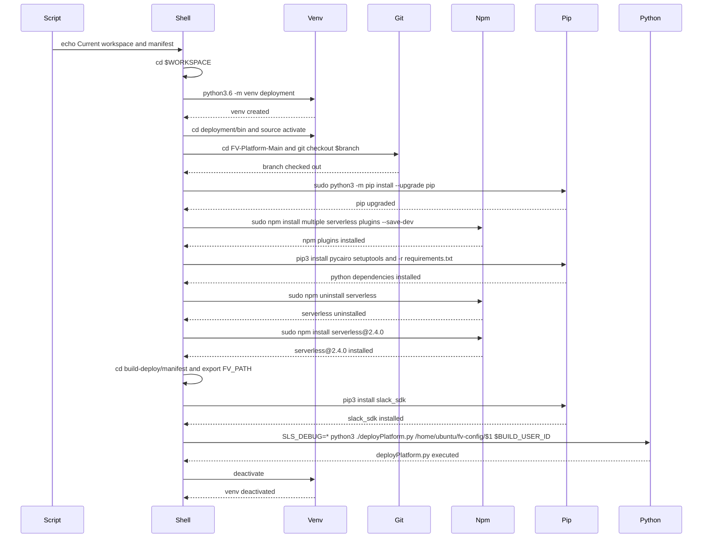

# Diagram: build-deploy/jenkins/services/manifest/fv-config/script.sh

> Auto-generated by Obscura crawlers

## Diagram 1

```mermaid
flowchart TD
  Start[Start] --> EchoWorkspace[echo Current workspace is $WORKSPACE]
  EchoWorkspace --> EchoManifest[echo manifest is $1]
  EchoManifest --> CDWorkspace[cd $WORKSPACE]
  CDWorkspace --> CreateVenv[python3.6 -m venv deployment]
  CreateVenv --> EnterVenv[cd deployment/bin && . ./activate]
  EnterVenv --> GoRepo[cd $WORKSPACE/deployment/FV-Platform-Main]
  GoRepo --> GitCheckout[git checkout $branch]
  GitCheckout --> UpgradePip[sudo python3 -m pip install --upgrade pip]
  UpgradePip --> NpmInstallPlugins1[sudo npm install --save-dev serverless-python-requirements serverless-secrets-plugin serverless-prune-plugin serverless-domain-manager]
  NpmInstallPlugins1 --> NpmInstallPlugins2[sudo npm install --save-dev serverless-api-compression serverless-plugin-split-stacks serverless-iam-roles-per-function serverless-pseudo-parameters]
  NpmInstallPlugins2 --> NpmInstallPlugins3[sudo npm install --save-dev serverless-plugin-scripts serverless-scriptable-plugin]
  NpmInstallPlugins3 --> PipInstallCairo[pip3 install pycairo==1.20.1]
  PipInstallCairo --> PipInstallSetuptools[pip3 install setuptools==58.0.0]
  PipInstallSetuptools --> PipInstallReqs[pip3 install -r requirements.txt]
  PipInstallReqs --> UpgradePipUser[sudo -H python3 -m pip install --upgrade pip]
  UpgradePipUser --> NpmUninstallServerless[sudo npm uninstall serverless]
  NpmUninstallServerless --> NpmInstallServerlessV2[sudo npm install serverless@2.4.0]
  NpmInstallServerlessV2 --> CDManifest[cd $WORKSPACE/deployment/FV-Platform-Main/build-deploy/manifest]
  CDManifest --> ExportFV[export FV_PATH=$WORKSPACE/deployment/FV-Platform-Main/platform/common/fv]
  ExportFV --> PipInstallSlack[pip3 install slack_sdk]
  PipInstallSlack --> RunDeploy[SLS_DEBUG=* python3 ./deployPlatform.py /home/ubuntu/fv-config/$1 $BUILD_USER_ID]
  RunDeploy --> Deactivate[deactivate]
  Deactivate --> End[End]
```

### SVG

<svg id="container" width="365.046875" xmlns="http://www.w3.org/2000/svg" class="flowchart" height="3254" viewBox="0 0 365.046875 3254" role="graphics-document document" aria-roledescription="flowchart-v2"><g><marker id="container_flowchart-v2-pointEnd" class="marker flowchart-v2" viewBox="0 0 10 10" refX="5" refY="5" markerUnits="userSpaceOnUse" markerWidth="8" markerHeight="8" orient="auto"><path d="M 0 0 L 10 5 L 0 10 z" class="arrowMarkerPath" style="stroke-width: 1; stroke-dasharray: 1, 0;"></path></marker><marker id="container_flowchart-v2-pointStart" class="marker flowchart-v2" viewBox="0 0 10 10" refX="4.5" refY="5" markerUnits="userSpaceOnUse" markerWidth="8" markerHeight="8" orient="auto"><path d="M 0 5 L 10 10 L 10 0 z" class="arrowMarkerPath" style="stroke-width: 1; stroke-dasharray: 1, 0;"></path></marker><marker id="container_flowchart-v2-circleEnd" class="marker flowchart-v2" viewBox="0 0 10 10" refX="11" refY="5" markerUnits="userSpaceOnUse" markerWidth="11" markerHeight="11" orient="auto"><circle cx="5" cy="5" r="5" class="arrowMarkerPath" style="stroke-width: 1; stroke-dasharray: 1, 0;"></circle></marker><marker id="container_flowchart-v2-circleStart" class="marker flowchart-v2" viewBox="0 0 10 10" refX="-1" refY="5" markerUnits="userSpaceOnUse" markerWidth="11" markerHeight="11" orient="auto"><circle cx="5" cy="5" r="5" class="arrowMarkerPath" style="stroke-width: 1; stroke-dasharray: 1, 0;"></circle></marker><marker id="container_flowchart-v2-crossEnd" class="marker cross flowchart-v2" viewBox="0 0 11 11" refX="12" refY="5.2" markerUnits="userSpaceOnUse" markerWidth="11" markerHeight="11" orient="auto"><path d="M 1,1 l 9,9 M 10,1 l -9,9" class="arrowMarkerPath" style="stroke-width: 2; stroke-dasharray: 1, 0;"></path></marker><marker id="container_flowchart-v2-crossStart" class="marker cross flowchart-v2" viewBox="0 0 11 11" refX="-1" refY="5.2" markerUnits="userSpaceOnUse" markerWidth="11" markerHeight="11" orient="auto"><path d="M 1,1 l 9,9 M 10,1 l -9,9" class="arrowMarkerPath" style="stroke-width: 2; stroke-dasharray: 1, 0;"></path></marker><g class="root"><g class="clusters"></g><g class="edgePaths"><path d="M182.523,62L182.523,66.167C182.523,70.333,182.523,78.667,182.523,86.333C182.523,94,182.523,101,182.523,104.5L182.523,108" id="L_Start_EchoWorkspace_0" class="edge-thickness-normal edge-pattern-solid edge-thickness-normal edge-pattern-solid flowchart-link" style=";" data-edge="true" data-et="edge" data-id="L_Start_EchoWorkspace_0" data-points="W3sieCI6MTgyLjUyMzQzNzUsInkiOjYyfSx7IngiOjE4Mi41MjM0Mzc1LCJ5Ijo4N30seyJ4IjoxODIuNTIzNDM3NSwieSI6MTEyfV0=" marker-end="url(#container_flowchart-v2-pointEnd)"></path><path d="M182.523,190L182.523,194.167C182.523,198.333,182.523,206.667,182.523,214.333C182.523,222,182.523,229,182.523,232.5L182.523,236" id="L_EchoWorkspace_EchoManifest_0" class="edge-thickness-normal edge-pattern-solid edge-thickness-normal edge-pattern-solid flowchart-link" style=";" data-edge="true" data-et="edge" data-id="L_EchoWorkspace_EchoManifest_0" data-points="W3sieCI6MTgyLjUyMzQzNzUsInkiOjE5MH0seyJ4IjoxODIuNTIzNDM3NSwieSI6MjE1fSx7IngiOjE4Mi41MjM0Mzc1LCJ5IjoyNDB9XQ==" marker-end="url(#container_flowchart-v2-pointEnd)"></path><path d="M182.523,294L182.523,298.167C182.523,302.333,182.523,310.667,182.523,318.333C182.523,326,182.523,333,182.523,336.5L182.523,340" id="L_EchoManifest_CDWorkspace_0" class="edge-thickness-normal edge-pattern-solid edge-thickness-normal edge-pattern-solid flowchart-link" style=";" data-edge="true" data-et="edge" data-id="L_EchoManifest_CDWorkspace_0" data-points="W3sieCI6MTgyLjUyMzQzNzUsInkiOjI5NH0seyJ4IjoxODIuNTIzNDM3NSwieSI6MzE5fSx7IngiOjE4Mi41MjM0Mzc1LCJ5IjozNDR9XQ==" marker-end="url(#container_flowchart-v2-pointEnd)"></path><path d="M182.523,398L182.523,402.167C182.523,406.333,182.523,414.667,182.523,422.333C182.523,430,182.523,437,182.523,440.5L182.523,444" id="L_CDWorkspace_CreateVenv_0" class="edge-thickness-normal edge-pattern-solid edge-thickness-normal edge-pattern-solid flowchart-link" style=";" data-edge="true" data-et="edge" data-id="L_CDWorkspace_CreateVenv_0" data-points="W3sieCI6MTgyLjUyMzQzNzUsInkiOjM5OH0seyJ4IjoxODIuNTIzNDM3NSwieSI6NDIzfSx7IngiOjE4Mi41MjM0Mzc1LCJ5Ijo0NDh9XQ==" marker-end="url(#container_flowchart-v2-pointEnd)"></path><path d="M182.523,526L182.523,530.167C182.523,534.333,182.523,542.667,182.523,550.333C182.523,558,182.523,565,182.523,568.5L182.523,572" id="L_CreateVenv_EnterVenv_0" class="edge-thickness-normal edge-pattern-solid edge-thickness-normal edge-pattern-solid flowchart-link" style=";" data-edge="true" data-et="edge" data-id="L_CreateVenv_EnterVenv_0" data-points="W3sieCI6MTgyLjUyMzQzNzUsInkiOjUyNn0seyJ4IjoxODIuNTIzNDM3NSwieSI6NTUxfSx7IngiOjE4Mi41MjM0Mzc1LCJ5Ijo1NzZ9XQ==" marker-end="url(#container_flowchart-v2-pointEnd)"></path><path d="M182.523,654L182.523,658.167C182.523,662.333,182.523,670.667,182.523,678.333C182.523,686,182.523,693,182.523,696.5L182.523,700" id="L_EnterVenv_GoRepo_0" class="edge-thickness-normal edge-pattern-solid edge-thickness-normal edge-pattern-solid flowchart-link" style=";" data-edge="true" data-et="edge" data-id="L_EnterVenv_GoRepo_0" data-points="W3sieCI6MTgyLjUyMzQzNzUsInkiOjY1NH0seyJ4IjoxODIuNTIzNDM3NSwieSI6Njc5fSx7IngiOjE4Mi41MjM0Mzc1LCJ5Ijo3MDR9XQ==" marker-end="url(#container_flowchart-v2-pointEnd)"></path><path d="M182.523,806L182.523,810.167C182.523,814.333,182.523,822.667,182.523,830.333C182.523,838,182.523,845,182.523,848.5L182.523,852" id="L_GoRepo_GitCheckout_0" class="edge-thickness-normal edge-pattern-solid edge-thickness-normal edge-pattern-solid flowchart-link" style=";" data-edge="true" data-et="edge" data-id="L_GoRepo_GitCheckout_0" data-points="W3sieCI6MTgyLjUyMzQzNzUsInkiOjgwNn0seyJ4IjoxODIuNTIzNDM3NSwieSI6ODMxfSx7IngiOjE4Mi41MjM0Mzc1LCJ5Ijo4NTZ9XQ==" marker-end="url(#container_flowchart-v2-pointEnd)"></path><path d="M182.523,910L182.523,914.167C182.523,918.333,182.523,926.667,182.523,934.333C182.523,942,182.523,949,182.523,952.5L182.523,956" id="L_GitCheckout_UpgradePip_0" class="edge-thickness-normal edge-pattern-solid edge-thickness-normal edge-pattern-solid flowchart-link" style=";" data-edge="true" data-et="edge" data-id="L_GitCheckout_UpgradePip_0" data-points="W3sieCI6MTgyLjUyMzQzNzUsInkiOjkxMH0seyJ4IjoxODIuNTIzNDM3NSwieSI6OTM1fSx7IngiOjE4Mi41MjM0Mzc1LCJ5Ijo5NjB9XQ==" marker-end="url(#container_flowchart-v2-pointEnd)"></path><path d="M182.523,1038L182.523,1042.167C182.523,1046.333,182.523,1054.667,182.523,1062.333C182.523,1070,182.523,1077,182.523,1080.5L182.523,1084" id="L_UpgradePip_NpmInstallPlugins1_0" class="edge-thickness-normal edge-pattern-solid edge-thickness-normal edge-pattern-solid flowchart-link" style=";" data-edge="true" data-et="edge" data-id="L_UpgradePip_NpmInstallPlugins1_0" data-points="W3sieCI6MTgyLjUyMzQzNzUsInkiOjEwMzh9LHsieCI6MTgyLjUyMzQzNzUsInkiOjEwNjN9LHsieCI6MTgyLjUyMzQzNzUsInkiOjEwODh9XQ==" marker-end="url(#container_flowchart-v2-pointEnd)"></path><path d="M182.523,1262L182.523,1266.167C182.523,1270.333,182.523,1278.667,182.523,1286.333C182.523,1294,182.523,1301,182.523,1304.5L182.523,1308" id="L_NpmInstallPlugins1_NpmInstallPlugins2_0" class="edge-thickness-normal edge-pattern-solid edge-thickness-normal edge-pattern-solid flowchart-link" style=";" data-edge="true" data-et="edge" data-id="L_NpmInstallPlugins1_NpmInstallPlugins2_0" data-points="W3sieCI6MTgyLjUyMzQzNzUsInkiOjEyNjJ9LHsieCI6MTgyLjUyMzQzNzUsInkiOjEyODd9LHsieCI6MTgyLjUyMzQzNzUsInkiOjEzMTJ9XQ==" marker-end="url(#container_flowchart-v2-pointEnd)"></path><path d="M182.523,1510L182.523,1514.167C182.523,1518.333,182.523,1526.667,182.523,1534.333C182.523,1542,182.523,1549,182.523,1552.5L182.523,1556" id="L_NpmInstallPlugins2_NpmInstallPlugins3_0" class="edge-thickness-normal edge-pattern-solid edge-thickness-normal edge-pattern-solid flowchart-link" style=";" data-edge="true" data-et="edge" data-id="L_NpmInstallPlugins2_NpmInstallPlugins3_0" data-points="W3sieCI6MTgyLjUyMzQzNzUsInkiOjE1MTB9LHsieCI6MTgyLjUyMzQzNzUsInkiOjE1MzV9LHsieCI6MTgyLjUyMzQzNzUsInkiOjE1NjB9XQ==" marker-end="url(#container_flowchart-v2-pointEnd)"></path><path d="M182.523,1686L182.523,1690.167C182.523,1694.333,182.523,1702.667,182.523,1710.333C182.523,1718,182.523,1725,182.523,1728.5L182.523,1732" id="L_NpmInstallPlugins3_PipInstallCairo_0" class="edge-thickness-normal edge-pattern-solid edge-thickness-normal edge-pattern-solid flowchart-link" style=";" data-edge="true" data-et="edge" data-id="L_NpmInstallPlugins3_PipInstallCairo_0" data-points="W3sieCI6MTgyLjUyMzQzNzUsInkiOjE2ODZ9LHsieCI6MTgyLjUyMzQzNzUsInkiOjE3MTF9LHsieCI6MTgyLjUyMzQzNzUsInkiOjE3MzZ9XQ==" marker-end="url(#container_flowchart-v2-pointEnd)"></path><path d="M182.523,1790L182.523,1794.167C182.523,1798.333,182.523,1806.667,182.523,1814.333C182.523,1822,182.523,1829,182.523,1832.5L182.523,1836" id="L_PipInstallCairo_PipInstallSetuptools_0" class="edge-thickness-normal edge-pattern-solid edge-thickness-normal edge-pattern-solid flowchart-link" style=";" data-edge="true" data-et="edge" data-id="L_PipInstallCairo_PipInstallSetuptools_0" data-points="W3sieCI6MTgyLjUyMzQzNzUsInkiOjE3OTB9LHsieCI6MTgyLjUyMzQzNzUsInkiOjE4MTV9LHsieCI6MTgyLjUyMzQzNzUsInkiOjE4NDB9XQ==" marker-end="url(#container_flowchart-v2-pointEnd)"></path><path d="M182.523,1918L182.523,1922.167C182.523,1926.333,182.523,1934.667,182.523,1942.333C182.523,1950,182.523,1957,182.523,1960.5L182.523,1964" id="L_PipInstallSetuptools_PipInstallReqs_0" class="edge-thickness-normal edge-pattern-solid edge-thickness-normal edge-pattern-solid flowchart-link" style=";" data-edge="true" data-et="edge" data-id="L_PipInstallSetuptools_PipInstallReqs_0" data-points="W3sieCI6MTgyLjUyMzQzNzUsInkiOjE5MTh9LHsieCI6MTgyLjUyMzQzNzUsInkiOjE5NDN9LHsieCI6MTgyLjUyMzQzNzUsInkiOjE5Njh9XQ==" marker-end="url(#container_flowchart-v2-pointEnd)"></path><path d="M182.523,2046L182.523,2050.167C182.523,2054.333,182.523,2062.667,182.523,2070.333C182.523,2078,182.523,2085,182.523,2088.5L182.523,2092" id="L_PipInstallReqs_UpgradePipUser_0" class="edge-thickness-normal edge-pattern-solid edge-thickness-normal edge-pattern-solid flowchart-link" style=";" data-edge="true" data-et="edge" data-id="L_PipInstallReqs_UpgradePipUser_0" data-points="W3sieCI6MTgyLjUyMzQzNzUsInkiOjIwNDZ9LHsieCI6MTgyLjUyMzQzNzUsInkiOjIwNzF9LHsieCI6MTgyLjUyMzQzNzUsInkiOjIwOTZ9XQ==" marker-end="url(#container_flowchart-v2-pointEnd)"></path><path d="M182.523,2174L182.523,2178.167C182.523,2182.333,182.523,2190.667,182.523,2198.333C182.523,2206,182.523,2213,182.523,2216.5L182.523,2220" id="L_UpgradePipUser_NpmUninstallServerless_0" class="edge-thickness-normal edge-pattern-solid edge-thickness-normal edge-pattern-solid flowchart-link" style=";" data-edge="true" data-et="edge" data-id="L_UpgradePipUser_NpmUninstallServerless_0" data-points="W3sieCI6MTgyLjUyMzQzNzUsInkiOjIxNzR9LHsieCI6MTgyLjUyMzQzNzUsInkiOjIxOTl9LHsieCI6MTgyLjUyMzQzNzUsInkiOjIyMjR9XQ==" marker-end="url(#container_flowchart-v2-pointEnd)"></path><path d="M182.523,2302L182.523,2306.167C182.523,2310.333,182.523,2318.667,182.523,2326.333C182.523,2334,182.523,2341,182.523,2344.5L182.523,2348" id="L_NpmUninstallServerless_NpmInstallServerlessV2_0" class="edge-thickness-normal edge-pattern-solid edge-thickness-normal edge-pattern-solid flowchart-link" style=";" data-edge="true" data-et="edge" data-id="L_NpmUninstallServerless_NpmInstallServerlessV2_0" data-points="W3sieCI6MTgyLjUyMzQzNzUsInkiOjIzMDJ9LHsieCI6MTgyLjUyMzQzNzUsInkiOjIzMjd9LHsieCI6MTgyLjUyMzQzNzUsInkiOjIzNTJ9XQ==" marker-end="url(#container_flowchart-v2-pointEnd)"></path><path d="M182.523,2430L182.523,2434.167C182.523,2438.333,182.523,2446.667,182.523,2454.333C182.523,2462,182.523,2469,182.523,2472.5L182.523,2476" id="L_NpmInstallServerlessV2_CDManifest_0" class="edge-thickness-normal edge-pattern-solid edge-thickness-normal edge-pattern-solid flowchart-link" style=";" data-edge="true" data-et="edge" data-id="L_NpmInstallServerlessV2_CDManifest_0" data-points="W3sieCI6MTgyLjUyMzQzNzUsInkiOjI0MzB9LHsieCI6MTgyLjUyMzQzNzUsInkiOjI0NTV9LHsieCI6MTgyLjUyMzQzNzUsInkiOjI0ODB9XQ==" marker-end="url(#container_flowchart-v2-pointEnd)"></path><path d="M182.523,2606L182.523,2610.167C182.523,2614.333,182.523,2622.667,182.523,2630.333C182.523,2638,182.523,2645,182.523,2648.5L182.523,2652" id="L_CDManifest_ExportFV_0" class="edge-thickness-normal edge-pattern-solid edge-thickness-normal edge-pattern-solid flowchart-link" style=";" data-edge="true" data-et="edge" data-id="L_CDManifest_ExportFV_0" data-points="W3sieCI6MTgyLjUyMzQzNzUsInkiOjI2MDZ9LHsieCI6MTgyLjUyMzQzNzUsInkiOjI2MzF9LHsieCI6MTgyLjUyMzQzNzUsInkiOjI2NTZ9XQ==" marker-end="url(#container_flowchart-v2-pointEnd)"></path><path d="M182.523,2758L182.523,2762.167C182.523,2766.333,182.523,2774.667,182.523,2782.333C182.523,2790,182.523,2797,182.523,2800.5L182.523,2804" id="L_ExportFV_PipInstallSlack_0" class="edge-thickness-normal edge-pattern-solid edge-thickness-normal edge-pattern-solid flowchart-link" style=";" data-edge="true" data-et="edge" data-id="L_ExportFV_PipInstallSlack_0" data-points="W3sieCI6MTgyLjUyMzQzNzUsInkiOjI3NTh9LHsieCI6MTgyLjUyMzQzNzUsInkiOjI3ODN9LHsieCI6MTgyLjUyMzQzNzUsInkiOjI4MDh9XQ==" marker-end="url(#container_flowchart-v2-pointEnd)"></path><path d="M182.523,2862L182.523,2866.167C182.523,2870.333,182.523,2878.667,182.523,2886.333C182.523,2894,182.523,2901,182.523,2904.5L182.523,2908" id="L_PipInstallSlack_RunDeploy_0" class="edge-thickness-normal edge-pattern-solid edge-thickness-normal edge-pattern-solid flowchart-link" style=";" data-edge="true" data-et="edge" data-id="L_PipInstallSlack_RunDeploy_0" data-points="W3sieCI6MTgyLjUyMzQzNzUsInkiOjI4NjJ9LHsieCI6MTgyLjUyMzQzNzUsInkiOjI4ODd9LHsieCI6MTgyLjUyMzQzNzUsInkiOjI5MTJ9XQ==" marker-end="url(#container_flowchart-v2-pointEnd)"></path><path d="M182.523,3038L182.523,3042.167C182.523,3046.333,182.523,3054.667,182.523,3062.333C182.523,3070,182.523,3077,182.523,3080.5L182.523,3084" id="L_RunDeploy_Deactivate_0" class="edge-thickness-normal edge-pattern-solid edge-thickness-normal edge-pattern-solid flowchart-link" style=";" data-edge="true" data-et="edge" data-id="L_RunDeploy_Deactivate_0" data-points="W3sieCI6MTgyLjUyMzQzNzUsInkiOjMwMzh9LHsieCI6MTgyLjUyMzQzNzUsInkiOjMwNjN9LHsieCI6MTgyLjUyMzQzNzUsInkiOjMwODh9XQ==" marker-end="url(#container_flowchart-v2-pointEnd)"></path><path d="M182.523,3142L182.523,3146.167C182.523,3150.333,182.523,3158.667,182.523,3166.333C182.523,3174,182.523,3181,182.523,3184.5L182.523,3188" id="L_Deactivate_End_0" class="edge-thickness-normal edge-pattern-solid edge-thickness-normal edge-pattern-solid flowchart-link" style=";" data-edge="true" data-et="edge" data-id="L_Deactivate_End_0" data-points="W3sieCI6MTgyLjUyMzQzNzUsInkiOjMxNDJ9LHsieCI6MTgyLjUyMzQzNzUsInkiOjMxNjd9LHsieCI6MTgyLjUyMzQzNzUsInkiOjMxOTJ9XQ==" marker-end="url(#container_flowchart-v2-pointEnd)"></path></g><g class="edgeLabels"><g class="edgeLabel"><g class="label" data-id="L_Start_EchoWorkspace_0" transform="translate(0, 0)"><foreignObject width="0" height="0">

</foreignObject></g></g><g class="edgeLabel"><g class="label" data-id="L_EchoWorkspace_EchoManifest_0" transform="translate(0, 0)"><foreignObject width="0" height="0">

</foreignObject></g></g><g class="edgeLabel"><g class="label" data-id="L_EchoManifest_CDWorkspace_0" transform="translate(0, 0)"><foreignObject width="0" height="0">

</foreignObject></g></g><g class="edgeLabel"><g class="label" data-id="L_CDWorkspace_CreateVenv_0" transform="translate(0, 0)"><foreignObject width="0" height="0">

</foreignObject></g></g><g class="edgeLabel"><g class="label" data-id="L_CreateVenv_EnterVenv_0" transform="translate(0, 0)"><foreignObject width="0" height="0">

</foreignObject></g></g><g class="edgeLabel"><g class="label" data-id="L_EnterVenv_GoRepo_0" transform="translate(0, 0)"><foreignObject width="0" height="0">

</foreignObject></g></g><g class="edgeLabel"><g class="label" data-id="L_GoRepo_GitCheckout_0" transform="translate(0, 0)"><foreignObject width="0" height="0">

</foreignObject></g></g><g class="edgeLabel"><g class="label" data-id="L_GitCheckout_UpgradePip_0" transform="translate(0, 0)"><foreignObject width="0" height="0">

</foreignObject></g></g><g class="edgeLabel"><g class="label" data-id="L_UpgradePip_NpmInstallPlugins1_0" transform="translate(0, 0)"><foreignObject width="0" height="0">

</foreignObject></g></g><g class="edgeLabel"><g class="label" data-id="L_NpmInstallPlugins1_NpmInstallPlugins2_0" transform="translate(0, 0)"><foreignObject width="0" height="0">

</foreignObject></g></g><g class="edgeLabel"><g class="label" data-id="L_NpmInstallPlugins2_NpmInstallPlugins3_0" transform="translate(0, 0)"><foreignObject width="0" height="0">

</foreignObject></g></g><g class="edgeLabel"><g class="label" data-id="L_NpmInstallPlugins3_PipInstallCairo_0" transform="translate(0, 0)"><foreignObject width="0" height="0">

</foreignObject></g></g><g class="edgeLabel"><g class="label" data-id="L_PipInstallCairo_PipInstallSetuptools_0" transform="translate(0, 0)"><foreignObject width="0" height="0">

</foreignObject></g></g><g class="edgeLabel"><g class="label" data-id="L_PipInstallSetuptools_PipInstallReqs_0" transform="translate(0, 0)"><foreignObject width="0" height="0">

</foreignObject></g></g><g class="edgeLabel"><g class="label" data-id="L_PipInstallReqs_UpgradePipUser_0" transform="translate(0, 0)"><foreignObject width="0" height="0">

</foreignObject></g></g><g class="edgeLabel"><g class="label" data-id="L_UpgradePipUser_NpmUninstallServerless_0" transform="translate(0, 0)"><foreignObject width="0" height="0">

</foreignObject></g></g><g class="edgeLabel"><g class="label" data-id="L_NpmUninstallServerless_NpmInstallServerlessV2_0" transform="translate(0, 0)"><foreignObject width="0" height="0">

</foreignObject></g></g><g class="edgeLabel"><g class="label" data-id="L_NpmInstallServerlessV2_CDManifest_0" transform="translate(0, 0)"><foreignObject width="0" height="0">

</foreignObject></g></g><g class="edgeLabel"><g class="label" data-id="L_CDManifest_ExportFV_0" transform="translate(0, 0)"><foreignObject width="0" height="0">

</foreignObject></g></g><g class="edgeLabel"><g class="label" data-id="L_ExportFV_PipInstallSlack_0" transform="translate(0, 0)"><foreignObject width="0" height="0">

</foreignObject></g></g><g class="edgeLabel"><g class="label" data-id="L_PipInstallSlack_RunDeploy_0" transform="translate(0, 0)"><foreignObject width="0" height="0">

</foreignObject></g></g><g class="edgeLabel"><g class="label" data-id="L_RunDeploy_Deactivate_0" transform="translate(0, 0)"><foreignObject width="0" height="0">

</foreignObject></g></g><g class="edgeLabel"><g class="label" data-id="L_Deactivate_End_0" transform="translate(0, 0)"><foreignObject width="0" height="0">

</foreignObject></g></g></g><g class="nodes"><g class="node default" id="flowchart-Start-0" transform="translate(182.5234375, 35)"><rect class="basic label-container" style="" x="-47.5234375" y="-27" width="95.046875" height="54"></rect><g class="label" style="" transform="translate(-17.5234375, -12)"><rect></rect><foreignObject width="35.046875" height="24">

Start

</foreignObject></g></g><g class="node default" id="flowchart-EchoWorkspace-1" transform="translate(182.5234375, 151)"><rect class="basic label-container" style="" x="-130" y="-39" width="260" height="78"></rect><g class="label" style="" transform="translate(-100, -24)"><rect></rect><foreignObject width="200" height="48">

echo Current workspace is $WORKSPACE

</foreignObject></g></g><g class="node default" id="flowchart-EchoManifest-3" transform="translate(182.5234375, 267)"><rect class="basic label-container" style="" x="-99.1171875" y="-27" width="198.234375" height="54"></rect><g class="label" style="" transform="translate(-69.1171875, -12)"><rect></rect><foreignObject width="138.234375" height="24">

echo manifest is $1

</foreignObject></g></g><g class="node default" id="flowchart-CDWorkspace-5" transform="translate(182.5234375, 371)"><rect class="basic label-container" style="" x="-88.1484375" y="-27" width="176.296875" height="54"></rect><g class="label" style="" transform="translate(-58.1484375, -12)"><rect></rect><foreignObject width="116.296875" height="24">

cd $WORKSPACE

</foreignObject></g></g><g class="node default" id="flowchart-CreateVenv-7" transform="translate(182.5234375, 487)"><rect class="basic label-container" style="" x="-130" y="-39" width="260" height="78"></rect><g class="label" style="" transform="translate(-100, -24)"><rect></rect><foreignObject width="200" height="48">

python3.6 -m venv deployment

</foreignObject></g></g><g class="node default" id="flowchart-EnterVenv-9" transform="translate(182.5234375, 615)"><rect class="basic label-container" style="" x="-130" y="-39" width="260" height="78"></rect><g class="label" style="" transform="translate(-100, -24)"><rect></rect><foreignObject width="200" height="48">

cd deployment/bin &amp;&amp; . ./activate

</foreignObject></g></g><g class="node default" id="flowchart-GoRepo-11" transform="translate(182.5234375, 755)"><rect class="basic label-container" style="" x="-140.46875" y="-51" width="280.9375" height="102"></rect><g class="label" style="" transform="translate(-110.46875, -36)"><rect></rect><foreignObject width="220.9375" height="72">

cd $WORKSPACE/deployment/FV-Platform-Main

</foreignObject></g></g><g class="node default" id="flowchart-GitCheckout-13" transform="translate(182.5234375, 883)"><rect class="basic label-container" style="" x="-105.84375" y="-27" width="211.6875" height="54"></rect><g class="label" style="" transform="translate(-75.84375, -12)"><rect></rect><foreignObject width="151.6875" height="24">

git checkout $branch

</foreignObject></g></g><g class="node default" id="flowchart-UpgradePip-15" transform="translate(182.5234375, 999)"><rect class="basic label-container" style="" x="-130" y="-39" width="260" height="78"></rect><g class="label" style="" transform="translate(-100, -24)"><rect></rect><foreignObject width="200" height="48">

sudo python3 -m pip install --upgrade pip

</foreignObject></g></g><g class="node default" id="flowchart-NpmInstallPlugins1-17" transform="translate(182.5234375, 1175)"><rect class="basic label-container" style="" x="-130" y="-87" width="260" height="174"></rect><g class="label" style="" transform="translate(-100, -72)"><rect></rect><foreignObject width="200" height="144">

sudo npm install --save-dev serverless-python-requirements serverless-secrets-plugin serverless-prune-plugin serverless-domain-manager

</foreignObject></g></g><g class="node default" id="flowchart-NpmInstallPlugins2-19" transform="translate(182.5234375, 1411)"><rect class="basic label-container" style="" x="-130" y="-99" width="260" height="198"></rect><g class="label" style="" transform="translate(-100, -84)"><rect></rect><foreignObject width="200" height="168">

sudo npm install --save-dev serverless-api-compression serverless-plugin-split-stacks serverless-iam-roles-per-function serverless-pseudo-parameters

</foreignObject></g></g><g class="node default" id="flowchart-NpmInstallPlugins3-21" transform="translate(182.5234375, 1623)"><rect class="basic label-container" style="" x="-130" y="-63" width="260" height="126"></rect><g class="label" style="" transform="translate(-100, -48)"><rect></rect><foreignObject width="200" height="96">

sudo npm install --save-dev serverless-plugin-scripts serverless-scriptable-plugin

</foreignObject></g></g><g class="node default" id="flowchart-PipInstallCairo-23" transform="translate(182.5234375, 1763)"><rect class="basic label-container" style="" x="-124.9375" y="-27" width="249.875" height="54"></rect><g class="label" style="" transform="translate(-94.9375, -12)"><rect></rect><foreignObject width="189.875" height="24">

pip3 install pycairo==1.20.1

</foreignObject></g></g><g class="node default" id="flowchart-PipInstallSetuptools-25" transform="translate(182.5234375, 1879)"><rect class="basic label-container" style="" x="-130" y="-39" width="260" height="78"></rect><g class="label" style="" transform="translate(-100, -24)"><rect></rect><foreignObject width="200" height="48">

pip3 install setuptools==58.0.0

</foreignObject></g></g><g class="node default" id="flowchart-PipInstallReqs-27" transform="translate(182.5234375, 2007)"><rect class="basic label-container" style="" x="-130" y="-39" width="260" height="78"></rect><g class="label" style="" transform="translate(-100, -24)"><rect></rect><foreignObject width="200" height="48">

pip3 install -r requirements.txt

</foreignObject></g></g><g class="node default" id="flowchart-UpgradePipUser-29" transform="translate(182.5234375, 2135)"><rect class="basic label-container" style="" x="-130" y="-39" width="260" height="78"></rect><g class="label" style="" transform="translate(-100, -24)"><rect></rect><foreignObject width="200" height="48">

sudo -H python3 -m pip install --upgrade pip

</foreignObject></g></g><g class="node default" id="flowchart-NpmUninstallServerless-31" transform="translate(182.5234375, 2263)"><rect class="basic label-container" style="" x="-130" y="-39" width="260" height="78"></rect><g class="label" style="" transform="translate(-100, -24)"><rect></rect><foreignObject width="200" height="48">

sudo npm uninstall serverless

</foreignObject></g></g><g class="node default" id="flowchart-NpmInstallServerlessV2-33" transform="translate(182.5234375, 2391)"><rect class="basic label-container" style="" x="-130" y="-39" width="260" height="78"></rect><g class="label" style="" transform="translate(-100, -24)"><rect></rect><foreignObject width="200" height="48">

sudo npm install serverless@2.4.0

</foreignObject></g></g><g class="node default" id="flowchart-CDManifest-35" transform="translate(182.5234375, 2543)"><rect class="basic label-container" style="" x="-140.46875" y="-63" width="280.9375" height="126"></rect><g class="label" style="" transform="translate(-110.46875, -48)"><rect></rect><foreignObject width="220.9375" height="96">

cd $WORKSPACE/deployment/FV-Platform-Main/build-deploy/manifest

</foreignObject></g></g><g class="node default" id="flowchart-ExportFV-37" transform="translate(182.5234375, 2707)"><rect class="basic label-container" style="" x="-174.5234375" y="-51" width="349.046875" height="102"></rect><g class="label" style="" transform="translate(-144.5234375, -36)"><rect></rect><foreignObject width="289.046875" height="72">

export FV_PATH=$WORKSPACE/deployment/FV-Platform-Main/platform/common/fv

</foreignObject></g></g><g class="node default" id="flowchart-PipInstallSlack-39" transform="translate(182.5234375, 2835)"><rect class="basic label-container" style="" x="-107.3984375" y="-27" width="214.796875" height="54"></rect><g class="label" style="" transform="translate(-77.3984375, -12)"><rect></rect><foreignObject width="154.796875" height="24">

pip3 install slack_sdk

</foreignObject></g></g><g class="node default" id="flowchart-RunDeploy-41" transform="translate(182.5234375, 2975)"><rect class="basic label-container" style="" x="-130" y="-63" width="260" height="126"></rect><g class="label" style="" transform="translate(-100, -48)"><rect></rect><foreignObject width="200" height="96">

SLS_DEBUG=* python3 ./deployPlatform.py /home/ubuntu/fv-config/$1 $BUILD_USER_ID

</foreignObject></g></g><g class="node default" id="flowchart-Deactivate-43" transform="translate(182.5234375, 3115)"><rect class="basic label-container" style="" x="-67.6796875" y="-27" width="135.359375" height="54"></rect><g class="label" style="" transform="translate(-37.6796875, -12)"><rect></rect><foreignObject width="75.359375" height="24">

deactivate

</foreignObject></g></g><g class="node default" id="flowchart-End-45" transform="translate(182.5234375, 3219)"><rect class="basic label-container" style="" x="-43.6796875" y="-27" width="87.359375" height="54"></rect><g class="label" style="" transform="translate(-13.6796875, -12)"><rect></rect><foreignObject width="27.359375" height="24">

End

</foreignObject></g></g></g></g></g></svg>

## Diagram 2

### SVG

<svg id="container" width="1749" xmlns="http://www.w3.org/2000/svg" height="1383" viewBox="-50 -10 1749 1383" role="graphics-document document" aria-roledescription="sequence"><g><rect x="1499" y="1297" fill="#eaeaea" stroke="#666" width="150" height="65" name="Python" rx="3" ry="3" class="actor actor-bottom"></rect><text x="1574" y="1329.5" dominant-baseline="central" alignment-baseline="central" class="actor actor-box" style="text-anchor: middle; font-size: 16px; font-weight: 400;"><tspan x="1574" dy="0">Python</tspan></text></g><g><rect x="1299" y="1297" fill="#eaeaea" stroke="#666" width="150" height="65" name="Pip" rx="3" ry="3" class="actor actor-bottom"></rect><text x="1374" y="1329.5" dominant-baseline="central" alignment-baseline="central" class="actor actor-box" style="text-anchor: middle; font-size: 16px; font-weight: 400;"><tspan x="1374" dy="0">Pip</tspan></text></g><g><rect x="1099" y="1297" fill="#eaeaea" stroke="#666" width="150" height="65" name="Npm" rx="3" ry="3" class="actor actor-bottom"></rect><text x="1174" y="1329.5" dominant-baseline="central" alignment-baseline="central" class="actor actor-box" style="text-anchor: middle; font-size: 16px; font-weight: 400;"><tspan x="1174" dy="0">Npm</tspan></text></g><g><rect x="899" y="1297" fill="#eaeaea" stroke="#666" width="150" height="65" name="Git" rx="3" ry="3" class="actor actor-bottom"></rect><text x="974" y="1329.5" dominant-baseline="central" alignment-baseline="central" class="actor actor-box" style="text-anchor: middle; font-size: 16px; font-weight: 400;"><tspan x="974" dy="0">Git</tspan></text></g><g><rect x="699" y="1297" fill="#eaeaea" stroke="#666" width="150" height="65" name="Venv" rx="3" ry="3" class="actor actor-bottom"></rect><text x="774" y="1329.5" dominant-baseline="central" alignment-baseline="central" class="actor actor-box" style="text-anchor: middle; font-size: 16px; font-weight: 400;"><tspan x="774" dy="0">Venv</tspan></text></g><g><rect x="344" y="1297" fill="#eaeaea" stroke="#666" width="150" height="65" name="Shell" rx="3" ry="3" class="actor actor-bottom"></rect><text x="419" y="1329.5" dominant-baseline="central" alignment-baseline="central" class="actor actor-box" style="text-anchor: middle; font-size: 16px; font-weight: 400;"><tspan x="419" dy="0">Shell</tspan></text></g><g><rect x="0" y="1297" fill="#eaeaea" stroke="#666" width="150" height="65" name="Script" rx="3" ry="3" class="actor actor-bottom"></rect><text x="75" y="1329.5" dominant-baseline="central" alignment-baseline="central" class="actor actor-box" style="text-anchor: middle; font-size: 16px; font-weight: 400;"><tspan x="75" dy="0">Script</tspan></text></g><g><line id="actor6" x1="1574" y1="65" x2="1574" y2="1297" class="actor-line 200" stroke-width="0.5px" stroke="#999" name="Python"></line><g id="root-6"><rect x="1499" y="0" fill="#eaeaea" stroke="#666" width="150" height="65" name="Python" rx="3" ry="3" class="actor actor-top"></rect><text x="1574" y="32.5" dominant-baseline="central" alignment-baseline="central" class="actor actor-box" style="text-anchor: middle; font-size: 16px; font-weight: 400;"><tspan x="1574" dy="0">Python</tspan></text></g></g><g><line id="actor5" x1="1374" y1="65" x2="1374" y2="1297" class="actor-line 200" stroke-width="0.5px" stroke="#999" name="Pip"></line><g id="root-5"><rect x="1299" y="0" fill="#eaeaea" stroke="#666" width="150" height="65" name="Pip" rx="3" ry="3" class="actor actor-top"></rect><text x="1374" y="32.5" dominant-baseline="central" alignment-baseline="central" class="actor actor-box" style="text-anchor: middle; font-size: 16px; font-weight: 400;"><tspan x="1374" dy="0">Pip</tspan></text></g></g><g><line id="actor4" x1="1174" y1="65" x2="1174" y2="1297" class="actor-line 200" stroke-width="0.5px" stroke="#999" name="Npm"></line><g id="root-4"><rect x="1099" y="0" fill="#eaeaea" stroke="#666" width="150" height="65" name="Npm" rx="3" ry="3" class="actor actor-top"></rect><text x="1174" y="32.5" dominant-baseline="central" alignment-baseline="central" class="actor actor-box" style="text-anchor: middle; font-size: 16px; font-weight: 400;"><tspan x="1174" dy="0">Npm</tspan></text></g></g><g><line id="actor3" x1="974" y1="65" x2="974" y2="1297" class="actor-line 200" stroke-width="0.5px" stroke="#999" name="Git"></line><g id="root-3"><rect x="899" y="0" fill="#eaeaea" stroke="#666" width="150" height="65" name="Git" rx="3" ry="3" class="actor actor-top"></rect><text x="974" y="32.5" dominant-baseline="central" alignment-baseline="central" class="actor actor-box" style="text-anchor: middle; font-size: 16px; font-weight: 400;"><tspan x="974" dy="0">Git</tspan></text></g></g><g><line id="actor2" x1="774" y1="65" x2="774" y2="1297" class="actor-line 200" stroke-width="0.5px" stroke="#999" name="Venv"></line><g id="root-2"><rect x="699" y="0" fill="#eaeaea" stroke="#666" width="150" height="65" name="Venv" rx="3" ry="3" class="actor actor-top"></rect><text x="774" y="32.5" dominant-baseline="central" alignment-baseline="central" class="actor actor-box" style="text-anchor: middle; font-size: 16px; font-weight: 400;"><tspan x="774" dy="0">Venv</tspan></text></g></g><g><line id="actor1" x1="419" y1="65" x2="419" y2="1297" class="actor-line 200" stroke-width="0.5px" stroke="#999" name="Shell"></line><g id="root-1"><rect x="344" y="0" fill="#eaeaea" stroke="#666" width="150" height="65" name="Shell" rx="3" ry="3" class="actor actor-top"></rect><text x="419" y="32.5" dominant-baseline="central" alignment-baseline="central" class="actor actor-box" style="text-anchor: middle; font-size: 16px; font-weight: 400;"><tspan x="419" dy="0">Shell</tspan></text></g></g><g><line id="actor0" x1="75" y1="65" x2="75" y2="1297" class="actor-line 200" stroke-width="0.5px" stroke="#999" name="Script"></line><g id="root-0"><rect x="0" y="0" fill="#eaeaea" stroke="#666" width="150" height="65" name="Script" rx="3" ry="3" class="actor actor-top"></rect><text x="75" y="32.5" dominant-baseline="central" alignment-baseline="central" class="actor actor-box" style="text-anchor: middle; font-size: 16px; font-weight: 400;"><tspan x="75" dy="0">Script</tspan></text></g></g><g></g><defs><symbol id="computer" width="24" height="24"><path transform="scale(.5)" d="M2 2v13h20v-13h-20zm18 11h-16v-9h16v9zm-10.228 6l.466-1h3.524l.467 1h-4.457zm14.228 3h-24l2-6h2.104l-1.33 4h18.45l-1.297-4h2.073l2 6zm-5-10h-14v-7h14v7z"></path></symbol></defs><defs><symbol id="database" fill-rule="evenodd" clip-rule="evenodd"><path transform="scale(.5)" d="M12.258.001l.256.004.255.005.253.008.251.01.249.012.247.015.246.016.242.019.241.02.239.023.236.024.233.027.231.028.229.031.225.032.223.034.22.036.217.038.214.04.211.041.208.043.205.045.201.046.198.048.194.05.191.051.187.053.183.054.18.056.175.057.172.059.168.06.163.061.16.063.155.064.15.066.074.033.073.033.071.034.07.034.069.035.068.035.067.035.066.035.064.036.064.036.062.036.06.036.06.037.058.037.058.037.055.038.055.038.053.038.052.038.051.039.05.039.048.039.047.039.045.04.044.04.043.04.041.04.04.041.039.041.037.041.036.041.034.041.033.042.032.042.03.042.029.042.027.042.026.043.024.043.023.043.021.043.02.043.018.044.017.043.015.044.013.044.012.044.011.045.009.044.007.045.006.045.004.045.002.045.001.045v17l-.001.045-.002.045-.004.045-.006.045-.007.045-.009.044-.011.045-.012.044-.013.044-.015.044-.017.043-.018.044-.02.043-.021.043-.023.043-.024.043-.026.043-.027.042-.029.042-.03.042-.032.042-.033.042-.034.041-.036.041-.037.041-.039.041-.04.041-.041.04-.043.04-.044.04-.045.04-.047.039-.048.039-.05.039-.051.039-.052.038-.053.038-.055.038-.055.038-.058.037-.058.037-.06.037-.06.036-.062.036-.064.036-.064.036-.066.035-.067.035-.068.035-.069.035-.07.034-.071.034-.073.033-.074.033-.15.066-.155.064-.16.063-.163.061-.168.06-.172.059-.175.057-.18.056-.183.054-.187.053-.191.051-.194.05-.198.048-.201.046-.205.045-.208.043-.211.041-.214.04-.217.038-.22.036-.223.034-.225.032-.229.031-.231.028-.233.027-.236.024-.239.023-.241.02-.242.019-.246.016-.247.015-.249.012-.251.01-.253.008-.255.005-.256.004-.258.001-.258-.001-.256-.004-.255-.005-.253-.008-.251-.01-.249-.012-.247-.015-.245-.016-.243-.019-.241-.02-.238-.023-.236-.024-.234-.027-.231-.028-.228-.031-.226-.032-.223-.034-.22-.036-.217-.038-.214-.04-.211-.041-.208-.043-.204-.045-.201-.046-.198-.048-.195-.05-.19-.051-.187-.053-.184-.054-.179-.056-.176-.057-.172-.059-.167-.06-.164-.061-.159-.063-.155-.064-.151-.066-.074-.033-.072-.033-.072-.034-.07-.034-.069-.035-.068-.035-.067-.035-.066-.035-.064-.036-.063-.036-.062-.036-.061-.036-.06-.037-.058-.037-.057-.037-.056-.038-.055-.038-.053-.038-.052-.038-.051-.039-.049-.039-.049-.039-.046-.039-.046-.04-.044-.04-.043-.04-.041-.04-.04-.041-.039-.041-.037-.041-.036-.041-.034-.041-.033-.042-.032-.042-.03-.042-.029-.042-.027-.042-.026-.043-.024-.043-.023-.043-.021-.043-.02-.043-.018-.044-.017-.043-.015-.044-.013-.044-.012-.044-.011-.045-.009-.044-.007-.045-.006-.045-.004-.045-.002-.045-.001-.045v-17l.001-.045.002-.045.004-.045.006-.045.007-.045.009-.044.011-.045.012-.044.013-.044.015-.044.017-.043.018-.044.02-.043.021-.043.023-.043.024-.043.026-.043.027-.042.029-.042.03-.042.032-.042.033-.042.034-.041.036-.041.037-.041.039-.041.04-.041.041-.04.043-.04.044-.04.046-.04.046-.039.049-.039.049-.039.051-.039.052-.038.053-.038.055-.038.056-.038.057-.037.058-.037.06-.037.061-.036.062-.036.063-.036.064-.036.066-.035.067-.035.068-.035.069-.035.07-.034.072-.034.072-.033.074-.033.151-.066.155-.064.159-.063.164-.061.167-.06.172-.059.176-.057.179-.056.184-.054.187-.053.19-.051.195-.05.198-.048.201-.046.204-.045.208-.043.211-.041.214-.04.217-.038.22-.036.223-.034.226-.032.228-.031.231-.028.234-.027.236-.024.238-.023.241-.02.243-.019.245-.016.247-.015.249-.012.251-.01.253-.008.255-.005.256-.004.258-.001.258.001zm-9.258 20.499v.01l.001.021.003.021.004.022.005.021.006.022.007.022.009.023.01.022.011.023.012.023.013.023.015.023.016.024.017.023.018.024.019.024.021.024.022.025.023.024.024.025.052.049.056.05.061.051.066.051.07.051.075.051.079.052.084.052.088.052.092.052.097.052.102.051.105.052.11.052.114.051.119.051.123.051.127.05.131.05.135.05.139.048.144.049.147.047.152.047.155.047.16.045.163.045.167.043.171.043.176.041.178.041.183.039.187.039.19.037.194.035.197.035.202.033.204.031.209.03.212.029.216.027.219.025.222.024.226.021.23.02.233.018.236.016.24.015.243.012.246.01.249.008.253.005.256.004.259.001.26-.001.257-.004.254-.005.25-.008.247-.011.244-.012.241-.014.237-.016.233-.018.231-.021.226-.021.224-.024.22-.026.216-.027.212-.028.21-.031.205-.031.202-.034.198-.034.194-.036.191-.037.187-.039.183-.04.179-.04.175-.042.172-.043.168-.044.163-.045.16-.046.155-.046.152-.047.148-.048.143-.049.139-.049.136-.05.131-.05.126-.05.123-.051.118-.052.114-.051.11-.052.106-.052.101-.052.096-.052.092-.052.088-.053.083-.051.079-.052.074-.052.07-.051.065-.051.06-.051.056-.05.051-.05.023-.024.023-.025.021-.024.02-.024.019-.024.018-.024.017-.024.015-.023.014-.024.013-.023.012-.023.01-.023.01-.022.008-.022.006-.022.006-.022.004-.022.004-.021.001-.021.001-.021v-4.127l-.077.055-.08.053-.083.054-.085.053-.087.052-.09.052-.093.051-.095.05-.097.05-.1.049-.102.049-.105.048-.106.047-.109.047-.111.046-.114.045-.115.045-.118.044-.12.043-.122.042-.124.042-.126.041-.128.04-.13.04-.132.038-.134.038-.135.037-.138.037-.139.035-.142.035-.143.034-.144.033-.147.032-.148.031-.15.03-.151.03-.153.029-.154.027-.156.027-.158.026-.159.025-.161.024-.162.023-.163.022-.165.021-.166.02-.167.019-.169.018-.169.017-.171.016-.173.015-.173.014-.175.013-.175.012-.177.011-.178.01-.179.008-.179.008-.181.006-.182.005-.182.004-.184.003-.184.002h-.37l-.184-.002-.184-.003-.182-.004-.182-.005-.181-.006-.179-.008-.179-.008-.178-.01-.176-.011-.176-.012-.175-.013-.173-.014-.172-.015-.171-.016-.17-.017-.169-.018-.167-.019-.166-.02-.165-.021-.163-.022-.162-.023-.161-.024-.159-.025-.157-.026-.156-.027-.155-.027-.153-.029-.151-.03-.15-.03-.148-.031-.146-.032-.145-.033-.143-.034-.141-.035-.14-.035-.137-.037-.136-.037-.134-.038-.132-.038-.13-.04-.128-.04-.126-.041-.124-.042-.122-.042-.12-.044-.117-.043-.116-.045-.113-.045-.112-.046-.109-.047-.106-.047-.105-.048-.102-.049-.1-.049-.097-.05-.095-.05-.093-.052-.09-.051-.087-.052-.085-.053-.083-.054-.08-.054-.077-.054v4.127zm0-5.654v.011l.001.021.003.021.004.021.005.022.006.022.007.022.009.022.01.022.011.023.012.023.013.023.015.024.016.023.017.024.018.024.019.024.021.024.022.024.023.025.024.024.052.05.056.05.061.05.066.051.07.051.075.052.079.051.084.052.088.052.092.052.097.052.102.052.105.052.11.051.114.051.119.052.123.05.127.051.131.05.135.049.139.049.144.048.147.048.152.047.155.046.16.045.163.045.167.044.171.042.176.042.178.04.183.04.187.038.19.037.194.036.197.034.202.033.204.032.209.03.212.028.216.027.219.025.222.024.226.022.23.02.233.018.236.016.24.014.243.012.246.01.249.008.253.006.256.003.259.001.26-.001.257-.003.254-.006.25-.008.247-.01.244-.012.241-.015.237-.016.233-.018.231-.02.226-.022.224-.024.22-.025.216-.027.212-.029.21-.03.205-.032.202-.033.198-.035.194-.036.191-.037.187-.039.183-.039.179-.041.175-.042.172-.043.168-.044.163-.045.16-.045.155-.047.152-.047.148-.048.143-.048.139-.05.136-.049.131-.05.126-.051.123-.051.118-.051.114-.052.11-.052.106-.052.101-.052.096-.052.092-.052.088-.052.083-.052.079-.052.074-.051.07-.052.065-.051.06-.05.056-.051.051-.049.023-.025.023-.024.021-.025.02-.024.019-.024.018-.024.017-.024.015-.023.014-.023.013-.024.012-.022.01-.023.01-.023.008-.022.006-.022.006-.022.004-.021.004-.022.001-.021.001-.021v-4.139l-.077.054-.08.054-.083.054-.085.052-.087.053-.09.051-.093.051-.095.051-.097.05-.1.049-.102.049-.105.048-.106.047-.109.047-.111.046-.114.045-.115.044-.118.044-.12.044-.122.042-.124.042-.126.041-.128.04-.13.039-.132.039-.134.038-.135.037-.138.036-.139.036-.142.035-.143.033-.144.033-.147.033-.148.031-.15.03-.151.03-.153.028-.154.028-.156.027-.158.026-.159.025-.161.024-.162.023-.163.022-.165.021-.166.02-.167.019-.169.018-.169.017-.171.016-.173.015-.173.014-.175.013-.175.012-.177.011-.178.009-.179.009-.179.007-.181.007-.182.005-.182.004-.184.003-.184.002h-.37l-.184-.002-.184-.003-.182-.004-.182-.005-.181-.007-.179-.007-.179-.009-.178-.009-.176-.011-.176-.012-.175-.013-.173-.014-.172-.015-.171-.016-.17-.017-.169-.018-.167-.019-.166-.02-.165-.021-.163-.022-.162-.023-.161-.024-.159-.025-.157-.026-.156-.027-.155-.028-.153-.028-.151-.03-.15-.03-.148-.031-.146-.033-.145-.033-.143-.033-.141-.035-.14-.036-.137-.036-.136-.037-.134-.038-.132-.039-.13-.039-.128-.04-.126-.041-.124-.042-.122-.043-.12-.043-.117-.044-.116-.044-.113-.046-.112-.046-.109-.046-.106-.047-.105-.048-.102-.049-.1-.049-.097-.05-.095-.051-.093-.051-.09-.051-.087-.053-.085-.052-.083-.054-.08-.054-.077-.054v4.139zm0-5.666v.011l.001.02.003.022.004.021.005.022.006.021.007.022.009.023.01.022.011.023.012.023.013.023.015.023.016.024.017.024.018.023.019.024.021.025.022.024.023.024.024.025.052.05.056.05.061.05.066.051.07.051.075.052.079.051.084.052.088.052.092.052.097.052.102.052.105.051.11.052.114.051.119.051.123.051.127.05.131.05.135.05.139.049.144.048.147.048.152.047.155.046.16.045.163.045.167.043.171.043.176.042.178.04.183.04.187.038.19.037.194.036.197.034.202.033.204.032.209.03.212.028.216.027.219.025.222.024.226.021.23.02.233.018.236.017.24.014.243.012.246.01.249.008.253.006.256.003.259.001.26-.001.257-.003.254-.006.25-.008.247-.01.244-.013.241-.014.237-.016.233-.018.231-.02.226-.022.224-.024.22-.025.216-.027.212-.029.21-.03.205-.032.202-.033.198-.035.194-.036.191-.037.187-.039.183-.039.179-.041.175-.042.172-.043.168-.044.163-.045.16-.045.155-.047.152-.047.148-.048.143-.049.139-.049.136-.049.131-.051.126-.05.123-.051.118-.052.114-.051.11-.052.106-.052.101-.052.096-.052.092-.052.088-.052.083-.052.079-.052.074-.052.07-.051.065-.051.06-.051.056-.05.051-.049.023-.025.023-.025.021-.024.02-.024.019-.024.018-.024.017-.024.015-.023.014-.024.013-.023.012-.023.01-.022.01-.023.008-.022.006-.022.006-.022.004-.022.004-.021.001-.021.001-.021v-4.153l-.077.054-.08.054-.083.053-.085.053-.087.053-.09.051-.093.051-.095.051-.097.05-.1.049-.102.048-.105.048-.106.048-.109.046-.111.046-.114.046-.115.044-.118.044-.12.043-.122.043-.124.042-.126.041-.128.04-.13.039-.132.039-.134.038-.135.037-.138.036-.139.036-.142.034-.143.034-.144.033-.147.032-.148.032-.15.03-.151.03-.153.028-.154.028-.156.027-.158.026-.159.024-.161.024-.162.023-.163.023-.165.021-.166.02-.167.019-.169.018-.169.017-.171.016-.173.015-.173.014-.175.013-.175.012-.177.01-.178.01-.179.009-.179.007-.181.006-.182.006-.182.004-.184.003-.184.001-.185.001-.185-.001-.184-.001-.184-.003-.182-.004-.182-.006-.181-.006-.179-.007-.179-.009-.178-.01-.176-.01-.176-.012-.175-.013-.173-.014-.172-.015-.171-.016-.17-.017-.169-.018-.167-.019-.166-.02-.165-.021-.163-.023-.162-.023-.161-.024-.159-.024-.157-.026-.156-.027-.155-.028-.153-.028-.151-.03-.15-.03-.148-.032-.146-.032-.145-.033-.143-.034-.141-.034-.14-.036-.137-.036-.136-.037-.134-.038-.132-.039-.13-.039-.128-.041-.126-.041-.124-.041-.122-.043-.12-.043-.117-.044-.116-.044-.113-.046-.112-.046-.109-.046-.106-.048-.105-.048-.102-.048-.1-.05-.097-.049-.095-.051-.093-.051-.09-.052-.087-.052-.085-.053-.083-.053-.08-.054-.077-.054v4.153zm8.74-8.179l-.257.004-.254.005-.25.008-.247.011-.244.012-.241.014-.237.016-.233.018-.231.021-.226.022-.224.023-.22.026-.216.027-.212.028-.21.031-.205.032-.202.033-.198.034-.194.036-.191.038-.187.038-.183.04-.179.041-.175.042-.172.043-.168.043-.163.045-.16.046-.155.046-.152.048-.148.048-.143.048-.139.049-.136.05-.131.05-.126.051-.123.051-.118.051-.114.052-.11.052-.106.052-.101.052-.096.052-.092.052-.088.052-.083.052-.079.052-.074.051-.07.052-.065.051-.06.05-.056.05-.051.05-.023.025-.023.024-.021.024-.02.025-.019.024-.018.024-.017.023-.015.024-.014.023-.013.023-.012.023-.01.023-.01.022-.008.022-.006.023-.006.021-.004.022-.004.021-.001.021-.001.021.001.021.001.021.004.021.004.022.006.021.006.023.008.022.01.022.01.023.012.023.013.023.014.023.015.024.017.023.018.024.019.024.02.025.021.024.023.024.023.025.051.05.056.05.06.05.065.051.07.052.074.051.079.052.083.052.088.052.092.052.096.052.101.052.106.052.11.052.114.052.118.051.123.051.126.051.131.05.136.05.139.049.143.048.148.048.152.048.155.046.16.046.163.045.168.043.172.043.175.042.179.041.183.04.187.038.191.038.194.036.198.034.202.033.205.032.21.031.212.028.216.027.22.026.224.023.226.022.231.021.233.018.237.016.241.014.244.012.247.011.25.008.254.005.257.004.26.001.26-.001.257-.004.254-.005.25-.008.247-.011.244-.012.241-.014.237-.016.233-.018.231-.021.226-.022.224-.023.22-.026.216-.027.212-.028.21-.031.205-.032.202-.033.198-.034.194-.036.191-.038.187-.038.183-.04.179-.041.175-.042.172-.043.168-.043.163-.045.16-.046.155-.046.152-.048.148-.048.143-.048.139-.049.136-.05.131-.05.126-.051.123-.051.118-.051.114-.052.11-.052.106-.052.101-.052.096-.052.092-.052.088-.052.083-.052.079-.052.074-.051.07-.052.065-.051.06-.05.056-.05.051-.05.023-.025.023-.024.021-.024.02-.025.019-.024.018-.024.017-.023.015-.024.014-.023.013-.023.012-.023.01-.023.01-.022.008-.022.006-.023.006-.021.004-.022.004-.021.001-.021.001-.021-.001-.021-.001-.021-.004-.021-.004-.022-.006-.021-.006-.023-.008-.022-.01-.022-.01-.023-.012-.023-.013-.023-.014-.023-.015-.024-.017-.023-.018-.024-.019-.024-.02-.025-.021-.024-.023-.024-.023-.025-.051-.05-.056-.05-.06-.05-.065-.051-.07-.052-.074-.051-.079-.052-.083-.052-.088-.052-.092-.052-.096-.052-.101-.052-.106-.052-.11-.052-.114-.052-.118-.051-.123-.051-.126-.051-.131-.05-.136-.05-.139-.049-.143-.048-.148-.048-.152-.048-.155-.046-.16-.046-.163-.045-.168-.043-.172-.043-.175-.042-.179-.041-.183-.04-.187-.038-.191-.038-.194-.036-.198-.034-.202-.033-.205-.032-.21-.031-.212-.028-.216-.027-.22-.026-.224-.023-.226-.022-.231-.021-.233-.018-.237-.016-.241-.014-.244-.012-.247-.011-.25-.008-.254-.005-.257-.004-.26-.001-.26.001z"></path></symbol></defs><defs><symbol id="clock" width="24" height="24"><path transform="scale(.5)" d="M12 2c5.514 0 10 4.486 10 10s-4.486 10-10 10-10-4.486-10-10 4.486-10 10-10zm0-2c-6.627 0-12 5.373-12 12s5.373 12 12 12 12-5.373 12-12-5.373-12-12-12zm5.848 12.459c.202.038.202.333.001.372-1.907.361-6.045 1.111-6.547 1.111-.719 0-1.301-.582-1.301-1.301 0-.512.77-5.447 1.125-7.445.034-.192.312-.181.343.014l.985 6.238 5.394 1.011z"></path></symbol></defs><defs><marker id="arrowhead" refX="7.9" refY="5" markerUnits="userSpaceOnUse" markerWidth="12" markerHeight="12" orient="auto-start-reverse"><path d="M -1 0 L 10 5 L 0 10 z"></path></marker></defs><defs><marker id="crosshead" markerWidth="15" markerHeight="8" orient="auto" refX="4" refY="4.5"><path fill="none" stroke="#000000" stroke-width="1pt" d="M 1,2 L 6,7 M 6,2 L 1,7" style="stroke-dasharray: 0, 0;"></path></marker></defs><defs><marker id="filled-head" refX="15.5" refY="7" markerWidth="20" markerHeight="28" orient="auto"><path d="M 18,7 L9,13 L14,7 L9,1 Z"></path></marker></defs><defs><marker id="sequencenumber" refX="15" refY="15" markerWidth="60" markerHeight="40" orient="auto"><circle cx="15" cy="15" r="6"></circle></marker></defs><text x="246" y="80" text-anchor="middle" dominant-baseline="middle" alignment-baseline="middle" class="messageText" dy="1em" style="font-size: 16px; font-weight: 400;">echo Current workspace and manifest</text><line x1="76" y1="113" x2="415" y2="113" class="messageLine0" stroke-width="2" stroke="none" marker-end="url(#arrowhead)" style="fill: none;"></line><text x="420" y="128" text-anchor="middle" dominant-baseline="middle" alignment-baseline="middle" class="messageText" dy="1em" style="font-size: 16px; font-weight: 400;">cd $WORKSPACE</text><path d="M 420,161 C 480,151 480,191 420,181" class="messageLine0" stroke-width="2" stroke="none" marker-end="url(#arrowhead)" style="fill: none;"></path><text x="595" y="206" text-anchor="middle" dominant-baseline="middle" alignment-baseline="middle" class="messageText" dy="1em" style="font-size: 16px; font-weight: 400;">python3.6 -m venv deployment</text><line x1="420" y1="239" x2="770" y2="239" class="messageLine0" stroke-width="2" stroke="none" marker-end="url(#arrowhead)" style="fill: none;"></line><text x="598" y="254" text-anchor="middle" dominant-baseline="middle" alignment-baseline="middle" class="messageText" dy="1em" style="font-size: 16px; font-weight: 400;">venv created</text><line x1="773" y1="287" x2="423" y2="287" class="messageLine1" stroke-width="2" stroke="none" marker-end="url(#arrowhead)" style="stroke-dasharray: 3, 3; fill: none;"></line><text x="595" y="302" text-anchor="middle" dominant-baseline="middle" alignment-baseline="middle" class="messageText" dy="1em" style="font-size: 16px; font-weight: 400;">cd deployment/bin and source activate</text><line x1="420" y1="335" x2="770" y2="335" class="messageLine0" stroke-width="2" stroke="none" marker-end="url(#arrowhead)" style="fill: none;"></line><text x="695" y="350" text-anchor="middle" dominant-baseline="middle" alignment-baseline="middle" class="messageText" dy="1em" style="font-size: 16px; font-weight: 400;">cd FV-Platform-Main and git checkout $branch</text><line x1="420" y1="383" x2="970" y2="383" class="messageLine0" stroke-width="2" stroke="none" marker-end="url(#arrowhead)" style="fill: none;"></line><text x="698" y="398" text-anchor="middle" dominant-baseline="middle" alignment-baseline="middle" class="messageText" dy="1em" style="font-size: 16px; font-weight: 400;">branch checked out</text><line x1="973" y1="431" x2="423" y2="431" class="messageLine1" stroke-width="2" stroke="none" marker-end="url(#arrowhead)" style="stroke-dasharray: 3, 3; fill: none;"></line><text x="895" y="446" text-anchor="middle" dominant-baseline="middle" alignment-baseline="middle" class="messageText" dy="1em" style="font-size: 16px; font-weight: 400;">sudo python3 -m pip install --upgrade pip</text><line x1="420" y1="479" x2="1370" y2="479" class="messageLine0" stroke-width="2" stroke="none" marker-end="url(#arrowhead)" style="fill: none;"></line><text x="898" y="494" text-anchor="middle" dominant-baseline="middle" alignment-baseline="middle" class="messageText" dy="1em" style="font-size: 16px; font-weight: 400;">pip upgraded</text><line x1="1373" y1="527" x2="423" y2="527" class="messageLine1" stroke-width="2" stroke="none" marker-end="url(#arrowhead)" style="stroke-dasharray: 3, 3; fill: none;"></line><text x="795" y="542" text-anchor="middle" dominant-baseline="middle" alignment-baseline="middle" class="messageText" dy="1em" style="font-size: 16px; font-weight: 400;">sudo npm install multiple serverless plugins --save-dev</text><line x1="420" y1="575" x2="1170" y2="575" class="messageLine0" stroke-width="2" stroke="none" marker-end="url(#arrowhead)" style="fill: none;"></line><text x="798" y="590" text-anchor="middle" dominant-baseline="middle" alignment-baseline="middle" class="messageText" dy="1em" style="font-size: 16px; font-weight: 400;">npm plugins installed</text><line x1="1173" y1="623" x2="423" y2="623" class="messageLine1" stroke-width="2" stroke="none" marker-end="url(#arrowhead)" style="stroke-dasharray: 3, 3; fill: none;"></line><text x="895" y="638" text-anchor="middle" dominant-baseline="middle" alignment-baseline="middle" class="messageText" dy="1em" style="font-size: 16px; font-weight: 400;">pip3 install pycairo setuptools and -r requirements.txt</text><line x1="420" y1="671" x2="1370" y2="671" class="messageLine0" stroke-width="2" stroke="none" marker-end="url(#arrowhead)" style="fill: none;"></line><text x="898" y="686" text-anchor="middle" dominant-baseline="middle" alignment-baseline="middle" class="messageText" dy="1em" style="font-size: 16px; font-weight: 400;">python dependencies installed</text><line x1="1373" y1="719" x2="423" y2="719" class="messageLine1" stroke-width="2" stroke="none" marker-end="url(#arrowhead)" style="stroke-dasharray: 3, 3; fill: none;"></line><text x="795" y="734" text-anchor="middle" dominant-baseline="middle" alignment-baseline="middle" class="messageText" dy="1em" style="font-size: 16px; font-weight: 400;">sudo npm uninstall serverless</text><line x1="420" y1="767" x2="1170" y2="767" class="messageLine0" stroke-width="2" stroke="none" marker-end="url(#arrowhead)" style="fill: none;"></line><text x="798" y="782" text-anchor="middle" dominant-baseline="middle" alignment-baseline="middle" class="messageText" dy="1em" style="font-size: 16px; font-weight: 400;">serverless uninstalled</text><line x1="1173" y1="815" x2="423" y2="815" class="messageLine1" stroke-width="2" stroke="none" marker-end="url(#arrowhead)" style="stroke-dasharray: 3, 3; fill: none;"></line><text x="795" y="830" text-anchor="middle" dominant-baseline="middle" alignment-baseline="middle" class="messageText" dy="1em" style="font-size: 16px; font-weight: 400;">sudo npm install serverless@2.4.0</text><line x1="420" y1="863" x2="1170" y2="863" class="messageLine0" stroke-width="2" stroke="none" marker-end="url(#arrowhead)" style="fill: none;"></line><text x="798" y="878" text-anchor="middle" dominant-baseline="middle" alignment-baseline="middle" class="messageText" dy="1em" style="font-size: 16px; font-weight: 400;">serverless@2.4.0 installed</text><line x1="1173" y1="911" x2="423" y2="911" class="messageLine1" stroke-width="2" stroke="none" marker-end="url(#arrowhead)" style="stroke-dasharray: 3, 3; fill: none;"></line><text x="420" y="926" text-anchor="middle" dominant-baseline="middle" alignment-baseline="middle" class="messageText" dy="1em" style="font-size: 16px; font-weight: 400;">cd build-deploy/manifest and export FV_PATH</text><path d="M 420,959 C 480,949 480,989 420,979" class="messageLine0" stroke-width="2" stroke="none" marker-end="url(#arrowhead)" style="fill: none;"></path><text x="895" y="1004" text-anchor="middle" dominant-baseline="middle" alignment-baseline="middle" class="messageText" dy="1em" style="font-size: 16px; font-weight: 400;">pip3 install slack_sdk</text><line x1="420" y1="1037" x2="1370" y2="1037" class="messageLine0" stroke-width="2" stroke="none" marker-end="url(#arrowhead)" style="fill: none;"></line><text x="898" y="1052" text-anchor="middle" dominant-baseline="middle" alignment-baseline="middle" class="messageText" dy="1em" style="font-size: 16px; font-weight: 400;">slack_sdk installed</text><line x1="1373" y1="1085" x2="423" y2="1085" class="messageLine1" stroke-width="2" stroke="none" marker-end="url(#arrowhead)" style="stroke-dasharray: 3, 3; fill: none;"></line><text x="995" y="1100" text-anchor="middle" dominant-baseline="middle" alignment-baseline="middle" class="messageText" dy="1em" style="font-size: 16px; font-weight: 400;">SLS_DEBUG=* python3 ./deployPlatform.py /home/ubuntu/fv-config/$1 $BUILD_USER_ID</text><line x1="420" y1="1133" x2="1570" y2="1133" class="messageLine0" stroke-width="2" stroke="none" marker-end="url(#arrowhead)" style="fill: none;"></line><text x="998" y="1148" text-anchor="middle" dominant-baseline="middle" alignment-baseline="middle" class="messageText" dy="1em" style="font-size: 16px; font-weight: 400;">deployPlatform.py executed</text><line x1="1573" y1="1181" x2="423" y2="1181" class="messageLine1" stroke-width="2" stroke="none" marker-end="url(#arrowhead)" style="stroke-dasharray: 3, 3; fill: none;"></line><text x="595" y="1196" text-anchor="middle" dominant-baseline="middle" alignment-baseline="middle" class="messageText" dy="1em" style="font-size: 16px; font-weight: 400;">deactivate</text><line x1="420" y1="1229" x2="770" y2="1229" class="messageLine0" stroke-width="2" stroke="none" marker-end="url(#arrowhead)" style="fill: none;"></line><text x="598" y="1244" text-anchor="middle" dominant-baseline="middle" alignment-baseline="middle" class="messageText" dy="1em" style="font-size: 16px; font-weight: 400;">venv deactivated</text><line x1="773" y1="1277" x2="423" y2="1277" class="messageLine1" stroke-width="2" stroke="none" marker-end="url(#arrowhead)" style="stroke-dasharray: 3, 3; fill: none;"></line></svg>
