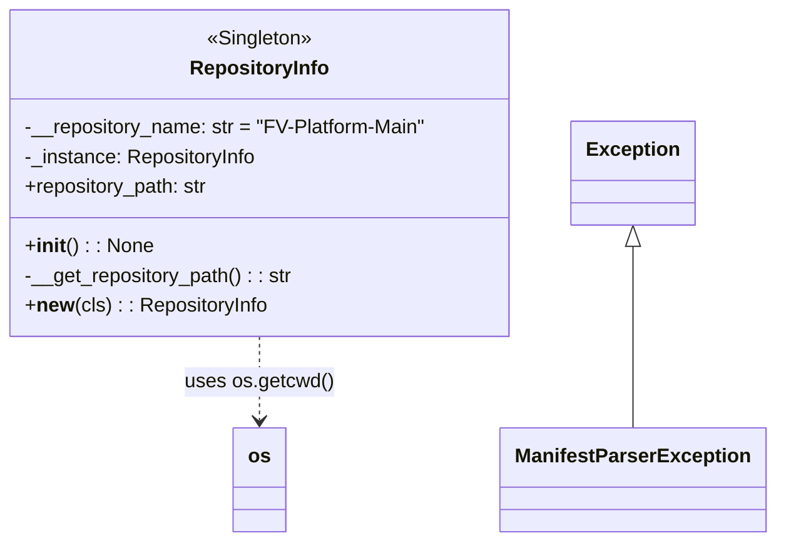

# Diagram: build-deploy/manifest/deployer/__init__.py

> Auto-generated by Obscura crawlers

## Mermaid

```mermaid
classDiagram
    class RepositoryInfo <<Singleton>> {
        -__repository_name: str = "FV-Platform-Main"
        -_instance: RepositoryInfo
        +repository_path: str
        +__init__(): None
        -__get_repository_path(): str
        +__new__(cls): RepositoryInfo
    }
    class ManifestParserException {
    }
    class Exception {
    }
    class os {
    }
    RepositoryInfo ..> os : uses os.getcwd()
    Exception <|-- ManifestParserException
```

> SVG rendering failed for this diagram.
