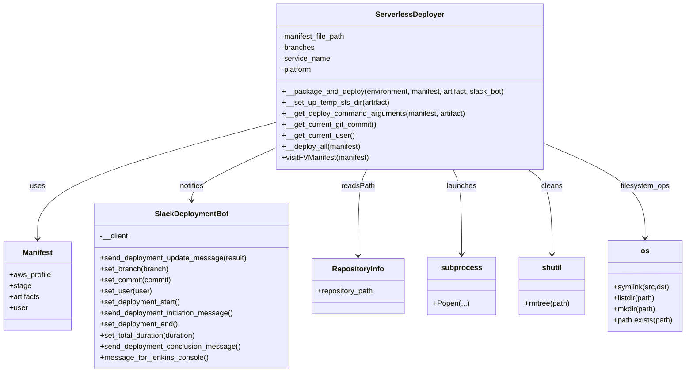
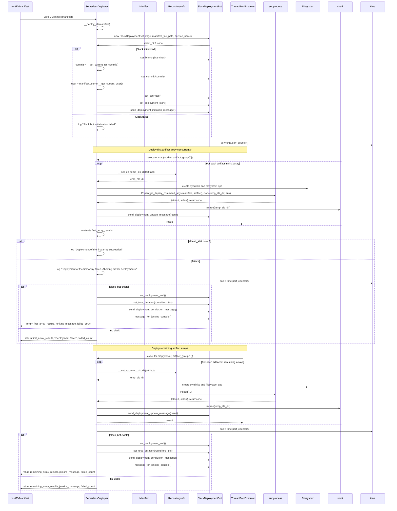

# Diagram: build-deploy/manifest/deployer/deploy.py

> Auto-generated by Obscura crawlers

## Diagram 1

### SVG

<svg id="container" width="1482.828125" xmlns="http://www.w3.org/2000/svg" class="classDiagram" height="810" viewBox="0 0 1482.828125 810" role="graphics-document document" aria-roledescription="class"><g><defs><marker id="container_class-aggregationStart" class="marker aggregation class" refX="18" refY="7" markerWidth="190" markerHeight="240" orient="auto"><path d="M 18,7 L9,13 L1,7 L9,1 Z"></path></marker></defs><defs><marker id="container_class-aggregationEnd" class="marker aggregation class" refX="1" refY="7" markerWidth="20" markerHeight="28" orient="auto"><path d="M 18,7 L9,13 L1,7 L9,1 Z"></path></marker></defs><defs><marker id="container_class-extensionStart" class="marker extension class" refX="18" refY="7" markerWidth="190" markerHeight="240" orient="auto"><path d="M 1,7 L18,13 V 1 Z"></path></marker></defs><defs><marker id="container_class-extensionEnd" class="marker extension class" refX="1" refY="7" markerWidth="20" markerHeight="28" orient="auto"><path d="M 1,1 V 13 L18,7 Z"></path></marker></defs><defs><marker id="container_class-compositionStart" class="marker composition class" refX="18" refY="7" markerWidth="190" markerHeight="240" orient="auto"><path d="M 18,7 L9,13 L1,7 L9,1 Z"></path></marker></defs><defs><marker id="container_class-compositionEnd" class="marker composition class" refX="1" refY="7" markerWidth="20" markerHeight="28" orient="auto"><path d="M 18,7 L9,13 L1,7 L9,1 Z"></path></marker></defs><defs><marker id="container_class-dependencyStart" class="marker dependency class" refX="6" refY="7" markerWidth="190" markerHeight="240" orient="auto"><path d="M 5,7 L9,13 L1,7 L9,1 Z"></path></marker></defs><defs><marker id="container_class-dependencyEnd" class="marker dependency class" refX="13" refY="7" markerWidth="20" markerHeight="28" orient="auto"><path d="M 18,7 L9,13 L14,7 L9,1 Z"></path></marker></defs><defs><marker id="container_class-lollipopStart" class="marker lollipop class" refX="13" refY="7" markerWidth="190" markerHeight="240" orient="auto"><circle stroke="black" fill="transparent" cx="7" cy="7" r="6"></circle></marker></defs><defs><marker id="container_class-lollipopEnd" class="marker lollipop class" refX="1" refY="7" markerWidth="190" markerHeight="240" orient="auto"><circle stroke="black" fill="transparent" cx="7" cy="7" r="6"></circle></marker></defs><g class="root"><g class="clusters"></g><g class="edgePaths"><path d="M594.557,266.568L508.97,289.64C423.384,312.712,252.212,358.856,166.625,401.095C81.039,443.333,81.039,481.667,81.039,500.833L81.039,520" id="id_ServerlessDeployer_Manifest_1" class="edge-thickness-normal edge-pattern-solid relation" style=";;;" data-edge="true" data-et="edge" data-id="id_ServerlessDeployer_Manifest_1" data-points="W3sieCI6NTk0LjU1NjY0MDYyNSwieSI6MjY2LjU2ODQ4NDM5MjYyODh9LHsieCI6ODEuMDM5MDYyNSwieSI6NDA1fSx7IngiOjgxLjAzOTA2MjUsInkiOjUyNn1d" marker-end="url(#container_class-dependencyEnd)"></path><path d="M594.557,322.105L564.53,335.921C534.504,349.737,474.451,377.368,444.425,396.351C414.398,415.333,414.398,425.667,414.398,430.833L414.398,436" id="id_ServerlessDeployer_SlackDeploymentBot_2" class="edge-thickness-normal edge-pattern-solid relation" style=";;;" data-edge="true" data-et="edge" data-id="id_ServerlessDeployer_SlackDeploymentBot_2" data-points="W3sieCI6NTk0LjU1NjY0MDYyNSwieSI6MzIyLjEwNDc2ODgwNzA3MzQ3fSx7IngiOjQxNC4zOTg0Mzc1LCJ5Ijo0MDV9LHsieCI6NDE0LjM5ODQzNzUsInkiOjQ0Mn1d" marker-end="url(#container_class-dependencyEnd)"></path><path d="M794.265,368L791.122,374.167C787.979,380.333,781.692,392.667,778.549,424C775.406,455.333,775.406,505.667,775.406,530.833L775.406,556" id="id_ServerlessDeployer_RepositoryInfo_3" class="edge-thickness-normal edge-pattern-solid relation" style=";;;" data-edge="true" data-et="edge" data-id="id_ServerlessDeployer_RepositoryInfo_3" data-points="W3sieCI6Nzk0LjI2NDkxMzk1NDQ5MzEsInkiOjM2OH0seyJ4Ijo3NzUuNDA2MjUsInkiOjQwNX0seyJ4Ijo3NzUuNDA2MjUsInkiOjU2Mn1d" marker-end="url(#container_class-dependencyEnd)"></path><path d="M977.755,368L980.898,374.167C984.041,380.333,990.327,392.667,993.47,423.5C996.613,454.333,996.613,503.667,996.613,528.333L996.613,553" id="id_ServerlessDeployer_subprocess_4" class="edge-thickness-normal edge-pattern-solid relation" style=";;;" data-edge="true" data-et="edge" data-id="id_ServerlessDeployer_subprocess_4" data-points="W3sieCI6OTc3Ljc1NDYxNzI5NTUwNjksInkiOjM2OH0seyJ4Ijo5OTYuNjEzMjgxMjUsInkiOjQwNX0seyJ4Ijo5OTYuNjEzMjgxMjUsInkiOjU1OX1d" marker-end="url(#container_class-dependencyEnd)"></path><path d="M1137.921,368L1146.552,374.167C1155.182,380.333,1172.443,392.667,1181.073,423.5C1189.703,454.333,1189.703,503.667,1189.703,528.333L1189.703,553" id="id_ServerlessDeployer_shutil_5" class="edge-thickness-normal edge-pattern-solid relation" style=";;;" data-edge="true" data-et="edge" data-id="id_ServerlessDeployer_shutil_5" data-points="W3sieCI6MTEzNy45MjEzMDc5NjM3MDk4LCJ5IjozNjh9LHsieCI6MTE4OS43MDMxMjUsInkiOjQwNX0seyJ4IjoxMTg5LjcwMzEyNSwieSI6NTU5fV0=" marker-end="url(#container_class-dependencyEnd)"></path><path d="M1177.463,312.611L1213.478,328.009C1249.492,343.408,1321.521,374.204,1357.536,408.269C1393.551,442.333,1393.551,479.667,1393.551,498.333L1393.551,517" id="id_ServerlessDeployer_os_6" class="edge-thickness-normal edge-pattern-solid relation" style=";;;" data-edge="true" data-et="edge" data-id="id_ServerlessDeployer_os_6" data-points="W3sieCI6MTE3Ny40NjI4OTA2MjUsInkiOjMxMi42MTEyNjUyNTMzNDY5N30seyJ4IjoxMzkzLjU1MDc4MTI1LCJ5Ijo0MDV9LHsieCI6MTM5My41NTA3ODEyNSwieSI6NTIzfV0=" marker-end="url(#container_class-dependencyEnd)"></path></g><g class="edgeLabels"><g class="edgeLabel" transform="translate(81.0390625, 405)"><g class="label" data-id="id_ServerlessDeployer_Manifest_1" transform="translate(-16.4921875, -12)"><foreignObject width="32.984375" height="24">

uses

</foreignObject></g></g><g class="edgeLabel" transform="translate(414.3984375, 405)"><g class="label" data-id="id_ServerlessDeployer_SlackDeploymentBot_2" transform="translate(-27.203125, -12)"><foreignObject width="54.40625" height="24">

notifies

</foreignObject></g></g><g class="edgeLabel" transform="translate(775.40625, 405)"><g class="label" data-id="id_ServerlessDeployer_RepositoryInfo_3" transform="translate(-36.140625, -12)"><foreignObject width="72.28125" height="24">

readsPath

</foreignObject></g></g><g class="edgeLabel" transform="translate(996.61328125, 405)"><g class="label" data-id="id_ServerlessDeployer_subprocess_4" transform="translate(-32.609375, -12)"><foreignObject width="65.21875" height="24">

launches

</foreignObject></g></g><g class="edgeLabel" transform="translate(1189.703125, 405)"><g class="label" data-id="id_ServerlessDeployer_shutil_5" transform="translate(-23.1875, -12)"><foreignObject width="46.375" height="24">

cleans

</foreignObject></g></g><g class="edgeLabel" transform="translate(1393.55078125, 405)"><g class="label" data-id="id_ServerlessDeployer_os_6" transform="translate(-53.625, -12)"><foreignObject width="107.25" height="24">

filesystem_ops

</foreignObject></g></g></g><g class="nodes"><g class="node default" id="classId-ServerlessDeployer-0" transform="translate(886.009765625, 188)"><g class="basic label-container"><path d="M-291.453125 -180 L291.453125 -180 L291.453125 180 L-291.453125 180" stroke="none" stroke-width="0" fill="#ECECFF" style=""></path><path d="M-291.453125 -180 C-170.4885149678167 -180, -49.523904935633425 -180, 291.453125 -180 M-291.453125 -180 C-61.19061195708997 -180, 169.07190108582006 -180, 291.453125 -180 M291.453125 -180 C291.453125 -77.10375927716099, 291.453125 25.79248144567802, 291.453125 180 M291.453125 -180 C291.453125 -77.38441546150587, 291.453125 25.231169076988266, 291.453125 180 M291.453125 180 C61.41896806017914 180, -168.61518887964172 180, -291.453125 180 M291.453125 180 C141.23031861637492 180, -8.992487767250168 180, -291.453125 180 M-291.453125 180 C-291.453125 54.44313411729286, -291.453125 -71.11373176541429, -291.453125 -180 M-291.453125 180 C-291.453125 65.29667876330822, -291.453125 -49.406642473383556, -291.453125 -180" stroke="#9370DB" stroke-width="1.3" fill="none" stroke-dasharray="0 0" style=""></path></g><g class="annotation-group text" transform="translate(0, -156)"></g><g class="label-group text" transform="translate(-71.34375, -156)"><g class="label" style="font-weight: bolder" transform="translate(0,-12)"><foreignObject width="142.6875" height="24">

ServerlessDeployer

</foreignObject></g></g><g class="members-group text" transform="translate(-279.453125, -108)"><g class="label" style="" transform="translate(0,-12)"><foreignObject width="141.65625" height="24">

-manifest_file_path

</foreignObject></g><g class="label" style="" transform="translate(0,12)"><foreignObject width="72.875" height="24">

-branches

</foreignObject></g><g class="label" style="" transform="translate(0,36)"><foreignObject width="105.765625" height="24">

-service_name

</foreignObject></g><g class="label" style="" transform="translate(0,60)"><foreignObject width="69.484375" height="24">

-platform

</foreignObject></g></g><g class="methods-group text" transform="translate(-279.453125, 12)"><g class="label" style="" transform="translate(0,-12)"><foreignObject width="487.5625" height="24">

+__package_and_deploy(environment, manifest, artifact, slack_bot)

</foreignObject></g><g class="label" style="" transform="translate(0,12)"><foreignObject width="235.375" height="24">

+__set_up_temp_sls_dir(artifact)

</foreignObject></g><g class="label" style="" transform="translate(0,36)"><foreignObject width="402.171875" height="24">

+__get_deploy_command_arguments(manifest, artifact)

</foreignObject></g><g class="label" style="" transform="translate(0,60)"><foreignObject width="206.265625" height="24">

+__get_current_git_commit()

</foreignObject></g><g class="label" style="" transform="translate(0,84)"><foreignObject width="156.484375" height="24">

+__get_current_user()

</foreignObject></g><g class="label" style="" transform="translate(0,108)"><foreignObject width="171.703125" height="24">

+__deploy_all(manifest)

</foreignObject></g><g class="label" style="" transform="translate(0,132)"><foreignObject width="190.671875" height="24">

+visitFVManifest(manifest)

</foreignObject></g></g><g class="divider" style=""><path d="M-291.453125 -132 C-146.6393464151553 -132, -1.8255678303106038 -132, 291.453125 -132 M-291.453125 -132 C-87.28282335001046 -132, 116.88747829997908 -132, 291.453125 -132" stroke="#9370DB" stroke-width="1.3" fill="none" stroke-dasharray="0 0" style=""></path></g><g class="divider" style=""><path d="M-291.453125 -12 C-89.58029240559244 -12, 112.29254018881511 -12, 291.453125 -12 M-291.453125 -12 C-145.72615499038935 -12, 0.0008150192213065566 -12, 291.453125 -12" stroke="#9370DB" stroke-width="1.3" fill="none" stroke-dasharray="0 0" style=""></path></g></g><g class="node default" id="classId-Manifest-1" transform="translate(81.0390625, 622)"><g class="basic label-container"><path d="M-73.0390625 -96 L73.0390625 -96 L73.0390625 96 L-73.0390625 96" stroke="none" stroke-width="0" fill="#ECECFF" style=""></path><path d="M-73.0390625 -96 C-27.859654763011626 -96, 17.319752973976748 -96, 73.0390625 -96 M-73.0390625 -96 C-32.65796124257786 -96, 7.723140014844276 -96, 73.0390625 -96 M73.0390625 -96 C73.0390625 -31.526697526406664, 73.0390625 32.94660494718667, 73.0390625 96 M73.0390625 -96 C73.0390625 -54.95392993362667, 73.0390625 -13.907859867253336, 73.0390625 96 M73.0390625 96 C16.664581076103055 96, -39.70990034779389 96, -73.0390625 96 M73.0390625 96 C17.1930646568201 96, -38.6529331863598 96, -73.0390625 96 M-73.0390625 96 C-73.0390625 50.4724263781361, -73.0390625 4.944852756272198, -73.0390625 -96 M-73.0390625 96 C-73.0390625 37.23343085540454, -73.0390625 -21.533138289190916, -73.0390625 -96" stroke="#9370DB" stroke-width="1.3" fill="none" stroke-dasharray="0 0" style=""></path></g><g class="annotation-group text" transform="translate(0, -72)"></g><g class="label-group text" transform="translate(-31.6875, -72)"><g class="label" style="font-weight: bolder" transform="translate(0,-12)"><foreignObject width="63.375" height="24">

Manifest

</foreignObject></g></g><g class="members-group text" transform="translate(-61.0390625, -24)"><g class="label" style="" transform="translate(0,-12)"><foreignObject width="90.390625" height="24">

+aws_profile

</foreignObject></g><g class="label" style="" transform="translate(0,12)"><foreignObject width="46.453125" height="24">

+stage

</foreignObject></g><g class="label" style="" transform="translate(0,36)"><foreignObject width="67.53125" height="24">

+artifacts

</foreignObject></g><g class="label" style="" transform="translate(0,60)"><foreignObject width="39.671875" height="24">

+user

</foreignObject></g></g><g class="methods-group text" transform="translate(-61.0390625, 96)"></g><g class="divider" style=""><path d="M-73.0390625 -48 C-19.193084443233445 -48, 34.65289361353311 -48, 73.0390625 -48 M-73.0390625 -48 C-15.349773454308 -48, 42.339515591384 -48, 73.0390625 -48" stroke="#9370DB" stroke-width="1.3" fill="none" stroke-dasharray="0 0" style=""></path></g><g class="divider" style=""><path d="M-73.0390625 72 C-21.97046349042195 72, 29.098135519156102 72, 73.0390625 72 M-73.0390625 72 C-17.791941535603208 72, 37.455179428793585 72, 73.0390625 72" stroke="#9370DB" stroke-width="1.3" fill="none" stroke-dasharray="0 0" style=""></path></g></g><g class="node default" id="classId-SlackDeploymentBot-2" transform="translate(414.3984375, 622)"><g class="basic label-container"><path d="M-210.3203125 -180 L210.3203125 -180 L210.3203125 180 L-210.3203125 180" stroke="none" stroke-width="0" fill="#ECECFF" style=""></path><path d="M-210.3203125 -180 C-110.51884554650168 -180, -10.71737859300336 -180, 210.3203125 -180 M-210.3203125 -180 C-63.09556251511498 -180, 84.12918746977005 -180, 210.3203125 -180 M210.3203125 -180 C210.3203125 -92.48261192844697, 210.3203125 -4.965223856893942, 210.3203125 180 M210.3203125 -180 C210.3203125 -51.47783100461953, 210.3203125 77.04433799076094, 210.3203125 180 M210.3203125 180 C107.313899046858 180, 4.307485593715995 180, -210.3203125 180 M210.3203125 180 C59.762155859738954 180, -90.79600078052209 180, -210.3203125 180 M-210.3203125 180 C-210.3203125 59.868794888505704, -210.3203125 -60.26241022298859, -210.3203125 -180 M-210.3203125 180 C-210.3203125 47.06463128617585, -210.3203125 -85.8707374276483, -210.3203125 -180" stroke="#9370DB" stroke-width="1.3" fill="none" stroke-dasharray="0 0" style=""></path></g><g class="annotation-group text" transform="translate(0, -156)"></g><g class="label-group text" transform="translate(-76.609375, -156)"><g class="label" style="font-weight: bolder" transform="translate(0,-12)"><foreignObject width="153.21875" height="24">

SlackDeploymentBot

</foreignObject></g></g><g class="members-group text" transform="translate(-198.3203125, -108)"><g class="label" style="" transform="translate(0,-12)"><foreignObject width="62.0625" height="24">

-__client

</foreignObject></g></g><g class="methods-group text" transform="translate(-198.3203125, -60)"><g class="label" style="" transform="translate(0,-12)"><foreignObject width="320.03125" height="24">

+send_deployment_update_message(result)

</foreignObject></g><g class="label" style="" transform="translate(0,12)"><foreignObject width="149.09375" height="24">

+set_branch(branch)

</foreignObject></g><g class="label" style="" transform="translate(0,36)"><foreignObject width="157.09375" height="24">

+set_commit(commit)

</foreignObject></g><g class="label" style="" transform="translate(0,60)"><foreignObject width="111.6875" height="24">

+set_user(user)

</foreignObject></g><g class="label" style="" transform="translate(0,84)"><foreignObject width="177.578125" height="24">

+set_deployment_start()

</foreignObject></g><g class="label" style="" transform="translate(0,108)"><foreignObject width="294.0625" height="24">

+send_deployment_initiation_message()

</foreignObject></g><g class="label" style="" transform="translate(0,132)"><foreignObject width="171.125" height="24">

+set_deployment_end()

</foreignObject></g><g class="label" style="" transform="translate(0,156)"><foreignObject width="214.515625" height="24">

+set_total_duration(duration)

</foreignObject></g><g class="label" style="" transform="translate(0,180)"><foreignObject width="305.734375" height="24">

+send_deployment_conclusion_message()

</foreignObject></g><g class="label" style="" transform="translate(0,204)"><foreignObject width="232.765625" height="24">

+message_for_jenkins_console()

</foreignObject></g></g><g class="divider" style=""><path d="M-210.3203125 -132 C-71.48971281356748 -132, 67.34088687286504 -132, 210.3203125 -132 M-210.3203125 -132 C-105.20407987794614 -132, -0.08784725589228515 -132, 210.3203125 -132" stroke="#9370DB" stroke-width="1.3" fill="none" stroke-dasharray="0 0" style=""></path></g><g class="divider" style=""><path d="M-210.3203125 -84 C-118.016376789387 -84, -25.712441078773992 -84, 210.3203125 -84 M-210.3203125 -84 C-66.4676235392634 -84, 77.3850654214732 -84, 210.3203125 -84" stroke="#9370DB" stroke-width="1.3" fill="none" stroke-dasharray="0 0" style=""></path></g></g><g class="node default" id="classId-RepositoryInfo-3" transform="translate(775.40625, 622)"><g class="basic label-container"><path d="M-100.6875 -60 L100.6875 -60 L100.6875 60 L-100.6875 60" stroke="none" stroke-width="0" fill="#ECECFF" style=""></path><path d="M-100.6875 -60 C-29.550233307897813 -60, 41.587033384204375 -60, 100.6875 -60 M-100.6875 -60 C-37.82486028944719 -60, 25.037779421105625 -60, 100.6875 -60 M100.6875 -60 C100.6875 -18.56514775919981, 100.6875 22.86970448160038, 100.6875 60 M100.6875 -60 C100.6875 -29.39394953306251, 100.6875 1.2121009338749786, 100.6875 60 M100.6875 60 C27.068606413975274 60, -46.55028717204945 60, -100.6875 60 M100.6875 60 C35.00018995713286 60, -30.68712008573428 60, -100.6875 60 M-100.6875 60 C-100.6875 13.86157669574147, -100.6875 -32.27684660851706, -100.6875 -60 M-100.6875 60 C-100.6875 26.252045951808327, -100.6875 -7.495908096383346, -100.6875 -60" stroke="#9370DB" stroke-width="1.3" fill="none" stroke-dasharray="0 0" style=""></path></g><g class="annotation-group text" transform="translate(0, -36)"></g><g class="label-group text" transform="translate(-54.171875, -36)"><g class="label" style="font-weight: bolder" transform="translate(0,-12)"><foreignObject width="108.34375" height="24">

RepositoryInfo

</foreignObject></g></g><g class="members-group text" transform="translate(-88.6875, 12)"><g class="label" style="" transform="translate(0,-12)"><foreignObject width="123.203125" height="24">

+repository_path

</foreignObject></g></g><g class="methods-group text" transform="translate(-88.6875, 60)"></g><g class="divider" style=""><path d="M-100.6875 -12 C-29.95295727664832 -12, 40.78158544670336 -12, 100.6875 -12 M-100.6875 -12 C-36.570738240536556 -12, 27.546023518926887 -12, 100.6875 -12" stroke="#9370DB" stroke-width="1.3" fill="none" stroke-dasharray="0 0" style=""></path></g><g class="divider" style=""><path d="M-100.6875 36 C-44.586198691729344 36, 11.515102616541313 36, 100.6875 36 M-100.6875 36 C-36.18077391177583 36, 28.32595217644834 36, 100.6875 36" stroke="#9370DB" stroke-width="1.3" fill="none" stroke-dasharray="0 0" style=""></path></g></g><g class="node default" id="classId-subprocess-4" transform="translate(996.61328125, 622)"><g class="basic label-container"><path d="M-70.51953125 -63 L70.51953125 -63 L70.51953125 63 L-70.51953125 63" stroke="none" stroke-width="0" fill="#ECECFF" style=""></path><path d="M-70.51953125 -63 C-14.114811793844332 -63, 42.289907662311336 -63, 70.51953125 -63 M-70.51953125 -63 C-20.041182683091094 -63, 30.437165883817812 -63, 70.51953125 -63 M70.51953125 -63 C70.51953125 -34.10028253622886, 70.51953125 -5.200565072457714, 70.51953125 63 M70.51953125 -63 C70.51953125 -37.002387523614686, 70.51953125 -11.004775047229366, 70.51953125 63 M70.51953125 63 C17.510128685075316 63, -35.49927387984937 63, -70.51953125 63 M70.51953125 63 C21.00501586246711 63, -28.509499525065777 63, -70.51953125 63 M-70.51953125 63 C-70.51953125 35.04059480710445, -70.51953125 7.0811896142088955, -70.51953125 -63 M-70.51953125 63 C-70.51953125 32.69000791375302, -70.51953125 2.3800158275060355, -70.51953125 -63" stroke="#9370DB" stroke-width="1.3" fill="none" stroke-dasharray="0 0" style=""></path></g><g class="annotation-group text" transform="translate(0, -39)"></g><g class="label-group text" transform="translate(-41.3984375, -39)"><g class="label" style="font-weight: bolder" transform="translate(0,-12)"><foreignObject width="82.796875" height="24">

subprocess

</foreignObject></g></g><g class="members-group text" transform="translate(-58.51953125, 9)"></g><g class="methods-group text" transform="translate(-58.51953125, 39)"><g class="label" style="" transform="translate(0,-12)"><foreignObject width="75.640625" height="24">

+Popen(...)

</foreignObject></g></g><g class="divider" style=""><path d="M-70.51953125 -15 C-30.008065528271125 -15, 10.50340019345775 -15, 70.51953125 -15 M-70.51953125 -15 C-16.58615335668805 -15, 37.3472245366239 -15, 70.51953125 -15" stroke="#9370DB" stroke-width="1.3" fill="none" stroke-dasharray="0 0" style=""></path></g><g class="divider" style=""><path d="M-70.51953125 9 C-32.38601980810199 9, 5.747491633796017 9, 70.51953125 9 M-70.51953125 9 C-19.009393233709766 9, 32.50074478258047 9, 70.51953125 9" stroke="#9370DB" stroke-width="1.3" fill="none" stroke-dasharray="0 0" style=""></path></g></g><g class="node default" id="classId-shutil-5" transform="translate(1189.703125, 622)"><g class="basic label-container"><path d="M-72.5703125 -63 L72.5703125 -63 L72.5703125 63 L-72.5703125 63" stroke="none" stroke-width="0" fill="#ECECFF" style=""></path><path d="M-72.5703125 -63 C-17.044234762795277 -63, 38.481842974409446 -63, 72.5703125 -63 M-72.5703125 -63 C-25.233376984232493 -63, 22.103558531535015 -63, 72.5703125 -63 M72.5703125 -63 C72.5703125 -27.663411774375014, 72.5703125 7.673176451249972, 72.5703125 63 M72.5703125 -63 C72.5703125 -17.769532747357147, 72.5703125 27.460934505285707, 72.5703125 63 M72.5703125 63 C21.84564706497143 63, -28.87901837005714 63, -72.5703125 63 M72.5703125 63 C37.28128831530043 63, 1.9922641306008586 63, -72.5703125 63 M-72.5703125 63 C-72.5703125 19.76180798856352, -72.5703125 -23.476384022872963, -72.5703125 -63 M-72.5703125 63 C-72.5703125 33.61852788531437, -72.5703125 4.237055770628743, -72.5703125 -63" stroke="#9370DB" stroke-width="1.3" fill="none" stroke-dasharray="0 0" style=""></path></g><g class="annotation-group text" transform="translate(0, -39)"></g><g class="label-group text" transform="translate(-20.78125, -39)"><g class="label" style="font-weight: bolder" transform="translate(0,-12)"><foreignObject width="41.5625" height="24">

shutil

</foreignObject></g></g><g class="members-group text" transform="translate(-60.5703125, 9)"></g><g class="methods-group text" transform="translate(-60.5703125, 39)"><g class="label" style="" transform="translate(0,-12)"><foreignObject width="100.359375" height="24">

+rmtree(path)

</foreignObject></g></g><g class="divider" style=""><path d="M-72.5703125 -15 C-37.60445613486284 -15, -2.638599769725687 -15, 72.5703125 -15 M-72.5703125 -15 C-23.591252630385895 -15, 25.38780723922821 -15, 72.5703125 -15" stroke="#9370DB" stroke-width="1.3" fill="none" stroke-dasharray="0 0" style=""></path></g><g class="divider" style=""><path d="M-72.5703125 9 C-17.531377319496208 9, 37.507557861007584 9, 72.5703125 9 M-72.5703125 9 C-33.64243089573922 9, 5.285450708521566 9, 72.5703125 9" stroke="#9370DB" stroke-width="1.3" fill="none" stroke-dasharray="0 0" style=""></path></g></g><g class="node default" id="classId-os-6" transform="translate(1393.55078125, 622)"><g class="basic label-container"><path d="M-81.27734375 -99 L81.27734375 -99 L81.27734375 99 L-81.27734375 99" stroke="none" stroke-width="0" fill="#ECECFF" style=""></path><path d="M-81.27734375 -99 C-30.778632965679456 -99, 19.720077818641087 -99, 81.27734375 -99 M-81.27734375 -99 C-45.03943199594995 -99, -8.801520241899894 -99, 81.27734375 -99 M81.27734375 -99 C81.27734375 -58.83099579074618, 81.27734375 -18.66199158149236, 81.27734375 99 M81.27734375 -99 C81.27734375 -28.58075551146443, 81.27734375 41.83848897707114, 81.27734375 99 M81.27734375 99 C26.101841920823468 99, -29.073659908353065 99, -81.27734375 99 M81.27734375 99 C20.95619797590504 99, -39.36494779818992 99, -81.27734375 99 M-81.27734375 99 C-81.27734375 24.10492060175335, -81.27734375 -50.7901587964933, -81.27734375 -99 M-81.27734375 99 C-81.27734375 32.985348516842805, -81.27734375 -33.02930296631439, -81.27734375 -99" stroke="#9370DB" stroke-width="1.3" fill="none" stroke-dasharray="0 0" style=""></path></g><g class="annotation-group text" transform="translate(0, -75)"></g><g class="label-group text" transform="translate(-8.5390625, -75)"><g class="label" style="font-weight: bolder" transform="translate(0,-12)"><foreignObject width="17.078125" height="24">

os

</foreignObject></g></g><g class="members-group text" transform="translate(-69.27734375, -27)"></g><g class="methods-group text" transform="translate(-69.27734375, 3)"><g class="label" style="" transform="translate(0,-12)"><foreignObject width="121.390625" height="24">

+symlink(src,dst)

</foreignObject></g><g class="label" style="" transform="translate(0,12)"><foreignObject width="94.03125" height="24">

+listdir(path)

</foreignObject></g><g class="label" style="" transform="translate(0,36)"><foreignObject width="93.578125" height="24">

+mkdir(path)

</foreignObject></g><g class="label" style="" transform="translate(0,60)"><foreignObject width="130.015625" height="24">

+path.exists(path)

</foreignObject></g></g><g class="divider" style=""><path d="M-81.27734375 -51 C-34.10360563025933 -51, 13.070132489481338 -51, 81.27734375 -51 M-81.27734375 -51 C-46.00040469257788 -51, -10.723465635155762 -51, 81.27734375 -51" stroke="#9370DB" stroke-width="1.3" fill="none" stroke-dasharray="0 0" style=""></path></g><g class="divider" style=""><path d="M-81.27734375 -27 C-46.10640313237439 -27, -10.935462514748778 -27, 81.27734375 -27 M-81.27734375 -27 C-44.061943860780744 -27, -6.846543971561488 -27, 81.27734375 -27" stroke="#9370DB" stroke-width="1.3" fill="none" stroke-dasharray="0 0" style=""></path></g></g></g></g></g></svg>

## Diagram 2

### SVG

<svg id="container" width="2530" xmlns="http://www.w3.org/2000/svg" height="3323" viewBox="-50 -10 2530 3323" role="graphics-document document" aria-roledescription="sequence"><g><rect x="2280" y="3237" fill="#eaeaea" stroke="#666" width="150" height="65" name="Time" rx="3" ry="3" class="actor actor-bottom"></rect><text x="2355" y="3269.5" dominant-baseline="central" alignment-baseline="central" class="actor actor-box" style="text-anchor: middle; font-size: 16px; font-weight: 400;"><tspan x="2355" dy="0">time</tspan></text></g><g><rect x="2080" y="3237" fill="#eaeaea" stroke="#666" width="150" height="65" name="Shutil" rx="3" ry="3" class="actor actor-bottom"></rect><text x="2155" y="3269.5" dominant-baseline="central" alignment-baseline="central" class="actor actor-box" style="text-anchor: middle; font-size: 16px; font-weight: 400;"><tspan x="2155" dy="0">shutil</tspan></text></g><g><rect x="1880" y="3237" fill="#eaeaea" stroke="#666" width="150" height="65" name="FS" rx="3" ry="3" class="actor actor-bottom"></rect><text x="1955" y="3269.5" dominant-baseline="central" alignment-baseline="central" class="actor actor-box" style="text-anchor: middle; font-size: 16px; font-weight: 400;"><tspan x="1955" dy="0">Filesystem</tspan></text></g><g><rect x="1680" y="3237" fill="#eaeaea" stroke="#666" width="150" height="65" name="Subproc" rx="3" ry="3" class="actor actor-bottom"></rect><text x="1755" y="3269.5" dominant-baseline="central" alignment-baseline="central" class="actor actor-box" style="text-anchor: middle; font-size: 16px; font-weight: 400;"><tspan x="1755" dy="0">subprocess</tspan></text></g><g><rect x="1464" y="3237" fill="#eaeaea" stroke="#666" width="166" height="65" name="Executor" rx="3" ry="3" class="actor actor-bottom"></rect><text x="1547" y="3269.5" dominant-baseline="central" alignment-baseline="central" class="actor actor-box" style="text-anchor: middle; font-size: 16px; font-weight: 400;"><tspan x="1547" dy="0">ThreadPoolExecutor</tspan></text></g><g><rect x="1243" y="3237" fill="#eaeaea" stroke="#666" width="171" height="65" name="Slack" rx="3" ry="3" class="actor actor-bottom"></rect><text x="1328.5" y="3269.5" dominant-baseline="central" alignment-baseline="central" class="actor actor-box" style="text-anchor: middle; font-size: 16px; font-weight: 400;"><tspan x="1328.5" dy="0">SlackDeploymentBot</tspan></text></g><g><rect x="1043" y="3237" fill="#eaeaea" stroke="#666" width="150" height="65" name="Repo" rx="3" ry="3" class="actor actor-bottom"></rect><text x="1118" y="3269.5" dominant-baseline="central" alignment-baseline="central" class="actor actor-box" style="text-anchor: middle; font-size: 16px; font-weight: 400;"><tspan x="1118" dy="0">RepositoryInfo</tspan></text></g><g><rect x="843" y="3237" fill="#eaeaea" stroke="#666" width="150" height="65" name="Manifest" rx="3" ry="3" class="actor actor-bottom"></rect><text x="918" y="3269.5" dominant-baseline="central" alignment-baseline="central" class="actor actor-box" style="text-anchor: middle; font-size: 16px; font-weight: 400;"><tspan x="918" dy="0">Manifest</tspan></text></g><g><rect x="518" y="3237" fill="#eaeaea" stroke="#666" width="160" height="65" name="Deployer" rx="3" ry="3" class="actor actor-bottom"></rect><text x="598" y="3269.5" dominant-baseline="central" alignment-baseline="central" class="actor actor-box" style="text-anchor: middle; font-size: 16px; font-weight: 400;"><tspan x="598" dy="0">ServerlessDeployer</tspan></text></g><g><rect x="0" y="3237" fill="#eaeaea" stroke="#666" width="150" height="65" name="Caller" rx="3" ry="3" class="actor actor-bottom"></rect><text x="75" y="3269.5" dominant-baseline="central" alignment-baseline="central" class="actor actor-box" style="text-anchor: middle; font-size: 16px; font-weight: 400;"><tspan x="75" dy="0">visitFVManifest</tspan></text></g><g><line id="actor9" x1="2355" y1="65" x2="2355" y2="3237" class="actor-line 200" stroke-width="0.5px" stroke="#999" name="Time"></line><g id="root-9"><rect x="2280" y="0" fill="#eaeaea" stroke="#666" width="150" height="65" name="Time" rx="3" ry="3" class="actor actor-top"></rect><text x="2355" y="32.5" dominant-baseline="central" alignment-baseline="central" class="actor actor-box" style="text-anchor: middle; font-size: 16px; font-weight: 400;"><tspan x="2355" dy="0">time</tspan></text></g></g><g><line id="actor8" x1="2155" y1="65" x2="2155" y2="3237" class="actor-line 200" stroke-width="0.5px" stroke="#999" name="Shutil"></line><g id="root-8"><rect x="2080" y="0" fill="#eaeaea" stroke="#666" width="150" height="65" name="Shutil" rx="3" ry="3" class="actor actor-top"></rect><text x="2155" y="32.5" dominant-baseline="central" alignment-baseline="central" class="actor actor-box" style="text-anchor: middle; font-size: 16px; font-weight: 400;"><tspan x="2155" dy="0">shutil</tspan></text></g></g><g><line id="actor7" x1="1955" y1="65" x2="1955" y2="3237" class="actor-line 200" stroke-width="0.5px" stroke="#999" name="FS"></line><g id="root-7"><rect x="1880" y="0" fill="#eaeaea" stroke="#666" width="150" height="65" name="FS" rx="3" ry="3" class="actor actor-top"></rect><text x="1955" y="32.5" dominant-baseline="central" alignment-baseline="central" class="actor actor-box" style="text-anchor: middle; font-size: 16px; font-weight: 400;"><tspan x="1955" dy="0">Filesystem</tspan></text></g></g><g><line id="actor6" x1="1755" y1="65" x2="1755" y2="3237" class="actor-line 200" stroke-width="0.5px" stroke="#999" name="Subproc"></line><g id="root-6"><rect x="1680" y="0" fill="#eaeaea" stroke="#666" width="150" height="65" name="Subproc" rx="3" ry="3" class="actor actor-top"></rect><text x="1755" y="32.5" dominant-baseline="central" alignment-baseline="central" class="actor actor-box" style="text-anchor: middle; font-size: 16px; font-weight: 400;"><tspan x="1755" dy="0">subprocess</tspan></text></g></g><g><line id="actor5" x1="1547" y1="65" x2="1547" y2="3237" class="actor-line 200" stroke-width="0.5px" stroke="#999" name="Executor"></line><g id="root-5"><rect x="1464" y="0" fill="#eaeaea" stroke="#666" width="166" height="65" name="Executor" rx="3" ry="3" class="actor actor-top"></rect><text x="1547" y="32.5" dominant-baseline="central" alignment-baseline="central" class="actor actor-box" style="text-anchor: middle; font-size: 16px; font-weight: 400;"><tspan x="1547" dy="0">ThreadPoolExecutor</tspan></text></g></g><g><line id="actor4" x1="1328.5" y1="65" x2="1328.5" y2="3237" class="actor-line 200" stroke-width="0.5px" stroke="#999" name="Slack"></line><g id="root-4"><rect x="1243" y="0" fill="#eaeaea" stroke="#666" width="171" height="65" name="Slack" rx="3" ry="3" class="actor actor-top"></rect><text x="1328.5" y="32.5" dominant-baseline="central" alignment-baseline="central" class="actor actor-box" style="text-anchor: middle; font-size: 16px; font-weight: 400;"><tspan x="1328.5" dy="0">SlackDeploymentBot</tspan></text></g></g><g><line id="actor3" x1="1118" y1="65" x2="1118" y2="3237" class="actor-line 200" stroke-width="0.5px" stroke="#999" name="Repo"></line><g id="root-3"><rect x="1043" y="0" fill="#eaeaea" stroke="#666" width="150" height="65" name="Repo" rx="3" ry="3" class="actor actor-top"></rect><text x="1118" y="32.5" dominant-baseline="central" alignment-baseline="central" class="actor actor-box" style="text-anchor: middle; font-size: 16px; font-weight: 400;"><tspan x="1118" dy="0">RepositoryInfo</tspan></text></g></g><g><line id="actor2" x1="918" y1="65" x2="918" y2="3237" class="actor-line 200" stroke-width="0.5px" stroke="#999" name="Manifest"></line><g id="root-2"><rect x="843" y="0" fill="#eaeaea" stroke="#666" width="150" height="65" name="Manifest" rx="3" ry="3" class="actor actor-top"></rect><text x="918" y="32.5" dominant-baseline="central" alignment-baseline="central" class="actor actor-box" style="text-anchor: middle; font-size: 16px; font-weight: 400;"><tspan x="918" dy="0">Manifest</tspan></text></g></g><g><line id="actor1" x1="598" y1="65" x2="598" y2="3237" class="actor-line 200" stroke-width="0.5px" stroke="#999" name="Deployer"></line><g id="root-1"><rect x="518" y="0" fill="#eaeaea" stroke="#666" width="160" height="65" name="Deployer" rx="3" ry="3" class="actor actor-top"></rect><text x="598" y="32.5" dominant-baseline="central" alignment-baseline="central" class="actor actor-box" style="text-anchor: middle; font-size: 16px; font-weight: 400;"><tspan x="598" dy="0">ServerlessDeployer</tspan></text></g></g><g><line id="actor0" x1="75" y1="65" x2="75" y2="3237" class="actor-line 200" stroke-width="0.5px" stroke="#999" name="Caller"></line><g id="root-0"><rect x="0" y="0" fill="#eaeaea" stroke="#666" width="150" height="65" name="Caller" rx="3" ry="3" class="actor actor-top"></rect><text x="75" y="32.5" dominant-baseline="central" alignment-baseline="central" class="actor actor-box" style="text-anchor: middle; font-size: 16px; font-weight: 400;"><tspan x="75" dy="0">visitFVManifest</tspan></text></g></g><g></g><defs><symbol id="computer" width="24" height="24"><path transform="scale(.5)" d="M2 2v13h20v-13h-20zm18 11h-16v-9h16v9zm-10.228 6l.466-1h3.524l.467 1h-4.457zm14.228 3h-24l2-6h2.104l-1.33 4h18.45l-1.297-4h2.073l2 6zm-5-10h-14v-7h14v7z"></path></symbol></defs><defs><symbol id="database" fill-rule="evenodd" clip-rule="evenodd"><path transform="scale(.5)" d="M12.258.001l.256.004.255.005.253.008.251.01.249.012.247.015.246.016.242.019.241.02.239.023.236.024.233.027.231.028.229.031.225.032.223.034.22.036.217.038.214.04.211.041.208.043.205.045.201.046.198.048.194.05.191.051.187.053.183.054.18.056.175.057.172.059.168.06.163.061.16.063.155.064.15.066.074.033.073.033.071.034.07.034.069.035.068.035.067.035.066.035.064.036.064.036.062.036.06.036.06.037.058.037.058.037.055.038.055.038.053.038.052.038.051.039.05.039.048.039.047.039.045.04.044.04.043.04.041.04.04.041.039.041.037.041.036.041.034.041.033.042.032.042.03.042.029.042.027.042.026.043.024.043.023.043.021.043.02.043.018.044.017.043.015.044.013.044.012.044.011.045.009.044.007.045.006.045.004.045.002.045.001.045v17l-.001.045-.002.045-.004.045-.006.045-.007.045-.009.044-.011.045-.012.044-.013.044-.015.044-.017.043-.018.044-.02.043-.021.043-.023.043-.024.043-.026.043-.027.042-.029.042-.03.042-.032.042-.033.042-.034.041-.036.041-.037.041-.039.041-.04.041-.041.04-.043.04-.044.04-.045.04-.047.039-.048.039-.05.039-.051.039-.052.038-.053.038-.055.038-.055.038-.058.037-.058.037-.06.037-.06.036-.062.036-.064.036-.064.036-.066.035-.067.035-.068.035-.069.035-.07.034-.071.034-.073.033-.074.033-.15.066-.155.064-.16.063-.163.061-.168.06-.172.059-.175.057-.18.056-.183.054-.187.053-.191.051-.194.05-.198.048-.201.046-.205.045-.208.043-.211.041-.214.04-.217.038-.22.036-.223.034-.225.032-.229.031-.231.028-.233.027-.236.024-.239.023-.241.02-.242.019-.246.016-.247.015-.249.012-.251.01-.253.008-.255.005-.256.004-.258.001-.258-.001-.256-.004-.255-.005-.253-.008-.251-.01-.249-.012-.247-.015-.245-.016-.243-.019-.241-.02-.238-.023-.236-.024-.234-.027-.231-.028-.228-.031-.226-.032-.223-.034-.22-.036-.217-.038-.214-.04-.211-.041-.208-.043-.204-.045-.201-.046-.198-.048-.195-.05-.19-.051-.187-.053-.184-.054-.179-.056-.176-.057-.172-.059-.167-.06-.164-.061-.159-.063-.155-.064-.151-.066-.074-.033-.072-.033-.072-.034-.07-.034-.069-.035-.068-.035-.067-.035-.066-.035-.064-.036-.063-.036-.062-.036-.061-.036-.06-.037-.058-.037-.057-.037-.056-.038-.055-.038-.053-.038-.052-.038-.051-.039-.049-.039-.049-.039-.046-.039-.046-.04-.044-.04-.043-.04-.041-.04-.04-.041-.039-.041-.037-.041-.036-.041-.034-.041-.033-.042-.032-.042-.03-.042-.029-.042-.027-.042-.026-.043-.024-.043-.023-.043-.021-.043-.02-.043-.018-.044-.017-.043-.015-.044-.013-.044-.012-.044-.011-.045-.009-.044-.007-.045-.006-.045-.004-.045-.002-.045-.001-.045v-17l.001-.045.002-.045.004-.045.006-.045.007-.045.009-.044.011-.045.012-.044.013-.044.015-.044.017-.043.018-.044.02-.043.021-.043.023-.043.024-.043.026-.043.027-.042.029-.042.03-.042.032-.042.033-.042.034-.041.036-.041.037-.041.039-.041.04-.041.041-.04.043-.04.044-.04.046-.04.046-.039.049-.039.049-.039.051-.039.052-.038.053-.038.055-.038.056-.038.057-.037.058-.037.06-.037.061-.036.062-.036.063-.036.064-.036.066-.035.067-.035.068-.035.069-.035.07-.034.072-.034.072-.033.074-.033.151-.066.155-.064.159-.063.164-.061.167-.06.172-.059.176-.057.179-.056.184-.054.187-.053.19-.051.195-.05.198-.048.201-.046.204-.045.208-.043.211-.041.214-.04.217-.038.22-.036.223-.034.226-.032.228-.031.231-.028.234-.027.236-.024.238-.023.241-.02.243-.019.245-.016.247-.015.249-.012.251-.01.253-.008.255-.005.256-.004.258-.001.258.001zm-9.258 20.499v.01l.001.021.003.021.004.022.005.021.006.022.007.022.009.023.01.022.011.023.012.023.013.023.015.023.016.024.017.023.018.024.019.024.021.024.022.025.023.024.024.025.052.049.056.05.061.051.066.051.07.051.075.051.079.052.084.052.088.052.092.052.097.052.102.051.105.052.11.052.114.051.119.051.123.051.127.05.131.05.135.05.139.048.144.049.147.047.152.047.155.047.16.045.163.045.167.043.171.043.176.041.178.041.183.039.187.039.19.037.194.035.197.035.202.033.204.031.209.03.212.029.216.027.219.025.222.024.226.021.23.02.233.018.236.016.24.015.243.012.246.01.249.008.253.005.256.004.259.001.26-.001.257-.004.254-.005.25-.008.247-.011.244-.012.241-.014.237-.016.233-.018.231-.021.226-.021.224-.024.22-.026.216-.027.212-.028.21-.031.205-.031.202-.034.198-.034.194-.036.191-.037.187-.039.183-.04.179-.04.175-.042.172-.043.168-.044.163-.045.16-.046.155-.046.152-.047.148-.048.143-.049.139-.049.136-.05.131-.05.126-.05.123-.051.118-.052.114-.051.11-.052.106-.052.101-.052.096-.052.092-.052.088-.053.083-.051.079-.052.074-.052.07-.051.065-.051.06-.051.056-.05.051-.05.023-.024.023-.025.021-.024.02-.024.019-.024.018-.024.017-.024.015-.023.014-.024.013-.023.012-.023.01-.023.01-.022.008-.022.006-.022.006-.022.004-.022.004-.021.001-.021.001-.021v-4.127l-.077.055-.08.053-.083.054-.085.053-.087.052-.09.052-.093.051-.095.05-.097.05-.1.049-.102.049-.105.048-.106.047-.109.047-.111.046-.114.045-.115.045-.118.044-.12.043-.122.042-.124.042-.126.041-.128.04-.13.04-.132.038-.134.038-.135.037-.138.037-.139.035-.142.035-.143.034-.144.033-.147.032-.148.031-.15.03-.151.03-.153.029-.154.027-.156.027-.158.026-.159.025-.161.024-.162.023-.163.022-.165.021-.166.02-.167.019-.169.018-.169.017-.171.016-.173.015-.173.014-.175.013-.175.012-.177.011-.178.01-.179.008-.179.008-.181.006-.182.005-.182.004-.184.003-.184.002h-.37l-.184-.002-.184-.003-.182-.004-.182-.005-.181-.006-.179-.008-.179-.008-.178-.01-.176-.011-.176-.012-.175-.013-.173-.014-.172-.015-.171-.016-.17-.017-.169-.018-.167-.019-.166-.02-.165-.021-.163-.022-.162-.023-.161-.024-.159-.025-.157-.026-.156-.027-.155-.027-.153-.029-.151-.03-.15-.03-.148-.031-.146-.032-.145-.033-.143-.034-.141-.035-.14-.035-.137-.037-.136-.037-.134-.038-.132-.038-.13-.04-.128-.04-.126-.041-.124-.042-.122-.042-.12-.044-.117-.043-.116-.045-.113-.045-.112-.046-.109-.047-.106-.047-.105-.048-.102-.049-.1-.049-.097-.05-.095-.05-.093-.052-.09-.051-.087-.052-.085-.053-.083-.054-.08-.054-.077-.054v4.127zm0-5.654v.011l.001.021.003.021.004.021.005.022.006.022.007.022.009.022.01.022.011.023.012.023.013.023.015.024.016.023.017.024.018.024.019.024.021.024.022.024.023.025.024.024.052.05.056.05.061.05.066.051.07.051.075.052.079.051.084.052.088.052.092.052.097.052.102.052.105.052.11.051.114.051.119.052.123.05.127.051.131.05.135.049.139.049.144.048.147.048.152.047.155.046.16.045.163.045.167.044.171.042.176.042.178.04.183.04.187.038.19.037.194.036.197.034.202.033.204.032.209.03.212.028.216.027.219.025.222.024.226.022.23.02.233.018.236.016.24.014.243.012.246.01.249.008.253.006.256.003.259.001.26-.001.257-.003.254-.006.25-.008.247-.01.244-.012.241-.015.237-.016.233-.018.231-.02.226-.022.224-.024.22-.025.216-.027.212-.029.21-.03.205-.032.202-.033.198-.035.194-.036.191-.037.187-.039.183-.039.179-.041.175-.042.172-.043.168-.044.163-.045.16-.045.155-.047.152-.047.148-.048.143-.048.139-.05.136-.049.131-.05.126-.051.123-.051.118-.051.114-.052.11-.052.106-.052.101-.052.096-.052.092-.052.088-.052.083-.052.079-.052.074-.051.07-.052.065-.051.06-.05.056-.051.051-.049.023-.025.023-.024.021-.025.02-.024.019-.024.018-.024.017-.024.015-.023.014-.023.013-.024.012-.022.01-.023.01-.023.008-.022.006-.022.006-.022.004-.021.004-.022.001-.021.001-.021v-4.139l-.077.054-.08.054-.083.054-.085.052-.087.053-.09.051-.093.051-.095.051-.097.05-.1.049-.102.049-.105.048-.106.047-.109.047-.111.046-.114.045-.115.044-.118.044-.12.044-.122.042-.124.042-.126.041-.128.04-.13.039-.132.039-.134.038-.135.037-.138.036-.139.036-.142.035-.143.033-.144.033-.147.033-.148.031-.15.03-.151.03-.153.028-.154.028-.156.027-.158.026-.159.025-.161.024-.162.023-.163.022-.165.021-.166.02-.167.019-.169.018-.169.017-.171.016-.173.015-.173.014-.175.013-.175.012-.177.011-.178.009-.179.009-.179.007-.181.007-.182.005-.182.004-.184.003-.184.002h-.37l-.184-.002-.184-.003-.182-.004-.182-.005-.181-.007-.179-.007-.179-.009-.178-.009-.176-.011-.176-.012-.175-.013-.173-.014-.172-.015-.171-.016-.17-.017-.169-.018-.167-.019-.166-.02-.165-.021-.163-.022-.162-.023-.161-.024-.159-.025-.157-.026-.156-.027-.155-.028-.153-.028-.151-.03-.15-.03-.148-.031-.146-.033-.145-.033-.143-.033-.141-.035-.14-.036-.137-.036-.136-.037-.134-.038-.132-.039-.13-.039-.128-.04-.126-.041-.124-.042-.122-.043-.12-.043-.117-.044-.116-.044-.113-.046-.112-.046-.109-.046-.106-.047-.105-.048-.102-.049-.1-.049-.097-.05-.095-.051-.093-.051-.09-.051-.087-.053-.085-.052-.083-.054-.08-.054-.077-.054v4.139zm0-5.666v.011l.001.02.003.022.004.021.005.022.006.021.007.022.009.023.01.022.011.023.012.023.013.023.015.023.016.024.017.024.018.023.019.024.021.025.022.024.023.024.024.025.052.05.056.05.061.05.066.051.07.051.075.052.079.051.084.052.088.052.092.052.097.052.102.052.105.051.11.052.114.051.119.051.123.051.127.05.131.05.135.05.139.049.144.048.147.048.152.047.155.046.16.045.163.045.167.043.171.043.176.042.178.04.183.04.187.038.19.037.194.036.197.034.202.033.204.032.209.03.212.028.216.027.219.025.222.024.226.021.23.02.233.018.236.017.24.014.243.012.246.01.249.008.253.006.256.003.259.001.26-.001.257-.003.254-.006.25-.008.247-.01.244-.013.241-.014.237-.016.233-.018.231-.02.226-.022.224-.024.22-.025.216-.027.212-.029.21-.03.205-.032.202-.033.198-.035.194-.036.191-.037.187-.039.183-.039.179-.041.175-.042.172-.043.168-.044.163-.045.16-.045.155-.047.152-.047.148-.048.143-.049.139-.049.136-.049.131-.051.126-.05.123-.051.118-.052.114-.051.11-.052.106-.052.101-.052.096-.052.092-.052.088-.052.083-.052.079-.052.074-.052.07-.051.065-.051.06-.051.056-.05.051-.049.023-.025.023-.025.021-.024.02-.024.019-.024.018-.024.017-.024.015-.023.014-.024.013-.023.012-.023.01-.022.01-.023.008-.022.006-.022.006-.022.004-.022.004-.021.001-.021.001-.021v-4.153l-.077.054-.08.054-.083.053-.085.053-.087.053-.09.051-.093.051-.095.051-.097.05-.1.049-.102.048-.105.048-.106.048-.109.046-.111.046-.114.046-.115.044-.118.044-.12.043-.122.043-.124.042-.126.041-.128.04-.13.039-.132.039-.134.038-.135.037-.138.036-.139.036-.142.034-.143.034-.144.033-.147.032-.148.032-.15.03-.151.03-.153.028-.154.028-.156.027-.158.026-.159.024-.161.024-.162.023-.163.023-.165.021-.166.02-.167.019-.169.018-.169.017-.171.016-.173.015-.173.014-.175.013-.175.012-.177.01-.178.01-.179.009-.179.007-.181.006-.182.006-.182.004-.184.003-.184.001-.185.001-.185-.001-.184-.001-.184-.003-.182-.004-.182-.006-.181-.006-.179-.007-.179-.009-.178-.01-.176-.01-.176-.012-.175-.013-.173-.014-.172-.015-.171-.016-.17-.017-.169-.018-.167-.019-.166-.02-.165-.021-.163-.023-.162-.023-.161-.024-.159-.024-.157-.026-.156-.027-.155-.028-.153-.028-.151-.03-.15-.03-.148-.032-.146-.032-.145-.033-.143-.034-.141-.034-.14-.036-.137-.036-.136-.037-.134-.038-.132-.039-.13-.039-.128-.041-.126-.041-.124-.041-.122-.043-.12-.043-.117-.044-.116-.044-.113-.046-.112-.046-.109-.046-.106-.048-.105-.048-.102-.048-.1-.05-.097-.049-.095-.051-.093-.051-.09-.052-.087-.052-.085-.053-.083-.053-.08-.054-.077-.054v4.153zm8.74-8.179l-.257.004-.254.005-.25.008-.247.011-.244.012-.241.014-.237.016-.233.018-.231.021-.226.022-.224.023-.22.026-.216.027-.212.028-.21.031-.205.032-.202.033-.198.034-.194.036-.191.038-.187.038-.183.04-.179.041-.175.042-.172.043-.168.043-.163.045-.16.046-.155.046-.152.048-.148.048-.143.048-.139.049-.136.05-.131.05-.126.051-.123.051-.118.051-.114.052-.11.052-.106.052-.101.052-.096.052-.092.052-.088.052-.083.052-.079.052-.074.051-.07.052-.065.051-.06.05-.056.05-.051.05-.023.025-.023.024-.021.024-.02.025-.019.024-.018.024-.017.023-.015.024-.014.023-.013.023-.012.023-.01.023-.01.022-.008.022-.006.023-.006.021-.004.022-.004.021-.001.021-.001.021.001.021.001.021.004.021.004.022.006.021.006.023.008.022.01.022.01.023.012.023.013.023.014.023.015.024.017.023.018.024.019.024.02.025.021.024.023.024.023.025.051.05.056.05.06.05.065.051.07.052.074.051.079.052.083.052.088.052.092.052.096.052.101.052.106.052.11.052.114.052.118.051.123.051.126.051.131.05.136.05.139.049.143.048.148.048.152.048.155.046.16.046.163.045.168.043.172.043.175.042.179.041.183.04.187.038.191.038.194.036.198.034.202.033.205.032.21.031.212.028.216.027.22.026.224.023.226.022.231.021.233.018.237.016.241.014.244.012.247.011.25.008.254.005.257.004.26.001.26-.001.257-.004.254-.005.25-.008.247-.011.244-.012.241-.014.237-.016.233-.018.231-.021.226-.022.224-.023.22-.026.216-.027.212-.028.21-.031.205-.032.202-.033.198-.034.194-.036.191-.038.187-.038.183-.04.179-.041.175-.042.172-.043.168-.043.163-.045.16-.046.155-.046.152-.048.148-.048.143-.048.139-.049.136-.05.131-.05.126-.051.123-.051.118-.051.114-.052.11-.052.106-.052.101-.052.096-.052.092-.052.088-.052.083-.052.079-.052.074-.051.07-.052.065-.051.06-.05.056-.05.051-.05.023-.025.023-.024.021-.024.02-.025.019-.024.018-.024.017-.023.015-.024.014-.023.013-.023.012-.023.01-.023.01-.022.008-.022.006-.023.006-.021.004-.022.004-.021.001-.021.001-.021-.001-.021-.001-.021-.004-.021-.004-.022-.006-.021-.006-.023-.008-.022-.01-.022-.01-.023-.012-.023-.013-.023-.014-.023-.015-.024-.017-.023-.018-.024-.019-.024-.02-.025-.021-.024-.023-.024-.023-.025-.051-.05-.056-.05-.06-.05-.065-.051-.07-.052-.074-.051-.079-.052-.083-.052-.088-.052-.092-.052-.096-.052-.101-.052-.106-.052-.11-.052-.114-.052-.118-.051-.123-.051-.126-.051-.131-.05-.136-.05-.139-.049-.143-.048-.148-.048-.152-.048-.155-.046-.16-.046-.163-.045-.168-.043-.172-.043-.175-.042-.179-.041-.183-.04-.187-.038-.191-.038-.194-.036-.198-.034-.202-.033-.205-.032-.21-.031-.212-.028-.216-.027-.22-.026-.224-.023-.226-.022-.231-.021-.233-.018-.237-.016-.241-.014-.244-.012-.247-.011-.25-.008-.254-.005-.257-.004-.26-.001-.26.001z"></path></symbol></defs><defs><symbol id="clock" width="24" height="24"><path transform="scale(.5)" d="M12 2c5.514 0 10 4.486 10 10s-4.486 10-10 10-10-4.486-10-10 4.486-10 10-10zm0-2c-6.627 0-12 5.373-12 12s5.373 12 12 12 12-5.373 12-12-5.373-12-12-12zm5.848 12.459c.202.038.202.333.001.372-1.907.361-6.045 1.111-6.547 1.111-.719 0-1.301-.582-1.301-1.301 0-.512.77-5.447 1.125-7.445.034-.192.312-.181.343.014l.985 6.238 5.394 1.011z"></path></symbol></defs><defs><marker id="arrowhead" refX="7.9" refY="5" markerUnits="userSpaceOnUse" markerWidth="12" markerHeight="12" orient="auto-start-reverse"><path d="M -1 0 L 10 5 L 0 10 z"></path></marker></defs><defs><marker id="crosshead" markerWidth="15" markerHeight="8" orient="auto" refX="4" refY="4.5"><path fill="none" stroke="#000000" stroke-width="1pt" d="M 1,2 L 6,7 M 6,2 L 1,7" style="stroke-dasharray: 0, 0;"></path></marker></defs><defs><marker id="filled-head" refX="15.5" refY="7" markerWidth="20" markerHeight="28" orient="auto"><path d="M 18,7 L9,13 L14,7 L9,1 Z"></path></marker></defs><defs><marker id="sequencenumber" refX="15" refY="15" markerWidth="60" markerHeight="40" orient="auto"><circle cx="15" cy="15" r="6"></circle></marker></defs><g><line x1="428.5" y1="297" x2="1339.5" y2="297" class="loopLine"></line><line x1="1339.5" y1="297" x2="1339.5" y2="891" class="loopLine"></line><line x1="428.5" y1="891" x2="1339.5" y2="891" class="loopLine"></line><line x1="428.5" y1="297" x2="428.5" y2="891" class="loopLine"></line><line x1="428.5" y1="743" x2="1339.5" y2="743" class="loopLine" style="stroke-dasharray: 3, 3;"></line><polygon points="428.5,297 478.5,297 478.5,310 470.1,317 428.5,317" class="labelBox"></polygon><text x="454" y="310" text-anchor="middle" dominant-baseline="middle" alignment-baseline="middle" class="labelText" style="font-size: 16px; font-weight: 400;">alt</text><text x="909" y="315" text-anchor="middle" class="loopText" style="font-size: 16px; font-weight: 400;"><tspan x="909">[Slack initialized]</tspan></text><text x="884" y="761" text-anchor="middle" class="loopText" style="font-size: 16px; font-weight: 400;">[Slack failed]</text></g><g><rect x="573" y="949" fill="#EDF2AE" stroke="#666" width="999" height="39" class="note"></rect><text x="1073" y="954" text-anchor="middle" dominant-baseline="middle" alignment-baseline="middle" class="noteText" dy="1em" style="font-size: 16px; font-weight: 400;"><tspan x="1073">Deploy first artifact array concurrently</tspan></text></g><g><line x1="587" y1="1046" x2="2166" y2="1046" class="loopLine"></line><line x1="2166" y1="1046" x2="2166" y2="1475" class="loopLine"></line><line x1="587" y1="1475" x2="2166" y2="1475" class="loopLine"></line><line x1="587" y1="1046" x2="587" y2="1475" class="loopLine"></line><polygon points="587,1046 637,1046 637,1059 628.6,1066 587,1066" class="labelBox"></polygon><text x="612" y="1059" text-anchor="middle" dominant-baseline="middle" alignment-baseline="middle" class="labelText" style="font-size: 16px; font-weight: 400;">loop</text><text x="1401.5" y="1064" text-anchor="middle" class="loopText" style="font-size: 16px; font-weight: 400;"><tspan x="1401.5">[For each artifact in first array]</tspan></text></g><g><line x1="64" y1="1857" x2="1339.5" y2="1857" class="loopLine"></line><line x1="1339.5" y1="1857" x2="1339.5" y2="2235" class="loopLine"></line><line x1="64" y1="2235" x2="1339.5" y2="2235" class="loopLine"></line><line x1="64" y1="1857" x2="64" y2="2235" class="loopLine"></line><line x1="64" y1="2147" x2="1339.5" y2="2147" class="loopLine" style="stroke-dasharray: 3, 3;"></line><polygon points="64,1857 114,1857 114,1870 105.6,1877 64,1877" class="labelBox"></polygon><text x="89" y="1870" text-anchor="middle" dominant-baseline="middle" alignment-baseline="middle" class="labelText" style="font-size: 16px; font-weight: 400;">alt</text><text x="726.75" y="1875" text-anchor="middle" class="loopText" style="font-size: 16px; font-weight: 400;"><tspan x="726.75">[slack_bot exists]</tspan></text><text x="701.75" y="2165" text-anchor="middle" class="loopText" style="font-size: 16px; font-weight: 400;">[no slack]</text></g><g><line x1="54" y1="1563" x2="2366" y2="1563" class="loopLine"></line><line x1="2366" y1="1563" x2="2366" y2="2245" class="loopLine"></line><line x1="54" y1="2245" x2="2366" y2="2245" class="loopLine"></line><line x1="54" y1="1563" x2="54" y2="2245" class="loopLine"></line><line x1="54" y1="1691" x2="2366" y2="1691" class="loopLine" style="stroke-dasharray: 3, 3;"></line><polygon points="54,1563 104,1563 104,1576 95.6,1583 54,1583" class="labelBox"></polygon><text x="79" y="1576" text-anchor="middle" dominant-baseline="middle" alignment-baseline="middle" class="labelText" style="font-size: 16px; font-weight: 400;">alt</text><text x="1235" y="1581" text-anchor="middle" class="loopText" style="font-size: 16px; font-weight: 400;"><tspan x="1235">[all exit_status == 0]</tspan></text><text x="1210" y="1709" text-anchor="middle" class="loopText" style="font-size: 16px; font-weight: 400;">[failure]</text></g><g><rect x="573" y="2255" fill="#EDF2AE" stroke="#666" width="999" height="39" class="note"></rect><text x="1073" y="2260" text-anchor="middle" dominant-baseline="middle" alignment-baseline="middle" class="noteText" dy="1em" style="font-size: 16px; font-weight: 400;"><tspan x="1073">Deploy remaining artifact arrays</tspan></text></g><g><line x1="587" y1="2352" x2="2166" y2="2352" class="loopLine"></line><line x1="2166" y1="2352" x2="2166" y2="2781" class="loopLine"></line><line x1="587" y1="2781" x2="2166" y2="2781" class="loopLine"></line><line x1="587" y1="2352" x2="587" y2="2781" class="loopLine"></line><polygon points="587,2352 637,2352 637,2365 628.6,2372 587,2372" class="labelBox"></polygon><text x="612" y="2365" text-anchor="middle" dominant-baseline="middle" alignment-baseline="middle" class="labelText" style="font-size: 16px; font-weight: 400;">loop</text><text x="1401.5" y="2370" text-anchor="middle" class="loopText" style="font-size: 16px; font-weight: 400;"><tspan x="1401.5">[For each artifact in remaining arrays]</tspan></text></g><g><line x1="64" y1="2839" x2="1339.5" y2="2839" class="loopLine"></line><line x1="1339.5" y1="2839" x2="1339.5" y2="3217" class="loopLine"></line><line x1="64" y1="3217" x2="1339.5" y2="3217" class="loopLine"></line><line x1="64" y1="2839" x2="64" y2="3217" class="loopLine"></line><line x1="64" y1="3129" x2="1339.5" y2="3129" class="loopLine" style="stroke-dasharray: 3, 3;"></line><polygon points="64,2839 114,2839 114,2852 105.6,2859 64,2859" class="labelBox"></polygon><text x="89" y="2852" text-anchor="middle" dominant-baseline="middle" alignment-baseline="middle" class="labelText" style="font-size: 16px; font-weight: 400;">alt</text><text x="726.75" y="2857" text-anchor="middle" class="loopText" style="font-size: 16px; font-weight: 400;"><tspan x="726.75">[slack_bot exists]</tspan></text><text x="701.75" y="3147" text-anchor="middle" class="loopText" style="font-size: 16px; font-weight: 400;">[no slack]</text></g><text x="335" y="80" text-anchor="middle" dominant-baseline="middle" alignment-baseline="middle" class="messageText" dy="1em" style="font-size: 16px; font-weight: 400;">visitFVManifest(manifest)</text><line x1="76" y1="113" x2="594" y2="113" class="messageLine0" stroke-width="2" stroke="none" marker-end="url(#arrowhead)" style="fill: none;"></line><text x="599" y="128" text-anchor="middle" dominant-baseline="middle" alignment-baseline="middle" class="messageText" dy="1em" style="font-size: 16px; font-weight: 400;">__deploy_all(manifest)</text><path d="M 599,161 C 659,151 659,191 599,181" class="messageLine0" stroke-width="2" stroke="none" marker-end="url(#arrowhead)" style="fill: none;"></path><text x="962" y="206" text-anchor="middle" dominant-baseline="middle" alignment-baseline="middle" class="messageText" dy="1em" style="font-size: 16px; font-weight: 400;">new SlackDeploymentBot(stage, manifest_file_path, service_name)</text><line x1="599" y1="239" x2="1324.5" y2="239" class="messageLine0" stroke-width="2" stroke="none" marker-end="url(#arrowhead)" style="fill: none;"></line><text x="965" y="254" text-anchor="middle" dominant-baseline="middle" alignment-baseline="middle" class="messageText" dy="1em" style="font-size: 16px; font-weight: 400;">client_ok / None</text><line x1="1327.5" y1="287" x2="602" y2="287" class="messageLine1" stroke-width="2" stroke="none" marker-end="url(#arrowhead)" style="stroke-dasharray: 3, 3; fill: none;"></line><text x="962" y="347" text-anchor="middle" dominant-baseline="middle" alignment-baseline="middle" class="messageText" dy="1em" style="font-size: 16px; font-weight: 400;">set_branch(branches)</text><line x1="599" y1="380" x2="1324.5" y2="380" class="messageLine0" stroke-width="2" stroke="none" marker-end="url(#arrowhead)" style="fill: none;"></line><text x="599" y="395" text-anchor="middle" dominant-baseline="middle" alignment-baseline="middle" class="messageText" dy="1em" style="font-size: 16px; font-weight: 400;">commit = __get_current_git_commit()</text><path d="M 599,428 C 659,418 659,458 599,448" class="messageLine0" stroke-width="2" stroke="none" marker-end="url(#arrowhead)" style="fill: none;"></path><text x="962" y="473" text-anchor="middle" dominant-baseline="middle" alignment-baseline="middle" class="messageText" dy="1em" style="font-size: 16px; font-weight: 400;">set_commit(commit)</text><line x1="599" y1="506" x2="1324.5" y2="506" class="messageLine0" stroke-width="2" stroke="none" marker-end="url(#arrowhead)" style="fill: none;"></line><text x="599" y="521" text-anchor="middle" dominant-baseline="middle" alignment-baseline="middle" class="messageText" dy="1em" style="font-size: 16px; font-weight: 400;">user = manifest.user or __get_current_user()</text><path d="M 599,554 C 659,544 659,584 599,574" class="messageLine0" stroke-width="2" stroke="none" marker-end="url(#arrowhead)" style="fill: none;"></path><text x="962" y="599" text-anchor="middle" dominant-baseline="middle" alignment-baseline="middle" class="messageText" dy="1em" style="font-size: 16px; font-weight: 400;">set_user(user)</text><line x1="599" y1="632" x2="1324.5" y2="632" class="messageLine0" stroke-width="2" stroke="none" marker-end="url(#arrowhead)" style="fill: none;"></line><text x="962" y="647" text-anchor="middle" dominant-baseline="middle" alignment-baseline="middle" class="messageText" dy="1em" style="font-size: 16px; font-weight: 400;">set_deployment_start()</text><line x1="599" y1="680" x2="1324.5" y2="680" class="messageLine0" stroke-width="2" stroke="none" marker-end="url(#arrowhead)" style="fill: none;"></line><text x="962" y="695" text-anchor="middle" dominant-baseline="middle" alignment-baseline="middle" class="messageText" dy="1em" style="font-size: 16px; font-weight: 400;">send_deployment_initiation_message()</text><line x1="599" y1="728" x2="1324.5" y2="728" class="messageLine0" stroke-width="2" stroke="none" marker-end="url(#arrowhead)" style="fill: none;"></line><text x="599" y="788" text-anchor="middle" dominant-baseline="middle" alignment-baseline="middle" class="messageText" dy="1em" style="font-size: 16px; font-weight: 400;">log "Slack bot initialization failed"</text><path d="M 599,821 C 659,811 659,851 599,841" class="messageLine0" stroke-width="2" stroke="none" marker-end="url(#arrowhead)" style="fill: none;"></path><text x="1475" y="906" text-anchor="middle" dominant-baseline="middle" alignment-baseline="middle" class="messageText" dy="1em" style="font-size: 16px; font-weight: 400;">tic = time.perf_counter()</text><line x1="599" y1="939" x2="2351" y2="939" class="messageLine0" stroke-width="2" stroke="none" marker-end="url(#arrowhead)" style="fill: none;"></line><text x="1074" y="1003" text-anchor="middle" dominant-baseline="middle" alignment-baseline="middle" class="messageText" dy="1em" style="font-size: 16px; font-weight: 400;">executor.map(worker, artifact_group[0])</text><line x1="1546" y1="1036" x2="602" y2="1036" class="messageLine0" stroke-width="2" stroke="none" marker-end="url(#arrowhead)" style="fill: none;"></line><text x="857" y="1096" text-anchor="middle" dominant-baseline="middle" alignment-baseline="middle" class="messageText" dy="1em" style="font-size: 16px; font-weight: 400;">__set_up_temp_sls_dir(artifact)</text><line x1="599" y1="1129" x2="1114" y2="1129" class="messageLine0" stroke-width="2" stroke="none" marker-end="url(#arrowhead)" style="fill: none;"></line><text x="860" y="1144" text-anchor="middle" dominant-baseline="middle" alignment-baseline="middle" class="messageText" dy="1em" style="font-size: 16px; font-weight: 400;">temp_sls_dir</text><line x1="1117" y1="1177" x2="602" y2="1177" class="messageLine1" stroke-width="2" stroke="none" marker-end="url(#arrowhead)" style="stroke-dasharray: 3, 3; fill: none;"></line><text x="1275" y="1192" text-anchor="middle" dominant-baseline="middle" alignment-baseline="middle" class="messageText" dy="1em" style="font-size: 16px; font-weight: 400;">create symlinks and filesystem ops</text><line x1="599" y1="1225" x2="1951" y2="1225" class="messageLine0" stroke-width="2" stroke="none" marker-end="url(#arrowhead)" style="fill: none;"></line><text x="1175" y="1240" text-anchor="middle" dominant-baseline="middle" alignment-baseline="middle" class="messageText" dy="1em" style="font-size: 16px; font-weight: 400;">Popen(get_deploy_command_args(manifest, artifact), cwd=temp_sls_dir, env)</text><line x1="599" y1="1273" x2="1751" y2="1273" class="messageLine0" stroke-width="2" stroke="none" marker-end="url(#arrowhead)" style="fill: none;"></line><text x="1178" y="1288" text-anchor="middle" dominant-baseline="middle" alignment-baseline="middle" class="messageText" dy="1em" style="font-size: 16px; font-weight: 400;">(stdout, stderr), returncode</text><line x1="1754" y1="1321" x2="602" y2="1321" class="messageLine1" stroke-width="2" stroke="none" marker-end="url(#arrowhead)" style="stroke-dasharray: 3, 3; fill: none;"></line><text x="1375" y="1336" text-anchor="middle" dominant-baseline="middle" alignment-baseline="middle" class="messageText" dy="1em" style="font-size: 16px; font-weight: 400;">rmtree(temp_sls_dir)</text><line x1="599" y1="1369" x2="2151" y2="1369" class="messageLine0" stroke-width="2" stroke="none" marker-end="url(#arrowhead)" style="fill: none;"></line><text x="962" y="1384" text-anchor="middle" dominant-baseline="middle" alignment-baseline="middle" class="messageText" dy="1em" style="font-size: 16px; font-weight: 400;">send_deployment_update_message(result)</text><line x1="599" y1="1417" x2="1324.5" y2="1417" class="messageLine0" stroke-width="2" stroke="none" marker-end="url(#arrowhead)" style="fill: none;"></line><text x="1071" y="1432" text-anchor="middle" dominant-baseline="middle" alignment-baseline="middle" class="messageText" dy="1em" style="font-size: 16px; font-weight: 400;">result</text><line x1="599" y1="1465" x2="1543" y2="1465" class="messageLine1" stroke-width="2" stroke="none" marker-end="url(#arrowhead)" style="stroke-dasharray: 3, 3; fill: none;"></line><text x="599" y="1490" text-anchor="middle" dominant-baseline="middle" alignment-baseline="middle" class="messageText" dy="1em" style="font-size: 16px; font-weight: 400;">evaluate first_array_results</text><path d="M 599,1523 C 659,1513 659,1553 599,1543" class="messageLine0" stroke-width="2" stroke="none" marker-end="url(#arrowhead)" style="fill: none;"></path><text x="599" y="1613" text-anchor="middle" dominant-baseline="middle" alignment-baseline="middle" class="messageText" dy="1em" style="font-size: 16px; font-weight: 400;">log "Deployment of the first array succeeded."</text><path d="M 599,1646 C 659,1636 659,1676 599,1666" class="messageLine0" stroke-width="2" stroke="none" marker-end="url(#arrowhead)" style="fill: none;"></path><text x="599" y="1736" text-anchor="middle" dominant-baseline="middle" alignment-baseline="middle" class="messageText" dy="1em" style="font-size: 16px; font-weight: 400;">log "Deployment of the first array failed. Aborting further deployments."</text><path d="M 599,1769 C 659,1759 659,1799 599,1789" class="messageLine0" stroke-width="2" stroke="none" marker-end="url(#arrowhead)" style="fill: none;"></path><text x="1475" y="1814" text-anchor="middle" dominant-baseline="middle" alignment-baseline="middle" class="messageText" dy="1em" style="font-size: 16px; font-weight: 400;">toc = time.perf_counter()</text><line x1="599" y1="1847" x2="2351" y2="1847" class="messageLine0" stroke-width="2" stroke="none" marker-end="url(#arrowhead)" style="fill: none;"></line><text x="962" y="1907" text-anchor="middle" dominant-baseline="middle" alignment-baseline="middle" class="messageText" dy="1em" style="font-size: 16px; font-weight: 400;">set_deployment_end()</text><line x1="599" y1="1940" x2="1324.5" y2="1940" class="messageLine0" stroke-width="2" stroke="none" marker-end="url(#arrowhead)" style="fill: none;"></line><text x="962" y="1955" text-anchor="middle" dominant-baseline="middle" alignment-baseline="middle" class="messageText" dy="1em" style="font-size: 16px; font-weight: 400;">set_total_duration(round(toc - tic))</text><line x1="599" y1="1988" x2="1324.5" y2="1988" class="messageLine0" stroke-width="2" stroke="none" marker-end="url(#arrowhead)" style="fill: none;"></line><text x="962" y="2003" text-anchor="middle" dominant-baseline="middle" alignment-baseline="middle" class="messageText" dy="1em" style="font-size: 16px; font-weight: 400;">send_deployment_conclusion_message()</text><line x1="599" y1="2036" x2="1324.5" y2="2036" class="messageLine0" stroke-width="2" stroke="none" marker-end="url(#arrowhead)" style="fill: none;"></line><text x="962" y="2051" text-anchor="middle" dominant-baseline="middle" alignment-baseline="middle" class="messageText" dy="1em" style="font-size: 16px; font-weight: 400;">message_for_jenkins_console()</text><line x1="599" y1="2084" x2="1324.5" y2="2084" class="messageLine0" stroke-width="2" stroke="none" marker-end="url(#arrowhead)" style="fill: none;"></line><text x="338" y="2099" text-anchor="middle" dominant-baseline="middle" alignment-baseline="middle" class="messageText" dy="1em" style="font-size: 16px; font-weight: 400;">return first_array_results, jenkins_message, failed_count</text><line x1="597" y1="2132" x2="79" y2="2132" class="messageLine1" stroke-width="2" stroke="none" marker-end="url(#arrowhead)" style="stroke-dasharray: 3, 3; fill: none;"></line><text x="338" y="2192" text-anchor="middle" dominant-baseline="middle" alignment-baseline="middle" class="messageText" dy="1em" style="font-size: 16px; font-weight: 400;">return first_array_results, "Deployment failed", failed_count</text><line x1="597" y1="2225" x2="79" y2="2225" class="messageLine1" stroke-width="2" stroke="none" marker-end="url(#arrowhead)" style="stroke-dasharray: 3, 3; fill: none;"></line><text x="1074" y="2309" text-anchor="middle" dominant-baseline="middle" alignment-baseline="middle" class="messageText" dy="1em" style="font-size: 16px; font-weight: 400;">executor.map(worker, artifact_group[1:])</text><line x1="1546" y1="2342" x2="602" y2="2342" class="messageLine0" stroke-width="2" stroke="none" marker-end="url(#arrowhead)" style="fill: none;"></line><text x="857" y="2402" text-anchor="middle" dominant-baseline="middle" alignment-baseline="middle" class="messageText" dy="1em" style="font-size: 16px; font-weight: 400;">__set_up_temp_sls_dir(artifact)</text><line x1="599" y1="2435" x2="1114" y2="2435" class="messageLine0" stroke-width="2" stroke="none" marker-end="url(#arrowhead)" style="fill: none;"></line><text x="860" y="2450" text-anchor="middle" dominant-baseline="middle" alignment-baseline="middle" class="messageText" dy="1em" style="font-size: 16px; font-weight: 400;">temp_sls_dir</text><line x1="1117" y1="2483" x2="602" y2="2483" class="messageLine1" stroke-width="2" stroke="none" marker-end="url(#arrowhead)" style="stroke-dasharray: 3, 3; fill: none;"></line><text x="1275" y="2498" text-anchor="middle" dominant-baseline="middle" alignment-baseline="middle" class="messageText" dy="1em" style="font-size: 16px; font-weight: 400;">create symlinks and filesystem ops</text><line x1="599" y1="2531" x2="1951" y2="2531" class="messageLine0" stroke-width="2" stroke="none" marker-end="url(#arrowhead)" style="fill: none;"></line><text x="1175" y="2546" text-anchor="middle" dominant-baseline="middle" alignment-baseline="middle" class="messageText" dy="1em" style="font-size: 16px; font-weight: 400;">Popen(...)</text><line x1="599" y1="2579" x2="1751" y2="2579" class="messageLine0" stroke-width="2" stroke="none" marker-end="url(#arrowhead)" style="fill: none;"></line><text x="1178" y="2594" text-anchor="middle" dominant-baseline="middle" alignment-baseline="middle" class="messageText" dy="1em" style="font-size: 16px; font-weight: 400;">(stdout, stderr), returncode</text><line x1="1754" y1="2627" x2="602" y2="2627" class="messageLine1" stroke-width="2" stroke="none" marker-end="url(#arrowhead)" style="stroke-dasharray: 3, 3; fill: none;"></line><text x="1375" y="2642" text-anchor="middle" dominant-baseline="middle" alignment-baseline="middle" class="messageText" dy="1em" style="font-size: 16px; font-weight: 400;">rmtree(temp_sls_dir)</text><line x1="599" y1="2675" x2="2151" y2="2675" class="messageLine0" stroke-width="2" stroke="none" marker-end="url(#arrowhead)" style="fill: none;"></line><text x="962" y="2690" text-anchor="middle" dominant-baseline="middle" alignment-baseline="middle" class="messageText" dy="1em" style="font-size: 16px; font-weight: 400;">send_deployment_update_message(result)</text><line x1="599" y1="2723" x2="1324.5" y2="2723" class="messageLine0" stroke-width="2" stroke="none" marker-end="url(#arrowhead)" style="fill: none;"></line><text x="1071" y="2738" text-anchor="middle" dominant-baseline="middle" alignment-baseline="middle" class="messageText" dy="1em" style="font-size: 16px; font-weight: 400;">result</text><line x1="599" y1="2771" x2="1543" y2="2771" class="messageLine1" stroke-width="2" stroke="none" marker-end="url(#arrowhead)" style="stroke-dasharray: 3, 3; fill: none;"></line><text x="1475" y="2796" text-anchor="middle" dominant-baseline="middle" alignment-baseline="middle" class="messageText" dy="1em" style="font-size: 16px; font-weight: 400;">toc = time.perf_counter()</text><line x1="599" y1="2829" x2="2351" y2="2829" class="messageLine0" stroke-width="2" stroke="none" marker-end="url(#arrowhead)" style="fill: none;"></line><text x="962" y="2889" text-anchor="middle" dominant-baseline="middle" alignment-baseline="middle" class="messageText" dy="1em" style="font-size: 16px; font-weight: 400;">set_deployment_end()</text><line x1="599" y1="2922" x2="1324.5" y2="2922" class="messageLine0" stroke-width="2" stroke="none" marker-end="url(#arrowhead)" style="fill: none;"></line><text x="962" y="2937" text-anchor="middle" dominant-baseline="middle" alignment-baseline="middle" class="messageText" dy="1em" style="font-size: 16px; font-weight: 400;">set_total_duration(round(toc - tic))</text><line x1="599" y1="2970" x2="1324.5" y2="2970" class="messageLine0" stroke-width="2" stroke="none" marker-end="url(#arrowhead)" style="fill: none;"></line><text x="962" y="2985" text-anchor="middle" dominant-baseline="middle" alignment-baseline="middle" class="messageText" dy="1em" style="font-size: 16px; font-weight: 400;">send_deployment_conclusion_message()</text><line x1="599" y1="3018" x2="1324.5" y2="3018" class="messageLine0" stroke-width="2" stroke="none" marker-end="url(#arrowhead)" style="fill: none;"></line><text x="962" y="3033" text-anchor="middle" dominant-baseline="middle" alignment-baseline="middle" class="messageText" dy="1em" style="font-size: 16px; font-weight: 400;">message_for_jenkins_console()</text><line x1="599" y1="3066" x2="1324.5" y2="3066" class="messageLine0" stroke-width="2" stroke="none" marker-end="url(#arrowhead)" style="fill: none;"></line><text x="338" y="3081" text-anchor="middle" dominant-baseline="middle" alignment-baseline="middle" class="messageText" dy="1em" style="font-size: 16px; font-weight: 400;">return remaining_array_results, jenkins_message, failed_count</text><line x1="597" y1="3114" x2="79" y2="3114" class="messageLine1" stroke-width="2" stroke="none" marker-end="url(#arrowhead)" style="stroke-dasharray: 3, 3; fill: none;"></line><text x="338" y="3174" text-anchor="middle" dominant-baseline="middle" alignment-baseline="middle" class="messageText" dy="1em" style="font-size: 16px; font-weight: 400;">return remaining_array_results, jenkins_message, failed_count</text><line x1="597" y1="3207" x2="79" y2="3207" class="messageLine1" stroke-width="2" stroke="none" marker-end="url(#arrowhead)" style="stroke-dasharray: 3, 3; fill: none;"></line></svg>
