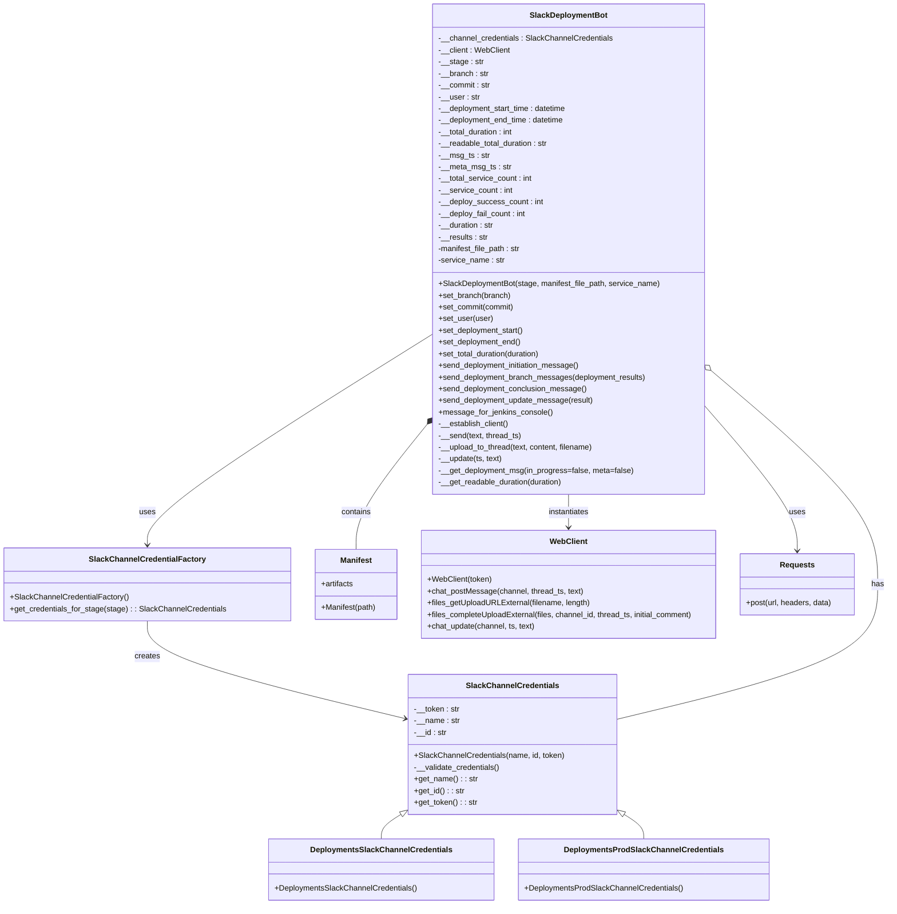

# Diagram: build-deploy/manifest/deployer/slackbot.py


> Auto-generated by Obscura crawlers

## Diagram 1



### SVG

<svg id="container" width="1827.3828125" xmlns="http://www.w3.org/2000/svg" class="classDiagram" height="1858" viewBox="0 0 1827.3828125 1858" role="graphics-document document" aria-roledescription="class"><style>#container{font-family:"trebuchet ms",verdana,arial,sans-serif;font-size:16px;fill:#333;}@keyframes edge-animation-frame{from{stroke-dashoffset:0;}}@keyframes dash{to{stroke-dashoffset:0;}}#container .edge-animation-slow{stroke-dasharray:9,5!important;stroke-dashoffset:900;animation:dash 50s linear infinite;stroke-linecap:round;}#container .edge-animation-fast{stroke-dasharray:9,5!important;stroke-dashoffset:900;animation:dash 20s linear infinite;stroke-linecap:round;}#container .error-icon{fill:#552222;}#container .error-text{fill:#552222;stroke:#552222;}#container .edge-thickness-normal{stroke-width:1px;}#container .edge-thickness-thick{stroke-width:3.5px;}#container .edge-pattern-solid{stroke-dasharray:0;}#container .edge-thickness-invisible{stroke-width:0;fill:none;}#container .edge-pattern-dashed{stroke-dasharray:3;}#container .edge-pattern-dotted{stroke-dasharray:2;}#container .marker{fill:#333333;stroke:#333333;}#container .marker.cross{stroke:#333333;}#container svg{font-family:"trebuchet ms",verdana,arial,sans-serif;font-size:16px;}#container p{margin:0;}#container g.classGroup text{fill:#9370DB;stroke:none;font-family:"trebuchet ms",verdana,arial,sans-serif;font-size:10px;}#container g.classGroup text .title{font-weight:bolder;}#container .nodeLabel,#container .edgeLabel{color:#131300;}#container .edgeLabel .label rect{fill:#ECECFF;}#container .label text{fill:#131300;}#container .labelBkg{background:#ECECFF;}#container .edgeLabel .label span{background:#ECECFF;}#container .classTitle{font-weight:bolder;}#container .node rect,#container .node circle,#container .node ellipse,#container .node polygon,#container .node path{fill:#ECECFF;stroke:#9370DB;stroke-width:1px;}#container .divider{stroke:#9370DB;stroke-width:1;}#container g.clickable{cursor:pointer;}#container g.classGroup rect{fill:#ECECFF;stroke:#9370DB;}#container g.classGroup line{stroke:#9370DB;stroke-width:1;}#container .classLabel .box{stroke:none;stroke-width:0;fill:#ECECFF;opacity:0.5;}#container .classLabel .label{fill:#9370DB;font-size:10px;}#container .relation{stroke:#333333;stroke-width:1;fill:none;}#container .dashed-line{stroke-dasharray:3;}#container .dotted-line{stroke-dasharray:1 2;}#container #compositionStart,#container .composition{fill:#333333!important;stroke:#333333!important;stroke-width:1;}#container #compositionEnd,#container .composition{fill:#333333!important;stroke:#333333!important;stroke-width:1;}#container #dependencyStart,#container .dependency{fill:#333333!important;stroke:#333333!important;stroke-width:1;}#container #dependencyStart,#container .dependency{fill:#333333!important;stroke:#333333!important;stroke-width:1;}#container #extensionStart,#container .extension{fill:transparent!important;stroke:#333333!important;stroke-width:1;}#container #extensionEnd,#container .extension{fill:transparent!important;stroke:#333333!important;stroke-width:1;}#container #aggregationStart,#container .aggregation{fill:transparent!important;stroke:#333333!important;stroke-width:1;}#container #aggregationEnd,#container .aggregation{fill:transparent!important;stroke:#333333!important;stroke-width:1;}#container #lollipopStart,#container .lollipop{fill:#ECECFF!important;stroke:#333333!important;stroke-width:1;}#container #lollipopEnd,#container .lollipop{fill:#ECECFF!important;stroke:#333333!important;stroke-width:1;}#container .edgeTerminals{font-size:11px;line-height:initial;}#container .classTitleText{text-anchor:middle;font-size:18px;fill:#333;}#container .label-icon{display:inline-block;height:1em;overflow:visible;vertical-align:-0.125em;}#container .node .label-icon path{fill:currentColor;stroke:revert;stroke-width:revert;}#container :root{--mermaid-font-family:"trebuchet ms",verdana,arial,sans-serif;}</style><g><defs><marker id="container_class-aggregationStart" class="marker aggregation class" refX="18" refY="7" markerWidth="190" markerHeight="240" orient="auto"><path d="M 18,7 L9,13 L1,7 L9,1 Z"></path></marker></defs><defs><marker id="container_class-aggregationEnd" class="marker aggregation class" refX="1" refY="7" markerWidth="20" markerHeight="28" orient="auto"><path d="M 18,7 L9,13 L1,7 L9,1 Z"></path></marker></defs><defs><marker id="container_class-extensionStart" class="marker extension class" refX="18" refY="7" markerWidth="190" markerHeight="240" orient="auto"><path d="M 1,7 L18,13 V 1 Z"></path></marker></defs><defs><marker id="container_class-extensionEnd" class="marker extension class" refX="1" refY="7" markerWidth="20" markerHeight="28" orient="auto"><path d="M 1,1 V 13 L18,7 Z"></path></marker></defs><defs><marker id="container_class-compositionStart" class="marker composition class" refX="18" refY="7" markerWidth="190" markerHeight="240" orient="auto"><path d="M 18,7 L9,13 L1,7 L9,1 Z"></path></marker></defs><defs><marker id="container_class-compositionEnd" class="marker composition class" refX="1" refY="7" markerWidth="20" markerHeight="28" orient="auto"><path d="M 18,7 L9,13 L1,7 L9,1 Z"></path></marker></defs><defs><marker id="container_class-dependencyStart" class="marker dependency class" refX="6" refY="7" markerWidth="190" markerHeight="240" orient="auto"><path d="M 5,7 L9,13 L1,7 L9,1 Z"></path></marker></defs><defs><marker id="container_class-dependencyEnd" class="marker dependency class" refX="13" refY="7" markerWidth="20" markerHeight="28" orient="auto"><path d="M 18,7 L9,13 L14,7 L9,1 Z"></path></marker></defs><defs><marker id="container_class-lollipopStart" class="marker lollipop class" refX="13" refY="7" markerWidth="190" markerHeight="240" orient="auto"><circle stroke="black" fill="transparent" cx="7" cy="7" r="6"></circle></marker></defs><defs><marker id="container_class-lollipopEnd" class="marker lollipop class" refX="1" refY="7" markerWidth="190" markerHeight="240" orient="auto"><circle stroke="black" fill="transparent" cx="7" cy="7" r="6"></circle></marker></defs><g class="root"><g class="clusters"></g><g class="edgePaths"><path d="M826.052,1673.897L819.483,1678.081C812.914,1682.264,799.776,1690.632,793.208,1698.983C786.639,1707.333,786.639,1715.667,786.639,1719.833L786.639,1724" id="id_SlackChannelCredentials_DeploymentsSlackChannelCredentials_1" class="edge-thickness-normal edge-pattern-solid relation" style=";;;" data-edge="true" data-et="edge" data-id="id_SlackChannelCredentials_DeploymentsSlackChannelCredentials_1" data-points="W3sieCI6ODQwLjYwMTU2MjUsInkiOjE2NjQuNjI5NzU0MjE5NjM0NH0seyJ4Ijo3ODYuNjM4NjcxODc1LCJ5IjoxNjk5fSx7IngiOjc4Ni42Mzg2NzE4NzUsInkiOjE3MjR9XQ==" marker-start="url(#container_class-extensionStart)"></path><path d="M1277.901,1673.897L1284.47,1678.081C1291.039,1682.264,1304.177,1690.632,1310.746,1698.983C1317.314,1707.333,1317.314,1715.667,1317.314,1719.833L1317.314,1724" id="id_SlackChannelCredentials_DeploymentsProdSlackChannelCredentials_2" class="edge-thickness-normal edge-pattern-solid relation" style=";;;" data-edge="true" data-et="edge" data-id="id_SlackChannelCredentials_DeploymentsProdSlackChannelCredentials_2" data-points="W3sieCI6MTI2My4zNTE1NjI1LCJ5IjoxNjY0LjYyOTc1NDIxOTYzNDR9LHsieCI6MTMxNy4zMTQ0NTMxMjUsInkiOjE2OTl9LHsieCI6MTMxNy4zMTQ0NTMxMjUsInkiOjE3MjR9XQ==" marker-start="url(#container_class-extensionStart)"></path><path d="M297.273,1276L297.273,1288.167C297.273,1300.333,297.273,1324.667,386.856,1358.318C476.438,1391.969,655.602,1434.938,745.185,1456.422L834.767,1477.907" id="id_SlackChannelCredentialFactory_SlackChannelCredentials_3" class="edge-thickness-normal edge-pattern-solid relation" style=";;;" data-edge="true" data-et="edge" data-id="id_SlackChannelCredentialFactory_SlackChannelCredentials_3" data-points="W3sieCI6Mjk3LjI3MzQzNzUsInkiOjEyNzZ9LHsieCI6Mjk3LjI3MzQzNzUsInkiOjEzNDl9LHsieCI6ODQwLjYwMTU2MjUsInkiOjE0NzkuMzA2MDU5OTE1OTQzN31d" marker-end="url(#container_class-dependencyEnd)"></path><path d="M885.707,685.983L787.635,747.153C689.563,808.322,493.418,930.661,395.346,1002.997C297.273,1075.333,297.273,1097.667,297.273,1108.833L297.273,1120" id="id_SlackDeploymentBot_SlackChannelCredentialFactory_4" class="edge-thickness-normal edge-pattern-solid relation" style=";;;" data-edge="true" data-et="edge" data-id="id_SlackDeploymentBot_SlackChannelCredentialFactory_4" data-points="W3sieCI6ODg1LjcwNzAzMTI1LCJ5Ijo2ODUuOTgzMjY0OTU1MDMyNH0seyJ4IjoyOTcuMjczNDM3NSwieSI6MTA1M30seyJ4IjoyOTcuMjczNDM3NSwieSI6MTEyNn1d" marker-end="url(#container_class-dependencyEnd)"></path><path d="M1456.789,758.167L1515.104,807.306C1573.419,856.445,1690.049,954.722,1748.365,1028.528C1806.68,1102.333,1806.68,1151.667,1806.68,1201C1806.68,1250.333,1806.68,1299.667,1716.125,1346.051C1625.57,1392.435,1444.461,1435.871,1353.906,1457.588L1263.352,1479.306" id="id_SlackDeploymentBot_SlackChannelCredentials_5" class="edge-thickness-normal edge-pattern-solid relation" style=";;;" data-edge="true" data-et="edge" data-id="id_SlackDeploymentBot_SlackChannelCredentials_5" data-points="W3sieCI6MTQ0My41OTc2NTYyNSwieSI6NzQ3LjA1MTM4MTQyNzI0MTZ9LHsieCI6MTgwNi42Nzk2ODc1LCJ5IjoxMDUzfSx7IngiOjE4MDYuNjc5Njg3NSwieSI6MTIwMX0seyJ4IjoxODA2LjY3OTY4NzUsInkiOjEzNDl9LHsieCI6MTI2My4zNTE1NjI1LCJ5IjoxNDc5LjMwNjA1OTkxNTk0Mzd9XQ==" marker-start="url(#container_class-aggregationStart)"></path><path d="M874.773,865.704L849.19,896.92C823.606,928.136,772.44,990.568,746.857,1034.451C721.273,1078.333,721.273,1103.667,721.273,1116.333L721.273,1129" id="id_SlackDeploymentBot_Manifest_6" class="edge-thickness-normal edge-pattern-solid relation" style=";;;" data-edge="true" data-et="edge" data-id="id_SlackDeploymentBot_Manifest_6" data-points="W3sieCI6ODg1LjcwNzAzMTI1LCJ5Ijo4NTIuMzYyMTg2Njg3ODExMX0seyJ4Ijo3MjEuMjczNDM3NSwieSI6MTA1M30seyJ4Ijo3MjEuMjczNDM3NSwieSI6MTEyOX1d" marker-start="url(#container_class-compositionStart)"></path><path d="M1164.652,1016L1164.652,1022.167C1164.652,1028.333,1164.652,1040.667,1164.652,1052C1164.652,1063.333,1164.652,1073.667,1164.652,1078.833L1164.652,1084" id="id_SlackDeploymentBot_WebClient_7" class="edge-thickness-normal edge-pattern-solid relation" style=";;;" data-edge="true" data-et="edge" data-id="id_SlackDeploymentBot_WebClient_7" data-points="W3sieCI6MTE2NC42NTIzNDM3NSwieSI6MTAxNn0seyJ4IjoxMTY0LjY1MjM0Mzc1LCJ5IjoxMDUzfSx7IngiOjExNjQuNjUyMzQzNzUsInkiOjEwOTB9XQ==" marker-end="url(#container_class-dependencyEnd)"></path><path d="M1443.598,828.712L1476.521,866.093C1509.445,903.474,1575.293,978.237,1608.217,1028.785C1641.141,1079.333,1641.141,1105.667,1641.141,1118.833L1641.141,1132" id="id_SlackDeploymentBot_Requests_8" class="edge-thickness-normal edge-pattern-solid relation" style=";;;" data-edge="true" data-et="edge" data-id="id_SlackDeploymentBot_Requests_8" data-points="W3sieCI6MTQ0My41OTc2NTYyNSwieSI6ODI4LjcxMTcwMTAwMjYxNTJ9LHsieCI6MTY0MS4xNDA2MjUsInkiOjEwNTN9LHsieCI6MTY0MS4xNDA2MjUsInkiOjExMzh9XQ==" marker-end="url(#container_class-dependencyEnd)"></path></g><g class="edgeLabels"><g class="edgeLabel"><g class="label" data-id="id_SlackChannelCredentials_DeploymentsSlackChannelCredentials_1" transform="translate(0, 0)"><foreignObject width="0" height="0"><div xmlns="http://www.w3.org/1999/xhtml" class="labelBkg" style="display: table-cell; white-space: nowrap; line-height: 1.5; max-width: 200px; text-align: center;"><span class="edgeLabel"></span></div></foreignObject></g></g><g class="edgeLabel"><g class="label" data-id="id_SlackChannelCredentials_DeploymentsProdSlackChannelCredentials_2" transform="translate(0, 0)"><foreignObject width="0" height="0"><div xmlns="http://www.w3.org/1999/xhtml" class="labelBkg" style="display: table-cell; white-space: nowrap; line-height: 1.5; max-width: 200px; text-align: center;"><span class="edgeLabel"></span></div></foreignObject></g></g><g class="edgeLabel" transform="translate(297.2734375, 1349)"><g class="label" data-id="id_SlackChannelCredentialFactory_SlackChannelCredentials_3" transform="translate(-26.171875, -12)"><foreignObject width="52.34375" height="24"><div xmlns="http://www.w3.org/1999/xhtml" class="labelBkg" style="display: table-cell; white-space: nowrap; line-height: 1.5; max-width: 200px; text-align: center;"><span class="edgeLabel"><p>creates</p></span></div></foreignObject></g></g><g class="edgeLabel" transform="translate(297.2734375, 1053)"><g class="label" data-id="id_SlackDeploymentBot_SlackChannelCredentialFactory_4" transform="translate(-16.4921875, -12)"><foreignObject width="32.984375" height="24"><div xmlns="http://www.w3.org/1999/xhtml" class="labelBkg" style="display: table-cell; white-space: nowrap; line-height: 1.5; max-width: 200px; text-align: center;"><span class="edgeLabel"><p>uses</p></span></div></foreignObject></g></g><g class="edgeLabel" transform="translate(1806.6796875, 1201)"><g class="label" data-id="id_SlackDeploymentBot_SlackChannelCredentials_5" transform="translate(-12.703125, -12)"><foreignObject width="25.40625" height="24"><div xmlns="http://www.w3.org/1999/xhtml" class="labelBkg" style="display: table-cell; white-space: nowrap; line-height: 1.5; max-width: 200px; text-align: center;"><span class="edgeLabel"><p>has</p></span></div></foreignObject></g></g><g class="edgeLabel" transform="translate(721.2734375, 1053)"><g class="label" data-id="id_SlackDeploymentBot_Manifest_6" transform="translate(-30.890625, -12)"><foreignObject width="61.78125" height="24"><div xmlns="http://www.w3.org/1999/xhtml" class="labelBkg" style="display: table-cell; white-space: nowrap; line-height: 1.5; max-width: 200px; text-align: center;"><span class="edgeLabel"><p>contains</p></span></div></foreignObject></g></g><g class="edgeLabel" transform="translate(1164.65234375, 1053)"><g class="label" data-id="id_SlackDeploymentBot_WebClient_7" transform="translate(-42.9140625, -12)"><foreignObject width="85.828125" height="24"><div xmlns="http://www.w3.org/1999/xhtml" class="labelBkg" style="display: table-cell; white-space: nowrap; line-height: 1.5; max-width: 200px; text-align: center;"><span class="edgeLabel"><p>instantiates</p></span></div></foreignObject></g></g><g class="edgeLabel" transform="translate(1641.140625, 1053)"><g class="label" data-id="id_SlackDeploymentBot_Requests_8" transform="translate(-16.4921875, -12)"><foreignObject width="32.984375" height="24"><div xmlns="http://www.w3.org/1999/xhtml" class="labelBkg" style="display: table-cell; white-space: nowrap; line-height: 1.5; max-width: 200px; text-align: center;"><span class="edgeLabel"><p>uses</p></span></div></foreignObject></g></g></g><g class="nodes"><g class="node default" id="classId-SlackChannelCredentials-0" transform="translate(1051.9765625, 1530)"><g class="basic label-container"><path d="M-211.375 -144 L211.375 -144 L211.375 144 L-211.375 144" stroke="none" stroke-width="0" fill="#ECECFF" style=""></path><path d="M-211.375 -144 C-87.56152141974614 -144, 36.251957160507715 -144, 211.375 -144 M-211.375 -144 C-114.57458191463697 -144, -17.77416382927393 -144, 211.375 -144 M211.375 -144 C211.375 -55.44462983086281, 211.375 33.11074033827438, 211.375 144 M211.375 -144 C211.375 -78.57989068923541, 211.375 -13.159781378470825, 211.375 144 M211.375 144 C94.22453509687628 144, -22.92592980624744 144, -211.375 144 M211.375 144 C75.31629665401039 144, -60.74240669197923 144, -211.375 144 M-211.375 144 C-211.375 67.60769996665975, -211.375 -8.784600066680497, -211.375 -144 M-211.375 144 C-211.375 48.07682232263677, -211.375 -47.846355354726455, -211.375 -144" stroke="#9370DB" stroke-width="1.3" fill="none" stroke-dasharray="0 0" style=""></path></g><g class="annotation-group text" transform="translate(0, -120)"></g><g class="label-group text" transform="translate(-90.703125, -120)"><g class="label" style="font-weight: bolder" transform="translate(0,-12)"><foreignObject width="181.40625" height="24"><div xmlns="http://www.w3.org/1999/xhtml" style="display: table-cell; white-space: nowrap; line-height: 1.5; max-width: 229px; text-align: center;"><span class="nodeLabel markdown-node-label" style=""><p>SlackChannelCredentials</p></span></div></foreignObject></g></g><g class="members-group text" transform="translate(-199.375, -72)"><g class="label" style="" transform="translate(0,-12)"><foreignObject width="94.109375" height="24"><div xmlns="http://www.w3.org/1999/xhtml" style="display: table-cell; white-space: nowrap; line-height: 1.5; max-width: 152px; text-align: center;"><span class="nodeLabel markdown-node-label" style=""><p>-__token : str</p></span></div></foreignObject></g><g class="label" style="" transform="translate(0,12)"><foreignObject width="93.90625" height="24"><div xmlns="http://www.w3.org/1999/xhtml" style="display: table-cell; white-space: nowrap; line-height: 1.5; max-width: 152px; text-align: center;"><span class="nodeLabel markdown-node-label" style=""><p>-__name : str</p></span></div></foreignObject></g><g class="label" style="" transform="translate(0,36)"><foreignObject width="67.484375" height="24"><div xmlns="http://www.w3.org/1999/xhtml" style="display: table-cell; white-space: nowrap; line-height: 1.5; max-width: 126px; text-align: center;"><span class="nodeLabel markdown-node-label" style=""><p>-__id : str</p></span></div></foreignObject></g></g><g class="methods-group text" transform="translate(-199.375, 24)"><g class="label" style="" transform="translate(0,-12)"><foreignObject width="308.046875" height="24"><div xmlns="http://www.w3.org/1999/xhtml" style="display: table-cell; white-space: nowrap; line-height: 1.5; max-width: 365px; text-align: center;"><span class="nodeLabel markdown-node-label" style=""><p>+SlackChannelCredentials(name, id, token)</p></span></div></foreignObject></g><g class="label" style="" transform="translate(0,12)"><foreignObject width="177.828125" height="24"><div xmlns="http://www.w3.org/1999/xhtml" style="display: table-cell; white-space: nowrap; line-height: 1.5; max-width: 235px; text-align: center;"><span class="nodeLabel markdown-node-label" style=""><p>-__validate_credentials()</p></span></div></foreignObject></g><g class="label" style="" transform="translate(0,36)"><foreignObject width="129.578125" height="24"><div xmlns="http://www.w3.org/1999/xhtml" style="display: table-cell; white-space: nowrap; line-height: 1.5; max-width: 188px; text-align: center;"><span class="nodeLabel markdown-node-label" style=""><p>+get_name() : : str</p></span></div></foreignObject></g><g class="label" style="" transform="translate(0,60)"><foreignObject width="103.140625" height="24"><div xmlns="http://www.w3.org/1999/xhtml" style="display: table-cell; white-space: nowrap; line-height: 1.5; max-width: 161px; text-align: center;"><span class="nodeLabel markdown-node-label" style=""><p>+get_id() : : str</p></span></div></foreignObject></g><g class="label" style="" transform="translate(0,84)"><foreignObject width="129.765625" height="24"><div xmlns="http://www.w3.org/1999/xhtml" style="display: table-cell; white-space: nowrap; line-height: 1.5; max-width: 188px; text-align: center;"><span class="nodeLabel markdown-node-label" style=""><p>+get_token() : : str</p></span></div></foreignObject></g></g><g class="divider" style=""><path d="M-211.375 -96 C-109.584551582428 -96, -7.794103164856011 -96, 211.375 -96 M-211.375 -96 C-114.42121537799693 -96, -17.46743075599386 -96, 211.375 -96" stroke="#9370DB" stroke-width="1.3" fill="none" stroke-dasharray="0 0" style=""></path></g><g class="divider" style=""><path d="M-211.375 0 C-80.30835562089052 0, 50.75828875821895 0, 211.375 0 M-211.375 0 C-115.27840397937206 0, -19.181807958744116 0, 211.375 0" stroke="#9370DB" stroke-width="1.3" fill="none" stroke-dasharray="0 0" style=""></path></g></g><g class="node default" id="classId-DeploymentsSlackChannelCredentials-1" transform="translate(786.638671875, 1787)"><g class="basic label-container"><path d="M-227.66796875 -63 L227.66796875 -63 L227.66796875 63 L-227.66796875 63" stroke="none" stroke-width="0" fill="#ECECFF" style=""></path><path d="M-227.66796875 -63 C-56.86628732055914 -63, 113.93539410888172 -63, 227.66796875 -63 M-227.66796875 -63 C-88.92726730391772 -63, 49.81343414216457 -63, 227.66796875 -63 M227.66796875 -63 C227.66796875 -16.055207984234862, 227.66796875 30.889584031530276, 227.66796875 63 M227.66796875 -63 C227.66796875 -33.31095790284026, 227.66796875 -3.6219158056805156, 227.66796875 63 M227.66796875 63 C130.22989227332823 63, 32.79181579665649 63, -227.66796875 63 M227.66796875 63 C76.00475576438964 63, -75.65845722122071 63, -227.66796875 63 M-227.66796875 63 C-227.66796875 28.517116790185547, -227.66796875 -5.965766419628906, -227.66796875 -63 M-227.66796875 63 C-227.66796875 31.463001046420825, -227.66796875 -0.07399790715835053, -227.66796875 -63" stroke="#9370DB" stroke-width="1.3" fill="none" stroke-dasharray="0 0" style=""></path></g><g class="annotation-group text" transform="translate(0, -39)"></g><g class="label-group text" transform="translate(-138.9296875, -39)"><g class="label" style="font-weight: bolder" transform="translate(0,-12)"><foreignObject width="277.859375" height="24"><div xmlns="http://www.w3.org/1999/xhtml" style="display: table-cell; white-space: nowrap; line-height: 1.5; max-width: 324px; text-align: center;"><span class="nodeLabel markdown-node-label" style=""><p>DeploymentsSlackChannelCredentials</p></span></div></foreignObject></g></g><g class="members-group text" transform="translate(-215.66796875, 9)"></g><g class="methods-group text" transform="translate(-215.66796875, 39)"><g class="label" style="" transform="translate(0,-12)"><foreignObject width="292.40625" height="24"><div xmlns="http://www.w3.org/1999/xhtml" style="display: table-cell; white-space: nowrap; line-height: 1.5; max-width: 350px; text-align: center;"><span class="nodeLabel markdown-node-label" style=""><p>+DeploymentsSlackChannelCredentials()</p></span></div></foreignObject></g></g><g class="divider" style=""><path d="M-227.66796875 -15 C-96.63115697764093 -15, 34.405654794718146 -15, 227.66796875 -15 M-227.66796875 -15 C-52.31486947420555 -15, 123.0382298015889 -15, 227.66796875 -15" stroke="#9370DB" stroke-width="1.3" fill="none" stroke-dasharray="0 0" style=""></path></g><g class="divider" style=""><path d="M-227.66796875 9 C-64.09969802167078 9, 99.46857270665845 9, 227.66796875 9 M-227.66796875 9 C-78.86120314991487 9, 69.94556245017026 9, 227.66796875 9" stroke="#9370DB" stroke-width="1.3" fill="none" stroke-dasharray="0 0" style=""></path></g></g><g class="node default" id="classId-DeploymentsProdSlackChannelCredentials-2" transform="translate(1317.314453125, 1787)"><g class="basic label-container"><path d="M-253.0078125 -63 L253.0078125 -63 L253.0078125 63 L-253.0078125 63" stroke="none" stroke-width="0" fill="#ECECFF" style=""></path><path d="M-253.0078125 -63 C-120.87427377779727 -63, 11.259264944405459 -63, 253.0078125 -63 M-253.0078125 -63 C-64.56360787051617 -63, 123.88059675896767 -63, 253.0078125 -63 M253.0078125 -63 C253.0078125 -34.40815517166798, 253.0078125 -5.816310343335957, 253.0078125 63 M253.0078125 -63 C253.0078125 -27.249462925436923, 253.0078125 8.501074149126154, 253.0078125 63 M253.0078125 63 C144.45069355290093 63, 35.89357460580186 63, -253.0078125 63 M253.0078125 63 C122.7971398549173 63, -7.413532790165391 63, -253.0078125 63 M-253.0078125 63 C-253.0078125 37.280185610176865, -253.0078125 11.56037122035373, -253.0078125 -63 M-253.0078125 63 C-253.0078125 17.332159022607478, -253.0078125 -28.335681954785045, -253.0078125 -63" stroke="#9370DB" stroke-width="1.3" fill="none" stroke-dasharray="0 0" style=""></path></g><g class="annotation-group text" transform="translate(0, -39)"></g><g class="label-group text" transform="translate(-156.015625, -39)"><g class="label" style="font-weight: bolder" transform="translate(0,-12)"><foreignObject width="312.03125" height="24"><div xmlns="http://www.w3.org/1999/xhtml" style="display: table-cell; white-space: nowrap; line-height: 1.5; max-width: 358px; text-align: center;"><span class="nodeLabel markdown-node-label" style=""><p>DeploymentsProdSlackChannelCredentials</p></span></div></foreignObject></g></g><g class="members-group text" transform="translate(-241.0078125, 9)"></g><g class="methods-group text" transform="translate(-241.0078125, 39)"><g class="label" style="" transform="translate(0,-12)"><foreignObject width="326" height="24"><div xmlns="http://www.w3.org/1999/xhtml" style="display: table-cell; white-space: nowrap; line-height: 1.5; max-width: 383px; text-align: center;"><span class="nodeLabel markdown-node-label" style=""><p>+DeploymentsProdSlackChannelCredentials()</p></span></div></foreignObject></g></g><g class="divider" style=""><path d="M-253.0078125 -15 C-81.06536555989666 -15, 90.87708138020668 -15, 253.0078125 -15 M-253.0078125 -15 C-104.96878328038238 -15, 43.070245939235235 -15, 253.0078125 -15" stroke="#9370DB" stroke-width="1.3" fill="none" stroke-dasharray="0 0" style=""></path></g><g class="divider" style=""><path d="M-253.0078125 9 C-83.0138082445985 9, 86.98019601080301 9, 253.0078125 9 M-253.0078125 9 C-150.312466769784 9, -47.61712103956799 9, 253.0078125 9" stroke="#9370DB" stroke-width="1.3" fill="none" stroke-dasharray="0 0" style=""></path></g></g><g class="node default" id="classId-SlackChannelCredentialFactory-3" transform="translate(297.2734375, 1201)"><g class="basic label-container"><path d="M-289.2734375 -75 L289.2734375 -75 L289.2734375 75 L-289.2734375 75" stroke="none" stroke-width="0" fill="#ECECFF" style=""></path><path d="M-289.2734375 -75 C-75.65266723533628 -75, 137.96810302932744 -75, 289.2734375 -75 M-289.2734375 -75 C-124.25017152011188 -75, 40.773094459776246 -75, 289.2734375 -75 M289.2734375 -75 C289.2734375 -30.753865915708452, 289.2734375 13.492268168583095, 289.2734375 75 M289.2734375 -75 C289.2734375 -42.09199955153313, 289.2734375 -9.183999103066256, 289.2734375 75 M289.2734375 75 C93.95607693649134 75, -101.36128362701731 75, -289.2734375 75 M289.2734375 75 C77.06343674995259 75, -135.14656400009483 75, -289.2734375 75 M-289.2734375 75 C-289.2734375 28.34223461362444, -289.2734375 -18.315530772751117, -289.2734375 -75 M-289.2734375 75 C-289.2734375 16.691902989252803, -289.2734375 -41.616194021494394, -289.2734375 -75" stroke="#9370DB" stroke-width="1.3" fill="none" stroke-dasharray="0 0" style=""></path></g><g class="annotation-group text" transform="translate(0, -51)"></g><g class="label-group text" transform="translate(-113.4375, -51)"><g class="label" style="font-weight: bolder" transform="translate(0,-12)"><foreignObject width="226.875" height="24"><div xmlns="http://www.w3.org/1999/xhtml" style="display: table-cell; white-space: nowrap; line-height: 1.5; max-width: 274px; text-align: center;"><span class="nodeLabel markdown-node-label" style=""><p>SlackChannelCredentialFactory</p></span></div></foreignObject></g></g><g class="members-group text" transform="translate(-277.2734375, -3)"></g><g class="methods-group text" transform="translate(-277.2734375, 27)"><g class="label" style="" transform="translate(0,-12)"><foreignObject width="241.125" height="24"><div xmlns="http://www.w3.org/1999/xhtml" style="display: table-cell; white-space: nowrap; line-height: 1.5; max-width: 298px; text-align: center;"><span class="nodeLabel markdown-node-label" style=""><p>+SlackChannelCredentialFactory()</p></span></div></foreignObject></g><g class="label" style="" transform="translate(0,12)"><foreignObject width="441.109375" height="24"><div xmlns="http://www.w3.org/1999/xhtml" style="display: table-cell; white-space: nowrap; line-height: 1.5; max-width: 498px; text-align: center;"><span class="nodeLabel markdown-node-label" style=""><p>+get_credentials_for_stage(stage) : : SlackChannelCredentials</p></span></div></foreignObject></g></g><g class="divider" style=""><path d="M-289.2734375 -27 C-125.47965151513787 -27, 38.31413446972425 -27, 289.2734375 -27 M-289.2734375 -27 C-152.7713849626782 -27, -16.269332425356424 -27, 289.2734375 -27" stroke="#9370DB" stroke-width="1.3" fill="none" stroke-dasharray="0 0" style=""></path></g><g class="divider" style=""><path d="M-289.2734375 -3 C-134.51073959845465 -3, 20.251958303090703 -3, 289.2734375 -3 M-289.2734375 -3 C-129.5107757020106 -3, 30.25188609597882 -3, 289.2734375 -3" stroke="#9370DB" stroke-width="1.3" fill="none" stroke-dasharray="0 0" style=""></path></g></g><g class="node default" id="classId-SlackDeploymentBot-4" transform="translate(1164.65234375, 512)"><g class="basic label-container"><path d="M-278.9453125 -504 L278.9453125 -504 L278.9453125 504 L-278.9453125 504" stroke="none" stroke-width="0" fill="#ECECFF" style=""></path><path d="M-278.9453125 -504 C-61.71908310365279 -504, 155.50714629269442 -504, 278.9453125 -504 M-278.9453125 -504 C-114.83794918420719 -504, 49.26941413158562 -504, 278.9453125 -504 M278.9453125 -504 C278.9453125 -229.42750986405355, 278.9453125 45.144980271892905, 278.9453125 504 M278.9453125 -504 C278.9453125 -130.36666904488868, 278.9453125 243.26666191022264, 278.9453125 504 M278.9453125 504 C85.49280655027414 504, -107.95969939945172 504, -278.9453125 504 M278.9453125 504 C86.14440177387237 504, -106.65650895225525 504, -278.9453125 504 M-278.9453125 504 C-278.9453125 113.18888794385691, -278.9453125 -277.6222241122862, -278.9453125 -504 M-278.9453125 504 C-278.9453125 212.25499338359805, -278.9453125 -79.4900132328039, -278.9453125 -504" stroke="#9370DB" stroke-width="1.3" fill="none" stroke-dasharray="0 0" style=""></path></g><g class="annotation-group text" transform="translate(0, -480)"></g><g class="label-group text" transform="translate(-76.609375, -480)"><g class="label" style="font-weight: bolder" transform="translate(0,-12)"><foreignObject width="153.21875" height="24"><div xmlns="http://www.w3.org/1999/xhtml" style="display: table-cell; white-space: nowrap; line-height: 1.5; max-width: 201px; text-align: center;"><span class="nodeLabel markdown-node-label" style=""><p>SlackDeploymentBot</p></span></div></foreignObject></g></g><g class="members-group text" transform="translate(-266.9453125, -432)"><g class="label" style="" transform="translate(0,-12)"><foreignObject width="358.96875" height="24"><div xmlns="http://www.w3.org/1999/xhtml" style="display: table-cell; white-space: nowrap; line-height: 1.5; max-width: 416px; text-align: center;"><span class="nodeLabel markdown-node-label" style=""><p>-__channel_credentials : SlackChannelCredentials</p></span></div></foreignObject></g><g class="label" style="" transform="translate(0,12)"><foreignObject width="147.53125" height="24"><div xmlns="http://www.w3.org/1999/xhtml" style="display: table-cell; white-space: nowrap; line-height: 1.5; max-width: 205px; text-align: center;"><span class="nodeLabel markdown-node-label" style=""><p>-__client : WebClient</p></span></div></foreignObject></g><g class="label" style="" transform="translate(0,36)"><foreignObject width="91.859375" height="24"><div xmlns="http://www.w3.org/1999/xhtml" style="display: table-cell; white-space: nowrap; line-height: 1.5; max-width: 150px; text-align: center;"><span class="nodeLabel markdown-node-label" style=""><p>-__stage : str</p></span></div></foreignObject></g><g class="label" style="" transform="translate(0,60)"><foreignObject width="103.625" height="24"><div xmlns="http://www.w3.org/1999/xhtml" style="display: table-cell; white-space: nowrap; line-height: 1.5; max-width: 162px; text-align: center;"><span class="nodeLabel markdown-node-label" style=""><p>-__branch : str</p></span></div></foreignObject></g><g class="label" style="" transform="translate(0,84)"><foreignObject width="107.46875" height="24"><div xmlns="http://www.w3.org/1999/xhtml" style="display: table-cell; white-space: nowrap; line-height: 1.5; max-width: 166px; text-align: center;"><span class="nodeLabel markdown-node-label" style=""><p>-__commit : str</p></span></div></foreignObject></g><g class="label" style="" transform="translate(0,108)"><foreignObject width="84.765625" height="24"><div xmlns="http://www.w3.org/1999/xhtml" style="display: table-cell; white-space: nowrap; line-height: 1.5; max-width: 143px; text-align: center;"><span class="nodeLabel markdown-node-label" style=""><p>-__user : str</p></span></div></foreignObject></g><g class="label" style="" transform="translate(0,132)"><foreignObject width="268.875" height="24"><div xmlns="http://www.w3.org/1999/xhtml" style="display: table-cell; white-space: nowrap; line-height: 1.5; max-width: 326px; text-align: center;"><span class="nodeLabel markdown-node-label" style=""><p>-__deployment_start_time : datetime</p></span></div></foreignObject></g><g class="label" style="" transform="translate(0,156)"><foreignObject width="262.421875" height="24"><div xmlns="http://www.w3.org/1999/xhtml" style="display: table-cell; white-space: nowrap; line-height: 1.5; max-width: 320px; text-align: center;"><span class="nodeLabel markdown-node-label" style=""><p>-__deployment_end_time : datetime</p></span></div></foreignObject></g><g class="label" style="" transform="translate(0,180)"><foreignObject width="157.296875" height="24"><div xmlns="http://www.w3.org/1999/xhtml" style="display: table-cell; white-space: nowrap; line-height: 1.5; max-width: 215px; text-align: center;"><span class="nodeLabel markdown-node-label" style=""><p>-__total_duration : int</p></span></div></foreignObject></g><g class="label" style="" transform="translate(0,204)"><foreignObject width="229.125" height="24"><div xmlns="http://www.w3.org/1999/xhtml" style="display: table-cell; white-space: nowrap; line-height: 1.5; max-width: 287px; text-align: center;"><span class="nodeLabel markdown-node-label" style=""><p>-__readable_total_duration : str</p></span></div></foreignObject></g><g class="label" style="" transform="translate(0,228)"><foreignObject width="104.21875" height="24"><div xmlns="http://www.w3.org/1999/xhtml" style="display: table-cell; white-space: nowrap; line-height: 1.5; max-width: 162px; text-align: center;"><span class="nodeLabel markdown-node-label" style=""><p>-__msg_ts : str</p></span></div></foreignObject></g><g class="label" style="" transform="translate(0,252)"><foreignObject width="149.34375" height="24"><div xmlns="http://www.w3.org/1999/xhtml" style="display: table-cell; white-space: nowrap; line-height: 1.5; max-width: 208px; text-align: center;"><span class="nodeLabel markdown-node-label" style=""><p>-__meta_msg_ts : str</p></span></div></foreignObject></g><g class="label" style="" transform="translate(0,276)"><foreignObject width="195.03125" height="24"><div xmlns="http://www.w3.org/1999/xhtml" style="display: table-cell; white-space: nowrap; line-height: 1.5; max-width: 253px; text-align: center;"><span class="nodeLabel markdown-node-label" style=""><p>-__total_service_count : int</p></span></div></foreignObject></g><g class="label" style="" transform="translate(0,300)"><foreignObject width="153.25" height="24"><div xmlns="http://www.w3.org/1999/xhtml" style="display: table-cell; white-space: nowrap; line-height: 1.5; max-width: 211px; text-align: center;"><span class="nodeLabel markdown-node-label" style=""><p>-__service_count : int</p></span></div></foreignObject></g><g class="label" style="" transform="translate(0,324)"><foreignObject width="214.46875" height="24"><div xmlns="http://www.w3.org/1999/xhtml" style="display: table-cell; white-space: nowrap; line-height: 1.5; max-width: 272px; text-align: center;"><span class="nodeLabel markdown-node-label" style=""><p>-__deploy_success_count : int</p></span></div></foreignObject></g><g class="label" style="" transform="translate(0,348)"><foreignObject width="182.4375" height="24"><div xmlns="http://www.w3.org/1999/xhtml" style="display: table-cell; white-space: nowrap; line-height: 1.5; max-width: 240px; text-align: center;"><span class="nodeLabel markdown-node-label" style=""><p>-__deploy_fail_count : int</p></span></div></foreignObject></g><g class="label" style="" transform="translate(0,372)"><foreignObject width="115.28125" height="24"><div xmlns="http://www.w3.org/1999/xhtml" style="display: table-cell; white-space: nowrap; line-height: 1.5; max-width: 173px; text-align: center;"><span class="nodeLabel markdown-node-label" style=""><p>-__duration : str</p></span></div></foreignObject></g><g class="label" style="" transform="translate(0,396)"><foreignObject width="102.53125" height="24"><div xmlns="http://www.w3.org/1999/xhtml" style="display: table-cell; white-space: nowrap; line-height: 1.5; max-width: 161px; text-align: center;"><span class="nodeLabel markdown-node-label" style=""><p>-__results : str</p></span></div></foreignObject></g><g class="label" style="" transform="translate(0,420)"><foreignObject width="173.40625" height="24"><div xmlns="http://www.w3.org/1999/xhtml" style="display: table-cell; white-space: nowrap; line-height: 1.5; max-width: 232px; text-align: center;"><span class="nodeLabel markdown-node-label" style=""><p>-manifest_file_path : str</p></span></div></foreignObject></g><g class="label" style="" transform="translate(0,444)"><foreignObject width="137.515625" height="24"><div xmlns="http://www.w3.org/1999/xhtml" style="display: table-cell; white-space: nowrap; line-height: 1.5; max-width: 196px; text-align: center;"><span class="nodeLabel markdown-node-label" style=""><p>-service_name : str</p></span></div></foreignObject></g></g><g class="methods-group text" transform="translate(-266.9453125, 72)"><g class="label" style="" transform="translate(0,-12)"><foreignObject width="457.28125" height="24"><div xmlns="http://www.w3.org/1999/xhtml" style="display: table-cell; white-space: nowrap; line-height: 1.5; max-width: 515px; text-align: center;"><span class="nodeLabel markdown-node-label" style=""><p>+SlackDeploymentBot(stage, manifest_file_path, service_name)</p></span></div></foreignObject></g><g class="label" style="" transform="translate(0,12)"><foreignObject width="149.09375" height="24"><div xmlns="http://www.w3.org/1999/xhtml" style="display: table-cell; white-space: nowrap; line-height: 1.5; max-width: 206px; text-align: center;"><span class="nodeLabel markdown-node-label" style=""><p>+set_branch(branch)</p></span></div></foreignObject></g><g class="label" style="" transform="translate(0,36)"><foreignObject width="157.09375" height="24"><div xmlns="http://www.w3.org/1999/xhtml" style="display: table-cell; white-space: nowrap; line-height: 1.5; max-width: 214px; text-align: center;"><span class="nodeLabel markdown-node-label" style=""><p>+set_commit(commit)</p></span></div></foreignObject></g><g class="label" style="" transform="translate(0,60)"><foreignObject width="111.6875" height="24"><div xmlns="http://www.w3.org/1999/xhtml" style="display: table-cell; white-space: nowrap; line-height: 1.5; max-width: 169px; text-align: center;"><span class="nodeLabel markdown-node-label" style=""><p>+set_user(user)</p></span></div></foreignObject></g><g class="label" style="" transform="translate(0,84)"><foreignObject width="177.578125" height="24"><div xmlns="http://www.w3.org/1999/xhtml" style="display: table-cell; white-space: nowrap; line-height: 1.5; max-width: 235px; text-align: center;"><span class="nodeLabel markdown-node-label" style=""><p>+set_deployment_start()</p></span></div></foreignObject></g><g class="label" style="" transform="translate(0,108)"><foreignObject width="171.125" height="24"><div xmlns="http://www.w3.org/1999/xhtml" style="display: table-cell; white-space: nowrap; line-height: 1.5; max-width: 228px; text-align: center;"><span class="nodeLabel markdown-node-label" style=""><p>+set_deployment_end()</p></span></div></foreignObject></g><g class="label" style="" transform="translate(0,132)"><foreignObject width="214.515625" height="24"><div xmlns="http://www.w3.org/1999/xhtml" style="display: table-cell; white-space: nowrap; line-height: 1.5; max-width: 272px; text-align: center;"><span class="nodeLabel markdown-node-label" style=""><p>+set_total_duration(duration)</p></span></div></foreignObject></g><g class="label" style="" transform="translate(0,156)"><foreignObject width="294.0625" height="24"><div xmlns="http://www.w3.org/1999/xhtml" style="display: table-cell; white-space: nowrap; line-height: 1.5; max-width: 351px; text-align: center;"><span class="nodeLabel markdown-node-label" style=""><p>+send_deployment_initiation_message()</p></span></div></foreignObject></g><g class="label" style="" transform="translate(0,180)"><foreignObject width="429.9375" height="24"><div xmlns="http://www.w3.org/1999/xhtml" style="display: table-cell; white-space: nowrap; line-height: 1.5; max-width: 487px; text-align: center;"><span class="nodeLabel markdown-node-label" style=""><p>+send_deployment_branch_messages(deployment_results)</p></span></div></foreignObject></g><g class="label" style="" transform="translate(0,204)"><foreignObject width="305.734375" height="24"><div xmlns="http://www.w3.org/1999/xhtml" style="display: table-cell; white-space: nowrap; line-height: 1.5; max-width: 363px; text-align: center;"><span class="nodeLabel markdown-node-label" style=""><p>+send_deployment_conclusion_message()</p></span></div></foreignObject></g><g class="label" style="" transform="translate(0,228)"><foreignObject width="320.03125" height="24"><div xmlns="http://www.w3.org/1999/xhtml" style="display: table-cell; white-space: nowrap; line-height: 1.5; max-width: 377px; text-align: center;"><span class="nodeLabel markdown-node-label" style=""><p>+send_deployment_update_message(result)</p></span></div></foreignObject></g><g class="label" style="" transform="translate(0,252)"><foreignObject width="232.765625" height="24"><div xmlns="http://www.w3.org/1999/xhtml" style="display: table-cell; white-space: nowrap; line-height: 1.5; max-width: 290px; text-align: center;"><span class="nodeLabel markdown-node-label" style=""><p>+message_for_jenkins_console()</p></span></div></foreignObject></g><g class="label" style="" transform="translate(0,276)"><foreignObject width="146.53125" height="24"><div xmlns="http://www.w3.org/1999/xhtml" style="display: table-cell; white-space: nowrap; line-height: 1.5; max-width: 204px; text-align: center;"><span class="nodeLabel markdown-node-label" style=""><p>-__establish_client()</p></span></div></foreignObject></g><g class="label" style="" transform="translate(0,300)"><foreignObject width="171.875" height="24"><div xmlns="http://www.w3.org/1999/xhtml" style="display: table-cell; white-space: nowrap; line-height: 1.5; max-width: 229px; text-align: center;"><span class="nodeLabel markdown-node-label" style=""><p>-__send(text, thread_ts)</p></span></div></foreignObject></g><g class="label" style="" transform="translate(0,324)"><foreignObject width="323.25" height="24"><div xmlns="http://www.w3.org/1999/xhtml" style="display: table-cell; white-space: nowrap; line-height: 1.5; max-width: 381px; text-align: center;"><span class="nodeLabel markdown-node-label" style=""><p>-__upload_to_thread(text, content, filename)</p></span></div></foreignObject></g><g class="label" style="" transform="translate(0,348)"><foreignObject width="132.03125" height="24"><div xmlns="http://www.w3.org/1999/xhtml" style="display: table-cell; white-space: nowrap; line-height: 1.5; max-width: 189px; text-align: center;"><span class="nodeLabel markdown-node-label" style=""><p>-__update(ts, text)</p></span></div></foreignObject></g><g class="label" style="" transform="translate(0,372)"><foreignObject width="401.546875" height="24"><div xmlns="http://www.w3.org/1999/xhtml" style="display: table-cell; white-space: nowrap; line-height: 1.5; max-width: 459px; text-align: center;"><span class="nodeLabel markdown-node-label" style=""><p>-__get_deployment_msg(in_progress=false, meta=false)</p></span></div></foreignObject></g><g class="label" style="" transform="translate(0,396)"><foreignObject width="259.203125" height="24"><div xmlns="http://www.w3.org/1999/xhtml" style="display: table-cell; white-space: nowrap; line-height: 1.5; max-width: 317px; text-align: center;"><span class="nodeLabel markdown-node-label" style=""><p>-__get_readable_duration(duration)</p></span></div></foreignObject></g></g><g class="divider" style=""><path d="M-278.9453125 -456 C-129.3827055428099 -456, 20.179901414380197 -456, 278.9453125 -456 M-278.9453125 -456 C-165.13535789571387 -456, -51.32540329142776 -456, 278.9453125 -456" stroke="#9370DB" stroke-width="1.3" fill="none" stroke-dasharray="0 0" style=""></path></g><g class="divider" style=""><path d="M-278.9453125 48 C-146.39914373476716 48, -13.85297496953433 48, 278.9453125 48 M-278.9453125 48 C-85.51458116368045 48, 107.9161501726391 48, 278.9453125 48" stroke="#9370DB" stroke-width="1.3" fill="none" stroke-dasharray="0 0" style=""></path></g></g><g class="node default" id="classId-Manifest-5" transform="translate(721.2734375, 1201)"><g class="basic label-container"><path d="M-84.7265625 -72 L84.7265625 -72 L84.7265625 72 L-84.7265625 72" stroke="none" stroke-width="0" fill="#ECECFF" style=""></path><path d="M-84.7265625 -72 C-34.66868714010908 -72, 15.389188219781843 -72, 84.7265625 -72 M-84.7265625 -72 C-26.89211722607726 -72, 30.94232804784548 -72, 84.7265625 -72 M84.7265625 -72 C84.7265625 -33.06385595530552, 84.7265625 5.8722880893889595, 84.7265625 72 M84.7265625 -72 C84.7265625 -17.22961298969944, 84.7265625 37.54077402060112, 84.7265625 72 M84.7265625 72 C28.03094691857106 72, -28.664668662857878 72, -84.7265625 72 M84.7265625 72 C35.44453647328704 72, -13.837489553425925 72, -84.7265625 72 M-84.7265625 72 C-84.7265625 31.54987025821994, -84.7265625 -8.90025948356012, -84.7265625 -72 M-84.7265625 72 C-84.7265625 30.103881463108053, -84.7265625 -11.792237073783895, -84.7265625 -72" stroke="#9370DB" stroke-width="1.3" fill="none" stroke-dasharray="0 0" style=""></path></g><g class="annotation-group text" transform="translate(0, -48)"></g><g class="label-group text" transform="translate(-31.6875, -48)"><g class="label" style="font-weight: bolder" transform="translate(0,-12)"><foreignObject width="63.375" height="24"><div xmlns="http://www.w3.org/1999/xhtml" style="display: table-cell; white-space: nowrap; line-height: 1.5; max-width: 112px; text-align: center;"><span class="nodeLabel markdown-node-label" style=""><p>Manifest</p></span></div></foreignObject></g></g><g class="members-group text" transform="translate(-72.7265625, 0)"><g class="label" style="" transform="translate(0,-12)"><foreignObject width="67.53125" height="24"><div xmlns="http://www.w3.org/1999/xhtml" style="display: table-cell; white-space: nowrap; line-height: 1.5; max-width: 125px; text-align: center;"><span class="nodeLabel markdown-node-label" style=""><p>+artifacts</p></span></div></foreignObject></g></g><g class="methods-group text" transform="translate(-72.7265625, 48)"><g class="label" style="" transform="translate(0,-12)"><foreignObject width="113.765625" height="24"><div xmlns="http://www.w3.org/1999/xhtml" style="display: table-cell; white-space: nowrap; line-height: 1.5; max-width: 171px; text-align: center;"><span class="nodeLabel markdown-node-label" style=""><p>+Manifest(path)</p></span></div></foreignObject></g></g><g class="divider" style=""><path d="M-84.7265625 -24 C-45.382420947658716 -24, -6.038279395317431 -24, 84.7265625 -24 M-84.7265625 -24 C-31.13724954051264 -24, 22.452063418974717 -24, 84.7265625 -24" stroke="#9370DB" stroke-width="1.3" fill="none" stroke-dasharray="0 0" style=""></path></g><g class="divider" style=""><path d="M-84.7265625 24 C-33.13856591422309 24, 18.449430671553813 24, 84.7265625 24 M-84.7265625 24 C-44.005620475095476 24, -3.2846784501909525 24, 84.7265625 24" stroke="#9370DB" stroke-width="1.3" fill="none" stroke-dasharray="0 0" style=""></path></g></g><g class="node default" id="classId-WebClient-6" transform="translate(1164.65234375, 1201)"><g class="basic label-container"><path d="M-308.65234375 -111 L308.65234375 -111 L308.65234375 111 L-308.65234375 111" stroke="none" stroke-width="0" fill="#ECECFF" style=""></path><path d="M-308.65234375 -111 C-118.14397237292059 -111, 72.36439900415883 -111, 308.65234375 -111 M-308.65234375 -111 C-118.18650482423655 -111, 72.2793341015269 -111, 308.65234375 -111 M308.65234375 -111 C308.65234375 -58.37209749675905, 308.65234375 -5.744194993518093, 308.65234375 111 M308.65234375 -111 C308.65234375 -27.915138284498155, 308.65234375 55.16972343100369, 308.65234375 111 M308.65234375 111 C97.10501077252061 111, -114.44232220495877 111, -308.65234375 111 M308.65234375 111 C75.17875763370722 111, -158.29482848258556 111, -308.65234375 111 M-308.65234375 111 C-308.65234375 60.863883471254844, -308.65234375 10.727766942509689, -308.65234375 -111 M-308.65234375 111 C-308.65234375 58.88575854100056, -308.65234375 6.771517082001125, -308.65234375 -111" stroke="#9370DB" stroke-width="1.3" fill="none" stroke-dasharray="0 0" style=""></path></g><g class="annotation-group text" transform="translate(0, -87)"></g><g class="label-group text" transform="translate(-37.1640625, -87)"><g class="label" style="font-weight: bolder" transform="translate(0,-12)"><foreignObject width="74.328125" height="24"><div xmlns="http://www.w3.org/1999/xhtml" style="display: table-cell; white-space: nowrap; line-height: 1.5; max-width: 123px; text-align: center;"><span class="nodeLabel markdown-node-label" style=""><p>WebClient</p></span></div></foreignObject></g></g><g class="members-group text" transform="translate(-296.65234375, -39)"></g><g class="methods-group text" transform="translate(-296.65234375, -9)"><g class="label" style="" transform="translate(0,-12)"><foreignObject width="132.53125" height="24"><div xmlns="http://www.w3.org/1999/xhtml" style="display: table-cell; white-space: nowrap; line-height: 1.5; max-width: 190px; text-align: center;"><span class="nodeLabel markdown-node-label" style=""><p>+WebClient(token)</p></span></div></foreignObject></g><g class="label" style="" transform="translate(0,12)"><foreignObject width="322.09375" height="24"><div xmlns="http://www.w3.org/1999/xhtml" style="display: table-cell; white-space: nowrap; line-height: 1.5; max-width: 379px; text-align: center;"><span class="nodeLabel markdown-node-label" style=""><p>+chat_postMessage(channel, thread_ts, text)</p></span></div></foreignObject></g><g class="label" style="" transform="translate(0,36)"><foreignObject width="335.71875" height="24"><div xmlns="http://www.w3.org/1999/xhtml" style="display: table-cell; white-space: nowrap; line-height: 1.5; max-width: 393px; text-align: center;"><span class="nodeLabel markdown-node-label" style=""><p>+files_getUploadURLExternal(filename, length)</p></span></div></foreignObject></g><g class="label" style="" transform="translate(0,60)"><foreignObject width="556.140625" height="24"><div xmlns="http://www.w3.org/1999/xhtml" style="display: table-cell; white-space: nowrap; line-height: 1.5; max-width: 614px; text-align: center;"><span class="nodeLabel markdown-node-label" style=""><p>+files_completeUploadExternal(files, channel_id, thread_ts, initial_comment)</p></span></div></foreignObject></g><g class="label" style="" transform="translate(0,84)"><foreignObject width="224.21875" height="24"><div xmlns="http://www.w3.org/1999/xhtml" style="display: table-cell; white-space: nowrap; line-height: 1.5; max-width: 282px; text-align: center;"><span class="nodeLabel markdown-node-label" style=""><p>+chat_update(channel, ts, text)</p></span></div></foreignObject></g></g><g class="divider" style=""><path d="M-308.65234375 -63 C-115.74883161130353 -63, 77.15468052739294 -63, 308.65234375 -63 M-308.65234375 -63 C-113.52424931228671 -63, 81.60384512542657 -63, 308.65234375 -63" stroke="#9370DB" stroke-width="1.3" fill="none" stroke-dasharray="0 0" style=""></path></g><g class="divider" style=""><path d="M-308.65234375 -39 C-85.31967614402114 -39, 138.0129914619577 -39, 308.65234375 -39 M-308.65234375 -39 C-152.48688330052696 -39, 3.67857714894609 -39, 308.65234375 -39" stroke="#9370DB" stroke-width="1.3" fill="none" stroke-dasharray="0 0" style=""></path></g></g><g class="node default" id="classId-Requests-7" transform="translate(1641.140625, 1201)"><g class="basic label-container"><path d="M-117.8359375 -63 L117.8359375 -63 L117.8359375 63 L-117.8359375 63" stroke="none" stroke-width="0" fill="#ECECFF" style=""></path><path d="M-117.8359375 -63 C-33.07270430646287 -63, 51.690528887074265 -63, 117.8359375 -63 M-117.8359375 -63 C-44.428166445740345 -63, 28.97960460851931 -63, 117.8359375 -63 M117.8359375 -63 C117.8359375 -21.850532638736432, 117.8359375 19.298934722527136, 117.8359375 63 M117.8359375 -63 C117.8359375 -26.16045421968105, 117.8359375 10.6790915606379, 117.8359375 63 M117.8359375 63 C60.59102479168351 63, 3.346112083367018 63, -117.8359375 63 M117.8359375 63 C30.3683071254612 63, -57.0993232490776 63, -117.8359375 63 M-117.8359375 63 C-117.8359375 33.549905989079924, -117.8359375 4.099811978159849, -117.8359375 -63 M-117.8359375 63 C-117.8359375 12.689165839900745, -117.8359375 -37.62166832019851, -117.8359375 -63" stroke="#9370DB" stroke-width="1.3" fill="none" stroke-dasharray="0 0" style=""></path></g><g class="annotation-group text" transform="translate(0, -39)"></g><g class="label-group text" transform="translate(-33.84375, -39)"><g class="label" style="font-weight: bolder" transform="translate(0,-12)"><foreignObject width="67.6875" height="24"><div xmlns="http://www.w3.org/1999/xhtml" style="display: table-cell; white-space: nowrap; line-height: 1.5; max-width: 116px; text-align: center;"><span class="nodeLabel markdown-node-label" style=""><p>Requests</p></span></div></foreignObject></g></g><g class="members-group text" transform="translate(-105.8359375, 9)"></g><g class="methods-group text" transform="translate(-105.8359375, 39)"><g class="label" style="" transform="translate(0,-12)"><foreignObject width="177.828125" height="24"><div xmlns="http://www.w3.org/1999/xhtml" style="display: table-cell; white-space: nowrap; line-height: 1.5; max-width: 235px; text-align: center;"><span class="nodeLabel markdown-node-label" style=""><p>+post(url, headers, data)</p></span></div></foreignObject></g></g><g class="divider" style=""><path d="M-117.8359375 -15 C-63.81347890916001 -15, -9.791020318320022 -15, 117.8359375 -15 M-117.8359375 -15 C-24.00854030490605 -15, 69.8188568901879 -15, 117.8359375 -15" stroke="#9370DB" stroke-width="1.3" fill="none" stroke-dasharray="0 0" style=""></path></g><g class="divider" style=""><path d="M-117.8359375 9 C-60.58245189444018 9, -3.328966288880366 9, 117.8359375 9 M-117.8359375 9 C-36.55115822382878 9, 44.73362105234244 9, 117.8359375 9" stroke="#9370DB" stroke-width="1.3" fill="none" stroke-dasharray="0 0" style=""></path></g></g></g></g></g></svg>

## Diagram 2

```mermaid
sequenceDiagram
participant Bot as SlackDeploymentBot
participant Factory as SlackChannelCredentialFactory
participant Cred as SlackChannelCredentials
participant Client as WebClient
participant Manifest as Manifest
participant Req as requests
participant Logger as logger

Bot->>Factory: get_credentials_for_stage(stage)
Factory-->>Bot: DeploymentsSlackChannelCredentials / DeploymentsProdSlackChannelCredentials
Bot->>Cred: get_token(); get_name(); get_id()
alt credentials complete
  Bot->>Client: WebClient(token)
  Client-->>Bot: client
else credentials incomplete
  Bot->>Logger: logger.error("Slack credentials incomplete")
end
Bot->>Manifest: Manifest(manifest_file_path)
Manifest-->>Bot: manifest
opt send initiation messages
  Bot->>Client: chat_postMessage(channel, text)
  Client-->>Bot: msg_ts
  Bot->>Client: chat_postMessage(channel, thread_ts=msg_ts, text=meta)
  Client-->>Bot: meta_msg_ts
end
loop for each service in manifest.artifacts
  Bot->>Client: files_getUploadURLExternal(filename, length)
  Client-->>Bot: upload_url, file_id
  Bot->>Req: POST upload_url (content)
  Req-->>Bot: upload_response
  Bot->>Client: files_completeUploadExternal(files, channel_id, thread_ts, initial_comment)
  Client-->>Bot: ack
  Bot->>Client: chat_update(channel, ts=meta_msg_ts, text=updated_meta)
end
Bot->>Client: chat_update(channel, ts=msg_ts, text=final_msg)
Client-->>Bot: ack
Bot->>Client: chat_update(channel, ts=meta_msg_ts, text=meta_final)
Client-->>Bot: ack
```

> SVG rendering failed for this diagram.
