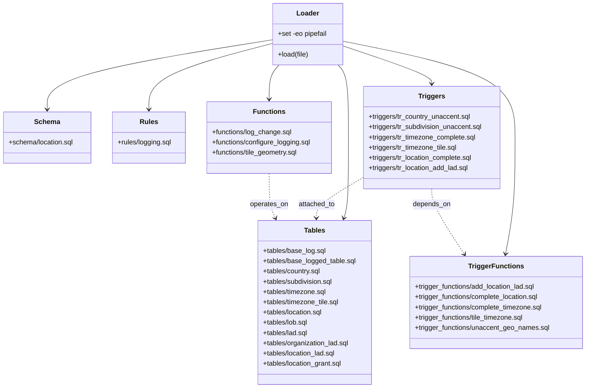

# Diagram: database/freightverify/location/create.sh


> Auto-generated by Obscura crawlers

## Diagram 1

```mermaid
graph TD
  Start([Start]) --> Shell[set -eo pipefail] --> LoadFn[load(file) -> psql -a -v ON_ERROR_STOP=1 -X -f]
  s_schema["schema/location.sql"]
  t_base_log["tables/base_log.sql"]
  t_base_logged_table["tables/base_logged_table.sql"]
  r_logging["rules/logging.sql"]
  f_log_change["functions/log_change.sql"]
  f_configure_logging["functions/configure_logging.sql"]
  t_country["tables/country.sql"]
  t_subdivision["tables/subdivision.sql"]
  t_timezone["tables/timezone.sql"]
  t_timezone_tile["tables/timezone_tile.sql"]
  t_location["tables/location.sql"]
  t_lob["tables/lob.sql"]
  t_lad["tables/lad.sql"]
  t_org_lad["tables/organization_lad.sql"]
  t_location_lad["tables/location_lad.sql"]
  t_location_grant["tables/location_grant.sql"]
  f_tile_geometry["functions/tile_geometry.sql"]
  tf_add_location_lad["trigger_functions/add_location_lad.sql"]
  tf_complete_location["trigger_functions/complete_location.sql"]
  tf_complete_timezone["trigger_functions/complete_timezone.sql"]
  tf_tile_timezone["trigger_functions/tile_timezone.sql"]
  tf_unaccent_geo["trigger_functions/unaccent_geo_names.sql"]
  tr_country_unaccent["triggers/tr_country_unaccent.sql"]
  tr_subdivision_unaccent["triggers/tr_subdivision_unaccent.sql"]
  tr_timezone_complete["triggers/tr_timezone_complete.sql"]
  tr_timezone_tile["triggers/tr_timezone_tile.sql"]
  tr_location_complete["triggers/tr_location_complete.sql"]
  tr_location_add_lad["triggers/tr_location_add_lad.sql"]
  End([End])

  LoadFn --> s_schema
  s_schema --> t_base_log --> t_base_logged_table --> r_logging --> f_log_change --> f_configure_logging --> t_country --> t_subdivision --> t_timezone --> t_timezone_tile --> t_location --> t_lob --> t_lad --> t_org_lad --> t_location_lad --> t_location_grant --> f_tile_geometry --> tf_add_location_lad --> tf_complete_location --> tf_complete_timezone --> tf_tile_timezone --> tf_unaccent_geo --> tr_country_unaccent --> tr_subdivision_unaccent --> tr_timezone_complete --> tr_timezone_tile --> tr_location_complete --> tr_location_add_lad --> End
```

> SVG rendering failed for this diagram.

## Diagram 2



### SVG

<svg id="container" width="1388.982421875" xmlns="http://www.w3.org/2000/svg" class="classDiagram" height="908" viewBox="0 0 1388.982421875 908" role="graphics-document document" aria-roledescription="class"><style>#container{font-family:"trebuchet ms",verdana,arial,sans-serif;font-size:16px;fill:#333;}@keyframes edge-animation-frame{from{stroke-dashoffset:0;}}@keyframes dash{to{stroke-dashoffset:0;}}#container .edge-animation-slow{stroke-dasharray:9,5!important;stroke-dashoffset:900;animation:dash 50s linear infinite;stroke-linecap:round;}#container .edge-animation-fast{stroke-dasharray:9,5!important;stroke-dashoffset:900;animation:dash 20s linear infinite;stroke-linecap:round;}#container .error-icon{fill:#552222;}#container .error-text{fill:#552222;stroke:#552222;}#container .edge-thickness-normal{stroke-width:1px;}#container .edge-thickness-thick{stroke-width:3.5px;}#container .edge-pattern-solid{stroke-dasharray:0;}#container .edge-thickness-invisible{stroke-width:0;fill:none;}#container .edge-pattern-dashed{stroke-dasharray:3;}#container .edge-pattern-dotted{stroke-dasharray:2;}#container .marker{fill:#333333;stroke:#333333;}#container .marker.cross{stroke:#333333;}#container svg{font-family:"trebuchet ms",verdana,arial,sans-serif;font-size:16px;}#container p{margin:0;}#container g.classGroup text{fill:#9370DB;stroke:none;font-family:"trebuchet ms",verdana,arial,sans-serif;font-size:10px;}#container g.classGroup text .title{font-weight:bolder;}#container .nodeLabel,#container .edgeLabel{color:#131300;}#container .edgeLabel .label rect{fill:#ECECFF;}#container .label text{fill:#131300;}#container .labelBkg{background:#ECECFF;}#container .edgeLabel .label span{background:#ECECFF;}#container .classTitle{font-weight:bolder;}#container .node rect,#container .node circle,#container .node ellipse,#container .node polygon,#container .node path{fill:#ECECFF;stroke:#9370DB;stroke-width:1px;}#container .divider{stroke:#9370DB;stroke-width:1;}#container g.clickable{cursor:pointer;}#container g.classGroup rect{fill:#ECECFF;stroke:#9370DB;}#container g.classGroup line{stroke:#9370DB;stroke-width:1;}#container .classLabel .box{stroke:none;stroke-width:0;fill:#ECECFF;opacity:0.5;}#container .classLabel .label{fill:#9370DB;font-size:10px;}#container .relation{stroke:#333333;stroke-width:1;fill:none;}#container .dashed-line{stroke-dasharray:3;}#container .dotted-line{stroke-dasharray:1 2;}#container #compositionStart,#container .composition{fill:#333333!important;stroke:#333333!important;stroke-width:1;}#container #compositionEnd,#container .composition{fill:#333333!important;stroke:#333333!important;stroke-width:1;}#container #dependencyStart,#container .dependency{fill:#333333!important;stroke:#333333!important;stroke-width:1;}#container #dependencyStart,#container .dependency{fill:#333333!important;stroke:#333333!important;stroke-width:1;}#container #extensionStart,#container .extension{fill:transparent!important;stroke:#333333!important;stroke-width:1;}#container #extensionEnd,#container .extension{fill:transparent!important;stroke:#333333!important;stroke-width:1;}#container #aggregationStart,#container .aggregation{fill:transparent!important;stroke:#333333!important;stroke-width:1;}#container #aggregationEnd,#container .aggregation{fill:transparent!important;stroke:#333333!important;stroke-width:1;}#container #lollipopStart,#container .lollipop{fill:#ECECFF!important;stroke:#333333!important;stroke-width:1;}#container #lollipopEnd,#container .lollipop{fill:#ECECFF!important;stroke:#333333!important;stroke-width:1;}#container .edgeTerminals{font-size:11px;line-height:initial;}#container .classTitleText{text-anchor:middle;font-size:18px;fill:#333;}#container .label-icon{display:inline-block;height:1em;overflow:visible;vertical-align:-0.125em;}#container .node .label-icon path{fill:currentColor;stroke:revert;stroke-width:revert;}#container :root{--mermaid-font-family:"trebuchet ms",verdana,arial,sans-serif;}</style><g><defs><marker id="container_class-aggregationStart" class="marker aggregation class" refX="18" refY="7" markerWidth="190" markerHeight="240" orient="auto"><path d="M 18,7 L9,13 L1,7 L9,1 Z"></path></marker></defs><defs><marker id="container_class-aggregationEnd" class="marker aggregation class" refX="1" refY="7" markerWidth="20" markerHeight="28" orient="auto"><path d="M 18,7 L9,13 L1,7 L9,1 Z"></path></marker></defs><defs><marker id="container_class-extensionStart" class="marker extension class" refX="18" refY="7" markerWidth="190" markerHeight="240" orient="auto"><path d="M 1,7 L18,13 V 1 Z"></path></marker></defs><defs><marker id="container_class-extensionEnd" class="marker extension class" refX="1" refY="7" markerWidth="20" markerHeight="28" orient="auto"><path d="M 1,1 V 13 L18,7 Z"></path></marker></defs><defs><marker id="container_class-compositionStart" class="marker composition class" refX="18" refY="7" markerWidth="190" markerHeight="240" orient="auto"><path d="M 18,7 L9,13 L1,7 L9,1 Z"></path></marker></defs><defs><marker id="container_class-compositionEnd" class="marker composition class" refX="1" refY="7" markerWidth="20" markerHeight="28" orient="auto"><path d="M 18,7 L9,13 L1,7 L9,1 Z"></path></marker></defs><defs><marker id="container_class-dependencyStart" class="marker dependency class" refX="6" refY="7" markerWidth="190" markerHeight="240" orient="auto"><path d="M 5,7 L9,13 L1,7 L9,1 Z"></path></marker></defs><defs><marker id="container_class-dependencyEnd" class="marker dependency class" refX="13" refY="7" markerWidth="20" markerHeight="28" orient="auto"><path d="M 18,7 L9,13 L14,7 L9,1 Z"></path></marker></defs><defs><marker id="container_class-lollipopStart" class="marker lollipop class" refX="13" refY="7" markerWidth="190" markerHeight="240" orient="auto"><circle stroke="black" fill="transparent" cx="7" cy="7" r="6"></circle></marker></defs><defs><marker id="container_class-lollipopEnd" class="marker lollipop class" refX="1" refY="7" markerWidth="190" markerHeight="240" orient="auto"><circle stroke="black" fill="transparent" cx="7" cy="7" r="6"></circle></marker></defs><g class="root"><g class="clusters"></g><g class="edgePaths"><path d="M648.271,93.111L559.003,107.092C469.734,121.074,291.197,149.037,201.929,176.185C112.66,203.333,112.66,229.667,112.66,242.833L112.66,256" id="id_Loader_Schema_1" class="edge-thickness-normal edge-pattern-solid relation" style=";;;" data-edge="true" data-et="edge" data-id="id_Loader_Schema_1" data-points="W3sieCI6NjQ4LjI3MTQ4NDM3NSwieSI6OTMuMTEwNTE0MDE2NDgxMDh9LHsieCI6MTEyLjY2MDE1NjI1LCJ5IjoxNzd9LHsieCI6MTEyLjY2MDE1NjI1LCJ5IjoyNjJ9XQ==" marker-end="url(#container_class-dependencyEnd)"></path><path d="M802.291,152L806.36,156.167C810.429,160.333,818.567,168.667,822.636,197C826.705,225.333,826.705,273.667,826.705,324C826.705,374.333,826.705,426.667,824.934,458.053C823.164,489.439,819.622,499.879,817.852,505.098L816.081,510.318" id="id_Loader_Tables_2" class="edge-thickness-normal edge-pattern-solid relation" style=";;;" data-edge="true" data-et="edge" data-id="id_Loader_Tables_2" data-points="W3sieCI6ODAyLjI5MTAxNTYyNSwieSI6MTUyfSx7IngiOjgyNi43MDUwNzgxMjUsInkiOjE3N30seyJ4Ijo4MjYuNzA1MDc4MTI1LCJ5IjozMjJ9LHsieCI6ODI2LjcwNTA3ODEyNSwieSI6NDc5fSx7IngiOjgxNC4xNTMyNjQ4NzQ0NTQyLCJ5Ijo1MTZ9XQ==" marker-end="url(#container_class-dependencyEnd)"></path><path d="M648.271,101.533L599.377,114.111C550.482,126.689,452.692,151.844,403.797,177.589C354.902,203.333,354.902,229.667,354.902,242.833L354.902,256" id="id_Loader_Rules_3" class="edge-thickness-normal edge-pattern-solid relation" style=";;;" data-edge="true" data-et="edge" data-id="id_Loader_Rules_3" data-points="W3sieCI6NjQ4LjI3MTQ4NDM3NSwieSI6MTAxLjUzMzAwMjE4MDYzNTM0fSx7IngiOjM1NC45MDIzNDM3NSwieSI6MTc3fSx7IngiOjM1NC45MDIzNDM3NSwieSI6MjYyfV0=" marker-end="url(#container_class-dependencyEnd)"></path><path d="M664.062,152L660.132,156.167C656.202,160.333,648.341,168.667,644.411,182C640.48,195.333,640.48,213.667,640.48,222.833L640.48,232" id="id_Loader_Functions_4" class="edge-thickness-normal edge-pattern-solid relation" style=";;;" data-edge="true" data-et="edge" data-id="id_Loader_Functions_4" data-points="W3sieCI6NjY0LjA2MjQzOTU5NDA3MjIsInkiOjE1Mn0seyJ4Ijo2NDAuNDgwNDY4NzUsInkiOjE3N30seyJ4Ijo2NDAuNDgwNDY4NzUsInkiOjIzOH1d" marker-end="url(#container_class-dependencyEnd)"></path><path d="M815.686,96.533L883.585,109.945C951.484,123.356,1087.282,150.178,1155.181,187.756C1223.08,225.333,1223.08,273.667,1223.08,324C1223.08,374.333,1223.08,426.667,1219.325,472.019C1215.569,517.371,1208.059,555.741,1204.304,574.926L1200.548,594.112" id="id_Loader_TriggerFunctions_5" class="edge-thickness-normal edge-pattern-solid relation" style=";;;" data-edge="true" data-et="edge" data-id="id_Loader_TriggerFunctions_5" data-points="W3sieCI6ODE1LjY4NTU0Njg3NSwieSI6OTYuNTMzNDA3MDQwOTMxNTh9LHsieCI6MTIyMy4wODAwNzgxMjUsInkiOjE3N30seyJ4IjoxMjIzLjA4MDA3ODEyNSwieSI6MzIyfSx7IngiOjEyMjMuMDgwMDc4MTI1LCJ5Ijo0Nzl9LHsieCI6MTE5OS4zOTU2NjU1OTc3MDc0LCJ5Ijo2MDB9XQ==" marker-end="url(#container_class-dependencyEnd)"></path><path d="M815.686,107.72L850.553,119.267C885.421,130.813,955.157,153.907,990.025,168.62C1024.893,183.333,1024.893,189.667,1024.893,192.833L1024.893,196" id="id_Loader_Triggers_6" class="edge-thickness-normal edge-pattern-solid relation" style=";;;" data-edge="true" data-et="edge" data-id="id_Loader_Triggers_6" data-points="W3sieCI6ODE1LjY4NTU0Njg3NSwieSI6MTA3LjcyMDAxNDQwMjY4ODV9LHsieCI6MTAyNC44OTI1NzgxMjUsInkiOjE3N30seyJ4IjoxMDI0Ljg5MjU3ODEyNSwieSI6MjAyfV0=" marker-end="url(#container_class-dependencyEnd)"></path><path d="M1024.893,442L1024.893,448.167C1024.893,454.333,1024.893,466.667,1037.842,492.169C1050.791,517.672,1076.69,556.343,1089.639,575.679L1102.589,595.015" id="id_Triggers_TriggerFunctions_7" class="edge-thickness-normal edge-pattern-dashed relation" style=";;;" data-edge="true" data-et="edge" data-id="id_Triggers_TriggerFunctions_7" data-points="W3sieCI6MTAyNC44OTI1NzgxMjUsInkiOjQ0Mn0seyJ4IjoxMDI0Ljg5MjU3ODEyNSwieSI6NDc5fSx7IngiOjExMDUuOTI3MzI0OTg2MzUzNiwieSI6NjAwfV0=" marker-end="url(#container_class-dependencyEnd)"></path><path d="M861.705,415.97L843.462,426.475C825.219,436.98,788.734,457.99,770.418,473.662C752.102,489.334,751.957,499.667,751.884,504.834L751.811,510.001" id="id_Triggers_Tables_8" class="edge-thickness-normal edge-pattern-dashed relation" style=";;;" data-edge="true" data-et="edge" data-id="id_Triggers_Tables_8" data-points="W3sieCI6ODYxLjcwNTA3ODEyNSwieSI6NDE1Ljk3MDExMzMyODY1MzF9LHsieCI6NzUyLjI0ODA0Njg3NSwieSI6NDc5fSx7IngiOjc1MS43MjY0MDg5NzkyNTc2LCJ5Ijo1MTZ9XQ==" marker-end="url(#container_class-dependencyEnd)"></path><path d="M640.48,406L640.48,418.167C640.48,430.333,640.48,454.667,642.975,472.096C645.47,489.526,650.459,500.052,652.953,505.315L655.448,510.578" id="id_Functions_Tables_9" class="edge-thickness-normal edge-pattern-dashed relation" style=";;;" data-edge="true" data-et="edge" data-id="id_Functions_Tables_9" data-points="W3sieCI6NjQwLjQ4MDQ2ODc1LCJ5Ijo0MDZ9LHsieCI6NjQwLjQ4MDQ2ODc1LCJ5Ijo0Nzl9LHsieCI6NjU4LjAxNzM0Nzg0Mzg4NjUsInkiOjUxNn1d" marker-end="url(#container_class-dependencyEnd)"></path></g><g class="edgeLabels"><g class="edgeLabel"><g class="label" data-id="id_Loader_Schema_1" transform="translate(0, 0)"><foreignObject width="0" height="0"><div xmlns="http://www.w3.org/1999/xhtml" class="labelBkg" style="display: table-cell; white-space: nowrap; line-height: 1.5; max-width: 200px; text-align: center;"><span class="edgeLabel"></span></div></foreignObject></g></g><g class="edgeLabel"><g class="label" data-id="id_Loader_Tables_2" transform="translate(0, 0)"><foreignObject width="0" height="0"><div xmlns="http://www.w3.org/1999/xhtml" class="labelBkg" style="display: table-cell; white-space: nowrap; line-height: 1.5; max-width: 200px; text-align: center;"><span class="edgeLabel"></span></div></foreignObject></g></g><g class="edgeLabel"><g class="label" data-id="id_Loader_Rules_3" transform="translate(0, 0)"><foreignObject width="0" height="0"><div xmlns="http://www.w3.org/1999/xhtml" class="labelBkg" style="display: table-cell; white-space: nowrap; line-height: 1.5; max-width: 200px; text-align: center;"><span class="edgeLabel"></span></div></foreignObject></g></g><g class="edgeLabel"><g class="label" data-id="id_Loader_Functions_4" transform="translate(0, 0)"><foreignObject width="0" height="0"><div xmlns="http://www.w3.org/1999/xhtml" class="labelBkg" style="display: table-cell; white-space: nowrap; line-height: 1.5; max-width: 200px; text-align: center;"><span class="edgeLabel"></span></div></foreignObject></g></g><g class="edgeLabel"><g class="label" data-id="id_Loader_TriggerFunctions_5" transform="translate(0, 0)"><foreignObject width="0" height="0"><div xmlns="http://www.w3.org/1999/xhtml" class="labelBkg" style="display: table-cell; white-space: nowrap; line-height: 1.5; max-width: 200px; text-align: center;"><span class="edgeLabel"></span></div></foreignObject></g></g><g class="edgeLabel"><g class="label" data-id="id_Loader_Triggers_6" transform="translate(0, 0)"><foreignObject width="0" height="0"><div xmlns="http://www.w3.org/1999/xhtml" class="labelBkg" style="display: table-cell; white-space: nowrap; line-height: 1.5; max-width: 200px; text-align: center;"><span class="edgeLabel"></span></div></foreignObject></g></g><g class="edgeLabel" transform="translate(1024.892578125, 479)"><g class="label" data-id="id_Triggers_TriggerFunctions_7" transform="translate(-44.671875, -12)"><foreignObject width="89.34375" height="24"><div xmlns="http://www.w3.org/1999/xhtml" class="labelBkg" style="display: table-cell; white-space: nowrap; line-height: 1.5; max-width: 200px; text-align: center;"><span class="edgeLabel"><p>depends_on</p></span></div></foreignObject></g></g><g class="edgeLabel" transform="translate(752.248046875, 479)"><g class="label" data-id="id_Triggers_Tables_8" transform="translate(-43.5234375, -12)"><foreignObject width="87.046875" height="24"><div xmlns="http://www.w3.org/1999/xhtml" class="labelBkg" style="display: table-cell; white-space: nowrap; line-height: 1.5; max-width: 200px; text-align: center;"><span class="edgeLabel"><p>attached_to</p></span></div></foreignObject></g></g><g class="edgeLabel" transform="translate(640.48046875, 479)"><g class="label" data-id="id_Functions_Tables_9" transform="translate(-45.015625, -12)"><foreignObject width="90.03125" height="24"><div xmlns="http://www.w3.org/1999/xhtml" class="labelBkg" style="display: table-cell; white-space: nowrap; line-height: 1.5; max-width: 200px; text-align: center;"><span class="edgeLabel"><p>operates_on</p></span></div></foreignObject></g></g></g><g class="nodes"><g class="node default" id="classId-Loader-0" transform="translate(731.978515625, 80)"><g class="basic label-container"><path d="M-83.70703125 -72 L83.70703125 -72 L83.70703125 72 L-83.70703125 72" stroke="none" stroke-width="0" fill="#ECECFF" style=""></path><path d="M-83.70703125 -72 C-23.065223737638583 -72, 37.576583774722835 -72, 83.70703125 -72 M-83.70703125 -72 C-25.021439939169014 -72, 33.66415137166197 -72, 83.70703125 -72 M83.70703125 -72 C83.70703125 -32.57671834038356, 83.70703125 6.846563319232885, 83.70703125 72 M83.70703125 -72 C83.70703125 -43.01574854348845, 83.70703125 -14.031497086976898, 83.70703125 72 M83.70703125 72 C43.177902026898124 72, 2.6487728037962484 72, -83.70703125 72 M83.70703125 72 C25.54149340341042 72, -32.62404444317916 72, -83.70703125 72 M-83.70703125 72 C-83.70703125 41.95755493066302, -83.70703125 11.915109861326037, -83.70703125 -72 M-83.70703125 72 C-83.70703125 28.857709273011203, -83.70703125 -14.284581453977594, -83.70703125 -72" stroke="#9370DB" stroke-width="1.3" fill="none" stroke-dasharray="0 0" style=""></path></g><g class="annotation-group text" transform="translate(0, -48)"></g><g class="label-group text" transform="translate(-25.3046875, -48)"><g class="label" style="font-weight: bolder" transform="translate(0,-12)"><foreignObject width="50.609375" height="24"><div xmlns="http://www.w3.org/1999/xhtml" style="display: table-cell; white-space: nowrap; line-height: 1.5; max-width: 101px; text-align: center;"><span class="nodeLabel markdown-node-label" style=""><p>Loader</p></span></div></foreignObject></g></g><g class="members-group text" transform="translate(-71.70703125, 0)"><g class="label" style="" transform="translate(0,-12)"><foreignObject width="118.109375" height="24"><div xmlns="http://www.w3.org/1999/xhtml" style="display: table-cell; white-space: nowrap; line-height: 1.5; max-width: 176px; text-align: center;"><span class="nodeLabel markdown-node-label" style=""><p>+set -eo pipefail</p></span></div></foreignObject></g></g><g class="methods-group text" transform="translate(-71.70703125, 48)"><g class="label" style="" transform="translate(0,-12)"><foreignObject width="72.953125" height="24"><div xmlns="http://www.w3.org/1999/xhtml" style="display: table-cell; white-space: nowrap; line-height: 1.5; max-width: 130px; text-align: center;"><span class="nodeLabel markdown-node-label" style=""><p>+load(file)</p></span></div></foreignObject></g></g><g class="divider" style=""><path d="M-83.70703125 -24 C-26.01777651596136 -24, 31.671478218077283 -24, 83.70703125 -24 M-83.70703125 -24 C-28.863882055971743 -24, 25.979267138056514 -24, 83.70703125 -24" stroke="#9370DB" stroke-width="1.3" fill="none" stroke-dasharray="0 0" style=""></path></g><g class="divider" style=""><path d="M-83.70703125 24 C-33.36457558607211 24, 16.977880077855787 24, 83.70703125 24 M-83.70703125 24 C-36.024775627863185 24, 11.65747999427363 24, 83.70703125 24" stroke="#9370DB" stroke-width="1.3" fill="none" stroke-dasharray="0 0" style=""></path></g></g><g class="node default" id="classId-Schema-1" transform="translate(112.66015625, 322)"><g class="basic label-container"><path d="M-104.66015625 -60 L104.66015625 -60 L104.66015625 60 L-104.66015625 60" stroke="none" stroke-width="0" fill="#ECECFF" style=""></path><path d="M-104.66015625 -60 C-62.79255755863953 -60, -20.92495886727906 -60, 104.66015625 -60 M-104.66015625 -60 C-41.84579065861869 -60, 20.96857493276262 -60, 104.66015625 -60 M104.66015625 -60 C104.66015625 -27.613837837957497, 104.66015625 4.772324324085005, 104.66015625 60 M104.66015625 -60 C104.66015625 -22.252616189807988, 104.66015625 15.494767620384025, 104.66015625 60 M104.66015625 60 C42.43704417855446 60, -19.786067892891083 60, -104.66015625 60 M104.66015625 60 C47.152673863014115 60, -10.35480852397177 60, -104.66015625 60 M-104.66015625 60 C-104.66015625 21.695550001739576, -104.66015625 -16.608899996520847, -104.66015625 -60 M-104.66015625 60 C-104.66015625 27.77350969201339, -104.66015625 -4.4529806159732175, -104.66015625 -60" stroke="#9370DB" stroke-width="1.3" fill="none" stroke-dasharray="0 0" style=""></path></g><g class="annotation-group text" transform="translate(0, -36)"></g><g class="label-group text" transform="translate(-28.5859375, -36)"><g class="label" style="font-weight: bolder" transform="translate(0,-12)"><foreignObject width="57.171875" height="24"><div xmlns="http://www.w3.org/1999/xhtml" style="display: table-cell; white-space: nowrap; line-height: 1.5; max-width: 107px; text-align: center;"><span class="nodeLabel markdown-node-label" style=""><p>Schema</p></span></div></foreignObject></g></g><g class="members-group text" transform="translate(-92.66015625, 12)"><g class="label" style="" transform="translate(0,-12)"><foreignObject width="156.734375" height="24"><div xmlns="http://www.w3.org/1999/xhtml" style="display: table-cell; white-space: nowrap; line-height: 1.5; max-width: 214px; text-align: center;"><span class="nodeLabel markdown-node-label" style=""><p>+schema/location.sql</p></span></div></foreignObject></g></g><g class="methods-group text" transform="translate(-92.66015625, 60)"></g><g class="divider" style=""><path d="M-104.66015625 -12 C-59.75787322308309 -12, -14.855590196166176 -12, 104.66015625 -12 M-104.66015625 -12 C-39.289301165344924 -12, 26.081553919310153 -12, 104.66015625 -12" stroke="#9370DB" stroke-width="1.3" fill="none" stroke-dasharray="0 0" style=""></path></g><g class="divider" style=""><path d="M-104.66015625 36 C-55.94226766544391 36, -7.2243790808878146 36, 104.66015625 36 M-104.66015625 36 C-39.25882807752845 36, 26.142500094943102 36, 104.66015625 36" stroke="#9370DB" stroke-width="1.3" fill="none" stroke-dasharray="0 0" style=""></path></g></g><g class="node default" id="classId-Rules-2" transform="translate(354.90234375, 322)"><g class="basic label-container"><path d="M-87.58203125 -60 L87.58203125 -60 L87.58203125 60 L-87.58203125 60" stroke="none" stroke-width="0" fill="#ECECFF" style=""></path><path d="M-87.58203125 -60 C-35.02437478731585 -60, 17.5332816753683 -60, 87.58203125 -60 M-87.58203125 -60 C-37.916963331893214 -60, 11.748104586213572 -60, 87.58203125 -60 M87.58203125 -60 C87.58203125 -17.08814134815467, 87.58203125 25.823717303690657, 87.58203125 60 M87.58203125 -60 C87.58203125 -34.56363095643367, 87.58203125 -9.127261912867347, 87.58203125 60 M87.58203125 60 C21.642082441521367 60, -44.297866366957265 60, -87.58203125 60 M87.58203125 60 C49.13795601644696 60, 10.693880782893913 60, -87.58203125 60 M-87.58203125 60 C-87.58203125 12.334512223048534, -87.58203125 -35.33097555390293, -87.58203125 -60 M-87.58203125 60 C-87.58203125 27.11005546595093, -87.58203125 -5.779889068098143, -87.58203125 -60" stroke="#9370DB" stroke-width="1.3" fill="none" stroke-dasharray="0 0" style=""></path></g><g class="annotation-group text" transform="translate(0, -36)"></g><g class="label-group text" transform="translate(-20.1328125, -36)"><g class="label" style="font-weight: bolder" transform="translate(0,-12)"><foreignObject width="40.265625" height="24"><div xmlns="http://www.w3.org/1999/xhtml" style="display: table-cell; white-space: nowrap; line-height: 1.5; max-width: 90px; text-align: center;"><span class="nodeLabel markdown-node-label" style=""><p>Rules</p></span></div></foreignObject></g></g><g class="members-group text" transform="translate(-75.58203125, 12)"><g class="label" style="" transform="translate(0,-12)"><foreignObject width="131.03125" height="24"><div xmlns="http://www.w3.org/1999/xhtml" style="display: table-cell; white-space: nowrap; line-height: 1.5; max-width: 189px; text-align: center;"><span class="nodeLabel markdown-node-label" style=""><p>+rules/logging.sql</p></span></div></foreignObject></g></g><g class="methods-group text" transform="translate(-75.58203125, 60)"></g><g class="divider" style=""><path d="M-87.58203125 -12 C-23.20921593030498 -12, 41.16359938939004 -12, 87.58203125 -12 M-87.58203125 -12 C-26.216276921896643 -12, 35.149477406206714 -12, 87.58203125 -12" stroke="#9370DB" stroke-width="1.3" fill="none" stroke-dasharray="0 0" style=""></path></g><g class="divider" style=""><path d="M-87.58203125 36 C-52.113234847338276 36, -16.644438444676553 36, 87.58203125 36 M-87.58203125 36 C-26.08744558348974 36, 35.40714008302052 36, 87.58203125 36" stroke="#9370DB" stroke-width="1.3" fill="none" stroke-dasharray="0 0" style=""></path></g></g><g class="node default" id="classId-Functions-3" transform="translate(640.48046875, 322)"><g class="basic label-container"><path d="M-147.99609375 -84 L147.99609375 -84 L147.99609375 84 L-147.99609375 84" stroke="none" stroke-width="0" fill="#ECECFF" style=""></path><path d="M-147.99609375 -84 C-64.31556018136367 -84, 19.36497338727267 -84, 147.99609375 -84 M-147.99609375 -84 C-65.94018041348465 -84, 16.11573292303069 -84, 147.99609375 -84 M147.99609375 -84 C147.99609375 -40.006389342878265, 147.99609375 3.9872213142434703, 147.99609375 84 M147.99609375 -84 C147.99609375 -21.594635403226988, 147.99609375 40.810729193546024, 147.99609375 84 M147.99609375 84 C64.7076206652383 84, -18.58085241952341 84, -147.99609375 84 M147.99609375 84 C65.90881873327001 84, -16.17845628345998 84, -147.99609375 84 M-147.99609375 84 C-147.99609375 35.093838127654536, -147.99609375 -13.812323744690929, -147.99609375 -84 M-147.99609375 84 C-147.99609375 49.437847164629495, -147.99609375 14.875694329258991, -147.99609375 -84" stroke="#9370DB" stroke-width="1.3" fill="none" stroke-dasharray="0 0" style=""></path></g><g class="annotation-group text" transform="translate(0, -60)"></g><g class="label-group text" transform="translate(-35.1328125, -60)"><g class="label" style="font-weight: bolder" transform="translate(0,-12)"><foreignObject width="70.265625" height="24"><div xmlns="http://www.w3.org/1999/xhtml" style="display: table-cell; white-space: nowrap; line-height: 1.5; max-width: 120px; text-align: center;"><span class="nodeLabel markdown-node-label" style=""><p>Functions</p></span></div></foreignObject></g></g><g class="members-group text" transform="translate(-135.99609375, -12)"><g class="label" style="" transform="translate(0,-12)"><foreignObject width="191.9375" height="24"><div xmlns="http://www.w3.org/1999/xhtml" style="display: table-cell; white-space: nowrap; line-height: 1.5; max-width: 250px; text-align: center;"><span class="nodeLabel markdown-node-label" style=""><p>+functions/log_change.sql</p></span></div></foreignObject></g><g class="label" style="" transform="translate(0,12)"><foreignObject width="236.859375" height="24"><div xmlns="http://www.w3.org/1999/xhtml" style="display: table-cell; white-space: nowrap; line-height: 1.5; max-width: 295px; text-align: center;"><span class="nodeLabel markdown-node-label" style=""><p>+functions/configure_logging.sql</p></span></div></foreignObject></g><g class="label" style="" transform="translate(0,36)"><foreignObject width="208.90625" height="24"><div xmlns="http://www.w3.org/1999/xhtml" style="display: table-cell; white-space: nowrap; line-height: 1.5; max-width: 267px; text-align: center;"><span class="nodeLabel markdown-node-label" style=""><p>+functions/tile_geometry.sql</p></span></div></foreignObject></g></g><g class="methods-group text" transform="translate(-135.99609375, 84)"></g><g class="divider" style=""><path d="M-147.99609375 -36 C-74.98976357259066 -36, -1.9834333951813221 -36, 147.99609375 -36 M-147.99609375 -36 C-54.2311438612838 -36, 39.533806027432405 -36, 147.99609375 -36" stroke="#9370DB" stroke-width="1.3" fill="none" stroke-dasharray="0 0" style=""></path></g><g class="divider" style=""><path d="M-147.99609375 60 C-84.06334801038446 60, -20.130602270768932 60, 147.99609375 60 M-147.99609375 60 C-61.36947741215252 60, 25.25713892569496 60, 147.99609375 60" stroke="#9370DB" stroke-width="1.3" fill="none" stroke-dasharray="0 0" style=""></path></g></g><g class="node default" id="classId-Tables-4" transform="translate(749.01953125, 708)"><g class="basic label-container"><path d="M-134.9140625 -192 L134.9140625 -192 L134.9140625 192 L-134.9140625 192" stroke="none" stroke-width="0" fill="#ECECFF" style=""></path><path d="M-134.9140625 -192 C-54.18563403105318 -192, 26.542794437893633 -192, 134.9140625 -192 M-134.9140625 -192 C-65.52459448574503 -192, 3.8648735285099463 -192, 134.9140625 -192 M134.9140625 -192 C134.9140625 -81.05922854585125, 134.9140625 29.88154290829749, 134.9140625 192 M134.9140625 -192 C134.9140625 -78.36440826322075, 134.9140625 35.271183473558494, 134.9140625 192 M134.9140625 192 C57.93622441257372 192, -19.041613674852556 192, -134.9140625 192 M134.9140625 192 C33.47894879166189 192, -67.95616491667622 192, -134.9140625 192 M-134.9140625 192 C-134.9140625 44.218701506505255, -134.9140625 -103.56259698698949, -134.9140625 -192 M-134.9140625 192 C-134.9140625 106.62670961123678, -134.9140625 21.253419222473553, -134.9140625 -192" stroke="#9370DB" stroke-width="1.3" fill="none" stroke-dasharray="0 0" style=""></path></g><g class="annotation-group text" transform="translate(0, -168)"></g><g class="label-group text" transform="translate(-23.703125, -168)"><g class="label" style="font-weight: bolder" transform="translate(0,-12)"><foreignObject width="47.40625" height="24"><div xmlns="http://www.w3.org/1999/xhtml" style="display: table-cell; white-space: nowrap; line-height: 1.5; max-width: 96px; text-align: center;"><span class="nodeLabel markdown-node-label" style=""><p>Tables</p></span></div></foreignObject></g></g><g class="members-group text" transform="translate(-122.9140625, -120)"><g class="label" style="" transform="translate(0,-12)"><foreignObject width="150.734375" height="24"><div xmlns="http://www.w3.org/1999/xhtml" style="display: table-cell; white-space: nowrap; line-height: 1.5; max-width: 208px; text-align: center;"><span class="nodeLabel markdown-node-label" style=""><p>+tables/base_log.sql</p></span></div></foreignObject></g><g class="label" style="" transform="translate(0,12)"><foreignObject width="222.125" height="24"><div xmlns="http://www.w3.org/1999/xhtml" style="display: table-cell; white-space: nowrap; line-height: 1.5; max-width: 280px; text-align: center;"><span class="nodeLabel markdown-node-label" style=""><p>+tables/base_logged_table.sql</p></span></div></foreignObject></g><g class="label" style="" transform="translate(0,36)"><foreignObject width="140.28125" height="24"><div xmlns="http://www.w3.org/1999/xhtml" style="display: table-cell; white-space: nowrap; line-height: 1.5; max-width: 198px; text-align: center;"><span class="nodeLabel markdown-node-label" style=""><p>+tables/country.sql</p></span></div></foreignObject></g><g class="label" style="" transform="translate(0,60)"><foreignObject width="169.515625" height="24"><div xmlns="http://www.w3.org/1999/xhtml" style="display: table-cell; white-space: nowrap; line-height: 1.5; max-width: 227px; text-align: center;"><span class="nodeLabel markdown-node-label" style=""><p>+tables/subdivision.sql</p></span></div></foreignObject></g><g class="label" style="" transform="translate(0,84)"><foreignObject width="152.828125" height="24"><div xmlns="http://www.w3.org/1999/xhtml" style="display: table-cell; white-space: nowrap; line-height: 1.5; max-width: 210px; text-align: center;"><span class="nodeLabel markdown-node-label" style=""><p>+tables/timezone.sql</p></span></div></foreignObject></g><g class="label" style="" transform="translate(0,108)"><foreignObject width="184.125" height="24"><div xmlns="http://www.w3.org/1999/xhtml" style="display: table-cell; white-space: nowrap; line-height: 1.5; max-width: 242px; text-align: center;"><span class="nodeLabel markdown-node-label" style=""><p>+tables/timezone_tile.sql</p></span></div></foreignObject></g><g class="label" style="" transform="translate(0,132)"><foreignObject width="145.6875" height="24"><div xmlns="http://www.w3.org/1999/xhtml" style="display: table-cell; white-space: nowrap; line-height: 1.5; max-width: 203px; text-align: center;"><span class="nodeLabel markdown-node-label" style=""><p>+tables/location.sql</p></span></div></foreignObject></g><g class="label" style="" transform="translate(0,156)"><foreignObject width="109.828125" height="24"><div xmlns="http://www.w3.org/1999/xhtml" style="display: table-cell; white-space: nowrap; line-height: 1.5; max-width: 167px; text-align: center;"><span class="nodeLabel markdown-node-label" style=""><p>+tables/lob.sql</p></span></div></foreignObject></g><g class="label" style="" transform="translate(0,180)"><foreignObject width="109.421875" height="24"><div xmlns="http://www.w3.org/1999/xhtml" style="display: table-cell; white-space: nowrap; line-height: 1.5; max-width: 167px; text-align: center;"><span class="nodeLabel markdown-node-label" style=""><p>+tables/lad.sql</p></span></div></foreignObject></g><g class="label" style="" transform="translate(0,204)"><foreignObject width="207.125" height="24"><div xmlns="http://www.w3.org/1999/xhtml" style="display: table-cell; white-space: nowrap; line-height: 1.5; max-width: 265px; text-align: center;"><span class="nodeLabel markdown-node-label" style=""><p>+tables/organization_lad.sql</p></span></div></foreignObject></g><g class="label" style="" transform="translate(0,228)"><foreignObject width="176.734375" height="24"><div xmlns="http://www.w3.org/1999/xhtml" style="display: table-cell; white-space: nowrap; line-height: 1.5; max-width: 234px; text-align: center;"><span class="nodeLabel markdown-node-label" style=""><p>+tables/location_lad.sql</p></span></div></foreignObject></g><g class="label" style="" transform="translate(0,252)"><foreignObject width="192.015625" height="24"><div xmlns="http://www.w3.org/1999/xhtml" style="display: table-cell; white-space: nowrap; line-height: 1.5; max-width: 250px; text-align: center;"><span class="nodeLabel markdown-node-label" style=""><p>+tables/location_grant.sql</p></span></div></foreignObject></g></g><g class="methods-group text" transform="translate(-122.9140625, 192)"></g><g class="divider" style=""><path d="M-134.9140625 -144 C-74.92972675898353 -144, -14.945391017967069 -144, 134.9140625 -144 M-134.9140625 -144 C-67.41757429526231 -144, 0.07891390947537502 -144, 134.9140625 -144" stroke="#9370DB" stroke-width="1.3" fill="none" stroke-dasharray="0 0" style=""></path></g><g class="divider" style=""><path d="M-134.9140625 168 C-79.39935803806151 168, -23.884653576123014 168, 134.9140625 168 M-134.9140625 168 C-56.90138987947519 168, 21.11128274104962 168, 134.9140625 168" stroke="#9370DB" stroke-width="1.3" fill="none" stroke-dasharray="0 0" style=""></path></g></g><g class="node default" id="classId-TriggerFunctions-5" transform="translate(1178.255859375, 708)"><g class="basic label-container"><path d="M-202.7265625 -108 L202.7265625 -108 L202.7265625 108 L-202.7265625 108" stroke="none" stroke-width="0" fill="#ECECFF" style=""></path><path d="M-202.7265625 -108 C-113.75258787460196 -108, -24.778613249203914 -108, 202.7265625 -108 M-202.7265625 -108 C-108.0225487558252 -108, -13.318535011650397 -108, 202.7265625 -108 M202.7265625 -108 C202.7265625 -28.981103625820026, 202.7265625 50.03779274835995, 202.7265625 108 M202.7265625 -108 C202.7265625 -27.539733048851815, 202.7265625 52.92053390229637, 202.7265625 108 M202.7265625 108 C41.07062932275173 108, -120.58530385449654 108, -202.7265625 108 M202.7265625 108 C116.09623397897013 108, 29.465905457940266 108, -202.7265625 108 M-202.7265625 108 C-202.7265625 31.906507750537713, -202.7265625 -44.18698449892457, -202.7265625 -108 M-202.7265625 108 C-202.7265625 52.89269180301607, -202.7265625 -2.2146163939678587, -202.7265625 -108" stroke="#9370DB" stroke-width="1.3" fill="none" stroke-dasharray="0 0" style=""></path></g><g class="annotation-group text" transform="translate(0, -84)"></g><g class="label-group text" transform="translate(-60.9375, -84)"><g class="label" style="font-weight: bolder" transform="translate(0,-12)"><foreignObject width="121.875" height="24"><div xmlns="http://www.w3.org/1999/xhtml" style="display: table-cell; white-space: nowrap; line-height: 1.5; max-width: 170px; text-align: center;"><span class="nodeLabel markdown-node-label" style=""><p>TriggerFunctions</p></span></div></foreignObject></g></g><g class="members-group text" transform="translate(-190.7265625, -36)"><g class="label" style="" transform="translate(0,-12)"><foreignObject width="289.890625" height="24"><div xmlns="http://www.w3.org/1999/xhtml" style="display: table-cell; white-space: nowrap; line-height: 1.5; max-width: 348px; text-align: center;"><span class="nodeLabel markdown-node-label" style=""><p>+trigger_functions/add_location_lad.sql</p></span></div></foreignObject></g><g class="label" style="" transform="translate(0,12)"><foreignObject width="298.171875" height="24"><div xmlns="http://www.w3.org/1999/xhtml" style="display: table-cell; white-space: nowrap; line-height: 1.5; max-width: 356px; text-align: center;"><span class="nodeLabel markdown-node-label" style=""><p>+trigger_functions/complete_location.sql</p></span></div></foreignObject></g><g class="label" style="" transform="translate(0,36)"><foreignObject width="305.625" height="24"><div xmlns="http://www.w3.org/1999/xhtml" style="display: table-cell; white-space: nowrap; line-height: 1.5; max-width: 363px; text-align: center;"><span class="nodeLabel markdown-node-label" style=""><p>+trigger_functions/complete_timezone.sql</p></span></div></foreignObject></g><g class="label" style="" transform="translate(0,60)"><foreignObject width="262.09375" height="24"><div xmlns="http://www.w3.org/1999/xhtml" style="display: table-cell; white-space: nowrap; line-height: 1.5; max-width: 320px; text-align: center;"><span class="nodeLabel markdown-node-label" style=""><p>+trigger_functions/tile_timezone.sql</p></span></div></foreignObject></g><g class="label" style="" transform="translate(0,84)"><foreignObject width="320.515625" height="24"><div xmlns="http://www.w3.org/1999/xhtml" style="display: table-cell; white-space: nowrap; line-height: 1.5; max-width: 378px; text-align: center;"><span class="nodeLabel markdown-node-label" style=""><p>+trigger_functions/unaccent_geo_names.sql</p></span></div></foreignObject></g></g><g class="methods-group text" transform="translate(-190.7265625, 108)"></g><g class="divider" style=""><path d="M-202.7265625 -60 C-63.43131711235566 -60, 75.86392827528869 -60, 202.7265625 -60 M-202.7265625 -60 C-96.95682463478182 -60, 8.81291323043635 -60, 202.7265625 -60" stroke="#9370DB" stroke-width="1.3" fill="none" stroke-dasharray="0 0" style=""></path></g><g class="divider" style=""><path d="M-202.7265625 84 C-104.23503758872201 84, -5.743512677444016 84, 202.7265625 84 M-202.7265625 84 C-120.74014244888986 84, -38.75372239777971 84, 202.7265625 84" stroke="#9370DB" stroke-width="1.3" fill="none" stroke-dasharray="0 0" style=""></path></g></g><g class="node default" id="classId-Triggers-6" transform="translate(1024.892578125, 322)"><g class="basic label-container"><path d="M-163.1875 -120 L163.1875 -120 L163.1875 120 L-163.1875 120" stroke="none" stroke-width="0" fill="#ECECFF" style=""></path><path d="M-163.1875 -120 C-61.06410815525827 -120, 41.059283689483465 -120, 163.1875 -120 M-163.1875 -120 C-47.43855011198197 -120, 68.31039977603606 -120, 163.1875 -120 M163.1875 -120 C163.1875 -29.43164480668557, 163.1875 61.13671038662886, 163.1875 120 M163.1875 -120 C163.1875 -42.65264269403227, 163.1875 34.69471461193547, 163.1875 120 M163.1875 120 C78.66782256386598 120, -5.851854872268035 120, -163.1875 120 M163.1875 120 C67.35388075462619 120, -28.47973849074762 120, -163.1875 120 M-163.1875 120 C-163.1875 34.97508367768471, -163.1875 -50.049832644630584, -163.1875 -120 M-163.1875 120 C-163.1875 44.121967871382, -163.1875 -31.756064257236005, -163.1875 -120" stroke="#9370DB" stroke-width="1.3" fill="none" stroke-dasharray="0 0" style=""></path></g><g class="annotation-group text" transform="translate(0, -96)"></g><g class="label-group text" transform="translate(-29.578125, -96)"><g class="label" style="font-weight: bolder" transform="translate(0,-12)"><foreignObject width="59.15625" height="24"><div xmlns="http://www.w3.org/1999/xhtml" style="display: table-cell; white-space: nowrap; line-height: 1.5; max-width: 107px; text-align: center;"><span class="nodeLabel markdown-node-label" style=""><p>Triggers</p></span></div></foreignObject></g></g><g class="members-group text" transform="translate(-151.1875, -48)"><g class="label" style="" transform="translate(0,-12)"><foreignObject width="243.71875" height="24"><div xmlns="http://www.w3.org/1999/xhtml" style="display: table-cell; white-space: nowrap; line-height: 1.5; max-width: 301px; text-align: center;"><span class="nodeLabel markdown-node-label" style=""><p>+triggers/tr_country_unaccent.sql</p></span></div></foreignObject></g><g class="label" style="" transform="translate(0,12)"><foreignObject width="272.796875" height="24"><div xmlns="http://www.w3.org/1999/xhtml" style="display: table-cell; white-space: nowrap; line-height: 1.5; max-width: 330px; text-align: center;"><span class="nodeLabel markdown-node-label" style=""><p>+triggers/tr_subdivision_unaccent.sql</p></span></div></foreignObject></g><g class="label" style="" transform="translate(0,36)"><foreignObject width="256.953125" height="24"><div xmlns="http://www.w3.org/1999/xhtml" style="display: table-cell; white-space: nowrap; line-height: 1.5; max-width: 315px; text-align: center;"><span class="nodeLabel markdown-node-label" style=""><p>+triggers/tr_timezone_complete.sql</p></span></div></foreignObject></g><g class="label" style="" transform="translate(0,60)"><foreignObject width="213.09375" height="24"><div xmlns="http://www.w3.org/1999/xhtml" style="display: table-cell; white-space: nowrap; line-height: 1.5; max-width: 271px; text-align: center;"><span class="nodeLabel markdown-node-label" style=""><p>+triggers/tr_timezone_tile.sql</p></span></div></foreignObject></g><g class="label" style="" transform="translate(0,84)"><foreignObject width="249.65625" height="24"><div xmlns="http://www.w3.org/1999/xhtml" style="display: table-cell; white-space: nowrap; line-height: 1.5; max-width: 307px; text-align: center;"><span class="nodeLabel markdown-node-label" style=""><p>+triggers/tr_location_complete.sql</p></span></div></foreignObject></g><g class="label" style="" transform="translate(0,108)"><foreignObject width="241.21875" height="24"><div xmlns="http://www.w3.org/1999/xhtml" style="display: table-cell; white-space: nowrap; line-height: 1.5; max-width: 299px; text-align: center;"><span class="nodeLabel markdown-node-label" style=""><p>+triggers/tr_location_add_lad.sql</p></span></div></foreignObject></g></g><g class="methods-group text" transform="translate(-151.1875, 120)"></g><g class="divider" style=""><path d="M-163.1875 -72 C-81.46742067077253 -72, 0.2526586584549477 -72, 163.1875 -72 M-163.1875 -72 C-65.61449115514979 -72, 31.958517689700415 -72, 163.1875 -72" stroke="#9370DB" stroke-width="1.3" fill="none" stroke-dasharray="0 0" style=""></path></g><g class="divider" style=""><path d="M-163.1875 96 C-37.164528773124246 96, 88.85844245375151 96, 163.1875 96 M-163.1875 96 C-45.87655910927678 96, 71.43438178144643 96, 163.1875 96" stroke="#9370DB" stroke-width="1.3" fill="none" stroke-dasharray="0 0" style=""></path></g></g></g></g></g></svg>
