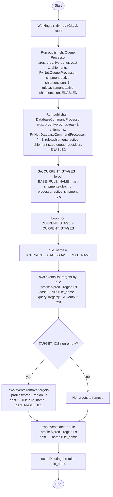
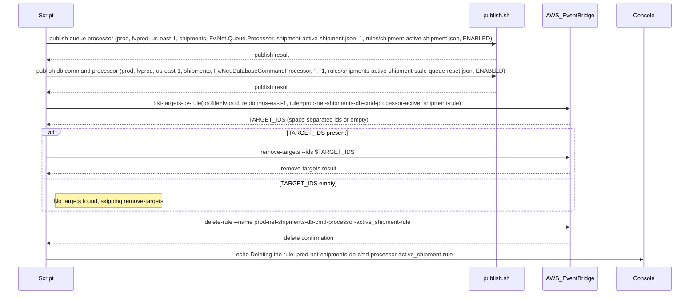
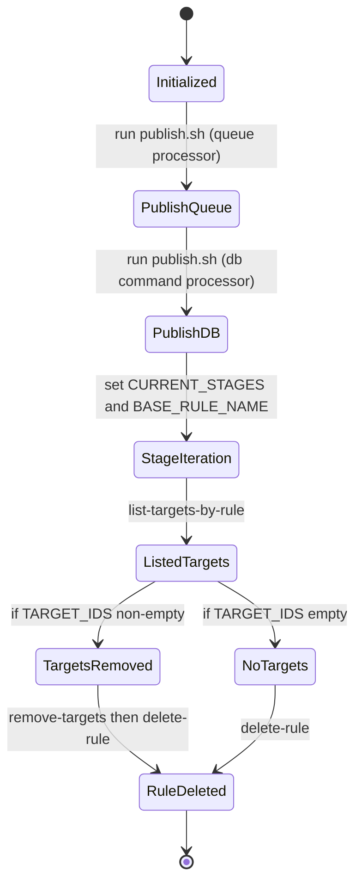

# Diagram: database/freightverify/releases/_archive/release.IA-11967/IA-11967-prod.sh

> Auto-generated by Obscura crawlers

## Diagram 1

### SVG

<svg id="container" width="538.15625" xmlns="http://www.w3.org/2000/svg" class="flowchart" height="2255.53125" viewBox="0 0 538.15625 2255.53125" role="graphics-document document" aria-roledescription="flowchart-v2"><g><marker id="container_flowchart-v2-pointEnd" class="marker flowchart-v2" viewBox="0 0 10 10" refX="5" refY="5" markerUnits="userSpaceOnUse" markerWidth="8" markerHeight="8" orient="auto"><path d="M 0 0 L 10 5 L 0 10 z" class="arrowMarkerPath" style="stroke-width: 1; stroke-dasharray: 1, 0;"></path></marker><marker id="container_flowchart-v2-pointStart" class="marker flowchart-v2" viewBox="0 0 10 10" refX="4.5" refY="5" markerUnits="userSpaceOnUse" markerWidth="8" markerHeight="8" orient="auto"><path d="M 0 5 L 10 10 L 10 0 z" class="arrowMarkerPath" style="stroke-width: 1; stroke-dasharray: 1, 0;"></path></marker><marker id="container_flowchart-v2-circleEnd" class="marker flowchart-v2" viewBox="0 0 10 10" refX="11" refY="5" markerUnits="userSpaceOnUse" markerWidth="11" markerHeight="11" orient="auto"><circle cx="5" cy="5" r="5" class="arrowMarkerPath" style="stroke-width: 1; stroke-dasharray: 1, 0;"></circle></marker><marker id="container_flowchart-v2-circleStart" class="marker flowchart-v2" viewBox="0 0 10 10" refX="-1" refY="5" markerUnits="userSpaceOnUse" markerWidth="11" markerHeight="11" orient="auto"><circle cx="5" cy="5" r="5" class="arrowMarkerPath" style="stroke-width: 1; stroke-dasharray: 1, 0;"></circle></marker><marker id="container_flowchart-v2-crossEnd" class="marker cross flowchart-v2" viewBox="0 0 11 11" refX="12" refY="5.2" markerUnits="userSpaceOnUse" markerWidth="11" markerHeight="11" orient="auto"><path d="M 1,1 l 9,9 M 10,1 l -9,9" class="arrowMarkerPath" style="stroke-width: 2; stroke-dasharray: 1, 0;"></path></marker><marker id="container_flowchart-v2-crossStart" class="marker cross flowchart-v2" viewBox="0 0 11 11" refX="-1" refY="5.2" markerUnits="userSpaceOnUse" markerWidth="11" markerHeight="11" orient="auto"><path d="M 1,1 l 9,9 M 10,1 l -9,9" class="arrowMarkerPath" style="stroke-width: 2; stroke-dasharray: 1, 0;"></path></marker><g class="root"><g class="clusters"></g><g class="edgePaths"><path d="M281.539,47.5L281.456,51.583C281.372,55.667,281.206,63.833,281.122,71.417C281.039,79,281.039,86,281.039,89.5L281.039,93" id="L_Start_CheckDir_0" class="edge-thickness-normal edge-pattern-solid edge-thickness-normal edge-pattern-solid flowchart-link" style=";" data-edge="true" data-et="edge" data-id="L_Start_CheckDir_0" data-points="W3sieCI6MjgxLjUzOTA2MjUsInkiOjQ3LjV9LHsieCI6MjgxLjAzOTA2MjUsInkiOjcyfSx7IngiOjI4MS4wMzkwNjI1LCJ5Ijo5N31d" marker-end="url(#container_flowchart-v2-pointEnd)"></path><path d="M281.039,175L281.039,179.167C281.039,183.333,281.039,191.667,281.039,199.333C281.039,207,281.039,214,281.039,217.5L281.039,221" id="L_CheckDir_PublishQueue_0" class="edge-thickness-normal edge-pattern-solid edge-thickness-normal edge-pattern-solid flowchart-link" style=";" data-edge="true" data-et="edge" data-id="L_CheckDir_PublishQueue_0" data-points="W3sieCI6MjgxLjAzOTA2MjUsInkiOjE3NX0seyJ4IjoyODEuMDM5MDYyNSwieSI6MjAwfSx7IngiOjI4MS4wMzkwNjI1LCJ5IjoyMjV9XQ==" marker-end="url(#container_flowchart-v2-pointEnd)"></path><path d="M281.039,471L281.039,475.167C281.039,479.333,281.039,487.667,281.039,495.333C281.039,503,281.039,510,281.039,513.5L281.039,517" id="L_PublishQueue_PublishDB_0" class="edge-thickness-normal edge-pattern-solid edge-thickness-normal edge-pattern-solid flowchart-link" style=";" data-edge="true" data-et="edge" data-id="L_PublishQueue_PublishDB_0" data-points="W3sieCI6MjgxLjAzOTA2MjUsInkiOjQ3MX0seyJ4IjoyODEuMDM5MDYyNSwieSI6NDk2fSx7IngiOjI4MS4wMzkwNjI1LCJ5Ijo1MjF9XQ==" marker-end="url(#container_flowchart-v2-pointEnd)"></path><path d="M281.039,719L281.039,723.167C281.039,727.333,281.039,735.667,281.039,743.333C281.039,751,281.039,758,281.039,761.5L281.039,765" id="L_PublishDB_SetStages_0" class="edge-thickness-normal edge-pattern-solid edge-thickness-normal edge-pattern-solid flowchart-link" style=";" data-edge="true" data-et="edge" data-id="L_PublishDB_SetStages_0" data-points="W3sieCI6MjgxLjAzOTA2MjUsInkiOjcxOX0seyJ4IjoyODEuMDM5MDYyNSwieSI6NzQ0fSx7IngiOjI4MS4wMzkwNjI1LCJ5Ijo3Njl9XQ==" marker-end="url(#container_flowchart-v2-pointEnd)"></path><path d="M281.039,919L281.039,923.167C281.039,927.333,281.039,935.667,281.039,943.333C281.039,951,281.039,958,281.039,961.5L281.039,965" id="L_SetStages_ForEach_0" class="edge-thickness-normal edge-pattern-solid edge-thickness-normal edge-pattern-solid flowchart-link" style=";" data-edge="true" data-et="edge" data-id="L_SetStages_ForEach_0" data-points="W3sieCI6MjgxLjAzOTA2MjUsInkiOjkxOX0seyJ4IjoyODEuMDM5MDYyNSwieSI6OTQ0fSx7IngiOjI4MS4wMzkwNjI1LCJ5Ijo5Njl9XQ==" marker-end="url(#container_flowchart-v2-pointEnd)"></path><path d="M281.039,1047L281.039,1051.167C281.039,1055.333,281.039,1063.667,281.039,1071.333C281.039,1079,281.039,1086,281.039,1089.5L281.039,1093" id="L_ForEach_BuildRule_0" class="edge-thickness-normal edge-pattern-solid edge-thickness-normal edge-pattern-solid flowchart-link" style=";" data-edge="true" data-et="edge" data-id="L_ForEach_BuildRule_0" data-points="W3sieCI6MjgxLjAzOTA2MjUsInkiOjEwNDd9LHsieCI6MjgxLjAzOTA2MjUsInkiOjEwNzJ9LHsieCI6MjgxLjAzOTA2MjUsInkiOjEwOTd9XQ==" marker-end="url(#container_flowchart-v2-pointEnd)"></path><path d="M281.039,1175L281.039,1179.167C281.039,1183.333,281.039,1191.667,281.039,1199.333C281.039,1207,281.039,1214,281.039,1217.5L281.039,1221" id="L_BuildRule_ListTargets_0" class="edge-thickness-normal edge-pattern-solid edge-thickness-normal edge-pattern-solid flowchart-link" style=";" data-edge="true" data-et="edge" data-id="L_BuildRule_ListTargets_0" data-points="W3sieCI6MjgxLjAzOTA2MjUsInkiOjExNzV9LHsieCI6MjgxLjAzOTA2MjUsInkiOjEyMDB9LHsieCI6MjgxLjAzOTA2MjUsInkiOjEyMjV9XQ==" marker-end="url(#container_flowchart-v2-pointEnd)"></path><path d="M281.039,1375L281.039,1379.167C281.039,1383.333,281.039,1391.667,281.039,1399.333C281.039,1407,281.039,1414,281.039,1417.5L281.039,1421" id="L_ListTargets_HasTargets_0" class="edge-thickness-normal edge-pattern-solid edge-thickness-normal edge-pattern-solid flowchart-link" style=";" data-edge="true" data-et="edge" data-id="L_ListTargets_HasTargets_0" data-points="W3sieCI6MjgxLjAzOTA2MjUsInkiOjEzNzV9LHsieCI6MjgxLjAzOTA2MjUsInkiOjE0MDB9LHsieCI6MjgxLjAzOTA2MjUsInkiOjE0MjV9XQ==" marker-end="url(#container_flowchart-v2-pointEnd)"></path><path d="M225.355,1598.847L210.796,1614.294C196.237,1629.742,167.118,1660.637,152.559,1681.584C138,1702.531,138,1713.531,138,1719.031L138,1724.531" id="L_HasTargets_RemoveTargets_0" class="edge-thickness-normal edge-pattern-solid edge-thickness-normal edge-pattern-solid flowchart-link" style=";" data-edge="true" data-et="edge" data-id="L_HasTargets_RemoveTargets_0" data-points="W3sieCI6MjI1LjM1NDg0ODE1OTg2NDg0LCJ5IjoxNTk4Ljg0NzAzNTY1OTg2NDh9LHsieCI6MTM4LCJ5IjoxNjkxLjUzMTI1fSx7IngiOjEzOCwieSI6MTcyOC41MzEyNX1d" marker-end="url(#container_flowchart-v2-pointEnd)"></path><path d="M336.723,1598.847L351.282,1614.294C365.842,1629.742,394.96,1660.637,409.519,1689.584C424.078,1718.531,424.078,1745.531,424.078,1759.031L424.078,1772.531" id="L_HasTargets_SkipRemove_0" class="edge-thickness-normal edge-pattern-solid edge-thickness-normal edge-pattern-solid flowchart-link" style=";" data-edge="true" data-et="edge" data-id="L_HasTargets_SkipRemove_0" data-points="W3sieCI6MzM2LjcyMzI3Njg0MDEzNTE2LCJ5IjoxNTk4Ljg0NzAzNTY1OTg2NDh9LHsieCI6NDI0LjA3ODEyNSwieSI6MTY5MS41MzEyNX0seyJ4Ijo0MjQuMDc4MTI1LCJ5IjoxNzc2LjUzMTI1fV0=" marker-end="url(#container_flowchart-v2-pointEnd)"></path><path d="M138,1878.531L138,1882.698C138,1886.865,138,1895.198,145.253,1903.218C152.507,1911.239,167.013,1918.947,174.267,1922.801L181.52,1926.654" id="L_RemoveTargets_DeleteRule_0" class="edge-thickness-normal edge-pattern-solid edge-thickness-normal edge-pattern-solid flowchart-link" style=";" data-edge="true" data-et="edge" data-id="L_RemoveTargets_DeleteRule_0" data-points="W3sieCI6MTM4LCJ5IjoxODc4LjUzMTI1fSx7IngiOjEzOCwieSI6MTkwMy41MzEyNX0seyJ4IjoxODUuMDUyMzIzMTkwNzg5NDgsInkiOjE5MjguNTMxMjV9XQ==" marker-end="url(#container_flowchart-v2-pointEnd)"></path><path d="M424.078,1830.531L424.078,1842.698C424.078,1854.865,424.078,1879.198,416.825,1895.218C409.571,1911.239,395.065,1918.947,387.811,1922.801L380.558,1926.654" id="L_SkipRemove_DeleteRule_0" class="edge-thickness-normal edge-pattern-solid edge-thickness-normal edge-pattern-solid flowchart-link" style=";" data-edge="true" data-et="edge" data-id="L_SkipRemove_DeleteRule_0" data-points="W3sieCI6NDI0LjA3ODEyNSwieSI6MTgzMC41MzEyNX0seyJ4Ijo0MjQuMDc4MTI1LCJ5IjoxOTAzLjUzMTI1fSx7IngiOjM3Ny4wMjU4MDE4MDkyMTA1LCJ5IjoxOTI4LjUzMTI1fV0=" marker-end="url(#container_flowchart-v2-pointEnd)"></path><path d="M281.039,2030.531L281.039,2034.698C281.039,2038.865,281.039,2047.198,281.039,2054.865C281.039,2062.531,281.039,2069.531,281.039,2073.031L281.039,2076.531" id="L_DeleteRule_Echo_0" class="edge-thickness-normal edge-pattern-solid edge-thickness-normal edge-pattern-solid flowchart-link" style=";" data-edge="true" data-et="edge" data-id="L_DeleteRule_Echo_0" data-points="W3sieCI6MjgxLjAzOTA2MjUsInkiOjIwMzAuNTMxMjV9LHsieCI6MjgxLjAzOTA2MjUsInkiOjIwNTUuNTMxMjV9LHsieCI6MjgxLjAzOTA2MjUsInkiOjIwODAuNTMxMjV9XQ==" marker-end="url(#container_flowchart-v2-pointEnd)"></path><path d="M281.039,2158.531L281.039,2162.698C281.039,2166.865,281.039,2175.198,281.109,2182.948C281.18,2190.698,281.32,2197.865,281.39,2201.449L281.461,2205.032" id="L_Echo_End_0" class="edge-thickness-normal edge-pattern-solid edge-thickness-normal edge-pattern-solid flowchart-link" style=";" data-edge="true" data-et="edge" data-id="L_Echo_End_0" data-points="W3sieCI6MjgxLjAzOTA2MjUsInkiOjIxNTguNTMxMjV9LHsieCI6MjgxLjAzOTA2MjUsInkiOjIxODMuNTMxMjV9LHsieCI6MjgxLjUzOTA2MjUsInkiOjIyMDkuMDMxMjV9XQ==" marker-end="url(#container_flowchart-v2-pointEnd)"></path></g><g class="edgeLabels"><g class="edgeLabel"><g class="label" data-id="L_Start_CheckDir_0" transform="translate(0, 0)"><foreignObject width="0" height="0">

</foreignObject></g></g><g class="edgeLabel"><g class="label" data-id="L_CheckDir_PublishQueue_0" transform="translate(0, 0)"><foreignObject width="0" height="0">

</foreignObject></g></g><g class="edgeLabel"><g class="label" data-id="L_PublishQueue_PublishDB_0" transform="translate(0, 0)"><foreignObject width="0" height="0">

</foreignObject></g></g><g class="edgeLabel"><g class="label" data-id="L_PublishDB_SetStages_0" transform="translate(0, 0)"><foreignObject width="0" height="0">

</foreignObject></g></g><g class="edgeLabel"><g class="label" data-id="L_SetStages_ForEach_0" transform="translate(0, 0)"><foreignObject width="0" height="0">

</foreignObject></g></g><g class="edgeLabel"><g class="label" data-id="L_ForEach_BuildRule_0" transform="translate(0, 0)"><foreignObject width="0" height="0">

</foreignObject></g></g><g class="edgeLabel"><g class="label" data-id="L_BuildRule_ListTargets_0" transform="translate(0, 0)"><foreignObject width="0" height="0">

</foreignObject></g></g><g class="edgeLabel"><g class="label" data-id="L_ListTargets_HasTargets_0" transform="translate(0, 0)"><foreignObject width="0" height="0">

</foreignObject></g></g><g class="edgeLabel" transform="translate(138, 1691.53125)"><g class="label" data-id="L_HasTargets_RemoveTargets_0" transform="translate(-12.0078125, -12)"><foreignObject width="24.015625" height="24">

yes

</foreignObject></g></g><g class="edgeLabel" transform="translate(424.078125, 1691.53125)"><g class="label" data-id="L_HasTargets_SkipRemove_0" transform="translate(-9.3671875, -12)"><foreignObject width="18.734375" height="24">

no

</foreignObject></g></g><g class="edgeLabel"><g class="label" data-id="L_RemoveTargets_DeleteRule_0" transform="translate(0, 0)"><foreignObject width="0" height="0">

</foreignObject></g></g><g class="edgeLabel"><g class="label" data-id="L_SkipRemove_DeleteRule_0" transform="translate(0, 0)"><foreignObject width="0" height="0">

</foreignObject></g></g><g class="edgeLabel"><g class="label" data-id="L_DeleteRule_Echo_0" transform="translate(0, 0)"><foreignObject width="0" height="0">

</foreignObject></g></g><g class="edgeLabel"><g class="label" data-id="L_Echo_End_0" transform="translate(0, 0)"><foreignObject width="0" height="0">

</foreignObject></g></g></g><g class="nodes"><g class="node default" id="flowchart-Start-0" transform="translate(281.0390625, 27.5)"><g class="basic label-container outer-path"><path d="M-10.3984375 -19.5 C-3.192372488893639 -19.5, 4.013692522212722 -19.5, 10.3984375 -19.5 C10.3984375 -19.5, 10.398437499999998 -19.5, 10.398437499999998 -19.5 C10.742471999299621 -19.48896748322999, 11.086506498599242 -19.47793496645998, 11.6478067896239 -19.45993515863156 C11.913304019918717 -19.434322960132153, 12.178801250213535 -19.408710761632747, 12.892042152847864 -19.3399052695533 C13.372119441868332 -19.26229009651945, 13.852196730888798 -19.184674923485602, 14.126030759676757 -19.140403561325776 C14.544675497683953 -19.04485063178786, 14.96332023569115 -18.949297702249943, 15.34470188623539 -18.862249829261074 C15.791052235548666 -18.729775388525688, 16.23740258486194 -18.597300947790302, 16.543047751460602 -18.50658706670804 C16.875594972183816 -18.384206615449088, 17.20814219290703 -18.261826164190133, 17.716144095147794 -18.074876768247425 C18.153011203914133 -17.881488658398908, 18.589878312680472 -17.688100548550388, 18.85917041279238 -17.568892924097174 C19.28669500600692 -17.34585361765972, 19.714219599221458 -17.122814311222267, 19.967429764076783 -16.990714730406097 C20.208926121541236 -16.84431821932102, 20.45042247900569 -16.697921708235942, 21.036368073605697 -16.342718045390892 C21.428931487625047 -16.068882801567298, 21.821494901644392 -15.795047557743702, 22.061592844578712 -15.627565626425154 C22.432565763941824 -15.331724595237056, 22.803538683304932 -15.035883564048955, 23.03889120850187 -14.848196188198123 C23.313261489775506 -14.599020358185243, 23.587631771049146 -14.349844528172364, 23.964247236767985 -14.007812326905688 C24.160561461067978 -13.805101772618382, 24.356875685367967 -13.602391218331077, 24.833858442968648 -13.10986736009568 C25.05888806662553 -12.845534759599984, 25.283917690282415 -12.581202159104286, 25.644151408126582 -12.158051136245305 C25.79942071085477 -11.950004415914009, 25.954690013582955 -11.741957695582714, 26.391796464640635 -11.156274872382312 C26.545710791543392 -10.919821134475907, 26.699625118446153 -10.6833673965695, 27.073721378604247 -10.108655082055241 C27.281728526579112 -9.739317327818144, 27.489735674553977 -9.369979573581046, 27.6871239742735 -9.019496659696287 C27.88709128734442 -8.604260255489445, 28.08705860041534 -8.189023851282602, 28.22948364880834 -7.893275190886684 C28.344029197807135 -7.610345470272132, 28.45857474680593 -7.327415749657579, 28.698571729970325 -6.734618561215508 C28.779241793531504 -6.491653182798393, 28.85991185709268 -6.248687804381278, 29.09246063421488 -5.548287939305138 C29.15652432724389 -5.3039853124053264, 29.220588020272903 -5.059682685505516, 29.40953178754556 -4.339158212148133 C29.47284357231114 -4.0140655783273305, 29.53615535707672 -3.688972944506528, 29.648482276581777 -3.1121979531509023 C29.707242490203424 -2.656465339818029, 29.766002703825073 -2.200732726485156, 29.808330202509367 -1.872449005199798 C29.832039741191785 -1.5031538022259396, 29.855749279874207 -1.133858599252081, 29.888418715913414 -0.6250057626472757 C29.888418715913414 -0.2992687927433929, 29.888418715913414 0.02646817716048988, 29.888418715913414 0.625005762647271 C29.86265048368325 1.0263667793747424, 29.83688225145309 1.427727796102214, 29.808330202509367 1.8724490051997846 C29.76108358275994 2.2388844580759804, 29.713836963010515 2.605319910952176, 29.648482276581777 3.1121979531508885 C29.5751604137951 3.488690221979286, 29.501838551008426 3.865182490807684, 29.40953178754556 4.339158212148129 C29.342886107575936 4.593307074292724, 29.27624042760631 4.847455936437319, 29.092460634214884 5.548287939305125 C28.937792876138168 6.014122583671523, 28.783125118061452 6.479957228037921, 28.69857172997033 6.734618561215495 C28.58093530824492 7.025182797222744, 28.463298886519514 7.315747033229993, 28.229483648808344 7.893275190886679 C28.047944046284794 8.27024605985207, 27.86640444376124 8.647216928817462, 27.687123974273504 9.019496659696284 C27.478820998993637 9.389359685269177, 27.27051802371377 9.759222710842073, 27.07372137860425 10.108655082055236 C26.859968124448017 10.43703748122482, 26.646214870291782 10.765419880394406, 26.39179646464064 11.156274872382301 C26.140020845202873 11.493631265198117, 25.888245225765107 11.830987658013932, 25.644151408126582 12.158051136245302 C25.364565365697963 12.48646881057845, 25.084979323269348 12.814886484911597, 24.83385844296866 13.10986736009567 C24.64399141221807 13.30592065771878, 24.454124381467487 13.501973955341889, 23.96424723676799 14.007812326905684 C23.73129134055981 14.219376708166699, 23.49833544435163 14.430941089427714, 23.038891208501887 14.848196188198111 C22.65420808626768 15.15497074133209, 22.26952496403347 15.461745294466068, 22.061592844578715 15.627565626425152 C21.753704721596144 15.842335052755766, 21.44581659861357 16.05710447908638, 21.036368073605708 16.34271804539089 C20.764243889401875 16.507681325034465, 20.492119705198043 16.67264460467804, 19.967429764076787 16.990714730406093 C19.662386405057454 17.149855655416882, 19.357343046038118 17.308996580427674, 18.859170412792388 17.56889292409717 C18.534146132795684 17.71277153134901, 18.209121852798983 17.856650138600845, 17.716144095147804 18.07487676824742 C17.25825092217206 18.243385688620585, 16.80035774919632 18.411894608993748, 16.543047751460616 18.506587066708033 C16.068142236945118 18.64753653058632, 15.593236722429621 18.788485994464605, 15.344701886235413 18.86224982926107 C14.858783328471826 18.97315756915568, 14.372864770708242 19.084065309050292, 14.126030759676766 19.140403561325773 C13.734499485912727 19.203703301297566, 13.342968212148687 19.267003041269362, 12.892042152847878 19.3399052695533 C12.55394390346327 19.372521201048794, 12.215845654078663 19.405137132544294, 11.6478067896239 19.45993515863156 C11.169924481496853 19.47525991411171, 10.692042173369806 19.490584669591858, 10.398437500000004 19.5 C10.398437500000002 19.5, 10.398437500000002 19.5, 10.3984375 19.5 C4.576743005341095 19.5, -1.2449514893178097 19.5, -10.398437499999996 19.5 C-10.795490779148329 19.487267274155037, -11.192544058296662 19.474534548310075, -11.647806789623893 19.45993515863156 C-12.10139553566047 19.41617799782169, -12.554984281697047 19.37242083701182, -12.892042152847871 19.3399052695533 C-13.217750449662917 19.28724727802981, -13.543458746477963 19.234589286506317, -14.126030759676759 19.140403561325773 C-14.51408142570672 19.051833529071683, -14.902132091736684 18.963263496817593, -15.344701886235388 18.862249829261074 C-15.606777338252726 18.784467210764447, -15.868852790270065 18.706684592267823, -16.54304775146059 18.506587066708043 C-16.913447574662005 18.37027650783149, -17.28384739786342 18.23396594895494, -17.716144095147797 18.074876768247425 C-17.998022621253668 17.950097506369744, -18.27990114735954 17.825318244492063, -18.85917041279238 17.568892924097174 C-19.270579224294202 17.354261210656595, -19.681988035796024 17.139629497216013, -19.96742976407678 16.990714730406097 C-20.334772726440015 16.76802926787464, -20.702115688803254 16.54534380534318, -21.036368073605686 16.3427180453909 C-21.429433302113626 16.068532757503263, -21.822498530621566 15.794347469615625, -22.061592844578712 15.627565626425156 C-22.41450817055691 15.346125045428781, -22.767423496535113 15.064684464432409, -23.03889120850187 14.848196188198125 C-23.369467428938915 14.547975611364697, -23.70004364937596 14.247755034531266, -23.964247236767974 14.007812326905697 C-24.243957945006873 13.718988055972805, -24.52366865324577 13.430163785039912, -24.833858442968655 13.109867360095677 C-25.10126593827098 12.795755300196035, -25.368673433573303 12.481643240296393, -25.64415140812658 12.158051136245307 C-25.903957257335673 11.809934967104896, -26.16376310654477 11.461818797964485, -26.391796464640635 11.156274872382316 C-26.577407820196434 10.871125986620875, -26.763019175752234 10.585977100859433, -27.073721378604244 10.108655082055249 C-27.251361529611096 9.793237005926741, -27.429001680617947 9.477818929798234, -27.6871239742735 9.019496659696289 C-27.89986688500792 8.577731453587186, -28.112609795742344 8.135966247478082, -28.22948364880834 7.893275190886686 C-28.34170384394256 7.616089139275285, -28.453924039076785 7.338903087663884, -28.698571729970325 6.73461856121551 C-28.820848269285065 6.3663411069203315, -28.9431248085998 5.998063652625153, -29.09246063421488 5.5482879393051325 C-29.18083553714161 5.21127613252029, -29.269210440068345 4.874264325735448, -29.409531787545557 4.339158212148136 C-29.482271556242313 3.965654873445859, -29.55501132493907 3.592151534743582, -29.648482276581777 3.112197953150904 C-29.704359619652994 2.6788243145199955, -29.76023696272421 2.2454506758890864, -29.808330202509364 1.872449005199809 C-29.824820763673287 1.6155952041303054, -29.84131132483721 1.358741403060802, -29.888418715913414 0.6250057626472781 C-29.888418715913414 0.12919411559829014, -29.888418715913414 -0.36661753145069786, -29.888418715913414 -0.6250057626472687 C-29.870536417683642 -0.903536991907292, -29.85265411945387 -1.1820682211673152, -29.808330202509367 -1.8724490051997822 C-29.775757956843513 -2.1250729104667196, -29.74318571117766 -2.377696815733657, -29.648482276581777 -3.112197953150895 C-29.570731279937597 -3.5114328882397974, -29.492980283293416 -3.9106678233286996, -29.40953178754556 -4.339158212148126 C-29.339066179404384 -4.60787411597819, -29.268600571263207 -4.876590019808255, -29.092460634214884 -5.548287939305123 C-28.99231859731386 -5.8498997989842145, -28.892176560412842 -6.151511658663306, -28.698571729970332 -6.734618561215485 C-28.556200904356615 -7.086277253034024, -28.4138300787429 -7.437935944852564, -28.229483648808344 -7.893275190886676 C-28.035528736581355 -8.29602671609633, -27.841573824354363 -8.698778241305986, -27.687123974273504 -9.019496659696282 C-27.520816613638587 -9.314792218949956, -27.354509253003673 -9.610087778203628, -27.073721378604247 -10.108655082055243 C-26.908528273739467 -10.362436051687268, -26.743335168874687 -10.616217021319292, -26.39179646464064 -11.156274872382308 C-26.20280133754759 -11.409511124876715, -26.01380621045454 -11.662747377371122, -25.644151408126586 -12.158051136245302 C-25.400788406428095 -12.443919165787436, -25.1574254047296 -12.729787195329571, -24.833858442968662 -13.10986736009567 C-24.534623074548325 -13.41885244567031, -24.235387706127987 -13.727837531244953, -23.964247236767996 -14.007812326905677 C-23.668628710086583 -14.276285251200134, -23.373010183405167 -14.544758175494591, -23.038891208501887 -14.848196188198107 C-22.792132474465795 -15.044979712066201, -22.545373740429703 -15.241763235934297, -22.06159284457872 -15.627565626425149 C-21.77275825674785 -15.829044131448176, -21.48392366891698 -16.030522636471204, -21.03636807360571 -16.342718045390885 C-20.71687876055985 -16.53639434448689, -20.397389447513994 -16.730070643582895, -19.96742976407679 -16.99071473040609 C-19.7373841344313 -17.110729388040884, -19.507338504785807 -17.23074404567568, -18.859170412792388 -17.56889292409717 C-18.60559892013808 -17.68114150196416, -18.35202742748377 -17.793390079831145, -17.716144095147804 -18.07487676824742 C-17.31089388308869 -18.224012592377072, -16.905643671029573 -18.37314841650672, -16.54304775146062 -18.506587066708033 C-16.270279880831584 -18.58754313892296, -15.99751201020255 -18.66849921113789, -15.344701886235413 -18.862249829261067 C-14.85819349841784 -18.9732921940165, -14.371685110600266 -19.084334558771936, -14.126030759676768 -19.140403561325773 C-13.73708235291255 -19.203285723391467, -13.34813394614833 -19.266167885457165, -12.89204215284788 -19.3399052695533 C-12.586070094602265 -19.369422026027014, -12.280098036356652 -19.398938782500732, -11.647806789623903 -19.45993515863156 C-11.356206952136802 -19.46928619785512, -11.0646071146497 -19.47863723707868, -10.398437500000005 -19.5 C-10.398437500000004 -19.5, -10.398437500000002 -19.5, -10.3984375 -19.5" stroke="none" stroke-width="0" fill="#ECECFF" style=""></path><path d="M-10.3984375 -19.5 C-2.556268705371048 -19.5, 5.285900089257904 -19.5, 10.3984375 -19.5 M-10.3984375 -19.5 C-2.7141810493469185 -19.5, 4.970075401306163 -19.5, 10.3984375 -19.5 M10.3984375 -19.5 C10.3984375 -19.5, 10.3984375 -19.5, 10.398437499999998 -19.5 M10.3984375 -19.5 C10.3984375 -19.5, 10.398437499999998 -19.5, 10.398437499999998 -19.5 M10.398437499999998 -19.5 C10.846941878298692 -19.485617337548774, 11.295446256597385 -19.47123467509755, 11.6478067896239 -19.45993515863156 M10.398437499999998 -19.5 C10.896919410161994 -19.484014655377283, 11.39540132032399 -19.468029310754567, 11.6478067896239 -19.45993515863156 M11.6478067896239 -19.45993515863156 C11.934238047453574 -19.43230347967272, 12.220669305283248 -19.404671800713874, 12.892042152847864 -19.3399052695533 M11.6478067896239 -19.45993515863156 C11.96607443958437 -19.42923226121272, 12.28434208954484 -19.398529363793887, 12.892042152847864 -19.3399052695533 M12.892042152847864 -19.3399052695533 C13.357046456645682 -19.2647269798775, 13.8220507604435 -19.189548690201708, 14.126030759676757 -19.140403561325776 M12.892042152847864 -19.3399052695533 C13.192915458627573 -19.29126240678217, 13.49378876440728 -19.242619544011042, 14.126030759676757 -19.140403561325776 M14.126030759676757 -19.140403561325776 C14.573230703447702 -19.038333092412415, 15.020430647218648 -18.936262623499054, 15.34470188623539 -18.862249829261074 M14.126030759676757 -19.140403561325776 C14.477600290190102 -19.060160110191696, 14.829169820703447 -18.979916659057615, 15.34470188623539 -18.862249829261074 M15.34470188623539 -18.862249829261074 C15.786933806572652 -18.730997716627694, 16.229165726909912 -18.599745603994315, 16.543047751460602 -18.50658706670804 M15.34470188623539 -18.862249829261074 C15.692026501134471 -18.759165706703133, 16.039351116033554 -18.656081584145195, 16.543047751460602 -18.50658706670804 M16.543047751460602 -18.50658706670804 C16.830556491056782 -18.40078119283499, 17.118065230652967 -18.29497531896194, 17.716144095147794 -18.074876768247425 M16.543047751460602 -18.50658706670804 C16.849399923120963 -18.393846635648597, 17.15575209478132 -18.281106204589154, 17.716144095147794 -18.074876768247425 M17.716144095147794 -18.074876768247425 C17.97642431221298 -17.95965843709098, 18.236704529278168 -17.844440105934535, 18.85917041279238 -17.568892924097174 M17.716144095147794 -18.074876768247425 C18.04290784702495 -17.93022814839371, 18.369671598902105 -17.785579528539998, 18.85917041279238 -17.568892924097174 M18.85917041279238 -17.568892924097174 C19.114296077090376 -17.435794028448697, 19.369421741388376 -17.30269513280022, 19.967429764076783 -16.990714730406097 M18.85917041279238 -17.568892924097174 C19.090262162942565 -17.448332506065153, 19.321353913092754 -17.327772088033132, 19.967429764076783 -16.990714730406097 M19.967429764076783 -16.990714730406097 C20.267713610251676 -16.808680898191124, 20.567997456426564 -16.626647065976147, 21.036368073605697 -16.342718045390892 M19.967429764076783 -16.990714730406097 C20.33964083911635 -16.76507818936204, 20.71185191415592 -16.539441648317986, 21.036368073605697 -16.342718045390892 M21.036368073605697 -16.342718045390892 C21.433369514925968 -16.065787025841278, 21.830370956246238 -15.788856006291665, 22.061592844578712 -15.627565626425154 M21.036368073605697 -16.342718045390892 C21.353362842089304 -16.12159621737909, 21.670357610572907 -15.900474389367288, 22.061592844578712 -15.627565626425154 M22.061592844578712 -15.627565626425154 C22.28150751050713 -15.452189532522278, 22.501422176435543 -15.276813438619401, 23.03889120850187 -14.848196188198123 M22.061592844578712 -15.627565626425154 C22.286003547238987 -15.448604062873184, 22.510414249899263 -15.269642499321211, 23.03889120850187 -14.848196188198123 M23.03889120850187 -14.848196188198123 C23.405127873632438 -14.515589739017699, 23.77136453876301 -14.182983289837274, 23.964247236767985 -14.007812326905688 M23.03889120850187 -14.848196188198123 C23.27176491485877 -14.636706449585414, 23.504638621215676 -14.425216710972707, 23.964247236767985 -14.007812326905688 M23.964247236767985 -14.007812326905688 C24.204900957604377 -13.759317602104183, 24.445554678440768 -13.510822877302678, 24.833858442968648 -13.10986736009568 M23.964247236767985 -14.007812326905688 C24.214840767804308 -13.749053931999159, 24.46543429884063 -13.49029553709263, 24.833858442968648 -13.10986736009568 M24.833858442968648 -13.10986736009568 C25.07345538290195 -12.828423160997922, 25.313052322835258 -12.546978961900162, 25.644151408126582 -12.158051136245305 M24.833858442968648 -13.10986736009568 C25.078891394770668 -12.822037712139092, 25.323924346572685 -12.534208064182504, 25.644151408126582 -12.158051136245305 M25.644151408126582 -12.158051136245305 C25.932897833447896 -11.77115723165524, 26.221644258769214 -11.384263327065174, 26.391796464640635 -11.156274872382312 M25.644151408126582 -12.158051136245305 C25.89647789231519 -11.819956634848175, 26.148804376503797 -11.481862133451044, 26.391796464640635 -11.156274872382312 M26.391796464640635 -11.156274872382312 C26.614877096802815 -10.813563115843902, 26.837957728964994 -10.470851359305492, 27.073721378604247 -10.108655082055241 M26.391796464640635 -11.156274872382312 C26.53976176477595 -10.928960437128065, 26.68772706491126 -10.701646001873819, 27.073721378604247 -10.108655082055241 M27.073721378604247 -10.108655082055241 C27.255487070811817 -9.78591168976851, 27.43725276301939 -9.463168297481777, 27.6871239742735 -9.019496659696287 M27.073721378604247 -10.108655082055241 C27.254001653314834 -9.788549198949234, 27.434281928025424 -9.468443315843228, 27.6871239742735 -9.019496659696287 M27.6871239742735 -9.019496659696287 C27.89227724048113 -8.593491512839444, 28.09743050668876 -8.167486365982603, 28.22948364880834 -7.893275190886684 M27.6871239742735 -9.019496659696287 C27.854086031930215 -8.672796374556373, 28.02104808958693 -8.32609608941646, 28.22948364880834 -7.893275190886684 M28.22948364880834 -7.893275190886684 C28.35752686781343 -7.577005964396882, 28.485570086818523 -7.260736737907079, 28.698571729970325 -6.734618561215508 M28.22948364880834 -7.893275190886684 C28.412661119422932 -7.440823296973174, 28.595838590037523 -6.988371403059664, 28.698571729970325 -6.734618561215508 M28.698571729970325 -6.734618561215508 C28.84064814376451 -6.306707039669822, 28.982724557558694 -5.878795518124137, 29.09246063421488 -5.548287939305138 M28.698571729970325 -6.734618561215508 C28.822719494293167 -6.360705275335137, 28.94686725861601 -5.986791989454767, 29.09246063421488 -5.548287939305138 M29.09246063421488 -5.548287939305138 C29.19455493704985 -5.1589581146446495, 29.29664923988482 -4.769628289984162, 29.40953178754556 -4.339158212148133 M29.09246063421488 -5.548287939305138 C29.19064066080807 -5.17388494641261, 29.288820687401262 -4.799481953520082, 29.40953178754556 -4.339158212148133 M29.40953178754556 -4.339158212148133 C29.47997724777474 -3.977435662524589, 29.550422708003918 -3.615713112901045, 29.648482276581777 -3.1121979531509023 M29.40953178754556 -4.339158212148133 C29.45816538486451 -4.089434968629758, 29.50679898218346 -3.8397117251113846, 29.648482276581777 -3.1121979531509023 M29.648482276581777 -3.1121979531509023 C29.69857428094162 -2.7236942591210584, 29.748666285301464 -2.3351905650912146, 29.808330202509367 -1.872449005199798 M29.648482276581777 -3.1121979531509023 C29.70786415238641 -2.65164385068789, 29.767246028191042 -2.1910897482248775, 29.808330202509367 -1.872449005199798 M29.808330202509367 -1.872449005199798 C29.829693729505546 -1.5396948279057034, 29.851057256501722 -1.206940650611609, 29.888418715913414 -0.6250057626472757 M29.808330202509367 -1.872449005199798 C29.825935346463524 -1.5982346774973653, 29.84354049041768 -1.3240203497949325, 29.888418715913414 -0.6250057626472757 M29.888418715913414 -0.6250057626472757 C29.888418715913414 -0.21967015549049584, 29.888418715913414 0.185665451666284, 29.888418715913414 0.625005762647271 M29.888418715913414 -0.6250057626472757 C29.888418715913414 -0.19713035548615482, 29.888418715913414 0.23074505167496606, 29.888418715913414 0.625005762647271 M29.888418715913414 0.625005762647271 C29.868567640137357 0.9342022913593088, 29.8487165643613 1.2433988200713464, 29.808330202509367 1.8724490051997846 M29.888418715913414 0.625005762647271 C29.863880151580172 1.0072137093101086, 29.839341587246935 1.3894216559729462, 29.808330202509367 1.8724490051997846 M29.808330202509367 1.8724490051997846 C29.768891874628785 2.1783248882628468, 29.729453546748207 2.4842007713259084, 29.648482276581777 3.1121979531508885 M29.808330202509367 1.8724490051997846 C29.745337699834256 2.3610064166713225, 29.682345197159144 2.849563828142861, 29.648482276581777 3.1121979531508885 M29.648482276581777 3.1121979531508885 C29.574487421465097 3.492145895356871, 29.50049256634842 3.872093837562854, 29.40953178754556 4.339158212148129 M29.648482276581777 3.1121979531508885 C29.553066710250512 3.602136720174854, 29.457651143919247 4.09207548719882, 29.40953178754556 4.339158212148129 M29.40953178754556 4.339158212148129 C29.31266135754942 4.7085671456333476, 29.215790927553282 5.077976079118567, 29.092460634214884 5.548287939305125 M29.40953178754556 4.339158212148129 C29.307522827250757 4.728162588715275, 29.20551386695595 5.11716696528242, 29.092460634214884 5.548287939305125 M29.092460634214884 5.548287939305125 C28.99422307635649 5.844163811545354, 28.895985518498094 6.140039683785583, 28.69857172997033 6.734618561215495 M29.092460634214884 5.548287939305125 C28.9626649292087 5.9392119226465745, 28.83286922420252 6.3301359059880244, 28.69857172997033 6.734618561215495 M28.69857172997033 6.734618561215495 C28.591875937186177 6.998159232215173, 28.485180144402026 7.261699903214851, 28.229483648808344 7.893275190886679 M28.69857172997033 6.734618561215495 C28.58789309750446 7.0079969232319845, 28.477214465038585 7.281375285248474, 28.229483648808344 7.893275190886679 M28.229483648808344 7.893275190886679 C28.03751246864788 8.291907454015126, 27.845541288487414 8.690539717143574, 27.687123974273504 9.019496659696284 M28.229483648808344 7.893275190886679 C28.104537264711386 8.152729030888361, 27.979590880614424 8.412182870890042, 27.687123974273504 9.019496659696284 M27.687123974273504 9.019496659696284 C27.550014284697674 9.26294879739975, 27.412904595121848 9.506400935103217, 27.07372137860425 10.108655082055236 M27.687123974273504 9.019496659696284 C27.442810052336068 9.453300767563455, 27.198496130398627 9.887104875430628, 27.07372137860425 10.108655082055236 M27.07372137860425 10.108655082055236 C26.812923720974794 10.509310318150835, 26.552126063345337 10.909965554246435, 26.39179646464064 11.156274872382301 M27.07372137860425 10.108655082055236 C26.83717938321483 10.472047107392845, 26.60063738782541 10.835439132730453, 26.39179646464064 11.156274872382301 M26.39179646464064 11.156274872382301 C26.23985639720555 11.359860720720423, 26.087916329770458 11.563446569058547, 25.644151408126582 12.158051136245302 M26.39179646464064 11.156274872382301 C26.169188360054726 11.454549452511902, 25.94658025546881 11.752824032641504, 25.644151408126582 12.158051136245302 M25.644151408126582 12.158051136245302 C25.38458542876776 12.462952105322806, 25.12501944940894 12.767853074400312, 24.83385844296866 13.10986736009567 M25.644151408126582 12.158051136245302 C25.352664899695714 12.500447775100392, 25.061178391264843 12.842844413955483, 24.83385844296866 13.10986736009567 M24.83385844296866 13.10986736009567 C24.52060775743295 13.43332441127087, 24.20735707189724 13.756781462446071, 23.96424723676799 14.007812326905684 M24.83385844296866 13.10986736009567 C24.503837560684534 13.450641016272366, 24.17381667840041 13.791414672449063, 23.96424723676799 14.007812326905684 M23.96424723676799 14.007812326905684 C23.6178594605384 14.322392540359058, 23.271471684308818 14.636972753812433, 23.038891208501887 14.848196188198111 M23.96424723676799 14.007812326905684 C23.631204932816505 14.310272535537932, 23.298162628865025 14.612732744170177, 23.038891208501887 14.848196188198111 M23.038891208501887 14.848196188198111 C22.735545187616736 15.090106567477385, 22.43219916673159 15.332016946756656, 22.061592844578715 15.627565626425152 M23.038891208501887 14.848196188198111 C22.772755089695895 15.060432660766336, 22.506618970889903 15.272669133334562, 22.061592844578715 15.627565626425152 M22.061592844578715 15.627565626425152 C21.84536951979659 15.778393657636293, 21.629146195014464 15.929221688847433, 21.036368073605708 16.34271804539089 M22.061592844578715 15.627565626425152 C21.789305915818087 15.817501200817395, 21.51701898705746 16.007436775209637, 21.036368073605708 16.34271804539089 M21.036368073605708 16.34271804539089 C20.759383682661433 16.510627610922267, 20.482399291717158 16.67853717645364, 19.967429764076787 16.990714730406093 M21.036368073605708 16.34271804539089 C20.77954419847044 16.498406187762505, 20.52272032333517 16.65409433013412, 19.967429764076787 16.990714730406093 M19.967429764076787 16.990714730406093 C19.68235860642443 17.139436170756536, 19.397287448772072 17.288157611106982, 18.859170412792388 17.56889292409717 M19.967429764076787 16.990714730406093 C19.618403841496864 17.172801330654266, 19.26937791891694 17.35488793090244, 18.859170412792388 17.56889292409717 M18.859170412792388 17.56889292409717 C18.53794656842735 17.711089191230787, 18.21672272406231 17.853285458364404, 17.716144095147804 18.07487676824742 M18.859170412792388 17.56889292409717 C18.52467732160472 17.716963093180944, 18.190184230417056 17.865033262264717, 17.716144095147804 18.07487676824742 M17.716144095147804 18.07487676824742 C17.461936441955608 18.168427534491936, 17.20772878876341 18.261978300736452, 16.543047751460616 18.506587066708033 M17.716144095147804 18.07487676824742 C17.2869825941723 18.232812167731833, 16.857821093196797 18.390747567216245, 16.543047751460616 18.506587066708033 M16.543047751460616 18.506587066708033 C16.224270604609785 18.60119845059797, 15.905493457758956 18.69580983448791, 15.344701886235413 18.86224982926107 M16.543047751460616 18.506587066708033 C16.210098208871074 18.6054047432608, 15.87714866628153 18.70422241981356, 15.344701886235413 18.86224982926107 M15.344701886235413 18.86224982926107 C14.889812474847995 18.966075368979425, 14.434923063460575 19.06990090869778, 14.126030759676766 19.140403561325773 M15.344701886235413 18.86224982926107 C14.97309636693749 18.947066364088183, 14.601490847639568 19.031882898915295, 14.126030759676766 19.140403561325773 M14.126030759676766 19.140403561325773 C13.650778634839725 19.217238639234154, 13.175526510002681 19.294073717142535, 12.892042152847878 19.3399052695533 M14.126030759676766 19.140403561325773 C13.643090828895499 19.21848154407939, 13.160150898114233 19.296559526833008, 12.892042152847878 19.3399052695533 M12.892042152847878 19.3399052695533 C12.548914941677822 19.373006338944027, 12.205787730507765 19.406107408334755, 11.6478067896239 19.45993515863156 M12.892042152847878 19.3399052695533 C12.426575483104688 19.38480827937785, 11.961108813361497 19.429711289202405, 11.6478067896239 19.45993515863156 M11.6478067896239 19.45993515863156 C11.219004998746412 19.473685997452947, 10.790203207868924 19.487436836274334, 10.398437500000004 19.5 M11.6478067896239 19.45993515863156 C11.340559802918415 19.469787971475224, 11.033312816212932 19.47964078431889, 10.398437500000004 19.5 M10.398437500000004 19.5 C10.398437500000002 19.5, 10.398437500000002 19.5, 10.3984375 19.5 M10.398437500000004 19.5 C10.398437500000002 19.5, 10.398437500000002 19.5, 10.3984375 19.5 M10.3984375 19.5 C4.36420921108704 19.5, -1.6700190778259199 19.5, -10.398437499999996 19.5 M10.3984375 19.5 C4.602556683196709 19.5, -1.1933241336065823 19.5, -10.398437499999996 19.5 M-10.398437499999996 19.5 C-10.732677548152042 19.48928157221455, -11.066917596304087 19.478563144429103, -11.647806789623893 19.45993515863156 M-10.398437499999996 19.5 C-10.802351205203664 19.487047273644453, -11.20626491040733 19.474094547288903, -11.647806789623893 19.45993515863156 M-11.647806789623893 19.45993515863156 C-12.0479398234505 19.421334806088687, -12.448072857277108 19.38273445354581, -12.892042152847871 19.3399052695533 M-11.647806789623893 19.45993515863156 C-12.097871367799886 19.41651797005677, -12.54793594597588 19.373100781481977, -12.892042152847871 19.3399052695533 M-12.892042152847871 19.3399052695533 C-13.286047814519995 19.27620548973369, -13.680053476192118 19.212505709914083, -14.126030759676759 19.140403561325773 M-12.892042152847871 19.3399052695533 C-13.365293322276433 19.26339369059772, -13.838544491704994 19.18688211164214, -14.126030759676759 19.140403561325773 M-14.126030759676759 19.140403561325773 C-14.512857143462687 19.052112963504694, -14.899683527248616 18.96382236568362, -15.344701886235388 18.862249829261074 M-14.126030759676759 19.140403561325773 C-14.489843735900813 19.057365623604174, -14.853656712124867 18.974327685882574, -15.344701886235388 18.862249829261074 M-15.344701886235388 18.862249829261074 C-15.77180234645091 18.735488654565174, -16.198902806666432 18.60872747986927, -16.54304775146059 18.506587066708043 M-15.344701886235388 18.862249829261074 C-15.6684910296566 18.766150911097554, -15.992280173077813 18.670051992934038, -16.54304775146059 18.506587066708043 M-16.54304775146059 18.506587066708043 C-16.901985799093268 18.374494547192278, -17.260923846725944 18.242402027676512, -17.716144095147797 18.074876768247425 M-16.54304775146059 18.506587066708043 C-16.916858407306414 18.369021289888956, -17.29066906315224 18.23145551306987, -17.716144095147797 18.074876768247425 M-17.716144095147797 18.074876768247425 C-18.010630723674 17.94451627343433, -18.305117352200206 17.814155778621238, -18.85917041279238 17.568892924097174 M-17.716144095147797 18.074876768247425 C-18.017296660060847 17.94156546113385, -18.3184492249739 17.80825415402028, -18.85917041279238 17.568892924097174 M-18.85917041279238 17.568892924097174 C-19.283094003595146 17.34773225831139, -19.70701759439791 17.126571592525607, -19.96742976407678 16.990714730406097 M-18.85917041279238 17.568892924097174 C-19.27519239108228 17.351854524498126, -19.691214369372183 17.134816124899082, -19.96742976407678 16.990714730406097 M-19.96742976407678 16.990714730406097 C-20.312963625306175 16.781250073146477, -20.658497486535566 16.57178541588686, -21.036368073605686 16.3427180453909 M-19.96742976407678 16.990714730406097 C-20.33946043743075 16.765187549924008, -20.71149111078472 16.53966036944192, -21.036368073605686 16.3427180453909 M-21.036368073605686 16.3427180453909 C-21.378263061761363 16.104226902049, -21.72015804991704 15.865735758707096, -22.061592844578712 15.627565626425156 M-21.036368073605686 16.3427180453909 C-21.315016054817935 16.14834527617393, -21.593664036030184 15.95397250695696, -22.061592844578712 15.627565626425156 M-22.061592844578712 15.627565626425156 C-22.30344441729917 15.434695433121234, -22.545295990019625 15.241825239817313, -23.03889120850187 14.848196188198125 M-22.061592844578712 15.627565626425156 C-22.355376413002787 15.393281048516043, -22.649159981426862 15.15899647060693, -23.03889120850187 14.848196188198125 M-23.03889120850187 14.848196188198125 C-23.2968697560351 14.613906897066771, -23.554848303568335 14.379617605935419, -23.964247236767974 14.007812326905697 M-23.03889120850187 14.848196188198125 C-23.255061022405954 14.651876482750291, -23.47123083631004 14.455556777302457, -23.964247236767974 14.007812326905697 M-23.964247236767974 14.007812326905697 C-24.18239983135772 13.782551862330678, -24.400552425947467 13.557291397755657, -24.833858442968655 13.109867360095677 M-23.964247236767974 14.007812326905697 C-24.219463040007547 13.744281056453708, -24.474678843247123 13.480749786001718, -24.833858442968655 13.109867360095677 M-24.833858442968655 13.109867360095677 C-25.00658675913089 12.906970851411897, -25.179315075293125 12.704074342728115, -25.64415140812658 12.158051136245307 M-24.833858442968655 13.109867360095677 C-24.999730694445716 12.915024375112232, -25.16560294592278 12.720181390128785, -25.64415140812658 12.158051136245307 M-25.64415140812658 12.158051136245307 C-25.87213428955172 11.85257484480339, -26.10011717097686 11.547098553361472, -26.391796464640635 11.156274872382316 M-25.64415140812658 12.158051136245307 C-25.876238594782144 11.847075449704521, -26.108325781437706 11.536099763163733, -26.391796464640635 11.156274872382316 M-26.391796464640635 11.156274872382316 C-26.650089774367586 10.759466987176536, -26.908383084094538 10.362659101970758, -27.073721378604244 10.108655082055249 M-26.391796464640635 11.156274872382316 C-26.571891888444213 10.879599939027358, -26.75198731224779 10.602925005672398, -27.073721378604244 10.108655082055249 M-27.073721378604244 10.108655082055249 C-27.264886317982207 9.769222374640504, -27.45605125736017 9.42978966722576, -27.6871239742735 9.019496659696289 M-27.073721378604244 10.108655082055249 C-27.197172944332102 9.889454326278864, -27.32062451005996 9.67025357050248, -27.6871239742735 9.019496659696289 M-27.6871239742735 9.019496659696289 C-27.81959217987328 8.74442359640281, -27.952060385473054 8.469350533109328, -28.22948364880834 7.893275190886686 M-27.6871239742735 9.019496659696289 C-27.888252833593967 8.601848279849156, -28.08938169291443 8.184199900002023, -28.22948364880834 7.893275190886686 M-28.22948364880834 7.893275190886686 C-28.39207698320483 7.491666511399088, -28.55467031760132 7.090057831911491, -28.698571729970325 6.73461856121551 M-28.22948364880834 7.893275190886686 C-28.376440852146548 7.530288057417074, -28.523398055484755 7.1673009239474625, -28.698571729970325 6.73461856121551 M-28.698571729970325 6.73461856121551 C-28.78476735860868 6.47501106116518, -28.87096298724703 6.215403561114851, -29.09246063421488 5.5482879393051325 M-28.698571729970325 6.73461856121551 C-28.838585032045323 6.312920803455798, -28.978598334120324 5.891223045696087, -29.09246063421488 5.5482879393051325 M-29.09246063421488 5.5482879393051325 C-29.171060584591473 5.248552263085205, -29.249660534968065 4.948816586865278, -29.409531787545557 4.339158212148136 M-29.09246063421488 5.5482879393051325 C-29.1793427666947 5.216968713205181, -29.266224899174514 4.885649487105229, -29.409531787545557 4.339158212148136 M-29.409531787545557 4.339158212148136 C-29.472396716506175 4.016360088442815, -29.53526164546679 3.6935619647374924, -29.648482276581777 3.112197953150904 M-29.409531787545557 4.339158212148136 C-29.472933135179584 4.01360569192698, -29.53633448281361 3.6880531717058243, -29.648482276581777 3.112197953150904 M-29.648482276581777 3.112197953150904 C-29.692830905629013 2.768238743887894, -29.73717953467625 2.424279534624884, -29.808330202509364 1.872449005199809 M-29.648482276581777 3.112197953150904 C-29.691351092227794 2.779715884405554, -29.734219907873808 2.447233815660204, -29.808330202509364 1.872449005199809 M-29.808330202509364 1.872449005199809 C-29.834594046403463 1.4633684367559703, -29.860857890297567 1.0542878683121315, -29.888418715913414 0.6250057626472781 M-29.808330202509364 1.872449005199809 C-29.830887331470596 1.521103513841871, -29.853444460431824 1.169758022483933, -29.888418715913414 0.6250057626472781 M-29.888418715913414 0.6250057626472781 C-29.888418715913414 0.3085029027056381, -29.888418715913414 -0.007999957236001887, -29.888418715913414 -0.6250057626472687 M-29.888418715913414 0.6250057626472781 C-29.888418715913414 0.246009762476195, -29.888418715913414 -0.13298623769488815, -29.888418715913414 -0.6250057626472687 M-29.888418715913414 -0.6250057626472687 C-29.87120928337921 -0.8930565655714218, -29.853999850845007 -1.1611073684955748, -29.808330202509367 -1.8724490051997822 M-29.888418715913414 -0.6250057626472687 C-29.867710003697784 -0.9475606711773515, -29.847001291482155 -1.2701155797074344, -29.808330202509367 -1.8724490051997822 M-29.808330202509367 -1.8724490051997822 C-29.75929439936908 -2.2527610111412915, -29.71025859622879 -2.6330730170828005, -29.648482276581777 -3.112197953150895 M-29.808330202509367 -1.8724490051997822 C-29.749885651523492 -2.3257334014642588, -29.691441100537613 -2.779017797728735, -29.648482276581777 -3.112197953150895 M-29.648482276581777 -3.112197953150895 C-29.566242021167294 -3.534484283220131, -29.48400176575281 -3.9567706132893665, -29.40953178754556 -4.339158212148126 M-29.648482276581777 -3.112197953150895 C-29.553750283741618 -3.5986267147713447, -29.459018290901454 -4.085055476391794, -29.40953178754556 -4.339158212148126 M-29.40953178754556 -4.339158212148126 C-29.338444355833207 -4.610245398755123, -29.267356924120854 -4.881332585362119, -29.092460634214884 -5.548287939305123 M-29.40953178754556 -4.339158212148126 C-29.335227445462355 -4.622512872216965, -29.260923103379145 -4.905867532285804, -29.092460634214884 -5.548287939305123 M-29.092460634214884 -5.548287939305123 C-29.012077551010307 -5.79038897861227, -28.931694467805727 -6.032490017919418, -28.698571729970332 -6.734618561215485 M-29.092460634214884 -5.548287939305123 C-28.96692553809831 -5.926379647506918, -28.84139044198173 -6.304471355708713, -28.698571729970332 -6.734618561215485 M-28.698571729970332 -6.734618561215485 C-28.555195240335795 -7.08876126260864, -28.41181875070126 -7.442903964001794, -28.229483648808344 -7.893275190886676 M-28.698571729970332 -6.734618561215485 C-28.542329737026545 -7.120539304520073, -28.386087744082758 -7.506460047824662, -28.229483648808344 -7.893275190886676 M-28.229483648808344 -7.893275190886676 C-28.075421489520807 -8.213188561049387, -27.921359330233265 -8.533101931212098, -27.687123974273504 -9.019496659696282 M-28.229483648808344 -7.893275190886676 C-28.016555342171756 -8.335425375553463, -27.803627035535172 -8.777575560220251, -27.687123974273504 -9.019496659696282 M-27.687123974273504 -9.019496659696282 C-27.508374914516065 -9.33688371560065, -27.32962585475862 -9.654270771505017, -27.073721378604247 -10.108655082055243 M-27.687123974273504 -9.019496659696282 C-27.538210799962325 -9.283907079779798, -27.38929762565115 -9.548317499863314, -27.073721378604247 -10.108655082055243 M-27.073721378604247 -10.108655082055243 C-26.801476721979828 -10.526895982556733, -26.52923206535541 -10.945136883058222, -26.39179646464064 -11.156274872382308 M-27.073721378604247 -10.108655082055243 C-26.921938957816746 -10.341833639671666, -26.770156537029244 -10.575012197288087, -26.39179646464064 -11.156274872382308 M-26.39179646464064 -11.156274872382308 C-26.236025896905485 -11.364993242156764, -26.080255329170324 -11.57371161193122, -25.644151408126586 -12.158051136245302 M-26.39179646464064 -11.156274872382308 C-26.198243113516252 -11.415618729815955, -26.004689762391862 -11.674962587249604, -25.644151408126586 -12.158051136245302 M-25.644151408126586 -12.158051136245302 C-25.379621353242094 -12.468783190899162, -25.115091298357598 -12.77951524555302, -24.833858442968662 -13.10986736009567 M-25.644151408126586 -12.158051136245302 C-25.35277446006012 -12.500319079262201, -25.061397511993658 -12.842587022279101, -24.833858442968662 -13.10986736009567 M-24.833858442968662 -13.10986736009567 C-24.598135495929597 -13.353270656127377, -24.362412548890532 -13.596673952159083, -23.964247236767996 -14.007812326905677 M-24.833858442968662 -13.10986736009567 C-24.5519057035243 -13.401006712322388, -24.26995296407994 -13.692146064549105, -23.964247236767996 -14.007812326905677 M-23.964247236767996 -14.007812326905677 C-23.658471631843724 -14.285509640918733, -23.352696026919453 -14.56320695493179, -23.038891208501887 -14.848196188198107 M-23.964247236767996 -14.007812326905677 C-23.615278346471822 -14.32473663986179, -23.266309456175644 -14.641660952817904, -23.038891208501887 -14.848196188198107 M-23.038891208501887 -14.848196188198107 C-22.683761452048227 -15.131402718570191, -22.328631695594567 -15.414609248942275, -22.06159284457872 -15.627565626425149 M-23.038891208501887 -14.848196188198107 C-22.780256675013668 -15.05445034610098, -22.521622141525445 -15.260704504003852, -22.06159284457872 -15.627565626425149 M-22.06159284457872 -15.627565626425149 C-21.734003074231257 -15.85607806908694, -21.406413303883795 -16.084590511748733, -21.03636807360571 -16.342718045390885 M-22.06159284457872 -15.627565626425149 C-21.71702760174262 -15.867919423838655, -21.372462358906514 -16.108273221252162, -21.03636807360571 -16.342718045390885 M-21.03636807360571 -16.342718045390885 C-20.66394083810359 -16.568485624177644, -20.291513602601462 -16.7942532029644, -19.96742976407679 -16.99071473040609 M-21.03636807360571 -16.342718045390885 C-20.820129532870876 -16.47380311954306, -20.603890992136037 -16.604888193695235, -19.96742976407679 -16.99071473040609 M-19.96742976407679 -16.99071473040609 C-19.646377355138792 -17.158207566505162, -19.325324946200794 -17.32570040260423, -18.859170412792388 -17.56889292409717 M-19.96742976407679 -16.99071473040609 C-19.719887854758607 -17.119857185939228, -19.472345945440424 -17.248999641472363, -18.859170412792388 -17.56889292409717 M-18.859170412792388 -17.56889292409717 C-18.403027672764786 -17.770813784113763, -17.946884932737184 -17.97273464413036, -17.716144095147804 -18.07487676824742 M-18.859170412792388 -17.56889292409717 C-18.601358291802306 -17.683018702334635, -18.343546170812225 -17.797144480572097, -17.716144095147804 -18.07487676824742 M-17.716144095147804 -18.07487676824742 C-17.29794794273404 -18.22877681809854, -16.87975179032028 -18.382676867949662, -16.54304775146062 -18.506587066708033 M-17.716144095147804 -18.07487676824742 C-17.271971340581132 -18.23833644781589, -16.827798586014463 -18.401796127384358, -16.54304775146062 -18.506587066708033 M-16.54304775146062 -18.506587066708033 C-16.225886631379396 -18.60071882233545, -15.908725511298169 -18.694850577962864, -15.344701886235413 -18.862249829261067 M-16.54304775146062 -18.506587066708033 C-16.218089778265337 -18.603032887413182, -15.893131805070055 -18.699478708118335, -15.344701886235413 -18.862249829261067 M-15.344701886235413 -18.862249829261067 C-14.923270530482217 -18.958438786115128, -14.501839174729023 -19.05462774296919, -14.126030759676768 -19.140403561325773 M-15.344701886235413 -18.862249829261067 C-14.887523347252062 -18.96659784741524, -14.43034480826871 -19.070945865569414, -14.126030759676768 -19.140403561325773 M-14.126030759676768 -19.140403561325773 C-13.663202766587913 -19.215230001963686, -13.20037477349906 -19.2900564426016, -12.89204215284788 -19.3399052695533 M-14.126030759676768 -19.140403561325773 C-13.692846942501115 -19.21043736149606, -13.259663125325462 -19.280471161666345, -12.89204215284788 -19.3399052695533 M-12.89204215284788 -19.3399052695533 C-12.534914510059492 -19.374356943744264, -12.177786867271104 -19.408808617935232, -11.647806789623903 -19.45993515863156 M-12.89204215284788 -19.3399052695533 C-12.409867845938562 -19.386420045041394, -11.927693539029244 -19.43293482052949, -11.647806789623903 -19.45993515863156 M-11.647806789623903 -19.45993515863156 C-11.360100512280557 -19.469161338959665, -11.072394234937208 -19.478387519287768, -10.398437500000005 -19.5 M-11.647806789623903 -19.45993515863156 C-11.308217773405401 -19.470825117411763, -10.9686287571869 -19.48171507619197, -10.398437500000005 -19.5 M-10.398437500000005 -19.5 C-10.398437500000004 -19.5, -10.398437500000002 -19.5, -10.3984375 -19.5 M-10.398437500000005 -19.5 C-10.398437500000004 -19.5, -10.398437500000002 -19.5, -10.3984375 -19.5" stroke="#9370DB" stroke-width="1.3" fill="none" stroke-dasharray="0 0" style=""></path></g><g class="label" style="" transform="translate(-17.5234375, -12)"><rect></rect><foreignObject width="35.046875" height="24">

Start

</foreignObject></g></g><g class="node default" id="flowchart-CheckDir-1" transform="translate(281.0390625, 136)"><rect class="basic label-container" style="" x="-130" y="-39" width="260" height="78"></rect><g class="label" style="" transform="translate(-100, -24)"><rect></rect><foreignObject width="200" height="48">

Working dir: /fv-net/ (GitLab root)

</foreignObject></g></g><g class="node default" id="flowchart-PublishQueue-3" transform="translate(281.0390625, 348)"><rect class="basic label-container" style="" x="-130" y="-123" width="260" height="246"></rect><g class="label" style="" transform="translate(-100, -108)"><rect></rect><foreignObject width="200" height="216">

Run publish.sh: Queue Processor\nargs: prod, fvprod, us-east-1, shipments, Fv.Net.Queue.Processor, shipment-active-shipment.json, 1, rules/shipment-active-shipment.json, ENABLED

</foreignObject></g></g><g class="node default" id="flowchart-PublishDB-5" transform="translate(281.0390625, 620)"><rect class="basic label-container" style="" x="-163.0078125" y="-99" width="326.015625" height="198"></rect><g class="label" style="" transform="translate(-133.0078125, -84)"><rect></rect><foreignObject width="266.015625" height="168">

Run publish.sh: DatabaseCommandProcessor\nargs: prod, fvprod, us-east-1, shipments, Fv.Net.DatabaseCommandProcessor, '', -1, rules/shipments-active-shipment-stale-queue-reset.json, ENABLED

</foreignObject></g></g><g class="node default" id="flowchart-SetStages-7" transform="translate(281.0390625, 844)"><rect class="basic label-container" style="" x="-130" y="-75" width="260" height="150"></rect><g class="label" style="" transform="translate(-100, -60)"><rect></rect><foreignObject width="200" height="120">

Set CURRENT_STAGES = [prod]\nBASE_RULE_NAME = net-shipments-db-cmd-processor-active_shipment-rule

</foreignObject></g></g><g class="node default" id="flowchart-ForEach-9" transform="translate(281.0390625, 1008)"><rect class="basic label-container" style="" x="-130" y="-39" width="260" height="78"></rect><g class="label" style="" transform="translate(-100, -24)"><rect></rect><foreignObject width="200" height="48">

Loop: for CURRENT_STAGE in CURRENT_STAGES

</foreignObject></g></g><g class="node default" id="flowchart-BuildRule-11" transform="translate(281.0390625, 1136)"><rect class="basic label-container" style="" x="-165.1171875" y="-39" width="330.234375" height="78"></rect><g class="label" style="" transform="translate(-135.1171875, -24)"><rect></rect><foreignObject width="270.234375" height="48">

rule_name = $CURRENT_STAGE-$BASE_RULE_NAME

</foreignObject></g></g><g class="node default" id="flowchart-ListTargets-13" transform="translate(281.0390625, 1300)"><rect class="basic label-container" style="" x="-130" y="-75" width="260" height="150"></rect><g class="label" style="" transform="translate(-100, -60)"><rect></rect><foreignObject width="200" height="120">

aws events list-targets-by-rule\n--profile fvprod --region us-east-1 --rule rule_name --query Targets[*].Id --output text

</foreignObject></g></g><g class="node default" id="flowchart-HasTargets-15" transform="translate(281.0390625, 1539.765625)"><polygon points="114.765625,0 229.53125,-114.765625 114.765625,-229.53125 0,-114.765625" class="label-container" transform="translate(-114.265625, 114.765625)"></polygon><g class="label" style="" transform="translate(-87.765625, -12)"><rect></rect><foreignObject width="175.53125" height="24">

TARGET_IDS non-empty?

</foreignObject></g></g><g class="node default" id="flowchart-RemoveTargets-17" transform="translate(138, 1803.53125)"><rect class="basic label-container" style="" x="-130" y="-75" width="260" height="150"></rect><g class="label" style="" transform="translate(-100, -60)"><rect></rect><foreignObject width="200" height="120">

aws events remove-targets\n--profile fvprod --region us-east-1 --rule rule_name --ids $TARGET_IDS

</foreignObject></g></g><g class="node default" id="flowchart-SkipRemove-19" transform="translate(424.078125, 1803.53125)"><rect class="basic label-container" style="" x="-106.078125" y="-27" width="212.15625" height="54"></rect><g class="label" style="" transform="translate(-76.078125, -12)"><rect></rect><foreignObject width="152.15625" height="24">

No targets to remove

</foreignObject></g></g><g class="node default" id="flowchart-DeleteRule-21" transform="translate(281.0390625, 1979.53125)"><rect class="basic label-container" style="" x="-130" y="-51" width="260" height="102"></rect><g class="label" style="" transform="translate(-100, -36)"><rect></rect><foreignObject width="200" height="72">

aws events delete-rule\n--profile fvprod --region us-east-1 --name rule_name

</foreignObject></g></g><g class="node default" id="flowchart-Echo-25" transform="translate(281.0390625, 2119.53125)"><rect class="basic label-container" style="" x="-130" y="-39" width="260" height="78"></rect><g class="label" style="" transform="translate(-100, -24)"><rect></rect><foreignObject width="200" height="48">

echo Deleting the rule: rule_name

</foreignObject></g></g><g class="node default" id="flowchart-End-27" transform="translate(281.0390625, 2228.03125)"><g class="basic label-container outer-path"><path d="M-6.5546875 -19.5 C-2.998802701864288 -19.5, 0.557082096271424 -19.5, 6.5546875 -19.5 C6.5546875 -19.5, 6.5546875 -19.5, 6.554687499999999 -19.5 C6.920312797955023 -19.488275108341053, 7.285938095910046 -19.476550216682103, 7.8040567896239 -19.45993515863156 C8.15014623544966 -19.426548326026204, 8.496235681275417 -19.39316149342085, 9.048292152847864 -19.3399052695533 C9.518066185119183 -19.263955847167704, 9.987840217390502 -19.18800642478211, 10.282280759676757 -19.140403561325776 C10.647586792710731 -19.057024843130417, 11.012892825744705 -18.973646124935062, 11.50095188623539 -18.862249829261074 C11.976287969348983 -18.721172574882978, 12.451624052462575 -18.580095320504878, 12.699297751460602 -18.50658706670804 C13.027289566654192 -18.385883046793694, 13.355281381847782 -18.265179026879352, 13.872394095147794 -18.074876768247425 C14.305010064349286 -17.88337051177869, 14.73762603355078 -17.691864255309955, 15.015420412792382 -17.568892924097174 C15.255067509871848 -17.44386918705211, 15.494714606951312 -17.318845450007043, 16.123679764076783 -16.990714730406097 C16.45500982171456 -16.78986050235453, 16.78633987935234 -16.589006274302964, 17.192618073605697 -16.342718045390892 C17.4721396071165 -16.14773592390592, 17.751661140627306 -15.952753802420947, 18.217842844578712 -15.627565626425154 C18.413551829064403 -15.471492919332617, 18.60926081355009 -15.31542021224008, 19.19514120850187 -14.848196188198123 C19.46072747586943 -14.606997767202472, 19.72631374323699 -14.36579934620682, 20.120497236767985 -14.007812326905688 C20.304480599979513 -13.817834399074746, 20.48846396319104 -13.627856471243803, 20.990108442968648 -13.10986736009568 C21.196706337270495 -12.86718571769552, 21.403304231572342 -12.62450407529536, 21.800401408126582 -12.158051136245305 C22.01265316881707 -11.873653113453239, 22.22490492950756 -11.589255090661172, 22.548046464640635 -11.156274872382312 C22.68757726894036 -10.941918087710787, 22.827108073240087 -10.727561303039264, 23.229971378604247 -10.108655082055241 C23.45476658400808 -9.709508431877854, 23.679561789411917 -9.310361781700466, 23.8433739742735 -9.019496659696287 C24.009217527516466 -8.675118972903688, 24.17506108075943 -8.330741286111088, 24.38573364880834 -7.893275190886684 C24.548409323228363 -7.491463129949024, 24.711084997648385 -7.089651069011364, 24.854821729970325 -6.734618561215508 C24.997671531063833 -6.304377720346795, 25.14052133215734 -5.874136879478083, 25.24871063421488 -5.548287939305138 C25.317963715818394 -5.2841959246755135, 25.387216797421907 -5.020103910045889, 25.56578178754556 -4.339158212148133 C25.638464535626934 -3.9659476622545258, 25.711147283708307 -3.5927371123609184, 25.804732276581777 -3.1121979531509023 C25.849688452154712 -2.763526733008222, 25.894644627727644 -2.414855512865542, 25.964580202509367 -1.872449005199798 C25.992344365278417 -1.4399997592429972, 26.02010852804747 -1.0075505132861964, 26.044668715913414 -0.6250057626472757 C26.044668715913414 -0.20339493901644057, 26.044668715913414 0.21821588461439456, 26.044668715913414 0.625005762647271 C26.0247600813359 0.9350988161526919, 26.00485144675838 1.2451918696581128, 25.964580202509367 1.8724490051997846 C25.905853285025252 2.3279233802650103, 25.84712636754114 2.783397755330236, 25.804732276581777 3.1121979531508885 C25.750126391895964 3.3925876300547277, 25.69552050721015 3.6729773069585674, 25.56578178754556 4.339158212148129 C25.48370578633206 4.652149576739151, 25.40162978511856 4.965140941330173, 25.248710634214884 5.548287939305125 C25.149735170191942 5.846386267343586, 25.050759706169 6.144484595382048, 24.85482172997033 6.734618561215495 C24.72808974642988 7.047649010756618, 24.601357762889435 7.360679460297741, 24.385733648808344 7.893275190886679 C24.276637493260722 8.119815692165101, 24.1675413377131 8.346356193443524, 23.843373974273504 9.019496659696284 C23.600625144320066 9.450521788263115, 23.357876314366628 9.881546916829945, 23.22997137860425 10.108655082055236 C22.992420404173146 10.473597170149683, 22.75486942974204 10.838539258244127, 22.54804646464064 11.156274872382301 C22.274260114885806 11.523123638604206, 22.00047376513097 11.88997240482611, 21.800401408126582 12.158051136245302 C21.575305392714405 12.422461724274564, 21.35020937730223 12.686872312303827, 20.99010844296866 13.10986736009567 C20.81023291126022 13.295603614640438, 20.63035737955178 13.481339869185204, 20.12049723676799 14.007812326905684 C19.87863193264604 14.227467996703966, 19.636766628524093 14.44712366650225, 19.195141208501887 14.848196188198111 C18.91104320139937 15.074756788696893, 18.62694519429685 15.301317389195676, 18.217842844578715 15.627565626425152 C17.97162320830139 15.799317786015946, 17.72540357202407 15.97106994560674, 17.192618073605708 16.34271804539089 C16.78307727538403 16.590984084001743, 16.37353647716235 16.839250122612597, 16.123679764076787 16.990714730406093 C15.705268453400139 17.208999643180864, 15.286857142723491 17.427284555955637, 15.015420412792386 17.56889292409717 C14.713985597940631 17.70232917488596, 14.412550783088877 17.83576542567475, 13.872394095147804 18.07487676824742 C13.549974537905893 18.19353014572616, 13.22755498066398 18.312183523204897, 12.699297751460616 18.506587066708033 C12.423517700139117 18.588437138341224, 12.14773764881762 18.67028720997442, 11.500951886235413 18.86224982926107 C11.079163112229306 18.958520364498987, 10.657374338223198 19.0547908997369, 10.282280759676766 19.140403561325773 C9.864522726491149 19.20794344036929, 9.44676469330553 19.275483319412807, 9.048292152847878 19.3399052695533 C8.768017778967012 19.366943001322333, 8.487743405086148 19.39398073309137, 7.804056789623901 19.45993515863156 C7.373302302956701 19.47374861660623, 6.942547816289502 19.487562074580904, 6.5546875000000036 19.5 C6.554687500000003 19.5, 6.554687500000002 19.5, 6.5546875 19.5 C2.1429956997887727 19.5, -2.2686961004224546 19.5, -6.5546874999999964 19.5 C-6.934879269737622 19.4878079899429, -7.315071039475248 19.475615979885802, -7.8040567896238935 19.45993515863156 C-8.167468165835501 19.42487730023455, -8.530879542047108 19.389819441837542, -9.048292152847871 19.3399052695533 C-9.431223705555283 19.277995865790107, -9.814155258262693 19.216086462026915, -10.282280759676759 19.140403561325773 C-10.637835971245694 19.059250404499753, -10.993391182814628 18.978097247673738, -11.500951886235388 18.862249829261074 C-11.873418551360004 18.751703678169513, -12.24588521648462 18.641157527077947, -12.699297751460593 18.506587066708043 C-13.1341204793207 18.34656828339829, -13.568943207180805 18.186549500088535, -13.872394095147797 18.074876768247425 C-14.23553879241562 17.914123383071665, -14.59868348968344 17.753369997895902, -15.01542041279238 17.568892924097174 C-15.35605638624755 17.391183354933368, -15.69669235970272 17.21347378576956, -16.12367976407678 16.990714730406097 C-16.437128382373363 16.800700335966166, -16.75057700066995 16.61068594152623, -17.192618073605686 16.3427180453909 C-17.567571666987657 16.08116665012709, -17.942525260369628 15.81961525486328, -18.217842844578712 15.627565626425156 C-18.551318663677083 15.361627534858442, -18.884794482775455 15.095689443291729, -19.19514120850187 14.848196188198125 C-19.459671608764662 14.607956677770309, -19.724202009027454 14.367717167342493, -20.120497236767974 14.007812326905697 C-20.331212720770157 13.790231289610468, -20.541928204772343 13.57265025231524, -20.990108442968655 13.109867360095677 C-21.23077917390707 12.827161824982872, -21.47144990484549 12.544456289870066, -21.80040140812658 12.158051136245307 C-22.05145011709656 11.82166873723342, -22.302498826066543 11.485286338221533, -22.548046464640635 11.156274872382316 C-22.808856940912634 10.75559994340948, -23.069667417184636 10.354925014436645, -23.229971378604244 10.108655082055249 C-23.459071803103697 9.701864079422883, -23.68817222760315 9.295073076790517, -23.8433739742735 9.019496659696289 C-23.95218565804401 8.793546870149768, -24.060997341814513 8.56759708060325, -24.38573364880834 7.893275190886686 C-24.514834502381795 7.574393586565048, -24.643935355955254 7.2555119822434095, -24.854821729970325 6.73461856121551 C-24.953443670952815 6.437584988248643, -25.0520656119353 6.1405514152817755, -25.24871063421488 5.5482879393051325 C-25.37120236662074 5.081173875388944, -25.4936940990266 4.614059811472756, -25.565781787545557 4.339158212148136 C-25.634004464165972 3.988849186570121, -25.702227140786388 3.638540160992106, -25.804732276581777 3.112197953150904 C-25.842154242544883 2.821960574944092, -25.879576208507984 2.5317231967372806, -25.964580202509364 1.872449005199809 C-25.991178730794665 1.458155457210653, -26.017777259079967 1.0438619092214967, -26.044668715913414 0.6250057626472781 C-26.044668715913414 0.17168551300998025, -26.044668715913414 -0.28163473662731764, -26.044668715913414 -0.6250057626472687 C-26.015181958304023 -1.0842858136958906, -25.985695200694632 -1.5435658647445123, -25.964580202509367 -1.8724490051997822 C-25.925255204982992 -2.1774459204152445, -25.885930207456614 -2.482442835630707, -25.804732276581777 -3.112197953150895 C-25.75465484516916 -3.3693349795858003, -25.704577413756546 -3.626472006020705, -25.56578178754556 -4.339158212148126 C-25.452268692328918 -4.772032841095857, -25.338755597112275 -5.204907470043588, -25.248710634214884 -5.548287939305123 C-25.108867162572885 -5.969474194859447, -24.969023690930882 -6.390660450413771, -24.854821729970332 -6.734618561215485 C-24.75037761678039 -6.9925975400841995, -24.64593350359045 -7.250576518952914, -24.385733648808344 -7.893275190886676 C-24.210647524311465 -8.256845274647375, -24.035561399814583 -8.620415358408076, -23.843373974273504 -9.019496659696282 C-23.623537650838852 -9.40983831279614, -23.4037013274042 -9.800179965895996, -23.229971378604247 -10.108655082055243 C-22.967649949557636 -10.511651240237512, -22.705328520511024 -10.914647398419783, -22.54804646464064 -11.156274872382308 C-22.371881240805923 -11.392320223338784, -22.1957160169712 -11.628365574295259, -21.800401408126586 -12.158051136245302 C-21.60071338963797 -12.392616045332167, -21.40102537114936 -12.627180954419034, -20.990108442968662 -13.10986736009567 C-20.672779756151147 -13.437535282404463, -20.355451069333636 -13.765203204713256, -20.120497236767996 -14.007812326905677 C-19.8035823850594 -14.295626010119939, -19.4866675333508 -14.5834396933342, -19.195141208501887 -14.848196188198107 C-18.97806317116536 -15.02131014628481, -18.760985133828832 -15.194424104371514, -18.21784284457872 -15.627565626425149 C-17.894347611811867 -15.853221896920381, -17.570852379045014 -16.078878167415613, -17.19261807360571 -16.342718045390885 C-16.82846729869511 -16.56346838512918, -16.464316523784507 -16.784218724867475, -16.12367976407679 -16.99071473040609 C-15.872379791627058 -17.121817765067803, -15.621079819177325 -17.252920799729512, -15.01542041279239 -17.56889292409717 C-14.639527498091907 -17.735289566967936, -14.263634583391424 -17.901686209838704, -13.872394095147806 -18.07487676824742 C-13.417245749041816 -18.242375566959616, -12.962097402935827 -18.409874365671808, -12.699297751460618 -18.506587066708033 C-12.327296200427497 -18.616995174378676, -11.955294649394377 -18.727403282049316, -11.500951886235413 -18.862249829261067 C-11.2400912131219 -18.92178957562425, -10.97923054000839 -18.98132932198743, -10.282280759676768 -19.140403561325773 C-9.995812645687732 -19.186717504402118, -9.709344531698697 -19.23303144747846, -9.04829215284788 -19.3399052695533 C-8.75643895845308 -19.368059996211745, -8.46458576405828 -19.39621472287019, -7.804056789623903 -19.45993515863156 C-7.533337214782267 -19.468616608473045, -7.26261763994063 -19.47729805831453, -6.554687500000006 -19.5 C-6.554687500000004 -19.5, -6.554687500000002 -19.5, -6.5546875 -19.5" stroke="none" stroke-width="0" fill="#ECECFF" style=""></path><path d="M-6.5546875 -19.5 C-1.4437228466830545 -19.5, 3.667241806633891 -19.5, 6.5546875 -19.5 M-6.5546875 -19.5 C-2.5438169756588582 -19.5, 1.4670535486822835 -19.5, 6.5546875 -19.5 M6.5546875 -19.5 C6.5546875 -19.5, 6.554687499999999 -19.5, 6.554687499999999 -19.5 M6.5546875 -19.5 C6.5546875 -19.5, 6.5546875 -19.5, 6.554687499999999 -19.5 M6.554687499999999 -19.5 C6.873802025008477 -19.48976661830172, 7.192916550016954 -19.47953323660344, 7.8040567896239 -19.45993515863156 M6.554687499999999 -19.5 C6.976860460004172 -19.486461734882482, 7.399033420008345 -19.472923469764964, 7.8040567896239 -19.45993515863156 M7.8040567896239 -19.45993515863156 C8.213990205144384 -19.42038937505336, 8.623923620664867 -19.380843591475163, 9.048292152847864 -19.3399052695533 M7.8040567896239 -19.45993515863156 C8.262594240354533 -19.415700602231542, 8.721131691085166 -19.371466045831525, 9.048292152847864 -19.3399052695533 M9.048292152847864 -19.3399052695533 C9.364653249815184 -19.288758460812574, 9.681014346782504 -19.237611652071845, 10.282280759676757 -19.140403561325776 M9.048292152847864 -19.3399052695533 C9.426307993212363 -19.27879060003979, 9.804323833576861 -19.217675930526287, 10.282280759676757 -19.140403561325776 M10.282280759676757 -19.140403561325776 C10.722748461149667 -19.039869682784957, 11.163216162622577 -18.939335804244134, 11.50095188623539 -18.862249829261074 M10.282280759676757 -19.140403561325776 C10.667022932852468 -19.052588670975734, 11.051765106028181 -18.96477378062569, 11.50095188623539 -18.862249829261074 M11.50095188623539 -18.862249829261074 C11.786609886733412 -18.777468034162705, 12.072267887231437 -18.692686239064333, 12.699297751460602 -18.50658706670804 M11.50095188623539 -18.862249829261074 C11.963541488576677 -18.724955663468553, 12.426131090917966 -18.58766149767603, 12.699297751460602 -18.50658706670804 M12.699297751460602 -18.50658706670804 C13.029996237432037 -18.384886966927258, 13.360694723403473 -18.263186867146477, 13.872394095147794 -18.074876768247425 M12.699297751460602 -18.50658706670804 C13.016216793170278 -18.389957929791372, 13.333135834879954 -18.273328792874704, 13.872394095147794 -18.074876768247425 M13.872394095147794 -18.074876768247425 C14.170335219040343 -17.942987070809615, 14.46827634293289 -17.811097373371805, 15.015420412792382 -17.568892924097174 M13.872394095147794 -18.074876768247425 C14.290665781676447 -17.88972030020993, 14.708937468205098 -17.704563832172433, 15.015420412792382 -17.568892924097174 M15.015420412792382 -17.568892924097174 C15.443946142196648 -17.3453313255508, 15.872471871600913 -17.121769727004423, 16.123679764076783 -16.990714730406097 M15.015420412792382 -17.568892924097174 C15.427545109611666 -17.353887733745022, 15.839669806430948 -17.138882543392867, 16.123679764076783 -16.990714730406097 M16.123679764076783 -16.990714730406097 C16.358526827544853 -16.848349060417217, 16.59337389101292 -16.705983390428337, 17.192618073605697 -16.342718045390892 M16.123679764076783 -16.990714730406097 C16.445502755305974 -16.79562374188114, 16.76732574653516 -16.600532753356184, 17.192618073605697 -16.342718045390892 M17.192618073605697 -16.342718045390892 C17.44313374514473 -16.167969157573896, 17.69364941668377 -15.993220269756904, 18.217842844578712 -15.627565626425154 M17.192618073605697 -16.342718045390892 C17.462272086292227 -16.15461907927484, 17.731926098978757 -15.966520113158788, 18.217842844578712 -15.627565626425154 M18.217842844578712 -15.627565626425154 C18.468418670446425 -15.427738073398423, 18.718994496314135 -15.22791052037169, 19.19514120850187 -14.848196188198123 M18.217842844578712 -15.627565626425154 C18.541315019294768 -15.369605175045182, 18.86478719401082 -15.111644723665208, 19.19514120850187 -14.848196188198123 M19.19514120850187 -14.848196188198123 C19.435125797711198 -14.630248533922492, 19.675110386920526 -14.412300879646862, 20.120497236767985 -14.007812326905688 M19.19514120850187 -14.848196188198123 C19.381917579930537 -14.678570829498591, 19.568693951359208 -14.508945470799057, 20.120497236767985 -14.007812326905688 M20.120497236767985 -14.007812326905688 C20.437400679217443 -13.680583504320122, 20.754304121666905 -13.353354681734555, 20.990108442968648 -13.10986736009568 M20.120497236767985 -14.007812326905688 C20.35607297163147 -13.76456103953161, 20.591648706494954 -13.521309752157533, 20.990108442968648 -13.10986736009568 M20.990108442968648 -13.10986736009568 C21.23743032628948 -12.819349002933198, 21.484752209610317 -12.528830645770716, 21.800401408126582 -12.158051136245305 M20.990108442968648 -13.10986736009568 C21.237239184271754 -12.81957352922351, 21.48436992557486 -12.529279698351338, 21.800401408126582 -12.158051136245305 M21.800401408126582 -12.158051136245305 C22.058239758127847 -11.812571236800519, 22.316078108129112 -11.467091337355733, 22.548046464640635 -11.156274872382312 M21.800401408126582 -12.158051136245305 C22.067962625984038 -11.79954347964471, 22.33552384384149 -11.441035823044116, 22.548046464640635 -11.156274872382312 M22.548046464640635 -11.156274872382312 C22.738526800980367 -10.863645924632342, 22.9290071373201 -10.571016976882373, 23.229971378604247 -10.108655082055241 M22.548046464640635 -11.156274872382312 C22.711700962195604 -10.904857616752073, 22.875355459750573 -10.653440361121834, 23.229971378604247 -10.108655082055241 M23.229971378604247 -10.108655082055241 C23.469361115517675 -9.683594363326005, 23.7087508524311 -9.25853364459677, 23.8433739742735 -9.019496659696287 M23.229971378604247 -10.108655082055241 C23.354651684310415 -9.887272574023951, 23.479331990016583 -9.665890065992663, 23.8433739742735 -9.019496659696287 M23.8433739742735 -9.019496659696287 C24.02168454870867 -8.649230936646552, 24.199995123143843 -8.278965213596816, 24.38573364880834 -7.893275190886684 M23.8433739742735 -9.019496659696287 C23.9626706437937 -8.771774572897773, 24.0819673133139 -8.524052486099258, 24.38573364880834 -7.893275190886684 M24.38573364880834 -7.893275190886684 C24.524708651751187 -7.550004246718958, 24.663683654694037 -7.206733302551232, 24.854821729970325 -6.734618561215508 M24.38573364880834 -7.893275190886684 C24.567499066373827 -7.444311095304649, 24.749264483939317 -6.995346999722615, 24.854821729970325 -6.734618561215508 M24.854821729970325 -6.734618561215508 C24.941340776325198 -6.474036978532641, 25.027859822680067 -6.213455395849773, 25.24871063421488 -5.548287939305138 M24.854821729970325 -6.734618561215508 C24.966042709242114 -6.399638692305411, 25.077263688513906 -6.064658823395313, 25.24871063421488 -5.548287939305138 M25.24871063421488 -5.548287939305138 C25.347140737112444 -5.172931297080286, 25.445570840010006 -4.797574654855433, 25.56578178754556 -4.339158212148133 M25.24871063421488 -5.548287939305138 C25.355473980004295 -5.141153030283345, 25.462237325793705 -4.734018121261553, 25.56578178754556 -4.339158212148133 M25.56578178754556 -4.339158212148133 C25.64290845312955 -3.9431290851008955, 25.72003511871354 -3.547099958053658, 25.804732276581777 -3.1121979531509023 M25.56578178754556 -4.339158212148133 C25.616322604819295 -4.079641797253023, 25.66686342209303 -3.8201253823579133, 25.804732276581777 -3.1121979531509023 M25.804732276581777 -3.1121979531509023 C25.840503493231584 -2.834763460640717, 25.876274709881386 -2.557328968130531, 25.964580202509367 -1.872449005199798 M25.804732276581777 -3.1121979531509023 C25.840707278473854 -2.8331829425436097, 25.87668228036593 -2.5541679319363166, 25.964580202509367 -1.872449005199798 M25.964580202509367 -1.872449005199798 C25.985333121597296 -1.5492055389505146, 26.006086040685226 -1.2259620727012313, 26.044668715913414 -0.6250057626472757 M25.964580202509367 -1.872449005199798 C25.98987330277996 -1.4784885522622786, 26.015166403050547 -1.0845280993247592, 26.044668715913414 -0.6250057626472757 M26.044668715913414 -0.6250057626472757 C26.044668715913414 -0.31765678494520067, 26.044668715913414 -0.010307807243125633, 26.044668715913414 0.625005762647271 M26.044668715913414 -0.6250057626472757 C26.044668715913414 -0.24918491939101695, 26.044668715913414 0.1266359238652418, 26.044668715913414 0.625005762647271 M26.044668715913414 0.625005762647271 C26.023980691998204 0.9472384341989762, 26.003292668083 1.2694711057506813, 25.964580202509367 1.8724490051997846 M26.044668715913414 0.625005762647271 C26.024581691032754 0.937877389118215, 26.004494666152095 1.250749015589159, 25.964580202509367 1.8724490051997846 M25.964580202509367 1.8724490051997846 C25.916375472262096 2.2463153738969552, 25.868170742014822 2.620181742594126, 25.804732276581777 3.1121979531508885 M25.964580202509367 1.8724490051997846 C25.920491216844667 2.2143944716602197, 25.876402231179966 2.5563399381206553, 25.804732276581777 3.1121979531508885 M25.804732276581777 3.1121979531508885 C25.746370623434224 3.4118727073238166, 25.68800897028667 3.711547461496745, 25.56578178754556 4.339158212148129 M25.804732276581777 3.1121979531508885 C25.75560068588956 3.3644782873900554, 25.706469095197342 3.616758621629222, 25.56578178754556 4.339158212148129 M25.56578178754556 4.339158212148129 C25.43925598831502 4.821655921242458, 25.312730189084473 5.3041536303367876, 25.248710634214884 5.548287939305125 M25.56578178754556 4.339158212148129 C25.49929614466336 4.592696783517859, 25.43281050178116 4.84623535488759, 25.248710634214884 5.548287939305125 M25.248710634214884 5.548287939305125 C25.15261190941103 5.83772198716185, 25.056513184607173 6.127156035018574, 24.85482172997033 6.734618561215495 M25.248710634214884 5.548287939305125 C25.131776198859825 5.9004758276224205, 25.01484176350477 6.252663715939716, 24.85482172997033 6.734618561215495 M24.85482172997033 6.734618561215495 C24.720055384794957 7.067494039328692, 24.58528903961959 7.400369517441889, 24.385733648808344 7.893275190886679 M24.85482172997033 6.734618561215495 C24.70897236836546 7.0948693041851, 24.56312300676059 7.455120047154706, 24.385733648808344 7.893275190886679 M24.385733648808344 7.893275190886679 C24.182414282091802 8.315472206211114, 23.979094915375263 8.73766922153555, 23.843373974273504 9.019496659696284 M24.385733648808344 7.893275190886679 C24.234348979651763 8.207628695503345, 24.082964310495182 8.52198220012001, 23.843373974273504 9.019496659696284 M23.843373974273504 9.019496659696284 C23.708444013490535 9.259078468206555, 23.573514052707566 9.498660276716826, 23.22997137860425 10.108655082055236 M23.843373974273504 9.019496659696284 C23.610070055115507 9.433751392744885, 23.376766135957507 9.848006125793487, 23.22997137860425 10.108655082055236 M23.22997137860425 10.108655082055236 C22.976009972527308 10.498807999975597, 22.722048566450365 10.888960917895957, 22.54804646464064 11.156274872382301 M23.22997137860425 10.108655082055236 C23.03391424894603 10.409851481921093, 22.837857119287804 10.71104788178695, 22.54804646464064 11.156274872382301 M22.54804646464064 11.156274872382301 C22.3127363495667 11.4715689893889, 22.077426234492755 11.786863106395497, 21.800401408126582 12.158051136245302 M22.54804646464064 11.156274872382301 C22.284711465000868 11.509119781587605, 22.021376465361094 11.861964690792908, 21.800401408126582 12.158051136245302 M21.800401408126582 12.158051136245302 C21.614919257214893 12.375929024939545, 21.429437106303208 12.593806913633788, 20.99010844296866 13.10986736009567 M21.800401408126582 12.158051136245302 C21.554374731896285 12.44704806945987, 21.308348055665988 12.736045002674436, 20.99010844296866 13.10986736009567 M20.99010844296866 13.10986736009567 C20.798139539054766 13.308091014326887, 20.606170635140877 13.506314668558105, 20.12049723676799 14.007812326905684 M20.99010844296866 13.10986736009567 C20.743137705205125 13.364884923511182, 20.496166967441596 13.619902486926694, 20.12049723676799 14.007812326905684 M20.12049723676799 14.007812326905684 C19.859189922280923 14.245124716110162, 19.59788260779386 14.482437105314638, 19.195141208501887 14.848196188198111 M20.12049723676799 14.007812326905684 C19.862650576706837 14.241981841324446, 19.604803916645686 14.476151355743205, 19.195141208501887 14.848196188198111 M19.195141208501887 14.848196188198111 C18.892052879679678 15.089901064914661, 18.58896455085747 15.331605941631214, 18.217842844578715 15.627565626425152 M19.195141208501887 14.848196188198111 C18.878087780206958 15.101037860117254, 18.561034351912024 15.353879532036398, 18.217842844578715 15.627565626425152 M18.217842844578715 15.627565626425152 C17.99733004544519 15.781385809255479, 17.776817246311662 15.935205992085805, 17.192618073605708 16.34271804539089 M18.217842844578715 15.627565626425152 C17.937774412877605 15.822929240412844, 17.65770598117649 16.018292854400535, 17.192618073605708 16.34271804539089 M17.192618073605708 16.34271804539089 C16.924352889568706 16.50534197645533, 16.6560877055317 16.667965907519772, 16.123679764076787 16.990714730406093 M17.192618073605708 16.34271804539089 C16.97208891650915 16.476404116396, 16.75155975941259 16.610090187401113, 16.123679764076787 16.990714730406093 M16.123679764076787 16.990714730406093 C15.82595432370618 17.146037901945192, 15.528228883335572 17.30136107348429, 15.015420412792386 17.56889292409717 M16.123679764076787 16.990714730406093 C15.703915618740723 17.20970541615615, 15.28415147340466 17.428696101906205, 15.015420412792386 17.56889292409717 M15.015420412792386 17.56889292409717 C14.593605968663036 17.755617665832325, 14.171791524533687 17.94234240756748, 13.872394095147804 18.07487676824742 M15.015420412792386 17.56889292409717 C14.718801759291559 17.700197203122254, 14.422183105790731 17.831501482147342, 13.872394095147804 18.07487676824742 M13.872394095147804 18.07487676824742 C13.543719405590156 18.19583209224016, 13.21504471603251 18.3167874162329, 12.699297751460616 18.506587066708033 M13.872394095147804 18.07487676824742 C13.604283440509034 18.173543967542212, 13.336172785870264 18.272211166837, 12.699297751460616 18.506587066708033 M12.699297751460616 18.506587066708033 C12.24652028019635 18.640969043501823, 11.793742808932086 18.775351020295613, 11.500951886235413 18.86224982926107 M12.699297751460616 18.506587066708033 C12.32081984683087 18.618917322131082, 11.942341942201123 18.73124757755413, 11.500951886235413 18.86224982926107 M11.500951886235413 18.86224982926107 C11.1853216468228 18.9342903717272, 10.869691407410187 19.006330914193327, 10.282280759676766 19.140403561325773 M11.500951886235413 18.86224982926107 C11.045554455637475 18.96619132104909, 10.590157025039536 19.07013281283711, 10.282280759676766 19.140403561325773 M10.282280759676766 19.140403561325773 C9.905476779544712 19.201322306675014, 9.528672799412659 19.262241052024258, 9.048292152847878 19.3399052695533 M10.282280759676766 19.140403561325773 C9.863350072502639 19.208133025972085, 9.444419385328514 19.275862490618398, 9.048292152847878 19.3399052695533 M9.048292152847878 19.3399052695533 C8.765751920012187 19.367161586010614, 8.483211687176498 19.394417902467925, 7.804056789623901 19.45993515863156 M9.048292152847878 19.3399052695533 C8.753944859137812 19.368300598973097, 8.459597565427746 19.39669592839289, 7.804056789623901 19.45993515863156 M7.804056789623901 19.45993515863156 C7.4013038877751045 19.472850660282884, 6.998550985926309 19.485766161934208, 6.5546875000000036 19.5 M7.804056789623901 19.45993515863156 C7.346219317096528 19.474617115248932, 6.888381844569156 19.489299071866306, 6.5546875000000036 19.5 M6.5546875000000036 19.5 C6.554687500000003 19.5, 6.554687500000002 19.5, 6.5546875 19.5 M6.5546875000000036 19.5 C6.554687500000002 19.5, 6.554687500000001 19.5, 6.5546875 19.5 M6.5546875 19.5 C1.4903180100962539 19.5, -3.5740514798074923 19.5, -6.5546874999999964 19.5 M6.5546875 19.5 C3.5637567684879685 19.5, 0.572826036975937 19.5, -6.5546874999999964 19.5 M-6.5546874999999964 19.5 C-6.939109120886932 19.48767234684945, -7.323530741773866 19.475344693698897, -7.8040567896238935 19.45993515863156 M-6.5546874999999964 19.5 C-6.89837134883158 19.488978727908002, -7.242055197663164 19.477957455816004, -7.8040567896238935 19.45993515863156 M-7.8040567896238935 19.45993515863156 C-8.245365918386176 19.417362597731742, -8.686675047148459 19.37479003683192, -9.048292152847871 19.3399052695533 M-7.8040567896238935 19.45993515863156 C-8.233862595880005 19.41847230941914, -8.663668402136118 19.377009460206725, -9.048292152847871 19.3399052695533 M-9.048292152847871 19.3399052695533 C-9.35398309421762 19.290483528821294, -9.659674035587368 19.24106178808929, -10.282280759676759 19.140403561325773 M-9.048292152847871 19.3399052695533 C-9.4704862229593 19.271648206461595, -9.89268029307073 19.203391143369892, -10.282280759676759 19.140403561325773 M-10.282280759676759 19.140403561325773 C-10.668807515852135 19.05218135155155, -11.05533427202751 18.96395914177733, -11.500951886235388 18.862249829261074 M-10.282280759676759 19.140403561325773 C-10.673268666942677 19.051163122926866, -11.064256574208594 18.96192268452796, -11.500951886235388 18.862249829261074 M-11.500951886235388 18.862249829261074 C-11.882522331664072 18.74900172396198, -12.264092777092756 18.63575361866289, -12.699297751460593 18.506587066708043 M-11.500951886235388 18.862249829261074 C-11.791410032943636 18.77604337596399, -12.081868179651883 18.68983692266691, -12.699297751460593 18.506587066708043 M-12.699297751460593 18.506587066708043 C-13.027128310428246 18.38594239057548, -13.3549588693959 18.265297714442916, -13.872394095147797 18.074876768247425 M-12.699297751460593 18.506587066708043 C-13.008151571498685 18.39292600592061, -13.317005391536778 18.27926494513318, -13.872394095147797 18.074876768247425 M-13.872394095147797 18.074876768247425 C-14.193079440746097 17.932918878543845, -14.513764786344394 17.790960988840265, -15.01542041279238 17.568892924097174 M-13.872394095147797 18.074876768247425 C-14.124613175342386 17.963226863258466, -14.376832255536973 17.851576958269504, -15.01542041279238 17.568892924097174 M-15.01542041279238 17.568892924097174 C-15.43806587026145 17.348399059652895, -15.860711327730522 17.127905195208616, -16.12367976407678 16.990714730406097 M-15.01542041279238 17.568892924097174 C-15.30382806925054 17.41843083445687, -15.5922357257087 17.26796874481657, -16.12367976407678 16.990714730406097 M-16.12367976407678 16.990714730406097 C-16.376996912222054 16.83715238654363, -16.630314060367333 16.68359004268116, -17.192618073605686 16.3427180453909 M-16.12367976407678 16.990714730406097 C-16.360316308365825 16.847264266627388, -16.596952852654866 16.703813802848675, -17.192618073605686 16.3427180453909 M-17.192618073605686 16.3427180453909 C-17.59292279078301 16.063482803599914, -17.993227507960334 15.784247561808927, -18.217842844578712 15.627565626425156 M-17.192618073605686 16.3427180453909 C-17.516940429501997 16.116484809606142, -17.841262785398307 15.890251573821384, -18.217842844578712 15.627565626425156 M-18.217842844578712 15.627565626425156 C-18.456841248413063 15.43697075938189, -18.695839652247415 15.246375892338623, -19.19514120850187 14.848196188198125 M-18.217842844578712 15.627565626425156 C-18.601711015497322 15.3214409752786, -18.985579186415936 15.015316324132044, -19.19514120850187 14.848196188198125 M-19.19514120850187 14.848196188198125 C-19.519125881304188 14.55396188052376, -19.84311055410651 14.259727572849396, -20.120497236767974 14.007812326905697 M-19.19514120850187 14.848196188198125 C-19.449095308473435 14.61756179386123, -19.703049408445 14.386927399524335, -20.120497236767974 14.007812326905697 M-20.120497236767974 14.007812326905697 C-20.350005811838873 13.77082588014055, -20.579514386909775 13.5338394333754, -20.990108442968655 13.109867360095677 M-20.120497236767974 14.007812326905697 C-20.32722063463177 13.794353446304722, -20.533944032495565 13.580894565703748, -20.990108442968655 13.109867360095677 M-20.990108442968655 13.109867360095677 C-21.307578306924224 12.736949193346458, -21.625048170879797 12.364031026597237, -21.80040140812658 12.158051136245307 M-20.990108442968655 13.109867360095677 C-21.30202932747159 12.7434673403574, -21.613950211974526 12.37706732061912, -21.80040140812658 12.158051136245307 M-21.80040140812658 12.158051136245307 C-21.99568395172845 11.896390318424512, -22.19096649533032 11.634729500603717, -22.548046464640635 11.156274872382316 M-21.80040140812658 12.158051136245307 C-22.093762934794253 11.764973416295504, -22.387124461461926 11.371895696345701, -22.548046464640635 11.156274872382316 M-22.548046464640635 11.156274872382316 C-22.753451222638223 10.840718005197523, -22.95885598063581 10.52516113801273, -23.229971378604244 10.108655082055249 M-22.548046464640635 11.156274872382316 C-22.726935966387483 10.881452559141904, -22.90582546813433 10.606630245901494, -23.229971378604244 10.108655082055249 M-23.229971378604244 10.108655082055249 C-23.443317969116126 9.729836606916487, -23.65666455962801 9.351018131777726, -23.8433739742735 9.019496659696289 M-23.229971378604244 10.108655082055249 C-23.407723922046927 9.793037441775954, -23.58547646548961 9.477419801496662, -23.8433739742735 9.019496659696289 M-23.8433739742735 9.019496659696289 C-24.009677762765676 8.674163284561246, -24.175981551257852 8.328829909426204, -24.38573364880834 7.893275190886686 M-23.8433739742735 9.019496659696289 C-24.011645995844372 8.670076206459893, -24.179918017415243 8.320655753223498, -24.38573364880834 7.893275190886686 M-24.38573364880834 7.893275190886686 C-24.519856230566454 7.561989820860434, -24.653978812324567 7.230704450834183, -24.854821729970325 6.73461856121551 M-24.38573364880834 7.893275190886686 C-24.48808249251105 7.640471568160714, -24.59043133621376 7.3876679454347425, -24.854821729970325 6.73461856121551 M-24.854821729970325 6.73461856121551 C-24.985274867329164 6.3417144963754835, -25.115728004688002 5.948810431535458, -25.24871063421488 5.5482879393051325 M-24.854821729970325 6.73461856121551 C-24.991995417496497 6.321473270045729, -25.12916910502267 5.908327978875949, -25.24871063421488 5.5482879393051325 M-25.24871063421488 5.5482879393051325 C-25.364002548343706 5.108629902900257, -25.47929446247253 4.668971866495382, -25.565781787545557 4.339158212148136 M-25.24871063421488 5.5482879393051325 C-25.345689909671425 5.178463930905469, -25.44266918512797 4.8086399225058045, -25.565781787545557 4.339158212148136 M-25.565781787545557 4.339158212148136 C-25.6431408286335 3.9419358860006906, -25.72049986972144 3.544713559853245, -25.804732276581777 3.112197953150904 M-25.565781787545557 4.339158212148136 C-25.642253619354953 3.946491518134262, -25.718725451164353 3.5538248241203885, -25.804732276581777 3.112197953150904 M-25.804732276581777 3.112197953150904 C-25.84436185720612 2.8048387515743474, -25.883991437830463 2.4974795499977906, -25.964580202509364 1.872449005199809 M-25.804732276581777 3.112197953150904 C-25.86081373876209 2.67724120701772, -25.916895200942403 2.242284460884535, -25.964580202509364 1.872449005199809 M-25.964580202509364 1.872449005199809 C-25.98924694309017 1.4882446100191487, -26.013913683670975 1.1040402148384882, -26.044668715913414 0.6250057626472781 M-25.964580202509364 1.872449005199809 C-25.993651446258465 1.4196409179219764, -26.022722690007566 0.9668328306441437, -26.044668715913414 0.6250057626472781 M-26.044668715913414 0.6250057626472781 C-26.044668715913414 0.14040667958370412, -26.044668715913414 -0.3441924034798699, -26.044668715913414 -0.6250057626472687 M-26.044668715913414 0.6250057626472781 C-26.044668715913414 0.36872452375474835, -26.044668715913414 0.11244328486221855, -26.044668715913414 -0.6250057626472687 M-26.044668715913414 -0.6250057626472687 C-26.028606157663482 -0.8751930728536204, -26.01254359941355 -1.125380383059972, -25.964580202509367 -1.8724490051997822 M-26.044668715913414 -0.6250057626472687 C-26.013929519718495 -1.1037935556157055, -25.983190323523576 -1.582581348584142, -25.964580202509367 -1.8724490051997822 M-25.964580202509367 -1.8724490051997822 C-25.91212309041092 -2.2792960078069147, -25.859665978312467 -2.6861430104140473, -25.804732276581777 -3.112197953150895 M-25.964580202509367 -1.8724490051997822 C-25.931763759575084 -2.1269668562584503, -25.8989473166408 -2.3814847073171186, -25.804732276581777 -3.112197953150895 M-25.804732276581777 -3.112197953150895 C-25.731792737488604 -3.48672707061729, -25.65885319839543 -3.861256188083685, -25.56578178754556 -4.339158212148126 M-25.804732276581777 -3.112197953150895 C-25.715122305050386 -3.5723262178903994, -25.625512333518994 -4.032454482629904, -25.56578178754556 -4.339158212148126 M-25.56578178754556 -4.339158212148126 C-25.472151914763444 -4.6962094965098995, -25.378522041981324 -5.053260780871673, -25.248710634214884 -5.548287939305123 M-25.56578178754556 -4.339158212148126 C-25.492027595829 -4.620414910432255, -25.418273404112444 -4.901671608716384, -25.248710634214884 -5.548287939305123 M-25.248710634214884 -5.548287939305123 C-25.164271118452092 -5.80260630717285, -25.079831602689303 -6.056924675040577, -24.854821729970332 -6.734618561215485 M-25.248710634214884 -5.548287939305123 C-25.16181720088175 -5.80999711591606, -25.07492376754861 -6.071706292526997, -24.854821729970332 -6.734618561215485 M-24.854821729970332 -6.734618561215485 C-24.752473307639008 -6.98742114314599, -24.650124885307683 -7.240223725076493, -24.385733648808344 -7.893275190886676 M-24.854821729970332 -6.734618561215485 C-24.72797622908893 -7.047929400783475, -24.601130728207526 -7.3612402403514645, -24.385733648808344 -7.893275190886676 M-24.385733648808344 -7.893275190886676 C-24.245233460176486 -8.185026838803179, -24.104733271544628 -8.476778486719681, -23.843373974273504 -9.019496659696282 M-24.385733648808344 -7.893275190886676 C-24.21987476841616 -8.237684704832573, -24.054015888023983 -8.582094218778469, -23.843373974273504 -9.019496659696282 M-23.843373974273504 -9.019496659696282 C-23.641711089553002 -9.37756953209894, -23.440048204832504 -9.735642404501599, -23.229971378604247 -10.108655082055243 M-23.843373974273504 -9.019496659696282 C-23.631475880786414 -9.395743181691296, -23.41957778729932 -9.771989703686312, -23.229971378604247 -10.108655082055243 M-23.229971378604247 -10.108655082055243 C-23.068785334805487 -10.356280129843302, -22.90759929100673 -10.603905177631361, -22.54804646464064 -11.156274872382308 M-23.229971378604247 -10.108655082055243 C-22.995505969176712 -10.468856913713992, -22.761040559749176 -10.82905874537274, -22.54804646464064 -11.156274872382308 M-22.54804646464064 -11.156274872382308 C-22.319505970769494 -11.462498313702335, -22.09096547689835 -11.768721755022362, -21.800401408126586 -12.158051136245302 M-22.54804646464064 -11.156274872382308 C-22.369137130698626 -11.395997080888987, -22.19022779675661 -11.635719289395665, -21.800401408126586 -12.158051136245302 M-21.800401408126586 -12.158051136245302 C-21.535859541045163 -12.468797066177808, -21.27131767396374 -12.779542996110314, -20.990108442968662 -13.10986736009567 M-21.800401408126586 -12.158051136245302 C-21.510836813361113 -12.498190185949031, -21.22127221859564 -12.838329235652761, -20.990108442968662 -13.10986736009567 M-20.990108442968662 -13.10986736009567 C-20.811925235750305 -13.293856150662, -20.633742028531948 -13.47784494122833, -20.120497236767996 -14.007812326905677 M-20.990108442968662 -13.10986736009567 C-20.752055827569293 -13.35567622997872, -20.514003212169925 -13.601485099861767, -20.120497236767996 -14.007812326905677 M-20.120497236767996 -14.007812326905677 C-19.785379491378468 -14.312157396538787, -19.45026174598894 -14.616502466171895, -19.195141208501887 -14.848196188198107 M-20.120497236767996 -14.007812326905677 C-19.92211457927783 -14.187978207520759, -19.723731921787667 -14.36814408813584, -19.195141208501887 -14.848196188198107 M-19.195141208501887 -14.848196188198107 C-18.899000433150242 -15.084360575904048, -18.602859657798597 -15.320524963609987, -18.21784284457872 -15.627565626425149 M-19.195141208501887 -14.848196188198107 C-18.842457810042834 -15.129451813169814, -18.48977441158378 -15.41070743814152, -18.21784284457872 -15.627565626425149 M-18.21784284457872 -15.627565626425149 C-17.859226723157974 -15.877720708486573, -17.50061060173723 -16.127875790547996, -17.19261807360571 -16.342718045390885 M-18.21784284457872 -15.627565626425149 C-17.989459193226747 -15.786876175039362, -17.76107554187477 -15.946186723653575, -17.19261807360571 -16.342718045390885 M-17.19261807360571 -16.342718045390885 C-16.96486226626202 -16.480784954244317, -16.737106458918333 -16.618851863097753, -16.12367976407679 -16.99071473040609 M-17.19261807360571 -16.342718045390885 C-16.93709534327243 -16.49761742613716, -16.68157261293915 -16.652516806883437, -16.12367976407679 -16.99071473040609 M-16.12367976407679 -16.99071473040609 C-15.84561009183874 -17.135783500300555, -15.56754041960069 -17.280852270195023, -15.01542041279239 -17.56889292409717 M-16.12367976407679 -16.99071473040609 C-15.87694243687611 -17.119437435963885, -15.63020510967543 -17.24816014152168, -15.01542041279239 -17.56889292409717 M-15.01542041279239 -17.56889292409717 C-14.700728416669573 -17.70819773577435, -14.386036420546759 -17.847502547451526, -13.872394095147806 -18.07487676824742 M-15.01542041279239 -17.56889292409717 C-14.675395062328326 -17.719412060253962, -14.335369711864262 -17.869931196410757, -13.872394095147806 -18.07487676824742 M-13.872394095147806 -18.07487676824742 C-13.422883743727397 -18.24030073279827, -12.973373392306986 -18.405724697349118, -12.699297751460618 -18.506587066708033 M-13.872394095147806 -18.07487676824742 C-13.611569120078979 -18.17086277011239, -13.350744145010152 -18.266848771977354, -12.699297751460618 -18.506587066708033 M-12.699297751460618 -18.506587066708033 C-12.332010356756637 -18.615596037525297, -11.964722962052655 -18.724605008342564, -11.500951886235413 -18.862249829261067 M-12.699297751460618 -18.506587066708033 C-12.44263659643689 -18.58276275027718, -12.18597544141316 -18.658938433846327, -11.500951886235413 -18.862249829261067 M-11.500951886235413 -18.862249829261067 C-11.129700426274315 -18.946985552355006, -10.758448966313217 -19.03172127544894, -10.282280759676768 -19.140403561325773 M-11.500951886235413 -18.862249829261067 C-11.196476176413759 -18.93174442313817, -10.892000466592105 -19.001239017015273, -10.282280759676768 -19.140403561325773 M-10.282280759676768 -19.140403561325773 C-10.002035881682614 -19.18571137986838, -9.721791003688459 -19.231019198410987, -9.04829215284788 -19.3399052695533 M-10.282280759676768 -19.140403561325773 C-10.03344968631372 -19.180632639553316, -9.784618612950672 -19.22086171778086, -9.04829215284788 -19.3399052695533 M-9.04829215284788 -19.3399052695533 C-8.637552665015955 -19.379528813957936, -8.22681317718403 -19.419152358362577, -7.804056789623903 -19.45993515863156 M-9.04829215284788 -19.3399052695533 C-8.602118057720553 -19.382947147907377, -8.155943962593225 -19.42598902626145, -7.804056789623903 -19.45993515863156 M-7.804056789623903 -19.45993515863156 C-7.345349481475602 -19.474645009184265, -6.886642173327301 -19.489354859736967, -6.554687500000006 -19.5 M-7.804056789623903 -19.45993515863156 C-7.415001424800106 -19.47241140693113, -7.0259460599763095 -19.4848876552307, -6.554687500000006 -19.5 M-6.554687500000006 -19.5 C-6.554687500000004 -19.5, -6.5546875000000036 -19.5, -6.5546875 -19.5 M-6.554687500000006 -19.5 C-6.554687500000004 -19.5, -6.554687500000002 -19.5, -6.5546875 -19.5" stroke="#9370DB" stroke-width="1.3" fill="none" stroke-dasharray="0 0" style=""></path></g><g class="label" style="" transform="translate(-13.6796875, -12)"><rect></rect><foreignObject width="27.359375" height="24">

End

</foreignObject></g></g></g></g></g></svg>

## Diagram 2

### SVG

<svg id="container" width="2005" xmlns="http://www.w3.org/2000/svg" height="848" viewBox="-50 -10 2005 848" role="graphics-document document" aria-roledescription="sequence"><g><rect x="1755" y="762" fill="#eaeaea" stroke="#666" width="150" height="65" name="Console" rx="3" ry="3" class="actor actor-bottom"></rect><text x="1830" y="794.5" dominant-baseline="central" alignment-baseline="central" class="actor actor-box" style="text-anchor: middle; font-size: 16px; font-weight: 400;"><tspan x="1830" dy="0">Console</tspan></text></g><g><rect x="1555" y="762" fill="#eaeaea" stroke="#666" width="150" height="65" name="AWS" rx="3" ry="3" class="actor actor-bottom"></rect><text x="1630" y="794.5" dominant-baseline="central" alignment-baseline="central" class="actor actor-box" style="text-anchor: middle; font-size: 16px; font-weight: 400;"><tspan x="1630" dy="0">AWS_EventBridge</tspan></text></g><g><rect x="1355" y="762" fill="#eaeaea" stroke="#666" width="150" height="65" name="Publish" rx="3" ry="3" class="actor actor-bottom"></rect><text x="1430" y="794.5" dominant-baseline="central" alignment-baseline="central" class="actor actor-box" style="text-anchor: middle; font-size: 16px; font-weight: 400;"><tspan x="1430" dy="0">publish.sh</tspan></text></g><g><rect x="0" y="762" fill="#eaeaea" stroke="#666" width="150" height="65" name="Script" rx="3" ry="3" class="actor actor-bottom"></rect><text x="75" y="794.5" dominant-baseline="central" alignment-baseline="central" class="actor actor-box" style="text-anchor: middle; font-size: 16px; font-weight: 400;"><tspan x="75" dy="0">Script</tspan></text></g><g><line id="actor3" x1="1830" y1="65" x2="1830" y2="762" class="actor-line 200" stroke-width="0.5px" stroke="#999" name="Console"></line><g id="root-3"><rect x="1755" y="0" fill="#eaeaea" stroke="#666" width="150" height="65" name="Console" rx="3" ry="3" class="actor actor-top"></rect><text x="1830" y="32.5" dominant-baseline="central" alignment-baseline="central" class="actor actor-box" style="text-anchor: middle; font-size: 16px; font-weight: 400;"><tspan x="1830" dy="0">Console</tspan></text></g></g><g><line id="actor2" x1="1630" y1="65" x2="1630" y2="762" class="actor-line 200" stroke-width="0.5px" stroke="#999" name="AWS"></line><g id="root-2"><rect x="1555" y="0" fill="#eaeaea" stroke="#666" width="150" height="65" name="AWS" rx="3" ry="3" class="actor actor-top"></rect><text x="1630" y="32.5" dominant-baseline="central" alignment-baseline="central" class="actor actor-box" style="text-anchor: middle; font-size: 16px; font-weight: 400;"><tspan x="1630" dy="0">AWS_EventBridge</tspan></text></g></g><g><line id="actor1" x1="1430" y1="65" x2="1430" y2="762" class="actor-line 200" stroke-width="0.5px" stroke="#999" name="Publish"></line><g id="root-1"><rect x="1355" y="0" fill="#eaeaea" stroke="#666" width="150" height="65" name="Publish" rx="3" ry="3" class="actor actor-top"></rect><text x="1430" y="32.5" dominant-baseline="central" alignment-baseline="central" class="actor actor-box" style="text-anchor: middle; font-size: 16px; font-weight: 400;"><tspan x="1430" dy="0">publish.sh</tspan></text></g></g><g><line id="actor0" x1="75" y1="65" x2="75" y2="762" class="actor-line 200" stroke-width="0.5px" stroke="#999" name="Script"></line><g id="root-0"><rect x="0" y="0" fill="#eaeaea" stroke="#666" width="150" height="65" name="Script" rx="3" ry="3" class="actor actor-top"></rect><text x="75" y="32.5" dominant-baseline="central" alignment-baseline="central" class="actor actor-box" style="text-anchor: middle; font-size: 16px; font-weight: 400;"><tspan x="75" dy="0">Script</tspan></text></g></g><g></g><defs><symbol id="computer" width="24" height="24"><path transform="scale(.5)" d="M2 2v13h20v-13h-20zm18 11h-16v-9h16v9zm-10.228 6l.466-1h3.524l.467 1h-4.457zm14.228 3h-24l2-6h2.104l-1.33 4h18.45l-1.297-4h2.073l2 6zm-5-10h-14v-7h14v7z"></path></symbol></defs><defs><symbol id="database" fill-rule="evenodd" clip-rule="evenodd"><path transform="scale(.5)" d="M12.258.001l.256.004.255.005.253.008.251.01.249.012.247.015.246.016.242.019.241.02.239.023.236.024.233.027.231.028.229.031.225.032.223.034.22.036.217.038.214.04.211.041.208.043.205.045.201.046.198.048.194.05.191.051.187.053.183.054.18.056.175.057.172.059.168.06.163.061.16.063.155.064.15.066.074.033.073.033.071.034.07.034.069.035.068.035.067.035.066.035.064.036.064.036.062.036.06.036.06.037.058.037.058.037.055.038.055.038.053.038.052.038.051.039.05.039.048.039.047.039.045.04.044.04.043.04.041.04.04.041.039.041.037.041.036.041.034.041.033.042.032.042.03.042.029.042.027.042.026.043.024.043.023.043.021.043.02.043.018.044.017.043.015.044.013.044.012.044.011.045.009.044.007.045.006.045.004.045.002.045.001.045v17l-.001.045-.002.045-.004.045-.006.045-.007.045-.009.044-.011.045-.012.044-.013.044-.015.044-.017.043-.018.044-.02.043-.021.043-.023.043-.024.043-.026.043-.027.042-.029.042-.03.042-.032.042-.033.042-.034.041-.036.041-.037.041-.039.041-.04.041-.041.04-.043.04-.044.04-.045.04-.047.039-.048.039-.05.039-.051.039-.052.038-.053.038-.055.038-.055.038-.058.037-.058.037-.06.037-.06.036-.062.036-.064.036-.064.036-.066.035-.067.035-.068.035-.069.035-.07.034-.071.034-.073.033-.074.033-.15.066-.155.064-.16.063-.163.061-.168.06-.172.059-.175.057-.18.056-.183.054-.187.053-.191.051-.194.05-.198.048-.201.046-.205.045-.208.043-.211.041-.214.04-.217.038-.22.036-.223.034-.225.032-.229.031-.231.028-.233.027-.236.024-.239.023-.241.02-.242.019-.246.016-.247.015-.249.012-.251.01-.253.008-.255.005-.256.004-.258.001-.258-.001-.256-.004-.255-.005-.253-.008-.251-.01-.249-.012-.247-.015-.245-.016-.243-.019-.241-.02-.238-.023-.236-.024-.234-.027-.231-.028-.228-.031-.226-.032-.223-.034-.22-.036-.217-.038-.214-.04-.211-.041-.208-.043-.204-.045-.201-.046-.198-.048-.195-.05-.19-.051-.187-.053-.184-.054-.179-.056-.176-.057-.172-.059-.167-.06-.164-.061-.159-.063-.155-.064-.151-.066-.074-.033-.072-.033-.072-.034-.07-.034-.069-.035-.068-.035-.067-.035-.066-.035-.064-.036-.063-.036-.062-.036-.061-.036-.06-.037-.058-.037-.057-.037-.056-.038-.055-.038-.053-.038-.052-.038-.051-.039-.049-.039-.049-.039-.046-.039-.046-.04-.044-.04-.043-.04-.041-.04-.04-.041-.039-.041-.037-.041-.036-.041-.034-.041-.033-.042-.032-.042-.03-.042-.029-.042-.027-.042-.026-.043-.024-.043-.023-.043-.021-.043-.02-.043-.018-.044-.017-.043-.015-.044-.013-.044-.012-.044-.011-.045-.009-.044-.007-.045-.006-.045-.004-.045-.002-.045-.001-.045v-17l.001-.045.002-.045.004-.045.006-.045.007-.045.009-.044.011-.045.012-.044.013-.044.015-.044.017-.043.018-.044.02-.043.021-.043.023-.043.024-.043.026-.043.027-.042.029-.042.03-.042.032-.042.033-.042.034-.041.036-.041.037-.041.039-.041.04-.041.041-.04.043-.04.044-.04.046-.04.046-.039.049-.039.049-.039.051-.039.052-.038.053-.038.055-.038.056-.038.057-.037.058-.037.06-.037.061-.036.062-.036.063-.036.064-.036.066-.035.067-.035.068-.035.069-.035.07-.034.072-.034.072-.033.074-.033.151-.066.155-.064.159-.063.164-.061.167-.06.172-.059.176-.057.179-.056.184-.054.187-.053.19-.051.195-.05.198-.048.201-.046.204-.045.208-.043.211-.041.214-.04.217-.038.22-.036.223-.034.226-.032.228-.031.231-.028.234-.027.236-.024.238-.023.241-.02.243-.019.245-.016.247-.015.249-.012.251-.01.253-.008.255-.005.256-.004.258-.001.258.001zm-9.258 20.499v.01l.001.021.003.021.004.022.005.021.006.022.007.022.009.023.01.022.011.023.012.023.013.023.015.023.016.024.017.023.018.024.019.024.021.024.022.025.023.024.024.025.052.049.056.05.061.051.066.051.07.051.075.051.079.052.084.052.088.052.092.052.097.052.102.051.105.052.11.052.114.051.119.051.123.051.127.05.131.05.135.05.139.048.144.049.147.047.152.047.155.047.16.045.163.045.167.043.171.043.176.041.178.041.183.039.187.039.19.037.194.035.197.035.202.033.204.031.209.03.212.029.216.027.219.025.222.024.226.021.23.02.233.018.236.016.24.015.243.012.246.01.249.008.253.005.256.004.259.001.26-.001.257-.004.254-.005.25-.008.247-.011.244-.012.241-.014.237-.016.233-.018.231-.021.226-.021.224-.024.22-.026.216-.027.212-.028.21-.031.205-.031.202-.034.198-.034.194-.036.191-.037.187-.039.183-.04.179-.04.175-.042.172-.043.168-.044.163-.045.16-.046.155-.046.152-.047.148-.048.143-.049.139-.049.136-.05.131-.05.126-.05.123-.051.118-.052.114-.051.11-.052.106-.052.101-.052.096-.052.092-.052.088-.053.083-.051.079-.052.074-.052.07-.051.065-.051.06-.051.056-.05.051-.05.023-.024.023-.025.021-.024.02-.024.019-.024.018-.024.017-.024.015-.023.014-.024.013-.023.012-.023.01-.023.01-.022.008-.022.006-.022.006-.022.004-.022.004-.021.001-.021.001-.021v-4.127l-.077.055-.08.053-.083.054-.085.053-.087.052-.09.052-.093.051-.095.05-.097.05-.1.049-.102.049-.105.048-.106.047-.109.047-.111.046-.114.045-.115.045-.118.044-.12.043-.122.042-.124.042-.126.041-.128.04-.13.04-.132.038-.134.038-.135.037-.138.037-.139.035-.142.035-.143.034-.144.033-.147.032-.148.031-.15.03-.151.03-.153.029-.154.027-.156.027-.158.026-.159.025-.161.024-.162.023-.163.022-.165.021-.166.02-.167.019-.169.018-.169.017-.171.016-.173.015-.173.014-.175.013-.175.012-.177.011-.178.01-.179.008-.179.008-.181.006-.182.005-.182.004-.184.003-.184.002h-.37l-.184-.002-.184-.003-.182-.004-.182-.005-.181-.006-.179-.008-.179-.008-.178-.01-.176-.011-.176-.012-.175-.013-.173-.014-.172-.015-.171-.016-.17-.017-.169-.018-.167-.019-.166-.02-.165-.021-.163-.022-.162-.023-.161-.024-.159-.025-.157-.026-.156-.027-.155-.027-.153-.029-.151-.03-.15-.03-.148-.031-.146-.032-.145-.033-.143-.034-.141-.035-.14-.035-.137-.037-.136-.037-.134-.038-.132-.038-.13-.04-.128-.04-.126-.041-.124-.042-.122-.042-.12-.044-.117-.043-.116-.045-.113-.045-.112-.046-.109-.047-.106-.047-.105-.048-.102-.049-.1-.049-.097-.05-.095-.05-.093-.052-.09-.051-.087-.052-.085-.053-.083-.054-.08-.054-.077-.054v4.127zm0-5.654v.011l.001.021.003.021.004.021.005.022.006.022.007.022.009.022.01.022.011.023.012.023.013.023.015.024.016.023.017.024.018.024.019.024.021.024.022.024.023.025.024.024.052.05.056.05.061.05.066.051.07.051.075.052.079.051.084.052.088.052.092.052.097.052.102.052.105.052.11.051.114.051.119.052.123.05.127.051.131.05.135.049.139.049.144.048.147.048.152.047.155.046.16.045.163.045.167.044.171.042.176.042.178.04.183.04.187.038.19.037.194.036.197.034.202.033.204.032.209.03.212.028.216.027.219.025.222.024.226.022.23.02.233.018.236.016.24.014.243.012.246.01.249.008.253.006.256.003.259.001.26-.001.257-.003.254-.006.25-.008.247-.01.244-.012.241-.015.237-.016.233-.018.231-.02.226-.022.224-.024.22-.025.216-.027.212-.029.21-.03.205-.032.202-.033.198-.035.194-.036.191-.037.187-.039.183-.039.179-.041.175-.042.172-.043.168-.044.163-.045.16-.045.155-.047.152-.047.148-.048.143-.048.139-.05.136-.049.131-.05.126-.051.123-.051.118-.051.114-.052.11-.052.106-.052.101-.052.096-.052.092-.052.088-.052.083-.052.079-.052.074-.051.07-.052.065-.051.06-.05.056-.051.051-.049.023-.025.023-.024.021-.025.02-.024.019-.024.018-.024.017-.024.015-.023.014-.023.013-.024.012-.022.01-.023.01-.023.008-.022.006-.022.006-.022.004-.021.004-.022.001-.021.001-.021v-4.139l-.077.054-.08.054-.083.054-.085.052-.087.053-.09.051-.093.051-.095.051-.097.05-.1.049-.102.049-.105.048-.106.047-.109.047-.111.046-.114.045-.115.044-.118.044-.12.044-.122.042-.124.042-.126.041-.128.04-.13.039-.132.039-.134.038-.135.037-.138.036-.139.036-.142.035-.143.033-.144.033-.147.033-.148.031-.15.03-.151.03-.153.028-.154.028-.156.027-.158.026-.159.025-.161.024-.162.023-.163.022-.165.021-.166.02-.167.019-.169.018-.169.017-.171.016-.173.015-.173.014-.175.013-.175.012-.177.011-.178.009-.179.009-.179.007-.181.007-.182.005-.182.004-.184.003-.184.002h-.37l-.184-.002-.184-.003-.182-.004-.182-.005-.181-.007-.179-.007-.179-.009-.178-.009-.176-.011-.176-.012-.175-.013-.173-.014-.172-.015-.171-.016-.17-.017-.169-.018-.167-.019-.166-.02-.165-.021-.163-.022-.162-.023-.161-.024-.159-.025-.157-.026-.156-.027-.155-.028-.153-.028-.151-.03-.15-.03-.148-.031-.146-.033-.145-.033-.143-.033-.141-.035-.14-.036-.137-.036-.136-.037-.134-.038-.132-.039-.13-.039-.128-.04-.126-.041-.124-.042-.122-.043-.12-.043-.117-.044-.116-.044-.113-.046-.112-.046-.109-.046-.106-.047-.105-.048-.102-.049-.1-.049-.097-.05-.095-.051-.093-.051-.09-.051-.087-.053-.085-.052-.083-.054-.08-.054-.077-.054v4.139zm0-5.666v.011l.001.02.003.022.004.021.005.022.006.021.007.022.009.023.01.022.011.023.012.023.013.023.015.023.016.024.017.024.018.023.019.024.021.025.022.024.023.024.024.025.052.05.056.05.061.05.066.051.07.051.075.052.079.051.084.052.088.052.092.052.097.052.102.052.105.051.11.052.114.051.119.051.123.051.127.05.131.05.135.05.139.049.144.048.147.048.152.047.155.046.16.045.163.045.167.043.171.043.176.042.178.04.183.04.187.038.19.037.194.036.197.034.202.033.204.032.209.03.212.028.216.027.219.025.222.024.226.021.23.02.233.018.236.017.24.014.243.012.246.01.249.008.253.006.256.003.259.001.26-.001.257-.003.254-.006.25-.008.247-.01.244-.013.241-.014.237-.016.233-.018.231-.02.226-.022.224-.024.22-.025.216-.027.212-.029.21-.03.205-.032.202-.033.198-.035.194-.036.191-.037.187-.039.183-.039.179-.041.175-.042.172-.043.168-.044.163-.045.16-.045.155-.047.152-.047.148-.048.143-.049.139-.049.136-.049.131-.051.126-.05.123-.051.118-.052.114-.051.11-.052.106-.052.101-.052.096-.052.092-.052.088-.052.083-.052.079-.052.074-.052.07-.051.065-.051.06-.051.056-.05.051-.049.023-.025.023-.025.021-.024.02-.024.019-.024.018-.024.017-.024.015-.023.014-.024.013-.023.012-.023.01-.022.01-.023.008-.022.006-.022.006-.022.004-.022.004-.021.001-.021.001-.021v-4.153l-.077.054-.08.054-.083.053-.085.053-.087.053-.09.051-.093.051-.095.051-.097.05-.1.049-.102.048-.105.048-.106.048-.109.046-.111.046-.114.046-.115.044-.118.044-.12.043-.122.043-.124.042-.126.041-.128.04-.13.039-.132.039-.134.038-.135.037-.138.036-.139.036-.142.034-.143.034-.144.033-.147.032-.148.032-.15.03-.151.03-.153.028-.154.028-.156.027-.158.026-.159.024-.161.024-.162.023-.163.023-.165.021-.166.02-.167.019-.169.018-.169.017-.171.016-.173.015-.173.014-.175.013-.175.012-.177.01-.178.01-.179.009-.179.007-.181.006-.182.006-.182.004-.184.003-.184.001-.185.001-.185-.001-.184-.001-.184-.003-.182-.004-.182-.006-.181-.006-.179-.007-.179-.009-.178-.01-.176-.01-.176-.012-.175-.013-.173-.014-.172-.015-.171-.016-.17-.017-.169-.018-.167-.019-.166-.02-.165-.021-.163-.023-.162-.023-.161-.024-.159-.024-.157-.026-.156-.027-.155-.028-.153-.028-.151-.03-.15-.03-.148-.032-.146-.032-.145-.033-.143-.034-.141-.034-.14-.036-.137-.036-.136-.037-.134-.038-.132-.039-.13-.039-.128-.041-.126-.041-.124-.041-.122-.043-.12-.043-.117-.044-.116-.044-.113-.046-.112-.046-.109-.046-.106-.048-.105-.048-.102-.048-.1-.05-.097-.049-.095-.051-.093-.051-.09-.052-.087-.052-.085-.053-.083-.053-.08-.054-.077-.054v4.153zm8.74-8.179l-.257.004-.254.005-.25.008-.247.011-.244.012-.241.014-.237.016-.233.018-.231.021-.226.022-.224.023-.22.026-.216.027-.212.028-.21.031-.205.032-.202.033-.198.034-.194.036-.191.038-.187.038-.183.04-.179.041-.175.042-.172.043-.168.043-.163.045-.16.046-.155.046-.152.048-.148.048-.143.048-.139.049-.136.05-.131.05-.126.051-.123.051-.118.051-.114.052-.11.052-.106.052-.101.052-.096.052-.092.052-.088.052-.083.052-.079.052-.074.051-.07.052-.065.051-.06.05-.056.05-.051.05-.023.025-.023.024-.021.024-.02.025-.019.024-.018.024-.017.023-.015.024-.014.023-.013.023-.012.023-.01.023-.01.022-.008.022-.006.023-.006.021-.004.022-.004.021-.001.021-.001.021.001.021.001.021.004.021.004.022.006.021.006.023.008.022.01.022.01.023.012.023.013.023.014.023.015.024.017.023.018.024.019.024.02.025.021.024.023.024.023.025.051.05.056.05.06.05.065.051.07.052.074.051.079.052.083.052.088.052.092.052.096.052.101.052.106.052.11.052.114.052.118.051.123.051.126.051.131.05.136.05.139.049.143.048.148.048.152.048.155.046.16.046.163.045.168.043.172.043.175.042.179.041.183.04.187.038.191.038.194.036.198.034.202.033.205.032.21.031.212.028.216.027.22.026.224.023.226.022.231.021.233.018.237.016.241.014.244.012.247.011.25.008.254.005.257.004.26.001.26-.001.257-.004.254-.005.25-.008.247-.011.244-.012.241-.014.237-.016.233-.018.231-.021.226-.022.224-.023.22-.026.216-.027.212-.028.21-.031.205-.032.202-.033.198-.034.194-.036.191-.038.187-.038.183-.04.179-.041.175-.042.172-.043.168-.043.163-.045.16-.046.155-.046.152-.048.148-.048.143-.048.139-.049.136-.05.131-.05.126-.051.123-.051.118-.051.114-.052.11-.052.106-.052.101-.052.096-.052.092-.052.088-.052.083-.052.079-.052.074-.051.07-.052.065-.051.06-.05.056-.05.051-.05.023-.025.023-.024.021-.024.02-.025.019-.024.018-.024.017-.023.015-.024.014-.023.013-.023.012-.023.01-.023.01-.022.008-.022.006-.023.006-.021.004-.022.004-.021.001-.021.001-.021-.001-.021-.001-.021-.004-.021-.004-.022-.006-.021-.006-.023-.008-.022-.01-.022-.01-.023-.012-.023-.013-.023-.014-.023-.015-.024-.017-.023-.018-.024-.019-.024-.02-.025-.021-.024-.023-.024-.023-.025-.051-.05-.056-.05-.06-.05-.065-.051-.07-.052-.074-.051-.079-.052-.083-.052-.088-.052-.092-.052-.096-.052-.101-.052-.106-.052-.11-.052-.114-.052-.118-.051-.123-.051-.126-.051-.131-.05-.136-.05-.139-.049-.143-.048-.148-.048-.152-.048-.155-.046-.16-.046-.163-.045-.168-.043-.172-.043-.175-.042-.179-.041-.183-.04-.187-.038-.191-.038-.194-.036-.198-.034-.202-.033-.205-.032-.21-.031-.212-.028-.216-.027-.22-.026-.224-.023-.226-.022-.231-.021-.233-.018-.237-.016-.241-.014-.244-.012-.247-.011-.25-.008-.254-.005-.257-.004-.26-.001-.26.001z"></path></symbol></defs><defs><symbol id="clock" width="24" height="24"><path transform="scale(.5)" d="M12 2c5.514 0 10 4.486 10 10s-4.486 10-10 10-10-4.486-10-10 4.486-10 10-10zm0-2c-6.627 0-12 5.373-12 12s5.373 12 12 12 12-5.373 12-12-5.373-12-12-12zm5.848 12.459c.202.038.202.333.001.372-1.907.361-6.045 1.111-6.547 1.111-.719 0-1.301-.582-1.301-1.301 0-.512.77-5.447 1.125-7.445.034-.192.312-.181.343.014l.985 6.238 5.394 1.011z"></path></symbol></defs><defs><marker id="arrowhead" refX="7.9" refY="5" markerUnits="userSpaceOnUse" markerWidth="12" markerHeight="12" orient="auto-start-reverse"><path d="M -1 0 L 10 5 L 0 10 z"></path></marker></defs><defs><marker id="crosshead" markerWidth="15" markerHeight="8" orient="auto" refX="4" refY="4.5"><path fill="none" stroke="#000000" stroke-width="1pt" d="M 1,2 L 6,7 M 6,2 L 1,7" style="stroke-dasharray: 0, 0;"></path></marker></defs><defs><marker id="filled-head" refX="15.5" refY="7" markerWidth="20" markerHeight="28" orient="auto"><path d="M 18,7 L9,13 L14,7 L9,1 Z"></path></marker></defs><defs><marker id="sequencenumber" refX="15" refY="15" markerWidth="60" markerHeight="40" orient="auto"><circle cx="15" cy="15" r="6"></circle></marker></defs><g><rect x="100" y="549" fill="#EDF2AE" stroke="#666" width="326" height="39" class="note"></rect><text x="263" y="554" text-anchor="middle" dominant-baseline="middle" alignment-baseline="middle" class="noteText" dy="1em" style="font-size: 16px; font-weight: 400;"><tspan x="263">No targets found, skipping remove-targets</tspan></text></g><g><line x1="64" y1="363" x2="1641" y2="363" class="loopLine"></line><line x1="1641" y1="363" x2="1641" y2="598" class="loopLine"></line><line x1="64" y1="598" x2="1641" y2="598" class="loopLine"></line><line x1="64" y1="363" x2="64" y2="598" class="loopLine"></line><line x1="64" y1="509" x2="1641" y2="509" class="loopLine" style="stroke-dasharray: 3, 3;"></line><polygon points="64,363 114,363 114,376 105.6,383 64,383" class="labelBox"></polygon><text x="89" y="376" text-anchor="middle" dominant-baseline="middle" alignment-baseline="middle" class="labelText" style="font-size: 16px; font-weight: 400;">alt</text><text x="877.5" y="381" text-anchor="middle" class="loopText" style="font-size: 16px; font-weight: 400;"><tspan x="877.5">[TARGET_IDS present]</tspan></text><text x="852.5" y="527" text-anchor="middle" class="loopText" style="font-size: 16px; font-weight: 400;">[TARGET_IDS empty]</text></g><text x="751" y="80" text-anchor="middle" dominant-baseline="middle" alignment-baseline="middle" class="messageText" dy="1em" style="font-size: 16px; font-weight: 400;">publish queue processor (prod, fvprod, us-east-1, shipments, Fv.Net.Queue.Processor, shipment-active-shipment.json, 1, rules/shipment-active-shipment.json, ENABLED)</text><line x1="76" y1="113" x2="1426" y2="113" class="messageLine0" stroke-width="2" stroke="none" marker-end="url(#arrowhead)" style="fill: none;"></line><text x="754" y="128" text-anchor="middle" dominant-baseline="middle" alignment-baseline="middle" class="messageText" dy="1em" style="font-size: 16px; font-weight: 400;">publish result</text><line x1="1429" y1="161" x2="79" y2="161" class="messageLine1" stroke-width="2" stroke="none" marker-end="url(#arrowhead)" style="stroke-dasharray: 3, 3; fill: none;"></line><text x="751" y="176" text-anchor="middle" dominant-baseline="middle" alignment-baseline="middle" class="messageText" dy="1em" style="font-size: 16px; font-weight: 400;">publish db command processor (prod, fvprod, us-east-1, shipments, Fv.Net.DatabaseCommandProcessor, '', -1, rules/shipments-active-shipment-stale-queue-reset.json, ENABLED)</text><line x1="76" y1="209" x2="1426" y2="209" class="messageLine0" stroke-width="2" stroke="none" marker-end="url(#arrowhead)" style="fill: none;"></line><text x="754" y="224" text-anchor="middle" dominant-baseline="middle" alignment-baseline="middle" class="messageText" dy="1em" style="font-size: 16px; font-weight: 400;">publish result</text><line x1="1429" y1="257" x2="79" y2="257" class="messageLine1" stroke-width="2" stroke="none" marker-end="url(#arrowhead)" style="stroke-dasharray: 3, 3; fill: none;"></line><text x="851" y="272" text-anchor="middle" dominant-baseline="middle" alignment-baseline="middle" class="messageText" dy="1em" style="font-size: 16px; font-weight: 400;">list-targets-by-rule(profile=fvprod, region=us-east-1, rule=prod-net-shipments-db-cmd-processor-active_shipment-rule)</text><line x1="76" y1="305" x2="1626" y2="305" class="messageLine0" stroke-width="2" stroke="none" marker-end="url(#arrowhead)" style="fill: none;"></line><text x="854" y="320" text-anchor="middle" dominant-baseline="middle" alignment-baseline="middle" class="messageText" dy="1em" style="font-size: 16px; font-weight: 400;">TARGET_IDS (space-separated ids or empty)</text><line x1="1629" y1="353" x2="79" y2="353" class="messageLine1" stroke-width="2" stroke="none" marker-end="url(#arrowhead)" style="stroke-dasharray: 3, 3; fill: none;"></line><text x="851" y="413" text-anchor="middle" dominant-baseline="middle" alignment-baseline="middle" class="messageText" dy="1em" style="font-size: 16px; font-weight: 400;">remove-targets --ids $TARGET_IDS</text><line x1="76" y1="446" x2="1626" y2="446" class="messageLine0" stroke-width="2" stroke="none" marker-end="url(#arrowhead)" style="fill: none;"></line><text x="854" y="461" text-anchor="middle" dominant-baseline="middle" alignment-baseline="middle" class="messageText" dy="1em" style="font-size: 16px; font-weight: 400;">remove-targets result</text><line x1="1629" y1="494" x2="79" y2="494" class="messageLine1" stroke-width="2" stroke="none" marker-end="url(#arrowhead)" style="stroke-dasharray: 3, 3; fill: none;"></line><text x="851" y="613" text-anchor="middle" dominant-baseline="middle" alignment-baseline="middle" class="messageText" dy="1em" style="font-size: 16px; font-weight: 400;">delete-rule --name prod-net-shipments-db-cmd-processor-active_shipment-rule</text><line x1="76" y1="646" x2="1626" y2="646" class="messageLine0" stroke-width="2" stroke="none" marker-end="url(#arrowhead)" style="fill: none;"></line><text x="854" y="661" text-anchor="middle" dominant-baseline="middle" alignment-baseline="middle" class="messageText" dy="1em" style="font-size: 16px; font-weight: 400;">delete confirmation</text><line x1="1629" y1="694" x2="79" y2="694" class="messageLine1" stroke-width="2" stroke="none" marker-end="url(#arrowhead)" style="stroke-dasharray: 3, 3; fill: none;"></line><text x="951" y="709" text-anchor="middle" dominant-baseline="middle" alignment-baseline="middle" class="messageText" dy="1em" style="font-size: 16px; font-weight: 400;">echo Deleting the rule: prod-net-shipments-db-cmd-processor-active_shipment-rule</text><line x1="76" y1="742" x2="1826" y2="742" class="messageLine0" stroke-width="2" stroke="none" marker-end="url(#arrowhead)" style="fill: none;"></line></svg>

## Diagram 3

### SVG

<svg id="container" width="375.625" xmlns="http://www.w3.org/2000/svg" class="statediagram" height="964" viewBox="0 0 375.625 964" role="graphics-document document" aria-roledescription="stateDiagram"><g><defs><marker id="container_stateDiagram-barbEnd" refX="19" refY="7" markerWidth="20" markerHeight="14" markerUnits="userSpaceOnUse" orient="auto"><path d="M 19,7 L9,13 L14,7 L9,1 Z"></path></marker></defs><g class="root"><g class="clusters"></g><g class="edgePaths"><path d="M200.754,22L200.754,26.167C200.754,30.333,200.754,38.667,200.837,47.083C200.921,55.5,201.087,64,201.171,68.25L201.254,72.5" id="edge0" class="edge-thickness-normal edge-pattern-solid transition" style="fill:none;;;fill:none" data-edge="true" data-et="edge" data-id="edge0" data-points="W3sieCI6MjAwLjc1MzkwNjI1LCJ5IjoyMn0seyJ4IjoyMDAuNzUzOTA2MjUsInkiOjQ3fSx7IngiOjIwMS4yNTM5MDYyNSwieSI6NzIuNX1d" marker-end="url(#container_stateDiagram-barbEnd)"></path><path d="M201.254,112.5L201.171,120.583C201.087,128.667,200.921,144.833,200.921,161.167C200.921,177.5,201.087,194,201.171,202.25L201.254,210.5" id="edge1" class="edge-thickness-normal edge-pattern-solid transition" style="fill:none;;;fill:none" data-edge="true" data-et="edge" data-id="edge1" data-points="W3sieCI6MjAxLjI1MzkwNjI1LCJ5IjoxMTIuNX0seyJ4IjoyMDAuNzUzOTA2MjUsInkiOjE2MX0seyJ4IjoyMDEuMjUzOTA2MjUsInkiOjIxMC41fV0=" marker-end="url(#container_stateDiagram-barbEnd)"></path><path d="M201.254,250.5L201.171,258.583C201.087,266.667,200.921,282.833,200.921,299.167C200.921,315.5,201.087,332,201.171,340.25L201.254,348.5" id="edge2" class="edge-thickness-normal edge-pattern-solid transition" style="fill:none;;;fill:none" data-edge="true" data-et="edge" data-id="edge2" data-points="W3sieCI6MjAxLjI1MzkwNjI1LCJ5IjoyNTAuNX0seyJ4IjoyMDAuNzUzOTA2MjUsInkiOjI5OX0seyJ4IjoyMDEuMjUzOTA2MjUsInkiOjM0OC41fV0=" marker-end="url(#container_stateDiagram-barbEnd)"></path><path d="M201.254,388.5L201.171,396.583C201.087,404.667,200.921,420.833,200.921,437.167C200.921,453.5,201.087,470,201.171,478.25L201.254,486.5" id="edge3" class="edge-thickness-normal edge-pattern-solid transition" style="fill:none;;;fill:none" data-edge="true" data-et="edge" data-id="edge3" data-points="W3sieCI6MjAxLjI1MzkwNjI1LCJ5IjozODguNX0seyJ4IjoyMDAuNzUzOTA2MjUsInkiOjQzN30seyJ4IjoyMDEuMjUzOTA2MjUsInkiOjQ4Ni41fV0=" marker-end="url(#container_stateDiagram-barbEnd)"></path><path d="M201.254,526.5L201.171,532.583C201.087,538.667,200.921,550.833,200.921,563.167C200.921,575.5,201.087,588,201.171,594.25L201.254,600.5" id="edge4" class="edge-thickness-normal edge-pattern-solid transition" style="fill:none;;;fill:none" data-edge="true" data-et="edge" data-id="edge4" data-points="W3sieCI6MjAxLjI1MzkwNjI1LCJ5Ijo1MjYuNX0seyJ4IjoyMDAuNzUzOTA2MjUsInkiOjU2M30seyJ4IjoyMDEuMjUzOTA2MjUsInkiOjYwMC41fV0=" marker-end="url(#container_stateDiagram-barbEnd)"></path><path d="M168.709,640.5L158.591,646.583C148.472,652.667,128.236,664.833,118.201,677.167C108.167,689.5,108.333,702,108.417,708.25L108.5,714.5" id="edge5" class="edge-thickness-normal edge-pattern-solid transition" style="fill:none;;;fill:none" data-edge="true" data-et="edge" data-id="edge5" data-points="W3sieCI6MTY4LjcwODY3NTk4Njg0MjEsInkiOjY0MC41fSx7IngiOjEwOCwieSI6Njc3fSx7IngiOjEwOC41LCJ5Ijo3MTQuNX1d" marker-end="url(#container_stateDiagram-barbEnd)"></path><path d="M233.799,640.5L243.751,646.583C253.702,652.667,273.605,664.833,283.64,677.167C293.674,689.5,293.841,702,293.924,708.25L294.008,714.5" id="edge6" class="edge-thickness-normal edge-pattern-solid transition" style="fill:none;;;fill:none" data-edge="true" data-et="edge" data-id="edge6" data-points="W3sieCI6MjMzLjc5OTEzNjUxMzE1NzksInkiOjY0MC41fSx7IngiOjI5My41MDc4MTI1LCJ5Ijo2Nzd9LHsieCI6Mjk0LjAwNzgxMjUsInkiOjcxNC41fV0=" marker-end="url(#container_stateDiagram-barbEnd)"></path><path d="M108.5,754.5L108.417,762.583C108.333,770.667,108.167,786.833,119.145,803.167C130.123,819.5,152.246,836,163.307,844.25L174.369,852.5" id="edge7" class="edge-thickness-normal edge-pattern-solid transition" style="fill:none;;;fill:none" data-edge="true" data-et="edge" data-id="edge7" data-points="W3sieCI6MTA4LjUsInkiOjc1NC41fSx7IngiOjEwOCwieSI6ODAzfSx7IngiOjE3NC4zNjg3MTYwMzI2MDg3LCJ5Ijo4NTIuNX1d" marker-end="url(#container_stateDiagram-barbEnd)"></path><path d="M294.008,754.5L293.924,762.583C293.841,770.667,293.674,786.833,282.696,803.167C271.718,819.5,249.929,836,239.034,844.25L228.139,852.5" id="edge8" class="edge-thickness-normal edge-pattern-solid transition" style="fill:none;;;fill:none" data-edge="true" data-et="edge" data-id="edge8" data-points="W3sieCI6Mjk0LjAwNzgxMjUsInkiOjc1NC41fSx7IngiOjI5My41MDc4MTI1LCJ5Ijo4MDN9LHsieCI6MjI4LjEzOTA5NjQ2NzM5MTMsInkiOjg1Mi41fV0=" marker-end="url(#container_stateDiagram-barbEnd)"></path><path d="M201.254,892.5L201.171,896.583C201.087,900.667,200.921,908.833,200.837,917.083C200.754,925.333,200.754,933.667,200.754,937.833L200.754,942" id="edge9" class="edge-thickness-normal edge-pattern-solid transition" style="fill:none;;;fill:none" data-edge="true" data-et="edge" data-id="edge9" data-points="W3sieCI6MjAxLjI1MzkwNjI1LCJ5Ijo4OTIuNX0seyJ4IjoyMDAuNzUzOTA2MjUsInkiOjkxN30seyJ4IjoyMDAuNzUzOTA2MjUsInkiOjk0Mn1d" marker-end="url(#container_stateDiagram-barbEnd)"></path></g><g class="edgeLabels"><g class="edgeLabel"><g class="label" data-id="edge0" transform="translate(0, 0)"><foreignObject width="0" height="0">

</foreignObject></g></g><g class="edgeLabel" transform="translate(200.75390625, 161)"><g class="label" data-id="edge1" transform="translate(-100, -24)"><foreignObject width="200" height="48">

run publish.sh (queue processor)

</foreignObject></g></g><g class="edgeLabel" transform="translate(200.75390625, 299)"><g class="label" data-id="edge2" transform="translate(-100, -24)"><foreignObject width="200" height="48">

run publish.sh (db command processor)

</foreignObject></g></g><g class="edgeLabel" transform="translate(200.75390625, 437)"><g class="label" data-id="edge3" transform="translate(-100, -24)"><foreignObject width="200" height="48">

set CURRENT_STAGES and BASE_RULE_NAME

</foreignObject></g></g><g class="edgeLabel" transform="translate(200.75390625, 563)"><g class="label" data-id="edge4" transform="translate(-68.609375, -12)"><foreignObject width="137.21875" height="24">

list-targets-by-rule

</foreignObject></g></g><g class="edgeLabel" transform="translate(108, 677)"><g class="label" data-id="edge5" transform="translate(-91.390625, -12)"><foreignObject width="182.78125" height="24">

if TARGET_IDS non-empty

</foreignObject></g></g><g class="edgeLabel" transform="translate(293.5078125, 677)"><g class="label" data-id="edge6" transform="translate(-74.1171875, -12)"><foreignObject width="148.234375" height="24">

if TARGET_IDS empty

</foreignObject></g></g><g class="edgeLabel" transform="translate(108, 803)"><g class="label" data-id="edge7" transform="translate(-100, -24)"><foreignObject width="200" height="48">

remove-targets then delete-rule

</foreignObject></g></g><g class="edgeLabel" transform="translate(293.5078125, 803)"><g class="label" data-id="edge8" transform="translate(-40.5703125, -12)"><foreignObject width="81.140625" height="24">

delete-rule

</foreignObject></g></g><g class="edgeLabel"><g class="label" data-id="edge9" transform="translate(0, 0)"><foreignObject width="0" height="0">

</foreignObject></g></g></g><g class="nodes"><g class="node default" id="state-root_start-0" transform="translate(200.75390625, 15)"><circle class="state-start" r="7" width="14" height="14"></circle></g><g class="node  statediagram-state" id="state-Initialized-1" transform="translate(200.75390625, 92)"><g class="basic label-container outer-path"><path d="M-38.90625 -20 C-12.265332519311688 -20, 14.375584961376624 -20, 38.90625 -20 C38.90625 -20, 38.90625 -20, 38.90625 -20 C39.01033162866747 -19.99569515199524, 39.11441325733494 -19.991390303990478, 39.31914672736166 -19.982922465033347 C39.431968078594934 -19.968859298268125, 39.5447894298282 -19.9547961315029, 39.72922295140367 -19.931806517013612 C39.872695852312226 -19.9017234132065, 40.01616875322078 -19.871640309399393, 40.133677435703994 -19.847001329696653 C40.221385110046675 -19.82088962370673, 40.30909278438936 -19.79477791771681, 40.52974734602342 -19.729086208503173 C40.660728429669454 -19.67797723106757, 40.791709513315496 -19.626868253631965, 40.914727123264846 -19.578866633275286 C41.03323868441481 -19.520929861374007, 41.15175024556477 -19.462993089472732, 41.285986965185366 -19.397368756032446 C41.4195322768052 -19.317793022696414, 41.553077588425026 -19.238217289360378, 41.640990790612136 -19.185832391312644 C41.72264285428361 -19.127533938390876, 41.80429491795509 -19.069235485469108, 41.97731356344834 -18.94570254698197 C42.0553314262245 -18.879624787855477, 42.133349289000655 -18.813547028728983, 42.292657858128706 -18.678619553365657 C42.40794449088689 -18.563332920607472, 42.523231123645076 -18.448046287849287, 42.58486955336566 -18.386407858128706 C42.68681921046159 -18.266036125452953, 42.78876886755753 -18.145664392777203, 42.85195254698197 -18.07106356344834 C42.902615254478114 -18.000106026654088, 42.95327796197425 -17.929148489859834, 43.092082391312644 -17.734740790612136 C43.1509345536906 -17.635974118477613, 43.20978671606855 -17.53720744634309, 43.30361875603245 -17.37973696518537 C43.34075236788318 -17.303778948072072, 43.377885979733904 -17.22782093095877, 43.48511663327529 -17.008477123264846 C43.53933965052233 -16.869515439546497, 43.59356266776936 -16.730553755828144, 43.635336208503176 -16.623497346023417 C43.665222444620014 -16.52311124847484, 43.69510868073685 -16.422725150926265, 43.75325132969665 -16.227427435703994 C43.78061664336036 -16.096916270340905, 43.80798195702407 -15.966405104977815, 43.83805651701361 -15.82297295140367 C43.84959331890423 -15.730419289775421, 43.86113012079485 -15.637865628147171, 43.88917246503335 -15.412896727361662 C43.89399307025155 -15.296345238965646, 43.89881367546975 -15.17979375056963, 43.90625 -15 C43.90625 -15, 43.90625 -15, 43.90625 -15 C43.90625 -8.763813241435496, 43.90625 -2.5276264828709945, 43.90625 15 C43.90625 15, 43.90625 15, 43.90625 15 C43.899799306834566 15.155963381273892, 43.89334861366913 15.311926762547785, 43.88917246503335 15.412896727361662 C43.87446864934229 15.530857666191748, 43.859764833651234 15.648818605021834, 43.83805651701361 15.822972951403669 C43.811711809984835 15.948616620529055, 43.78536710295605 16.07426028965444, 43.75325132969665 16.227427435703994 C43.713601509445304 16.360608834257334, 43.67395168919395 16.493790232810674, 43.635336208503176 16.623497346023417 C43.58325866831159 16.756960643278937, 43.53118112812001 16.890423940534458, 43.48511663327529 17.008477123264846 C43.42241484313515 17.13673568501328, 43.35971305299502 17.264994246761713, 43.30361875603245 17.379736965185366 C43.224820798728146 17.511977000206745, 43.14602284142385 17.64421703522812, 43.092082391312644 17.734740790612133 C43.01459436274691 17.84326952722744, 42.93710633418118 17.95179826384275, 42.85195254698197 18.07106356344834 C42.75233221080233 18.188685072115113, 42.652711874622696 18.306306580781886, 42.58486955336566 18.386407858128706 C42.48492358101807 18.486353830476286, 42.384977608670496 18.586299802823866, 42.292657858128706 18.678619553365657 C42.19720774479628 18.759461675579033, 42.10175763146385 18.84030379779241, 41.97731356344834 18.94570254698197 C41.89342981060814 19.00559439534396, 41.80954605776794 19.065486243705948, 41.640990790612136 19.185832391312644 C41.54802830632229 19.241226008433124, 41.455065822032445 19.2966196255536, 41.285986965185366 19.397368756032446 C41.19707858553009 19.440833414351154, 41.10817020587481 19.484298072669862, 40.914727123264846 19.578866633275286 C40.76718031488237 19.636439576561465, 40.61963350649989 19.694012519847643, 40.52974734602342 19.729086208503173 C40.38743112055575 19.77145558455672, 40.245114895088086 19.81382496061027, 40.133677435703994 19.847001329696653 C40.04281294817734 19.866053609209605, 39.95194846065069 19.88510588872256, 39.72922295140367 19.931806517013612 C39.612319609515026 19.946378503383396, 39.49541626762638 19.960950489753184, 39.31914672736166 19.982922465033347 C39.19190780273658 19.988185105883733, 39.064668878111505 19.99344774673412, 38.90625 20 C38.90625 20, 38.90625 20, 38.90625 20 C8.119949827419344 20, -22.666350345161312 20, -38.90625 20 C-38.90625 20, -38.90625 20, -38.90625 20 C-39.02895889967506 19.99492472236748, -39.15166779935013 19.989849444734954, -39.31914672736166 19.982922465033347 C-39.4071857973436 19.971948406404575, -39.49522486732554 19.960974347775803, -39.72922295140367 19.931806517013612 C-39.85027216672699 19.906425165641473, -39.971321382050306 19.88104381426933, -40.133677435703994 19.847001329696653 C-40.273971303031644 19.805234035747713, -40.414265170359286 19.763466741798773, -40.52974734602342 19.729086208503173 C-40.63166802350321 19.68931663674109, -40.733588700983006 19.64954706497901, -40.914727123264846 19.578866633275286 C-41.047762570302446 19.513829566216074, -41.18079801734005 19.448792499156863, -41.285986965185366 19.397368756032446 C-41.36962730308118 19.347529932461608, -41.453267640976996 19.297691108890774, -41.640990790612136 19.185832391312644 C-41.7523200820637 19.106344805026815, -41.86364937351526 19.026857218740986, -41.97731356344834 18.94570254698197 C-42.0653227610244 18.87116255894062, -42.153331958600454 18.79662257089927, -42.292657858128706 18.67861955336566 C-42.388868996991334 18.582408414503032, -42.48508013585396 18.486197275640404, -42.58486955336566 18.386407858128706 C-42.653544692251444 18.305323274865703, -42.72221983113723 18.2242386916027, -42.85195254698197 18.07106356344834 C-42.900065084499104 18.00367776194144, -42.948177622016246 17.93629196043454, -43.092082391312644 17.734740790612133 C-43.16244713476977 17.616653514528224, -43.2328118782269 17.49856623844432, -43.30361875603244 17.37973696518537 C-43.35527346930904 17.274075560342272, -43.40692818258563 17.16841415549918, -43.48511663327528 17.00847712326485 C-43.52247112837957 16.912745756814118, -43.55982562348386 16.817014390363386, -43.635336208503176 16.623497346023417 C-43.663336396685395 16.52944637181407, -43.69133658486762 16.43539539760473, -43.75325132969665 16.227427435703994 C-43.78128003373483 16.09375241656868, -43.809308737773016 15.960077397433368, -43.83805651701361 15.82297295140367 C-43.8507221771178 15.721363057197674, -43.863387837221985 15.61975316299168, -43.88917246503335 15.412896727361664 C-43.89378898695381 15.3012795181758, -43.89840550887427 15.189662308989938, -43.90625 15 C-43.90625 15, -43.90625 15, -43.90625 15 C-43.90625 4.700551197056058, -43.90625 -5.598897605887885, -43.90625 -15 C-43.90625 -15, -43.90625 -15, -43.90625 -15 C-43.900508543725074 -15.13881561424613, -43.894767087450155 -15.27763122849226, -43.88917246503335 -15.41289672736166 C-43.87468955044951 -15.529085493407221, -43.86020663586568 -15.645274259452782, -43.83805651701361 -15.822972951403669 C-43.80536787164531 -15.978872249821576, -43.772679226277006 -16.134771548239485, -43.75325132969665 -16.227427435703994 C-43.726089505141005 -16.3186623961313, -43.698927680585356 -16.409897356558613, -43.635336208503176 -16.623497346023417 C-43.586209447700874 -16.74939844381025, -43.53708268689857 -16.875299541597084, -43.48511663327529 -17.008477123264846 C-43.43916398428359 -17.102474769185864, -43.39321133529188 -17.196472415106882, -43.30361875603245 -17.379736965185366 C-43.24439229676486 -17.47913178854979, -43.185165837497266 -17.578526611914214, -43.092082391312644 -17.734740790612133 C-43.00678841041086 -17.854202443715206, -42.92149442950908 -17.973664096818275, -42.85195254698197 -18.07106356344834 C-42.79276023889069 -18.140951789549185, -42.73356793079941 -18.21084001565003, -42.58486955336566 -18.386407858128706 C-42.494613595316736 -18.476663816177627, -42.404357637267815 -18.566919774226548, -42.292657858128706 -18.678619553365657 C-42.17458770882392 -18.77861986878284, -42.05651755951914 -18.878620184200024, -41.97731356344834 -18.945702546981966 C-41.855044036782935 -19.033001311073832, -41.73277451011752 -19.120300075165698, -41.640990790612136 -19.185832391312644 C-41.56945429412437 -19.22845889088239, -41.4979177976366 -19.27108539045214, -41.285986965185366 -19.397368756032446 C-41.15662074641872 -19.460612046692756, -41.02725452765206 -19.523855337353066, -40.914727123264846 -19.578866633275286 C-40.833277963938855 -19.610648193866055, -40.75182880461286 -19.64242975445682, -40.52974734602342 -19.729086208503173 C-40.44774647722007 -19.753498924872158, -40.365745608416724 -19.777911641241143, -40.133677435703994 -19.847001329696653 C-39.97784157599373 -19.87967667336676, -39.822005716283456 -19.912352017036866, -39.72922295140367 -19.931806517013612 C-39.62576662386927 -19.94470233479216, -39.52231029633486 -19.95759815257071, -39.31914672736166 -19.982922465033347 C-39.177251765677866 -19.988791284060397, -39.03535680399406 -19.994660103087448, -38.90625 -20 C-38.90625 -20, -38.90625 -20, -38.90625 -20" stroke="none" stroke-width="0" fill="#ECECFF" style=""></path><path d="M-38.90625 -20 C-12.48118768623032 -20, 13.943874627539358 -20, 38.90625 -20 M-38.90625 -20 C-15.338739709037139 -20, 8.228770581925723 -20, 38.90625 -20 M38.90625 -20 C38.90625 -20, 38.90625 -20, 38.90625 -20 M38.90625 -20 C38.90625 -20, 38.90625 -20, 38.90625 -20 M38.90625 -20 C39.04785795219936 -19.994143051773033, 39.189465904398716 -19.98828610354607, 39.31914672736166 -19.982922465033347 M38.90625 -20 C39.052416522098156 -19.993954507927356, 39.19858304419632 -19.987909015854715, 39.31914672736166 -19.982922465033347 M39.31914672736166 -19.982922465033347 C39.47510283608525 -19.96348255635418, 39.63105894480883 -19.944042647675012, 39.72922295140367 -19.931806517013612 M39.31914672736166 -19.982922465033347 C39.43180393631522 -19.968879758581952, 39.544461145268784 -19.954837052130557, 39.72922295140367 -19.931806517013612 M39.72922295140367 -19.931806517013612 C39.873112231563006 -19.90163610765859, 40.01700151172234 -19.87146569830357, 40.133677435703994 -19.847001329696653 M39.72922295140367 -19.931806517013612 C39.863274805022485 -19.903698799093274, 39.9973266586413 -19.875591081172935, 40.133677435703994 -19.847001329696653 M40.133677435703994 -19.847001329696653 C40.254558220830376 -19.811013560727673, 40.37543900595675 -19.775025791758694, 40.52974734602342 -19.729086208503173 M40.133677435703994 -19.847001329696653 C40.25910519139617 -19.809659868939026, 40.384532947088346 -19.772318408181402, 40.52974734602342 -19.729086208503173 M40.52974734602342 -19.729086208503173 C40.66543842832638 -19.67613938388859, 40.80112951062934 -19.623192559274006, 40.914727123264846 -19.578866633275286 M40.52974734602342 -19.729086208503173 C40.61559421340649 -19.69558865690362, 40.70144108078956 -19.662091105304064, 40.914727123264846 -19.578866633275286 M40.914727123264846 -19.578866633275286 C41.02896583775525 -19.523018728821892, 41.143204552245656 -19.467170824368498, 41.285986965185366 -19.397368756032446 M40.914727123264846 -19.578866633275286 C41.04833236218126 -19.513551011940073, 41.18193760109767 -19.44823539060486, 41.285986965185366 -19.397368756032446 M41.285986965185366 -19.397368756032446 C41.36269042703375 -19.351663413389097, 41.43939388888212 -19.30595807074575, 41.640990790612136 -19.185832391312644 M41.285986965185366 -19.397368756032446 C41.41208991299772 -19.322227708950464, 41.53819286081007 -19.247086661868483, 41.640990790612136 -19.185832391312644 M41.640990790612136 -19.185832391312644 C41.72413798083116 -19.126466438554072, 41.807285171050175 -19.067100485795496, 41.97731356344834 -18.94570254698197 M41.640990790612136 -19.185832391312644 C41.73731421713294 -19.11705878665667, 41.833637643653745 -19.048285182000697, 41.97731356344834 -18.94570254698197 M41.97731356344834 -18.94570254698197 C42.093683391533894 -18.847142330177643, 42.21005321961944 -18.748582113373317, 42.292657858128706 -18.678619553365657 M41.97731356344834 -18.94570254698197 C42.06866588755396 -18.868331075204853, 42.160018211659576 -18.79095960342774, 42.292657858128706 -18.678619553365657 M42.292657858128706 -18.678619553365657 C42.35134800649436 -18.619929404999997, 42.410038154860025 -18.56123925663434, 42.58486955336566 -18.386407858128706 M42.292657858128706 -18.678619553365657 C42.39898083213296 -18.5722965793614, 42.50530380613722 -18.46597360535714, 42.58486955336566 -18.386407858128706 M42.58486955336566 -18.386407858128706 C42.656451206976726 -18.301891559414212, 42.7280328605878 -18.21737526069972, 42.85195254698197 -18.07106356344834 M42.58486955336566 -18.386407858128706 C42.68673358086181 -18.266137228130365, 42.78859760835797 -18.145866598132024, 42.85195254698197 -18.07106356344834 M42.85195254698197 -18.07106356344834 C42.91081376200827 -17.98862330240819, 42.96967497703456 -17.90618304136804, 43.092082391312644 -17.734740790612136 M42.85195254698197 -18.07106356344834 C42.93216105718913 -17.958724555220844, 43.012369567396284 -17.846385546993343, 43.092082391312644 -17.734740790612136 M43.092082391312644 -17.734740790612136 C43.14794925688767 -17.640984092939807, 43.203816122462705 -17.547227395267477, 43.30361875603245 -17.37973696518537 M43.092082391312644 -17.734740790612136 C43.14276191145663 -17.649689581824756, 43.19344143160061 -17.56463837303738, 43.30361875603245 -17.37973696518537 M43.30361875603245 -17.37973696518537 C43.373551752862234 -17.236686733731062, 43.44348474969202 -17.093636502276755, 43.48511663327529 -17.008477123264846 M43.30361875603245 -17.37973696518537 C43.3628305975666 -17.258617207413334, 43.42204243910075 -17.1374974496413, 43.48511663327529 -17.008477123264846 M43.48511663327529 -17.008477123264846 C43.521884861209465 -16.91424823080401, 43.55865308914364 -16.820019338343176, 43.635336208503176 -16.623497346023417 M43.48511663327529 -17.008477123264846 C43.51859632815434 -16.922676018734396, 43.552076023033386 -16.83687491420395, 43.635336208503176 -16.623497346023417 M43.635336208503176 -16.623497346023417 C43.66185322122163 -16.53442827037788, 43.68837023394007 -16.44535919473234, 43.75325132969665 -16.227427435703994 M43.635336208503176 -16.623497346023417 C43.67029428566512 -16.506075234708675, 43.70525236282707 -16.388653123393937, 43.75325132969665 -16.227427435703994 M43.75325132969665 -16.227427435703994 C43.78707990552527 -16.06609155963028, 43.82090848135388 -15.90475568355657, 43.83805651701361 -15.82297295140367 M43.75325132969665 -16.227427435703994 C43.77410835105401 -16.127955739643685, 43.79496537241136 -16.02848404358338, 43.83805651701361 -15.82297295140367 M43.83805651701361 -15.82297295140367 C43.84937492792101 -15.732171325162266, 43.86069333882841 -15.64136969892086, 43.88917246503335 -15.412896727361662 M43.83805651701361 -15.82297295140367 C43.84894437352196 -15.735625435455582, 43.859832230030314 -15.64827791950749, 43.88917246503335 -15.412896727361662 M43.88917246503335 -15.412896727361662 C43.89269850915034 -15.3276448406413, 43.89622455326734 -15.242392953920938, 43.90625 -15 M43.88917246503335 -15.412896727361662 C43.89370569214246 -15.30329340103872, 43.89823891925158 -15.193690074715777, 43.90625 -15 M43.90625 -15 C43.90625 -15, 43.90625 -15, 43.90625 -15 M43.90625 -15 C43.90625 -15, 43.90625 -15, 43.90625 -15 M43.90625 -15 C43.90625 -3.338683187259324, 43.90625 8.322633625481352, 43.90625 15 M43.90625 -15 C43.90625 -4.815938698902244, 43.90625 5.368122602195513, 43.90625 15 M43.90625 15 C43.90625 15, 43.90625 15, 43.90625 15 M43.90625 15 C43.90625 15, 43.90625 15, 43.90625 15 M43.90625 15 C43.89984449516684 15.154870828130342, 43.893438990333685 15.309741656260682, 43.88917246503335 15.412896727361662 M43.90625 15 C43.900174105737335 15.14690157928236, 43.89409821147466 15.293803158564721, 43.88917246503335 15.412896727361662 M43.88917246503335 15.412896727361662 C43.87157239045935 15.554092819848831, 43.85397231588534 15.695288912336, 43.83805651701361 15.822972951403669 M43.88917246503335 15.412896727361662 C43.87581288494369 15.520073574709532, 43.862453304854036 15.6272504220574, 43.83805651701361 15.822972951403669 M43.83805651701361 15.822972951403669 C43.81968286356649 15.910600922814128, 43.80130921011936 15.998228894224585, 43.75325132969665 16.227427435703994 M43.83805651701361 15.822972951403669 C43.809585287250044 15.958758472499008, 43.78111405748647 16.094543993594346, 43.75325132969665 16.227427435703994 M43.75325132969665 16.227427435703994 C43.72759514918216 16.313605026946437, 43.70193896866766 16.39978261818888, 43.635336208503176 16.623497346023417 M43.75325132969665 16.227427435703994 C43.709782854372506 16.373435470543797, 43.66631437904836 16.5194435053836, 43.635336208503176 16.623497346023417 M43.635336208503176 16.623497346023417 C43.598004022323956 16.719171539599113, 43.560671836144735 16.81484573317481, 43.48511663327529 17.008477123264846 M43.635336208503176 16.623497346023417 C43.57896287994627 16.767969805336882, 43.52258955138936 16.912442264650345, 43.48511663327529 17.008477123264846 M43.48511663327529 17.008477123264846 C43.42686714971883 17.127628346329505, 43.36861766616237 17.24677956939416, 43.30361875603245 17.379736965185366 M43.48511663327529 17.008477123264846 C43.43127962771506 17.118602478323528, 43.37744262215483 17.228727833382212, 43.30361875603245 17.379736965185366 M43.30361875603245 17.379736965185366 C43.23855692357894 17.488924808329333, 43.17349509112543 17.598112651473297, 43.092082391312644 17.734740790612133 M43.30361875603245 17.379736965185366 C43.23302494793466 17.49820866133724, 43.162431139836876 17.61668035748912, 43.092082391312644 17.734740790612133 M43.092082391312644 17.734740790612133 C43.03067030616102 17.820753767555573, 42.969258221009405 17.906766744499013, 42.85195254698197 18.07106356344834 M43.092082391312644 17.734740790612133 C43.001301605799355 17.861887191715173, 42.91052082028607 17.989033592818213, 42.85195254698197 18.07106356344834 M42.85195254698197 18.07106356344834 C42.78800887501642 18.146561714274878, 42.724065203050884 18.22205986510141, 42.58486955336566 18.386407858128706 M42.85195254698197 18.07106356344834 C42.781091749840776 18.15472874853714, 42.71023095269958 18.238393933625932, 42.58486955336566 18.386407858128706 M42.58486955336566 18.386407858128706 C42.48621829457493 18.485059116919427, 42.387567035784215 18.583710375710147, 42.292657858128706 18.678619553365657 M42.58486955336566 18.386407858128706 C42.514321892962684 18.456955518531675, 42.44377423255972 18.527503178934644, 42.292657858128706 18.678619553365657 M42.292657858128706 18.678619553365657 C42.17855765214166 18.77525749830817, 42.06445744615462 18.87189544325069, 41.97731356344834 18.94570254698197 M42.292657858128706 18.678619553365657 C42.18304033928742 18.771460855963497, 42.07342282044615 18.864302158561333, 41.97731356344834 18.94570254698197 M41.97731356344834 18.94570254698197 C41.89381831827534 19.005317006201206, 41.81032307310234 19.06493146542044, 41.640990790612136 19.185832391312644 M41.97731356344834 18.94570254698197 C41.898814724285934 19.00174964087706, 41.82031588512353 19.057796734772147, 41.640990790612136 19.185832391312644 M41.640990790612136 19.185832391312644 C41.539890842630435 19.246074884315924, 41.43879089464873 19.306317377319203, 41.285986965185366 19.397368756032446 M41.640990790612136 19.185832391312644 C41.55476802662242 19.23721000683144, 41.4685452626327 19.288587622350235, 41.285986965185366 19.397368756032446 M41.285986965185366 19.397368756032446 C41.20808660673408 19.435451920702846, 41.13018624828279 19.473535085373243, 40.914727123264846 19.578866633275286 M41.285986965185366 19.397368756032446 C41.191431008161416 19.443594346690823, 41.09687505113747 19.489819937349203, 40.914727123264846 19.578866633275286 M40.914727123264846 19.578866633275286 C40.823792812292105 19.6143493115236, 40.73285850131937 19.649831989771915, 40.52974734602342 19.729086208503173 M40.914727123264846 19.578866633275286 C40.77368725779674 19.63390055955742, 40.63264739232863 19.688934485839557, 40.52974734602342 19.729086208503173 M40.52974734602342 19.729086208503173 C40.41091471669302 19.7644642150726, 40.29208208736263 19.799842221642027, 40.133677435703994 19.847001329696653 M40.52974734602342 19.729086208503173 C40.43661501158709 19.75681290577547, 40.34348267715076 19.78453960304776, 40.133677435703994 19.847001329696653 M40.133677435703994 19.847001329696653 C39.983078758610816 19.878578551649493, 39.83248008151764 19.910155773602334, 39.72922295140367 19.931806517013612 M40.133677435703994 19.847001329696653 C40.032142424466166 19.868290982751557, 39.93060741322833 19.88958063580646, 39.72922295140367 19.931806517013612 M39.72922295140367 19.931806517013612 C39.609199281156904 19.946767451907615, 39.489175610910145 19.96172838680162, 39.31914672736166 19.982922465033347 M39.72922295140367 19.931806517013612 C39.60910780274569 19.946778854679682, 39.48899265408771 19.96175119234575, 39.31914672736166 19.982922465033347 M39.31914672736166 19.982922465033347 C39.16797397064451 19.989175016501456, 39.01680121392736 19.995427567969564, 38.90625 20 M39.31914672736166 19.982922465033347 C39.21440952341559 19.987254427832198, 39.109672319469524 19.991586390631053, 38.90625 20 M38.90625 20 C38.90625 20, 38.90625 20, 38.90625 20 M38.90625 20 C38.90625 20, 38.90625 20, 38.90625 20 M38.90625 20 C13.62294522907462 20, -11.66035954185076 20, -38.90625 20 M38.90625 20 C21.399265637215116 20, 3.892281274430232 20, -38.90625 20 M-38.90625 20 C-38.90625 20, -38.90625 20, -38.90625 20 M-38.90625 20 C-38.90625 20, -38.90625 20, -38.90625 20 M-38.90625 20 C-39.022202234018174 19.9952041801262, -39.13815446803635 19.990408360252406, -39.31914672736166 19.982922465033347 M-38.90625 20 C-39.04281922246906 19.994351455176247, -39.17938844493813 19.98870291035249, -39.31914672736166 19.982922465033347 M-39.31914672736166 19.982922465033347 C-39.45454425387045 19.96604518095478, -39.58994178037924 19.949167896876208, -39.72922295140367 19.931806517013612 M-39.31914672736166 19.982922465033347 C-39.40782958365657 19.97186815852435, -39.49651243995148 19.960813852015356, -39.72922295140367 19.931806517013612 M-39.72922295140367 19.931806517013612 C-39.87700229979266 19.900820446125103, -40.02478164818164 19.86983437523659, -40.133677435703994 19.847001329696653 M-39.72922295140367 19.931806517013612 C-39.87472283486249 19.901298399659773, -40.02022271832131 19.870790282305933, -40.133677435703994 19.847001329696653 M-40.133677435703994 19.847001329696653 C-40.219705337523976 19.821389713654064, -40.30573323934396 19.795778097611475, -40.52974734602342 19.729086208503173 M-40.133677435703994 19.847001329696653 C-40.238455938632704 19.815807417840674, -40.343234441561414 19.78461350598469, -40.52974734602342 19.729086208503173 M-40.52974734602342 19.729086208503173 C-40.61806657367425 19.69462393893351, -40.70638580132508 19.66016166936385, -40.914727123264846 19.578866633275286 M-40.52974734602342 19.729086208503173 C-40.655153055621724 19.68015274877187, -40.78055876522002 19.63121928904057, -40.914727123264846 19.578866633275286 M-40.914727123264846 19.578866633275286 C-41.0006679128918 19.536852741319784, -41.08660870251876 19.494838849364278, -41.285986965185366 19.397368756032446 M-40.914727123264846 19.578866633275286 C-41.054767403527485 19.51040511191957, -41.19480768379012 19.441943590563856, -41.285986965185366 19.397368756032446 M-41.285986965185366 19.397368756032446 C-41.36654091290805 19.349369021819438, -41.447094860630735 19.301369287606434, -41.640990790612136 19.185832391312644 M-41.285986965185366 19.397368756032446 C-41.39083044179765 19.334895604143206, -41.49567391840993 19.272422452253966, -41.640990790612136 19.185832391312644 M-41.640990790612136 19.185832391312644 C-41.728797077327826 19.12313990759385, -41.81660336404352 19.060447423875054, -41.97731356344834 18.94570254698197 M-41.640990790612136 19.185832391312644 C-41.7181739705974 19.13072466001479, -41.79535715058266 19.07561692871693, -41.97731356344834 18.94570254698197 M-41.97731356344834 18.94570254698197 C-42.04184295205558 18.891048942727224, -42.10637234066282 18.83639533847248, -42.292657858128706 18.67861955336566 M-41.97731356344834 18.94570254698197 C-42.04806912443983 18.88577564371022, -42.11882468543131 18.825848740438474, -42.292657858128706 18.67861955336566 M-42.292657858128706 18.67861955336566 C-42.40838553744858 18.562891874045786, -42.524113216768455 18.447164194725907, -42.58486955336566 18.386407858128706 M-42.292657858128706 18.67861955336566 C-42.35177712297209 18.619500288522282, -42.41089638781546 18.5603810236789, -42.58486955336566 18.386407858128706 M-42.58486955336566 18.386407858128706 C-42.65844537883654 18.299537045148483, -42.73202120430742 18.21266623216826, -42.85195254698197 18.07106356344834 M-42.58486955336566 18.386407858128706 C-42.67780832822777 18.276675254002466, -42.77074710308988 18.166942649876226, -42.85195254698197 18.07106356344834 M-42.85195254698197 18.07106356344834 C-42.93184085868244 17.959173021132795, -43.011729170382914 17.84728247881725, -43.092082391312644 17.734740790612133 M-42.85195254698197 18.07106356344834 C-42.92639064614311 17.966806518746907, -43.00082874530425 17.862549474045476, -43.092082391312644 17.734740790612133 M-43.092082391312644 17.734740790612133 C-43.136507658549455 17.660185572479477, -43.180932925786266 17.58563035434682, -43.30361875603244 17.37973696518537 M-43.092082391312644 17.734740790612133 C-43.15908369364893 17.622298097038083, -43.22608499598521 17.509855403464037, -43.30361875603244 17.37973696518537 M-43.30361875603244 17.37973696518537 C-43.36065752131357 17.263062305936984, -43.417696286594705 17.146387646688595, -43.48511663327528 17.00847712326485 M-43.30361875603244 17.37973696518537 C-43.358154016904 17.268183306058113, -43.412689277775556 17.156629646930853, -43.48511663327528 17.00847712326485 M-43.48511663327528 17.00847712326485 C-43.53430941699498 16.882406823241933, -43.58350220071468 16.756336523219012, -43.635336208503176 16.623497346023417 M-43.48511663327528 17.00847712326485 C-43.541236547835425 16.864654108365517, -43.597356462395574 16.720831093466185, -43.635336208503176 16.623497346023417 M-43.635336208503176 16.623497346023417 C-43.66258804742873 16.531960032657366, -43.689839886354285 16.440422719291316, -43.75325132969665 16.227427435703994 M-43.635336208503176 16.623497346023417 C-43.68052755131093 16.47170230131738, -43.725718894118685 16.31990725661134, -43.75325132969665 16.227427435703994 M-43.75325132969665 16.227427435703994 C-43.78027353381382 16.098552634802733, -43.80729573793099 15.96967783390147, -43.83805651701361 15.82297295140367 M-43.75325132969665 16.227427435703994 C-43.786062101220416 16.070945690943027, -43.81887287274417 15.914463946182064, -43.83805651701361 15.82297295140367 M-43.83805651701361 15.82297295140367 C-43.85166277005883 15.713817177358592, -43.86526902310404 15.604661403313514, -43.88917246503335 15.412896727361664 M-43.83805651701361 15.82297295140367 C-43.858261968834654 15.660875294824226, -43.878467420655696 15.498777638244784, -43.88917246503335 15.412896727361664 M-43.88917246503335 15.412896727361664 C-43.89540629191586 15.262176689384617, -43.90164011879837 15.11145665140757, -43.90625 15 M-43.88917246503335 15.412896727361664 C-43.894382174318835 15.286937569984268, -43.899591883604316 15.160978412606873, -43.90625 15 M-43.90625 15 C-43.90625 15, -43.90625 15, -43.90625 15 M-43.90625 15 C-43.90625 15, -43.90625 15, -43.90625 15 M-43.90625 15 C-43.90625 7.961718268231427, -43.90625 0.9234365364628534, -43.90625 -15 M-43.90625 15 C-43.90625 6.195130657534879, -43.90625 -2.6097386849302424, -43.90625 -15 M-43.90625 -15 C-43.90625 -15, -43.90625 -15, -43.90625 -15 M-43.90625 -15 C-43.90625 -15, -43.90625 -15, -43.90625 -15 M-43.90625 -15 C-43.90187427787298 -15.105795206955849, -43.89749855574595 -15.211590413911695, -43.88917246503335 -15.41289672736166 M-43.90625 -15 C-43.9023584087389 -15.094090001810905, -43.8984668174778 -15.188180003621808, -43.88917246503335 -15.41289672736166 M-43.88917246503335 -15.41289672736166 C-43.87131004664958 -15.556197465523534, -43.85344762826582 -15.699498203685405, -43.83805651701361 -15.822972951403669 M-43.88917246503335 -15.41289672736166 C-43.87397195044485 -15.534842418822615, -43.85877143585634 -15.656788110283568, -43.83805651701361 -15.822972951403669 M-43.83805651701361 -15.822972951403669 C-43.81362583141141 -15.93948823376974, -43.7891951458092 -16.056003516135814, -43.75325132969665 -16.227427435703994 M-43.83805651701361 -15.822972951403669 C-43.80554195361295 -15.978042014848043, -43.773027390212285 -16.13311107829242, -43.75325132969665 -16.227427435703994 M-43.75325132969665 -16.227427435703994 C-43.72952340988305 -16.307128113424707, -43.70579549006945 -16.386828791145422, -43.635336208503176 -16.623497346023417 M-43.75325132969665 -16.227427435703994 C-43.714176844996715 -16.358676316205838, -43.67510236029677 -16.489925196707684, -43.635336208503176 -16.623497346023417 M-43.635336208503176 -16.623497346023417 C-43.60088966130611 -16.711776280686514, -43.566443114109056 -16.800055215349616, -43.48511663327529 -17.008477123264846 M-43.635336208503176 -16.623497346023417 C-43.59809379008747 -16.718941484537734, -43.56085137167175 -16.81438562305205, -43.48511663327529 -17.008477123264846 M-43.48511663327529 -17.008477123264846 C-43.442642493642296 -17.095359364563777, -43.4001683540093 -17.182241605862703, -43.30361875603245 -17.379736965185366 M-43.48511663327529 -17.008477123264846 C-43.42621141753303 -17.128969667954525, -43.367306201790775 -17.249462212644207, -43.30361875603245 -17.379736965185366 M-43.30361875603245 -17.379736965185366 C-43.226572252097355 -17.50903768219895, -43.149525748162255 -17.638338399212536, -43.092082391312644 -17.734740790612133 M-43.30361875603245 -17.379736965185366 C-43.25539774593433 -17.46066226175765, -43.20717673583622 -17.541587558329937, -43.092082391312644 -17.734740790612133 M-43.092082391312644 -17.734740790612133 C-43.018955165496585 -17.83716184295916, -42.945827939680534 -17.939582895306184, -42.85195254698197 -18.07106356344834 M-43.092082391312644 -17.734740790612133 C-43.03018581166855 -17.821432344313024, -42.96828923202445 -17.908123898013915, -42.85195254698197 -18.07106356344834 M-42.85195254698197 -18.07106356344834 C-42.767833198740874 -18.17038309023996, -42.68371385049978 -18.269702617031577, -42.58486955336566 -18.386407858128706 M-42.85195254698197 -18.07106356344834 C-42.781129165747416 -18.154684571659644, -42.71030578451286 -18.238305579870946, -42.58486955336566 -18.386407858128706 M-42.58486955336566 -18.386407858128706 C-42.482994169909105 -18.488283241585254, -42.38111878645256 -18.590158625041806, -42.292657858128706 -18.678619553365657 M-42.58486955336566 -18.386407858128706 C-42.501050869776684 -18.47022654171768, -42.41723218618771 -18.554045225306655, -42.292657858128706 -18.678619553365657 M-42.292657858128706 -18.678619553365657 C-42.19213439966836 -18.763758579716097, -42.091610941208025 -18.84889760606654, -41.97731356344834 -18.945702546981966 M-42.292657858128706 -18.678619553365657 C-42.18029480773257 -18.773786202573877, -42.06793175733644 -18.868952851782094, -41.97731356344834 -18.945702546981966 M-41.97731356344834 -18.945702546981966 C-41.85754597084668 -19.031214964487226, -41.737778378245025 -19.116727381992487, -41.640990790612136 -19.185832391312644 M-41.97731356344834 -18.945702546981966 C-41.89569774432889 -19.003975121790987, -41.814081925209436 -19.062247696600004, -41.640990790612136 -19.185832391312644 M-41.640990790612136 -19.185832391312644 C-41.54936865877192 -19.240427331730704, -41.4577465269317 -19.295022272148767, -41.285986965185366 -19.397368756032446 M-41.640990790612136 -19.185832391312644 C-41.560219337849155 -19.233961730398157, -41.47944788508617 -19.282091069483666, -41.285986965185366 -19.397368756032446 M-41.285986965185366 -19.397368756032446 C-41.14295567642027 -19.46729249234576, -40.99992438765517 -19.537216228659073, -40.914727123264846 -19.578866633275286 M-41.285986965185366 -19.397368756032446 C-41.18640384618124 -19.44605197642863, -41.08682072717712 -19.494735196824816, -40.914727123264846 -19.578866633275286 M-40.914727123264846 -19.578866633275286 C-40.81721375794263 -19.616916466496935, -40.719700392620425 -19.654966299718588, -40.52974734602342 -19.729086208503173 M-40.914727123264846 -19.578866633275286 C-40.77477688673503 -19.633475385026337, -40.63482665020521 -19.688084136777384, -40.52974734602342 -19.729086208503173 M-40.52974734602342 -19.729086208503173 C-40.38639870254773 -19.77176294871483, -40.24305005907205 -19.814439688926488, -40.133677435703994 -19.847001329696653 M-40.52974734602342 -19.729086208503173 C-40.4361986473928 -19.756936862766775, -40.34264994876218 -19.784787517030374, -40.133677435703994 -19.847001329696653 M-40.133677435703994 -19.847001329696653 C-40.022450782484896 -19.87032310637865, -39.91122412926579 -19.893644883060645, -39.72922295140367 -19.931806517013612 M-40.133677435703994 -19.847001329696653 C-39.989734496683134 -19.877182990131782, -39.845791557662274 -19.90736465056691, -39.72922295140367 -19.931806517013612 M-39.72922295140367 -19.931806517013612 C-39.63887148934088 -19.94306881501467, -39.54852002727809 -19.954331113015723, -39.31914672736166 -19.982922465033347 M-39.72922295140367 -19.931806517013612 C-39.61627737422753 -19.945885168526466, -39.50333179705139 -19.95996382003932, -39.31914672736166 -19.982922465033347 M-39.31914672736166 -19.982922465033347 C-39.162300165516605 -19.98940968681741, -39.00545360367155 -19.99589690860147, -38.90625 -20 M-39.31914672736166 -19.982922465033347 C-39.195870537820724 -19.988021205948282, -39.072594348279786 -19.993119946863214, -38.90625 -20 M-38.90625 -20 C-38.90625 -20, -38.90625 -20, -38.90625 -20 M-38.90625 -20 C-38.90625 -20, -38.90625 -20, -38.90625 -20" stroke="#9370DB" stroke-width="1.3" fill="none" stroke-dasharray="0 0" style=""></path></g><g class="label" style="" transform="translate(-35.90625, -12)"><rect></rect><foreignObject width="71.8125" height="24">

Initialized

</foreignObject></g></g><g class="node  statediagram-state" id="state-PublishQueue-2" transform="translate(200.75390625, 230)"><g class="basic label-container outer-path"><path d="M-53.4296875 -20 C-23.408226534592554 -20, 6.613234430814892 -20, 53.4296875 -20 C53.4296875 -20, 53.4296875 -20, 53.4296875 -20 C53.59000800755632 -19.993369094758492, 53.75032851511264 -19.98673818951698, 53.84258422736166 -19.982922465033347 C53.95876940341467 -19.968439997941616, 54.07495457946768 -19.953957530849888, 54.25266045140367 -19.931806517013612 C54.409196269366696 -19.89898440753167, 54.56573208732972 -19.866162298049726, 54.657114935703994 -19.847001329696653 C54.79319726727424 -19.80648786426714, 54.929279598844474 -19.765974398837628, 55.05318484602342 -19.729086208503173 C55.147967759419004 -19.69210180092943, 55.24275067281459 -19.655117393355685, 55.438164623264846 -19.578866633275286 C55.53280244891455 -19.532601019484563, 55.62744027456426 -19.48633540569384, 55.809424465185366 -19.397368756032446 C55.933694422782274 -19.323319934044875, 56.057964380379175 -19.249271112057304, 56.164428290612136 -19.185832391312644 C56.24424859860657 -19.128841786806465, 56.324068906601 -19.071851182300286, 56.50075106344834 -18.94570254698197 C56.57184017820189 -18.88549313808445, 56.64292929295543 -18.82528372918693, 56.816095358128706 -18.678619553365657 C56.895374946907 -18.599339964587365, 56.97465453568529 -18.520060375809077, 57.10830705336566 -18.386407858128706 C57.168753877746894 -18.315038427443227, 57.22920070212814 -18.243668996757748, 57.37539004698197 -18.07106356344834 C57.42625463932753 -17.999823269329436, 57.4771192316731 -17.928582975210535, 57.615519891312644 -17.734740790612136 C57.67129757046478 -17.641133767069576, 57.72707524961691 -17.54752674352702, 57.82705625603245 -17.37973696518537 C57.89369684106846 -17.243421469699662, 57.96033742610447 -17.107105974213958, 58.00855413327529 -17.008477123264846 C58.05179504745984 -16.897660157598214, 58.09503596164439 -16.78684319193158, 58.158773708503176 -16.623497346023417 C58.20560727175569 -16.46618618007951, 58.25244083500821 -16.308875014135605, 58.27668882969665 -16.227427435703994 C58.30938751359809 -16.071480261326265, 58.34208619749952 -15.915533086948532, 58.36149401701361 -15.82297295140367 C58.37425911804192 -15.72056529524163, 58.38702421907022 -15.618157639079591, 58.41260996503335 -15.412896727361662 C58.419232148389064 -15.252787095561532, 58.42585433174478 -15.092677463761401, 58.4296875 -15 C58.4296875 -15, 58.4296875 -15, 58.4296875 -15 C58.4296875 -6.28935912743065, 58.4296875 2.4212817451386996, 58.4296875 15 C58.4296875 15, 58.4296875 15, 58.4296875 15 C58.42595750225444 15.090183030818853, 58.42222750450888 15.180366061637706, 58.41260996503335 15.412896727361662 C58.39674046075147 15.540209369412624, 58.380870956469586 15.667522011463587, 58.36149401701361 15.822972951403669 C58.340205276669025 15.924503609726418, 58.31891653632443 16.02603426804917, 58.27668882969665 16.227427435703994 C58.23925768254052 16.353156442698427, 58.20182653538438 16.478885449692864, 58.158773708503176 16.623497346023417 C58.105943456315465 16.75888967880016, 58.05311320412775 16.894282011576898, 58.00855413327529 17.008477123264846 C57.969008617344585 17.089368769030244, 57.92946310141387 17.170260414795642, 57.82705625603245 17.379736965185366 C57.770974400963105 17.473854461782313, 57.71489254589376 17.56797195837926, 57.615519891312644 17.734740790612133 C57.53071859015748 17.85351240279603, 57.44591728900232 17.972284014979934, 57.37539004698197 18.07106356344834 C57.29314248942395 18.16817307115656, 57.21089493186592 18.265282578864777, 57.10830705336566 18.386407858128706 C57.03249974865468 18.462215162839687, 56.956692443943695 18.538022467550668, 56.816095358128706 18.678619553365657 C56.717460294876375 18.7621591905602, 56.61882523162404 18.84569882775475, 56.50075106344834 18.94570254698197 C56.43110941612609 18.995425727453508, 56.36146776880384 19.04514890792505, 56.164428290612136 19.185832391312644 C56.0718161141295 19.24101727028789, 55.97920393764686 19.29620214926314, 55.809424465185366 19.397368756032446 C55.69714417510119 19.452259245133206, 55.584863885017015 19.507149734233966, 55.438164623264846 19.578866633275286 C55.336736703302364 19.618443930457463, 55.235308783339875 19.65802122763964, 55.05318484602342 19.729086208503173 C54.924313251799894 19.76745294441353, 54.79544165757636 19.80581968032389, 54.657114935703994 19.847001329696653 C54.51449239025739 19.876906132713348, 54.37186984481079 19.906810935730046, 54.25266045140367 19.931806517013612 C54.1682752724053 19.942325118606263, 54.083890093406936 19.952843720198914, 53.84258422736166 19.982922465033347 C53.70343987655214 19.988677517953107, 53.56429552574262 19.994432570872867, 53.4296875 20 C53.4296875 20, 53.4296875 20, 53.4296875 20 C21.758904184925335 20, -9.91187913014933 20, -53.4296875 20 C-53.4296875 20, -53.4296875 20, -53.4296875 20 C-53.56794366974414 19.99428168252084, -53.70619983948827 19.988563365041674, -53.84258422736166 19.982922465033347 C-53.98706677947766 19.96491273369383, -54.131549331593654 19.946903002354315, -54.25266045140367 19.931806517013612 C-54.385366855901296 19.903980910107435, -54.51807326039892 19.87615530320126, -54.657114935703994 19.847001329696653 C-54.7626980027017 19.81556788873929, -54.8682810696994 19.784134447781927, -55.05318484602342 19.729086208503173 C-55.14449933117244 19.693455185830942, -55.23581381632146 19.657824163158715, -55.438164623264846 19.578866633275286 C-55.55826149064888 19.520154852380912, -55.678358358032916 19.46144307148654, -55.809424465185366 19.397368756032446 C-55.904389895506654 19.34078164213285, -55.999355325827935 19.284194528233257, -56.164428290612136 19.185832391312644 C-56.24090074355833 19.13123210936713, -56.31737319650452 19.076631827421615, -56.50075106344834 18.94570254698197 C-56.60404002734937 18.858221257002786, -56.70732899125041 18.7707399670236, -56.816095358128706 18.67861955336566 C-56.88533060832081 18.60938430317356, -56.95456585851291 18.54014905298146, -57.10830705336566 18.386407858128706 C-57.17797564247481 18.304150310403433, -57.24764423158397 18.22189276267816, -57.37539004698197 18.07106356344834 C-57.425984564614055 18.00020153250103, -57.47657908224614 17.929339501553716, -57.615519891312644 17.734740790612133 C-57.70002749832253 17.59291872703498, -57.78453510533242 17.45109666345783, -57.82705625603244 17.37973696518537 C-57.89847897760439 17.233639453064843, -57.96990169917635 17.087541940944316, -58.00855413327528 17.00847712326485 C-58.047540712373724 16.908563084006285, -58.08652729147217 16.80864904474772, -58.158773708503176 16.623497346023417 C-58.18837087383497 16.524082220125887, -58.217968039166756 16.42466709422836, -58.27668882969665 16.227427435703994 C-58.29637992444093 16.13351629863711, -58.31607101918521 16.039605161570226, -58.36149401701361 15.82297295140367 C-58.37823464627455 15.688671734242186, -58.394975275535494 15.554370517080704, -58.41260996503335 15.412896727361664 C-58.417869164256494 15.285741013611315, -58.42312836347965 15.158585299860967, -58.4296875 15 C-58.4296875 15, -58.4296875 15, -58.4296875 15 C-58.4296875 4.045630502952145, -58.4296875 -6.90873899409571, -58.4296875 -15 C-58.4296875 -15, -58.4296875 -15, -58.4296875 -15 C-58.42305646837244 -15.160323563289388, -58.41642543674487 -15.320647126578775, -58.41260996503335 -15.41289672736166 C-58.399226723127754 -15.520263400947885, -58.38584348122217 -15.627630074534107, -58.36149401701361 -15.822972951403669 C-58.33514944926394 -15.94861595627655, -58.30880488151426 -16.074258961149432, -58.27668882969665 -16.227427435703994 C-58.233354647570025 -16.372984387644852, -58.190020465443396 -16.518541339585706, -58.158773708503176 -16.623497346023417 C-58.102581211637094 -16.767506373430965, -58.04638871477102 -16.911515400838514, -58.00855413327529 -17.008477123264846 C-57.941537171447976 -17.145562509782685, -57.87452020962066 -17.282647896300524, -57.82705625603245 -17.379736965185366 C-57.74844543334766 -17.511662947793653, -57.669834610662875 -17.643588930401936, -57.615519891312644 -17.734740790612133 C-57.56448831257632 -17.806214963723136, -57.51345673384 -17.877689136834142, -57.37539004698197 -18.07106356344834 C-57.30032467151793 -18.159693084782187, -57.225259296053885 -18.248322606116037, -57.10830705336566 -18.386407858128706 C-57.00597314475681 -18.488741766737554, -56.90363923614796 -18.5910756753464, -56.816095358128706 -18.678619553365657 C-56.69004664701728 -18.78537736593125, -56.56399793590587 -18.89213517849684, -56.50075106344834 -18.945702546981966 C-56.3753399728799 -19.035244344587824, -56.24992888231146 -19.12478614219368, -56.164428290612136 -19.185832391312644 C-56.022555848957445 -19.270370017140976, -55.880683407302755 -19.35490764296931, -55.809424465185366 -19.397368756032446 C-55.690256231355754 -19.455626555645157, -55.57108799752615 -19.51388435525787, -55.438164623264846 -19.578866633275286 C-55.347031810324715 -19.61442676723163, -55.25589899738459 -19.649986901187976, -55.05318484602342 -19.729086208503173 C-54.91567623981006 -19.770024294291407, -54.7781676335967 -19.81096238007964, -54.657114935703994 -19.847001329696653 C-54.53180385282587 -19.87327630072276, -54.40649276994773 -19.89955127174887, -54.25266045140367 -19.931806517013612 C-54.09034170375745 -19.952039527807386, -53.928022956111235 -19.972272538601164, -53.84258422736166 -19.982922465033347 C-53.70899269336407 -19.98844785175092, -53.575401159366464 -19.993973238468488, -53.4296875 -20 C-53.4296875 -20, -53.4296875 -20, -53.4296875 -20" stroke="none" stroke-width="0" fill="#ECECFF" style=""></path><path d="M-53.4296875 -20 C-27.82474284797869 -20, -2.219798195957381 -20, 53.4296875 -20 M-53.4296875 -20 C-11.01666755717244 -20, 31.39635238565512 -20, 53.4296875 -20 M53.4296875 -20 C53.4296875 -20, 53.4296875 -20, 53.4296875 -20 M53.4296875 -20 C53.4296875 -20, 53.4296875 -20, 53.4296875 -20 M53.4296875 -20 C53.55601845237106 -19.994774913159826, 53.68234940474213 -19.989549826319656, 53.84258422736166 -19.982922465033347 M53.4296875 -20 C53.567603075558964 -19.99429576960054, 53.70551865111793 -19.988591539201078, 53.84258422736166 -19.982922465033347 M53.84258422736166 -19.982922465033347 C53.97160350345346 -19.966840229040127, 54.10062277954526 -19.950757993046906, 54.25266045140367 -19.931806517013612 M53.84258422736166 -19.982922465033347 C53.9511009590943 -19.969395868529308, 54.059617690826926 -19.955869272025264, 54.25266045140367 -19.931806517013612 M54.25266045140367 -19.931806517013612 C54.34865355626096 -19.911678879530147, 54.444646661118256 -19.89155124204668, 54.657114935703994 -19.847001329696653 M54.25266045140367 -19.931806517013612 C54.37731367242796 -19.905669485112693, 54.50196689345225 -19.879532453211773, 54.657114935703994 -19.847001329696653 M54.657114935703994 -19.847001329696653 C54.81203248602303 -19.80088037669082, 54.96695003634207 -19.754759423684987, 55.05318484602342 -19.729086208503173 M54.657114935703994 -19.847001329696653 C54.80627924757321 -19.802593189988148, 54.955443559442415 -19.758185050279643, 55.05318484602342 -19.729086208503173 M55.05318484602342 -19.729086208503173 C55.18701164112015 -19.67686683101381, 55.320838436216874 -19.624647453524453, 55.438164623264846 -19.578866633275286 M55.05318484602342 -19.729086208503173 C55.193026556170025 -19.67451980387826, 55.33286826631663 -19.619953399253347, 55.438164623264846 -19.578866633275286 M55.438164623264846 -19.578866633275286 C55.51590077944957 -19.540863742201587, 55.59363693563429 -19.502860851127885, 55.809424465185366 -19.397368756032446 M55.438164623264846 -19.578866633275286 C55.56277804447901 -19.517946843757137, 55.687391465693175 -19.457027054238992, 55.809424465185366 -19.397368756032446 M55.809424465185366 -19.397368756032446 C55.89278445039922 -19.347696986400003, 55.97614443561307 -19.298025216767556, 56.164428290612136 -19.185832391312644 M55.809424465185366 -19.397368756032446 C55.9336917417492 -19.323321531593827, 56.05795901831304 -19.249274307155208, 56.164428290612136 -19.185832391312644 M56.164428290612136 -19.185832391312644 C56.23514674996402 -19.135340381829415, 56.3058652093159 -19.084848372346183, 56.50075106344834 -18.94570254698197 M56.164428290612136 -19.185832391312644 C56.29058731861301 -19.095756576644238, 56.416746346613884 -19.005680761975828, 56.50075106344834 -18.94570254698197 M56.50075106344834 -18.94570254698197 C56.56465337374993 -18.891580050960137, 56.62855568405151 -18.837457554938304, 56.816095358128706 -18.678619553365657 M56.50075106344834 -18.94570254698197 C56.6238830497084 -18.84141507435275, 56.74701503596846 -18.73712760172353, 56.816095358128706 -18.678619553365657 M56.816095358128706 -18.678619553365657 C56.8934263410968 -18.601288570397568, 56.970757324064884 -18.52395758742948, 57.10830705336566 -18.386407858128706 M56.816095358128706 -18.678619553365657 C56.88765025048383 -18.607064661010533, 56.959205142838954 -18.535509768655405, 57.10830705336566 -18.386407858128706 M57.10830705336566 -18.386407858128706 C57.17760393686791 -18.304589182384202, 57.24690082037016 -18.222770506639694, 57.37539004698197 -18.07106356344834 M57.10830705336566 -18.386407858128706 C57.16271627700195 -18.32216700917244, 57.21712550063825 -18.257926160216172, 57.37539004698197 -18.07106356344834 M57.37539004698197 -18.07106356344834 C57.45696020072362 -17.956817454791853, 57.53853035446527 -17.842571346135365, 57.615519891312644 -17.734740790612136 M57.37539004698197 -18.07106356344834 C57.42574913272483 -18.000531275378343, 57.47610821846769 -17.929998987308345, 57.615519891312644 -17.734740790612136 M57.615519891312644 -17.734740790612136 C57.68708823638256 -17.614633610397824, 57.75865658145247 -17.49452643018351, 57.82705625603245 -17.37973696518537 M57.615519891312644 -17.734740790612136 C57.68278898101429 -17.621848691853174, 57.75005807071594 -17.508956593094208, 57.82705625603245 -17.37973696518537 M57.82705625603245 -17.37973696518537 C57.8637260339266 -17.30472773559516, 57.90039581182075 -17.229718506004957, 58.00855413327529 -17.008477123264846 M57.82705625603245 -17.37973696518537 C57.89698960462238 -17.23668601419418, 57.96692295321231 -17.093635063202992, 58.00855413327529 -17.008477123264846 M58.00855413327529 -17.008477123264846 C58.056216311415476 -16.88632942916164, 58.103878489555655 -16.764181735058436, 58.158773708503176 -16.623497346023417 M58.00855413327529 -17.008477123264846 C58.055552277257874 -16.88803120285981, 58.10255042124046 -16.767585282454775, 58.158773708503176 -16.623497346023417 M58.158773708503176 -16.623497346023417 C58.195004106916784 -16.50180158295866, 58.231234505330384 -16.380105819893902, 58.27668882969665 -16.227427435703994 M58.158773708503176 -16.623497346023417 C58.18647768145496 -16.53044134123416, 58.21418165440675 -16.437385336444905, 58.27668882969665 -16.227427435703994 M58.27668882969665 -16.227427435703994 C58.30756344437685 -16.080179646346746, 58.33843805905704 -15.932931856989498, 58.36149401701361 -15.82297295140367 M58.27668882969665 -16.227427435703994 C58.30506404701639 -16.092099818950206, 58.33343926433612 -15.956772202196417, 58.36149401701361 -15.82297295140367 M58.36149401701361 -15.82297295140367 C58.3817386287104 -15.660561135846395, 58.40198324040719 -15.498149320289121, 58.41260996503335 -15.412896727361662 M58.36149401701361 -15.82297295140367 C58.38095156111651 -15.666875363000024, 58.4004091052194 -15.510777774596377, 58.41260996503335 -15.412896727361662 M58.41260996503335 -15.412896727361662 C58.41671836995362 -15.313564654578954, 58.42082677487389 -15.214232581796246, 58.4296875 -15 M58.41260996503335 -15.412896727361662 C58.41790236265394 -15.284938350364836, 58.423194760274534 -15.156979973368008, 58.4296875 -15 M58.4296875 -15 C58.4296875 -15, 58.4296875 -15, 58.4296875 -15 M58.4296875 -15 C58.4296875 -15, 58.4296875 -15, 58.4296875 -15 M58.4296875 -15 C58.4296875 -8.377514505964243, 58.4296875 -1.7550290119284853, 58.4296875 15 M58.4296875 -15 C58.4296875 -5.598580774027523, 58.4296875 3.802838451944954, 58.4296875 15 M58.4296875 15 C58.4296875 15, 58.4296875 15, 58.4296875 15 M58.4296875 15 C58.4296875 15, 58.4296875 15, 58.4296875 15 M58.4296875 15 C58.42333579564414 15.153570052517736, 58.416984091288285 15.307140105035472, 58.41260996503335 15.412896727361662 M58.4296875 15 C58.42535338507413 15.104789237579997, 58.42101927014826 15.209578475159994, 58.41260996503335 15.412896727361662 M58.41260996503335 15.412896727361662 C58.401399824709934 15.502829755954457, 58.39018968438652 15.59276278454725, 58.36149401701361 15.822972951403669 M58.41260996503335 15.412896727361662 C58.39455746843344 15.557722362550155, 58.37650497183354 15.702547997738648, 58.36149401701361 15.822972951403669 M58.36149401701361 15.822972951403669 C58.33466531899565 15.950924879400134, 58.307836620977675 16.078876807396597, 58.27668882969665 16.227427435703994 M58.36149401701361 15.822972951403669 C58.33813739520456 15.934365788653933, 58.31478077339552 16.045758625904195, 58.27668882969665 16.227427435703994 M58.27668882969665 16.227427435703994 C58.241147185283104 16.34680971486377, 58.205605540869556 16.466191994023546, 58.158773708503176 16.623497346023417 M58.27668882969665 16.227427435703994 C58.250013440311264 16.317028489196275, 58.22333805092588 16.406629542688552, 58.158773708503176 16.623497346023417 M58.158773708503176 16.623497346023417 C58.11647894186501 16.73188954333949, 58.074184175226854 16.840281740655566, 58.00855413327529 17.008477123264846 M58.158773708503176 16.623497346023417 C58.09927137481008 16.775988758249568, 58.03976904111698 16.92848017047572, 58.00855413327529 17.008477123264846 M58.00855413327529 17.008477123264846 C57.96335665308603 17.100930046710445, 57.918159172896765 17.193382970156044, 57.82705625603245 17.379736965185366 M58.00855413327529 17.008477123264846 C57.94072405668235 17.147225762620323, 57.87289398008941 17.2859744019758, 57.82705625603245 17.379736965185366 M57.82705625603245 17.379736965185366 C57.744064918985075 17.519014399437044, 57.66107358193769 17.65829183368872, 57.615519891312644 17.734740790612133 M57.82705625603245 17.379736965185366 C57.77087013133067 17.474029448803766, 57.714684006628886 17.568321932422162, 57.615519891312644 17.734740790612133 M57.615519891312644 17.734740790612133 C57.53629968528943 17.845695592705344, 57.45707947926621 17.956650394798558, 57.37539004698197 18.07106356344834 M57.615519891312644 17.734740790612133 C57.55453894572598 17.820149919023674, 57.49355800013931 17.905559047435215, 57.37539004698197 18.07106356344834 M57.37539004698197 18.07106356344834 C57.27108153638519 18.194220389189763, 57.16677302578841 18.31737721493118, 57.10830705336566 18.386407858128706 M57.37539004698197 18.07106356344834 C57.27171376956228 18.193473912888127, 57.168037492142595 18.315884262327913, 57.10830705336566 18.386407858128706 M57.10830705336566 18.386407858128706 C57.003992062838954 18.49072284865541, 56.89967707231225 18.595037839182112, 56.816095358128706 18.678619553365657 M57.10830705336566 18.386407858128706 C57.02843218034785 18.466282731146514, 56.94855730733004 18.54615760416432, 56.816095358128706 18.678619553365657 M56.816095358128706 18.678619553365657 C56.72700540730709 18.754074892713675, 56.637915456485466 18.82953023206169, 56.50075106344834 18.94570254698197 M56.816095358128706 18.678619553365657 C56.69565920870079 18.78062376866765, 56.575223059272865 18.882627983969638, 56.50075106344834 18.94570254698197 M56.50075106344834 18.94570254698197 C56.382970234354204 19.029796442607903, 56.26518940526007 19.11389033823384, 56.164428290612136 19.185832391312644 M56.50075106344834 18.94570254698197 C56.41366590309624 19.007880156373428, 56.326580742744135 19.07005776576489, 56.164428290612136 19.185832391312644 M56.164428290612136 19.185832391312644 C56.03443969610238 19.263288781267242, 55.90445110159262 19.34074517122184, 55.809424465185366 19.397368756032446 M56.164428290612136 19.185832391312644 C56.05044225720829 19.253753324576092, 55.936456223804434 19.32167425783954, 55.809424465185366 19.397368756032446 M55.809424465185366 19.397368756032446 C55.666351800538266 19.467312719781923, 55.523279135891165 19.5372566835314, 55.438164623264846 19.578866633275286 M55.809424465185366 19.397368756032446 C55.68825350473379 19.456605629031348, 55.5670825442822 19.51584250203025, 55.438164623264846 19.578866633275286 M55.438164623264846 19.578866633275286 C55.32477380747761 19.623111866893414, 55.211382991690385 19.66735710051154, 55.05318484602342 19.729086208503173 M55.438164623264846 19.578866633275286 C55.29659261004858 19.6341082042531, 55.15502059683231 19.68934977523091, 55.05318484602342 19.729086208503173 M55.05318484602342 19.729086208503173 C54.89507810714153 19.776156624081395, 54.73697136825964 19.823227039659614, 54.657114935703994 19.847001329696653 M55.05318484602342 19.729086208503173 C54.96160685446522 19.756350157851237, 54.87002886290701 19.783614107199302, 54.657114935703994 19.847001329696653 M54.657114935703994 19.847001329696653 C54.55428695549505 19.86856208983541, 54.4514589752861 19.89012284997417, 54.25266045140367 19.931806517013612 M54.657114935703994 19.847001329696653 C54.53822409446032 19.871930117615477, 54.41933325321665 19.896858905534305, 54.25266045140367 19.931806517013612 M54.25266045140367 19.931806517013612 C54.134591611982486 19.946523782499323, 54.0165227725613 19.961241047985034, 53.84258422736166 19.982922465033347 M54.25266045140367 19.931806517013612 C54.12050081994189 19.948280197895475, 53.988341188480106 19.96475387877734, 53.84258422736166 19.982922465033347 M53.84258422736166 19.982922465033347 C53.74466543393125 19.986972416287223, 53.64674664050085 19.991022367541103, 53.4296875 20 M53.84258422736166 19.982922465033347 C53.68329922414287 19.98951054149865, 53.52401422092408 19.996098617963955, 53.4296875 20 M53.4296875 20 C53.4296875 20, 53.4296875 20, 53.4296875 20 M53.4296875 20 C53.4296875 20, 53.4296875 20, 53.4296875 20 M53.4296875 20 C16.08217199964283 20, -21.265343500714337 20, -53.4296875 20 M53.4296875 20 C21.809417077150425 20, -9.810853345699151 20, -53.4296875 20 M-53.4296875 20 C-53.4296875 20, -53.4296875 20, -53.4296875 20 M-53.4296875 20 C-53.4296875 20, -53.4296875 20, -53.4296875 20 M-53.4296875 20 C-53.58823351612596 19.993442488266943, -53.746779532251914 19.986884976533887, -53.84258422736166 19.982922465033347 M-53.4296875 20 C-53.578760179341366 19.99383430837466, -53.72783285868273 19.987668616749318, -53.84258422736166 19.982922465033347 M-53.84258422736166 19.982922465033347 C-53.970880992543236 19.966930289931167, -54.09917775772481 19.950938114828983, -54.25266045140367 19.931806517013612 M-53.84258422736166 19.982922465033347 C-53.93246533669181 19.971718796439273, -54.02234644602196 19.9605151278452, -54.25266045140367 19.931806517013612 M-54.25266045140367 19.931806517013612 C-54.3642232239388 19.908414263522324, -54.47578599647393 19.885022010031037, -54.657114935703994 19.847001329696653 M-54.25266045140367 19.931806517013612 C-54.40853296355907 19.89912348813393, -54.564405475714466 19.866440459254253, -54.657114935703994 19.847001329696653 M-54.657114935703994 19.847001329696653 C-54.75121804257559 19.81898562094842, -54.84532114944718 19.79096991220019, -55.05318484602342 19.729086208503173 M-54.657114935703994 19.847001329696653 C-54.748180096098636 19.819890056800972, -54.83924525649328 19.79277878390529, -55.05318484602342 19.729086208503173 M-55.05318484602342 19.729086208503173 C-55.1791411416916 19.679937909420733, -55.30509743735978 19.630789610338297, -55.438164623264846 19.578866633275286 M-55.05318484602342 19.729086208503173 C-55.200349217306254 19.671662492636344, -55.34751358858909 19.61423877676952, -55.438164623264846 19.578866633275286 M-55.438164623264846 19.578866633275286 C-55.5755150762457 19.511720088350277, -55.712865529226555 19.444573543425268, -55.809424465185366 19.397368756032446 M-55.438164623264846 19.578866633275286 C-55.58376568781075 19.507686610133877, -55.72936675235665 19.43650658699247, -55.809424465185366 19.397368756032446 M-55.809424465185366 19.397368756032446 C-55.939337937808666 19.319957129006113, -56.06925141043197 19.24254550197978, -56.164428290612136 19.185832391312644 M-55.809424465185366 19.397368756032446 C-55.885930057544 19.35178131801308, -55.96243564990263 19.306193879993717, -56.164428290612136 19.185832391312644 M-56.164428290612136 19.185832391312644 C-56.268357865020555 19.111628101446726, -56.37228743942898 19.03742381158081, -56.50075106344834 18.94570254698197 M-56.164428290612136 19.185832391312644 C-56.27710310719056 19.105384118551342, -56.38977792376898 19.02493584579004, -56.50075106344834 18.94570254698197 M-56.50075106344834 18.94570254698197 C-56.567863428489595 18.888861273281243, -56.63497579353085 18.83201999958052, -56.816095358128706 18.67861955336566 M-56.50075106344834 18.94570254698197 C-56.60929098640374 18.85377392154356, -56.71783090935914 18.761845296105147, -56.816095358128706 18.67861955336566 M-56.816095358128706 18.67861955336566 C-56.927906835968166 18.5668080755262, -57.039718313807626 18.45499659768674, -57.10830705336566 18.386407858128706 M-56.816095358128706 18.67861955336566 C-56.92130521034204 18.573409701152325, -57.026515062555376 18.468199848938987, -57.10830705336566 18.386407858128706 M-57.10830705336566 18.386407858128706 C-57.16810809078308 18.315800906670606, -57.2279091282005 18.245193955212507, -57.37539004698197 18.07106356344834 M-57.10830705336566 18.386407858128706 C-57.19299677872376 18.286414888347597, -57.277686504081856 18.186421918566488, -57.37539004698197 18.07106356344834 M-57.37539004698197 18.07106356344834 C-57.423918586503476 18.00309511488228, -57.47244712602499 17.935126666316222, -57.615519891312644 17.734740790612133 M-57.37539004698197 18.07106356344834 C-57.45808181711672 17.95524653329129, -57.54077358725147 17.83942950313424, -57.615519891312644 17.734740790612133 M-57.615519891312644 17.734740790612133 C-57.6922529402076 17.60596611903048, -57.76898598910256 17.477191447448828, -57.82705625603244 17.37973696518537 M-57.615519891312644 17.734740790612133 C-57.700131913585665 17.59274349561369, -57.78474393585868 17.450746200615242, -57.82705625603244 17.37973696518537 M-57.82705625603244 17.37973696518537 C-57.87480649640847 17.282062287315995, -57.92255673678449 17.18438760944662, -58.00855413327528 17.00847712326485 M-57.82705625603244 17.37973696518537 C-57.880427211354814 17.27056493112561, -57.93379816667718 17.161392897065845, -58.00855413327528 17.00847712326485 M-58.00855413327528 17.00847712326485 C-58.04292607048933 16.920389397600964, -58.07729800770338 16.83230167193708, -58.158773708503176 16.623497346023417 M-58.00855413327528 17.00847712326485 C-58.04241573473553 16.921697276048363, -58.076277336195766 16.834917428831876, -58.158773708503176 16.623497346023417 M-58.158773708503176 16.623497346023417 C-58.203667513031995 16.472701714779053, -58.24856131756081 16.32190608353469, -58.27668882969665 16.227427435703994 M-58.158773708503176 16.623497346023417 C-58.197468571088315 16.493523593727712, -58.23616343367346 16.363549841432004, -58.27668882969665 16.227427435703994 M-58.27668882969665 16.227427435703994 C-58.30136157267442 16.109757728778483, -58.3260343156522 15.992088021852974, -58.36149401701361 15.82297295140367 M-58.27668882969665 16.227427435703994 C-58.30465602830518 16.09404574941328, -58.332623226913704 15.960664063122564, -58.36149401701361 15.82297295140367 M-58.36149401701361 15.82297295140367 C-58.372281917835814 15.736427327075212, -58.38306981865802 15.649881702746754, -58.41260996503335 15.412896727361664 M-58.36149401701361 15.82297295140367 C-58.37679902617094 15.700188955267231, -58.392104035328266 15.577404959130792, -58.41260996503335 15.412896727361664 M-58.41260996503335 15.412896727361664 C-58.41732299915552 15.298946068277068, -58.4220360332777 15.184995409192473, -58.4296875 15 M-58.41260996503335 15.412896727361664 C-58.418003422775215 15.282494941909096, -58.42339688051708 15.15209315645653, -58.4296875 15 M-58.4296875 15 C-58.4296875 15, -58.4296875 15, -58.4296875 15 M-58.4296875 15 C-58.4296875 15, -58.4296875 15, -58.4296875 15 M-58.4296875 15 C-58.4296875 8.334567498660185, -58.4296875 1.6691349973203682, -58.4296875 -15 M-58.4296875 15 C-58.4296875 4.122010957682416, -58.4296875 -6.755978084635167, -58.4296875 -15 M-58.4296875 -15 C-58.4296875 -15, -58.4296875 -15, -58.4296875 -15 M-58.4296875 -15 C-58.4296875 -15, -58.4296875 -15, -58.4296875 -15 M-58.4296875 -15 C-58.425614460939904 -15.098477005118877, -58.421541421879816 -15.196954010237755, -58.41260996503335 -15.41289672736166 M-58.4296875 -15 C-58.423768751473816 -15.143102145673307, -58.41785000294763 -15.286204291346614, -58.41260996503335 -15.41289672736166 M-58.41260996503335 -15.41289672736166 C-58.396943543024705 -15.538580147711643, -58.38127712101606 -15.664263568061626, -58.36149401701361 -15.822972951403669 M-58.41260996503335 -15.41289672736166 C-58.3937538470522 -15.564169391987043, -58.37489772907106 -15.715442056612426, -58.36149401701361 -15.822972951403669 M-58.36149401701361 -15.822972951403669 C-58.34332588348336 -15.909620753385564, -58.32515774995311 -15.99626855536746, -58.27668882969665 -16.227427435703994 M-58.36149401701361 -15.822972951403669 C-58.32874997754679 -15.979136436391512, -58.296005938079965 -16.135299921379357, -58.27668882969665 -16.227427435703994 M-58.27668882969665 -16.227427435703994 C-58.238895283060806 -16.354373721093054, -58.20110173642496 -16.48132000648211, -58.158773708503176 -16.623497346023417 M-58.27668882969665 -16.227427435703994 C-58.23292725261009 -16.37441998200917, -58.18916567552352 -16.521412528314347, -58.158773708503176 -16.623497346023417 M-58.158773708503176 -16.623497346023417 C-58.118532399554475 -16.726626982300658, -58.07829109060578 -16.829756618577896, -58.00855413327529 -17.008477123264846 M-58.158773708503176 -16.623497346023417 C-58.101952656073145 -16.7691172232861, -58.045131603643114 -16.914737100548777, -58.00855413327529 -17.008477123264846 M-58.00855413327529 -17.008477123264846 C-57.965921025870415 -17.095684538338553, -57.92328791846555 -17.18289195341226, -57.82705625603245 -17.379736965185366 M-58.00855413327529 -17.008477123264846 C-57.96980246035932 -17.087744937189136, -57.93105078744335 -17.16701275111343, -57.82705625603245 -17.379736965185366 M-57.82705625603245 -17.379736965185366 C-57.7540395341698 -17.502274835284904, -57.68102281230714 -17.624812705384443, -57.615519891312644 -17.734740790612133 M-57.82705625603245 -17.379736965185366 C-57.77131115272211 -17.473289319411514, -57.71556604941178 -17.566841673637665, -57.615519891312644 -17.734740790612133 M-57.615519891312644 -17.734740790612133 C-57.55607522259818 -17.817998229386987, -57.496630553883726 -17.901255668161845, -57.37539004698197 -18.07106356344834 M-57.615519891312644 -17.734740790612133 C-57.5669170790946 -17.802813264562104, -57.51831426687655 -17.870885738512076, -57.37539004698197 -18.07106356344834 M-57.37539004698197 -18.07106356344834 C-57.302188560529856 -18.157492395184285, -57.22898707407774 -18.243921226920225, -57.10830705336566 -18.386407858128706 M-57.37539004698197 -18.07106356344834 C-57.30094469509733 -18.158961024325308, -57.226499343212694 -18.24685848520227, -57.10830705336566 -18.386407858128706 M-57.10830705336566 -18.386407858128706 C-57.04222554180536 -18.452489369689008, -56.97614403024505 -18.51857088124931, -56.816095358128706 -18.678619553365657 M-57.10830705336566 -18.386407858128706 C-57.03674099597289 -18.45797391552147, -56.96517493858013 -18.529539972914232, -56.816095358128706 -18.678619553365657 M-56.816095358128706 -18.678619553365657 C-56.725401121165504 -18.75543365376481, -56.63470688420231 -18.83224775416397, -56.50075106344834 -18.945702546981966 M-56.816095358128706 -18.678619553365657 C-56.75212343108272 -18.732801011762305, -56.68815150403674 -18.786982470158957, -56.50075106344834 -18.945702546981966 M-56.50075106344834 -18.945702546981966 C-56.40387182739322 -19.014872992017878, -56.306992591338094 -19.08404343705379, -56.164428290612136 -19.185832391312644 M-56.50075106344834 -18.945702546981966 C-56.37146187135605 -19.03801325585532, -56.24217267926375 -19.13032396472867, -56.164428290612136 -19.185832391312644 M-56.164428290612136 -19.185832391312644 C-56.05954168726409 -19.248331241158507, -55.95465508391604 -19.310830091004366, -55.809424465185366 -19.397368756032446 M-56.164428290612136 -19.185832391312644 C-56.09065471826564 -19.22979189875685, -56.01688114591915 -19.27375140620106, -55.809424465185366 -19.397368756032446 M-55.809424465185366 -19.397368756032446 C-55.70496928007178 -19.448433784415403, -55.60051409495819 -19.49949881279836, -55.438164623264846 -19.578866633275286 M-55.809424465185366 -19.397368756032446 C-55.695502069224325 -19.453062021779655, -55.58157967326329 -19.508755287526867, -55.438164623264846 -19.578866633275286 M-55.438164623264846 -19.578866633275286 C-55.340447797386965 -19.616995857052117, -55.24273097150908 -19.655125080828945, -55.05318484602342 -19.729086208503173 M-55.438164623264846 -19.578866633275286 C-55.33912942853119 -19.61751028617597, -55.240094233797535 -19.656153939076656, -55.05318484602342 -19.729086208503173 M-55.05318484602342 -19.729086208503173 C-54.94744831089414 -19.760565338902886, -54.84171177576485 -19.7920444693026, -54.657114935703994 -19.847001329696653 M-55.05318484602342 -19.729086208503173 C-54.89958941925097 -19.774813548275162, -54.745993992478525 -19.82054088804715, -54.657114935703994 -19.847001329696653 M-54.657114935703994 -19.847001329696653 C-54.570615908233854 -19.865138268492203, -54.48411688076371 -19.88327520728775, -54.25266045140367 -19.931806517013612 M-54.657114935703994 -19.847001329696653 C-54.52910401858452 -19.87384239643303, -54.401093101465044 -19.90068346316941, -54.25266045140367 -19.931806517013612 M-54.25266045140367 -19.931806517013612 C-54.104086175589835 -19.950326281180168, -53.955511899776 -19.968846045346723, -53.84258422736166 -19.982922465033347 M-54.25266045140367 -19.931806517013612 C-54.13108437823585 -19.946960958729925, -54.009508305068024 -19.962115400446237, -53.84258422736166 -19.982922465033347 M-53.84258422736166 -19.982922465033347 C-53.719322210765945 -19.98802061975093, -53.596060194170235 -19.993118774468513, -53.4296875 -20 M-53.84258422736166 -19.982922465033347 C-53.72210268508174 -19.98790561848256, -53.601621142801804 -19.992888771931778, -53.4296875 -20 M-53.4296875 -20 C-53.4296875 -20, -53.4296875 -20, -53.4296875 -20 M-53.4296875 -20 C-53.4296875 -20, -53.4296875 -20, -53.4296875 -20" stroke="#9370DB" stroke-width="1.3" fill="none" stroke-dasharray="0 0" style=""></path></g><g class="label" style="" transform="translate(-50.4296875, -12)"><rect></rect><foreignObject width="100.859375" height="24">

PublishQueue

</foreignObject></g></g><g class="node  statediagram-state" id="state-PublishDB-3" transform="translate(200.75390625, 368)"><g class="basic label-container outer-path"><path d="M-39.8828125 -20 C-11.54473515578886 -20, 16.79334218842228 -20, 39.8828125 -20 C39.8828125 -20, 39.8828125 -20, 39.8828125 -20 C39.9661542109076 -19.996552961339027, 40.04949592181519 -19.99310592267805, 40.29570922736166 -19.982922465033347 C40.39221957708762 -19.97089246248569, 40.48872992681359 -19.958862459938032, 40.70578545140367 -19.931806517013612 C40.833559936609134 -19.905015024836384, 40.961334421814605 -19.878223532659153, 41.110239935703994 -19.847001329696653 C41.26349539133316 -19.801375203719296, 41.41675084696232 -19.75574907774194, 41.50630984602342 -19.729086208503173 C41.59772135172074 -19.69341732829552, 41.689132857418066 -19.657748448087865, 41.891289623264846 -19.578866633275286 C42.020545424778305 -19.515677322320837, 42.149801226291764 -19.45248801136639, 42.262549465185366 -19.397368756032446 C42.37871199024365 -19.3281509152445, 42.49487451530194 -19.25893307445655, 42.617553290612136 -19.185832391312644 C42.721908934380245 -19.111323893771008, 42.82626457814835 -19.036815396229372, 42.95387606344834 -18.94570254698197 C43.06876914688305 -18.848393069096364, 43.18366223031776 -18.751083591210758, 43.269220358128706 -18.678619553365657 C43.36639952976107 -18.581440381733294, 43.46357870139343 -18.484261210100936, 43.56143205336566 -18.386407858128706 C43.65427235633972 -18.276791519540986, 43.747112659313785 -18.167175180953265, 43.82851504698197 -18.07106356344834 C43.9239773258969 -17.937360322872713, 44.01943960481183 -17.803657082297082, 44.068644891312644 -17.734740790612136 C44.130101709234054 -17.63160294247167, 44.191558527155465 -17.528465094331203, 44.28018125603245 -17.37973696518537 C44.3417181407724 -17.25386125551925, 44.40325502551236 -17.127985545853132, 44.46167913327529 -17.008477123264846 C44.49261798568207 -16.929187639922894, 44.523556838088844 -16.849898156580938, 44.611898708503176 -16.623497346023417 C44.64444502398802 -16.514176199381357, 44.676991339472856 -16.404855052739297, 44.72981382969665 -16.227427435703994 C44.76208434983115 -16.073522267965622, 44.794354869965645 -15.919617100227248, 44.81461901701361 -15.82297295140367 C44.83470375295014 -15.661843734538637, 44.854788488886676 -15.500714517673604, 44.86573496503335 -15.412896727361662 C44.87177872254379 -15.266772143110991, 44.87782248005423 -15.120647558860318, 44.8828125 -15 C44.8828125 -15, 44.8828125 -15, 44.8828125 -15 C44.8828125 -8.238793927221508, 44.8828125 -1.4775878544430157, 44.8828125 15 C44.8828125 15, 44.8828125 15, 44.8828125 15 C44.876924076289384 15.1423689592309, 44.87103565257877 15.284737918461802, 44.86573496503335 15.412896727361662 C44.85420923945287 15.505361529610104, 44.842683513872394 15.597826331858547, 44.81461901701361 15.822972951403669 C44.781191609037805 15.98239557025623, 44.747764201062 16.141818189108793, 44.72981382969665 16.227427435703994 C44.685825698386125 16.375180964233156, 44.6418375670756 16.522934492762314, 44.611898708503176 16.623497346023417 C44.57542389183835 16.716974289845457, 44.53894907517352 16.810451233667496, 44.46167913327529 17.008477123264846 C44.42344654296032 17.086683136757532, 44.38521395264535 17.16488915025022, 44.28018125603245 17.379736965185366 C44.22178084848641 17.477745494890346, 44.16338044094038 17.57575402459533, 44.068644891312644 17.734740790612133 C43.98229632185898 17.85567948688307, 43.89594775240533 17.976618183154006, 43.82851504698197 18.07106356344834 C43.727492244969504 18.190340960394927, 43.62646944295704 18.309618357341513, 43.56143205336566 18.386407858128706 C43.490586498739304 18.45725341275506, 43.41974094411295 18.528098967381407, 43.269220358128706 18.678619553365657 C43.165559775175026 18.76641558862719, 43.061899192221354 18.85421162388872, 42.95387606344834 18.94570254698197 C42.85583999363103 19.01569895544845, 42.75780392381372 19.08569536391493, 42.617553290612136 19.185832391312644 C42.50024660712014 19.25573200254473, 42.382939923628136 19.32563161377681, 42.262549465185366 19.397368756032446 C42.16891196169603 19.443145342117592, 42.07527445820671 19.48892192820274, 41.891289623264846 19.578866633275286 C41.80833399180661 19.61123602111615, 41.72537836034838 19.64360540895701, 41.50630984602342 19.729086208503173 C41.36559590290816 19.770978564432625, 41.22488195979291 19.81287092036208, 41.110239935703994 19.847001329696653 C40.97591237860486 19.875166856557676, 40.84158482150573 19.903332383418697, 40.70578545140367 19.931806517013612 C40.57216236270386 19.94846261764996, 40.43853927400404 19.965118718286302, 40.29570922736166 19.982922465033347 C40.17610847060503 19.98786918892385, 40.056507713848404 19.992815912814347, 39.8828125 20 C39.8828125 20, 39.8828125 20, 39.8828125 20 C11.830391858508307 20, -16.222028782983386 20, -39.8828125 20 C-39.8828125 20, -39.8828125 20, -39.8828125 20 C-39.99091082153937 19.995529020349178, -40.09900914307874 19.991058040698356, -40.29570922736166 19.982922465033347 C-40.423823496674665 19.966953038017458, -40.55193776598767 19.950983611001572, -40.70578545140367 19.931806517013612 C-40.79367833843667 19.913377316601714, -40.88157122546966 19.894948116189816, -41.110239935703994 19.847001329696653 C-41.257875511159625 19.803048314537584, -41.40551108661526 19.75909529937852, -41.50630984602342 19.729086208503173 C-41.607391399105346 19.689644064097184, -41.70847295218727 19.650201919691195, -41.891289623264846 19.578866633275286 C-42.00438230632228 19.523578989450304, -42.117474989379716 19.468291345625317, -42.262549465185366 19.397368756032446 C-42.344011394456565 19.3488279822524, -42.42547332372777 19.300287208472355, -42.617553290612136 19.185832391312644 C-42.73972457993911 19.098603767332282, -42.86189586926607 19.011375143351916, -42.95387606344834 18.94570254698197 C-43.044205857386906 18.869197114079466, -43.13453565132547 18.79269168117696, -43.269220358128706 18.67861955336566 C-43.36940443031476 18.578435481179607, -43.46958850250081 18.47825140899355, -43.56143205336566 18.386407858128706 C-43.61563923920853 18.322405554744375, -43.6698464250514 18.25840325136004, -43.82851504698197 18.07106356344834 C-43.923972138236834 17.937367588642704, -44.0194292294917 17.803671613837068, -44.068644891312644 17.734740790612133 C-44.119093744704834 17.65007669058213, -44.16954259809702 17.565412590552125, -44.28018125603244 17.37973696518537 C-44.34194106377065 17.253405259237926, -44.40370087150885 17.127073553290483, -44.46167913327528 17.00847712326485 C-44.51497666752625 16.871887249193335, -44.568274201777214 16.735297375121817, -44.611898708503176 16.623497346023417 C-44.654719733569884 16.47966405826273, -44.6975407586366 16.335830770502046, -44.72981382969665 16.227427435703994 C-44.76182207412637 16.074773118158596, -44.79383031855609 15.922118800613196, -44.81461901701361 15.82297295140367 C-44.827508873802195 15.71956444573995, -44.840398730590785 15.616155940076228, -44.86573496503335 15.412896727361664 C-44.869844619480716 15.313534443799037, -44.87395427392809 15.21417216023641, -44.8828125 15 C-44.8828125 15, -44.8828125 15, -44.8828125 15 C-44.8828125 8.738178869541048, -44.8828125 2.476357739082097, -44.8828125 -15 C-44.8828125 -15, -44.8828125 -15, -44.8828125 -15 C-44.87859463782475 -15.101978505213113, -44.874376775649495 -15.203957010426226, -44.86573496503335 -15.41289672736166 C-44.85089621259547 -15.53194019236533, -44.836057460157605 -15.650983657369, -44.81461901701361 -15.822972951403669 C-44.79257047422303 -15.928127273752008, -44.77052193143245 -16.03328159610035, -44.72981382969665 -16.227427435703994 C-44.6874889902474 -16.36959406535485, -44.64516415079815 -16.511760695005705, -44.611898708503176 -16.623497346023417 C-44.57504719226768 -16.71793968810717, -44.538195676032196 -16.81238203019092, -44.46167913327529 -17.008477123264846 C-44.421092525000304 -17.091498357458672, -44.380505916725326 -17.174519591652498, -44.28018125603245 -17.379736965185366 C-44.20705416459076 -17.50246005933762, -44.13392707314907 -17.625183153489868, -44.068644891312644 -17.734740790612133 C-44.00059176196481 -17.830055128678854, -43.93253863261698 -17.925369466745575, -43.82851504698197 -18.07106356344834 C-43.738488826369014 -18.177357321270733, -43.64846260575606 -18.283651079093122, -43.56143205336566 -18.386407858128706 C-43.46922730663579 -18.478612604858576, -43.37702255990592 -18.570817351588445, -43.269220358128706 -18.678619553365657 C-43.18189749270435 -18.75257824772647, -43.09457462728 -18.82653694208728, -42.95387606344834 -18.945702546981966 C-42.85294585324689 -19.01776533196543, -42.75201564304543 -19.089828116948894, -42.617553290612136 -19.185832391312644 C-42.52637245119088 -19.24016437852457, -42.435191611769625 -19.294496365736496, -42.262549465185366 -19.397368756032446 C-42.18332680692601 -19.436098353688973, -42.104104148666664 -19.474827951345496, -41.891289623264846 -19.578866633275286 C-41.79947819197868 -19.614691564931952, -41.707666760692504 -19.65051649658862, -41.50630984602342 -19.729086208503173 C-41.38084787224021 -19.766437856427878, -41.25538589845699 -19.803789504352583, -41.110239935703994 -19.847001329696653 C-40.95194353233482 -19.880192595118142, -40.79364712896565 -19.913383860539632, -40.70578545140367 -19.931806517013612 C-40.5701479461404 -19.948713714412733, -40.43451044087714 -19.96562091181185, -40.29570922736166 -19.982922465033347 C-40.190784174180806 -19.987262197334022, -40.085859120999956 -19.991601929634694, -39.8828125 -20 C-39.8828125 -20, -39.8828125 -20, -39.8828125 -20" stroke="none" stroke-width="0" fill="#ECECFF" style=""></path><path d="M-39.8828125 -20 C-15.186737227129207 -20, 9.509338045741586 -20, 39.8828125 -20 M-39.8828125 -20 C-12.85780013595706 -20, 14.16721222808588 -20, 39.8828125 -20 M39.8828125 -20 C39.8828125 -20, 39.8828125 -20, 39.8828125 -20 M39.8828125 -20 C39.8828125 -20, 39.8828125 -20, 39.8828125 -20 M39.8828125 -20 C39.966062283401605 -19.996556763488798, 40.04931206680321 -19.9931135269776, 40.29570922736166 -19.982922465033347 M39.8828125 -20 C40.024890553913544 -19.994123608222313, 40.16696860782708 -19.988247216444623, 40.29570922736166 -19.982922465033347 M40.29570922736166 -19.982922465033347 C40.456083038495706 -19.962931890322984, 40.616456849629756 -19.942941315612625, 40.70578545140367 -19.931806517013612 M40.29570922736166 -19.982922465033347 C40.40096937944091 -19.969801800759768, 40.50622953152015 -19.95668113648619, 40.70578545140367 -19.931806517013612 M40.70578545140367 -19.931806517013612 C40.79119104450064 -19.913898847296377, 40.87659663759762 -19.89599117757914, 41.110239935703994 -19.847001329696653 M40.70578545140367 -19.931806517013612 C40.82857069233722 -19.906061159349594, 40.95135593327078 -19.880315801685573, 41.110239935703994 -19.847001329696653 M41.110239935703994 -19.847001329696653 C41.265456125405166 -19.80079146789462, 41.420672315106344 -19.754581606092586, 41.50630984602342 -19.729086208503173 M41.110239935703994 -19.847001329696653 C41.234479029454356 -19.810013748931613, 41.35871812320472 -19.77302616816657, 41.50630984602342 -19.729086208503173 M41.50630984602342 -19.729086208503173 C41.640973170862615 -19.6765404160954, 41.77563649570181 -19.623994623687626, 41.891289623264846 -19.578866633275286 M41.50630984602342 -19.729086208503173 C41.59592079750766 -19.694119906729643, 41.685531748991906 -19.659153604956114, 41.891289623264846 -19.578866633275286 M41.891289623264846 -19.578866633275286 C42.02327212331169 -19.514344320633583, 42.15525462335854 -19.449822007991877, 42.262549465185366 -19.397368756032446 M41.891289623264846 -19.578866633275286 C42.01172042003887 -19.519991604249583, 42.132151216812886 -19.46111657522388, 42.262549465185366 -19.397368756032446 M42.262549465185366 -19.397368756032446 C42.3621941413118 -19.337993416833978, 42.461838817438235 -19.278618077635514, 42.617553290612136 -19.185832391312644 M42.262549465185366 -19.397368756032446 C42.342152929849874 -19.349935386789202, 42.42175639451439 -19.302502017545958, 42.617553290612136 -19.185832391312644 M42.617553290612136 -19.185832391312644 C42.74257754329119 -19.096566790651096, 42.86760179597025 -19.00730118998955, 42.95387606344834 -18.94570254698197 M42.617553290612136 -19.185832391312644 C42.71765617794431 -19.114360303504206, 42.81775906527648 -19.04288821569577, 42.95387606344834 -18.94570254698197 M42.95387606344834 -18.94570254698197 C43.05875175344461 -18.856877368552244, 43.16362744344087 -18.768052190122518, 43.269220358128706 -18.678619553365657 M42.95387606344834 -18.94570254698197 C43.05621874990956 -18.859022713111806, 43.15856143637078 -18.77234287924164, 43.269220358128706 -18.678619553365657 M43.269220358128706 -18.678619553365657 C43.3373885307801 -18.610451380714263, 43.40555670343149 -18.542283208062866, 43.56143205336566 -18.386407858128706 M43.269220358128706 -18.678619553365657 C43.35066732889991 -18.597172582594457, 43.432114299671106 -18.515725611823257, 43.56143205336566 -18.386407858128706 M43.56143205336566 -18.386407858128706 C43.62083776531839 -18.31626766656476, 43.68024347727113 -18.24612747500081, 43.82851504698197 -18.07106356344834 M43.56143205336566 -18.386407858128706 C43.61679795156433 -18.32103746565105, 43.67216384976301 -18.255667073173388, 43.82851504698197 -18.07106356344834 M43.82851504698197 -18.07106356344834 C43.899240794066294 -17.972005991339323, 43.969966541150626 -17.872948419230305, 44.068644891312644 -17.734740790612136 M43.82851504698197 -18.07106356344834 C43.890274170606055 -17.984564528881926, 43.95203329423014 -17.89806549431551, 44.068644891312644 -17.734740790612136 M44.068644891312644 -17.734740790612136 C44.127602343760884 -17.635797418940484, 44.186559796209124 -17.53685404726883, 44.28018125603245 -17.37973696518537 M44.068644891312644 -17.734740790612136 C44.14665873631873 -17.603816665816407, 44.22467258132481 -17.472892541020677, 44.28018125603245 -17.37973696518537 M44.28018125603245 -17.37973696518537 C44.31789022463203 -17.302602037031164, 44.35559919323161 -17.225467108876963, 44.46167913327529 -17.008477123264846 M44.28018125603245 -17.37973696518537 C44.32438170565094 -17.289323500369893, 44.36858215526944 -17.19891003555442, 44.46167913327529 -17.008477123264846 M44.46167913327529 -17.008477123264846 C44.51376785285115 -16.874985175702843, 44.565856572427016 -16.741493228140843, 44.611898708503176 -16.623497346023417 M44.46167913327529 -17.008477123264846 C44.50759566726678 -16.89080313170332, 44.55351220125827 -16.773129140141794, 44.611898708503176 -16.623497346023417 M44.611898708503176 -16.623497346023417 C44.63764349097709 -16.53702214604542, 44.663388273451 -16.450546946067423, 44.72981382969665 -16.227427435703994 M44.611898708503176 -16.623497346023417 C44.65003597070524 -16.495396540398886, 44.688173232907296 -16.367295734774356, 44.72981382969665 -16.227427435703994 M44.72981382969665 -16.227427435703994 C44.7476883314928 -16.142180027676137, 44.76556283328895 -16.056932619648276, 44.81461901701361 -15.82297295140367 M44.72981382969665 -16.227427435703994 C44.75932968443431 -16.086659869658927, 44.78884553917198 -15.94589230361386, 44.81461901701361 -15.82297295140367 M44.81461901701361 -15.82297295140367 C44.83080853984296 -15.69309296975216, 44.84699806267232 -15.563212988100648, 44.86573496503335 -15.412896727361662 M44.81461901701361 -15.82297295140367 C44.834201435663296 -15.665873560537005, 44.85378385431298 -15.508774169670339, 44.86573496503335 -15.412896727361662 M44.86573496503335 -15.412896727361662 C44.86990354145838 -15.312109841724334, 44.87407211788341 -15.211322956087008, 44.8828125 -15 M44.86573496503335 -15.412896727361662 C44.869615837257584 -15.319065887968023, 44.87349670948181 -15.225235048574381, 44.8828125 -15 M44.8828125 -15 C44.8828125 -15, 44.8828125 -15, 44.8828125 -15 M44.8828125 -15 C44.8828125 -15, 44.8828125 -15, 44.8828125 -15 M44.8828125 -15 C44.8828125 -8.666118513641731, 44.8828125 -2.332237027283462, 44.8828125 15 M44.8828125 -15 C44.8828125 -4.261332048127052, 44.8828125 6.477335903745896, 44.8828125 15 M44.8828125 15 C44.8828125 15, 44.8828125 15, 44.8828125 15 M44.8828125 15 C44.8828125 15, 44.8828125 15, 44.8828125 15 M44.8828125 15 C44.87796902349694 15.117104465080798, 44.87312554699387 15.234208930161596, 44.86573496503335 15.412896727361662 M44.8828125 15 C44.879189495159544 15.087596180875078, 44.87556649031909 15.175192361750156, 44.86573496503335 15.412896727361662 M44.86573496503335 15.412896727361662 C44.847976536232935 15.555363212079527, 44.83021810743252 15.697829696797394, 44.81461901701361 15.822972951403669 M44.86573496503335 15.412896727361662 C44.849132351462956 15.546090717611923, 44.83252973789257 15.679284707862184, 44.81461901701361 15.822972951403669 M44.81461901701361 15.822972951403669 C44.78439263224539 15.967129190549784, 44.754166247477166 16.111285429695897, 44.72981382969665 16.227427435703994 M44.81461901701361 15.822972951403669 C44.782618797033585 15.97558899859362, 44.750618577053565 16.12820504578357, 44.72981382969665 16.227427435703994 M44.72981382969665 16.227427435703994 C44.68755111031454 16.36938540772749, 44.645288390932414 16.51134337975098, 44.611898708503176 16.623497346023417 M44.72981382969665 16.227427435703994 C44.70523546509977 16.309984707096813, 44.68065710050288 16.392541978489636, 44.611898708503176 16.623497346023417 M44.611898708503176 16.623497346023417 C44.55408116307093 16.7716710159821, 44.49626361763869 16.919844685940788, 44.46167913327529 17.008477123264846 M44.611898708503176 16.623497346023417 C44.57536450932555 16.717126474183036, 44.53883031014793 16.810755602342653, 44.46167913327529 17.008477123264846 M44.46167913327529 17.008477123264846 C44.39863128242914 17.13744356350178, 44.335583431583 17.266410003738716, 44.28018125603245 17.379736965185366 M44.46167913327529 17.008477123264846 C44.40051977917293 17.133580581668507, 44.33936042507057 17.25868404007217, 44.28018125603245 17.379736965185366 M44.28018125603245 17.379736965185366 C44.198202988336796 17.517314249697957, 44.11622472064114 17.65489153421055, 44.068644891312644 17.734740790612133 M44.28018125603245 17.379736965185366 C44.2225182949577 17.47650790002716, 44.164855333882954 17.573278834868947, 44.068644891312644 17.734740790612133 M44.068644891312644 17.734740790612133 C43.995537169192986 17.837134526332722, 43.922429447073334 17.93952826205331, 43.82851504698197 18.07106356344834 M44.068644891312644 17.734740790612133 C44.00088888792962 17.829638977872428, 43.9331328845466 17.92453716513272, 43.82851504698197 18.07106356344834 M43.82851504698197 18.07106356344834 C43.73363219135563 18.183091539395512, 43.638749335729294 18.295119515342684, 43.56143205336566 18.386407858128706 M43.82851504698197 18.07106356344834 C43.736917783789586 18.179212247739144, 43.6453205205972 18.28736093202995, 43.56143205336566 18.386407858128706 M43.56143205336566 18.386407858128706 C43.50257436793226 18.4452655435621, 43.44371668249887 18.504123228995496, 43.269220358128706 18.678619553365657 M43.56143205336566 18.386407858128706 C43.49558194688978 18.452257964604588, 43.42973184041389 18.518108071080466, 43.269220358128706 18.678619553365657 M43.269220358128706 18.678619553365657 C43.14994829081981 18.779637841405265, 43.0306762235109 18.88065612944487, 42.95387606344834 18.94570254698197 M43.269220358128706 18.678619553365657 C43.20311998952375 18.734603709806628, 43.13701962091879 18.790587866247602, 42.95387606344834 18.94570254698197 M42.95387606344834 18.94570254698197 C42.86795142920048 19.007051556661306, 42.782026794952614 19.06840056634064, 42.617553290612136 19.185832391312644 M42.95387606344834 18.94570254698197 C42.842094643859646 19.025512946553004, 42.73031322427095 19.105323346124035, 42.617553290612136 19.185832391312644 M42.617553290612136 19.185832391312644 C42.51564810819427 19.246554699893036, 42.413742925776404 19.307277008473427, 42.262549465185366 19.397368756032446 M42.617553290612136 19.185832391312644 C42.500122004590736 19.255806249536498, 42.382690718569336 19.325780107760348, 42.262549465185366 19.397368756032446 M42.262549465185366 19.397368756032446 C42.14904978704432 19.45285536762982, 42.03555010890327 19.50834197922719, 41.891289623264846 19.578866633275286 M42.262549465185366 19.397368756032446 C42.133614114121414 19.460401408308037, 42.00467876305746 19.52343406058363, 41.891289623264846 19.578866633275286 M41.891289623264846 19.578866633275286 C41.79377943032603 19.616915228629093, 41.69626923738723 19.654963823982897, 41.50630984602342 19.729086208503173 M41.891289623264846 19.578866633275286 C41.76494101477474 19.628168013295866, 41.63859240628463 19.67746939331645, 41.50630984602342 19.729086208503173 M41.50630984602342 19.729086208503173 C41.39340756670621 19.762698673378306, 41.280505287389 19.79631113825344, 41.110239935703994 19.847001329696653 M41.50630984602342 19.729086208503173 C41.41063586896819 19.75756958556767, 41.31496189191297 19.786052962632162, 41.110239935703994 19.847001329696653 M41.110239935703994 19.847001329696653 C41.01368472178509 19.867246829056086, 40.91712950786619 19.887492328415515, 40.70578545140367 19.931806517013612 M41.110239935703994 19.847001329696653 C41.01699816350488 19.866552073387357, 40.92375639130577 19.886102817078058, 40.70578545140367 19.931806517013612 M40.70578545140367 19.931806517013612 C40.5912743635366 19.946080309230585, 40.476763275669526 19.960354101447557, 40.29570922736166 19.982922465033347 M40.70578545140367 19.931806517013612 C40.59076872531679 19.946143336968955, 40.47575199922991 19.960480156924298, 40.29570922736166 19.982922465033347 M40.29570922736166 19.982922465033347 C40.157185489858605 19.988651849196877, 40.01866175235555 19.99438123336041, 39.8828125 20 M40.29570922736166 19.982922465033347 C40.19749808933315 19.98698450774924, 40.09928695130464 19.99104655046514, 39.8828125 20 M39.8828125 20 C39.8828125 20, 39.8828125 20, 39.8828125 20 M39.8828125 20 C39.8828125 20, 39.8828125 20, 39.8828125 20 M39.8828125 20 C22.893617860147426 20, 5.904423220294852 20, -39.8828125 20 M39.8828125 20 C21.919780283115102 20, 3.9567480662302046 20, -39.8828125 20 M-39.8828125 20 C-39.8828125 20, -39.8828125 20, -39.8828125 20 M-39.8828125 20 C-39.8828125 20, -39.8828125 20, -39.8828125 20 M-39.8828125 20 C-39.975678323403706 19.996159041132348, -40.068544146807405 19.9923180822647, -40.29570922736166 19.982922465033347 M-39.8828125 20 C-39.96699240301282 19.996518293457115, -40.05117230602564 19.99303658691423, -40.29570922736166 19.982922465033347 M-40.29570922736166 19.982922465033347 C-40.44786633660314 19.96395610114578, -40.60002344584461 19.94498973725821, -40.70578545140367 19.931806517013612 M-40.29570922736166 19.982922465033347 C-40.3820063836795 19.972165535716368, -40.468303539997336 19.961408606399388, -40.70578545140367 19.931806517013612 M-40.70578545140367 19.931806517013612 C-40.8424181376031 19.903157655407327, -40.97905082380252 19.87450879380104, -41.110239935703994 19.847001329696653 M-40.70578545140367 19.931806517013612 C-40.80969343988111 19.91001930295465, -40.91360142835855 19.88823208889569, -41.110239935703994 19.847001329696653 M-41.110239935703994 19.847001329696653 C-41.26683788186335 19.80038010117379, -41.42343582802272 19.75375887265093, -41.50630984602342 19.729086208503173 M-41.110239935703994 19.847001329696653 C-41.193663309910725 19.822165115120235, -41.277086684117464 19.797328900543814, -41.50630984602342 19.729086208503173 M-41.50630984602342 19.729086208503173 C-41.640658938017594 19.676663030132012, -41.77500803001176 19.62423985176085, -41.891289623264846 19.578866633275286 M-41.50630984602342 19.729086208503173 C-41.608258685338846 19.68930564795873, -41.71020752465427 19.649525087414286, -41.891289623264846 19.578866633275286 M-41.891289623264846 19.578866633275286 C-41.979821144190204 19.535586209963377, -42.06835266511557 19.492305786651464, -42.262549465185366 19.397368756032446 M-41.891289623264846 19.578866633275286 C-42.02458534051582 19.513702327861957, -42.157881057766794 19.448538022448627, -42.262549465185366 19.397368756032446 M-42.262549465185366 19.397368756032446 C-42.396644185881804 19.317465645945838, -42.53073890657824 19.237562535859233, -42.617553290612136 19.185832391312644 M-42.262549465185366 19.397368756032446 C-42.380936079541726 19.32682564568054, -42.49932269389809 19.256282535328634, -42.617553290612136 19.185832391312644 M-42.617553290612136 19.185832391312644 C-42.706160668761136 19.122567939304126, -42.79476804691013 19.059303487295608, -42.95387606344834 18.94570254698197 M-42.617553290612136 19.185832391312644 C-42.71458313152064 19.116554416478223, -42.811612972429145 19.047276441643803, -42.95387606344834 18.94570254698197 M-42.95387606344834 18.94570254698197 C-43.07326877984472 18.844582074377733, -43.1926614962411 18.743461601773497, -43.269220358128706 18.67861955336566 M-42.95387606344834 18.94570254698197 C-43.03409972160453 18.87775657446668, -43.11432337976071 18.80981060195139, -43.269220358128706 18.67861955336566 M-43.269220358128706 18.67861955336566 C-43.37955885251558 18.568281058978783, -43.48989734690245 18.45794256459191, -43.56143205336566 18.386407858128706 M-43.269220358128706 18.67861955336566 C-43.335022162097395 18.61281774939697, -43.400823966066085 18.547015945428278, -43.56143205336566 18.386407858128706 M-43.56143205336566 18.386407858128706 C-43.63095554235131 18.304321629795524, -43.70047903133696 18.22223540146234, -43.82851504698197 18.07106356344834 M-43.56143205336566 18.386407858128706 C-43.617608838715114 18.320080053001266, -43.67378562406458 18.25375224787383, -43.82851504698197 18.07106356344834 M-43.82851504698197 18.07106356344834 C-43.89744261361087 17.9745244997676, -43.96637018023978 17.87798543608686, -44.068644891312644 17.734740790612133 M-43.82851504698197 18.07106356344834 C-43.92000406216529 17.942925224974527, -44.01149307734861 17.814786886500713, -44.068644891312644 17.734740790612133 M-44.068644891312644 17.734740790612133 C-44.11699754278474 17.65359457130909, -44.16535019425684 17.57244835200605, -44.28018125603244 17.37973696518537 M-44.068644891312644 17.734740790612133 C-44.149149448041825 17.59963671221406, -44.229654004771014 17.464532633815992, -44.28018125603244 17.37973696518537 M-44.28018125603244 17.37973696518537 C-44.348143008317315 17.240718978896943, -44.41610476060219 17.101700992608517, -44.46167913327528 17.00847712326485 M-44.28018125603244 17.37973696518537 C-44.33625319068079 17.26503998960658, -44.392325125329144 17.150343014027793, -44.46167913327528 17.00847712326485 M-44.46167913327528 17.00847712326485 C-44.49526139613246 16.922413159534376, -44.52884365898964 16.836349195803898, -44.611898708503176 16.623497346023417 M-44.46167913327528 17.00847712326485 C-44.507673068195054 16.89060477012441, -44.55366700311482 16.77273241698397, -44.611898708503176 16.623497346023417 M-44.611898708503176 16.623497346023417 C-44.64497058501159 16.512410871021697, -44.678042461520015 16.401324396019977, -44.72981382969665 16.227427435703994 M-44.611898708503176 16.623497346023417 C-44.6562080708304 16.474664821529288, -44.700517433157636 16.325832297035163, -44.72981382969665 16.227427435703994 M-44.72981382969665 16.227427435703994 C-44.75744423398616 16.09565199517396, -44.78507463827568 15.963876554643925, -44.81461901701361 15.82297295140367 M-44.72981382969665 16.227427435703994 C-44.75056106630323 16.128479327128908, -44.7713083029098 16.029531218553817, -44.81461901701361 15.82297295140367 M-44.81461901701361 15.82297295140367 C-44.830775898617034 15.693354833049147, -44.846932780220456 15.563736714694624, -44.86573496503335 15.412896727361664 M-44.81461901701361 15.82297295140367 C-44.83288820498916 15.676408915881243, -44.85115739296471 15.529844880358818, -44.86573496503335 15.412896727361664 M-44.86573496503335 15.412896727361664 C-44.87173943579247 15.267722009182316, -44.8777439065516 15.12254729100297, -44.8828125 15 M-44.86573496503335 15.412896727361664 C-44.86925532429611 15.327782287744208, -44.872775683558885 15.242667848126754, -44.8828125 15 M-44.8828125 15 C-44.8828125 15, -44.8828125 15, -44.8828125 15 M-44.8828125 15 C-44.8828125 15, -44.8828125 15, -44.8828125 15 M-44.8828125 15 C-44.8828125 5.476638161346928, -44.8828125 -4.046723677306144, -44.8828125 -15 M-44.8828125 15 C-44.8828125 4.271366596064691, -44.8828125 -6.457266807870617, -44.8828125 -15 M-44.8828125 -15 C-44.8828125 -15, -44.8828125 -15, -44.8828125 -15 M-44.8828125 -15 C-44.8828125 -15, -44.8828125 -15, -44.8828125 -15 M-44.8828125 -15 C-44.879206369244244 -15.087188203121718, -44.87560023848848 -15.174376406243434, -44.86573496503335 -15.41289672736166 M-44.8828125 -15 C-44.876978067375944 -15.141063575111268, -44.871143634751895 -15.282127150222536, -44.86573496503335 -15.41289672736166 M-44.86573496503335 -15.41289672736166 C-44.84542031968146 -15.575870385904357, -44.82510567432957 -15.738844044447053, -44.81461901701361 -15.822972951403669 M-44.86573496503335 -15.41289672736166 C-44.848892732062865 -15.548013057363134, -44.832050499092375 -15.683129387364607, -44.81461901701361 -15.822972951403669 M-44.81461901701361 -15.822972951403669 C-44.78140840030605 -15.981361645288045, -44.748197783598485 -16.139750339172423, -44.72981382969665 -16.227427435703994 M-44.81461901701361 -15.822972951403669 C-44.79006009568497 -15.940099817992893, -44.76550117435633 -16.05722668458212, -44.72981382969665 -16.227427435703994 M-44.72981382969665 -16.227427435703994 C-44.70568343347981 -16.308480007832507, -44.68155303726297 -16.38953257996102, -44.611898708503176 -16.623497346023417 M-44.72981382969665 -16.227427435703994 C-44.69336681544611 -16.349850798539165, -44.65691980119557 -16.472274161374337, -44.611898708503176 -16.623497346023417 M-44.611898708503176 -16.623497346023417 C-44.560521973754845 -16.755164632852036, -44.50914523900652 -16.886831919680652, -44.46167913327529 -17.008477123264846 M-44.611898708503176 -16.623497346023417 C-44.57276063110135 -16.723799642158614, -44.53362255369953 -16.82410193829381, -44.46167913327529 -17.008477123264846 M-44.46167913327529 -17.008477123264846 C-44.41422735160943 -17.105541294084553, -44.36677556994357 -17.202605464904263, -44.28018125603245 -17.379736965185366 M-44.46167913327529 -17.008477123264846 C-44.40867503734415 -17.11689873444548, -44.35567094141302 -17.225320345626116, -44.28018125603245 -17.379736965185366 M-44.28018125603245 -17.379736965185366 C-44.20048339572676 -17.513487232305263, -44.12078553542108 -17.64723749942516, -44.068644891312644 -17.734740790612133 M-44.28018125603245 -17.379736965185366 C-44.20575672905141 -17.504637437115306, -44.13133220207036 -17.62953790904525, -44.068644891312644 -17.734740790612133 M-44.068644891312644 -17.734740790612133 C-43.98658093354778 -17.84967851483514, -43.90451697578292 -17.964616239058145, -43.82851504698197 -18.07106356344834 M-44.068644891312644 -17.734740790612133 C-44.01496638280234 -17.809922219535377, -43.96128787429204 -17.88510364845862, -43.82851504698197 -18.07106356344834 M-43.82851504698197 -18.07106356344834 C-43.723546142743245 -18.195000114489417, -43.61857723850452 -18.318936665530494, -43.56143205336566 -18.386407858128706 M-43.82851504698197 -18.07106356344834 C-43.748652283328276 -18.165357350314377, -43.668789519674576 -18.259651137180413, -43.56143205336566 -18.386407858128706 M-43.56143205336566 -18.386407858128706 C-43.48920384818602 -18.45863606330834, -43.41697564300639 -18.530864268487978, -43.269220358128706 -18.678619553365657 M-43.56143205336566 -18.386407858128706 C-43.48597084658464 -18.46186906490972, -43.41050963980363 -18.537330271690735, -43.269220358128706 -18.678619553365657 M-43.269220358128706 -18.678619553365657 C-43.18434735067365 -18.750503323868916, -43.099474343218596 -18.82238709437218, -42.95387606344834 -18.945702546981966 M-43.269220358128706 -18.678619553365657 C-43.167663447251826 -18.764633869264145, -43.06610653637494 -18.85064818516263, -42.95387606344834 -18.945702546981966 M-42.95387606344834 -18.945702546981966 C-42.86142333717263 -19.011712524781906, -42.76897061089693 -19.077722502581846, -42.617553290612136 -19.185832391312644 M-42.95387606344834 -18.945702546981966 C-42.84542308350373 -19.023136486324454, -42.73697010355913 -19.100570425666945, -42.617553290612136 -19.185832391312644 M-42.617553290612136 -19.185832391312644 C-42.50725760937807 -19.251554351983067, -42.396961928144016 -19.317276312653487, -42.262549465185366 -19.397368756032446 M-42.617553290612136 -19.185832391312644 C-42.53552660898029 -19.234709684456092, -42.45349992734844 -19.283586977599537, -42.262549465185366 -19.397368756032446 M-42.262549465185366 -19.397368756032446 C-42.147663386155735 -19.4535331377247, -42.0327773071261 -19.50969751941696, -41.891289623264846 -19.578866633275286 M-42.262549465185366 -19.397368756032446 C-42.17488219422354 -19.440226673282357, -42.08721492326171 -19.483084590532265, -41.891289623264846 -19.578866633275286 M-41.891289623264846 -19.578866633275286 C-41.74802037927898 -19.634770465754467, -41.60475113529311 -19.69067429823365, -41.50630984602342 -19.729086208503173 M-41.891289623264846 -19.578866633275286 C-41.80139976225907 -19.613941765881833, -41.71150990125329 -19.64901689848838, -41.50630984602342 -19.729086208503173 M-41.50630984602342 -19.729086208503173 C-41.38222781630059 -19.766027029281254, -41.25814578657776 -19.802967850059336, -41.110239935703994 -19.847001329696653 M-41.50630984602342 -19.729086208503173 C-41.40077567073276 -19.760505093768696, -41.2952414954421 -19.79192397903422, -41.110239935703994 -19.847001329696653 M-41.110239935703994 -19.847001329696653 C-41.00731682134132 -19.868582037369784, -40.904393706978645 -19.89016274504291, -40.70578545140367 -19.931806517013612 M-41.110239935703994 -19.847001329696653 C-41.016610112706296 -19.866633439083472, -40.9229802897086 -19.88626554847029, -40.70578545140367 -19.931806517013612 M-40.70578545140367 -19.931806517013612 C-40.603008693201005 -19.9446176265633, -40.50023193499834 -19.957428736112988, -40.29570922736166 -19.982922465033347 M-40.70578545140367 -19.931806517013612 C-40.54692286593672 -19.95160871764102, -40.388060280469766 -19.971410918268425, -40.29570922736166 -19.982922465033347 M-40.29570922736166 -19.982922465033347 C-40.15365742213059 -19.988797771157497, -40.011605616899516 -19.99467307728165, -39.8828125 -20 M-40.29570922736166 -19.982922465033347 C-40.13068714185601 -19.989747828977258, -39.96566505635035 -19.99657319292117, -39.8828125 -20 M-39.8828125 -20 C-39.8828125 -20, -39.8828125 -20, -39.8828125 -20 M-39.8828125 -20 C-39.8828125 -20, -39.8828125 -20, -39.8828125 -20" stroke="#9370DB" stroke-width="1.3" fill="none" stroke-dasharray="0 0" style=""></path></g><g class="label" style="" transform="translate(-36.8828125, -12)"><rect></rect><foreignObject width="73.765625" height="24">

PublishDB

</foreignObject></g></g><g class="node  statediagram-state" id="state-StageIteration-4" transform="translate(200.75390625, 506)"><g class="basic label-container outer-path"><path d="M-54.015625 -20 C-25.037458294624525 -20, 3.9407084107509505 -20, 54.015625 -20 C54.015625 -20, 54.015625 -20, 54.015625 -20 C54.11095955704929 -19.996056933553476, 54.20629411409859 -19.99211386710695, 54.42852172736166 -19.982922465033347 C54.5841913408927 -19.963518267942685, 54.73986095442374 -19.944114070852027, 54.83859795140367 -19.931806517013612 C54.974169508125726 -19.9033801508613, 55.10974106484778 -19.87495378470899, 55.243052435703994 -19.847001329696653 C55.37109658157257 -19.80888093583479, 55.499140727441144 -19.77076054197293, 55.63912234602342 -19.729086208503173 C55.755068804652296 -19.683843759953763, 55.87101526328118 -19.638601311404358, 56.024102123264846 -19.578866633275286 C56.16807855417507 -19.508480845122094, 56.31205498508529 -19.438095056968898, 56.395361965185366 -19.397368756032446 C56.509857061843476 -19.32914448691032, 56.624352158501594 -19.260920217788197, 56.750365790612136 -19.185832391312644 C56.863276798345346 -19.10521548130816, 56.97618780607855 -19.024598571303677, 57.08668856344834 -18.94570254698197 C57.198696371456634 -18.850836772728535, 57.31070417946493 -18.7559709984751, 57.402032858128706 -18.678619553365657 C57.51222668774017 -18.568425723754192, 57.622420517351635 -18.458231894142727, 57.69424455336566 -18.386407858128706 C57.7686974140393 -18.298501531641314, 57.84315027471294 -18.210595205153922, 57.96132754698197 -18.07106356344834 C58.01891672648596 -17.99040489900731, 58.07650590598996 -17.909746234566278, 58.201457391312644 -17.734740790612136 C58.26283376792222 -17.631737940411448, 58.32421014453179 -17.52873509021076, 58.41299375603245 -17.37973696518537 C58.47652958522612 -17.249772349284264, 58.54006541441979 -17.11980773338316, 58.59449163327529 -17.008477123264846 C58.62520194398694 -16.929773342090865, 58.65591225469858 -16.851069560916887, 58.744711208503176 -16.623497346023417 C58.790549819959175 -16.46952816425279, 58.83638843141517 -16.31555898248216, 58.86262632969665 -16.227427435703994 C58.88811202006379 -16.105880604895724, 58.91359771043093 -15.984333774087451, 58.94743151701361 -15.82297295140367 C58.961194388684866 -15.71256070893205, 58.97495726035611 -15.602148466460433, 58.99854746503335 -15.412896727361662 C59.00434421529959 -15.272744227663173, 59.01014096556583 -15.132591727964684, 59.015625 -15 C59.015625 -15, 59.015625 -15, 59.015625 -15 C59.015625 -5.384056550770982, 59.015625 4.231886898458036, 59.015625 15 C59.015625 15, 59.015625 15, 59.015625 15 C59.010047658967345 15.134847673523115, 59.00447031793469 15.269695347046229, 58.99854746503335 15.412896727361662 C58.97941531445575 15.566383855559629, 58.960283163878145 15.719870983757593, 58.94743151701361 15.822972951403669 C58.91524778436509 15.976464210641913, 58.88306405171658 16.129955469880155, 58.86262632969665 16.227427435703994 C58.82840378722772 16.342378929536004, 58.79418124475879 16.457330423368013, 58.744711208503176 16.623497346023417 C58.70959594383587 16.713490056686357, 58.67448067916857 16.8034827673493, 58.59449163327529 17.008477123264846 C58.52774637709559 17.145006726997153, 58.46100112091589 17.28153633072946, 58.41299375603245 17.379736965185366 C58.35075246985805 17.484191320920658, 58.28851118368365 17.58864567665595, 58.201457391312644 17.734740790612133 C58.12619251703252 17.840155805916105, 58.050927642752406 17.945570821220077, 57.96132754698197 18.07106356344834 C57.894616187000054 18.149829517340887, 57.82790482701813 18.228595471233437, 57.69424455336566 18.386407858128706 C57.620257826022744 18.46039458547162, 57.54627109867983 18.53438131281453, 57.402032858128706 18.678619553365657 C57.330282741046766 18.739388802677713, 57.258532623964825 18.800158051989772, 57.08668856344834 18.94570254698197 C56.97296804431717 19.02689743701539, 56.85924752518601 19.108092327048812, 56.750365790612136 19.185832391312644 C56.677688341976655 19.229138750794764, 56.60501089334117 19.272445110276884, 56.395361965185366 19.397368756032446 C56.30352692370444 19.442264172135285, 56.21169188222351 19.48715958823813, 56.024102123264846 19.578866633275286 C55.92946893498323 19.615792617928268, 55.8348357467016 19.652718602581253, 55.63912234602342 19.729086208503173 C55.52344358359888 19.76352526821311, 55.40776482117435 19.79796432792305, 55.243052435703994 19.847001329696653 C55.099204329410995 19.87716310579977, 54.955356223117995 19.907324881902884, 54.83859795140367 19.931806517013612 C54.71105396262037 19.947704858635607, 54.58350997383706 19.963603200257598, 54.42852172736166 19.982922465033347 C54.33304122434706 19.986871567849647, 54.237560721332464 19.99082067066595, 54.015625 20 C54.015625 20, 54.015625 20, 54.015625 20 C30.26179630403669 20, 6.507967608073379 20, -54.015625 20 C-54.015625 20, -54.015625 20, -54.015625 20 C-54.100679961301324 19.996482100778586, -54.18573492260264 19.992964201557168, -54.42852172736166 19.982922465033347 C-54.523121432288185 19.97113062411157, -54.6177211372147 19.959338783189793, -54.83859795140367 19.931806517013612 C-54.977990979641035 19.902578872546282, -55.11738400787839 19.87335122807895, -55.243052435703994 19.847001329696653 C-55.389970105494235 19.803262044314412, -55.536887775284484 19.75952275893217, -55.63912234602342 19.729086208503173 C-55.72913662857593 19.693962526458435, -55.819150911128446 19.6588388444137, -56.024102123264846 19.578866633275286 C-56.12451204227596 19.529779214985258, -56.22492196128707 19.48069179669523, -56.395361965185366 19.397368756032446 C-56.512089049813994 19.327814510759183, -56.62881613444262 19.25826026548592, -56.750365790612136 19.185832391312644 C-56.85592667575282 19.110463367970933, -56.96148756089351 19.035094344629222, -57.08668856344834 18.94570254698197 C-57.153491842368325 18.889123055872357, -57.22029512128831 18.832543564762744, -57.402032858128706 18.67861955336566 C-57.48953329362083 18.591119117873532, -57.57703372911296 18.503618682381404, -57.69424455336566 18.386407858128706 C-57.7839503966373 18.280492369118416, -57.87365623990895 18.174576880108123, -57.96132754698197 18.07106356344834 C-58.01784350119178 17.99190804455685, -58.074359455401584 17.91275252566536, -58.201457391312644 17.734740790612133 C-58.25777983602486 17.640219532497905, -58.31410228073708 17.545698274383682, -58.41299375603244 17.37973696518537 C-58.45985707916957 17.283876505525658, -58.5067204023067 17.188016045865947, -58.59449163327528 17.00847712326485 C-58.62815289720776 16.92221069713009, -58.66181416114025 16.83594427099533, -58.744711208503176 16.623497346023417 C-58.78195249222093 16.498406079076677, -58.81919377593868 16.373314812129937, -58.86262632969665 16.227427435703994 C-58.881493724968685 16.13744470155449, -58.90036112024072 16.047461967404985, -58.94743151701361 15.82297295140367 C-58.9656503986178 15.676812497299837, -58.98386928022198 15.530652043196001, -58.99854746503335 15.412896727361664 C-59.00516973952623 15.252784892068014, -59.011792014019115 15.092673056774366, -59.015625 15 C-59.015625 15, -59.015625 15, -59.015625 15 C-59.015625 7.832315587377661, -59.015625 0.6646311747553213, -59.015625 -15 C-59.015625 -15, -59.015625 -15, -59.015625 -15 C-59.01111483745639 -15.109045676543017, -59.00660467491278 -15.218091353086034, -58.99854746503335 -15.41289672736166 C-58.98654512488457 -15.509185156287572, -58.97454278473579 -15.605473585213483, -58.94743151701361 -15.822972951403669 C-58.92769498845507 -15.917100772266659, -58.907958459896534 -16.01122859312965, -58.86262632969665 -16.227427435703994 C-58.824750660975084 -16.354649564316528, -58.786874992253516 -16.48187169292906, -58.744711208503176 -16.623497346023417 C-58.70859118761523 -16.716065026196283, -58.67247116672728 -16.80863270636915, -58.59449163327529 -17.008477123264846 C-58.55458711472029 -17.090103120635717, -58.514682596165294 -17.17172911800659, -58.41299375603245 -17.379736965185366 C-58.32879206314618 -17.52104563862139, -58.244590370259914 -17.662354312057417, -58.201457391312644 -17.734740790612133 C-58.10659965790501 -17.867597312522342, -58.01174192449737 -18.000453834432555, -57.96132754698197 -18.07106356344834 C-57.87946926085477 -18.167713459246677, -57.797610974727576 -18.264363355045017, -57.69424455336566 -18.386407858128706 C-57.61904891141207 -18.461603500082294, -57.54385326945848 -18.536799142035882, -57.402032858128706 -18.678619553365657 C-57.2959192146133 -18.768493224942166, -57.18980557109789 -18.858366896518675, -57.08668856344834 -18.945702546981966 C-56.9803407331531 -19.02163343836451, -56.87399290285786 -19.097564329747055, -56.750365790612136 -19.185832391312644 C-56.66085584574682 -19.23916874147821, -56.57134590088151 -19.29250509164378, -56.395361965185366 -19.397368756032446 C-56.26947597337411 -19.458910667406865, -56.14358998156284 -19.520452578781285, -56.024102123264846 -19.578866633275286 C-55.93095932200911 -19.615211067106152, -55.83781652075337 -19.651555500937018, -55.63912234602342 -19.729086208503173 C-55.53447657406309 -19.760240604637776, -55.429830802102764 -19.791395000772376, -55.243052435703994 -19.847001329696653 C-55.14286628304842 -19.86800815684859, -55.04268013039284 -19.88901498400052, -54.83859795140367 -19.931806517013612 C-54.73961520993866 -19.944144702870148, -54.64063246847365 -19.956482888726683, -54.42852172736166 -19.982922465033347 C-54.33372754327974 -19.986843181488616, -54.238933359197816 -19.99076389794389, -54.015625 -20 C-54.015625 -20, -54.015625 -20, -54.015625 -20" stroke="none" stroke-width="0" fill="#ECECFF" style=""></path><path d="M-54.015625 -20 C-29.504022000758063 -20, -4.992419001516126 -20, 54.015625 -20 M-54.015625 -20 C-26.509230329533494 -20, 0.9971643409330113 -20, 54.015625 -20 M54.015625 -20 C54.015625 -20, 54.015625 -20, 54.015625 -20 M54.015625 -20 C54.015625 -20, 54.015625 -20, 54.015625 -20 M54.015625 -20 C54.14443582219446 -19.994672344985233, 54.27324664438893 -19.989344689970466, 54.42852172736166 -19.982922465033347 M54.015625 -20 C54.12834140484598 -19.995338015010745, 54.241057809691966 -19.99067603002149, 54.42852172736166 -19.982922465033347 M54.42852172736166 -19.982922465033347 C54.558551631980706 -19.96671425432558, 54.688581536599756 -19.950506043617814, 54.83859795140367 -19.931806517013612 M54.42852172736166 -19.982922465033347 C54.575499847855305 -19.964601661419962, 54.722477968348954 -19.94628085780658, 54.83859795140367 -19.931806517013612 M54.83859795140367 -19.931806517013612 C54.98664296701724 -19.90076474156595, 55.13468798263081 -19.869722966118285, 55.243052435703994 -19.847001329696653 M54.83859795140367 -19.931806517013612 C54.97582397468718 -19.90303324570361, 55.11304999797069 -19.874259974393613, 55.243052435703994 -19.847001329696653 M55.243052435703994 -19.847001329696653 C55.37135770072652 -19.808803197294495, 55.499662965749046 -19.770605064892333, 55.63912234602342 -19.729086208503173 M55.243052435703994 -19.847001329696653 C55.32690424190907 -19.822037565387998, 55.41075604811415 -19.797073801079346, 55.63912234602342 -19.729086208503173 M55.63912234602342 -19.729086208503173 C55.7188902917398 -19.697960659498552, 55.79865823745617 -19.666835110493935, 56.024102123264846 -19.578866633275286 M55.63912234602342 -19.729086208503173 C55.768122009998045 -19.678750383422532, 55.89712167397266 -19.628414558341895, 56.024102123264846 -19.578866633275286 M56.024102123264846 -19.578866633275286 C56.116145234336436 -19.533869498147762, 56.20818834540803 -19.48887236302024, 56.395361965185366 -19.397368756032446 M56.024102123264846 -19.578866633275286 C56.1193236334807 -19.532315673487574, 56.214545143696554 -19.48576471369986, 56.395361965185366 -19.397368756032446 M56.395361965185366 -19.397368756032446 C56.49409728817956 -19.338535273687516, 56.59283261117376 -19.27970179134259, 56.750365790612136 -19.185832391312644 M56.395361965185366 -19.397368756032446 C56.48908089814485 -19.341524393341885, 56.58279983110434 -19.285680030651328, 56.750365790612136 -19.185832391312644 M56.750365790612136 -19.185832391312644 C56.84529020901323 -19.11805765925507, 56.94021462741432 -19.050282927197497, 57.08668856344834 -18.94570254698197 M56.750365790612136 -19.185832391312644 C56.851739864853165 -19.113452693496225, 56.9531139390942 -19.0410729956798, 57.08668856344834 -18.94570254698197 M57.08668856344834 -18.94570254698197 C57.199524246743515 -18.850135598127657, 57.312359930038696 -18.754568649273345, 57.402032858128706 -18.678619553365657 M57.08668856344834 -18.94570254698197 C57.16319955401827 -18.880901043511997, 57.23971054458819 -18.81609954004203, 57.402032858128706 -18.678619553365657 M57.402032858128706 -18.678619553365657 C57.46886194073146 -18.61179047076291, 57.5356910233342 -18.54496138816016, 57.69424455336566 -18.386407858128706 M57.402032858128706 -18.678619553365657 C57.4991276147098 -18.581524796784567, 57.596222371290885 -18.484430040203474, 57.69424455336566 -18.386407858128706 M57.69424455336566 -18.386407858128706 C57.75461946384534 -18.315123336026353, 57.81499437432502 -18.243838813924, 57.96132754698197 -18.07106356344834 M57.69424455336566 -18.386407858128706 C57.77850313878723 -18.286923934308746, 57.86276172420881 -18.187440010488785, 57.96132754698197 -18.07106356344834 M57.96132754698197 -18.07106356344834 C58.026593813600996 -17.9796524694914, 58.091860080220016 -17.888241375534456, 58.201457391312644 -17.734740790612136 M57.96132754698197 -18.07106356344834 C58.04607340529289 -17.952369603799312, 58.13081926360381 -17.83367564415028, 58.201457391312644 -17.734740790612136 M58.201457391312644 -17.734740790612136 C58.281624792874496 -17.600202531591385, 58.36179219443635 -17.46566427257063, 58.41299375603245 -17.37973696518537 M58.201457391312644 -17.734740790612136 C58.28111432622295 -17.601059205167545, 58.36077126113325 -17.467377619722953, 58.41299375603245 -17.37973696518537 M58.41299375603245 -17.37973696518537 C58.45122362116956 -17.301536526133088, 58.48945348630667 -17.22333608708081, 58.59449163327529 -17.008477123264846 M58.41299375603245 -17.37973696518537 C58.4777527134808 -17.247270400449494, 58.54251167092915 -17.114803835713623, 58.59449163327529 -17.008477123264846 M58.59449163327529 -17.008477123264846 C58.65371258013408 -16.85670684369151, 58.71293352699288 -16.704936564118167, 58.744711208503176 -16.623497346023417 M58.59449163327529 -17.008477123264846 C58.653338283996774 -16.85766608248142, 58.712184934718266 -16.706855041697988, 58.744711208503176 -16.623497346023417 M58.744711208503176 -16.623497346023417 C58.781721533980864 -16.49918185412998, 58.81873185945856 -16.374866362236542, 58.86262632969665 -16.227427435703994 M58.744711208503176 -16.623497346023417 C58.78963250266605 -16.472609378725913, 58.83455379682893 -16.321721411428406, 58.86262632969665 -16.227427435703994 M58.86262632969665 -16.227427435703994 C58.88642041242135 -16.113948251678973, 58.91021449514605 -16.000469067653956, 58.94743151701361 -15.82297295140367 M58.86262632969665 -16.227427435703994 C58.88723628484559 -16.1100571776652, 58.91184623999454 -15.992686919626408, 58.94743151701361 -15.82297295140367 M58.94743151701361 -15.82297295140367 C58.95946200894571 -15.726458675605137, 58.971492500877794 -15.629944399806604, 58.99854746503335 -15.412896727361662 M58.94743151701361 -15.82297295140367 C58.96559140431509 -15.677285777397922, 58.98375129161658 -15.531598603392172, 58.99854746503335 -15.412896727361662 M58.99854746503335 -15.412896727361662 C59.00498789284463 -15.25718153946819, 59.011428320655924 -15.101466351574716, 59.015625 -15 M58.99854746503335 -15.412896727361662 C59.003714196826515 -15.287976669945872, 59.00888092861968 -15.163056612530083, 59.015625 -15 M59.015625 -15 C59.015625 -15, 59.015625 -15, 59.015625 -15 M59.015625 -15 C59.015625 -15, 59.015625 -15, 59.015625 -15 M59.015625 -15 C59.015625 -5.720558838416526, 59.015625 3.558882323166948, 59.015625 15 M59.015625 -15 C59.015625 -3.1103772326528354, 59.015625 8.77924553469433, 59.015625 15 M59.015625 15 C59.015625 15, 59.015625 15, 59.015625 15 M59.015625 15 C59.015625 15, 59.015625 15, 59.015625 15 M59.015625 15 C59.01048525082672 15.12426767781478, 59.005345501653444 15.24853535562956, 58.99854746503335 15.412896727361662 M59.015625 15 C59.009558903888184 15.146664681836103, 59.003492807776375 15.293329363672209, 58.99854746503335 15.412896727361662 M58.99854746503335 15.412896727361662 C58.978921797124336 15.570343084168398, 58.959296129215325 15.727789440975133, 58.94743151701361 15.822972951403669 M58.99854746503335 15.412896727361662 C58.979351303292624 15.56689738327626, 58.9601551415519 15.720898039190859, 58.94743151701361 15.822972951403669 M58.94743151701361 15.822972951403669 C58.92605712881887 15.92491208305408, 58.90468274062412 16.02685121470449, 58.86262632969665 16.227427435703994 M58.94743151701361 15.822972951403669 C58.92123155936909 15.94792627906038, 58.89503160172457 16.07287960671709, 58.86262632969665 16.227427435703994 M58.86262632969665 16.227427435703994 C58.82670986438859 16.348068716055256, 58.79079339908053 16.468709996406513, 58.744711208503176 16.623497346023417 M58.86262632969665 16.227427435703994 C58.833068415078074 16.326710720779886, 58.803510500459495 16.425994005855774, 58.744711208503176 16.623497346023417 M58.744711208503176 16.623497346023417 C58.692450704307376 16.75742953983573, 58.640190200111576 16.891361733648043, 58.59449163327529 17.008477123264846 M58.744711208503176 16.623497346023417 C58.7017699578182 16.73354633995841, 58.658828707133225 16.8435953338934, 58.59449163327529 17.008477123264846 M58.59449163327529 17.008477123264846 C58.539082847902044 17.121817605319933, 58.483674062528806 17.235158087375016, 58.41299375603245 17.379736965185366 M58.59449163327529 17.008477123264846 C58.54019740535255 17.119537741614792, 58.48590317742981 17.230598359964738, 58.41299375603245 17.379736965185366 M58.41299375603245 17.379736965185366 C58.3697801552999 17.45225874455337, 58.32656655456736 17.524780523921372, 58.201457391312644 17.734740790612133 M58.41299375603245 17.379736965185366 C58.33067769093953 17.517881146876164, 58.24836162584662 17.65602532856696, 58.201457391312644 17.734740790612133 M58.201457391312644 17.734740790612133 C58.12186951888459 17.846210541545208, 58.04228164645653 17.95768029247828, 57.96132754698197 18.07106356344834 M58.201457391312644 17.734740790612133 C58.119249031458324 17.849880762545183, 58.037040671604004 17.965020734478234, 57.96132754698197 18.07106356344834 M57.96132754698197 18.07106356344834 C57.89376388159975 18.15083583242546, 57.826200216217536 18.23060810140258, 57.69424455336566 18.386407858128706 M57.96132754698197 18.07106356344834 C57.88865880546938 18.156863384422774, 57.815990063956804 18.24266320539721, 57.69424455336566 18.386407858128706 M57.69424455336566 18.386407858128706 C57.58499378947702 18.49565862201734, 57.475743025588386 18.60490938590598, 57.402032858128706 18.678619553365657 M57.69424455336566 18.386407858128706 C57.59312443047283 18.487527981021532, 57.492004307580004 18.58864810391436, 57.402032858128706 18.678619553365657 M57.402032858128706 18.678619553365657 C57.30723462004407 18.758909565407446, 57.21243638195944 18.839199577449232, 57.08668856344834 18.94570254698197 M57.402032858128706 18.678619553365657 C57.312289508348464 18.754628293402508, 57.222546158568214 18.830637033439356, 57.08668856344834 18.94570254698197 M57.08668856344834 18.94570254698197 C56.96144003096764 19.035128280344026, 56.836191498486926 19.124554013706078, 56.750365790612136 19.185832391312644 M57.08668856344834 18.94570254698197 C56.97295113512553 19.026909509946176, 56.85921370680271 19.108116472910382, 56.750365790612136 19.185832391312644 M56.750365790612136 19.185832391312644 C56.63974246149654 19.25174958774337, 56.52911913238094 19.317666784174097, 56.395361965185366 19.397368756032446 M56.750365790612136 19.185832391312644 C56.6637386154893 19.237450983561335, 56.57711144036647 19.289069575810025, 56.395361965185366 19.397368756032446 M56.395361965185366 19.397368756032446 C56.260361664330404 19.463366381591868, 56.12536136347544 19.529364007151287, 56.024102123264846 19.578866633275286 M56.395361965185366 19.397368756032446 C56.31086886591124 19.438674915299746, 56.22637576663712 19.479981074567046, 56.024102123264846 19.578866633275286 M56.024102123264846 19.578866633275286 C55.93790392017756 19.612501276492036, 55.85170571709027 19.646135919708787, 55.63912234602342 19.729086208503173 M56.024102123264846 19.578866633275286 C55.881834304203394 19.634379708536397, 55.73956648514194 19.689892783797507, 55.63912234602342 19.729086208503173 M55.63912234602342 19.729086208503173 C55.50250474502217 19.769759030546716, 55.365887144020924 19.810431852590263, 55.243052435703994 19.847001329696653 M55.63912234602342 19.729086208503173 C55.498649528704846 19.77090677817268, 55.35817671138628 19.812727347842188, 55.243052435703994 19.847001329696653 M55.243052435703994 19.847001329696653 C55.10146912024505 19.876688229099493, 54.959885804786104 19.906375128502336, 54.83859795140367 19.931806517013612 M55.243052435703994 19.847001329696653 C55.10272334762006 19.876425245274106, 54.96239425953613 19.905849160851563, 54.83859795140367 19.931806517013612 M54.83859795140367 19.931806517013612 C54.68817836245068 19.950556299223084, 54.53775877349769 19.96930608143256, 54.42852172736166 19.982922465033347 M54.83859795140367 19.931806517013612 C54.68089742154501 19.951463867560506, 54.52319689168635 19.9711212181074, 54.42852172736166 19.982922465033347 M54.42852172736166 19.982922465033347 C54.31955383808259 19.987429410271922, 54.21058594880352 19.991936355510497, 54.015625 20 M54.42852172736166 19.982922465033347 C54.31489826051532 19.987621966384445, 54.20127479366898 19.992321467735547, 54.015625 20 M54.015625 20 C54.015625 20, 54.015625 20, 54.015625 20 M54.015625 20 C54.015625 20, 54.015625 20, 54.015625 20 M54.015625 20 C17.213094997234776 20, -19.589435005530447 20, -54.015625 20 M54.015625 20 C20.530375708721678 20, -12.954873582556644 20, -54.015625 20 M-54.015625 20 C-54.015625 20, -54.015625 20, -54.015625 20 M-54.015625 20 C-54.015625 20, -54.015625 20, -54.015625 20 M-54.015625 20 C-54.15675324489323 19.99416289261398, -54.297881489786455 19.98832578522796, -54.42852172736166 19.982922465033347 M-54.015625 20 C-54.10624248152172 19.996252033240452, -54.19685996304344 19.992504066480908, -54.42852172736166 19.982922465033347 M-54.42852172736166 19.982922465033347 C-54.529778636250015 19.97030080450312, -54.63103554513837 19.95767914397289, -54.83859795140367 19.931806517013612 M-54.42852172736166 19.982922465033347 C-54.52951053584359 19.97033422318393, -54.63049934432552 19.957745981334508, -54.83859795140367 19.931806517013612 M-54.83859795140367 19.931806517013612 C-54.980420816095894 19.902069389418504, -55.12224368078812 19.8723322618234, -55.243052435703994 19.847001329696653 M-54.83859795140367 19.931806517013612 C-54.98367867627938 19.90138628797239, -55.128759401155094 19.87096605893117, -55.243052435703994 19.847001329696653 M-55.243052435703994 19.847001329696653 C-55.39386493502081 19.802102503325088, -55.544677434337615 19.757203676953523, -55.63912234602342 19.729086208503173 M-55.243052435703994 19.847001329696653 C-55.382899506551446 19.80536705282308, -55.522746577398905 19.763732775949503, -55.63912234602342 19.729086208503173 M-55.63912234602342 19.729086208503173 C-55.726074492439686 19.695157375686552, -55.81302663885595 19.66122854286993, -56.024102123264846 19.578866633275286 M-55.63912234602342 19.729086208503173 C-55.75809633555166 19.68266241373098, -55.877070325079906 19.636238618958792, -56.024102123264846 19.578866633275286 M-56.024102123264846 19.578866633275286 C-56.10589321941513 19.538881402845167, -56.187684315565406 19.49889617241505, -56.395361965185366 19.397368756032446 M-56.024102123264846 19.578866633275286 C-56.13264362794583 19.52580392498334, -56.24118513262682 19.472741216691393, -56.395361965185366 19.397368756032446 M-56.395361965185366 19.397368756032446 C-56.50347625399756 19.33294662311006, -56.61159054280976 19.268524490187673, -56.750365790612136 19.185832391312644 M-56.395361965185366 19.397368756032446 C-56.471226475479014 19.352163320007993, -56.547090985772655 19.306957883983543, -56.750365790612136 19.185832391312644 M-56.750365790612136 19.185832391312644 C-56.859599075881846 19.107841324676436, -56.96883236115155 19.029850258040227, -57.08668856344834 18.94570254698197 M-56.750365790612136 19.185832391312644 C-56.88167149513873 19.092081920234502, -57.01297719966533 18.998331449156357, -57.08668856344834 18.94570254698197 M-57.08668856344834 18.94570254698197 C-57.15534431466576 18.88755409186972, -57.22400006588318 18.82940563675747, -57.402032858128706 18.67861955336566 M-57.08668856344834 18.94570254698197 C-57.18834159570081 18.859606820431136, -57.28999462795329 18.773511093880305, -57.402032858128706 18.67861955336566 M-57.402032858128706 18.67861955336566 C-57.51430279634369 18.56634961515067, -57.62657273455868 18.45407967693568, -57.69424455336566 18.386407858128706 M-57.402032858128706 18.67861955336566 C-57.497357720800665 18.5832946906937, -57.592682583472616 18.487969828021747, -57.69424455336566 18.386407858128706 M-57.69424455336566 18.386407858128706 C-57.798542352445416 18.26326367945153, -57.90284015152518 18.140119500774354, -57.96132754698197 18.07106356344834 M-57.69424455336566 18.386407858128706 C-57.79319024726381 18.269582898098502, -57.89213594116197 18.1527579380683, -57.96132754698197 18.07106356344834 M-57.96132754698197 18.07106356344834 C-58.02545655972228 17.981245292653274, -58.08958557246259 17.891427021858206, -58.201457391312644 17.734740790612133 M-57.96132754698197 18.07106356344834 C-58.031640984143465 17.97258346731654, -58.10195442130497 17.874103371184738, -58.201457391312644 17.734740790612133 M-58.201457391312644 17.734740790612133 C-58.273467408746235 17.613892388533205, -58.345477426179826 17.493043986454282, -58.41299375603244 17.37973696518537 M-58.201457391312644 17.734740790612133 C-58.25613272908506 17.642983734602307, -58.31080806685748 17.551226678592485, -58.41299375603244 17.37973696518537 M-58.41299375603244 17.37973696518537 C-58.47157977592603 17.25989734604016, -58.53016579581962 17.14005772689495, -58.59449163327528 17.00847712326485 M-58.41299375603244 17.37973696518537 C-58.48112917850039 17.240363730859368, -58.54926460096834 17.100990496533363, -58.59449163327528 17.00847712326485 M-58.59449163327528 17.00847712326485 C-58.63535552026773 16.903751956203863, -58.67621940726018 16.79902678914288, -58.744711208503176 16.623497346023417 M-58.59449163327528 17.00847712326485 C-58.65432562147038 16.85513575339432, -58.71415960966547 16.70179438352379, -58.744711208503176 16.623497346023417 M-58.744711208503176 16.623497346023417 C-58.77941268264525 16.506937149058917, -58.81411415678733 16.39037695209442, -58.86262632969665 16.227427435703994 M-58.744711208503176 16.623497346023417 C-58.77340349471851 16.527121655500064, -58.80209578093384 16.430745964976715, -58.86262632969665 16.227427435703994 M-58.86262632969665 16.227427435703994 C-58.89203244540357 16.087183239095303, -58.921438561110484 15.946939042486608, -58.94743151701361 15.82297295140367 M-58.86262632969665 16.227427435703994 C-58.88671270892529 16.112554225729593, -58.91079908815392 15.997681015755187, -58.94743151701361 15.82297295140367 M-58.94743151701361 15.82297295140367 C-58.96352906560184 15.69383083045847, -58.97962661419007 15.564688709513272, -58.99854746503335 15.412896727361664 M-58.94743151701361 15.82297295140367 C-58.95964569464062 15.724985062396364, -58.97185987226762 15.626997173389059, -58.99854746503335 15.412896727361664 M-58.99854746503335 15.412896727361664 C-59.0028482181976 15.308914102809723, -59.00714897136185 15.20493147825778, -59.015625 15 M-58.99854746503335 15.412896727361664 C-59.004510038654004 15.26873498859609, -59.01047261227466 15.124573249830519, -59.015625 15 M-59.015625 15 C-59.015625 15, -59.015625 15, -59.015625 15 M-59.015625 15 C-59.015625 15, -59.015625 15, -59.015625 15 M-59.015625 15 C-59.015625 5.1286440776223134, -59.015625 -4.742711844755373, -59.015625 -15 M-59.015625 15 C-59.015625 3.1669264079544597, -59.015625 -8.66614718409108, -59.015625 -15 M-59.015625 -15 C-59.015625 -15, -59.015625 -15, -59.015625 -15 M-59.015625 -15 C-59.015625 -15, -59.015625 -15, -59.015625 -15 M-59.015625 -15 C-59.01111479312502 -15.109046748376848, -59.00660458625003 -15.218093496753696, -58.99854746503335 -15.41289672736166 M-59.015625 -15 C-59.01115979748162 -15.107958643355063, -59.00669459496323 -15.215917286710125, -58.99854746503335 -15.41289672736166 M-58.99854746503335 -15.41289672736166 C-58.981623625451405 -15.548667744058346, -58.96469978586947 -15.68443876075503, -58.94743151701361 -15.822972951403669 M-58.99854746503335 -15.41289672736166 C-58.98821090367291 -15.49582149382852, -58.97787434231246 -15.57874626029538, -58.94743151701361 -15.822972951403669 M-58.94743151701361 -15.822972951403669 C-58.928000662764944 -15.915642944635186, -58.908569808516276 -16.008312937866705, -58.86262632969665 -16.227427435703994 M-58.94743151701361 -15.822972951403669 C-58.92514275565767 -15.929272928623437, -58.90285399430173 -16.035572905843207, -58.86262632969665 -16.227427435703994 M-58.86262632969665 -16.227427435703994 C-58.824694919943006 -16.354836795142845, -58.78676351018936 -16.482246154581695, -58.744711208503176 -16.623497346023417 M-58.86262632969665 -16.227427435703994 C-58.824221682758925 -16.356426370823744, -58.785817035821196 -16.485425305943494, -58.744711208503176 -16.623497346023417 M-58.744711208503176 -16.623497346023417 C-58.69538136158193 -16.749918908927484, -58.64605151466069 -16.876340471831547, -58.59449163327529 -17.008477123264846 M-58.744711208503176 -16.623497346023417 C-58.69768807541837 -16.74400730800887, -58.650664942333556 -16.864517269994327, -58.59449163327529 -17.008477123264846 M-58.59449163327529 -17.008477123264846 C-58.526205378647475 -17.14815888970527, -58.45791912401966 -17.287840656145693, -58.41299375603245 -17.379736965185366 M-58.59449163327529 -17.008477123264846 C-58.522313584632656 -17.156119681603663, -58.450135535990015 -17.303762239942476, -58.41299375603245 -17.379736965185366 M-58.41299375603245 -17.379736965185366 C-58.34417382891381 -17.49523170494356, -58.27535390179517 -17.610726444701754, -58.201457391312644 -17.734740790612133 M-58.41299375603245 -17.379736965185366 C-58.35791025085829 -17.472179014478613, -58.30282674568412 -17.564621063771863, -58.201457391312644 -17.734740790612133 M-58.201457391312644 -17.734740790612133 C-58.122436888083286 -17.84541589153967, -58.04341638485392 -17.95609099246721, -57.96132754698197 -18.07106356344834 M-58.201457391312644 -17.734740790612133 C-58.12694925025338 -17.83909593509561, -58.05244110919412 -17.943451079579088, -57.96132754698197 -18.07106356344834 M-57.96132754698197 -18.07106356344834 C-57.86771922077948 -18.181586705348348, -57.774110894576985 -18.29210984724836, -57.69424455336566 -18.386407858128706 M-57.96132754698197 -18.07106356344834 C-57.90363785378576 -18.139177655495025, -57.84594816058955 -18.20729174754171, -57.69424455336566 -18.386407858128706 M-57.69424455336566 -18.386407858128706 C-57.60799647061037 -18.472655940883996, -57.52174838785508 -18.55890402363929, -57.402032858128706 -18.678619553365657 M-57.69424455336566 -18.386407858128706 C-57.610806050007476 -18.46984636148689, -57.52736754664929 -18.55328486484507, -57.402032858128706 -18.678619553365657 M-57.402032858128706 -18.678619553365657 C-57.308997426445345 -18.757416544544974, -57.21596199476199 -18.83621353572429, -57.08668856344834 -18.945702546981966 M-57.402032858128706 -18.678619553365657 C-57.29614673250838 -18.768300527114597, -57.19026060688806 -18.857981500863538, -57.08668856344834 -18.945702546981966 M-57.08668856344834 -18.945702546981966 C-56.95849722796676 -19.03722940130154, -56.83030589248517 -19.128756255621113, -56.750365790612136 -19.185832391312644 M-57.08668856344834 -18.945702546981966 C-56.95360198533789 -19.040724537359434, -56.82051540722744 -19.135746527736902, -56.750365790612136 -19.185832391312644 M-56.750365790612136 -19.185832391312644 C-56.63844979906924 -19.252519847360578, -56.52653380752635 -19.31920730340851, -56.395361965185366 -19.397368756032446 M-56.750365790612136 -19.185832391312644 C-56.64014117744071 -19.251512004609488, -56.52991656426928 -19.317191617906328, -56.395361965185366 -19.397368756032446 M-56.395361965185366 -19.397368756032446 C-56.298375543936245 -19.44478252824933, -56.20138912268712 -19.49219630046621, -56.024102123264846 -19.578866633275286 M-56.395361965185366 -19.397368756032446 C-56.30917006773973 -19.439505407120244, -56.222978170294084 -19.481642058208042, -56.024102123264846 -19.578866633275286 M-56.024102123264846 -19.578866633275286 C-55.89419931444285 -19.629554866568935, -55.76429650562085 -19.680243099862583, -55.63912234602342 -19.729086208503173 M-56.024102123264846 -19.578866633275286 C-55.88578242623211 -19.632839146540256, -55.74746272919937 -19.686811659805226, -55.63912234602342 -19.729086208503173 M-55.63912234602342 -19.729086208503173 C-55.50457949873278 -19.769141349604897, -55.370036651442135 -19.809196490706622, -55.243052435703994 -19.847001329696653 M-55.63912234602342 -19.729086208503173 C-55.48974524360949 -19.773557698701616, -55.34036814119556 -19.818029188900063, -55.243052435703994 -19.847001329696653 M-55.243052435703994 -19.847001329696653 C-55.15828723617324 -19.864774723003443, -55.07352203664249 -19.882548116310236, -54.83859795140367 -19.931806517013612 M-55.243052435703994 -19.847001329696653 C-55.10109589109011 -19.87676648702375, -54.95913934647623 -19.906531644350846, -54.83859795140367 -19.931806517013612 M-54.83859795140367 -19.931806517013612 C-54.70307914138022 -19.94869891906652, -54.56756033135677 -19.965591321119422, -54.42852172736166 -19.982922465033347 M-54.83859795140367 -19.931806517013612 C-54.704004764542155 -19.94858354025971, -54.56941157768064 -19.9653605635058, -54.42852172736166 -19.982922465033347 M-54.42852172736166 -19.982922465033347 C-54.290433179281564 -19.988633849629203, -54.152344631201466 -19.994345234225058, -54.015625 -20 M-54.42852172736166 -19.982922465033347 C-54.334751740098724 -19.98680082039484, -54.24098175283578 -19.99067917575633, -54.015625 -20 M-54.015625 -20 C-54.015625 -20, -54.015625 -20, -54.015625 -20 M-54.015625 -20 C-54.015625 -20, -54.015625 -20, -54.015625 -20" stroke="#9370DB" stroke-width="1.3" fill="none" stroke-dasharray="0 0" style=""></path></g><g class="label" style="" transform="translate(-51.015625, -12)"><rect></rect><foreignObject width="102.03125" height="24">

StageIteration

</foreignObject></g></g><g class="node  statediagram-state" id="state-ListedTargets-6" transform="translate(200.75390625, 620)"><g class="basic label-container outer-path"><path d="M-50.9609375 -20 C-22.314779301109112 -20, 6.331378897781775 -20, 50.9609375 -20 C50.9609375 -20, 50.9609375 -20, 50.9609375 -20 C51.062297037316235 -19.99580773852633, 51.16365657463246 -19.991615477052665, 51.37383422736166 -19.982922465033347 C51.52744961913022 -19.963774326418346, 51.681065010898784 -19.944626187803344, 51.78391045140367 -19.931806517013612 C51.90785614673769 -19.905817837649316, 52.031801842071715 -19.87982915828502, 52.188364935703994 -19.847001329696653 C52.31256450630429 -19.810025515483193, 52.43676407690459 -19.773049701269738, 52.58443484602342 -19.729086208503173 C52.708338329064375 -19.6807389193935, 52.83224181210534 -19.632391630283827, 52.969414623264846 -19.578866633275286 C53.115890089434124 -19.507259141227788, 53.2623655556034 -19.435651649180286, 53.340674465185366 -19.397368756032446 C53.427175946330564 -19.345825061137507, 53.51367742747576 -19.294281366242565, 53.695678290612136 -19.185832391312644 C53.82816712199741 -19.091237183893867, 53.960655953382684 -18.99664197647509, 54.03200106344834 -18.94570254698197 C54.11659141104121 -18.874058177170085, 54.20118175863408 -18.802413807358203, 54.347345358128706 -18.678619553365657 C54.422618977751114 -18.60334593374325, 54.49789259737352 -18.52807231412084, 54.63955705336566 -18.386407858128706 C54.71302226864404 -18.29966764235599, 54.786487483922414 -18.212927426583274, 54.90664004698197 -18.07106356344834 C55.001301250070796 -17.938482299376037, 55.09596245315963 -17.805901035303737, 55.146769891312644 -17.734740790612136 C55.21102421942913 -17.626908114600177, 55.27527854754561 -17.519075438588217, 55.35830625603245 -17.37973696518537 C55.41994275348417 -17.253657494460526, 55.48157925093589 -17.12757802373568, 55.53980413327529 -17.008477123264846 C55.59575228352126 -16.86509430257661, 55.651700433767225 -16.721711481888374, 55.690023708503176 -16.623497346023417 C55.72641729033401 -16.50125345952229, 55.76281087216485 -16.379009573021158, 55.80793882969665 -16.227427435703994 C55.83022963984133 -16.121117687362712, 55.852520449986 -16.01480793902143, 55.89274401701361 -15.82297295140367 C55.9038378554164 -15.733972951626855, 55.91493169381919 -15.64497295185004, 55.94385996503335 -15.412896727361662 C55.94840543898271 -15.30299729974145, 55.952950912932074 -15.193097872121239, 55.9609375 -15 C55.9609375 -15, 55.9609375 -15, 55.9609375 -15 C55.9609375 -5.629632504834364, 55.9609375 3.7407349903312728, 55.9609375 15 C55.9609375 15, 55.9609375 15, 55.9609375 15 C55.957497742217086 15.083165675506201, 55.95405798443417 15.166331351012403, 55.94385996503335 15.412896727361662 C55.92520778971038 15.562533267872652, 55.90655561438741 15.712169808383644, 55.89274401701361 15.822972951403669 C55.8727081561117 15.918528353672986, 55.852672295209786 16.014083755942305, 55.80793882969665 16.227427435703994 C55.78350724225523 16.3094916913223, 55.75907565481381 16.391555946940606, 55.690023708503176 16.623497346023417 C55.63968745070765 16.75249811895126, 55.58935119291212 16.8814988918791, 55.53980413327529 17.008477123264846 C55.49607280457514 17.097930985904068, 55.452341475874995 17.187384848543285, 55.35830625603245 17.379736965185366 C55.28241507090747 17.50709880706643, 55.20652388578249 17.6344606489475, 55.146769891312644 17.734740790612133 C55.07652167301897 17.83312954203612, 55.006273454725296 17.93151829346011, 54.90664004698197 18.07106356344834 C54.84551971899364 18.14322819834007, 54.78439939100532 18.215392833231796, 54.63955705336566 18.386407858128706 C54.54723060126927 18.478734310225093, 54.45490414917288 18.571060762321476, 54.347345358128706 18.678619553365657 C54.2307591961822 18.777362995603838, 54.114173034235684 18.87610643784202, 54.03200106344834 18.94570254698197 C53.92621132065526 19.021234971546797, 53.820421577862184 19.09676739611162, 53.695678290612136 19.185832391312644 C53.58784293907394 19.250088313696722, 53.48000758753574 19.314344236080796, 53.340674465185366 19.397368756032446 C53.25145866996891 19.440983700661402, 53.16224287475245 19.484598645290358, 52.969414623264846 19.578866633275286 C52.82448551756589 19.63541814580474, 52.67955641186693 19.69196965833419, 52.58443484602342 19.729086208503173 C52.428971404111444 19.77536968047766, 52.27350796219947 19.821653152452143, 52.188364935703994 19.847001329696653 C52.035840691758885 19.878982300560455, 51.88331644781378 19.910963271424254, 51.78391045140367 19.931806517013612 C51.687781683826515 19.943788955396023, 51.591652916249366 19.955771393778434, 51.37383422736166 19.982922465033347 C51.285721421279 19.986566837650447, 51.19760861519633 19.990211210267546, 50.9609375 20 C50.9609375 20, 50.9609375 20, 50.9609375 20 C23.624197640412714 20, -3.7125422191745727 20, -50.9609375 20 C-50.9609375 20, -50.9609375 20, -50.9609375 20 C-51.07405023848499 19.99532162253018, -51.18716297696998 19.990643245060358, -51.37383422736166 19.982922465033347 C-51.52930672852672 19.963542837973485, -51.684779229691785 19.94416321091362, -51.78391045140367 19.931806517013612 C-51.87653346911092 19.91238551249659, -51.96915648681817 19.892964507979574, -52.188364935703994 19.847001329696653 C-52.318366997749735 19.80829803893376, -52.44836905979547 19.769594748170867, -52.58443484602342 19.729086208503173 C-52.671272094323754 19.695202209070512, -52.75810934262409 19.66131820963785, -52.969414623264846 19.578866633275286 C-53.08632418496307 19.52171303118395, -53.20323374666129 19.46455942909261, -53.340674465185366 19.397368756032446 C-53.41704716012013 19.351860507689118, -53.49341985505488 19.30635225934579, -53.695678290612136 19.185832391312644 C-53.80622481278285 19.10690369155112, -53.916771334953566 19.0279749917896, -54.03200106344834 18.94570254698197 C-54.141894236294746 18.85262777735101, -54.25178740914115 18.759553007720047, -54.347345358128706 18.67861955336566 C-54.45707664193509 18.568888269559274, -54.56680792574148 18.459156985752887, -54.63955705336566 18.386407858128706 C-54.743483178909344 18.26370251356634, -54.84740930445304 18.140997169003974, -54.90664004698197 18.07106356344834 C-54.981732577520205 17.965889930573585, -55.05682510805844 17.86071629769883, -55.146769891312644 17.734740790612133 C-55.20353130283021 17.639482851146035, -55.26029271434776 17.54422491167994, -55.35830625603244 17.37973696518537 C-55.410484227824604 17.27300521794089, -55.462662199616766 17.166273470696417, -55.53980413327528 17.00847712326485 C-55.586074006396665 16.88989760112044, -55.632343879518054 16.771318078976027, -55.690023708503176 16.623497346023417 C-55.72934570307833 16.49141709450581, -55.76866769765349 16.359336842988206, -55.80793882969665 16.227427435703994 C-55.832761306771495 16.10904361412431, -55.85758378384634 15.990659792544626, -55.89274401701361 15.82297295140367 C-55.91130510183955 15.674067181787379, -55.92986618666549 15.525161412171087, -55.94385996503335 15.412896727361664 C-55.94760095168566 15.322448009273288, -55.95134193833797 15.23199929118491, -55.9609375 15 C-55.9609375 15, -55.9609375 15, -55.9609375 15 C-55.9609375 3.22166828444324, -55.9609375 -8.55666343111352, -55.9609375 -15 C-55.9609375 -15, -55.9609375 -15, -55.9609375 -15 C-55.95691159660881 -15.097337369716477, -55.952885693217624 -15.194674739432953, -55.94385996503335 -15.41289672736166 C-55.933556585010656 -15.495555297499958, -55.923253204987965 -15.578213867638254, -55.89274401701361 -15.822972951403669 C-55.86231898245984 -15.968076594819667, -55.83189394790606 -16.113180238235664, -55.80793882969665 -16.227427435703994 C-55.76791740492802 -16.36185703182814, -55.72789598015938 -16.49628662795229, -55.690023708503176 -16.623497346023417 C-55.64876519106431 -16.72923386424238, -55.60750667362543 -16.834970382461343, -55.53980413327529 -17.008477123264846 C-55.47969857528449 -17.131425007268756, -55.41959301729369 -17.254372891272666, -55.35830625603245 -17.379736965185366 C-55.27442428785199 -17.520509071332842, -55.19054231967154 -17.661281177480316, -55.146769891312644 -17.734740790612133 C-55.06532444938031 -17.848812229511793, -54.98387900744798 -17.962883668411457, -54.90664004698197 -18.07106356344834 C-54.8123991700369 -18.182333556598845, -54.71815829309182 -18.293603549749353, -54.63955705336566 -18.386407858128706 C-54.56705740293335 -18.45890750856101, -54.49455775250105 -18.531407158993314, -54.347345358128706 -18.678619553365657 C-54.22672568462438 -18.78077920563148, -54.106106011120055 -18.8829388578973, -54.03200106344834 -18.945702546981966 C-53.90518187169451 -19.03624970951033, -53.778362679940685 -19.126796872038692, -53.695678290612136 -19.185832391312644 C-53.62329680118674 -19.22896239738412, -53.550915311761344 -19.27209240345559, -53.340674465185366 -19.397368756032446 C-53.23640222524413 -19.448344347970405, -53.13212998530289 -19.49931993990836, -52.969414623264846 -19.578866633275286 C-52.8230241036693 -19.635988391276726, -52.67663358407375 -19.693110149278166, -52.58443484602342 -19.729086208503173 C-52.42943444556099 -19.775231827065372, -52.274434045098566 -19.821377445627572, -52.188364935703994 -19.847001329696653 C-52.082796121350896 -19.86913678232127, -51.9772273069978 -19.891272234945887, -51.78391045140367 -19.931806517013612 C-51.63869089101147 -19.94990811633895, -51.49347133061927 -19.96800971566429, -51.37383422736166 -19.982922465033347 C-51.23284152648055 -19.988753966277557, -51.091848825599435 -19.99458546752177, -50.9609375 -20 C-50.9609375 -20, -50.9609375 -20, -50.9609375 -20" stroke="none" stroke-width="0" fill="#ECECFF" style=""></path><path d="M-50.9609375 -20 C-16.70865065351689 -20, 17.54363619296622 -20, 50.9609375 -20 M-50.9609375 -20 C-24.81085799073302 -20, 1.3392215185339609 -20, 50.9609375 -20 M50.9609375 -20 C50.9609375 -20, 50.9609375 -20, 50.9609375 -20 M50.9609375 -20 C50.9609375 -20, 50.9609375 -20, 50.9609375 -20 M50.9609375 -20 C51.047938227475434 -19.99640162329433, 51.13493895495087 -19.992803246588657, 51.37383422736166 -19.982922465033347 M50.9609375 -20 C51.085914439947096 -19.994830915527935, 51.2108913798942 -19.98966183105587, 51.37383422736166 -19.982922465033347 M51.37383422736166 -19.982922465033347 C51.47763718529948 -19.969983439820073, 51.581440143237295 -19.9570444146068, 51.78391045140367 -19.931806517013612 M51.37383422736166 -19.982922465033347 C51.485147090603014 -19.969047331100224, 51.59645995384436 -19.955172197167098, 51.78391045140367 -19.931806517013612 M51.78391045140367 -19.931806517013612 C51.931603422927495 -19.900838557449152, 52.079296394451326 -19.869870597884695, 52.188364935703994 -19.847001329696653 M51.78391045140367 -19.931806517013612 C51.93033410485167 -19.90110470546176, 52.07675775829966 -19.870402893909905, 52.188364935703994 -19.847001329696653 M52.188364935703994 -19.847001329696653 C52.33973538472625 -19.801936394500803, 52.4911058337485 -19.756871459304957, 52.58443484602342 -19.729086208503173 M52.188364935703994 -19.847001329696653 C52.29701481133388 -19.814654860250837, 52.40566468696377 -19.78230839080502, 52.58443484602342 -19.729086208503173 M52.58443484602342 -19.729086208503173 C52.67164896395578 -19.695055154083764, 52.75886308188815 -19.661024099664356, 52.969414623264846 -19.578866633275286 M52.58443484602342 -19.729086208503173 C52.70215721556364 -19.68315079736582, 52.819879585103855 -19.637215386228466, 52.969414623264846 -19.578866633275286 M52.969414623264846 -19.578866633275286 C53.10455257005471 -19.512801716718634, 53.23969051684456 -19.44673680016198, 53.340674465185366 -19.397368756032446 M52.969414623264846 -19.578866633275286 C53.10854377567461 -19.51085053518522, 53.24767292808438 -19.442834437095154, 53.340674465185366 -19.397368756032446 M53.340674465185366 -19.397368756032446 C53.481204971924825 -19.31363074985136, 53.62173547866428 -19.229892743670273, 53.695678290612136 -19.185832391312644 M53.340674465185366 -19.397368756032446 C53.453752363361644 -19.329988953908877, 53.566830261537916 -19.26260915178531, 53.695678290612136 -19.185832391312644 M53.695678290612136 -19.185832391312644 C53.770539376117185 -19.13238260360675, 53.84540046162223 -19.078932815900856, 54.03200106344834 -18.94570254698197 M53.695678290612136 -19.185832391312644 C53.82482357675903 -19.093624429309436, 53.953968862905924 -19.001416467306232, 54.03200106344834 -18.94570254698197 M54.03200106344834 -18.94570254698197 C54.1166523558703 -18.874006559532877, 54.20130364829226 -18.802310572083783, 54.347345358128706 -18.678619553365657 M54.03200106344834 -18.94570254698197 C54.108868596063594 -18.88059906780347, 54.185736128678855 -18.81549558862497, 54.347345358128706 -18.678619553365657 M54.347345358128706 -18.678619553365657 C54.435947954385014 -18.59001695710935, 54.52455055064132 -18.501414360853037, 54.63955705336566 -18.386407858128706 M54.347345358128706 -18.678619553365657 C54.450069815181116 -18.575895096313246, 54.55279427223353 -18.473170639260836, 54.63955705336566 -18.386407858128706 M54.63955705336566 -18.386407858128706 C54.71255656835062 -18.30021749365341, 54.78555608333559 -18.214027129178113, 54.90664004698197 -18.07106356344834 M54.63955705336566 -18.386407858128706 C54.71004223531616 -18.303186161057535, 54.78052741726666 -18.219964463986365, 54.90664004698197 -18.07106356344834 M54.90664004698197 -18.07106356344834 C54.98915109715619 -17.955499647344663, 55.0716621473304 -17.83993573124098, 55.146769891312644 -17.734740790612136 M54.90664004698197 -18.07106356344834 C54.968374431997745 -17.984599177458687, 55.03010881701351 -17.898134791469037, 55.146769891312644 -17.734740790612136 M55.146769891312644 -17.734740790612136 C55.20835130385918 -17.631393845711376, 55.26993271640572 -17.52804690081062, 55.35830625603245 -17.37973696518537 M55.146769891312644 -17.734740790612136 C55.21404407169117 -17.62184014859505, 55.28131825206969 -17.50893950657797, 55.35830625603245 -17.37973696518537 M55.35830625603245 -17.37973696518537 C55.42260245384077 -17.248216990422975, 55.486898651649085 -17.11669701566058, 55.53980413327529 -17.008477123264846 M55.35830625603245 -17.37973696518537 C55.41411975555525 -17.265568627105356, 55.46993325507805 -17.151400289025343, 55.53980413327529 -17.008477123264846 M55.53980413327529 -17.008477123264846 C55.583678671743954 -16.896036317726598, 55.62755321021262 -16.783595512188352, 55.690023708503176 -16.623497346023417 M55.53980413327529 -17.008477123264846 C55.5754868092251 -16.91703026211046, 55.61116948517491 -16.825583400956067, 55.690023708503176 -16.623497346023417 M55.690023708503176 -16.623497346023417 C55.72260447516115 -16.514060479930667, 55.75518524181912 -16.404623613837913, 55.80793882969665 -16.227427435703994 M55.690023708503176 -16.623497346023417 C55.727201868184146 -16.498618108978654, 55.764380027865116 -16.37373887193389, 55.80793882969665 -16.227427435703994 M55.80793882969665 -16.227427435703994 C55.827115508662814 -16.135969659980177, 55.84629218762897 -16.04451188425636, 55.89274401701361 -15.82297295140367 M55.80793882969665 -16.227427435703994 C55.82991684758281 -16.1226094620479, 55.851894865468964 -16.01779148839181, 55.89274401701361 -15.82297295140367 M55.89274401701361 -15.82297295140367 C55.903317650454746 -15.738146280982358, 55.91389128389587 -15.653319610561043, 55.94385996503335 -15.412896727361662 M55.89274401701361 -15.82297295140367 C55.90839657951499 -15.697400718552405, 55.92404914201637 -15.57182848570114, 55.94385996503335 -15.412896727361662 M55.94385996503335 -15.412896727361662 C55.949885354435736 -15.267216243018611, 55.95591074383813 -15.121535758675558, 55.9609375 -15 M55.94385996503335 -15.412896727361662 C55.94729623073862 -15.329815482508495, 55.9507324964439 -15.246734237655328, 55.9609375 -15 M55.9609375 -15 C55.9609375 -15, 55.9609375 -15, 55.9609375 -15 M55.9609375 -15 C55.9609375 -15, 55.9609375 -15, 55.9609375 -15 M55.9609375 -15 C55.9609375 -4.49270595488359, 55.9609375 6.01458809023282, 55.9609375 15 M55.9609375 -15 C55.9609375 -4.0276936046877765, 55.9609375 6.944612790624447, 55.9609375 15 M55.9609375 15 C55.9609375 15, 55.9609375 15, 55.9609375 15 M55.9609375 15 C55.9609375 15, 55.9609375 15, 55.9609375 15 M55.9609375 15 C55.95710474850904 15.092667387330655, 55.95327199701808 15.185334774661312, 55.94385996503335 15.412896727361662 M55.9609375 15 C55.9569311418269 15.096864809912011, 55.952924783653806 15.19372961982402, 55.94385996503335 15.412896727361662 M55.94385996503335 15.412896727361662 C55.92564949921909 15.558989666032632, 55.907439033404835 15.705082604703602, 55.89274401701361 15.822972951403669 M55.94385996503335 15.412896727361662 C55.9312852095681 15.513777341714096, 55.918710454102865 15.614657956066528, 55.89274401701361 15.822972951403669 M55.89274401701361 15.822972951403669 C55.871386926683904 15.924829585752862, 55.85002983635419 16.026686220102057, 55.80793882969665 16.227427435703994 M55.89274401701361 15.822972951403669 C55.868438690830196 15.938890367286788, 55.84413336464677 16.054807783169906, 55.80793882969665 16.227427435703994 M55.80793882969665 16.227427435703994 C55.76520152273689 16.370979519300416, 55.72246421577712 16.514531602896838, 55.690023708503176 16.623497346023417 M55.80793882969665 16.227427435703994 C55.767020083818615 16.364871080304123, 55.72610133794058 16.502314724904252, 55.690023708503176 16.623497346023417 M55.690023708503176 16.623497346023417 C55.64915515632155 16.728234468939625, 55.60828660413991 16.83297159185583, 55.53980413327529 17.008477123264846 M55.690023708503176 16.623497346023417 C55.65265275563635 16.719270890104767, 55.61528180276953 16.815044434186113, 55.53980413327529 17.008477123264846 M55.53980413327529 17.008477123264846 C55.48387896152599 17.122873890535264, 55.42795378977668 17.237270657805684, 55.35830625603245 17.379736965185366 M55.53980413327529 17.008477123264846 C55.47891982004793 17.133017976566315, 55.41803550682057 17.257558829867783, 55.35830625603245 17.379736965185366 M55.35830625603245 17.379736965185366 C55.298014640855904 17.480919350810563, 55.23772302567936 17.58210173643576, 55.146769891312644 17.734740790612133 M55.35830625603245 17.379736965185366 C55.27741977783479 17.515481990507627, 55.196533299637125 17.65122701582989, 55.146769891312644 17.734740790612133 M55.146769891312644 17.734740790612133 C55.07469225133515 17.835691806527247, 55.002614611357664 17.93664282244236, 54.90664004698197 18.07106356344834 M55.146769891312644 17.734740790612133 C55.06519771441241 17.848989732878515, 54.98362553751219 17.963238675144893, 54.90664004698197 18.07106356344834 M54.90664004698197 18.07106356344834 C54.82091882794762 18.17227441551165, 54.735197608913275 18.273485267574962, 54.63955705336566 18.386407858128706 M54.90664004698197 18.07106356344834 C54.85236632566589 18.135144425117442, 54.79809260434982 18.199225286786547, 54.63955705336566 18.386407858128706 M54.63955705336566 18.386407858128706 C54.5543323241167 18.471632587377663, 54.469107594867744 18.556857316626623, 54.347345358128706 18.678619553365657 M54.63955705336566 18.386407858128706 C54.53542325548369 18.490541656010667, 54.431289457601736 18.594675453892627, 54.347345358128706 18.678619553365657 M54.347345358128706 18.678619553365657 C54.231604320010575 18.77664721223351, 54.115863281892445 18.874674871101362, 54.03200106344834 18.94570254698197 M54.347345358128706 18.678619553365657 C54.245079179209974 18.765234588652728, 54.14281300029124 18.8518496239398, 54.03200106344834 18.94570254698197 M54.03200106344834 18.94570254698197 C53.92217332649421 19.02411804396299, 53.81234558954008 19.10253354094401, 53.695678290612136 19.185832391312644 M54.03200106344834 18.94570254698197 C53.936936186252225 19.013577564691623, 53.84187130905612 19.081452582401276, 53.695678290612136 19.185832391312644 M53.695678290612136 19.185832391312644 C53.60568913183122 19.239454290991677, 53.51569997305031 19.293076190670714, 53.340674465185366 19.397368756032446 M53.695678290612136 19.185832391312644 C53.56112907380826 19.266006322295986, 53.42657985700439 19.346180253279325, 53.340674465185366 19.397368756032446 M53.340674465185366 19.397368756032446 C53.243562797196894 19.444843757649217, 53.146451129208415 19.49231875926599, 52.969414623264846 19.578866633275286 M53.340674465185366 19.397368756032446 C53.23234790849791 19.45032638265345, 53.12402135181044 19.503284009274456, 52.969414623264846 19.578866633275286 M52.969414623264846 19.578866633275286 C52.868663498365024 19.618179844204523, 52.7679123734652 19.65749305513376, 52.58443484602342 19.729086208503173 M52.969414623264846 19.578866633275286 C52.8380803133868 19.630113440014323, 52.70674600350874 19.68136024675336, 52.58443484602342 19.729086208503173 M52.58443484602342 19.729086208503173 C52.49517379168123 19.75566037575594, 52.405912737339044 19.782234543008705, 52.188364935703994 19.847001329696653 M52.58443484602342 19.729086208503173 C52.48915896865435 19.757451066156026, 52.39388309128529 19.785815923808876, 52.188364935703994 19.847001329696653 M52.188364935703994 19.847001329696653 C52.0789893670341 19.86993497476427, 51.96961379836419 19.892868619831887, 51.78391045140367 19.931806517013612 M52.188364935703994 19.847001329696653 C52.03664372918192 19.878813921319463, 51.88492252265984 19.91062651294227, 51.78391045140367 19.931806517013612 M51.78391045140367 19.931806517013612 C51.623338217323656 19.951821825118394, 51.46276598324365 19.971837133223175, 51.37383422736166 19.982922465033347 M51.78391045140367 19.931806517013612 C51.6328556933411 19.950635472970028, 51.48180093527852 19.969464428926443, 51.37383422736166 19.982922465033347 M51.37383422736166 19.982922465033347 C51.282297655073215 19.986708445668196, 51.190761082784775 19.990494426303044, 50.9609375 20 M51.37383422736166 19.982922465033347 C51.280783240779435 19.98677108230671, 51.1877322541972 19.990619699580076, 50.9609375 20 M50.9609375 20 C50.9609375 20, 50.9609375 20, 50.9609375 20 M50.9609375 20 C50.9609375 20, 50.9609375 20, 50.9609375 20 M50.9609375 20 C26.530121828281455 20, 2.0993061565629105 20, -50.9609375 20 M50.9609375 20 C24.69000499621546 20, -1.5809275075690792 20, -50.9609375 20 M-50.9609375 20 C-50.9609375 20, -50.9609375 20, -50.9609375 20 M-50.9609375 20 C-50.9609375 20, -50.9609375 20, -50.9609375 20 M-50.9609375 20 C-51.102428826585374 19.99414787544411, -51.24392015317075 19.98829575088822, -51.37383422736166 19.982922465033347 M-50.9609375 20 C-51.08576202606433 19.994837219412755, -51.21058655212865 19.98967443882551, -51.37383422736166 19.982922465033347 M-51.37383422736166 19.982922465033347 C-51.503658930466 19.966739832667713, -51.63348363357034 19.95055720030208, -51.78391045140367 19.931806517013612 M-51.37383422736166 19.982922465033347 C-51.52021242118035 19.964676442202013, -51.66659061499903 19.946430419370675, -51.78391045140367 19.931806517013612 M-51.78391045140367 19.931806517013612 C-51.89700872108772 19.908092303627225, -52.01010699077177 19.884378090240833, -52.188364935703994 19.847001329696653 M-51.78391045140367 19.931806517013612 C-51.89693870269693 19.9081069849399, -52.00996695399018 19.884407452866185, -52.188364935703994 19.847001329696653 M-52.188364935703994 19.847001329696653 C-52.30436630956676 19.8124662244002, -52.42036768342953 19.777931119103744, -52.58443484602342 19.729086208503173 M-52.188364935703994 19.847001329696653 C-52.29799605395904 19.814362731664314, -52.40762717221409 19.781724133631972, -52.58443484602342 19.729086208503173 M-52.58443484602342 19.729086208503173 C-52.729967464230874 19.67229920466215, -52.87550008243832 19.615512200821122, -52.969414623264846 19.578866633275286 M-52.58443484602342 19.729086208503173 C-52.73277915494479 19.671202079541075, -52.881123463866146 19.61331795057898, -52.969414623264846 19.578866633275286 M-52.969414623264846 19.578866633275286 C-53.09148831971439 19.519188439538617, -53.21356201616393 19.459510245801948, -53.340674465185366 19.397368756032446 M-52.969414623264846 19.578866633275286 C-53.04940489184729 19.539761773798173, -53.12939516042973 19.500656914321056, -53.340674465185366 19.397368756032446 M-53.340674465185366 19.397368756032446 C-53.45549184878202 19.328952445578672, -53.57030923237867 19.2605361351249, -53.695678290612136 19.185832391312644 M-53.340674465185366 19.397368756032446 C-53.47033185074819 19.32010972377255, -53.59998923631101 19.242850691512658, -53.695678290612136 19.185832391312644 M-53.695678290612136 19.185832391312644 C-53.77951114043407 19.125976887007138, -53.863343990256 19.066121382701635, -54.03200106344834 18.94570254698197 M-53.695678290612136 19.185832391312644 C-53.81559360764076 19.100214500593808, -53.93550892466938 19.01459660987497, -54.03200106344834 18.94570254698197 M-54.03200106344834 18.94570254698197 C-54.134537263302214 18.858858815628686, -54.23707346315609 18.7720150842754, -54.347345358128706 18.67861955336566 M-54.03200106344834 18.94570254698197 C-54.15007497319264 18.84569904663498, -54.268148882936934 18.74569554628799, -54.347345358128706 18.67861955336566 M-54.347345358128706 18.67861955336566 C-54.41799736241984 18.607967549074523, -54.48864936671097 18.53731554478339, -54.63955705336566 18.386407858128706 M-54.347345358128706 18.67861955336566 C-54.40638190550841 18.619583005985955, -54.46541845288811 18.560546458606254, -54.63955705336566 18.386407858128706 M-54.63955705336566 18.386407858128706 C-54.73953843029565 18.268360069453497, -54.83951980722564 18.15031228077829, -54.90664004698197 18.07106356344834 M-54.63955705336566 18.386407858128706 C-54.69654915525413 18.319117410582688, -54.7535412571426 18.251826963036667, -54.90664004698197 18.07106356344834 M-54.90664004698197 18.07106356344834 C-54.98050185203058 17.967613668872023, -55.054363657079186 17.864163774295704, -55.146769891312644 17.734740790612133 M-54.90664004698197 18.07106356344834 C-54.99151225938816 17.952192633877903, -55.07638447179434 17.833321704307462, -55.146769891312644 17.734740790612133 M-55.146769891312644 17.734740790612133 C-55.2110473596579 17.626869280285575, -55.27532482800316 17.51899776995902, -55.35830625603244 17.37973696518537 M-55.146769891312644 17.734740790612133 C-55.19211027399754 17.65864981060133, -55.23745065668244 17.582558830590525, -55.35830625603244 17.37973696518537 M-55.35830625603244 17.37973696518537 C-55.41214944178947 17.26959896833208, -55.46599262754649 17.15946097147879, -55.53980413327528 17.00847712326485 M-55.35830625603244 17.37973696518537 C-55.4163088984057 17.261090663831343, -55.47431154077897 17.142444362477317, -55.53980413327528 17.00847712326485 M-55.53980413327528 17.00847712326485 C-55.59360401028427 16.870599855038556, -55.64740388729326 16.73272258681226, -55.690023708503176 16.623497346023417 M-55.53980413327528 17.00847712326485 C-55.574464056522366 16.919651352651243, -55.60912397976944 16.830825582037633, -55.690023708503176 16.623497346023417 M-55.690023708503176 16.623497346023417 C-55.71826810363761 16.52862609512111, -55.74651249877205 16.433754844218797, -55.80793882969665 16.227427435703994 M-55.690023708503176 16.623497346023417 C-55.73429272309641 16.474800347178792, -55.778561737689635 16.32610334833417, -55.80793882969665 16.227427435703994 M-55.80793882969665 16.227427435703994 C-55.84127896523895 16.068421038172392, -55.874619100781246 15.90941464064079, -55.89274401701361 15.82297295140367 M-55.80793882969665 16.227427435703994 C-55.82595725041253 16.141493646874437, -55.84397567112841 16.05555985804488, -55.89274401701361 15.82297295140367 M-55.89274401701361 15.82297295140367 C-55.90650096407503 15.7126082389442, -55.920257911136446 15.60224352648473, -55.94385996503335 15.412896727361664 M-55.89274401701361 15.82297295140367 C-55.91009181647678 15.683800728743412, -55.927439615939946 15.544628506083153, -55.94385996503335 15.412896727361664 M-55.94385996503335 15.412896727361664 C-55.95006574721645 15.262854747700901, -55.95627152939955 15.112812768040136, -55.9609375 15 M-55.94385996503335 15.412896727361664 C-55.94820904805876 15.307745594500727, -55.95255813108417 15.20259446163979, -55.9609375 15 M-55.9609375 15 C-55.9609375 15, -55.9609375 15, -55.9609375 15 M-55.9609375 15 C-55.9609375 15, -55.9609375 15, -55.9609375 15 M-55.9609375 15 C-55.9609375 5.10474470535029, -55.9609375 -4.790510589299419, -55.9609375 -15 M-55.9609375 15 C-55.9609375 8.136882532091914, -55.9609375 1.273765064183829, -55.9609375 -15 M-55.9609375 -15 C-55.9609375 -15, -55.9609375 -15, -55.9609375 -15 M-55.9609375 -15 C-55.9609375 -15, -55.9609375 -15, -55.9609375 -15 M-55.9609375 -15 C-55.957029861808536 -15.094477980816354, -55.953122223617065 -15.188955961632706, -55.94385996503335 -15.41289672736166 M-55.9609375 -15 C-55.95644199487218 -15.108691292902668, -55.95194648974435 -15.217382585805337, -55.94385996503335 -15.41289672736166 M-55.94385996503335 -15.41289672736166 C-55.93062357156307 -15.519085313595637, -55.917387178092795 -15.625273899829613, -55.89274401701361 -15.822972951403669 M-55.94385996503335 -15.41289672736166 C-55.92344198963343 -15.576699348245223, -55.903024014233516 -15.740501969128783, -55.89274401701361 -15.822972951403669 M-55.89274401701361 -15.822972951403669 C-55.86503313260232 -15.955132219234606, -55.83732224819103 -16.087291487065546, -55.80793882969665 -16.227427435703994 M-55.89274401701361 -15.822972951403669 C-55.86899733124163 -15.936226088995976, -55.84525064546965 -16.049479226588286, -55.80793882969665 -16.227427435703994 M-55.80793882969665 -16.227427435703994 C-55.780809200885585 -16.318554252531555, -55.753679572074525 -16.40968106935912, -55.690023708503176 -16.623497346023417 M-55.80793882969665 -16.227427435703994 C-55.773583164532255 -16.342826080787855, -55.73922749936786 -16.45822472587172, -55.690023708503176 -16.623497346023417 M-55.690023708503176 -16.623497346023417 C-55.63834297501837 -16.755943714843667, -55.58666224153357 -16.88839008366392, -55.53980413327529 -17.008477123264846 M-55.690023708503176 -16.623497346023417 C-55.640707335928354 -16.7498843771371, -55.591390963353525 -16.876271408250783, -55.53980413327529 -17.008477123264846 M-55.53980413327529 -17.008477123264846 C-55.4910368734689 -17.108232147630183, -55.44226961366252 -17.20798717199552, -55.35830625603245 -17.379736965185366 M-55.53980413327529 -17.008477123264846 C-55.47910542056569 -17.13263832463909, -55.418406707856086 -17.25679952601333, -55.35830625603245 -17.379736965185366 M-55.35830625603245 -17.379736965185366 C-55.29333220815544 -17.48877748680136, -55.22835816027844 -17.597818008417352, -55.146769891312644 -17.734740790612133 M-55.35830625603245 -17.379736965185366 C-55.29632734861769 -17.483750992547314, -55.23434844120292 -17.587765019909263, -55.146769891312644 -17.734740790612133 M-55.146769891312644 -17.734740790612133 C-55.09800197025223 -17.80304451388407, -55.04923404919182 -17.87134823715601, -54.90664004698197 -18.07106356344834 M-55.146769891312644 -17.734740790612133 C-55.0595360616694 -17.85691937092361, -54.97230223202615 -17.97909795123509, -54.90664004698197 -18.07106356344834 M-54.90664004698197 -18.07106356344834 C-54.85206422844291 -18.135501110634618, -54.79748840990385 -18.199938657820894, -54.63955705336566 -18.386407858128706 M-54.90664004698197 -18.07106356344834 C-54.8273267369031 -18.164708611704448, -54.74801342682424 -18.258353659960555, -54.63955705336566 -18.386407858128706 M-54.63955705336566 -18.386407858128706 C-54.545084696698474 -18.48088021479589, -54.45061234003129 -18.57535257146307, -54.347345358128706 -18.678619553365657 M-54.63955705336566 -18.386407858128706 C-54.53722351882698 -18.488741392667382, -54.434889984288304 -18.591074927206062, -54.347345358128706 -18.678619553365657 M-54.347345358128706 -18.678619553365657 C-54.25843227096725 -18.753925096834646, -54.16951918380579 -18.82923064030364, -54.03200106344834 -18.945702546981966 M-54.347345358128706 -18.678619553365657 C-54.23794734005684 -18.771274948295, -54.12854932198498 -18.863930343224343, -54.03200106344834 -18.945702546981966 M-54.03200106344834 -18.945702546981966 C-53.959731611718915 -18.997301943737956, -53.8874621599895 -19.048901340493945, -53.695678290612136 -19.185832391312644 M-54.03200106344834 -18.945702546981966 C-53.89784932132232 -19.041485049848934, -53.7636975791963 -19.137267552715905, -53.695678290612136 -19.185832391312644 M-53.695678290612136 -19.185832391312644 C-53.593922602000745 -19.2464656209195, -53.49216691338935 -19.30709885052636, -53.340674465185366 -19.397368756032446 M-53.695678290612136 -19.185832391312644 C-53.560722693453705 -19.266248472427165, -53.425767096295274 -19.346664553541686, -53.340674465185366 -19.397368756032446 M-53.340674465185366 -19.397368756032446 C-53.225560371771685 -19.453644607164737, -53.11044627835801 -19.509920458297024, -52.969414623264846 -19.578866633275286 M-53.340674465185366 -19.397368756032446 C-53.253687734406576 -19.439893977459505, -53.166701003627786 -19.48241919888656, -52.969414623264846 -19.578866633275286 M-52.969414623264846 -19.578866633275286 C-52.83511994577059 -19.63126857904269, -52.70082526827634 -19.683670524810093, -52.58443484602342 -19.729086208503173 M-52.969414623264846 -19.578866633275286 C-52.87159181401748 -19.61703721189122, -52.77376900477012 -19.65520779050715, -52.58443484602342 -19.729086208503173 M-52.58443484602342 -19.729086208503173 C-52.4529369439917 -19.768234830124676, -52.321439041959984 -19.807383451746183, -52.188364935703994 -19.847001329696653 M-52.58443484602342 -19.729086208503173 C-52.466069782836925 -19.764325014600445, -52.34770471965042 -19.799563820697713, -52.188364935703994 -19.847001329696653 M-52.188364935703994 -19.847001329696653 C-52.088707232345925 -19.86789735268297, -51.989049528987856 -19.88879337566929, -51.78391045140367 -19.931806517013612 M-52.188364935703994 -19.847001329696653 C-52.10350397909415 -19.86479480115153, -52.01864302248431 -19.8825882726064, -51.78391045140367 -19.931806517013612 M-51.78391045140367 -19.931806517013612 C-51.64126745826232 -19.94958694756607, -51.49862446512096 -19.967367378118528, -51.37383422736166 -19.982922465033347 M-51.78391045140367 -19.931806517013612 C-51.65192311165657 -19.94825872175564, -51.51993577190947 -19.964710926497663, -51.37383422736166 -19.982922465033347 M-51.37383422736166 -19.982922465033347 C-51.23600877290994 -19.98862296799624, -51.098183318458226 -19.994323470959134, -50.9609375 -20 M-51.37383422736166 -19.982922465033347 C-51.264029320128714 -19.987464029590573, -51.15422441289577 -19.992005594147802, -50.9609375 -20 M-50.9609375 -20 C-50.9609375 -20, -50.9609375 -20, -50.9609375 -20 M-50.9609375 -20 C-50.9609375 -20, -50.9609375 -20, -50.9609375 -20" stroke="#9370DB" stroke-width="1.3" fill="none" stroke-dasharray="0 0" style=""></path></g><g class="label" style="" transform="translate(-47.9609375, -12)"><rect></rect><foreignObject width="95.921875" height="24">

ListedTargets

</foreignObject></g></g><g class="node  statediagram-state" id="state-TargetsRemoved-7" transform="translate(108, 734)"><g class="basic label-container outer-path"><path d="M-62.703125 -20 C-22.419844287782276 -20, 17.86343642443545 -20, 62.703125 -20 C62.703125 -20, 62.703125 -20, 62.703125 -20 C62.858982626884526 -19.993553680868466, 63.014840253769044 -19.98710736173693, 63.11602172736166 -19.982922465033347 C63.25262550370311 -19.96589482206994, 63.38922928004455 -19.948867179106536, 63.52609795140367 -19.931806517013612 C63.6763639026867 -19.900299060326702, 63.82662985396973 -19.868791603639796, 63.930552435703994 -19.847001329696653 C64.078107179784 -19.803072379080753, 64.225661923864 -19.759143428464853, 64.32662234602341 -19.729086208503173 C64.40537934250477 -19.698355133114156, 64.48413633898613 -19.667624057725135, 64.71160212326485 -19.578866633275286 C64.82677984491056 -19.52255967619578, 64.94195756655627 -19.466252719116273, 65.08286196518537 -19.397368756032446 C65.17645482735185 -19.34159951522886, 65.27004768951834 -19.285830274425276, 65.43786579061214 -19.185832391312644 C65.55801433156259 -19.10004798191423, 65.67816287251304 -19.014263572515816, 65.77418856344833 -18.94570254698197 C65.84629683345295 -18.88462995761786, 65.91840510345759 -18.823557368253752, 66.0895328581287 -18.678619553365657 C66.18705840589504 -18.581094005599322, 66.28458395366138 -18.483568457832988, 66.38174455336566 -18.386407858128706 C66.4875198261513 -18.26151922954335, 66.59329509893695 -18.136630600957997, 66.64882754698196 -18.07106356344834 C66.72892538753577 -17.958879557714543, 66.80902322808959 -17.84669555198074, 66.88895739131264 -17.734740790612136 C66.95197752693606 -17.62897935685174, 67.0149976625595 -17.523217923091345, 67.10049375603245 -17.37973696518537 C67.16872122705524 -17.24017544253093, 67.23694869807802 -17.100613919876494, 67.28199163327528 -17.008477123264846 C67.31917441593481 -16.91318581809528, 67.35635719859435 -16.817894512925715, 67.43221120850318 -16.623497346023417 C67.46454511957668 -16.514889653222546, 67.49687903065018 -16.406281960421676, 67.55012632969665 -16.227427435703994 C67.5745046761041 -16.111161770403736, 67.59888302251154 -15.994896105103475, 67.63493151701361 -15.82297295140367 C67.65218821025786 -15.684531625766503, 67.66944490350211 -15.546090300129334, 67.68604746503335 -15.412896727361662 C67.69060878693976 -15.302614131467214, 67.69517010884617 -15.192331535572766, 67.703125 -15 C67.703125 -15, 67.703125 -15, 67.703125 -15 C67.703125 -8.974888438896588, 67.703125 -2.9497768777931768, 67.703125 15 C67.703125 15, 67.703125 15, 67.703125 15 C67.69650845779657 15.159973241312652, 67.68989191559315 15.319946482625305, 67.68604746503335 15.412896727361662 C67.67529948483762 15.499122089611504, 67.66455150464188 15.585347451861345, 67.63493151701361 15.822972951403669 C67.60266713349503 15.976848852278756, 67.57040274997644 16.130724753153842, 67.55012632969665 16.227427435703994 C67.52186242742384 16.32236420992907, 67.49359852515104 16.41730098415415, 67.43221120850318 16.623497346023417 C67.38942151419603 16.73315793424969, 67.3466318198889 16.842818522475962, 67.28199163327528 17.008477123264846 C67.2236961861058 17.127722366402715, 67.16540073893631 17.246967609540587, 67.10049375603245 17.379736965185366 C67.0445722121023 17.473585424977482, 66.98865066817213 17.5674338847696, 66.88895739131264 17.734740790612133 C66.79717279833807 17.8632931115404, 66.70538820536349 17.99184543246867, 66.64882754698196 18.07106356344834 C66.56340397917099 18.17192297937631, 66.47798041136001 18.272782395304272, 66.38174455336566 18.386407858128706 C66.30986553100654 18.458286880487837, 66.2379865086474 18.530165902846964, 66.0895328581287 18.678619553365657 C65.96769992953213 18.78180678027775, 65.84586700093554 18.884994007189842, 65.77418856344833 18.94570254698197 C65.66165480142602 19.026050108725947, 65.54912103940372 19.106397670469924, 65.43786579061214 19.185832391312644 C65.30925818010874 19.262465893412188, 65.18065056960535 19.33909939551173, 65.08286196518537 19.397368756032446 C65.00416856590068 19.435839614742374, 64.92547516661598 19.474310473452306, 64.71160212326485 19.578866633275286 C64.57970761996388 19.630332028166244, 64.44781311666293 19.6817974230572, 64.32662234602341 19.729086208503173 C64.18844788596802 19.770222527569004, 64.05027342591264 19.81135884663484, 63.930552435703994 19.847001329696653 C63.82241750389107 19.869674840570852, 63.71428257207814 19.89234835144505, 63.52609795140367 19.931806517013612 C63.41432385970243 19.945739143014304, 63.302549768001185 19.959671769015, 63.11602172736166 19.982922465033347 C62.98007551206863 19.988545242089696, 62.8441292967756 19.994168019146045, 62.703125 20 C62.703125 20, 62.703125 20, 62.703125 20 C36.09132450825742 20, 9.479524016514844 20, -62.703125 20 C-62.703125 20, -62.703125 20, -62.703125 20 C-62.81899252316599 19.995207683792966, -62.934860046331984 19.990415367585932, -63.11602172736166 19.982922465033347 C-63.265952841568975 19.964233571137424, -63.41588395577629 19.9455446772415, -63.52609795140367 19.931806517013612 C-63.67177651300064 19.901260934793974, -63.81745507459761 19.87071535257434, -63.930552435703994 19.847001329696653 C-64.02512312350892 19.81884641607326, -64.11969381131384 19.790691502449867, -64.32662234602341 19.729086208503173 C-64.42702653716553 19.689908371546274, -64.52743072830765 19.650730534589375, -64.71160212326485 19.578866633275286 C-64.79219702742442 19.539466185476027, -64.87279193158398 19.500065737676767, -65.08286196518537 19.397368756032446 C-65.1635423191233 19.349293700064198, -65.2442226730612 19.30121864409595, -65.43786579061214 19.185832391312644 C-65.56494312693708 19.09510091710311, -65.69202046326203 19.00436944289358, -65.77418856344833 18.94570254698197 C-65.87939274515885 18.85659915026227, -65.98459692686937 18.767495753542565, -66.0895328581287 18.67861955336566 C-66.15583266383905 18.612319747655317, -66.2221324695494 18.546019941944973, -66.38174455336566 18.386407858128706 C-66.47929663746282 18.27122833008129, -66.57684872155997 18.15604880203387, -66.64882754698196 18.07106356344834 C-66.71893259607452 17.97287533296684, -66.78903764516708 17.87468710248534, -66.88895739131264 17.734740790612133 C-66.94315931498137 17.64377822597992, -66.9973612386501 17.552815661347704, -67.10049375603245 17.37973696518537 C-67.17015998813815 17.237232409695945, -67.23982622024387 17.09472785420652, -67.28199163327528 17.00847712326485 C-67.32636648400491 16.894754127289804, -67.37074133473455 16.78103113131476, -67.43221120850318 16.623497346023417 C-67.46043172846213 16.528706290421894, -67.48865224842109 16.433915234820372, -67.55012632969665 16.227427435703994 C-67.5763013045316 16.102593256529644, -67.60247627936653 15.977759077355296, -67.63493151701361 15.82297295140367 C-67.65422364410674 15.668202416207242, -67.67351577119987 15.513431881010812, -67.68604746503335 15.412896727361664 C-67.69175991650033 15.274782384716005, -67.69747236796731 15.136668042070346, -67.703125 15 C-67.703125 15, -67.703125 15, -67.703125 15 C-67.703125 6.824717867847985, -67.703125 -1.3505642643040296, -67.703125 -15 C-67.703125 -15, -67.703125 -15, -67.703125 -15 C-67.69830628246967 -15.116505848311244, -67.69348756493933 -15.233011696622487, -67.68604746503335 -15.41289672736166 C-67.6684022683301 -15.554454810834114, -67.65075707162683 -15.696012894306568, -67.63493151701361 -15.822972951403669 C-67.60109029070908 -15.984369160363515, -67.56724906440456 -16.145765369323364, -67.55012632969665 -16.227427435703994 C-67.5221740413838 -16.32131751708828, -67.49422175307095 -16.415207598472563, -67.43221120850318 -16.623497346023417 C-67.37507814018277 -16.769916851482304, -67.31794507186235 -16.91633635694119, -67.28199163327528 -17.008477123264846 C-67.23632789287979 -17.101883797206533, -67.1906641524843 -17.19529047114822, -67.10049375603245 -17.379736965185366 C-67.02494791361212 -17.506519247228592, -66.94940207119178 -17.633301529271815, -66.88895739131264 -17.734740790612133 C-66.79440202196152 -17.867173825312026, -66.69984665261038 -17.99960686001192, -66.64882754698196 -18.07106356344834 C-66.56690177343528 -18.167793141492307, -66.48497599988859 -18.264522719536274, -66.38174455336566 -18.386407858128706 C-66.32256121819161 -18.445591193302754, -66.26337788301757 -18.504774528476805, -66.0895328581287 -18.678619553365657 C-65.99628480298085 -18.75759662743332, -65.90303674783301 -18.83657370150098, -65.77418856344833 -18.945702546981966 C-65.69914045568474 -18.999285866013896, -65.62409234792113 -19.052869185045825, -65.43786579061214 -19.185832391312644 C-65.3623765076634 -19.230814240370425, -65.28688722471466 -19.2757960894282, -65.08286196518537 -19.397368756032446 C-64.9579776882739 -19.45842095883248, -64.83309341136241 -19.51947316163252, -64.71160212326485 -19.578866633275286 C-64.61520485237583 -19.616480965097697, -64.5188075814868 -19.654095296920108, -64.32662234602341 -19.729086208503173 C-64.2015060954835 -19.766334930158877, -64.07638984494358 -19.80358365181458, -63.930552435703994 -19.847001329696653 C-63.84257983434376 -19.865447244445306, -63.75460723298353 -19.88389315919396, -63.52609795140367 -19.931806517013612 C-63.423161530737296 -19.944637528468647, -63.32022511007092 -19.95746853992368, -63.11602172736166 -19.982922465033347 C-62.96261910478352 -19.98926724443568, -62.80921648220538 -19.99561202383801, -62.703125 -20 C-62.703125 -20, -62.703125 -20, -62.703125 -20" stroke="none" stroke-width="0" fill="#ECECFF" style=""></path><path d="M-62.703125 -20 C-26.801827094199282 -20, 9.099470811601435 -20, 62.703125 -20 M-62.703125 -20 C-30.524441224703132 -20, 1.654242550593736 -20, 62.703125 -20 M62.703125 -20 C62.703125 -20, 62.703125 -20, 62.703125 -20 M62.703125 -20 C62.703125 -20, 62.703125 -20, 62.703125 -20 M62.703125 -20 C62.85062269802983 -19.993899450083557, 62.99812039605966 -19.987798900167117, 63.11602172736166 -19.982922465033347 M62.703125 -20 C62.823996267733605 -19.99500072738679, 62.94486753546721 -19.990001454773573, 63.11602172736166 -19.982922465033347 M63.11602172736166 -19.982922465033347 C63.199333633662064 -19.97253764674298, 63.28264553996246 -19.962152828452613, 63.52609795140367 -19.931806517013612 M63.11602172736166 -19.982922465033347 C63.22959434423581 -19.96876565310365, 63.34316696110995 -19.954608841173947, 63.52609795140367 -19.931806517013612 M63.52609795140367 -19.931806517013612 C63.616455834328676 -19.91286046131522, 63.706813717253674 -19.893914405616826, 63.930552435703994 -19.847001329696653 M63.52609795140367 -19.931806517013612 C63.66833254169607 -19.901983059638514, 63.81056713198846 -19.872159602263416, 63.930552435703994 -19.847001329696653 M63.930552435703994 -19.847001329696653 C64.06715748734334 -19.80633224376002, 64.20376253898267 -19.76566315782339, 64.32662234602341 -19.729086208503173 M63.930552435703994 -19.847001329696653 C64.04573184109314 -19.812710935017336, 64.16091124648229 -19.77842054033802, 64.32662234602341 -19.729086208503173 M64.32662234602341 -19.729086208503173 C64.44654998294416 -19.682290299363718, 64.5664776198649 -19.635494390224263, 64.71160212326485 -19.578866633275286 M64.32662234602341 -19.729086208503173 C64.45028384558647 -19.68083334163958, 64.57394534514954 -19.632580474775988, 64.71160212326485 -19.578866633275286 M64.71160212326485 -19.578866633275286 C64.82376661424338 -19.524032754907733, 64.93593110522191 -19.46919887654018, 65.08286196518537 -19.397368756032446 M64.71160212326485 -19.578866633275286 C64.82194156055209 -19.524924969290822, 64.93228099783933 -19.470983305306355, 65.08286196518537 -19.397368756032446 M65.08286196518537 -19.397368756032446 C65.22056960970392 -19.315312810633653, 65.35827725422247 -19.233256865234864, 65.43786579061214 -19.185832391312644 M65.08286196518537 -19.397368756032446 C65.19099042018775 -19.332938181892928, 65.29911887519013 -19.26850760775341, 65.43786579061214 -19.185832391312644 M65.43786579061214 -19.185832391312644 C65.5370589456626 -19.11500983986878, 65.63625210071305 -19.044187288424915, 65.77418856344833 -18.94570254698197 M65.43786579061214 -19.185832391312644 C65.53769058867772 -19.11455885542423, 65.63751538674332 -19.04328531953582, 65.77418856344833 -18.94570254698197 M65.77418856344833 -18.94570254698197 C65.86950151588623 -18.864976594120428, 65.96481446832414 -18.78425064125889, 66.0895328581287 -18.678619553365657 M65.77418856344833 -18.94570254698197 C65.84116693984866 -18.888974755871327, 65.908145316249 -18.83224696476068, 66.0895328581287 -18.678619553365657 M66.0895328581287 -18.678619553365657 C66.15800778409405 -18.61014462740031, 66.2264827100594 -18.541669701434962, 66.38174455336566 -18.386407858128706 M66.0895328581287 -18.678619553365657 C66.16733518845163 -18.60081722304274, 66.24513751877456 -18.523014892719818, 66.38174455336566 -18.386407858128706 M66.38174455336566 -18.386407858128706 C66.4432775568875 -18.313755978155267, 66.50481056040934 -18.24110409818183, 66.64882754698196 -18.07106356344834 M66.38174455336566 -18.386407858128706 C66.44054995728794 -18.316976448916986, 66.49935536121022 -18.247545039705265, 66.64882754698196 -18.07106356344834 M66.64882754698196 -18.07106356344834 C66.71841462816333 -17.9736007921642, 66.78800170934471 -17.876138020880056, 66.88895739131264 -17.734740790612136 M66.64882754698196 -18.07106356344834 C66.71420802521452 -17.9794925061738, 66.77958850344709 -17.887921448899256, 66.88895739131264 -17.734740790612136 M66.88895739131264 -17.734740790612136 C66.93671254817795 -17.654597296638915, 66.98446770504326 -17.574453802665694, 67.10049375603245 -17.37973696518537 M66.88895739131264 -17.734740790612136 C66.93813901344693 -17.65220337903522, 66.9873206355812 -17.569665967458306, 67.10049375603245 -17.37973696518537 M67.10049375603245 -17.37973696518537 C67.16110890878208 -17.2557466884412, 67.22172406153172 -17.131756411697033, 67.28199163327528 -17.008477123264846 M67.10049375603245 -17.37973696518537 C67.1408848449872 -17.29711567215352, 67.18127593394195 -17.21449437912167, 67.28199163327528 -17.008477123264846 M67.28199163327528 -17.008477123264846 C67.32581889534261 -16.896157476759484, 67.36964615740995 -16.78383783025412, 67.43221120850318 -16.623497346023417 M67.28199163327528 -17.008477123264846 C67.33439881379363 -16.874169030253697, 67.38680599431197 -16.739860937242547, 67.43221120850318 -16.623497346023417 M67.43221120850318 -16.623497346023417 C67.4697339576989 -16.497460653201756, 67.50725670689464 -16.371423960380096, 67.55012632969665 -16.227427435703994 M67.43221120850318 -16.623497346023417 C67.47222705488265 -16.489086487378138, 67.51224290126214 -16.35467562873286, 67.55012632969665 -16.227427435703994 M67.55012632969665 -16.227427435703994 C67.56857799208429 -16.139427422596533, 67.58702965447192 -16.051427409489076, 67.63493151701361 -15.82297295140367 M67.55012632969665 -16.227427435703994 C67.57051868470576 -16.130171835076048, 67.59091103971487 -16.032916234448102, 67.63493151701361 -15.82297295140367 M67.63493151701361 -15.82297295140367 C67.6503972030173 -15.698899929884785, 67.66586288902099 -15.5748269083659, 67.68604746503335 -15.412896727361662 M67.63493151701361 -15.82297295140367 C67.65231905506218 -15.683481927084042, 67.66970659311075 -15.543990902764412, 67.68604746503335 -15.412896727361662 M67.68604746503335 -15.412896727361662 C67.6897909238327 -15.32238823826847, 67.69353438263207 -15.231879749175278, 67.703125 -15 M67.68604746503335 -15.412896727361662 C67.69210906856073 -15.266340666202906, 67.69817067208808 -15.119784605044147, 67.703125 -15 M67.703125 -15 C67.703125 -15, 67.703125 -15, 67.703125 -15 M67.703125 -15 C67.703125 -15, 67.703125 -15, 67.703125 -15 M67.703125 -15 C67.703125 -5.941325949483669, 67.703125 3.117348101032661, 67.703125 15 M67.703125 -15 C67.703125 -5.282953788216435, 67.703125 4.4340924235671295, 67.703125 15 M67.703125 15 C67.703125 15, 67.703125 15, 67.703125 15 M67.703125 15 C67.703125 15, 67.703125 15, 67.703125 15 M67.703125 15 C67.69822656816618 15.118433162475581, 67.69332813633237 15.23686632495116, 67.68604746503335 15.412896727361662 M67.703125 15 C67.69749970316094 15.136007138021913, 67.6918744063219 15.272014276043825, 67.68604746503335 15.412896727361662 M67.68604746503335 15.412896727361662 C67.66934566522046 15.546886436392022, 67.65264386540757 15.680876145422383, 67.63493151701361 15.822972951403669 M67.68604746503335 15.412896727361662 C67.66757204726032 15.561115235507815, 67.64909662948729 15.709333743653966, 67.63493151701361 15.822972951403669 M67.63493151701361 15.822972951403669 C67.60168899608497 15.981513803495433, 67.56844647515635 16.140054655587196, 67.55012632969665 16.227427435703994 M67.63493151701361 15.822972951403669 C67.60939615792158 15.944756663223, 67.58386079882953 16.06654037504233, 67.55012632969665 16.227427435703994 M67.55012632969665 16.227427435703994 C67.50452240836762 16.38060830723417, 67.45891848703859 16.533789178764344, 67.43221120850318 16.623497346023417 M67.55012632969665 16.227427435703994 C67.50833996307631 16.367785367005574, 67.46655359645598 16.508143298307154, 67.43221120850318 16.623497346023417 M67.43221120850318 16.623497346023417 C67.38423968265506 16.746437830357245, 67.33626815680694 16.869378314691073, 67.28199163327528 17.008477123264846 M67.43221120850318 16.623497346023417 C67.3956695181124 16.717145672516992, 67.35912782772162 16.810793999010567, 67.28199163327528 17.008477123264846 M67.28199163327528 17.008477123264846 C67.21860688004125 17.138132708351115, 67.15522212680723 17.267788293437388, 67.10049375603245 17.379736965185366 M67.28199163327528 17.008477123264846 C67.23511650649297 17.104361727666692, 67.18824137971066 17.200246332068538, 67.10049375603245 17.379736965185366 M67.10049375603245 17.379736965185366 C67.02400293930859 17.508105118731727, 66.94751212258471 17.636473272278085, 66.88895739131264 17.734740790612133 M67.10049375603245 17.379736965185366 C67.02396880685163 17.508162400385423, 66.94744385767082 17.636587835585477, 66.88895739131264 17.734740790612133 M66.88895739131264 17.734740790612133 C66.84079359516582 17.802198384296787, 66.792629799019 17.86965597798144, 66.64882754698196 18.07106356344834 M66.88895739131264 17.734740790612133 C66.83711728627758 17.807347375262673, 66.78527718124249 17.87995395991321, 66.64882754698196 18.07106356344834 M66.64882754698196 18.07106356344834 C66.59043426078173 18.140008386185112, 66.53204097458149 18.20895320892188, 66.38174455336566 18.386407858128706 M66.64882754698196 18.07106356344834 C66.59257240045164 18.137483889447196, 66.53631725392133 18.20390421544605, 66.38174455336566 18.386407858128706 M66.38174455336566 18.386407858128706 C66.2746889143313 18.493463497163066, 66.16763327529694 18.600519136197427, 66.0895328581287 18.678619553365657 M66.38174455336566 18.386407858128706 C66.2934083082694 18.474744103224968, 66.20507206317313 18.56308034832123, 66.0895328581287 18.678619553365657 M66.0895328581287 18.678619553365657 C65.97990410154519 18.771470373845656, 65.87027534496168 18.86432119432565, 65.77418856344833 18.94570254698197 M66.0895328581287 18.678619553365657 C65.99051298084528 18.762485111419224, 65.89149310356186 18.846350669472788, 65.77418856344833 18.94570254698197 M65.77418856344833 18.94570254698197 C65.6970170029691 19.000801982111977, 65.61984544248989 19.05590141724198, 65.43786579061214 19.185832391312644 M65.77418856344833 18.94570254698197 C65.65762323321783 19.02892859309998, 65.54105790298733 19.112154639217994, 65.43786579061214 19.185832391312644 M65.43786579061214 19.185832391312644 C65.31777539131113 19.257390737128627, 65.19768499201012 19.328949082944607, 65.08286196518537 19.397368756032446 M65.43786579061214 19.185832391312644 C65.31254425790239 19.260507816059587, 65.18722272519265 19.335183240806526, 65.08286196518537 19.397368756032446 M65.08286196518537 19.397368756032446 C64.95600344081367 19.45938610960486, 64.82914491644196 19.521403463177275, 64.71160212326485 19.578866633275286 M65.08286196518537 19.397368756032446 C64.9790658684579 19.44811157573704, 64.87526977173042 19.49885439544164, 64.71160212326485 19.578866633275286 M64.71160212326485 19.578866633275286 C64.5871167612654 19.62744097225912, 64.46263139926596 19.676015311242953, 64.32662234602341 19.729086208503173 M64.71160212326485 19.578866633275286 C64.56537313942876 19.63592535982779, 64.41914415559266 19.692984086380296, 64.32662234602341 19.729086208503173 M64.32662234602341 19.729086208503173 C64.24518788485267 19.75333029801386, 64.16375342368192 19.77757438752455, 63.930552435703994 19.847001329696653 M64.32662234602341 19.729086208503173 C64.17693540390583 19.773649941978007, 64.02724846178825 19.818213675452842, 63.930552435703994 19.847001329696653 M63.930552435703994 19.847001329696653 C63.82683151171431 19.86874932045722, 63.723110587724626 19.890497311217786, 63.52609795140367 19.931806517013612 M63.930552435703994 19.847001329696653 C63.827886335264616 19.86852814721711, 63.72522023482524 19.890054964737566, 63.52609795140367 19.931806517013612 M63.52609795140367 19.931806517013612 C63.39502898747249 19.948144246329566, 63.26396002354132 19.96448197564552, 63.11602172736166 19.982922465033347 M63.52609795140367 19.931806517013612 C63.37415915167797 19.950745668648416, 63.22222035195227 19.969684820283224, 63.11602172736166 19.982922465033347 M63.11602172736166 19.982922465033347 C62.97403223437808 19.98879519390388, 62.83204274139449 19.994667922774408, 62.703125 20 M63.11602172736166 19.982922465033347 C63.019135072805845 19.986929726707597, 62.922248418250035 19.990936988381844, 62.703125 20 M62.703125 20 C62.703125 20, 62.703125 20, 62.703125 20 M62.703125 20 C62.703125 20, 62.703125 20, 62.703125 20 M62.703125 20 C19.130225490301193 20, -24.442674019397614 20, -62.703125 20 M62.703125 20 C28.942877738597417 20, -4.817369522805166 20, -62.703125 20 M-62.703125 20 C-62.703125 20, -62.703125 20, -62.703125 20 M-62.703125 20 C-62.703125 20, -62.703125 20, -62.703125 20 M-62.703125 20 C-62.84897725007219 19.9939675063145, -62.99482950014438 19.987935012629002, -63.11602172736166 19.982922465033347 M-62.703125 20 C-62.8479344826665 19.994010635493428, -62.992743965333005 19.988021270986852, -63.11602172736166 19.982922465033347 M-63.11602172736166 19.982922465033347 C-63.20135555165203 19.972285614928367, -63.286689375942395 19.961648764823384, -63.52609795140367 19.931806517013612 M-63.11602172736166 19.982922465033347 C-63.26020641511019 19.964949862448517, -63.40439110285871 19.946977259863683, -63.52609795140367 19.931806517013612 M-63.52609795140367 19.931806517013612 C-63.61356511103242 19.913466582251285, -63.70103227066118 19.895126647488958, -63.930552435703994 19.847001329696653 M-63.52609795140367 19.931806517013612 C-63.638953543485364 19.908143187769504, -63.75180913556705 19.8844798585254, -63.930552435703994 19.847001329696653 M-63.930552435703994 19.847001329696653 C-64.04291616656378 19.81354919764401, -64.15527989742357 19.78009706559137, -64.32662234602341 19.729086208503173 M-63.930552435703994 19.847001329696653 C-64.04744529128307 19.812200818794064, -64.16433814686215 19.777400307891472, -64.32662234602341 19.729086208503173 M-64.32662234602341 19.729086208503173 C-64.47220640901965 19.672279130843275, -64.61779047201588 19.615472053183378, -64.71160212326485 19.578866633275286 M-64.32662234602341 19.729086208503173 C-64.46705960729878 19.674287419106705, -64.60749686857415 19.619488629710236, -64.71160212326485 19.578866633275286 M-64.71160212326485 19.578866633275286 C-64.81168519711063 19.529938999850188, -64.9117682709564 19.481011366425093, -65.08286196518537 19.397368756032446 M-64.71160212326485 19.578866633275286 C-64.85338374981889 19.509553819590728, -64.99516537637292 19.440241005906174, -65.08286196518537 19.397368756032446 M-65.08286196518537 19.397368756032446 C-65.20397123700606 19.32520329397295, -65.32508050882674 19.253037831913456, -65.43786579061214 19.185832391312644 M-65.08286196518537 19.397368756032446 C-65.15918885444925 19.351887801944578, -65.23551574371314 19.306406847856707, -65.43786579061214 19.185832391312644 M-65.43786579061214 19.185832391312644 C-65.50828670906297 19.135552821949506, -65.5787076275138 19.08527325258637, -65.77418856344833 18.94570254698197 M-65.43786579061214 19.185832391312644 C-65.53374704326575 19.11737449272974, -65.62962829591935 19.048916594146842, -65.77418856344833 18.94570254698197 M-65.77418856344833 18.94570254698197 C-65.87685162112223 18.85875137253584, -65.97951467879611 18.771800198089704, -66.0895328581287 18.67861955336566 M-65.77418856344833 18.94570254698197 C-65.87225649963415 18.8626432419109, -65.97032443581995 18.779583936839828, -66.0895328581287 18.67861955336566 M-66.0895328581287 18.67861955336566 C-66.1772488698135 18.590903541680866, -66.2649648814983 18.503187529996072, -66.38174455336566 18.386407858128706 M-66.0895328581287 18.67861955336566 C-66.1632814838563 18.604870927638075, -66.23703010958387 18.531122301910493, -66.38174455336566 18.386407858128706 M-66.38174455336566 18.386407858128706 C-66.4666533762459 18.28615620039202, -66.55156219912615 18.185904542655337, -66.64882754698196 18.07106356344834 M-66.38174455336566 18.386407858128706 C-66.45734076012151 18.297151585472946, -66.53293696687736 18.20789531281719, -66.64882754698196 18.07106356344834 M-66.64882754698196 18.07106356344834 C-66.73391536213036 17.951890663448975, -66.81900317727876 17.83271776344961, -66.88895739131264 17.734740790612133 M-66.64882754698196 18.07106356344834 C-66.70227712723693 17.996202768496403, -66.75572670749189 17.92134197354446, -66.88895739131264 17.734740790612133 M-66.88895739131264 17.734740790612133 C-66.94245225262827 17.64496482971352, -66.99594711394388 17.55518886881491, -67.10049375603245 17.37973696518537 M-66.88895739131264 17.734740790612133 C-66.95024908819113 17.63188005133649, -67.01154078506963 17.52901931206085, -67.10049375603245 17.37973696518537 M-67.10049375603245 17.37973696518537 C-67.16514334048269 17.24749412649306, -67.22979292493291 17.115251287800753, -67.28199163327528 17.00847712326485 M-67.10049375603245 17.37973696518537 C-67.15398011024574 17.27032887892128, -67.20746646445905 17.16092079265719, -67.28199163327528 17.00847712326485 M-67.28199163327528 17.00847712326485 C-67.3291470483118 16.887628151691437, -67.37630246334832 16.766779180118025, -67.43221120850318 16.623497346023417 M-67.28199163327528 17.00847712326485 C-67.33990950750069 16.86004633264539, -67.3978273817261 16.71161554202593, -67.43221120850318 16.623497346023417 M-67.43221120850318 16.623497346023417 C-67.46696915243464 16.50674747037993, -67.50172709636611 16.389997594736446, -67.55012632969665 16.227427435703994 M-67.43221120850318 16.623497346023417 C-67.47802237040663 16.4696203656745, -67.52383353231008 16.315743385325582, -67.55012632969665 16.227427435703994 M-67.55012632969665 16.227427435703994 C-67.57386976166711 16.11418981620272, -67.59761319363757 16.000952196701444, -67.63493151701361 15.82297295140367 M-67.55012632969665 16.227427435703994 C-67.56890206902385 16.13788182879958, -67.58767780835105 16.048336221895163, -67.63493151701361 15.82297295140367 M-67.63493151701361 15.82297295140367 C-67.64793109897121 15.718684178724796, -67.6609306809288 15.61439540604592, -67.68604746503335 15.412896727361664 M-67.63493151701361 15.82297295140367 C-67.65530034441053 15.659564618961715, -67.67566917180747 15.49615628651976, -67.68604746503335 15.412896727361664 M-67.68604746503335 15.412896727361664 C-67.69032170450782 15.309555144726115, -67.69459594398229 15.206213562090568, -67.703125 15 M-67.68604746503335 15.412896727361664 C-67.69205573620349 15.26763012371577, -67.69806400737362 15.122363520069877, -67.703125 15 M-67.703125 15 C-67.703125 15, -67.703125 15, -67.703125 15 M-67.703125 15 C-67.703125 15, -67.703125 15, -67.703125 15 M-67.703125 15 C-67.703125 7.085367632122197, -67.703125 -0.829264735755606, -67.703125 -15 M-67.703125 15 C-67.703125 6.346322152162228, -67.703125 -2.307355695675543, -67.703125 -15 M-67.703125 -15 C-67.703125 -15, -67.703125 -15, -67.703125 -15 M-67.703125 -15 C-67.703125 -15, -67.703125 -15, -67.703125 -15 M-67.703125 -15 C-67.69792434020616 -15.125740360841911, -67.69272368041233 -15.251480721683825, -67.68604746503335 -15.41289672736166 M-67.703125 -15 C-67.69808359406983 -15.121889957416789, -67.69304218813966 -15.243779914833578, -67.68604746503335 -15.41289672736166 M-67.68604746503335 -15.41289672736166 C-67.67298935044482 -15.517655076390161, -67.65993123585628 -15.622413425418662, -67.63493151701361 -15.822972951403669 M-67.68604746503335 -15.41289672736166 C-67.66577015121534 -15.575570894746644, -67.64549283739733 -15.738245062131629, -67.63493151701361 -15.822972951403669 M-67.63493151701361 -15.822972951403669 C-67.60143522244587 -15.982724105477942, -67.56793892787812 -16.142475259552217, -67.55012632969665 -16.227427435703994 M-67.63493151701361 -15.822972951403669 C-67.60963381305898 -15.943623233900084, -67.58433610910436 -16.0642735163965, -67.55012632969665 -16.227427435703994 M-67.55012632969665 -16.227427435703994 C-67.51810620350199 -16.3349811436761, -67.48608607730732 -16.442534851648205, -67.43221120850318 -16.623497346023417 M-67.55012632969665 -16.227427435703994 C-67.52274643895149 -16.319394867550166, -67.49536654820632 -16.411362299396334, -67.43221120850318 -16.623497346023417 M-67.43221120850318 -16.623497346023417 C-67.38848480135172 -16.73555852353104, -67.34475839420028 -16.847619701038663, -67.28199163327528 -17.008477123264846 M-67.43221120850318 -16.623497346023417 C-67.37975882439233 -16.757921285913675, -67.32730644028149 -16.892345225803933, -67.28199163327528 -17.008477123264846 M-67.28199163327528 -17.008477123264846 C-67.20952256594221 -17.156714969849723, -67.13705349860913 -17.304952816434604, -67.10049375603245 -17.379736965185366 M-67.28199163327528 -17.008477123264846 C-67.23343690935786 -17.107797398520493, -67.18488218544046 -17.20711767377614, -67.10049375603245 -17.379736965185366 M-67.10049375603245 -17.379736965185366 C-67.01887842610785 -17.516705161528726, -66.93726309618323 -17.653673357872087, -66.88895739131264 -17.734740790612133 M-67.10049375603245 -17.379736965185366 C-67.01658298567786 -17.520557407617783, -66.93267221532327 -17.661377850050197, -66.88895739131264 -17.734740790612133 M-66.88895739131264 -17.734740790612133 C-66.80315382593133 -17.854916161185965, -66.71735026055002 -17.975091531759794, -66.64882754698196 -18.07106356344834 M-66.88895739131264 -17.734740790612133 C-66.83543479862176 -17.80970384584317, -66.78191220593088 -17.88466690107421, -66.64882754698196 -18.07106356344834 M-66.64882754698196 -18.07106356344834 C-66.5526647167108 -18.184602802602946, -66.45650188643963 -18.29814204175755, -66.38174455336566 -18.386407858128706 M-66.64882754698196 -18.07106356344834 C-66.57954344381157 -18.15286714948354, -66.51025934064117 -18.23467073551874, -66.38174455336566 -18.386407858128706 M-66.38174455336566 -18.386407858128706 C-66.28074143996915 -18.487410971525225, -66.17973832657262 -18.58841408492174, -66.0895328581287 -18.678619553365657 M-66.38174455336566 -18.386407858128706 C-66.30863324543142 -18.459519166062943, -66.23552193749718 -18.53263047399718, -66.0895328581287 -18.678619553365657 M-66.0895328581287 -18.678619553365657 C-65.98410483773367 -18.76791253178053, -65.87867681733863 -18.85720551019541, -65.77418856344833 -18.945702546981966 M-66.0895328581287 -18.678619553365657 C-66.01430174659986 -18.742337054583096, -65.939070635071 -18.806054555800532, -65.77418856344833 -18.945702546981966 M-65.77418856344833 -18.945702546981966 C-65.6410446693892 -19.040765460160227, -65.50790077533007 -19.135828373338484, -65.43786579061214 -19.185832391312644 M-65.77418856344833 -18.945702546981966 C-65.67946737053231 -19.01333217883214, -65.58474617761628 -19.080961810682314, -65.43786579061214 -19.185832391312644 M-65.43786579061214 -19.185832391312644 C-65.3354601498262 -19.24685290835247, -65.23305450904029 -19.307873425392295, -65.08286196518537 -19.397368756032446 M-65.43786579061214 -19.185832391312644 C-65.35313910892698 -19.236318535277164, -65.26841242724181 -19.28680467924168, -65.08286196518537 -19.397368756032446 M-65.08286196518537 -19.397368756032446 C-64.94921633309585 -19.46270412438672, -64.81557070100634 -19.528039492740987, -64.71160212326485 -19.578866633275286 M-65.08286196518537 -19.397368756032446 C-64.9786107244542 -19.448334082082148, -64.87435948372303 -19.49929940813185, -64.71160212326485 -19.578866633275286 M-64.71160212326485 -19.578866633275286 C-64.59241655801524 -19.62537298515014, -64.47323099276562 -19.67187933702499, -64.32662234602341 -19.729086208503173 M-64.71160212326485 -19.578866633275286 C-64.59548768128131 -19.62417462913308, -64.47937323929779 -19.669482624990877, -64.32662234602341 -19.729086208503173 M-64.32662234602341 -19.729086208503173 C-64.2008681068367 -19.766524867608425, -64.07511386764996 -19.803963526713677, -63.930552435703994 -19.847001329696653 M-64.32662234602341 -19.729086208503173 C-64.21612133165998 -19.761983785827738, -64.10562031729654 -19.794881363152303, -63.930552435703994 -19.847001329696653 M-63.930552435703994 -19.847001329696653 C-63.778714648604975 -19.878838365695895, -63.626876861505956 -19.91067540169514, -63.52609795140367 -19.931806517013612 M-63.930552435703994 -19.847001329696653 C-63.77601801607064 -19.879403790078804, -63.62148359643728 -19.911806250460955, -63.52609795140367 -19.931806517013612 M-63.52609795140367 -19.931806517013612 C-63.415364062747095 -19.945609481840005, -63.304630174090526 -19.959412446666402, -63.11602172736166 -19.982922465033347 M-63.52609795140367 -19.931806517013612 C-63.4344775677416 -19.943226985927065, -63.342857184079534 -19.954647454840522, -63.11602172736166 -19.982922465033347 M-63.11602172736166 -19.982922465033347 C-62.95633891339762 -19.989526995072783, -62.79665609943359 -19.996131525112215, -62.703125 -20 M-63.11602172736166 -19.982922465033347 C-62.971533318513934 -19.988898549828544, -62.827044909666206 -19.994874634623745, -62.703125 -20 M-62.703125 -20 C-62.703125 -20, -62.703125 -20, -62.703125 -20 M-62.703125 -20 C-62.703125 -20, -62.703125 -20, -62.703125 -20" stroke="#9370DB" stroke-width="1.3" fill="none" stroke-dasharray="0 0" style=""></path></g><g class="label" style="" transform="translate(-59.703125, -12)"><rect></rect><foreignObject width="119.40625" height="24">

TargetsRemoved

</foreignObject></g></g><g class="node  statediagram-state" id="state-NoTargets-8" transform="translate(293.5078125, 734)"><g class="basic label-container outer-path"><path d="M-39.2109375 -20 C-15.251096883190282 -20, 8.708743733619436 -20, 39.2109375 -20 C39.2109375 -20, 39.2109375 -20, 39.2109375 -20 C39.37197943300552 -19.993339256381198, 39.53302136601105 -19.986678512762392, 39.62383422736166 -19.982922465033347 C39.75160962101905 -19.96699527882388, 39.87938501467644 -19.951068092614413, 40.03391045140367 -19.931806517013612 C40.17398431295195 -19.902436116813053, 40.31405817450023 -19.87306571661249, 40.438364935703994 -19.847001329696653 C40.568037101964705 -19.808396253164275, 40.69770926822542 -19.7697911766319, 40.83443484602342 -19.729086208503173 C40.95063859002736 -19.683743366888883, 41.06684233403131 -19.638400525274594, 41.219414623264846 -19.578866633275286 C41.29975770659323 -19.53958929317889, 41.38010078992161 -19.500311953082495, 41.590674465185366 -19.397368756032446 C41.71457842604254 -19.323538020764722, 41.83848238689973 -19.249707285497003, 41.945678290612136 -19.185832391312644 C42.03986241588614 -19.118586218388508, 42.13404654116015 -19.05134004546437, 42.28200106344834 -18.94570254698197 C42.362426204047594 -18.877585927542146, 42.44285134464685 -18.809469308102322, 42.597345358128706 -18.678619553365657 C42.679968624083735 -18.59599628741063, 42.762591890038756 -18.513373021455603, 42.88955705336566 -18.386407858128706 C42.985697573007876 -18.27289496108393, 43.081838092650095 -18.159382064039157, 43.15664004698197 -18.07106356344834 C43.222205587755674 -17.979233309957852, 43.28777112852938 -17.887403056467363, 43.396769891312644 -17.734740790612136 C43.46822116663485 -17.614830078784397, 43.53967244195706 -17.49491936695666, 43.60830625603245 -17.37973696518537 C43.65478402883037 -17.284665161349963, 43.70126180162829 -17.18959335751456, 43.78980413327529 -17.008477123264846 C43.83108002037722 -16.902696090414516, 43.872355907479154 -16.796915057564185, 43.940023708503176 -16.623497346023417 C43.985805246317184 -16.46971987123689, 44.03158678413119 -16.315942396450367, 44.05793882969665 -16.227427435703994 C44.08938136193782 -16.077471123301, 44.12082389417898 -15.927514810898005, 44.14274401701361 -15.82297295140367 C44.15910917151623 -15.691683969700641, 44.17547432601884 -15.560394987997611, 44.19385996503335 -15.412896727361662 C44.19884672345481 -15.292328024888771, 44.20383348187627 -15.17175932241588, 44.2109375 -15 C44.2109375 -15, 44.2109375 -15, 44.2109375 -15 C44.2109375 -5.7719381198337825, 44.2109375 3.456123760332435, 44.2109375 15 C44.2109375 15, 44.2109375 15, 44.2109375 15 C44.20706932686005 15.09352380384352, 44.20320115372011 15.187047607687042, 44.19385996503335 15.412896727361662 C44.178408430777566 15.5368562168897, 44.16295689652178 15.660815706417736, 44.14274401701361 15.822972951403669 C44.11727970632806 15.944417817834948, 44.09181539564251 16.06586268426623, 44.05793882969665 16.227427435703994 C44.01889271171635 16.358581034074174, 43.97984659373605 16.489734632444353, 43.940023708503176 16.623497346023417 C43.9019149396126 16.72116175052051, 43.863806170722036 16.818826155017597, 43.78980413327529 17.008477123264846 C43.72051739968727 17.150205402128744, 43.651230666099245 17.29193368099264, 43.60830625603245 17.379736965185366 C43.5505673492169 17.476635353425284, 43.49282844240135 17.5735337416652, 43.396769891312644 17.734740790612133 C43.32036745594582 17.841749059349546, 43.24396502057899 17.948757328086963, 43.15664004698197 18.07106356344834 C43.072494326332475 18.170414228083718, 42.98834860568297 18.269764892719095, 42.88955705336566 18.386407858128706 C42.80405108781512 18.471913823679248, 42.71854512226457 18.557419789229787, 42.597345358128706 18.678619553365657 C42.49479244371955 18.765477441225144, 42.39223952931039 18.852335329084628, 42.28200106344834 18.94570254698197 C42.19189958073351 19.010033769146375, 42.10179809801868 19.07436499131078, 41.945678290612136 19.185832391312644 C41.82669699758115 19.256729853240493, 41.70771570455017 19.327627315168343, 41.590674465185366 19.397368756032446 C41.49266646635793 19.445281947095555, 41.3946584675305 19.49319513815867, 41.219414623264846 19.578866633275286 C41.09749074863247 19.626441476786944, 40.97556687400009 19.674016320298602, 40.83443484602342 19.729086208503173 C40.71138924756474 19.765718470325027, 40.58834364910605 19.802350732146884, 40.438364935703994 19.847001329696653 C40.28648823791259 19.878846524410125, 40.13461154012119 19.910691719123598, 40.03391045140367 19.931806517013612 C39.914281424348516 19.946718259685085, 39.794652397293355 19.961630002356554, 39.62383422736166 19.982922465033347 C39.46133151557303 19.989643626909537, 39.298828803784396 19.996364788785726, 39.2109375 20 C39.2109375 20, 39.2109375 20, 39.2109375 20 C9.189326830839157 20, -20.832283838321686 20, -39.2109375 20 C-39.2109375 20, -39.2109375 20, -39.2109375 20 C-39.31785159364214 19.995578000377314, -39.42476568728427 19.99115600075463, -39.62383422736166 19.982922465033347 C-39.71767399291368 19.971225350455814, -39.8115137584657 19.95952823587828, -40.03391045140367 19.931806517013612 C-40.16034085256266 19.905296849624474, -40.28677125372165 19.87878718223534, -40.438364935703994 19.847001329696653 C-40.57020083131078 19.807752083028085, -40.70203672691756 19.768502836359517, -40.83443484602342 19.729086208503173 C-40.97858310147576 19.67283938468543, -41.1227313569281 19.61659256086769, -41.219414623264846 19.578866633275286 C-41.309834430278364 19.534663083145094, -41.40025423729188 19.490459533014903, -41.590674465185366 19.397368756032446 C-41.66907007373022 19.350655112815673, -41.74746568227508 19.303941469598904, -41.945678290612136 19.185832391312644 C-42.076967815934 19.09209347196465, -42.20825734125586 18.998354552616657, -42.28200106344834 18.94570254698197 C-42.39934032710128 18.84632126013508, -42.51667959075421 18.746939973288193, -42.597345358128706 18.67861955336566 C-42.65967450039502 18.616290411099346, -42.722003642661335 18.553961268833028, -42.88955705336566 18.386407858128706 C-42.94314153485041 18.323140780390695, -42.99672601633517 18.259873702652687, -43.15664004698197 18.07106356344834 C-43.252325256400134 17.9370480892759, -43.34801046581829 17.80303261510346, -43.396769891312644 17.734740790612133 C-43.47680878054824 17.6004182031025, -43.55684766978383 17.466095615592867, -43.60830625603244 17.37973696518537 C-43.66485497496805 17.26406471175867, -43.72140369390365 17.148392458331976, -43.78980413327528 17.00847712326485 C-43.84450782081942 16.868283587148934, -43.89921150836357 16.72809005103302, -43.940023708503176 16.623497346023417 C-43.96948232068398 16.5245476119563, -43.99894093286479 16.42559787788918, -44.05793882969665 16.227427435703994 C-44.08535237858654 16.096686225998706, -44.11276592747644 15.965945016293421, -44.14274401701361 15.82297295140367 C-44.16259182266639 15.663744500931257, -44.182439628319166 15.504516050458843, -44.19385996503335 15.412896727361664 C-44.19813038749358 15.309647431621656, -44.202400809953815 15.206398135881647, -44.2109375 15 C-44.2109375 15, -44.2109375 15, -44.2109375 15 C-44.2109375 6.516192674331588, -44.2109375 -1.9676146513368238, -44.2109375 -15 C-44.2109375 -15, -44.2109375 -15, -44.2109375 -15 C-44.2045330698131 -15.154844845579229, -44.19812863962621 -15.309689691158455, -44.19385996503335 -15.41289672736166 C-44.1795999154249 -15.527297565546775, -44.16533986581645 -15.641698403731887, -44.14274401701361 -15.822972951403669 C-44.125478971373234 -15.905313729743098, -44.10821392573286 -15.987654508082528, -44.05793882969665 -16.227427435703994 C-44.030728171479836 -16.318826425507723, -44.00351751326301 -16.410225415311448, -43.940023708503176 -16.623497346023417 C-43.880021933996005 -16.777268715359394, -43.820020159488834 -16.931040084695375, -43.78980413327529 -17.008477123264846 C-43.75081895376705 -17.088222582558046, -43.711833774258814 -17.167968041851246, -43.60830625603245 -17.379736965185366 C-43.53228430420442 -17.50731826190997, -43.456262352376385 -17.634899558634572, -43.396769891312644 -17.734740790612133 C-43.31768956571415 -17.8454996779808, -43.23860924011565 -17.956258565349472, -43.15664004698197 -18.07106356344834 C-43.05287051922762 -18.19358401335022, -42.949100991473266 -18.3161044632521, -42.88955705336566 -18.386407858128706 C-42.80541174172482 -18.470553169769545, -42.72126643008398 -18.55469848141038, -42.597345358128706 -18.678619553365657 C-42.51919830986877 -18.744806727015643, -42.441051261608834 -18.81099390066563, -42.28200106344834 -18.945702546981966 C-42.173106579245605 -19.023451714305843, -42.06421209504287 -19.10120088162972, -41.945678290612136 -19.185832391312644 C-41.86369483701591 -19.23468392613786, -41.78171138341969 -19.28353546096307, -41.590674465185366 -19.397368756032446 C-41.47209361422253 -19.45533940165916, -41.3535127632597 -19.513310047285874, -41.219414623264846 -19.578866633275286 C-41.07308379622384 -19.635965099169667, -40.926752969182836 -19.693063565064044, -40.83443484602342 -19.729086208503173 C-40.723042659450165 -19.7622490992898, -40.61165047287691 -19.795411990076424, -40.438364935703994 -19.847001329696653 C-40.35094033853738 -19.865332340049154, -40.26351574137076 -19.883663350401655, -40.03391045140367 -19.931806517013612 C-39.907964861847674 -19.947505618379704, -39.78201927229168 -19.963204719745793, -39.62383422736166 -19.982922465033347 C-39.48174962490346 -19.988799127660847, -39.339665022445246 -19.994675790288344, -39.2109375 -20 C-39.2109375 -20, -39.2109375 -20, -39.2109375 -20" stroke="none" stroke-width="0" fill="#ECECFF" style=""></path><path d="M-39.2109375 -20 C-20.662474810888398 -20, -2.1140121217767955 -20, 39.2109375 -20 M-39.2109375 -20 C-18.00380440194723 -20, 3.2033286961055367 -20, 39.2109375 -20 M39.2109375 -20 C39.2109375 -20, 39.2109375 -20, 39.2109375 -20 M39.2109375 -20 C39.2109375 -20, 39.2109375 -20, 39.2109375 -20 M39.2109375 -20 C39.35921393255146 -19.993867241385495, 39.50749036510293 -19.98773448277099, 39.62383422736166 -19.982922465033347 M39.2109375 -20 C39.31053016962764 -19.995880816714493, 39.41012283925529 -19.991761633428986, 39.62383422736166 -19.982922465033347 M39.62383422736166 -19.982922465033347 C39.748646586860616 -19.967364620646556, 39.87345894635956 -19.95180677625976, 40.03391045140367 -19.931806517013612 M39.62383422736166 -19.982922465033347 C39.73433870462835 -19.96914809630688, 39.84484318189504 -19.95537372758041, 40.03391045140367 -19.931806517013612 M40.03391045140367 -19.931806517013612 C40.1802257586574 -19.90112742326971, 40.32654106591113 -19.870448329525807, 40.438364935703994 -19.847001329696653 M40.03391045140367 -19.931806517013612 C40.18411426835674 -19.900312088525663, 40.33431808530981 -19.868817660037713, 40.438364935703994 -19.847001329696653 M40.438364935703994 -19.847001329696653 C40.592593017334835 -19.80108564041273, 40.74682109896567 -19.755169951128806, 40.83443484602342 -19.729086208503173 M40.438364935703994 -19.847001329696653 C40.55192060121614 -19.813194343323282, 40.665476266728284 -19.77938735694991, 40.83443484602342 -19.729086208503173 M40.83443484602342 -19.729086208503173 C40.9288468469647 -19.692246531418213, 41.023258847905986 -19.65540685433325, 41.219414623264846 -19.578866633275286 M40.83443484602342 -19.729086208503173 C40.91597073650219 -19.69727080531157, 40.99750662698096 -19.665455402119974, 41.219414623264846 -19.578866633275286 M41.219414623264846 -19.578866633275286 C41.34173817708705 -19.51906629171213, 41.464061730909265 -19.45926595014897, 41.590674465185366 -19.397368756032446 M41.219414623264846 -19.578866633275286 C41.34735247783085 -19.51632162732308, 41.47529033239686 -19.453776621370874, 41.590674465185366 -19.397368756032446 M41.590674465185366 -19.397368756032446 C41.67562339016307 -19.346750183809917, 41.76057231514078 -19.296131611587388, 41.945678290612136 -19.185832391312644 M41.590674465185366 -19.397368756032446 C41.72404630202417 -19.317896391229144, 41.85741813886298 -19.238424026425843, 41.945678290612136 -19.185832391312644 M41.945678290612136 -19.185832391312644 C42.04611061891682 -19.11412508717087, 42.1465429472215 -19.042417783029098, 42.28200106344834 -18.94570254698197 M41.945678290612136 -19.185832391312644 C42.03997926156391 -19.118502792178102, 42.13428023251568 -19.051173193043557, 42.28200106344834 -18.94570254698197 M42.28200106344834 -18.94570254698197 C42.389992657860056 -18.854238332130343, 42.49798425227178 -18.762774117278713, 42.597345358128706 -18.678619553365657 M42.28200106344834 -18.94570254698197 C42.37068631661908 -18.870589969059893, 42.459371569789816 -18.795477391137815, 42.597345358128706 -18.678619553365657 M42.597345358128706 -18.678619553365657 C42.67713259957405 -18.59883231192031, 42.756919841019396 -18.519045070474967, 42.88955705336566 -18.386407858128706 M42.597345358128706 -18.678619553365657 C42.656518662087905 -18.619446249406455, 42.71569196604711 -18.560272945447252, 42.88955705336566 -18.386407858128706 M42.88955705336566 -18.386407858128706 C42.98276890635351 -18.27635283126866, 43.07598075934137 -18.166297804408615, 43.15664004698197 -18.07106356344834 M42.88955705336566 -18.386407858128706 C42.99088302953634 -18.266772504129918, 43.092209005707026 -18.147137150131126, 43.15664004698197 -18.07106356344834 M43.15664004698197 -18.07106356344834 C43.23327984207844 -17.96372285172511, 43.309919637174914 -17.856382140001877, 43.396769891312644 -17.734740790612136 M43.15664004698197 -18.07106356344834 C43.232490863626936 -17.9648278848011, 43.3083416802719 -17.858592206153855, 43.396769891312644 -17.734740790612136 M43.396769891312644 -17.734740790612136 C43.44476300164753 -17.65419795919125, 43.492756111982416 -17.57365512777037, 43.60830625603245 -17.37973696518537 M43.396769891312644 -17.734740790612136 C43.464759149470076 -17.620640093241317, 43.532748407627516 -17.5065393958705, 43.60830625603245 -17.37973696518537 M43.60830625603245 -17.37973696518537 C43.67477637189048 -17.24377016997666, 43.74124648774852 -17.10780337476795, 43.78980413327529 -17.008477123264846 M43.60830625603245 -17.37973696518537 C43.6480518788811 -17.298435994176877, 43.687797501729754 -17.217135023168385, 43.78980413327529 -17.008477123264846 M43.78980413327529 -17.008477123264846 C43.835181093856264 -16.892185939843138, 43.88055805443724 -16.775894756421433, 43.940023708503176 -16.623497346023417 M43.78980413327529 -17.008477123264846 C43.82494564576065 -16.918417145209272, 43.86008715824601 -16.828357167153698, 43.940023708503176 -16.623497346023417 M43.940023708503176 -16.623497346023417 C43.98528791108293 -16.47145756965729, 44.03055211366267 -16.31941779329116, 44.05793882969665 -16.227427435703994 M43.940023708503176 -16.623497346023417 C43.97721517291555 -16.498573419173628, 44.01440663732793 -16.373649492323842, 44.05793882969665 -16.227427435703994 M44.05793882969665 -16.227427435703994 C44.0824698158445 -16.110433798101113, 44.10700080199234 -15.99344016049823, 44.14274401701361 -15.82297295140367 M44.05793882969665 -16.227427435703994 C44.0911007842168 -16.06927082243332, 44.12426273873694 -15.911114209162646, 44.14274401701361 -15.82297295140367 M44.14274401701361 -15.82297295140367 C44.160920390715184 -15.677153515727005, 44.17909676441675 -15.53133408005034, 44.19385996503335 -15.412896727361662 M44.14274401701361 -15.82297295140367 C44.15635659097044 -15.713766468026831, 44.16996916492727 -15.604559984649992, 44.19385996503335 -15.412896727361662 M44.19385996503335 -15.412896727361662 C44.199354393673566 -15.280053690664692, 44.204848822313785 -15.147210653967722, 44.2109375 -15 M44.19385996503335 -15.412896727361662 C44.19901927997872 -15.288155992792326, 44.2041785949241 -15.163415258222988, 44.2109375 -15 M44.2109375 -15 C44.2109375 -15, 44.2109375 -15, 44.2109375 -15 M44.2109375 -15 C44.2109375 -15, 44.2109375 -15, 44.2109375 -15 M44.2109375 -15 C44.2109375 -8.356611401754547, 44.2109375 -1.713222803509094, 44.2109375 15 M44.2109375 -15 C44.2109375 -5.842182091568336, 44.2109375 3.3156358168633275, 44.2109375 15 M44.2109375 15 C44.2109375 15, 44.2109375 15, 44.2109375 15 M44.2109375 15 C44.2109375 15, 44.2109375 15, 44.2109375 15 M44.2109375 15 C44.20453167557084 15.15487855524921, 44.19812585114168 15.309757110498422, 44.19385996503335 15.412896727361662 M44.2109375 15 C44.2065947760596 15.104997384360543, 44.20225205211921 15.209994768721083, 44.19385996503335 15.412896727361662 M44.19385996503335 15.412896727361662 C44.182842558288066 15.501283556362557, 44.17182515154279 15.589670385363451, 44.14274401701361 15.822972951403669 M44.19385996503335 15.412896727361662 C44.178582068189144 15.53546321574522, 44.16330417134493 15.658029704128781, 44.14274401701361 15.822972951403669 M44.14274401701361 15.822972951403669 C44.11374753200229 15.961263529643206, 44.084751046990974 16.099554107882742, 44.05793882969665 16.227427435703994 M44.14274401701361 15.822972951403669 C44.10950386017756 15.981502528620927, 44.0762637033415 16.140032105838184, 44.05793882969665 16.227427435703994 M44.05793882969665 16.227427435703994 C44.025865474356735 16.33515993722328, 43.993792119016824 16.442892438742568, 43.940023708503176 16.623497346023417 M44.05793882969665 16.227427435703994 C44.022811011404094 16.345419697426077, 43.98768319311153 16.46341195914816, 43.940023708503176 16.623497346023417 M43.940023708503176 16.623497346023417 C43.88103406170253 16.774674854350224, 43.82204441490188 16.92585236267703, 43.78980413327529 17.008477123264846 M43.940023708503176 16.623497346023417 C43.90715651197353 16.707728751812823, 43.87428931544389 16.79196015760223, 43.78980413327529 17.008477123264846 M43.78980413327529 17.008477123264846 C43.74291345483865 17.104393539084086, 43.696022776402 17.200309954903325, 43.60830625603245 17.379736965185366 M43.78980413327529 17.008477123264846 C43.72631337969333 17.138349535528462, 43.66282262611137 17.268221947792075, 43.60830625603245 17.379736965185366 M43.60830625603245 17.379736965185366 C43.5257860176022 17.518223793947268, 43.44326577917195 17.656710622709166, 43.396769891312644 17.734740790612133 M43.60830625603245 17.379736965185366 C43.547405463278764 17.48194168269442, 43.486504670525086 17.584146400203473, 43.396769891312644 17.734740790612133 M43.396769891312644 17.734740790612133 C43.32705529076784 17.8323821638773, 43.25734069022303 17.930023537142464, 43.15664004698197 18.07106356344834 M43.396769891312644 17.734740790612133 C43.33368604221634 17.823095218644124, 43.27060219312005 17.911449646676115, 43.15664004698197 18.07106356344834 M43.15664004698197 18.07106356344834 C43.100073952655315 18.137851024816573, 43.04350785832866 18.20463848618481, 42.88955705336566 18.386407858128706 M43.15664004698197 18.07106356344834 C43.10189985020952 18.135695191648047, 43.04715965343706 18.20032681984775, 42.88955705336566 18.386407858128706 M42.88955705336566 18.386407858128706 C42.814396311482646 18.461568600011717, 42.739235569599636 18.53672934189473, 42.597345358128706 18.678619553365657 M42.88955705336566 18.386407858128706 C42.816395268272956 18.459569643221407, 42.743233483180255 18.532731428314108, 42.597345358128706 18.678619553365657 M42.597345358128706 18.678619553365657 C42.529109747664734 18.736412167411288, 42.46087413720076 18.794204781456923, 42.28200106344834 18.94570254698197 M42.597345358128706 18.678619553365657 C42.507198415566876 18.75497011905189, 42.41705147300504 18.831320684738124, 42.28200106344834 18.94570254698197 M42.28200106344834 18.94570254698197 C42.19433520862487 19.008294764256917, 42.106669353801394 19.070886981531864, 41.945678290612136 19.185832391312644 M42.28200106344834 18.94570254698197 C42.21369928248127 18.994469081263365, 42.145397501514196 19.04323561554476, 41.945678290612136 19.185832391312644 M41.945678290612136 19.185832391312644 C41.83796567195768 19.250015180771946, 41.73025305330324 19.314197970231245, 41.590674465185366 19.397368756032446 M41.945678290612136 19.185832391312644 C41.853475718738835 19.24077319891788, 41.761273146865534 19.295714006523113, 41.590674465185366 19.397368756032446 M41.590674465185366 19.397368756032446 C41.4785454427715 19.45218529487531, 41.36641642035763 19.507001833718174, 41.219414623264846 19.578866633275286 M41.590674465185366 19.397368756032446 C41.45322035502411 19.464565975865103, 41.31576624486286 19.531763195697764, 41.219414623264846 19.578866633275286 M41.219414623264846 19.578866633275286 C41.108744103777646 19.6220504039833, 40.99807358429044 19.66523417469132, 40.83443484602342 19.729086208503173 M41.219414623264846 19.578866633275286 C41.129627086822815 19.613901838713158, 41.03983955038079 19.648937044151033, 40.83443484602342 19.729086208503173 M40.83443484602342 19.729086208503173 C40.74997557923308 19.754230821663672, 40.66551631244273 19.77937543482417, 40.438364935703994 19.847001329696653 M40.83443484602342 19.729086208503173 C40.74120032225546 19.75684332885763, 40.647965798487505 19.784600449212085, 40.438364935703994 19.847001329696653 M40.438364935703994 19.847001329696653 C40.30403274185957 19.875167828780924, 40.16970054801514 19.903334327865196, 40.03391045140367 19.931806517013612 M40.438364935703994 19.847001329696653 C40.323545712476296 19.87107638909489, 40.2087264892486 19.895151448493124, 40.03391045140367 19.931806517013612 M40.03391045140367 19.931806517013612 C39.89630996300062 19.94895840000593, 39.75870947459757 19.96611028299825, 39.62383422736166 19.982922465033347 M40.03391045140367 19.931806517013612 C39.90435696311357 19.947955342487905, 39.77480347482347 19.9641041679622, 39.62383422736166 19.982922465033347 M39.62383422736166 19.982922465033347 C39.487749231350094 19.988550982102673, 39.35166423533852 19.994179499172002, 39.2109375 20 M39.62383422736166 19.982922465033347 C39.47426222601539 19.989108808769576, 39.32469022466912 19.995295152505804, 39.2109375 20 M39.2109375 20 C39.2109375 20, 39.2109375 20, 39.2109375 20 M39.2109375 20 C39.2109375 20, 39.2109375 20, 39.2109375 20 M39.2109375 20 C8.811690663465708 20, -21.587556173068585 20, -39.2109375 20 M39.2109375 20 C22.329117640477236 20, 5.447297780954472 20, -39.2109375 20 M-39.2109375 20 C-39.2109375 20, -39.2109375 20, -39.2109375 20 M-39.2109375 20 C-39.2109375 20, -39.2109375 20, -39.2109375 20 M-39.2109375 20 C-39.314684433985114 19.9957089950697, -39.41843136797023 19.9914179901394, -39.62383422736166 19.982922465033347 M-39.2109375 20 C-39.355410825595705 19.99402453905272, -39.49988415119141 19.98804907810544, -39.62383422736166 19.982922465033347 M-39.62383422736166 19.982922465033347 C-39.716632975655365 19.97135511312174, -39.80943172394907 19.95978776121013, -40.03391045140367 19.931806517013612 M-39.62383422736166 19.982922465033347 C-39.765821549852525 19.96522376374224, -39.90780887234339 19.947525062451135, -40.03391045140367 19.931806517013612 M-40.03391045140367 19.931806517013612 C-40.194560042771265 19.8981218399556, -40.35520963413886 19.864437162897584, -40.438364935703994 19.847001329696653 M-40.03391045140367 19.931806517013612 C-40.165817132188174 19.904148594536526, -40.29772381297267 19.876490672059443, -40.438364935703994 19.847001329696653 M-40.438364935703994 19.847001329696653 C-40.59498014972144 19.800374960309703, -40.751595363738886 19.75374859092275, -40.83443484602342 19.729086208503173 M-40.438364935703994 19.847001329696653 C-40.59392954216505 19.80068773973099, -40.749494148626106 19.754374149765326, -40.83443484602342 19.729086208503173 M-40.83443484602342 19.729086208503173 C-40.97691339610534 19.673490905742714, -41.11939194618726 19.617895602982255, -41.219414623264846 19.578866633275286 M-40.83443484602342 19.729086208503173 C-40.96189632636494 19.67935058453866, -41.089357806706474 19.62961496057415, -41.219414623264846 19.578866633275286 M-41.219414623264846 19.578866633275286 C-41.32715096931539 19.526197543052863, -41.43488731536594 19.47352845283044, -41.590674465185366 19.397368756032446 M-41.219414623264846 19.578866633275286 C-41.29844375902458 19.540231643003974, -41.37747289478431 19.501596652732665, -41.590674465185366 19.397368756032446 M-41.590674465185366 19.397368756032446 C-41.709620591476444 19.32649224893321, -41.828566717767515 19.25561574183397, -41.945678290612136 19.185832391312644 M-41.590674465185366 19.397368756032446 C-41.66462482494786 19.353303906153506, -41.73857518471035 19.30923905627457, -41.945678290612136 19.185832391312644 M-41.945678290612136 19.185832391312644 C-42.04056135881167 19.118087182731518, -42.13544442701121 19.050341974150392, -42.28200106344834 18.94570254698197 M-41.945678290612136 19.185832391312644 C-42.03922980642752 19.119037892860444, -42.132781322242906 19.052243394408244, -42.28200106344834 18.94570254698197 M-42.28200106344834 18.94570254698197 C-42.3844877270179 18.85890077072136, -42.486974390587456 18.77209899446075, -42.597345358128706 18.67861955336566 M-42.28200106344834 18.94570254698197 C-42.35310578904812 18.88547991637213, -42.4242105146479 18.825257285762294, -42.597345358128706 18.67861955336566 M-42.597345358128706 18.67861955336566 C-42.656637419520735 18.61932749197363, -42.71592948091277 18.560035430581596, -42.88955705336566 18.386407858128706 M-42.597345358128706 18.67861955336566 C-42.66569015668918 18.610274754805182, -42.73403495524966 18.541929956244704, -42.88955705336566 18.386407858128706 M-42.88955705336566 18.386407858128706 C-42.995960286249534 18.26077779845639, -43.10236351913341 18.13514773878408, -43.15664004698197 18.07106356344834 M-42.88955705336566 18.386407858128706 C-42.9805946699482 18.27891994734152, -43.07163228653075 18.171432036554336, -43.15664004698197 18.07106356344834 M-43.15664004698197 18.07106356344834 C-43.21431609588424 17.990283230844877, -43.27199214478652 17.909502898241414, -43.396769891312644 17.734740790612133 M-43.15664004698197 18.07106356344834 C-43.251934788822346 17.93759497314546, -43.34722953066272 17.804126382842576, -43.396769891312644 17.734740790612133 M-43.396769891312644 17.734740790612133 C-43.44145992475787 17.659741237450095, -43.48614995820311 17.584741684288055, -43.60830625603244 17.37973696518537 M-43.396769891312644 17.734740790612133 C-43.44739311843872 17.649784053698326, -43.498016345564785 17.564827316784516, -43.60830625603244 17.37973696518537 M-43.60830625603244 17.37973696518537 C-43.65750497651443 17.27909937390161, -43.70670369699642 17.178461782617852, -43.78980413327528 17.00847712326485 M-43.60830625603244 17.37973696518537 C-43.65770632278768 17.27868751351672, -43.70710638954292 17.177638061848064, -43.78980413327528 17.00847712326485 M-43.78980413327528 17.00847712326485 C-43.82356682759715 16.921950753320157, -43.85732952191902 16.835424383375464, -43.940023708503176 16.623497346023417 M-43.78980413327528 17.00847712326485 C-43.83010794625702 16.90518730287925, -43.87041175923876 16.80189748249365, -43.940023708503176 16.623497346023417 M-43.940023708503176 16.623497346023417 C-43.96940419468414 16.524810032563913, -43.99878468086511 16.426122719104413, -44.05793882969665 16.227427435703994 M-43.940023708503176 16.623497346023417 C-43.986398952119764 16.467725648599437, -44.032774195736344 16.311953951175457, -44.05793882969665 16.227427435703994 M-44.05793882969665 16.227427435703994 C-44.08720003310493 16.087874357538297, -44.1164612365132 15.948321279372598, -44.14274401701361 15.82297295140367 M-44.05793882969665 16.227427435703994 C-44.090360452989735 16.072801623957673, -44.12278207628282 15.918175812211354, -44.14274401701361 15.82297295140367 M-44.14274401701361 15.82297295140367 C-44.154949788984275 15.725052496532824, -44.16715556095494 15.627132041661975, -44.19385996503335 15.412896727361664 M-44.14274401701361 15.82297295140367 C-44.162624183678545 15.663484885641205, -44.18250435034348 15.50399681987874, -44.19385996503335 15.412896727361664 M-44.19385996503335 15.412896727361664 C-44.19875231948588 15.294610502418381, -44.203644673938406 15.1763242774751, -44.2109375 15 M-44.19385996503335 15.412896727361664 C-44.200465024409404 15.253201115218088, -44.20707008378546 15.093505503074512, -44.2109375 15 M-44.2109375 15 C-44.2109375 15, -44.2109375 15, -44.2109375 15 M-44.2109375 15 C-44.2109375 15, -44.2109375 15, -44.2109375 15 M-44.2109375 15 C-44.2109375 6.037682437690199, -44.2109375 -2.924635124619602, -44.2109375 -15 M-44.2109375 15 C-44.2109375 5.477030143845441, -44.2109375 -4.045939712309117, -44.2109375 -15 M-44.2109375 -15 C-44.2109375 -15, -44.2109375 -15, -44.2109375 -15 M-44.2109375 -15 C-44.2109375 -15, -44.2109375 -15, -44.2109375 -15 M-44.2109375 -15 C-44.20637135635338 -15.110399174824355, -44.20180521270676 -15.220798349648708, -44.19385996503335 -15.41289672736166 M-44.2109375 -15 C-44.20489528869398 -15.14608720047445, -44.19885307738796 -15.2921744009489, -44.19385996503335 -15.41289672736166 M-44.19385996503335 -15.41289672736166 C-44.17524549547472 -15.562230774461812, -44.156631025916084 -15.711564821561963, -44.14274401701361 -15.822972951403669 M-44.19385996503335 -15.41289672736166 C-44.17428878355146 -15.569905968372598, -44.154717602069574 -15.726915209383538, -44.14274401701361 -15.822972951403669 M-44.14274401701361 -15.822972951403669 C-44.11823745263482 -15.93985011624916, -44.093730888256026 -16.05672728109465, -44.05793882969665 -16.227427435703994 M-44.14274401701361 -15.822972951403669 C-44.113093975196406 -15.964380484976372, -44.08344393337919 -16.105788018549077, -44.05793882969665 -16.227427435703994 M-44.05793882969665 -16.227427435703994 C-44.02882154484214 -16.32523067149214, -43.999704259987624 -16.423033907280285, -43.940023708503176 -16.623497346023417 M-44.05793882969665 -16.227427435703994 C-44.022614693874566 -16.346079116383773, -43.98729055805248 -16.464730797063552, -43.940023708503176 -16.623497346023417 M-43.940023708503176 -16.623497346023417 C-43.90858177424789 -16.70407611764673, -43.87713983999261 -16.784654889270044, -43.78980413327529 -17.008477123264846 M-43.940023708503176 -16.623497346023417 C-43.88754169097967 -16.7579972298417, -43.83505967345615 -16.89249711365998, -43.78980413327529 -17.008477123264846 M-43.78980413327529 -17.008477123264846 C-43.74950061992597 -17.09091927753253, -43.70919710657664 -17.173361431800217, -43.60830625603245 -17.379736965185366 M-43.78980413327529 -17.008477123264846 C-43.735825869984275 -17.11889142563024, -43.68184760669325 -17.229305727995627, -43.60830625603245 -17.379736965185366 M-43.60830625603245 -17.379736965185366 C-43.53869639385557 -17.496557387021372, -43.46908653167869 -17.613377808857376, -43.396769891312644 -17.734740790612133 M-43.60830625603245 -17.379736965185366 C-43.53989140941372 -17.494551892149836, -43.47147656279499 -17.609366819114307, -43.396769891312644 -17.734740790612133 M-43.396769891312644 -17.734740790612133 C-43.31625231469314 -17.847512673283386, -43.235734738073624 -17.96028455595464, -43.15664004698197 -18.07106356344834 M-43.396769891312644 -17.734740790612133 C-43.31217813872131 -17.853218911771513, -43.22758638612997 -17.971697032930894, -43.15664004698197 -18.07106356344834 M-43.15664004698197 -18.07106356344834 C-43.1002144645892 -18.137685122689728, -43.04378888219644 -18.20430668193111, -42.88955705336566 -18.386407858128706 M-43.15664004698197 -18.07106356344834 C-43.101250056611455 -18.136462401499536, -43.04586006624094 -18.201861239550734, -42.88955705336566 -18.386407858128706 M-42.88955705336566 -18.386407858128706 C-42.78091843267206 -18.495046478822307, -42.672279811978456 -18.603685099515904, -42.597345358128706 -18.678619553365657 M-42.88955705336566 -18.386407858128706 C-42.775552142076826 -18.50041276941754, -42.66154723078799 -18.614417680706374, -42.597345358128706 -18.678619553365657 M-42.597345358128706 -18.678619553365657 C-42.49106511497942 -18.768634327634373, -42.384784871830135 -18.85864910190309, -42.28200106344834 -18.945702546981966 M-42.597345358128706 -18.678619553365657 C-42.48673053652323 -18.772305528317798, -42.37611571491775 -18.865991503269935, -42.28200106344834 -18.945702546981966 M-42.28200106344834 -18.945702546981966 C-42.190765216626076 -19.01084368955181, -42.09952936980381 -19.07598483212165, -41.945678290612136 -19.185832391312644 M-42.28200106344834 -18.945702546981966 C-42.18991492018413 -19.011450789542447, -42.09782877691991 -19.07719903210293, -41.945678290612136 -19.185832391312644 M-41.945678290612136 -19.185832391312644 C-41.86904862896279 -19.231493758582488, -41.79241896731344 -19.27715512585233, -41.590674465185366 -19.397368756032446 M-41.945678290612136 -19.185832391312644 C-41.84403703817713 -19.246397431759245, -41.74239578574211 -19.306962472205843, -41.590674465185366 -19.397368756032446 M-41.590674465185366 -19.397368756032446 C-41.44947527958884 -19.46639683168323, -41.30827609399231 -19.53542490733401, -41.219414623264846 -19.578866633275286 M-41.590674465185366 -19.397368756032446 C-41.50337872011534 -19.440045045341254, -41.41608297504531 -19.48272133465006, -41.219414623264846 -19.578866633275286 M-41.219414623264846 -19.578866633275286 C-41.09928488214827 -19.625741403716674, -40.97915514103169 -19.672616174158062, -40.83443484602342 -19.729086208503173 M-41.219414623264846 -19.578866633275286 C-41.06969653403476 -19.637286812977273, -40.91997844480467 -19.69570699267926, -40.83443484602342 -19.729086208503173 M-40.83443484602342 -19.729086208503173 C-40.74436067040913 -19.755902452447067, -40.65428649479483 -19.782718696390962, -40.438364935703994 -19.847001329696653 M-40.83443484602342 -19.729086208503173 C-40.70674313543892 -19.767101677834916, -40.57905142485442 -19.80511714716666, -40.438364935703994 -19.847001329696653 M-40.438364935703994 -19.847001329696653 C-40.3033178486877 -19.87531772611599, -40.168270761671394 -19.90363412253533, -40.03391045140367 -19.931806517013612 M-40.438364935703994 -19.847001329696653 C-40.29830837721054 -19.87636810182814, -40.158251818717076 -19.90573487395963, -40.03391045140367 -19.931806517013612 M-40.03391045140367 -19.931806517013612 C-39.91096315398935 -19.947131881654002, -39.78801585657503 -19.962457246294388, -39.62383422736166 -19.982922465033347 M-40.03391045140367 -19.931806517013612 C-39.928373631059806 -19.944961667950412, -39.822836810715934 -19.95811681888721, -39.62383422736166 -19.982922465033347 M-39.62383422736166 -19.982922465033347 C-39.46632105247354 -19.989437258136814, -39.30880787758542 -19.995952051240284, -39.2109375 -20 M-39.62383422736166 -19.982922465033347 C-39.52225759494581 -19.987123705626754, -39.420680962529964 -19.99132494622016, -39.2109375 -20 M-39.2109375 -20 C-39.2109375 -20, -39.2109375 -20, -39.2109375 -20 M-39.2109375 -20 C-39.2109375 -20, -39.2109375 -20, -39.2109375 -20" stroke="#9370DB" stroke-width="1.3" fill="none" stroke-dasharray="0 0" style=""></path></g><g class="label" style="" transform="translate(-36.2109375, -12)"><rect></rect><foreignObject width="72.421875" height="24">

NoTargets

</foreignObject></g></g><g class="node  statediagram-state" id="state-RuleDeleted-9" transform="translate(200.75390625, 872)"><g class="basic label-container outer-path"><path d="M-47.25 -20 C-12.725261508588176 -20, 21.79947698282365 -20, 47.25 -20 C47.25 -20, 47.25 -20, 47.25 -20 C47.38119618289715 -19.994573685736786, 47.5123923657943 -19.98914737147357, 47.66289672736166 -19.982922465033347 C47.78766030941411 -19.967370700748923, 47.91242389146655 -19.951818936464495, 48.07297295140367 -19.931806517013612 C48.15670422462814 -19.914249915255635, 48.24043549785261 -19.896693313497657, 48.477427435703994 -19.847001329696653 C48.58059531500551 -19.816286921269864, 48.683763194307026 -19.785572512843075, 48.87349734602342 -19.729086208503173 C49.01529614289124 -19.673756146269927, 49.157094939759055 -19.61842608403668, 49.258477123264846 -19.578866633275286 C49.38558056497583 -19.51672954691155, 49.51268400668682 -19.45459246054781, 49.629736965185366 -19.397368756032446 C49.734461521862286 -19.334966465043898, 49.83918607853921 -19.27256417405535, 49.984740790612136 -19.185832391312644 C50.08956401906418 -19.110990044723508, 50.19438724751622 -19.036147698134368, 50.32106356344834 -18.94570254698197 C50.44647729013338 -18.83948253879197, 50.57189101681842 -18.733262530601973, 50.636407858128706 -18.678619553365657 C50.73848118153792 -18.57654622995644, 50.84055450494714 -18.474472906547224, 50.92861955336566 -18.386407858128706 C50.996760125599025 -18.305954436519553, 51.06490069783239 -18.225501014910403, 51.19570254698197 -18.07106356344834 C51.25464880195792 -17.98850419654799, 51.31359505693386 -17.905944829647638, 51.435832391312644 -17.734740790612136 C51.49186049340316 -17.640713503153165, 51.547888595493674 -17.546686215694194, 51.64736875603245 -17.37973696518537 C51.686645106675094 -17.299395905816976, 51.725921457317746 -17.219054846448582, 51.82886663327529 -17.008477123264846 C51.86474417217896 -16.9165308711592, 51.900621711082636 -16.824584619053553, 51.979086208503176 -16.623497346023417 C52.00500935904476 -16.536423018267303, 52.03093250958635 -16.44934869051119, 52.09700132969665 -16.227427435703994 C52.11548256949233 -16.139286361469292, 52.13396380928801 -16.051145287234593, 52.18180651701361 -15.82297295140367 C52.19953156701287 -15.680774247158855, 52.217256617012126 -15.53857554291404, 52.23292246503335 -15.412896727361662 C52.23836827626566 -15.28122915121316, 52.24381408749797 -15.149561575064661, 52.25 -15 C52.25 -15, 52.25 -15, 52.25 -15 C52.25 -6.668248200920074, 52.25 1.6635035981598527, 52.25 15 C52.25 15, 52.25 15, 52.25 15 C52.24503422765411 15.120061305946313, 52.240068455308226 15.240122611892625, 52.23292246503335 15.412896727361662 C52.221200611768545 15.506934958321374, 52.20947875850374 15.600973189281085, 52.18180651701361 15.822972951403669 C52.16119822146442 15.921258419691178, 52.14058992591523 16.01954388797869, 52.09700132969665 16.227427435703994 C52.069704266297805 16.31911665539809, 52.042407202898964 16.410805875092183, 51.979086208503176 16.623497346023417 C51.94564236449128 16.709206572655603, 51.91219852047938 16.79491579928779, 51.82886663327529 17.008477123264846 C51.77117208550452 17.126493207036415, 51.713477537733745 17.24450929080798, 51.64736875603245 17.379736965185366 C51.58137504945715 17.49048869489082, 51.51538134288185 17.601240424596273, 51.435832391312644 17.734740790612133 C51.37790761255642 17.81586949105134, 51.319982833800196 17.89699819149055, 51.19570254698197 18.07106356344834 C51.137481922624296 18.139804524732813, 51.07926129826663 18.20854548601729, 50.92861955336566 18.386407858128706 C50.85909583012249 18.45593158137187, 50.789572106879326 18.52545530461504, 50.636407858128706 18.678619553365657 C50.53613729359677 18.763544389484643, 50.435866729064834 18.84846922560363, 50.32106356344834 18.94570254698197 C50.20781731098378 19.026558817123963, 50.094571058519215 19.107415087265952, 49.984740790612136 19.185832391312644 C49.87034705796329 19.25399626059539, 49.75595332531446 19.32216012987813, 49.629736965185366 19.397368756032446 C49.52764303795207 19.44727943577732, 49.42554911071878 19.497190115522198, 49.258477123264846 19.578866633275286 C49.13827452943609 19.625769830933177, 49.01807193560734 19.67267302859107, 48.87349734602342 19.729086208503173 C48.77425930819882 19.7586306524314, 48.67502127037422 19.78817509635963, 48.477427435703994 19.847001329696653 C48.32011194128838 19.879986920139185, 48.16279644687277 19.912972510581717, 48.07297295140367 19.931806517013612 C47.97406560603169 19.94413530475695, 47.8751582606597 19.956464092500294, 47.66289672736166 19.982922465033347 C47.555593010042465 19.98736057961052, 47.44828929272327 19.99179869418769, 47.25 20 C47.25 20, 47.25 20, 47.25 20 C23.1837436971651 20, -0.8825126056698025 20, -47.25 20 C-47.25 20, -47.25 20, -47.25 20 C-47.360589829724 19.9954259708084, -47.471179659448 19.990851941616803, -47.66289672736166 19.982922465033347 C-47.79993153239868 19.96584109439907, -47.9369663374357 19.94875972376479, -48.07297295140367 19.931806517013612 C-48.22928400945134 19.899031534730064, -48.38559506749901 19.866256552446515, -48.477427435703994 19.847001329696653 C-48.59284957311264 19.81263867056414, -48.708271710521274 19.778276011431632, -48.87349734602342 19.729086208503173 C-48.98448301460014 19.68577946623883, -49.095468683176854 19.642472723974493, -49.258477123264846 19.578866633275286 C-49.36698942986071 19.525818199057372, -49.47550173645657 19.472769764839462, -49.629736965185366 19.397368756032446 C-49.73418314233343 19.335132343238243, -49.83862931948149 19.27289593044404, -49.984740790612136 19.185832391312644 C-50.07462916412622 19.121653326192998, -50.16451753764031 19.057474261073352, -50.32106356344834 18.94570254698197 C-50.40816680471977 18.871929864790154, -50.4952700459912 18.798157182598338, -50.636407858128706 18.67861955336566 C-50.72669644558439 18.58833096590998, -50.81698503304006 18.4980423784543, -50.92861955336566 18.386407858128706 C-50.99681866640962 18.3058853175151, -51.06501777945358 18.225362776901488, -51.19570254698197 18.07106356344834 C-51.28592907721429 17.94469344516626, -51.37615560744662 17.818323326884176, -51.435832391312644 17.734740790612133 C-51.48646063948721 17.649775627291703, -51.53708888766178 17.564810463971277, -51.64736875603244 17.37973696518537 C-51.71675972303423 17.23779547346574, -51.78615069003601 17.095853981746114, -51.82886663327528 17.00847712326485 C-51.862064187135665 16.923399084196102, -51.89526174099604 16.838321045127355, -51.979086208503176 16.623497346023417 C-52.02072736424452 16.483627169466427, -52.06236851998586 16.343756992909437, -52.09700132969665 16.227427435703994 C-52.12461760457203 16.095719381439935, -52.1522338794474 15.964011327175879, -52.18180651701361 15.82297295140367 C-52.19981343367377 15.67851297997199, -52.217820350333916 15.534053008540308, -52.23292246503335 15.412896727361664 C-52.23638381135001 15.329209089233185, -52.23984515766667 15.245521451104706, -52.25 15 C-52.25 15, -52.25 15, -52.25 15 C-52.25 7.473330153535853, -52.25 -0.05333969292829366, -52.25 -15 C-52.25 -15, -52.25 -15, -52.25 -15 C-52.246015743356416 -15.096330444195715, -52.242031486712825 -15.192660888391432, -52.23292246503335 -15.41289672736166 C-52.22207631088719 -15.499909687307497, -52.21123015674103 -15.586922647253331, -52.18180651701361 -15.822972951403669 C-52.15443987123732 -15.953490469902972, -52.12707322546104 -16.084007988402277, -52.09700132969665 -16.227427435703994 C-52.05320460810689 -16.3745380303145, -52.009407886517124 -16.52164862492501, -51.979086208503176 -16.623497346023417 C-51.921583369674856 -16.77086449207808, -51.86408053084653 -16.918231638132745, -51.82886663327529 -17.008477123264846 C-51.75778432512689 -17.153878308597783, -51.68670201697849 -17.29927949393072, -51.64736875603245 -17.379736965185366 C-51.58716355089161 -17.480774336059685, -51.52695834575078 -17.58181170693401, -51.435832391312644 -17.734740790612133 C-51.35892347380746 -17.842458431721145, -51.28201455630228 -17.950176072830157, -51.19570254698197 -18.07106356344834 C-51.12810182816937 -18.15087958132805, -51.06050110935677 -18.230695599207756, -50.92861955336566 -18.386407858128706 C-50.85870370973314 -18.456323701761217, -50.788787866100634 -18.52623954539373, -50.636407858128706 -18.678619553365657 C-50.55673769059033 -18.746096743240397, -50.47706752305195 -18.813573933115137, -50.32106356344834 -18.945702546981966 C-50.25367033153294 -18.993820389708805, -50.186277099617534 -19.041938232435644, -49.984740790612136 -19.185832391312644 C-49.86760967803837 -19.255627384985328, -49.750478565464604 -19.32542237865801, -49.629736965185366 -19.397368756032446 C-49.50914100135419 -19.456324530312227, -49.388545037523 -19.51528030459201, -49.258477123264846 -19.578866633275286 C-49.18117850552798 -19.609028647512343, -49.10387988779111 -19.6391906617494, -48.87349734602342 -19.729086208503173 C-48.732963530803374 -19.770924938034756, -48.59242971558333 -19.812763667566344, -48.477427435703994 -19.847001329696653 C-48.39063679098344 -19.865199414199584, -48.30384614626289 -19.88339749870251, -48.07297295140367 -19.931806517013612 C-47.95583462947422 -19.946407793614938, -47.83869630754477 -19.961009070216264, -47.66289672736166 -19.982922465033347 C-47.522936809701534 -19.988711250047565, -47.38297689204141 -19.994500035061783, -47.25 -20 C-47.25 -20, -47.25 -20, -47.25 -20" stroke="none" stroke-width="0" fill="#ECECFF" style=""></path><path d="M-47.25 -20 C-12.73465315700684 -20, 21.78069368598632 -20, 47.25 -20 M-47.25 -20 C-12.89013017850305 -20, 21.4697396429939 -20, 47.25 -20 M47.25 -20 C47.25 -20, 47.25 -20, 47.25 -20 M47.25 -20 C47.25 -20, 47.25 -20, 47.25 -20 M47.25 -20 C47.40509886141561 -19.9935850636404, 47.56019772283123 -19.987170127280795, 47.66289672736166 -19.982922465033347 M47.25 -20 C47.36084120719267 -19.99541557375939, 47.47168241438535 -19.99083114751878, 47.66289672736166 -19.982922465033347 M47.66289672736166 -19.982922465033347 C47.771681094143446 -19.96936250785522, 47.88046546092523 -19.955802550677095, 48.07297295140367 -19.931806517013612 M47.66289672736166 -19.982922465033347 C47.769026931389554 -19.969693348897472, 47.87515713541744 -19.956464232761594, 48.07297295140367 -19.931806517013612 M48.07297295140367 -19.931806517013612 C48.18165787961103 -19.909017684022675, 48.2903428078184 -19.88622885103174, 48.477427435703994 -19.847001329696653 M48.07297295140367 -19.931806517013612 C48.198112325370055 -19.905567549560192, 48.32325169933644 -19.879328582106773, 48.477427435703994 -19.847001329696653 M48.477427435703994 -19.847001329696653 C48.57301032581087 -19.818545070391608, 48.66859321591774 -19.790088811086566, 48.87349734602342 -19.729086208503173 M48.477427435703994 -19.847001329696653 C48.62046001054311 -19.80441868719506, 48.76349258538223 -19.761836044693467, 48.87349734602342 -19.729086208503173 M48.87349734602342 -19.729086208503173 C49.01506512194706 -19.673846290922075, 49.1566328978707 -19.618606373340977, 49.258477123264846 -19.578866633275286 M48.87349734602342 -19.729086208503173 C49.00472973335293 -19.67787917206599, 49.135962120682436 -19.626672135628805, 49.258477123264846 -19.578866633275286 M49.258477123264846 -19.578866633275286 C49.38489208637555 -19.517066123590112, 49.51130704948626 -19.45526561390494, 49.629736965185366 -19.397368756032446 M49.258477123264846 -19.578866633275286 C49.34086864470165 -19.538587872808677, 49.42326016613845 -19.498309112342067, 49.629736965185366 -19.397368756032446 M49.629736965185366 -19.397368756032446 C49.72182359093666 -19.34249703731977, 49.81391021668795 -19.2876253186071, 49.984740790612136 -19.185832391312644 M49.629736965185366 -19.397368756032446 C49.73765404962745 -19.33306413140877, 49.84557113406953 -19.26875950678509, 49.984740790612136 -19.185832391312644 M49.984740790612136 -19.185832391312644 C50.09140195938939 -19.109677780554, 50.19806312816664 -19.033523169795355, 50.32106356344834 -18.94570254698197 M49.984740790612136 -19.185832391312644 C50.05519012052282 -19.13553253655707, 50.1256394504335 -19.085232681801497, 50.32106356344834 -18.94570254698197 M50.32106356344834 -18.94570254698197 C50.43960064649799 -18.845306758856054, 50.558137729547646 -18.74491097073014, 50.636407858128706 -18.678619553365657 M50.32106356344834 -18.94570254698197 C50.426848285489974 -18.856107457683184, 50.532633007531615 -18.7665123683844, 50.636407858128706 -18.678619553365657 M50.636407858128706 -18.678619553365657 C50.7501622129957 -18.564865198498662, 50.863916567862695 -18.45111084363167, 50.92861955336566 -18.386407858128706 M50.636407858128706 -18.678619553365657 C50.72546268381503 -18.589564727679328, 50.814517509501364 -18.500509901993002, 50.92861955336566 -18.386407858128706 M50.92861955336566 -18.386407858128706 C51.01953021215485 -18.279069846124884, 51.11044087094404 -18.17173183412106, 51.19570254698197 -18.07106356344834 M50.92861955336566 -18.386407858128706 C51.01742279916276 -18.281558063942843, 51.10622604495986 -18.176708269756983, 51.19570254698197 -18.07106356344834 M51.19570254698197 -18.07106356344834 C51.24973303213083 -17.995389160570184, 51.303763517279684 -17.919714757692027, 51.435832391312644 -17.734740790612136 M51.19570254698197 -18.07106356344834 C51.24571212396248 -18.001020792857577, 51.295721700942984 -17.93097802226681, 51.435832391312644 -17.734740790612136 M51.435832391312644 -17.734740790612136 C51.516307712152695 -17.599685776366684, 51.59678303299275 -17.46463076212123, 51.64736875603245 -17.37973696518537 M51.435832391312644 -17.734740790612136 C51.47956275955109 -17.661351763470016, 51.52329312778952 -17.587962736327896, 51.64736875603245 -17.37973696518537 M51.64736875603245 -17.37973696518537 C51.69947340367151 -17.273155204893378, 51.75157805131057 -17.166573444601383, 51.82886663327529 -17.008477123264846 M51.64736875603245 -17.37973696518537 C51.70590159883562 -17.260006121517225, 51.764434441638784 -17.14027527784908, 51.82886663327529 -17.008477123264846 M51.82886663327529 -17.008477123264846 C51.888554868121254 -16.855509287215025, 51.94824310296722 -16.702541451165203, 51.979086208503176 -16.623497346023417 M51.82886663327529 -17.008477123264846 C51.87324300945495 -16.89475021789641, 51.917619385634616 -16.78102331252797, 51.979086208503176 -16.623497346023417 M51.979086208503176 -16.623497346023417 C52.00765733139379 -16.527528635933706, 52.0362284542844 -16.431559925843995, 52.09700132969665 -16.227427435703994 M51.979086208503176 -16.623497346023417 C52.012016577001745 -16.51288618804808, 52.04494694550031 -16.402275030072737, 52.09700132969665 -16.227427435703994 M52.09700132969665 -16.227427435703994 C52.12019562643398 -16.116808762219506, 52.14338992317131 -16.006190088735018, 52.18180651701361 -15.82297295140367 M52.09700132969665 -16.227427435703994 C52.12094333191128 -16.1132427912831, 52.14488533412591 -15.999058146862202, 52.18180651701361 -15.82297295140367 M52.18180651701361 -15.82297295140367 C52.1977631329099 -15.69496145892954, 52.21371974880618 -15.566949966455413, 52.23292246503335 -15.412896727361662 M52.18180651701361 -15.82297295140367 C52.1938230553538 -15.726570617895197, 52.20583959369399 -15.630168284386725, 52.23292246503335 -15.412896727361662 M52.23292246503335 -15.412896727361662 C52.238975454179744 -15.26654894273205, 52.24502844332615 -15.120201158102438, 52.25 -15 M52.23292246503335 -15.412896727361662 C52.236348640822754 -15.330059434182319, 52.23977481661217 -15.247222141002977, 52.25 -15 M52.25 -15 C52.25 -15, 52.25 -15, 52.25 -15 M52.25 -15 C52.25 -15, 52.25 -15, 52.25 -15 M52.25 -15 C52.25 -4.773665146521335, 52.25 5.45266970695733, 52.25 15 M52.25 -15 C52.25 -6.618439766139231, 52.25 1.7631204677215386, 52.25 15 M52.25 15 C52.25 15, 52.25 15, 52.25 15 M52.25 15 C52.25 15, 52.25 15, 52.25 15 M52.25 15 C52.24429132044078 15.138023146324233, 52.23858264088155 15.276046292648466, 52.23292246503335 15.412896727361662 M52.25 15 C52.24330311625302 15.161915720743659, 52.236606232506034 15.323831441487318, 52.23292246503335 15.412896727361662 M52.23292246503335 15.412896727361662 C52.222231986420496 15.498660784815252, 52.211541507807645 15.584424842268842, 52.18180651701361 15.822972951403669 M52.23292246503335 15.412896727361662 C52.21890013445669 15.525390471445668, 52.20487780388004 15.637884215529674, 52.18180651701361 15.822972951403669 M52.18180651701361 15.822972951403669 C52.14792239472979 15.984573740669687, 52.11403827244597 16.146174529935706, 52.09700132969665 16.227427435703994 M52.18180651701361 15.822972951403669 C52.15996149554417 15.927156636063565, 52.13811647407472 16.031340320723462, 52.09700132969665 16.227427435703994 M52.09700132969665 16.227427435703994 C52.069604346816625 16.319452279019135, 52.0422073639366 16.411477122334272, 51.979086208503176 16.623497346023417 M52.09700132969665 16.227427435703994 C52.06513511457822 16.33446416548413, 52.033268899459785 16.44150089526426, 51.979086208503176 16.623497346023417 M51.979086208503176 16.623497346023417 C51.931247455475415 16.746097562780754, 51.88340870244766 16.868697779538095, 51.82886663327529 17.008477123264846 M51.979086208503176 16.623497346023417 C51.92964209037005 16.750211760945113, 51.880197972236935 16.876926175866814, 51.82886663327529 17.008477123264846 M51.82886663327529 17.008477123264846 C51.776410841096464 17.115777161193503, 51.72395504891763 17.22307719912216, 51.64736875603245 17.379736965185366 M51.82886663327529 17.008477123264846 C51.76311712616789 17.14296988971403, 51.6973676190605 17.277462656163213, 51.64736875603245 17.379736965185366 M51.64736875603245 17.379736965185366 C51.60097896817797 17.457589074305655, 51.5545891803235 17.535441183425945, 51.435832391312644 17.734740790612133 M51.64736875603245 17.379736965185366 C51.57013546498574 17.509351151418542, 51.49290217393902 17.63896533765172, 51.435832391312644 17.734740790612133 M51.435832391312644 17.734740790612133 C51.36394589932417 17.835424087111246, 51.29205940733569 17.936107383610363, 51.19570254698197 18.07106356344834 M51.435832391312644 17.734740790612133 C51.382029609858385 17.81009627462302, 51.32822682840412 17.885451758633913, 51.19570254698197 18.07106356344834 M51.19570254698197 18.07106356344834 C51.09153127393714 18.19405835311836, 50.98736000089231 18.31705314278838, 50.92861955336566 18.386407858128706 M51.19570254698197 18.07106356344834 C51.11395919113827 18.16757776131737, 51.032215835294565 18.264091959186402, 50.92861955336566 18.386407858128706 M50.92861955336566 18.386407858128706 C50.84967976766556 18.465347643828796, 50.77073998196548 18.544287429528886, 50.636407858128706 18.678619553365657 M50.92861955336566 18.386407858128706 C50.81820651442582 18.496820897068545, 50.70779347548598 18.607233936008384, 50.636407858128706 18.678619553365657 M50.636407858128706 18.678619553365657 C50.53425953917132 18.765134766357427, 50.43211122021395 18.851649979349197, 50.32106356344834 18.94570254698197 M50.636407858128706 18.678619553365657 C50.56261772759409 18.74111660593641, 50.48882759705946 18.80361365850716, 50.32106356344834 18.94570254698197 M50.32106356344834 18.94570254698197 C50.23726442178166 19.005533984127215, 50.15346528011498 19.06536542127246, 49.984740790612136 19.185832391312644 M50.32106356344834 18.94570254698197 C50.208843355102125 19.02582623570422, 50.09662314675592 19.10594992442647, 49.984740790612136 19.185832391312644 M49.984740790612136 19.185832391312644 C49.88262450548106 19.246680489806653, 49.78050822034998 19.307528588300666, 49.629736965185366 19.397368756032446 M49.984740790612136 19.185832391312644 C49.89814307073393 19.237433432045197, 49.811545350855724 19.289034472777754, 49.629736965185366 19.397368756032446 M49.629736965185366 19.397368756032446 C49.53208770057751 19.44510657262195, 49.43443843596966 19.492844389211452, 49.258477123264846 19.578866633275286 M49.629736965185366 19.397368756032446 C49.48577042109264 19.467749710815085, 49.341803876999904 19.538130665597727, 49.258477123264846 19.578866633275286 M49.258477123264846 19.578866633275286 C49.12232582719678 19.631993033858258, 48.98617453112872 19.685119434441226, 48.87349734602342 19.729086208503173 M49.258477123264846 19.578866633275286 C49.129334175201386 19.62925836798088, 49.00019122713793 19.67965010268648, 48.87349734602342 19.729086208503173 M48.87349734602342 19.729086208503173 C48.733464978932304 19.770775650458614, 48.59343261184119 19.812465092414058, 48.477427435703994 19.847001329696653 M48.87349734602342 19.729086208503173 C48.72866029128086 19.77220606794794, 48.5838232365383 19.81532592739271, 48.477427435703994 19.847001329696653 M48.477427435703994 19.847001329696653 C48.3743730829071 19.868609555175688, 48.2713187301102 19.890217780654726, 48.07297295140367 19.931806517013612 M48.477427435703994 19.847001329696653 C48.365024804960285 19.87056968293578, 48.25262217421658 19.89413803617491, 48.07297295140367 19.931806517013612 M48.07297295140367 19.931806517013612 C47.968966376393425 19.944770923068496, 47.86495980138318 19.95773532912338, 47.66289672736166 19.982922465033347 M48.07297295140367 19.931806517013612 C47.98947542992701 19.94221447221157, 47.90597790845035 19.95262242740953, 47.66289672736166 19.982922465033347 M47.66289672736166 19.982922465033347 C47.541740849785484 19.987933509196722, 47.420584972209305 19.9929445533601, 47.25 20 M47.66289672736166 19.982922465033347 C47.556330588544945 19.987330073138, 47.44976444972823 19.99173768124265, 47.25 20 M47.25 20 C47.25 20, 47.25 20, 47.25 20 M47.25 20 C47.25 20, 47.25 20, 47.25 20 M47.25 20 C25.284350554351633 20, 3.318701108703266 20, -47.25 20 M47.25 20 C26.133879735031798 20, 5.017759470063595 20, -47.25 20 M-47.25 20 C-47.25 20, -47.25 20, -47.25 20 M-47.25 20 C-47.25 20, -47.25 20, -47.25 20 M-47.25 20 C-47.39779865455134 19.993887002429755, -47.545597309102675 19.987774004859507, -47.66289672736166 19.982922465033347 M-47.25 20 C-47.36736115143788 19.995145906870675, -47.48472230287576 19.99029181374135, -47.66289672736166 19.982922465033347 M-47.66289672736166 19.982922465033347 C-47.78492798600014 19.96771128450729, -47.90695924463862 19.95250010398123, -48.07297295140367 19.931806517013612 M-47.66289672736166 19.982922465033347 C-47.75335799876597 19.971646479312145, -47.84381927017028 19.960370493590943, -48.07297295140367 19.931806517013612 M-48.07297295140367 19.931806517013612 C-48.21523786861782 19.901976700751717, -48.35750278583197 19.872146884489826, -48.477427435703994 19.847001329696653 M-48.07297295140367 19.931806517013612 C-48.23266524873418 19.89832256340727, -48.39235754606469 19.864838609800927, -48.477427435703994 19.847001329696653 M-48.477427435703994 19.847001329696653 C-48.62140213319719 19.804138205128535, -48.76537683069039 19.761275080560413, -48.87349734602342 19.729086208503173 M-48.477427435703994 19.847001329696653 C-48.605168748541246 19.80897109313445, -48.73291006137849 19.770940856572246, -48.87349734602342 19.729086208503173 M-48.87349734602342 19.729086208503173 C-49.02120687781696 19.671449770344967, -49.16891640961049 19.613813332186762, -49.258477123264846 19.578866633275286 M-48.87349734602342 19.729086208503173 C-48.98994079613089 19.68364983327704, -49.10638424623836 19.63821345805091, -49.258477123264846 19.578866633275286 M-49.258477123264846 19.578866633275286 C-49.373461575353865 19.522654159924734, -49.48844602744288 19.46644168657418, -49.629736965185366 19.397368756032446 M-49.258477123264846 19.578866633275286 C-49.33945767024414 19.539277656189387, -49.420438217223435 19.49968867910349, -49.629736965185366 19.397368756032446 M-49.629736965185366 19.397368756032446 C-49.72800209322824 19.33881544906476, -49.826267221271124 19.280262142097076, -49.984740790612136 19.185832391312644 M-49.629736965185366 19.397368756032446 C-49.762804527593495 19.318077699435797, -49.89587209000162 19.238786642839152, -49.984740790612136 19.185832391312644 M-49.984740790612136 19.185832391312644 C-50.08833095220645 19.111870437538123, -50.19192111380075 19.037908483763598, -50.32106356344834 18.94570254698197 M-49.984740790612136 19.185832391312644 C-50.07709696756056 19.11989134840741, -50.16945314450897 19.053950305502173, -50.32106356344834 18.94570254698197 M-50.32106356344834 18.94570254698197 C-50.41750369799249 18.86402191957465, -50.51394383253664 18.78234129216733, -50.636407858128706 18.67861955336566 M-50.32106356344834 18.94570254698197 C-50.422856796392104 18.859488076502778, -50.52465002933587 18.773273606023583, -50.636407858128706 18.67861955336566 M-50.636407858128706 18.67861955336566 C-50.72929231829506 18.585735093199307, -50.82217677846141 18.49285063303295, -50.92861955336566 18.386407858128706 M-50.636407858128706 18.67861955336566 C-50.73134029708497 18.583687114409397, -50.82627273604123 18.488754675453134, -50.92861955336566 18.386407858128706 M-50.92861955336566 18.386407858128706 C-51.01875947285627 18.27997985629514, -51.10889939234688 18.17355185446157, -51.19570254698197 18.07106356344834 M-50.92861955336566 18.386407858128706 C-51.00285706671039 18.298755791752097, -51.07709458005513 18.21110372537549, -51.19570254698197 18.07106356344834 M-51.19570254698197 18.07106356344834 C-51.28401953878537 17.94736792014059, -51.372336530588775 17.823672276832838, -51.435832391312644 17.734740790612133 M-51.19570254698197 18.07106356344834 C-51.272057430489795 17.964121895233315, -51.34841231399761 17.85718022701829, -51.435832391312644 17.734740790612133 M-51.435832391312644 17.734740790612133 C-51.48884266633874 17.645778070438148, -51.54185294136484 17.556815350264163, -51.64736875603244 17.37973696518537 M-51.435832391312644 17.734740790612133 C-51.49392220833332 17.637253499063, -51.55201202535401 17.539766207513868, -51.64736875603244 17.37973696518537 M-51.64736875603244 17.37973696518537 C-51.702488681777226 17.266987354944483, -51.757608607522 17.1542377447036, -51.82886663327528 17.00847712326485 M-51.64736875603244 17.37973696518537 C-51.69870420577788 17.27472862433348, -51.750039655523324 17.16972028348159, -51.82886663327528 17.00847712326485 M-51.82886663327528 17.00847712326485 C-51.861689024887255 16.924360542638524, -51.894511416499235 16.8402439620122, -51.979086208503176 16.623497346023417 M-51.82886663327528 17.00847712326485 C-51.87602707124713 16.887615279011413, -51.923187509218984 16.766753434757977, -51.979086208503176 16.623497346023417 M-51.979086208503176 16.623497346023417 C-52.01977593219463 16.4868229733876, -52.06046565588608 16.350148600751783, -52.09700132969665 16.227427435703994 M-51.979086208503176 16.623497346023417 C-52.020781793288265 16.483444345531222, -52.06247737807336 16.343391345039024, -52.09700132969665 16.227427435703994 M-52.09700132969665 16.227427435703994 C-52.12889353236716 16.07532654668538, -52.160785735037656 15.92322565766676, -52.18180651701361 15.82297295140367 M-52.09700132969665 16.227427435703994 C-52.12917725203996 16.073973425519323, -52.161353174383265 15.920519415334656, -52.18180651701361 15.82297295140367 M-52.18180651701361 15.82297295140367 C-52.19755825529686 15.69660508369242, -52.21330999358011 15.570237215981171, -52.23292246503335 15.412896727361664 M-52.18180651701361 15.82297295140367 C-52.200000480497984 15.67701240219995, -52.218194443982355 15.531051852996226, -52.23292246503335 15.412896727361664 M-52.23292246503335 15.412896727361664 C-52.23798953695102 15.290386223580066, -52.24305660886869 15.167875719798467, -52.25 15 M-52.23292246503335 15.412896727361664 C-52.237894341322736 15.292687841667979, -52.242866217612125 15.172478955974295, -52.25 15 M-52.25 15 C-52.25 15, -52.25 15, -52.25 15 M-52.25 15 C-52.25 15, -52.25 15, -52.25 15 M-52.25 15 C-52.25 7.545010695410093, -52.25 0.09002139082018523, -52.25 -15 M-52.25 15 C-52.25 8.173645707913156, -52.25 1.3472914158263105, -52.25 -15 M-52.25 -15 C-52.25 -15, -52.25 -15, -52.25 -15 M-52.25 -15 C-52.25 -15, -52.25 -15, -52.25 -15 M-52.25 -15 C-52.2454741922863 -15.1094239418806, -52.2409483845726 -15.2188478837612, -52.23292246503335 -15.41289672736166 M-52.25 -15 C-52.24562687164672 -15.105732495288587, -52.241253743293434 -15.211464990577172, -52.23292246503335 -15.41289672736166 M-52.23292246503335 -15.41289672736166 C-52.218285514616774 -15.530321241448755, -52.2036485642002 -15.647745755535851, -52.18180651701361 -15.822972951403669 M-52.23292246503335 -15.41289672736166 C-52.21716209715378 -15.53933382576135, -52.20140172927422 -15.66577092416104, -52.18180651701361 -15.822972951403669 M-52.18180651701361 -15.822972951403669 C-52.16420416204728 -15.906922431684537, -52.14660180708094 -15.990871911965403, -52.09700132969665 -16.227427435703994 M-52.18180651701361 -15.822972951403669 C-52.15180294970955 -15.966066525335426, -52.121799382405484 -16.109160099267186, -52.09700132969665 -16.227427435703994 M-52.09700132969665 -16.227427435703994 C-52.0720355623493 -16.311285969997456, -52.04706979500195 -16.395144504290922, -51.979086208503176 -16.623497346023417 M-52.09700132969665 -16.227427435703994 C-52.071011988824864 -16.31472409286011, -52.04502264795308 -16.402020750016227, -51.979086208503176 -16.623497346023417 M-51.979086208503176 -16.623497346023417 C-51.943591378546444 -16.714462799155847, -51.90809654858971 -16.805428252288273, -51.82886663327529 -17.008477123264846 M-51.979086208503176 -16.623497346023417 C-51.945100137404275 -16.710596181585405, -51.91111406630538 -16.79769501714739, -51.82886663327529 -17.008477123264846 M-51.82886663327529 -17.008477123264846 C-51.784300816730095 -17.099637958074453, -51.73973500018489 -17.190798792884056, -51.64736875603245 -17.379736965185366 M-51.82886663327529 -17.008477123264846 C-51.763592525682014 -17.14199744446485, -51.69831841808874 -17.275517765664848, -51.64736875603245 -17.379736965185366 M-51.64736875603245 -17.379736965185366 C-51.57458468764142 -17.501884392381463, -51.50180061925039 -17.62403181957756, -51.435832391312644 -17.734740790612133 M-51.64736875603245 -17.379736965185366 C-51.60331323799797 -17.453671664092155, -51.559257719963504 -17.527606362998945, -51.435832391312644 -17.734740790612133 M-51.435832391312644 -17.734740790612133 C-51.37237955533855 -17.823612016921434, -51.30892671936446 -17.912483243230735, -51.19570254698197 -18.07106356344834 M-51.435832391312644 -17.734740790612133 C-51.345949218614464 -17.860630006746128, -51.256066045916285 -17.986519222880123, -51.19570254698197 -18.07106356344834 M-51.19570254698197 -18.07106356344834 C-51.11089544497243 -18.171195119579934, -51.02608834296288 -18.271326675711528, -50.92861955336566 -18.386407858128706 M-51.19570254698197 -18.07106356344834 C-51.129430172733 -18.149311207865402, -51.063157798484035 -18.227558852282467, -50.92861955336566 -18.386407858128706 M-50.92861955336566 -18.386407858128706 C-50.85031428356741 -18.464713127926956, -50.77200901376916 -18.543018397725206, -50.636407858128706 -18.678619553365657 M-50.92861955336566 -18.386407858128706 C-50.86921697774933 -18.445810433745027, -50.809814402133014 -18.50521300936135, -50.636407858128706 -18.678619553365657 M-50.636407858128706 -18.678619553365657 C-50.55526498163303 -18.747344064101043, -50.474122105137354 -18.816068574836425, -50.32106356344834 -18.945702546981966 M-50.636407858128706 -18.678619553365657 C-50.569423896814136 -18.73535207465737, -50.50243993549957 -18.79208459594908, -50.32106356344834 -18.945702546981966 M-50.32106356344834 -18.945702546981966 C-50.25373630183654 -18.993773287817366, -50.18640904022474 -19.04184402865277, -49.984740790612136 -19.185832391312644 M-50.32106356344834 -18.945702546981966 C-50.217624084075666 -19.01955691571811, -50.11418460470299 -19.093411284454252, -49.984740790612136 -19.185832391312644 M-49.984740790612136 -19.185832391312644 C-49.881949202033496 -19.24708288331948, -49.77915761345486 -19.308333375326313, -49.629736965185366 -19.397368756032446 M-49.984740790612136 -19.185832391312644 C-49.91019175776188 -19.23025397292113, -49.83564272491162 -19.27467555452962, -49.629736965185366 -19.397368756032446 M-49.629736965185366 -19.397368756032446 C-49.55179259203553 -19.43547343817781, -49.4738482188857 -19.473578120323168, -49.258477123264846 -19.578866633275286 M-49.629736965185366 -19.397368756032446 C-49.50225692770954 -19.45968994884719, -49.37477689023372 -19.52201114166193, -49.258477123264846 -19.578866633275286 M-49.258477123264846 -19.578866633275286 C-49.14940282861151 -19.62142755512036, -49.04032853395816 -19.663988476965436, -48.87349734602342 -19.729086208503173 M-49.258477123264846 -19.578866633275286 C-49.11430486684896 -19.63512282229806, -48.970132610433076 -19.69137901132084, -48.87349734602342 -19.729086208503173 M-48.87349734602342 -19.729086208503173 C-48.752595033613545 -19.765080386422127, -48.63169272120367 -19.801074564341086, -48.477427435703994 -19.847001329696653 M-48.87349734602342 -19.729086208503173 C-48.7901631333316 -19.75389587854651, -48.706828920639786 -19.778705548589844, -48.477427435703994 -19.847001329696653 M-48.477427435703994 -19.847001329696653 C-48.36119474600626 -19.87137276184735, -48.24496205630852 -19.895744193998045, -48.07297295140367 -19.931806517013612 M-48.477427435703994 -19.847001329696653 C-48.35639353612429 -19.872379469695066, -48.23535963654457 -19.89775760969348, -48.07297295140367 -19.931806517013612 M-48.07297295140367 -19.931806517013612 C-47.946005565375685 -19.94763298517711, -47.8190381793477 -19.963459453340608, -47.66289672736166 -19.982922465033347 M-48.07297295140367 -19.931806517013612 C-47.98868183273351 -19.942313393998578, -47.904390714063354 -19.952820270983548, -47.66289672736166 -19.982922465033347 M-47.66289672736166 -19.982922465033347 C-47.52050765104912 -19.988811720792615, -47.37811857473658 -19.99470097655188, -47.25 -20 M-47.66289672736166 -19.982922465033347 C-47.563434861844236 -19.987036238220835, -47.46397299632681 -19.991150011408326, -47.25 -20 M-47.25 -20 C-47.25 -20, -47.25 -20, -47.25 -20 M-47.25 -20 C-47.25 -20, -47.25 -20, -47.25 -20" stroke="#9370DB" stroke-width="1.3" fill="none" stroke-dasharray="0 0" style=""></path></g><g class="label" style="" transform="translate(-44.25, -12)"><rect></rect><foreignObject width="88.5" height="24">

RuleDeleted

</foreignObject></g></g><g class="node default" id="state-root_end-9" transform="translate(200.75390625, 949)"><g><path d="M7 0 C7 0.40517908122283747, 6.964012880168563 0.816513743121899, 6.893654271085456 1.2155372436685123 C6.823295662002349 1.6145607442151257, 6.716427752933756 2.013397210557766, 6.5778483455013586 2.394141003279681 C6.439268938068961 2.7748847960015954, 6.26476736710249 3.149104622578984, 6.062177826491071 3.4999999999999996 C5.859588285879653 3.8508953774210153, 5.622755194947063 4.189128084166967, 5.362311101832846 4.499513267805774 C5.10186700871863 4.809898451444582, 4.809898451444583 5.10186700871863, 4.499513267805775 5.362311101832846 C4.189128084166968 5.622755194947063, 3.8508953774210166 5.859588285879652, 3.500000000000001 6.06217782649107 C3.149104622578985 6.264767367102489, 2.7748847960015963 6.439268938068961, 2.3941410032796817 6.5778483455013586 C2.013397210557767 6.716427752933756, 1.6145607442151264 6.823295662002349, 1.2155372436685128 6.893654271085456 C0.8165137431218992 6.964012880168563, 0.4051790812228379 7, 4.286263797015736e-16 7 C-0.405179081222837 7, -0.8165137431218985 6.964012880168563, -1.2155372436685121 6.893654271085456 C-1.6145607442151257 6.823295662002349, -2.0133972105577667 6.716427752933756, -2.394141003279681 6.5778483455013586 C-2.774884796001595 6.439268938068961, -3.149104622578983 6.26476736710249, -3.4999999999999982 6.062177826491071 C-3.8508953774210135 5.859588285879653, -4.189128084166966 5.6227551949470636, -4.499513267805773 5.362311101832848 C-4.809898451444581 5.101867008718632, -5.101867008718628 4.809898451444586, -5.3623111018328435 4.499513267805779 C-5.622755194947059 4.189128084166971, -5.859588285879649 3.8508953774210206, -6.062177826491068 3.5000000000000053 C-6.264767367102486 3.14910462257899, -6.439268938068958 2.774884796001602, -6.577848345501356 2.394141003279688 C-6.716427752933754 2.0133972105577738, -6.823295662002347 1.614560744215134, -6.893654271085454 1.215537243668521 C-6.9640128801685615 0.816513743121908, -6.999999999999999 0.4051790812228472, -7 1.0183126166254463e-14 C-7.000000000000001 -0.40517908122282686, -6.964012880168565 -0.8165137431218878, -6.893654271085459 -1.215537243668501 C-6.823295662002352 -1.6145607442151142, -6.716427752933759 -2.0133972105577542, -6.577848345501363 -2.394141003279669 C-6.439268938068967 -2.7748847960015834, -6.264767367102496 -3.149104622578972, -6.062177826491078 -3.4999999999999876 C-5.859588285879661 -3.8508953774210033, -5.6227551949470715 -4.1891280841669545, -5.362311101832856 -4.499513267805763 C-5.10186700871864 -4.809898451444571, -4.809898451444594 -5.10186700871862, -4.499513267805787 -5.362311101832836 C-4.189128084166979 -5.622755194947053, -3.850895377421028 -5.859588285879643, -3.5000000000000133 -6.062177826491062 C-3.1491046225789985 -6.264767367102482, -2.774884796001611 -6.439268938068954, -2.3941410032796973 -6.577848345501353 C-2.0133972105577835 -6.716427752933752, -1.6145607442151435 -6.823295662002345, -1.2155372436685306 -6.893654271085453 C-0.8165137431219176 -6.9640128801685615, -0.40517908122285695 -6.999999999999999, -1.9937625952807352e-14 -7 C0.4051790812228171 -7.000000000000001, 0.8165137431218781 -6.964012880168565, 1.2155372436684913 -6.89365427108546 C1.6145607442151044 -6.823295662002354, 2.013397210557745 -6.716427752933763, 2.3941410032796595 -6.5778483455013665 C2.774884796001574 -6.43926893806897, 3.149104622578963 -6.2647673671025, 3.499999999999979 -6.062177826491083 C3.8508953774209953 -5.859588285879665, 4.189128084166947 -5.622755194947077, 4.499513267805756 -5.362311101832862 C4.809898451444564 -5.1018670087186475, 5.101867008718613 -4.809898451444602, 5.362311101832829 -4.499513267805796 C5.622755194947046 -4.189128084166989, 5.859588285879637 -3.8508953774210393, 6.062177826491056 -3.500000000000025 C6.2647673671024755 -3.1491046225790105, 6.439268938068949 -2.774884796001623, 6.577848345501348 -2.3941410032797092 C6.716427752933747 -2.0133972105577955, 6.823295662002342 -1.6145607442151562, 6.893654271085451 -1.2155372436685434 C6.96401288016856 -0.8165137431219307, 6.982275711847575 -0.2025895406114567, 7 -3.2800750208310675e-14 C7.017724288152425 0.2025895406113911, 7.017724288152424 -0.2025895406114242, 7 0" stroke="none" stroke-width="0" fill="#ECECFF" style=""></path><path d="M7 0 C7 0.40517908122283747, 6.964012880168563 0.816513743121899, 6.893654271085456 1.2155372436685123 C6.823295662002349 1.6145607442151257, 6.716427752933756 2.013397210557766, 6.5778483455013586 2.394141003279681 C6.439268938068961 2.7748847960015954, 6.26476736710249 3.149104622578984, 6.062177826491071 3.4999999999999996 C5.859588285879653 3.8508953774210153, 5.622755194947063 4.189128084166967, 5.362311101832846 4.499513267805774 C5.10186700871863 4.809898451444582, 4.809898451444583 5.10186700871863, 4.499513267805775 5.362311101832846 C4.189128084166968 5.622755194947063, 3.8508953774210166 5.859588285879652, 3.500000000000001 6.06217782649107 C3.149104622578985 6.264767367102489, 2.7748847960015963 6.439268938068961, 2.3941410032796817 6.5778483455013586 C2.013397210557767 6.716427752933756, 1.6145607442151264 6.823295662002349, 1.2155372436685128 6.893654271085456 C0.8165137431218992 6.964012880168563, 0.4051790812228379 7, 4.286263797015736e-16 7 C-0.405179081222837 7, -0.8165137431218985 6.964012880168563, -1.2155372436685121 6.893654271085456 C-1.6145607442151257 6.823295662002349, -2.0133972105577667 6.716427752933756, -2.394141003279681 6.5778483455013586 C-2.774884796001595 6.439268938068961, -3.149104622578983 6.26476736710249, -3.4999999999999982 6.062177826491071 C-3.8508953774210135 5.859588285879653, -4.189128084166966 5.6227551949470636, -4.499513267805773 5.362311101832848 C-4.809898451444581 5.101867008718632, -5.101867008718628 4.809898451444586, -5.3623111018328435 4.499513267805779 C-5.622755194947059 4.189128084166971, -5.859588285879649 3.8508953774210206, -6.062177826491068 3.5000000000000053 C-6.264767367102486 3.14910462257899, -6.439268938068958 2.774884796001602, -6.577848345501356 2.394141003279688 C-6.716427752933754 2.0133972105577738, -6.823295662002347 1.614560744215134, -6.893654271085454 1.215537243668521 C-6.9640128801685615 0.816513743121908, -6.999999999999999 0.4051790812228472, -7 1.0183126166254463e-14 C-7.000000000000001 -0.40517908122282686, -6.964012880168565 -0.8165137431218878, -6.893654271085459 -1.215537243668501 C-6.823295662002352 -1.6145607442151142, -6.716427752933759 -2.0133972105577542, -6.577848345501363 -2.394141003279669 C-6.439268938068967 -2.7748847960015834, -6.264767367102496 -3.149104622578972, -6.062177826491078 -3.4999999999999876 C-5.859588285879661 -3.8508953774210033, -5.6227551949470715 -4.1891280841669545, -5.362311101832856 -4.499513267805763 C-5.10186700871864 -4.809898451444571, -4.809898451444594 -5.10186700871862, -4.499513267805787 -5.362311101832836 C-4.189128084166979 -5.622755194947053, -3.850895377421028 -5.859588285879643, -3.5000000000000133 -6.062177826491062 C-3.1491046225789985 -6.264767367102482, -2.774884796001611 -6.439268938068954, -2.3941410032796973 -6.577848345501353 C-2.0133972105577835 -6.716427752933752, -1.6145607442151435 -6.823295662002345, -1.2155372436685306 -6.893654271085453 C-0.8165137431219176 -6.9640128801685615, -0.40517908122285695 -6.999999999999999, -1.9937625952807352e-14 -7 C0.4051790812228171 -7.000000000000001, 0.8165137431218781 -6.964012880168565, 1.2155372436684913 -6.89365427108546 C1.6145607442151044 -6.823295662002354, 2.013397210557745 -6.716427752933763, 2.3941410032796595 -6.5778483455013665 C2.774884796001574 -6.43926893806897, 3.149104622578963 -6.2647673671025, 3.499999999999979 -6.062177826491083 C3.8508953774209953 -5.859588285879665, 4.189128084166947 -5.622755194947077, 4.499513267805756 -5.362311101832862 C4.809898451444564 -5.1018670087186475, 5.101867008718613 -4.809898451444602, 5.362311101832829 -4.499513267805796 C5.622755194947046 -4.189128084166989, 5.859588285879637 -3.8508953774210393, 6.062177826491056 -3.500000000000025 C6.2647673671024755 -3.1491046225790105, 6.439268938068949 -2.774884796001623, 6.577848345501348 -2.3941410032797092 C6.716427752933747 -2.0133972105577955, 6.823295662002342 -1.6145607442151562, 6.893654271085451 -1.2155372436685434 C6.96401288016856 -0.8165137431219307, 6.982275711847575 -0.2025895406114567, 7 -3.2800750208310675e-14 C7.017724288152425 0.2025895406113911, 7.017724288152424 -0.2025895406114242, 7 0" stroke="#333333" stroke-width="2" fill="none" stroke-dasharray="0 0" style=""></path><g><path d="M2.5 0 C2.5 0.14470681472244193, 2.487147457203058 0.29161205111496386, 2.46201938253052 0.4341204441673258 C2.436891307857982 0.5766288372196877, 2.3987241974763416 0.7190704323420595, 2.3492315519647713 0.8550503583141718 C2.299738906453201 0.991030284286284, 2.2374169168223177 1.124680222349637, 2.165063509461097 1.2499999999999998 C2.092710102099876 1.3753197776503625, 2.0081268553382365 1.496117172916774, 1.915111107797445 1.6069690242163481 C1.8220953602566536 1.7178208755159223, 1.7178208755159226 1.8220953602566536, 1.6069690242163484 1.915111107797445 C1.4961171729167742 2.0081268553382365, 1.375319777650363 2.0927101020998755, 1.2500000000000002 2.1650635094610964 C1.1246802223496375 2.2374169168223172, 0.9910302842862845 2.2997389064532, 0.8550503583141721 2.349231551964771 C0.7190704323420597 2.3987241974763416, 0.576628837219688 2.436891307857982, 0.43412044416732604 2.46201938253052 C0.291612051114964 2.487147457203058, 0.14470681472244212 2.5, 1.5308084989341916e-16 2.5 C-0.1447068147224418 2.5, -0.2916120511149638 2.487147457203058, -0.43412044416732576 2.46201938253052 C-0.5766288372196877 2.436891307857982, -0.7190704323420595 2.3987241974763416, -0.8550503583141718 2.3492315519647713 C-0.991030284286284 2.299738906453201, -1.124680222349637 2.2374169168223177, -1.2499999999999996 2.165063509461097 C-1.375319777650362 2.092710102099876, -1.4961171729167733 2.008126855338237, -1.6069690242163475 1.9151111077974459 C-1.7178208755159217 1.8220953602566548, -1.822095360256653 1.7178208755159234, -1.9151111077974443 1.6069690242163495 C-2.0081268553382357 1.4961171729167755, -2.0927101020998746 1.3753197776503645, -2.1650635094610955 1.250000000000002 C-2.2374169168223164 1.1246802223496395, -2.2997389064531992 0.9910302842862865, -2.34923155196477 0.8550503583141743 C-2.3987241974763407 0.7190704323420621, -2.436891307857981 0.5766288372196907, -2.4620193825305194 0.434120444167329 C-2.487147457203058 0.29161205111496724, -2.5 0.14470681472244545, -2.5 3.636830773662308e-15 C-2.5 -0.14470681472243818, -2.4871474572030587 -0.2916120511149599, -2.4620193825305208 -0.4341204441673218 C-2.436891307857983 -0.5766288372196837, -2.398724197476343 -0.7190704323420553, -2.3492315519647726 -0.8550503583141675 C-2.2997389064532023 -0.9910302842862798, -2.23741691682232 -1.1246802223496328, -2.165063509461099 -1.2499999999999956 C-2.092710102099878 -1.3753197776503583, -2.00812685533824 -1.4961171729167695, -1.9151111077974488 -1.606969024216344 C-1.8220953602566576 -1.7178208755159183, -1.7178208755159263 -1.82209536025665, -1.6069690242163523 -1.9151111077974416 C-1.4961171729167784 -2.0081268553382334, -1.3753197776503672 -2.0927101020998724, -1.2500000000000047 -2.1650635094610937 C-1.1246802223496422 -2.237416916822315, -0.9910302842862897 -2.299738906453198, -0.8550503583141776 -2.3492315519647686 C-0.7190704323420656 -2.3987241974763394, -0.5766288372196942 -2.4368913078579806, -0.43412044416733236 -2.462019382530519 C-0.29161205111497057 -2.4871474572030574, -0.1447068147224489 -2.4999999999999996, -7.120580697431198e-15 -2.5 C0.14470681472243463 -2.5000000000000004, 0.29161205111495647 -2.487147457203059, 0.4341204441673183 -2.4620193825305217 C0.5766288372196802 -2.436891307857984, 0.7190704323420518 -2.3987241974763442, 0.8550503583141642 -2.349231551964774 C0.9910302842862766 -2.2997389064532037, 1.1246802223496295 -2.2374169168223212, 1.2499999999999925 -2.165063509461101 C1.3753197776503554 -2.0927101020998804, 1.4961171729167668 -2.008126855338242, 1.6069690242163412 -1.915111107797451 C1.7178208755159157 -1.82209536025666, 1.8220953602566472 -1.7178208755159294, 1.915111107797439 -1.6069690242163557 C2.0081268553382308 -1.496117172916782, 2.09271010209987 -1.3753197776503712, 2.1650635094610915 -1.2500000000000089 C2.237416916822313 -1.1246802223496466, 2.299738906453196 -0.9910302842862939, 2.3492315519647673 -0.855050358314182 C2.3987241974763385 -0.71907043234207, 2.4368913078579792 -0.5766288372196986, 2.462019382530518 -0.4341204441673369 C2.487147457203057 -0.29161205111497523, 2.4936698970884197 -0.07235340736123454, 2.5 -1.1714553645825241e-14 C2.5063301029115803 0.07235340736121111, 2.50633010291158 -0.07235340736122292, 2.5 0" stroke="none" stroke-width="0" fill="#9370DB" style=""></path><path d="M2.5 0 C2.5 0.14470681472244193, 2.487147457203058 0.29161205111496386, 2.46201938253052 0.4341204441673258 C2.436891307857982 0.5766288372196877, 2.3987241974763416 0.7190704323420595, 2.3492315519647713 0.8550503583141718 C2.299738906453201 0.991030284286284, 2.2374169168223177 1.124680222349637, 2.165063509461097 1.2499999999999998 C2.092710102099876 1.3753197776503625, 2.0081268553382365 1.496117172916774, 1.915111107797445 1.6069690242163481 C1.8220953602566536 1.7178208755159223, 1.7178208755159226 1.8220953602566536, 1.6069690242163484 1.915111107797445 C1.4961171729167742 2.0081268553382365, 1.375319777650363 2.0927101020998755, 1.2500000000000002 2.1650635094610964 C1.1246802223496375 2.2374169168223172, 0.9910302842862845 2.2997389064532, 0.8550503583141721 2.349231551964771 C0.7190704323420597 2.3987241974763416, 0.576628837219688 2.436891307857982, 0.43412044416732604 2.46201938253052 C0.291612051114964 2.487147457203058, 0.14470681472244212 2.5, 1.5308084989341916e-16 2.5 C-0.1447068147224418 2.5, -0.2916120511149638 2.487147457203058, -0.43412044416732576 2.46201938253052 C-0.5766288372196877 2.436891307857982, -0.7190704323420595 2.3987241974763416, -0.8550503583141718 2.3492315519647713 C-0.991030284286284 2.299738906453201, -1.124680222349637 2.2374169168223177, -1.2499999999999996 2.165063509461097 C-1.375319777650362 2.092710102099876, -1.4961171729167733 2.008126855338237, -1.6069690242163475 1.9151111077974459 C-1.7178208755159217 1.8220953602566548, -1.822095360256653 1.7178208755159234, -1.9151111077974443 1.6069690242163495 C-2.0081268553382357 1.4961171729167755, -2.0927101020998746 1.3753197776503645, -2.1650635094610955 1.250000000000002 C-2.2374169168223164 1.1246802223496395, -2.2997389064531992 0.9910302842862865, -2.34923155196477 0.8550503583141743 C-2.3987241974763407 0.7190704323420621, -2.436891307857981 0.5766288372196907, -2.4620193825305194 0.434120444167329 C-2.487147457203058 0.29161205111496724, -2.5 0.14470681472244545, -2.5 3.636830773662308e-15 C-2.5 -0.14470681472243818, -2.4871474572030587 -0.2916120511149599, -2.4620193825305208 -0.4341204441673218 C-2.436891307857983 -0.5766288372196837, -2.398724197476343 -0.7190704323420553, -2.3492315519647726 -0.8550503583141675 C-2.2997389064532023 -0.9910302842862798, -2.23741691682232 -1.1246802223496328, -2.165063509461099 -1.2499999999999956 C-2.092710102099878 -1.3753197776503583, -2.00812685533824 -1.4961171729167695, -1.9151111077974488 -1.606969024216344 C-1.8220953602566576 -1.7178208755159183, -1.7178208755159263 -1.82209536025665, -1.6069690242163523 -1.9151111077974416 C-1.4961171729167784 -2.0081268553382334, -1.3753197776503672 -2.0927101020998724, -1.2500000000000047 -2.1650635094610937 C-1.1246802223496422 -2.237416916822315, -0.9910302842862897 -2.299738906453198, -0.8550503583141776 -2.3492315519647686 C-0.7190704323420656 -2.3987241974763394, -0.5766288372196942 -2.4368913078579806, -0.43412044416733236 -2.462019382530519 C-0.29161205111497057 -2.4871474572030574, -0.1447068147224489 -2.4999999999999996, -7.120580697431198e-15 -2.5 C0.14470681472243463 -2.5000000000000004, 0.29161205111495647 -2.487147457203059, 0.4341204441673183 -2.4620193825305217 C0.5766288372196802 -2.436891307857984, 0.7190704323420518 -2.3987241974763442, 0.8550503583141642 -2.349231551964774 C0.9910302842862766 -2.2997389064532037, 1.1246802223496295 -2.2374169168223212, 1.2499999999999925 -2.165063509461101 C1.3753197776503554 -2.0927101020998804, 1.4961171729167668 -2.008126855338242, 1.6069690242163412 -1.915111107797451 C1.7178208755159157 -1.82209536025666, 1.8220953602566472 -1.7178208755159294, 1.915111107797439 -1.6069690242163557 C2.0081268553382308 -1.496117172916782, 2.09271010209987 -1.3753197776503712, 2.1650635094610915 -1.2500000000000089 C2.237416916822313 -1.1246802223496466, 2.299738906453196 -0.9910302842862939, 2.3492315519647673 -0.855050358314182 C2.3987241974763385 -0.71907043234207, 2.4368913078579792 -0.5766288372196986, 2.462019382530518 -0.4341204441673369 C2.487147457203057 -0.29161205111497523, 2.4936698970884197 -0.07235340736123454, 2.5 -1.1714553645825241e-14 C2.5063301029115803 0.07235340736121111, 2.50633010291158 -0.07235340736122292, 2.5 0" stroke="#9370DB" stroke-width="2" fill="none" stroke-dasharray="0 0" style=""></path></g></g></g></g></g></g></svg>
