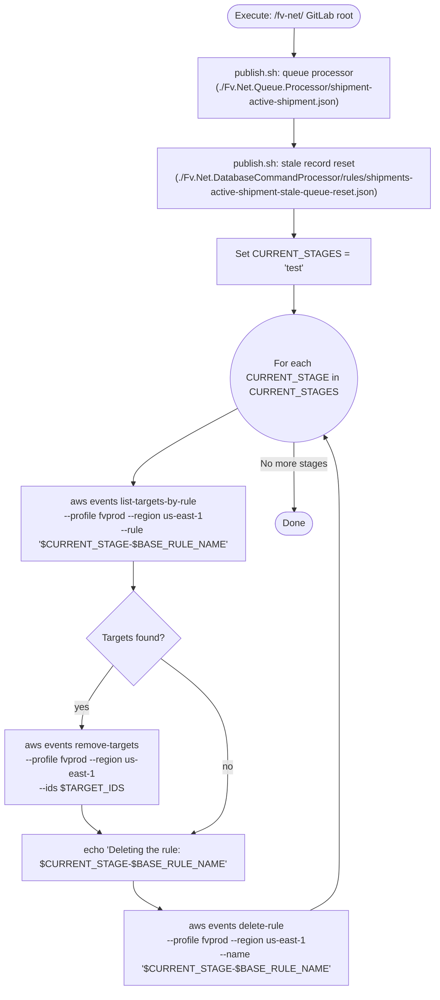
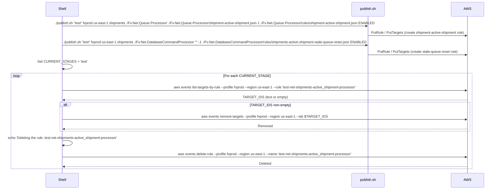

# Diagram: database/freightverify/releases/_archive/release.IA-11967/IA-11967-test.sh

> Auto-generated by Obscura crawlers

## Diagram 1

### SVG

<svg id="container" width="717.415771484375" xmlns="http://www.w3.org/2000/svg" class="flowchart" height="1690.53125" viewBox="0 0 717.415771484375 1690.53125" role="graphics-document document" aria-roledescription="flowchart-v2"><g><marker id="container_flowchart-v2-pointEnd" class="marker flowchart-v2" viewBox="0 0 10 10" refX="5" refY="5" markerUnits="userSpaceOnUse" markerWidth="8" markerHeight="8" orient="auto"><path d="M 0 0 L 10 5 L 0 10 z" class="arrowMarkerPath" style="stroke-width: 1; stroke-dasharray: 1, 0;"></path></marker><marker id="container_flowchart-v2-pointStart" class="marker flowchart-v2" viewBox="0 0 10 10" refX="4.5" refY="5" markerUnits="userSpaceOnUse" markerWidth="8" markerHeight="8" orient="auto"><path d="M 0 5 L 10 10 L 10 0 z" class="arrowMarkerPath" style="stroke-width: 1; stroke-dasharray: 1, 0;"></path></marker><marker id="container_flowchart-v2-circleEnd" class="marker flowchart-v2" viewBox="0 0 10 10" refX="11" refY="5" markerUnits="userSpaceOnUse" markerWidth="11" markerHeight="11" orient="auto"><circle cx="5" cy="5" r="5" class="arrowMarkerPath" style="stroke-width: 1; stroke-dasharray: 1, 0;"></circle></marker><marker id="container_flowchart-v2-circleStart" class="marker flowchart-v2" viewBox="0 0 10 10" refX="-1" refY="5" markerUnits="userSpaceOnUse" markerWidth="11" markerHeight="11" orient="auto"><circle cx="5" cy="5" r="5" class="arrowMarkerPath" style="stroke-width: 1; stroke-dasharray: 1, 0;"></circle></marker><marker id="container_flowchart-v2-crossEnd" class="marker cross flowchart-v2" viewBox="0 0 11 11" refX="12" refY="5.2" markerUnits="userSpaceOnUse" markerWidth="11" markerHeight="11" orient="auto"><path d="M 1,1 l 9,9 M 10,1 l -9,9" class="arrowMarkerPath" style="stroke-width: 2; stroke-dasharray: 1, 0;"></path></marker><marker id="container_flowchart-v2-crossStart" class="marker cross flowchart-v2" viewBox="0 0 11 11" refX="-1" refY="5.2" markerUnits="userSpaceOnUse" markerWidth="11" markerHeight="11" orient="auto"><path d="M 1,1 l 9,9 M 10,1 l -9,9" class="arrowMarkerPath" style="stroke-width: 2; stroke-dasharray: 1, 0;"></path></marker><g class="root"><g class="clusters"></g><g class="edgePaths"><path d="M475.541,71.5L475.457,75.583C475.374,79.667,475.207,87.833,475.124,95.417C475.041,103,475.041,110,475.041,113.5L475.041,117" id="L_Start_PublishQueue_0" class="edge-thickness-normal edge-pattern-solid edge-thickness-normal edge-pattern-solid flowchart-link" style=";" data-edge="true" data-et="edge" data-id="L_Start_PublishQueue_0" data-points="W3sieCI6NDc1LjU0MDc2MTk0NzYzMTg0LCJ5Ijo3MS41MDAwMDAwMDAwMDAwM30seyJ4Ijo0NzUuMDQwNzYxOTQ3NjMxODQsInkiOjk2fSx7IngiOjQ3NS4wNDA3NjE5NDc2MzE4NCwieSI6MTIxfV0=" marker-end="url(#container_flowchart-v2-pointEnd)"></path><path d="M475.041,223L475.041,227.167C475.041,231.333,475.041,239.667,475.041,247.333C475.041,255,475.041,262,475.041,265.5L475.041,269" id="L_PublishQueue_PublishStale_0" class="edge-thickness-normal edge-pattern-solid edge-thickness-normal edge-pattern-solid flowchart-link" style=";" data-edge="true" data-et="edge" data-id="L_PublishQueue_PublishStale_0" data-points="W3sieCI6NDc1LjA0MDc2MTk0NzYzMTg0LCJ5IjoyMjN9LHsieCI6NDc1LjA0MDc2MTk0NzYzMTg0LCJ5IjoyNDh9LHsieCI6NDc1LjA0MDc2MTk0NzYzMTg0LCJ5IjoyNzN9XQ==" marker-end="url(#container_flowchart-v2-pointEnd)"></path><path d="M475.041,375L475.041,379.167C475.041,383.333,475.041,391.667,475.041,399.333C475.041,407,475.041,414,475.041,417.5L475.041,421" id="L_PublishStale_SetStages_0" class="edge-thickness-normal edge-pattern-solid edge-thickness-normal edge-pattern-solid flowchart-link" style=";" data-edge="true" data-et="edge" data-id="L_PublishStale_SetStages_0" data-points="W3sieCI6NDc1LjA0MDc2MTk0NzYzMTg0LCJ5IjozNzV9LHsieCI6NDc1LjA0MDc2MTk0NzYzMTg0LCJ5Ijo0MDB9LHsieCI6NDc1LjA0MDc2MTk0NzYzMTg0LCJ5Ijo0MjV9XQ==" marker-end="url(#container_flowchart-v2-pointEnd)"></path><path d="M475.041,503L475.041,507.167C475.041,511.333,475.041,519.667,475.041,527.333C475.041,535,475.041,542,475.041,545.5L475.041,549" id="L_SetStages_Loop_0" class="edge-thickness-normal edge-pattern-solid edge-thickness-normal edge-pattern-solid flowchart-link" style=";" data-edge="true" data-et="edge" data-id="L_SetStages_Loop_0" data-points="W3sieCI6NDc1LjA0MDc2MTk0NzYzMTg0LCJ5Ijo1MDN9LHsieCI6NDc1LjA0MDc2MTk0NzYzMTg0LCJ5Ijo1Mjh9LHsieCI6NDc1LjA0MDc2MTk0NzYzMTg0LCJ5Ijo1NTN9XQ==" marker-end="url(#container_flowchart-v2-pointEnd)"></path><path d="M381.983,714.318L355.849,729.432C329.716,744.546,277.45,774.773,251.317,795.386C225.184,816,225.184,827,225.184,832.5L225.184,838" id="L_Loop_ListTargets_0" class="edge-thickness-normal edge-pattern-solid edge-thickness-normal edge-pattern-solid flowchart-link" style=";" data-edge="true" data-et="edge" data-id="L_Loop_ListTargets_0" data-points="W3sieCI6MzgxLjk4MjU1MTU2NTA3NDcsInkiOjcxNC4zMTgzOTM1MTM3MDI1fSx7IngiOjIyNS4xODM1OTM3NSwieSI6ODA1fSx7IngiOjIyNS4xODM1OTM3NSwieSI6ODQyfV0=" marker-end="url(#container_flowchart-v2-pointEnd)"></path><path d="M225.184,968L225.184,972.167C225.184,976.333,225.184,984.667,225.184,992.333C225.184,1000,225.184,1007,225.184,1010.5L225.184,1014" id="L_ListTargets_HasTargets_0" class="edge-thickness-normal edge-pattern-solid edge-thickness-normal edge-pattern-solid flowchart-link" style=";" data-edge="true" data-et="edge" data-id="L_ListTargets_HasTargets_0" data-points="W3sieCI6MjI1LjE4MzU5Mzc1LCJ5Ijo5Njh9LHsieCI6MjI1LjE4MzU5Mzc1LCJ5Ijo5OTN9LHsieCI6MjI1LjE4MzU5Mzc1LCJ5IjoxMDE4fV0=" marker-end="url(#container_flowchart-v2-pointEnd)"></path><path d="M190.956,1144.303L182.13,1156.175C173.304,1168.046,155.652,1191.789,146.826,1209.16C138,1226.531,138,1237.531,138,1243.031L138,1248.531" id="L_HasTargets_RemoveTargets_0" class="edge-thickness-normal edge-pattern-solid edge-thickness-normal edge-pattern-solid flowchart-link" style=";" data-edge="true" data-et="edge" data-id="L_HasTargets_RemoveTargets_0" data-points="W3sieCI6MTkwLjk1NTgwMDI0Mjc2ODMsInkiOjExNDQuMzAzNDU2NDkyNzY4Mn0seyJ4IjoxMzgsInkiOjEyMTUuNTMxMjV9LHsieCI6MTM4LCJ5IjoxMjUyLjUzMTI1fV0=" marker-end="url(#container_flowchart-v2-pointEnd)"></path><path d="M138,1378.531L138,1382.698C138,1386.865,138,1395.198,143.139,1403.137C148.277,1411.076,158.554,1418.62,163.693,1422.392L168.832,1426.164" id="L_RemoveTargets_Echo_0" class="edge-thickness-normal edge-pattern-solid edge-thickness-normal edge-pattern-solid flowchart-link" style=";" data-edge="true" data-et="edge" data-id="L_RemoveTargets_Echo_0" data-points="W3sieCI6MTM4LCJ5IjoxMzc4LjUzMTI1fSx7IngiOjEzOCwieSI6MTQwMy41MzEyNX0seyJ4IjoxNzIuMDU2MDkxMzA4NTkzNzUsInkiOjE0MjguNTMxMjV9XQ==" marker-end="url(#container_flowchart-v2-pointEnd)"></path><path d="M270.005,1133.71L287.249,1147.347C304.494,1160.984,338.983,1188.258,356.227,1218.561C373.472,1248.865,373.472,1282.198,373.472,1313.531C373.472,1344.865,373.472,1374.198,364.429,1392.767C355.387,1411.336,337.303,1419.141,328.261,1423.044L319.219,1426.946" id="L_HasTargets_Echo_0" class="edge-thickness-normal edge-pattern-solid edge-thickness-normal edge-pattern-solid flowchart-link" style=";" data-edge="true" data-et="edge" data-id="L_HasTargets_Echo_0" data-points="W3sieCI6MjcwLjAwNDc3NjQ3ODI3MzI0LCJ5IjoxMTMzLjcxMDA2NzI3MTcyNjh9LHsieCI6MzczLjQ3MTU1Mjg0ODgxNTksInkiOjEyMTUuNTMxMjV9LHsieCI6MzczLjQ3MTU1Mjg0ODgxNTksInkiOjEzMTUuNTMxMjV9LHsieCI6MzczLjQ3MTU1Mjg0ODgxNTksInkiOjE0MDMuNTMxMjV9LHsieCI6MzE1LjU0NjU2ODgyNTg0MDk1LCJ5IjoxNDI4LjUzMTI1fV0=" marker-end="url(#container_flowchart-v2-pointEnd)"></path><path d="M225.184,1506.531L225.184,1510.698C225.184,1514.865,225.184,1523.198,232.313,1531.214C239.443,1539.231,253.703,1546.931,260.833,1550.781L267.963,1554.631" id="L_Echo_DeleteRule_0" class="edge-thickness-normal edge-pattern-solid edge-thickness-normal edge-pattern-solid flowchart-link" style=";" data-edge="true" data-et="edge" data-id="L_Echo_DeleteRule_0" data-points="W3sieCI6MjI1LjE4MzU5Mzc1LCJ5IjoxNTA2LjUzMTI1fSx7IngiOjIyNS4xODM1OTM3NSwieSI6MTUzMS41MzEyNX0seyJ4IjoyNzEuNDgyMzMwMzU0Nzc3MiwieSI6MTU1Ni41MzEyNX1d" marker-end="url(#container_flowchart-v2-pointEnd)"></path><path d="M504.828,1556.531L512.544,1552.365C520.261,1548.198,535.694,1539.865,543.41,1525.031C551.127,1510.198,551.127,1488.865,551.127,1467.531C551.127,1446.198,551.127,1424.865,551.127,1399.531C551.127,1374.198,551.127,1344.865,551.127,1313.531C551.127,1282.198,551.127,1248.865,551.127,1212.654C551.127,1176.443,551.127,1137.354,551.127,1100.266C551.127,1063.177,551.127,1028.089,551.127,995.878C551.127,963.667,551.127,934.333,551.127,903C551.127,871.667,551.127,838.333,547.104,814.027C543.081,789.72,535.035,774.439,531.012,766.799L526.989,759.159" id="L_DeleteRule_Loop_0" class="edge-thickness-normal edge-pattern-solid edge-thickness-normal edge-pattern-solid flowchart-link" style=";" data-edge="true" data-et="edge" data-id="L_DeleteRule_Loop_0" data-points="W3sieCI6NTA0LjgyNzk2Mjg0Mjg1NDYsInkiOjE1NTYuNTMxMjV9LHsieCI6NTUxLjEyNjY5OTQ0NzYzMTgsInkiOjE1MzEuNTMxMjV9LHsieCI6NTUxLjEyNjY5OTQ0NzYzMTgsInkiOjE0NjcuNTMxMjV9LHsieCI6NTUxLjEyNjY5OTQ0NzYzMTgsInkiOjE0MDMuNTMxMjV9LHsieCI6NTUxLjEyNjY5OTQ0NzYzMTgsInkiOjEzMTUuNTMxMjV9LHsieCI6NTUxLjEyNjY5OTQ0NzYzMTgsInkiOjEyMTUuNTMxMjV9LHsieCI6NTUxLjEyNjY5OTQ0NzYzMTgsInkiOjEwOTguMjY1NjI1fSx7IngiOjU1MS4xMjY2OTk0NDc2MzE4LCJ5Ijo5OTN9LHsieCI6NTUxLjEyNjY5OTQ0NzYzMTgsInkiOjkwNX0seyJ4Ijo1NTEuMTI2Njk5NDQ3NjMxOCwieSI6ODA1fSx7IngiOjUyNS4xMjU2NzEwNzczODY0LCJ5Ijo3NTUuNjE5NjcxMzQ4NTkyNH1d" marker-end="url(#container_flowchart-v2-pointEnd)"></path><path d="M475.041,768L475.041,774.167C475.041,780.333,475.041,792.667,475.12,811.667C475.199,830.667,475.358,856.333,475.437,869.167L475.516,882" id="L_Loop_End_0" class="edge-thickness-normal edge-pattern-solid edge-thickness-normal edge-pattern-solid flowchart-link" style=";" data-edge="true" data-et="edge" data-id="L_Loop_End_0" data-points="W3sieCI6NDc1LjA0MDc2MTk0NzYzMTg0LCJ5Ijo3Njh9LHsieCI6NDc1LjA0MDc2MTk0NzYzMTg0LCJ5Ijo4MDV9LHsieCI6NDc1LjU0MDc2MTk0NzYzMTg0LCJ5Ijo4ODZ9XQ==" marker-end="url(#container_flowchart-v2-pointEnd)"></path></g><g class="edgeLabels"><g class="edgeLabel"><g class="label" data-id="L_Start_PublishQueue_0" transform="translate(0, 0)"><foreignObject width="0" height="0">

</foreignObject></g></g><g class="edgeLabel"><g class="label" data-id="L_PublishQueue_PublishStale_0" transform="translate(0, 0)"><foreignObject width="0" height="0">

</foreignObject></g></g><g class="edgeLabel"><g class="label" data-id="L_PublishStale_SetStages_0" transform="translate(0, 0)"><foreignObject width="0" height="0">

</foreignObject></g></g><g class="edgeLabel"><g class="label" data-id="L_SetStages_Loop_0" transform="translate(0, 0)"><foreignObject width="0" height="0">

</foreignObject></g></g><g class="edgeLabel"><g class="label" data-id="L_Loop_ListTargets_0" transform="translate(0, 0)"><foreignObject width="0" height="0">

</foreignObject></g></g><g class="edgeLabel"><g class="label" data-id="L_ListTargets_HasTargets_0" transform="translate(0, 0)"><foreignObject width="0" height="0">

</foreignObject></g></g><g class="edgeLabel" transform="translate(138, 1215.53125)"><g class="label" data-id="L_HasTargets_RemoveTargets_0" transform="translate(-12.0078125, -12)"><foreignObject width="24.015625" height="24">

yes

</foreignObject></g></g><g class="edgeLabel"><g class="label" data-id="L_RemoveTargets_Echo_0" transform="translate(0, 0)"><foreignObject width="0" height="0">

</foreignObject></g></g><g class="edgeLabel" transform="translate(373.4715528488159, 1315.53125)"><g class="label" data-id="L_HasTargets_Echo_0" transform="translate(-9.3671875, -12)"><foreignObject width="18.734375" height="24">

no

</foreignObject></g></g><g class="edgeLabel"><g class="label" data-id="L_Echo_DeleteRule_0" transform="translate(0, 0)"><foreignObject width="0" height="0">

</foreignObject></g></g><g class="edgeLabel"><g class="label" data-id="L_DeleteRule_Loop_0" transform="translate(0, 0)"><foreignObject width="0" height="0">

</foreignObject></g></g><g class="edgeLabel" transform="translate(475.04076194763184, 805)"><g class="label" data-id="L_Loop_End_0" transform="translate(-56.0859375, -12)"><foreignObject width="112.171875" height="24">

No more stages

</foreignObject></g></g></g><g class="nodes"><g class="node default" id="flowchart-Start-0" transform="translate(475.04076194763184, 39.5)"><g class="basic label-container outer-path"><path d="M-83.875 -31.5 C-22.875429846319093 -31.5, 38.12414030736181 -31.5, 83.875 -31.5 C83.875 -31.5, 83.875 -31.5, 83.875 -31.5 C84.33600798474198 -31.48521637122693, 84.79701596948398 -31.470432742453863, 85.89321192939245 -31.435279871635593 C86.31548395863136 -31.394543796831332, 86.73775598787026 -31.353807722027074, 87.90313059306193 -31.241385435432253 C88.48939478030513 -31.146602788185447, 89.07565896754832 -31.051820140938645, 89.89649680409322 -30.91911344521856 C90.42282041490901 -30.798983515632393, 90.9491440257248 -30.678853586046227, 91.86511939314947 -30.469788185729428 C92.4649726259494 -30.291754894928278, 93.06482585874934 -30.113721604127132, 93.80090886774406 -29.895256030836062 C94.52443608591801 -29.628991326335758, 95.24796330409198 -29.36272662183545, 95.69591065370028 -29.197877856399685 C96.09236056085462 -29.022381242771115, 96.48881046800895 -28.846884629142544, 97.54233778220308 -28.380519338926202 C97.99558279245512 -28.144061707394993, 98.44882780270717 -27.907604075863784, 99.33260288812403 -27.44653917988677 C99.99353072967939 -27.045880838292792, 100.65445857123476 -26.64522249669881, 101.05934938813228 -26.399775304092984 C101.67862511381698 -25.96779536586943, 102.29790083950168 -25.535815427645883, 102.7154817104733 -25.244529088840633 C103.21353937014679 -24.84734135912197, 103.7115970298203 -24.450153629403307, 104.29419445219533 -23.985547688627737 C104.81243289827673 -23.514897243734517, 105.33067134435811 -23.044246798841293, 105.78900034400982 -22.62800452807842 C106.1233301690513 -22.28278153473397, 106.4576599940928 -21.937558541389517, 107.19375690787243 -21.177478043231485 C107.69927360724898 -20.58366936342873, 108.20479030662553 -19.98986068362597, 108.50269169774293 -19.63992875855011 C108.97278569590351 -19.010045627459192, 109.44287969406409 -18.380162496368275, 109.7104260198041 -18.02167479384835 C110.01396061560231 -17.555364144250785, 110.31749521140053 -17.089053494653218, 110.8119970346684 -16.329365901781543 C111.03660629334115 -15.930549418854344, 111.2612155520139 -15.531732935927145, 111.8028781507495 -14.56995614258631 C112.08969162082138 -13.974381835156903, 112.37650509089326 -13.378807527727496, 112.67899762499809 -12.750675308355413 C112.8452699178335 -12.339979530395853, 113.01154221066892 -11.929283752436293, 113.43675529456745 -10.878999214271206 C113.63636810127942 -10.27779724443644, 113.83598090799138 -9.676595274601674, 114.07303737065482 -8.962618978877531 C114.24676879502103 -8.300105762093576, 114.42050021938722 -7.63759254530962, 114.58522923372745 -7.009409419623907 C114.73102026153866 -6.2608033047579905, 114.87681128934986 -5.512197189892074, 114.97122617755518 -5.027396693551458 C115.06343986548286 -4.312205539636731, 115.15565355341053 -3.5970143857220043, 115.22944205789975 -3.024725316091981 C115.26929115018622 -2.4040435381218708, 115.30914024247268 -1.7833617601517602, 115.35881581032167 -1.0096246935071378 C115.35881581032167 -0.22006234407777103, 115.35881581032167 0.5695000053515957, 115.35881581032167 1.00962469350713 C115.31358861506972 1.714074766291135, 115.26836141981778 2.4185248390751406, 115.22944205789975 3.02472531609196 C115.14040628372713 3.715269198472456, 115.05137050955453 4.405813080852952, 114.97122617755518 5.027396693551435 C114.84928812032213 5.653522845825652, 114.72735006308908 6.2796489980998675, 114.58522923372745 7.0094094196239 C114.42744760430058 7.6110991556193, 114.26966597487372 8.2127888916147, 114.07303737065482 8.96261897887751 C113.8187463155391 9.728503121108552, 113.5644552604234 10.494387263339595, 113.43675529456746 10.878999214271184 C113.27473283555805 11.279197820515556, 113.11271037654865 11.679396426759928, 112.67899762499809 12.750675308355405 C112.432854349291 13.26179708698357, 112.18671107358392 13.772918865611738, 111.8028781507495 14.569956142586303 C111.4950021774758 15.116621108956664, 111.18712620420209 15.663286075327026, 110.81199703466841 16.329365901781536 C110.49783893137666 16.811997111700368, 110.1836808280849 17.294628321619204, 109.71042601980412 18.021674793848334 C109.41598361528598 18.41620079164775, 109.12154121076786 18.81072678944717, 108.50269169774295 19.639928758550102 C108.11373530579449 20.096819068778444, 107.72477891384602 20.55370937900679, 107.19375690787246 21.177478043231467 C106.79825515324215 21.585866076185194, 106.40275339861185 21.994254109138918, 105.78900034400982 22.628004528078414 C105.31507154608994 23.058414122880407, 104.84114274817004 23.488823717682397, 104.29419445219536 23.985547688627715 C103.78119878475827 24.39464808202075, 103.2682031173212 24.80374847541379, 102.71548171047331 25.24452908884063 C102.31092878626743 25.526727695952818, 101.90637586206155 25.80892630306501, 101.05934938813229 26.399775304092973 C100.42540532389229 26.784075921304105, 99.7914612596523 27.168376538515236, 99.33260288812404 27.446539179886766 C98.67705358111502 27.788538833454005, 98.021504274106 28.130538487021244, 97.54233778220309 28.3805193389262 C97.0584618580006 28.59471685690134, 96.57458593379809 28.80891437487648, 95.6959106537003 29.197877856399682 C95.10017564101443 29.41711384798217, 94.50444062832857 29.636349839564655, 93.80090886774407 29.895256030836055 C93.28554117531836 30.048214456727784, 92.77017348289266 30.201172882619517, 91.86511939314951 30.46978818572942 C91.34998402061137 30.587364472938788, 90.83484864807325 30.704940760148155, 89.89649680409323 30.919113445218557 C89.34538056318654 31.008213645078072, 88.79426432227983 31.097313844937588, 87.90313059306196 31.24138543543225 C87.2254756900825 31.30675798892342, 86.54782078710303 31.372130542414588, 85.89321192939245 31.435279871635593 C85.46527904897648 31.44900284618971, 85.03734616856053 31.46272582074383, 83.875 31.5 C83.875 31.5, 83.875 31.5, 83.875 31.5 C35.399491750506805 31.5, -13.076016498986391 31.5, -83.875 31.5 C-84.60842030299779 31.47648063839888, -85.34184060599556 31.452961276797758, -85.89321192939244 31.435279871635593 C-86.30480794576016 31.395573698953232, -86.71640396212787 31.35586752627087, -87.90313059306195 31.24138543543225 C-88.58887781537084 31.130519142578482, -89.27462503767973 31.019652849724714, -89.89649680409323 30.919113445218557 C-90.50152050654064 30.78102073328357, -91.10654420898804 30.642928021348578, -91.86511939314947 30.469788185729428 C-92.32577283822027 30.333068661251687, -92.78642628329109 30.196349136773946, -93.80090886774403 29.89525603083607 C-94.18992187694666 29.752095647452666, -94.57893488614927 29.608935264069267, -95.69591065370028 29.197877856399685 C-96.43125556667722 28.872362476656612, -97.16660047965416 28.54684709691354, -97.54233778220308 28.380519338926206 C-98.01424716633677 28.134324515496044, -98.48615655047047 27.88812969206588, -99.33260288812403 27.446539179886773 C-99.74053917423201 27.1992458059484, -100.14847546034 26.951952432010025, -101.05934938813226 26.399775304092994 C-101.51897535090086 26.079160129352868, -101.97860131366946 25.75854495461274, -102.7154817104733 25.244529088840636 C-103.10211133216266 24.936202254189702, -103.48874095385202 24.627875419538768, -104.29419445219533 23.98554768862774 C-104.77210867651051 23.55151863502214, -105.2500229008257 23.117489581416546, -105.7890003440098 22.628004528078435 C-106.2214035979091 22.181512667460044, -106.65380685180838 21.735020806841657, -107.19375690787244 21.177478043231478 C-107.7034775660693 20.57873115418636, -108.21319822426614 19.979984265141248, -108.50269169774293 19.639928758550113 C-108.84221963903728 19.18499224884746, -109.18174758033163 18.73005573914481, -109.7104260198041 18.021674793848355 C-110.14755602457859 17.350125720672903, -110.58468602935307 16.67857664749745, -110.8119970346684 16.329365901781557 C-111.10780165687773 15.804134841582853, -111.40360627908706 15.27890378138415, -111.8028781507495 14.569956142586314 C-112.11687472046381 13.917935547124236, -112.43087129017812 13.265914951662158, -112.67899762499809 12.750675308355417 C-112.92630042785623 12.139832604021379, -113.17360323071438 11.528989899687339, -113.43675529456745 10.878999214271209 C-113.67241300295782 10.16923574355624, -113.90807071134822 9.45947227284127, -114.07303737065482 8.962618978877522 C-114.26293472662667 8.238458058522157, -114.4528320825985 7.514297138166791, -114.58522923372743 7.009409419623911 C-114.67125954223935 6.567661967927323, -114.75728985075129 6.125914516230735, -114.97122617755518 5.027396693551461 C-115.05591745833746 4.370547843989118, -115.14060873911974 3.7136989944267746, -115.22944205789975 3.024725316091999 C-115.27421337375897 2.3273759328289603, -115.31898468961819 1.6300265495659214, -115.35881581032167 1.0096246935071416 C-115.35881581032167 0.45159172949528625, -115.35881581032167 -0.10644123451656906, -115.35881581032167 -1.0096246935071262 C-115.3218858739184 -1.5848382622962283, -115.28495593751512 -2.1600518310853305, -115.22944205789975 -3.024725316091956 C-115.14099231669027 -3.7107240425356114, -115.05254257548081 -4.3967227689792665, -114.97122617755518 -5.027396693551446 C-114.86063461954231 -5.595260970413488, -114.75004306152944 -6.16312524727553, -114.58522923372745 -7.009409419623896 C-114.38507864638798 -7.772670354962564, -114.18492805904852 -8.535931290301232, -114.07303737065482 -8.962618978877506 C-113.93496514937823 -9.378470510541629, -113.79689292810164 -9.794322042205751, -113.43675529456746 -10.878999214271168 C-113.16645874992159 -11.546636905374669, -112.8961622052757 -12.21427459647817, -112.67899762499809 -12.750675308355401 C-112.5002017736523 -13.121948719293309, -112.32140592230651 -13.493222130231215, -111.8028781507495 -14.5699561425863 C-111.4897553443943 -15.125937392392313, -111.1766325380391 -15.681918642198324, -110.8119970346684 -16.329365901781546 C-110.50378314446847 -16.80286520414662, -110.19556925426856 -17.276364506511694, -109.71042601980412 -18.021674793848344 C-109.41652381646904 -18.415476971275808, -109.12262161313396 -18.809279148703276, -108.50269169774295 -19.639928758550102 C-108.2220914963182 -19.969537721747393, -107.94149129489344 -20.299146684944684, -107.19375690787246 -21.177478043231467 C-106.79431318836686 -21.589936478560272, -106.39486946886126 -22.002394913889077, -105.78900034400984 -22.628004528078403 C-105.28314063044222 -23.087412935625935, -104.77728091687459 -23.54682134317347, -104.29419445219536 -23.98554768862771 C-103.90231080197272 -24.298064471218364, -103.51042715175008 -24.61058125380902, -102.71548171047331 -25.244529088840626 C-102.35870239949931 -25.493402891448646, -102.0019230885253 -25.74227669405667, -101.0593493881323 -26.39977530409297 C-100.44802561652624 -26.77036336697781, -99.83670184492017 -27.140951429862653, -99.33260288812404 -27.446539179886763 C-98.9660223789157 -27.637783996734736, -98.59944186970735 -27.82902881358271, -97.54233778220309 -28.3805193389262 C-97.03121599324231 -28.606777793009968, -96.52009420428153 -28.833036247093737, -95.6959106537003 -29.19787785639968 C-95.11631059062873 -29.411176037374265, -94.53671052755716 -29.624474218348855, -93.80090886774407 -29.895256030836055 C-93.12720345685815 -30.09520826043513, -92.45349804597224 -30.295160490034206, -91.86511939314951 -30.469788185729417 C-91.42300512742081 -30.570697881816788, -90.9808908616921 -30.671607577904155, -89.89649680409325 -30.919113445218553 C-89.3692795912929 -31.004349835553565, -88.84206237849254 -31.089586225888578, -87.90313059306196 -31.24138543543225 C-87.35537474338008 -31.29422678347827, -86.80761889369822 -31.34706813152429, -85.89321192939246 -31.435279871635593 C-85.30268909676994 -31.454216789494833, -84.71216626414741 -31.473153707354072, -83.87500000000001 -31.5 C-83.87500000000001 -31.5, -83.875 -31.5, -83.875 -31.5" stroke="none" stroke-width="0" fill="#ECECFF" style=""></path><path d="M-83.875 -31.5 C-24.29351255792234 -31.5, 35.28797488415532 -31.5, 83.875 -31.5 M-83.875 -31.5 C-26.553433105701423 -31.5, 30.768133788597154 -31.5, 83.875 -31.5 M83.875 -31.5 C83.875 -31.5, 83.875 -31.5, 83.875 -31.5 M83.875 -31.5 C83.875 -31.5, 83.875 -31.5, 83.875 -31.5 M83.875 -31.5 C84.63274841620215 -31.475700483160214, 85.3904968324043 -31.451400966320428, 85.89321192939245 -31.435279871635593 M83.875 -31.5 C84.34227494245957 -31.48501540209082, 84.80954988491914 -31.470030804181643, 85.89321192939245 -31.435279871635593 M85.89321192939245 -31.435279871635593 C86.47263658764332 -31.379383471714238, 87.05206124589418 -31.323487071792883, 87.90313059306193 -31.241385435432253 M85.89321192939245 -31.435279871635593 C86.63967611126404 -31.363269369764968, 87.38614029313561 -31.291258867894342, 87.90313059306193 -31.241385435432253 M87.90313059306193 -31.241385435432253 C88.37199956650075 -31.16558233593986, 88.84086853993955 -31.08977923644747, 89.89649680409322 -30.91911344521856 M87.90313059306193 -31.241385435432253 C88.65327563859249 -31.120107801932587, 89.40342068412303 -30.998830168432917, 89.89649680409322 -30.91911344521856 M89.89649680409322 -30.91911344521856 C90.466162860307 -30.78909088530619, 91.03582891652079 -30.65906832539382, 91.86511939314947 -30.469788185729428 M89.89649680409322 -30.91911344521856 C90.60205722479002 -30.758073883406546, 91.30761764548681 -30.597034321594535, 91.86511939314947 -30.469788185729428 M91.86511939314947 -30.469788185729428 C92.52567571296868 -30.273738537337966, 93.18623203278787 -30.077688888946508, 93.80090886774406 -29.895256030836062 M91.86511939314947 -30.469788185729428 C92.30290394072219 -30.33985602998783, 92.74068848829491 -30.20992387424623, 93.80090886774406 -29.895256030836062 M93.80090886774406 -29.895256030836062 C94.5247395272212 -29.628879657131204, 95.24857018669834 -29.362503283426346, 95.69591065370028 -29.197877856399685 M93.80090886774406 -29.895256030836062 C94.23515715633894 -29.735448646485963, 94.66940544493384 -29.575641262135868, 95.69591065370028 -29.197877856399685 M95.69591065370028 -29.197877856399685 C96.23964178654144 -28.95718421310189, 96.7833729193826 -28.716490569804094, 97.54233778220308 -28.380519338926202 M95.69591065370028 -29.197877856399685 C96.15571754271136 -28.994334986321224, 96.61552443172243 -28.790792116242766, 97.54233778220308 -28.380519338926202 M97.54233778220308 -28.380519338926202 C97.94727913971508 -28.169261692089506, 98.3522204972271 -27.958004045252814, 99.33260288812403 -27.44653917988677 M97.54233778220308 -28.380519338926202 C98.17992629058651 -28.0478898224975, 98.81751479896992 -27.715260306068796, 99.33260288812403 -27.44653917988677 M99.33260288812403 -27.44653917988677 C99.78299486855153 -27.173508914554557, 100.23338684897902 -26.90047864922234, 101.05934938813228 -26.399775304092984 M99.33260288812403 -27.44653917988677 C99.84818669501018 -27.13398924624562, 100.36377050189634 -26.821439312604472, 101.05934938813228 -26.399775304092984 M101.05934938813228 -26.399775304092984 C101.43165682218115 -26.14006975502955, 101.80396425623002 -25.880364205966117, 102.7154817104733 -25.244529088840633 M101.05934938813228 -26.399775304092984 C101.40458642086818 -26.15895289512669, 101.7498234536041 -25.918130486160393, 102.7154817104733 -25.244529088840633 M102.7154817104733 -25.244529088840633 C103.03871444228439 -24.986759586805523, 103.36194717409549 -24.728990084770412, 104.29419445219533 -23.985547688627737 M102.7154817104733 -25.244529088840633 C103.21506240637953 -24.84612677825606, 103.71464310228576 -24.447724467671488, 104.29419445219533 -23.985547688627737 M104.29419445219533 -23.985547688627737 C104.87380695320334 -23.459158950918663, 105.45341945421136 -22.93277021320959, 105.78900034400982 -22.62800452807842 M104.29419445219533 -23.985547688627737 C104.69963097822549 -23.617340962949786, 105.10506750425566 -23.249134237271836, 105.78900034400982 -22.62800452807842 M105.78900034400982 -22.62800452807842 C106.30533001739872 -22.094851748849827, 106.82165969078761 -21.561698969621233, 107.19375690787243 -21.177478043231485 M105.78900034400982 -22.62800452807842 C106.26769697487028 -22.133710954990697, 106.74639360573072 -21.639417381902977, 107.19375690787243 -21.177478043231485 M107.19375690787243 -21.177478043231485 C107.69298113563997 -20.59106085863245, 108.19220536340751 -20.004643674033414, 108.50269169774293 -19.63992875855011 M107.19375690787243 -21.177478043231485 C107.53072789724446 -20.781652744922617, 107.8676988866165 -20.385827446613753, 108.50269169774293 -19.63992875855011 M108.50269169774293 -19.63992875855011 C108.96391875663271 -19.02192651828729, 109.42514581552247 -18.403924278024473, 109.7104260198041 -18.02167479384835 M108.50269169774293 -19.63992875855011 C108.83439510561 -19.195476410810354, 109.16609851347707 -18.7510240630706, 109.7104260198041 -18.02167479384835 M109.7104260198041 -18.02167479384835 C110.1084928683996 -17.410137218489997, 110.50655971699507 -16.798599643131645, 110.8119970346684 -16.329365901781543 M109.7104260198041 -18.02167479384835 C110.11469896358774 -17.400602989711082, 110.5189719073714 -16.779531185573813, 110.8119970346684 -16.329365901781543 M110.8119970346684 -16.329365901781543 C111.16473928714665 -15.703036313480117, 111.5174815396249 -15.07670672517869, 111.8028781507495 -14.56995614258631 M110.8119970346684 -16.329365901781543 C111.16410737045827 -15.704158345548825, 111.51621770624816 -15.078950789316105, 111.8028781507495 -14.56995614258631 M111.8028781507495 -14.56995614258631 C111.98827850923242 -14.18496833126438, 112.17367886771531 -13.799980519942453, 112.67899762499809 -12.750675308355413 M111.8028781507495 -14.56995614258631 C112.03648421383298 -14.084868154224443, 112.27009027691646 -13.599780165862578, 112.67899762499809 -12.750675308355413 M112.67899762499809 -12.750675308355413 C112.93029481037127 -12.129966401983097, 113.18159199574445 -11.509257495610779, 113.43675529456745 -10.878999214271206 M112.67899762499809 -12.750675308355413 C112.9148993087509 -12.167993588637172, 113.15080099250372 -11.58531186891893, 113.43675529456745 -10.878999214271206 M113.43675529456745 -10.878999214271206 C113.58207731909391 -10.441312430317728, 113.72739934362039 -10.003625646364252, 114.07303737065482 -8.962618978877531 M113.43675529456745 -10.878999214271206 C113.57422073000508 -10.464975224875815, 113.71168616544273 -10.050951235480426, 114.07303737065482 -8.962618978877531 M114.07303737065482 -8.962618978877531 C114.17682919038492 -8.566815786587403, 114.28062101011503 -8.171012594297276, 114.58522923372745 -7.009409419623907 M114.07303737065482 -8.962618978877531 C114.19936450671085 -8.480878858568769, 114.32569164276688 -7.9991387382600045, 114.58522923372745 -7.009409419623907 M114.58522923372745 -7.009409419623907 C114.69160919816879 -6.463170785631058, 114.79798916261014 -5.91693215163821, 114.97122617755518 -5.027396693551458 M114.58522923372745 -7.009409419623907 C114.70698745541176 -6.384206684884207, 114.82874567709608 -5.759003950144507, 114.97122617755518 -5.027396693551458 M114.97122617755518 -5.027396693551458 C115.04343516086726 -4.467358078259537, 115.11564414417934 -3.9073194629676165, 115.22944205789975 -3.024725316091981 M114.97122617755518 -5.027396693551458 C115.0399815015579 -4.494143977860735, 115.10873682556063 -3.9608912621700116, 115.22944205789975 -3.024725316091981 M115.22944205789975 -3.024725316091981 C115.27852347127559 -2.2602426849593673, 115.32760488465144 -1.495760053826753, 115.35881581032167 -1.0096246935071378 M115.22944205789975 -3.024725316091981 C115.26450963886167 -2.478519436568114, 115.2995772198236 -1.932313557044247, 115.35881581032167 -1.0096246935071378 M115.35881581032167 -1.0096246935071378 C115.35881581032167 -0.2352977509431059, 115.35881581032167 0.539029191620926, 115.35881581032167 1.00962469350713 M115.35881581032167 -1.0096246935071378 C115.35881581032167 -0.210163772999733, 115.35881581032167 0.5892971475076718, 115.35881581032167 1.00962469350713 M115.35881581032167 1.00962469350713 C115.31640977956918 1.6701328520091567, 115.27400374881668 2.330641010511183, 115.22944205789975 3.02472531609196 M115.35881581032167 1.00962469350713 C115.308912703605 1.7869058616819946, 115.25900959688833 2.564187029856859, 115.22944205789975 3.02472531609196 M115.22944205789975 3.02472531609196 C115.17512241737427 3.446017721381235, 115.1208027768488 3.86731012667051, 114.97122617755518 5.027396693551435 M115.22944205789975 3.02472531609196 C115.1394034555069 3.723046936117788, 115.04936485311404 4.421368556143616, 114.97122617755518 5.027396693551435 M114.97122617755518 5.027396693551435 C114.82139613477325 5.796742296645892, 114.67156609199132 6.566087899740349, 114.58522923372745 7.0094094196239 M114.97122617755518 5.027396693551435 C114.82834914036351 5.761040082458116, 114.68547210317186 6.494683471364796, 114.58522923372745 7.0094094196239 M114.58522923372745 7.0094094196239 C114.43104290476258 7.59738871674463, 114.27685657579771 8.18536801386536, 114.07303737065482 8.96261897887751 M114.58522923372745 7.0094094196239 C114.47077654362704 7.445867131086401, 114.35632385352665 7.882324842548902, 114.07303737065482 8.96261897887751 M114.07303737065482 8.96261897887751 C113.82058024811549 9.722979608385971, 113.56812312557615 10.483340237894435, 113.43675529456746 10.878999214271184 M114.07303737065482 8.96261897887751 C113.83711709967315 9.673173246283747, 113.6011968286915 10.383727513689987, 113.43675529456746 10.878999214271184 M113.43675529456746 10.878999214271184 C113.24895102450598 11.34287939227158, 113.06114675444451 11.806759570271975, 112.67899762499809 12.750675308355405 M113.43675529456746 10.878999214271184 C113.15535930760682 11.57405274248528, 112.87396332064617 12.269106270699377, 112.67899762499809 12.750675308355405 M112.67899762499809 12.750675308355405 C112.33147362037676 13.472316339774125, 111.9839496157554 14.193957371192845, 111.8028781507495 14.569956142586303 M112.67899762499809 12.750675308355405 C112.47334631603891 13.17771465164224, 112.26769500707974 13.604753994929075, 111.8028781507495 14.569956142586303 M111.8028781507495 14.569956142586303 C111.52157140352155 15.069444757686558, 111.24026465629358 15.568933372786814, 110.81199703466841 16.329365901781536 M111.8028781507495 14.569956142586303 C111.45751041137747 15.18319153611724, 111.11214267200542 15.796426929648177, 110.81199703466841 16.329365901781536 M110.81199703466841 16.329365901781536 C110.4635882676859 16.864615328720358, 110.11517950070339 17.39986475565918, 109.71042601980412 18.021674793848334 M110.81199703466841 16.329365901781536 C110.48431595009043 16.83277204238493, 110.15663486551246 17.336178182988327, 109.71042601980412 18.021674793848334 M109.71042601980412 18.021674793848334 C109.24088822467678 18.650812663545842, 108.77135042954946 19.27995053324335, 108.50269169774295 19.639928758550102 M109.71042601980412 18.021674793848334 C109.42165138835321 18.408606492082416, 109.1328767569023 18.7955381903165, 108.50269169774295 19.639928758550102 M108.50269169774295 19.639928758550102 C108.0355559955578 20.18865293511124, 107.56842029337264 20.737377111672373, 107.19375690787246 21.177478043231467 M108.50269169774295 19.639928758550102 C108.22987306294081 19.960397050808776, 107.95705442813869 20.28086534306745, 107.19375690787246 21.177478043231467 M107.19375690787246 21.177478043231467 C106.88979640880933 21.491342214135226, 106.58583590974621 21.805206385038986, 105.78900034400982 22.628004528078414 M107.19375690787246 21.177478043231467 C106.87790394688744 21.50362215745886, 106.56205098590243 21.82976627168625, 105.78900034400982 22.628004528078414 M105.78900034400982 22.628004528078414 C105.27819203626316 23.091907117926716, 104.76738372851652 23.55580970777502, 104.29419445219536 23.985547688627715 M105.78900034400982 22.628004528078414 C105.42926994458706 22.95470215888937, 105.06953954516429 23.281399789700327, 104.29419445219536 23.985547688627715 M104.29419445219536 23.985547688627715 C103.76266157419856 24.409431014146243, 103.23112869620175 24.83331433966477, 102.71548171047331 25.24452908884063 M104.29419445219536 23.985547688627715 C103.92199337698946 24.28236814141783, 103.54979230178358 24.579188594207945, 102.71548171047331 25.24452908884063 M102.71548171047331 25.24452908884063 C102.12797348758953 25.654349392303292, 101.54046526470574 26.06416969576595, 101.05934938813229 26.399775304092973 M102.71548171047331 25.24452908884063 C102.2580334770259 25.563625173878673, 101.80058524357851 25.882721258916714, 101.05934938813229 26.399775304092973 M101.05934938813229 26.399775304092973 C100.61179423186331 26.671085869949263, 100.16423907559435 26.942396435805552, 99.33260288812404 27.446539179886766 M101.05934938813229 26.399775304092973 C100.44406989175405 26.772761350581128, 99.82879039537582 27.14574739706928, 99.33260288812404 27.446539179886766 M99.33260288812404 27.446539179886766 C98.71406935910326 27.769227725787275, 98.09553583008248 28.091916271687783, 97.54233778220309 28.3805193389262 M99.33260288812404 27.446539179886766 C98.86032188753916 27.692927875381482, 98.38804088695427 27.9393165708762, 97.54233778220309 28.3805193389262 M97.54233778220309 28.3805193389262 C96.82216899541717 28.699316697788294, 96.10200020863125 29.01811405665039, 95.6959106537003 29.197877856399682 M97.54233778220309 28.3805193389262 C96.96381812441419 28.636612830253434, 96.38529846662529 28.892706321580672, 95.6959106537003 29.197877856399682 M95.6959106537003 29.197877856399682 C95.1798493956969 29.387793169762904, 94.66378813769352 29.577708483126127, 93.80090886774407 29.895256030836055 M95.6959106537003 29.197877856399682 C94.96854644777203 29.4655546078623, 94.24118224184376 29.733231359324915, 93.80090886774407 29.895256030836055 M93.80090886774407 29.895256030836055 C93.2480982562958 30.059327318551787, 92.69528764484755 30.223398606267516, 91.86511939314951 30.46978818572942 M93.80090886774407 29.895256030836055 C93.23565790409745 30.06301954978352, 92.67040694045083 30.230783068730982, 91.86511939314951 30.46978818572942 M91.86511939314951 30.46978818572942 C91.08807423473468 30.647143672444066, 90.31102907631984 30.824499159158712, 89.89649680409323 30.919113445218557 M91.86511939314951 30.46978818572942 C91.34514568429755 30.588468791629325, 90.82517197544558 30.70714939752923, 89.89649680409323 30.919113445218557 M89.89649680409323 30.919113445218557 C89.32074013598871 31.01219731825805, 88.74498346788418 31.105281191297543, 87.90313059306196 31.24138543543225 M89.89649680409323 30.919113445218557 C89.44848065668332 30.991545221514677, 89.0004645092734 31.0639769978108, 87.90313059306196 31.24138543543225 M87.90313059306196 31.24138543543225 C87.21656743093328 31.307617357969797, 86.5300042688046 31.37384928050734, 85.89321192939245 31.435279871635593 M87.90313059306196 31.24138543543225 C87.21564725512287 31.30770612622355, 86.52816391718379 31.374026817014855, 85.89321192939245 31.435279871635593 M85.89321192939245 31.435279871635593 C85.47474702673104 31.448699226571424, 85.05628212406961 31.462118581507255, 83.875 31.5 M85.89321192939245 31.435279871635593 C85.18898066323047 31.457863197638403, 84.48474939706847 31.480446523641216, 83.875 31.5 M83.875 31.5 C83.875 31.5, 83.875 31.5, 83.875 31.5 M83.875 31.5 C83.875 31.5, 83.875 31.5, 83.875 31.5 M83.875 31.5 C33.35430806345457 31.5, -17.166383873090865 31.5, -83.875 31.5 M83.875 31.5 C46.064577095103296 31.5, 8.254154190206592 31.5, -83.875 31.5 M-83.875 31.5 C-84.65392009334815 31.47502154868231, -85.4328401866963 31.450043097364624, -85.89321192939244 31.435279871635593 M-83.875 31.5 C-84.33223027481137 31.48533751503154, -84.78946054962272 31.47067503006308, -85.89321192939244 31.435279871635593 M-85.89321192939244 31.435279871635593 C-86.6933267612206 31.358093756088003, -87.49344159304877 31.28090764054041, -87.90313059306195 31.24138543543225 M-85.89321192939244 31.435279871635593 C-86.47927233739227 31.37874332891661, -87.06533274539211 31.32220678619763, -87.90313059306195 31.24138543543225 M-87.90313059306195 31.24138543543225 C-88.45725440624035 31.151798994611916, -89.01137821941876 31.062212553791586, -89.89649680409323 30.919113445218557 M-87.90313059306195 31.24138543543225 C-88.4159929515277 31.1584698266225, -88.92885530999344 31.075554217812748, -89.89649680409323 30.919113445218557 M-89.89649680409323 30.919113445218557 C-90.40763599223169 30.802449261020875, -90.91877518037015 30.685785076823194, -91.86511939314947 30.469788185729428 M-89.89649680409323 30.919113445218557 C-90.52948416612567 30.774638210463216, -91.16247152815812 30.630162975707876, -91.86511939314947 30.469788185729428 M-91.86511939314947 30.469788185729428 C-92.29099053323803 30.343391866794377, -92.71686167332659 30.216995547859323, -93.80090886774403 29.89525603083607 M-91.86511939314947 30.469788185729428 C-92.38720189296615 30.314836840250805, -92.90928439278281 30.159885494772183, -93.80090886774403 29.89525603083607 M-93.80090886774403 29.89525603083607 C-94.5028478407966 29.636936000099986, -95.20478681384917 29.3786159693639, -95.69591065370028 29.197877856399685 M-93.80090886774403 29.89525603083607 C-94.34834732095256 29.693793619589744, -94.89578577416108 29.49233120834342, -95.69591065370028 29.197877856399685 M-95.69591065370028 29.197877856399685 C-96.26379431312097 28.946492606044377, -96.83167797254166 28.695107355689068, -97.54233778220308 28.380519338926206 M-95.69591065370028 29.197877856399685 C-96.41077418882861 28.881428975071707, -97.12563772395694 28.56498009374373, -97.54233778220308 28.380519338926206 M-97.54233778220308 28.380519338926206 C-97.94253960584274 28.1717343038749, -98.34274142948239 27.96294926882359, -99.33260288812403 27.446539179886773 M-97.54233778220308 28.380519338926206 C-97.98101393580991 28.15166227057501, -98.41969008941673 27.922805202223813, -99.33260288812403 27.446539179886773 M-99.33260288812403 27.446539179886773 C-99.92124850150347 27.08969874979056, -100.5098941148829 26.73285831969435, -101.05934938813226 26.399775304092994 M-99.33260288812403 27.446539179886773 C-99.72764913237589 27.207059825071873, -100.12269537662776 26.967580470256973, -101.05934938813226 26.399775304092994 M-101.05934938813226 26.399775304092994 C-101.66595634990996 25.976632547149016, -102.27256331168766 25.553489790205038, -102.7154817104733 25.244529088840636 M-101.05934938813226 26.399775304092994 C-101.56364520646149 26.04800037184065, -102.06794102479073 25.696225439588307, -102.7154817104733 25.244529088840636 M-102.7154817104733 25.244529088840636 C-103.25808686205711 24.811815919782042, -103.80069201364093 24.379102750723447, -104.29419445219533 23.98554768862774 M-102.7154817104733 25.244529088840636 C-103.07044889855811 24.96145220241658, -103.42541608664293 24.678375315992525, -104.29419445219533 23.98554768862774 M-104.29419445219533 23.98554768862774 C-104.68588523107614 23.629824486818286, -105.07757600995696 23.274101285008832, -105.7890003440098 22.628004528078435 M-104.29419445219533 23.98554768862774 C-104.88154841490329 23.45212836023062, -105.46890237761127 22.9187090318335, -105.7890003440098 22.628004528078435 M-105.7890003440098 22.628004528078435 C-106.3401418688281 22.058905654142833, -106.89128339364639 21.489806780207232, -107.19375690787244 21.177478043231478 M-105.7890003440098 22.628004528078435 C-106.16630309081451 22.23840846487097, -106.54360583761921 21.848812401663512, -107.19375690787244 21.177478043231478 M-107.19375690787244 21.177478043231478 C-107.65854818666338 20.631507759790654, -108.12333946545432 20.08553747634983, -108.50269169774293 19.639928758550113 M-107.19375690787244 21.177478043231478 C-107.5282330606345 20.78458332196491, -107.86270921339656 20.39168860069834, -108.50269169774293 19.639928758550113 M-108.50269169774293 19.639928758550113 C-108.87864159824015 19.136190141624354, -109.25459149873738 18.632451524698592, -109.7104260198041 18.021674793848355 M-108.50269169774293 19.639928758550113 C-108.80958195275427 19.228723775112304, -109.11647220776561 18.817518791674495, -109.7104260198041 18.021674793848355 M-109.7104260198041 18.021674793848355 C-110.1427261511591 17.35754570324784, -110.5750262825141 16.69341661264733, -110.8119970346684 16.329365901781557 M-109.7104260198041 18.021674793848355 C-110.07113021324663 17.46753629008263, -110.43183440668918 16.91339778631691, -110.8119970346684 16.329365901781557 M-110.8119970346684 16.329365901781557 C-111.12785789525137 15.7685229594361, -111.44371875583433 15.207680017090642, -111.8028781507495 14.569956142586314 M-110.8119970346684 16.329365901781557 C-111.09237255207401 15.831530779528114, -111.37274806947964 15.33369565727467, -111.8028781507495 14.569956142586314 M-111.8028781507495 14.569956142586314 C-112.00455394998035 14.15117203031263, -112.2062297492112 13.732387918038945, -112.67899762499809 12.750675308355417 M-111.8028781507495 14.569956142586314 C-112.13457408063336 13.881182447026543, -112.4662700105172 13.19240875146677, -112.67899762499809 12.750675308355417 M-112.67899762499809 12.750675308355417 C-112.91511769285302 12.167454175682808, -113.15123776070793 11.584233043010201, -113.43675529456745 10.878999214271209 M-112.67899762499809 12.750675308355417 C-112.97959427778827 12.008195764322748, -113.28019093057846 11.26571622029008, -113.43675529456745 10.878999214271209 M-113.43675529456745 10.878999214271209 C-113.67971757229857 10.147235544527012, -113.92267985002968 9.415471874782815, -114.07303737065482 8.962618978877522 M-113.43675529456745 10.878999214271209 C-113.5773381787268 10.455585966023992, -113.71792106288616 10.032172717776778, -114.07303737065482 8.962618978877522 M-114.07303737065482 8.962618978877522 C-114.26730184726866 8.221804334792203, -114.46156632388248 7.480989690706886, -114.58522923372743 7.009409419623911 M-114.07303737065482 8.962618978877522 C-114.22285824340806 8.391287058292408, -114.3726791161613 7.819955137707292, -114.58522923372743 7.009409419623911 M-114.58522923372743 7.009409419623911 C-114.73276330108952 6.251853165055797, -114.88029736845161 5.494296910487682, -114.97122617755518 5.027396693551461 M-114.58522923372743 7.009409419623911 C-114.73451715111483 6.242847515852136, -114.88380506850224 5.476285612080362, -114.97122617755518 5.027396693551461 M-114.97122617755518 5.027396693551461 C-115.03305937607523 4.547830616176096, -115.09489257459528 4.068264538800731, -115.22944205789975 3.024725316091999 M-114.97122617755518 5.027396693551461 C-115.07360072043427 4.233399955121313, -115.17597526331336 3.439403216691164, -115.22944205789975 3.024725316091999 M-115.22944205789975 3.024725316091999 C-115.27734798173779 2.27855188334864, -115.32525390557585 1.5323784506052809, -115.35881581032167 1.0096246935071416 M-115.22944205789975 3.024725316091999 C-115.25619764317784 2.607985478665829, -115.28295322845595 2.191245641239659, -115.35881581032167 1.0096246935071416 M-115.35881581032167 1.0096246935071416 C-115.35881581032167 0.21365322638130746, -115.35881581032167 -0.5823182407445266, -115.35881581032167 -1.0096246935071262 M-115.35881581032167 1.0096246935071416 C-115.35881581032167 0.3521972868068657, -115.35881581032167 -0.3052301198934102, -115.35881581032167 -1.0096246935071262 M-115.35881581032167 -1.0096246935071262 C-115.31088721442563 -1.7561512618541109, -115.26295861852961 -2.5026778302010957, -115.22944205789975 -3.024725316091956 M-115.35881581032167 -1.0096246935071262 C-115.32591751391757 -1.5220422150277757, -115.29301921751349 -2.034459736548425, -115.22944205789975 -3.024725316091956 M-115.22944205789975 -3.024725316091956 C-115.14768100248428 -3.6588479163477348, -115.06591994706882 -4.292970516603514, -114.97122617755518 -5.027396693551446 M-115.22944205789975 -3.024725316091956 C-115.12824623865777 -3.8095801067579718, -115.02705041941579 -4.594434897423988, -114.97122617755518 -5.027396693551446 M-114.97122617755518 -5.027396693551446 C-114.83840100551755 -5.709425879354619, -114.70557583347993 -6.391455065157791, -114.58522923372745 -7.009409419623896 M-114.97122617755518 -5.027396693551446 C-114.85999343319145 -5.59855332681035, -114.74876068882772 -6.169709960069255, -114.58522923372745 -7.009409419623896 M-114.58522923372745 -7.009409419623896 C-114.41407943246195 -7.66207778864236, -114.24292963119643 -8.314746157660824, -114.07303737065482 -8.962618978877506 M-114.58522923372745 -7.009409419623896 C-114.45078799310492 -7.522092137319814, -114.31634675248242 -8.034774855015732, -114.07303737065482 -8.962618978877506 M-114.07303737065482 -8.962618978877506 C-113.91988375161067 -9.42389327772309, -113.76673013256654 -9.885167576568673, -113.43675529456746 -10.878999214271168 M-114.07303737065482 -8.962618978877506 C-113.93639837433594 -9.374153865322416, -113.79975937801704 -9.785688751767326, -113.43675529456746 -10.878999214271168 M-113.43675529456746 -10.878999214271168 C-113.20198699446202 -11.458881454467894, -112.96721869435659 -12.03876369466462, -112.67899762499809 -12.750675308355401 M-113.43675529456746 -10.878999214271168 C-113.2210147411081 -11.411882552375626, -113.00527418764875 -11.944765890480085, -112.67899762499809 -12.750675308355401 M-112.67899762499809 -12.750675308355401 C-112.33872213006772 -13.457264654307554, -111.99844663513736 -14.163854000259708, -111.8028781507495 -14.5699561425863 M-112.67899762499809 -12.750675308355401 C-112.3842483878804 -13.362728405853638, -112.08949915076273 -13.974781503351876, -111.8028781507495 -14.5699561425863 M-111.8028781507495 -14.5699561425863 C-111.56210658237782 -14.997470442995278, -111.32133501400614 -15.424984743404256, -110.8119970346684 -16.329365901781546 M-111.8028781507495 -14.5699561425863 C-111.57312536737956 -14.977905474451719, -111.34337258400961 -15.385854806317138, -110.8119970346684 -16.329365901781546 M-110.8119970346684 -16.329365901781546 C-110.53982778471648 -16.74749095738454, -110.26765853476458 -17.16561601298753, -109.71042601980412 -18.021674793848344 M-110.8119970346684 -16.329365901781546 C-110.37994441224146 -16.993114752203113, -109.94789178981452 -17.656863602624675, -109.71042601980412 -18.021674793848344 M-109.71042601980412 -18.021674793848344 C-109.36384058256765 -18.486067705162338, -109.01725514533116 -18.950460616476327, -108.50269169774295 -19.639928758550102 M-109.71042601980412 -18.021674793848344 C-109.34509865980073 -18.511180174245723, -108.97977129979732 -19.0006855546431, -108.50269169774295 -19.639928758550102 M-108.50269169774295 -19.639928758550102 C-108.10847188138078 -20.10300178659212, -107.71425206501861 -20.56607481463414, -107.19375690787246 -21.177478043231467 M-108.50269169774295 -19.639928758550102 C-108.23517692754227 -19.95416682964946, -107.96766215734159 -20.268404900748816, -107.19375690787246 -21.177478043231467 M-107.19375690787246 -21.177478043231467 C-106.73525359471589 -21.650920357887706, -106.27675028155933 -22.12436267254395, -105.78900034400984 -22.628004528078403 M-107.19375690787246 -21.177478043231467 C-106.64969752248898 -21.73926402674616, -106.1056381371055 -22.30105001026085, -105.78900034400984 -22.628004528078403 M-105.78900034400984 -22.628004528078403 C-105.48590063237073 -22.903271666610124, -105.18280092073164 -23.178538805141844, -104.29419445219536 -23.98554768862771 M-105.78900034400984 -22.628004528078403 C-105.46349378151876 -22.92362097570109, -105.1379872190277 -23.219237423323783, -104.29419445219536 -23.98554768862771 M-104.29419445219536 -23.98554768862771 C-103.81849476582259 -24.364905529609704, -103.34279507944981 -24.744263370591693, -102.71548171047331 -25.244529088840626 M-104.29419445219536 -23.98554768862771 C-103.88155922967815 -24.314613297900753, -103.46892400716095 -24.643678907173793, -102.71548171047331 -25.244529088840626 M-102.71548171047331 -25.244529088840626 C-102.15809828236803 -25.63333563954716, -101.60071485426273 -26.022142190253692, -101.0593493881323 -26.39977530409297 M-102.71548171047331 -25.244529088840626 C-102.1857244339036 -25.614064832152764, -101.65596715733389 -25.983600575464905, -101.0593493881323 -26.39977530409297 M-101.0593493881323 -26.39977530409297 C-100.51473857531857 -26.72992157930904, -99.97012776250483 -27.06006785452511, -99.33260288812404 -27.446539179886763 M-101.0593493881323 -26.39977530409297 C-100.61261911523145 -26.670585820803954, -100.16588884233059 -26.941396337514934, -99.33260288812404 -27.446539179886763 M-99.33260288812404 -27.446539179886763 C-98.9546131935378 -27.64373616143845, -98.57662349895156 -27.84093314299014, -97.54233778220309 -28.3805193389262 M-99.33260288812404 -27.446539179886763 C-98.76425153043472 -27.743047719146862, -98.19590017274541 -28.03955625840696, -97.54233778220309 -28.3805193389262 M-97.54233778220309 -28.3805193389262 C-96.9831940872125 -28.628035666290135, -96.42405039222191 -28.875551993654074, -95.6959106537003 -29.19787785639968 M-97.54233778220309 -28.3805193389262 C-96.80385111880743 -28.707425478382927, -96.06536445541175 -29.034331617839655, -95.6959106537003 -29.19787785639968 M-95.6959106537003 -29.19787785639968 C-95.266494450976 -29.355906988482086, -94.83707824825169 -29.513936120564495, -93.80090886774407 -29.895256030836055 M-95.6959106537003 -29.19787785639968 C-95.12735235921924 -29.407112564463965, -94.5587940647382 -29.61634727252825, -93.80090886774407 -29.895256030836055 M-93.80090886774407 -29.895256030836055 C-93.14415982974641 -30.090175697967712, -92.48741079174876 -30.28509536509937, -91.86511939314951 -30.469788185729417 M-93.80090886774407 -29.895256030836055 C-93.20706529014706 -30.071505687518304, -92.61322171255003 -30.24775534420055, -91.86511939314951 -30.469788185729417 M-91.86511939314951 -30.469788185729417 C-91.33886767016257 -30.58990170738776, -90.81261594717563 -30.710015229046103, -89.89649680409325 -30.919113445218553 M-91.86511939314951 -30.469788185729417 C-91.44905435814931 -30.564752314890125, -91.0329893231491 -30.65971644405083, -89.89649680409325 -30.919113445218553 M-89.89649680409325 -30.919113445218553 C-89.49360290039539 -30.984250207079537, -89.09070899669753 -31.04938696894052, -87.90313059306196 -31.24138543543225 M-89.89649680409325 -30.919113445218553 C-89.31260446797452 -31.013512629969537, -88.72871213185579 -31.107911814720516, -87.90313059306196 -31.24138543543225 M-87.90313059306196 -31.24138543543225 C-87.21163746563319 -31.308092945793145, -86.52014433820442 -31.374800456154038, -85.89321192939246 -31.435279871635593 M-87.90313059306196 -31.24138543543225 C-87.30487336625956 -31.299098590592294, -86.70661613945714 -31.356811745752342, -85.89321192939246 -31.435279871635593 M-85.89321192939246 -31.435279871635593 C-85.1708245902749 -31.45844542755944, -84.44843725115733 -31.481610983483282, -83.87500000000001 -31.5 M-85.89321192939246 -31.435279871635593 C-85.09744619151904 -31.46079852998515, -84.30168045364562 -31.486317188334706, -83.87500000000001 -31.5 M-83.87500000000001 -31.5 C-83.87500000000001 -31.5, -83.875 -31.5, -83.875 -31.5 M-83.87500000000001 -31.5 C-83.87500000000001 -31.5, -83.87500000000001 -31.5, -83.875 -31.5" stroke="#9370DB" stroke-width="1.3" fill="none" stroke-dasharray="0 0" style=""></path></g><g class="label" style="" transform="translate(-100, -24)"><rect></rect><foreignObject width="200" height="48">

Execute: /fv-net/ GitLab root

</foreignObject></g></g><g class="node default" id="flowchart-PublishQueue-1" transform="translate(475.04076194763184, 172)"><rect class="basic label-container" style="" x="-163.3984375" y="-51" width="326.796875" height="102"></rect><g class="label" style="" transform="translate(-133.3984375, -36)"><rect></rect><foreignObject width="266.796875" height="72">

publish.sh: queue processor (./Fv.Net.Queue.Processor/shipment-active-shipment.json)

</foreignObject></g></g><g class="node default" id="flowchart-PublishStale-2" transform="translate(475.04076194763184, 324)"><rect class="basic label-container" style="" x="-234.375" y="-51" width="468.75" height="102"></rect><g class="label" style="" transform="translate(-204.375, -36)"><rect></rect><foreignObject width="408.75" height="72">

publish.sh: stale record reset (./Fv.Net.DatabaseCommandProcessor/rules/shipments-active-shipment-stale-queue-reset.json)

</foreignObject></g></g><g class="node default" id="flowchart-SetStages-3" transform="translate(475.04076194763184, 464)"><rect class="basic label-container" style="" x="-130" y="-39" width="260" height="78"></rect><g class="label" style="" transform="translate(-100, -24)"><rect></rect><foreignObject width="200" height="48">

Set CURRENT_STAGES = 'test'

</foreignObject></g></g><g class="node default" id="flowchart-Loop-4" transform="translate(475.04076194763184, 660.5)"><circle class="basic label-container" style="" r="107.5" cx="0" cy="0"></circle><g class="label" style="" transform="translate(-100, -24)"><rect></rect><foreignObject width="200" height="48">

For each CURRENT_STAGE in CURRENT_STAGES

</foreignObject></g></g><g class="node default" id="flowchart-ListTargets-5" transform="translate(225.18359375, 905)"><rect class="basic label-container" style="" x="-168.6171875" y="-63" width="337.234375" height="126"></rect><g class="label" style="" transform="translate(-138.6171875, -48)"><rect></rect><foreignObject width="277.234375" height="96">

aws events list-targets-by-rule --profile fvprod --region us-east-1 --rule '$CURRENT_STAGE-$BASE_RULE_NAME'

</foreignObject></g></g><g class="node default" id="flowchart-HasTargets-6" transform="translate(225.18359375, 1098.265625)"><polygon points="80.265625,0 160.53125,-80.265625 80.265625,-160.53125 0,-80.265625" class="label-container" transform="translate(-79.765625, 80.265625)"></polygon><g class="label" style="" transform="translate(-53.265625, -12)"><rect></rect><foreignObject width="106.53125" height="24">

Targets found?

</foreignObject></g></g><g class="node default" id="flowchart-RemoveTargets-7" transform="translate(138, 1315.53125)"><rect class="basic label-container" style="" x="-130" y="-63" width="260" height="126"></rect><g class="label" style="" transform="translate(-100, -48)"><rect></rect><foreignObject width="200" height="96">

aws events remove-targets --profile fvprod --region us-east-1 --ids $TARGET_IDS

</foreignObject></g></g><g class="node default" id="flowchart-Echo-8" transform="translate(225.18359375, 1467.53125)"><rect class="basic label-container" style="" x="-166.8671875" y="-39" width="333.734375" height="78"></rect><g class="label" style="" transform="translate(-136.8671875, -24)"><rect></rect><foreignObject width="273.734375" height="48">

echo 'Deleting the rule: $CURRENT_STAGE-$BASE_RULE_NAME'

</foreignObject></g></g><g class="node default" id="flowchart-DeleteRule-9" transform="translate(388.1551465988159, 1619.53125)"><rect class="basic label-container" style="" x="-168.6171875" y="-63" width="337.234375" height="126"></rect><g class="label" style="" transform="translate(-138.6171875, -48)"><rect></rect><foreignObject width="277.234375" height="96">

aws events delete-rule --profile fvprod --region us-east-1 --name '$CURRENT_STAGE-$BASE_RULE_NAME'

</foreignObject></g></g><g class="node default" id="flowchart-End-10" transform="translate(475.04076194763184, 905)"><g class="basic label-container outer-path"><path d="M-11.75 -19.5 C-6.331223697049194 -19.5, -0.9124473940983879 -19.5, 11.75 -19.5 C11.75 -19.5, 11.75 -19.5, 11.749999999999998 -19.5 C12.249683045008787 -19.483976137320614, 12.749366090017574 -19.467952274641227, 12.9993692896239 -19.45993515863156 C13.348130585512468 -19.426290575864012, 13.696891881401038 -19.39264599309647, 14.243604652847864 -19.3399052695533 C14.645695286150216 -19.27489837422041, 15.047785919452567 -19.209891478887517, 15.477593259676757 -19.140403561325776 C15.813912105568615 -19.06364097943653, 16.150230951460475 -18.98687839754729, 16.69626438623539 -18.862249829261074 C17.065827584553674 -18.752565411877022, 17.435390782871952 -18.64288099449297, 17.894610251460602 -18.50658706670804 C18.346275228095806 -18.34037018016101, 18.79794020473101 -18.174153293613976, 19.067706595147794 -18.074876768247425 C19.370643852691654 -17.940775430647218, 19.67358111023551 -17.806674093047015, 20.21073291279238 -17.568892924097174 C20.55332419006798 -17.39016327418268, 20.895915467343578 -17.21143362426819, 21.318992264076783 -16.990714730406097 C21.743038257426615 -16.733655557266566, 22.167084250776444 -16.47659638412704, 22.387930573605697 -16.342718045390892 C22.724053675817924 -16.108253119822226, 23.060176778030147 -15.87378819425356, 23.413155344578712 -15.627565626425154 C23.66804990530746 -15.424293997273109, 23.922944466036206 -15.221022368121062, 24.39045370850187 -14.848196188198123 C24.669461801382226 -14.594808420393791, 24.948469894262583 -14.34142065258946, 25.315809736767985 -14.007812326905688 C25.595027692504114 -13.719496863387636, 25.874245648240244 -13.431181399869583, 26.185420942968648 -13.10986736009568 C26.381530598228252 -12.879505800072247, 26.577640253487857 -12.649144240048813, 26.995713908126582 -12.158051136245305 C27.146438320461737 -11.956094154992638, 27.297162732796895 -11.754137173739972, 27.743358964640635 -11.156274872382312 C27.990022887729598 -10.777332847980043, 28.236686810818565 -10.398390823577776, 28.425283878604247 -10.108655082055241 C28.560467926893768 -9.868622115447936, 28.695651975183292 -9.62858914884063, 29.0386864742735 -9.019496659696287 C29.182025287457666 -8.721850547160084, 29.32536410064183 -8.42420443462388, 29.58104614880834 -7.893275190886684 C29.689806226664754 -7.624635695848286, 29.798566304521167 -7.355996200809887, 30.050134229970325 -6.734618561215508 C30.133362928484104 -6.483946981984274, 30.216591626997886 -6.23327540275304, 30.44402313421488 -5.548287939305138 C30.569024713795574 -5.071602740336659, 30.69402629337627 -4.594917541368179, 30.76109428754556 -4.339158212148133 C30.821629658605687 -4.0283218759095885, 30.882165029665813 -3.717485539671044, 31.000044776581777 -3.1121979531509023 C31.059371573812662 -2.652071029229368, 31.11869837104355 -2.191944105307834, 31.159892702509367 -1.872449005199798 C31.179331230644397 -1.569678238999218, 31.198769758779424 -1.2669074727986382, 31.239981215913414 -0.6250057626472757 C31.239981215913414 -0.34650399808385846, 31.239981215913414 -0.06800223352044121, 31.239981215913414 0.625005762647271 C31.212182663630823 1.057990653036134, 31.184384111348237 1.4909755434249972, 31.159892702509367 1.8724490051997846 C31.11747371541375 2.201442292536916, 31.075054728318136 2.530435579874048, 31.000044776581777 3.1121979531508885 C30.949772626012585 3.370334821300901, 30.899500475443396 3.628471689450913, 30.76109428754556 4.339158212148129 C30.657481900369277 4.734277150343961, 30.553869513192993 5.129396088539793, 30.444023134214884 5.548287939305125 C30.345982738279652 5.8435699912462775, 30.247942342344416 6.1388520431874305, 30.05013422997033 6.734618561215495 C29.8724614288164 7.173473815135626, 29.694788627662472 7.6123290690557575, 29.581046148808344 7.893275190886679 C29.396316459826206 8.27687034264024, 29.211586770844068 8.660465494393803, 29.038686474273504 9.019496659696284 C28.892604098943835 9.278880709538655, 28.746521723614162 9.538264759381024, 28.42528387860425 10.108655082055236 C28.185276835986304 10.477370350431324, 27.945269793368357 10.846085618807411, 27.74335896464064 11.156274872382301 C27.46928800555341 11.523504989181172, 27.19521704646618 11.89073510598004, 26.995713908126582 12.158051136245302 C26.816845291979213 12.368160390684587, 26.637976675831847 12.578269645123871, 26.18542094296866 13.10986736009567 C25.99128133555953 13.31033244390379, 25.797141728150404 13.51079752771191, 25.31580973676799 14.007812326905684 C25.1010930192393 14.202812368672207, 24.886376301710612 14.39781241043873, 24.390453708501887 14.848196188198111 C24.15870412918171 15.033010310590644, 23.926954549861534 15.217824432983178, 23.413155344578715 15.627565626425152 C23.162182526759963 15.802633399697333, 22.911209708941215 15.977701172969516, 22.387930573605708 16.34271804539089 C22.07911354911374 16.529924740448195, 21.770296524621774 16.717131435505504, 21.318992264076787 16.990714730406093 C20.98472768812041 17.165100345575855, 20.650463112164033 17.339485960745616, 20.210732912792388 17.56889292409717 C19.9444843885879 17.686753247780644, 19.678235864383407 17.804613571464117, 19.067706595147804 18.07487676824742 C18.662633221583018 18.22394751417648, 18.257559848018236 18.37301826010554, 17.894610251460616 18.506587066708033 C17.635991420293255 18.58334377828056, 17.377372589125894 18.660100489853086, 16.696264386235413 18.86224982926107 C16.44256291104305 18.92015553541688, 16.18886143585069 18.978061241572693, 15.477593259676766 19.140403561325773 C15.095384675585306 19.20219608112984, 14.713176091493844 19.263988600933914, 14.243604652847878 19.3399052695533 C13.799353306183773 19.38276166267557, 13.355101959519668 19.425618055797845, 12.9993692896239 19.45993515863156 C12.648726011980093 19.47117960605986, 12.298082734336287 19.48242405348816, 11.750000000000004 19.5 C11.750000000000002 19.5, 11.75 19.5, 11.75 19.5 C5.271360448631352 19.5, -1.2072791027372958 19.5, -11.749999999999996 19.5 C-12.023911695116979 19.491216185074368, -12.29782339023396 19.48243237014874, -12.999369289623893 19.45993515863156 C-13.4478815622988 19.416667719101536, -13.89639383497371 19.373400279571516, -14.243604652847871 19.3399052695533 C-14.667132588629714 19.271432557404285, -15.090660524411556 19.202959845255272, -15.477593259676759 19.140403561325773 C-15.812183400242912 19.064035545146265, -16.146773540809065 18.987667528966757, -16.696264386235388 18.862249829261074 C-17.10951460997827 18.739599332048876, -17.522764833721155 18.61694883483668, -17.89461025146059 18.506587066708043 C-18.13548154904796 18.417944202606026, -18.376352846635328 18.329301338504006, -19.067706595147797 18.074876768247425 C-19.518065939886196 17.875516045767036, -19.968425284624594 17.676155323286647, -20.21073291279238 17.568892924097174 C-20.504569684538012 17.415598468488913, -20.798406456283647 17.26230401288065, -21.31899226407678 16.990714730406097 C-21.694681186201844 16.762969898020714, -22.07037010832691 16.535225065635334, -22.387930573605686 16.3427180453909 C-22.69927853874864 16.12553518294336, -23.010626503891594 15.908352320495819, -23.413155344578712 15.627565626425156 C-23.672289942262417 15.420912680633654, -23.931424539946118 15.214259734842154, -24.39045370850187 14.848196188198125 C-24.751855478036862 14.519980663273277, -25.113257247571852 14.191765138348428, -25.315809736767974 14.007812326905697 C-25.51163075534631 13.805611048018946, -25.707451773924646 13.603409769132195, -26.185420942968655 13.109867360095677 C-26.416264798276263 12.838705032263883, -26.647108653583874 12.567542704432089, -26.99571390812658 12.158051136245307 C-27.163801749457736 11.932828741978923, -27.331889590788894 11.707606347712538, -27.743358964640635 11.156274872382316 C-27.949089689590238 10.840217232424843, -28.154820414539845 10.52415959246737, -28.425283878604244 10.108655082055249 C-28.553026239956996 9.881835584156692, -28.68076860130975 9.655016086258133, -29.0386864742735 9.019496659696289 C-29.160257293263232 8.767052252865291, -29.281828112252963 8.514607846034293, -29.58104614880834 7.893275190886686 C-29.70639232505037 7.583667712165419, -29.8317385012924 7.274060233444152, -30.050134229970325 6.73461856121551 C-30.179337086667765 6.345480142522442, -30.308539943365204 5.956341723829375, -30.44402313421488 5.5482879393051325 C-30.53350889909058 5.207039934458255, -30.622994663966285 4.865791929611377, -30.761094287545557 4.339158212148136 C-30.8416863510188 3.9253349993516804, -30.922278414492045 3.511511786555225, -31.000044776581777 3.112197953150904 C-31.03606894618354 2.8328016074965374, -31.072093115785304 2.5534052618421708, -31.159892702509364 1.872449005199809 C-31.18517588885461 1.4786429696519379, -31.210459075199854 1.0848369341040667, -31.239981215913414 0.6250057626472781 C-31.239981215913414 0.29374376506254835, -31.239981215913414 -0.03751823252218145, -31.239981215913414 -0.6250057626472687 C-31.223465144320617 -0.8822569092381223, -31.20694907272782 -1.1395080558289759, -31.159892702509367 -1.8724490051997822 C-31.10725876016999 -2.2806674682364636, -31.054624817830614 -2.6888859312731452, -31.000044776581777 -3.112197953150895 C-30.927577600158006 -3.4843015881437904, -30.85511042373424 -3.8564052231366857, -30.76109428754556 -4.339158212148126 C-30.635115502587162 -4.819569918745282, -30.509136717628763 -5.299981625342437, -30.444023134214884 -5.548287939305123 C-30.28856343412452 -6.0165077868378125, -30.13310373403415 -6.484727634370502, -30.050134229970332 -6.734618561215485 C-29.952345910377677 -6.976157601217891, -29.854557590785017 -7.217696641220298, -29.581046148808344 -7.893275190886676 C-29.45879611399333 -8.14713000391177, -29.336546079178312 -8.400984816936864, -29.038686474273504 -9.019496659696282 C-28.835779338365665 -9.379778826076159, -28.632872202457822 -9.740060992456034, -28.425283878604247 -10.108655082055243 C-28.256534184421067 -10.367899927958284, -28.087784490237887 -10.627144773861326, -27.74335896464064 -11.156274872382308 C-27.487693128546148 -11.498843801112107, -27.232027292451654 -11.841412729841908, -26.995713908126586 -12.158051136245302 C-26.673544236750466 -12.536489964217317, -26.351374565374343 -12.914928792189333, -26.185420942968662 -13.10986736009567 C-25.883247787627063 -13.421885951863306, -25.581074632285464 -13.733904543630942, -25.315809736767996 -14.007812326905677 C-25.056726188735365 -14.243105150253873, -24.797642640702733 -14.478397973602068, -24.390453708501887 -14.848196188198107 C-24.021075269371483 -15.142765663831524, -23.651696830241082 -15.43733513946494, -23.41315534457872 -15.627565626425149 C-23.160228177024408 -15.80399666947042, -22.9073010094701 -15.980427712515691, -22.38793057360571 -16.342718045390885 C-22.04097414020175 -16.553045074262688, -21.69401770679779 -16.76337210313449, -21.31899226407679 -16.99071473040609 C-20.909241868425735 -17.204481249359592, -20.499491472774675 -17.418247768313094, -20.210732912792388 -17.56889292409717 C-19.776762787854267 -17.76099862514091, -19.342792662916143 -17.953104326184647, -19.067706595147804 -18.07487676824742 C-18.728392675697016 -18.1997474271888, -18.389078756246228 -18.324618086130176, -17.89461025146062 -18.506587066708033 C-17.590426854439844 -18.596867102252563, -17.28624345741907 -18.687147137797098, -16.696264386235413 -18.862249829261067 C-16.251513195492247 -18.963761386275443, -15.806762004749082 -19.06527294328982, -15.477593259676768 -19.140403561325773 C-15.164350826074521 -19.191046168759232, -14.851108392472275 -19.24168877619269, -14.24360465284788 -19.3399052695533 C-13.809248000273755 -19.381807133436823, -13.374891347699627 -19.423708997320343, -12.999369289623903 -19.45993515863156 C-12.518054813232173 -19.475369977067647, -12.036740336840442 -19.490804795503735, -11.750000000000005 -19.5 C-11.750000000000004 -19.5, -11.750000000000002 -19.5, -11.75 -19.5" stroke="none" stroke-width="0" fill="#ECECFF" style=""></path><path d="M-11.75 -19.5 C-6.129852401602351 -19.5, -0.509704803204702 -19.5, 11.75 -19.5 M-11.75 -19.5 C-3.2524616138902154 -19.5, 5.245076772219569 -19.5, 11.75 -19.5 M11.75 -19.5 C11.75 -19.5, 11.75 -19.5, 11.749999999999998 -19.5 M11.75 -19.5 C11.75 -19.5, 11.749999999999998 -19.5, 11.749999999999998 -19.5 M11.749999999999998 -19.5 C12.245219919529612 -19.484119261067782, 12.740439839059226 -19.468238522135568, 12.9993692896239 -19.45993515863156 M11.749999999999998 -19.5 C12.059525056143192 -19.490074133903462, 12.369050112286384 -19.48014826780692, 12.9993692896239 -19.45993515863156 M12.9993692896239 -19.45993515863156 C13.263250050761254 -19.434478898967686, 13.527130811898608 -19.40902263930381, 14.243604652847864 -19.3399052695533 M12.9993692896239 -19.45993515863156 C13.422574134532303 -19.419109096221536, 13.845778979440706 -19.378283033811513, 14.243604652847864 -19.3399052695533 M14.243604652847864 -19.3399052695533 C14.613828737049241 -19.280050310750273, 14.98405282125062 -19.22019535194725, 15.477593259676757 -19.140403561325776 M14.243604652847864 -19.3399052695533 C14.581343082316337 -19.285302339477475, 14.919081511784809 -19.23069940940165, 15.477593259676757 -19.140403561325776 M15.477593259676757 -19.140403561325776 C15.942042761006439 -19.034395993463516, 16.406492262336123 -18.928388425601256, 16.69626438623539 -18.862249829261074 M15.477593259676757 -19.140403561325776 C15.9159727503119 -19.040346303281826, 16.35435224094704 -18.940289045237876, 16.69626438623539 -18.862249829261074 M16.69626438623539 -18.862249829261074 C17.019792705607454 -18.76622832230625, 17.343321024979517 -18.670206815351424, 17.894610251460602 -18.50658706670804 M16.69626438623539 -18.862249829261074 C16.972536088870253 -18.780253838098808, 17.24880779150512 -18.69825784693654, 17.894610251460602 -18.50658706670804 M17.894610251460602 -18.50658706670804 C18.228292451320502 -18.383788932635152, 18.561974651180407 -18.260990798562265, 19.067706595147794 -18.074876768247425 M17.894610251460602 -18.50658706670804 C18.202207641625805 -18.39338838372814, 18.509805031791004 -18.28018970074824, 19.067706595147794 -18.074876768247425 M19.067706595147794 -18.074876768247425 C19.355486324263445 -17.947485218850282, 19.643266053379094 -17.82009366945314, 20.21073291279238 -17.568892924097174 M19.067706595147794 -18.074876768247425 C19.48813283904799 -17.88876654157422, 19.90855908294818 -17.702656314901017, 20.21073291279238 -17.568892924097174 M20.21073291279238 -17.568892924097174 C20.620504609649938 -17.355115292317883, 21.0302763065075 -17.141337660538596, 21.318992264076783 -16.990714730406097 M20.21073291279238 -17.568892924097174 C20.58535139284069 -17.373454703010562, 20.959969872888994 -17.178016481923947, 21.318992264076783 -16.990714730406097 M21.318992264076783 -16.990714730406097 C21.645139475035958 -16.793002374468887, 21.97128668599513 -16.595290018531678, 22.387930573605697 -16.342718045390892 M21.318992264076783 -16.990714730406097 C21.689150796632276 -16.766322452677965, 22.059309329187773 -16.54193017494983, 22.387930573605697 -16.342718045390892 M22.387930573605697 -16.342718045390892 C22.646966225471335 -16.162025988122064, 22.90600187733697 -15.981333930853237, 23.413155344578712 -15.627565626425154 M22.387930573605697 -16.342718045390892 C22.62926681930445 -16.174372327669136, 22.87060306500321 -16.00602660994738, 23.413155344578712 -15.627565626425154 M23.413155344578712 -15.627565626425154 C23.787382849586077 -15.329129149793923, 24.161610354593446 -15.03069267316269, 24.39045370850187 -14.848196188198123 M23.413155344578712 -15.627565626425154 C23.61726466992088 -15.464793871042037, 23.82137399526304 -15.302022115658918, 24.39045370850187 -14.848196188198123 M24.39045370850187 -14.848196188198123 C24.663962923537962 -14.599802355759618, 24.937472138574055 -14.351408523321112, 25.315809736767985 -14.007812326905688 M24.39045370850187 -14.848196188198123 C24.684596919925557 -14.581063106186033, 24.97874013134924 -14.313930024173942, 25.315809736767985 -14.007812326905688 M25.315809736767985 -14.007812326905688 C25.54874277982974 -13.767289835785927, 25.781675822891497 -13.526767344666167, 26.185420942968648 -13.10986736009568 M25.315809736767985 -14.007812326905688 C25.497695237713327 -13.820000614102277, 25.679580738658668 -13.632188901298866, 26.185420942968648 -13.10986736009568 M26.185420942968648 -13.10986736009568 C26.47098877897188 -12.774423130656096, 26.75655661497511 -12.438978901216512, 26.995713908126582 -12.158051136245305 M26.185420942968648 -13.10986736009568 C26.424423199616193 -12.829121709823813, 26.663425456263738 -12.548376059551945, 26.995713908126582 -12.158051136245305 M26.995713908126582 -12.158051136245305 C27.223532502058763 -11.852794975077053, 27.451351095990944 -11.5475388139088, 27.743358964640635 -11.156274872382312 M26.995713908126582 -12.158051136245305 C27.202964093990456 -11.880354768068063, 27.41021427985433 -11.602658399890819, 27.743358964640635 -11.156274872382312 M27.743358964640635 -11.156274872382312 C27.94446061487881 -10.847328734262202, 28.14556226511699 -10.538382596142092, 28.425283878604247 -10.108655082055241 M27.743358964640635 -11.156274872382312 C27.97549194571482 -10.799656277019027, 28.207624926789 -10.44303768165574, 28.425283878604247 -10.108655082055241 M28.425283878604247 -10.108655082055241 C28.615590101988438 -9.770747111841859, 28.805896325372633 -9.432839141628477, 29.0386864742735 -9.019496659696287 M28.425283878604247 -10.108655082055241 C28.551724053597386 -9.884147747898846, 28.678164228590525 -9.65964041374245, 29.0386864742735 -9.019496659696287 M29.0386864742735 -9.019496659696287 C29.24182665476376 -8.597671728404695, 29.44496683525402 -8.175846797113104, 29.58104614880834 -7.893275190886684 M29.0386864742735 -9.019496659696287 C29.16639048888842 -8.754316540920216, 29.29409450350334 -8.489136422144147, 29.58104614880834 -7.893275190886684 M29.58104614880834 -7.893275190886684 C29.726708983637856 -7.533485172658451, 29.872371818467375 -7.173695154430217, 30.050134229970325 -6.734618561215508 M29.58104614880834 -7.893275190886684 C29.72807024333631 -7.530122834885101, 29.875094337864287 -7.166970478883518, 30.050134229970325 -6.734618561215508 M30.050134229970325 -6.734618561215508 C30.15463946891647 -6.4198654321583355, 30.25914470786262 -6.105112303101164, 30.44402313421488 -5.548287939305138 M30.050134229970325 -6.734618561215508 C30.16487753783429 -6.3890299997926325, 30.27962084569825 -6.043441438369757, 30.44402313421488 -5.548287939305138 M30.44402313421488 -5.548287939305138 C30.51161200705955 -5.290542273945625, 30.579200879904217 -5.0327966085861116, 30.76109428754556 -4.339158212148133 M30.44402313421488 -5.548287939305138 C30.5133125385566 -5.284057410332351, 30.582601942898325 -5.019826881359563, 30.76109428754556 -4.339158212148133 M30.76109428754556 -4.339158212148133 C30.845564194367416 -3.905423093339035, 30.93003410118927 -3.471687974529937, 31.000044776581777 -3.1121979531509023 M30.76109428754556 -4.339158212148133 C30.809239527922244 -4.091942578314022, 30.857384768298928 -3.84472694447991, 31.000044776581777 -3.1121979531509023 M31.000044776581777 -3.1121979531509023 C31.062277515903855 -2.6295331162132585, 31.124510255225932 -2.146868279275614, 31.159892702509367 -1.872449005199798 M31.000044776581777 -3.1121979531509023 C31.047357127856294 -2.745252699546252, 31.094669479130815 -2.378307445941602, 31.159892702509367 -1.872449005199798 M31.159892702509367 -1.872449005199798 C31.185089248871517 -1.479992457323148, 31.210285795233666 -1.0875359094464978, 31.239981215913414 -0.6250057626472757 M31.159892702509367 -1.872449005199798 C31.190691775758115 -1.3927285787860864, 31.221490849006862 -0.9130081523723749, 31.239981215913414 -0.6250057626472757 M31.239981215913414 -0.6250057626472757 C31.239981215913414 -0.20018379040285933, 31.239981215913414 0.22463818184155704, 31.239981215913414 0.625005762647271 M31.239981215913414 -0.6250057626472757 C31.239981215913414 -0.2503529842964105, 31.239981215913414 0.12429979405445468, 31.239981215913414 0.625005762647271 M31.239981215913414 0.625005762647271 C31.211574761358165 1.067459221622709, 31.183168306802916 1.509912680598147, 31.159892702509367 1.8724490051997846 M31.239981215913414 0.625005762647271 C31.215773287063765 1.002063794769045, 31.191565358214113 1.379121826890819, 31.159892702509367 1.8724490051997846 M31.159892702509367 1.8724490051997846 C31.124612849959984 2.1460725747779206, 31.0893329974106 2.4196961443560565, 31.000044776581777 3.1121979531508885 M31.159892702509367 1.8724490051997846 C31.11522727078407 2.218865273474056, 31.070561839058776 2.5652815417483277, 31.000044776581777 3.1121979531508885 M31.000044776581777 3.1121979531508885 C30.917544416805956 3.535819864142514, 30.83504405703014 3.9594417751341395, 30.76109428754556 4.339158212148129 M31.000044776581777 3.1121979531508885 C30.91394480808696 3.554303094136995, 30.827844839592142 3.996408235123102, 30.76109428754556 4.339158212148129 M30.76109428754556 4.339158212148129 C30.655682735786552 4.741138144660754, 30.550271184027544 5.14311807717338, 30.444023134214884 5.548287939305125 M30.76109428754556 4.339158212148129 C30.63613304779774 4.8156895778504785, 30.511171808049912 5.292220943552828, 30.444023134214884 5.548287939305125 M30.444023134214884 5.548287939305125 C30.302164769098205 5.975542732975498, 30.16030640398153 6.4027975266458705, 30.05013422997033 6.734618561215495 M30.444023134214884 5.548287939305125 C30.347978696543745 5.837558482967584, 30.25193425887261 6.126829026630043, 30.05013422997033 6.734618561215495 M30.05013422997033 6.734618561215495 C29.935513446473006 7.017734112495973, 29.820892662975684 7.300849663776452, 29.581046148808344 7.893275190886679 M30.05013422997033 6.734618561215495 C29.91594354893333 7.066072137777202, 29.781752867896333 7.397525714338911, 29.581046148808344 7.893275190886679 M29.581046148808344 7.893275190886679 C29.432306153769147 8.202136973111632, 29.283566158729954 8.510998755336587, 29.038686474273504 9.019496659696284 M29.581046148808344 7.893275190886679 C29.39201501600497 8.285802382771195, 29.202983883201593 8.678329574655711, 29.038686474273504 9.019496659696284 M29.038686474273504 9.019496659696284 C28.802849397262346 9.438249271023219, 28.567012320251187 9.857001882350154, 28.42528387860425 10.108655082055236 M29.038686474273504 9.019496659696284 C28.871504552257285 9.316345091241402, 28.704322630241066 9.613193522786522, 28.42528387860425 10.108655082055236 M28.42528387860425 10.108655082055236 C28.234157653166683 10.402276288904986, 28.04303142772912 10.695897495754735, 27.74335896464064 11.156274872382301 M28.42528387860425 10.108655082055236 C28.20442478522736 10.447953958452754, 27.983565691850465 10.78725283485027, 27.74335896464064 11.156274872382301 M27.74335896464064 11.156274872382301 C27.47461524641227 11.516366971751925, 27.2058715281839 11.876459071121548, 26.995713908126582 12.158051136245302 M27.74335896464064 11.156274872382301 C27.499687718360978 11.482772143489843, 27.256016472081313 11.809269414597383, 26.995713908126582 12.158051136245302 M26.995713908126582 12.158051136245302 C26.705244144858575 12.499253448377656, 26.41477438159057 12.84045576051001, 26.18542094296866 13.10986736009567 M26.995713908126582 12.158051136245302 C26.73874569148781 12.45990062541495, 26.481777474849043 12.761750114584595, 26.18542094296866 13.10986736009567 M26.18542094296866 13.10986736009567 C25.912414882594472 13.391768531646422, 25.639408822220286 13.673669703197174, 25.31580973676799 14.007812326905684 M26.18542094296866 13.10986736009567 C25.889705834193766 13.415217488567698, 25.593990725418873 13.720567617039727, 25.31580973676799 14.007812326905684 M25.31580973676799 14.007812326905684 C25.062836797665156 14.23755565690169, 24.809863858562323 14.467298986897697, 24.390453708501887 14.848196188198111 M25.31580973676799 14.007812326905684 C25.107441792811205 14.197046580493547, 24.899073848854425 14.38628083408141, 24.390453708501887 14.848196188198111 M24.390453708501887 14.848196188198111 C24.166585664532235 15.026724995885065, 23.942717620562583 15.205253803572017, 23.413155344578715 15.627565626425152 M24.390453708501887 14.848196188198111 C24.1084186384924 15.073111651262263, 23.826383568482914 15.298027114326414, 23.413155344578715 15.627565626425152 M23.413155344578715 15.627565626425152 C23.199857542923684 15.776352939346689, 22.98655974126865 15.925140252268223, 22.387930573605708 16.34271804539089 M23.413155344578715 15.627565626425152 C23.10902277219576 15.839715343232635, 22.80489019981281 16.051865060040118, 22.387930573605708 16.34271804539089 M22.387930573605708 16.34271804539089 C21.97027140382245 16.59590548855122, 21.55261223403919 16.84909293171155, 21.318992264076787 16.990714730406093 M22.387930573605708 16.34271804539089 C22.00485730025534 16.574939314884315, 21.62178402690497 16.80716058437774, 21.318992264076787 16.990714730406093 M21.318992264076787 16.990714730406093 C20.935378933195533 17.19084555941078, 20.55176560231428 17.390976388415464, 20.210732912792388 17.56889292409717 M21.318992264076787 16.990714730406093 C20.9812423759348 17.166918630710637, 20.64349248779282 17.343122531015183, 20.210732912792388 17.56889292409717 M20.210732912792388 17.56889292409717 C19.923002241857137 17.69626275689311, 19.635271570921887 17.823632589689048, 19.067706595147804 18.07487676824742 M20.210732912792388 17.56889292409717 C19.92153069516763 17.696914166960674, 19.63232847754287 17.824935409824178, 19.067706595147804 18.07487676824742 M19.067706595147804 18.07487676824742 C18.700548507440395 18.209994338495903, 18.333390419732986 18.34511190874439, 17.894610251460616 18.506587066708033 M19.067706595147804 18.07487676824742 C18.738283295369015 18.196107587721617, 18.408859995590223 18.317338407195813, 17.894610251460616 18.506587066708033 M17.894610251460616 18.506587066708033 C17.5035714096254 18.62264534235996, 17.112532567790186 18.738703618011886, 16.696264386235413 18.86224982926107 M17.894610251460616 18.506587066708033 C17.47846605159778 18.630096480841843, 17.062321851734946 18.753605894975653, 16.696264386235413 18.86224982926107 M16.696264386235413 18.86224982926107 C16.239150712268916 18.96658304239843, 15.78203703830242 19.07091625553579, 15.477593259676766 19.140403561325773 M16.696264386235413 18.86224982926107 C16.3640123405652 18.938084190538074, 16.031760294894987 19.013918551815078, 15.477593259676766 19.140403561325773 M15.477593259676766 19.140403561325773 C15.122498597601759 19.19781251248983, 14.767403935526753 19.255221463653882, 14.243604652847878 19.3399052695533 M15.477593259676766 19.140403561325773 C15.215262889838819 19.18281510111877, 14.95293252000087 19.225226640911767, 14.243604652847878 19.3399052695533 M14.243604652847878 19.3399052695533 C13.91824461877908 19.371292360737225, 13.59288458471028 19.402679451921152, 12.9993692896239 19.45993515863156 M14.243604652847878 19.3399052695533 C13.754661641899714 19.387073013779464, 13.265718630951552 19.43424075800563, 12.9993692896239 19.45993515863156 M12.9993692896239 19.45993515863156 C12.685633459537458 19.469996056052683, 12.371897629451018 19.48005695347381, 11.750000000000004 19.5 M12.9993692896239 19.45993515863156 C12.648293687674409 19.471193469858875, 12.29721808572492 19.48245178108619, 11.750000000000004 19.5 M11.750000000000004 19.5 C11.750000000000002 19.5, 11.750000000000002 19.5, 11.75 19.5 M11.750000000000004 19.5 C11.750000000000002 19.5, 11.750000000000002 19.5, 11.75 19.5 M11.75 19.5 C5.066326430284055 19.5, -1.6173471394318906 19.5, -11.749999999999996 19.5 M11.75 19.5 C3.2547551491906486 19.5, -5.240489701618703 19.5, -11.749999999999996 19.5 M-11.749999999999996 19.5 C-12.241851114612857 19.484227292084483, -12.733702229225717 19.468454584168967, -12.999369289623893 19.45993515863156 M-11.749999999999996 19.5 C-12.22722246194301 19.48469640450266, -12.70444492388602 19.46939280900532, -12.999369289623893 19.45993515863156 M-12.999369289623893 19.45993515863156 C-13.261235072311045 19.434673281515412, -13.523100854998196 19.40941140439926, -14.243604652847871 19.3399052695533 M-12.999369289623893 19.45993515863156 C-13.394359133838604 19.421830963404954, -13.789348978053315 19.383726768178352, -14.243604652847871 19.3399052695533 M-14.243604652847871 19.3399052695533 C-14.558618627658792 19.28897625307573, -14.873632602469712 19.23804723659816, -15.477593259676759 19.140403561325773 M-14.243604652847871 19.3399052695533 C-14.56706576961275 19.28761058467318, -14.890526886377629 19.235315899793058, -15.477593259676759 19.140403561325773 M-15.477593259676759 19.140403561325773 C-15.80561555799652 19.06553461227983, -16.13363785631628 18.990665663233884, -16.696264386235388 18.862249829261074 M-15.477593259676759 19.140403561325773 C-15.744977269484956 19.07937490593078, -16.012361279293152 19.01834625053579, -16.696264386235388 18.862249829261074 M-16.696264386235388 18.862249829261074 C-17.08183126263958 18.747815604226144, -17.46739813904377 18.633381379191217, -17.89461025146059 18.506587066708043 M-16.696264386235388 18.862249829261074 C-17.131944437531644 18.732942276967602, -17.567624488827896 18.603634724674134, -17.89461025146059 18.506587066708043 M-17.89461025146059 18.506587066708043 C-18.304976594527847 18.3555684590744, -18.715342937595107 18.20454985144076, -19.067706595147797 18.074876768247425 M-17.89461025146059 18.506587066708043 C-18.315189270322303 18.3518100999771, -18.735768289184016 18.19703313324616, -19.067706595147797 18.074876768247425 M-19.067706595147797 18.074876768247425 C-19.415966491708243 17.920712442802895, -19.764226388268685 17.766548117358365, -20.21073291279238 17.568892924097174 M-19.067706595147797 18.074876768247425 C-19.411097759482058 17.922867686133618, -19.754488923816318 17.770858604019807, -20.21073291279238 17.568892924097174 M-20.21073291279238 17.568892924097174 C-20.527412299298025 17.403681491000007, -20.84409168580367 17.23847005790284, -21.31899226407678 16.990714730406097 M-20.21073291279238 17.568892924097174 C-20.48384174602141 17.426412220736147, -20.756950579250443 17.283931517375116, -21.31899226407678 16.990714730406097 M-21.31899226407678 16.990714730406097 C-21.58595162747176 16.8288823954887, -21.85291099086674 16.66705006057131, -22.387930573605686 16.3427180453909 M-21.31899226407678 16.990714730406097 C-21.628262318779917 16.803233405772477, -21.937532373483055 16.615752081138858, -22.387930573605686 16.3427180453909 M-22.387930573605686 16.3427180453909 C-22.763089569278492 16.081023370380727, -23.138248564951297 15.819328695370553, -23.413155344578712 15.627565626425156 M-22.387930573605686 16.3427180453909 C-22.593683817275444 16.199193489521242, -22.7994370609452 16.055668933651585, -23.413155344578712 15.627565626425156 M-23.413155344578712 15.627565626425156 C-23.70253995172515 15.396789103073683, -23.991924558871588 15.166012579722208, -24.39045370850187 14.848196188198125 M-23.413155344578712 15.627565626425156 C-23.755223821914356 15.354775118574455, -24.09729229925 15.081984610723755, -24.39045370850187 14.848196188198125 M-24.39045370850187 14.848196188198125 C-24.657103414948715 14.606031979967721, -24.92375312139556 14.363867771737317, -25.315809736767974 14.007812326905697 M-24.39045370850187 14.848196188198125 C-24.688235443881847 14.577758694998998, -24.986017179261825 14.30732120179987, -25.315809736767974 14.007812326905697 M-25.315809736767974 14.007812326905697 C-25.500625122904843 13.816975267093987, -25.685440509041715 13.626138207282276, -26.185420942968655 13.109867360095677 M-25.315809736767974 14.007812326905697 C-25.56306476021356 13.752501215183177, -25.810319783659146 13.497190103460655, -26.185420942968655 13.109867360095677 M-26.185420942968655 13.109867360095677 C-26.40695302799817 12.84964316748727, -26.628485113027686 12.589418974878864, -26.99571390812658 12.158051136245307 M-26.185420942968655 13.109867360095677 C-26.366969227393234 12.896610414820536, -26.548517511817813 12.683353469545393, -26.99571390812658 12.158051136245307 M-26.99571390812658 12.158051136245307 C-27.249433052171632 11.818090597514464, -27.503152196216686 11.478130058783623, -27.743358964640635 11.156274872382316 M-26.99571390812658 12.158051136245307 C-27.243597019730903 11.825910349311549, -27.491480131335226 11.49376956237779, -27.743358964640635 11.156274872382316 M-27.743358964640635 11.156274872382316 C-27.970818993734184 10.806835186124587, -28.198279022827734 10.457395499866857, -28.425283878604244 10.108655082055249 M-27.743358964640635 11.156274872382316 C-27.89575146591089 10.922159067314833, -28.048143967181147 10.688043262247351, -28.425283878604244 10.108655082055249 M-28.425283878604244 10.108655082055249 C-28.554738411876656 9.878795449537128, -28.68419294514907 9.648935817019005, -29.0386864742735 9.019496659696289 M-28.425283878604244 10.108655082055249 C-28.613762547695593 9.773992119548748, -28.802241216786943 9.439329157042245, -29.0386864742735 9.019496659696289 M-29.0386864742735 9.019496659696289 C-29.188447192249768 8.708515324452536, -29.338207910226032 8.397533989208785, -29.58104614880834 7.893275190886686 M-29.0386864742735 9.019496659696289 C-29.22486170484907 8.632899809894333, -29.411036935424637 8.246302960092377, -29.58104614880834 7.893275190886686 M-29.58104614880834 7.893275190886686 C-29.704776357777906 7.587659182571004, -29.828506566747475 7.282043174255321, -30.050134229970325 6.73461856121551 M-29.58104614880834 7.893275190886686 C-29.76314222004418 7.44349437434613, -29.94523829128002 6.993713557805575, -30.050134229970325 6.73461856121551 M-30.050134229970325 6.73461856121551 C-30.149845436831153 6.4343042929740335, -30.24955664369198 6.133990024732557, -30.44402313421488 5.5482879393051325 M-30.050134229970325 6.73461856121551 C-30.174028089334872 6.36146999661526, -30.297921948699422 5.98832143201501, -30.44402313421488 5.5482879393051325 M-30.44402313421488 5.5482879393051325 C-30.56210844096776 5.097977486160717, -30.68019374772064 4.647667033016302, -30.761094287545557 4.339158212148136 M-30.44402313421488 5.5482879393051325 C-30.56631423100507 5.081938985947517, -30.688605327795262 4.6155900325899015, -30.761094287545557 4.339158212148136 M-30.761094287545557 4.339158212148136 C-30.8328399200168 3.9707595528531137, -30.904585552488037 3.6023608935580915, -31.000044776581777 3.112197953150904 M-30.761094287545557 4.339158212148136 C-30.825416624155125 4.008876608188659, -30.889738960764696 3.6785950042291824, -31.000044776581777 3.112197953150904 M-31.000044776581777 3.112197953150904 C-31.032356601877765 2.8615938168468324, -31.064668427173753 2.610989680542761, -31.159892702509364 1.872449005199809 M-31.000044776581777 3.112197953150904 C-31.051506694164072 2.7130694826876747, -31.10296861174637 2.3139410122244453, -31.159892702509364 1.872449005199809 M-31.159892702509364 1.872449005199809 C-31.180358613517047 1.5536759214691163, -31.20082452452473 1.2349028377384235, -31.239981215913414 0.6250057626472781 M-31.159892702509364 1.872449005199809 C-31.188225725992414 1.431139294446404, -31.21655874947546 0.9898295836929992, -31.239981215913414 0.6250057626472781 M-31.239981215913414 0.6250057626472781 C-31.239981215913414 0.2809718630761095, -31.239981215913414 -0.06306203649505915, -31.239981215913414 -0.6250057626472687 M-31.239981215913414 0.6250057626472781 C-31.239981215913414 0.21135771203389941, -31.239981215913414 -0.2022903385794793, -31.239981215913414 -0.6250057626472687 M-31.239981215913414 -0.6250057626472687 C-31.222574118174556 -0.8961353606863725, -31.2051670204357 -1.1672649587254762, -31.159892702509367 -1.8724490051997822 M-31.239981215913414 -0.6250057626472687 C-31.221034720362578 -0.9201127241874757, -31.202088224811742 -1.2152196857276827, -31.159892702509367 -1.8724490051997822 M-31.159892702509367 -1.8724490051997822 C-31.117268054752703 -2.2030373560117202, -31.07464340699604 -2.533625706823658, -31.000044776581777 -3.112197953150895 M-31.159892702509367 -1.8724490051997822 C-31.100828371703614 -2.3305402913578543, -31.04176404089786 -2.7886315775159263, -31.000044776581777 -3.112197953150895 M-31.000044776581777 -3.112197953150895 C-30.945100983140115 -3.3943227200989763, -30.890157189698453 -3.6764474870470574, -30.76109428754556 -4.339158212148126 M-31.000044776581777 -3.112197953150895 C-30.950709638336683 -3.365523461054288, -30.901374500091592 -3.618848968957681, -30.76109428754556 -4.339158212148126 M-30.76109428754556 -4.339158212148126 C-30.686910162968125 -4.622054430764858, -30.61272603839069 -4.90495064938159, -30.444023134214884 -5.548287939305123 M-30.76109428754556 -4.339158212148126 C-30.64470114487614 -4.78301571025376, -30.52830800220672 -5.226873208359393, -30.444023134214884 -5.548287939305123 M-30.444023134214884 -5.548287939305123 C-30.316348756500425 -5.932822822831502, -30.18867437878597 -6.317357706357882, -30.050134229970332 -6.734618561215485 M-30.444023134214884 -5.548287939305123 C-30.290969632104808 -6.009260701896764, -30.137916129994732 -6.470233464488405, -30.050134229970332 -6.734618561215485 M-30.050134229970332 -6.734618561215485 C-29.869704686530977 -7.180283021878603, -29.689275143091624 -7.625947482541722, -29.581046148808344 -7.893275190886676 M-30.050134229970332 -6.734618561215485 C-29.91603337214847 -7.0658502726991985, -29.781932514326606 -7.397081984182913, -29.581046148808344 -7.893275190886676 M-29.581046148808344 -7.893275190886676 C-29.425281693900036 -8.216723414329206, -29.269517238991728 -8.540171637771737, -29.038686474273504 -9.019496659696282 M-29.581046148808344 -7.893275190886676 C-29.447880505267104 -8.169796498988383, -29.314714861725868 -8.44631780709009, -29.038686474273504 -9.019496659696282 M-29.038686474273504 -9.019496659696282 C-28.88435272823091 -9.293531853781339, -28.730018982188312 -9.567567047866396, -28.425283878604247 -10.108655082055243 M-29.038686474273504 -9.019496659696282 C-28.820887881206556 -9.406220116185708, -28.603089288139603 -9.792943572675133, -28.425283878604247 -10.108655082055243 M-28.425283878604247 -10.108655082055243 C-28.22644888017361 -10.414119034317741, -28.027613881742973 -10.719582986580239, -27.74335896464064 -11.156274872382308 M-28.425283878604247 -10.108655082055243 C-28.2584232756134 -10.364997776594851, -28.091562672622548 -10.621340471134461, -27.74335896464064 -11.156274872382308 M-27.74335896464064 -11.156274872382308 C-27.47081729744246 -11.521455877371212, -27.19827563024427 -11.886636882360115, -26.995713908126586 -12.158051136245302 M-27.74335896464064 -11.156274872382308 C-27.54880225384359 -11.416963140369376, -27.35424554304654 -11.677651408356441, -26.995713908126586 -12.158051136245302 M-26.995713908126586 -12.158051136245302 C-26.81519105987481 -12.370103545842898, -26.634668211623033 -12.582155955440493, -26.185420942968662 -13.10986736009567 M-26.995713908126586 -12.158051136245302 C-26.79458291535648 -12.394311045030772, -26.59345192258637 -12.63057095381624, -26.185420942968662 -13.10986736009567 M-26.185420942968662 -13.10986736009567 C-25.882341691983292 -13.422821570007335, -25.579262440997926 -13.735775779918999, -25.315809736767996 -14.007812326905677 M-26.185420942968662 -13.10986736009567 C-25.86132187511808 -13.444526256679728, -25.537222807267494 -13.779185153263786, -25.315809736767996 -14.007812326905677 M-25.315809736767996 -14.007812326905677 C-24.972248318637416 -14.31982571671487, -24.628686900506835 -14.631839106524062, -24.390453708501887 -14.848196188198107 M-25.315809736767996 -14.007812326905677 C-25.012042852064877 -14.283685374361708, -24.708275967361754 -14.55955842181774, -24.390453708501887 -14.848196188198107 M-24.390453708501887 -14.848196188198107 C-24.16978072838557 -15.024177017486245, -23.94910774826926 -15.200157846774383, -23.41315534457872 -15.627565626425149 M-24.390453708501887 -14.848196188198107 C-24.079691832591124 -15.09602051451612, -23.768929956680356 -15.343844840834132, -23.41315534457872 -15.627565626425149 M-23.41315534457872 -15.627565626425149 C-23.0174482291589 -15.903593780257072, -22.621741113739088 -16.179621934088996, -22.38793057360571 -16.342718045390885 M-23.41315534457872 -15.627565626425149 C-23.18001808101443 -15.790192089138117, -22.946880817450147 -15.952818551851083, -22.38793057360571 -16.342718045390885 M-22.38793057360571 -16.342718045390885 C-22.17032507751405 -16.47463177591349, -21.952719581422386 -16.606545506436095, -21.31899226407679 -16.99071473040609 M-22.38793057360571 -16.342718045390885 C-22.16135628883992 -16.4800687083142, -21.934782004074126 -16.617419371237514, -21.31899226407679 -16.99071473040609 M-21.31899226407679 -16.99071473040609 C-20.913792945640974 -17.202106955291505, -20.508593627205155 -17.41349918017692, -20.210732912792388 -17.56889292409717 M-21.31899226407679 -16.99071473040609 C-20.892770038360535 -17.213074592553895, -20.46654781264428 -17.4354344547017, -20.210732912792388 -17.56889292409717 M-20.210732912792388 -17.56889292409717 C-19.87728421217733 -17.716500772455195, -19.54383551156227 -17.86410862081322, -19.067706595147804 -18.07487676824742 M-20.210732912792388 -17.56889292409717 C-19.811163913299907 -17.745770267379253, -19.411594913807424 -17.922647610661336, -19.067706595147804 -18.07487676824742 M-19.067706595147804 -18.07487676824742 C-18.785663081522035 -18.178671388443362, -18.503619567896262 -18.282466008639307, -17.89461025146062 -18.506587066708033 M-19.067706595147804 -18.07487676824742 C-18.75614691578762 -18.189533610278072, -18.444587236427438 -18.304190452308724, -17.89461025146062 -18.506587066708033 M-17.89461025146062 -18.506587066708033 C-17.5905095359813 -18.596842562805065, -17.28640882050198 -18.687098058902098, -16.696264386235413 -18.862249829261067 M-17.89461025146062 -18.506587066708033 C-17.522706293151494 -18.616966209370467, -17.150802334842364 -18.727345352032902, -16.696264386235413 -18.862249829261067 M-16.696264386235413 -18.862249829261067 C-16.354992714419716 -18.94014286134722, -16.01372104260402 -19.018035893433368, -15.477593259676768 -19.140403561325773 M-16.696264386235413 -18.862249829261067 C-16.271303226499555 -18.95924444084005, -15.846342066763697 -19.056239052419027, -15.477593259676768 -19.140403561325773 M-15.477593259676768 -19.140403561325773 C-15.228116488164506 -19.180737031022616, -14.978639716652243 -19.221070500719463, -14.24360465284788 -19.3399052695533 M-15.477593259676768 -19.140403561325773 C-15.197517127675031 -19.18568409832497, -14.917440995673294 -19.23096463532417, -14.24360465284788 -19.3399052695533 M-14.24360465284788 -19.3399052695533 C-13.784066472167657 -19.384236365167997, -13.324528291487436 -19.4285674607827, -12.999369289623903 -19.45993515863156 M-14.24360465284788 -19.3399052695533 C-13.764184934895976 -19.38615431315755, -13.284765216944072 -19.432403356761803, -12.999369289623903 -19.45993515863156 M-12.999369289623903 -19.45993515863156 C-12.65198383143176 -19.471075134131006, -12.304598373239617 -19.482215109630452, -11.750000000000005 -19.5 M-12.999369289623903 -19.45993515863156 C-12.585016809416393 -19.47322263618364, -12.170664329208881 -19.486510113735715, -11.750000000000005 -19.5 M-11.750000000000005 -19.5 C-11.750000000000004 -19.5, -11.750000000000004 -19.5, -11.75 -19.5 M-11.750000000000005 -19.5 C-11.750000000000004 -19.5, -11.750000000000002 -19.5, -11.75 -19.5" stroke="#9370DB" stroke-width="1.3" fill="none" stroke-dasharray="0 0" style=""></path></g><g class="label" style="" transform="translate(-18.875, -12)"><rect></rect><foreignObject width="37.75" height="24">

Done

</foreignObject></g></g></g></g></g></svg>

## Diagram 2

### SVG

<svg id="container" width="2506.5" xmlns="http://www.w3.org/2000/svg" height="917" viewBox="-242.5 -10 2506.5 917" role="graphics-document document" aria-roledescription="sequence"><g><rect x="2064" y="831" fill="#eaeaea" stroke="#666" width="150" height="65" name="A" rx="3" ry="3" class="actor actor-bottom"></rect><text x="2139" y="863.5" dominant-baseline="central" alignment-baseline="central" class="actor actor-box" style="text-anchor: middle; font-size: 16px; font-weight: 400;"><tspan x="2139" dy="0">AWS</tspan></text></g><g><rect x="1556" y="831" fill="#eaeaea" stroke="#666" width="150" height="65" name="P" rx="3" ry="3" class="actor actor-bottom"></rect><text x="1631" y="863.5" dominant-baseline="central" alignment-baseline="central" class="actor actor-box" style="text-anchor: middle; font-size: 16px; font-weight: 400;"><tspan x="1631" dy="0">publish.sh</tspan></text></g><g><rect x="0" y="831" fill="#eaeaea" stroke="#666" width="150" height="65" name="S" rx="3" ry="3" class="actor actor-bottom"></rect><text x="75" y="863.5" dominant-baseline="central" alignment-baseline="central" class="actor actor-box" style="text-anchor: middle; font-size: 16px; font-weight: 400;"><tspan x="75" dy="0">Shell</tspan></text></g><g><line id="actor2" x1="2139" y1="65" x2="2139" y2="831" class="actor-line 200" stroke-width="0.5px" stroke="#999" name="A"></line><g id="root-2"><rect x="2064" y="0" fill="#eaeaea" stroke="#666" width="150" height="65" name="A" rx="3" ry="3" class="actor actor-top"></rect><text x="2139" y="32.5" dominant-baseline="central" alignment-baseline="central" class="actor actor-box" style="text-anchor: middle; font-size: 16px; font-weight: 400;"><tspan x="2139" dy="0">AWS</tspan></text></g></g><g><line id="actor1" x1="1631" y1="65" x2="1631" y2="831" class="actor-line 200" stroke-width="0.5px" stroke="#999" name="P"></line><g id="root-1"><rect x="1556" y="0" fill="#eaeaea" stroke="#666" width="150" height="65" name="P" rx="3" ry="3" class="actor actor-top"></rect><text x="1631" y="32.5" dominant-baseline="central" alignment-baseline="central" class="actor actor-box" style="text-anchor: middle; font-size: 16px; font-weight: 400;"><tspan x="1631" dy="0">publish.sh</tspan></text></g></g><g><line id="actor0" x1="75" y1="65" x2="75" y2="831" class="actor-line 200" stroke-width="0.5px" stroke="#999" name="S"></line><g id="root-0"><rect x="0" y="0" fill="#eaeaea" stroke="#666" width="150" height="65" name="S" rx="3" ry="3" class="actor actor-top"></rect><text x="75" y="32.5" dominant-baseline="central" alignment-baseline="central" class="actor actor-box" style="text-anchor: middle; font-size: 16px; font-weight: 400;"><tspan x="75" dy="0">Shell</tspan></text></g></g><g></g><defs><symbol id="computer" width="24" height="24"><path transform="scale(.5)" d="M2 2v13h20v-13h-20zm18 11h-16v-9h16v9zm-10.228 6l.466-1h3.524l.467 1h-4.457zm14.228 3h-24l2-6h2.104l-1.33 4h18.45l-1.297-4h2.073l2 6zm-5-10h-14v-7h14v7z"></path></symbol></defs><defs><symbol id="database" fill-rule="evenodd" clip-rule="evenodd"><path transform="scale(.5)" d="M12.258.001l.256.004.255.005.253.008.251.01.249.012.247.015.246.016.242.019.241.02.239.023.236.024.233.027.231.028.229.031.225.032.223.034.22.036.217.038.214.04.211.041.208.043.205.045.201.046.198.048.194.05.191.051.187.053.183.054.18.056.175.057.172.059.168.06.163.061.16.063.155.064.15.066.074.033.073.033.071.034.07.034.069.035.068.035.067.035.066.035.064.036.064.036.062.036.06.036.06.037.058.037.058.037.055.038.055.038.053.038.052.038.051.039.05.039.048.039.047.039.045.04.044.04.043.04.041.04.04.041.039.041.037.041.036.041.034.041.033.042.032.042.03.042.029.042.027.042.026.043.024.043.023.043.021.043.02.043.018.044.017.043.015.044.013.044.012.044.011.045.009.044.007.045.006.045.004.045.002.045.001.045v17l-.001.045-.002.045-.004.045-.006.045-.007.045-.009.044-.011.045-.012.044-.013.044-.015.044-.017.043-.018.044-.02.043-.021.043-.023.043-.024.043-.026.043-.027.042-.029.042-.03.042-.032.042-.033.042-.034.041-.036.041-.037.041-.039.041-.04.041-.041.04-.043.04-.044.04-.045.04-.047.039-.048.039-.05.039-.051.039-.052.038-.053.038-.055.038-.055.038-.058.037-.058.037-.06.037-.06.036-.062.036-.064.036-.064.036-.066.035-.067.035-.068.035-.069.035-.07.034-.071.034-.073.033-.074.033-.15.066-.155.064-.16.063-.163.061-.168.06-.172.059-.175.057-.18.056-.183.054-.187.053-.191.051-.194.05-.198.048-.201.046-.205.045-.208.043-.211.041-.214.04-.217.038-.22.036-.223.034-.225.032-.229.031-.231.028-.233.027-.236.024-.239.023-.241.02-.242.019-.246.016-.247.015-.249.012-.251.01-.253.008-.255.005-.256.004-.258.001-.258-.001-.256-.004-.255-.005-.253-.008-.251-.01-.249-.012-.247-.015-.245-.016-.243-.019-.241-.02-.238-.023-.236-.024-.234-.027-.231-.028-.228-.031-.226-.032-.223-.034-.22-.036-.217-.038-.214-.04-.211-.041-.208-.043-.204-.045-.201-.046-.198-.048-.195-.05-.19-.051-.187-.053-.184-.054-.179-.056-.176-.057-.172-.059-.167-.06-.164-.061-.159-.063-.155-.064-.151-.066-.074-.033-.072-.033-.072-.034-.07-.034-.069-.035-.068-.035-.067-.035-.066-.035-.064-.036-.063-.036-.062-.036-.061-.036-.06-.037-.058-.037-.057-.037-.056-.038-.055-.038-.053-.038-.052-.038-.051-.039-.049-.039-.049-.039-.046-.039-.046-.04-.044-.04-.043-.04-.041-.04-.04-.041-.039-.041-.037-.041-.036-.041-.034-.041-.033-.042-.032-.042-.03-.042-.029-.042-.027-.042-.026-.043-.024-.043-.023-.043-.021-.043-.02-.043-.018-.044-.017-.043-.015-.044-.013-.044-.012-.044-.011-.045-.009-.044-.007-.045-.006-.045-.004-.045-.002-.045-.001-.045v-17l.001-.045.002-.045.004-.045.006-.045.007-.045.009-.044.011-.045.012-.044.013-.044.015-.044.017-.043.018-.044.02-.043.021-.043.023-.043.024-.043.026-.043.027-.042.029-.042.03-.042.032-.042.033-.042.034-.041.036-.041.037-.041.039-.041.04-.041.041-.04.043-.04.044-.04.046-.04.046-.039.049-.039.049-.039.051-.039.052-.038.053-.038.055-.038.056-.038.057-.037.058-.037.06-.037.061-.036.062-.036.063-.036.064-.036.066-.035.067-.035.068-.035.069-.035.07-.034.072-.034.072-.033.074-.033.151-.066.155-.064.159-.063.164-.061.167-.06.172-.059.176-.057.179-.056.184-.054.187-.053.19-.051.195-.05.198-.048.201-.046.204-.045.208-.043.211-.041.214-.04.217-.038.22-.036.223-.034.226-.032.228-.031.231-.028.234-.027.236-.024.238-.023.241-.02.243-.019.245-.016.247-.015.249-.012.251-.01.253-.008.255-.005.256-.004.258-.001.258.001zm-9.258 20.499v.01l.001.021.003.021.004.022.005.021.006.022.007.022.009.023.01.022.011.023.012.023.013.023.015.023.016.024.017.023.018.024.019.024.021.024.022.025.023.024.024.025.052.049.056.05.061.051.066.051.07.051.075.051.079.052.084.052.088.052.092.052.097.052.102.051.105.052.11.052.114.051.119.051.123.051.127.05.131.05.135.05.139.048.144.049.147.047.152.047.155.047.16.045.163.045.167.043.171.043.176.041.178.041.183.039.187.039.19.037.194.035.197.035.202.033.204.031.209.03.212.029.216.027.219.025.222.024.226.021.23.02.233.018.236.016.24.015.243.012.246.01.249.008.253.005.256.004.259.001.26-.001.257-.004.254-.005.25-.008.247-.011.244-.012.241-.014.237-.016.233-.018.231-.021.226-.021.224-.024.22-.026.216-.027.212-.028.21-.031.205-.031.202-.034.198-.034.194-.036.191-.037.187-.039.183-.04.179-.04.175-.042.172-.043.168-.044.163-.045.16-.046.155-.046.152-.047.148-.048.143-.049.139-.049.136-.05.131-.05.126-.05.123-.051.118-.052.114-.051.11-.052.106-.052.101-.052.096-.052.092-.052.088-.053.083-.051.079-.052.074-.052.07-.051.065-.051.06-.051.056-.05.051-.05.023-.024.023-.025.021-.024.02-.024.019-.024.018-.024.017-.024.015-.023.014-.024.013-.023.012-.023.01-.023.01-.022.008-.022.006-.022.006-.022.004-.022.004-.021.001-.021.001-.021v-4.127l-.077.055-.08.053-.083.054-.085.053-.087.052-.09.052-.093.051-.095.05-.097.05-.1.049-.102.049-.105.048-.106.047-.109.047-.111.046-.114.045-.115.045-.118.044-.12.043-.122.042-.124.042-.126.041-.128.04-.13.04-.132.038-.134.038-.135.037-.138.037-.139.035-.142.035-.143.034-.144.033-.147.032-.148.031-.15.03-.151.03-.153.029-.154.027-.156.027-.158.026-.159.025-.161.024-.162.023-.163.022-.165.021-.166.02-.167.019-.169.018-.169.017-.171.016-.173.015-.173.014-.175.013-.175.012-.177.011-.178.01-.179.008-.179.008-.181.006-.182.005-.182.004-.184.003-.184.002h-.37l-.184-.002-.184-.003-.182-.004-.182-.005-.181-.006-.179-.008-.179-.008-.178-.01-.176-.011-.176-.012-.175-.013-.173-.014-.172-.015-.171-.016-.17-.017-.169-.018-.167-.019-.166-.02-.165-.021-.163-.022-.162-.023-.161-.024-.159-.025-.157-.026-.156-.027-.155-.027-.153-.029-.151-.03-.15-.03-.148-.031-.146-.032-.145-.033-.143-.034-.141-.035-.14-.035-.137-.037-.136-.037-.134-.038-.132-.038-.13-.04-.128-.04-.126-.041-.124-.042-.122-.042-.12-.044-.117-.043-.116-.045-.113-.045-.112-.046-.109-.047-.106-.047-.105-.048-.102-.049-.1-.049-.097-.05-.095-.05-.093-.052-.09-.051-.087-.052-.085-.053-.083-.054-.08-.054-.077-.054v4.127zm0-5.654v.011l.001.021.003.021.004.021.005.022.006.022.007.022.009.022.01.022.011.023.012.023.013.023.015.024.016.023.017.024.018.024.019.024.021.024.022.024.023.025.024.024.052.05.056.05.061.05.066.051.07.051.075.052.079.051.084.052.088.052.092.052.097.052.102.052.105.052.11.051.114.051.119.052.123.05.127.051.131.05.135.049.139.049.144.048.147.048.152.047.155.046.16.045.163.045.167.044.171.042.176.042.178.04.183.04.187.038.19.037.194.036.197.034.202.033.204.032.209.03.212.028.216.027.219.025.222.024.226.022.23.02.233.018.236.016.24.014.243.012.246.01.249.008.253.006.256.003.259.001.26-.001.257-.003.254-.006.25-.008.247-.01.244-.012.241-.015.237-.016.233-.018.231-.02.226-.022.224-.024.22-.025.216-.027.212-.029.21-.03.205-.032.202-.033.198-.035.194-.036.191-.037.187-.039.183-.039.179-.041.175-.042.172-.043.168-.044.163-.045.16-.045.155-.047.152-.047.148-.048.143-.048.139-.05.136-.049.131-.05.126-.051.123-.051.118-.051.114-.052.11-.052.106-.052.101-.052.096-.052.092-.052.088-.052.083-.052.079-.052.074-.051.07-.052.065-.051.06-.05.056-.051.051-.049.023-.025.023-.024.021-.025.02-.024.019-.024.018-.024.017-.024.015-.023.014-.023.013-.024.012-.022.01-.023.01-.023.008-.022.006-.022.006-.022.004-.021.004-.022.001-.021.001-.021v-4.139l-.077.054-.08.054-.083.054-.085.052-.087.053-.09.051-.093.051-.095.051-.097.05-.1.049-.102.049-.105.048-.106.047-.109.047-.111.046-.114.045-.115.044-.118.044-.12.044-.122.042-.124.042-.126.041-.128.04-.13.039-.132.039-.134.038-.135.037-.138.036-.139.036-.142.035-.143.033-.144.033-.147.033-.148.031-.15.03-.151.03-.153.028-.154.028-.156.027-.158.026-.159.025-.161.024-.162.023-.163.022-.165.021-.166.02-.167.019-.169.018-.169.017-.171.016-.173.015-.173.014-.175.013-.175.012-.177.011-.178.009-.179.009-.179.007-.181.007-.182.005-.182.004-.184.003-.184.002h-.37l-.184-.002-.184-.003-.182-.004-.182-.005-.181-.007-.179-.007-.179-.009-.178-.009-.176-.011-.176-.012-.175-.013-.173-.014-.172-.015-.171-.016-.17-.017-.169-.018-.167-.019-.166-.02-.165-.021-.163-.022-.162-.023-.161-.024-.159-.025-.157-.026-.156-.027-.155-.028-.153-.028-.151-.03-.15-.03-.148-.031-.146-.033-.145-.033-.143-.033-.141-.035-.14-.036-.137-.036-.136-.037-.134-.038-.132-.039-.13-.039-.128-.04-.126-.041-.124-.042-.122-.043-.12-.043-.117-.044-.116-.044-.113-.046-.112-.046-.109-.046-.106-.047-.105-.048-.102-.049-.1-.049-.097-.05-.095-.051-.093-.051-.09-.051-.087-.053-.085-.052-.083-.054-.08-.054-.077-.054v4.139zm0-5.666v.011l.001.02.003.022.004.021.005.022.006.021.007.022.009.023.01.022.011.023.012.023.013.023.015.023.016.024.017.024.018.023.019.024.021.025.022.024.023.024.024.025.052.05.056.05.061.05.066.051.07.051.075.052.079.051.084.052.088.052.092.052.097.052.102.052.105.051.11.052.114.051.119.051.123.051.127.05.131.05.135.05.139.049.144.048.147.048.152.047.155.046.16.045.163.045.167.043.171.043.176.042.178.04.183.04.187.038.19.037.194.036.197.034.202.033.204.032.209.03.212.028.216.027.219.025.222.024.226.021.23.02.233.018.236.017.24.014.243.012.246.01.249.008.253.006.256.003.259.001.26-.001.257-.003.254-.006.25-.008.247-.01.244-.013.241-.014.237-.016.233-.018.231-.02.226-.022.224-.024.22-.025.216-.027.212-.029.21-.03.205-.032.202-.033.198-.035.194-.036.191-.037.187-.039.183-.039.179-.041.175-.042.172-.043.168-.044.163-.045.16-.045.155-.047.152-.047.148-.048.143-.049.139-.049.136-.049.131-.051.126-.05.123-.051.118-.052.114-.051.11-.052.106-.052.101-.052.096-.052.092-.052.088-.052.083-.052.079-.052.074-.052.07-.051.065-.051.06-.051.056-.05.051-.049.023-.025.023-.025.021-.024.02-.024.019-.024.018-.024.017-.024.015-.023.014-.024.013-.023.012-.023.01-.022.01-.023.008-.022.006-.022.006-.022.004-.022.004-.021.001-.021.001-.021v-4.153l-.077.054-.08.054-.083.053-.085.053-.087.053-.09.051-.093.051-.095.051-.097.05-.1.049-.102.048-.105.048-.106.048-.109.046-.111.046-.114.046-.115.044-.118.044-.12.043-.122.043-.124.042-.126.041-.128.04-.13.039-.132.039-.134.038-.135.037-.138.036-.139.036-.142.034-.143.034-.144.033-.147.032-.148.032-.15.03-.151.03-.153.028-.154.028-.156.027-.158.026-.159.024-.161.024-.162.023-.163.023-.165.021-.166.02-.167.019-.169.018-.169.017-.171.016-.173.015-.173.014-.175.013-.175.012-.177.01-.178.01-.179.009-.179.007-.181.006-.182.006-.182.004-.184.003-.184.001-.185.001-.185-.001-.184-.001-.184-.003-.182-.004-.182-.006-.181-.006-.179-.007-.179-.009-.178-.01-.176-.01-.176-.012-.175-.013-.173-.014-.172-.015-.171-.016-.17-.017-.169-.018-.167-.019-.166-.02-.165-.021-.163-.023-.162-.023-.161-.024-.159-.024-.157-.026-.156-.027-.155-.028-.153-.028-.151-.03-.15-.03-.148-.032-.146-.032-.145-.033-.143-.034-.141-.034-.14-.036-.137-.036-.136-.037-.134-.038-.132-.039-.13-.039-.128-.041-.126-.041-.124-.041-.122-.043-.12-.043-.117-.044-.116-.044-.113-.046-.112-.046-.109-.046-.106-.048-.105-.048-.102-.048-.1-.05-.097-.049-.095-.051-.093-.051-.09-.052-.087-.052-.085-.053-.083-.053-.08-.054-.077-.054v4.153zm8.74-8.179l-.257.004-.254.005-.25.008-.247.011-.244.012-.241.014-.237.016-.233.018-.231.021-.226.022-.224.023-.22.026-.216.027-.212.028-.21.031-.205.032-.202.033-.198.034-.194.036-.191.038-.187.038-.183.04-.179.041-.175.042-.172.043-.168.043-.163.045-.16.046-.155.046-.152.048-.148.048-.143.048-.139.049-.136.05-.131.05-.126.051-.123.051-.118.051-.114.052-.11.052-.106.052-.101.052-.096.052-.092.052-.088.052-.083.052-.079.052-.074.051-.07.052-.065.051-.06.05-.056.05-.051.05-.023.025-.023.024-.021.024-.02.025-.019.024-.018.024-.017.023-.015.024-.014.023-.013.023-.012.023-.01.023-.01.022-.008.022-.006.023-.006.021-.004.022-.004.021-.001.021-.001.021.001.021.001.021.004.021.004.022.006.021.006.023.008.022.01.022.01.023.012.023.013.023.014.023.015.024.017.023.018.024.019.024.02.025.021.024.023.024.023.025.051.05.056.05.06.05.065.051.07.052.074.051.079.052.083.052.088.052.092.052.096.052.101.052.106.052.11.052.114.052.118.051.123.051.126.051.131.05.136.05.139.049.143.048.148.048.152.048.155.046.16.046.163.045.168.043.172.043.175.042.179.041.183.04.187.038.191.038.194.036.198.034.202.033.205.032.21.031.212.028.216.027.22.026.224.023.226.022.231.021.233.018.237.016.241.014.244.012.247.011.25.008.254.005.257.004.26.001.26-.001.257-.004.254-.005.25-.008.247-.011.244-.012.241-.014.237-.016.233-.018.231-.021.226-.022.224-.023.22-.026.216-.027.212-.028.21-.031.205-.032.202-.033.198-.034.194-.036.191-.038.187-.038.183-.04.179-.041.175-.042.172-.043.168-.043.163-.045.16-.046.155-.046.152-.048.148-.048.143-.048.139-.049.136-.05.131-.05.126-.051.123-.051.118-.051.114-.052.11-.052.106-.052.101-.052.096-.052.092-.052.088-.052.083-.052.079-.052.074-.051.07-.052.065-.051.06-.05.056-.05.051-.05.023-.025.023-.024.021-.024.02-.025.019-.024.018-.024.017-.023.015-.024.014-.023.013-.023.012-.023.01-.023.01-.022.008-.022.006-.023.006-.021.004-.022.004-.021.001-.021.001-.021-.001-.021-.001-.021-.004-.021-.004-.022-.006-.021-.006-.023-.008-.022-.01-.022-.01-.023-.012-.023-.013-.023-.014-.023-.015-.024-.017-.023-.018-.024-.019-.024-.02-.025-.021-.024-.023-.024-.023-.025-.051-.05-.056-.05-.06-.05-.065-.051-.07-.052-.074-.051-.079-.052-.083-.052-.088-.052-.092-.052-.096-.052-.101-.052-.106-.052-.11-.052-.114-.052-.118-.051-.123-.051-.126-.051-.131-.05-.136-.05-.139-.049-.143-.048-.148-.048-.152-.048-.155-.046-.16-.046-.163-.045-.168-.043-.172-.043-.175-.042-.179-.041-.183-.04-.187-.038-.191-.038-.194-.036-.198-.034-.202-.033-.205-.032-.21-.031-.212-.028-.216-.027-.22-.026-.224-.023-.226-.022-.231-.021-.233-.018-.237-.016-.241-.014-.244-.012-.247-.011-.25-.008-.254-.005-.257-.004-.26-.001-.26.001z"></path></symbol></defs><defs><symbol id="clock" width="24" height="24"><path transform="scale(.5)" d="M12 2c5.514 0 10 4.486 10 10s-4.486 10-10 10-10-4.486-10-10 4.486-10 10-10zm0-2c-6.627 0-12 5.373-12 12s5.373 12 12 12 12-5.373 12-12-5.373-12-12-12zm5.848 12.459c.202.038.202.333.001.372-1.907.361-6.045 1.111-6.547 1.111-.719 0-1.301-.582-1.301-1.301 0-.512.77-5.447 1.125-7.445.034-.192.312-.181.343.014l.985 6.238 5.394 1.011z"></path></symbol></defs><defs><marker id="arrowhead" refX="7.9" refY="5" markerUnits="userSpaceOnUse" markerWidth="12" markerHeight="12" orient="auto-start-reverse"><path d="M -1 0 L 10 5 L 0 10 z"></path></marker></defs><defs><marker id="crosshead" markerWidth="15" markerHeight="8" orient="auto" refX="4" refY="4.5"><path fill="none" stroke="#000000" stroke-width="1pt" d="M 1,2 L 6,7 M 6,2 L 1,7" style="stroke-dasharray: 0, 0;"></path></marker></defs><defs><marker id="filled-head" refX="15.5" refY="7" markerWidth="20" markerHeight="28" orient="auto"><path d="M 18,7 L9,13 L14,7 L9,1 Z"></path></marker></defs><defs><marker id="sequencenumber" refX="15" refY="15" markerWidth="60" markerHeight="40" orient="auto"><circle cx="15" cy="15" r="6"></circle></marker></defs><g><line x1="64" y1="486" x2="2150" y2="486" class="loopLine"></line><line x1="2150" y1="486" x2="2150" y2="627" class="loopLine"></line><line x1="64" y1="627" x2="2150" y2="627" class="loopLine"></line><line x1="64" y1="486" x2="64" y2="627" class="loopLine"></line><polygon points="64,486 114,486 114,499 105.6,506 64,506" class="labelBox"></polygon><text x="89" y="499" text-anchor="middle" dominant-baseline="middle" alignment-baseline="middle" class="labelText" style="font-size: 16px; font-weight: 400;">alt</text><text x="1132" y="504" text-anchor="middle" class="loopText" style="font-size: 16px; font-weight: 400;"><tspan x="1132">[TARGET_IDS non-empty]</tspan></text></g><g><line x1="-192.5" y1="345" x2="2160" y2="345" class="loopLine"></line><line x1="2160" y1="345" x2="2160" y2="811" class="loopLine"></line><line x1="-192.5" y1="811" x2="2160" y2="811" class="loopLine"></line><line x1="-192.5" y1="345" x2="-192.5" y2="811" class="loopLine"></line><polygon points="-192.5,345 -142.5,345 -142.5,358 -150.9,365 -192.5,365" class="labelBox"></polygon><text x="-167" y="358" text-anchor="middle" dominant-baseline="middle" alignment-baseline="middle" class="labelText" style="font-size: 16px; font-weight: 400;">loop</text><text x="1008.75" y="363" text-anchor="middle" class="loopText" style="font-size: 16px; font-weight: 400;"><tspan x="1008.75">[For each CURRENT_STAGE]</tspan></text></g><text x="852" y="80" text-anchor="middle" dominant-baseline="middle" alignment-baseline="middle" class="messageText" dy="1em" style="font-size: 16px; font-weight: 400;">./publish.sh "test" fvprod us-east-1 shipments ./Fv.Net.Queue.Processor/ ./Fv.Net.Queue.Processor/shipment-active-shipment.json 1 ./Fv.Net.Queue.Processor/rules/shipment-active-shipment.json ENABLED</text><line x1="76" y1="113" x2="1627" y2="113" class="messageLine0" stroke-width="2" stroke="none" marker-end="url(#arrowhead)" style="fill: none;"></line><text x="1884" y="128" text-anchor="middle" dominant-baseline="middle" alignment-baseline="middle" class="messageText" dy="1em" style="font-size: 16px; font-weight: 400;">PutRule / PutTargets (create shipment-active-shipment rule)</text><line x1="1632" y1="161" x2="2135" y2="161" class="messageLine0" stroke-width="2" stroke="none" marker-end="url(#arrowhead)" style="fill: none;"></line><text x="852" y="176" text-anchor="middle" dominant-baseline="middle" alignment-baseline="middle" class="messageText" dy="1em" style="font-size: 16px; font-weight: 400;">./publish.sh "test" fvprod us-east-1 shipments ./Fv.Net.DatabaseCommandProcessor "" -1 ./Fv.Net.DatabaseCommandProcessor/rules/shipments-active-shipment-stale-queue-reset.json ENABLED</text><line x1="76" y1="209" x2="1627" y2="209" class="messageLine0" stroke-width="2" stroke="none" marker-end="url(#arrowhead)" style="fill: none;"></line><text x="1884" y="224" text-anchor="middle" dominant-baseline="middle" alignment-baseline="middle" class="messageText" dy="1em" style="font-size: 16px; font-weight: 400;">PutRule / PutTargets (create stale-queue-reset rule)</text><line x1="1632" y1="257" x2="2135" y2="257" class="messageLine0" stroke-width="2" stroke="none" marker-end="url(#arrowhead)" style="fill: none;"></line><text x="76" y="272" text-anchor="middle" dominant-baseline="middle" alignment-baseline="middle" class="messageText" dy="1em" style="font-size: 16px; font-weight: 400;">Set CURRENT_STAGES = 'test'</text><path d="M 76,305 C 136,295 136,335 76,325" class="messageLine0" stroke-width="2" stroke="none" marker-end="url(#arrowhead)" style="fill: none;"></path><text x="1106" y="395" text-anchor="middle" dominant-baseline="middle" alignment-baseline="middle" class="messageText" dy="1em" style="font-size: 16px; font-weight: 400;">aws events list-targets-by-rule --profile fvprod --region us-east-1 --rule 'test-net-shipments-active_shipment-processor'</text><line x1="76" y1="428" x2="2135" y2="428" class="messageLine0" stroke-width="2" stroke="none" marker-end="url(#arrowhead)" style="fill: none;"></line><text x="1109" y="443" text-anchor="middle" dominant-baseline="middle" alignment-baseline="middle" class="messageText" dy="1em" style="font-size: 16px; font-weight: 400;">TARGET_IDS (text or empty)</text><line x1="2138" y1="476" x2="79" y2="476" class="messageLine1" stroke-width="2" stroke="none" marker-end="url(#arrowhead)" style="stroke-dasharray: 3, 3; fill: none;"></line><text x="1106" y="536" text-anchor="middle" dominant-baseline="middle" alignment-baseline="middle" class="messageText" dy="1em" style="font-size: 16px; font-weight: 400;">aws events remove-targets --profile fvprod --region us-east-1 --ids $TARGET_IDS</text><line x1="76" y1="569" x2="2135" y2="569" class="messageLine0" stroke-width="2" stroke="none" marker-end="url(#arrowhead)" style="fill: none;"></line><text x="1109" y="584" text-anchor="middle" dominant-baseline="middle" alignment-baseline="middle" class="messageText" dy="1em" style="font-size: 16px; font-weight: 400;">Removed</text><line x1="2138" y1="617" x2="79" y2="617" class="messageLine1" stroke-width="2" stroke="none" marker-end="url(#arrowhead)" style="stroke-dasharray: 3, 3; fill: none;"></line><text x="76" y="642" text-anchor="middle" dominant-baseline="middle" alignment-baseline="middle" class="messageText" dy="1em" style="font-size: 16px; font-weight: 400;">echo 'Deleting the rule: test-net-shipments-active_shipment-processor'</text><path d="M 76,675 C 136,665 136,705 76,695" class="messageLine0" stroke-width="2" stroke="none" marker-end="url(#arrowhead)" style="fill: none;"></path><text x="1106" y="720" text-anchor="middle" dominant-baseline="middle" alignment-baseline="middle" class="messageText" dy="1em" style="font-size: 16px; font-weight: 400;">aws events delete-rule --profile fvprod --region us-east-1 --name 'test-net-shipments-active_shipment-processor'</text><line x1="76" y1="753" x2="2135" y2="753" class="messageLine0" stroke-width="2" stroke="none" marker-end="url(#arrowhead)" style="fill: none;"></line><text x="1109" y="768" text-anchor="middle" dominant-baseline="middle" alignment-baseline="middle" class="messageText" dy="1em" style="font-size: 16px; font-weight: 400;">Deleted</text><line x1="2138" y1="801" x2="79" y2="801" class="messageLine1" stroke-width="2" stroke="none" marker-end="url(#arrowhead)" style="stroke-dasharray: 3, 3; fill: none;"></line></svg>
