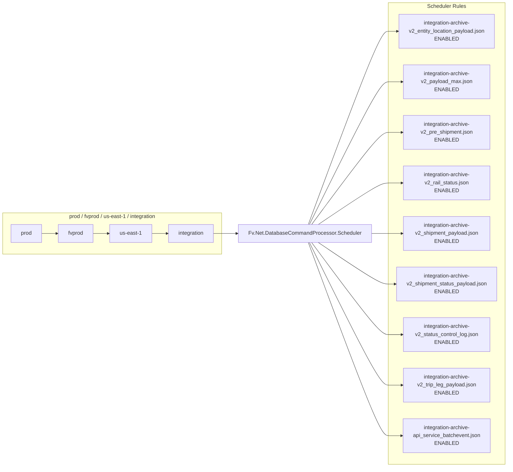
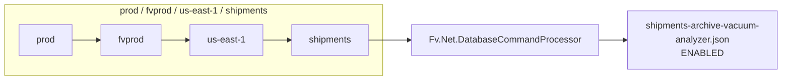

# Diagram: database/integration/releases/release.DATA-780-switchover/Create Integration Eventbridge Rules.sh

> Auto-generated by Obscura crawlers

## Diagram 1

```mermaid
graph LR
  subgraph ENV["prod / fvprod / us-east-1 / integration"]
    direction TB
    PROD["prod"]
    ACCT["fvprod"]
    REGION["us-east-1"]
    ENV_INT["integration"]
  end
  PROD --> ACCT
  ACCT --> REGION
  REGION --> ENV_INT
  ENV_INT --> DB["Fv.Net.DatabaseCommandProcessor"]
  subgraph RULES_DB["DatabaseCommandProcessor Rules"]
    direction TB
    R01["integration-archive-api_service_batchcontrol.json<br/>ENABLED"]
    R02["integration-archive-incoming_raw_line.json<br/>ENABLED"]
    R03["integration-archive-v2_s3_file_line.json<br/>ENABLED"]
    R04["integration-archive-v3_http_log.json<br/>ENABLED"]
    R05["integration-archive-gm_saw_payload_mm_flat.json<br/>ENABLED"]
    R06["integration-archive-v2_payload_max2.json<br/>ENABLED"]
    R07["integration-archive-v2_shipment_payload_max.json<br/>ENABLED"]
    R08["integration-archive-vc_radiant.json<br/>ENABLED"]
    R09["integration-archive-gm_saw_payload.json<br/>ENABLED"]
    R10["integration-archive-v2_s3_file.json<br/>ENABLED"]
    R11["integration-archive-v2_status_control.json<br/>ENABLED"]
    R12["integration-archive-vx_ford_radiant.json<br/>ENABLED"]
    R13["integration-archive-vacuum-analyzer<br/>DISABLED"]
    R14["integration-archive-coordinate.json<br/>ENABLED"]
    R15["integration-archive-entity_asset_data.json<br/>ENABLED"]
    R16["integration-archive-entity_asset_data_log.json<br/>ENABLED"]
    R17["integration-archive-entity_asset_location_log.json<br/>ENABLED"]
    R18["integration-archive-entity_asset_patch_log.json<br/>ENABLED"]
    R19["integration-archive-gm_vtims_parsed.json<br/>ENABLED"]
    R20["integration-archive-gm_vtims_vin_status.json<br/>ENABLED"]
    R21["integration-archive-gm_saw_parsed.json<br/>ENABLED"]
    R22["integration-archive-incoming_http.json<br/>ENABLED"]
    R23["integration-archive-incoming_file.json<br/>ENABLED"]
    R24["integration-archive-incoming_raw.json<br/>ENABLED"]
    R25["integration-archive-process_log.json<br/>ENABLED"]
    R26["integration-archive-railinc.json<br/>ENABLED"]
    R27["integration-archive-railinc_clm_raw.json<br/>ENABLED"]
    R28["integration-archive-report_staging_data.json<br/>ENABLED"]
    R29["integration-archive-schneider_csv_parsed.json<br/>ENABLED"]
    R30["integration-archive-v2_asn.json<br/>ENABLED"]
    R31["integration-archive-v2_asset2shipment_history.json<br/>ENABLED"]
    R32["integration-archive-v2_dwell_payload.json<br/>ENABLED"]
    R33["integration-archive-v2_entity_diagnostic_payload.json<br/>ENABLED"]
    R34["integration-archive-v2_entity_hold_payload.json<br/>ENABLED"]
    R35["integration-archive-v2_entity_hold_release_payload.json<br/>ENABLED"]
    R36["integration-archive-v2_entity_payload.json<br/>ENABLED"]
    R37["integration-archive-v2_entity_payload_patch.json<br/>ENABLED"]
    R38["integration-archive-v2_entity_status_payload.json<br/>ENABLED"]
    R39["integration-delete-v2_json.json<br/>ENABLED"]
    R40["integration-delete-shipper-v2_json<br/>DISABLED"]
    R41["integration-archive-v2_extra_log.json<br/>ENABLED"]
    R42["integration-archive-v2_http_log.json<br/>ENABLED"]
    R43["integration-archive-v2_invalid_loc.json<br/>ENABLED"]
    R44["integration-archive-v2_json.json<br/>ENABLED"]
    R45["integration-archive-v2_loc_update_log.json<br/>ENABLED"]
    R46["integration-archive-v2_match_data.json<br/>ENABLED"]
    R47["integration-archive-v2_outbound.json<br/>ENABLED"]
    R48["integration-archive-v2_part_match.json<br/>ENABLED"]
  end
  DB --> R01
  DB --> R02
  DB --> R03
  DB --> R04
  DB --> R05
  DB --> R06
  DB --> R07
  DB --> R08
  DB --> R09
  DB --> R10
  DB --> R11
  DB --> R12
  DB --> R13
  DB --> R14
  DB --> R15
  DB --> R16
  DB --> R17
  DB --> R18
  DB --> R19
  DB --> R20
  DB --> R21
  DB --> R22
  DB --> R23
  DB --> R24
  DB --> R25
  DB --> R26
  DB --> R27
  DB --> R28
  DB --> R29
  DB --> R30
  DB --> R31
  DB --> R32
  DB --> R33
  DB --> R34
  DB --> R35
  DB --> R36
  DB --> R37
  DB --> R38
  DB --> R39
  DB --> R40
  DB --> R41
  DB --> R42
  DB --> R43
  DB --> R44
  DB --> R45
  DB --> R46
  DB --> R47
  DB --> R48
```

### SVG

<svg id="container" width="1477.96875" xmlns="http://www.w3.org/2000/svg" class="flowchart" height="7332" viewBox="0 0 1477.96875 7332" role="graphics-document document" aria-roledescription="flowchart-v2"><g><marker id="container_flowchart-v2-pointEnd" class="marker flowchart-v2" viewBox="0 0 10 10" refX="5" refY="5" markerUnits="userSpaceOnUse" markerWidth="8" markerHeight="8" orient="auto"><path d="M 0 0 L 10 5 L 0 10 z" class="arrowMarkerPath" style="stroke-width: 1; stroke-dasharray: 1, 0;"></path></marker><marker id="container_flowchart-v2-pointStart" class="marker flowchart-v2" viewBox="0 0 10 10" refX="4.5" refY="5" markerUnits="userSpaceOnUse" markerWidth="8" markerHeight="8" orient="auto"><path d="M 0 5 L 10 10 L 10 0 z" class="arrowMarkerPath" style="stroke-width: 1; stroke-dasharray: 1, 0;"></path></marker><marker id="container_flowchart-v2-circleEnd" class="marker flowchart-v2" viewBox="0 0 10 10" refX="11" refY="5" markerUnits="userSpaceOnUse" markerWidth="11" markerHeight="11" orient="auto"><circle cx="5" cy="5" r="5" class="arrowMarkerPath" style="stroke-width: 1; stroke-dasharray: 1, 0;"></circle></marker><marker id="container_flowchart-v2-circleStart" class="marker flowchart-v2" viewBox="0 0 10 10" refX="-1" refY="5" markerUnits="userSpaceOnUse" markerWidth="11" markerHeight="11" orient="auto"><circle cx="5" cy="5" r="5" class="arrowMarkerPath" style="stroke-width: 1; stroke-dasharray: 1, 0;"></circle></marker><marker id="container_flowchart-v2-crossEnd" class="marker cross flowchart-v2" viewBox="0 0 11 11" refX="12" refY="5.2" markerUnits="userSpaceOnUse" markerWidth="11" markerHeight="11" orient="auto"><path d="M 1,1 l 9,9 M 10,1 l -9,9" class="arrowMarkerPath" style="stroke-width: 2; stroke-dasharray: 1, 0;"></path></marker><marker id="container_flowchart-v2-crossStart" class="marker cross flowchart-v2" viewBox="0 0 11 11" refX="-1" refY="5.2" markerUnits="userSpaceOnUse" markerWidth="11" markerHeight="11" orient="auto"><path d="M 1,1 l 9,9 M 10,1 l -9,9" class="arrowMarkerPath" style="stroke-width: 2; stroke-dasharray: 1, 0;"></path></marker><g class="root"><g class="clusters"><g class="cluster" id="RULES_DB" data-look="classic"><rect style="" x="1092.75" y="8" width="377.21875" height="7316"></rect><g class="cluster-label" transform="translate(1173.875, 8)"><foreignObject width="214.96875" height="48">

DatabaseCommandProcessor Rules

</foreignObject></g></g><g class="cluster" id="ENV" data-look="classic"><rect style="" x="8" y="3604" width="666.328125" height="124"></rect><g class="cluster-label" transform="translate(241.1640625, 3604)"><foreignObject width="200" height="48">

prod / fvprod / us-east-1 / integration

</foreignObject></g></g></g><g class="edgePaths"><path d="M127.125,3666L131.292,3666C135.458,3666,143.792,3666,151.458,3666C159.125,3666,166.125,3666,169.625,3666L173.125,3666" id="L_PROD_ACCT_0" class="edge-thickness-normal edge-pattern-solid edge-thickness-normal edge-pattern-solid flowchart-link" style=";" data-edge="true" data-et="edge" data-id="L_PROD_ACCT_0" data-points="W3sieCI6MTI3LjEyNSwieSI6MzY2Nn0seyJ4IjoxNTIuMTI1LCJ5IjozNjY2fSx7IngiOjE3Ny4xMjUsInkiOjM2NjZ9XQ==" marker-end="url(#container_flowchart-v2-pointEnd)"></path><path d="M284.484,3666L288.651,3666C292.818,3666,301.151,3666,308.818,3666C316.484,3666,323.484,3666,326.984,3666L330.484,3666" id="L_ACCT_REGION_0" class="edge-thickness-normal edge-pattern-solid edge-thickness-normal edge-pattern-solid flowchart-link" style=";" data-edge="true" data-et="edge" data-id="L_ACCT_REGION_0" data-points="W3sieCI6Mjg0LjQ4NDM3NSwieSI6MzY2Nn0seyJ4IjozMDkuNDg0Mzc1LCJ5IjozNjY2fSx7IngiOjMzNC40ODQzNzUsInkiOjM2NjZ9XQ==" marker-end="url(#container_flowchart-v2-pointEnd)"></path><path d="M459.531,3666L463.698,3666C467.865,3666,476.198,3666,483.865,3666C491.531,3666,498.531,3666,502.031,3666L505.531,3666" id="L_REGION_ENV_INT_0" class="edge-thickness-normal edge-pattern-solid edge-thickness-normal edge-pattern-solid flowchart-link" style=";" data-edge="true" data-et="edge" data-id="L_REGION_ENV_INT_0" data-points="W3sieCI6NDU5LjUzMTI1LCJ5IjozNjY2fSx7IngiOjQ4NC41MzEyNSwieSI6MzY2Nn0seyJ4Ijo1MDkuNTMxMjUsInkiOjM2NjZ9XQ==" marker-end="url(#container_flowchart-v2-pointEnd)"></path><path d="M649.328,3666L653.495,3666C657.661,3666,665.995,3666,674.328,3666C682.661,3666,690.995,3666,698.661,3666C706.328,3666,713.328,3666,716.828,3666L720.328,3666" id="L_ENV_INT_DB_0" class="edge-thickness-normal edge-pattern-solid edge-thickness-normal edge-pattern-solid flowchart-link" style=";" data-edge="true" data-et="edge" data-id="L_ENV_INT_DB_0" data-points="W3sieCI6NjQ5LjMyODEyNSwieSI6MzY2Nn0seyJ4Ijo2NzQuMzI4MTI1LCJ5IjozNjY2fSx7IngiOjY5OS4zMjgxMjUsInkiOjM2NjZ9LHsieCI6NzI0LjMyODEyNSwieSI6MzY2Nn1d" marker-end="url(#container_flowchart-v2-pointEnd)"></path><path d="M884.931,3639L915.401,3048.167C945.871,2457.333,1006.81,1275.667,1041.447,684.833C1076.083,94,1084.417,94,1096.305,94C1108.193,94,1123.635,94,1131.357,94L1139.078,94" id="L_DB_R01_0" class="edge-thickness-normal edge-pattern-solid edge-thickness-normal edge-pattern-solid flowchart-link" style=";" data-edge="true" data-et="edge" data-id="L_DB_R01_0" data-points="W3sieCI6ODg0LjkzMTQ3NDQwMTU5NTgsInkiOjM2Mzl9LHsieCI6MTA2Ny43NSwieSI6OTR9LHsieCI6MTA5Mi43NSwieSI6OTR9LHsieCI6MTE0My4wNzgxMjUsInkiOjk0fV0=" marker-end="url(#container_flowchart-v2-pointEnd)"></path><path d="M884.993,3639L915.453,3073.5C945.912,2508,1006.831,1377,1041.457,811.5C1076.083,246,1084.417,246,1097.685,246C1110.953,246,1129.156,246,1138.258,246L1147.359,246" id="L_DB_R02_0" class="edge-thickness-normal edge-pattern-solid edge-thickness-normal edge-pattern-solid flowchart-link" style=";" data-edge="true" data-et="edge" data-id="L_DB_R02_0" data-points="W3sieCI6ODg0Ljk5MzM1OTM3NSwieSI6MzYzOX0seyJ4IjoxMDY3Ljc1LCJ5IjoyNDZ9LHsieCI6MTA5Mi43NSwieSI6MjQ2fSx7IngiOjExNTEuMzU5Mzc1LCJ5IjoyNDZ9XQ==" marker-end="url(#container_flowchart-v2-pointEnd)"></path><path d="M885.061,3639L915.509,3098.833C945.957,2558.667,1006.854,1478.333,1041.469,938.167C1076.083,398,1084.417,398,1097.685,398C1110.953,398,1129.156,398,1138.258,398L1147.359,398" id="L_DB_R03_0" class="edge-thickness-normal edge-pattern-solid edge-thickness-normal edge-pattern-solid flowchart-link" style=";" data-edge="true" data-et="edge" data-id="L_DB_R03_0" data-points="W3sieCI6ODg1LjA2MTAwMTA5MDExNjMsInkiOjM2Mzl9LHsieCI6MTA2Ny43NSwieSI6Mzk4fSx7IngiOjEwOTIuNzUsInkiOjM5OH0seyJ4IjoxMTUxLjM1OTM3NSwieSI6Mzk4fV0=" marker-end="url(#container_flowchart-v2-pointEnd)"></path><path d="M885.135,3639L915.571,3124.167C946.007,2609.333,1006.878,1579.667,1041.481,1064.833C1076.083,550,1084.417,550,1097.685,550C1110.953,550,1129.156,550,1138.258,550L1147.359,550" id="L_DB_R04_0" class="edge-thickness-normal edge-pattern-solid edge-thickness-normal edge-pattern-solid flowchart-link" style=";" data-edge="true" data-et="edge" data-id="L_DB_R04_0" data-points="W3sieCI6ODg1LjEzNTI0MTk5Njk1MTIsInkiOjM2Mzl9LHsieCI6MTA2Ny43NSwieSI6NTUwfSx7IngiOjEwOTIuNzUsInkiOjU1MH0seyJ4IjoxMTUxLjM1OTM3NSwieSI6NTUwfV0=" marker-end="url(#container_flowchart-v2-pointEnd)"></path><path d="M885.217,3639L915.639,3149.5C946.061,2660,1006.906,1681,1041.495,1191.5C1076.083,702,1084.417,702,1095.544,702C1106.672,702,1120.594,702,1127.555,702L1134.516,702" id="L_DB_R05_0" class="edge-thickness-normal edge-pattern-solid edge-thickness-normal edge-pattern-solid flowchart-link" style=";" data-edge="true" data-et="edge" data-id="L_DB_R05_0" data-points="W3sieCI6ODg1LjIxNzA5NzM1NTc2OTMsInkiOjM2Mzl9LHsieCI6MTA2Ny43NSwieSI6NzAyfSx7IngiOjEwOTIuNzUsInkiOjcwMn0seyJ4IjoxMTM4LjUxNTYyNSwieSI6NzAyfV0=" marker-end="url(#container_flowchart-v2-pointEnd)"></path><path d="M885.308,3639L915.715,3174.833C946.122,2710.667,1006.936,1782.333,1041.51,1318.167C1076.083,854,1084.417,854,1097.685,854C1110.953,854,1129.156,854,1138.258,854L1147.359,854" id="L_DB_R06_0" class="edge-thickness-normal edge-pattern-solid edge-thickness-normal edge-pattern-solid flowchart-link" style=";" data-edge="true" data-et="edge" data-id="L_DB_R06_0" data-points="W3sieCI6ODg1LjMwNzgwMTk0MjU2NzYsInkiOjM2Mzl9LHsieCI6MTA2Ny43NSwieSI6ODU0fSx7IngiOjEwOTIuNzUsInkiOjg1NH0seyJ4IjoxMTUxLjM1OTM3NSwieSI6ODU0fV0=" marker-end="url(#container_flowchart-v2-pointEnd)"></path><path d="M885.409,3639L915.799,3200.167C946.189,2761.333,1006.97,1883.667,1041.526,1444.833C1076.083,1006,1084.417,1006,1095.057,1006C1105.698,1006,1118.646,1006,1125.12,1006L1131.594,1006" id="L_DB_R07_0" class="edge-thickness-normal edge-pattern-solid edge-thickness-normal edge-pattern-solid flowchart-link" style=";" data-edge="true" data-et="edge" data-id="L_DB_R07_0" data-points="W3sieCI6ODg1LjQwODg3Mjc2Nzg1NzEsInkiOjM2Mzl9LHsieCI6MTA2Ny43NSwieSI6MTAwNn0seyJ4IjoxMDkyLjc1LCJ5IjoxMDA2fSx7IngiOjExMzUuNTkzNzUsInkiOjEwMDZ9XQ==" marker-end="url(#container_flowchart-v2-pointEnd)"></path><path d="M885.522,3639L915.893,3225.5C946.265,2812,1007.007,1985,1041.545,1571.5C1076.083,1158,1084.417,1158,1097.685,1158C1110.953,1158,1129.156,1158,1138.258,1158L1147.359,1158" id="L_DB_R08_0" class="edge-thickness-normal edge-pattern-solid edge-thickness-normal edge-pattern-solid flowchart-link" style=";" data-edge="true" data-et="edge" data-id="L_DB_R08_0" data-points="W3sieCI6ODg1LjUyMjE5NDYwMjI3MjcsInkiOjM2Mzl9LHsieCI6MTA2Ny43NSwieSI6MTE1OH0seyJ4IjoxMDkyLjc1LCJ5IjoxMTU4fSx7IngiOjExNTEuMzU5Mzc1LCJ5IjoxMTU4fV0=" marker-end="url(#container_flowchart-v2-pointEnd)"></path><path d="M885.65,3639L916,3250.833C946.35,2862.667,1007.05,2086.333,1041.567,1698.167C1076.083,1310,1084.417,1310,1097.685,1310C1110.953,1310,1129.156,1310,1138.258,1310L1147.359,1310" id="L_DB_R09_0" class="edge-thickness-normal edge-pattern-solid edge-thickness-normal edge-pattern-solid flowchart-link" style=";" data-edge="true" data-et="edge" data-id="L_DB_R09_0" data-points="W3sieCI6ODg1LjY1MDEzODYwODg3MSwieSI6MzYzOX0seyJ4IjoxMDY3Ljc1LCJ5IjoxMzEwfSx7IngiOjEwOTIuNzUsInkiOjEzMTB9LHsieCI6MTE1MS4zNTkzNzUsInkiOjEzMTB9XQ==" marker-end="url(#container_flowchart-v2-pointEnd)"></path><path d="M885.796,3639L916.121,3276.167C946.447,2913.333,1007.099,2187.667,1041.591,1824.833C1076.083,1462,1084.417,1462,1097.685,1462C1110.953,1462,1129.156,1462,1138.258,1462L1147.359,1462" id="L_DB_R10_0" class="edge-thickness-normal edge-pattern-solid edge-thickness-normal edge-pattern-solid flowchart-link" style=";" data-edge="true" data-et="edge" data-id="L_DB_R10_0" data-points="W3sieCI6ODg1Ljc5NTczMDA2NDY1NTEsInkiOjM2Mzl9LHsieCI6MTA2Ny43NSwieSI6MTQ2Mn0seyJ4IjoxMDkyLjc1LCJ5IjoxNDYyfSx7IngiOjExNTEuMzU5Mzc1LCJ5IjoxNDYyfV0=" marker-end="url(#container_flowchart-v2-pointEnd)"></path><path d="M885.963,3639L916.261,3301.5C946.559,2964,1007.154,2289,1041.619,1951.5C1076.083,1614,1084.417,1614,1097.685,1614C1110.953,1614,1129.156,1614,1138.258,1614L1147.359,1614" id="L_DB_R11_0" class="edge-thickness-normal edge-pattern-solid edge-thickness-normal edge-pattern-solid flowchart-link" style=";" data-edge="true" data-et="edge" data-id="L_DB_R11_0" data-points="W3sieCI6ODg1Ljk2Mjg5MDYyNSwieSI6MzYzOX0seyJ4IjoxMDY3Ljc1LCJ5IjoxNjE0fSx7IngiOjEwOTIuNzUsInkiOjE2MTR9LHsieCI6MTE1MS4zNTkzNzUsInkiOjE2MTR9XQ==" marker-end="url(#container_flowchart-v2-pointEnd)"></path><path d="M886.157,3639L916.422,3326.833C946.688,3014.667,1007.219,2390.333,1041.651,2078.167C1076.083,1766,1084.417,1766,1097.685,1766C1110.953,1766,1129.156,1766,1138.258,1766L1147.359,1766" id="L_DB_R12_0" class="edge-thickness-normal edge-pattern-solid edge-thickness-normal edge-pattern-solid flowchart-link" style=";" data-edge="true" data-et="edge" data-id="L_DB_R12_0" data-points="W3sieCI6ODg2LjE1Njc5Njg3NSwieSI6MzYzOX0seyJ4IjoxMDY3Ljc1LCJ5IjoxNzY2fSx7IngiOjEwOTIuNzUsInkiOjE3NjZ9LHsieCI6MTE1MS4zNTkzNzUsInkiOjE3NjZ9XQ==" marker-end="url(#container_flowchart-v2-pointEnd)"></path><path d="M886.384,3639L916.612,3352.167C946.84,3065.333,1007.295,2491.667,1041.689,2204.833C1076.083,1918,1084.417,1918,1097.685,1918C1110.953,1918,1129.156,1918,1138.258,1918L1147.359,1918" id="L_DB_R13_0" class="edge-thickness-normal edge-pattern-solid edge-thickness-normal edge-pattern-solid flowchart-link" style=";" data-edge="true" data-et="edge" data-id="L_DB_R13_0" data-points="W3sieCI6ODg2LjM4NDQyNTk1MTA4NywieSI6MzYzOX0seyJ4IjoxMDY3Ljc1LCJ5IjoxOTE4fSx7IngiOjEwOTIuNzUsInkiOjE5MTh9LHsieCI6MTE1MS4zNTkzNzUsInkiOjE5MTh9XQ==" marker-end="url(#container_flowchart-v2-pointEnd)"></path><path d="M886.655,3639L916.838,3377.5C947.02,3116,1007.385,2593,1041.734,2331.5C1076.083,2070,1084.417,2070,1097.685,2070C1110.953,2070,1129.156,2070,1138.258,2070L1147.359,2070" id="L_DB_R14_0" class="edge-thickness-normal edge-pattern-solid edge-thickness-normal edge-pattern-solid flowchart-link" style=";" data-edge="true" data-et="edge" data-id="L_DB_R14_0" data-points="W3sieCI6ODg2LjY1NTQxMjk0NjQyODYsInkiOjM2Mzl9LHsieCI6MTA2Ny43NSwieSI6MjA3MH0seyJ4IjoxMDkyLjc1LCJ5IjoyMDcwfSx7IngiOjExNTEuMzU5Mzc1LCJ5IjoyMDcwfV0=" marker-end="url(#container_flowchart-v2-pointEnd)"></path><path d="M886.983,3639L917.111,3402.833C947.239,3166.667,1007.494,2694.333,1041.789,2458.167C1076.083,2222,1084.417,2222,1097.685,2222C1110.953,2222,1129.156,2222,1138.258,2222L1147.359,2222" id="L_DB_R15_0" class="edge-thickness-normal edge-pattern-solid edge-thickness-normal edge-pattern-solid flowchart-link" style=";" data-edge="true" data-et="edge" data-id="L_DB_R15_0" data-points="W3sieCI6ODg2Ljk4MzQ0OTgzNTUyNjQsInkiOjM2Mzl9LHsieCI6MTA2Ny43NSwieSI6MjIyMn0seyJ4IjoxMDkyLjc1LCJ5IjoyMjIyfSx7IngiOjExNTEuMzU5Mzc1LCJ5IjoyMjIyfV0=" marker-end="url(#container_flowchart-v2-pointEnd)"></path><path d="M887.389,3639L917.449,3428.167C947.509,3217.333,1007.63,2795.667,1041.856,2584.833C1076.083,2374,1084.417,2374,1097.685,2374C1110.953,2374,1129.156,2374,1138.258,2374L1147.359,2374" id="L_DB_R16_0" class="edge-thickness-normal edge-pattern-solid edge-thickness-normal edge-pattern-solid flowchart-link" style=";" data-edge="true" data-et="edge" data-id="L_DB_R16_0" data-points="W3sieCI6ODg3LjM4ODY3MTg3NSwieSI6MzYzOX0seyJ4IjoxMDY3Ljc1LCJ5IjoyMzc0fSx7IngiOjEwOTIuNzUsInkiOjIzNzR9LHsieCI6MTE1MS4zNTkzNzUsInkiOjIzNzR9XQ==" marker-end="url(#container_flowchart-v2-pointEnd)"></path><path d="M887.902,3639L917.877,3453.5C947.851,3268,1007.801,2897,1041.942,2711.5C1076.083,2526,1084.417,2526,1096.056,2526C1107.695,2526,1122.641,2526,1130.113,2526L1137.586,2526" id="L_DB_R17_0" class="edge-thickness-normal edge-pattern-solid edge-thickness-normal edge-pattern-solid flowchart-link" style=";" data-edge="true" data-et="edge" data-id="L_DB_R17_0" data-points="W3sieCI6ODg3LjkwMTk1MzEyNSwieSI6MzYzOX0seyJ4IjoxMDY3Ljc1LCJ5IjoyNTI2fSx7IngiOjEwOTIuNzUsInkiOjI1MjZ9LHsieCI6MTE0MS41ODU5Mzc1LCJ5IjoyNTI2fV0=" marker-end="url(#container_flowchart-v2-pointEnd)"></path><path d="M888.573,3639L918.436,3478.833C948.299,3318.667,1008.024,2998.333,1042.054,2838.167C1076.083,2678,1084.417,2678,1097.587,2678C1110.758,2678,1128.766,2678,1137.77,2678L1146.773,2678" id="L_DB_R18_0" class="edge-thickness-normal edge-pattern-solid edge-thickness-normal edge-pattern-solid flowchart-link" style=";" data-edge="true" data-et="edge" data-id="L_DB_R18_0" data-points="W3sieCI6ODg4LjU3MzE2NzA2NzMwNzcsInkiOjM2Mzl9LHsieCI6MTA2Ny43NSwieSI6MjY3OH0seyJ4IjoxMDkyLjc1LCJ5IjoyNjc4fSx7IngiOjExNTAuNzczNDM3NSwieSI6MjY3OH1d" marker-end="url(#container_flowchart-v2-pointEnd)"></path><path d="M889.488,3639L919.199,3504.167C948.909,3369.333,1008.329,3099.667,1042.206,2964.833C1076.083,2830,1084.417,2830,1097.685,2830C1110.953,2830,1129.156,2830,1138.258,2830L1147.359,2830" id="L_DB_R19_0" class="edge-thickness-normal edge-pattern-solid edge-thickness-normal edge-pattern-solid flowchart-link" style=";" data-edge="true" data-et="edge" data-id="L_DB_R19_0" data-points="W3sieCI6ODg5LjQ4ODQ1ODgwNjgxODEsInkiOjM2Mzl9LHsieCI6MTA2Ny43NSwieSI6MjgzMH0seyJ4IjoxMDkyLjc1LCJ5IjoyODMwfSx7IngiOjExNTEuMzU5Mzc1LCJ5IjoyODMwfV0=" marker-end="url(#container_flowchart-v2-pointEnd)"></path><path d="M890.811,3639L920.3,3529.5C949.79,3420,1008.77,3201,1042.427,3091.5C1076.083,2982,1084.417,2982,1097.685,2982C1110.953,2982,1129.156,2982,1138.258,2982L1147.359,2982" id="L_DB_R20_0" class="edge-thickness-normal edge-pattern-solid edge-thickness-normal edge-pattern-solid flowchart-link" style=";" data-edge="true" data-et="edge" data-id="L_DB_R20_0" data-points="W3sieCI6ODkwLjgxMDU0Njg3NSwieSI6MzYzOX0seyJ4IjoxMDY3Ljc1LCJ5IjoyOTgyfSx7IngiOjEwOTIuNzUsInkiOjI5ODJ9LHsieCI6MTE1MS4zNTkzNzUsInkiOjI5ODJ9XQ==" marker-end="url(#container_flowchart-v2-pointEnd)"></path><path d="M892.888,3639L922.032,3554.833C951.175,3470.667,1009.463,3302.333,1042.773,3218.167C1076.083,3134,1084.417,3134,1097.685,3134C1110.953,3134,1129.156,3134,1138.258,3134L1147.359,3134" id="L_DB_R21_0" class="edge-thickness-normal edge-pattern-solid edge-thickness-normal edge-pattern-solid flowchart-link" style=";" data-edge="true" data-et="edge" data-id="L_DB_R21_0" data-points="W3sieCI6ODkyLjg4ODExMzgzOTI4NTcsInkiOjM2Mzl9LHsieCI6MTA2Ny43NSwieSI6MzEzNH0seyJ4IjoxMDkyLjc1LCJ5IjozMTM0fSx7IngiOjExNTEuMzU5Mzc1LCJ5IjozMTM0fV0=" marker-end="url(#container_flowchart-v2-pointEnd)"></path><path d="M896.628,3639L925.148,3580.167C953.668,3521.333,1010.709,3403.667,1043.396,3344.833C1076.083,3286,1084.417,3286,1097.685,3286C1110.953,3286,1129.156,3286,1138.258,3286L1147.359,3286" id="L_DB_R22_0" class="edge-thickness-normal edge-pattern-solid edge-thickness-normal edge-pattern-solid flowchart-link" style=";" data-edge="true" data-et="edge" data-id="L_DB_R22_0" data-points="W3sieCI6ODk2LjYyNzczNDM3NSwieSI6MzYzOX0seyJ4IjoxMDY3Ljc1LCJ5IjozMjg2fSx7IngiOjEwOTIuNzUsInkiOjMyODZ9LHsieCI6MTE1MS4zNTkzNzUsInkiOjMyODZ9XQ==" marker-end="url(#container_flowchart-v2-pointEnd)"></path><path d="M905.354,3639L932.42,3605.5C959.486,3572,1013.618,3505,1044.851,3471.5C1076.083,3438,1084.417,3438,1097.685,3438C1110.953,3438,1129.156,3438,1138.258,3438L1147.359,3438" id="L_DB_R23_0" class="edge-thickness-normal edge-pattern-solid edge-thickness-normal edge-pattern-solid flowchart-link" style=";" data-edge="true" data-et="edge" data-id="L_DB_R23_0" data-points="W3sieCI6OTA1LjM1MzUxNTYyNSwieSI6MzYzOX0seyJ4IjoxMDY3Ljc1LCJ5IjozNDM4fSx7IngiOjEwOTIuNzUsInkiOjM0Mzh9LHsieCI6MTE1MS4zNTkzNzUsInkiOjM0Mzh9XQ==" marker-end="url(#container_flowchart-v2-pointEnd)"></path><path d="M948.982,3639L968.777,3630.833C988.572,3622.667,1028.161,3606.333,1052.122,3598.167C1076.083,3590,1084.417,3590,1097.685,3590C1110.953,3590,1129.156,3590,1138.258,3590L1147.359,3590" id="L_DB_R24_0" class="edge-thickness-normal edge-pattern-solid edge-thickness-normal edge-pattern-solid flowchart-link" style=";" data-edge="true" data-et="edge" data-id="L_DB_R24_0" data-points="W3sieCI6OTQ4Ljk4MjQyMTg3NSwieSI6MzYzOX0seyJ4IjoxMDY3Ljc1LCJ5IjozNTkwfSx7IngiOjEwOTIuNzUsInkiOjM1OTB9LHsieCI6MTE1MS4zNTkzNzUsInkiOjM1OTB9XQ==" marker-end="url(#container_flowchart-v2-pointEnd)"></path><path d="M948.982,3693L968.777,3701.167C988.572,3709.333,1028.161,3725.667,1052.122,3733.833C1076.083,3742,1084.417,3742,1097.685,3742C1110.953,3742,1129.156,3742,1138.258,3742L1147.359,3742" id="L_DB_R25_0" class="edge-thickness-normal edge-pattern-solid edge-thickness-normal edge-pattern-solid flowchart-link" style=";" data-edge="true" data-et="edge" data-id="L_DB_R25_0" data-points="W3sieCI6OTQ4Ljk4MjQyMTg3NSwieSI6MzY5M30seyJ4IjoxMDY3Ljc1LCJ5IjozNzQyfSx7IngiOjEwOTIuNzUsInkiOjM3NDJ9LHsieCI6MTE1MS4zNTkzNzUsInkiOjM3NDJ9XQ==" marker-end="url(#container_flowchart-v2-pointEnd)"></path><path d="M905.354,3693L932.42,3726.5C959.486,3760,1013.618,3827,1044.851,3860.5C1076.083,3894,1084.417,3894,1097.685,3894C1110.953,3894,1129.156,3894,1138.258,3894L1147.359,3894" id="L_DB_R26_0" class="edge-thickness-normal edge-pattern-solid edge-thickness-normal edge-pattern-solid flowchart-link" style=";" data-edge="true" data-et="edge" data-id="L_DB_R26_0" data-points="W3sieCI6OTA1LjM1MzUxNTYyNSwieSI6MzY5M30seyJ4IjoxMDY3Ljc1LCJ5IjozODk0fSx7IngiOjEwOTIuNzUsInkiOjM4OTR9LHsieCI6MTE1MS4zNTkzNzUsInkiOjM4OTR9XQ==" marker-end="url(#container_flowchart-v2-pointEnd)"></path><path d="M896.628,3693L925.148,3751.833C953.668,3810.667,1010.709,3928.333,1043.396,3987.167C1076.083,4046,1084.417,4046,1097.685,4046C1110.953,4046,1129.156,4046,1138.258,4046L1147.359,4046" id="L_DB_R27_0" class="edge-thickness-normal edge-pattern-solid edge-thickness-normal edge-pattern-solid flowchart-link" style=";" data-edge="true" data-et="edge" data-id="L_DB_R27_0" data-points="W3sieCI6ODk2LjYyNzczNDM3NSwieSI6MzY5M30seyJ4IjoxMDY3Ljc1LCJ5Ijo0MDQ2fSx7IngiOjEwOTIuNzUsInkiOjQwNDZ9LHsieCI6MTE1MS4zNTkzNzUsInkiOjQwNDZ9XQ==" marker-end="url(#container_flowchart-v2-pointEnd)"></path><path d="M892.888,3693L922.032,3777.167C951.175,3861.333,1009.463,4029.667,1042.773,4113.833C1076.083,4198,1084.417,4198,1097.685,4198C1110.953,4198,1129.156,4198,1138.258,4198L1147.359,4198" id="L_DB_R28_0" class="edge-thickness-normal edge-pattern-solid edge-thickness-normal edge-pattern-solid flowchart-link" style=";" data-edge="true" data-et="edge" data-id="L_DB_R28_0" data-points="W3sieCI6ODkyLjg4ODExMzgzOTI4NTcsInkiOjM2OTN9LHsieCI6MTA2Ny43NSwieSI6NDE5OH0seyJ4IjoxMDkyLjc1LCJ5Ijo0MTk4fSx7IngiOjExNTEuMzU5Mzc1LCJ5Ijo0MTk4fV0=" marker-end="url(#container_flowchart-v2-pointEnd)"></path><path d="M890.811,3693L920.3,3802.5C949.79,3912,1008.77,4131,1042.427,4240.5C1076.083,4350,1084.417,4350,1097.685,4350C1110.953,4350,1129.156,4350,1138.258,4350L1147.359,4350" id="L_DB_R29_0" class="edge-thickness-normal edge-pattern-solid edge-thickness-normal edge-pattern-solid flowchart-link" style=";" data-edge="true" data-et="edge" data-id="L_DB_R29_0" data-points="W3sieCI6ODkwLjgxMDU0Njg3NSwieSI6MzY5M30seyJ4IjoxMDY3Ljc1LCJ5Ijo0MzUwfSx7IngiOjEwOTIuNzUsInkiOjQzNTB9LHsieCI6MTE1MS4zNTkzNzUsInkiOjQzNTB9XQ==" marker-end="url(#container_flowchart-v2-pointEnd)"></path><path d="M889.488,3693L919.199,3827.833C948.909,3962.667,1008.329,4232.333,1042.206,4367.167C1076.083,4502,1084.417,4502,1097.685,4502C1110.953,4502,1129.156,4502,1138.258,4502L1147.359,4502" id="L_DB_R30_0" class="edge-thickness-normal edge-pattern-solid edge-thickness-normal edge-pattern-solid flowchart-link" style=";" data-edge="true" data-et="edge" data-id="L_DB_R30_0" data-points="W3sieCI6ODg5LjQ4ODQ1ODgwNjgxODEsInkiOjM2OTN9LHsieCI6MTA2Ny43NSwieSI6NDUwMn0seyJ4IjoxMDkyLjc1LCJ5Ijo0NTAyfSx7IngiOjExNTEuMzU5Mzc1LCJ5Ijo0NTAyfV0=" marker-end="url(#container_flowchart-v2-pointEnd)"></path><path d="M888.573,3693L918.436,3853.167C948.299,4013.333,1008.024,4333.667,1042.054,4493.833C1076.083,4654,1084.417,4654,1095.16,4654C1105.904,4654,1119.057,4654,1125.634,4654L1132.211,4654" id="L_DB_R31_0" class="edge-thickness-normal edge-pattern-solid edge-thickness-normal edge-pattern-solid flowchart-link" style=";" data-edge="true" data-et="edge" data-id="L_DB_R31_0" data-points="W3sieCI6ODg4LjU3MzE2NzA2NzMwNzcsInkiOjM2OTN9LHsieCI6MTA2Ny43NSwieSI6NDY1NH0seyJ4IjoxMDkyLjc1LCJ5Ijo0NjU0fSx7IngiOjExMzYuMjEwOTM3NSwieSI6NDY1NH1d" marker-end="url(#container_flowchart-v2-pointEnd)"></path><path d="M887.902,3693L917.877,3878.5C947.851,4064,1007.801,4435,1041.942,4620.5C1076.083,4806,1084.417,4806,1097.685,4806C1110.953,4806,1129.156,4806,1138.258,4806L1147.359,4806" id="L_DB_R32_0" class="edge-thickness-normal edge-pattern-solid edge-thickness-normal edge-pattern-solid flowchart-link" style=";" data-edge="true" data-et="edge" data-id="L_DB_R32_0" data-points="W3sieCI6ODg3LjkwMTk1MzEyNSwieSI6MzY5M30seyJ4IjoxMDY3Ljc1LCJ5Ijo0ODA2fSx7IngiOjEwOTIuNzUsInkiOjQ4MDZ9LHsieCI6MTE1MS4zNTkzNzUsInkiOjQ4MDZ9XQ==" marker-end="url(#container_flowchart-v2-pointEnd)"></path><path d="M887.389,3693L917.449,3903.833C947.509,4114.667,1007.63,4536.333,1041.856,4747.167C1076.083,4958,1084.417,4958,1093.622,4958C1102.828,4958,1112.906,4958,1117.945,4958L1122.984,4958" id="L_DB_R33_0" class="edge-thickness-normal edge-pattern-solid edge-thickness-normal edge-pattern-solid flowchart-link" style=";" data-edge="true" data-et="edge" data-id="L_DB_R33_0" data-points="W3sieCI6ODg3LjM4ODY3MTg3NSwieSI6MzY5M30seyJ4IjoxMDY3Ljc1LCJ5Ijo0OTU4fSx7IngiOjEwOTIuNzUsInkiOjQ5NTh9LHsieCI6MTEyNi45ODQzNzUsInkiOjQ5NTh9XQ==" marker-end="url(#container_flowchart-v2-pointEnd)"></path><path d="M886.983,3693L917.111,3929.167C947.239,4165.333,1007.494,4637.667,1041.789,4873.833C1076.083,5110,1084.417,5110,1097.111,5110C1109.805,5110,1126.859,5110,1135.387,5110L1143.914,5110" id="L_DB_R34_0" class="edge-thickness-normal edge-pattern-solid edge-thickness-normal edge-pattern-solid flowchart-link" style=";" data-edge="true" data-et="edge" data-id="L_DB_R34_0" data-points="W3sieCI6ODg2Ljk4MzQ0OTgzNTUyNjQsInkiOjM2OTN9LHsieCI6MTA2Ny43NSwieSI6NTExMH0seyJ4IjoxMDkyLjc1LCJ5Ijo1MTEwfSx7IngiOjExNDcuOTE0MDYyNSwieSI6NTExMH1d" marker-end="url(#container_flowchart-v2-pointEnd)"></path><path d="M886.655,3693L916.838,3954.5C947.02,4216,1007.385,4739,1041.734,5000.5C1076.083,5262,1084.417,5262,1092.083,5262C1099.75,5262,1106.75,5262,1110.25,5262L1113.75,5262" id="L_DB_R35_0" class="edge-thickness-normal edge-pattern-solid edge-thickness-normal edge-pattern-solid flowchart-link" style=";" data-edge="true" data-et="edge" data-id="L_DB_R35_0" data-points="W3sieCI6ODg2LjY1NTQxMjk0NjQyODYsInkiOjM2OTN9LHsieCI6MTA2Ny43NSwieSI6NTI2Mn0seyJ4IjoxMDkyLjc1LCJ5Ijo1MjYyfSx7IngiOjExMTcuNzUsInkiOjUyNjJ9XQ==" marker-end="url(#container_flowchart-v2-pointEnd)"></path><path d="M886.384,3693L916.612,3979.833C946.84,4266.667,1007.295,4840.333,1041.689,5127.167C1076.083,5414,1084.417,5414,1097.685,5414C1110.953,5414,1129.156,5414,1138.258,5414L1147.359,5414" id="L_DB_R36_0" class="edge-thickness-normal edge-pattern-solid edge-thickness-normal edge-pattern-solid flowchart-link" style=";" data-edge="true" data-et="edge" data-id="L_DB_R36_0" data-points="W3sieCI6ODg2LjM4NDQyNTk1MTA4NywieSI6MzY5M30seyJ4IjoxMDY3Ljc1LCJ5Ijo1NDE0fSx7IngiOjEwOTIuNzUsInkiOjU0MTR9LHsieCI6MTE1MS4zNTkzNzUsInkiOjU0MTR9XQ==" marker-end="url(#container_flowchart-v2-pointEnd)"></path><path d="M886.157,3693L916.422,4005.167C946.688,4317.333,1007.219,4941.667,1041.651,5253.833C1076.083,5566,1084.417,5566,1096.467,5566C1108.518,5566,1124.286,5566,1132.171,5566L1140.055,5566" id="L_DB_R37_0" class="edge-thickness-normal edge-pattern-solid edge-thickness-normal edge-pattern-solid flowchart-link" style=";" data-edge="true" data-et="edge" data-id="L_DB_R37_0" data-points="W3sieCI6ODg2LjE1Njc5Njg3NSwieSI6MzY5M30seyJ4IjoxMDY3Ljc1LCJ5Ijo1NTY2fSx7IngiOjEwOTIuNzUsInkiOjU1NjZ9LHsieCI6MTE0NC4wNTQ2ODc1LCJ5Ijo1NTY2fV0=" marker-end="url(#container_flowchart-v2-pointEnd)"></path><path d="M885.963,3693L916.261,4030.5C946.559,4368,1007.154,5043,1041.619,5380.5C1076.083,5718,1084.417,5718,1096.178,5718C1107.94,5718,1123.13,5718,1130.725,5718L1138.32,5718" id="L_DB_R38_0" class="edge-thickness-normal edge-pattern-solid edge-thickness-normal edge-pattern-solid flowchart-link" style=";" data-edge="true" data-et="edge" data-id="L_DB_R38_0" data-points="W3sieCI6ODg1Ljk2Mjg5MDYyNSwieSI6MzY5M30seyJ4IjoxMDY3Ljc1LCJ5Ijo1NzE4fSx7IngiOjEwOTIuNzUsInkiOjU3MTh9LHsieCI6MTE0Mi4zMjAzMTI1LCJ5Ijo1NzE4fV0=" marker-end="url(#container_flowchart-v2-pointEnd)"></path><path d="M885.796,3693L916.121,4055.833C946.447,4418.667,1007.099,5144.333,1041.591,5507.167C1076.083,5870,1084.417,5870,1097.685,5870C1110.953,5870,1129.156,5870,1138.258,5870L1147.359,5870" id="L_DB_R39_0" class="edge-thickness-normal edge-pattern-solid edge-thickness-normal edge-pattern-solid flowchart-link" style=";" data-edge="true" data-et="edge" data-id="L_DB_R39_0" data-points="W3sieCI6ODg1Ljc5NTczMDA2NDY1NTEsInkiOjM2OTN9LHsieCI6MTA2Ny43NSwieSI6NTg3MH0seyJ4IjoxMDkyLjc1LCJ5Ijo1ODcwfSx7IngiOjExNTEuMzU5Mzc1LCJ5Ijo1ODcwfV0=" marker-end="url(#container_flowchart-v2-pointEnd)"></path><path d="M885.65,3693L916,4081.167C946.35,4469.333,1007.05,5245.667,1041.567,5633.833C1076.083,6022,1084.417,6022,1097.685,6022C1110.953,6022,1129.156,6022,1138.258,6022L1147.359,6022" id="L_DB_R40_0" class="edge-thickness-normal edge-pattern-solid edge-thickness-normal edge-pattern-solid flowchart-link" style=";" data-edge="true" data-et="edge" data-id="L_DB_R40_0" data-points="W3sieCI6ODg1LjY1MDEzODYwODg3MSwieSI6MzY5M30seyJ4IjoxMDY3Ljc1LCJ5Ijo2MDIyfSx7IngiOjEwOTIuNzUsInkiOjYwMjJ9LHsieCI6MTE1MS4zNTkzNzUsInkiOjYwMjJ9XQ==" marker-end="url(#container_flowchart-v2-pointEnd)"></path><path d="M885.522,3693L915.893,4106.5C946.265,4520,1007.007,5347,1041.545,5760.5C1076.083,6174,1084.417,6174,1097.685,6174C1110.953,6174,1129.156,6174,1138.258,6174L1147.359,6174" id="L_DB_R41_0" class="edge-thickness-normal edge-pattern-solid edge-thickness-normal edge-pattern-solid flowchart-link" style=";" data-edge="true" data-et="edge" data-id="L_DB_R41_0" data-points="W3sieCI6ODg1LjUyMjE5NDYwMjI3MjcsInkiOjM2OTN9LHsieCI6MTA2Ny43NSwieSI6NjE3NH0seyJ4IjoxMDkyLjc1LCJ5Ijo2MTc0fSx7IngiOjExNTEuMzU5Mzc1LCJ5Ijo2MTc0fV0=" marker-end="url(#container_flowchart-v2-pointEnd)"></path><path d="M885.409,3693L915.799,4131.833C946.189,4570.667,1006.97,5448.333,1041.526,5887.167C1076.083,6326,1084.417,6326,1097.685,6326C1110.953,6326,1129.156,6326,1138.258,6326L1147.359,6326" id="L_DB_R42_0" class="edge-thickness-normal edge-pattern-solid edge-thickness-normal edge-pattern-solid flowchart-link" style=";" data-edge="true" data-et="edge" data-id="L_DB_R42_0" data-points="W3sieCI6ODg1LjQwODg3Mjc2Nzg1NzEsInkiOjM2OTN9LHsieCI6MTA2Ny43NSwieSI6NjMyNn0seyJ4IjoxMDkyLjc1LCJ5Ijo2MzI2fSx7IngiOjExNTEuMzU5Mzc1LCJ5Ijo2MzI2fV0=" marker-end="url(#container_flowchart-v2-pointEnd)"></path><path d="M885.308,3693L915.715,4157.167C946.122,4621.333,1006.936,5549.667,1041.51,6013.833C1076.083,6478,1084.417,6478,1097.685,6478C1110.953,6478,1129.156,6478,1138.258,6478L1147.359,6478" id="L_DB_R43_0" class="edge-thickness-normal edge-pattern-solid edge-thickness-normal edge-pattern-solid flowchart-link" style=";" data-edge="true" data-et="edge" data-id="L_DB_R43_0" data-points="W3sieCI6ODg1LjMwNzgwMTk0MjU2NzYsInkiOjM2OTN9LHsieCI6MTA2Ny43NSwieSI6NjQ3OH0seyJ4IjoxMDkyLjc1LCJ5Ijo2NDc4fSx7IngiOjExNTEuMzU5Mzc1LCJ5Ijo2NDc4fV0=" marker-end="url(#container_flowchart-v2-pointEnd)"></path><path d="M885.217,3693L915.639,4182.5C946.061,4672,1006.906,5651,1041.495,6140.5C1076.083,6630,1084.417,6630,1097.685,6630C1110.953,6630,1129.156,6630,1138.258,6630L1147.359,6630" id="L_DB_R44_0" class="edge-thickness-normal edge-pattern-solid edge-thickness-normal edge-pattern-solid flowchart-link" style=";" data-edge="true" data-et="edge" data-id="L_DB_R44_0" data-points="W3sieCI6ODg1LjIxNzA5NzM1NTc2OTMsInkiOjM2OTN9LHsieCI6MTA2Ny43NSwieSI6NjYzMH0seyJ4IjoxMDkyLjc1LCJ5Ijo2NjMwfSx7IngiOjExNTEuMzU5Mzc1LCJ5Ijo2NjMwfV0=" marker-end="url(#container_flowchart-v2-pointEnd)"></path><path d="M885.135,3693L915.571,4207.833C946.007,4722.667,1006.878,5752.333,1041.481,6267.167C1076.083,6782,1084.417,6782,1097.685,6782C1110.953,6782,1129.156,6782,1138.258,6782L1147.359,6782" id="L_DB_R45_0" class="edge-thickness-normal edge-pattern-solid edge-thickness-normal edge-pattern-solid flowchart-link" style=";" data-edge="true" data-et="edge" data-id="L_DB_R45_0" data-points="W3sieCI6ODg1LjEzNTI0MTk5Njk1MTIsInkiOjM2OTN9LHsieCI6MTA2Ny43NSwieSI6Njc4Mn0seyJ4IjoxMDkyLjc1LCJ5Ijo2NzgyfSx7IngiOjExNTEuMzU5Mzc1LCJ5Ijo2NzgyfV0=" marker-end="url(#container_flowchart-v2-pointEnd)"></path><path d="M885.061,3693L915.509,4233.167C945.957,4773.333,1006.854,5853.667,1041.469,6393.833C1076.083,6934,1084.417,6934,1097.685,6934C1110.953,6934,1129.156,6934,1138.258,6934L1147.359,6934" id="L_DB_R46_0" class="edge-thickness-normal edge-pattern-solid edge-thickness-normal edge-pattern-solid flowchart-link" style=";" data-edge="true" data-et="edge" data-id="L_DB_R46_0" data-points="W3sieCI6ODg1LjA2MTAwMTA5MDExNjMsInkiOjM2OTN9LHsieCI6MTA2Ny43NSwieSI6NjkzNH0seyJ4IjoxMDkyLjc1LCJ5Ijo2OTM0fSx7IngiOjExNTEuMzU5Mzc1LCJ5Ijo2OTM0fV0=" marker-end="url(#container_flowchart-v2-pointEnd)"></path><path d="M884.993,3693L915.453,4258.5C945.912,4824,1006.831,5955,1041.457,6520.5C1076.083,7086,1084.417,7086,1097.685,7086C1110.953,7086,1129.156,7086,1138.258,7086L1147.359,7086" id="L_DB_R47_0" class="edge-thickness-normal edge-pattern-solid edge-thickness-normal edge-pattern-solid flowchart-link" style=";" data-edge="true" data-et="edge" data-id="L_DB_R47_0" data-points="W3sieCI6ODg0Ljk5MzM1OTM3NSwieSI6MzY5M30seyJ4IjoxMDY3Ljc1LCJ5Ijo3MDg2fSx7IngiOjEwOTIuNzUsInkiOjcwODZ9LHsieCI6MTE1MS4zNTkzNzUsInkiOjcwODZ9XQ==" marker-end="url(#container_flowchart-v2-pointEnd)"></path><path d="M884.931,3693L915.401,4283.833C945.871,4874.667,1006.81,6056.333,1041.447,6647.167C1076.083,7238,1084.417,7238,1097.685,7238C1110.953,7238,1129.156,7238,1138.258,7238L1147.359,7238" id="L_DB_R48_0" class="edge-thickness-normal edge-pattern-solid edge-thickness-normal edge-pattern-solid flowchart-link" style=";" data-edge="true" data-et="edge" data-id="L_DB_R48_0" data-points="W3sieCI6ODg0LjkzMTQ3NDQwMTU5NTgsInkiOjM2OTN9LHsieCI6MTA2Ny43NSwieSI6NzIzOH0seyJ4IjoxMDkyLjc1LCJ5Ijo3MjM4fSx7IngiOjExNTEuMzU5Mzc1LCJ5Ijo3MjM4fV0=" marker-end="url(#container_flowchart-v2-pointEnd)"></path></g><g class="edgeLabels"><g class="edgeLabel"><g class="label" data-id="L_PROD_ACCT_0" transform="translate(0, 0)"><foreignObject width="0" height="0">

</foreignObject></g></g><g class="edgeLabel"><g class="label" data-id="L_ACCT_REGION_0" transform="translate(0, 0)"><foreignObject width="0" height="0">

</foreignObject></g></g><g class="edgeLabel"><g class="label" data-id="L_REGION_ENV_INT_0" transform="translate(0, 0)"><foreignObject width="0" height="0">

</foreignObject></g></g><g class="edgeLabel"><g class="label" data-id="L_ENV_INT_DB_0" transform="translate(0, 0)"><foreignObject width="0" height="0">

</foreignObject></g></g><g class="edgeLabel"><g class="label" data-id="L_DB_R01_0" transform="translate(0, 0)"><foreignObject width="0" height="0">

</foreignObject></g></g><g class="edgeLabel"><g class="label" data-id="L_DB_R02_0" transform="translate(0, 0)"><foreignObject width="0" height="0">

</foreignObject></g></g><g class="edgeLabel"><g class="label" data-id="L_DB_R03_0" transform="translate(0, 0)"><foreignObject width="0" height="0">

</foreignObject></g></g><g class="edgeLabel"><g class="label" data-id="L_DB_R04_0" transform="translate(0, 0)"><foreignObject width="0" height="0">

</foreignObject></g></g><g class="edgeLabel"><g class="label" data-id="L_DB_R05_0" transform="translate(0, 0)"><foreignObject width="0" height="0">

</foreignObject></g></g><g class="edgeLabel"><g class="label" data-id="L_DB_R06_0" transform="translate(0, 0)"><foreignObject width="0" height="0">

</foreignObject></g></g><g class="edgeLabel"><g class="label" data-id="L_DB_R07_0" transform="translate(0, 0)"><foreignObject width="0" height="0">

</foreignObject></g></g><g class="edgeLabel"><g class="label" data-id="L_DB_R08_0" transform="translate(0, 0)"><foreignObject width="0" height="0">

</foreignObject></g></g><g class="edgeLabel"><g class="label" data-id="L_DB_R09_0" transform="translate(0, 0)"><foreignObject width="0" height="0">

</foreignObject></g></g><g class="edgeLabel"><g class="label" data-id="L_DB_R10_0" transform="translate(0, 0)"><foreignObject width="0" height="0">

</foreignObject></g></g><g class="edgeLabel"><g class="label" data-id="L_DB_R11_0" transform="translate(0, 0)"><foreignObject width="0" height="0">

</foreignObject></g></g><g class="edgeLabel"><g class="label" data-id="L_DB_R12_0" transform="translate(0, 0)"><foreignObject width="0" height="0">

</foreignObject></g></g><g class="edgeLabel"><g class="label" data-id="L_DB_R13_0" transform="translate(0, 0)"><foreignObject width="0" height="0">

</foreignObject></g></g><g class="edgeLabel"><g class="label" data-id="L_DB_R14_0" transform="translate(0, 0)"><foreignObject width="0" height="0">

</foreignObject></g></g><g class="edgeLabel"><g class="label" data-id="L_DB_R15_0" transform="translate(0, 0)"><foreignObject width="0" height="0">

</foreignObject></g></g><g class="edgeLabel"><g class="label" data-id="L_DB_R16_0" transform="translate(0, 0)"><foreignObject width="0" height="0">

</foreignObject></g></g><g class="edgeLabel"><g class="label" data-id="L_DB_R17_0" transform="translate(0, 0)"><foreignObject width="0" height="0">

</foreignObject></g></g><g class="edgeLabel"><g class="label" data-id="L_DB_R18_0" transform="translate(0, 0)"><foreignObject width="0" height="0">

</foreignObject></g></g><g class="edgeLabel"><g class="label" data-id="L_DB_R19_0" transform="translate(0, 0)"><foreignObject width="0" height="0">

</foreignObject></g></g><g class="edgeLabel"><g class="label" data-id="L_DB_R20_0" transform="translate(0, 0)"><foreignObject width="0" height="0">

</foreignObject></g></g><g class="edgeLabel"><g class="label" data-id="L_DB_R21_0" transform="translate(0, 0)"><foreignObject width="0" height="0">

</foreignObject></g></g><g class="edgeLabel"><g class="label" data-id="L_DB_R22_0" transform="translate(0, 0)"><foreignObject width="0" height="0">

</foreignObject></g></g><g class="edgeLabel"><g class="label" data-id="L_DB_R23_0" transform="translate(0, 0)"><foreignObject width="0" height="0">

</foreignObject></g></g><g class="edgeLabel"><g class="label" data-id="L_DB_R24_0" transform="translate(0, 0)"><foreignObject width="0" height="0">

</foreignObject></g></g><g class="edgeLabel"><g class="label" data-id="L_DB_R25_0" transform="translate(0, 0)"><foreignObject width="0" height="0">

</foreignObject></g></g><g class="edgeLabel"><g class="label" data-id="L_DB_R26_0" transform="translate(0, 0)"><foreignObject width="0" height="0">

</foreignObject></g></g><g class="edgeLabel"><g class="label" data-id="L_DB_R27_0" transform="translate(0, 0)"><foreignObject width="0" height="0">

</foreignObject></g></g><g class="edgeLabel"><g class="label" data-id="L_DB_R28_0" transform="translate(0, 0)"><foreignObject width="0" height="0">

</foreignObject></g></g><g class="edgeLabel"><g class="label" data-id="L_DB_R29_0" transform="translate(0, 0)"><foreignObject width="0" height="0">

</foreignObject></g></g><g class="edgeLabel"><g class="label" data-id="L_DB_R30_0" transform="translate(0, 0)"><foreignObject width="0" height="0">

</foreignObject></g></g><g class="edgeLabel"><g class="label" data-id="L_DB_R31_0" transform="translate(0, 0)"><foreignObject width="0" height="0">

</foreignObject></g></g><g class="edgeLabel"><g class="label" data-id="L_DB_R32_0" transform="translate(0, 0)"><foreignObject width="0" height="0">

</foreignObject></g></g><g class="edgeLabel"><g class="label" data-id="L_DB_R33_0" transform="translate(0, 0)"><foreignObject width="0" height="0">

</foreignObject></g></g><g class="edgeLabel"><g class="label" data-id="L_DB_R34_0" transform="translate(0, 0)"><foreignObject width="0" height="0">

</foreignObject></g></g><g class="edgeLabel"><g class="label" data-id="L_DB_R35_0" transform="translate(0, 0)"><foreignObject width="0" height="0">

</foreignObject></g></g><g class="edgeLabel"><g class="label" data-id="L_DB_R36_0" transform="translate(0, 0)"><foreignObject width="0" height="0">

</foreignObject></g></g><g class="edgeLabel"><g class="label" data-id="L_DB_R37_0" transform="translate(0, 0)"><foreignObject width="0" height="0">

</foreignObject></g></g><g class="edgeLabel"><g class="label" data-id="L_DB_R38_0" transform="translate(0, 0)"><foreignObject width="0" height="0">

</foreignObject></g></g><g class="edgeLabel"><g class="label" data-id="L_DB_R39_0" transform="translate(0, 0)"><foreignObject width="0" height="0">

</foreignObject></g></g><g class="edgeLabel"><g class="label" data-id="L_DB_R40_0" transform="translate(0, 0)"><foreignObject width="0" height="0">

</foreignObject></g></g><g class="edgeLabel"><g class="label" data-id="L_DB_R41_0" transform="translate(0, 0)"><foreignObject width="0" height="0">

</foreignObject></g></g><g class="edgeLabel"><g class="label" data-id="L_DB_R42_0" transform="translate(0, 0)"><foreignObject width="0" height="0">

</foreignObject></g></g><g class="edgeLabel"><g class="label" data-id="L_DB_R43_0" transform="translate(0, 0)"><foreignObject width="0" height="0">

</foreignObject></g></g><g class="edgeLabel"><g class="label" data-id="L_DB_R44_0" transform="translate(0, 0)"><foreignObject width="0" height="0">

</foreignObject></g></g><g class="edgeLabel"><g class="label" data-id="L_DB_R45_0" transform="translate(0, 0)"><foreignObject width="0" height="0">

</foreignObject></g></g><g class="edgeLabel"><g class="label" data-id="L_DB_R46_0" transform="translate(0, 0)"><foreignObject width="0" height="0">

</foreignObject></g></g><g class="edgeLabel"><g class="label" data-id="L_DB_R47_0" transform="translate(0, 0)"><foreignObject width="0" height="0">

</foreignObject></g></g><g class="edgeLabel"><g class="label" data-id="L_DB_R48_0" transform="translate(0, 0)"><foreignObject width="0" height="0">

</foreignObject></g></g></g><g class="nodes"><g class="node default" id="flowchart-PROD-0" transform="translate(80.0625, 3666)"><rect class="basic label-container" style="" x="-47.0625" y="-27" width="94.125" height="54"></rect><g class="label" style="" transform="translate(-17.0625, -12)"><rect></rect><foreignObject width="34.125" height="24">

prod

</foreignObject></g></g><g class="node default" id="flowchart-ACCT-1" transform="translate(230.8046875, 3666)"><rect class="basic label-container" style="" x="-53.6796875" y="-27" width="107.359375" height="54"></rect><g class="label" style="" transform="translate(-23.6796875, -12)"><rect></rect><foreignObject width="47.359375" height="24">

fvprod

</foreignObject></g></g><g class="node default" id="flowchart-REGION-2" transform="translate(397.0078125, 3666)"><rect class="basic label-container" style="" x="-62.5234375" y="-27" width="125.046875" height="54"></rect><g class="label" style="" transform="translate(-32.5234375, -12)"><rect></rect><foreignObject width="65.046875" height="24">

us-east-1

</foreignObject></g></g><g class="node default" id="flowchart-ENV_INT-3" transform="translate(579.4296875, 3666)"><rect class="basic label-container" style="" x="-69.8984375" y="-27" width="139.796875" height="54"></rect><g class="label" style="" transform="translate(-39.8984375, -12)"><rect></rect><foreignObject width="79.796875" height="24">

integration

</foreignObject></g></g><g class="node default" id="flowchart-DB-11" transform="translate(883.5390625, 3666)"><rect class="basic label-container" style="" x="-159.2109375" y="-27" width="318.421875" height="54"></rect><g class="label" style="" transform="translate(-129.2109375, -12)"><rect></rect><foreignObject width="258.421875" height="24">

Fv.Net.DatabaseCommandProcessor

</foreignObject></g></g><g class="node default" id="flowchart-R01-12" transform="translate(1281.359375, 94)"><rect class="basic label-container" style="" x="-138.28125" y="-51" width="276.5625" height="102"></rect><g class="label" style="" transform="translate(-108.28125, -36)"><rect></rect><foreignObject width="216.5625" height="72">

integration-archive-api_service_batchcontrol.json ENABLED

</foreignObject></g></g><g class="node default" id="flowchart-R02-13" transform="translate(1281.359375, 246)"><rect class="basic label-container" style="" x="-130" y="-51" width="260" height="102"></rect><g class="label" style="" transform="translate(-100, -36)"><rect></rect><foreignObject width="200" height="72">

integration-archive-incoming_raw_line.json ENABLED

</foreignObject></g></g><g class="node default" id="flowchart-R03-14" transform="translate(1281.359375, 398)"><rect class="basic label-container" style="" x="-130" y="-51" width="260" height="102"></rect><g class="label" style="" transform="translate(-100, -36)"><rect></rect><foreignObject width="200" height="72">

integration-archive-v2_s3_file_line.json ENABLED

</foreignObject></g></g><g class="node default" id="flowchart-R04-15" transform="translate(1281.359375, 550)"><rect class="basic label-container" style="" x="-130" y="-51" width="260" height="102"></rect><g class="label" style="" transform="translate(-100, -36)"><rect></rect><foreignObject width="200" height="72">

integration-archive-v3_http_log.json ENABLED

</foreignObject></g></g><g class="node default" id="flowchart-R05-16" transform="translate(1281.359375, 702)"><rect class="basic label-container" style="" x="-142.84375" y="-51" width="285.6875" height="102"></rect><g class="label" style="" transform="translate(-112.84375, -36)"><rect></rect><foreignObject width="225.6875" height="72">

integration-archive-gm_saw_payload_mm_flat.json ENABLED

</foreignObject></g></g><g class="node default" id="flowchart-R06-17" transform="translate(1281.359375, 854)"><rect class="basic label-container" style="" x="-130" y="-51" width="260" height="102"></rect><g class="label" style="" transform="translate(-100, -36)"><rect></rect><foreignObject width="200" height="72">

integration-archive-v2_payload_max2.json ENABLED

</foreignObject></g></g><g class="node default" id="flowchart-R07-18" transform="translate(1281.359375, 1006)"><rect class="basic label-container" style="" x="-145.765625" y="-51" width="291.53125" height="102"></rect><g class="label" style="" transform="translate(-115.765625, -36)"><rect></rect><foreignObject width="231.53125" height="72">

integration-archive-v2_shipment_payload_max.json ENABLED

</foreignObject></g></g><g class="node default" id="flowchart-R08-19" transform="translate(1281.359375, 1158)"><rect class="basic label-container" style="" x="-130" y="-51" width="260" height="102"></rect><g class="label" style="" transform="translate(-100, -36)"><rect></rect><foreignObject width="200" height="72">

integration-archive-vc_radiant.json ENABLED

</foreignObject></g></g><g class="node default" id="flowchart-R09-20" transform="translate(1281.359375, 1310)"><rect class="basic label-container" style="" x="-130" y="-51" width="260" height="102"></rect><g class="label" style="" transform="translate(-100, -36)"><rect></rect><foreignObject width="200" height="72">

integration-archive-gm_saw_payload.json ENABLED

</foreignObject></g></g><g class="node default" id="flowchart-R10-21" transform="translate(1281.359375, 1462)"><rect class="basic label-container" style="" x="-130" y="-51" width="260" height="102"></rect><g class="label" style="" transform="translate(-100, -36)"><rect></rect><foreignObject width="200" height="72">

integration-archive-v2_s3_file.json ENABLED

</foreignObject></g></g><g class="node default" id="flowchart-R11-22" transform="translate(1281.359375, 1614)"><rect class="basic label-container" style="" x="-130" y="-51" width="260" height="102"></rect><g class="label" style="" transform="translate(-100, -36)"><rect></rect><foreignObject width="200" height="72">

integration-archive-v2_status_control.json ENABLED

</foreignObject></g></g><g class="node default" id="flowchart-R12-23" transform="translate(1281.359375, 1766)"><rect class="basic label-container" style="" x="-130" y="-51" width="260" height="102"></rect><g class="label" style="" transform="translate(-100, -36)"><rect></rect><foreignObject width="200" height="72">

integration-archive-vx_ford_radiant.json ENABLED

</foreignObject></g></g><g class="node default" id="flowchart-R13-24" transform="translate(1281.359375, 1918)"><rect class="basic label-container" style="" x="-130" y="-51" width="260" height="102"></rect><g class="label" style="" transform="translate(-100, -36)"><rect></rect><foreignObject width="200" height="72">

integration-archive-vacuum-analyzer DISABLED

</foreignObject></g></g><g class="node default" id="flowchart-R14-25" transform="translate(1281.359375, 2070)"><rect class="basic label-container" style="" x="-130" y="-51" width="260" height="102"></rect><g class="label" style="" transform="translate(-100, -36)"><rect></rect><foreignObject width="200" height="72">

integration-archive-coordinate.json ENABLED

</foreignObject></g></g><g class="node default" id="flowchart-R15-26" transform="translate(1281.359375, 2222)"><rect class="basic label-container" style="" x="-130" y="-51" width="260" height="102"></rect><g class="label" style="" transform="translate(-100, -36)"><rect></rect><foreignObject width="200" height="72">

integration-archive-entity_asset_data.json ENABLED

</foreignObject></g></g><g class="node default" id="flowchart-R16-27" transform="translate(1281.359375, 2374)"><rect class="basic label-container" style="" x="-130" y="-51" width="260" height="102"></rect><g class="label" style="" transform="translate(-100, -36)"><rect></rect><foreignObject width="200" height="72">

integration-archive-entity_asset_data_log.json ENABLED

</foreignObject></g></g><g class="node default" id="flowchart-R17-28" transform="translate(1281.359375, 2526)"><rect class="basic label-container" style="" x="-139.7734375" y="-51" width="279.546875" height="102"></rect><g class="label" style="" transform="translate(-109.7734375, -36)"><rect></rect><foreignObject width="219.546875" height="72">

integration-archive-entity_asset_location_log.json ENABLED

</foreignObject></g></g><g class="node default" id="flowchart-R18-29" transform="translate(1281.359375, 2678)"><rect class="basic label-container" style="" x="-130.5859375" y="-51" width="261.171875" height="102"></rect><g class="label" style="" transform="translate(-100.5859375, -36)"><rect></rect><foreignObject width="201.171875" height="72">

integration-archive-entity_asset_patch_log.json ENABLED

</foreignObject></g></g><g class="node default" id="flowchart-R19-30" transform="translate(1281.359375, 2830)"><rect class="basic label-container" style="" x="-130" y="-51" width="260" height="102"></rect><g class="label" style="" transform="translate(-100, -36)"><rect></rect><foreignObject width="200" height="72">

integration-archive-gm_vtims_parsed.json ENABLED

</foreignObject></g></g><g class="node default" id="flowchart-R20-31" transform="translate(1281.359375, 2982)"><rect class="basic label-container" style="" x="-130" y="-51" width="260" height="102"></rect><g class="label" style="" transform="translate(-100, -36)"><rect></rect><foreignObject width="200" height="72">

integration-archive-gm_vtims_vin_status.json ENABLED

</foreignObject></g></g><g class="node default" id="flowchart-R21-32" transform="translate(1281.359375, 3134)"><rect class="basic label-container" style="" x="-130" y="-51" width="260" height="102"></rect><g class="label" style="" transform="translate(-100, -36)"><rect></rect><foreignObject width="200" height="72">

integration-archive-gm_saw_parsed.json ENABLED

</foreignObject></g></g><g class="node default" id="flowchart-R22-33" transform="translate(1281.359375, 3286)"><rect class="basic label-container" style="" x="-130" y="-51" width="260" height="102"></rect><g class="label" style="" transform="translate(-100, -36)"><rect></rect><foreignObject width="200" height="72">

integration-archive-incoming_http.json ENABLED

</foreignObject></g></g><g class="node default" id="flowchart-R23-34" transform="translate(1281.359375, 3438)"><rect class="basic label-container" style="" x="-130" y="-51" width="260" height="102"></rect><g class="label" style="" transform="translate(-100, -36)"><rect></rect><foreignObject width="200" height="72">

integration-archive-incoming_file.json ENABLED

</foreignObject></g></g><g class="node default" id="flowchart-R24-35" transform="translate(1281.359375, 3590)"><rect class="basic label-container" style="" x="-130" y="-51" width="260" height="102"></rect><g class="label" style="" transform="translate(-100, -36)"><rect></rect><foreignObject width="200" height="72">

integration-archive-incoming_raw.json ENABLED

</foreignObject></g></g><g class="node default" id="flowchart-R25-36" transform="translate(1281.359375, 3742)"><rect class="basic label-container" style="" x="-130" y="-51" width="260" height="102"></rect><g class="label" style="" transform="translate(-100, -36)"><rect></rect><foreignObject width="200" height="72">

integration-archive-process_log.json ENABLED

</foreignObject></g></g><g class="node default" id="flowchart-R26-37" transform="translate(1281.359375, 3894)"><rect class="basic label-container" style="" x="-130" y="-51" width="260" height="102"></rect><g class="label" style="" transform="translate(-100, -36)"><rect></rect><foreignObject width="200" height="72">

integration-archive-railinc.json ENABLED

</foreignObject></g></g><g class="node default" id="flowchart-R27-38" transform="translate(1281.359375, 4046)"><rect class="basic label-container" style="" x="-130" y="-51" width="260" height="102"></rect><g class="label" style="" transform="translate(-100, -36)"><rect></rect><foreignObject width="200" height="72">

integration-archive-railinc_clm_raw.json ENABLED

</foreignObject></g></g><g class="node default" id="flowchart-R28-39" transform="translate(1281.359375, 4198)"><rect class="basic label-container" style="" x="-130" y="-51" width="260" height="102"></rect><g class="label" style="" transform="translate(-100, -36)"><rect></rect><foreignObject width="200" height="72">

integration-archive-report_staging_data.json ENABLED

</foreignObject></g></g><g class="node default" id="flowchart-R29-40" transform="translate(1281.359375, 4350)"><rect class="basic label-container" style="" x="-130" y="-51" width="260" height="102"></rect><g class="label" style="" transform="translate(-100, -36)"><rect></rect><foreignObject width="200" height="72">

integration-archive-schneider_csv_parsed.json ENABLED

</foreignObject></g></g><g class="node default" id="flowchart-R30-41" transform="translate(1281.359375, 4502)"><rect class="basic label-container" style="" x="-130" y="-51" width="260" height="102"></rect><g class="label" style="" transform="translate(-100, -36)"><rect></rect><foreignObject width="200" height="72">

integration-archive-v2_asn.json ENABLED

</foreignObject></g></g><g class="node default" id="flowchart-R31-42" transform="translate(1281.359375, 4654)"><rect class="basic label-container" style="" x="-145.1484375" y="-51" width="290.296875" height="102"></rect><g class="label" style="" transform="translate(-115.1484375, -36)"><rect></rect><foreignObject width="230.296875" height="72">

integration-archive-v2_asset2shipment_history.json ENABLED

</foreignObject></g></g><g class="node default" id="flowchart-R32-43" transform="translate(1281.359375, 4806)"><rect class="basic label-container" style="" x="-130" y="-51" width="260" height="102"></rect><g class="label" style="" transform="translate(-100, -36)"><rect></rect><foreignObject width="200" height="72">

integration-archive-v2_dwell_payload.json ENABLED

</foreignObject></g></g><g class="node default" id="flowchart-R33-44" transform="translate(1281.359375, 4958)"><rect class="basic label-container" style="" x="-154.375" y="-51" width="308.75" height="102"></rect><g class="label" style="" transform="translate(-124.375, -36)"><rect></rect><foreignObject width="248.75" height="72">

integration-archive-v2_entity_diagnostic_payload.json ENABLED

</foreignObject></g></g><g class="node default" id="flowchart-R34-45" transform="translate(1281.359375, 5110)"><rect class="basic label-container" style="" x="-133.4453125" y="-51" width="266.890625" height="102"></rect><g class="label" style="" transform="translate(-103.4453125, -36)"><rect></rect><foreignObject width="206.890625" height="72">

integration-archive-v2_entity_hold_payload.json ENABLED

</foreignObject></g></g><g class="node default" id="flowchart-R35-46" transform="translate(1281.359375, 5262)"><rect class="basic label-container" style="" x="-163.609375" y="-51" width="327.21875" height="102"></rect><g class="label" style="" transform="translate(-133.609375, -36)"><rect></rect><foreignObject width="267.21875" height="72">

integration-archive-v2_entity_hold_release_payload.json ENABLED

</foreignObject></g></g><g class="node default" id="flowchart-R36-47" transform="translate(1281.359375, 5414)"><rect class="basic label-container" style="" x="-130" y="-51" width="260" height="102"></rect><g class="label" style="" transform="translate(-100, -36)"><rect></rect><foreignObject width="200" height="72">

integration-archive-v2_entity_payload.json ENABLED

</foreignObject></g></g><g class="node default" id="flowchart-R37-48" transform="translate(1281.359375, 5566)"><rect class="basic label-container" style="" x="-137.3046875" y="-51" width="274.609375" height="102"></rect><g class="label" style="" transform="translate(-107.3046875, -36)"><rect></rect><foreignObject width="214.609375" height="72">

integration-archive-v2_entity_payload_patch.json ENABLED

</foreignObject></g></g><g class="node default" id="flowchart-R38-49" transform="translate(1281.359375, 5718)"><rect class="basic label-container" style="" x="-139.0390625" y="-51" width="278.078125" height="102"></rect><g class="label" style="" transform="translate(-109.0390625, -36)"><rect></rect><foreignObject width="218.078125" height="72">

integration-archive-v2_entity_status_payload.json ENABLED

</foreignObject></g></g><g class="node default" id="flowchart-R39-50" transform="translate(1281.359375, 5870)"><rect class="basic label-container" style="" x="-130" y="-51" width="260" height="102"></rect><g class="label" style="" transform="translate(-100, -36)"><rect></rect><foreignObject width="200" height="72">

integration-delete-v2_json.json ENABLED

</foreignObject></g></g><g class="node default" id="flowchart-R40-51" transform="translate(1281.359375, 6022)"><rect class="basic label-container" style="" x="-130" y="-51" width="260" height="102"></rect><g class="label" style="" transform="translate(-100, -36)"><rect></rect><foreignObject width="200" height="72">

integration-delete-shipper-v2_json DISABLED

</foreignObject></g></g><g class="node default" id="flowchart-R41-52" transform="translate(1281.359375, 6174)"><rect class="basic label-container" style="" x="-130" y="-51" width="260" height="102"></rect><g class="label" style="" transform="translate(-100, -36)"><rect></rect><foreignObject width="200" height="72">

integration-archive-v2_extra_log.json ENABLED

</foreignObject></g></g><g class="node default" id="flowchart-R42-53" transform="translate(1281.359375, 6326)"><rect class="basic label-container" style="" x="-130" y="-51" width="260" height="102"></rect><g class="label" style="" transform="translate(-100, -36)"><rect></rect><foreignObject width="200" height="72">

integration-archive-v2_http_log.json ENABLED

</foreignObject></g></g><g class="node default" id="flowchart-R43-54" transform="translate(1281.359375, 6478)"><rect class="basic label-container" style="" x="-130" y="-51" width="260" height="102"></rect><g class="label" style="" transform="translate(-100, -36)"><rect></rect><foreignObject width="200" height="72">

integration-archive-v2_invalid_loc.json ENABLED

</foreignObject></g></g><g class="node default" id="flowchart-R44-55" transform="translate(1281.359375, 6630)"><rect class="basic label-container" style="" x="-130" y="-51" width="260" height="102"></rect><g class="label" style="" transform="translate(-100, -36)"><rect></rect><foreignObject width="200" height="72">

integration-archive-v2_json.json ENABLED

</foreignObject></g></g><g class="node default" id="flowchart-R45-56" transform="translate(1281.359375, 6782)"><rect class="basic label-container" style="" x="-130" y="-51" width="260" height="102"></rect><g class="label" style="" transform="translate(-100, -36)"><rect></rect><foreignObject width="200" height="72">

integration-archive-v2_loc_update_log.json ENABLED

</foreignObject></g></g><g class="node default" id="flowchart-R46-57" transform="translate(1281.359375, 6934)"><rect class="basic label-container" style="" x="-130" y="-51" width="260" height="102"></rect><g class="label" style="" transform="translate(-100, -36)"><rect></rect><foreignObject width="200" height="72">

integration-archive-v2_match_data.json ENABLED

</foreignObject></g></g><g class="node default" id="flowchart-R47-58" transform="translate(1281.359375, 7086)"><rect class="basic label-container" style="" x="-130" y="-51" width="260" height="102"></rect><g class="label" style="" transform="translate(-100, -36)"><rect></rect><foreignObject width="200" height="72">

integration-archive-v2_outbound.json ENABLED

</foreignObject></g></g><g class="node default" id="flowchart-R48-59" transform="translate(1281.359375, 7238)"><rect class="basic label-container" style="" x="-130" y="-51" width="260" height="102"></rect><g class="label" style="" transform="translate(-100, -36)"><rect></rect><foreignObject width="200" height="72">

integration-archive-v2_part_match.json ENABLED

</foreignObject></g></g></g></g></g></svg>

## Diagram 2

### SVG

<svg id="container" width="1531.53125" xmlns="http://www.w3.org/2000/svg" class="flowchart" height="1404" viewBox="0 0 1531.53125 1404" role="graphics-document document" aria-roledescription="flowchart-v2"><g><marker id="container_flowchart-v2-pointEnd" class="marker flowchart-v2" viewBox="0 0 10 10" refX="5" refY="5" markerUnits="userSpaceOnUse" markerWidth="8" markerHeight="8" orient="auto"><path d="M 0 0 L 10 5 L 0 10 z" class="arrowMarkerPath" style="stroke-width: 1; stroke-dasharray: 1, 0;"></path></marker><marker id="container_flowchart-v2-pointStart" class="marker flowchart-v2" viewBox="0 0 10 10" refX="4.5" refY="5" markerUnits="userSpaceOnUse" markerWidth="8" markerHeight="8" orient="auto"><path d="M 0 5 L 10 10 L 10 0 z" class="arrowMarkerPath" style="stroke-width: 1; stroke-dasharray: 1, 0;"></path></marker><marker id="container_flowchart-v2-circleEnd" class="marker flowchart-v2" viewBox="0 0 10 10" refX="11" refY="5" markerUnits="userSpaceOnUse" markerWidth="11" markerHeight="11" orient="auto"><circle cx="5" cy="5" r="5" class="arrowMarkerPath" style="stroke-width: 1; stroke-dasharray: 1, 0;"></circle></marker><marker id="container_flowchart-v2-circleStart" class="marker flowchart-v2" viewBox="0 0 10 10" refX="-1" refY="5" markerUnits="userSpaceOnUse" markerWidth="11" markerHeight="11" orient="auto"><circle cx="5" cy="5" r="5" class="arrowMarkerPath" style="stroke-width: 1; stroke-dasharray: 1, 0;"></circle></marker><marker id="container_flowchart-v2-crossEnd" class="marker cross flowchart-v2" viewBox="0 0 11 11" refX="12" refY="5.2" markerUnits="userSpaceOnUse" markerWidth="11" markerHeight="11" orient="auto"><path d="M 1,1 l 9,9 M 10,1 l -9,9" class="arrowMarkerPath" style="stroke-width: 2; stroke-dasharray: 1, 0;"></path></marker><marker id="container_flowchart-v2-crossStart" class="marker cross flowchart-v2" viewBox="0 0 11 11" refX="-1" refY="5.2" markerUnits="userSpaceOnUse" markerWidth="11" markerHeight="11" orient="auto"><path d="M 1,1 l 9,9 M 10,1 l -9,9" class="arrowMarkerPath" style="stroke-width: 2; stroke-dasharray: 1, 0;"></path></marker><g class="root"><g class="clusters"><g class="cluster" id="RULES_SCHED" data-look="classic"><rect style="" x="1168.15625" y="8" width="355.375" height="1388"></rect><g class="cluster-label" transform="translate(1287.3984375, 8)"><foreignObject width="116.890625" height="24">

Scheduler Rules

</foreignObject></g></g><g class="cluster" id="ENV_SCHED" data-look="classic"><rect style="" x="8" y="640" width="666.328125" height="124"></rect><g class="cluster-label" transform="translate(241.1640625, 640)"><foreignObject width="200" height="48">

prod / fvprod / us-east-1 / integration

</foreignObject></g></g></g><g class="edgePaths"><path d="M127.125,702L131.292,702C135.458,702,143.792,702,151.458,702C159.125,702,166.125,702,169.625,702L173.125,702" id="L_PROD2_ACCT2_0" class="edge-thickness-normal edge-pattern-solid edge-thickness-normal edge-pattern-solid flowchart-link" style=";" data-edge="true" data-et="edge" data-id="L_PROD2_ACCT2_0" data-points="W3sieCI6MTI3LjEyNSwieSI6NzAyfSx7IngiOjE1Mi4xMjUsInkiOjcwMn0seyJ4IjoxNzcuMTI1LCJ5Ijo3MDJ9XQ==" marker-end="url(#container_flowchart-v2-pointEnd)"></path><path d="M284.484,702L288.651,702C292.818,702,301.151,702,308.818,702C316.484,702,323.484,702,326.984,702L330.484,702" id="L_ACCT2_REGION2_0" class="edge-thickness-normal edge-pattern-solid edge-thickness-normal edge-pattern-solid flowchart-link" style=";" data-edge="true" data-et="edge" data-id="L_ACCT2_REGION2_0" data-points="W3sieCI6Mjg0LjQ4NDM3NSwieSI6NzAyfSx7IngiOjMwOS40ODQzNzUsInkiOjcwMn0seyJ4IjozMzQuNDg0Mzc1LCJ5Ijo3MDJ9XQ==" marker-end="url(#container_flowchart-v2-pointEnd)"></path><path d="M459.531,702L463.698,702C467.865,702,476.198,702,483.865,702C491.531,702,498.531,702,502.031,702L505.531,702" id="L_REGION2_ENV2_0" class="edge-thickness-normal edge-pattern-solid edge-thickness-normal edge-pattern-solid flowchart-link" style=";" data-edge="true" data-et="edge" data-id="L_REGION2_ENV2_0" data-points="W3sieCI6NDU5LjUzMTI1LCJ5Ijo3MDJ9LHsieCI6NDg0LjUzMTI1LCJ5Ijo3MDJ9LHsieCI6NTA5LjUzMTI1LCJ5Ijo3MDJ9XQ==" marker-end="url(#container_flowchart-v2-pointEnd)"></path><path d="M649.328,702L653.495,702C657.661,702,665.995,702,674.328,702C682.661,702,690.995,702,698.661,702C706.328,702,713.328,702,716.828,702L720.328,702" id="L_ENV2_SCHED_0" class="edge-thickness-normal edge-pattern-solid edge-thickness-normal edge-pattern-solid flowchart-link" style=";" data-edge="true" data-et="edge" data-id="L_ENV2_SCHED_0" data-points="W3sieCI6NjQ5LjMyODEyNSwieSI6NzAyfSx7IngiOjY3NC4zMjgxMjUsInkiOjcwMn0seyJ4Ijo2OTkuMzI4MTI1LCJ5Ijo3MDJ9LHsieCI6NzI0LjMyODEyNSwieSI6NzAyfV0=" marker-end="url(#container_flowchart-v2-pointEnd)"></path><path d="M931.097,675L966.44,578.167C1001.783,481.333,1072.47,287.667,1111.98,190.833C1151.49,94,1159.823,94,1168.522,94C1177.221,94,1186.286,94,1190.819,94L1195.352,94" id="L_SCHED_S1_0" class="edge-thickness-normal edge-pattern-solid edge-thickness-normal edge-pattern-solid flowchart-link" style=";" data-edge="true" data-et="edge" data-id="L_SCHED_S1_0" data-points="W3sieCI6OTMxLjA5NjkyMzgyODEyNSwieSI6Njc1fSx7IngiOjExNDMuMTU2MjUsInkiOjk0fSx7IngiOjExNjguMTU2MjUsInkiOjk0fSx7IngiOjExOTkuMzUxNTYyNSwieSI6OTR9XQ==" marker-end="url(#container_flowchart-v2-pointEnd)"></path><path d="M934.382,675L969.178,603.5C1003.973,532,1073.565,389,1112.527,317.5C1151.49,246,1159.823,246,1171.271,246C1182.719,246,1197.281,246,1204.563,246L1211.844,246" id="L_SCHED_S2_0" class="edge-thickness-normal edge-pattern-solid edge-thickness-normal edge-pattern-solid flowchart-link" style=";" data-edge="true" data-et="edge" data-id="L_SCHED_S2_0" data-points="W3sieCI6OTM0LjM4MTgzNTkzNzUsInkiOjY3NX0seyJ4IjoxMTQzLjE1NjI1LCJ5IjoyNDZ9LHsieCI6MTE2OC4xNTYyNSwieSI6MjQ2fSx7IngiOjEyMTUuODQzNzUsInkiOjI0Nn1d" marker-end="url(#container_flowchart-v2-pointEnd)"></path><path d="M940.952,675L974.652,628.833C1008.353,582.667,1075.755,490.333,1113.622,444.167C1151.49,398,1159.823,398,1171.271,398C1182.719,398,1197.281,398,1204.563,398L1211.844,398" id="L_SCHED_S3_0" class="edge-thickness-normal edge-pattern-solid edge-thickness-normal edge-pattern-solid flowchart-link" style=";" data-edge="true" data-et="edge" data-id="L_SCHED_S3_0" data-points="W3sieCI6OTQwLjk1MTY2MDE1NjI1LCJ5Ijo2NzV9LHsieCI6MTE0My4xNTYyNSwieSI6Mzk4fSx7IngiOjExNjguMTU2MjUsInkiOjM5OH0seyJ4IjoxMjE1Ljg0Mzc1LCJ5IjozOTh9XQ==" marker-end="url(#container_flowchart-v2-pointEnd)"></path><path d="M960.661,675L991.077,654.167C1021.493,633.333,1082.325,591.667,1116.907,570.833C1151.49,550,1159.823,550,1171.271,550C1182.719,550,1197.281,550,1204.563,550L1211.844,550" id="L_SCHED_S4_0" class="edge-thickness-normal edge-pattern-solid edge-thickness-normal edge-pattern-solid flowchart-link" style=";" data-edge="true" data-et="edge" data-id="L_SCHED_S4_0" data-points="W3sieCI6OTYwLjY2MTEzMjgxMjUsInkiOjY3NX0seyJ4IjoxMTQzLjE1NjI1LCJ5Ijo1NTB9LHsieCI6MTE2OC4xNTYyNSwieSI6NTUwfSx7IngiOjEyMTUuODQzNzUsInkiOjU1MH1d" marker-end="url(#container_flowchart-v2-pointEnd)"></path><path d="M1118.156,702L1122.323,702C1126.49,702,1134.823,702,1143.156,702C1151.49,702,1159.823,702,1171.271,702C1182.719,702,1197.281,702,1204.563,702L1211.844,702" id="L_SCHED_S5_0" class="edge-thickness-normal edge-pattern-solid edge-thickness-normal edge-pattern-solid flowchart-link" style=";" data-edge="true" data-et="edge" data-id="L_SCHED_S5_0" data-points="W3sieCI6MTExOC4xNTYyNSwieSI6NzAyfSx7IngiOjExNDMuMTU2MjUsInkiOjcwMn0seyJ4IjoxMTY4LjE1NjI1LCJ5Ijo3MDJ9LHsieCI6MTIxNS44NDM3NSwieSI6NzAyfV0=" marker-end="url(#container_flowchart-v2-pointEnd)"></path><path d="M960.661,729L991.077,749.833C1021.493,770.667,1082.325,812.333,1116.907,833.167C1151.49,854,1159.823,854,1167.49,854C1175.156,854,1182.156,854,1185.656,854L1189.156,854" id="L_SCHED_S6_0" class="edge-thickness-normal edge-pattern-solid edge-thickness-normal edge-pattern-solid flowchart-link" style=";" data-edge="true" data-et="edge" data-id="L_SCHED_S6_0" data-points="W3sieCI6OTYwLjY2MTEzMjgxMjUsInkiOjcyOX0seyJ4IjoxMTQzLjE1NjI1LCJ5Ijo4NTR9LHsieCI6MTE2OC4xNTYyNSwieSI6ODU0fSx7IngiOjExOTMuMTU2MjUsInkiOjg1NH1d" marker-end="url(#container_flowchart-v2-pointEnd)"></path><path d="M940.952,729L974.652,775.167C1008.353,821.333,1075.755,913.667,1113.622,959.833C1151.49,1006,1159.823,1006,1171.271,1006C1182.719,1006,1197.281,1006,1204.563,1006L1211.844,1006" id="L_SCHED_S7_0" class="edge-thickness-normal edge-pattern-solid edge-thickness-normal edge-pattern-solid flowchart-link" style=";" data-edge="true" data-et="edge" data-id="L_SCHED_S7_0" data-points="W3sieCI6OTQwLjk1MTY2MDE1NjI1LCJ5Ijo3Mjl9LHsieCI6MTE0My4xNTYyNSwieSI6MTAwNn0seyJ4IjoxMTY4LjE1NjI1LCJ5IjoxMDA2fSx7IngiOjEyMTUuODQzNzUsInkiOjEwMDZ9XQ==" marker-end="url(#container_flowchart-v2-pointEnd)"></path><path d="M934.382,729L969.178,800.5C1003.973,872,1073.565,1015,1112.527,1086.5C1151.49,1158,1159.823,1158,1171.271,1158C1182.719,1158,1197.281,1158,1204.563,1158L1211.844,1158" id="L_SCHED_S8_0" class="edge-thickness-normal edge-pattern-solid edge-thickness-normal edge-pattern-solid flowchart-link" style=";" data-edge="true" data-et="edge" data-id="L_SCHED_S8_0" data-points="W3sieCI6OTM0LjM4MTgzNTkzNzUsInkiOjcyOX0seyJ4IjoxMTQzLjE1NjI1LCJ5IjoxMTU4fSx7IngiOjExNjguMTU2MjUsInkiOjExNTh9LHsieCI6MTIxNS44NDM3NSwieSI6MTE1OH1d" marker-end="url(#container_flowchart-v2-pointEnd)"></path><path d="M931.097,729L966.44,825.833C1001.783,922.667,1072.47,1116.333,1111.98,1213.167C1151.49,1310,1159.823,1310,1170.824,1310C1181.826,1310,1195.495,1310,1202.329,1310L1209.164,1310" id="L_SCHED_S9_0" class="edge-thickness-normal edge-pattern-solid edge-thickness-normal edge-pattern-solid flowchart-link" style=";" data-edge="true" data-et="edge" data-id="L_SCHED_S9_0" data-points="W3sieCI6OTMxLjA5NjkyMzgyODEyNSwieSI6NzI5fSx7IngiOjExNDMuMTU2MjUsInkiOjEzMTB9LHsieCI6MTE2OC4xNTYyNSwieSI6MTMxMH0seyJ4IjoxMjEzLjE2NDA2MjUsInkiOjEzMTB9XQ==" marker-end="url(#container_flowchart-v2-pointEnd)"></path></g><g class="edgeLabels"><g class="edgeLabel"><g class="label" data-id="L_PROD2_ACCT2_0" transform="translate(0, 0)"><foreignObject width="0" height="0">

</foreignObject></g></g><g class="edgeLabel"><g class="label" data-id="L_ACCT2_REGION2_0" transform="translate(0, 0)"><foreignObject width="0" height="0">

</foreignObject></g></g><g class="edgeLabel"><g class="label" data-id="L_REGION2_ENV2_0" transform="translate(0, 0)"><foreignObject width="0" height="0">

</foreignObject></g></g><g class="edgeLabel"><g class="label" data-id="L_ENV2_SCHED_0" transform="translate(0, 0)"><foreignObject width="0" height="0">

</foreignObject></g></g><g class="edgeLabel"><g class="label" data-id="L_SCHED_S1_0" transform="translate(0, 0)"><foreignObject width="0" height="0">

</foreignObject></g></g><g class="edgeLabel"><g class="label" data-id="L_SCHED_S2_0" transform="translate(0, 0)"><foreignObject width="0" height="0">

</foreignObject></g></g><g class="edgeLabel"><g class="label" data-id="L_SCHED_S3_0" transform="translate(0, 0)"><foreignObject width="0" height="0">

</foreignObject></g></g><g class="edgeLabel"><g class="label" data-id="L_SCHED_S4_0" transform="translate(0, 0)"><foreignObject width="0" height="0">

</foreignObject></g></g><g class="edgeLabel"><g class="label" data-id="L_SCHED_S5_0" transform="translate(0, 0)"><foreignObject width="0" height="0">

</foreignObject></g></g><g class="edgeLabel"><g class="label" data-id="L_SCHED_S6_0" transform="translate(0, 0)"><foreignObject width="0" height="0">

</foreignObject></g></g><g class="edgeLabel"><g class="label" data-id="L_SCHED_S7_0" transform="translate(0, 0)"><foreignObject width="0" height="0">

</foreignObject></g></g><g class="edgeLabel"><g class="label" data-id="L_SCHED_S8_0" transform="translate(0, 0)"><foreignObject width="0" height="0">

</foreignObject></g></g><g class="edgeLabel"><g class="label" data-id="L_SCHED_S9_0" transform="translate(0, 0)"><foreignObject width="0" height="0">

</foreignObject></g></g></g><g class="nodes"><g class="node default" id="flowchart-PROD2-0" transform="translate(80.0625, 702)"><rect class="basic label-container" style="" x="-47.0625" y="-27" width="94.125" height="54"></rect><g class="label" style="" transform="translate(-17.0625, -12)"><rect></rect><foreignObject width="34.125" height="24">

prod

</foreignObject></g></g><g class="node default" id="flowchart-ACCT2-1" transform="translate(230.8046875, 702)"><rect class="basic label-container" style="" x="-53.6796875" y="-27" width="107.359375" height="54"></rect><g class="label" style="" transform="translate(-23.6796875, -12)"><rect></rect><foreignObject width="47.359375" height="24">

fvprod

</foreignObject></g></g><g class="node default" id="flowchart-REGION2-2" transform="translate(397.0078125, 702)"><rect class="basic label-container" style="" x="-62.5234375" y="-27" width="125.046875" height="54"></rect><g class="label" style="" transform="translate(-32.5234375, -12)"><rect></rect><foreignObject width="65.046875" height="24">

us-east-1

</foreignObject></g></g><g class="node default" id="flowchart-ENV2-3" transform="translate(579.4296875, 702)"><rect class="basic label-container" style="" x="-69.8984375" y="-27" width="139.796875" height="54"></rect><g class="label" style="" transform="translate(-39.8984375, -12)"><rect></rect><foreignObject width="79.796875" height="24">

integration

</foreignObject></g></g><g class="node default" id="flowchart-SCHED-11" transform="translate(921.2421875, 702)"><rect class="basic label-container" style="" x="-196.9140625" y="-27" width="393.828125" height="54"></rect><g class="label" style="" transform="translate(-166.9140625, -12)"><rect></rect><foreignObject width="333.828125" height="24">

Fv.Net.DatabaseCommandProcessor.Scheduler

</foreignObject></g></g><g class="node default" id="flowchart-S1-12" transform="translate(1345.84375, 94)"><rect class="basic label-container" style="" x="-146.4921875" y="-51" width="292.984375" height="102"></rect><g class="label" style="" transform="translate(-116.4921875, -36)"><rect></rect><foreignObject width="232.984375" height="72">

integration-archive-v2_entity_location_payload.json ENABLED

</foreignObject></g></g><g class="node default" id="flowchart-S2-13" transform="translate(1345.84375, 246)"><rect class="basic label-container" style="" x="-130" y="-51" width="260" height="102"></rect><g class="label" style="" transform="translate(-100, -36)"><rect></rect><foreignObject width="200" height="72">

integration-archive-v2_payload_max.json ENABLED

</foreignObject></g></g><g class="node default" id="flowchart-S3-14" transform="translate(1345.84375, 398)"><rect class="basic label-container" style="" x="-130" y="-51" width="260" height="102"></rect><g class="label" style="" transform="translate(-100, -36)"><rect></rect><foreignObject width="200" height="72">

integration-archive-v2_pre_shipment.json ENABLED

</foreignObject></g></g><g class="node default" id="flowchart-S4-15" transform="translate(1345.84375, 550)"><rect class="basic label-container" style="" x="-130" y="-51" width="260" height="102"></rect><g class="label" style="" transform="translate(-100, -36)"><rect></rect><foreignObject width="200" height="72">

integration-archive-v2_rail_status.json ENABLED

</foreignObject></g></g><g class="node default" id="flowchart-S5-16" transform="translate(1345.84375, 702)"><rect class="basic label-container" style="" x="-130" y="-51" width="260" height="102"></rect><g class="label" style="" transform="translate(-100, -36)"><rect></rect><foreignObject width="200" height="72">

integration-archive-v2_shipment_payload.json ENABLED

</foreignObject></g></g><g class="node default" id="flowchart-S6-17" transform="translate(1345.84375, 854)"><rect class="basic label-container" style="" x="-152.6875" y="-51" width="305.375" height="102"></rect><g class="label" style="" transform="translate(-122.6875, -36)"><rect></rect><foreignObject width="245.375" height="72">

integration-archive-v2_shipment_status_payload.json ENABLED

</foreignObject></g></g><g class="node default" id="flowchart-S7-18" transform="translate(1345.84375, 1006)"><rect class="basic label-container" style="" x="-130" y="-51" width="260" height="102"></rect><g class="label" style="" transform="translate(-100, -36)"><rect></rect><foreignObject width="200" height="72">

integration-archive-v2_status_control_log.json ENABLED

</foreignObject></g></g><g class="node default" id="flowchart-S8-19" transform="translate(1345.84375, 1158)"><rect class="basic label-container" style="" x="-130" y="-51" width="260" height="102"></rect><g class="label" style="" transform="translate(-100, -36)"><rect></rect><foreignObject width="200" height="72">

integration-archive-v2_trip_leg_payload.json ENABLED

</foreignObject></g></g><g class="node default" id="flowchart-S9-20" transform="translate(1345.84375, 1310)"><rect class="basic label-container" style="" x="-132.6796875" y="-51" width="265.359375" height="102"></rect><g class="label" style="" transform="translate(-102.6796875, -36)"><rect></rect><foreignObject width="205.359375" height="72">

integration-archive-api_service_batchevent.json ENABLED

</foreignObject></g></g></g></g></g></svg>

## Diagram 3

### SVG

<svg id="container" width="1356.875" xmlns="http://www.w3.org/2000/svg" class="flowchart" height="140" viewBox="0 0 1356.875 140" role="graphics-document document" aria-roledescription="flowchart-v2"><g><marker id="container_flowchart-v2-pointEnd" class="marker flowchart-v2" viewBox="0 0 10 10" refX="5" refY="5" markerUnits="userSpaceOnUse" markerWidth="8" markerHeight="8" orient="auto"><path d="M 0 0 L 10 5 L 0 10 z" class="arrowMarkerPath" style="stroke-width: 1; stroke-dasharray: 1, 0;"></path></marker><marker id="container_flowchart-v2-pointStart" class="marker flowchart-v2" viewBox="0 0 10 10" refX="4.5" refY="5" markerUnits="userSpaceOnUse" markerWidth="8" markerHeight="8" orient="auto"><path d="M 0 5 L 10 10 L 10 0 z" class="arrowMarkerPath" style="stroke-width: 1; stroke-dasharray: 1, 0;"></path></marker><marker id="container_flowchart-v2-circleEnd" class="marker flowchart-v2" viewBox="0 0 10 10" refX="11" refY="5" markerUnits="userSpaceOnUse" markerWidth="11" markerHeight="11" orient="auto"><circle cx="5" cy="5" r="5" class="arrowMarkerPath" style="stroke-width: 1; stroke-dasharray: 1, 0;"></circle></marker><marker id="container_flowchart-v2-circleStart" class="marker flowchart-v2" viewBox="0 0 10 10" refX="-1" refY="5" markerUnits="userSpaceOnUse" markerWidth="11" markerHeight="11" orient="auto"><circle cx="5" cy="5" r="5" class="arrowMarkerPath" style="stroke-width: 1; stroke-dasharray: 1, 0;"></circle></marker><marker id="container_flowchart-v2-crossEnd" class="marker cross flowchart-v2" viewBox="0 0 11 11" refX="12" refY="5.2" markerUnits="userSpaceOnUse" markerWidth="11" markerHeight="11" orient="auto"><path d="M 1,1 l 9,9 M 10,1 l -9,9" class="arrowMarkerPath" style="stroke-width: 2; stroke-dasharray: 1, 0;"></path></marker><marker id="container_flowchart-v2-crossStart" class="marker cross flowchart-v2" viewBox="0 0 11 11" refX="-1" refY="5.2" markerUnits="userSpaceOnUse" markerWidth="11" markerHeight="11" orient="auto"><path d="M 1,1 l 9,9 M 10,1 l -9,9" class="arrowMarkerPath" style="stroke-width: 2; stroke-dasharray: 1, 0;"></path></marker><g class="root"><g class="clusters"><g class="cluster" id="ENV_SHIP" data-look="classic"><rect style="" x="8" y="8" width="662.453125" height="124"></rect><g class="cluster-label" transform="translate(239.2265625, 8)"><foreignObject width="200" height="48">

prod / fvprod / us-east-1 / shipments

</foreignObject></g></g></g><g class="edgePaths"><path d="M127.125,70L131.292,70C135.458,70,143.792,70,151.458,70C159.125,70,166.125,70,169.625,70L173.125,70" id="L_P3_A3_0" class="edge-thickness-normal edge-pattern-solid edge-thickness-normal edge-pattern-solid flowchart-link" style=";" data-edge="true" data-et="edge" data-id="L_P3_A3_0" data-points="W3sieCI6MTI3LjEyNSwieSI6NzB9LHsieCI6MTUyLjEyNSwieSI6NzB9LHsieCI6MTc3LjEyNSwieSI6NzB9XQ==" marker-end="url(#container_flowchart-v2-pointEnd)"></path><path d="M284.484,70L288.651,70C292.818,70,301.151,70,308.818,70C316.484,70,323.484,70,326.984,70L330.484,70" id="L_A3_R3_0" class="edge-thickness-normal edge-pattern-solid edge-thickness-normal edge-pattern-solid flowchart-link" style=";" data-edge="true" data-et="edge" data-id="L_A3_R3_0" data-points="W3sieCI6Mjg0LjQ4NDM3NSwieSI6NzB9LHsieCI6MzA5LjQ4NDM3NSwieSI6NzB9LHsieCI6MzM0LjQ4NDM3NSwieSI6NzB9XQ==" marker-end="url(#container_flowchart-v2-pointEnd)"></path><path d="M459.531,70L463.698,70C467.865,70,476.198,70,483.865,70C491.531,70,498.531,70,502.031,70L505.531,70" id="L_R3_SHIP_ENV_0" class="edge-thickness-normal edge-pattern-solid edge-thickness-normal edge-pattern-solid flowchart-link" style=";" data-edge="true" data-et="edge" data-id="L_R3_SHIP_ENV_0" data-points="W3sieCI6NDU5LjUzMTI1LCJ5Ijo3MH0seyJ4Ijo0ODQuNTMxMjUsInkiOjcwfSx7IngiOjUwOS41MzEyNSwieSI6NzB9XQ==" marker-end="url(#container_flowchart-v2-pointEnd)"></path><path d="M645.453,70L649.62,70C653.786,70,662.12,70,670.453,70C678.786,70,687.12,70,694.786,70C702.453,70,709.453,70,712.953,70L716.453,70" id="L_SHIP_ENV_DB2_0" class="edge-thickness-normal edge-pattern-solid edge-thickness-normal edge-pattern-solid flowchart-link" style=";" data-edge="true" data-et="edge" data-id="L_SHIP_ENV_DB2_0" data-points="W3sieCI6NjQ1LjQ1MzEyNSwieSI6NzB9LHsieCI6NjcwLjQ1MzEyNSwieSI6NzB9LHsieCI6Njk1LjQ1MzEyNSwieSI6NzB9LHsieCI6NzIwLjQ1MzEyNSwieSI6NzB9XQ==" marker-end="url(#container_flowchart-v2-pointEnd)"></path><path d="M1038.875,70L1043.042,70C1047.208,70,1055.542,70,1063.208,70C1070.875,70,1077.875,70,1081.375,70L1084.875,70" id="L_DB2_SHIP_R1_0" class="edge-thickness-normal edge-pattern-solid edge-thickness-normal edge-pattern-solid flowchart-link" style=";" data-edge="true" data-et="edge" data-id="L_DB2_SHIP_R1_0" data-points="W3sieCI6MTAzOC44NzUsInkiOjcwfSx7IngiOjEwNjMuODc1LCJ5Ijo3MH0seyJ4IjoxMDg4Ljg3NSwieSI6NzB9XQ==" marker-end="url(#container_flowchart-v2-pointEnd)"></path></g><g class="edgeLabels"><g class="edgeLabel"><g class="label" data-id="L_P3_A3_0" transform="translate(0, 0)"><foreignObject width="0" height="0">

</foreignObject></g></g><g class="edgeLabel"><g class="label" data-id="L_A3_R3_0" transform="translate(0, 0)"><foreignObject width="0" height="0">

</foreignObject></g></g><g class="edgeLabel"><g class="label" data-id="L_R3_SHIP_ENV_0" transform="translate(0, 0)"><foreignObject width="0" height="0">

</foreignObject></g></g><g class="edgeLabel"><g class="label" data-id="L_SHIP_ENV_DB2_0" transform="translate(0, 0)"><foreignObject width="0" height="0">

</foreignObject></g></g><g class="edgeLabel"><g class="label" data-id="L_DB2_SHIP_R1_0" transform="translate(0, 0)"><foreignObject width="0" height="0">

</foreignObject></g></g></g><g class="nodes"><g class="node default" id="flowchart-P3-0" transform="translate(80.0625, 70)"><rect class="basic label-container" style="" x="-47.0625" y="-27" width="94.125" height="54"></rect><g class="label" style="" transform="translate(-17.0625, -12)"><rect></rect><foreignObject width="34.125" height="24">

prod

</foreignObject></g></g><g class="node default" id="flowchart-A3-1" transform="translate(230.8046875, 70)"><rect class="basic label-container" style="" x="-53.6796875" y="-27" width="107.359375" height="54"></rect><g class="label" style="" transform="translate(-23.6796875, -12)"><rect></rect><foreignObject width="47.359375" height="24">

fvprod

</foreignObject></g></g><g class="node default" id="flowchart-R3-2" transform="translate(397.0078125, 70)"><rect class="basic label-container" style="" x="-62.5234375" y="-27" width="125.046875" height="54"></rect><g class="label" style="" transform="translate(-32.5234375, -12)"><rect></rect><foreignObject width="65.046875" height="24">

us-east-1

</foreignObject></g></g><g class="node default" id="flowchart-SHIP_ENV-3" transform="translate(577.4921875, 70)"><rect class="basic label-container" style="" x="-67.9609375" y="-27" width="135.921875" height="54"></rect><g class="label" style="" transform="translate(-37.9609375, -12)"><rect></rect><foreignObject width="75.921875" height="24">

shipments

</foreignObject></g></g><g class="node default" id="flowchart-DB2-11" transform="translate(879.6640625, 70)"><rect class="basic label-container" style="" x="-159.2109375" y="-27" width="318.421875" height="54"></rect><g class="label" style="" transform="translate(-129.2109375, -12)"><rect></rect><foreignObject width="258.421875" height="24">

Fv.Net.DatabaseCommandProcessor

</foreignObject></g></g><g class="node default" id="flowchart-SHIP_R1-13" transform="translate(1218.875, 70)"><rect class="basic label-container" style="" x="-130" y="-51" width="260" height="102"></rect><g class="label" style="" transform="translate(-100, -36)"><rect></rect><foreignObject width="200" height="72">

shipments-archive-vacuum-analyzer.json ENABLED

</foreignObject></g></g></g></g></g></svg>
