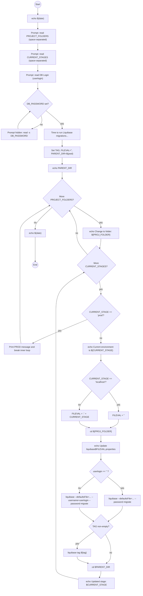

# Diagram: database/migrate.sh

> Auto-generated by Obscura crawlers

## Mermaid

### SVG

<svg id="container" width="1007.5859375" xmlns="http://www.w3.org/2000/svg" class="flowchart" height="4096.953125" viewBox="0 0 1007.5859375 4096.953125" role="graphics-document document" aria-roledescription="flowchart-v2"><g><marker id="container_flowchart-v2-pointEnd" class="marker flowchart-v2" viewBox="0 0 10 10" refX="5" refY="5" markerUnits="userSpaceOnUse" markerWidth="8" markerHeight="8" orient="auto"><path d="M 0 0 L 10 5 L 0 10 z" class="arrowMarkerPath" style="stroke-width: 1; stroke-dasharray: 1, 0;"></path></marker><marker id="container_flowchart-v2-pointStart" class="marker flowchart-v2" viewBox="0 0 10 10" refX="4.5" refY="5" markerUnits="userSpaceOnUse" markerWidth="8" markerHeight="8" orient="auto"><path d="M 0 5 L 10 10 L 10 0 z" class="arrowMarkerPath" style="stroke-width: 1; stroke-dasharray: 1, 0;"></path></marker><marker id="container_flowchart-v2-circleEnd" class="marker flowchart-v2" viewBox="0 0 10 10" refX="11" refY="5" markerUnits="userSpaceOnUse" markerWidth="11" markerHeight="11" orient="auto"><circle cx="5" cy="5" r="5" class="arrowMarkerPath" style="stroke-width: 1; stroke-dasharray: 1, 0;"></circle></marker><marker id="container_flowchart-v2-circleStart" class="marker flowchart-v2" viewBox="0 0 10 10" refX="-1" refY="5" markerUnits="userSpaceOnUse" markerWidth="11" markerHeight="11" orient="auto"><circle cx="5" cy="5" r="5" class="arrowMarkerPath" style="stroke-width: 1; stroke-dasharray: 1, 0;"></circle></marker><marker id="container_flowchart-v2-crossEnd" class="marker cross flowchart-v2" viewBox="0 0 11 11" refX="12" refY="5.2" markerUnits="userSpaceOnUse" markerWidth="11" markerHeight="11" orient="auto"><path d="M 1,1 l 9,9 M 10,1 l -9,9" class="arrowMarkerPath" style="stroke-width: 2; stroke-dasharray: 1, 0;"></path></marker><marker id="container_flowchart-v2-crossStart" class="marker cross flowchart-v2" viewBox="0 0 11 11" refX="-1" refY="5.2" markerUnits="userSpaceOnUse" markerWidth="11" markerHeight="11" orient="auto"><path d="M 1,1 l 9,9 M 10,1 l -9,9" class="arrowMarkerPath" style="stroke-width: 2; stroke-dasharray: 1, 0;"></path></marker><g class="root"><g class="clusters"></g><g class="edgePaths"><path d="M272.313,58.047L272.313,62.214C272.313,66.38,272.313,74.714,272.313,82.38C272.313,90.047,272.313,97.047,272.313,100.547L272.313,104.047" id="L_Start_Date1_0" class="edge-thickness-normal edge-pattern-solid edge-thickness-normal edge-pattern-solid flowchart-link" style=";" data-edge="true" data-et="edge" data-id="L_Start_Date1_0" data-points="W3sieCI6MjcyLjMxMjUsInkiOjU4LjA0Njg3NX0seyJ4IjoyNzIuMzEyNSwieSI6ODMuMDQ2ODc1fSx7IngiOjI3Mi4zMTI1LCJ5IjoxMDguMDQ2ODc1fV0=" marker-end="url(#container_flowchart-v2-pointEnd)"></path><path d="M272.313,162.047L272.313,166.214C272.313,170.38,272.313,178.714,272.313,186.38C272.313,194.047,272.313,201.047,272.313,204.547L272.313,208.047" id="L_Date1_PromptProjects_0" class="edge-thickness-normal edge-pattern-solid edge-thickness-normal edge-pattern-solid flowchart-link" style=";" data-edge="true" data-et="edge" data-id="L_Date1_PromptProjects_0" data-points="W3sieCI6MjcyLjMxMjUsInkiOjE2Mi4wNDY4NzV9LHsieCI6MjcyLjMxMjUsInkiOjE4Ny4wNDY4NzV9LHsieCI6MjcyLjMxMjUsInkiOjIxMi4wNDY4NzV9XQ==" marker-end="url(#container_flowchart-v2-pointEnd)"></path><path d="M272.313,314.047L272.313,318.214C272.313,322.38,272.313,330.714,272.313,338.38C272.313,346.047,272.313,353.047,272.313,356.547L272.313,360.047" id="L_PromptProjects_PromptStages_0" class="edge-thickness-normal edge-pattern-solid edge-thickness-normal edge-pattern-solid flowchart-link" style=";" data-edge="true" data-et="edge" data-id="L_PromptProjects_PromptStages_0" data-points="W3sieCI6MjcyLjMxMjUsInkiOjMxNC4wNDY4NzV9LHsieCI6MjcyLjMxMjUsInkiOjMzOS4wNDY4NzV9LHsieCI6MjcyLjMxMjUsInkiOjM2NC4wNDY4NzV9XQ==" marker-end="url(#container_flowchart-v2-pointEnd)"></path><path d="M272.313,466.047L272.313,470.214C272.313,474.38,272.313,482.714,272.313,490.38C272.313,498.047,272.313,505.047,272.313,508.547L272.313,512.047" id="L_PromptStages_PromptDBLogin_0" class="edge-thickness-normal edge-pattern-solid edge-thickness-normal edge-pattern-solid flowchart-link" style=";" data-edge="true" data-et="edge" data-id="L_PromptStages_PromptDBLogin_0" data-points="W3sieCI6MjcyLjMxMjUsInkiOjQ2Ni4wNDY4NzV9LHsieCI6MjcyLjMxMjUsInkiOjQ5MS4wNDY4NzV9LHsieCI6MjcyLjMxMjUsInkiOjUxNi4wNDY4NzV9XQ==" marker-end="url(#container_flowchart-v2-pointEnd)"></path><path d="M272.313,594.047L272.313,598.214C272.313,602.38,272.313,610.714,272.313,618.38C272.313,626.047,272.313,633.047,272.313,636.547L272.313,640.047" id="L_PromptDBLogin_CheckDBPwd_0" class="edge-thickness-normal edge-pattern-solid edge-thickness-normal edge-pattern-solid flowchart-link" style=";" data-edge="true" data-et="edge" data-id="L_PromptDBLogin_CheckDBPwd_0" data-points="W3sieCI6MjcyLjMxMjUsInkiOjU5NC4wNDY4NzV9LHsieCI6MjcyLjMxMjUsInkiOjYxOS4wNDY4NzV9LHsieCI6MjcyLjMxMjUsInkiOjY0NC4wNDY4NzV9XQ==" marker-end="url(#container_flowchart-v2-pointEnd)"></path><path d="M294.82,815.508L297.818,825.426C300.815,835.344,306.81,855.18,296.235,870.998C285.66,886.817,258.515,898.619,244.943,904.52L231.371,910.421" id="L_CheckDBPwd_AskDBPwd_0" class="edge-thickness-normal edge-pattern-solid edge-thickness-normal edge-pattern-solid flowchart-link" style=";" data-edge="true" data-et="edge" data-id="L_CheckDBPwd_AskDBPwd_0" data-points="W3sieCI6Mjk0LjgyMDQ0ODU3OTQ1NjQsInkiOjgxNS41MDc2NzY0MjA1NDM2fSx7IngiOjMxMi44MDQ2ODc1LCJ5Ijo4NzUuMDE1NjI1fSx7IngiOjIyNy43MDI0MDU0Mjc2MzE1NiwieSI6OTEyLjAxNTYyNX1d" marker-end="url(#container_flowchart-v2-pointEnd)"></path><path d="M130.465,912.016L129.274,905.849C128.082,899.682,125.699,887.349,140.334,866.951C154.969,846.552,186.621,818.089,202.447,803.857L218.274,789.626" id="L_AskDBPwd_CheckDBPwd_0" class="edge-thickness-normal edge-pattern-solid edge-thickness-normal edge-pattern-solid flowchart-link" style=";" data-edge="true" data-et="edge" data-id="L_AskDBPwd_CheckDBPwd_0" data-points="W3sieCI6MTMwLjQ2NDk5Nzk0NDA3ODk2LCJ5Ijo5MTIuMDE1NjI1fSx7IngiOjEyMy4zMTY0MDYyNSwieSI6ODc1LjAxNTYyNX0seyJ4IjoyMjEuMjQ3ODY5NjYxMzE5OTIsInkiOjc4Ni45NTA5OTQ2NjEzMTk5fV0=" marker-end="url(#container_flowchart-v2-pointEnd)"></path><path d="M327.335,782.993L347.446,798.33C367.557,813.667,407.778,844.341,427.889,865.179C448,886.016,448,897.016,448,902.516L448,908.016" id="L_CheckDBPwd_TimeMsg_0" class="edge-thickness-normal edge-pattern-solid edge-thickness-normal edge-pattern-solid flowchart-link" style=";" data-edge="true" data-et="edge" data-id="L_CheckDBPwd_TimeMsg_0" data-points="W3sieCI6MzI3LjMzNTA2OTg4MjQzNjEsInkiOjc4Mi45OTMwNTUxMTc1NjM5fSx7IngiOjQ0OCwieSI6ODc1LjAxNTYyNX0seyJ4Ijo0NDgsInkiOjkxMi4wMTU2MjV9XQ==" marker-end="url(#container_flowchart-v2-pointEnd)"></path><path d="M448,990.016L448,994.182C448,998.349,448,1006.682,448,1014.349C448,1022.016,448,1029.016,448,1032.516L448,1036.016" id="L_TimeMsg_SetVars_0" class="edge-thickness-normal edge-pattern-solid edge-thickness-normal edge-pattern-solid flowchart-link" style=";" data-edge="true" data-et="edge" data-id="L_TimeMsg_SetVars_0" data-points="W3sieCI6NDQ4LCJ5Ijo5OTAuMDE1NjI1fSx7IngiOjQ0OCwieSI6MTAxNS4wMTU2MjV9LHsieCI6NDQ4LCJ5IjoxMDQwLjAxNTYyNX1d" marker-end="url(#container_flowchart-v2-pointEnd)"></path><path d="M448,1118.016L448,1122.182C448,1126.349,448,1134.682,448,1142.349C448,1150.016,448,1157.016,448,1160.516L448,1164.016" id="L_SetVars_EchoParent_0" class="edge-thickness-normal edge-pattern-solid edge-thickness-normal edge-pattern-solid flowchart-link" style=";" data-edge="true" data-et="edge" data-id="L_SetVars_EchoParent_0" data-points="W3sieCI6NDQ4LCJ5IjoxMTE4LjAxNTYyNX0seyJ4Ijo0NDgsInkiOjExNDMuMDE1NjI1fSx7IngiOjQ0OCwieSI6MTE2OC4wMTU2MjV9XQ==" marker-end="url(#container_flowchart-v2-pointEnd)"></path><path d="M448,1222.016L448,1226.182C448,1230.349,448,1238.682,448,1246.349C448,1254.016,448,1261.016,448,1264.516L448,1268.016" id="L_EchoParent_ProjectMore_0" class="edge-thickness-normal edge-pattern-solid edge-thickness-normal edge-pattern-solid flowchart-link" style=";" data-edge="true" data-et="edge" data-id="L_EchoParent_ProjectMore_0" data-points="W3sieCI6NDQ4LCJ5IjoxMjIyLjAxNTYyNX0seyJ4Ijo0NDgsInkiOjEyNDcuMDE1NjI1fSx7IngiOjQ0OCwieSI6MTI3Mi4wMTU2MjV9XQ==" marker-end="url(#container_flowchart-v2-pointEnd)"></path><path d="M522.06,1430.815L554.415,1449.325C586.769,1467.835,651.478,1504.855,683.833,1528.865C716.188,1552.875,716.188,1563.875,716.188,1569.375L716.188,1574.875" id="L_ProjectMore_EchoChangeToFolder_0" class="edge-thickness-normal edge-pattern-solid edge-thickness-normal edge-pattern-solid flowchart-link" style=";" data-edge="true" data-et="edge" data-id="L_ProjectMore_EchoChangeToFolder_0" data-points="W3sieCI6NTIyLjA2MDA0MjQ3OTY2MzUsInkiOjE0MzAuODE0OTU3NTIwMzM2NX0seyJ4Ijo3MTYuMTg3NSwieSI6MTU0MS44NzV9LHsieCI6NzE2LjE4NzUsInkiOjE1NzguODc1fV0=" marker-end="url(#container_flowchart-v2-pointEnd)"></path><path d="M383.041,1439.916L361.595,1456.909C340.148,1473.902,297.256,1507.889,275.81,1532.382C254.363,1556.875,254.363,1571.875,254.363,1579.375L254.363,1586.875" id="L_ProjectMore_Date2_0" class="edge-thickness-normal edge-pattern-solid edge-thickness-normal edge-pattern-solid flowchart-link" style=";" data-edge="true" data-et="edge" data-id="L_ProjectMore_Date2_0" data-points="W3sieCI6MzgzLjA0MTA2OTI0MDM2ODUsInkiOjE0MzkuOTE2MDY5MjQwMzY4NH0seyJ4IjoyNTQuMzYzMjgxMjUsInkiOjE1NDEuODc1fSx7IngiOjI1NC4zNjMyODEyNSwieSI6MTU5MC44NzV9XQ==" marker-end="url(#container_flowchart-v2-pointEnd)"></path><path d="M716.188,1656.875L716.188,1661.042C716.188,1665.208,716.188,1673.542,714.453,1684.905C712.718,1696.269,709.248,1710.663,707.513,1717.86L705.778,1725.057" id="L_EchoChangeToFolder_StageMore_0" class="edge-thickness-normal edge-pattern-solid edge-thickness-normal edge-pattern-solid flowchart-link" style=";" data-edge="true" data-et="edge" data-id="L_EchoChangeToFolder_StageMore_0" data-points="W3sieCI6NzE2LjE4NzUsInkiOjE2NTYuODc1fSx7IngiOjcxNi4xODc1LCJ5IjoxNjgxLjg3NX0seyJ4Ijo3MDQuODQwMjc3NDUyNTc0OCwieSI6MTcyOC45NDU3NDYyMDI1NzQ4fV0=" marker-end="url(#container_flowchart-v2-pointEnd)"></path><path d="M625.2,1764.444L611.067,1750.683C596.934,1736.921,568.668,1709.398,554.535,1684.97C540.402,1660.542,540.402,1639.208,540.402,1615.875C540.402,1592.542,540.402,1567.208,532.64,1541.652C524.877,1516.096,509.352,1490.317,501.589,1477.428L493.827,1464.538" id="L_StageMore_ProjectMore_0" class="edge-thickness-normal edge-pattern-solid edge-thickness-normal edge-pattern-solid flowchart-link" style=";" data-edge="true" data-et="edge" data-id="L_StageMore_ProjectMore_0" data-points="W3sieCI6NjI1LjIwMDQxNTgxMDg0NzQsInkiOjE3NjQuNDQ0MTE1NDM5MTUyNX0seyJ4Ijo1NDAuNDAyMzQzNzUsInkiOjE2ODEuODc1fSx7IngiOjU0MC40MDIzNDM3NSwieSI6MTYxNy44NzV9LHsieCI6NTQwLjQwMjM0Mzc1LCJ5IjoxNTQxLjg3NX0seyJ4Ijo0OTEuNzYzMTE3MjQ4NzAxLCJ5IjoxNDYxLjExMTg4Mjc1MTI5OX1d" marker-end="url(#container_flowchart-v2-pointEnd)"></path><path d="M703.401,1913.493L705.532,1923.099C707.663,1932.704,711.925,1951.914,714.056,1967.02C716.188,1982.125,716.188,1993.125,716.188,1998.625L716.188,2004.125" id="L_StageMore_CheckProd_0" class="edge-thickness-normal edge-pattern-solid edge-thickness-normal edge-pattern-solid flowchart-link" style=";" data-edge="true" data-et="edge" data-id="L_StageMore_CheckProd_0" data-points="W3sieCI6NzAzLjQwMTIxNzAxODg2MzUsInkiOjE5MTMuNDkzMzE0MjMxMTM2NX0seyJ4Ijo3MTYuMTg3NSwieSI6MTk3MS4xMjV9LHsieCI6NzE2LjE4NzUsInkiOjIwMDguMTI1fV0=" marker-end="url(#container_flowchart-v2-pointEnd)"></path><path d="M627.376,2163.486L571.411,2184.454C515.445,2205.423,403.513,2247.36,337.448,2274.162C271.383,2300.963,251.185,2312.63,241.085,2318.463L230.986,2324.296" id="L_CheckProd_ProdMsg_0" class="edge-thickness-normal edge-pattern-solid edge-thickness-normal edge-pattern-solid flowchart-link" style=";" data-edge="true" data-et="edge" data-id="L_CheckProd_ProdMsg_0" data-points="W3sieCI6NjI3LjM3NjI2MTQ1MDE0MjIsInkiOjIxNjMuNDg1NjM2NDUwMTQyfSx7IngiOjI5MS41ODIwMzEyNSwieSI6MjI4OS4yOTY4NzV9LHsieCI6MjI3LjUyMjM1ODE0MTQ0NzM3LCJ5IjoyMzI2LjI5Njg3NX1d" marker-end="url(#container_flowchart-v2-pointEnd)"></path><path d="M151.787,2326.297L150.489,2320.13C149.19,2313.964,146.593,2301.63,145.295,2268.949C143.996,2236.268,143.996,2183.24,143.996,2130.211C143.996,2077.182,143.996,2024.154,143.996,1972.535C143.996,1920.917,143.996,1870.708,143.996,1822.5C143.996,1774.292,143.996,1728.083,143.996,1694.313C143.996,1660.542,143.996,1639.208,143.996,1615.875C143.996,1592.542,143.996,1567.208,181.172,1535.779C218.348,1504.35,292.7,1466.825,329.876,1448.062L367.051,1429.3" id="L_ProdMsg_ProjectMore_0" class="edge-thickness-normal edge-pattern-solid edge-thickness-normal edge-pattern-solid flowchart-link" style=";" data-edge="true" data-et="edge" data-id="L_ProdMsg_ProjectMore_0" data-points="W3sieCI6MTUxLjc4NzQ2OTE2MTE4NDIyLCJ5IjoyMzI2LjI5Njg3NX0seyJ4IjoxNDMuOTk2MDkzNzUsInkiOjIyODkuMjk2ODc1fSx7IngiOjE0My45OTYwOTM3NSwieSI6MjEzMC4yMTA5Mzc1fSx7IngiOjE0My45OTYwOTM3NSwieSI6MTk3MS4xMjV9LHsieCI6MTQzLjk5NjA5Mzc1LCJ5IjoxODIwLjV9LHsieCI6MTQzLjk5NjA5Mzc1LCJ5IjoxNjgxLjg3NX0seyJ4IjoxNDMuOTk2MDkzNzUsInkiOjE2MTcuODc1fSx7IngiOjE0My45OTYwOTM3NSwieSI6MTU0MS44NzV9LHsieCI6MzcwLjYyMjQ3Mzk3ODU3MDE2LCJ5IjoxNDI3LjQ5NzQ3Mzk3ODU3fV0=" marker-end="url(#container_flowchart-v2-pointEnd)"></path><path d="M716.188,2252.297L716.188,2258.464C716.188,2264.63,716.188,2276.964,716.188,2288.63C716.188,2300.297,716.188,2311.297,716.188,2316.797L716.188,2322.297" id="L_CheckProd_CurrentEnv_0" class="edge-thickness-normal edge-pattern-solid edge-thickness-normal edge-pattern-solid flowchart-link" style=";" data-edge="true" data-et="edge" data-id="L_CheckProd_CurrentEnv_0" data-points="W3sieCI6NzE2LjE4NzUsInkiOjIyNTIuMjk2ODc1fSx7IngiOjcxNi4xODc1LCJ5IjoyMjg5LjI5Njg3NX0seyJ4Ijo3MTYuMTg3NSwieSI6MjMyNi4yOTY4NzV9XQ==" marker-end="url(#container_flowchart-v2-pointEnd)"></path><path d="M716.188,2404.297L716.188,2408.464C716.188,2412.63,716.188,2420.964,716.188,2428.63C716.188,2436.297,716.188,2443.297,716.188,2446.797L716.188,2450.297" id="L_CurrentEnv_SetFileval_0" class="edge-thickness-normal edge-pattern-solid edge-thickness-normal edge-pattern-solid flowchart-link" style=";" data-edge="true" data-et="edge" data-id="L_CurrentEnv_SetFileval_0" data-points="W3sieCI6NzE2LjE4NzUsInkiOjI0MDQuMjk2ODc1fSx7IngiOjcxNi4xODc1LCJ5IjoyNDI5LjI5Njg3NX0seyJ4Ijo3MTYuMTg3NSwieSI6MjQ1NC4yOTY4NzV9XQ==" marker-end="url(#container_flowchart-v2-pointEnd)"></path><path d="M773.368,2675.116L784.338,2690.813C795.308,2706.51,817.248,2737.903,828.218,2761.1C839.188,2784.297,839.188,2799.297,839.188,2806.797L839.188,2814.297" id="L_SetFileval_FilevalLocal_0" class="edge-thickness-normal edge-pattern-solid edge-thickness-normal edge-pattern-solid flowchart-link" style=";" data-edge="true" data-et="edge" data-id="L_SetFileval_FilevalLocal_0" data-points="W3sieCI6NzczLjM2ODEwMjAwNjY4OSwieSI6MjY3NS4xMTYyNzI5OTMzMTF9LHsieCI6ODM5LjE4NzUsInkiOjI3NjkuMjk2ODc1fSx7IngiOjgzOS4xODc1LCJ5IjoyODE4LjI5Njg3NX1d" marker-end="url(#container_flowchart-v2-pointEnd)"></path><path d="M650.741,2666.85L635.548,2683.925C620.356,2700.999,589.971,2735.148,574.778,2757.722C559.586,2780.297,559.586,2791.297,559.586,2796.797L559.586,2802.297" id="L_SetFileval_FilevalDot_0" class="edge-thickness-normal edge-pattern-solid edge-thickness-normal edge-pattern-solid flowchart-link" style=";" data-edge="true" data-et="edge" data-id="L_SetFileval_FilevalDot_0" data-points="W3sieCI6NjUwLjc0MDk3Mjg1ODM4NDUsInkiOjI2NjYuODUwMzQ3ODU4Mzg0M30seyJ4Ijo1NTkuNTg1OTM3NSwieSI6Mjc2OS4yOTY4NzV9LHsieCI6NTU5LjU4NTkzNzUsInkiOjI4MDYuMjk2ODc1fV0=" marker-end="url(#container_flowchart-v2-pointEnd)"></path><path d="M839.188,2872.297L839.188,2878.464C839.188,2884.63,839.188,2896.964,829.946,2907.037C820.704,2917.111,802.221,2924.925,792.979,2928.832L783.737,2932.739" id="L_FilevalLocal_CdProj_0" class="edge-thickness-normal edge-pattern-solid edge-thickness-normal edge-pattern-solid flowchart-link" style=";" data-edge="true" data-et="edge" data-id="L_FilevalLocal_CdProj_0" data-points="W3sieCI6ODM5LjE4NzUsInkiOjI4NzIuMjk2ODc1fSx7IngiOjgzOS4xODc1LCJ5IjoyOTA5LjI5Njg3NX0seyJ4Ijo3ODAuMDUyODg0NjE1Mzg0NiwieSI6MjkzNC4yOTY4NzV9XQ==" marker-end="url(#container_flowchart-v2-pointEnd)"></path><path d="M559.586,2884.297L559.586,2888.464C559.586,2892.63,559.586,2900.964,571.501,2909.087C583.417,2917.21,607.248,2925.123,619.163,2929.08L631.079,2933.036" id="L_FilevalDot_CdProj_0" class="edge-thickness-normal edge-pattern-solid edge-thickness-normal edge-pattern-solid flowchart-link" style=";" data-edge="true" data-et="edge" data-id="L_FilevalDot_CdProj_0" data-points="W3sieCI6NTU5LjU4NTkzNzUsInkiOjI4ODQuMjk2ODc1fSx7IngiOjU1OS41ODU5Mzc1LCJ5IjoyOTA5LjI5Njg3NX0seyJ4Ijo2MzQuODc1MTUwMjQwMzg0NiwieSI6MjkzNC4yOTY4NzV9XQ==" marker-end="url(#container_flowchart-v2-pointEnd)"></path><path d="M716.188,2988.297L716.188,2992.464C716.188,2996.63,716.188,3004.964,716.188,3012.63C716.188,3020.297,716.188,3027.297,716.188,3030.797L716.188,3034.297" id="L_CdProj_UpdateProp_0" class="edge-thickness-normal edge-pattern-solid edge-thickness-normal edge-pattern-solid flowchart-link" style=";" data-edge="true" data-et="edge" data-id="L_CdProj_UpdateProp_0" data-points="W3sieCI6NzE2LjE4NzUsInkiOjI5ODguMjk2ODc1fSx7IngiOjcxNi4xODc1LCJ5IjozMDEzLjI5Njg3NX0seyJ4Ijo3MTYuMTg3NSwieSI6MzAzOC4yOTY4NzV9XQ==" marker-end="url(#container_flowchart-v2-pointEnd)"></path><path d="M716.188,3116.297L716.188,3120.464C716.188,3124.63,716.188,3132.964,716.188,3140.63C716.188,3148.297,716.188,3155.297,716.188,3158.797L716.188,3162.297" id="L_UpdateProp_CheckUserlogin_0" class="edge-thickness-normal edge-pattern-solid edge-thickness-normal edge-pattern-solid flowchart-link" style=";" data-edge="true" data-et="edge" data-id="L_UpdateProp_CheckUserlogin_0" data-points="W3sieCI6NzE2LjE4NzUsInkiOjMxMTYuMjk2ODc1fSx7IngiOjcxNi4xODc1LCJ5IjozMTQxLjI5Njg3NX0seyJ4Ijo3MTYuMTg3NSwieSI6MzE2Ni4yOTY4NzV9XQ==" marker-end="url(#container_flowchart-v2-pointEnd)"></path><path d="M762.546,3284.86L780.386,3298.753C798.226,3312.646,833.906,3340.433,851.746,3361.826C869.586,3383.219,869.586,3398.219,869.586,3405.719L869.586,3413.219" id="L_CheckUserlogin_LiquibaseNoUser_0" class="edge-thickness-normal edge-pattern-solid edge-thickness-normal edge-pattern-solid flowchart-link" style=";" data-edge="true" data-et="edge" data-id="L_CheckUserlogin_LiquibaseNoUser_0" data-points="W3sieCI6NzYyLjU0NjEwMTI2NTg5MDcsInkiOjMyODQuODYwMTQ4NzM0MTA5M30seyJ4Ijo4NjkuNTg1OTM3NSwieSI6MzM2OC4yMTg3NX0seyJ4Ijo4NjkuNTg1OTM3NSwieSI6MzQxNy4yMTg3NX1d" marker-end="url(#container_flowchart-v2-pointEnd)"></path><path d="M669.41,3284.441L651.106,3298.404C632.802,3312.367,596.194,3340.293,577.89,3359.756C559.586,3379.219,559.586,3390.219,559.586,3395.719L559.586,3401.219" id="L_CheckUserlogin_LiquibaseWithUser_0" class="edge-thickness-normal edge-pattern-solid edge-thickness-normal edge-pattern-solid flowchart-link" style=";" data-edge="true" data-et="edge" data-id="L_CheckUserlogin_LiquibaseWithUser_0" data-points="W3sieCI6NjY5LjQxMDAwNzAxMzAzMiwieSI6MzI4NC40NDEyNTcwMTMwMzJ9LHsieCI6NTU5LjU4NTkzNzUsInkiOjMzNjguMjE4NzV9LHsieCI6NTU5LjU4NTkzNzUsInkiOjM0MDUuMjE4NzV9XQ==" marker-end="url(#container_flowchart-v2-pointEnd)"></path><path d="M869.586,3495.219L869.586,3501.385C869.586,3507.552,869.586,3519.885,852.867,3538.135C836.148,3556.386,802.711,3580.552,785.992,3592.636L769.273,3604.719" id="L_LiquibaseNoUser_CheckTag_0" class="edge-thickness-normal edge-pattern-solid edge-thickness-normal edge-pattern-solid flowchart-link" style=";" data-edge="true" data-et="edge" data-id="L_LiquibaseNoUser_CheckTag_0" data-points="W3sieCI6ODY5LjU4NTkzNzUsInkiOjM0OTUuMjE4NzV9LHsieCI6ODY5LjU4NTkzNzUsInkiOjM1MzIuMjE4NzV9LHsieCI6NzY2LjAzMDg4MTYxNjU4MiwieSI6MzYwNy4wNjIxMzE2MTY1ODJ9XQ==" marker-end="url(#container_flowchart-v2-pointEnd)"></path><path d="M559.586,3507.219L559.586,3511.385C559.586,3515.552,559.586,3523.885,576.763,3540.213C593.94,3556.54,628.294,3580.861,645.471,3593.022L662.648,3605.182" id="L_LiquibaseWithUser_CheckTag_0" class="edge-thickness-normal edge-pattern-solid edge-thickness-normal edge-pattern-solid flowchart-link" style=";" data-edge="true" data-et="edge" data-id="L_LiquibaseWithUser_CheckTag_0" data-points="W3sieCI6NTU5LjU4NTkzNzUsInkiOjM1MDcuMjE4NzV9LHsieCI6NTU5LjU4NTkzNzUsInkiOjM1MzIuMjE4NzV9LHsieCI6NjY1LjkxMjcwODE1OTkwNDgsInkiOjM2MDcuNDkzNTQxODQwMDk1fV0=" marker-end="url(#container_flowchart-v2-pointEnd)"></path><path d="M666.119,3678.884L645.822,3693.396C625.526,3707.907,584.933,3736.93,564.636,3756.942C544.34,3776.953,544.34,3787.953,544.34,3793.453L544.34,3798.953" id="L_CheckTag_TagCmd_0" class="edge-thickness-normal edge-pattern-solid edge-thickness-normal edge-pattern-solid flowchart-link" style=";" data-edge="true" data-et="edge" data-id="L_CheckTag_TagCmd_0" data-points="W3sieCI6NjY2LjExODUwODc5MTc2NzcsInkiOjM2NzguODg0MTMzNzkxNzY4fSx7IngiOjU0NC4zMzk4NDM3NSwieSI6Mzc2NS45NTMxMjV9LHsieCI6NTQ0LjMzOTg0Mzc1LCJ5IjozODAyLjk1MzEyNX1d" marker-end="url(#container_flowchart-v2-pointEnd)"></path><path d="M747.448,3697.693L753.96,3709.07C760.473,3720.446,773.498,3743.2,780.011,3765.243C786.523,3787.286,786.523,3808.62,786.523,3827.953C786.523,3847.286,786.523,3864.62,781.424,3877.057C776.324,3889.494,766.124,3897.035,761.024,3900.805L755.925,3904.575" id="L_CheckTag_CdParent_0" class="edge-thickness-normal edge-pattern-solid edge-thickness-normal edge-pattern-solid flowchart-link" style=";" data-edge="true" data-et="edge" data-id="L_CheckTag_CdParent_0" data-points="W3sieCI6NzQ3LjQ0NzYwMDY0OTUxNDgsInkiOjM2OTcuNjkzMDI0MzUwNDg1M30seyJ4Ijo3ODYuNTIzNDM3NSwieSI6Mzc2NS45NTMxMjV9LHsieCI6Nzg2LjUyMzQzNzUsInkiOjM4MjkuOTUzMTI1fSx7IngiOjc4Ni41MjM0Mzc1LCJ5IjozODgxLjk1MzEyNX0seyJ4Ijo3NTIuNzA4MDgyOTMyNjkyMywieSI6MzkwNi45NTMxMjV9XQ==" marker-end="url(#container_flowchart-v2-pointEnd)"></path><path d="M544.34,3856.953L544.34,3861.12C544.34,3865.286,544.34,3873.62,557.609,3881.802C570.877,3889.983,597.415,3898.013,610.684,3902.028L623.953,3906.043" id="L_TagCmd_CdParent_0" class="edge-thickness-normal edge-pattern-solid edge-thickness-normal edge-pattern-solid flowchart-link" style=";" data-edge="true" data-et="edge" data-id="L_TagCmd_CdParent_0" data-points="W3sieCI6NTQ0LjMzOTg0Mzc1LCJ5IjozODU2Ljk1MzEyNX0seyJ4Ijo1NDQuMzM5ODQzNzUsInkiOjM4ODEuOTUzMTI1fSx7IngiOjYyNy43ODEyNSwieSI6MzkwNy4yMDE5NjAwNDE5Mzg1fV0=" marker-end="url(#container_flowchart-v2-pointEnd)"></path><path d="M716.188,3960.953L716.188,3965.12C716.188,3969.286,716.188,3977.62,714.32,3985.362C712.453,3993.105,708.719,4000.256,706.852,4003.832L704.985,4007.407" id="L_CdParent_UpdatedStage_0" class="edge-thickness-normal edge-pattern-solid edge-thickness-normal edge-pattern-solid flowchart-link" style=";" data-edge="true" data-et="edge" data-id="L_CdParent_UpdatedStage_0" data-points="W3sieCI6NzE2LjE4NzUsInkiOjM5NjAuOTUzMTI1fSx7IngiOjcxNi4xODc1LCJ5IjozOTg1Ljk1MzEyNX0seyJ4Ijo3MDMuMTMzNjA1OTU3MDMxMiwieSI6NDAxMC45NTMxMjV9XQ==" marker-end="url(#container_flowchart-v2-pointEnd)"></path><path d="M552.77,4021.527L525.656,4015.598C498.542,4009.669,444.314,3997.811,417.2,3983.215C390.086,3968.62,390.086,3951.286,390.086,3933.953C390.086,3916.62,390.086,3899.286,390.086,3881.953C390.086,3864.62,390.086,3847.286,390.086,3827.953C390.086,3808.62,390.086,3787.286,390.086,3756.142C390.086,3724.997,390.086,3684.042,390.086,3645.086C390.086,3606.13,390.086,3569.174,390.086,3538.03C390.086,3506.885,390.086,3481.552,390.086,3454.219C390.086,3426.885,390.086,3397.552,390.086,3362.975C390.086,3328.398,390.086,3288.578,390.086,3250.758C390.086,3212.938,390.086,3177.117,390.086,3148.54C390.086,3119.964,390.086,3098.63,390.086,3077.297C390.086,3055.964,390.086,3034.63,390.086,3015.297C390.086,2995.964,390.086,2978.63,390.086,2961.297C390.086,2943.964,390.086,2926.63,390.086,2907.297C390.086,2887.964,390.086,2866.63,390.086,2843.297C390.086,2819.964,390.086,2794.63,390.086,2752.63C390.086,2710.63,390.086,2651.964,390.086,2595.297C390.086,2538.63,390.086,2483.964,390.086,2445.964C390.086,2407.964,390.086,2386.63,390.086,2363.297C390.086,2339.964,390.086,2314.63,390.086,2275.449C390.086,2236.268,390.086,2183.24,390.086,2130.211C390.086,2077.182,390.086,2024.154,425.771,1979.275C461.456,1934.396,532.825,1897.667,568.51,1879.302L604.195,1860.937" id="L_UpdatedStage_StageMore_0" class="edge-thickness-normal edge-pattern-solid edge-thickness-normal edge-pattern-solid flowchart-link" style=";" data-edge="true" data-et="edge" data-id="L_UpdatedStage_StageMore_0" data-points="W3sieCI6NTUyLjc2OTUzMTI1LCJ5Ijo0MDIxLjUyNjUyMzEwNzQ5MTR9LHsieCI6MzkwLjA4NTkzNzUsInkiOjM5ODUuOTUzMTI1fSx7IngiOjM5MC4wODU5Mzc1LCJ5IjozOTMzLjk1MzEyNX0seyJ4IjozOTAuMDg1OTM3NSwieSI6Mzg4MS45NTMxMjV9LHsieCI6MzkwLjA4NTkzNzUsInkiOjM4MjkuOTUzMTI1fSx7IngiOjM5MC4wODU5Mzc1LCJ5IjozNzY1Ljk1MzEyNX0seyJ4IjozOTAuMDg1OTM3NSwieSI6MzY0My4wODU5Mzc1fSx7IngiOjM5MC4wODU5Mzc1LCJ5IjozNTMyLjIxODc1fSx7IngiOjM5MC4wODU5Mzc1LCJ5IjozNDU2LjIxODc1fSx7IngiOjM5MC4wODU5Mzc1LCJ5IjozMzY4LjIxODc1fSx7IngiOjM5MC4wODU5Mzc1LCJ5IjozMjQ4Ljc1NzgxMjV9LHsieCI6MzkwLjA4NTkzNzUsInkiOjMxNDEuMjk2ODc1fSx7IngiOjM5MC4wODU5Mzc1LCJ5IjozMDc3LjI5Njg3NX0seyJ4IjozOTAuMDg1OTM3NSwieSI6MzAxMy4yOTY4NzV9LHsieCI6MzkwLjA4NTkzNzUsInkiOjI5NjEuMjk2ODc1fSx7IngiOjM5MC4wODU5Mzc1LCJ5IjoyOTA5LjI5Njg3NX0seyJ4IjozOTAuMDg1OTM3NSwieSI6Mjg0NS4yOTY4NzV9LHsieCI6MzkwLjA4NTkzNzUsInkiOjI3NjkuMjk2ODc1fSx7IngiOjM5MC4wODU5Mzc1LCJ5IjoyNTkzLjI5Njg3NX0seyJ4IjozOTAuMDg1OTM3NSwieSI6MjQyOS4yOTY4NzV9LHsieCI6MzkwLjA4NTkzNzUsInkiOjIzNjUuMjk2ODc1fSx7IngiOjM5MC4wODU5Mzc1LCJ5IjoyMjg5LjI5Njg3NX0seyJ4IjozOTAuMDg1OTM3NSwieSI6MjEzMC4yMTA5Mzc1fSx7IngiOjM5MC4wODU5Mzc1LCJ5IjoxOTcxLjEyNX0seyJ4Ijo2MDcuNzUxNDIwMTQ0NzYzMywieSI6MTg1OS4xMDY4ODg4OTQ3NjMyfV0=" marker-end="url(#container_flowchart-v2-pointEnd)"></path><path d="M254.363,1644.875L254.363,1651.042C254.363,1657.208,254.363,1669.542,254.363,1694.616C254.363,1719.69,254.363,1757.505,254.363,1776.413L254.363,1795.32" id="L_Date2_End_0" class="edge-thickness-normal edge-pattern-solid edge-thickness-normal edge-pattern-solid flowchart-link" style=";" data-edge="true" data-et="edge" data-id="L_Date2_End_0" data-points="W3sieCI6MjU0LjM2MzI4MTI1LCJ5IjoxNjQ0Ljg3NX0seyJ4IjoyNTQuMzYzMjgxMjUsInkiOjE2ODEuODc1fSx7IngiOjI1NC4zNjMyODEyNSwieSI6MTc5OS4zMjAzMTI1fV0=" marker-end="url(#container_flowchart-v2-pointEnd)"></path></g><g class="edgeLabels"><g class="edgeLabel"><g class="label" data-id="L_Start_Date1_0" transform="translate(0, 0)"><foreignObject width="0" height="0">

</foreignObject></g></g><g class="edgeLabel"><g class="label" data-id="L_Date1_PromptProjects_0" transform="translate(0, 0)"><foreignObject width="0" height="0">

</foreignObject></g></g><g class="edgeLabel"><g class="label" data-id="L_PromptProjects_PromptStages_0" transform="translate(0, 0)"><foreignObject width="0" height="0">

</foreignObject></g></g><g class="edgeLabel"><g class="label" data-id="L_PromptStages_PromptDBLogin_0" transform="translate(0, 0)"><foreignObject width="0" height="0">

</foreignObject></g></g><g class="edgeLabel"><g class="label" data-id="L_PromptDBLogin_CheckDBPwd_0" transform="translate(0, 0)"><foreignObject width="0" height="0">

</foreignObject></g></g><g class="edgeLabel" transform="translate(298.75902, 881.12227)"><g class="label" data-id="L_CheckDBPwd_AskDBPwd_0" transform="translate(-9.3671875, -12)"><foreignObject width="18.734375" height="24">

no

</foreignObject></g></g><g class="edgeLabel"><g class="label" data-id="L_AskDBPwd_CheckDBPwd_0" transform="translate(0, 0)"><foreignObject width="0" height="0">

</foreignObject></g></g><g class="edgeLabel" transform="translate(448, 875.015625)"><g class="label" data-id="L_CheckDBPwd_TimeMsg_0" transform="translate(-12.0078125, -12)"><foreignObject width="24.015625" height="24">

yes

</foreignObject></g></g><g class="edgeLabel"><g class="label" data-id="L_TimeMsg_SetVars_0" transform="translate(0, 0)"><foreignObject width="0" height="0">

</foreignObject></g></g><g class="edgeLabel"><g class="label" data-id="L_SetVars_EchoParent_0" transform="translate(0, 0)"><foreignObject width="0" height="0">

</foreignObject></g></g><g class="edgeLabel"><g class="label" data-id="L_EchoParent_ProjectMore_0" transform="translate(0, 0)"><foreignObject width="0" height="0">

</foreignObject></g></g><g class="edgeLabel" transform="translate(716.1875, 1541.875)"><g class="label" data-id="L_ProjectMore_EchoChangeToFolder_0" transform="translate(-12.0078125, -12)"><foreignObject width="24.015625" height="24">

yes

</foreignObject></g></g><g class="edgeLabel" transform="translate(254.36328125, 1541.875)"><g class="label" data-id="L_ProjectMore_Date2_0" transform="translate(-9.3671875, -12)"><foreignObject width="18.734375" height="24">

no

</foreignObject></g></g><g class="edgeLabel"><g class="label" data-id="L_EchoChangeToFolder_StageMore_0" transform="translate(0, 0)"><foreignObject width="0" height="0">

</foreignObject></g></g><g class="edgeLabel" transform="translate(540.40234375, 1617.875)"><g class="label" data-id="L_StageMore_ProjectMore_0" transform="translate(-9.3671875, -12)"><foreignObject width="18.734375" height="24">

no

</foreignObject></g></g><g class="edgeLabel" transform="translate(716.1875, 1971.125)"><g class="label" data-id="L_StageMore_CheckProd_0" transform="translate(-12.0078125, -12)"><foreignObject width="24.015625" height="24">

yes

</foreignObject></g></g><g class="edgeLabel" transform="translate(424.84181, 2239.36875)"><g class="label" data-id="L_CheckProd_ProdMsg_0" transform="translate(-12.0078125, -12)"><foreignObject width="24.015625" height="24">

yes

</foreignObject></g></g><g class="edgeLabel"><g class="label" data-id="L_ProdMsg_ProjectMore_0" transform="translate(0, 0)"><foreignObject width="0" height="0">

</foreignObject></g></g><g class="edgeLabel" transform="translate(716.1875, 2289.296875)"><g class="label" data-id="L_CheckProd_CurrentEnv_0" transform="translate(-9.3671875, -12)"><foreignObject width="18.734375" height="24">

no

</foreignObject></g></g><g class="edgeLabel"><g class="label" data-id="L_CurrentEnv_SetFileval_0" transform="translate(0, 0)"><foreignObject width="0" height="0">

</foreignObject></g></g><g class="edgeLabel" transform="translate(839.1875, 2769.296875)"><g class="label" data-id="L_SetFileval_FilevalLocal_0" transform="translate(-12.0078125, -12)"><foreignObject width="24.015625" height="24">

yes

</foreignObject></g></g><g class="edgeLabel" transform="translate(559.5859375, 2769.296875)"><g class="label" data-id="L_SetFileval_FilevalDot_0" transform="translate(-9.3671875, -12)"><foreignObject width="18.734375" height="24">

no

</foreignObject></g></g><g class="edgeLabel"><g class="label" data-id="L_FilevalLocal_CdProj_0" transform="translate(0, 0)"><foreignObject width="0" height="0">

</foreignObject></g></g><g class="edgeLabel"><g class="label" data-id="L_FilevalDot_CdProj_0" transform="translate(0, 0)"><foreignObject width="0" height="0">

</foreignObject></g></g><g class="edgeLabel"><g class="label" data-id="L_CdProj_UpdateProp_0" transform="translate(0, 0)"><foreignObject width="0" height="0">

</foreignObject></g></g><g class="edgeLabel"><g class="label" data-id="L_UpdateProp_CheckUserlogin_0" transform="translate(0, 0)"><foreignObject width="0" height="0">

</foreignObject></g></g><g class="edgeLabel" transform="translate(869.5859375, 3368.21875)"><g class="label" data-id="L_CheckUserlogin_LiquibaseNoUser_0" transform="translate(-12.0078125, -12)"><foreignObject width="24.015625" height="24">

yes

</foreignObject></g></g><g class="edgeLabel" transform="translate(559.5859375, 3368.21875)"><g class="label" data-id="L_CheckUserlogin_LiquibaseWithUser_0" transform="translate(-9.3671875, -12)"><foreignObject width="18.734375" height="24">

no

</foreignObject></g></g><g class="edgeLabel"><g class="label" data-id="L_LiquibaseNoUser_CheckTag_0" transform="translate(0, 0)"><foreignObject width="0" height="0">

</foreignObject></g></g><g class="edgeLabel"><g class="label" data-id="L_LiquibaseWithUser_CheckTag_0" transform="translate(0, 0)"><foreignObject width="0" height="0">

</foreignObject></g></g><g class="edgeLabel" transform="translate(544.33984375, 3765.953125)"><g class="label" data-id="L_CheckTag_TagCmd_0" transform="translate(-12.0078125, -12)"><foreignObject width="24.015625" height="24">

yes

</foreignObject></g></g><g class="edgeLabel" transform="translate(786.5234375, 3829.953125)"><g class="label" data-id="L_CheckTag_CdParent_0" transform="translate(-9.3671875, -12)"><foreignObject width="18.734375" height="24">

no

</foreignObject></g></g><g class="edgeLabel"><g class="label" data-id="L_TagCmd_CdParent_0" transform="translate(0, 0)"><foreignObject width="0" height="0">

</foreignObject></g></g><g class="edgeLabel"><g class="label" data-id="L_CdParent_UpdatedStage_0" transform="translate(0, 0)"><foreignObject width="0" height="0">

</foreignObject></g></g><g class="edgeLabel"><g class="label" data-id="L_UpdatedStage_StageMore_0" transform="translate(0, 0)"><foreignObject width="0" height="0">

</foreignObject></g></g><g class="edgeLabel"><g class="label" data-id="L_Date2_End_0" transform="translate(0, 0)"><foreignObject width="0" height="0">

</foreignObject></g></g></g><g class="nodes"><g class="node default" id="flowchart-Start-0" transform="translate(272.3125, 33.0234375)"><circle class="basic label-container" style="" r="25.0234375" cx="0" cy="0"></circle><g class="label" style="" transform="translate(-17.5234375, -12)"><rect></rect><foreignObject width="35.046875" height="24">

Start

</foreignObject></g></g><g class="node default" id="flowchart-Date1-1" transform="translate(272.3125, 135.046875)"><rect class="basic label-container" style="" x="-75.3671875" y="-27" width="150.734375" height="54"></rect><g class="label" style="" transform="translate(-45.3671875, -12)"><rect></rect><foreignObject width="90.734375" height="24">

echo $(date)

</foreignObject></g></g><g class="node default" id="flowchart-PromptProjects-3" transform="translate(272.3125, 263.046875)"><rect class="basic label-container" style="" x="-130" y="-51" width="260" height="102"></rect><g class="label" style="" transform="translate(-100, -36)"><rect></rect><foreignObject width="200" height="72">

Prompt: read PROJECT_FOLDERS (space-separated)

</foreignObject></g></g><g class="node default" id="flowchart-PromptStages-5" transform="translate(272.3125, 415.046875)"><rect class="basic label-container" style="" x="-130" y="-51" width="260" height="102"></rect><g class="label" style="" transform="translate(-100, -36)"><rect></rect><foreignObject width="200" height="72">

Prompt: read CURRENT_STAGES (space-separated)

</foreignObject></g></g><g class="node default" id="flowchart-PromptDBLogin-7" transform="translate(272.3125, 555.046875)"><rect class="basic label-container" style="" x="-130" y="-39" width="260" height="78"></rect><g class="label" style="" transform="translate(-100, -24)"><rect></rect><foreignObject width="200" height="48">

Prompt: read DB Login (userlogin)

</foreignObject></g></g><g class="node default" id="flowchart-CheckDBPwd-9" transform="translate(272.3125, 741.03125)"><polygon points="96.984375,0 193.96875,-96.984375 96.984375,-193.96875 0,-96.984375" class="label-container" transform="translate(-96.484375, 96.984375)"></polygon><g class="label" style="" transform="translate(-69.984375, -12)"><rect></rect><foreignObject width="139.96875" height="24">

DB_PASSWORD set?

</foreignObject></g></g><g class="node default" id="flowchart-AskDBPwd-11" transform="translate(138, 951.015625)"><rect class="basic label-container" style="" x="-130" y="-39" width="260" height="78"></rect><g class="label" style="" transform="translate(-100, -24)"><rect></rect><foreignObject width="200" height="48">

Prompt hidden: read -s DB_PASSWORD

</foreignObject></g></g><g class="node default" id="flowchart-TimeMsg-15" transform="translate(448, 951.015625)"><rect class="basic label-container" style="" x="-130" y="-39" width="260" height="78"></rect><g class="label" style="" transform="translate(-100, -24)"><rect></rect><foreignObject width="200" height="48">

Time to run Liquibase migrations...

</foreignObject></g></g><g class="node default" id="flowchart-SetVars-17" transform="translate(448, 1079.015625)"><rect class="basic label-container" style="" x="-130" y="-39" width="260" height="78"></rect><g class="label" style="" transform="translate(-100, -24)"><rect></rect><foreignObject width="200" height="48">

Set TAG, FILEVAL='', PARENT_DIR=$(pwd)

</foreignObject></g></g><g class="node default" id="flowchart-EchoParent-19" transform="translate(448, 1195.015625)"><rect class="basic label-container" style="" x="-93.25" y="-27" width="186.5" height="54"></rect><g class="label" style="" transform="translate(-63.25, -12)"><rect></rect><foreignObject width="126.5" height="24">

echo PARENT_DIR

</foreignObject></g></g><g class="node default" id="flowchart-ProjectMore-21" transform="translate(448, 1388.4453125)"><polygon points="116.4296875,0 232.859375,-116.4296875 116.4296875,-232.859375 0,-116.4296875" class="label-container" transform="translate(-115.9296875, 116.4296875)"></polygon><g class="label" style="" transform="translate(-89.4296875, -12)"><rect></rect><foreignObject width="178.859375" height="24">

More PROJECT_FOLDERS?

</foreignObject></g></g><g class="node default" id="flowchart-EchoChangeToFolder-23" transform="translate(716.1875, 1617.875)"><rect class="basic label-container" style="" x="-130" y="-39" width="260" height="78"></rect><g class="label" style="" transform="translate(-100, -24)"><rect></rect><foreignObject width="200" height="48">

echo Change to folder: ${PROJ_FOLDER}

</foreignObject></g></g><g class="node default" id="flowchart-Date2-25" transform="translate(254.36328125, 1617.875)"><rect class="basic label-container" style="" x="-75.3671875" y="-27" width="150.734375" height="54"></rect><g class="label" style="" transform="translate(-45.3671875, -12)"><rect></rect><foreignObject width="90.734375" height="24">

echo $(date)

</foreignObject></g></g><g class="node default" id="flowchart-StageMore-27" transform="translate(682.76953125, 1820.5)"><polygon points="113.625,0 227.25,-113.625 113.625,-227.25 0,-113.625" class="label-container" transform="translate(-113.125, 113.625)"></polygon><g class="label" style="" transform="translate(-86.625, -12)"><rect></rect><foreignObject width="173.25" height="24">

More CURRENT_STAGES?

</foreignObject></g></g><g class="node default" id="flowchart-CheckProd-31" transform="translate(716.1875, 2130.2109375)"><polygon points="122.0859375,0 244.171875,-122.0859375 122.0859375,-244.171875 0,-122.0859375" class="label-container" transform="translate(-121.5859375, 122.0859375)"></polygon><g class="label" style="" transform="translate(-95.0859375, -12)"><rect></rect><foreignObject width="190.171875" height="24">

CURRENT_STAGE == 'prod'?

</foreignObject></g></g><g class="node default" id="flowchart-ProdMsg-33" transform="translate(160, 2365.296875)"><rect class="basic label-container" style="" x="-130" y="-39" width="260" height="78"></rect><g class="label" style="" transform="translate(-100, -24)"><rect></rect><foreignObject width="200" height="48">

Print PROD message and break inner loop

</foreignObject></g></g><g class="node default" id="flowchart-CurrentEnv-37" transform="translate(716.1875, 2365.296875)"><rect class="basic label-container" style="" x="-130" y="-39" width="260" height="78"></rect><g class="label" style="" transform="translate(-100, -24)"><rect></rect><foreignObject width="200" height="48">

echo Current environment is ${CURRENT_STAGE}

</foreignObject></g></g><g class="node default" id="flowchart-SetFileval-39" transform="translate(716.1875, 2593.296875)"><polygon points="139,0 278,-139 139,-278 0,-139" class="label-container" transform="translate(-138.5, 139)"></polygon><g class="label" style="" transform="translate(-100, -24)"><rect></rect><foreignObject width="200" height="48">

CURRENT_STAGE == 'localhost'?

</foreignObject></g></g><g class="node default" id="flowchart-FilevalLocal-41" transform="translate(839.1875, 2845.296875)"><rect class="basic label-container" style="" x="-69.203125" y="-27" width="138.40625" height="54"></rect><g class="label" style="" transform="translate(-39.203125, -12)"><rect></rect><foreignObject width="78.40625" height="24">

FILEVAL = ''

</foreignObject></g></g><g class="node default" id="flowchart-FilevalDot-43" transform="translate(559.5859375, 2845.296875)"><rect class="basic label-container" style="" x="-130" y="-39" width="260" height="78"></rect><g class="label" style="" transform="translate(-100, -24)"><rect></rect><foreignObject width="200" height="48">

FILEVAL = '.' + CURRENT_STAGE

</foreignObject></g></g><g class="node default" id="flowchart-CdProj-45" transform="translate(716.1875, 2961.296875)"><rect class="basic label-container" style="" x="-98.90625" y="-27" width="197.8125" height="54"></rect><g class="label" style="" transform="translate(-68.90625, -12)"><rect></rect><foreignObject width="137.8125" height="24">

cd ${PROJ_FOLDER}

</foreignObject></g></g><g class="node default" id="flowchart-UpdateProp-49" transform="translate(716.1875, 3077.296875)"><rect class="basic label-container" style="" x="-134.671875" y="-39" width="269.34375" height="78"></rect><g class="label" style="" transform="translate(-104.671875, -24)"><rect></rect><foreignObject width="209.34375" height="48">

echo Update liquibase$FILEVAL.properties

</foreignObject></g></g><g class="node default" id="flowchart-CheckUserlogin-51" transform="translate(716.1875, 3248.7578125)"><polygon points="82.4609375,0 164.921875,-82.4609375 82.4609375,-164.921875 0,-82.4609375" class="label-container" transform="translate(-81.9609375, 82.4609375)"></polygon><g class="label" style="" transform="translate(-55.4609375, -12)"><rect></rect><foreignObject width="110.921875" height="24">

userlogin == '' ?

</foreignObject></g></g><g class="node default" id="flowchart-LiquibaseNoUser-53" transform="translate(869.5859375, 3456.21875)"><rect class="basic label-container" style="" x="-130" y="-39" width="260" height="78"></rect><g class="label" style="" transform="translate(-100, -24)"><rect></rect><foreignObject width="200" height="48">

liquibase --defaultsFile=... --password migrate

</foreignObject></g></g><g class="node default" id="flowchart-LiquibaseWithUser-55" transform="translate(559.5859375, 3456.21875)"><rect class="basic label-container" style="" x="-130" y="-51" width="260" height="102"></rect><g class="label" style="" transform="translate(-100, -36)"><rect></rect><foreignObject width="200" height="72">

liquibase --defaultsFile=... --username=userlogin --password migrate

</foreignObject></g></g><g class="node default" id="flowchart-CheckTag-57" transform="translate(716.1875, 3643.0859375)"><polygon points="85.8671875,0 171.734375,-85.8671875 85.8671875,-171.734375 0,-85.8671875" class="label-container" transform="translate(-85.3671875, 85.8671875)"></polygon><g class="label" style="" transform="translate(-58.8671875, -12)"><rect></rect><foreignObject width="117.734375" height="24">

TAG non-empty?

</foreignObject></g></g><g class="node default" id="flowchart-TagCmd-61" transform="translate(544.33984375, 3829.953125)"><rect class="basic label-container" style="" x="-99.5078125" y="-27" width="199.015625" height="54"></rect><g class="label" style="" transform="translate(-69.5078125, -12)"><rect></rect><foreignObject width="139.015625" height="24">

liquibase tag ${tag}

</foreignObject></g></g><g class="node default" id="flowchart-CdParent-63" transform="translate(716.1875, 3933.953125)"><rect class="basic label-container" style="" x="-88.40625" y="-27" width="176.8125" height="54"></rect><g class="label" style="" transform="translate(-58.40625, -12)"><rect></rect><foreignObject width="116.8125" height="24">

cd $PARENT_DIR

</foreignObject></g></g><g class="node default" id="flowchart-UpdatedStage-67" transform="translate(682.76953125, 4049.953125)"><rect class="basic label-container" style="" x="-130" y="-39" width="260" height="78"></rect><g class="label" style="" transform="translate(-100, -24)"><rect></rect><foreignObject width="200" height="48">

echo Updated stage: $CURRENT_STAGE

</foreignObject></g></g><g class="node default" id="flowchart-End-71" transform="translate(254.36328125, 1820.5)"><circle class="basic label-container" style="" r="21.1796875" cx="0" cy="0"></circle><g class="label" style="" transform="translate(-13.6796875, -12)"><rect></rect><foreignObject width="27.359375" height="24">

End

</foreignObject></g></g></g></g></g></svg>
