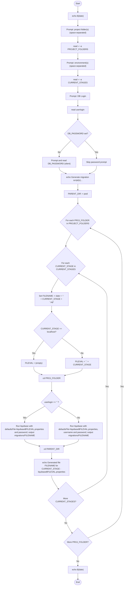
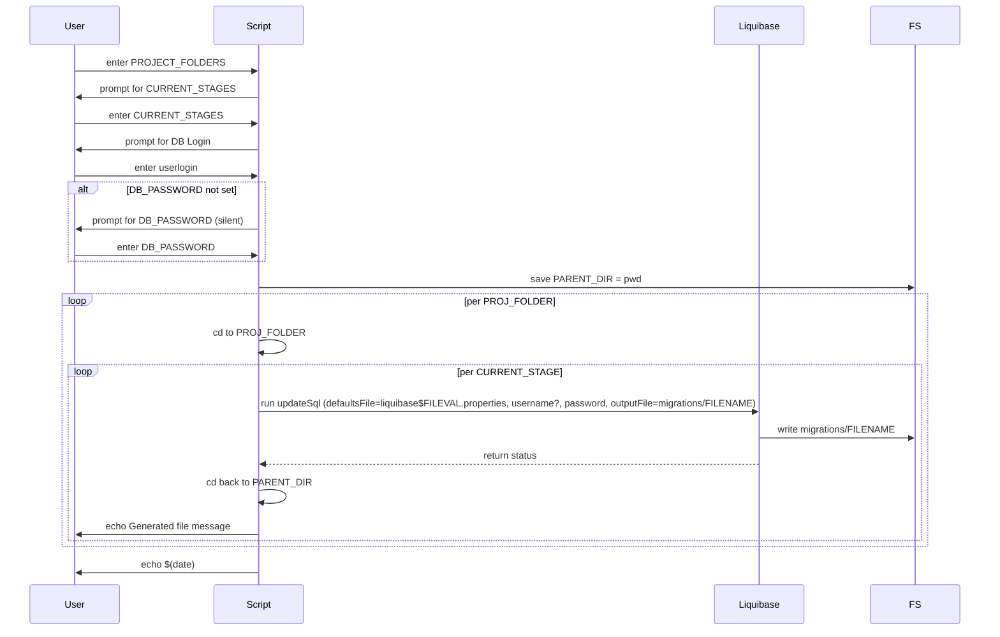

# Diagram: database/migrate_script_generator.sh

> Auto-generated by Obscura crawlers

## Diagram 1

### SVG

<svg id="container" width="957.84375" xmlns="http://www.w3.org/2000/svg" class="flowchart" height="4337.421875" viewBox="0 0 957.84375 4337.421875" role="graphics-document document" aria-roledescription="flowchart-v2"><g><marker id="container_flowchart-v2-pointEnd" class="marker flowchart-v2" viewBox="0 0 10 10" refX="5" refY="5" markerUnits="userSpaceOnUse" markerWidth="8" markerHeight="8" orient="auto"><path d="M 0 0 L 10 5 L 0 10 z" class="arrowMarkerPath" style="stroke-width: 1; stroke-dasharray: 1, 0;"></path></marker><marker id="container_flowchart-v2-pointStart" class="marker flowchart-v2" viewBox="0 0 10 10" refX="4.5" refY="5" markerUnits="userSpaceOnUse" markerWidth="8" markerHeight="8" orient="auto"><path d="M 0 5 L 10 10 L 10 0 z" class="arrowMarkerPath" style="stroke-width: 1; stroke-dasharray: 1, 0;"></path></marker><marker id="container_flowchart-v2-circleEnd" class="marker flowchart-v2" viewBox="0 0 10 10" refX="11" refY="5" markerUnits="userSpaceOnUse" markerWidth="11" markerHeight="11" orient="auto"><circle cx="5" cy="5" r="5" class="arrowMarkerPath" style="stroke-width: 1; stroke-dasharray: 1, 0;"></circle></marker><marker id="container_flowchart-v2-circleStart" class="marker flowchart-v2" viewBox="0 0 10 10" refX="-1" refY="5" markerUnits="userSpaceOnUse" markerWidth="11" markerHeight="11" orient="auto"><circle cx="5" cy="5" r="5" class="arrowMarkerPath" style="stroke-width: 1; stroke-dasharray: 1, 0;"></circle></marker><marker id="container_flowchart-v2-crossEnd" class="marker cross flowchart-v2" viewBox="0 0 11 11" refX="12" refY="5.2" markerUnits="userSpaceOnUse" markerWidth="11" markerHeight="11" orient="auto"><path d="M 1,1 l 9,9 M 10,1 l -9,9" class="arrowMarkerPath" style="stroke-width: 2; stroke-dasharray: 1, 0;"></path></marker><marker id="container_flowchart-v2-crossStart" class="marker cross flowchart-v2" viewBox="0 0 11 11" refX="-1" refY="5.2" markerUnits="userSpaceOnUse" markerWidth="11" markerHeight="11" orient="auto"><path d="M 1,1 l 9,9 M 10,1 l -9,9" class="arrowMarkerPath" style="stroke-width: 2; stroke-dasharray: 1, 0;"></path></marker><g class="root"><g class="clusters"></g><g class="edgePaths"><path d="M597.383,47.5L597.299,51.583C597.216,55.667,597.049,63.833,596.966,71.417C596.883,79,596.883,86,596.883,89.5L596.883,93" id="L_Start_EchoDate1_0" class="edge-thickness-normal edge-pattern-solid edge-thickness-normal edge-pattern-solid flowchart-link" style=";" data-edge="true" data-et="edge" data-id="L_Start_EchoDate1_0" data-points="W3sieCI6NTk3LjM4MjgxMjUsInkiOjQ3LjV9LHsieCI6NTk2Ljg4MjgxMjUsInkiOjcyfSx7IngiOjU5Ni44ODI4MTI1LCJ5Ijo5N31d" marker-end="url(#container_flowchart-v2-pointEnd)"></path><path d="M596.883,151L596.883,155.167C596.883,159.333,596.883,167.667,596.883,175.333C596.883,183,596.883,190,596.883,193.5L596.883,197" id="L_EchoDate1_PromptProj_0" class="edge-thickness-normal edge-pattern-solid edge-thickness-normal edge-pattern-solid flowchart-link" style=";" data-edge="true" data-et="edge" data-id="L_EchoDate1_PromptProj_0" data-points="W3sieCI6NTk2Ljg4MjgxMjUsInkiOjE1MX0seyJ4Ijo1OTYuODgyODEyNSwieSI6MTc2fSx7IngiOjU5Ni44ODI4MTI1LCJ5IjoyMDF9XQ==" marker-end="url(#container_flowchart-v2-pointEnd)"></path><path d="M596.883,279L596.883,283.167C596.883,287.333,596.883,295.667,596.883,303.333C596.883,311,596.883,318,596.883,321.5L596.883,325" id="L_PromptProj_ReadProj_0" class="edge-thickness-normal edge-pattern-solid edge-thickness-normal edge-pattern-solid flowchart-link" style=";" data-edge="true" data-et="edge" data-id="L_PromptProj_ReadProj_0" data-points="W3sieCI6NTk2Ljg4MjgxMjUsInkiOjI3OX0seyJ4Ijo1OTYuODgyODEyNSwieSI6MzA0fSx7IngiOjU5Ni44ODI4MTI1LCJ5IjozMjl9XQ==" marker-end="url(#container_flowchart-v2-pointEnd)"></path><path d="M596.883,407L596.883,411.167C596.883,415.333,596.883,423.667,596.883,431.333C596.883,439,596.883,446,596.883,449.5L596.883,453" id="L_ReadProj_PromptEnvs_0" class="edge-thickness-normal edge-pattern-solid edge-thickness-normal edge-pattern-solid flowchart-link" style=";" data-edge="true" data-et="edge" data-id="L_ReadProj_PromptEnvs_0" data-points="W3sieCI6NTk2Ljg4MjgxMjUsInkiOjQwN30seyJ4Ijo1OTYuODgyODEyNSwieSI6NDMyfSx7IngiOjU5Ni44ODI4MTI1LCJ5Ijo0NTd9XQ==" marker-end="url(#container_flowchart-v2-pointEnd)"></path><path d="M596.883,535L596.883,539.167C596.883,543.333,596.883,551.667,596.883,559.333C596.883,567,596.883,574,596.883,577.5L596.883,581" id="L_PromptEnvs_ReadEnvs_0" class="edge-thickness-normal edge-pattern-solid edge-thickness-normal edge-pattern-solid flowchart-link" style=";" data-edge="true" data-et="edge" data-id="L_PromptEnvs_ReadEnvs_0" data-points="W3sieCI6NTk2Ljg4MjgxMjUsInkiOjUzNX0seyJ4Ijo1OTYuODgyODEyNSwieSI6NTYwfSx7IngiOjU5Ni44ODI4MTI1LCJ5Ijo1ODV9XQ==" marker-end="url(#container_flowchart-v2-pointEnd)"></path><path d="M596.883,639L596.883,643.167C596.883,647.333,596.883,655.667,596.883,663.333C596.883,671,596.883,678,596.883,681.5L596.883,685" id="L_ReadEnvs_PromptLogin_0" class="edge-thickness-normal edge-pattern-solid edge-thickness-normal edge-pattern-solid flowchart-link" style=";" data-edge="true" data-et="edge" data-id="L_ReadEnvs_PromptLogin_0" data-points="W3sieCI6NTk2Ljg4MjgxMjUsInkiOjYzOX0seyJ4Ijo1OTYuODgyODEyNSwieSI6NjY0fSx7IngiOjU5Ni44ODI4MTI1LCJ5Ijo2ODl9XQ==" marker-end="url(#container_flowchart-v2-pointEnd)"></path><path d="M596.883,743L596.883,747.167C596.883,751.333,596.883,759.667,596.883,767.333C596.883,775,596.883,782,596.883,785.5L596.883,789" id="L_PromptLogin_ReadUser_0" class="edge-thickness-normal edge-pattern-solid edge-thickness-normal edge-pattern-solid flowchart-link" style=";" data-edge="true" data-et="edge" data-id="L_PromptLogin_ReadUser_0" data-points="W3sieCI6NTk2Ljg4MjgxMjUsInkiOjc0M30seyJ4Ijo1OTYuODgyODEyNSwieSI6NzY4fSx7IngiOjU5Ni44ODI4MTI1LCJ5Ijo3OTN9XQ==" marker-end="url(#container_flowchart-v2-pointEnd)"></path><path d="M596.883,847L596.883,851.167C596.883,855.333,596.883,863.667,596.883,871.333C596.883,879,596.883,886,596.883,889.5L596.883,893" id="L_ReadUser_HasDBPass_0" class="edge-thickness-normal edge-pattern-solid edge-thickness-normal edge-pattern-solid flowchart-link" style=";" data-edge="true" data-et="edge" data-id="L_ReadUser_HasDBPass_0" data-points="W3sieCI6NTk2Ljg4MjgxMjUsInkiOjg0N30seyJ4Ijo1OTYuODgyODEyNSwieSI6ODcyfSx7IngiOjU5Ni44ODI4MTI1LCJ5Ijo4OTd9XQ==" marker-end="url(#container_flowchart-v2-pointEnd)"></path><path d="M546.409,1040.495L530.589,1055.074C514.768,1069.653,483.126,1098.811,467.305,1118.89C451.484,1138.969,451.484,1149.969,451.484,1155.469L451.484,1160.969" id="L_HasDBPass_ReadDBPass_0" class="edge-thickness-normal edge-pattern-solid edge-thickness-normal edge-pattern-solid flowchart-link" style=";" data-edge="true" data-et="edge" data-id="L_HasDBPass_ReadDBPass_0" data-points="W3sieCI6NTQ2LjQwOTQ5NzkwNzk4NjQsInkiOjEwNDAuNDk1NDM1NDA3OTg2NH0seyJ4Ijo0NTEuNDg0Mzc1LCJ5IjoxMTI3Ljk2ODc1fSx7IngiOjQ1MS40ODQzNzUsInkiOjExNjQuOTY4NzV9XQ==" marker-end="url(#container_flowchart-v2-pointEnd)"></path><path d="M647.356,1040.495L663.177,1055.074C678.998,1069.653,710.64,1098.811,726.46,1120.89C742.281,1142.969,742.281,1157.969,742.281,1165.469L742.281,1172.969" id="L_HasDBPass_SkipPass_0" class="edge-thickness-normal edge-pattern-solid edge-thickness-normal edge-pattern-solid flowchart-link" style=";" data-edge="true" data-et="edge" data-id="L_HasDBPass_SkipPass_0" data-points="W3sieCI6NjQ3LjM1NjEyNzA5MjAxMzYsInkiOjEwNDAuNDk1NDM1NDA3OTg2NH0seyJ4Ijo3NDIuMjgxMjUsInkiOjExMjcuOTY4NzV9LHsieCI6NzQyLjI4MTI1LCJ5IjoxMTc2Ljk2ODc1fV0=" marker-end="url(#container_flowchart-v2-pointEnd)"></path><path d="M451.484,1242.969L451.484,1247.135C451.484,1251.302,451.484,1259.635,460.34,1267.7C469.196,1275.765,486.908,1283.561,495.764,1287.459L504.62,1291.357" id="L_ReadDBPass_GenMsg_0" class="edge-thickness-normal edge-pattern-solid edge-thickness-normal edge-pattern-solid flowchart-link" style=";" data-edge="true" data-et="edge" data-id="L_ReadDBPass_GenMsg_0" data-points="W3sieCI6NDUxLjQ4NDM3NSwieSI6MTI0Mi45Njg3NX0seyJ4Ijo0NTEuNDg0Mzc1LCJ5IjoxMjY3Ljk2ODc1fSx7IngiOjUwOC4yODA2Mzk2NDg0Mzc1LCJ5IjoxMjkyLjk2ODc1fV0=" marker-end="url(#container_flowchart-v2-pointEnd)"></path><path d="M742.281,1230.969L742.281,1237.135C742.281,1243.302,742.281,1255.635,733.425,1265.7C724.57,1275.765,706.858,1283.561,698.002,1287.459L689.146,1291.357" id="L_SkipPass_GenMsg_0" class="edge-thickness-normal edge-pattern-solid edge-thickness-normal edge-pattern-solid flowchart-link" style=";" data-edge="true" data-et="edge" data-id="L_SkipPass_GenMsg_0" data-points="W3sieCI6NzQyLjI4MTI1LCJ5IjoxMjMwLjk2ODc1fSx7IngiOjc0Mi4yODEyNSwieSI6MTI2Ny45Njg3NX0seyJ4Ijo2ODUuNDg0OTg1MzUxNTYyNSwieSI6MTI5Mi45Njg3NX1d" marker-end="url(#container_flowchart-v2-pointEnd)"></path><path d="M596.883,1370.969L596.883,1375.135C596.883,1379.302,596.883,1387.635,596.883,1395.302C596.883,1402.969,596.883,1409.969,596.883,1413.469L596.883,1416.969" id="L_GenMsg_SaveCwd_0" class="edge-thickness-normal edge-pattern-solid edge-thickness-normal edge-pattern-solid flowchart-link" style=";" data-edge="true" data-et="edge" data-id="L_GenMsg_SaveCwd_0" data-points="W3sieCI6NTk2Ljg4MjgxMjUsInkiOjEzNzAuOTY4NzV9LHsieCI6NTk2Ljg4MjgxMjUsInkiOjEzOTUuOTY4NzV9LHsieCI6NTk2Ljg4MjgxMjUsInkiOjE0MjAuOTY4NzV9XQ==" marker-end="url(#container_flowchart-v2-pointEnd)"></path><path d="M596.883,1474.969L596.883,1479.135C596.883,1483.302,596.883,1491.635,596.883,1499.302C596.883,1506.969,596.883,1513.969,596.883,1517.469L596.883,1520.969" id="L_SaveCwd_ForProj_0" class="edge-thickness-normal edge-pattern-solid edge-thickness-normal edge-pattern-solid flowchart-link" style=";" data-edge="true" data-et="edge" data-id="L_SaveCwd_ForProj_0" data-points="W3sieCI6NTk2Ljg4MjgxMjUsInkiOjE0NzQuOTY4NzV9LHsieCI6NTk2Ljg4MjgxMjUsInkiOjE0OTkuOTY4NzV9LHsieCI6NTk2Ljg4MjgxMjUsInkiOjE1MjQuOTY4NzV9XQ==" marker-end="url(#container_flowchart-v2-pointEnd)"></path><path d="M548.704,1754.789L542.233,1766.986C535.763,1779.183,522.823,1803.576,516.353,1819.272C509.883,1834.969,509.883,1841.969,509.883,1845.469L509.883,1848.969" id="L_ForProj_ForStage_0" class="edge-thickness-normal edge-pattern-solid edge-thickness-normal edge-pattern-solid flowchart-link" style=";" data-edge="true" data-et="edge" data-id="L_ForProj_ForStage_0" data-points="W3sieCI6NTQ4LjcwMzUyOTYzMTQ3NDEsInkiOjE3NTQuNzg5NDY3MTMxNDc0fSx7IngiOjUwOS44ODI4MTI1LCJ5IjoxODI3Ljk2ODc1fSx7IngiOjUwOS44ODI4MTI1LCJ5IjoxODUyLjk2ODc1fV0=" marker-end="url(#container_flowchart-v2-pointEnd)"></path><path d="M454.094,2075.18L445.067,2088.645C436.039,2102.11,417.985,2129.039,408.957,2146.004C399.93,2162.969,399.93,2169.969,399.93,2173.469L399.93,2176.969" id="L_ForStage_SetFilename_0" class="edge-thickness-normal edge-pattern-solid edge-thickness-normal edge-pattern-solid flowchart-link" style=";" data-edge="true" data-et="edge" data-id="L_ForStage_SetFilename_0" data-points="W3sieCI6NDU0LjA5NDEyODMwNDQ4MywieSI6MjA3NS4xODAwNjU4MDQ0ODN9LHsieCI6Mzk5LjkyOTY4NzUsInkiOjIxNTUuOTY4NzV9LHsieCI6Mzk5LjkyOTY4NzUsInkiOjIxODAuOTY4NzV9XQ==" marker-end="url(#container_flowchart-v2-pointEnd)"></path><path d="M399.93,2258.969L399.93,2263.135C399.93,2267.302,399.93,2275.635,399.93,2283.302C399.93,2290.969,399.93,2297.969,399.93,2301.469L399.93,2304.969" id="L_SetFilename_IsLocal_0" class="edge-thickness-normal edge-pattern-solid edge-thickness-normal edge-pattern-solid flowchart-link" style=";" data-edge="true" data-et="edge" data-id="L_SetFilename_IsLocal_0" data-points="W3sieCI6Mzk5LjkyOTY4NzUsInkiOjIyNTguOTY4NzV9LHsieCI6Mzk5LjkyOTY4NzUsInkiOjIyODMuOTY4NzV9LHsieCI6Mzk5LjkyOTY4NzUsInkiOjIzMDguOTY4NzV9XQ==" marker-end="url(#container_flowchart-v2-pointEnd)"></path><path d="M339.135,2526.174L326.465,2542.473C313.795,2558.772,288.454,2591.371,275.784,2615.17C263.113,2638.969,263.113,2653.969,263.113,2661.469L263.113,2668.969" id="L_IsLocal_FileValEmpty_0" class="edge-thickness-normal edge-pattern-solid edge-thickness-normal edge-pattern-solid flowchart-link" style=";" data-edge="true" data-et="edge" data-id="L_IsLocal_FileValEmpty_0" data-points="W3sieCI6MzM5LjEzNTMwNDMxMjk3Njg3LCJ5IjoyNTI2LjE3NDM2NjgxMjk3N30seyJ4IjoyNjMuMTEzMjgxMjUsInkiOjI2MjMuOTY4NzV9LHsieCI6MjYzLjExMzI4MTI1LCJ5IjoyNjcyLjk2ODc1fV0=" marker-end="url(#container_flowchart-v2-pointEnd)"></path><path d="M479.608,2507.29L505.728,2526.736C531.848,2546.183,584.088,2585.076,610.208,2610.022C636.328,2634.969,636.328,2645.969,636.328,2651.469L636.328,2656.969" id="L_IsLocal_FileValDot_0" class="edge-thickness-normal edge-pattern-solid edge-thickness-normal edge-pattern-solid flowchart-link" style=";" data-edge="true" data-et="edge" data-id="L_IsLocal_FileValDot_0" data-points="W3sieCI6NDc5LjYwODQxNTIxNzA1MTYsInkiOjI1MDcuMjkwMDIyMjgyOTQ4NX0seyJ4Ijo2MzYuMzI4MTI1LCJ5IjoyNjIzLjk2ODc1fSx7IngiOjYzNi4zMjgxMjUsInkiOjI2NjAuOTY4NzV9XQ==" marker-end="url(#container_flowchart-v2-pointEnd)"></path><path d="M263.113,2726.969L263.113,2733.135C263.113,2739.302,263.113,2751.635,273.453,2761.732C283.793,2771.828,304.472,2779.688,314.812,2783.618L325.151,2787.548" id="L_FileValEmpty_CdProj_0" class="edge-thickness-normal edge-pattern-solid edge-thickness-normal edge-pattern-solid flowchart-link" style=";" data-edge="true" data-et="edge" data-id="L_FileValEmpty_CdProj_0" data-points="W3sieCI6MjYzLjExMzI4MTI1LCJ5IjoyNzI2Ljk2ODc1fSx7IngiOjI2My4xMTMyODEyNSwieSI6Mjc2My45Njg3NX0seyJ4IjozMjguODkwMzk5NjM5NDIzMSwieSI6Mjc4OC45Njg3NX1d" marker-end="url(#container_flowchart-v2-pointEnd)"></path><path d="M636.328,2738.969L636.328,2743.135C636.328,2747.302,636.328,2755.635,612.492,2765.045C588.656,2774.455,540.985,2784.941,517.149,2790.184L493.313,2795.427" id="L_FileValDot_CdProj_0" class="edge-thickness-normal edge-pattern-solid edge-thickness-normal edge-pattern-solid flowchart-link" style=";" data-edge="true" data-et="edge" data-id="L_FileValDot_CdProj_0" data-points="W3sieCI6NjM2LjMyODEyNSwieSI6MjczOC45Njg3NX0seyJ4Ijo2MzYuMzI4MTI1LCJ5IjoyNzYzLjk2ODc1fSx7IngiOjQ4OS40MDYyNSwieSI6Mjc5Ni4yODY4MDQxMzI2NTQ3fV0=" marker-end="url(#container_flowchart-v2-pointEnd)"></path><path d="M399.93,2842.969L399.93,2849.135C399.93,2855.302,399.93,2867.635,399.93,2879.302C399.93,2890.969,399.93,2901.969,399.93,2907.469L399.93,2912.969" id="L_CdProj_UserEmpty_0" class="edge-thickness-normal edge-pattern-solid edge-thickness-normal edge-pattern-solid flowchart-link" style=";" data-edge="true" data-et="edge" data-id="L_CdProj_UserEmpty_0" data-points="W3sieCI6Mzk5LjkyOTY4NzUsInkiOjI4NDIuOTY4NzV9LHsieCI6Mzk5LjkyOTY4NzUsInkiOjI4NzkuOTY4NzV9LHsieCI6Mzk5LjkyOTY4NzUsInkiOjI5MTYuOTY4NzV9XQ==" marker-end="url(#container_flowchart-v2-pointEnd)"></path><path d="M347.465,3029.426L321.385,3044.336C295.305,3059.247,243.144,3089.069,217.064,3109.48C190.984,3129.891,190.984,3140.891,190.984,3146.391L190.984,3151.891" id="L_UserEmpty_RunNoUser_0" class="edge-thickness-normal edge-pattern-solid edge-thickness-normal edge-pattern-solid flowchart-link" style=";" data-edge="true" data-et="edge" data-id="L_UserEmpty_RunNoUser_0" data-points="W3sieCI6MzQ3LjQ2NDcxMDQ5MzY4NCwieSI6MzAyOS40MjU2NDc5OTM2ODR9LHsieCI6MTkwLjk4NDM3NSwieSI6MzExOC44OTA2MjV9LHsieCI6MTkwLjk4NDM3NSwieSI6MzE1NS44OTA2MjV9XQ==" marker-end="url(#container_flowchart-v2-pointEnd)"></path><path d="M452.395,3029.426L478.475,3044.336C504.555,3059.247,556.715,3089.069,582.795,3109.48C608.875,3129.891,608.875,3140.891,608.875,3146.391L608.875,3151.891" id="L_UserEmpty_RunWithUser_0" class="edge-thickness-normal edge-pattern-solid edge-thickness-normal edge-pattern-solid flowchart-link" style=";" data-edge="true" data-et="edge" data-id="L_UserEmpty_RunWithUser_0" data-points="W3sieCI6NDUyLjM5NDY2NDUwNjMxNiwieSI6MzAyOS40MjU2NDc5OTM2ODR9LHsieCI6NjA4Ljg3NSwieSI6MzExOC44OTA2MjV9LHsieCI6NjA4Ljg3NSwieSI6MzE1NS44OTA2MjV9XQ==" marker-end="url(#container_flowchart-v2-pointEnd)"></path><path d="M190.984,3281.891L190.984,3286.057C190.984,3290.224,190.984,3298.557,211.136,3307.739C231.287,3316.921,271.589,3326.951,291.741,3331.966L311.892,3336.981" id="L_RunNoUser_CdBack_0" class="edge-thickness-normal edge-pattern-solid edge-thickness-normal edge-pattern-solid flowchart-link" style=";" data-edge="true" data-et="edge" data-id="L_RunNoUser_CdBack_0" data-points="W3sieCI6MTkwLjk4NDM3NSwieSI6MzI4MS44OTA2MjV9LHsieCI6MTkwLjk4NDM3NSwieSI6MzMwNi44OTA2MjV9LHsieCI6MzE1Ljc3MzQzNzUsInkiOjMzMzcuOTQ2NzQ3NjM5NzQ2fV0=" marker-end="url(#container_flowchart-v2-pointEnd)"></path><path d="M608.875,3281.891L608.875,3286.057C608.875,3290.224,608.875,3298.557,588.724,3307.739C568.573,3316.921,528.27,3326.951,508.119,3331.966L487.968,3336.981" id="L_RunWithUser_CdBack_0" class="edge-thickness-normal edge-pattern-solid edge-thickness-normal edge-pattern-solid flowchart-link" style=";" data-edge="true" data-et="edge" data-id="L_RunWithUser_CdBack_0" data-points="W3sieCI6NjA4Ljg3NSwieSI6MzI4MS44OTA2MjV9LHsieCI6NjA4Ljg3NSwieSI6MzMwNi44OTA2MjV9LHsieCI6NDg0LjA4NTkzNzUsInkiOjMzMzcuOTQ2NzQ3NjM5NzQ2fV0=" marker-end="url(#container_flowchart-v2-pointEnd)"></path><path d="M399.93,3385.891L399.93,3390.057C399.93,3394.224,399.93,3402.557,399.93,3410.224C399.93,3417.891,399.93,3424.891,399.93,3428.391L399.93,3431.891" id="L_CdBack_EchoGen_0" class="edge-thickness-normal edge-pattern-solid edge-thickness-normal edge-pattern-solid flowchart-link" style=";" data-edge="true" data-et="edge" data-id="L_CdBack_EchoGen_0" data-points="W3sieCI6Mzk5LjkyOTY4NzUsInkiOjMzODUuODkwNjI1fSx7IngiOjM5OS45Mjk2ODc1LCJ5IjozNDEwLjg5MDYyNX0seyJ4IjozOTkuOTI5Njg3NSwieSI6MzQzNS44OTA2MjV9XQ==" marker-end="url(#container_flowchart-v2-pointEnd)"></path><path d="M399.93,3561.891L399.93,3566.057C399.93,3570.224,399.93,3578.557,409.464,3594.745C418.999,3610.933,438.068,3634.974,447.603,3646.995L457.138,3659.016" id="L_EchoGen_MoreStages_0" class="edge-thickness-normal edge-pattern-solid edge-thickness-normal edge-pattern-solid flowchart-link" style=";" data-edge="true" data-et="edge" data-id="L_EchoGen_MoreStages_0" data-points="W3sieCI6Mzk5LjkyOTY4NzUsInkiOjM1NjEuODkwNjI1fSx7IngiOjM5OS45Mjk2ODc1LCJ5IjozNTg2Ljg5MDYyNX0seyJ4Ijo0NTkuNjIzMjY2MDE2ODc3MjcsInkiOjM2NjIuMTUwMTcxNDgzMTIzfV0=" marker-end="url(#container_flowchart-v2-pointEnd)"></path><path d="M589.081,3691.088L629.031,3673.722C668.981,3656.356,748.881,3621.623,788.831,3589.59C828.781,3557.557,828.781,3528.224,828.781,3498.891C828.781,3469.557,828.781,3440.224,828.781,3416.891C828.781,3393.557,828.781,3376.224,828.781,3358.891C828.781,3341.557,828.781,3324.224,828.781,3300.891C828.781,3277.557,828.781,3248.224,828.781,3216.891C828.781,3185.557,828.781,3152.224,828.781,3115.647C828.781,3079.07,828.781,3039.25,828.781,2999.43C828.781,2959.609,828.781,2919.789,828.781,2889.212C828.781,2858.635,828.781,2837.302,828.781,2817.969C828.781,2798.635,828.781,2781.302,828.781,2761.969C828.781,2742.635,828.781,2721.302,828.781,2697.969C828.781,2674.635,828.781,2649.302,828.781,2607.302C828.781,2565.302,828.781,2506.635,828.781,2449.969C828.781,2393.302,828.781,2338.635,828.781,2300.635C828.781,2262.635,828.781,2241.302,828.781,2219.969C828.781,2198.635,828.781,2177.302,791.523,2147.475C754.265,2117.647,679.749,2079.326,642.491,2060.165L605.233,2041.005" id="L_MoreStages_ForStage_0" class="edge-thickness-normal edge-pattern-solid edge-thickness-normal edge-pattern-solid flowchart-link" style=";" data-edge="true" data-et="edge" data-id="L_MoreStages_ForStage_0" data-points="W3sieCI6NTg5LjA4MDU4MDI4ODUzNTQsInkiOjM2OTEuMDg4MzkyNzg4NTM1fSx7IngiOjgyOC43ODEyNSwieSI6MzU4Ni44OTA2MjV9LHsieCI6ODI4Ljc4MTI1LCJ5IjozNDk4Ljg5MDYyNX0seyJ4Ijo4MjguNzgxMjUsInkiOjM0MTAuODkwNjI1fSx7IngiOjgyOC43ODEyNSwieSI6MzM1OC44OTA2MjV9LHsieCI6ODI4Ljc4MTI1LCJ5IjozMzA2Ljg5MDYyNX0seyJ4Ijo4MjguNzgxMjUsInkiOjMyMTguODkwNjI1fSx7IngiOjgyOC43ODEyNSwieSI6MzExOC44OTA2MjV9LHsieCI6ODI4Ljc4MTI1LCJ5IjoyOTk5LjQyOTY4NzV9LHsieCI6ODI4Ljc4MTI1LCJ5IjoyODc5Ljk2ODc1fSx7IngiOjgyOC43ODEyNSwieSI6MjgxNS45Njg3NX0seyJ4Ijo4MjguNzgxMjUsInkiOjI3NjMuOTY4NzV9LHsieCI6ODI4Ljc4MTI1LCJ5IjoyNjk5Ljk2ODc1fSx7IngiOjgyOC43ODEyNSwieSI6MjYyMy45Njg3NX0seyJ4Ijo4MjguNzgxMjUsInkiOjI0NDcuOTY4NzV9LHsieCI6ODI4Ljc4MTI1LCJ5IjoyMjgzLjk2ODc1fSx7IngiOjgyOC43ODEyNSwieSI6MjIxOS45Njg3NX0seyJ4Ijo4MjguNzgxMjUsInkiOjIxNTUuOTY4NzV9LHsieCI6NjAxLjY3NjE5ODc5MDQ2NjEsInkiOjIwMzkuMTc1MzYzNzA5NTM0fV0=" marker-end="url(#container_flowchart-v2-pointEnd)"></path><path d="M509.883,3839.141L509.883,3845.307C509.883,3851.474,509.883,3863.807,517.564,3882.039C525.246,3900.27,540.609,3924.399,548.291,3936.464L555.973,3948.528" id="L_MoreStages_MoreProjects_0" class="edge-thickness-normal edge-pattern-solid edge-thickness-normal edge-pattern-solid flowchart-link" style=";" data-edge="true" data-et="edge" data-id="L_MoreStages_MoreProjects_0" data-points="W3sieCI6NTA5Ljg4MjgxMjUsInkiOjM4MzkuMTQwNjI1fSx7IngiOjUwOS44ODI4MTI1LCJ5IjozODc2LjE0MDYyNX0seyJ4Ijo1NTguMTIwOTE3NzE5MDMxNywieSI6Mzk1MS45MDI1MTk3ODA5NjgzfV0=" marker-end="url(#container_flowchart-v2-pointEnd)"></path><path d="M668.015,3984.272L712.981,3966.25C757.947,3948.229,847.88,3912.185,892.846,3869.058C937.813,3825.932,937.813,3775.724,937.813,3727.516C937.813,3679.307,937.813,3633.099,937.813,3595.328C937.813,3557.557,937.813,3528.224,937.813,3498.891C937.813,3469.557,937.813,3440.224,937.813,3416.891C937.813,3393.557,937.813,3376.224,937.813,3358.891C937.813,3341.557,937.813,3324.224,937.813,3300.891C937.813,3277.557,937.813,3248.224,937.813,3216.891C937.813,3185.557,937.813,3152.224,937.813,3115.647C937.813,3079.07,937.813,3039.25,937.813,2999.43C937.813,2959.609,937.813,2919.789,937.813,2889.212C937.813,2858.635,937.813,2837.302,937.813,2817.969C937.813,2798.635,937.813,2781.302,937.813,2761.969C937.813,2742.635,937.813,2721.302,937.813,2697.969C937.813,2674.635,937.813,2649.302,937.813,2607.302C937.813,2565.302,937.813,2506.635,937.813,2449.969C937.813,2393.302,937.813,2338.635,937.813,2300.635C937.813,2262.635,937.813,2241.302,937.813,2219.969C937.813,2198.635,937.813,2177.302,937.813,2139.302C937.813,2101.302,937.813,2046.635,937.813,1991.969C937.813,1937.302,937.813,1882.635,897.234,1835.782C856.655,1788.929,775.498,1749.889,734.919,1730.369L694.341,1710.85" id="L_MoreProjects_ForProj_0" class="edge-thickness-normal edge-pattern-solid edge-thickness-normal edge-pattern-solid flowchart-link" style=";" data-edge="true" data-et="edge" data-id="L_MoreProjects_ForProj_0" data-points="W3sieCI6NjY4LjAxNDYzNTkyODczMjcsInkiOjM5ODQuMjcyNDQ4NDI4NzMzfSx7IngiOjkzNy44MTI1LCJ5IjozODc2LjE0MDYyNX0seyJ4Ijo5MzcuODEyNSwieSI6MzcyNS41MTU2MjV9LHsieCI6OTM3LjgxMjUsInkiOjM1ODYuODkwNjI1fSx7IngiOjkzNy44MTI1LCJ5IjozNDk4Ljg5MDYyNX0seyJ4Ijo5MzcuODEyNSwieSI6MzQxMC44OTA2MjV9LHsieCI6OTM3LjgxMjUsInkiOjMzNTguODkwNjI1fSx7IngiOjkzNy44MTI1LCJ5IjozMzA2Ljg5MDYyNX0seyJ4Ijo5MzcuODEyNSwieSI6MzIxOC44OTA2MjV9LHsieCI6OTM3LjgxMjUsInkiOjMxMTguODkwNjI1fSx7IngiOjkzNy44MTI1LCJ5IjoyOTk5LjQyOTY4NzV9LHsieCI6OTM3LjgxMjUsInkiOjI4NzkuOTY4NzV9LHsieCI6OTM3LjgxMjUsInkiOjI4MTUuOTY4NzV9LHsieCI6OTM3LjgxMjUsInkiOjI3NjMuOTY4NzV9LHsieCI6OTM3LjgxMjUsInkiOjI2OTkuOTY4NzV9LHsieCI6OTM3LjgxMjUsInkiOjI2MjMuOTY4NzV9LHsieCI6OTM3LjgxMjUsInkiOjI0NDcuOTY4NzV9LHsieCI6OTM3LjgxMjUsInkiOjIyODMuOTY4NzV9LHsieCI6OTM3LjgxMjUsInkiOjIyMTkuOTY4NzV9LHsieCI6OTM3LjgxMjUsInkiOjIxNTUuOTY4NzV9LHsieCI6OTM3LjgxMjUsInkiOjE5OTEuOTY4NzV9LHsieCI6OTM3LjgxMjUsInkiOjE4MjcuOTY4NzV9LHsieCI6NjkwLjczNTkzMjUxOTgwNDcsInkiOjE3MDkuMTE1NjI5OTgwMTk1M31d" marker-end="url(#container_flowchart-v2-pointEnd)"></path><path d="M596.883,4112.422L596.883,4118.589C596.883,4124.755,596.883,4137.089,596.883,4148.755C596.883,4160.422,596.883,4171.422,596.883,4176.922L596.883,4182.422" id="L_MoreProjects_EchoDate2_0" class="edge-thickness-normal edge-pattern-solid edge-thickness-normal edge-pattern-solid flowchart-link" style=";" data-edge="true" data-et="edge" data-id="L_MoreProjects_EchoDate2_0" data-points="W3sieCI6NTk2Ljg4MjgxMjUsInkiOjQxMTIuNDIxODc1fSx7IngiOjU5Ni44ODI4MTI1LCJ5Ijo0MTQ5LjQyMTg3NX0seyJ4Ijo1OTYuODgyODEyNSwieSI6NDE4Ni40MjE4NzV9XQ==" marker-end="url(#container_flowchart-v2-pointEnd)"></path><path d="M596.883,4240.422L596.883,4244.589C596.883,4248.755,596.883,4257.089,596.953,4264.839C597.023,4272.589,597.164,4279.756,597.234,4283.339L597.304,4286.923" id="L_EchoDate2_End_0" class="edge-thickness-normal edge-pattern-solid edge-thickness-normal edge-pattern-solid flowchart-link" style=";" data-edge="true" data-et="edge" data-id="L_EchoDate2_End_0" data-points="W3sieCI6NTk2Ljg4MjgxMjUsInkiOjQyNDAuNDIxODc1fSx7IngiOjU5Ni44ODI4MTI1LCJ5Ijo0MjY1LjQyMTg3NX0seyJ4Ijo1OTcuMzgyODEyNSwieSI6NDI5MC45MjE4NzV9XQ==" marker-end="url(#container_flowchart-v2-pointEnd)"></path></g><g class="edgeLabels"><g class="edgeLabel"><g class="label" data-id="L_Start_EchoDate1_0" transform="translate(0, 0)"><foreignObject width="0" height="0">

</foreignObject></g></g><g class="edgeLabel"><g class="label" data-id="L_EchoDate1_PromptProj_0" transform="translate(0, 0)"><foreignObject width="0" height="0">

</foreignObject></g></g><g class="edgeLabel"><g class="label" data-id="L_PromptProj_ReadProj_0" transform="translate(0, 0)"><foreignObject width="0" height="0">

</foreignObject></g></g><g class="edgeLabel"><g class="label" data-id="L_ReadProj_PromptEnvs_0" transform="translate(0, 0)"><foreignObject width="0" height="0">

</foreignObject></g></g><g class="edgeLabel"><g class="label" data-id="L_PromptEnvs_ReadEnvs_0" transform="translate(0, 0)"><foreignObject width="0" height="0">

</foreignObject></g></g><g class="edgeLabel"><g class="label" data-id="L_ReadEnvs_PromptLogin_0" transform="translate(0, 0)"><foreignObject width="0" height="0">

</foreignObject></g></g><g class="edgeLabel"><g class="label" data-id="L_PromptLogin_ReadUser_0" transform="translate(0, 0)"><foreignObject width="0" height="0">

</foreignObject></g></g><g class="edgeLabel"><g class="label" data-id="L_ReadUser_HasDBPass_0" transform="translate(0, 0)"><foreignObject width="0" height="0">

</foreignObject></g></g><g class="edgeLabel" transform="translate(451.484375, 1127.96875)"><g class="label" data-id="L_HasDBPass_ReadDBPass_0" transform="translate(-10.140625, -12)"><foreignObject width="20.28125" height="24">

No

</foreignObject></g></g><g class="edgeLabel" transform="translate(742.28125, 1127.96875)"><g class="label" data-id="L_HasDBPass_SkipPass_0" transform="translate(-12.03125, -12)"><foreignObject width="24.0625" height="24">

Yes

</foreignObject></g></g><g class="edgeLabel"><g class="label" data-id="L_ReadDBPass_GenMsg_0" transform="translate(0, 0)"><foreignObject width="0" height="0">

</foreignObject></g></g><g class="edgeLabel"><g class="label" data-id="L_SkipPass_GenMsg_0" transform="translate(0, 0)"><foreignObject width="0" height="0">

</foreignObject></g></g><g class="edgeLabel"><g class="label" data-id="L_GenMsg_SaveCwd_0" transform="translate(0, 0)"><foreignObject width="0" height="0">

</foreignObject></g></g><g class="edgeLabel"><g class="label" data-id="L_SaveCwd_ForProj_0" transform="translate(0, 0)"><foreignObject width="0" height="0">

</foreignObject></g></g><g class="edgeLabel"><g class="label" data-id="L_ForProj_ForStage_0" transform="translate(0, 0)"><foreignObject width="0" height="0">

</foreignObject></g></g><g class="edgeLabel"><g class="label" data-id="L_ForStage_SetFilename_0" transform="translate(0, 0)"><foreignObject width="0" height="0">

</foreignObject></g></g><g class="edgeLabel"><g class="label" data-id="L_SetFilename_IsLocal_0" transform="translate(0, 0)"><foreignObject width="0" height="0">

</foreignObject></g></g><g class="edgeLabel" transform="translate(263.11328125, 2623.96875)"><g class="label" data-id="L_IsLocal_FileValEmpty_0" transform="translate(-12.03125, -12)"><foreignObject width="24.0625" height="24">

Yes

</foreignObject></g></g><g class="edgeLabel" transform="translate(636.328125, 2623.96875)"><g class="label" data-id="L_IsLocal_FileValDot_0" transform="translate(-10.140625, -12)"><foreignObject width="20.28125" height="24">

No

</foreignObject></g></g><g class="edgeLabel"><g class="label" data-id="L_FileValEmpty_CdProj_0" transform="translate(0, 0)"><foreignObject width="0" height="0">

</foreignObject></g></g><g class="edgeLabel"><g class="label" data-id="L_FileValDot_CdProj_0" transform="translate(0, 0)"><foreignObject width="0" height="0">

</foreignObject></g></g><g class="edgeLabel"><g class="label" data-id="L_CdProj_UserEmpty_0" transform="translate(0, 0)"><foreignObject width="0" height="0">

</foreignObject></g></g><g class="edgeLabel" transform="translate(190.984375, 3118.890625)"><g class="label" data-id="L_UserEmpty_RunNoUser_0" transform="translate(-12.03125, -12)"><foreignObject width="24.0625" height="24">

Yes

</foreignObject></g></g><g class="edgeLabel" transform="translate(608.875, 3118.890625)"><g class="label" data-id="L_UserEmpty_RunWithUser_0" transform="translate(-10.140625, -12)"><foreignObject width="20.28125" height="24">

No

</foreignObject></g></g><g class="edgeLabel"><g class="label" data-id="L_RunNoUser_CdBack_0" transform="translate(0, 0)"><foreignObject width="0" height="0">

</foreignObject></g></g><g class="edgeLabel"><g class="label" data-id="L_RunWithUser_CdBack_0" transform="translate(0, 0)"><foreignObject width="0" height="0">

</foreignObject></g></g><g class="edgeLabel"><g class="label" data-id="L_CdBack_EchoGen_0" transform="translate(0, 0)"><foreignObject width="0" height="0">

</foreignObject></g></g><g class="edgeLabel"><g class="label" data-id="L_EchoGen_MoreStages_0" transform="translate(0, 0)"><foreignObject width="0" height="0">

</foreignObject></g></g><g class="edgeLabel" transform="translate(828.78125, 2879.96875)"><g class="label" data-id="L_MoreStages_ForStage_0" transform="translate(-12.03125, -12)"><foreignObject width="24.0625" height="24">

Yes

</foreignObject></g></g><g class="edgeLabel" transform="translate(509.8828125, 3876.140625)"><g class="label" data-id="L_MoreStages_MoreProjects_0" transform="translate(-10.140625, -12)"><foreignObject width="20.28125" height="24">

No

</foreignObject></g></g><g class="edgeLabel" transform="translate(937.8125, 2879.96875)"><g class="label" data-id="L_MoreProjects_ForProj_0" transform="translate(-12.03125, -12)"><foreignObject width="24.0625" height="24">

Yes

</foreignObject></g></g><g class="edgeLabel" transform="translate(596.8828125, 4149.421875)"><g class="label" data-id="L_MoreProjects_EchoDate2_0" transform="translate(-10.140625, -12)"><foreignObject width="20.28125" height="24">

No

</foreignObject></g></g><g class="edgeLabel"><g class="label" data-id="L_EchoDate2_End_0" transform="translate(0, 0)"><foreignObject width="0" height="0">

</foreignObject></g></g></g><g class="nodes"><g class="node default" id="flowchart-Start-0" transform="translate(596.8828125, 27.5)"><g class="basic label-container outer-path"><path d="M-10.3984375 -19.5 C-3.564541975590637 -19.5, 3.269353548818726 -19.5, 10.3984375 -19.5 C10.3984375 -19.5, 10.398437499999998 -19.5, 10.398437499999998 -19.5 C10.775549925755312 -19.487906738510834, 11.152662351510626 -19.47581347702167, 11.6478067896239 -19.45993515863156 C12.035512834598938 -19.422533622757555, 12.423218879573977 -19.38513208688355, 12.892042152847864 -19.3399052695533 C13.251041885349178 -19.281864976886993, 13.61004161785049 -19.223824684220688, 14.126030759676757 -19.140403561325776 C14.518818697799428 -19.050752277630114, 14.911606635922098 -18.96110099393445, 15.34470188623539 -18.862249829261074 C15.699571693204458 -18.756926333302285, 16.054441500173528 -18.651602837343493, 16.543047751460602 -18.50658706670804 C16.847444513498928 -18.39456624446511, 17.151841275537258 -18.282545422222185, 17.716144095147794 -18.074876768247425 C18.10912096905402 -17.900917563413923, 18.50209784296024 -17.72695835858042, 18.85917041279238 -17.568892924097174 C19.10858883938847 -17.43877149070212, 19.358007265984565 -17.308650057307066, 19.967429764076783 -16.990714730406097 C20.349106661299853 -16.759339952327057, 20.73078355852292 -16.527965174248017, 21.036368073605697 -16.342718045390892 C21.413771482485117 -16.079457764886865, 21.791174891364538 -15.816197484382839, 22.061592844578712 -15.627565626425154 C22.446834355182997 -15.320345773425379, 22.832075865787278 -15.013125920425603, 23.03889120850187 -14.848196188198123 C23.32396552664258 -14.589299235115863, 23.60903984478329 -14.330402282033603, 23.964247236767985 -14.007812326905688 C24.22450563638976 -13.739074161684211, 24.484764036011537 -13.470335996462733, 24.833858442968648 -13.10986736009568 C25.10125955837468 -12.795762794385253, 25.368660673780713 -12.481658228674824, 25.644151408126582 -12.158051136245305 C25.925216786942947 -11.78144913421414, 26.206282165759312 -11.404847132182976, 26.391796464640635 -11.156274872382312 C26.60225603331909 -10.832952458584984, 26.81271560199755 -10.509630044787656, 27.073721378604247 -10.108655082055241 C27.225959074272843 -9.838341637657338, 27.37819676994144 -9.568028193259437, 27.6871239742735 -9.019496659696287 C27.896306421272982 -8.585124832714506, 28.105488868272463 -8.150753005732724, 28.22948364880834 -7.893275190886684 C28.371318984343283 -7.542939169915715, 28.513154319878225 -7.192603148944745, 28.698571729970325 -6.734618561215508 C28.784159352573102 -6.476842278471724, 28.869746975175882 -6.2190659957279415, 29.09246063421488 -5.548287939305138 C29.211293415634593 -5.095127041298527, 29.3301261970543 -4.641966143291917, 29.40953178754556 -4.339158212148133 C29.501512777623958 -3.8668552682846924, 29.59349376770236 -3.394552324421251, 29.648482276581777 -3.1121979531509023 C29.70116441779495 -2.703605669167007, 29.753846559008124 -2.295013385183112, 29.808330202509367 -1.872449005199798 C29.839938447337502 -1.3801250782855887, 29.871546692165634 -0.8878011513713793, 29.888418715913414 -0.6250057626472757 C29.888418715913414 -0.2626631354054419, 29.888418715913414 0.09967949183639191, 29.888418715913414 0.625005762647271 C29.8661139162336 0.9724210217706097, 29.84380911655379 1.3198362808939486, 29.808330202509367 1.8724490051997846 C29.753433023748418 2.2982206829955927, 29.698535844987468 2.7239923607914007, 29.648482276581777 3.1121979531508885 C29.590985517149157 3.4074316608929824, 29.533488757716537 3.7026653686350763, 29.40953178754556 4.339158212148129 C29.30385814176828 4.742137622744691, 29.198184495991 5.145117033341254, 29.092460634214884 5.548287939305125 C28.95211275898963 5.970993378086411, 28.811764883764376 6.393698816867697, 28.69857172997033 6.734618561215495 C28.516876199410255 7.183410034542985, 28.33518066885018 7.632201507870476, 28.229483648808344 7.893275190886679 C28.11165154905637 8.137956067224701, 27.993819449304393 8.382636943562725, 27.687123974273504 9.019496659696284 C27.540280758237625 9.280231659256, 27.39343754220175 9.540966658815716, 27.07372137860425 10.108655082055236 C26.90702524423214 10.364745108630451, 26.74032910986003 10.620835135205668, 26.39179646464064 11.156274872382301 C26.105676571840476 11.539649462676058, 25.819556679040314 11.923024052969815, 25.644151408126582 12.158051136245302 C25.325871698341295 12.531920593987637, 25.007591988556012 12.905790051729971, 24.83385844296866 13.10986736009567 C24.52691194057425 13.426814824594414, 24.21996543817984 13.743762289093157, 23.96424723676799 14.007812326905684 C23.60933238636371 14.330136603510494, 23.254417535959433 14.652460880115305, 23.038891208501887 14.848196188198111 C22.792006729384738 15.04507999042213, 22.545122250267593 15.241963792646148, 22.061592844578715 15.627565626425152 C21.77822979246304 15.825227424992224, 21.494866740347366 16.022889223559297, 21.036368073605708 16.34271804539089 C20.661163886034124 16.570169028841335, 20.28595969846254 16.797620012291777, 19.967429764076787 16.990714730406093 C19.527297216662358 17.22033159847385, 19.087164669247926 17.449948466541606, 18.859170412792388 17.56889292409717 C18.501071742618425 17.727412582763556, 18.142973072444462 17.88593224142994, 17.716144095147804 18.07487676824742 C17.356301355287655 18.207302222865778, 16.996458615427507 18.339727677484138, 16.543047751460616 18.506587066708033 C16.175194082279948 18.615764104817544, 15.807340413099277 18.724941142927058, 15.344701886235413 18.86224982926107 C14.87477888290467 18.969506688237132, 14.404855879573926 19.076763547213194, 14.126030759676766 19.140403561325773 C13.780161093976098 19.19632108661694, 13.434291428275431 19.25223861190811, 12.892042152847878 19.3399052695533 C12.511783929058828 19.376588323074806, 12.131525705269777 19.41327137659631, 11.6478067896239 19.45993515863156 C11.16122506618922 19.47553888742824, 10.674643342754539 19.49114261622492, 10.398437500000004 19.5 C10.398437500000002 19.5, 10.398437500000002 19.5, 10.3984375 19.5 C3.7759204874748713 19.5, -2.8465965250502574 19.5, -10.398437499999996 19.5 C-10.684955300682331 19.490811931805183, -10.971473101364667 19.48162386361037, -11.647806789623893 19.45993515863156 C-11.9579491300999 19.430016100046576, -12.268091470575909 19.400097041461592, -12.892042152847871 19.3399052695533 C-13.234444452514857 19.28454832111263, -13.576846752181845 19.229191372671966, -14.126030759676759 19.140403561325773 C-14.517826370787986 19.050978769794934, -14.909621981899214 18.961553978264096, -15.344701886235388 18.862249829261074 C-15.653335850575631 18.77064888869763, -15.961969814915875 18.679047948134183, -16.54304775146059 18.506587066708043 C-16.974731946861134 18.347723292355685, -17.406416142261676 18.188859518003326, -17.716144095147797 18.074876768247425 C-17.968071975973047 17.96335576858115, -18.219999856798296 17.851834768914873, -18.85917041279238 17.568892924097174 C-19.117469541996797 17.434138433839717, -19.375768671201214 17.299383943582264, -19.96742976407678 16.990714730406097 C-20.197091589899653 16.851492381949576, -20.426753415722526 16.712270033493052, -21.036368073605686 16.3427180453909 C-21.323130121251634 16.142685254682057, -21.609892168897577 15.942652463973214, -22.061592844578712 15.627565626425156 C-22.286335796241644 15.448339103135083, -22.511078747904573 15.269112579845011, -23.03889120850187 14.848196188198125 C-23.267571205753367 14.640515065235485, -23.49625120300486 14.432833942272843, -23.964247236767974 14.007812326905697 C-24.15368083014662 13.812206588954988, -24.343114423525265 13.616600851004279, -24.833858442968655 13.109867360095677 C-25.048907862853017 12.857258074840862, -25.263957282737383 12.604648789586047, -25.64415140812658 12.158051136245307 C-25.902540743954752 11.811832965988307, -26.160930079782926 11.465614795731309, -26.391796464640635 11.156274872382316 C-26.572465223403796 10.87871914256744, -26.753133982166958 10.601163412752566, -27.073721378604244 10.108655082055249 C-27.287444439796168 9.729168145102287, -27.50116750098809 9.349681208149324, -27.6871239742735 9.019496659696289 C-27.866419488863162 8.647185687341409, -28.045715003452823 8.27487471498653, -28.22948364880834 7.893275190886686 C-28.391833375648517 7.492268226773014, -28.554183102488693 7.091261262659342, -28.698571729970325 6.73461856121551 C-28.79862252601749 6.433281504450978, -28.898673322064653 6.131944447686446, -29.09246063421488 5.5482879393051325 C-29.199259003751653 5.141019469555273, -29.30605737328842 4.733750999805412, -29.409531787545557 4.339158212148136 C-29.488007549076247 3.936201762546118, -29.566483310606937 3.5332453129441, -29.648482276581777 3.112197953150904 C-29.708790513468212 2.6444591770681, -29.769098750354647 2.176720400985296, -29.808330202509364 1.872449005199809 C-29.827031844067417 1.5811558422397998, -29.845733485625466 1.2898626792797905, -29.888418715913414 0.6250057626472781 C-29.888418715913414 0.32543552633616085, -29.888418715913414 0.025865290025043564, -29.888418715913414 -0.6250057626472687 C-29.866308913061385 -0.9693837887792449, -29.84419911020936 -1.3137618149112211, -29.808330202509367 -1.8724490051997822 C-29.765314779849373 -2.206068128994719, -29.722299357189378 -2.5396872527896557, -29.648482276581777 -3.112197953150895 C-29.5844426907141 -3.4410276918101586, -29.52040310484642 -3.769857430469422, -29.40953178754556 -4.339158212148126 C-29.322718090025997 -4.670216466084728, -29.235904392506438 -5.00127472002133, -29.092460634214884 -5.548287939305123 C-28.96175288613633 -5.941958851066222, -28.831045138057778 -6.33562976282732, -28.698571729970332 -6.734618561215485 C-28.554342664297824 -7.090867141905867, -28.410113598625315 -7.447115722596249, -28.229483648808344 -7.893275190886676 C-28.060476385100106 -8.244222390152974, -27.89146912139187 -8.595169589419273, -27.687123974273504 -9.019496659696282 C-27.543755748508833 -9.274061462148552, -27.400387522744158 -9.528626264600824, -27.073721378604247 -10.108655082055243 C-26.825869067027966 -10.48942279030102, -26.57801675545169 -10.870190498546796, -26.39179646464064 -11.156274872382308 C-26.098518152465758 -11.549241092492768, -25.805239840290874 -11.942207312603227, -25.644151408126586 -12.158051136245302 C-25.407074908956986 -12.436534682204874, -25.169998409787382 -12.715018228164446, -24.833858442968662 -13.10986736009567 C-24.512103159196656 -13.442106107190346, -24.19034787542465 -13.774344854285022, -23.964247236767996 -14.007812326905677 C-23.60632910426865 -14.332864104846738, -23.248410971769303 -14.6579158827878, -23.038891208501887 -14.848196188198107 C-22.80402138051443 -15.035498625869494, -22.56915155252697 -15.222801063540878, -22.06159284457872 -15.627565626425149 C-21.720445702786435 -15.865535104517697, -21.379298560994155 -16.103504582610245, -21.03636807360571 -16.342718045390885 C-20.712535772391508 -16.53902708943677, -20.38870347117731 -16.735336133482658, -19.96742976407679 -16.99071473040609 C-19.68615323109695 -17.137456517495455, -19.404876698117107 -17.28419830458482, -18.859170412792388 -17.56889292409717 C-18.541363874707578 -17.70957645111132, -18.223557336622765 -17.850259978125468, -17.716144095147804 -18.07487676824742 C-17.3318851332972 -18.216287618259347, -16.947626171446593 -18.357698468271277, -16.54304775146062 -18.506587066708033 C-16.266070304000664 -18.58879251922986, -15.989092856540704 -18.67099797175168, -15.344701886235413 -18.862249829261067 C-14.864060155888017 -18.97195316773245, -14.383418425540622 -19.081656506203835, -14.126030759676768 -19.140403561325773 C-13.706828945261238 -19.208176859721853, -13.287627130845706 -19.275950158117933, -12.89204215284788 -19.3399052695533 C-12.43442397991637 -19.38405114432963, -11.976805806984858 -19.428197019105955, -11.647806789623903 -19.45993515863156 C-11.258343713557272 -19.472424481437127, -10.86888063749064 -19.484913804242694, -10.398437500000005 -19.5 C-10.398437500000004 -19.5, -10.398437500000002 -19.5, -10.3984375 -19.5" stroke="none" stroke-width="0" fill="#ECECFF" style=""></path><path d="M-10.3984375 -19.5 C-3.609050593369071 -19.5, 3.180336313261858 -19.5, 10.3984375 -19.5 M-10.3984375 -19.5 C-5.64617164379929 -19.5, -0.8939057875985803 -19.5, 10.3984375 -19.5 M10.3984375 -19.5 C10.3984375 -19.5, 10.398437499999998 -19.5, 10.398437499999998 -19.5 M10.3984375 -19.5 C10.3984375 -19.5, 10.398437499999998 -19.5, 10.398437499999998 -19.5 M10.398437499999998 -19.5 C10.788180483805935 -19.48750170109804, 11.17792346761187 -19.475003402196084, 11.6478067896239 -19.45993515863156 M10.398437499999998 -19.5 C10.727206309729592 -19.48945702418164, 11.055975119459188 -19.47891404836328, 11.6478067896239 -19.45993515863156 M11.6478067896239 -19.45993515863156 C12.06621732315976 -19.41957159767364, 12.484627856695619 -19.379208036715728, 12.892042152847864 -19.3399052695533 M11.6478067896239 -19.45993515863156 C11.903971243811732 -19.43522328181889, 12.160135697999563 -19.41051140500622, 12.892042152847864 -19.3399052695533 M12.892042152847864 -19.3399052695533 C13.246925447808724 -19.282530490585085, 13.601808742769583 -19.225155711616868, 14.126030759676757 -19.140403561325776 M12.892042152847864 -19.3399052695533 C13.286451014756596 -19.2761403034463, 13.680859876665327 -19.212375337339303, 14.126030759676757 -19.140403561325776 M14.126030759676757 -19.140403561325776 C14.483733336963116 -19.058760282287626, 14.841435914249475 -18.977117003249475, 15.34470188623539 -18.862249829261074 M14.126030759676757 -19.140403561325776 C14.540196170155175 -19.045873009065957, 14.954361580633593 -18.95134245680614, 15.34470188623539 -18.862249829261074 M15.34470188623539 -18.862249829261074 C15.714135956548509 -18.752603736391148, 16.08357002686163 -18.64295764352122, 16.543047751460602 -18.50658706670804 M15.34470188623539 -18.862249829261074 C15.735834312819964 -18.746163778146776, 16.126966739404537 -18.63007772703248, 16.543047751460602 -18.50658706670804 M16.543047751460602 -18.50658706670804 C16.96110868298036 -18.35273677939588, 17.379169614500118 -18.198886492083723, 17.716144095147794 -18.074876768247425 M16.543047751460602 -18.50658706670804 C17.003670375981415 -18.337073682935515, 17.464293000502227 -18.167560299162993, 17.716144095147794 -18.074876768247425 M17.716144095147794 -18.074876768247425 C18.150655434133178 -17.882531487799508, 18.58516677311856 -17.690186207351594, 18.85917041279238 -17.568892924097174 M17.716144095147794 -18.074876768247425 C18.012908768412167 -17.94350785060454, 18.309673441676544 -17.812138932961656, 18.85917041279238 -17.568892924097174 M18.85917041279238 -17.568892924097174 C19.157019646204745 -17.413505169807483, 19.454868879617113 -17.25811741551779, 19.967429764076783 -16.990714730406097 M18.85917041279238 -17.568892924097174 C19.301131100370775 -17.33832231647686, 19.743091787949165 -17.107751708856544, 19.967429764076783 -16.990714730406097 M19.967429764076783 -16.990714730406097 C20.25696224877941 -16.815198436697624, 20.546494733482035 -16.639682142989148, 21.036368073605697 -16.342718045390892 M19.967429764076783 -16.990714730406097 C20.297587528280623 -16.790571153523345, 20.627745292484462 -16.590427576640593, 21.036368073605697 -16.342718045390892 M21.036368073605697 -16.342718045390892 C21.441626487280043 -16.06002731936565, 21.846884900954393 -15.7773365933404, 22.061592844578712 -15.627565626425154 M21.036368073605697 -16.342718045390892 C21.24355165377009 -16.198195748700844, 21.450735233934484 -16.0536734520108, 22.061592844578712 -15.627565626425154 M22.061592844578712 -15.627565626425154 C22.342550842902252 -15.403509099368463, 22.623508841225792 -15.179452572311773, 23.03889120850187 -14.848196188198123 M22.061592844578712 -15.627565626425154 C22.381945319595758 -15.372093052536446, 22.7022977946128 -15.116620478647736, 23.03889120850187 -14.848196188198123 M23.03889120850187 -14.848196188198123 C23.276055544213712 -14.632809813529091, 23.513219879925554 -14.417423438860059, 23.964247236767985 -14.007812326905688 M23.03889120850187 -14.848196188198123 C23.329457504706152 -14.584311565948305, 23.620023800910435 -14.320426943698486, 23.964247236767985 -14.007812326905688 M23.964247236767985 -14.007812326905688 C24.146125806121432 -13.820007771540004, 24.328004375474876 -13.63220321617432, 24.833858442968648 -13.10986736009568 M23.964247236767985 -14.007812326905688 C24.198519119741462 -13.765907373656276, 24.432791002714936 -13.524002420406866, 24.833858442968648 -13.10986736009568 M24.833858442968648 -13.10986736009568 C25.044748976789947 -12.862143339057862, 25.25563951061125 -12.614419318020044, 25.644151408126582 -12.158051136245305 M24.833858442968648 -13.10986736009568 C25.002230375195072 -12.912088107868174, 25.170602307421497 -12.714308855640665, 25.644151408126582 -12.158051136245305 M25.644151408126582 -12.158051136245305 C25.858679925343598 -11.870602467124478, 26.073208442560617 -11.583153798003648, 26.391796464640635 -11.156274872382312 M25.644151408126582 -12.158051136245305 C25.920855342359012 -11.787293072620841, 26.197559276591438 -11.416535008996377, 26.391796464640635 -11.156274872382312 M26.391796464640635 -11.156274872382312 C26.62899813215771 -10.791869413509854, 26.86619979967479 -10.427463954637398, 27.073721378604247 -10.108655082055241 M26.391796464640635 -11.156274872382312 C26.662823114163526 -10.739905157869476, 26.933849763686418 -10.32353544335664, 27.073721378604247 -10.108655082055241 M27.073721378604247 -10.108655082055241 C27.198297162649705 -9.88745816281651, 27.322872946695163 -9.666261243577777, 27.6871239742735 -9.019496659696287 M27.073721378604247 -10.108655082055241 C27.308146521279866 -9.69240950311491, 27.54257166395549 -9.276163924174577, 27.6871239742735 -9.019496659696287 M27.6871239742735 -9.019496659696287 C27.899447983967683 -8.578601310560288, 28.111771993661865 -8.137705961424288, 28.22948364880834 -7.893275190886684 M27.6871239742735 -9.019496659696287 C27.817668636546586 -8.748417875277921, 27.948213298819667 -8.477339090859553, 28.22948364880834 -7.893275190886684 M28.22948364880834 -7.893275190886684 C28.414674174834428 -7.435851011187003, 28.599864700860515 -6.978426831487321, 28.698571729970325 -6.734618561215508 M28.22948364880834 -7.893275190886684 C28.32763811013967 -7.650831773710892, 28.425792571470996 -7.4083883565351, 28.698571729970325 -6.734618561215508 M28.698571729970325 -6.734618561215508 C28.78148339415937 -6.484901838857814, 28.864395058348418 -6.23518511650012, 29.09246063421488 -5.548287939305138 M28.698571729970325 -6.734618561215508 C28.853484282959375 -6.268046633575933, 29.008396835948425 -5.801474705936359, 29.09246063421488 -5.548287939305138 M29.09246063421488 -5.548287939305138 C29.157337227395512 -5.300885371814046, 29.22221382057614 -5.053482804322956, 29.40953178754556 -4.339158212148133 M29.09246063421488 -5.548287939305138 C29.207737939069546 -5.10868561439434, 29.32301524392421 -4.669083289483543, 29.40953178754556 -4.339158212148133 M29.40953178754556 -4.339158212148133 C29.48670005860416 -3.942915449782081, 29.563868329662764 -3.546672687416029, 29.648482276581777 -3.1121979531509023 M29.40953178754556 -4.339158212148133 C29.500871162795193 -3.8701498248250625, 29.592210538044828 -3.4011414375019915, 29.648482276581777 -3.1121979531509023 M29.648482276581777 -3.1121979531509023 C29.702639305930226 -2.692166728039402, 29.75679633527868 -2.272135502927902, 29.808330202509367 -1.872449005199798 M29.648482276581777 -3.1121979531509023 C29.682408313621 -2.849074309328477, 29.71633435066022 -2.585950665506051, 29.808330202509367 -1.872449005199798 M29.808330202509367 -1.872449005199798 C29.837662906974884 -1.415568456216478, 29.8669956114404 -0.9586879072331583, 29.888418715913414 -0.6250057626472757 M29.808330202509367 -1.872449005199798 C29.829654594035564 -1.5403043944402621, 29.85097898556176 -1.2081597836807265, 29.888418715913414 -0.6250057626472757 M29.888418715913414 -0.6250057626472757 C29.888418715913414 -0.33362373613204716, 29.888418715913414 -0.04224170961681861, 29.888418715913414 0.625005762647271 M29.888418715913414 -0.6250057626472757 C29.888418715913414 -0.29344860751727103, 29.888418715913414 0.038108547612733634, 29.888418715913414 0.625005762647271 M29.888418715913414 0.625005762647271 C29.87016069066576 0.9093892434922142, 29.851902665418105 1.1937727243371574, 29.808330202509367 1.8724490051997846 M29.888418715913414 0.625005762647271 C29.85699884977304 1.1143955394430667, 29.825578983632667 1.6037853162388624, 29.808330202509367 1.8724490051997846 M29.808330202509367 1.8724490051997846 C29.76396360171265 2.2165475998028286, 29.719597000915936 2.560646194405873, 29.648482276581777 3.1121979531508885 M29.808330202509367 1.8724490051997846 C29.775922387676324 2.12379761739799, 29.743514572843278 2.375146229596195, 29.648482276581777 3.1121979531508885 M29.648482276581777 3.1121979531508885 C29.586698020800775 3.4294470484792585, 29.52491376501977 3.746696143807629, 29.40953178754556 4.339158212148129 M29.648482276581777 3.1121979531508885 C29.563252047969584 3.5498371636593005, 29.478021819357394 3.987476374167712, 29.40953178754556 4.339158212148129 M29.40953178754556 4.339158212148129 C29.308487025173356 4.724485684150383, 29.20744226280115 5.109813156152637, 29.092460634214884 5.548287939305125 M29.40953178754556 4.339158212148129 C29.33656982441765 4.617393799469699, 29.263607861289742 4.895629386791271, 29.092460634214884 5.548287939305125 M29.092460634214884 5.548287939305125 C28.99962151523601 5.827904573764657, 28.906782396257142 6.107521208224189, 28.69857172997033 6.734618561215495 M29.092460634214884 5.548287939305125 C28.989410013337473 5.858659990501183, 28.88635939246006 6.169032041697239, 28.69857172997033 6.734618561215495 M28.69857172997033 6.734618561215495 C28.539372225274178 7.127844415728027, 28.380172720578024 7.521070270240559, 28.229483648808344 7.893275190886679 M28.69857172997033 6.734618561215495 C28.554431201999066 7.090648452072041, 28.410290674027802 7.446678342928587, 28.229483648808344 7.893275190886679 M28.229483648808344 7.893275190886679 C28.052717528940967 8.260333820980357, 27.875951409073593 8.627392451074034, 27.687123974273504 9.019496659696284 M28.229483648808344 7.893275190886679 C28.065250898960386 8.234308009963875, 27.901018149112428 8.575340829041073, 27.687123974273504 9.019496659696284 M27.687123974273504 9.019496659696284 C27.539156456996977 9.282227969956615, 27.391188939720454 9.544959280216947, 27.07372137860425 10.108655082055236 M27.687123974273504 9.019496659696284 C27.4856655336723 9.37720652086292, 27.284207093071096 9.734916382029557, 27.07372137860425 10.108655082055236 M27.07372137860425 10.108655082055236 C26.838298242732897 10.470328238717247, 26.602875106861543 10.832001395379258, 26.39179646464064 11.156274872382301 M27.07372137860425 10.108655082055236 C26.85822110222115 10.43972137650644, 26.642720825838047 10.770787670957647, 26.39179646464064 11.156274872382301 M26.39179646464064 11.156274872382301 C26.11336606781483 11.52934623859792, 25.83493567098902 11.902417604813538, 25.644151408126582 12.158051136245302 M26.39179646464064 11.156274872382301 C26.145738602406343 11.485969991443865, 25.899680740172045 11.815665110505428, 25.644151408126582 12.158051136245302 M25.644151408126582 12.158051136245302 C25.419757765307 12.421636677461171, 25.19536412248742 12.685222218677039, 24.83385844296866 13.10986736009567 M25.644151408126582 12.158051136245302 C25.480210596255173 12.350625342365921, 25.31626978438376 12.54319954848654, 24.83385844296866 13.10986736009567 M24.83385844296866 13.10986736009567 C24.5376635560334 13.415712898908795, 24.241468669098143 13.72155843772192, 23.96424723676799 14.007812326905684 M24.83385844296866 13.10986736009567 C24.505258973974797 13.449173290349968, 24.176659504980936 13.788479220604266, 23.96424723676799 14.007812326905684 M23.96424723676799 14.007812326905684 C23.721161588553542 14.22857628092024, 23.478075940339092 14.449340234934798, 23.038891208501887 14.848196188198111 M23.96424723676799 14.007812326905684 C23.748678458070838 14.2035861880811, 23.53310967937369 14.399360049256517, 23.038891208501887 14.848196188198111 M23.038891208501887 14.848196188198111 C22.75562684973302 15.074091976335122, 22.47236249096415 15.299987764472132, 22.061592844578715 15.627565626425152 M23.038891208501887 14.848196188198111 C22.820489745446398 15.022365543077848, 22.60208828239091 15.196534897957585, 22.061592844578715 15.627565626425152 M22.061592844578715 15.627565626425152 C21.70825002207915 15.874042283436593, 21.354907199579582 16.120518940448033, 21.036368073605708 16.34271804539089 M22.061592844578715 15.627565626425152 C21.794307903828138 15.814012030514155, 21.527022963077563 16.000458434603157, 21.036368073605708 16.34271804539089 M21.036368073605708 16.34271804539089 C20.79998296659324 16.486016086414928, 20.563597859580774 16.629314127438967, 19.967429764076787 16.990714730406093 M21.036368073605708 16.34271804539089 C20.75732501014609 16.51187559029917, 20.478281946686472 16.68103313520745, 19.967429764076787 16.990714730406093 M19.967429764076787 16.990714730406093 C19.62291741401765 17.170446602761253, 19.278405063958512 17.35017847511641, 18.859170412792388 17.56889292409717 M19.967429764076787 16.990714730406093 C19.53899423607512 17.21422927093851, 19.110558708073455 17.437743811470927, 18.859170412792388 17.56889292409717 M18.859170412792388 17.56889292409717 C18.442705502128412 17.753249586055478, 18.026240591464433 17.937606248013783, 17.716144095147804 18.07487676824742 M18.859170412792388 17.56889292409717 C18.621504655937326 17.67410050455272, 18.383838899082264 17.77930808500827, 17.716144095147804 18.07487676824742 M17.716144095147804 18.07487676824742 C17.371817765477967 18.20159204048362, 17.02749143580813 18.32830731271982, 16.543047751460616 18.506587066708033 M17.716144095147804 18.07487676824742 C17.476056424151523 18.163231250520155, 17.235968753155245 18.251585732792886, 16.543047751460616 18.506587066708033 M16.543047751460616 18.506587066708033 C16.234987633885428 18.598017692563793, 15.926927516310238 18.689448318419558, 15.344701886235413 18.86224982926107 M16.543047751460616 18.506587066708033 C16.21412082465154 18.604210852012297, 15.885193897842464 18.70183463731656, 15.344701886235413 18.86224982926107 M15.344701886235413 18.86224982926107 C14.925798169144393 18.957861869084873, 14.506894452053373 19.053473908908675, 14.126030759676766 19.140403561325773 M15.344701886235413 18.86224982926107 C14.974859357013713 18.94666397310787, 14.605016827792015 19.03107811695467, 14.126030759676766 19.140403561325773 M14.126030759676766 19.140403561325773 C13.861823040173109 19.18311861645366, 13.59761532066945 19.225833671581544, 12.892042152847878 19.3399052695533 M14.126030759676766 19.140403561325773 C13.80427904488708 19.192421883351155, 13.482527330097396 19.244440205376538, 12.892042152847878 19.3399052695533 M12.892042152847878 19.3399052695533 C12.436700430186617 19.383831537909888, 11.981358707525356 19.427757806266477, 11.6478067896239 19.45993515863156 M12.892042152847878 19.3399052695533 C12.497969643933354 19.37792097054675, 12.10389713501883 19.4159366715402, 11.6478067896239 19.45993515863156 M11.6478067896239 19.45993515863156 C11.375268060102504 19.468674945222855, 11.10272933058111 19.47741473181415, 10.398437500000004 19.5 M11.6478067896239 19.45993515863156 C11.241542144722091 19.4729632750474, 10.835277499820283 19.48599139146324, 10.398437500000004 19.5 M10.398437500000004 19.5 C10.398437500000004 19.5, 10.398437500000002 19.5, 10.3984375 19.5 M10.398437500000004 19.5 C10.398437500000002 19.5, 10.398437500000002 19.5, 10.3984375 19.5 M10.3984375 19.5 C4.888082045200319 19.5, -0.6222734095993623 19.5, -10.398437499999996 19.5 M10.3984375 19.5 C5.876467166646597 19.5, 1.3544968332931937 19.5, -10.398437499999996 19.5 M-10.398437499999996 19.5 C-10.831863933639218 19.486100857886566, -11.265290367278439 19.472201715773128, -11.647806789623893 19.45993515863156 M-10.398437499999996 19.5 C-10.648790892223312 19.491971653994714, -10.899144284446628 19.483943307989428, -11.647806789623893 19.45993515863156 M-11.647806789623893 19.45993515863156 C-12.047257032249233 19.421400674134695, -12.446707274874573 19.38286618963783, -12.892042152847871 19.3399052695533 M-11.647806789623893 19.45993515863156 C-11.934871553378109 19.43224236611808, -12.221936317132325 19.4045495736046, -12.892042152847871 19.3399052695533 M-12.892042152847871 19.3399052695533 C-13.216036679504464 19.28752434709854, -13.540031206161057 19.235143424643784, -14.126030759676759 19.140403561325773 M-12.892042152847871 19.3399052695533 C-13.22122923409492 19.286684855141218, -13.550416315341971 19.233464440729136, -14.126030759676759 19.140403561325773 M-14.126030759676759 19.140403561325773 C-14.500794454472784 19.05486619355024, -14.875558149268809 18.969328825774703, -15.344701886235388 18.862249829261074 M-14.126030759676759 19.140403561325773 C-14.469007327131576 19.062121397935478, -14.811983894586394 18.983839234545183, -15.344701886235388 18.862249829261074 M-15.344701886235388 18.862249829261074 C-15.797633284374017 18.727822167778953, -16.250564682512646 18.593394506296836, -16.54304775146059 18.506587066708043 M-15.344701886235388 18.862249829261074 C-15.720235624241944 18.750793387037547, -16.0957693622485 18.639336944814016, -16.54304775146059 18.506587066708043 M-16.54304775146059 18.506587066708043 C-16.87028138675735 18.38616206400427, -17.1975150220541 18.265737061300502, -17.716144095147797 18.074876768247425 M-16.54304775146059 18.506587066708043 C-16.905230291473522 18.373300544004586, -17.267412831486457 18.24001402130113, -17.716144095147797 18.074876768247425 M-17.716144095147797 18.074876768247425 C-17.96070581720486 17.966616548558488, -18.205267539261925 17.858356328869554, -18.85917041279238 17.568892924097174 M-17.716144095147797 18.074876768247425 C-17.973261282110414 17.96105861668943, -18.230378469073035 17.847240465131442, -18.85917041279238 17.568892924097174 M-18.85917041279238 17.568892924097174 C-19.246733396440806 17.366701563773727, -19.634296380089236 17.164510203450284, -19.96742976407678 16.990714730406097 M-18.85917041279238 17.568892924097174 C-19.13127803099545 17.42693455397388, -19.403385649198515 17.28497618385059, -19.96742976407678 16.990714730406097 M-19.96742976407678 16.990714730406097 C-20.20993145171751 16.843708782260187, -20.45243313935824 16.696702834114276, -21.036368073605686 16.3427180453909 M-19.96742976407678 16.990714730406097 C-20.205194788299863 16.846580175459685, -20.44295981252295 16.702445620513277, -21.036368073605686 16.3427180453909 M-21.036368073605686 16.3427180453909 C-21.303224434741015 16.156570599888582, -21.570080795876343 15.970423154386266, -22.061592844578712 15.627565626425156 M-21.036368073605686 16.3427180453909 C-21.27639406233399 16.175286306211625, -21.516420051062287 16.007854567032346, -22.061592844578712 15.627565626425156 M-22.061592844578712 15.627565626425156 C-22.326701270437663 15.416148711634138, -22.591809696296615 15.20473179684312, -23.03889120850187 14.848196188198125 M-22.061592844578712 15.627565626425156 C-22.269073686297595 15.462105176451423, -22.47655452801648 15.296644726477691, -23.03889120850187 14.848196188198125 M-23.03889120850187 14.848196188198125 C-23.29855130728402 14.612379756713914, -23.558211406066167 14.376563325229702, -23.964247236767974 14.007812326905697 M-23.03889120850187 14.848196188198125 C-23.382949104060195 14.535731910725126, -23.727006999618524 14.223267633252124, -23.964247236767974 14.007812326905697 M-23.964247236767974 14.007812326905697 C-24.22039611253227 13.743317582465254, -24.476544988296563 13.478822838024811, -24.833858442968655 13.109867360095677 M-23.964247236767974 14.007812326905697 C-24.262893444888274 13.699435597711805, -24.561539653008573 13.391058868517915, -24.833858442968655 13.109867360095677 M-24.833858442968655 13.109867360095677 C-25.047571747996077 12.858827551378916, -25.2612850530235 12.607787742662154, -25.64415140812658 12.158051136245307 M-24.833858442968655 13.109867360095677 C-25.102797805995458 12.79395588120112, -25.371737169022264 12.478044402306562, -25.64415140812658 12.158051136245307 M-25.64415140812658 12.158051136245307 C-25.882105098547626 11.83921486910826, -26.120058788968677 11.52037860197121, -26.391796464640635 11.156274872382316 M-25.64415140812658 12.158051136245307 C-25.90210115969618 11.812421968847842, -26.160050911265785 11.466792801450378, -26.391796464640635 11.156274872382316 M-26.391796464640635 11.156274872382316 C-26.63697483260728 10.779615059575338, -26.88215320057392 10.40295524676836, -27.073721378604244 10.108655082055249 M-26.391796464640635 11.156274872382316 C-26.64264838586503 10.770898958209061, -26.893500307089425 10.385523044035809, -27.073721378604244 10.108655082055249 M-27.073721378604244 10.108655082055249 C-27.19657072196502 9.890523633073242, -27.3194200653258 9.672392184091235, -27.6871239742735 9.019496659696289 M-27.073721378604244 10.108655082055249 C-27.269574838463658 9.760897431761508, -27.46542829832307 9.41313978146777, -27.6871239742735 9.019496659696289 M-27.6871239742735 9.019496659696289 C-27.858960199736796 8.66267506081553, -28.03079642520009 8.305853461934772, -28.22948364880834 7.893275190886686 M-27.6871239742735 9.019496659696289 C-27.799212562989556 8.786742306915807, -27.911301151705608 8.553987954135325, -28.22948364880834 7.893275190886686 M-28.22948364880834 7.893275190886686 C-28.3849918356951 7.509166962730133, -28.540500022581856 7.125058734573582, -28.698571729970325 6.73461856121551 M-28.22948364880834 7.893275190886686 C-28.393799165876903 7.487412686902931, -28.558114682945465 7.081550182919177, -28.698571729970325 6.73461856121551 M-28.698571729970325 6.73461856121551 C-28.815167162671763 6.383451694878182, -28.931762595373197 6.032284828540853, -29.09246063421488 5.5482879393051325 M-28.698571729970325 6.73461856121551 C-28.832223306199314 6.332081308100615, -28.965874882428306 5.929544054985719, -29.09246063421488 5.5482879393051325 M-29.09246063421488 5.5482879393051325 C-29.16735126686239 5.2626974992146724, -29.2422418995099 4.9771070591242115, -29.409531787545557 4.339158212148136 M-29.09246063421488 5.5482879393051325 C-29.177962603095224 5.222231875176664, -29.263464571975565 4.896175811048197, -29.409531787545557 4.339158212148136 M-29.409531787545557 4.339158212148136 C-29.46658577583993 4.046198040621226, -29.523639764134305 3.7532378690943156, -29.648482276581777 3.112197953150904 M-29.409531787545557 4.339158212148136 C-29.49017825240601 3.9250556597260933, -29.570824717266465 3.5109531073040503, -29.648482276581777 3.112197953150904 M-29.648482276581777 3.112197953150904 C-29.71221975526539 2.6178626548695827, -29.775957233949 2.1235273565882613, -29.808330202509364 1.872449005199809 M-29.648482276581777 3.112197953150904 C-29.707807436875644 2.6520837249896467, -29.767132597169507 2.1919694968283894, -29.808330202509364 1.872449005199809 M-29.808330202509364 1.872449005199809 C-29.8343352656071 1.4673991565434639, -29.860340328704833 1.0623493078871187, -29.888418715913414 0.6250057626472781 M-29.808330202509364 1.872449005199809 C-29.82745170333682 1.5746161952145208, -29.846573204164276 1.2767833852292325, -29.888418715913414 0.6250057626472781 M-29.888418715913414 0.6250057626472781 C-29.888418715913414 0.30510303458666016, -29.888418715913414 -0.01479969347395782, -29.888418715913414 -0.6250057626472687 M-29.888418715913414 0.6250057626472781 C-29.888418715913414 0.17228458606040442, -29.888418715913414 -0.2804365905264693, -29.888418715913414 -0.6250057626472687 M-29.888418715913414 -0.6250057626472687 C-29.871614596418055 -0.8867434878286007, -29.854810476922697 -1.1484812130099327, -29.808330202509367 -1.8724490051997822 M-29.888418715913414 -0.6250057626472687 C-29.857542275369738 -1.1059312471292628, -29.82666583482606 -1.586856731611257, -29.808330202509367 -1.8724490051997822 M-29.808330202509367 -1.8724490051997822 C-29.751988562323945 -2.3094236405626396, -29.695646922138522 -2.746398275925497, -29.648482276581777 -3.112197953150895 M-29.808330202509367 -1.8724490051997822 C-29.750716517874228 -2.319289366121063, -29.693102833239088 -2.766129727042344, -29.648482276581777 -3.112197953150895 M-29.648482276581777 -3.112197953150895 C-29.58594403706261 -3.4333185956202192, -29.523405797543443 -3.754439238089543, -29.40953178754556 -4.339158212148126 M-29.648482276581777 -3.112197953150895 C-29.562486137163766 -3.5537699537718783, -29.476489997745755 -3.9953419543928614, -29.40953178754556 -4.339158212148126 M-29.40953178754556 -4.339158212148126 C-29.311558798642757 -4.712771680596509, -29.213585809739953 -5.086385149044892, -29.092460634214884 -5.548287939305123 M-29.40953178754556 -4.339158212148126 C-29.290781034207047 -4.792006301529934, -29.172030280868537 -5.244854390911742, -29.092460634214884 -5.548287939305123 M-29.092460634214884 -5.548287939305123 C-28.981866976496054 -5.881378415647825, -28.87127331877722 -6.214468891990527, -28.698571729970332 -6.734618561215485 M-29.092460634214884 -5.548287939305123 C-28.950301394207703 -5.9764489202077895, -28.80814215420052 -6.404609901110457, -28.698571729970332 -6.734618561215485 M-28.698571729970332 -6.734618561215485 C-28.60418932770652 -6.967744919566706, -28.509806925442714 -7.200871277917927, -28.229483648808344 -7.893275190886676 M-28.698571729970332 -6.734618561215485 C-28.602543643547428 -6.971809791256806, -28.506515557124526 -7.209001021298127, -28.229483648808344 -7.893275190886676 M-28.229483648808344 -7.893275190886676 C-28.04064828792362 -8.285395858193263, -27.8518129270389 -8.67751652549985, -27.687123974273504 -9.019496659696282 M-28.229483648808344 -7.893275190886676 C-28.108856476476397 -8.143760095241982, -27.98822930414445 -8.394244999597287, -27.687123974273504 -9.019496659696282 M-27.687123974273504 -9.019496659696282 C-27.558519773213202 -9.247846441266327, -27.4299155721529 -9.476196222836371, -27.073721378604247 -10.108655082055243 M-27.687123974273504 -9.019496659696282 C-27.557048861199114 -9.250458194493332, -27.426973748124723 -9.481419729290382, -27.073721378604247 -10.108655082055243 M-27.073721378604247 -10.108655082055243 C-26.87110724198951 -10.419924805409213, -26.668493105374772 -10.731194528763183, -26.39179646464064 -11.156274872382308 M-27.073721378604247 -10.108655082055243 C-26.84935288070003 -10.453345346213792, -26.62498438279582 -10.798035610372343, -26.39179646464064 -11.156274872382308 M-26.39179646464064 -11.156274872382308 C-26.166064162279522 -11.458735592910408, -25.940331859918405 -11.761196313438507, -25.644151408126586 -12.158051136245302 M-26.39179646464064 -11.156274872382308 C-26.2383535601719 -11.361874385434255, -26.08491065570315 -11.567473898486202, -25.644151408126586 -12.158051136245302 M-25.644151408126586 -12.158051136245302 C-25.480963989966167 -12.349740363243672, -25.31777657180575 -12.541429590242043, -24.833858442968662 -13.10986736009567 M-25.644151408126586 -12.158051136245302 C-25.361166678884068 -12.490461101500815, -25.07818194964155 -12.822871066756326, -24.833858442968662 -13.10986736009567 M-24.833858442968662 -13.10986736009567 C-24.600322055025355 -13.351012854341167, -24.36678566708205 -13.592158348586663, -23.964247236767996 -14.007812326905677 M-24.833858442968662 -13.10986736009567 C-24.49836925019521 -13.456287495809237, -24.16288005742176 -13.802707631522804, -23.964247236767996 -14.007812326905677 M-23.964247236767996 -14.007812326905677 C-23.610067258081123 -14.329469212460376, -23.255887279394255 -14.651126098015077, -23.038891208501887 -14.848196188198107 M-23.964247236767996 -14.007812326905677 C-23.77502986987633 -14.179654533099503, -23.585812502984666 -14.351496739293328, -23.038891208501887 -14.848196188198107 M-23.038891208501887 -14.848196188198107 C-22.661565868489845 -15.149103105808718, -22.284240528477802 -15.45001002341933, -22.06159284457872 -15.627565626425149 M-23.038891208501887 -14.848196188198107 C-22.71155652802168 -15.109236885139397, -22.384221847541475 -15.370277582080686, -22.06159284457872 -15.627565626425149 M-22.06159284457872 -15.627565626425149 C-21.735804012951863 -15.854821812196827, -21.410015181325008 -16.082077997968504, -21.03636807360571 -16.342718045390885 M-22.06159284457872 -15.627565626425149 C-21.69430955648005 -15.883766548765491, -21.327026268381385 -16.139967471105834, -21.03636807360571 -16.342718045390885 M-21.03636807360571 -16.342718045390885 C-20.819955215137913 -16.473908791977188, -20.60354235667012 -16.605099538563486, -19.96742976407679 -16.99071473040609 M-21.03636807360571 -16.342718045390885 C-20.817136741434087 -16.475617367299638, -20.59790540926246 -16.608516689208386, -19.96742976407679 -16.99071473040609 M-19.96742976407679 -16.99071473040609 C-19.58105560408439 -17.192285882189665, -19.19468144409199 -17.393857033973237, -18.859170412792388 -17.56889292409717 M-19.96742976407679 -16.99071473040609 C-19.542970709952503 -17.21215474706373, -19.118511655828215 -17.433594763721374, -18.859170412792388 -17.56889292409717 M-18.859170412792388 -17.56889292409717 C-18.517125361021865 -17.720306122110024, -18.17508030925134 -17.871719320122875, -17.716144095147804 -18.07487676824742 M-18.859170412792388 -17.56889292409717 C-18.487153788150522 -17.733573648345047, -18.115137163508656 -17.89825437259292, -17.716144095147804 -18.07487676824742 M-17.716144095147804 -18.07487676824742 C-17.430432017420532 -18.18002145394455, -17.14471993969326 -18.28516613964168, -16.54304775146062 -18.506587066708033 M-17.716144095147804 -18.07487676824742 C-17.26914582231386 -18.23937626465705, -16.822147549479915 -18.403875761066683, -16.54304775146062 -18.506587066708033 M-16.54304775146062 -18.506587066708033 C-16.235929734276354 -18.597738082112954, -15.928811717092088 -18.688889097517876, -15.344701886235413 -18.862249829261067 M-16.54304775146062 -18.506587066708033 C-16.118762656287945 -18.63251265583737, -15.694477561115269 -18.758438244966708, -15.344701886235413 -18.862249829261067 M-15.344701886235413 -18.862249829261067 C-15.009838610454361 -18.938680186771002, -14.67497533467331 -19.015110544280937, -14.126030759676768 -19.140403561325773 M-15.344701886235413 -18.862249829261067 C-15.002876735911427 -18.94026918920495, -14.661051585587442 -19.01828854914883, -14.126030759676768 -19.140403561325773 M-14.126030759676768 -19.140403561325773 C-13.793595292951066 -19.194149149510437, -13.461159826225364 -19.247894737695102, -12.89204215284788 -19.3399052695533 M-14.126030759676768 -19.140403561325773 C-13.67921841714876 -19.212640715784236, -13.232406074620751 -19.284877870242696, -12.89204215284788 -19.3399052695533 M-12.89204215284788 -19.3399052695533 C-12.462738944666068 -19.381319633733952, -12.033435736484254 -19.422733997914605, -11.647806789623903 -19.45993515863156 M-12.89204215284788 -19.3399052695533 C-12.445657875282455 -19.382967423954398, -11.99927359771703 -19.426029578355497, -11.647806789623903 -19.45993515863156 M-11.647806789623903 -19.45993515863156 C-11.230501610449014 -19.47331732349244, -10.813196431274124 -19.486699488353324, -10.398437500000005 -19.5 M-11.647806789623903 -19.45993515863156 C-11.331562320765387 -19.470076503215335, -11.015317851906872 -19.48021784779911, -10.398437500000005 -19.5 M-10.398437500000005 -19.5 C-10.398437500000004 -19.5, -10.398437500000002 -19.5, -10.3984375 -19.5 M-10.398437500000005 -19.5 C-10.398437500000004 -19.5, -10.398437500000002 -19.5, -10.3984375 -19.5" stroke="#9370DB" stroke-width="1.3" fill="none" stroke-dasharray="0 0" style=""></path></g><g class="label" style="" transform="translate(-17.5234375, -12)"><rect></rect><foreignObject width="35.046875" height="24">

Start

</foreignObject></g></g><g class="node default" id="flowchart-EchoDate1-1" transform="translate(596.8828125, 124)"><rect class="basic label-container" style="" x="-75.3671875" y="-27" width="150.734375" height="54"></rect><g class="label" style="" transform="translate(-45.3671875, -12)"><rect></rect><foreignObject width="90.734375" height="24">

echo $(date)

</foreignObject></g></g><g class="node default" id="flowchart-PromptProj-3" transform="translate(596.8828125, 240)"><rect class="basic label-container" style="" x="-130" y="-39" width="260" height="78"></rect><g class="label" style="" transform="translate(-100, -24)"><rect></rect><foreignObject width="200" height="48">

Prompt: project folder(s) (space-separated)

</foreignObject></g></g><g class="node default" id="flowchart-ReadProj-5" transform="translate(596.8828125, 368)"><rect class="basic label-container" style="" x="-130" y="-39" width="260" height="78"></rect><g class="label" style="" transform="translate(-100, -24)"><rect></rect><foreignObject width="200" height="48">

read -r -a PROJECT_FOLDERS

</foreignObject></g></g><g class="node default" id="flowchart-PromptEnvs-7" transform="translate(596.8828125, 496)"><rect class="basic label-container" style="" x="-130" y="-39" width="260" height="78"></rect><g class="label" style="" transform="translate(-100, -24)"><rect></rect><foreignObject width="200" height="48">

Prompt: environment(s) (space-separated)

</foreignObject></g></g><g class="node default" id="flowchart-ReadEnvs-9" transform="translate(596.8828125, 612)"><rect class="basic label-container" style="" x="-129.28125" y="-27" width="258.5625" height="54"></rect><g class="label" style="" transform="translate(-99.28125, -12)"><rect></rect><foreignObject width="198.5625" height="24">

read -r -a CURRENT_STAGES

</foreignObject></g></g><g class="node default" id="flowchart-PromptLogin-11" transform="translate(596.8828125, 716)"><rect class="basic label-container" style="" x="-92.2734375" y="-27" width="184.546875" height="54"></rect><g class="label" style="" transform="translate(-62.2734375, -12)"><rect></rect><foreignObject width="124.546875" height="24">

Prompt: DB Login

</foreignObject></g></g><g class="node default" id="flowchart-ReadUser-13" transform="translate(596.8828125, 820)"><rect class="basic label-container" style="" x="-82.3046875" y="-27" width="164.609375" height="54"></rect><g class="label" style="" transform="translate(-52.3046875, -12)"><rect></rect><foreignObject width="104.609375" height="24">

read userlogin

</foreignObject></g></g><g class="node default" id="flowchart-HasDBPass-15" transform="translate(596.8828125, 993.984375)"><polygon points="96.984375,0 193.96875,-96.984375 96.984375,-193.96875 0,-96.984375" class="label-container" transform="translate(-96.484375, 96.984375)"></polygon><g class="label" style="" transform="translate(-69.984375, -12)"><rect></rect><foreignObject width="139.96875" height="24">

DB_PASSWORD set?

</foreignObject></g></g><g class="node default" id="flowchart-ReadDBPass-17" transform="translate(451.484375, 1203.96875)"><rect class="basic label-container" style="" x="-130" y="-39" width="260" height="78"></rect><g class="label" style="" transform="translate(-100, -24)"><rect></rect><foreignObject width="200" height="48">

Prompt and read DB_PASSWORD (silent)

</foreignObject></g></g><g class="node default" id="flowchart-SkipPass-19" transform="translate(742.28125, 1203.96875)"><rect class="basic label-container" style="" x="-110.796875" y="-27" width="221.59375" height="54"></rect><g class="label" style="" transform="translate(-80.796875, -12)"><rect></rect><foreignObject width="161.59375" height="24">

Skip password prompt

</foreignObject></g></g><g class="node default" id="flowchart-GenMsg-21" transform="translate(596.8828125, 1331.96875)"><rect class="basic label-container" style="" x="-130" y="-39" width="260" height="78"></rect><g class="label" style="" transform="translate(-100, -24)"><rect></rect><foreignObject width="200" height="48">

echo Generate migration script(s)...

</foreignObject></g></g><g class="node default" id="flowchart-SaveCwd-25" transform="translate(596.8828125, 1447.96875)"><rect class="basic label-container" style="" x="-99.0234375" y="-27" width="198.046875" height="54"></rect><g class="label" style="" transform="translate(-69.0234375, -12)"><rect></rect><foreignObject width="138.046875" height="24">

PARENT_DIR := pwd

</foreignObject></g></g><g class="node default" id="flowchart-ForProj-27" transform="translate(596.8828125, 1663.96875)"><polygon points="139,0 278,-139 139,-278 0,-139" class="label-container" transform="translate(-138.5, 139)"></polygon><g class="label" style="" transform="translate(-100, -24)"><rect></rect><foreignObject width="200" height="48">

For each PROJ_FOLDER in PROJECT_FOLDERS

</foreignObject></g></g><g class="node default" id="flowchart-ForStage-29" transform="translate(509.8828125, 1991.96875)"><polygon points="139,0 278,-139 139,-278 0,-139" class="label-container" transform="translate(-138.5, 139)"></polygon><g class="label" style="" transform="translate(-100, -24)"><rect></rect><foreignObject width="200" height="48">

For each CURRENT_STAGE in CURRENT_STAGES

</foreignObject></g></g><g class="node default" id="flowchart-SetFilename-31" transform="translate(399.9296875, 2219.96875)"><rect class="basic label-container" style="" x="-130" y="-39" width="260" height="78"></rect><g class="label" style="" transform="translate(-100, -24)"><rect></rect><foreignObject width="200" height="48">

Set FILENAME := date + '-' + CURRENT_STAGE + '.sql'

</foreignObject></g></g><g class="node default" id="flowchart-IsLocal-33" transform="translate(399.9296875, 2447.96875)"><polygon points="139,0 278,-139 139,-278 0,-139" class="label-container" transform="translate(-138.5, 139)"></polygon><g class="label" style="" transform="translate(-100, -24)"><rect></rect><foreignObject width="200" height="48">

CURRENT_STAGE == localhost?

</foreignObject></g></g><g class="node default" id="flowchart-FileValEmpty-35" transform="translate(263.11328125, 2699.96875)"><rect class="basic label-container" style="" x="-93.6328125" y="-27" width="187.265625" height="54"></rect><g class="label" style="" transform="translate(-63.6328125, -12)"><rect></rect><foreignObject width="127.265625" height="24">

FILEVAL = (empty)

</foreignObject></g></g><g class="node default" id="flowchart-FileValDot-37" transform="translate(636.328125, 2699.96875)"><rect class="basic label-container" style="" x="-130" y="-39" width="260" height="78"></rect><g class="label" style="" transform="translate(-100, -24)"><rect></rect><foreignObject width="200" height="48">

FILEVAL = '.' + CURRENT_STAGE

</foreignObject></g></g><g class="node default" id="flowchart-CdProj-39" transform="translate(399.9296875, 2815.96875)"><rect class="basic label-container" style="" x="-89.4765625" y="-27" width="178.953125" height="54"></rect><g class="label" style="" transform="translate(-59.4765625, -12)"><rect></rect><foreignObject width="118.953125" height="24">

cd PROJ_FOLDER

</foreignObject></g></g><g class="node default" id="flowchart-UserEmpty-43" transform="translate(399.9296875, 2999.4296875)"><polygon points="82.4609375,0 164.921875,-82.4609375 82.4609375,-164.921875 0,-82.4609375" class="label-container" transform="translate(-81.9609375, 82.4609375)"></polygon><g class="label" style="" transform="translate(-55.4609375, -12)"><rect></rect><foreignObject width="110.921875" height="24">

userlogin == '' ?

</foreignObject></g></g><g class="node default" id="flowchart-RunNoUser-45" transform="translate(190.984375, 3218.890625)"><rect class="basic label-container" style="" x="-182.984375" y="-63" width="365.96875" height="126"></rect><g class="label" style="" transform="translate(-152.984375, -48)"><rect></rect><foreignObject width="305.96875" height="96">

Run liquibase with defaultsFile=liquibase$FILEVAL.properties and password; output migrations/FILENAME

</foreignObject></g></g><g class="node default" id="flowchart-RunWithUser-47" transform="translate(608.875, 3218.890625)"><rect class="basic label-container" style="" x="-184.90625" y="-63" width="369.8125" height="126"></rect><g class="label" style="" transform="translate(-154.90625, -48)"><rect></rect><foreignObject width="309.8125" height="96">

Run liquibase with defaultsFile=liquibase$FILEVAL.properties, username and password; output migrations/FILENAME

</foreignObject></g></g><g class="node default" id="flowchart-CdBack-49" transform="translate(399.9296875, 3358.890625)"><rect class="basic label-container" style="" x="-84.15625" y="-27" width="168.3125" height="54"></rect><g class="label" style="" transform="translate(-54.15625, -12)"><rect></rect><foreignObject width="108.3125" height="24">

cd PARENT_DIR

</foreignObject></g></g><g class="node default" id="flowchart-EchoGen-53" transform="translate(399.9296875, 3498.890625)"><rect class="basic label-container" style="" x="-134.671875" y="-63" width="269.34375" height="126"></rect><g class="label" style="" transform="translate(-104.671875, -48)"><rect></rect><foreignObject width="209.34375" height="96">

echo Generated file FILENAME for CURRENT_STAGE - liquibase$FILEVAL.properties

</foreignObject></g></g><g class="node default" id="flowchart-MoreStages-55" transform="translate(509.8828125, 3725.515625)"><polygon points="113.625,0 227.25,-113.625 113.625,-227.25 0,-113.625" class="label-container" transform="translate(-113.125, 113.625)"></polygon><g class="label" style="" transform="translate(-86.625, -12)"><rect></rect><foreignObject width="173.25" height="24">

More CURRENT_STAGES?

</foreignObject></g></g><g class="node default" id="flowchart-MoreProjects-59" transform="translate(596.8828125, 4012.78125)"><polygon points="99.640625,0 199.28125,-99.640625 99.640625,-199.28125 0,-99.640625" class="label-container" transform="translate(-99.140625, 99.640625)"></polygon><g class="label" style="" transform="translate(-72.640625, -12)"><rect></rect><foreignObject width="145.28125" height="24">

More PROJ_FOLDER?

</foreignObject></g></g><g class="node default" id="flowchart-EchoDate2-63" transform="translate(596.8828125, 4213.421875)"><rect class="basic label-container" style="" x="-75.3671875" y="-27" width="150.734375" height="54"></rect><g class="label" style="" transform="translate(-45.3671875, -12)"><rect></rect><foreignObject width="90.734375" height="24">

echo $(date)

</foreignObject></g></g><g class="node default" id="flowchart-End-65" transform="translate(596.8828125, 4309.921875)"><g class="basic label-container outer-path"><path d="M-6.5546875 -19.5 C-2.2292133693438982 -19.5, 2.0962607613122035 -19.5, 6.5546875 -19.5 C6.5546875 -19.5, 6.554687499999999 -19.5, 6.554687499999999 -19.5 C6.9621389353548295 -19.48693382552428, 7.369590370709659 -19.473867651048558, 7.8040567896239 -19.45993515863156 C8.157320060563796 -19.42585627574523, 8.510583331503693 -19.3917773928589, 9.048292152847864 -19.3399052695533 C9.540914047717026 -19.260261981930704, 10.033535942586186 -19.180618694308112, 10.282280759676757 -19.140403561325776 C10.737943965082245 -19.036401408172274, 11.193607170487732 -18.932399255018773, 11.50095188623539 -18.862249829261074 C11.889434984958182 -18.746950084749546, 12.277918083680975 -18.63165034023802, 12.699297751460602 -18.50658706670804 C13.063986596534594 -18.372378200574083, 13.428675441608586 -18.238169334440123, 13.872394095147794 -18.074876768247425 C14.158292729134166 -17.94831792386331, 14.444191363120538 -17.821759079479193, 15.015420412792382 -17.568892924097174 C15.433944750560828 -17.35054904516101, 15.852469088329274 -17.132205166224843, 16.123679764076783 -16.990714730406097 C16.512626436936177 -16.754932971614373, 16.901573109795574 -16.519151212822646, 17.192618073605697 -16.342718045390892 C17.40158427271406 -16.19695227089386, 17.610550471822428 -16.051186496396827, 18.217842844578712 -15.627565626425154 C18.50702002959673 -15.39695451670136, 18.79619721461475 -15.166343406977568, 19.19514120850187 -14.848196188198123 C19.485520907772525 -14.584481028346339, 19.775900607043184 -14.320765868494554, 20.120497236767985 -14.007812326905688 C20.411627219101916 -13.707196717929833, 20.702757201435848 -13.406581108953977, 20.990108442968648 -13.10986736009568 C21.15938110634944 -12.911030057801199, 21.32865376973023 -12.712192755506717, 21.800401408126582 -12.158051136245305 C21.97256338224909 -11.927369775199642, 22.1447253563716 -11.69668841415398, 22.548046464640635 -11.156274872382312 C22.779081392834843 -10.80134318111115, 23.010116321029052 -10.446411489839987, 23.229971378604247 -10.108655082055241 C23.353434791604638 -9.88943329024681, 23.476898204605025 -9.67021149843838, 23.8433739742735 -9.019496659696287 C23.99166055183284 -8.711576408569833, 24.13994712939218 -8.40365615744338, 24.38573364880834 -7.893275190886684 C24.5105996872085 -7.584853661917668, 24.63546572560866 -7.276432132948653, 24.854821729970325 -6.734618561215508 C24.988150800997836 -6.3330526423832385, 25.12147987202535 -5.931486723550969, 25.24871063421488 -5.548287939305138 C25.340465935486414 -5.198385208557654, 25.43222123675795 -4.848482477810171, 25.56578178754556 -4.339158212148133 C25.652763275538128 -3.8925266548502906, 25.739744763530698 -3.445895097552448, 25.804732276581777 -3.1121979531509023 C25.86823843072556 -2.6196567623203046, 25.931744584869346 -2.1271155714897074, 25.964580202509367 -1.872449005199798 C25.98377340365035 -1.5734994049558888, 26.00296660479133 -1.2745498047119794, 26.044668715913414 -0.6250057626472757 C26.044668715913414 -0.21562806370880794, 26.044668715913414 0.19374963522965982, 26.044668715913414 0.625005762647271 C26.023837429235346 0.9494698673701567, 26.003006142557275 1.2739339720930425, 25.964580202509367 1.8724490051997846 C25.908303808561286 2.3089176036301526, 25.852027414613204 2.7453862020605206, 25.804732276581777 3.1121979531508885 C25.722113056080556 3.536430188846228, 25.639493835579334 3.9606624245415682, 25.56578178754556 4.339158212148129 C25.442370558915815 4.809778713678179, 25.31895933028607 5.280399215208231, 25.248710634214884 5.548287939305125 C25.092242893444077 6.01954384475783, 24.93577515267327 6.490799750210536, 24.85482172997033 6.734618561215495 C24.721171597436946 7.064736972522478, 24.587521464903563 7.394855383829461, 24.385733648808344 7.893275190886679 C24.245350090492355 8.184784653456793, 24.104966532176363 8.476294116026908, 23.843373974273504 9.019496659696284 C23.69639776145701 9.280467808507368, 23.549421548640517 9.541438957318451, 23.22997137860425 10.108655082055236 C23.05436599030307 10.378432115135164, 22.878760602001886 10.648209148215091, 22.54804646464064 11.156274872382301 C22.273998477507472 11.523474208855516, 21.999950490374303 11.890673545328733, 21.800401408126582 12.158051136245302 C21.5266954711071 12.479561704177405, 21.252989534087614 12.801072272109506, 20.99010844296866 13.10986736009567 C20.81581828589648 13.289836256760712, 20.641528128824298 13.469805153425753, 20.12049723676799 14.007812326905684 C19.795065082229996 14.30336119919412, 19.469632927692004 14.598910071482557, 19.195141208501887 14.848196188198111 C18.833152748497092 15.136872352134457, 18.471164288492297 15.425548516070803, 18.217842844578715 15.627565626425152 C17.809635575128627 15.912313346585645, 17.401428305678543 16.197061066746137, 17.192618073605708 16.34271804539089 C16.881528333609175 16.531302473943022, 16.570438593612643 16.719886902495155, 16.123679764076787 16.990714730406093 C15.688787739150305 17.2175976212486, 15.253895714223823 17.44448051209111, 15.015420412792386 17.56889292409717 C14.572353252737972 17.76502561273293, 14.129286092683559 17.961158301368695, 13.872394095147804 18.07487676824742 C13.436404298291858 18.23532504373591, 13.000414501435912 18.3957733192244, 12.699297751460616 18.506587066708033 C12.243956335165148 18.64173000892866, 11.788614918869682 18.77687295114929, 11.500951886235413 18.86224982926107 C11.036390499977925 18.968282934127984, 10.571829113720437 19.074316038994898, 10.282280759676766 19.140403561325773 C9.838054004138431 19.21222269813127, 9.393827248600099 19.28404183493677, 9.048292152847878 19.3399052695533 C8.742368872107273 19.36941732051977, 8.436445591366665 19.398929371486243, 7.804056789623901 19.45993515863156 C7.450612400948766 19.471269432238604, 7.097168012273633 19.482603705845648, 6.5546875000000036 19.5 C6.554687500000003 19.5, 6.554687500000002 19.5, 6.5546875 19.5 C1.7946551332506173 19.5, -2.9653772334987654 19.5, -6.5546874999999964 19.5 C-6.9044510725208 19.48878376300275, -7.254214645041604 19.477567526005505, -7.8040567896238935 19.45993515863156 C-8.17812918985301 19.42384884406934, -8.552201590082126 19.387762529507118, -9.048292152847871 19.3399052695533 C-9.521958425322218 19.26332657995645, -9.995624697796565 19.1867478903596, -10.282280759676759 19.140403561325773 C-10.708865779633651 19.043038314248022, -11.135450799590542 18.94567306717027, -11.500951886235388 18.862249829261074 C-11.798585687744364 18.773913679284917, -12.09621948925334 18.68557752930876, -12.699297751460593 18.506587066708043 C-13.1271329574928 18.3491397560229, -13.554968163525007 18.191692445337758, -13.872394095147797 18.074876768247425 C-14.154295129507958 17.950087542633252, -14.436196163868118 17.825298317019083, -15.01542041279238 17.568892924097174 C-15.404516623963305 17.36590167995732, -15.793612835134232 17.162910435817466, -16.12367976407678 16.990714730406097 C-16.403999801937793 16.820783076111354, -16.684319839798807 16.650851421816615, -17.192618073605686 16.3427180453909 C-17.436052703245963 16.172908585869116, -17.679487332886236 16.003099126347337, -18.217842844578712 15.627565626425156 C-18.420357977536398 15.46606519704542, -18.622873110494083 15.304564767665683, -19.19514120850187 14.848196188198125 C-19.40742481006765 14.655405837972395, -19.619708411633425 14.462615487746666, -20.120497236767974 14.007812326905697 C-20.373381447921695 13.746688616709623, -20.626265659075415 13.485564906513547, -20.990108442968655 13.109867360095677 C-21.208932850045993 12.852823760081137, -21.427757257123332 12.595780160066598, -21.80040140812658 12.158051136245307 C-22.0384390949932 11.839102321523423, -22.276476781859824 11.52015350680154, -22.548046464640635 11.156274872382316 C-22.779136659348367 10.801258276905243, -23.010226854056103 10.446241681428168, -23.229971378604244 10.108655082055249 C-23.473713160229288 9.675866867248223, -23.717454941854328 9.243078652441199, -23.8433739742735 9.019496659696289 C-24.009776486319296 8.673958282989807, -24.176178998365096 8.328419906283324, -24.38573364880834 7.893275190886686 C-24.511415197147624 7.582839336601225, -24.637096745486907 7.272403482315765, -24.854821729970325 6.73461856121551 C-24.967489613097747 6.395280848425067, -25.080157496225173 6.055943135634623, -25.24871063421488 5.5482879393051325 C-25.34134540844311 5.195031397007781, -25.433980182671338 4.841774854710429, -25.565781787545557 4.339158212148136 C-25.655463653336533 3.8786607855805335, -25.745145519127508 3.4181633590129312, -25.804732276581777 3.112197953150904 C-25.842751856595452 2.8173255983801146, -25.880771436609123 2.5224532436093257, -25.964580202509364 1.872449005199809 C-25.984502788599965 1.5621386456166741, -26.004425374690562 1.2518282860335392, -26.044668715913414 0.6250057626472781 C-26.044668715913414 0.2305752833632302, -26.044668715913414 -0.16385519592081776, -26.044668715913414 -0.6250057626472687 C-26.028401077040137 -0.8783873691003022, -26.012133438166863 -1.1317689755533358, -25.964580202509367 -1.8724490051997822 C-25.92115447378215 -2.209250381828009, -25.87772874505493 -2.546051758456236, -25.804732276581777 -3.112197953150895 C-25.748740548697402 -3.399703641981293, -25.692748820813023 -3.687209330811691, -25.56578178754556 -4.339158212148126 C-25.4931214651888 -4.616243512477372, -25.420461142832036 -4.893328812806619, -25.248710634214884 -5.548287939305123 C-25.155758648450952 -5.8282445105383776, -25.06280666268702 -6.108201081771632, -24.854821729970332 -6.734618561215485 C-24.711954299918165 -7.087503875598195, -24.569086869865995 -7.440389189980905, -24.385733648808344 -7.893275190886676 C-24.238277679858946 -8.199470665462405, -24.09082171090955 -8.505666140038134, -23.843373974273504 -9.019496659696282 C-23.608752248193888 -9.43609129237664, -23.37413052211427 -9.852685925056996, -23.229971378604247 -10.108655082055243 C-23.058265575253976 -10.372441305465392, -22.886559771903705 -10.63622752887554, -22.54804646464064 -11.156274872382308 C-22.33570786884093 -11.440789246309892, -22.123369273041217 -11.725303620237478, -21.800401408126586 -12.158051136245302 C-21.556967226369576 -12.44400277793443, -21.313533044612566 -12.729954419623562, -20.990108442968662 -13.10986736009567 C-20.767258121482655 -13.33997861338163, -20.54440779999665 -13.57008986666759, -20.120497236767996 -14.007812326905677 C-19.90088154084313 -14.207261491231744, -19.68126584491826 -14.406710655557811, -19.195141208501887 -14.848196188198107 C-18.982437532036897 -15.017821709896388, -18.76973385557191 -15.187447231594671, -18.21784284457872 -15.627565626425149 C-17.89892588526394 -15.85002829155048, -17.58000892594916 -16.07249095667581, -17.19261807360571 -16.342718045390885 C-16.773075657854047 -16.597047123324444, -16.353533242102383 -16.851376201258006, -16.12367976407679 -16.99071473040609 C-15.687033191179975 -17.218512967800883, -15.250386618283157 -17.446311205195673, -15.01542041279239 -17.56889292409717 C-14.637208362752881 -17.736316179387817, -14.258996312713373 -17.903739434678464, -13.872394095147806 -18.07487676824742 C-13.490807977380399 -18.215303986929232, -13.10922185961299 -18.355731205611043, -12.699297751460618 -18.506587066708033 C-12.427173250289812 -18.58735219024487, -12.155048749119006 -18.668117313781714, -11.500951886235413 -18.862249829261067 C-11.177441966394046 -18.93608885736534, -10.85393204655268 -19.00992788546961, -10.282280759676768 -19.140403561325773 C-9.855913970666908 -19.209335237249057, -9.429547181657048 -19.278266913172338, -9.04829215284788 -19.3399052695533 C-8.715128928957096 -19.372045125074642, -8.381965705066314 -19.40418498059599, -7.804056789623903 -19.45993515863156 C-7.38877878138922 -19.473252316066038, -6.973500773154537 -19.486569473500516, -6.554687500000006 -19.5 C-6.554687500000005 -19.5, -6.5546875000000036 -19.5, -6.5546875 -19.5" stroke="none" stroke-width="0" fill="#ECECFF" style=""></path><path d="M-6.5546875 -19.5 C-2.671626561745801 -19.5, 1.2114343765083984 -19.5, 6.5546875 -19.5 M-6.5546875 -19.5 C-3.464878877578067 -19.5, -0.37507025515613357 -19.5, 6.5546875 -19.5 M6.5546875 -19.5 C6.5546875 -19.5, 6.554687499999999 -19.5, 6.554687499999999 -19.5 M6.5546875 -19.5 C6.5546875 -19.5, 6.554687499999999 -19.5, 6.554687499999999 -19.5 M6.554687499999999 -19.5 C6.957376571429702 -19.487086545265978, 7.360065642859405 -19.474173090531956, 7.8040567896239 -19.45993515863156 M6.554687499999999 -19.5 C6.809719189896582 -19.491821630094087, 7.064750879793166 -19.483643260188174, 7.8040567896239 -19.45993515863156 M7.8040567896239 -19.45993515863156 C8.124539210220153 -19.42901860495314, 8.445021630816406 -19.398102051274723, 9.048292152847864 -19.3399052695533 M7.8040567896239 -19.45993515863156 C8.058761017647004 -19.435364148080822, 8.313465245670107 -19.410793137530085, 9.048292152847864 -19.3399052695533 M9.048292152847864 -19.3399052695533 C9.464006039210853 -19.27269587231547, 9.879719925573841 -19.20548647507764, 10.282280759676757 -19.140403561325776 M9.048292152847864 -19.3399052695533 C9.348118385662 -19.29143168941907, 9.647944618476137 -19.242958109284846, 10.282280759676757 -19.140403561325776 M10.282280759676757 -19.140403561325776 C10.632884559816619 -19.060380531847464, 10.983488359956478 -18.980357502369152, 11.50095188623539 -18.862249829261074 M10.282280759676757 -19.140403561325776 C10.666587486645016 -19.052688058731032, 11.050894213613276 -18.964972556136292, 11.50095188623539 -18.862249829261074 M11.50095188623539 -18.862249829261074 C11.78354779506045 -18.77837684689799, 12.06614370388551 -18.69450386453491, 12.699297751460602 -18.50658706670804 M11.50095188623539 -18.862249829261074 C11.819406453641264 -18.767734185257147, 12.137861021047138 -18.67321854125322, 12.699297751460602 -18.50658706670804 M12.699297751460602 -18.50658706670804 C12.987337776133273 -18.400585675015694, 13.275377800805945 -18.294584283323353, 13.872394095147794 -18.074876768247425 M12.699297751460602 -18.50658706670804 C13.104176154047158 -18.35758807190126, 13.509054556633714 -18.20858907709448, 13.872394095147794 -18.074876768247425 M13.872394095147794 -18.074876768247425 C14.146942885888185 -17.953342162787166, 14.421491676628577 -17.83180755732691, 15.015420412792382 -17.568892924097174 M13.872394095147794 -18.074876768247425 C14.313498841168906 -17.87961278209126, 14.754603587190019 -17.684348795935097, 15.015420412792382 -17.568892924097174 M15.015420412792382 -17.568892924097174 C15.347620082355181 -17.395584569270305, 15.679819751917982 -17.222276214443436, 16.123679764076783 -16.990714730406097 M15.015420412792382 -17.568892924097174 C15.3182609454033 -17.41090121221268, 15.621101478014214 -17.252909500328183, 16.123679764076783 -16.990714730406097 M16.123679764076783 -16.990714730406097 C16.457647468063026 -16.78826154563756, 16.79161517204927 -16.585808360869024, 17.192618073605697 -16.342718045390892 M16.123679764076783 -16.990714730406097 C16.42771550790315 -16.806406475786197, 16.73175125172952 -16.6220982211663, 17.192618073605697 -16.342718045390892 M17.192618073605697 -16.342718045390892 C17.549050651318666 -16.09408610889593, 17.90548322903164 -15.84545417240097, 18.217842844578712 -15.627565626425154 M17.192618073605697 -16.342718045390892 C17.488455107094836 -16.136354937407642, 17.784292140583975 -15.929991829424393, 18.217842844578712 -15.627565626425154 M18.217842844578712 -15.627565626425154 C18.52427921637823 -15.383190774529364, 18.830715588177746 -15.138815922633574, 19.19514120850187 -14.848196188198123 M18.217842844578712 -15.627565626425154 C18.53175972517049 -15.377225267832234, 18.84567660576227 -15.126884909239314, 19.19514120850187 -14.848196188198123 M19.19514120850187 -14.848196188198123 C19.5141179964709 -14.55850990902798, 19.833094784439933 -14.268823629857836, 20.120497236767985 -14.007812326905688 M19.19514120850187 -14.848196188198123 C19.38630131645785 -14.6745896359718, 19.577461424413826 -14.500983083745478, 20.120497236767985 -14.007812326905688 M20.120497236767985 -14.007812326905688 C20.410073048642257 -13.7088015265292, 20.69964886051653 -13.40979072615271, 20.990108442968648 -13.10986736009568 M20.120497236767985 -14.007812326905688 C20.43079685654802 -13.687402493410225, 20.741096476328057 -13.366992659914763, 20.990108442968648 -13.10986736009568 M20.990108442968648 -13.10986736009568 C21.186748253376532 -12.878883049668394, 21.383388063784416 -12.647898739241107, 21.800401408126582 -12.158051136245305 M20.990108442968648 -13.10986736009568 C21.308354177793046 -12.736037811275635, 21.626599912617447 -12.362208262455589, 21.800401408126582 -12.158051136245305 M21.800401408126582 -12.158051136245305 C22.023350274280478 -11.859319966658628, 22.246299140434374 -11.56058879707195, 22.548046464640635 -11.156274872382312 M21.800401408126582 -12.158051136245305 C22.031188516996668 -11.848817435497537, 22.26197562586675 -11.539583734749769, 22.548046464640635 -11.156274872382312 M22.548046464640635 -11.156274872382312 C22.799738916414654 -10.76960767757078, 23.051431368188673 -10.382940482759249, 23.229971378604247 -10.108655082055241 M22.548046464640635 -11.156274872382312 C22.731944733868055 -10.873757747249355, 22.91584300309547 -10.591240622116397, 23.229971378604247 -10.108655082055241 M23.229971378604247 -10.108655082055241 C23.437406092124256 -9.740333743158015, 23.644840805644264 -9.372012404260786, 23.8433739742735 -9.019496659696287 M23.229971378604247 -10.108655082055241 C23.35838956058245 -9.880635596201945, 23.486807742560647 -9.652616110348646, 23.8433739742735 -9.019496659696287 M23.8433739742735 -9.019496659696287 C23.957492227866926 -8.782527664370074, 24.07161048146035 -8.54555866904386, 24.38573364880834 -7.893275190886684 M23.8433739742735 -9.019496659696287 C23.959446305909985 -8.778469979503084, 24.075518637546473 -8.53744329930988, 24.38573364880834 -7.893275190886684 M24.38573364880834 -7.893275190886684 C24.53218513950121 -7.531537177428348, 24.678636630194077 -7.169799163970012, 24.854821729970325 -6.734618561215508 M24.38573364880834 -7.893275190886684 C24.50712754283708 -7.593429925644424, 24.628521436865817 -7.293584660402162, 24.854821729970325 -6.734618561215508 M24.854821729970325 -6.734618561215508 C24.999428350658164 -6.299086459639858, 25.144034971346002 -5.863554358064206, 25.24871063421488 -5.548287939305138 M24.854821729970325 -6.734618561215508 C25.003240758414734 -6.287604094901753, 25.151659786859145 -5.840589628587999, 25.24871063421488 -5.548287939305138 M25.24871063421488 -5.548287939305138 C25.326448696368445 -5.251839016424335, 25.40418675852201 -4.955390093543532, 25.56578178754556 -4.339158212148133 M25.24871063421488 -5.548287939305138 C25.36212893919744 -5.115774786602316, 25.47554724418 -4.683261633899495, 25.56578178754556 -4.339158212148133 M25.56578178754556 -4.339158212148133 C25.65396856111713 -3.8863377681393327, 25.742155334688693 -3.4335173241305323, 25.804732276581777 -3.1121979531509023 M25.56578178754556 -4.339158212148133 C25.650427583069774 -3.9045199420265218, 25.735073378593984 -3.4698816719049104, 25.804732276581777 -3.1121979531509023 M25.804732276581777 -3.1121979531509023 C25.861145023125953 -2.674671830911105, 25.917557769670125 -2.237145708671308, 25.964580202509367 -1.872449005199798 M25.804732276581777 -3.1121979531509023 C25.86246761624565 -2.6644140598502943, 25.92020295590952 -2.216630166549686, 25.964580202509367 -1.872449005199798 M25.964580202509367 -1.872449005199798 C25.99658719868759 -1.3739142041416992, 26.028594194865807 -0.8753794030836004, 26.044668715913414 -0.6250057626472757 M25.964580202509367 -1.872449005199798 C25.99486996519628 -1.4006615018947586, 26.02515972788319 -0.928873998589719, 26.044668715913414 -0.6250057626472757 M26.044668715913414 -0.6250057626472757 C26.044668715913414 -0.3337515640479516, 26.044668715913414 -0.04249736544862748, 26.044668715913414 0.625005762647271 M26.044668715913414 -0.6250057626472757 C26.044668715913414 -0.34621531977271186, 26.044668715913414 -0.06742487689814802, 26.044668715913414 0.625005762647271 M26.044668715913414 0.625005762647271 C26.017090086777994 1.0545651725001837, 25.98951145764258 1.4841245823530964, 25.964580202509367 1.8724490051997846 M26.044668715913414 0.625005762647271 C26.014266627877856 1.0985428239248791, 25.983864539842298 1.5720798852024873, 25.964580202509367 1.8724490051997846 M25.964580202509367 1.8724490051997846 C25.906344493362127 2.324113665404272, 25.848108784214887 2.775778325608759, 25.804732276581777 3.1121979531508885 M25.964580202509367 1.8724490051997846 C25.913812918664906 2.266190033563298, 25.86304563482045 2.6599310619268115, 25.804732276581777 3.1121979531508885 M25.804732276581777 3.1121979531508885 C25.753397416589472 3.375791609584879, 25.702062556597166 3.639385266018869, 25.56578178754556 4.339158212148129 M25.804732276581777 3.1121979531508885 C25.732256877364687 3.4843438104495927, 25.6597814781476 3.856489667748297, 25.56578178754556 4.339158212148129 M25.56578178754556 4.339158212148129 C25.455333124678393 4.7603468324139335, 25.344884461811223 5.181535452679738, 25.248710634214884 5.548287939305125 M25.56578178754556 4.339158212148129 C25.485504647478063 4.645289739558085, 25.40522750741057 4.95142126696804, 25.248710634214884 5.548287939305125 M25.248710634214884 5.548287939305125 C25.09606384566099 6.00803574546655, 24.943417057107094 6.467783551627976, 24.85482172997033 6.734618561215495 M25.248710634214884 5.548287939305125 C25.091282411020497 6.0224366647855625, 24.93385418782611 6.496585390265999, 24.85482172997033 6.734618561215495 M24.85482172997033 6.734618561215495 C24.690932413453677 7.1394283415960045, 24.527043096937025 7.544238121976513, 24.385733648808344 7.893275190886679 M24.85482172997033 6.734618561215495 C24.722408189574953 7.06168256603372, 24.589994649179577 7.388746570851945, 24.385733648808344 7.893275190886679 M24.385733648808344 7.893275190886679 C24.185392439985428 8.309287997622631, 23.98505123116251 8.725300804358582, 23.843373974273504 9.019496659696284 M24.385733648808344 7.893275190886679 C24.17693706632248 8.326845761949755, 23.968140483836617 8.76041633301283, 23.843373974273504 9.019496659696284 M23.843373974273504 9.019496659696284 C23.629363339776205 9.399494212172897, 23.415352705278906 9.77949176464951, 23.22997137860425 10.108655082055236 M23.843373974273504 9.019496659696284 C23.620169516302532 9.415818776725981, 23.39696505833156 9.812140893755677, 23.22997137860425 10.108655082055236 M23.22997137860425 10.108655082055236 C22.958833903241878 10.525195054818418, 22.68769642787951 10.9417350275816, 22.54804646464064 11.156274872382301 M23.22997137860425 10.108655082055236 C23.030556445160908 10.415009970231605, 22.831141511717565 10.721364858407972, 22.54804646464064 11.156274872382301 M22.54804646464064 11.156274872382301 C22.318969528937515 11.463217096886329, 22.089892593234385 11.770159321390356, 21.800401408126582 12.158051136245302 M22.54804646464064 11.156274872382301 C22.374580511034182 11.388703447141483, 22.201114557427726 11.621132021900666, 21.800401408126582 12.158051136245302 M21.800401408126582 12.158051136245302 C21.48078833301393 12.533486840771797, 21.16117525790128 12.908922545298292, 20.99010844296866 13.10986736009567 M21.800401408126582 12.158051136245302 C21.595902578223555 12.39826709816246, 21.39140374832053 12.638483060079619, 20.99010844296866 13.10986736009567 M20.99010844296866 13.10986736009567 C20.651539220419128 13.459467879428185, 20.3129699978696 13.8090683987607, 20.12049723676799 14.007812326905684 M20.99010844296866 13.10986736009567 C20.68418743696623 13.425755915374875, 20.3782664309638 13.74164447065408, 20.12049723676799 14.007812326905684 M20.12049723676799 14.007812326905684 C19.771329059755352 14.324917626784853, 19.422160882742713 14.642022926664021, 19.195141208501887 14.848196188198111 M20.12049723676799 14.007812326905684 C19.76015248003462 14.335067900771127, 19.399807723301247 14.662323474636569, 19.195141208501887 14.848196188198111 M19.195141208501887 14.848196188198111 C18.963263770863126 15.033112274197263, 18.731386333224364 15.218028360196415, 18.217842844578715 15.627565626425152 M19.195141208501887 14.848196188198111 C18.92962836646049 15.059935614132662, 18.664115524419092 15.271675040067215, 18.217842844578715 15.627565626425152 M18.217842844578715 15.627565626425152 C17.861671879257518 15.876015073440632, 17.50550091393632 16.12446452045611, 17.192618073605708 16.34271804539089 M18.217842844578715 15.627565626425152 C17.849844836845765 15.884265106242657, 17.48184682911282 16.14096458606016, 17.192618073605708 16.34271804539089 M17.192618073605708 16.34271804539089 C16.83589198407793 16.55896749721782, 16.479165894550146 16.775216949044758, 16.123679764076787 16.990714730406093 M17.192618073605708 16.34271804539089 C16.944777640636424 16.49296037232892, 16.69693720766714 16.643202699266947, 16.123679764076787 16.990714730406093 M16.123679764076787 16.990714730406093 C15.892697074350131 17.111218251685017, 15.661714384623474 17.231721772963937, 15.015420412792386 17.56889292409717 M16.123679764076787 16.990714730406093 C15.695368417619669 17.21416448550626, 15.26705707116255 17.43761424060643, 15.015420412792386 17.56889292409717 M15.015420412792386 17.56889292409717 C14.609178065566566 17.748724360462976, 14.202935718340747 17.92855579682878, 13.872394095147804 18.07487676824742 M15.015420412792386 17.56889292409717 C14.727457824975703 17.69636541961695, 14.439495237159019 17.823837915136732, 13.872394095147804 18.07487676824742 M13.872394095147804 18.07487676824742 C13.596034483502404 18.176579659973175, 13.319674871857002 18.278282551698926, 12.699297751460616 18.506587066708033 M13.872394095147804 18.07487676824742 C13.630732132862072 18.163810604267262, 13.389070170576337 18.252744440287103, 12.699297751460616 18.506587066708033 M12.699297751460616 18.506587066708033 C12.241962467332915 18.642321778435242, 11.784627183205211 18.778056490162452, 11.500951886235413 18.86224982926107 M12.699297751460616 18.506587066708033 C12.343361448988587 18.612227092933953, 11.987425146516559 18.717867119159877, 11.500951886235413 18.86224982926107 M11.500951886235413 18.86224982926107 C11.029500873625524 18.969855446383907, 10.558049861015638 19.07746106350674, 10.282280759676766 19.140403561325773 M11.500951886235413 18.86224982926107 C11.166184380716484 18.938658327833636, 10.831416875197554 19.015066826406198, 10.282280759676766 19.140403561325773 M10.282280759676766 19.140403561325773 C9.804705459222827 19.217614232251396, 9.327130158768886 19.294824903177023, 9.048292152847878 19.3399052695533 M10.282280759676766 19.140403561325773 C9.967707172695269 19.19126137931434, 9.653133585713771 19.242119197302905, 9.048292152847878 19.3399052695533 M9.048292152847878 19.3399052695533 C8.625483490202983 19.38069311273684, 8.202674827558086 19.42148095592038, 7.804056789623901 19.45993515863156 M9.048292152847878 19.3399052695533 C8.633783661343298 19.37989240520935, 8.219275169838715 19.4198795408654, 7.804056789623901 19.45993515863156 M7.804056789623901 19.45993515863156 C7.356018208424074 19.474302883876444, 6.907979627224249 19.48867060912133, 6.5546875000000036 19.5 M7.804056789623901 19.45993515863156 C7.410660466212422 19.472550613023873, 7.0172641428009435 19.485166067416188, 6.5546875000000036 19.5 M6.5546875000000036 19.5 C6.554687500000003 19.5, 6.554687500000002 19.5, 6.5546875 19.5 M6.5546875000000036 19.5 C6.554687500000003 19.5, 6.554687500000002 19.5, 6.5546875 19.5 M6.5546875 19.5 C3.0763336641428336 19.5, -0.4020201717143328 19.5, -6.5546874999999964 19.5 M6.5546875 19.5 C1.7960923750109554 19.5, -2.962502749978089 19.5, -6.5546874999999964 19.5 M-6.5546874999999964 19.5 C-6.908124175417444 19.48866597374212, -7.261560850834891 19.477331947484235, -7.8040567896238935 19.45993515863156 M-6.5546874999999964 19.5 C-6.944244135124223 19.487507676937557, -7.333800770248449 19.475015353875115, -7.8040567896238935 19.45993515863156 M-7.8040567896238935 19.45993515863156 C-8.20534440372577 19.421223425118118, -8.606632017827646 19.382511691604673, -9.048292152847871 19.3399052695533 M-7.8040567896238935 19.45993515863156 C-8.148774582517675 19.426680647734898, -8.493492375411456 19.393426136838237, -9.048292152847871 19.3399052695533 M-9.048292152847871 19.3399052695533 C-9.501521227772328 19.266630707563483, -9.954750302696784 19.193356145573667, -10.282280759676759 19.140403561325773 M-9.048292152847871 19.3399052695533 C-9.389683187925966 19.28471181452889, -9.731074223004063 19.229518359504482, -10.282280759676759 19.140403561325773 M-10.282280759676759 19.140403561325773 C-10.563802405144415 19.076148082848203, -10.845324050612069 19.011892604370633, -11.500951886235388 18.862249829261074 M-10.282280759676759 19.140403561325773 C-10.567551762167925 19.075292316574426, -10.852822764659091 19.010181071823084, -11.500951886235388 18.862249829261074 M-11.500951886235388 18.862249829261074 C-11.900250235436639 18.74374017517795, -12.29954858463789 18.625230521094824, -12.699297751460593 18.506587066708043 M-11.500951886235388 18.862249829261074 C-11.759333635993794 18.78556348220626, -12.017715385752199 18.708877135151447, -12.699297751460593 18.506587066708043 M-12.699297751460593 18.506587066708043 C-13.103242929440942 18.357931507182983, -13.50718810742129 18.209275947657922, -13.872394095147797 18.074876768247425 M-12.699297751460593 18.506587066708043 C-13.055769964870874 18.37540199698004, -13.412242178281158 18.24421692725204, -13.872394095147797 18.074876768247425 M-13.872394095147797 18.074876768247425 C-14.30767681018016 17.88219002250557, -14.742959525212523 17.68950327676371, -15.01542041279238 17.568892924097174 M-13.872394095147797 18.074876768247425 C-14.236117786943733 17.91386707936933, -14.599841478739668 17.752857390491236, -15.01542041279238 17.568892924097174 M-15.01542041279238 17.568892924097174 C-15.28890240147437 17.426217545775355, -15.56238439015636 17.283542167453533, -16.12367976407678 16.990714730406097 M-15.01542041279238 17.568892924097174 C-15.378191250361217 17.379635610503325, -15.740962087930054 17.190378296909472, -16.12367976407678 16.990714730406097 M-16.12367976407678 16.990714730406097 C-16.525111201756538 16.747364633811646, -16.9265426394363 16.504014537217195, -17.192618073605686 16.3427180453909 M-16.12367976407678 16.990714730406097 C-16.50359174495639 16.76040985498626, -16.883503725836 16.530104979566428, -17.192618073605686 16.3427180453909 M-17.192618073605686 16.3427180453909 C-17.496191746878548 16.130958192408265, -17.79976542015141 15.91919833942563, -18.217842844578712 15.627565626425156 M-17.192618073605686 16.3427180453909 C-17.440934511729118 16.16950324760135, -17.68925094985255 15.9962884498118, -18.217842844578712 15.627565626425156 M-18.217842844578712 15.627565626425156 C-18.49240046636878 15.408613229332735, -18.76695808815885 15.189660832240314, -19.19514120850187 14.848196188198125 M-18.217842844578712 15.627565626425156 C-18.421089264032332 15.465482015525263, -18.624335683485953 15.30339840462537, -19.19514120850187 14.848196188198125 M-19.19514120850187 14.848196188198125 C-19.49716214285062 14.573908766658619, -19.79918307719937 14.299621345119112, -20.120497236767974 14.007812326905697 M-19.19514120850187 14.848196188198125 C-19.421252962341395 14.642847475950237, -19.647364716180924 14.437498763702349, -20.120497236767974 14.007812326905697 M-20.120497236767974 14.007812326905697 C-20.397041455131067 13.72225771674323, -20.67358567349416 13.43670310658076, -20.990108442968655 13.109867360095677 M-20.120497236767974 14.007812326905697 C-20.404234802368165 13.714829995136132, -20.687972367968356 13.421847663366565, -20.990108442968655 13.109867360095677 M-20.990108442968655 13.109867360095677 C-21.285836458395192 12.762488405774887, -21.581564473821732 12.415109451454097, -21.80040140812658 12.158051136245307 M-20.990108442968655 13.109867360095677 C-21.241861528883625 12.814143860223549, -21.4936146147986 12.51842036035142, -21.80040140812658 12.158051136245307 M-21.80040140812658 12.158051136245307 C-21.976662027802266 11.921877963552674, -22.152922647477958 11.685704790860042, -22.548046464640635 11.156274872382316 M-21.80040140812658 12.158051136245307 C-21.964076905655944 11.938740880700536, -22.12775240318531 11.719430625155763, -22.548046464640635 11.156274872382316 M-22.548046464640635 11.156274872382316 C-22.696210067661866 10.928655790643518, -22.844373670683098 10.70103670890472, -23.229971378604244 10.108655082055249 M-22.548046464640635 11.156274872382316 C-22.74058272710283 10.860487470014778, -22.933118989565028 10.564700067647241, -23.229971378604244 10.108655082055249 M-23.229971378604244 10.108655082055249 C-23.442174647496955 9.731866690225196, -23.654377916389667 9.355078298395146, -23.8433739742735 9.019496659696289 M-23.229971378604244 10.108655082055249 C-23.387063616420257 9.82972190649891, -23.544155854236266 9.550788730942575, -23.8433739742735 9.019496659696289 M-23.8433739742735 9.019496659696289 C-24.021272790223502 8.650085961951225, -24.199171606173504 8.280675264206161, -24.38573364880834 7.893275190886686 M-23.8433739742735 9.019496659696289 C-23.982622733432155 8.730343631857192, -24.121871492590813 8.441190604018097, -24.38573364880834 7.893275190886686 M-24.38573364880834 7.893275190886686 C-24.505562989188853 7.597294403404136, -24.62539232956936 7.301313615921586, -24.854821729970325 6.73461856121551 M-24.38573364880834 7.893275190886686 C-24.565828161593757 7.4484382624161745, -24.745922674379173 7.003601333945663, -24.854821729970325 6.73461856121551 M-24.854821729970325 6.73461856121551 C-24.956716517776773 6.427727695072203, -25.05861130558322 6.120836828928898, -25.24871063421488 5.5482879393051325 M-24.854821729970325 6.73461856121551 C-24.990401641331243 6.326273469921723, -25.125981552692163 5.917928378627938, -25.24871063421488 5.5482879393051325 M-25.24871063421488 5.5482879393051325 C-25.33448228479721 5.221203461966201, -25.420253935379538 4.894118984627269, -25.565781787545557 4.339158212148136 M-25.24871063421488 5.5482879393051325 C-25.36878342248969 5.090398357737648, -25.488856210764503 4.632508776170163, -25.565781787545557 4.339158212148136 M-25.565781787545557 4.339158212148136 C-25.62427823898424 4.03879129723989, -25.682774690422924 3.7384243823316448, -25.804732276581777 3.112197953150904 M-25.565781787545557 4.339158212148136 C-25.621866812819622 4.051173460940106, -25.677951838093687 3.7631887097320766, -25.804732276581777 3.112197953150904 M-25.804732276581777 3.112197953150904 C-25.855885617809253 2.7154627399603624, -25.90703895903673 2.318727526769821, -25.964580202509364 1.872449005199809 M-25.804732276581777 3.112197953150904 C-25.853992080292375 2.730148643019999, -25.903251884002973 2.348099332889094, -25.964580202509364 1.872449005199809 M-25.964580202509364 1.872449005199809 C-25.982175984236548 1.5983805017395236, -25.999771765963736 1.3243119982792382, -26.044668715913414 0.6250057626472781 M-25.964580202509364 1.872449005199809 C-25.990543115809743 1.4680556736599857, -26.016506029110122 1.0636623421201625, -26.044668715913414 0.6250057626472781 M-26.044668715913414 0.6250057626472781 C-26.044668715913414 0.3340070426351413, -26.044668715913414 0.04300832262300447, -26.044668715913414 -0.6250057626472687 M-26.044668715913414 0.6250057626472781 C-26.044668715913414 0.20479714054261966, -26.044668715913414 -0.21541148156203882, -26.044668715913414 -0.6250057626472687 M-26.044668715913414 -0.6250057626472687 C-26.019995318374256 -1.009313845327651, -25.995321920835103 -1.393621928008033, -25.964580202509367 -1.8724490051997822 M-26.044668715913414 -0.6250057626472687 C-26.02063217653581 -0.9993942653988508, -25.996595637158205 -1.3737827681504329, -25.964580202509367 -1.8724490051997822 M-25.964580202509367 -1.8724490051997822 C-25.92892508389216 -2.1489830642952823, -25.893269965274957 -2.425517123390782, -25.804732276581777 -3.112197953150895 M-25.964580202509367 -1.8724490051997822 C-25.902750079910163 -2.351991226340483, -25.84091995731096 -2.831533447481184, -25.804732276581777 -3.112197953150895 M-25.804732276581777 -3.112197953150895 C-25.73562750428338 -3.4670363536043833, -25.666522731984976 -3.8218747540578715, -25.56578178754556 -4.339158212148126 M-25.804732276581777 -3.112197953150895 C-25.721434973933878 -3.539911997356716, -25.638137671285975 -3.967626041562536, -25.56578178754556 -4.339158212148126 M-25.56578178754556 -4.339158212148126 C-25.50172940305477 -4.583417714690548, -25.43767701856398 -4.827677217232971, -25.248710634214884 -5.548287939305123 M-25.56578178754556 -4.339158212148126 C-25.454069045957624 -4.765167312431406, -25.342356304369684 -5.191176412714685, -25.248710634214884 -5.548287939305123 M-25.248710634214884 -5.548287939305123 C-25.166635191806854 -5.795486094892247, -25.084559749398824 -6.042684250479372, -24.854821729970332 -6.734618561215485 M-25.248710634214884 -5.548287939305123 C-25.16645602860307 -5.796025705916269, -25.084201422991253 -6.043763472527415, -24.854821729970332 -6.734618561215485 M-24.854821729970332 -6.734618561215485 C-24.74990662475135 -6.9937608995019405, -24.64499151953237 -7.252903237788396, -24.385733648808344 -7.893275190886676 M-24.854821729970332 -6.734618561215485 C-24.747601896247268 -6.999453623465914, -24.640382062524207 -7.264288685716345, -24.385733648808344 -7.893275190886676 M-24.385733648808344 -7.893275190886676 C-24.27355062358257 -8.126225643100215, -24.16136759835679 -8.359176095313755, -23.843373974273504 -9.019496659696282 M-24.385733648808344 -7.893275190886676 C-24.229688941134224 -8.217305365193862, -24.073644233460104 -8.54133553950105, -23.843373974273504 -9.019496659696282 M-23.843373974273504 -9.019496659696282 C-23.686979106561488 -9.297191584016595, -23.53058423884947 -9.574886508336908, -23.229971378604247 -10.108655082055243 M-23.843373974273504 -9.019496659696282 C-23.681399922058617 -9.307097991055137, -23.51942586984373 -9.594699322413993, -23.229971378604247 -10.108655082055243 M-23.229971378604247 -10.108655082055243 C-23.054946138614742 -10.3775408515368, -22.87992089862524 -10.646426621018355, -22.54804646464064 -11.156274872382308 M-23.229971378604247 -10.108655082055243 C-22.993104237410044 -10.472546618662873, -22.75623709621584 -10.836438155270503, -22.54804646464064 -11.156274872382308 M-22.54804646464064 -11.156274872382308 C-22.291683360145274 -11.499778077246818, -22.03532025564991 -11.84328128211133, -21.800401408126586 -12.158051136245302 M-22.54804646464064 -11.156274872382308 C-22.278876364071934 -11.51693828524375, -22.00970626350323 -11.877601698105192, -21.800401408126586 -12.158051136245302 M-21.800401408126586 -12.158051136245302 C-21.637593419346643 -12.34929466390322, -21.4747854305667 -12.540538191561142, -20.990108442968662 -13.10986736009567 M-21.800401408126586 -12.158051136245302 C-21.478230129704052 -12.536491851945478, -21.156058851281518 -12.914932567645653, -20.990108442968662 -13.10986736009567 M-20.990108442968662 -13.10986736009567 C-20.706900774983403 -13.402302529072415, -20.423693106998147 -13.694737698049158, -20.120497236767996 -14.007812326905677 M-20.990108442968662 -13.10986736009567 C-20.773841347235454 -13.33318089229898, -20.557574251502245 -13.55649442450229, -20.120497236767996 -14.007812326905677 M-20.120497236767996 -14.007812326905677 C-19.86817209539066 -14.236967344147178, -19.615846954013318 -14.466122361388678, -19.195141208501887 -14.848196188198107 M-20.120497236767996 -14.007812326905677 C-19.782628608040923 -14.314655676001559, -19.44475997931385 -14.62149902509744, -19.195141208501887 -14.848196188198107 M-19.195141208501887 -14.848196188198107 C-18.911711510151733 -15.074223830251324, -18.62828181180158 -15.300251472304542, -18.21784284457872 -15.627565626425149 M-19.195141208501887 -14.848196188198107 C-18.980728962489632 -15.01918424864339, -18.766316716477377 -15.19017230908867, -18.21784284457872 -15.627565626425149 M-18.21784284457872 -15.627565626425149 C-17.932926004114485 -15.826311280481763, -17.64800916365025 -16.025056934538377, -17.19261807360571 -16.342718045390885 M-18.21784284457872 -15.627565626425149 C-17.910209231165304 -15.84215751789786, -17.60257561775189 -16.05674940937057, -17.19261807360571 -16.342718045390885 M-17.19261807360571 -16.342718045390885 C-16.80203007208884 -16.57949478726029, -16.41144207057197 -16.816271529129693, -16.12367976407679 -16.99071473040609 M-17.19261807360571 -16.342718045390885 C-16.92494019575322 -16.504985947994882, -16.65726231790073 -16.66725385059888, -16.12367976407679 -16.99071473040609 M-16.12367976407679 -16.99071473040609 C-15.805889066543244 -17.156505933754683, -15.488098369009698 -17.32229713710328, -15.01542041279239 -17.56889292409717 M-16.12367976407679 -16.99071473040609 C-15.77836618166181 -17.17086460516808, -15.433052599246828 -17.351014479930072, -15.01542041279239 -17.56889292409717 M-15.01542041279239 -17.56889292409717 C-14.647084642919562 -17.73194424312747, -14.278748873046737 -17.894995562157767, -13.872394095147806 -18.07487676824742 M-15.01542041279239 -17.56889292409717 C-14.760618880544623 -17.681686004004355, -14.505817348296857 -17.794479083911536, -13.872394095147806 -18.07487676824742 M-13.872394095147806 -18.07487676824742 C-13.463927232827903 -18.22519634940743, -13.055460370508 -18.37551593056744, -12.699297751460618 -18.506587066708033 M-13.872394095147806 -18.07487676824742 C-13.568560004727662 -18.186690522133578, -13.264725914307515 -18.298504276019735, -12.699297751460618 -18.506587066708033 M-12.699297751460618 -18.506587066708033 C-12.34105963846006 -18.61291025821637, -11.9828215254595 -18.719233449724708, -11.500951886235413 -18.862249829261067 M-12.699297751460618 -18.506587066708033 C-12.326887147241523 -18.617116579217107, -11.954476543022428 -18.727646091726182, -11.500951886235413 -18.862249829261067 M-11.500951886235413 -18.862249829261067 C-11.143178422204977 -18.943909287735973, -10.785404958174542 -19.02556874621088, -10.282280759676768 -19.140403561325773 M-11.500951886235413 -18.862249829261067 C-11.180364524445205 -18.93542180256164, -10.859777162654998 -19.008593775862206, -10.282280759676768 -19.140403561325773 M-10.282280759676768 -19.140403561325773 C-9.81469554428828 -19.21599911277228, -9.347110328899792 -19.291594664218792, -9.04829215284788 -19.3399052695533 M-10.282280759676768 -19.140403561325773 C-9.822359820131592 -19.214760012091283, -9.362438880586417 -19.28911646285679, -9.04829215284788 -19.3399052695533 M-9.04829215284788 -19.3399052695533 C-8.631190249393452 -19.380142588541116, -8.214088345939022 -19.420379907528933, -7.804056789623903 -19.45993515863156 M-9.04829215284788 -19.3399052695533 C-8.712725859286543 -19.372276946315647, -8.377159565725208 -19.404648623077996, -7.804056789623903 -19.45993515863156 M-7.804056789623903 -19.45993515863156 C-7.326798550874842 -19.475239901421435, -6.849540312125781 -19.490544644211308, -6.554687500000006 -19.5 M-7.804056789623903 -19.45993515863156 C-7.338479041315779 -19.47486533082769, -6.872901293007654 -19.489795503023817, -6.554687500000006 -19.5 M-6.554687500000006 -19.5 C-6.554687500000005 -19.5, -6.5546875000000036 -19.5, -6.5546875 -19.5 M-6.554687500000006 -19.5 C-6.554687500000004 -19.5, -6.554687500000002 -19.5, -6.5546875 -19.5" stroke="#9370DB" stroke-width="1.3" fill="none" stroke-dasharray="0 0" style=""></path></g><g class="label" style="" transform="translate(-13.6796875, -12)"><rect></rect><foreignObject width="27.359375" height="24">

End

</foreignObject></g></g></g></g></g></svg>

## Diagram 2

### SVG

<svg id="container" width="1730" xmlns="http://www.w3.org/2000/svg" height="1116" viewBox="-50 -10 1730 1116" role="graphics-document document" aria-roledescription="sequence"><g><rect x="1480" y="1030" fill="#eaeaea" stroke="#666" width="150" height="65" name="FS" rx="3" ry="3" class="actor actor-bottom"></rect><text x="1555" y="1062.5" dominant-baseline="central" alignment-baseline="central" class="actor actor-box" style="text-anchor: middle; font-size: 16px; font-weight: 400;"><tspan x="1555" dy="0">FS</tspan></text></g><g><rect x="1213" y="1030" fill="#eaeaea" stroke="#666" width="150" height="65" name="Liquibase" rx="3" ry="3" class="actor actor-bottom"></rect><text x="1288" y="1062.5" dominant-baseline="central" alignment-baseline="central" class="actor actor-box" style="text-anchor: middle; font-size: 16px; font-weight: 400;"><tspan x="1288" dy="0">Liquibase</tspan></text></g><g><rect x="315" y="1030" fill="#eaeaea" stroke="#666" width="150" height="65" name="Script" rx="3" ry="3" class="actor actor-bottom"></rect><text x="390" y="1062.5" dominant-baseline="central" alignment-baseline="central" class="actor actor-box" style="text-anchor: middle; font-size: 16px; font-weight: 400;"><tspan x="390" dy="0">Script</tspan></text></g><g><rect x="0" y="1030" fill="#eaeaea" stroke="#666" width="150" height="65" name="User" rx="3" ry="3" class="actor actor-bottom"></rect><text x="75" y="1062.5" dominant-baseline="central" alignment-baseline="central" class="actor actor-box" style="text-anchor: middle; font-size: 16px; font-weight: 400;"><tspan x="75" dy="0">User</tspan></text></g><g><line id="actor3" x1="1555" y1="65" x2="1555" y2="1030" class="actor-line 200" stroke-width="0.5px" stroke="#999" name="FS"></line><g id="root-3"><rect x="1480" y="0" fill="#eaeaea" stroke="#666" width="150" height="65" name="FS" rx="3" ry="3" class="actor actor-top"></rect><text x="1555" y="32.5" dominant-baseline="central" alignment-baseline="central" class="actor actor-box" style="text-anchor: middle; font-size: 16px; font-weight: 400;"><tspan x="1555" dy="0">FS</tspan></text></g></g><g><line id="actor2" x1="1288" y1="65" x2="1288" y2="1030" class="actor-line 200" stroke-width="0.5px" stroke="#999" name="Liquibase"></line><g id="root-2"><rect x="1213" y="0" fill="#eaeaea" stroke="#666" width="150" height="65" name="Liquibase" rx="3" ry="3" class="actor actor-top"></rect><text x="1288" y="32.5" dominant-baseline="central" alignment-baseline="central" class="actor actor-box" style="text-anchor: middle; font-size: 16px; font-weight: 400;"><tspan x="1288" dy="0">Liquibase</tspan></text></g></g><g><line id="actor1" x1="390" y1="65" x2="390" y2="1030" class="actor-line 200" stroke-width="0.5px" stroke="#999" name="Script"></line><g id="root-1"><rect x="315" y="0" fill="#eaeaea" stroke="#666" width="150" height="65" name="Script" rx="3" ry="3" class="actor actor-top"></rect><text x="390" y="32.5" dominant-baseline="central" alignment-baseline="central" class="actor actor-box" style="text-anchor: middle; font-size: 16px; font-weight: 400;"><tspan x="390" dy="0">Script</tspan></text></g></g><g><line id="actor0" x1="75" y1="65" x2="75" y2="1030" class="actor-line 200" stroke-width="0.5px" stroke="#999" name="User"></line><g id="root-0"><rect x="0" y="0" fill="#eaeaea" stroke="#666" width="150" height="65" name="User" rx="3" ry="3" class="actor actor-top"></rect><text x="75" y="32.5" dominant-baseline="central" alignment-baseline="central" class="actor actor-box" style="text-anchor: middle; font-size: 16px; font-weight: 400;"><tspan x="75" dy="0">User</tspan></text></g></g><g></g><defs><symbol id="computer" width="24" height="24"><path transform="scale(.5)" d="M2 2v13h20v-13h-20zm18 11h-16v-9h16v9zm-10.228 6l.466-1h3.524l.467 1h-4.457zm14.228 3h-24l2-6h2.104l-1.33 4h18.45l-1.297-4h2.073l2 6zm-5-10h-14v-7h14v7z"></path></symbol></defs><defs><symbol id="database" fill-rule="evenodd" clip-rule="evenodd"><path transform="scale(.5)" d="M12.258.001l.256.004.255.005.253.008.251.01.249.012.247.015.246.016.242.019.241.02.239.023.236.024.233.027.231.028.229.031.225.032.223.034.22.036.217.038.214.04.211.041.208.043.205.045.201.046.198.048.194.05.191.051.187.053.183.054.18.056.175.057.172.059.168.06.163.061.16.063.155.064.15.066.074.033.073.033.071.034.07.034.069.035.068.035.067.035.066.035.064.036.064.036.062.036.06.036.06.037.058.037.058.037.055.038.055.038.053.038.052.038.051.039.05.039.048.039.047.039.045.04.044.04.043.04.041.04.04.041.039.041.037.041.036.041.034.041.033.042.032.042.03.042.029.042.027.042.026.043.024.043.023.043.021.043.02.043.018.044.017.043.015.044.013.044.012.044.011.045.009.044.007.045.006.045.004.045.002.045.001.045v17l-.001.045-.002.045-.004.045-.006.045-.007.045-.009.044-.011.045-.012.044-.013.044-.015.044-.017.043-.018.044-.02.043-.021.043-.023.043-.024.043-.026.043-.027.042-.029.042-.03.042-.032.042-.033.042-.034.041-.036.041-.037.041-.039.041-.04.041-.041.04-.043.04-.044.04-.045.04-.047.039-.048.039-.05.039-.051.039-.052.038-.053.038-.055.038-.055.038-.058.037-.058.037-.06.037-.06.036-.062.036-.064.036-.064.036-.066.035-.067.035-.068.035-.069.035-.07.034-.071.034-.073.033-.074.033-.15.066-.155.064-.16.063-.163.061-.168.06-.172.059-.175.057-.18.056-.183.054-.187.053-.191.051-.194.05-.198.048-.201.046-.205.045-.208.043-.211.041-.214.04-.217.038-.22.036-.223.034-.225.032-.229.031-.231.028-.233.027-.236.024-.239.023-.241.02-.242.019-.246.016-.247.015-.249.012-.251.01-.253.008-.255.005-.256.004-.258.001-.258-.001-.256-.004-.255-.005-.253-.008-.251-.01-.249-.012-.247-.015-.245-.016-.243-.019-.241-.02-.238-.023-.236-.024-.234-.027-.231-.028-.228-.031-.226-.032-.223-.034-.22-.036-.217-.038-.214-.04-.211-.041-.208-.043-.204-.045-.201-.046-.198-.048-.195-.05-.19-.051-.187-.053-.184-.054-.179-.056-.176-.057-.172-.059-.167-.06-.164-.061-.159-.063-.155-.064-.151-.066-.074-.033-.072-.033-.072-.034-.07-.034-.069-.035-.068-.035-.067-.035-.066-.035-.064-.036-.063-.036-.062-.036-.061-.036-.06-.037-.058-.037-.057-.037-.056-.038-.055-.038-.053-.038-.052-.038-.051-.039-.049-.039-.049-.039-.046-.039-.046-.04-.044-.04-.043-.04-.041-.04-.04-.041-.039-.041-.037-.041-.036-.041-.034-.041-.033-.042-.032-.042-.03-.042-.029-.042-.027-.042-.026-.043-.024-.043-.023-.043-.021-.043-.02-.043-.018-.044-.017-.043-.015-.044-.013-.044-.012-.044-.011-.045-.009-.044-.007-.045-.006-.045-.004-.045-.002-.045-.001-.045v-17l.001-.045.002-.045.004-.045.006-.045.007-.045.009-.044.011-.045.012-.044.013-.044.015-.044.017-.043.018-.044.02-.043.021-.043.023-.043.024-.043.026-.043.027-.042.029-.042.03-.042.032-.042.033-.042.034-.041.036-.041.037-.041.039-.041.04-.041.041-.04.043-.04.044-.04.046-.04.046-.039.049-.039.049-.039.051-.039.052-.038.053-.038.055-.038.056-.038.057-.037.058-.037.06-.037.061-.036.062-.036.063-.036.064-.036.066-.035.067-.035.068-.035.069-.035.07-.034.072-.034.072-.033.074-.033.151-.066.155-.064.159-.063.164-.061.167-.06.172-.059.176-.057.179-.056.184-.054.187-.053.19-.051.195-.05.198-.048.201-.046.204-.045.208-.043.211-.041.214-.04.217-.038.22-.036.223-.034.226-.032.228-.031.231-.028.234-.027.236-.024.238-.023.241-.02.243-.019.245-.016.247-.015.249-.012.251-.01.253-.008.255-.005.256-.004.258-.001.258.001zm-9.258 20.499v.01l.001.021.003.021.004.022.005.021.006.022.007.022.009.023.01.022.011.023.012.023.013.023.015.023.016.024.017.023.018.024.019.024.021.024.022.025.023.024.024.025.052.049.056.05.061.051.066.051.07.051.075.051.079.052.084.052.088.052.092.052.097.052.102.051.105.052.11.052.114.051.119.051.123.051.127.05.131.05.135.05.139.048.144.049.147.047.152.047.155.047.16.045.163.045.167.043.171.043.176.041.178.041.183.039.187.039.19.037.194.035.197.035.202.033.204.031.209.03.212.029.216.027.219.025.222.024.226.021.23.02.233.018.236.016.24.015.243.012.246.01.249.008.253.005.256.004.259.001.26-.001.257-.004.254-.005.25-.008.247-.011.244-.012.241-.014.237-.016.233-.018.231-.021.226-.021.224-.024.22-.026.216-.027.212-.028.21-.031.205-.031.202-.034.198-.034.194-.036.191-.037.187-.039.183-.04.179-.04.175-.042.172-.043.168-.044.163-.045.16-.046.155-.046.152-.047.148-.048.143-.049.139-.049.136-.05.131-.05.126-.05.123-.051.118-.052.114-.051.11-.052.106-.052.101-.052.096-.052.092-.052.088-.053.083-.051.079-.052.074-.052.07-.051.065-.051.06-.051.056-.05.051-.05.023-.024.023-.025.021-.024.02-.024.019-.024.018-.024.017-.024.015-.023.014-.024.013-.023.012-.023.01-.023.01-.022.008-.022.006-.022.006-.022.004-.022.004-.021.001-.021.001-.021v-4.127l-.077.055-.08.053-.083.054-.085.053-.087.052-.09.052-.093.051-.095.05-.097.05-.1.049-.102.049-.105.048-.106.047-.109.047-.111.046-.114.045-.115.045-.118.044-.12.043-.122.042-.124.042-.126.041-.128.04-.13.04-.132.038-.134.038-.135.037-.138.037-.139.035-.142.035-.143.034-.144.033-.147.032-.148.031-.15.03-.151.03-.153.029-.154.027-.156.027-.158.026-.159.025-.161.024-.162.023-.163.022-.165.021-.166.02-.167.019-.169.018-.169.017-.171.016-.173.015-.173.014-.175.013-.175.012-.177.011-.178.01-.179.008-.179.008-.181.006-.182.005-.182.004-.184.003-.184.002h-.37l-.184-.002-.184-.003-.182-.004-.182-.005-.181-.006-.179-.008-.179-.008-.178-.01-.176-.011-.176-.012-.175-.013-.173-.014-.172-.015-.171-.016-.17-.017-.169-.018-.167-.019-.166-.02-.165-.021-.163-.022-.162-.023-.161-.024-.159-.025-.157-.026-.156-.027-.155-.027-.153-.029-.151-.03-.15-.03-.148-.031-.146-.032-.145-.033-.143-.034-.141-.035-.14-.035-.137-.037-.136-.037-.134-.038-.132-.038-.13-.04-.128-.04-.126-.041-.124-.042-.122-.042-.12-.044-.117-.043-.116-.045-.113-.045-.112-.046-.109-.047-.106-.047-.105-.048-.102-.049-.1-.049-.097-.05-.095-.05-.093-.052-.09-.051-.087-.052-.085-.053-.083-.054-.08-.054-.077-.054v4.127zm0-5.654v.011l.001.021.003.021.004.021.005.022.006.022.007.022.009.022.01.022.011.023.012.023.013.023.015.024.016.023.017.024.018.024.019.024.021.024.022.024.023.025.024.024.052.05.056.05.061.05.066.051.07.051.075.052.079.051.084.052.088.052.092.052.097.052.102.052.105.052.11.051.114.051.119.052.123.05.127.051.131.05.135.049.139.049.144.048.147.048.152.047.155.046.16.045.163.045.167.044.171.042.176.042.178.04.183.04.187.038.19.037.194.036.197.034.202.033.204.032.209.03.212.028.216.027.219.025.222.024.226.022.23.02.233.018.236.016.24.014.243.012.246.01.249.008.253.006.256.003.259.001.26-.001.257-.003.254-.006.25-.008.247-.01.244-.012.241-.015.237-.016.233-.018.231-.02.226-.022.224-.024.22-.025.216-.027.212-.029.21-.03.205-.032.202-.033.198-.035.194-.036.191-.037.187-.039.183-.039.179-.041.175-.042.172-.043.168-.044.163-.045.16-.045.155-.047.152-.047.148-.048.143-.048.139-.05.136-.049.131-.05.126-.051.123-.051.118-.051.114-.052.11-.052.106-.052.101-.052.096-.052.092-.052.088-.052.083-.052.079-.052.074-.051.07-.052.065-.051.06-.05.056-.051.051-.049.023-.025.023-.024.021-.025.02-.024.019-.024.018-.024.017-.024.015-.023.014-.023.013-.024.012-.022.01-.023.01-.023.008-.022.006-.022.006-.022.004-.021.004-.022.001-.021.001-.021v-4.139l-.077.054-.08.054-.083.054-.085.052-.087.053-.09.051-.093.051-.095.051-.097.05-.1.049-.102.049-.105.048-.106.047-.109.047-.111.046-.114.045-.115.044-.118.044-.12.044-.122.042-.124.042-.126.041-.128.04-.13.039-.132.039-.134.038-.135.037-.138.036-.139.036-.142.035-.143.033-.144.033-.147.033-.148.031-.15.03-.151.03-.153.028-.154.028-.156.027-.158.026-.159.025-.161.024-.162.023-.163.022-.165.021-.166.02-.167.019-.169.018-.169.017-.171.016-.173.015-.173.014-.175.013-.175.012-.177.011-.178.009-.179.009-.179.007-.181.007-.182.005-.182.004-.184.003-.184.002h-.37l-.184-.002-.184-.003-.182-.004-.182-.005-.181-.007-.179-.007-.179-.009-.178-.009-.176-.011-.176-.012-.175-.013-.173-.014-.172-.015-.171-.016-.17-.017-.169-.018-.167-.019-.166-.02-.165-.021-.163-.022-.162-.023-.161-.024-.159-.025-.157-.026-.156-.027-.155-.028-.153-.028-.151-.03-.15-.03-.148-.031-.146-.033-.145-.033-.143-.033-.141-.035-.14-.036-.137-.036-.136-.037-.134-.038-.132-.039-.13-.039-.128-.04-.126-.041-.124-.042-.122-.043-.12-.043-.117-.044-.116-.044-.113-.046-.112-.046-.109-.046-.106-.047-.105-.048-.102-.049-.1-.049-.097-.05-.095-.051-.093-.051-.09-.051-.087-.053-.085-.052-.083-.054-.08-.054-.077-.054v4.139zm0-5.666v.011l.001.02.003.022.004.021.005.022.006.021.007.022.009.023.01.022.011.023.012.023.013.023.015.023.016.024.017.024.018.023.019.024.021.025.022.024.023.024.024.025.052.05.056.05.061.05.066.051.07.051.075.052.079.051.084.052.088.052.092.052.097.052.102.052.105.051.11.052.114.051.119.051.123.051.127.05.131.05.135.05.139.049.144.048.147.048.152.047.155.046.16.045.163.045.167.043.171.043.176.042.178.04.183.04.187.038.19.037.194.036.197.034.202.033.204.032.209.03.212.028.216.027.219.025.222.024.226.021.23.02.233.018.236.017.24.014.243.012.246.01.249.008.253.006.256.003.259.001.26-.001.257-.003.254-.006.25-.008.247-.01.244-.013.241-.014.237-.016.233-.018.231-.02.226-.022.224-.024.22-.025.216-.027.212-.029.21-.03.205-.032.202-.033.198-.035.194-.036.191-.037.187-.039.183-.039.179-.041.175-.042.172-.043.168-.044.163-.045.16-.045.155-.047.152-.047.148-.048.143-.049.139-.049.136-.049.131-.051.126-.05.123-.051.118-.052.114-.051.11-.052.106-.052.101-.052.096-.052.092-.052.088-.052.083-.052.079-.052.074-.052.07-.051.065-.051.06-.051.056-.05.051-.049.023-.025.023-.025.021-.024.02-.024.019-.024.018-.024.017-.024.015-.023.014-.024.013-.023.012-.023.01-.022.01-.023.008-.022.006-.022.006-.022.004-.022.004-.021.001-.021.001-.021v-4.153l-.077.054-.08.054-.083.053-.085.053-.087.053-.09.051-.093.051-.095.051-.097.05-.1.049-.102.048-.105.048-.106.048-.109.046-.111.046-.114.046-.115.044-.118.044-.12.043-.122.043-.124.042-.126.041-.128.04-.13.039-.132.039-.134.038-.135.037-.138.036-.139.036-.142.034-.143.034-.144.033-.147.032-.148.032-.15.03-.151.03-.153.028-.154.028-.156.027-.158.026-.159.024-.161.024-.162.023-.163.023-.165.021-.166.02-.167.019-.169.018-.169.017-.171.016-.173.015-.173.014-.175.013-.175.012-.177.01-.178.01-.179.009-.179.007-.181.006-.182.006-.182.004-.184.003-.184.001-.185.001-.185-.001-.184-.001-.184-.003-.182-.004-.182-.006-.181-.006-.179-.007-.179-.009-.178-.01-.176-.01-.176-.012-.175-.013-.173-.014-.172-.015-.171-.016-.17-.017-.169-.018-.167-.019-.166-.02-.165-.021-.163-.023-.162-.023-.161-.024-.159-.024-.157-.026-.156-.027-.155-.028-.153-.028-.151-.03-.15-.03-.148-.032-.146-.032-.145-.033-.143-.034-.141-.034-.14-.036-.137-.036-.136-.037-.134-.038-.132-.039-.13-.039-.128-.041-.126-.041-.124-.041-.122-.043-.12-.043-.117-.044-.116-.044-.113-.046-.112-.046-.109-.046-.106-.048-.105-.048-.102-.048-.1-.05-.097-.049-.095-.051-.093-.051-.09-.052-.087-.052-.085-.053-.083-.053-.08-.054-.077-.054v4.153zm8.74-8.179l-.257.004-.254.005-.25.008-.247.011-.244.012-.241.014-.237.016-.233.018-.231.021-.226.022-.224.023-.22.026-.216.027-.212.028-.21.031-.205.032-.202.033-.198.034-.194.036-.191.038-.187.038-.183.04-.179.041-.175.042-.172.043-.168.043-.163.045-.16.046-.155.046-.152.048-.148.048-.143.048-.139.049-.136.05-.131.05-.126.051-.123.051-.118.051-.114.052-.11.052-.106.052-.101.052-.096.052-.092.052-.088.052-.083.052-.079.052-.074.051-.07.052-.065.051-.06.05-.056.05-.051.05-.023.025-.023.024-.021.024-.02.025-.019.024-.018.024-.017.023-.015.024-.014.023-.013.023-.012.023-.01.023-.01.022-.008.022-.006.023-.006.021-.004.022-.004.021-.001.021-.001.021.001.021.001.021.004.021.004.022.006.021.006.023.008.022.01.022.01.023.012.023.013.023.014.023.015.024.017.023.018.024.019.024.02.025.021.024.023.024.023.025.051.05.056.05.06.05.065.051.07.052.074.051.079.052.083.052.088.052.092.052.096.052.101.052.106.052.11.052.114.052.118.051.123.051.126.051.131.05.136.05.139.049.143.048.148.048.152.048.155.046.16.046.163.045.168.043.172.043.175.042.179.041.183.04.187.038.191.038.194.036.198.034.202.033.205.032.21.031.212.028.216.027.22.026.224.023.226.022.231.021.233.018.237.016.241.014.244.012.247.011.25.008.254.005.257.004.26.001.26-.001.257-.004.254-.005.25-.008.247-.011.244-.012.241-.014.237-.016.233-.018.231-.021.226-.022.224-.023.22-.026.216-.027.212-.028.21-.031.205-.032.202-.033.198-.034.194-.036.191-.038.187-.038.183-.04.179-.041.175-.042.172-.043.168-.043.163-.045.16-.046.155-.046.152-.048.148-.048.143-.048.139-.049.136-.05.131-.05.126-.051.123-.051.118-.051.114-.052.11-.052.106-.052.101-.052.096-.052.092-.052.088-.052.083-.052.079-.052.074-.051.07-.052.065-.051.06-.05.056-.05.051-.05.023-.025.023-.024.021-.024.02-.025.019-.024.018-.024.017-.023.015-.024.014-.023.013-.023.012-.023.01-.023.01-.022.008-.022.006-.023.006-.021.004-.022.004-.021.001-.021.001-.021-.001-.021-.001-.021-.004-.021-.004-.022-.006-.021-.006-.023-.008-.022-.01-.022-.01-.023-.012-.023-.013-.023-.014-.023-.015-.024-.017-.023-.018-.024-.019-.024-.02-.025-.021-.024-.023-.024-.023-.025-.051-.05-.056-.05-.06-.05-.065-.051-.07-.052-.074-.051-.079-.052-.083-.052-.088-.052-.092-.052-.096-.052-.101-.052-.106-.052-.11-.052-.114-.052-.118-.051-.123-.051-.126-.051-.131-.05-.136-.05-.139-.049-.143-.048-.148-.048-.152-.048-.155-.046-.16-.046-.163-.045-.168-.043-.172-.043-.175-.042-.179-.041-.183-.04-.187-.038-.191-.038-.194-.036-.198-.034-.202-.033-.205-.032-.21-.031-.212-.028-.216-.027-.22-.026-.224-.023-.226-.022-.231-.021-.233-.018-.237-.016-.241-.014-.244-.012-.247-.011-.25-.008-.254-.005-.257-.004-.26-.001-.26.001z"></path></symbol></defs><defs><symbol id="clock" width="24" height="24"><path transform="scale(.5)" d="M12 2c5.514 0 10 4.486 10 10s-4.486 10-10 10-10-4.486-10-10 4.486-10 10-10zm0-2c-6.627 0-12 5.373-12 12s5.373 12 12 12 12-5.373 12-12-5.373-12-12-12zm5.848 12.459c.202.038.202.333.001.372-1.907.361-6.045 1.111-6.547 1.111-.719 0-1.301-.582-1.301-1.301 0-.512.77-5.447 1.125-7.445.034-.192.312-.181.343.014l.985 6.238 5.394 1.011z"></path></symbol></defs><defs><marker id="arrowhead" refX="7.9" refY="5" markerUnits="userSpaceOnUse" markerWidth="12" markerHeight="12" orient="auto-start-reverse"><path d="M -1 0 L 10 5 L 0 10 z"></path></marker></defs><defs><marker id="crosshead" markerWidth="15" markerHeight="8" orient="auto" refX="4" refY="4.5"><path fill="none" stroke="#000000" stroke-width="1pt" d="M 1,2 L 6,7 M 6,2 L 1,7" style="stroke-dasharray: 0, 0;"></path></marker></defs><defs><marker id="filled-head" refX="15.5" refY="7" markerWidth="20" markerHeight="28" orient="auto"><path d="M 18,7 L9,13 L14,7 L9,1 Z"></path></marker></defs><defs><marker id="sequencenumber" refX="15" refY="15" markerWidth="60" markerHeight="40" orient="auto"><circle cx="15" cy="15" r="6"></circle></marker></defs><g><line x1="64" y1="315" x2="401" y2="315" class="loopLine"></line><line x1="401" y1="315" x2="401" y2="456" class="loopLine"></line><line x1="64" y1="456" x2="401" y2="456" class="loopLine"></line><line x1="64" y1="315" x2="64" y2="456" class="loopLine"></line><polygon points="64,315 114,315 114,328 105.6,335 64,335" class="labelBox"></polygon><text x="89" y="328" text-anchor="middle" dominant-baseline="middle" alignment-baseline="middle" class="labelText" style="font-size: 16px; font-weight: 400;">alt</text><text x="257.5" y="333" text-anchor="middle" class="loopText" style="font-size: 16px; font-weight: 400;"><tspan x="257.5">[DB_PASSWORD not set]</tspan></text></g><g><line x1="64" y1="637" x2="1566" y2="637" class="loopLine"></line><line x1="1566" y1="637" x2="1566" y2="952" class="loopLine"></line><line x1="64" y1="952" x2="1566" y2="952" class="loopLine"></line><line x1="64" y1="637" x2="64" y2="952" class="loopLine"></line><polygon points="64,637 114,637 114,650 105.6,657 64,657" class="labelBox"></polygon><text x="89" y="650" text-anchor="middle" dominant-baseline="middle" alignment-baseline="middle" class="labelText" style="font-size: 16px; font-weight: 400;">loop</text><text x="840" y="655" text-anchor="middle" class="loopText" style="font-size: 16px; font-weight: 400;"><tspan x="840">[per CURRENT_STAGE]</tspan></text></g><g><line x1="54" y1="514" x2="1576" y2="514" class="loopLine"></line><line x1="1576" y1="514" x2="1576" y2="962" class="loopLine"></line><line x1="54" y1="962" x2="1576" y2="962" class="loopLine"></line><line x1="54" y1="514" x2="54" y2="962" class="loopLine"></line><polygon points="54,514 104,514 104,527 95.6,534 54,534" class="labelBox"></polygon><text x="79" y="527" text-anchor="middle" dominant-baseline="middle" alignment-baseline="middle" class="labelText" style="font-size: 16px; font-weight: 400;">loop</text><text x="840" y="532" text-anchor="middle" class="loopText" style="font-size: 16px; font-weight: 400;"><tspan x="840">[per PROJ_FOLDER]</tspan></text></g><text x="231" y="80" text-anchor="middle" dominant-baseline="middle" alignment-baseline="middle" class="messageText" dy="1em" style="font-size: 16px; font-weight: 400;">enter PROJECT_FOLDERS</text><line x1="76" y1="113" x2="386" y2="113" class="messageLine0" stroke-width="2" stroke="none" marker-end="url(#arrowhead)" style="fill: none;"></line><text x="234" y="128" text-anchor="middle" dominant-baseline="middle" alignment-baseline="middle" class="messageText" dy="1em" style="font-size: 16px; font-weight: 400;">prompt for CURRENT_STAGES</text><line x1="389" y1="161" x2="79" y2="161" class="messageLine0" stroke-width="2" stroke="none" marker-end="url(#arrowhead)" style="fill: none;"></line><text x="231" y="176" text-anchor="middle" dominant-baseline="middle" alignment-baseline="middle" class="messageText" dy="1em" style="font-size: 16px; font-weight: 400;">enter CURRENT_STAGES</text><line x1="76" y1="209" x2="386" y2="209" class="messageLine0" stroke-width="2" stroke="none" marker-end="url(#arrowhead)" style="fill: none;"></line><text x="234" y="224" text-anchor="middle" dominant-baseline="middle" alignment-baseline="middle" class="messageText" dy="1em" style="font-size: 16px; font-weight: 400;">prompt for DB Login</text><line x1="389" y1="257" x2="79" y2="257" class="messageLine0" stroke-width="2" stroke="none" marker-end="url(#arrowhead)" style="fill: none;"></line><text x="231" y="272" text-anchor="middle" dominant-baseline="middle" alignment-baseline="middle" class="messageText" dy="1em" style="font-size: 16px; font-weight: 400;">enter userlogin</text><line x1="76" y1="305" x2="386" y2="305" class="messageLine0" stroke-width="2" stroke="none" marker-end="url(#arrowhead)" style="fill: none;"></line><text x="234" y="365" text-anchor="middle" dominant-baseline="middle" alignment-baseline="middle" class="messageText" dy="1em" style="font-size: 16px; font-weight: 400;">prompt for DB_PASSWORD (silent)</text><line x1="389" y1="398" x2="79" y2="398" class="messageLine0" stroke-width="2" stroke="none" marker-end="url(#arrowhead)" style="fill: none;"></line><text x="231" y="413" text-anchor="middle" dominant-baseline="middle" alignment-baseline="middle" class="messageText" dy="1em" style="font-size: 16px; font-weight: 400;">enter DB_PASSWORD</text><line x1="76" y1="446" x2="386" y2="446" class="messageLine0" stroke-width="2" stroke="none" marker-end="url(#arrowhead)" style="fill: none;"></line><text x="971" y="471" text-anchor="middle" dominant-baseline="middle" alignment-baseline="middle" class="messageText" dy="1em" style="font-size: 16px; font-weight: 400;">save PARENT_DIR = pwd</text><line x1="391" y1="504" x2="1551" y2="504" class="messageLine0" stroke-width="2" stroke="none" marker-end="url(#arrowhead)" style="fill: none;"></line><text x="391" y="564" text-anchor="middle" dominant-baseline="middle" alignment-baseline="middle" class="messageText" dy="1em" style="font-size: 16px; font-weight: 400;">cd to PROJ_FOLDER</text><path d="M 391,597 C 451,587 451,627 391,617" class="messageLine0" stroke-width="2" stroke="none" marker-end="url(#arrowhead)" style="fill: none;"></path><text x="838" y="687" text-anchor="middle" dominant-baseline="middle" alignment-baseline="middle" class="messageText" dy="1em" style="font-size: 16px; font-weight: 400;">run updateSql (defaultsFile=liquibase$FILEVAL.properties, username?, password, outputFile=migrations/FILENAME)</text><line x1="391" y1="720" x2="1284" y2="720" class="messageLine0" stroke-width="2" stroke="none" marker-end="url(#arrowhead)" style="fill: none;"></line><text x="1420" y="735" text-anchor="middle" dominant-baseline="middle" alignment-baseline="middle" class="messageText" dy="1em" style="font-size: 16px; font-weight: 400;">write migrations/FILENAME</text><line x1="1289" y1="768" x2="1551" y2="768" class="messageLine0" stroke-width="2" stroke="none" marker-end="url(#arrowhead)" style="fill: none;"></line><text x="841" y="783" text-anchor="middle" dominant-baseline="middle" alignment-baseline="middle" class="messageText" dy="1em" style="font-size: 16px; font-weight: 400;">return status</text><line x1="1287" y1="816" x2="394" y2="816" class="messageLine1" stroke-width="2" stroke="none" marker-end="url(#arrowhead)" style="stroke-dasharray: 3, 3; fill: none;"></line><text x="391" y="831" text-anchor="middle" dominant-baseline="middle" alignment-baseline="middle" class="messageText" dy="1em" style="font-size: 16px; font-weight: 400;">cd back to PARENT_DIR</text><path d="M 391,864 C 451,854 451,894 391,884" class="messageLine0" stroke-width="2" stroke="none" marker-end="url(#arrowhead)" style="fill: none;"></path><text x="234" y="909" text-anchor="middle" dominant-baseline="middle" alignment-baseline="middle" class="messageText" dy="1em" style="font-size: 16px; font-weight: 400;">echo Generated file message</text><line x1="389" y1="942" x2="79" y2="942" class="messageLine0" stroke-width="2" stroke="none" marker-end="url(#arrowhead)" style="fill: none;"></line><text x="234" y="977" text-anchor="middle" dominant-baseline="middle" alignment-baseline="middle" class="messageText" dy="1em" style="font-size: 16px; font-weight: 400;">echo $(date)</text><line x1="389" y1="1010" x2="79" y2="1010" class="messageLine0" stroke-width="2" stroke="none" marker-end="url(#arrowhead)" style="fill: none;"></line></svg>
