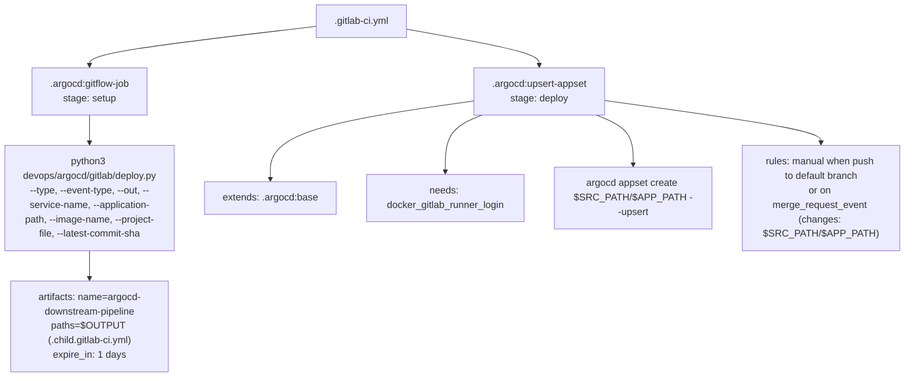
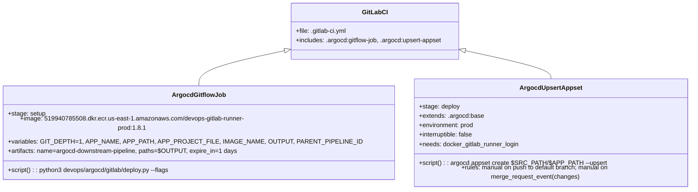

# Diagram: devops/argocd/gitlab/.gitlab-ci.yml

> Auto-generated by Obscura crawlers

## Diagram 1

### SVG

<svg id="container" width="1507.296875" xmlns="http://www.w3.org/2000/svg" class="flowchart" height="622" viewBox="0 0 1507.296875 622" role="graphics-document document" aria-roledescription="flowchart-v2"><g><marker id="container_flowchart-v2-pointEnd" class="marker flowchart-v2" viewBox="0 0 10 10" refX="5" refY="5" markerUnits="userSpaceOnUse" markerWidth="8" markerHeight="8" orient="auto"><path d="M 0 0 L 10 5 L 0 10 z" class="arrowMarkerPath" style="stroke-width: 1; stroke-dasharray: 1, 0;"></path></marker><marker id="container_flowchart-v2-pointStart" class="marker flowchart-v2" viewBox="0 0 10 10" refX="4.5" refY="5" markerUnits="userSpaceOnUse" markerWidth="8" markerHeight="8" orient="auto"><path d="M 0 5 L 10 10 L 10 0 z" class="arrowMarkerPath" style="stroke-width: 1; stroke-dasharray: 1, 0;"></path></marker><marker id="container_flowchart-v2-circleEnd" class="marker flowchart-v2" viewBox="0 0 10 10" refX="11" refY="5" markerUnits="userSpaceOnUse" markerWidth="11" markerHeight="11" orient="auto"><circle cx="5" cy="5" r="5" class="arrowMarkerPath" style="stroke-width: 1; stroke-dasharray: 1, 0;"></circle></marker><marker id="container_flowchart-v2-circleStart" class="marker flowchart-v2" viewBox="0 0 10 10" refX="-1" refY="5" markerUnits="userSpaceOnUse" markerWidth="11" markerHeight="11" orient="auto"><circle cx="5" cy="5" r="5" class="arrowMarkerPath" style="stroke-width: 1; stroke-dasharray: 1, 0;"></circle></marker><marker id="container_flowchart-v2-crossEnd" class="marker cross flowchart-v2" viewBox="0 0 11 11" refX="12" refY="5.2" markerUnits="userSpaceOnUse" markerWidth="11" markerHeight="11" orient="auto"><path d="M 1,1 l 9,9 M 10,1 l -9,9" class="arrowMarkerPath" style="stroke-width: 2; stroke-dasharray: 1, 0;"></path></marker><marker id="container_flowchart-v2-crossStart" class="marker cross flowchart-v2" viewBox="0 0 11 11" refX="-1" refY="5.2" markerUnits="userSpaceOnUse" markerWidth="11" markerHeight="11" orient="auto"><path d="M 1,1 l 9,9 M 10,1 l -9,9" class="arrowMarkerPath" style="stroke-width: 2; stroke-dasharray: 1, 0;"></path></marker><g class="root"><g class="clusters"></g><g class="edgePaths"><path d="M531.008,43.807L468.465,51.006C405.922,58.205,280.836,72.602,218.293,83.301C155.75,94,155.75,101,155.75,104.5L155.75,108" id="L_GitlabCI_ArgocdGitflow_0" class="edge-thickness-normal edge-pattern-solid edge-thickness-normal edge-pattern-solid flowchart-link" style=";" data-edge="true" data-et="edge" data-id="L_GitlabCI_ArgocdGitflow_0" data-points="W3sieCI6NTMxLjAwNzgxMjUsInkiOjQzLjgwNzA5NzAzMDc5ODc2fSx7IngiOjE1NS43NSwieSI6ODd9LHsieCI6MTU1Ljc1LCJ5IjoxMTJ9XQ==" marker-end="url(#container_flowchart-v2-pointEnd)"></path><path d="M155.75,190L155.75,194.167C155.75,198.333,155.75,206.667,155.75,214.333C155.75,222,155.75,229,155.75,232.5L155.75,236" id="L_ArgocdGitflow_RunDeploy_0" class="edge-thickness-normal edge-pattern-solid edge-thickness-normal edge-pattern-solid flowchart-link" style=";" data-edge="true" data-et="edge" data-id="L_ArgocdGitflow_RunDeploy_0" data-points="W3sieCI6MTU1Ljc1LCJ5IjoxOTB9LHsieCI6MTU1Ljc1LCJ5IjoyMTV9LHsieCI6MTU1Ljc1LCJ5IjoyNDB9XQ==" marker-end="url(#container_flowchart-v2-pointEnd)"></path><path d="M155.75,414L155.75,418.167C155.75,422.333,155.75,430.667,155.75,438.333C155.75,446,155.75,453,155.75,456.5L155.75,460" id="L_RunDeploy_Artifacts_0" class="edge-thickness-normal edge-pattern-solid edge-thickness-normal edge-pattern-solid flowchart-link" style=";" data-edge="true" data-et="edge" data-id="L_RunDeploy_Artifacts_0" data-points="W3sieCI6MTU1Ljc1LCJ5Ijo0MTR9LHsieCI6MTU1Ljc1LCJ5Ijo0Mzl9LHsieCI6MTU1Ljc1LCJ5Ijo0NjR9XQ==" marker-end="url(#container_flowchart-v2-pointEnd)"></path><path d="M684.039,48.407L720.749,54.839C757.458,61.271,830.878,74.136,867.587,84.068C904.297,94,904.297,101,904.297,104.5L904.297,108" id="L_GitlabCI_ArgocdUpsert_0" class="edge-thickness-normal edge-pattern-solid edge-thickness-normal edge-pattern-solid flowchart-link" style=";" data-edge="true" data-et="edge" data-id="L_GitlabCI_ArgocdUpsert_0" data-points="W3sieCI6Njg0LjAzOTA2MjUsInkiOjQ4LjQwNjkwMjM2MTMzNDE0fSx7IngiOjkwNC4yOTY4NzUsInkiOjg3fSx7IngiOjkwNC4yOTY4NzUsInkiOjExMn1d" marker-end="url(#container_flowchart-v2-pointEnd)"></path><path d="M794.875,166.812L739.296,174.843C683.716,182.875,572.557,198.937,516.978,220.469C461.398,242,461.398,269,461.398,282.5L461.398,296" id="L_ArgocdUpsert_ExtendsBase_0" class="edge-thickness-normal edge-pattern-solid edge-thickness-normal edge-pattern-solid flowchart-link" style=";" data-edge="true" data-et="edge" data-id="L_ArgocdUpsert_ExtendsBase_0" data-points="W3sieCI6Nzk0Ljg3NSwieSI6MTY2LjgxMTc1MTQyNDM4ODM1fSx7IngiOjQ2MS4zOTg0Mzc1LCJ5IjoyMTV9LHsieCI6NDYxLjM5ODQzNzUsInkiOjMwMH1d" marker-end="url(#container_flowchart-v2-pointEnd)"></path><path d="M809.844,190L799.753,194.167C789.661,198.333,769.479,206.667,759.388,222.333C749.297,238,749.297,261,749.297,272.5L749.297,284" id="L_ArgocdUpsert_NeedsRunner_0" class="edge-thickness-normal edge-pattern-solid edge-thickness-normal edge-pattern-solid flowchart-link" style=";" data-edge="true" data-et="edge" data-id="L_ArgocdUpsert_NeedsRunner_0" data-points="W3sieCI6ODA5Ljg0Mzc1LCJ5IjoxOTB9LHsieCI6NzQ5LjI5Njg3NSwieSI6MjE1fSx7IngiOjc0OS4yOTY4NzUsInkiOjI4OH1d" marker-end="url(#container_flowchart-v2-pointEnd)"></path><path d="M998.75,190L1008.841,194.167C1018.932,198.333,1039.115,206.667,1049.206,220.333C1059.297,234,1059.297,253,1059.297,262.5L1059.297,272" id="L_ArgocdUpsert_ArgocdCreate_0" class="edge-thickness-normal edge-pattern-solid edge-thickness-normal edge-pattern-solid flowchart-link" style=";" data-edge="true" data-et="edge" data-id="L_ArgocdUpsert_ArgocdCreate_0" data-points="W3sieCI6OTk4Ljc1LCJ5IjoxOTB9LHsieCI6MTA1OS4yOTY4NzUsInkiOjIxNX0seyJ4IjoxMDU5LjI5Njg3NSwieSI6Mjc2fV0=" marker-end="url(#container_flowchart-v2-pointEnd)"></path><path d="M1013.719,166.06L1072.982,174.217C1132.245,182.373,1250.771,198.687,1310.034,210.343C1369.297,222,1369.297,229,1369.297,232.5L1369.297,236" id="L_ArgocdUpsert_RulesUpsert_0" class="edge-thickness-normal edge-pattern-solid edge-thickness-normal edge-pattern-solid flowchart-link" style=";" data-edge="true" data-et="edge" data-id="L_ArgocdUpsert_RulesUpsert_0" data-points="W3sieCI6MTAxMy43MTg3NSwieSI6MTY2LjA2MDIxNTA1Mzc2MzQ0fSx7IngiOjEzNjkuMjk2ODc1LCJ5IjoyMTV9LHsieCI6MTM2OS4yOTY4NzUsInkiOjI0MH1d" marker-end="url(#container_flowchart-v2-pointEnd)"></path></g><g class="edgeLabels"><g class="edgeLabel"><g class="label" data-id="L_GitlabCI_ArgocdGitflow_0" transform="translate(0, 0)"><foreignObject width="0" height="0">

</foreignObject></g></g><g class="edgeLabel"><g class="label" data-id="L_ArgocdGitflow_RunDeploy_0" transform="translate(0, 0)"><foreignObject width="0" height="0">

</foreignObject></g></g><g class="edgeLabel"><g class="label" data-id="L_RunDeploy_Artifacts_0" transform="translate(0, 0)"><foreignObject width="0" height="0">

</foreignObject></g></g><g class="edgeLabel"><g class="label" data-id="L_GitlabCI_ArgocdUpsert_0" transform="translate(0, 0)"><foreignObject width="0" height="0">

</foreignObject></g></g><g class="edgeLabel"><g class="label" data-id="L_ArgocdUpsert_ExtendsBase_0" transform="translate(0, 0)"><foreignObject width="0" height="0">

</foreignObject></g></g><g class="edgeLabel"><g class="label" data-id="L_ArgocdUpsert_NeedsRunner_0" transform="translate(0, 0)"><foreignObject width="0" height="0">

</foreignObject></g></g><g class="edgeLabel"><g class="label" data-id="L_ArgocdUpsert_ArgocdCreate_0" transform="translate(0, 0)"><foreignObject width="0" height="0">

</foreignObject></g></g><g class="edgeLabel"><g class="label" data-id="L_ArgocdUpsert_RulesUpsert_0" transform="translate(0, 0)"><foreignObject width="0" height="0">

</foreignObject></g></g></g><g class="nodes"><g class="node default" id="flowchart-GitlabCI-0" transform="translate(607.5234375, 35)"><rect class="basic label-container" style="" x="-76.515625" y="-27" width="153.03125" height="54"></rect><g class="label" style="" transform="translate(-46.515625, -12)"><rect></rect><foreignObject width="93.03125" height="24">

.gitlab-ci.yml

</foreignObject></g></g><g class="node default" id="flowchart-ArgocdGitflow-1" transform="translate(155.75, 151)"><rect class="basic label-container" style="" x="-97.53125" y="-39" width="195.0625" height="78"></rect><g class="label" style="" transform="translate(-67.53125, -24)"><rect></rect><foreignObject width="135.0625" height="48">

.argocd:gitflow-job stage: setup

</foreignObject></g></g><g class="node default" id="flowchart-RunDeploy-2" transform="translate(155.75, 327)"><rect class="basic label-container" style="" x="-147.75" y="-87" width="295.5" height="174"></rect><g class="label" style="" transform="translate(-117.75, -72)"><rect></rect><foreignObject width="235.5" height="144">

python3 devops/argocd/gitlab/deploy.py --type, --event-type, --out, --service-name, --application-path, --image-name, --project-file, --latest-commit-sha

</foreignObject></g></g><g class="node default" id="flowchart-Artifacts-3" transform="translate(155.75, 539)"><rect class="basic label-container" style="" x="-130" y="-75" width="260" height="150"></rect><g class="label" style="" transform="translate(-100, -60)"><rect></rect><foreignObject width="200" height="120">

artifacts: name=argocd-downstream-pipeline paths=$OUTPUT (.child.gitlab-ci.yml) expire_in: 1 days

</foreignObject></g></g><g class="node default" id="flowchart-ArgocdUpsert-4" transform="translate(904.296875, 151)"><rect class="basic label-container" style="" x="-109.421875" y="-39" width="218.84375" height="78"></rect><g class="label" style="" transform="translate(-79.421875, -24)"><rect></rect><foreignObject width="158.84375" height="48">

.argocd:upsert-appset stage: deploy

</foreignObject></g></g><g class="node default" id="flowchart-ExtendsBase-5" transform="translate(461.3984375, 327)"><rect class="basic label-container" style="" x="-107.8984375" y="-27" width="215.796875" height="54"></rect><g class="label" style="" transform="translate(-77.8984375, -12)"><rect></rect><foreignObject width="155.796875" height="24">

extends: .argocd:base

</foreignObject></g></g><g class="node default" id="flowchart-NeedsRunner-6" transform="translate(749.296875, 327)"><rect class="basic label-container" style="" x="-130" y="-39" width="260" height="78"></rect><g class="label" style="" transform="translate(-100, -24)"><rect></rect><foreignObject width="200" height="48">

needs: docker_gitlab_runner_login

</foreignObject></g></g><g class="node default" id="flowchart-ArgocdCreate-7" transform="translate(1059.296875, 327)"><rect class="basic label-container" style="" x="-130" y="-51" width="260" height="102"></rect><g class="label" style="" transform="translate(-100, -36)"><rect></rect><foreignObject width="200" height="72">

argocd appset create $SRC_PATH/$APP_PATH --upsert

</foreignObject></g></g><g class="node default" id="flowchart-RulesUpsert-8" transform="translate(1369.296875, 327)"><rect class="basic label-container" style="" x="-130" y="-87" width="260" height="174"></rect><g class="label" style="" transform="translate(-100, -72)"><rect></rect><foreignObject width="200" height="144">

rules: manual when push to default branch or on merge_request_event (changes: $SRC_PATH/$APP_PATH)

</foreignObject></g></g></g></g></g></svg>

## Diagram 2

### SVG

<svg id="container" width="1668.9296875" xmlns="http://www.w3.org/2000/svg" class="classDiagram" height="474" viewBox="0 0 1668.9296875 474" role="graphics-document document" aria-roledescription="class"><g><defs><marker id="container_class-aggregationStart" class="marker aggregation class" refX="18" refY="7" markerWidth="190" markerHeight="240" orient="auto"><path d="M 18,7 L9,13 L1,7 L9,1 Z"></path></marker></defs><defs><marker id="container_class-aggregationEnd" class="marker aggregation class" refX="1" refY="7" markerWidth="20" markerHeight="28" orient="auto"><path d="M 18,7 L9,13 L1,7 L9,1 Z"></path></marker></defs><defs><marker id="container_class-extensionStart" class="marker extension class" refX="18" refY="7" markerWidth="190" markerHeight="240" orient="auto"><path d="M 1,7 L18,13 V 1 Z"></path></marker></defs><defs><marker id="container_class-extensionEnd" class="marker extension class" refX="1" refY="7" markerWidth="20" markerHeight="28" orient="auto"><path d="M 1,1 V 13 L18,7 Z"></path></marker></defs><defs><marker id="container_class-compositionStart" class="marker composition class" refX="18" refY="7" markerWidth="190" markerHeight="240" orient="auto"><path d="M 18,7 L9,13 L1,7 L9,1 Z"></path></marker></defs><defs><marker id="container_class-compositionEnd" class="marker composition class" refX="1" refY="7" markerWidth="20" markerHeight="28" orient="auto"><path d="M 18,7 L9,13 L1,7 L9,1 Z"></path></marker></defs><defs><marker id="container_class-dependencyStart" class="marker dependency class" refX="6" refY="7" markerWidth="190" markerHeight="240" orient="auto"><path d="M 5,7 L9,13 L1,7 L9,1 Z"></path></marker></defs><defs><marker id="container_class-dependencyEnd" class="marker dependency class" refX="13" refY="7" markerWidth="20" markerHeight="28" orient="auto"><path d="M 18,7 L9,13 L14,7 L9,1 Z"></path></marker></defs><defs><marker id="container_class-lollipopStart" class="marker lollipop class" refX="13" refY="7" markerWidth="190" markerHeight="240" orient="auto"><circle stroke="black" fill="transparent" cx="7" cy="7" r="6"></circle></marker></defs><defs><marker id="container_class-lollipopEnd" class="marker lollipop class" refX="1" refY="7" markerWidth="190" markerHeight="240" orient="auto"><circle stroke="black" fill="transparent" cx="7" cy="7" r="6"></circle></marker></defs><g class="root"><g class="clusters"></g><g class="edgePaths"><path d="M644.144,133.252L612.142,140.543C580.14,147.834,516.137,162.417,484.135,177.875C452.133,193.333,452.133,209.667,452.133,217.833L452.133,226" id="id_GitLabCI_ArgocdGitflowJob_1" class="edge-thickness-normal edge-pattern-solid relation" style=";;;" data-edge="true" data-et="edge" data-id="id_GitLabCI_ArgocdGitflowJob_1" data-points="W3sieCI6NjYwLjk2Mjg5MDYyNSwieSI6MTI5LjQxOTYwMzE2NTUwMDYzfSx7IngiOjQ1Mi4xMzI4MTI1LCJ5IjoxNzd9LHsieCI6NDUyLjEzMjgxMjUsInkiOjIyNn1d" marker-start="url(#container_class-extensionStart)"></path><path d="M1111.587,133.252L1143.588,140.543C1175.59,147.834,1239.594,162.417,1271.596,173.875C1303.598,185.333,1303.598,193.667,1303.598,197.833L1303.598,202" id="id_GitLabCI_ArgocdUpsertAppset_2" class="edge-thickness-normal edge-pattern-solid relation" style=";;;" data-edge="true" data-et="edge" data-id="id_GitLabCI_ArgocdUpsertAppset_2" data-points="W3sieCI6MTA5NC43Njc1NzgxMjUsInkiOjEyOS40MTk2MDMxNjU1MDA2M30seyJ4IjoxMzAzLjU5NzY1NjI1LCJ5IjoxNzd9LHsieCI6MTMwMy41OTc2NTYyNSwieSI6MjAyfV0=" marker-start="url(#container_class-extensionStart)"></path></g><g class="edgeLabels"><g class="edgeLabel"><g class="label" data-id="id_GitLabCI_ArgocdGitflowJob_1" transform="translate(0, 0)"><foreignObject width="0" height="0">

</foreignObject></g></g><g class="edgeLabel"><g class="label" data-id="id_GitLabCI_ArgocdUpsertAppset_2" transform="translate(0, 0)"><foreignObject width="0" height="0">

</foreignObject></g></g></g><g class="nodes"><g class="node default" id="classId-GitLabCI-0" transform="translate(877.865234375, 80)"><g class="basic label-container"><path d="M-216.90234375 -72 L216.90234375 -72 L216.90234375 72 L-216.90234375 72" stroke="none" stroke-width="0" fill="#ECECFF" style=""></path><path d="M-216.90234375 -72 C-77.13304351459914 -72, 62.636256720801725 -72, 216.90234375 -72 M-216.90234375 -72 C-68.9125111324905 -72, 79.07732148501901 -72, 216.90234375 -72 M216.90234375 -72 C216.90234375 -14.594148648642104, 216.90234375 42.81170270271579, 216.90234375 72 M216.90234375 -72 C216.90234375 -23.615995354867486, 216.90234375 24.768009290265027, 216.90234375 72 M216.90234375 72 C55.30128475284275 72, -106.2997742443145 72, -216.90234375 72 M216.90234375 72 C48.33167125735815 72, -120.2390012352837 72, -216.90234375 72 M-216.90234375 72 C-216.90234375 29.111867276277437, -216.90234375 -13.776265447445127, -216.90234375 -72 M-216.90234375 72 C-216.90234375 29.031940714928254, -216.90234375 -13.936118570143492, -216.90234375 -72" stroke="#9370DB" stroke-width="1.3" fill="none" stroke-dasharray="0 0" style=""></path></g><g class="annotation-group text" transform="translate(0, -48)"></g><g class="label-group text" transform="translate(-30.6328125, -48)"><g class="label" style="font-weight: bolder" transform="translate(0,-12)"><foreignObject width="61.265625" height="24">

GitLabCI

</foreignObject></g></g><g class="members-group text" transform="translate(-204.90234375, 0)"><g class="label" style="" transform="translate(0,-12)"><foreignObject width="131.390625" height="24">

+file: .gitlab-ci.yml

</foreignObject></g><g class="label" style="" transform="translate(0,12)"><foreignObject width="379.171875" height="24">

+includes: .argocd:gitflow-job, .argocd:upsert-appset

</foreignObject></g></g><g class="methods-group text" transform="translate(-204.90234375, 72)"></g><g class="divider" style=""><path d="M-216.90234375 -24 C-85.86387754439443 -24, 45.174588661211146 -24, 216.90234375 -24 M-216.90234375 -24 C-89.70772118420135 -24, 37.486901381597306 -24, 216.90234375 -24" stroke="#9370DB" stroke-width="1.3" fill="none" stroke-dasharray="0 0" style=""></path></g><g class="divider" style=""><path d="M-216.90234375 48 C-65.21221565099927 48, 86.47791244800146 48, 216.90234375 48 M-216.90234375 48 C-55.984025367343435 48, 104.93429301531313 48, 216.90234375 48" stroke="#9370DB" stroke-width="1.3" fill="none" stroke-dasharray="0 0" style=""></path></g></g><g class="node default" id="classId-ArgocdGitflowJob-1" transform="translate(452.1328125, 334)"><g class="basic label-container"><path d="M-444.1328125 -108 L444.1328125 -108 L444.1328125 108 L-444.1328125 108" stroke="none" stroke-width="0" fill="#ECECFF" style=""></path><path d="M-444.1328125 -108 C-98.00459130974724 -108, 248.12362988050552 -108, 444.1328125 -108 M-444.1328125 -108 C-183.23817882317525 -108, 77.6564548536495 -108, 444.1328125 -108 M444.1328125 -108 C444.1328125 -44.045568933985685, 444.1328125 19.90886213202863, 444.1328125 108 M444.1328125 -108 C444.1328125 -49.05303655121636, 444.1328125 9.893926897567283, 444.1328125 108 M444.1328125 108 C140.54364027362772 108, -163.04553195274457 108, -444.1328125 108 M444.1328125 108 C131.54323159443862 108, -181.04634931112275 108, -444.1328125 108 M-444.1328125 108 C-444.1328125 43.20971259472647, -444.1328125 -21.580574810547063, -444.1328125 -108 M-444.1328125 108 C-444.1328125 34.7853940276797, -444.1328125 -38.4292119446406, -444.1328125 -108" stroke="#9370DB" stroke-width="1.3" fill="none" stroke-dasharray="0 0" style=""></path></g><g class="annotation-group text" transform="translate(0, -84)"></g><g class="label-group text" transform="translate(-63.375, -84)"><g class="label" style="font-weight: bolder" transform="translate(0,-12)"><foreignObject width="126.75" height="24">

ArgocdGitflowJob

</foreignObject></g></g><g class="members-group text" transform="translate(-432.1328125, -36)"><g class="label" style="" transform="translate(0,-12)"><foreignObject width="95.3125" height="24">

+stage: setup

</foreignObject></g><g class="label" style="" transform="translate(0,12)"><foreignObject width="634" height="24">

+image: 519940785508.dkr.ecr.us-east-1.amazonaws.com/devops-gitlab-runner-prod:1.8.1

</foreignObject></g><g class="label" style="" transform="translate(0,36)"><foreignObject width="800.890625" height="24">

+variables: GIT_DEPTH=1, APP_NAME, APP_PATH, APP_PROJECT_FILE, IMAGE_NAME, OUTPUT, PARENT_PIPELINE_ID

</foreignObject></g><g class="label" style="" transform="translate(0,60)"><foreignObject width="584.25" height="24">

+artifacts: name=argocd-downstream-pipeline, paths=$OUTPUT, expire_in=1 days

</foreignObject></g></g><g class="methods-group text" transform="translate(-432.1328125, 84)"><g class="label" style="" transform="translate(0,-12)"><foreignObject width="429.265625" height="24">

+script() : : python3 devops/argocd/gitlab/deploy.py --flags

</foreignObject></g></g><g class="divider" style=""><path d="M-444.1328125 -60 C-153.41036644620078 -60, 137.31207960759843 -60, 444.1328125 -60 M-444.1328125 -60 C-116.6476873344813 -60, 210.8374378310374 -60, 444.1328125 -60" stroke="#9370DB" stroke-width="1.3" fill="none" stroke-dasharray="0 0" style=""></path></g><g class="divider" style=""><path d="M-444.1328125 60 C-162.95065571739502 60, 118.23150106520995 60, 444.1328125 60 M-444.1328125 60 C-146.10062805336895 60, 151.9315563932621 60, 444.1328125 60" stroke="#9370DB" stroke-width="1.3" fill="none" stroke-dasharray="0 0" style=""></path></g></g><g class="node default" id="classId-ArgocdUpsertAppset-2" transform="translate(1303.59765625, 334)"><g class="basic label-container"><path d="M-357.33203125 -132 L357.33203125 -132 L357.33203125 132 L-357.33203125 132" stroke="none" stroke-width="0" fill="#ECECFF" style=""></path><path d="M-357.33203125 -132 C-165.0065210543489 -132, 27.31898914130221 -132, 357.33203125 -132 M-357.33203125 -132 C-134.5149072741651 -132, 88.3022167016698 -132, 357.33203125 -132 M357.33203125 -132 C357.33203125 -53.60194376347245, 357.33203125 24.796112473055103, 357.33203125 132 M357.33203125 -132 C357.33203125 -35.69634117879441, 357.33203125 60.607317642411175, 357.33203125 132 M357.33203125 132 C130.0587581352207 132, -97.2145149795586 132, -357.33203125 132 M357.33203125 132 C125.71993857509023 132, -105.89215409981955 132, -357.33203125 132 M-357.33203125 132 C-357.33203125 55.91939506118395, -357.33203125 -20.161209877632103, -357.33203125 -132 M-357.33203125 132 C-357.33203125 51.7857050133219, -357.33203125 -28.428589973356196, -357.33203125 -132" stroke="#9370DB" stroke-width="1.3" fill="none" stroke-dasharray="0 0" style=""></path></g><g class="annotation-group text" transform="translate(0, -108)"></g><g class="label-group text" transform="translate(-75.4140625, -108)"><g class="label" style="font-weight: bolder" transform="translate(0,-12)"><foreignObject width="150.828125" height="24">

ArgocdUpsertAppset

</foreignObject></g></g><g class="members-group text" transform="translate(-345.33203125, -60)"><g class="label" style="" transform="translate(0,-12)"><foreignObject width="104.09375" height="24">

+stage: deploy

</foreignObject></g><g class="label" style="" transform="translate(0,12)"><foreignObject width="163.78125" height="24">

+extends: .argocd:base

</foreignObject></g><g class="label" style="" transform="translate(0,36)"><foreignObject width="142.609375" height="24">

+environment: prod

</foreignObject></g><g class="label" style="" transform="translate(0,60)"><foreignObject width="142.9375" height="24">

+interruptible: false

</foreignObject></g><g class="label" style="" transform="translate(0,84)"><foreignObject width="258.0625" height="24">

+needs: docker_gitlab_runner_login

</foreignObject></g></g><g class="methods-group text" transform="translate(-345.33203125, 84)"><g class="label" style="" transform="translate(0,-12)"><foreignObject width="466.921875" height="24">

+script() : : argocd appset create $SRC_PATH/$APP_PATH --upsert

</foreignObject></g><g class="label" style="" transform="translate(0,12)"><foreignObject width="615.25" height="24">

+rules: manual on push to default branch; manual on merge_request_event(changes)

</foreignObject></g></g><g class="divider" style=""><path d="M-357.33203125 -84 C-132.35565407354167 -84, 92.62072310291666 -84, 357.33203125 -84 M-357.33203125 -84 C-101.92475314787018 -84, 153.48252495425965 -84, 357.33203125 -84" stroke="#9370DB" stroke-width="1.3" fill="none" stroke-dasharray="0 0" style=""></path></g><g class="divider" style=""><path d="M-357.33203125 60 C-165.6285653150101 60, 26.074900619979815 60, 357.33203125 60 M-357.33203125 60 C-138.83244677938956 60, 79.66713769122089 60, 357.33203125 60" stroke="#9370DB" stroke-width="1.3" fill="none" stroke-dasharray="0 0" style=""></path></g></g></g></g></g></svg>
