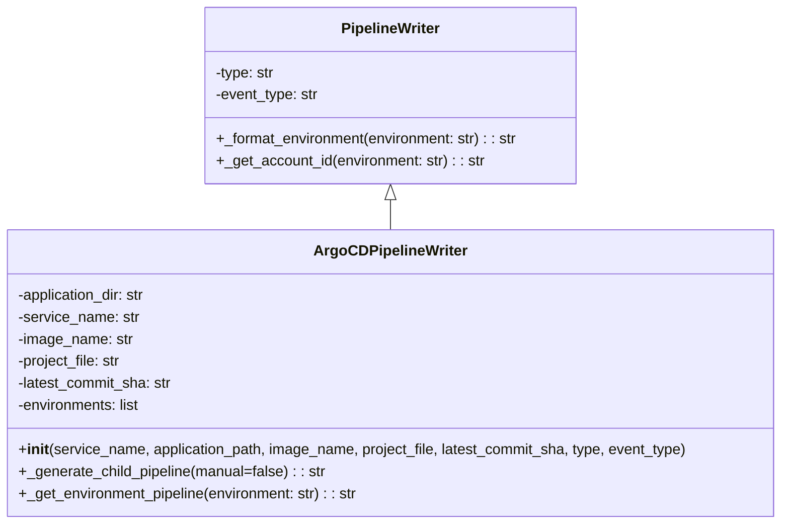

# Diagram: devops/argocd/gitlab/argocd_pipeline_writer.py


> Auto-generated by Obscura crawlers

## Diagram 1



### SVG

<svg id="container" width="855.5546875" xmlns="http://www.w3.org/2000/svg" class="classDiagram" height="570" viewBox="0 0 855.5546875 570" role="graphics-document document" aria-roledescription="class"><style>#container{font-family:"trebuchet ms",verdana,arial,sans-serif;font-size:16px;fill:#333;}@keyframes edge-animation-frame{from{stroke-dashoffset:0;}}@keyframes dash{to{stroke-dashoffset:0;}}#container .edge-animation-slow{stroke-dasharray:9,5!important;stroke-dashoffset:900;animation:dash 50s linear infinite;stroke-linecap:round;}#container .edge-animation-fast{stroke-dasharray:9,5!important;stroke-dashoffset:900;animation:dash 20s linear infinite;stroke-linecap:round;}#container .error-icon{fill:#552222;}#container .error-text{fill:#552222;stroke:#552222;}#container .edge-thickness-normal{stroke-width:1px;}#container .edge-thickness-thick{stroke-width:3.5px;}#container .edge-pattern-solid{stroke-dasharray:0;}#container .edge-thickness-invisible{stroke-width:0;fill:none;}#container .edge-pattern-dashed{stroke-dasharray:3;}#container .edge-pattern-dotted{stroke-dasharray:2;}#container .marker{fill:#333333;stroke:#333333;}#container .marker.cross{stroke:#333333;}#container svg{font-family:"trebuchet ms",verdana,arial,sans-serif;font-size:16px;}#container p{margin:0;}#container g.classGroup text{fill:#9370DB;stroke:none;font-family:"trebuchet ms",verdana,arial,sans-serif;font-size:10px;}#container g.classGroup text .title{font-weight:bolder;}#container .nodeLabel,#container .edgeLabel{color:#131300;}#container .edgeLabel .label rect{fill:#ECECFF;}#container .label text{fill:#131300;}#container .labelBkg{background:#ECECFF;}#container .edgeLabel .label span{background:#ECECFF;}#container .classTitle{font-weight:bolder;}#container .node rect,#container .node circle,#container .node ellipse,#container .node polygon,#container .node path{fill:#ECECFF;stroke:#9370DB;stroke-width:1px;}#container .divider{stroke:#9370DB;stroke-width:1;}#container g.clickable{cursor:pointer;}#container g.classGroup rect{fill:#ECECFF;stroke:#9370DB;}#container g.classGroup line{stroke:#9370DB;stroke-width:1;}#container .classLabel .box{stroke:none;stroke-width:0;fill:#ECECFF;opacity:0.5;}#container .classLabel .label{fill:#9370DB;font-size:10px;}#container .relation{stroke:#333333;stroke-width:1;fill:none;}#container .dashed-line{stroke-dasharray:3;}#container .dotted-line{stroke-dasharray:1 2;}#container #compositionStart,#container .composition{fill:#333333!important;stroke:#333333!important;stroke-width:1;}#container #compositionEnd,#container .composition{fill:#333333!important;stroke:#333333!important;stroke-width:1;}#container #dependencyStart,#container .dependency{fill:#333333!important;stroke:#333333!important;stroke-width:1;}#container #dependencyStart,#container .dependency{fill:#333333!important;stroke:#333333!important;stroke-width:1;}#container #extensionStart,#container .extension{fill:transparent!important;stroke:#333333!important;stroke-width:1;}#container #extensionEnd,#container .extension{fill:transparent!important;stroke:#333333!important;stroke-width:1;}#container #aggregationStart,#container .aggregation{fill:transparent!important;stroke:#333333!important;stroke-width:1;}#container #aggregationEnd,#container .aggregation{fill:transparent!important;stroke:#333333!important;stroke-width:1;}#container #lollipopStart,#container .lollipop{fill:#ECECFF!important;stroke:#333333!important;stroke-width:1;}#container #lollipopEnd,#container .lollipop{fill:#ECECFF!important;stroke:#333333!important;stroke-width:1;}#container .edgeTerminals{font-size:11px;line-height:initial;}#container .classTitleText{text-anchor:middle;font-size:18px;fill:#333;}#container .label-icon{display:inline-block;height:1em;overflow:visible;vertical-align:-0.125em;}#container .node .label-icon path{fill:currentColor;stroke:revert;stroke-width:revert;}#container :root{--mermaid-font-family:"trebuchet ms",verdana,arial,sans-serif;}</style><g><defs><marker id="container_class-aggregationStart" class="marker aggregation class" refX="18" refY="7" markerWidth="190" markerHeight="240" orient="auto"><path d="M 18,7 L9,13 L1,7 L9,1 Z"></path></marker></defs><defs><marker id="container_class-aggregationEnd" class="marker aggregation class" refX="1" refY="7" markerWidth="20" markerHeight="28" orient="auto"><path d="M 18,7 L9,13 L1,7 L9,1 Z"></path></marker></defs><defs><marker id="container_class-extensionStart" class="marker extension class" refX="18" refY="7" markerWidth="190" markerHeight="240" orient="auto"><path d="M 1,7 L18,13 V 1 Z"></path></marker></defs><defs><marker id="container_class-extensionEnd" class="marker extension class" refX="1" refY="7" markerWidth="20" markerHeight="28" orient="auto"><path d="M 1,1 V 13 L18,7 Z"></path></marker></defs><defs><marker id="container_class-compositionStart" class="marker composition class" refX="18" refY="7" markerWidth="190" markerHeight="240" orient="auto"><path d="M 18,7 L9,13 L1,7 L9,1 Z"></path></marker></defs><defs><marker id="container_class-compositionEnd" class="marker composition class" refX="1" refY="7" markerWidth="20" markerHeight="28" orient="auto"><path d="M 18,7 L9,13 L1,7 L9,1 Z"></path></marker></defs><defs><marker id="container_class-dependencyStart" class="marker dependency class" refX="6" refY="7" markerWidth="190" markerHeight="240" orient="auto"><path d="M 5,7 L9,13 L1,7 L9,1 Z"></path></marker></defs><defs><marker id="container_class-dependencyEnd" class="marker dependency class" refX="13" refY="7" markerWidth="20" markerHeight="28" orient="auto"><path d="M 18,7 L9,13 L14,7 L9,1 Z"></path></marker></defs><defs><marker id="container_class-lollipopStart" class="marker lollipop class" refX="13" refY="7" markerWidth="190" markerHeight="240" orient="auto"><circle stroke="black" fill="transparent" cx="7" cy="7" r="6"></circle></marker></defs><defs><marker id="container_class-lollipopEnd" class="marker lollipop class" refX="1" refY="7" markerWidth="190" markerHeight="240" orient="auto"><circle stroke="black" fill="transparent" cx="7" cy="7" r="6"></circle></marker></defs><g class="root"><g class="clusters"></g><g class="edgePaths"><path d="M427.777,217.25L427.777,218.542C427.777,219.833,427.777,222.417,427.777,227.875C427.777,233.333,427.777,241.667,427.777,245.833L427.777,250" id="id_PipelineWriter_ArgoCDPipelineWriter_1" class="edge-thickness-normal edge-pattern-solid relation" style=";;;" data-edge="true" data-et="edge" data-id="id_PipelineWriter_ArgoCDPipelineWriter_1" data-points="W3sieCI6NDI3Ljc3NzM0Mzc1LCJ5IjoyMDB9LHsieCI6NDI3Ljc3NzM0Mzc1LCJ5IjoyMjV9LHsieCI6NDI3Ljc3NzM0Mzc1LCJ5IjoyNTB9XQ==" marker-start="url(#container_class-extensionStart)"></path></g><g class="edgeLabels"><g class="edgeLabel"><g class="label" data-id="id_PipelineWriter_ArgoCDPipelineWriter_1" transform="translate(0, 0)"><foreignObject width="0" height="0"><div xmlns="http://www.w3.org/1999/xhtml" class="labelBkg" style="display: table-cell; white-space: nowrap; line-height: 1.5; max-width: 200px; text-align: center;"><span class="edgeLabel"></span></div></foreignObject></g></g></g><g class="nodes"><g class="node default" id="classId-PipelineWriter-0" transform="translate(427.77734375, 104)"><g class="basic label-container"><path d="M-205.40625 -96 L205.40625 -96 L205.40625 96 L-205.40625 96" stroke="none" stroke-width="0" fill="#ECECFF" style=""></path><path d="M-205.40625 -96 C-89.98671277932522 -96, 25.432824441349567 -96, 205.40625 -96 M-205.40625 -96 C-57.24265109220107 -96, 90.92094781559786 -96, 205.40625 -96 M205.40625 -96 C205.40625 -51.13337584167364, 205.40625 -6.26675168334728, 205.40625 96 M205.40625 -96 C205.40625 -32.26358943481742, 205.40625 31.472821130365162, 205.40625 96 M205.40625 96 C101.83991342233305 96, -1.7264231553338902 96, -205.40625 96 M205.40625 96 C44.32888589921879 96, -116.74847820156242 96, -205.40625 96 M-205.40625 96 C-205.40625 39.2441927348094, -205.40625 -17.511614530381195, -205.40625 -96 M-205.40625 96 C-205.40625 51.334111350976, -205.40625 6.668222701952004, -205.40625 -96" stroke="#9370DB" stroke-width="1.3" fill="none" stroke-dasharray="0 0" style=""></path></g><g class="annotation-group text" transform="translate(0, -72)"></g><g class="label-group text" transform="translate(-52.6875, -72)"><g class="label" style="font-weight: bolder" transform="translate(0,-12)"><foreignObject width="105.375" height="24"><div xmlns="http://www.w3.org/1999/xhtml" style="display: table-cell; white-space: nowrap; line-height: 1.5; max-width: 154px; text-align: center;"><span class="nodeLabel markdown-node-label" style=""><p>PipelineWriter</p></span></div></foreignObject></g></g><g class="members-group text" transform="translate(-193.40625, -24)"><g class="label" style="" transform="translate(0,-12)"><foreignObject width="65.671875" height="24"><div xmlns="http://www.w3.org/1999/xhtml" style="display: table-cell; white-space: nowrap; line-height: 1.5; max-width: 124px; text-align: center;"><span class="nodeLabel markdown-node-label" style=""><p>-type: str</p></span></div></foreignObject></g><g class="label" style="" transform="translate(0,12)"><foreignObject width="114.09375" height="24"><div xmlns="http://www.w3.org/1999/xhtml" style="display: table-cell; white-space: nowrap; line-height: 1.5; max-width: 172px; text-align: center;"><span class="nodeLabel markdown-node-label" style=""><p>-event_type: str</p></span></div></foreignObject></g></g><g class="methods-group text" transform="translate(-193.40625, 48)"><g class="label" style="" transform="translate(0,-12)"><foreignObject width="334.125" height="24"><div xmlns="http://www.w3.org/1999/xhtml" style="display: table-cell; white-space: nowrap; line-height: 1.5; max-width: 392px; text-align: center;"><span class="nodeLabel markdown-node-label" style=""><p>+_format_environment(environment: str) : : str</p></span></div></foreignObject></g><g class="label" style="" transform="translate(0,12)"><foreignObject width="295.4375" height="24"><div xmlns="http://www.w3.org/1999/xhtml" style="display: table-cell; white-space: nowrap; line-height: 1.5; max-width: 354px; text-align: center;"><span class="nodeLabel markdown-node-label" style=""><p>+_get_account_id(environment: str) : : str</p></span></div></foreignObject></g></g><g class="divider" style=""><path d="M-205.40625 -48 C-106.85964620726958 -48, -8.313042414539154 -48, 205.40625 -48 M-205.40625 -48 C-90.74193521159243 -48, 23.922379576815132 -48, 205.40625 -48" stroke="#9370DB" stroke-width="1.3" fill="none" stroke-dasharray="0 0" style=""></path></g><g class="divider" style=""><path d="M-205.40625 24 C-95.31080211047168 24, 14.784645779056632 24, 205.40625 24 M-205.40625 24 C-53.37238722075318 24, 98.66147555849363 24, 205.40625 24" stroke="#9370DB" stroke-width="1.3" fill="none" stroke-dasharray="0 0" style=""></path></g></g><g class="node default" id="classId-ArgoCDPipelineWriter-1" transform="translate(427.77734375, 406)"><g class="basic label-container"><path d="M-419.77734375 -156 L419.77734375 -156 L419.77734375 156 L-419.77734375 156" stroke="none" stroke-width="0" fill="#ECECFF" style=""></path><path d="M-419.77734375 -156 C-117.31124784320292 -156, 185.15484806359416 -156, 419.77734375 -156 M-419.77734375 -156 C-161.57418384278498 -156, 96.62897606443005 -156, 419.77734375 -156 M419.77734375 -156 C419.77734375 -67.6554133328683, 419.77734375 20.689173334263387, 419.77734375 156 M419.77734375 -156 C419.77734375 -81.12873796361671, 419.77734375 -6.257475927233429, 419.77734375 156 M419.77734375 156 C114.73946878800791 156, -190.29840617398418 156, -419.77734375 156 M419.77734375 156 C102.9856456763141 156, -213.8060523973718 156, -419.77734375 156 M-419.77734375 156 C-419.77734375 42.601024749937, -419.77734375 -70.797950500126, -419.77734375 -156 M-419.77734375 156 C-419.77734375 66.53557855772145, -419.77734375 -22.9288428845571, -419.77734375 -156" stroke="#9370DB" stroke-width="1.3" fill="none" stroke-dasharray="0 0" style=""></path></g><g class="annotation-group text" transform="translate(0, -132)"></g><g class="label-group text" transform="translate(-79.2265625, -132)"><g class="label" style="font-weight: bolder" transform="translate(0,-12)"><foreignObject width="158.453125" height="24"><div xmlns="http://www.w3.org/1999/xhtml" style="display: table-cell; white-space: nowrap; line-height: 1.5; max-width: 206px; text-align: center;"><span class="nodeLabel markdown-node-label" style=""><p>ArgoCDPipelineWriter</p></span></div></foreignObject></g></g><g class="members-group text" transform="translate(-407.77734375, -84)"><g class="label" style="" transform="translate(0,-12)"><foreignObject width="144.25" height="24"><div xmlns="http://www.w3.org/1999/xhtml" style="display: table-cell; white-space: nowrap; line-height: 1.5; max-width: 202px; text-align: center;"><span class="nodeLabel markdown-node-label" style=""><p>-application_dir: str</p></span></div></foreignObject></g><g class="label" style="" transform="translate(0,12)"><foreignObject width="133.265625" height="24"><div xmlns="http://www.w3.org/1999/xhtml" style="display: table-cell; white-space: nowrap; line-height: 1.5; max-width: 191px; text-align: center;"><span class="nodeLabel markdown-node-label" style=""><p>-service_name: str</p></span></div></foreignObject></g><g class="label" style="" transform="translate(0,36)"><foreignObject width="126.03125" height="24"><div xmlns="http://www.w3.org/1999/xhtml" style="display: table-cell; white-space: nowrap; line-height: 1.5; max-width: 184px; text-align: center;"><span class="nodeLabel markdown-node-label" style=""><p>-image_name: str</p></span></div></foreignObject></g><g class="label" style="" transform="translate(0,60)"><foreignObject width="115.65625" height="24"><div xmlns="http://www.w3.org/1999/xhtml" style="display: table-cell; white-space: nowrap; line-height: 1.5; max-width: 174px; text-align: center;"><span class="nodeLabel markdown-node-label" style=""><p>-project_file: str</p></span></div></foreignObject></g><g class="label" style="" transform="translate(0,84)"><foreignObject width="171.03125" height="24"><div xmlns="http://www.w3.org/1999/xhtml" style="display: table-cell; white-space: nowrap; line-height: 1.5; max-width: 229px; text-align: center;"><span class="nodeLabel markdown-node-label" style=""><p>-latest_commit_sha: str</p></span></div></foreignObject></g><g class="label" style="" transform="translate(0,108)"><foreignObject width="136.828125" height="24"><div xmlns="http://www.w3.org/1999/xhtml" style="display: table-cell; white-space: nowrap; line-height: 1.5; max-width: 194px; text-align: center;"><span class="nodeLabel markdown-node-label" style=""><p>-environments: list</p></span></div></foreignObject></g></g><g class="methods-group text" transform="translate(-407.77734375, 84)"><g class="label" style="" transform="translate(0,-12)"><foreignObject width="736.328125" height="24"><div xmlns="http://www.w3.org/1999/xhtml" style="display: table-cell; white-space: nowrap; line-height: 1.5; max-width: 825px; text-align: center;"><span class="nodeLabel markdown-node-label" style=""><p>+<strong>init</strong>(service_name, application_path, image_name, project_file, latest_commit_sha, type, event_type)</p></span></div></foreignObject></g><g class="label" style="" transform="translate(0,12)"><foreignObject width="336.84375" height="24"><div xmlns="http://www.w3.org/1999/xhtml" style="display: table-cell; white-space: nowrap; line-height: 1.5; max-width: 395px; text-align: center;"><span class="nodeLabel markdown-node-label" style=""><p>+_generate_child_pipeline(manual=false) : : str</p></span></div></foreignObject></g><g class="label" style="" transform="translate(0,36)"><foreignObject width="376.09375" height="24"><div xmlns="http://www.w3.org/1999/xhtml" style="display: table-cell; white-space: nowrap; line-height: 1.5; max-width: 434px; text-align: center;"><span class="nodeLabel markdown-node-label" style=""><p>+_get_environment_pipeline(environment: str) : : str</p></span></div></foreignObject></g></g><g class="divider" style=""><path d="M-419.77734375 -108 C-91.8865286003624 -108, 236.0042865492752 -108, 419.77734375 -108 M-419.77734375 -108 C-85.68977562492063 -108, 248.39779250015874 -108, 419.77734375 -108" stroke="#9370DB" stroke-width="1.3" fill="none" stroke-dasharray="0 0" style=""></path></g><g class="divider" style=""><path d="M-419.77734375 60 C-175.6020324577994 60, 68.57327883440121 60, 419.77734375 60 M-419.77734375 60 C-141.4699235193429 60, 136.8374967113142 60, 419.77734375 60" stroke="#9370DB" stroke-width="1.3" fill="none" stroke-dasharray="0 0" style=""></path></g></g></g></g></g></svg>

## Diagram 2

```mermaid
flowchart TD
    A[__init__] --> B[Set attributes: application_dir, service_name, image_name, project_file, latest_commit_sha]
    B --> C[Filter environments (remove prod-a)]
    C --> D[_generate_child_pipeline(manual=false)]
    D --> E[Append include template and variables (GIT_DEPTH, stages)]
    E --> F{For each environment in environments}
    F --> G[_get_environment_pipeline(environment)]
    G --> H[_format_environment(environment)]
    H --> I[_get_account_id(environment)]
    I --> J{event_type == merge_request_event and f_env != dev2}
    J -->|true| K[when_run = manual]
    J -->|false| L[when_run = on_success]
    K --> M[Create job: name (IS_ACTIVE: true)]
    L --> M
    M --> N[Create job: name-inactive (IS_ACTIVE: false) with when: manual]
    M --> O[needs: login job artifacts]
    N --> O
    O --> P[login job (stage: setup) extends .job:docker_login]
    P --> Q[Return combined pipeline template]
```

> SVG rendering failed for this diagram.
