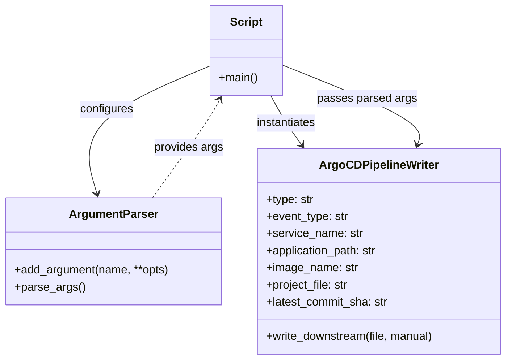

# Diagram: devops/argocd/gitlab/deploy.py


> Auto-generated by Obscura crawlers

## Diagram 1

```mermaid
flowchart TD
    Start([Start]) --> Parser[argparse.ArgumentParser]
    Parser --> ParseArgs[parser.parse_args()]
    ParseArgs --> Extract[extract args]
    Extract --> Service[service_name]
    Extract --> AppPath[application_path]
    Extract --> Image[image_name]
    Extract --> Project[project_file]
    Extract --> Commit[latest_commit_sha]
    Extract --> Type[type]
    Extract --> Event[event_type]
    Extract --> Out[out]
    Extract --> Manual[manual]
    Service --> Writer[ArgoCDPipelineWriter(type,event_type,service_name,application_path,image_name,project_file,latest_commit_sha)]
    AppPath --> Writer
    Image --> Writer
    Project --> Writer
    Commit --> Writer
    Type --> Writer
    Event --> Writer
    Out --> Writer
    Manual --> Writer
    Writer --> WriteDown[write_downstream(file=out, manual=manual)]
    WriteDown --> End([End])
```

> SVG rendering failed for this diagram.

## Diagram 2



### SVG

<svg id="container" width="707.2734375" xmlns="http://www.w3.org/2000/svg" class="classDiagram" height="504" viewBox="0 0 707.2734375 504" role="graphics-document document" aria-roledescription="class"><style>#container{font-family:"trebuchet ms",verdana,arial,sans-serif;font-size:16px;fill:#333;}@keyframes edge-animation-frame{from{stroke-dashoffset:0;}}@keyframes dash{to{stroke-dashoffset:0;}}#container .edge-animation-slow{stroke-dasharray:9,5!important;stroke-dashoffset:900;animation:dash 50s linear infinite;stroke-linecap:round;}#container .edge-animation-fast{stroke-dasharray:9,5!important;stroke-dashoffset:900;animation:dash 20s linear infinite;stroke-linecap:round;}#container .error-icon{fill:#552222;}#container .error-text{fill:#552222;stroke:#552222;}#container .edge-thickness-normal{stroke-width:1px;}#container .edge-thickness-thick{stroke-width:3.5px;}#container .edge-pattern-solid{stroke-dasharray:0;}#container .edge-thickness-invisible{stroke-width:0;fill:none;}#container .edge-pattern-dashed{stroke-dasharray:3;}#container .edge-pattern-dotted{stroke-dasharray:2;}#container .marker{fill:#333333;stroke:#333333;}#container .marker.cross{stroke:#333333;}#container svg{font-family:"trebuchet ms",verdana,arial,sans-serif;font-size:16px;}#container p{margin:0;}#container g.classGroup text{fill:#9370DB;stroke:none;font-family:"trebuchet ms",verdana,arial,sans-serif;font-size:10px;}#container g.classGroup text .title{font-weight:bolder;}#container .nodeLabel,#container .edgeLabel{color:#131300;}#container .edgeLabel .label rect{fill:#ECECFF;}#container .label text{fill:#131300;}#container .labelBkg{background:#ECECFF;}#container .edgeLabel .label span{background:#ECECFF;}#container .classTitle{font-weight:bolder;}#container .node rect,#container .node circle,#container .node ellipse,#container .node polygon,#container .node path{fill:#ECECFF;stroke:#9370DB;stroke-width:1px;}#container .divider{stroke:#9370DB;stroke-width:1;}#container g.clickable{cursor:pointer;}#container g.classGroup rect{fill:#ECECFF;stroke:#9370DB;}#container g.classGroup line{stroke:#9370DB;stroke-width:1;}#container .classLabel .box{stroke:none;stroke-width:0;fill:#ECECFF;opacity:0.5;}#container .classLabel .label{fill:#9370DB;font-size:10px;}#container .relation{stroke:#333333;stroke-width:1;fill:none;}#container .dashed-line{stroke-dasharray:3;}#container .dotted-line{stroke-dasharray:1 2;}#container #compositionStart,#container .composition{fill:#333333!important;stroke:#333333!important;stroke-width:1;}#container #compositionEnd,#container .composition{fill:#333333!important;stroke:#333333!important;stroke-width:1;}#container #dependencyStart,#container .dependency{fill:#333333!important;stroke:#333333!important;stroke-width:1;}#container #dependencyStart,#container .dependency{fill:#333333!important;stroke:#333333!important;stroke-width:1;}#container #extensionStart,#container .extension{fill:transparent!important;stroke:#333333!important;stroke-width:1;}#container #extensionEnd,#container .extension{fill:transparent!important;stroke:#333333!important;stroke-width:1;}#container #aggregationStart,#container .aggregation{fill:transparent!important;stroke:#333333!important;stroke-width:1;}#container #aggregationEnd,#container .aggregation{fill:transparent!important;stroke:#333333!important;stroke-width:1;}#container #lollipopStart,#container .lollipop{fill:#ECECFF!important;stroke:#333333!important;stroke-width:1;}#container #lollipopEnd,#container .lollipop{fill:#ECECFF!important;stroke:#333333!important;stroke-width:1;}#container .edgeTerminals{font-size:11px;line-height:initial;}#container .classTitleText{text-anchor:middle;font-size:18px;fill:#333;}#container .label-icon{display:inline-block;height:1em;overflow:visible;vertical-align:-0.125em;}#container .node .label-icon path{fill:currentColor;stroke:revert;stroke-width:revert;}#container :root{--mermaid-font-family:"trebuchet ms",verdana,arial,sans-serif;}</style><g><defs><marker id="container_class-aggregationStart" class="marker aggregation class" refX="18" refY="7" markerWidth="190" markerHeight="240" orient="auto"><path d="M 18,7 L9,13 L1,7 L9,1 Z"></path></marker></defs><defs><marker id="container_class-aggregationEnd" class="marker aggregation class" refX="1" refY="7" markerWidth="20" markerHeight="28" orient="auto"><path d="M 18,7 L9,13 L1,7 L9,1 Z"></path></marker></defs><defs><marker id="container_class-extensionStart" class="marker extension class" refX="18" refY="7" markerWidth="190" markerHeight="240" orient="auto"><path d="M 1,7 L18,13 V 1 Z"></path></marker></defs><defs><marker id="container_class-extensionEnd" class="marker extension class" refX="1" refY="7" markerWidth="20" markerHeight="28" orient="auto"><path d="M 1,1 V 13 L18,7 Z"></path></marker></defs><defs><marker id="container_class-compositionStart" class="marker composition class" refX="18" refY="7" markerWidth="190" markerHeight="240" orient="auto"><path d="M 18,7 L9,13 L1,7 L9,1 Z"></path></marker></defs><defs><marker id="container_class-compositionEnd" class="marker composition class" refX="1" refY="7" markerWidth="20" markerHeight="28" orient="auto"><path d="M 18,7 L9,13 L1,7 L9,1 Z"></path></marker></defs><defs><marker id="container_class-dependencyStart" class="marker dependency class" refX="6" refY="7" markerWidth="190" markerHeight="240" orient="auto"><path d="M 5,7 L9,13 L1,7 L9,1 Z"></path></marker></defs><defs><marker id="container_class-dependencyEnd" class="marker dependency class" refX="13" refY="7" markerWidth="20" markerHeight="28" orient="auto"><path d="M 18,7 L9,13 L14,7 L9,1 Z"></path></marker></defs><defs><marker id="container_class-lollipopStart" class="marker lollipop class" refX="13" refY="7" markerWidth="190" markerHeight="240" orient="auto"><circle stroke="black" fill="transparent" cx="7" cy="7" r="6"></circle></marker></defs><defs><marker id="container_class-lollipopEnd" class="marker lollipop class" refX="1" refY="7" markerWidth="190" markerHeight="240" orient="auto"><circle stroke="black" fill="transparent" cx="7" cy="7" r="6"></circle></marker></defs><g class="root"><g class="clusters"></g><g class="edgePaths"><path d="M293.682,92.068L262.337,105.224C230.992,118.379,168.303,144.689,141.845,174.552C115.388,204.414,125.163,237.828,130.05,254.534L134.938,271.241" id="id_Script_ArgumentParser_1" class="edge-thickness-normal edge-pattern-solid relation" style=";;;" data-edge="true" data-et="edge" data-id="id_Script_ArgumentParser_1" data-points="W3sieCI6MjkzLjY4MTY0MDYyNSwieSI6OTIuMDY4NDIxOTU4NjM2OTd9LHsieCI6MTA1LjYxMzI4MTI1LCJ5IjoxNzF9LHsieCI6MTM2LjYyMjIxNTk4NzU2OTA2LCJ5IjoyNzd9XQ==" marker-end="url(#container_class-dependencyEnd)"></path><path d="M379.006,134L382.444,140.167C385.882,146.333,392.758,158.667,400.029,170.187C407.299,181.707,414.964,192.414,418.796,197.768L422.628,203.121" id="id_Script_ArgoCDPipelineWriter_2" class="edge-thickness-normal edge-pattern-solid relation" style=";;;" data-edge="true" data-et="edge" data-id="id_Script_ArgoCDPipelineWriter_2" data-points="W3sieCI6Mzc5LjAwNTgyMDMxMjUsInkiOjEzNH0seyJ4IjozOTkuNjM0NzY1NjI1LCJ5IjoxNzF9LHsieCI6NDI2LjEyMDMxNjgxNjI5ODMsInkiOjIwOH1d" marker-end="url(#container_class-dependencyEnd)"></path><path d="M212.249,277L224.896,259.333C237.542,241.667,262.834,206.333,278.432,183.373C294.029,160.414,299.932,149.827,302.883,144.534L305.834,139.241" id="id_ArgumentParser_Script_3" class="edge-thickness-normal edge-pattern-dashed relation" style=";;;" data-edge="true" data-et="edge" data-id="id_ArgumentParser_Script_3" data-points="W3sieCI6MjEyLjI0OTQyODA5MDQ2OTYyLCJ5IjoyNzd9LHsieCI6Mjg4LjEyNjk1MzEyNSwieSI6MTcxfSx7IngiOjMwOC43NTU4OTg0Mzc1LCJ5IjoxMzR9XQ==" marker-end="url(#container_class-dependencyEnd)"></path><path d="M394.08,90.989L427.569,104.324C461.057,117.66,528.035,144.33,559.623,162.892C591.211,181.454,587.41,191.907,585.509,197.134L583.609,202.361" id="id_Script_ArgoCDPipelineWriter_4" class="edge-thickness-normal edge-pattern-solid relation" style=";;;" data-edge="true" data-et="edge" data-id="id_Script_ArgoCDPipelineWriter_4" data-points="W3sieCI6Mzk0LjA4MDA3ODEyNSwieSI6OTAuOTg5MjY3Mjk4NzAzNTJ9LHsieCI6NTk1LjAxMTcxODc1LCJ5IjoxNzF9LHsieCI6NTgxLjU1ODMzNDc3MjA5OTQsInkiOjIwOH1d" marker-end="url(#container_class-dependencyEnd)"></path></g><g class="edgeLabels"><g class="edgeLabel" transform="translate(148.72892, 152.90453)"><g class="label" data-id="id_Script_ArgumentParser_1" transform="translate(-37.3046875, -12)"><foreignObject width="74.609375" height="24"><div xmlns="http://www.w3.org/1999/xhtml" class="labelBkg" style="display: table-cell; white-space: nowrap; line-height: 1.5; max-width: 200px; text-align: center;"><span class="edgeLabel"><p>configures</p></span></div></foreignObject></g></g><g class="edgeLabel" transform="translate(399.634765625, 171)"><g class="label" data-id="id_Script_ArgoCDPipelineWriter_2" transform="translate(-42.9140625, -12)"><foreignObject width="85.828125" height="24"><div xmlns="http://www.w3.org/1999/xhtml" class="labelBkg" style="display: table-cell; white-space: nowrap; line-height: 1.5; max-width: 200px; text-align: center;"><span class="edgeLabel"><p>instantiates</p></span></div></foreignObject></g></g><g class="edgeLabel" transform="translate(262.517, 206.7768)"><g class="label" data-id="id_ArgumentParser_Script_3" transform="translate(-48.59375, -12)"><foreignObject width="97.1875" height="24"><div xmlns="http://www.w3.org/1999/xhtml" class="labelBkg" style="display: table-cell; white-space: nowrap; line-height: 1.5; max-width: 200px; text-align: center;"><span class="edgeLabel"><p>provides args</p></span></div></foreignObject></g></g><g class="edgeLabel" transform="translate(512.83428, 138.27704)"><g class="label" data-id="id_Script_ArgoCDPipelineWriter_4" transform="translate(-68.7109375, -12)"><foreignObject width="137.421875" height="24"><div xmlns="http://www.w3.org/1999/xhtml" class="labelBkg" style="display: table-cell; white-space: nowrap; line-height: 1.5; max-width: 200px; text-align: center;"><span class="edgeLabel"><p>passes parsed args</p></span></div></foreignObject></g></g></g><g class="nodes"><g class="node default" id="classId-Script-0" transform="translate(343.880859375, 71)"><g class="basic label-container"><path d="M-50.19921875 -63 L50.19921875 -63 L50.19921875 63 L-50.19921875 63" stroke="none" stroke-width="0" fill="#ECECFF" style=""></path><path d="M-50.19921875 -63 C-11.113112355671205 -63, 27.97299403865759 -63, 50.19921875 -63 M-50.19921875 -63 C-23.078211823321148 -63, 4.0427951033577045 -63, 50.19921875 -63 M50.19921875 -63 C50.19921875 -31.986541868228713, 50.19921875 -0.9730837364574256, 50.19921875 63 M50.19921875 -63 C50.19921875 -26.0653298202204, 50.19921875 10.869340359559203, 50.19921875 63 M50.19921875 63 C29.904588343503427 63, 9.609957937006854 63, -50.19921875 63 M50.19921875 63 C22.224561458155506 63, -5.750095833688988 63, -50.19921875 63 M-50.19921875 63 C-50.19921875 37.304014567841314, -50.19921875 11.608029135682628, -50.19921875 -63 M-50.19921875 63 C-50.19921875 13.521051643090864, -50.19921875 -35.95789671381827, -50.19921875 -63" stroke="#9370DB" stroke-width="1.3" fill="none" stroke-dasharray="0 0" style=""></path></g><g class="annotation-group text" transform="translate(0, -39)"></g><g class="label-group text" transform="translate(-21.7421875, -39)"><g class="label" style="font-weight: bolder" transform="translate(0,-12)"><foreignObject width="43.484375" height="24"><div xmlns="http://www.w3.org/1999/xhtml" style="display: table-cell; white-space: nowrap; line-height: 1.5; max-width: 93px; text-align: center;"><span class="nodeLabel markdown-node-label" style=""><p>Script</p></span></div></foreignObject></g></g><g class="members-group text" transform="translate(-38.19921875, 9)"></g><g class="methods-group text" transform="translate(-38.19921875, 39)"><g class="label" style="" transform="translate(0,-12)"><foreignObject width="54.65625" height="24"><div xmlns="http://www.w3.org/1999/xhtml" style="display: table-cell; white-space: nowrap; line-height: 1.5; max-width: 112px; text-align: center;"><span class="nodeLabel markdown-node-label" style=""><p>+main()</p></span></div></foreignObject></g></g><g class="divider" style=""><path d="M-50.19921875 -15 C-26.135019701196693 -15, -2.0708206523933868 -15, 50.19921875 -15 M-50.19921875 -15 C-23.41237544740844 -15, 3.37446785518312 -15, 50.19921875 -15" stroke="#9370DB" stroke-width="1.3" fill="none" stroke-dasharray="0 0" style=""></path></g><g class="divider" style=""><path d="M-50.19921875 9 C-14.050359337782325 9, 22.09850007443535 9, 50.19921875 9 M-50.19921875 9 C-25.99674870953869 9, -1.7942786690773787 9, 50.19921875 9" stroke="#9370DB" stroke-width="1.3" fill="none" stroke-dasharray="0 0" style=""></path></g></g><g class="node default" id="classId-ArgumentParser-1" transform="translate(158.5625, 352)"><g class="basic label-container"><path d="M-150.5625 -75 L150.5625 -75 L150.5625 75 L-150.5625 75" stroke="none" stroke-width="0" fill="#ECECFF" style=""></path><path d="M-150.5625 -75 C-88.76475150130406 -75, -26.967003002608124 -75, 150.5625 -75 M-150.5625 -75 C-78.51294560475944 -75, -6.463391209518875 -75, 150.5625 -75 M150.5625 -75 C150.5625 -41.63309718450655, 150.5625 -8.266194369013107, 150.5625 75 M150.5625 -75 C150.5625 -29.271070274470432, 150.5625 16.457859451059136, 150.5625 75 M150.5625 75 C58.16844395928695 75, -34.22561208142611 75, -150.5625 75 M150.5625 75 C77.52418154327002 75, 4.485863086540036 75, -150.5625 75 M-150.5625 75 C-150.5625 25.544497016920666, -150.5625 -23.91100596615867, -150.5625 -75 M-150.5625 75 C-150.5625 17.879637648876184, -150.5625 -39.24072470224763, -150.5625 -75" stroke="#9370DB" stroke-width="1.3" fill="none" stroke-dasharray="0 0" style=""></path></g><g class="annotation-group text" transform="translate(0, -51)"></g><g class="label-group text" transform="translate(-58.984375, -51)"><g class="label" style="font-weight: bolder" transform="translate(0,-12)"><foreignObject width="117.96875" height="24"><div xmlns="http://www.w3.org/1999/xhtml" style="display: table-cell; white-space: nowrap; line-height: 1.5; max-width: 166px; text-align: center;"><span class="nodeLabel markdown-node-label" style=""><p>ArgumentParser</p></span></div></foreignObject></g></g><g class="members-group text" transform="translate(-138.5625, -3)"></g><g class="methods-group text" transform="translate(-138.5625, 27)"><g class="label" style="" transform="translate(0,-12)"><foreignObject width="218.140625" height="24"><div xmlns="http://www.w3.org/1999/xhtml" style="display: table-cell; white-space: nowrap; line-height: 1.5; max-width: 276px; text-align: center;"><span class="nodeLabel markdown-node-label" style=""><p>+add_argument(name, **opts)</p></span></div></foreignObject></g><g class="label" style="" transform="translate(0,12)"><foreignObject width="96.53125" height="24"><div xmlns="http://www.w3.org/1999/xhtml" style="display: table-cell; white-space: nowrap; line-height: 1.5; max-width: 154px; text-align: center;"><span class="nodeLabel markdown-node-label" style=""><p>+parse_args()</p></span></div></foreignObject></g></g><g class="divider" style=""><path d="M-150.5625 -27 C-64.03014726009334 -27, 22.502205479813313 -27, 150.5625 -27 M-150.5625 -27 C-32.54471550483703 -27, 85.47306899032594 -27, 150.5625 -27" stroke="#9370DB" stroke-width="1.3" fill="none" stroke-dasharray="0 0" style=""></path></g><g class="divider" style=""><path d="M-150.5625 -3 C-50.67022666474027 -3, 49.22204667051946 -3, 150.5625 -3 M-150.5625 -3 C-37.95331799969483 -3, 74.65586400061034 -3, 150.5625 -3" stroke="#9370DB" stroke-width="1.3" fill="none" stroke-dasharray="0 0" style=""></path></g></g><g class="node default" id="classId-ArgoCDPipelineWriter-2" transform="translate(529.19921875, 352)"><g class="basic label-container"><path d="M-170.07421875 -144 L170.07421875 -144 L170.07421875 144 L-170.07421875 144" stroke="none" stroke-width="0" fill="#ECECFF" style=""></path><path d="M-170.07421875 -144 C-93.55946681852103 -144, -17.044714887042062 -144, 170.07421875 -144 M-170.07421875 -144 C-99.18311110636867 -144, -28.29200346273734 -144, 170.07421875 -144 M170.07421875 -144 C170.07421875 -33.0285575427866, 170.07421875 77.9428849144268, 170.07421875 144 M170.07421875 -144 C170.07421875 -84.27812980798791, 170.07421875 -24.55625961597582, 170.07421875 144 M170.07421875 144 C46.98197355128292 144, -76.11027164743416 144, -170.07421875 144 M170.07421875 144 C60.794525956655946 144, -48.48516683668811 144, -170.07421875 144 M-170.07421875 144 C-170.07421875 35.80440881085106, -170.07421875 -72.39118237829788, -170.07421875 -144 M-170.07421875 144 C-170.07421875 29.04930226038617, -170.07421875 -85.90139547922766, -170.07421875 -144" stroke="#9370DB" stroke-width="1.3" fill="none" stroke-dasharray="0 0" style=""></path></g><g class="annotation-group text" transform="translate(0, -120)"></g><g class="label-group text" transform="translate(-79.2265625, -120)"><g class="label" style="font-weight: bolder" transform="translate(0,-12)"><foreignObject width="158.453125" height="24"><div xmlns="http://www.w3.org/1999/xhtml" style="display: table-cell; white-space: nowrap; line-height: 1.5; max-width: 206px; text-align: center;"><span class="nodeLabel markdown-node-label" style=""><p>ArgoCDPipelineWriter</p></span></div></foreignObject></g></g><g class="members-group text" transform="translate(-158.07421875, -72)"><g class="label" style="" transform="translate(0,-12)"><foreignObject width="67.203125" height="24"><div xmlns="http://www.w3.org/1999/xhtml" style="display: table-cell; white-space: nowrap; line-height: 1.5; max-width: 125px; text-align: center;"><span class="nodeLabel markdown-node-label" style=""><p>+type: str</p></span></div></foreignObject></g><g class="label" style="" transform="translate(0,12)"><foreignObject width="115.625" height="24"><div xmlns="http://www.w3.org/1999/xhtml" style="display: table-cell; white-space: nowrap; line-height: 1.5; max-width: 174px; text-align: center;"><span class="nodeLabel markdown-node-label" style=""><p>+event_type: str</p></span></div></foreignObject></g><g class="label" style="" transform="translate(0,36)"><foreignObject width="134.8125" height="24"><div xmlns="http://www.w3.org/1999/xhtml" style="display: table-cell; white-space: nowrap; line-height: 1.5; max-width: 193px; text-align: center;"><span class="nodeLabel markdown-node-label" style=""><p>+service_name: str</p></span></div></foreignObject></g><g class="label" style="" transform="translate(0,60)"><foreignObject width="158.890625" height="24"><div xmlns="http://www.w3.org/1999/xhtml" style="display: table-cell; white-space: nowrap; line-height: 1.5; max-width: 217px; text-align: center;"><span class="nodeLabel markdown-node-label" style=""><p>+application_path: str</p></span></div></foreignObject></g><g class="label" style="" transform="translate(0,84)"><foreignObject width="127.5625" height="24"><div xmlns="http://www.w3.org/1999/xhtml" style="display: table-cell; white-space: nowrap; line-height: 1.5; max-width: 186px; text-align: center;"><span class="nodeLabel markdown-node-label" style=""><p>+image_name: str</p></span></div></foreignObject></g><g class="label" style="" transform="translate(0,108)"><foreignObject width="117.1875" height="24"><div xmlns="http://www.w3.org/1999/xhtml" style="display: table-cell; white-space: nowrap; line-height: 1.5; max-width: 175px; text-align: center;"><span class="nodeLabel markdown-node-label" style=""><p>+project_file: str</p></span></div></foreignObject></g><g class="label" style="" transform="translate(0,132)"><foreignObject width="172.5625" height="24"><div xmlns="http://www.w3.org/1999/xhtml" style="display: table-cell; white-space: nowrap; line-height: 1.5; max-width: 231px; text-align: center;"><span class="nodeLabel markdown-node-label" style=""><p>+latest_commit_sha: str</p></span></div></foreignObject></g></g><g class="methods-group text" transform="translate(-158.07421875, 120)"><g class="label" style="" transform="translate(0,-12)"><foreignObject width="236.921875" height="24"><div xmlns="http://www.w3.org/1999/xhtml" style="display: table-cell; white-space: nowrap; line-height: 1.5; max-width: 294px; text-align: center;"><span class="nodeLabel markdown-node-label" style=""><p>+write_downstream(file, manual)</p></span></div></foreignObject></g></g><g class="divider" style=""><path d="M-170.07421875 -96 C-69.142657133904 -96, 31.78890448219201 -96, 170.07421875 -96 M-170.07421875 -96 C-80.03537260116669 -96, 10.00347354766663 -96, 170.07421875 -96" stroke="#9370DB" stroke-width="1.3" fill="none" stroke-dasharray="0 0" style=""></path></g><g class="divider" style=""><path d="M-170.07421875 96 C-95.54621443399998 96, -21.018210117999956 96, 170.07421875 96 M-170.07421875 96 C-58.351638068429935 96, 53.37094261314013 96, 170.07421875 96" stroke="#9370DB" stroke-width="1.3" fill="none" stroke-dasharray="0 0" style=""></path></g></g></g></g></g></svg>
