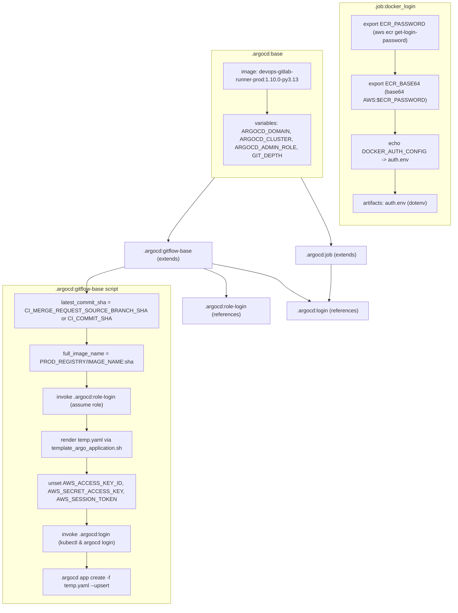
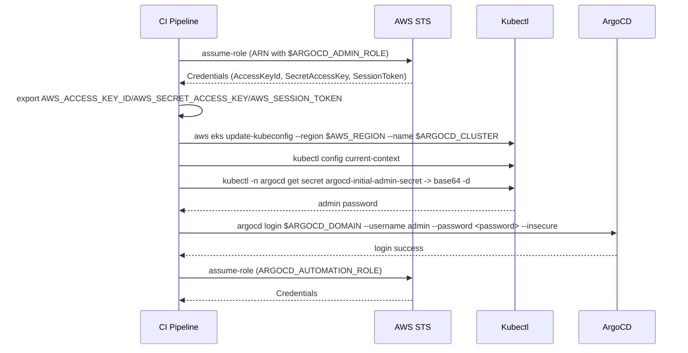
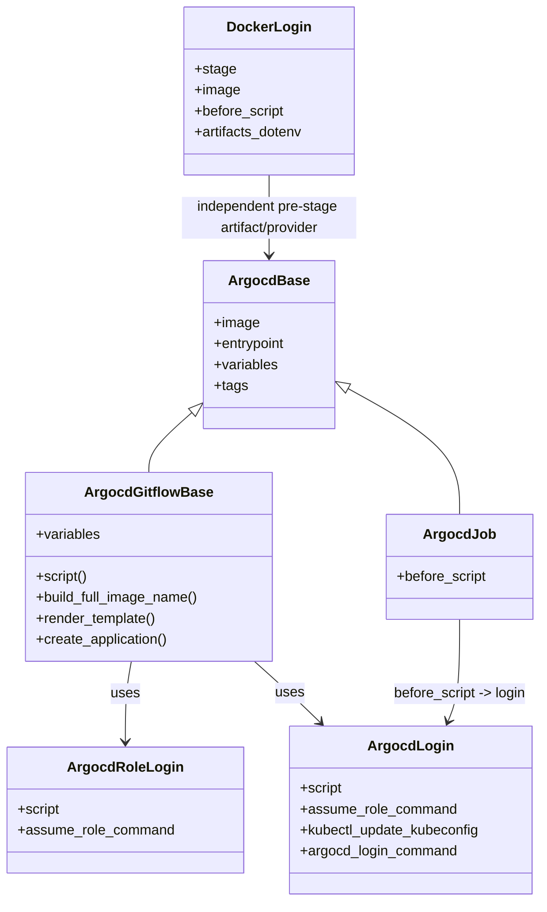

# Diagram: devops/argocd/gitlab/templates/.argocd.gitlab-ci.yml

> Auto-generated by Obscura crawlers

## Diagram 1

### SVG

<svg id="container" width="1295.0859375" xmlns="http://www.w3.org/2000/svg" class="flowchart" height="1822" viewBox="0 0 1295.0859375 1822" role="graphics-document document" aria-roledescription="flowchart-v2"><g><marker id="container_flowchart-v2-pointEnd" class="marker flowchart-v2" viewBox="0 0 10 10" refX="5" refY="5" markerUnits="userSpaceOnUse" markerWidth="8" markerHeight="8" orient="auto"><path d="M 0 0 L 10 5 L 0 10 z" class="arrowMarkerPath" style="stroke-width: 1; stroke-dasharray: 1, 0;"></path></marker><marker id="container_flowchart-v2-pointStart" class="marker flowchart-v2" viewBox="0 0 10 10" refX="4.5" refY="5" markerUnits="userSpaceOnUse" markerWidth="8" markerHeight="8" orient="auto"><path d="M 0 5 L 10 10 L 10 0 z" class="arrowMarkerPath" style="stroke-width: 1; stroke-dasharray: 1, 0;"></path></marker><marker id="container_flowchart-v2-circleEnd" class="marker flowchart-v2" viewBox="0 0 10 10" refX="11" refY="5" markerUnits="userSpaceOnUse" markerWidth="11" markerHeight="11" orient="auto"><circle cx="5" cy="5" r="5" class="arrowMarkerPath" style="stroke-width: 1; stroke-dasharray: 1, 0;"></circle></marker><marker id="container_flowchart-v2-circleStart" class="marker flowchart-v2" viewBox="0 0 10 10" refX="-1" refY="5" markerUnits="userSpaceOnUse" markerWidth="11" markerHeight="11" orient="auto"><circle cx="5" cy="5" r="5" class="arrowMarkerPath" style="stroke-width: 1; stroke-dasharray: 1, 0;"></circle></marker><marker id="container_flowchart-v2-crossEnd" class="marker cross flowchart-v2" viewBox="0 0 11 11" refX="12" refY="5.2" markerUnits="userSpaceOnUse" markerWidth="11" markerHeight="11" orient="auto"><path d="M 1,1 l 9,9 M 10,1 l -9,9" class="arrowMarkerPath" style="stroke-width: 2; stroke-dasharray: 1, 0;"></path></marker><marker id="container_flowchart-v2-crossStart" class="marker cross flowchart-v2" viewBox="0 0 11 11" refX="-1" refY="5.2" markerUnits="userSpaceOnUse" markerWidth="11" markerHeight="11" orient="auto"><path d="M 1,1 l 9,9 M 10,1 l -9,9" class="arrowMarkerPath" style="stroke-width: 2; stroke-dasharray: 1, 0;"></path></marker><g class="root"><g class="clusters"><g class="cluster" id="gitflow_script" data-look="classic"><rect style="" x="8" y="846" width="447.5625" height="968"></rect><g class="cluster-label" transform="translate(136.1328125, 846)"><foreignObject width="191.296875" height="24">

.argocd:gitflow-base script

</foreignObject></g></g></g><g class="edgePaths"><path d="M231.781,973L231.781,977.167C231.781,981.333,231.781,989.667,231.781,997.333C231.781,1005,231.781,1012,231.781,1015.5L231.781,1019" id="L_g1_g2_0" class="edge-thickness-normal edge-pattern-solid edge-thickness-normal edge-pattern-solid flowchart-link" style=";" data-edge="true" data-et="edge" data-id="L_g1_g2_0" data-points="W3sieCI6MjMxLjc4MTI1LCJ5Ijo5NzN9LHsieCI6MjMxLjc4MTI1LCJ5Ijo5OTh9LHsieCI6MjMxLjc4MTI1LCJ5IjoxMDIzfV0=" marker-end="url(#container_flowchart-v2-pointEnd)"></path><path d="M231.781,1101L231.781,1105.167C231.781,1109.333,231.781,1117.667,231.781,1125.333C231.781,1133,231.781,1140,231.781,1143.5L231.781,1147" id="L_g2_g3_0" class="edge-thickness-normal edge-pattern-solid edge-thickness-normal edge-pattern-solid flowchart-link" style=";" data-edge="true" data-et="edge" data-id="L_g2_g3_0" data-points="W3sieCI6MjMxLjc4MTI1LCJ5IjoxMTAxfSx7IngiOjIzMS43ODEyNSwieSI6MTEyNn0seyJ4IjoyMzEuNzgxMjUsInkiOjExNTF9XQ==" marker-end="url(#container_flowchart-v2-pointEnd)"></path><path d="M231.781,1229L231.781,1233.167C231.781,1237.333,231.781,1245.667,231.781,1253.333C231.781,1261,231.781,1268,231.781,1271.5L231.781,1275" id="L_g3_g4_0" class="edge-thickness-normal edge-pattern-solid edge-thickness-normal edge-pattern-solid flowchart-link" style=";" data-edge="true" data-et="edge" data-id="L_g3_g4_0" data-points="W3sieCI6MjMxLjc4MTI1LCJ5IjoxMjI5fSx7IngiOjIzMS43ODEyNSwieSI6MTI1NH0seyJ4IjoyMzEuNzgxMjUsInkiOjEyNzl9XQ==" marker-end="url(#container_flowchart-v2-pointEnd)"></path><path d="M231.781,1357L231.781,1361.167C231.781,1365.333,231.781,1373.667,231.781,1381.333C231.781,1389,231.781,1396,231.781,1399.5L231.781,1403" id="L_g4_g5_0" class="edge-thickness-normal edge-pattern-solid edge-thickness-normal edge-pattern-solid flowchart-link" style=";" data-edge="true" data-et="edge" data-id="L_g4_g5_0" data-points="W3sieCI6MjMxLjc4MTI1LCJ5IjoxMzU3fSx7IngiOjIzMS43ODEyNSwieSI6MTM4Mn0seyJ4IjoyMzEuNzgxMjUsInkiOjE0MDd9XQ==" marker-end="url(#container_flowchart-v2-pointEnd)"></path><path d="M231.781,1533L231.781,1537.167C231.781,1541.333,231.781,1549.667,231.781,1557.333C231.781,1565,231.781,1572,231.781,1575.5L231.781,1579" id="L_g5_g6_0" class="edge-thickness-normal edge-pattern-solid edge-thickness-normal edge-pattern-solid flowchart-link" style=";" data-edge="true" data-et="edge" data-id="L_g5_g6_0" data-points="W3sieCI6MjMxLjc4MTI1LCJ5IjoxNTMzfSx7IngiOjIzMS43ODEyNSwieSI6MTU1OH0seyJ4IjoyMzEuNzgxMjUsInkiOjE1ODN9XQ==" marker-end="url(#container_flowchart-v2-pointEnd)"></path><path d="M231.781,1661L231.781,1665.167C231.781,1669.333,231.781,1677.667,231.781,1685.333C231.781,1693,231.781,1700,231.781,1703.5L231.781,1707" id="L_g6_g7_0" class="edge-thickness-normal edge-pattern-solid edge-thickness-normal edge-pattern-solid flowchart-link" style=";" data-edge="true" data-et="edge" data-id="L_g6_g7_0" data-points="W3sieCI6MjMxLjc4MTI1LCJ5IjoxNjYxfSx7IngiOjIzMS43ODEyNSwieSI6MTY4Nn0seyJ4IjoyMzEuNzgxMjUsInkiOjE3MTF9XQ==" marker-end="url(#container_flowchart-v2-pointEnd)"></path><path d="M318.43,795.403L303.988,799.669C289.547,803.935,260.664,812.468,246.223,820.901C231.781,829.333,231.781,837.667,231.781,845.333C231.781,853,231.781,860,231.781,863.5L231.781,867" id="L_argocd_gitflow_g1_0" class="edge-thickness-normal edge-pattern-solid edge-thickness-normal edge-pattern-solid flowchart-link" style=";" data-edge="true" data-et="edge" data-id="L_argocd_gitflow_g1_0" data-points="W3sieCI6MzE4LjQyOTY4NzUsInkiOjc5NS40MDMyMzEwNDEwNzMxfSx7IngiOjIzMS43ODEyNSwieSI6ODIxfSx7IngiOjIzMS43ODEyNSwieSI6ODQ2fSx7IngiOjIzMS43ODEyNSwieSI6ODcxfV0=" marker-end="url(#container_flowchart-v2-pointEnd)"></path><path d="M553.323,796L564.53,800.167C575.736,804.333,598.149,812.667,609.356,821C620.563,829.333,620.563,837.667,620.563,847.333C620.563,857,620.563,868,620.563,873.5L620.563,879" id="L_argocd_gitflow_argocd_role_login_0" class="edge-thickness-normal edge-pattern-solid edge-thickness-normal edge-pattern-solid flowchart-link" style=";" data-edge="true" data-et="edge" data-id="L_argocd_gitflow_argocd_role_login_0" data-points="W3sieCI6NTUzLjMyMzEyMDExNzE4NzUsInkiOjc5Nn0seyJ4Ijo2MjAuNTYyNSwieSI6ODIxfSx7IngiOjYyMC41NjI1LCJ5Ijo4NDZ9LHsieCI6NjIwLjU2MjUsInkiOjg4M31d" marker-end="url(#container_flowchart-v2-pointEnd)"></path><path d="M578.43,781.993L612.245,788.494C646.061,794.995,713.693,807.998,747.508,818.665C781.324,829.333,781.324,837.667,795.863,849.683C810.402,861.7,839.481,877.4,854.02,885.25L868.559,893.1" id="L_argocd_gitflow_argocd_login_0" class="edge-thickness-normal edge-pattern-solid edge-thickness-normal edge-pattern-solid flowchart-link" style=";" data-edge="true" data-et="edge" data-id="L_argocd_gitflow_argocd_login_0" data-points="W3sieCI6NTc4LjQyOTY4NzUsInkiOjc4MS45OTI5MDA4MTA4MzN9LHsieCI6NzgxLjMyNDIxODc1LCJ5Ijo4MjF9LHsieCI6NzgxLjMyNDIxODc1LCJ5Ijo4NDZ9LHsieCI6ODcyLjA3ODQ4NDc4NjE4NDIsInkiOjg5NX1d" marker-end="url(#container_flowchart-v2-pointEnd)"></path><path d="M932.086,784L932.086,790.167C932.086,796.333,932.086,808.667,932.086,819C932.086,829.333,932.086,837.667,931.098,849.339C930.111,861.011,928.136,876.023,927.148,883.528L926.16,891.034" id="L_argocd_job_argocd_login_0" class="edge-thickness-normal edge-pattern-solid edge-thickness-normal edge-pattern-solid flowchart-link" style=";" data-edge="true" data-et="edge" data-id="L_argocd_job_argocd_login_0" data-points="W3sieCI6OTMyLjA4NTkzNzUsInkiOjc4NH0seyJ4Ijo5MzIuMDg1OTM3NSwieSI6ODIxfSx7IngiOjkzMi4wODU5Mzc1LCJ5Ijo4NDZ9LHsieCI6OTI1LjYzODU2OTA3ODk0NzQsInkiOjg5NX1d" marker-end="url(#container_flowchart-v2-pointEnd)"></path><path d="M585.745,527L562.859,554.667C539.973,582.333,494.201,637.667,471.316,668.833C448.43,700,448.43,707,448.43,710.5L448.43,714" id="L_argocd_base_argocd_gitflow_0" class="edge-thickness-normal edge-pattern-solid edge-thickness-normal edge-pattern-solid flowchart-link" style=";" data-edge="true" data-et="edge" data-id="L_argocd_base_argocd_gitflow_0" data-points="W3sieCI6NTg1Ljc0NTAwNDQwMTQwODQsInkiOjUyN30seyJ4Ijo0NDguNDI5Njg3NSwieSI6NjkzfSx7IngiOjQ0OC40Mjk2ODc1LCJ5Ijo3MTh9XQ==" marker-end="url(#container_flowchart-v2-pointEnd)"></path><path d="M843.241,527L858.048,554.667C872.856,582.333,902.471,637.667,917.278,670.833C932.086,704,932.086,715,932.086,720.5L932.086,726" id="L_argocd_base_argocd_job_0" class="edge-thickness-normal edge-pattern-solid edge-thickness-normal edge-pattern-solid flowchart-link" style=";" data-edge="true" data-et="edge" data-id="L_argocd_base_argocd_job_0" data-points="W3sieCI6ODQzLjI0MDg2NzA3NzQ2NDgsInkiOjUyN30seyJ4Ijo5MzIuMDg1OTM3NSwieSI6NjkzfSx7IngiOjkzMi4wODU5Mzc1LCJ5Ijo3MzB9XQ==" marker-end="url(#container_flowchart-v2-pointEnd)"></path></g><g class="edgeLabels"><g class="edgeLabel"><g class="label" data-id="L_g1_g2_0" transform="translate(0, 0)"><foreignObject width="0" height="0">

</foreignObject></g></g><g class="edgeLabel"><g class="label" data-id="L_g2_g3_0" transform="translate(0, 0)"><foreignObject width="0" height="0">

</foreignObject></g></g><g class="edgeLabel"><g class="label" data-id="L_g3_g4_0" transform="translate(0, 0)"><foreignObject width="0" height="0">

</foreignObject></g></g><g class="edgeLabel"><g class="label" data-id="L_g4_g5_0" transform="translate(0, 0)"><foreignObject width="0" height="0">

</foreignObject></g></g><g class="edgeLabel"><g class="label" data-id="L_g5_g6_0" transform="translate(0, 0)"><foreignObject width="0" height="0">

</foreignObject></g></g><g class="edgeLabel"><g class="label" data-id="L_g6_g7_0" transform="translate(0, 0)"><foreignObject width="0" height="0">

</foreignObject></g></g><g class="edgeLabel"><g class="label" data-id="L_argocd_gitflow_g1_0" transform="translate(0, 0)"><foreignObject width="0" height="0">

</foreignObject></g></g><g class="edgeLabel"><g class="label" data-id="L_argocd_gitflow_argocd_role_login_0" transform="translate(0, 0)"><foreignObject width="0" height="0">

</foreignObject></g></g><g class="edgeLabel"><g class="label" data-id="L_argocd_gitflow_argocd_login_0" transform="translate(0, 0)"><foreignObject width="0" height="0">

</foreignObject></g></g><g class="edgeLabel"><g class="label" data-id="L_argocd_job_argocd_login_0" transform="translate(0, 0)"><foreignObject width="0" height="0">

</foreignObject></g></g><g class="edgeLabel"><g class="label" data-id="L_argocd_base_argocd_gitflow_0" transform="translate(0, 0)"><foreignObject width="0" height="0">

</foreignObject></g></g><g class="edgeLabel"><g class="label" data-id="L_argocd_base_argocd_job_0" transform="translate(0, 0)"><foreignObject width="0" height="0">

</foreignObject></g></g></g><g class="nodes"><g class="root" transform="translate(569.0859375, 141)"><g class="clusters"><g class="cluster" id="argocd_base" data-look="classic"><rect style="" x="8" y="8" width="330" height="378"></rect><g class="cluster-label" transform="translate(127.640625, 8)"><foreignObject width="90.71875" height="24">

.argocd:base

</foreignObject></g></g></g><g class="edgePaths"><path d="M173,123.5L173,129.75C173,136,173,148.5,173,160.333C173,172.167,173,183.333,173,188.917L173,194.5" id="L_b_img_b_vars_0" class="edge-thickness-normal edge-pattern-solid edge-thickness-normal edge-pattern-solid flowchart-link" style=";" data-edge="true" data-et="edge" data-id="L_b_img_b_vars_0" data-points="W3sieCI6MTczLCJ5IjoxMjMuNX0seyJ4IjoxNzMsInkiOjE2MX0seyJ4IjoxNzMsInkiOjE5OC41fV0=" marker-end="url(#container_flowchart-v2-pointEnd)"></path></g><g class="edgeLabels"><g class="edgeLabel"><g class="label" data-id="L_b_img_b_vars_0" transform="translate(0, 0)"><foreignObject width="0" height="0">

</foreignObject></g></g></g><g class="nodes"><g class="node default" id="flowchart-b_img-6" transform="translate(173, 84.5)"><rect class="basic label-container" style="" x="-130" y="-39" width="260" height="78"></rect><g class="label" style="" transform="translate(-100, -24)"><rect></rect><foreignObject width="200" height="48">

image: devops-gitlab-runner-prod:1.10.0-py3.13

</foreignObject></g></g><g class="node default" id="flowchart-b_vars-7" transform="translate(173, 273.5)"><rect class="basic label-container" style="" x="-130" y="-75" width="260" height="150"></rect><g class="label" style="" transform="translate(-100, -60)"><rect></rect><foreignObject width="200" height="120">

variables: ARGOCD_DOMAIN, ARGOCD_CLUSTER, ARGOCD_ADMIN_ROLE, GIT_DEPTH

</foreignObject></g></g></g></g><g class="root" transform="translate(949.0859375, 0)"><g class="clusters"><g class="cluster" id="docker_job" data-look="classic"><rect style="" x="8" y="8" width="330" height="660"></rect><g class="cluster-label" transform="translate(111.21875, 8)"><foreignObject width="123.5625" height="24">

.job:docker_login

</foreignObject></g></g></g><g class="edgePaths"><path d="M173,147.5L173,153.75C173,160,173,172.5,173,184.333C173,196.167,173,207.333,173,212.917L173,218.5" id="L_d1_d2_0" class="edge-thickness-normal edge-pattern-solid edge-thickness-normal edge-pattern-solid flowchart-link" style=";" data-edge="true" data-et="edge" data-id="L_d1_d2_0" data-points="W3sieCI6MTczLCJ5IjoxNDcuNX0seyJ4IjoxNzMsInkiOjE4NX0seyJ4IjoxNzMsInkiOjIyMi41fV0=" marker-end="url(#container_flowchart-v2-pointEnd)"></path><path d="M173,324.5L173,330.75C173,337,173,349.5,173,361.333C173,373.167,173,384.333,173,389.917L173,395.5" id="L_d2_d3_0" class="edge-thickness-normal edge-pattern-solid edge-thickness-normal edge-pattern-solid flowchart-link" style=";" data-edge="true" data-et="edge" data-id="L_d2_d3_0" data-points="W3sieCI6MTczLCJ5IjozMjQuNX0seyJ4IjoxNzMsInkiOjM2Mn0seyJ4IjoxNzMsInkiOjM5OS41fV0=" marker-end="url(#container_flowchart-v2-pointEnd)"></path><path d="M173,501.5L173,507.75C173,514,173,526.5,173,538.333C173,550.167,173,561.333,173,566.917L173,572.5" id="L_d3_d4_0" class="edge-thickness-normal edge-pattern-solid edge-thickness-normal edge-pattern-solid flowchart-link" style=";" data-edge="true" data-et="edge" data-id="L_d3_d4_0" data-points="W3sieCI6MTczLCJ5Ijo1MDEuNX0seyJ4IjoxNzMsInkiOjUzOX0seyJ4IjoxNzMsInkiOjU3Ni41fV0=" marker-end="url(#container_flowchart-v2-pointEnd)"></path></g><g class="edgeLabels"><g class="edgeLabel"><g class="label" data-id="L_d1_d2_0" transform="translate(0, 0)"><foreignObject width="0" height="0">

</foreignObject></g></g><g class="edgeLabel"><g class="label" data-id="L_d2_d3_0" transform="translate(0, 0)"><foreignObject width="0" height="0">

</foreignObject></g></g><g class="edgeLabel"><g class="label" data-id="L_d3_d4_0" transform="translate(0, 0)"><foreignObject width="0" height="0">

</foreignObject></g></g></g><g class="nodes"><g class="node default" id="flowchart-d1-0" transform="translate(173, 96.5)"><rect class="basic label-container" style="" x="-130" y="-51" width="260" height="102"></rect><g class="label" style="" transform="translate(-100, -36)"><rect></rect><foreignObject width="200" height="72">

export ECR_PASSWORD (aws ecr get-login-password)

</foreignObject></g></g><g class="node default" id="flowchart-d2-1" transform="translate(173, 273.5)"><rect class="basic label-container" style="" x="-130" y="-51" width="260" height="102"></rect><g class="label" style="" transform="translate(-100, -36)"><rect></rect><foreignObject width="200" height="72">

export ECR_BASE64 (base64 AWS:$ECR_PASSWORD)

</foreignObject></g></g><g class="node default" id="flowchart-d3-3" transform="translate(173, 450.5)"><rect class="basic label-container" style="" x="-130" y="-51" width="260" height="102"></rect><g class="label" style="" transform="translate(-100, -36)"><rect></rect><foreignObject width="200" height="72">

echo DOCKER_AUTH_CONFIG -&gt; auth.env

</foreignObject></g></g><g class="node default" id="flowchart-d4-5" transform="translate(173, 603.5)"><rect class="basic label-container" style="" x="-127.7421875" y="-27" width="255.484375" height="54"></rect><g class="label" style="" transform="translate(-97.7421875, -12)"><rect></rect><foreignObject width="195.484375" height="24">

artifacts: auth.env (dotenv)

</foreignObject></g></g></g></g><g class="node default" id="flowchart-argocd_gitflow-11" transform="translate(448.4296875, 757)"><rect class="basic label-container" style="" x="-130" y="-39" width="260" height="78"></rect><g class="label" style="" transform="translate(-100, -24)"><rect></rect><foreignObject width="200" height="48">

.argocd:gitflow-base (extends)

</foreignObject></g></g><g class="node default" id="flowchart-argocd_job-13" transform="translate(932.0859375, 757)"><rect class="basic label-container" style="" x="-105.7890625" y="-27" width="211.578125" height="54"></rect><g class="label" style="" transform="translate(-75.7890625, -12)"><rect></rect><foreignObject width="151.578125" height="24">

.argocd:job (extends)

</foreignObject></g></g><g class="node default" id="flowchart-g1-14" transform="translate(231.78125, 922)"><rect class="basic label-container" style="" x="-188.78125" y="-51" width="377.5625" height="102"></rect><g class="label" style="" transform="translate(-158.78125, -36)"><rect></rect><foreignObject width="317.5625" height="72">

latest_commit_sha = CI_MERGE_REQUEST_SOURCE_BRANCH_SHA or CI_COMMIT_SHA

</foreignObject></g></g><g class="node default" id="flowchart-g2-15" transform="translate(231.78125, 1062)"><rect class="basic label-container" style="" x="-153.3125" y="-39" width="306.625" height="78"></rect><g class="label" style="" transform="translate(-123.3125, -24)"><rect></rect><foreignObject width="246.625" height="48">

full_image_name = PROD_REGISTRY/IMAGE_NAME:sha

</foreignObject></g></g><g class="node default" id="flowchart-g3-17" transform="translate(231.78125, 1190)"><rect class="basic label-container" style="" x="-130" y="-39" width="260" height="78"></rect><g class="label" style="" transform="translate(-100, -24)"><rect></rect><foreignObject width="200" height="48">

invoke .argocd:role-login (assume role)

</foreignObject></g></g><g class="node default" id="flowchart-g4-19" transform="translate(231.78125, 1318)"><rect class="basic label-container" style="" x="-137.65625" y="-39" width="275.3125" height="78"></rect><g class="label" style="" transform="translate(-107.65625, -24)"><rect></rect><foreignObject width="215.3125" height="48">

render temp.yaml via template_argo_application.sh

</foreignObject></g></g><g class="node default" id="flowchart-g5-21" transform="translate(231.78125, 1470)"><rect class="basic label-container" style="" x="-130" y="-63" width="260" height="126"></rect><g class="label" style="" transform="translate(-100, -48)"><rect></rect><foreignObject width="200" height="96">

unset AWS_ACCESS_KEY_ID, AWS_SECRET_ACCESS_KEY, AWS_SESSION_TOKEN

</foreignObject></g></g><g class="node default" id="flowchart-g6-23" transform="translate(231.78125, 1622)"><rect class="basic label-container" style="" x="-130" y="-39" width="260" height="78"></rect><g class="label" style="" transform="translate(-100, -24)"><rect></rect><foreignObject width="200" height="48">

invoke .argocd:login (kubectl &amp; argocd login)

</foreignObject></g></g><g class="node default" id="flowchart-g7-25" transform="translate(231.78125, 1750)"><rect class="basic label-container" style="" x="-130" y="-39" width="260" height="78"></rect><g class="label" style="" transform="translate(-100, -24)"><rect></rect><foreignObject width="200" height="48">

argocd app create -f temp.yaml --upsert

</foreignObject></g></g><g class="node default" id="flowchart-argocd_role_login-29" transform="translate(620.5625, 922)"><rect class="basic label-container" style="" x="-130" y="-39" width="260" height="78"></rect><g class="label" style="" transform="translate(-100, -24)"><rect></rect><foreignObject width="200" height="48">

.argocd:role-login (references)

</foreignObject></g></g><g class="node default" id="flowchart-argocd_login-31" transform="translate(922.0859375, 922)"><rect class="basic label-container" style="" x="-121.5234375" y="-27" width="243.046875" height="54"></rect><g class="label" style="" transform="translate(-91.5234375, -12)"><rect></rect><foreignObject width="183.046875" height="24">

.argocd:login (references)

</foreignObject></g></g></g></g></g></svg>

## Diagram 2

### SVG

<svg id="container" width="1337" xmlns="http://www.w3.org/2000/svg" height="729" viewBox="-251 -10 1337 729" role="graphics-document document" aria-roledescription="sequence"><g><rect x="886" y="643" fill="#eaeaea" stroke="#666" width="150" height="65" name="Argocd" rx="3" ry="3" class="actor actor-bottom"></rect><text x="961" y="675.5" dominant-baseline="central" alignment-baseline="central" class="actor actor-box" style="text-anchor: middle; font-size: 16px; font-weight: 400;"><tspan x="961" dy="0">ArgoCD</tspan></text></g><g><rect x="686" y="643" fill="#eaeaea" stroke="#666" width="150" height="65" name="K8s" rx="3" ry="3" class="actor actor-bottom"></rect><text x="761" y="675.5" dominant-baseline="central" alignment-baseline="central" class="actor actor-box" style="text-anchor: middle; font-size: 16px; font-weight: 400;"><tspan x="761" dy="0">Kubectl</tspan></text></g><g><rect x="486" y="643" fill="#eaeaea" stroke="#666" width="150" height="65" name="AWS" rx="3" ry="3" class="actor actor-bottom"></rect><text x="561" y="675.5" dominant-baseline="central" alignment-baseline="central" class="actor actor-box" style="text-anchor: middle; font-size: 16px; font-weight: 400;"><tspan x="561" dy="0">AWS STS</tspan></text></g><g><rect x="0" y="643" fill="#eaeaea" stroke="#666" width="150" height="65" name="CI" rx="3" ry="3" class="actor actor-bottom"></rect><text x="75" y="675.5" dominant-baseline="central" alignment-baseline="central" class="actor actor-box" style="text-anchor: middle; font-size: 16px; font-weight: 400;"><tspan x="75" dy="0">CI Pipeline</tspan></text></g><g><line id="actor3" x1="961" y1="65" x2="961" y2="643" class="actor-line 200" stroke-width="0.5px" stroke="#999" name="Argocd"></line><g id="root-3"><rect x="886" y="0" fill="#eaeaea" stroke="#666" width="150" height="65" name="Argocd" rx="3" ry="3" class="actor actor-top"></rect><text x="961" y="32.5" dominant-baseline="central" alignment-baseline="central" class="actor actor-box" style="text-anchor: middle; font-size: 16px; font-weight: 400;"><tspan x="961" dy="0">ArgoCD</tspan></text></g></g><g><line id="actor2" x1="761" y1="65" x2="761" y2="643" class="actor-line 200" stroke-width="0.5px" stroke="#999" name="K8s"></line><g id="root-2"><rect x="686" y="0" fill="#eaeaea" stroke="#666" width="150" height="65" name="K8s" rx="3" ry="3" class="actor actor-top"></rect><text x="761" y="32.5" dominant-baseline="central" alignment-baseline="central" class="actor actor-box" style="text-anchor: middle; font-size: 16px; font-weight: 400;"><tspan x="761" dy="0">Kubectl</tspan></text></g></g><g><line id="actor1" x1="561" y1="65" x2="561" y2="643" class="actor-line 200" stroke-width="0.5px" stroke="#999" name="AWS"></line><g id="root-1"><rect x="486" y="0" fill="#eaeaea" stroke="#666" width="150" height="65" name="AWS" rx="3" ry="3" class="actor actor-top"></rect><text x="561" y="32.5" dominant-baseline="central" alignment-baseline="central" class="actor actor-box" style="text-anchor: middle; font-size: 16px; font-weight: 400;"><tspan x="561" dy="0">AWS STS</tspan></text></g></g><g><line id="actor0" x1="75" y1="65" x2="75" y2="643" class="actor-line 200" stroke-width="0.5px" stroke="#999" name="CI"></line><g id="root-0"><rect x="0" y="0" fill="#eaeaea" stroke="#666" width="150" height="65" name="CI" rx="3" ry="3" class="actor actor-top"></rect><text x="75" y="32.5" dominant-baseline="central" alignment-baseline="central" class="actor actor-box" style="text-anchor: middle; font-size: 16px; font-weight: 400;"><tspan x="75" dy="0">CI Pipeline</tspan></text></g></g><g></g><defs><symbol id="computer" width="24" height="24"><path transform="scale(.5)" d="M2 2v13h20v-13h-20zm18 11h-16v-9h16v9zm-10.228 6l.466-1h3.524l.467 1h-4.457zm14.228 3h-24l2-6h2.104l-1.33 4h18.45l-1.297-4h2.073l2 6zm-5-10h-14v-7h14v7z"></path></symbol></defs><defs><symbol id="database" fill-rule="evenodd" clip-rule="evenodd"><path transform="scale(.5)" d="M12.258.001l.256.004.255.005.253.008.251.01.249.012.247.015.246.016.242.019.241.02.239.023.236.024.233.027.231.028.229.031.225.032.223.034.22.036.217.038.214.04.211.041.208.043.205.045.201.046.198.048.194.05.191.051.187.053.183.054.18.056.175.057.172.059.168.06.163.061.16.063.155.064.15.066.074.033.073.033.071.034.07.034.069.035.068.035.067.035.066.035.064.036.064.036.062.036.06.036.06.037.058.037.058.037.055.038.055.038.053.038.052.038.051.039.05.039.048.039.047.039.045.04.044.04.043.04.041.04.04.041.039.041.037.041.036.041.034.041.033.042.032.042.03.042.029.042.027.042.026.043.024.043.023.043.021.043.02.043.018.044.017.043.015.044.013.044.012.044.011.045.009.044.007.045.006.045.004.045.002.045.001.045v17l-.001.045-.002.045-.004.045-.006.045-.007.045-.009.044-.011.045-.012.044-.013.044-.015.044-.017.043-.018.044-.02.043-.021.043-.023.043-.024.043-.026.043-.027.042-.029.042-.03.042-.032.042-.033.042-.034.041-.036.041-.037.041-.039.041-.04.041-.041.04-.043.04-.044.04-.045.04-.047.039-.048.039-.05.039-.051.039-.052.038-.053.038-.055.038-.055.038-.058.037-.058.037-.06.037-.06.036-.062.036-.064.036-.064.036-.066.035-.067.035-.068.035-.069.035-.07.034-.071.034-.073.033-.074.033-.15.066-.155.064-.16.063-.163.061-.168.06-.172.059-.175.057-.18.056-.183.054-.187.053-.191.051-.194.05-.198.048-.201.046-.205.045-.208.043-.211.041-.214.04-.217.038-.22.036-.223.034-.225.032-.229.031-.231.028-.233.027-.236.024-.239.023-.241.02-.242.019-.246.016-.247.015-.249.012-.251.01-.253.008-.255.005-.256.004-.258.001-.258-.001-.256-.004-.255-.005-.253-.008-.251-.01-.249-.012-.247-.015-.245-.016-.243-.019-.241-.02-.238-.023-.236-.024-.234-.027-.231-.028-.228-.031-.226-.032-.223-.034-.22-.036-.217-.038-.214-.04-.211-.041-.208-.043-.204-.045-.201-.046-.198-.048-.195-.05-.19-.051-.187-.053-.184-.054-.179-.056-.176-.057-.172-.059-.167-.06-.164-.061-.159-.063-.155-.064-.151-.066-.074-.033-.072-.033-.072-.034-.07-.034-.069-.035-.068-.035-.067-.035-.066-.035-.064-.036-.063-.036-.062-.036-.061-.036-.06-.037-.058-.037-.057-.037-.056-.038-.055-.038-.053-.038-.052-.038-.051-.039-.049-.039-.049-.039-.046-.039-.046-.04-.044-.04-.043-.04-.041-.04-.04-.041-.039-.041-.037-.041-.036-.041-.034-.041-.033-.042-.032-.042-.03-.042-.029-.042-.027-.042-.026-.043-.024-.043-.023-.043-.021-.043-.02-.043-.018-.044-.017-.043-.015-.044-.013-.044-.012-.044-.011-.045-.009-.044-.007-.045-.006-.045-.004-.045-.002-.045-.001-.045v-17l.001-.045.002-.045.004-.045.006-.045.007-.045.009-.044.011-.045.012-.044.013-.044.015-.044.017-.043.018-.044.02-.043.021-.043.023-.043.024-.043.026-.043.027-.042.029-.042.03-.042.032-.042.033-.042.034-.041.036-.041.037-.041.039-.041.04-.041.041-.04.043-.04.044-.04.046-.04.046-.039.049-.039.049-.039.051-.039.052-.038.053-.038.055-.038.056-.038.057-.037.058-.037.06-.037.061-.036.062-.036.063-.036.064-.036.066-.035.067-.035.068-.035.069-.035.07-.034.072-.034.072-.033.074-.033.151-.066.155-.064.159-.063.164-.061.167-.06.172-.059.176-.057.179-.056.184-.054.187-.053.19-.051.195-.05.198-.048.201-.046.204-.045.208-.043.211-.041.214-.04.217-.038.22-.036.223-.034.226-.032.228-.031.231-.028.234-.027.236-.024.238-.023.241-.02.243-.019.245-.016.247-.015.249-.012.251-.01.253-.008.255-.005.256-.004.258-.001.258.001zm-9.258 20.499v.01l.001.021.003.021.004.022.005.021.006.022.007.022.009.023.01.022.011.023.012.023.013.023.015.023.016.024.017.023.018.024.019.024.021.024.022.025.023.024.024.025.052.049.056.05.061.051.066.051.07.051.075.051.079.052.084.052.088.052.092.052.097.052.102.051.105.052.11.052.114.051.119.051.123.051.127.05.131.05.135.05.139.048.144.049.147.047.152.047.155.047.16.045.163.045.167.043.171.043.176.041.178.041.183.039.187.039.19.037.194.035.197.035.202.033.204.031.209.03.212.029.216.027.219.025.222.024.226.021.23.02.233.018.236.016.24.015.243.012.246.01.249.008.253.005.256.004.259.001.26-.001.257-.004.254-.005.25-.008.247-.011.244-.012.241-.014.237-.016.233-.018.231-.021.226-.021.224-.024.22-.026.216-.027.212-.028.21-.031.205-.031.202-.034.198-.034.194-.036.191-.037.187-.039.183-.04.179-.04.175-.042.172-.043.168-.044.163-.045.16-.046.155-.046.152-.047.148-.048.143-.049.139-.049.136-.05.131-.05.126-.05.123-.051.118-.052.114-.051.11-.052.106-.052.101-.052.096-.052.092-.052.088-.053.083-.051.079-.052.074-.052.07-.051.065-.051.06-.051.056-.05.051-.05.023-.024.023-.025.021-.024.02-.024.019-.024.018-.024.017-.024.015-.023.014-.024.013-.023.012-.023.01-.023.01-.022.008-.022.006-.022.006-.022.004-.022.004-.021.001-.021.001-.021v-4.127l-.077.055-.08.053-.083.054-.085.053-.087.052-.09.052-.093.051-.095.05-.097.05-.1.049-.102.049-.105.048-.106.047-.109.047-.111.046-.114.045-.115.045-.118.044-.12.043-.122.042-.124.042-.126.041-.128.04-.13.04-.132.038-.134.038-.135.037-.138.037-.139.035-.142.035-.143.034-.144.033-.147.032-.148.031-.15.03-.151.03-.153.029-.154.027-.156.027-.158.026-.159.025-.161.024-.162.023-.163.022-.165.021-.166.02-.167.019-.169.018-.169.017-.171.016-.173.015-.173.014-.175.013-.175.012-.177.011-.178.01-.179.008-.179.008-.181.006-.182.005-.182.004-.184.003-.184.002h-.37l-.184-.002-.184-.003-.182-.004-.182-.005-.181-.006-.179-.008-.179-.008-.178-.01-.176-.011-.176-.012-.175-.013-.173-.014-.172-.015-.171-.016-.17-.017-.169-.018-.167-.019-.166-.02-.165-.021-.163-.022-.162-.023-.161-.024-.159-.025-.157-.026-.156-.027-.155-.027-.153-.029-.151-.03-.15-.03-.148-.031-.146-.032-.145-.033-.143-.034-.141-.035-.14-.035-.137-.037-.136-.037-.134-.038-.132-.038-.13-.04-.128-.04-.126-.041-.124-.042-.122-.042-.12-.044-.117-.043-.116-.045-.113-.045-.112-.046-.109-.047-.106-.047-.105-.048-.102-.049-.1-.049-.097-.05-.095-.05-.093-.052-.09-.051-.087-.052-.085-.053-.083-.054-.08-.054-.077-.054v4.127zm0-5.654v.011l.001.021.003.021.004.021.005.022.006.022.007.022.009.022.01.022.011.023.012.023.013.023.015.024.016.023.017.024.018.024.019.024.021.024.022.024.023.025.024.024.052.05.056.05.061.05.066.051.07.051.075.052.079.051.084.052.088.052.092.052.097.052.102.052.105.052.11.051.114.051.119.052.123.05.127.051.131.05.135.049.139.049.144.048.147.048.152.047.155.046.16.045.163.045.167.044.171.042.176.042.178.04.183.04.187.038.19.037.194.036.197.034.202.033.204.032.209.03.212.028.216.027.219.025.222.024.226.022.23.02.233.018.236.016.24.014.243.012.246.01.249.008.253.006.256.003.259.001.26-.001.257-.003.254-.006.25-.008.247-.01.244-.012.241-.015.237-.016.233-.018.231-.02.226-.022.224-.024.22-.025.216-.027.212-.029.21-.03.205-.032.202-.033.198-.035.194-.036.191-.037.187-.039.183-.039.179-.041.175-.042.172-.043.168-.044.163-.045.16-.045.155-.047.152-.047.148-.048.143-.048.139-.05.136-.049.131-.05.126-.051.123-.051.118-.051.114-.052.11-.052.106-.052.101-.052.096-.052.092-.052.088-.052.083-.052.079-.052.074-.051.07-.052.065-.051.06-.05.056-.051.051-.049.023-.025.023-.024.021-.025.02-.024.019-.024.018-.024.017-.024.015-.023.014-.023.013-.024.012-.022.01-.023.01-.023.008-.022.006-.022.006-.022.004-.021.004-.022.001-.021.001-.021v-4.139l-.077.054-.08.054-.083.054-.085.052-.087.053-.09.051-.093.051-.095.051-.097.05-.1.049-.102.049-.105.048-.106.047-.109.047-.111.046-.114.045-.115.044-.118.044-.12.044-.122.042-.124.042-.126.041-.128.04-.13.039-.132.039-.134.038-.135.037-.138.036-.139.036-.142.035-.143.033-.144.033-.147.033-.148.031-.15.03-.151.03-.153.028-.154.028-.156.027-.158.026-.159.025-.161.024-.162.023-.163.022-.165.021-.166.02-.167.019-.169.018-.169.017-.171.016-.173.015-.173.014-.175.013-.175.012-.177.011-.178.009-.179.009-.179.007-.181.007-.182.005-.182.004-.184.003-.184.002h-.37l-.184-.002-.184-.003-.182-.004-.182-.005-.181-.007-.179-.007-.179-.009-.178-.009-.176-.011-.176-.012-.175-.013-.173-.014-.172-.015-.171-.016-.17-.017-.169-.018-.167-.019-.166-.02-.165-.021-.163-.022-.162-.023-.161-.024-.159-.025-.157-.026-.156-.027-.155-.028-.153-.028-.151-.03-.15-.03-.148-.031-.146-.033-.145-.033-.143-.033-.141-.035-.14-.036-.137-.036-.136-.037-.134-.038-.132-.039-.13-.039-.128-.04-.126-.041-.124-.042-.122-.043-.12-.043-.117-.044-.116-.044-.113-.046-.112-.046-.109-.046-.106-.047-.105-.048-.102-.049-.1-.049-.097-.05-.095-.051-.093-.051-.09-.051-.087-.053-.085-.052-.083-.054-.08-.054-.077-.054v4.139zm0-5.666v.011l.001.02.003.022.004.021.005.022.006.021.007.022.009.023.01.022.011.023.012.023.013.023.015.023.016.024.017.024.018.023.019.024.021.025.022.024.023.024.024.025.052.05.056.05.061.05.066.051.07.051.075.052.079.051.084.052.088.052.092.052.097.052.102.052.105.051.11.052.114.051.119.051.123.051.127.05.131.05.135.05.139.049.144.048.147.048.152.047.155.046.16.045.163.045.167.043.171.043.176.042.178.04.183.04.187.038.19.037.194.036.197.034.202.033.204.032.209.03.212.028.216.027.219.025.222.024.226.021.23.02.233.018.236.017.24.014.243.012.246.01.249.008.253.006.256.003.259.001.26-.001.257-.003.254-.006.25-.008.247-.01.244-.013.241-.014.237-.016.233-.018.231-.02.226-.022.224-.024.22-.025.216-.027.212-.029.21-.03.205-.032.202-.033.198-.035.194-.036.191-.037.187-.039.183-.039.179-.041.175-.042.172-.043.168-.044.163-.045.16-.045.155-.047.152-.047.148-.048.143-.049.139-.049.136-.049.131-.051.126-.05.123-.051.118-.052.114-.051.11-.052.106-.052.101-.052.096-.052.092-.052.088-.052.083-.052.079-.052.074-.052.07-.051.065-.051.06-.051.056-.05.051-.049.023-.025.023-.025.021-.024.02-.024.019-.024.018-.024.017-.024.015-.023.014-.024.013-.023.012-.023.01-.022.01-.023.008-.022.006-.022.006-.022.004-.022.004-.021.001-.021.001-.021v-4.153l-.077.054-.08.054-.083.053-.085.053-.087.053-.09.051-.093.051-.095.051-.097.05-.1.049-.102.048-.105.048-.106.048-.109.046-.111.046-.114.046-.115.044-.118.044-.12.043-.122.043-.124.042-.126.041-.128.04-.13.039-.132.039-.134.038-.135.037-.138.036-.139.036-.142.034-.143.034-.144.033-.147.032-.148.032-.15.03-.151.03-.153.028-.154.028-.156.027-.158.026-.159.024-.161.024-.162.023-.163.023-.165.021-.166.02-.167.019-.169.018-.169.017-.171.016-.173.015-.173.014-.175.013-.175.012-.177.01-.178.01-.179.009-.179.007-.181.006-.182.006-.182.004-.184.003-.184.001-.185.001-.185-.001-.184-.001-.184-.003-.182-.004-.182-.006-.181-.006-.179-.007-.179-.009-.178-.01-.176-.01-.176-.012-.175-.013-.173-.014-.172-.015-.171-.016-.17-.017-.169-.018-.167-.019-.166-.02-.165-.021-.163-.023-.162-.023-.161-.024-.159-.024-.157-.026-.156-.027-.155-.028-.153-.028-.151-.03-.15-.03-.148-.032-.146-.032-.145-.033-.143-.034-.141-.034-.14-.036-.137-.036-.136-.037-.134-.038-.132-.039-.13-.039-.128-.041-.126-.041-.124-.041-.122-.043-.12-.043-.117-.044-.116-.044-.113-.046-.112-.046-.109-.046-.106-.048-.105-.048-.102-.048-.1-.05-.097-.049-.095-.051-.093-.051-.09-.052-.087-.052-.085-.053-.083-.053-.08-.054-.077-.054v4.153zm8.74-8.179l-.257.004-.254.005-.25.008-.247.011-.244.012-.241.014-.237.016-.233.018-.231.021-.226.022-.224.023-.22.026-.216.027-.212.028-.21.031-.205.032-.202.033-.198.034-.194.036-.191.038-.187.038-.183.04-.179.041-.175.042-.172.043-.168.043-.163.045-.16.046-.155.046-.152.048-.148.048-.143.048-.139.049-.136.05-.131.05-.126.051-.123.051-.118.051-.114.052-.11.052-.106.052-.101.052-.096.052-.092.052-.088.052-.083.052-.079.052-.074.051-.07.052-.065.051-.06.05-.056.05-.051.05-.023.025-.023.024-.021.024-.02.025-.019.024-.018.024-.017.023-.015.024-.014.023-.013.023-.012.023-.01.023-.01.022-.008.022-.006.023-.006.021-.004.022-.004.021-.001.021-.001.021.001.021.001.021.004.021.004.022.006.021.006.023.008.022.01.022.01.023.012.023.013.023.014.023.015.024.017.023.018.024.019.024.02.025.021.024.023.024.023.025.051.05.056.05.06.05.065.051.07.052.074.051.079.052.083.052.088.052.092.052.096.052.101.052.106.052.11.052.114.052.118.051.123.051.126.051.131.05.136.05.139.049.143.048.148.048.152.048.155.046.16.046.163.045.168.043.172.043.175.042.179.041.183.04.187.038.191.038.194.036.198.034.202.033.205.032.21.031.212.028.216.027.22.026.224.023.226.022.231.021.233.018.237.016.241.014.244.012.247.011.25.008.254.005.257.004.26.001.26-.001.257-.004.254-.005.25-.008.247-.011.244-.012.241-.014.237-.016.233-.018.231-.021.226-.022.224-.023.22-.026.216-.027.212-.028.21-.031.205-.032.202-.033.198-.034.194-.036.191-.038.187-.038.183-.04.179-.041.175-.042.172-.043.168-.043.163-.045.16-.046.155-.046.152-.048.148-.048.143-.048.139-.049.136-.05.131-.05.126-.051.123-.051.118-.051.114-.052.11-.052.106-.052.101-.052.096-.052.092-.052.088-.052.083-.052.079-.052.074-.051.07-.052.065-.051.06-.05.056-.05.051-.05.023-.025.023-.024.021-.024.02-.025.019-.024.018-.024.017-.023.015-.024.014-.023.013-.023.012-.023.01-.023.01-.022.008-.022.006-.023.006-.021.004-.022.004-.021.001-.021.001-.021-.001-.021-.001-.021-.004-.021-.004-.022-.006-.021-.006-.023-.008-.022-.01-.022-.01-.023-.012-.023-.013-.023-.014-.023-.015-.024-.017-.023-.018-.024-.019-.024-.02-.025-.021-.024-.023-.024-.023-.025-.051-.05-.056-.05-.06-.05-.065-.051-.07-.052-.074-.051-.079-.052-.083-.052-.088-.052-.092-.052-.096-.052-.101-.052-.106-.052-.11-.052-.114-.052-.118-.051-.123-.051-.126-.051-.131-.05-.136-.05-.139-.049-.143-.048-.148-.048-.152-.048-.155-.046-.16-.046-.163-.045-.168-.043-.172-.043-.175-.042-.179-.041-.183-.04-.187-.038-.191-.038-.194-.036-.198-.034-.202-.033-.205-.032-.21-.031-.212-.028-.216-.027-.22-.026-.224-.023-.226-.022-.231-.021-.233-.018-.237-.016-.241-.014-.244-.012-.247-.011-.25-.008-.254-.005-.257-.004-.26-.001-.26.001z"></path></symbol></defs><defs><symbol id="clock" width="24" height="24"><path transform="scale(.5)" d="M12 2c5.514 0 10 4.486 10 10s-4.486 10-10 10-10-4.486-10-10 4.486-10 10-10zm0-2c-6.627 0-12 5.373-12 12s5.373 12 12 12 12-5.373 12-12-5.373-12-12-12zm5.848 12.459c.202.038.202.333.001.372-1.907.361-6.045 1.111-6.547 1.111-.719 0-1.301-.582-1.301-1.301 0-.512.77-5.447 1.125-7.445.034-.192.312-.181.343.014l.985 6.238 5.394 1.011z"></path></symbol></defs><defs><marker id="arrowhead" refX="7.9" refY="5" markerUnits="userSpaceOnUse" markerWidth="12" markerHeight="12" orient="auto-start-reverse"><path d="M -1 0 L 10 5 L 0 10 z"></path></marker></defs><defs><marker id="crosshead" markerWidth="15" markerHeight="8" orient="auto" refX="4" refY="4.5"><path fill="none" stroke="#000000" stroke-width="1pt" d="M 1,2 L 6,7 M 6,2 L 1,7" style="stroke-dasharray: 0, 0;"></path></marker></defs><defs><marker id="filled-head" refX="15.5" refY="7" markerWidth="20" markerHeight="28" orient="auto"><path d="M 18,7 L9,13 L14,7 L9,1 Z"></path></marker></defs><defs><marker id="sequencenumber" refX="15" refY="15" markerWidth="60" markerHeight="40" orient="auto"><circle cx="15" cy="15" r="6"></circle></marker></defs><text x="317" y="80" text-anchor="middle" dominant-baseline="middle" alignment-baseline="middle" class="messageText" dy="1em" style="font-size: 16px; font-weight: 400;">assume-role (ARN with $ARGOCD_ADMIN_ROLE)</text><line x1="76" y1="113" x2="557" y2="113" class="messageLine0" stroke-width="2" stroke="none" marker-end="url(#arrowhead)" style="fill: none;"></line><text x="320" y="128" text-anchor="middle" dominant-baseline="middle" alignment-baseline="middle" class="messageText" dy="1em" style="font-size: 16px; font-weight: 400;">Credentials (AccessKeyId, SecretAccessKey, SessionToken)</text><line x1="560" y1="161" x2="79" y2="161" class="messageLine1" stroke-width="2" stroke="none" marker-end="url(#arrowhead)" style="stroke-dasharray: 3, 3; fill: none;"></line><text x="76" y="176" text-anchor="middle" dominant-baseline="middle" alignment-baseline="middle" class="messageText" dy="1em" style="font-size: 16px; font-weight: 400;">export AWS_ACCESS_KEY_ID/AWS_SECRET_ACCESS_KEY/AWS_SESSION_TOKEN</text><path d="M 76,209 C 136,199 136,239 76,229" class="messageLine0" stroke-width="2" stroke="none" marker-end="url(#arrowhead)" style="fill: none;"></path><text x="417" y="254" text-anchor="middle" dominant-baseline="middle" alignment-baseline="middle" class="messageText" dy="1em" style="font-size: 16px; font-weight: 400;">aws eks update-kubeconfig --region $AWS_REGION --name $ARGOCD_CLUSTER</text><line x1="76" y1="287" x2="757" y2="287" class="messageLine0" stroke-width="2" stroke="none" marker-end="url(#arrowhead)" style="fill: none;"></line><text x="417" y="302" text-anchor="middle" dominant-baseline="middle" alignment-baseline="middle" class="messageText" dy="1em" style="font-size: 16px; font-weight: 400;">kubectl config current-context</text><line x1="76" y1="335" x2="757" y2="335" class="messageLine0" stroke-width="2" stroke="none" marker-end="url(#arrowhead)" style="fill: none;"></line><text x="417" y="350" text-anchor="middle" dominant-baseline="middle" alignment-baseline="middle" class="messageText" dy="1em" style="font-size: 16px; font-weight: 400;">kubectl -n argocd get secret argocd-initial-admin-secret -&gt; base64 -d</text><line x1="76" y1="383" x2="757" y2="383" class="messageLine0" stroke-width="2" stroke="none" marker-end="url(#arrowhead)" style="fill: none;"></line><text x="420" y="398" text-anchor="middle" dominant-baseline="middle" alignment-baseline="middle" class="messageText" dy="1em" style="font-size: 16px; font-weight: 400;">admin password</text><line x1="760" y1="431" x2="79" y2="431" class="messageLine1" stroke-width="2" stroke="none" marker-end="url(#arrowhead)" style="stroke-dasharray: 3, 3; fill: none;"></line><text x="517" y="446" text-anchor="middle" dominant-baseline="middle" alignment-baseline="middle" class="messageText" dy="1em" style="font-size: 16px; font-weight: 400;">argocd login $ARGOCD_DOMAIN --username admin --password &lt;password&gt; --insecure</text><line x1="76" y1="479" x2="957" y2="479" class="messageLine0" stroke-width="2" stroke="none" marker-end="url(#arrowhead)" style="fill: none;"></line><text x="520" y="494" text-anchor="middle" dominant-baseline="middle" alignment-baseline="middle" class="messageText" dy="1em" style="font-size: 16px; font-weight: 400;">login success</text><line x1="960" y1="527" x2="79" y2="527" class="messageLine1" stroke-width="2" stroke="none" marker-end="url(#arrowhead)" style="stroke-dasharray: 3, 3; fill: none;"></line><text x="317" y="542" text-anchor="middle" dominant-baseline="middle" alignment-baseline="middle" class="messageText" dy="1em" style="font-size: 16px; font-weight: 400;">assume-role (ARGOCD_AUTOMATION_ROLE)</text><line x1="76" y1="575" x2="557" y2="575" class="messageLine0" stroke-width="2" stroke="none" marker-end="url(#arrowhead)" style="fill: none;"></line><text x="320" y="590" text-anchor="middle" dominant-baseline="middle" alignment-baseline="middle" class="messageText" dy="1em" style="font-size: 16px; font-weight: 400;">Credentials</text><line x1="560" y1="623" x2="79" y2="623" class="messageLine1" stroke-width="2" stroke="none" marker-end="url(#arrowhead)" style="stroke-dasharray: 3, 3; fill: none;"></line></svg>

## Diagram 3

### SVG

<svg id="container" width="611.205078125" xmlns="http://www.w3.org/2000/svg" class="classDiagram" height="1030" viewBox="0 0 611.205078125 1030" role="graphics-document document" aria-roledescription="class"><g><defs><marker id="container_class-aggregationStart" class="marker aggregation class" refX="18" refY="7" markerWidth="190" markerHeight="240" orient="auto"><path d="M 18,7 L9,13 L1,7 L9,1 Z"></path></marker></defs><defs><marker id="container_class-aggregationEnd" class="marker aggregation class" refX="1" refY="7" markerWidth="20" markerHeight="28" orient="auto"><path d="M 18,7 L9,13 L1,7 L9,1 Z"></path></marker></defs><defs><marker id="container_class-extensionStart" class="marker extension class" refX="18" refY="7" markerWidth="190" markerHeight="240" orient="auto"><path d="M 1,7 L18,13 V 1 Z"></path></marker></defs><defs><marker id="container_class-extensionEnd" class="marker extension class" refX="1" refY="7" markerWidth="20" markerHeight="28" orient="auto"><path d="M 1,1 V 13 L18,7 Z"></path></marker></defs><defs><marker id="container_class-compositionStart" class="marker composition class" refX="18" refY="7" markerWidth="190" markerHeight="240" orient="auto"><path d="M 18,7 L9,13 L1,7 L9,1 Z"></path></marker></defs><defs><marker id="container_class-compositionEnd" class="marker composition class" refX="1" refY="7" markerWidth="20" markerHeight="28" orient="auto"><path d="M 18,7 L9,13 L1,7 L9,1 Z"></path></marker></defs><defs><marker id="container_class-dependencyStart" class="marker dependency class" refX="6" refY="7" markerWidth="190" markerHeight="240" orient="auto"><path d="M 5,7 L9,13 L1,7 L9,1 Z"></path></marker></defs><defs><marker id="container_class-dependencyEnd" class="marker dependency class" refX="13" refY="7" markerWidth="20" markerHeight="28" orient="auto"><path d="M 18,7 L9,13 L14,7 L9,1 Z"></path></marker></defs><defs><marker id="container_class-lollipopStart" class="marker lollipop class" refX="13" refY="7" markerWidth="190" markerHeight="240" orient="auto"><circle stroke="black" fill="transparent" cx="7" cy="7" r="6"></circle></marker></defs><defs><marker id="container_class-lollipopEnd" class="marker lollipop class" refX="1" refY="7" markerWidth="190" markerHeight="240" orient="auto"><circle stroke="black" fill="transparent" cx="7" cy="7" r="6"></circle></marker></defs><g class="root"><g class="clusters"></g><g class="edgePaths"><path d="M214.622,472.349L206.593,479.458C198.564,486.566,182.507,500.783,174.478,512.058C166.449,523.333,166.449,531.667,166.449,535.833L166.449,540" id="id_ArgocdBase_ArgocdGitflowBase_1" class="edge-thickness-normal edge-pattern-solid relation" style=";;;" data-edge="true" data-et="edge" data-id="id_ArgocdBase_ArgocdGitflowBase_1" data-points="W3sieCI6MjI3LjUzNzEwOTM3NSwieSI6NDYwLjkxNDYwOTkyMDk2OTV9LHsieCI6MTY2LjQ0OTIxODc1LCJ5Ijo1MTV9LHsieCI6MTY2LjQ0OTIxODc1LCJ5Ijo1NDB9XQ==" marker-start="url(#container_class-extensionStart)"></path><path d="M393.765,444.463L414.884,456.219C436.002,467.976,478.238,491.488,499.356,515.411C520.475,539.333,520.475,563.667,520.475,575.833L520.475,588" id="id_ArgocdBase_ArgocdJob_2" class="edge-thickness-normal edge-pattern-solid relation" style=";;;" data-edge="true" data-et="edge" data-id="id_ArgocdBase_ArgocdJob_2" data-points="W3sieCI6Mzc4LjY5MzM1OTM3NSwieSI6NDM2LjA3Mjk2Mzg0MTU2NDJ9LHsieCI6NTIwLjQ3NDYwOTM3NSwieSI6NTE1fSx7IngiOjUyMC40NzQ2MDkzNzUsInkiOjU4OH1d" marker-start="url(#container_class-extensionStart)"></path><path d="M146.717,756L145.59,762.167C144.464,768.333,142.21,780.667,141.084,796C139.957,811.333,139.957,829.667,139.957,838.833L139.957,848" id="id_ArgocdGitflowBase_ArgocdRoleLogin_3" class="edge-thickness-normal edge-pattern-solid relation" style=";;;" data-edge="true" data-et="edge" data-id="id_ArgocdGitflowBase_ArgocdRoleLogin_3" data-points="W3sieCI6MTQ2LjcxNzEwNjY4MTAzNDUsInkiOjc1Nn0seyJ4IjoxMzkuOTU3MDMxMjUsInkiOjc5M30seyJ4IjoxMzkuOTU3MDMxMjUsInkiOjg1NH1d" marker-end="url(#container_class-dependencyEnd)"></path><path d="M285.822,756L292.638,762.167C299.455,768.333,313.087,780.667,325.523,792.303C337.959,803.938,349.199,814.877,354.819,820.346L360.439,825.815" id="id_ArgocdGitflowBase_ArgocdLogin_4" class="edge-thickness-normal edge-pattern-solid relation" style=";;;" data-edge="true" data-et="edge" data-id="id_ArgocdGitflowBase_ArgocdLogin_4" data-points="W3sieCI6Mjg1LjgyMjM4Njg1MzQ0ODMsInkiOjc1Nn0seyJ4IjozMjYuNzE4NzUsInkiOjc5M30seyJ4IjozNjQuNzM4NjE5MDA4NDU4NiwieSI6ODMwfV0=" marker-end="url(#container_class-dependencyEnd)"></path><path d="M520.475,708L520.475,722.167C520.475,736.333,520.475,764.667,518.222,784.081C515.969,803.495,511.464,813.991,509.212,819.239L506.959,824.486" id="id_ArgocdJob_ArgocdLogin_5" class="edge-thickness-normal edge-pattern-solid relation" style=";;;" data-edge="true" data-et="edge" data-id="id_ArgocdJob_ArgocdLogin_5" data-points="W3sieCI6NTIwLjQ3NDYwOTM3NSwieSI6NzA4fSx7IngiOjUyMC40NzQ2MDkzNzUsInkiOjc5M30seyJ4Ijo1MDQuNTkyNDcyMzkxOTE3MywieSI6ODMwfV0=" marker-end="url(#container_class-dependencyEnd)"></path><path d="M303.115,200L303.115,208.167C303.115,216.333,303.115,232.667,303.115,248C303.115,263.333,303.115,277.667,303.115,284.833L303.115,292" id="id_DockerLogin_ArgocdBase_6" class="edge-thickness-normal edge-pattern-solid relation" style=";;;" data-edge="true" data-et="edge" data-id="id_DockerLogin_ArgocdBase_6" data-points="W3sieCI6MzAzLjExNTIzNDM3NSwieSI6MjAwfSx7IngiOjMwMy4xMTUyMzQzNzUsInkiOjI0OX0seyJ4IjozMDMuMTE1MjM0Mzc1LCJ5IjoyOTh9XQ==" marker-end="url(#container_class-dependencyEnd)"></path></g><g class="edgeLabels"><g class="edgeLabel"><g class="label" data-id="id_ArgocdBase_ArgocdGitflowBase_1" transform="translate(0, 0)"><foreignObject width="0" height="0">

</foreignObject></g></g><g class="edgeLabel"><g class="label" data-id="id_ArgocdBase_ArgocdJob_2" transform="translate(0, 0)"><foreignObject width="0" height="0">

</foreignObject></g></g><g class="edgeLabel" transform="translate(139.95703125, 793)"><g class="label" data-id="id_ArgocdGitflowBase_ArgocdRoleLogin_3" transform="translate(-16.4921875, -12)"><foreignObject width="32.984375" height="24">

uses

</foreignObject></g></g><g class="edgeLabel" transform="translate(325.94088, 792.29624)"><g class="label" data-id="id_ArgocdGitflowBase_ArgocdLogin_4" transform="translate(-16.4921875, -12)"><foreignObject width="32.984375" height="24">

uses

</foreignObject></g></g><g class="edgeLabel" transform="translate(520.474609375, 793)"><g class="label" data-id="id_ArgocdJob_ArgocdLogin_5" transform="translate(-77.6875, -12)"><foreignObject width="155.375" height="24">

before_script -&gt; login

</foreignObject></g></g><g class="edgeLabel" transform="translate(303.115234375, 249)"><g class="label" data-id="id_DockerLogin_ArgocdBase_6" transform="translate(-100, -24)"><foreignObject width="200" height="48">

independent pre-stage artifact/provider

</foreignObject></g></g></g><g class="nodes"><g class="node default" id="classId-ArgocdBase-0" transform="translate(303.115234375, 394)"><g class="basic label-container"><path d="M-75.578125 -96 L75.578125 -96 L75.578125 96 L-75.578125 96" stroke="none" stroke-width="0" fill="#ECECFF" style=""></path><path d="M-75.578125 -96 C-32.92831094185995 -96, 9.721503116280104 -96, 75.578125 -96 M-75.578125 -96 C-21.736776081172266 -96, 32.10457283765547 -96, 75.578125 -96 M75.578125 -96 C75.578125 -52.94112038283637, 75.578125 -9.882240765672734, 75.578125 96 M75.578125 -96 C75.578125 -21.8634938701926, 75.578125 52.2730122596148, 75.578125 96 M75.578125 96 C43.90562165722916 96, 12.233118314458324 96, -75.578125 96 M75.578125 96 C15.545709673785908 96, -44.486705652428185 96, -75.578125 96 M-75.578125 96 C-75.578125 34.456243814667786, -75.578125 -27.087512370664427, -75.578125 -96 M-75.578125 96 C-75.578125 44.826002360673684, -75.578125 -6.347995278652633, -75.578125 -96" stroke="#9370DB" stroke-width="1.3" fill="none" stroke-dasharray="0 0" style=""></path></g><g class="annotation-group text" transform="translate(0, -72)"></g><g class="label-group text" transform="translate(-42.734375, -72)"><g class="label" style="font-weight: bolder" transform="translate(0,-12)"><foreignObject width="85.46875" height="24">

ArgocdBase

</foreignObject></g></g><g class="members-group text" transform="translate(-63.578125, -24)"><g class="label" style="" transform="translate(0,-12)"><foreignObject width="51.546875" height="24">

+image

</foreignObject></g><g class="label" style="" transform="translate(0,12)"><foreignObject width="84.421875" height="24">

+entrypoint

</foreignObject></g><g class="label" style="" transform="translate(0,36)"><foreignObject width="73.84375" height="24">

+variables

</foreignObject></g><g class="label" style="" transform="translate(0,60)"><foreignObject width="37.796875" height="24">

+tags

</foreignObject></g></g><g class="methods-group text" transform="translate(-63.578125, 96)"></g><g class="divider" style=""><path d="M-75.578125 -48 C-43.84607683053514 -48, -12.114028661070279 -48, 75.578125 -48 M-75.578125 -48 C-42.47112249335019 -48, -9.364119986700373 -48, 75.578125 -48" stroke="#9370DB" stroke-width="1.3" fill="none" stroke-dasharray="0 0" style=""></path></g><g class="divider" style=""><path d="M-75.578125 72 C-21.71240366079965 72, 32.1533176784007 72, 75.578125 72 M-75.578125 72 C-31.513150202721086 72, 12.551824594557829 72, 75.578125 72" stroke="#9370DB" stroke-width="1.3" fill="none" stroke-dasharray="0 0" style=""></path></g></g><g class="node default" id="classId-ArgocdLogin-1" transform="translate(463.384765625, 926)"><g class="basic label-container"><path d="M-138.58203125 -96 L138.58203125 -96 L138.58203125 96 L-138.58203125 96" stroke="none" stroke-width="0" fill="#ECECFF" style=""></path><path d="M-138.58203125 -96 C-82.5541256509238 -96, -26.526220051847602 -96, 138.58203125 -96 M-138.58203125 -96 C-28.329922914588906 -96, 81.92218542082219 -96, 138.58203125 -96 M138.58203125 -96 C138.58203125 -33.2575029270966, 138.58203125 29.484994145806795, 138.58203125 96 M138.58203125 -96 C138.58203125 -45.03294512221313, 138.58203125 5.934109755573743, 138.58203125 96 M138.58203125 96 C35.04630591791641 96, -68.48941941416717 96, -138.58203125 96 M138.58203125 96 C35.48254949193536 96, -67.61693226612928 96, -138.58203125 96 M-138.58203125 96 C-138.58203125 22.104107803233504, -138.58203125 -51.79178439353299, -138.58203125 -96 M-138.58203125 96 C-138.58203125 45.35803993699188, -138.58203125 -5.283920126016241, -138.58203125 -96" stroke="#9370DB" stroke-width="1.3" fill="none" stroke-dasharray="0 0" style=""></path></g><g class="annotation-group text" transform="translate(0, -72)"></g><g class="label-group text" transform="translate(-45.0703125, -72)"><g class="label" style="font-weight: bolder" transform="translate(0,-12)"><foreignObject width="90.140625" height="24">

ArgocdLogin

</foreignObject></g></g><g class="members-group text" transform="translate(-126.58203125, -24)"><g class="label" style="" transform="translate(0,-12)"><foreignObject width="49.078125" height="24">

+script

</foreignObject></g><g class="label" style="" transform="translate(0,12)"><foreignObject width="178.609375" height="24">

+assume_role_command

</foreignObject></g><g class="label" style="" transform="translate(0,36)"><foreignObject width="208.09375" height="24">

+kubectl_update_kubeconfig

</foreignObject></g><g class="label" style="" transform="translate(0,60)"><foreignObject width="180.765625" height="24">

+argocd_login_command

</foreignObject></g></g><g class="methods-group text" transform="translate(-126.58203125, 96)"></g><g class="divider" style=""><path d="M-138.58203125 -48 C-39.43622095730315 -48, 59.7095893353937 -48, 138.58203125 -48 M-138.58203125 -48 C-75.8163495480614 -48, -13.050667846122778 -48, 138.58203125 -48" stroke="#9370DB" stroke-width="1.3" fill="none" stroke-dasharray="0 0" style=""></path></g><g class="divider" style=""><path d="M-138.58203125 72 C-53.707442648903935 72, 31.16714595219213 72, 138.58203125 72 M-138.58203125 72 C-55.950679507428276 72, 26.680672235143447 72, 138.58203125 72" stroke="#9370DB" stroke-width="1.3" fill="none" stroke-dasharray="0 0" style=""></path></g></g><g class="node default" id="classId-ArgocdRoleLogin-2" transform="translate(139.95703125, 926)"><g class="basic label-container"><path d="M-131.95703125 -72 L131.95703125 -72 L131.95703125 72 L-131.95703125 72" stroke="none" stroke-width="0" fill="#ECECFF" style=""></path><path d="M-131.95703125 -72 C-32.933296368248136 -72, 66.09043851350373 -72, 131.95703125 -72 M-131.95703125 -72 C-26.65895663057563 -72, 78.63911798884874 -72, 131.95703125 -72 M131.95703125 -72 C131.95703125 -27.750042202194265, 131.95703125 16.49991559561147, 131.95703125 72 M131.95703125 -72 C131.95703125 -22.859891315703322, 131.95703125 26.280217368593355, 131.95703125 72 M131.95703125 72 C63.9261181869405 72, -4.104794876119001 72, -131.95703125 72 M131.95703125 72 C70.3452487434166 72, 8.733466236833209 72, -131.95703125 72 M-131.95703125 72 C-131.95703125 31.258085509511055, -131.95703125 -9.48382898097789, -131.95703125 -72 M-131.95703125 72 C-131.95703125 42.046248799104525, -131.95703125 12.09249759820905, -131.95703125 -72" stroke="#9370DB" stroke-width="1.3" fill="none" stroke-dasharray="0 0" style=""></path></g><g class="annotation-group text" transform="translate(0, -48)"></g><g class="label-group text" transform="translate(-61.3046875, -48)"><g class="label" style="font-weight: bolder" transform="translate(0,-12)"><foreignObject width="122.609375" height="24">

ArgocdRoleLogin

</foreignObject></g></g><g class="members-group text" transform="translate(-119.95703125, 0)"><g class="label" style="" transform="translate(0,-12)"><foreignObject width="49.078125" height="24">

+script

</foreignObject></g><g class="label" style="" transform="translate(0,12)"><foreignObject width="178.609375" height="24">

+assume_role_command

</foreignObject></g></g><g class="methods-group text" transform="translate(-119.95703125, 72)"></g><g class="divider" style=""><path d="M-131.95703125 -24 C-31.103920016106144 -24, 69.74919121778771 -24, 131.95703125 -24 M-131.95703125 -24 C-55.55926851742731 -24, 20.838494215145374 -24, 131.95703125 -24" stroke="#9370DB" stroke-width="1.3" fill="none" stroke-dasharray="0 0" style=""></path></g><g class="divider" style=""><path d="M-131.95703125 48 C-46.569192462931994 48, 38.81864632413601 48, 131.95703125 48 M-131.95703125 48 C-76.63265814185829 48, -21.308285033716587 48, 131.95703125 48" stroke="#9370DB" stroke-width="1.3" fill="none" stroke-dasharray="0 0" style=""></path></g></g><g class="node default" id="classId-ArgocdGitflowBase-3" transform="translate(166.44921875, 648)"><g class="basic label-container"><path d="M-140.6015625 -108 L140.6015625 -108 L140.6015625 108 L-140.6015625 108" stroke="none" stroke-width="0" fill="#ECECFF" style=""></path><path d="M-140.6015625 -108 C-35.257916041918605 -108, 70.08573041616279 -108, 140.6015625 -108 M-140.6015625 -108 C-64.3913939724314 -108, 11.818774555137196 -108, 140.6015625 -108 M140.6015625 -108 C140.6015625 -40.81163360856614, 140.6015625 26.37673278286772, 140.6015625 108 M140.6015625 -108 C140.6015625 -56.30406483327413, 140.6015625 -4.608129666548265, 140.6015625 108 M140.6015625 108 C81.97289985362875 108, 23.344237207257507 108, -140.6015625 108 M140.6015625 108 C84.3057576089434 108, 28.00995271788679 108, -140.6015625 108 M-140.6015625 108 C-140.6015625 24.449349642381833, -140.6015625 -59.101300715236334, -140.6015625 -108 M-140.6015625 108 C-140.6015625 26.43631273273766, -140.6015625 -55.12737453452468, -140.6015625 -108" stroke="#9370DB" stroke-width="1.3" fill="none" stroke-dasharray="0 0" style=""></path></g><g class="annotation-group text" transform="translate(0, -84)"></g><g class="label-group text" transform="translate(-68.90625, -84)"><g class="label" style="font-weight: bolder" transform="translate(0,-12)"><foreignObject width="137.8125" height="24">

ArgocdGitflowBase

</foreignObject></g></g><g class="members-group text" transform="translate(-128.6015625, -36)"><g class="label" style="" transform="translate(0,-12)"><foreignObject width="73.84375" height="24">

+variables

</foreignObject></g></g><g class="methods-group text" transform="translate(-128.6015625, 12)"><g class="label" style="" transform="translate(0,-12)"><foreignObject width="59.453125" height="24">

+script()

</foreignObject></g><g class="label" style="" transform="translate(0,12)"><foreignObject width="188.296875" height="24">

+build_full_image_name()

</foreignObject></g><g class="label" style="" transform="translate(0,36)"><foreignObject width="138.375" height="24">

+render_template()

</foreignObject></g><g class="label" style="" transform="translate(0,60)"><foreignObject width="153.015625" height="24">

+create_application()

</foreignObject></g></g><g class="divider" style=""><path d="M-140.6015625 -60 C-78.49171671744244 -60, -16.381870934884873 -60, 140.6015625 -60 M-140.6015625 -60 C-60.78154733082225 -60, 19.0384678383555 -60, 140.6015625 -60" stroke="#9370DB" stroke-width="1.3" fill="none" stroke-dasharray="0 0" style=""></path></g><g class="divider" style=""><path d="M-140.6015625 -12 C-68.81764912096043 -12, 2.96626425807915 -12, 140.6015625 -12 M-140.6015625 -12 C-54.83576042407617 -12, 30.93004165184766 -12, 140.6015625 -12" stroke="#9370DB" stroke-width="1.3" fill="none" stroke-dasharray="0 0" style=""></path></g></g><g class="node default" id="classId-ArgocdJob-4" transform="translate(520.474609375, 648)"><g class="basic label-container"><path d="M-82.73046875 -60 L82.73046875 -60 L82.73046875 60 L-82.73046875 60" stroke="none" stroke-width="0" fill="#ECECFF" style=""></path><path d="M-82.73046875 -60 C-45.539962274049344 -60, -8.349455798098688 -60, 82.73046875 -60 M-82.73046875 -60 C-18.422184977897302 -60, 45.886098794205395 -60, 82.73046875 -60 M82.73046875 -60 C82.73046875 -24.368905093734263, 82.73046875 11.262189812531474, 82.73046875 60 M82.73046875 -60 C82.73046875 -29.46488395487501, 82.73046875 1.0702320902499807, 82.73046875 60 M82.73046875 60 C34.22633099933939 60, -14.277806751321222 60, -82.73046875 60 M82.73046875 60 C41.252852131425705 60, -0.22476448714859032 60, -82.73046875 60 M-82.73046875 60 C-82.73046875 32.136150385313464, -82.73046875 4.272300770626927, -82.73046875 -60 M-82.73046875 60 C-82.73046875 27.804814275682816, -82.73046875 -4.390371448634369, -82.73046875 -60" stroke="#9370DB" stroke-width="1.3" fill="none" stroke-dasharray="0 0" style=""></path></g><g class="annotation-group text" transform="translate(0, -36)"></g><g class="label-group text" transform="translate(-37.1953125, -36)"><g class="label" style="font-weight: bolder" transform="translate(0,-12)"><foreignObject width="74.390625" height="24">

ArgocdJob

</foreignObject></g></g><g class="members-group text" transform="translate(-70.73046875, 12)"><g class="label" style="" transform="translate(0,-12)"><foreignObject width="104.265625" height="24">

+before_script

</foreignObject></g></g><g class="methods-group text" transform="translate(-70.73046875, 60)"></g><g class="divider" style=""><path d="M-82.73046875 -12 C-36.58269698402448 -12, 9.56507478195104 -12, 82.73046875 -12 M-82.73046875 -12 C-31.996319243174796 -12, 18.73783026365041 -12, 82.73046875 -12" stroke="#9370DB" stroke-width="1.3" fill="none" stroke-dasharray="0 0" style=""></path></g><g class="divider" style=""><path d="M-82.73046875 36 C-36.12317623720151 36, 10.484116275596975 36, 82.73046875 36 M-82.73046875 36 C-48.528371411008095 36, -14.32627407201619 36, 82.73046875 36" stroke="#9370DB" stroke-width="1.3" fill="none" stroke-dasharray="0 0" style=""></path></g></g><g class="node default" id="classId-DockerLogin-5" transform="translate(303.115234375, 104)"><g class="basic label-container"><path d="M-97.51171875 -96 L97.51171875 -96 L97.51171875 96 L-97.51171875 96" stroke="none" stroke-width="0" fill="#ECECFF" style=""></path><path d="M-97.51171875 -96 C-57.27240346414301 -96, -17.03308817828602 -96, 97.51171875 -96 M-97.51171875 -96 C-55.93360729833671 -96, -14.35549584667342 -96, 97.51171875 -96 M97.51171875 -96 C97.51171875 -37.48575201187171, 97.51171875 21.02849597625658, 97.51171875 96 M97.51171875 -96 C97.51171875 -34.53044017668865, 97.51171875 26.9391196466227, 97.51171875 96 M97.51171875 96 C48.86981590993523 96, 0.22791306987045346 96, -97.51171875 96 M97.51171875 96 C40.43948462313184 96, -16.63274950373632 96, -97.51171875 96 M-97.51171875 96 C-97.51171875 21.91307039693166, -97.51171875 -52.17385920613668, -97.51171875 -96 M-97.51171875 96 C-97.51171875 33.89044488036877, -97.51171875 -28.219110239262463, -97.51171875 -96" stroke="#9370DB" stroke-width="1.3" fill="none" stroke-dasharray="0 0" style=""></path></g><g class="annotation-group text" transform="translate(0, -72)"></g><g class="label-group text" transform="translate(-45.5078125, -72)"><g class="label" style="font-weight: bolder" transform="translate(0,-12)"><foreignObject width="91.015625" height="24">

DockerLogin

</foreignObject></g></g><g class="members-group text" transform="translate(-85.51171875, -24)"><g class="label" style="" transform="translate(0,-12)"><foreignObject width="46.453125" height="24">

+stage

</foreignObject></g><g class="label" style="" transform="translate(0,12)"><foreignObject width="51.546875" height="24">

+image

</foreignObject></g><g class="label" style="" transform="translate(0,36)"><foreignObject width="104.265625" height="24">

+before_script

</foreignObject></g><g class="label" style="" transform="translate(0,60)"><foreignObject width="125.515625" height="24">

+artifacts_dotenv

</foreignObject></g></g><g class="methods-group text" transform="translate(-85.51171875, 96)"></g><g class="divider" style=""><path d="M-97.51171875 -48 C-47.726892981007836 -48, 2.0579327879843277 -48, 97.51171875 -48 M-97.51171875 -48 C-34.87356592224743 -48, 27.76458690550514 -48, 97.51171875 -48" stroke="#9370DB" stroke-width="1.3" fill="none" stroke-dasharray="0 0" style=""></path></g><g class="divider" style=""><path d="M-97.51171875 72 C-24.28477301247854 72, 48.94217272504292 72, 97.51171875 72 M-97.51171875 72 C-38.69174564909771 72, 20.128227451804577 72, 97.51171875 72" stroke="#9370DB" stroke-width="1.3" fill="none" stroke-dasharray="0 0" style=""></path></g></g></g></g></g></svg>
