# Diagram: devops/terraform/gitlab/.gitlab-ci.yml

> Auto-generated by Obscura crawlers

## Mermaid

```mermaid
flowchart TD
  subgraph Includes
    inc_rules["/.gitlab/templates/.rules.gitlab-ci.yml"]
    inc_template["devops/terraform/gitlab/templates/.template.gitlab-ci.yml"]
  end

  subgraph Templates
    tf_setup_base[".tf-setup-base"]
    tf_trivy_scan[".tf-trivy-scan"]
    tf_trivy_scan_multi[".tf-trivy-scan-multi"]
    tmpl_tflint[".template:tflint"]
    tmpl_fmt[".template:fmt"]
  end

  inc_rules --> tf_setup_base
  inc_template --> tf_setup_base
  inc_template --> tf_trivy_scan
  inc_template --> tf_trivy_scan_multi
  inc_template --> tmpl_tflint
  inc_template --> tmpl_fmt

  subgraph Test["stage: test"]
    py_test["py-test-pipeline-writer"]
  end

  eta_modules_tflint["eta-modules-tflint"]
  eta_modules_terraform_fmt["eta-modules-terraform-fmt"]
  tmpl_tflint --> eta_modules_tflint
  tmpl_fmt --> eta_modules_terraform_fmt

  subgraph Setup["stage: setup"]
    ts_eta_platform["terraform-setup-eta-platform"]
    ts_eta_per_account["terraform-setup-eta-per-account"]
    ts_eta_kafka["terraform-setup-eta-kafka"]
    ts_crit_platform["terraform-setup-crit-platform"]
    ts_healthcare_platform["terraform-setup-healthcare-platform"]
    ts_data_platform["terraform-setup-data-platform"]
    ts_fin_platform["terraform-setup-fin-platform"]
    ts_fin_per_account["terraform-setup-fin-per-account"]
    ts_fin_kafka["terraform-setup-fin-kafka"]
    ts_ct_platform["terraform-setup-ct-platform"]
    ts_sh_platform["terraform-setup-sh-platform"]
    ts_sh_kafka["terraform-setup-sh-kafka"]
    ts_pv_platform["terraform-setup-pv-platform"]
    ts_dpu_platform["terraform-setup-dpu-platform"]
    ts_dv_platform["terraform-setup-dv-platform"]
    ts_dv_per_account["terraform-setup-dv-per-account"]
    ts_plat_platform["terraform-setup-plat-platform"]
    ts_plat_kafka["terraform-setup-plat-kafka"]
    ts_dtng_platform["terraform-setup-dtng-platform"]
    ts_reporting_platform["terraform-setup-reporting-platform"]
    ts_security_account["terraform-setup-security-account"]
    ts_platform_per_account["terraform-setup-platform-per-account"]
    ts_qa_auto_per_account["terraform-setup-qa-auto-per-account"]
  end

  subgraph Deploy["stage: deploy"]
    t_eta_platform["terraform-eta-platform"]
    t_eta_per_account["terraform-eta-per-account"]
    t_eta_kafka["terraform-eta-kafka"]
    t_crit_platform["terraform-crit-platform"]
    t_healthcare_platform["terraform-healthcare-platform"]
    t_data_platform["terraform-data-platform"]
    t_fin_platform["terraform-fin-platform"]
    t_fin_per_account["terraform-fin-per-account"]
    t_fin_kafka["terraform-fin-kafka"]
    t_ct_platform["terraform-ct-platform"]
    t_sh_platform["terraform-sh-platform"]
    t_sh_kafka["terraform-sh-kafka"]
    t_pv_platform["terraform-pv-platform"]
    t_dpu_platform["terraform-dpu-platform"]
    t_dv_platform["terraform-dv-platform"]
    t_dv_per_account["terraform-dv-per-account"]
    t_plat_platform["terraform-plat-platform"]
    t_plat_kafka["terraform-plat-kafka"]
    t_dtng_platform["terraform-dtng-platform"]
    t_reporting_platform["terraform-reporting-platform"]
    t_security_account["terraform-security-account"]
    t_platform_per_account["terraform-platform-per-account"]
    t_qa_auto_per_account["terraform-qa-auto-per-account"]
  end

  subgraph Security["stage: security"]
    s_trivy_eta["trivy-eta-platform"]
    s_trivy_data["trivy-data-platform"]
    s_trivy_fin_platform["trivy-fin-platform"]
    s_trivy_fin_per_account["trivy-fin-per-account"]
    s_trivy_ct["trivy-ct-platform"]
    s_trivy_sh["trivy-sh-platform"]
    s_trivy_pv["trivy-pv-platform"]
    s_trivy_dpu["trivy-dpu-platform"]
    s_trivy_dv["trivy-dv-platform"]
    s_trivy_plat["trivy-plat-platform"]
  end

  tf_setup_base --> ts_eta_platform
  tf_setup_base --> ts_eta_per_account
  tf_setup_base --> ts_eta_kafka
  tf_setup_base --> ts_crit_platform
  tf_setup_base --> ts_healthcare_platform
  tf_setup_base --> ts_data_platform
  tf_setup_base --> ts_fin_platform
  tf_setup_base --> ts_fin_per_account
  tf_setup_base --> ts_fin_kafka
  tf_setup_base --> ts_ct_platform
  tf_setup_base --> ts_sh_platform
  tf_setup_base --> ts_sh_kafka
  tf_setup_base --> ts_pv_platform
  tf_setup_base --> ts_dpu_platform
  tf_setup_base --> ts_dv_platform
  tf_setup_base --> ts_dv_per_account
  tf_setup_base --> ts_plat_platform
  tf_setup_base --> ts_plat_kafka
  tf_setup_base --> ts_dtng_platform
  tf_setup_base --> ts_reporting_platform
  tf_setup_base --> ts_security_account
  tf_setup_base --> ts_platform_per_account
  tf_setup_base --> ts_qa_auto_per_account

  tf_trivy_scan --> s_trivy_eta
  tf_trivy_scan --> s_trivy_data
  tf_trivy_scan --> s_trivy_fin_platform
  tf_trivy_scan --> s_trivy_fin_per_account
  tf_trivy_scan --> s_trivy_ct
  tf_trivy_scan --> s_trivy_sh
  tf_trivy_scan --> s_trivy_pv
  tf_trivy_scan --> s_trivy_dpu
  tf_trivy_scan --> s_trivy_dv
  tf_trivy_scan --> s_trivy_plat

  ts_eta_platform -->|artifacts / trigger| t_eta_platform
  ts_eta_per_account -->|artifacts / trigger| t_eta_per_account
  ts_eta_kafka -->|artifacts / trigger| t_eta_kafka
  ts_crit_platform -->|artifacts / trigger| t_crit_platform
  ts_healthcare_platform -->|artifacts / trigger| t_healthcare_platform
  ts_data_platform -->|artifacts / trigger| t_data_platform
  ts_fin_platform -->|artifacts / trigger| t_fin_platform
  ts_fin_per_account -->|artifacts / trigger| t_fin_per_account
  ts_fin_kafka -->|artifacts / trigger| t_fin_kafka
  ts_ct_platform -->|artifacts / trigger| t_ct_platform
  ts_sh_platform -->|artifacts / trigger| t_sh_platform
  ts_sh_kafka -->|artifacts / trigger| t_sh_kafka
  ts_pv_platform -->|artifacts / trigger| t_pv_platform
  ts_dpu_platform -->|artifacts / trigger| t_dpu_platform
  ts_dv_platform -->|artifacts / trigger| t_dv_platform
  ts_dv_per_account -->|artifacts / trigger| t_dv_per_account
  ts_plat_platform -->|artifacts / trigger| t_plat_platform
  ts_plat_kafka -->|artifacts / trigger| t_plat_kafka
  ts_dtng_platform -->|artifacts / trigger| t_dtng_platform
  ts_reporting_platform -->|artifacts / trigger| t_reporting_platform
  ts_security_account -->|artifacts / trigger| t_security_account
  ts_platform_per_account -->|artifacts / trigger| t_platform_per_account
  ts_qa_auto_per_account -->|artifacts / trigger| t_qa_auto_per_account

  s_trivy_eta -.-> t_eta_platform
  s_trivy_data -.-> t_data_platform
  s_trivy_fin_platform -.-> t_fin_platform
  s_trivy_fin_per_account -.-> t_fin_per_account
  s_trivy_ct -.-> t_ct_platform
  s_trivy_sh -.-> t_sh_platform
  s_trivy_pv -.-> t_pv_platform
  s_trivy_dpu -.-> t_dpu_platform
  s_trivy_dv -.-> t_dv_platform
  s_trivy_plat -.-> t_plat_platform
```

### SVG

<svg id="container" width="10566.8984375" xmlns="http://www.w3.org/2000/svg" class="flowchart" height="724" viewBox="0 0 10566.8984375 724" role="graphics-document document" aria-roledescription="flowchart-v2"><g><marker id="container_flowchart-v2-pointEnd" class="marker flowchart-v2" viewBox="0 0 10 10" refX="5" refY="5" markerUnits="userSpaceOnUse" markerWidth="8" markerHeight="8" orient="auto"><path d="M 0 0 L 10 5 L 0 10 z" class="arrowMarkerPath" style="stroke-width: 1; stroke-dasharray: 1, 0;"></path></marker><marker id="container_flowchart-v2-pointStart" class="marker flowchart-v2" viewBox="0 0 10 10" refX="4.5" refY="5" markerUnits="userSpaceOnUse" markerWidth="8" markerHeight="8" orient="auto"><path d="M 0 5 L 10 10 L 10 0 z" class="arrowMarkerPath" style="stroke-width: 1; stroke-dasharray: 1, 0;"></path></marker><marker id="container_flowchart-v2-circleEnd" class="marker flowchart-v2" viewBox="0 0 10 10" refX="11" refY="5" markerUnits="userSpaceOnUse" markerWidth="11" markerHeight="11" orient="auto"><circle cx="5" cy="5" r="5" class="arrowMarkerPath" style="stroke-width: 1; stroke-dasharray: 1, 0;"></circle></marker><marker id="container_flowchart-v2-circleStart" class="marker flowchart-v2" viewBox="0 0 10 10" refX="-1" refY="5" markerUnits="userSpaceOnUse" markerWidth="11" markerHeight="11" orient="auto"><circle cx="5" cy="5" r="5" class="arrowMarkerPath" style="stroke-width: 1; stroke-dasharray: 1, 0;"></circle></marker><marker id="container_flowchart-v2-crossEnd" class="marker cross flowchart-v2" viewBox="0 0 11 11" refX="12" refY="5.2" markerUnits="userSpaceOnUse" markerWidth="11" markerHeight="11" orient="auto"><path d="M 1,1 l 9,9 M 10,1 l -9,9" class="arrowMarkerPath" style="stroke-width: 2; stroke-dasharray: 1, 0;"></path></marker><marker id="container_flowchart-v2-crossStart" class="marker cross flowchart-v2" viewBox="0 0 11 11" refX="-1" refY="5.2" markerUnits="userSpaceOnUse" markerWidth="11" markerHeight="11" orient="auto"><path d="M 1,1 l 9,9 M 10,1 l -9,9" class="arrowMarkerPath" style="stroke-width: 2; stroke-dasharray: 1, 0;"></path></marker><g class="root"><g class="clusters"><g class="cluster" id="Security" data-look="classic"><rect style="" x="8" y="386" width="2583.18359375" height="128"></rect><g class="cluster-label" transform="translate(1247.693359375, 386)"><foreignObject width="103.796875" height="24">

stage: security

</foreignObject></g></g><g class="cluster" id="Deploy" data-look="classic"><rect style="" x="43.94140625" y="588" width="10514.95703125" height="128"></rect><g class="cluster-label" transform="translate(5253.365234375, 588)"><foreignObject width="96.109375" height="24">

stage: deploy

</foreignObject></g></g><g class="cluster" id="Setup" data-look="classic"><rect style="" x="3345.80078125" y="386" width="7213.09765625" height="128"></rect><g class="cluster-label" transform="translate(6908.677734375, 386)"><foreignObject width="87.34375" height="24">

stage: setup

</foreignObject></g></g><g class="cluster" id="Templates" data-look="classic"><rect style="" x="98.453125" y="232" width="10356.18359375" height="104"></rect><g class="cluster-label" transform="translate(5239.357421875, 232)"><foreignObject width="74.375" height="24">

Templates

</foreignObject></g></g><g class="cluster" id="Includes" data-look="classic"><rect style="" x="1776.40625" y="8" width="6292.8671875" height="174"></rect><g class="cluster-label" transform="translate(4892.08203125, 8)"><foreignObject width="61.515625" height="24">

Includes

</foreignObject></g></g></g><g class="edgePaths"><path d="M7889.781,134L7889.781,142C7889.781,150,7889.781,166,7889.781,178.167C7889.781,190.333,7889.781,198.667,7889.781,207C7889.781,215.333,7889.781,223.667,7889.106,231.345C7888.43,239.024,7887.08,246.048,7886.404,249.56L7885.729,253.072" id="L_inc_rules_tf_setup_base_0" class="edge-thickness-normal edge-pattern-solid edge-thickness-normal edge-pattern-solid flowchart-link" style=";" data-edge="true" data-et="edge" data-id="L_inc_rules_tf_setup_base_0" data-points="W3sieCI6Nzg4OS43ODEyNSwieSI6MTM0fSx7IngiOjc4ODkuNzgxMjUsInkiOjE4Mn0seyJ4Ijo3ODg5Ljc4MTI1LCJ5IjoyMDd9LHsieCI6Nzg4OS43ODEyNSwieSI6MjMyfSx7IngiOjc4ODQuOTczNTU3NjkyMzA4LCJ5IjoyNTd9XQ==" marker-end="url(#container_flowchart-v2-pointEnd)"></path><path d="M3112.671,134L3153.252,142C3193.834,150,3274.997,166,3315.579,178.167C3356.16,190.333,3356.16,198.667,3356.16,207C3356.16,215.333,3356.16,223.667,4095.936,236.337C4835.711,249.008,6315.262,266.016,7055.037,274.519L7794.813,283.023" id="L_inc_template_tf_setup_base_0" class="edge-thickness-normal edge-pattern-solid edge-thickness-normal edge-pattern-solid flowchart-link" style=";" data-edge="true" data-et="edge" data-id="L_inc_template_tf_setup_base_0" data-points="W3sieCI6MzExMi42NzA5MzIxMTIwNjksInkiOjEzNH0seyJ4IjozMzU2LjE2MDE1NjI1LCJ5IjoxODJ9LHsieCI6MzM1Ni4xNjAxNTYyNSwieSI6MjA3fSx7IngiOjMzNTYuMTYwMTU2MjUsInkiOjIzMn0seyJ4Ijo3Nzk4LjgxMjUsInkiOjI4My4wNjkyNDY3NTc2ODc3fV0=" marker-end="url(#container_flowchart-v2-pointEnd)"></path><path d="M2692.563,112.605L2546.536,124.171C2400.51,135.737,2108.458,158.868,1962.432,174.601C1816.406,190.333,1816.406,198.667,1816.406,207C1816.406,215.333,1816.406,223.667,1816.406,231.333C1816.406,239,1816.406,246,1816.406,249.5L1816.406,253" id="L_inc_template_tf_trivy_scan_0" class="edge-thickness-normal edge-pattern-solid edge-thickness-normal edge-pattern-solid flowchart-link" style=";" data-edge="true" data-et="edge" data-id="L_inc_template_tf_trivy_scan_0" data-points="W3sieCI6MjY5Mi41NjI1LCJ5IjoxMTIuNjA0OTQwMjkxMTgyNzN9LHsieCI6MTgxNi40MDYyNSwieSI6MTgyfSx7IngiOjE4MTYuNDA2MjUsInkiOjIwN30seyJ4IjoxODE2LjQwNjI1LCJ5IjoyMzJ9LHsieCI6MTgxNi40MDYyNSwieSI6MjU3fV0=" marker-end="url(#container_flowchart-v2-pointEnd)"></path><path d="M2932.695,134L2936.359,142C2940.022,150,2947.349,166,2951.012,178.167C2954.676,190.333,2954.676,198.667,2954.676,207C2954.676,215.333,2954.676,223.667,2954.676,231.333C2954.676,239,2954.676,246,2954.676,249.5L2954.676,253" id="L_inc_template_tf_trivy_scan_multi_0" class="edge-thickness-normal edge-pattern-solid edge-thickness-normal edge-pattern-solid flowchart-link" style=";" data-edge="true" data-et="edge" data-id="L_inc_template_tf_trivy_scan_multi_0" data-points="W3sieCI6MjkzMi42OTUxNzc4MDE3MjQsInkiOjEzNH0seyJ4IjoyOTU0LjY3NTc4MTI1LCJ5IjoxODJ9LHsieCI6Mjk1NC42NzU3ODEyNSwieSI6MjA3fSx7IngiOjI5NTQuNjc1NzgxMjUsInkiOjIzMn0seyJ4IjoyOTU0LjY3NTc4MTI1LCJ5IjoyNTd9XQ==" marker-end="url(#container_flowchart-v2-pointEnd)"></path><path d="M2828.751,134L2811.093,142C2793.434,150,2758.118,166,2740.459,178.167C2722.801,190.333,2722.801,198.667,2722.801,207C2722.801,215.333,2722.801,223.667,2722.801,231.333C2722.801,239,2722.801,246,2722.801,249.5L2722.801,253" id="L_inc_template_tmpl_tflint_0" class="edge-thickness-normal edge-pattern-solid edge-thickness-normal edge-pattern-solid flowchart-link" style=";" data-edge="true" data-et="edge" data-id="L_inc_template_tmpl_tflint_0" data-points="W3sieCI6MjgyOC43NTEyMTIyODQ0ODMsInkiOjEzNH0seyJ4IjoyNzIyLjgwMDc4MTI1LCJ5IjoxODJ9LHsieCI6MjcyMi44MDA3ODEyNSwieSI6MjA3fSx7IngiOjI3MjIuODAwNzgxMjUsInkiOjIzMn0seyJ4IjoyNzIyLjgwMDc4MTI1LCJ5IjoyNTd9XQ==" marker-end="url(#container_flowchart-v2-pointEnd)"></path><path d="M3034.384,134L3058.906,142C3083.429,150,3132.474,166,3156.997,178.167C3181.52,190.333,3181.52,198.667,3181.52,207C3181.52,215.333,3181.52,223.667,3181.52,231.333C3181.52,239,3181.52,246,3181.52,249.5L3181.52,253" id="L_inc_template_tmpl_fmt_0" class="edge-thickness-normal edge-pattern-solid edge-thickness-normal edge-pattern-solid flowchart-link" style=";" data-edge="true" data-et="edge" data-id="L_inc_template_tmpl_fmt_0" data-points="W3sieCI6MzAzNC4zODM3NTUzODc5MzEsInkiOjEzNH0seyJ4IjozMTgxLjUxOTUzMTI1LCJ5IjoxODJ9LHsieCI6MzE4MS41MTk1MzEyNSwieSI6MjA3fSx7IngiOjMxODEuNTE5NTMxMjUsInkiOjIzMn0seyJ4IjozMTgxLjUxOTUzMTI1LCJ5IjoyNTd9XQ==" marker-end="url(#container_flowchart-v2-pointEnd)"></path><path d="M2722.801,311L2722.801,315.167C2722.801,319.333,2722.801,327.667,2722.801,336C2722.801,344.333,2722.801,352.667,2722.801,361C2722.801,369.333,2722.801,377.667,2722.801,387.333C2722.801,397,2722.801,408,2722.801,413.5L2722.801,419" id="L_tmpl_tflint_eta_modules_tflint_0" class="edge-thickness-normal edge-pattern-solid edge-thickness-normal edge-pattern-solid flowchart-link" style=";" data-edge="true" data-et="edge" data-id="L_tmpl_tflint_eta_modules_tflint_0" data-points="W3sieCI6MjcyMi44MDA3ODEyNSwieSI6MzExfSx7IngiOjI3MjIuODAwNzgxMjUsInkiOjMzNn0seyJ4IjoyNzIyLjgwMDc4MTI1LCJ5IjozNjF9LHsieCI6MjcyMi44MDA3ODEyNSwieSI6Mzg2fSx7IngiOjI3MjIuODAwNzgxMjUsInkiOjQyM31d" marker-end="url(#container_flowchart-v2-pointEnd)"></path><path d="M3181.52,311L3181.52,315.167C3181.52,319.333,3181.52,327.667,3181.52,336C3181.52,344.333,3181.52,352.667,3181.52,361C3181.52,369.333,3181.52,377.667,3181.52,387.333C3181.52,397,3181.52,408,3181.52,413.5L3181.52,419" id="L_tmpl_fmt_eta_modules_terraform_fmt_0" class="edge-thickness-normal edge-pattern-solid edge-thickness-normal edge-pattern-solid flowchart-link" style=";" data-edge="true" data-et="edge" data-id="L_tmpl_fmt_eta_modules_terraform_fmt_0" data-points="W3sieCI6MzE4MS41MTk1MzEyNSwieSI6MzExfSx7IngiOjMxODEuNTE5NTMxMjUsInkiOjMzNn0seyJ4IjozMTgxLjUxOTUzMTI1LCJ5IjozNjF9LHsieCI6MzE4MS41MTk1MzEyNSwieSI6Mzg2fSx7IngiOjMxODEuNTE5NTMxMjUsInkiOjQyM31d" marker-end="url(#container_flowchart-v2-pointEnd)"></path><path d="M7798.813,284.964L7084.144,293.47C6369.475,301.976,4940.138,318.988,4225.469,331.661C3510.801,344.333,3510.801,352.667,3510.801,361C3510.801,369.333,3510.801,377.667,3510.801,385.333C3510.801,393,3510.801,400,3510.801,403.5L3510.801,407" id="L_tf_setup_base_ts_eta_platform_0" class="edge-thickness-normal edge-pattern-solid edge-thickness-normal edge-pattern-solid flowchart-link" style=";" data-edge="true" data-et="edge" data-id="L_tf_setup_base_ts_eta_platform_0" data-points="W3sieCI6Nzc5OC44MTI1LCJ5IjoyODQuOTYzNjk3MzcyOTAzMjV9LHsieCI6MzUxMC44MDA3ODEyNSwieSI6MzM2fSx7IngiOjM1MTAuODAwNzgxMjUsInkiOjM2MX0seyJ4IjozNTEwLjgwMDc4MTI1LCJ5IjozODZ9LHsieCI6MzUxMC44MDA3ODEyNSwieSI6NDExfV0=" marker-end="url(#container_flowchart-v2-pointEnd)"></path><path d="M7798.813,285.037L7135.811,293.531C6472.809,302.025,5146.805,319.012,4483.803,331.673C3820.801,344.333,3820.801,352.667,3820.801,361C3820.801,369.333,3820.801,377.667,3820.801,385.333C3820.801,393,3820.801,400,3820.801,403.5L3820.801,407" id="L_tf_setup_base_ts_eta_per_account_0" class="edge-thickness-normal edge-pattern-solid edge-thickness-normal edge-pattern-solid flowchart-link" style=";" data-edge="true" data-et="edge" data-id="L_tf_setup_base_ts_eta_per_account_0" data-points="W3sieCI6Nzc5OC44MTI1LCJ5IjoyODUuMDM3Mjk4NjU5NzA0Mn0seyJ4IjozODIwLjgwMDc4MTI1LCJ5IjozMzZ9LHsieCI6MzgyMC44MDA3ODEyNSwieSI6MzYxfSx7IngiOjM4MjAuODAwNzgxMjUsInkiOjM4Nn0seyJ4IjozODIwLjgwMDc4MTI1LCJ5Ijo0MTF9XQ==" marker-end="url(#container_flowchart-v2-pointEnd)"></path><path d="M7798.813,285.122L7186.721,293.601C6574.629,302.081,5350.445,319.041,4738.354,331.687C4126.262,344.333,4126.262,352.667,4126.262,361C4126.262,369.333,4126.262,377.667,4126.262,387.333C4126.262,397,4126.262,408,4126.262,413.5L4126.262,419" id="L_tf_setup_base_ts_eta_kafka_0" class="edge-thickness-normal edge-pattern-solid edge-thickness-normal edge-pattern-solid flowchart-link" style=";" data-edge="true" data-et="edge" data-id="L_tf_setup_base_ts_eta_kafka_0" data-points="W3sieCI6Nzc5OC44MTI1LCJ5IjoyODUuMTIxNzEzODkxNDQxNDZ9LHsieCI6NDEyNi4yNjE3MTg3NSwieSI6MzM2fSx7IngiOjQxMjYuMjYxNzE4NzUsInkiOjM2MX0seyJ4Ijo0MTI2LjI2MTcxODc1LCJ5IjozODZ9LHsieCI6NDEyNi4yNjE3MTg3NSwieSI6NDIzfV0=" marker-end="url(#container_flowchart-v2-pointEnd)"></path><path d="M7798.813,285.221L7237.631,293.684C6676.449,302.147,5554.086,319.074,4992.904,331.704C4431.723,344.333,4431.723,352.667,4431.723,361C4431.723,369.333,4431.723,377.667,4431.723,385.333C4431.723,393,4431.723,400,4431.723,403.5L4431.723,407" id="L_tf_setup_base_ts_crit_platform_0" class="edge-thickness-normal edge-pattern-solid edge-thickness-normal edge-pattern-solid flowchart-link" style=";" data-edge="true" data-et="edge" data-id="L_tf_setup_base_ts_crit_platform_0" data-points="W3sieCI6Nzc5OC44MTI1LCJ5IjoyODUuMjIxMDg1Njg3OTM4MDZ9LHsieCI6NDQzMS43MjI2NTYyNSwieSI6MzM2fSx7IngiOjQ0MzEuNzIyNjU2MjUsInkiOjM2MX0seyJ4Ijo0NDMxLjcyMjY1NjI1LCJ5IjozODZ9LHsieCI6NDQzMS43MjI2NTYyNSwieSI6NDExfV0=" marker-end="url(#container_flowchart-v2-pointEnd)"></path><path d="M7798.813,285.342L7289.298,293.785C6779.783,302.228,5760.753,319.114,5251.238,331.724C4741.723,344.333,4741.723,352.667,4741.723,361C4741.723,369.333,4741.723,377.667,4741.723,385.333C4741.723,393,4741.723,400,4741.723,403.5L4741.723,407" id="L_tf_setup_base_ts_healthcare_platform_0" class="edge-thickness-normal edge-pattern-solid edge-thickness-normal edge-pattern-solid flowchart-link" style=";" data-edge="true" data-et="edge" data-id="L_tf_setup_base_ts_healthcare_platform_0" data-points="W3sieCI6Nzc5OC44MTI1LCJ5IjoyODUuMzQxNzEzMzE1NDgyOTN9LHsieCI6NDc0MS43MjI2NTYyNSwieSI6MzM2fSx7IngiOjQ3NDEuNzIyNjU2MjUsInkiOjM2MX0seyJ4Ijo0NzQxLjcyMjY1NjI1LCJ5IjozODZ9LHsieCI6NDc0MS43MjI2NTYyNSwieSI6NDExfV0=" marker-end="url(#container_flowchart-v2-pointEnd)"></path><path d="M7798.813,285.508L7346.878,293.923C6894.943,302.338,5991.073,319.169,5539.138,331.751C5087.203,344.333,5087.203,352.667,5087.203,361C5087.203,369.333,5087.203,377.667,5087.203,385.333C5087.203,393,5087.203,400,5087.203,403.5L5087.203,407" id="L_tf_setup_base_ts_data_platform_0" class="edge-thickness-normal edge-pattern-solid edge-thickness-normal edge-pattern-solid flowchart-link" style=";" data-edge="true" data-et="edge" data-id="L_tf_setup_base_ts_data_platform_0" data-points="W3sieCI6Nzc5OC44MTI1LCJ5IjoyODUuNTA3NzAxNzc2NDcyMjN9LHsieCI6NTA4Ny4yMDMxMjUsInkiOjMzNn0seyJ4Ijo1MDg3LjIwMzEyNSwieSI6MzYxfSx7IngiOjUwODcuMjAzMTI1LCJ5IjozODZ9LHsieCI6NTA4Ny4yMDMxMjUsInkiOjQxMX1d" marker-end="url(#container_flowchart-v2-pointEnd)"></path><path d="M7798.813,285.696L7398.544,294.08C6998.276,302.464,6197.74,319.232,5797.471,331.783C5397.203,344.333,5397.203,352.667,5397.203,361C5397.203,369.333,5397.203,377.667,5397.203,385.333C5397.203,393,5397.203,400,5397.203,403.5L5397.203,407" id="L_tf_setup_base_ts_fin_platform_0" class="edge-thickness-normal edge-pattern-solid edge-thickness-normal edge-pattern-solid flowchart-link" style=";" data-edge="true" data-et="edge" data-id="L_tf_setup_base_ts_fin_platform_0" data-points="W3sieCI6Nzc5OC44MTI1LCJ5IjoyODUuNjk1OTY4NzgyNDUyN30seyJ4Ijo1Mzk3LjIwMzEyNSwieSI6MzM2fSx7IngiOjUzOTcuMjAzMTI1LCJ5IjozNjF9LHsieCI6NTM5Ny4yMDMxMjUsInkiOjM4Nn0seyJ4Ijo1Mzk3LjIwMzEyNSwieSI6NDExfV0=" marker-end="url(#container_flowchart-v2-pointEnd)"></path><path d="M7798.813,285.938L7450.211,294.282C7101.609,302.625,6404.406,319.313,6055.805,331.823C5707.203,344.333,5707.203,352.667,5707.203,361C5707.203,369.333,5707.203,377.667,5707.203,385.333C5707.203,393,5707.203,400,5707.203,403.5L5707.203,407" id="L_tf_setup_base_ts_fin_per_account_0" class="edge-thickness-normal edge-pattern-solid edge-thickness-normal edge-pattern-solid flowchart-link" style=";" data-edge="true" data-et="edge" data-id="L_tf_setup_base_ts_fin_per_account_0" data-points="W3sieCI6Nzc5OC44MTI1LCJ5IjoyODUuOTM3OTYyNTMwMTE2MX0seyJ4Ijo1NzA3LjIwMzEyNSwieSI6MzM2fSx7IngiOjU3MDcuMjAzMTI1LCJ5IjozNjF9LHsieCI6NTcwNy4yMDMxMjUsInkiOjM4Nn0seyJ4Ijo1NzA3LjIwMzEyNSwieSI6NDExfV0=" marker-end="url(#container_flowchart-v2-pointEnd)"></path><path d="M7798.813,286.252L7500.738,294.544C7202.664,302.835,6606.516,319.417,6308.441,331.875C6010.367,344.333,6010.367,352.667,6010.367,361C6010.367,369.333,6010.367,377.667,6010.367,387.333C6010.367,397,6010.367,408,6010.367,413.5L6010.367,419" id="L_tf_setup_base_ts_fin_kafka_0" class="edge-thickness-normal edge-pattern-solid edge-thickness-normal edge-pattern-solid flowchart-link" style=";" data-edge="true" data-et="edge" data-id="L_tf_setup_base_ts_fin_kafka_0" data-points="W3sieCI6Nzc5OC44MTI1LCJ5IjoyODYuMjUyMjQzMTQxMDI0M30seyJ4Ijo2MDEwLjM2NzE4NzUsInkiOjMzNn0seyJ4Ijo2MDEwLjM2NzE4NzUsInkiOjM2MX0seyJ4Ijo2MDEwLjM2NzE4NzUsInkiOjM4Nn0seyJ4Ijo2MDEwLjM2NzE4NzUsInkiOjQyM31d" marker-end="url(#container_flowchart-v2-pointEnd)"></path><path d="M7798.813,286.721L7554.39,294.934C7309.967,303.147,6821.122,319.574,6576.7,331.953C6332.277,344.333,6332.277,352.667,6332.277,361C6332.277,369.333,6332.277,377.667,6332.277,385.333C6332.277,393,6332.277,400,6332.277,403.5L6332.277,407" id="L_tf_setup_base_ts_ct_platform_0" class="edge-thickness-normal edge-pattern-solid edge-thickness-normal edge-pattern-solid flowchart-link" style=";" data-edge="true" data-et="edge" data-id="L_tf_setup_base_ts_ct_platform_0" data-points="W3sieCI6Nzc5OC44MTI1LCJ5IjoyODYuNzIwNzUyNDIxMzY0MDd9LHsieCI6NjMzMi4yNzczNDM3NSwieSI6MzM2fSx7IngiOjYzMzIuMjc3MzQzNzUsInkiOjM2MX0seyJ4Ijo2MzMyLjI3NzM0Mzc1LCJ5IjozODZ9LHsieCI6NjMzMi4yNzczNDM3NSwieSI6NDExfV0=" marker-end="url(#container_flowchart-v2-pointEnd)"></path><path d="M7798.813,287.402L7606.057,295.502C7413.301,303.602,7027.789,319.801,6835.033,332.067C6642.277,344.333,6642.277,352.667,6642.277,361C6642.277,369.333,6642.277,377.667,6642.277,385.333C6642.277,393,6642.277,400,6642.277,403.5L6642.277,407" id="L_tf_setup_base_ts_sh_platform_0" class="edge-thickness-normal edge-pattern-solid edge-thickness-normal edge-pattern-solid flowchart-link" style=";" data-edge="true" data-et="edge" data-id="L_tf_setup_base_ts_sh_platform_0" data-points="W3sieCI6Nzc5OC44MTI1LCJ5IjoyODcuNDAyMzEyNDkyNzAwNDV9LHsieCI6NjY0Mi4yNzczNDM3NSwieSI6MzM2fSx7IngiOjY2NDIuMjc3MzQzNzUsInkiOjM2MX0seyJ4Ijo2NjQyLjI3NzM0Mzc1LCJ5IjozODZ9LHsieCI6NjY0Mi4yNzczNDM3NSwieSI6NDExfV0=" marker-end="url(#container_flowchart-v2-pointEnd)"></path><path d="M7798.813,288.503L7656.46,296.419C7514.108,304.335,7229.404,320.168,7087.051,332.25C6944.699,344.333,6944.699,352.667,6944.699,361C6944.699,369.333,6944.699,377.667,6944.699,387.333C6944.699,397,6944.699,408,6944.699,413.5L6944.699,419" id="L_tf_setup_base_ts_sh_kafka_0" class="edge-thickness-normal edge-pattern-solid edge-thickness-normal edge-pattern-solid flowchart-link" style=";" data-edge="true" data-et="edge" data-id="L_tf_setup_base_ts_sh_kafka_0" data-points="W3sieCI6Nzc5OC44MTI1LCJ5IjoyODguNTAyNjc5ODI4MzkwNzR9LHsieCI6Njk0NC42OTkyMTg3NSwieSI6MzM2fSx7IngiOjY5NDQuNjk5MjE4NzUsInkiOjM2MX0seyJ4Ijo2OTQ0LjY5OTIxODc1LCJ5IjozODZ9LHsieCI6Njk0NC42OTkyMTg3NSwieSI6NDIzfV0=" marker-end="url(#container_flowchart-v2-pointEnd)"></path><path d="M7798.813,290.87L7710.171,298.392C7621.529,305.914,7444.245,320.957,7355.603,332.645C7266.961,344.333,7266.961,352.667,7266.961,361C7266.961,369.333,7266.961,377.667,7266.961,385.333C7266.961,393,7266.961,400,7266.961,403.5L7266.961,407" id="L_tf_setup_base_ts_pv_platform_0" class="edge-thickness-normal edge-pattern-solid edge-thickness-normal edge-pattern-solid flowchart-link" style=";" data-edge="true" data-et="edge" data-id="L_tf_setup_base_ts_pv_platform_0" data-points="W3sieCI6Nzc5OC44MTI1LCJ5IjoyOTAuODcwNDg4NjQ3NTE4NX0seyJ4Ijo3MjY2Ljk2MDkzNzUsInkiOjMzNn0seyJ4Ijo3MjY2Ljk2MDkzNzUsInkiOjM2MX0seyJ4Ijo3MjY2Ljk2MDkzNzUsInkiOjM4Nn0seyJ4Ijo3MjY2Ljk2MDkzNzUsInkiOjQxMX1d" marker-end="url(#container_flowchart-v2-pointEnd)"></path><path d="M7798.813,297.904L7761.837,304.253C7724.862,310.603,7650.911,323.301,7613.936,333.817C7576.961,344.333,7576.961,352.667,7576.961,361C7576.961,369.333,7576.961,377.667,7576.961,385.333C7576.961,393,7576.961,400,7576.961,403.5L7576.961,407" id="L_tf_setup_base_ts_dpu_platform_0" class="edge-thickness-normal edge-pattern-solid edge-thickness-normal edge-pattern-solid flowchart-link" style=";" data-edge="true" data-et="edge" data-id="L_tf_setup_base_ts_dpu_platform_0" data-points="W3sieCI6Nzc5OC44MTI1LCJ5IjoyOTcuOTAzODcyNDQ5MTExMjV9LHsieCI6NzU3Ni45NjA5Mzc1LCJ5IjozMzZ9LHsieCI6NzU3Ni45NjA5Mzc1LCJ5IjozNjF9LHsieCI6NzU3Ni45NjA5Mzc1LCJ5IjozODZ9LHsieCI6NzU3Ni45NjA5Mzc1LCJ5Ijo0MTF9XQ==" marker-end="url(#container_flowchart-v2-pointEnd)"></path><path d="M7883.509,311L7884.084,315.167C7884.66,319.333,7885.81,327.667,7886.386,336C7886.961,344.333,7886.961,352.667,7886.961,361C7886.961,369.333,7886.961,377.667,7886.961,385.333C7886.961,393,7886.961,400,7886.961,403.5L7886.961,407" id="L_tf_setup_base_ts_dv_platform_0" class="edge-thickness-normal edge-pattern-solid edge-thickness-normal edge-pattern-solid flowchart-link" style=";" data-edge="true" data-et="edge" data-id="L_tf_setup_base_ts_dv_platform_0" data-points="W3sieCI6Nzg4My41MDkxNjQ2NjM0NjIsInkiOjMxMX0seyJ4Ijo3ODg2Ljk2MDkzNzUsInkiOjMzNn0seyJ4Ijo3ODg2Ljk2MDkzNzUsInkiOjM2MX0seyJ4Ijo3ODg2Ljk2MDkzNzUsInkiOjM4Nn0seyJ4Ijo3ODg2Ljk2MDkzNzUsInkiOjQxMX1d" marker-end="url(#container_flowchart-v2-pointEnd)"></path><path d="M7960.75,297.274L8000.118,303.729C8039.487,310.183,8118.224,323.091,8157.592,333.712C8196.961,344.333,8196.961,352.667,8196.961,361C8196.961,369.333,8196.961,377.667,8196.961,385.333C8196.961,393,8196.961,400,8196.961,403.5L8196.961,407" id="L_tf_setup_base_ts_dv_per_account_0" class="edge-thickness-normal edge-pattern-solid edge-thickness-normal edge-pattern-solid flowchart-link" style=";" data-edge="true" data-et="edge" data-id="L_tf_setup_base_ts_dv_per_account_0" data-points="W3sieCI6Nzk2MC43NSwieSI6Mjk3LjI3NDQxNTYyNjAwMDYzfSx7IngiOjgxOTYuOTYwOTM3NSwieSI6MzM2fSx7IngiOjgxOTYuOTYwOTM3NSwieSI6MzYxfSx7IngiOjgxOTYuOTYwOTM3NSwieSI6Mzg2fSx7IngiOjgxOTYuOTYwOTM3NSwieSI6NDExfV0=" marker-end="url(#container_flowchart-v2-pointEnd)"></path><path d="M7960.75,290.397L8056.952,297.997C8153.154,305.598,8345.557,320.799,8441.759,332.566C8537.961,344.333,8537.961,352.667,8537.961,361C8537.961,369.333,8537.961,377.667,8537.961,385.333C8537.961,393,8537.961,400,8537.961,403.5L8537.961,407" id="L_tf_setup_base_ts_plat_platform_0" class="edge-thickness-normal edge-pattern-solid edge-thickness-normal edge-pattern-solid flowchart-link" style=";" data-edge="true" data-et="edge" data-id="L_tf_setup_base_ts_plat_platform_0" data-points="W3sieCI6Nzk2MC43NSwieSI6MjkwLjM5Njk5OTI5OTY3ODN9LHsieCI6ODUzNy45NjA5Mzc1LCJ5IjozMzZ9LHsieCI6ODUzNy45NjA5Mzc1LCJ5IjozNjF9LHsieCI6ODUzNy45NjA5Mzc1LCJ5IjozODZ9LHsieCI6ODUzNy45NjA5Mzc1LCJ5Ijo0MTF9XQ==" marker-end="url(#container_flowchart-v2-pointEnd)"></path><path d="M7960.75,288.358L8108.28,296.298C8255.81,304.239,8550.87,320.119,8698.4,332.226C8845.93,344.333,8845.93,352.667,8845.93,361C8845.93,369.333,8845.93,377.667,8845.93,387.333C8845.93,397,8845.93,408,8845.93,413.5L8845.93,419" id="L_tf_setup_base_ts_plat_kafka_0" class="edge-thickness-normal edge-pattern-solid edge-thickness-normal edge-pattern-solid flowchart-link" style=";" data-edge="true" data-et="edge" data-id="L_tf_setup_base_ts_plat_kafka_0" data-points="W3sieCI6Nzk2MC43NSwieSI6Mjg4LjM1Nzg5NjYwOTQ0MzF9LHsieCI6ODg0NS45Mjk2ODc1LCJ5IjozMzZ9LHsieCI6ODg0NS45Mjk2ODc1LCJ5IjozNjF9LHsieCI6ODg0NS45Mjk2ODc1LCJ5IjozODZ9LHsieCI6ODg0NS45Mjk2ODc1LCJ5Ijo0MjN9XQ==" marker-end="url(#container_flowchart-v2-pointEnd)"></path><path d="M7960.75,287.305L8159.608,295.42C8358.466,303.536,8756.182,319.768,8955.04,332.051C9153.898,344.333,9153.898,352.667,9153.898,361C9153.898,369.333,9153.898,377.667,9153.898,385.333C9153.898,393,9153.898,400,9153.898,403.5L9153.898,407" id="L_tf_setup_base_ts_dtng_platform_0" class="edge-thickness-normal edge-pattern-solid edge-thickness-normal edge-pattern-solid flowchart-link" style=";" data-edge="true" data-et="edge" data-id="L_tf_setup_base_ts_dtng_platform_0" data-points="W3sieCI6Nzk2MC43NSwieSI6Mjg3LjMwNDU0Mjk3Mzk5NTQ3fSx7IngiOjkxNTMuODk4NDM3NSwieSI6MzM2fSx7IngiOjkxNTMuODk4NDM3NSwieSI6MzYxfSx7IngiOjkxNTMuODk4NDM3NSwieSI6Mzg2fSx7IngiOjkxNTMuODk4NDM3NSwieSI6NDExfV0=" marker-end="url(#container_flowchart-v2-pointEnd)"></path><path d="M7960.75,286.658L8211.275,294.882C8461.799,303.105,8962.849,319.553,9213.374,331.943C9463.898,344.333,9463.898,352.667,9463.898,361C9463.898,369.333,9463.898,377.667,9463.898,385.333C9463.898,393,9463.898,400,9463.898,403.5L9463.898,407" id="L_tf_setup_base_ts_reporting_platform_0" class="edge-thickness-normal edge-pattern-solid edge-thickness-normal edge-pattern-solid flowchart-link" style=";" data-edge="true" data-et="edge" data-id="L_tf_setup_base_ts_reporting_platform_0" data-points="W3sieCI6Nzk2MC43NSwieSI6Mjg2LjY1Nzg2ODM5MDgxMzF9LHsieCI6OTQ2My44OTg0Mzc1LCJ5IjozMzZ9LHsieCI6OTQ2My44OTg0Mzc1LCJ5IjozNjF9LHsieCI6OTQ2My44OTg0Mzc1LCJ5IjozODZ9LHsieCI6OTQ2My44OTg0Mzc1LCJ5Ijo0MTF9XQ==" marker-end="url(#container_flowchart-v2-pointEnd)"></path><path d="M7960.75,286.223L8262.941,294.519C8565.133,302.815,9169.516,319.408,9471.707,331.87C9773.898,344.333,9773.898,352.667,9773.898,361C9773.898,369.333,9773.898,377.667,9773.898,385.333C9773.898,393,9773.898,400,9773.898,403.5L9773.898,407" id="L_tf_setup_base_ts_security_account_0" class="edge-thickness-normal edge-pattern-solid edge-thickness-normal edge-pattern-solid flowchart-link" style=";" data-edge="true" data-et="edge" data-id="L_tf_setup_base_ts_security_account_0" data-points="W3sieCI6Nzk2MC43NSwieSI6Mjg2LjIyMjg2OTMyODE0MTh9LHsieCI6OTc3My44OTg0Mzc1LCJ5IjozMzZ9LHsieCI6OTc3My44OTg0Mzc1LCJ5IjozNjF9LHsieCI6OTc3My44OTg0Mzc1LCJ5IjozODZ9LHsieCI6OTc3My44OTg0Mzc1LCJ5Ijo0MTF9XQ==" marker-end="url(#container_flowchart-v2-pointEnd)"></path><path d="M7960.75,285.91L8314.608,294.259C8668.466,302.607,9376.182,319.303,9730.04,331.818C10083.898,344.333,10083.898,352.667,10083.898,361C10083.898,369.333,10083.898,377.667,10083.898,385.333C10083.898,393,10083.898,400,10083.898,403.5L10083.898,407" id="L_tf_setup_base_ts_platform_per_account_0" class="edge-thickness-normal edge-pattern-solid edge-thickness-normal edge-pattern-solid flowchart-link" style=";" data-edge="true" data-et="edge" data-id="L_tf_setup_base_ts_platform_per_account_0" data-points="W3sieCI6Nzk2MC43NSwieSI6Mjg1LjkxMDIzMTkxNjgzMTh9LHsieCI6MTAwODMuODk4NDM3NSwieSI6MzM2fSx7IngiOjEwMDgzLjg5ODQzNzUsInkiOjM2MX0seyJ4IjoxMDA4My44OTg0Mzc1LCJ5IjozODZ9LHsieCI6MTAwODMuODk4NDM3NSwieSI6NDExfV0=" marker-end="url(#container_flowchart-v2-pointEnd)"></path><path d="M7960.75,285.675L8366.275,294.062C8771.799,302.45,9582.849,319.225,9988.374,331.779C10393.898,344.333,10393.898,352.667,10393.898,361C10393.898,369.333,10393.898,377.667,10393.898,385.333C10393.898,393,10393.898,400,10393.898,403.5L10393.898,407" id="L_tf_setup_base_ts_qa_auto_per_account_0" class="edge-thickness-normal edge-pattern-solid edge-thickness-normal edge-pattern-solid flowchart-link" style=";" data-edge="true" data-et="edge" data-id="L_tf_setup_base_ts_qa_auto_per_account_0" data-points="W3sieCI6Nzk2MC43NSwieSI6Mjg1LjY3NDY5MzIxNjc0MTczfSx7IngiOjEwMzkzLjg5ODQzNzUsInkiOjMzNn0seyJ4IjoxMDM5My44OTg0Mzc1LCJ5IjozNjF9LHsieCI6MTAzOTMuODk4NDM3NSwieSI6Mzg2fSx7IngiOjEwMzkzLjg5ODQzNzUsInkiOjQxMX1d" marker-end="url(#container_flowchart-v2-pointEnd)"></path><path d="M1740.359,286.357L1473.375,294.631C1206.391,302.904,672.422,319.452,405.438,331.893C138.453,344.333,138.453,352.667,138.453,361C138.453,369.333,138.453,377.667,138.453,387.333C138.453,397,138.453,408,138.453,413.5L138.453,419" id="L_tf_trivy_scan_s_trivy_eta_0" class="edge-thickness-normal edge-pattern-solid edge-thickness-normal edge-pattern-solid flowchart-link" style=";" data-edge="true" data-et="edge" data-id="L_tf_trivy_scan_s_trivy_eta_0" data-points="W3sieCI6MTc0MC4zNTkzNzUsInkiOjI4Ni4zNTY3MDMyMDA1MTR9LHsieCI6MTM4LjQ1MzEyNSwieSI6MzM2fSx7IngiOjEzOC40NTMxMjUsInkiOjM2MX0seyJ4IjoxMzguNDUzMTI1LCJ5IjozODZ9LHsieCI6MTM4LjQ1MzEyNSwieSI6NDIzfV0=" marker-end="url(#container_flowchart-v2-pointEnd)"></path><path d="M1740.359,287.076L1538.777,295.23C1337.194,303.384,934.029,319.692,732.446,332.013C530.863,344.333,530.863,352.667,530.863,361C530.863,369.333,530.863,377.667,530.863,387.333C530.863,397,530.863,408,530.863,413.5L530.863,419" id="L_tf_trivy_scan_s_trivy_data_0" class="edge-thickness-normal edge-pattern-solid edge-thickness-normal edge-pattern-solid flowchart-link" style=";" data-edge="true" data-et="edge" data-id="L_tf_trivy_scan_s_trivy_data_0" data-points="W3sieCI6MTc0MC4zNTkzNzUsInkiOjI4Ny4wNzYwODM0ODg1NTUxfSx7IngiOjUzMC44NjMyODEyNSwieSI6MzM2fSx7IngiOjUzMC44NjMyODEyNSwieSI6MzYxfSx7IngiOjUzMC44NjMyODEyNSwieSI6Mzg2fSx7IngiOjUzMC44NjMyODEyNSwieSI6NDIzfV0=" marker-end="url(#container_flowchart-v2-pointEnd)"></path><path d="M1740.359,287.794L1579.34,295.829C1418.322,303.863,1096.284,319.931,935.265,332.132C774.246,344.333,774.246,352.667,774.246,361C774.246,369.333,774.246,377.667,774.246,387.333C774.246,397,774.246,408,774.246,413.5L774.246,419" id="L_tf_trivy_scan_s_trivy_fin_platform_0" class="edge-thickness-normal edge-pattern-solid edge-thickness-normal edge-pattern-solid flowchart-link" style=";" data-edge="true" data-et="edge" data-id="L_tf_trivy_scan_s_trivy_fin_platform_0" data-points="W3sieCI6MTc0MC4zNTkzNzUsInkiOjI4Ny43OTQ0NjIzNzM0NTA2fSx7IngiOjc3NC4yNDYwOTM3NSwieSI6MzM2fSx7IngiOjc3NC4yNDYwOTM3NSwieSI6MzYxfSx7IngiOjc3NC4yNDYwOTM3NSwieSI6Mzg2fSx7IngiOjc3NC4yNDYwOTM3NSwieSI6NDIzfV0=" marker-end="url(#container_flowchart-v2-pointEnd)"></path><path d="M1740.359,288.982L1620.744,296.818C1501.129,304.655,1261.898,320.327,1142.283,332.33C1022.668,344.333,1022.668,352.667,1022.668,361C1022.668,369.333,1022.668,377.667,1022.668,387.333C1022.668,397,1022.668,408,1022.668,413.5L1022.668,419" id="L_tf_trivy_scan_s_trivy_fin_per_account_0" class="edge-thickness-normal edge-pattern-solid edge-thickness-normal edge-pattern-solid flowchart-link" style=";" data-edge="true" data-et="edge" data-id="L_tf_trivy_scan_s_trivy_fin_per_account_0" data-points="W3sieCI6MTc0MC4zNTkzNzUsInkiOjI4OC45ODIwNDIwNTc3MDc1M30seyJ4IjoxMDIyLjY2Nzk2ODc1LCJ5IjozMzZ9LHsieCI6MTAyMi42Njc5Njg3NSwieSI6MzYxfSx7IngiOjEwMjIuNjY3OTY4NzUsInkiOjM4Nn0seyJ4IjoxMDIyLjY2Nzk2ODc1LCJ5Ijo0MjN9XQ==" marker-end="url(#container_flowchart-v2-pointEnd)"></path><path d="M1740.359,291.215L1661.686,298.679C1583.012,306.143,1425.664,321.072,1346.99,332.702C1268.316,344.333,1268.316,352.667,1268.316,361C1268.316,369.333,1268.316,377.667,1268.316,387.333C1268.316,397,1268.316,408,1268.316,413.5L1268.316,419" id="L_tf_trivy_scan_s_trivy_ct_0" class="edge-thickness-normal edge-pattern-solid edge-thickness-normal edge-pattern-solid flowchart-link" style=";" data-edge="true" data-et="edge" data-id="L_tf_trivy_scan_s_trivy_ct_0" data-points="W3sieCI6MTc0MC4zNTkzNzUsInkiOjI5MS4yMTQ5NDM5NDU5NDg2fSx7IngiOjEyNjguMzE2NDA2MjUsInkiOjMzNn0seyJ4IjoxMjY4LjMxNjQwNjI1LCJ5IjozNjF9LHsieCI6MTI2OC4zMTY0MDYyNSwieSI6Mzg2fSx7IngiOjEyNjguMzE2NDA2MjUsInkiOjQyM31d" marker-end="url(#container_flowchart-v2-pointEnd)"></path><path d="M1740.359,296.542L1700.485,303.118C1660.611,309.695,1580.862,322.847,1540.988,333.59C1501.113,344.333,1501.113,352.667,1501.113,361C1501.113,369.333,1501.113,377.667,1501.113,387.333C1501.113,397,1501.113,408,1501.113,413.5L1501.113,419" id="L_tf_trivy_scan_s_trivy_sh_0" class="edge-thickness-normal edge-pattern-solid edge-thickness-normal edge-pattern-solid flowchart-link" style=";" data-edge="true" data-et="edge" data-id="L_tf_trivy_scan_s_trivy_sh_0" data-points="W3sieCI6MTc0MC4zNTkzNzUsInkiOjI5Ni41NDIxMDQ5MzcxMjQ0Nn0seyJ4IjoxNTAxLjExMzI4MTI1LCJ5IjozMzZ9LHsieCI6MTUwMS4xMTMyODEyNSwieSI6MzYxfSx7IngiOjE1MDEuMTEzMjgxMjUsInkiOjM4Nn0seyJ4IjoxNTAxLjExMzI4MTI1LCJ5Ijo0MjN9XQ==" marker-end="url(#container_flowchart-v2-pointEnd)"></path><path d="M1774.704,311L1768.268,315.167C1761.832,319.333,1748.961,327.667,1742.525,336C1736.09,344.333,1736.09,352.667,1736.09,361C1736.09,369.333,1736.09,377.667,1736.09,387.333C1736.09,397,1736.09,408,1736.09,413.5L1736.09,419" id="L_tf_trivy_scan_s_trivy_pv_0" class="edge-thickness-normal edge-pattern-solid edge-thickness-normal edge-pattern-solid flowchart-link" style=";" data-edge="true" data-et="edge" data-id="L_tf_trivy_scan_s_trivy_pv_0" data-points="W3sieCI6MTc3NC43MDM1MDA2MDA5NjE0LCJ5IjozMTF9LHsieCI6MTczNi4wODk4NDM3NSwieSI6MzM2fSx7IngiOjE3MzYuMDg5ODQzNzUsInkiOjM2MX0seyJ4IjoxNzM2LjA4OTg0Mzc1LCJ5IjozODZ9LHsieCI6MTczNi4wODk4NDM3NSwieSI6NDIzfV0=" marker-end="url(#container_flowchart-v2-pointEnd)"></path><path d="M1892.453,308.65L1906.516,313.208C1920.579,317.766,1948.706,326.883,1962.769,335.608C1976.832,344.333,1976.832,352.667,1976.832,361C1976.832,369.333,1976.832,377.667,1976.832,387.333C1976.832,397,1976.832,408,1976.832,413.5L1976.832,419" id="L_tf_trivy_scan_s_trivy_dpu_0" class="edge-thickness-normal edge-pattern-solid edge-thickness-normal edge-pattern-solid flowchart-link" style=";" data-edge="true" data-et="edge" data-id="L_tf_trivy_scan_s_trivy_dpu_0" data-points="W3sieCI6MTg5Mi40NTMxMjUsInkiOjMwOC42NDk2Mzg0MTM0MDE4fSx7IngiOjE5NzYuODMyMDMxMjUsInkiOjMzNn0seyJ4IjoxOTc2LjgzMjAzMTI1LCJ5IjozNjF9LHsieCI6MTk3Ni44MzIwMzEyNSwieSI6Mzg2fSx7IngiOjE5NzYuODMyMDMxMjUsInkiOjQyM31d" marker-end="url(#container_flowchart-v2-pointEnd)"></path><path d="M1892.453,293.856L1946.65,300.88C2000.848,307.904,2109.242,321.952,2163.439,333.143C2217.637,344.333,2217.637,352.667,2217.637,361C2217.637,369.333,2217.637,377.667,2217.637,387.333C2217.637,397,2217.637,408,2217.637,413.5L2217.637,419" id="L_tf_trivy_scan_s_trivy_dv_0" class="edge-thickness-normal edge-pattern-solid edge-thickness-normal edge-pattern-solid flowchart-link" style=";" data-edge="true" data-et="edge" data-id="L_tf_trivy_scan_s_trivy_dv_0" data-points="W3sieCI6MTg5Mi40NTMxMjUsInkiOjI5My44NTU3NzU2OTAwMTYwNn0seyJ4IjoyMjE3LjYzNjcxODc1LCJ5IjozMzZ9LHsieCI6MjIxNy42MzY3MTg3NSwieSI6MzYxfSx7IngiOjIyMTcuNjM2NzE4NzUsInkiOjM4Nn0seyJ4IjoyMjE3LjYzNjcxODc1LCJ5Ijo0MjN9XQ==" marker-end="url(#container_flowchart-v2-pointEnd)"></path><path d="M1892.453,290.161L1986.748,297.801C2081.043,305.441,2269.633,320.72,2363.928,332.527C2458.223,344.333,2458.223,352.667,2458.223,361C2458.223,369.333,2458.223,377.667,2458.223,387.333C2458.223,397,2458.223,408,2458.223,413.5L2458.223,419" id="L_tf_trivy_scan_s_trivy_plat_0" class="edge-thickness-normal edge-pattern-solid edge-thickness-normal edge-pattern-solid flowchart-link" style=";" data-edge="true" data-et="edge" data-id="L_tf_trivy_scan_s_trivy_plat_0" data-points="W3sieCI6MTg5Mi40NTMxMjUsInkiOjI5MC4xNjEzMjE5MzE3NzMyfSx7IngiOjI0NTguMjIyNjU2MjUsInkiOjMzNn0seyJ4IjoyNDU4LjIyMjY1NjI1LCJ5IjozNjF9LHsieCI6MjQ1OC4yMjI2NTYyNSwieSI6Mzg2fSx7IngiOjI0NTguMjIyNjU2MjUsInkiOjQyM31d" marker-end="url(#container_flowchart-v2-pointEnd)"></path><path d="M3510.801,489L3510.801,493.167C3510.801,497.333,3510.801,505.667,3229.697,516C2948.592,526.333,2386.384,538.667,2105.28,551C1824.176,563.333,1824.176,575.667,1588.895,591.677C1353.613,607.687,883.051,627.375,647.77,637.219L412.489,647.062" id="L_ts_eta_platform_t_eta_platform_0" class="edge-thickness-normal edge-pattern-solid edge-thickness-normal edge-pattern-solid flowchart-link" style=";" data-edge="true" data-et="edge" data-id="L_ts_eta_platform_t_eta_platform_0" data-points="W3sieCI6MzUxMC44MDA3ODEyNSwieSI6NDg5fSx7IngiOjM1MTAuODAwNzgxMjUsInkiOjUxNH0seyJ4IjoxODI0LjE3NTc4MTI1LCJ5Ijo1NTF9LHsieCI6MTgyNC4xNzU3ODEyNSwieSI6NTg4fSx7IngiOjQwOC40OTIxODc1LCJ5Ijo2NDcuMjI5NDc4NjgzODc3OX1d" marker-end="url(#container_flowchart-v2-pointEnd)"></path><path d="M3820.801,489L3820.801,493.167C3820.801,497.333,3820.801,505.667,3525.891,516C3230.98,526.333,2641.16,538.667,2346.25,551C2051.34,563.333,2051.34,575.667,2051.34,587.333C2051.34,599,2051.34,610,2051.34,615.5L2051.34,621" id="L_ts_eta_per_account_t_eta_per_account_0" class="edge-thickness-normal edge-pattern-solid edge-thickness-normal edge-pattern-solid flowchart-link" style=";" data-edge="true" data-et="edge" data-id="L_ts_eta_per_account_t_eta_per_account_0" data-points="W3sieCI6MzgyMC44MDA3ODEyNSwieSI6NDg5fSx7IngiOjM4MjAuODAwNzgxMjUsInkiOjUxNH0seyJ4IjoyMDUxLjMzOTg0Mzc1LCJ5Ijo1NTF9LHsieCI6MjA1MS4zMzk4NDM3NSwieSI6NTg4fSx7IngiOjIwNTEuMzM5ODQzNzUsInkiOjYyNX1d" marker-end="url(#container_flowchart-v2-pointEnd)"></path><path d="M4126.262,477L4126.262,483.167C4126.262,489.333,4126.262,501.667,3829.061,514C3531.861,526.333,2937.46,538.667,2640.259,551C2343.059,563.333,2343.059,575.667,2343.059,587.333C2343.059,599,2343.059,610,2343.059,615.5L2343.059,621" id="L_ts_eta_kafka_t_eta_kafka_0" class="edge-thickness-normal edge-pattern-solid edge-thickness-normal edge-pattern-solid flowchart-link" style=";" data-edge="true" data-et="edge" data-id="L_ts_eta_kafka_t_eta_kafka_0" data-points="W3sieCI6NDEyNi4yNjE3MTg3NSwieSI6NDc3fSx7IngiOjQxMjYuMjYxNzE4NzUsInkiOjUxNH0seyJ4IjoyMzQzLjA1ODU5Mzc1LCJ5Ijo1NTF9LHsieCI6MjM0My4wNTg1OTM3NSwieSI6NTg4fSx7IngiOjIzNDMuMDU4NTkzNzUsInkiOjYyNX1d" marker-end="url(#container_flowchart-v2-pointEnd)"></path><path d="M4431.723,489L4431.723,493.167C4431.723,497.333,4431.723,505.667,4131.245,516C3830.767,526.333,3229.811,538.667,2929.333,551C2628.855,563.333,2628.855,575.667,2628.855,587.333C2628.855,599,2628.855,610,2628.855,615.5L2628.855,621" id="L_ts_crit_platform_t_crit_platform_0" class="edge-thickness-normal edge-pattern-solid edge-thickness-normal edge-pattern-solid flowchart-link" style=";" data-edge="true" data-et="edge" data-id="L_ts_crit_platform_t_crit_platform_0" data-points="W3sieCI6NDQzMS43MjI2NTYyNSwieSI6NDg5fSx7IngiOjQ0MzEuNzIyNjU2MjUsInkiOjUxNH0seyJ4IjoyNjI4Ljg1NTQ2ODc1LCJ5Ijo1NTF9LHsieCI6MjYyOC44NTU0Njg3NSwieSI6NTg4fSx7IngiOjI2MjguODU1NDY4NzUsInkiOjYyNX1d" marker-end="url(#container_flowchart-v2-pointEnd)"></path><path d="M4741.723,489L4741.723,493.167C4741.723,497.333,4741.723,505.667,4439.936,516C4138.148,526.333,3534.574,538.667,3232.787,551C2931,563.333,2931,575.667,2931,585.333C2931,595,2931,602,2931,605.5L2931,609" id="L_ts_healthcare_platform_t_healthcare_platform_0" class="edge-thickness-normal edge-pattern-solid edge-thickness-normal edge-pattern-solid flowchart-link" style=";" data-edge="true" data-et="edge" data-id="L_ts_healthcare_platform_t_healthcare_platform_0" data-points="W3sieCI6NDc0MS43MjI2NTYyNSwieSI6NDg5fSx7IngiOjQ3NDEuNzIyNjU2MjUsInkiOjUxNH0seyJ4IjoyOTMxLCJ5Ijo1NTF9LHsieCI6MjkzMSwieSI6NTg4fSx7IngiOjI5MzEsInkiOjYxM31d" marker-end="url(#container_flowchart-v2-pointEnd)"></path><path d="M5087.203,489L5087.203,493.167C5087.203,497.333,5087.203,505.667,4795.099,516C4502.995,526.333,3918.786,538.667,3626.682,551C3334.578,563.333,3334.578,575.667,3325.582,587.639C3316.586,599.61,3298.593,611.221,3289.597,617.026L3280.601,622.831" id="L_ts_data_platform_t_data_platform_0" class="edge-thickness-normal edge-pattern-solid edge-thickness-normal edge-pattern-solid flowchart-link" style=";" data-edge="true" data-et="edge" data-id="L_ts_data_platform_t_data_platform_0" data-points="W3sieCI6NTA4Ny4yMDMxMjUsInkiOjQ4OX0seyJ4Ijo1MDg3LjIwMzEyNSwieSI6NTE0fSx7IngiOjMzMzQuNTc4MTI1LCJ5Ijo1NTF9LHsieCI6MzMzNC41NzgxMjUsInkiOjU4OH0seyJ4IjozMjc3LjIzOTg2ODE2NDA2MjUsInkiOjYyNX1d" marker-end="url(#container_flowchart-v2-pointEnd)"></path><path d="M5397.203,489L5397.203,493.167C5397.203,497.333,5397.203,505.667,5103.063,516C4808.922,526.333,4220.641,538.667,3926.5,551C3632.359,563.333,3632.359,575.667,3623.124,587.645C3613.89,599.623,3595.42,611.246,3586.185,617.058L3576.95,622.87" id="L_ts_fin_platform_t_fin_platform_0" class="edge-thickness-normal edge-pattern-solid edge-thickness-normal edge-pattern-solid flowchart-link" style=";" data-edge="true" data-et="edge" data-id="L_ts_fin_platform_t_fin_platform_0" data-points="W3sieCI6NTM5Ny4yMDMxMjUsInkiOjQ4OX0seyJ4Ijo1Mzk3LjIwMzEyNSwieSI6NTE0fSx7IngiOjM2MzIuMzU5Mzc1LCJ5Ijo1NTF9LHsieCI6MzYzMi4zNTkzNzUsInkiOjU4OH0seyJ4IjozNTczLjU2NDUxNDE2MDE1NjIsInkiOjYyNX1d" marker-end="url(#container_flowchart-v2-pointEnd)"></path><path d="M5707.203,489L5707.203,493.167C5707.203,497.333,5707.203,505.667,5404.831,516C5102.458,526.333,4497.714,538.667,4195.341,551C3892.969,563.333,3892.969,575.667,3887.225,587.531C3881.48,599.394,3869.992,610.789,3864.248,616.486L3858.504,622.183" id="L_ts_fin_per_account_t_fin_per_account_0" class="edge-thickness-normal edge-pattern-solid edge-thickness-normal edge-pattern-solid flowchart-link" style=";" data-edge="true" data-et="edge" data-id="L_ts_fin_per_account_t_fin_per_account_0" data-points="W3sieCI6NTcwNy4yMDMxMjUsInkiOjQ4OX0seyJ4Ijo1NzA3LjIwMzEyNSwieSI6NTE0fSx7IngiOjM4OTIuOTY4NzUsInkiOjU1MX0seyJ4IjozODkyLjk2ODc1LCJ5Ijo1ODh9LHsieCI6Mzg1NS42NjM4NzkzOTQ1MzEyLCJ5Ijo2MjV9XQ==" marker-end="url(#container_flowchart-v2-pointEnd)"></path><path d="M6010.367,477L6010.367,483.167C6010.367,489.333,6010.367,501.667,5694.758,514C5379.15,526.333,4747.932,538.667,4432.324,551C4116.715,563.333,4116.715,575.667,4116.715,587.333C4116.715,599,4116.715,610,4116.715,615.5L4116.715,621" id="L_ts_fin_kafka_t_fin_kafka_0" class="edge-thickness-normal edge-pattern-solid edge-thickness-normal edge-pattern-solid flowchart-link" style=";" data-edge="true" data-et="edge" data-id="L_ts_fin_kafka_t_fin_kafka_0" data-points="W3sieCI6NjAxMC4zNjcxODc1LCJ5Ijo0Nzd9LHsieCI6NjAxMC4zNjcxODc1LCJ5Ijo1MTR9LHsieCI6NDExNi43MTQ4NDM3NSwieSI6NTUxfSx7IngiOjQxMTYuNzE0ODQzNzUsInkiOjU4OH0seyJ4Ijo0MTE2LjcxNDg0Mzc1LCJ5Ijo2MjV9XQ==" marker-end="url(#container_flowchart-v2-pointEnd)"></path><path d="M6332.277,489L6332.277,493.167C6332.277,497.333,6332.277,505.667,6025.468,516C5718.659,526.333,5105.04,538.667,4798.231,551C4491.422,563.333,4491.422,575.667,4482.927,587.624C4474.432,599.582,4457.443,611.165,4448.948,616.956L4440.453,622.747" id="L_ts_ct_platform_t_ct_platform_0" class="edge-thickness-normal edge-pattern-solid edge-thickness-normal edge-pattern-solid flowchart-link" style=";" data-edge="true" data-et="edge" data-id="L_ts_ct_platform_t_ct_platform_0" data-points="W3sieCI6NjMzMi4yNzczNDM3NSwieSI6NDg5fSx7IngiOjYzMzIuMjc3MzQzNzUsInkiOjUxNH0seyJ4Ijo0NDkxLjQyMTg3NSwieSI6NTUxfSx7IngiOjQ0OTEuNDIxODc1LCJ5Ijo1ODh9LHsieCI6NDQzNy4xNDgxMzIzMjQyMTksInkiOjYyNX1d" marker-end="url(#container_flowchart-v2-pointEnd)"></path><path d="M6642.277,489L6642.277,493.167C6642.277,497.333,6642.277,505.667,6326.103,516C6009.928,526.333,5377.579,538.667,5061.405,551C4745.23,563.333,4745.23,575.667,4740.115,587.505C4734.999,599.343,4724.768,610.686,4719.652,616.358L4714.536,622.03" id="L_ts_sh_platform_t_sh_platform_0" class="edge-thickness-normal edge-pattern-solid edge-thickness-normal edge-pattern-solid flowchart-link" style=";" data-edge="true" data-et="edge" data-id="L_ts_sh_platform_t_sh_platform_0" data-points="W3sieCI6NjY0Mi4yNzczNDM3NSwieSI6NDg5fSx7IngiOjY2NDIuMjc3MzQzNzUsInkiOjUxNH0seyJ4Ijo0NzQ1LjIzMDQ2ODc1LCJ5Ijo1NTF9LHsieCI6NDc0NS4yMzA0Njg3NSwieSI6NTg4fSx7IngiOjQ3MTEuODU3Mjk5ODA0Njg3NSwieSI6NjI1fV0=" marker-end="url(#container_flowchart-v2-pointEnd)"></path><path d="M6944.699,477L6944.699,483.167C6944.699,489.333,6944.699,501.667,6615.35,514C6286.001,526.333,5627.303,538.667,5297.954,551C4968.605,563.333,4968.605,575.667,4968.605,587.333C4968.605,599,4968.605,610,4968.605,615.5L4968.605,621" id="L_ts_sh_kafka_t_sh_kafka_0" class="edge-thickness-normal edge-pattern-solid edge-thickness-normal edge-pattern-solid flowchart-link" style=";" data-edge="true" data-et="edge" data-id="L_ts_sh_kafka_t_sh_kafka_0" data-points="W3sieCI6Njk0NC42OTkyMTg3NSwieSI6NDc3fSx7IngiOjY5NDQuNjk5MjE4NzUsInkiOjUxNH0seyJ4Ijo0OTY4LjYwNTQ2ODc1LCJ5Ijo1NTF9LHsieCI6NDk2OC42MDU0Njg3NSwieSI6NTg4fSx7IngiOjQ5NjguNjA1NDY4NzUsInkiOjYyNX1d" marker-end="url(#container_flowchart-v2-pointEnd)"></path><path d="M7266.961,489L7266.961,493.167C7266.961,497.333,7266.961,505.667,6947.075,516C6627.189,526.333,5987.417,538.667,5667.531,551C5347.645,563.333,5347.645,575.667,5338.773,587.635C5329.902,599.604,5312.16,611.207,5303.288,617.009L5294.417,622.811" id="L_ts_pv_platform_t_pv_platform_0" class="edge-thickness-normal edge-pattern-solid edge-thickness-normal edge-pattern-solid flowchart-link" style=";" data-edge="true" data-et="edge" data-id="L_ts_pv_platform_t_pv_platform_0" data-points="W3sieCI6NzI2Ni45NjA5Mzc1LCJ5Ijo0ODl9LHsieCI6NzI2Ni45NjA5Mzc1LCJ5Ijo1MTR9LHsieCI6NTM0Ny42NDQ1MzEyNSwieSI6NTUxfSx7IngiOjUzNDcuNjQ0NTMxMjUsInkiOjU4OH0seyJ4Ijo1MjkxLjA2OTU4MDA3ODEyNSwieSI6NjI1fV0=" marker-end="url(#container_flowchart-v2-pointEnd)"></path><path d="M7576.961,489L7576.961,493.167C7576.961,497.333,7576.961,505.667,7254.404,516C6931.846,526.333,6286.732,538.667,5964.174,551C5641.617,563.333,5641.617,575.667,5632.743,587.635C5623.869,599.604,5606.12,611.207,5597.246,617.009L5588.372,622.811" id="L_ts_dpu_platform_t_dpu_platform_0" class="edge-thickness-normal edge-pattern-solid edge-thickness-normal edge-pattern-solid flowchart-link" style=";" data-edge="true" data-et="edge" data-id="L_ts_dpu_platform_t_dpu_platform_0" data-points="W3sieCI6NzU3Ni45NjA5Mzc1LCJ5Ijo0ODl9LHsieCI6NzU3Ni45NjA5Mzc1LCJ5Ijo1MTR9LHsieCI6NTY0MS42MTcxODc1LCJ5Ijo1NTF9LHsieCI6NTY0MS42MTcxODc1LCJ5Ijo1ODh9LHsieCI6NTU4NS4wMjQxNjk5MjE4NzUsInkiOjYyNX1d" marker-end="url(#container_flowchart-v2-pointEnd)"></path><path d="M7886.961,489L7886.961,493.167C7886.961,497.333,7886.961,505.667,7557.098,516C7227.236,526.333,6567.51,538.667,6237.648,551C5907.785,563.333,5907.785,575.667,5901.524,587.55C5895.264,599.434,5882.742,610.868,5876.481,616.586L5870.22,622.303" id="L_ts_dv_platform_t_dv_platform_0" class="edge-thickness-normal edge-pattern-solid edge-thickness-normal edge-pattern-solid flowchart-link" style=";" data-edge="true" data-et="edge" data-id="L_ts_dv_platform_t_dv_platform_0" data-points="W3sieCI6Nzg4Ni45NjA5Mzc1LCJ5Ijo0ODl9LHsieCI6Nzg4Ni45NjA5Mzc1LCJ5Ijo1MTR9LHsieCI6NTkwNy43ODUxNTYyNSwieSI6NTUxfSx7IngiOjU5MDcuNzg1MTU2MjUsInkiOjU4OH0seyJ4Ijo1ODY3LjI2NjcyMzYzMjgxMjUsInkiOjYyNX1d" marker-end="url(#container_flowchart-v2-pointEnd)"></path><path d="M8196.961,489L8196.961,493.167C8196.961,497.333,8196.961,505.667,7853.292,516C7509.624,526.333,6822.286,538.667,6478.618,551C6134.949,563.333,6134.949,575.667,6134.949,587.333C6134.949,599,6134.949,610,6134.949,615.5L6134.949,621" id="L_ts_dv_per_account_t_dv_per_account_0" class="edge-thickness-normal edge-pattern-solid edge-thickness-normal edge-pattern-solid flowchart-link" style=";" data-edge="true" data-et="edge" data-id="L_ts_dv_per_account_t_dv_per_account_0" data-points="W3sieCI6ODE5Ni45NjA5Mzc1LCJ5Ijo0ODl9LHsieCI6ODE5Ni45NjA5Mzc1LCJ5Ijo1MTR9LHsieCI6NjEzNC45NDkyMTg3NSwieSI6NTUxfSx7IngiOjYxMzQuOTQ5MjE4NzUsInkiOjU4OH0seyJ4Ijo2MTM0Ljk0OTIxODc1LCJ5Ijo2MjV9XQ==" marker-end="url(#container_flowchart-v2-pointEnd)"></path><path d="M8537.961,489L8537.961,493.167C8537.961,497.333,8537.961,505.667,8537.961,516C8537.961,526.333,8537.961,538.667,8537.961,551C8537.961,563.333,8537.961,575.667,8512.755,587.845C8487.549,600.024,8437.137,612.048,8411.931,618.06L8386.725,624.072" id="L_ts_plat_platform_t_plat_platform_0" class="edge-thickness-normal edge-pattern-solid edge-thickness-normal edge-pattern-solid flowchart-link" style=";" data-edge="true" data-et="edge" data-id="L_ts_plat_platform_t_plat_platform_0" data-points="W3sieCI6ODUzNy45NjA5Mzc1LCJ5Ijo0ODl9LHsieCI6ODUzNy45NjA5Mzc1LCJ5Ijo1MTR9LHsieCI6ODUzNy45NjA5Mzc1LCJ5Ijo1NTF9LHsieCI6ODUzNy45NjA5Mzc1LCJ5Ijo1ODh9LHsieCI6ODM4Mi44MzM3NDAyMzQzNzUsInkiOjYyNX1d" marker-end="url(#container_flowchart-v2-pointEnd)"></path><path d="M8845.93,477L8845.93,483.167C8845.93,489.333,8845.93,501.667,8845.93,514C8845.93,526.333,8845.93,538.667,8845.93,551C8845.93,563.333,8845.93,575.667,8845.93,587.333C8845.93,599,8845.93,610,8845.93,615.5L8845.93,621" id="L_ts_plat_kafka_t_plat_kafka_0" class="edge-thickness-normal edge-pattern-solid edge-thickness-normal edge-pattern-solid flowchart-link" style=";" data-edge="true" data-et="edge" data-id="L_ts_plat_kafka_t_plat_kafka_0" data-points="W3sieCI6ODg0NS45Mjk2ODc1LCJ5Ijo0Nzd9LHsieCI6ODg0NS45Mjk2ODc1LCJ5Ijo1MTR9LHsieCI6ODg0NS45Mjk2ODc1LCJ5Ijo1NTF9LHsieCI6ODg0NS45Mjk2ODc1LCJ5Ijo1ODh9LHsieCI6ODg0NS45Mjk2ODc1LCJ5Ijo2MjV9XQ==" marker-end="url(#container_flowchart-v2-pointEnd)"></path><path d="M9153.898,489L9153.898,493.167C9153.898,497.333,9153.898,505.667,9153.898,516C9153.898,526.333,9153.898,538.667,9153.898,551C9153.898,563.333,9153.898,575.667,9153.898,587.333C9153.898,599,9153.898,610,9153.898,615.5L9153.898,621" id="L_ts_dtng_platform_t_dtng_platform_0" class="edge-thickness-normal edge-pattern-solid edge-thickness-normal edge-pattern-solid flowchart-link" style=";" data-edge="true" data-et="edge" data-id="L_ts_dtng_platform_t_dtng_platform_0" data-points="W3sieCI6OTE1My44OTg0Mzc1LCJ5Ijo0ODl9LHsieCI6OTE1My44OTg0Mzc1LCJ5Ijo1MTR9LHsieCI6OTE1My44OTg0Mzc1LCJ5Ijo1NTF9LHsieCI6OTE1My44OTg0Mzc1LCJ5Ijo1ODh9LHsieCI6OTE1My44OTg0Mzc1LCJ5Ijo2MjV9XQ==" marker-end="url(#container_flowchart-v2-pointEnd)"></path><path d="M9463.898,489L9463.898,493.167C9463.898,497.333,9463.898,505.667,9463.898,516C9463.898,526.333,9463.898,538.667,9463.898,551C9463.898,563.333,9463.898,575.667,9463.898,585.333C9463.898,595,9463.898,602,9463.898,605.5L9463.898,609" id="L_ts_reporting_platform_t_reporting_platform_0" class="edge-thickness-normal edge-pattern-solid edge-thickness-normal edge-pattern-solid flowchart-link" style=";" data-edge="true" data-et="edge" data-id="L_ts_reporting_platform_t_reporting_platform_0" data-points="W3sieCI6OTQ2My44OTg0Mzc1LCJ5Ijo0ODl9LHsieCI6OTQ2My44OTg0Mzc1LCJ5Ijo1MTR9LHsieCI6OTQ2My44OTg0Mzc1LCJ5Ijo1NTF9LHsieCI6OTQ2My44OTg0Mzc1LCJ5Ijo1ODh9LHsieCI6OTQ2My44OTg0Mzc1LCJ5Ijo2MTN9XQ==" marker-end="url(#container_flowchart-v2-pointEnd)"></path><path d="M9773.898,489L9773.898,493.167C9773.898,497.333,9773.898,505.667,9773.898,516C9773.898,526.333,9773.898,538.667,9773.898,551C9773.898,563.333,9773.898,575.667,9773.898,587.333C9773.898,599,9773.898,610,9773.898,615.5L9773.898,621" id="L_ts_security_account_t_security_account_0" class="edge-thickness-normal edge-pattern-solid edge-thickness-normal edge-pattern-solid flowchart-link" style=";" data-edge="true" data-et="edge" data-id="L_ts_security_account_t_security_account_0" data-points="W3sieCI6OTc3My44OTg0Mzc1LCJ5Ijo0ODl9LHsieCI6OTc3My44OTg0Mzc1LCJ5Ijo1MTR9LHsieCI6OTc3My44OTg0Mzc1LCJ5Ijo1NTF9LHsieCI6OTc3My44OTg0Mzc1LCJ5Ijo1ODh9LHsieCI6OTc3My44OTg0Mzc1LCJ5Ijo2MjV9XQ==" marker-end="url(#container_flowchart-v2-pointEnd)"></path><path d="M10083.898,489L10083.898,493.167C10083.898,497.333,10083.898,505.667,10083.898,516C10083.898,526.333,10083.898,538.667,10083.898,551C10083.898,563.333,10083.898,575.667,10083.898,585.333C10083.898,595,10083.898,602,10083.898,605.5L10083.898,609" id="L_ts_platform_per_account_t_platform_per_account_0" class="edge-thickness-normal edge-pattern-solid edge-thickness-normal edge-pattern-solid flowchart-link" style=";" data-edge="true" data-et="edge" data-id="L_ts_platform_per_account_t_platform_per_account_0" data-points="W3sieCI6MTAwODMuODk4NDM3NSwieSI6NDg5fSx7IngiOjEwMDgzLjg5ODQzNzUsInkiOjUxNH0seyJ4IjoxMDA4My44OTg0Mzc1LCJ5Ijo1NTF9LHsieCI6MTAwODMuODk4NDM3NSwieSI6NTg4fSx7IngiOjEwMDgzLjg5ODQzNzUsInkiOjYxM31d" marker-end="url(#container_flowchart-v2-pointEnd)"></path><path d="M10393.898,489L10393.898,493.167C10393.898,497.333,10393.898,505.667,10393.898,516C10393.898,526.333,10393.898,538.667,10393.898,551C10393.898,563.333,10393.898,575.667,10393.898,585.333C10393.898,595,10393.898,602,10393.898,605.5L10393.898,609" id="L_ts_qa_auto_per_account_t_qa_auto_per_account_0" class="edge-thickness-normal edge-pattern-solid edge-thickness-normal edge-pattern-solid flowchart-link" style=";" data-edge="true" data-et="edge" data-id="L_ts_qa_auto_per_account_t_qa_auto_per_account_0" data-points="W3sieCI6MTAzOTMuODk4NDM3NSwieSI6NDg5fSx7IngiOjEwMzkzLjg5ODQzNzUsInkiOjUxNH0seyJ4IjoxMDM5My44OTg0Mzc1LCJ5Ijo1NTF9LHsieCI6MTAzOTMuODk4NDM3NSwieSI6NTg4fSx7IngiOjEwMzkzLjg5ODQzNzUsInkiOjYxM31d" marker-end="url(#container_flowchart-v2-pointEnd)"></path><path d="M138.453,477L138.453,483.167C138.453,489.333,138.453,501.667,138.453,514C138.453,526.333,138.453,538.667,138.453,551C138.453,563.333,138.453,575.667,152.869,587.747C167.285,599.827,196.117,611.655,210.533,617.568L224.949,623.482" id="L_s_trivy_eta_t_eta_platform_0" class="edge-thickness-normal edge-pattern-dotted edge-thickness-normal edge-pattern-solid flowchart-link" style=";" data-edge="true" data-et="edge" data-id="L_s_trivy_eta_t_eta_platform_0" data-points="W3sieCI6MTM4LjQ1MzEyNSwieSI6NDc3fSx7IngiOjEzOC40NTMxMjUsInkiOjUxNH0seyJ4IjoxMzguNDUzMTI1LCJ5Ijo1NTF9LHsieCI6MTM4LjQ1MzEyNSwieSI6NTg4fSx7IngiOjIyOC42NDk2NTgyMDMxMjUsInkiOjYyNX1d" marker-end="url(#container_flowchart-v2-pointEnd)"></path><path d="M530.863,477L530.863,483.167C530.863,489.333,530.863,501.667,962.633,514C1394.402,526.333,2257.941,538.667,2689.711,551C3121.48,563.333,3121.48,575.667,3131.876,587.673C3142.271,599.68,3163.061,611.361,3173.457,617.201L3183.852,623.041" id="L_s_trivy_data_t_data_platform_0" class="edge-thickness-normal edge-pattern-dotted edge-thickness-normal edge-pattern-solid flowchart-link" style=";" data-edge="true" data-et="edge" data-id="L_s_trivy_data_t_data_platform_0" data-points="W3sieCI6NTMwLjg2MzI4MTI1LCJ5Ijo0Nzd9LHsieCI6NTMwLjg2MzI4MTI1LCJ5Ijo1MTR9LHsieCI6MzEyMS40ODA0Njg3NSwieSI6NTUxfSx7IngiOjMxMjEuNDgwNDY4NzUsInkiOjU4OH0seyJ4IjozMTg3LjMzOTI5NDQzMzU5MzgsInkiOjYyNX1d" marker-end="url(#container_flowchart-v2-pointEnd)"></path><path d="M774.246,477L774.246,483.167C774.246,489.333,774.246,501.667,1214.662,514C1655.078,526.333,2535.91,538.667,2976.326,551C3416.742,563.333,3416.742,575.667,3427.137,587.673C3437.533,599.68,3458.323,611.361,3468.718,617.201L3479.114,623.041" id="L_s_trivy_fin_platform_t_fin_platform_0" class="edge-thickness-normal edge-pattern-dotted edge-thickness-normal edge-pattern-solid flowchart-link" style=";" data-edge="true" data-et="edge" data-id="L_s_trivy_fin_platform_t_fin_platform_0" data-points="W3sieCI6Nzc0LjI0NjA5Mzc1LCJ5Ijo0Nzd9LHsieCI6Nzc0LjI0NjA5Mzc1LCJ5Ijo1MTR9LHsieCI6MzQxNi43NDIxODc1LCJ5Ijo1NTF9LHsieCI6MzQxNi43NDIxODc1LCJ5Ijo1ODh9LHsieCI6MzQ4Mi42MDEwMTMxODM1OTM4LCJ5Ijo2MjV9XQ==" marker-end="url(#container_flowchart-v2-pointEnd)"></path><path d="M1022.668,477L1022.668,483.167C1022.668,489.333,1022.668,501.667,1471.311,514C1919.953,526.333,2817.238,538.667,3265.881,551C3714.523,563.333,3714.523,575.667,3724.919,587.673C3735.314,599.68,3756.104,611.361,3766.5,617.201L3776.895,623.041" id="L_s_trivy_fin_per_account_t_fin_per_account_0" class="edge-thickness-normal edge-pattern-dotted edge-thickness-normal edge-pattern-solid flowchart-link" style=";" data-edge="true" data-et="edge" data-id="L_s_trivy_fin_per_account_t_fin_per_account_0" data-points="W3sieCI6MTAyMi42Njc5Njg3NSwieSI6NDc3fSx7IngiOjEwMjIuNjY3OTY4NzUsInkiOjUxNH0seyJ4IjozNzE0LjUyMzQzNzUsInkiOjU1MX0seyJ4IjozNzE0LjUyMzQzNzUsInkiOjU4OH0seyJ4IjozNzgwLjM4MjI2MzE4MzU5MzgsInkiOjYyNX1d" marker-end="url(#container_flowchart-v2-pointEnd)"></path><path d="M1268.316,477L1268.316,483.167C1268.316,489.333,1268.316,501.667,1771.438,514C2274.559,526.333,3280.801,538.667,3783.922,551C4287.043,563.333,4287.043,575.667,4297.113,587.666C4307.183,599.665,4327.324,611.33,4337.394,617.163L4347.464,622.995" id="L_s_trivy_ct_t_ct_platform_0" class="edge-thickness-normal edge-pattern-dotted edge-thickness-normal edge-pattern-solid flowchart-link" style=";" data-edge="true" data-et="edge" data-id="L_s_trivy_ct_t_ct_platform_0" data-points="W3sieCI6MTI2OC4zMTY0MDYyNSwieSI6NDc3fSx7IngiOjEyNjguMzE2NDA2MjUsInkiOjUxNH0seyJ4Ijo0Mjg3LjA0Mjk2ODc1LCJ5Ijo1NTF9LHsieCI6NDI4Ny4wNDI5Njg3NSwieSI6NTg4fSx7IngiOjQzNTAuOTI1NzgxMjUsInkiOjYyNX1d" marker-end="url(#container_flowchart-v2-pointEnd)"></path><path d="M1501.113,477L1501.113,483.167C1501.113,489.333,1501.113,501.667,2013.192,514C2525.271,526.333,3549.428,538.667,4061.507,551C4573.586,563.333,4573.586,575.667,4583.981,587.673C4594.376,599.68,4615.167,611.361,4625.562,617.201L4635.957,623.041" id="L_s_trivy_sh_t_sh_platform_0" class="edge-thickness-normal edge-pattern-dotted edge-thickness-normal edge-pattern-solid flowchart-link" style=";" data-edge="true" data-et="edge" data-id="L_s_trivy_sh_t_sh_platform_0" data-points="W3sieCI6MTUwMS4xMTMyODEyNSwieSI6NDc3fSx7IngiOjE1MDEuMTEzMjgxMjUsInkiOjUxNH0seyJ4Ijo0NTczLjU4NTkzNzUsInkiOjU1MX0seyJ4Ijo0NTczLjU4NTkzNzUsInkiOjU4OH0seyJ4Ijo0NjM5LjQ0NDc2MzE4MzU5NCwieSI6NjI1fV0=" marker-end="url(#container_flowchart-v2-pointEnd)"></path><path d="M1736.09,477L1736.09,483.167C1736.09,489.333,1736.09,501.667,2303.351,514C2870.612,526.333,4005.134,538.667,4572.395,551C5139.656,563.333,5139.656,575.667,5149.691,587.665C5159.726,599.663,5179.796,611.327,5189.831,617.158L5199.866,622.99" id="L_s_trivy_pv_t_pv_platform_0" class="edge-thickness-normal edge-pattern-dotted edge-thickness-normal edge-pattern-solid flowchart-link" style=";" data-edge="true" data-et="edge" data-id="L_s_trivy_pv_t_pv_platform_0" data-points="W3sieCI6MTczNi4wODk4NDM3NSwieSI6NDc3fSx7IngiOjE3MzYuMDg5ODQzNzUsInkiOjUxNH0seyJ4Ijo1MTM5LjY1NjI1LCJ5Ijo1NTF9LHsieCI6NTEzOS42NTYyNSwieSI6NTg4fSx7IngiOjUyMDMuMzI0NTIzOTI1NzgxLCJ5Ijo2MjV9XQ==" marker-end="url(#container_flowchart-v2-pointEnd)"></path><path d="M1976.832,477L1976.832,483.167C1976.832,489.333,1976.832,501.667,2552.328,514C3127.824,526.333,4278.816,538.667,4854.313,551C5429.809,563.333,5429.809,575.667,5440.204,587.673C5450.599,599.68,5471.39,611.361,5481.785,617.201L5492.18,623.041" id="L_s_trivy_dpu_t_dpu_platform_0" class="edge-thickness-normal edge-pattern-dotted edge-thickness-normal edge-pattern-solid flowchart-link" style=";" data-edge="true" data-et="edge" data-id="L_s_trivy_dpu_t_dpu_platform_0" data-points="W3sieCI6MTk3Ni44MzIwMzEyNSwieSI6NDc3fSx7IngiOjE5NzYuODMyMDMxMjUsInkiOjUxNH0seyJ4Ijo1NDI5LjgwODU5Mzc1LCJ5Ijo1NTF9LHsieCI6NTQyOS44MDg1OTM3NSwieSI6NTg4fSx7IngiOjU0OTUuNjY3NDE5NDMzNTk0LCJ5Ijo2MjV9XQ==" marker-end="url(#container_flowchart-v2-pointEnd)"></path><path d="M2217.637,477L2217.637,483.167C2217.637,489.333,2217.637,501.667,2801.994,514C3386.352,526.333,4555.066,538.667,5139.424,551C5723.781,563.333,5723.781,575.667,5734.176,587.673C5744.572,599.68,5765.362,611.361,5775.757,617.201L5786.153,623.041" id="L_s_trivy_dv_t_dv_platform_0" class="edge-thickness-normal edge-pattern-dotted edge-thickness-normal edge-pattern-solid flowchart-link" style=";" data-edge="true" data-et="edge" data-id="L_s_trivy_dv_t_dv_platform_0" data-points="W3sieCI6MjIxNy42MzY3MTg3NSwieSI6NDc3fSx7IngiOjIyMTcuNjM2NzE4NzUsInkiOjUxNH0seyJ4Ijo1NzIzLjc4MTI1LCJ5Ijo1NTF9LHsieCI6NTcyMy43ODEyNSwieSI6NTg4fSx7IngiOjU3ODkuNjQwMDc1NjgzNTk0LCJ5Ijo2MjV9XQ==" marker-end="url(#container_flowchart-v2-pointEnd)"></path><path d="M2458.223,477L2458.223,483.167C2458.223,489.333,2458.223,501.667,3102.01,514C3745.798,526.333,5033.374,538.667,5677.161,551C6320.949,563.333,6320.949,575.667,6625.642,591.84C6930.334,608.014,7539.719,628.028,7844.411,638.035L8149.104,648.042" id="L_s_trivy_plat_t_plat_platform_0" class="edge-thickness-normal edge-pattern-dotted edge-thickness-normal edge-pattern-solid flowchart-link" style=";" data-edge="true" data-et="edge" data-id="L_s_trivy_plat_t_plat_platform_0" data-points="W3sieCI6MjQ1OC4yMjI2NTYyNSwieSI6NDc3fSx7IngiOjI0NTguMjIyNjU2MjUsInkiOjUxNH0seyJ4Ijo2MzIwLjk0OTIxODc1LCJ5Ijo1NTF9LHsieCI6NjMyMC45NDkyMTg3NSwieSI6NTg4fSx7IngiOjgxNTMuMTAxNTYyNSwieSI6NjQ4LjE3MjgwMDk0OTM1ODh9XQ==" marker-end="url(#container_flowchart-v2-pointEnd)"></path></g><g class="edgeLabels"><g class="edgeLabel"><g class="label" data-id="L_inc_rules_tf_setup_base_0" transform="translate(0, 0)"><foreignObject width="0" height="0">

</foreignObject></g></g><g class="edgeLabel"><g class="label" data-id="L_inc_template_tf_setup_base_0" transform="translate(0, 0)"><foreignObject width="0" height="0">

</foreignObject></g></g><g class="edgeLabel"><g class="label" data-id="L_inc_template_tf_trivy_scan_0" transform="translate(0, 0)"><foreignObject width="0" height="0">

</foreignObject></g></g><g class="edgeLabel"><g class="label" data-id="L_inc_template_tf_trivy_scan_multi_0" transform="translate(0, 0)"><foreignObject width="0" height="0">

</foreignObject></g></g><g class="edgeLabel"><g class="label" data-id="L_inc_template_tmpl_tflint_0" transform="translate(0, 0)"><foreignObject width="0" height="0">

</foreignObject></g></g><g class="edgeLabel"><g class="label" data-id="L_inc_template_tmpl_fmt_0" transform="translate(0, 0)"><foreignObject width="0" height="0">

</foreignObject></g></g><g class="edgeLabel"><g class="label" data-id="L_tmpl_tflint_eta_modules_tflint_0" transform="translate(0, 0)"><foreignObject width="0" height="0">

</foreignObject></g></g><g class="edgeLabel"><g class="label" data-id="L_tmpl_fmt_eta_modules_terraform_fmt_0" transform="translate(0, 0)"><foreignObject width="0" height="0">

</foreignObject></g></g><g class="edgeLabel"><g class="label" data-id="L_tf_setup_base_ts_eta_platform_0" transform="translate(0, 0)"><foreignObject width="0" height="0">

</foreignObject></g></g><g class="edgeLabel"><g class="label" data-id="L_tf_setup_base_ts_eta_per_account_0" transform="translate(0, 0)"><foreignObject width="0" height="0">

</foreignObject></g></g><g class="edgeLabel"><g class="label" data-id="L_tf_setup_base_ts_eta_kafka_0" transform="translate(0, 0)"><foreignObject width="0" height="0">

</foreignObject></g></g><g class="edgeLabel"><g class="label" data-id="L_tf_setup_base_ts_crit_platform_0" transform="translate(0, 0)"><foreignObject width="0" height="0">

</foreignObject></g></g><g class="edgeLabel"><g class="label" data-id="L_tf_setup_base_ts_healthcare_platform_0" transform="translate(0, 0)"><foreignObject width="0" height="0">

</foreignObject></g></g><g class="edgeLabel"><g class="label" data-id="L_tf_setup_base_ts_data_platform_0" transform="translate(0, 0)"><foreignObject width="0" height="0">

</foreignObject></g></g><g class="edgeLabel"><g class="label" data-id="L_tf_setup_base_ts_fin_platform_0" transform="translate(0, 0)"><foreignObject width="0" height="0">

</foreignObject></g></g><g class="edgeLabel"><g class="label" data-id="L_tf_setup_base_ts_fin_per_account_0" transform="translate(0, 0)"><foreignObject width="0" height="0">

</foreignObject></g></g><g class="edgeLabel"><g class="label" data-id="L_tf_setup_base_ts_fin_kafka_0" transform="translate(0, 0)"><foreignObject width="0" height="0">

</foreignObject></g></g><g class="edgeLabel"><g class="label" data-id="L_tf_setup_base_ts_ct_platform_0" transform="translate(0, 0)"><foreignObject width="0" height="0">

</foreignObject></g></g><g class="edgeLabel"><g class="label" data-id="L_tf_setup_base_ts_sh_platform_0" transform="translate(0, 0)"><foreignObject width="0" height="0">

</foreignObject></g></g><g class="edgeLabel"><g class="label" data-id="L_tf_setup_base_ts_sh_kafka_0" transform="translate(0, 0)"><foreignObject width="0" height="0">

</foreignObject></g></g><g class="edgeLabel"><g class="label" data-id="L_tf_setup_base_ts_pv_platform_0" transform="translate(0, 0)"><foreignObject width="0" height="0">

</foreignObject></g></g><g class="edgeLabel"><g class="label" data-id="L_tf_setup_base_ts_dpu_platform_0" transform="translate(0, 0)"><foreignObject width="0" height="0">

</foreignObject></g></g><g class="edgeLabel"><g class="label" data-id="L_tf_setup_base_ts_dv_platform_0" transform="translate(0, 0)"><foreignObject width="0" height="0">

</foreignObject></g></g><g class="edgeLabel"><g class="label" data-id="L_tf_setup_base_ts_dv_per_account_0" transform="translate(0, 0)"><foreignObject width="0" height="0">

</foreignObject></g></g><g class="edgeLabel"><g class="label" data-id="L_tf_setup_base_ts_plat_platform_0" transform="translate(0, 0)"><foreignObject width="0" height="0">

</foreignObject></g></g><g class="edgeLabel"><g class="label" data-id="L_tf_setup_base_ts_plat_kafka_0" transform="translate(0, 0)"><foreignObject width="0" height="0">

</foreignObject></g></g><g class="edgeLabel"><g class="label" data-id="L_tf_setup_base_ts_dtng_platform_0" transform="translate(0, 0)"><foreignObject width="0" height="0">

</foreignObject></g></g><g class="edgeLabel"><g class="label" data-id="L_tf_setup_base_ts_reporting_platform_0" transform="translate(0, 0)"><foreignObject width="0" height="0">

</foreignObject></g></g><g class="edgeLabel"><g class="label" data-id="L_tf_setup_base_ts_security_account_0" transform="translate(0, 0)"><foreignObject width="0" height="0">

</foreignObject></g></g><g class="edgeLabel"><g class="label" data-id="L_tf_setup_base_ts_platform_per_account_0" transform="translate(0, 0)"><foreignObject width="0" height="0">

</foreignObject></g></g><g class="edgeLabel"><g class="label" data-id="L_tf_setup_base_ts_qa_auto_per_account_0" transform="translate(0, 0)"><foreignObject width="0" height="0">

</foreignObject></g></g><g class="edgeLabel"><g class="label" data-id="L_tf_trivy_scan_s_trivy_eta_0" transform="translate(0, 0)"><foreignObject width="0" height="0">

</foreignObject></g></g><g class="edgeLabel"><g class="label" data-id="L_tf_trivy_scan_s_trivy_data_0" transform="translate(0, 0)"><foreignObject width="0" height="0">

</foreignObject></g></g><g class="edgeLabel"><g class="label" data-id="L_tf_trivy_scan_s_trivy_fin_platform_0" transform="translate(0, 0)"><foreignObject width="0" height="0">

</foreignObject></g></g><g class="edgeLabel"><g class="label" data-id="L_tf_trivy_scan_s_trivy_fin_per_account_0" transform="translate(0, 0)"><foreignObject width="0" height="0">

</foreignObject></g></g><g class="edgeLabel"><g class="label" data-id="L_tf_trivy_scan_s_trivy_ct_0" transform="translate(0, 0)"><foreignObject width="0" height="0">

</foreignObject></g></g><g class="edgeLabel"><g class="label" data-id="L_tf_trivy_scan_s_trivy_sh_0" transform="translate(0, 0)"><foreignObject width="0" height="0">

</foreignObject></g></g><g class="edgeLabel"><g class="label" data-id="L_tf_trivy_scan_s_trivy_pv_0" transform="translate(0, 0)"><foreignObject width="0" height="0">

</foreignObject></g></g><g class="edgeLabel"><g class="label" data-id="L_tf_trivy_scan_s_trivy_dpu_0" transform="translate(0, 0)"><foreignObject width="0" height="0">

</foreignObject></g></g><g class="edgeLabel"><g class="label" data-id="L_tf_trivy_scan_s_trivy_dv_0" transform="translate(0, 0)"><foreignObject width="0" height="0">

</foreignObject></g></g><g class="edgeLabel"><g class="label" data-id="L_tf_trivy_scan_s_trivy_plat_0" transform="translate(0, 0)"><foreignObject width="0" height="0">

</foreignObject></g></g><g class="edgeLabel" transform="translate(1824.17578125, 551)"><g class="label" data-id="L_ts_eta_platform_t_eta_platform_0" transform="translate(-62.1640625, -12)"><foreignObject width="124.328125" height="24">

artifacts / trigger

</foreignObject></g></g><g class="edgeLabel" transform="translate(2051.33984375, 551)"><g class="label" data-id="L_ts_eta_per_account_t_eta_per_account_0" transform="translate(-62.1640625, -12)"><foreignObject width="124.328125" height="24">

artifacts / trigger

</foreignObject></g></g><g class="edgeLabel" transform="translate(2343.05859375, 551)"><g class="label" data-id="L_ts_eta_kafka_t_eta_kafka_0" transform="translate(-62.1640625, -12)"><foreignObject width="124.328125" height="24">

artifacts / trigger

</foreignObject></g></g><g class="edgeLabel" transform="translate(2628.85546875, 551)"><g class="label" data-id="L_ts_crit_platform_t_crit_platform_0" transform="translate(-62.1640625, -12)"><foreignObject width="124.328125" height="24">

artifacts / trigger

</foreignObject></g></g><g class="edgeLabel" transform="translate(2931, 551)"><g class="label" data-id="L_ts_healthcare_platform_t_healthcare_platform_0" transform="translate(-62.1640625, -12)"><foreignObject width="124.328125" height="24">

artifacts / trigger

</foreignObject></g></g><g class="edgeLabel" transform="translate(3334.578125, 551)"><g class="label" data-id="L_ts_data_platform_t_data_platform_0" transform="translate(-62.1640625, -12)"><foreignObject width="124.328125" height="24">

artifacts / trigger

</foreignObject></g></g><g class="edgeLabel" transform="translate(3632.359375, 551)"><g class="label" data-id="L_ts_fin_platform_t_fin_platform_0" transform="translate(-62.1640625, -12)"><foreignObject width="124.328125" height="24">

artifacts / trigger

</foreignObject></g></g><g class="edgeLabel" transform="translate(3892.96875, 551)"><g class="label" data-id="L_ts_fin_per_account_t_fin_per_account_0" transform="translate(-62.1640625, -12)"><foreignObject width="124.328125" height="24">

artifacts / trigger

</foreignObject></g></g><g class="edgeLabel" transform="translate(4116.71484375, 551)"><g class="label" data-id="L_ts_fin_kafka_t_fin_kafka_0" transform="translate(-62.1640625, -12)"><foreignObject width="124.328125" height="24">

artifacts / trigger

</foreignObject></g></g><g class="edgeLabel" transform="translate(4491.421875, 551)"><g class="label" data-id="L_ts_ct_platform_t_ct_platform_0" transform="translate(-62.1640625, -12)"><foreignObject width="124.328125" height="24">

artifacts / trigger

</foreignObject></g></g><g class="edgeLabel" transform="translate(4745.23046875, 551)"><g class="label" data-id="L_ts_sh_platform_t_sh_platform_0" transform="translate(-62.1640625, -12)"><foreignObject width="124.328125" height="24">

artifacts / trigger

</foreignObject></g></g><g class="edgeLabel" transform="translate(4968.60546875, 551)"><g class="label" data-id="L_ts_sh_kafka_t_sh_kafka_0" transform="translate(-62.1640625, -12)"><foreignObject width="124.328125" height="24">

artifacts / trigger

</foreignObject></g></g><g class="edgeLabel" transform="translate(5347.64453125, 551)"><g class="label" data-id="L_ts_pv_platform_t_pv_platform_0" transform="translate(-62.1640625, -12)"><foreignObject width="124.328125" height="24">

artifacts / trigger

</foreignObject></g></g><g class="edgeLabel" transform="translate(5641.6171875, 551)"><g class="label" data-id="L_ts_dpu_platform_t_dpu_platform_0" transform="translate(-62.1640625, -12)"><foreignObject width="124.328125" height="24">

artifacts / trigger

</foreignObject></g></g><g class="edgeLabel" transform="translate(5907.78515625, 551)"><g class="label" data-id="L_ts_dv_platform_t_dv_platform_0" transform="translate(-62.1640625, -12)"><foreignObject width="124.328125" height="24">

artifacts / trigger

</foreignObject></g></g><g class="edgeLabel" transform="translate(6134.94921875, 551)"><g class="label" data-id="L_ts_dv_per_account_t_dv_per_account_0" transform="translate(-62.1640625, -12)"><foreignObject width="124.328125" height="24">

artifacts / trigger

</foreignObject></g></g><g class="edgeLabel" transform="translate(8537.9609375, 551)"><g class="label" data-id="L_ts_plat_platform_t_plat_platform_0" transform="translate(-62.1640625, -12)"><foreignObject width="124.328125" height="24">

artifacts / trigger

</foreignObject></g></g><g class="edgeLabel" transform="translate(8845.9296875, 551)"><g class="label" data-id="L_ts_plat_kafka_t_plat_kafka_0" transform="translate(-62.1640625, -12)"><foreignObject width="124.328125" height="24">

artifacts / trigger

</foreignObject></g></g><g class="edgeLabel" transform="translate(9153.8984375, 551)"><g class="label" data-id="L_ts_dtng_platform_t_dtng_platform_0" transform="translate(-62.1640625, -12)"><foreignObject width="124.328125" height="24">

artifacts / trigger

</foreignObject></g></g><g class="edgeLabel" transform="translate(9463.8984375, 551)"><g class="label" data-id="L_ts_reporting_platform_t_reporting_platform_0" transform="translate(-62.1640625, -12)"><foreignObject width="124.328125" height="24">

artifacts / trigger

</foreignObject></g></g><g class="edgeLabel" transform="translate(9773.8984375, 551)"><g class="label" data-id="L_ts_security_account_t_security_account_0" transform="translate(-62.1640625, -12)"><foreignObject width="124.328125" height="24">

artifacts / trigger

</foreignObject></g></g><g class="edgeLabel" transform="translate(10083.8984375, 551)"><g class="label" data-id="L_ts_platform_per_account_t_platform_per_account_0" transform="translate(-62.1640625, -12)"><foreignObject width="124.328125" height="24">

artifacts / trigger

</foreignObject></g></g><g class="edgeLabel" transform="translate(10393.8984375, 551)"><g class="label" data-id="L_ts_qa_auto_per_account_t_qa_auto_per_account_0" transform="translate(-62.1640625, -12)"><foreignObject width="124.328125" height="24">

artifacts / trigger

</foreignObject></g></g><g class="edgeLabel"><g class="label" data-id="L_s_trivy_eta_t_eta_platform_0" transform="translate(0, 0)"><foreignObject width="0" height="0">

</foreignObject></g></g><g class="edgeLabel"><g class="label" data-id="L_s_trivy_data_t_data_platform_0" transform="translate(0, 0)"><foreignObject width="0" height="0">

</foreignObject></g></g><g class="edgeLabel"><g class="label" data-id="L_s_trivy_fin_platform_t_fin_platform_0" transform="translate(0, 0)"><foreignObject width="0" height="0">

</foreignObject></g></g><g class="edgeLabel"><g class="label" data-id="L_s_trivy_fin_per_account_t_fin_per_account_0" transform="translate(0, 0)"><foreignObject width="0" height="0">

</foreignObject></g></g><g class="edgeLabel"><g class="label" data-id="L_s_trivy_ct_t_ct_platform_0" transform="translate(0, 0)"><foreignObject width="0" height="0">

</foreignObject></g></g><g class="edgeLabel"><g class="label" data-id="L_s_trivy_sh_t_sh_platform_0" transform="translate(0, 0)"><foreignObject width="0" height="0">

</foreignObject></g></g><g class="edgeLabel"><g class="label" data-id="L_s_trivy_pv_t_pv_platform_0" transform="translate(0, 0)"><foreignObject width="0" height="0">

</foreignObject></g></g><g class="edgeLabel"><g class="label" data-id="L_s_trivy_dpu_t_dpu_platform_0" transform="translate(0, 0)"><foreignObject width="0" height="0">

</foreignObject></g></g><g class="edgeLabel"><g class="label" data-id="L_s_trivy_dv_t_dv_platform_0" transform="translate(0, 0)"><foreignObject width="0" height="0">

</foreignObject></g></g><g class="edgeLabel"><g class="label" data-id="L_s_trivy_plat_t_plat_platform_0" transform="translate(0, 0)"><foreignObject width="0" height="0">

</foreignObject></g></g></g><g class="nodes"><g class="root" transform="translate(1432.984375, 25)"><g class="clusters"><g class="cluster" id="Test" data-look="classic"><rect style="" x="8" y="8" width="300.421875" height="124"></rect><g class="cluster-label" transform="translate(121.1796875, 8)"><foreignObject width="74.0625" height="24">

stage: test

</foreignObject></g></g></g><g class="edgePaths"></g><g class="edgeLabels"></g><g class="nodes"><g class="node default" id="flowchart-py_test-19" transform="translate(158.2109375, 70)"><rect class="basic label-container" style="" x="-112.7109375" y="-27" width="225.421875" height="54"></rect><g class="label" style="" transform="translate(-82.7109375, -12)"><rect></rect><foreignObject width="165.421875" height="24">

py-test-pipeline-writer

</foreignObject></g></g></g></g><g class="node default" id="flowchart-inc_rules-0" transform="translate(7889.78125, 95)"><rect class="basic label-container" style="" x="-144.4921875" y="-39" width="288.984375" height="78"></rect><g class="label" style="" transform="translate(-114.4921875, -24)"><rect></rect><foreignObject width="228.984375" height="48">

/.gitlab/templates/.rules.gitlab-ci.yml

</foreignObject></g></g><g class="node default" id="flowchart-inc_template-1" transform="translate(2914.8359375, 95)"><rect class="basic label-container" style="" x="-222.2734375" y="-39" width="444.546875" height="78"></rect><g class="label" style="" transform="translate(-192.2734375, -24)"><rect></rect><foreignObject width="384.546875" height="48">

devops/terraform/gitlab/templates/.template.gitlab-ci.yml

</foreignObject></g></g><g class="node default" id="flowchart-tf_setup_base-2" transform="translate(7879.78125, 284)"><rect class="basic label-container" style="" x="-80.96875" y="-27" width="161.9375" height="54"></rect><g class="label" style="" transform="translate(-50.96875, -12)"><rect></rect><foreignObject width="101.9375" height="24">

.tf-setup-base

</foreignObject></g></g><g class="node default" id="flowchart-tf_trivy_scan-3" transform="translate(1816.40625, 284)"><rect class="basic label-container" style="" x="-76.046875" y="-27" width="152.09375" height="54"></rect><g class="label" style="" transform="translate(-46.046875, -12)"><rect></rect><foreignObject width="92.09375" height="24">

.tf-trivy-scan

</foreignObject></g></g><g class="node default" id="flowchart-tf_trivy_scan_multi-4" transform="translate(2954.67578125, 284)"><rect class="basic label-container" style="" x="-98.265625" y="-27" width="196.53125" height="54"></rect><g class="label" style="" transform="translate(-68.265625, -12)"><rect></rect><foreignObject width="136.53125" height="24">

.tf-trivy-scan-multi

</foreignObject></g></g><g class="node default" id="flowchart-tmpl_tflint-5" transform="translate(2722.80078125, 284)"><rect class="basic label-container" style="" x="-83.609375" y="-27" width="167.21875" height="54"></rect><g class="label" style="" transform="translate(-53.609375, -12)"><rect></rect><foreignObject width="107.21875" height="24">

.template:tflint

</foreignObject></g></g><g class="node default" id="flowchart-tmpl_fmt-6" transform="translate(3181.51953125, 284)"><rect class="basic label-container" style="" x="-78.578125" y="-27" width="157.15625" height="54"></rect><g class="label" style="" transform="translate(-48.578125, -12)"><rect></rect><foreignObject width="97.15625" height="24">

.template:fmt

</foreignObject></g></g><g class="node default" id="flowchart-eta_modules_tflint-20" transform="translate(2722.80078125, 450)"><rect class="basic label-container" style="" x="-96.6171875" y="-27" width="193.234375" height="54"></rect><g class="label" style="" transform="translate(-66.6171875, -12)"><rect></rect><foreignObject width="133.234375" height="24">

eta-modules-tflint

</foreignObject></g></g><g class="node default" id="flowchart-eta_modules_terraform_fmt-21" transform="translate(3181.51953125, 450)"><rect class="basic label-container" style="" x="-129.28125" y="-27" width="258.5625" height="54"></rect><g class="label" style="" transform="translate(-99.28125, -12)"><rect></rect><foreignObject width="198.5625" height="24">

eta-modules-terraform-fmt

</foreignObject></g></g><g class="node default" id="flowchart-ts_eta_platform-26" transform="translate(3510.80078125, 450)"><rect class="basic label-container" style="" x="-130" y="-39" width="260" height="78"></rect><g class="label" style="" transform="translate(-100, -24)"><rect></rect><foreignObject width="200" height="48">

terraform-setup-eta-platform

</foreignObject></g></g><g class="node default" id="flowchart-ts_eta_per_account-27" transform="translate(3820.80078125, 450)"><rect class="basic label-container" style="" x="-130" y="-39" width="260" height="78"></rect><g class="label" style="" transform="translate(-100, -24)"><rect></rect><foreignObject width="200" height="48">

terraform-setup-eta-per-account

</foreignObject></g></g><g class="node default" id="flowchart-ts_eta_kafka-28" transform="translate(4126.26171875, 450)"><rect class="basic label-container" style="" x="-125.4609375" y="-27" width="250.921875" height="54"></rect><g class="label" style="" transform="translate(-95.4609375, -12)"><rect></rect><foreignObject width="190.921875" height="24">

terraform-setup-eta-kafka

</foreignObject></g></g><g class="node default" id="flowchart-ts_crit_platform-29" transform="translate(4431.72265625, 450)"><rect class="basic label-container" style="" x="-130" y="-39" width="260" height="78"></rect><g class="label" style="" transform="translate(-100, -24)"><rect></rect><foreignObject width="200" height="48">

terraform-setup-crit-platform

</foreignObject></g></g><g class="node default" id="flowchart-ts_healthcare_platform-30" transform="translate(4741.72265625, 450)"><rect class="basic label-container" style="" x="-130" y="-39" width="260" height="78"></rect><g class="label" style="" transform="translate(-100, -24)"><rect></rect><foreignObject width="200" height="48">

terraform-setup-healthcare-platform

</foreignObject></g></g><g class="node default" id="flowchart-ts_data_platform-31" transform="translate(5087.203125, 450)"><rect class="basic label-container" style="" x="-130" y="-39" width="260" height="78"></rect><g class="label" style="" transform="translate(-100, -24)"><rect></rect><foreignObject width="200" height="48">

terraform-setup-data-platform

</foreignObject></g></g><g class="node default" id="flowchart-ts_fin_platform-32" transform="translate(5397.203125, 450)"><rect class="basic label-container" style="" x="-130" y="-39" width="260" height="78"></rect><g class="label" style="" transform="translate(-100, -24)"><rect></rect><foreignObject width="200" height="48">

terraform-setup-fin-platform

</foreignObject></g></g><g class="node default" id="flowchart-ts_fin_per_account-33" transform="translate(5707.203125, 450)"><rect class="basic label-container" style="" x="-130" y="-39" width="260" height="78"></rect><g class="label" style="" transform="translate(-100, -24)"><rect></rect><foreignObject width="200" height="48">

terraform-setup-fin-per-account

</foreignObject></g></g><g class="node default" id="flowchart-ts_fin_kafka-34" transform="translate(6010.3671875, 450)"><rect class="basic label-container" style="" x="-123.1640625" y="-27" width="246.328125" height="54"></rect><g class="label" style="" transform="translate(-93.1640625, -12)"><rect></rect><foreignObject width="186.328125" height="24">

terraform-setup-fin-kafka

</foreignObject></g></g><g class="node default" id="flowchart-ts_ct_platform-35" transform="translate(6332.27734375, 450)"><rect class="basic label-container" style="" x="-130" y="-39" width="260" height="78"></rect><g class="label" style="" transform="translate(-100, -24)"><rect></rect><foreignObject width="200" height="48">

terraform-setup-ct-platform

</foreignObject></g></g><g class="node default" id="flowchart-ts_sh_platform-36" transform="translate(6642.27734375, 450)"><rect class="basic label-container" style="" x="-130" y="-39" width="260" height="78"></rect><g class="label" style="" transform="translate(-100, -24)"><rect></rect><foreignObject width="200" height="48">

terraform-setup-sh-platform

</foreignObject></g></g><g class="node default" id="flowchart-ts_sh_kafka-37" transform="translate(6944.69921875, 450)"><rect class="basic label-container" style="" x="-122.421875" y="-27" width="244.84375" height="54"></rect><g class="label" style="" transform="translate(-92.421875, -12)"><rect></rect><foreignObject width="184.84375" height="24">

terraform-setup-sh-kafka

</foreignObject></g></g><g class="node default" id="flowchart-ts_pv_platform-38" transform="translate(7266.9609375, 450)"><rect class="basic label-container" style="" x="-130" y="-39" width="260" height="78"></rect><g class="label" style="" transform="translate(-100, -24)"><rect></rect><foreignObject width="200" height="48">

terraform-setup-pv-platform

</foreignObject></g></g><g class="node default" id="flowchart-ts_dpu_platform-39" transform="translate(7576.9609375, 450)"><rect class="basic label-container" style="" x="-130" y="-39" width="260" height="78"></rect><g class="label" style="" transform="translate(-100, -24)"><rect></rect><foreignObject width="200" height="48">

terraform-setup-dpu-platform

</foreignObject></g></g><g class="node default" id="flowchart-ts_dv_platform-40" transform="translate(7886.9609375, 450)"><rect class="basic label-container" style="" x="-130" y="-39" width="260" height="78"></rect><g class="label" style="" transform="translate(-100, -24)"><rect></rect><foreignObject width="200" height="48">

terraform-setup-dv-platform

</foreignObject></g></g><g class="node default" id="flowchart-ts_dv_per_account-41" transform="translate(8196.9609375, 450)"><rect class="basic label-container" style="" x="-130" y="-39" width="260" height="78"></rect><g class="label" style="" transform="translate(-100, -24)"><rect></rect><foreignObject width="200" height="48">

terraform-setup-dv-per-account

</foreignObject></g></g><g class="node default" id="flowchart-ts_plat_platform-42" transform="translate(8537.9609375, 450)"><rect class="basic label-container" style="" x="-130" y="-39" width="260" height="78"></rect><g class="label" style="" transform="translate(-100, -24)"><rect></rect><foreignObject width="200" height="48">

terraform-setup-plat-platform

</foreignObject></g></g><g class="node default" id="flowchart-ts_plat_kafka-43" transform="translate(8845.9296875, 450)"><rect class="basic label-container" style="" x="-127.96875" y="-27" width="255.9375" height="54"></rect><g class="label" style="" transform="translate(-97.96875, -12)"><rect></rect><foreignObject width="195.9375" height="24">

terraform-setup-plat-kafka

</foreignObject></g></g><g class="node default" id="flowchart-ts_dtng_platform-44" transform="translate(9153.8984375, 450)"><rect class="basic label-container" style="" x="-130" y="-39" width="260" height="78"></rect><g class="label" style="" transform="translate(-100, -24)"><rect></rect><foreignObject width="200" height="48">

terraform-setup-dtng-platform

</foreignObject></g></g><g class="node default" id="flowchart-ts_reporting_platform-45" transform="translate(9463.8984375, 450)"><rect class="basic label-container" style="" x="-130" y="-39" width="260" height="78"></rect><g class="label" style="" transform="translate(-100, -24)"><rect></rect><foreignObject width="200" height="48">

terraform-setup-reporting-platform

</foreignObject></g></g><g class="node default" id="flowchart-ts_security_account-46" transform="translate(9773.8984375, 450)"><rect class="basic label-container" style="" x="-130" y="-39" width="260" height="78"></rect><g class="label" style="" transform="translate(-100, -24)"><rect></rect><foreignObject width="200" height="48">

terraform-setup-security-account

</foreignObject></g></g><g class="node default" id="flowchart-ts_platform_per_account-47" transform="translate(10083.8984375, 450)"><rect class="basic label-container" style="" x="-130" y="-39" width="260" height="78"></rect><g class="label" style="" transform="translate(-100, -24)"><rect></rect><foreignObject width="200" height="48">

terraform-setup-platform-per-account

</foreignObject></g></g><g class="node default" id="flowchart-ts_qa_auto_per_account-48" transform="translate(10393.8984375, 450)"><rect class="basic label-container" style="" x="-130" y="-39" width="260" height="78"></rect><g class="label" style="" transform="translate(-100, -24)"><rect></rect><foreignObject width="200" height="48">

terraform-setup-qa-auto-per-account

</foreignObject></g></g><g class="node default" id="flowchart-t_eta_platform-49" transform="translate(294.46875, 652)"><rect class="basic label-container" style="" x="-114.0234375" y="-27" width="228.046875" height="54"></rect><g class="label" style="" transform="translate(-84.0234375, -12)"><rect></rect><foreignObject width="168.046875" height="24">

terraform-eta-platform

</foreignObject></g></g><g class="node default" id="flowchart-t_eta_per_account-50" transform="translate(2051.33984375, 652)"><rect class="basic label-container" style="" x="-126.1328125" y="-27" width="252.265625" height="54"></rect><g class="label" style="" transform="translate(-96.1328125, -12)"><rect></rect><foreignObject width="192.265625" height="24">

terraform-eta-per-account

</foreignObject></g></g><g class="node default" id="flowchart-t_eta_kafka-51" transform="translate(2343.05859375, 652)"><rect class="basic label-container" style="" x="-101.84375" y="-27" width="203.6875" height="54"></rect><g class="label" style="" transform="translate(-71.84375, -12)"><rect></rect><foreignObject width="143.6875" height="24">

terraform-eta-kafka

</foreignObject></g></g><g class="node default" id="flowchart-t_crit_platform-52" transform="translate(2628.85546875, 652)"><rect class="basic label-container" style="" x="-114.2890625" y="-27" width="228.578125" height="54"></rect><g class="label" style="" transform="translate(-84.2890625, -12)"><rect></rect><foreignObject width="168.578125" height="24">

terraform-crit-platform

</foreignObject></g></g><g class="node default" id="flowchart-t_healthcare_platform-53" transform="translate(2931, 652)"><rect class="basic label-container" style="" x="-130" y="-39" width="260" height="78"></rect><g class="label" style="" transform="translate(-100, -24)"><rect></rect><foreignObject width="200" height="48">

terraform-healthcare-platform

</foreignObject></g></g><g class="node default" id="flowchart-t_data_platform-54" transform="translate(3235.3984375, 652)"><rect class="basic label-container" style="" x="-118.796875" y="-27" width="237.59375" height="54"></rect><g class="label" style="" transform="translate(-88.796875, -12)"><rect></rect><foreignObject width="177.59375" height="24">

terraform-data-platform

</foreignObject></g></g><g class="node default" id="flowchart-t_fin_platform-55" transform="translate(3530.66015625, 652)"><rect class="basic label-container" style="" x="-111.7265625" y="-27" width="223.453125" height="54"></rect><g class="label" style="" transform="translate(-81.7265625, -12)"><rect></rect><foreignObject width="163.453125" height="24">

terraform-fin-platform

</foreignObject></g></g><g class="node default" id="flowchart-t_fin_per_account-56" transform="translate(3828.44140625, 652)"><rect class="basic label-container" style="" x="-123.8359375" y="-27" width="247.671875" height="54"></rect><g class="label" style="" transform="translate(-93.8359375, -12)"><rect></rect><foreignObject width="187.671875" height="24">

terraform-fin-per-account

</foreignObject></g></g><g class="node default" id="flowchart-t_fin_kafka-57" transform="translate(4116.71484375, 652)"><rect class="basic label-container" style="" x="-99.546875" y="-27" width="199.09375" height="54"></rect><g class="label" style="" transform="translate(-69.546875, -12)"><rect></rect><foreignObject width="139.09375" height="24">

terraform-fin-kafka

</foreignObject></g></g><g class="node default" id="flowchart-t_ct_platform-58" transform="translate(4397.54296875, 652)"><rect class="basic label-container" style="" x="-108.9453125" y="-27" width="217.890625" height="54"></rect><g class="label" style="" transform="translate(-78.9453125, -12)"><rect></rect><foreignObject width="157.890625" height="24">

terraform-ct-platform

</foreignObject></g></g><g class="node default" id="flowchart-t_sh_platform-59" transform="translate(4687.50390625, 652)"><rect class="basic label-container" style="" x="-110.9765625" y="-27" width="221.953125" height="54"></rect><g class="label" style="" transform="translate(-80.9765625, -12)"><rect></rect><foreignObject width="161.953125" height="24">

terraform-sh-platform

</foreignObject></g></g><g class="node default" id="flowchart-t_sh_kafka-60" transform="translate(4968.60546875, 652)"><rect class="basic label-container" style="" x="-98.8046875" y="-27" width="197.609375" height="54"></rect><g class="label" style="" transform="translate(-68.8046875, -12)"><rect></rect><foreignObject width="137.609375" height="24">

terraform-sh-kafka

</foreignObject></g></g><g class="node default" id="flowchart-t_pv_platform-61" transform="translate(5249.78515625, 652)"><rect class="basic label-container" style="" x="-111.1328125" y="-27" width="222.265625" height="54"></rect><g class="label" style="" transform="translate(-81.1328125, -12)"><rect></rect><foreignObject width="162.265625" height="24">

terraform-pv-platform

</foreignObject></g></g><g class="node default" id="flowchart-t_dpu_platform-62" transform="translate(5543.7265625, 652)"><rect class="basic label-container" style="" x="-116.75" y="-27" width="233.5" height="54"></rect><g class="label" style="" transform="translate(-86.75, -12)"><rect></rect><foreignObject width="173.5" height="24">

terraform-dpu-platform

</foreignObject></g></g><g class="node default" id="flowchart-t_dv_platform-63" transform="translate(5837.69921875, 652)"><rect class="basic label-container" style="" x="-111.1953125" y="-27" width="222.390625" height="54"></rect><g class="label" style="" transform="translate(-81.1953125, -12)"><rect></rect><foreignObject width="162.390625" height="24">

terraform-dv-platform

</foreignObject></g></g><g class="node default" id="flowchart-t_dv_per_account-64" transform="translate(6134.94921875, 652)"><rect class="basic label-container" style="" x="-123.3046875" y="-27" width="246.609375" height="54"></rect><g class="label" style="" transform="translate(-93.3046875, -12)"><rect></rect><foreignObject width="186.609375" height="24">

terraform-dv-per-account

</foreignObject></g></g><g class="node default" id="flowchart-t_plat_platform-65" transform="translate(8269.6328125, 652)"><rect class="basic label-container" style="" x="-116.53125" y="-27" width="233.0625" height="54"></rect><g class="label" style="" transform="translate(-86.53125, -12)"><rect></rect><foreignObject width="173.0625" height="24">

terraform-plat-platform

</foreignObject></g></g><g class="node default" id="flowchart-t_plat_kafka-66" transform="translate(8845.9296875, 652)"><rect class="basic label-container" style="" x="-104.359375" y="-27" width="208.71875" height="54"></rect><g class="label" style="" transform="translate(-74.359375, -12)"><rect></rect><foreignObject width="148.71875" height="24">

terraform-plat-kafka

</foreignObject></g></g><g class="node default" id="flowchart-t_dtng_platform-67" transform="translate(9153.8984375, 652)"><rect class="basic label-container" style="" x="-118.9921875" y="-27" width="237.984375" height="54"></rect><g class="label" style="" transform="translate(-88.9921875, -12)"><rect></rect><foreignObject width="177.984375" height="24">

terraform-dtng-platform

</foreignObject></g></g><g class="node default" id="flowchart-t_reporting_platform-68" transform="translate(9463.8984375, 652)"><rect class="basic label-container" style="" x="-130" y="-39" width="260" height="78"></rect><g class="label" style="" transform="translate(-100, -24)"><rect></rect><foreignObject width="200" height="48">

terraform-reporting-platform

</foreignObject></g></g><g class="node default" id="flowchart-t_security_account-69" transform="translate(9773.8984375, 652)"><rect class="basic label-container" style="" x="-128.0546875" y="-27" width="256.109375" height="54"></rect><g class="label" style="" transform="translate(-98.0546875, -12)"><rect></rect><foreignObject width="196.109375" height="24">

terraform-security-account

</foreignObject></g></g><g class="node default" id="flowchart-t_platform_per_account-70" transform="translate(10083.8984375, 652)"><rect class="basic label-container" style="" x="-130" y="-39" width="260" height="78"></rect><g class="label" style="" transform="translate(-100, -24)"><rect></rect><foreignObject width="200" height="48">

terraform-platform-per-account

</foreignObject></g></g><g class="node default" id="flowchart-t_qa_auto_per_account-71" transform="translate(10393.8984375, 652)"><rect class="basic label-container" style="" x="-130" y="-39" width="260" height="78"></rect><g class="label" style="" transform="translate(-100, -24)"><rect></rect><foreignObject width="200" height="48">

terraform-qa-auto-per-account

</foreignObject></g></g><g class="node default" id="flowchart-s_trivy_eta-72" transform="translate(138.453125, 450)"><rect class="basic label-container" style="" x="-95.453125" y="-27" width="190.90625" height="54"></rect><g class="label" style="" transform="translate(-65.453125, -12)"><rect></rect><foreignObject width="130.90625" height="24">

trivy-eta-platform

</foreignObject></g></g><g class="node default" id="flowchart-s_trivy_data-73" transform="translate(530.86328125, 450)"><rect class="basic label-container" style="" x="-100.2265625" y="-27" width="200.453125" height="54"></rect><g class="label" style="" transform="translate(-70.2265625, -12)"><rect></rect><foreignObject width="140.453125" height="24">

trivy-data-platform

</foreignObject></g></g><g class="node default" id="flowchart-s_trivy_fin_platform-74" transform="translate(774.24609375, 450)"><rect class="basic label-container" style="" x="-93.15625" y="-27" width="186.3125" height="54"></rect><g class="label" style="" transform="translate(-63.15625, -12)"><rect></rect><foreignObject width="126.3125" height="24">

trivy-fin-platform

</foreignObject></g></g><g class="node default" id="flowchart-s_trivy_fin_per_account-75" transform="translate(1022.66796875, 450)"><rect class="basic label-container" style="" x="-105.265625" y="-27" width="210.53125" height="54"></rect><g class="label" style="" transform="translate(-75.265625, -12)"><rect></rect><foreignObject width="150.53125" height="24">

trivy-fin-per-account

</foreignObject></g></g><g class="node default" id="flowchart-s_trivy_ct-76" transform="translate(1268.31640625, 450)"><rect class="basic label-container" style="" x="-90.3828125" y="-27" width="180.765625" height="54"></rect><g class="label" style="" transform="translate(-60.3828125, -12)"><rect></rect><foreignObject width="120.765625" height="24">

trivy-ct-platform

</foreignObject></g></g><g class="node default" id="flowchart-s_trivy_sh-77" transform="translate(1501.11328125, 450)"><rect class="basic label-container" style="" x="-92.4140625" y="-27" width="184.828125" height="54"></rect><g class="label" style="" transform="translate(-62.4140625, -12)"><rect></rect><foreignObject width="124.828125" height="24">

trivy-sh-platform

</foreignObject></g></g><g class="node default" id="flowchart-s_trivy_pv-78" transform="translate(1736.08984375, 450)"><rect class="basic label-container" style="" x="-92.5625" y="-27" width="185.125" height="54"></rect><g class="label" style="" transform="translate(-62.5625, -12)"><rect></rect><foreignObject width="125.125" height="24">

trivy-pv-platform

</foreignObject></g></g><g class="node default" id="flowchart-s_trivy_dpu-79" transform="translate(1976.83203125, 450)"><rect class="basic label-container" style="" x="-98.1796875" y="-27" width="196.359375" height="54"></rect><g class="label" style="" transform="translate(-68.1796875, -12)"><rect></rect><foreignObject width="136.359375" height="24">

trivy-dpu-platform

</foreignObject></g></g><g class="node default" id="flowchart-s_trivy_dv-80" transform="translate(2217.63671875, 450)"><rect class="basic label-container" style="" x="-92.625" y="-27" width="185.25" height="54"></rect><g class="label" style="" transform="translate(-62.625, -12)"><rect></rect><foreignObject width="125.25" height="24">

trivy-dv-platform

</foreignObject></g></g><g class="node default" id="flowchart-s_trivy_plat-81" transform="translate(2458.22265625, 450)"><rect class="basic label-container" style="" x="-97.9609375" y="-27" width="195.921875" height="54"></rect><g class="label" style="" transform="translate(-67.9609375, -12)"><rect></rect><foreignObject width="135.921875" height="24">

trivy-plat-platform

</foreignObject></g></g></g></g></g></svg>
