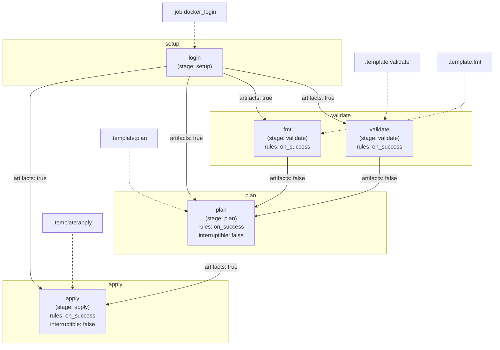

# Diagram: devops/terraform/gitlab/templates/.auto.gitlab-ci.yml


> Auto-generated by Obscura crawlers

## Diagram 1



### SVG

<svg id="container" width="1414.9140625" xmlns="http://www.w3.org/2000/svg" class="flowchart" height="974" viewBox="0 0 1414.9140625 974" role="graphics-document document" aria-roledescription="flowchart-v2"><style>#container{font-family:"trebuchet ms",verdana,arial,sans-serif;font-size:16px;fill:#333;}@keyframes edge-animation-frame{from{stroke-dashoffset:0;}}@keyframes dash{to{stroke-dashoffset:0;}}#container .edge-animation-slow{stroke-dasharray:9,5!important;stroke-dashoffset:900;animation:dash 50s linear infinite;stroke-linecap:round;}#container .edge-animation-fast{stroke-dasharray:9,5!important;stroke-dashoffset:900;animation:dash 20s linear infinite;stroke-linecap:round;}#container .error-icon{fill:#552222;}#container .error-text{fill:#552222;stroke:#552222;}#container .edge-thickness-normal{stroke-width:1px;}#container .edge-thickness-thick{stroke-width:3.5px;}#container .edge-pattern-solid{stroke-dasharray:0;}#container .edge-thickness-invisible{stroke-width:0;fill:none;}#container .edge-pattern-dashed{stroke-dasharray:3;}#container .edge-pattern-dotted{stroke-dasharray:2;}#container .marker{fill:#333333;stroke:#333333;}#container .marker.cross{stroke:#333333;}#container svg{font-family:"trebuchet ms",verdana,arial,sans-serif;font-size:16px;}#container p{margin:0;}#container .label{font-family:"trebuchet ms",verdana,arial,sans-serif;color:#333;}#container .cluster-label text{fill:#333;}#container .cluster-label span{color:#333;}#container .cluster-label span p{background-color:transparent;}#container .label text,#container span{fill:#333;color:#333;}#container .node rect,#container .node circle,#container .node ellipse,#container .node polygon,#container .node path{fill:#ECECFF;stroke:#9370DB;stroke-width:1px;}#container .rough-node .label text,#container .node .label text,#container .image-shape .label,#container .icon-shape .label{text-anchor:middle;}#container .node .katex path{fill:#000;stroke:#000;stroke-width:1px;}#container .rough-node .label,#container .node .label,#container .image-shape .label,#container .icon-shape .label{text-align:center;}#container .node.clickable{cursor:pointer;}#container .root .anchor path{fill:#333333!important;stroke-width:0;stroke:#333333;}#container .arrowheadPath{fill:#333333;}#container .edgePath .path{stroke:#333333;stroke-width:2.0px;}#container .flowchart-link{stroke:#333333;fill:none;}#container .edgeLabel{background-color:rgba(232,232,232, 0.8);text-align:center;}#container .edgeLabel p{background-color:rgba(232,232,232, 0.8);}#container .edgeLabel rect{opacity:0.5;background-color:rgba(232,232,232, 0.8);fill:rgba(232,232,232, 0.8);}#container .labelBkg{background-color:rgba(232, 232, 232, 0.5);}#container .cluster rect{fill:#ffffde;stroke:#aaaa33;stroke-width:1px;}#container .cluster text{fill:#333;}#container .cluster span{color:#333;}#container div.mermaidTooltip{position:absolute;text-align:center;max-width:200px;padding:2px;font-family:"trebuchet ms",verdana,arial,sans-serif;font-size:12px;background:hsl(80, 100%, 96.2745098039%);border:1px solid #aaaa33;border-radius:2px;pointer-events:none;z-index:100;}#container .flowchartTitleText{text-anchor:middle;font-size:18px;fill:#333;}#container rect.text{fill:none;stroke-width:0;}#container .icon-shape,#container .image-shape{background-color:rgba(232,232,232, 0.8);text-align:center;}#container .icon-shape p,#container .image-shape p{background-color:rgba(232,232,232, 0.8);padding:2px;}#container .icon-shape rect,#container .image-shape rect{opacity:0.5;background-color:rgba(232,232,232, 0.8);fill:rgba(232,232,232, 0.8);}#container .label-icon{display:inline-block;height:1em;overflow:visible;vertical-align:-0.125em;}#container .node .label-icon path{fill:currentColor;stroke:revert;stroke-width:revert;}#container :root{--mermaid-font-family:"trebuchet ms",verdana,arial,sans-serif;}</style><g><marker id="container_flowchart-v2-pointEnd" class="marker flowchart-v2" viewBox="0 0 10 10" refX="5" refY="5" markerUnits="userSpaceOnUse" markerWidth="8" markerHeight="8" orient="auto"><path d="M 0 0 L 10 5 L 0 10 z" class="arrowMarkerPath" style="stroke-width: 1; stroke-dasharray: 1, 0;"></path></marker><marker id="container_flowchart-v2-pointStart" class="marker flowchart-v2" viewBox="0 0 10 10" refX="4.5" refY="5" markerUnits="userSpaceOnUse" markerWidth="8" markerHeight="8" orient="auto"><path d="M 0 5 L 10 10 L 10 0 z" class="arrowMarkerPath" style="stroke-width: 1; stroke-dasharray: 1, 0;"></path></marker><marker id="container_flowchart-v2-circleEnd" class="marker flowchart-v2" viewBox="0 0 10 10" refX="11" refY="5" markerUnits="userSpaceOnUse" markerWidth="11" markerHeight="11" orient="auto"><circle cx="5" cy="5" r="5" class="arrowMarkerPath" style="stroke-width: 1; stroke-dasharray: 1, 0;"></circle></marker><marker id="container_flowchart-v2-circleStart" class="marker flowchart-v2" viewBox="0 0 10 10" refX="-1" refY="5" markerUnits="userSpaceOnUse" markerWidth="11" markerHeight="11" orient="auto"><circle cx="5" cy="5" r="5" class="arrowMarkerPath" style="stroke-width: 1; stroke-dasharray: 1, 0;"></circle></marker><marker id="container_flowchart-v2-crossEnd" class="marker cross flowchart-v2" viewBox="0 0 11 11" refX="12" refY="5.2" markerUnits="userSpaceOnUse" markerWidth="11" markerHeight="11" orient="auto"><path d="M 1,1 l 9,9 M 10,1 l -9,9" class="arrowMarkerPath" style="stroke-width: 2; stroke-dasharray: 1, 0;"></path></marker><marker id="container_flowchart-v2-crossStart" class="marker cross flowchart-v2" viewBox="0 0 11 11" refX="-1" refY="5.2" markerUnits="userSpaceOnUse" markerWidth="11" markerHeight="11" orient="auto"><path d="M 1,1 l 9,9 M 10,1 l -9,9" class="arrowMarkerPath" style="stroke-width: 2; stroke-dasharray: 1, 0;"></path></marker><g class="root"><g class="clusters"><g class="cluster" id="Apply" data-look="classic"><rect style="" x="8" y="790" width="643.9765625" height="176"></rect><g class="cluster-label" transform="translate(309.92578125, 790)"><foreignObject width="40.125" height="24"><div xmlns="http://www.w3.org/1999/xhtml" style="display: table-cell; white-space: nowrap; line-height: 1.5; max-width: 200px; text-align: center;"><span class="nodeLabel"><p>apply</p></span></div></foreignObject></g></g><g class="cluster" id="Plan" data-look="classic"><rect style="" x="327.28515625" y="540" width="777.87109375" height="176"></rect><g class="cluster-label" transform="translate(700.119140625, 540)"><foreignObject width="32.203125" height="24"><div xmlns="http://www.w3.org/1999/xhtml" style="display: table-cell; white-space: nowrap; line-height: 1.5; max-width: 200px; text-align: center;"><span class="nodeLabel"><p>plan</p></span></div></foreignObject></g></g><g class="cluster" id="Validate" data-look="classic"><rect style="" x="602.34765625" y="314" width="745.98828125" height="152"></rect><g class="cluster-label" transform="translate(946.396484375, 314)"><foreignObject width="57.890625" height="24"><div xmlns="http://www.w3.org/1999/xhtml" style="display: table-cell; white-space: nowrap; line-height: 1.5; max-width: 200px; text-align: center;"><span class="nodeLabel"><p>validate</p></span></div></foreignObject></g></g><g class="cluster" id="Setup" data-look="classic"><rect style="" x="8" y="112" width="966.5546875" height="128"></rect><g class="cluster-label" transform="translate(470.87890625, 112)"><foreignObject width="40.796875" height="24"><div xmlns="http://www.w3.org/1999/xhtml" style="display: table-cell; white-space: nowrap; line-height: 1.5; max-width: 200px; text-align: center;"><span class="nodeLabel"><p>setup</p></span></div></foreignObject></g></g></g><g class="edgePaths"><path d="M560.035,62L560.035,66.167C560.035,70.333,560.035,78.667,560.035,87C560.035,95.333,560.035,103.667,560.035,111.333C560.035,119,560.035,126,560.035,129.5L560.035,133" id="L_t_job_docker_login_0" class="edge-thickness-normal edge-pattern-dotted edge-thickness-normal edge-pattern-solid flowchart-link" style=";" data-edge="true" data-et="edge" data-id="L_t_job_docker_login_0" data-points="W3sieCI6NTYwLjAzNTE1NjI1LCJ5Ijo2Mn0seyJ4Ijo1NjAuMDM1MTU2MjUsInkiOjg3fSx7IngiOjU2MC4wMzUxNTYyNSwieSI6MTEyfSx7IngiOjU2MC4wMzUxNTYyNSwieSI6MTM3fV0=" marker-end="url(#container_flowchart-v2-pointEnd)"></path><path d="M1104.656,203L1104.656,209.167C1104.656,215.333,1104.656,227.667,1104.656,240C1104.656,252.333,1104.656,264.667,1104.656,277C1104.656,289.333,1104.656,301.667,1103.753,311.354C1102.849,321.042,1101.043,328.084,1100.139,331.605L1099.236,335.126" id="L_t_template_validate_validate_0" class="edge-thickness-normal edge-pattern-dotted edge-thickness-normal edge-pattern-solid flowchart-link" style=";" data-edge="true" data-et="edge" data-id="L_t_template_validate_validate_0" data-points="W3sieCI6MTEwNC42NTYyNSwieSI6MjAzfSx7IngiOjExMDQuNjU2MjUsInkiOjI0MH0seyJ4IjoxMTA0LjY1NjI1LCJ5IjoyNzd9LHsieCI6MTEwNC42NTYyNSwieSI6MzE0fSx7IngiOjEwOTguMjQxNzc2MzE1Nzg5NCwieSI6MzM5fV0=" marker-end="url(#container_flowchart-v2-pointEnd)"></path><path d="M1328.336,203L1328.336,209.167C1328.336,215.333,1328.336,227.667,1328.336,240C1328.336,252.333,1328.336,264.667,1328.336,277C1328.336,289.333,1328.336,301.667,1260.303,318.065C1192.27,334.464,1056.205,354.927,988.172,365.159L920.139,375.391" id="L_t_template_fmt_fmt_0" class="edge-thickness-normal edge-pattern-dotted edge-thickness-normal edge-pattern-solid flowchart-link" style=";" data-edge="true" data-et="edge" data-id="L_t_template_fmt_fmt_0" data-points="W3sieCI6MTMyOC4zMzU5Mzc1LCJ5IjoyMDN9LHsieCI6MTMyOC4zMzU5Mzc1LCJ5IjoyNDB9LHsieCI6MTMyOC4zMzU5Mzc1LCJ5IjoyNzd9LHsieCI6MTMyOC4zMzU5Mzc1LCJ5IjozMTR9LHsieCI6OTE2LjE4MzU5Mzc1LCJ5IjozNzUuOTg2MTMyMjYxNDMwODR9XQ==" marker-end="url(#container_flowchart-v2-pointEnd)"></path><path d="M367.285,417L367.285,425.167C367.285,433.333,367.285,449.667,367.285,464C367.285,478.333,367.285,490.667,367.285,503C367.285,515.333,367.285,527.667,394.522,542.888C421.758,558.11,476.231,576.22,503.468,585.276L530.704,594.331" id="L_t_template_plan_plan_0" class="edge-thickness-normal edge-pattern-dotted edge-thickness-normal edge-pattern-solid flowchart-link" style=";" data-edge="true" data-et="edge" data-id="L_t_template_plan_plan_0" data-points="W3sieCI6MzY3LjI4NTE1NjI1LCJ5Ijo0MTd9LHsieCI6MzY3LjI4NTE1NjI1LCJ5Ijo0NjZ9LHsieCI6MzY3LjI4NTE1NjI1LCJ5Ijo1MDN9LHsieCI6MzY3LjI4NTE1NjI1LCJ5Ijo1NDB9LHsieCI6NTM0LjUsInkiOjU5NS41OTI2ODYwNTgzNTIxfV0=" marker-end="url(#container_flowchart-v2-pointEnd)"></path><path d="M206.105,655L206.105,665.167C206.105,675.333,206.105,695.667,206.105,712C206.105,728.333,206.105,740.667,206.105,753C206.105,765.333,206.105,777.667,206.105,787.333C206.105,797,206.105,804,206.105,807.5L206.105,811" id="L_t_template_apply_apply_0" class="edge-thickness-normal edge-pattern-dotted edge-thickness-normal edge-pattern-solid flowchart-link" style=";" data-edge="true" data-et="edge" data-id="L_t_template_apply_apply_0" data-points="W3sieCI6MjA2LjEwNTQ2ODc1LCJ5Ijo2NTV9LHsieCI6MjA2LjEwNTQ2ODc1LCJ5Ijo3MTZ9LHsieCI6MjA2LjEwNTQ2ODc1LCJ5Ijo3NTN9LHsieCI6MjA2LjEwNTQ2ODc1LCJ5Ijo3OTB9LHsieCI6MjA2LjEwNTQ2ODc1LCJ5Ijo4MTV9XQ==" marker-end="url(#container_flowchart-v2-pointEnd)"></path><path d="M638.887,190.518L683.677,198.765C728.467,207.012,818.048,223.506,862.839,237.92C907.629,252.333,907.629,264.667,907.629,277C907.629,289.333,907.629,301.667,921.074,313.589C934.519,325.512,961.409,337.024,974.854,342.779L988.299,348.535" id="L_login_validate_0" class="edge-thickness-normal edge-pattern-solid edge-thickness-normal edge-pattern-solid flowchart-link" style=";" data-edge="true" data-et="edge" data-id="L_login_validate_0" data-points="W3sieCI6NjM4Ljg4NjcxODc1LCJ5IjoxOTAuNTE4Mzg1MzI3Njk5MzV9LHsieCI6OTA3LjYyODkwNjI1LCJ5IjoyNDB9LHsieCI6OTA3LjYyODkwNjI1LCJ5IjoyNzd9LHsieCI6OTA3LjYyODkwNjI1LCJ5IjozMTR9LHsieCI6OTkxLjk3NjU2MjUsInkiOjM1MC4xMDk0OTAxNzUzNjkxfV0=" marker-end="url(#container_flowchart-v2-pointEnd)"></path><path d="M638.887,205.6L654.16,211.333C669.434,217.066,699.98,228.533,715.254,240.433C730.527,252.333,730.527,264.667,730.527,277C730.527,289.333,730.527,301.667,735.082,311.577C739.637,321.487,748.747,328.974,753.302,332.717L757.857,336.46" id="L_login_fmt_0" class="edge-thickness-normal edge-pattern-solid edge-thickness-normal edge-pattern-solid flowchart-link" style=";" data-edge="true" data-et="edge" data-id="L_login_fmt_0" data-points="W3sieCI6NjM4Ljg4NjcxODc1LCJ5IjoyMDUuNTk5NTk2NzU1NzE2NDV9LHsieCI6NzMwLjUyNzM0Mzc1LCJ5IjoyNDB9LHsieCI6NzMwLjUyNzM0Mzc1LCJ5IjoyNzd9LHsieCI6NzMwLjUyNzM0Mzc1LCJ5IjozMTR9LHsieCI6NzYwLjk0NzI2NTYyNSwieSI6MzM5fV0=" marker-end="url(#container_flowchart-v2-pointEnd)"></path><path d="M543.82,215L542.088,219.167C540.355,223.333,536.891,231.667,535.158,242C533.426,252.333,533.426,264.667,533.426,277C533.426,289.333,533.426,301.667,533.426,320.5C533.426,339.333,533.426,364.667,533.426,390C533.426,415.333,533.426,440.667,533.426,459.5C533.426,478.333,533.426,490.667,533.426,503C533.426,515.333,533.426,527.667,537.595,537.556C541.764,547.445,550.102,554.891,554.271,558.613L558.44,562.336" id="L_login_plan_0" class="edge-thickness-normal edge-pattern-solid edge-thickness-normal edge-pattern-solid flowchart-link" style=";" data-edge="true" data-et="edge" data-id="L_login_plan_0" data-points="W3sieCI6NTQzLjgyMDA2ODM1OTM3NSwieSI6MjE1fSx7IngiOjUzMy40MjU3ODEyNSwieSI6MjQwfSx7IngiOjUzMy40MjU3ODEyNSwieSI6Mjc3fSx7IngiOjUzMy40MjU3ODEyNSwieSI6MzE0fSx7IngiOjUzMy40MjU3ODEyNSwieSI6MzkwfSx7IngiOjUzMy40MjU3ODEyNSwieSI6NDY2fSx7IngiOjUzMy40MjU3ODEyNSwieSI6NTAzfSx7IngiOjUzMy40MjU3ODEyNSwieSI6NTQwfSx7IngiOjU2MS40MjMxNjIyODY5MzE4LCJ5Ijo1NjV9XQ==" marker-end="url(#container_flowchart-v2-pointEnd)"></path><path d="M1085.156,441L1085.156,445.167C1085.156,449.333,1085.156,457.667,1085.156,468C1085.156,478.333,1085.156,490.667,1085.156,503C1085.156,515.333,1085.156,527.667,1026.527,545.218C967.897,562.77,850.639,585.539,792.009,596.924L733.38,608.309" id="L_validate_plan_0" class="edge-thickness-normal edge-pattern-solid edge-thickness-normal edge-pattern-solid flowchart-link" style=";" data-edge="true" data-et="edge" data-id="L_validate_plan_0" data-points="W3sieCI6MTA4NS4xNTYyNSwieSI6NDQxfSx7IngiOjEwODUuMTU2MjUsInkiOjQ2Nn0seyJ4IjoxMDg1LjE1NjI1LCJ5Ijo1MDN9LHsieCI6MTA4NS4xNTYyNSwieSI6NTQwfSx7IngiOjcyOS40NTMxMjUsInkiOjYwOS4wNzE2NjM3NjQ3MTgxfV0=" marker-end="url(#container_flowchart-v2-pointEnd)"></path><path d="M823.004,441L823.004,445.167C823.004,449.333,823.004,457.667,823.004,468C823.004,478.333,823.004,490.667,823.004,503C823.004,515.333,823.004,527.667,808.018,540.737C793.031,553.807,763.059,567.615,748.072,574.518L733.086,581.422" id="L_fmt_plan_0" class="edge-thickness-normal edge-pattern-solid edge-thickness-normal edge-pattern-solid flowchart-link" style=";" data-edge="true" data-et="edge" data-id="L_fmt_plan_0" data-points="W3sieCI6ODIzLjAwMzkwNjI1LCJ5Ijo0NDF9LHsieCI6ODIzLjAwMzkwNjI1LCJ5Ijo0NjZ9LHsieCI6ODIzLjAwMzkwNjI1LCJ5Ijo1MDN9LHsieCI6ODIzLjAwMzkwNjI1LCJ5Ijo1NDB9LHsieCI6NzI5LjQ1MzEyNSwieSI6NTgzLjA5NTc2MDk5NjI1Nzl9XQ==" marker-end="url(#container_flowchart-v2-pointEnd)"></path><path d="M481.184,186.622L415.141,195.518C349.098,204.415,217.012,222.207,150.969,237.27C84.926,252.333,84.926,264.667,84.926,277C84.926,289.333,84.926,301.667,84.926,320.5C84.926,339.333,84.926,364.667,84.926,390C84.926,415.333,84.926,440.667,84.926,459.5C84.926,478.333,84.926,490.667,84.926,503C84.926,515.333,84.926,527.667,84.926,548.5C84.926,569.333,84.926,598.667,84.926,628C84.926,657.333,84.926,686.667,84.926,707.5C84.926,728.333,84.926,740.667,84.926,753C84.926,765.333,84.926,777.667,90.124,787.608C95.322,797.55,105.719,805.1,110.917,808.875L116.115,812.65" id="L_login_apply_0" class="edge-thickness-normal edge-pattern-solid edge-thickness-normal edge-pattern-solid flowchart-link" style=";" data-edge="true" data-et="edge" data-id="L_login_apply_0" data-points="W3sieCI6NDgxLjE4MzU5Mzc1LCJ5IjoxODYuNjIxNzY0NzI1MjI3NzN9LHsieCI6ODQuOTI1NzgxMjUsInkiOjI0MH0seyJ4Ijo4NC45MjU3ODEyNSwieSI6Mjc3fSx7IngiOjg0LjkyNTc4MTI1LCJ5IjozMTR9LHsieCI6ODQuOTI1NzgxMjUsInkiOjM5MH0seyJ4Ijo4NC45MjU3ODEyNSwieSI6NDY2fSx7IngiOjg0LjkyNTc4MTI1LCJ5Ijo1MDN9LHsieCI6ODQuOTI1NzgxMjUsInkiOjU0MH0seyJ4Ijo4NC45MjU3ODEyNSwieSI6NjI4fSx7IngiOjg0LjkyNTc4MTI1LCJ5Ijo3MTZ9LHsieCI6ODQuOTI1NzgxMjUsInkiOjc1M30seyJ4Ijo4NC45MjU3ODEyNSwieSI6NzkwfSx7IngiOjExOS4zNTE4Mjg4MzUyMjcyNywieSI6ODE1fV0=" marker-end="url(#container_flowchart-v2-pointEnd)"></path><path d="M631.977,691L631.977,695.167C631.977,699.333,631.977,707.667,631.977,718C631.977,728.333,631.977,740.667,631.977,753C631.977,765.333,631.977,777.667,577.897,795.008C523.817,812.349,415.658,834.699,361.579,845.874L307.499,857.048" id="L_plan_apply_0" class="edge-thickness-normal edge-pattern-solid edge-thickness-normal edge-pattern-solid flowchart-link" style=";" data-edge="true" data-et="edge" data-id="L_plan_apply_0" data-points="W3sieCI6NjMxLjk3NjU2MjUsInkiOjY5MX0seyJ4Ijo2MzEuOTc2NTYyNSwieSI6NzE2fSx7IngiOjYzMS45NzY1NjI1LCJ5Ijo3NTN9LHsieCI6NjMxLjk3NjU2MjUsInkiOjc5MH0seyJ4IjozMDMuNTgyMDMxMjUsInkiOjg1Ny44NTc5MDE1NDM3MTA5fV0=" marker-end="url(#container_flowchart-v2-pointEnd)"></path></g><g class="edgeLabels"><g class="edgeLabel"><g class="label" data-id="L_t_job_docker_login_0" transform="translate(0, 0)"><foreignObject width="0" height="0"><div xmlns="http://www.w3.org/1999/xhtml" class="labelBkg" style="display: table-cell; white-space: nowrap; line-height: 1.5; max-width: 200px; text-align: center;"><span class="edgeLabel"></span></div></foreignObject></g></g><g class="edgeLabel"><g class="label" data-id="L_t_template_validate_validate_0" transform="translate(0, 0)"><foreignObject width="0" height="0"><div xmlns="http://www.w3.org/1999/xhtml" class="labelBkg" style="display: table-cell; white-space: nowrap; line-height: 1.5; max-width: 200px; text-align: center;"><span class="edgeLabel"></span></div></foreignObject></g></g><g class="edgeLabel"><g class="label" data-id="L_t_template_fmt_fmt_0" transform="translate(0, 0)"><foreignObject width="0" height="0"><div xmlns="http://www.w3.org/1999/xhtml" class="labelBkg" style="display: table-cell; white-space: nowrap; line-height: 1.5; max-width: 200px; text-align: center;"><span class="edgeLabel"></span></div></foreignObject></g></g><g class="edgeLabel"><g class="label" data-id="L_t_template_plan_plan_0" transform="translate(0, 0)"><foreignObject width="0" height="0"><div xmlns="http://www.w3.org/1999/xhtml" class="labelBkg" style="display: table-cell; white-space: nowrap; line-height: 1.5; max-width: 200px; text-align: center;"><span class="edgeLabel"></span></div></foreignObject></g></g><g class="edgeLabel"><g class="label" data-id="L_t_template_apply_apply_0" transform="translate(0, 0)"><foreignObject width="0" height="0"><div xmlns="http://www.w3.org/1999/xhtml" class="labelBkg" style="display: table-cell; white-space: nowrap; line-height: 1.5; max-width: 200px; text-align: center;"><span class="edgeLabel"></span></div></foreignObject></g></g><g class="edgeLabel" transform="translate(907.62890625, 277)"><g class="label" data-id="L_login_validate_0" transform="translate(-48.921875, -12)"><foreignObject width="97.84375" height="24"><div xmlns="http://www.w3.org/1999/xhtml" class="labelBkg" style="display: table-cell; white-space: nowrap; line-height: 1.5; max-width: 200px; text-align: center;"><span class="edgeLabel"><p>artifacts: true</p></span></div></foreignObject></g></g><g class="edgeLabel" transform="translate(730.52734375, 277)"><g class="label" data-id="L_login_fmt_0" transform="translate(-48.921875, -12)"><foreignObject width="97.84375" height="24"><div xmlns="http://www.w3.org/1999/xhtml" class="labelBkg" style="display: table-cell; white-space: nowrap; line-height: 1.5; max-width: 200px; text-align: center;"><span class="edgeLabel"><p>artifacts: true</p></span></div></foreignObject></g></g><g class="edgeLabel" transform="translate(533.42578125, 390)"><g class="label" data-id="L_login_plan_0" transform="translate(-48.921875, -12)"><foreignObject width="97.84375" height="24"><div xmlns="http://www.w3.org/1999/xhtml" class="labelBkg" style="display: table-cell; white-space: nowrap; line-height: 1.5; max-width: 200px; text-align: center;"><span class="edgeLabel"><p>artifacts: true</p></span></div></foreignObject></g></g><g class="edgeLabel" transform="translate(1085.15625, 503)"><g class="label" data-id="L_validate_plan_0" transform="translate(-51.1484375, -12)"><foreignObject width="102.296875" height="24"><div xmlns="http://www.w3.org/1999/xhtml" class="labelBkg" style="display: table-cell; white-space: nowrap; line-height: 1.5; max-width: 200px; text-align: center;"><span class="edgeLabel"><p>artifacts: false</p></span></div></foreignObject></g></g><g class="edgeLabel" transform="translate(823.00390625, 503)"><g class="label" data-id="L_fmt_plan_0" transform="translate(-51.1484375, -12)"><foreignObject width="102.296875" height="24"><div xmlns="http://www.w3.org/1999/xhtml" class="labelBkg" style="display: table-cell; white-space: nowrap; line-height: 1.5; max-width: 200px; text-align: center;"><span class="edgeLabel"><p>artifacts: false</p></span></div></foreignObject></g></g><g class="edgeLabel" transform="translate(84.92578125, 503)"><g class="label" data-id="L_login_apply_0" transform="translate(-48.921875, -12)"><foreignObject width="97.84375" height="24"><div xmlns="http://www.w3.org/1999/xhtml" class="labelBkg" style="display: table-cell; white-space: nowrap; line-height: 1.5; max-width: 200px; text-align: center;"><span class="edgeLabel"><p>artifacts: true</p></span></div></foreignObject></g></g><g class="edgeLabel" transform="translate(631.9765625, 753)"><g class="label" data-id="L_plan_apply_0" transform="translate(-48.921875, -12)"><foreignObject width="97.84375" height="24"><div xmlns="http://www.w3.org/1999/xhtml" class="labelBkg" style="display: table-cell; white-space: nowrap; line-height: 1.5; max-width: 200px; text-align: center;"><span class="edgeLabel"><p>artifacts: true</p></span></div></foreignObject></g></g></g><g class="nodes"><g class="node default" id="flowchart-login-0" transform="translate(560.03515625, 176)"><rect class="basic label-container" style="" x="-78.8515625" y="-39" width="157.703125" height="78"></rect><g class="label" style="" transform="translate(-48.8515625, -24)"><rect></rect><foreignObject width="97.703125" height="48"><div xmlns="http://www.w3.org/1999/xhtml" style="display: table-cell; white-space: nowrap; line-height: 1.5; max-width: 200px; text-align: center;"><span class="nodeLabel"><p>login<br/>(stage: setup)</p></span></div></foreignObject></g></g><g class="node default" id="flowchart-validate-1" transform="translate(1085.15625, 390)"><rect class="basic label-container" style="" x="-93.1796875" y="-51" width="186.359375" height="102"></rect><g class="label" style="" transform="translate(-63.1796875, -36)"><rect></rect><foreignObject width="126.359375" height="72"><div xmlns="http://www.w3.org/1999/xhtml" style="display: table-cell; white-space: nowrap; line-height: 1.5; max-width: 200px; text-align: center;"><span class="nodeLabel"><p>validate<br/>(stage: validate)<br/>rules: on_success</p></span></div></foreignObject></g></g><g class="node default" id="flowchart-fmt-2" transform="translate(823.00390625, 390)"><rect class="basic label-container" style="" x="-93.1796875" y="-51" width="186.359375" height="102"></rect><g class="label" style="" transform="translate(-63.1796875, -36)"><rect></rect><foreignObject width="126.359375" height="72"><div xmlns="http://www.w3.org/1999/xhtml" style="display: table-cell; white-space: nowrap; line-height: 1.5; max-width: 200px; text-align: center;"><span class="nodeLabel"><p>fmt<br/>(stage: validate)<br/>rules: on_success</p></span></div></foreignObject></g></g><g class="node default" id="flowchart-plan-3" transform="translate(631.9765625, 628)"><rect class="basic label-container" style="" x="-97.4765625" y="-63" width="194.953125" height="126"></rect><g class="label" style="" transform="translate(-67.4765625, -48)"><rect></rect><foreignObject width="134.953125" height="96"><div xmlns="http://www.w3.org/1999/xhtml" style="display: table-cell; white-space: nowrap; line-height: 1.5; max-width: 200px; text-align: center;"><span class="nodeLabel"><p>plan<br/>(stage: plan)<br/>rules: on_success<br/>interruptible: false</p></span></div></foreignObject></g></g><g class="node default" id="flowchart-apply-4" transform="translate(206.10546875, 878)"><rect class="basic label-container" style="" x="-97.4765625" y="-63" width="194.953125" height="126"></rect><g class="label" style="" transform="translate(-67.4765625, -48)"><rect></rect><foreignObject width="134.953125" height="96"><div xmlns="http://www.w3.org/1999/xhtml" style="display: table-cell; white-space: nowrap; line-height: 1.5; max-width: 200px; text-align: center;"><span class="nodeLabel"><p>apply<br/>(stage: apply)<br/>rules: on_success<br/>interruptible: false</p></span></div></foreignObject></g></g><g class="node default" id="flowchart-t_job_docker-5" transform="translate(560.03515625, 35)"><rect class="basic label-container" style="" x="-91.78125" y="-27" width="183.5625" height="54"></rect><g class="label" style="" transform="translate(-61.78125, -12)"><rect></rect><foreignObject width="123.5625" height="24"><div xmlns="http://www.w3.org/1999/xhtml" style="display: table-cell; white-space: nowrap; line-height: 1.5; max-width: 200px; text-align: center;"><span class="nodeLabel"><p>.job:docker_login</p></span></div></foreignObject></g></g><g class="node default" id="flowchart-t_template_validate-6" transform="translate(1104.65625, 176)"><rect class="basic label-container" style="" x="-95.1015625" y="-27" width="190.203125" height="54"></rect><g class="label" style="" transform="translate(-65.1015625, -12)"><rect></rect><foreignObject width="130.203125" height="24"><div xmlns="http://www.w3.org/1999/xhtml" style="display: table-cell; white-space: nowrap; line-height: 1.5; max-width: 200px; text-align: center;"><span class="nodeLabel"><p>.template:validate</p></span></div></foreignObject></g></g><g class="node default" id="flowchart-t_template_fmt-7" transform="translate(1328.3359375, 176)"><rect class="basic label-container" style="" x="-78.578125" y="-27" width="157.15625" height="54"></rect><g class="label" style="" transform="translate(-48.578125, -12)"><rect></rect><foreignObject width="97.15625" height="24"><div xmlns="http://www.w3.org/1999/xhtml" style="display: table-cell; white-space: nowrap; line-height: 1.5; max-width: 200px; text-align: center;"><span class="nodeLabel"><p>.template:fmt</p></span></div></foreignObject></g></g><g class="node default" id="flowchart-t_template_plan-8" transform="translate(367.28515625, 390)"><rect class="basic label-container" style="" x="-82.21875" y="-27" width="164.4375" height="54"></rect><g class="label" style="" transform="translate(-52.21875, -12)"><rect></rect><foreignObject width="104.4375" height="24"><div xmlns="http://www.w3.org/1999/xhtml" style="display: table-cell; white-space: nowrap; line-height: 1.5; max-width: 200px; text-align: center;"><span class="nodeLabel"><p>.template:plan</p></span></div></foreignObject></g></g><g class="node default" id="flowchart-t_template_apply-9" transform="translate(206.10546875, 628)"><rect class="basic label-container" style="" x="-86.1796875" y="-27" width="172.359375" height="54"></rect><g class="label" style="" transform="translate(-56.1796875, -12)"><rect></rect><foreignObject width="112.359375" height="24"><div xmlns="http://www.w3.org/1999/xhtml" style="display: table-cell; white-space: nowrap; line-height: 1.5; max-width: 200px; text-align: center;"><span class="nodeLabel"><p>.template:apply</p></span></div></foreignObject></g></g></g></g></g></svg>

## Diagram 2

```mermaid
classDiagram
  TemplateJobDocker <|-- LoginJob
  TemplateValidate <|-- ValidateJob
  TemplateFmt <|-- FmtJob
  TemplatePlan <|-- PlanJob
  TemplateApply <|-- ApplyJob

  class TemplateJobDocker {
    <<template>>
    id: ".job:docker_login"
  }
  class TemplateValidate {
    <<template>>
    id: ".template:validate"
  }
  class TemplateFmt {
    <<template>>
    id: ".template:fmt"
  }
  class TemplatePlan {
    <<template>>
    id: ".template:plan"
  }
  class TemplateApply {
    <<template>>
    id: ".template:apply"
  }

  class LoginJob {
    stage: setup
    rules: on_success
    extends: ".job:docker_login"
  }
  class ValidateJob {
    stage: validate
    rules: on_success
    needs: "login (artifacts: true)"
  }
  class FmtJob {
    stage: validate
    rules: on_success
    needs: "login (artifacts: true)"
  }
  class PlanJob {
    stage: plan
    rules: on_success
    interruptible: false
    needs: "login (artifacts: true), validate (artifacts: false), fmt (artifacts: false)"
  }
  class ApplyJob {
    stage: apply
    rules: on_success
    interruptible: false
    needs: "login (artifacts: true), plan (artifacts: true)"
  }

  LoginJob --> ValidateJob : "needs (artifacts: true)"
  LoginJob --> FmtJob : "needs (artifacts: true)"
  LoginJob --> PlanJob : "needs (artifacts: true)"
  ValidateJob --> PlanJob : "needs (artifacts: false)"
  FmtJob --> PlanJob : "needs (artifacts: false)"
  LoginJob --> ApplyJob : "needs (artifacts: true)"
  PlanJob --> ApplyJob : "needs (artifacts: true)"
```

> SVG rendering failed for this diagram.
