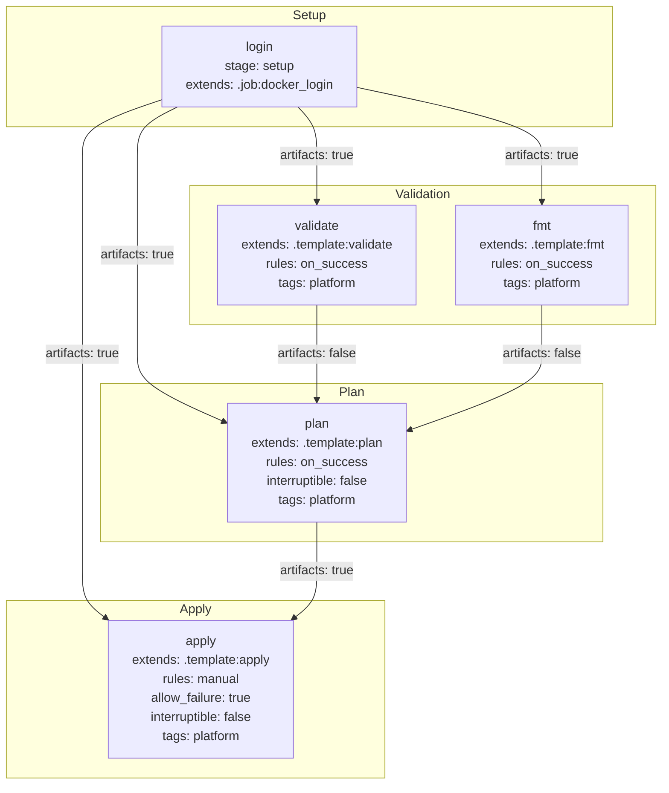

# Diagram: devops/terraform/gitlab/templates/.manual.gitlab-ci.yml

> Auto-generated by Obscura crawlers

## Mermaid

### SVG

<svg id="container" width="851.03515625" xmlns="http://www.w3.org/2000/svg" class="flowchart" height="990" viewBox="0 0 851.03515625 990" role="graphics-document document" aria-roledescription="flowchart-v2"><g><marker id="container_flowchart-v2-pointEnd" class="marker flowchart-v2" viewBox="0 0 10 10" refX="5" refY="5" markerUnits="userSpaceOnUse" markerWidth="8" markerHeight="8" orient="auto"><path d="M 0 0 L 10 5 L 0 10 z" class="arrowMarkerPath" style="stroke-width: 1; stroke-dasharray: 1, 0;"></path></marker><marker id="container_flowchart-v2-pointStart" class="marker flowchart-v2" viewBox="0 0 10 10" refX="4.5" refY="5" markerUnits="userSpaceOnUse" markerWidth="8" markerHeight="8" orient="auto"><path d="M 0 5 L 10 10 L 10 0 z" class="arrowMarkerPath" style="stroke-width: 1; stroke-dasharray: 1, 0;"></path></marker><marker id="container_flowchart-v2-circleEnd" class="marker flowchart-v2" viewBox="0 0 10 10" refX="11" refY="5" markerUnits="userSpaceOnUse" markerWidth="11" markerHeight="11" orient="auto"><circle cx="5" cy="5" r="5" class="arrowMarkerPath" style="stroke-width: 1; stroke-dasharray: 1, 0;"></circle></marker><marker id="container_flowchart-v2-circleStart" class="marker flowchart-v2" viewBox="0 0 10 10" refX="-1" refY="5" markerUnits="userSpaceOnUse" markerWidth="11" markerHeight="11" orient="auto"><circle cx="5" cy="5" r="5" class="arrowMarkerPath" style="stroke-width: 1; stroke-dasharray: 1, 0;"></circle></marker><marker id="container_flowchart-v2-crossEnd" class="marker cross flowchart-v2" viewBox="0 0 11 11" refX="12" refY="5.2" markerUnits="userSpaceOnUse" markerWidth="11" markerHeight="11" orient="auto"><path d="M 1,1 l 9,9 M 10,1 l -9,9" class="arrowMarkerPath" style="stroke-width: 2; stroke-dasharray: 1, 0;"></path></marker><marker id="container_flowchart-v2-crossStart" class="marker cross flowchart-v2" viewBox="0 0 11 11" refX="-1" refY="5.2" markerUnits="userSpaceOnUse" markerWidth="11" markerHeight="11" orient="auto"><path d="M 1,1 l 9,9 M 10,1 l -9,9" class="arrowMarkerPath" style="stroke-width: 2; stroke-dasharray: 1, 0;"></path></marker><g class="root"><g class="clusters"><g class="cluster" id="Apply" data-look="classic"><rect style="" x="8" y="758" width="487.0078125" height="224"></rect><g class="cluster-label" transform="translate(231.21484375, 758)"><foreignObject width="40.578125" height="24">

Apply

</foreignObject></g></g><g class="cluster" id="Plan" data-look="classic"><rect style="" x="129.32421875" y="484" width="645.265625" height="200"></rect><g class="cluster-label" transform="translate(436.04296875, 484)"><foreignObject width="31.828125" height="24">

Plan

</foreignObject></g></g><g class="cluster" id="Validation" data-look="classic"><rect style="" x="245.50390625" y="234" width="597.53125" height="176"></rect><g class="cluster-label" transform="translate(507.62890625, 234)"><foreignObject width="73.28125" height="24">

Validation

</foreignObject></g></g><g class="cluster" id="Setup" data-look="classic"><rect style="" x="8" y="8" width="778.5703125" height="152"></rect><g class="cluster-label" transform="translate(376.26171875, 8)"><foreignObject width="42.046875" height="24">

Setup

</foreignObject></g></g></g><g class="edgePaths"><path d="M383.355,135L387.487,139.167C391.618,143.333,399.881,151.667,404.013,162C408.145,172.333,408.145,184.667,408.145,197C408.145,209.333,408.145,221.667,408.145,231.333C408.145,241,408.145,248,408.145,251.5L408.145,255" id="L_login_validate_0" class="edge-thickness-normal edge-pattern-solid edge-thickness-normal edge-pattern-solid flowchart-link" style=";" data-edge="true" data-et="edge" data-id="L_login_validate_0" data-points="W3sieCI6MzgzLjM1NTI2MzE1Nzg5NDc0LCJ5IjoxMzV9LHsieCI6NDA4LjE0NDUzMTI1LCJ5IjoxNjB9LHsieCI6NDA4LjE0NDUzMTI1LCJ5IjoxOTd9LHsieCI6NDA4LjE0NDUzMTI1LCJ5IjoyMzR9LHsieCI6NDA4LjE0NDUzMTI1LCJ5IjoyNTl9XQ==" marker-end="url(#container_flowchart-v2-pointEnd)"></path><path d="M457.105,109.948L497.073,118.29C537.04,126.632,616.975,143.316,656.943,157.825C696.91,172.333,696.91,184.667,696.91,197C696.91,209.333,696.91,221.667,696.91,231.333C696.91,241,696.91,248,696.91,251.5L696.91,255" id="L_login_fmt_0" class="edge-thickness-normal edge-pattern-solid edge-thickness-normal edge-pattern-solid flowchart-link" style=";" data-edge="true" data-et="edge" data-id="L_login_fmt_0" data-points="W3sieCI6NDU3LjEwNTQ2ODc1LCJ5IjoxMDkuOTQ4MDc3NTgzMjQ3NTF9LHsieCI6Njk2LjkxMDE1NjI1LCJ5IjoxNjB9LHsieCI6Njk2LjkxMDE1NjI1LCJ5IjoxOTd9LHsieCI6Njk2LjkxMDE1NjI1LCJ5IjoyMzR9LHsieCI6Njk2LjkxMDE1NjI1LCJ5IjoyNTl9XQ==" marker-end="url(#container_flowchart-v2-pointEnd)"></path><path d="M227.965,135L219.401,139.167C210.837,143.333,193.71,151.667,185.146,162C176.582,172.333,176.582,184.667,176.582,197C176.582,209.333,176.582,221.667,176.582,242.5C176.582,263.333,176.582,292.667,176.582,322C176.582,351.333,176.582,380.667,176.582,401.5C176.582,422.333,176.582,434.667,176.582,447C176.582,459.333,176.582,471.667,195.436,485.975C214.29,500.284,251.998,516.569,270.853,524.711L289.707,532.853" id="L_login_plan_0" class="edge-thickness-normal edge-pattern-solid edge-thickness-normal edge-pattern-solid flowchart-link" style=";" data-edge="true" data-et="edge" data-id="L_login_plan_0" data-points="W3sieCI6MjI3Ljk2NDYzODE1Nzg5NDc0LCJ5IjoxMzV9LHsieCI6MTc2LjU4MjAzMTI1LCJ5IjoxNjB9LHsieCI6MTc2LjU4MjAzMTI1LCJ5IjoxOTd9LHsieCI6MTc2LjU4MjAzMTI1LCJ5IjoyMzR9LHsieCI6MTc2LjU4MjAzMTI1LCJ5IjozMjJ9LHsieCI6MTc2LjU4MjAzMTI1LCJ5Ijo0MTB9LHsieCI6MTc2LjU4MjAzMTI1LCJ5Ijo0NDd9LHsieCI6MTc2LjU4MjAzMTI1LCJ5Ijo0ODR9LHsieCI6MjkzLjM3ODkwNjI1LCJ5Ijo1MzQuNDM4NTk2NDkxMjI4fV0=" marker-end="url(#container_flowchart-v2-pointEnd)"></path><path d="M408.145,385L408.145,389.167C408.145,393.333,408.145,401.667,408.145,412C408.145,422.333,408.145,434.667,408.145,447C408.145,459.333,408.145,471.667,408.145,481.333C408.145,491,408.145,498,408.145,501.5L408.145,505" id="L_validate_plan_0" class="edge-thickness-normal edge-pattern-solid edge-thickness-normal edge-pattern-solid flowchart-link" style=";" data-edge="true" data-et="edge" data-id="L_validate_plan_0" data-points="W3sieCI6NDA4LjE0NDUzMTI1LCJ5IjozODV9LHsieCI6NDA4LjE0NDUzMTI1LCJ5Ijo0MTB9LHsieCI6NDA4LjE0NDUzMTI1LCJ5Ijo0NDd9LHsieCI6NDA4LjE0NDUzMTI1LCJ5Ijo0ODR9LHsieCI6NDA4LjE0NDUzMTI1LCJ5Ijo1MDl9XQ==" marker-end="url(#container_flowchart-v2-pointEnd)"></path><path d="M696.91,385L696.91,389.167C696.91,393.333,696.91,401.667,696.91,412C696.91,422.333,696.91,434.667,696.91,447C696.91,459.333,696.91,471.667,668.54,487.658C640.17,503.649,583.43,523.298,555.06,533.123L526.69,542.948" id="L_fmt_plan_0" class="edge-thickness-normal edge-pattern-solid edge-thickness-normal edge-pattern-solid flowchart-link" style=";" data-edge="true" data-et="edge" data-id="L_fmt_plan_0" data-points="W3sieCI6Njk2LjkxMDE1NjI1LCJ5IjozODV9LHsieCI6Njk2LjkxMDE1NjI1LCJ5Ijo0MTB9LHsieCI6Njk2LjkxMDE1NjI1LCJ5Ijo0NDd9LHsieCI6Njk2LjkxMDE1NjI1LCJ5Ijo0ODR9LHsieCI6NTIyLjkxMDE1NjI1LCJ5Ijo1NDQuMjU2NDc5NjI3NzI1OH1d" marker-end="url(#container_flowchart-v2-pointEnd)"></path><path d="M208.465,125.454L191.198,131.212C173.931,136.97,139.397,148.485,122.13,160.409C104.863,172.333,104.863,184.667,104.863,197C104.863,209.333,104.863,221.667,104.863,242.5C104.863,263.333,104.863,292.667,104.863,322C104.863,351.333,104.863,380.667,104.863,401.5C104.863,422.333,104.863,434.667,104.863,447C104.863,459.333,104.863,471.667,104.863,494.5C104.863,517.333,104.863,550.667,104.863,584C104.863,617.333,104.863,650.667,104.863,673.5C104.863,696.333,104.863,708.667,104.863,721C104.863,733.333,104.863,745.667,110.044,755.625C115.225,765.583,125.586,773.166,130.767,776.957L135.948,780.749" id="L_login_apply_0" class="edge-thickness-normal edge-pattern-solid edge-thickness-normal edge-pattern-solid flowchart-link" style=";" data-edge="true" data-et="edge" data-id="L_login_apply_0" data-points="W3sieCI6MjA4LjQ2NDg0Mzc1LCJ5IjoxMjUuNDU0MzA4NjMwOTcyNzh9LHsieCI6MTA0Ljg2MzI4MTI1LCJ5IjoxNjB9LHsieCI6MTA0Ljg2MzI4MTI1LCJ5IjoxOTd9LHsieCI6MTA0Ljg2MzI4MTI1LCJ5IjoyMzR9LHsieCI6MTA0Ljg2MzI4MTI1LCJ5IjozMjJ9LHsieCI6MTA0Ljg2MzI4MTI1LCJ5Ijo0MTB9LHsieCI6MTA0Ljg2MzI4MTI1LCJ5Ijo0NDd9LHsieCI6MTA0Ljg2MzI4MTI1LCJ5Ijo0ODR9LHsieCI6MTA0Ljg2MzI4MTI1LCJ5Ijo1ODR9LHsieCI6MTA0Ljg2MzI4MTI1LCJ5Ijo2ODR9LHsieCI6MTA0Ljg2MzI4MTI1LCJ5Ijo3MjF9LHsieCI6MTA0Ljg2MzI4MTI1LCJ5Ijo3NTh9LHsieCI6MTM5LjE3NTc4MTI1LCJ5Ijo3ODMuMTExMjM1ODk3Njk3N31d" marker-end="url(#container_flowchart-v2-pointEnd)"></path><path d="M408.145,659L408.145,663.167C408.145,667.333,408.145,675.667,408.145,686C408.145,696.333,408.145,708.667,408.145,721C408.145,733.333,408.145,745.667,403.09,755.602C398.035,765.536,387.925,773.073,382.87,776.841L377.815,780.609" id="L_plan_apply_0" class="edge-thickness-normal edge-pattern-solid edge-thickness-normal edge-pattern-solid flowchart-link" style=";" data-edge="true" data-et="edge" data-id="L_plan_apply_0" data-points="W3sieCI6NDA4LjE0NDUzMTI1LCJ5Ijo2NTl9LHsieCI6NDA4LjE0NDUzMTI1LCJ5Ijo2ODR9LHsieCI6NDA4LjE0NDUzMTI1LCJ5Ijo3MjF9LHsieCI6NDA4LjE0NDUzMTI1LCJ5Ijo3NTh9LHsieCI6Mzc0LjYwODMyODY4MzAzNTcsInkiOjc4M31d" marker-end="url(#container_flowchart-v2-pointEnd)"></path></g><g class="edgeLabels"><g class="edgeLabel" transform="translate(408.14453125, 197)"><g class="label" data-id="L_login_validate_0" transform="translate(-48.921875, -12)"><foreignObject width="97.84375" height="24">

artifacts: true

</foreignObject></g></g><g class="edgeLabel" transform="translate(696.91015625, 197)"><g class="label" data-id="L_login_fmt_0" transform="translate(-48.921875, -12)"><foreignObject width="97.84375" height="24">

artifacts: true

</foreignObject></g></g><g class="edgeLabel" transform="translate(176.58203125, 322)"><g class="label" data-id="L_login_plan_0" transform="translate(-48.921875, -12)"><foreignObject width="97.84375" height="24">

artifacts: true

</foreignObject></g></g><g class="edgeLabel" transform="translate(408.14453125, 447)"><g class="label" data-id="L_validate_plan_0" transform="translate(-51.1484375, -12)"><foreignObject width="102.296875" height="24">

artifacts: false

</foreignObject></g></g><g class="edgeLabel" transform="translate(696.91015625, 447)"><g class="label" data-id="L_fmt_plan_0" transform="translate(-51.1484375, -12)"><foreignObject width="102.296875" height="24">

artifacts: false

</foreignObject></g></g><g class="edgeLabel" transform="translate(104.86328125, 447)"><g class="label" data-id="L_login_apply_0" transform="translate(-48.921875, -12)"><foreignObject width="97.84375" height="24">

artifacts: true

</foreignObject></g></g><g class="edgeLabel" transform="translate(408.14453125, 721)"><g class="label" data-id="L_plan_apply_0" transform="translate(-48.921875, -12)"><foreignObject width="97.84375" height="24">

artifacts: true

</foreignObject></g></g></g><g class="nodes"><g class="node default" id="flowchart-login-0" transform="translate(332.78515625, 84)"><rect class="basic label-container" style="" x="-124.3203125" y="-51" width="248.640625" height="102"></rect><g class="label" style="" transform="translate(-94.3203125, -36)"><rect></rect><foreignObject width="188.640625" height="72">

login stage: setup extends: .job:docker_login

</foreignObject></g></g><g class="node default" id="flowchart-validate-1" transform="translate(408.14453125, 322)"><rect class="basic label-container" style="" x="-127.640625" y="-63" width="255.28125" height="126"></rect><g class="label" style="" transform="translate(-97.640625, -48)"><rect></rect><foreignObject width="195.28125" height="96">

validate extends: .template:validate rules: on_success tags: platform

</foreignObject></g></g><g class="node default" id="flowchart-fmt-2" transform="translate(696.91015625, 322)"><rect class="basic label-container" style="" x="-111.125" y="-63" width="222.25" height="126"></rect><g class="label" style="" transform="translate(-81.125, -48)"><rect></rect><foreignObject width="162.25" height="96">

fmt extends: .template:fmt rules: on_success tags: platform

</foreignObject></g></g><g class="node default" id="flowchart-plan-3" transform="translate(408.14453125, 584)"><rect class="basic label-container" style="" x="-114.765625" y="-75" width="229.53125" height="150"></rect><g class="label" style="" transform="translate(-84.765625, -60)"><rect></rect><foreignObject width="169.53125" height="120">

plan extends: .template:plan rules: on_success interruptible: false tags: platform

</foreignObject></g></g><g class="node default" id="flowchart-apply-4" transform="translate(257.90234375, 870)"><rect class="basic label-container" style="" x="-118.7265625" y="-87" width="237.453125" height="174"></rect><g class="label" style="" transform="translate(-88.7265625, -72)"><rect></rect><foreignObject width="177.453125" height="144">

apply extends: .template:apply rules: manual allow_failure: true interruptible: false tags: platform

</foreignObject></g></g></g></g></g></svg>
