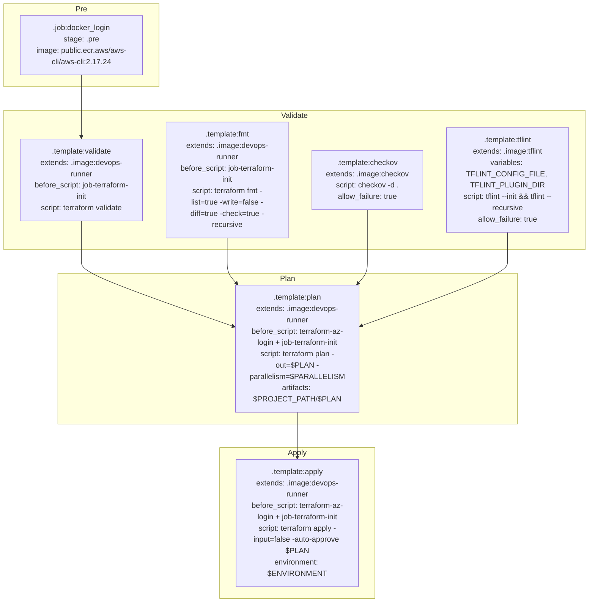
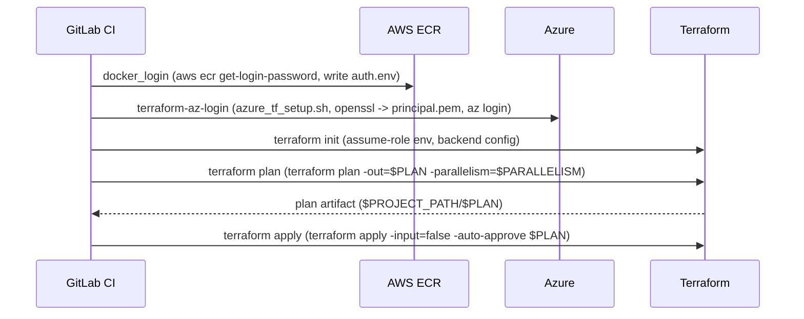

# Diagram: devops/terraform/gitlab/templates/.template.gitlab-ci.yml

> Auto-generated by Obscura crawlers

## Diagram 1

### SVG

<svg id="container" width="1250.921875" xmlns="http://www.w3.org/2000/svg" class="flowchart" height="1326" viewBox="0 0 1250.921875 1326" role="graphics-document document" aria-roledescription="flowchart-v2"><g><marker id="container_flowchart-v2-pointEnd" class="marker flowchart-v2" viewBox="0 0 10 10" refX="5" refY="5" markerUnits="userSpaceOnUse" markerWidth="8" markerHeight="8" orient="auto"><path d="M 0 0 L 10 5 L 0 10 z" class="arrowMarkerPath" style="stroke-width: 1; stroke-dasharray: 1, 0;"></path></marker><marker id="container_flowchart-v2-pointStart" class="marker flowchart-v2" viewBox="0 0 10 10" refX="4.5" refY="5" markerUnits="userSpaceOnUse" markerWidth="8" markerHeight="8" orient="auto"><path d="M 0 5 L 10 10 L 10 0 z" class="arrowMarkerPath" style="stroke-width: 1; stroke-dasharray: 1, 0;"></path></marker><marker id="container_flowchart-v2-circleEnd" class="marker flowchart-v2" viewBox="0 0 10 10" refX="11" refY="5" markerUnits="userSpaceOnUse" markerWidth="11" markerHeight="11" orient="auto"><circle cx="5" cy="5" r="5" class="arrowMarkerPath" style="stroke-width: 1; stroke-dasharray: 1, 0;"></circle></marker><marker id="container_flowchart-v2-circleStart" class="marker flowchart-v2" viewBox="0 0 10 10" refX="-1" refY="5" markerUnits="userSpaceOnUse" markerWidth="11" markerHeight="11" orient="auto"><circle cx="5" cy="5" r="5" class="arrowMarkerPath" style="stroke-width: 1; stroke-dasharray: 1, 0;"></circle></marker><marker id="container_flowchart-v2-crossEnd" class="marker cross flowchart-v2" viewBox="0 0 11 11" refX="12" refY="5.2" markerUnits="userSpaceOnUse" markerWidth="11" markerHeight="11" orient="auto"><path d="M 1,1 l 9,9 M 10,1 l -9,9" class="arrowMarkerPath" style="stroke-width: 2; stroke-dasharray: 1, 0;"></path></marker><marker id="container_flowchart-v2-crossStart" class="marker cross flowchart-v2" viewBox="0 0 11 11" refX="-1" refY="5.2" markerUnits="userSpaceOnUse" markerWidth="11" markerHeight="11" orient="auto"><path d="M 1,1 l 9,9 M 10,1 l -9,9" class="arrowMarkerPath" style="stroke-width: 2; stroke-dasharray: 1, 0;"></path></marker><g class="root"><g class="clusters"><g class="cluster" id="Apply" data-look="classic"><rect style="" x="466.73046875" y="974" width="330" height="344"></rect><g class="cluster-label" transform="translate(611.44140625, 974)"><foreignObject width="40.578125" height="24">

Apply

</foreignObject></g></g><g class="cluster" id="Plan" data-look="classic"><rect style="" x="123" y="580" width="974.921875" height="344"></rect><g class="cluster-label" transform="translate(594.546875, 580)"><foreignObject width="31.828125" height="24">

Plan

</foreignObject></g></g><g class="cluster" id="Validate" data-look="classic"><rect style="" x="8" y="234" width="1234.921875" height="296"></rect><g class="cluster-label" transform="translate(596.1953125, 234)"><foreignObject width="58.53125" height="24">

Validate

</foreignObject></g></g><g class="cluster" id="Pre" data-look="classic"><rect style="" x="8" y="8" width="330" height="176"></rect><g class="cluster-label" transform="translate(161.296875, 8)"><foreignObject width="23.40625" height="24">

Pre

</foreignObject></g></g></g><g class="edgePaths"><path d="M173,159L173,163.167C173,167.333,173,175.667,173,184C173,192.333,173,200.667,173,209C173,217.333,173,225.667,173,239.333C173,253,173,272,173,281.5L173,291" id="L_docker_login_template_validate_0" class="edge-thickness-normal edge-pattern-solid edge-thickness-normal edge-pattern-solid flowchart-link" style=";" data-edge="true" data-et="edge" data-id="L_docker_login_template_validate_0" data-points="W3sieCI6MTczLCJ5IjoxNTl9LHsieCI6MTczLCJ5IjoxODR9LHsieCI6MTczLCJ5IjoyMDl9LHsieCI6MTczLCJ5IjoyMzR9LHsieCI6MTczLCJ5IjoyOTV9XQ==" marker-end="url(#container_flowchart-v2-pointEnd)"></path><path d="M173,469L173,479.167C173,489.333,173,509.667,173,524C173,538.333,173,546.667,173,555C173,563.333,173,571.667,227.164,596.142C281.328,620.617,389.657,661.235,443.821,681.544L497.985,701.852" id="L_template_validate_template_plan_0" class="edge-thickness-normal edge-pattern-solid edge-thickness-normal edge-pattern-solid flowchart-link" style=";" data-edge="true" data-et="edge" data-id="L_template_validate_template_plan_0" data-points="W3sieCI6MTczLCJ5Ijo0Njl9LHsieCI6MTczLCJ5Ijo1MzB9LHsieCI6MTczLCJ5Ijo1NTV9LHsieCI6MTczLCJ5Ijo1ODB9LHsieCI6NTAxLjczMDQ2ODc1LCJ5Ijo3MDMuMjU2NzgwMzQ2NTc0N31d" marker-end="url(#container_flowchart-v2-pointEnd)"></path><path d="M483,505L483,509.167C483,513.333,483,521.667,483,530C483,538.333,483,546.667,483,555C483,563.333,483,571.667,486.167,579.496C489.334,587.325,495.668,594.65,498.835,598.312L502.001,601.974" id="L_template_fmt_template_plan_0" class="edge-thickness-normal edge-pattern-solid edge-thickness-normal edge-pattern-solid flowchart-link" style=";" data-edge="true" data-et="edge" data-id="L_template_fmt_template_plan_0" data-points="W3sieCI6NDgzLCJ5Ijo1MDV9LHsieCI6NDgzLCJ5Ijo1MzB9LHsieCI6NDgzLCJ5Ijo1NTV9LHsieCI6NDgzLCJ5Ijo1ODB9LHsieCI6NTA0LjYxNzgwMDY5MDQwNjk3LCJ5Ijo2MDV9XQ==" marker-end="url(#container_flowchart-v2-pointEnd)"></path><path d="M780.461,445L780.461,459.167C780.461,473.333,780.461,501.667,780.461,520C780.461,538.333,780.461,546.667,780.461,555C780.461,563.333,780.461,571.667,777.294,579.496C774.127,587.325,767.793,594.65,764.626,598.312L761.459,601.974" id="L_template_checkov_template_plan_0" class="edge-thickness-normal edge-pattern-solid edge-thickness-normal edge-pattern-solid flowchart-link" style=";" data-edge="true" data-et="edge" data-id="L_template_checkov_template_plan_0" data-points="W3sieCI6NzgwLjQ2MDkzNzUsInkiOjQ0NX0seyJ4Ijo3ODAuNDYwOTM3NSwieSI6NTMwfSx7IngiOjc4MC40NjA5Mzc1LCJ5Ijo1NTV9LHsieCI6NzgwLjQ2MDkzNzUsInkiOjU4MH0seyJ4Ijo3NTguODQzMTM2ODA5NTkzLCJ5Ijo2MDV9XQ==" marker-end="url(#container_flowchart-v2-pointEnd)"></path><path d="M1077.922,493L1077.922,499.167C1077.922,505.333,1077.922,517.667,1077.922,528C1077.922,538.333,1077.922,546.667,1077.922,555C1077.922,563.333,1077.922,571.667,1025.845,595.908C973.769,620.149,869.616,660.299,817.539,680.374L765.463,700.448" id="L_template_tflint_template_plan_0" class="edge-thickness-normal edge-pattern-solid edge-thickness-normal edge-pattern-solid flowchart-link" style=";" data-edge="true" data-et="edge" data-id="L_template_tflint_template_plan_0" data-points="W3sieCI6MTA3Ny45MjE4NzUsInkiOjQ5M30seyJ4IjoxMDc3LjkyMTg3NSwieSI6NTMwfSx7IngiOjEwNzcuOTIxODc1LCJ5Ijo1NTV9LHsieCI6MTA3Ny45MjE4NzUsInkiOjU4MH0seyJ4Ijo3NjEuNzMwNDY4NzUsInkiOjcwMS44ODY5Nzc0NTY3NzM5fV0=" marker-end="url(#container_flowchart-v2-pointEnd)"></path><path d="M631.73,899L631.73,903.167C631.73,907.333,631.73,915.667,631.73,924C631.73,932.333,631.73,940.667,631.73,949C631.73,957.333,631.73,965.667,631.73,973.333C631.73,981,631.73,988,631.73,991.5L631.73,995" id="L_template_plan_template_apply_0" class="edge-thickness-normal edge-pattern-solid edge-thickness-normal edge-pattern-solid flowchart-link" style=";" data-edge="true" data-et="edge" data-id="L_template_plan_template_apply_0" data-points="W3sieCI6NjMxLjczMDQ2ODc1LCJ5Ijo4OTl9LHsieCI6NjMxLjczMDQ2ODc1LCJ5Ijo5MjR9LHsieCI6NjMxLjczMDQ2ODc1LCJ5Ijo5NDl9LHsieCI6NjMxLjczMDQ2ODc1LCJ5Ijo5NzR9LHsieCI6NjMxLjczMDQ2ODc1LCJ5Ijo5OTl9XQ==" marker-end="url(#container_flowchart-v2-pointEnd)"></path></g><g class="edgeLabels"><g class="edgeLabel"><g class="label" data-id="L_docker_login_template_validate_0" transform="translate(0, 0)"><foreignObject width="0" height="0">

</foreignObject></g></g><g class="edgeLabel"><g class="label" data-id="L_template_validate_template_plan_0" transform="translate(0, 0)"><foreignObject width="0" height="0">

</foreignObject></g></g><g class="edgeLabel"><g class="label" data-id="L_template_fmt_template_plan_0" transform="translate(0, 0)"><foreignObject width="0" height="0">

</foreignObject></g></g><g class="edgeLabel"><g class="label" data-id="L_template_checkov_template_plan_0" transform="translate(0, 0)"><foreignObject width="0" height="0">

</foreignObject></g></g><g class="edgeLabel"><g class="label" data-id="L_template_tflint_template_plan_0" transform="translate(0, 0)"><foreignObject width="0" height="0">

</foreignObject></g></g><g class="edgeLabel"><g class="label" data-id="L_template_plan_template_apply_0" transform="translate(0, 0)"><foreignObject width="0" height="0">

</foreignObject></g></g></g><g class="nodes"><g class="node default" id="flowchart-docker_login-0" transform="translate(173, 96)"><rect class="basic label-container" style="" x="-130" y="-63" width="260" height="126"></rect><g class="label" style="" transform="translate(-100, -48)"><rect></rect><foreignObject width="200" height="96">

.job:docker_login stage: .pre image: public.ecr.aws/aws-cli/aws-cli:2.17.24

</foreignObject></g></g><g class="node default" id="flowchart-template_validate-1" transform="translate(173, 382)"><rect class="basic label-container" style="" x="-130" y="-87" width="260" height="174"></rect><g class="label" style="" transform="translate(-100, -72)"><rect></rect><foreignObject width="200" height="144">

.template:validate extends: .image:devops-runner before_script: job-terraform-init script: terraform validate

</foreignObject></g></g><g class="node default" id="flowchart-template_fmt-2" transform="translate(483, 382)"><rect class="basic label-container" style="" x="-130" y="-123" width="260" height="246"></rect><g class="label" style="" transform="translate(-100, -108)"><rect></rect><foreignObject width="200" height="216">

.template:fmt extends: .image:devops-runner before_script: job-terraform-init script: terraform fmt -list=true -write=false -diff=true -check=true -recursive

</foreignObject></g></g><g class="node default" id="flowchart-template_checkov-3" transform="translate(780.4609375, 382)"><rect class="basic label-container" style="" x="-117.4609375" y="-63" width="234.921875" height="126"></rect><g class="label" style="" transform="translate(-87.4609375, -48)"><rect></rect><foreignObject width="174.921875" height="96">

.template:checkov extends: .image:checkov script: checkov -d . allow_failure: true

</foreignObject></g></g><g class="node default" id="flowchart-template_tflint-4" transform="translate(1077.921875, 382)"><rect class="basic label-container" style="" x="-130" y="-111" width="260" height="222"></rect><g class="label" style="" transform="translate(-100, -96)"><rect></rect><foreignObject width="200" height="192">

.template:tflint extends: .image:tflint variables: TFLINT_CONFIG_FILE, TFLINT_PLUGIN_DIR script: tflint --init &amp;&amp; tflint --recursive allow_failure: true

</foreignObject></g></g><g class="node default" id="flowchart-template_plan-5" transform="translate(631.73046875, 752)"><rect class="basic label-container" style="" x="-130" y="-147" width="260" height="294"></rect><g class="label" style="" transform="translate(-100, -132)"><rect></rect><foreignObject width="200" height="264">

.template:plan extends: .image:devops-runner before_script: terraform-az-login + job-terraform-init script: terraform plan -out=$PLAN -parallelism=$PARALLELISM artifacts: $PROJECT_PATH/$PLAN

</foreignObject></g></g><g class="node default" id="flowchart-template_apply-6" transform="translate(631.73046875, 1146)"><rect class="basic label-container" style="" x="-130" y="-147" width="260" height="294"></rect><g class="label" style="" transform="translate(-100, -132)"><rect></rect><foreignObject width="200" height="264">

.template:apply extends: .image:devops-runner before_script: terraform-az-login + job-terraform-init script: terraform apply -input=false -auto-approve $PLAN environment: $ENVIRONMENT

</foreignObject></g></g></g></g></g></svg>

## Diagram 2

```mermaid
classDiagram
  class Image_devops_runner {
    +name: DEVOPS_RUNNER_REGISTRY
    +entrypoint: ""
  }
  class Image_tflint {
    +name: TFLINT_REGISTRY
    +entrypoint: ""
  }
  class Image_docker_login {
    +name: public.ecr.aws/e9a0l2a3/docker-aws-login:20240626143555
    +entrypoint: ""
  }
  class Image_checkov {
    +name: bridgecrew/checkov:latest
    +entrypoint: /usr/bin/env PATH=/usr/local/sbin:/usr/local/bin:/usr/sbin:/usr/bin:/sbin:/bin
  }
  class Job_terraform_init {
    +commands: assume-role env export; cd $CI_PROJECT_DIR/$PROJECT_PATH; terraform init -backend-config=...
  }
  class Job_terraform_az_login {
    +commands: azure_tf_setup.sh; openssl pkcs12; az login --service-principal
  }
  class Job_assume_role {
    +commands: aws sts assume-role -> export creds
  }
  class Job_unassume_role {
    +commands: unset AWS_ACCESS_KEY_ID, AWS_SECRET_ACCESS_KEY, AWS_SESSION_TOKEN
  }
  class Template_validate {
    +stage: validate
    +before_script: Job_terraform_init
    +script: terraform validate
  }
  class Template_fmt {
    +stage: validate
    +before_script: Job_terraform_init
    +script: terraform fmt -check
  }
  class Template_checkov {
    +stage: validate
    +script: checkov -d .
  }
  class Template_tflint {
    +stage: validate
    +variables: TFLINT_CONFIG_FILE, TFLINT_PLUGIN_DIR
    +script: tflint --recursive
  }
  class Template_plan {
    +stage: plan
    +before_script: Job_terraform_az_login, Job_terraform_init
    +script: terraform plan -out=$PLAN
  }
  class Template_apply {
    +stage: apply
    +before_script: Job_terraform_az_login, Job_terraform_init
    +script: terraform apply -auto-approve $PLAN
    +environment: $ENVIRONMENT
  }
  Template_validate --|> Image_devops_runner
  Template_fmt --|> Image_devops_runner
  Template_plan --|> Image_devops_runner
  Template_apply --|> Image_devops_runner
  Template_tflint --|> Image_tflint
  Template_checkov --|> Image_checkov
  Template_validate ..> Job_terraform_init : uses
  Template_plan ..> Job_terraform_az_login : uses
  Template_plan ..> Job_terraform_init : uses
  Template_apply ..> Job_terraform_init : uses
  Job_assume_role ..> Job_terraform_init : used-in
  Job_unassume_role ..> Job_terraform_init : cleanup
```

### SVG

<svg id="container" width="4676.7265625" xmlns="http://www.w3.org/2000/svg" class="classDiagram" height="426" viewBox="0 0 4676.7265625 426" role="graphics-document document" aria-roledescription="class"><g><defs><marker id="container_class-aggregationStart" class="marker aggregation class" refX="18" refY="7" markerWidth="190" markerHeight="240" orient="auto"><path d="M 18,7 L9,13 L1,7 L9,1 Z"></path></marker></defs><defs><marker id="container_class-aggregationEnd" class="marker aggregation class" refX="1" refY="7" markerWidth="20" markerHeight="28" orient="auto"><path d="M 18,7 L9,13 L1,7 L9,1 Z"></path></marker></defs><defs><marker id="container_class-extensionStart" class="marker extension class" refX="18" refY="7" markerWidth="190" markerHeight="240" orient="auto"><path d="M 1,7 L18,13 V 1 Z"></path></marker></defs><defs><marker id="container_class-extensionEnd" class="marker extension class" refX="1" refY="7" markerWidth="20" markerHeight="28" orient="auto"><path d="M 1,1 V 13 L18,7 Z"></path></marker></defs><defs><marker id="container_class-compositionStart" class="marker composition class" refX="18" refY="7" markerWidth="190" markerHeight="240" orient="auto"><path d="M 18,7 L9,13 L1,7 L9,1 Z"></path></marker></defs><defs><marker id="container_class-compositionEnd" class="marker composition class" refX="1" refY="7" markerWidth="20" markerHeight="28" orient="auto"><path d="M 18,7 L9,13 L1,7 L9,1 Z"></path></marker></defs><defs><marker id="container_class-dependencyStart" class="marker dependency class" refX="6" refY="7" markerWidth="190" markerHeight="240" orient="auto"><path d="M 5,7 L9,13 L1,7 L9,1 Z"></path></marker></defs><defs><marker id="container_class-dependencyEnd" class="marker dependency class" refX="13" refY="7" markerWidth="20" markerHeight="28" orient="auto"><path d="M 18,7 L9,13 L14,7 L9,1 Z"></path></marker></defs><defs><marker id="container_class-lollipopStart" class="marker lollipop class" refX="13" refY="7" markerWidth="190" markerHeight="240" orient="auto"><circle stroke="black" fill="transparent" cx="7" cy="7" r="6"></circle></marker></defs><defs><marker id="container_class-lollipopEnd" class="marker lollipop class" refX="1" refY="7" markerWidth="190" markerHeight="240" orient="auto"><circle stroke="black" fill="transparent" cx="7" cy="7" r="6"></circle></marker></defs><g class="root"><g class="clusters"></g><g class="edgePaths"><path d="M3297.829,188L3308.829,196.167C3319.828,204.333,3341.827,220.667,3347.706,233.148C3353.585,245.628,3343.344,254.257,3338.224,258.571L3333.103,262.885" id="id_Template_validate_Image_devops_runner_1" class="edge-thickness-normal edge-pattern-solid relation" style=";;;" data-edge="true" data-et="edge" data-id="id_Template_validate_Image_devops_runner_1" data-points="W3sieCI6MzI5Ny44MjkxNTI5NjA1MjYyLCJ5IjoxODh9LHsieCI6MzM2My44MjYxNzE4NzUsInkiOjIzN30seyJ4IjozMzE5LjkxMTIxMzQ0NjEwMSwieSI6Mjc0fV0=" marker-end="url(#container_class-extensionEnd)"></path><path d="M3562.961,188L3562.961,196.167C3562.961,204.333,3562.961,220.667,3541.111,236.083C3519.26,251.5,3475.559,266,3453.709,273.25L3431.859,280.5" id="id_Template_fmt_Image_devops_runner_2" class="edge-thickness-normal edge-pattern-solid relation" style=";;;" data-edge="true" data-et="edge" data-id="id_Template_fmt_Image_devops_runner_2" data-points="W3sieCI6MzU2Mi45NjA5Mzc1LCJ5IjoxODh9LHsieCI6MzU2Mi45NjA5Mzc1LCJ5IjoyMzd9LHsieCI6MzQxNS40ODYzMjgxMjUsInkiOjI4NS45MzI4NjM2NDA0MTc0fV0=" marker-end="url(#container_class-extensionEnd)"></path><path d="M2852.682,188L2865.942,196.167C2879.203,204.333,2905.723,220.667,2936.476,235.142C2967.228,249.618,3002.213,262.236,3019.705,268.545L3037.197,274.854" id="id_Template_plan_Image_devops_runner_3" class="edge-thickness-normal edge-pattern-solid relation" style=";;;" data-edge="true" data-et="edge" data-id="id_Template_plan_Image_devops_runner_3" data-points="W3sieCI6Mjg1Mi42ODE3NDM0MjEwNTI1LCJ5IjoxODh9LHsieCI6MjkzMi4yNDQxNDA2MjUsInkiOjIzN30seyJ4IjozMDUzLjQyMzgyODEyNSwieSI6MjgwLjcwNjUxMTkwNDQ1NDE1fV0=" marker-end="url(#container_class-extensionEnd)"></path><path d="M2331.043,200L2341.771,206.167C2352.5,212.333,2373.958,224.667,2491.504,244.71C2609.05,264.753,2822.684,292.507,2929.501,306.383L3036.318,320.26" id="id_Template_apply_Image_devops_runner_4" class="edge-thickness-normal edge-pattern-solid relation" style=";;;" data-edge="true" data-et="edge" data-id="id_Template_apply_Image_devops_runner_4" data-points="W3sieCI6MjMzMS4wNDI1NTc1NjU3ODk2LCJ5IjoyMDB9LHsieCI6MjM5NS40MTYwMTU2MjUsInkiOjIzN30seyJ4IjozMDUzLjQyMzgyODEyNSwieSI6MzIyLjQ4MjEzNjM3MjUyNDR9XQ==" marker-end="url(#container_class-extensionEnd)"></path><path d="M4440.098,188L4440.098,196.167C4440.098,204.333,4440.098,220.667,4440.098,232.125C4440.098,243.583,4440.098,250.167,4440.098,253.458L4440.098,256.75" id="id_Template_tflint_Image_tflint_5" class="edge-thickness-normal edge-pattern-solid relation" style=";;;" data-edge="true" data-et="edge" data-id="id_Template_tflint_Image_tflint_5" data-points="W3sieCI6NDQ0MC4wOTc2NTYyNSwieSI6MTg4fSx7IngiOjQ0NDAuMDk3NjU2MjUsInkiOjIzN30seyJ4Ijo0NDQwLjA5NzY1NjI1LCJ5IjoyNzR9XQ==" marker-end="url(#container_class-extensionEnd)"></path><path d="M3890.754,176L3890.754,186.167C3890.754,196.333,3890.754,216.667,3890.754,230.125C3890.754,243.583,3890.754,250.167,3890.754,253.458L3890.754,256.75" id="id_Template_checkov_Image_checkov_6" class="edge-thickness-normal edge-pattern-solid relation" style=";;;" data-edge="true" data-et="edge" data-id="id_Template_checkov_Image_checkov_6" data-points="W3sieCI6Mzg5MC43NTM5MDYyNSwieSI6MTc2fSx7IngiOjM4OTAuNzUzOTA2MjUsInkiOjIzN30seyJ4IjozODkwLjc1MzkwNjI1LCJ5IjoyNzR9XQ==" marker-end="url(#container_class-extensionEnd)"></path><path d="M3048.299,188L3035.038,196.167C3021.778,204.333,2995.257,220.667,2862.931,240.028C2730.606,259.39,2492.475,281.78,2373.41,292.975L2254.345,304.171" id="id_Template_validate_Job_terraform_init_7" class="edge-thickness-normal edge-pattern-dashed relation" style=";;;" data-edge="true" data-et="edge" data-id="id_Template_validate_Job_terraform_init_7" data-points="W3sieCI6MzA0OC4yOTg3MjUzMjg5NDc1LCJ5IjoxODh9LHsieCI6Mjk2OC43MzYzMjgxMjUsInkiOjIzN30seyJ4IjoyMjQ4LjM3MTA5Mzc1LCJ5IjozMDQuNzMyMjU3ODc0Mjk3NjZ9XQ==" marker-end="url(#container_class-dependencyEnd)"></path><path d="M2654.206,188L2648.17,196.167C2642.134,204.333,2630.062,220.667,2624.405,236.001C2618.748,251.336,2619.505,265.672,2619.884,272.84L2620.263,280.008" id="id_Template_plan_Job_terraform_az_login_8" class="edge-thickness-normal edge-pattern-dashed relation" style=";;;" data-edge="true" data-et="edge" data-id="id_Template_plan_Job_terraform_az_login_8" data-points="W3sieCI6MjY1NC4yMDU1OTIxMDUyNjMzLCJ5IjoxODh9LHsieCI6MjYxNy45OTAyMzQzNzUsInkiOjIzN30seyJ4IjoyNjIwLjU3OTQ4NjgxMTkyNjUsInkiOjI4Nn1d" marker-end="url(#container_class-dependencyEnd)"></path><path d="M2536.68,188L2519.218,196.167C2501.756,204.333,2466.832,220.667,2403.72,236.828C2340.607,252.988,2249.307,268.977,2203.656,276.971L2158.006,284.965" id="id_Template_plan_Job_terraform_init_9" class="edge-thickness-normal edge-pattern-dashed relation" style=";;;" data-edge="true" data-et="edge" data-id="id_Template_plan_Job_terraform_init_9" data-points="W3sieCI6MjUzNi42ODAwOTg2ODQyMTA0LCJ5IjoxODh9LHsieCI6MjQzMS45MDgyMDMxMjUsInkiOjIzN30seyJ4IjoyMTUyLjA5NTk3MTkwMzY2OTYsInkiOjI4Nn1d" marker-end="url(#container_class-dependencyEnd)"></path><path d="M1998.506,200L1987.874,206.167C1977.243,212.333,1955.979,224.667,1936.717,238.344C1917.456,252.02,1900.197,267.041,1891.567,274.551L1882.938,282.061" id="id_Template_apply_Job_terraform_init_10" class="edge-thickness-normal edge-pattern-dashed relation" style=";;;" data-edge="true" data-et="edge" data-id="id_Template_apply_Job_terraform_init_10" data-points="W3sieCI6MTk5OC41MDYzNzMzNTUyNjMxLCJ5IjoyMDB9LHsieCI6MTkzNC43MTQ4NDM3NSwieSI6MjM3fSx7IngiOjE4NzguNDExNTUzODk5MDgyNSwieSI6Mjg2fV0=" marker-end="url(#container_class-dependencyEnd)"></path><path d="M1641.207,164L1641.207,176.167C1641.207,188.333,1641.207,212.667,1652.975,232.456C1664.742,252.246,1688.277,267.492,1700.044,275.115L1711.812,282.738" id="id_Job_assume_role_Job_terraform_init_11" class="edge-thickness-normal edge-pattern-dashed relation" style=";;;" data-edge="true" data-et="edge" data-id="id_Job_assume_role_Job_terraform_init_11" data-points="W3sieCI6MTY0MS4yMDcwMzEyNSwieSI6MTY0fSx7IngiOjE2NDEuMjA3MDMxMjUsInkiOjIzN30seyJ4IjoxNzE2Ljg0NzYyMDQxMjg0NCwieSI6Mjg2fV0=" marker-end="url(#container_class-dependencyEnd)"></path><path d="M1001.805,164L1001.805,176.167C1001.805,188.333,1001.805,212.667,1062.274,232.994C1122.743,253.322,1243.682,269.643,1304.151,277.804L1364.62,285.965" id="id_Job_unassume_role_Job_terraform_init_12" class="edge-thickness-normal edge-pattern-dashed relation" style=";;;" data-edge="true" data-et="edge" data-id="id_Job_unassume_role_Job_terraform_init_12" data-points="W3sieCI6MTAwMS44MDQ2ODc1LCJ5IjoxNjR9LHsieCI6MTAwMS44MDQ2ODc1LCJ5IjoyMzd9LHsieCI6MTM3MC41NjY0MDYyNSwieSI6Mjg2Ljc2NzAxMjMxMzY3NDd9XQ==" marker-end="url(#container_class-dependencyEnd)"></path></g><g class="edgeLabels"><g class="edgeLabel"><g class="label" data-id="id_Template_validate_Image_devops_runner_1" transform="translate(0, 0)"><foreignObject width="0" height="0">

</foreignObject></g></g><g class="edgeLabel"><g class="label" data-id="id_Template_fmt_Image_devops_runner_2" transform="translate(0, 0)"><foreignObject width="0" height="0">

</foreignObject></g></g><g class="edgeLabel"><g class="label" data-id="id_Template_plan_Image_devops_runner_3" transform="translate(0, 0)"><foreignObject width="0" height="0">

</foreignObject></g></g><g class="edgeLabel"><g class="label" data-id="id_Template_apply_Image_devops_runner_4" transform="translate(0, 0)"><foreignObject width="0" height="0">

</foreignObject></g></g><g class="edgeLabel"><g class="label" data-id="id_Template_tflint_Image_tflint_5" transform="translate(0, 0)"><foreignObject width="0" height="0">

</foreignObject></g></g><g class="edgeLabel"><g class="label" data-id="id_Template_checkov_Image_checkov_6" transform="translate(0, 0)"><foreignObject width="0" height="0">

</foreignObject></g></g><g class="edgeLabel" transform="translate(2968.736328125, 237)"><g class="label" data-id="id_Template_validate_Job_terraform_init_7" transform="translate(-16.4921875, -12)"><foreignObject width="32.984375" height="24">

uses

</foreignObject></g></g><g class="edgeLabel" transform="translate(2621.51554, 232.23019)"><g class="label" data-id="id_Template_plan_Job_terraform_az_login_8" transform="translate(-16.4921875, -12)"><foreignObject width="32.984375" height="24">

uses

</foreignObject></g></g><g class="edgeLabel" transform="translate(2431.908203125, 237)"><g class="label" data-id="id_Template_plan_Job_terraform_init_9" transform="translate(-16.4921875, -12)"><foreignObject width="32.984375" height="24">

uses

</foreignObject></g></g><g class="edgeLabel" transform="translate(1934.37754, 237.29355)"><g class="label" data-id="id_Template_apply_Job_terraform_init_10" transform="translate(-16.4921875, -12)"><foreignObject width="32.984375" height="24">

uses

</foreignObject></g></g><g class="edgeLabel" transform="translate(1641.20703125, 237)"><g class="label" data-id="id_Job_assume_role_Job_terraform_init_11" transform="translate(-27.7109375, -12)"><foreignObject width="55.421875" height="24">

used-in

</foreignObject></g></g><g class="edgeLabel" transform="translate(1001.8046875, 237)"><g class="label" data-id="id_Job_unassume_role_Job_terraform_init_12" transform="translate(-28.859375, -12)"><foreignObject width="57.71875" height="24">

cleanup

</foreignObject></g></g></g><g class="nodes"><g class="node default" id="classId-Image_devops_runner-0" transform="translate(3234.455078125, 346)"><g class="basic label-container"><path d="M-181.03125 -72 L181.03125 -72 L181.03125 72 L-181.03125 72" stroke="none" stroke-width="0" fill="#ECECFF" style=""></path><path d="M-181.03125 -72 C-75.75173323582428 -72, 29.52778352835145 -72, 181.03125 -72 M-181.03125 -72 C-50.60764107112922 -72, 79.81596785774155 -72, 181.03125 -72 M181.03125 -72 C181.03125 -14.734703703305897, 181.03125 42.53059259338821, 181.03125 72 M181.03125 -72 C181.03125 -42.67621447921165, 181.03125 -13.352428958423303, 181.03125 72 M181.03125 72 C103.4945978348391 72, 25.957945669678196 72, -181.03125 72 M181.03125 72 C83.0134436206302 72, -15.004362758739603 72, -181.03125 72 M-181.03125 72 C-181.03125 20.824096975578037, -181.03125 -30.351806048843926, -181.03125 -72 M-181.03125 72 C-181.03125 24.289046573326544, -181.03125 -23.42190685334691, -181.03125 -72" stroke="#9370DB" stroke-width="1.3" fill="none" stroke-dasharray="0 0" style=""></path></g><g class="annotation-group text" transform="translate(0, -48)"></g><g class="label-group text" transform="translate(-81.046875, -48)"><g class="label" style="font-weight: bolder" transform="translate(0,-12)"><foreignObject width="162.09375" height="24">

Image_devops_runner

</foreignObject></g></g><g class="members-group text" transform="translate(-169.03125, 0)"><g class="label" style="" transform="translate(0,-12)"><foreignObject width="257.015625" height="24">

+name: DEVOPS_RUNNER_REGISTRY

</foreignObject></g><g class="label" style="" transform="translate(0,12)"><foreignObject width="105.34375" height="24">

+entrypoint: ""

</foreignObject></g></g><g class="methods-group text" transform="translate(-169.03125, 72)"></g><g class="divider" style=""><path d="M-181.03125 -24 C-58.89632397859755 -24, 63.2386020428049 -24, 181.03125 -24 M-181.03125 -24 C-44.08764439193453 -24, 92.85596121613094 -24, 181.03125 -24" stroke="#9370DB" stroke-width="1.3" fill="none" stroke-dasharray="0 0" style=""></path></g><g class="divider" style=""><path d="M-181.03125 48 C-96.75827217502882 48, -12.485294350057643 48, 181.03125 48 M-181.03125 48 C-69.1394150542089 48, 42.75241989158221 48, 181.03125 48" stroke="#9370DB" stroke-width="1.3" fill="none" stroke-dasharray="0 0" style=""></path></g></g><g class="node default" id="classId-Image_tflint-1" transform="translate(4440.09765625, 346)"><g class="basic label-container"><path d="M-123.83984375 -72 L123.83984375 -72 L123.83984375 72 L-123.83984375 72" stroke="none" stroke-width="0" fill="#ECECFF" style=""></path><path d="M-123.83984375 -72 C-40.98421156350291 -72, 41.87142062299418 -72, 123.83984375 -72 M-123.83984375 -72 C-55.13297014549636 -72, 13.573903459007283 -72, 123.83984375 -72 M123.83984375 -72 C123.83984375 -24.157821907630485, 123.83984375 23.68435618473903, 123.83984375 72 M123.83984375 -72 C123.83984375 -30.548598257555753, 123.83984375 10.902803484888494, 123.83984375 72 M123.83984375 72 C40.66067822177662 72, -42.51848730644676 72, -123.83984375 72 M123.83984375 72 C35.768661654105955 72, -52.30252044178809 72, -123.83984375 72 M-123.83984375 72 C-123.83984375 25.910708489420514, -123.83984375 -20.17858302115897, -123.83984375 -72 M-123.83984375 72 C-123.83984375 20.61028121798322, -123.83984375 -30.779437564033557, -123.83984375 -72" stroke="#9370DB" stroke-width="1.3" fill="none" stroke-dasharray="0 0" style=""></path></g><g class="annotation-group text" transform="translate(0, -48)"></g><g class="label-group text" transform="translate(-43.9921875, -48)"><g class="label" style="font-weight: bolder" transform="translate(0,-12)"><foreignObject width="87.984375" height="24">

Image_tflint

</foreignObject></g></g><g class="members-group text" transform="translate(-111.83984375, 0)"><g class="label" style="" transform="translate(0,-12)"><foreignObject width="179.6875" height="24">

+name: TFLINT_REGISTRY

</foreignObject></g><g class="label" style="" transform="translate(0,12)"><foreignObject width="105.34375" height="24">

+entrypoint: ""

</foreignObject></g></g><g class="methods-group text" transform="translate(-111.83984375, 72)"></g><g class="divider" style=""><path d="M-123.83984375 -24 C-33.44279755658579 -24, 56.954248636828424 -24, 123.83984375 -24 M-123.83984375 -24 C-36.07367850597113 -24, 51.69248673805774 -24, 123.83984375 -24" stroke="#9370DB" stroke-width="1.3" fill="none" stroke-dasharray="0 0" style=""></path></g><g class="divider" style=""><path d="M-123.83984375 48 C-41.443849184493544 48, 40.95214538101291 48, 123.83984375 48 M-123.83984375 48 C-30.12482760560495 48, 63.5901885387901 48, 123.83984375 48" stroke="#9370DB" stroke-width="1.3" fill="none" stroke-dasharray="0 0" style=""></path></g></g><g class="node default" id="classId-Image_docker_login-2" transform="translate(295.52734375, 104)"><g class="basic label-container"><path d="M-287.52734375 -72 L287.52734375 -72 L287.52734375 72 L-287.52734375 72" stroke="none" stroke-width="0" fill="#ECECFF" style=""></path><path d="M-287.52734375 -72 C-74.01579350017079 -72, 139.49575674965843 -72, 287.52734375 -72 M-287.52734375 -72 C-144.64558786065376 -72, -1.7638319713075248 -72, 287.52734375 -72 M287.52734375 -72 C287.52734375 -40.64204423072782, 287.52734375 -9.284088461455639, 287.52734375 72 M287.52734375 -72 C287.52734375 -18.588784355417708, 287.52734375 34.822431289164584, 287.52734375 72 M287.52734375 72 C167.8321591434686 72, 48.1369745369372 72, -287.52734375 72 M287.52734375 72 C122.86466850634719 72, -41.79800673730563 72, -287.52734375 72 M-287.52734375 72 C-287.52734375 30.007293770165674, -287.52734375 -11.985412459668652, -287.52734375 -72 M-287.52734375 72 C-287.52734375 15.220045834533906, -287.52734375 -41.55990833093219, -287.52734375 -72" stroke="#9370DB" stroke-width="1.3" fill="none" stroke-dasharray="0 0" style=""></path></g><g class="annotation-group text" transform="translate(0, -48)"></g><g class="label-group text" transform="translate(-72.8671875, -48)"><g class="label" style="font-weight: bolder" transform="translate(0,-12)"><foreignObject width="145.734375" height="24">

Image_docker_login

</foreignObject></g></g><g class="members-group text" transform="translate(-275.52734375, 0)"><g class="label" style="" transform="translate(0,-12)"><foreignObject width="478.1875" height="24">

+name: public.ecr.aws/e9a0l2a3/docker-aws-login:20240626143555

</foreignObject></g><g class="label" style="" transform="translate(0,12)"><foreignObject width="105.34375" height="24">

+entrypoint: ""

</foreignObject></g></g><g class="methods-group text" transform="translate(-275.52734375, 72)"></g><g class="divider" style=""><path d="M-287.52734375 -24 C-134.19349702473892 -24, 19.140349700522165 -24, 287.52734375 -24 M-287.52734375 -24 C-88.68278636834188 -24, 110.16177101331624 -24, 287.52734375 -24" stroke="#9370DB" stroke-width="1.3" fill="none" stroke-dasharray="0 0" style=""></path></g><g class="divider" style=""><path d="M-287.52734375 48 C-94.40440816104268 48, 98.71852742791464 48, 287.52734375 48 M-287.52734375 48 C-134.19248628003967 48, 19.142371189920652 48, 287.52734375 48" stroke="#9370DB" stroke-width="1.3" fill="none" stroke-dasharray="0 0" style=""></path></g></g><g class="node default" id="classId-Image_checkov-3" transform="translate(3890.75390625, 346)"><g class="basic label-container"><path d="M-375.50390625 -72 L375.50390625 -72 L375.50390625 72 L-375.50390625 72" stroke="none" stroke-width="0" fill="#ECECFF" style=""></path><path d="M-375.50390625 -72 C-114.73936201409794 -72, 146.02518222180413 -72, 375.50390625 -72 M-375.50390625 -72 C-139.228125578637 -72, 97.04765509272602 -72, 375.50390625 -72 M375.50390625 -72 C375.50390625 -36.6032026119331, 375.50390625 -1.2064052238661986, 375.50390625 72 M375.50390625 -72 C375.50390625 -27.306298921191775, 375.50390625 17.38740215761645, 375.50390625 72 M375.50390625 72 C124.51604365536005 72, -126.4718189392799 72, -375.50390625 72 M375.50390625 72 C122.32494661511649 72, -130.85401301976702 72, -375.50390625 72 M-375.50390625 72 C-375.50390625 29.49767799874644, -375.50390625 -13.00464400250712, -375.50390625 -72 M-375.50390625 72 C-375.50390625 24.223201679071067, -375.50390625 -23.553596641857865, -375.50390625 -72" stroke="#9370DB" stroke-width="1.3" fill="none" stroke-dasharray="0 0" style=""></path></g><g class="annotation-group text" transform="translate(0, -48)"></g><g class="label-group text" transform="translate(-55.6171875, -48)"><g class="label" style="font-weight: bolder" transform="translate(0,-12)"><foreignObject width="111.234375" height="24">

Image_checkov

</foreignObject></g></g><g class="members-group text" transform="translate(-363.50390625, 0)"><g class="label" style="" transform="translate(0,-12)"><foreignObject width="247.5" height="24">

+name: bridgecrew/checkov:latest

</foreignObject></g><g class="label" style="" transform="translate(0,12)"><foreignObject width="671.390625" height="24">

+entrypoint: /usr/bin/env PATH=/usr/local/sbin:/usr/local/bin:/usr/sbin:/usr/bin:/sbin:/bin

</foreignObject></g></g><g class="methods-group text" transform="translate(-363.50390625, 72)"></g><g class="divider" style=""><path d="M-375.50390625 -24 C-105.87284523069656 -24, 163.7582157886069 -24, 375.50390625 -24 M-375.50390625 -24 C-86.9276848183805 -24, 201.648536613239 -24, 375.50390625 -24" stroke="#9370DB" stroke-width="1.3" fill="none" stroke-dasharray="0 0" style=""></path></g><g class="divider" style=""><path d="M-375.50390625 48 C-95.49430230505772 48, 184.51530163988457 48, 375.50390625 48 M-375.50390625 48 C-192.21225200002638 48, -8.920597750052764 48, 375.50390625 48" stroke="#9370DB" stroke-width="1.3" fill="none" stroke-dasharray="0 0" style=""></path></g></g><g class="node default" id="classId-Job_terraform_init-4" transform="translate(1809.46875, 346)"><g class="basic label-container"><path d="M-438.90234375 -60 L438.90234375 -60 L438.90234375 60 L-438.90234375 60" stroke="none" stroke-width="0" fill="#ECECFF" style=""></path><path d="M-438.90234375 -60 C-259.8985768459404 -60, -80.89480994188085 -60, 438.90234375 -60 M-438.90234375 -60 C-124.29975229066895 -60, 190.3028391686621 -60, 438.90234375 -60 M438.90234375 -60 C438.90234375 -25.694797483493744, 438.90234375 8.610405033012512, 438.90234375 60 M438.90234375 -60 C438.90234375 -16.193227847552464, 438.90234375 27.613544304895072, 438.90234375 60 M438.90234375 60 C179.2021564388338 60, -80.49803087233238 60, -438.90234375 60 M438.90234375 60 C175.09213302285968 60, -88.71807770428063 60, -438.90234375 60 M-438.90234375 60 C-438.90234375 15.233255167526629, -438.90234375 -29.533489664946742, -438.90234375 -60 M-438.90234375 60 C-438.90234375 20.87139726506527, -438.90234375 -18.25720546986946, -438.90234375 -60" stroke="#9370DB" stroke-width="1.3" fill="none" stroke-dasharray="0 0" style=""></path></g><g class="annotation-group text" transform="translate(0, -36)"></g><g class="label-group text" transform="translate(-67.4921875, -36)"><g class="label" style="font-weight: bolder" transform="translate(0,-12)"><foreignObject width="134.984375" height="24">

Job_terraform_init

</foreignObject></g></g><g class="members-group text" transform="translate(-426.90234375, 12)"><g class="label" style="" transform="translate(0,-12)"><foreignObject width="786.3125" height="24">

+commands: assume-role env export; cd $CI_PROJECT_DIR/$PROJECT_PATH; terraform init -backend-config=...

</foreignObject></g></g><g class="methods-group text" transform="translate(-426.90234375, 60)"></g><g class="divider" style=""><path d="M-438.90234375 -12 C-131.51946169199482 -12, 175.86342036601036 -12, 438.90234375 -12 M-438.90234375 -12 C-220.10268170616726 -12, -1.3030196623345205 -12, 438.90234375 -12" stroke="#9370DB" stroke-width="1.3" fill="none" stroke-dasharray="0 0" style=""></path></g><g class="divider" style=""><path d="M-438.90234375 36 C-184.61328304464445 36, 69.6757776607111 36, 438.90234375 36 M-438.90234375 36 C-241.18939155099858 36, -43.47643935199716 36, 438.90234375 36" stroke="#9370DB" stroke-width="1.3" fill="none" stroke-dasharray="0 0" style=""></path></g></g><g class="node default" id="classId-Job_terraform_az_login-5" transform="translate(2623.75, 346)"><g class="basic label-container"><path d="M-325.37890625 -60 L325.37890625 -60 L325.37890625 60 L-325.37890625 60" stroke="none" stroke-width="0" fill="#ECECFF" style=""></path><path d="M-325.37890625 -60 C-159.65644187594918 -60, 6.066022498101631 -60, 325.37890625 -60 M-325.37890625 -60 C-102.76912720628667 -60, 119.84065183742666 -60, 325.37890625 -60 M325.37890625 -60 C325.37890625 -28.52032120494615, 325.37890625 2.9593575901077003, 325.37890625 60 M325.37890625 -60 C325.37890625 -30.42126951523163, 325.37890625 -0.8425390304632572, 325.37890625 60 M325.37890625 60 C123.38272182554348 60, -78.61346259891303 60, -325.37890625 60 M325.37890625 60 C133.52173334468125 60, -58.3354395606375 60, -325.37890625 60 M-325.37890625 60 C-325.37890625 16.653390102179976, -325.37890625 -26.693219795640047, -325.37890625 -60 M-325.37890625 60 C-325.37890625 35.343195052778, -325.37890625 10.686390105556008, -325.37890625 -60" stroke="#9370DB" stroke-width="1.3" fill="none" stroke-dasharray="0 0" style=""></path></g><g class="annotation-group text" transform="translate(0, -36)"></g><g class="label-group text" transform="translate(-85.5390625, -36)"><g class="label" style="font-weight: bolder" transform="translate(0,-12)"><foreignObject width="171.078125" height="24">

Job_terraform_az_login

</foreignObject></g></g><g class="members-group text" transform="translate(-313.37890625, 12)"><g class="label" style="" transform="translate(0,-12)"><foreignObject width="541.21875" height="24">

+commands: azure_tf_setup.sh; openssl pkcs12; az login --service-principal

</foreignObject></g></g><g class="methods-group text" transform="translate(-313.37890625, 60)"></g><g class="divider" style=""><path d="M-325.37890625 -12 C-66.01907162400153 -12, 193.34076300199695 -12, 325.37890625 -12 M-325.37890625 -12 C-188.9454676513869 -12, -52.51202905277381 -12, 325.37890625 -12" stroke="#9370DB" stroke-width="1.3" fill="none" stroke-dasharray="0 0" style=""></path></g><g class="divider" style=""><path d="M-325.37890625 36 C-166.8414276547707 36, -8.303949059541424 36, 325.37890625 36 M-325.37890625 36 C-120.62554448290001 36, 84.12781728419998 36, 325.37890625 36" stroke="#9370DB" stroke-width="1.3" fill="none" stroke-dasharray="0 0" style=""></path></g></g><g class="node default" id="classId-Job_assume_role-6" transform="translate(1641.20703125, 104)"><g class="basic label-container"><path d="M-220.65234375 -60 L220.65234375 -60 L220.65234375 60 L-220.65234375 60" stroke="none" stroke-width="0" fill="#ECECFF" style=""></path><path d="M-220.65234375 -60 C-65.19216267391934 -60, 90.26801840216132 -60, 220.65234375 -60 M-220.65234375 -60 C-77.93433653138334 -60, 64.78367068723333 -60, 220.65234375 -60 M220.65234375 -60 C220.65234375 -14.32047617236126, 220.65234375 31.35904765527748, 220.65234375 60 M220.65234375 -60 C220.65234375 -26.083873302520267, 220.65234375 7.832253394959466, 220.65234375 60 M220.65234375 60 C102.9843411970621 60, -14.683661355875813 60, -220.65234375 60 M220.65234375 60 C110.31947608172491 60, -0.013391586550170587 60, -220.65234375 60 M-220.65234375 60 C-220.65234375 22.09324747594112, -220.65234375 -15.813505048117761, -220.65234375 -60 M-220.65234375 60 C-220.65234375 25.405598552340308, -220.65234375 -9.188802895319384, -220.65234375 -60" stroke="#9370DB" stroke-width="1.3" fill="none" stroke-dasharray="0 0" style=""></path></g><g class="annotation-group text" transform="translate(0, -36)"></g><g class="label-group text" transform="translate(-61.9453125, -36)"><g class="label" style="font-weight: bolder" transform="translate(0,-12)"><foreignObject width="123.890625" height="24">

Job_assume_role

</foreignObject></g></g><g class="members-group text" transform="translate(-208.65234375, 12)"><g class="label" style="" transform="translate(0,-12)"><foreignObject width="355.359375" height="24">

+commands: aws sts assume-role -&gt; export creds

</foreignObject></g></g><g class="methods-group text" transform="translate(-208.65234375, 60)"></g><g class="divider" style=""><path d="M-220.65234375 -12 C-90.53818922189612 -12, 39.57596530620776 -12, 220.65234375 -12 M-220.65234375 -12 C-122.39116253187693 -12, -24.12998131375386 -12, 220.65234375 -12" stroke="#9370DB" stroke-width="1.3" fill="none" stroke-dasharray="0 0" style=""></path></g><g class="divider" style=""><path d="M-220.65234375 36 C-122.83093263641608 36, -25.00952152283216 36, 220.65234375 36 M-220.65234375 36 C-51.75644912033684 36, 117.13944550932632 36, 220.65234375 36" stroke="#9370DB" stroke-width="1.3" fill="none" stroke-dasharray="0 0" style=""></path></g></g><g class="node default" id="classId-Job_unassume_role-7" transform="translate(1001.8046875, 104)"><g class="basic label-container"><path d="M-368.75 -60 L368.75 -60 L368.75 60 L-368.75 60" stroke="none" stroke-width="0" fill="#ECECFF" style=""></path><path d="M-368.75 -60 C-93.54206560850338 -60, 181.66586878299324 -60, 368.75 -60 M-368.75 -60 C-94.17925035648364 -60, 180.39149928703273 -60, 368.75 -60 M368.75 -60 C368.75 -29.308632577678694, 368.75 1.3827348446426129, 368.75 60 M368.75 -60 C368.75 -33.52717579358818, 368.75 -7.054351587176356, 368.75 60 M368.75 60 C94.77663854117014 60, -179.1967229176597 60, -368.75 60 M368.75 60 C177.6303813759819 60, -13.489237248036204 60, -368.75 60 M-368.75 60 C-368.75 19.275520405955305, -368.75 -21.44895918808939, -368.75 -60 M-368.75 60 C-368.75 27.601194213129915, -368.75 -4.79761157374017, -368.75 -60" stroke="#9370DB" stroke-width="1.3" fill="none" stroke-dasharray="0 0" style=""></path></g><g class="annotation-group text" transform="translate(0, -36)"></g><g class="label-group text" transform="translate(-71.140625, -36)"><g class="label" style="font-weight: bolder" transform="translate(0,-12)"><foreignObject width="142.28125" height="24">

Job_unassume_role

</foreignObject></g></g><g class="members-group text" transform="translate(-356.75, 12)"><g class="label" style="" transform="translate(0,-12)"><foreignObject width="642.359375" height="24">

+commands: unset AWS_ACCESS_KEY_ID, AWS_SECRET_ACCESS_KEY, AWS_SESSION_TOKEN

</foreignObject></g></g><g class="methods-group text" transform="translate(-356.75, 60)"></g><g class="divider" style=""><path d="M-368.75 -12 C-159.92147685387476 -12, 48.90704629225047 -12, 368.75 -12 M-368.75 -12 C-110.53640642833597 -12, 147.67718714332807 -12, 368.75 -12" stroke="#9370DB" stroke-width="1.3" fill="none" stroke-dasharray="0 0" style=""></path></g><g class="divider" style=""><path d="M-368.75 36 C-106.7668410254334 36, 155.2163179491332 36, 368.75 36 M-368.75 36 C-96.3338393585621 36, 176.0823212828758 36, 368.75 36" stroke="#9370DB" stroke-width="1.3" fill="none" stroke-dasharray="0 0" style=""></path></g></g><g class="node default" id="classId-Template_validate-8" transform="translate(3184.69140625, 104)"><g class="basic label-container"><path d="M-168.29296875 -84 L168.29296875 -84 L168.29296875 84 L-168.29296875 84" stroke="none" stroke-width="0" fill="#ECECFF" style=""></path><path d="M-168.29296875 -84 C-69.18298612573916 -84, 29.926996498521675 -84, 168.29296875 -84 M-168.29296875 -84 C-41.904039201460265 -84, 84.48489034707947 -84, 168.29296875 -84 M168.29296875 -84 C168.29296875 -34.32143638696316, 168.29296875 15.357127226073686, 168.29296875 84 M168.29296875 -84 C168.29296875 -46.654841552369675, 168.29296875 -9.30968310473935, 168.29296875 84 M168.29296875 84 C79.45088447629924 84, -9.391199797401526 84, -168.29296875 84 M168.29296875 84 C78.26971591555696 84, -11.753536918886084 84, -168.29296875 84 M-168.29296875 84 C-168.29296875 36.3257439165705, -168.29296875 -11.348512166858995, -168.29296875 -84 M-168.29296875 84 C-168.29296875 20.872909850184293, -168.29296875 -42.254180299631415, -168.29296875 -84" stroke="#9370DB" stroke-width="1.3" fill="none" stroke-dasharray="0 0" style=""></path></g><g class="annotation-group text" transform="translate(0, -60)"></g><g class="label-group text" transform="translate(-67.0859375, -60)"><g class="label" style="font-weight: bolder" transform="translate(0,-12)"><foreignObject width="134.171875" height="24">

Template_validate

</foreignObject></g></g><g class="members-group text" transform="translate(-156.29296875, -12)"><g class="label" style="" transform="translate(0,-12)"><foreignObject width="112.421875" height="24">

+stage: validate

</foreignObject></g><g class="label" style="" transform="translate(0,12)"><foreignObject width="245.5" height="24">

+before_script: Job_terraform_init

</foreignObject></g><g class="label" style="" transform="translate(0,36)"><foreignObject width="188.53125" height="24">

+script: terraform validate

</foreignObject></g></g><g class="methods-group text" transform="translate(-156.29296875, 84)"></g><g class="divider" style=""><path d="M-168.29296875 -36 C-81.84257298841503 -36, 4.607822773169943 -36, 168.29296875 -36 M-168.29296875 -36 C-76.3560879115626 -36, 15.580792926874807 -36, 168.29296875 -36" stroke="#9370DB" stroke-width="1.3" fill="none" stroke-dasharray="0 0" style=""></path></g><g class="divider" style=""><path d="M-168.29296875 60 C-83.63205202775917 60, 1.0288646944816549 60, 168.29296875 60 M-168.29296875 60 C-63.781454027207346 60, 40.73006069558531 60, 168.29296875 60" stroke="#9370DB" stroke-width="1.3" fill="none" stroke-dasharray="0 0" style=""></path></g></g><g class="node default" id="classId-Template_fmt-9" transform="translate(3562.9609375, 104)"><g class="basic label-container"><path d="M-159.9765625 -84 L159.9765625 -84 L159.9765625 84 L-159.9765625 84" stroke="none" stroke-width="0" fill="#ECECFF" style=""></path><path d="M-159.9765625 -84 C-42.356852316616695 -84, 75.26285786676661 -84, 159.9765625 -84 M-159.9765625 -84 C-94.65692663974846 -84, -29.337290779496925 -84, 159.9765625 -84 M159.9765625 -84 C159.9765625 -34.25905584821654, 159.9765625 15.481888303566919, 159.9765625 84 M159.9765625 -84 C159.9765625 -21.9692696871585, 159.9765625 40.061460625683, 159.9765625 84 M159.9765625 84 C54.343036231505806 84, -51.29049003698839 84, -159.9765625 84 M159.9765625 84 C53.60528819480095 84, -52.7659861103981 84, -159.9765625 84 M-159.9765625 84 C-159.9765625 18.937565516522056, -159.9765625 -46.12486896695589, -159.9765625 -84 M-159.9765625 84 C-159.9765625 35.21203854613474, -159.9765625 -13.575922907730515, -159.9765625 -84" stroke="#9370DB" stroke-width="1.3" fill="none" stroke-dasharray="0 0" style=""></path></g><g class="annotation-group text" transform="translate(0, -60)"></g><g class="label-group text" transform="translate(-50.453125, -60)"><g class="label" style="font-weight: bolder" transform="translate(0,-12)"><foreignObject width="100.90625" height="24">

Template_fmt

</foreignObject></g></g><g class="members-group text" transform="translate(-147.9765625, -12)"><g class="label" style="" transform="translate(0,-12)"><foreignObject width="112.421875" height="24">

+stage: validate

</foreignObject></g><g class="label" style="" transform="translate(0,12)"><foreignObject width="245.5" height="24">

+before_script: Job_terraform_init

</foreignObject></g><g class="label" style="" transform="translate(0,36)"><foreignObject width="207.765625" height="24">

+script: terraform fmt -check

</foreignObject></g></g><g class="methods-group text" transform="translate(-147.9765625, 84)"></g><g class="divider" style=""><path d="M-159.9765625 -36 C-78.18471967846679 -36, 3.607123143066417 -36, 159.9765625 -36 M-159.9765625 -36 C-46.63977628171308 -36, 66.69700993657383 -36, 159.9765625 -36" stroke="#9370DB" stroke-width="1.3" fill="none" stroke-dasharray="0 0" style=""></path></g><g class="divider" style=""><path d="M-159.9765625 60 C-91.58612239290464 60, -23.195682285809283 60, 159.9765625 60 M-159.9765625 60 C-46.136216530101976 60, 67.70412943979605 60, 159.9765625 60" stroke="#9370DB" stroke-width="1.3" fill="none" stroke-dasharray="0 0" style=""></path></g></g><g class="node default" id="classId-Template_checkov-10" transform="translate(3890.75390625, 104)"><g class="basic label-container"><path d="M-117.81640625 -72 L117.81640625 -72 L117.81640625 72 L-117.81640625 72" stroke="none" stroke-width="0" fill="#ECECFF" style=""></path><path d="M-117.81640625 -72 C-63.56308807198442 -72, -9.309769893968834 -72, 117.81640625 -72 M-117.81640625 -72 C-41.40985631424692 -72, 34.996693621506154 -72, 117.81640625 -72 M117.81640625 -72 C117.81640625 -22.913918872413916, 117.81640625 26.172162255172168, 117.81640625 72 M117.81640625 -72 C117.81640625 -19.17796681579719, 117.81640625 33.64406636840562, 117.81640625 72 M117.81640625 72 C27.730441764055257 72, -62.355522721889486 72, -117.81640625 72 M117.81640625 72 C51.597397648362616 72, -14.621610953274768 72, -117.81640625 72 M-117.81640625 72 C-117.81640625 42.2296572947444, -117.81640625 12.459314589488798, -117.81640625 -72 M-117.81640625 72 C-117.81640625 16.566189606762194, -117.81640625 -38.86762078647561, -117.81640625 -72" stroke="#9370DB" stroke-width="1.3" fill="none" stroke-dasharray="0 0" style=""></path></g><g class="annotation-group text" transform="translate(0, -48)"></g><g class="label-group text" transform="translate(-67.4765625, -48)"><g class="label" style="font-weight: bolder" transform="translate(0,-12)"><foreignObject width="134.953125" height="24">

Template_checkov

</foreignObject></g></g><g class="members-group text" transform="translate(-105.81640625, 0)"><g class="label" style="" transform="translate(0,-12)"><foreignObject width="112.421875" height="24">

+stage: validate

</foreignObject></g><g class="label" style="" transform="translate(0,12)"><foreignObject width="144.15625" height="24">

+script: checkov -d .

</foreignObject></g></g><g class="methods-group text" transform="translate(-105.81640625, 72)"></g><g class="divider" style=""><path d="M-117.81640625 -24 C-66.57283466805725 -24, -15.329263086114508 -24, 117.81640625 -24 M-117.81640625 -24 C-24.564799634787533 -24, 68.68680698042493 -24, 117.81640625 -24" stroke="#9370DB" stroke-width="1.3" fill="none" stroke-dasharray="0 0" style=""></path></g><g class="divider" style=""><path d="M-117.81640625 48 C-28.831319827240875 48, 60.15376659551825 48, 117.81640625 48 M-117.81640625 48 C-67.42154933137604 48, -17.026692412752098 48, 117.81640625 48" stroke="#9370DB" stroke-width="1.3" fill="none" stroke-dasharray="0 0" style=""></path></g></g><g class="node default" id="classId-Template_tflint-11" transform="translate(4440.09765625, 104)"><g class="basic label-container"><path d="M-228.62890625 -84 L228.62890625 -84 L228.62890625 84 L-228.62890625 84" stroke="none" stroke-width="0" fill="#ECECFF" style=""></path><path d="M-228.62890625 -84 C-72.8092637308666 -84, 83.01037878826679 -84, 228.62890625 -84 M-228.62890625 -84 C-78.30322973433911 -84, 72.02244678132178 -84, 228.62890625 -84 M228.62890625 -84 C228.62890625 -46.41726126117485, 228.62890625 -8.834522522349701, 228.62890625 84 M228.62890625 -84 C228.62890625 -19.298472387461032, 228.62890625 45.403055225077935, 228.62890625 84 M228.62890625 84 C116.42172597053622 84, 4.214545691072431 84, -228.62890625 84 M228.62890625 84 C62.04567668302988 84, -104.53755288394024 84, -228.62890625 84 M-228.62890625 84 C-228.62890625 29.30854210871435, -228.62890625 -25.382915782571303, -228.62890625 -84 M-228.62890625 84 C-228.62890625 33.51842238815193, -228.62890625 -16.963155223696134, -228.62890625 -84" stroke="#9370DB" stroke-width="1.3" fill="none" stroke-dasharray="0 0" style=""></path></g><g class="annotation-group text" transform="translate(0, -60)"></g><g class="label-group text" transform="translate(-55.8515625, -60)"><g class="label" style="font-weight: bolder" transform="translate(0,-12)"><foreignObject width="111.703125" height="24">

Template_tflint

</foreignObject></g></g><g class="members-group text" transform="translate(-216.62890625, -12)"><g class="label" style="" transform="translate(0,-12)"><foreignObject width="112.421875" height="24">

+stage: validate

</foreignObject></g><g class="label" style="" transform="translate(0,12)"><foreignObject width="377.40625" height="24">

+variables: TFLINT_CONFIG_FILE, TFLINT_PLUGIN_DIR

</foreignObject></g><g class="label" style="" transform="translate(0,36)"><foreignObject width="174.9375" height="24">

+script: tflint --recursive

</foreignObject></g></g><g class="methods-group text" transform="translate(-216.62890625, 84)"></g><g class="divider" style=""><path d="M-228.62890625 -36 C-70.9876708358085 -36, 86.653564578383 -36, 228.62890625 -36 M-228.62890625 -36 C-88.81055907204458 -36, 51.007788105910834 -36, 228.62890625 -36" stroke="#9370DB" stroke-width="1.3" fill="none" stroke-dasharray="0 0" style=""></path></g><g class="divider" style=""><path d="M-228.62890625 60 C-85.41795684202182 60, 57.792992565956354 60, 228.62890625 60 M-228.62890625 60 C-121.22579005656463 60, -13.822673863129268 60, 228.62890625 60" stroke="#9370DB" stroke-width="1.3" fill="none" stroke-dasharray="0 0" style=""></path></g></g><g class="node default" id="classId-Template_plan-12" transform="translate(2716.2890625, 104)"><g class="basic label-container"><path d="M-250.109375 -84 L250.109375 -84 L250.109375 84 L-250.109375 84" stroke="none" stroke-width="0" fill="#ECECFF" style=""></path><path d="M-250.109375 -84 C-149.5821425954294 -84, -49.05491019085878 -84, 250.109375 -84 M-250.109375 -84 C-113.94758682638317 -84, 22.214201347233654 -84, 250.109375 -84 M250.109375 -84 C250.109375 -35.12927445764272, 250.109375 13.741451084714555, 250.109375 84 M250.109375 -84 C250.109375 -36.13113271524659, 250.109375 11.737734569506813, 250.109375 84 M250.109375 84 C59.13152915330184 84, -131.84631669339632 84, -250.109375 84 M250.109375 84 C50.05283750073173 84, -150.00369999853655 84, -250.109375 84 M-250.109375 84 C-250.109375 27.219828031094686, -250.109375 -29.56034393781063, -250.109375 -84 M-250.109375 84 C-250.109375 26.760972429039583, -250.109375 -30.478055141920834, -250.109375 -84" stroke="#9370DB" stroke-width="1.3" fill="none" stroke-dasharray="0 0" style=""></path></g><g class="annotation-group text" transform="translate(0, -60)"></g><g class="label-group text" transform="translate(-54.03125, -60)"><g class="label" style="font-weight: bolder" transform="translate(0,-12)"><foreignObject width="108.0625" height="24">

Template_plan

</foreignObject></g></g><g class="members-group text" transform="translate(-238.109375, -12)"><g class="label" style="" transform="translate(0,-12)"><foreignObject width="86.734375" height="24">

+stage: plan

</foreignObject></g><g class="label" style="" transform="translate(0,12)"><foreignObject width="422.1875" height="24">

+before_script: Job_terraform_az_login, Job_terraform_init

</foreignObject></g><g class="label" style="" transform="translate(0,36)"><foreignObject width="251.8125" height="24">

+script: terraform plan -out=$PLAN

</foreignObject></g></g><g class="methods-group text" transform="translate(-238.109375, 84)"></g><g class="divider" style=""><path d="M-250.109375 -36 C-132.84434900061802 -36, -15.579323001236077 -36, 250.109375 -36 M-250.109375 -36 C-121.59775049660243 -36, 6.91387400679514 -36, 250.109375 -36" stroke="#9370DB" stroke-width="1.3" fill="none" stroke-dasharray="0 0" style=""></path></g><g class="divider" style=""><path d="M-250.109375 60 C-100.7414411004722 60, 48.6264927990556 60, 250.109375 60 M-250.109375 60 C-105.30771901099436 60, 39.49393697801128 60, 250.109375 60" stroke="#9370DB" stroke-width="1.3" fill="none" stroke-dasharray="0 0" style=""></path></g></g><g class="node default" id="classId-Template_apply-13" transform="translate(2164.01953125, 104)"><g class="basic label-container"><path d="M-252.16015625 -96 L252.16015625 -96 L252.16015625 96 L-252.16015625 96" stroke="none" stroke-width="0" fill="#ECECFF" style=""></path><path d="M-252.16015625 -96 C-51.71002814411008 -96, 148.74009996177983 -96, 252.16015625 -96 M-252.16015625 -96 C-114.80449652719153 -96, 22.551163195616937 -96, 252.16015625 -96 M252.16015625 -96 C252.16015625 -39.467017563307266, 252.16015625 17.065964873385468, 252.16015625 96 M252.16015625 -96 C252.16015625 -32.74132185705373, 252.16015625 30.517356285892546, 252.16015625 96 M252.16015625 96 C95.05926365590875 96, -62.0416289381825 96, -252.16015625 96 M252.16015625 96 C95.77097293291041 96, -60.61821038417918 96, -252.16015625 96 M-252.16015625 96 C-252.16015625 54.09837108761901, -252.16015625 12.196742175238015, -252.16015625 -96 M-252.16015625 96 C-252.16015625 22.458933979360637, -252.16015625 -51.082132041278726, -252.16015625 -96" stroke="#9370DB" stroke-width="1.3" fill="none" stroke-dasharray="0 0" style=""></path></g><g class="annotation-group text" transform="translate(0, -72)"></g><g class="label-group text" transform="translate(-58.1328125, -72)"><g class="label" style="font-weight: bolder" transform="translate(0,-12)"><foreignObject width="116.265625" height="24">

Template_apply

</foreignObject></g></g><g class="members-group text" transform="translate(-240.16015625, -24)"><g class="label" style="" transform="translate(0,-12)"><foreignObject width="94.640625" height="24">

+stage: apply

</foreignObject></g><g class="label" style="" transform="translate(0,12)"><foreignObject width="422.1875" height="24">

+before_script: Job_terraform_az_login, Job_terraform_init

</foreignObject></g><g class="label" style="" transform="translate(0,36)"><foreignObject width="329.625" height="24">

+script: terraform apply -auto-approve $PLAN

</foreignObject></g><g class="label" style="" transform="translate(0,60)"><foreignObject width="221.84375" height="24">

+environment: $ENVIRONMENT

</foreignObject></g></g><g class="methods-group text" transform="translate(-240.16015625, 96)"></g><g class="divider" style=""><path d="M-252.16015625 -48 C-114.26367934567887 -48, 23.632797558642267 -48, 252.16015625 -48 M-252.16015625 -48 C-103.88131399371849 -48, 44.397528262563014 -48, 252.16015625 -48" stroke="#9370DB" stroke-width="1.3" fill="none" stroke-dasharray="0 0" style=""></path></g><g class="divider" style=""><path d="M-252.16015625 72 C-148.3332960593159 72, -44.50643586863177 72, 252.16015625 72 M-252.16015625 72 C-75.14625402421947 72, 101.86764820156105 72, 252.16015625 72" stroke="#9370DB" stroke-width="1.3" fill="none" stroke-dasharray="0 0" style=""></path></g></g></g></g></g></svg>

## Diagram 3

### SVG

<svg id="container" width="1137" xmlns="http://www.w3.org/2000/svg" height="459" viewBox="-50 -10 1137 459" role="graphics-document document" aria-roledescription="sequence"><g><rect x="887" y="373" fill="#eaeaea" stroke="#666" width="150" height="65" name="Terraform" rx="3" ry="3" class="actor actor-bottom"></rect><text x="962" y="405.5" dominant-baseline="central" alignment-baseline="central" class="actor actor-box" style="text-anchor: middle; font-size: 16px; font-weight: 400;"><tspan x="962" dy="0">Terraform</tspan></text></g><g><rect x="687" y="373" fill="#eaeaea" stroke="#666" width="150" height="65" name="Azure" rx="3" ry="3" class="actor actor-bottom"></rect><text x="762" y="405.5" dominant-baseline="central" alignment-baseline="central" class="actor actor-box" style="text-anchor: middle; font-size: 16px; font-weight: 400;"><tspan x="762" dy="0">Azure</tspan></text></g><g><rect x="487" y="373" fill="#eaeaea" stroke="#666" width="150" height="65" name="ECR" rx="3" ry="3" class="actor actor-bottom"></rect><text x="562" y="405.5" dominant-baseline="central" alignment-baseline="central" class="actor actor-box" style="text-anchor: middle; font-size: 16px; font-weight: 400;"><tspan x="562" dy="0">AWS ECR</tspan></text></g><g><rect x="0" y="373" fill="#eaeaea" stroke="#666" width="150" height="65" name="CI" rx="3" ry="3" class="actor actor-bottom"></rect><text x="75" y="405.5" dominant-baseline="central" alignment-baseline="central" class="actor actor-box" style="text-anchor: middle; font-size: 16px; font-weight: 400;"><tspan x="75" dy="0">GitLab CI</tspan></text></g><g><line id="actor3" x1="962" y1="65" x2="962" y2="373" class="actor-line 200" stroke-width="0.5px" stroke="#999" name="Terraform"></line><g id="root-3"><rect x="887" y="0" fill="#eaeaea" stroke="#666" width="150" height="65" name="Terraform" rx="3" ry="3" class="actor actor-top"></rect><text x="962" y="32.5" dominant-baseline="central" alignment-baseline="central" class="actor actor-box" style="text-anchor: middle; font-size: 16px; font-weight: 400;"><tspan x="962" dy="0">Terraform</tspan></text></g></g><g><line id="actor2" x1="762" y1="65" x2="762" y2="373" class="actor-line 200" stroke-width="0.5px" stroke="#999" name="Azure"></line><g id="root-2"><rect x="687" y="0" fill="#eaeaea" stroke="#666" width="150" height="65" name="Azure" rx="3" ry="3" class="actor actor-top"></rect><text x="762" y="32.5" dominant-baseline="central" alignment-baseline="central" class="actor actor-box" style="text-anchor: middle; font-size: 16px; font-weight: 400;"><tspan x="762" dy="0">Azure</tspan></text></g></g><g><line id="actor1" x1="562" y1="65" x2="562" y2="373" class="actor-line 200" stroke-width="0.5px" stroke="#999" name="ECR"></line><g id="root-1"><rect x="487" y="0" fill="#eaeaea" stroke="#666" width="150" height="65" name="ECR" rx="3" ry="3" class="actor actor-top"></rect><text x="562" y="32.5" dominant-baseline="central" alignment-baseline="central" class="actor actor-box" style="text-anchor: middle; font-size: 16px; font-weight: 400;"><tspan x="562" dy="0">AWS ECR</tspan></text></g></g><g><line id="actor0" x1="75" y1="65" x2="75" y2="373" class="actor-line 200" stroke-width="0.5px" stroke="#999" name="CI"></line><g id="root-0"><rect x="0" y="0" fill="#eaeaea" stroke="#666" width="150" height="65" name="CI" rx="3" ry="3" class="actor actor-top"></rect><text x="75" y="32.5" dominant-baseline="central" alignment-baseline="central" class="actor actor-box" style="text-anchor: middle; font-size: 16px; font-weight: 400;"><tspan x="75" dy="0">GitLab CI</tspan></text></g></g><g></g><defs><symbol id="computer" width="24" height="24"><path transform="scale(.5)" d="M2 2v13h20v-13h-20zm18 11h-16v-9h16v9zm-10.228 6l.466-1h3.524l.467 1h-4.457zm14.228 3h-24l2-6h2.104l-1.33 4h18.45l-1.297-4h2.073l2 6zm-5-10h-14v-7h14v7z"></path></symbol></defs><defs><symbol id="database" fill-rule="evenodd" clip-rule="evenodd"><path transform="scale(.5)" d="M12.258.001l.256.004.255.005.253.008.251.01.249.012.247.015.246.016.242.019.241.02.239.023.236.024.233.027.231.028.229.031.225.032.223.034.22.036.217.038.214.04.211.041.208.043.205.045.201.046.198.048.194.05.191.051.187.053.183.054.18.056.175.057.172.059.168.06.163.061.16.063.155.064.15.066.074.033.073.033.071.034.07.034.069.035.068.035.067.035.066.035.064.036.064.036.062.036.06.036.06.037.058.037.058.037.055.038.055.038.053.038.052.038.051.039.05.039.048.039.047.039.045.04.044.04.043.04.041.04.04.041.039.041.037.041.036.041.034.041.033.042.032.042.03.042.029.042.027.042.026.043.024.043.023.043.021.043.02.043.018.044.017.043.015.044.013.044.012.044.011.045.009.044.007.045.006.045.004.045.002.045.001.045v17l-.001.045-.002.045-.004.045-.006.045-.007.045-.009.044-.011.045-.012.044-.013.044-.015.044-.017.043-.018.044-.02.043-.021.043-.023.043-.024.043-.026.043-.027.042-.029.042-.03.042-.032.042-.033.042-.034.041-.036.041-.037.041-.039.041-.04.041-.041.04-.043.04-.044.04-.045.04-.047.039-.048.039-.05.039-.051.039-.052.038-.053.038-.055.038-.055.038-.058.037-.058.037-.06.037-.06.036-.062.036-.064.036-.064.036-.066.035-.067.035-.068.035-.069.035-.07.034-.071.034-.073.033-.074.033-.15.066-.155.064-.16.063-.163.061-.168.06-.172.059-.175.057-.18.056-.183.054-.187.053-.191.051-.194.05-.198.048-.201.046-.205.045-.208.043-.211.041-.214.04-.217.038-.22.036-.223.034-.225.032-.229.031-.231.028-.233.027-.236.024-.239.023-.241.02-.242.019-.246.016-.247.015-.249.012-.251.01-.253.008-.255.005-.256.004-.258.001-.258-.001-.256-.004-.255-.005-.253-.008-.251-.01-.249-.012-.247-.015-.245-.016-.243-.019-.241-.02-.238-.023-.236-.024-.234-.027-.231-.028-.228-.031-.226-.032-.223-.034-.22-.036-.217-.038-.214-.04-.211-.041-.208-.043-.204-.045-.201-.046-.198-.048-.195-.05-.19-.051-.187-.053-.184-.054-.179-.056-.176-.057-.172-.059-.167-.06-.164-.061-.159-.063-.155-.064-.151-.066-.074-.033-.072-.033-.072-.034-.07-.034-.069-.035-.068-.035-.067-.035-.066-.035-.064-.036-.063-.036-.062-.036-.061-.036-.06-.037-.058-.037-.057-.037-.056-.038-.055-.038-.053-.038-.052-.038-.051-.039-.049-.039-.049-.039-.046-.039-.046-.04-.044-.04-.043-.04-.041-.04-.04-.041-.039-.041-.037-.041-.036-.041-.034-.041-.033-.042-.032-.042-.03-.042-.029-.042-.027-.042-.026-.043-.024-.043-.023-.043-.021-.043-.02-.043-.018-.044-.017-.043-.015-.044-.013-.044-.012-.044-.011-.045-.009-.044-.007-.045-.006-.045-.004-.045-.002-.045-.001-.045v-17l.001-.045.002-.045.004-.045.006-.045.007-.045.009-.044.011-.045.012-.044.013-.044.015-.044.017-.043.018-.044.02-.043.021-.043.023-.043.024-.043.026-.043.027-.042.029-.042.03-.042.032-.042.033-.042.034-.041.036-.041.037-.041.039-.041.04-.041.041-.04.043-.04.044-.04.046-.04.046-.039.049-.039.049-.039.051-.039.052-.038.053-.038.055-.038.056-.038.057-.037.058-.037.06-.037.061-.036.062-.036.063-.036.064-.036.066-.035.067-.035.068-.035.069-.035.07-.034.072-.034.072-.033.074-.033.151-.066.155-.064.159-.063.164-.061.167-.06.172-.059.176-.057.179-.056.184-.054.187-.053.19-.051.195-.05.198-.048.201-.046.204-.045.208-.043.211-.041.214-.04.217-.038.22-.036.223-.034.226-.032.228-.031.231-.028.234-.027.236-.024.238-.023.241-.02.243-.019.245-.016.247-.015.249-.012.251-.01.253-.008.255-.005.256-.004.258-.001.258.001zm-9.258 20.499v.01l.001.021.003.021.004.022.005.021.006.022.007.022.009.023.01.022.011.023.012.023.013.023.015.023.016.024.017.023.018.024.019.024.021.024.022.025.023.024.024.025.052.049.056.05.061.051.066.051.07.051.075.051.079.052.084.052.088.052.092.052.097.052.102.051.105.052.11.052.114.051.119.051.123.051.127.05.131.05.135.05.139.048.144.049.147.047.152.047.155.047.16.045.163.045.167.043.171.043.176.041.178.041.183.039.187.039.19.037.194.035.197.035.202.033.204.031.209.03.212.029.216.027.219.025.222.024.226.021.23.02.233.018.236.016.24.015.243.012.246.01.249.008.253.005.256.004.259.001.26-.001.257-.004.254-.005.25-.008.247-.011.244-.012.241-.014.237-.016.233-.018.231-.021.226-.021.224-.024.22-.026.216-.027.212-.028.21-.031.205-.031.202-.034.198-.034.194-.036.191-.037.187-.039.183-.04.179-.04.175-.042.172-.043.168-.044.163-.045.16-.046.155-.046.152-.047.148-.048.143-.049.139-.049.136-.05.131-.05.126-.05.123-.051.118-.052.114-.051.11-.052.106-.052.101-.052.096-.052.092-.052.088-.053.083-.051.079-.052.074-.052.07-.051.065-.051.06-.051.056-.05.051-.05.023-.024.023-.025.021-.024.02-.024.019-.024.018-.024.017-.024.015-.023.014-.024.013-.023.012-.023.01-.023.01-.022.008-.022.006-.022.006-.022.004-.022.004-.021.001-.021.001-.021v-4.127l-.077.055-.08.053-.083.054-.085.053-.087.052-.09.052-.093.051-.095.05-.097.05-.1.049-.102.049-.105.048-.106.047-.109.047-.111.046-.114.045-.115.045-.118.044-.12.043-.122.042-.124.042-.126.041-.128.04-.13.04-.132.038-.134.038-.135.037-.138.037-.139.035-.142.035-.143.034-.144.033-.147.032-.148.031-.15.03-.151.03-.153.029-.154.027-.156.027-.158.026-.159.025-.161.024-.162.023-.163.022-.165.021-.166.02-.167.019-.169.018-.169.017-.171.016-.173.015-.173.014-.175.013-.175.012-.177.011-.178.01-.179.008-.179.008-.181.006-.182.005-.182.004-.184.003-.184.002h-.37l-.184-.002-.184-.003-.182-.004-.182-.005-.181-.006-.179-.008-.179-.008-.178-.01-.176-.011-.176-.012-.175-.013-.173-.014-.172-.015-.171-.016-.17-.017-.169-.018-.167-.019-.166-.02-.165-.021-.163-.022-.162-.023-.161-.024-.159-.025-.157-.026-.156-.027-.155-.027-.153-.029-.151-.03-.15-.03-.148-.031-.146-.032-.145-.033-.143-.034-.141-.035-.14-.035-.137-.037-.136-.037-.134-.038-.132-.038-.13-.04-.128-.04-.126-.041-.124-.042-.122-.042-.12-.044-.117-.043-.116-.045-.113-.045-.112-.046-.109-.047-.106-.047-.105-.048-.102-.049-.1-.049-.097-.05-.095-.05-.093-.052-.09-.051-.087-.052-.085-.053-.083-.054-.08-.054-.077-.054v4.127zm0-5.654v.011l.001.021.003.021.004.021.005.022.006.022.007.022.009.022.01.022.011.023.012.023.013.023.015.024.016.023.017.024.018.024.019.024.021.024.022.024.023.025.024.024.052.05.056.05.061.05.066.051.07.051.075.052.079.051.084.052.088.052.092.052.097.052.102.052.105.052.11.051.114.051.119.052.123.05.127.051.131.05.135.049.139.049.144.048.147.048.152.047.155.046.16.045.163.045.167.044.171.042.176.042.178.04.183.04.187.038.19.037.194.036.197.034.202.033.204.032.209.03.212.028.216.027.219.025.222.024.226.022.23.02.233.018.236.016.24.014.243.012.246.01.249.008.253.006.256.003.259.001.26-.001.257-.003.254-.006.25-.008.247-.01.244-.012.241-.015.237-.016.233-.018.231-.02.226-.022.224-.024.22-.025.216-.027.212-.029.21-.03.205-.032.202-.033.198-.035.194-.036.191-.037.187-.039.183-.039.179-.041.175-.042.172-.043.168-.044.163-.045.16-.045.155-.047.152-.047.148-.048.143-.048.139-.05.136-.049.131-.05.126-.051.123-.051.118-.051.114-.052.11-.052.106-.052.101-.052.096-.052.092-.052.088-.052.083-.052.079-.052.074-.051.07-.052.065-.051.06-.05.056-.051.051-.049.023-.025.023-.024.021-.025.02-.024.019-.024.018-.024.017-.024.015-.023.014-.023.013-.024.012-.022.01-.023.01-.023.008-.022.006-.022.006-.022.004-.021.004-.022.001-.021.001-.021v-4.139l-.077.054-.08.054-.083.054-.085.052-.087.053-.09.051-.093.051-.095.051-.097.05-.1.049-.102.049-.105.048-.106.047-.109.047-.111.046-.114.045-.115.044-.118.044-.12.044-.122.042-.124.042-.126.041-.128.04-.13.039-.132.039-.134.038-.135.037-.138.036-.139.036-.142.035-.143.033-.144.033-.147.033-.148.031-.15.03-.151.03-.153.028-.154.028-.156.027-.158.026-.159.025-.161.024-.162.023-.163.022-.165.021-.166.02-.167.019-.169.018-.169.017-.171.016-.173.015-.173.014-.175.013-.175.012-.177.011-.178.009-.179.009-.179.007-.181.007-.182.005-.182.004-.184.003-.184.002h-.37l-.184-.002-.184-.003-.182-.004-.182-.005-.181-.007-.179-.007-.179-.009-.178-.009-.176-.011-.176-.012-.175-.013-.173-.014-.172-.015-.171-.016-.17-.017-.169-.018-.167-.019-.166-.02-.165-.021-.163-.022-.162-.023-.161-.024-.159-.025-.157-.026-.156-.027-.155-.028-.153-.028-.151-.03-.15-.03-.148-.031-.146-.033-.145-.033-.143-.033-.141-.035-.14-.036-.137-.036-.136-.037-.134-.038-.132-.039-.13-.039-.128-.04-.126-.041-.124-.042-.122-.043-.12-.043-.117-.044-.116-.044-.113-.046-.112-.046-.109-.046-.106-.047-.105-.048-.102-.049-.1-.049-.097-.05-.095-.051-.093-.051-.09-.051-.087-.053-.085-.052-.083-.054-.08-.054-.077-.054v4.139zm0-5.666v.011l.001.02.003.022.004.021.005.022.006.021.007.022.009.023.01.022.011.023.012.023.013.023.015.023.016.024.017.024.018.023.019.024.021.025.022.024.023.024.024.025.052.05.056.05.061.05.066.051.07.051.075.052.079.051.084.052.088.052.092.052.097.052.102.052.105.051.11.052.114.051.119.051.123.051.127.05.131.05.135.05.139.049.144.048.147.048.152.047.155.046.16.045.163.045.167.043.171.043.176.042.178.04.183.04.187.038.19.037.194.036.197.034.202.033.204.032.209.03.212.028.216.027.219.025.222.024.226.021.23.02.233.018.236.017.24.014.243.012.246.01.249.008.253.006.256.003.259.001.26-.001.257-.003.254-.006.25-.008.247-.01.244-.013.241-.014.237-.016.233-.018.231-.02.226-.022.224-.024.22-.025.216-.027.212-.029.21-.03.205-.032.202-.033.198-.035.194-.036.191-.037.187-.039.183-.039.179-.041.175-.042.172-.043.168-.044.163-.045.16-.045.155-.047.152-.047.148-.048.143-.049.139-.049.136-.049.131-.051.126-.05.123-.051.118-.052.114-.051.11-.052.106-.052.101-.052.096-.052.092-.052.088-.052.083-.052.079-.052.074-.052.07-.051.065-.051.06-.051.056-.05.051-.049.023-.025.023-.025.021-.024.02-.024.019-.024.018-.024.017-.024.015-.023.014-.024.013-.023.012-.023.01-.022.01-.023.008-.022.006-.022.006-.022.004-.022.004-.021.001-.021.001-.021v-4.153l-.077.054-.08.054-.083.053-.085.053-.087.053-.09.051-.093.051-.095.051-.097.05-.1.049-.102.048-.105.048-.106.048-.109.046-.111.046-.114.046-.115.044-.118.044-.12.043-.122.043-.124.042-.126.041-.128.04-.13.039-.132.039-.134.038-.135.037-.138.036-.139.036-.142.034-.143.034-.144.033-.147.032-.148.032-.15.03-.151.03-.153.028-.154.028-.156.027-.158.026-.159.024-.161.024-.162.023-.163.023-.165.021-.166.02-.167.019-.169.018-.169.017-.171.016-.173.015-.173.014-.175.013-.175.012-.177.01-.178.01-.179.009-.179.007-.181.006-.182.006-.182.004-.184.003-.184.001-.185.001-.185-.001-.184-.001-.184-.003-.182-.004-.182-.006-.181-.006-.179-.007-.179-.009-.178-.01-.176-.01-.176-.012-.175-.013-.173-.014-.172-.015-.171-.016-.17-.017-.169-.018-.167-.019-.166-.02-.165-.021-.163-.023-.162-.023-.161-.024-.159-.024-.157-.026-.156-.027-.155-.028-.153-.028-.151-.03-.15-.03-.148-.032-.146-.032-.145-.033-.143-.034-.141-.034-.14-.036-.137-.036-.136-.037-.134-.038-.132-.039-.13-.039-.128-.041-.126-.041-.124-.041-.122-.043-.12-.043-.117-.044-.116-.044-.113-.046-.112-.046-.109-.046-.106-.048-.105-.048-.102-.048-.1-.05-.097-.049-.095-.051-.093-.051-.09-.052-.087-.052-.085-.053-.083-.053-.08-.054-.077-.054v4.153zm8.74-8.179l-.257.004-.254.005-.25.008-.247.011-.244.012-.241.014-.237.016-.233.018-.231.021-.226.022-.224.023-.22.026-.216.027-.212.028-.21.031-.205.032-.202.033-.198.034-.194.036-.191.038-.187.038-.183.04-.179.041-.175.042-.172.043-.168.043-.163.045-.16.046-.155.046-.152.048-.148.048-.143.048-.139.049-.136.05-.131.05-.126.051-.123.051-.118.051-.114.052-.11.052-.106.052-.101.052-.096.052-.092.052-.088.052-.083.052-.079.052-.074.051-.07.052-.065.051-.06.05-.056.05-.051.05-.023.025-.023.024-.021.024-.02.025-.019.024-.018.024-.017.023-.015.024-.014.023-.013.023-.012.023-.01.023-.01.022-.008.022-.006.023-.006.021-.004.022-.004.021-.001.021-.001.021.001.021.001.021.004.021.004.022.006.021.006.023.008.022.01.022.01.023.012.023.013.023.014.023.015.024.017.023.018.024.019.024.02.025.021.024.023.024.023.025.051.05.056.05.06.05.065.051.07.052.074.051.079.052.083.052.088.052.092.052.096.052.101.052.106.052.11.052.114.052.118.051.123.051.126.051.131.05.136.05.139.049.143.048.148.048.152.048.155.046.16.046.163.045.168.043.172.043.175.042.179.041.183.04.187.038.191.038.194.036.198.034.202.033.205.032.21.031.212.028.216.027.22.026.224.023.226.022.231.021.233.018.237.016.241.014.244.012.247.011.25.008.254.005.257.004.26.001.26-.001.257-.004.254-.005.25-.008.247-.011.244-.012.241-.014.237-.016.233-.018.231-.021.226-.022.224-.023.22-.026.216-.027.212-.028.21-.031.205-.032.202-.033.198-.034.194-.036.191-.038.187-.038.183-.04.179-.041.175-.042.172-.043.168-.043.163-.045.16-.046.155-.046.152-.048.148-.048.143-.048.139-.049.136-.05.131-.05.126-.051.123-.051.118-.051.114-.052.11-.052.106-.052.101-.052.096-.052.092-.052.088-.052.083-.052.079-.052.074-.051.07-.052.065-.051.06-.05.056-.05.051-.05.023-.025.023-.024.021-.024.02-.025.019-.024.018-.024.017-.023.015-.024.014-.023.013-.023.012-.023.01-.023.01-.022.008-.022.006-.023.006-.021.004-.022.004-.021.001-.021.001-.021-.001-.021-.001-.021-.004-.021-.004-.022-.006-.021-.006-.023-.008-.022-.01-.022-.01-.023-.012-.023-.013-.023-.014-.023-.015-.024-.017-.023-.018-.024-.019-.024-.02-.025-.021-.024-.023-.024-.023-.025-.051-.05-.056-.05-.06-.05-.065-.051-.07-.052-.074-.051-.079-.052-.083-.052-.088-.052-.092-.052-.096-.052-.101-.052-.106-.052-.11-.052-.114-.052-.118-.051-.123-.051-.126-.051-.131-.05-.136-.05-.139-.049-.143-.048-.148-.048-.152-.048-.155-.046-.16-.046-.163-.045-.168-.043-.172-.043-.175-.042-.179-.041-.183-.04-.187-.038-.191-.038-.194-.036-.198-.034-.202-.033-.205-.032-.21-.031-.212-.028-.216-.027-.22-.026-.224-.023-.226-.022-.231-.021-.233-.018-.237-.016-.241-.014-.244-.012-.247-.011-.25-.008-.254-.005-.257-.004-.26-.001-.26.001z"></path></symbol></defs><defs><symbol id="clock" width="24" height="24"><path transform="scale(.5)" d="M12 2c5.514 0 10 4.486 10 10s-4.486 10-10 10-10-4.486-10-10 4.486-10 10-10zm0-2c-6.627 0-12 5.373-12 12s5.373 12 12 12 12-5.373 12-12-5.373-12-12-12zm5.848 12.459c.202.038.202.333.001.372-1.907.361-6.045 1.111-6.547 1.111-.719 0-1.301-.582-1.301-1.301 0-.512.77-5.447 1.125-7.445.034-.192.312-.181.343.014l.985 6.238 5.394 1.011z"></path></symbol></defs><defs><marker id="arrowhead" refX="7.9" refY="5" markerUnits="userSpaceOnUse" markerWidth="12" markerHeight="12" orient="auto-start-reverse"><path d="M -1 0 L 10 5 L 0 10 z"></path></marker></defs><defs><marker id="crosshead" markerWidth="15" markerHeight="8" orient="auto" refX="4" refY="4.5"><path fill="none" stroke="#000000" stroke-width="1pt" d="M 1,2 L 6,7 M 6,2 L 1,7" style="stroke-dasharray: 0, 0;"></path></marker></defs><defs><marker id="filled-head" refX="15.5" refY="7" markerWidth="20" markerHeight="28" orient="auto"><path d="M 18,7 L9,13 L14,7 L9,1 Z"></path></marker></defs><defs><marker id="sequencenumber" refX="15" refY="15" markerWidth="60" markerHeight="40" orient="auto"><circle cx="15" cy="15" r="6"></circle></marker></defs><text x="317" y="80" text-anchor="middle" dominant-baseline="middle" alignment-baseline="middle" class="messageText" dy="1em" style="font-size: 16px; font-weight: 400;">docker_login (aws ecr get-login-password, write auth.env)</text><line x1="76" y1="113" x2="558" y2="113" class="messageLine0" stroke-width="2" stroke="none" marker-end="url(#arrowhead)" style="fill: none;"></line><text x="417" y="128" text-anchor="middle" dominant-baseline="middle" alignment-baseline="middle" class="messageText" dy="1em" style="font-size: 16px; font-weight: 400;">terraform-az-login (azure_tf_setup.sh, openssl -&gt; principal.pem, az login)</text><line x1="76" y1="161" x2="758" y2="161" class="messageLine0" stroke-width="2" stroke="none" marker-end="url(#arrowhead)" style="fill: none;"></line><text x="517" y="176" text-anchor="middle" dominant-baseline="middle" alignment-baseline="middle" class="messageText" dy="1em" style="font-size: 16px; font-weight: 400;">terraform init (assume-role env, backend config)</text><line x1="76" y1="209" x2="958" y2="209" class="messageLine0" stroke-width="2" stroke="none" marker-end="url(#arrowhead)" style="fill: none;"></line><text x="517" y="224" text-anchor="middle" dominant-baseline="middle" alignment-baseline="middle" class="messageText" dy="1em" style="font-size: 16px; font-weight: 400;">terraform plan (terraform plan -out=$PLAN -parallelism=$PARALLELISM)</text><line x1="76" y1="257" x2="958" y2="257" class="messageLine0" stroke-width="2" stroke="none" marker-end="url(#arrowhead)" style="fill: none;"></line><text x="520" y="272" text-anchor="middle" dominant-baseline="middle" alignment-baseline="middle" class="messageText" dy="1em" style="font-size: 16px; font-weight: 400;">plan artifact ($PROJECT_PATH/$PLAN)</text><line x1="961" y1="305" x2="79" y2="305" class="messageLine1" stroke-width="2" stroke="none" marker-end="url(#arrowhead)" style="stroke-dasharray: 3, 3; fill: none;"></line><text x="517" y="320" text-anchor="middle" dominant-baseline="middle" alignment-baseline="middle" class="messageText" dy="1em" style="font-size: 16px; font-weight: 400;">terraform apply (terraform apply -input=false -auto-approve $PLAN)</text><line x1="76" y1="353" x2="958" y2="353" class="messageLine0" stroke-width="2" stroke="none" marker-end="url(#arrowhead)" style="fill: none;"></line></svg>
