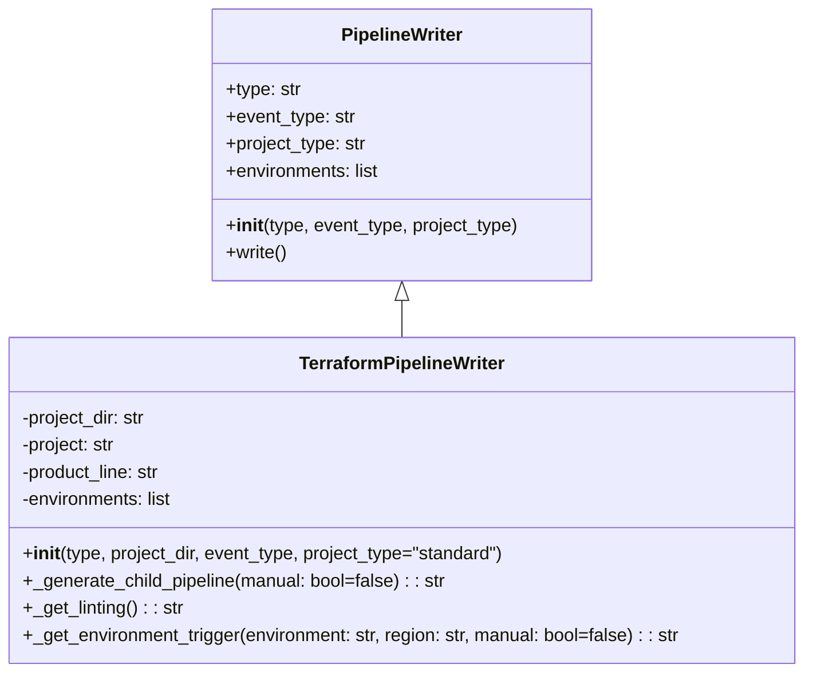

# Diagram: devops/terraform/gitlab/terraform_pipeline_writer.py


> Auto-generated by Obscura crawlers

## Diagram 1



### SVG

<svg id="container" width="717.84375" xmlns="http://www.w3.org/2000/svg" class="classDiagram" height="594" viewBox="0 0 717.84375 594" role="graphics-document document" aria-roledescription="class"><style>#container{font-family:"trebuchet ms",verdana,arial,sans-serif;font-size:16px;fill:#333;}@keyframes edge-animation-frame{from{stroke-dashoffset:0;}}@keyframes dash{to{stroke-dashoffset:0;}}#container .edge-animation-slow{stroke-dasharray:9,5!important;stroke-dashoffset:900;animation:dash 50s linear infinite;stroke-linecap:round;}#container .edge-animation-fast{stroke-dasharray:9,5!important;stroke-dashoffset:900;animation:dash 20s linear infinite;stroke-linecap:round;}#container .error-icon{fill:#552222;}#container .error-text{fill:#552222;stroke:#552222;}#container .edge-thickness-normal{stroke-width:1px;}#container .edge-thickness-thick{stroke-width:3.5px;}#container .edge-pattern-solid{stroke-dasharray:0;}#container .edge-thickness-invisible{stroke-width:0;fill:none;}#container .edge-pattern-dashed{stroke-dasharray:3;}#container .edge-pattern-dotted{stroke-dasharray:2;}#container .marker{fill:#333333;stroke:#333333;}#container .marker.cross{stroke:#333333;}#container svg{font-family:"trebuchet ms",verdana,arial,sans-serif;font-size:16px;}#container p{margin:0;}#container g.classGroup text{fill:#9370DB;stroke:none;font-family:"trebuchet ms",verdana,arial,sans-serif;font-size:10px;}#container g.classGroup text .title{font-weight:bolder;}#container .nodeLabel,#container .edgeLabel{color:#131300;}#container .edgeLabel .label rect{fill:#ECECFF;}#container .label text{fill:#131300;}#container .labelBkg{background:#ECECFF;}#container .edgeLabel .label span{background:#ECECFF;}#container .classTitle{font-weight:bolder;}#container .node rect,#container .node circle,#container .node ellipse,#container .node polygon,#container .node path{fill:#ECECFF;stroke:#9370DB;stroke-width:1px;}#container .divider{stroke:#9370DB;stroke-width:1;}#container g.clickable{cursor:pointer;}#container g.classGroup rect{fill:#ECECFF;stroke:#9370DB;}#container g.classGroup line{stroke:#9370DB;stroke-width:1;}#container .classLabel .box{stroke:none;stroke-width:0;fill:#ECECFF;opacity:0.5;}#container .classLabel .label{fill:#9370DB;font-size:10px;}#container .relation{stroke:#333333;stroke-width:1;fill:none;}#container .dashed-line{stroke-dasharray:3;}#container .dotted-line{stroke-dasharray:1 2;}#container #compositionStart,#container .composition{fill:#333333!important;stroke:#333333!important;stroke-width:1;}#container #compositionEnd,#container .composition{fill:#333333!important;stroke:#333333!important;stroke-width:1;}#container #dependencyStart,#container .dependency{fill:#333333!important;stroke:#333333!important;stroke-width:1;}#container #dependencyStart,#container .dependency{fill:#333333!important;stroke:#333333!important;stroke-width:1;}#container #extensionStart,#container .extension{fill:transparent!important;stroke:#333333!important;stroke-width:1;}#container #extensionEnd,#container .extension{fill:transparent!important;stroke:#333333!important;stroke-width:1;}#container #aggregationStart,#container .aggregation{fill:transparent!important;stroke:#333333!important;stroke-width:1;}#container #aggregationEnd,#container .aggregation{fill:transparent!important;stroke:#333333!important;stroke-width:1;}#container #lollipopStart,#container .lollipop{fill:#ECECFF!important;stroke:#333333!important;stroke-width:1;}#container #lollipopEnd,#container .lollipop{fill:#ECECFF!important;stroke:#333333!important;stroke-width:1;}#container .edgeTerminals{font-size:11px;line-height:initial;}#container .classTitleText{text-anchor:middle;font-size:18px;fill:#333;}#container .label-icon{display:inline-block;height:1em;overflow:visible;vertical-align:-0.125em;}#container .node .label-icon path{fill:currentColor;stroke:revert;stroke-width:revert;}#container :root{--mermaid-font-family:"trebuchet ms",verdana,arial,sans-serif;}</style><g><defs><marker id="container_class-aggregationStart" class="marker aggregation class" refX="18" refY="7" markerWidth="190" markerHeight="240" orient="auto"><path d="M 18,7 L9,13 L1,7 L9,1 Z"></path></marker></defs><defs><marker id="container_class-aggregationEnd" class="marker aggregation class" refX="1" refY="7" markerWidth="20" markerHeight="28" orient="auto"><path d="M 18,7 L9,13 L1,7 L9,1 Z"></path></marker></defs><defs><marker id="container_class-extensionStart" class="marker extension class" refX="18" refY="7" markerWidth="190" markerHeight="240" orient="auto"><path d="M 1,7 L18,13 V 1 Z"></path></marker></defs><defs><marker id="container_class-extensionEnd" class="marker extension class" refX="1" refY="7" markerWidth="20" markerHeight="28" orient="auto"><path d="M 1,1 V 13 L18,7 Z"></path></marker></defs><defs><marker id="container_class-compositionStart" class="marker composition class" refX="18" refY="7" markerWidth="190" markerHeight="240" orient="auto"><path d="M 18,7 L9,13 L1,7 L9,1 Z"></path></marker></defs><defs><marker id="container_class-compositionEnd" class="marker composition class" refX="1" refY="7" markerWidth="20" markerHeight="28" orient="auto"><path d="M 18,7 L9,13 L1,7 L9,1 Z"></path></marker></defs><defs><marker id="container_class-dependencyStart" class="marker dependency class" refX="6" refY="7" markerWidth="190" markerHeight="240" orient="auto"><path d="M 5,7 L9,13 L1,7 L9,1 Z"></path></marker></defs><defs><marker id="container_class-dependencyEnd" class="marker dependency class" refX="13" refY="7" markerWidth="20" markerHeight="28" orient="auto"><path d="M 18,7 L9,13 L14,7 L9,1 Z"></path></marker></defs><defs><marker id="container_class-lollipopStart" class="marker lollipop class" refX="13" refY="7" markerWidth="190" markerHeight="240" orient="auto"><circle stroke="black" fill="transparent" cx="7" cy="7" r="6"></circle></marker></defs><defs><marker id="container_class-lollipopEnd" class="marker lollipop class" refX="1" refY="7" markerWidth="190" markerHeight="240" orient="auto"><circle stroke="black" fill="transparent" cx="7" cy="7" r="6"></circle></marker></defs><g class="root"><g class="clusters"></g><g class="edgePaths"><path d="M358.922,265.25L358.922,266.542C358.922,267.833,358.922,270.417,358.922,275.875C358.922,281.333,358.922,289.667,358.922,293.833L358.922,298" id="id_PipelineWriter_TerraformPipelineWriter_1" class="edge-thickness-normal edge-pattern-solid relation" style=";;;" data-edge="true" data-et="edge" data-id="id_PipelineWriter_TerraformPipelineWriter_1" data-points="W3sieCI6MzU4LjkyMTg3NSwieSI6MjQ4fSx7IngiOjM1OC45MjE4NzUsInkiOjI3M30seyJ4IjozNTguOTIxODc1LCJ5IjoyOTh9XQ==" marker-start="url(#container_class-extensionStart)"></path></g><g class="edgeLabels"><g class="edgeLabel"><g class="label" data-id="id_PipelineWriter_TerraformPipelineWriter_1" transform="translate(0, 0)"><foreignObject width="0" height="0"><div xmlns="http://www.w3.org/1999/xhtml" class="labelBkg" style="display: table-cell; white-space: nowrap; line-height: 1.5; max-width: 200px; text-align: center;"><span class="edgeLabel"></span></div></foreignObject></g></g></g><g class="nodes"><g class="node default" id="classId-PipelineWriter-0" transform="translate(358.921875, 128)"><g class="basic label-container"><path d="M-169.1015625 -120 L169.1015625 -120 L169.1015625 120 L-169.1015625 120" stroke="none" stroke-width="0" fill="#ECECFF" style=""></path><path d="M-169.1015625 -120 C-88.7743661266682 -120, -8.447169753336397 -120, 169.1015625 -120 M-169.1015625 -120 C-90.47923540943172 -120, -11.856908318863447 -120, 169.1015625 -120 M169.1015625 -120 C169.1015625 -69.59355876921269, 169.1015625 -19.187117538425383, 169.1015625 120 M169.1015625 -120 C169.1015625 -68.48939432413641, 169.1015625 -16.97878864827284, 169.1015625 120 M169.1015625 120 C74.73255223672768 120, -19.63645802654463 120, -169.1015625 120 M169.1015625 120 C34.44977121020142 120, -100.20202007959716 120, -169.1015625 120 M-169.1015625 120 C-169.1015625 53.528320108716244, -169.1015625 -12.943359782567512, -169.1015625 -120 M-169.1015625 120 C-169.1015625 36.778711029919194, -169.1015625 -46.44257794016161, -169.1015625 -120" stroke="#9370DB" stroke-width="1.3" fill="none" stroke-dasharray="0 0" style=""></path></g><g class="annotation-group text" transform="translate(0, -96)"></g><g class="label-group text" transform="translate(-52.6875, -96)"><g class="label" style="font-weight: bolder" transform="translate(0,-12)"><foreignObject width="105.375" height="24"><div xmlns="http://www.w3.org/1999/xhtml" style="display: table-cell; white-space: nowrap; line-height: 1.5; max-width: 154px; text-align: center;"><span class="nodeLabel markdown-node-label" style=""><p>PipelineWriter</p></span></div></foreignObject></g></g><g class="members-group text" transform="translate(-157.1015625, -48)"><g class="label" style="" transform="translate(0,-12)"><foreignObject width="67.203125" height="24"><div xmlns="http://www.w3.org/1999/xhtml" style="display: table-cell; white-space: nowrap; line-height: 1.5; max-width: 125px; text-align: center;"><span class="nodeLabel markdown-node-label" style=""><p>+type: str</p></span></div></foreignObject></g><g class="label" style="" transform="translate(0,12)"><foreignObject width="115.625" height="24"><div xmlns="http://www.w3.org/1999/xhtml" style="display: table-cell; white-space: nowrap; line-height: 1.5; max-width: 174px; text-align: center;"><span class="nodeLabel markdown-node-label" style=""><p>+event_type: str</p></span></div></foreignObject></g><g class="label" style="" transform="translate(0,36)"><foreignObject width="126.453125" height="24"><div xmlns="http://www.w3.org/1999/xhtml" style="display: table-cell; white-space: nowrap; line-height: 1.5; max-width: 185px; text-align: center;"><span class="nodeLabel markdown-node-label" style=""><p>+project_type: str</p></span></div></foreignObject></g><g class="label" style="" transform="translate(0,60)"><foreignObject width="138.359375" height="24"><div xmlns="http://www.w3.org/1999/xhtml" style="display: table-cell; white-space: nowrap; line-height: 1.5; max-width: 196px; text-align: center;"><span class="nodeLabel markdown-node-label" style=""><p>+environments: list</p></span></div></foreignObject></g></g><g class="methods-group text" transform="translate(-157.1015625, 72)"><g class="label" style="" transform="translate(0,-12)"><foreignObject width="261.515625" height="24"><div xmlns="http://www.w3.org/1999/xhtml" style="display: table-cell; white-space: nowrap; line-height: 1.5; max-width: 350px; text-align: center;"><span class="nodeLabel markdown-node-label" style=""><p>+<strong>init</strong>(type, event_type, project_type)</p></span></div></foreignObject></g><g class="label" style="" transform="translate(0,12)"><foreignObject width="54.78125" height="24"><div xmlns="http://www.w3.org/1999/xhtml" style="display: table-cell; white-space: nowrap; line-height: 1.5; max-width: 112px; text-align: center;"><span class="nodeLabel markdown-node-label" style=""><p>+write()</p></span></div></foreignObject></g></g><g class="divider" style=""><path d="M-169.1015625 -72 C-64.27661888347372 -72, 40.54832473305257 -72, 169.1015625 -72 M-169.1015625 -72 C-90.19457694228254 -72, -11.287591384565076 -72, 169.1015625 -72" stroke="#9370DB" stroke-width="1.3" fill="none" stroke-dasharray="0 0" style=""></path></g><g class="divider" style=""><path d="M-169.1015625 48 C-80.97218637698627 48, 7.157189746027456 48, 169.1015625 48 M-169.1015625 48 C-52.792063014069456 48, 63.51743647186109 48, 169.1015625 48" stroke="#9370DB" stroke-width="1.3" fill="none" stroke-dasharray="0 0" style=""></path></g></g><g class="node default" id="classId-TerraformPipelineWriter-1" transform="translate(358.921875, 442)"><g class="basic label-container"><path d="M-350.921875 -144 L350.921875 -144 L350.921875 144 L-350.921875 144" stroke="none" stroke-width="0" fill="#ECECFF" style=""></path><path d="M-350.921875 -144 C-207.71479659121593 -144, -64.50771818243186 -144, 350.921875 -144 M-350.921875 -144 C-71.39608287337609 -144, 208.12970925324782 -144, 350.921875 -144 M350.921875 -144 C350.921875 -50.815198958948116, 350.921875 42.36960208210377, 350.921875 144 M350.921875 -144 C350.921875 -52.17596000541333, 350.921875 39.64807998917334, 350.921875 144 M350.921875 144 C110.23556802209404 144, -130.45073895581191 144, -350.921875 144 M350.921875 144 C137.78999852809952 144, -75.34187794380097 144, -350.921875 144 M-350.921875 144 C-350.921875 64.92719439348801, -350.921875 -14.145611213023983, -350.921875 -144 M-350.921875 144 C-350.921875 32.49440863978309, -350.921875 -79.01118272043382, -350.921875 -144" stroke="#9370DB" stroke-width="1.3" fill="none" stroke-dasharray="0 0" style=""></path></g><g class="annotation-group text" transform="translate(0, -120)"></g><g class="label-group text" transform="translate(-88.90625, -120)"><g class="label" style="font-weight: bolder" transform="translate(0,-12)"><foreignObject width="177.8125" height="24"><div xmlns="http://www.w3.org/1999/xhtml" style="display: table-cell; white-space: nowrap; line-height: 1.5; max-width: 225px; text-align: center;"><span class="nodeLabel markdown-node-label" style=""><p>TerraformPipelineWriter</p></span></div></foreignObject></g></g><g class="members-group text" transform="translate(-338.921875, -72)"><g class="label" style="" transform="translate(0,-12)"><foreignObject width="113.546875" height="24"><div xmlns="http://www.w3.org/1999/xhtml" style="display: table-cell; white-space: nowrap; line-height: 1.5; max-width: 172px; text-align: center;"><span class="nodeLabel markdown-node-label" style=""><p>-project_dir: str</p></span></div></foreignObject></g><g class="label" style="" transform="translate(0,12)"><foreignObject width="85.1875" height="24"><div xmlns="http://www.w3.org/1999/xhtml" style="display: table-cell; white-space: nowrap; line-height: 1.5; max-width: 143px; text-align: center;"><span class="nodeLabel markdown-node-label" style=""><p>-project: str</p></span></div></foreignObject></g><g class="label" style="" transform="translate(0,36)"><foreignObject width="126.265625" height="24"><div xmlns="http://www.w3.org/1999/xhtml" style="display: table-cell; white-space: nowrap; line-height: 1.5; max-width: 184px; text-align: center;"><span class="nodeLabel markdown-node-label" style=""><p>-product_line: str</p></span></div></foreignObject></g><g class="label" style="" transform="translate(0,60)"><foreignObject width="136.828125" height="24"><div xmlns="http://www.w3.org/1999/xhtml" style="display: table-cell; white-space: nowrap; line-height: 1.5; max-width: 194px; text-align: center;"><span class="nodeLabel markdown-node-label" style=""><p>-environments: list</p></span></div></foreignObject></g></g><g class="methods-group text" transform="translate(-338.921875, 48)"><g class="label" style="" transform="translate(0,-12)"><foreignObject width="433.109375" height="24"><div xmlns="http://www.w3.org/1999/xhtml" style="display: table-cell; white-space: nowrap; line-height: 1.5; max-width: 522px; text-align: center;"><span class="nodeLabel markdown-node-label" style=""><p>+<strong>init</strong>(type, project_dir, event_type, project_type="standard")</p></span></div></foreignObject></g><g class="label" style="" transform="translate(0,12)"><foreignObject width="377.953125" height="24"><div xmlns="http://www.w3.org/1999/xhtml" style="display: table-cell; white-space: nowrap; line-height: 1.5; max-width: 436px; text-align: center;"><span class="nodeLabel markdown-node-label" style=""><p>+_generate_child_pipeline(manual: bool=false) : : str</p></span></div></foreignObject></g><g class="label" style="" transform="translate(0,36)"><foreignObject width="142.640625" height="24"><div xmlns="http://www.w3.org/1999/xhtml" style="display: table-cell; white-space: nowrap; line-height: 1.5; max-width: 201px; text-align: center;"><span class="nodeLabel markdown-node-label" style=""><p>+_get_linting() : : str</p></span></div></foreignObject></g><g class="label" style="" transform="translate(0,60)"><foreignObject width="588.9375" height="24"><div xmlns="http://www.w3.org/1999/xhtml" style="display: table-cell; white-space: nowrap; line-height: 1.5; max-width: 647px; text-align: center;"><span class="nodeLabel markdown-node-label" style=""><p>+_get_environment_trigger(environment: str, region: str, manual: bool=false) : : str</p></span></div></foreignObject></g></g><g class="divider" style=""><path d="M-350.921875 -96 C-206.99819160307646 -96, -63.07450820615293 -96, 350.921875 -96 M-350.921875 -96 C-87.6416665790909 -96, 175.6385418418182 -96, 350.921875 -96" stroke="#9370DB" stroke-width="1.3" fill="none" stroke-dasharray="0 0" style=""></path></g><g class="divider" style=""><path d="M-350.921875 24 C-99.65597962490742 24, 151.60991575018517 24, 350.921875 24 M-350.921875 24 C-130.56195667742585 24, 89.79796164514829 24, 350.921875 24" stroke="#9370DB" stroke-width="1.3" fill="none" stroke-dasharray="0 0" style=""></path></g></g></g></g></g></svg>

## Diagram 2

```mermaid
sequenceDiagram
participant Caller
participant TerraformPipelineWriter as TPW
participant PipelineWriter as Super
participant OS as os
participant FS as fs
Caller->>TPW: __init__(type, project_dir, event_type, project_type)
TPW->>Super: super().__init__(type, event_type, project_type)
TPW->>OS: os.path.exists(project_dir)?
alt project_dir does not exist
OS-->>TPW: False
TPW-->>Caller: raise ValueError("project_dir must be set to a valid folder")
else project_dir exists
OS-->>TPW: True
TPW->>TPW: split project_dir -> project, product_line
TPW->>TPW: print Project/Product/Path/Type
loop iterate environments
TPW->>FS: exists(project.env.tfvars)?
alt tfvar missing
FS-->>TPW: False
TPW->>TPW: print skip tfvar
else tfvar exists
FS-->>TPW: True
TPW->>FS: exists(backends/backend.env.conf)?
alt backend missing
FS-->>TPW: False
TPW->>TPW: print skip backend
else backend exists
FS-->>TPW: True
TPW->>TPW: append env to filtered_environments
end
end
TPW->>TPW: environments = filtered_environments
TPW-->>Caller: __init__ complete
Caller->>TPW: _generate_child_pipeline(manual=false)
TPW->>TPW: build base YAML template (include, variables, stages)
alt event_type == "merge_request_event"
TPW->>TPW: _get_linting()
TPW-->>TPW: linting template appended
end
loop for each environment in environments
TPW->>TPW: _get_environment_trigger(environment, region, manual)
TPW-->>TPW: trigger job snippet appended
end
TPW-->>Caller: return composed YAML template
```

> SVG rendering failed for this diagram.
