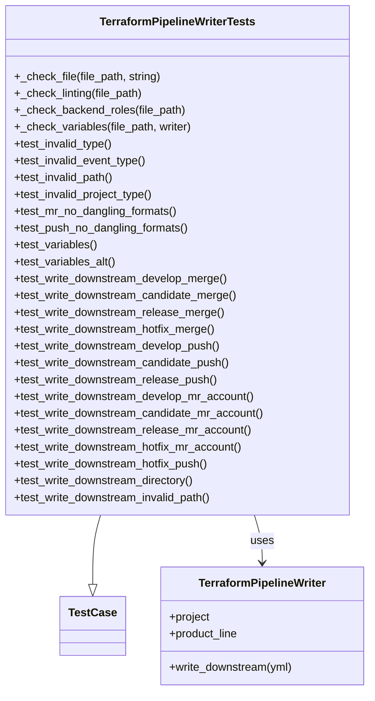

# Diagram: devops/terraform/gitlab/tests/pipeline_writer/test_pipeline_writer.py


> Auto-generated by Obscura crawlers

## Diagram 1



### SVG

<svg id="container" width="527.43359375" xmlns="http://www.w3.org/2000/svg" class="classDiagram" height="984" viewBox="0 0 527.43359375 984" role="graphics-document document" aria-roledescription="class"><style>#container{font-family:"trebuchet ms",verdana,arial,sans-serif;font-size:16px;fill:#333;}@keyframes edge-animation-frame{from{stroke-dashoffset:0;}}@keyframes dash{to{stroke-dashoffset:0;}}#container .edge-animation-slow{stroke-dasharray:9,5!important;stroke-dashoffset:900;animation:dash 50s linear infinite;stroke-linecap:round;}#container .edge-animation-fast{stroke-dasharray:9,5!important;stroke-dashoffset:900;animation:dash 20s linear infinite;stroke-linecap:round;}#container .error-icon{fill:#552222;}#container .error-text{fill:#552222;stroke:#552222;}#container .edge-thickness-normal{stroke-width:1px;}#container .edge-thickness-thick{stroke-width:3.5px;}#container .edge-pattern-solid{stroke-dasharray:0;}#container .edge-thickness-invisible{stroke-width:0;fill:none;}#container .edge-pattern-dashed{stroke-dasharray:3;}#container .edge-pattern-dotted{stroke-dasharray:2;}#container .marker{fill:#333333;stroke:#333333;}#container .marker.cross{stroke:#333333;}#container svg{font-family:"trebuchet ms",verdana,arial,sans-serif;font-size:16px;}#container p{margin:0;}#container g.classGroup text{fill:#9370DB;stroke:none;font-family:"trebuchet ms",verdana,arial,sans-serif;font-size:10px;}#container g.classGroup text .title{font-weight:bolder;}#container .nodeLabel,#container .edgeLabel{color:#131300;}#container .edgeLabel .label rect{fill:#ECECFF;}#container .label text{fill:#131300;}#container .labelBkg{background:#ECECFF;}#container .edgeLabel .label span{background:#ECECFF;}#container .classTitle{font-weight:bolder;}#container .node rect,#container .node circle,#container .node ellipse,#container .node polygon,#container .node path{fill:#ECECFF;stroke:#9370DB;stroke-width:1px;}#container .divider{stroke:#9370DB;stroke-width:1;}#container g.clickable{cursor:pointer;}#container g.classGroup rect{fill:#ECECFF;stroke:#9370DB;}#container g.classGroup line{stroke:#9370DB;stroke-width:1;}#container .classLabel .box{stroke:none;stroke-width:0;fill:#ECECFF;opacity:0.5;}#container .classLabel .label{fill:#9370DB;font-size:10px;}#container .relation{stroke:#333333;stroke-width:1;fill:none;}#container .dashed-line{stroke-dasharray:3;}#container .dotted-line{stroke-dasharray:1 2;}#container #compositionStart,#container .composition{fill:#333333!important;stroke:#333333!important;stroke-width:1;}#container #compositionEnd,#container .composition{fill:#333333!important;stroke:#333333!important;stroke-width:1;}#container #dependencyStart,#container .dependency{fill:#333333!important;stroke:#333333!important;stroke-width:1;}#container #dependencyStart,#container .dependency{fill:#333333!important;stroke:#333333!important;stroke-width:1;}#container #extensionStart,#container .extension{fill:transparent!important;stroke:#333333!important;stroke-width:1;}#container #extensionEnd,#container .extension{fill:transparent!important;stroke:#333333!important;stroke-width:1;}#container #aggregationStart,#container .aggregation{fill:transparent!important;stroke:#333333!important;stroke-width:1;}#container #aggregationEnd,#container .aggregation{fill:transparent!important;stroke:#333333!important;stroke-width:1;}#container #lollipopStart,#container .lollipop{fill:#ECECFF!important;stroke:#333333!important;stroke-width:1;}#container #lollipopEnd,#container .lollipop{fill:#ECECFF!important;stroke:#333333!important;stroke-width:1;}#container .edgeTerminals{font-size:11px;line-height:initial;}#container .classTitleText{text-anchor:middle;font-size:18px;fill:#333;}#container .label-icon{display:inline-block;height:1em;overflow:visible;vertical-align:-0.125em;}#container .node .label-icon path{fill:currentColor;stroke:revert;stroke-width:revert;}#container :root{--mermaid-font-family:"trebuchet ms",verdana,arial,sans-serif;}</style><g><defs><marker id="container_class-aggregationStart" class="marker aggregation class" refX="18" refY="7" markerWidth="190" markerHeight="240" orient="auto"><path d="M 18,7 L9,13 L1,7 L9,1 Z"></path></marker></defs><defs><marker id="container_class-aggregationEnd" class="marker aggregation class" refX="1" refY="7" markerWidth="20" markerHeight="28" orient="auto"><path d="M 18,7 L9,13 L1,7 L9,1 Z"></path></marker></defs><defs><marker id="container_class-extensionStart" class="marker extension class" refX="18" refY="7" markerWidth="190" markerHeight="240" orient="auto"><path d="M 1,7 L18,13 V 1 Z"></path></marker></defs><defs><marker id="container_class-extensionEnd" class="marker extension class" refX="1" refY="7" markerWidth="20" markerHeight="28" orient="auto"><path d="M 1,1 V 13 L18,7 Z"></path></marker></defs><defs><marker id="container_class-compositionStart" class="marker composition class" refX="18" refY="7" markerWidth="190" markerHeight="240" orient="auto"><path d="M 18,7 L9,13 L1,7 L9,1 Z"></path></marker></defs><defs><marker id="container_class-compositionEnd" class="marker composition class" refX="1" refY="7" markerWidth="20" markerHeight="28" orient="auto"><path d="M 18,7 L9,13 L1,7 L9,1 Z"></path></marker></defs><defs><marker id="container_class-dependencyStart" class="marker dependency class" refX="6" refY="7" markerWidth="190" markerHeight="240" orient="auto"><path d="M 5,7 L9,13 L1,7 L9,1 Z"></path></marker></defs><defs><marker id="container_class-dependencyEnd" class="marker dependency class" refX="13" refY="7" markerWidth="20" markerHeight="28" orient="auto"><path d="M 18,7 L9,13 L14,7 L9,1 Z"></path></marker></defs><defs><marker id="container_class-lollipopStart" class="marker lollipop class" refX="13" refY="7" markerWidth="190" markerHeight="240" orient="auto"><circle stroke="black" fill="transparent" cx="7" cy="7" r="6"></circle></marker></defs><defs><marker id="container_class-lollipopEnd" class="marker lollipop class" refX="1" refY="7" markerWidth="190" markerHeight="240" orient="auto"><circle stroke="black" fill="transparent" cx="7" cy="7" r="6"></circle></marker></defs><g class="root"><g class="clusters"></g><g class="edgePaths"><path d="M144.862,734L143.012,740.167C141.162,746.333,137.462,758.667,135.612,775.125C133.762,791.583,133.762,812.167,133.762,822.458L133.762,832.75" id="id_TerraformPipelineWriterTests_TestCase_1" class="edge-thickness-normal edge-pattern-solid relation" style=";;;" data-edge="true" data-et="edge" data-id="id_TerraformPipelineWriterTests_TestCase_1" data-points="W3sieCI6MTQ0Ljg2MjQ0MTQwNjI1LCJ5Ijo3MzR9LHsieCI6MTMzLjc2MTcxODc1LCJ5Ijo3NzF9LHsieCI6MTMzLjc2MTcxODc1LCJ5Ijo4NTB9XQ==" marker-end="url(#container_class-extensionEnd)"></path><path d="M362.677,734L364.527,740.167C366.377,746.333,370.077,758.667,371.927,770C373.777,781.333,373.777,791.667,373.777,796.833L373.777,802" id="id_TerraformPipelineWriterTests_TerraformPipelineWriter_2" class="edge-thickness-normal edge-pattern-solid relation" style=";;;" data-edge="true" data-et="edge" data-id="id_TerraformPipelineWriterTests_TerraformPipelineWriter_2" data-points="W3sieCI6MzYyLjY3NjYyMTA5Mzc1LCJ5Ijo3MzR9LHsieCI6MzczLjc3NzM0Mzc1LCJ5Ijo3NzF9LHsieCI6MzczLjc3NzM0Mzc1LCJ5Ijo4MDh9XQ==" marker-end="url(#container_class-dependencyEnd)"></path></g><g class="edgeLabels"><g class="edgeLabel"><g class="label" data-id="id_TerraformPipelineWriterTests_TestCase_1" transform="translate(0, 0)"><foreignObject width="0" height="0"><div xmlns="http://www.w3.org/1999/xhtml" class="labelBkg" style="display: table-cell; white-space: nowrap; line-height: 1.5; max-width: 200px; text-align: center;"><span class="edgeLabel"></span></div></foreignObject></g></g><g class="edgeLabel" transform="translate(373.77734375, 771)"><g class="label" data-id="id_TerraformPipelineWriterTests_TerraformPipelineWriter_2" transform="translate(-16.4921875, -12)"><foreignObject width="32.984375" height="24"><div xmlns="http://www.w3.org/1999/xhtml" class="labelBkg" style="display: table-cell; white-space: nowrap; line-height: 1.5; max-width: 200px; text-align: center;"><span class="edgeLabel"><p>uses</p></span></div></foreignObject></g></g></g><g class="nodes"><g class="node default" id="classId-TerraformPipelineWriterTests-0" transform="translate(253.76953125, 371)"><g class="basic label-container"><path d="M-245.76953125 -363 L245.76953125 -363 L245.76953125 363 L-245.76953125 363" stroke="none" stroke-width="0" fill="#ECECFF" style=""></path><path d="M-245.76953125 -363 C-141.93916300148902 -363, -38.10879475297804 -363, 245.76953125 -363 M-245.76953125 -363 C-72.0746064695077 -363, 101.6203183109846 -363, 245.76953125 -363 M245.76953125 -363 C245.76953125 -89.20168987565069, 245.76953125 184.59662024869863, 245.76953125 363 M245.76953125 -363 C245.76953125 -158.4937417941469, 245.76953125 46.0125164117062, 245.76953125 363 M245.76953125 363 C125.82100301646146 363, 5.872474782922922 363, -245.76953125 363 M245.76953125 363 C68.28552333575871 363, -109.19848457848258 363, -245.76953125 363 M-245.76953125 363 C-245.76953125 80.37635224869842, -245.76953125 -202.24729550260315, -245.76953125 -363 M-245.76953125 363 C-245.76953125 101.41338859223384, -245.76953125 -160.1732228155323, -245.76953125 -363" stroke="#9370DB" stroke-width="1.3" fill="none" stroke-dasharray="0 0" style=""></path></g><g class="annotation-group text" transform="translate(0, -339)"></g><g class="label-group text" transform="translate(-108.0234375, -339)"><g class="label" style="font-weight: bolder" transform="translate(0,-12)"><foreignObject width="216.046875" height="24"><div xmlns="http://www.w3.org/1999/xhtml" style="display: table-cell; white-space: nowrap; line-height: 1.5; max-width: 261px; text-align: center;"><span class="nodeLabel markdown-node-label" style=""><p>TerraformPipelineWriterTests</p></span></div></foreignObject></g></g><g class="members-group text" transform="translate(-233.76953125, -291)"></g><g class="methods-group text" transform="translate(-233.76953125, -261)"><g class="label" style="" transform="translate(0,-12)"><foreignObject width="210.625" height="24"><div xmlns="http://www.w3.org/1999/xhtml" style="display: table-cell; white-space: nowrap; line-height: 1.5; max-width: 268px; text-align: center;"><span class="nodeLabel markdown-node-label" style=""><p>+_check_file(file_path, string)</p></span></div></foreignObject></g><g class="label" style="" transform="translate(0,12)"><foreignObject width="185.109375" height="24"><div xmlns="http://www.w3.org/1999/xhtml" style="display: table-cell; white-space: nowrap; line-height: 1.5; max-width: 242px; text-align: center;"><span class="nodeLabel markdown-node-label" style=""><p>+_check_linting(file_path)</p></span></div></foreignObject></g><g class="label" style="" transform="translate(0,36)"><foreignObject width="244.28125" height="24"><div xmlns="http://www.w3.org/1999/xhtml" style="display: table-cell; white-space: nowrap; line-height: 1.5; max-width: 302px; text-align: center;"><span class="nodeLabel markdown-node-label" style=""><p>+_check_backend_roles(file_path)</p></span></div></foreignObject></g><g class="label" style="" transform="translate(0,60)"><foreignObject width="254.921875" height="24"><div xmlns="http://www.w3.org/1999/xhtml" style="display: table-cell; white-space: nowrap; line-height: 1.5; max-width: 312px; text-align: center;"><span class="nodeLabel markdown-node-label" style=""><p>+_check_variables(file_path, writer)</p></span></div></foreignObject></g><g class="label" style="" transform="translate(0,84)"><foreignObject width="142.59375" height="24"><div xmlns="http://www.w3.org/1999/xhtml" style="display: table-cell; white-space: nowrap; line-height: 1.5; max-width: 200px; text-align: center;"><span class="nodeLabel markdown-node-label" style=""><p>+test_invalid_type()</p></span></div></foreignObject></g><g class="label" style="" transform="translate(0,108)"><foreignObject width="190.9375" height="24"><div xmlns="http://www.w3.org/1999/xhtml" style="display: table-cell; white-space: nowrap; line-height: 1.5; max-width: 248px; text-align: center;"><span class="nodeLabel markdown-node-label" style=""><p>+test_invalid_event_type()</p></span></div></foreignObject></g><g class="label" style="" transform="translate(0,132)"><foreignObject width="144.328125" height="24"><div xmlns="http://www.w3.org/1999/xhtml" style="display: table-cell; white-space: nowrap; line-height: 1.5; max-width: 202px; text-align: center;"><span class="nodeLabel markdown-node-label" style=""><p>+test_invalid_path()</p></span></div></foreignObject></g><g class="label" style="" transform="translate(0,156)"><foreignObject width="202.09375" height="24"><div xmlns="http://www.w3.org/1999/xhtml" style="display: table-cell; white-space: nowrap; line-height: 1.5; max-width: 259px; text-align: center;"><span class="nodeLabel markdown-node-label" style=""><p>+test_invalid_project_type()</p></span></div></foreignObject></g><g class="label" style="" transform="translate(0,180)"><foreignObject width="234.75" height="24"><div xmlns="http://www.w3.org/1999/xhtml" style="display: table-cell; white-space: nowrap; line-height: 1.5; max-width: 292px; text-align: center;"><span class="nodeLabel markdown-node-label" style=""><p>+test_mr_no_dangling_formats()</p></span></div></foreignObject></g><g class="label" style="" transform="translate(0,204)"><foreignObject width="251.796875" height="24"><div xmlns="http://www.w3.org/1999/xhtml" style="display: table-cell; white-space: nowrap; line-height: 1.5; max-width: 309px; text-align: center;"><span class="nodeLabel markdown-node-label" style=""><p>+test_push_no_dangling_formats()</p></span></div></foreignObject></g><g class="label" style="" transform="translate(0,228)"><foreignObject width="119.640625" height="24"><div xmlns="http://www.w3.org/1999/xhtml" style="display: table-cell; white-space: nowrap; line-height: 1.5; max-width: 177px; text-align: center;"><span class="nodeLabel markdown-node-label" style=""><p>+test_variables()</p></span></div></foreignObject></g><g class="label" style="" transform="translate(0,252)"><foreignObject width="146.328125" height="24"><div xmlns="http://www.w3.org/1999/xhtml" style="display: table-cell; white-space: nowrap; line-height: 1.5; max-width: 204px; text-align: center;"><span class="nodeLabel markdown-node-label" style=""><p>+test_variables_alt()</p></span></div></foreignObject></g><g class="label" style="" transform="translate(0,276)"><foreignObject width="306.921875" height="24"><div xmlns="http://www.w3.org/1999/xhtml" style="display: table-cell; white-space: nowrap; line-height: 1.5; max-width: 364px; text-align: center;"><span class="nodeLabel markdown-node-label" style=""><p>+test_write_downstream_develop_merge()</p></span></div></foreignObject></g><g class="label" style="" transform="translate(0,300)"><foreignObject width="320.890625" height="24"><div xmlns="http://www.w3.org/1999/xhtml" style="display: table-cell; white-space: nowrap; line-height: 1.5; max-width: 378px; text-align: center;"><span class="nodeLabel markdown-node-label" style=""><p>+test_write_downstream_candidate_merge()</p></span></div></foreignObject></g><g class="label" style="" transform="translate(0,324)"><foreignObject width="301.359375" height="24"><div xmlns="http://www.w3.org/1999/xhtml" style="display: table-cell; white-space: nowrap; line-height: 1.5; max-width: 359px; text-align: center;"><span class="nodeLabel markdown-node-label" style=""><p>+test_write_downstream_release_merge()</p></span></div></foreignObject></g><g class="label" style="" transform="translate(0,348)"><foreignObject width="290.8125" height="24"><div xmlns="http://www.w3.org/1999/xhtml" style="display: table-cell; white-space: nowrap; line-height: 1.5; max-width: 348px; text-align: center;"><span class="nodeLabel markdown-node-label" style=""><p>+test_write_downstream_hotfix_merge()</p></span></div></foreignObject></g><g class="label" style="" transform="translate(0,372)"><foreignObject width="297.4375" height="24"><div xmlns="http://www.w3.org/1999/xhtml" style="display: table-cell; white-space: nowrap; line-height: 1.5; max-width: 355px; text-align: center;"><span class="nodeLabel markdown-node-label" style=""><p>+test_write_downstream_develop_push()</p></span></div></foreignObject></g><g class="label" style="" transform="translate(0,396)"><foreignObject width="311.40625" height="24"><div xmlns="http://www.w3.org/1999/xhtml" style="display: table-cell; white-space: nowrap; line-height: 1.5; max-width: 369px; text-align: center;"><span class="nodeLabel markdown-node-label" style=""><p>+test_write_downstream_candidate_push()</p></span></div></foreignObject></g><g class="label" style="" transform="translate(0,420)"><foreignObject width="291.859375" height="24"><div xmlns="http://www.w3.org/1999/xhtml" style="display: table-cell; white-space: nowrap; line-height: 1.5; max-width: 349px; text-align: center;"><span class="nodeLabel markdown-node-label" style=""><p>+test_write_downstream_release_push()</p></span></div></foreignObject></g><g class="label" style="" transform="translate(0,444)"><foreignObject width="345.546875" height="24"><div xmlns="http://www.w3.org/1999/xhtml" style="display: table-cell; white-space: nowrap; line-height: 1.5; max-width: 403px; text-align: center;"><span class="nodeLabel markdown-node-label" style=""><p>+test_write_downstream_develop_mr_account()</p></span></div></foreignObject></g><g class="label" style="" transform="translate(0,468)"><foreignObject width="359.515625" height="24"><div xmlns="http://www.w3.org/1999/xhtml" style="display: table-cell; white-space: nowrap; line-height: 1.5; max-width: 417px; text-align: center;"><span class="nodeLabel markdown-node-label" style=""><p>+test_write_downstream_candidate_mr_account()</p></span></div></foreignObject></g><g class="label" style="" transform="translate(0,492)"><foreignObject width="339.96875" height="24"><div xmlns="http://www.w3.org/1999/xhtml" style="display: table-cell; white-space: nowrap; line-height: 1.5; max-width: 397px; text-align: center;"><span class="nodeLabel markdown-node-label" style=""><p>+test_write_downstream_release_mr_account()</p></span></div></foreignObject></g><g class="label" style="" transform="translate(0,516)"><foreignObject width="329.4375" height="24"><div xmlns="http://www.w3.org/1999/xhtml" style="display: table-cell; white-space: nowrap; line-height: 1.5; max-width: 387px; text-align: center;"><span class="nodeLabel markdown-node-label" style=""><p>+test_write_downstream_hotfix_mr_account()</p></span></div></foreignObject></g><g class="label" style="" transform="translate(0,540)"><foreignObject width="281.328125" height="24"><div xmlns="http://www.w3.org/1999/xhtml" style="display: table-cell; white-space: nowrap; line-height: 1.5; max-width: 339px; text-align: center;"><span class="nodeLabel markdown-node-label" style=""><p>+test_write_downstream_hotfix_push()</p></span></div></foreignObject></g><g class="label" style="" transform="translate(0,564)"><foreignObject width="260.625" height="24"><div xmlns="http://www.w3.org/1999/xhtml" style="display: table-cell; white-space: nowrap; line-height: 1.5; max-width: 318px; text-align: center;"><span class="nodeLabel markdown-node-label" style=""><p>+test_write_downstream_directory()</p></span></div></foreignObject></g><g class="label" style="" transform="translate(0,588)"><foreignObject width="286.109375" height="24"><div xmlns="http://www.w3.org/1999/xhtml" style="display: table-cell; white-space: nowrap; line-height: 1.5; max-width: 343px; text-align: center;"><span class="nodeLabel markdown-node-label" style=""><p>+test_write_downstream_invalid_path()</p></span></div></foreignObject></g></g><g class="divider" style=""><path d="M-245.76953125 -315 C-145.9527995938631 -315, -46.13606793772618 -315, 245.76953125 -315 M-245.76953125 -315 C-78.07531926057675 -315, 89.6188927288465 -315, 245.76953125 -315" stroke="#9370DB" stroke-width="1.3" fill="none" stroke-dasharray="0 0" style=""></path></g><g class="divider" style=""><path d="M-245.76953125 -291 C-80.92957336494422 -291, 83.91038452011156 -291, 245.76953125 -291 M-245.76953125 -291 C-63.34986106924276 -291, 119.06980911151447 -291, 245.76953125 -291" stroke="#9370DB" stroke-width="1.3" fill="none" stroke-dasharray="0 0" style=""></path></g></g><g class="node default" id="classId-TerraformPipelineWriter-1" transform="translate(373.77734375, 892)"><g class="basic label-container"><path d="M-145.65625 -84 L145.65625 -84 L145.65625 84 L-145.65625 84" stroke="none" stroke-width="0" fill="#ECECFF" style=""></path><path d="M-145.65625 -84 C-81.81599287624759 -84, -17.975735752495183 -84, 145.65625 -84 M-145.65625 -84 C-76.99989178252127 -84, -8.343533565042549 -84, 145.65625 -84 M145.65625 -84 C145.65625 -17.41772531648408, 145.65625 49.16454936703184, 145.65625 84 M145.65625 -84 C145.65625 -26.488096132125044, 145.65625 31.023807735749912, 145.65625 84 M145.65625 84 C84.12573916917827 84, 22.59522833835655 84, -145.65625 84 M145.65625 84 C86.91965499980623 84, 28.183059999612453 84, -145.65625 84 M-145.65625 84 C-145.65625 44.99189459773589, -145.65625 5.983789195471786, -145.65625 -84 M-145.65625 84 C-145.65625 25.466392326270466, -145.65625 -33.06721534745907, -145.65625 -84" stroke="#9370DB" stroke-width="1.3" fill="none" stroke-dasharray="0 0" style=""></path></g><g class="annotation-group text" transform="translate(0, -60)"></g><g class="label-group text" transform="translate(-88.90625, -60)"><g class="label" style="font-weight: bolder" transform="translate(0,-12)"><foreignObject width="177.8125" height="24"><div xmlns="http://www.w3.org/1999/xhtml" style="display: table-cell; white-space: nowrap; line-height: 1.5; max-width: 225px; text-align: center;"><span class="nodeLabel markdown-node-label" style=""><p>TerraformPipelineWriter</p></span></div></foreignObject></g></g><g class="members-group text" transform="translate(-133.65625, -12)"><g class="label" style="" transform="translate(0,-12)"><foreignObject width="59.15625" height="24"><div xmlns="http://www.w3.org/1999/xhtml" style="display: table-cell; white-space: nowrap; line-height: 1.5; max-width: 117px; text-align: center;"><span class="nodeLabel markdown-node-label" style=""><p>+project</p></span></div></foreignObject></g><g class="label" style="" transform="translate(0,12)"><foreignObject width="100.296875" height="24"><div xmlns="http://www.w3.org/1999/xhtml" style="display: table-cell; white-space: nowrap; line-height: 1.5; max-width: 158px; text-align: center;"><span class="nodeLabel markdown-node-label" style=""><p>+product_line</p></span></div></foreignObject></g></g><g class="methods-group text" transform="translate(-133.65625, 60)"><g class="label" style="" transform="translate(0,-12)"><foreignObject width="178.40625" height="24"><div xmlns="http://www.w3.org/1999/xhtml" style="display: table-cell; white-space: nowrap; line-height: 1.5; max-width: 236px; text-align: center;"><span class="nodeLabel markdown-node-label" style=""><p>+write_downstream(yml)</p></span></div></foreignObject></g></g><g class="divider" style=""><path d="M-145.65625 -36 C-62.794858698233185 -36, 20.06653260353363 -36, 145.65625 -36 M-145.65625 -36 C-69.03451000959323 -36, 7.587229980813532 -36, 145.65625 -36" stroke="#9370DB" stroke-width="1.3" fill="none" stroke-dasharray="0 0" style=""></path></g><g class="divider" style=""><path d="M-145.65625 36 C-54.133747045620154 36, 37.38875590875969 36, 145.65625 36 M-145.65625 36 C-57.477767940533 36, 30.700714118934002 36, 145.65625 36" stroke="#9370DB" stroke-width="1.3" fill="none" stroke-dasharray="0 0" style=""></path></g></g><g class="node default" id="classId-TestCase-2" transform="translate(133.76171875, 892)"><g class="basic label-container"><path d="M-44.359375 -42 L44.359375 -42 L44.359375 42 L-44.359375 42" stroke="none" stroke-width="0" fill="#ECECFF" style=""></path><path d="M-44.359375 -42 C-19.719855157670715 -42, 4.919664684658571 -42, 44.359375 -42 M-44.359375 -42 C-26.28932396333846 -42, -8.219272926676922 -42, 44.359375 -42 M44.359375 -42 C44.359375 -11.244185715627644, 44.359375 19.51162856874471, 44.359375 42 M44.359375 -42 C44.359375 -15.031435692908122, 44.359375 11.937128614183756, 44.359375 42 M44.359375 42 C22.87641604899448 42, 1.3934570979889571 42, -44.359375 42 M44.359375 42 C15.9028949415037 42, -12.5535851169926 42, -44.359375 42 M-44.359375 42 C-44.359375 23.90323377106047, -44.359375 5.8064675421209415, -44.359375 -42 M-44.359375 42 C-44.359375 18.122660162139386, -44.359375 -5.754679675721228, -44.359375 -42" stroke="#9370DB" stroke-width="1.3" fill="none" stroke-dasharray="0 0" style=""></path></g><g class="annotation-group text" transform="translate(0, -18)"></g><g class="label-group text" transform="translate(-32.359375, -18)"><g class="label" style="font-weight: bolder" transform="translate(0,-12)"><foreignObject width="64.71875" height="24"><div xmlns="http://www.w3.org/1999/xhtml" style="display: table-cell; white-space: nowrap; line-height: 1.5; max-width: 113px; text-align: center;"><span class="nodeLabel markdown-node-label" style=""><p>TestCase</p></span></div></foreignObject></g></g><g class="members-group text" transform="translate(-32.359375, 30)"></g><g class="methods-group text" transform="translate(-32.359375, 60)"></g><g class="divider" style=""><path d="M-44.359375 6 C-16.944681544291303 6, 10.470011911417394 6, 44.359375 6 M-44.359375 6 C-25.326406027185218 6, -6.293437054370436 6, 44.359375 6" stroke="#9370DB" stroke-width="1.3" fill="none" stroke-dasharray="0 0" style=""></path></g><g class="divider" style=""><path d="M-44.359375 24 C-21.320701939196955 24, 1.717971121606091 24, 44.359375 24 M-44.359375 24 C-21.287013132834968 24, 1.7853487343300642 24, 44.359375 24" stroke="#9370DB" stroke-width="1.3" fill="none" stroke-dasharray="0 0" style=""></path></g></g></g></g></g></svg>

## Diagram 2

```mermaid
flowchart TD
    Start([Start]) --> CreateWriter[Create TerraformPipelineWriter (branch,event,path)]
    CreateWriter --> WriteDownstream[Call writer.write_downstream(yml)]
    WriteDownstream --> FileExists{Does file exist?}
    FileExists -->|yes| LintCheck{_check_linting(yml)?}
    FileExists -->|no| Error[Raise FileNotFoundError / test fail]
    LintCheck -->|true| CheckTriggers[Check expected trigger strings present/absent]
    LintCheck -->|false| CheckTriggers
    CheckTriggers --> BackendRoles{_check_backend_roles(yml)?}
    BackendRoles -->|true| VariablesCheck{_check_variables(yml, writer)?}
    BackendRoles -->|false| VariablesCheck
    VariablesCheck -->|true| End([Test Pass])
    VariablesCheck -->|false| EndFail([Test Fail])
```

> SVG rendering failed for this diagram.
