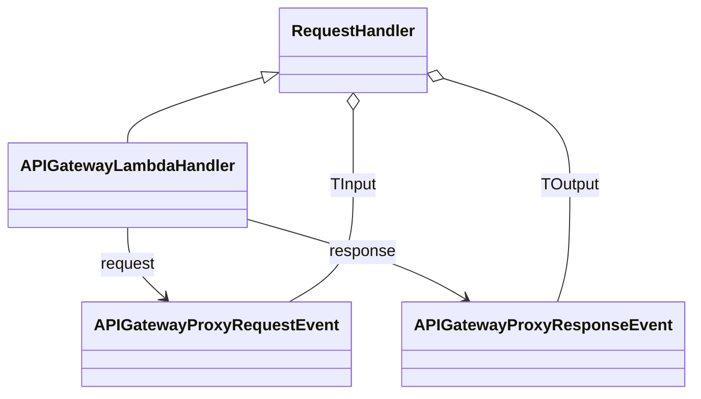

# Diagram: platform-java-lambdas/infrastructure/aws/src/main/java/com/freightverify/infrastructure/lambda/APIGatewayLambdaHandler.java

> Auto-generated by Obscura crawlers

## Mermaid

### SVG

<svg id="container" width="653.05859375" xmlns="http://www.w3.org/2000/svg" class="classDiagram" height="392" viewBox="0 0 653.05859375 392" role="graphics-document document" aria-roledescription="class"><g><defs><marker id="container_class-aggregationStart" class="marker aggregation class" refX="18" refY="7" markerWidth="190" markerHeight="240" orient="auto"><path d="M 18,7 L9,13 L1,7 L9,1 Z"></path></marker></defs><defs><marker id="container_class-aggregationEnd" class="marker aggregation class" refX="1" refY="7" markerWidth="20" markerHeight="28" orient="auto"><path d="M 18,7 L9,13 L1,7 L9,1 Z"></path></marker></defs><defs><marker id="container_class-extensionStart" class="marker extension class" refX="18" refY="7" markerWidth="190" markerHeight="240" orient="auto"><path d="M 1,7 L18,13 V 1 Z"></path></marker></defs><defs><marker id="container_class-extensionEnd" class="marker extension class" refX="1" refY="7" markerWidth="20" markerHeight="28" orient="auto"><path d="M 1,1 V 13 L18,7 Z"></path></marker></defs><defs><marker id="container_class-compositionStart" class="marker composition class" refX="18" refY="7" markerWidth="190" markerHeight="240" orient="auto"><path d="M 18,7 L9,13 L1,7 L9,1 Z"></path></marker></defs><defs><marker id="container_class-compositionEnd" class="marker composition class" refX="1" refY="7" markerWidth="20" markerHeight="28" orient="auto"><path d="M 18,7 L9,13 L1,7 L9,1 Z"></path></marker></defs><defs><marker id="container_class-dependencyStart" class="marker dependency class" refX="6" refY="7" markerWidth="190" markerHeight="240" orient="auto"><path d="M 5,7 L9,13 L1,7 L9,1 Z"></path></marker></defs><defs><marker id="container_class-dependencyEnd" class="marker dependency class" refX="13" refY="7" markerWidth="20" markerHeight="28" orient="auto"><path d="M 18,7 L9,13 L14,7 L9,1 Z"></path></marker></defs><defs><marker id="container_class-lollipopStart" class="marker lollipop class" refX="13" refY="7" markerWidth="190" markerHeight="240" orient="auto"><circle stroke="black" fill="transparent" cx="7" cy="7" r="6"></circle></marker></defs><defs><marker id="container_class-lollipopEnd" class="marker lollipop class" refX="1" refY="7" markerWidth="190" markerHeight="240" orient="auto"><circle stroke="black" fill="transparent" cx="7" cy="7" r="6"></circle></marker></defs><g class="root"><g class="clusters"></g><g class="edgePaths"><path d="M246.442,77.571L225.58,84.142C204.719,90.714,162.996,103.857,142.135,114.595C121.273,125.333,121.273,133.667,121.273,137.833L121.273,142" id="id_RequestHandler_APIGatewayLambdaHandler_1" class="edge-thickness-normal edge-pattern-solid relation" style=";;;" data-edge="true" data-et="edge" data-id="id_RequestHandler_APIGatewayLambdaHandler_1" data-points="W3sieCI6MjYyLjg5NDUzMTI1LCJ5Ijo3Mi4zODc4ODU5MTE1ODY5OX0seyJ4IjoxMjEuMjczNDM3NSwieSI6MTE3fSx7IngiOjEyMS4yNzM0Mzc1LCJ5IjoxNDJ9XQ==" marker-start="url(#container_class-extensionStart)"></path><path d="M121.273,226L121.273,232.167C121.273,238.333,121.273,250.667,127.241,262.323C133.209,273.979,145.144,284.959,151.112,290.448L157.079,295.938" id="id_APIGatewayLambdaHandler_APIGatewayProxyRequestEvent_2" class="edge-thickness-normal edge-pattern-solid relation" style=";;;" data-edge="true" data-et="edge" data-id="id_APIGatewayLambdaHandler_APIGatewayProxyRequestEvent_2" data-points="W3sieCI6MTIxLjI3MzQzNzUsInkiOjIyNn0seyJ4IjoxMjEuMjczNDM3NSwieSI6MjYzfSx7IngiOjE2MS40OTUyMDM3MTgzNTQ0NSwieSI6MzAwfV0=" marker-end="url(#container_class-dependencyEnd)"></path><path d="M234.547,217.661L259.976,225.217C285.405,232.774,336.263,247.887,370.742,261.081C405.221,274.276,423.321,285.552,432.372,291.19L441.422,296.827" id="id_APIGatewayLambdaHandler_APIGatewayProxyResponseEvent_3" class="edge-thickness-normal edge-pattern-solid relation" style=";;;" data-edge="true" data-et="edge" data-id="id_APIGatewayLambdaHandler_APIGatewayProxyResponseEvent_3" data-points="W3sieCI6MjM0LjU0Njg3NSwieSI6MjE3LjY2MDYzNzQwNjg3OTUyfSx7IngiOjM4Ny4xMjEwOTM3NSwieSI6MjYzfSx7IngiOjQ0Ni41MTQyODk5NTI1MzE2LCJ5IjozMDB9XQ==" marker-end="url(#container_class-dependencyEnd)"></path><path d="M333.965,109.25L333.965,110.542C333.965,111.833,333.965,114.417,333.965,126.875C333.965,139.333,333.965,161.667,333.965,186C333.965,210.333,333.965,236.667,324.066,256C314.167,275.333,294.369,287.667,284.471,293.833L274.572,300" id="id_RequestHandler_APIGatewayProxyRequestEvent_4" class="edge-thickness-normal edge-pattern-solid relation" style=";;;" data-edge="true" data-et="edge" data-id="id_RequestHandler_APIGatewayProxyRequestEvent_4" data-points="W3sieCI6MzMzLjk2NDg0Mzc1LCJ5Ijo5Mn0seyJ4IjozMzMuOTY0ODQzNzUsInkiOjExN30seyJ4IjozMzMuOTY0ODQzNzUsInkiOjE4NH0seyJ4IjozMzMuOTY0ODQzNzUsInkiOjI2M30seyJ4IjoyNzQuNTcxNjQ3NTQ3NDY4NCwieSI6MzAwfV0=" marker-start="url(#container_class-aggregationStart)"></path><path d="M421.443,78.376L441.288,84.814C461.133,91.251,500.822,104.125,520.667,121.729C540.512,139.333,540.512,161.667,540.512,186C540.512,210.333,540.512,236.667,538.437,256C536.362,275.333,532.213,287.667,530.138,293.833L528.064,300" id="id_RequestHandler_APIGatewayProxyResponseEvent_5" class="edge-thickness-normal edge-pattern-solid relation" style=";;;" data-edge="true" data-et="edge" data-id="id_RequestHandler_APIGatewayProxyResponseEvent_5" data-points="W3sieCI6NDA1LjAzNTE1NjI1LCJ5Ijo3My4wNTM4OTk2ODk4NDAzOH0seyJ4Ijo1NDAuNTExNzE4NzUsInkiOjExN30seyJ4Ijo1NDAuNTExNzE4NzUsInkiOjE4NH0seyJ4Ijo1NDAuNTExNzE4NzUsInkiOjI2M30seyJ4Ijo1MjguMDYzNzM2MTU1MDYzMywieSI6MzAwfV0=" marker-start="url(#container_class-aggregationStart)"></path></g><g class="edgeLabels"><g class="edgeLabel"><g class="label" data-id="id_RequestHandler_APIGatewayLambdaHandler_1" transform="translate(0, 0)"><foreignObject width="0" height="0">

</foreignObject></g></g><g class="edgeLabel" transform="translate(121.2734375, 263)"><g class="label" data-id="id_APIGatewayLambdaHandler_APIGatewayProxyRequestEvent_2" transform="translate(-27.6328125, -12)"><foreignObject width="55.265625" height="24">

request

</foreignObject></g></g><g class="edgeLabel" transform="translate(344.37218, 250.29662)"><g class="label" data-id="id_APIGatewayLambdaHandler_APIGatewayProxyResponseEvent_3" transform="translate(-33.15625, -12)"><foreignObject width="66.3125" height="24">

response

</foreignObject></g></g><g class="edgeLabel" transform="translate(333.96484375, 184)"><g class="label" data-id="id_RequestHandler_APIGatewayProxyRequestEvent_4" transform="translate(-23.484375, -12)"><foreignObject width="46.96875" height="24">

TInput

</foreignObject></g></g><g class="edgeLabel" transform="translate(540.51171875, 184)"><g class="label" data-id="id_RequestHandler_APIGatewayProxyResponseEvent_5" transform="translate(-29.234375, -12)"><foreignObject width="58.46875" height="24">

TOutput

</foreignObject></g></g></g><g class="nodes"><g class="node default" id="classId-APIGatewayProxyRequestEvent-0" transform="translate(207.15234375, 342)"><g class="basic label-container"><path d="M-125.65625 -42 L125.65625 -42 L125.65625 42 L-125.65625 42" stroke="none" stroke-width="0" fill="#ECECFF" style=""></path><path d="M-125.65625 -42 C-52.212697430747625 -42, 21.23085513850475 -42, 125.65625 -42 M-125.65625 -42 C-46.11288001849245 -42, 33.430489963015106 -42, 125.65625 -42 M125.65625 -42 C125.65625 -14.292885094211766, 125.65625 13.414229811576469, 125.65625 42 M125.65625 -42 C125.65625 -22.176734019546654, 125.65625 -2.3534680390933076, 125.65625 42 M125.65625 42 C60.6978969947006 42, -4.260456010598801 42, -125.65625 42 M125.65625 42 C45.43521552021673 42, -34.78581895956654 42, -125.65625 42 M-125.65625 42 C-125.65625 16.537571728009485, -125.65625 -8.92485654398103, -125.65625 -42 M-125.65625 42 C-125.65625 13.79933926022542, -125.65625 -14.40132147954916, -125.65625 -42" stroke="#9370DB" stroke-width="1.3" fill="none" stroke-dasharray="0 0" style=""></path></g><g class="annotation-group text" transform="translate(0, -18)"></g><g class="label-group text" transform="translate(-113.65625, -18)"><g class="label" style="font-weight: bolder" transform="translate(0,-12)"><foreignObject width="227.3125" height="24">

APIGatewayProxyRequestEvent

</foreignObject></g></g><g class="members-group text" transform="translate(-113.65625, 30)"></g><g class="methods-group text" transform="translate(-113.65625, 60)"></g><g class="divider" style=""><path d="M-125.65625 6 C-55.50192203092287 6, 14.65240593815426 6, 125.65625 6 M-125.65625 6 C-68.24379649973005 6, -10.83134299946012 6, 125.65625 6" stroke="#9370DB" stroke-width="1.3" fill="none" stroke-dasharray="0 0" style=""></path></g><g class="divider" style=""><path d="M-125.65625 24 C-25.2138537906921 24, 75.2285424186158 24, 125.65625 24 M-125.65625 24 C-69.6785250122509 24, -13.700800024501817 24, 125.65625 24" stroke="#9370DB" stroke-width="1.3" fill="none" stroke-dasharray="0 0" style=""></path></g></g><g class="node default" id="classId-APIGatewayProxyResponseEvent-1" transform="translate(513.93359375, 342)"><g class="basic label-container"><path d="M-131.125 -42 L131.125 -42 L131.125 42 L-131.125 42" stroke="none" stroke-width="0" fill="#ECECFF" style=""></path><path d="M-131.125 -42 C-41.038673505198304 -42, 49.04765298960339 -42, 131.125 -42 M-131.125 -42 C-69.32830305958385 -42, -7.531606119167677 -42, 131.125 -42 M131.125 -42 C131.125 -21.483517339046475, 131.125 -0.9670346780929506, 131.125 42 M131.125 -42 C131.125 -23.436396949300807, 131.125 -4.872793898601614, 131.125 42 M131.125 42 C46.11214461652064 42, -38.900710766958724 42, -131.125 42 M131.125 42 C64.48266849571796 42, -2.159663008564081 42, -131.125 42 M-131.125 42 C-131.125 16.07764237175845, -131.125 -9.844715256483099, -131.125 -42 M-131.125 42 C-131.125 19.39592317244355, -131.125 -3.208153655112902, -131.125 -42" stroke="#9370DB" stroke-width="1.3" fill="none" stroke-dasharray="0 0" style=""></path></g><g class="annotation-group text" transform="translate(0, -18)"></g><g class="label-group text" transform="translate(-119.125, -18)"><g class="label" style="font-weight: bolder" transform="translate(0,-12)"><foreignObject width="238.25" height="24">

APIGatewayProxyResponseEvent

</foreignObject></g></g><g class="members-group text" transform="translate(-119.125, 30)"></g><g class="methods-group text" transform="translate(-119.125, 60)"></g><g class="divider" style=""><path d="M-131.125 6 C-37.63538136989709 6, 55.85423726020582 6, 131.125 6 M-131.125 6 C-40.62206757901136 6, 49.880864841977285 6, 131.125 6" stroke="#9370DB" stroke-width="1.3" fill="none" stroke-dasharray="0 0" style=""></path></g><g class="divider" style=""><path d="M-131.125 24 C-41.92172511814347 24, 47.28154976371306 24, 131.125 24 M-131.125 24 C-49.029317200429304 24, 33.06636559914139 24, 131.125 24" stroke="#9370DB" stroke-width="1.3" fill="none" stroke-dasharray="0 0" style=""></path></g></g><g class="node default" id="classId-RequestHandler-2" transform="translate(333.96484375, 50)"><g class="basic label-container"><path d="M-71.0703125 -42 L71.0703125 -42 L71.0703125 42 L-71.0703125 42" stroke="none" stroke-width="0" fill="#ECECFF" style=""></path><path d="M-71.0703125 -42 C-38.1043211401923 -42, -5.138329780384595 -42, 71.0703125 -42 M-71.0703125 -42 C-20.697891280724342 -42, 29.674529938551316 -42, 71.0703125 -42 M71.0703125 -42 C71.0703125 -16.532208786893698, 71.0703125 8.935582426212605, 71.0703125 42 M71.0703125 -42 C71.0703125 -9.449526233241109, 71.0703125 23.100947533517783, 71.0703125 42 M71.0703125 42 C32.42383622643625 42, -6.2226400471274985 42, -71.0703125 42 M71.0703125 42 C38.73516664484652 42, 6.400020789693045 42, -71.0703125 42 M-71.0703125 42 C-71.0703125 10.267095340380465, -71.0703125 -21.46580931923907, -71.0703125 -42 M-71.0703125 42 C-71.0703125 12.335237546509472, -71.0703125 -17.329524906981057, -71.0703125 -42" stroke="#9370DB" stroke-width="1.3" fill="none" stroke-dasharray="0 0" style=""></path></g><g class="annotation-group text" transform="translate(0, -18)"></g><g class="label-group text" transform="translate(-59.0703125, -18)"><g class="label" style="font-weight: bolder" transform="translate(0,-12)"><foreignObject width="118.140625" height="24">

RequestHandler

</foreignObject></g></g><g class="members-group text" transform="translate(-59.0703125, 30)"></g><g class="methods-group text" transform="translate(-59.0703125, 60)"></g><g class="divider" style=""><path d="M-71.0703125 6 C-23.038163911835177 6, 24.993984676329646 6, 71.0703125 6 M-71.0703125 6 C-34.78311810168345 6, 1.5040762966331016 6, 71.0703125 6" stroke="#9370DB" stroke-width="1.3" fill="none" stroke-dasharray="0 0" style=""></path></g><g class="divider" style=""><path d="M-71.0703125 24 C-40.83353869589415 24, -10.596764891788304 24, 71.0703125 24 M-71.0703125 24 C-20.545955520670773 24, 29.978401458658453 24, 71.0703125 24" stroke="#9370DB" stroke-width="1.3" fill="none" stroke-dasharray="0 0" style=""></path></g></g><g class="node default" id="classId-APIGatewayLambdaHandler-3" transform="translate(121.2734375, 184)"><g class="basic label-container"><path d="M-113.2734375 -42 L113.2734375 -42 L113.2734375 42 L-113.2734375 42" stroke="none" stroke-width="0" fill="#ECECFF" style=""></path><path d="M-113.2734375 -42 C-35.62326801134675 -42, 42.026901477306495 -42, 113.2734375 -42 M-113.2734375 -42 C-33.50499453333234 -42, 46.26344843333533 -42, 113.2734375 -42 M113.2734375 -42 C113.2734375 -8.82159577496543, 113.2734375 24.35680845006914, 113.2734375 42 M113.2734375 -42 C113.2734375 -14.574601048149223, 113.2734375 12.850797903701555, 113.2734375 42 M113.2734375 42 C54.12478228706969 42, -5.023872925860616 42, -113.2734375 42 M113.2734375 42 C25.224758264131836 42, -62.82392097173633 42, -113.2734375 42 M-113.2734375 42 C-113.2734375 11.922308245567308, -113.2734375 -18.155383508865384, -113.2734375 -42 M-113.2734375 42 C-113.2734375 19.054671440122938, -113.2734375 -3.890657119754124, -113.2734375 -42" stroke="#9370DB" stroke-width="1.3" fill="none" stroke-dasharray="0 0" style=""></path></g><g class="annotation-group text" transform="translate(0, -18)"></g><g class="label-group text" transform="translate(-101.2734375, -18)"><g class="label" style="font-weight: bolder" transform="translate(0,-12)"><foreignObject width="202.546875" height="24">

APIGatewayLambdaHandler

</foreignObject></g></g><g class="members-group text" transform="translate(-101.2734375, 30)"></g><g class="methods-group text" transform="translate(-101.2734375, 60)"></g><g class="divider" style=""><path d="M-113.2734375 6 C-34.76355593928206 6, 43.746325621435886 6, 113.2734375 6 M-113.2734375 6 C-52.05174279754129 6, 9.169951904917426 6, 113.2734375 6" stroke="#9370DB" stroke-width="1.3" fill="none" stroke-dasharray="0 0" style=""></path></g><g class="divider" style=""><path d="M-113.2734375 24 C-37.3773876947634 24, 38.5186621104732 24, 113.2734375 24 M-113.2734375 24 C-35.210484597952274 24, 42.85246830409545 24, 113.2734375 24" stroke="#9370DB" stroke-width="1.3" fill="none" stroke-dasharray="0 0" style=""></path></g></g></g></g></g></svg>
