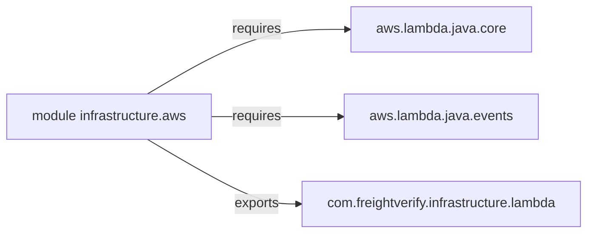

# Diagram: platform-java-lambdas/infrastructure/aws/src/main/java/module-info.java

> Auto-generated by Obscura crawlers

## Mermaid

### SVG

<svg id="container" width="718.875" xmlns="http://www.w3.org/2000/svg" class="flowchart" height="278" viewBox="0 0 718.875 278" role="graphics-document document" aria-roledescription="flowchart-v2"><g><marker id="container_flowchart-v2-pointEnd" class="marker flowchart-v2" viewBox="0 0 10 10" refX="5" refY="5" markerUnits="userSpaceOnUse" markerWidth="8" markerHeight="8" orient="auto"><path d="M 0 0 L 10 5 L 0 10 z" class="arrowMarkerPath" style="stroke-width: 1; stroke-dasharray: 1, 0;"></path></marker><marker id="container_flowchart-v2-pointStart" class="marker flowchart-v2" viewBox="0 0 10 10" refX="4.5" refY="5" markerUnits="userSpaceOnUse" markerWidth="8" markerHeight="8" orient="auto"><path d="M 0 5 L 10 10 L 10 0 z" class="arrowMarkerPath" style="stroke-width: 1; stroke-dasharray: 1, 0;"></path></marker><marker id="container_flowchart-v2-circleEnd" class="marker flowchart-v2" viewBox="0 0 10 10" refX="11" refY="5" markerUnits="userSpaceOnUse" markerWidth="11" markerHeight="11" orient="auto"><circle cx="5" cy="5" r="5" class="arrowMarkerPath" style="stroke-width: 1; stroke-dasharray: 1, 0;"></circle></marker><marker id="container_flowchart-v2-circleStart" class="marker flowchart-v2" viewBox="0 0 10 10" refX="-1" refY="5" markerUnits="userSpaceOnUse" markerWidth="11" markerHeight="11" orient="auto"><circle cx="5" cy="5" r="5" class="arrowMarkerPath" style="stroke-width: 1; stroke-dasharray: 1, 0;"></circle></marker><marker id="container_flowchart-v2-crossEnd" class="marker cross flowchart-v2" viewBox="0 0 11 11" refX="12" refY="5.2" markerUnits="userSpaceOnUse" markerWidth="11" markerHeight="11" orient="auto"><path d="M 1,1 l 9,9 M 10,1 l -9,9" class="arrowMarkerPath" style="stroke-width: 2; stroke-dasharray: 1, 0;"></path></marker><marker id="container_flowchart-v2-crossStart" class="marker cross flowchart-v2" viewBox="0 0 11 11" refX="-1" refY="5.2" markerUnits="userSpaceOnUse" markerWidth="11" markerHeight="11" orient="auto"><path d="M 1,1 l 9,9 M 10,1 l -9,9" class="arrowMarkerPath" style="stroke-width: 2; stroke-dasharray: 1, 0;"></path></marker><g class="root"><g class="clusters"></g><g class="edgePaths"><path d="M179.732,112L201.929,99.167C224.126,86.333,268.52,60.667,309.944,47.833C351.367,35,389.82,35,409.047,35L428.273,35" id="L_infra_core_0" class="edge-thickness-normal edge-pattern-solid edge-thickness-normal edge-pattern-solid flowchart-link" style=";" data-edge="true" data-et="edge" data-id="L_infra_core_0" data-points="W3sieCI6MTc5LjczMTU5NTU1Mjg4NDYsInkiOjExMn0seyJ4IjozMTIuOTE0MDYyNSwieSI6MzV9LHsieCI6NDMyLjI3MzQzNzUsInkiOjM1fV0=" marker-end="url(#container_flowchart-v2-pointEnd)"></path><path d="M258.063,139L267.204,139C276.346,139,294.63,139,321.605,139C348.581,139,384.247,139,402.081,139L419.914,139" id="L_infra_events_0" class="edge-thickness-normal edge-pattern-solid edge-thickness-normal edge-pattern-solid flowchart-link" style=";" data-edge="true" data-et="edge" data-id="L_infra_events_0" data-points="W3sieCI6MjU4LjA2MjUsInkiOjEzOX0seyJ4IjozMTIuOTE0MDYyNSwieSI6MTM5fSx7IngiOjQyMy45MTQwNjI1LCJ5IjoxMzl9XQ==" marker-end="url(#container_flowchart-v2-pointEnd)"></path><path d="M179.732,166L201.929,178.833C224.126,191.667,268.52,217.333,299.192,230.167C329.865,243,346.815,243,355.29,243L363.766,243" id="L_infra_pkg_0" class="edge-thickness-normal edge-pattern-solid edge-thickness-normal edge-pattern-solid flowchart-link" style=";" data-edge="true" data-et="edge" data-id="L_infra_pkg_0" data-points="W3sieCI6MTc5LjczMTU5NTU1Mjg4NDYsInkiOjE2Nn0seyJ4IjozMTIuOTE0MDYyNSwieSI6MjQzfSx7IngiOjM2Ny43NjU2MjUsInkiOjI0M31d" marker-end="url(#container_flowchart-v2-pointEnd)"></path></g><g class="edgeLabels"><g class="edgeLabel" transform="translate(312.9140625, 35)"><g class="label" data-id="L_infra_core_0" transform="translate(-29.8515625, -12)"><foreignObject width="59.703125" height="24">

requires

</foreignObject></g></g><g class="edgeLabel" transform="translate(312.9140625, 139)"><g class="label" data-id="L_infra_events_0" transform="translate(-29.8515625, -12)"><foreignObject width="59.703125" height="24">

requires

</foreignObject></g></g><g class="edgeLabel" transform="translate(312.9140625, 243)"><g class="label" data-id="L_infra_pkg_0" transform="translate(-27.3046875, -12)"><foreignObject width="54.609375" height="24">

exports

</foreignObject></g></g></g><g class="nodes"><g class="node default" id="flowchart-infra-0" transform="translate(133.03125, 139)"><rect class="basic label-container" style="" x="-125.03125" y="-27" width="250.0625" height="54"></rect><g class="label" style="" transform="translate(-95.03125, -12)"><rect></rect><foreignObject width="190.0625" height="24">

module infrastructure.aws

</foreignObject></g></g><g class="node default" id="flowchart-core-1" transform="translate(539.3203125, 35)"><rect class="basic label-container" style="" x="-107.046875" y="-27" width="214.09375" height="54"></rect><g class="label" style="" transform="translate(-77.046875, -12)"><rect></rect><foreignObject width="154.09375" height="24">

aws.lambda.java.core

</foreignObject></g></g><g class="node default" id="flowchart-events-2" transform="translate(539.3203125, 139)"><rect class="basic label-container" style="" x="-115.40625" y="-27" width="230.8125" height="54"></rect><g class="label" style="" transform="translate(-85.40625, -12)"><rect></rect><foreignObject width="170.8125" height="24">

aws.lambda.java.events

</foreignObject></g></g><g class="node default" id="flowchart-pkg-3" transform="translate(539.3203125, 243)"><rect class="basic label-container" style="" x="-171.5546875" y="-27" width="343.109375" height="54"></rect><g class="label" style="" transform="translate(-141.5546875, -12)"><rect></rect><foreignObject width="283.109375" height="24">

com.freightverify.infrastructure.lambda

</foreignObject></g></g></g></g></g></svg>
