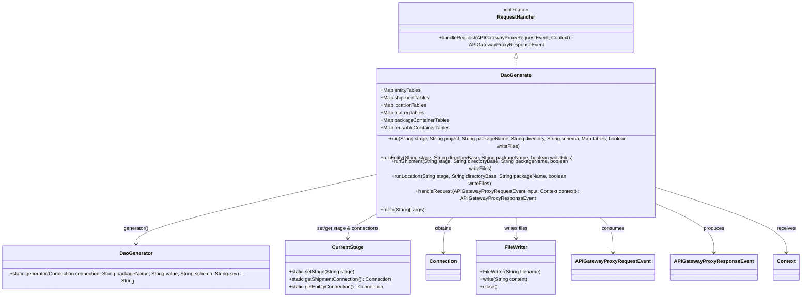
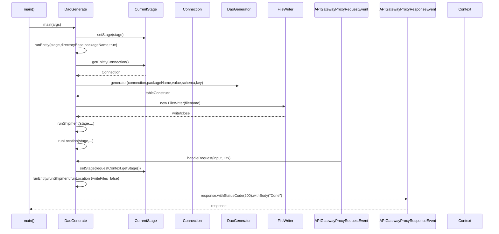

# Diagram: platform-java-lambdas/infrastructure/dao-generation/src/main/java/com/freightverify/infrastructure/util/dao/DaoGenerate.java


> Auto-generated by Obscura crawlers

## Diagram 1



### SVG

<svg id="container" width="2555.3515625" xmlns="http://www.w3.org/2000/svg" class="classDiagram" height="872" viewBox="0 0 2555.3515625 872" role="graphics-document document" aria-roledescription="class"><style>#container{font-family:"trebuchet ms",verdana,arial,sans-serif;font-size:16px;fill:#333;}@keyframes edge-animation-frame{from{stroke-dashoffset:0;}}@keyframes dash{to{stroke-dashoffset:0;}}#container .edge-animation-slow{stroke-dasharray:9,5!important;stroke-dashoffset:900;animation:dash 50s linear infinite;stroke-linecap:round;}#container .edge-animation-fast{stroke-dasharray:9,5!important;stroke-dashoffset:900;animation:dash 20s linear infinite;stroke-linecap:round;}#container .error-icon{fill:#552222;}#container .error-text{fill:#552222;stroke:#552222;}#container .edge-thickness-normal{stroke-width:1px;}#container .edge-thickness-thick{stroke-width:3.5px;}#container .edge-pattern-solid{stroke-dasharray:0;}#container .edge-thickness-invisible{stroke-width:0;fill:none;}#container .edge-pattern-dashed{stroke-dasharray:3;}#container .edge-pattern-dotted{stroke-dasharray:2;}#container .marker{fill:#333333;stroke:#333333;}#container .marker.cross{stroke:#333333;}#container svg{font-family:"trebuchet ms",verdana,arial,sans-serif;font-size:16px;}#container p{margin:0;}#container g.classGroup text{fill:#9370DB;stroke:none;font-family:"trebuchet ms",verdana,arial,sans-serif;font-size:10px;}#container g.classGroup text .title{font-weight:bolder;}#container .nodeLabel,#container .edgeLabel{color:#131300;}#container .edgeLabel .label rect{fill:#ECECFF;}#container .label text{fill:#131300;}#container .labelBkg{background:#ECECFF;}#container .edgeLabel .label span{background:#ECECFF;}#container .classTitle{font-weight:bolder;}#container .node rect,#container .node circle,#container .node ellipse,#container .node polygon,#container .node path{fill:#ECECFF;stroke:#9370DB;stroke-width:1px;}#container .divider{stroke:#9370DB;stroke-width:1;}#container g.clickable{cursor:pointer;}#container g.classGroup rect{fill:#ECECFF;stroke:#9370DB;}#container g.classGroup line{stroke:#9370DB;stroke-width:1;}#container .classLabel .box{stroke:none;stroke-width:0;fill:#ECECFF;opacity:0.5;}#container .classLabel .label{fill:#9370DB;font-size:10px;}#container .relation{stroke:#333333;stroke-width:1;fill:none;}#container .dashed-line{stroke-dasharray:3;}#container .dotted-line{stroke-dasharray:1 2;}#container #compositionStart,#container .composition{fill:#333333!important;stroke:#333333!important;stroke-width:1;}#container #compositionEnd,#container .composition{fill:#333333!important;stroke:#333333!important;stroke-width:1;}#container #dependencyStart,#container .dependency{fill:#333333!important;stroke:#333333!important;stroke-width:1;}#container #dependencyStart,#container .dependency{fill:#333333!important;stroke:#333333!important;stroke-width:1;}#container #extensionStart,#container .extension{fill:transparent!important;stroke:#333333!important;stroke-width:1;}#container #extensionEnd,#container .extension{fill:transparent!important;stroke:#333333!important;stroke-width:1;}#container #aggregationStart,#container .aggregation{fill:transparent!important;stroke:#333333!important;stroke-width:1;}#container #aggregationEnd,#container .aggregation{fill:transparent!important;stroke:#333333!important;stroke-width:1;}#container #lollipopStart,#container .lollipop{fill:#ECECFF!important;stroke:#333333!important;stroke-width:1;}#container #lollipopEnd,#container .lollipop{fill:#ECECFF!important;stroke:#333333!important;stroke-width:1;}#container .edgeTerminals{font-size:11px;line-height:initial;}#container .classTitleText{text-anchor:middle;font-size:18px;fill:#333;}#container .label-icon{display:inline-block;height:1em;overflow:visible;vertical-align:-0.125em;}#container .node .label-icon path{fill:currentColor;stroke:revert;stroke-width:revert;}#container :root{--mermaid-font-family:"trebuchet ms",verdana,arial,sans-serif;}</style><g><defs><marker id="container_class-aggregationStart" class="marker aggregation class" refX="18" refY="7" markerWidth="190" markerHeight="240" orient="auto"><path d="M 18,7 L9,13 L1,7 L9,1 Z"></path></marker></defs><defs><marker id="container_class-aggregationEnd" class="marker aggregation class" refX="1" refY="7" markerWidth="20" markerHeight="28" orient="auto"><path d="M 18,7 L9,13 L1,7 L9,1 Z"></path></marker></defs><defs><marker id="container_class-extensionStart" class="marker extension class" refX="18" refY="7" markerWidth="190" markerHeight="240" orient="auto"><path d="M 1,7 L18,13 V 1 Z"></path></marker></defs><defs><marker id="container_class-extensionEnd" class="marker extension class" refX="1" refY="7" markerWidth="20" markerHeight="28" orient="auto"><path d="M 1,1 V 13 L18,7 Z"></path></marker></defs><defs><marker id="container_class-compositionStart" class="marker composition class" refX="18" refY="7" markerWidth="190" markerHeight="240" orient="auto"><path d="M 18,7 L9,13 L1,7 L9,1 Z"></path></marker></defs><defs><marker id="container_class-compositionEnd" class="marker composition class" refX="1" refY="7" markerWidth="20" markerHeight="28" orient="auto"><path d="M 18,7 L9,13 L1,7 L9,1 Z"></path></marker></defs><defs><marker id="container_class-dependencyStart" class="marker dependency class" refX="6" refY="7" markerWidth="190" markerHeight="240" orient="auto"><path d="M 5,7 L9,13 L1,7 L9,1 Z"></path></marker></defs><defs><marker id="container_class-dependencyEnd" class="marker dependency class" refX="13" refY="7" markerWidth="20" markerHeight="28" orient="auto"><path d="M 18,7 L9,13 L14,7 L9,1 Z"></path></marker></defs><defs><marker id="container_class-lollipopStart" class="marker lollipop class" refX="13" refY="7" markerWidth="190" markerHeight="240" orient="auto"><circle stroke="black" fill="transparent" cx="7" cy="7" r="6"></circle></marker></defs><defs><marker id="container_class-lollipopEnd" class="marker lollipop class" refX="1" refY="7" markerWidth="190" markerHeight="240" orient="auto"><circle stroke="black" fill="transparent" cx="7" cy="7" r="6"></circle></marker></defs><g class="root"><g class="clusters"></g><g class="edgePaths"><path d="M1674.77,175.25L1674.77,176.542C1674.77,177.833,1674.77,180.417,1674.77,185.875C1674.77,191.333,1674.77,199.667,1674.77,203.833L1674.77,208" id="id_RequestHandler_DaoGenerate_1" class="edge-thickness-normal edge-pattern-dashed relation" style=";;;" data-edge="true" data-et="edge" data-id="id_RequestHandler_DaoGenerate_1" data-points="W3sieCI6MTY3NC43Njk1MzEyNSwieSI6MTU4fSx7IngiOjE2NzQuNzY5NTMxMjUsInkiOjE4M30seyJ4IjoxNjc0Ljc2OTUzMTI1LCJ5IjoyMDh9XQ==" marker-start="url(#container_class-extensionStart)"></path><path d="M1214.004,490.466L1086.22,515.555C958.436,540.644,702.868,590.822,575.085,627.078C447.301,663.333,447.301,685.667,447.301,696.833L447.301,708" id="id_DaoGenerate_DaoGenerator_2" class="edge-thickness-normal edge-pattern-solid relation" style=";;;" data-edge="true" data-et="edge" data-id="id_DaoGenerate_DaoGenerator_2" data-points="W3sieCI6MTIxNC4wMDM5MDYyNSwieSI6NDkwLjQ2NjI2Njk2MTk4OTg1fSx7IngiOjQ0Ny4zMDA3ODEyNSwieSI6NjQxfSx7IngiOjQ0Ny4zMDA3ODEyNSwieSI6NzE0fV0=" marker-end="url(#container_class-dependencyEnd)"></path><path d="M1247.232,592L1229.047,600.167C1210.862,608.333,1174.491,624.667,1156.306,640C1138.121,655.333,1138.121,669.667,1138.121,676.833L1138.121,684" id="id_DaoGenerate_CurrentStage_3" class="edge-thickness-normal edge-pattern-solid relation" style=";;;" data-edge="true" data-et="edge" data-id="id_DaoGenerate_CurrentStage_3" data-points="W3sieCI6MTI0Ny4yMzIxODY4NTE2NTk3LCJ5Ijo1OTJ9LHsieCI6MTEzOC4xMjEwOTM3NSwieSI6NjQxfSx7IngiOjExMzguMTIxMDkzNzUsInkiOjY5MH1d" marker-end="url(#container_class-dependencyEnd)"></path><path d="M1490.017,592L1482.159,600.167C1474.301,608.333,1458.584,624.667,1450.726,647.5C1442.867,670.333,1442.867,699.667,1442.867,714.333L1442.867,729" id="id_DaoGenerate_Connection_4" class="edge-thickness-normal edge-pattern-solid relation" style=";;;" data-edge="true" data-et="edge" data-id="id_DaoGenerate_Connection_4" data-points="W3sieCI6MTQ5MC4wMTc0NTY1NjEyMDMzLCJ5Ijo1OTJ9LHsieCI6MTQ0Mi44NjcxODc1LCJ5Ijo2NDF9LHsieCI6MTQ0Mi44NjcxODc1LCJ5Ijo3MzV9XQ==" marker-end="url(#container_class-dependencyEnd)"></path><path d="M1674.77,592L1674.77,600.167C1674.77,608.333,1674.77,624.667,1674.77,640C1674.77,655.333,1674.77,669.667,1674.77,676.833L1674.77,684" id="id_DaoGenerate_FileWriter_5" class="edge-thickness-normal edge-pattern-solid relation" style=";;;" data-edge="true" data-et="edge" data-id="id_DaoGenerate_FileWriter_5" data-points="W3sieCI6MTY3NC43Njk1MzEyNSwieSI6NTkyfSx7IngiOjE2NzQuNzY5NTMxMjUsInkiOjY0MX0seyJ4IjoxNjc0Ljc2OTUzMTI1LCJ5Ijo2OTB9XQ==" marker-end="url(#container_class-dependencyEnd)"></path><path d="M1917.225,592L1927.538,600.167C1937.85,608.333,1958.476,624.667,1968.789,647.5C1979.102,670.333,1979.102,699.667,1979.102,714.333L1979.102,729" id="id_DaoGenerate_APIGatewayProxyRequestEvent_6" class="edge-thickness-normal edge-pattern-solid relation" style=";;;" data-edge="true" data-et="edge" data-id="id_DaoGenerate_APIGatewayProxyRequestEvent_6" data-points="W3sieCI6MTkxNy4yMjQ5MjU0NDA4NzE0LCJ5Ijo1OTJ9LHsieCI6MTk3OS4xMDE1NjI1LCJ5Ijo2NDF9LHsieCI6MTk3OS4xMDE1NjI1LCJ5Ijo3MzV9XQ==" marker-end="url(#container_class-dependencyEnd)"></path><path d="M2135.535,581.709L2160.593,591.59C2185.651,601.472,2235.767,621.236,2260.825,645.785C2285.883,670.333,2285.883,699.667,2285.883,714.333L2285.883,729" id="id_DaoGenerate_APIGatewayProxyResponseEvent_7" class="edge-thickness-normal edge-pattern-solid relation" style=";;;" data-edge="true" data-et="edge" data-id="id_DaoGenerate_APIGatewayProxyResponseEvent_7" data-points="W3sieCI6MjEzNS41MzUxNTYyNSwieSI6NTgxLjcwODU2MjExNDQ4MTF9LHsieCI6MjI4NS44ODI4MTI1LCJ5Ijo2NDF9LHsieCI6MjI4NS44ODI4MTI1LCJ5Ijo3MzV9XQ==" marker-end="url(#container_class-dependencyEnd)"></path><path d="M2135.535,533.401L2197.476,551.334C2259.417,569.267,2383.298,605.134,2445.239,637.734C2507.18,670.333,2507.18,699.667,2507.18,714.333L2507.18,729" id="id_DaoGenerate_Context_8" class="edge-thickness-normal edge-pattern-solid relation" style=";;;" data-edge="true" data-et="edge" data-id="id_DaoGenerate_Context_8" data-points="W3sieCI6MjEzNS41MzUxNTYyNSwieSI6NTMzLjQwMTIwMjI2OTM4OX0seyJ4IjoyNTA3LjE3OTY4NzUsInkiOjY0MX0seyJ4IjoyNTA3LjE3OTY4NzUsInkiOjczNX1d" marker-end="url(#container_class-dependencyEnd)"></path></g><g class="edgeLabels"><g class="edgeLabel"><g class="label" data-id="id_RequestHandler_DaoGenerate_1" transform="translate(0, 0)"><foreignObject width="0" height="0"><div xmlns="http://www.w3.org/1999/xhtml" class="labelBkg" style="display: table-cell; white-space: nowrap; line-height: 1.5; max-width: 200px; text-align: center;"><span class="edgeLabel"></span></div></foreignObject></g></g><g class="edgeLabel" transform="translate(447.30078125, 641)"><g class="label" data-id="id_DaoGenerate_DaoGenerator_2" transform="translate(-40.3125, -12)"><foreignObject width="80.625" height="24"><div xmlns="http://www.w3.org/1999/xhtml" class="labelBkg" style="display: table-cell; white-space: nowrap; line-height: 1.5; max-width: 200px; text-align: center;"><span class="edgeLabel"><p>generator()</p></span></div></foreignObject></g></g><g class="edgeLabel" transform="translate(1138.12109375, 641)"><g class="label" data-id="id_DaoGenerate_CurrentStage_3" transform="translate(-100, -24)"><foreignObject width="200" height="48"><div xmlns="http://www.w3.org/1999/xhtml" class="labelBkg" style="display: table; white-space: break-spaces; line-height: 1.5; max-width: 200px; text-align: center; width: 200px;"><span class="edgeLabel"><p>set/get stage &amp; connections</p></span></div></foreignObject></g></g><g class="edgeLabel" transform="translate(1442.8671875, 641)"><g class="label" data-id="id_DaoGenerate_Connection_4" transform="translate(-27.2890625, -12)"><foreignObject width="54.578125" height="24"><div xmlns="http://www.w3.org/1999/xhtml" class="labelBkg" style="display: table-cell; white-space: nowrap; line-height: 1.5; max-width: 200px; text-align: center;"><span class="edgeLabel"><p>obtains</p></span></div></foreignObject></g></g><g class="edgeLabel" transform="translate(1674.76953125, 641)"><g class="label" data-id="id_DaoGenerate_FileWriter_5" transform="translate(-39.0703125, -12)"><foreignObject width="78.140625" height="24"><div xmlns="http://www.w3.org/1999/xhtml" class="labelBkg" style="display: table-cell; white-space: nowrap; line-height: 1.5; max-width: 200px; text-align: center;"><span class="edgeLabel"><p>writes files</p></span></div></foreignObject></g></g><g class="edgeLabel" transform="translate(1979.1015625, 641)"><g class="label" data-id="id_DaoGenerate_APIGatewayProxyRequestEvent_6" transform="translate(-36.375, -12)"><foreignObject width="72.75" height="24"><div xmlns="http://www.w3.org/1999/xhtml" class="labelBkg" style="display: table-cell; white-space: nowrap; line-height: 1.5; max-width: 200px; text-align: center;"><span class="edgeLabel"><p>consumes</p></span></div></foreignObject></g></g><g class="edgeLabel" transform="translate(2285.8828125, 641)"><g class="label" data-id="id_DaoGenerate_APIGatewayProxyResponseEvent_7" transform="translate(-33.4765625, -12)"><foreignObject width="66.953125" height="24"><div xmlns="http://www.w3.org/1999/xhtml" class="labelBkg" style="display: table-cell; white-space: nowrap; line-height: 1.5; max-width: 200px; text-align: center;"><span class="edgeLabel"><p>produces</p></span></div></foreignObject></g></g><g class="edgeLabel" transform="translate(2507.1796875, 641)"><g class="label" data-id="id_DaoGenerate_Context_8" transform="translate(-29.4921875, -12)"><foreignObject width="58.984375" height="24"><div xmlns="http://www.w3.org/1999/xhtml" class="labelBkg" style="display: table-cell; white-space: nowrap; line-height: 1.5; max-width: 200px; text-align: center;"><span class="edgeLabel"><p>receives</p></span></div></foreignObject></g></g></g><g class="nodes"><g class="node default" id="classId-RequestHandler-0" transform="translate(1674.76953125, 83)"><g class="basic label-container"><path d="M-370.94140625 -75 L370.94140625 -75 L370.94140625 75 L-370.94140625 75" stroke="none" stroke-width="0" fill="#ECECFF" style=""></path><path d="M-370.94140625 -75 C-95.30821626295216 -75, 180.32497372409568 -75, 370.94140625 -75 M-370.94140625 -75 C-189.64899777229266 -75, -8.35658929458532 -75, 370.94140625 -75 M370.94140625 -75 C370.94140625 -40.79406315057255, 370.94140625 -6.5881263011450955, 370.94140625 75 M370.94140625 -75 C370.94140625 -42.3405792802848, 370.94140625 -9.6811585605696, 370.94140625 75 M370.94140625 75 C157.50240293575672 75, -55.93660037848656 75, -370.94140625 75 M370.94140625 75 C84.61207549337888 75, -201.71725526324224 75, -370.94140625 75 M-370.94140625 75 C-370.94140625 25.590977425346374, -370.94140625 -23.818045149307252, -370.94140625 -75 M-370.94140625 75 C-370.94140625 28.66102313560215, -370.94140625 -17.6779537287957, -370.94140625 -75" stroke="#9370DB" stroke-width="1.3" fill="none" stroke-dasharray="0 0" style=""></path></g><g class="annotation-group text" transform="translate(-41.015625, -51)"><g class="label" style="" transform="translate(0,-12)"><foreignObject width="82.03125" height="24"><div xmlns="http://www.w3.org/1999/xhtml" style="display: table-cell; white-space: nowrap; line-height: 1.5; max-width: 132px; text-align: center;"><span class="nodeLabel markdown-node-label" style=""><p>«interface»</p></span></div></foreignObject></g></g><g class="label-group text" transform="translate(-59.0703125, -27)"><g class="label" style="font-weight: bolder" transform="translate(0,-12)"><foreignObject width="118.140625" height="24"><div xmlns="http://www.w3.org/1999/xhtml" style="display: table-cell; white-space: nowrap; line-height: 1.5; max-width: 168px; text-align: center;"><span class="nodeLabel markdown-node-label" style=""><p>RequestHandler</p></span></div></foreignObject></g></g><g class="members-group text" transform="translate(-358.94140625, 21)"></g><g class="methods-group text" transform="translate(-358.94140625, 51)"><g class="label" style="" transform="translate(0,-12)"><foreignObject width="658.8125" height="24"><div xmlns="http://www.w3.org/1999/xhtml" style="display: table-cell; white-space: nowrap; line-height: 1.5; max-width: 716px; text-align: center;"><span class="nodeLabel markdown-node-label" style=""><p>+handleRequest(APIGatewayProxyRequestEvent, Context) : APIGatewayProxyResponseEvent</p></span></div></foreignObject></g></g><g class="divider" style=""><path d="M-370.94140625 -3 C-128.06639980313403 -3, 114.80860664373193 -3, 370.94140625 -3 M-370.94140625 -3 C-124.88741788986576 -3, 121.16657047026848 -3, 370.94140625 -3" stroke="#9370DB" stroke-width="1.3" fill="none" stroke-dasharray="0 0" style=""></path></g><g class="divider" style=""><path d="M-370.94140625 21 C-221.75152388172808 21, -72.56164151345615 21, 370.94140625 21 M-370.94140625 21 C-128.94041624249104 21, 113.06057376501792 21, 370.94140625 21" stroke="#9370DB" stroke-width="1.3" fill="none" stroke-dasharray="0 0" style=""></path></g></g><g class="node default" id="classId-DaoGenerate-1" transform="translate(1674.76953125, 400)"><g class="basic label-container"><path d="M-460.765625 -192 L460.765625 -192 L460.765625 192 L-460.765625 192" stroke="none" stroke-width="0" fill="#ECECFF" style=""></path><path d="M-460.765625 -192 C-158.31386357477305 -192, 144.1378978504539 -192, 460.765625 -192 M-460.765625 -192 C-218.2568702845768 -192, 24.251884430846417 -192, 460.765625 -192 M460.765625 -192 C460.765625 -90.06608607971042, 460.765625 11.867827840579167, 460.765625 192 M460.765625 -192 C460.765625 -114.91907815287402, 460.765625 -37.83815630574804, 460.765625 192 M460.765625 192 C182.24678036261855 192, -96.2720642747629 192, -460.765625 192 M460.765625 192 C217.91206296055879 192, -24.94149907888243 192, -460.765625 192 M-460.765625 192 C-460.765625 88.92785209562685, -460.765625 -14.144295808746307, -460.765625 -192 M-460.765625 192 C-460.765625 64.78360360936381, -460.765625 -62.43279278127238, -460.765625 -192" stroke="#9370DB" stroke-width="1.3" fill="none" stroke-dasharray="0 0" style=""></path></g><g class="annotation-group text" transform="translate(0, -168)"></g><g class="label-group text" transform="translate(-47.46875, -168)"><g class="label" style="font-weight: bolder" transform="translate(0,-12)"><foreignObject width="94.9375" height="24"><div xmlns="http://www.w3.org/1999/xhtml" style="display: table-cell; white-space: nowrap; line-height: 1.5; max-width: 144px; text-align: center;"><span class="nodeLabel markdown-node-label" style=""><p>DaoGenerate</p></span></div></foreignObject></g></g><g class="members-group text" transform="translate(-448.765625, -120)"><g class="label" style="" transform="translate(0,-12)"><foreignObject width="131.3125" height="24"><div xmlns="http://www.w3.org/1999/xhtml" style="display: table-cell; white-space: nowrap; line-height: 1.5; max-width: 189px; text-align: center;"><span class="nodeLabel markdown-node-label" style=""><p>+Map entityTables</p></span></div></foreignObject></g><g class="label" style="" transform="translate(0,12)"><foreignObject width="157.8125" height="24"><div xmlns="http://www.w3.org/1999/xhtml" style="display: table-cell; white-space: nowrap; line-height: 1.5; max-width: 215px; text-align: center;"><span class="nodeLabel markdown-node-label" style=""><p>+Map shipmentTables</p></span></div></foreignObject></g><g class="label" style="" transform="translate(0,36)"><foreignObject width="148.515625" height="24"><div xmlns="http://www.w3.org/1999/xhtml" style="display: table-cell; white-space: nowrap; line-height: 1.5; max-width: 206px; text-align: center;"><span class="nodeLabel markdown-node-label" style=""><p>+Map locationTables</p></span></div></foreignObject></g><g class="label" style="" transform="translate(0,60)"><foreignObject width="139.9375" height="24"><div xmlns="http://www.w3.org/1999/xhtml" style="display: table-cell; white-space: nowrap; line-height: 1.5; max-width: 197px; text-align: center;"><span class="nodeLabel markdown-node-label" style=""><p>+Map tripLegTables</p></span></div></foreignObject></g><g class="label" style="" transform="translate(0,84)"><foreignObject width="218.859375" height="24"><div xmlns="http://www.w3.org/1999/xhtml" style="display: table-cell; white-space: nowrap; line-height: 1.5; max-width: 276px; text-align: center;"><span class="nodeLabel markdown-node-label" style=""><p>+Map packageContainerTables</p></span></div></foreignObject></g><g class="label" style="" transform="translate(0,108)"><foreignObject width="222.453125" height="24"><div xmlns="http://www.w3.org/1999/xhtml" style="display: table-cell; white-space: nowrap; line-height: 1.5; max-width: 280px; text-align: center;"><span class="nodeLabel markdown-node-label" style=""><p>+Map reusableContainerTables</p></span></div></foreignObject></g></g><g class="methods-group text" transform="translate(-448.765625, 48)"><g class="label" style="" transform="translate(0,-12)"><foreignObject width="850.0625" height="24"><div xmlns="http://www.w3.org/1999/xhtml" style="display: table-cell; white-space: nowrap; line-height: 1.5; max-width: 907px; text-align: center;"><span class="nodeLabel markdown-node-label" style=""><p>+run(String stage, String project, String packageName, String directory, String schema, Map tables, boolean writeFiles)</p></span></div></foreignObject></g><g class="label" style="" transform="translate(0,12)"><foreignObject width="621.71875" height="24"><div xmlns="http://www.w3.org/1999/xhtml" style="display: table-cell; white-space: nowrap; line-height: 1.5; max-width: 679px; text-align: center;"><span class="nodeLabel markdown-node-label" style=""><p>+runEntity(String stage, String directoryBase, String packageName, boolean writeFiles)</p></span></div></foreignObject></g><g class="label" style="" transform="translate(0,36)"><foreignObject width="649.78125" height="24"><div xmlns="http://www.w3.org/1999/xhtml" style="display: table-cell; white-space: nowrap; line-height: 1.5; max-width: 707px; text-align: center;"><span class="nodeLabel markdown-node-label" style=""><p>+runShipment(String stage, String directoryBase, String packageName, boolean writeFiles)</p></span></div></foreignObject></g><g class="label" style="" transform="translate(0,60)"><foreignObject width="642.203125" height="24"><div xmlns="http://www.w3.org/1999/xhtml" style="display: table-cell; white-space: nowrap; line-height: 1.5; max-width: 700px; text-align: center;"><span class="nodeLabel markdown-node-label" style=""><p>+runLocation(String stage, String directoryBase, String packageName, boolean writeFiles)</p></span></div></foreignObject></g><g class="label" style="" transform="translate(0,84)"><foreignObject width="759.46875" height="24"><div xmlns="http://www.w3.org/1999/xhtml" style="display: table-cell; white-space: nowrap; line-height: 1.5; max-width: 817px; text-align: center;"><span class="nodeLabel markdown-node-label" style=""><p>+handleRequest(APIGatewayProxyRequestEvent input, Context context) : APIGatewayProxyResponseEvent</p></span></div></foreignObject></g><g class="label" style="" transform="translate(0,108)"><foreignObject width="142.40625" height="24"><div xmlns="http://www.w3.org/1999/xhtml" style="display: table-cell; white-space: nowrap; line-height: 1.5; max-width: 200px; text-align: center;"><span class="nodeLabel markdown-node-label" style=""><p>+main(String[] args)</p></span></div></foreignObject></g></g><g class="divider" style=""><path d="M-460.765625 -144 C-168.3574239367071 -144, 124.05077712658579 -144, 460.765625 -144 M-460.765625 -144 C-128.8275918665994 -144, 203.11044126680122 -144, 460.765625 -144" stroke="#9370DB" stroke-width="1.3" fill="none" stroke-dasharray="0 0" style=""></path></g><g class="divider" style=""><path d="M-460.765625 24 C-167.7473347292052 24, 125.27095554158961 24, 460.765625 24 M-460.765625 24 C-274.80732470648746 24, -88.84902441297493 24, 460.765625 24" stroke="#9370DB" stroke-width="1.3" fill="none" stroke-dasharray="0 0" style=""></path></g></g><g class="node default" id="classId-DaoGenerator-2" transform="translate(447.30078125, 777)"><g class="basic label-container"><path d="M-439.30078125 -63 L439.30078125 -63 L439.30078125 63 L-439.30078125 63" stroke="none" stroke-width="0" fill="#ECECFF" style=""></path><path d="M-439.30078125 -63 C-220.2457447140199 -63, -1.190708178039813 -63, 439.30078125 -63 M-439.30078125 -63 C-150.25170986006663 -63, 138.79736152986675 -63, 439.30078125 -63 M439.30078125 -63 C439.30078125 -14.883557732453951, 439.30078125 33.2328845350921, 439.30078125 63 M439.30078125 -63 C439.30078125 -31.511992629549756, 439.30078125 -0.023985259099511325, 439.30078125 63 M439.30078125 63 C187.55924292479202 63, -64.18229540041597 63, -439.30078125 63 M439.30078125 63 C205.65608434740759 63, -27.98861255518483 63, -439.30078125 63 M-439.30078125 63 C-439.30078125 19.728603493074743, -439.30078125 -23.542793013850513, -439.30078125 -63 M-439.30078125 63 C-439.30078125 34.03452556978277, -439.30078125 5.069051139565552, -439.30078125 -63" stroke="#9370DB" stroke-width="1.3" fill="none" stroke-dasharray="0 0" style=""></path></g><g class="annotation-group text" transform="translate(0, -39)"></g><g class="label-group text" transform="translate(-50.9296875, -39)"><g class="label" style="font-weight: bolder" transform="translate(0,-12)"><foreignObject width="101.859375" height="24"><div xmlns="http://www.w3.org/1999/xhtml" style="display: table-cell; white-space: nowrap; line-height: 1.5; max-width: 151px; text-align: center;"><span class="nodeLabel markdown-node-label" style=""><p>DaoGenerator</p></span></div></foreignObject></g></g><g class="members-group text" transform="translate(-427.30078125, 9)"></g><g class="methods-group text" transform="translate(-427.30078125, 39)"><g class="label" style="" transform="translate(0,-12)"><foreignObject width="803.671875" height="24"><div xmlns="http://www.w3.org/1999/xhtml" style="display: table-cell; white-space: nowrap; line-height: 1.5; max-width: 862px; text-align: center;"><span class="nodeLabel markdown-node-label" style=""><p>+static generator(Connection connection, String packageName, String value, String schema, String key) : : String</p></span></div></foreignObject></g></g><g class="divider" style=""><path d="M-439.30078125 -15 C-252.77686702820463 -15, -66.25295280640927 -15, 439.30078125 -15 M-439.30078125 -15 C-104.41274781102129 -15, 230.47528562795742 -15, 439.30078125 -15" stroke="#9370DB" stroke-width="1.3" fill="none" stroke-dasharray="0 0" style=""></path></g><g class="divider" style=""><path d="M-439.30078125 9 C-109.26104689601073 9, 220.77868745797855 9, 439.30078125 9 M-439.30078125 9 C-109.03281634852334 9, 221.23514855295332 9, 439.30078125 9" stroke="#9370DB" stroke-width="1.3" fill="none" stroke-dasharray="0 0" style=""></path></g></g><g class="node default" id="classId-CurrentStage-3" transform="translate(1138.12109375, 777)"><g class="basic label-container"><path d="M-201.51953125 -87 L201.51953125 -87 L201.51953125 87 L-201.51953125 87" stroke="none" stroke-width="0" fill="#ECECFF" style=""></path><path d="M-201.51953125 -87 C-99.53563016537369 -87, 2.4482709192526215 -87, 201.51953125 -87 M-201.51953125 -87 C-111.64323284681136 -87, -21.766934443622716 -87, 201.51953125 -87 M201.51953125 -87 C201.51953125 -44.03411253966841, 201.51953125 -1.0682250793368269, 201.51953125 87 M201.51953125 -87 C201.51953125 -48.995149314571016, 201.51953125 -10.990298629142032, 201.51953125 87 M201.51953125 87 C70.04666350677093 87, -61.42620423645815 87, -201.51953125 87 M201.51953125 87 C100.42401143055494 87, -0.6715083888901177 87, -201.51953125 87 M-201.51953125 87 C-201.51953125 50.47895924462111, -201.51953125 13.957918489242218, -201.51953125 -87 M-201.51953125 87 C-201.51953125 35.63901960397355, -201.51953125 -15.721960792052897, -201.51953125 -87" stroke="#9370DB" stroke-width="1.3" fill="none" stroke-dasharray="0 0" style=""></path></g><g class="annotation-group text" transform="translate(0, -63)"></g><g class="label-group text" transform="translate(-47.8671875, -63)"><g class="label" style="font-weight: bolder" transform="translate(0,-12)"><foreignObject width="95.734375" height="24"><div xmlns="http://www.w3.org/1999/xhtml" style="display: table-cell; white-space: nowrap; line-height: 1.5; max-width: 143px; text-align: center;"><span class="nodeLabel markdown-node-label" style=""><p>CurrentStage</p></span></div></foreignObject></g></g><g class="members-group text" transform="translate(-189.51953125, -15)"></g><g class="methods-group text" transform="translate(-189.51953125, 15)"><g class="label" style="" transform="translate(0,-12)"><foreignObject width="209.640625" height="24"><div xmlns="http://www.w3.org/1999/xhtml" style="display: table-cell; white-space: nowrap; line-height: 1.5; max-width: 267px; text-align: center;"><span class="nodeLabel markdown-node-label" style=""><p>+static setStage(String stage)</p></span></div></foreignObject></g><g class="label" style="" transform="translate(0,12)"><foreignObject width="331.171875" height="24"><div xmlns="http://www.w3.org/1999/xhtml" style="display: table-cell; white-space: nowrap; line-height: 1.5; max-width: 389px; text-align: center;"><span class="nodeLabel markdown-node-label" style=""><p>+static getShipmentConnection() : Connection</p></span></div></foreignObject></g><g class="label" style="" transform="translate(0,36)"><foreignObject width="307.625" height="24"><div xmlns="http://www.w3.org/1999/xhtml" style="display: table-cell; white-space: nowrap; line-height: 1.5; max-width: 365px; text-align: center;"><span class="nodeLabel markdown-node-label" style=""><p>+static getEnitityConnection() : Connection</p></span></div></foreignObject></g></g><g class="divider" style=""><path d="M-201.51953125 -39 C-60.759807939323565 -39, 79.99991537135287 -39, 201.51953125 -39 M-201.51953125 -39 C-56.638134347087544 -39, 88.24326255582491 -39, 201.51953125 -39" stroke="#9370DB" stroke-width="1.3" fill="none" stroke-dasharray="0 0" style=""></path></g><g class="divider" style=""><path d="M-201.51953125 -15 C-114.75568519304058 -15, -27.991839136081154 -15, 201.51953125 -15 M-201.51953125 -15 C-104.94570492064904 -15, -8.37187859129807 -15, 201.51953125 -15" stroke="#9370DB" stroke-width="1.3" fill="none" stroke-dasharray="0 0" style=""></path></g></g><g class="node default" id="classId-Connection-4" transform="translate(1442.8671875, 777)"><g class="basic label-container"><path d="M-53.2265625 -42 L53.2265625 -42 L53.2265625 42 L-53.2265625 42" stroke="none" stroke-width="0" fill="#ECECFF" style=""></path><path d="M-53.2265625 -42 C-18.82937308431869 -42, 15.567816331362621 -42, 53.2265625 -42 M-53.2265625 -42 C-11.921936375900238 -42, 29.382689748199525 -42, 53.2265625 -42 M53.2265625 -42 C53.2265625 -11.379554927891423, 53.2265625 19.240890144217154, 53.2265625 42 M53.2265625 -42 C53.2265625 -19.99350548389524, 53.2265625 2.012989032209518, 53.2265625 42 M53.2265625 42 C16.165033755098243 42, -20.896494989803514 42, -53.2265625 42 M53.2265625 42 C31.658827676616706 42, 10.091092853233413 42, -53.2265625 42 M-53.2265625 42 C-53.2265625 16.551269566750246, -53.2265625 -8.897460866499507, -53.2265625 -42 M-53.2265625 42 C-53.2265625 8.708178048750092, -53.2265625 -24.583643902499816, -53.2265625 -42" stroke="#9370DB" stroke-width="1.3" fill="none" stroke-dasharray="0 0" style=""></path></g><g class="annotation-group text" transform="translate(0, -18)"></g><g class="label-group text" transform="translate(-41.2265625, -18)"><g class="label" style="font-weight: bolder" transform="translate(0,-12)"><foreignObject width="82.453125" height="24"><div xmlns="http://www.w3.org/1999/xhtml" style="display: table-cell; white-space: nowrap; line-height: 1.5; max-width: 132px; text-align: center;"><span class="nodeLabel markdown-node-label" style=""><p>Connection</p></span></div></foreignObject></g></g><g class="members-group text" transform="translate(-41.2265625, 30)"></g><g class="methods-group text" transform="translate(-41.2265625, 60)"></g><g class="divider" style=""><path d="M-53.2265625 6 C-26.098668210920856 6, 1.0292260781582883 6, 53.2265625 6 M-53.2265625 6 C-17.904786883479062 6, 17.416988733041876 6, 53.2265625 6" stroke="#9370DB" stroke-width="1.3" fill="none" stroke-dasharray="0 0" style=""></path></g><g class="divider" style=""><path d="M-53.2265625 24 C-18.440666103501584 24, 16.34523029299683 24, 53.2265625 24 M-53.2265625 24 C-22.852261434697194 24, 7.522039630605612 24, 53.2265625 24" stroke="#9370DB" stroke-width="1.3" fill="none" stroke-dasharray="0 0" style=""></path></g></g><g class="node default" id="classId-FileWriter-5" transform="translate(1674.76953125, 777)"><g class="basic label-container"><path d="M-128.67578125 -87 L128.67578125 -87 L128.67578125 87 L-128.67578125 87" stroke="none" stroke-width="0" fill="#ECECFF" style=""></path><path d="M-128.67578125 -87 C-70.54517092583632 -87, -12.414560601672633 -87, 128.67578125 -87 M-128.67578125 -87 C-49.462079785974765 -87, 29.75162167805047 -87, 128.67578125 -87 M128.67578125 -87 C128.67578125 -28.987030824461, 128.67578125 29.025938351077997, 128.67578125 87 M128.67578125 -87 C128.67578125 -32.42179654752286, 128.67578125 22.15640690495428, 128.67578125 87 M128.67578125 87 C33.02759547329212 87, -62.62059030341575 87, -128.67578125 87 M128.67578125 87 C39.97697974358135 87, -48.721821762837294 87, -128.67578125 87 M-128.67578125 87 C-128.67578125 24.615425193583626, -128.67578125 -37.76914961283275, -128.67578125 -87 M-128.67578125 87 C-128.67578125 27.671545759954093, -128.67578125 -31.656908480091815, -128.67578125 -87" stroke="#9370DB" stroke-width="1.3" fill="none" stroke-dasharray="0 0" style=""></path></g><g class="annotation-group text" transform="translate(0, -63)"></g><g class="label-group text" transform="translate(-35.4453125, -63)"><g class="label" style="font-weight: bolder" transform="translate(0,-12)"><foreignObject width="70.890625" height="24"><div xmlns="http://www.w3.org/1999/xhtml" style="display: table-cell; white-space: nowrap; line-height: 1.5; max-width: 120px; text-align: center;"><span class="nodeLabel markdown-node-label" style=""><p>FileWriter</p></span></div></foreignObject></g></g><g class="members-group text" transform="translate(-116.67578125, -15)"></g><g class="methods-group text" transform="translate(-116.67578125, 15)"><g class="label" style="" transform="translate(0,-12)"><foreignObject width="197.90625" height="24"><div xmlns="http://www.w3.org/1999/xhtml" style="display: table-cell; white-space: nowrap; line-height: 1.5; max-width: 255px; text-align: center;"><span class="nodeLabel markdown-node-label" style=""><p>+FileWriter(String filename)</p></span></div></foreignObject></g><g class="label" style="" transform="translate(0,12)"><foreignObject width="157.359375" height="24"><div xmlns="http://www.w3.org/1999/xhtml" style="display: table-cell; white-space: nowrap; line-height: 1.5; max-width: 215px; text-align: center;"><span class="nodeLabel markdown-node-label" style=""><p>+write(String content)</p></span></div></foreignObject></g><g class="label" style="" transform="translate(0,36)"><foreignObject width="56.15625" height="24"><div xmlns="http://www.w3.org/1999/xhtml" style="display: table-cell; white-space: nowrap; line-height: 1.5; max-width: 114px; text-align: center;"><span class="nodeLabel markdown-node-label" style=""><p>+close()</p></span></div></foreignObject></g></g><g class="divider" style=""><path d="M-128.67578125 -39 C-56.16491886330081 -39, 16.345943523398375 -39, 128.67578125 -39 M-128.67578125 -39 C-33.23031133334136 -39, 62.215158583317276 -39, 128.67578125 -39" stroke="#9370DB" stroke-width="1.3" fill="none" stroke-dasharray="0 0" style=""></path></g><g class="divider" style=""><path d="M-128.67578125 -15 C-36.834954187327725 -15, 55.00587287534455 -15, 128.67578125 -15 M-128.67578125 -15 C-32.95815499352581 -15, 62.75947126294838 -15, 128.67578125 -15" stroke="#9370DB" stroke-width="1.3" fill="none" stroke-dasharray="0 0" style=""></path></g></g><g class="node default" id="classId-APIGatewayProxyRequestEvent-6" transform="translate(1979.1015625, 777)"><g class="basic label-container"><path d="M-125.65625 -42 L125.65625 -42 L125.65625 42 L-125.65625 42" stroke="none" stroke-width="0" fill="#ECECFF" style=""></path><path d="M-125.65625 -42 C-42.88114516897619 -42, 39.89395966204762 -42, 125.65625 -42 M-125.65625 -42 C-54.55287421022294 -42, 16.550501579554123 -42, 125.65625 -42 M125.65625 -42 C125.65625 -18.350504443215453, 125.65625 5.298991113569095, 125.65625 42 M125.65625 -42 C125.65625 -19.163471620073004, 125.65625 3.673056759853992, 125.65625 42 M125.65625 42 C39.853269271880805 42, -45.94971145623839 42, -125.65625 42 M125.65625 42 C34.481406135499526 42, -56.69343772900095 42, -125.65625 42 M-125.65625 42 C-125.65625 16.987363303031877, -125.65625 -8.025273393936246, -125.65625 -42 M-125.65625 42 C-125.65625 24.45574408204129, -125.65625 6.911488164082577, -125.65625 -42" stroke="#9370DB" stroke-width="1.3" fill="none" stroke-dasharray="0 0" style=""></path></g><g class="annotation-group text" transform="translate(0, -18)"></g><g class="label-group text" transform="translate(-113.65625, -18)"><g class="label" style="font-weight: bolder" transform="translate(0,-12)"><foreignObject width="227.3125" height="24"><div xmlns="http://www.w3.org/1999/xhtml" style="display: table-cell; white-space: nowrap; line-height: 1.5; max-width: 273px; text-align: center;"><span class="nodeLabel markdown-node-label" style=""><p>APIGatewayProxyRequestEvent</p></span></div></foreignObject></g></g><g class="members-group text" transform="translate(-113.65625, 30)"></g><g class="methods-group text" transform="translate(-113.65625, 60)"></g><g class="divider" style=""><path d="M-125.65625 6 C-66.50765558235231 6, -7.359061164704627 6, 125.65625 6 M-125.65625 6 C-68.6935069487164 6, -11.730763897432809 6, 125.65625 6" stroke="#9370DB" stroke-width="1.3" fill="none" stroke-dasharray="0 0" style=""></path></g><g class="divider" style=""><path d="M-125.65625 24 C-41.05232053556557 24, 43.55160892886886 24, 125.65625 24 M-125.65625 24 C-34.01475648995496 24, 57.626737020090076 24, 125.65625 24" stroke="#9370DB" stroke-width="1.3" fill="none" stroke-dasharray="0 0" style=""></path></g></g><g class="node default" id="classId-APIGatewayProxyResponseEvent-7" transform="translate(2285.8828125, 777)"><g class="basic label-container"><path d="M-131.125 -42 L131.125 -42 L131.125 42 L-131.125 42" stroke="none" stroke-width="0" fill="#ECECFF" style=""></path><path d="M-131.125 -42 C-74.3192707751567 -42, -17.51354155031339 -42, 131.125 -42 M-131.125 -42 C-26.809904193728016 -42, 77.50519161254397 -42, 131.125 -42 M131.125 -42 C131.125 -11.057407445338193, 131.125 19.885185109323615, 131.125 42 M131.125 -42 C131.125 -21.99970436735842, 131.125 -1.9994087347168374, 131.125 42 M131.125 42 C45.5354536874637 42, -40.0540926250726 42, -131.125 42 M131.125 42 C52.01627259226608 42, -27.092454815467846 42, -131.125 42 M-131.125 42 C-131.125 17.73358891782968, -131.125 -6.532822164340637, -131.125 -42 M-131.125 42 C-131.125 20.796892148671024, -131.125 -0.4062157026579527, -131.125 -42" stroke="#9370DB" stroke-width="1.3" fill="none" stroke-dasharray="0 0" style=""></path></g><g class="annotation-group text" transform="translate(0, -18)"></g><g class="label-group text" transform="translate(-119.125, -18)"><g class="label" style="font-weight: bolder" transform="translate(0,-12)"><foreignObject width="238.25" height="24"><div xmlns="http://www.w3.org/1999/xhtml" style="display: table-cell; white-space: nowrap; line-height: 1.5; max-width: 284px; text-align: center;"><span class="nodeLabel markdown-node-label" style=""><p>APIGatewayProxyResponseEvent</p></span></div></foreignObject></g></g><g class="members-group text" transform="translate(-119.125, 30)"></g><g class="methods-group text" transform="translate(-119.125, 60)"></g><g class="divider" style=""><path d="M-131.125 6 C-57.66757149140231 6, 15.789857017195374 6, 131.125 6 M-131.125 6 C-35.75477268481836 6, 59.615454630363274 6, 131.125 6" stroke="#9370DB" stroke-width="1.3" fill="none" stroke-dasharray="0 0" style=""></path></g><g class="divider" style=""><path d="M-131.125 24 C-59.630292297779064 24, 11.864415404441871 24, 131.125 24 M-131.125 24 C-48.05450793038982 24, 35.015984139220365 24, 131.125 24" stroke="#9370DB" stroke-width="1.3" fill="none" stroke-dasharray="0 0" style=""></path></g></g><g class="node default" id="classId-Context-8" transform="translate(2507.1796875, 777)"><g class="basic label-container"><path d="M-40.171875 -42 L40.171875 -42 L40.171875 42 L-40.171875 42" stroke="none" stroke-width="0" fill="#ECECFF" style=""></path><path d="M-40.171875 -42 C-16.0147988709053 -42, 8.142277258189402 -42, 40.171875 -42 M-40.171875 -42 C-9.192683822657486 -42, 21.78650735468503 -42, 40.171875 -42 M40.171875 -42 C40.171875 -22.515061468822857, 40.171875 -3.0301229376457144, 40.171875 42 M40.171875 -42 C40.171875 -18.635743417579686, 40.171875 4.728513164840628, 40.171875 42 M40.171875 42 C21.465752964041613 42, 2.759630928083226 42, -40.171875 42 M40.171875 42 C17.93692004386663 42, -4.298034912266743 42, -40.171875 42 M-40.171875 42 C-40.171875 11.168380136617863, -40.171875 -19.663239726764274, -40.171875 -42 M-40.171875 42 C-40.171875 16.66527629609988, -40.171875 -8.669447407800241, -40.171875 -42" stroke="#9370DB" stroke-width="1.3" fill="none" stroke-dasharray="0 0" style=""></path></g><g class="annotation-group text" transform="translate(0, -18)"></g><g class="label-group text" transform="translate(-28.171875, -18)"><g class="label" style="font-weight: bolder" transform="translate(0,-12)"><foreignObject width="56.34375" height="24"><div xmlns="http://www.w3.org/1999/xhtml" style="display: table-cell; white-space: nowrap; line-height: 1.5; max-width: 105px; text-align: center;"><span class="nodeLabel markdown-node-label" style=""><p>Context</p></span></div></foreignObject></g></g><g class="members-group text" transform="translate(-28.171875, 30)"></g><g class="methods-group text" transform="translate(-28.171875, 60)"></g><g class="divider" style=""><path d="M-40.171875 6 C-11.002928740764183 6, 18.166017518471634 6, 40.171875 6 M-40.171875 6 C-10.880472523211463 6, 18.410929953577075 6, 40.171875 6" stroke="#9370DB" stroke-width="1.3" fill="none" stroke-dasharray="0 0" style=""></path></g><g class="divider" style=""><path d="M-40.171875 24 C-14.760233911347477 24, 10.651407177305046 24, 40.171875 24 M-40.171875 24 C-20.831742092022555 24, -1.4916091840451102 24, 40.171875 24" stroke="#9370DB" stroke-width="1.3" fill="none" stroke-dasharray="0 0" style=""></path></g></g></g></g></g></svg>

## Diagram 2

```mermaid
graph TD
  subgraph EntityTables [Entity Tables]
    ET[Entity Tables]
    e_active_entity["active_entity\nActiveEntity"]
    e_actual_trip_leg["actual_trip_leg\nActualTripLeg"]
    e_actual_trip_stop["actual_trip_stop\nActualTripStop"]
    e_age_buckets["age_buckets\nAgeBuckets"]
    e_allowable_dwell_lookup["allowable_dwell_lookup\nAllowableDwellLookup"]
    e_databasechangelog["databasechangelog\nDatabaseChangeLog"]
    e_databasechangeloglock["databasechangeloglock\nDatabaseChangeLogLock"]
    e_entity["entity\nEntity"]
    e_entity_actual_trip_leg["entity_actual_trip_leg\nEntityActualTrepLeg"]
    e_entity_dealer_origin["entity_dealer_origin\nEntityDealerOrigin"]
    e_entity_dwell_watch["entity_dwell_watch\nEntityDwellWatch"]
    e_entity_lifecycle_rules["entity_lifecycle_rules\nEntityLifeCycleRules"]
    e_entity_lifecycle_state_defaults["entity_lifecycle_state_defaults\nEntityLifeCycleStateDefaults"]
    e_entity_location_history["entity_location_history\nEntityLocationHistory"]
    e_entity_media["entity_media\nEntityMedia"]
    e_entity_planned_trip_leg["entity_planned_trip_leg\nEntityPlannedTripLeg"]
    e_entity_reference["entity_reference\nEntityReference"]
    e_entity_state_mapping["entity_state_mapping\nEntityStateMapping"]
    e_entity_user_watch["entity_user_watch\nEntityUserWatch"]
    e_event["event\nEvent"]
    e_event_dispatch["event_dispatch\nEventDispatch"]
    e_event_dispatch_config["event_dispatch_config\nEventDispatchConfig"]
    e_exception["exception\nException"]
    e_exception_type["exception_type\nExceptionType"]
    e_geography_columns["geography_columns\nGeographyColumns"]
    e_geometry_columns["geometry_columns\nGeometryColumns"]
    e_group_category["group_category\nGroupCategory"]
    e_group_entity["group_entity\nGroupEntity"]
    e_group_reference["group_reference\nGroupReference"]
    e_group_type["group_type\nGroupType"]
    e_hold["hold\nHold"]
    e_hold_type["hold_type\nHoldType"]
    e_media["media\nMedia"]
    e_message["message\nMessage"]
    e_order_type["order_type\nOrderType"]
    e_planned_trip_leg["planned_trip_leg\nPlannedTripLeg"]
    e_planned_trip_leg_reference["planned_trip_leg_reference\nPlannedTripLegReference"]
    e_planned_trip_stop["planned_trip_stop\nPlannedTripStop"]
    e_position_update["position_update\nPositionUpdate"]
    e_position_update_reference["position_update_reference\nPositionUpdateReference"]
    e_progress_update["progress_update\nProgressUpdate"]
    e_progress_update_reference["progress_update_reference\nProgressUpdateReference"]
    e_status_reference["status_reference\nStatusReference"]
    e_status_update["status_update\nStatusUpdate"]
    e_raster_columns["raster_columns\nRasterColumns"]
    e_raster_overviews["raster_overviews\nRasterOverViews"]
    e_spatial_ref_sys["spatial_ref_sys\nSpatialRefSys"]
    e_pg_stat_statements["pg_stat_statements\nPgStatStatements"]
    e_vw_active_vin_gm["vw_active_vin_gm\nVwActiveVinGm"]
    e_vw_actual_trip["vw_actual_trip\nVwActualTrip"]
    e_vw_entities["vw_entities\nVwEntity"]
    e_vw_entity_descriptions["vw_entity_descriptions\nVwEntityDescription"]
    e_vw_entity_filters["vw_entity_filters\nVwEntityFilter"]
    e_vw_entity_milestone_update["vw_entity_milestone_update\nVwEntityMilestoneUpdate"]
    e_vw_exception_count["vw_exception_count\nVwExceptionCount"]
    e_vw_planned_trip["vw_planned_trip\nVwPlannedTrip"]
  end
  ET --> e_active_entity
  ET --> e_actual_trip_leg
  ET --> e_actual_trip_stop
  ET --> e_age_buckets
  ET --> e_allowable_dwell_lookup
  ET --> e_databasechangelog
  ET --> e_databasechangeloglock
  ET --> e_entity
  ET --> e_entity_actual_trip_leg
  ET --> e_entity_dealer_origin
  ET --> e_entity_dwell_watch
  ET --> e_entity_lifecycle_rules
  ET --> e_entity_lifecycle_state_defaults
  ET --> e_entity_location_history
  ET --> e_entity_media
  ET --> e_entity_planned_trip_leg
  ET --> e_entity_reference
  ET --> e_entity_state_mapping
  ET --> e_entity_user_watch
  ET --> e_event
  ET --> e_event_dispatch
  ET --> e_event_dispatch_config
  ET --> e_exception
  ET --> e_exception_type
  ET --> e_geography_columns
  ET --> e_geometry_columns
  ET --> e_group_category
  ET --> e_group_entity
  ET --> e_group_reference
  ET --> e_group_type
  ET --> e_hold
  ET --> e_hold_type
  ET --> e_media
  ET --> e_message
  ET --> e_order_type
  ET --> e_planned_trip_leg
  ET --> e_planned_trip_leg_reference
  ET --> e_planned_trip_stop
  ET --> e_position_update
  ET --> e_position_update_reference
  ET --> e_progress_update
  ET --> e_progress_update_reference
  ET --> e_status_reference
  ET --> e_status_update
  ET --> e_raster_columns
  ET --> e_raster_overviews
  ET --> e_spatial_ref_sys
  ET --> e_pg_stat_statements
  ET --> e_vw_active_vin_gm
  ET --> e_vw_actual_trip
  ET --> e_vw_entities
  ET --> e_vw_entity_descriptions
  ET --> e_vw_entity_filters
  ET --> e_vw_entity_milestone_update
  ET --> e_vw_exception_count
  ET --> e_vw_planned_trip

  subgraph ShipmentTables [Shipment Tables]
    ST[Shipment Tables]
    s_accounts["accounts\nAccount"]
    s_active_shipment["active_shipment\nActiveShipment"]
    s_api_loggers["api_loggers\nApiLogger"]
    s_asn_shipment_match["asn_shipment_match\nAsnShipmentMatch"]
    s_carrier_feature_flags["carrier_feature_flags\nCarrierFeatureFlag"]
    s_carrier_mode["carrier_mode\nCarrierMode"]
    s_carrier_supplemental_passthru["carrier_supplemental_passthru\nCarrierSupplementalPassthru"]
    s_centralized_station["centralized_station\nCentralizedStation"]
    s_cisco["cisco\nCisco"]
    s_clm_reference["clm_reference\nClaimReference"]
    s_customer_line_of_business["customer_line_of_business\nCustomerLineOfBusiness"]
    s_daily_schedule_references["daily_schedule_references\nDailyScheduleReference"]
    s_databasechangelog["databasechangelog\nDatabaseChangeLog"]
    s_databasechangeloglock["databasechangeloglock\nDatabaseChangeLogLock"]
    s_delayed_jobs["delayed_jobs\nDelayedJobs"]
    s_delayed_telematics_posts["delayed_telematics_posts\nDelayedTelematicsPost"]
    s_divisions["divisions\nDivision"]
    s_email_log["email_log\nEmaillog"]
    s_equipment_num_management["equipment_num_management\nEquipmentNumberManagement"]
    s_equipment_type_pair["equipment_type_pair\nEquipmentTypePair"]
    s_eta_configuration["eta_configuration\nEtaConfiguration"]
    s_eta_criteria["eta_criteria\nEtaCriteria"]
    s_eta_detail["eta_detail\nEtaDetail"]
    s_eta_head["eta_head\nEtaHead"]
    s_eta_summary["eta_summary\nEtaSummary"]
    s_event_reference["event_reference\nEventReference"]
    s_feature["feature\nFeature"]
    s_federation_association["federation_association\nFederationAssociation"]
    s_finished_vehicle_notification["finished_vehicle_notification\nFinishedVehicleNotification"]
    s_filter_result["filter_result\nFilterResult"]
    s_fv_codes["fv_codes\nFvCode"]
    s_geo_location["geo_location\nGeoLocation"]
    s_geography_columns["geography_columns\nGeographyColumn"]
    s_geometry_columns["geometry_columns\nGeometryColumn"]
    s_line_of_business["line_of_business\nLineOfBusiness"]
    s_location_types["location_types\nLocationType"]
    s_location["location\nLocation"]
    s_map_type["map_type\nMapType"]
    s_obc_equipment_types["obc_equipment_types\nObcEquipmentType"]
    s_obc_provider_organizations["obc_provider_organizations\nObcProviderOrganization"]
    s_obc_providers["obc_providers\nObcProviders"]
    s_onboardings["onboardings\nOnboardings"]
    s_org_location_divisions["org_location_divisions\nOrganizationLocationDivisions"]
    s_organization_location_types["organization_location_types\nOrganizationLocationTypes"]
    s_organization_organization["organization_organization\nOrganizationOrganization"]
    s_organization_organization_type["organization_organization_type\nOrganizationOrganizationType"]
    s_organization_profiles["organization_profiles\nOrganizationProfiles"]
    s_organization_reference_map["organization_reference_map\nOrganizationReferenceMap"]
    s_organizations["organizations\nOrganizations"]
    s_p44_shipment_tracking["p44_shipment_tracking\nP44ShipmentTracking"]
    s_pg_stat_statements["pg_stat_statements\nPgStatStatements"]
    s_privilege["privilege\nPrivilege"]
    s_process_s3_content["process_s3_content\nProcessS3Content"]
    s_rack_return_pair["rack_return_pair\nRackReturnPair"]
    s_rack_return_route["rack_return_route\nRackReturnRoute"]
    s_reference_reprocess["reference_reprocess\nReferenceReprocess"]
    s_road_change_history["road_change_history\nRoadChangeHistory"]
    s_role["role\nRole"]
    s_role_privilege["role_privilege\nRolePrivilege"]
    s_role_role["role_role\nRoleRole"]
    s_route_locations["route_locations\nRouteLocation"]
    s_routes["routes\nRoute"]
    s_schema_migrations["schema_migrations\nSchemaMigration"]
    s_shipment_configuration["shipment_configuration\nShipmentConfiguration"]
    s_shipment_exception_type["shipment_exception_type\nShipmentExceptionType"]
    s_shipment_exceptions["shipment_exceptions\nShipmentExceptions"]
    s_shipment_note["shipment_note\nShipmentNote"]
    s_shipment_note_type["shipment_note_type\nShipmentNoteType"]
    s_shipment_organizations["shipment_organizations\nShipmentOrganization"]
    s_shipment_references["shipment_references\nShipmentReferences"]
    s_shipment_request_queue["shipment_request_queue\nShipmentRequestQueue"]
    s_shipment_status_code["shipment_status_code\nShipmentStatusCode"]
    s_shipment_statuses["shipment_statuses\nShipmentStatuses"]
    s_shipment_stop_references["shipment_stop_references\nShipmentStopReference"]
    s_shipment_stop_trip_event["shipment_stop_trip_event\nShipmentStopTripEvent"]
    s_shipment_stops["shipment_stops\nShipmentStops"]
    s_shipment_user_watch["shipment_user_watch\nShipmentUserWatch"]
    s_shipment_visibilities["shipment_visibilities\nShipmentVisibility"]
    s_shipments["shipments\nShipment"]
    s_shipments_shipments["shipments_shipments\nShipmentsShipment"]
    s_solution["solution\nSolution"]
    s_spatial_ref_sys["spatial_ref_sys\nSpatialRefSys"]
    s_standard_point_locations["standard_point_locations\nStandardPointLocation"]
    s_status_codes_lookups["status_codes_lookups\nStatusCodesLookup"]
    s_status_reason_codes["status_reason_codes\nStatusReasonCode"]
    s_status_reason_codes_lookups["status_reason_codes_lookups\nStatusReasonCodesLookup"]
    s_supplemental_references["supplemental_references\nSupplementalReference"]
    s_supplemental_shipments["supplemental_shipments\nSupplementalShipment"]
    s_supplemental_stops["supplemental_stops\nSupplementalStop"]
    s_telematics_location_response["telematics_location_response\nTelematicsLocationResponse"]
    s_telematics_p44_tracked_shipments2["telematics_p44_tracked_shipments2\nTelematicsP44TrackedShipments2"]
    s_telematics_process_responses["telematics_process_responses\nTelematicsProcessResponse"]
    s_transportation_mode["transportation_mode\nTransportationMode"]
    s_trip_event["trip_event\nTripEvent"]
    s_trip_plan["trip_plan\nTripPlan"]
    s_trip_plan_references["trip_plan_references\nTripPlanReference"]
    s_unmatched_intermodal_shipments["unmatched_intermodal_shipments\nUnmatchedIntermodalShipment"]
    s_user["user\nUser"]
    s_user_accounts["user_accounts\nUserAccount"]
    s_user_divisions["user_divisions\nUserDivision"]
    s_user_login_audit["user_login_audit\nUserLoginAudit"]
    s_user_organizations["user_organizations\nUserOrganization"]
    s_user_preference["user_preference\nUserPreference"]
    s_user_role["user_role\nUserRole"]
    s_user_roles["user_roles\nUserRoles"]
    s_user_search["user_search\nUserSearch"]
    s_user_watchlist["user_watchlist\nUserWatchlist"]
    s_users["users\nUser"]
    s_vw_asn_to_ship_match["vw_asn_to_ship_match\nViewAsnToShipMatch"]
    s_vw_asn_to_ship_match_new["vw_asn_to_ship_match_new\nViewAsnToShipMatchNew"]
    s_vw_asn_to_ship_match_test["vw_asn_to_ship_match_test\nViewAsnToShipMatchTest"]
    s_vw_carrier_details["vw_carrier_details\nViewCarrierDetail"]
    s_vw_onboardings["vw_onboardings\nViewOnboarding"]
    s_vw_route_completed["vw_route_completed\nViewRouteCompleted"]
    s_vw_shipment_003["vw_shipment_003\nViewShipment"]
    s_vw_shipment_active_004["vw_shipment_active_004\nViewShipmentActive"]
    s_vw_shipment_active_end_stops_002["vw_shipment_active_end_stops_002\nViewShipmentActiveEndStop"]
    s_vw_shipment_active_for_totals["vw_shipment_active_for_totals\nViewShipmentActiveForTotal"]
    s_vw_shipment_details_004["vw_shipment_details_004\nViewShipmentDetail"]
    s_vw_shipment_details_location_007["vw_shipment_details_location_007\nViewShipmentDetailsLocation"]
    s_vw_shipment_event_list["vw_shipment_event_list\nViewShipmentEventList"]
    s_vw_shipment_exceptions["vw_shipment_exceptions\nViewShipmentException"]
    s_vw_shipment_geocoordinates["vw_shipment_geocoordinates\nViewShipmentGeoCoordinate"]
    s_vw_shipment_quality_assurance["vw_shipment_quality_assurance\nViewShipmentQualityAssurance"]
    s_vw_shipment_tracking_018["vw_shipment_tracking_018\nViewShipmentTracking"]
    s_vw_tracking_shipments_003["vw_tracking_shipments_003\nViewTrackingShipment"]
    s_wmi_mapping["wmi_mapping\nWmiMapping"]
  end
  ST --> s_accounts
  ST --> s_active_shipment
  ST --> s_api_loggers
  ST --> s_asn_shipment_match
  ST --> s_carrier_feature_flags
  ST --> s_carrier_mode
  ST --> s_carrier_supplemental_passthru
  ST --> s_centralized_station
  ST --> s_cisco
  ST --> s_clm_reference
  ST --> s_customer_line_of_business
  ST --> s_daily_schedule_references
  ST --> s_databasechangelog
  ST --> s_databasechangeloglock
  ST --> s_delayed_jobs
  ST --> s_delayed_telematics_posts
  ST --> s_divisions
  ST --> s_email_log
  ST --> s_equipment_num_management
  ST --> s_equipment_type_pair
  ST --> s_eta_configuration
  ST --> s_eta_criteria
  ST --> s_eta_detail
  ST --> s_eta_head
  ST --> s_eta_summary
  ST --> s_event_reference
  ST --> s_feature
  ST --> s_federation_association
  ST --> s_finished_vehicle_notification
  ST --> s_filter_result
  ST --> s_fv_codes
  ST --> s_geo_location
  ST --> s_geography_columns
  ST --> s_geometry_columns
  ST --> s_line_of_business
  ST --> s_location_types
  ST --> s_location
  ST --> s_map_type
  ST --> s_obc_equipment_types
  ST --> s_obc_provider_organizations
  ST --> s_obc_providers
  ST --> s_onboardings
  ST --> s_org_location_divisions
  ST --> s_organization_location_types
  ST --> s_organization_organization
  ST --> s_organization_organization_type
  ST --> s_organization_profiles
  ST --> s_organization_reference_map
  ST --> s_organizations
  ST --> s_p44_shipment_tracking
  ST --> s_pg_stat_statements
  ST --> s_privilege
  ST --> s_process_s3_content
  ST --> s_rack_return_pair
  ST --> s_rack_return_route
  ST --> s_reference_reprocess
  ST --> s_road_change_history
  ST --> s_role
  ST --> s_role_privilege
  ST --> s_role_role
  ST --> s_route_locations
  ST --> s_routes
  ST --> s_schema_migrations
  ST --> s_shipment_configuration
  ST --> s_shipment_exception_type
  ST --> s_shipment_exceptions
  ST --> s_shipment_note
  ST --> s_shipment_note_type
  ST --> s_shipment_organizations
  ST --> s_shipment_references
  ST --> s_shipment_request_queue
  ST --> s_shipment_status_code
  ST --> s_shipment_statuses
  ST --> s_shipment_stop_references
  ST --> s_shipment_stop_trip_event
  ST --> s_shipment_stops
  ST --> s_shipment_user_watch
  ST --> s_shipment_visibilities
  ST --> s_shipments
  ST --> s_shipments_shipments
  ST --> s_solution
  ST --> s_spatial_ref_sys
  ST --> s_standard_point_locations
  ST --> s_status_codes_lookups
  ST --> s_status_reason_codes
  ST --> s_status_reason_codes_lookups
  ST --> s_supplemental_references
  ST --> s_supplemental_shipments
  ST --> s_supplemental_stops
  ST --> s_telematics_location_response
  ST --> s_telematics_p44_tracked_shipments2
  ST --> s_telematics_process_responses
  ST --> s_transportation_mode
  ST --> s_trip_event
  ST --> s_trip_plan
  ST --> s_trip_plan_references
  ST --> s_unmatched_intermodal_shipments
  ST --> s_user
  ST --> s_user_accounts
  ST --> s_user_divisions
  ST --> s_user_login_audit
  ST --> s_user_organizations
  ST --> s_user_preference
  ST --> s_user_role
  ST --> s_user_roles
  ST --> s_user_search
  ST --> s_user_watchlist
  ST --> s_users
  ST --> s_vw_asn_to_ship_match
  ST --> s_vw_asn_to_ship_match_new
  ST --> s_vw_asn_to_ship_match_test
  ST --> s_vw_carrier_details
  ST --> s_vw_onboardings
  ST --> s_vw_route_completed
  ST --> s_vw_shipment_003
  ST --> s_vw_shipment_active_004
  ST --> s_vw_shipment_active_end_stops_002
  ST --> s_vw_shipment_active_for_totals
  ST --> s_vw_shipment_details_004
  ST --> s_vw_shipment_details_location_007
  ST --> s_vw_shipment_event_list
  ST --> s_vw_shipment_exceptions
  ST --> s_vw_shipment_geocoordinates
  ST --> s_vw_shipment_quality_assurance
  ST --> s_vw_shipment_tracking_018
  ST --> s_vw_tracking_shipments_003
  ST --> s_wmi_mapping

  subgraph LocationTables [Location Tables]
    LT[Location Tables]
    l_base_log["base_log\nBaseLog"]
    l_base_logged_table["base_logged_table\nBaseLoggedTable"]
    l_code_origin_destination["code_origin_destination\nCodeOriginDestination"]
    l_code_origin_destination_log["code_origin_destination_log\nCodeOriginDestinationLog"]
    l_country["country\nCountry"]
    l_geofence["geofence\nGeofence"]
    l_geofence_log["geofence_log\nGeofenceLog"]
    l_grant_type["grant_type\nGrantType"]
    l_grant_type_log["grant_type_log\nGrantTypeLog"]
    l_lad["lad\nLad"]
    l_lad_log["lad_log\nLadLog"]
    l_lob["lob\nLob"]
    l_lob_log["lob_log\nLobLog"]
    l_location["location\nLocation"]
    l_location_blacklist["location_blacklist\nLocationBlacklist"]
    l_location_grant["location_grant\nlocationGrant"]
    l_location_grant_log["location_grant_log\nLocationGrantLog"]
    l_location_group["location_group\nLocationGroup"]
    l_location_group_log["location_group_log\nLocationGroupLog"]
    l_location_lad["location_lad\nLocationLad"]
    l_location_lad_log["location_lad_log\nLocationLadLog"]
    l_location_log["location_log\nLocationLog"]
    l_location_references["location_references\nLocationReference"]
    l_location_watch["location_watch\nLocationWatch"]
    l_logged_table["logged_table\nLoggedTable"]
    l_organization_lad["organization_lad\nOrganizationLad"]
    l_organization_lad_log["organization_lad_log\nOrganizationLadLog"]
    l_subdivision["subdivision\nSubdivision"]
    l_timezone["timezone\nTimezone"]
    l_timezone_tile["timezone_tile\nTimezoneTile"]
  end
  LT --> l_base_log
  LT --> l_base_logged_table
  LT --> l_code_origin_destination
  LT --> l_code_origin_destination_log
  LT --> l_country
  LT --> l_geofence
  LT --> l_geofence_log
  LT --> l_grant_type
  LT --> l_grant_type_log
  LT --> l_lad
  LT --> l_lad_log
  LT --> l_lob
  LT --> l_lob_log
  LT --> l_location
  LT --> l_location_blacklist
  LT --> l_location_grant
  LT --> l_location_grant_log
  LT --> l_location_group
  LT --> l_location_group_log
  LT --> l_location_lad
  LT --> l_location_lad_log
  LT --> l_location_log
  LT --> l_location_references
  LT --> l_location_watch
  LT --> l_logged_table
  LT --> l_organization_lad
  LT --> l_organization_lad_log
  LT --> l_subdivision
  LT --> l_timezone
  LT --> l_timezone_tile

  subgraph TripLegTables [TripLeg Tables]
    TLT[TripLeg Tables]
    t_trip_leg["trip_leg\nTripLeg"]
  end
  TLT --> t_trip_leg

  subgraph PackageContainerTables [Package Container Tables]
    PCT[Package Container Tables]
    p_asn_order["asn_order\nAsnOrder"]
    p_asn_order_business_reference["asn_order_business_reference\nAsnOrderBusinessReference"]
    p_backorder_part["backorder_part\nBackorderedPart"]
    p_filter_value_list["filter_value_list\nFilterValueList"]
    p_lifecycle_lookup["lifecycle_lookup\nLifecycleLookup"]
    p_milestone_lookup["milestone_lookup\nMilestoneLookup"]
    p_order_to_trip_leg["order_to_trip_leg\nOrderToTripLeg"]
    p_package_container["package_container\nPackageContainer"]
    p_package_container_archive_orchestrator["package_container_archive_orchestrator\nPackageContainerArchiveOrchestrator"]
    p_package_container_event["package_container_event\nPackageContainerEvent"]
    p_package_container_exception["package_container_exception\nPackageContainerException"]
    p_package_container_exception_category["package_container_exception_category\nPackageContainerExceptionCategory"]
    p_package_container_exception_history["package_container_exception_history\nPackageContainerExceptionHistory"]
    p_package_container_exception_type["package_container_exception_type\nPackageContainerExceptionType"]
    p_package_container_lifecycle_history["package_container_lifecycle_history\nPackageContainerLifecycleHistory"]
    p_package_container_to_trip_leg["package_container_to_trip_leg\nPackageContainerToTripLeg"]
    p_package_container_type["package_container_type\nPackageContainerType"]
    p_package_container_user_watch["package_container_user_watch\nPackageContainerUserWatch"]
    p_part["part\nPart"]
    p_part_to_package_container["part_to_package_container\nPartToPackageContainer"]
    p_trip_leg["trip_leg\nTripLeg"]
  end
  PCT --> p_asn_order
  PCT --> p_asn_order_business_reference
  PCT --> p_backorder_part
  PCT --> p_filter_value_list
  PCT --> p_lifecycle_lookup
  PCT --> p_milestone_lookup
  PCT --> p_order_to_trip_leg
  PCT --> p_package_container
  PCT --> p_package_container_archive_orchestrator
  PCT --> p_package_container_event
  PCT --> p_package_container_exception
  PCT --> p_package_container_exception_category
  PCT --> p_package_container_exception_history
  PCT --> p_package_container_exception_type
  PCT --> p_package_container_lifecycle_history
  PCT --> p_package_container_to_trip_leg
  PCT --> p_package_container_type
  PCT --> p_package_container_user_watch
  PCT --> p_part
  PCT --> p_part_to_package_container
  PCT --> p_trip_leg

  subgraph ReusableContainerTables [Reusable Container Tables]
    RCT[Reusable Container Tables]
    r_reuse_trip_container["reuse_trip_container\nReusableTripContainer"]
    r_reuse_trip_container_event["reuse_trip_container_event\nReusableTripContainerEvent"]
    r_reuse_trip_container_exception["reuse_trip_container_exception\nReusableTripContainerException"]
    r_reuse_trip_container_exception_type["reuse_trip_container_exception_type\nReusableTripContainerExceptionType"]
    r_reuse_trip_container_filter_name["reuse_trip_container_filter_name\nReusableTripContainerFilterName"]
    r_reuse_trip_container_filter_value["reuse_trip_container_filter_value\nReusableTripContainerFilterValue"]
    r_reuse_trip_container_lifecycle_state["reuse_trip_container_lifecycle_state\nReusableTripContainerLifecycleState"]
    r_reuse_trip_container_location_mapping["reuse_trip_container_location_mapping\nReusableTripContainerLocationMapping"]
    r_reuse_trip_container_to_trip_leg["reuse_trip_container_to_trip_leg\nReusableTripContainerToTripLeg"]
    r_reuse_trip_container_type["reuse_trip_container_type\nReusableTripContainerType"]
    r_reuse_trip_container_type_mapping["reuse_trip_container_type_mapping\nReusableTripContainerTypeMapping"]
    r_reuse_trip_container_user_watch_list["reuse_trip_container_user_watch_list\nReusableTripContainerUserWatchList"]
  end
  RCT --> r_reuse_trip_container
  RCT --> r_reuse_trip_container_event
  RCT --> r_reuse_trip_container_exception
  RCT --> r_reuse_trip_container_exception_type
  RCT --> r_reuse_trip_container_filter_name
  RCT --> r_reuse_trip_container_filter_value
  RCT --> r_reuse_trip_container_lifecycle_state
  RCT --> r_reuse_trip_container_location_mapping
  RCT --> r_reuse_trip_container_to_trip_leg
  RCT --> r_reuse_trip_container_type
  RCT --> r_reuse_trip_container_type_mapping
  RCT --> r_reuse_trip_container_user_watch_list
```

### SVG

<svg id="container" width="5369.703125" xmlns="http://www.w3.org/2000/svg" class="flowchart" height="13244" viewBox="0 0 5369.703125 13244" role="graphics-document document" aria-roledescription="flowchart-v2"><style>#container{font-family:"trebuchet ms",verdana,arial,sans-serif;font-size:16px;fill:#333;}@keyframes edge-animation-frame{from{stroke-dashoffset:0;}}@keyframes dash{to{stroke-dashoffset:0;}}#container .edge-animation-slow{stroke-dasharray:9,5!important;stroke-dashoffset:900;animation:dash 50s linear infinite;stroke-linecap:round;}#container .edge-animation-fast{stroke-dasharray:9,5!important;stroke-dashoffset:900;animation:dash 20s linear infinite;stroke-linecap:round;}#container .error-icon{fill:#552222;}#container .error-text{fill:#552222;stroke:#552222;}#container .edge-thickness-normal{stroke-width:1px;}#container .edge-thickness-thick{stroke-width:3.5px;}#container .edge-pattern-solid{stroke-dasharray:0;}#container .edge-thickness-invisible{stroke-width:0;fill:none;}#container .edge-pattern-dashed{stroke-dasharray:3;}#container .edge-pattern-dotted{stroke-dasharray:2;}#container .marker{fill:#333333;stroke:#333333;}#container .marker.cross{stroke:#333333;}#container svg{font-family:"trebuchet ms",verdana,arial,sans-serif;font-size:16px;}#container p{margin:0;}#container .label{font-family:"trebuchet ms",verdana,arial,sans-serif;color:#333;}#container .cluster-label text{fill:#333;}#container .cluster-label span{color:#333;}#container .cluster-label span p{background-color:transparent;}#container .label text,#container span{fill:#333;color:#333;}#container .node rect,#container .node circle,#container .node ellipse,#container .node polygon,#container .node path{fill:#ECECFF;stroke:#9370DB;stroke-width:1px;}#container .rough-node .label text,#container .node .label text,#container .image-shape .label,#container .icon-shape .label{text-anchor:middle;}#container .node .katex path{fill:#000;stroke:#000;stroke-width:1px;}#container .rough-node .label,#container .node .label,#container .image-shape .label,#container .icon-shape .label{text-align:center;}#container .node.clickable{cursor:pointer;}#container .root .anchor path{fill:#333333!important;stroke-width:0;stroke:#333333;}#container .arrowheadPath{fill:#333333;}#container .edgePath .path{stroke:#333333;stroke-width:2.0px;}#container .flowchart-link{stroke:#333333;fill:none;}#container .edgeLabel{background-color:rgba(232,232,232, 0.8);text-align:center;}#container .edgeLabel p{background-color:rgba(232,232,232, 0.8);}#container .edgeLabel rect{opacity:0.5;background-color:rgba(232,232,232, 0.8);fill:rgba(232,232,232, 0.8);}#container .labelBkg{background-color:rgba(232, 232, 232, 0.5);}#container .cluster rect{fill:#ffffde;stroke:#aaaa33;stroke-width:1px;}#container .cluster text{fill:#333;}#container .cluster span{color:#333;}#container div.mermaidTooltip{position:absolute;text-align:center;max-width:200px;padding:2px;font-family:"trebuchet ms",verdana,arial,sans-serif;font-size:12px;background:hsl(80, 100%, 96.2745098039%);border:1px solid #aaaa33;border-radius:2px;pointer-events:none;z-index:100;}#container .flowchartTitleText{text-anchor:middle;font-size:18px;fill:#333;}#container rect.text{fill:none;stroke-width:0;}#container .icon-shape,#container .image-shape{background-color:rgba(232,232,232, 0.8);text-align:center;}#container .icon-shape p,#container .image-shape p{background-color:rgba(232,232,232, 0.8);padding:2px;}#container .icon-shape rect,#container .image-shape rect{opacity:0.5;background-color:rgba(232,232,232, 0.8);fill:rgba(232,232,232, 0.8);}#container .label-icon{display:inline-block;height:1em;overflow:visible;vertical-align:-0.125em;}#container .node .label-icon path{fill:currentColor;stroke:revert;stroke-width:revert;}#container :root{--mermaid-font-family:"trebuchet ms",verdana,arial,sans-serif;}</style><g><marker id="container_flowchart-v2-pointEnd" class="marker flowchart-v2" viewBox="0 0 10 10" refX="5" refY="5" markerUnits="userSpaceOnUse" markerWidth="8" markerHeight="8" orient="auto"><path d="M 0 0 L 10 5 L 0 10 z" class="arrowMarkerPath" style="stroke-width: 1; stroke-dasharray: 1, 0;"></path></marker><marker id="container_flowchart-v2-pointStart" class="marker flowchart-v2" viewBox="0 0 10 10" refX="4.5" refY="5" markerUnits="userSpaceOnUse" markerWidth="8" markerHeight="8" orient="auto"><path d="M 0 5 L 10 10 L 10 0 z" class="arrowMarkerPath" style="stroke-width: 1; stroke-dasharray: 1, 0;"></path></marker><marker id="container_flowchart-v2-circleEnd" class="marker flowchart-v2" viewBox="0 0 10 10" refX="11" refY="5" markerUnits="userSpaceOnUse" markerWidth="11" markerHeight="11" orient="auto"><circle cx="5" cy="5" r="5" class="arrowMarkerPath" style="stroke-width: 1; stroke-dasharray: 1, 0;"></circle></marker><marker id="container_flowchart-v2-circleStart" class="marker flowchart-v2" viewBox="0 0 10 10" refX="-1" refY="5" markerUnits="userSpaceOnUse" markerWidth="11" markerHeight="11" orient="auto"><circle cx="5" cy="5" r="5" class="arrowMarkerPath" style="stroke-width: 1; stroke-dasharray: 1, 0;"></circle></marker><marker id="container_flowchart-v2-crossEnd" class="marker cross flowchart-v2" viewBox="0 0 11 11" refX="12" refY="5.2" markerUnits="userSpaceOnUse" markerWidth="11" markerHeight="11" orient="auto"><path d="M 1,1 l 9,9 M 10,1 l -9,9" class="arrowMarkerPath" style="stroke-width: 2; stroke-dasharray: 1, 0;"></path></marker><marker id="container_flowchart-v2-crossStart" class="marker cross flowchart-v2" viewBox="0 0 11 11" refX="-1" refY="5.2" markerUnits="userSpaceOnUse" markerWidth="11" markerHeight="11" orient="auto"><path d="M 1,1 l 9,9 M 10,1 l -9,9" class="arrowMarkerPath" style="stroke-width: 2; stroke-dasharray: 1, 0;"></path></marker><g class="root"><g class="clusters"></g><g class="edgePaths"></g><g class="edgeLabels"></g><g class="nodes"><g class="root" transform="translate(0, 5980)"><g class="clusters"><g class="cluster" id="ReusableContainerTables" data-look="classic"><rect style="" x="8" y="8" width="1056.90625" height="1268"></rect><g class="cluster-label" transform="translate(440.5546875, 8)"><foreignObject width="191.796875" height="24"><div xmlns="http://www.w3.org/1999/xhtml" style="display: table-cell; white-space: nowrap; line-height: 1.5; max-width: 200px; text-align: center;"><span class="nodeLabel"><p>Reusable Container Tables</p></span></div></foreignObject></g></g></g><g class="edgePaths"><path d="M179.111,615L205.059,524.167C231.006,433.333,282.902,251.667,336.344,160.833C389.786,70,444.776,70,472.271,70L499.766,70" id="L_RCT_r_reuse_trip_container_0" class="edge-thickness-normal edge-pattern-solid edge-thickness-normal edge-pattern-solid flowchart-link" style=";" data-edge="true" data-et="edge" data-id="L_RCT_r_reuse_trip_container_0" data-points="W3sieCI6MTc5LjExMTMwMDgwODU2NjQzLCJ5Ijo2MTV9LHsieCI6MzM0Ljc5Njg3NSwieSI6NzB9LHsieCI6NTAzLjc2NTYyNSwieSI6NzB9XQ==" marker-end="url(#container_flowchart-v2-pointEnd)"></path><path d="M180.825,615L206.487,541.5C232.149,468,283.473,321,329.369,247.5C375.266,174,415.734,174,435.969,174L456.203,174" id="L_RCT_r_reuse_trip_container_event_0" class="edge-thickness-normal edge-pattern-solid edge-thickness-normal edge-pattern-solid flowchart-link" style=";" data-edge="true" data-et="edge" data-id="L_RCT_r_reuse_trip_container_event_0" data-points="W3sieCI6MTgwLjgyNTI3MDQzMjY5MjMyLCJ5Ijo2MTV9LHsieCI6MzM0Ljc5Njg3NSwieSI6MTc0fSx7IngiOjQ2MC4yMDMxMjUsInkiOjE3NH1d" marker-end="url(#container_flowchart-v2-pointEnd)"></path><path d="M183.519,615L208.732,558.833C233.945,502.667,284.371,390.333,324.709,334.167C365.047,278,395.297,278,410.422,278L425.547,278" id="L_RCT_r_reuse_trip_container_exception_0" class="edge-thickness-normal edge-pattern-solid edge-thickness-normal edge-pattern-solid flowchart-link" style=";" data-edge="true" data-et="edge" data-id="L_RCT_r_reuse_trip_container_exception_0" data-points="W3sieCI6MTgzLjUxODY1MTI3MDYwNDQsInkiOjYxNX0seyJ4IjozMzQuNzk2ODc1LCJ5IjoyNzh9LHsieCI6NDI5LjU0Njg3NSwieSI6Mjc4fV0=" marker-end="url(#container_flowchart-v2-pointEnd)"></path><path d="M188.367,615L212.772,576.167C237.177,537.333,285.987,459.667,319.41,420.833C352.833,382,370.87,382,379.888,382L388.906,382" id="L_RCT_r_reuse_trip_container_exception_type_0" class="edge-thickness-normal edge-pattern-solid edge-thickness-normal edge-pattern-solid flowchart-link" style=";" data-edge="true" data-et="edge" data-id="L_RCT_r_reuse_trip_container_exception_type_0" data-points="W3sieCI6MTg4LjM2NjczNjc3ODg0NjE2LCJ5Ijo2MTV9LHsieCI6MzM0Ljc5Njg3NSwieSI6MzgyfSx7IngiOjM5Mi45MDYyNSwieSI6MzgyfV0=" marker-end="url(#container_flowchart-v2-pointEnd)"></path><path d="M199.679,615L222.199,593.5C244.718,572,289.758,529,325.807,507.5C361.857,486,388.917,486,402.447,486L415.977,486" id="L_RCT_r_reuse_trip_container_filter_name_0" class="edge-thickness-normal edge-pattern-solid edge-thickness-normal edge-pattern-solid flowchart-link" style=";" data-edge="true" data-et="edge" data-id="L_RCT_r_reuse_trip_container_filter_name_0" data-points="W3sieCI6MTk5LjY3ODkzNjI5ODA3NjkzLCJ5Ijo2MTV9LHsieCI6MzM0Ljc5Njg3NSwieSI6NDg2fSx7IngiOjQxOS45NzY1NjI1LCJ5Ijo0ODZ9XQ==" marker-end="url(#container_flowchart-v2-pointEnd)"></path><path d="M256.24,615L269.333,610.833C282.426,606.667,308.611,598.333,335.622,594.167C362.633,590,390.469,590,404.387,590L418.305,590" id="L_RCT_r_reuse_trip_container_filter_value_0" class="edge-thickness-normal edge-pattern-solid edge-thickness-normal edge-pattern-solid flowchart-link" style=";" data-edge="true" data-et="edge" data-id="L_RCT_r_reuse_trip_container_filter_value_0" data-points="W3sieCI6MjU2LjIzOTkzMzg5NDIzMDgsInkiOjYxNX0seyJ4IjozMzQuNzk2ODc1LCJ5Ijo1OTB9LHsieCI6NDIyLjMwNDY4NzUsInkiOjU5MH1d" marker-end="url(#container_flowchart-v2-pointEnd)"></path><path d="M256.24,669L269.333,673.167C282.426,677.333,308.611,685.667,331.64,689.833C354.669,694,374.542,694,384.478,694L394.414,694" id="L_RCT_r_reuse_trip_container_lifecycle_state_0" class="edge-thickness-normal edge-pattern-solid edge-thickness-normal edge-pattern-solid flowchart-link" style=";" data-edge="true" data-et="edge" data-id="L_RCT_r_reuse_trip_container_lifecycle_state_0" data-points="W3sieCI6MjU2LjIzOTkzMzg5NDIzMDgsInkiOjY2OX0seyJ4IjozMzQuNzk2ODc1LCJ5Ijo2OTR9LHsieCI6Mzk4LjQxNDA2MjUsInkiOjY5NH1d" marker-end="url(#container_flowchart-v2-pointEnd)"></path><path d="M199.679,669L222.199,690.5C244.718,712,289.758,755,317.861,776.5C345.964,798,357.13,798,362.714,798L368.297,798" id="L_RCT_r_reuse_trip_container_location_mapping_0" class="edge-thickness-normal edge-pattern-solid edge-thickness-normal edge-pattern-solid flowchart-link" style=";" data-edge="true" data-et="edge" data-id="L_RCT_r_reuse_trip_container_location_mapping_0" data-points="W3sieCI6MTk5LjY3ODkzNjI5ODA3NjkzLCJ5Ijo2Njl9LHsieCI6MzM0Ljc5Njg3NSwieSI6Nzk4fSx7IngiOjM3Mi4yOTY4NzUsInkiOjc5OH1d" marker-end="url(#container_flowchart-v2-pointEnd)"></path><path d="M188.367,669L212.772,707.833C237.177,746.667,285.987,824.333,325.008,863.167C364.029,902,393.26,902,407.876,902L422.492,902" id="L_RCT_r_reuse_trip_container_to_trip_leg_0" class="edge-thickness-normal edge-pattern-solid edge-thickness-normal edge-pattern-solid flowchart-link" style=";" data-edge="true" data-et="edge" data-id="L_RCT_r_reuse_trip_container_to_trip_leg_0" data-points="W3sieCI6MTg4LjM2NjczNjc3ODg0NjE2LCJ5Ijo2Njl9LHsieCI6MzM0Ljc5Njg3NSwieSI6OTAyfSx7IngiOjQyNi40OTIxODc1LCJ5Ijo5MDJ9XQ==" marker-end="url(#container_flowchart-v2-pointEnd)"></path><path d="M183.519,669L208.732,725.167C233.945,781.333,284.371,893.667,331.059,949.833C377.747,1006,420.698,1006,442.173,1006L463.648,1006" id="L_RCT_r_reuse_trip_container_type_0" class="edge-thickness-normal edge-pattern-solid edge-thickness-normal edge-pattern-solid flowchart-link" style=";" data-edge="true" data-et="edge" data-id="L_RCT_r_reuse_trip_container_type_0" data-points="W3sieCI6MTgzLjUxODY1MTI3MDYwNDQsInkiOjY2OX0seyJ4IjozMzQuNzk2ODc1LCJ5IjoxMDA2fSx7IngiOjQ2Ny42NDg0Mzc1LCJ5IjoxMDA2fV0=" marker-end="url(#container_flowchart-v2-pointEnd)"></path><path d="M180.825,669L206.487,742.5C232.149,816,283.473,963,319.403,1036.5C355.333,1110,375.87,1110,386.138,1110L396.406,1110" id="L_RCT_r_reuse_trip_container_type_mapping_0" class="edge-thickness-normal edge-pattern-solid edge-thickness-normal edge-pattern-solid flowchart-link" style=";" data-edge="true" data-et="edge" data-id="L_RCT_r_reuse_trip_container_type_mapping_0" data-points="W3sieCI6MTgwLjgyNTI3MDQzMjY5MjMyLCJ5Ijo2Njl9LHsieCI6MzM0Ljc5Njg3NSwieSI6MTExMH0seyJ4Ijo0MDAuNDA2MjUsInkiOjExMTB9XQ==" marker-end="url(#container_flowchart-v2-pointEnd)"></path><path d="M179.111,669L205.059,759.833C231.006,850.667,282.902,1032.333,317.925,1123.167C352.948,1214,371.099,1214,380.174,1214L389.25,1214" id="L_RCT_r_reuse_trip_container_user_watch_list_0" class="edge-thickness-normal edge-pattern-solid edge-thickness-normal edge-pattern-solid flowchart-link" style=";" data-edge="true" data-et="edge" data-id="L_RCT_r_reuse_trip_container_user_watch_list_0" data-points="W3sieCI6MTc5LjExMTMwMDgwODU2NjQzLCJ5Ijo2Njl9LHsieCI6MzM0Ljc5Njg3NSwieSI6MTIxNH0seyJ4IjozOTMuMjUsInkiOjEyMTR9XQ==" marker-end="url(#container_flowchart-v2-pointEnd)"></path></g><g class="edgeLabels"><g class="edgeLabel"><g class="label" data-id="L_RCT_r_reuse_trip_container_0" transform="translate(0, 0)"><foreignObject width="0" height="0"><div xmlns="http://www.w3.org/1999/xhtml" class="labelBkg" style="display: table-cell; white-space: nowrap; line-height: 1.5; max-width: 200px; text-align: center;"><span class="edgeLabel"></span></div></foreignObject></g></g><g class="edgeLabel"><g class="label" data-id="L_RCT_r_reuse_trip_container_event_0" transform="translate(0, 0)"><foreignObject width="0" height="0"><div xmlns="http://www.w3.org/1999/xhtml" class="labelBkg" style="display: table-cell; white-space: nowrap; line-height: 1.5; max-width: 200px; text-align: center;"><span class="edgeLabel"></span></div></foreignObject></g></g><g class="edgeLabel"><g class="label" data-id="L_RCT_r_reuse_trip_container_exception_0" transform="translate(0, 0)"><foreignObject width="0" height="0"><div xmlns="http://www.w3.org/1999/xhtml" class="labelBkg" style="display: table-cell; white-space: nowrap; line-height: 1.5; max-width: 200px; text-align: center;"><span class="edgeLabel"></span></div></foreignObject></g></g><g class="edgeLabel"><g class="label" data-id="L_RCT_r_reuse_trip_container_exception_type_0" transform="translate(0, 0)"><foreignObject width="0" height="0"><div xmlns="http://www.w3.org/1999/xhtml" class="labelBkg" style="display: table-cell; white-space: nowrap; line-height: 1.5; max-width: 200px; text-align: center;"><span class="edgeLabel"></span></div></foreignObject></g></g><g class="edgeLabel"><g class="label" data-id="L_RCT_r_reuse_trip_container_filter_name_0" transform="translate(0, 0)"><foreignObject width="0" height="0"><div xmlns="http://www.w3.org/1999/xhtml" class="labelBkg" style="display: table-cell; white-space: nowrap; line-height: 1.5; max-width: 200px; text-align: center;"><span class="edgeLabel"></span></div></foreignObject></g></g><g class="edgeLabel"><g class="label" data-id="L_RCT_r_reuse_trip_container_filter_value_0" transform="translate(0, 0)"><foreignObject width="0" height="0"><div xmlns="http://www.w3.org/1999/xhtml" class="labelBkg" style="display: table-cell; white-space: nowrap; line-height: 1.5; max-width: 200px; text-align: center;"><span class="edgeLabel"></span></div></foreignObject></g></g><g class="edgeLabel"><g class="label" data-id="L_RCT_r_reuse_trip_container_lifecycle_state_0" transform="translate(0, 0)"><foreignObject width="0" height="0"><div xmlns="http://www.w3.org/1999/xhtml" class="labelBkg" style="display: table-cell; white-space: nowrap; line-height: 1.5; max-width: 200px; text-align: center;"><span class="edgeLabel"></span></div></foreignObject></g></g><g class="edgeLabel"><g class="label" data-id="L_RCT_r_reuse_trip_container_location_mapping_0" transform="translate(0, 0)"><foreignObject width="0" height="0"><div xmlns="http://www.w3.org/1999/xhtml" class="labelBkg" style="display: table-cell; white-space: nowrap; line-height: 1.5; max-width: 200px; text-align: center;"><span class="edgeLabel"></span></div></foreignObject></g></g><g class="edgeLabel"><g class="label" data-id="L_RCT_r_reuse_trip_container_to_trip_leg_0" transform="translate(0, 0)"><foreignObject width="0" height="0"><div xmlns="http://www.w3.org/1999/xhtml" class="labelBkg" style="display: table-cell; white-space: nowrap; line-height: 1.5; max-width: 200px; text-align: center;"><span class="edgeLabel"></span></div></foreignObject></g></g><g class="edgeLabel"><g class="label" data-id="L_RCT_r_reuse_trip_container_type_0" transform="translate(0, 0)"><foreignObject width="0" height="0"><div xmlns="http://www.w3.org/1999/xhtml" class="labelBkg" style="display: table-cell; white-space: nowrap; line-height: 1.5; max-width: 200px; text-align: center;"><span class="edgeLabel"></span></div></foreignObject></g></g><g class="edgeLabel"><g class="label" data-id="L_RCT_r_reuse_trip_container_type_mapping_0" transform="translate(0, 0)"><foreignObject width="0" height="0"><div xmlns="http://www.w3.org/1999/xhtml" class="labelBkg" style="display: table-cell; white-space: nowrap; line-height: 1.5; max-width: 200px; text-align: center;"><span class="edgeLabel"></span></div></foreignObject></g></g><g class="edgeLabel"><g class="label" data-id="L_RCT_r_reuse_trip_container_user_watch_list_0" transform="translate(0, 0)"><foreignObject width="0" height="0"><div xmlns="http://www.w3.org/1999/xhtml" class="labelBkg" style="display: table-cell; white-space: nowrap; line-height: 1.5; max-width: 200px; text-align: center;"><span class="edgeLabel"></span></div></foreignObject></g></g></g><g class="nodes"><g class="node default" id="flowchart-RCT-710" transform="translate(171.3984375, 642)"><rect class="basic label-container" style="" x="-125.8984375" y="-27" width="251.796875" height="54"></rect><g class="label" style="" transform="translate(-95.8984375, -12)"><rect></rect><foreignObject width="191.796875" height="24"><div xmlns="http://www.w3.org/1999/xhtml" style="display: table-cell; white-space: nowrap; line-height: 1.5; max-width: 200px; text-align: center;"><span class="nodeLabel"><p>Reusable Container Tables</p></span></div></foreignObject></g></g><g class="node default" id="flowchart-r_reuse_trip_container-711" transform="translate(699.8515625, 70)"><rect class="basic label-container" style="" x="-196.0859375" y="-27" width="392.171875" height="54"></rect><g class="label" style="" transform="translate(-166.0859375, -12)"><rect></rect><foreignObject width="332.171875" height="24"><div xmlns="http://www.w3.org/1999/xhtml" style="display: table; white-space: break-spaces; line-height: 1.5; max-width: 200px; text-align: center; width: 200px;"><span class="nodeLabel"><p>reuse_trip_container\nReusableTripContainer</p></span></div></foreignObject></g></g><g class="node default" id="flowchart-r_reuse_trip_container_event-712" transform="translate(699.8515625, 174)"><rect class="basic label-container" style="" x="-239.6484375" y="-27" width="479.296875" height="54"></rect><g class="label" style="" transform="translate(-209.6484375, -12)"><rect></rect><foreignObject width="419.296875" height="24"><div xmlns="http://www.w3.org/1999/xhtml" style="display: table; white-space: break-spaces; line-height: 1.5; max-width: 200px; text-align: center; width: 200px;"><span class="nodeLabel"><p>reuse_trip_container_event\nReusableTripContainerEvent</p></span></div></foreignObject></g></g><g class="node default" id="flowchart-r_reuse_trip_container_exception-713" transform="translate(699.8515625, 278)"><rect class="basic label-container" style="" x="-270.3046875" y="-27" width="540.609375" height="54"></rect><g class="label" style="" transform="translate(-240.3046875, -12)"><rect></rect><foreignObject width="480.609375" height="24"><div xmlns="http://www.w3.org/1999/xhtml" style="display: table; white-space: break-spaces; line-height: 1.5; max-width: 200px; text-align: center; width: 200px;"><span class="nodeLabel"><p>reuse_trip_container_exception\nReusableTripContainerException</p></span></div></foreignObject></g></g><g class="node default" id="flowchart-r_reuse_trip_container_exception_type-714" transform="translate(699.8515625, 382)"><rect class="basic label-container" style="" x="-306.9453125" y="-27" width="613.890625" height="54"></rect><g class="label" style="" transform="translate(-276.9453125, -12)"><rect></rect><foreignObject width="553.890625" height="24"><div xmlns="http://www.w3.org/1999/xhtml" style="display: table; white-space: break-spaces; line-height: 1.5; max-width: 200px; text-align: center; width: 200px;"><span class="nodeLabel"><p>reuse_trip_container_exception_type\nReusableTripContainerExceptionType</p></span></div></foreignObject></g></g><g class="node default" id="flowchart-r_reuse_trip_container_filter_name-715" transform="translate(699.8515625, 486)"><rect class="basic label-container" style="" x="-279.875" y="-27" width="559.75" height="54"></rect><g class="label" style="" transform="translate(-249.875, -12)"><rect></rect><foreignObject width="499.75" height="24"><div xmlns="http://www.w3.org/1999/xhtml" style="display: table; white-space: break-spaces; line-height: 1.5; max-width: 200px; text-align: center; width: 200px;"><span class="nodeLabel"><p>reuse_trip_container_filter_name\nReusableTripContainerFilterName</p></span></div></foreignObject></g></g><g class="node default" id="flowchart-r_reuse_trip_container_filter_value-716" transform="translate(699.8515625, 590)"><rect class="basic label-container" style="" x="-277.546875" y="-27" width="555.09375" height="54"></rect><g class="label" style="" transform="translate(-247.546875, -12)"><rect></rect><foreignObject width="495.09375" height="24"><div xmlns="http://www.w3.org/1999/xhtml" style="display: table; white-space: break-spaces; line-height: 1.5; max-width: 200px; text-align: center; width: 200px;"><span class="nodeLabel"><p>reuse_trip_container_filter_value\nReusableTripContainerFilterValue</p></span></div></foreignObject></g></g><g class="node default" id="flowchart-r_reuse_trip_container_lifecycle_state-717" transform="translate(699.8515625, 694)"><rect class="basic label-container" style="" x="-301.4375" y="-27" width="602.875" height="54"></rect><g class="label" style="" transform="translate(-271.4375, -12)"><rect></rect><foreignObject width="542.875" height="24"><div xmlns="http://www.w3.org/1999/xhtml" style="display: table; white-space: break-spaces; line-height: 1.5; max-width: 200px; text-align: center; width: 200px;"><span class="nodeLabel"><p>reuse_trip_container_lifecycle_state\nReusableTripContainerLifecycleState</p></span></div></foreignObject></g></g><g class="node default" id="flowchart-r_reuse_trip_container_location_mapping-718" transform="translate(699.8515625, 798)"><rect class="basic label-container" style="" x="-327.5546875" y="-27" width="655.109375" height="54"></rect><g class="label" style="" transform="translate(-297.5546875, -12)"><rect></rect><foreignObject width="595.109375" height="24"><div xmlns="http://www.w3.org/1999/xhtml" style="display: table; white-space: break-spaces; line-height: 1.5; max-width: 200px; text-align: center; width: 200px;"><span class="nodeLabel"><p>reuse_trip_container_location_mapping\nReusableTripContainerLocationMapping</p></span></div></foreignObject></g></g><g class="node default" id="flowchart-r_reuse_trip_container_to_trip_leg-719" transform="translate(699.8515625, 902)"><rect class="basic label-container" style="" x="-273.359375" y="-27" width="546.71875" height="54"></rect><g class="label" style="" transform="translate(-243.359375, -12)"><rect></rect><foreignObject width="486.71875" height="24"><div xmlns="http://www.w3.org/1999/xhtml" style="display: table; white-space: break-spaces; line-height: 1.5; max-width: 200px; text-align: center; width: 200px;"><span class="nodeLabel"><p>reuse_trip_container_to_trip_leg\nReusableTripContainerToTripLeg</p></span></div></foreignObject></g></g><g class="node default" id="flowchart-r_reuse_trip_container_type-720" transform="translate(699.8515625, 1006)"><rect class="basic label-container" style="" x="-232.203125" y="-27" width="464.40625" height="54"></rect><g class="label" style="" transform="translate(-202.203125, -12)"><rect></rect><foreignObject width="404.40625" height="24"><div xmlns="http://www.w3.org/1999/xhtml" style="display: table; white-space: break-spaces; line-height: 1.5; max-width: 200px; text-align: center; width: 200px;"><span class="nodeLabel"><p>reuse_trip_container_type\nReusableTripContainerType</p></span></div></foreignObject></g></g><g class="node default" id="flowchart-r_reuse_trip_container_type_mapping-721" transform="translate(699.8515625, 1110)"><rect class="basic label-container" style="" x="-299.4453125" y="-27" width="598.890625" height="54"></rect><g class="label" style="" transform="translate(-269.4453125, -12)"><rect></rect><foreignObject width="538.890625" height="24"><div xmlns="http://www.w3.org/1999/xhtml" style="display: table; white-space: break-spaces; line-height: 1.5; max-width: 200px; text-align: center; width: 200px;"><span class="nodeLabel"><p>reuse_trip_container_type_mapping\nReusableTripContainerTypeMapping</p></span></div></foreignObject></g></g><g class="node default" id="flowchart-r_reuse_trip_container_user_watch_list-722" transform="translate(699.8515625, 1214)"><rect class="basic label-container" style="" x="-306.6015625" y="-27" width="613.203125" height="54"></rect><g class="label" style="" transform="translate(-276.6015625, -12)"><rect></rect><foreignObject width="553.203125" height="24"><div xmlns="http://www.w3.org/1999/xhtml" style="display: table; white-space: break-spaces; line-height: 1.5; max-width: 200px; text-align: center; width: 200px;"><span class="nodeLabel"><p>reuse_trip_container_user_watch_list\nReusableTripContainerUserWatchList</p></span></div></foreignObject></g></g></g></g><g class="root" transform="translate(1106.90625, 5512)"><g class="clusters"><g class="cluster" id="PackageContainerTables" data-look="classic"><rect style="" x="8" y="8" width="1035.1875" height="2204"></rect><g class="cluster-label" transform="translate(433.828125, 8)"><foreignObject width="183.53125" height="24"><div xmlns="http://www.w3.org/1999/xhtml" style="display: table-cell; white-space: nowrap; line-height: 1.5; max-width: 200px; text-align: center;"><span class="nodeLabel"><p>Package Container Tables</p></span></div></foreignObject></g></g></g><g class="edgePaths"><path d="M171.4,1083L197.256,914.167C223.111,745.333,274.821,407.667,341.644,238.833C408.466,70,490.401,70,531.368,70L572.336,70" id="L_PCT_p_asn_order_0" class="edge-thickness-normal edge-pattern-solid edge-thickness-normal edge-pattern-solid flowchart-link" style=";" data-edge="true" data-et="edge" data-id="L_PCT_p_asn_order_0" data-points="W3sieCI6MTcxLjQwMDQwNTY0OTAzODQ4LCJ5IjoxMDgzfSx7IngiOjMyNi41MzEyNSwieSI6NzB9LHsieCI6NTc2LjMzNTkzNzUsInkiOjcwfV0=" marker-end="url(#container_flowchart-v2-pointEnd)"></path><path d="M171.86,1083L197.638,931.5C223.417,780,274.974,477,318.16,325.5C361.346,174,396.161,174,413.569,174L430.977,174" id="L_PCT_p_asn_order_business_reference_0" class="edge-thickness-normal edge-pattern-solid edge-thickness-normal edge-pattern-solid flowchart-link" style=";" data-edge="true" data-et="edge" data-id="L_PCT_p_asn_order_business_reference_0" data-points="W3sieCI6MTcxLjg1OTgyNTcyMTE1Mzg0LCJ5IjoxMDgzfSx7IngiOjMyNi41MzEyNSwieSI6MTc0fSx7IngiOjQzNC45NzY1NjI1LCJ5IjoxNzR9XQ==" marker-end="url(#container_flowchart-v2-pointEnd)"></path><path d="M172.434,1083L198.117,948.833C223.8,814.667,275.166,546.333,334.248,412.167C393.331,278,460.13,278,493.53,278L526.93,278" id="L_PCT_p_backorder_part_0" class="edge-thickness-normal edge-pattern-solid edge-thickness-normal edge-pattern-solid flowchart-link" style=";" data-edge="true" data-et="edge" data-id="L_PCT_p_backorder_part_0" data-points="W3sieCI6MTcyLjQzNDEwMDgxMTI5ODA3LCJ5IjoxMDgzfSx7IngiOjMyNi41MzEyNSwieSI6Mjc4fSx7IngiOjUzMC45Mjk2ODc1LCJ5IjoyNzh9XQ==" marker-end="url(#container_flowchart-v2-pointEnd)"></path><path d="M173.172,1083L198.732,966.167C224.292,849.333,275.412,615.667,335.919,498.833C396.427,382,466.323,382,501.271,382L536.219,382" id="L_PCT_p_filter_value_list_0" class="edge-thickness-normal edge-pattern-solid edge-thickness-normal edge-pattern-solid flowchart-link" style=";" data-edge="true" data-et="edge" data-id="L_PCT_p_filter_value_list_0" data-points="W3sieCI6MTczLjE3MjQ1NDQ5ODYyNjM3LCJ5IjoxMDgzfSx7IngiOjMyNi41MzEyNSwieSI6MzgyfSx7IngiOjU0MC4yMTg3NSwieSI6MzgyfV0=" marker-end="url(#container_flowchart-v2-pointEnd)"></path><path d="M174.157,1083L199.553,983.5C224.948,884,275.74,685,334.318,585.5C392.896,486,459.26,486,492.443,486L525.625,486" id="L_PCT_p_lifecycle_lookup_0" class="edge-thickness-normal edge-pattern-solid edge-thickness-normal edge-pattern-solid flowchart-link" style=";" data-edge="true" data-et="edge" data-id="L_PCT_p_lifecycle_lookup_0" data-points="W3sieCI6MTc0LjE1NjkyNjA4MTczMDc3LCJ5IjoxMDgzfSx7IngiOjMyNi41MzEyNSwieSI6NDg2fSx7IngiOjUyOS42MjUsInkiOjQ4Nn1d" marker-end="url(#container_flowchart-v2-pointEnd)"></path><path d="M175.535,1083L200.701,1000.833C225.867,918.667,276.199,754.333,332.851,672.167C389.503,590,452.474,590,483.96,590L515.445,590" id="L_PCT_p_milestone_lookup_0" class="edge-thickness-normal edge-pattern-solid edge-thickness-normal edge-pattern-solid flowchart-link" style=";" data-edge="true" data-et="edge" data-id="L_PCT_p_milestone_lookup_0" data-points="W3sieCI6MTc1LjUzNTE4NjI5ODA3NjkyLCJ5IjoxMDgzfSx7IngiOjMyNi41MzEyNSwieSI6NTkwfSx7IngiOjUxOS40NDUzMTI1LCJ5Ijo1OTB9XQ==" marker-end="url(#container_flowchart-v2-pointEnd)"></path><path d="M177.603,1083L202.424,1018.167C227.245,953.333,276.888,823.667,334.749,758.833C392.609,694,458.688,694,491.727,694L524.766,694" id="L_PCT_p_order_to_trip_leg_0" class="edge-thickness-normal edge-pattern-solid edge-thickness-normal edge-pattern-solid flowchart-link" style=";" data-edge="true" data-et="edge" data-id="L_PCT_p_order_to_trip_leg_0" data-points="W3sieCI6MTc3LjYwMjU3NjYyMjU5NjE2LCJ5IjoxMDgzfSx7IngiOjMyNi41MzEyNSwieSI6Njk0fSx7IngiOjUyOC43NjU2MjUsInkiOjY5NH1d" marker-end="url(#container_flowchart-v2-pointEnd)"></path><path d="M181.048,1083L205.295,1035.5C229.543,988,278.037,893,332.895,845.5C387.753,798,448.974,798,479.585,798L510.195,798" id="L_PCT_p_package_container_0" class="edge-thickness-normal edge-pattern-solid edge-thickness-normal edge-pattern-solid flowchart-link" style=";" data-edge="true" data-et="edge" data-id="L_PCT_p_package_container_0" data-points="W3sieCI6MTgxLjA0ODIyNzE2MzQ2MTU1LCJ5IjoxMDgzfSx7IngiOjMyNi41MzEyNSwieSI6Nzk4fSx7IngiOjUxNC4xOTUzMTI1LCJ5Ijo3OTh9XQ==" marker-end="url(#container_flowchart-v2-pointEnd)"></path><path d="M187.94,1083L211.038,1052.833C234.137,1022.667,280.334,962.333,309.016,932.167C337.698,902,348.865,902,354.448,902L360.031,902" id="L_PCT_p_package_container_archive_orchestrator_0" class="edge-thickness-normal edge-pattern-solid edge-thickness-normal edge-pattern-solid flowchart-link" style=";" data-edge="true" data-et="edge" data-id="L_PCT_p_package_container_archive_orchestrator_0" data-points="W3sieCI6MTg3LjkzOTUyODI0NTE5MjMyLCJ5IjoxMDgzfSx7IngiOjMyNi41MzEyNSwieSI6OTAyfSx7IngiOjM2NC4wMzEyNSwieSI6OTAyfV0=" marker-end="url(#container_flowchart-v2-pointEnd)"></path><path d="M208.613,1083L228.266,1070.167C247.919,1057.333,287.225,1031.667,330.229,1018.833C373.232,1006,419.932,1006,443.283,1006L466.633,1006" id="L_PCT_p_package_container_event_0" class="edge-thickness-normal edge-pattern-solid edge-thickness-normal edge-pattern-solid flowchart-link" style=";" data-edge="true" data-et="edge" data-id="L_PCT_p_package_container_event_0" data-points="W3sieCI6MjA4LjYxMzQzMTQ5MDM4NDYsInkiOjEwODN9LHsieCI6MzI2LjUzMTI1LCJ5IjoxMDA2fSx7IngiOjQ3MC42MzI4MTI1LCJ5IjoxMDA2fV0=" marker-end="url(#container_flowchart-v2-pointEnd)"></path><path d="M289.031,1110L295.281,1110C301.531,1110,314.031,1110,338.522,1110C363.013,1110,399.495,1110,417.736,1110L435.977,1110" id="L_PCT_p_package_container_exception_0" class="edge-thickness-normal edge-pattern-solid edge-thickness-normal edge-pattern-solid flowchart-link" style=";" data-edge="true" data-et="edge" data-id="L_PCT_p_package_container_exception_0" data-points="W3sieCI6Mjg5LjAzMTI1LCJ5IjoxMTEwfSx7IngiOjMyNi41MzEyNSwieSI6MTExMH0seyJ4Ijo0MzkuOTc2NTYyNSwieSI6MTExMH1d" marker-end="url(#container_flowchart-v2-pointEnd)"></path><path d="M208.613,1137L228.266,1149.833C247.919,1162.667,287.225,1188.333,314.006,1201.167C340.786,1214,355.042,1214,362.169,1214L369.297,1214" id="L_PCT_p_package_container_exception_category_0" class="edge-thickness-normal edge-pattern-solid edge-thickness-normal edge-pattern-solid flowchart-link" style=";" data-edge="true" data-et="edge" data-id="L_PCT_p_package_container_exception_category_0" data-points="W3sieCI6MjA4LjYxMzQzMTQ5MDM4NDYsInkiOjExMzd9LHsieCI6MzI2LjUzMTI1LCJ5IjoxMjE0fSx7IngiOjM3My4yOTY4NzUsInkiOjEyMTR9XQ==" marker-end="url(#container_flowchart-v2-pointEnd)"></path><path d="M187.94,1137L211.038,1167.167C234.137,1197.333,280.334,1257.667,312.453,1287.833C344.573,1318,362.615,1318,371.635,1318L380.656,1318" id="L_PCT_p_package_container_exception_history_0" class="edge-thickness-normal edge-pattern-solid edge-thickness-normal edge-pattern-solid flowchart-link" style=";" data-edge="true" data-et="edge" data-id="L_PCT_p_package_container_exception_history_0" data-points="W3sieCI6MTg3LjkzOTUyODI0NTE5MjMyLCJ5IjoxMTM3fSx7IngiOjMyNi41MzEyNSwieSI6MTMxOH0seyJ4IjozODQuNjU2MjUsInkiOjEzMTh9XQ==" marker-end="url(#container_flowchart-v2-pointEnd)"></path><path d="M181.048,1137L205.295,1184.5C229.543,1232,278.037,1327,314.418,1374.5C350.799,1422,375.068,1422,387.202,1422L399.336,1422" id="L_PCT_p_package_container_exception_type_0" class="edge-thickness-normal edge-pattern-solid edge-thickness-normal edge-pattern-solid flowchart-link" style=";" data-edge="true" data-et="edge" data-id="L_PCT_p_package_container_exception_type_0" data-points="W3sieCI6MTgxLjA0ODIyNzE2MzQ2MTU1LCJ5IjoxMTM3fSx7IngiOjMyNi41MzEyNSwieSI6MTQyMn0seyJ4Ijo0MDMuMzM1OTM3NSwieSI6MTQyMn1d" marker-end="url(#container_flowchart-v2-pointEnd)"></path><path d="M177.603,1137L202.424,1201.833C227.245,1266.667,276.888,1396.333,312.336,1461.167C347.784,1526,369.036,1526,379.663,1526L390.289,1526" id="L_PCT_p_package_container_lifecycle_history_0" class="edge-thickness-normal edge-pattern-solid edge-thickness-normal edge-pattern-solid flowchart-link" style=";" data-edge="true" data-et="edge" data-id="L_PCT_p_package_container_lifecycle_history_0" data-points="W3sieCI6MTc3LjYwMjU3NjYyMjU5NjE2LCJ5IjoxMTM3fSx7IngiOjMyNi41MzEyNSwieSI6MTUyNn0seyJ4IjozOTQuMjg5MDYyNSwieSI6MTUyNn1d" marker-end="url(#container_flowchart-v2-pointEnd)"></path><path d="M175.535,1137L200.701,1219.167C225.867,1301.333,276.199,1465.667,319.098,1547.833C361.997,1630,397.464,1630,415.197,1630L432.93,1630" id="L_PCT_p_package_container_to_trip_leg_0" class="edge-thickness-normal edge-pattern-solid edge-thickness-normal edge-pattern-solid flowchart-link" style=";" data-edge="true" data-et="edge" data-id="L_PCT_p_package_container_to_trip_leg_0" data-points="W3sieCI6MTc1LjUzNTE4NjI5ODA3NjkyLCJ5IjoxMTM3fSx7IngiOjMyNi41MzEyNSwieSI6MTYzMH0seyJ4Ijo0MzYuOTI5Njg3NSwieSI6MTYzMH1d" marker-end="url(#container_flowchart-v2-pointEnd)"></path><path d="M174.157,1137L199.553,1236.5C224.948,1336,275.74,1535,325.727,1634.5C375.714,1734,424.896,1734,449.487,1734L474.078,1734" id="L_PCT_p_package_container_type_0" class="edge-thickness-normal edge-pattern-solid edge-thickness-normal edge-pattern-solid flowchart-link" style=";" data-edge="true" data-et="edge" data-id="L_PCT_p_package_container_type_0" data-points="W3sieCI6MTc0LjE1NjkyNjA4MTczMDc3LCJ5IjoxMTM3fSx7IngiOjMyNi41MzEyNSwieSI6MTczNH0seyJ4Ijo0NzguMDc4MTI1LCJ5IjoxNzM0fV0=" marker-end="url(#container_flowchart-v2-pointEnd)"></path><path d="M173.172,1137L198.732,1253.833C224.292,1370.667,275.412,1604.333,317.85,1721.167C360.289,1838,394.047,1838,410.926,1838L427.805,1838" id="L_PCT_p_package_container_user_watch_0" class="edge-thickness-normal edge-pattern-solid edge-thickness-normal edge-pattern-solid flowchart-link" style=";" data-edge="true" data-et="edge" data-id="L_PCT_p_package_container_user_watch_0" data-points="W3sieCI6MTczLjE3MjQ1NDQ5ODYyNjM3LCJ5IjoxMTM3fSx7IngiOjMyNi41MzEyNSwieSI6MTgzOH0seyJ4Ijo0MzEuODA0Njg3NSwieSI6MTgzOH1d" marker-end="url(#container_flowchart-v2-pointEnd)"></path><path d="M172.434,1137L198.117,1271.167C223.8,1405.333,275.166,1673.667,348.558,1807.833C421.951,1942,517.37,1942,565.079,1942L612.789,1942" id="L_PCT_p_part_0" class="edge-thickness-normal edge-pattern-solid edge-thickness-normal edge-pattern-solid flowchart-link" style=";" data-edge="true" data-et="edge" data-id="L_PCT_p_part_0" data-points="W3sieCI6MTcyLjQzNDEwMDgxMTI5ODA3LCJ5IjoxMTM3fSx7IngiOjMyNi41MzEyNSwieSI6MTk0Mn0seyJ4Ijo2MTYuNzg5MDYyNSwieSI6MTk0Mn1d" marker-end="url(#container_flowchart-v2-pointEnd)"></path><path d="M171.86,1137L197.638,1288.5C223.417,1440,274.974,1743,322.473,1894.5C369.971,2046,413.411,2046,435.132,2046L456.852,2046" id="L_PCT_p_part_to_package_container_0" class="edge-thickness-normal edge-pattern-solid edge-thickness-normal edge-pattern-solid flowchart-link" style=";" data-edge="true" data-et="edge" data-id="L_PCT_p_part_to_package_container_0" data-points="W3sieCI6MTcxLjg1OTgyNTcyMTE1Mzg0LCJ5IjoxMTM3fSx7IngiOjMyNi41MzEyNSwieSI6MjA0Nn0seyJ4Ijo0NjAuODUxNTYyNSwieSI6MjA0Nn1d" marker-end="url(#container_flowchart-v2-pointEnd)"></path><path d="M171.4,1137L197.256,1305.833C223.111,1474.667,274.821,1812.333,344.278,1981.167C413.734,2150,500.938,2150,544.539,2150L588.141,2150" id="L_PCT_p_trip_leg_0" class="edge-thickness-normal edge-pattern-solid edge-thickness-normal edge-pattern-solid flowchart-link" style=";" data-edge="true" data-et="edge" data-id="L_PCT_p_trip_leg_0" data-points="W3sieCI6MTcxLjQwMDQwNTY0OTAzODQ4LCJ5IjoxMTM3fSx7IngiOjMyNi41MzEyNSwieSI6MjE1MH0seyJ4Ijo1OTIuMTQwNjI1LCJ5IjoyMTUwfV0=" marker-end="url(#container_flowchart-v2-pointEnd)"></path></g><g class="edgeLabels"><g class="edgeLabel"><g class="label" data-id="L_PCT_p_asn_order_0" transform="translate(0, 0)"><foreignObject width="0" height="0"><div xmlns="http://www.w3.org/1999/xhtml" class="labelBkg" style="display: table-cell; white-space: nowrap; line-height: 1.5; max-width: 200px; text-align: center;"><span class="edgeLabel"></span></div></foreignObject></g></g><g class="edgeLabel"><g class="label" data-id="L_PCT_p_asn_order_business_reference_0" transform="translate(0, 0)"><foreignObject width="0" height="0"><div xmlns="http://www.w3.org/1999/xhtml" class="labelBkg" style="display: table-cell; white-space: nowrap; line-height: 1.5; max-width: 200px; text-align: center;"><span class="edgeLabel"></span></div></foreignObject></g></g><g class="edgeLabel"><g class="label" data-id="L_PCT_p_backorder_part_0" transform="translate(0, 0)"><foreignObject width="0" height="0"><div xmlns="http://www.w3.org/1999/xhtml" class="labelBkg" style="display: table-cell; white-space: nowrap; line-height: 1.5; max-width: 200px; text-align: center;"><span class="edgeLabel"></span></div></foreignObject></g></g><g class="edgeLabel"><g class="label" data-id="L_PCT_p_filter_value_list_0" transform="translate(0, 0)"><foreignObject width="0" height="0"><div xmlns="http://www.w3.org/1999/xhtml" class="labelBkg" style="display: table-cell; white-space: nowrap; line-height: 1.5; max-width: 200px; text-align: center;"><span class="edgeLabel"></span></div></foreignObject></g></g><g class="edgeLabel"><g class="label" data-id="L_PCT_p_lifecycle_lookup_0" transform="translate(0, 0)"><foreignObject width="0" height="0"><div xmlns="http://www.w3.org/1999/xhtml" class="labelBkg" style="display: table-cell; white-space: nowrap; line-height: 1.5; max-width: 200px; text-align: center;"><span class="edgeLabel"></span></div></foreignObject></g></g><g class="edgeLabel"><g class="label" data-id="L_PCT_p_milestone_lookup_0" transform="translate(0, 0)"><foreignObject width="0" height="0"><div xmlns="http://www.w3.org/1999/xhtml" class="labelBkg" style="display: table-cell; white-space: nowrap; line-height: 1.5; max-width: 200px; text-align: center;"><span class="edgeLabel"></span></div></foreignObject></g></g><g class="edgeLabel"><g class="label" data-id="L_PCT_p_order_to_trip_leg_0" transform="translate(0, 0)"><foreignObject width="0" height="0"><div xmlns="http://www.w3.org/1999/xhtml" class="labelBkg" style="display: table-cell; white-space: nowrap; line-height: 1.5; max-width: 200px; text-align: center;"><span class="edgeLabel"></span></div></foreignObject></g></g><g class="edgeLabel"><g class="label" data-id="L_PCT_p_package_container_0" transform="translate(0, 0)"><foreignObject width="0" height="0"><div xmlns="http://www.w3.org/1999/xhtml" class="labelBkg" style="display: table-cell; white-space: nowrap; line-height: 1.5; max-width: 200px; text-align: center;"><span class="edgeLabel"></span></div></foreignObject></g></g><g class="edgeLabel"><g class="label" data-id="L_PCT_p_package_container_archive_orchestrator_0" transform="translate(0, 0)"><foreignObject width="0" height="0"><div xmlns="http://www.w3.org/1999/xhtml" class="labelBkg" style="display: table-cell; white-space: nowrap; line-height: 1.5; max-width: 200px; text-align: center;"><span class="edgeLabel"></span></div></foreignObject></g></g><g class="edgeLabel"><g class="label" data-id="L_PCT_p_package_container_event_0" transform="translate(0, 0)"><foreignObject width="0" height="0"><div xmlns="http://www.w3.org/1999/xhtml" class="labelBkg" style="display: table-cell; white-space: nowrap; line-height: 1.5; max-width: 200px; text-align: center;"><span class="edgeLabel"></span></div></foreignObject></g></g><g class="edgeLabel"><g class="label" data-id="L_PCT_p_package_container_exception_0" transform="translate(0, 0)"><foreignObject width="0" height="0"><div xmlns="http://www.w3.org/1999/xhtml" class="labelBkg" style="display: table-cell; white-space: nowrap; line-height: 1.5; max-width: 200px; text-align: center;"><span class="edgeLabel"></span></div></foreignObject></g></g><g class="edgeLabel"><g class="label" data-id="L_PCT_p_package_container_exception_category_0" transform="translate(0, 0)"><foreignObject width="0" height="0"><div xmlns="http://www.w3.org/1999/xhtml" class="labelBkg" style="display: table-cell; white-space: nowrap; line-height: 1.5; max-width: 200px; text-align: center;"><span class="edgeLabel"></span></div></foreignObject></g></g><g class="edgeLabel"><g class="label" data-id="L_PCT_p_package_container_exception_history_0" transform="translate(0, 0)"><foreignObject width="0" height="0"><div xmlns="http://www.w3.org/1999/xhtml" class="labelBkg" style="display: table-cell; white-space: nowrap; line-height: 1.5; max-width: 200px; text-align: center;"><span class="edgeLabel"></span></div></foreignObject></g></g><g class="edgeLabel"><g class="label" data-id="L_PCT_p_package_container_exception_type_0" transform="translate(0, 0)"><foreignObject width="0" height="0"><div xmlns="http://www.w3.org/1999/xhtml" class="labelBkg" style="display: table-cell; white-space: nowrap; line-height: 1.5; max-width: 200px; text-align: center;"><span class="edgeLabel"></span></div></foreignObject></g></g><g class="edgeLabel"><g class="label" data-id="L_PCT_p_package_container_lifecycle_history_0" transform="translate(0, 0)"><foreignObject width="0" height="0"><div xmlns="http://www.w3.org/1999/xhtml" class="labelBkg" style="display: table-cell; white-space: nowrap; line-height: 1.5; max-width: 200px; text-align: center;"><span class="edgeLabel"></span></div></foreignObject></g></g><g class="edgeLabel"><g class="label" data-id="L_PCT_p_package_container_to_trip_leg_0" transform="translate(0, 0)"><foreignObject width="0" height="0"><div xmlns="http://www.w3.org/1999/xhtml" class="labelBkg" style="display: table-cell; white-space: nowrap; line-height: 1.5; max-width: 200px; text-align: center;"><span class="edgeLabel"></span></div></foreignObject></g></g><g class="edgeLabel"><g class="label" data-id="L_PCT_p_package_container_type_0" transform="translate(0, 0)"><foreignObject width="0" height="0"><div xmlns="http://www.w3.org/1999/xhtml" class="labelBkg" style="display: table-cell; white-space: nowrap; line-height: 1.5; max-width: 200px; text-align: center;"><span class="edgeLabel"></span></div></foreignObject></g></g><g class="edgeLabel"><g class="label" data-id="L_PCT_p_package_container_user_watch_0" transform="translate(0, 0)"><foreignObject width="0" height="0"><div xmlns="http://www.w3.org/1999/xhtml" class="labelBkg" style="display: table-cell; white-space: nowrap; line-height: 1.5; max-width: 200px; text-align: center;"><span class="edgeLabel"></span></div></foreignObject></g></g><g class="edgeLabel"><g class="label" data-id="L_PCT_p_part_0" transform="translate(0, 0)"><foreignObject width="0" height="0"><div xmlns="http://www.w3.org/1999/xhtml" class="labelBkg" style="display: table-cell; white-space: nowrap; line-height: 1.5; max-width: 200px; text-align: center;"><span class="edgeLabel"></span></div></foreignObject></g></g><g class="edgeLabel"><g class="label" data-id="L_PCT_p_part_to_package_container_0" transform="translate(0, 0)"><foreignObject width="0" height="0"><div xmlns="http://www.w3.org/1999/xhtml" class="labelBkg" style="display: table-cell; white-space: nowrap; line-height: 1.5; max-width: 200px; text-align: center;"><span class="edgeLabel"></span></div></foreignObject></g></g><g class="edgeLabel"><g class="label" data-id="L_PCT_p_trip_leg_0" transform="translate(0, 0)"><foreignObject width="0" height="0"><div xmlns="http://www.w3.org/1999/xhtml" class="labelBkg" style="display: table-cell; white-space: nowrap; line-height: 1.5; max-width: 200px; text-align: center;"><span class="edgeLabel"></span></div></foreignObject></g></g></g><g class="nodes"><g class="node default" id="flowchart-PCT-646" transform="translate(167.265625, 1110)"><rect class="basic label-container" style="" x="-121.765625" y="-27" width="243.53125" height="54"></rect><g class="label" style="" transform="translate(-91.765625, -12)"><rect></rect><foreignObject width="183.53125" height="24"><div xmlns="http://www.w3.org/1999/xhtml" style="display: table-cell; white-space: nowrap; line-height: 1.5; max-width: 200px; text-align: center;"><span class="nodeLabel"><p>Package Container Tables</p></span></div></foreignObject></g></g><g class="node default" id="flowchart-p_asn_order-647" transform="translate(684.859375, 70)"><rect class="basic label-container" style="" x="-108.5234375" y="-27" width="217.046875" height="54"></rect><g class="label" style="" transform="translate(-78.5234375, -12)"><rect></rect><foreignObject width="157.046875" height="24"><div xmlns="http://www.w3.org/1999/xhtml" style="display: table-cell; white-space: nowrap; line-height: 1.5; max-width: 200px; text-align: center;"><span class="nodeLabel"><p>asn_order\nAsnOrder</p></span></div></foreignObject></g></g><g class="node default" id="flowchart-p_asn_order_business_reference-648" transform="translate(684.859375, 174)"><rect class="basic label-container" style="" x="-249.8828125" y="-27" width="499.765625" height="54"></rect><g class="label" style="" transform="translate(-219.8828125, -12)"><rect></rect><foreignObject width="439.765625" height="24"><div xmlns="http://www.w3.org/1999/xhtml" style="display: table; white-space: break-spaces; line-height: 1.5; max-width: 200px; text-align: center; width: 200px;"><span class="nodeLabel"><p>asn_order_business_reference\nAsnOrderBusinessReference</p></span></div></foreignObject></g></g><g class="node default" id="flowchart-p_backorder_part-649" transform="translate(684.859375, 278)"><rect class="basic label-container" style="" x="-153.9296875" y="-27" width="307.859375" height="54"></rect><g class="label" style="" transform="translate(-123.9296875, -12)"><rect></rect><foreignObject width="247.859375" height="24"><div xmlns="http://www.w3.org/1999/xhtml" style="display: table; white-space: break-spaces; line-height: 1.5; max-width: 200px; text-align: center; width: 200px;"><span class="nodeLabel"><p>backorder_part\nBackorderedPart</p></span></div></foreignObject></g></g><g class="node default" id="flowchart-p_filter_value_list-650" transform="translate(684.859375, 382)"><rect class="basic label-container" style="" x="-144.640625" y="-27" width="289.28125" height="54"></rect><g class="label" style="" transform="translate(-114.640625, -12)"><rect></rect><foreignObject width="229.28125" height="24"><div xmlns="http://www.w3.org/1999/xhtml" style="display: table; white-space: break-spaces; line-height: 1.5; max-width: 200px; text-align: center; width: 200px;"><span class="nodeLabel"><p>filter_value_list\nFilterValueList</p></span></div></foreignObject></g></g><g class="node default" id="flowchart-p_lifecycle_lookup-651" transform="translate(684.859375, 486)"><rect class="basic label-container" style="" x="-155.234375" y="-27" width="310.46875" height="54"></rect><g class="label" style="" transform="translate(-125.234375, -12)"><rect></rect><foreignObject width="250.46875" height="24"><div xmlns="http://www.w3.org/1999/xhtml" style="display: table; white-space: break-spaces; line-height: 1.5; max-width: 200px; text-align: center; width: 200px;"><span class="nodeLabel"><p>lifecycle_lookup\nLifecycleLookup</p></span></div></foreignObject></g></g><g class="node default" id="flowchart-p_milestone_lookup-652" transform="translate(684.859375, 590)"><rect class="basic label-container" style="" x="-165.4140625" y="-27" width="330.828125" height="54"></rect><g class="label" style="" transform="translate(-135.4140625, -12)"><rect></rect><foreignObject width="270.828125" height="24"><div xmlns="http://www.w3.org/1999/xhtml" style="display: table; white-space: break-spaces; line-height: 1.5; max-width: 200px; text-align: center; width: 200px;"><span class="nodeLabel"><p>milestone_lookup\nMilestoneLookup</p></span></div></foreignObject></g></g><g class="node default" id="flowchart-p_order_to_trip_leg-653" transform="translate(684.859375, 694)"><rect class="basic label-container" style="" x="-156.09375" y="-27" width="312.1875" height="54"></rect><g class="label" style="" transform="translate(-126.09375, -12)"><rect></rect><foreignObject width="252.1875" height="24"><div xmlns="http://www.w3.org/1999/xhtml" style="display: table; white-space: break-spaces; line-height: 1.5; max-width: 200px; text-align: center; width: 200px;"><span class="nodeLabel"><p>order_to_trip_leg\nOrderToTripLeg</p></span></div></foreignObject></g></g><g class="node default" id="flowchart-p_package_container-654" transform="translate(684.859375, 798)"><rect class="basic label-container" style="" x="-170.6640625" y="-27" width="341.328125" height="54"></rect><g class="label" style="" transform="translate(-140.6640625, -12)"><rect></rect><foreignObject width="281.328125" height="24"><div xmlns="http://www.w3.org/1999/xhtml" style="display: table; white-space: break-spaces; line-height: 1.5; max-width: 200px; text-align: center; width: 200px;"><span class="nodeLabel"><p>package_container\nPackageContainer</p></span></div></foreignObject></g></g><g class="node default" id="flowchart-p_package_container_archive_orchestrator-655" transform="translate(684.859375, 902)"><rect class="basic label-container" style="" x="-320.828125" y="-27" width="641.65625" height="54"></rect><g class="label" style="" transform="translate(-290.828125, -12)"><rect></rect><foreignObject width="581.65625" height="24"><div xmlns="http://www.w3.org/1999/xhtml" style="display: table; white-space: break-spaces; line-height: 1.5; max-width: 200px; text-align: center; width: 200px;"><span class="nodeLabel"><p>package_container_archive_orchestrator\nPackageContainerArchiveOrchestrator</p></span></div></foreignObject></g></g><g class="node default" id="flowchart-p_package_container_event-656" transform="translate(684.859375, 1006)"><rect class="basic label-container" style="" x="-214.2265625" y="-27" width="428.453125" height="54"></rect><g class="label" style="" transform="translate(-184.2265625, -12)"><rect></rect><foreignObject width="368.453125" height="24"><div xmlns="http://www.w3.org/1999/xhtml" style="display: table; white-space: break-spaces; line-height: 1.5; max-width: 200px; text-align: center; width: 200px;"><span class="nodeLabel"><p>package_container_event\nPackageContainerEvent</p></span></div></foreignObject></g></g><g class="node default" id="flowchart-p_package_container_exception-657" transform="translate(684.859375, 1110)"><rect class="basic label-container" style="" x="-244.8828125" y="-27" width="489.765625" height="54"></rect><g class="label" style="" transform="translate(-214.8828125, -12)"><rect></rect><foreignObject width="429.765625" height="24"><div xmlns="http://www.w3.org/1999/xhtml" style="display: table; white-space: break-spaces; line-height: 1.5; max-width: 200px; text-align: center; width: 200px;"><span class="nodeLabel"><p>package_container_exception\nPackageContainerException</p></span></div></foreignObject></g></g><g class="node default" id="flowchart-p_package_container_exception_category-658" transform="translate(684.859375, 1214)"><rect class="basic label-container" style="" x="-311.5625" y="-27" width="623.125" height="54"></rect><g class="label" style="" transform="translate(-281.5625, -12)"><rect></rect><foreignObject width="563.125" height="24"><div xmlns="http://www.w3.org/1999/xhtml" style="display: table; white-space: break-spaces; line-height: 1.5; max-width: 200px; text-align: center; width: 200px;"><span class="nodeLabel"><p>package_container_exception_category\nPackageContainerExceptionCategory</p></span></div></foreignObject></g></g><g class="node default" id="flowchart-p_package_container_exception_history-659" transform="translate(684.859375, 1318)"><rect class="basic label-container" style="" x="-300.203125" y="-27" width="600.40625" height="54"></rect><g class="label" style="" transform="translate(-270.203125, -12)"><rect></rect><foreignObject width="540.40625" height="24"><div xmlns="http://www.w3.org/1999/xhtml" style="display: table; white-space: break-spaces; line-height: 1.5; max-width: 200px; text-align: center; width: 200px;"><span class="nodeLabel"><p>package_container_exception_history\nPackageContainerExceptionHistory</p></span></div></foreignObject></g></g><g class="node default" id="flowchart-p_package_container_exception_type-660" transform="translate(684.859375, 1422)"><rect class="basic label-container" style="" x="-281.5234375" y="-27" width="563.046875" height="54"></rect><g class="label" style="" transform="translate(-251.5234375, -12)"><rect></rect><foreignObject width="503.046875" height="24"><div xmlns="http://www.w3.org/1999/xhtml" style="display: table; white-space: break-spaces; line-height: 1.5; max-width: 200px; text-align: center; width: 200px;"><span class="nodeLabel"><p>package_container_exception_type\nPackageContainerExceptionType</p></span></div></foreignObject></g></g><g class="node default" id="flowchart-p_package_container_lifecycle_history-661" transform="translate(684.859375, 1526)"><rect class="basic label-container" style="" x="-290.5703125" y="-27" width="581.140625" height="54"></rect><g class="label" style="" transform="translate(-260.5703125, -12)"><rect></rect><foreignObject width="521.140625" height="24"><div xmlns="http://www.w3.org/1999/xhtml" style="display: table; white-space: break-spaces; line-height: 1.5; max-width: 200px; text-align: center; width: 200px;"><span class="nodeLabel"><p>package_container_lifecycle_history\nPackageContainerLifecycleHistory</p></span></div></foreignObject></g></g><g class="node default" id="flowchart-p_package_container_to_trip_leg-662" transform="translate(684.859375, 1630)"><rect class="basic label-container" style="" x="-247.9296875" y="-27" width="495.859375" height="54"></rect><g class="label" style="" transform="translate(-217.9296875, -12)"><rect></rect><foreignObject width="435.859375" height="24"><div xmlns="http://www.w3.org/1999/xhtml" style="display: table; white-space: break-spaces; line-height: 1.5; max-width: 200px; text-align: center; width: 200px;"><span class="nodeLabel"><p>package_container_to_trip_leg\nPackageContainerToTripLeg</p></span></div></foreignObject></g></g><g class="node default" id="flowchart-p_package_container_type-663" transform="translate(684.859375, 1734)"><rect class="basic label-container" style="" x="-206.78125" y="-27" width="413.5625" height="54"></rect><g class="label" style="" transform="translate(-176.78125, -12)"><rect></rect><foreignObject width="353.5625" height="24"><div xmlns="http://www.w3.org/1999/xhtml" style="display: table; white-space: break-spaces; line-height: 1.5; max-width: 200px; text-align: center; width: 200px;"><span class="nodeLabel"><p>package_container_type\nPackageContainerType</p></span></div></foreignObject></g></g><g class="node default" id="flowchart-p_package_container_user_watch-664" transform="translate(684.859375, 1838)"><rect class="basic label-container" style="" x="-253.0546875" y="-27" width="506.109375" height="54"></rect><g class="label" style="" transform="translate(-223.0546875, -12)"><rect></rect><foreignObject width="446.109375" height="24"><div xmlns="http://www.w3.org/1999/xhtml" style="display: table; white-space: break-spaces; line-height: 1.5; max-width: 200px; text-align: center; width: 200px;"><span class="nodeLabel"><p>package_container_user_watch\nPackageContainerUserWatch</p></span></div></foreignObject></g></g><g class="node default" id="flowchart-p_part-665" transform="translate(684.859375, 1942)"><rect class="basic label-container" style="" x="-68.0703125" y="-27" width="136.140625" height="54"></rect><g class="label" style="" transform="translate(-38.0703125, -12)"><rect></rect><foreignObject width="76.140625" height="24"><div xmlns="http://www.w3.org/1999/xhtml" style="display: table-cell; white-space: nowrap; line-height: 1.5; max-width: 200px; text-align: center;"><span class="nodeLabel"><p>part\nPart</p></span></div></foreignObject></g></g><g class="node default" id="flowchart-p_part_to_package_container-666" transform="translate(684.859375, 2046)"><rect class="basic label-container" style="" x="-224.0078125" y="-27" width="448.015625" height="54"></rect><g class="label" style="" transform="translate(-194.0078125, -12)"><rect></rect><foreignObject width="388.015625" height="24"><div xmlns="http://www.w3.org/1999/xhtml" style="display: table; white-space: break-spaces; line-height: 1.5; max-width: 200px; text-align: center; width: 200px;"><span class="nodeLabel"><p>part_to_package_container\nPartToPackageContainer</p></span></div></foreignObject></g></g><g class="node default" id="flowchart-p_trip_leg-667" transform="translate(684.859375, 2150)"><rect class="basic label-container" style="" x="-92.71875" y="-27" width="185.4375" height="54"></rect><g class="label" style="" transform="translate(-62.71875, -12)"><rect></rect><foreignObject width="125.4375" height="24"><div xmlns="http://www.w3.org/1999/xhtml" style="display: table-cell; white-space: nowrap; line-height: 1.5; max-width: 200px; text-align: center;"><span class="nodeLabel"><p>trip_leg\nTripLeg</p></span></div></foreignObject></g></g></g></g><g class="root" transform="translate(2192.09375, 6552)"><g class="clusters"><g class="cluster" id="TripLegTables" data-look="classic"><rect style="" x="8" y="8" width="498.75" height="124"></rect><g class="cluster-label" transform="translate(205.71875, 8)"><foreignObject width="103.3125" height="24"><div xmlns="http://www.w3.org/1999/xhtml" style="display: table-cell; white-space: nowrap; line-height: 1.5; max-width: 200px; text-align: center;"><span class="nodeLabel"><p>TripLeg Tables</p></span></div></foreignObject></g></g></g><g class="edgePaths"><path d="M208.813,70L215.063,70C221.313,70,233.813,70,245.646,70C257.479,70,268.646,70,274.229,70L279.813,70" id="L_TLT_t_trip_leg_0" class="edge-thickness-normal edge-pattern-solid edge-thickness-normal edge-pattern-solid flowchart-link" style=";" data-edge="true" data-et="edge" data-id="L_TLT_t_trip_leg_0" data-points="W3sieCI6MjA4LjgxMjUsInkiOjcwfSx7IngiOjI0Ni4zMTI1LCJ5Ijo3MH0seyJ4IjoyODMuODEyNSwieSI6NzB9XQ==" marker-end="url(#container_flowchart-v2-pointEnd)"></path></g><g class="edgeLabels"><g class="edgeLabel"><g class="label" data-id="L_TLT_t_trip_leg_0" transform="translate(0, 0)"><foreignObject width="0" height="0"><div xmlns="http://www.w3.org/1999/xhtml" class="labelBkg" style="display: table-cell; white-space: nowrap; line-height: 1.5; max-width: 200px; text-align: center;"><span class="edgeLabel"></span></div></foreignObject></g></g></g><g class="nodes"><g class="node default" id="flowchart-TLT-642" transform="translate(127.15625, 70)"><rect class="basic label-container" style="" x="-81.65625" y="-27" width="163.3125" height="54"></rect><g class="label" style="" transform="translate(-51.65625, -12)"><rect></rect><foreignObject width="103.3125" height="24"><div xmlns="http://www.w3.org/1999/xhtml" style="display: table-cell; white-space: nowrap; line-height: 1.5; max-width: 200px; text-align: center;"><span class="nodeLabel"><p>TripLeg Tables</p></span></div></foreignObject></g></g><g class="node default" id="flowchart-t_trip_leg-643" transform="translate(376.53125, 70)"><rect class="basic label-container" style="" x="-92.71875" y="-27" width="185.4375" height="54"></rect><g class="label" style="" transform="translate(-62.71875, -12)"><rect></rect><foreignObject width="125.4375" height="24"><div xmlns="http://www.w3.org/1999/xhtml" style="display: table-cell; white-space: nowrap; line-height: 1.5; max-width: 200px; text-align: center;"><span class="nodeLabel"><p>trip_leg\nTripLeg</p></span></div></foreignObject></g></g></g></g><g class="root" transform="translate(2740.84375, 5044)"><g class="clusters"><g class="cluster" id="LocationTables" data-look="classic"><rect style="" x="8" y="8" width="796.015625" height="3140"></rect><g class="cluster-label" transform="translate(349.5859375, 8)"><foreignObject width="112.84375" height="24"><div xmlns="http://www.w3.org/1999/xhtml" style="display: table-cell; white-space: nowrap; line-height: 1.5; max-width: 200px; text-align: center;"><span class="nodeLabel"><p>Location Tables</p></span></div></foreignObject></g></g></g><g class="edgePaths"><path d="M134.141,1551L154.424,1304.167C174.708,1057.333,215.276,563.667,263.802,316.833C312.328,70,368.813,70,397.055,70L425.297,70" id="L_LT_l_base_log_0" class="edge-thickness-normal edge-pattern-solid edge-thickness-normal edge-pattern-solid flowchart-link" style=";" data-edge="true" data-et="edge" data-id="L_LT_l_base_log_0" data-points="W3sieCI6MTM0LjE0MDYzNTM2MTQwNTgzLCJ5IjoxNTUxfSx7IngiOjI1NS44NDM3NSwieSI6NzB9LHsieCI6NDI5LjI5Njg3NSwieSI6NzB9XQ==" marker-end="url(#container_flowchart-v2-pointEnd)"></path><path d="M134.305,1551L154.561,1321.5C174.818,1092,215.331,633,252.46,403.5C289.589,174,323.333,174,340.206,174L357.078,174" id="L_LT_l_base_logged_table_0" class="edge-thickness-normal edge-pattern-solid edge-thickness-normal edge-pattern-solid flowchart-link" style=";" data-edge="true" data-et="edge" data-id="L_LT_l_base_logged_table_0" data-points="W3sieCI6MTM0LjMwNDk4Nzk4MDc2OTIzLCJ5IjoxNTUxfSx7IngiOjI1NS44NDM3NSwieSI6MTc0fSx7IngiOjM2MS4wNzgxMjUsInkiOjE3NH1d" marker-end="url(#container_flowchart-v2-pointEnd)"></path><path d="M134.496,1551L154.72,1338.833C174.945,1126.667,215.394,702.333,245.861,490.167C276.328,278,296.813,278,307.055,278L317.297,278" id="L_LT_l_code_origin_destination_0" class="edge-thickness-normal edge-pattern-solid edge-thickness-normal edge-pattern-solid flowchart-link" style=";" data-edge="true" data-et="edge" data-id="L_LT_l_code_origin_destination_0" data-points="W3sieCI6MTM0LjQ5NTYzNzAxOTIzMDc3LCJ5IjoxNTUxfSx7IngiOjI1NS44NDM3NSwieSI6Mjc4fSx7IngiOjMyMS4yOTY4NzUsInkiOjI3OH1d" marker-end="url(#container_flowchart-v2-pointEnd)"></path><path d="M134.719,1551L154.907,1356.167C175.094,1161.333,215.469,771.667,241.24,576.833C267.01,382,278.177,382,283.76,382L289.344,382" id="L_LT_l_code_origin_destination_log_0" class="edge-thickness-normal edge-pattern-solid edge-thickness-normal edge-pattern-solid flowchart-link" style=";" data-edge="true" data-et="edge" data-id="L_LT_l_code_origin_destination_log_0" data-points="W3sieCI6MTM0LjcxOTQ0MjQxMjIwNzM3LCJ5IjoxNTUxfSx7IngiOjI1NS44NDM3NSwieSI6MzgyfSx7IngiOjI5My4zNDM3NSwieSI6MzgyfV0=" marker-end="url(#container_flowchart-v2-pointEnd)"></path><path d="M134.986,1551L155.129,1373.5C175.272,1196,215.558,841,264.96,663.5C314.362,486,372.88,486,402.139,486L431.398,486" id="L_LT_l_country_0" class="edge-thickness-normal edge-pattern-solid edge-thickness-normal edge-pattern-solid flowchart-link" style=";" data-edge="true" data-et="edge" data-id="L_LT_l_country_0" data-points="W3sieCI6MTM0Ljk4NTg3NzQwMzg0NjE2LCJ5IjoxNTUxfSx7IngiOjI1NS44NDM3NSwieSI6NDg2fSx7IngiOjQzNS4zOTg0Mzc1LCJ5Ijo0ODZ9XQ==" marker-end="url(#container_flowchart-v2-pointEnd)"></path><path d="M135.308,1551L155.398,1390.833C175.487,1230.667,215.665,910.333,263.279,750.167C310.893,590,365.943,590,393.467,590L420.992,590" id="L_LT_l_geofence_0" class="edge-thickness-normal edge-pattern-solid edge-thickness-normal edge-pattern-solid flowchart-link" style=";" data-edge="true" data-et="edge" data-id="L_LT_l_geofence_0" data-points="W3sieCI6MTM1LjMwODQwMzk3MjY3MjA3LCJ5IjoxNTUxfSx7IngiOjI1NS44NDM3NSwieSI6NTkwfSx7IngiOjQyNC45OTIxODc1LCJ5Ijo1OTB9XQ==" marker-end="url(#container_flowchart-v2-pointEnd)"></path><path d="M135.707,1551L155.73,1408.167C175.752,1265.333,215.798,979.667,258.693,836.833C301.589,694,347.333,694,370.206,694L393.078,694" id="L_LT_l_geofence_log_0" class="edge-thickness-normal edge-pattern-solid edge-thickness-normal edge-pattern-solid flowchart-link" style=";" data-edge="true" data-et="edge" data-id="L_LT_l_geofence_log_0" data-points="W3sieCI6MTM1LjcwNjgxOTE0NTkyNzYsInkiOjE1NTF9LHsieCI6MjU1Ljg0Mzc1LCJ5Ijo2OTR9LHsieCI6Mzk3LjA3ODEyNSwieSI6Njk0fV0=" marker-end="url(#container_flowchart-v2-pointEnd)"></path><path d="M136.211,1551L156.15,1425.5C176.089,1300,215.966,1049,261.938,923.5C307.909,798,359.974,798,386.007,798L412.039,798" id="L_LT_l_grant_type_0" class="edge-thickness-normal edge-pattern-solid edge-thickness-normal edge-pattern-solid flowchart-link" style=";" data-edge="true" data-et="edge" data-id="L_LT_l_grant_type_0" data-points="W3sieCI6MTM2LjIxMTQ3ODM2NTM4NDYsInkiOjE1NTF9LHsieCI6MjU1Ljg0Mzc1LCJ5Ijo3OTh9LHsieCI6NDE2LjAzOTA2MjUsInkiOjc5OH1d" marker-end="url(#container_flowchart-v2-pointEnd)"></path><path d="M136.871,1551L156.7,1442.833C176.529,1334.667,216.186,1118.333,257.395,1010.167C298.604,902,341.365,902,362.745,902L384.125,902" id="L_LT_l_grant_type_log_0" class="edge-thickness-normal edge-pattern-solid edge-thickness-normal edge-pattern-solid flowchart-link" style=";" data-edge="true" data-et="edge" data-id="L_LT_l_grant_type_log_0" data-points="W3sieCI6MTM2Ljg3MTQxNzM0NDY3NDU3LCJ5IjoxNTUxfSx7IngiOjI1NS44NDM3NSwieSI6OTAyfSx7IngiOjM4OC4xMjUsInkiOjkwMn1d" marker-end="url(#container_flowchart-v2-pointEnd)"></path><path d="M137.771,1551L157.45,1460.167C177.129,1369.333,216.486,1187.667,270.625,1096.833C324.763,1006,393.682,1006,428.142,1006L462.602,1006" id="L_LT_l_lad_0" class="edge-thickness-normal edge-pattern-solid edge-thickness-normal edge-pattern-solid flowchart-link" style=";" data-edge="true" data-et="edge" data-id="L_LT_l_lad_0" data-points="W3sieCI6MTM3Ljc3MTMzNDEzNDYxNTQsInkiOjE1NTF9LHsieCI6MjU1Ljg0Mzc1LCJ5IjoxMDA2fSx7IngiOjQ2Ni42MDE1NjI1LCJ5IjoxMDA2fV0=" marker-end="url(#container_flowchart-v2-pointEnd)"></path><path d="M139.071,1551L158.533,1477.5C177.995,1404,216.92,1257,266.228,1183.5C315.536,1110,375.229,1110,405.076,1110L434.922,1110" id="L_LT_l_lad_log_0" class="edge-thickness-normal edge-pattern-solid edge-thickness-normal edge-pattern-solid flowchart-link" style=";" data-edge="true" data-et="edge" data-id="L_LT_l_lad_log_0" data-points="W3sieCI6MTM5LjA3MTIxMzk0MjMwNzY4LCJ5IjoxNTUxfSx7IngiOjI1NS44NDM3NSwieSI6MTExMH0seyJ4Ijo0MzguOTIxODc1LCJ5IjoxMTEwfV0=" marker-end="url(#container_flowchart-v2-pointEnd)"></path><path d="M141.114,1551L160.236,1494.833C179.357,1438.667,217.6,1326.333,271.171,1270.167C324.742,1214,393.641,1214,428.09,1214L462.539,1214" id="L_LT_l_lob_0" class="edge-thickness-normal edge-pattern-solid edge-thickness-normal edge-pattern-solid flowchart-link" style=";" data-edge="true" data-et="edge" data-id="L_LT_l_lob_0" data-points="W3sieCI6MTQxLjExMzg4MjIxMTUzODQ1LCJ5IjoxNTUxfSx7IngiOjI1NS44NDM3NSwieSI6MTIxNH0seyJ4Ijo0NjYuNTM5MDYyNSwieSI6MTIxNH1d" marker-end="url(#container_flowchart-v2-pointEnd)"></path><path d="M144.791,1551L163.3,1512.167C181.808,1473.333,218.826,1395.667,267.133,1356.833C315.44,1318,375.036,1318,404.835,1318L434.633,1318" id="L_LT_l_lob_log_0" class="edge-thickness-normal edge-pattern-solid edge-thickness-normal edge-pattern-solid flowchart-link" style=";" data-edge="true" data-et="edge" data-id="L_LT_l_lob_log_0" data-points="W3sieCI6MTQ0Ljc5MDY4NTA5NjE1Mzg1LCJ5IjoxNTUxfSx7IngiOjI1NS44NDM3NSwieSI6MTMxOH0seyJ4Ijo0MzguNjMyODEyNSwieSI6MTMxOH1d" marker-end="url(#container_flowchart-v2-pointEnd)"></path><path d="M153.37,1551L170.449,1529.5C187.528,1508,221.686,1465,267.245,1443.5C312.805,1422,369.766,1422,398.246,1422L426.727,1422" id="L_LT_l_location_0" class="edge-thickness-normal edge-pattern-solid edge-thickness-normal edge-pattern-solid flowchart-link" style=";" data-edge="true" data-et="edge" data-id="L_LT_l_location_0" data-points="W3sieCI6MTUzLjM2OTg5MTgyNjkyMzA3LCJ5IjoxNTUxfSx7IngiOjI1NS44NDM3NSwieSI6MTQyMn0seyJ4Ijo0MzAuNzI2NTYyNSwieSI6MTQyMn1d" marker-end="url(#container_flowchart-v2-pointEnd)"></path><path d="M196.266,1551L206.196,1546.833C216.125,1542.667,235.984,1534.333,263.505,1530.167C291.026,1526,326.208,1526,343.799,1526L361.391,1526" id="L_LT_l_location_blacklist_0" class="edge-thickness-normal edge-pattern-solid edge-thickness-normal edge-pattern-solid flowchart-link" style=";" data-edge="true" data-et="edge" data-id="L_LT_l_location_blacklist_0" data-points="W3sieCI6MTk2LjI2NTkyNTQ4MDc2OTIzLCJ5IjoxNTUxfSx7IngiOjI1NS44NDM3NSwieSI6MTUyNn0seyJ4IjozNjUuMzkwNjI1LCJ5IjoxNTI2fV0=" marker-end="url(#container_flowchart-v2-pointEnd)"></path><path d="M196.266,1605L206.196,1609.167C216.125,1613.333,235.984,1621.667,267.496,1625.833C299.008,1630,342.172,1630,363.754,1630L385.336,1630" id="L_LT_l_location_grant_0" class="edge-thickness-normal edge-pattern-solid edge-thickness-normal edge-pattern-solid flowchart-link" style=";" data-edge="true" data-et="edge" data-id="L_LT_l_location_grant_0" data-points="W3sieCI6MTk2LjI2NTkyNTQ4MDc2OTIzLCJ5IjoxNjA1fSx7IngiOjI1NS44NDM3NSwieSI6MTYzMH0seyJ4IjozODkuMzM1OTM3NSwieSI6MTYzMH1d" marker-end="url(#container_flowchart-v2-pointEnd)"></path><path d="M153.37,1605L170.449,1626.5C187.528,1648,221.686,1691,255.434,1712.5C289.182,1734,322.521,1734,339.19,1734L355.859,1734" id="L_LT_l_location_grant_log_0" class="edge-thickness-normal edge-pattern-solid edge-thickness-normal edge-pattern-solid flowchart-link" style=";" data-edge="true" data-et="edge" data-id="L_LT_l_location_grant_log_0" data-points="W3sieCI6MTUzLjM2OTg5MTgyNjkyMzA3LCJ5IjoxNjA1fSx7IngiOjI1NS44NDM3NSwieSI6MTczNH0seyJ4IjozNTkuODU5Mzc1LCJ5IjoxNzM0fV0=" marker-end="url(#container_flowchart-v2-pointEnd)"></path><path d="M144.791,1605L163.3,1643.833C181.808,1682.667,218.826,1760.333,257.952,1799.167C297.078,1838,338.313,1838,358.93,1838L379.547,1838" id="L_LT_l_location_group_0" class="edge-thickness-normal edge-pattern-solid edge-thickness-normal edge-pattern-solid flowchart-link" style=";" data-edge="true" data-et="edge" data-id="L_LT_l_location_group_0" data-points="W3sieCI6MTQ0Ljc5MDY4NTA5NjE1Mzg1LCJ5IjoxNjA1fSx7IngiOjI1NS44NDM3NSwieSI6MTgzOH0seyJ4IjozODMuNTQ2ODc1LCJ5IjoxODM4fV0=" marker-end="url(#container_flowchart-v2-pointEnd)"></path><path d="M141.114,1605L160.236,1661.167C179.357,1717.333,217.6,1829.667,252.688,1885.833C287.776,1942,319.708,1942,335.674,1942L351.641,1942" id="L_LT_l_location_group_log_0" class="edge-thickness-normal edge-pattern-solid edge-thickness-normal edge-pattern-solid flowchart-link" style=";" data-edge="true" data-et="edge" data-id="L_LT_l_location_group_log_0" data-points="W3sieCI6MTQxLjExMzg4MjIxMTUzODQ1LCJ5IjoxNjA1fSx7IngiOjI1NS44NDM3NSwieSI6MTk0Mn0seyJ4IjozNTUuNjQwNjI1LCJ5IjoxOTQyfV0=" marker-end="url(#container_flowchart-v2-pointEnd)"></path><path d="M139.071,1605L158.533,1678.5C177.995,1752,216.92,1899,260.055,1972.5C303.19,2046,350.536,2046,374.21,2046L397.883,2046" id="L_LT_l_location_lad_0" class="edge-thickness-normal edge-pattern-solid edge-thickness-normal edge-pattern-solid flowchart-link" style=";" data-edge="true" data-et="edge" data-id="L_LT_l_location_lad_0" data-points="W3sieCI6MTM5LjA3MTIxMzk0MjMwNzY4LCJ5IjoxNjA1fSx7IngiOjI1NS44NDM3NSwieSI6MjA0Nn0seyJ4Ijo0MDEuODgyODEyNSwieSI6MjA0Nn1d" marker-end="url(#container_flowchart-v2-pointEnd)"></path><path d="M137.771,1605L157.45,1695.833C177.129,1786.667,216.486,1968.333,255.226,2059.167C293.966,2150,332.089,2150,351.15,2150L370.211,2150" id="L_LT_l_location_lad_log_0" class="edge-thickness-normal edge-pattern-solid edge-thickness-normal edge-pattern-solid flowchart-link" style=";" data-edge="true" data-et="edge" data-id="L_LT_l_location_lad_log_0" data-points="W3sieCI6MTM3Ljc3MTMzNDEzNDYxNTQsInkiOjE2MDV9LHsieCI6MjU1Ljg0Mzc1LCJ5IjoyMTUwfSx7IngiOjM3NC4yMTA5Mzc1LCJ5IjoyMTUwfV0=" marker-end="url(#container_flowchart-v2-pointEnd)"></path><path d="M136.871,1605L156.7,1713.167C176.529,1821.333,216.186,2037.667,259.837,2145.833C303.487,2254,351.13,2254,374.952,2254L398.773,2254" id="L_LT_l_location_log_0" class="edge-thickness-normal edge-pattern-solid edge-thickness-normal edge-pattern-solid flowchart-link" style=";" data-edge="true" data-et="edge" data-id="L_LT_l_location_log_0" data-points="W3sieCI6MTM2Ljg3MTQxNzM0NDY3NDU3LCJ5IjoxNjA1fSx7IngiOjI1NS44NDM3NSwieSI6MjI1NH0seyJ4Ijo0MDIuNzczNDM3NSwieSI6MjI1NH1d" marker-end="url(#container_flowchart-v2-pointEnd)"></path><path d="M136.211,1605L156.15,1730.5C176.089,1856,215.966,2107,251.401,2232.5C286.836,2358,317.828,2358,333.324,2358L348.82,2358" id="L_LT_l_location_references_0" class="edge-thickness-normal edge-pattern-solid edge-thickness-normal edge-pattern-solid flowchart-link" style=";" data-edge="true" data-et="edge" data-id="L_LT_l_location_references_0" data-points="W3sieCI6MTM2LjIxMTQ3ODM2NTM4NDYsInkiOjE2MDV9LHsieCI6MjU1Ljg0Mzc1LCJ5IjoyMzU4fSx7IngiOjM1Mi44MjAzMTI1LCJ5IjoyMzU4fV0=" marker-end="url(#container_flowchart-v2-pointEnd)"></path><path d="M135.707,1605L155.73,1747.833C175.752,1890.667,215.798,2176.333,256.422,2319.167C297.047,2462,338.25,2462,358.852,2462L379.453,2462" id="L_LT_l_location_watch_0" class="edge-thickness-normal edge-pattern-solid edge-thickness-normal edge-pattern-solid flowchart-link" style=";" data-edge="true" data-et="edge" data-id="L_LT_l_location_watch_0" data-points="W3sieCI6MTM1LjcwNjgxOTE0NTkyNzYsInkiOjE2MDV9LHsieCI6MjU1Ljg0Mzc1LCJ5IjoyNDYyfSx7IngiOjM4My40NTMxMjUsInkiOjI0NjJ9XQ==" marker-end="url(#container_flowchart-v2-pointEnd)"></path><path d="M135.308,1605L155.398,1765.167C175.487,1925.333,215.665,2245.667,258.993,2405.833C302.32,2566,348.797,2566,372.035,2566L395.273,2566" id="L_LT_l_logged_table_0" class="edge-thickness-normal edge-pattern-solid edge-thickness-normal edge-pattern-solid flowchart-link" style=";" data-edge="true" data-et="edge" data-id="L_LT_l_logged_table_0" data-points="W3sieCI6MTM1LjMwODQwMzk3MjY3MjA3LCJ5IjoxNjA1fSx7IngiOjI1NS44NDM3NSwieSI6MjU2Nn0seyJ4IjozOTkuMjczNDM3NSwieSI6MjU2Nn1d" marker-end="url(#container_flowchart-v2-pointEnd)"></path><path d="M134.986,1605L155.129,1782.5C175.272,1960,215.558,2315,254.278,2492.5C292.997,2670,330.151,2670,348.728,2670L367.305,2670" id="L_LT_l_organization_lad_0" class="edge-thickness-normal edge-pattern-solid edge-thickness-normal edge-pattern-solid flowchart-link" style=";" data-edge="true" data-et="edge" data-id="L_LT_l_organization_lad_0" data-points="W3sieCI6MTM0Ljk4NTg3NzQwMzg0NjE2LCJ5IjoxNjA1fSx7IngiOjI1NS44NDM3NSwieSI6MjY3MH0seyJ4IjozNzEuMzA0Njg3NSwieSI6MjY3MH1d" marker-end="url(#container_flowchart-v2-pointEnd)"></path><path d="M134.719,1605L154.907,1799.833C175.094,1994.667,215.469,2384.333,249.621,2579.167C283.773,2774,311.703,2774,325.668,2774L339.633,2774" id="L_LT_l_organization_lad_log_0" class="edge-thickness-normal edge-pattern-solid edge-thickness-normal edge-pattern-solid flowchart-link" style=";" data-edge="true" data-et="edge" data-id="L_LT_l_organization_lad_log_0" data-points="W3sieCI6MTM0LjcxOTQ0MjQxMjIwNzM3LCJ5IjoxNjA1fSx7IngiOjI1NS44NDM3NSwieSI6Mjc3NH0seyJ4IjozNDMuNjMyODEyNSwieSI6Mjc3NH1d" marker-end="url(#container_flowchart-v2-pointEnd)"></path><path d="M134.496,1605L154.72,1817.167C174.945,2029.333,215.394,2453.667,260.192,2665.833C304.99,2878,354.135,2878,378.708,2878L403.281,2878" id="L_LT_l_subdivision_0" class="edge-thickness-normal edge-pattern-solid edge-thickness-normal edge-pattern-solid flowchart-link" style=";" data-edge="true" data-et="edge" data-id="L_LT_l_subdivision_0" data-points="W3sieCI6MTM0LjQ5NTYzNzAxOTIzMDc3LCJ5IjoxNjA1fSx7IngiOjI1NS44NDM3NSwieSI6Mjg3OH0seyJ4Ijo0MDcuMjgxMjUsInkiOjI4Nzh9XQ==" marker-end="url(#container_flowchart-v2-pointEnd)"></path><path d="M134.305,1605L154.561,1834.5C174.818,2064,215.331,2523,262.831,2752.5C310.331,2982,364.818,2982,392.061,2982L419.305,2982" id="L_LT_l_timezone_0" class="edge-thickness-normal edge-pattern-solid edge-thickness-normal edge-pattern-solid flowchart-link" style=";" data-edge="true" data-et="edge" data-id="L_LT_l_timezone_0" data-points="W3sieCI6MTM0LjMwNDk4Nzk4MDc2OTIzLCJ5IjoxNjA1fSx7IngiOjI1NS44NDM3NSwieSI6Mjk4Mn0seyJ4Ijo0MjMuMzA0Njg3NSwieSI6Mjk4Mn1d" marker-end="url(#container_flowchart-v2-pointEnd)"></path><path d="M134.141,1605L154.424,1851.833C174.708,2098.667,215.276,2592.333,258.018,2839.167C300.76,3086,345.677,3086,368.135,3086L390.594,3086" id="L_LT_l_timezone_tile_0" class="edge-thickness-normal edge-pattern-solid edge-thickness-normal edge-pattern-solid flowchart-link" style=";" data-edge="true" data-et="edge" data-id="L_LT_l_timezone_tile_0" data-points="W3sieCI6MTM0LjE0MDYzNTM2MTQwNTgzLCJ5IjoxNjA1fSx7IngiOjI1NS44NDM3NSwieSI6MzA4Nn0seyJ4IjozOTQuNTkzNzUsInkiOjMwODZ9XQ==" marker-end="url(#container_flowchart-v2-pointEnd)"></path></g><g class="edgeLabels"><g class="edgeLabel"><g class="label" data-id="L_LT_l_base_log_0" transform="translate(0, 0)"><foreignObject width="0" height="0"><div xmlns="http://www.w3.org/1999/xhtml" class="labelBkg" style="display: table-cell; white-space: nowrap; line-height: 1.5; max-width: 200px; text-align: center;"><span class="edgeLabel"></span></div></foreignObject></g></g><g class="edgeLabel"><g class="label" data-id="L_LT_l_base_logged_table_0" transform="translate(0, 0)"><foreignObject width="0" height="0"><div xmlns="http://www.w3.org/1999/xhtml" class="labelBkg" style="display: table-cell; white-space: nowrap; line-height: 1.5; max-width: 200px; text-align: center;"><span class="edgeLabel"></span></div></foreignObject></g></g><g class="edgeLabel"><g class="label" data-id="L_LT_l_code_origin_destination_0" transform="translate(0, 0)"><foreignObject width="0" height="0"><div xmlns="http://www.w3.org/1999/xhtml" class="labelBkg" style="display: table-cell; white-space: nowrap; line-height: 1.5; max-width: 200px; text-align: center;"><span class="edgeLabel"></span></div></foreignObject></g></g><g class="edgeLabel"><g class="label" data-id="L_LT_l_code_origin_destination_log_0" transform="translate(0, 0)"><foreignObject width="0" height="0"><div xmlns="http://www.w3.org/1999/xhtml" class="labelBkg" style="display: table-cell; white-space: nowrap; line-height: 1.5; max-width: 200px; text-align: center;"><span class="edgeLabel"></span></div></foreignObject></g></g><g class="edgeLabel"><g class="label" data-id="L_LT_l_country_0" transform="translate(0, 0)"><foreignObject width="0" height="0"><div xmlns="http://www.w3.org/1999/xhtml" class="labelBkg" style="display: table-cell; white-space: nowrap; line-height: 1.5; max-width: 200px; text-align: center;"><span class="edgeLabel"></span></div></foreignObject></g></g><g class="edgeLabel"><g class="label" data-id="L_LT_l_geofence_0" transform="translate(0, 0)"><foreignObject width="0" height="0"><div xmlns="http://www.w3.org/1999/xhtml" class="labelBkg" style="display: table-cell; white-space: nowrap; line-height: 1.5; max-width: 200px; text-align: center;"><span class="edgeLabel"></span></div></foreignObject></g></g><g class="edgeLabel"><g class="label" data-id="L_LT_l_geofence_log_0" transform="translate(0, 0)"><foreignObject width="0" height="0"><div xmlns="http://www.w3.org/1999/xhtml" class="labelBkg" style="display: table-cell; white-space: nowrap; line-height: 1.5; max-width: 200px; text-align: center;"><span class="edgeLabel"></span></div></foreignObject></g></g><g class="edgeLabel"><g class="label" data-id="L_LT_l_grant_type_0" transform="translate(0, 0)"><foreignObject width="0" height="0"><div xmlns="http://www.w3.org/1999/xhtml" class="labelBkg" style="display: table-cell; white-space: nowrap; line-height: 1.5; max-width: 200px; text-align: center;"><span class="edgeLabel"></span></div></foreignObject></g></g><g class="edgeLabel"><g class="label" data-id="L_LT_l_grant_type_log_0" transform="translate(0, 0)"><foreignObject width="0" height="0"><div xmlns="http://www.w3.org/1999/xhtml" class="labelBkg" style="display: table-cell; white-space: nowrap; line-height: 1.5; max-width: 200px; text-align: center;"><span class="edgeLabel"></span></div></foreignObject></g></g><g class="edgeLabel"><g class="label" data-id="L_LT_l_lad_0" transform="translate(0, 0)"><foreignObject width="0" height="0"><div xmlns="http://www.w3.org/1999/xhtml" class="labelBkg" style="display: table-cell; white-space: nowrap; line-height: 1.5; max-width: 200px; text-align: center;"><span class="edgeLabel"></span></div></foreignObject></g></g><g class="edgeLabel"><g class="label" data-id="L_LT_l_lad_log_0" transform="translate(0, 0)"><foreignObject width="0" height="0"><div xmlns="http://www.w3.org/1999/xhtml" class="labelBkg" style="display: table-cell; white-space: nowrap; line-height: 1.5; max-width: 200px; text-align: center;"><span class="edgeLabel"></span></div></foreignObject></g></g><g class="edgeLabel"><g class="label" data-id="L_LT_l_lob_0" transform="translate(0, 0)"><foreignObject width="0" height="0"><div xmlns="http://www.w3.org/1999/xhtml" class="labelBkg" style="display: table-cell; white-space: nowrap; line-height: 1.5; max-width: 200px; text-align: center;"><span class="edgeLabel"></span></div></foreignObject></g></g><g class="edgeLabel"><g class="label" data-id="L_LT_l_lob_log_0" transform="translate(0, 0)"><foreignObject width="0" height="0"><div xmlns="http://www.w3.org/1999/xhtml" class="labelBkg" style="display: table-cell; white-space: nowrap; line-height: 1.5; max-width: 200px; text-align: center;"><span class="edgeLabel"></span></div></foreignObject></g></g><g class="edgeLabel"><g class="label" data-id="L_LT_l_location_0" transform="translate(0, 0)"><foreignObject width="0" height="0"><div xmlns="http://www.w3.org/1999/xhtml" class="labelBkg" style="display: table-cell; white-space: nowrap; line-height: 1.5; max-width: 200px; text-align: center;"><span class="edgeLabel"></span></div></foreignObject></g></g><g class="edgeLabel"><g class="label" data-id="L_LT_l_location_blacklist_0" transform="translate(0, 0)"><foreignObject width="0" height="0"><div xmlns="http://www.w3.org/1999/xhtml" class="labelBkg" style="display: table-cell; white-space: nowrap; line-height: 1.5; max-width: 200px; text-align: center;"><span class="edgeLabel"></span></div></foreignObject></g></g><g class="edgeLabel"><g class="label" data-id="L_LT_l_location_grant_0" transform="translate(0, 0)"><foreignObject width="0" height="0"><div xmlns="http://www.w3.org/1999/xhtml" class="labelBkg" style="display: table-cell; white-space: nowrap; line-height: 1.5; max-width: 200px; text-align: center;"><span class="edgeLabel"></span></div></foreignObject></g></g><g class="edgeLabel"><g class="label" data-id="L_LT_l_location_grant_log_0" transform="translate(0, 0)"><foreignObject width="0" height="0"><div xmlns="http://www.w3.org/1999/xhtml" class="labelBkg" style="display: table-cell; white-space: nowrap; line-height: 1.5; max-width: 200px; text-align: center;"><span class="edgeLabel"></span></div></foreignObject></g></g><g class="edgeLabel"><g class="label" data-id="L_LT_l_location_group_0" transform="translate(0, 0)"><foreignObject width="0" height="0"><div xmlns="http://www.w3.org/1999/xhtml" class="labelBkg" style="display: table-cell; white-space: nowrap; line-height: 1.5; max-width: 200px; text-align: center;"><span class="edgeLabel"></span></div></foreignObject></g></g><g class="edgeLabel"><g class="label" data-id="L_LT_l_location_group_log_0" transform="translate(0, 0)"><foreignObject width="0" height="0"><div xmlns="http://www.w3.org/1999/xhtml" class="labelBkg" style="display: table-cell; white-space: nowrap; line-height: 1.5; max-width: 200px; text-align: center;"><span class="edgeLabel"></span></div></foreignObject></g></g><g class="edgeLabel"><g class="label" data-id="L_LT_l_location_lad_0" transform="translate(0, 0)"><foreignObject width="0" height="0"><div xmlns="http://www.w3.org/1999/xhtml" class="labelBkg" style="display: table-cell; white-space: nowrap; line-height: 1.5; max-width: 200px; text-align: center;"><span class="edgeLabel"></span></div></foreignObject></g></g><g class="edgeLabel"><g class="label" data-id="L_LT_l_location_lad_log_0" transform="translate(0, 0)"><foreignObject width="0" height="0"><div xmlns="http://www.w3.org/1999/xhtml" class="labelBkg" style="display: table-cell; white-space: nowrap; line-height: 1.5; max-width: 200px; text-align: center;"><span class="edgeLabel"></span></div></foreignObject></g></g><g class="edgeLabel"><g class="label" data-id="L_LT_l_location_log_0" transform="translate(0, 0)"><foreignObject width="0" height="0"><div xmlns="http://www.w3.org/1999/xhtml" class="labelBkg" style="display: table-cell; white-space: nowrap; line-height: 1.5; max-width: 200px; text-align: center;"><span class="edgeLabel"></span></div></foreignObject></g></g><g class="edgeLabel"><g class="label" data-id="L_LT_l_location_references_0" transform="translate(0, 0)"><foreignObject width="0" height="0"><div xmlns="http://www.w3.org/1999/xhtml" class="labelBkg" style="display: table-cell; white-space: nowrap; line-height: 1.5; max-width: 200px; text-align: center;"><span class="edgeLabel"></span></div></foreignObject></g></g><g class="edgeLabel"><g class="label" data-id="L_LT_l_location_watch_0" transform="translate(0, 0)"><foreignObject width="0" height="0"><div xmlns="http://www.w3.org/1999/xhtml" class="labelBkg" style="display: table-cell; white-space: nowrap; line-height: 1.5; max-width: 200px; text-align: center;"><span class="edgeLabel"></span></div></foreignObject></g></g><g class="edgeLabel"><g class="label" data-id="L_LT_l_logged_table_0" transform="translate(0, 0)"><foreignObject width="0" height="0"><div xmlns="http://www.w3.org/1999/xhtml" class="labelBkg" style="display: table-cell; white-space: nowrap; line-height: 1.5; max-width: 200px; text-align: center;"><span class="edgeLabel"></span></div></foreignObject></g></g><g class="edgeLabel"><g class="label" data-id="L_LT_l_organization_lad_0" transform="translate(0, 0)"><foreignObject width="0" height="0"><div xmlns="http://www.w3.org/1999/xhtml" class="labelBkg" style="display: table-cell; white-space: nowrap; line-height: 1.5; max-width: 200px; text-align: center;"><span class="edgeLabel"></span></div></foreignObject></g></g><g class="edgeLabel"><g class="label" data-id="L_LT_l_organization_lad_log_0" transform="translate(0, 0)"><foreignObject width="0" height="0"><div xmlns="http://www.w3.org/1999/xhtml" class="labelBkg" style="display: table-cell; white-space: nowrap; line-height: 1.5; max-width: 200px; text-align: center;"><span class="edgeLabel"></span></div></foreignObject></g></g><g class="edgeLabel"><g class="label" data-id="L_LT_l_subdivision_0" transform="translate(0, 0)"><foreignObject width="0" height="0"><div xmlns="http://www.w3.org/1999/xhtml" class="labelBkg" style="display: table-cell; white-space: nowrap; line-height: 1.5; max-width: 200px; text-align: center;"><span class="edgeLabel"></span></div></foreignObject></g></g><g class="edgeLabel"><g class="label" data-id="L_LT_l_timezone_0" transform="translate(0, 0)"><foreignObject width="0" height="0"><div xmlns="http://www.w3.org/1999/xhtml" class="labelBkg" style="display: table-cell; white-space: nowrap; line-height: 1.5; max-width: 200px; text-align: center;"><span class="edgeLabel"></span></div></foreignObject></g></g><g class="edgeLabel"><g class="label" data-id="L_LT_l_timezone_tile_0" transform="translate(0, 0)"><foreignObject width="0" height="0"><div xmlns="http://www.w3.org/1999/xhtml" class="labelBkg" style="display: table-cell; white-space: nowrap; line-height: 1.5; max-width: 200px; text-align: center;"><span class="edgeLabel"></span></div></foreignObject></g></g></g><g class="nodes"><g class="node default" id="flowchart-LT-551" transform="translate(131.921875, 1578)"><rect class="basic label-container" style="" x="-86.421875" y="-27" width="172.84375" height="54"></rect><g class="label" style="" transform="translate(-56.421875, -12)"><rect></rect><foreignObject width="112.84375" height="24"><div xmlns="http://www.w3.org/1999/xhtml" style="display: table-cell; white-space: nowrap; line-height: 1.5; max-width: 200px; text-align: center;"><span class="nodeLabel"><p>Location Tables</p></span></div></foreignObject></g></g><g class="node default" id="flowchart-l_base_log-552" transform="translate(529.9296875, 70)"><rect class="basic label-container" style="" x="-100.6328125" y="-27" width="201.265625" height="54"></rect><g class="label" style="" transform="translate(-70.6328125, -12)"><rect></rect><foreignObject width="141.265625" height="24"><div xmlns="http://www.w3.org/1999/xhtml" style="display: table-cell; white-space: nowrap; line-height: 1.5; max-width: 200px; text-align: center;"><span class="nodeLabel"><p>base_log\nBaseLog</p></span></div></foreignObject></g></g><g class="node default" id="flowchart-l_base_logged_table-553" transform="translate(529.9296875, 174)"><rect class="basic label-container" style="" x="-168.8515625" y="-27" width="337.703125" height="54"></rect><g class="label" style="" transform="translate(-138.8515625, -12)"><rect></rect><foreignObject width="277.703125" height="24"><div xmlns="http://www.w3.org/1999/xhtml" style="display: table; white-space: break-spaces; line-height: 1.5; max-width: 200px; text-align: center; width: 200px;"><span class="nodeLabel"><p>base_logged_table\nBaseLoggedTable</p></span></div></foreignObject></g></g><g class="node default" id="flowchart-l_code_origin_destination-554" transform="translate(529.9296875, 278)"><rect class="basic label-container" style="" x="-208.6328125" y="-27" width="417.265625" height="54"></rect><g class="label" style="" transform="translate(-178.6328125, -12)"><rect></rect><foreignObject width="357.265625" height="24"><div xmlns="http://www.w3.org/1999/xhtml" style="display: table; white-space: break-spaces; line-height: 1.5; max-width: 200px; text-align: center; width: 200px;"><span class="nodeLabel"><p>code_origin_destination\nCodeOriginDestination</p></span></div></foreignObject></g></g><g class="node default" id="flowchart-l_code_origin_destination_log-555" transform="translate(529.9296875, 382)"><rect class="basic label-container" style="" x="-236.5859375" y="-27" width="473.171875" height="54"></rect><g class="label" style="" transform="translate(-206.5859375, -12)"><rect></rect><foreignObject width="413.171875" height="24"><div xmlns="http://www.w3.org/1999/xhtml" style="display: table; white-space: break-spaces; line-height: 1.5; max-width: 200px; text-align: center; width: 200px;"><span class="nodeLabel"><p>code_origin_destination_log\nCodeOriginDestinationLog</p></span></div></foreignObject></g></g><g class="node default" id="flowchart-l_country-556" transform="translate(529.9296875, 486)"><rect class="basic label-container" style="" x="-94.53125" y="-27" width="189.0625" height="54"></rect><g class="label" style="" transform="translate(-64.53125, -12)"><rect></rect><foreignObject width="129.0625" height="24"><div xmlns="http://www.w3.org/1999/xhtml" style="display: table-cell; white-space: nowrap; line-height: 1.5; max-width: 200px; text-align: center;"><span class="nodeLabel"><p>country\nCountry</p></span></div></foreignObject></g></g><g class="node default" id="flowchart-l_geofence-557" transform="translate(529.9296875, 590)"><rect class="basic label-container" style="" x="-104.9375" y="-27" width="209.875" height="54"></rect><g class="label" style="" transform="translate(-74.9375, -12)"><rect></rect><foreignObject width="149.875" height="24"><div xmlns="http://www.w3.org/1999/xhtml" style="display: table-cell; white-space: nowrap; line-height: 1.5; max-width: 200px; text-align: center;"><span class="nodeLabel"><p>geofence\nGeofence</p></span></div></foreignObject></g></g><g class="node default" id="flowchart-l_geofence_log-558" transform="translate(529.9296875, 694)"><rect class="basic label-container" style="" x="-132.8515625" y="-27" width="265.703125" height="54"></rect><g class="label" style="" transform="translate(-102.8515625, -12)"><rect></rect><foreignObject width="205.703125" height="24"><div xmlns="http://www.w3.org/1999/xhtml" style="display: table; white-space: break-spaces; line-height: 1.5; max-width: 200px; text-align: center; width: 200px;"><span class="nodeLabel"><p>geofence_log\nGeofenceLog</p></span></div></foreignObject></g></g><g class="node default" id="flowchart-l_grant_type-559" transform="translate(529.9296875, 798)"><rect class="basic label-container" style="" x="-113.890625" y="-27" width="227.78125" height="54"></rect><g class="label" style="" transform="translate(-83.890625, -12)"><rect></rect><foreignObject width="167.78125" height="24"><div xmlns="http://www.w3.org/1999/xhtml" style="display: table-cell; white-space: nowrap; line-height: 1.5; max-width: 200px; text-align: center;"><span class="nodeLabel"><p>grant_type\nGrantType</p></span></div></foreignObject></g></g><g class="node default" id="flowchart-l_grant_type_log-560" transform="translate(529.9296875, 902)"><rect class="basic label-container" style="" x="-141.8046875" y="-27" width="283.609375" height="54"></rect><g class="label" style="" transform="translate(-111.8046875, -12)"><rect></rect><foreignObject width="223.609375" height="24"><div xmlns="http://www.w3.org/1999/xhtml" style="display: table; white-space: break-spaces; line-height: 1.5; max-width: 200px; text-align: center; width: 200px;"><span class="nodeLabel"><p>grant_type_log\nGrantTypeLog</p></span></div></foreignObject></g></g><g class="node default" id="flowchart-l_lad-561" transform="translate(529.9296875, 1006)"><rect class="basic label-container" style="" x="-63.328125" y="-27" width="126.65625" height="54"></rect><g class="label" style="" transform="translate(-33.328125, -12)"><rect></rect><foreignObject width="66.65625" height="24"><div xmlns="http://www.w3.org/1999/xhtml" style="display: table-cell; white-space: nowrap; line-height: 1.5; max-width: 200px; text-align: center;"><span class="nodeLabel"><p>lad\nLad</p></span></div></foreignObject></g></g><g class="node default" id="flowchart-l_lad_log-562" transform="translate(529.9296875, 1110)"><rect class="basic label-container" style="" x="-91.0078125" y="-27" width="182.015625" height="54"></rect><g class="label" style="" transform="translate(-61.0078125, -12)"><rect></rect><foreignObject width="122.015625" height="24"><div xmlns="http://www.w3.org/1999/xhtml" style="display: table-cell; white-space: nowrap; line-height: 1.5; max-width: 200px; text-align: center;"><span class="nodeLabel"><p>lad_log\nLadLog</p></span></div></foreignObject></g></g><g class="node default" id="flowchart-l_lob-563" transform="translate(529.9296875, 1214)"><rect class="basic label-container" style="" x="-63.390625" y="-27" width="126.78125" height="54"></rect><g class="label" style="" transform="translate(-33.390625, -12)"><rect></rect><foreignObject width="66.78125" height="24"><div xmlns="http://www.w3.org/1999/xhtml" style="display: table-cell; white-space: nowrap; line-height: 1.5; max-width: 200px; text-align: center;"><span class="nodeLabel"><p>lob\nLob</p></span></div></foreignObject></g></g><g class="node default" id="flowchart-l_lob_log-564" transform="translate(529.9296875, 1318)"><rect class="basic label-container" style="" x="-91.296875" y="-27" width="182.59375" height="54"></rect><g class="label" style="" transform="translate(-61.296875, -12)"><rect></rect><foreignObject width="122.59375" height="24"><div xmlns="http://www.w3.org/1999/xhtml" style="display: table-cell; white-space: nowrap; line-height: 1.5; max-width: 200px; text-align: center;"><span class="nodeLabel"><p>lob_log\nLobLog</p></span></div></foreignObject></g></g><g class="node default" id="flowchart-l_location-565" transform="translate(529.9296875, 1422)"><rect class="basic label-container" style="" x="-99.203125" y="-27" width="198.40625" height="54"></rect><g class="label" style="" transform="translate(-69.203125, -12)"><rect></rect><foreignObject width="138.40625" height="24"><div xmlns="http://www.w3.org/1999/xhtml" style="display: table-cell; white-space: nowrap; line-height: 1.5; max-width: 200px; text-align: center;"><span class="nodeLabel"><p>location\nLocation</p></span></div></foreignObject></g></g><g class="node default" id="flowchart-l_location_blacklist-566" transform="translate(529.9296875, 1526)"><rect class="basic label-container" style="" x="-164.5390625" y="-27" width="329.078125" height="54"></rect><g class="label" style="" transform="translate(-134.5390625, -12)"><rect></rect><foreignObject width="269.078125" height="24"><div xmlns="http://www.w3.org/1999/xhtml" style="display: table; white-space: break-spaces; line-height: 1.5; max-width: 200px; text-align: center; width: 200px;"><span class="nodeLabel"><p>location_blacklist\nLocationBlacklist</p></span></div></foreignObject></g></g><g class="node default" id="flowchart-l_location_grant-567" transform="translate(529.9296875, 1630)"><rect class="basic label-container" style="" x="-140.59375" y="-27" width="281.1875" height="54"></rect><g class="label" style="" transform="translate(-110.59375, -12)"><rect></rect><foreignObject width="221.1875" height="24"><div xmlns="http://www.w3.org/1999/xhtml" style="display: table; white-space: break-spaces; line-height: 1.5; max-width: 200px; text-align: center; width: 200px;"><span class="nodeLabel"><p>location_grant\nlocationGrant</p></span></div></foreignObject></g></g><g class="node default" id="flowchart-l_location_grant_log-568" transform="translate(529.9296875, 1734)"><rect class="basic label-container" style="" x="-170.0703125" y="-27" width="340.140625" height="54"></rect><g class="label" style="" transform="translate(-140.0703125, -12)"><rect></rect><foreignObject width="280.140625" height="24"><div xmlns="http://www.w3.org/1999/xhtml" style="display: table; white-space: break-spaces; line-height: 1.5; max-width: 200px; text-align: center; width: 200px;"><span class="nodeLabel"><p>location_grant_log\nLocationGrantLog</p></span></div></foreignObject></g></g><g class="node default" id="flowchart-l_location_group-569" transform="translate(529.9296875, 1838)"><rect class="basic label-container" style="" x="-146.3828125" y="-27" width="292.765625" height="54"></rect><g class="label" style="" transform="translate(-116.3828125, -12)"><rect></rect><foreignObject width="232.765625" height="24"><div xmlns="http://www.w3.org/1999/xhtml" style="display: table; white-space: break-spaces; line-height: 1.5; max-width: 200px; text-align: center; width: 200px;"><span class="nodeLabel"><p>location_group\nLocationGroup</p></span></div></foreignObject></g></g><g class="node default" id="flowchart-l_location_group_log-570" transform="translate(529.9296875, 1942)"><rect class="basic label-container" style="" x="-174.2890625" y="-27" width="348.578125" height="54"></rect><g class="label" style="" transform="translate(-144.2890625, -12)"><rect></rect><foreignObject width="288.578125" height="24"><div xmlns="http://www.w3.org/1999/xhtml" style="display: table; white-space: break-spaces; line-height: 1.5; max-width: 200px; text-align: center; width: 200px;"><span class="nodeLabel"><p>location_group_log\nLocationGroupLog</p></span></div></foreignObject></g></g><g class="node default" id="flowchart-l_location_lad-571" transform="translate(529.9296875, 2046)"><rect class="basic label-container" style="" x="-128.046875" y="-27" width="256.09375" height="54"></rect><g class="label" style="" transform="translate(-98.046875, -12)"><rect></rect><foreignObject width="196.09375" height="24"><div xmlns="http://www.w3.org/1999/xhtml" style="display: table-cell; white-space: nowrap; line-height: 1.5; max-width: 200px; text-align: center;"><span class="nodeLabel"><p>location_lad\nLocationLad</p></span></div></foreignObject></g></g><g class="node default" id="flowchart-l_location_lad_log-572" transform="translate(529.9296875, 2150)"><rect class="basic label-container" style="" x="-155.71875" y="-27" width="311.4375" height="54"></rect><g class="label" style="" transform="translate(-125.71875, -12)"><rect></rect><foreignObject width="251.4375" height="24"><div xmlns="http://www.w3.org/1999/xhtml" style="display: table; white-space: break-spaces; line-height: 1.5; max-width: 200px; text-align: center; width: 200px;"><span class="nodeLabel"><p>location_lad_log\nLocationLadLog</p></span></div></foreignObject></g></g><g class="node default" id="flowchart-l_location_log-573" transform="translate(529.9296875, 2254)"><rect class="basic label-container" style="" x="-127.15625" y="-27" width="254.3125" height="54"></rect><g class="label" style="" transform="translate(-97.15625, -12)"><rect></rect><foreignObject width="194.3125" height="24"><div xmlns="http://www.w3.org/1999/xhtml" style="display: table-cell; white-space: nowrap; line-height: 1.5; max-width: 200px; text-align: center;"><span class="nodeLabel"><p>location_log\nLocationLog</p></span></div></foreignObject></g></g><g class="node default" id="flowchart-l_location_references-574" transform="translate(529.9296875, 2358)"><rect class="basic label-container" style="" x="-177.109375" y="-27" width="354.21875" height="54"></rect><g class="label" style="" transform="translate(-147.109375, -12)"><rect></rect><foreignObject width="294.21875" height="24"><div xmlns="http://www.w3.org/1999/xhtml" style="display: table; white-space: break-spaces; line-height: 1.5; max-width: 200px; text-align: center; width: 200px;"><span class="nodeLabel"><p>location_references\nLocationReference</p></span></div></foreignObject></g></g><g class="node default" id="flowchart-l_location_watch-575" transform="translate(529.9296875, 2462)"><rect class="basic label-container" style="" x="-146.4765625" y="-27" width="292.953125" height="54"></rect><g class="label" style="" transform="translate(-116.4765625, -12)"><rect></rect><foreignObject width="232.953125" height="24"><div xmlns="http://www.w3.org/1999/xhtml" style="display: table; white-space: break-spaces; line-height: 1.5; max-width: 200px; text-align: center; width: 200px;"><span class="nodeLabel"><p>location_watch\nLocationWatch</p></span></div></foreignObject></g></g><g class="node default" id="flowchart-l_logged_table-576" transform="translate(529.9296875, 2566)"><rect class="basic label-container" style="" x="-130.65625" y="-27" width="261.3125" height="54"></rect><g class="label" style="" transform="translate(-100.65625, -12)"><rect></rect><foreignObject width="201.3125" height="24"><div xmlns="http://www.w3.org/1999/xhtml" style="display: table; white-space: break-spaces; line-height: 1.5; max-width: 200px; text-align: center; width: 200px;"><span class="nodeLabel"><p>logged_table\nLoggedTable</p></span></div></foreignObject></g></g><g class="node default" id="flowchart-l_organization_lad-577" transform="translate(529.9296875, 2670)"><rect class="basic label-container" style="" x="-158.625" y="-27" width="317.25" height="54"></rect><g class="label" style="" transform="translate(-128.625, -12)"><rect></rect><foreignObject width="257.25" height="24"><div xmlns="http://www.w3.org/1999/xhtml" style="display: table; white-space: break-spaces; line-height: 1.5; max-width: 200px; text-align: center; width: 200px;"><span class="nodeLabel"><p>organization_lad\nOrganizationLad</p></span></div></foreignObject></g></g><g class="node default" id="flowchart-l_organization_lad_log-578" transform="translate(529.9296875, 2774)"><rect class="basic label-container" style="" x="-186.296875" y="-27" width="372.59375" height="54"></rect><g class="label" style="" transform="translate(-156.296875, -12)"><rect></rect><foreignObject width="312.59375" height="24"><div xmlns="http://www.w3.org/1999/xhtml" style="display: table; white-space: break-spaces; line-height: 1.5; max-width: 200px; text-align: center; width: 200px;"><span class="nodeLabel"><p>organization_lad_log\nOrganizationLadLog</p></span></div></foreignObject></g></g><g class="node default" id="flowchart-l_subdivision-579" transform="translate(529.9296875, 2878)"><rect class="basic label-container" style="" x="-122.6484375" y="-27" width="245.296875" height="54"></rect><g class="label" style="" transform="translate(-92.6484375, -12)"><rect></rect><foreignObject width="185.296875" height="24"><div xmlns="http://www.w3.org/1999/xhtml" style="display: table-cell; white-space: nowrap; line-height: 1.5; max-width: 200px; text-align: center;"><span class="nodeLabel"><p>subdivision\nSubdivision</p></span></div></foreignObject></g></g><g class="node default" id="flowchart-l_timezone-580" transform="translate(529.9296875, 2982)"><rect class="basic label-container" style="" x="-106.625" y="-27" width="213.25" height="54"></rect><g class="label" style="" transform="translate(-76.625, -12)"><rect></rect><foreignObject width="153.25" height="24"><div xmlns="http://www.w3.org/1999/xhtml" style="display: table-cell; white-space: nowrap; line-height: 1.5; max-width: 200px; text-align: center;"><span class="nodeLabel"><p>timezone\nTimezone</p></span></div></foreignObject></g></g><g class="node default" id="flowchart-l_timezone_tile-581" transform="translate(529.9296875, 3086)"><rect class="basic label-container" style="" x="-135.3359375" y="-27" width="270.671875" height="54"></rect><g class="label" style="" transform="translate(-105.3359375, -12)"><rect></rect><foreignObject width="210.671875" height="24"><div xmlns="http://www.w3.org/1999/xhtml" style="display: table; white-space: break-spaces; line-height: 1.5; max-width: 200px; text-align: center; width: 200px;"><span class="nodeLabel"><p>timezone_tile\nTimezoneTile</p></span></div></foreignObject></g></g></g></g><g class="root" transform="translate(3586.859375, 0)"><g class="clusters"><g class="cluster" id="ShipmentTables" data-look="classic"><rect style="" x="8" y="8" width="914.90625" height="13228"></rect><g class="cluster-label" transform="translate(405.2421875, 8)"><foreignObject width="120.421875" height="24"><div xmlns="http://www.w3.org/1999/xhtml" style="display: table-cell; white-space: nowrap; line-height: 1.5; max-width: 200px; text-align: center;"><span class="nodeLabel"><p>Shipment Tables</p></span></div></foreignObject></g></g></g><g class="edgePaths"><path d="M136.237,6595L157.435,5507.5C178.632,4420,221.027,2245,279.903,1157.5C338.779,70,414.135,70,451.814,70L489.492,70" id="L_ST_s_accounts_0" class="edge-thickness-normal edge-pattern-solid edge-thickness-normal edge-pattern-solid flowchart-link" style=";" data-edge="true" data-et="edge" data-id="L_ST_s_accounts_0" data-points="W3sieCI6MTM2LjIzNzIxODgzNTg1MTY1LCJ5Ijo2NTk1fSx7IngiOjI2My40MjE4NzUsInkiOjcwfSx7IngiOjQ5My40OTIxODc1LCJ5Ijo3MH1d" marker-end="url(#container_flowchart-v2-pointEnd)"></path><path d="M136.246,6595L157.442,5524.833C178.638,4454.667,221.03,2314.333,270.682,1244.167C320.333,174,377.245,174,405.701,174L434.156,174" id="L_ST_s_active_shipment_0" class="edge-thickness-normal edge-pattern-solid edge-thickness-normal edge-pattern-solid flowchart-link" style=";" data-edge="true" data-et="edge" data-id="L_ST_s_active_shipment_0" data-points="W3sieCI6MTM2LjI0NTcwNzI0NDQ5NDQsInkiOjY1OTV9LHsieCI6MjYzLjQyMTg3NSwieSI6MTc0fSx7IngiOjQzOC4xNTYyNSwieSI6MTc0fV0=" marker-end="url(#container_flowchart-v2-pointEnd)"></path><path d="M136.254,6595L157.449,5542.167C178.644,4489.333,221.033,2383.667,277.203,1330.833C333.372,278,403.323,278,438.298,278L473.273,278" id="L_ST_s_api_loggers_0" class="edge-thickness-normal edge-pattern-solid edge-thickness-normal edge-pattern-solid flowchart-link" style=";" data-edge="true" data-et="edge" data-id="L_ST_s_api_loggers_0" data-points="W3sieCI6MTM2LjI1NDQ3Mzk2MTYxNzI2LCJ5Ijo2NTk1fSx7IngiOjI2My40MjE4NzUsInkiOjI3OH0seyJ4Ijo0NzcuMjczNDM3NSwieSI6Mjc4fV0=" marker-end="url(#container_flowchart-v2-pointEnd)"></path><path d="M136.264,6595L157.457,5559.5C178.65,4524,221.036,2453,265.517,1417.5C309.997,382,356.573,382,379.861,382L403.148,382" id="L_ST_s_asn_shipment_match_0" class="edge-thickness-normal edge-pattern-solid edge-thickness-normal edge-pattern-solid flowchart-link" style=";" data-edge="true" data-et="edge" data-id="L_ST_s_asn_shipment_match_0" data-points="W3sieCI6MTM2LjI2MzUzMjkwMjY0NDI0LCJ5Ijo2NTk1fSx7IngiOjI2My40MjE4NzUsInkiOjM4Mn0seyJ4Ijo0MDcuMTQ4NDM3NSwieSI6MzgyfV0=" marker-end="url(#container_flowchart-v2-pointEnd)"></path><path d="M136.273,6595L157.464,5576.833C178.656,4558.667,221.039,2522.333,266.729,1504.167C312.419,486,361.417,486,385.915,486L410.414,486" id="L_ST_s_carrier_feature_flags_0" class="edge-thickness-normal edge-pattern-solid edge-thickness-normal edge-pattern-solid flowchart-link" style=";" data-edge="true" data-et="edge" data-id="L_ST_s_carrier_feature_flags_0" data-points="W3sieCI6MTM2LjI3Mjg5ODkyNjQxNzg3LCJ5Ijo2NTk1fSx7IngiOjI2My40MjE4NzUsInkiOjQ4Nn0seyJ4Ijo0MTQuNDE0MDYyNSwieSI6NDg2fV0=" marker-end="url(#container_flowchart-v2-pointEnd)"></path><path d="M136.283,6595L157.472,5594.167C178.662,4593.333,221.042,2591.667,274.641,1590.833C328.24,590,393.057,590,425.466,590L457.875,590" id="L_ST_s_carrier_mode_0" class="edge-thickness-normal edge-pattern-solid edge-thickness-normal edge-pattern-solid flowchart-link" style=";" data-edge="true" data-et="edge" data-id="L_ST_s_carrier_mode_0" data-points="W3sieCI6MTM2LjI4MjU4NzkxNjUyODUsInkiOjY1OTV9LHsieCI6MjYzLjQyMTg3NSwieSI6NTkwfSx7IngiOjQ2MS44NzUsInkiOjU5MH1d" marker-end="url(#container_flowchart-v2-pointEnd)"></path><path d="M136.293,6595L157.481,5611.5C178.669,4628,221.045,2661,253.485,1677.5C285.924,694,308.427,694,319.678,694L330.93,694" id="L_ST_s_carrier_supplemental_passthru_0" class="edge-thickness-normal edge-pattern-solid edge-thickness-normal edge-pattern-solid flowchart-link" style=";" data-edge="true" data-et="edge" data-id="L_ST_s_carrier_supplemental_passthru_0" data-points="W3sieCI6MTM2LjI5MjYxNjg3MTIwNDQ0LCJ5Ijo2NTk1fSx7IngiOjI2My40MjE4NzUsInkiOjY5NH0seyJ4IjozMzQuOTI5Njg3NSwieSI6Njk0fV0=" marker-end="url(#container_flowchart-v2-pointEnd)"></path><path d="M136.303,6595L157.489,5628.833C178.676,4662.667,221.049,2730.333,267.428,1764.167C313.807,798,364.193,798,389.385,798L414.578,798" id="L_ST_s_centralized_station_0" class="edge-thickness-normal edge-pattern-solid edge-thickness-normal edge-pattern-solid flowchart-link" style=";" data-edge="true" data-et="edge" data-id="L_ST_s_centralized_station_0" data-points="W3sieCI6MTM2LjMwMzAwNDAwMjgzMzEsInkiOjY1OTV9LHsieCI6MjYzLjQyMTg3NSwieSI6Nzk4fSx7IngiOjQxOC41NzgxMjUsInkiOjc5OH1d" marker-end="url(#container_flowchart-v2-pointEnd)"></path><path d="M136.314,6595L157.498,5646.167C178.683,4697.333,221.053,2799.667,283.959,1850.833C346.865,902,430.307,902,472.029,902L513.75,902" id="L_ST_s_cisco_0" class="edge-thickness-normal edge-pattern-solid edge-thickness-normal edge-pattern-solid flowchart-link" style=";" data-edge="true" data-et="edge" data-id="L_ST_s_cisco_0" data-points="W3sieCI6MTM2LjMxMzc2ODg0ODMzOTE1LCJ5Ijo2NTk1fSx7IngiOjI2My40MjE4NzUsInkiOjkwMn0seyJ4Ijo1MTcuNzUsInkiOjkwMn1d" marker-end="url(#container_flowchart-v2-pointEnd)"></path><path d="M136.325,6595L157.508,5663.5C178.691,4732,221.056,2869,272.221,1937.5C323.385,1006,383.349,1006,413.331,1006L443.313,1006" id="L_ST_s_clm_reference_0" class="edge-thickness-normal edge-pattern-solid edge-thickness-normal edge-pattern-solid flowchart-link" style=";" data-edge="true" data-et="edge" data-id="L_ST_s_clm_reference_0" data-points="W3sieCI6MTM2LjMyNDkzMjM5MTgyNjkzLCJ5Ijo2NTk1fSx7IngiOjI2My40MjE4NzUsInkiOjEwMDZ9LHsieCI6NDQ3LjMxMjUsInkiOjEwMDZ9XQ==" marker-end="url(#container_flowchart-v2-pointEnd)"></path><path d="M136.337,6595L157.517,5680.833C178.698,4766.667,221.06,2938.333,258.8,2024.167C296.539,1110,329.656,1110,346.215,1110L362.773,1110" id="L_ST_s_customer_line_of_business_0" class="edge-thickness-normal edge-pattern-solid edge-thickness-normal edge-pattern-solid flowchart-link" style=";" data-edge="true" data-et="edge" data-id="L_ST_s_customer_line_of_business_0" data-points="W3sieCI6MTM2LjMzNjUxNzIwMTEwNjcsInkiOjY1OTV9LHsieCI6MjYzLjQyMTg3NSwieSI6MTExMH0seyJ4IjozNjYuNzczNDM3NSwieSI6MTExMH1d" marker-end="url(#container_flowchart-v2-pointEnd)"></path><path d="M136.349,6595L157.527,5698.167C178.706,4801.333,221.064,3007.667,259.574,2110.833C298.083,1214,332.745,1214,350.076,1214L367.406,1214" id="L_ST_s_daily_schedule_references_0" class="edge-thickness-normal edge-pattern-solid edge-thickness-normal edge-pattern-solid flowchart-link" style=";" data-edge="true" data-et="edge" data-id="L_ST_s_daily_schedule_references_0" data-points="W3sieCI6MTM2LjM0ODU0NzU3OTk3NDEsInkiOjY1OTV9LHsieCI6MjYzLjQyMTg3NSwieSI6MTIxNH0seyJ4IjozNzEuNDA2MjUsInkiOjEyMTR9XQ==" marker-end="url(#container_flowchart-v2-pointEnd)"></path><path d="M136.361,6595L157.538,5715.5C178.715,4836,221.068,3077,266.216,2197.5C311.365,1318,359.307,1318,383.279,1318L407.25,1318" id="L_ST_s_databasechangelog_0" class="edge-thickness-normal edge-pattern-solid edge-thickness-normal edge-pattern-solid flowchart-link" style=";" data-edge="true" data-et="edge" data-id="L_ST_s_databasechangelog_0" data-points="W3sieCI6MTM2LjM2MTA0OTczODQwNDk3LCJ5Ijo2NTk1fSx7IngiOjI2My40MjE4NzUsInkiOjEzMTh9LHsieCI6NDExLjI1LCJ5IjoxMzE4fV0=" marker-end="url(#container_flowchart-v2-pointEnd)"></path><path d="M136.374,6595L157.549,5732.833C178.723,4870.667,221.073,3146.333,261.006,2284.167C300.94,1422,338.458,1422,357.217,1422L375.977,1422" id="L_ST_s_databasechangeloglock_0" class="edge-thickness-normal edge-pattern-solid edge-thickness-normal edge-pattern-solid flowchart-link" style=";" data-edge="true" data-et="edge" data-id="L_ST_s_databasechangeloglock_0" data-points="W3sieCI6MTM2LjM3NDA1MTk4MzE3MzA4LCJ5Ijo2NTk1fSx7IngiOjI2My40MjE4NzUsInkiOjE0MjJ9LHsieCI6Mzc5Ljk3NjU2MjUsInkiOjE0MjJ9XQ==" marker-end="url(#container_flowchart-v2-pointEnd)"></path><path d="M136.388,6595L157.56,5750.167C178.732,4905.333,221.077,3215.667,274.572,2370.833C328.068,1526,392.714,1526,425.036,1526L457.359,1526" id="L_ST_s_delayed_jobs_0" class="edge-thickness-normal edge-pattern-solid edge-thickness-normal edge-pattern-solid flowchart-link" style=";" data-edge="true" data-et="edge" data-id="L_ST_s_delayed_jobs_0" data-points="W3sieCI6MTM2LjM4NzU4NDkzMTgwOTI3LCJ5Ijo2NTk1fSx7IngiOjI2My40MjE4NzUsInkiOjE1MjZ9LHsieCI6NDYxLjM1OTM3NSwieSI6MTUyNn1d" marker-end="url(#container_flowchart-v2-pointEnd)"></path><path d="M136.402,6595L157.572,5767.5C178.742,4940,221.082,3285,260.512,2457.5C299.943,1630,336.464,1630,354.724,1630L372.984,1630" id="L_ST_s_delayed_telematics_posts_0" class="edge-thickness-normal edge-pattern-solid edge-thickness-normal edge-pattern-solid flowchart-link" style=";" data-edge="true" data-et="edge" data-id="L_ST_s_delayed_telematics_posts_0" data-points="W3sieCI6MTM2LjQwMTY4MTc1MzMwNTMsInkiOjY1OTV9LHsieCI6MjYzLjQyMTg3NSwieSI6MTYzMH0seyJ4IjozNzYuOTg0Mzc1LCJ5IjoxNjMwfV0=" marker-end="url(#container_flowchart-v2-pointEnd)"></path><path d="M136.416,6595L157.584,5784.833C178.752,4974.667,221.087,3354.333,279.911,2544.167C338.734,1734,414.047,1734,451.703,1734L489.359,1734" id="L_ST_s_divisions_0" class="edge-thickness-normal edge-pattern-solid edge-thickness-normal edge-pattern-solid flowchart-link" style=";" data-edge="true" data-et="edge" data-id="L_ST_s_divisions_0" data-points="W3sieCI6MTM2LjQxNjM3ODQzOTU0NTg0LCJ5Ijo2NTk1fSx7IngiOjI2My40MjE4NzUsInkiOjE3MzR9LHsieCI6NDkzLjM1OTM3NSwieSI6MTczNH1d" marker-end="url(#container_flowchart-v2-pointEnd)"></path><path d="M136.432,6595L157.597,5802.167C178.762,5009.333,221.092,3423.667,279.011,2630.833C336.93,1838,410.438,1838,447.191,1838L483.945,1838" id="L_ST_s_email_log_0" class="edge-thickness-normal edge-pattern-solid edge-thickness-normal edge-pattern-solid flowchart-link" style=";" data-edge="true" data-et="edge" data-id="L_ST_s_email_log_0" data-points="W3sieCI6MTM2LjQzMTcxNDExMjE0NDY1LCJ5Ijo2NTk1fSx7IngiOjI2My40MjE4NzUsInkiOjE4Mzh9LHsieCI6NDg3Ljk0NTMxMjUsInkiOjE4Mzh9XQ==" marker-end="url(#container_flowchart-v2-pointEnd)"></path><path d="M136.448,6595L157.61,5819.5C178.772,5044,221.097,3493,252.34,2717.5C283.583,1942,303.745,1942,313.826,1942L323.906,1942" id="L_ST_s_equipment_num_management_0" class="edge-thickness-normal edge-pattern-solid edge-thickness-normal edge-pattern-solid flowchart-link" style=";" data-edge="true" data-et="edge" data-id="L_ST_s_equipment_num_management_0" data-points="W3sieCI6MTM2LjQ0NzczMTM3MDE5MjMyLCJ5Ijo2NTk1fSx7IngiOjI2My40MjE4NzUsInkiOjE5NDJ9LHsieCI6MzI3LjkwNjI1LCJ5IjoxOTQyfV0=" marker-end="url(#container_flowchart-v2-pointEnd)"></path><path d="M136.464,6595L157.624,5836.833C178.784,5078.667,221.103,3562.333,265.478,2804.167C309.854,2046,356.286,2046,379.503,2046L402.719,2046" id="L_ST_s_equipment_type_pair_0" class="edge-thickness-normal edge-pattern-solid edge-thickness-normal edge-pattern-solid flowchart-link" style=";" data-edge="true" data-et="edge" data-id="L_ST_s_equipment_type_pair_0" data-points="W3sieCI6MTM2LjQ2NDQ3NjY4NTQyMzk2LCJ5Ijo2NTk1fSx7IngiOjI2My40MjE4NzUsInkiOjIwNDZ9LHsieCI6NDA2LjcxODc1LCJ5IjoyMDQ2fV0=" marker-end="url(#container_flowchart-v2-pointEnd)"></path><path d="M136.482,6595L157.639,5854.167C178.795,5113.333,221.109,3631.667,269.527,2890.833C317.945,2150,372.469,2150,399.73,2150L426.992,2150" id="L_ST_s_eta_configuration_0" class="edge-thickness-normal edge-pattern-solid edge-thickness-normal edge-pattern-solid flowchart-link" style=";" data-edge="true" data-et="edge" data-id="L_ST_s_eta_configuration_0" data-points="W3sieCI6MTM2LjQ4MjAwMDg1MjUyNjgyLCJ5Ijo2NTk1fSx7IngiOjI2My40MjE4NzUsInkiOjIxNTB9LHsieCI6NDMwLjk5MjE4NzUsInkiOjIxNTB9XQ==" marker-end="url(#container_flowchart-v2-pointEnd)"></path><path d="M136.5,6595L157.654,5871.5C178.808,5148,221.115,3701,276.901,2977.5C332.688,2254,401.953,2254,436.586,2254L471.219,2254" id="L_ST_s_eta_criteria_0" class="edge-thickness-normal edge-pattern-solid edge-thickness-normal edge-pattern-solid flowchart-link" style=";" data-edge="true" data-et="edge" data-id="L_ST_s_eta_criteria_0" data-points="W3sieCI6MTM2LjUwMDM1OTUwMzc3NzQ3LCJ5Ijo2NTk1fSx7IngiOjI2My40MjE4NzUsInkiOjIyNTR9LHsieCI6NDc1LjIxODc1LCJ5IjoyMjU0fV0=" marker-end="url(#container_flowchart-v2-pointEnd)"></path><path d="M136.52,6595L157.67,5888.833C178.82,5182.667,221.121,3770.333,278.593,3064.167C336.065,2358,408.708,2358,445.03,2358L481.352,2358" id="L_ST_s_eta_detail_0" class="edge-thickness-normal edge-pattern-solid edge-thickness-normal edge-pattern-solid flowchart-link" style=";" data-edge="true" data-et="edge" data-id="L_ST_s_eta_detail_0" data-points="W3sieCI6MTM2LjUxOTYxMzY5ODk5MTU1LCJ5Ijo2NTk1fSx7IngiOjI2My40MjE4NzUsInkiOjIzNTh9LHsieCI6NDg1LjM1MTU2MjUsInkiOjIzNTh9XQ==" marker-end="url(#container_flowchart-v2-pointEnd)"></path><path d="M136.54,6595L157.687,5906.167C178.834,5217.333,221.128,3839.667,279.421,3150.833C337.714,2462,412.005,2462,449.151,2462L486.297,2462" id="L_ST_s_eta_head_0" class="edge-thickness-normal edge-pattern-solid edge-thickness-normal edge-pattern-solid flowchart-link" style=";" data-edge="true" data-et="edge" data-id="L_ST_s_eta_head_0" data-points="W3sieCI6MTM2LjUzOTgzMDYwMzk2NjM1LCJ5Ijo2NTk1fSx7IngiOjI2My40MjE4NzUsInkiOjI0NjJ9LHsieCI6NDkwLjI5Njg3NSwieSI6MjQ2Mn1d" marker-end="url(#container_flowchart-v2-pointEnd)"></path><path d="M136.561,6595L157.705,5923.5C178.848,5252,221.135,3909,274.346,3237.5C327.557,2566,391.693,2566,423.76,2566L455.828,2566" id="L_ST_s_eta_summary_0" class="edge-thickness-normal edge-pattern-solid edge-thickness-normal edge-pattern-solid flowchart-link" style=";" data-edge="true" data-et="edge" data-id="L_ST_s_eta_summary_0" data-points="W3sieCI6MTM2LjU2MTA4NDI3MzI5ODgsInkiOjY1OTV9LHsieCI6MjYzLjQyMTg3NSwieSI6MjU2Nn0seyJ4Ijo0NTkuODI4MTI1LCJ5IjoyNTY2fV0=" marker-end="url(#container_flowchart-v2-pointEnd)"></path><path d="M136.583,6595L157.723,5940.833C178.863,5286.667,221.142,3978.333,271.108,3324.167C321.073,2670,378.724,2670,407.549,2670L436.375,2670" id="L_ST_s_event_reference_0" class="edge-thickness-normal edge-pattern-solid edge-thickness-normal edge-pattern-solid flowchart-link" style=";" data-edge="true" data-et="edge" data-id="L_ST_s_event_reference_0" data-points="W3sieCI6MTM2LjU4MzQ1NjU1NjgwNjY4LCJ5Ijo2NTk1fSx7IngiOjI2My40MjE4NzUsInkiOjI2NzB9LHsieCI6NDQwLjM3NSwieSI6MjY3MH1d" marker-end="url(#container_flowchart-v2-pointEnd)"></path><path d="M136.607,6595L157.743,5958.167C178.879,5321.333,221.15,4047.667,281.332,3410.833C341.513,2774,419.604,2774,458.65,2774L497.695,2774" id="L_ST_s_feature_0" class="edge-thickness-normal edge-pattern-solid edge-thickness-normal edge-pattern-solid flowchart-link" style=";" data-edge="true" data-et="edge" data-id="L_ST_s_feature_0" data-points="W3sieCI6MTM2LjYwNzAzODE1MjkzNjU4LCJ5Ijo2NTk1fSx7IngiOjI2My40MjE4NzUsInkiOjI3NzR9LHsieCI6NTAxLjY5NTMxMjUsInkiOjI3NzR9XQ==" marker-end="url(#container_flowchart-v2-pointEnd)"></path><path d="M136.632,6595L157.764,5975.5C178.895,5356,221.159,4117,262.911,3497.5C304.664,2878,345.906,2878,366.527,2878L387.148,2878" id="L_ST_s_federation_association_0" class="edge-thickness-normal edge-pattern-solid edge-thickness-normal edge-pattern-solid flowchart-link" style=";" data-edge="true" data-et="edge" data-id="L_ST_s_federation_association_0" data-points="W3sieCI6MTM2LjYzMTkyOTgzNzc0MDQsInkiOjY1OTV9LHsieCI6MjYzLjQyMTg3NSwieSI6Mjg3OH0seyJ4IjozOTEuMTQ4NDM3NSwieSI6Mjg3OH1d" marker-end="url(#container_flowchart-v2-pointEnd)"></path><path d="M136.658,6595L157.786,5992.833C178.913,5390.667,221.167,4186.333,256.262,3584.167C291.357,2982,319.292,2982,333.259,2982L347.227,2982" id="L_ST_s_finished_vehicle_notification_0" class="edge-thickness-normal edge-pattern-solid edge-thickness-normal edge-pattern-solid flowchart-link" style=";" data-edge="true" data-et="edge" data-id="L_ST_s_finished_vehicle_notification_0" data-points="W3sieCI6MTM2LjY1ODI0MzkwNDUzMjk4LCJ5Ijo2NTk1fSx7IngiOjI2My40MjE4NzUsInkiOjI5ODJ9LHsieCI6MzUxLjIyNjU2MjUsInkiOjI5ODJ9XQ==" marker-end="url(#container_flowchart-v2-pointEnd)"></path><path d="M136.686,6595L157.809,6010.167C178.931,5425.333,221.177,4255.667,276.388,3670.833C331.599,3086,399.776,3086,433.865,3086L467.953,3086" id="L_ST_s_filter_result_0" class="edge-thickness-normal edge-pattern-solid edge-thickness-normal edge-pattern-solid flowchart-link" style=";" data-edge="true" data-et="edge" data-id="L_ST_s_filter_result_0" data-points="W3sieCI6MTM2LjY4NjEwNTg1NzYwNzQ2LCJ5Ijo2NTk1fSx7IngiOjI2My40MjE4NzUsInkiOjMwODZ9LHsieCI6NDcxLjk1MzEyNSwieSI6MzA4Nn1d" marker-end="url(#container_flowchart-v2-pointEnd)"></path><path d="M136.716,6595L157.833,6027.5C178.951,5460,221.186,4325,280.621,3757.5C340.055,3190,416.688,3190,455.004,3190L493.32,3190" id="L_ST_s_fv_codes_0" class="edge-thickness-normal edge-pattern-solid edge-thickness-normal edge-pattern-solid flowchart-link" style=";" data-edge="true" data-et="edge" data-id="L_ST_s_fv_codes_0" data-points="W3sieCI6MTM2LjcxNTY1NjQxMzg5ODYsInkiOjY1OTV9LHsieCI6MjYzLjQyMTg3NSwieSI6MzE5MH0seyJ4Ijo0OTcuMzIwMzEyNSwieSI6MzE5MH1d" marker-end="url(#container_flowchart-v2-pointEnd)"></path><path d="M136.747,6595L157.86,6044.833C178.972,5494.667,221.197,4394.333,274.889,3844.167C328.581,3294,393.74,3294,426.319,3294L458.898,3294" id="L_ST_s_geo_location_0" class="edge-thickness-normal edge-pattern-solid edge-thickness-normal edge-pattern-solid flowchart-link" style=";" data-edge="true" data-et="edge" data-id="L_ST_s_geo_location_0" data-points="W3sieCI6MTM2Ljc0NzA1Mzg3OTk1Nzk1LCJ5Ijo2NTk1fSx7IngiOjI2My40MjE4NzUsInkiOjMyOTR9LHsieCI6NDYyLjg5ODQzNzUsInkiOjMyOTR9XQ==" marker-end="url(#container_flowchart-v2-pointEnd)"></path><path d="M136.78,6595L157.887,6062.167C178.994,5529.333,221.208,4463.667,267.127,3930.833C313.047,3398,362.672,3398,387.484,3398L412.297,3398" id="L_ST_s_geography_columns_0" class="edge-thickness-normal edge-pattern-solid edge-thickness-normal edge-pattern-solid flowchart-link" style=";" data-edge="true" data-et="edge" data-id="L_ST_s_geography_columns_0" data-points="W3sieCI6MTM2Ljc4MDQ3Njk4ODk4ODgyLCJ5Ijo2NTk1fSx7IngiOjI2My40MjE4NzUsInkiOjMzOTh9LHsieCI6NDE2LjI5Njg3NSwieSI6MzM5OH1d" marker-end="url(#container_flowchart-v2-pointEnd)"></path><path d="M136.816,6595L157.917,6079.5C179.018,5564,221.22,4533,268.304,4017.5C315.388,3502,367.354,3502,393.337,3502L419.32,3502" id="L_ST_s_geometry_columns_0" class="edge-thickness-normal edge-pattern-solid edge-thickness-normal edge-pattern-solid flowchart-link" style=";" data-edge="true" data-et="edge" data-id="L_ST_s_geometry_columns_0" data-points="W3sieCI6MTM2LjgxNjEyODMwNTI4ODQ2LCJ5Ijo2NTk1fSx7IngiOjI2My40MjE4NzUsInkiOjM1MDJ9LHsieCI6NDIzLjMyMDMxMjUsInkiOjM1MDJ9XQ==" marker-end="url(#container_flowchart-v2-pointEnd)"></path><path d="M136.854,6595L157.949,6096.833C179.043,5598.667,221.233,4602.333,270.853,4104.167C320.474,3606,377.526,3606,406.052,3606L434.578,3606" id="L_ST_s_line_of_business_0" class="edge-thickness-normal edge-pattern-solid edge-thickness-normal edge-pattern-solid flowchart-link" style=";" data-edge="true" data-et="edge" data-id="L_ST_s_line_of_business_0" data-points="W3sieCI6MTM2Ljg1NDIzODMzMzA1NzAzLCJ5Ijo2NTk1fSx7IngiOjI2My40MjE4NzUsInkiOjM2MDZ9LHsieCI6NDM4LjU3ODEyNSwieSI6MzYwNn1d" marker-end="url(#container_flowchart-v2-pointEnd)"></path><path d="M136.895,6595L157.983,6114.167C179.071,5633.333,221.246,4671.667,273.348,4190.833C325.451,3710,387.479,3710,418.493,3710L449.508,3710" id="L_ST_s_location_types_0" class="edge-thickness-normal edge-pattern-solid edge-thickness-normal edge-pattern-solid flowchart-link" style=";" data-edge="true" data-et="edge" data-id="L_ST_s_location_types_0" data-points="W3sieCI6MTM2Ljg5NTA3MDUwNTY2NjIsInkiOjY1OTV9LHsieCI6MjYzLjQyMTg3NSwieSI6MzcxMH0seyJ4Ijo0NTMuNTA3ODEyNSwieSI6MzcxMH1d" marker-end="url(#container_flowchart-v2-pointEnd)"></path><path d="M136.939,6595L158.019,6131.5C179.1,5668,221.261,4741,280.098,4277.5C338.935,3814,414.448,3814,452.204,3814L489.961,3814" id="L_ST_s_location_0" class="edge-thickness-normal edge-pattern-solid edge-thickness-normal edge-pattern-solid flowchart-link" style=";" data-edge="true" data-et="edge" data-id="L_ST_s_location_0" data-points="W3sieCI6MTM2LjkzODkyNzI4MzY1Mzg0LCJ5Ijo2NTk1fSx7IngiOjI2My40MjE4NzUsInkiOjM4MTR9LHsieCI6NDkzLjk2MDkzNzUsInkiOjM4MTR9XQ==" marker-end="url(#container_flowchart-v2-pointEnd)"></path><path d="M136.986,6595L158.059,6148.833C179.131,5702.667,221.277,4810.333,278.916,4364.167C336.555,3918,409.688,3918,446.254,3918L482.82,3918" id="L_ST_s_map_type_0" class="edge-thickness-normal edge-pattern-solid edge-thickness-normal edge-pattern-solid flowchart-link" style=";" data-edge="true" data-et="edge" data-id="L_ST_s_map_type_0" data-points="W3sieCI6MTM2Ljk4NjE1NzY1OTk0ODIyLCJ5Ijo2NTk1fSx7IngiOjI2My40MjE4NzUsInkiOjM5MTh9LHsieCI6NDg2LjgyMDMxMjUsInkiOjM5MTh9XQ==" marker-end="url(#container_flowchart-v2-pointEnd)"></path><path d="M137.037,6595L158.101,6166.167C179.165,5737.333,221.294,4879.667,265.09,4450.833C308.885,4022,354.349,4022,377.081,4022L399.813,4022" id="L_ST_s_obc_equipment_types_0" class="edge-thickness-normal edge-pattern-solid edge-thickness-normal edge-pattern-solid flowchart-link" style=";" data-edge="true" data-et="edge" data-id="L_ST_s_obc_equipment_types_0" data-points="W3sieCI6MTM3LjAzNzE2NjQ2NjM0NjE1LCJ5Ijo2NTk1fSx7IngiOjI2My40MjE4NzUsInkiOjQwMjJ9LHsieCI6NDAzLjgxMjUsInkiOjQwMjJ9XQ==" marker-end="url(#container_flowchart-v2-pointEnd)"></path><path d="M137.092,6595L158.147,6183.5C179.202,5772,221.312,4949,258.419,4537.5C295.526,4126,327.63,4126,343.682,4126L359.734,4126" id="L_ST_s_obc_provider_organizations_0" class="edge-thickness-normal edge-pattern-solid edge-thickness-normal edge-pattern-solid flowchart-link" style=";" data-edge="true" data-et="edge" data-id="L_ST_s_obc_provider_organizations_0" data-points="W3sieCI6MTM3LjA5MjQyNjAwNjYxMDU3LCJ5Ijo2NTk1fSx7IngiOjI2My40MjE4NzUsInkiOjQxMjZ9LHsieCI6MzYzLjczNDM3NSwieSI6NDEyNn1d" marker-end="url(#container_flowchart-v2-pointEnd)"></path><path d="M137.152,6595L158.197,6200.833C179.242,5806.667,221.332,5018.333,273.609,4624.167C325.885,4230,388.349,4230,419.581,4230L450.813,4230" id="L_ST_s_obc_providers_0" class="edge-thickness-normal edge-pattern-solid edge-thickness-normal edge-pattern-solid flowchart-link" style=";" data-edge="true" data-et="edge" data-id="L_ST_s_obc_providers_0" data-points="W3sieCI6MTM3LjE1MjQ5MDcyNDI4OTMsInkiOjY1OTV9LHsieCI6MjYzLjQyMTg3NSwieSI6NDIzMH0seyJ4Ijo0NTQuODEyNSwieSI6NDIzMH1d" marker-end="url(#container_flowchart-v2-pointEnd)"></path><path d="M137.218,6595L158.252,6218.167C179.286,5841.333,221.354,5087.667,274.954,4710.833C328.555,4334,393.688,4334,426.254,4334L458.82,4334" id="L_ST_s_onboardings_0" class="edge-thickness-normal edge-pattern-solid edge-thickness-normal edge-pattern-solid flowchart-link" style=";" data-edge="true" data-et="edge" data-id="L_ST_s_onboardings_0" data-points="W3sieCI6MTM3LjIxODAxNTg3MDg0NzksInkiOjY1OTV9LHsieCI6MjYzLjQyMTg3NSwieSI6NDMzNH0seyJ4Ijo0NjIuODIwMzEyNSwieSI6NDMzNH1d" marker-end="url(#container_flowchart-v2-pointEnd)"></path><path d="M137.29,6595L158.312,6235.5C179.334,5876,221.378,5157,258.336,4797.5C295.294,4438,327.167,4438,343.103,4438L359.039,4438" id="L_ST_s_org_location_divisions_0" class="edge-thickness-normal edge-pattern-solid edge-thickness-normal edge-pattern-solid flowchart-link" style=";" data-edge="true" data-et="edge" data-id="L_ST_s_org_location_divisions_0" data-points="W3sieCI6MTM3LjI4OTc4MTUwNzU1NDk1LCJ5Ijo2NTk1fSx7IngiOjI2My40MjE4NzUsInkiOjQ0Mzh9LHsieCI6MzYzLjAzOTA2MjUsInkiOjQ0Mzh9XQ==" marker-end="url(#container_flowchart-v2-pointEnd)"></path><path d="M137.369,6595L158.378,6252.833C179.386,5910.667,221.404,5226.333,256.921,4884.167C292.438,4542,321.453,4542,335.961,4542L350.469,4542" id="L_ST_s_organization_location_types_0" class="edge-thickness-normal edge-pattern-solid edge-thickness-normal edge-pattern-solid flowchart-link" style=";" data-edge="true" data-et="edge" data-id="L_ST_s_organization_location_types_0" data-points="W3sieCI6MTM3LjM2ODcyMzcwNzkzMjcsInkiOjY1OTV9LHsieCI6MjYzLjQyMTg3NSwieSI6NDU0Mn0seyJ4IjozNTQuNDY4NzUsInkiOjQ1NDJ9XQ==" marker-end="url(#container_flowchart-v2-pointEnd)"></path><path d="M137.456,6595L158.45,6270.167C179.445,5945.333,221.433,5295.667,259.217,4970.833C297,4646,330.578,4646,347.367,4646L364.156,4646" id="L_ST_s_organization_organization_0" class="edge-thickness-normal edge-pattern-solid edge-thickness-normal edge-pattern-solid flowchart-link" style=";" data-edge="true" data-et="edge" data-id="L_ST_s_organization_organization_0" data-points="W3sieCI6MTM3LjQ1NTk3NTYxMzYxMzM2LCJ5Ijo2NTk1fSx7IngiOjI2My40MjE4NzUsInkiOjQ2NDZ9LHsieCI6MzY4LjE1NjI1LCJ5Ijo0NjQ2fV0=" marker-end="url(#container_flowchart-v2-pointEnd)"></path><path d="M137.553,6595L158.531,6287.5C179.509,5980,221.466,5365,253.127,5057.5C284.789,4750,306.156,4750,316.84,4750L327.523,4750" id="L_ST_s_organization_organization_type_0" class="edge-thickness-normal edge-pattern-solid edge-thickness-normal edge-pattern-solid flowchart-link" style=";" data-edge="true" data-et="edge" data-id="L_ST_s_organization_organization_type_0" data-points="W3sieCI6MTM3LjU1MjkyMjE3NTQ4MDc3LCJ5Ijo2NTk1fSx7IngiOjI2My40MjE4NzUsInkiOjQ3NTB9LHsieCI6MzMxLjUyMzQzNzUsInkiOjQ3NTB9XQ==" marker-end="url(#container_flowchart-v2-pointEnd)"></path><path d="M137.661,6595L158.621,6304.833C179.581,6014.667,221.502,5434.333,265.388,5144.167C309.273,4854,355.125,4854,378.051,4854L400.977,4854" id="L_ST_s_organization_profiles_0" class="edge-thickness-normal edge-pattern-solid edge-thickness-normal edge-pattern-solid flowchart-link" style=";" data-edge="true" data-et="edge" data-id="L_ST_s_organization_profiles_0" data-points="W3sieCI6MTM3LjY2MTI3NDIxNTIxNDk1LCJ5Ijo2NTk1fSx7IngiOjI2My40MjE4NzUsInkiOjQ4NTR9LHsieCI6NDA0Ljk3NjU2MjUsInkiOjQ4NTR9XQ==" marker-end="url(#container_flowchart-v2-pointEnd)"></path><path d="M137.783,6595L158.723,6322.167C179.663,6049.333,221.542,5503.667,256.912,5230.833C292.281,4958,321.141,4958,335.57,4958L350,4958" id="L_ST_s_organization_reference_map_0" class="edge-thickness-normal edge-pattern-solid edge-thickness-normal edge-pattern-solid flowchart-link" style=";" data-edge="true" data-et="edge" data-id="L_ST_s_organization_reference_map_0" data-points="W3sieCI6MTM3Ljc4MzE3MDI1OTkxNTg2LCJ5Ijo2NTk1fSx7IngiOjI2My40MjE4NzUsInkiOjQ5NTh9LHsieCI6MzU0LCJ5Ijo0OTU4fV0=" marker-end="url(#container_flowchart-v2-pointEnd)"></path><path d="M137.921,6595L158.838,6339.5C179.755,6084,221.588,5573,273.926,5317.5C326.263,5062,389.104,5062,420.525,5062L451.945,5062" id="L_ST_s_organizations_0" class="edge-thickness-normal edge-pattern-solid edge-thickness-normal edge-pattern-solid flowchart-link" style=";" data-edge="true" data-et="edge" data-id="L_ST_s_organizations_0" data-points="W3sieCI6MTM3LjkyMTMxOTExMDU3NjkyLCJ5Ijo2NTk1fSx7IngiOjI2My40MjE4NzUsInkiOjUwNjJ9LHsieCI6NDU1Ljk0NTMxMjUsInkiOjUwNjJ9XQ==" marker-end="url(#container_flowchart-v2-pointEnd)"></path><path d="M138.079,6595L158.97,6356.833C179.86,6118.667,221.641,5642.333,263.326,5404.167C305.01,5166,346.599,5166,367.393,5166L388.188,5166" id="L_ST_s_p44_shipment_tracking_0" class="edge-thickness-normal edge-pattern-solid edge-thickness-normal edge-pattern-solid flowchart-link" style=";" data-edge="true" data-et="edge" data-id="L_ST_s_p44_shipment_tracking_0" data-points="W3sieCI6MTM4LjA3OTIwMzUxMTMzMjQyLCJ5Ijo2NTk1fSx7IngiOjI2My40MjE4NzUsInkiOjUxNjZ9LHsieCI6MzkyLjE4NzUsInkiOjUxNjZ9XQ==" marker-end="url(#container_flowchart-v2-pointEnd)"></path><path d="M138.261,6595L159.121,6374.167C179.982,6153.333,221.702,5711.667,267.784,5490.833C313.867,5270,364.313,5270,389.535,5270L414.758,5270" id="L_ST_s_pg_stat_statements_0" class="edge-thickness-normal edge-pattern-solid edge-thickness-normal edge-pattern-solid flowchart-link" style=";" data-edge="true" data-et="edge" data-id="L_ST_s_pg_stat_statements_0" data-points="W3sieCI6MTM4LjI2MTM3NzgxOTg5NjQ0LCJ5Ijo2NTk1fSx7IngiOjI2My40MjE4NzUsInkiOjUyNzB9LHsieCI6NDE4Ljc1NzgxMjUsInkiOjUyNzB9XQ==" marker-end="url(#container_flowchart-v2-pointEnd)"></path><path d="M138.474,6595L159.299,6391.5C180.123,6188,221.773,5781,280.075,5577.5C338.378,5374,413.333,5374,450.811,5374L488.289,5374" id="L_ST_s_privilege_0" class="edge-thickness-normal edge-pattern-solid edge-thickness-normal edge-pattern-solid flowchart-link" style=";" data-edge="true" data-et="edge" data-id="L_ST_s_privilege_0" data-points="W3sieCI6MTM4LjQ3MzkxNDUxMzIyMTE2LCJ5Ijo2NTk1fSx7IngiOjI2My40MjE4NzUsInkiOjUzNzR9LHsieCI6NDkyLjI4OTA2MjUsInkiOjUzNzR9XQ==" marker-end="url(#container_flowchart-v2-pointEnd)"></path><path d="M138.725,6595L159.508,6408.833C180.291,6222.667,221.856,5850.333,267.983,5664.167C314.109,5478,364.797,5478,390.141,5478L415.484,5478" id="L_ST_s_process_s3_content_0" class="edge-thickness-normal edge-pattern-solid edge-thickness-normal edge-pattern-solid flowchart-link" style=";" data-edge="true" data-et="edge" data-id="L_ST_s_process_s3_content_0" data-points="W3sieCI6MTM4LjcyNTA5NDI0MTY5NTgsInkiOjY1OTV9LHsieCI6MjYzLjQyMTg3NSwieSI6NTQ3OH0seyJ4Ijo0MTkuNDg0Mzc1LCJ5Ijo1NDc4fV0=" marker-end="url(#container_flowchart-v2-pointEnd)"></path><path d="M139.027,6595L159.759,6426.167C180.492,6257.333,221.957,5919.667,271.299,5750.833C320.641,5582,377.859,5582,406.469,5582L435.078,5582" id="L_ST_s_rack_return_pair_0" class="edge-thickness-normal edge-pattern-solid edge-thickness-normal edge-pattern-solid flowchart-link" style=";" data-edge="true" data-et="edge" data-id="L_ST_s_rack_return_pair_0" data-points="W3sieCI6MTM5LjAyNjUwOTkxNTg2NTM4LCJ5Ijo2NTk1fSx7IngiOjI2My40MjE4NzUsInkiOjU1ODJ9LHsieCI6NDM5LjA3ODEyNSwieSI6NTU4Mn1d" marker-end="url(#container_flowchart-v2-pointEnd)"></path><path d="M139.395,6595L160.066,6443.5C180.737,6292,222.08,5989,269.326,5837.5C316.573,5686,369.724,5686,396.299,5686L422.875,5686" id="L_ST_s_rack_return_route_0" class="edge-thickness-normal edge-pattern-solid edge-thickness-normal edge-pattern-solid flowchart-link" style=";" data-edge="true" data-et="edge" data-id="L_ST_s_rack_return_route_0" data-points="W3sieCI6MTM5LjM5NDkwNjg1MDk2MTU1LCJ5Ijo2NTk1fSx7IngiOjI2My40MjE4NzUsInkiOjU2ODZ9LHsieCI6NDI2Ljg3NSwieSI6NTY4Nn1d" marker-end="url(#container_flowchart-v2-pointEnd)"></path><path d="M139.855,6595L160.45,6460.833C181.044,6326.667,222.233,6058.333,266.411,5924.167C310.589,5790,357.755,5790,381.339,5790L404.922,5790" id="L_ST_s_reference_reprocess_0" class="edge-thickness-normal edge-pattern-solid edge-thickness-normal edge-pattern-solid flowchart-link" style=";" data-edge="true" data-et="edge" data-id="L_ST_s_reference_reprocess_0" data-points="W3sieCI6MTM5Ljg1NTQwMzAxOTgzMTczLCJ5Ijo2NTk1fSx7IngiOjI2My40MjE4NzUsInkiOjU3OTB9LHsieCI6NDA4LjkyMTg3NSwieSI6NTc5MH1d" marker-end="url(#container_flowchart-v2-pointEnd)"></path><path d="M140.447,6595L160.943,6478.167C181.439,6361.333,222.43,6127.667,266.347,6010.833C310.263,5894,357.104,5894,380.525,5894L403.945,5894" id="L_ST_s_road_change_history_0" class="edge-thickness-normal edge-pattern-solid edge-thickness-normal edge-pattern-solid flowchart-link" style=";" data-edge="true" data-et="edge" data-id="L_ST_s_road_change_history_0" data-points="W3sieCI6MTQwLjQ0NzQ2OTUyMjY2NDg1LCJ5Ijo2NTk1fSx7IngiOjI2My40MjE4NzUsInkiOjU4OTR9LHsieCI6NDA3Ljk0NTMxMjUsInkiOjU4OTR9XQ==" marker-end="url(#container_flowchart-v2-pointEnd)"></path><path d="M141.237,6595L161.601,6495.5C181.965,6396,222.694,6197,285.899,6097.5C349.104,5998,434.786,5998,477.628,5998L520.469,5998" id="L_ST_s_role_0" class="edge-thickness-normal edge-pattern-solid edge-thickness-normal edge-pattern-solid flowchart-link" style=";" data-edge="true" data-et="edge" data-id="L_ST_s_role_0" data-points="W3sieCI6MTQxLjIzNjg5MTUyNjQ0MjMyLCJ5Ijo2NTk1fSx7IngiOjI2My40MjE4NzUsInkiOjU5OTh9LHsieCI6NTI0LjQ2ODc1LCJ5Ijo1OTk4fV0=" marker-end="url(#container_flowchart-v2-pointEnd)"></path><path d="M142.342,6595L162.522,6512.833C182.702,6430.667,223.062,6266.333,275.013,6184.167C326.964,6102,390.505,6102,422.276,6102L454.047,6102" id="L_ST_s_role_privilege_0" class="edge-thickness-normal edge-pattern-solid edge-thickness-normal edge-pattern-solid flowchart-link" style=";" data-edge="true" data-et="edge" data-id="L_ST_s_role_privilege_0" data-points="W3sieCI6MTQyLjM0MjA4MjMzMTczMDc4LCJ5Ijo2NTk1fSx7IngiOjI2My40MjE4NzUsInkiOjYxMDJ9LHsieCI6NDU4LjA0Njg3NSwieSI6NjEwMn1d" marker-end="url(#container_flowchart-v2-pointEnd)"></path><path d="M144,6595L163.904,6530.167C183.807,6465.333,223.615,6335.667,280.654,6270.833C337.693,6206,411.964,6206,449.099,6206L486.234,6206" id="L_ST_s_role_role_0" class="edge-thickness-normal edge-pattern-solid edge-thickness-normal edge-pattern-solid flowchart-link" style=";" data-edge="true" data-et="edge" data-id="L_ST_s_role_role_0" data-points="W3sieCI6MTQzLjk5OTg2ODUzOTY2MzQ1LCJ5Ijo2NTk1fSx7IngiOjI2My40MjE4NzUsInkiOjYyMDZ9LHsieCI6NDkwLjIzNDM3NSwieSI6NjIwNn1d" marker-end="url(#container_flowchart-v2-pointEnd)"></path><path d="M146.763,6595L166.206,6547.5C185.649,6500,224.536,6405,273.72,6357.5C322.904,6310,382.385,6310,412.126,6310L441.867,6310" id="L_ST_s_route_locations_0" class="edge-thickness-normal edge-pattern-solid edge-thickness-normal edge-pattern-solid flowchart-link" style=";" data-edge="true" data-et="edge" data-id="L_ST_s_route_locations_0" data-points="W3sieCI6MTQ2Ljc2Mjg0NTU1Mjg4NDYsInkiOjY1OTV9LHsieCI6MjYzLjQyMTg3NSwieSI6NjMxMH0seyJ4Ijo0NDUuODY3MTg3NSwieSI6NjMxMH1d" marker-end="url(#container_flowchart-v2-pointEnd)"></path><path d="M152.289,6595L170.811,6564.833C189.333,6534.667,226.378,6474.333,285.398,6444.167C344.419,6414,425.417,6414,465.915,6414L506.414,6414" id="L_ST_s_routes_0" class="edge-thickness-normal edge-pattern-solid edge-thickness-normal edge-pattern-solid flowchart-link" style=";" data-edge="true" data-et="edge" data-id="L_ST_s_routes_0" data-points="W3sieCI6MTUyLjI4ODc5OTU3OTMyNjkzLCJ5Ijo2NTk1fSx7IngiOjI2My40MjE4NzUsInkiOjY0MTR9LHsieCI6NTEwLjQxNDA2MjUsInkiOjY0MTR9XQ==" marker-end="url(#container_flowchart-v2-pointEnd)"></path><path d="M168.867,6595L184.626,6582.167C200.385,6569.333,231.903,6543.667,273.299,6530.833C314.695,6518,365.969,6518,391.605,6518L417.242,6518" id="L_ST_s_schema_migrations_0" class="edge-thickness-normal edge-pattern-solid edge-thickness-normal edge-pattern-solid flowchart-link" style=";" data-edge="true" data-et="edge" data-id="L_ST_s_schema_migrations_0" data-points="W3sieCI6MTY4Ljg2NjY2MTY1ODY1Mzg0LCJ5Ijo2NTk1fSx7IngiOjI2My40MjE4NzUsInkiOjY1MTh9LHsieCI6NDIxLjI0MjE4NzUsInkiOjY1MTh9XQ==" marker-end="url(#container_flowchart-v2-pointEnd)"></path><path d="M225.922,6622L232.172,6622C238.422,6622,250.922,6622,276.737,6622C302.552,6622,341.682,6622,361.247,6622L380.813,6622" id="L_ST_s_shipment_configuration_0" class="edge-thickness-normal edge-pattern-solid edge-thickness-normal edge-pattern-solid flowchart-link" style=";" data-edge="true" data-et="edge" data-id="L_ST_s_shipment_configuration_0" data-points="W3sieCI6MjI1LjkyMTg3NSwieSI6NjYyMn0seyJ4IjoyNjMuNDIxODc1LCJ5Ijo2NjIyfSx7IngiOjM4NC44MTI1LCJ5Ijo2NjIyfV0=" marker-end="url(#container_flowchart-v2-pointEnd)"></path><path d="M168.867,6649L184.626,6661.833C200.385,6674.667,231.903,6700.333,265.448,6713.167C298.992,6726,334.563,6726,352.348,6726L370.133,6726" id="L_ST_s_shipment_exception_type_0" class="edge-thickness-normal edge-pattern-solid edge-thickness-normal edge-pattern-solid flowchart-link" style=";" data-edge="true" data-et="edge" data-id="L_ST_s_shipment_exception_type_0" data-points="W3sieCI6MTY4Ljg2NjY2MTY1ODY1Mzg0LCJ5Ijo2NjQ5fSx7IngiOjI2My40MjE4NzUsInkiOjY3MjZ9LHsieCI6Mzc0LjEzMjgxMjUsInkiOjY3MjZ9XQ==" marker-end="url(#container_flowchart-v2-pointEnd)"></path><path d="M152.289,6649L170.811,6679.167C189.333,6709.333,226.378,6769.667,267.553,6799.833C308.729,6830,354.036,6830,376.69,6830L399.344,6830" id="L_ST_s_shipment_exceptions_0" class="edge-thickness-normal edge-pattern-solid edge-thickness-normal edge-pattern-solid flowchart-link" style=";" data-edge="true" data-et="edge" data-id="L_ST_s_shipment_exceptions_0" data-points="W3sieCI6MTUyLjI4ODc5OTU3OTMyNjkzLCJ5Ijo2NjQ5fSx7IngiOjI2My40MjE4NzUsInkiOjY4MzB9LHsieCI6NDAzLjM0Mzc1LCJ5Ijo2ODMwfV0=" marker-end="url(#container_flowchart-v2-pointEnd)"></path><path d="M146.763,6649L166.206,6696.5C185.649,6744,224.536,6839,274.029,6886.5C323.523,6934,383.625,6934,413.676,6934L443.727,6934" id="L_ST_s_shipment_note_0" class="edge-thickness-normal edge-pattern-solid edge-thickness-normal edge-pattern-solid flowchart-link" style=";" data-edge="true" data-et="edge" data-id="L_ST_s_shipment_note_0" data-points="W3sieCI6MTQ2Ljc2Mjg0NTU1Mjg4NDYsInkiOjY2NDl9LHsieCI6MjYzLjQyMTg3NSwieSI6NjkzNH0seyJ4Ijo0NDcuNzI2NTYyNSwieSI6NjkzNH1d" marker-end="url(#container_flowchart-v2-pointEnd)"></path><path d="M144,6649L163.904,6713.833C183.807,6778.667,223.615,6908.333,267.469,6973.167C311.323,7038,359.224,7038,383.174,7038L407.125,7038" id="L_ST_s_shipment_note_type_0" class="edge-thickness-normal edge-pattern-solid edge-thickness-normal edge-pattern-solid flowchart-link" style=";" data-edge="true" data-et="edge" data-id="L_ST_s_shipment_note_type_0" data-points="W3sieCI6MTQzLjk5OTg2ODUzOTY2MzQ1LCJ5Ijo2NjQ5fSx7IngiOjI2My40MjE4NzUsInkiOjcwMzh9LHsieCI6NDExLjEyNSwieSI6NzAzOH1d" marker-end="url(#container_flowchart-v2-pointEnd)"></path><path d="M142.342,6649L162.522,6731.167C182.702,6813.333,223.062,6977.667,263.106,7059.833C303.151,7142,342.88,7142,362.745,7142L382.609,7142" id="L_ST_s_shipment_organizations_0" class="edge-thickness-normal edge-pattern-solid edge-thickness-normal edge-pattern-solid flowchart-link" style=";" data-edge="true" data-et="edge" data-id="L_ST_s_shipment_organizations_0" data-points="W3sieCI6MTQyLjM0MjA4MjMzMTczMDc4LCJ5Ijo2NjQ5fSx7IngiOjI2My40MjE4NzUsInkiOjcxNDJ9LHsieCI6Mzg2LjYwOTM3NSwieSI6NzE0Mn1d" marker-end="url(#container_flowchart-v2-pointEnd)"></path><path d="M141.237,6649L161.601,6748.5C181.965,6848,222.694,7047,265.801,7146.5C308.909,7246,354.396,7246,377.139,7246L399.883,7246" id="L_ST_s_shipment_references_0" class="edge-thickness-normal edge-pattern-solid edge-thickness-normal edge-pattern-solid flowchart-link" style=";" data-edge="true" data-et="edge" data-id="L_ST_s_shipment_references_0" data-points="W3sieCI6MTQxLjIzNjg5MTUyNjQ0MjMyLCJ5Ijo2NjQ5fSx7IngiOjI2My40MjE4NzUsInkiOjcyNDZ9LHsieCI6NDAzLjg4MjgxMjUsInkiOjcyNDZ9XQ==" marker-end="url(#container_flowchart-v2-pointEnd)"></path><path d="M140.447,6649L160.943,6765.833C181.439,6882.667,222.43,7116.333,260.684,7233.167C298.938,7350,334.453,7350,352.211,7350L369.969,7350" id="L_ST_s_shipment_request_queue_0" class="edge-thickness-normal edge-pattern-solid edge-thickness-normal edge-pattern-solid flowchart-link" style=";" data-edge="true" data-et="edge" data-id="L_ST_s_shipment_request_queue_0" data-points="W3sieCI6MTQwLjQ0NzQ2OTUyMjY2NDg1LCJ5Ijo2NjQ5fSx7IngiOjI2My40MjE4NzUsInkiOjczNTB9LHsieCI6MzczLjk2ODc1LCJ5Ijo3MzUwfV0=" marker-end="url(#container_flowchart-v2-pointEnd)"></path><path d="M139.855,6649L160.45,6783.167C181.044,6917.333,222.233,7185.667,264.424,7319.833C306.615,7454,349.807,7454,371.404,7454L393,7454" id="L_ST_s_shipment_status_code_0" class="edge-thickness-normal edge-pattern-solid edge-thickness-normal edge-pattern-solid flowchart-link" style=";" data-edge="true" data-et="edge" data-id="L_ST_s_shipment_status_code_0" data-points="W3sieCI6MTM5Ljg1NTQwMzAxOTgzMTczLCJ5Ijo2NjQ5fSx7IngiOjI2My40MjE4NzUsInkiOjc0NTR9LHsieCI6Mzk3LCJ5Ijo3NDU0fV0=" marker-end="url(#container_flowchart-v2-pointEnd)"></path><path d="M139.395,6649L160.066,6800.5C180.737,6952,222.08,7255,268.212,7406.5C314.344,7558,365.266,7558,390.727,7558L416.188,7558" id="L_ST_s_shipment_statuses_0" class="edge-thickness-normal edge-pattern-solid edge-thickness-normal edge-pattern-solid flowchart-link" style=";" data-edge="true" data-et="edge" data-id="L_ST_s_shipment_statuses_0" data-points="W3sieCI6MTM5LjM5NDkwNjg1MDk2MTU1LCJ5Ijo2NjQ5fSx7IngiOjI2My40MjE4NzUsInkiOjc1NTh9LHsieCI6NDIwLjE4NzUsInkiOjc1NTh9XQ==" marker-end="url(#container_flowchart-v2-pointEnd)"></path><path d="M139.027,6649L159.759,6817.833C180.492,6986.667,221.957,7324.333,259.974,7493.167C297.992,7662,332.563,7662,349.848,7662L367.133,7662" id="L_ST_s_shipment_stop_references_0" class="edge-thickness-normal edge-pattern-solid edge-thickness-normal edge-pattern-solid flowchart-link" style=";" data-edge="true" data-et="edge" data-id="L_ST_s_shipment_stop_references_0" data-points="W3sieCI6MTM5LjAyNjUwOTkxNTg2NTM4LCJ5Ijo2NjQ5fSx7IngiOjI2My40MjE4NzUsInkiOjc2NjJ9LHsieCI6MzcxLjEzMjgxMjUsInkiOjc2NjJ9XQ==" marker-end="url(#container_flowchart-v2-pointEnd)"></path><path d="M138.725,6649L159.508,6835.167C180.291,7021.333,221.856,7393.667,260.424,7579.833C298.992,7766,334.563,7766,352.348,7766L370.133,7766" id="L_ST_s_shipment_stop_trip_event_0" class="edge-thickness-normal edge-pattern-solid edge-thickness-normal edge-pattern-solid flowchart-link" style=";" data-edge="true" data-et="edge" data-id="L_ST_s_shipment_stop_trip_event_0" data-points="W3sieCI6MTM4LjcyNTA5NDI0MTY5NTgsInkiOjY2NDl9LHsieCI6MjYzLjQyMTg3NSwieSI6Nzc2Nn0seyJ4IjozNzQuMTMyODEyNSwieSI6Nzc2Nn1d" marker-end="url(#container_flowchart-v2-pointEnd)"></path><path d="M138.474,6649L159.299,6852.5C180.123,7056,221.773,7463,271.601,7666.5C321.43,7870,379.438,7870,408.441,7870L437.445,7870" id="L_ST_s_shipment_stops_0" class="edge-thickness-normal edge-pattern-solid edge-thickness-normal edge-pattern-solid flowchart-link" style=";" data-edge="true" data-et="edge" data-id="L_ST_s_shipment_stops_0" data-points="W3sieCI6MTM4LjQ3MzkxNDUxMzIyMTE2LCJ5Ijo2NjQ5fSx7IngiOjI2My40MjE4NzUsInkiOjc4NzB9LHsieCI6NDQxLjQ0NTMxMjUsInkiOjc4NzB9XQ==" marker-end="url(#container_flowchart-v2-pointEnd)"></path><path d="M138.261,6649L159.121,6869.833C179.982,7090.667,221.702,7532.333,265.093,7753.167C308.484,7974,353.547,7974,376.078,7974L398.609,7974" id="L_ST_s_shipment_user_watch_0" class="edge-thickness-normal edge-pattern-solid edge-thickness-normal edge-pattern-solid flowchart-link" style=";" data-edge="true" data-et="edge" data-id="L_ST_s_shipment_user_watch_0" data-points="W3sieCI6MTM4LjI2MTM3NzgxOTg5NjQ0LCJ5Ijo2NjQ5fSx7IngiOjI2My40MjE4NzUsInkiOjc5NzR9LHsieCI6NDAyLjYwOTM3NSwieSI6Nzk3NH1d" marker-end="url(#container_flowchart-v2-pointEnd)"></path><path d="M138.079,6649L158.97,6887.167C179.86,7125.333,221.641,7601.667,266.882,7839.833C312.122,8078,360.823,8078,385.173,8078L409.523,8078" id="L_ST_s_shipment_visibilities_0" class="edge-thickness-normal edge-pattern-solid edge-thickness-normal edge-pattern-solid flowchart-link" style=";" data-edge="true" data-et="edge" data-id="L_ST_s_shipment_visibilities_0" data-points="W3sieCI6MTM4LjA3OTIwMzUxMTMzMjQyLCJ5Ijo2NjQ5fSx7IngiOjI2My40MjE4NzUsInkiOjgwNzh9LHsieCI6NDEzLjUyMzQzNzUsInkiOjgwNzh9XQ==" marker-end="url(#container_flowchart-v2-pointEnd)"></path><path d="M137.921,6649L158.838,6904.5C179.755,7160,221.588,7671,278.238,7926.5C334.888,8182,406.354,8182,442.087,8182L477.82,8182" id="L_ST_s_shipments_0" class="edge-thickness-normal edge-pattern-solid edge-thickness-normal edge-pattern-solid flowchart-link" style=";" data-edge="true" data-et="edge" data-id="L_ST_s_shipments_0" data-points="W3sieCI6MTM3LjkyMTMxOTExMDU3NjkyLCJ5Ijo2NjQ5fSx7IngiOjI2My40MjE4NzUsInkiOjgxODJ9LHsieCI6NDgxLjgyMDMxMjUsInkiOjgxODJ9XQ==" marker-end="url(#container_flowchart-v2-pointEnd)"></path><path d="M137.783,6649L158.723,6921.833C179.663,7194.667,221.542,7740.333,264.792,8013.167C308.042,8286,352.661,8286,374.971,8286L397.281,8286" id="L_ST_s_shipments_shipments_0" class="edge-thickness-normal edge-pattern-solid edge-thickness-normal edge-pattern-solid flowchart-link" style=";" data-edge="true" data-et="edge" data-id="L_ST_s_shipments_shipments_0" data-points="W3sieCI6MTM3Ljc4MzE3MDI1OTkxNTg2LCJ5Ijo2NjQ5fSx7IngiOjI2My40MjE4NzUsInkiOjgyODZ9LHsieCI6NDAxLjI4MTI1LCJ5Ijo4Mjg2fV0=" marker-end="url(#container_flowchart-v2-pointEnd)"></path><path d="M137.661,6649L158.621,6939.167C179.581,7229.333,221.502,7809.667,280.248,8099.833C338.995,8390,414.568,8390,452.354,8390L490.141,8390" id="L_ST_s_solution_0" class="edge-thickness-normal edge-pattern-solid edge-thickness-normal edge-pattern-solid flowchart-link" style=";" data-edge="true" data-et="edge" data-id="L_ST_s_solution_0" data-points="W3sieCI6MTM3LjY2MTI3NDIxNTIxNDk1LCJ5Ijo2NjQ5fSx7IngiOjI2My40MjE4NzUsInkiOjgzOTB9LHsieCI6NDk0LjE0MDYyNSwieSI6ODM5MH1d" marker-end="url(#container_flowchart-v2-pointEnd)"></path><path d="M137.553,6649L158.531,6956.5C179.509,7264,221.466,7879,273.228,8186.5C324.99,8494,386.557,8494,417.341,8494L448.125,8494" id="L_ST_s_spatial_ref_sys_0" class="edge-thickness-normal edge-pattern-solid edge-thickness-normal edge-pattern-solid flowchart-link" style=";" data-edge="true" data-et="edge" data-id="L_ST_s_spatial_ref_sys_0" data-points="W3sieCI6MTM3LjU1MjkyMjE3NTQ4MDc3LCJ5Ijo2NjQ5fSx7IngiOjI2My40MjE4NzUsInkiOjg0OTR9LHsieCI6NDUyLjEyNSwieSI6ODQ5NH1d" marker-end="url(#container_flowchart-v2-pointEnd)"></path><path d="M137.456,6649L158.45,6973.833C179.445,7298.667,221.433,7948.333,260.937,8273.167C300.44,8598,337.458,8598,355.967,8598L374.477,8598" id="L_ST_s_standard_point_locations_0" class="edge-thickness-normal edge-pattern-solid edge-thickness-normal edge-pattern-solid flowchart-link" style=";" data-edge="true" data-et="edge" data-id="L_ST_s_standard_point_locations_0" data-points="W3sieCI6MTM3LjQ1NTk3NTYxMzYxMzM2LCJ5Ijo2NjQ5fSx7IngiOjI2My40MjE4NzUsInkiOjg1OTh9LHsieCI6Mzc4LjQ3NjU2MjUsInkiOjg1OTh9XQ==" marker-end="url(#container_flowchart-v2-pointEnd)"></path><path d="M137.369,6649L158.378,6991.167C179.386,7333.333,221.404,8017.667,265.068,8359.833C308.732,8702,354.042,8702,376.697,8702L399.352,8702" id="L_ST_s_status_codes_lookups_0" class="edge-thickness-normal edge-pattern-solid edge-thickness-normal edge-pattern-solid flowchart-link" style=";" data-edge="true" data-et="edge" data-id="L_ST_s_status_codes_lookups_0" data-points="W3sieCI6MTM3LjM2ODcyMzcwNzkzMjcsInkiOjY2NDl9LHsieCI6MjYzLjQyMTg3NSwieSI6ODcwMn0seyJ4Ijo0MDMuMzUxNTYyNSwieSI6ODcwMn1d" marker-end="url(#container_flowchart-v2-pointEnd)"></path><path d="M137.29,6649L158.312,7008.5C179.334,7368,221.378,8087,266.395,8446.5C311.411,8806,359.401,8806,383.396,8806L407.391,8806" id="L_ST_s_status_reason_codes_0" class="edge-thickness-normal edge-pattern-solid edge-thickness-normal edge-pattern-solid flowchart-link" style=";" data-edge="true" data-et="edge" data-id="L_ST_s_status_reason_codes_0" data-points="W3sieCI6MTM3LjI4OTc4MTUwNzU1NDk1LCJ5Ijo2NjQ5fSx7IngiOjI2My40MjE4NzUsInkiOjg4MDZ9LHsieCI6NDExLjM5MDYyNSwieSI6ODgwNn1d" marker-end="url(#container_flowchart-v2-pointEnd)"></path><path d="M137.218,6649L158.252,7025.833C179.286,7402.667,221.354,8156.333,255.872,8533.167C290.391,8910,317.359,8910,330.844,8910L344.328,8910" id="L_ST_s_status_reason_codes_lookups_0" class="edge-thickness-normal edge-pattern-solid edge-thickness-normal edge-pattern-solid flowchart-link" style=";" data-edge="true" data-et="edge" data-id="L_ST_s_status_reason_codes_lookups_0" data-points="W3sieCI6MTM3LjIxODAxNTg3MDg0NzksInkiOjY2NDl9LHsieCI6MjYzLjQyMTg3NSwieSI6ODkxMH0seyJ4IjozNDguMzI4MTI1LCJ5Ijo4OTEwfV0=" marker-end="url(#container_flowchart-v2-pointEnd)"></path><path d="M137.152,6649L158.197,7043.167C179.242,7437.333,221.332,8225.667,260.514,8619.833C299.695,9014,335.969,9014,354.105,9014L372.242,9014" id="L_ST_s_supplemental_references_0" class="edge-thickness-normal edge-pattern-solid edge-thickness-normal edge-pattern-solid flowchart-link" style=";" data-edge="true" data-et="edge" data-id="L_ST_s_supplemental_references_0" data-points="W3sieCI6MTM3LjE1MjQ5MDcyNDI4OTMsInkiOjY2NDl9LHsieCI6MjYzLjQyMTg3NSwieSI6OTAxNH0seyJ4IjozNzYuMjQyMTg3NSwieSI6OTAxNH1d" marker-end="url(#container_flowchart-v2-pointEnd)"></path><path d="M137.092,6649L158.147,7060.5C179.202,7472,221.312,8295,260.666,8706.5C300.021,9118,336.62,9118,354.919,9118L373.219,9118" id="L_ST_s_supplemental_shipments_0" class="edge-thickness-normal edge-pattern-solid edge-thickness-normal edge-pattern-solid flowchart-link" style=";" data-edge="true" data-et="edge" data-id="L_ST_s_supplemental_shipments_0" data-points="W3sieCI6MTM3LjA5MjQyNjAwNjYxMDU3LCJ5Ijo2NjQ5fSx7IngiOjI2My40MjE4NzUsInkiOjkxMTh9LHsieCI6Mzc3LjIxODc1LCJ5Ijo5MTE4fV0=" marker-end="url(#container_flowchart-v2-pointEnd)"></path><path d="M137.037,6649L158.101,7077.833C179.165,7506.667,221.294,8364.333,266.755,8793.167C312.216,9222,361.01,9222,385.408,9222L409.805,9222" id="L_ST_s_supplemental_stops_0" class="edge-thickness-normal edge-pattern-solid edge-thickness-normal edge-pattern-solid flowchart-link" style=";" data-edge="true" data-et="edge" data-id="L_ST_s_supplemental_stops_0" data-points="W3sieCI6MTM3LjAzNzE2NjQ2NjM0NjE1LCJ5Ijo2NjQ5fSx7IngiOjI2My40MjE4NzUsInkiOjkyMjJ9LHsieCI6NDEzLjgwNDY4NzUsInkiOjkyMjJ9XQ==" marker-end="url(#container_flowchart-v2-pointEnd)"></path><path d="M136.986,6649L158.059,7095.167C179.131,7541.333,221.277,8433.667,254.693,8879.833C288.109,9326,312.797,9326,325.141,9326L337.484,9326" id="L_ST_s_telematics_location_response_0" class="edge-thickness-normal edge-pattern-solid edge-thickness-normal edge-pattern-solid flowchart-link" style=";" data-edge="true" data-et="edge" data-id="L_ST_s_telematics_location_response_0" data-points="W3sieCI6MTM2Ljk4NjE1NzY1OTk0ODIyLCJ5Ijo2NjQ5fSx7IngiOjI2My40MjE4NzUsInkiOjkzMjZ9LHsieCI6MzQxLjQ4NDM3NSwieSI6OTMyNn1d" marker-end="url(#container_flowchart-v2-pointEnd)"></path><path d="M136.939,6649L158.019,7112.5C179.1,7576,221.261,8503,247.925,8966.5C274.589,9430,285.755,9430,291.339,9430L296.922,9430" id="L_ST_s_telematics_p44_tracked_shipments2_0" class="edge-thickness-normal edge-pattern-solid edge-thickness-normal edge-pattern-solid flowchart-link" style=";" data-edge="true" data-et="edge" data-id="L_ST_s_telematics_p44_tracked_shipments2_0" data-points="W3sieCI6MTM2LjkzODkyNzI4MzY1Mzg0LCJ5Ijo2NjQ5fSx7IngiOjI2My40MjE4NzUsInkiOjk0MzB9LHsieCI6MzAwLjkyMTg3NSwieSI6OTQzMH1d" marker-end="url(#container_flowchart-v2-pointEnd)"></path><path d="M136.895,6649L157.983,7129.833C179.071,7610.667,221.246,8572.333,254.976,9053.167C288.706,9534,313.99,9534,326.632,9534L339.273,9534" id="L_ST_s_telematics_process_responses_0" class="edge-thickness-normal edge-pattern-solid edge-thickness-normal edge-pattern-solid flowchart-link" style=";" data-edge="true" data-et="edge" data-id="L_ST_s_telematics_process_responses_0" data-points="W3sieCI6MTM2Ljg5NTA3MDUwNTY2NjIsInkiOjY2NDl9LHsieCI6MjYzLjQyMTg3NSwieSI6OTUzNH0seyJ4IjozNDMuMjczNDM3NSwieSI6OTUzNH1d" marker-end="url(#container_flowchart-v2-pointEnd)"></path><path d="M136.854,6649L157.949,7147.167C179.043,7645.333,221.233,8641.667,265.004,9139.833C308.776,9638,354.13,9638,376.807,9638L399.484,9638" id="L_ST_s_transportation_mode_0" class="edge-thickness-normal edge-pattern-solid edge-thickness-normal edge-pattern-solid flowchart-link" style=";" data-edge="true" data-et="edge" data-id="L_ST_s_transportation_mode_0" data-points="W3sieCI6MTM2Ljg1NDIzODMzMzA1NzAzLCJ5Ijo2NjQ5fSx7IngiOjI2My40MjE4NzUsInkiOjk2Mzh9LHsieCI6NDAzLjQ4NDM3NSwieSI6OTYzOH1d" marker-end="url(#container_flowchart-v2-pointEnd)"></path><path d="M136.816,6649L157.917,7164.5C179.018,7680,221.22,8711,278.365,9226.5C335.51,9742,407.599,9742,443.643,9742L479.688,9742" id="L_ST_s_trip_event_0" class="edge-thickness-normal edge-pattern-solid edge-thickness-normal edge-pattern-solid flowchart-link" style=";" data-edge="true" data-et="edge" data-id="L_ST_s_trip_event_0" data-points="W3sieCI6MTM2LjgxNjEyODMwNTI4ODQ2LCJ5Ijo2NjQ5fSx7IngiOjI2My40MjE4NzUsInkiOjk3NDJ9LHsieCI6NDgzLjY4NzUsInkiOjk3NDJ9XQ==" marker-end="url(#container_flowchart-v2-pointEnd)"></path><path d="M136.78,6649L157.887,7181.833C178.994,7714.667,221.208,8780.333,279.68,9313.167C338.151,9846,412.88,9846,450.245,9846L487.609,9846" id="L_ST_s_trip_plan_0" class="edge-thickness-normal edge-pattern-solid edge-thickness-normal edge-pattern-solid flowchart-link" style=";" data-edge="true" data-et="edge" data-id="L_ST_s_trip_plan_0" data-points="W3sieCI6MTM2Ljc4MDQ3Njk4ODk4ODgyLCJ5Ijo2NjQ5fSx7IngiOjI2My40MjE4NzUsInkiOjk4NDZ9LHsieCI6NDkxLjYwOTM3NSwieSI6OTg0Nn1d" marker-end="url(#container_flowchart-v2-pointEnd)"></path><path d="M136.747,6649L157.86,7199.167C178.972,7749.333,221.197,8849.667,266.69,9399.833C312.182,9950,360.943,9950,385.323,9950L409.703,9950" id="L_ST_s_trip_plan_references_0" class="edge-thickness-normal edge-pattern-solid edge-thickness-normal edge-pattern-solid flowchart-link" style=";" data-edge="true" data-et="edge" data-id="L_ST_s_trip_plan_references_0" data-points="W3sieCI6MTM2Ljc0NzA1Mzg3OTk1Nzk1LCJ5Ijo2NjQ5fSx7IngiOjI2My40MjE4NzUsInkiOjk5NTB9LHsieCI6NDEzLjcwMzEyNSwieSI6OTk1MH1d" marker-end="url(#container_flowchart-v2-pointEnd)"></path><path d="M136.716,6649L157.833,7216.5C178.951,7784,221.186,8919,249.506,9486.5C277.826,10054,292.229,10054,299.431,10054L306.633,10054" id="L_ST_s_unmatched_intermodal_shipments_0" class="edge-thickness-normal edge-pattern-solid edge-thickness-normal edge-pattern-solid flowchart-link" style=";" data-edge="true" data-et="edge" data-id="L_ST_s_unmatched_intermodal_shipments_0" data-points="W3sieCI6MTM2LjcxNTY1NjQxMzg5ODYsInkiOjY2NDl9LHsieCI6MjYzLjQyMTg3NSwieSI6MTAwNTR9LHsieCI6MzEwLjYzMjgxMjUsInkiOjEwMDU0fV0=" marker-end="url(#container_flowchart-v2-pointEnd)"></path><path d="M136.686,6649L157.809,7233.833C178.931,7818.667,221.177,8988.333,284.801,9573.167C348.424,10158,433.427,10158,475.928,10158L518.43,10158" id="L_ST_s_user_0" class="edge-thickness-normal edge-pattern-solid edge-thickness-normal edge-pattern-solid flowchart-link" style=";" data-edge="true" data-et="edge" data-id="L_ST_s_user_0" data-points="W3sieCI6MTM2LjY4NjEwNTg1NzYwNzQ2LCJ5Ijo2NjQ5fSx7IngiOjI2My40MjE4NzUsInkiOjEwMTU4fSx7IngiOjUyMi40Mjk2ODc1LCJ5IjoxMDE1OH1d" marker-end="url(#container_flowchart-v2-pointEnd)"></path><path d="M136.658,6649L157.786,7251.167C178.913,7853.333,221.167,9057.667,274.034,9659.833C326.901,10262,390.38,10262,422.12,10262L453.859,10262" id="L_ST_s_user_accounts_0" class="edge-thickness-normal edge-pattern-solid edge-thickness-normal edge-pattern-solid flowchart-link" style=";" data-edge="true" data-et="edge" data-id="L_ST_s_user_accounts_0" data-points="W3sieCI6MTM2LjY1ODI0MzkwNDUzMjk4LCJ5Ijo2NjQ5fSx7IngiOjI2My40MjE4NzUsInkiOjEwMjYyfSx7IngiOjQ1Ny44NTkzNzUsInkiOjEwMjYyfV0=" marker-end="url(#container_flowchart-v2-pointEnd)"></path><path d="M136.632,6649L157.764,7268.5C178.895,7888,221.159,9127,274.006,9746.5C326.854,10366,390.286,10366,422.003,10366L453.719,10366" id="L_ST_s_user_divisions_0" class="edge-thickness-normal edge-pattern-solid edge-thickness-normal edge-pattern-solid flowchart-link" style=";" data-edge="true" data-et="edge" data-id="L_ST_s_user_divisions_0" data-points="W3sieCI6MTM2LjYzMTkyOTgzNzc0MDQsInkiOjY2NDl9LHsieCI6MjYzLjQyMTg3NSwieSI6MTAzNjZ9LHsieCI6NDU3LjcxODc1LCJ5IjoxMDM2Nn1d" marker-end="url(#container_flowchart-v2-pointEnd)"></path><path d="M136.607,6649L157.743,7285.833C178.879,7922.667,221.15,9196.333,270.91,9833.167C320.669,10470,377.917,10470,406.54,10470L435.164,10470" id="L_ST_s_user_login_audit_0" class="edge-thickness-normal edge-pattern-solid edge-thickness-normal edge-pattern-solid flowchart-link" style=";" data-edge="true" data-et="edge" data-id="L_ST_s_user_login_audit_0" data-points="W3sieCI6MTM2LjYwNzAzODE1MjkzNjU4LCJ5Ijo2NjQ5fSx7IngiOjI2My40MjE4NzUsInkiOjEwNDcwfSx7IngiOjQzOS4xNjQwNjI1LCJ5IjoxMDQ3MH1d" marker-end="url(#container_flowchart-v2-pointEnd)"></path><path d="M136.583,6649L157.723,7303.167C178.863,7957.333,221.142,9265.667,268.385,9919.833C315.628,10574,367.833,10574,393.936,10574L420.039,10574" id="L_ST_s_user_organizations_0" class="edge-thickness-normal edge-pattern-solid edge-thickness-normal edge-pattern-solid flowchart-link" style=";" data-edge="true" data-et="edge" data-id="L_ST_s_user_organizations_0" data-points="W3sieCI6MTM2LjU4MzQ1NjU1NjgwNjY4LCJ5Ijo2NjQ5fSx7IngiOjI2My40MjE4NzUsInkiOjEwNTc0fSx7IngiOjQyNC4wMzkwNjI1LCJ5IjoxMDU3NH1d" marker-end="url(#container_flowchart-v2-pointEnd)"></path><path d="M136.561,6649L157.705,7320.5C178.848,7992,221.135,9335,271.29,10006.5C321.445,10678,379.469,10678,408.48,10678L437.492,10678" id="L_ST_s_user_preference_0" class="edge-thickness-normal edge-pattern-solid edge-thickness-normal edge-pattern-solid flowchart-link" style=";" data-edge="true" data-et="edge" data-id="L_ST_s_user_preference_0" data-points="W3sieCI6MTM2LjU2MTA4NDI3MzI5ODgsInkiOjY2NDl9LHsieCI6MjYzLjQyMTg3NSwieSI6MTA2Nzh9LHsieCI6NDQxLjQ5MjE4NzUsInkiOjEwNjc4fV0=" marker-end="url(#container_flowchart-v2-pointEnd)"></path><path d="M136.54,6649L157.687,7337.833C178.834,8026.667,221.128,9404.333,279.15,10093.167C337.172,10782,410.922,10782,447.797,10782L484.672,10782" id="L_ST_s_user_role_0" class="edge-thickness-normal edge-pattern-solid edge-thickness-normal edge-pattern-solid flowchart-link" style=";" data-edge="true" data-et="edge" data-id="L_ST_s_user_role_0" data-points="W3sieCI6MTM2LjUzOTgzMDYwMzk2NjM1LCJ5Ijo2NjQ5fSx7IngiOjI2My40MjE4NzUsInkiOjEwNzgyfSx7IngiOjQ4OC42NzE4NzUsInkiOjEwNzgyfV0=" marker-end="url(#container_flowchart-v2-pointEnd)"></path><path d="M136.52,6649L157.67,7355.167C178.82,8061.333,221.121,9473.667,277.887,10179.833C334.654,10886,405.885,10886,441.501,10886L477.117,10886" id="L_ST_s_user_roles_0" class="edge-thickness-normal edge-pattern-solid edge-thickness-normal edge-pattern-solid flowchart-link" style=";" data-edge="true" data-et="edge" data-id="L_ST_s_user_roles_0" data-points="W3sieCI6MTM2LjUxOTYxMzY5ODk5MTU1LCJ5Ijo2NjQ5fSx7IngiOjI2My40MjE4NzUsInkiOjEwODg2fSx7IngiOjQ4MS4xMTcxODc1LCJ5IjoxMDg4Nn1d" marker-end="url(#container_flowchart-v2-pointEnd)"></path><path d="M136.5,6649L157.654,7372.5C178.808,8096,221.115,9543,276.15,10266.5C331.185,10990,398.948,10990,432.829,10990L466.711,10990" id="L_ST_s_user_search_0" class="edge-thickness-normal edge-pattern-solid edge-thickness-normal edge-pattern-solid flowchart-link" style=";" data-edge="true" data-et="edge" data-id="L_ST_s_user_search_0" data-points="W3sieCI6MTM2LjUwMDM1OTUwMzc3NzQ3LCJ5Ijo2NjQ5fSx7IngiOjI2My40MjE4NzUsInkiOjEwOTkwfSx7IngiOjQ3MC43MTA5Mzc1LCJ5IjoxMDk5MH1d" marker-end="url(#container_flowchart-v2-pointEnd)"></path><path d="M136.482,6649L157.639,7389.833C178.795,8130.667,221.109,9612.333,273.24,10353.167C325.372,11094,387.323,11094,418.298,11094L449.273,11094" id="L_ST_s_user_watchlist_0" class="edge-thickness-normal edge-pattern-solid edge-thickness-normal edge-pattern-solid flowchart-link" style=";" data-edge="true" data-et="edge" data-id="L_ST_s_user_watchlist_0" data-points="W3sieCI6MTM2LjQ4MjAwMDg1MjUyNjgyLCJ5Ijo2NjQ5fSx7IngiOjI2My40MjE4NzUsInkiOjExMDk0fSx7IngiOjQ1My4yNzM0Mzc1LCJ5IjoxMTA5NH1d" marker-end="url(#container_flowchart-v2-pointEnd)"></path><path d="M136.464,6649L157.624,7407.167C178.784,8165.333,221.103,9681.667,284.148,10439.833C347.193,11198,430.964,11198,472.849,11198L514.734,11198" id="L_ST_s_users_0" class="edge-thickness-normal edge-pattern-solid edge-thickness-normal edge-pattern-solid flowchart-link" style=";" data-edge="true" data-et="edge" data-id="L_ST_s_users_0" data-points="W3sieCI6MTM2LjQ2NDQ3NjY4NTQyMzk2LCJ5Ijo2NjQ5fSx7IngiOjI2My40MjE4NzUsInkiOjExMTk4fSx7IngiOjUxOC43MzQzNzUsInkiOjExMTk4fV0=" marker-end="url(#container_flowchart-v2-pointEnd)"></path><path d="M136.448,6649L157.61,7424.5C178.772,8200,221.097,9751,263.512,10526.5C305.927,11302,348.432,11302,369.685,11302L390.938,11302" id="L_ST_s_vw_asn_to_ship_match_0" class="edge-thickness-normal edge-pattern-solid edge-thickness-normal edge-pattern-solid flowchart-link" style=";" data-edge="true" data-et="edge" data-id="L_ST_s_vw_asn_to_ship_match_0" data-points="W3sieCI6MTM2LjQ0NzczMTM3MDE5MjMyLCJ5Ijo2NjQ5fSx7IngiOjI2My40MjE4NzUsInkiOjExMzAyfSx7IngiOjM5NC45Mzc1LCJ5IjoxMTMwMn1d" marker-end="url(#container_flowchart-v2-pointEnd)"></path><path d="M136.432,6649L157.597,7441.833C178.762,8234.667,221.092,9820.333,257.739,10613.167C294.385,11406,325.349,11406,340.831,11406L356.313,11406" id="L_ST_s_vw_asn_to_ship_match_new_0" class="edge-thickness-normal edge-pattern-solid edge-thickness-normal edge-pattern-solid flowchart-link" style=";" data-edge="true" data-et="edge" data-id="L_ST_s_vw_asn_to_ship_match_new_0" data-points="W3sieCI6MTM2LjQzMTcxNDExMjE0NDY1LCJ5Ijo2NjQ5fSx7IngiOjI2My40MjE4NzUsInkiOjExNDA2fSx7IngiOjM2MC4zMTI1LCJ5IjoxMTQwNn1d" marker-end="url(#container_flowchart-v2-pointEnd)"></path><path d="M136.416,6649L157.584,7459.167C178.752,8269.333,221.087,9889.667,258.108,10699.833C295.13,11510,326.839,11510,342.693,11510L358.547,11510" id="L_ST_s_vw_asn_to_ship_match_test_0" class="edge-thickness-normal edge-pattern-solid edge-thickness-normal edge-pattern-solid flowchart-link" style=";" data-edge="true" data-et="edge" data-id="L_ST_s_vw_asn_to_ship_match_test_0" data-points="W3sieCI6MTM2LjQxNjM3ODQzOTU0NTg0LCJ5Ijo2NjQ5fSx7IngiOjI2My40MjE4NzUsInkiOjExNTEwfSx7IngiOjM2Mi41NDY4NzUsInkiOjExNTEwfV0=" marker-end="url(#container_flowchart-v2-pointEnd)"></path><path d="M136.402,6649L157.572,7476.5C178.742,8304,221.082,9959,268.747,10786.5C316.411,11614,369.401,11614,395.896,11614L422.391,11614" id="L_ST_s_vw_carrier_details_0" class="edge-thickness-normal edge-pattern-solid edge-thickness-normal edge-pattern-solid flowchart-link" style=";" data-edge="true" data-et="edge" data-id="L_ST_s_vw_carrier_details_0" data-points="W3sieCI6MTM2LjQwMTY4MTc1MzMwNTMsInkiOjY2NDl9LHsieCI6MjYzLjQyMTg3NSwieSI6MTE2MTR9LHsieCI6NDI2LjM5MDYyNSwieSI6MTE2MTR9XQ==" marker-end="url(#container_flowchart-v2-pointEnd)"></path><path d="M136.388,6649L157.56,7493.833C178.732,8338.667,221.077,10028.333,270.378,10873.167C319.68,11718,375.938,11718,404.066,11718L432.195,11718" id="L_ST_s_vw_onboardings_0" class="edge-thickness-normal edge-pattern-solid edge-thickness-normal edge-pattern-solid flowchart-link" style=";" data-edge="true" data-et="edge" data-id="L_ST_s_vw_onboardings_0" data-points="W3sieCI6MTM2LjM4NzU4NDkzMTgwOTI3LCJ5Ijo2NjQ5fSx7IngiOjI2My40MjE4NzUsInkiOjExNzE4fSx7IngiOjQzNi4xOTUzMTI1LCJ5IjoxMTcxOH1d" marker-end="url(#container_flowchart-v2-pointEnd)"></path><path d="M136.374,6649L157.549,7511.167C178.723,8373.333,221.073,10097.667,264.647,10959.833C308.221,11822,353.021,11822,375.421,11822L397.82,11822" id="L_ST_s_vw_route_completed_0" class="edge-thickness-normal edge-pattern-solid edge-thickness-normal edge-pattern-solid flowchart-link" style=";" data-edge="true" data-et="edge" data-id="L_ST_s_vw_route_completed_0" data-points="W3sieCI6MTM2LjM3NDA1MTk4MzE3MzA4LCJ5Ijo2NjQ5fSx7IngiOjI2My40MjE4NzUsInkiOjExODIyfSx7IngiOjQwMS44MjAzMTI1LCJ5IjoxMTgyMn1d" marker-end="url(#container_flowchart-v2-pointEnd)"></path><path d="M136.361,6649L157.538,7528.5C178.715,8408,221.068,10167,270.702,11046.5C320.336,11926,377.25,11926,405.707,11926L434.164,11926" id="L_ST_s_vw_shipment_003_0" class="edge-thickness-normal edge-pattern-solid edge-thickness-normal edge-pattern-solid flowchart-link" style=";" data-edge="true" data-et="edge" data-id="L_ST_s_vw_shipment_003_0" data-points="W3sieCI6MTM2LjM2MTA0OTczODQwNDk3LCJ5Ijo2NjQ5fSx7IngiOjI2My40MjE4NzUsInkiOjExOTI2fSx7IngiOjQzOC4xNjQwNjI1LCJ5IjoxMTkyNn1d" marker-end="url(#container_flowchart-v2-pointEnd)"></path><path d="M136.349,6649L157.527,7545.833C178.706,8442.667,221.064,10236.333,262.809,11133.167C304.555,12030,345.688,12030,366.254,12030L386.82,12030" id="L_ST_s_vw_shipment_active_004_0" class="edge-thickness-normal edge-pattern-solid edge-thickness-normal edge-pattern-solid flowchart-link" style=";" data-edge="true" data-et="edge" data-id="L_ST_s_vw_shipment_active_004_0" data-points="W3sieCI6MTM2LjM0ODU0NzU3OTk3NDEsInkiOjY2NDl9LHsieCI6MjYzLjQyMTg3NSwieSI6MTIwMzB9LHsieCI6MzkwLjgyMDMxMjUsInkiOjEyMDMwfV0=" marker-end="url(#container_flowchart-v2-pointEnd)"></path><path d="M136.337,6649L157.517,7563.167C178.698,8477.333,221.06,10305.667,250.88,11219.833C280.701,12134,297.979,12134,306.618,12134L315.258,12134" id="L_ST_s_vw_shipment_active_end_stops_002_0" class="edge-thickness-normal edge-pattern-solid edge-thickness-normal edge-pattern-solid flowchart-link" style=";" data-edge="true" data-et="edge" data-id="L_ST_s_vw_shipment_active_end_stops_002_0" data-points="W3sieCI6MTM2LjMzNjUxNzIwMTEwNjcsInkiOjY2NDl9LHsieCI6MjYzLjQyMTg3NSwieSI6MTIxMzR9LHsieCI6MzE5LjI1NzgxMjUsInkiOjEyMTM0fV0=" marker-end="url(#container_flowchart-v2-pointEnd)"></path><path d="M136.325,6649L157.508,7580.5C178.691,8512,221.056,10375,254.382,11306.5C287.708,12238,311.995,12238,324.138,12238L336.281,12238" id="L_ST_s_vw_shipment_active_for_totals_0" class="edge-thickness-normal edge-pattern-solid edge-thickness-normal edge-pattern-solid flowchart-link" style=";" data-edge="true" data-et="edge" data-id="L_ST_s_vw_shipment_active_for_totals_0" data-points="W3sieCI6MTM2LjMyNDkzMjM5MTgyNjkzLCJ5Ijo2NjQ5fSx7IngiOjI2My40MjE4NzUsInkiOjEyMjM4fSx7IngiOjM0MC4yODEyNSwieSI6MTIyMzh9XQ==" marker-end="url(#container_flowchart-v2-pointEnd)"></path><path d="M136.314,6649L157.498,7597.833C178.683,8546.667,221.053,10444.333,262.378,11393.167C303.703,12342,343.984,12342,364.125,12342L384.266,12342" id="L_ST_s_vw_shipment_details_004_0" class="edge-thickness-normal edge-pattern-solid edge-thickness-normal edge-pattern-solid flowchart-link" style=";" data-edge="true" data-et="edge" data-id="L_ST_s_vw_shipment_details_004_0" data-points="W3sieCI6MTM2LjMxMzc2ODg0ODMzOTE1LCJ5Ijo2NjQ5fSx7IngiOjI2My40MjE4NzUsInkiOjEyMzQyfSx7IngiOjM4OC4yNjU2MjUsInkiOjEyMzQyfV0=" marker-end="url(#container_flowchart-v2-pointEnd)"></path><path d="M136.303,6649L157.489,7615.167C178.676,8581.333,221.049,10513.667,251.045,11479.833C281.042,12446,298.661,12446,307.471,12446L316.281,12446" id="L_ST_s_vw_shipment_details_location_007_0" class="edge-thickness-normal edge-pattern-solid edge-thickness-normal edge-pattern-solid flowchart-link" style=";" data-edge="true" data-et="edge" data-id="L_ST_s_vw_shipment_details_location_007_0" data-points="W3sieCI6MTM2LjMwMzAwNDAwMjgzMzEsInkiOjY2NDl9LHsieCI6MjYzLjQyMTg3NSwieSI6MTI0NDZ9LHsieCI6MzIwLjI4MTI1LCJ5IjoxMjQ0Nn1d" marker-end="url(#container_flowchart-v2-pointEnd)"></path><path d="M136.293,6649L157.481,7632.5C178.669,8616,221.045,10583,261.462,11566.5C301.878,12550,340.333,12550,359.561,12550L378.789,12550" id="L_ST_s_vw_shipment_event_list_0" class="edge-thickness-normal edge-pattern-solid edge-thickness-normal edge-pattern-solid flowchart-link" style=";" data-edge="true" data-et="edge" data-id="L_ST_s_vw_shipment_event_list_0" data-points="W3sieCI6MTM2LjI5MjYxNjg3MTIwNDQ0LCJ5Ijo2NjQ5fSx7IngiOjI2My40MjE4NzUsInkiOjEyNTUwfSx7IngiOjM4Mi43ODkwNjI1LCJ5IjoxMjU1MH1d" marker-end="url(#container_flowchart-v2-pointEnd)"></path><path d="M136.283,6649L157.472,7649.833C178.662,8650.667,221.042,10652.333,260.43,11653.167C299.818,12654,336.214,12654,354.411,12654L372.609,12654" id="L_ST_s_vw_shipment_exceptions_0" class="edge-thickness-normal edge-pattern-solid edge-thickness-normal edge-pattern-solid flowchart-link" style=";" data-edge="true" data-et="edge" data-id="L_ST_s_vw_shipment_exceptions_0" data-points="W3sieCI6MTM2LjI4MjU4NzkxNjUyODUsInkiOjY2NDl9LHsieCI6MjYzLjQyMTg3NSwieSI6MTI2NTR9LHsieCI6Mzc2LjYwOTM3NSwieSI6MTI2NTR9XQ==" marker-end="url(#container_flowchart-v2-pointEnd)"></path><path d="M136.273,6649L157.464,7667.167C178.656,8685.333,221.039,10721.667,254.526,11739.833C288.013,12758,312.604,12758,324.9,12758L337.195,12758" id="L_ST_s_vw_shipment_geocoordinates_0" class="edge-thickness-normal edge-pattern-solid edge-thickness-normal edge-pattern-solid flowchart-link" style=";" data-edge="true" data-et="edge" data-id="L_ST_s_vw_shipment_geocoordinates_0" data-points="W3sieCI6MTM2LjI3Mjg5ODkyNjQxNzg3LCJ5Ijo2NjQ5fSx7IngiOjI2My40MjE4NzUsInkiOjEyNzU4fSx7IngiOjM0MS4xOTUzMTI1LCJ5IjoxMjc1OH1d" marker-end="url(#container_flowchart-v2-pointEnd)"></path><path d="M136.264,6649L157.457,7684.5C178.65,8720,221.036,10791,251.621,11826.5C282.206,12862,300.99,12862,310.382,12862L319.773,12862" id="L_ST_s_vw_shipment_quality_assurance_0" class="edge-thickness-normal edge-pattern-solid edge-thickness-normal edge-pattern-solid flowchart-link" style=";" data-edge="true" data-et="edge" data-id="L_ST_s_vw_shipment_quality_assurance_0" data-points="W3sieCI6MTM2LjI2MzUzMjkwMjY0NDI0LCJ5Ijo2NjQ5fSx7IngiOjI2My40MjE4NzUsInkiOjEyODYyfSx7IngiOjMyMy43NzM0Mzc1LCJ5IjoxMjg2Mn1d" marker-end="url(#container_flowchart-v2-pointEnd)"></path><path d="M136.254,6649L157.449,7701.833C178.644,8754.667,221.033,10860.333,260.278,11913.167C299.523,12966,335.625,12966,353.676,12966L371.727,12966" id="L_ST_s_vw_shipment_tracking_018_0" class="edge-thickness-normal edge-pattern-solid edge-thickness-normal edge-pattern-solid flowchart-link" style=";" data-edge="true" data-et="edge" data-id="L_ST_s_vw_shipment_tracking_018_0" data-points="W3sieCI6MTM2LjI1NDQ3Mzk2MTYxNzI2LCJ5Ijo2NjQ5fSx7IngiOjI2My40MjE4NzUsInkiOjEyOTY2fSx7IngiOjM3NS43MjY1NjI1LCJ5IjoxMjk2Nn1d" marker-end="url(#container_flowchart-v2-pointEnd)"></path><path d="M136.246,6649L157.442,7719.167C178.638,8789.333,221.03,10929.667,259.557,11999.833C298.083,13070,332.745,13070,350.076,13070L367.406,13070" id="L_ST_s_vw_tracking_shipments_003_0" class="edge-thickness-normal edge-pattern-solid edge-thickness-normal edge-pattern-solid flowchart-link" style=";" data-edge="true" data-et="edge" data-id="L_ST_s_vw_tracking_shipments_003_0" data-points="W3sieCI6MTM2LjI0NTcwNzI0NDQ5NDQsInkiOjY2NDl9LHsieCI6MjYzLjQyMTg3NSwieSI6MTMwNzB9LHsieCI6MzcxLjQwNjI1LCJ5IjoxMzA3MH1d" marker-end="url(#container_flowchart-v2-pointEnd)"></path><path d="M136.237,6649L157.435,7736.5C178.632,8824,221.027,10999,273.784,12086.5C326.542,13174,389.661,13174,421.221,13174L452.781,13174" id="L_ST_s_wmi_mapping_0" class="edge-thickness-normal edge-pattern-solid edge-thickness-normal edge-pattern-solid flowchart-link" style=";" data-edge="true" data-et="edge" data-id="L_ST_s_wmi_mapping_0" data-points="W3sieCI6MTM2LjIzNzIxODgzNTg1MTY1LCJ5Ijo2NjQ5fSx7IngiOjI2My40MjE4NzUsInkiOjEzMTc0fSx7IngiOjQ1Ni43ODEyNSwieSI6MTMxNzR9XQ==" marker-end="url(#container_flowchart-v2-pointEnd)"></path></g><g class="edgeLabels"><g class="edgeLabel"><g class="label" data-id="L_ST_s_accounts_0" transform="translate(0, 0)"><foreignObject width="0" height="0"><div xmlns="http://www.w3.org/1999/xhtml" class="labelBkg" style="display: table-cell; white-space: nowrap; line-height: 1.5; max-width: 200px; text-align: center;"><span class="edgeLabel"></span></div></foreignObject></g></g><g class="edgeLabel"><g class="label" data-id="L_ST_s_active_shipment_0" transform="translate(0, 0)"><foreignObject width="0" height="0"><div xmlns="http://www.w3.org/1999/xhtml" class="labelBkg" style="display: table-cell; white-space: nowrap; line-height: 1.5; max-width: 200px; text-align: center;"><span class="edgeLabel"></span></div></foreignObject></g></g><g class="edgeLabel"><g class="label" data-id="L_ST_s_api_loggers_0" transform="translate(0, 0)"><foreignObject width="0" height="0"><div xmlns="http://www.w3.org/1999/xhtml" class="labelBkg" style="display: table-cell; white-space: nowrap; line-height: 1.5; max-width: 200px; text-align: center;"><span class="edgeLabel"></span></div></foreignObject></g></g><g class="edgeLabel"><g class="label" data-id="L_ST_s_asn_shipment_match_0" transform="translate(0, 0)"><foreignObject width="0" height="0"><div xmlns="http://www.w3.org/1999/xhtml" class="labelBkg" style="display: table-cell; white-space: nowrap; line-height: 1.5; max-width: 200px; text-align: center;"><span class="edgeLabel"></span></div></foreignObject></g></g><g class="edgeLabel"><g class="label" data-id="L_ST_s_carrier_feature_flags_0" transform="translate(0, 0)"><foreignObject width="0" height="0"><div xmlns="http://www.w3.org/1999/xhtml" class="labelBkg" style="display: table-cell; white-space: nowrap; line-height: 1.5; max-width: 200px; text-align: center;"><span class="edgeLabel"></span></div></foreignObject></g></g><g class="edgeLabel"><g class="label" data-id="L_ST_s_carrier_mode_0" transform="translate(0, 0)"><foreignObject width="0" height="0"><div xmlns="http://www.w3.org/1999/xhtml" class="labelBkg" style="display: table-cell; white-space: nowrap; line-height: 1.5; max-width: 200px; text-align: center;"><span class="edgeLabel"></span></div></foreignObject></g></g><g class="edgeLabel"><g class="label" data-id="L_ST_s_carrier_supplemental_passthru_0" transform="translate(0, 0)"><foreignObject width="0" height="0"><div xmlns="http://www.w3.org/1999/xhtml" class="labelBkg" style="display: table-cell; white-space: nowrap; line-height: 1.5; max-width: 200px; text-align: center;"><span class="edgeLabel"></span></div></foreignObject></g></g><g class="edgeLabel"><g class="label" data-id="L_ST_s_centralized_station_0" transform="translate(0, 0)"><foreignObject width="0" height="0"><div xmlns="http://www.w3.org/1999/xhtml" class="labelBkg" style="display: table-cell; white-space: nowrap; line-height: 1.5; max-width: 200px; text-align: center;"><span class="edgeLabel"></span></div></foreignObject></g></g><g class="edgeLabel"><g class="label" data-id="L_ST_s_cisco_0" transform="translate(0, 0)"><foreignObject width="0" height="0"><div xmlns="http://www.w3.org/1999/xhtml" class="labelBkg" style="display: table-cell; white-space: nowrap; line-height: 1.5; max-width: 200px; text-align: center;"><span class="edgeLabel"></span></div></foreignObject></g></g><g class="edgeLabel"><g class="label" data-id="L_ST_s_clm_reference_0" transform="translate(0, 0)"><foreignObject width="0" height="0"><div xmlns="http://www.w3.org/1999/xhtml" class="labelBkg" style="display: table-cell; white-space: nowrap; line-height: 1.5; max-width: 200px; text-align: center;"><span class="edgeLabel"></span></div></foreignObject></g></g><g class="edgeLabel"><g class="label" data-id="L_ST_s_customer_line_of_business_0" transform="translate(0, 0)"><foreignObject width="0" height="0"><div xmlns="http://www.w3.org/1999/xhtml" class="labelBkg" style="display: table-cell; white-space: nowrap; line-height: 1.5; max-width: 200px; text-align: center;"><span class="edgeLabel"></span></div></foreignObject></g></g><g class="edgeLabel"><g class="label" data-id="L_ST_s_daily_schedule_references_0" transform="translate(0, 0)"><foreignObject width="0" height="0"><div xmlns="http://www.w3.org/1999/xhtml" class="labelBkg" style="display: table-cell; white-space: nowrap; line-height: 1.5; max-width: 200px; text-align: center;"><span class="edgeLabel"></span></div></foreignObject></g></g><g class="edgeLabel"><g class="label" data-id="L_ST_s_databasechangelog_0" transform="translate(0, 0)"><foreignObject width="0" height="0"><div xmlns="http://www.w3.org/1999/xhtml" class="labelBkg" style="display: table-cell; white-space: nowrap; line-height: 1.5; max-width: 200px; text-align: center;"><span class="edgeLabel"></span></div></foreignObject></g></g><g class="edgeLabel"><g class="label" data-id="L_ST_s_databasechangeloglock_0" transform="translate(0, 0)"><foreignObject width="0" height="0"><div xmlns="http://www.w3.org/1999/xhtml" class="labelBkg" style="display: table-cell; white-space: nowrap; line-height: 1.5; max-width: 200px; text-align: center;"><span class="edgeLabel"></span></div></foreignObject></g></g><g class="edgeLabel"><g class="label" data-id="L_ST_s_delayed_jobs_0" transform="translate(0, 0)"><foreignObject width="0" height="0"><div xmlns="http://www.w3.org/1999/xhtml" class="labelBkg" style="display: table-cell; white-space: nowrap; line-height: 1.5; max-width: 200px; text-align: center;"><span class="edgeLabel"></span></div></foreignObject></g></g><g class="edgeLabel"><g class="label" data-id="L_ST_s_delayed_telematics_posts_0" transform="translate(0, 0)"><foreignObject width="0" height="0"><div xmlns="http://www.w3.org/1999/xhtml" class="labelBkg" style="display: table-cell; white-space: nowrap; line-height: 1.5; max-width: 200px; text-align: center;"><span class="edgeLabel"></span></div></foreignObject></g></g><g class="edgeLabel"><g class="label" data-id="L_ST_s_divisions_0" transform="translate(0, 0)"><foreignObject width="0" height="0"><div xmlns="http://www.w3.org/1999/xhtml" class="labelBkg" style="display: table-cell; white-space: nowrap; line-height: 1.5; max-width: 200px; text-align: center;"><span class="edgeLabel"></span></div></foreignObject></g></g><g class="edgeLabel"><g class="label" data-id="L_ST_s_email_log_0" transform="translate(0, 0)"><foreignObject width="0" height="0"><div xmlns="http://www.w3.org/1999/xhtml" class="labelBkg" style="display: table-cell; white-space: nowrap; line-height: 1.5; max-width: 200px; text-align: center;"><span class="edgeLabel"></span></div></foreignObject></g></g><g class="edgeLabel"><g class="label" data-id="L_ST_s_equipment_num_management_0" transform="translate(0, 0)"><foreignObject width="0" height="0"><div xmlns="http://www.w3.org/1999/xhtml" class="labelBkg" style="display: table-cell; white-space: nowrap; line-height: 1.5; max-width: 200px; text-align: center;"><span class="edgeLabel"></span></div></foreignObject></g></g><g class="edgeLabel"><g class="label" data-id="L_ST_s_equipment_type_pair_0" transform="translate(0, 0)"><foreignObject width="0" height="0"><div xmlns="http://www.w3.org/1999/xhtml" class="labelBkg" style="display: table-cell; white-space: nowrap; line-height: 1.5; max-width: 200px; text-align: center;"><span class="edgeLabel"></span></div></foreignObject></g></g><g class="edgeLabel"><g class="label" data-id="L_ST_s_eta_configuration_0" transform="translate(0, 0)"><foreignObject width="0" height="0"><div xmlns="http://www.w3.org/1999/xhtml" class="labelBkg" style="display: table-cell; white-space: nowrap; line-height: 1.5; max-width: 200px; text-align: center;"><span class="edgeLabel"></span></div></foreignObject></g></g><g class="edgeLabel"><g class="label" data-id="L_ST_s_eta_criteria_0" transform="translate(0, 0)"><foreignObject width="0" height="0"><div xmlns="http://www.w3.org/1999/xhtml" class="labelBkg" style="display: table-cell; white-space: nowrap; line-height: 1.5; max-width: 200px; text-align: center;"><span class="edgeLabel"></span></div></foreignObject></g></g><g class="edgeLabel"><g class="label" data-id="L_ST_s_eta_detail_0" transform="translate(0, 0)"><foreignObject width="0" height="0"><div xmlns="http://www.w3.org/1999/xhtml" class="labelBkg" style="display: table-cell; white-space: nowrap; line-height: 1.5; max-width: 200px; text-align: center;"><span class="edgeLabel"></span></div></foreignObject></g></g><g class="edgeLabel"><g class="label" data-id="L_ST_s_eta_head_0" transform="translate(0, 0)"><foreignObject width="0" height="0"><div xmlns="http://www.w3.org/1999/xhtml" class="labelBkg" style="display: table-cell; white-space: nowrap; line-height: 1.5; max-width: 200px; text-align: center;"><span class="edgeLabel"></span></div></foreignObject></g></g><g class="edgeLabel"><g class="label" data-id="L_ST_s_eta_summary_0" transform="translate(0, 0)"><foreignObject width="0" height="0"><div xmlns="http://www.w3.org/1999/xhtml" class="labelBkg" style="display: table-cell; white-space: nowrap; line-height: 1.5; max-width: 200px; text-align: center;"><span class="edgeLabel"></span></div></foreignObject></g></g><g class="edgeLabel"><g class="label" data-id="L_ST_s_event_reference_0" transform="translate(0, 0)"><foreignObject width="0" height="0"><div xmlns="http://www.w3.org/1999/xhtml" class="labelBkg" style="display: table-cell; white-space: nowrap; line-height: 1.5; max-width: 200px; text-align: center;"><span class="edgeLabel"></span></div></foreignObject></g></g><g class="edgeLabel"><g class="label" data-id="L_ST_s_feature_0" transform="translate(0, 0)"><foreignObject width="0" height="0"><div xmlns="http://www.w3.org/1999/xhtml" class="labelBkg" style="display: table-cell; white-space: nowrap; line-height: 1.5; max-width: 200px; text-align: center;"><span class="edgeLabel"></span></div></foreignObject></g></g><g class="edgeLabel"><g class="label" data-id="L_ST_s_federation_association_0" transform="translate(0, 0)"><foreignObject width="0" height="0"><div xmlns="http://www.w3.org/1999/xhtml" class="labelBkg" style="display: table-cell; white-space: nowrap; line-height: 1.5; max-width: 200px; text-align: center;"><span class="edgeLabel"></span></div></foreignObject></g></g><g class="edgeLabel"><g class="label" data-id="L_ST_s_finished_vehicle_notification_0" transform="translate(0, 0)"><foreignObject width="0" height="0"><div xmlns="http://www.w3.org/1999/xhtml" class="labelBkg" style="display: table-cell; white-space: nowrap; line-height: 1.5; max-width: 200px; text-align: center;"><span class="edgeLabel"></span></div></foreignObject></g></g><g class="edgeLabel"><g class="label" data-id="L_ST_s_filter_result_0" transform="translate(0, 0)"><foreignObject width="0" height="0"><div xmlns="http://www.w3.org/1999/xhtml" class="labelBkg" style="display: table-cell; white-space: nowrap; line-height: 1.5; max-width: 200px; text-align: center;"><span class="edgeLabel"></span></div></foreignObject></g></g><g class="edgeLabel"><g class="label" data-id="L_ST_s_fv_codes_0" transform="translate(0, 0)"><foreignObject width="0" height="0"><div xmlns="http://www.w3.org/1999/xhtml" class="labelBkg" style="display: table-cell; white-space: nowrap; line-height: 1.5; max-width: 200px; text-align: center;"><span class="edgeLabel"></span></div></foreignObject></g></g><g class="edgeLabel"><g class="label" data-id="L_ST_s_geo_location_0" transform="translate(0, 0)"><foreignObject width="0" height="0"><div xmlns="http://www.w3.org/1999/xhtml" class="labelBkg" style="display: table-cell; white-space: nowrap; line-height: 1.5; max-width: 200px; text-align: center;"><span class="edgeLabel"></span></div></foreignObject></g></g><g class="edgeLabel"><g class="label" data-id="L_ST_s_geography_columns_0" transform="translate(0, 0)"><foreignObject width="0" height="0"><div xmlns="http://www.w3.org/1999/xhtml" class="labelBkg" style="display: table-cell; white-space: nowrap; line-height: 1.5; max-width: 200px; text-align: center;"><span class="edgeLabel"></span></div></foreignObject></g></g><g class="edgeLabel"><g class="label" data-id="L_ST_s_geometry_columns_0" transform="translate(0, 0)"><foreignObject width="0" height="0"><div xmlns="http://www.w3.org/1999/xhtml" class="labelBkg" style="display: table-cell; white-space: nowrap; line-height: 1.5; max-width: 200px; text-align: center;"><span class="edgeLabel"></span></div></foreignObject></g></g><g class="edgeLabel"><g class="label" data-id="L_ST_s_line_of_business_0" transform="translate(0, 0)"><foreignObject width="0" height="0"><div xmlns="http://www.w3.org/1999/xhtml" class="labelBkg" style="display: table-cell; white-space: nowrap; line-height: 1.5; max-width: 200px; text-align: center;"><span class="edgeLabel"></span></div></foreignObject></g></g><g class="edgeLabel"><g class="label" data-id="L_ST_s_location_types_0" transform="translate(0, 0)"><foreignObject width="0" height="0"><div xmlns="http://www.w3.org/1999/xhtml" class="labelBkg" style="display: table-cell; white-space: nowrap; line-height: 1.5; max-width: 200px; text-align: center;"><span class="edgeLabel"></span></div></foreignObject></g></g><g class="edgeLabel"><g class="label" data-id="L_ST_s_location_0" transform="translate(0, 0)"><foreignObject width="0" height="0"><div xmlns="http://www.w3.org/1999/xhtml" class="labelBkg" style="display: table-cell; white-space: nowrap; line-height: 1.5; max-width: 200px; text-align: center;"><span class="edgeLabel"></span></div></foreignObject></g></g><g class="edgeLabel"><g class="label" data-id="L_ST_s_map_type_0" transform="translate(0, 0)"><foreignObject width="0" height="0"><div xmlns="http://www.w3.org/1999/xhtml" class="labelBkg" style="display: table-cell; white-space: nowrap; line-height: 1.5; max-width: 200px; text-align: center;"><span class="edgeLabel"></span></div></foreignObject></g></g><g class="edgeLabel"><g class="label" data-id="L_ST_s_obc_equipment_types_0" transform="translate(0, 0)"><foreignObject width="0" height="0"><div xmlns="http://www.w3.org/1999/xhtml" class="labelBkg" style="display: table-cell; white-space: nowrap; line-height: 1.5; max-width: 200px; text-align: center;"><span class="edgeLabel"></span></div></foreignObject></g></g><g class="edgeLabel"><g class="label" data-id="L_ST_s_obc_provider_organizations_0" transform="translate(0, 0)"><foreignObject width="0" height="0"><div xmlns="http://www.w3.org/1999/xhtml" class="labelBkg" style="display: table-cell; white-space: nowrap; line-height: 1.5; max-width: 200px; text-align: center;"><span class="edgeLabel"></span></div></foreignObject></g></g><g class="edgeLabel"><g class="label" data-id="L_ST_s_obc_providers_0" transform="translate(0, 0)"><foreignObject width="0" height="0"><div xmlns="http://www.w3.org/1999/xhtml" class="labelBkg" style="display: table-cell; white-space: nowrap; line-height: 1.5; max-width: 200px; text-align: center;"><span class="edgeLabel"></span></div></foreignObject></g></g><g class="edgeLabel"><g class="label" data-id="L_ST_s_onboardings_0" transform="translate(0, 0)"><foreignObject width="0" height="0"><div xmlns="http://www.w3.org/1999/xhtml" class="labelBkg" style="display: table-cell; white-space: nowrap; line-height: 1.5; max-width: 200px; text-align: center;"><span class="edgeLabel"></span></div></foreignObject></g></g><g class="edgeLabel"><g class="label" data-id="L_ST_s_org_location_divisions_0" transform="translate(0, 0)"><foreignObject width="0" height="0"><div xmlns="http://www.w3.org/1999/xhtml" class="labelBkg" style="display: table-cell; white-space: nowrap; line-height: 1.5; max-width: 200px; text-align: center;"><span class="edgeLabel"></span></div></foreignObject></g></g><g class="edgeLabel"><g class="label" data-id="L_ST_s_organization_location_types_0" transform="translate(0, 0)"><foreignObject width="0" height="0"><div xmlns="http://www.w3.org/1999/xhtml" class="labelBkg" style="display: table-cell; white-space: nowrap; line-height: 1.5; max-width: 200px; text-align: center;"><span class="edgeLabel"></span></div></foreignObject></g></g><g class="edgeLabel"><g class="label" data-id="L_ST_s_organization_organization_0" transform="translate(0, 0)"><foreignObject width="0" height="0"><div xmlns="http://www.w3.org/1999/xhtml" class="labelBkg" style="display: table-cell; white-space: nowrap; line-height: 1.5; max-width: 200px; text-align: center;"><span class="edgeLabel"></span></div></foreignObject></g></g><g class="edgeLabel"><g class="label" data-id="L_ST_s_organization_organization_type_0" transform="translate(0, 0)"><foreignObject width="0" height="0"><div xmlns="http://www.w3.org/1999/xhtml" class="labelBkg" style="display: table-cell; white-space: nowrap; line-height: 1.5; max-width: 200px; text-align: center;"><span class="edgeLabel"></span></div></foreignObject></g></g><g class="edgeLabel"><g class="label" data-id="L_ST_s_organization_profiles_0" transform="translate(0, 0)"><foreignObject width="0" height="0"><div xmlns="http://www.w3.org/1999/xhtml" class="labelBkg" style="display: table-cell; white-space: nowrap; line-height: 1.5; max-width: 200px; text-align: center;"><span class="edgeLabel"></span></div></foreignObject></g></g><g class="edgeLabel"><g class="label" data-id="L_ST_s_organization_reference_map_0" transform="translate(0, 0)"><foreignObject width="0" height="0"><div xmlns="http://www.w3.org/1999/xhtml" class="labelBkg" style="display: table-cell; white-space: nowrap; line-height: 1.5; max-width: 200px; text-align: center;"><span class="edgeLabel"></span></div></foreignObject></g></g><g class="edgeLabel"><g class="label" data-id="L_ST_s_organizations_0" transform="translate(0, 0)"><foreignObject width="0" height="0"><div xmlns="http://www.w3.org/1999/xhtml" class="labelBkg" style="display: table-cell; white-space: nowrap; line-height: 1.5; max-width: 200px; text-align: center;"><span class="edgeLabel"></span></div></foreignObject></g></g><g class="edgeLabel"><g class="label" data-id="L_ST_s_p44_shipment_tracking_0" transform="translate(0, 0)"><foreignObject width="0" height="0"><div xmlns="http://www.w3.org/1999/xhtml" class="labelBkg" style="display: table-cell; white-space: nowrap; line-height: 1.5; max-width: 200px; text-align: center;"><span class="edgeLabel"></span></div></foreignObject></g></g><g class="edgeLabel"><g class="label" data-id="L_ST_s_pg_stat_statements_0" transform="translate(0, 0)"><foreignObject width="0" height="0"><div xmlns="http://www.w3.org/1999/xhtml" class="labelBkg" style="display: table-cell; white-space: nowrap; line-height: 1.5; max-width: 200px; text-align: center;"><span class="edgeLabel"></span></div></foreignObject></g></g><g class="edgeLabel"><g class="label" data-id="L_ST_s_privilege_0" transform="translate(0, 0)"><foreignObject width="0" height="0"><div xmlns="http://www.w3.org/1999/xhtml" class="labelBkg" style="display: table-cell; white-space: nowrap; line-height: 1.5; max-width: 200px; text-align: center;"><span class="edgeLabel"></span></div></foreignObject></g></g><g class="edgeLabel"><g class="label" data-id="L_ST_s_process_s3_content_0" transform="translate(0, 0)"><foreignObject width="0" height="0"><div xmlns="http://www.w3.org/1999/xhtml" class="labelBkg" style="display: table-cell; white-space: nowrap; line-height: 1.5; max-width: 200px; text-align: center;"><span class="edgeLabel"></span></div></foreignObject></g></g><g class="edgeLabel"><g class="label" data-id="L_ST_s_rack_return_pair_0" transform="translate(0, 0)"><foreignObject width="0" height="0"><div xmlns="http://www.w3.org/1999/xhtml" class="labelBkg" style="display: table-cell; white-space: nowrap; line-height: 1.5; max-width: 200px; text-align: center;"><span class="edgeLabel"></span></div></foreignObject></g></g><g class="edgeLabel"><g class="label" data-id="L_ST_s_rack_return_route_0" transform="translate(0, 0)"><foreignObject width="0" height="0"><div xmlns="http://www.w3.org/1999/xhtml" class="labelBkg" style="display: table-cell; white-space: nowrap; line-height: 1.5; max-width: 200px; text-align: center;"><span class="edgeLabel"></span></div></foreignObject></g></g><g class="edgeLabel"><g class="label" data-id="L_ST_s_reference_reprocess_0" transform="translate(0, 0)"><foreignObject width="0" height="0"><div xmlns="http://www.w3.org/1999/xhtml" class="labelBkg" style="display: table-cell; white-space: nowrap; line-height: 1.5; max-width: 200px; text-align: center;"><span class="edgeLabel"></span></div></foreignObject></g></g><g class="edgeLabel"><g class="label" data-id="L_ST_s_road_change_history_0" transform="translate(0, 0)"><foreignObject width="0" height="0"><div xmlns="http://www.w3.org/1999/xhtml" class="labelBkg" style="display: table-cell; white-space: nowrap; line-height: 1.5; max-width: 200px; text-align: center;"><span class="edgeLabel"></span></div></foreignObject></g></g><g class="edgeLabel"><g class="label" data-id="L_ST_s_role_0" transform="translate(0, 0)"><foreignObject width="0" height="0"><div xmlns="http://www.w3.org/1999/xhtml" class="labelBkg" style="display: table-cell; white-space: nowrap; line-height: 1.5; max-width: 200px; text-align: center;"><span class="edgeLabel"></span></div></foreignObject></g></g><g class="edgeLabel"><g class="label" data-id="L_ST_s_role_privilege_0" transform="translate(0, 0)"><foreignObject width="0" height="0"><div xmlns="http://www.w3.org/1999/xhtml" class="labelBkg" style="display: table-cell; white-space: nowrap; line-height: 1.5; max-width: 200px; text-align: center;"><span class="edgeLabel"></span></div></foreignObject></g></g><g class="edgeLabel"><g class="label" data-id="L_ST_s_role_role_0" transform="translate(0, 0)"><foreignObject width="0" height="0"><div xmlns="http://www.w3.org/1999/xhtml" class="labelBkg" style="display: table-cell; white-space: nowrap; line-height: 1.5; max-width: 200px; text-align: center;"><span class="edgeLabel"></span></div></foreignObject></g></g><g class="edgeLabel"><g class="label" data-id="L_ST_s_route_locations_0" transform="translate(0, 0)"><foreignObject width="0" height="0"><div xmlns="http://www.w3.org/1999/xhtml" class="labelBkg" style="display: table-cell; white-space: nowrap; line-height: 1.5; max-width: 200px; text-align: center;"><span class="edgeLabel"></span></div></foreignObject></g></g><g class="edgeLabel"><g class="label" data-id="L_ST_s_routes_0" transform="translate(0, 0)"><foreignObject width="0" height="0"><div xmlns="http://www.w3.org/1999/xhtml" class="labelBkg" style="display: table-cell; white-space: nowrap; line-height: 1.5; max-width: 200px; text-align: center;"><span class="edgeLabel"></span></div></foreignObject></g></g><g class="edgeLabel"><g class="label" data-id="L_ST_s_schema_migrations_0" transform="translate(0, 0)"><foreignObject width="0" height="0"><div xmlns="http://www.w3.org/1999/xhtml" class="labelBkg" style="display: table-cell; white-space: nowrap; line-height: 1.5; max-width: 200px; text-align: center;"><span class="edgeLabel"></span></div></foreignObject></g></g><g class="edgeLabel"><g class="label" data-id="L_ST_s_shipment_configuration_0" transform="translate(0, 0)"><foreignObject width="0" height="0"><div xmlns="http://www.w3.org/1999/xhtml" class="labelBkg" style="display: table-cell; white-space: nowrap; line-height: 1.5; max-width: 200px; text-align: center;"><span class="edgeLabel"></span></div></foreignObject></g></g><g class="edgeLabel"><g class="label" data-id="L_ST_s_shipment_exception_type_0" transform="translate(0, 0)"><foreignObject width="0" height="0"><div xmlns="http://www.w3.org/1999/xhtml" class="labelBkg" style="display: table-cell; white-space: nowrap; line-height: 1.5; max-width: 200px; text-align: center;"><span class="edgeLabel"></span></div></foreignObject></g></g><g class="edgeLabel"><g class="label" data-id="L_ST_s_shipment_exceptions_0" transform="translate(0, 0)"><foreignObject width="0" height="0"><div xmlns="http://www.w3.org/1999/xhtml" class="labelBkg" style="display: table-cell; white-space: nowrap; line-height: 1.5; max-width: 200px; text-align: center;"><span class="edgeLabel"></span></div></foreignObject></g></g><g class="edgeLabel"><g class="label" data-id="L_ST_s_shipment_note_0" transform="translate(0, 0)"><foreignObject width="0" height="0"><div xmlns="http://www.w3.org/1999/xhtml" class="labelBkg" style="display: table-cell; white-space: nowrap; line-height: 1.5; max-width: 200px; text-align: center;"><span class="edgeLabel"></span></div></foreignObject></g></g><g class="edgeLabel"><g class="label" data-id="L_ST_s_shipment_note_type_0" transform="translate(0, 0)"><foreignObject width="0" height="0"><div xmlns="http://www.w3.org/1999/xhtml" class="labelBkg" style="display: table-cell; white-space: nowrap; line-height: 1.5; max-width: 200px; text-align: center;"><span class="edgeLabel"></span></div></foreignObject></g></g><g class="edgeLabel"><g class="label" data-id="L_ST_s_shipment_organizations_0" transform="translate(0, 0)"><foreignObject width="0" height="0"><div xmlns="http://www.w3.org/1999/xhtml" class="labelBkg" style="display: table-cell; white-space: nowrap; line-height: 1.5; max-width: 200px; text-align: center;"><span class="edgeLabel"></span></div></foreignObject></g></g><g class="edgeLabel"><g class="label" data-id="L_ST_s_shipment_references_0" transform="translate(0, 0)"><foreignObject width="0" height="0"><div xmlns="http://www.w3.org/1999/xhtml" class="labelBkg" style="display: table-cell; white-space: nowrap; line-height: 1.5; max-width: 200px; text-align: center;"><span class="edgeLabel"></span></div></foreignObject></g></g><g class="edgeLabel"><g class="label" data-id="L_ST_s_shipment_request_queue_0" transform="translate(0, 0)"><foreignObject width="0" height="0"><div xmlns="http://www.w3.org/1999/xhtml" class="labelBkg" style="display: table-cell; white-space: nowrap; line-height: 1.5; max-width: 200px; text-align: center;"><span class="edgeLabel"></span></div></foreignObject></g></g><g class="edgeLabel"><g class="label" data-id="L_ST_s_shipment_status_code_0" transform="translate(0, 0)"><foreignObject width="0" height="0"><div xmlns="http://www.w3.org/1999/xhtml" class="labelBkg" style="display: table-cell; white-space: nowrap; line-height: 1.5; max-width: 200px; text-align: center;"><span class="edgeLabel"></span></div></foreignObject></g></g><g class="edgeLabel"><g class="label" data-id="L_ST_s_shipment_statuses_0" transform="translate(0, 0)"><foreignObject width="0" height="0"><div xmlns="http://www.w3.org/1999/xhtml" class="labelBkg" style="display: table-cell; white-space: nowrap; line-height: 1.5; max-width: 200px; text-align: center;"><span class="edgeLabel"></span></div></foreignObject></g></g><g class="edgeLabel"><g class="label" data-id="L_ST_s_shipment_stop_references_0" transform="translate(0, 0)"><foreignObject width="0" height="0"><div xmlns="http://www.w3.org/1999/xhtml" class="labelBkg" style="display: table-cell; white-space: nowrap; line-height: 1.5; max-width: 200px; text-align: center;"><span class="edgeLabel"></span></div></foreignObject></g></g><g class="edgeLabel"><g class="label" data-id="L_ST_s_shipment_stop_trip_event_0" transform="translate(0, 0)"><foreignObject width="0" height="0"><div xmlns="http://www.w3.org/1999/xhtml" class="labelBkg" style="display: table-cell; white-space: nowrap; line-height: 1.5; max-width: 200px; text-align: center;"><span class="edgeLabel"></span></div></foreignObject></g></g><g class="edgeLabel"><g class="label" data-id="L_ST_s_shipment_stops_0" transform="translate(0, 0)"><foreignObject width="0" height="0"><div xmlns="http://www.w3.org/1999/xhtml" class="labelBkg" style="display: table-cell; white-space: nowrap; line-height: 1.5; max-width: 200px; text-align: center;"><span class="edgeLabel"></span></div></foreignObject></g></g><g class="edgeLabel"><g class="label" data-id="L_ST_s_shipment_user_watch_0" transform="translate(0, 0)"><foreignObject width="0" height="0"><div xmlns="http://www.w3.org/1999/xhtml" class="labelBkg" style="display: table-cell; white-space: nowrap; line-height: 1.5; max-width: 200px; text-align: center;"><span class="edgeLabel"></span></div></foreignObject></g></g><g class="edgeLabel"><g class="label" data-id="L_ST_s_shipment_visibilities_0" transform="translate(0, 0)"><foreignObject width="0" height="0"><div xmlns="http://www.w3.org/1999/xhtml" class="labelBkg" style="display: table-cell; white-space: nowrap; line-height: 1.5; max-width: 200px; text-align: center;"><span class="edgeLabel"></span></div></foreignObject></g></g><g class="edgeLabel"><g class="label" data-id="L_ST_s_shipments_0" transform="translate(0, 0)"><foreignObject width="0" height="0"><div xmlns="http://www.w3.org/1999/xhtml" class="labelBkg" style="display: table-cell; white-space: nowrap; line-height: 1.5; max-width: 200px; text-align: center;"><span class="edgeLabel"></span></div></foreignObject></g></g><g class="edgeLabel"><g class="label" data-id="L_ST_s_shipments_shipments_0" transform="translate(0, 0)"><foreignObject width="0" height="0"><div xmlns="http://www.w3.org/1999/xhtml" class="labelBkg" style="display: table-cell; white-space: nowrap; line-height: 1.5; max-width: 200px; text-align: center;"><span class="edgeLabel"></span></div></foreignObject></g></g><g class="edgeLabel"><g class="label" data-id="L_ST_s_solution_0" transform="translate(0, 0)"><foreignObject width="0" height="0"><div xmlns="http://www.w3.org/1999/xhtml" class="labelBkg" style="display: table-cell; white-space: nowrap; line-height: 1.5; max-width: 200px; text-align: center;"><span class="edgeLabel"></span></div></foreignObject></g></g><g class="edgeLabel"><g class="label" data-id="L_ST_s_spatial_ref_sys_0" transform="translate(0, 0)"><foreignObject width="0" height="0"><div xmlns="http://www.w3.org/1999/xhtml" class="labelBkg" style="display: table-cell; white-space: nowrap; line-height: 1.5; max-width: 200px; text-align: center;"><span class="edgeLabel"></span></div></foreignObject></g></g><g class="edgeLabel"><g class="label" data-id="L_ST_s_standard_point_locations_0" transform="translate(0, 0)"><foreignObject width="0" height="0"><div xmlns="http://www.w3.org/1999/xhtml" class="labelBkg" style="display: table-cell; white-space: nowrap; line-height: 1.5; max-width: 200px; text-align: center;"><span class="edgeLabel"></span></div></foreignObject></g></g><g class="edgeLabel"><g class="label" data-id="L_ST_s_status_codes_lookups_0" transform="translate(0, 0)"><foreignObject width="0" height="0"><div xmlns="http://www.w3.org/1999/xhtml" class="labelBkg" style="display: table-cell; white-space: nowrap; line-height: 1.5; max-width: 200px; text-align: center;"><span class="edgeLabel"></span></div></foreignObject></g></g><g class="edgeLabel"><g class="label" data-id="L_ST_s_status_reason_codes_0" transform="translate(0, 0)"><foreignObject width="0" height="0"><div xmlns="http://www.w3.org/1999/xhtml" class="labelBkg" style="display: table-cell; white-space: nowrap; line-height: 1.5; max-width: 200px; text-align: center;"><span class="edgeLabel"></span></div></foreignObject></g></g><g class="edgeLabel"><g class="label" data-id="L_ST_s_status_reason_codes_lookups_0" transform="translate(0, 0)"><foreignObject width="0" height="0"><div xmlns="http://www.w3.org/1999/xhtml" class="labelBkg" style="display: table-cell; white-space: nowrap; line-height: 1.5; max-width: 200px; text-align: center;"><span class="edgeLabel"></span></div></foreignObject></g></g><g class="edgeLabel"><g class="label" data-id="L_ST_s_supplemental_references_0" transform="translate(0, 0)"><foreignObject width="0" height="0"><div xmlns="http://www.w3.org/1999/xhtml" class="labelBkg" style="display: table-cell; white-space: nowrap; line-height: 1.5; max-width: 200px; text-align: center;"><span class="edgeLabel"></span></div></foreignObject></g></g><g class="edgeLabel"><g class="label" data-id="L_ST_s_supplemental_shipments_0" transform="translate(0, 0)"><foreignObject width="0" height="0"><div xmlns="http://www.w3.org/1999/xhtml" class="labelBkg" style="display: table-cell; white-space: nowrap; line-height: 1.5; max-width: 200px; text-align: center;"><span class="edgeLabel"></span></div></foreignObject></g></g><g class="edgeLabel"><g class="label" data-id="L_ST_s_supplemental_stops_0" transform="translate(0, 0)"><foreignObject width="0" height="0"><div xmlns="http://www.w3.org/1999/xhtml" class="labelBkg" style="display: table-cell; white-space: nowrap; line-height: 1.5; max-width: 200px; text-align: center;"><span class="edgeLabel"></span></div></foreignObject></g></g><g class="edgeLabel"><g class="label" data-id="L_ST_s_telematics_location_response_0" transform="translate(0, 0)"><foreignObject width="0" height="0"><div xmlns="http://www.w3.org/1999/xhtml" class="labelBkg" style="display: table-cell; white-space: nowrap; line-height: 1.5; max-width: 200px; text-align: center;"><span class="edgeLabel"></span></div></foreignObject></g></g><g class="edgeLabel"><g class="label" data-id="L_ST_s_telematics_p44_tracked_shipments2_0" transform="translate(0, 0)"><foreignObject width="0" height="0"><div xmlns="http://www.w3.org/1999/xhtml" class="labelBkg" style="display: table-cell; white-space: nowrap; line-height: 1.5; max-width: 200px; text-align: center;"><span class="edgeLabel"></span></div></foreignObject></g></g><g class="edgeLabel"><g class="label" data-id="L_ST_s_telematics_process_responses_0" transform="translate(0, 0)"><foreignObject width="0" height="0"><div xmlns="http://www.w3.org/1999/xhtml" class="labelBkg" style="display: table-cell; white-space: nowrap; line-height: 1.5; max-width: 200px; text-align: center;"><span class="edgeLabel"></span></div></foreignObject></g></g><g class="edgeLabel"><g class="label" data-id="L_ST_s_transportation_mode_0" transform="translate(0, 0)"><foreignObject width="0" height="0"><div xmlns="http://www.w3.org/1999/xhtml" class="labelBkg" style="display: table-cell; white-space: nowrap; line-height: 1.5; max-width: 200px; text-align: center;"><span class="edgeLabel"></span></div></foreignObject></g></g><g class="edgeLabel"><g class="label" data-id="L_ST_s_trip_event_0" transform="translate(0, 0)"><foreignObject width="0" height="0"><div xmlns="http://www.w3.org/1999/xhtml" class="labelBkg" style="display: table-cell; white-space: nowrap; line-height: 1.5; max-width: 200px; text-align: center;"><span class="edgeLabel"></span></div></foreignObject></g></g><g class="edgeLabel"><g class="label" data-id="L_ST_s_trip_plan_0" transform="translate(0, 0)"><foreignObject width="0" height="0"><div xmlns="http://www.w3.org/1999/xhtml" class="labelBkg" style="display: table-cell; white-space: nowrap; line-height: 1.5; max-width: 200px; text-align: center;"><span class="edgeLabel"></span></div></foreignObject></g></g><g class="edgeLabel"><g class="label" data-id="L_ST_s_trip_plan_references_0" transform="translate(0, 0)"><foreignObject width="0" height="0"><div xmlns="http://www.w3.org/1999/xhtml" class="labelBkg" style="display: table-cell; white-space: nowrap; line-height: 1.5; max-width: 200px; text-align: center;"><span class="edgeLabel"></span></div></foreignObject></g></g><g class="edgeLabel"><g class="label" data-id="L_ST_s_unmatched_intermodal_shipments_0" transform="translate(0, 0)"><foreignObject width="0" height="0"><div xmlns="http://www.w3.org/1999/xhtml" class="labelBkg" style="display: table-cell; white-space: nowrap; line-height: 1.5; max-width: 200px; text-align: center;"><span class="edgeLabel"></span></div></foreignObject></g></g><g class="edgeLabel"><g class="label" data-id="L_ST_s_user_0" transform="translate(0, 0)"><foreignObject width="0" height="0"><div xmlns="http://www.w3.org/1999/xhtml" class="labelBkg" style="display: table-cell; white-space: nowrap; line-height: 1.5; max-width: 200px; text-align: center;"><span class="edgeLabel"></span></div></foreignObject></g></g><g class="edgeLabel"><g class="label" data-id="L_ST_s_user_accounts_0" transform="translate(0, 0)"><foreignObject width="0" height="0"><div xmlns="http://www.w3.org/1999/xhtml" class="labelBkg" style="display: table-cell; white-space: nowrap; line-height: 1.5; max-width: 200px; text-align: center;"><span class="edgeLabel"></span></div></foreignObject></g></g><g class="edgeLabel"><g class="label" data-id="L_ST_s_user_divisions_0" transform="translate(0, 0)"><foreignObject width="0" height="0"><div xmlns="http://www.w3.org/1999/xhtml" class="labelBkg" style="display: table-cell; white-space: nowrap; line-height: 1.5; max-width: 200px; text-align: center;"><span class="edgeLabel"></span></div></foreignObject></g></g><g class="edgeLabel"><g class="label" data-id="L_ST_s_user_login_audit_0" transform="translate(0, 0)"><foreignObject width="0" height="0"><div xmlns="http://www.w3.org/1999/xhtml" class="labelBkg" style="display: table-cell; white-space: nowrap; line-height: 1.5; max-width: 200px; text-align: center;"><span class="edgeLabel"></span></div></foreignObject></g></g><g class="edgeLabel"><g class="label" data-id="L_ST_s_user_organizations_0" transform="translate(0, 0)"><foreignObject width="0" height="0"><div xmlns="http://www.w3.org/1999/xhtml" class="labelBkg" style="display: table-cell; white-space: nowrap; line-height: 1.5; max-width: 200px; text-align: center;"><span class="edgeLabel"></span></div></foreignObject></g></g><g class="edgeLabel"><g class="label" data-id="L_ST_s_user_preference_0" transform="translate(0, 0)"><foreignObject width="0" height="0"><div xmlns="http://www.w3.org/1999/xhtml" class="labelBkg" style="display: table-cell; white-space: nowrap; line-height: 1.5; max-width: 200px; text-align: center;"><span class="edgeLabel"></span></div></foreignObject></g></g><g class="edgeLabel"><g class="label" data-id="L_ST_s_user_role_0" transform="translate(0, 0)"><foreignObject width="0" height="0"><div xmlns="http://www.w3.org/1999/xhtml" class="labelBkg" style="display: table-cell; white-space: nowrap; line-height: 1.5; max-width: 200px; text-align: center;"><span class="edgeLabel"></span></div></foreignObject></g></g><g class="edgeLabel"><g class="label" data-id="L_ST_s_user_roles_0" transform="translate(0, 0)"><foreignObject width="0" height="0"><div xmlns="http://www.w3.org/1999/xhtml" class="labelBkg" style="display: table-cell; white-space: nowrap; line-height: 1.5; max-width: 200px; text-align: center;"><span class="edgeLabel"></span></div></foreignObject></g></g><g class="edgeLabel"><g class="label" data-id="L_ST_s_user_search_0" transform="translate(0, 0)"><foreignObject width="0" height="0"><div xmlns="http://www.w3.org/1999/xhtml" class="labelBkg" style="display: table-cell; white-space: nowrap; line-height: 1.5; max-width: 200px; text-align: center;"><span class="edgeLabel"></span></div></foreignObject></g></g><g class="edgeLabel"><g class="label" data-id="L_ST_s_user_watchlist_0" transform="translate(0, 0)"><foreignObject width="0" height="0"><div xmlns="http://www.w3.org/1999/xhtml" class="labelBkg" style="display: table-cell; white-space: nowrap; line-height: 1.5; max-width: 200px; text-align: center;"><span class="edgeLabel"></span></div></foreignObject></g></g><g class="edgeLabel"><g class="label" data-id="L_ST_s_users_0" transform="translate(0, 0)"><foreignObject width="0" height="0"><div xmlns="http://www.w3.org/1999/xhtml" class="labelBkg" style="display: table-cell; white-space: nowrap; line-height: 1.5; max-width: 200px; text-align: center;"><span class="edgeLabel"></span></div></foreignObject></g></g><g class="edgeLabel"><g class="label" data-id="L_ST_s_vw_asn_to_ship_match_0" transform="translate(0, 0)"><foreignObject width="0" height="0"><div xmlns="http://www.w3.org/1999/xhtml" class="labelBkg" style="display: table-cell; white-space: nowrap; line-height: 1.5; max-width: 200px; text-align: center;"><span class="edgeLabel"></span></div></foreignObject></g></g><g class="edgeLabel"><g class="label" data-id="L_ST_s_vw_asn_to_ship_match_new_0" transform="translate(0, 0)"><foreignObject width="0" height="0"><div xmlns="http://www.w3.org/1999/xhtml" class="labelBkg" style="display: table-cell; white-space: nowrap; line-height: 1.5; max-width: 200px; text-align: center;"><span class="edgeLabel"></span></div></foreignObject></g></g><g class="edgeLabel"><g class="label" data-id="L_ST_s_vw_asn_to_ship_match_test_0" transform="translate(0, 0)"><foreignObject width="0" height="0"><div xmlns="http://www.w3.org/1999/xhtml" class="labelBkg" style="display: table-cell; white-space: nowrap; line-height: 1.5; max-width: 200px; text-align: center;"><span class="edgeLabel"></span></div></foreignObject></g></g><g class="edgeLabel"><g class="label" data-id="L_ST_s_vw_carrier_details_0" transform="translate(0, 0)"><foreignObject width="0" height="0"><div xmlns="http://www.w3.org/1999/xhtml" class="labelBkg" style="display: table-cell; white-space: nowrap; line-height: 1.5; max-width: 200px; text-align: center;"><span class="edgeLabel"></span></div></foreignObject></g></g><g class="edgeLabel"><g class="label" data-id="L_ST_s_vw_onboardings_0" transform="translate(0, 0)"><foreignObject width="0" height="0"><div xmlns="http://www.w3.org/1999/xhtml" class="labelBkg" style="display: table-cell; white-space: nowrap; line-height: 1.5; max-width: 200px; text-align: center;"><span class="edgeLabel"></span></div></foreignObject></g></g><g class="edgeLabel"><g class="label" data-id="L_ST_s_vw_route_completed_0" transform="translate(0, 0)"><foreignObject width="0" height="0"><div xmlns="http://www.w3.org/1999/xhtml" class="labelBkg" style="display: table-cell; white-space: nowrap; line-height: 1.5; max-width: 200px; text-align: center;"><span class="edgeLabel"></span></div></foreignObject></g></g><g class="edgeLabel"><g class="label" data-id="L_ST_s_vw_shipment_003_0" transform="translate(0, 0)"><foreignObject width="0" height="0"><div xmlns="http://www.w3.org/1999/xhtml" class="labelBkg" style="display: table-cell; white-space: nowrap; line-height: 1.5; max-width: 200px; text-align: center;"><span class="edgeLabel"></span></div></foreignObject></g></g><g class="edgeLabel"><g class="label" data-id="L_ST_s_vw_shipment_active_004_0" transform="translate(0, 0)"><foreignObject width="0" height="0"><div xmlns="http://www.w3.org/1999/xhtml" class="labelBkg" style="display: table-cell; white-space: nowrap; line-height: 1.5; max-width: 200px; text-align: center;"><span class="edgeLabel"></span></div></foreignObject></g></g><g class="edgeLabel"><g class="label" data-id="L_ST_s_vw_shipment_active_end_stops_002_0" transform="translate(0, 0)"><foreignObject width="0" height="0"><div xmlns="http://www.w3.org/1999/xhtml" class="labelBkg" style="display: table-cell; white-space: nowrap; line-height: 1.5; max-width: 200px; text-align: center;"><span class="edgeLabel"></span></div></foreignObject></g></g><g class="edgeLabel"><g class="label" data-id="L_ST_s_vw_shipment_active_for_totals_0" transform="translate(0, 0)"><foreignObject width="0" height="0"><div xmlns="http://www.w3.org/1999/xhtml" class="labelBkg" style="display: table-cell; white-space: nowrap; line-height: 1.5; max-width: 200px; text-align: center;"><span class="edgeLabel"></span></div></foreignObject></g></g><g class="edgeLabel"><g class="label" data-id="L_ST_s_vw_shipment_details_004_0" transform="translate(0, 0)"><foreignObject width="0" height="0"><div xmlns="http://www.w3.org/1999/xhtml" class="labelBkg" style="display: table-cell; white-space: nowrap; line-height: 1.5; max-width: 200px; text-align: center;"><span class="edgeLabel"></span></div></foreignObject></g></g><g class="edgeLabel"><g class="label" data-id="L_ST_s_vw_shipment_details_location_007_0" transform="translate(0, 0)"><foreignObject width="0" height="0"><div xmlns="http://www.w3.org/1999/xhtml" class="labelBkg" style="display: table-cell; white-space: nowrap; line-height: 1.5; max-width: 200px; text-align: center;"><span class="edgeLabel"></span></div></foreignObject></g></g><g class="edgeLabel"><g class="label" data-id="L_ST_s_vw_shipment_event_list_0" transform="translate(0, 0)"><foreignObject width="0" height="0"><div xmlns="http://www.w3.org/1999/xhtml" class="labelBkg" style="display: table-cell; white-space: nowrap; line-height: 1.5; max-width: 200px; text-align: center;"><span class="edgeLabel"></span></div></foreignObject></g></g><g class="edgeLabel"><g class="label" data-id="L_ST_s_vw_shipment_exceptions_0" transform="translate(0, 0)"><foreignObject width="0" height="0"><div xmlns="http://www.w3.org/1999/xhtml" class="labelBkg" style="display: table-cell; white-space: nowrap; line-height: 1.5; max-width: 200px; text-align: center;"><span class="edgeLabel"></span></div></foreignObject></g></g><g class="edgeLabel"><g class="label" data-id="L_ST_s_vw_shipment_geocoordinates_0" transform="translate(0, 0)"><foreignObject width="0" height="0"><div xmlns="http://www.w3.org/1999/xhtml" class="labelBkg" style="display: table-cell; white-space: nowrap; line-height: 1.5; max-width: 200px; text-align: center;"><span class="edgeLabel"></span></div></foreignObject></g></g><g class="edgeLabel"><g class="label" data-id="L_ST_s_vw_shipment_quality_assurance_0" transform="translate(0, 0)"><foreignObject width="0" height="0"><div xmlns="http://www.w3.org/1999/xhtml" class="labelBkg" style="display: table-cell; white-space: nowrap; line-height: 1.5; max-width: 200px; text-align: center;"><span class="edgeLabel"></span></div></foreignObject></g></g><g class="edgeLabel"><g class="label" data-id="L_ST_s_vw_shipment_tracking_018_0" transform="translate(0, 0)"><foreignObject width="0" height="0"><div xmlns="http://www.w3.org/1999/xhtml" class="labelBkg" style="display: table-cell; white-space: nowrap; line-height: 1.5; max-width: 200px; text-align: center;"><span class="edgeLabel"></span></div></foreignObject></g></g><g class="edgeLabel"><g class="label" data-id="L_ST_s_vw_tracking_shipments_003_0" transform="translate(0, 0)"><foreignObject width="0" height="0"><div xmlns="http://www.w3.org/1999/xhtml" class="labelBkg" style="display: table-cell; white-space: nowrap; line-height: 1.5; max-width: 200px; text-align: center;"><span class="edgeLabel"></span></div></foreignObject></g></g><g class="edgeLabel"><g class="label" data-id="L_ST_s_wmi_mapping_0" transform="translate(0, 0)"><foreignObject width="0" height="0"><div xmlns="http://www.w3.org/1999/xhtml" class="labelBkg" style="display: table-cell; white-space: nowrap; line-height: 1.5; max-width: 200px; text-align: center;"><span class="edgeLabel"></span></div></foreignObject></g></g></g><g class="nodes"><g class="node default" id="flowchart-ST-169" transform="translate(135.7109375, 6622)"><rect class="basic label-container" style="" x="-90.2109375" y="-27" width="180.421875" height="54"></rect><g class="label" style="" transform="translate(-60.2109375, -12)"><rect></rect><foreignObject width="120.421875" height="24"><div xmlns="http://www.w3.org/1999/xhtml" style="display: table-cell; white-space: nowrap; line-height: 1.5; max-width: 200px; text-align: center;"><span class="nodeLabel"><p>Shipment Tables</p></span></div></foreignObject></g></g><g class="node default" id="flowchart-s_accounts-170" transform="translate(593.1640625, 70)"><rect class="basic label-container" style="" x="-99.671875" y="-27" width="199.34375" height="54"></rect><g class="label" style="" transform="translate(-69.671875, -12)"><rect></rect><foreignObject width="139.34375" height="24"><div xmlns="http://www.w3.org/1999/xhtml" style="display: table-cell; white-space: nowrap; line-height: 1.5; max-width: 200px; text-align: center;"><span class="nodeLabel"><p>accounts\nAccount</p></span></div></foreignObject></g></g><g class="node default" id="flowchart-s_active_shipment-171" transform="translate(593.1640625, 174)"><rect class="basic label-container" style="" x="-155.0078125" y="-27" width="310.015625" height="54"></rect><g class="label" style="" transform="translate(-125.0078125, -12)"><rect></rect><foreignObject width="250.015625" height="24"><div xmlns="http://www.w3.org/1999/xhtml" style="display: table; white-space: break-spaces; line-height: 1.5; max-width: 200px; text-align: center; width: 200px;"><span class="nodeLabel"><p>active_shipment\nActiveShipment</p></span></div></foreignObject></g></g><g class="node default" id="flowchart-s_api_loggers-172" transform="translate(593.1640625, 278)"><rect class="basic label-container" style="" x="-115.890625" y="-27" width="231.78125" height="54"></rect><g class="label" style="" transform="translate(-85.890625, -12)"><rect></rect><foreignObject width="171.78125" height="24"><div xmlns="http://www.w3.org/1999/xhtml" style="display: table-cell; white-space: nowrap; line-height: 1.5; max-width: 200px; text-align: center;"><span class="nodeLabel"><p>api_loggers\nApiLogger</p></span></div></foreignObject></g></g><g class="node default" id="flowchart-s_asn_shipment_match-173" transform="translate(593.1640625, 382)"><rect class="basic label-container" style="" x="-186.015625" y="-27" width="372.03125" height="54"></rect><g class="label" style="" transform="translate(-156.015625, -12)"><rect></rect><foreignObject width="312.03125" height="24"><div xmlns="http://www.w3.org/1999/xhtml" style="display: table; white-space: break-spaces; line-height: 1.5; max-width: 200px; text-align: center; width: 200px;"><span class="nodeLabel"><p>asn_shipment_match\nAsnShipmentMatch</p></span></div></foreignObject></g></g><g class="node default" id="flowchart-s_carrier_feature_flags-174" transform="translate(593.1640625, 486)"><rect class="basic label-container" style="" x="-178.75" y="-27" width="357.5" height="54"></rect><g class="label" style="" transform="translate(-148.75, -12)"><rect></rect><foreignObject width="297.5" height="24"><div xmlns="http://www.w3.org/1999/xhtml" style="display: table; white-space: break-spaces; line-height: 1.5; max-width: 200px; text-align: center; width: 200px;"><span class="nodeLabel"><p>carrier_feature_flags\nCarrierFeatureFlag</p></span></div></foreignObject></g></g><g class="node default" id="flowchart-s_carrier_mode-175" transform="translate(593.1640625, 590)"><rect class="basic label-container" style="" x="-131.2890625" y="-27" width="262.578125" height="54"></rect><g class="label" style="" transform="translate(-101.2890625, -12)"><rect></rect><foreignObject width="202.578125" height="24"><div xmlns="http://www.w3.org/1999/xhtml" style="display: table; white-space: break-spaces; line-height: 1.5; max-width: 200px; text-align: center; width: 200px;"><span class="nodeLabel"><p>carrier_mode\nCarrierMode</p></span></div></foreignObject></g></g><g class="node default" id="flowchart-s_carrier_supplemental_passthru-176" transform="translate(593.1640625, 694)"><rect class="basic label-container" style="" x="-258.234375" y="-27" width="516.46875" height="54"></rect><g class="label" style="" transform="translate(-228.234375, -12)"><rect></rect><foreignObject width="456.46875" height="24"><div xmlns="http://www.w3.org/1999/xhtml" style="display: table; white-space: break-spaces; line-height: 1.5; max-width: 200px; text-align: center; width: 200px;"><span class="nodeLabel"><p>carrier_supplemental_passthru\nCarrierSupplementalPassthru</p></span></div></foreignObject></g></g><g class="node default" id="flowchart-s_centralized_station-177" transform="translate(593.1640625, 798)"><rect class="basic label-container" style="" x="-174.5859375" y="-27" width="349.171875" height="54"></rect><g class="label" style="" transform="translate(-144.5859375, -12)"><rect></rect><foreignObject width="289.171875" height="24"><div xmlns="http://www.w3.org/1999/xhtml" style="display: table; white-space: break-spaces; line-height: 1.5; max-width: 200px; text-align: center; width: 200px;"><span class="nodeLabel"><p>centralized_station\nCentralizedStation</p></span></div></foreignObject></g></g><g class="node default" id="flowchart-s_cisco-178" transform="translate(593.1640625, 902)"><rect class="basic label-container" style="" x="-75.4140625" y="-27" width="150.828125" height="54"></rect><g class="label" style="" transform="translate(-45.4140625, -12)"><rect></rect><foreignObject width="90.828125" height="24"><div xmlns="http://www.w3.org/1999/xhtml" style="display: table-cell; white-space: nowrap; line-height: 1.5; max-width: 200px; text-align: center;"><span class="nodeLabel"><p>cisco\nCisco</p></span></div></foreignObject></g></g><g class="node default" id="flowchart-s_clm_reference-179" transform="translate(593.1640625, 1006)"><rect class="basic label-container" style="" x="-145.8515625" y="-27" width="291.703125" height="54"></rect><g class="label" style="" transform="translate(-115.8515625, -12)"><rect></rect><foreignObject width="231.703125" height="24"><div xmlns="http://www.w3.org/1999/xhtml" style="display: table; white-space: break-spaces; line-height: 1.5; max-width: 200px; text-align: center; width: 200px;"><span class="nodeLabel"><p>clm_reference\nClaimReference</p></span></div></foreignObject></g></g><g class="node default" id="flowchart-s_customer_line_of_business-180" transform="translate(593.1640625, 1110)"><rect class="basic label-container" style="" x="-226.390625" y="-27" width="452.78125" height="54"></rect><g class="label" style="" transform="translate(-196.390625, -12)"><rect></rect><foreignObject width="392.78125" height="24"><div xmlns="http://www.w3.org/1999/xhtml" style="display: table; white-space: break-spaces; line-height: 1.5; max-width: 200px; text-align: center; width: 200px;"><span class="nodeLabel"><p>customer_line_of_business\nCustomerLineOfBusiness</p></span></div></foreignObject></g></g><g class="node default" id="flowchart-s_daily_schedule_references-181" transform="translate(593.1640625, 1214)"><rect class="basic label-container" style="" x="-221.7578125" y="-27" width="443.515625" height="54"></rect><g class="label" style="" transform="translate(-191.7578125, -12)"><rect></rect><foreignObject width="383.515625" height="24"><div xmlns="http://www.w3.org/1999/xhtml" style="display: table; white-space: break-spaces; line-height: 1.5; max-width: 200px; text-align: center; width: 200px;"><span class="nodeLabel"><p>daily_schedule_references\nDailyScheduleReference</p></span></div></foreignObject></g></g><g class="node default" id="flowchart-s_databasechangelog-182" transform="translate(593.1640625, 1318)"><rect class="basic label-container" style="" x="-181.9140625" y="-27" width="363.828125" height="54"></rect><g class="label" style="" transform="translate(-151.9140625, -12)"><rect></rect><foreignObject width="303.828125" height="24"><div xmlns="http://www.w3.org/1999/xhtml" style="display: table; white-space: break-spaces; line-height: 1.5; max-width: 200px; text-align: center; width: 200px;"><span class="nodeLabel"><p>databasechangelog\nDatabaseChangeLog</p></span></div></foreignObject></g></g><g class="node default" id="flowchart-s_databasechangeloglock-183" transform="translate(593.1640625, 1422)"><rect class="basic label-container" style="" x="-213.1875" y="-27" width="426.375" height="54"></rect><g class="label" style="" transform="translate(-183.1875, -12)"><rect></rect><foreignObject width="366.375" height="24"><div xmlns="http://www.w3.org/1999/xhtml" style="display: table; white-space: break-spaces; line-height: 1.5; max-width: 200px; text-align: center; width: 200px;"><span class="nodeLabel"><p>databasechangeloglock\nDatabaseChangeLogLock</p></span></div></foreignObject></g></g><g class="node default" id="flowchart-s_delayed_jobs-184" transform="translate(593.1640625, 1526)"><rect class="basic label-container" style="" x="-131.8046875" y="-27" width="263.609375" height="54"></rect><g class="label" style="" transform="translate(-101.8046875, -12)"><rect></rect><foreignObject width="203.609375" height="24"><div xmlns="http://www.w3.org/1999/xhtml" style="display: table; white-space: break-spaces; line-height: 1.5; max-width: 200px; text-align: center; width: 200px;"><span class="nodeLabel"><p>delayed_jobs\nDelayedJobs</p></span></div></foreignObject></g></g><g class="node default" id="flowchart-s_delayed_telematics_posts-185" transform="translate(593.1640625, 1630)"><rect class="basic label-container" style="" x="-216.1796875" y="-27" width="432.359375" height="54"></rect><g class="label" style="" transform="translate(-186.1796875, -12)"><rect></rect><foreignObject width="372.359375" height="24"><div xmlns="http://www.w3.org/1999/xhtml" style="display: table; white-space: break-spaces; line-height: 1.5; max-width: 200px; text-align: center; width: 200px;"><span class="nodeLabel"><p>delayed_telematics_posts\nDelayedTelematicsPost</p></span></div></foreignObject></g></g><g class="node default" id="flowchart-s_divisions-186" transform="translate(593.1640625, 1734)"><rect class="basic label-container" style="" x="-99.8046875" y="-27" width="199.609375" height="54"></rect><g class="label" style="" transform="translate(-69.8046875, -12)"><rect></rect><foreignObject width="139.609375" height="24"><div xmlns="http://www.w3.org/1999/xhtml" style="display: table-cell; white-space: nowrap; line-height: 1.5; max-width: 200px; text-align: center;"><span class="nodeLabel"><p>divisions\nDivision</p></span></div></foreignObject></g></g><g class="node default" id="flowchart-s_email_log-187" transform="translate(593.1640625, 1838)"><rect class="basic label-container" style="" x="-105.21875" y="-27" width="210.4375" height="54"></rect><g class="label" style="" transform="translate(-75.21875, -12)"><rect></rect><foreignObject width="150.4375" height="24"><div xmlns="http://www.w3.org/1999/xhtml" style="display: table-cell; white-space: nowrap; line-height: 1.5; max-width: 200px; text-align: center;"><span class="nodeLabel"><p>email_log\nEmaillog</p></span></div></foreignObject></g></g><g class="node default" id="flowchart-s_equipment_num_management-188" transform="translate(593.1640625, 1942)"><rect class="basic label-container" style="" x="-265.2578125" y="-27" width="530.515625" height="54"></rect><g class="label" style="" transform="translate(-235.2578125, -12)"><rect></rect><foreignObject width="470.515625" height="24"><div xmlns="http://www.w3.org/1999/xhtml" style="display: table; white-space: break-spaces; line-height: 1.5; max-width: 200px; text-align: center; width: 200px;"><span class="nodeLabel"><p>equipment_num_management\nEquipmentNumberManagement</p></span></div></foreignObject></g></g><g class="node default" id="flowchart-s_equipment_type_pair-189" transform="translate(593.1640625, 2046)"><rect class="basic label-container" style="" x="-186.4453125" y="-27" width="372.890625" height="54"></rect><g class="label" style="" transform="translate(-156.4453125, -12)"><rect></rect><foreignObject width="312.890625" height="24"><div xmlns="http://www.w3.org/1999/xhtml" style="display: table; white-space: break-spaces; line-height: 1.5; max-width: 200px; text-align: center; width: 200px;"><span class="nodeLabel"><p>equipment_type_pair\nEquipmentTypePair</p></span></div></foreignObject></g></g><g class="node default" id="flowchart-s_eta_configuration-190" transform="translate(593.1640625, 2150)"><rect class="basic label-container" style="" x="-162.171875" y="-27" width="324.34375" height="54"></rect><g class="label" style="" transform="translate(-132.171875, -12)"><rect></rect><foreignObject width="264.34375" height="24"><div xmlns="http://www.w3.org/1999/xhtml" style="display: table; white-space: break-spaces; line-height: 1.5; max-width: 200px; text-align: center; width: 200px;"><span class="nodeLabel"><p>eta_configuration\nEtaConfiguration</p></span></div></foreignObject></g></g><g class="node default" id="flowchart-s_eta_criteria-191" transform="translate(593.1640625, 2254)"><rect class="basic label-container" style="" x="-117.9453125" y="-27" width="235.890625" height="54"></rect><g class="label" style="" transform="translate(-87.9453125, -12)"><rect></rect><foreignObject width="175.890625" height="24"><div xmlns="http://www.w3.org/1999/xhtml" style="display: table-cell; white-space: nowrap; line-height: 1.5; max-width: 200px; text-align: center;"><span class="nodeLabel"><p>eta_criteria\nEtaCriteria</p></span></div></foreignObject></g></g><g class="node default" id="flowchart-s_eta_detail-192" transform="translate(593.1640625, 2358)"><rect class="basic label-container" style="" x="-107.8125" y="-27" width="215.625" height="54"></rect><g class="label" style="" transform="translate(-77.8125, -12)"><rect></rect><foreignObject width="155.625" height="24"><div xmlns="http://www.w3.org/1999/xhtml" style="display: table-cell; white-space: nowrap; line-height: 1.5; max-width: 200px; text-align: center;"><span class="nodeLabel"><p>eta_detail\nEtaDetail</p></span></div></foreignObject></g></g><g class="node default" id="flowchart-s_eta_head-193" transform="translate(593.1640625, 2462)"><rect class="basic label-container" style="" x="-102.8671875" y="-27" width="205.734375" height="54"></rect><g class="label" style="" transform="translate(-72.8671875, -12)"><rect></rect><foreignObject width="145.734375" height="24"><div xmlns="http://www.w3.org/1999/xhtml" style="display: table-cell; white-space: nowrap; line-height: 1.5; max-width: 200px; text-align: center;"><span class="nodeLabel"><p>eta_head\nEtaHead</p></span></div></foreignObject></g></g><g class="node default" id="flowchart-s_eta_summary-194" transform="translate(593.1640625, 2566)"><rect class="basic label-container" style="" x="-133.3359375" y="-27" width="266.671875" height="54"></rect><g class="label" style="" transform="translate(-103.3359375, -12)"><rect></rect><foreignObject width="206.671875" height="24"><div xmlns="http://www.w3.org/1999/xhtml" style="display: table; white-space: break-spaces; line-height: 1.5; max-width: 200px; text-align: center; width: 200px;"><span class="nodeLabel"><p>eta_summary\nEtaSummary</p></span></div></foreignObject></g></g><g class="node default" id="flowchart-s_event_reference-195" transform="translate(593.1640625, 2670)"><rect class="basic label-container" style="" x="-152.7890625" y="-27" width="305.578125" height="54"></rect><g class="label" style="" transform="translate(-122.7890625, -12)"><rect></rect><foreignObject width="245.578125" height="24"><div xmlns="http://www.w3.org/1999/xhtml" style="display: table; white-space: break-spaces; line-height: 1.5; max-width: 200px; text-align: center; width: 200px;"><span class="nodeLabel"><p>event_reference\nEventReference</p></span></div></foreignObject></g></g><g class="node default" id="flowchart-s_feature-196" transform="translate(593.1640625, 2774)"><rect class="basic label-container" style="" x="-91.46875" y="-27" width="182.9375" height="54"></rect><g class="label" style="" transform="translate(-61.46875, -12)"><rect></rect><foreignObject width="122.9375" height="24"><div xmlns="http://www.w3.org/1999/xhtml" style="display: table-cell; white-space: nowrap; line-height: 1.5; max-width: 200px; text-align: center;"><span class="nodeLabel"><p>feature\nFeature</p></span></div></foreignObject></g></g><g class="node default" id="flowchart-s_federation_association-197" transform="translate(593.1640625, 2878)"><rect class="basic label-container" style="" x="-202.015625" y="-27" width="404.03125" height="54"></rect><g class="label" style="" transform="translate(-172.015625, -12)"><rect></rect><foreignObject width="344.03125" height="24"><div xmlns="http://www.w3.org/1999/xhtml" style="display: table; white-space: break-spaces; line-height: 1.5; max-width: 200px; text-align: center; width: 200px;"><span class="nodeLabel"><p>federation_association\nFederationAssociation</p></span></div></foreignObject></g></g><g class="node default" id="flowchart-s_finished_vehicle_notification-198" transform="translate(593.1640625, 2982)"><rect class="basic label-container" style="" x="-241.9375" y="-27" width="483.875" height="54"></rect><g class="label" style="" transform="translate(-211.9375, -12)"><rect></rect><foreignObject width="423.875" height="24"><div xmlns="http://www.w3.org/1999/xhtml" style="display: table; white-space: break-spaces; line-height: 1.5; max-width: 200px; text-align: center; width: 200px;"><span class="nodeLabel"><p>finished_vehicle_notification\nFinishedVehicleNotification</p></span></div></foreignObject></g></g><g class="node default" id="flowchart-s_filter_result-199" transform="translate(593.1640625, 3086)"><rect class="basic label-container" style="" x="-121.2109375" y="-27" width="242.421875" height="54"></rect><g class="label" style="" transform="translate(-91.2109375, -12)"><rect></rect><foreignObject width="182.421875" height="24"><div xmlns="http://www.w3.org/1999/xhtml" style="display: table-cell; white-space: nowrap; line-height: 1.5; max-width: 200px; text-align: center;"><span class="nodeLabel"><p>filter_result\nFilterResult</p></span></div></foreignObject></g></g><g class="node default" id="flowchart-s_fv_codes-200" transform="translate(593.1640625, 3190)"><rect class="basic label-container" style="" x="-95.84375" y="-27" width="191.6875" height="54"></rect><g class="label" style="" transform="translate(-65.84375, -12)"><rect></rect><foreignObject width="131.6875" height="24"><div xmlns="http://www.w3.org/1999/xhtml" style="display: table-cell; white-space: nowrap; line-height: 1.5; max-width: 200px; text-align: center;"><span class="nodeLabel"><p>fv_codes\nFvCode</p></span></div></foreignObject></g></g><g class="node default" id="flowchart-s_geo_location-201" transform="translate(593.1640625, 3294)"><rect class="basic label-container" style="" x="-130.265625" y="-27" width="260.53125" height="54"></rect><g class="label" style="" transform="translate(-100.265625, -12)"><rect></rect><foreignObject width="200.53125" height="24"><div xmlns="http://www.w3.org/1999/xhtml" style="display: table; white-space: break-spaces; line-height: 1.5; max-width: 200px; text-align: center; width: 200px;"><span class="nodeLabel"><p>geo_location\nGeoLocation</p></span></div></foreignObject></g></g><g class="node default" id="flowchart-s_geography_columns-202" transform="translate(593.1640625, 3398)"><rect class="basic label-container" style="" x="-176.8671875" y="-27" width="353.734375" height="54"></rect><g class="label" style="" transform="translate(-146.8671875, -12)"><rect></rect><foreignObject width="293.734375" height="24"><div xmlns="http://www.w3.org/1999/xhtml" style="display: table; white-space: break-spaces; line-height: 1.5; max-width: 200px; text-align: center; width: 200px;"><span class="nodeLabel"><p>geography_columns\nGeographyColumn</p></span></div></foreignObject></g></g><g class="node default" id="flowchart-s_geometry_columns-203" transform="translate(593.1640625, 3502)"><rect class="basic label-container" style="" x="-169.84375" y="-27" width="339.6875" height="54"></rect><g class="label" style="" transform="translate(-139.84375, -12)"><rect></rect><foreignObject width="279.6875" height="24"><div xmlns="http://www.w3.org/1999/xhtml" style="display: table; white-space: break-spaces; line-height: 1.5; max-width: 200px; text-align: center; width: 200px;"><span class="nodeLabel"><p>geometry_columns\nGeometryColumn</p></span></div></foreignObject></g></g><g class="node default" id="flowchart-s_line_of_business-204" transform="translate(593.1640625, 3606)"><rect class="basic label-container" style="" x="-154.5859375" y="-27" width="309.171875" height="54"></rect><g class="label" style="" transform="translate(-124.5859375, -12)"><rect></rect><foreignObject width="249.171875" height="24"><div xmlns="http://www.w3.org/1999/xhtml" style="display: table; white-space: break-spaces; line-height: 1.5; max-width: 200px; text-align: center; width: 200px;"><span class="nodeLabel"><p>line_of_business\nLineOfBusiness</p></span></div></foreignObject></g></g><g class="node default" id="flowchart-s_location_types-205" transform="translate(593.1640625, 3710)"><rect class="basic label-container" style="" x="-139.65625" y="-27" width="279.3125" height="54"></rect><g class="label" style="" transform="translate(-109.65625, -12)"><rect></rect><foreignObject width="219.3125" height="24"><div xmlns="http://www.w3.org/1999/xhtml" style="display: table; white-space: break-spaces; line-height: 1.5; max-width: 200px; text-align: center; width: 200px;"><span class="nodeLabel"><p>location_types\nLocationType</p></span></div></foreignObject></g></g><g class="node default" id="flowchart-s_location-206" transform="translate(593.1640625, 3814)"><rect class="basic label-container" style="" x="-99.203125" y="-27" width="198.40625" height="54"></rect><g class="label" style="" transform="translate(-69.203125, -12)"><rect></rect><foreignObject width="138.40625" height="24"><div xmlns="http://www.w3.org/1999/xhtml" style="display: table-cell; white-space: nowrap; line-height: 1.5; max-width: 200px; text-align: center;"><span class="nodeLabel"><p>location\nLocation</p></span></div></foreignObject></g></g><g class="node default" id="flowchart-s_map_type-207" transform="translate(593.1640625, 3918)"><rect class="basic label-container" style="" x="-106.34375" y="-27" width="212.6875" height="54"></rect><g class="label" style="" transform="translate(-76.34375, -12)"><rect></rect><foreignObject width="152.6875" height="24"><div xmlns="http://www.w3.org/1999/xhtml" style="display: table-cell; white-space: nowrap; line-height: 1.5; max-width: 200px; text-align: center;"><span class="nodeLabel"><p>map_type\nMapType</p></span></div></foreignObject></g></g><g class="node default" id="flowchart-s_obc_equipment_types-208" transform="translate(593.1640625, 4022)"><rect class="basic label-container" style="" x="-189.3515625" y="-27" width="378.703125" height="54"></rect><g class="label" style="" transform="translate(-159.3515625, -12)"><rect></rect><foreignObject width="318.703125" height="24"><div xmlns="http://www.w3.org/1999/xhtml" style="display: table; white-space: break-spaces; line-height: 1.5; max-width: 200px; text-align: center; width: 200px;"><span class="nodeLabel"><p>obc_equipment_types\nObcEquipmentType</p></span></div></foreignObject></g></g><g class="node default" id="flowchart-s_obc_provider_organizations-209" transform="translate(593.1640625, 4126)"><rect class="basic label-container" style="" x="-229.4296875" y="-27" width="458.859375" height="54"></rect><g class="label" style="" transform="translate(-199.4296875, -12)"><rect></rect><foreignObject width="398.859375" height="24"><div xmlns="http://www.w3.org/1999/xhtml" style="display: table; white-space: break-spaces; line-height: 1.5; max-width: 200px; text-align: center; width: 200px;"><span class="nodeLabel"><p>obc_provider_organizations\nObcProviderOrganization</p></span></div></foreignObject></g></g><g class="node default" id="flowchart-s_obc_providers-210" transform="translate(593.1640625, 4230)"><rect class="basic label-container" style="" x="-138.3515625" y="-27" width="276.703125" height="54"></rect><g class="label" style="" transform="translate(-108.3515625, -12)"><rect></rect><foreignObject width="216.703125" height="24"><div xmlns="http://www.w3.org/1999/xhtml" style="display: table; white-space: break-spaces; line-height: 1.5; max-width: 200px; text-align: center; width: 200px;"><span class="nodeLabel"><p>obc_providers\nObcProviders</p></span></div></foreignObject></g></g><g class="node default" id="flowchart-s_onboardings-211" transform="translate(593.1640625, 4334)"><rect class="basic label-container" style="" x="-130.34375" y="-27" width="260.6875" height="54"></rect><g class="label" style="" transform="translate(-100.34375, -12)"><rect></rect><foreignObject width="200.6875" height="24"><div xmlns="http://www.w3.org/1999/xhtml" style="display: table; white-space: break-spaces; line-height: 1.5; max-width: 200px; text-align: center; width: 200px;"><span class="nodeLabel"><p>onboardings\nOnboardings</p></span></div></foreignObject></g></g><g class="node default" id="flowchart-s_org_location_divisions-212" transform="translate(593.1640625, 4438)"><rect class="basic label-container" style="" x="-230.125" y="-27" width="460.25" height="54"></rect><g class="label" style="" transform="translate(-200.125, -12)"><rect></rect><foreignObject width="400.25" height="24"><div xmlns="http://www.w3.org/1999/xhtml" style="display: table; white-space: break-spaces; line-height: 1.5; max-width: 200px; text-align: center; width: 200px;"><span class="nodeLabel"><p>org_location_divisions\nOrganizationLocationDivisions</p></span></div></foreignObject></g></g><g class="node default" id="flowchart-s_organization_location_types-213" transform="translate(593.1640625, 4542)"><rect class="basic label-container" style="" x="-238.6953125" y="-27" width="477.390625" height="54"></rect><g class="label" style="" transform="translate(-208.6953125, -12)"><rect></rect><foreignObject width="417.390625" height="24"><div xmlns="http://www.w3.org/1999/xhtml" style="display: table; white-space: break-spaces; line-height: 1.5; max-width: 200px; text-align: center; width: 200px;"><span class="nodeLabel"><p>organization_location_types\nOrganizationLocationTypes</p></span></div></foreignObject></g></g><g class="node default" id="flowchart-s_organization_organization-214" transform="translate(593.1640625, 4646)"><rect class="basic label-container" style="" x="-225.0078125" y="-27" width="450.015625" height="54"></rect><g class="label" style="" transform="translate(-195.0078125, -12)"><rect></rect><foreignObject width="390.015625" height="24"><div xmlns="http://www.w3.org/1999/xhtml" style="display: table; white-space: break-spaces; line-height: 1.5; max-width: 200px; text-align: center; width: 200px;"><span class="nodeLabel"><p>organization_organization\nOrganizationOrganization</p></span></div></foreignObject></g></g><g class="node default" id="flowchart-s_organization_organization_type-215" transform="translate(593.1640625, 4750)"><rect class="basic label-container" style="" x="-261.640625" y="-27" width="523.28125" height="54"></rect><g class="label" style="" transform="translate(-231.640625, -12)"><rect></rect><foreignObject width="463.28125" height="24"><div xmlns="http://www.w3.org/1999/xhtml" style="display: table; white-space: break-spaces; line-height: 1.5; max-width: 200px; text-align: center; width: 200px;"><span class="nodeLabel"><p>organization_organization_type\nOrganizationOrganizationType</p></span></div></foreignObject></g></g><g class="node default" id="flowchart-s_organization_profiles-216" transform="translate(593.1640625, 4854)"><rect class="basic label-container" style="" x="-188.1875" y="-27" width="376.375" height="54"></rect><g class="label" style="" transform="translate(-158.1875, -12)"><rect></rect><foreignObject width="316.375" height="24"><div xmlns="http://www.w3.org/1999/xhtml" style="display: table; white-space: break-spaces; line-height: 1.5; max-width: 200px; text-align: center; width: 200px;"><span class="nodeLabel"><p>organization_profiles\nOrganizationProfiles</p></span></div></foreignObject></g></g><g class="node default" id="flowchart-s_organization_reference_map-217" transform="translate(593.1640625, 4958)"><rect class="basic label-container" style="" x="-239.1640625" y="-27" width="478.328125" height="54"></rect><g class="label" style="" transform="translate(-209.1640625, -12)"><rect></rect><foreignObject width="418.328125" height="24"><div xmlns="http://www.w3.org/1999/xhtml" style="display: table; white-space: break-spaces; line-height: 1.5; max-width: 200px; text-align: center; width: 200px;"><span class="nodeLabel"><p>organization_reference_map\nOrganizationReferenceMap</p></span></div></foreignObject></g></g><g class="node default" id="flowchart-s_organizations-218" transform="translate(593.1640625, 5062)"><rect class="basic label-container" style="" x="-137.21875" y="-27" width="274.4375" height="54"></rect><g class="label" style="" transform="translate(-107.21875, -12)"><rect></rect><foreignObject width="214.4375" height="24"><div xmlns="http://www.w3.org/1999/xhtml" style="display: table; white-space: break-spaces; line-height: 1.5; max-width: 200px; text-align: center; width: 200px;"><span class="nodeLabel"><p>organizations\nOrganizations</p></span></div></foreignObject></g></g><g class="node default" id="flowchart-s_p44_shipment_tracking-219" transform="translate(593.1640625, 5166)"><rect class="basic label-container" style="" x="-200.9765625" y="-27" width="401.953125" height="54"></rect><g class="label" style="" transform="translate(-170.9765625, -12)"><rect></rect><foreignObject width="341.953125" height="24"><div xmlns="http://www.w3.org/1999/xhtml" style="display: table; white-space: break-spaces; line-height: 1.5; max-width: 200px; text-align: center; width: 200px;"><span class="nodeLabel"><p>p44_shipment_tracking\nP44ShipmentTracking</p></span></div></foreignObject></g></g><g class="node default" id="flowchart-s_pg_stat_statements-220" transform="translate(593.1640625, 5270)"><rect class="basic label-container" style="" x="-174.40625" y="-27" width="348.8125" height="54"></rect><g class="label" style="" transform="translate(-144.40625, -12)"><rect></rect><foreignObject width="288.8125" height="24"><div xmlns="http://www.w3.org/1999/xhtml" style="display: table; white-space: break-spaces; line-height: 1.5; max-width: 200px; text-align: center; width: 200px;"><span class="nodeLabel"><p>pg_stat_statements\nPgStatStatements</p></span></div></foreignObject></g></g><g class="node default" id="flowchart-s_privilege-221" transform="translate(593.1640625, 5374)"><rect class="basic label-container" style="" x="-100.875" y="-27" width="201.75" height="54"></rect><g class="label" style="" transform="translate(-70.875, -12)"><rect></rect><foreignObject width="141.75" height="24"><div xmlns="http://www.w3.org/1999/xhtml" style="display: table-cell; white-space: nowrap; line-height: 1.5; max-width: 200px; text-align: center;"><span class="nodeLabel"><p>privilege\nPrivilege</p></span></div></foreignObject></g></g><g class="node default" id="flowchart-s_process_s3_content-222" transform="translate(593.1640625, 5478)"><rect class="basic label-container" style="" x="-173.6796875" y="-27" width="347.359375" height="54"></rect><g class="label" style="" transform="translate(-143.6796875, -12)"><rect></rect><foreignObject width="287.359375" height="24"><div xmlns="http://www.w3.org/1999/xhtml" style="display: table; white-space: break-spaces; line-height: 1.5; max-width: 200px; text-align: center; width: 200px;"><span class="nodeLabel"><p>process_s3_content\nProcessS3Content</p></span></div></foreignObject></g></g><g class="node default" id="flowchart-s_rack_return_pair-223" transform="translate(593.1640625, 5582)"><rect class="basic label-container" style="" x="-154.0859375" y="-27" width="308.171875" height="54"></rect><g class="label" style="" transform="translate(-124.0859375, -12)"><rect></rect><foreignObject width="248.171875" height="24"><div xmlns="http://www.w3.org/1999/xhtml" style="display: table; white-space: break-spaces; line-height: 1.5; max-width: 200px; text-align: center; width: 200px;"><span class="nodeLabel"><p>rack_return_pair\nRackReturnPair</p></span></div></foreignObject></g></g><g class="node default" id="flowchart-s_rack_return_route-224" transform="translate(593.1640625, 5686)"><rect class="basic label-container" style="" x="-166.2890625" y="-27" width="332.578125" height="54"></rect><g class="label" style="" transform="translate(-136.2890625, -12)"><rect></rect><foreignObject width="272.578125" height="24"><div xmlns="http://www.w3.org/1999/xhtml" style="display: table; white-space: break-spaces; line-height: 1.5; max-width: 200px; text-align: center; width: 200px;"><span class="nodeLabel"><p>rack_return_route\nRackReturnRoute</p></span></div></foreignObject></g></g><g class="node default" id="flowchart-s_reference_reprocess-225" transform="translate(593.1640625, 5790)"><rect class="basic label-container" style="" x="-184.2421875" y="-27" width="368.484375" height="54"></rect><g class="label" style="" transform="translate(-154.2421875, -12)"><rect></rect><foreignObject width="308.484375" height="24"><div xmlns="http://www.w3.org/1999/xhtml" style="display: table; white-space: break-spaces; line-height: 1.5; max-width: 200px; text-align: center; width: 200px;"><span class="nodeLabel"><p>reference_reprocess\nReferenceReprocess</p></span></div></foreignObject></g></g><g class="node default" id="flowchart-s_road_change_history-226" transform="translate(593.1640625, 5894)"><rect class="basic label-container" style="" x="-185.21875" y="-27" width="370.4375" height="54"></rect><g class="label" style="" transform="translate(-155.21875, -12)"><rect></rect><foreignObject width="310.4375" height="24"><div xmlns="http://www.w3.org/1999/xhtml" style="display: table; white-space: break-spaces; line-height: 1.5; max-width: 200px; text-align: center; width: 200px;"><span class="nodeLabel"><p>road_change_history\nRoadChangeHistory</p></span></div></foreignObject></g></g><g class="node default" id="flowchart-s_role-227" transform="translate(593.1640625, 5998)"><rect class="basic label-container" style="" x="-68.6953125" y="-27" width="137.390625" height="54"></rect><g class="label" style="" transform="translate(-38.6953125, -12)"><rect></rect><foreignObject width="77.390625" height="24"><div xmlns="http://www.w3.org/1999/xhtml" style="display: table-cell; white-space: nowrap; line-height: 1.5; max-width: 200px; text-align: center;"><span class="nodeLabel"><p>role\nRole</p></span></div></foreignObject></g></g><g class="node default" id="flowchart-s_role_privilege-228" transform="translate(593.1640625, 6102)"><rect class="basic label-container" style="" x="-135.1171875" y="-27" width="270.234375" height="54"></rect><g class="label" style="" transform="translate(-105.1171875, -12)"><rect></rect><foreignObject width="210.234375" height="24"><div xmlns="http://www.w3.org/1999/xhtml" style="display: table; white-space: break-spaces; line-height: 1.5; max-width: 200px; text-align: center; width: 200px;"><span class="nodeLabel"><p>role_privilege\nRolePrivilege</p></span></div></foreignObject></g></g><g class="node default" id="flowchart-s_role_role-229" transform="translate(593.1640625, 6206)"><rect class="basic label-container" style="" x="-102.9296875" y="-27" width="205.859375" height="54"></rect><g class="label" style="" transform="translate(-72.9296875, -12)"><rect></rect><foreignObject width="145.859375" height="24"><div xmlns="http://www.w3.org/1999/xhtml" style="display: table-cell; white-space: nowrap; line-height: 1.5; max-width: 200px; text-align: center;"><span class="nodeLabel"><p>role_role\nRoleRole</p></span></div></foreignObject></g></g><g class="node default" id="flowchart-s_route_locations-230" transform="translate(593.1640625, 6310)"><rect class="basic label-container" style="" x="-147.296875" y="-27" width="294.59375" height="54"></rect><g class="label" style="" transform="translate(-117.296875, -12)"><rect></rect><foreignObject width="234.59375" height="24"><div xmlns="http://www.w3.org/1999/xhtml" style="display: table; white-space: break-spaces; line-height: 1.5; max-width: 200px; text-align: center; width: 200px;"><span class="nodeLabel"><p>route_locations\nRouteLocation</p></span></div></foreignObject></g></g><g class="node default" id="flowchart-s_routes-231" transform="translate(593.1640625, 6414)"><rect class="basic label-container" style="" x="-82.75" y="-27" width="165.5" height="54"></rect><g class="label" style="" transform="translate(-52.75, -12)"><rect></rect><foreignObject width="105.5" height="24"><div xmlns="http://www.w3.org/1999/xhtml" style="display: table-cell; white-space: nowrap; line-height: 1.5; max-width: 200px; text-align: center;"><span class="nodeLabel"><p>routes\nRoute</p></span></div></foreignObject></g></g><g class="node default" id="flowchart-s_schema_migrations-232" transform="translate(593.1640625, 6518)"><rect class="basic label-container" style="" x="-171.921875" y="-27" width="343.84375" height="54"></rect><g class="label" style="" transform="translate(-141.921875, -12)"><rect></rect><foreignObject width="283.84375" height="24"><div xmlns="http://www.w3.org/1999/xhtml" style="display: table; white-space: break-spaces; line-height: 1.5; max-width: 200px; text-align: center; width: 200px;"><span class="nodeLabel"><p>schema_migrations\nSchemaMigration</p></span></div></foreignObject></g></g><g class="node default" id="flowchart-s_shipment_configuration-233" transform="translate(593.1640625, 6622)"><rect class="basic label-container" style="" x="-208.3515625" y="-27" width="416.703125" height="54"></rect><g class="label" style="" transform="translate(-178.3515625, -12)"><rect></rect><foreignObject width="356.703125" height="24"><div xmlns="http://www.w3.org/1999/xhtml" style="display: table; white-space: break-spaces; line-height: 1.5; max-width: 200px; text-align: center; width: 200px;"><span class="nodeLabel"><p>shipment_configuration\nShipmentConfiguration</p></span></div></foreignObject></g></g><g class="node default" id="flowchart-s_shipment_exception_type-234" transform="translate(593.1640625, 6726)"><rect class="basic label-container" style="" x="-219.03125" y="-27" width="438.0625" height="54"></rect><g class="label" style="" transform="translate(-189.03125, -12)"><rect></rect><foreignObject width="378.0625" height="24"><div xmlns="http://www.w3.org/1999/xhtml" style="display: table; white-space: break-spaces; line-height: 1.5; max-width: 200px; text-align: center; width: 200px;"><span class="nodeLabel"><p>shipment_exception_type\nShipmentExceptionType</p></span></div></foreignObject></g></g><g class="node default" id="flowchart-s_shipment_exceptions-235" transform="translate(593.1640625, 6830)"><rect class="basic label-container" style="" x="-189.8203125" y="-27" width="379.640625" height="54"></rect><g class="label" style="" transform="translate(-159.8203125, -12)"><rect></rect><foreignObject width="319.640625" height="24"><div xmlns="http://www.w3.org/1999/xhtml" style="display: table; white-space: break-spaces; line-height: 1.5; max-width: 200px; text-align: center; width: 200px;"><span class="nodeLabel"><p>shipment_exceptions\nShipmentExceptions</p></span></div></foreignObject></g></g><g class="node default" id="flowchart-s_shipment_note-236" transform="translate(593.1640625, 6934)"><rect class="basic label-container" style="" x="-145.4375" y="-27" width="290.875" height="54"></rect><g class="label" style="" transform="translate(-115.4375, -12)"><rect></rect><foreignObject width="230.875" height="24"><div xmlns="http://www.w3.org/1999/xhtml" style="display: table; white-space: break-spaces; line-height: 1.5; max-width: 200px; text-align: center; width: 200px;"><span class="nodeLabel"><p>shipment_note\nShipmentNote</p></span></div></foreignObject></g></g><g class="node default" id="flowchart-s_shipment_note_type-237" transform="translate(593.1640625, 7038)"><rect class="basic label-container" style="" x="-182.0390625" y="-27" width="364.078125" height="54"></rect><g class="label" style="" transform="translate(-152.0390625, -12)"><rect></rect><foreignObject width="304.078125" height="24"><div xmlns="http://www.w3.org/1999/xhtml" style="display: table; white-space: break-spaces; line-height: 1.5; max-width: 200px; text-align: center; width: 200px;"><span class="nodeLabel"><p>shipment_note_type\nShipmentNoteType</p></span></div></foreignObject></g></g><g class="node default" id="flowchart-s_shipment_organizations-238" transform="translate(593.1640625, 7142)"><rect class="basic label-container" style="" x="-206.5546875" y="-27" width="413.109375" height="54"></rect><g class="label" style="" transform="translate(-176.5546875, -12)"><rect></rect><foreignObject width="353.109375" height="24"><div xmlns="http://www.w3.org/1999/xhtml" style="display: table; white-space: break-spaces; line-height: 1.5; max-width: 200px; text-align: center; width: 200px;"><span class="nodeLabel"><p>shipment_organizations\nShipmentOrganization</p></span></div></foreignObject></g></g><g class="node default" id="flowchart-s_shipment_references-239" transform="translate(593.1640625, 7246)"><rect class="basic label-container" style="" x="-189.28125" y="-27" width="378.5625" height="54"></rect><g class="label" style="" transform="translate(-159.28125, -12)"><rect></rect><foreignObject width="318.5625" height="24"><div xmlns="http://www.w3.org/1999/xhtml" style="display: table; white-space: break-spaces; line-height: 1.5; max-width: 200px; text-align: center; width: 200px;"><span class="nodeLabel"><p>shipment_references\nShipmentReferences</p></span></div></foreignObject></g></g><g class="node default" id="flowchart-s_shipment_request_queue-240" transform="translate(593.1640625, 7350)"><rect class="basic label-container" style="" x="-219.1953125" y="-27" width="438.390625" height="54"></rect><g class="label" style="" transform="translate(-189.1953125, -12)"><rect></rect><foreignObject width="378.390625" height="24"><div xmlns="http://www.w3.org/1999/xhtml" style="display: table; white-space: break-spaces; line-height: 1.5; max-width: 200px; text-align: center; width: 200px;"><span class="nodeLabel"><p>shipment_request_queue\nShipmentRequestQueue</p></span></div></foreignObject></g></g><g class="node default" id="flowchart-s_shipment_status_code-241" transform="translate(593.1640625, 7454)"><rect class="basic label-container" style="" x="-196.1640625" y="-27" width="392.328125" height="54"></rect><g class="label" style="" transform="translate(-166.1640625, -12)"><rect></rect><foreignObject width="332.328125" height="24"><div xmlns="http://www.w3.org/1999/xhtml" style="display: table; white-space: break-spaces; line-height: 1.5; max-width: 200px; text-align: center; width: 200px;"><span class="nodeLabel"><p>shipment_status_code\nShipmentStatusCode</p></span></div></foreignObject></g></g><g class="node default" id="flowchart-s_shipment_statuses-242" transform="translate(593.1640625, 7558)"><rect class="basic label-container" style="" x="-172.9765625" y="-27" width="345.953125" height="54"></rect><g class="label" style="" transform="translate(-142.9765625, -12)"><rect></rect><foreignObject width="285.953125" height="24"><div xmlns="http://www.w3.org/1999/xhtml" style="display: table; white-space: break-spaces; line-height: 1.5; max-width: 200px; text-align: center; width: 200px;"><span class="nodeLabel"><p>shipment_statuses\nShipmentStatuses</p></span></div></foreignObject></g></g><g class="node default" id="flowchart-s_shipment_stop_references-243" transform="translate(593.1640625, 7662)"><rect class="basic label-container" style="" x="-222.03125" y="-27" width="444.0625" height="54"></rect><g class="label" style="" transform="translate(-192.03125, -12)"><rect></rect><foreignObject width="384.0625" height="24"><div xmlns="http://www.w3.org/1999/xhtml" style="display: table; white-space: break-spaces; line-height: 1.5; max-width: 200px; text-align: center; width: 200px;"><span class="nodeLabel"><p>shipment_stop_references\nShipmentStopReference</p></span></div></foreignObject></g></g><g class="node default" id="flowchart-s_shipment_stop_trip_event-244" transform="translate(593.1640625, 7766)"><rect class="basic label-container" style="" x="-219.03125" y="-27" width="438.0625" height="54"></rect><g class="label" style="" transform="translate(-189.03125, -12)"><rect></rect><foreignObject width="378.0625" height="24"><div xmlns="http://www.w3.org/1999/xhtml" style="display: table; white-space: break-spaces; line-height: 1.5; max-width: 200px; text-align: center; width: 200px;"><span class="nodeLabel"><p>shipment_stop_trip_event\nShipmentStopTripEvent</p></span></div></foreignObject></g></g><g class="node default" id="flowchart-s_shipment_stops-245" transform="translate(593.1640625, 7870)"><rect class="basic label-container" style="" x="-151.71875" y="-27" width="303.4375" height="54"></rect><g class="label" style="" transform="translate(-121.71875, -12)"><rect></rect><foreignObject width="243.4375" height="24"><div xmlns="http://www.w3.org/1999/xhtml" style="display: table; white-space: break-spaces; line-height: 1.5; max-width: 200px; text-align: center; width: 200px;"><span class="nodeLabel"><p>shipment_stops\nShipmentStops</p></span></div></foreignObject></g></g><g class="node default" id="flowchart-s_shipment_user_watch-246" transform="translate(593.1640625, 7974)"><rect class="basic label-container" style="" x="-190.5546875" y="-27" width="381.109375" height="54"></rect><g class="label" style="" transform="translate(-160.5546875, -12)"><rect></rect><foreignObject width="321.109375" height="24"><div xmlns="http://www.w3.org/1999/xhtml" style="display: table; white-space: break-spaces; line-height: 1.5; max-width: 200px; text-align: center; width: 200px;"><span class="nodeLabel"><p>shipment_user_watch\nShipmentUserWatch</p></span></div></foreignObject></g></g><g class="node default" id="flowchart-s_shipment_visibilities-247" transform="translate(593.1640625, 8078)"><rect class="basic label-container" style="" x="-179.640625" y="-27" width="359.28125" height="54"></rect><g class="label" style="" transform="translate(-149.640625, -12)"><rect></rect><foreignObject width="299.28125" height="24"><div xmlns="http://www.w3.org/1999/xhtml" style="display: table; white-space: break-spaces; line-height: 1.5; max-width: 200px; text-align: center; width: 200px;"><span class="nodeLabel"><p>shipment_visibilities\nShipmentVisibility</p></span></div></foreignObject></g></g><g class="node default" id="flowchart-s_shipments-248" transform="translate(593.1640625, 8182)"><rect class="basic label-container" style="" x="-111.34375" y="-27" width="222.6875" height="54"></rect><g class="label" style="" transform="translate(-81.34375, -12)"><rect></rect><foreignObject width="162.6875" height="24"><div xmlns="http://www.w3.org/1999/xhtml" style="display: table-cell; white-space: nowrap; line-height: 1.5; max-width: 200px; text-align: center;"><span class="nodeLabel"><p>shipments\nShipment</p></span></div></foreignObject></g></g><g class="node default" id="flowchart-s_shipments_shipments-249" transform="translate(593.1640625, 8286)"><rect class="basic label-container" style="" x="-191.8828125" y="-27" width="383.765625" height="54"></rect><g class="label" style="" transform="translate(-161.8828125, -12)"><rect></rect><foreignObject width="323.765625" height="24"><div xmlns="http://www.w3.org/1999/xhtml" style="display: table; white-space: break-spaces; line-height: 1.5; max-width: 200px; text-align: center; width: 200px;"><span class="nodeLabel"><p>shipments_shipments\nShipmentsShipment</p></span></div></foreignObject></g></g><g class="node default" id="flowchart-s_solution-250" transform="translate(593.1640625, 8390)"><rect class="basic label-container" style="" x="-99.0234375" y="-27" width="198.046875" height="54"></rect><g class="label" style="" transform="translate(-69.0234375, -12)"><rect></rect><foreignObject width="138.046875" height="24"><div xmlns="http://www.w3.org/1999/xhtml" style="display: table-cell; white-space: nowrap; line-height: 1.5; max-width: 200px; text-align: center;"><span class="nodeLabel"><p>solution\nSolution</p></span></div></foreignObject></g></g><g class="node default" id="flowchart-s_spatial_ref_sys-251" transform="translate(593.1640625, 8494)"><rect class="basic label-container" style="" x="-141.0390625" y="-27" width="282.078125" height="54"></rect><g class="label" style="" transform="translate(-111.0390625, -12)"><rect></rect><foreignObject width="222.078125" height="24"><div xmlns="http://www.w3.org/1999/xhtml" style="display: table; white-space: break-spaces; line-height: 1.5; max-width: 200px; text-align: center; width: 200px;"><span class="nodeLabel"><p>spatial_ref_sys\nSpatialRefSys</p></span></div></foreignObject></g></g><g class="node default" id="flowchart-s_standard_point_locations-252" transform="translate(593.1640625, 8598)"><rect class="basic label-container" style="" x="-214.6875" y="-27" width="429.375" height="54"></rect><g class="label" style="" transform="translate(-184.6875, -12)"><rect></rect><foreignObject width="369.375" height="24"><div xmlns="http://www.w3.org/1999/xhtml" style="display: table; white-space: break-spaces; line-height: 1.5; max-width: 200px; text-align: center; width: 200px;"><span class="nodeLabel"><p>standard_point_locations\nStandardPointLocation</p></span></div></foreignObject></g></g><g class="node default" id="flowchart-s_status_codes_lookups-253" transform="translate(593.1640625, 8702)"><rect class="basic label-container" style="" x="-189.8125" y="-27" width="379.625" height="54"></rect><g class="label" style="" transform="translate(-159.8125, -12)"><rect></rect><foreignObject width="319.625" height="24"><div xmlns="http://www.w3.org/1999/xhtml" style="display: table; white-space: break-spaces; line-height: 1.5; max-width: 200px; text-align: center; width: 200px;"><span class="nodeLabel"><p>status_codes_lookups\nStatusCodesLookup</p></span></div></foreignObject></g></g><g class="node default" id="flowchart-s_status_reason_codes-254" transform="translate(593.1640625, 8806)"><rect class="basic label-container" style="" x="-181.7734375" y="-27" width="363.546875" height="54"></rect><g class="label" style="" transform="translate(-151.7734375, -12)"><rect></rect><foreignObject width="303.546875" height="24"><div xmlns="http://www.w3.org/1999/xhtml" style="display: table; white-space: break-spaces; line-height: 1.5; max-width: 200px; text-align: center; width: 200px;"><span class="nodeLabel"><p>status_reason_codes\nStatusReasonCode</p></span></div></foreignObject></g></g><g class="node default" id="flowchart-s_status_reason_codes_lookups-255" transform="translate(593.1640625, 8910)"><rect class="basic label-container" style="" x="-244.8359375" y="-27" width="489.671875" height="54"></rect><g class="label" style="" transform="translate(-214.8359375, -12)"><rect></rect><foreignObject width="429.671875" height="24"><div xmlns="http://www.w3.org/1999/xhtml" style="display: table; white-space: break-spaces; line-height: 1.5; max-width: 200px; text-align: center; width: 200px;"><span class="nodeLabel"><p>status_reason_codes_lookups\nStatusReasonCodesLookup</p></span></div></foreignObject></g></g><g class="node default" id="flowchart-s_supplemental_references-256" transform="translate(593.1640625, 9014)"><rect class="basic label-container" style="" x="-216.921875" y="-27" width="433.84375" height="54"></rect><g class="label" style="" transform="translate(-186.921875, -12)"><rect></rect><foreignObject width="373.84375" height="24"><div xmlns="http://www.w3.org/1999/xhtml" style="display: table; white-space: break-spaces; line-height: 1.5; max-width: 200px; text-align: center; width: 200px;"><span class="nodeLabel"><p>supplemental_references\nSupplementalReference</p></span></div></foreignObject></g></g><g class="node default" id="flowchart-s_supplemental_shipments-257" transform="translate(593.1640625, 9118)"><rect class="basic label-container" style="" x="-215.9453125" y="-27" width="431.890625" height="54"></rect><g class="label" style="" transform="translate(-185.9453125, -12)"><rect></rect><foreignObject width="371.890625" height="24"><div xmlns="http://www.w3.org/1999/xhtml" style="display: table; white-space: break-spaces; line-height: 1.5; max-width: 200px; text-align: center; width: 200px;"><span class="nodeLabel"><p>supplemental_shipments\nSupplementalShipment</p></span></div></foreignObject></g></g><g class="node default" id="flowchart-s_supplemental_stops-258" transform="translate(593.1640625, 9222)"><rect class="basic label-container" style="" x="-179.359375" y="-27" width="358.71875" height="54"></rect><g class="label" style="" transform="translate(-149.359375, -12)"><rect></rect><foreignObject width="298.71875" height="24"><div xmlns="http://www.w3.org/1999/xhtml" style="display: table; white-space: break-spaces; line-height: 1.5; max-width: 200px; text-align: center; width: 200px;"><span class="nodeLabel"><p>supplemental_stops\nSupplementalStop</p></span></div></foreignObject></g></g><g class="node default" id="flowchart-s_telematics_location_response-259" transform="translate(593.1640625, 9326)"><rect class="basic label-container" style="" x="-251.6796875" y="-27" width="503.359375" height="54"></rect><g class="label" style="" transform="translate(-221.6796875, -12)"><rect></rect><foreignObject width="443.359375" height="24"><div xmlns="http://www.w3.org/1999/xhtml" style="display: table; white-space: break-spaces; line-height: 1.5; max-width: 200px; text-align: center; width: 200px;"><span class="nodeLabel"><p>telematics_location_response\nTelematicsLocationResponse</p></span></div></foreignObject></g></g><g class="node default" id="flowchart-s_telematics_p44_tracked_shipments2-260" transform="translate(593.1640625, 9430)"><rect class="basic label-container" style="" x="-292.2421875" y="-27" width="584.484375" height="54"></rect><g class="label" style="" transform="translate(-262.2421875, -12)"><rect></rect><foreignObject width="524.484375" height="24"><div xmlns="http://www.w3.org/1999/xhtml" style="display: table; white-space: break-spaces; line-height: 1.5; max-width: 200px; text-align: center; width: 200px;"><span class="nodeLabel"><p>telematics_p44_tracked_shipments2\nTelematicsP44TrackedShipments2</p></span></div></foreignObject></g></g><g class="node default" id="flowchart-s_telematics_process_responses-261" transform="translate(593.1640625, 9534)"><rect class="basic label-container" style="" x="-249.890625" y="-27" width="499.78125" height="54"></rect><g class="label" style="" transform="translate(-219.890625, -12)"><rect></rect><foreignObject width="439.78125" height="24"><div xmlns="http://www.w3.org/1999/xhtml" style="display: table; white-space: break-spaces; line-height: 1.5; max-width: 200px; text-align: center; width: 200px;"><span class="nodeLabel"><p>telematics_process_responses\nTelematicsProcessResponse</p></span></div></foreignObject></g></g><g class="node default" id="flowchart-s_transportation_mode-262" transform="translate(593.1640625, 9638)"><rect class="basic label-container" style="" x="-189.6796875" y="-27" width="379.359375" height="54"></rect><g class="label" style="" transform="translate(-159.6796875, -12)"><rect></rect><foreignObject width="319.359375" height="24"><div xmlns="http://www.w3.org/1999/xhtml" style="display: table; white-space: break-spaces; line-height: 1.5; max-width: 200px; text-align: center; width: 200px;"><span class="nodeLabel"><p>transportation_mode\nTransportationMode</p></span></div></foreignObject></g></g><g class="node default" id="flowchart-s_trip_event-263" transform="translate(593.1640625, 9742)"><rect class="basic label-container" style="" x="-109.4765625" y="-27" width="218.953125" height="54"></rect><g class="label" style="" transform="translate(-79.4765625, -12)"><rect></rect><foreignObject width="158.953125" height="24"><div xmlns="http://www.w3.org/1999/xhtml" style="display: table-cell; white-space: nowrap; line-height: 1.5; max-width: 200px; text-align: center;"><span class="nodeLabel"><p>trip_event\nTripEvent</p></span></div></foreignObject></g></g><g class="node default" id="flowchart-s_trip_plan-264" transform="translate(593.1640625, 9846)"><rect class="basic label-container" style="" x="-101.5546875" y="-27" width="203.109375" height="54"></rect><g class="label" style="" transform="translate(-71.5546875, -12)"><rect></rect><foreignObject width="143.109375" height="24"><div xmlns="http://www.w3.org/1999/xhtml" style="display: table-cell; white-space: nowrap; line-height: 1.5; max-width: 200px; text-align: center;"><span class="nodeLabel"><p>trip_plan\nTripPlan</p></span></div></foreignObject></g></g><g class="node default" id="flowchart-s_trip_plan_references-265" transform="translate(593.1640625, 9950)"><rect class="basic label-container" style="" x="-179.4609375" y="-27" width="358.921875" height="54"></rect><g class="label" style="" transform="translate(-149.4609375, -12)"><rect></rect><foreignObject width="298.921875" height="24"><div xmlns="http://www.w3.org/1999/xhtml" style="display: table; white-space: break-spaces; line-height: 1.5; max-width: 200px; text-align: center; width: 200px;"><span class="nodeLabel"><p>trip_plan_references\nTripPlanReference</p></span></div></foreignObject></g></g><g class="node default" id="flowchart-s_unmatched_intermodal_shipments-266" transform="translate(593.1640625, 10054)"><rect class="basic label-container" style="" x="-282.53125" y="-27" width="565.0625" height="54"></rect><g class="label" style="" transform="translate(-252.53125, -12)"><rect></rect><foreignObject width="505.0625" height="24"><div xmlns="http://www.w3.org/1999/xhtml" style="display: table; white-space: break-spaces; line-height: 1.5; max-width: 200px; text-align: center; width: 200px;"><span class="nodeLabel"><p>unmatched_intermodal_shipments\nUnmatchedIntermodalShipment</p></span></div></foreignObject></g></g><g class="node default" id="flowchart-s_user-267" transform="translate(593.1640625, 10158)"><rect class="basic label-container" style="" x="-70.734375" y="-27" width="141.46875" height="54"></rect><g class="label" style="" transform="translate(-40.734375, -12)"><rect></rect><foreignObject width="81.46875" height="24"><div xmlns="http://www.w3.org/1999/xhtml" style="display: table-cell; white-space: nowrap; line-height: 1.5; max-width: 200px; text-align: center;"><span class="nodeLabel"><p>user\nUser</p></span></div></foreignObject></g></g><g class="node default" id="flowchart-s_user_accounts-268" transform="translate(593.1640625, 10262)"><rect class="basic label-container" style="" x="-135.3046875" y="-27" width="270.609375" height="54"></rect><g class="label" style="" transform="translate(-105.3046875, -12)"><rect></rect><foreignObject width="210.609375" height="24"><div xmlns="http://www.w3.org/1999/xhtml" style="display: table; white-space: break-spaces; line-height: 1.5; max-width: 200px; text-align: center; width: 200px;"><span class="nodeLabel"><p>user_accounts\nUserAccount</p></span></div></foreignObject></g></g><g class="node default" id="flowchart-s_user_divisions-269" transform="translate(593.1640625, 10366)"><rect class="basic label-container" style="" x="-135.4453125" y="-27" width="270.890625" height="54"></rect><g class="label" style="" transform="translate(-105.4453125, -12)"><rect></rect><foreignObject width="210.890625" height="24"><div xmlns="http://www.w3.org/1999/xhtml" style="display: table; white-space: break-spaces; line-height: 1.5; max-width: 200px; text-align: center; width: 200px;"><span class="nodeLabel"><p>user_divisions\nUserDivision</p></span></div></foreignObject></g></g><g class="node default" id="flowchart-s_user_login_audit-270" transform="translate(593.1640625, 10470)"><rect class="basic label-container" style="" x="-154" y="-27" width="308" height="54"></rect><g class="label" style="" transform="translate(-124, -12)"><rect></rect><foreignObject width="248" height="24"><div xmlns="http://www.w3.org/1999/xhtml" style="display: table; white-space: break-spaces; line-height: 1.5; max-width: 200px; text-align: center; width: 200px;"><span class="nodeLabel"><p>user_login_audit\nUserLoginAudit</p></span></div></foreignObject></g></g><g class="node default" id="flowchart-s_user_organizations-271" transform="translate(593.1640625, 10574)"><rect class="basic label-container" style="" x="-169.125" y="-27" width="338.25" height="54"></rect><g class="label" style="" transform="translate(-139.125, -12)"><rect></rect><foreignObject width="278.25" height="24"><div xmlns="http://www.w3.org/1999/xhtml" style="display: table; white-space: break-spaces; line-height: 1.5; max-width: 200px; text-align: center; width: 200px;"><span class="nodeLabel"><p>user_organizations\nUserOrganization</p></span></div></foreignObject></g></g><g class="node default" id="flowchart-s_user_preference-272" transform="translate(593.1640625, 10678)"><rect class="basic label-container" style="" x="-151.671875" y="-27" width="303.34375" height="54"></rect><g class="label" style="" transform="translate(-121.671875, -12)"><rect></rect><foreignObject width="243.34375" height="24"><div xmlns="http://www.w3.org/1999/xhtml" style="display: table; white-space: break-spaces; line-height: 1.5; max-width: 200px; text-align: center; width: 200px;"><span class="nodeLabel"><p>user_preference\nUserPreference</p></span></div></foreignObject></g></g><g class="node default" id="flowchart-s_user_role-273" transform="translate(593.1640625, 10782)"><rect class="basic label-container" style="" x="-104.4921875" y="-27" width="208.984375" height="54"></rect><g class="label" style="" transform="translate(-74.4921875, -12)"><rect></rect><foreignObject width="148.984375" height="24"><div xmlns="http://www.w3.org/1999/xhtml" style="display: table-cell; white-space: nowrap; line-height: 1.5; max-width: 200px; text-align: center;"><span class="nodeLabel"><p>user_role\nUserRole</p></span></div></foreignObject></g></g><g class="node default" id="flowchart-s_user_roles-274" transform="translate(593.1640625, 10886)"><rect class="basic label-container" style="" x="-112.046875" y="-27" width="224.09375" height="54"></rect><g class="label" style="" transform="translate(-82.046875, -12)"><rect></rect><foreignObject width="164.09375" height="24"><div xmlns="http://www.w3.org/1999/xhtml" style="display: table-cell; white-space: nowrap; line-height: 1.5; max-width: 200px; text-align: center;"><span class="nodeLabel"><p>user_roles\nUserRoles</p></span></div></foreignObject></g></g><g class="node default" id="flowchart-s_user_search-275" transform="translate(593.1640625, 10990)"><rect class="basic label-container" style="" x="-122.453125" y="-27" width="244.90625" height="54"></rect><g class="label" style="" transform="translate(-92.453125, -12)"><rect></rect><foreignObject width="184.90625" height="24"><div xmlns="http://www.w3.org/1999/xhtml" style="display: table-cell; white-space: nowrap; line-height: 1.5; max-width: 200px; text-align: center;"><span class="nodeLabel"><p>user_search\nUserSearch</p></span></div></foreignObject></g></g><g class="node default" id="flowchart-s_user_watchlist-276" transform="translate(593.1640625, 11094)"><rect class="basic label-container" style="" x="-139.890625" y="-27" width="279.78125" height="54"></rect><g class="label" style="" transform="translate(-109.890625, -12)"><rect></rect><foreignObject width="219.78125" height="24"><div xmlns="http://www.w3.org/1999/xhtml" style="display: table; white-space: break-spaces; line-height: 1.5; max-width: 200px; text-align: center; width: 200px;"><span class="nodeLabel"><p>user_watchlist\nUserWatchlist</p></span></div></foreignObject></g></g><g class="node default" id="flowchart-s_users-277" transform="translate(593.1640625, 11198)"><rect class="basic label-container" style="" x="-74.4296875" y="-27" width="148.859375" height="54"></rect><g class="label" style="" transform="translate(-44.4296875, -12)"><rect></rect><foreignObject width="88.859375" height="24"><div xmlns="http://www.w3.org/1999/xhtml" style="display: table-cell; white-space: nowrap; line-height: 1.5; max-width: 200px; text-align: center;"><span class="nodeLabel"><p>users\nUser</p></span></div></foreignObject></g></g><g class="node default" id="flowchart-s_vw_asn_to_ship_match-278" transform="translate(593.1640625, 11302)"><rect class="basic label-container" style="" x="-198.2265625" y="-27" width="396.453125" height="54"></rect><g class="label" style="" transform="translate(-168.2265625, -12)"><rect></rect><foreignObject width="336.453125" height="24"><div xmlns="http://www.w3.org/1999/xhtml" style="display: table; white-space: break-spaces; line-height: 1.5; max-width: 200px; text-align: center; width: 200px;"><span class="nodeLabel"><p>vw_asn_to_ship_match\nViewAsnToShipMatch</p></span></div></foreignObject></g></g><g class="node default" id="flowchart-s_vw_asn_to_ship_match_new-279" transform="translate(593.1640625, 11406)"><rect class="basic label-container" style="" x="-232.8515625" y="-27" width="465.703125" height="54"></rect><g class="label" style="" transform="translate(-202.8515625, -12)"><rect></rect><foreignObject width="405.703125" height="24"><div xmlns="http://www.w3.org/1999/xhtml" style="display: table; white-space: break-spaces; line-height: 1.5; max-width: 200px; text-align: center; width: 200px;"><span class="nodeLabel"><p>vw_asn_to_ship_match_new\nViewAsnToShipMatchNew</p></span></div></foreignObject></g></g><g class="node default" id="flowchart-s_vw_asn_to_ship_match_test-280" transform="translate(593.1640625, 11510)"><rect class="basic label-container" style="" x="-230.6171875" y="-27" width="461.234375" height="54"></rect><g class="label" style="" transform="translate(-200.6171875, -12)"><rect></rect><foreignObject width="401.234375" height="24"><div xmlns="http://www.w3.org/1999/xhtml" style="display: table; white-space: break-spaces; line-height: 1.5; max-width: 200px; text-align: center; width: 200px;"><span class="nodeLabel"><p>vw_asn_to_ship_match_test\nViewAsnToShipMatchTest</p></span></div></foreignObject></g></g><g class="node default" id="flowchart-s_vw_carrier_details-281" transform="translate(593.1640625, 11614)"><rect class="basic label-container" style="" x="-166.7734375" y="-27" width="333.546875" height="54"></rect><g class="label" style="" transform="translate(-136.7734375, -12)"><rect></rect><foreignObject width="273.546875" height="24"><div xmlns="http://www.w3.org/1999/xhtml" style="display: table; white-space: break-spaces; line-height: 1.5; max-width: 200px; text-align: center; width: 200px;"><span class="nodeLabel"><p>vw_carrier_details\nViewCarrierDetail</p></span></div></foreignObject></g></g><g class="node default" id="flowchart-s_vw_onboardings-282" transform="translate(593.1640625, 11718)"><rect class="basic label-container" style="" x="-156.96875" y="-27" width="313.9375" height="54"></rect><g class="label" style="" transform="translate(-126.96875, -12)"><rect></rect><foreignObject width="253.9375" height="24"><div xmlns="http://www.w3.org/1999/xhtml" style="display: table; white-space: break-spaces; line-height: 1.5; max-width: 200px; text-align: center; width: 200px;"><span class="nodeLabel"><p>vw_onboardings\nViewOnboarding</p></span></div></foreignObject></g></g><g class="node default" id="flowchart-s_vw_route_completed-283" transform="translate(593.1640625, 11822)"><rect class="basic label-container" style="" x="-191.34375" y="-27" width="382.6875" height="54"></rect><g class="label" style="" transform="translate(-161.34375, -12)"><rect></rect><foreignObject width="322.6875" height="24"><div xmlns="http://www.w3.org/1999/xhtml" style="display: table; white-space: break-spaces; line-height: 1.5; max-width: 200px; text-align: center; width: 200px;"><span class="nodeLabel"><p>vw_route_completed\nViewRouteCompleted</p></span></div></foreignObject></g></g><g class="node default" id="flowchart-s_vw_shipment_003-284" transform="translate(593.1640625, 11926)"><rect class="basic label-container" style="" x="-155" y="-27" width="310" height="54"></rect><g class="label" style="" transform="translate(-125, -12)"><rect></rect><foreignObject width="250" height="24"><div xmlns="http://www.w3.org/1999/xhtml" style="display: table; white-space: break-spaces; line-height: 1.5; max-width: 200px; text-align: center; width: 200px;"><span class="nodeLabel"><p>vw_shipment_003\nViewShipment</p></span></div></foreignObject></g></g><g class="node default" id="flowchart-s_vw_shipment_active_004-285" transform="translate(593.1640625, 12030)"><rect class="basic label-container" style="" x="-202.34375" y="-27" width="404.6875" height="54"></rect><g class="label" style="" transform="translate(-172.34375, -12)"><rect></rect><foreignObject width="344.6875" height="24"><div xmlns="http://www.w3.org/1999/xhtml" style="display: table; white-space: break-spaces; line-height: 1.5; max-width: 200px; text-align: center; width: 200px;"><span class="nodeLabel"><p>vw_shipment_active_004\nViewShipmentActive</p></span></div></foreignObject></g></g><g class="node default" id="flowchart-s_vw_shipment_active_end_stops_002-286" transform="translate(593.1640625, 12134)"><rect class="basic label-container" style="" x="-273.90625" y="-27" width="547.8125" height="54"></rect><g class="label" style="" transform="translate(-243.90625, -12)"><rect></rect><foreignObject width="487.8125" height="24"><div xmlns="http://www.w3.org/1999/xhtml" style="display: table; white-space: break-spaces; line-height: 1.5; max-width: 200px; text-align: center; width: 200px;"><span class="nodeLabel"><p>vw_shipment_active_end_stops_002\nViewShipmentActiveEndStop</p></span></div></foreignObject></g></g><g class="node default" id="flowchart-s_vw_shipment_active_for_totals-287" transform="translate(593.1640625, 12238)"><rect class="basic label-container" style="" x="-252.8828125" y="-27" width="505.765625" height="54"></rect><g class="label" style="" transform="translate(-222.8828125, -12)"><rect></rect><foreignObject width="445.765625" height="24"><div xmlns="http://www.w3.org/1999/xhtml" style="display: table; white-space: break-spaces; line-height: 1.5; max-width: 200px; text-align: center; width: 200px;"><span class="nodeLabel"><p>vw_shipment_active_for_totals\nViewShipmentActiveForTotal</p></span></div></foreignObject></g></g><g class="node default" id="flowchart-s_vw_shipment_details_004-288" transform="translate(593.1640625, 12342)"><rect class="basic label-container" style="" x="-204.8984375" y="-27" width="409.796875" height="54"></rect><g class="label" style="" transform="translate(-174.8984375, -12)"><rect></rect><foreignObject width="349.796875" height="24"><div xmlns="http://www.w3.org/1999/xhtml" style="display: table; white-space: break-spaces; line-height: 1.5; max-width: 200px; text-align: center; width: 200px;"><span class="nodeLabel"><p>vw_shipment_details_004\nViewShipmentDetail</p></span></div></foreignObject></g></g><g class="node default" id="flowchart-s_vw_shipment_details_location_007-289" transform="translate(593.1640625, 12446)"><rect class="basic label-container" style="" x="-272.8828125" y="-27" width="545.765625" height="54"></rect><g class="label" style="" transform="translate(-242.8828125, -12)"><rect></rect><foreignObject width="485.765625" height="24"><div xmlns="http://www.w3.org/1999/xhtml" style="display: table; white-space: break-spaces; line-height: 1.5; max-width: 200px; text-align: center; width: 200px;"><span class="nodeLabel"><p>vw_shipment_details_location_007\nViewShipmentDetailsLocation</p></span></div></foreignObject></g></g><g class="node default" id="flowchart-s_vw_shipment_event_list-290" transform="translate(593.1640625, 12550)"><rect class="basic label-container" style="" x="-210.375" y="-27" width="420.75" height="54"></rect><g class="label" style="" transform="translate(-180.375, -12)"><rect></rect><foreignObject width="360.75" height="24"><div xmlns="http://www.w3.org/1999/xhtml" style="display: table; white-space: break-spaces; line-height: 1.5; max-width: 200px; text-align: center; width: 200px;"><span class="nodeLabel"><p>vw_shipment_event_list\nViewShipmentEventList</p></span></div></foreignObject></g></g><g class="node default" id="flowchart-s_vw_shipment_exceptions-291" transform="translate(593.1640625, 12654)"><rect class="basic label-container" style="" x="-216.5546875" y="-27" width="433.109375" height="54"></rect><g class="label" style="" transform="translate(-186.5546875, -12)"><rect></rect><foreignObject width="373.109375" height="24"><div xmlns="http://www.w3.org/1999/xhtml" style="display: table; white-space: break-spaces; line-height: 1.5; max-width: 200px; text-align: center; width: 200px;"><span class="nodeLabel"><p>vw_shipment_exceptions\nViewShipmentException</p></span></div></foreignObject></g></g><g class="node default" id="flowchart-s_vw_shipment_geocoordinates-292" transform="translate(593.1640625, 12758)"><rect class="basic label-container" style="" x="-251.96875" y="-27" width="503.9375" height="54"></rect><g class="label" style="" transform="translate(-221.96875, -12)"><rect></rect><foreignObject width="443.9375" height="24"><div xmlns="http://www.w3.org/1999/xhtml" style="display: table; white-space: break-spaces; line-height: 1.5; max-width: 200px; text-align: center; width: 200px;"><span class="nodeLabel"><p>vw_shipment_geocoordinates\nViewShipmentGeoCoordinate</p></span></div></foreignObject></g></g><g class="node default" id="flowchart-s_vw_shipment_quality_assurance-293" transform="translate(593.1640625, 12862)"><rect class="basic label-container" style="" x="-269.390625" y="-27" width="538.78125" height="54"></rect><g class="label" style="" transform="translate(-239.390625, -12)"><rect></rect><foreignObject width="478.78125" height="24"><div xmlns="http://www.w3.org/1999/xhtml" style="display: table; white-space: break-spaces; line-height: 1.5; max-width: 200px; text-align: center; width: 200px;"><span class="nodeLabel"><p>vw_shipment_quality_assurance\nViewShipmentQualityAssurance</p></span></div></foreignObject></g></g><g class="node default" id="flowchart-s_vw_shipment_tracking_018-294" transform="translate(593.1640625, 12966)"><rect class="basic label-container" style="" x="-217.4375" y="-27" width="434.875" height="54"></rect><g class="label" style="" transform="translate(-187.4375, -12)"><rect></rect><foreignObject width="374.875" height="24"><div xmlns="http://www.w3.org/1999/xhtml" style="display: table; white-space: break-spaces; line-height: 1.5; max-width: 200px; text-align: center; width: 200px;"><span class="nodeLabel"><p>vw_shipment_tracking_018\nViewShipmentTracking</p></span></div></foreignObject></g></g><g class="node default" id="flowchart-s_vw_tracking_shipments_003-295" transform="translate(593.1640625, 13070)"><rect class="basic label-container" style="" x="-221.7578125" y="-27" width="443.515625" height="54"></rect><g class="label" style="" transform="translate(-191.7578125, -12)"><rect></rect><foreignObject width="383.515625" height="24"><div xmlns="http://www.w3.org/1999/xhtml" style="display: table; white-space: break-spaces; line-height: 1.5; max-width: 200px; text-align: center; width: 200px;"><span class="nodeLabel"><p>vw_tracking_shipments_003\nViewTrackingShipment</p></span></div></foreignObject></g></g><g class="node default" id="flowchart-s_wmi_mapping-296" transform="translate(593.1640625, 13174)"><rect class="basic label-container" style="" x="-136.3828125" y="-27" width="272.765625" height="54"></rect><g class="label" style="" transform="translate(-106.3828125, -12)"><rect></rect><foreignObject width="212.765625" height="24"><div xmlns="http://www.w3.org/1999/xhtml" style="display: table; white-space: break-spaces; line-height: 1.5; max-width: 200px; text-align: center; width: 200px;"><span class="nodeLabel"><p>wmi_mapping\nWmiMapping</p></span></div></foreignObject></g></g></g></g><g class="root" transform="translate(4551.765625, 3692)"><g class="clusters"><g class="cluster" id="EntityTables" data-look="classic"><rect style="" x="8" y="8" width="801.9375" height="5844"></rect><g class="cluster-label" transform="translate(362.7890625, 8)"><foreignObject width="92.359375" height="24"><div xmlns="http://www.w3.org/1999/xhtml" style="display: table-cell; white-space: nowrap; line-height: 1.5; max-width: 200px; text-align: center;"><span class="nodeLabel"><p>Entity Tables</p></span></div></foreignObject></g></g></g><g class="edgePaths"><path d="M122.753,2903L141.521,2430.833C160.288,1958.667,197.824,1014.333,242.519,542.167C287.214,70,339.068,70,364.995,70L390.922,70" id="L_ET_e_active_entity_0" class="edge-thickness-normal edge-pattern-solid edge-thickness-normal edge-pattern-solid flowchart-link" style=";" data-edge="true" data-et="edge" data-id="L_ET_e_active_entity_0" data-points="W3sieCI6MTIyLjc1Mjg4NzM0NzAyNzk4LCJ5IjoyOTAzfSx7IngiOjIzNS4zNTkzNzUsInkiOjcwfSx7IngiOjM5NC45MjE4NzUsInkiOjcwfV0=" marker-end="url(#container_flowchart-v2-pointEnd)"></path><path d="M122.793,2903L141.554,2448.167C160.315,1993.333,197.837,1083.667,240.21,628.833C282.583,174,329.807,174,353.419,174L377.031,174" id="L_ET_e_actual_trip_leg_0" class="edge-thickness-normal edge-pattern-solid edge-thickness-normal edge-pattern-solid flowchart-link" style=";" data-edge="true" data-et="edge" data-id="L_ET_e_actual_trip_leg_0" data-points="W3sieCI6MTIyLjc5MzM4NTQ1NDQ2Mjk5LCJ5IjoyOTAzfSx7IngiOjIzNS4zNTkzNzUsInkiOjE3NH0seyJ4IjozODEuMDMxMjUsInkiOjE3NH1d" marker-end="url(#container_flowchart-v2-pointEnd)"></path><path d="M122.837,2903L141.591,2465.5C160.344,2028,197.852,1153,238.685,715.5C279.518,278,323.677,278,345.757,278L367.836,278" id="L_ET_e_actual_trip_stop_0" class="edge-thickness-normal edge-pattern-solid edge-thickness-normal edge-pattern-solid flowchart-link" style=";" data-edge="true" data-et="edge" data-id="L_ET_e_actual_trip_stop_0" data-points="W3sieCI6MTIyLjgzNzA1OTg4NDA0OTc4LCJ5IjoyOTAzfSx7IngiOjIzNS4zNTkzNzUsInkiOjI3OH0seyJ4IjozNzEuODM1OTM3NSwieSI6Mjc4fV0=" marker-end="url(#container_flowchart-v2-pointEnd)"></path><path d="M122.884,2903L141.63,2482.833C160.376,2062.667,197.868,1222.333,243.034,802.167C288.201,382,341.042,382,367.462,382L393.883,382" id="L_ET_e_age_buckets_0" class="edge-thickness-normal edge-pattern-solid edge-thickness-normal edge-pattern-solid flowchart-link" style=";" data-edge="true" data-et="edge" data-id="L_ET_e_age_buckets_0" data-points="W3sieCI6MTIyLjg4NDI5OTU3MzE5NDY3LCJ5IjoyOTAzfSx7IngiOjIzNS4zNTkzNzUsInkiOjM4Mn0seyJ4IjozOTcuODgyODEyNSwieSI6MzgyfV0=" marker-end="url(#container_flowchart-v2-pointEnd)"></path><path d="M122.936,2903L141.673,2500.167C160.41,2097.333,197.885,1291.667,229.194,888.833C260.503,486,285.646,486,298.217,486L310.789,486" id="L_ET_e_allowable_dwell_lookup_0" class="edge-thickness-normal edge-pattern-solid edge-thickness-normal edge-pattern-solid flowchart-link" style=";" data-edge="true" data-et="edge" data-id="L_ET_e_allowable_dwell_lookup_0" data-points="W3sieCI6MTIyLjkzNTU1OTY2MTQxNTcxLCJ5IjoyOTAzfSx7IngiOjIzNS4zNTkzNzUsInkiOjQ4Nn0seyJ4IjozMTQuNzg5MDYyNSwieSI6NDg2fV0=" marker-end="url(#container_flowchart-v2-pointEnd)"></path><path d="M122.991,2903L141.719,2517.5C160.447,2132,197.903,1361,233.527,975.5C269.151,590,302.943,590,319.839,590L336.734,590" id="L_ET_e_databasechangelog_0" class="edge-thickness-normal edge-pattern-solid edge-thickness-normal edge-pattern-solid flowchart-link" style=";" data-edge="true" data-et="edge" data-id="L_ET_e_databasechangelog_0" data-points="W3sieCI6MTIyLjk5MTM3NjIwMTkyMzA3LCJ5IjoyOTAzfSx7IngiOjIzNS4zNTkzNzUsInkiOjU5MH0seyJ4IjozNDAuNzM0Mzc1LCJ5Ijo1OTB9XQ==" marker-end="url(#container_flowchart-v2-pointEnd)"></path><path d="M123.052,2903L141.77,2534.833C160.488,2166.667,197.924,1430.333,228.325,1062.167C258.727,694,282.094,694,293.777,694L305.461,694" id="L_ET_e_databasechangeloglock_0" class="edge-thickness-normal edge-pattern-solid edge-thickness-normal edge-pattern-solid flowchart-link" style=";" data-edge="true" data-et="edge" data-id="L_ET_e_databasechangeloglock_0" data-points="W3sieCI6MTIzLjA1MjM4NDk3ODc1NjcsInkiOjI5MDN9LHsieCI6MjM1LjM1OTM3NSwieSI6Njk0fSx7IngiOjMwOS40NjA5Mzc1LCJ5Ijo2OTR9XQ==" marker-end="url(#container_flowchart-v2-pointEnd)"></path><path d="M123.119,2903L141.826,2552.167C160.533,2201.333,197.946,1499.667,250.453,1148.833C302.961,798,370.563,798,404.363,798L438.164,798" id="L_ET_e_entity_0" class="edge-thickness-normal edge-pattern-solid edge-thickness-normal edge-pattern-solid flowchart-link" style=";" data-edge="true" data-et="edge" data-id="L_ET_e_entity_0" data-points="W3sieCI6MTIzLjExOTM0NTgzMTM3OSwieSI6MjkwM30seyJ4IjoyMzUuMzU5Mzc1LCJ5Ijo3OTh9LHsieCI6NDQyLjE2NDA2MjUsInkiOjc5OH1d" marker-end="url(#container_flowchart-v2-pointEnd)"></path><path d="M123.193,2903L141.888,2569.5C160.582,2236,197.971,1569,232.373,1235.5C266.776,902,298.193,902,313.901,902L329.609,902" id="L_ET_e_entity_actual_trip_leg_0" class="edge-thickness-normal edge-pattern-solid edge-thickness-normal edge-pattern-solid flowchart-link" style=";" data-edge="true" data-et="edge" data-id="L_ET_e_entity_actual_trip_leg_0" data-points="W3sieCI6MTIzLjE5MzE3NDQ2Mzc1NzQsInkiOjI5MDN9LHsieCI6MjM1LjM1OTM3NSwieSI6OTAyfSx7IngiOjMzMy42MDkzNzUsInkiOjkwMn1d" marker-end="url(#container_flowchart-v2-pointEnd)"></path><path d="M123.275,2903L141.956,2586.833C160.636,2270.667,197.998,1638.333,234.371,1322.167C270.745,1006,306.13,1006,323.823,1006L341.516,1006" id="L_ET_e_entity_dealer_origin_0" class="edge-thickness-normal edge-pattern-solid edge-thickness-normal edge-pattern-solid flowchart-link" style=";" data-edge="true" data-et="edge" data-id="L_ET_e_entity_dealer_origin_0" data-points="W3sieCI6MTIzLjI3NDk4NDU2OTkwNjQ1LCJ5IjoyOTAzfSx7IngiOjIzNS4zNTkzNzUsInkiOjEwMDZ9LHsieCI6MzQ1LjUxNTYyNSwieSI6MTAwNn1d" marker-end="url(#container_flowchart-v2-pointEnd)"></path><path d="M123.366,2903L142.032,2604.167C160.697,2305.333,198.028,1707.667,235.426,1408.833C272.823,1110,310.286,1110,329.018,1110L347.75,1110" id="L_ET_e_entity_dwell_watch_0" class="edge-thickness-normal edge-pattern-solid edge-thickness-normal edge-pattern-solid flowchart-link" style=";" data-edge="true" data-et="edge" data-id="L_ET_e_entity_dwell_watch_0" data-points="W3sieCI6MTIzLjM2NjE0NDQwMjQ3MjUzLCJ5IjoyOTAzfSx7IngiOjIzNS4zNTkzNzUsInkiOjExMTB9LHsieCI6MzUxLjc1LCJ5IjoxMTEwfV0=" marker-end="url(#container_flowchart-v2-pointEnd)"></path><path d="M123.468,2903L142.117,2621.5C160.765,2340,198.062,1777,232.651,1495.5C267.24,1214,299.12,1214,315.06,1214L331,1214" id="L_ET_e_entity_lifecycle_rules_0" class="edge-thickness-normal edge-pattern-solid edge-thickness-normal edge-pattern-solid flowchart-link" style=";" data-edge="true" data-et="edge" data-id="L_ET_e_entity_lifecycle_rules_0" data-points="W3sieCI6MTIzLjQ2ODM1MzkxMTcxMzI4LCJ5IjoyOTAzfSx7IngiOjIzNS4zNTkzNzUsInkiOjEyMTR9LHsieCI6MzM1LCJ5IjoxMjE0fV0=" marker-end="url(#container_flowchart-v2-pointEnd)"></path><path d="M123.584,2903L142.213,2638.833C160.842,2374.667,198.101,1846.333,222.313,1582.167C246.526,1318,257.693,1318,263.276,1318L268.859,1318" id="L_ET_e_entity_lifecycle_state_defaults_0" class="edge-thickness-normal edge-pattern-solid edge-thickness-normal edge-pattern-solid flowchart-link" style=";" data-edge="true" data-et="edge" data-id="L_ET_e_entity_lifecycle_state_defaults_0" data-points="W3sieCI6MTIzLjU4Mzc1MTc0NDcyNzA1LCJ5IjoyOTAzfSx7IngiOjIzNS4zNTkzNzUsInkiOjEzMTh9LHsieCI6MjcyLjg1OTM3NSwieSI6MTMxOH1d" marker-end="url(#container_flowchart-v2-pointEnd)"></path><path d="M123.715,2903L142.322,2656.167C160.93,2409.333,198.145,1915.667,230.607,1668.833C263.07,1422,290.781,1422,304.637,1422L318.492,1422" id="L_ET_e_entity_location_history_0" class="edge-thickness-normal edge-pattern-solid edge-thickness-normal edge-pattern-solid flowchart-link" style=";" data-edge="true" data-et="edge" data-id="L_ET_e_entity_location_history_0" data-points="W3sieCI6MTIzLjcxNTA2NjUyMDIyNTQ2LCJ5IjoyOTAzfSx7IngiOjIzNS4zNTkzNzUsInkiOjE0MjJ9LHsieCI6MzIyLjQ5MjE4NzUsInkiOjE0MjJ9XQ==" marker-end="url(#container_flowchart-v2-pointEnd)"></path><path d="M123.866,2903L142.448,2673.5C161.03,2444,198.195,1985,242.521,1755.5C286.846,1526,338.333,1526,364.077,1526L389.82,1526" id="L_ET_e_entity_media_0" class="edge-thickness-normal edge-pattern-solid edge-thickness-normal edge-pattern-solid flowchart-link" style=";" data-edge="true" data-et="edge" data-id="L_ET_e_entity_media_0" data-points="W3sieCI6MTIzLjg2NTgzNTMzNjUzODQ3LCJ5IjoyOTAzfSx7IngiOjIzNS4zNTkzNzUsInkiOjE1MjZ9LHsieCI6MzkzLjgyMDMxMjUsInkiOjE1MjZ9XQ==" marker-end="url(#container_flowchart-v2-pointEnd)"></path><path d="M124.041,2903L142.594,2690.833C161.147,2478.667,198.253,2054.333,230.338,1842.167C262.422,1630,289.484,1630,303.016,1630L316.547,1630" id="L_ET_e_entity_planned_trip_leg_0" class="edge-thickness-normal edge-pattern-solid edge-thickness-normal edge-pattern-solid flowchart-link" style=";" data-edge="true" data-et="edge" data-id="L_ET_e_entity_planned_trip_leg_0" data-points="W3sieCI6MTI0LjA0MDcyNzE2MzQ2MTU0LCJ5IjoyOTAzfSx7IngiOjIzNS4zNTkzNzUsInkiOjE2MzB9LHsieCI6MzIwLjU0Njg3NSwieSI6MTYzMH1d" marker-end="url(#container_flowchart-v2-pointEnd)"></path><path d="M124.246,2903L142.765,2708.167C161.284,2513.333,198.322,2123.667,238.354,1928.833C278.385,1734,321.411,1734,342.924,1734L364.438,1734" id="L_ET_e_entity_reference_0" class="edge-thickness-normal edge-pattern-solid edge-thickness-normal edge-pattern-solid flowchart-link" style=";" data-edge="true" data-et="edge" data-id="L_ET_e_entity_reference_0" data-points="W3sieCI6MTI0LjI0NjAzNDk2MDI4NDI4LCJ5IjoyOTAzfSx7IngiOjIzNS4zNTkzNzUsInkiOjE3MzR9LHsieCI6MzY4LjQzNzUsInkiOjE3MzR9XQ==" marker-end="url(#container_flowchart-v2-pointEnd)"></path><path d="M124.49,2903L142.969,2725.5C161.447,2548,198.403,2193,232.742,2015.5C267.081,1838,298.802,1838,314.663,1838L330.523,1838" id="L_ET_e_entity_state_mapping_0" class="edge-thickness-normal edge-pattern-solid edge-thickness-normal edge-pattern-solid flowchart-link" style=";" data-edge="true" data-et="edge" data-id="L_ET_e_entity_state_mapping_0" data-points="W3sieCI6MTI0LjQ5MDQ0OTAwNDEyMDg4LCJ5IjoyOTAzfSx7IngiOjIzNS4zNTkzNzUsInkiOjE4Mzh9LHsieCI6MzM0LjUyMzQzNzUsInkiOjE4Mzh9XQ==" marker-end="url(#container_flowchart-v2-pointEnd)"></path><path d="M124.786,2903L143.215,2742.833C161.644,2582.667,198.502,2262.333,236.972,2102.167C275.443,1942,315.526,1942,335.568,1942L355.609,1942" id="L_ET_e_entity_user_watch_0" class="edge-thickness-normal edge-pattern-solid edge-thickness-normal edge-pattern-solid flowchart-link" style=";" data-edge="true" data-et="edge" data-id="L_ET_e_entity_user_watch_0" data-points="W3sieCI6MTI0Ljc4NjMxODYzNjEzMzYsInkiOjI5MDN9LHsieCI6MjM1LjM1OTM3NSwieSI6MTk0Mn0seyJ4IjozNTkuNjA5Mzc1LCJ5IjoxOTQyfV0=" marker-end="url(#container_flowchart-v2-pointEnd)"></path><path d="M125.152,2903L143.52,2760.167C161.888,2617.333,198.624,2331.667,251.097,2188.833C303.57,2046,371.781,2046,405.887,2046L439.992,2046" id="L_ET_e_event_0" class="edge-thickness-normal edge-pattern-solid edge-thickness-normal edge-pattern-solid flowchart-link" style=";" data-edge="true" data-et="edge" data-id="L_ET_e_event_0" data-points="W3sieCI6MTI1LjE1MTgwNDY1MjE0OTMyLCJ5IjoyOTAzfSx7IngiOjIzNS4zNTkzNzUsInkiOjIwNDZ9LHsieCI6NDQzLjk5MjE4NzUsInkiOjIwNDZ9XQ==" marker-end="url(#container_flowchart-v2-pointEnd)"></path><path d="M125.615,2903L143.906,2777.5C162.196,2652,198.778,2401,240.079,2275.5C281.38,2150,327.401,2150,350.411,2150L373.422,2150" id="L_ET_e_event_dispatch_0" class="edge-thickness-normal edge-pattern-solid edge-thickness-normal edge-pattern-solid flowchart-link" style=";" data-edge="true" data-et="edge" data-id="L_ET_e_event_dispatch_0" data-points="W3sieCI6MTI1LjYxNDc1MzYwNTc2OTI0LCJ5IjoyOTAzfSx7IngiOjIzNS4zNTkzNzUsInkiOjIxNTB9LHsieCI6Mzc3LjQyMTg3NSwieSI6MjE1MH1d" marker-end="url(#container_flowchart-v2-pointEnd)"></path><path d="M126.22,2903L144.41,2794.833C162.6,2686.667,198.98,2470.333,232.123,2362.167C265.266,2254,295.172,2254,310.125,2254L325.078,2254" id="L_ET_e_event_dispatch_config_0" class="edge-thickness-normal edge-pattern-solid edge-thickness-normal edge-pattern-solid flowchart-link" style=";" data-edge="true" data-et="edge" data-id="L_ET_e_event_dispatch_config_0" data-points="W3sieCI6MTI2LjIyMDE0ODM5MTI3MjE5LCJ5IjoyOTAzfSx7IngiOjIzNS4zNTkzNzUsInkiOjIyNTR9LHsieCI6MzI5LjA3ODEyNSwieSI6MjI1NH1d" marker-end="url(#container_flowchart-v2-pointEnd)"></path><path d="M127.046,2903L145.098,2812.167C163.15,2721.333,199.255,2539.667,246.303,2448.833C293.352,2358,351.344,2358,380.34,2358L409.336,2358" id="L_ET_e_exception_0" class="edge-thickness-normal edge-pattern-solid edge-thickness-normal edge-pattern-solid flowchart-link" style=";" data-edge="true" data-et="edge" data-id="L_ET_e_exception_0" data-points="W3sieCI6MTI3LjA0NTY4NjczNTEzOTg3LCJ5IjoyOTAzfSx7IngiOjIzNS4zNTkzNzUsInkiOjIzNTh9LHsieCI6NDEzLjMzNTkzNzUsInkiOjIzNTh9XQ==" marker-end="url(#container_flowchart-v2-pointEnd)"></path><path d="M128.238,2903L146.092,2829.5C163.945,2756,199.652,2609,240.395,2535.5C281.138,2462,326.917,2462,349.806,2462L372.695,2462" id="L_ET_e_exception_type_0" class="edge-thickness-normal edge-pattern-solid edge-thickness-normal edge-pattern-solid flowchart-link" style=";" data-edge="true" data-et="edge" data-id="L_ET_e_exception_type_0" data-points="W3sieCI6MTI4LjIzODEzMTAwOTYxNTQsInkiOjI5MDN9LHsieCI6MjM1LjM1OTM3NSwieSI6MjQ2Mn0seyJ4IjozNzYuNjk1MzEyNSwieSI6MjQ2Mn1d" marker-end="url(#container_flowchart-v2-pointEnd)"></path><path d="M130.112,2903L147.653,2846.833C165.194,2790.667,200.277,2678.333,234.933,2622.167C269.589,2566,303.818,2566,320.932,2566L338.047,2566" id="L_ET_e_geography_columns_0" class="edge-thickness-normal edge-pattern-solid edge-thickness-normal edge-pattern-solid flowchart-link" style=";" data-edge="true" data-et="edge" data-id="L_ET_e_geography_columns_0" data-points="W3sieCI6MTMwLjExMTk3MjAxMjM2MjYzLCJ5IjoyOTAzfSx7IngiOjIzNS4zNTkzNzUsInkiOjI1NjZ9LHsieCI6MzQyLjA0Njg3NSwieSI6MjU2Nn1d" marker-end="url(#container_flowchart-v2-pointEnd)"></path><path d="M133.485,2903L150.464,2864.167C167.443,2825.333,201.401,2747.667,236.665,2708.833C271.93,2670,308.5,2670,326.785,2670L345.07,2670" id="L_ET_e_geometry_columns_0" class="edge-thickness-normal edge-pattern-solid edge-thickness-normal edge-pattern-solid flowchart-link" style=";" data-edge="true" data-et="edge" data-id="L_ET_e_geometry_columns_0" data-points="W3sieCI6MTMzLjQ4NDg4NTgxNzMwNzY4LCJ5IjoyOTAzfSx7IngiOjIzNS4zNTkzNzUsInkiOjI2NzB9LHsieCI6MzQ5LjA3MDMxMjUsInkiOjI2NzB9XQ==" marker-end="url(#container_flowchart-v2-pointEnd)"></path><path d="M141.355,2903L157.022,2881.5C172.69,2860,204.025,2817,242.214,2795.5C280.404,2774,325.448,2774,347.97,2774L370.492,2774" id="L_ET_e_group_category_0" class="edge-thickness-normal edge-pattern-solid edge-thickness-normal edge-pattern-solid flowchart-link" style=";" data-edge="true" data-et="edge" data-id="L_ET_e_group_category_0" data-points="W3sieCI6MTQxLjM1NTAxODAyODg0NjE2LCJ5IjoyOTAzfSx7IngiOjIzNS4zNTkzNzUsInkiOjI3NzR9LHsieCI6Mzc0LjQ5MjE4NzUsInkiOjI3NzR9XQ==" marker-end="url(#container_flowchart-v2-pointEnd)"></path><path d="M180.706,2903L189.815,2898.833C198.924,2894.667,217.141,2886.333,252.233,2882.167C287.326,2878,339.292,2878,365.275,2878L391.258,2878" id="L_ET_e_group_entity_0" class="edge-thickness-normal edge-pattern-solid edge-thickness-normal edge-pattern-solid flowchart-link" style=";" data-edge="true" data-et="edge" data-id="L_ET_e_group_entity_0" data-points="W3sieCI6MTgwLjcwNTY3OTA4NjUzODQ1LCJ5IjoyOTAzfSx7IngiOjIzNS4zNTkzNzUsInkiOjI4Nzh9LHsieCI6Mzk1LjI1NzgxMjUsInkiOjI4Nzh9XQ==" marker-end="url(#container_flowchart-v2-pointEnd)"></path><path d="M180.706,2957L189.815,2961.167C198.924,2965.333,217.141,2973.667,247.538,2977.833C277.935,2982,320.51,2982,341.798,2982L363.086,2982" id="L_ET_e_group_reference_0" class="edge-thickness-normal edge-pattern-solid edge-thickness-normal edge-pattern-solid flowchart-link" style=";" data-edge="true" data-et="edge" data-id="L_ET_e_group_reference_0" data-points="W3sieCI6MTgwLjcwNTY3OTA4NjUzODQ1LCJ5IjoyOTU3fSx7IngiOjIzNS4zNTkzNzUsInkiOjI5ODJ9LHsieCI6MzY3LjA4NTkzNzUsInkiOjI5ODJ9XQ==" marker-end="url(#container_flowchart-v2-pointEnd)"></path><path d="M141.355,2957L157.022,2978.5C172.69,3000,204.025,3043,247.221,3064.5C290.417,3086,345.474,3086,373.003,3086L400.531,3086" id="L_ET_e_group_type_0" class="edge-thickness-normal edge-pattern-solid edge-thickness-normal edge-pattern-solid flowchart-link" style=";" data-edge="true" data-et="edge" data-id="L_ET_e_group_type_0" data-points="W3sieCI6MTQxLjM1NTAxODAyODg0NjE2LCJ5IjoyOTU3fSx7IngiOjIzNS4zNTkzNzUsInkiOjMwODZ9LHsieCI6NDA0LjUzMTI1LCJ5IjozMDg2fV0=" marker-end="url(#container_flowchart-v2-pointEnd)"></path><path d="M133.485,2957L150.464,2995.833C167.443,3034.667,201.401,3112.333,253.512,3151.167C305.622,3190,375.885,3190,411.017,3190L446.148,3190" id="L_ET_e_hold_0" class="edge-thickness-normal edge-pattern-solid edge-thickness-normal edge-pattern-solid flowchart-link" style=";" data-edge="true" data-et="edge" data-id="L_ET_e_hold_0" data-points="W3sieCI6MTMzLjQ4NDg4NTgxNzMwNzY4LCJ5IjoyOTU3fSx7IngiOjIzNS4zNTkzNzUsInkiOjMxOTB9LHsieCI6NDUwLjE0ODQzNzUsInkiOjMxOTB9XQ==" marker-end="url(#container_flowchart-v2-pointEnd)"></path><path d="M130.112,2957L147.653,3013.167C165.194,3069.333,200.277,3181.667,246.89,3237.833C293.503,3294,351.646,3294,380.717,3294L409.789,3294" id="L_ET_e_hold_type_0" class="edge-thickness-normal edge-pattern-solid edge-thickness-normal edge-pattern-solid flowchart-link" style=";" data-edge="true" data-et="edge" data-id="L_ET_e_hold_type_0" data-points="W3sieCI6MTMwLjExMTk3MjAxMjM2MjYzLCJ5IjoyOTU3fSx7IngiOjIzNS4zNTkzNzUsInkiOjMyOTR9LHsieCI6NDEzLjc4OTA2MjUsInkiOjMyOTR9XQ==" marker-end="url(#container_flowchart-v2-pointEnd)"></path><path d="M128.238,2957L146.092,3030.5C163.945,3104,199.652,3251,250.868,3324.5C302.083,3398,368.807,3398,402.169,3398L435.531,3398" id="L_ET_e_media_0" class="edge-thickness-normal edge-pattern-solid edge-thickness-normal edge-pattern-solid flowchart-link" style=";" data-edge="true" data-et="edge" data-id="L_ET_e_media_0" data-points="W3sieCI6MTI4LjIzODEzMTAwOTYxNTQsInkiOjI5NTd9LHsieCI6MjM1LjM1OTM3NSwieSI6MzM5OH0seyJ4Ijo0MzkuNTMxMjUsInkiOjMzOTh9XQ==" marker-end="url(#container_flowchart-v2-pointEnd)"></path><path d="M127.046,2957L145.098,3047.833C163.15,3138.667,199.255,3320.333,247.821,3411.167C296.388,3502,357.417,3502,387.931,3502L418.445,3502" id="L_ET_e_message_0" class="edge-thickness-normal edge-pattern-solid edge-thickness-normal edge-pattern-solid flowchart-link" style=";" data-edge="true" data-et="edge" data-id="L_ET_e_message_0" data-points="W3sieCI6MTI3LjA0NTY4NjczNTEzOTg3LCJ5IjoyOTU3fSx7IngiOjIzNS4zNTkzNzUsInkiOjM1MDJ9LHsieCI6NDIyLjQ0NTMxMjUsInkiOjM1MDJ9XQ==" marker-end="url(#container_flowchart-v2-pointEnd)"></path><path d="M126.22,2957L144.41,3065.167C162.6,3173.333,198.98,3389.667,245.228,3497.833C291.477,3606,347.594,3606,375.652,3606L403.711,3606" id="L_ET_e_order_type_0" class="edge-thickness-normal edge-pattern-solid edge-thickness-normal edge-pattern-solid flowchart-link" style=";" data-edge="true" data-et="edge" data-id="L_ET_e_order_type_0" data-points="W3sieCI6MTI2LjIyMDE0ODM5MTI3MjE5LCJ5IjoyOTU3fSx7IngiOjIzNS4zNTkzNzUsInkiOjM2MDZ9LHsieCI6NDA3LjcxMDkzNzUsInkiOjM2MDZ9XQ==" marker-end="url(#container_flowchart-v2-pointEnd)"></path><path d="M125.615,2957L143.906,3082.5C162.196,3208,198.778,3459,238.218,3584.5C277.659,3710,319.958,3710,341.108,3710L362.258,3710" id="L_ET_e_planned_trip_leg_0" class="edge-thickness-normal edge-pattern-solid edge-thickness-normal edge-pattern-solid flowchart-link" style=";" data-edge="true" data-et="edge" data-id="L_ET_e_planned_trip_leg_0" data-points="W3sieCI6MTI1LjYxNDc1MzYwNTc2OTI0LCJ5IjoyOTU3fSx7IngiOjIzNS4zNTkzNzUsInkiOjM3MTB9LHsieCI6MzY2LjI1NzgxMjUsInkiOjM3MTB9XQ==" marker-end="url(#container_flowchart-v2-pointEnd)"></path><path d="M125.152,2957L143.52,3099.833C161.888,3242.667,198.624,3528.333,225.808,3671.167C252.992,3814,270.625,3814,279.441,3814L288.258,3814" id="L_ET_e_planned_trip_leg_reference_0" class="edge-thickness-normal edge-pattern-solid edge-thickness-normal edge-pattern-solid flowchart-link" style=";" data-edge="true" data-et="edge" data-id="L_ET_e_planned_trip_leg_reference_0" data-points="W3sieCI6MTI1LjE1MTgwNDY1MjE0OTMyLCJ5IjoyOTU3fSx7IngiOjIzNS4zNTkzNzUsInkiOjM4MTR9LHsieCI6MjkyLjI1NzgxMjUsInkiOjM4MTR9XQ==" marker-end="url(#container_flowchart-v2-pointEnd)"></path><path d="M124.786,2957L143.215,3117.167C161.644,3277.333,198.502,3597.667,236.549,3757.833C274.596,3918,313.833,3918,333.452,3918L353.07,3918" id="L_ET_e_planned_trip_stop_0" class="edge-thickness-normal edge-pattern-solid edge-thickness-normal edge-pattern-solid flowchart-link" style=";" data-edge="true" data-et="edge" data-id="L_ET_e_planned_trip_stop_0" data-points="W3sieCI6MTI0Ljc4NjMxODYzNjEzMzYsInkiOjI5NTd9LHsieCI6MjM1LjM1OTM3NSwieSI6MzkxOH0seyJ4IjozNTcuMDcwMzEyNSwieSI6MzkxOH1d" marker-end="url(#container_flowchart-v2-pointEnd)"></path><path d="M124.49,2957L142.969,3134.5C161.447,3312,198.403,3667,238.441,3844.5C278.479,4022,321.599,4022,343.159,4022L364.719,4022" id="L_ET_e_position_update_0" class="edge-thickness-normal edge-pattern-solid edge-thickness-normal edge-pattern-solid flowchart-link" style=";" data-edge="true" data-et="edge" data-id="L_ET_e_position_update_0" data-points="W3sieCI6MTI0LjQ5MDQ0OTAwNDEyMDg4LCJ5IjoyOTU3fSx7IngiOjIzNS4zNTkzNzUsInkiOjQwMjJ9LHsieCI6MzY4LjcxODc1LCJ5Ijo0MDIyfV0=" marker-end="url(#container_flowchart-v2-pointEnd)"></path><path d="M124.246,2957L142.765,3151.833C161.284,3346.667,198.322,3736.333,226.059,3931.167C253.797,4126,272.234,4126,281.453,4126L290.672,4126" id="L_ET_e_position_update_reference_0" class="edge-thickness-normal edge-pattern-solid edge-thickness-normal edge-pattern-solid flowchart-link" style=";" data-edge="true" data-et="edge" data-id="L_ET_e_position_update_reference_0" data-points="W3sieCI6MTI0LjI0NjAzNDk2MDI4NDI4LCJ5IjoyOTU3fSx7IngiOjIzNS4zNTkzNzUsInkiOjQxMjZ9LHsieCI6Mjk0LjY3MTg3NSwieSI6NDEyNn1d" marker-end="url(#container_flowchart-v2-pointEnd)"></path><path d="M124.041,2957L142.594,3169.167C161.147,3381.333,198.253,3805.667,238.008,4017.833C277.763,4230,320.167,4230,341.368,4230L362.57,4230" id="L_ET_e_progress_update_0" class="edge-thickness-normal edge-pattern-solid edge-thickness-normal edge-pattern-solid flowchart-link" style=";" data-edge="true" data-et="edge" data-id="L_ET_e_progress_update_0" data-points="W3sieCI6MTI0LjA0MDcyNzE2MzQ2MTU0LCJ5IjoyOTU3fSx7IngiOjIzNS4zNTkzNzUsInkiOjQyMzB9LHsieCI6MzY2LjU3MDMxMjUsInkiOjQyMzB9XQ==" marker-end="url(#container_flowchart-v2-pointEnd)"></path><path d="M123.866,2957L142.448,3186.5C161.03,3416,198.195,3875,225.638,4104.5C253.081,4334,270.802,4334,279.663,4334L288.523,4334" id="L_ET_e_progress_update_reference_0" class="edge-thickness-normal edge-pattern-solid edge-thickness-normal edge-pattern-solid flowchart-link" style=";" data-edge="true" data-et="edge" data-id="L_ET_e_progress_update_reference_0" data-points="W3sieCI6MTIzLjg2NTgzNTMzNjUzODQ3LCJ5IjoyOTU3fSx7IngiOjIzNS4zNTkzNzUsInkiOjQzMzR9LHsieCI6MjkyLjUyMzQzNzUsInkiOjQzMzR9XQ==" marker-end="url(#container_flowchart-v2-pointEnd)"></path><path d="M123.715,2957L142.322,3203.833C160.93,3450.667,198.145,3944.333,237.713,4191.167C277.281,4438,319.203,4438,340.164,4438L361.125,4438" id="L_ET_e_status_reference_0" class="edge-thickness-normal edge-pattern-solid edge-thickness-normal edge-pattern-solid flowchart-link" style=";" data-edge="true" data-et="edge" data-id="L_ET_e_status_reference_0" data-points="W3sieCI6MTIzLjcxNTA2NjUyMDIyNTQ2LCJ5IjoyOTU3fSx7IngiOjIzNS4zNTkzNzUsInkiOjQ0Mzh9LHsieCI6MzY1LjEyNSwieSI6NDQzOH1d" marker-end="url(#container_flowchart-v2-pointEnd)"></path><path d="M123.584,2957L142.213,3221.167C160.842,3485.333,198.101,4013.667,240.729,4277.833C283.357,4542,331.354,4542,355.353,4542L379.352,4542" id="L_ET_e_status_update_0" class="edge-thickness-normal edge-pattern-solid edge-thickness-normal edge-pattern-solid flowchart-link" style=";" data-edge="true" data-et="edge" data-id="L_ET_e_status_update_0" data-points="W3sieCI6MTIzLjU4Mzc1MTc0NDcyNzA1LCJ5IjoyOTU3fSx7IngiOjIzNS4zNTkzNzUsInkiOjQ1NDJ9LHsieCI6MzgzLjM1MTU2MjUsInkiOjQ1NDJ9XQ==" marker-end="url(#container_flowchart-v2-pointEnd)"></path><path d="M123.468,2957L142.117,3238.5C160.765,3520,198.062,4083,239.293,4364.5C280.523,4646,325.688,4646,348.27,4646L370.852,4646" id="L_ET_e_raster_columns_0" class="edge-thickness-normal edge-pattern-solid edge-thickness-normal edge-pattern-solid flowchart-link" style=";" data-edge="true" data-et="edge" data-id="L_ET_e_raster_columns_0" data-points="W3sieCI6MTIzLjQ2ODM1MzkxMTcxMzI4LCJ5IjoyOTU3fSx7IngiOjIzNS4zNTkzNzUsInkiOjQ2NDZ9LHsieCI6Mzc0Ljg1MTU2MjUsInkiOjQ2NDZ9XQ==" marker-end="url(#container_flowchart-v2-pointEnd)"></path><path d="M123.366,2957L142.032,3255.833C160.697,3554.667,198.028,4152.333,237.35,4451.167C276.672,4750,317.984,4750,338.641,4750L359.297,4750" id="L_ET_e_raster_overviews_0" class="edge-thickness-normal edge-pattern-solid edge-thickness-normal edge-pattern-solid flowchart-link" style=";" data-edge="true" data-et="edge" data-id="L_ET_e_raster_overviews_0" data-points="W3sieCI6MTIzLjM2NjE0NDQwMjQ3MjUzLCJ5IjoyOTU3fSx7IngiOjIzNS4zNTkzNzUsInkiOjQ3NTB9LHsieCI6MzYzLjI5Njg3NSwieSI6NDc1MH1d" marker-end="url(#container_flowchart-v2-pointEnd)"></path><path d="M123.275,2957L141.956,3273.167C160.636,3589.333,197.998,4221.667,240.387,4537.833C282.776,4854,330.193,4854,353.901,4854L377.609,4854" id="L_ET_e_spatial_ref_sys_0" class="edge-thickness-normal edge-pattern-solid edge-thickness-normal edge-pattern-solid flowchart-link" style=";" data-edge="true" data-et="edge" data-id="L_ET_e_spatial_ref_sys_0" data-points="W3sieCI6MTIzLjI3NDk4NDU2OTkwNjQ1LCJ5IjoyOTU3fSx7IngiOjIzNS4zNTkzNzUsInkiOjQ4NTR9LHsieCI6MzgxLjYwOTM3NSwieSI6NDg1NH1d" marker-end="url(#container_flowchart-v2-pointEnd)"></path><path d="M123.193,2957L141.888,3290.5C160.582,3624,197.971,4291,234.812,4624.5C271.654,4958,307.948,4958,326.095,4958L344.242,4958" id="L_ET_e_pg_stat_statements_0" class="edge-thickness-normal edge-pattern-solid edge-thickness-normal edge-pattern-solid flowchart-link" style=";" data-edge="true" data-et="edge" data-id="L_ET_e_pg_stat_statements_0" data-points="W3sieCI6MTIzLjE5MzE3NDQ2Mzc1NzQsInkiOjI5NTd9LHsieCI6MjM1LjM1OTM3NSwieSI6NDk1OH0seyJ4IjozNDguMjQyMTg3NSwieSI6NDk1OH1d" marker-end="url(#container_flowchart-v2-pointEnd)"></path><path d="M123.119,2957L141.826,3307.833C160.533,3658.667,197.946,4360.333,237.401,4711.167C276.857,5062,318.354,5062,339.103,5062L359.852,5062" id="L_ET_e_vw_active_vin_gm_0" class="edge-thickness-normal edge-pattern-solid edge-thickness-normal edge-pattern-solid flowchart-link" style=";" data-edge="true" data-et="edge" data-id="L_ET_e_vw_active_vin_gm_0" data-points="W3sieCI6MTIzLjExOTM0NTgzMTM3OSwieSI6Mjk1N30seyJ4IjoyMzUuMzU5Mzc1LCJ5Ijo1MDYyfSx7IngiOjM2My44NTE1NjI1LCJ5Ijo1MDYyfV0=" marker-end="url(#container_flowchart-v2-pointEnd)"></path><path d="M123.052,2957L141.77,3325.167C160.488,3693.333,197.924,4429.667,240.862,4797.833C283.799,5166,332.24,5166,356.46,5166L380.68,5166" id="L_ET_e_vw_actual_trip_0" class="edge-thickness-normal edge-pattern-solid edge-thickness-normal edge-pattern-solid flowchart-link" style=";" data-edge="true" data-et="edge" data-id="L_ET_e_vw_actual_trip_0" data-points="W3sieCI6MTIzLjA1MjM4NDk3ODc1NjcsInkiOjI5NTd9LHsieCI6MjM1LjM1OTM3NSwieSI6NTE2Nn0seyJ4IjozODQuNjc5Njg3NSwieSI6NTE2Nn1d" marker-end="url(#container_flowchart-v2-pointEnd)"></path><path d="M122.991,2957L141.719,3342.5C160.447,3728,197.903,4499,245.443,4884.5C292.982,5270,350.604,5270,379.415,5270L408.227,5270" id="L_ET_e_vw_entities_0" class="edge-thickness-normal edge-pattern-solid edge-thickness-normal edge-pattern-solid flowchart-link" style=";" data-edge="true" data-et="edge" data-id="L_ET_e_vw_entities_0" data-points="W3sieCI6MTIyLjk5MTM3NjIwMTkyMzA3LCJ5IjoyOTU3fSx7IngiOjIzNS4zNTkzNzUsInkiOjUyNzB9LHsieCI6NDEyLjIyNjU2MjUsInkiOjUyNzB9XQ==" marker-end="url(#container_flowchart-v2-pointEnd)"></path><path d="M122.936,2957L141.673,3359.833C160.41,3762.667,197.885,4568.333,231.431,4971.167C264.977,5374,294.594,5374,309.402,5374L324.211,5374" id="L_ET_e_vw_entity_descriptions_0" class="edge-thickness-normal edge-pattern-solid edge-thickness-normal edge-pattern-solid flowchart-link" style=";" data-edge="true" data-et="edge" data-id="L_ET_e_vw_entity_descriptions_0" data-points="W3sieCI6MTIyLjkzNTU1OTY2MTQxNTcxLCJ5IjoyOTU3fSx7IngiOjIzNS4zNTkzNzUsInkiOjUzNzR9LHsieCI6MzI4LjIxMDkzNzUsInkiOjUzNzR9XQ==" marker-end="url(#container_flowchart-v2-pointEnd)"></path><path d="M122.884,2957L141.63,3377.167C160.376,3797.333,197.868,4637.667,239.335,5057.833C280.802,5478,326.245,5478,348.966,5478L371.688,5478" id="L_ET_e_vw_entity_filters_0" class="edge-thickness-normal edge-pattern-solid edge-thickness-normal edge-pattern-solid flowchart-link" style=";" data-edge="true" data-et="edge" data-id="L_ET_e_vw_entity_filters_0" data-points="W3sieCI6MTIyLjg4NDI5OTU3MzE5NDY3LCJ5IjoyOTU3fSx7IngiOjIzNS4zNTkzNzUsInkiOjU0Nzh9LHsieCI6Mzc1LjY4NzUsInkiOjU0Nzh9XQ==" marker-end="url(#container_flowchart-v2-pointEnd)"></path><path d="M122.837,2957L141.591,3394.5C160.344,3832,197.852,4707,224.654,5144.5C251.456,5582,267.552,5582,275.6,5582L283.648,5582" id="L_ET_e_vw_entity_milestone_update_0" class="edge-thickness-normal edge-pattern-solid edge-thickness-normal edge-pattern-solid flowchart-link" style=";" data-edge="true" data-et="edge" data-id="L_ET_e_vw_entity_milestone_update_0" data-points="W3sieCI6MTIyLjgzNzA1OTg4NDA0OTc4LCJ5IjoyOTU3fSx7IngiOjIzNS4zNTkzNzUsInkiOjU1ODJ9LHsieCI6Mjg3LjY0ODQzNzUsInkiOjU1ODJ9XQ==" marker-end="url(#container_flowchart-v2-pointEnd)"></path><path d="M122.793,2957L141.554,3411.833C160.315,3866.667,197.837,4776.333,234.028,5231.167C270.219,5686,305.078,5686,322.508,5686L339.938,5686" id="L_ET_e_vw_exception_count_0" class="edge-thickness-normal edge-pattern-solid edge-thickness-normal edge-pattern-solid flowchart-link" style=";" data-edge="true" data-et="edge" data-id="L_ET_e_vw_exception_count_0" data-points="W3sieCI6MTIyLjc5MzM4NTQ1NDQ2Mjk5LCJ5IjoyOTU3fSx7IngiOjIzNS4zNTkzNzUsInkiOjU2ODZ9LHsieCI6MzQzLjkzNzUsInkiOjU2ODZ9XQ==" marker-end="url(#container_flowchart-v2-pointEnd)"></path><path d="M122.753,2957L141.521,3429.167C160.288,3901.333,197.824,4845.667,238.323,5317.833C278.823,5790,322.286,5790,344.018,5790L365.75,5790" id="L_ET_e_vw_planned_trip_0" class="edge-thickness-normal edge-pattern-solid edge-thickness-normal edge-pattern-solid flowchart-link" style=";" data-edge="true" data-et="edge" data-id="L_ET_e_vw_planned_trip_0" data-points="W3sieCI6MTIyLjc1Mjg4NzM0NzAyNzk4LCJ5IjoyOTU3fSx7IngiOjIzNS4zNTkzNzUsInkiOjU3OTB9LHsieCI6MzY5Ljc1LCJ5Ijo1NzkwfV0=" marker-end="url(#container_flowchart-v2-pointEnd)"></path></g><g class="edgeLabels"><g class="edgeLabel"><g class="label" data-id="L_ET_e_active_entity_0" transform="translate(0, 0)"><foreignObject width="0" height="0"><div xmlns="http://www.w3.org/1999/xhtml" class="labelBkg" style="display: table-cell; white-space: nowrap; line-height: 1.5; max-width: 200px; text-align: center;"><span class="edgeLabel"></span></div></foreignObject></g></g><g class="edgeLabel"><g class="label" data-id="L_ET_e_actual_trip_leg_0" transform="translate(0, 0)"><foreignObject width="0" height="0"><div xmlns="http://www.w3.org/1999/xhtml" class="labelBkg" style="display: table-cell; white-space: nowrap; line-height: 1.5; max-width: 200px; text-align: center;"><span class="edgeLabel"></span></div></foreignObject></g></g><g class="edgeLabel"><g class="label" data-id="L_ET_e_actual_trip_stop_0" transform="translate(0, 0)"><foreignObject width="0" height="0"><div xmlns="http://www.w3.org/1999/xhtml" class="labelBkg" style="display: table-cell; white-space: nowrap; line-height: 1.5; max-width: 200px; text-align: center;"><span class="edgeLabel"></span></div></foreignObject></g></g><g class="edgeLabel"><g class="label" data-id="L_ET_e_age_buckets_0" transform="translate(0, 0)"><foreignObject width="0" height="0"><div xmlns="http://www.w3.org/1999/xhtml" class="labelBkg" style="display: table-cell; white-space: nowrap; line-height: 1.5; max-width: 200px; text-align: center;"><span class="edgeLabel"></span></div></foreignObject></g></g><g class="edgeLabel"><g class="label" data-id="L_ET_e_allowable_dwell_lookup_0" transform="translate(0, 0)"><foreignObject width="0" height="0"><div xmlns="http://www.w3.org/1999/xhtml" class="labelBkg" style="display: table-cell; white-space: nowrap; line-height: 1.5; max-width: 200px; text-align: center;"><span class="edgeLabel"></span></div></foreignObject></g></g><g class="edgeLabel"><g class="label" data-id="L_ET_e_databasechangelog_0" transform="translate(0, 0)"><foreignObject width="0" height="0"><div xmlns="http://www.w3.org/1999/xhtml" class="labelBkg" style="display: table-cell; white-space: nowrap; line-height: 1.5; max-width: 200px; text-align: center;"><span class="edgeLabel"></span></div></foreignObject></g></g><g class="edgeLabel"><g class="label" data-id="L_ET_e_databasechangeloglock_0" transform="translate(0, 0)"><foreignObject width="0" height="0"><div xmlns="http://www.w3.org/1999/xhtml" class="labelBkg" style="display: table-cell; white-space: nowrap; line-height: 1.5; max-width: 200px; text-align: center;"><span class="edgeLabel"></span></div></foreignObject></g></g><g class="edgeLabel"><g class="label" data-id="L_ET_e_entity_0" transform="translate(0, 0)"><foreignObject width="0" height="0"><div xmlns="http://www.w3.org/1999/xhtml" class="labelBkg" style="display: table-cell; white-space: nowrap; line-height: 1.5; max-width: 200px; text-align: center;"><span class="edgeLabel"></span></div></foreignObject></g></g><g class="edgeLabel"><g class="label" data-id="L_ET_e_entity_actual_trip_leg_0" transform="translate(0, 0)"><foreignObject width="0" height="0"><div xmlns="http://www.w3.org/1999/xhtml" class="labelBkg" style="display: table-cell; white-space: nowrap; line-height: 1.5; max-width: 200px; text-align: center;"><span class="edgeLabel"></span></div></foreignObject></g></g><g class="edgeLabel"><g class="label" data-id="L_ET_e_entity_dealer_origin_0" transform="translate(0, 0)"><foreignObject width="0" height="0"><div xmlns="http://www.w3.org/1999/xhtml" class="labelBkg" style="display: table-cell; white-space: nowrap; line-height: 1.5; max-width: 200px; text-align: center;"><span class="edgeLabel"></span></div></foreignObject></g></g><g class="edgeLabel"><g class="label" data-id="L_ET_e_entity_dwell_watch_0" transform="translate(0, 0)"><foreignObject width="0" height="0"><div xmlns="http://www.w3.org/1999/xhtml" class="labelBkg" style="display: table-cell; white-space: nowrap; line-height: 1.5; max-width: 200px; text-align: center;"><span class="edgeLabel"></span></div></foreignObject></g></g><g class="edgeLabel"><g class="label" data-id="L_ET_e_entity_lifecycle_rules_0" transform="translate(0, 0)"><foreignObject width="0" height="0"><div xmlns="http://www.w3.org/1999/xhtml" class="labelBkg" style="display: table-cell; white-space: nowrap; line-height: 1.5; max-width: 200px; text-align: center;"><span class="edgeLabel"></span></div></foreignObject></g></g><g class="edgeLabel"><g class="label" data-id="L_ET_e_entity_lifecycle_state_defaults_0" transform="translate(0, 0)"><foreignObject width="0" height="0"><div xmlns="http://www.w3.org/1999/xhtml" class="labelBkg" style="display: table-cell; white-space: nowrap; line-height: 1.5; max-width: 200px; text-align: center;"><span class="edgeLabel"></span></div></foreignObject></g></g><g class="edgeLabel"><g class="label" data-id="L_ET_e_entity_location_history_0" transform="translate(0, 0)"><foreignObject width="0" height="0"><div xmlns="http://www.w3.org/1999/xhtml" class="labelBkg" style="display: table-cell; white-space: nowrap; line-height: 1.5; max-width: 200px; text-align: center;"><span class="edgeLabel"></span></div></foreignObject></g></g><g class="edgeLabel"><g class="label" data-id="L_ET_e_entity_media_0" transform="translate(0, 0)"><foreignObject width="0" height="0"><div xmlns="http://www.w3.org/1999/xhtml" class="labelBkg" style="display: table-cell; white-space: nowrap; line-height: 1.5; max-width: 200px; text-align: center;"><span class="edgeLabel"></span></div></foreignObject></g></g><g class="edgeLabel"><g class="label" data-id="L_ET_e_entity_planned_trip_leg_0" transform="translate(0, 0)"><foreignObject width="0" height="0"><div xmlns="http://www.w3.org/1999/xhtml" class="labelBkg" style="display: table-cell; white-space: nowrap; line-height: 1.5; max-width: 200px; text-align: center;"><span class="edgeLabel"></span></div></foreignObject></g></g><g class="edgeLabel"><g class="label" data-id="L_ET_e_entity_reference_0" transform="translate(0, 0)"><foreignObject width="0" height="0"><div xmlns="http://www.w3.org/1999/xhtml" class="labelBkg" style="display: table-cell; white-space: nowrap; line-height: 1.5; max-width: 200px; text-align: center;"><span class="edgeLabel"></span></div></foreignObject></g></g><g class="edgeLabel"><g class="label" data-id="L_ET_e_entity_state_mapping_0" transform="translate(0, 0)"><foreignObject width="0" height="0"><div xmlns="http://www.w3.org/1999/xhtml" class="labelBkg" style="display: table-cell; white-space: nowrap; line-height: 1.5; max-width: 200px; text-align: center;"><span class="edgeLabel"></span></div></foreignObject></g></g><g class="edgeLabel"><g class="label" data-id="L_ET_e_entity_user_watch_0" transform="translate(0, 0)"><foreignObject width="0" height="0"><div xmlns="http://www.w3.org/1999/xhtml" class="labelBkg" style="display: table-cell; white-space: nowrap; line-height: 1.5; max-width: 200px; text-align: center;"><span class="edgeLabel"></span></div></foreignObject></g></g><g class="edgeLabel"><g class="label" data-id="L_ET_e_event_0" transform="translate(0, 0)"><foreignObject width="0" height="0"><div xmlns="http://www.w3.org/1999/xhtml" class="labelBkg" style="display: table-cell; white-space: nowrap; line-height: 1.5; max-width: 200px; text-align: center;"><span class="edgeLabel"></span></div></foreignObject></g></g><g class="edgeLabel"><g class="label" data-id="L_ET_e_event_dispatch_0" transform="translate(0, 0)"><foreignObject width="0" height="0"><div xmlns="http://www.w3.org/1999/xhtml" class="labelBkg" style="display: table-cell; white-space: nowrap; line-height: 1.5; max-width: 200px; text-align: center;"><span class="edgeLabel"></span></div></foreignObject></g></g><g class="edgeLabel"><g class="label" data-id="L_ET_e_event_dispatch_config_0" transform="translate(0, 0)"><foreignObject width="0" height="0"><div xmlns="http://www.w3.org/1999/xhtml" class="labelBkg" style="display: table-cell; white-space: nowrap; line-height: 1.5; max-width: 200px; text-align: center;"><span class="edgeLabel"></span></div></foreignObject></g></g><g class="edgeLabel"><g class="label" data-id="L_ET_e_exception_0" transform="translate(0, 0)"><foreignObject width="0" height="0"><div xmlns="http://www.w3.org/1999/xhtml" class="labelBkg" style="display: table-cell; white-space: nowrap; line-height: 1.5; max-width: 200px; text-align: center;"><span class="edgeLabel"></span></div></foreignObject></g></g><g class="edgeLabel"><g class="label" data-id="L_ET_e_exception_type_0" transform="translate(0, 0)"><foreignObject width="0" height="0"><div xmlns="http://www.w3.org/1999/xhtml" class="labelBkg" style="display: table-cell; white-space: nowrap; line-height: 1.5; max-width: 200px; text-align: center;"><span class="edgeLabel"></span></div></foreignObject></g></g><g class="edgeLabel"><g class="label" data-id="L_ET_e_geography_columns_0" transform="translate(0, 0)"><foreignObject width="0" height="0"><div xmlns="http://www.w3.org/1999/xhtml" class="labelBkg" style="display: table-cell; white-space: nowrap; line-height: 1.5; max-width: 200px; text-align: center;"><span class="edgeLabel"></span></div></foreignObject></g></g><g class="edgeLabel"><g class="label" data-id="L_ET_e_geometry_columns_0" transform="translate(0, 0)"><foreignObject width="0" height="0"><div xmlns="http://www.w3.org/1999/xhtml" class="labelBkg" style="display: table-cell; white-space: nowrap; line-height: 1.5; max-width: 200px; text-align: center;"><span class="edgeLabel"></span></div></foreignObject></g></g><g class="edgeLabel"><g class="label" data-id="L_ET_e_group_category_0" transform="translate(0, 0)"><foreignObject width="0" height="0"><div xmlns="http://www.w3.org/1999/xhtml" class="labelBkg" style="display: table-cell; white-space: nowrap; line-height: 1.5; max-width: 200px; text-align: center;"><span class="edgeLabel"></span></div></foreignObject></g></g><g class="edgeLabel"><g class="label" data-id="L_ET_e_group_entity_0" transform="translate(0, 0)"><foreignObject width="0" height="0"><div xmlns="http://www.w3.org/1999/xhtml" class="labelBkg" style="display: table-cell; white-space: nowrap; line-height: 1.5; max-width: 200px; text-align: center;"><span class="edgeLabel"></span></div></foreignObject></g></g><g class="edgeLabel"><g class="label" data-id="L_ET_e_group_reference_0" transform="translate(0, 0)"><foreignObject width="0" height="0"><div xmlns="http://www.w3.org/1999/xhtml" class="labelBkg" style="display: table-cell; white-space: nowrap; line-height: 1.5; max-width: 200px; text-align: center;"><span class="edgeLabel"></span></div></foreignObject></g></g><g class="edgeLabel"><g class="label" data-id="L_ET_e_group_type_0" transform="translate(0, 0)"><foreignObject width="0" height="0"><div xmlns="http://www.w3.org/1999/xhtml" class="labelBkg" style="display: table-cell; white-space: nowrap; line-height: 1.5; max-width: 200px; text-align: center;"><span class="edgeLabel"></span></div></foreignObject></g></g><g class="edgeLabel"><g class="label" data-id="L_ET_e_hold_0" transform="translate(0, 0)"><foreignObject width="0" height="0"><div xmlns="http://www.w3.org/1999/xhtml" class="labelBkg" style="display: table-cell; white-space: nowrap; line-height: 1.5; max-width: 200px; text-align: center;"><span class="edgeLabel"></span></div></foreignObject></g></g><g class="edgeLabel"><g class="label" data-id="L_ET_e_hold_type_0" transform="translate(0, 0)"><foreignObject width="0" height="0"><div xmlns="http://www.w3.org/1999/xhtml" class="labelBkg" style="display: table-cell; white-space: nowrap; line-height: 1.5; max-width: 200px; text-align: center;"><span class="edgeLabel"></span></div></foreignObject></g></g><g class="edgeLabel"><g class="label" data-id="L_ET_e_media_0" transform="translate(0, 0)"><foreignObject width="0" height="0"><div xmlns="http://www.w3.org/1999/xhtml" class="labelBkg" style="display: table-cell; white-space: nowrap; line-height: 1.5; max-width: 200px; text-align: center;"><span class="edgeLabel"></span></div></foreignObject></g></g><g class="edgeLabel"><g class="label" data-id="L_ET_e_message_0" transform="translate(0, 0)"><foreignObject width="0" height="0"><div xmlns="http://www.w3.org/1999/xhtml" class="labelBkg" style="display: table-cell; white-space: nowrap; line-height: 1.5; max-width: 200px; text-align: center;"><span class="edgeLabel"></span></div></foreignObject></g></g><g class="edgeLabel"><g class="label" data-id="L_ET_e_order_type_0" transform="translate(0, 0)"><foreignObject width="0" height="0"><div xmlns="http://www.w3.org/1999/xhtml" class="labelBkg" style="display: table-cell; white-space: nowrap; line-height: 1.5; max-width: 200px; text-align: center;"><span class="edgeLabel"></span></div></foreignObject></g></g><g class="edgeLabel"><g class="label" data-id="L_ET_e_planned_trip_leg_0" transform="translate(0, 0)"><foreignObject width="0" height="0"><div xmlns="http://www.w3.org/1999/xhtml" class="labelBkg" style="display: table-cell; white-space: nowrap; line-height: 1.5; max-width: 200px; text-align: center;"><span class="edgeLabel"></span></div></foreignObject></g></g><g class="edgeLabel"><g class="label" data-id="L_ET_e_planned_trip_leg_reference_0" transform="translate(0, 0)"><foreignObject width="0" height="0"><div xmlns="http://www.w3.org/1999/xhtml" class="labelBkg" style="display: table-cell; white-space: nowrap; line-height: 1.5; max-width: 200px; text-align: center;"><span class="edgeLabel"></span></div></foreignObject></g></g><g class="edgeLabel"><g class="label" data-id="L_ET_e_planned_trip_stop_0" transform="translate(0, 0)"><foreignObject width="0" height="0"><div xmlns="http://www.w3.org/1999/xhtml" class="labelBkg" style="display: table-cell; white-space: nowrap; line-height: 1.5; max-width: 200px; text-align: center;"><span class="edgeLabel"></span></div></foreignObject></g></g><g class="edgeLabel"><g class="label" data-id="L_ET_e_position_update_0" transform="translate(0, 0)"><foreignObject width="0" height="0"><div xmlns="http://www.w3.org/1999/xhtml" class="labelBkg" style="display: table-cell; white-space: nowrap; line-height: 1.5; max-width: 200px; text-align: center;"><span class="edgeLabel"></span></div></foreignObject></g></g><g class="edgeLabel"><g class="label" data-id="L_ET_e_position_update_reference_0" transform="translate(0, 0)"><foreignObject width="0" height="0"><div xmlns="http://www.w3.org/1999/xhtml" class="labelBkg" style="display: table-cell; white-space: nowrap; line-height: 1.5; max-width: 200px; text-align: center;"><span class="edgeLabel"></span></div></foreignObject></g></g><g class="edgeLabel"><g class="label" data-id="L_ET_e_progress_update_0" transform="translate(0, 0)"><foreignObject width="0" height="0"><div xmlns="http://www.w3.org/1999/xhtml" class="labelBkg" style="display: table-cell; white-space: nowrap; line-height: 1.5; max-width: 200px; text-align: center;"><span class="edgeLabel"></span></div></foreignObject></g></g><g class="edgeLabel"><g class="label" data-id="L_ET_e_progress_update_reference_0" transform="translate(0, 0)"><foreignObject width="0" height="0"><div xmlns="http://www.w3.org/1999/xhtml" class="labelBkg" style="display: table-cell; white-space: nowrap; line-height: 1.5; max-width: 200px; text-align: center;"><span class="edgeLabel"></span></div></foreignObject></g></g><g class="edgeLabel"><g class="label" data-id="L_ET_e_status_reference_0" transform="translate(0, 0)"><foreignObject width="0" height="0"><div xmlns="http://www.w3.org/1999/xhtml" class="labelBkg" style="display: table-cell; white-space: nowrap; line-height: 1.5; max-width: 200px; text-align: center;"><span class="edgeLabel"></span></div></foreignObject></g></g><g class="edgeLabel"><g class="label" data-id="L_ET_e_status_update_0" transform="translate(0, 0)"><foreignObject width="0" height="0"><div xmlns="http://www.w3.org/1999/xhtml" class="labelBkg" style="display: table-cell; white-space: nowrap; line-height: 1.5; max-width: 200px; text-align: center;"><span class="edgeLabel"></span></div></foreignObject></g></g><g class="edgeLabel"><g class="label" data-id="L_ET_e_raster_columns_0" transform="translate(0, 0)"><foreignObject width="0" height="0"><div xmlns="http://www.w3.org/1999/xhtml" class="labelBkg" style="display: table-cell; white-space: nowrap; line-height: 1.5; max-width: 200px; text-align: center;"><span class="edgeLabel"></span></div></foreignObject></g></g><g class="edgeLabel"><g class="label" data-id="L_ET_e_raster_overviews_0" transform="translate(0, 0)"><foreignObject width="0" height="0"><div xmlns="http://www.w3.org/1999/xhtml" class="labelBkg" style="display: table-cell; white-space: nowrap; line-height: 1.5; max-width: 200px; text-align: center;"><span class="edgeLabel"></span></div></foreignObject></g></g><g class="edgeLabel"><g class="label" data-id="L_ET_e_spatial_ref_sys_0" transform="translate(0, 0)"><foreignObject width="0" height="0"><div xmlns="http://www.w3.org/1999/xhtml" class="labelBkg" style="display: table-cell; white-space: nowrap; line-height: 1.5; max-width: 200px; text-align: center;"><span class="edgeLabel"></span></div></foreignObject></g></g><g class="edgeLabel"><g class="label" data-id="L_ET_e_pg_stat_statements_0" transform="translate(0, 0)"><foreignObject width="0" height="0"><div xmlns="http://www.w3.org/1999/xhtml" class="labelBkg" style="display: table-cell; white-space: nowrap; line-height: 1.5; max-width: 200px; text-align: center;"><span class="edgeLabel"></span></div></foreignObject></g></g><g class="edgeLabel"><g class="label" data-id="L_ET_e_vw_active_vin_gm_0" transform="translate(0, 0)"><foreignObject width="0" height="0"><div xmlns="http://www.w3.org/1999/xhtml" class="labelBkg" style="display: table-cell; white-space: nowrap; line-height: 1.5; max-width: 200px; text-align: center;"><span class="edgeLabel"></span></div></foreignObject></g></g><g class="edgeLabel"><g class="label" data-id="L_ET_e_vw_actual_trip_0" transform="translate(0, 0)"><foreignObject width="0" height="0"><div xmlns="http://www.w3.org/1999/xhtml" class="labelBkg" style="display: table-cell; white-space: nowrap; line-height: 1.5; max-width: 200px; text-align: center;"><span class="edgeLabel"></span></div></foreignObject></g></g><g class="edgeLabel"><g class="label" data-id="L_ET_e_vw_entities_0" transform="translate(0, 0)"><foreignObject width="0" height="0"><div xmlns="http://www.w3.org/1999/xhtml" class="labelBkg" style="display: table-cell; white-space: nowrap; line-height: 1.5; max-width: 200px; text-align: center;"><span class="edgeLabel"></span></div></foreignObject></g></g><g class="edgeLabel"><g class="label" data-id="L_ET_e_vw_entity_descriptions_0" transform="translate(0, 0)"><foreignObject width="0" height="0"><div xmlns="http://www.w3.org/1999/xhtml" class="labelBkg" style="display: table-cell; white-space: nowrap; line-height: 1.5; max-width: 200px; text-align: center;"><span class="edgeLabel"></span></div></foreignObject></g></g><g class="edgeLabel"><g class="label" data-id="L_ET_e_vw_entity_filters_0" transform="translate(0, 0)"><foreignObject width="0" height="0"><div xmlns="http://www.w3.org/1999/xhtml" class="labelBkg" style="display: table-cell; white-space: nowrap; line-height: 1.5; max-width: 200px; text-align: center;"><span class="edgeLabel"></span></div></foreignObject></g></g><g class="edgeLabel"><g class="label" data-id="L_ET_e_vw_entity_milestone_update_0" transform="translate(0, 0)"><foreignObject width="0" height="0"><div xmlns="http://www.w3.org/1999/xhtml" class="labelBkg" style="display: table-cell; white-space: nowrap; line-height: 1.5; max-width: 200px; text-align: center;"><span class="edgeLabel"></span></div></foreignObject></g></g><g class="edgeLabel"><g class="label" data-id="L_ET_e_vw_exception_count_0" transform="translate(0, 0)"><foreignObject width="0" height="0"><div xmlns="http://www.w3.org/1999/xhtml" class="labelBkg" style="display: table-cell; white-space: nowrap; line-height: 1.5; max-width: 200px; text-align: center;"><span class="edgeLabel"></span></div></foreignObject></g></g><g class="edgeLabel"><g class="label" data-id="L_ET_e_vw_planned_trip_0" transform="translate(0, 0)"><foreignObject width="0" height="0"><div xmlns="http://www.w3.org/1999/xhtml" class="labelBkg" style="display: table-cell; white-space: nowrap; line-height: 1.5; max-width: 200px; text-align: center;"><span class="edgeLabel"></span></div></foreignObject></g></g></g><g class="nodes"><g class="node default" id="flowchart-ET-0" transform="translate(121.6796875, 2930)"><rect class="basic label-container" style="" x="-76.1796875" y="-27" width="152.359375" height="54"></rect><g class="label" style="" transform="translate(-46.1796875, -12)"><rect></rect><foreignObject width="92.359375" height="24"><div xmlns="http://www.w3.org/1999/xhtml" style="display: table-cell; white-space: nowrap; line-height: 1.5; max-width: 200px; text-align: center;"><span class="nodeLabel"><p>Entity Tables</p></span></div></foreignObject></g></g><g class="node default" id="flowchart-e_active_entity-1" transform="translate(522.6484375, 70)"><rect class="basic label-container" style="" x="-127.7265625" y="-27" width="255.453125" height="54"></rect><g class="label" style="" transform="translate(-97.7265625, -12)"><rect></rect><foreignObject width="195.453125" height="24"><div xmlns="http://www.w3.org/1999/xhtml" style="display: table-cell; white-space: nowrap; line-height: 1.5; max-width: 200px; text-align: center;"><span class="nodeLabel"><p>active_entity\nActiveEntity</p></span></div></foreignObject></g></g><g class="node default" id="flowchart-e_actual_trip_leg-2" transform="translate(522.6484375, 174)"><rect class="basic label-container" style="" x="-141.6171875" y="-27" width="283.234375" height="54"></rect><g class="label" style="" transform="translate(-111.6171875, -12)"><rect></rect><foreignObject width="223.234375" height="24"><div xmlns="http://www.w3.org/1999/xhtml" style="display: table; white-space: break-spaces; line-height: 1.5; max-width: 200px; text-align: center; width: 200px;"><span class="nodeLabel"><p>actual_trip_leg\nActualTripLeg</p></span></div></foreignObject></g></g><g class="node default" id="flowchart-e_actual_trip_stop-3" transform="translate(522.6484375, 278)"><rect class="basic label-container" style="" x="-150.8125" y="-27" width="301.625" height="54"></rect><g class="label" style="" transform="translate(-120.8125, -12)"><rect></rect><foreignObject width="241.625" height="24"><div xmlns="http://www.w3.org/1999/xhtml" style="display: table; white-space: break-spaces; line-height: 1.5; max-width: 200px; text-align: center; width: 200px;"><span class="nodeLabel"><p>actual_trip_stop\nActualTripStop</p></span></div></foreignObject></g></g><g class="node default" id="flowchart-e_age_buckets-4" transform="translate(522.6484375, 382)"><rect class="basic label-container" style="" x="-124.765625" y="-27" width="249.53125" height="54"></rect><g class="label" style="" transform="translate(-94.765625, -12)"><rect></rect><foreignObject width="189.53125" height="24"><div xmlns="http://www.w3.org/1999/xhtml" style="display: table-cell; white-space: nowrap; line-height: 1.5; max-width: 200px; text-align: center;"><span class="nodeLabel"><p>age_buckets\nAgeBuckets</p></span></div></foreignObject></g></g><g class="node default" id="flowchart-e_allowable_dwell_lookup-5" transform="translate(522.6484375, 486)"><rect class="basic label-container" style="" x="-207.859375" y="-27" width="415.71875" height="54"></rect><g class="label" style="" transform="translate(-177.859375, -12)"><rect></rect><foreignObject width="355.71875" height="24"><div xmlns="http://www.w3.org/1999/xhtml" style="display: table; white-space: break-spaces; line-height: 1.5; max-width: 200px; text-align: center; width: 200px;"><span class="nodeLabel"><p>allowable_dwell_lookup\nAllowableDwellLookup</p></span></div></foreignObject></g></g><g class="node default" id="flowchart-e_databasechangelog-6" transform="translate(522.6484375, 590)"><rect class="basic label-container" style="" x="-181.9140625" y="-27" width="363.828125" height="54"></rect><g class="label" style="" transform="translate(-151.9140625, -12)"><rect></rect><foreignObject width="303.828125" height="24"><div xmlns="http://www.w3.org/1999/xhtml" style="display: table; white-space: break-spaces; line-height: 1.5; max-width: 200px; text-align: center; width: 200px;"><span class="nodeLabel"><p>databasechangelog\nDatabaseChangeLog</p></span></div></foreignObject></g></g><g class="node default" id="flowchart-e_databasechangeloglock-7" transform="translate(522.6484375, 694)"><rect class="basic label-container" style="" x="-213.1875" y="-27" width="426.375" height="54"></rect><g class="label" style="" transform="translate(-183.1875, -12)"><rect></rect><foreignObject width="366.375" height="24"><div xmlns="http://www.w3.org/1999/xhtml" style="display: table; white-space: break-spaces; line-height: 1.5; max-width: 200px; text-align: center; width: 200px;"><span class="nodeLabel"><p>databasechangeloglock\nDatabaseChangeLogLock</p></span></div></foreignObject></g></g><g class="node default" id="flowchart-e_entity-8" transform="translate(522.6484375, 798)"><rect class="basic label-container" style="" x="-80.484375" y="-27" width="160.96875" height="54"></rect><g class="label" style="" transform="translate(-50.484375, -12)"><rect></rect><foreignObject width="100.96875" height="24"><div xmlns="http://www.w3.org/1999/xhtml" style="display: table-cell; white-space: nowrap; line-height: 1.5; max-width: 200px; text-align: center;"><span class="nodeLabel"><p>entity\nEntity</p></span></div></foreignObject></g></g><g class="node default" id="flowchart-e_entity_actual_trip_leg-9" transform="translate(522.6484375, 902)"><rect class="basic label-container" style="" x="-189.0390625" y="-27" width="378.078125" height="54"></rect><g class="label" style="" transform="translate(-159.0390625, -12)"><rect></rect><foreignObject width="318.078125" height="24"><div xmlns="http://www.w3.org/1999/xhtml" style="display: table; white-space: break-spaces; line-height: 1.5; max-width: 200px; text-align: center; width: 200px;"><span class="nodeLabel"><p>entity_actual_trip_leg\nEntityActualTrepLeg</p></span></div></foreignObject></g></g><g class="node default" id="flowchart-e_entity_dealer_origin-10" transform="translate(522.6484375, 1006)"><rect class="basic label-container" style="" x="-177.1328125" y="-27" width="354.265625" height="54"></rect><g class="label" style="" transform="translate(-147.1328125, -12)"><rect></rect><foreignObject width="294.265625" height="24"><div xmlns="http://www.w3.org/1999/xhtml" style="display: table; white-space: break-spaces; line-height: 1.5; max-width: 200px; text-align: center; width: 200px;"><span class="nodeLabel"><p>entity_dealer_origin\nEntityDealerOrigin</p></span></div></foreignObject></g></g><g class="node default" id="flowchart-e_entity_dwell_watch-11" transform="translate(522.6484375, 1110)"><rect class="basic label-container" style="" x="-170.8984375" y="-27" width="341.796875" height="54"></rect><g class="label" style="" transform="translate(-140.8984375, -12)"><rect></rect><foreignObject width="281.796875" height="24"><div xmlns="http://www.w3.org/1999/xhtml" style="display: table; white-space: break-spaces; line-height: 1.5; max-width: 200px; text-align: center; width: 200px;"><span class="nodeLabel"><p>entity_dwell_watch\nEntityDwellWatch</p></span></div></foreignObject></g></g><g class="node default" id="flowchart-e_entity_lifecycle_rules-12" transform="translate(522.6484375, 1214)"><rect class="basic label-container" style="" x="-187.6484375" y="-27" width="375.296875" height="54"></rect><g class="label" style="" transform="translate(-157.6484375, -12)"><rect></rect><foreignObject width="315.296875" height="24"><div xmlns="http://www.w3.org/1999/xhtml" style="display: table; white-space: break-spaces; line-height: 1.5; max-width: 200px; text-align: center; width: 200px;"><span class="nodeLabel"><p>entity_lifecycle_rules\nEntityLifeCycleRules</p></span></div></foreignObject></g></g><g class="node default" id="flowchart-e_entity_lifecycle_state_defaults-13" transform="translate(522.6484375, 1318)"><rect class="basic label-container" style="" x="-249.7890625" y="-27" width="499.578125" height="54"></rect><g class="label" style="" transform="translate(-219.7890625, -12)"><rect></rect><foreignObject width="439.578125" height="24"><div xmlns="http://www.w3.org/1999/xhtml" style="display: table; white-space: break-spaces; line-height: 1.5; max-width: 200px; text-align: center; width: 200px;"><span class="nodeLabel"><p>entity_lifecycle_state_defaults\nEntityLifeCycleStateDefaults</p></span></div></foreignObject></g></g><g class="node default" id="flowchart-e_entity_location_history-14" transform="translate(522.6484375, 1422)"><rect class="basic label-container" style="" x="-200.15625" y="-27" width="400.3125" height="54"></rect><g class="label" style="" transform="translate(-170.15625, -12)"><rect></rect><foreignObject width="340.3125" height="24"><div xmlns="http://www.w3.org/1999/xhtml" style="display: table; white-space: break-spaces; line-height: 1.5; max-width: 200px; text-align: center; width: 200px;"><span class="nodeLabel"><p>entity_location_history\nEntityLocationHistory</p></span></div></foreignObject></g></g><g class="node default" id="flowchart-e_entity_media-15" transform="translate(522.6484375, 1526)"><rect class="basic label-container" style="" x="-128.828125" y="-27" width="257.65625" height="54"></rect><g class="label" style="" transform="translate(-98.828125, -12)"><rect></rect><foreignObject width="197.65625" height="24"><div xmlns="http://www.w3.org/1999/xhtml" style="display: table-cell; white-space: nowrap; line-height: 1.5; max-width: 200px; text-align: center;"><span class="nodeLabel"><p>entity_media\nEntityMedia</p></span></div></foreignObject></g></g><g class="node default" id="flowchart-e_entity_planned_trip_leg-16" transform="translate(522.6484375, 1630)"><rect class="basic label-container" style="" x="-202.1015625" y="-27" width="404.203125" height="54"></rect><g class="label" style="" transform="translate(-172.1015625, -12)"><rect></rect><foreignObject width="344.203125" height="24"><div xmlns="http://www.w3.org/1999/xhtml" style="display: table; white-space: break-spaces; line-height: 1.5; max-width: 200px; text-align: center; width: 200px;"><span class="nodeLabel"><p>entity_planned_trip_leg\nEntityPlannedTripLeg</p></span></div></foreignObject></g></g><g class="node default" id="flowchart-e_entity_reference-17" transform="translate(522.6484375, 1734)"><rect class="basic label-container" style="" x="-154.2109375" y="-27" width="308.421875" height="54"></rect><g class="label" style="" transform="translate(-124.2109375, -12)"><rect></rect><foreignObject width="248.421875" height="24"><div xmlns="http://www.w3.org/1999/xhtml" style="display: table; white-space: break-spaces; line-height: 1.5; max-width: 200px; text-align: center; width: 200px;"><span class="nodeLabel"><p>entity_reference\nEntityReference</p></span></div></foreignObject></g></g><g class="node default" id="flowchart-e_entity_state_mapping-18" transform="translate(522.6484375, 1838)"><rect class="basic label-container" style="" x="-188.125" y="-27" width="376.25" height="54"></rect><g class="label" style="" transform="translate(-158.125, -12)"><rect></rect><foreignObject width="316.25" height="24"><div xmlns="http://www.w3.org/1999/xhtml" style="display: table; white-space: break-spaces; line-height: 1.5; max-width: 200px; text-align: center; width: 200px;"><span class="nodeLabel"><p>entity_state_mapping\nEntityStateMapping</p></span></div></foreignObject></g></g><g class="node default" id="flowchart-e_entity_user_watch-19" transform="translate(522.6484375, 1942)"><rect class="basic label-container" style="" x="-163.0390625" y="-27" width="326.078125" height="54"></rect><g class="label" style="" transform="translate(-133.0390625, -12)"><rect></rect><foreignObject width="266.078125" height="24"><div xmlns="http://www.w3.org/1999/xhtml" style="display: table; white-space: break-spaces; line-height: 1.5; max-width: 200px; text-align: center; width: 200px;"><span class="nodeLabel"><p>entity_user_watch\nEntityUserWatch</p></span></div></foreignObject></g></g><g class="node default" id="flowchart-e_event-20" transform="translate(522.6484375, 2046)"><rect class="basic label-container" style="" x="-78.65625" y="-27" width="157.3125" height="54"></rect><g class="label" style="" transform="translate(-48.65625, -12)"><rect></rect><foreignObject width="97.3125" height="24"><div xmlns="http://www.w3.org/1999/xhtml" style="display: table-cell; white-space: nowrap; line-height: 1.5; max-width: 200px; text-align: center;"><span class="nodeLabel"><p>event\nEvent</p></span></div></foreignObject></g></g><g class="node default" id="flowchart-e_event_dispatch-21" transform="translate(522.6484375, 2150)"><rect class="basic label-container" style="" x="-145.2265625" y="-27" width="290.453125" height="54"></rect><g class="label" style="" transform="translate(-115.2265625, -12)"><rect></rect><foreignObject width="230.453125" height="24"><div xmlns="http://www.w3.org/1999/xhtml" style="display: table; white-space: break-spaces; line-height: 1.5; max-width: 200px; text-align: center; width: 200px;"><span class="nodeLabel"><p>event_dispatch\nEventDispatch</p></span></div></foreignObject></g></g><g class="node default" id="flowchart-e_event_dispatch_config-22" transform="translate(522.6484375, 2254)"><rect class="basic label-container" style="" x="-193.5703125" y="-27" width="387.140625" height="54"></rect><g class="label" style="" transform="translate(-163.5703125, -12)"><rect></rect><foreignObject width="327.140625" height="24"><div xmlns="http://www.w3.org/1999/xhtml" style="display: table; white-space: break-spaces; line-height: 1.5; max-width: 200px; text-align: center; width: 200px;"><span class="nodeLabel"><p>event_dispatch_config\nEventDispatchConfig</p></span></div></foreignObject></g></g><g class="node default" id="flowchart-e_exception-23" transform="translate(522.6484375, 2358)"><rect class="basic label-container" style="" x="-109.3125" y="-27" width="218.625" height="54"></rect><g class="label" style="" transform="translate(-79.3125, -12)"><rect></rect><foreignObject width="158.625" height="24"><div xmlns="http://www.w3.org/1999/xhtml" style="display: table-cell; white-space: nowrap; line-height: 1.5; max-width: 200px; text-align: center;"><span class="nodeLabel"><p>exception\nException</p></span></div></foreignObject></g></g><g class="node default" id="flowchart-e_exception_type-24" transform="translate(522.6484375, 2462)"><rect class="basic label-container" style="" x="-145.953125" y="-27" width="291.90625" height="54"></rect><g class="label" style="" transform="translate(-115.953125, -12)"><rect></rect><foreignObject width="231.90625" height="24"><div xmlns="http://www.w3.org/1999/xhtml" style="display: table; white-space: break-spaces; line-height: 1.5; max-width: 200px; text-align: center; width: 200px;"><span class="nodeLabel"><p>exception_type\nExceptionType</p></span></div></foreignObject></g></g><g class="node default" id="flowchart-e_geography_columns-25" transform="translate(522.6484375, 2566)"><rect class="basic label-container" style="" x="-180.6015625" y="-27" width="361.203125" height="54"></rect><g class="label" style="" transform="translate(-150.6015625, -12)"><rect></rect><foreignObject width="301.203125" height="24"><div xmlns="http://www.w3.org/1999/xhtml" style="display: table; white-space: break-spaces; line-height: 1.5; max-width: 200px; text-align: center; width: 200px;"><span class="nodeLabel"><p>geography_columns\nGeographyColumns</p></span></div></foreignObject></g></g><g class="node default" id="flowchart-e_geometry_columns-26" transform="translate(522.6484375, 2670)"><rect class="basic label-container" style="" x="-173.578125" y="-27" width="347.15625" height="54"></rect><g class="label" style="" transform="translate(-143.578125, -12)"><rect></rect><foreignObject width="287.15625" height="24"><div xmlns="http://www.w3.org/1999/xhtml" style="display: table; white-space: break-spaces; line-height: 1.5; max-width: 200px; text-align: center; width: 200px;"><span class="nodeLabel"><p>geometry_columns\nGeometryColumns</p></span></div></foreignObject></g></g><g class="node default" id="flowchart-e_group_category-27" transform="translate(522.6484375, 2774)"><rect class="basic label-container" style="" x="-148.15625" y="-27" width="296.3125" height="54"></rect><g class="label" style="" transform="translate(-118.15625, -12)"><rect></rect><foreignObject width="236.3125" height="24"><div xmlns="http://www.w3.org/1999/xhtml" style="display: table; white-space: break-spaces; line-height: 1.5; max-width: 200px; text-align: center; width: 200px;"><span class="nodeLabel"><p>group_category\nGroupCategory</p></span></div></foreignObject></g></g><g class="node default" id="flowchart-e_group_entity-28" transform="translate(522.6484375, 2878)"><rect class="basic label-container" style="" x="-127.390625" y="-27" width="254.78125" height="54"></rect><g class="label" style="" transform="translate(-97.390625, -12)"><rect></rect><foreignObject width="194.78125" height="24"><div xmlns="http://www.w3.org/1999/xhtml" style="display: table-cell; white-space: nowrap; line-height: 1.5; max-width: 200px; text-align: center;"><span class="nodeLabel"><p>group_entity\nGroupEntity</p></span></div></foreignObject></g></g><g class="node default" id="flowchart-e_group_reference-29" transform="translate(522.6484375, 2982)"><rect class="basic label-container" style="" x="-155.5625" y="-27" width="311.125" height="54"></rect><g class="label" style="" transform="translate(-125.5625, -12)"><rect></rect><foreignObject width="251.125" height="24"><div xmlns="http://www.w3.org/1999/xhtml" style="display: table; white-space: break-spaces; line-height: 1.5; max-width: 200px; text-align: center; width: 200px;"><span class="nodeLabel"><p>group_reference\nGroupReference</p></span></div></foreignObject></g></g><g class="node default" id="flowchart-e_group_type-30" transform="translate(522.6484375, 3086)"><rect class="basic label-container" style="" x="-118.1171875" y="-27" width="236.234375" height="54"></rect><g class="label" style="" transform="translate(-88.1171875, -12)"><rect></rect><foreignObject width="176.234375" height="24"><div xmlns="http://www.w3.org/1999/xhtml" style="display: table-cell; white-space: nowrap; line-height: 1.5; max-width: 200px; text-align: center;"><span class="nodeLabel"><p>group_type\nGroupType</p></span></div></foreignObject></g></g><g class="node default" id="flowchart-e_hold-31" transform="translate(522.6484375, 3190)"><rect class="basic label-container" style="" x="-72.5" y="-27" width="145" height="54"></rect><g class="label" style="" transform="translate(-42.5, -12)"><rect></rect><foreignObject width="85" height="24"><div xmlns="http://www.w3.org/1999/xhtml" style="display: table-cell; white-space: nowrap; line-height: 1.5; max-width: 200px; text-align: center;"><span class="nodeLabel"><p>hold\nHold</p></span></div></foreignObject></g></g><g class="node default" id="flowchart-e_hold_type-32" transform="translate(522.6484375, 3294)"><rect class="basic label-container" style="" x="-108.859375" y="-27" width="217.71875" height="54"></rect><g class="label" style="" transform="translate(-78.859375, -12)"><rect></rect><foreignObject width="157.71875" height="24"><div xmlns="http://www.w3.org/1999/xhtml" style="display: table-cell; white-space: nowrap; line-height: 1.5; max-width: 200px; text-align: center;"><span class="nodeLabel"><p>hold_type\nHoldType</p></span></div></foreignObject></g></g><g class="node default" id="flowchart-e_media-33" transform="translate(522.6484375, 3398)"><rect class="basic label-container" style="" x="-83.1171875" y="-27" width="166.234375" height="54"></rect><g class="label" style="" transform="translate(-53.1171875, -12)"><rect></rect><foreignObject width="106.234375" height="24"><div xmlns="http://www.w3.org/1999/xhtml" style="display: table-cell; white-space: nowrap; line-height: 1.5; max-width: 200px; text-align: center;"><span class="nodeLabel"><p>media\nMedia</p></span></div></foreignObject></g></g><g class="node default" id="flowchart-e_message-34" transform="translate(522.6484375, 3502)"><rect class="basic label-container" style="" x="-100.203125" y="-27" width="200.40625" height="54"></rect><g class="label" style="" transform="translate(-70.203125, -12)"><rect></rect><foreignObject width="140.40625" height="24"><div xmlns="http://www.w3.org/1999/xhtml" style="display: table-cell; white-space: nowrap; line-height: 1.5; max-width: 200px; text-align: center;"><span class="nodeLabel"><p>message\nMessage</p></span></div></foreignObject></g></g><g class="node default" id="flowchart-e_order_type-35" transform="translate(522.6484375, 3606)"><rect class="basic label-container" style="" x="-114.9375" y="-27" width="229.875" height="54"></rect><g class="label" style="" transform="translate(-84.9375, -12)"><rect></rect><foreignObject width="169.875" height="24"><div xmlns="http://www.w3.org/1999/xhtml" style="display: table-cell; white-space: nowrap; line-height: 1.5; max-width: 200px; text-align: center;"><span class="nodeLabel"><p>order_type\nOrderType</p></span></div></foreignObject></g></g><g class="node default" id="flowchart-e_planned_trip_leg-36" transform="translate(522.6484375, 3710)"><rect class="basic label-container" style="" x="-156.390625" y="-27" width="312.78125" height="54"></rect><g class="label" style="" transform="translate(-126.390625, -12)"><rect></rect><foreignObject width="252.78125" height="24"><div xmlns="http://www.w3.org/1999/xhtml" style="display: table; white-space: break-spaces; line-height: 1.5; max-width: 200px; text-align: center; width: 200px;"><span class="nodeLabel"><p>planned_trip_leg\nPlannedTripLeg</p></span></div></foreignObject></g></g><g class="node default" id="flowchart-e_planned_trip_leg_reference-37" transform="translate(522.6484375, 3814)"><rect class="basic label-container" style="" x="-230.390625" y="-27" width="460.78125" height="54"></rect><g class="label" style="" transform="translate(-200.390625, -12)"><rect></rect><foreignObject width="400.78125" height="24"><div xmlns="http://www.w3.org/1999/xhtml" style="display: table; white-space: break-spaces; line-height: 1.5; max-width: 200px; text-align: center; width: 200px;"><span class="nodeLabel"><p>planned_trip_leg_reference\nPlannedTripLegReference</p></span></div></foreignObject></g></g><g class="node default" id="flowchart-e_planned_trip_stop-38" transform="translate(522.6484375, 3918)"><rect class="basic label-container" style="" x="-165.578125" y="-27" width="331.15625" height="54"></rect><g class="label" style="" transform="translate(-135.578125, -12)"><rect></rect><foreignObject width="271.15625" height="24"><div xmlns="http://www.w3.org/1999/xhtml" style="display: table; white-space: break-spaces; line-height: 1.5; max-width: 200px; text-align: center; width: 200px;"><span class="nodeLabel"><p>planned_trip_stop\nPlannedTripStop</p></span></div></foreignObject></g></g><g class="node default" id="flowchart-e_position_update-39" transform="translate(522.6484375, 4022)"><rect class="basic label-container" style="" x="-153.9296875" y="-27" width="307.859375" height="54"></rect><g class="label" style="" transform="translate(-123.9296875, -12)"><rect></rect><foreignObject width="247.859375" height="24"><div xmlns="http://www.w3.org/1999/xhtml" style="display: table; white-space: break-spaces; line-height: 1.5; max-width: 200px; text-align: center; width: 200px;"><span class="nodeLabel"><p>position_update\nPositionUpdate</p></span></div></foreignObject></g></g><g class="node default" id="flowchart-e_position_update_reference-40" transform="translate(522.6484375, 4126)"><rect class="basic label-container" style="" x="-227.9765625" y="-27" width="455.953125" height="54"></rect><g class="label" style="" transform="translate(-197.9765625, -12)"><rect></rect><foreignObject width="395.953125" height="24"><div xmlns="http://www.w3.org/1999/xhtml" style="display: table; white-space: break-spaces; line-height: 1.5; max-width: 200px; text-align: center; width: 200px;"><span class="nodeLabel"><p>position_update_reference\nPositionUpdateReference</p></span></div></foreignObject></g></g><g class="node default" id="flowchart-e_progress_update-41" transform="translate(522.6484375, 4230)"><rect class="basic label-container" style="" x="-156.078125" y="-27" width="312.15625" height="54"></rect><g class="label" style="" transform="translate(-126.078125, -12)"><rect></rect><foreignObject width="252.15625" height="24"><div xmlns="http://www.w3.org/1999/xhtml" style="display: table; white-space: break-spaces; line-height: 1.5; max-width: 200px; text-align: center; width: 200px;"><span class="nodeLabel"><p>progress_update\nProgressUpdate</p></span></div></foreignObject></g></g><g class="node default" id="flowchart-e_progress_update_reference-42" transform="translate(522.6484375, 4334)"><rect class="basic label-container" style="" x="-230.125" y="-27" width="460.25" height="54"></rect><g class="label" style="" transform="translate(-200.125, -12)"><rect></rect><foreignObject width="400.25" height="24"><div xmlns="http://www.w3.org/1999/xhtml" style="display: table; white-space: break-spaces; line-height: 1.5; max-width: 200px; text-align: center; width: 200px;"><span class="nodeLabel"><p>progress_update_reference\nProgressUpdateReference</p></span></div></foreignObject></g></g><g class="node default" id="flowchart-e_status_reference-43" transform="translate(522.6484375, 4438)"><rect class="basic label-container" style="" x="-157.5234375" y="-27" width="315.046875" height="54"></rect><g class="label" style="" transform="translate(-127.5234375, -12)"><rect></rect><foreignObject width="255.046875" height="24"><div xmlns="http://www.w3.org/1999/xhtml" style="display: table; white-space: break-spaces; line-height: 1.5; max-width: 200px; text-align: center; width: 200px;"><span class="nodeLabel"><p>status_reference\nStatusReference</p></span></div></foreignObject></g></g><g class="node default" id="flowchart-e_status_update-44" transform="translate(522.6484375, 4542)"><rect class="basic label-container" style="" x="-139.296875" y="-27" width="278.59375" height="54"></rect><g class="label" style="" transform="translate(-109.296875, -12)"><rect></rect><foreignObject width="218.59375" height="24"><div xmlns="http://www.w3.org/1999/xhtml" style="display: table; white-space: break-spaces; line-height: 1.5; max-width: 200px; text-align: center; width: 200px;"><span class="nodeLabel"><p>status_update\nStatusUpdate</p></span></div></foreignObject></g></g><g class="node default" id="flowchart-e_raster_columns-45" transform="translate(522.6484375, 4646)"><rect class="basic label-container" style="" x="-147.796875" y="-27" width="295.59375" height="54"></rect><g class="label" style="" transform="translate(-117.796875, -12)"><rect></rect><foreignObject width="235.59375" height="24"><div xmlns="http://www.w3.org/1999/xhtml" style="display: table; white-space: break-spaces; line-height: 1.5; max-width: 200px; text-align: center; width: 200px;"><span class="nodeLabel"><p>raster_columns\nRasterColumns</p></span></div></foreignObject></g></g><g class="node default" id="flowchart-e_raster_overviews-46" transform="translate(522.6484375, 4750)"><rect class="basic label-container" style="" x="-159.3515625" y="-27" width="318.703125" height="54"></rect><g class="label" style="" transform="translate(-129.3515625, -12)"><rect></rect><foreignObject width="258.703125" height="24"><div xmlns="http://www.w3.org/1999/xhtml" style="display: table; white-space: break-spaces; line-height: 1.5; max-width: 200px; text-align: center; width: 200px;"><span class="nodeLabel"><p>raster_overviews\nRasterOverViews</p></span></div></foreignObject></g></g><g class="node default" id="flowchart-e_spatial_ref_sys-47" transform="translate(522.6484375, 4854)"><rect class="basic label-container" style="" x="-141.0390625" y="-27" width="282.078125" height="54"></rect><g class="label" style="" transform="translate(-111.0390625, -12)"><rect></rect><foreignObject width="222.078125" height="24"><div xmlns="http://www.w3.org/1999/xhtml" style="display: table; white-space: break-spaces; line-height: 1.5; max-width: 200px; text-align: center; width: 200px;"><span class="nodeLabel"><p>spatial_ref_sys\nSpatialRefSys</p></span></div></foreignObject></g></g><g class="node default" id="flowchart-e_pg_stat_statements-48" transform="translate(522.6484375, 4958)"><rect class="basic label-container" style="" x="-174.40625" y="-27" width="348.8125" height="54"></rect><g class="label" style="" transform="translate(-144.40625, -12)"><rect></rect><foreignObject width="288.8125" height="24"><div xmlns="http://www.w3.org/1999/xhtml" style="display: table; white-space: break-spaces; line-height: 1.5; max-width: 200px; text-align: center; width: 200px;"><span class="nodeLabel"><p>pg_stat_statements\nPgStatStatements</p></span></div></foreignObject></g></g><g class="node default" id="flowchart-e_vw_active_vin_gm-49" transform="translate(522.6484375, 5062)"><rect class="basic label-container" style="" x="-158.796875" y="-27" width="317.59375" height="54"></rect><g class="label" style="" transform="translate(-128.796875, -12)"><rect></rect><foreignObject width="257.59375" height="24"><div xmlns="http://www.w3.org/1999/xhtml" style="display: table; white-space: break-spaces; line-height: 1.5; max-width: 200px; text-align: center; width: 200px;"><span class="nodeLabel"><p>vw_active_vin_gm\nVwActiveVinGm</p></span></div></foreignObject></g></g><g class="node default" id="flowchart-e_vw_actual_trip-50" transform="translate(522.6484375, 5166)"><rect class="basic label-container" style="" x="-137.96875" y="-27" width="275.9375" height="54"></rect><g class="label" style="" transform="translate(-107.96875, -12)"><rect></rect><foreignObject width="215.9375" height="24"><div xmlns="http://www.w3.org/1999/xhtml" style="display: table; white-space: break-spaces; line-height: 1.5; max-width: 200px; text-align: center; width: 200px;"><span class="nodeLabel"><p>vw_actual_trip\nVwActualTrip</p></span></div></foreignObject></g></g><g class="node default" id="flowchart-e_vw_entities-51" transform="translate(522.6484375, 5270)"><rect class="basic label-container" style="" x="-110.421875" y="-27" width="220.84375" height="54"></rect><g class="label" style="" transform="translate(-80.421875, -12)"><rect></rect><foreignObject width="160.84375" height="24"><div xmlns="http://www.w3.org/1999/xhtml" style="display: table-cell; white-space: nowrap; line-height: 1.5; max-width: 200px; text-align: center;"><span class="nodeLabel"><p>vw_entities\nVwEntity</p></span></div></foreignObject></g></g><g class="node default" id="flowchart-e_vw_entity_descriptions-52" transform="translate(522.6484375, 5374)"><rect class="basic label-container" style="" x="-194.4375" y="-27" width="388.875" height="54"></rect><g class="label" style="" transform="translate(-164.4375, -12)"><rect></rect><foreignObject width="328.875" height="24"><div xmlns="http://www.w3.org/1999/xhtml" style="display: table; white-space: break-spaces; line-height: 1.5; max-width: 200px; text-align: center; width: 200px;"><span class="nodeLabel"><p>vw_entity_descriptions\nVwEntityDescription</p></span></div></foreignObject></g></g><g class="node default" id="flowchart-e_vw_entity_filters-53" transform="translate(522.6484375, 5478)"><rect class="basic label-container" style="" x="-146.9609375" y="-27" width="293.921875" height="54"></rect><g class="label" style="" transform="translate(-116.9609375, -12)"><rect></rect><foreignObject width="233.921875" height="24"><div xmlns="http://www.w3.org/1999/xhtml" style="display: table; white-space: break-spaces; line-height: 1.5; max-width: 200px; text-align: center; width: 200px;"><span class="nodeLabel"><p>vw_entity_filters\nVwEntityFilter</p></span></div></foreignObject></g></g><g class="node default" id="flowchart-e_vw_entity_milestone_update-54" transform="translate(522.6484375, 5582)"><rect class="basic label-container" style="" x="-235" y="-27" width="470" height="54"></rect><g class="label" style="" transform="translate(-205, -12)"><rect></rect><foreignObject width="410" height="24"><div xmlns="http://www.w3.org/1999/xhtml" style="display: table; white-space: break-spaces; line-height: 1.5; max-width: 200px; text-align: center; width: 200px;"><span class="nodeLabel"><p>vw_entity_milestone_update\nVwEntityMilestoneUpdate</p></span></div></foreignObject></g></g><g class="node default" id="flowchart-e_vw_exception_count-55" transform="translate(522.6484375, 5686)"><rect class="basic label-container" style="" x="-178.7109375" y="-27" width="357.421875" height="54"></rect><g class="label" style="" transform="translate(-148.7109375, -12)"><rect></rect><foreignObject width="297.421875" height="24"><div xmlns="http://www.w3.org/1999/xhtml" style="display: table; white-space: break-spaces; line-height: 1.5; max-width: 200px; text-align: center; width: 200px;"><span class="nodeLabel"><p>vw_exception_count\nVwExceptionCount</p></span></div></foreignObject></g></g><g class="node default" id="flowchart-e_vw_planned_trip-56" transform="translate(522.6484375, 5790)"><rect class="basic label-container" style="" x="-152.8984375" y="-27" width="305.796875" height="54"></rect><g class="label" style="" transform="translate(-122.8984375, -12)"><rect></rect><foreignObject width="245.796875" height="24"><div xmlns="http://www.w3.org/1999/xhtml" style="display: table; white-space: break-spaces; line-height: 1.5; max-width: 200px; text-align: center; width: 200px;"><span class="nodeLabel"><p>vw_planned_trip\nVwPlannedTrip</p></span></div></foreignObject></g></g></g></g></g></g></g></svg>

## Diagram 3



### SVG

<svg id="container" width="2176" xmlns="http://www.w3.org/2000/svg" height="1059" viewBox="-50 -10 2176 1059" role="graphics-document document" aria-roledescription="sequence"><g><rect x="1926" y="973" fill="#eaeaea" stroke="#666" width="150" height="65" name="Ctx" rx="3" ry="3" class="actor actor-bottom"></rect><text x="2001" y="1005.5" dominant-baseline="central" alignment-baseline="central" class="actor actor-box" style="text-anchor: middle; font-size: 16px; font-weight: 400;"><tspan x="2001" dy="0">Context</tspan></text></g><g><rect x="1622" y="973" fill="#eaeaea" stroke="#666" width="254" height="65" name="APIRes" rx="3" ry="3" class="actor actor-bottom"></rect><text x="1749" y="1005.5" dominant-baseline="central" alignment-baseline="central" class="actor actor-box" style="text-anchor: middle; font-size: 16px; font-weight: 400;"><tspan x="1749" dy="0">APIGatewayProxyResponseEvent</tspan></text></g><g><rect x="1329" y="973" fill="#eaeaea" stroke="#666" width="243" height="65" name="APIReq" rx="3" ry="3" class="actor actor-bottom"></rect><text x="1450.5" y="1005.5" dominant-baseline="central" alignment-baseline="central" class="actor actor-box" style="text-anchor: middle; font-size: 16px; font-weight: 400;"><tspan x="1450.5" dy="0">APIGatewayProxyRequestEvent</tspan></text></g><g><rect x="1129" y="973" fill="#eaeaea" stroke="#666" width="150" height="65" name="FW" rx="3" ry="3" class="actor actor-bottom"></rect><text x="1204" y="1005.5" dominant-baseline="central" alignment-baseline="central" class="actor actor-box" style="text-anchor: middle; font-size: 16px; font-weight: 400;"><tspan x="1204" dy="0">FileWriter</tspan></text></g><g><rect x="929" y="973" fill="#eaeaea" stroke="#666" width="150" height="65" name="DG" rx="3" ry="3" class="actor actor-bottom"></rect><text x="1004" y="1005.5" dominant-baseline="central" alignment-baseline="central" class="actor actor-box" style="text-anchor: middle; font-size: 16px; font-weight: 400;"><tspan x="1004" dy="0">DaoGenerator</tspan></text></g><g><rect x="729" y="973" fill="#eaeaea" stroke="#666" width="150" height="65" name="Conn" rx="3" ry="3" class="actor actor-bottom"></rect><text x="804" y="1005.5" dominant-baseline="central" alignment-baseline="central" class="actor actor-box" style="text-anchor: middle; font-size: 16px; font-weight: 400;"><tspan x="804" dy="0">Connection</tspan></text></g><g><rect x="529" y="973" fill="#eaeaea" stroke="#666" width="150" height="65" name="CS" rx="3" ry="3" class="actor actor-bottom"></rect><text x="604" y="1005.5" dominant-baseline="central" alignment-baseline="central" class="actor actor-box" style="text-anchor: middle; font-size: 16px; font-weight: 400;"><tspan x="604" dy="0">CurrentStage</tspan></text></g><g><rect x="200" y="973" fill="#eaeaea" stroke="#666" width="150" height="65" name="Dao" rx="3" ry="3" class="actor actor-bottom"></rect><text x="275" y="1005.5" dominant-baseline="central" alignment-baseline="central" class="actor actor-box" style="text-anchor: middle; font-size: 16px; font-weight: 400;"><tspan x="275" dy="0">DaoGenerate</tspan></text></g><g><rect x="0" y="973" fill="#eaeaea" stroke="#666" width="150" height="65" name="Main" rx="3" ry="3" class="actor actor-bottom"></rect><text x="75" y="1005.5" dominant-baseline="central" alignment-baseline="central" class="actor actor-box" style="text-anchor: middle; font-size: 16px; font-weight: 400;"><tspan x="75" dy="0">main()</tspan></text></g><g><line id="actor8" x1="2001" y1="65" x2="2001" y2="973" class="actor-line 200" stroke-width="0.5px" stroke="#999" name="Ctx"></line><g id="root-8"><rect x="1926" y="0" fill="#eaeaea" stroke="#666" width="150" height="65" name="Ctx" rx="3" ry="3" class="actor actor-top"></rect><text x="2001" y="32.5" dominant-baseline="central" alignment-baseline="central" class="actor actor-box" style="text-anchor: middle; font-size: 16px; font-weight: 400;"><tspan x="2001" dy="0">Context</tspan></text></g></g><g><line id="actor7" x1="1749" y1="65" x2="1749" y2="973" class="actor-line 200" stroke-width="0.5px" stroke="#999" name="APIRes"></line><g id="root-7"><rect x="1622" y="0" fill="#eaeaea" stroke="#666" width="254" height="65" name="APIRes" rx="3" ry="3" class="actor actor-top"></rect><text x="1749" y="32.5" dominant-baseline="central" alignment-baseline="central" class="actor actor-box" style="text-anchor: middle; font-size: 16px; font-weight: 400;"><tspan x="1749" dy="0">APIGatewayProxyResponseEvent</tspan></text></g></g><g><line id="actor6" x1="1450.5" y1="65" x2="1450.5" y2="973" class="actor-line 200" stroke-width="0.5px" stroke="#999" name="APIReq"></line><g id="root-6"><rect x="1329" y="0" fill="#eaeaea" stroke="#666" width="243" height="65" name="APIReq" rx="3" ry="3" class="actor actor-top"></rect><text x="1450.5" y="32.5" dominant-baseline="central" alignment-baseline="central" class="actor actor-box" style="text-anchor: middle; font-size: 16px; font-weight: 400;"><tspan x="1450.5" dy="0">APIGatewayProxyRequestEvent</tspan></text></g></g><g><line id="actor5" x1="1204" y1="65" x2="1204" y2="973" class="actor-line 200" stroke-width="0.5px" stroke="#999" name="FW"></line><g id="root-5"><rect x="1129" y="0" fill="#eaeaea" stroke="#666" width="150" height="65" name="FW" rx="3" ry="3" class="actor actor-top"></rect><text x="1204" y="32.5" dominant-baseline="central" alignment-baseline="central" class="actor actor-box" style="text-anchor: middle; font-size: 16px; font-weight: 400;"><tspan x="1204" dy="0">FileWriter</tspan></text></g></g><g><line id="actor4" x1="1004" y1="65" x2="1004" y2="973" class="actor-line 200" stroke-width="0.5px" stroke="#999" name="DG"></line><g id="root-4"><rect x="929" y="0" fill="#eaeaea" stroke="#666" width="150" height="65" name="DG" rx="3" ry="3" class="actor actor-top"></rect><text x="1004" y="32.5" dominant-baseline="central" alignment-baseline="central" class="actor actor-box" style="text-anchor: middle; font-size: 16px; font-weight: 400;"><tspan x="1004" dy="0">DaoGenerator</tspan></text></g></g><g><line id="actor3" x1="804" y1="65" x2="804" y2="973" class="actor-line 200" stroke-width="0.5px" stroke="#999" name="Conn"></line><g id="root-3"><rect x="729" y="0" fill="#eaeaea" stroke="#666" width="150" height="65" name="Conn" rx="3" ry="3" class="actor actor-top"></rect><text x="804" y="32.5" dominant-baseline="central" alignment-baseline="central" class="actor actor-box" style="text-anchor: middle; font-size: 16px; font-weight: 400;"><tspan x="804" dy="0">Connection</tspan></text></g></g><g><line id="actor2" x1="604" y1="65" x2="604" y2="973" class="actor-line 200" stroke-width="0.5px" stroke="#999" name="CS"></line><g id="root-2"><rect x="529" y="0" fill="#eaeaea" stroke="#666" width="150" height="65" name="CS" rx="3" ry="3" class="actor actor-top"></rect><text x="604" y="32.5" dominant-baseline="central" alignment-baseline="central" class="actor actor-box" style="text-anchor: middle; font-size: 16px; font-weight: 400;"><tspan x="604" dy="0">CurrentStage</tspan></text></g></g><g><line id="actor1" x1="275" y1="65" x2="275" y2="973" class="actor-line 200" stroke-width="0.5px" stroke="#999" name="Dao"></line><g id="root-1"><rect x="200" y="0" fill="#eaeaea" stroke="#666" width="150" height="65" name="Dao" rx="3" ry="3" class="actor actor-top"></rect><text x="275" y="32.5" dominant-baseline="central" alignment-baseline="central" class="actor actor-box" style="text-anchor: middle; font-size: 16px; font-weight: 400;"><tspan x="275" dy="0">DaoGenerate</tspan></text></g></g><g><line id="actor0" x1="75" y1="65" x2="75" y2="973" class="actor-line 200" stroke-width="0.5px" stroke="#999" name="Main"></line><g id="root-0"><rect x="0" y="0" fill="#eaeaea" stroke="#666" width="150" height="65" name="Main" rx="3" ry="3" class="actor actor-top"></rect><text x="75" y="32.5" dominant-baseline="central" alignment-baseline="central" class="actor actor-box" style="text-anchor: middle; font-size: 16px; font-weight: 400;"><tspan x="75" dy="0">main()</tspan></text></g></g><style>#container{font-family:"trebuchet ms",verdana,arial,sans-serif;font-size:16px;fill:#333;}@keyframes edge-animation-frame{from{stroke-dashoffset:0;}}@keyframes dash{to{stroke-dashoffset:0;}}#container .edge-animation-slow{stroke-dasharray:9,5!important;stroke-dashoffset:900;animation:dash 50s linear infinite;stroke-linecap:round;}#container .edge-animation-fast{stroke-dasharray:9,5!important;stroke-dashoffset:900;animation:dash 20s linear infinite;stroke-linecap:round;}#container .error-icon{fill:#552222;}#container .error-text{fill:#552222;stroke:#552222;}#container .edge-thickness-normal{stroke-width:1px;}#container .edge-thickness-thick{stroke-width:3.5px;}#container .edge-pattern-solid{stroke-dasharray:0;}#container .edge-thickness-invisible{stroke-width:0;fill:none;}#container .edge-pattern-dashed{stroke-dasharray:3;}#container .edge-pattern-dotted{stroke-dasharray:2;}#container .marker{fill:#333333;stroke:#333333;}#container .marker.cross{stroke:#333333;}#container svg{font-family:"trebuchet ms",verdana,arial,sans-serif;font-size:16px;}#container p{margin:0;}#container .actor{stroke:hsl(259.6261682243, 59.7765363128%, 87.9019607843%);fill:#ECECFF;}#container text.actor&gt;tspan{fill:black;stroke:none;}#container .actor-line{stroke:hsl(259.6261682243, 59.7765363128%, 87.9019607843%);}#container .innerArc{stroke-width:1.5;stroke-dasharray:none;}#container .messageLine0{stroke-width:1.5;stroke-dasharray:none;stroke:#333;}#container .messageLine1{stroke-width:1.5;stroke-dasharray:2,2;stroke:#333;}#container #arrowhead path{fill:#333;stroke:#333;}#container .sequenceNumber{fill:white;}#container #sequencenumber{fill:#333;}#container #crosshead path{fill:#333;stroke:#333;}#container .messageText{fill:#333;stroke:none;}#container .labelBox{stroke:hsl(259.6261682243, 59.7765363128%, 87.9019607843%);fill:#ECECFF;}#container .labelText,#container .labelText&gt;tspan{fill:black;stroke:none;}#container .loopText,#container .loopText&gt;tspan{fill:black;stroke:none;}#container .loopLine{stroke-width:2px;stroke-dasharray:2,2;stroke:hsl(259.6261682243, 59.7765363128%, 87.9019607843%);fill:hsl(259.6261682243, 59.7765363128%, 87.9019607843%);}#container .note{stroke:#aaaa33;fill:#fff5ad;}#container .noteText,#container .noteText&gt;tspan{fill:black;stroke:none;}#container .activation0{fill:#f4f4f4;stroke:#666;}#container .activation1{fill:#f4f4f4;stroke:#666;}#container .activation2{fill:#f4f4f4;stroke:#666;}#container .actorPopupMenu{position:absolute;}#container .actorPopupMenuPanel{position:absolute;fill:#ECECFF;box-shadow:0px 8px 16px 0px rgba(0,0,0,0.2);filter:drop-shadow(3px 5px 2px rgb(0 0 0 / 0.4));}#container .actor-man line{stroke:hsl(259.6261682243, 59.7765363128%, 87.9019607843%);fill:#ECECFF;}#container .actor-man circle,#container line{stroke:hsl(259.6261682243, 59.7765363128%, 87.9019607843%);fill:#ECECFF;stroke-width:2px;}#container :root{--mermaid-font-family:"trebuchet ms",verdana,arial,sans-serif;}</style><g></g><defs><symbol id="computer" width="24" height="24"><path transform="scale(.5)" d="M2 2v13h20v-13h-20zm18 11h-16v-9h16v9zm-10.228 6l.466-1h3.524l.467 1h-4.457zm14.228 3h-24l2-6h2.104l-1.33 4h18.45l-1.297-4h2.073l2 6zm-5-10h-14v-7h14v7z"></path></symbol></defs><defs><symbol id="database" fill-rule="evenodd" clip-rule="evenodd"><path transform="scale(.5)" d="M12.258.001l.256.004.255.005.253.008.251.01.249.012.247.015.246.016.242.019.241.02.239.023.236.024.233.027.231.028.229.031.225.032.223.034.22.036.217.038.214.04.211.041.208.043.205.045.201.046.198.048.194.05.191.051.187.053.183.054.18.056.175.057.172.059.168.06.163.061.16.063.155.064.15.066.074.033.073.033.071.034.07.034.069.035.068.035.067.035.066.035.064.036.064.036.062.036.06.036.06.037.058.037.058.037.055.038.055.038.053.038.052.038.051.039.05.039.048.039.047.039.045.04.044.04.043.04.041.04.04.041.039.041.037.041.036.041.034.041.033.042.032.042.03.042.029.042.027.042.026.043.024.043.023.043.021.043.02.043.018.044.017.043.015.044.013.044.012.044.011.045.009.044.007.045.006.045.004.045.002.045.001.045v17l-.001.045-.002.045-.004.045-.006.045-.007.045-.009.044-.011.045-.012.044-.013.044-.015.044-.017.043-.018.044-.02.043-.021.043-.023.043-.024.043-.026.043-.027.042-.029.042-.03.042-.032.042-.033.042-.034.041-.036.041-.037.041-.039.041-.04.041-.041.04-.043.04-.044.04-.045.04-.047.039-.048.039-.05.039-.051.039-.052.038-.053.038-.055.038-.055.038-.058.037-.058.037-.06.037-.06.036-.062.036-.064.036-.064.036-.066.035-.067.035-.068.035-.069.035-.07.034-.071.034-.073.033-.074.033-.15.066-.155.064-.16.063-.163.061-.168.06-.172.059-.175.057-.18.056-.183.054-.187.053-.191.051-.194.05-.198.048-.201.046-.205.045-.208.043-.211.041-.214.04-.217.038-.22.036-.223.034-.225.032-.229.031-.231.028-.233.027-.236.024-.239.023-.241.02-.242.019-.246.016-.247.015-.249.012-.251.01-.253.008-.255.005-.256.004-.258.001-.258-.001-.256-.004-.255-.005-.253-.008-.251-.01-.249-.012-.247-.015-.245-.016-.243-.019-.241-.02-.238-.023-.236-.024-.234-.027-.231-.028-.228-.031-.226-.032-.223-.034-.22-.036-.217-.038-.214-.04-.211-.041-.208-.043-.204-.045-.201-.046-.198-.048-.195-.05-.19-.051-.187-.053-.184-.054-.179-.056-.176-.057-.172-.059-.167-.06-.164-.061-.159-.063-.155-.064-.151-.066-.074-.033-.072-.033-.072-.034-.07-.034-.069-.035-.068-.035-.067-.035-.066-.035-.064-.036-.063-.036-.062-.036-.061-.036-.06-.037-.058-.037-.057-.037-.056-.038-.055-.038-.053-.038-.052-.038-.051-.039-.049-.039-.049-.039-.046-.039-.046-.04-.044-.04-.043-.04-.041-.04-.04-.041-.039-.041-.037-.041-.036-.041-.034-.041-.033-.042-.032-.042-.03-.042-.029-.042-.027-.042-.026-.043-.024-.043-.023-.043-.021-.043-.02-.043-.018-.044-.017-.043-.015-.044-.013-.044-.012-.044-.011-.045-.009-.044-.007-.045-.006-.045-.004-.045-.002-.045-.001-.045v-17l.001-.045.002-.045.004-.045.006-.045.007-.045.009-.044.011-.045.012-.044.013-.044.015-.044.017-.043.018-.044.02-.043.021-.043.023-.043.024-.043.026-.043.027-.042.029-.042.03-.042.032-.042.033-.042.034-.041.036-.041.037-.041.039-.041.04-.041.041-.04.043-.04.044-.04.046-.04.046-.039.049-.039.049-.039.051-.039.052-.038.053-.038.055-.038.056-.038.057-.037.058-.037.06-.037.061-.036.062-.036.063-.036.064-.036.066-.035.067-.035.068-.035.069-.035.07-.034.072-.034.072-.033.074-.033.151-.066.155-.064.159-.063.164-.061.167-.06.172-.059.176-.057.179-.056.184-.054.187-.053.19-.051.195-.05.198-.048.201-.046.204-.045.208-.043.211-.041.214-.04.217-.038.22-.036.223-.034.226-.032.228-.031.231-.028.234-.027.236-.024.238-.023.241-.02.243-.019.245-.016.247-.015.249-.012.251-.01.253-.008.255-.005.256-.004.258-.001.258.001zm-9.258 20.499v.01l.001.021.003.021.004.022.005.021.006.022.007.022.009.023.01.022.011.023.012.023.013.023.015.023.016.024.017.023.018.024.019.024.021.024.022.025.023.024.024.025.052.049.056.05.061.051.066.051.07.051.075.051.079.052.084.052.088.052.092.052.097.052.102.051.105.052.11.052.114.051.119.051.123.051.127.05.131.05.135.05.139.048.144.049.147.047.152.047.155.047.16.045.163.045.167.043.171.043.176.041.178.041.183.039.187.039.19.037.194.035.197.035.202.033.204.031.209.03.212.029.216.027.219.025.222.024.226.021.23.02.233.018.236.016.24.015.243.012.246.01.249.008.253.005.256.004.259.001.26-.001.257-.004.254-.005.25-.008.247-.011.244-.012.241-.014.237-.016.233-.018.231-.021.226-.021.224-.024.22-.026.216-.027.212-.028.21-.031.205-.031.202-.034.198-.034.194-.036.191-.037.187-.039.183-.04.179-.04.175-.042.172-.043.168-.044.163-.045.16-.046.155-.046.152-.047.148-.048.143-.049.139-.049.136-.05.131-.05.126-.05.123-.051.118-.052.114-.051.11-.052.106-.052.101-.052.096-.052.092-.052.088-.053.083-.051.079-.052.074-.052.07-.051.065-.051.06-.051.056-.05.051-.05.023-.024.023-.025.021-.024.02-.024.019-.024.018-.024.017-.024.015-.023.014-.024.013-.023.012-.023.01-.023.01-.022.008-.022.006-.022.006-.022.004-.022.004-.021.001-.021.001-.021v-4.127l-.077.055-.08.053-.083.054-.085.053-.087.052-.09.052-.093.051-.095.05-.097.05-.1.049-.102.049-.105.048-.106.047-.109.047-.111.046-.114.045-.115.045-.118.044-.12.043-.122.042-.124.042-.126.041-.128.04-.13.04-.132.038-.134.038-.135.037-.138.037-.139.035-.142.035-.143.034-.144.033-.147.032-.148.031-.15.03-.151.03-.153.029-.154.027-.156.027-.158.026-.159.025-.161.024-.162.023-.163.022-.165.021-.166.02-.167.019-.169.018-.169.017-.171.016-.173.015-.173.014-.175.013-.175.012-.177.011-.178.01-.179.008-.179.008-.181.006-.182.005-.182.004-.184.003-.184.002h-.37l-.184-.002-.184-.003-.182-.004-.182-.005-.181-.006-.179-.008-.179-.008-.178-.01-.176-.011-.176-.012-.175-.013-.173-.014-.172-.015-.171-.016-.17-.017-.169-.018-.167-.019-.166-.02-.165-.021-.163-.022-.162-.023-.161-.024-.159-.025-.157-.026-.156-.027-.155-.027-.153-.029-.151-.03-.15-.03-.148-.031-.146-.032-.145-.033-.143-.034-.141-.035-.14-.035-.137-.037-.136-.037-.134-.038-.132-.038-.13-.04-.128-.04-.126-.041-.124-.042-.122-.042-.12-.044-.117-.043-.116-.045-.113-.045-.112-.046-.109-.047-.106-.047-.105-.048-.102-.049-.1-.049-.097-.05-.095-.05-.093-.052-.09-.051-.087-.052-.085-.053-.083-.054-.08-.054-.077-.054v4.127zm0-5.654v.011l.001.021.003.021.004.021.005.022.006.022.007.022.009.022.01.022.011.023.012.023.013.023.015.024.016.023.017.024.018.024.019.024.021.024.022.024.023.025.024.024.052.05.056.05.061.05.066.051.07.051.075.052.079.051.084.052.088.052.092.052.097.052.102.052.105.052.11.051.114.051.119.052.123.05.127.051.131.05.135.049.139.049.144.048.147.048.152.047.155.046.16.045.163.045.167.044.171.042.176.042.178.04.183.04.187.038.19.037.194.036.197.034.202.033.204.032.209.03.212.028.216.027.219.025.222.024.226.022.23.02.233.018.236.016.24.014.243.012.246.01.249.008.253.006.256.003.259.001.26-.001.257-.003.254-.006.25-.008.247-.01.244-.012.241-.015.237-.016.233-.018.231-.02.226-.022.224-.024.22-.025.216-.027.212-.029.21-.03.205-.032.202-.033.198-.035.194-.036.191-.037.187-.039.183-.039.179-.041.175-.042.172-.043.168-.044.163-.045.16-.045.155-.047.152-.047.148-.048.143-.048.139-.05.136-.049.131-.05.126-.051.123-.051.118-.051.114-.052.11-.052.106-.052.101-.052.096-.052.092-.052.088-.052.083-.052.079-.052.074-.051.07-.052.065-.051.06-.05.056-.051.051-.049.023-.025.023-.024.021-.025.02-.024.019-.024.018-.024.017-.024.015-.023.014-.023.013-.024.012-.022.01-.023.01-.023.008-.022.006-.022.006-.022.004-.021.004-.022.001-.021.001-.021v-4.139l-.077.054-.08.054-.083.054-.085.052-.087.053-.09.051-.093.051-.095.051-.097.05-.1.049-.102.049-.105.048-.106.047-.109.047-.111.046-.114.045-.115.044-.118.044-.12.044-.122.042-.124.042-.126.041-.128.04-.13.039-.132.039-.134.038-.135.037-.138.036-.139.036-.142.035-.143.033-.144.033-.147.033-.148.031-.15.03-.151.03-.153.028-.154.028-.156.027-.158.026-.159.025-.161.024-.162.023-.163.022-.165.021-.166.02-.167.019-.169.018-.169.017-.171.016-.173.015-.173.014-.175.013-.175.012-.177.011-.178.009-.179.009-.179.007-.181.007-.182.005-.182.004-.184.003-.184.002h-.37l-.184-.002-.184-.003-.182-.004-.182-.005-.181-.007-.179-.007-.179-.009-.178-.009-.176-.011-.176-.012-.175-.013-.173-.014-.172-.015-.171-.016-.17-.017-.169-.018-.167-.019-.166-.02-.165-.021-.163-.022-.162-.023-.161-.024-.159-.025-.157-.026-.156-.027-.155-.028-.153-.028-.151-.03-.15-.03-.148-.031-.146-.033-.145-.033-.143-.033-.141-.035-.14-.036-.137-.036-.136-.037-.134-.038-.132-.039-.13-.039-.128-.04-.126-.041-.124-.042-.122-.043-.12-.043-.117-.044-.116-.044-.113-.046-.112-.046-.109-.046-.106-.047-.105-.048-.102-.049-.1-.049-.097-.05-.095-.051-.093-.051-.09-.051-.087-.053-.085-.052-.083-.054-.08-.054-.077-.054v4.139zm0-5.666v.011l.001.02.003.022.004.021.005.022.006.021.007.022.009.023.01.022.011.023.012.023.013.023.015.023.016.024.017.024.018.023.019.024.021.025.022.024.023.024.024.025.052.05.056.05.061.05.066.051.07.051.075.052.079.051.084.052.088.052.092.052.097.052.102.052.105.051.11.052.114.051.119.051.123.051.127.05.131.05.135.05.139.049.144.048.147.048.152.047.155.046.16.045.163.045.167.043.171.043.176.042.178.04.183.04.187.038.19.037.194.036.197.034.202.033.204.032.209.03.212.028.216.027.219.025.222.024.226.021.23.02.233.018.236.017.24.014.243.012.246.01.249.008.253.006.256.003.259.001.26-.001.257-.003.254-.006.25-.008.247-.01.244-.013.241-.014.237-.016.233-.018.231-.02.226-.022.224-.024.22-.025.216-.027.212-.029.21-.03.205-.032.202-.033.198-.035.194-.036.191-.037.187-.039.183-.039.179-.041.175-.042.172-.043.168-.044.163-.045.16-.045.155-.047.152-.047.148-.048.143-.049.139-.049.136-.049.131-.051.126-.05.123-.051.118-.052.114-.051.11-.052.106-.052.101-.052.096-.052.092-.052.088-.052.083-.052.079-.052.074-.052.07-.051.065-.051.06-.051.056-.05.051-.049.023-.025.023-.025.021-.024.02-.024.019-.024.018-.024.017-.024.015-.023.014-.024.013-.023.012-.023.01-.022.01-.023.008-.022.006-.022.006-.022.004-.022.004-.021.001-.021.001-.021v-4.153l-.077.054-.08.054-.083.053-.085.053-.087.053-.09.051-.093.051-.095.051-.097.05-.1.049-.102.048-.105.048-.106.048-.109.046-.111.046-.114.046-.115.044-.118.044-.12.043-.122.043-.124.042-.126.041-.128.04-.13.039-.132.039-.134.038-.135.037-.138.036-.139.036-.142.034-.143.034-.144.033-.147.032-.148.032-.15.03-.151.03-.153.028-.154.028-.156.027-.158.026-.159.024-.161.024-.162.023-.163.023-.165.021-.166.02-.167.019-.169.018-.169.017-.171.016-.173.015-.173.014-.175.013-.175.012-.177.01-.178.01-.179.009-.179.007-.181.006-.182.006-.182.004-.184.003-.184.001-.185.001-.185-.001-.184-.001-.184-.003-.182-.004-.182-.006-.181-.006-.179-.007-.179-.009-.178-.01-.176-.01-.176-.012-.175-.013-.173-.014-.172-.015-.171-.016-.17-.017-.169-.018-.167-.019-.166-.02-.165-.021-.163-.023-.162-.023-.161-.024-.159-.024-.157-.026-.156-.027-.155-.028-.153-.028-.151-.03-.15-.03-.148-.032-.146-.032-.145-.033-.143-.034-.141-.034-.14-.036-.137-.036-.136-.037-.134-.038-.132-.039-.13-.039-.128-.041-.126-.041-.124-.041-.122-.043-.12-.043-.117-.044-.116-.044-.113-.046-.112-.046-.109-.046-.106-.048-.105-.048-.102-.048-.1-.05-.097-.049-.095-.051-.093-.051-.09-.052-.087-.052-.085-.053-.083-.053-.08-.054-.077-.054v4.153zm8.74-8.179l-.257.004-.254.005-.25.008-.247.011-.244.012-.241.014-.237.016-.233.018-.231.021-.226.022-.224.023-.22.026-.216.027-.212.028-.21.031-.205.032-.202.033-.198.034-.194.036-.191.038-.187.038-.183.04-.179.041-.175.042-.172.043-.168.043-.163.045-.16.046-.155.046-.152.048-.148.048-.143.048-.139.049-.136.05-.131.05-.126.051-.123.051-.118.051-.114.052-.11.052-.106.052-.101.052-.096.052-.092.052-.088.052-.083.052-.079.052-.074.051-.07.052-.065.051-.06.05-.056.05-.051.05-.023.025-.023.024-.021.024-.02.025-.019.024-.018.024-.017.023-.015.024-.014.023-.013.023-.012.023-.01.023-.01.022-.008.022-.006.023-.006.021-.004.022-.004.021-.001.021-.001.021.001.021.001.021.004.021.004.022.006.021.006.023.008.022.01.022.01.023.012.023.013.023.014.023.015.024.017.023.018.024.019.024.02.025.021.024.023.024.023.025.051.05.056.05.06.05.065.051.07.052.074.051.079.052.083.052.088.052.092.052.096.052.101.052.106.052.11.052.114.052.118.051.123.051.126.051.131.05.136.05.139.049.143.048.148.048.152.048.155.046.16.046.163.045.168.043.172.043.175.042.179.041.183.04.187.038.191.038.194.036.198.034.202.033.205.032.21.031.212.028.216.027.22.026.224.023.226.022.231.021.233.018.237.016.241.014.244.012.247.011.25.008.254.005.257.004.26.001.26-.001.257-.004.254-.005.25-.008.247-.011.244-.012.241-.014.237-.016.233-.018.231-.021.226-.022.224-.023.22-.026.216-.027.212-.028.21-.031.205-.032.202-.033.198-.034.194-.036.191-.038.187-.038.183-.04.179-.041.175-.042.172-.043.168-.043.163-.045.16-.046.155-.046.152-.048.148-.048.143-.048.139-.049.136-.05.131-.05.126-.051.123-.051.118-.051.114-.052.11-.052.106-.052.101-.052.096-.052.092-.052.088-.052.083-.052.079-.052.074-.051.07-.052.065-.051.06-.05.056-.05.051-.05.023-.025.023-.024.021-.024.02-.025.019-.024.018-.024.017-.023.015-.024.014-.023.013-.023.012-.023.01-.023.01-.022.008-.022.006-.023.006-.021.004-.022.004-.021.001-.021.001-.021-.001-.021-.001-.021-.004-.021-.004-.022-.006-.021-.006-.023-.008-.022-.01-.022-.01-.023-.012-.023-.013-.023-.014-.023-.015-.024-.017-.023-.018-.024-.019-.024-.02-.025-.021-.024-.023-.024-.023-.025-.051-.05-.056-.05-.06-.05-.065-.051-.07-.052-.074-.051-.079-.052-.083-.052-.088-.052-.092-.052-.096-.052-.101-.052-.106-.052-.11-.052-.114-.052-.118-.051-.123-.051-.126-.051-.131-.05-.136-.05-.139-.049-.143-.048-.148-.048-.152-.048-.155-.046-.16-.046-.163-.045-.168-.043-.172-.043-.175-.042-.179-.041-.183-.04-.187-.038-.191-.038-.194-.036-.198-.034-.202-.033-.205-.032-.21-.031-.212-.028-.216-.027-.22-.026-.224-.023-.226-.022-.231-.021-.233-.018-.237-.016-.241-.014-.244-.012-.247-.011-.25-.008-.254-.005-.257-.004-.26-.001-.26.001z"></path></symbol></defs><defs><symbol id="clock" width="24" height="24"><path transform="scale(.5)" d="M12 2c5.514 0 10 4.486 10 10s-4.486 10-10 10-10-4.486-10-10 4.486-10 10-10zm0-2c-6.627 0-12 5.373-12 12s5.373 12 12 12 12-5.373 12-12-5.373-12-12-12zm5.848 12.459c.202.038.202.333.001.372-1.907.361-6.045 1.111-6.547 1.111-.719 0-1.301-.582-1.301-1.301 0-.512.77-5.447 1.125-7.445.034-.192.312-.181.343.014l.985 6.238 5.394 1.011z"></path></symbol></defs><defs><marker id="arrowhead" refX="7.9" refY="5" markerUnits="userSpaceOnUse" markerWidth="12" markerHeight="12" orient="auto-start-reverse"><path d="M -1 0 L 10 5 L 0 10 z"></path></marker></defs><defs><marker id="crosshead" markerWidth="15" markerHeight="8" orient="auto" refX="4" refY="4.5"><path fill="none" stroke="#000000" stroke-width="1pt" d="M 1,2 L 6,7 M 6,2 L 1,7" style="stroke-dasharray: 0, 0;"></path></marker></defs><defs><marker id="filled-head" refX="15.5" refY="7" markerWidth="20" markerHeight="28" orient="auto"><path d="M 18,7 L9,13 L14,7 L9,1 Z"></path></marker></defs><defs><marker id="sequencenumber" refX="15" refY="15" markerWidth="60" markerHeight="40" orient="auto"><circle cx="15" cy="15" r="6"></circle></marker></defs><text x="174" y="80" text-anchor="middle" dominant-baseline="middle" alignment-baseline="middle" class="messageText" dy="1em" style="font-size: 16px; font-weight: 400;">main(args)</text><line x1="76" y1="113" x2="271" y2="113" class="messageLine0" stroke-width="2" stroke="none" marker-end="url(#arrowhead)" style="fill: none;"></line><text x="438" y="128" text-anchor="middle" dominant-baseline="middle" alignment-baseline="middle" class="messageText" dy="1em" style="font-size: 16px; font-weight: 400;">setStage(stage)</text><line x1="276" y1="161" x2="600" y2="161" class="messageLine0" stroke-width="2" stroke="none" marker-end="url(#arrowhead)" style="fill: none;"></line><text x="276" y="176" text-anchor="middle" dominant-baseline="middle" alignment-baseline="middle" class="messageText" dy="1em" style="font-size: 16px; font-weight: 400;">runEntity(stage,directoryBase,packageName,true)</text><path d="M 276,209 C 336,199 336,239 276,229" class="messageLine0" stroke-width="2" stroke="none" marker-end="url(#arrowhead)" style="fill: none;"></path><text x="438" y="254" text-anchor="middle" dominant-baseline="middle" alignment-baseline="middle" class="messageText" dy="1em" style="font-size: 16px; font-weight: 400;">getEnitityConnection()</text><line x1="276" y1="287" x2="600" y2="287" class="messageLine0" stroke-width="2" stroke="none" marker-end="url(#arrowhead)" style="fill: none;"></line><text x="441" y="302" text-anchor="middle" dominant-baseline="middle" alignment-baseline="middle" class="messageText" dy="1em" style="font-size: 16px; font-weight: 400;">Connection</text><line x1="603" y1="335" x2="279" y2="335" class="messageLine1" stroke-width="2" stroke="none" marker-end="url(#arrowhead)" style="stroke-dasharray: 3, 3; fill: none;"></line><text x="638" y="350" text-anchor="middle" dominant-baseline="middle" alignment-baseline="middle" class="messageText" dy="1em" style="font-size: 16px; font-weight: 400;">generator(connection,packageName,value,schema,key)</text><line x1="276" y1="383" x2="1000" y2="383" class="messageLine0" stroke-width="2" stroke="none" marker-end="url(#arrowhead)" style="fill: none;"></line><text x="641" y="398" text-anchor="middle" dominant-baseline="middle" alignment-baseline="middle" class="messageText" dy="1em" style="font-size: 16px; font-weight: 400;">tableConstruct</text><line x1="1003" y1="431" x2="279" y2="431" class="messageLine1" stroke-width="2" stroke="none" marker-end="url(#arrowhead)" style="stroke-dasharray: 3, 3; fill: none;"></line><text x="738" y="446" text-anchor="middle" dominant-baseline="middle" alignment-baseline="middle" class="messageText" dy="1em" style="font-size: 16px; font-weight: 400;">new FileWriter(filename)</text><line x1="276" y1="479" x2="1200" y2="479" class="messageLine0" stroke-width="2" stroke="none" marker-end="url(#arrowhead)" style="fill: none;"></line><text x="741" y="494" text-anchor="middle" dominant-baseline="middle" alignment-baseline="middle" class="messageText" dy="1em" style="font-size: 16px; font-weight: 400;">write/close</text><line x1="1203" y1="527" x2="279" y2="527" class="messageLine1" stroke-width="2" stroke="none" marker-end="url(#arrowhead)" style="stroke-dasharray: 3, 3; fill: none;"></line><text x="276" y="542" text-anchor="middle" dominant-baseline="middle" alignment-baseline="middle" class="messageText" dy="1em" style="font-size: 16px; font-weight: 400;">runShipment(stage,...)</text><path d="M 276,575 C 336,565 336,605 276,595" class="messageLine0" stroke-width="2" stroke="none" marker-end="url(#arrowhead)" style="fill: none;"></path><text x="276" y="620" text-anchor="middle" dominant-baseline="middle" alignment-baseline="middle" class="messageText" dy="1em" style="font-size: 16px; font-weight: 400;">runLocation(stage,...)</text><path d="M 276,653 C 336,643 336,683 276,673" class="messageLine0" stroke-width="2" stroke="none" marker-end="url(#arrowhead)" style="fill: none;"></path><text x="864" y="698" text-anchor="middle" dominant-baseline="middle" alignment-baseline="middle" class="messageText" dy="1em" style="font-size: 16px; font-weight: 400;">handleRequest(input, Ctx)</text><line x1="1449.5" y1="731" x2="279" y2="731" class="messageLine0" stroke-width="2" stroke="none" marker-end="url(#arrowhead)" style="fill: none;"></line><text x="438" y="746" text-anchor="middle" dominant-baseline="middle" alignment-baseline="middle" class="messageText" dy="1em" style="font-size: 16px; font-weight: 400;">setStage(requestContext.getStage())</text><line x1="276" y1="779" x2="600" y2="779" class="messageLine0" stroke-width="2" stroke="none" marker-end="url(#arrowhead)" style="fill: none;"></line><text x="276" y="794" text-anchor="middle" dominant-baseline="middle" alignment-baseline="middle" class="messageText" dy="1em" style="font-size: 16px; font-weight: 400;">runEntity/runShipment/runLocation (writeFiles=false)</text><path d="M 276,827 C 336,817 336,857 276,847" class="messageLine0" stroke-width="2" stroke="none" marker-end="url(#arrowhead)" style="fill: none;"></path><text x="1011" y="872" text-anchor="middle" dominant-baseline="middle" alignment-baseline="middle" class="messageText" dy="1em" style="font-size: 16px; font-weight: 400;">response.withStatusCode(200).withBody("Done")</text><line x1="276" y1="905" x2="1745" y2="905" class="messageLine1" stroke-width="2" stroke="none" marker-end="url(#arrowhead)" style="stroke-dasharray: 3, 3; fill: none;"></line><text x="914" y="920" text-anchor="middle" dominant-baseline="middle" alignment-baseline="middle" class="messageText" dy="1em" style="font-size: 16px; font-weight: 400;">response</text><line x1="1748" y1="953" x2="79" y2="953" class="messageLine1" stroke-width="2" stroke="none" marker-end="url(#arrowhead)" style="stroke-dasharray: 3, 3; fill: none;"></line></svg>
