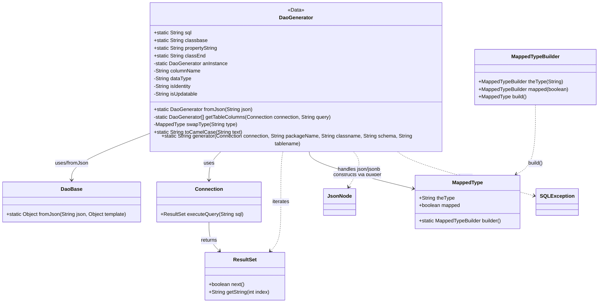

# Diagram: platform-java-lambdas/infrastructure/dao-generation/src/main/java/com/freightverify/infrastructure/util/dao/DaoGenerator.java


> Auto-generated by Obscura crawlers

## Diagram 1



### SVG

<svg id="container" width="1896.20703125" xmlns="http://www.w3.org/2000/svg" class="classDiagram" height="938" viewBox="0 0 1896.20703125 938" role="graphics-document document" aria-roledescription="class"><style>#container{font-family:"trebuchet ms",verdana,arial,sans-serif;font-size:16px;fill:#333;}@keyframes edge-animation-frame{from{stroke-dashoffset:0;}}@keyframes dash{to{stroke-dashoffset:0;}}#container .edge-animation-slow{stroke-dasharray:9,5!important;stroke-dashoffset:900;animation:dash 50s linear infinite;stroke-linecap:round;}#container .edge-animation-fast{stroke-dasharray:9,5!important;stroke-dashoffset:900;animation:dash 20s linear infinite;stroke-linecap:round;}#container .error-icon{fill:#552222;}#container .error-text{fill:#552222;stroke:#552222;}#container .edge-thickness-normal{stroke-width:1px;}#container .edge-thickness-thick{stroke-width:3.5px;}#container .edge-pattern-solid{stroke-dasharray:0;}#container .edge-thickness-invisible{stroke-width:0;fill:none;}#container .edge-pattern-dashed{stroke-dasharray:3;}#container .edge-pattern-dotted{stroke-dasharray:2;}#container .marker{fill:#333333;stroke:#333333;}#container .marker.cross{stroke:#333333;}#container svg{font-family:"trebuchet ms",verdana,arial,sans-serif;font-size:16px;}#container p{margin:0;}#container g.classGroup text{fill:#9370DB;stroke:none;font-family:"trebuchet ms",verdana,arial,sans-serif;font-size:10px;}#container g.classGroup text .title{font-weight:bolder;}#container .nodeLabel,#container .edgeLabel{color:#131300;}#container .edgeLabel .label rect{fill:#ECECFF;}#container .label text{fill:#131300;}#container .labelBkg{background:#ECECFF;}#container .edgeLabel .label span{background:#ECECFF;}#container .classTitle{font-weight:bolder;}#container .node rect,#container .node circle,#container .node ellipse,#container .node polygon,#container .node path{fill:#ECECFF;stroke:#9370DB;stroke-width:1px;}#container .divider{stroke:#9370DB;stroke-width:1;}#container g.clickable{cursor:pointer;}#container g.classGroup rect{fill:#ECECFF;stroke:#9370DB;}#container g.classGroup line{stroke:#9370DB;stroke-width:1;}#container .classLabel .box{stroke:none;stroke-width:0;fill:#ECECFF;opacity:0.5;}#container .classLabel .label{fill:#9370DB;font-size:10px;}#container .relation{stroke:#333333;stroke-width:1;fill:none;}#container .dashed-line{stroke-dasharray:3;}#container .dotted-line{stroke-dasharray:1 2;}#container #compositionStart,#container .composition{fill:#333333!important;stroke:#333333!important;stroke-width:1;}#container #compositionEnd,#container .composition{fill:#333333!important;stroke:#333333!important;stroke-width:1;}#container #dependencyStart,#container .dependency{fill:#333333!important;stroke:#333333!important;stroke-width:1;}#container #dependencyStart,#container .dependency{fill:#333333!important;stroke:#333333!important;stroke-width:1;}#container #extensionStart,#container .extension{fill:transparent!important;stroke:#333333!important;stroke-width:1;}#container #extensionEnd,#container .extension{fill:transparent!important;stroke:#333333!important;stroke-width:1;}#container #aggregationStart,#container .aggregation{fill:transparent!important;stroke:#333333!important;stroke-width:1;}#container #aggregationEnd,#container .aggregation{fill:transparent!important;stroke:#333333!important;stroke-width:1;}#container #lollipopStart,#container .lollipop{fill:#ECECFF!important;stroke:#333333!important;stroke-width:1;}#container #lollipopEnd,#container .lollipop{fill:#ECECFF!important;stroke:#333333!important;stroke-width:1;}#container .edgeTerminals{font-size:11px;line-height:initial;}#container .classTitleText{text-anchor:middle;font-size:18px;fill:#333;}#container .label-icon{display:inline-block;height:1em;overflow:visible;vertical-align:-0.125em;}#container .node .label-icon path{fill:currentColor;stroke:revert;stroke-width:revert;}#container :root{--mermaid-font-family:"trebuchet ms",verdana,arial,sans-serif;}</style><g><defs><marker id="container_class-aggregationStart" class="marker aggregation class" refX="18" refY="7" markerWidth="190" markerHeight="240" orient="auto"><path d="M 18,7 L9,13 L1,7 L9,1 Z"></path></marker></defs><defs><marker id="container_class-aggregationEnd" class="marker aggregation class" refX="1" refY="7" markerWidth="20" markerHeight="28" orient="auto"><path d="M 18,7 L9,13 L1,7 L9,1 Z"></path></marker></defs><defs><marker id="container_class-extensionStart" class="marker extension class" refX="18" refY="7" markerWidth="190" markerHeight="240" orient="auto"><path d="M 1,7 L18,13 V 1 Z"></path></marker></defs><defs><marker id="container_class-extensionEnd" class="marker extension class" refX="1" refY="7" markerWidth="20" markerHeight="28" orient="auto"><path d="M 1,1 V 13 L18,7 Z"></path></marker></defs><defs><marker id="container_class-compositionStart" class="marker composition class" refX="18" refY="7" markerWidth="190" markerHeight="240" orient="auto"><path d="M 18,7 L9,13 L1,7 L9,1 Z"></path></marker></defs><defs><marker id="container_class-compositionEnd" class="marker composition class" refX="1" refY="7" markerWidth="20" markerHeight="28" orient="auto"><path d="M 18,7 L9,13 L1,7 L9,1 Z"></path></marker></defs><defs><marker id="container_class-dependencyStart" class="marker dependency class" refX="6" refY="7" markerWidth="190" markerHeight="240" orient="auto"><path d="M 5,7 L9,13 L1,7 L9,1 Z"></path></marker></defs><defs><marker id="container_class-dependencyEnd" class="marker dependency class" refX="13" refY="7" markerWidth="20" markerHeight="28" orient="auto"><path d="M 18,7 L9,13 L14,7 L9,1 Z"></path></marker></defs><defs><marker id="container_class-lollipopStart" class="marker lollipop class" refX="13" refY="7" markerWidth="190" markerHeight="240" orient="auto"><circle stroke="black" fill="transparent" cx="7" cy="7" r="6"></circle></marker></defs><defs><marker id="container_class-lollipopEnd" class="marker lollipop class" refX="1" refY="7" markerWidth="190" markerHeight="240" orient="auto"><circle stroke="black" fill="transparent" cx="7" cy="7" r="6"></circle></marker></defs><g class="root"><g class="clusters"></g><g class="edgePaths"><path d="M454.902,415.131L416.841,429.442C378.78,443.754,302.658,472.377,264.596,495.355C226.535,518.333,226.535,535.667,226.535,544.333L226.535,553" id="id_DaoGenerator_DaoBase_1" class="edge-thickness-normal edge-pattern-solid relation" style=";;;" data-edge="true" data-et="edge" data-id="id_DaoGenerator_DaoBase_1" data-points="W3sieCI6NDU0LjkwMjM0Mzc1LCJ5Ijo0MTUuMTMwODI4NzkyOTc2MzN9LHsieCI6MjI2LjUzNTE1NjI1LCJ5Ijo1MDF9LHsieCI6MjI2LjUzNTE1NjI1LCJ5Ijo1NTl9XQ==" marker-end="url(#container_class-dependencyEnd)"></path><path d="M695.53,464L689.153,470.167C682.776,476.333,670.023,488.667,663.646,503.5C657.27,518.333,657.27,535.667,657.27,544.333L657.27,553" id="id_DaoGenerator_Connection_2" class="edge-thickness-normal edge-pattern-solid relation" style=";;;" data-edge="true" data-et="edge" data-id="id_DaoGenerator_Connection_2" data-points="W3sieCI6Njk1LjUyOTk1MjgzMDE4ODcsInkiOjQ2NH0seyJ4Ijo2NTcuMjY5NTMxMjUsInkiOjUwMX0seyJ4Ijo2NTcuMjY5NTMxMjUsInkiOjU1OX1d" marker-end="url(#container_class-dependencyEnd)"></path><path d="M657.27,685L657.27,694.667C657.27,704.333,657.27,723.667,662.745,738.794C668.22,753.921,679.171,764.842,684.647,770.303L690.122,775.763" id="id_Connection_ResultSet_3" class="edge-thickness-normal edge-pattern-solid relation" style=";;;" data-edge="true" data-et="edge" data-id="id_Connection_ResultSet_3" data-points="W3sieCI6NjU3LjI2OTUzMTI1LCJ5Ijo2ODV9LHsieCI6NjU3LjI2OTUzMTI1LCJ5Ijo3NDN9LHsieCI6Njk0LjM3MDgzMjE3MDc1OSwieSI6NzgwfV0=" marker-end="url(#container_class-dependencyEnd)"></path><path d="M888.782,464L887.632,470.167C886.482,476.333,884.183,488.667,883.033,515C881.883,541.333,881.883,581.667,881.883,622C881.883,662.333,881.883,702.667,876.407,728.294C870.932,753.921,859.981,764.842,854.505,770.303L849.03,775.763" id="id_DaoGenerator_ResultSet_4" class="edge-thickness-normal edge-pattern-dashed relation" style=";;;" data-edge="true" data-et="edge" data-id="id_DaoGenerator_ResultSet_4" data-points="W3sieCI6ODg4Ljc4MjEzNDQzMzk2MjMsInkiOjQ2NH0seyJ4Ijo4ODEuODgyODEyNSwieSI6NTAxfSx7IngiOjg4MS44ODI4MTI1LCJ5Ijo2MjJ9LHsieCI6ODgxLjg4MjgxMjUsInkiOjc0M30seyJ4Ijo4NDQuNzgxNTExNTc5MjQxLCJ5Ijo3ODB9XQ==" marker-end="url(#container_class-dependencyEnd)"></path><path d="M973.812,464L974.962,470.167C976.111,476.333,978.411,488.667,1033.454,507.968C1088.497,527.269,1196.283,553.538,1250.176,566.672L1304.069,579.807" id="id_DaoGenerator_MappedType_5" class="edge-thickness-normal edge-pattern-solid relation" style=";;;" data-edge="true" data-et="edge" data-id="id_DaoGenerator_MappedType_5" data-points="W3sieCI6OTczLjgxMTYxNTU2NjAzNzcsInkiOjQ2NH0seyJ4Ijo5ODAuNzEwOTM3NSwieSI6NTAxfSx7IngiOjEzMDkuODk4NDM3NSwieSI6NTgxLjIyNzQ3NDQyOTU4M31d" marker-end="url(#container_class-dependencyEnd)"></path><path d="M1696.281,323L1696.281,352.667C1696.281,382.333,1696.281,441.667,1685.991,477.017C1675.701,512.366,1655.121,523.733,1644.83,529.416L1634.54,535.099" id="id_MappedTypeBuilder_MappedType_6" class="edge-thickness-normal edge-pattern-dashed relation" style=";;;" data-edge="true" data-et="edge" data-id="id_MappedTypeBuilder_MappedType_6" data-points="W3sieCI6MTY5Ni4yODEyNSwieSI6MzIzfSx7IngiOjE2OTYuMjgxMjUsInkiOjUwMX0seyJ4IjoxNjI5LjI4ODAyOTQ0MjE0ODksInkiOjUzOH1d" marker-end="url(#container_class-dependencyEnd)"></path><path d="M1119.599,464L1124.691,470.167C1129.784,476.333,1139.97,488.667,1136.963,507.164C1133.955,525.662,1117.754,550.324,1109.654,562.654L1101.553,574.985" id="id_DaoGenerator_JsonNode_7" class="edge-thickness-normal edge-pattern-dashed relation" style=";;;" data-edge="true" data-et="edge" data-id="id_DaoGenerator_JsonNode_7" data-points="W3sieCI6MTExOS41OTg1MjU5NDMzOTYyLCJ5Ijo0NjR9LHsieCI6MTE1MC4xNTYyNSwieSI6NTAxfSx7IngiOjEwOTguMjU4OTQyNDA3MDI0NywieSI6NTgwfV0=" marker-end="url(#container_class-dependencyEnd)"></path><path d="M1253.327,464L1262.037,470.167C1270.746,476.333,1288.166,488.667,1361.181,511.99C1434.195,535.313,1562.804,569.626,1627.109,586.782L1691.414,603.939" id="id_DaoGenerator_SQLException_8" class="edge-thickness-normal edge-pattern-dashed relation" style=";;;" data-edge="true" data-et="edge" data-id="id_DaoGenerator_SQLException_8" data-points="W3sieCI6MTI1My4zMjY3MDk5MDU2NjA0LCJ5Ijo0NjR9LHsieCI6MTMwNS41ODU5Mzc1LCJ5Ijo1MDF9LHsieCI6MTY5Ny4yMTA5Mzc1LCJ5Ijo2MDUuNDg1NTA0MTI1NjgyNn1d" marker-end="url(#container_class-dependencyEnd)"></path></g><g class="edgeLabels"><g class="edgeLabel" transform="translate(226.53515625, 501)"><g class="label" data-id="id_DaoGenerator_DaoBase_1" transform="translate(-53.0078125, -12)"><foreignObject width="106.015625" height="24"><div xmlns="http://www.w3.org/1999/xhtml" class="labelBkg" style="display: table-cell; white-space: nowrap; line-height: 1.5; max-width: 200px; text-align: center;"><span class="edgeLabel"><p>uses/fromJson</p></span></div></foreignObject></g></g><g class="edgeLabel" transform="translate(657.26953125, 501)"><g class="label" data-id="id_DaoGenerator_Connection_2" transform="translate(-16.4921875, -12)"><foreignObject width="32.984375" height="24"><div xmlns="http://www.w3.org/1999/xhtml" class="labelBkg" style="display: table-cell; white-space: nowrap; line-height: 1.5; max-width: 200px; text-align: center;"><span class="edgeLabel"><p>uses</p></span></div></foreignObject></g></g><g class="edgeLabel" transform="translate(657.26953125, 743)"><g class="label" data-id="id_Connection_ResultSet_3" transform="translate(-26.265625, -12)"><foreignObject width="52.53125" height="24"><div xmlns="http://www.w3.org/1999/xhtml" class="labelBkg" style="display: table-cell; white-space: nowrap; line-height: 1.5; max-width: 200px; text-align: center;"><span class="edgeLabel"><p>returns</p></span></div></foreignObject></g></g><g class="edgeLabel" transform="translate(881.8828125, 622)"><g class="label" data-id="id_DaoGenerator_ResultSet_4" transform="translate(-27.4140625, -12)"><foreignObject width="54.828125" height="24"><div xmlns="http://www.w3.org/1999/xhtml" class="labelBkg" style="display: table-cell; white-space: nowrap; line-height: 1.5; max-width: 200px; text-align: center;"><span class="edgeLabel"><p>iterates</p></span></div></foreignObject></g></g><g class="edgeLabel" transform="translate(1127.02097, 536.65775)"><g class="label" data-id="id_DaoGenerator_MappedType_5" transform="translate(-78.828125, -12)"><foreignObject width="157.65625" height="24"><div xmlns="http://www.w3.org/1999/xhtml" class="labelBkg" style="display: table-cell; white-space: nowrap; line-height: 1.5; max-width: 200px; text-align: center;"><span class="edgeLabel"><p>constructs via builder</p></span></div></foreignObject></g></g><g class="edgeLabel" transform="translate(1696.28125, 501)"><g class="label" data-id="id_MappedTypeBuilder_MappedType_6" transform="translate(-23.9375, -12)"><foreignObject width="47.875" height="24"><div xmlns="http://www.w3.org/1999/xhtml" class="labelBkg" style="display: table-cell; white-space: nowrap; line-height: 1.5; max-width: 200px; text-align: center;"><span class="edgeLabel"><p>build()</p></span></div></foreignObject></g></g><g class="edgeLabel" transform="translate(1137.38135, 520.44643)"><g class="label" data-id="id_DaoGenerator_JsonNode_7" transform="translate(-70.6171875, -12)"><foreignObject width="141.234375" height="24"><div xmlns="http://www.w3.org/1999/xhtml" class="labelBkg" style="display: table-cell; white-space: nowrap; line-height: 1.5; max-width: 200px; text-align: center;"><span class="edgeLabel"><p>handles json/jsonb</p></span></div></foreignObject></g></g><g class="edgeLabel" transform="translate(1470.46475, 544.98965)"><g class="label" data-id="id_DaoGenerator_SQLException_8" transform="translate(-24.5703125, -12)"><foreignObject width="49.140625" height="24"><div xmlns="http://www.w3.org/1999/xhtml" class="labelBkg" style="display: table-cell; white-space: nowrap; line-height: 1.5; max-width: 200px; text-align: center;"><span class="edgeLabel"><p>throws</p></span></div></foreignObject></g></g></g><g class="nodes"><g class="node default" id="classId-DaoGenerator-0" transform="translate(931.296875, 236)"><g class="basic label-container"><path d="M-476.39453125 -228 L476.39453125 -228 L476.39453125 228 L-476.39453125 228" stroke="none" stroke-width="0" fill="#ECECFF" style=""></path><path d="M-476.39453125 -228 C-101.58367938500629 -228, 273.2271724799874 -228, 476.39453125 -228 M-476.39453125 -228 C-209.54534877507916 -228, 57.303833699841675 -228, 476.39453125 -228 M476.39453125 -228 C476.39453125 -110.89620777123062, 476.39453125 6.207584457538758, 476.39453125 228 M476.39453125 -228 C476.39453125 -105.74902153513169, 476.39453125 16.50195692973662, 476.39453125 228 M476.39453125 228 C96.47745275302577 228, -283.43962574394845 228, -476.39453125 228 M476.39453125 228 C243.7662132356763 228, 11.137895221352608 228, -476.39453125 228 M-476.39453125 228 C-476.39453125 106.63949359931091, -476.39453125 -14.72101280137818, -476.39453125 -228 M-476.39453125 228 C-476.39453125 71.51880398858845, -476.39453125 -84.96239202282311, -476.39453125 -228" stroke="#9370DB" stroke-width="1.3" fill="none" stroke-dasharray="0 0" style=""></path></g><g class="annotation-group text" transform="translate(-25.7421875, -204)"><g class="label" style="" transform="translate(0,-12)"><foreignObject width="51.484375" height="24"><div xmlns="http://www.w3.org/1999/xhtml" style="display: table-cell; white-space: nowrap; line-height: 1.5; max-width: 101px; text-align: center;"><span class="nodeLabel markdown-node-label" style=""><p>«Data»</p></span></div></foreignObject></g></g><g class="label-group text" transform="translate(-50.9296875, -180)"><g class="label" style="font-weight: bolder" transform="translate(0,-12)"><foreignObject width="101.859375" height="24"><div xmlns="http://www.w3.org/1999/xhtml" style="display: table-cell; white-space: nowrap; line-height: 1.5; max-width: 151px; text-align: center;"><span class="nodeLabel markdown-node-label" style=""><p>DaoGenerator</p></span></div></foreignObject></g></g><g class="members-group text" transform="translate(-464.39453125, -132)"><g class="label" style="" transform="translate(0,-12)"><foreignObject width="120.859375" height="24"><div xmlns="http://www.w3.org/1999/xhtml" style="display: table-cell; white-space: nowrap; line-height: 1.5; max-width: 179px; text-align: center;"><span class="nodeLabel markdown-node-label" style=""><p>+static String sql</p></span></div></foreignObject></g><g class="label" style="" transform="translate(0,12)"><foreignObject width="168.796875" height="24"><div xmlns="http://www.w3.org/1999/xhtml" style="display: table-cell; white-space: nowrap; line-height: 1.5; max-width: 226px; text-align: center;"><span class="nodeLabel markdown-node-label" style=""><p>+static String classbase</p></span></div></foreignObject></g><g class="label" style="" transform="translate(0,36)"><foreignObject width="204.515625" height="24"><div xmlns="http://www.w3.org/1999/xhtml" style="display: table-cell; white-space: nowrap; line-height: 1.5; max-width: 263px; text-align: center;"><span class="nodeLabel markdown-node-label" style=""><p>+static String propertyString</p></span></div></foreignObject></g><g class="label" style="" transform="translate(0,60)"><foreignObject width="162.0625" height="24"><div xmlns="http://www.w3.org/1999/xhtml" style="display: table-cell; white-space: nowrap; line-height: 1.5; max-width: 219px; text-align: center;"><span class="nodeLabel markdown-node-label" style=""><p>+static String classEnd</p></span></div></foreignObject></g><g class="label" style="" transform="translate(0,84)"><foreignObject width="234.625" height="24"><div xmlns="http://www.w3.org/1999/xhtml" style="display: table-cell; white-space: nowrap; line-height: 1.5; max-width: 292px; text-align: center;"><span class="nodeLabel markdown-node-label" style=""><p>-static DaoGenerator anInstance</p></span></div></foreignObject></g><g class="label" style="" transform="translate(0,108)"><foreignObject width="148.765625" height="24"><div xmlns="http://www.w3.org/1999/xhtml" style="display: table-cell; white-space: nowrap; line-height: 1.5; max-width: 206px; text-align: center;"><span class="nodeLabel markdown-node-label" style=""><p>-String columnName</p></span></div></foreignObject></g><g class="label" style="" transform="translate(0,132)"><foreignObject width="119.296875" height="24"><div xmlns="http://www.w3.org/1999/xhtml" style="display: table-cell; white-space: nowrap; line-height: 1.5; max-width: 177px; text-align: center;"><span class="nodeLabel markdown-node-label" style=""><p>-String dataType</p></span></div></foreignObject></g><g class="label" style="" transform="translate(0,156)"><foreignObject width="121.15625" height="24"><div xmlns="http://www.w3.org/1999/xhtml" style="display: table-cell; white-space: nowrap; line-height: 1.5; max-width: 179px; text-align: center;"><span class="nodeLabel markdown-node-label" style=""><p>-String isIdentity</p></span></div></foreignObject></g><g class="label" style="" transform="translate(0,180)"><foreignObject width="140.484375" height="24"><div xmlns="http://www.w3.org/1999/xhtml" style="display: table-cell; white-space: nowrap; line-height: 1.5; max-width: 198px; text-align: center;"><span class="nodeLabel markdown-node-label" style=""><p>-String isUpdatable</p></span></div></foreignObject></g></g><g class="methods-group text" transform="translate(-464.39453125, 108)"><g class="label" style="" transform="translate(0,-12)"><foreignObject width="310.078125" height="24"><div xmlns="http://www.w3.org/1999/xhtml" style="display: table-cell; white-space: nowrap; line-height: 1.5; max-width: 367px; text-align: center;"><span class="nodeLabel markdown-node-label" style=""><p>+static DaoGenerator fromJson(String json)</p></span></div></foreignObject></g><g class="label" style="" transform="translate(0,12)"><foreignObject width="563.984375" height="24"><div xmlns="http://www.w3.org/1999/xhtml" style="display: table-cell; white-space: nowrap; line-height: 1.5; max-width: 621px; text-align: center;"><span class="nodeLabel markdown-node-label" style=""><p>-static DaoGenerator[] getTableColumns(Connection connection, String query)</p></span></div></foreignObject></g><g class="label" style="" transform="translate(0,36)"><foreignObject width="262.734375" height="24"><div xmlns="http://www.w3.org/1999/xhtml" style="display: table-cell; white-space: nowrap; line-height: 1.5; max-width: 320px; text-align: center;"><span class="nodeLabel markdown-node-label" style=""><p>-MappedType swapType(String type)</p></span></div></foreignObject></g><g class="label" style="" transform="translate(0,60)"><foreignObject width="277.296875" height="24"><div xmlns="http://www.w3.org/1999/xhtml" style="display: table-cell; white-space: nowrap; line-height: 1.5; max-width: 335px; text-align: center;"><span class="nodeLabel markdown-node-label" style=""><p>+static String toCamelCase(String text)</p></span></div></foreignObject></g><g class="label" style="" transform="translate(0,84)"><foreignObject width="877.859375" height="24"><div xmlns="http://www.w3.org/1999/xhtml" style="display: table-cell; white-space: nowrap; line-height: 1.5; max-width: 935px; text-align: center;"><span class="nodeLabel markdown-node-label" style=""><p>+static String generator(Connection connection, String packageName, String classname, String schema, String tablename)</p></span></div></foreignObject></g></g><g class="divider" style=""><path d="M-476.39453125 -156 C-148.65171376202028 -156, 179.09110372595944 -156, 476.39453125 -156 M-476.39453125 -156 C-270.1865709968964 -156, -63.9786107437929 -156, 476.39453125 -156" stroke="#9370DB" stroke-width="1.3" fill="none" stroke-dasharray="0 0" style=""></path></g><g class="divider" style=""><path d="M-476.39453125 84 C-177.63846402267086 84, 121.11760320465828 84, 476.39453125 84 M-476.39453125 84 C-100.34036762570094 84, 275.71379599859813 84, 476.39453125 84" stroke="#9370DB" stroke-width="1.3" fill="none" stroke-dasharray="0 0" style=""></path></g></g><g class="node default" id="classId-DaoBase-1" transform="translate(226.53515625, 622)"><g class="basic label-container"><path d="M-218.53515625 -63 L218.53515625 -63 L218.53515625 63 L-218.53515625 63" stroke="none" stroke-width="0" fill="#ECECFF" style=""></path><path d="M-218.53515625 -63 C-104.05230169055326 -63, 10.430552868893471 -63, 218.53515625 -63 M-218.53515625 -63 C-118.70517198775515 -63, -18.8751877255103 -63, 218.53515625 -63 M218.53515625 -63 C218.53515625 -19.154961206235335, 218.53515625 24.69007758752933, 218.53515625 63 M218.53515625 -63 C218.53515625 -24.0879834844431, 218.53515625 14.8240330311138, 218.53515625 63 M218.53515625 63 C109.23011878524646 63, -0.07491867950707842 63, -218.53515625 63 M218.53515625 63 C58.68912464439012 63, -101.15690696121976 63, -218.53515625 63 M-218.53515625 63 C-218.53515625 26.743930364569735, -218.53515625 -9.51213927086053, -218.53515625 -63 M-218.53515625 63 C-218.53515625 15.3996792892302, -218.53515625 -32.2006414215396, -218.53515625 -63" stroke="#9370DB" stroke-width="1.3" fill="none" stroke-dasharray="0 0" style=""></path></g><g class="annotation-group text" transform="translate(0, -39)"></g><g class="label-group text" transform="translate(-31.7109375, -39)"><g class="label" style="font-weight: bolder" transform="translate(0,-12)"><foreignObject width="63.421875" height="24"><div xmlns="http://www.w3.org/1999/xhtml" style="display: table-cell; white-space: nowrap; line-height: 1.5; max-width: 113px; text-align: center;"><span class="nodeLabel markdown-node-label" style=""><p>DaoBase</p></span></div></foreignObject></g></g><g class="members-group text" transform="translate(-206.53515625, 9)"></g><g class="methods-group text" transform="translate(-206.53515625, 39)"><g class="label" style="" transform="translate(0,-12)"><foreignObject width="381.359375" height="24"><div xmlns="http://www.w3.org/1999/xhtml" style="display: table-cell; white-space: nowrap; line-height: 1.5; max-width: 439px; text-align: center;"><span class="nodeLabel markdown-node-label" style=""><p>+static Object fromJson(String json, Object template)</p></span></div></foreignObject></g></g><g class="divider" style=""><path d="M-218.53515625 -15 C-45.47053805016131 -15, 127.59408014967738 -15, 218.53515625 -15 M-218.53515625 -15 C-60.28666434591588 -15, 97.96182755816824 -15, 218.53515625 -15" stroke="#9370DB" stroke-width="1.3" fill="none" stroke-dasharray="0 0" style=""></path></g><g class="divider" style=""><path d="M-218.53515625 9 C-115.64788060699097 9, -12.760604963981933 9, 218.53515625 9 M-218.53515625 9 C-119.58206118790753 9, -20.628966125815055 9, 218.53515625 9" stroke="#9370DB" stroke-width="1.3" fill="none" stroke-dasharray="0 0" style=""></path></g></g><g class="node default" id="classId-Connection-2" transform="translate(657.26953125, 622)"><g class="basic label-container"><path d="M-162.19921875 -63 L162.19921875 -63 L162.19921875 63 L-162.19921875 63" stroke="none" stroke-width="0" fill="#ECECFF" style=""></path><path d="M-162.19921875 -63 C-73.15011144948373 -63, 15.898995851032538 -63, 162.19921875 -63 M-162.19921875 -63 C-68.08131151548628 -63, 26.036595719027446 -63, 162.19921875 -63 M162.19921875 -63 C162.19921875 -22.749510291476327, 162.19921875 17.500979417047347, 162.19921875 63 M162.19921875 -63 C162.19921875 -28.574437828929376, 162.19921875 5.851124342141247, 162.19921875 63 M162.19921875 63 C79.59237478235843 63, -3.014469185283133 63, -162.19921875 63 M162.19921875 63 C56.19572614226746 63, -49.80776646546508 63, -162.19921875 63 M-162.19921875 63 C-162.19921875 23.149198221148787, -162.19921875 -16.701603557702427, -162.19921875 -63 M-162.19921875 63 C-162.19921875 20.62597149570736, -162.19921875 -21.748057008585278, -162.19921875 -63" stroke="#9370DB" stroke-width="1.3" fill="none" stroke-dasharray="0 0" style=""></path></g><g class="annotation-group text" transform="translate(0, -39)"></g><g class="label-group text" transform="translate(-41.2265625, -39)"><g class="label" style="font-weight: bolder" transform="translate(0,-12)"><foreignObject width="82.453125" height="24"><div xmlns="http://www.w3.org/1999/xhtml" style="display: table-cell; white-space: nowrap; line-height: 1.5; max-width: 132px; text-align: center;"><span class="nodeLabel markdown-node-label" style=""><p>Connection</p></span></div></foreignObject></g></g><g class="members-group text" transform="translate(-150.19921875, 9)"></g><g class="methods-group text" transform="translate(-150.19921875, 39)"><g class="label" style="" transform="translate(0,-12)"><foreignObject width="259.171875" height="24"><div xmlns="http://www.w3.org/1999/xhtml" style="display: table-cell; white-space: nowrap; line-height: 1.5; max-width: 317px; text-align: center;"><span class="nodeLabel markdown-node-label" style=""><p>+ResultSet executeQuery(String sql)</p></span></div></foreignObject></g></g><g class="divider" style=""><path d="M-162.19921875 -15 C-68.48225994534981 -15, 25.23469885930038 -15, 162.19921875 -15 M-162.19921875 -15 C-57.2067399283541 -15, 47.78573889329181 -15, 162.19921875 -15" stroke="#9370DB" stroke-width="1.3" fill="none" stroke-dasharray="0 0" style=""></path></g><g class="divider" style=""><path d="M-162.19921875 9 C-40.60676218098034 9, 80.98569438803932 9, 162.19921875 9 M-162.19921875 9 C-59.82753245043976 9, 42.54415384912048 9, 162.19921875 9" stroke="#9370DB" stroke-width="1.3" fill="none" stroke-dasharray="0 0" style=""></path></g></g><g class="node default" id="classId-ResultSet-3" transform="translate(769.576171875, 855)"><g class="basic label-container"><path d="M-126.59375 -75 L126.59375 -75 L126.59375 75 L-126.59375 75" stroke="none" stroke-width="0" fill="#ECECFF" style=""></path><path d="M-126.59375 -75 C-67.37253609163997 -75, -8.151322183279945 -75, 126.59375 -75 M-126.59375 -75 C-32.16035045140387 -75, 62.273049097192256 -75, 126.59375 -75 M126.59375 -75 C126.59375 -37.91200012112087, 126.59375 -0.8240002422417376, 126.59375 75 M126.59375 -75 C126.59375 -21.34686198355169, 126.59375 32.30627603289662, 126.59375 75 M126.59375 75 C27.0182288106012 75, -72.5572923787976 75, -126.59375 75 M126.59375 75 C60.61178144968163 75, -5.370187100636741 75, -126.59375 75 M-126.59375 75 C-126.59375 43.15304128392633, -126.59375 11.306082567852656, -126.59375 -75 M-126.59375 75 C-126.59375 41.70775588706159, -126.59375 8.415511774123175, -126.59375 -75" stroke="#9370DB" stroke-width="1.3" fill="none" stroke-dasharray="0 0" style=""></path></g><g class="annotation-group text" transform="translate(0, -51)"></g><g class="label-group text" transform="translate(-35.21875, -51)"><g class="label" style="font-weight: bolder" transform="translate(0,-12)"><foreignObject width="70.4375" height="24"><div xmlns="http://www.w3.org/1999/xhtml" style="display: table-cell; white-space: nowrap; line-height: 1.5; max-width: 119px; text-align: center;"><span class="nodeLabel markdown-node-label" style=""><p>ResultSet</p></span></div></foreignObject></g></g><g class="members-group text" transform="translate(-114.59375, -3)"></g><g class="methods-group text" transform="translate(-114.59375, 27)"><g class="label" style="" transform="translate(0,-12)"><foreignObject width="113.53125" height="24"><div xmlns="http://www.w3.org/1999/xhtml" style="display: table-cell; white-space: nowrap; line-height: 1.5; max-width: 171px; text-align: center;"><span class="nodeLabel markdown-node-label" style=""><p>+boolean next()</p></span></div></foreignObject></g><g class="label" style="" transform="translate(0,12)"><foreignObject width="193.96875" height="24"><div xmlns="http://www.w3.org/1999/xhtml" style="display: table-cell; white-space: nowrap; line-height: 1.5; max-width: 251px; text-align: center;"><span class="nodeLabel markdown-node-label" style=""><p>+String getString(int index)</p></span></div></foreignObject></g></g><g class="divider" style=""><path d="M-126.59375 -27 C-38.85944172911964 -27, 48.874866541760724 -27, 126.59375 -27 M-126.59375 -27 C-56.37493459866435 -27, 13.843880802671293 -27, 126.59375 -27" stroke="#9370DB" stroke-width="1.3" fill="none" stroke-dasharray="0 0" style=""></path></g><g class="divider" style=""><path d="M-126.59375 -3 C-73.36950540186338 -3, -20.145260803726757 -3, 126.59375 -3 M-126.59375 -3 C-54.57848967962022 -3, 17.436770640759562 -3, 126.59375 -3" stroke="#9370DB" stroke-width="1.3" fill="none" stroke-dasharray="0 0" style=""></path></g></g><g class="node default" id="classId-MappedType-4" transform="translate(1477.1953125, 622)"><g class="basic label-container"><path d="M-167.296875 -84 L167.296875 -84 L167.296875 84 L-167.296875 84" stroke="none" stroke-width="0" fill="#ECECFF" style=""></path><path d="M-167.296875 -84 C-85.51946239511307 -84, -3.742049790226133 -84, 167.296875 -84 M-167.296875 -84 C-97.51337768450168 -84, -27.729880369003354 -84, 167.296875 -84 M167.296875 -84 C167.296875 -29.502079591921742, 167.296875 24.995840816156516, 167.296875 84 M167.296875 -84 C167.296875 -28.61751673821417, 167.296875 26.76496652357166, 167.296875 84 M167.296875 84 C88.39608345672855 84, 9.495291913457095 84, -167.296875 84 M167.296875 84 C33.98676466711544 84, -99.32334566576912 84, -167.296875 84 M-167.296875 84 C-167.296875 31.298725789149955, -167.296875 -21.40254842170009, -167.296875 -84 M-167.296875 84 C-167.296875 45.68847141820693, -167.296875 7.3769428364138605, -167.296875 -84" stroke="#9370DB" stroke-width="1.3" fill="none" stroke-dasharray="0 0" style=""></path></g><g class="annotation-group text" transform="translate(0, -60)"></g><g class="label-group text" transform="translate(-46.78125, -60)"><g class="label" style="font-weight: bolder" transform="translate(0,-12)"><foreignObject width="93.5625" height="24"><div xmlns="http://www.w3.org/1999/xhtml" style="display: table-cell; white-space: nowrap; line-height: 1.5; max-width: 142px; text-align: center;"><span class="nodeLabel markdown-node-label" style=""><p>MappedType</p></span></div></foreignObject></g></g><g class="members-group text" transform="translate(-155.296875, -12)"><g class="label" style="" transform="translate(0,-12)"><foreignObject width="112.078125" height="24"><div xmlns="http://www.w3.org/1999/xhtml" style="display: table-cell; white-space: nowrap; line-height: 1.5; max-width: 169px; text-align: center;"><span class="nodeLabel markdown-node-label" style=""><p>+String theType</p></span></div></foreignObject></g><g class="label" style="" transform="translate(0,12)"><foreignObject width="131.390625" height="24"><div xmlns="http://www.w3.org/1999/xhtml" style="display: table-cell; white-space: nowrap; line-height: 1.5; max-width: 189px; text-align: center;"><span class="nodeLabel markdown-node-label" style=""><p>+boolean mapped</p></span></div></foreignObject></g></g><g class="methods-group text" transform="translate(-155.296875, 60)"><g class="label" style="" transform="translate(0,-12)"><foreignObject width="263.8125" height="24"><div xmlns="http://www.w3.org/1999/xhtml" style="display: table-cell; white-space: nowrap; line-height: 1.5; max-width: 321px; text-align: center;"><span class="nodeLabel markdown-node-label" style=""><p>+static MappedTypeBuilder builder()</p></span></div></foreignObject></g></g><g class="divider" style=""><path d="M-167.296875 -36 C-50.73240278062033 -36, 65.83206943875933 -36, 167.296875 -36 M-167.296875 -36 C-37.923560299150694 -36, 91.44975440169861 -36, 167.296875 -36" stroke="#9370DB" stroke-width="1.3" fill="none" stroke-dasharray="0 0" style=""></path></g><g class="divider" style=""><path d="M-167.296875 36 C-73.63412330223895 36, 20.028628395522105 36, 167.296875 36 M-167.296875 36 C-78.1586516606795 36, 10.979571678641008 36, 167.296875 36" stroke="#9370DB" stroke-width="1.3" fill="none" stroke-dasharray="0 0" style=""></path></g></g><g class="node default" id="classId-MappedTypeBuilder-5" transform="translate(1696.28125, 236)"><g class="basic label-container"><path d="M-191.92578125 -87 L191.92578125 -87 L191.92578125 87 L-191.92578125 87" stroke="none" stroke-width="0" fill="#ECECFF" style=""></path><path d="M-191.92578125 -87 C-57.27130976674388 -87, 77.38316171651223 -87, 191.92578125 -87 M-191.92578125 -87 C-114.47324600067125 -87, -37.020710751342506 -87, 191.92578125 -87 M191.92578125 -87 C191.92578125 -25.699712285535234, 191.92578125 35.60057542892953, 191.92578125 87 M191.92578125 -87 C191.92578125 -44.9845357754894, 191.92578125 -2.9690715509787964, 191.92578125 87 M191.92578125 87 C63.32852825490559 87, -65.26872474018882 87, -191.92578125 87 M191.92578125 87 C49.2435064567033 87, -93.4387683365934 87, -191.92578125 87 M-191.92578125 87 C-191.92578125 44.79394145821212, -191.92578125 2.5878829164242347, -191.92578125 -87 M-191.92578125 87 C-191.92578125 48.71448205002099, -191.92578125 10.42896410004198, -191.92578125 -87" stroke="#9370DB" stroke-width="1.3" fill="none" stroke-dasharray="0 0" style=""></path></g><g class="annotation-group text" transform="translate(0, -63)"></g><g class="label-group text" transform="translate(-73.3046875, -63)"><g class="label" style="font-weight: bolder" transform="translate(0,-12)"><foreignObject width="146.609375" height="24"><div xmlns="http://www.w3.org/1999/xhtml" style="display: table-cell; white-space: nowrap; line-height: 1.5; max-width: 196px; text-align: center;"><span class="nodeLabel markdown-node-label" style=""><p>MappedTypeBuilder</p></span></div></foreignObject></g></g><g class="members-group text" transform="translate(-179.92578125, -15)"></g><g class="methods-group text" transform="translate(-179.92578125, 15)"><g class="label" style="" transform="translate(0,-12)"><foreignObject width="267.875" height="24"><div xmlns="http://www.w3.org/1999/xhtml" style="display: table-cell; white-space: nowrap; line-height: 1.5; max-width: 325px; text-align: center;"><span class="nodeLabel markdown-node-label" style=""><p>+MappedTypeBuilder theType(String)</p></span></div></foreignObject></g><g class="label" style="" transform="translate(0,12)"><foreignObject width="286.546875" height="24"><div xmlns="http://www.w3.org/1999/xhtml" style="display: table-cell; white-space: nowrap; line-height: 1.5; max-width: 344px; text-align: center;"><span class="nodeLabel markdown-node-label" style=""><p>+MappedTypeBuilder mapped(boolean)</p></span></div></foreignObject></g><g class="label" style="" transform="translate(0,36)"><foreignObject width="152.28125" height="24"><div xmlns="http://www.w3.org/1999/xhtml" style="display: table-cell; white-space: nowrap; line-height: 1.5; max-width: 210px; text-align: center;"><span class="nodeLabel markdown-node-label" style=""><p>+MappedType build()</p></span></div></foreignObject></g></g><g class="divider" style=""><path d="M-191.92578125 -39 C-85.54818446774435 -39, 20.829412314511302 -39, 191.92578125 -39 M-191.92578125 -39 C-106.67565018843206 -39, -21.425519126864117 -39, 191.92578125 -39" stroke="#9370DB" stroke-width="1.3" fill="none" stroke-dasharray="0 0" style=""></path></g><g class="divider" style=""><path d="M-191.92578125 -15 C-108.55473273749476 -15, -25.18368422498952 -15, 191.92578125 -15 M-191.92578125 -15 C-53.32834875038125 -15, 85.2690837492375 -15, 191.92578125 -15" stroke="#9370DB" stroke-width="1.3" fill="none" stroke-dasharray="0 0" style=""></path></g></g><g class="node default" id="classId-JsonNode-6" transform="translate(1070.66796875, 622)"><g class="basic label-container"><path d="M-46.8828125 -42 L46.8828125 -42 L46.8828125 42 L-46.8828125 42" stroke="none" stroke-width="0" fill="#ECECFF" style=""></path><path d="M-46.8828125 -42 C-19.129670526107528 -42, 8.623471447784944 -42, 46.8828125 -42 M-46.8828125 -42 C-26.69736605113046 -42, -6.511919602260917 -42, 46.8828125 -42 M46.8828125 -42 C46.8828125 -16.42770834213598, 46.8828125 9.144583315728042, 46.8828125 42 M46.8828125 -42 C46.8828125 -22.942674608585204, 46.8828125 -3.8853492171704076, 46.8828125 42 M46.8828125 42 C18.834991594630104 42, -9.212829310739792 42, -46.8828125 42 M46.8828125 42 C14.883931766075904 42, -17.114948967848193 42, -46.8828125 42 M-46.8828125 42 C-46.8828125 9.914389981454676, -46.8828125 -22.17122003709065, -46.8828125 -42 M-46.8828125 42 C-46.8828125 24.848784691859453, -46.8828125 7.697569383718907, -46.8828125 -42" stroke="#9370DB" stroke-width="1.3" fill="none" stroke-dasharray="0 0" style=""></path></g><g class="annotation-group text" transform="translate(0, -18)"></g><g class="label-group text" transform="translate(-34.8828125, -18)"><g class="label" style="font-weight: bolder" transform="translate(0,-12)"><foreignObject width="69.765625" height="24"><div xmlns="http://www.w3.org/1999/xhtml" style="display: table-cell; white-space: nowrap; line-height: 1.5; max-width: 120px; text-align: center;"><span class="nodeLabel markdown-node-label" style=""><p>JsonNode</p></span></div></foreignObject></g></g><g class="members-group text" transform="translate(-34.8828125, 30)"></g><g class="methods-group text" transform="translate(-34.8828125, 60)"></g><g class="divider" style=""><path d="M-46.8828125 6 C-19.74756938132412 6, 7.387673737351761 6, 46.8828125 6 M-46.8828125 6 C-27.78747990190711 6, -8.692147303814217 6, 46.8828125 6" stroke="#9370DB" stroke-width="1.3" fill="none" stroke-dasharray="0 0" style=""></path></g><g class="divider" style=""><path d="M-46.8828125 24 C-24.6646106857729 24, -2.446408871545799 24, 46.8828125 24 M-46.8828125 24 C-11.114253365805283 24, 24.654305768389435 24, 46.8828125 24" stroke="#9370DB" stroke-width="1.3" fill="none" stroke-dasharray="0 0" style=""></path></g></g><g class="node default" id="classId-SQLException-7" transform="translate(1759.109375, 622)"><g class="basic label-container"><path d="M-61.8984375 -42 L61.8984375 -42 L61.8984375 42 L-61.8984375 42" stroke="none" stroke-width="0" fill="#ECECFF" style=""></path><path d="M-61.8984375 -42 C-25.778103071637283 -42, 10.342231356725435 -42, 61.8984375 -42 M-61.8984375 -42 C-27.742369807207062 -42, 6.413697885585876 -42, 61.8984375 -42 M61.8984375 -42 C61.8984375 -18.622614758667346, 61.8984375 4.754770482665307, 61.8984375 42 M61.8984375 -42 C61.8984375 -19.500243308828267, 61.8984375 2.9995133823434657, 61.8984375 42 M61.8984375 42 C16.060215495083632 42, -29.778006509832736 42, -61.8984375 42 M61.8984375 42 C18.346044002604337 42, -25.206349494791326 42, -61.8984375 42 M-61.8984375 42 C-61.8984375 17.259504396709886, -61.8984375 -7.480991206580228, -61.8984375 -42 M-61.8984375 42 C-61.8984375 11.326910479986758, -61.8984375 -19.346179040026485, -61.8984375 -42" stroke="#9370DB" stroke-width="1.3" fill="none" stroke-dasharray="0 0" style=""></path></g><g class="annotation-group text" transform="translate(0, -18)"></g><g class="label-group text" transform="translate(-49.8984375, -18)"><g class="label" style="font-weight: bolder" transform="translate(0,-12)"><foreignObject width="99.796875" height="24"><div xmlns="http://www.w3.org/1999/xhtml" style="display: table-cell; white-space: nowrap; line-height: 1.5; max-width: 148px; text-align: center;"><span class="nodeLabel markdown-node-label" style=""><p>SQLException</p></span></div></foreignObject></g></g><g class="members-group text" transform="translate(-49.8984375, 30)"></g><g class="methods-group text" transform="translate(-49.8984375, 60)"></g><g class="divider" style=""><path d="M-61.8984375 6 C-20.632924529726075 6, 20.63258844054785 6, 61.8984375 6 M-61.8984375 6 C-14.66300635398131 6, 32.57242479203738 6, 61.8984375 6" stroke="#9370DB" stroke-width="1.3" fill="none" stroke-dasharray="0 0" style=""></path></g><g class="divider" style=""><path d="M-61.8984375 24 C-20.10370944923485 24, 21.691018601530303 24, 61.8984375 24 M-61.8984375 24 C-16.14674747060048 24, 29.60494255879904 24, 61.8984375 24" stroke="#9370DB" stroke-width="1.3" fill="none" stroke-dasharray="0 0" style=""></path></g></g></g></g></g></svg>

## Diagram 2

```mermaid
flowchart TD
Start((Start))
BuildQuery[Build SQL query: replace {{tableName}} and {{schema}}]
GetColumns[Call getTableColumns(connection, query)]
ExecQuery[Execute: connection.executeQuery(query) -> ResultSet]
LoopResults{results.next()?}
GetString[solutionJson = results.getString(1)]
FromJsonCall[retval.add(DaoGenerator.fromJson(solutionJson))]
ColumnsArray[Return DaoGenerator[] columns]
BuildClassBase[Initialize StringBuilder with classbase and replace placeholders]
LoopColumns{For each column in columns}
ToCamel[fieldName = toCamelCase(column.columnName)]
SwapType[mappedType = column.swapType(column.dataType)]
IsMapped{mappedType.isMapped?}
AppendField[Append propertyString with type and fieldName]
AppendComment[Append commented propertyString (prefix "//")]
NextColumn([Next column])
AppendClassEnd[Append classEnd to builder]
ReturnClass[return builder.toString()]
End((End))

Start --> BuildQuery
BuildQuery --> GetColumns
GetColumns --> ExecQuery
ExecQuery --> LoopResults
LoopResults -- yes --> GetString
GetString --> FromJsonCall
FromJsonCall --> LoopResults
LoopResults -- no --> ColumnsArray
ColumnsArray --> BuildClassBase
BuildClassBase --> LoopColumns
LoopColumns --> ToCamel
ToCamel --> SwapType
SwapType --> IsMapped
IsMapped -- "yes" --> AppendField
IsMapped -- "no" --> AppendComment
AppendField --> NextColumn
AppendComment --> NextColumn
NextColumn --> LoopColumns
LoopColumns -- "no more columns" --> AppendClassEnd
AppendClassEnd --> ReturnClass
ReturnClass --> End
```

> SVG rendering failed for this diagram.
