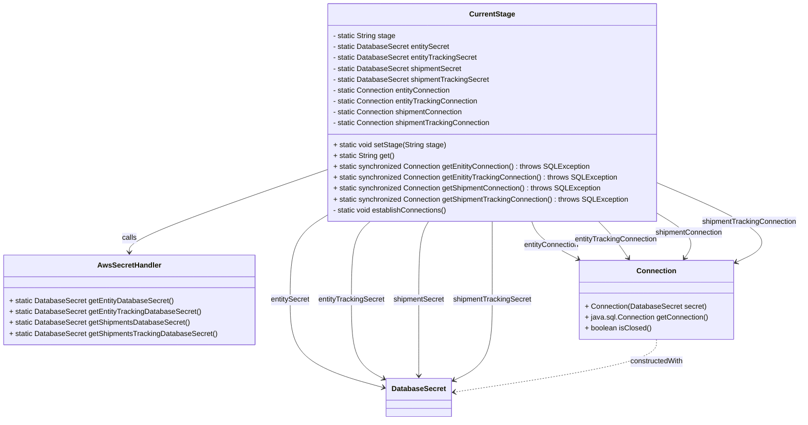
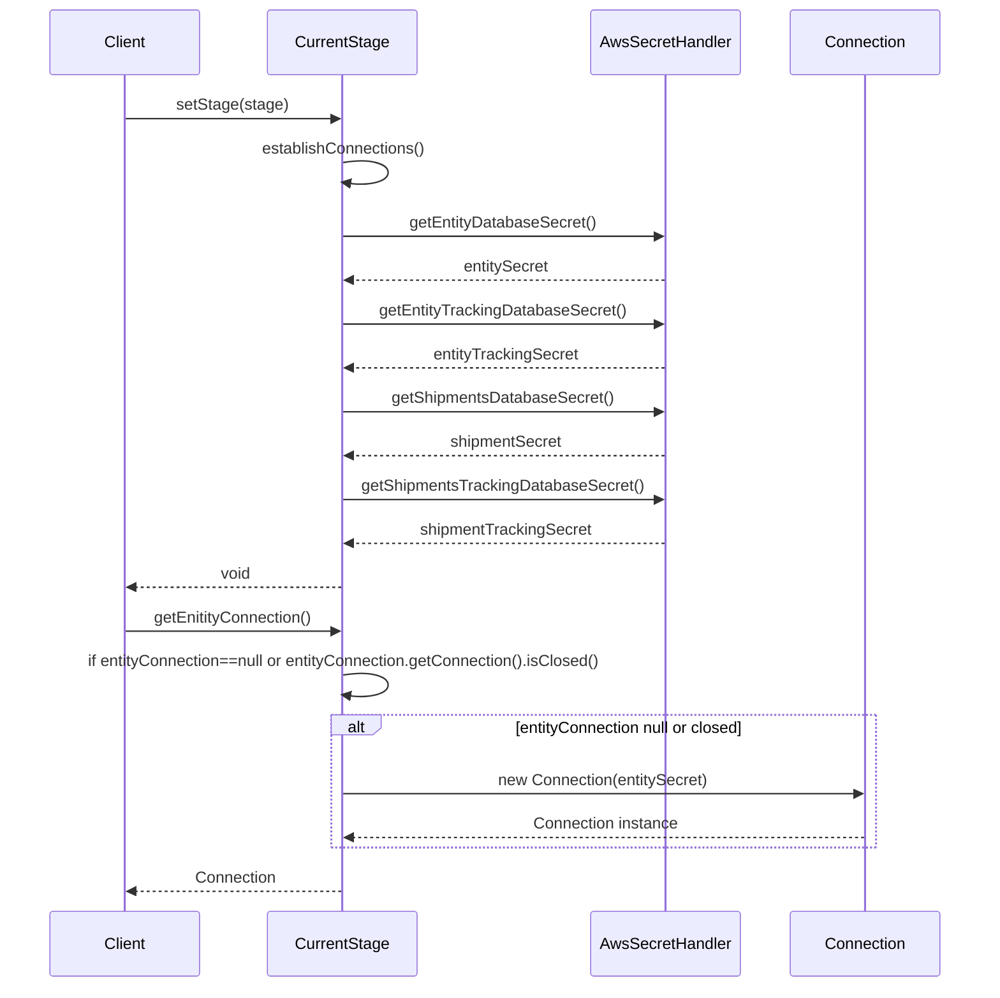

# Diagram: platform-java-lambdas/infrastructure/datastore/src/main/java/com/freightverify/infrastructure/aws/CurrentStage.java

> Auto-generated by Obscura crawlers

## Diagram 1

### SVG

<svg id="container" width="1773.952880859375" xmlns="http://www.w3.org/2000/svg" class="classDiagram" height="926" viewBox="0 0 1773.952880859375 926" role="graphics-document document" aria-roledescription="class"><g><defs><marker id="container_class-aggregationStart" class="marker aggregation class" refX="18" refY="7" markerWidth="190" markerHeight="240" orient="auto"><path d="M 18,7 L9,13 L1,7 L9,1 Z"></path></marker></defs><defs><marker id="container_class-aggregationEnd" class="marker aggregation class" refX="1" refY="7" markerWidth="20" markerHeight="28" orient="auto"><path d="M 18,7 L9,13 L1,7 L9,1 Z"></path></marker></defs><defs><marker id="container_class-extensionStart" class="marker extension class" refX="18" refY="7" markerWidth="190" markerHeight="240" orient="auto"><path d="M 1,7 L18,13 V 1 Z"></path></marker></defs><defs><marker id="container_class-extensionEnd" class="marker extension class" refX="1" refY="7" markerWidth="20" markerHeight="28" orient="auto"><path d="M 1,1 V 13 L18,7 Z"></path></marker></defs><defs><marker id="container_class-compositionStart" class="marker composition class" refX="18" refY="7" markerWidth="190" markerHeight="240" orient="auto"><path d="M 18,7 L9,13 L1,7 L9,1 Z"></path></marker></defs><defs><marker id="container_class-compositionEnd" class="marker composition class" refX="1" refY="7" markerWidth="20" markerHeight="28" orient="auto"><path d="M 18,7 L9,13 L1,7 L9,1 Z"></path></marker></defs><defs><marker id="container_class-dependencyStart" class="marker dependency class" refX="6" refY="7" markerWidth="190" markerHeight="240" orient="auto"><path d="M 5,7 L9,13 L1,7 L9,1 Z"></path></marker></defs><defs><marker id="container_class-dependencyEnd" class="marker dependency class" refX="13" refY="7" markerWidth="20" markerHeight="28" orient="auto"><path d="M 18,7 L9,13 L14,7 L9,1 Z"></path></marker></defs><defs><marker id="container_class-lollipopStart" class="marker lollipop class" refX="13" refY="7" markerWidth="190" markerHeight="240" orient="auto"><circle stroke="black" fill="transparent" cx="7" cy="7" r="6"></circle></marker></defs><defs><marker id="container_class-lollipopEnd" class="marker lollipop class" refX="1" refY="7" markerWidth="190" markerHeight="240" orient="auto"><circle stroke="black" fill="transparent" cx="7" cy="7" r="6"></circle></marker></defs><g class="root"><g class="clusters"></g><g class="edgePaths"><path d="M723.496,372.647L649.818,398.039C576.139,423.431,428.783,474.216,355.104,504.774C281.426,535.333,281.426,545.667,281.426,550.833L281.426,556" id="id_CurrentStage_AwsSecretHandler_1" class="edge-thickness-normal edge-pattern-solid relation" style=";;;" data-edge="true" data-et="edge" data-id="id_CurrentStage_AwsSecretHandler_1" data-points="W3sieCI6NzIzLjQ5NjA5Mzc1LCJ5IjozNzIuNjQ2NTY3MTAwMzQ1Nn0seyJ4IjoyODEuNDI1NzgxMjUsInkiOjUyNX0seyJ4IjoyODEuNDI1NzgxMjUsInkiOjU2Mn1d" marker-end="url(#container_class-dependencyEnd)"></path><path d="M723.496,469.792L708.492,478.993C693.487,488.195,663.478,506.597,648.473,538.465C633.469,570.333,633.469,615.667,633.469,661C633.469,706.333,633.469,751.667,668.908,784.058C704.347,816.45,775.226,835.9,810.665,845.624L846.105,855.349" id="id_CurrentStage_DatabaseSecret_2" class="edge-thickness-normal edge-pattern-solid relation" style=";;;" data-edge="true" data-et="edge" data-id="id_CurrentStage_DatabaseSecret_2" data-points="W3sieCI6NzIzLjQ5NjA5Mzc1LCJ5Ijo0NjkuNzkyMTE0OTEyMzExMDR9LHsieCI6NjMzLjQ2ODc1LCJ5Ijo1MjV9LHsieCI6NjMzLjQ2ODc1LCJ5Ijo2NjF9LHsieCI6NjMzLjQ2ODc1LCJ5Ijo3OTd9LHsieCI6ODUxLjg5MDYyNSwieSI6ODU2LjkzNzA5NjMzNjQ5OTN9XQ==" marker-end="url(#container_class-dependencyEnd)"></path><path d="M812.782,488L805.784,494.167C798.785,500.333,784.787,512.667,777.788,541.5C770.789,570.333,770.789,615.667,770.789,661C770.789,706.333,770.789,751.667,783.42,780.961C796.052,810.255,821.315,823.509,833.946,830.137L846.578,836.764" id="id_CurrentStage_DatabaseSecret_3" class="edge-thickness-normal edge-pattern-solid relation" style=";;;" data-edge="true" data-et="edge" data-id="id_CurrentStage_DatabaseSecret_3" data-points="W3sieCI6ODEyLjc4MjQzNDU2Njc4NzEsInkiOjQ4OH0seyJ4Ijo3NzAuNzg5MDYyNSwieSI6NTI1fSx7IngiOjc3MC43ODkwNjI1LCJ5Ijo2NjF9LHsieCI6NzcwLjc4OTA2MjUsInkiOjc5N30seyJ4Ijo4NTEuODkwNjI1LCJ5Ijo4MzkuNTUxNzA0NDU3MDEyNH1d" marker-end="url(#container_class-dependencyEnd)"></path><path d="M943.24,488L939.594,494.167C935.947,500.333,928.653,512.667,925.006,541.5C921.359,570.333,921.359,615.667,921.359,661C921.359,706.333,921.359,751.667,921.359,779.5C921.359,807.333,921.359,817.667,921.359,822.833L921.359,828" id="id_CurrentStage_DatabaseSecret_4" class="edge-thickness-normal edge-pattern-solid relation" style=";;;" data-edge="true" data-et="edge" data-id="id_CurrentStage_DatabaseSecret_4" data-points="W3sieCI6OTQzLjI0MDQ2NzA1Nzc2MTcsInkiOjQ4OH0seyJ4Ijo5MjEuMzU5Mzc1LCJ5Ijo1MjV9LHsieCI6OTIxLjM1OTM3NSwieSI6NjYxfSx7IngiOjkyMS4zNTkzNzUsInkiOjc5N30seyJ4Ijo5MjEuMzU5Mzc1LCJ5Ijo4MzR9XQ==" marker-end="url(#container_class-dependencyEnd)"></path><path d="M1085.172,488L1085.172,494.167C1085.172,500.333,1085.172,512.667,1085.172,541.5C1085.172,570.333,1085.172,615.667,1085.172,661C1085.172,706.333,1085.172,751.667,1070.349,781.482C1055.525,811.297,1025.879,825.595,1011.056,832.743L996.232,839.892" id="id_CurrentStage_DatabaseSecret_5" class="edge-thickness-normal edge-pattern-solid relation" style=";;;" data-edge="true" data-et="edge" data-id="id_CurrentStage_DatabaseSecret_5" data-points="W3sieCI6MTA4NS4xNzE4NzUsInkiOjQ4OH0seyJ4IjoxMDg1LjE3MTg3NSwieSI6NTI1fSx7IngiOjEwODUuMTcxODc1LCJ5Ijo2NjF9LHsieCI6MTA4NS4xNzE4NzUsInkiOjc5N30seyJ4Ijo5OTAuODI4MTI1LCJ5Ijo4NDIuNDk4MDkyMzMxMTcxM31d" marker-end="url(#container_class-dependencyEnd)"></path><path d="M1171.163,488L1173.372,494.167C1175.582,500.333,1180.001,512.667,1197.85,526.774C1215.699,540.882,1246.978,556.763,1262.618,564.704L1278.258,572.645" id="id_CurrentStage_Connection_6" class="edge-thickness-normal edge-pattern-solid relation" style=";;;" data-edge="true" data-et="edge" data-id="id_CurrentStage_Connection_6" data-points="W3sieCI6MTE3MS4xNjI5NjI1NDUxMjY0LCJ5Ijo0ODh9LHsieCI6MTE4NC40MTk5MjE4NzUsInkiOjUyNX0seyJ4IjoxMjgzLjYwNzQyMTg3NSwieSI6NTc1LjM2MTExNDc1Njk2NzN9XQ==" marker-end="url(#container_class-dependencyEnd)"></path><path d="M1322.056,488L1328.143,494.167C1334.23,500.333,1346.403,512.667,1357.549,526.177C1368.695,539.686,1378.813,554.373,1383.872,561.716L1388.931,569.059" id="id_CurrentStage_Connection_7" class="edge-thickness-normal edge-pattern-solid relation" style=";;;" data-edge="true" data-et="edge" data-id="id_CurrentStage_Connection_7" data-points="W3sieCI6MTMyMi4wNTY0NjQzNTAxODA1LCJ5Ijo0ODh9LHsieCI6MTM1OC41NzYxNzE4NzUsInkiOjUyNX0seyJ4IjoxMzkyLjMzNTQ0OTIxODc1LCJ5Ijo1NzR9XQ==" marker-end="url(#container_class-dependencyEnd)"></path><path d="M1446.848,465.412L1463.369,475.344C1479.89,485.275,1512.932,505.137,1524.394,522.412C1535.856,539.686,1525.738,554.373,1520.679,561.716L1515.619,569.059" id="id_CurrentStage_Connection_8" class="edge-thickness-normal edge-pattern-solid relation" style=";;;" data-edge="true" data-et="edge" data-id="id_CurrentStage_Connection_8" data-points="W3sieCI6MTQ0Ni44NDc2NTYyNSwieSI6NDY1LjQxMjMxOTcwMzY0MjJ9LHsieCI6MTU0NS45NzQ2MDkzNzUsInkiOjUyNX0seyJ4IjoxNTEyLjIxNTMzMjAzMTI1LCJ5Ijo1NzR9XQ==" marker-end="url(#container_class-dependencyEnd)"></path><path d="M1446.848,399.461L1496.81,420.384C1546.773,441.307,1646.698,483.154,1676.622,513.336C1706.545,543.517,1666.468,562.035,1646.429,571.294L1626.39,580.552" id="id_CurrentStage_Connection_9" class="edge-thickness-normal edge-pattern-solid relation" style=";;;" data-edge="true" data-et="edge" data-id="id_CurrentStage_Connection_9" data-points="W3sieCI6MTQ0Ni44NDc2NTYyNSwieSI6Mzk5LjQ2MTIwNDc5NjUwODZ9LHsieCI6MTc0Ni42MjMwNDY4NzUsInkiOjUyNX0seyJ4IjoxNjIwLjk0MzM1OTM3NSwieSI6NTgzLjA2ODg3NTgyNDQ1Mjl9XQ==" marker-end="url(#container_class-dependencyEnd)"></path><path d="M1452.275,748L1452.275,756.167C1452.275,764.333,1452.275,780.667,1376.357,800.13C1300.438,819.593,1148.6,842.187,1072.682,853.483L996.763,864.78" id="id_Connection_DatabaseSecret_10" class="edge-thickness-normal edge-pattern-dashed relation" style=";;;" data-edge="true" data-et="edge" data-id="id_Connection_DatabaseSecret_10" data-points="W3sieCI6MTQ1Mi4yNzUzOTA2MjUsInkiOjc0OH0seyJ4IjoxNDUyLjI3NTM5MDYyNSwieSI6Nzk3fSx7IngiOjk5MC44MjgxMjUsInkiOjg2NS42NjMwODk2NjI5ODY2fV0=" marker-end="url(#container_class-dependencyEnd)"></path></g><g class="edgeLabels"><g class="edgeLabel" transform="translate(281.42578125, 525)"><g class="label" data-id="id_CurrentStage_AwsSecretHandler_1" transform="translate(-16.4453125, -12)"><foreignObject width="32.890625" height="24">

calls

</foreignObject></g></g><g class="edgeLabel" transform="translate(633.46875, 661)"><g class="label" data-id="id_CurrentStage_DatabaseSecret_2" transform="translate(-43.6171875, -12)"><foreignObject width="87.234375" height="24">

entitySecret

</foreignObject></g></g><g class="edgeLabel" transform="translate(770.7890625, 661)"><g class="label" data-id="id_CurrentStage_DatabaseSecret_3" transform="translate(-73.703125, -12)"><foreignObject width="147.40625" height="24">

entityTrackingSecret

</foreignObject></g></g><g class="edgeLabel" transform="translate(921.359375, 661)"><g class="label" data-id="id_CurrentStage_DatabaseSecret_4" transform="translate(-56.8671875, -12)"><foreignObject width="113.734375" height="24">

shipmentSecret

</foreignObject></g></g><g class="edgeLabel" transform="translate(1085.171875, 661)"><g class="label" data-id="id_CurrentStage_DatabaseSecret_5" transform="translate(-86.9453125, -12)"><foreignObject width="173.890625" height="24">

shipmentTrackingSecret

</foreignObject></g></g><g class="edgeLabel" transform="translate(1216.49127, 541.2838)"><g class="label" data-id="id_CurrentStage_Connection_6" transform="translate(-62.0390625, -12)"><foreignObject width="124.078125" height="24">

entityConnection

</foreignObject></g></g><g class="edgeLabel" transform="translate(1360.70835, 528.09475)"><g class="label" data-id="id_CurrentStage_Connection_7" transform="translate(-92.1171875, -12)"><foreignObject width="184.234375" height="24">

entityTrackingConnection

</foreignObject></g></g><g class="edgeLabel" transform="translate(1521.91046, 510.53444)"><g class="label" data-id="id_CurrentStage_Connection_8" transform="translate(-75.28125, -12)"><foreignObject width="150.5625" height="24">

shipmentConnection

</foreignObject></g></g><g class="edgeLabel" transform="translate(1660.58572, 488.96962)"><g class="label" data-id="id_CurrentStage_Connection_9" transform="translate(-105.3671875, -12)"><foreignObject width="210.734375" height="24">

shipmentTrackingConnection

</foreignObject></g></g><g class="edgeLabel" transform="translate(1452.275390625, 797)"><g class="label" data-id="id_Connection_DatabaseSecret_10" transform="translate(-59.5703125, -12)"><foreignObject width="119.140625" height="24">

constructedWith

</foreignObject></g></g></g><g class="nodes"><g class="node default" id="classId-CurrentStage-0" transform="translate(1085.171875, 248)"><g class="basic label-container"><path d="M-361.67578125 -240 L361.67578125 -240 L361.67578125 240 L-361.67578125 240" stroke="none" stroke-width="0" fill="#ECECFF" style=""></path><path d="M-361.67578125 -240 C-154.21998691026886 -240, 53.235807429462284 -240, 361.67578125 -240 M-361.67578125 -240 C-105.29848811804789 -240, 151.07880501390423 -240, 361.67578125 -240 M361.67578125 -240 C361.67578125 -129.7208663181078, 361.67578125 -19.44173263621559, 361.67578125 240 M361.67578125 -240 C361.67578125 -122.73934384278003, 361.67578125 -5.478687685560061, 361.67578125 240 M361.67578125 240 C216.8006051639245 240, 71.925429077849 240, -361.67578125 240 M361.67578125 240 C188.16598888395288 240, 14.656196517905755 240, -361.67578125 240 M-361.67578125 240 C-361.67578125 136.6825617821468, -361.67578125 33.36512356429358, -361.67578125 -240 M-361.67578125 240 C-361.67578125 78.10041258096464, -361.67578125 -83.79917483807071, -361.67578125 -240" stroke="#9370DB" stroke-width="1.3" fill="none" stroke-dasharray="0 0" style=""></path></g><g class="annotation-group text" transform="translate(0, -216)"></g><g class="label-group text" transform="translate(-47.8671875, -216)"><g class="label" style="font-weight: bolder" transform="translate(0,-12)"><foreignObject width="95.734375" height="24">

CurrentStage

</foreignObject></g></g><g class="members-group text" transform="translate(-349.67578125, -168)"><g class="label" style="" transform="translate(0,-12)"><foreignObject width="140.296875" height="24">

- static String stage

</foreignObject></g><g class="label" style="" transform="translate(0,12)"><foreignObject width="258.765625" height="24">

- static DatabaseSecret entitySecret

</foreignObject></g><g class="label" style="" transform="translate(0,36)"><foreignObject width="318.921875" height="24">

- static DatabaseSecret entityTrackingSecret

</foreignObject></g><g class="label" style="" transform="translate(0,60)"><foreignObject width="285.25" height="24">

- static DatabaseSecret shipmentSecret

</foreignObject></g><g class="label" style="" transform="translate(0,84)"><foreignObject width="345.421875" height="24">

- static DatabaseSecret shipmentTrackingSecret

</foreignObject></g><g class="label" style="" transform="translate(0,108)"><foreignObject width="265.125" height="24">

- static Connection entityConnection

</foreignObject></g><g class="label" style="" transform="translate(0,132)"><foreignObject width="325.28125" height="24">

- static Connection entityTrackingConnection

</foreignObject></g><g class="label" style="" transform="translate(0,156)"><foreignObject width="291.625" height="24">

- static Connection shipmentConnection

</foreignObject></g><g class="label" style="" transform="translate(0,180)"><foreignObject width="351.78125" height="24">

- static Connection shipmentTrackingConnection

</foreignObject></g></g><g class="methods-group text" transform="translate(-349.67578125, 72)"><g class="label" style="" transform="translate(0,-12)"><foreignObject width="249.359375" height="24">

+ static void setStage(String stage)

</foreignObject></g><g class="label" style="" transform="translate(0,12)"><foreignObject width="136.296875" height="24">

+ static String get()

</foreignObject></g><g class="label" style="" transform="translate(0,36)"><foreignObject width="567.765625" height="24">

+ static synchronized Connection getEnitityConnection() : throws SQLException

</foreignObject></g><g class="label" style="" transform="translate(0,60)"><foreignObject width="627.921875" height="24">

+ static synchronized Connection getEnitityTrackingConnection() : throws SQLException

</foreignObject></g><g class="label" style="" transform="translate(0,84)"><foreignObject width="591.328125" height="24">

+ static synchronized Connection getShipmentConnection() : throws SQLException

</foreignObject></g><g class="label" style="" transform="translate(0,108)"><foreignObject width="651.484375" height="24">

+ static synchronized Connection getShipmentTrackingConnection() : throws SQLException

</foreignObject></g><g class="label" style="" transform="translate(0,132)"><foreignObject width="256.25" height="24">

- static void establishConnections()

</foreignObject></g></g><g class="divider" style=""><path d="M-361.67578125 -192 C-154.6891405396659 -192, 52.29750017066817 -192, 361.67578125 -192 M-361.67578125 -192 C-123.17495188760117 -192, 115.32587747479766 -192, 361.67578125 -192" stroke="#9370DB" stroke-width="1.3" fill="none" stroke-dasharray="0 0" style=""></path></g><g class="divider" style=""><path d="M-361.67578125 48 C-175.93972984203188 48, 9.796321565936239 48, 361.67578125 48 M-361.67578125 48 C-204.9446460461836 48, -48.213510842367214 48, 361.67578125 48" stroke="#9370DB" stroke-width="1.3" fill="none" stroke-dasharray="0 0" style=""></path></g></g><g class="node default" id="classId-AwsSecretHandler-1" transform="translate(281.42578125, 661)"><g class="basic label-container"><path d="M-273.42578125 -99 L273.42578125 -99 L273.42578125 99 L-273.42578125 99" stroke="none" stroke-width="0" fill="#ECECFF" style=""></path><path d="M-273.42578125 -99 C-72.19995553581862 -99, 129.02587017836277 -99, 273.42578125 -99 M-273.42578125 -99 C-118.99038545821784 -99, 35.44501033356431 -99, 273.42578125 -99 M273.42578125 -99 C273.42578125 -29.67023923606719, 273.42578125 39.65952152786562, 273.42578125 99 M273.42578125 -99 C273.42578125 -58.05881767271357, 273.42578125 -17.117635345427146, 273.42578125 99 M273.42578125 99 C106.43821861668144 99, -60.54934401663712 99, -273.42578125 99 M273.42578125 99 C111.10702887842078 99, -51.211723493158445 99, -273.42578125 99 M-273.42578125 99 C-273.42578125 49.111353685833485, -273.42578125 -0.7772926283330293, -273.42578125 -99 M-273.42578125 99 C-273.42578125 44.371401319399, -273.42578125 -10.257197361202003, -273.42578125 -99" stroke="#9370DB" stroke-width="1.3" fill="none" stroke-dasharray="0 0" style=""></path></g><g class="annotation-group text" transform="translate(0, -75)"></g><g class="label-group text" transform="translate(-66.9609375, -75)"><g class="label" style="font-weight: bolder" transform="translate(0,-12)"><foreignObject width="133.921875" height="24">

AwsSecretHandler

</foreignObject></g></g><g class="members-group text" transform="translate(-261.42578125, -27)"></g><g class="methods-group text" transform="translate(-261.42578125, 3)"><g class="label" style="" transform="translate(0,-12)"><foreignObject width="360.203125" height="24">

+ static DatabaseSecret getEntityDatabaseSecret()

</foreignObject></g><g class="label" style="" transform="translate(0,12)"><foreignObject width="420.359375" height="24">

+ static DatabaseSecret getEntityTrackingDatabaseSecret()

</foreignObject></g><g class="label" style="" transform="translate(0,36)"><foreignObject width="395.734375" height="24">

+ static DatabaseSecret getShipmentsDatabaseSecret()

</foreignObject></g><g class="label" style="" transform="translate(0,60)"><foreignObject width="455.890625" height="24">

+ static DatabaseSecret getShipmentsTrackingDatabaseSecret()

</foreignObject></g></g><g class="divider" style=""><path d="M-273.42578125 -51 C-123.13930404402828 -51, 27.147173161943442 -51, 273.42578125 -51 M-273.42578125 -51 C-129.57853298326208 -51, 14.268715283475842 -51, 273.42578125 -51" stroke="#9370DB" stroke-width="1.3" fill="none" stroke-dasharray="0 0" style=""></path></g><g class="divider" style=""><path d="M-273.42578125 -27 C-135.62803537790506 -27, 2.1697104941898715 -27, 273.42578125 -27 M-273.42578125 -27 C-102.64369586512572 -27, 68.13838951974856 -27, 273.42578125 -27" stroke="#9370DB" stroke-width="1.3" fill="none" stroke-dasharray="0 0" style=""></path></g></g><g class="node default" id="classId-DatabaseSecret-2" transform="translate(921.359375, 876)"><g class="basic label-container"><path d="M-69.46875 -42 L69.46875 -42 L69.46875 42 L-69.46875 42" stroke="none" stroke-width="0" fill="#ECECFF" style=""></path><path d="M-69.46875 -42 C-19.062542067696626 -42, 31.34366586460675 -42, 69.46875 -42 M-69.46875 -42 C-22.853193848409227 -42, 23.762362303181547 -42, 69.46875 -42 M69.46875 -42 C69.46875 -12.051045682220504, 69.46875 17.89790863555899, 69.46875 42 M69.46875 -42 C69.46875 -24.750493233079922, 69.46875 -7.500986466159844, 69.46875 42 M69.46875 42 C16.49325473248566 42, -36.48224053502868 42, -69.46875 42 M69.46875 42 C29.56873699764799 42, -10.331276004704023 42, -69.46875 42 M-69.46875 42 C-69.46875 15.521428004372723, -69.46875 -10.957143991254554, -69.46875 -42 M-69.46875 42 C-69.46875 13.580308670166236, -69.46875 -14.839382659667528, -69.46875 -42" stroke="#9370DB" stroke-width="1.3" fill="none" stroke-dasharray="0 0" style=""></path></g><g class="annotation-group text" transform="translate(0, -18)"></g><g class="label-group text" transform="translate(-57.46875, -18)"><g class="label" style="font-weight: bolder" transform="translate(0,-12)"><foreignObject width="114.9375" height="24">

DatabaseSecret

</foreignObject></g></g><g class="members-group text" transform="translate(-57.46875, 30)"></g><g class="methods-group text" transform="translate(-57.46875, 60)"></g><g class="divider" style=""><path d="M-69.46875 6 C-36.21603060169405 6, -2.963311203388102 6, 69.46875 6 M-69.46875 6 C-21.159944248844482 6, 27.148861502311036 6, 69.46875 6" stroke="#9370DB" stroke-width="1.3" fill="none" stroke-dasharray="0 0" style=""></path></g><g class="divider" style=""><path d="M-69.46875 24 C-16.164564957566135 24, 37.13962008486773 24, 69.46875 24 M-69.46875 24 C-18.293173348498662 24, 32.882403303002675 24, 69.46875 24" stroke="#9370DB" stroke-width="1.3" fill="none" stroke-dasharray="0 0" style=""></path></g></g><g class="node default" id="classId-Connection-3" transform="translate(1452.275390625, 661)"><g class="basic label-container"><path d="M-168.66796875 -87 L168.66796875 -87 L168.66796875 87 L-168.66796875 87" stroke="none" stroke-width="0" fill="#ECECFF" style=""></path><path d="M-168.66796875 -87 C-95.2546567505566 -87, -21.841344751113212 -87, 168.66796875 -87 M-168.66796875 -87 C-63.59930083800788 -87, 41.469367073984245 -87, 168.66796875 -87 M168.66796875 -87 C168.66796875 -18.971995272846172, 168.66796875 49.056009454307656, 168.66796875 87 M168.66796875 -87 C168.66796875 -51.234295672413516, 168.66796875 -15.468591344827033, 168.66796875 87 M168.66796875 87 C89.91533438571389 87, 11.162700021427781 87, -168.66796875 87 M168.66796875 87 C91.32055691134852 87, 13.973145072697037 87, -168.66796875 87 M-168.66796875 87 C-168.66796875 26.51919573536142, -168.66796875 -33.96160852927716, -168.66796875 -87 M-168.66796875 87 C-168.66796875 26.872138986402568, -168.66796875 -33.255722027194864, -168.66796875 -87" stroke="#9370DB" stroke-width="1.3" fill="none" stroke-dasharray="0 0" style=""></path></g><g class="annotation-group text" transform="translate(0, -63)"></g><g class="label-group text" transform="translate(-41.2265625, -63)"><g class="label" style="font-weight: bolder" transform="translate(0,-12)"><foreignObject width="82.453125" height="24">

Connection

</foreignObject></g></g><g class="members-group text" transform="translate(-156.66796875, -15)"></g><g class="methods-group text" transform="translate(-156.66796875, 15)"><g class="label" style="" transform="translate(0,-12)"><foreignObject width="265.5625" height="24">

+ Connection(DatabaseSecret secret)

</foreignObject></g><g class="label" style="" transform="translate(0,12)"><foreignObject width="272.109375" height="24">

+ java.sql.Connection getConnection()

</foreignObject></g><g class="label" style="" transform="translate(0,36)"><foreignObject width="146.78125" height="24">

+ boolean isClosed()

</foreignObject></g></g><g class="divider" style=""><path d="M-168.66796875 -39 C-64.36065830706285 -39, 39.9466521358743 -39, 168.66796875 -39 M-168.66796875 -39 C-68.06605386838915 -39, 32.535861013221705 -39, 168.66796875 -39" stroke="#9370DB" stroke-width="1.3" fill="none" stroke-dasharray="0 0" style=""></path></g><g class="divider" style=""><path d="M-168.66796875 -15 C-67.85000464406032 -15, 32.96795946187936 -15, 168.66796875 -15 M-168.66796875 -15 C-76.04185431055339 -15, 16.58426012889322 -15, 168.66796875 -15" stroke="#9370DB" stroke-width="1.3" fill="none" stroke-dasharray="0 0" style=""></path></g></g></g></g></g></svg>

## Diagram 2

### SVG

<svg id="container" width="1035" xmlns="http://www.w3.org/2000/svg" height="1054" viewBox="-50 -10 1035 1054" role="graphics-document document" aria-roledescription="sequence"><g><rect x="785" y="968" fill="#eaeaea" stroke="#666" width="150" height="65" name="Connection" rx="3" ry="3" class="actor actor-bottom"></rect><text x="860" y="1000.5" dominant-baseline="central" alignment-baseline="central" class="actor actor-box" style="text-anchor: middle; font-size: 16px; font-weight: 400;"><tspan x="860" dy="0">Connection</tspan></text></g><g><rect x="583" y="968" fill="#eaeaea" stroke="#666" width="152" height="65" name="AwsSecretHandler" rx="3" ry="3" class="actor actor-bottom"></rect><text x="659" y="1000.5" dominant-baseline="central" alignment-baseline="central" class="actor actor-box" style="text-anchor: middle; font-size: 16px; font-weight: 400;"><tspan x="659" dy="0">AwsSecretHandler</tspan></text></g><g><rect x="231" y="968" fill="#eaeaea" stroke="#666" width="150" height="65" name="CurrentStage" rx="3" ry="3" class="actor actor-bottom"></rect><text x="306" y="1000.5" dominant-baseline="central" alignment-baseline="central" class="actor actor-box" style="text-anchor: middle; font-size: 16px; font-weight: 400;"><tspan x="306" dy="0">CurrentStage</tspan></text></g><g><rect x="0" y="968" fill="#eaeaea" stroke="#666" width="150" height="65" name="Client" rx="3" ry="3" class="actor actor-bottom"></rect><text x="75" y="1000.5" dominant-baseline="central" alignment-baseline="central" class="actor actor-box" style="text-anchor: middle; font-size: 16px; font-weight: 400;"><tspan x="75" dy="0">Client</tspan></text></g><g><line id="actor3" x1="860" y1="65" x2="860" y2="968" class="actor-line 200" stroke-width="0.5px" stroke="#999" name="Connection"></line><g id="root-3"><rect x="785" y="0" fill="#eaeaea" stroke="#666" width="150" height="65" name="Connection" rx="3" ry="3" class="actor actor-top"></rect><text x="860" y="32.5" dominant-baseline="central" alignment-baseline="central" class="actor actor-box" style="text-anchor: middle; font-size: 16px; font-weight: 400;"><tspan x="860" dy="0">Connection</tspan></text></g></g><g><line id="actor2" x1="659" y1="65" x2="659" y2="968" class="actor-line 200" stroke-width="0.5px" stroke="#999" name="AwsSecretHandler"></line><g id="root-2"><rect x="583" y="0" fill="#eaeaea" stroke="#666" width="152" height="65" name="AwsSecretHandler" rx="3" ry="3" class="actor actor-top"></rect><text x="659" y="32.5" dominant-baseline="central" alignment-baseline="central" class="actor actor-box" style="text-anchor: middle; font-size: 16px; font-weight: 400;"><tspan x="659" dy="0">AwsSecretHandler</tspan></text></g></g><g><line id="actor1" x1="306" y1="65" x2="306" y2="968" class="actor-line 200" stroke-width="0.5px" stroke="#999" name="CurrentStage"></line><g id="root-1"><rect x="231" y="0" fill="#eaeaea" stroke="#666" width="150" height="65" name="CurrentStage" rx="3" ry="3" class="actor actor-top"></rect><text x="306" y="32.5" dominant-baseline="central" alignment-baseline="central" class="actor actor-box" style="text-anchor: middle; font-size: 16px; font-weight: 400;"><tspan x="306" dy="0">CurrentStage</tspan></text></g></g><g><line id="actor0" x1="75" y1="65" x2="75" y2="968" class="actor-line 200" stroke-width="0.5px" stroke="#999" name="Client"></line><g id="root-0"><rect x="0" y="0" fill="#eaeaea" stroke="#666" width="150" height="65" name="Client" rx="3" ry="3" class="actor actor-top"></rect><text x="75" y="32.5" dominant-baseline="central" alignment-baseline="central" class="actor actor-box" style="text-anchor: middle; font-size: 16px; font-weight: 400;"><tspan x="75" dy="0">Client</tspan></text></g></g><g></g><defs><symbol id="computer" width="24" height="24"><path transform="scale(.5)" d="M2 2v13h20v-13h-20zm18 11h-16v-9h16v9zm-10.228 6l.466-1h3.524l.467 1h-4.457zm14.228 3h-24l2-6h2.104l-1.33 4h18.45l-1.297-4h2.073l2 6zm-5-10h-14v-7h14v7z"></path></symbol></defs><defs><symbol id="database" fill-rule="evenodd" clip-rule="evenodd"><path transform="scale(.5)" d="M12.258.001l.256.004.255.005.253.008.251.01.249.012.247.015.246.016.242.019.241.02.239.023.236.024.233.027.231.028.229.031.225.032.223.034.22.036.217.038.214.04.211.041.208.043.205.045.201.046.198.048.194.05.191.051.187.053.183.054.18.056.175.057.172.059.168.06.163.061.16.063.155.064.15.066.074.033.073.033.071.034.07.034.069.035.068.035.067.035.066.035.064.036.064.036.062.036.06.036.06.037.058.037.058.037.055.038.055.038.053.038.052.038.051.039.05.039.048.039.047.039.045.04.044.04.043.04.041.04.04.041.039.041.037.041.036.041.034.041.033.042.032.042.03.042.029.042.027.042.026.043.024.043.023.043.021.043.02.043.018.044.017.043.015.044.013.044.012.044.011.045.009.044.007.045.006.045.004.045.002.045.001.045v17l-.001.045-.002.045-.004.045-.006.045-.007.045-.009.044-.011.045-.012.044-.013.044-.015.044-.017.043-.018.044-.02.043-.021.043-.023.043-.024.043-.026.043-.027.042-.029.042-.03.042-.032.042-.033.042-.034.041-.036.041-.037.041-.039.041-.04.041-.041.04-.043.04-.044.04-.045.04-.047.039-.048.039-.05.039-.051.039-.052.038-.053.038-.055.038-.055.038-.058.037-.058.037-.06.037-.06.036-.062.036-.064.036-.064.036-.066.035-.067.035-.068.035-.069.035-.07.034-.071.034-.073.033-.074.033-.15.066-.155.064-.16.063-.163.061-.168.06-.172.059-.175.057-.18.056-.183.054-.187.053-.191.051-.194.05-.198.048-.201.046-.205.045-.208.043-.211.041-.214.04-.217.038-.22.036-.223.034-.225.032-.229.031-.231.028-.233.027-.236.024-.239.023-.241.02-.242.019-.246.016-.247.015-.249.012-.251.01-.253.008-.255.005-.256.004-.258.001-.258-.001-.256-.004-.255-.005-.253-.008-.251-.01-.249-.012-.247-.015-.245-.016-.243-.019-.241-.02-.238-.023-.236-.024-.234-.027-.231-.028-.228-.031-.226-.032-.223-.034-.22-.036-.217-.038-.214-.04-.211-.041-.208-.043-.204-.045-.201-.046-.198-.048-.195-.05-.19-.051-.187-.053-.184-.054-.179-.056-.176-.057-.172-.059-.167-.06-.164-.061-.159-.063-.155-.064-.151-.066-.074-.033-.072-.033-.072-.034-.07-.034-.069-.035-.068-.035-.067-.035-.066-.035-.064-.036-.063-.036-.062-.036-.061-.036-.06-.037-.058-.037-.057-.037-.056-.038-.055-.038-.053-.038-.052-.038-.051-.039-.049-.039-.049-.039-.046-.039-.046-.04-.044-.04-.043-.04-.041-.04-.04-.041-.039-.041-.037-.041-.036-.041-.034-.041-.033-.042-.032-.042-.03-.042-.029-.042-.027-.042-.026-.043-.024-.043-.023-.043-.021-.043-.02-.043-.018-.044-.017-.043-.015-.044-.013-.044-.012-.044-.011-.045-.009-.044-.007-.045-.006-.045-.004-.045-.002-.045-.001-.045v-17l.001-.045.002-.045.004-.045.006-.045.007-.045.009-.044.011-.045.012-.044.013-.044.015-.044.017-.043.018-.044.02-.043.021-.043.023-.043.024-.043.026-.043.027-.042.029-.042.03-.042.032-.042.033-.042.034-.041.036-.041.037-.041.039-.041.04-.041.041-.04.043-.04.044-.04.046-.04.046-.039.049-.039.049-.039.051-.039.052-.038.053-.038.055-.038.056-.038.057-.037.058-.037.06-.037.061-.036.062-.036.063-.036.064-.036.066-.035.067-.035.068-.035.069-.035.07-.034.072-.034.072-.033.074-.033.151-.066.155-.064.159-.063.164-.061.167-.06.172-.059.176-.057.179-.056.184-.054.187-.053.19-.051.195-.05.198-.048.201-.046.204-.045.208-.043.211-.041.214-.04.217-.038.22-.036.223-.034.226-.032.228-.031.231-.028.234-.027.236-.024.238-.023.241-.02.243-.019.245-.016.247-.015.249-.012.251-.01.253-.008.255-.005.256-.004.258-.001.258.001zm-9.258 20.499v.01l.001.021.003.021.004.022.005.021.006.022.007.022.009.023.01.022.011.023.012.023.013.023.015.023.016.024.017.023.018.024.019.024.021.024.022.025.023.024.024.025.052.049.056.05.061.051.066.051.07.051.075.051.079.052.084.052.088.052.092.052.097.052.102.051.105.052.11.052.114.051.119.051.123.051.127.05.131.05.135.05.139.048.144.049.147.047.152.047.155.047.16.045.163.045.167.043.171.043.176.041.178.041.183.039.187.039.19.037.194.035.197.035.202.033.204.031.209.03.212.029.216.027.219.025.222.024.226.021.23.02.233.018.236.016.24.015.243.012.246.01.249.008.253.005.256.004.259.001.26-.001.257-.004.254-.005.25-.008.247-.011.244-.012.241-.014.237-.016.233-.018.231-.021.226-.021.224-.024.22-.026.216-.027.212-.028.21-.031.205-.031.202-.034.198-.034.194-.036.191-.037.187-.039.183-.04.179-.04.175-.042.172-.043.168-.044.163-.045.16-.046.155-.046.152-.047.148-.048.143-.049.139-.049.136-.05.131-.05.126-.05.123-.051.118-.052.114-.051.11-.052.106-.052.101-.052.096-.052.092-.052.088-.053.083-.051.079-.052.074-.052.07-.051.065-.051.06-.051.056-.05.051-.05.023-.024.023-.025.021-.024.02-.024.019-.024.018-.024.017-.024.015-.023.014-.024.013-.023.012-.023.01-.023.01-.022.008-.022.006-.022.006-.022.004-.022.004-.021.001-.021.001-.021v-4.127l-.077.055-.08.053-.083.054-.085.053-.087.052-.09.052-.093.051-.095.05-.097.05-.1.049-.102.049-.105.048-.106.047-.109.047-.111.046-.114.045-.115.045-.118.044-.12.043-.122.042-.124.042-.126.041-.128.04-.13.04-.132.038-.134.038-.135.037-.138.037-.139.035-.142.035-.143.034-.144.033-.147.032-.148.031-.15.03-.151.03-.153.029-.154.027-.156.027-.158.026-.159.025-.161.024-.162.023-.163.022-.165.021-.166.02-.167.019-.169.018-.169.017-.171.016-.173.015-.173.014-.175.013-.175.012-.177.011-.178.01-.179.008-.179.008-.181.006-.182.005-.182.004-.184.003-.184.002h-.37l-.184-.002-.184-.003-.182-.004-.182-.005-.181-.006-.179-.008-.179-.008-.178-.01-.176-.011-.176-.012-.175-.013-.173-.014-.172-.015-.171-.016-.17-.017-.169-.018-.167-.019-.166-.02-.165-.021-.163-.022-.162-.023-.161-.024-.159-.025-.157-.026-.156-.027-.155-.027-.153-.029-.151-.03-.15-.03-.148-.031-.146-.032-.145-.033-.143-.034-.141-.035-.14-.035-.137-.037-.136-.037-.134-.038-.132-.038-.13-.04-.128-.04-.126-.041-.124-.042-.122-.042-.12-.044-.117-.043-.116-.045-.113-.045-.112-.046-.109-.047-.106-.047-.105-.048-.102-.049-.1-.049-.097-.05-.095-.05-.093-.052-.09-.051-.087-.052-.085-.053-.083-.054-.08-.054-.077-.054v4.127zm0-5.654v.011l.001.021.003.021.004.021.005.022.006.022.007.022.009.022.01.022.011.023.012.023.013.023.015.024.016.023.017.024.018.024.019.024.021.024.022.024.023.025.024.024.052.05.056.05.061.05.066.051.07.051.075.052.079.051.084.052.088.052.092.052.097.052.102.052.105.052.11.051.114.051.119.052.123.05.127.051.131.05.135.049.139.049.144.048.147.048.152.047.155.046.16.045.163.045.167.044.171.042.176.042.178.04.183.04.187.038.19.037.194.036.197.034.202.033.204.032.209.03.212.028.216.027.219.025.222.024.226.022.23.02.233.018.236.016.24.014.243.012.246.01.249.008.253.006.256.003.259.001.26-.001.257-.003.254-.006.25-.008.247-.01.244-.012.241-.015.237-.016.233-.018.231-.02.226-.022.224-.024.22-.025.216-.027.212-.029.21-.03.205-.032.202-.033.198-.035.194-.036.191-.037.187-.039.183-.039.179-.041.175-.042.172-.043.168-.044.163-.045.16-.045.155-.047.152-.047.148-.048.143-.048.139-.05.136-.049.131-.05.126-.051.123-.051.118-.051.114-.052.11-.052.106-.052.101-.052.096-.052.092-.052.088-.052.083-.052.079-.052.074-.051.07-.052.065-.051.06-.05.056-.051.051-.049.023-.025.023-.024.021-.025.02-.024.019-.024.018-.024.017-.024.015-.023.014-.023.013-.024.012-.022.01-.023.01-.023.008-.022.006-.022.006-.022.004-.021.004-.022.001-.021.001-.021v-4.139l-.077.054-.08.054-.083.054-.085.052-.087.053-.09.051-.093.051-.095.051-.097.05-.1.049-.102.049-.105.048-.106.047-.109.047-.111.046-.114.045-.115.044-.118.044-.12.044-.122.042-.124.042-.126.041-.128.04-.13.039-.132.039-.134.038-.135.037-.138.036-.139.036-.142.035-.143.033-.144.033-.147.033-.148.031-.15.03-.151.03-.153.028-.154.028-.156.027-.158.026-.159.025-.161.024-.162.023-.163.022-.165.021-.166.02-.167.019-.169.018-.169.017-.171.016-.173.015-.173.014-.175.013-.175.012-.177.011-.178.009-.179.009-.179.007-.181.007-.182.005-.182.004-.184.003-.184.002h-.37l-.184-.002-.184-.003-.182-.004-.182-.005-.181-.007-.179-.007-.179-.009-.178-.009-.176-.011-.176-.012-.175-.013-.173-.014-.172-.015-.171-.016-.17-.017-.169-.018-.167-.019-.166-.02-.165-.021-.163-.022-.162-.023-.161-.024-.159-.025-.157-.026-.156-.027-.155-.028-.153-.028-.151-.03-.15-.03-.148-.031-.146-.033-.145-.033-.143-.033-.141-.035-.14-.036-.137-.036-.136-.037-.134-.038-.132-.039-.13-.039-.128-.04-.126-.041-.124-.042-.122-.043-.12-.043-.117-.044-.116-.044-.113-.046-.112-.046-.109-.046-.106-.047-.105-.048-.102-.049-.1-.049-.097-.05-.095-.051-.093-.051-.09-.051-.087-.053-.085-.052-.083-.054-.08-.054-.077-.054v4.139zm0-5.666v.011l.001.02.003.022.004.021.005.022.006.021.007.022.009.023.01.022.011.023.012.023.013.023.015.023.016.024.017.024.018.023.019.024.021.025.022.024.023.024.024.025.052.05.056.05.061.05.066.051.07.051.075.052.079.051.084.052.088.052.092.052.097.052.102.052.105.051.11.052.114.051.119.051.123.051.127.05.131.05.135.05.139.049.144.048.147.048.152.047.155.046.16.045.163.045.167.043.171.043.176.042.178.04.183.04.187.038.19.037.194.036.197.034.202.033.204.032.209.03.212.028.216.027.219.025.222.024.226.021.23.02.233.018.236.017.24.014.243.012.246.01.249.008.253.006.256.003.259.001.26-.001.257-.003.254-.006.25-.008.247-.01.244-.013.241-.014.237-.016.233-.018.231-.02.226-.022.224-.024.22-.025.216-.027.212-.029.21-.03.205-.032.202-.033.198-.035.194-.036.191-.037.187-.039.183-.039.179-.041.175-.042.172-.043.168-.044.163-.045.16-.045.155-.047.152-.047.148-.048.143-.049.139-.049.136-.049.131-.051.126-.05.123-.051.118-.052.114-.051.11-.052.106-.052.101-.052.096-.052.092-.052.088-.052.083-.052.079-.052.074-.052.07-.051.065-.051.06-.051.056-.05.051-.049.023-.025.023-.025.021-.024.02-.024.019-.024.018-.024.017-.024.015-.023.014-.024.013-.023.012-.023.01-.022.01-.023.008-.022.006-.022.006-.022.004-.022.004-.021.001-.021.001-.021v-4.153l-.077.054-.08.054-.083.053-.085.053-.087.053-.09.051-.093.051-.095.051-.097.05-.1.049-.102.048-.105.048-.106.048-.109.046-.111.046-.114.046-.115.044-.118.044-.12.043-.122.043-.124.042-.126.041-.128.04-.13.039-.132.039-.134.038-.135.037-.138.036-.139.036-.142.034-.143.034-.144.033-.147.032-.148.032-.15.03-.151.03-.153.028-.154.028-.156.027-.158.026-.159.024-.161.024-.162.023-.163.023-.165.021-.166.02-.167.019-.169.018-.169.017-.171.016-.173.015-.173.014-.175.013-.175.012-.177.01-.178.01-.179.009-.179.007-.181.006-.182.006-.182.004-.184.003-.184.001-.185.001-.185-.001-.184-.001-.184-.003-.182-.004-.182-.006-.181-.006-.179-.007-.179-.009-.178-.01-.176-.01-.176-.012-.175-.013-.173-.014-.172-.015-.171-.016-.17-.017-.169-.018-.167-.019-.166-.02-.165-.021-.163-.023-.162-.023-.161-.024-.159-.024-.157-.026-.156-.027-.155-.028-.153-.028-.151-.03-.15-.03-.148-.032-.146-.032-.145-.033-.143-.034-.141-.034-.14-.036-.137-.036-.136-.037-.134-.038-.132-.039-.13-.039-.128-.041-.126-.041-.124-.041-.122-.043-.12-.043-.117-.044-.116-.044-.113-.046-.112-.046-.109-.046-.106-.048-.105-.048-.102-.048-.1-.05-.097-.049-.095-.051-.093-.051-.09-.052-.087-.052-.085-.053-.083-.053-.08-.054-.077-.054v4.153zm8.74-8.179l-.257.004-.254.005-.25.008-.247.011-.244.012-.241.014-.237.016-.233.018-.231.021-.226.022-.224.023-.22.026-.216.027-.212.028-.21.031-.205.032-.202.033-.198.034-.194.036-.191.038-.187.038-.183.04-.179.041-.175.042-.172.043-.168.043-.163.045-.16.046-.155.046-.152.048-.148.048-.143.048-.139.049-.136.05-.131.05-.126.051-.123.051-.118.051-.114.052-.11.052-.106.052-.101.052-.096.052-.092.052-.088.052-.083.052-.079.052-.074.051-.07.052-.065.051-.06.05-.056.05-.051.05-.023.025-.023.024-.021.024-.02.025-.019.024-.018.024-.017.023-.015.024-.014.023-.013.023-.012.023-.01.023-.01.022-.008.022-.006.023-.006.021-.004.022-.004.021-.001.021-.001.021.001.021.001.021.004.021.004.022.006.021.006.023.008.022.01.022.01.023.012.023.013.023.014.023.015.024.017.023.018.024.019.024.02.025.021.024.023.024.023.025.051.05.056.05.06.05.065.051.07.052.074.051.079.052.083.052.088.052.092.052.096.052.101.052.106.052.11.052.114.052.118.051.123.051.126.051.131.05.136.05.139.049.143.048.148.048.152.048.155.046.16.046.163.045.168.043.172.043.175.042.179.041.183.04.187.038.191.038.194.036.198.034.202.033.205.032.21.031.212.028.216.027.22.026.224.023.226.022.231.021.233.018.237.016.241.014.244.012.247.011.25.008.254.005.257.004.26.001.26-.001.257-.004.254-.005.25-.008.247-.011.244-.012.241-.014.237-.016.233-.018.231-.021.226-.022.224-.023.22-.026.216-.027.212-.028.21-.031.205-.032.202-.033.198-.034.194-.036.191-.038.187-.038.183-.04.179-.041.175-.042.172-.043.168-.043.163-.045.16-.046.155-.046.152-.048.148-.048.143-.048.139-.049.136-.05.131-.05.126-.051.123-.051.118-.051.114-.052.11-.052.106-.052.101-.052.096-.052.092-.052.088-.052.083-.052.079-.052.074-.051.07-.052.065-.051.06-.05.056-.05.051-.05.023-.025.023-.024.021-.024.02-.025.019-.024.018-.024.017-.023.015-.024.014-.023.013-.023.012-.023.01-.023.01-.022.008-.022.006-.023.006-.021.004-.022.004-.021.001-.021.001-.021-.001-.021-.001-.021-.004-.021-.004-.022-.006-.021-.006-.023-.008-.022-.01-.022-.01-.023-.012-.023-.013-.023-.014-.023-.015-.024-.017-.023-.018-.024-.019-.024-.02-.025-.021-.024-.023-.024-.023-.025-.051-.05-.056-.05-.06-.05-.065-.051-.07-.052-.074-.051-.079-.052-.083-.052-.088-.052-.092-.052-.096-.052-.101-.052-.106-.052-.11-.052-.114-.052-.118-.051-.123-.051-.126-.051-.131-.05-.136-.05-.139-.049-.143-.048-.148-.048-.152-.048-.155-.046-.16-.046-.163-.045-.168-.043-.172-.043-.175-.042-.179-.041-.183-.04-.187-.038-.191-.038-.194-.036-.198-.034-.202-.033-.205-.032-.21-.031-.212-.028-.216-.027-.22-.026-.224-.023-.226-.022-.231-.021-.233-.018-.237-.016-.241-.014-.244-.012-.247-.011-.25-.008-.254-.005-.257-.004-.26-.001-.26.001z"></path></symbol></defs><defs><symbol id="clock" width="24" height="24"><path transform="scale(.5)" d="M12 2c5.514 0 10 4.486 10 10s-4.486 10-10 10-10-4.486-10-10 4.486-10 10-10zm0-2c-6.627 0-12 5.373-12 12s5.373 12 12 12 12-5.373 12-12-5.373-12-12-12zm5.848 12.459c.202.038.202.333.001.372-1.907.361-6.045 1.111-6.547 1.111-.719 0-1.301-.582-1.301-1.301 0-.512.77-5.447 1.125-7.445.034-.192.312-.181.343.014l.985 6.238 5.394 1.011z"></path></symbol></defs><defs><marker id="arrowhead" refX="7.9" refY="5" markerUnits="userSpaceOnUse" markerWidth="12" markerHeight="12" orient="auto-start-reverse"><path d="M -1 0 L 10 5 L 0 10 z"></path></marker></defs><defs><marker id="crosshead" markerWidth="15" markerHeight="8" orient="auto" refX="4" refY="4.5"><path fill="none" stroke="#000000" stroke-width="1pt" d="M 1,2 L 6,7 M 6,2 L 1,7" style="stroke-dasharray: 0, 0;"></path></marker></defs><defs><marker id="filled-head" refX="15.5" refY="7" markerWidth="20" markerHeight="28" orient="auto"><path d="M 18,7 L9,13 L14,7 L9,1 Z"></path></marker></defs><defs><marker id="sequencenumber" refX="15" refY="15" markerWidth="60" markerHeight="40" orient="auto"><circle cx="15" cy="15" r="6"></circle></marker></defs><g><line x1="295" y1="759" x2="871" y2="759" class="loopLine"></line><line x1="871" y1="759" x2="871" y2="900" class="loopLine"></line><line x1="295" y1="900" x2="871" y2="900" class="loopLine"></line><line x1="295" y1="759" x2="295" y2="900" class="loopLine"></line><polygon points="295,759 345,759 345,772 336.6,779 295,779" class="labelBox"></polygon><text x="320" y="772" text-anchor="middle" dominant-baseline="middle" alignment-baseline="middle" class="labelText" style="font-size: 16px; font-weight: 400;">alt</text><text x="608" y="777" text-anchor="middle" class="loopText" style="font-size: 16px; font-weight: 400;"><tspan x="608">[entityConnection null or closed]</tspan></text></g><text x="189" y="80" text-anchor="middle" dominant-baseline="middle" alignment-baseline="middle" class="messageText" dy="1em" style="font-size: 16px; font-weight: 400;">setStage(stage)</text><line x1="76" y1="113" x2="302" y2="113" class="messageLine0" stroke-width="2" stroke="none" marker-end="url(#arrowhead)" style="fill: none;"></line><text x="307" y="128" text-anchor="middle" dominant-baseline="middle" alignment-baseline="middle" class="messageText" dy="1em" style="font-size: 16px; font-weight: 400;">establishConnections()</text><path d="M 307,161 C 367,151 367,191 307,181" class="messageLine0" stroke-width="2" stroke="none" marker-end="url(#arrowhead)" style="fill: none;"></path><text x="481" y="206" text-anchor="middle" dominant-baseline="middle" alignment-baseline="middle" class="messageText" dy="1em" style="font-size: 16px; font-weight: 400;">getEntityDatabaseSecret()</text><line x1="307" y1="239" x2="655" y2="239" class="messageLine0" stroke-width="2" stroke="none" marker-end="url(#arrowhead)" style="fill: none;"></line><text x="484" y="254" text-anchor="middle" dominant-baseline="middle" alignment-baseline="middle" class="messageText" dy="1em" style="font-size: 16px; font-weight: 400;">entitySecret</text><line x1="658" y1="287" x2="310" y2="287" class="messageLine1" stroke-width="2" stroke="none" marker-end="url(#arrowhead)" style="stroke-dasharray: 3, 3; fill: none;"></line><text x="481" y="302" text-anchor="middle" dominant-baseline="middle" alignment-baseline="middle" class="messageText" dy="1em" style="font-size: 16px; font-weight: 400;">getEntityTrackingDatabaseSecret()</text><line x1="307" y1="335" x2="655" y2="335" class="messageLine0" stroke-width="2" stroke="none" marker-end="url(#arrowhead)" style="fill: none;"></line><text x="484" y="350" text-anchor="middle" dominant-baseline="middle" alignment-baseline="middle" class="messageText" dy="1em" style="font-size: 16px; font-weight: 400;">entityTrackingSecret</text><line x1="658" y1="383" x2="310" y2="383" class="messageLine1" stroke-width="2" stroke="none" marker-end="url(#arrowhead)" style="stroke-dasharray: 3, 3; fill: none;"></line><text x="481" y="398" text-anchor="middle" dominant-baseline="middle" alignment-baseline="middle" class="messageText" dy="1em" style="font-size: 16px; font-weight: 400;">getShipmentsDatabaseSecret()</text><line x1="307" y1="431" x2="655" y2="431" class="messageLine0" stroke-width="2" stroke="none" marker-end="url(#arrowhead)" style="fill: none;"></line><text x="484" y="446" text-anchor="middle" dominant-baseline="middle" alignment-baseline="middle" class="messageText" dy="1em" style="font-size: 16px; font-weight: 400;">shipmentSecret</text><line x1="658" y1="479" x2="310" y2="479" class="messageLine1" stroke-width="2" stroke="none" marker-end="url(#arrowhead)" style="stroke-dasharray: 3, 3; fill: none;"></line><text x="481" y="494" text-anchor="middle" dominant-baseline="middle" alignment-baseline="middle" class="messageText" dy="1em" style="font-size: 16px; font-weight: 400;">getShipmentsTrackingDatabaseSecret()</text><line x1="307" y1="527" x2="655" y2="527" class="messageLine0" stroke-width="2" stroke="none" marker-end="url(#arrowhead)" style="fill: none;"></line><text x="484" y="542" text-anchor="middle" dominant-baseline="middle" alignment-baseline="middle" class="messageText" dy="1em" style="font-size: 16px; font-weight: 400;">shipmentTrackingSecret</text><line x1="658" y1="575" x2="310" y2="575" class="messageLine1" stroke-width="2" stroke="none" marker-end="url(#arrowhead)" style="stroke-dasharray: 3, 3; fill: none;"></line><text x="192" y="590" text-anchor="middle" dominant-baseline="middle" alignment-baseline="middle" class="messageText" dy="1em" style="font-size: 16px; font-weight: 400;">void</text><line x1="305" y1="623" x2="79" y2="623" class="messageLine1" stroke-width="2" stroke="none" marker-end="url(#arrowhead)" style="stroke-dasharray: 3, 3; fill: none;"></line><text x="189" y="638" text-anchor="middle" dominant-baseline="middle" alignment-baseline="middle" class="messageText" dy="1em" style="font-size: 16px; font-weight: 400;">getEnitityConnection()</text><line x1="76" y1="671" x2="302" y2="671" class="messageLine0" stroke-width="2" stroke="none" marker-end="url(#arrowhead)" style="fill: none;"></line><text x="307" y="686" text-anchor="middle" dominant-baseline="middle" alignment-baseline="middle" class="messageText" dy="1em" style="font-size: 16px; font-weight: 400;">if entityConnection==null or entityConnection.getConnection().isClosed()</text><path d="M 307,719 C 367,709 367,749 307,739" class="messageLine0" stroke-width="2" stroke="none" marker-end="url(#arrowhead)" style="fill: none;"></path><text x="582" y="809" text-anchor="middle" dominant-baseline="middle" alignment-baseline="middle" class="messageText" dy="1em" style="font-size: 16px; font-weight: 400;">new Connection(entitySecret)</text><line x1="307" y1="842" x2="856" y2="842" class="messageLine0" stroke-width="2" stroke="none" marker-end="url(#arrowhead)" style="fill: none;"></line><text x="585" y="857" text-anchor="middle" dominant-baseline="middle" alignment-baseline="middle" class="messageText" dy="1em" style="font-size: 16px; font-weight: 400;">Connection instance</text><line x1="859" y1="890" x2="310" y2="890" class="messageLine1" stroke-width="2" stroke="none" marker-end="url(#arrowhead)" style="stroke-dasharray: 3, 3; fill: none;"></line><text x="192" y="915" text-anchor="middle" dominant-baseline="middle" alignment-baseline="middle" class="messageText" dy="1em" style="font-size: 16px; font-weight: 400;">Connection</text><line x1="305" y1="948" x2="79" y2="948" class="messageLine1" stroke-width="2" stroke="none" marker-end="url(#arrowhead)" style="stroke-dasharray: 3, 3; fill: none;"></line></svg>
